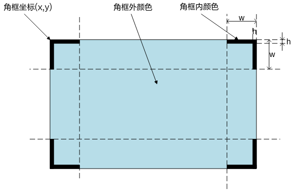
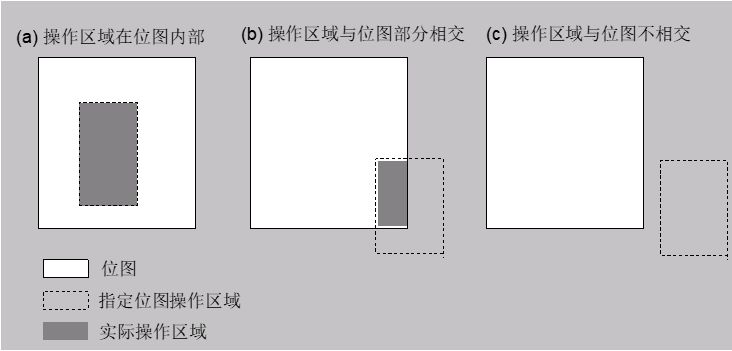
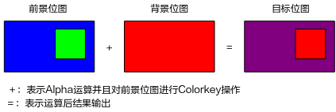
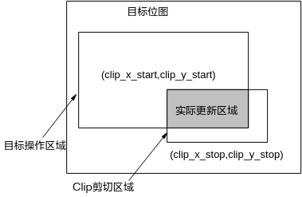
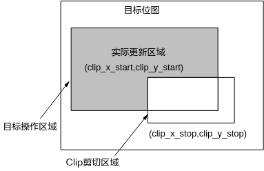
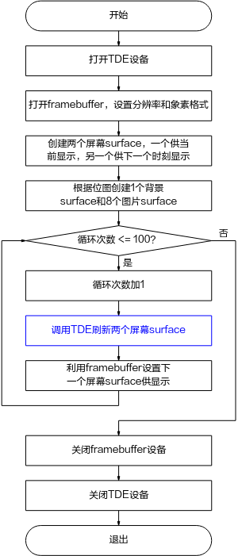
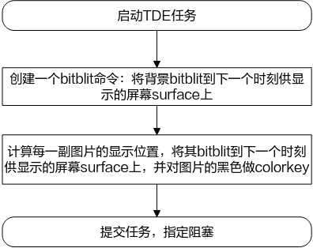

# 前言<a name="ZH-CN_TOPIC_0000002441678569"></a>

**概述<a name="section102mcpsimp"></a>**

本文档主要介绍TDE的API和数据类型以及Proc调试信息。

> **说明：** 
>-   本文以SS528V100为例，未有特殊说明，SS625V100、SS524V100、SS522V100、SS626V100与SS528V100内容一致；
>-   未有特殊说明，SS927V100与SS928V100内容一致。

**产品版本<a name="section105mcpsimp"></a>**

与本文档相对应的产品版本如下。

<a name="table108mcpsimp"></a>
<table><thead align="left"><tr id="row113mcpsimp"><th class="cellrowborder" valign="top" width="32%" id="mcps1.1.3.1.1"><p id="p115mcpsimp"><a name="p115mcpsimp"></a><a name="p115mcpsimp"></a>产品名称</p>
</th>
<th class="cellrowborder" valign="top" width="68%" id="mcps1.1.3.1.2"><p id="p117mcpsimp"><a name="p117mcpsimp"></a><a name="p117mcpsimp"></a>产品版本</p>
</th>
</tr>
</thead>
<tbody><tr id="row119mcpsimp"><td class="cellrowborder" valign="top" width="32%" headers="mcps1.1.3.1.1 "><p id="p121mcpsimp"><a name="p121mcpsimp"></a><a name="p121mcpsimp"></a>SS928</p>
</td>
<td class="cellrowborder" valign="top" width="68%" headers="mcps1.1.3.1.2 "><p id="p123mcpsimp"><a name="p123mcpsimp"></a><a name="p123mcpsimp"></a>V100</p>
</td>
</tr>
<tr id="row124mcpsimp"><td class="cellrowborder" valign="top" width="32%" headers="mcps1.1.3.1.1 "><p id="p126mcpsimp"><a name="p126mcpsimp"></a><a name="p126mcpsimp"></a>SS626</p>
</td>
<td class="cellrowborder" valign="top" width="68%" headers="mcps1.1.3.1.2 "><p id="p128mcpsimp"><a name="p128mcpsimp"></a><a name="p128mcpsimp"></a>V100</p>
</td>
</tr>
<tr id="row12175630191918"><td class="cellrowborder" valign="top" width="32%" headers="mcps1.1.3.1.1 "><p id="p881081984715"><a name="p881081984715"></a><a name="p881081984715"></a>SS524</p>
</td>
<td class="cellrowborder" valign="top" width="68%" headers="mcps1.1.3.1.2 "><p id="p34921898474"><a name="p34921898474"></a><a name="p34921898474"></a>V100</p>
</td>
</tr>
<tr id="row6539113711611"><td class="cellrowborder" valign="top" width="32%" headers="mcps1.1.3.1.1 "><p id="p653993731616"><a name="p653993731616"></a><a name="p653993731616"></a>SS522</p>
</td>
<td class="cellrowborder" valign="top" width="68%" headers="mcps1.1.3.1.2 "><p id="p25392377163"><a name="p25392377163"></a><a name="p25392377163"></a>V100</p>
</td>
</tr>
<tr id="row199441051135716"><td class="cellrowborder" valign="top" width="32%" headers="mcps1.1.3.1.1 "><p id="p175361749141815"><a name="p175361749141815"></a><a name="p175361749141815"></a>SS528</p>
</td>
<td class="cellrowborder" valign="top" width="68%" headers="mcps1.1.3.1.2 "><p id="p13835920181"><a name="p13835920181"></a><a name="p13835920181"></a>V100</p>
</td>
</tr>
<tr id="row66912387424"><td class="cellrowborder" valign="top" width="32%" headers="mcps1.1.3.1.1 "><p id="p769273818422"><a name="p769273818422"></a><a name="p769273818422"></a>SS625</p>
</td>
<td class="cellrowborder" valign="top" width="68%" headers="mcps1.1.3.1.2 "><p id="p17692193818426"><a name="p17692193818426"></a><a name="p17692193818426"></a>V100</p>
</td>
</tr>
<tr id="row3972248661"><td class="cellrowborder" valign="top" width="32%" headers="mcps1.1.3.1.1 "><p id="p8622349102117"><a name="p8622349102117"></a><a name="p8622349102117"></a>SS927</p>
</td>
<td class="cellrowborder" valign="top" width="68%" headers="mcps1.1.3.1.2 "><p id="p9185184311112"><a name="p9185184311112"></a><a name="p9185184311112"></a>V100</p>
</td>
</tr>
</tbody>
</table>

**读者对象<a name="section131mcpsimp"></a>**

本文档（本指南）主要适用于以下工程师：

-   技术支持工程师
-   软件开发工程师

**符号约定<a name="section137mcpsimp"></a>**

在本文中可能出现下列标志，它们所代表的含义如下。

<a name="table140mcpsimp"></a>
<table><thead align="left"><tr id="row145mcpsimp"><th class="cellrowborder" valign="top" width="18%" id="mcps1.1.3.1.1"><p id="p147mcpsimp"><a name="p147mcpsimp"></a><a name="p147mcpsimp"></a>符号</p>
</th>
<th class="cellrowborder" valign="top" width="82%" id="mcps1.1.3.1.2"><p id="p149mcpsimp"><a name="p149mcpsimp"></a><a name="p149mcpsimp"></a>说明</p>
</th>
</tr>
</thead>
<tbody><tr id="row151mcpsimp"><td class="cellrowborder" valign="top" width="18%" headers="mcps1.1.3.1.1 "><p class="msonormal" id="p153mcpsimp"><a name="p153mcpsimp"></a><a name="p153mcpsimp"></a><a name="image103"></a><a name="image103"></a><span></span></p>
</td>
<td class="cellrowborder" valign="top" width="82%" headers="mcps1.1.3.1.2 "><p id="p155mcpsimp"><a name="p155mcpsimp"></a><a name="p155mcpsimp"></a>表示如不避免则将会导致死亡或严重伤害的具有高等级风险的危害。</p>
</td>
</tr>
<tr id="row156mcpsimp"><td class="cellrowborder" valign="top" width="18%" headers="mcps1.1.3.1.1 "><p class="msonormal" id="p158mcpsimp"><a name="p158mcpsimp"></a><a name="p158mcpsimp"></a><a name="image104"></a><a name="image104"></a><span></span></p>
</td>
<td class="cellrowborder" valign="top" width="82%" headers="mcps1.1.3.1.2 "><p id="p160mcpsimp"><a name="p160mcpsimp"></a><a name="p160mcpsimp"></a>表示如不避免则可能导致死亡或严重伤害的具有中等级风险的危害。</p>
</td>
</tr>
<tr id="row161mcpsimp"><td class="cellrowborder" valign="top" width="18%" headers="mcps1.1.3.1.1 "><p class="msonormal" id="p163mcpsimp"><a name="p163mcpsimp"></a><a name="p163mcpsimp"></a><a name="image105"></a><a name="image105"></a><span></span></p>
</td>
<td class="cellrowborder" valign="top" width="82%" headers="mcps1.1.3.1.2 "><p id="p165mcpsimp"><a name="p165mcpsimp"></a><a name="p165mcpsimp"></a>表示如不避免则可能导致轻微或中度伤害的具有低等级风险的危害。</p>
</td>
</tr>
<tr id="row166mcpsimp"><td class="cellrowborder" valign="top" width="18%" headers="mcps1.1.3.1.1 "><p class="msonormal" id="p168mcpsimp"><a name="p168mcpsimp"></a><a name="p168mcpsimp"></a><a name="image106"></a><a name="image106"></a><span></span></p>
</td>
<td class="cellrowborder" valign="top" width="82%" headers="mcps1.1.3.1.2 "><p id="p170mcpsimp"><a name="p170mcpsimp"></a><a name="p170mcpsimp"></a>用于传递设备或环境安全警示信息。如不避免则可能会导致设备损坏、数据丢失、设备性能降低或其它不可预知的结果。</p>
<p id="p171mcpsimp"><a name="p171mcpsimp"></a><a name="p171mcpsimp"></a>“须知”不涉及人身伤害。</p>
</td>
</tr>
<tr id="row172mcpsimp"><td class="cellrowborder" valign="top" width="18%" headers="mcps1.1.3.1.1 "><p class="msonormal" id="p174mcpsimp"><a name="p174mcpsimp"></a><a name="p174mcpsimp"></a><a name="image107"></a><a name="image107"></a><span></span></p>
</td>
<td class="cellrowborder" valign="top" width="82%" headers="mcps1.1.3.1.2 "><p id="p176mcpsimp"><a name="p176mcpsimp"></a><a name="p176mcpsimp"></a>对正文中重点信息的补充说明。</p>
<p id="p177mcpsimp"><a name="p177mcpsimp"></a><a name="p177mcpsimp"></a>“说明”不是安全警示信息，不涉及人身、设备及环境伤害信息。</p>
</td>
</tr>
</tbody>
</table>

**修订记录<a name="section178mcpsimp"></a>**

修订记录累积了每次文档更新的说明。最新版本的文档包含以前所有文档版本的更新内容。

<a name="table1557726816410"></a>
<table><thead align="left"><tr id="row2942532716410"><th class="cellrowborder" valign="top" width="20.72%" id="mcps1.1.4.1.1"><p id="p3778275416410"><a name="p3778275416410"></a><a name="p3778275416410"></a><strong id="b5687322716410"><a name="b5687322716410"></a><a name="b5687322716410"></a>文档版本</strong></p>
</th>
<th class="cellrowborder" valign="top" width="26.119999999999997%" id="mcps1.1.4.1.2"><p id="p5627845516410"><a name="p5627845516410"></a><a name="p5627845516410"></a><strong id="b5800814916410"><a name="b5800814916410"></a><a name="b5800814916410"></a>发布日期</strong></p>
</th>
<th class="cellrowborder" valign="top" width="53.16%" id="mcps1.1.4.1.3"><p id="p2382284816410"><a name="p2382284816410"></a><a name="p2382284816410"></a><strong id="b3316380216410"><a name="b3316380216410"></a><a name="b3316380216410"></a>修改说明</strong></p>
</th>
</tr>
</thead>
<tbody><tr id="row5947359616410"><td class="cellrowborder" valign="top" width="20.72%" headers="mcps1.1.4.1.1 "><p id="p2149706016410"><a name="p2149706016410"></a><a name="p2149706016410"></a>00B01</p>
</td>
<td class="cellrowborder" valign="top" width="26.119999999999997%" headers="mcps1.1.4.1.2 "><p id="p648803616410"><a name="p648803616410"></a><a name="p648803616410"></a>2025-09-15</p>
</td>
<td class="cellrowborder" valign="top" width="53.16%" headers="mcps1.1.4.1.3 "><p id="p1946537916410"><a name="p1946537916410"></a><a name="p1946537916410"></a>第1次临时版本发布。</p>
</td>
</tr>
</tbody>
</table>

# 概述<a name="ZH-CN_TOPIC_0000002408279166"></a>


## 概述<a name="ZH-CN_TOPIC_0000002408119226"></a>

TDE（Two Dimensional Engine）利用硬件为OSD（On Screen Display）和GUI（Graphics User Interface）提供快速的图形绘制功能，主要有快速位图搬移、快速色彩填充、快速抗闪搬移、快速位图缩放、画点、画水平/垂直线、位图格式转换、位图alpha叠加、位图按位布尔运算、ColorKey操作。

## 模块加载<a name="ZH-CN_TOPIC_0000002441718473"></a>


### 加载的命令<a name="ZH-CN_TOPIC_0000002441678589"></a>

加载命令为insmod ssxx\_tde.ko参数。

### 参数<a name="ZH-CN_TOPIC_0000002441718437"></a>


#### 参数g\_is\_resize\_filter<a name="ZH-CN_TOPIC_0000002408279214"></a>

在接口[ss\_tde\_quick\_resize](#ZH-CN_TOPIC_0000002408119230)运行的过程当中，内部计算如果有需要做滤波会做滤波，而有些图片数据点不够导致Resize滤波后效果比较差，可以配置该参数为0，内部不做滤波。为1时开启滤波，在需要滤波时内部会有滤波操作。

#### 参数g\_max\_node\_num<a name="ZH-CN_TOPIC_0000002408279198"></a>

该参数决定TDE最大节点数。g\_max\_node\_num 默认值为200，最大值为500，最小值为2。当g\_max\_node\_num设置值大于最大值时，g\_max\_node\_num置为最大值，当g\_max\_node\_num设置值小于最小值时，g\_max\_node\_num置为最小值。内部会根据g\_max\_node\_num的值重新计算TDE实际使用的内存大小。

以SS528V100举例，使用方法如下：

-   insmod SS528V100\_tde.ko g\_max\_node\_num=1 异常测试（按最小值2配置）
-   insmod SS528V100\_tde.ko 默认测试 （按默认值200配置）
-   insmod SS528V100\_tde.ko g\_max\_node\_num=300正常测试（按设置值300配置）
-   insmod SS528V100\_tde.ko g\_max\_node\_num=600 异常测试 （按最大值500配置）
-   insmod SS528V100\_tde.ko g\_max\_node\_num=-1 异常测试 （报错加载ko失败）
-   insmod SS528V100\_tde.ko g\_max\_node\_num=a 异常测试（报错加载ko失败）

#### 参数g\_tde\_tmp\_buf<a name="ZH-CN_TOPIC_0000002441678557"></a>

该参数仅用于ss\_tde\_bitmap\_mask\_rop与ss\_tde\_bitmap\_mask\_blend接口，充当临时buffer，如需使用上述两接口则在加载ko时要配置参数g\_tde\_tmp\_buf的大小，大小配置为前景位图大小，例如：对于前景格式为ARGB8888分辨率大小为720\*576的图片则需要配置为：720\*576\*4= 1658880

#### 参数g\_rgb\_truncation\_mode<a name="ZH-CN_TOPIC_0000002408119254"></a>

该参数为rgb截位模式的参数，可配置成0或者是1。g\_rgb\_truncation\_mode默认为1，表示内部采用一种抖动的算法处理数据；g\_rgb\_truncation\_mode配成0时，表示内部使用四舍五入的方式处理数据。备注：如果配成1时，有网格的效果，可将该参数配成0。最终参数的使用根据所需要的效果确定。

## 参考域说明<a name="ZH-CN_TOPIC_0000002408279174"></a>


### API参考域<a name="ZH-CN_TOPIC_0000002408119210"></a>

本手册使用9个参考域描述API的相关信息，它们的作用如[表1](#_Ref177443220)所示。

**表 1**  API参考域说明

<a name="_Ref177443220"></a>
<table><thead align="left"><tr id="row219mcpsimp"><th class="cellrowborder" valign="top" width="27%" id="mcps1.2.3.1.1"><p id="p221mcpsimp"><a name="p221mcpsimp"></a><a name="p221mcpsimp"></a>参考域</p>
</th>
<th class="cellrowborder" valign="top" width="73%" id="mcps1.2.3.1.2"><p id="p223mcpsimp"><a name="p223mcpsimp"></a><a name="p223mcpsimp"></a>含义</p>
</th>
</tr>
</thead>
<tbody><tr id="row225mcpsimp"><td class="cellrowborder" valign="top" width="27%" headers="mcps1.2.3.1.1 "><p id="p227mcpsimp"><a name="p227mcpsimp"></a><a name="p227mcpsimp"></a>目的</p>
</td>
<td class="cellrowborder" valign="top" width="73%" headers="mcps1.2.3.1.2 "><p id="p229mcpsimp"><a name="p229mcpsimp"></a><a name="p229mcpsimp"></a>简要描述API的主要功能。</p>
</td>
</tr>
<tr id="row230mcpsimp"><td class="cellrowborder" valign="top" width="27%" headers="mcps1.2.3.1.1 "><p id="p232mcpsimp"><a name="p232mcpsimp"></a><a name="p232mcpsimp"></a>语法</p>
</td>
<td class="cellrowborder" valign="top" width="73%" headers="mcps1.2.3.1.2 "><p id="p234mcpsimp"><a name="p234mcpsimp"></a><a name="p234mcpsimp"></a>列出调用API应包括的头文件以及API的原型声明。</p>
</td>
</tr>
<tr id="row235mcpsimp"><td class="cellrowborder" valign="top" width="27%" headers="mcps1.2.3.1.1 "><p id="p237mcpsimp"><a name="p237mcpsimp"></a><a name="p237mcpsimp"></a>参数</p>
</td>
<td class="cellrowborder" valign="top" width="73%" headers="mcps1.2.3.1.2 "><p id="p239mcpsimp"><a name="p239mcpsimp"></a><a name="p239mcpsimp"></a>列出API的参数、参数说明及参数属性。</p>
</td>
</tr>
<tr id="row240mcpsimp"><td class="cellrowborder" valign="top" width="27%" headers="mcps1.2.3.1.1 "><p id="p242mcpsimp"><a name="p242mcpsimp"></a><a name="p242mcpsimp"></a>描述</p>
</td>
<td class="cellrowborder" valign="top" width="73%" headers="mcps1.2.3.1.2 "><p id="p244mcpsimp"><a name="p244mcpsimp"></a><a name="p244mcpsimp"></a>简要描述API的工作过程。</p>
</td>
</tr>
<tr id="row245mcpsimp"><td class="cellrowborder" valign="top" width="27%" headers="mcps1.2.3.1.1 "><p id="p247mcpsimp"><a name="p247mcpsimp"></a><a name="p247mcpsimp"></a>返回值</p>
</td>
<td class="cellrowborder" valign="top" width="73%" headers="mcps1.2.3.1.2 "><p id="p249mcpsimp"><a name="p249mcpsimp"></a><a name="p249mcpsimp"></a>列出API所有可能的返回值及其含义。</p>
</td>
</tr>
<tr id="row250mcpsimp"><td class="cellrowborder" valign="top" width="27%" headers="mcps1.2.3.1.1 "><p id="p252mcpsimp"><a name="p252mcpsimp"></a><a name="p252mcpsimp"></a>需求</p>
</td>
<td class="cellrowborder" valign="top" width="73%" headers="mcps1.2.3.1.2 "><p id="p254mcpsimp"><a name="p254mcpsimp"></a><a name="p254mcpsimp"></a>列出API包含的头文件和API编译时要链接的库文件。</p>
</td>
</tr>
<tr id="row255mcpsimp"><td class="cellrowborder" valign="top" width="27%" headers="mcps1.2.3.1.1 "><p id="p257mcpsimp"><a name="p257mcpsimp"></a><a name="p257mcpsimp"></a>注意</p>
</td>
<td class="cellrowborder" valign="top" width="73%" headers="mcps1.2.3.1.2 "><p id="p259mcpsimp"><a name="p259mcpsimp"></a><a name="p259mcpsimp"></a>列出使用API时应注意的事项。</p>
</td>
</tr>
<tr id="row260mcpsimp"><td class="cellrowborder" valign="top" width="27%" headers="mcps1.2.3.1.1 "><p id="p262mcpsimp"><a name="p262mcpsimp"></a><a name="p262mcpsimp"></a>举例</p>
</td>
<td class="cellrowborder" valign="top" width="73%" headers="mcps1.2.3.1.2 "><p id="p264mcpsimp"><a name="p264mcpsimp"></a><a name="p264mcpsimp"></a>列出使用API的实例。</p>
</td>
</tr>
<tr id="row265mcpsimp"><td class="cellrowborder" valign="top" width="27%" headers="mcps1.2.3.1.1 "><p id="p267mcpsimp"><a name="p267mcpsimp"></a><a name="p267mcpsimp"></a>相关接口</p>
</td>
<td class="cellrowborder" valign="top" width="73%" headers="mcps1.2.3.1.2 "><p id="p269mcpsimp"><a name="p269mcpsimp"></a><a name="p269mcpsimp"></a>列出与本API相关联的其他接口。</p>
</td>
</tr>
</tbody>
</table>

### 数据类型参考域<a name="ZH-CN_TOPIC_0000002408119290"></a>

本手册使用5个参考域描述数据类型的相关信息，它们的作用如[表1](#_Ref177443225)所示。

**表 1**  数据类型参考域说明

<a name="_Ref177443225"></a>
<table><thead align="left"><tr id="row278mcpsimp"><th class="cellrowborder" valign="top" width="27%" id="mcps1.2.3.1.1"><p id="p280mcpsimp"><a name="p280mcpsimp"></a><a name="p280mcpsimp"></a>参考域</p>
</th>
<th class="cellrowborder" valign="top" width="73%" id="mcps1.2.3.1.2"><p id="p282mcpsimp"><a name="p282mcpsimp"></a><a name="p282mcpsimp"></a>含义</p>
</th>
</tr>
</thead>
<tbody><tr id="row284mcpsimp"><td class="cellrowborder" valign="top" width="27%" headers="mcps1.2.3.1.1 "><p id="p286mcpsimp"><a name="p286mcpsimp"></a><a name="p286mcpsimp"></a>说明</p>
</td>
<td class="cellrowborder" valign="top" width="73%" headers="mcps1.2.3.1.2 "><p id="p288mcpsimp"><a name="p288mcpsimp"></a><a name="p288mcpsimp"></a>简要描述数据类型的主要功能。</p>
</td>
</tr>
<tr id="row289mcpsimp"><td class="cellrowborder" valign="top" width="27%" headers="mcps1.2.3.1.1 "><p id="p291mcpsimp"><a name="p291mcpsimp"></a><a name="p291mcpsimp"></a>定义</p>
</td>
<td class="cellrowborder" valign="top" width="73%" headers="mcps1.2.3.1.2 "><p id="p293mcpsimp"><a name="p293mcpsimp"></a><a name="p293mcpsimp"></a>列出数据类型的定义语句。</p>
</td>
</tr>
<tr id="row294mcpsimp"><td class="cellrowborder" valign="top" width="27%" headers="mcps1.2.3.1.1 "><p id="p296mcpsimp"><a name="p296mcpsimp"></a><a name="p296mcpsimp"></a>成员</p>
</td>
<td class="cellrowborder" valign="top" width="73%" headers="mcps1.2.3.1.2 "><p id="p298mcpsimp"><a name="p298mcpsimp"></a><a name="p298mcpsimp"></a>列出数据结构的成员及含义。</p>
</td>
</tr>
<tr id="row299mcpsimp"><td class="cellrowborder" valign="top" width="27%" headers="mcps1.2.3.1.1 "><p id="p301mcpsimp"><a name="p301mcpsimp"></a><a name="p301mcpsimp"></a>注意事项</p>
</td>
<td class="cellrowborder" valign="top" width="73%" headers="mcps1.2.3.1.2 "><p id="p303mcpsimp"><a name="p303mcpsimp"></a><a name="p303mcpsimp"></a>列出使用数据类型时应注意的事项。</p>
</td>
</tr>
<tr id="row304mcpsimp"><td class="cellrowborder" valign="top" width="27%" headers="mcps1.2.3.1.1 "><p id="p306mcpsimp"><a name="p306mcpsimp"></a><a name="p306mcpsimp"></a>相关数据类型和接口</p>
</td>
<td class="cellrowborder" valign="top" width="73%" headers="mcps1.2.3.1.2 "><p id="p308mcpsimp"><a name="p308mcpsimp"></a><a name="p308mcpsimp"></a>列出与本数据类型相关联的其他数据类型和接口。</p>
</td>
</tr>
</tbody>
</table>

# API参考<a name="ZH-CN_TOPIC_0000002408119282"></a>


## API概述<a name="ZH-CN_TOPIC_0000002408119214"></a>

TDE（Two Dimension Engine）功能函数参考提供2D加速相关操作。

该功能模块提供以下API：

-   [ss\_tde\_open](#ZH-CN_TOPIC_0000002408119258)：打开TDE设备。
-   [ss\_tde\_close](#ZH-CN_TOPIC_0000002441718445)：关闭TDE设备。
-   [ss\_tde\_begin\_job](#ZH-CN_TOPIC_0000002408279190)：创建1个TDE任务。
-   [ss\_tde\_end\_job](#ZH-CN_TOPIC_0000002408279158)：提交添加操作完成的TDE任务。
-   [ss\_tde\_cancel\_job](#ZH-CN_TOPIC_0000002408119222)：取消指定的TDE任务。
-   [ss\_tde\_wait\_for\_done](#ZH-CN_TOPIC_0000002408279142)：等待指定的TDE任务完成。
-   [ss\_tde\_wait\_all\_done](#ZH-CN_TOPIC_0000002408279162)：等待TDE的所有任务完成。
-   [ss\_tde\_reset](#ZH-CN_TOPIC_0000002441678533)：复位TDE所有状态。
-   [ss\_tde\_quick\_fill](#ZH-CN_TOPIC_0000002408279206)：向任务中添加快速填充操作。
-   [ss\_tde\_quick\_draw\_rect](#ZH-CN_TOPIC_0000002408279218)：向任务中添加绘制角框操作。
-   [ss\_tde\_draw\_multi\_rect](#ZH-CN_TOPIC_0000002408119278)：向任务中添加绘制复数角框操作。
-   [ss\_tde\_draw\_line](#ZH-CN_TOPIC_0000002408119246)：向任务中添加绘制线条\(含直线、斜线\)操作。
-   [ss\_tde\_quick\_copy](#ZH-CN_TOPIC_0000002441718413)：向任务中添加快速拷贝操作。
-   [ss\_tde\_quick\_resize](#ZH-CN_TOPIC_0000002408119230)：向任务中添加光栅位图缩放操作。
-   [ss\_tde\_quick\_deflicker](#ZH-CN_TOPIC_0000002408119250)：向任务中添加光栅位图抗闪烁操作。
-   [ss\_tde\_solid\_draw](#ZH-CN_TOPIC_0000002408119234)：向任务中添加对光栅位图进行有附加操作的填充搬移操作。
-   [ss\_tde\_rotate](#ZH-CN_TOPIC_0000002408279222)：向任务中添加对光栅位图的旋转操作。
-   [ss\_tde\_bit\_blit](#ZH-CN_TOPIC_0000002408279150)：向任务中添加对光栅位图进行有附加功能的搬移操作。
-   [ss\_tde\_pattern\_fill](#ZH-CN_TOPIC_0000002408119294)：模式填充。
-   [ss\_tde\_mb\_blit](#ZH-CN_TOPIC_0000002441678577)：向任务中添加对宏块位图进行有附加功能的搬移操作。
-   [ss\_tde\_bitmap\_mask\_rop](#ZH-CN_TOPIC_0000002408279186)：向任务中添加对光栅位图进行Mask Rop搬移操作。
-   [ss\_tde\_bitmap\_mask\_blend](#ZH-CN_TOPIC_0000002408279178)：向任务中添加对光栅位图进行Mask Blend搬移操作。
-   [ss\_tde\_get\_deflicker\_level](#ZH-CN_TOPIC_0000002408119266)：获取抗闪烁级别。
-   [ss\_tde\_set\_deflicker\_level](#ZH-CN_TOPIC_0000002441718425)：设置抗闪烁级别。
-   [ss\_tde\_get\_alpha\_threshold\_value](#ZH-CN_TOPIC_0000002408279154)：获取alpha判决阈值。
-   [ss\_tde\_set\_alpha\_threshold\_value](#ZH-CN_TOPIC_0000002441678553)：设置alpha判决阈值。
-   [ss\_tde\_get\_alpha\_threshold\_state](#ZH-CN_TOPIC_0000002441718401)：获取alpha判决开关。
-   [ss\_tde\_set\_alpha\_threshold\_state](#ZH-CN_TOPIC_0000002408279210)：设置alpha判决开关。
-   [ss\_tde\_enable\_rgn\_deflicker](#ZH-CN_TOPIC_0000002408119274)：使能/去使能局部抗闪烁。

## 功能函数参考<a name="ZH-CN_TOPIC_0000002408119286"></a>


### ss\_tde\_open<a name="ZH-CN_TOPIC_0000002408119258"></a>

【目的】

打开TDE设备。

【语法】

```
td_s32 ss_tde_open(td_void);
```

【描述】

调用此接口打开TDE设备。

【参数】

无。

【返回值】

<a name="table6654mcpsimp"></a>
<table><thead align="left"><tr id="row6659mcpsimp"><th class="cellrowborder" valign="top" width="22%" id="mcps1.1.3.1.1"><p id="p6661mcpsimp"><a name="p6661mcpsimp"></a><a name="p6661mcpsimp"></a>返回值</p>
</th>
<th class="cellrowborder" valign="top" width="78%" id="mcps1.1.3.1.2"><p id="p6663mcpsimp"><a name="p6663mcpsimp"></a><a name="p6663mcpsimp"></a>描述</p>
</th>
</tr>
</thead>
<tbody><tr id="row6665mcpsimp"><td class="cellrowborder" valign="top" width="22%" headers="mcps1.1.3.1.1 "><p id="p6667mcpsimp"><a name="p6667mcpsimp"></a><a name="p6667mcpsimp"></a>0</p>
</td>
<td class="cellrowborder" valign="top" width="78%" headers="mcps1.1.3.1.2 "><p id="p6669mcpsimp"><a name="p6669mcpsimp"></a><a name="p6669mcpsimp"></a>成功。</p>
</td>
</tr>
<tr id="row6670mcpsimp"><td class="cellrowborder" valign="top" width="22%" headers="mcps1.1.3.1.1 "><p id="p6672mcpsimp"><a name="p6672mcpsimp"></a><a name="p6672mcpsimp"></a>非0</p>
</td>
<td class="cellrowborder" valign="top" width="78%" headers="mcps1.1.3.1.2 "><p id="p6674mcpsimp"><a name="p6674mcpsimp"></a><a name="p6674mcpsimp"></a>失败，其值为<a href="#ZH-CN_TOPIC_0000002408279226">错误码</a>。</p>
</td>
</tr>
</tbody>
</table>

【错误码】

<a name="table6677mcpsimp"></a>
<table><thead align="left"><tr id="row6682mcpsimp"><th class="cellrowborder" valign="top" width="52%" id="mcps1.1.3.1.1"><p id="p6684mcpsimp"><a name="p6684mcpsimp"></a><a name="p6684mcpsimp"></a>接口返回值</p>
</th>
<th class="cellrowborder" valign="top" width="48%" id="mcps1.1.3.1.2"><p id="p6686mcpsimp"><a name="p6686mcpsimp"></a><a name="p6686mcpsimp"></a>含义</p>
</th>
</tr>
</thead>
<tbody><tr id="row6688mcpsimp"><td class="cellrowborder" valign="top" width="52%" headers="mcps1.1.3.1.1 "><p id="p6690mcpsimp"><a name="p6690mcpsimp"></a><a name="p6690mcpsimp"></a>TD_SUCCESS</p>
</td>
<td class="cellrowborder" valign="top" width="48%" headers="mcps1.1.3.1.2 "><p id="p6692mcpsimp"><a name="p6692mcpsimp"></a><a name="p6692mcpsimp"></a>成功。</p>
</td>
</tr>
<tr id="row6693mcpsimp"><td class="cellrowborder" valign="top" width="52%" headers="mcps1.1.3.1.1 "><p id="p6695mcpsimp"><a name="p6695mcpsimp"></a><a name="p6695mcpsimp"></a>OT_ERR_TDE_DEV_OPEN_FAILED</p>
</td>
<td class="cellrowborder" valign="top" width="48%" headers="mcps1.1.3.1.2 "><p id="p6698mcpsimp"><a name="p6698mcpsimp"></a><a name="p6698mcpsimp"></a>开启TDE设备失败。</p>
</td>
</tr>
</tbody>
</table>

【需求】

-   头文件：ss\_mpi\_tde.h
-   库文件：libss\_tde.a

【注意】

-   在进行TDE相关操作前应该首先调用此接口，保证TDE设备处于打开状态。
-   TDE设备允许多进程重复打开。

【举例】

```
/*declaration*/
td_s32 ret = 0;
 
/* open TDE device*/
ret = ss_tde_open ();
if (ret != TD_SUCCESS) {
         return -1;
}
/* close TDE device*/
ss_tde_close ();
```

### ss\_tde\_close<a name="ZH-CN_TOPIC_0000002441718445"></a>

【目的】

关闭TDE设备。

【语法】

```
td_void ss_tde_close(td_void);
```

【描述】

调用此接口关闭TDE设备。

【参数】

无。

【返回值】

无。

【错误码】

无。

【需求】

-   头文件：ss\_mpi\_tde.h
-   库文件：libss\_tde.a

【注意】

调用[ss\_tde\_open](#ZH-CN_TOPIC_0000002408119258)与ss\_tde\_close的次数需要对应。

【举例】

无。

### ss\_tde\_begin\_job<a name="ZH-CN_TOPIC_0000002408279190"></a>

【目的】

创建1个TDE任务。

【语法】

```
td_s32 ss_tde_begin_job(td_void);
```

【描述】

调用此接口创建1个TDE任务（Job）。TDE以任务的形式管理TDE命令：1个TDE任务是一系列TDE命令的集合，它可以包含1个或多个TDE操作；一个TDE命令对应一个TDE操作；成功创建TDE任务添加完TDE操作后，通过[ss\_tde\_end\_job](#ZH-CN_TOPIC_0000002408279158)提交该Job；同一任务中的TDE命令是顺序执行。

【参数】

无。

【返回值】

<a name="table6751mcpsimp"></a>
<table><thead align="left"><tr id="row6756mcpsimp"><th class="cellrowborder" valign="top" width="23%" id="mcps1.1.3.1.1"><p id="p6758mcpsimp"><a name="p6758mcpsimp"></a><a name="p6758mcpsimp"></a>返回值</p>
</th>
<th class="cellrowborder" valign="top" width="77%" id="mcps1.1.3.1.2"><p id="p6760mcpsimp"><a name="p6760mcpsimp"></a><a name="p6760mcpsimp"></a>描述</p>
</th>
</tr>
</thead>
<tbody><tr id="row6762mcpsimp"><td class="cellrowborder" valign="top" width="23%" headers="mcps1.1.3.1.1 "><p id="p6764mcpsimp"><a name="p6764mcpsimp"></a><a name="p6764mcpsimp"></a>句柄</p>
</td>
<td class="cellrowborder" valign="top" width="77%" headers="mcps1.1.3.1.2 "><p id="p6766mcpsimp"><a name="p6766mcpsimp"></a><a name="p6766mcpsimp"></a>成功。</p>
</td>
</tr>
<tr id="row6767mcpsimp"><td class="cellrowborder" valign="top" width="23%" headers="mcps1.1.3.1.1 "><p id="p6769mcpsimp"><a name="p6769mcpsimp"></a><a name="p6769mcpsimp"></a>错误码</p>
</td>
<td class="cellrowborder" valign="top" width="77%" headers="mcps1.1.3.1.2 "><p id="p6771mcpsimp"><a name="p6771mcpsimp"></a><a name="p6771mcpsimp"></a>失败，其值为<a href="#ZH-CN_TOPIC_0000002408279226">错误码</a>。</p>
</td>
</tr>
</tbody>
</table>

【错误码】

<a name="table6774mcpsimp"></a>
<table><thead align="left"><tr id="row6779mcpsimp"><th class="cellrowborder" valign="top" width="47%" id="mcps1.1.3.1.1"><p id="p6781mcpsimp"><a name="p6781mcpsimp"></a><a name="p6781mcpsimp"></a>接口返回值</p>
</th>
<th class="cellrowborder" valign="top" width="53%" id="mcps1.1.3.1.2"><p id="p6783mcpsimp"><a name="p6783mcpsimp"></a><a name="p6783mcpsimp"></a>含义</p>
</th>
</tr>
</thead>
<tbody><tr id="row6785mcpsimp"><td class="cellrowborder" valign="top" width="47%" headers="mcps1.1.3.1.1 "><p id="p6787mcpsimp"><a name="p6787mcpsimp"></a><a name="p6787mcpsimp"></a>OT_ERR_TDE_DEV_NOT_OPEN</p>
</td>
<td class="cellrowborder" valign="top" width="53%" headers="mcps1.1.3.1.2 "><p id="p6789mcpsimp"><a name="p6789mcpsimp"></a><a name="p6789mcpsimp"></a>TDE设备未打开，API调用失败。</p>
</td>
</tr>
<tr id="row6790mcpsimp"><td class="cellrowborder" valign="top" width="47%" headers="mcps1.1.3.1.1 "><p xml:lang="da-DK" id="p6792mcpsimp"><a name="p6792mcpsimp"></a><a name="p6792mcpsimp"></a>OT_ERR_TDE_INVALID_HANDLE</p>
</td>
<td class="cellrowborder" valign="top" width="53%" headers="mcps1.1.3.1.2 "><p id="p6794mcpsimp"><a name="p6794mcpsimp"></a><a name="p6794mcpsimp"></a>无效的任务句柄。</p>
</td>
</tr>
<tr id="row6795mcpsimp"><td class="cellrowborder" valign="top" width="47%" headers="mcps1.1.3.1.1 "><p id="p6797mcpsimp"><a name="p6797mcpsimp"></a><a name="p6797mcpsimp"></a>OT_ERR_TDE_NO_MEM</p>
</td>
<td class="cellrowborder" valign="top" width="53%" headers="mcps1.1.3.1.2 "><p id="p6799mcpsimp"><a name="p6799mcpsimp"></a><a name="p6799mcpsimp"></a>内存不足。</p>
</td>
</tr>
</tbody>
</table>

【需求】

-   头文件：ss\_mpi\_tde.h
-   库文件：libss\_tde.a

【注意】

-   在调用此接口前应确保TDE设备处于打开状态。
-   应判断返回值，确保获得1个正确的任务句柄。
-   TDE能够缓存的任务数由TDE的内存大小决定，当内存不够时会出现分配任务失败的情况，建议任务数最多不要超过200。
-   ss\_tde\_begin\_job必须和[ss\_tde\_end\_job](#ZH-CN_TOPIC_0000002408279158)配套使用，否则会造成内存泄漏。

【举例】

```
/* declaration */
    td_s32  ret;
    td_s32 handle;
 
    /* create a TDE job */
    handle = ss_tde_begin_job ();
    if(handle == OT_ERR_TDE_INVALID_HANDLE || handle  == OT_ERR_TDE_DEV_NOT_OPEN) {
        return -1;
    }
 
    /* submit the job */
    ret = ss_tde_end_job (handle, TD_FALSE, TD_TRUE, 20);
    if(ret != TD_SUCCESS) {
        return -1;
}
```

### ss\_tde\_end\_job<a name="ZH-CN_TOPIC_0000002408279158"></a>

【目的】

提交已创建的TDE任务。

【语法】

```
td_s32 ss_tde_end_job(td_s32 handle, td_bool is_sync, td_bool is_block, td_u32 time_out);
```

【描述】

调用此接口提交1个TDE任务。可以指定为阻塞还是非阻塞，阻塞时可以设置超时时间。

-   阻塞

    指该函数调用不会立刻返回，只有在以下情况下才会返回：

    -   TDE任务中的命令都完成
    -   等待超时
    -   等待被打断

-   非阻塞

    指该函数调用会立刻返回，而不关心TDE任务中的命令是否已经完成。

阻塞时可以设置一个最长等待时间，如果等待时间到了，TDE任务中的命令还没有完成，函数就会提前返回，但是任务中的命令还是会在未来的某个时刻完成。

【参数】

<a name="table6843mcpsimp"></a>
<table><thead align="left"><tr id="row6849mcpsimp"><th class="cellrowborder" valign="top" width="21.000000000000004%" id="mcps1.1.4.1.1"><p id="p6851mcpsimp"><a name="p6851mcpsimp"></a><a name="p6851mcpsimp"></a>参数名称</p>
</th>
<th class="cellrowborder" valign="top" width="58.00000000000001%" id="mcps1.1.4.1.2"><p id="p6853mcpsimp"><a name="p6853mcpsimp"></a><a name="p6853mcpsimp"></a>描述</p>
</th>
<th class="cellrowborder" valign="top" width="21.000000000000004%" id="mcps1.1.4.1.3"><p id="p6855mcpsimp"><a name="p6855mcpsimp"></a><a name="p6855mcpsimp"></a>输入/输出</p>
</th>
</tr>
</thead>
<tbody><tr id="row6857mcpsimp"><td class="cellrowborder" valign="top" width="21.000000000000004%" headers="mcps1.1.4.1.1 "><p id="p6859mcpsimp"><a name="p6859mcpsimp"></a><a name="p6859mcpsimp"></a>handle</p>
</td>
<td class="cellrowborder" valign="top" width="58.00000000000001%" headers="mcps1.1.4.1.2 "><p id="p6861mcpsimp"><a name="p6861mcpsimp"></a><a name="p6861mcpsimp"></a>TDE任务句柄。</p>
</td>
<td class="cellrowborder" valign="top" width="21.000000000000004%" headers="mcps1.1.4.1.3 "><p id="p6863mcpsimp"><a name="p6863mcpsimp"></a><a name="p6863mcpsimp"></a>输入</p>
</td>
</tr>
<tr id="row6864mcpsimp"><td class="cellrowborder" valign="top" width="21.000000000000004%" headers="mcps1.1.4.1.1 "><p id="p6866mcpsimp"><a name="p6866mcpsimp"></a><a name="p6866mcpsimp"></a>is_sync</p>
</td>
<td class="cellrowborder" valign="top" width="58.00000000000001%" headers="mcps1.1.4.1.2 "><p id="p6868mcpsimp"><a name="p6868mcpsimp"></a><a name="p6868mcpsimp"></a>保留参数，暂不使用。</p>
</td>
<td class="cellrowborder" valign="top" width="21.000000000000004%" headers="mcps1.1.4.1.3 "><p id="p6870mcpsimp"><a name="p6870mcpsimp"></a><a name="p6870mcpsimp"></a>输入</p>
</td>
</tr>
<tr id="row6871mcpsimp"><td class="cellrowborder" valign="top" width="21.000000000000004%" headers="mcps1.1.4.1.1 "><p id="p6873mcpsimp"><a name="p6873mcpsimp"></a><a name="p6873mcpsimp"></a>is_block</p>
</td>
<td class="cellrowborder" valign="top" width="58.00000000000001%" headers="mcps1.1.4.1.2 "><p id="p6875mcpsimp"><a name="p6875mcpsimp"></a><a name="p6875mcpsimp"></a>阻塞标志。</p>
<p xml:lang="de-DE" id="p6876mcpsimp"><a name="p6876mcpsimp"></a><a name="p6876mcpsimp"></a>TD_TRUE：<span xml:lang="en-US" id="ph6877mcpsimp"><a name="ph6877mcpsimp"></a><a name="ph6877mcpsimp"></a>阻塞。</span></p>
<p xml:lang="de-DE" id="p6878mcpsimp"><a name="p6878mcpsimp"></a><a name="p6878mcpsimp"></a>TD_FALSE：<span xml:lang="en-US" id="ph6879mcpsimp"><a name="ph6879mcpsimp"></a><a name="ph6879mcpsimp"></a>非阻塞。</span></p>
</td>
<td class="cellrowborder" valign="top" width="21.000000000000004%" headers="mcps1.1.4.1.3 "><p id="p6881mcpsimp"><a name="p6881mcpsimp"></a><a name="p6881mcpsimp"></a>输入</p>
</td>
</tr>
<tr id="row6882mcpsimp"><td class="cellrowborder" valign="top" width="21.000000000000004%" headers="mcps1.1.4.1.1 "><p id="p6884mcpsimp"><a name="p6884mcpsimp"></a><a name="p6884mcpsimp"></a>time_out</p>
</td>
<td class="cellrowborder" valign="top" width="58.00000000000001%" headers="mcps1.1.4.1.2 "><p id="p6886mcpsimp"><a name="p6886mcpsimp"></a><a name="p6886mcpsimp"></a>超时时间，单位：ms。</p>
</td>
<td class="cellrowborder" valign="top" width="21.000000000000004%" headers="mcps1.1.4.1.3 "><p id="p6888mcpsimp"><a name="p6888mcpsimp"></a><a name="p6888mcpsimp"></a>输入</p>
</td>
</tr>
</tbody>
</table>

【返回值】

<a name="table6890mcpsimp"></a>
<table><thead align="left"><tr id="row6895mcpsimp"><th class="cellrowborder" valign="top" width="12%" id="mcps1.1.3.1.1"><p id="p6897mcpsimp"><a name="p6897mcpsimp"></a><a name="p6897mcpsimp"></a>返回值</p>
</th>
<th class="cellrowborder" valign="top" width="88%" id="mcps1.1.3.1.2"><p id="p6899mcpsimp"><a name="p6899mcpsimp"></a><a name="p6899mcpsimp"></a>描述</p>
</th>
</tr>
</thead>
<tbody><tr id="row6901mcpsimp"><td class="cellrowborder" valign="top" width="12%" headers="mcps1.1.3.1.1 "><p id="p6903mcpsimp"><a name="p6903mcpsimp"></a><a name="p6903mcpsimp"></a>0</p>
</td>
<td class="cellrowborder" valign="top" width="88%" headers="mcps1.1.3.1.2 "><p id="p6905mcpsimp"><a name="p6905mcpsimp"></a><a name="p6905mcpsimp"></a>成功。</p>
</td>
</tr>
<tr id="row6906mcpsimp"><td class="cellrowborder" valign="top" width="12%" headers="mcps1.1.3.1.1 "><p id="p6908mcpsimp"><a name="p6908mcpsimp"></a><a name="p6908mcpsimp"></a>非0</p>
</td>
<td class="cellrowborder" valign="top" width="88%" headers="mcps1.1.3.1.2 "><p id="p6910mcpsimp"><a name="p6910mcpsimp"></a><a name="p6910mcpsimp"></a>失败，其值为<a href="#ZH-CN_TOPIC_0000002408279226">错误码</a>。</p>
</td>
</tr>
</tbody>
</table>

【错误码】

<a name="table6913mcpsimp"></a>
<table><thead align="left"><tr id="row6918mcpsimp"><th class="cellrowborder" valign="top" width="59%" id="mcps1.1.3.1.1"><p id="p6920mcpsimp"><a name="p6920mcpsimp"></a><a name="p6920mcpsimp"></a>返回值</p>
</th>
<th class="cellrowborder" valign="top" width="41%" id="mcps1.1.3.1.2"><p id="p6922mcpsimp"><a name="p6922mcpsimp"></a><a name="p6922mcpsimp"></a>描述</p>
</th>
</tr>
</thead>
<tbody><tr id="row6924mcpsimp"><td class="cellrowborder" valign="top" width="59%" headers="mcps1.1.3.1.1 "><p id="p6926mcpsimp"><a name="p6926mcpsimp"></a><a name="p6926mcpsimp"></a>TD_SUCCESS</p>
</td>
<td class="cellrowborder" valign="top" width="41%" headers="mcps1.1.3.1.2 "><p id="p6928mcpsimp"><a name="p6928mcpsimp"></a><a name="p6928mcpsimp"></a>任务提交成功。</p>
<a name="ul6929mcpsimp"></a><a name="ul6929mcpsimp"></a><ul id="ul6929mcpsimp"><li>阻塞任务：任务中的所有TDE命令已经完成。</li><li>非阻塞任务：任务中的所有TDE命令都已经提交成功。</li></ul>
</td>
</tr>
<tr id="row6937mcpsimp"><td class="cellrowborder" valign="top" width="59%" headers="mcps1.1.3.1.1 "><p xml:lang="fr-FR" id="p6939mcpsimp"><a name="p6939mcpsimp"></a><a name="p6939mcpsimp"></a>OT_ERR_TDE_JOB_TIMEOUT</p>
</td>
<td class="cellrowborder" valign="top" width="41%" headers="mcps1.1.3.1.2 "><p xml:lang="de-DE" id="p6941mcpsimp"><a name="p6941mcpsimp"></a><a name="p6941mcpsimp"></a>等待超时。</p>
</td>
</tr>
<tr id="row6942mcpsimp"><td class="cellrowborder" valign="top" width="59%" headers="mcps1.1.3.1.1 "><p id="p6944mcpsimp"><a name="p6944mcpsimp"></a><a name="p6944mcpsimp"></a>OT_ERR_TDE_INTERRUPT</p>
</td>
<td class="cellrowborder" valign="top" width="41%" headers="mcps1.1.3.1.2 "><p xml:lang="de-DE" id="p6946mcpsimp"><a name="p6946mcpsimp"></a><a name="p6946mcpsimp"></a>等待任务完成被打断。</p>
</td>
</tr>
<tr id="row6947mcpsimp"><td class="cellrowborder" valign="top" width="59%" headers="mcps1.1.3.1.1 "><p xml:lang="fr-FR" id="p6949mcpsimp"><a name="p6949mcpsimp"></a><a name="p6949mcpsimp"></a>OT_ERR_TDE_DEV_NOT_OPEN</p>
</td>
<td class="cellrowborder" valign="top" width="41%" headers="mcps1.1.3.1.2 "><p id="p6951mcpsimp"><a name="p6951mcpsimp"></a><a name="p6951mcpsimp"></a>TDE设备未打开，API调用失败。</p>
</td>
</tr>
<tr id="row6952mcpsimp"><td class="cellrowborder" valign="top" width="59%" headers="mcps1.1.3.1.1 "><p xml:lang="fr-FR" id="p6954mcpsimp"><a name="p6954mcpsimp"></a><a name="p6954mcpsimp"></a>OT_ERR_TDE_INVALID_PARAM</p>
</td>
<td class="cellrowborder" valign="top" width="41%" headers="mcps1.1.3.1.2 "><p id="p6956mcpsimp"><a name="p6956mcpsimp"></a><a name="p6956mcpsimp"></a>无效的参数设置。</p>
</td>
</tr>
<tr id="row6957mcpsimp"><td class="cellrowborder" valign="top" width="59%" headers="mcps1.1.3.1.1 "><p xml:lang="fr-FR" id="p6959mcpsimp"><a name="p6959mcpsimp"></a><a name="p6959mcpsimp"></a>OT_ERR_TDE_UNSUPPORTED_OPERATION</p>
</td>
<td class="cellrowborder" valign="top" width="41%" headers="mcps1.1.3.1.2 "><p id="p6961mcpsimp"><a name="p6961mcpsimp"></a><a name="p6961mcpsimp"></a>不支持的操作。</p>
</td>
</tr>
<tr id="row6962mcpsimp"><td class="cellrowborder" valign="top" width="59%" headers="mcps1.1.3.1.1 "><p xml:lang="fr-FR" id="p6964mcpsimp"><a name="p6964mcpsimp"></a><a name="p6964mcpsimp"></a>OT_ERR_TDE_INVALID_HANDLE</p>
</td>
<td class="cellrowborder" valign="top" width="41%" headers="mcps1.1.3.1.2 "><p id="p6966mcpsimp"><a name="p6966mcpsimp"></a><a name="p6966mcpsimp"></a>无效的任务句柄。</p>
</td>
</tr>
</tbody>
</table>

【需求】

-   头文件：ss\_mpi\_tde.h
-   库文件：libss\_tde.a

【注意】

-   在调用此接口前应保证调用[ss\_tde\_open](#ZH-CN_TOPIC_0000002408119258)打开TDE设备，并且调用[ss\_tde\_begin\_job](#ZH-CN_TOPIC_0000002408279190)获得了有效的任务句柄。
-   若设置为阻塞操作，函数超时返回或被中断返回时应该注意：此时TDE操作的API函数提前返回，但执行的操作仍会完成。
-   提交任务后，此任务对应的handle会变为无效，再次提交会出现错误码OT\_ERR\_TDE\_INVALID\_HANDLE。

【举例】

无。

### ss\_tde\_cancel\_job<a name="ZH-CN_TOPIC_0000002408119222"></a>

【目的】

取消TDE任务及已经成功加入到该任务中的操作。

【语法】

```
td_s32 ss_tde_cancel_job(td_s32 handle);
```

【描述】

向TDE任务添加操作时，如果出现当前的操作参数非法等错误，程序需要返回退出时，可调用此接口取消当前任务及其下的所有操作。

【参数】

<a name="table6989mcpsimp"></a>
<table><thead align="left"><tr id="row6995mcpsimp"><th class="cellrowborder" valign="top" width="21%" id="mcps1.1.4.1.1"><p id="p6997mcpsimp"><a name="p6997mcpsimp"></a><a name="p6997mcpsimp"></a>参数名称</p>
</th>
<th class="cellrowborder" valign="top" width="61%" id="mcps1.1.4.1.2"><p id="p6999mcpsimp"><a name="p6999mcpsimp"></a><a name="p6999mcpsimp"></a>描述</p>
</th>
<th class="cellrowborder" valign="top" width="18%" id="mcps1.1.4.1.3"><p id="p7001mcpsimp"><a name="p7001mcpsimp"></a><a name="p7001mcpsimp"></a>输入/输出</p>
</th>
</tr>
</thead>
<tbody><tr id="row7003mcpsimp"><td class="cellrowborder" valign="top" width="21%" headers="mcps1.1.4.1.1 "><p id="p7005mcpsimp"><a name="p7005mcpsimp"></a><a name="p7005mcpsimp"></a>handle</p>
</td>
<td class="cellrowborder" valign="top" width="61%" headers="mcps1.1.4.1.2 "><p id="p7007mcpsimp"><a name="p7007mcpsimp"></a><a name="p7007mcpsimp"></a>TDE任务句柄。</p>
</td>
<td class="cellrowborder" valign="top" width="18%" headers="mcps1.1.4.1.3 "><p id="p7009mcpsimp"><a name="p7009mcpsimp"></a><a name="p7009mcpsimp"></a>输入</p>
</td>
</tr>
</tbody>
</table>

【返回值】

<a name="table7011mcpsimp"></a>
<table><thead align="left"><tr id="row7016mcpsimp"><th class="cellrowborder" valign="top" width="12%" id="mcps1.1.3.1.1"><p id="p7018mcpsimp"><a name="p7018mcpsimp"></a><a name="p7018mcpsimp"></a>返回值</p>
</th>
<th class="cellrowborder" valign="top" width="88%" id="mcps1.1.3.1.2"><p id="p7020mcpsimp"><a name="p7020mcpsimp"></a><a name="p7020mcpsimp"></a>描述</p>
</th>
</tr>
</thead>
<tbody><tr id="row7022mcpsimp"><td class="cellrowborder" valign="top" width="12%" headers="mcps1.1.3.1.1 "><p id="p7024mcpsimp"><a name="p7024mcpsimp"></a><a name="p7024mcpsimp"></a>0</p>
</td>
<td class="cellrowborder" valign="top" width="88%" headers="mcps1.1.3.1.2 "><p id="p7026mcpsimp"><a name="p7026mcpsimp"></a><a name="p7026mcpsimp"></a>成功。</p>
</td>
</tr>
<tr id="row7027mcpsimp"><td class="cellrowborder" valign="top" width="12%" headers="mcps1.1.3.1.1 "><p id="p7029mcpsimp"><a name="p7029mcpsimp"></a><a name="p7029mcpsimp"></a>非0</p>
</td>
<td class="cellrowborder" valign="top" width="88%" headers="mcps1.1.3.1.2 "><p id="p7031mcpsimp"><a name="p7031mcpsimp"></a><a name="p7031mcpsimp"></a>失败，其值为<a href="#ZH-CN_TOPIC_0000002408279226">错误码</a>。</p>
</td>
</tr>
</tbody>
</table>

【错误码】

<a name="table7034mcpsimp"></a>
<table><thead align="left"><tr id="row7039mcpsimp"><th class="cellrowborder" valign="top" width="43%" id="mcps1.1.3.1.1"><p id="p7041mcpsimp"><a name="p7041mcpsimp"></a><a name="p7041mcpsimp"></a>返回值</p>
</th>
<th class="cellrowborder" valign="top" width="56.99999999999999%" id="mcps1.1.3.1.2"><p id="p7043mcpsimp"><a name="p7043mcpsimp"></a><a name="p7043mcpsimp"></a>描述</p>
</th>
</tr>
</thead>
<tbody><tr id="row7045mcpsimp"><td class="cellrowborder" valign="top" width="43%" headers="mcps1.1.3.1.1 "><p id="p7047mcpsimp"><a name="p7047mcpsimp"></a><a name="p7047mcpsimp"></a>OT_ERR_TDE_DEV_NOT_OPEN</p>
</td>
<td class="cellrowborder" valign="top" width="56.99999999999999%" headers="mcps1.1.3.1.2 "><p id="p7050mcpsimp"><a name="p7050mcpsimp"></a><a name="p7050mcpsimp"></a>TDE设备未打开，API调用失败。</p>
</td>
</tr>
<tr id="row7051mcpsimp"><td class="cellrowborder" valign="top" width="43%" headers="mcps1.1.3.1.1 "><p id="p7053mcpsimp"><a name="p7053mcpsimp"></a><a name="p7053mcpsimp"></a>TD_FAILURE</p>
</td>
<td class="cellrowborder" valign="top" width="56.99999999999999%" headers="mcps1.1.3.1.2 "><p id="p7055mcpsimp"><a name="p7055mcpsimp"></a><a name="p7055mcpsimp"></a>指定的任务已经提交无法取消。</p>
</td>
</tr>
</tbody>
</table>

【需求】

-   头文件：ss\_mpi\_tde.h
-   库文件：libss\_tde.a

【注意】

-   在调用此接口前应保证调用ss\_tde\_open打开TDE设备，并且调用ss\_tde\_begin\_job获得了有效的任务句柄，否则返回值无效。
-   已经提交的任务不能够再取消。
-   取消后的任务不再有效，故不能再向其添加操作，也不能提交该任务。
-   在向TDE任务中添加操作（如操作A）时出错可以有以下两种处理方式：
    -   忽略出错的操作A，继续向TDE任务中添加其余命令，并提交该任务。若该任务成功执行，则说明所有成功添加的操作都完成了，A操作因未添加成功而没有执行。
    -   因添加操作A出错而取消整个任务，则说明该任务连同其下所有已成功添加的操作都被取消。

【举例】

```
/* declaration */
    td_s32 ret;
    td_s32 handle;
    ot_tde_surface src_surface;
    ot_tde_surface dst_surface;
    ot_tde_opt opt = {0};
 
    /* create a TDE job */
    handle = ss_tde_begin_job();
    if(handle == OT_ERR_TDE_INVALID_HANDLE) {
        return -1;
    }
         
         /* add serival commands to job successfully */
...
 
    /* prepare arguments of bitblit command */
    
    /* if fail to add one more bitblt command to the job, cancel the job */
    ret = ss_tde_bit_blit(handle, &src_surface, &dst_surface, &opt);
    if(ret != TD_SUCCESS) {
        printf("add bitlit command failed!\n");
            ss_tde_cancel_job(handle);
            return -1;
}
```

### ss\_tde\_wait\_for\_done<a name="ZH-CN_TOPIC_0000002408279142"></a>

【目的】

等待指定的任务完成。

【语法】

```
td_s32 ss_tde_wait_for_done(td_s32 handle);
```

【描述】

-   当使用非阻塞方式提交TDE任务后，可以使用此接口等待指定的TDE任务完成。此接口为阻塞调用。
-   该接口一般用于TDE对一块显存进行非阻塞操作后，软件再对该显存进行操作，这样就存在前面的TDE和软件同时操作同一块显存的风险。这时，用户可以先调用此接口确保之前的TDE任务已经完成，然后再进行软件的操作。

【参数】

<a name="table7101mcpsimp"></a>
<table><thead align="left"><tr id="row7107mcpsimp"><th class="cellrowborder" valign="top" width="21%" id="mcps1.1.4.1.1"><p id="p7109mcpsimp"><a name="p7109mcpsimp"></a><a name="p7109mcpsimp"></a>参数名称</p>
</th>
<th class="cellrowborder" valign="top" width="61%" id="mcps1.1.4.1.2"><p id="p7111mcpsimp"><a name="p7111mcpsimp"></a><a name="p7111mcpsimp"></a>描述</p>
</th>
<th class="cellrowborder" valign="top" width="18%" id="mcps1.1.4.1.3"><p id="p7113mcpsimp"><a name="p7113mcpsimp"></a><a name="p7113mcpsimp"></a>输入/输出</p>
</th>
</tr>
</thead>
<tbody><tr id="row7115mcpsimp"><td class="cellrowborder" valign="top" width="21%" headers="mcps1.1.4.1.1 "><p id="p7117mcpsimp"><a name="p7117mcpsimp"></a><a name="p7117mcpsimp"></a>handle</p>
</td>
<td class="cellrowborder" valign="top" width="61%" headers="mcps1.1.4.1.2 "><p id="p7119mcpsimp"><a name="p7119mcpsimp"></a><a name="p7119mcpsimp"></a>TDE任务句柄。</p>
</td>
<td class="cellrowborder" valign="top" width="18%" headers="mcps1.1.4.1.3 "><p id="p7121mcpsimp"><a name="p7121mcpsimp"></a><a name="p7121mcpsimp"></a>输入</p>
</td>
</tr>
</tbody>
</table>

【返回值】

<a name="table7123mcpsimp"></a>
<table><thead align="left"><tr id="row7128mcpsimp"><th class="cellrowborder" valign="top" width="12%" id="mcps1.1.3.1.1"><p id="p7130mcpsimp"><a name="p7130mcpsimp"></a><a name="p7130mcpsimp"></a>返回值</p>
</th>
<th class="cellrowborder" valign="top" width="88%" id="mcps1.1.3.1.2"><p id="p7132mcpsimp"><a name="p7132mcpsimp"></a><a name="p7132mcpsimp"></a>描述</p>
</th>
</tr>
</thead>
<tbody><tr id="row7134mcpsimp"><td class="cellrowborder" valign="top" width="12%" headers="mcps1.1.3.1.1 "><p id="p7136mcpsimp"><a name="p7136mcpsimp"></a><a name="p7136mcpsimp"></a>0</p>
</td>
<td class="cellrowborder" valign="top" width="88%" headers="mcps1.1.3.1.2 "><p id="p7138mcpsimp"><a name="p7138mcpsimp"></a><a name="p7138mcpsimp"></a>指定的TDE任务完成。</p>
</td>
</tr>
<tr id="row7139mcpsimp"><td class="cellrowborder" valign="top" width="12%" headers="mcps1.1.3.1.1 "><p id="p7141mcpsimp"><a name="p7141mcpsimp"></a><a name="p7141mcpsimp"></a>非0</p>
</td>
<td class="cellrowborder" valign="top" width="88%" headers="mcps1.1.3.1.2 "><p id="p7143mcpsimp"><a name="p7143mcpsimp"></a><a name="p7143mcpsimp"></a>失败，其值为<a href="#ZH-CN_TOPIC_0000002408279226">错误码</a>。</p>
</td>
</tr>
</tbody>
</table>

【错误码】

<a name="table7146mcpsimp"></a>
<table><thead align="left"><tr id="row7151mcpsimp"><th class="cellrowborder" valign="top" width="59%" id="mcps1.1.3.1.1"><p id="p7153mcpsimp"><a name="p7153mcpsimp"></a><a name="p7153mcpsimp"></a>返回值</p>
</th>
<th class="cellrowborder" valign="top" width="41%" id="mcps1.1.3.1.2"><p id="p7155mcpsimp"><a name="p7155mcpsimp"></a><a name="p7155mcpsimp"></a>描述</p>
</th>
</tr>
</thead>
<tbody><tr id="row7157mcpsimp"><td class="cellrowborder" valign="top" width="59%" headers="mcps1.1.3.1.1 "><p id="p7159mcpsimp"><a name="p7159mcpsimp"></a><a name="p7159mcpsimp"></a>OT_ERR_TDE_DEV_NOT_OPEN</p>
</td>
<td class="cellrowborder" valign="top" width="41%" headers="mcps1.1.3.1.2 "><p id="p7162mcpsimp"><a name="p7162mcpsimp"></a><a name="p7162mcpsimp"></a>TDE设备未打开，API调用失败。</p>
</td>
</tr>
<tr id="row7163mcpsimp"><td class="cellrowborder" valign="top" width="59%" headers="mcps1.1.3.1.1 "><p id="p7165mcpsimp"><a name="p7165mcpsimp"></a><a name="p7165mcpsimp"></a>OT_ERR_TDE_INVALID_HANDLE</p>
</td>
<td class="cellrowborder" valign="top" width="41%" headers="mcps1.1.3.1.2 "><p id="p7168mcpsimp"><a name="p7168mcpsimp"></a><a name="p7168mcpsimp"></a>无效的任务句柄。</p>
</td>
</tr>
<tr id="row7169mcpsimp"><td class="cellrowborder" valign="top" width="59%" headers="mcps1.1.3.1.1 "><p id="p7171mcpsimp"><a name="p7171mcpsimp"></a><a name="p7171mcpsimp"></a>OT_ERR_TDE_QUERY_TIMEOUT</p>
</td>
<td class="cellrowborder" valign="top" width="41%" headers="mcps1.1.3.1.2 "><p id="p7174mcpsimp"><a name="p7174mcpsimp"></a><a name="p7174mcpsimp"></a>指定的任务超时未完成。</p>
</td>
</tr>
<tr id="row7175mcpsimp"><td class="cellrowborder" valign="top" width="59%" headers="mcps1.1.3.1.1 "><p id="p7177mcpsimp"><a name="p7177mcpsimp"></a><a name="p7177mcpsimp"></a>OT_ERR_TDE_UNSUPPORTED_OPERATION</p>
</td>
<td class="cellrowborder" valign="top" width="41%" headers="mcps1.1.3.1.2 "><p id="p7180mcpsimp"><a name="p7180mcpsimp"></a><a name="p7180mcpsimp"></a>不支持的操作。</p>
</td>
</tr>
</tbody>
</table>

【需求】

-   头文件：ss\_mpi\_tde.h
-   库文件：libss\_tde.a

【注意】

-   此接口为阻塞接口，会阻塞等待指定的任务完成。
-   不允许等待一个未提交的任务，否则返回错误码OT\_ERR\_TDE\_INVALID\_HANDLE。

【举例】

无。

### ss\_tde\_wait\_all\_done<a name="ZH-CN_TOPIC_0000002408279162"></a>

【目的】

等待TDE的所有任务完成。

【语法】

```
td_s32 ss_tde_wait_all_done(td_void);
```

【描述】

在调用此接口等待TDE的所有任务完成

【参数】

无

【返回值】

<a name="table7204mcpsimp"></a>
<table><thead align="left"><tr id="row7209mcpsimp"><th class="cellrowborder" valign="top" width="12%" id="mcps1.1.3.1.1"><p id="p7211mcpsimp"><a name="p7211mcpsimp"></a><a name="p7211mcpsimp"></a>返回值</p>
</th>
<th class="cellrowborder" valign="top" width="88%" id="mcps1.1.3.1.2"><p id="p7213mcpsimp"><a name="p7213mcpsimp"></a><a name="p7213mcpsimp"></a>描述</p>
</th>
</tr>
</thead>
<tbody><tr id="row7215mcpsimp"><td class="cellrowborder" valign="top" width="12%" headers="mcps1.1.3.1.1 "><p id="p7217mcpsimp"><a name="p7217mcpsimp"></a><a name="p7217mcpsimp"></a>0</p>
</td>
<td class="cellrowborder" valign="top" width="88%" headers="mcps1.1.3.1.2 "><p id="p7219mcpsimp"><a name="p7219mcpsimp"></a><a name="p7219mcpsimp"></a>成功。</p>
</td>
</tr>
<tr id="row7220mcpsimp"><td class="cellrowborder" valign="top" width="12%" headers="mcps1.1.3.1.1 "><p id="p7222mcpsimp"><a name="p7222mcpsimp"></a><a name="p7222mcpsimp"></a>非0</p>
</td>
<td class="cellrowborder" valign="top" width="88%" headers="mcps1.1.3.1.2 "><p id="p7224mcpsimp"><a name="p7224mcpsimp"></a><a name="p7224mcpsimp"></a>失败，其值为<a href="#ZH-CN_TOPIC_0000002408279226">错误码</a>。</p>
</td>
</tr>
</tbody>
</table>

【错误码】

<a name="table7227mcpsimp"></a>
<table><thead align="left"><tr id="row7232mcpsimp"><th class="cellrowborder" valign="top" width="59%" id="mcps1.1.3.1.1"><p id="p7234mcpsimp"><a name="p7234mcpsimp"></a><a name="p7234mcpsimp"></a>返回值</p>
</th>
<th class="cellrowborder" valign="top" width="41%" id="mcps1.1.3.1.2"><p id="p7236mcpsimp"><a name="p7236mcpsimp"></a><a name="p7236mcpsimp"></a>描述</p>
</th>
</tr>
</thead>
<tbody><tr id="row7238mcpsimp"><td class="cellrowborder" valign="top" width="59%" headers="mcps1.1.3.1.1 "><p id="p7240mcpsimp"><a name="p7240mcpsimp"></a><a name="p7240mcpsimp"></a>OT_ERR_TDE_DEV_NOT_OPEN</p>
</td>
<td class="cellrowborder" valign="top" width="41%" headers="mcps1.1.3.1.2 "><p id="p7243mcpsimp"><a name="p7243mcpsimp"></a><a name="p7243mcpsimp"></a>TDE设备未打开，API调用失败。</p>
</td>
</tr>
<tr id="row7244mcpsimp"><td class="cellrowborder" valign="top" width="59%" headers="mcps1.1.3.1.1 "><p id="p7246mcpsimp"><a name="p7246mcpsimp"></a><a name="p7246mcpsimp"></a>OT_ERR_TDE_UNSUPPORTED_OPERATION</p>
</td>
<td class="cellrowborder" valign="top" width="41%" headers="mcps1.1.3.1.2 "><p id="p7249mcpsimp"><a name="p7249mcpsimp"></a><a name="p7249mcpsimp"></a>不支持的操作。</p>
</td>
</tr>
</tbody>
</table>

【需求】

-   头文件：ss\_mpi\_tde.h
-   库文件：libss\_tde.a

【注意】

此接口为阻塞接口，会阻塞等待所有的TDE任务完成。

【举例】

无。

### ss\_tde\_reset<a name="ZH-CN_TOPIC_0000002441678533"></a>

【目的】

复位TDE所有状态。

【语法】

```
td_s32 ss_tde_reset(td_void);
```

【描述】

在调用此接口复位TDE所有状态。

【参数】

无。

【返回值】

<a name="table7268mcpsimp"></a>
<table><thead align="left"><tr id="row7273mcpsimp"><th class="cellrowborder" valign="top" width="12%" id="mcps1.1.3.1.1"><p id="p7275mcpsimp"><a name="p7275mcpsimp"></a><a name="p7275mcpsimp"></a>返回值</p>
</th>
<th class="cellrowborder" valign="top" width="88%" id="mcps1.1.3.1.2"><p id="p7277mcpsimp"><a name="p7277mcpsimp"></a><a name="p7277mcpsimp"></a>描述</p>
</th>
</tr>
</thead>
<tbody><tr id="row7279mcpsimp"><td class="cellrowborder" valign="top" width="12%" headers="mcps1.1.3.1.1 "><p id="p7281mcpsimp"><a name="p7281mcpsimp"></a><a name="p7281mcpsimp"></a>0</p>
</td>
<td class="cellrowborder" valign="top" width="88%" headers="mcps1.1.3.1.2 "><p id="p7283mcpsimp"><a name="p7283mcpsimp"></a><a name="p7283mcpsimp"></a>指定的TDE任务未完成</p>
</td>
</tr>
<tr id="row7284mcpsimp"><td class="cellrowborder" valign="top" width="12%" headers="mcps1.1.3.1.1 "><p id="p7286mcpsimp"><a name="p7286mcpsimp"></a><a name="p7286mcpsimp"></a>非0</p>
</td>
<td class="cellrowborder" valign="top" width="88%" headers="mcps1.1.3.1.2 "><p id="p7288mcpsimp"><a name="p7288mcpsimp"></a><a name="p7288mcpsimp"></a>失败，其值为<a href="#ZH-CN_TOPIC_0000002408279226">错误码</a>。</p>
</td>
</tr>
</tbody>
</table>

【错误码】

<a name="table7291mcpsimp"></a>
<table><thead align="left"><tr id="row7296mcpsimp"><th class="cellrowborder" valign="top" width="55.00000000000001%" id="mcps1.1.3.1.1"><p id="p7298mcpsimp"><a name="p7298mcpsimp"></a><a name="p7298mcpsimp"></a>返回值</p>
</th>
<th class="cellrowborder" valign="top" width="45%" id="mcps1.1.3.1.2"><p id="p7300mcpsimp"><a name="p7300mcpsimp"></a><a name="p7300mcpsimp"></a>描述</p>
</th>
</tr>
</thead>
<tbody><tr id="row7302mcpsimp"><td class="cellrowborder" valign="top" width="55.00000000000001%" headers="mcps1.1.3.1.1 "><p id="p7304mcpsimp"><a name="p7304mcpsimp"></a><a name="p7304mcpsimp"></a>OT_ERR_TDE_DEV_NOT_OPEN</p>
</td>
<td class="cellrowborder" valign="top" width="45%" headers="mcps1.1.3.1.2 "><p id="p7307mcpsimp"><a name="p7307mcpsimp"></a><a name="p7307mcpsimp"></a>TDE设备未打开，API调用失败。</p>
</td>
</tr>
</tbody>
</table>

【需求】

-   头文件：ss\_mpi\_tde.h
-   库文件：libss\_tde.a

【注意】

此接口一般用于待机唤醒软硬件不匹配时出现超时错误时调用，用于复位软硬件。

【举例】

无。

### ss\_tde\_quick\_fill<a name="ZH-CN_TOPIC_0000002408279206"></a>

【目的】

向任务中添加快速填充操作。

【语法】

```
td_s32 ss_tde_quick_fill(td_s32 handle, const ot_tde_none_src *none_src, td_u32 fill_data);
```

【描述】

将数据值fill\_data填充到none\_src中以dst\_surface为目的地址、dst\_rect为输出区域的内存中，可实现颜色填充的功能。

【参数】

<a name="table7326mcpsimp"></a>
<table><thead align="left"><tr id="row7332mcpsimp"><th class="cellrowborder" valign="top" width="21%" id="mcps1.1.4.1.1"><p id="p7334mcpsimp"><a name="p7334mcpsimp"></a><a name="p7334mcpsimp"></a>参数名称</p>
</th>
<th class="cellrowborder" valign="top" width="63%" id="mcps1.1.4.1.2"><p id="p7336mcpsimp"><a name="p7336mcpsimp"></a><a name="p7336mcpsimp"></a>描述</p>
</th>
<th class="cellrowborder" valign="top" width="16%" id="mcps1.1.4.1.3"><p id="p7338mcpsimp"><a name="p7338mcpsimp"></a><a name="p7338mcpsimp"></a>输入/输出</p>
</th>
</tr>
</thead>
<tbody><tr id="row7340mcpsimp"><td class="cellrowborder" valign="top" width="21%" headers="mcps1.1.4.1.1 "><p id="p7342mcpsimp"><a name="p7342mcpsimp"></a><a name="p7342mcpsimp"></a>handle</p>
</td>
<td class="cellrowborder" valign="top" width="63%" headers="mcps1.1.4.1.2 "><p id="p7344mcpsimp"><a name="p7344mcpsimp"></a><a name="p7344mcpsimp"></a>TDE任务句柄。</p>
</td>
<td class="cellrowborder" valign="top" width="16%" headers="mcps1.1.4.1.3 "><p id="p7346mcpsimp"><a name="p7346mcpsimp"></a><a name="p7346mcpsimp"></a>输入</p>
</td>
</tr>
<tr id="row7347mcpsimp"><td class="cellrowborder" valign="top" width="21%" headers="mcps1.1.4.1.1 "><p id="p7349mcpsimp"><a name="p7349mcpsimp"></a><a name="p7349mcpsimp"></a>none_src</p>
</td>
<td class="cellrowborder" valign="top" width="63%" headers="mcps1.1.4.1.2 "><p id="p7351mcpsimp"><a name="p7351mcpsimp"></a><a name="p7351mcpsimp"></a>0源操作集合。</p>
</td>
<td class="cellrowborder" valign="top" width="16%" headers="mcps1.1.4.1.3 "><p id="p7353mcpsimp"><a name="p7353mcpsimp"></a><a name="p7353mcpsimp"></a>输入</p>
</td>
</tr>
<tr id="row7354mcpsimp"><td class="cellrowborder" valign="top" width="21%" headers="mcps1.1.4.1.1 "><p id="p7356mcpsimp"><a name="p7356mcpsimp"></a><a name="p7356mcpsimp"></a>fill_data</p>
</td>
<td class="cellrowborder" valign="top" width="63%" headers="mcps1.1.4.1.2 "><p id="p7358mcpsimp"><a name="p7358mcpsimp"></a><a name="p7358mcpsimp"></a>填充值。</p>
</td>
<td class="cellrowborder" valign="top" width="16%" headers="mcps1.1.4.1.3 "><p id="p7360mcpsimp"><a name="p7360mcpsimp"></a><a name="p7360mcpsimp"></a>输入</p>
</td>
</tr>
</tbody>
</table>

【返回值】

<a name="table7362mcpsimp"></a>
<table><thead align="left"><tr id="row7367mcpsimp"><th class="cellrowborder" valign="top" width="12%" id="mcps1.1.3.1.1"><p id="p7369mcpsimp"><a name="p7369mcpsimp"></a><a name="p7369mcpsimp"></a>返回值</p>
</th>
<th class="cellrowborder" valign="top" width="88%" id="mcps1.1.3.1.2"><p id="p7371mcpsimp"><a name="p7371mcpsimp"></a><a name="p7371mcpsimp"></a>描述</p>
</th>
</tr>
</thead>
<tbody><tr id="row7373mcpsimp"><td class="cellrowborder" valign="top" width="12%" headers="mcps1.1.3.1.1 "><p id="p7375mcpsimp"><a name="p7375mcpsimp"></a><a name="p7375mcpsimp"></a>0</p>
</td>
<td class="cellrowborder" valign="top" width="88%" headers="mcps1.1.3.1.2 "><p id="p7377mcpsimp"><a name="p7377mcpsimp"></a><a name="p7377mcpsimp"></a>成功。</p>
</td>
</tr>
<tr id="row7378mcpsimp"><td class="cellrowborder" valign="top" width="12%" headers="mcps1.1.3.1.1 "><p id="p7380mcpsimp"><a name="p7380mcpsimp"></a><a name="p7380mcpsimp"></a>非0</p>
</td>
<td class="cellrowborder" valign="top" width="88%" headers="mcps1.1.3.1.2 "><p id="p7382mcpsimp"><a name="p7382mcpsimp"></a><a name="p7382mcpsimp"></a>失败，其值为<a href="#ZH-CN_TOPIC_0000002408279226">错误码</a>。</p>
</td>
</tr>
</tbody>
</table>

【错误码】

<a name="table7385mcpsimp"></a>
<table><thead align="left"><tr id="row7390mcpsimp"><th class="cellrowborder" valign="top" width="59%" id="mcps1.1.3.1.1"><p id="p7392mcpsimp"><a name="p7392mcpsimp"></a><a name="p7392mcpsimp"></a>返回值</p>
</th>
<th class="cellrowborder" valign="top" width="41%" id="mcps1.1.3.1.2"><p id="p7394mcpsimp"><a name="p7394mcpsimp"></a><a name="p7394mcpsimp"></a>描述</p>
</th>
</tr>
</thead>
<tbody><tr id="row7396mcpsimp"><td class="cellrowborder" valign="top" width="59%" headers="mcps1.1.3.1.1 "><p id="p7398mcpsimp"><a name="p7398mcpsimp"></a><a name="p7398mcpsimp"></a>OT_ERR_TDE_DEV_NOT_OPEN</p>
</td>
<td class="cellrowborder" valign="top" width="41%" headers="mcps1.1.3.1.2 "><p id="p7401mcpsimp"><a name="p7401mcpsimp"></a><a name="p7401mcpsimp"></a>TDE设备未打开，API调用失败。</p>
</td>
</tr>
<tr id="row7402mcpsimp"><td class="cellrowborder" valign="top" width="59%" headers="mcps1.1.3.1.1 "><p xml:lang="de-DE" id="p7404mcpsimp"><a name="p7404mcpsimp"></a><a name="p7404mcpsimp"></a>OT_ERR_TDE_NULL_PTR</p>
</td>
<td class="cellrowborder" valign="top" width="41%" headers="mcps1.1.3.1.2 "><p id="p7407mcpsimp"><a name="p7407mcpsimp"></a><a name="p7407mcpsimp"></a>参数中有空指针错误。</p>
</td>
</tr>
<tr id="row7408mcpsimp"><td class="cellrowborder" valign="top" width="59%" headers="mcps1.1.3.1.1 "><p id="p7410mcpsimp"><a name="p7410mcpsimp"></a><a name="p7410mcpsimp"></a>OT_ERR_TDE_INVALID_HANDLE</p>
</td>
<td class="cellrowborder" valign="top" width="41%" headers="mcps1.1.3.1.2 "><p id="p7413mcpsimp"><a name="p7413mcpsimp"></a><a name="p7413mcpsimp"></a>无效的任务句柄。</p>
</td>
</tr>
<tr id="row7414mcpsimp"><td class="cellrowborder" valign="top" width="59%" headers="mcps1.1.3.1.1 "><p xml:lang="es-ES" id="p7416mcpsimp"><a name="p7416mcpsimp"></a><a name="p7416mcpsimp"></a>OT_ERR_TDE_INVALID_PARAM</p>
</td>
<td class="cellrowborder" valign="top" width="41%" headers="mcps1.1.3.1.2 "><p id="p7419mcpsimp"><a name="p7419mcpsimp"></a><a name="p7419mcpsimp"></a>无效的参数设置。</p>
</td>
</tr>
<tr id="row7420mcpsimp"><td class="cellrowborder" valign="top" width="59%" headers="mcps1.1.3.1.1 "><p xml:lang="es-ES" id="p7422mcpsimp"><a name="p7422mcpsimp"></a><a name="p7422mcpsimp"></a>OT_ERR_TDE_NO_MEM</p>
</td>
<td class="cellrowborder" valign="top" width="41%" headers="mcps1.1.3.1.2 "><p id="p7425mcpsimp"><a name="p7425mcpsimp"></a><a name="p7425mcpsimp"></a>内存不足。</p>
</td>
</tr>
<tr id="row7426mcpsimp"><td class="cellrowborder" valign="top" width="59%" headers="mcps1.1.3.1.1 "><p id="p7428mcpsimp"><a name="p7428mcpsimp"></a><a name="p7428mcpsimp"></a>OT_ERR_TDE_UNSUPPORTED_OPERATION</p>
</td>
<td class="cellrowborder" valign="top" width="41%" headers="mcps1.1.3.1.2 "><p id="p7430mcpsimp"><a name="p7430mcpsimp"></a><a name="p7430mcpsimp"></a>不支持的操作。</p>
</td>
</tr>
<tr id="row7431mcpsimp"><td class="cellrowborder" valign="top" width="59%" headers="mcps1.1.3.1.1 "><p id="p7433mcpsimp"><a name="p7433mcpsimp"></a><a name="p7433mcpsimp"></a>TD_FAILURE</p>
</td>
<td class="cellrowborder" valign="top" width="41%" headers="mcps1.1.3.1.2 "><p id="p7435mcpsimp"><a name="p7435mcpsimp"></a><a name="p7435mcpsimp"></a>系统错误或未知错误。</p>
</td>
</tr>
</tbody>
</table>

【需求】

-   头文件：ss\_mpi\_tde.h
-   库文件：libss\_tde.a

【注意】

-   支持的格式（目标位图格式）如下：

    OT\_TDE\_COLOR\_FORMAT\_RGB444, OT\_TDE\_COLOR\_FORMAT\_BGR444, OT\_TDE\_COLOR\_FORMAT\_RGB555, OT\_TDE\_COLOR\_FORMAT\_BGR555, OT\_TDE\_COLOR\_FORMAT\_RGB565, OT\_TDE\_COLOR\_FORMAT\_BGR565, OT\_TDE\_COLOR\_FORMAT\_RGB888, OT\_TDE\_COLOR\_FORMAT\_BGR888, OT\_TDE\_COLOR\_FORMAT\_ARGB4444, OT\_TDE\_COLOR\_FORMAT\_ABGR4444, OT\_TDE\_COLOR\_FORMAT\_RGBA4444, OT\_TDE\_COLOR\_FORMAT\_BGRA4444, OT\_TDE\_COLOR\_FORMAT\_ARGB1555, OT\_TDE\_COLOR\_FORMAT\_ABGR1555, OT\_TDE\_COLOR\_FORMAT\_RGBA1555, OT\_TDE\_COLOR\_FORMAT\_BGRA1555, OT\_TDE\_COLOR\_FORMAT\_ARGB8565, OT\_TDE\_COLOR\_FORMAT\_ABGR8565, OT\_TDE\_COLOR\_FORMAT\_RGBA8565, OT\_TDE\_COLOR\_FORMAT\_BGRA8565, OT\_TDE\_COLOR\_FORMAT\_ARGB8888, OT\_TDE\_COLOR\_FORMAT\_ABGR8888, OT\_TDE\_COLOR\_FORMAT\_RGBA8888, OT\_TDE\_COLOR\_FORMAT\_BGRA8888, OT\_TDE\_COLOR\_FORMAT\_RABG8888, OT\_TDE\_COLOR\_FORMAT\_CLUT1, OT\_TDE\_COLOR\_FORMAT\_CLUT2, OT\_TDE\_COLOR\_FORMAT\_CLUT4, OT\_TDE\_COLOR\_FORMAT\_CLUT8, OT\_TDE\_COLOR\_FORMAT\_ACLUT44, OT\_TDE\_COLOR\_FORMAT\_ACLUT88, OT\_TDE\_COLOR\_FORMAT\_A1, OT\_TDE\_COLOR\_FORMAT\_A8, OT\_TDE\_COLOR\_FORMAT\_BYTE, OT\_TDE\_COLOR\_FORMAT\_HALFWORD

-   由于该操作直接将fill\_data填充在位图的指定区域内，调用者欲填充蓝色到指定位图，应按照位图格式指定相应的蓝色填充值。
-   如位图格式为ARGB1555，欲填充为蓝色，则应指定fill\_data为0x801F（其中alpha位为1）。

【举例】

无。

### ss\_tde\_quick\_draw\_rect<a name="ZH-CN_TOPIC_0000002408279218"></a>

【目的】

向任务中添加快速绘制角框操作。

【语法】

```
td_s32 ss_tde_quick_draw_rect(td_s32 handle, const ot_tde_none_src *none_src, const ot_tde_corner_rect_info *corner_rect_info);
```

【描述】

填充好角框的属性结构体corner\_rect\_info，将之绘制到none\_src中以dst\_surface为目的地址、dst\_rect为输出区域的内存中，可实现快速绘制角框，具体如[图1](#fig49824962518)所示。

**图 1**  智能角框属性<a name="fig49824962518"></a>  


> **说明：** 
>-   1.角框坐标\(x,y\)：
>    x = none\_src-\>dst\_rect-\>pos\_x;
>    y = none\_src-\>dst\_rect-\>pos\_y;
>-   2.角框外颜色：corner\_rect\_info -\>outer\_color
>-   3.角框内颜色：corner\_rect\_info -\>inner\_color
>-   4.角框形状由w与h决定：corner\_rect\_info -\>width，corner\_rect\_info -\>height

【参数】

<a name="table7481mcpsimp"></a>
<table><thead align="left"><tr id="row7487mcpsimp"><th class="cellrowborder" valign="top" width="25%" id="mcps1.1.4.1.1"><p id="p7489mcpsimp"><a name="p7489mcpsimp"></a><a name="p7489mcpsimp"></a>参数名称</p>
</th>
<th class="cellrowborder" valign="top" width="59%" id="mcps1.1.4.1.2"><p id="p7491mcpsimp"><a name="p7491mcpsimp"></a><a name="p7491mcpsimp"></a>描述</p>
</th>
<th class="cellrowborder" valign="top" width="16%" id="mcps1.1.4.1.3"><p id="p7493mcpsimp"><a name="p7493mcpsimp"></a><a name="p7493mcpsimp"></a>输入/输出</p>
</th>
</tr>
</thead>
<tbody><tr id="row7495mcpsimp"><td class="cellrowborder" valign="top" width="25%" headers="mcps1.1.4.1.1 "><p id="p7497mcpsimp"><a name="p7497mcpsimp"></a><a name="p7497mcpsimp"></a>handle</p>
</td>
<td class="cellrowborder" valign="top" width="59%" headers="mcps1.1.4.1.2 "><p id="p7499mcpsimp"><a name="p7499mcpsimp"></a><a name="p7499mcpsimp"></a>TDE任务句柄。</p>
</td>
<td class="cellrowborder" valign="top" width="16%" headers="mcps1.1.4.1.3 "><p id="p7501mcpsimp"><a name="p7501mcpsimp"></a><a name="p7501mcpsimp"></a>输入</p>
</td>
</tr>
<tr id="row7502mcpsimp"><td class="cellrowborder" valign="top" width="25%" headers="mcps1.1.4.1.1 "><p id="p7504mcpsimp"><a name="p7504mcpsimp"></a><a name="p7504mcpsimp"></a>none_src</p>
</td>
<td class="cellrowborder" valign="top" width="59%" headers="mcps1.1.4.1.2 "><p id="p7506mcpsimp"><a name="p7506mcpsimp"></a><a name="p7506mcpsimp"></a>0源操作集合。</p>
</td>
<td class="cellrowborder" valign="top" width="16%" headers="mcps1.1.4.1.3 "><p id="p7508mcpsimp"><a name="p7508mcpsimp"></a><a name="p7508mcpsimp"></a>输入</p>
</td>
</tr>
<tr id="row7509mcpsimp"><td class="cellrowborder" valign="top" width="25%" headers="mcps1.1.4.1.1 "><p id="p7511mcpsimp"><a name="p7511mcpsimp"></a><a name="p7511mcpsimp"></a>corner_rect_info</p>
</td>
<td class="cellrowborder" valign="top" width="59%" headers="mcps1.1.4.1.2 "><p id="p7513mcpsimp"><a name="p7513mcpsimp"></a><a name="p7513mcpsimp"></a>角框属性（宽、高、框内颜色、框外颜色）。</p>
</td>
<td class="cellrowborder" valign="top" width="16%" headers="mcps1.1.4.1.3 "><p id="p7515mcpsimp"><a name="p7515mcpsimp"></a><a name="p7515mcpsimp"></a>输入</p>
</td>
</tr>
</tbody>
</table>

【返回值】

<a name="table7517mcpsimp"></a>
<table><thead align="left"><tr id="row7522mcpsimp"><th class="cellrowborder" valign="top" width="21%" id="mcps1.1.3.1.1"><p id="p7524mcpsimp"><a name="p7524mcpsimp"></a><a name="p7524mcpsimp"></a>返回值</p>
</th>
<th class="cellrowborder" valign="top" width="79%" id="mcps1.1.3.1.2"><p id="p7526mcpsimp"><a name="p7526mcpsimp"></a><a name="p7526mcpsimp"></a>描述</p>
</th>
</tr>
</thead>
<tbody><tr id="row7528mcpsimp"><td class="cellrowborder" valign="top" width="21%" headers="mcps1.1.3.1.1 "><p id="p7530mcpsimp"><a name="p7530mcpsimp"></a><a name="p7530mcpsimp"></a>0</p>
</td>
<td class="cellrowborder" valign="top" width="79%" headers="mcps1.1.3.1.2 "><p id="p7532mcpsimp"><a name="p7532mcpsimp"></a><a name="p7532mcpsimp"></a>成功。</p>
</td>
</tr>
<tr id="row7533mcpsimp"><td class="cellrowborder" valign="top" width="21%" headers="mcps1.1.3.1.1 "><p id="p7535mcpsimp"><a name="p7535mcpsimp"></a><a name="p7535mcpsimp"></a>非0</p>
</td>
<td class="cellrowborder" valign="top" width="79%" headers="mcps1.1.3.1.2 "><p id="p7537mcpsimp"><a name="p7537mcpsimp"></a><a name="p7537mcpsimp"></a>失败，其值为<a href="#ZH-CN_TOPIC_0000002408279226">错误码</a>。</p>
</td>
</tr>
</tbody>
</table>

【错误码】

<a name="table7540mcpsimp"></a>
<table><thead align="left"><tr id="row7545mcpsimp"><th class="cellrowborder" valign="top" width="59%" id="mcps1.1.3.1.1"><p id="p7547mcpsimp"><a name="p7547mcpsimp"></a><a name="p7547mcpsimp"></a>返回值</p>
</th>
<th class="cellrowborder" valign="top" width="41%" id="mcps1.1.3.1.2"><p id="p7549mcpsimp"><a name="p7549mcpsimp"></a><a name="p7549mcpsimp"></a>描述</p>
</th>
</tr>
</thead>
<tbody><tr id="row7551mcpsimp"><td class="cellrowborder" valign="top" width="59%" headers="mcps1.1.3.1.1 "><p id="p7553mcpsimp"><a name="p7553mcpsimp"></a><a name="p7553mcpsimp"></a>OT_ERR_TDE_DEV_NOT_OPEN</p>
</td>
<td class="cellrowborder" valign="top" width="41%" headers="mcps1.1.3.1.2 "><p id="p7556mcpsimp"><a name="p7556mcpsimp"></a><a name="p7556mcpsimp"></a>TDE设备未打开，API调用失败。</p>
</td>
</tr>
<tr id="row7557mcpsimp"><td class="cellrowborder" valign="top" width="59%" headers="mcps1.1.3.1.1 "><p xml:lang="de-DE" id="p7559mcpsimp"><a name="p7559mcpsimp"></a><a name="p7559mcpsimp"></a>OT_ERR_TDE_NULL_PTR</p>
</td>
<td class="cellrowborder" valign="top" width="41%" headers="mcps1.1.3.1.2 "><p id="p7562mcpsimp"><a name="p7562mcpsimp"></a><a name="p7562mcpsimp"></a>参数中有空指针错误。</p>
</td>
</tr>
<tr id="row7563mcpsimp"><td class="cellrowborder" valign="top" width="59%" headers="mcps1.1.3.1.1 "><p id="p7565mcpsimp"><a name="p7565mcpsimp"></a><a name="p7565mcpsimp"></a>OT_ERR_TDE_INVALID_HANDLE</p>
</td>
<td class="cellrowborder" valign="top" width="41%" headers="mcps1.1.3.1.2 "><p id="p7568mcpsimp"><a name="p7568mcpsimp"></a><a name="p7568mcpsimp"></a>无效的任务句柄。</p>
</td>
</tr>
<tr id="row7569mcpsimp"><td class="cellrowborder" valign="top" width="59%" headers="mcps1.1.3.1.1 "><p xml:lang="es-ES" id="p7571mcpsimp"><a name="p7571mcpsimp"></a><a name="p7571mcpsimp"></a>OT_ERR_TDE_INVALID_PARAM</p>
</td>
<td class="cellrowborder" valign="top" width="41%" headers="mcps1.1.3.1.2 "><p id="p7574mcpsimp"><a name="p7574mcpsimp"></a><a name="p7574mcpsimp"></a>无效的参数设置。</p>
</td>
</tr>
<tr id="row7575mcpsimp"><td class="cellrowborder" valign="top" width="59%" headers="mcps1.1.3.1.1 "><p xml:lang="es-ES" id="p7577mcpsimp"><a name="p7577mcpsimp"></a><a name="p7577mcpsimp"></a>OT_ERR_TDE_NO_MEM</p>
</td>
<td class="cellrowborder" valign="top" width="41%" headers="mcps1.1.3.1.2 "><p id="p7580mcpsimp"><a name="p7580mcpsimp"></a><a name="p7580mcpsimp"></a>内存不足。</p>
</td>
</tr>
<tr id="row7581mcpsimp"><td class="cellrowborder" valign="top" width="59%" headers="mcps1.1.3.1.1 "><p id="p7583mcpsimp"><a name="p7583mcpsimp"></a><a name="p7583mcpsimp"></a>OT_ERR_TDE_UNSUPPORTED_OPERATION</p>
</td>
<td class="cellrowborder" valign="top" width="41%" headers="mcps1.1.3.1.2 "><p id="p7585mcpsimp"><a name="p7585mcpsimp"></a><a name="p7585mcpsimp"></a>不支持的操作。</p>
</td>
</tr>
<tr id="row7586mcpsimp"><td class="cellrowborder" valign="top" width="59%" headers="mcps1.1.3.1.1 "><p id="p7588mcpsimp"><a name="p7588mcpsimp"></a><a name="p7588mcpsimp"></a>TD_FAILURE</p>
</td>
<td class="cellrowborder" valign="top" width="41%" headers="mcps1.1.3.1.2 "><p id="p7590mcpsimp"><a name="p7590mcpsimp"></a><a name="p7590mcpsimp"></a>系统错误或未知错误。</p>
</td>
</tr>
</tbody>
</table>

【需求】

-   头文件：ss\_mpi\_tde.h
-   库文件：libss\_tde.a

【注意】

支持的格式（目标位图格式）如下：

OT\_TDE\_COLOR\_FORMAT\_CLUT2、OT\_TDE\_COLOR\_FORMAT\_CLUT4

注：仅SS626V100除了支持上述两个格式外，新增支持以下格式：

OT\_TDE\_COLOR\_FORMAT\_RGB444, OT\_TDE\_COLOR\_FORMAT\_BGR444, OT\_TDE\_COLOR\_FORMAT\_RGB555, OT\_TDE\_COLOR\_FORMAT\_BGR555, OT\_TDE\_COLOR\_FORMAT\_RGB565, OT\_TDE\_COLOR\_FORMAT\_BGR565, OT\_TDE\_COLOR\_FORMAT\_RGB888, OT\_TDE\_COLOR\_FORMAT\_BGR888, OT\_TDE\_COLOR\_FORMAT\_ARGB4444, OT\_TDE\_COLOR\_FORMAT\_ABGR4444, OT\_TDE\_COLOR\_FORMAT\_RGBA4444, OT\_TDE\_COLOR\_FORMAT\_BGRA4444, OT\_TDE\_COLOR\_FORMAT\_ARGB1555, OT\_TDE\_COLOR\_FORMAT\_ABGR1555, OT\_TDE\_COLOR\_FORMAT\_RGBA1555, OT\_TDE\_COLOR\_FORMAT\_BGRA1555, OT\_TDE\_COLOR\_FORMAT\_ARGB8565, OT\_TDE\_COLOR\_FORMAT\_ABGR8565, OT\_TDE\_COLOR\_FORMAT\_RGBA8565, OT\_TDE\_COLOR\_FORMAT\_BGRA8565, OT\_TDE\_COLOR\_FORMAT\_ARGB8888, OT\_TDE\_COLOR\_FORMAT\_ABGR8888, OT\_TDE\_COLOR\_FORMAT\_RGBA8888, OT\_TDE\_COLOR\_FORMAT\_BGRA8888, OT\_TDE\_COLOR\_FORMAT\_RABG8888, OT\_TDE\_COLOR\_FORMAT\_CLUT1, OT\_TDE\_COLOR\_FORMAT\_CLUT8, OT\_TDE\_COLOR\_FORMAT\_ACLUT44, OT\_TDE\_COLOR\_FORMAT\_ACLUT88, OT\_TDE\_COLOR\_FORMAT\_A1, OT\_TDE\_COLOR\_FORMAT\_A8,OT\_TDE\_COLOR\_FORMAT\_YCbCr888, OT\_TDE\_COLOR\_FORMAT\_AYCbCr888

使用限制：

-   CLUT1格式画框，目标区域起始横坐标按8像素对齐，宽度按8像素对齐。
-   CLUT2格式画框，目标区域起始横坐标按4像素对齐，宽度按4像素对齐。
-   CLUT4格式画框，目标区域起始横坐标按2像素对齐，宽度按2像素对齐。

【举例】

无。

### ss\_tde\_draw\_multi\_rect<a name="ZH-CN_TOPIC_0000002408119278"></a>

【目的】

向任务中添加绘制复数角框操作。

【语法】

```
td_s32 ss_tde_draw_multi_rect(td_s32 handle, const ot_tde_surface *dst_surface, const ot_tde_corner_rect *corner_rect, td_u32 num);
```

【描述】

填充好结构体corner\_rect与角框个数num，将之绘制到以dst\_surface为目的地址、corner\_rect\_region为输出区域的内存中，可实现快速绘制复数个角框。

> **说明：** 
>-   1.角框坐标\(x,y\)及角框大小\(w,h\)：
>    x = corner\_rect -\> corner\_rect\_region -\>pos\_x;
>    y = corner\_rect -\> corner\_rect\_region -\>pos\_y;
>    w = corner\_rect -\> corner\_rect\_region -\>width;
>    h = corner\_rect -\> corner\_rect\_region -\>height;
>-   2.角框外颜色：corner\_rect-\> corner\_rect\_info-\>outer\_color
>-   3.角框内颜色：corner\_rect-\> corner\_rect\_info-\>inner\_color
>-   4.角框形状由w与h决定：corner\_rect-\> corner\_rect\_info -\>width，corner\_rect-\> corner\_rect\_info -\>height

【参数】

<a name="table7643mcpsimp"></a>
<table><thead align="left"><tr id="row7649mcpsimp"><th class="cellrowborder" valign="top" width="21%" id="mcps1.1.4.1.1"><p id="p7651mcpsimp"><a name="p7651mcpsimp"></a><a name="p7651mcpsimp"></a>参数名称</p>
</th>
<th class="cellrowborder" valign="top" width="63%" id="mcps1.1.4.1.2"><p id="p7653mcpsimp"><a name="p7653mcpsimp"></a><a name="p7653mcpsimp"></a>描述</p>
</th>
<th class="cellrowborder" valign="top" width="16%" id="mcps1.1.4.1.3"><p id="p7655mcpsimp"><a name="p7655mcpsimp"></a><a name="p7655mcpsimp"></a>输入/输出</p>
</th>
</tr>
</thead>
<tbody><tr id="row7657mcpsimp"><td class="cellrowborder" valign="top" width="21%" headers="mcps1.1.4.1.1 "><p id="p7659mcpsimp"><a name="p7659mcpsimp"></a><a name="p7659mcpsimp"></a>handle</p>
</td>
<td class="cellrowborder" valign="top" width="63%" headers="mcps1.1.4.1.2 "><p id="p7661mcpsimp"><a name="p7661mcpsimp"></a><a name="p7661mcpsimp"></a>TDE任务句柄。</p>
</td>
<td class="cellrowborder" valign="top" width="16%" headers="mcps1.1.4.1.3 "><p id="p7663mcpsimp"><a name="p7663mcpsimp"></a><a name="p7663mcpsimp"></a>输入</p>
</td>
</tr>
<tr id="row7664mcpsimp"><td class="cellrowborder" valign="top" width="21%" headers="mcps1.1.4.1.1 "><p id="p7666mcpsimp"><a name="p7666mcpsimp"></a><a name="p7666mcpsimp"></a>dst_surface</p>
</td>
<td class="cellrowborder" valign="top" width="63%" headers="mcps1.1.4.1.2 "><p id="p7668mcpsimp"><a name="p7668mcpsimp"></a><a name="p7668mcpsimp"></a>目标内存。</p>
</td>
<td class="cellrowborder" valign="top" width="16%" headers="mcps1.1.4.1.3 "><p id="p7670mcpsimp"><a name="p7670mcpsimp"></a><a name="p7670mcpsimp"></a>输入</p>
</td>
</tr>
<tr id="row7671mcpsimp"><td class="cellrowborder" valign="top" width="21%" headers="mcps1.1.4.1.1 "><p id="p7673mcpsimp"><a name="p7673mcpsimp"></a><a name="p7673mcpsimp"></a>corner_rect</p>
</td>
<td class="cellrowborder" valign="top" width="63%" headers="mcps1.1.4.1.2 "><p id="p7675mcpsimp"><a name="p7675mcpsimp"></a><a name="p7675mcpsimp"></a>角框属性（宽、高、框内颜色、框外颜色）及角框位置。</p>
</td>
<td class="cellrowborder" valign="top" width="16%" headers="mcps1.1.4.1.3 "><p id="p7677mcpsimp"><a name="p7677mcpsimp"></a><a name="p7677mcpsimp"></a>输入</p>
</td>
</tr>
<tr id="row7678mcpsimp"><td class="cellrowborder" valign="top" width="21%" headers="mcps1.1.4.1.1 "><p id="p7680mcpsimp"><a name="p7680mcpsimp"></a><a name="p7680mcpsimp"></a>num</p>
</td>
<td class="cellrowborder" valign="top" width="63%" headers="mcps1.1.4.1.2 "><p id="p7682mcpsimp"><a name="p7682mcpsimp"></a><a name="p7682mcpsimp"></a>角框个数</p>
</td>
<td class="cellrowborder" valign="top" width="16%" headers="mcps1.1.4.1.3 "><p id="p7684mcpsimp"><a name="p7684mcpsimp"></a><a name="p7684mcpsimp"></a>输入</p>
</td>
</tr>
</tbody>
</table>

【返回值】

<a name="table7686mcpsimp"></a>
<table><thead align="left"><tr id="row7691mcpsimp"><th class="cellrowborder" valign="top" width="21%" id="mcps1.1.3.1.1"><p id="p7693mcpsimp"><a name="p7693mcpsimp"></a><a name="p7693mcpsimp"></a>返回值</p>
</th>
<th class="cellrowborder" valign="top" width="79%" id="mcps1.1.3.1.2"><p id="p7695mcpsimp"><a name="p7695mcpsimp"></a><a name="p7695mcpsimp"></a>描述</p>
</th>
</tr>
</thead>
<tbody><tr id="row7697mcpsimp"><td class="cellrowborder" valign="top" width="21%" headers="mcps1.1.3.1.1 "><p id="p7699mcpsimp"><a name="p7699mcpsimp"></a><a name="p7699mcpsimp"></a>0</p>
</td>
<td class="cellrowborder" valign="top" width="79%" headers="mcps1.1.3.1.2 "><p id="p7701mcpsimp"><a name="p7701mcpsimp"></a><a name="p7701mcpsimp"></a>成功。</p>
</td>
</tr>
<tr id="row7702mcpsimp"><td class="cellrowborder" valign="top" width="21%" headers="mcps1.1.3.1.1 "><p id="p7704mcpsimp"><a name="p7704mcpsimp"></a><a name="p7704mcpsimp"></a>非0</p>
</td>
<td class="cellrowborder" valign="top" width="79%" headers="mcps1.1.3.1.2 "><p id="p7706mcpsimp"><a name="p7706mcpsimp"></a><a name="p7706mcpsimp"></a>失败，其值为<a href="#ZH-CN_TOPIC_0000002408279226">错误码</a>。</p>
</td>
</tr>
</tbody>
</table>

【错误码】

<a name="table7709mcpsimp"></a>
<table><thead align="left"><tr id="row7714mcpsimp"><th class="cellrowborder" valign="top" width="59%" id="mcps1.1.3.1.1"><p id="p7716mcpsimp"><a name="p7716mcpsimp"></a><a name="p7716mcpsimp"></a>返回值</p>
</th>
<th class="cellrowborder" valign="top" width="41%" id="mcps1.1.3.1.2"><p id="p7718mcpsimp"><a name="p7718mcpsimp"></a><a name="p7718mcpsimp"></a>描述</p>
</th>
</tr>
</thead>
<tbody><tr id="row7720mcpsimp"><td class="cellrowborder" valign="top" width="59%" headers="mcps1.1.3.1.1 "><p id="p7722mcpsimp"><a name="p7722mcpsimp"></a><a name="p7722mcpsimp"></a>OT_ERR_TDE_DEV_NOT_OPEN</p>
</td>
<td class="cellrowborder" valign="top" width="41%" headers="mcps1.1.3.1.2 "><p id="p7725mcpsimp"><a name="p7725mcpsimp"></a><a name="p7725mcpsimp"></a>TDE设备未打开，API调用失败。</p>
</td>
</tr>
<tr id="row7726mcpsimp"><td class="cellrowborder" valign="top" width="59%" headers="mcps1.1.3.1.1 "><p xml:lang="de-DE" id="p7728mcpsimp"><a name="p7728mcpsimp"></a><a name="p7728mcpsimp"></a>OT_ERR_TDE_NULL_PTR</p>
</td>
<td class="cellrowborder" valign="top" width="41%" headers="mcps1.1.3.1.2 "><p id="p7731mcpsimp"><a name="p7731mcpsimp"></a><a name="p7731mcpsimp"></a>参数中有空指针错误。</p>
</td>
</tr>
<tr id="row7732mcpsimp"><td class="cellrowborder" valign="top" width="59%" headers="mcps1.1.3.1.1 "><p id="p7734mcpsimp"><a name="p7734mcpsimp"></a><a name="p7734mcpsimp"></a>OT_ERR_TDE_INVALID_HANDLE</p>
</td>
<td class="cellrowborder" valign="top" width="41%" headers="mcps1.1.3.1.2 "><p id="p7737mcpsimp"><a name="p7737mcpsimp"></a><a name="p7737mcpsimp"></a>无效的任务句柄。</p>
</td>
</tr>
<tr id="row7738mcpsimp"><td class="cellrowborder" valign="top" width="59%" headers="mcps1.1.3.1.1 "><p xml:lang="es-ES" id="p7740mcpsimp"><a name="p7740mcpsimp"></a><a name="p7740mcpsimp"></a>OT_ERR_TDE_INVALID_PARAM</p>
</td>
<td class="cellrowborder" valign="top" width="41%" headers="mcps1.1.3.1.2 "><p id="p7743mcpsimp"><a name="p7743mcpsimp"></a><a name="p7743mcpsimp"></a>无效的参数设置。</p>
</td>
</tr>
<tr id="row7744mcpsimp"><td class="cellrowborder" valign="top" width="59%" headers="mcps1.1.3.1.1 "><p xml:lang="es-ES" id="p7746mcpsimp"><a name="p7746mcpsimp"></a><a name="p7746mcpsimp"></a>OT_ERR_TDE_NO_MEM</p>
</td>
<td class="cellrowborder" valign="top" width="41%" headers="mcps1.1.3.1.2 "><p id="p7749mcpsimp"><a name="p7749mcpsimp"></a><a name="p7749mcpsimp"></a>内存不足。</p>
</td>
</tr>
<tr id="row7750mcpsimp"><td class="cellrowborder" valign="top" width="59%" headers="mcps1.1.3.1.1 "><p id="p7752mcpsimp"><a name="p7752mcpsimp"></a><a name="p7752mcpsimp"></a>OT_ERR_TDE_UNSUPPORTED_OPERATION</p>
</td>
<td class="cellrowborder" valign="top" width="41%" headers="mcps1.1.3.1.2 "><p id="p7754mcpsimp"><a name="p7754mcpsimp"></a><a name="p7754mcpsimp"></a>不支持的操作。</p>
</td>
</tr>
<tr id="row7755mcpsimp"><td class="cellrowborder" valign="top" width="59%" headers="mcps1.1.3.1.1 "><p id="p7757mcpsimp"><a name="p7757mcpsimp"></a><a name="p7757mcpsimp"></a>TD_FAILURE</p>
</td>
<td class="cellrowborder" valign="top" width="41%" headers="mcps1.1.3.1.2 "><p id="p7759mcpsimp"><a name="p7759mcpsimp"></a><a name="p7759mcpsimp"></a>系统错误或未知错误。</p>
</td>
</tr>
</tbody>
</table>

【需求】

-   头文件：ss\_mpi\_tde.h
-   库文件：libss\_tde.a

【注意】

支持的格式（目标位图格式）如下：

-   OT\_TDE\_COLOR\_FORMAT\_CLUT2
-   OT\_TDE\_COLOR\_FORMAT\_CLUT4

使用限制：

-   CLUT2格式画框，目标区域起始横坐标按4像素对齐，宽度按4像素对齐。
-   CLUT4格式画框，目标区域起始横坐标按2像素对齐，宽度按2像素对齐。
-   最多一次绘制128个框。
-   如果配置128个框，当第10个框配置有误，则会停止配置返回对应错误码。此时客户有以下两种处理方式：
    -   通过[ss\_tde\_cancel\_job](#ZH-CN_TOPIC_0000002408119222)取消该任务，重新正确配置。
    -   直接通过[ss\_tde\_end\_job](#ZH-CN_TOPIC_0000002408279158)提交该任务，正确绘制前9个框。

【举例】

一次绘制64个框代码片段：

```
td_s32 handle;
ot_tde_corner_rect multi_corner = {0};
/* 分配64个框的属性值的空间 */
multi_corner. corner_rect_info = (ot_tde_corner_rect_info *)malloc(sizeof(ot_tde_corner_rect_info) * 64);
multi_corner.corner_rect_region = (ot_tde_rect*)malloc(sizeof(ot_tde_rect) * 64);
/* 配置需要画的框与位置 */
for (i = 1; i < 64; i++) {
        multi_corner. corner_rect_info [i].width = 4;
        multi_corner. corner_rect_info [i].height = 1;
        multi_corner. corner_rect_info [i].inner_color = 0x1;
        multi_corner. corner_rect_info [i].outer_color = 0x3;
        multi_corner.corner_rect_region [i].height = 10;
        multi_corner.corner_rect_region [i].width = 10;
        multi_corner.corner_rect_region [i].pos_x = rect_list[i - 1].pos_x + 4;
        multi_corner.corner_rect_region [i].pos_y = rect_list[i - 1].pos_y + 2;
}
/* 获取TDE有效句柄 */
handle = ss_tde_begin_job();
/* 添加复数角框任务。dst_surface需要有效 */
ss_tde_draw_multi_rect(handle, &dst_surface, &multi_corner, 64);
/* 提交任务给硬件 */
ss_tde_end_job(handle, is_sync, is_block, time_out);
free(multi_corner.corner_rect_info);
free(multi_corner.corner_rect_region);
ss_tde_close();
```

### ss\_tde\_draw\_line<a name="ZH-CN_TOPIC_0000002408119246"></a>

【目的】

向任务中添加drd画线操作，支持画直线、斜线。

【语法】

```
td_s32 ss_tde_draw_line(td_s32 handle, const ot_tde_surface *dst_surface, const ot_tde_line *line, td_u32 num);
```

【描述】

将num条line绘制在以dst\_surface为目的地址的内存中，可实现绘制1条或多条斜线（最多可绘制的线数为100条）。

可设置的线宽为1\~256；package格式（OT\_TDE\_COLOR\_FORMAT\_YCbCr888, OT\_TDE\_COLOR\_FORMAT\_AYCbCr8888）要求线宽为偶数。

【参数】

<a name="table384mcpsimp"></a>
<table><thead align="left"><tr id="row390mcpsimp"><th class="cellrowborder" valign="top" width="21%" id="mcps1.1.4.1.1"><p id="p392mcpsimp"><a name="p392mcpsimp"></a><a name="p392mcpsimp"></a>参数名称</p>
</th>
<th class="cellrowborder" valign="top" width="63%" id="mcps1.1.4.1.2"><p id="p394mcpsimp"><a name="p394mcpsimp"></a><a name="p394mcpsimp"></a>描述</p>
</th>
<th class="cellrowborder" valign="top" width="16%" id="mcps1.1.4.1.3"><p id="p396mcpsimp"><a name="p396mcpsimp"></a><a name="p396mcpsimp"></a>输入/输出</p>
</th>
</tr>
</thead>
<tbody><tr id="row398mcpsimp"><td class="cellrowborder" valign="top" width="21%" headers="mcps1.1.4.1.1 "><p id="p400mcpsimp"><a name="p400mcpsimp"></a><a name="p400mcpsimp"></a>handle</p>
</td>
<td class="cellrowborder" valign="top" width="63%" headers="mcps1.1.4.1.2 "><p id="p402mcpsimp"><a name="p402mcpsimp"></a><a name="p402mcpsimp"></a>TDE任务句柄。</p>
</td>
<td class="cellrowborder" valign="top" width="16%" headers="mcps1.1.4.1.3 "><p id="p404mcpsimp"><a name="p404mcpsimp"></a><a name="p404mcpsimp"></a>输入</p>
</td>
</tr>
<tr id="row405mcpsimp"><td class="cellrowborder" valign="top" width="21%" headers="mcps1.1.4.1.1 "><p id="p407mcpsimp"><a name="p407mcpsimp"></a><a name="p407mcpsimp"></a>dst_surface</p>
</td>
<td class="cellrowborder" valign="top" width="63%" headers="mcps1.1.4.1.2 "><p id="p409mcpsimp"><a name="p409mcpsimp"></a><a name="p409mcpsimp"></a>目标surface,参考数据结构ot_tde_surface。</p>
</td>
<td class="cellrowborder" valign="top" width="16%" headers="mcps1.1.4.1.3 "><p id="p411mcpsimp"><a name="p411mcpsimp"></a><a name="p411mcpsimp"></a>输入</p>
</td>
</tr>
<tr id="row412mcpsimp"><td class="cellrowborder" valign="top" width="21%" headers="mcps1.1.4.1.1 "><p id="p414mcpsimp"><a name="p414mcpsimp"></a><a name="p414mcpsimp"></a>line</p>
</td>
<td class="cellrowborder" valign="top" width="63%" headers="mcps1.1.4.1.2 "><p id="p416mcpsimp"><a name="p416mcpsimp"></a><a name="p416mcpsimp"></a>单一线条属性，参考数据结构ot_tde_line。</p>
</td>
<td class="cellrowborder" valign="top" width="16%" headers="mcps1.1.4.1.3 "><p id="p418mcpsimp"><a name="p418mcpsimp"></a><a name="p418mcpsimp"></a>输入</p>
</td>
</tr>
<tr id="row419mcpsimp"><td class="cellrowborder" valign="top" width="21%" headers="mcps1.1.4.1.1 "><p id="p421mcpsimp"><a name="p421mcpsimp"></a><a name="p421mcpsimp"></a>num</p>
</td>
<td class="cellrowborder" valign="top" width="63%" headers="mcps1.1.4.1.2 "><p id="p423mcpsimp"><a name="p423mcpsimp"></a><a name="p423mcpsimp"></a>绘制线条个数。</p>
</td>
<td class="cellrowborder" valign="top" width="16%" headers="mcps1.1.4.1.3 "><p id="p425mcpsimp"><a name="p425mcpsimp"></a><a name="p425mcpsimp"></a>输入</p>
</td>
</tr>
</tbody>
</table>

【返回值】

<a name="table427mcpsimp"></a>
<table><thead align="left"><tr id="row432mcpsimp"><th class="cellrowborder" valign="top" width="12%" id="mcps1.1.3.1.1"><p id="p434mcpsimp"><a name="p434mcpsimp"></a><a name="p434mcpsimp"></a>返回值</p>
</th>
<th class="cellrowborder" valign="top" width="88%" id="mcps1.1.3.1.2"><p id="p436mcpsimp"><a name="p436mcpsimp"></a><a name="p436mcpsimp"></a>描述</p>
</th>
</tr>
</thead>
<tbody><tr id="row438mcpsimp"><td class="cellrowborder" valign="top" width="12%" headers="mcps1.1.3.1.1 "><p id="p440mcpsimp"><a name="p440mcpsimp"></a><a name="p440mcpsimp"></a>0</p>
</td>
<td class="cellrowborder" valign="top" width="88%" headers="mcps1.1.3.1.2 "><p id="p442mcpsimp"><a name="p442mcpsimp"></a><a name="p442mcpsimp"></a>成功。</p>
</td>
</tr>
<tr id="row443mcpsimp"><td class="cellrowborder" valign="top" width="12%" headers="mcps1.1.3.1.1 "><p id="p445mcpsimp"><a name="p445mcpsimp"></a><a name="p445mcpsimp"></a>非0</p>
</td>
<td class="cellrowborder" valign="top" width="88%" headers="mcps1.1.3.1.2 "><p id="p447mcpsimp"><a name="p447mcpsimp"></a><a name="p447mcpsimp"></a>失败，其值为<a href="#ZH-CN_TOPIC_0000002408279226">错误码</a>。</p>
</td>
</tr>
</tbody>
</table>

【错误码】

<a name="table450mcpsimp"></a>
<table><thead align="left"><tr id="row455mcpsimp"><th class="cellrowborder" valign="top" width="59%" id="mcps1.1.3.1.1"><p id="p457mcpsimp"><a name="p457mcpsimp"></a><a name="p457mcpsimp"></a>返回值</p>
</th>
<th class="cellrowborder" valign="top" width="41%" id="mcps1.1.3.1.2"><p id="p459mcpsimp"><a name="p459mcpsimp"></a><a name="p459mcpsimp"></a>描述</p>
</th>
</tr>
</thead>
<tbody><tr id="row461mcpsimp"><td class="cellrowborder" valign="top" width="59%" headers="mcps1.1.3.1.1 "><p id="p463mcpsimp"><a name="p463mcpsimp"></a><a name="p463mcpsimp"></a>OT_ERR_TDE_DEV_NOT_OPEN</p>
</td>
<td class="cellrowborder" valign="top" width="41%" headers="mcps1.1.3.1.2 "><p id="p466mcpsimp"><a name="p466mcpsimp"></a><a name="p466mcpsimp"></a>TDE设备未打开，API调用失败。</p>
</td>
</tr>
<tr id="row467mcpsimp"><td class="cellrowborder" valign="top" width="59%" headers="mcps1.1.3.1.1 "><p xml:lang="de-DE" id="p469mcpsimp"><a name="p469mcpsimp"></a><a name="p469mcpsimp"></a>OT_ERR_TDE_NULL_PTR</p>
</td>
<td class="cellrowborder" valign="top" width="41%" headers="mcps1.1.3.1.2 "><p id="p472mcpsimp"><a name="p472mcpsimp"></a><a name="p472mcpsimp"></a>参数中有空指针错误。</p>
</td>
</tr>
<tr id="row473mcpsimp"><td class="cellrowborder" valign="top" width="59%" headers="mcps1.1.3.1.1 "><p id="p475mcpsimp"><a name="p475mcpsimp"></a><a name="p475mcpsimp"></a>OT_ERR_TDE_INVALID_HANDLE</p>
</td>
<td class="cellrowborder" valign="top" width="41%" headers="mcps1.1.3.1.2 "><p id="p478mcpsimp"><a name="p478mcpsimp"></a><a name="p478mcpsimp"></a>无效的任务句柄。</p>
</td>
</tr>
<tr id="row479mcpsimp"><td class="cellrowborder" valign="top" width="59%" headers="mcps1.1.3.1.1 "><p xml:lang="es-ES" id="p481mcpsimp"><a name="p481mcpsimp"></a><a name="p481mcpsimp"></a>OT_ERR_TDE_INVALID_PARAM</p>
</td>
<td class="cellrowborder" valign="top" width="41%" headers="mcps1.1.3.1.2 "><p id="p484mcpsimp"><a name="p484mcpsimp"></a><a name="p484mcpsimp"></a>无效的参数设置。</p>
</td>
</tr>
<tr id="row485mcpsimp"><td class="cellrowborder" valign="top" width="59%" headers="mcps1.1.3.1.1 "><p xml:lang="es-ES" id="p487mcpsimp"><a name="p487mcpsimp"></a><a name="p487mcpsimp"></a>OT_ERR_TDE_NO_MEM</p>
</td>
<td class="cellrowborder" valign="top" width="41%" headers="mcps1.1.3.1.2 "><p id="p490mcpsimp"><a name="p490mcpsimp"></a><a name="p490mcpsimp"></a>内存不足。</p>
</td>
</tr>
<tr id="row491mcpsimp"><td class="cellrowborder" valign="top" width="59%" headers="mcps1.1.3.1.1 "><p id="p493mcpsimp"><a name="p493mcpsimp"></a><a name="p493mcpsimp"></a>OT_ERR_TDE_UNSUPPORTED_OPERATION</p>
</td>
<td class="cellrowborder" valign="top" width="41%" headers="mcps1.1.3.1.2 "><p id="p495mcpsimp"><a name="p495mcpsimp"></a><a name="p495mcpsimp"></a>不支持的操作。</p>
</td>
</tr>
<tr id="row496mcpsimp"><td class="cellrowborder" valign="top" width="59%" headers="mcps1.1.3.1.1 "><p id="p498mcpsimp"><a name="p498mcpsimp"></a><a name="p498mcpsimp"></a>TD_FAILURE</p>
</td>
<td class="cellrowborder" valign="top" width="41%" headers="mcps1.1.3.1.2 "><p id="p500mcpsimp"><a name="p500mcpsimp"></a><a name="p500mcpsimp"></a>系统错误或未知错误。</p>
</td>
</tr>
</tbody>
</table>

【需求】

-   头文件：ss\_mpi\_tde.h
-   库文件：libss\_tde.a

【注意】

支持的格式（目标位图格式）如下：

OT\_TDE\_COLOR\_FORMAT\_RGB444, OT\_TDE\_COLOR\_FORMAT\_BGR444, OT\_TDE\_COLOR\_FORMAT\_RGB555, OT\_TDE\_COLOR\_FORMAT\_BGR555, OT\_TDE\_COLOR\_FORMAT\_RGB565, OT\_TDE\_COLOR\_FORMAT\_BGR565, OT\_TDE\_COLOR\_FORMAT\_RGB888, OT\_TDE\_COLOR\_FORMAT\_BGR888, OT\_TDE\_COLOR\_FORMAT\_ARGB4444, OT\_TDE\_COLOR\_FORMAT\_ABGR4444, OT\_TDE\_COLOR\_FORMAT\_RGBA4444, OT\_TDE\_COLOR\_FORMAT\_BGRA4444, OT\_TDE\_COLOR\_FORMAT\_ARGB1555, OT\_TDE\_COLOR\_FORMAT\_ABGR1555, OT\_TDE\_COLOR\_FORMAT\_RGBA1555, OT\_TDE\_COLOR\_FORMAT\_BGRA1555, OT\_TDE\_COLOR\_FORMAT\_ARGB8565, OT\_TDE\_COLOR\_FORMAT\_ABGR8565, OT\_TDE\_COLOR\_FORMAT\_RGBA8565, OT\_TDE\_COLOR\_FORMAT\_BGRA8565, OT\_TDE\_COLOR\_FORMAT\_ARGB8888, OT\_TDE\_COLOR\_FORMAT\_ABGR8888, OT\_TDE\_COLOR\_FORMAT\_RGBA8888, OT\_TDE\_COLOR\_FORMAT\_BGRA8888, OT\_TDE\_COLOR\_FORMAT\_RABG8888, OT\_TDE\_COLOR\_FORMAT\_CLUT4, OT\_TDE\_COLOR\_FORMAT\_CLUT8, OT\_TDE\_COLOR\_FORMAT\_ACLUT44, OT\_TDE\_COLOR\_FORMAT\_ACLUT88, OT\_TDE\_COLOR\_FORMAT\_A8, OT\_TDE\_COLOR\_FORMAT\_YCbCr888, OT\_TDE\_COLOR\_FORMAT\_AYCbCr8888

【举例】

无。

### ss\_tde\_quick\_copy<a name="ZH-CN_TOPIC_0000002441718413"></a>

【目的】

向指定任务中添加快速拷贝操作。

【语法】

```
td_s32 ss_tde_quick_copy(td_s32 handle, const ot_tde_single_src *single_src);
```

【描述】

将single\_src中基地址为src\_surface的位图的指定区域src\_rect拷贝到以dst\_surface为目的地址、dst\_rect为输出区域的内存中。

位图、操作区域及两者的的关系描述如下：

-   位图信息由ot\_tde\_surface表示，它描述位图的基本信息，包括：位图的像素宽度、像素高度、位图每行的跨度、颜色格式、位图存放的物理地址等。
-   操作区域由ot\_tde\_rect表示，它描述位图中参与本次操作的矩形范围，包括：起始位置和尺寸信息。
-   位图及位图操作区域的关系如[图1](#fig41526365582)所示。

    通过指定不同的操作区域，用户可指定位图的全部或部分参与操作。

    -   若希望整个位图都参与操作，则指定操作区域起点为（0，0），宽高分别为位图的宽高。
    -   若希望位图的部分区域参与操作，则指定适当的操作区域大小。如[图1](#fig41526365582)中的情况（a），指定的操作区域即为有效的操作区域。注意：如果指定的操作区域与位图部分相交，如情况\(b\)，则自动裁剪指定操作区域，故有效的操作区域为灰色相交部分。
    -   若指定的操作区域与位图不相交，如情况\(c\)，则认为配置错误，返回错误码OT\_ERR\_TDE\_INVALID\_PARAM。

> **说明：** 
>有效操作区域：指调用者指定的操作区域与位图的相交部分。

**图 1**  位图与位图中的操作区域的关系<a name="fig41526365582"></a>  


【参数】

<a name="table536mcpsimp"></a>
<table><thead align="left"><tr id="row542mcpsimp"><th class="cellrowborder" valign="top" width="21.000000000000004%" id="mcps1.1.4.1.1"><p id="p544mcpsimp"><a name="p544mcpsimp"></a><a name="p544mcpsimp"></a>参数名称</p>
</th>
<th class="cellrowborder" valign="top" width="58.00000000000001%" id="mcps1.1.4.1.2"><p id="p546mcpsimp"><a name="p546mcpsimp"></a><a name="p546mcpsimp"></a>描述</p>
</th>
<th class="cellrowborder" valign="top" width="21.000000000000004%" id="mcps1.1.4.1.3"><p id="p548mcpsimp"><a name="p548mcpsimp"></a><a name="p548mcpsimp"></a>输入/输出</p>
</th>
</tr>
</thead>
<tbody><tr id="row550mcpsimp"><td class="cellrowborder" valign="top" width="21.000000000000004%" headers="mcps1.1.4.1.1 "><p id="p552mcpsimp"><a name="p552mcpsimp"></a><a name="p552mcpsimp"></a>handle</p>
</td>
<td class="cellrowborder" valign="top" width="58.00000000000001%" headers="mcps1.1.4.1.2 "><p id="p554mcpsimp"><a name="p554mcpsimp"></a><a name="p554mcpsimp"></a>TDE任务句柄。</p>
</td>
<td class="cellrowborder" valign="top" width="21.000000000000004%" headers="mcps1.1.4.1.3 "><p id="p556mcpsimp"><a name="p556mcpsimp"></a><a name="p556mcpsimp"></a>输入</p>
</td>
</tr>
<tr id="row557mcpsimp"><td class="cellrowborder" valign="top" width="21.000000000000004%" headers="mcps1.1.4.1.1 "><p id="p559mcpsimp"><a name="p559mcpsimp"></a><a name="p559mcpsimp"></a>single_src</p>
</td>
<td class="cellrowborder" valign="top" width="58.00000000000001%" headers="mcps1.1.4.1.2 "><p id="p561mcpsimp"><a name="p561mcpsimp"></a><a name="p561mcpsimp"></a>单源操作集合。</p>
</td>
<td class="cellrowborder" valign="top" width="21.000000000000004%" headers="mcps1.1.4.1.3 "><p id="p563mcpsimp"><a name="p563mcpsimp"></a><a name="p563mcpsimp"></a>输入</p>
</td>
</tr>
</tbody>
</table>

【返回值】

<a name="table565mcpsimp"></a>
<table><thead align="left"><tr id="row570mcpsimp"><th class="cellrowborder" valign="top" width="12%" id="mcps1.1.3.1.1"><p id="p572mcpsimp"><a name="p572mcpsimp"></a><a name="p572mcpsimp"></a>返回值</p>
</th>
<th class="cellrowborder" valign="top" width="88%" id="mcps1.1.3.1.2"><p id="p574mcpsimp"><a name="p574mcpsimp"></a><a name="p574mcpsimp"></a>描述</p>
</th>
</tr>
</thead>
<tbody><tr id="row576mcpsimp"><td class="cellrowborder" valign="top" width="12%" headers="mcps1.1.3.1.1 "><p id="p578mcpsimp"><a name="p578mcpsimp"></a><a name="p578mcpsimp"></a>0</p>
</td>
<td class="cellrowborder" valign="top" width="88%" headers="mcps1.1.3.1.2 "><p id="p580mcpsimp"><a name="p580mcpsimp"></a><a name="p580mcpsimp"></a>成功。</p>
</td>
</tr>
<tr id="row581mcpsimp"><td class="cellrowborder" valign="top" width="12%" headers="mcps1.1.3.1.1 "><p id="p583mcpsimp"><a name="p583mcpsimp"></a><a name="p583mcpsimp"></a>非0</p>
</td>
<td class="cellrowborder" valign="top" width="88%" headers="mcps1.1.3.1.2 "><p id="p585mcpsimp"><a name="p585mcpsimp"></a><a name="p585mcpsimp"></a>失败，其值为<a href="#ZH-CN_TOPIC_0000002408279226">错误码</a>。</p>
</td>
</tr>
</tbody>
</table>

【错误码】

<a name="table588mcpsimp"></a>
<table><thead align="left"><tr id="row593mcpsimp"><th class="cellrowborder" valign="top" width="59%" id="mcps1.1.3.1.1"><p id="p595mcpsimp"><a name="p595mcpsimp"></a><a name="p595mcpsimp"></a>返回值</p>
</th>
<th class="cellrowborder" valign="top" width="41%" id="mcps1.1.3.1.2"><p id="p597mcpsimp"><a name="p597mcpsimp"></a><a name="p597mcpsimp"></a>描述</p>
</th>
</tr>
</thead>
<tbody><tr id="row599mcpsimp"><td class="cellrowborder" valign="top" width="59%" headers="mcps1.1.3.1.1 "><p id="p601mcpsimp"><a name="p601mcpsimp"></a><a name="p601mcpsimp"></a>OT_ERR_TDE_DEV_NOT_OPEN</p>
</td>
<td class="cellrowborder" valign="top" width="41%" headers="mcps1.1.3.1.2 "><p id="p604mcpsimp"><a name="p604mcpsimp"></a><a name="p604mcpsimp"></a>TDE设备未打开，API调用失败。</p>
</td>
</tr>
<tr id="row605mcpsimp"><td class="cellrowborder" valign="top" width="59%" headers="mcps1.1.3.1.1 "><p xml:lang="de-DE" id="p607mcpsimp"><a name="p607mcpsimp"></a><a name="p607mcpsimp"></a>OT_ERR_TDE_NULL_PTR</p>
</td>
<td class="cellrowborder" valign="top" width="41%" headers="mcps1.1.3.1.2 "><p id="p610mcpsimp"><a name="p610mcpsimp"></a><a name="p610mcpsimp"></a>参数中有空指针错误。</p>
</td>
</tr>
<tr id="row611mcpsimp"><td class="cellrowborder" valign="top" width="59%" headers="mcps1.1.3.1.1 "><p id="p613mcpsimp"><a name="p613mcpsimp"></a><a name="p613mcpsimp"></a>OT_ERR_TDE_INVALID_HANDLE</p>
</td>
<td class="cellrowborder" valign="top" width="41%" headers="mcps1.1.3.1.2 "><p id="p616mcpsimp"><a name="p616mcpsimp"></a><a name="p616mcpsimp"></a>无效的任务句柄。</p>
</td>
</tr>
<tr id="row617mcpsimp"><td class="cellrowborder" valign="top" width="59%" headers="mcps1.1.3.1.1 "><p xml:lang="es-ES" id="p619mcpsimp"><a name="p619mcpsimp"></a><a name="p619mcpsimp"></a>OT_ERR_TDE_INVALID_PARAM</p>
</td>
<td class="cellrowborder" valign="top" width="41%" headers="mcps1.1.3.1.2 "><p id="p622mcpsimp"><a name="p622mcpsimp"></a><a name="p622mcpsimp"></a>无效的参数设置。</p>
</td>
</tr>
<tr id="row623mcpsimp"><td class="cellrowborder" valign="top" width="59%" headers="mcps1.1.3.1.1 "><p xml:lang="es-ES" id="p625mcpsimp"><a name="p625mcpsimp"></a><a name="p625mcpsimp"></a>OT_ERR_TDE_NO_MEM</p>
</td>
<td class="cellrowborder" valign="top" width="41%" headers="mcps1.1.3.1.2 "><p id="p628mcpsimp"><a name="p628mcpsimp"></a><a name="p628mcpsimp"></a>内存不足。</p>
</td>
</tr>
<tr id="row629mcpsimp"><td class="cellrowborder" valign="top" width="59%" headers="mcps1.1.3.1.1 "><p id="p631mcpsimp"><a name="p631mcpsimp"></a><a name="p631mcpsimp"></a>OT_ERR_TDE_UNSUPPORTED_OPERATION</p>
</td>
<td class="cellrowborder" valign="top" width="41%" headers="mcps1.1.3.1.2 "><p id="p633mcpsimp"><a name="p633mcpsimp"></a><a name="p633mcpsimp"></a>不支持的操作。</p>
</td>
</tr>
<tr id="row634mcpsimp"><td class="cellrowborder" valign="top" width="59%" headers="mcps1.1.3.1.1 "><p id="p636mcpsimp"><a name="p636mcpsimp"></a><a name="p636mcpsimp"></a>TD_FAILURE</p>
</td>
<td class="cellrowborder" valign="top" width="41%" headers="mcps1.1.3.1.2 "><p id="p638mcpsimp"><a name="p638mcpsimp"></a><a name="p638mcpsimp"></a>系统错误或未知错误。</p>
</td>
</tr>
</tbody>
</table>

【需求】

-   头文件：ss\_mpi\_tde.h
-   库文件：libss\_tde.a

【注意】

-   支持的格式如下：

    **源位图格式**：

    OT\_TDE\_COLOR\_FORMAT\_RGB444, OT\_TDE\_COLOR\_FORMAT\_BGR444, OT\_TDE\_COLOR\_FORMAT\_RGB555, OT\_TDE\_COLOR\_FORMAT\_BGR555, OT\_TDE\_COLOR\_FORMAT\_RGB565, OT\_TDE\_COLOR\_FORMAT\_BGR565, OT\_TDE\_COLOR\_FORMAT\_RGB888, OT\_TDE\_COLOR\_FORMAT\_BGR888, OT\_TDE\_COLOR\_FORMAT\_ARGB4444, OT\_TDE\_COLOR\_FORMAT\_ABGR4444, OT\_TDE\_COLOR\_FORMAT\_RGBA4444, OT\_TDE\_COLOR\_FORMAT\_BGRA4444, OT\_TDE\_COLOR\_FORMAT\_ARGB1555, OT\_TDE\_COLOR\_FORMAT\_ABGR1555, OT\_TDE\_COLOR\_FORMAT\_RGBA1555, OT\_TDE\_COLOR\_FORMAT\_BGRA1555, OT\_TDE\_COLOR\_FORMAT\_ARGB8565, OT\_TDE\_COLOR\_FORMAT\_ABGR8565, OT\_TDE\_COLOR\_FORMAT\_RGBA8565, OT\_TDE\_COLOR\_FORMAT\_BGRA8565, OT\_TDE\_COLOR\_FORMAT\_ARGB8888, OT\_TDE\_COLOR\_FORMAT\_ABGR8888, OT\_TDE\_COLOR\_FORMAT\_RGBA8888, OT\_TDE\_COLOR\_FORMAT\_BGRA8888, OT\_TDE\_COLOR\_FORMAT\_RABG8888, OT\_TDE\_COLOR\_FORMAT\_CLUT1, OT\_TDE\_COLOR\_FORMAT\_CLUT2, OT\_TDE\_COLOR\_FORMAT\_CLUT4, OT\_TDE\_COLOR\_FORMAT\_CLUT8, OT\_TDE\_COLOR\_FORMAT\_ACLUT44, OT\_TDE\_COLOR\_FORMAT\_ACLUT88, OT\_TDE\_COLOR\_FORMAT\_A1, OT\_TDE\_COLOR\_FORMAT\_A8, OT\_TDE\_COLOR\_FORMAT\_BYTE, OT\_TDE\_COLOR\_FORMAT\_HALFWORD

    **目标位图格式：**

    OT\_TDE\_COLOR\_FORMAT\_RGB444, OT\_TDE\_COLOR\_FORMAT\_BGR444, OT\_TDE\_COLOR\_FORMAT\_RGB555, OT\_TDE\_COLOR\_FORMAT\_BGR555, OT\_TDE\_COLOR\_FORMAT\_RGB565, OT\_TDE\_COLOR\_FORMAT\_BGR565, OT\_TDE\_COLOR\_FORMAT\_RGB888, OT\_TDE\_COLOR\_FORMAT\_BGR888, OT\_TDE\_COLOR\_FORMAT\_ARGB4444, OT\_TDE\_COLOR\_FORMAT\_ABGR4444, OT\_TDE\_COLOR\_FORMAT\_RGBA4444, OT\_TDE\_COLOR\_FORMAT\_BGRA4444, OT\_TDE\_COLOR\_FORMAT\_ARGB1555, OT\_TDE\_COLOR\_FORMAT\_ABGR1555, OT\_TDE\_COLOR\_FORMAT\_RGBA1555, OT\_TDE\_COLOR\_FORMAT\_BGRA1555, OT\_TDE\_COLOR\_FORMAT\_ARGB8565, OT\_TDE\_COLOR\_FORMAT\_ABGR8565, OT\_TDE\_COLOR\_FORMAT\_RGBA8565, OT\_TDE\_COLOR\_FORMAT\_BGRA8565, OT\_TDE\_COLOR\_FORMAT\_ARGB8888, OT\_TDE\_COLOR\_FORMAT\_ABGR8888, OT\_TDE\_COLOR\_FORMAT\_RGBA8888, OT\_TDE\_COLOR\_FORMAT\_BGRA8888, OT\_TDE\_COLOR\_FORMAT\_RABG8888, OT\_TDE\_COLOR\_FORMAT\_CLUT1, OT\_TDE\_COLOR\_FORMAT\_CLUT2, OT\_TDE\_COLOR\_FORMAT\_CLUT4, OT\_TDE\_COLOR\_FORMAT\_CLUT8, OT\_TDE\_COLOR\_FORMAT\_ACLUT44, OT\_TDE\_COLOR\_FORMAT\_ACLUT88, OT\_TDE\_COLOR\_FORMAT\_A1, OT\_TDE\_COLOR\_FORMAT\_A8, OT\_TDE\_COLOR\_FORMAT\_BYTE, OT\_TDE\_COLOR\_FORMAT\_HALFWORD

-   此接口使用的是直接DMA搬移，因此性能优于[ss\_tde\_bit\_blit](#ZH-CN_TOPIC_0000002408279150)搬移。
-   快速拷贝操作不支持格式转换，源位图和目标位图格式必须一致。
-   快速拷贝不支持缩放功能，因此如果源和目的的操作区域尺寸不一致，则按照两者最小的公共区域进行拷贝搬移。
-   指定的操作区域要和指定的位图有公共区域，否则会返回错误；其他操作均有此要求。
-   像素格式大于等于BYTE的位图格式的基地址和位图的Stride必须按照像素格式对齐，像素格式不足BYTE的位图格式的基地址和Stride需要按照BYTE对齐；其他操作均有此要求。
-   像素格式不足BYTE的位图格式的水平起始位置和宽度必须按照特定个数像素对齐。如clut2按照4像素对齐，clut4按照2像素对齐。
-   YCbCr422格式的位图的水平起始位置和宽度必须为偶数；其他操作均有此要求。

【举例】

无。

### ss\_tde\_quick\_resize<a name="ZH-CN_TOPIC_0000002408119230"></a>

【目的】

向任务中添加光栅位图缩放操作。

【语法】

```
td_s32 ss_tde_quick_resize(td_s32 handle, const ot_tde_single_src *single_src);
```

【描述】

将single\_src中基地址为src\_surface的位图以区域src\_rect指定的尺寸缩放至dst\_rect的尺寸，将结果拷贝到以dst\_surface为目的地址、dst\_rect为输出区域的内存中。

【参数】

<a name="table672mcpsimp"></a>
<table><thead align="left"><tr id="row678mcpsimp"><th class="cellrowborder" valign="top" width="21.000000000000004%" id="mcps1.1.4.1.1"><p id="p680mcpsimp"><a name="p680mcpsimp"></a><a name="p680mcpsimp"></a>参数名称</p>
</th>
<th class="cellrowborder" valign="top" width="58.00000000000001%" id="mcps1.1.4.1.2"><p id="p682mcpsimp"><a name="p682mcpsimp"></a><a name="p682mcpsimp"></a>描述</p>
</th>
<th class="cellrowborder" valign="top" width="21.000000000000004%" id="mcps1.1.4.1.3"><p id="p684mcpsimp"><a name="p684mcpsimp"></a><a name="p684mcpsimp"></a>输入/输出</p>
</th>
</tr>
</thead>
<tbody><tr id="row686mcpsimp"><td class="cellrowborder" valign="top" width="21.000000000000004%" headers="mcps1.1.4.1.1 "><p id="p688mcpsimp"><a name="p688mcpsimp"></a><a name="p688mcpsimp"></a>handle</p>
</td>
<td class="cellrowborder" valign="top" width="58.00000000000001%" headers="mcps1.1.4.1.2 "><p id="p690mcpsimp"><a name="p690mcpsimp"></a><a name="p690mcpsimp"></a>TDE任务句柄。</p>
</td>
<td class="cellrowborder" valign="top" width="21.000000000000004%" headers="mcps1.1.4.1.3 "><p id="p692mcpsimp"><a name="p692mcpsimp"></a><a name="p692mcpsimp"></a>输入</p>
</td>
</tr>
<tr id="row693mcpsimp"><td class="cellrowborder" valign="top" width="21.000000000000004%" headers="mcps1.1.4.1.1 "><p id="p695mcpsimp"><a name="p695mcpsimp"></a><a name="p695mcpsimp"></a>single_src</p>
</td>
<td class="cellrowborder" valign="top" width="58.00000000000001%" headers="mcps1.1.4.1.2 "><p id="p697mcpsimp"><a name="p697mcpsimp"></a><a name="p697mcpsimp"></a>单源操作集合。</p>
</td>
<td class="cellrowborder" valign="top" width="21.000000000000004%" headers="mcps1.1.4.1.3 "><p id="p699mcpsimp"><a name="p699mcpsimp"></a><a name="p699mcpsimp"></a>输入</p>
</td>
</tr>
</tbody>
</table>

【返回值】

<a name="table701mcpsimp"></a>
<table><thead align="left"><tr id="row706mcpsimp"><th class="cellrowborder" valign="top" width="12%" id="mcps1.1.3.1.1"><p id="p708mcpsimp"><a name="p708mcpsimp"></a><a name="p708mcpsimp"></a>返回值</p>
</th>
<th class="cellrowborder" valign="top" width="88%" id="mcps1.1.3.1.2"><p id="p710mcpsimp"><a name="p710mcpsimp"></a><a name="p710mcpsimp"></a>描述</p>
</th>
</tr>
</thead>
<tbody><tr id="row712mcpsimp"><td class="cellrowborder" valign="top" width="12%" headers="mcps1.1.3.1.1 "><p id="p714mcpsimp"><a name="p714mcpsimp"></a><a name="p714mcpsimp"></a>0</p>
</td>
<td class="cellrowborder" valign="top" width="88%" headers="mcps1.1.3.1.2 "><p id="p716mcpsimp"><a name="p716mcpsimp"></a><a name="p716mcpsimp"></a>成功。</p>
</td>
</tr>
<tr id="row717mcpsimp"><td class="cellrowborder" valign="top" width="12%" headers="mcps1.1.3.1.1 "><p id="p719mcpsimp"><a name="p719mcpsimp"></a><a name="p719mcpsimp"></a>非0</p>
</td>
<td class="cellrowborder" valign="top" width="88%" headers="mcps1.1.3.1.2 "><p id="p721mcpsimp"><a name="p721mcpsimp"></a><a name="p721mcpsimp"></a>失败，其值为<a href="#ZH-CN_TOPIC_0000002408279226">错误码</a>。</p>
</td>
</tr>
</tbody>
</table>

【错误码】

<a name="table724mcpsimp"></a>
<table><thead align="left"><tr id="row729mcpsimp"><th class="cellrowborder" valign="top" width="59%" id="mcps1.1.3.1.1"><p id="p731mcpsimp"><a name="p731mcpsimp"></a><a name="p731mcpsimp"></a>返回值</p>
</th>
<th class="cellrowborder" valign="top" width="41%" id="mcps1.1.3.1.2"><p id="p733mcpsimp"><a name="p733mcpsimp"></a><a name="p733mcpsimp"></a>描述</p>
</th>
</tr>
</thead>
<tbody><tr id="row735mcpsimp"><td class="cellrowborder" valign="top" width="59%" headers="mcps1.1.3.1.1 "><p id="p737mcpsimp"><a name="p737mcpsimp"></a><a name="p737mcpsimp"></a>OT_ERR_TDE_DEV_NOT_OPEN</p>
</td>
<td class="cellrowborder" valign="top" width="41%" headers="mcps1.1.3.1.2 "><p id="p740mcpsimp"><a name="p740mcpsimp"></a><a name="p740mcpsimp"></a>TDE设备未打开，API调用失败。</p>
</td>
</tr>
<tr id="row741mcpsimp"><td class="cellrowborder" valign="top" width="59%" headers="mcps1.1.3.1.1 "><p xml:lang="de-DE" id="p743mcpsimp"><a name="p743mcpsimp"></a><a name="p743mcpsimp"></a>OT_ERR_TDE_NULL_PTR</p>
</td>
<td class="cellrowborder" valign="top" width="41%" headers="mcps1.1.3.1.2 "><p id="p746mcpsimp"><a name="p746mcpsimp"></a><a name="p746mcpsimp"></a>参数中有空指针错误。</p>
</td>
</tr>
<tr id="row747mcpsimp"><td class="cellrowborder" valign="top" width="59%" headers="mcps1.1.3.1.1 "><p id="p749mcpsimp"><a name="p749mcpsimp"></a><a name="p749mcpsimp"></a>OT_ERR_TDE_INVALID_HANDLE</p>
</td>
<td class="cellrowborder" valign="top" width="41%" headers="mcps1.1.3.1.2 "><p id="p752mcpsimp"><a name="p752mcpsimp"></a><a name="p752mcpsimp"></a>无效的任务句柄。</p>
</td>
</tr>
<tr id="row753mcpsimp"><td class="cellrowborder" valign="top" width="59%" headers="mcps1.1.3.1.1 "><p xml:lang="es-ES" id="p755mcpsimp"><a name="p755mcpsimp"></a><a name="p755mcpsimp"></a>OT_ERR_TDE_INVALID_PARAM</p>
</td>
<td class="cellrowborder" valign="top" width="41%" headers="mcps1.1.3.1.2 "><p id="p758mcpsimp"><a name="p758mcpsimp"></a><a name="p758mcpsimp"></a>无效的参数设置。</p>
</td>
</tr>
<tr id="row759mcpsimp"><td class="cellrowborder" valign="top" width="59%" headers="mcps1.1.3.1.1 "><p xml:lang="es-ES" id="p761mcpsimp"><a name="p761mcpsimp"></a><a name="p761mcpsimp"></a>OT_ERR_TDE_NO_MEM</p>
</td>
<td class="cellrowborder" valign="top" width="41%" headers="mcps1.1.3.1.2 "><p id="p764mcpsimp"><a name="p764mcpsimp"></a><a name="p764mcpsimp"></a>内存不足。</p>
</td>
</tr>
<tr id="row765mcpsimp"><td class="cellrowborder" valign="top" width="59%" headers="mcps1.1.3.1.1 "><p id="p767mcpsimp"><a name="p767mcpsimp"></a><a name="p767mcpsimp"></a>OT_ERR_TDE_MINIFICATION</p>
</td>
<td class="cellrowborder" valign="top" width="41%" headers="mcps1.1.3.1.2 "><p id="p770mcpsimp"><a name="p770mcpsimp"></a><a name="p770mcpsimp"></a>缩小倍数过大。</p>
</td>
</tr>
<tr id="row771mcpsimp"><td class="cellrowborder" valign="top" width="59%" headers="mcps1.1.3.1.1 "><p id="p773mcpsimp"><a name="p773mcpsimp"></a><a name="p773mcpsimp"></a>OT_ERR_TDE_NOT_ALIGNED</p>
</td>
<td class="cellrowborder" valign="top" width="41%" headers="mcps1.1.3.1.2 "><p id="p776mcpsimp"><a name="p776mcpsimp"></a><a name="p776mcpsimp"></a>Clut表的起始地址没有按照4BYTE对齐。</p>
</td>
</tr>
<tr id="row777mcpsimp"><td class="cellrowborder" valign="top" width="59%" headers="mcps1.1.3.1.1 "><p id="p779mcpsimp"><a name="p779mcpsimp"></a><a name="p779mcpsimp"></a>OT_ERR_TDE_UNSUPPORTED_OPERATION</p>
</td>
<td class="cellrowborder" valign="top" width="41%" headers="mcps1.1.3.1.2 "><p id="p782mcpsimp"><a name="p782mcpsimp"></a><a name="p782mcpsimp"></a>不支持的操作。</p>
</td>
</tr>
<tr id="row783mcpsimp"><td class="cellrowborder" valign="top" width="59%" headers="mcps1.1.3.1.1 "><p id="p785mcpsimp"><a name="p785mcpsimp"></a><a name="p785mcpsimp"></a>TD_FAILURE</p>
</td>
<td class="cellrowborder" valign="top" width="41%" headers="mcps1.1.3.1.2 "><p id="p787mcpsimp"><a name="p787mcpsimp"></a><a name="p787mcpsimp"></a>系统错误或未知错误。</p>
</td>
</tr>
</tbody>
</table>

【需求】

-   头文件：ss\_mpi\_tde.h
-   库文件：libss\_tde.a

【注意】

-   支持的格式如下：

    **源位图格式**：

    OT\_TDE\_COLOR\_FORMAT\_RGB444, OT\_TDE\_COLOR\_FORMAT\_BGR444, OT\_TDE\_COLOR\_FORMAT\_RGB555, OT\_TDE\_COLOR\_FORMAT\_BGR555, OT\_TDE\_COLOR\_FORMAT\_RGB565, OT\_TDE\_COLOR\_FORMAT\_BGR565, OT\_TDE\_COLOR\_FORMAT\_RGB888, OT\_TDE\_COLOR\_FORMAT\_BGR888, OT\_TDE\_COLOR\_FORMAT\_ARGB4444, OT\_TDE\_COLOR\_FORMAT\_ABGR4444, OT\_TDE\_COLOR\_FORMAT\_RGBA4444, OT\_TDE\_COLOR\_FORMAT\_BGRA4444, OT\_TDE\_COLOR\_FORMAT\_ARGB1555, OT\_TDE\_COLOR\_FORMAT\_ABGR1555, OT\_TDE\_COLOR\_FORMAT\_RGBA1555, OT\_TDE\_COLOR\_FORMAT\_BGRA1555, OT\_TDE\_COLOR\_FORMAT\_ARGB8565, OT\_TDE\_COLOR\_FORMAT\_ABGR8565, OT\_TDE\_COLOR\_FORMAT\_RGBA8565, OT\_TDE\_COLOR\_FORMAT\_BGRA8565, OT\_TDE\_COLOR\_FORMAT\_ARGB8888, OT\_TDE\_COLOR\_FORMAT\_ABGR8888, OT\_TDE\_COLOR\_FORMAT\_RGBA8888, OT\_TDE\_COLOR\_FORMAT\_BGRA8888, OT\_TDE\_COLOR\_FORMAT\_RABG8888

    **目标位图格式**：

    OT\_TDE\_COLOR\_FORMAT\_RGB444, OT\_TDE\_COLOR\_FORMAT\_BGR444, OT\_TDE\_COLOR\_FORMAT\_RGB555, OT\_TDE\_COLOR\_FORMAT\_BGR555, OT\_TDE\_COLOR\_FORMAT\_RGB565, OT\_TDE\_COLOR\_FORMAT\_BGR565, OT\_TDE\_COLOR\_FORMAT\_RGB888, OT\_TDE\_COLOR\_FORMAT\_BGR888, OT\_TDE\_COLOR\_FORMAT\_ARGB4444, OT\_TDE\_COLOR\_FORMAT\_ABGR4444, OT\_TDE\_COLOR\_FORMAT\_RGBA4444, OT\_TDE\_COLOR\_FORMAT\_BGRA4444, OT\_TDE\_COLOR\_FORMAT\_ARGB1555, OT\_TDE\_COLOR\_FORMAT\_ABGR1555, OT\_TDE\_COLOR\_FORMAT\_RGBA1555, OT\_TDE\_COLOR\_FORMAT\_BGRA1555, OT\_TDE\_COLOR\_FORMAT\_ARGB8565, OT\_TDE\_COLOR\_FORMAT\_ABGR8565, OT\_TDE\_COLOR\_FORMAT\_RGBA8565, OT\_TDE\_COLOR\_FORMAT\_BGRA8565, OT\_TDE\_COLOR\_FORMAT\_ARGB8888, OT\_TDE\_COLOR\_FORMAT\_ABGR8888, OT\_TDE\_COLOR\_FORMAT\_RGBA8888, OT\_TDE\_COLOR\_FORMAT\_BGRA8888, OT\_TDE\_COLOR\_FORMAT\_RABG8888

-   缩小倍数小于等于255倍，放大倍数则没有限制\(不超过最大分辨率\)。其他接口的缩放倍数限制与此一致，不另作说明。
-   缩放时源位图和目标位图可以为同一位图，但操作区域不能有重叠，否则效果会异常。
-   缩放对目标区域宽度的限制：

<a name="table804mcpsimp"></a>
<table><thead align="left"><tr id="row809mcpsimp"><th class="cellrowborder" valign="top" width="45%" id="mcps1.1.3.1.1"><p id="p811mcpsimp"><a name="p811mcpsimp"></a><a name="p811mcpsimp"></a>解决方案名称</p>
</th>
<th class="cellrowborder" valign="top" width="55.00000000000001%" id="mcps1.1.3.1.2"><p id="p813mcpsimp"><a name="p813mcpsimp"></a><a name="p813mcpsimp"></a>ZME_MAX_LENGTH</p>
</th>
</tr>
</thead>
<tbody><tr id="row815mcpsimp"><td class="cellrowborder" valign="top" width="45%" headers="mcps1.1.3.1.1 "><p id="p817mcpsimp"><a name="p817mcpsimp"></a><a name="p817mcpsimp"></a>SS528V100</p>
</td>
<td class="cellrowborder" valign="top" width="55.00000000000001%" headers="mcps1.1.3.1.2 "><p id="p819mcpsimp"><a name="p819mcpsimp"></a><a name="p819mcpsimp"></a>1920</p>
</td>
</tr>
<tr id="row820mcpsimp"><td class="cellrowborder" valign="top" width="45%" headers="mcps1.1.3.1.1 "><p id="p822mcpsimp"><a name="p822mcpsimp"></a><a name="p822mcpsimp"></a>SS625V100</p>
</td>
<td class="cellrowborder" valign="top" width="55.00000000000001%" headers="mcps1.1.3.1.2 "><p id="p824mcpsimp"><a name="p824mcpsimp"></a><a name="p824mcpsimp"></a>1920</p>
</td>
</tr>
<tr id="row444263194713"><td class="cellrowborder" valign="top" width="45%" headers="mcps1.1.3.1.1 "><p id="p1244223116476"><a name="p1244223116476"></a><a name="p1244223116476"></a>SS626V100</p>
</td>
<td class="cellrowborder" valign="top" width="55.00000000000001%" headers="mcps1.1.3.1.2 "><p id="p154421314470"><a name="p154421314470"></a><a name="p154421314470"></a>1920</p>
</td>
</tr>
<tr id="row825mcpsimp"><td class="cellrowborder" valign="top" width="45%" headers="mcps1.1.3.1.1 "><p id="p827mcpsimp"><a name="p827mcpsimp"></a><a name="p827mcpsimp"></a>SS524V100</p>
</td>
<td class="cellrowborder" valign="top" width="55.00000000000001%" headers="mcps1.1.3.1.2 "><p id="p829mcpsimp"><a name="p829mcpsimp"></a><a name="p829mcpsimp"></a>1920</p>
</td>
</tr>
<tr id="row830mcpsimp"><td class="cellrowborder" valign="top" width="45%" headers="mcps1.1.3.1.1 "><p id="p832mcpsimp"><a name="p832mcpsimp"></a><a name="p832mcpsimp"></a>SS522V100</p>
</td>
<td class="cellrowborder" valign="top" width="55.00000000000001%" headers="mcps1.1.3.1.2 "><p id="p834mcpsimp"><a name="p834mcpsimp"></a><a name="p834mcpsimp"></a>1920</p>
</td>
</tr>
<tr id="row835mcpsimp"><td class="cellrowborder" valign="top" width="45%" headers="mcps1.1.3.1.1 "><p id="p837mcpsimp"><a name="p837mcpsimp"></a><a name="p837mcpsimp"></a>SS928V100</p>
</td>
<td class="cellrowborder" valign="top" width="55.00000000000001%" headers="mcps1.1.3.1.2 "><p id="p839mcpsimp"><a name="p839mcpsimp"></a><a name="p839mcpsimp"></a>2048</p>
</td>
</tr>
<tr id="row7386112917158"><td class="cellrowborder" valign="top" width="45%" headers="mcps1.1.3.1.1 "><p id="p1238620299155"><a name="p1238620299155"></a><a name="p1238620299155"></a>SS927V100</p>
</td>
<td class="cellrowborder" valign="top" width="55.00000000000001%" headers="mcps1.1.3.1.2 "><p id="p193869292158"><a name="p193869292158"></a><a name="p193869292158"></a>2048</p>
</td>
</tr>
</tbody>
</table>

注：当输入侧，输出侧，两侧宽度均大于ZME\_MAX\_LENGTH时，不支持缩放。

【举例】

无。

### ss\_tde\_quick\_deflicker<a name="ZH-CN_TOPIC_0000002408119250"></a>

【目的】

向任务中添加抗闪烁操作。

【语法】

```
td_s32 ss_tde_quick_deflicker(td_s32 handle, const ot_tde_single_src *single_src);
```

【描述】

将single\_src中基地址为src\_surface的位图以指定的区域src\_rect进行抗闪烁，将结果拷贝到以dst\_surface为目的地址、dst\_rect为输出区域的内存中。

【参数】

<a name="table853mcpsimp"></a>
<table><thead align="left"><tr id="row859mcpsimp"><th class="cellrowborder" valign="top" width="21.000000000000004%" id="mcps1.1.4.1.1"><p id="p861mcpsimp"><a name="p861mcpsimp"></a><a name="p861mcpsimp"></a>参数名称</p>
</th>
<th class="cellrowborder" valign="top" width="58.00000000000001%" id="mcps1.1.4.1.2"><p id="p863mcpsimp"><a name="p863mcpsimp"></a><a name="p863mcpsimp"></a>描述</p>
</th>
<th class="cellrowborder" valign="top" width="21.000000000000004%" id="mcps1.1.4.1.3"><p id="p865mcpsimp"><a name="p865mcpsimp"></a><a name="p865mcpsimp"></a>输入/输出</p>
</th>
</tr>
</thead>
<tbody><tr id="row867mcpsimp"><td class="cellrowborder" valign="top" width="21.000000000000004%" headers="mcps1.1.4.1.1 "><p id="p869mcpsimp"><a name="p869mcpsimp"></a><a name="p869mcpsimp"></a>handle</p>
</td>
<td class="cellrowborder" valign="top" width="58.00000000000001%" headers="mcps1.1.4.1.2 "><p id="p871mcpsimp"><a name="p871mcpsimp"></a><a name="p871mcpsimp"></a>TDE任务句柄。</p>
</td>
<td class="cellrowborder" valign="top" width="21.000000000000004%" headers="mcps1.1.4.1.3 "><p id="p873mcpsimp"><a name="p873mcpsimp"></a><a name="p873mcpsimp"></a>输入</p>
</td>
</tr>
<tr id="row874mcpsimp"><td class="cellrowborder" valign="top" width="21.000000000000004%" headers="mcps1.1.4.1.1 "><p id="p876mcpsimp"><a name="p876mcpsimp"></a><a name="p876mcpsimp"></a>single_src</p>
</td>
<td class="cellrowborder" valign="top" width="58.00000000000001%" headers="mcps1.1.4.1.2 "><p id="p878mcpsimp"><a name="p878mcpsimp"></a><a name="p878mcpsimp"></a>单源操作集合。</p>
</td>
<td class="cellrowborder" valign="top" width="21.000000000000004%" headers="mcps1.1.4.1.3 "><p id="p880mcpsimp"><a name="p880mcpsimp"></a><a name="p880mcpsimp"></a>输入</p>
</td>
</tr>
</tbody>
</table>

【返回值】

<a name="table882mcpsimp"></a>
<table><thead align="left"><tr id="row887mcpsimp"><th class="cellrowborder" valign="top" width="12%" id="mcps1.1.3.1.1"><p id="p889mcpsimp"><a name="p889mcpsimp"></a><a name="p889mcpsimp"></a>返回值</p>
</th>
<th class="cellrowborder" valign="top" width="88%" id="mcps1.1.3.1.2"><p id="p891mcpsimp"><a name="p891mcpsimp"></a><a name="p891mcpsimp"></a>描述</p>
</th>
</tr>
</thead>
<tbody><tr id="row893mcpsimp"><td class="cellrowborder" valign="top" width="12%" headers="mcps1.1.3.1.1 "><p id="p895mcpsimp"><a name="p895mcpsimp"></a><a name="p895mcpsimp"></a>0</p>
</td>
<td class="cellrowborder" valign="top" width="88%" headers="mcps1.1.3.1.2 "><p id="p897mcpsimp"><a name="p897mcpsimp"></a><a name="p897mcpsimp"></a>成功。</p>
</td>
</tr>
<tr id="row898mcpsimp"><td class="cellrowborder" valign="top" width="12%" headers="mcps1.1.3.1.1 "><p id="p900mcpsimp"><a name="p900mcpsimp"></a><a name="p900mcpsimp"></a>非0</p>
</td>
<td class="cellrowborder" valign="top" width="88%" headers="mcps1.1.3.1.2 "><p id="p902mcpsimp"><a name="p902mcpsimp"></a><a name="p902mcpsimp"></a>失败，其值为<a href="#ZH-CN_TOPIC_0000002408279226">错误码</a>。</p>
</td>
</tr>
</tbody>
</table>

【错误码】

<a name="table905mcpsimp"></a>
<table><thead align="left"><tr id="row910mcpsimp"><th class="cellrowborder" valign="top" width="59%" id="mcps1.1.3.1.1"><p id="p912mcpsimp"><a name="p912mcpsimp"></a><a name="p912mcpsimp"></a>返回值</p>
</th>
<th class="cellrowborder" valign="top" width="41%" id="mcps1.1.3.1.2"><p id="p914mcpsimp"><a name="p914mcpsimp"></a><a name="p914mcpsimp"></a>描述</p>
</th>
</tr>
</thead>
<tbody><tr id="row916mcpsimp"><td class="cellrowborder" valign="top" width="59%" headers="mcps1.1.3.1.1 "><p id="p918mcpsimp"><a name="p918mcpsimp"></a><a name="p918mcpsimp"></a>OT_ERR_TDE_DEV_NOT_OPEN</p>
</td>
<td class="cellrowborder" valign="top" width="41%" headers="mcps1.1.3.1.2 "><p id="p921mcpsimp"><a name="p921mcpsimp"></a><a name="p921mcpsimp"></a>TDE设备未打开，API调用失败。</p>
</td>
</tr>
<tr id="row922mcpsimp"><td class="cellrowborder" valign="top" width="59%" headers="mcps1.1.3.1.1 "><p xml:lang="de-DE" id="p924mcpsimp"><a name="p924mcpsimp"></a><a name="p924mcpsimp"></a>OT_ERR_TDE_NULL_PTR</p>
</td>
<td class="cellrowborder" valign="top" width="41%" headers="mcps1.1.3.1.2 "><p id="p927mcpsimp"><a name="p927mcpsimp"></a><a name="p927mcpsimp"></a>参数中有空指针错误。</p>
</td>
</tr>
<tr id="row928mcpsimp"><td class="cellrowborder" valign="top" width="59%" headers="mcps1.1.3.1.1 "><p id="p930mcpsimp"><a name="p930mcpsimp"></a><a name="p930mcpsimp"></a>OT_ERR_TDE_INVALID_HANDLE</p>
</td>
<td class="cellrowborder" valign="top" width="41%" headers="mcps1.1.3.1.2 "><p id="p933mcpsimp"><a name="p933mcpsimp"></a><a name="p933mcpsimp"></a>无效的任务句柄。</p>
</td>
</tr>
<tr id="row934mcpsimp"><td class="cellrowborder" valign="top" width="59%" headers="mcps1.1.3.1.1 "><p xml:lang="es-ES" id="p936mcpsimp"><a name="p936mcpsimp"></a><a name="p936mcpsimp"></a>OT_ERR_TDE_INVALID_PARAM</p>
</td>
<td class="cellrowborder" valign="top" width="41%" headers="mcps1.1.3.1.2 "><p id="p939mcpsimp"><a name="p939mcpsimp"></a><a name="p939mcpsimp"></a>无效的参数设置。</p>
</td>
</tr>
<tr id="row940mcpsimp"><td class="cellrowborder" valign="top" width="59%" headers="mcps1.1.3.1.1 "><p xml:lang="es-ES" id="p942mcpsimp"><a name="p942mcpsimp"></a><a name="p942mcpsimp"></a>OT_ERR_TDE_NO_MEM</p>
</td>
<td class="cellrowborder" valign="top" width="41%" headers="mcps1.1.3.1.2 "><p id="p945mcpsimp"><a name="p945mcpsimp"></a><a name="p945mcpsimp"></a>内存不足。</p>
</td>
</tr>
<tr id="row946mcpsimp"><td class="cellrowborder" valign="top" width="59%" headers="mcps1.1.3.1.1 "><p id="p948mcpsimp"><a name="p948mcpsimp"></a><a name="p948mcpsimp"></a>OT_ERR_TDE_MINIFICATION</p>
</td>
<td class="cellrowborder" valign="top" width="41%" headers="mcps1.1.3.1.2 "><p id="p951mcpsimp"><a name="p951mcpsimp"></a><a name="p951mcpsimp"></a>缩小倍数过大。</p>
</td>
</tr>
<tr id="row952mcpsimp"><td class="cellrowborder" valign="top" width="59%" headers="mcps1.1.3.1.1 "><p id="p954mcpsimp"><a name="p954mcpsimp"></a><a name="p954mcpsimp"></a>OT_ERR_TDE_NOT_ALIGNED</p>
</td>
<td class="cellrowborder" valign="top" width="41%" headers="mcps1.1.3.1.2 "><p id="p957mcpsimp"><a name="p957mcpsimp"></a><a name="p957mcpsimp"></a>Clut表的起始地址没有按照4BYTE对齐。</p>
</td>
</tr>
<tr id="row958mcpsimp"><td class="cellrowborder" valign="top" width="59%" headers="mcps1.1.3.1.1 "><p id="p960mcpsimp"><a name="p960mcpsimp"></a><a name="p960mcpsimp"></a>OT_ERR_TDE_UNSUPPORTED_OPERATION</p>
</td>
<td class="cellrowborder" valign="top" width="41%" headers="mcps1.1.3.1.2 "><p id="p963mcpsimp"><a name="p963mcpsimp"></a><a name="p963mcpsimp"></a>不支持的操作。</p>
</td>
</tr>
<tr id="row964mcpsimp"><td class="cellrowborder" valign="top" width="59%" headers="mcps1.1.3.1.1 "><p id="p966mcpsimp"><a name="p966mcpsimp"></a><a name="p966mcpsimp"></a>TD_FAILURE</p>
</td>
<td class="cellrowborder" valign="top" width="41%" headers="mcps1.1.3.1.2 "><p id="p968mcpsimp"><a name="p968mcpsimp"></a><a name="p968mcpsimp"></a>系统错误或未知错误。</p>
</td>
</tr>
</tbody>
</table>

【需求】

-   头文件：ss\_mpi\_tde.h
-   库文件：libss\_tde.a

【注意】

-   支持的格式如下：

    **源位图格式**：

    OT\_TDE\_COLOR\_FORMAT\_RGB444, OT\_TDE\_COLOR\_FORMAT\_BGR444, OT\_TDE\_COLOR\_FORMAT\_RGB555, OT\_TDE\_COLOR\_FORMAT\_BGR555, OT\_TDE\_COLOR\_FORMAT\_RGB565, OT\_TDE\_COLOR\_FORMAT\_BGR565, OT\_TDE\_COLOR\_FORMAT\_RGB888, OT\_TDE\_COLOR\_FORMAT\_BGR888, OT\_TDE\_COLOR\_FORMAT\_ARGB4444, OT\_TDE\_COLOR\_FORMAT\_ABGR4444, OT\_TDE\_COLOR\_FORMAT\_RGBA4444, OT\_TDE\_COLOR\_FORMAT\_BGRA4444, OT\_TDE\_COLOR\_FORMAT\_ARGB1555, OT\_TDE\_COLOR\_FORMAT\_ABGR1555, OT\_TDE\_COLOR\_FORMAT\_RGBA1555, OT\_TDE\_COLOR\_FORMAT\_BGRA1555, OT\_TDE\_COLOR\_FORMAT\_ARGB8565, OT\_TDE\_COLOR\_FORMAT\_ABGR8565, OT\_TDE\_COLOR\_FORMAT\_RGBA8565, OT\_TDE\_COLOR\_FORMAT\_BGRA8565, OT\_TDE\_COLOR\_FORMAT\_ARGB8888, OT\_TDE\_COLOR\_FORMAT\_ABGR8888, OT\_TDE\_COLOR\_FORMAT\_RGBA8888, OT\_TDE\_COLOR\_FORMAT\_BGRA8888, OT\_TDE\_COLOR\_FORMAT\_RABG8888

    **目标位图格式**：

    OT\_TDE\_COLOR\_FORMAT\_RGB444, OT\_TDE\_COLOR\_FORMAT\_BGR444, OT\_TDE\_COLOR\_FORMAT\_RGB555, OT\_TDE\_COLOR\_FORMAT\_BGR555, OT\_TDE\_COLOR\_FORMAT\_RGB565, OT\_TDE\_COLOR\_FORMAT\_BGR565, OT\_TDE\_COLOR\_FORMAT\_RGB888, OT\_TDE\_COLOR\_FORMAT\_BGR888, OT\_TDE\_COLOR\_FORMAT\_ARGB4444, OT\_TDE\_COLOR\_FORMAT\_ABGR4444, OT\_TDE\_COLOR\_FORMAT\_RGBA4444, OT\_TDE\_COLOR\_FORMAT\_BGRA4444, OT\_TDE\_COLOR\_FORMAT\_ARGB1555, OT\_TDE\_COLOR\_FORMAT\_ABGR1555, OT\_TDE\_COLOR\_FORMAT\_RGBA1555, OT\_TDE\_COLOR\_FORMAT\_BGRA1555, OT\_TDE\_COLOR\_FORMAT\_ARGB8565, OT\_TDE\_COLOR\_FORMAT\_ABGR8565, OT\_TDE\_COLOR\_FORMAT\_RGBA8565, OT\_TDE\_COLOR\_FORMAT\_BGRA8565, OT\_TDE\_COLOR\_FORMAT\_ARGB8888, OT\_TDE\_COLOR\_FORMAT\_ABGR8888, OT\_TDE\_COLOR\_FORMAT\_RGBA8888, OT\_TDE\_COLOR\_FORMAT\_BGRA8888, OT\_TDE\_COLOR\_FORMAT\_RABG8888

-   抗闪烁只按垂直方向进行滤波。
-   抗闪烁源位图和目标位图可以为同一位图，但操作区域不能有重叠，否则效果会异常。
-   如果指定的输入区域与输出不一致，则会进行缩放处理。
-   如果源位图和目标位图的格式不相同，则会进行格式转换处理。

【举例】

无。

### ss\_tde\_solid\_draw<a name="ZH-CN_TOPIC_0000002408119234"></a>

【目的】

向任务中添加对光栅位图进行有附加操作的填充搬移操作。实现在surface上画点、画线、色块填充或内存填充等功能。

【语法】

```
td_s32 ss_tde_solid_draw(td_s32 handle, const ot_tde_single_src *single_src, const ot_tde_fill_color *fill_color, const ot_tde_opt *opt);
```

【描述】

该接口实现背景surface操作区域和填充色运算后输出到目标surface的操作区域。该运算可以是alpha叠加运算或ROP运算，中间可以伴随着clip操作。

【参数】

<a name="table1001mcpsimp"></a>
<table><thead align="left"><tr id="row1007mcpsimp"><th class="cellrowborder" valign="top" width="23.76%" id="mcps1.1.4.1.1"><p id="p1009mcpsimp"><a name="p1009mcpsimp"></a><a name="p1009mcpsimp"></a>参数名称</p>
</th>
<th class="cellrowborder" valign="top" width="58.42%" id="mcps1.1.4.1.2"><p id="p1011mcpsimp"><a name="p1011mcpsimp"></a><a name="p1011mcpsimp"></a>描述</p>
</th>
<th class="cellrowborder" valign="top" width="17.82%" id="mcps1.1.4.1.3"><p id="p1013mcpsimp"><a name="p1013mcpsimp"></a><a name="p1013mcpsimp"></a>输入/输出</p>
</th>
</tr>
</thead>
<tbody><tr id="row1015mcpsimp"><td class="cellrowborder" valign="top" width="23.76%" headers="mcps1.1.4.1.1 "><p id="p1017mcpsimp"><a name="p1017mcpsimp"></a><a name="p1017mcpsimp"></a>handle</p>
</td>
<td class="cellrowborder" valign="top" width="58.42%" headers="mcps1.1.4.1.2 "><p id="p1019mcpsimp"><a name="p1019mcpsimp"></a><a name="p1019mcpsimp"></a>TDE任务句柄。</p>
</td>
<td class="cellrowborder" valign="top" width="17.82%" headers="mcps1.1.4.1.3 "><p id="p1021mcpsimp"><a name="p1021mcpsimp"></a><a name="p1021mcpsimp"></a>输入</p>
</td>
</tr>
<tr id="row1022mcpsimp"><td class="cellrowborder" valign="top" width="23.76%" headers="mcps1.1.4.1.1 "><p id="p1024mcpsimp"><a name="p1024mcpsimp"></a><a name="p1024mcpsimp"></a>single_src</p>
</td>
<td class="cellrowborder" valign="top" width="58.42%" headers="mcps1.1.4.1.2 "><p id="p1026mcpsimp"><a name="p1026mcpsimp"></a><a name="p1026mcpsimp"></a>单源操作集合。</p>
</td>
<td class="cellrowborder" valign="top" width="17.82%" headers="mcps1.1.4.1.3 "><p id="p1028mcpsimp"><a name="p1028mcpsimp"></a><a name="p1028mcpsimp"></a>输入</p>
</td>
</tr>
<tr id="row1029mcpsimp"><td class="cellrowborder" valign="top" width="23.76%" headers="mcps1.1.4.1.1 "><p id="p1031mcpsimp"><a name="p1031mcpsimp"></a><a name="p1031mcpsimp"></a>fill_color</p>
</td>
<td class="cellrowborder" valign="top" width="58.42%" headers="mcps1.1.4.1.2 "><p id="p1033mcpsimp"><a name="p1033mcpsimp"></a><a name="p1033mcpsimp"></a>填充色结构体。</p>
</td>
<td class="cellrowborder" valign="top" width="17.82%" headers="mcps1.1.4.1.3 "><p id="p1035mcpsimp"><a name="p1035mcpsimp"></a><a name="p1035mcpsimp"></a>输入</p>
</td>
</tr>
<tr id="row1036mcpsimp"><td class="cellrowborder" valign="top" width="23.76%" headers="mcps1.1.4.1.1 "><p id="p1038mcpsimp"><a name="p1038mcpsimp"></a><a name="p1038mcpsimp"></a>opt</p>
</td>
<td class="cellrowborder" valign="top" width="58.42%" headers="mcps1.1.4.1.2 "><p id="p1040mcpsimp"><a name="p1040mcpsimp"></a><a name="p1040mcpsimp"></a>操作属性结构体。</p>
</td>
<td class="cellrowborder" valign="top" width="17.82%" headers="mcps1.1.4.1.3 "><p id="p1042mcpsimp"><a name="p1042mcpsimp"></a><a name="p1042mcpsimp"></a>输入</p>
</td>
</tr>
</tbody>
</table>

【返回值】

<a name="table1044mcpsimp"></a>
<table><thead align="left"><tr id="row1049mcpsimp"><th class="cellrowborder" valign="top" width="12%" id="mcps1.1.3.1.1"><p id="p1051mcpsimp"><a name="p1051mcpsimp"></a><a name="p1051mcpsimp"></a>返回值</p>
</th>
<th class="cellrowborder" valign="top" width="88%" id="mcps1.1.3.1.2"><p id="p1053mcpsimp"><a name="p1053mcpsimp"></a><a name="p1053mcpsimp"></a>描述</p>
</th>
</tr>
</thead>
<tbody><tr id="row1055mcpsimp"><td class="cellrowborder" valign="top" width="12%" headers="mcps1.1.3.1.1 "><p id="p1057mcpsimp"><a name="p1057mcpsimp"></a><a name="p1057mcpsimp"></a>0</p>
</td>
<td class="cellrowborder" valign="top" width="88%" headers="mcps1.1.3.1.2 "><p id="p1059mcpsimp"><a name="p1059mcpsimp"></a><a name="p1059mcpsimp"></a>成功。</p>
</td>
</tr>
<tr id="row1060mcpsimp"><td class="cellrowborder" valign="top" width="12%" headers="mcps1.1.3.1.1 "><p id="p1062mcpsimp"><a name="p1062mcpsimp"></a><a name="p1062mcpsimp"></a>非0</p>
</td>
<td class="cellrowborder" valign="top" width="88%" headers="mcps1.1.3.1.2 "><p id="p1064mcpsimp"><a name="p1064mcpsimp"></a><a name="p1064mcpsimp"></a>失败，其值为<a href="#ZH-CN_TOPIC_0000002408279226">错误码</a>。</p>
</td>
</tr>
</tbody>
</table>

【错误码】

<a name="table1067mcpsimp"></a>
<table><thead align="left"><tr id="row1072mcpsimp"><th class="cellrowborder" valign="top" width="59%" id="mcps1.1.3.1.1"><p id="p1074mcpsimp"><a name="p1074mcpsimp"></a><a name="p1074mcpsimp"></a>返回值</p>
</th>
<th class="cellrowborder" valign="top" width="41%" id="mcps1.1.3.1.2"><p id="p1076mcpsimp"><a name="p1076mcpsimp"></a><a name="p1076mcpsimp"></a>描述</p>
</th>
</tr>
</thead>
<tbody><tr id="row1078mcpsimp"><td class="cellrowborder" valign="top" width="59%" headers="mcps1.1.3.1.1 "><p id="p1080mcpsimp"><a name="p1080mcpsimp"></a><a name="p1080mcpsimp"></a>OT_ERR_TDE_DEV_NOT_OPEN</p>
</td>
<td class="cellrowborder" valign="top" width="41%" headers="mcps1.1.3.1.2 "><p id="p1083mcpsimp"><a name="p1083mcpsimp"></a><a name="p1083mcpsimp"></a>TDE设备未打开，API调用失败。</p>
</td>
</tr>
<tr id="row1084mcpsimp"><td class="cellrowborder" valign="top" width="59%" headers="mcps1.1.3.1.1 "><p xml:lang="de-DE" id="p1086mcpsimp"><a name="p1086mcpsimp"></a><a name="p1086mcpsimp"></a>OT_ERR_TDE_NULL_PTR</p>
</td>
<td class="cellrowborder" valign="top" width="41%" headers="mcps1.1.3.1.2 "><p id="p1089mcpsimp"><a name="p1089mcpsimp"></a><a name="p1089mcpsimp"></a>参数中有空指针错误。</p>
</td>
</tr>
<tr id="row1090mcpsimp"><td class="cellrowborder" valign="top" width="59%" headers="mcps1.1.3.1.1 "><p id="p1092mcpsimp"><a name="p1092mcpsimp"></a><a name="p1092mcpsimp"></a>OT_ERR_TDE_INVALID_HANDLE</p>
</td>
<td class="cellrowborder" valign="top" width="41%" headers="mcps1.1.3.1.2 "><p id="p1095mcpsimp"><a name="p1095mcpsimp"></a><a name="p1095mcpsimp"></a>无效的任务句柄。</p>
</td>
</tr>
<tr id="row1096mcpsimp"><td class="cellrowborder" valign="top" width="59%" headers="mcps1.1.3.1.1 "><p xml:lang="es-ES" id="p1098mcpsimp"><a name="p1098mcpsimp"></a><a name="p1098mcpsimp"></a>OT_ERR_TDE_INVALID_PARAM</p>
</td>
<td class="cellrowborder" valign="top" width="41%" headers="mcps1.1.3.1.2 "><p id="p1101mcpsimp"><a name="p1101mcpsimp"></a><a name="p1101mcpsimp"></a>无效的参数设置。</p>
</td>
</tr>
<tr id="row1102mcpsimp"><td class="cellrowborder" valign="top" width="59%" headers="mcps1.1.3.1.1 "><p xml:lang="es-ES" id="p1104mcpsimp"><a name="p1104mcpsimp"></a><a name="p1104mcpsimp"></a>OT_ERR_TDE_NO_MEM</p>
</td>
<td class="cellrowborder" valign="top" width="41%" headers="mcps1.1.3.1.2 "><p id="p1107mcpsimp"><a name="p1107mcpsimp"></a><a name="p1107mcpsimp"></a>内存不足。</p>
</td>
</tr>
<tr id="row1108mcpsimp"><td class="cellrowborder" valign="top" width="59%" headers="mcps1.1.3.1.1 "><p id="p1110mcpsimp"><a name="p1110mcpsimp"></a><a name="p1110mcpsimp"></a>OT_ERR_TDE_MINIFICATION</p>
</td>
<td class="cellrowborder" valign="top" width="41%" headers="mcps1.1.3.1.2 "><p id="p1113mcpsimp"><a name="p1113mcpsimp"></a><a name="p1113mcpsimp"></a>缩小倍数过大。</p>
</td>
</tr>
<tr id="row1114mcpsimp"><td class="cellrowborder" valign="top" width="59%" headers="mcps1.1.3.1.1 "><p id="p1116mcpsimp"><a name="p1116mcpsimp"></a><a name="p1116mcpsimp"></a>OT_ERR_TDE_NOT_ALIGNED</p>
</td>
<td class="cellrowborder" valign="top" width="41%" headers="mcps1.1.3.1.2 "><p id="p1119mcpsimp"><a name="p1119mcpsimp"></a><a name="p1119mcpsimp"></a>Clut表的起始地址没有按照4BYTE对齐。</p>
</td>
</tr>
<tr id="row1120mcpsimp"><td class="cellrowborder" valign="top" width="59%" headers="mcps1.1.3.1.1 "><p id="p1122mcpsimp"><a name="p1122mcpsimp"></a><a name="p1122mcpsimp"></a>OT_ERR_TDE_UNSUPPORTED_OPERATION</p>
</td>
<td class="cellrowborder" valign="top" width="41%" headers="mcps1.1.3.1.2 "><p id="p1125mcpsimp"><a name="p1125mcpsimp"></a><a name="p1125mcpsimp"></a>不支持的操作。</p>
</td>
</tr>
<tr id="row1126mcpsimp"><td class="cellrowborder" valign="top" width="59%" headers="mcps1.1.3.1.1 "><p id="p1128mcpsimp"><a name="p1128mcpsimp"></a><a name="p1128mcpsimp"></a>OT_ERR_TDE_CLIP_AREA</p>
</td>
<td class="cellrowborder" valign="top" width="41%" headers="mcps1.1.3.1.2 "><p id="p1131mcpsimp"><a name="p1131mcpsimp"></a><a name="p1131mcpsimp"></a>操作区域与clip区域没有交集，显示不会有更新。</p>
</td>
</tr>
<tr id="row1132mcpsimp"><td class="cellrowborder" valign="top" width="59%" headers="mcps1.1.3.1.1 "><p id="p1134mcpsimp"><a name="p1134mcpsimp"></a><a name="p1134mcpsimp"></a>TD_FAILURE</p>
</td>
<td class="cellrowborder" valign="top" width="41%" headers="mcps1.1.3.1.2 "><p id="p1136mcpsimp"><a name="p1136mcpsimp"></a><a name="p1136mcpsimp"></a>系统错误或未知错误。</p>
</td>
</tr>
</tbody>
</table>

【需求】

-   头文件：ss\_mpi\_tde.h
-   库文件：libss\_tde.a

【注意】

-   支持的格式如下：

    **背景位图格式：**

    OT\_TDE\_COLOR\_FORMAT\_RGB444, OT\_TDE\_COLOR\_FORMAT\_BGR444, OT\_TDE\_COLOR\_FORMAT\_RGB555, OT\_TDE\_COLOR\_FORMAT\_BGR555, OT\_TDE\_COLOR\_FORMAT\_RGB565, OT\_TDE\_COLOR\_FORMAT\_BGR565, OT\_TDE\_COLOR\_FORMAT\_RGB888, OT\_TDE\_COLOR\_FORMAT\_BGR888, OT\_TDE\_COLOR\_FORMAT\_ARGB4444, OT\_TDE\_COLOR\_FORMAT\_ABGR4444, OT\_TDE\_COLOR\_FORMAT\_RGBA4444, OT\_TDE\_COLOR\_FORMAT\_BGRA4444, OT\_TDE\_COLOR\_FORMAT\_ARGB1555, OT\_TDE\_COLOR\_FORMAT\_ABGR1555, OT\_TDE\_COLOR\_FORMAT\_RGBA1555, OT\_TDE\_COLOR\_FORMAT\_BGRA1555, OT\_TDE\_COLOR\_FORMAT\_ARGB8565, OT\_TDE\_COLOR\_FORMAT\_ABGR8565, OT\_TDE\_COLOR\_FORMAT\_RGBA8565, OT\_TDE\_COLOR\_FORMAT\_BGRA8565, OT\_TDE\_COLOR\_FORMAT\_ARGB8888, OT\_TDE\_COLOR\_FORMAT\_ABGR8888, OT\_TDE\_COLOR\_FORMAT\_RGBA8888, OT\_TDE\_COLOR\_FORMAT\_BGRA8888, OT\_TDE\_COLOR\_FORMAT\_RABG8888, OT\_TDE\_COLOR\_FORMAT\_YCbCr888, OT\_TDE\_COLOR\_FORMAT\_AYCbCr8888

    **目标位图格式**：

    OT\_TDE\_COLOR\_FORMAT\_RGB444, OT\_TDE\_COLOR\_FORMAT\_BGR444, OT\_TDE\_COLOR\_FORMAT\_RGB555, OT\_TDE\_COLOR\_FORMAT\_BGR555, OT\_TDE\_COLOR\_FORMAT\_RGB565, OT\_TDE\_COLOR\_FORMAT\_BGR565, OT\_TDE\_COLOR\_FORMAT\_RGB888, OT\_TDE\_COLOR\_FORMAT\_BGR888, OT\_TDE\_COLOR\_FORMAT\_ARGB4444, OT\_TDE\_COLOR\_FORMAT\_ABGR4444, OT\_TDE\_COLOR\_FORMAT\_RGBA4444, OT\_TDE\_COLOR\_FORMAT\_BGRA4444, OT\_TDE\_COLOR\_FORMAT\_ARGB1555, OT\_TDE\_COLOR\_FORMAT\_ABGR1555, OT\_TDE\_COLOR\_FORMAT\_RGBA1555, OT\_TDE\_COLOR\_FORMAT\_BGRA1555, OT\_TDE\_COLOR\_FORMAT\_ARGB8565, OT\_TDE\_COLOR\_FORMAT\_ABGR8565, OT\_TDE\_COLOR\_FORMAT\_RGBA8565, OT\_TDE\_COLOR\_FORMAT\_BGRA8565, OT\_TDE\_COLOR\_FORMAT\_ARGB8888, OT\_TDE\_COLOR\_FORMAT\_ABGR8888, OT\_TDE\_COLOR\_FORMAT\_RGBA8888, OT\_TDE\_COLOR\_FORMAT\_BGRA8888, OT\_TDE\_COLOR\_FORMAT\_RABG8888

-   在调用此接口前应保证调用[ss\_tde\_open](#ZH-CN_TOPIC_0000002408119258)打开TDE设备，并且调用[ss\_tde\_begin\_job](#ZH-CN_TOPIC_0000002408279190)获得了有效的任务句柄。
-   当背景位图src\_suface与src\_rect为NULL且操作结构opt为NULL时，该接口可实现单纯的色彩填充功能，即与[ss\_tde\_quick\_fill](#ZH-CN_TOPIC_0000002408279206)实现的功能一样。接口调用形式如下：

    ```
    single_src.src_surface = NULL;
    single_src.src_rect = NULL;
    ss_tde_solid_draw(handle, &single_src, &fill_color,NULL);
    ```

-   当背景位图src\_suface与src\_rect不为NULL时（此时操作属性opt一定不能为NULL），可实现背景位图的指定区域与填充色做alpha叠加或ROP等操作，结果输出到目的位图的指定区域。接口调用形式如下：

    ```
    ss_tde_solid_draw (handle, &single_src, &fill_color, opt);
    ```

    注：single\_src中的值为有效值

-   调用者可将填充色与指定位图做alpha叠加、ROP、colorkey、输出结果的镜像mirror和输出结果的剪切clip。
    -   当指定ROP操作时，ROP操作对象填充色作为前景S2，single\_src.src\_surface作为背景S1。
    -   当指定colorkey操作时，只能对前景S2做colorkey。

-   Solid Draw绘制矩形或者水平/垂直直线的方法是通过设置填充矩形的宽/高来完成。例如：垂直直线就是绘制宽度为1像素的矩形。

【举例】

无。

### ss\_tde\_rotate<a name="ZH-CN_TOPIC_0000002408279222"></a>

【目的】

向任务中添加光栅位图旋转操作。

【语法】

```
td_s32 ss_tde_rotate(td_s32 handle, const ot_tde_single_src *single_src, ot_tde_rotate_angle rotate);
```

【描述】

将single\_src中基地址为src\_surface的位图以区域src\_rect指定的尺寸旋转至dst\_rect的尺寸，将结果拷贝到以dst\_surface为目的地址、dst\_rect为输出区域的内存中，可以做90度，180度和270度顺时针旋转。

【参数】

<a name="table1179mcpsimp"></a>
<table><thead align="left"><tr id="row1185mcpsimp"><th class="cellrowborder" valign="top" width="21.000000000000004%" id="mcps1.1.4.1.1"><p id="p1187mcpsimp"><a name="p1187mcpsimp"></a><a name="p1187mcpsimp"></a>参数名称</p>
</th>
<th class="cellrowborder" valign="top" width="58.00000000000001%" id="mcps1.1.4.1.2"><p id="p1189mcpsimp"><a name="p1189mcpsimp"></a><a name="p1189mcpsimp"></a>描述</p>
</th>
<th class="cellrowborder" valign="top" width="21.000000000000004%" id="mcps1.1.4.1.3"><p id="p1191mcpsimp"><a name="p1191mcpsimp"></a><a name="p1191mcpsimp"></a>输入/输出</p>
</th>
</tr>
</thead>
<tbody><tr id="row1193mcpsimp"><td class="cellrowborder" valign="top" width="21.000000000000004%" headers="mcps1.1.4.1.1 "><p id="p1195mcpsimp"><a name="p1195mcpsimp"></a><a name="p1195mcpsimp"></a>handle</p>
</td>
<td class="cellrowborder" valign="top" width="58.00000000000001%" headers="mcps1.1.4.1.2 "><p id="p1197mcpsimp"><a name="p1197mcpsimp"></a><a name="p1197mcpsimp"></a>TDE任务句柄。</p>
</td>
<td class="cellrowborder" valign="top" width="21.000000000000004%" headers="mcps1.1.4.1.3 "><p id="p1199mcpsimp"><a name="p1199mcpsimp"></a><a name="p1199mcpsimp"></a>输入</p>
</td>
</tr>
<tr id="row1200mcpsimp"><td class="cellrowborder" valign="top" width="21.000000000000004%" headers="mcps1.1.4.1.1 "><p id="p1202mcpsimp"><a name="p1202mcpsimp"></a><a name="p1202mcpsimp"></a>single_src</p>
</td>
<td class="cellrowborder" valign="top" width="58.00000000000001%" headers="mcps1.1.4.1.2 "><p id="p1204mcpsimp"><a name="p1204mcpsimp"></a><a name="p1204mcpsimp"></a>单源操作集合。</p>
</td>
<td class="cellrowborder" valign="top" width="21.000000000000004%" headers="mcps1.1.4.1.3 "><p id="p1206mcpsimp"><a name="p1206mcpsimp"></a><a name="p1206mcpsimp"></a>输入</p>
</td>
</tr>
<tr id="row1207mcpsimp"><td class="cellrowborder" valign="top" width="21.000000000000004%" headers="mcps1.1.4.1.1 "><p id="p1209mcpsimp"><a name="p1209mcpsimp"></a><a name="p1209mcpsimp"></a>rotate</p>
</td>
<td class="cellrowborder" valign="top" width="58.00000000000001%" headers="mcps1.1.4.1.2 "><p id="p1211mcpsimp"><a name="p1211mcpsimp"></a><a name="p1211mcpsimp"></a>旋转的角度</p>
</td>
<td class="cellrowborder" valign="top" width="21.000000000000004%" headers="mcps1.1.4.1.3 "><p id="p1213mcpsimp"><a name="p1213mcpsimp"></a><a name="p1213mcpsimp"></a>输入</p>
</td>
</tr>
</tbody>
</table>

【返回值】

<a name="table1215mcpsimp"></a>
<table><thead align="left"><tr id="row1220mcpsimp"><th class="cellrowborder" valign="top" width="12%" id="mcps1.1.3.1.1"><p id="p1222mcpsimp"><a name="p1222mcpsimp"></a><a name="p1222mcpsimp"></a>返回值</p>
</th>
<th class="cellrowborder" valign="top" width="88%" id="mcps1.1.3.1.2"><p id="p1224mcpsimp"><a name="p1224mcpsimp"></a><a name="p1224mcpsimp"></a>描述</p>
</th>
</tr>
</thead>
<tbody><tr id="row1226mcpsimp"><td class="cellrowborder" valign="top" width="12%" headers="mcps1.1.3.1.1 "><p id="p1228mcpsimp"><a name="p1228mcpsimp"></a><a name="p1228mcpsimp"></a>0</p>
</td>
<td class="cellrowborder" valign="top" width="88%" headers="mcps1.1.3.1.2 "><p id="p1230mcpsimp"><a name="p1230mcpsimp"></a><a name="p1230mcpsimp"></a>成功。</p>
</td>
</tr>
<tr id="row1231mcpsimp"><td class="cellrowborder" valign="top" width="12%" headers="mcps1.1.3.1.1 "><p id="p1233mcpsimp"><a name="p1233mcpsimp"></a><a name="p1233mcpsimp"></a>非0</p>
</td>
<td class="cellrowborder" valign="top" width="88%" headers="mcps1.1.3.1.2 "><p id="p1235mcpsimp"><a name="p1235mcpsimp"></a><a name="p1235mcpsimp"></a>失败，其值为<a href="#ZH-CN_TOPIC_0000002408279226">错误码</a>。</p>
</td>
</tr>
</tbody>
</table>

【错误码】

<a name="table1238mcpsimp"></a>
<table><thead align="left"><tr id="row1243mcpsimp"><th class="cellrowborder" valign="top" width="59%" id="mcps1.1.3.1.1"><p id="p1245mcpsimp"><a name="p1245mcpsimp"></a><a name="p1245mcpsimp"></a>返回值</p>
</th>
<th class="cellrowborder" valign="top" width="41%" id="mcps1.1.3.1.2"><p id="p1247mcpsimp"><a name="p1247mcpsimp"></a><a name="p1247mcpsimp"></a>描述</p>
</th>
</tr>
</thead>
<tbody><tr id="row1249mcpsimp"><td class="cellrowborder" valign="top" width="59%" headers="mcps1.1.3.1.1 "><p id="p1251mcpsimp"><a name="p1251mcpsimp"></a><a name="p1251mcpsimp"></a>OT_ERR_TDE_DEV_NOT_OPEN</p>
</td>
<td class="cellrowborder" valign="top" width="41%" headers="mcps1.1.3.1.2 "><p id="p1254mcpsimp"><a name="p1254mcpsimp"></a><a name="p1254mcpsimp"></a>TDE设备未打开，API调用失败。</p>
</td>
</tr>
<tr id="row1255mcpsimp"><td class="cellrowborder" valign="top" width="59%" headers="mcps1.1.3.1.1 "><p xml:lang="de-DE" id="p1257mcpsimp"><a name="p1257mcpsimp"></a><a name="p1257mcpsimp"></a>OT_ERR_TDE_NULL_PTR</p>
</td>
<td class="cellrowborder" valign="top" width="41%" headers="mcps1.1.3.1.2 "><p id="p1260mcpsimp"><a name="p1260mcpsimp"></a><a name="p1260mcpsimp"></a>参数中有空指针错误。</p>
</td>
</tr>
<tr id="row1261mcpsimp"><td class="cellrowborder" valign="top" width="59%" headers="mcps1.1.3.1.1 "><p id="p1263mcpsimp"><a name="p1263mcpsimp"></a><a name="p1263mcpsimp"></a>OT_ERR_TDE_INVALID_HANDLE</p>
</td>
<td class="cellrowborder" valign="top" width="41%" headers="mcps1.1.3.1.2 "><p id="p1266mcpsimp"><a name="p1266mcpsimp"></a><a name="p1266mcpsimp"></a>无效的任务句柄。</p>
</td>
</tr>
<tr id="row1267mcpsimp"><td class="cellrowborder" valign="top" width="59%" headers="mcps1.1.3.1.1 "><p xml:lang="es-ES" id="p1269mcpsimp"><a name="p1269mcpsimp"></a><a name="p1269mcpsimp"></a>OT_ERR_TDE_INVALID_PARAM</p>
</td>
<td class="cellrowborder" valign="top" width="41%" headers="mcps1.1.3.1.2 "><p id="p1272mcpsimp"><a name="p1272mcpsimp"></a><a name="p1272mcpsimp"></a>无效的参数设置。</p>
</td>
</tr>
<tr id="row1273mcpsimp"><td class="cellrowborder" valign="top" width="59%" headers="mcps1.1.3.1.1 "><p xml:lang="es-ES" id="p1275mcpsimp"><a name="p1275mcpsimp"></a><a name="p1275mcpsimp"></a>OT_ERR_TDE_NO_MEM</p>
</td>
<td class="cellrowborder" valign="top" width="41%" headers="mcps1.1.3.1.2 "><p id="p1278mcpsimp"><a name="p1278mcpsimp"></a><a name="p1278mcpsimp"></a>内存不足。</p>
</td>
</tr>
<tr id="row1279mcpsimp"><td class="cellrowborder" valign="top" width="59%" headers="mcps1.1.3.1.1 "><p id="p1281mcpsimp"><a name="p1281mcpsimp"></a><a name="p1281mcpsimp"></a>OT_ERR_TDE_UNSUPPORTED_OPERATION</p>
</td>
<td class="cellrowborder" valign="top" width="41%" headers="mcps1.1.3.1.2 "><p id="p1284mcpsimp"><a name="p1284mcpsimp"></a><a name="p1284mcpsimp"></a>不支持的操作。</p>
</td>
</tr>
<tr id="row1285mcpsimp"><td class="cellrowborder" valign="top" width="59%" headers="mcps1.1.3.1.1 "><p id="p1287mcpsimp"><a name="p1287mcpsimp"></a><a name="p1287mcpsimp"></a>TD_FAILURE</p>
</td>
<td class="cellrowborder" valign="top" width="41%" headers="mcps1.1.3.1.2 "><p id="p1289mcpsimp"><a name="p1289mcpsimp"></a><a name="p1289mcpsimp"></a>系统错误或未知错误。</p>
</td>
</tr>
</tbody>
</table>

【需求】

-   头文件：ss\_mpi\_tde.h
-   库文件：libss\_tde.a

【注意】

-   SS528V100、SS625V100、SS524V100、SS522V100不支持该功能。
-   SS928V100支持该功能。
-   支持的像素格式：

    OT\_TDE\_COLOR\_FORMAT\_ARGB1555，

    OT\_TDE\_COLOR\_FORMAT\_ARGB4444，

    OT\_TDE\_COLOR\_FORMAT\_ARGB8888，

    OT\_TDE\_COLOR\_FORMAT\_YCbCr422。

-   旋转的同时不支持格式转换，即输入输出像素格式需一致。
-   当像素格式是YCbCr422时，操作区域宽、高需要偶对齐。
-   位图物理地址与行间距需要16对齐。
-   旋转的同时不叠加任何其余规格。
-   输入格式为OT\_TDE\_COLOR\_FORMAT\_YCbCr422时，做180度旋转，不能超过zme的行buffer约束，具体约束见[ss\_tde\_quick\_resize](#ZH-CN_TOPIC_0000002408119230)接口中的约束描述。

【举例】

无。

### ss\_tde\_bit\_blit<a name="ZH-CN_TOPIC_0000002408279150"></a>

【目的】

向任务中添加对光栅位图进行有附加功能的搬移操作。

【语法】

```
td_s32 ss_tde_bit_blit(td_s32 handle, const ot_tde_double_src *double_src, const ot_tde_opt *opt);
```

【描述】

将double\_src中前景位图（fg\_surface）与背景位图（bg\_surface）的指定区域（fg\_rect、bg\_rect）进行运算，将运算后的位图拷贝到目标位图（dst\_surface）的指定区域（dst\_rect）中。其中当前景位图不为NULL时，背景位图（bg\_surface）的指定区域（bg\_rect）和目标位图（dst\_surface）的指定区域（dst\_rect）必须一致。

ot\_tde\_opt结构中存放有TDE运算功能的配置信息，如：是否进行ROP操作及ROP命令码；是否作色键（colorkey）及colorkey的配置值；是否作区域裁减（clip操作）及指定clip区域；是否缩放、是否抗闪烁、是否镜像、是否进行alpha混合等信息。上述的操作可以同时使能。

[ot\_tde\_opt](#ZH-CN_TOPIC_0000002441718469)结构中的配置项涉及到的概念解释，具体参考【[功能说明](#ot_tde_opt)】：

-   单源或双源的图形操作

    单源操作指只有一个位图来源（如仅指定背景位图和目的位图，前景位图为NULL），针对该位图可以做以下处理：

    -   位图搬移
    -   位图格式转换
    -   位图缩放
    -   位图抗闪烁
    -   位图颜色扩展或颜色校正
    -   位图输出结果裁减，即clip

    双源操作指有两个位图来源（背景位图和前景位图），两个位图的运算结果输出到目的位图指定的区域。其中，背景位图可以与目标位图为同一位图，此操作的含义为：将前景位图与背景位图进行运算，将结果直接输出覆盖到背景位图中。双源类的操作包括以下处理：

    -   前景和背景的ROP操作
    -   前景和背景的alpha叠加操作
    -   ColorKey操作
    -   前景位图指定区域缩放/抗闪烁处理后，再与背景做alpha叠加等操作

【参数】

<a name="table1357mcpsimp"></a>
<table><thead align="left"><tr id="row1363mcpsimp"><th class="cellrowborder" valign="top" width="28.000000000000004%" id="mcps1.1.4.1.1"><p id="p1365mcpsimp"><a name="p1365mcpsimp"></a><a name="p1365mcpsimp"></a>参数名称</p>
</th>
<th class="cellrowborder" valign="top" width="47%" id="mcps1.1.4.1.2"><p id="p1367mcpsimp"><a name="p1367mcpsimp"></a><a name="p1367mcpsimp"></a>描述</p>
</th>
<th class="cellrowborder" valign="top" width="25%" id="mcps1.1.4.1.3"><p id="p1369mcpsimp"><a name="p1369mcpsimp"></a><a name="p1369mcpsimp"></a>输入/输出</p>
</th>
</tr>
</thead>
<tbody><tr id="row1371mcpsimp"><td class="cellrowborder" valign="top" width="28.000000000000004%" headers="mcps1.1.4.1.1 "><p id="p1373mcpsimp"><a name="p1373mcpsimp"></a><a name="p1373mcpsimp"></a>handle</p>
</td>
<td class="cellrowborder" valign="top" width="47%" headers="mcps1.1.4.1.2 "><p id="p1375mcpsimp"><a name="p1375mcpsimp"></a><a name="p1375mcpsimp"></a>TDE任务句柄。</p>
</td>
<td class="cellrowborder" valign="top" width="25%" headers="mcps1.1.4.1.3 "><p id="p1377mcpsimp"><a name="p1377mcpsimp"></a><a name="p1377mcpsimp"></a>输入</p>
</td>
</tr>
<tr id="row1378mcpsimp"><td class="cellrowborder" valign="top" width="28.000000000000004%" headers="mcps1.1.4.1.1 "><p id="p1380mcpsimp"><a name="p1380mcpsimp"></a><a name="p1380mcpsimp"></a>double_src</p>
</td>
<td class="cellrowborder" valign="top" width="47%" headers="mcps1.1.4.1.2 "><p id="p1382mcpsimp"><a name="p1382mcpsimp"></a><a name="p1382mcpsimp"></a>双源操作集合。</p>
</td>
<td class="cellrowborder" valign="top" width="25%" headers="mcps1.1.4.1.3 "><p id="p1384mcpsimp"><a name="p1384mcpsimp"></a><a name="p1384mcpsimp"></a>输入</p>
</td>
</tr>
<tr id="row1385mcpsimp"><td class="cellrowborder" valign="top" width="28.000000000000004%" headers="mcps1.1.4.1.1 "><p id="p1387mcpsimp"><a name="p1387mcpsimp"></a><a name="p1387mcpsimp"></a>opt</p>
</td>
<td class="cellrowborder" valign="top" width="47%" headers="mcps1.1.4.1.2 "><p id="p1389mcpsimp"><a name="p1389mcpsimp"></a><a name="p1389mcpsimp"></a>运算参数设置结构。</p>
</td>
<td class="cellrowborder" valign="top" width="25%" headers="mcps1.1.4.1.3 "><p id="p1391mcpsimp"><a name="p1391mcpsimp"></a><a name="p1391mcpsimp"></a>输入</p>
</td>
</tr>
</tbody>
</table>

【返回值】

<a name="table1393mcpsimp"></a>
<table><thead align="left"><tr id="row1398mcpsimp"><th class="cellrowborder" valign="top" width="17.18%" id="mcps1.1.3.1.1"><p id="p1400mcpsimp"><a name="p1400mcpsimp"></a><a name="p1400mcpsimp"></a>返回值</p>
</th>
<th class="cellrowborder" valign="top" width="82.82000000000001%" id="mcps1.1.3.1.2"><p id="p1402mcpsimp"><a name="p1402mcpsimp"></a><a name="p1402mcpsimp"></a>描述</p>
</th>
</tr>
</thead>
<tbody><tr id="row1404mcpsimp"><td class="cellrowborder" valign="top" width="17.18%" headers="mcps1.1.3.1.1 "><p id="p1406mcpsimp"><a name="p1406mcpsimp"></a><a name="p1406mcpsimp"></a>0</p>
</td>
<td class="cellrowborder" valign="top" width="82.82000000000001%" headers="mcps1.1.3.1.2 "><p id="p1408mcpsimp"><a name="p1408mcpsimp"></a><a name="p1408mcpsimp"></a>成功。</p>
</td>
</tr>
<tr id="row1409mcpsimp"><td class="cellrowborder" valign="top" width="17.18%" headers="mcps1.1.3.1.1 "><p id="p1411mcpsimp"><a name="p1411mcpsimp"></a><a name="p1411mcpsimp"></a>非0</p>
</td>
<td class="cellrowborder" valign="top" width="82.82000000000001%" headers="mcps1.1.3.1.2 "><p id="p1413mcpsimp"><a name="p1413mcpsimp"></a><a name="p1413mcpsimp"></a>失败，其值为<a href="#ZH-CN_TOPIC_0000002408279226">错误码</a>。</p>
</td>
</tr>
</tbody>
</table>

【错误码】

<a name="table1416mcpsimp"></a>
<table><thead align="left"><tr id="row1421mcpsimp"><th class="cellrowborder" valign="top" width="57.99999999999999%" id="mcps1.1.3.1.1"><p id="p1423mcpsimp"><a name="p1423mcpsimp"></a><a name="p1423mcpsimp"></a>返回值</p>
</th>
<th class="cellrowborder" valign="top" width="42%" id="mcps1.1.3.1.2"><p id="p1425mcpsimp"><a name="p1425mcpsimp"></a><a name="p1425mcpsimp"></a>描述</p>
</th>
</tr>
</thead>
<tbody><tr id="row1427mcpsimp"><td class="cellrowborder" valign="top" width="57.99999999999999%" headers="mcps1.1.3.1.1 "><p id="p1429mcpsimp"><a name="p1429mcpsimp"></a><a name="p1429mcpsimp"></a>OT_ERR_TDE_DEV_NOT_OPEN</p>
</td>
<td class="cellrowborder" valign="top" width="42%" headers="mcps1.1.3.1.2 "><p id="p1432mcpsimp"><a name="p1432mcpsimp"></a><a name="p1432mcpsimp"></a>TDE设备未打开，API调用失败。</p>
</td>
</tr>
<tr id="row1433mcpsimp"><td class="cellrowborder" valign="top" width="57.99999999999999%" headers="mcps1.1.3.1.1 "><p xml:lang="de-DE" id="p1435mcpsimp"><a name="p1435mcpsimp"></a><a name="p1435mcpsimp"></a>OT_ERR_TDE_NULL_PTR</p>
</td>
<td class="cellrowborder" valign="top" width="42%" headers="mcps1.1.3.1.2 "><p id="p1438mcpsimp"><a name="p1438mcpsimp"></a><a name="p1438mcpsimp"></a>参数中有空指针错误。</p>
</td>
</tr>
<tr id="row1439mcpsimp"><td class="cellrowborder" valign="top" width="57.99999999999999%" headers="mcps1.1.3.1.1 "><p id="p615019341244"><a name="p615019341244"></a><a name="p615019341244"></a>OT_ERR_TDE_INVALID_HANDLE</p>
</td>
<td class="cellrowborder" valign="top" width="42%" headers="mcps1.1.3.1.2 "><p id="p1444mcpsimp"><a name="p1444mcpsimp"></a><a name="p1444mcpsimp"></a>无效的任务句柄。</p>
</td>
</tr>
<tr id="row1445mcpsimp"><td class="cellrowborder" valign="top" width="57.99999999999999%" headers="mcps1.1.3.1.1 "><p xml:lang="es-ES" id="p1447mcpsimp"><a name="p1447mcpsimp"></a><a name="p1447mcpsimp"></a>OT_ERR_TDE_INVALID_PARAM</p>
</td>
<td class="cellrowborder" valign="top" width="42%" headers="mcps1.1.3.1.2 "><p id="p1450mcpsimp"><a name="p1450mcpsimp"></a><a name="p1450mcpsimp"></a>无效的参数设置。</p>
</td>
</tr>
<tr id="row1451mcpsimp"><td class="cellrowborder" valign="top" width="57.99999999999999%" headers="mcps1.1.3.1.1 "><p xml:lang="es-ES" id="p1453mcpsimp"><a name="p1453mcpsimp"></a><a name="p1453mcpsimp"></a>OT_ERR_TDE_NO_MEM</p>
</td>
<td class="cellrowborder" valign="top" width="42%" headers="mcps1.1.3.1.2 "><p id="p1456mcpsimp"><a name="p1456mcpsimp"></a><a name="p1456mcpsimp"></a>内存不足。</p>
</td>
</tr>
<tr id="row1457mcpsimp"><td class="cellrowborder" valign="top" width="57.99999999999999%" headers="mcps1.1.3.1.1 "><p id="p1459mcpsimp"><a name="p1459mcpsimp"></a><a name="p1459mcpsimp"></a>OT_ERR_TDE_MINIFICATION</p>
</td>
<td class="cellrowborder" valign="top" width="42%" headers="mcps1.1.3.1.2 "><p id="p1462mcpsimp"><a name="p1462mcpsimp"></a><a name="p1462mcpsimp"></a>缩小倍数过大。</p>
</td>
</tr>
<tr id="row1463mcpsimp"><td class="cellrowborder" valign="top" width="57.99999999999999%" headers="mcps1.1.3.1.1 "><p id="p1465mcpsimp"><a name="p1465mcpsimp"></a><a name="p1465mcpsimp"></a>OT_ERR_TDE_NOT_ALIGNED</p>
</td>
<td class="cellrowborder" valign="top" width="42%" headers="mcps1.1.3.1.2 "><p id="p1468mcpsimp"><a name="p1468mcpsimp"></a><a name="p1468mcpsimp"></a>Clut表的起始地址没有按照4BYTE对齐。</p>
</td>
</tr>
<tr id="row1469mcpsimp"><td class="cellrowborder" valign="top" width="57.99999999999999%" headers="mcps1.1.3.1.1 "><p id="p1471mcpsimp"><a name="p1471mcpsimp"></a><a name="p1471mcpsimp"></a>OT_ERR_TDE_UNSUPPORTED_OPERATION</p>
</td>
<td class="cellrowborder" valign="top" width="42%" headers="mcps1.1.3.1.2 "><p id="p1474mcpsimp"><a name="p1474mcpsimp"></a><a name="p1474mcpsimp"></a>不支持的操作。</p>
</td>
</tr>
<tr id="row1475mcpsimp"><td class="cellrowborder" valign="top" width="57.99999999999999%" headers="mcps1.1.3.1.1 "><p id="p1477mcpsimp"><a name="p1477mcpsimp"></a><a name="p1477mcpsimp"></a>OT_ERR_TDE_CLIP_AREA</p>
</td>
<td class="cellrowborder" valign="top" width="42%" headers="mcps1.1.3.1.2 "><p id="p1480mcpsimp"><a name="p1480mcpsimp"></a><a name="p1480mcpsimp"></a>操作区域与clip区域没有交集，显示不会有更新。</p>
</td>
</tr>
<tr id="row1481mcpsimp"><td class="cellrowborder" valign="top" width="57.99999999999999%" headers="mcps1.1.3.1.1 "><p id="p1483mcpsimp"><a name="p1483mcpsimp"></a><a name="p1483mcpsimp"></a>TD_FAILURE</p>
</td>
<td class="cellrowborder" valign="top" width="42%" headers="mcps1.1.3.1.2 "><p id="p1485mcpsimp"><a name="p1485mcpsimp"></a><a name="p1485mcpsimp"></a>系统错误或未知错误。</p>
</td>
</tr>
</tbody>
</table>

【需求】

-   头文件：ss\_mpi\_tde.h
-   库文件：libss\_tde.a

【注意】

-   支持的格式如下：

    **背景位图格式：**

    OT\_TDE\_COLOR\_FORMAT\_RGB444, OT\_TDE\_COLOR\_FORMAT\_BGR444, OT\_TDE\_COLOR\_FORMAT\_RGB555, OT\_TDE\_COLOR\_FORMAT\_BGR555, OT\_TDE\_COLOR\_FORMAT\_RGB565, OT\_TDE\_COLOR\_FORMAT\_BGR565, OT\_TDE\_COLOR\_FORMAT\_RGB888, OT\_TDE\_COLOR\_FORMAT\_BGR888, OT\_TDE\_COLOR\_FORMAT\_ARGB4444, OT\_TDE\_COLOR\_FORMAT\_ABGR4444, OT\_TDE\_COLOR\_FORMAT\_RGBA4444, OT\_TDE\_COLOR\_FORMAT\_BGRA4444, OT\_TDE\_COLOR\_FORMAT\_ARGB1555, OT\_TDE\_COLOR\_FORMAT\_ABGR1555, OT\_TDE\_COLOR\_FORMAT\_RGBA1555, OT\_TDE\_COLOR\_FORMAT\_BGRA1555, OT\_TDE\_COLOR\_FORMAT\_ARGB8565, OT\_TDE\_COLOR\_FORMAT\_ABGR8565, OT\_TDE\_COLOR\_FORMAT\_RGBA8565, OT\_TDE\_COLOR\_FORMAT\_BGRA8565, OT\_TDE\_COLOR\_FORMAT\_ARGB8888, OT\_TDE\_COLOR\_FORMAT\_ABGR8888, OT\_TDE\_COLOR\_FORMAT\_RGBA8888, OT\_TDE\_COLOR\_FORMAT\_BGRA8888, OT\_TDE\_COLOR\_FORMAT\_RABG8888, OT\_TDE\_COLOR\_FORMAT\_CLUT1, OT\_TDE\_COLOR\_FORMAT\_CLUT2, OT\_TDE\_COLOR\_FORMAT\_CLUT4, OT\_TDE\_COLOR\_FORMAT\_CLUT8, OT\_TDE\_COLOR\_FORMAT\_ACLUT44, OT\_TDE\_COLOR\_FORMAT\_ACLUT88, OT\_TDE\_COLOR\_FORMAT\_A1, OT\_TDE\_COLOR\_FORMAT\_A8, OT\_TDE\_COLOR\_FORMAT\_YCbCr888, OT\_TDE\_COLOR\_FORMAT\_AYCbCr8888, OT\_TDE\_COLOR\_FORMAT\_BYTE, OT\_TDE\_COLOR\_FORMAT\_HALFWORD

    **前景位图格式**：

    OT\_TDE\_COLOR\_FORMAT\_RGB444, OT\_TDE\_COLOR\_FORMAT\_BGR444, OT\_TDE\_COLOR\_FORMAT\_RGB555, OT\_TDE\_COLOR\_FORMAT\_BGR555, OT\_TDE\_COLOR\_FORMAT\_RGB565, OT\_TDE\_COLOR\_FORMAT\_BGR565, OT\_TDE\_COLOR\_FORMAT\_RGB888, OT\_TDE\_COLOR\_FORMAT\_BGR888, OT\_TDE\_COLOR\_FORMAT\_ARGB4444, OT\_TDE\_COLOR\_FORMAT\_ABGR4444, OT\_TDE\_COLOR\_FORMAT\_RGBA4444, OT\_TDE\_COLOR\_FORMAT\_BGRA4444, OT\_TDE\_COLOR\_FORMAT\_ARGB1555, OT\_TDE\_COLOR\_FORMAT\_ABGR1555, OT\_TDE\_COLOR\_FORMAT\_RGBA1555, OT\_TDE\_COLOR\_FORMAT\_BGRA1555, OT\_TDE\_COLOR\_FORMAT\_ARGB8565, OT\_TDE\_COLOR\_FORMAT\_ABGR8565, OT\_TDE\_COLOR\_FORMAT\_RGBA8565, OT\_TDE\_COLOR\_FORMAT\_BGRA8565, OT\_TDE\_COLOR\_FORMAT\_ARGB8888, OT\_TDE\_COLOR\_FORMAT\_ABGR8888, OT\_TDE\_COLOR\_FORMAT\_RGBA8888, OT\_TDE\_COLOR\_FORMAT\_BGRA8888, OT\_TDE\_COLOR\_FORMAT\_RABG8888, OT\_TDE\_COLOR\_FORMAT\_CLUT1, OT\_TDE\_COLOR\_FORMAT\_CLUT2, OT\_TDE\_COLOR\_FORMAT\_CLUT4, OT\_TDE\_COLOR\_FORMAT\_CLUT8, OT\_TDE\_COLOR\_FORMAT\_ACLUT44, OT\_TDE\_COLOR\_FORMAT\_ACLUT88, OT\_TDE\_COLOR\_FORMAT\_A1, OT\_TDE\_COLOR\_FORMAT\_A8, OT\_TDE\_COLOR\_FORMAT\_YCbCr888, OT\_TDE\_COLOR\_FORMAT\_AYCbCr8888, OT\_TDE\_COLOR\_FORMAT\_YCbCr422, OT\_TDE\_COLOR\_FORMAT\_PKGVYUY, OT\_TDE\_COLOR\_FORMAT\_BYTE, OT\_TDE\_COLOR\_FORMAT\_HALFWORD, OT\_TDE\_COLOR\_FORMAT\_JPG\_YCbCr400MBP, OT\_TDE\_COLOR\_FORMAT\_JPG\_YCbCr422MBHP, OT\_TDE\_COLOR\_FORMAT\_JPG\_YCbCr422MBVP, OT\_TDE\_COLOR\_FORMAT\_MP1\_YCbCr420MBP, OT\_TDE\_COLOR\_FORMAT\_MP2\_YCbCr420MBP, OT\_TDE\_COLOR\_FORMAT\_MP2\_YCbCr420MBI, OT\_TDE\_COLOR\_FORMAT\_JPG\_YCbCr420MBP, OT\_TDE\_COLOR\_FORMAT\_JPG\_YCbCr444MBP

    **目标位图格式：**

    OT\_TDE\_COLOR\_FORMAT\_RGB444, OT\_TDE\_COLOR\_FORMAT\_BGR444, OT\_TDE\_COLOR\_FORMAT\_RGB555, OT\_TDE\_COLOR\_FORMAT\_BGR555, OT\_TDE\_COLOR\_FORMAT\_RGB565, OT\_TDE\_COLOR\_FORMAT\_BGR565, OT\_TDE\_COLOR\_FORMAT\_RGB888, OT\_TDE\_COLOR\_FORMAT\_BGR888, OT\_TDE\_COLOR\_FORMAT\_ARGB4444, OT\_TDE\_COLOR\_FORMAT\_ABGR4444, OT\_TDE\_COLOR\_FORMAT\_RGBA4444, OT\_TDE\_COLOR\_FORMAT\_BGRA4444, OT\_TDE\_COLOR\_FORMAT\_ARGB1555, OT\_TDE\_COLOR\_FORMAT\_ABGR1555, OT\_TDE\_COLOR\_FORMAT\_RGBA1555, OT\_TDE\_COLOR\_FORMAT\_BGRA1555, OT\_TDE\_COLOR\_FORMAT\_ARGB8565, OT\_TDE\_COLOR\_FORMAT\_ABGR8565, OT\_TDE\_COLOR\_FORMAT\_RGBA8565, OT\_TDE\_COLOR\_FORMAT\_BGRA8565, OT\_TDE\_COLOR\_FORMAT\_ARGB8888, OT\_TDE\_COLOR\_FORMAT\_ABGR8888, OT\_TDE\_COLOR\_FORMAT\_RGBA8888, OT\_TDE\_COLOR\_FORMAT\_BGRA8888, OT\_TDE\_COLOR\_FORMAT\_RABG8888, OT\_TDE\_COLOR\_FORMAT\_CLUT1, OT\_TDE\_COLOR\_FORMAT\_CLUT2, OT\_TDE\_COLOR\_FORMAT\_CLUT4, OT\_TDE\_COLOR\_FORMAT\_CLUT8, OT\_TDE\_COLOR\_FORMAT\_ACLUT44, OT\_TDE\_COLOR\_FORMAT\_ACLUT88, OT\_TDE\_COLOR\_FORMAT\_A1, OT\_TDE\_COLOR\_FORMAT\_A8, OT\_TDE\_COLOR\_FORMAT\_BYTE, OT\_TDE\_COLOR\_FORMAT\_HALFWORD

-   Clut格式作为输出时，输入格式需与输出格式保持一致，且只能做拷贝操作。且不能两个源同为Clut格式。
-   只有单源操作且操作项为NULL时，支持前景和目标为A1、A8、BYTE和HALFWORD格式，但前景和目标的格式必须相同，其余操作均不支持A1、A8、BYTE和HALFWORD格式。
-   在调用此接口前应保证调用[ss\_tde\_open](#ZH-CN_TOPIC_0000002408119258)打开TDE设备，并且调用[ss\_tde\_begin\_job](#ZH-CN_TOPIC_0000002408279190)获得了有效的任务句柄。
-   目标位图必须与背景位图的颜色空间一致，前景位图的颜色空间可以与背景/目标位图不一致，这种情况下会进行颜色空间转换功能。
-   当前景源位图与目标位图尺寸不一致时，如果设置了缩放则按照设定的区域进行缩放，否则按照设置公共区域的最小值进行裁减搬移。
-   global\_alpha和alpha0、alpha1的设置值统一按照\[0, 255\]的范围进行设置。
-   背景位图可以与目标位图为同一位图。
-   当只需要使用单源搬移操作时（比如只对源位图进行ROP取非操作），可以将背景或背景位图的结构信息和操作区域结构指针设置为空。
-   clip操作时
    -   若为区域内clip，则裁减区域必须与操作区域有公共交集，否则会返回错误。
    -   若为区域外clip，则裁减区域不可完全覆盖操作区域，否则会返回错误码。也就是说，实际更新区域不能为空。

-   在第一次作颜色扩展操作（源为Clut格式，目的为ARGB/AYCbCr格式）时，需要打开clut\_reload标记。
-   ROP操作时，通过操作结构体[ot\_tde\_opt](#ZH-CN_TOPIC_0000002441718469)中的成员rop\_color和rop\_alpha分别指定颜色和alpha分量进行的ROP操作。其中，ROP操作类型中的S1指背景位图bg\_surface，S2指前景位图fg\_surface。
-   伴随缩放的情况下需满足[ss\_tde\_quick\_resize](#ZH-CN_TOPIC_0000002408119230)对宽高的限制。

【举例】

无。

### ss\_tde\_pattern\_fill<a name="ZH-CN_TOPIC_0000002408119294"></a>

【目的】

模式填充。

【语法】

```
td_s32 ss_tde_pattern_fill(td_s32 handle, const ot_tde_double_src *double_src, 
const ot_tde_pattern_fill_opt *fill_opt);
```

【描述】

将前景位图（fg\_surface）的指定区域（fg\_rect）平铺到背景位图（bg\_surface）的指定区域（bg\_rect），平铺的过程中可以实现colorkey，ROP，clip，颜色扩展，位图格式转换等操作，将操作后的结果搬移到目标位图（dst\_surface）的指定区域（dst\_rect）。将前景位图往背景位图模式填充时，前景位图的指定区域不会进行缩放，前景位图会平铺到整个背景位图的指定区域。若前景位图的指定区域大于背景位图的指定区域，则自动进行裁减。

-   当只需要使用单源操作时，可以将背景位图和指定区域置空或前景位图和指定区域置空，此时可以直接将前景位图或背景位图平铺到目的位图的指定区域。平铺过程可以实现位图格式转换，位图颜色扩展或颜色校正，位图输出结果裁减，即 clip。
-   当使用双源操作时，前景位图的指定区域填充到背景位图的指定区域中时，两个位图可以先做运算，将运算结果输出到目的位图指定的区域。双源的操作包括以下处理：
    -   前景和背景的ROP操作
    -   前景和背景的alpha叠加操作
    -   ColorKey操作

【参数】

<a name="table1542mcpsimp"></a>
<table><thead align="left"><tr id="row1548mcpsimp"><th class="cellrowborder" valign="top" width="24.240000000000002%" id="mcps1.1.4.1.1"><p id="p1550mcpsimp"><a name="p1550mcpsimp"></a><a name="p1550mcpsimp"></a>参数名称</p>
</th>
<th class="cellrowborder" valign="top" width="55.559999999999995%" id="mcps1.1.4.1.2"><p id="p1552mcpsimp"><a name="p1552mcpsimp"></a><a name="p1552mcpsimp"></a>描述</p>
</th>
<th class="cellrowborder" valign="top" width="20.200000000000003%" id="mcps1.1.4.1.3"><p id="p1554mcpsimp"><a name="p1554mcpsimp"></a><a name="p1554mcpsimp"></a>输入/输出</p>
</th>
</tr>
</thead>
<tbody><tr id="row1556mcpsimp"><td class="cellrowborder" valign="top" width="24.240000000000002%" headers="mcps1.1.4.1.1 "><p id="p1558mcpsimp"><a name="p1558mcpsimp"></a><a name="p1558mcpsimp"></a>handle</p>
</td>
<td class="cellrowborder" valign="top" width="55.559999999999995%" headers="mcps1.1.4.1.2 "><p id="p1560mcpsimp"><a name="p1560mcpsimp"></a><a name="p1560mcpsimp"></a>TDE任务句柄。</p>
</td>
<td class="cellrowborder" valign="top" width="20.200000000000003%" headers="mcps1.1.4.1.3 "><p id="p1562mcpsimp"><a name="p1562mcpsimp"></a><a name="p1562mcpsimp"></a>输入</p>
</td>
</tr>
<tr id="row1563mcpsimp"><td class="cellrowborder" valign="top" width="24.240000000000002%" headers="mcps1.1.4.1.1 "><p id="p1565mcpsimp"><a name="p1565mcpsimp"></a><a name="p1565mcpsimp"></a>double_src</p>
</td>
<td class="cellrowborder" valign="top" width="55.559999999999995%" headers="mcps1.1.4.1.2 "><p id="p1567mcpsimp"><a name="p1567mcpsimp"></a><a name="p1567mcpsimp"></a>双源操作集合。</p>
</td>
<td class="cellrowborder" valign="top" width="20.200000000000003%" headers="mcps1.1.4.1.3 "><p id="p1569mcpsimp"><a name="p1569mcpsimp"></a><a name="p1569mcpsimp"></a>输入</p>
</td>
</tr>
<tr id="row1570mcpsimp"><td class="cellrowborder" valign="top" width="24.240000000000002%" headers="mcps1.1.4.1.1 "><p id="p1572mcpsimp"><a name="p1572mcpsimp"></a><a name="p1572mcpsimp"></a>fill_opt</p>
</td>
<td class="cellrowborder" valign="top" width="55.559999999999995%" headers="mcps1.1.4.1.2 "><p id="p1574mcpsimp"><a name="p1574mcpsimp"></a><a name="p1574mcpsimp"></a>运算参数设置结构。</p>
</td>
<td class="cellrowborder" valign="top" width="20.200000000000003%" headers="mcps1.1.4.1.3 "><p id="p1576mcpsimp"><a name="p1576mcpsimp"></a><a name="p1576mcpsimp"></a>输入</p>
</td>
</tr>
</tbody>
</table>

【错误码】

<a name="table1578mcpsimp"></a>
<table><thead align="left"><tr id="row1583mcpsimp"><th class="cellrowborder" valign="top" width="59%" id="mcps1.1.3.1.1"><p id="p1585mcpsimp"><a name="p1585mcpsimp"></a><a name="p1585mcpsimp"></a>返回值</p>
</th>
<th class="cellrowborder" valign="top" width="41%" id="mcps1.1.3.1.2"><p id="p1587mcpsimp"><a name="p1587mcpsimp"></a><a name="p1587mcpsimp"></a>描述</p>
</th>
</tr>
</thead>
<tbody><tr id="row1589mcpsimp"><td class="cellrowborder" valign="top" width="59%" headers="mcps1.1.3.1.1 "><p id="p1591mcpsimp"><a name="p1591mcpsimp"></a><a name="p1591mcpsimp"></a>OT_ERR_TDE_DEV_NOT_OPEN</p>
</td>
<td class="cellrowborder" valign="top" width="41%" headers="mcps1.1.3.1.2 "><p id="p1594mcpsimp"><a name="p1594mcpsimp"></a><a name="p1594mcpsimp"></a>TDE设备未打开，API调用失败。</p>
</td>
</tr>
<tr id="row1595mcpsimp"><td class="cellrowborder" valign="top" width="59%" headers="mcps1.1.3.1.1 "><p xml:lang="de-DE" id="p1597mcpsimp"><a name="p1597mcpsimp"></a><a name="p1597mcpsimp"></a>OT_ERR_TDE_NULL_PTR</p>
</td>
<td class="cellrowborder" valign="top" width="41%" headers="mcps1.1.3.1.2 "><p id="p1600mcpsimp"><a name="p1600mcpsimp"></a><a name="p1600mcpsimp"></a>参数中有空指针错误。</p>
</td>
</tr>
<tr id="row1601mcpsimp"><td class="cellrowborder" valign="top" width="59%" headers="mcps1.1.3.1.1 "><p id="p1603mcpsimp"><a name="p1603mcpsimp"></a><a name="p1603mcpsimp"></a>OT_ERR_TDE_INVALID_HANDLE</p>
</td>
<td class="cellrowborder" valign="top" width="41%" headers="mcps1.1.3.1.2 "><p id="p1606mcpsimp"><a name="p1606mcpsimp"></a><a name="p1606mcpsimp"></a>无效的任务句柄。</p>
</td>
</tr>
<tr id="row1607mcpsimp"><td class="cellrowborder" valign="top" width="59%" headers="mcps1.1.3.1.1 "><p xml:lang="es-ES" id="p1609mcpsimp"><a name="p1609mcpsimp"></a><a name="p1609mcpsimp"></a>OT_ERR_TDE_INVALID_PARAM</p>
</td>
<td class="cellrowborder" valign="top" width="41%" headers="mcps1.1.3.1.2 "><p id="p1612mcpsimp"><a name="p1612mcpsimp"></a><a name="p1612mcpsimp"></a>无效的参数设置。</p>
</td>
</tr>
<tr id="row1613mcpsimp"><td class="cellrowborder" valign="top" width="59%" headers="mcps1.1.3.1.1 "><p xml:lang="es-ES" id="p1615mcpsimp"><a name="p1615mcpsimp"></a><a name="p1615mcpsimp"></a>OT_ERR_TDE_NO_MEM</p>
</td>
<td class="cellrowborder" valign="top" width="41%" headers="mcps1.1.3.1.2 "><p id="p1618mcpsimp"><a name="p1618mcpsimp"></a><a name="p1618mcpsimp"></a>内存不足。</p>
</td>
</tr>
<tr id="row1619mcpsimp"><td class="cellrowborder" valign="top" width="59%" headers="mcps1.1.3.1.1 "><p id="p1621mcpsimp"><a name="p1621mcpsimp"></a><a name="p1621mcpsimp"></a>OT_ERR_TDE_NOT_ALIGNED</p>
</td>
<td class="cellrowborder" valign="top" width="41%" headers="mcps1.1.3.1.2 "><p id="p1624mcpsimp"><a name="p1624mcpsimp"></a><a name="p1624mcpsimp"></a>Clut表的起始地址没有按照4BYTE对齐。</p>
</td>
</tr>
<tr id="row1625mcpsimp"><td class="cellrowborder" valign="top" width="59%" headers="mcps1.1.3.1.1 "><p id="p1627mcpsimp"><a name="p1627mcpsimp"></a><a name="p1627mcpsimp"></a>OT_ERR_TDE_UNSUPPORTED_OPERATION</p>
</td>
<td class="cellrowborder" valign="top" width="41%" headers="mcps1.1.3.1.2 "><p id="p1630mcpsimp"><a name="p1630mcpsimp"></a><a name="p1630mcpsimp"></a>不支持的操作。</p>
</td>
</tr>
<tr id="row1631mcpsimp"><td class="cellrowborder" valign="top" width="59%" headers="mcps1.1.3.1.1 "><p id="p1633mcpsimp"><a name="p1633mcpsimp"></a><a name="p1633mcpsimp"></a>OT_ERR_TDE_CLIP_AREA</p>
</td>
<td class="cellrowborder" valign="top" width="41%" headers="mcps1.1.3.1.2 "><p id="p1636mcpsimp"><a name="p1636mcpsimp"></a><a name="p1636mcpsimp"></a>操作区域与clip区域没有交集，显示不会有更新。</p>
</td>
</tr>
<tr id="row1637mcpsimp"><td class="cellrowborder" valign="top" width="59%" headers="mcps1.1.3.1.1 "><p id="p1639mcpsimp"><a name="p1639mcpsimp"></a><a name="p1639mcpsimp"></a>TD_FAILURE</p>
</td>
<td class="cellrowborder" valign="top" width="41%" headers="mcps1.1.3.1.2 "><p id="p1641mcpsimp"><a name="p1641mcpsimp"></a><a name="p1641mcpsimp"></a>系统错误或未知错误。</p>
</td>
</tr>
</tbody>
</table>

【需求】

-   头文件：ss\_mpi\_tde.h
-   库文件：libss\_tde.a

【注意】

-   支持的格式如下：

    **背景位图格式**：

    OT\_TDE\_COLOR\_FORMAT\_RGB444, OT\_TDE\_COLOR\_FORMAT\_BGR444, OT\_TDE\_COLOR\_FORMAT\_RGB555, OT\_TDE\_COLOR\_FORMAT\_BGR555, OT\_TDE\_COLOR\_FORMAT\_RGB565, OT\_TDE\_COLOR\_FORMAT\_BGR565, OT\_TDE\_COLOR\_FORMAT\_RGB888, OT\_TDE\_COLOR\_FORMAT\_BGR888, OT\_TDE\_COLOR\_FORMAT\_ARGB4444, OT\_TDE\_COLOR\_FORMAT\_ABGR4444, OT\_TDE\_COLOR\_FORMAT\_RGBA4444, OT\_TDE\_COLOR\_FORMAT\_BGRA4444, OT\_TDE\_COLOR\_FORMAT\_ARGB1555, OT\_TDE\_COLOR\_FORMAT\_ABGR1555, OT\_TDE\_COLOR\_FORMAT\_RGBA1555, OT\_TDE\_COLOR\_FORMAT\_BGRA1555, OT\_TDE\_COLOR\_FORMAT\_ARGB8565, OT\_TDE\_COLOR\_FORMAT\_ABGR8565, OT\_TDE\_COLOR\_FORMAT\_RGBA8565, OT\_TDE\_COLOR\_FORMAT\_BGRA8565, OT\_TDE\_COLOR\_FORMAT\_ARGB8888, OT\_TDE\_COLOR\_FORMAT\_ABGR8888, OT\_TDE\_COLOR\_FORMAT\_RGBA8888, OT\_TDE\_COLOR\_FORMAT\_BGRA8888, OT\_TDE\_COLOR\_FORMAT\_RABG8888, OT\_TDE\_COLOR\_FORMAT\_CLUT1, OT\_TDE\_COLOR\_FORMAT\_CLUT2, OT\_TDE\_COLOR\_FORMAT\_CLUT4, OT\_TDE\_COLOR\_FORMAT\_CLUT8, OT\_TDE\_COLOR\_FORMAT\_ACLUT44, OT\_TDE\_COLOR\_FORMAT\_ACLUT88, OT\_TDE\_COLOR\_FORMAT\_YcbCr888, OT\_TDE\_COLOR\_FORMAT\_AYCbCr8888

    **前景位图格式：**

    OT\_TDE\_COLOR\_FORMAT\_RGB444, OT\_TDE\_COLOR\_FORMAT\_BGR444, OT\_TDE\_COLOR\_FORMAT\_RGB555, OT\_TDE\_COLOR\_FORMAT\_BGR555, OT\_TDE\_COLOR\_FORMAT\_RGB565, OT\_TDE\_COLOR\_FORMAT\_BGR565, OT\_TDE\_COLOR\_FORMAT\_RGB888, OT\_TDE\_COLOR\_FORMAT\_BGR888, OT\_TDE\_COLOR\_FORMAT\_ARGB4444, OT\_TDE\_COLOR\_FORMAT\_ABGR4444, OT\_TDE\_COLOR\_FORMAT\_RGBA4444, OT\_TDE\_COLOR\_FORMAT\_BGRA4444, OT\_TDE\_COLOR\_FORMAT\_ARGB1555, OT\_TDE\_COLOR\_FORMAT\_ABGR1555, OT\_TDE\_COLOR\_FORMAT\_RGBA1555, OT\_TDE\_COLOR\_FORMAT\_BGRA1555, OT\_TDE\_COLOR\_FORMAT\_ARGB8565, OT\_TDE\_COLOR\_FORMAT\_ABGR8565, OT\_TDE\_COLOR\_FORMAT\_RGBA8565, OT\_TDE\_COLOR\_FORMAT\_BGRA8565, OT\_TDE\_COLOR\_FORMAT\_ARGB8888, OT\_TDE\_COLOR\_FORMAT\_ABGR8888, OT\_TDE\_COLOR\_FORMAT\_RGBA8888, OT\_TDE\_COLOR\_FORMAT\_BGRA8888, OT\_TDE\_COLOR\_FORMAT\_RABG8888, OT\_TDE\_COLOR\_FORMAT\_CLUT1, OT\_TDE\_COLOR\_FORMAT\_CLUT2, OT\_TDE\_COLOR\_FORMAT\_CLUT4, OT\_TDE\_COLOR\_FORMAT\_CLUT8, OT\_TDE\_COLOR\_FORMAT\_ACLUT44, OT\_TDE\_COLOR\_FORMAT\_ACLUT88, OT\_TDE\_COLOR\_FORMAT\_YcbCr888, OT\_TDE\_COLOR\_FORMAT\_AYCbCr8888

    **目标位图格式：**

    OT\_TDE\_COLOR\_FORMAT\_RGB444, OT\_TDE\_COLOR\_FORMAT\_BGR444, OT\_TDE\_COLOR\_FORMAT\_RGB555, OT\_TDE\_COLOR\_FORMAT\_BGR555, OT\_TDE\_COLOR\_FORMAT\_RGB565, OT\_TDE\_COLOR\_FORMAT\_BGR565, OT\_TDE\_COLOR\_FORMAT\_RGB888, OT\_TDE\_COLOR\_FORMAT\_BGR888, OT\_TDE\_COLOR\_FORMAT\_ARGB4444, OT\_TDE\_COLOR\_FORMAT\_ABGR4444, OT\_TDE\_COLOR\_FORMAT\_RGBA4444, OT\_TDE\_COLOR\_FORMAT\_BGRA4444, OT\_TDE\_COLOR\_FORMAT\_ARGB1555, OT\_TDE\_COLOR\_FORMAT\_ABGR1555, OT\_TDE\_COLOR\_FORMAT\_RGBA1555, OT\_TDE\_COLOR\_FORMAT\_BGRA1555, OT\_TDE\_COLOR\_FORMAT\_ARGB8565, OT\_TDE\_COLOR\_FORMAT\_ABGR8565, OT\_TDE\_COLOR\_FORMAT\_RGBA8565, OT\_TDE\_COLOR\_FORMAT\_BGRA8565, OT\_TDE\_COLOR\_FORMAT\_ARGB8888, OT\_TDE\_COLOR\_FORMAT\_ABGR8888, OT\_TDE\_COLOR\_FORMAT\_RGBA8888, OT\_TDE\_COLOR\_FORMAT\_BGRA8888, OT\_TDE\_COLOR\_FORMAT\_RABG8888, OT\_TDE\_COLOR\_FORMAT\_YcbCr888, OT\_TDE\_COLOR\_FORMAT\_AYCbCr8888

-   在调用此接口前应保证调用[ss\_tde\_open](#ZH-CN_TOPIC_0000002408119258)打开TDE设备，并且调用[ss\_tde\_begin\_job](#ZH-CN_TOPIC_0000002408279190)获得了有效的任务句柄。
-   若背景位图为NULL时，则当前景位图指定区域大于目标位图指定区域，进行裁减。
-   若背景位图指定区域没超过背景位图最大宽高且目标位图指定区域没超过目标位图最大宽高，则背景位图指定区域大小和目标位图指定区域大小必须一致。
-   若目标位图的指定区域大于目标位图的最大宽高，则自动裁减；而前景位图或背景位图的宽高超过其对应位图的最大宽高，则不会进行裁减，格式填充不成功。
-   若前景位图的指定区域大于背景位图的指定区域，则自动裁减。
-   若背景与前景的像素格式不一致，则目的位图可以为除clut格式外的其他格式。且背景位图和目标位图的颜色空间可以不一致。
-   源和目标位图的格式都不能为BYTE格式。
-   若前景位图和背景位图均不为NULL，则在将前景位图的指定区域往背景位图的指定区域填充的过程中不可做缩放，抗闪和镜像操作，其他操作和Bitblit中两幅位图可做的操作相同。
-   作clip操作时，裁减区域必须与操作区域有公共交集，否则会返回错误。
-   在第一次作颜色扩展操作（源为Clut格式，目的为ARGB/AYCbCr格式），需要打开Clut Reload标记。
-   ROP操作时，通过操作结构体ot\_tde\_opt中的成员rop\_color和rop\_alpha分别指定颜色和alpha分量进行的ROP操作。其中，ROP操作类型中的S1指背景位图bg\_surface，S2指前景位图fg\_surface。
-   该操作不能做缩放。
-   当单源操作时，无论是背景或是前景，其指定区域的宽不可超过256；当双源操作时，前景指定区域的宽不可超过256。

【举例】

无。

### ss\_tde\_mb\_blit<a name="ZH-CN_TOPIC_0000002441678577"></a>

【目的】

向任务中添加对宏块位图进行有附加功能的搬移操作。将亮度和色度宏块数据合并成光栅格式，可以伴随缩放、抗闪烁、clip处理。

【语法】

```
td_s32 ss_tde_mb_blit(td_s32 handle, const ot_tde_mb_src *mb_src, const ot_tde_mb_opt *opt));
```

【描述】

宏块surface指定区域的亮度和色度数据合并成光栅格式输出到目标surface的指定区域。在合并的过程中可以伴随缩放操作，由opt的resize\_en参数指定。如果没有指定缩放，将直接将宏块数据合并的结果输出到目标surface上，超出的部分将剪切掉。当clip开关打开时，将做剪切拷贝；合并过程中也支持抗闪烁处理。

【参数】

<a name="table1686mcpsimp"></a>
<table><thead align="left"><tr id="row1692mcpsimp"><th class="cellrowborder" valign="top" width="21%" id="mcps1.1.4.1.1"><p id="p1694mcpsimp"><a name="p1694mcpsimp"></a><a name="p1694mcpsimp"></a>参数名称</p>
</th>
<th class="cellrowborder" valign="top" width="63%" id="mcps1.1.4.1.2"><p id="p1696mcpsimp"><a name="p1696mcpsimp"></a><a name="p1696mcpsimp"></a>描述</p>
</th>
<th class="cellrowborder" valign="top" width="16%" id="mcps1.1.4.1.3"><p id="p1698mcpsimp"><a name="p1698mcpsimp"></a><a name="p1698mcpsimp"></a>输入/输出</p>
</th>
</tr>
</thead>
<tbody><tr id="row1700mcpsimp"><td class="cellrowborder" valign="top" width="21%" headers="mcps1.1.4.1.1 "><p id="p1702mcpsimp"><a name="p1702mcpsimp"></a><a name="p1702mcpsimp"></a>handle</p>
</td>
<td class="cellrowborder" valign="top" width="63%" headers="mcps1.1.4.1.2 "><p id="p1704mcpsimp"><a name="p1704mcpsimp"></a><a name="p1704mcpsimp"></a>TDE任务句柄。</p>
</td>
<td class="cellrowborder" valign="top" width="16%" headers="mcps1.1.4.1.3 "><p id="p1706mcpsimp"><a name="p1706mcpsimp"></a><a name="p1706mcpsimp"></a>输入</p>
</td>
</tr>
<tr id="row1707mcpsimp"><td class="cellrowborder" valign="top" width="21%" headers="mcps1.1.4.1.1 "><p id="p1709mcpsimp"><a name="p1709mcpsimp"></a><a name="p1709mcpsimp"></a>mb_src</p>
</td>
<td class="cellrowborder" valign="top" width="63%" headers="mcps1.1.4.1.2 "><p id="p1711mcpsimp"><a name="p1711mcpsimp"></a><a name="p1711mcpsimp"></a>宏块操作集合。</p>
</td>
<td class="cellrowborder" valign="top" width="16%" headers="mcps1.1.4.1.3 "><p id="p1713mcpsimp"><a name="p1713mcpsimp"></a><a name="p1713mcpsimp"></a>输入</p>
</td>
</tr>
<tr id="row1714mcpsimp"><td class="cellrowborder" valign="top" width="21%" headers="mcps1.1.4.1.1 "><p id="p1716mcpsimp"><a name="p1716mcpsimp"></a><a name="p1716mcpsimp"></a>opt</p>
</td>
<td class="cellrowborder" valign="top" width="63%" headers="mcps1.1.4.1.2 "><p id="p1718mcpsimp"><a name="p1718mcpsimp"></a><a name="p1718mcpsimp"></a>宏块操作属性。</p>
</td>
<td class="cellrowborder" valign="top" width="16%" headers="mcps1.1.4.1.3 "><p id="p1720mcpsimp"><a name="p1720mcpsimp"></a><a name="p1720mcpsimp"></a>输入</p>
</td>
</tr>
</tbody>
</table>

【返回值】

<a name="table1722mcpsimp"></a>
<table><thead align="left"><tr id="row1727mcpsimp"><th class="cellrowborder" valign="top" width="12%" id="mcps1.1.3.1.1"><p id="p1729mcpsimp"><a name="p1729mcpsimp"></a><a name="p1729mcpsimp"></a>返回值</p>
</th>
<th class="cellrowborder" valign="top" width="88%" id="mcps1.1.3.1.2"><p id="p1731mcpsimp"><a name="p1731mcpsimp"></a><a name="p1731mcpsimp"></a>描述</p>
</th>
</tr>
</thead>
<tbody><tr id="row1733mcpsimp"><td class="cellrowborder" valign="top" width="12%" headers="mcps1.1.3.1.1 "><p id="p1735mcpsimp"><a name="p1735mcpsimp"></a><a name="p1735mcpsimp"></a>0</p>
</td>
<td class="cellrowborder" valign="top" width="88%" headers="mcps1.1.3.1.2 "><p id="p1737mcpsimp"><a name="p1737mcpsimp"></a><a name="p1737mcpsimp"></a>成功。</p>
</td>
</tr>
<tr id="row1738mcpsimp"><td class="cellrowborder" valign="top" width="12%" headers="mcps1.1.3.1.1 "><p id="p1740mcpsimp"><a name="p1740mcpsimp"></a><a name="p1740mcpsimp"></a>非0</p>
</td>
<td class="cellrowborder" valign="top" width="88%" headers="mcps1.1.3.1.2 "><p id="p1742mcpsimp"><a name="p1742mcpsimp"></a><a name="p1742mcpsimp"></a>失败，其值为<a href="#ZH-CN_TOPIC_0000002408279226">错误码</a>。</p>
</td>
</tr>
</tbody>
</table>

【错误码】

<a name="table1745mcpsimp"></a>
<table><thead align="left"><tr id="row1750mcpsimp"><th class="cellrowborder" valign="top" width="56.99999999999999%" id="mcps1.1.3.1.1"><p id="p1752mcpsimp"><a name="p1752mcpsimp"></a><a name="p1752mcpsimp"></a>返回值</p>
</th>
<th class="cellrowborder" valign="top" width="43%" id="mcps1.1.3.1.2"><p id="p1754mcpsimp"><a name="p1754mcpsimp"></a><a name="p1754mcpsimp"></a>描述</p>
</th>
</tr>
</thead>
<tbody><tr id="row1756mcpsimp"><td class="cellrowborder" valign="top" width="56.99999999999999%" headers="mcps1.1.3.1.1 "><p id="p1758mcpsimp"><a name="p1758mcpsimp"></a><a name="p1758mcpsimp"></a>OT_ERR_TDE_DEV_NOT_OPEN</p>
</td>
<td class="cellrowborder" valign="top" width="43%" headers="mcps1.1.3.1.2 "><p id="p1761mcpsimp"><a name="p1761mcpsimp"></a><a name="p1761mcpsimp"></a>TDE设备未打开，API调用失败。</p>
</td>
</tr>
<tr id="row1762mcpsimp"><td class="cellrowborder" valign="top" width="56.99999999999999%" headers="mcps1.1.3.1.1 "><p xml:lang="de-DE" id="p1764mcpsimp"><a name="p1764mcpsimp"></a><a name="p1764mcpsimp"></a>OT_ERR_TDE_NULL_PTR</p>
</td>
<td class="cellrowborder" valign="top" width="43%" headers="mcps1.1.3.1.2 "><p id="p1767mcpsimp"><a name="p1767mcpsimp"></a><a name="p1767mcpsimp"></a>参数中有空指针错误。</p>
</td>
</tr>
<tr id="row1768mcpsimp"><td class="cellrowborder" valign="top" width="56.99999999999999%" headers="mcps1.1.3.1.1 "><p id="p1770mcpsimp"><a name="p1770mcpsimp"></a><a name="p1770mcpsimp"></a>OT_ERR_TDE_INVALID_HANDLE</p>
</td>
<td class="cellrowborder" valign="top" width="43%" headers="mcps1.1.3.1.2 "><p id="p1773mcpsimp"><a name="p1773mcpsimp"></a><a name="p1773mcpsimp"></a>无效的任务句柄。</p>
</td>
</tr>
<tr id="row1774mcpsimp"><td class="cellrowborder" valign="top" width="56.99999999999999%" headers="mcps1.1.3.1.1 "><p xml:lang="es-ES" id="p1776mcpsimp"><a name="p1776mcpsimp"></a><a name="p1776mcpsimp"></a>OT_ERR_TDE_INVALID_PARAM</p>
</td>
<td class="cellrowborder" valign="top" width="43%" headers="mcps1.1.3.1.2 "><p id="p1779mcpsimp"><a name="p1779mcpsimp"></a><a name="p1779mcpsimp"></a>无效的参数设置。</p>
</td>
</tr>
<tr id="row1780mcpsimp"><td class="cellrowborder" valign="top" width="56.99999999999999%" headers="mcps1.1.3.1.1 "><p xml:lang="es-ES" id="p1782mcpsimp"><a name="p1782mcpsimp"></a><a name="p1782mcpsimp"></a>OT_ERR_TDE_NO_MEM</p>
</td>
<td class="cellrowborder" valign="top" width="43%" headers="mcps1.1.3.1.2 "><p id="p1785mcpsimp"><a name="p1785mcpsimp"></a><a name="p1785mcpsimp"></a>内存不足。</p>
</td>
</tr>
<tr id="row1786mcpsimp"><td class="cellrowborder" valign="top" width="56.99999999999999%" headers="mcps1.1.3.1.1 "><p id="p1788mcpsimp"><a name="p1788mcpsimp"></a><a name="p1788mcpsimp"></a>OT_ERR_TDE_MINIFICATION</p>
</td>
<td class="cellrowborder" valign="top" width="43%" headers="mcps1.1.3.1.2 "><p id="p1791mcpsimp"><a name="p1791mcpsimp"></a><a name="p1791mcpsimp"></a>缩小倍数过大。</p>
</td>
</tr>
<tr id="row1792mcpsimp"><td class="cellrowborder" valign="top" width="56.99999999999999%" headers="mcps1.1.3.1.1 "><p id="p1794mcpsimp"><a name="p1794mcpsimp"></a><a name="p1794mcpsimp"></a>OT_ERR_TDE_UNSUPPORTED_OPERATION</p>
</td>
<td class="cellrowborder" valign="top" width="43%" headers="mcps1.1.3.1.2 "><p id="p1797mcpsimp"><a name="p1797mcpsimp"></a><a name="p1797mcpsimp"></a>不支持的操作。</p>
</td>
</tr>
<tr id="row1798mcpsimp"><td class="cellrowborder" valign="top" width="56.99999999999999%" headers="mcps1.1.3.1.1 "><p id="p1800mcpsimp"><a name="p1800mcpsimp"></a><a name="p1800mcpsimp"></a>OT_ERR_TDE_CLIP_AREA</p>
</td>
<td class="cellrowborder" valign="top" width="43%" headers="mcps1.1.3.1.2 "><p id="p1803mcpsimp"><a name="p1803mcpsimp"></a><a name="p1803mcpsimp"></a>操作区域与clip区域没有交集，显示不会有更新。</p>
</td>
</tr>
<tr id="row1804mcpsimp"><td class="cellrowborder" valign="top" width="56.99999999999999%" headers="mcps1.1.3.1.1 "><p id="p1806mcpsimp"><a name="p1806mcpsimp"></a><a name="p1806mcpsimp"></a>TD_FAILURE</p>
</td>
<td class="cellrowborder" valign="top" width="43%" headers="mcps1.1.3.1.2 "><p id="p1808mcpsimp"><a name="p1808mcpsimp"></a><a name="p1808mcpsimp"></a>系统错误或未知错误。</p>
</td>
</tr>
</tbody>
</table>

【需求】

-   头文件：ss\_mpi\_tde.h
-   库文件：libss\_tde.a

【注意】

-   支持的格式如下：

    **前景位图格式：**

    OT\_TDE\_MB\_COLOR\_FORMAT\_JPG\_YCbCr400MBP, OT\_TDE\_MB\_COLOR\_FORMAT\_JPG\_YCbCr422MBHP, OT\_TDE\_MB\_COLOR\_FORMAT\_JPG\_YCbCr422MBVP, OT\_TDE\_MB\_COLOR\_FORMAT\_MP1\_YCbCr420MBP, OT\_TDE\_MB\_COLOR\_FORMAT\_MP2\_YCbCr420MBP, OT\_TDE\_MB\_COLOR\_FORMAT\_MP2\_YCbCr420MBI, OT\_TDE\_MB\_COLOR\_FORMAT\_JPG\_YCbCr420MBP, OT\_TDE\_MB\_COLOR\_FORMAT\_JPG\_YCbCr444MBP

    **目标位图格式：**

    OT\_TDE\_COLOR\_FORMAT\_RGB444, OT\_TDE\_COLOR\_FORMAT\_BGR444, OT\_TDE\_COLOR\_FORMAT\_RGB555, OT\_TDE\_COLOR\_FORMAT\_BGR555, OT\_TDE\_COLOR\_FORMAT\_RGB565, OT\_TDE\_COLOR\_FORMAT\_BGR565, OT\_TDE\_COLOR\_FORMAT\_RGB888, OT\_TDE\_COLOR\_FORMAT\_BGR888, OT\_TDE\_COLOR\_FORMAT\_ARGB4444, OT\_TDE\_COLOR\_FORMAT\_ABGR4444, OT\_TDE\_COLOR\_FORMAT\_RGBA4444, OT\_TDE\_COLOR\_FORMAT\_BGRA4444, OT\_TDE\_COLOR\_FORMAT\_ARGB1555, OT\_TDE\_COLOR\_FORMAT\_ABGR1555, OT\_TDE\_COLOR\_FORMAT\_RGBA1555, OT\_TDE\_COLOR\_FORMAT\_BGRA1555, OT\_TDE\_COLOR\_FORMAT\_ARGB8565, OT\_TDE\_COLOR\_FORMAT\_ABGR8565, OT\_TDE\_COLOR\_FORMAT\_RGBA8565, OT\_TDE\_COLOR\_FORMAT\_BGRA8565, OT\_TDE\_COLOR\_FORMAT\_ARGB8888, OT\_TDE\_COLOR\_FORMAT\_ABGR8888, OT\_TDE\_COLOR\_FORMAT\_RGBA8888, OT\_TDE\_COLOR\_FORMAT\_BGRA8888, OT\_TDE\_COLOR\_FORMAT\_RABG8888

-   在调用此接口前应保证调用[ss\_tde\_open](#ZH-CN_TOPIC_0000002408119258)打开TDE设备，并且调用[ss\_tde\_begin\_job](#ZH-CN_TOPIC_0000002408279190)获得了有效的任务句柄。
-   对于YCbCr422格式的宏块，若采用的是水平方向采样，则操作区域起始点水平坐标必须是偶数。若垂直方向采样，无此限制。
-   伴随缩放的情况下需满足[ss\_tde\_quick\_resize](#ZH-CN_TOPIC_0000002408119230)对宽高的限制。

【举例】

无。

### ss\_tde\_bitmap\_mask\_rop<a name="ZH-CN_TOPIC_0000002408279186"></a>

【目的】

向任务中添加对光栅位图进行Mask Rop搬移操作。根据mask位图实现前景位图和背景位图ROP的效果。

【语法】

```
td_s32 ss_tde_bitmap_mask_rop(td_s32 handle,const ot_tde_triple_src *triple_src, 
ot_tde_rop_mode rop_code_color,  ot_tde_rop_mode rop_code_alpha);
```

【描述】

-   Mask位图必须为A1位图，在Mask位图为0的地方输出背景像素值，为1的地方输出前景和背景的ROP运算结果值。
-   MaskRop与普通的Rop操作的不同之处有以下两点：
    -   普通的ROP操作是两幅图像的操作区域中的每个像素点都参与ROP操作，无法实现部分区域做ROP操作，部分不做（保留背景）。
    -   MaskRop操作通过构造合适的Mask位图可实现：输出图像的部分区域是前背景的ROP结果，部分区域是背景图象，就像是对前背景ROP的结果做了一个clip剪切。通过构造Mask位图，还可实现任意形状的clip剪切。

【参数】

<a name="table1852mcpsimp"></a>
<table><thead align="left"><tr id="row1858mcpsimp"><th class="cellrowborder" valign="top" width="24%" id="mcps1.1.4.1.1"><p id="p1860mcpsimp"><a name="p1860mcpsimp"></a><a name="p1860mcpsimp"></a>参数名称</p>
</th>
<th class="cellrowborder" valign="top" width="60%" id="mcps1.1.4.1.2"><p id="p1862mcpsimp"><a name="p1862mcpsimp"></a><a name="p1862mcpsimp"></a>描述</p>
</th>
<th class="cellrowborder" valign="top" width="16%" id="mcps1.1.4.1.3"><p id="p1864mcpsimp"><a name="p1864mcpsimp"></a><a name="p1864mcpsimp"></a>输入/输出</p>
</th>
</tr>
</thead>
<tbody><tr id="row1866mcpsimp"><td class="cellrowborder" valign="top" width="24%" headers="mcps1.1.4.1.1 "><p id="p1868mcpsimp"><a name="p1868mcpsimp"></a><a name="p1868mcpsimp"></a>handle</p>
</td>
<td class="cellrowborder" valign="top" width="60%" headers="mcps1.1.4.1.2 "><p id="p1870mcpsimp"><a name="p1870mcpsimp"></a><a name="p1870mcpsimp"></a>TDE任务句柄。</p>
</td>
<td class="cellrowborder" valign="top" width="16%" headers="mcps1.1.4.1.3 "><p id="p1872mcpsimp"><a name="p1872mcpsimp"></a><a name="p1872mcpsimp"></a>输入</p>
</td>
</tr>
<tr id="row1873mcpsimp"><td class="cellrowborder" valign="top" width="24%" headers="mcps1.1.4.1.1 "><p id="p1875mcpsimp"><a name="p1875mcpsimp"></a><a name="p1875mcpsimp"></a>triple_src</p>
</td>
<td class="cellrowborder" valign="top" width="60%" headers="mcps1.1.4.1.2 "><p id="p1877mcpsimp"><a name="p1877mcpsimp"></a><a name="p1877mcpsimp"></a>三源操作集合。</p>
</td>
<td class="cellrowborder" valign="top" width="16%" headers="mcps1.1.4.1.3 "><p id="p1879mcpsimp"><a name="p1879mcpsimp"></a><a name="p1879mcpsimp"></a>输入</p>
</td>
</tr>
<tr id="row1880mcpsimp"><td class="cellrowborder" valign="top" width="24%" headers="mcps1.1.4.1.1 "><p id="p1882mcpsimp"><a name="p1882mcpsimp"></a><a name="p1882mcpsimp"></a>rop_code_color</p>
</td>
<td class="cellrowborder" valign="top" width="60%" headers="mcps1.1.4.1.2 "><p id="p1884mcpsimp"><a name="p1884mcpsimp"></a><a name="p1884mcpsimp"></a>颜色分量的ROP运算码。</p>
</td>
<td class="cellrowborder" valign="top" width="16%" headers="mcps1.1.4.1.3 "><p id="p1886mcpsimp"><a name="p1886mcpsimp"></a><a name="p1886mcpsimp"></a>输入</p>
</td>
</tr>
<tr id="row1887mcpsimp"><td class="cellrowborder" valign="top" width="24%" headers="mcps1.1.4.1.1 "><p id="p1889mcpsimp"><a name="p1889mcpsimp"></a><a name="p1889mcpsimp"></a>rop_code_alpha</p>
</td>
<td class="cellrowborder" valign="top" width="60%" headers="mcps1.1.4.1.2 "><p id="p1891mcpsimp"><a name="p1891mcpsimp"></a><a name="p1891mcpsimp"></a>Alpha分量的ROP运算码。</p>
</td>
<td class="cellrowborder" valign="top" width="16%" headers="mcps1.1.4.1.3 "><p id="p1893mcpsimp"><a name="p1893mcpsimp"></a><a name="p1893mcpsimp"></a>输入</p>
</td>
</tr>
</tbody>
</table>

【返回值】

<a name="table1895mcpsimp"></a>
<table><thead align="left"><tr id="row1900mcpsimp"><th class="cellrowborder" valign="top" width="12%" id="mcps1.1.3.1.1"><p id="p1902mcpsimp"><a name="p1902mcpsimp"></a><a name="p1902mcpsimp"></a>返回值</p>
</th>
<th class="cellrowborder" valign="top" width="88%" id="mcps1.1.3.1.2"><p id="p1904mcpsimp"><a name="p1904mcpsimp"></a><a name="p1904mcpsimp"></a>描述</p>
</th>
</tr>
</thead>
<tbody><tr id="row1906mcpsimp"><td class="cellrowborder" valign="top" width="12%" headers="mcps1.1.3.1.1 "><p id="p1908mcpsimp"><a name="p1908mcpsimp"></a><a name="p1908mcpsimp"></a>0</p>
</td>
<td class="cellrowborder" valign="top" width="88%" headers="mcps1.1.3.1.2 "><p id="p1910mcpsimp"><a name="p1910mcpsimp"></a><a name="p1910mcpsimp"></a>成功。</p>
</td>
</tr>
<tr id="row1911mcpsimp"><td class="cellrowborder" valign="top" width="12%" headers="mcps1.1.3.1.1 "><p id="p1913mcpsimp"><a name="p1913mcpsimp"></a><a name="p1913mcpsimp"></a>非0</p>
</td>
<td class="cellrowborder" valign="top" width="88%" headers="mcps1.1.3.1.2 "><p id="p1915mcpsimp"><a name="p1915mcpsimp"></a><a name="p1915mcpsimp"></a>失败，其值为<a href="#ZH-CN_TOPIC_0000002408279226">错误码</a>。</p>
</td>
</tr>
</tbody>
</table>

【错误码】

<a name="table1918mcpsimp"></a>
<table><thead align="left"><tr id="row1923mcpsimp"><th class="cellrowborder" valign="top" width="44%" id="mcps1.1.3.1.1"><p id="p1925mcpsimp"><a name="p1925mcpsimp"></a><a name="p1925mcpsimp"></a>返回值</p>
</th>
<th class="cellrowborder" valign="top" width="56.00000000000001%" id="mcps1.1.3.1.2"><p id="p1927mcpsimp"><a name="p1927mcpsimp"></a><a name="p1927mcpsimp"></a>描述</p>
</th>
</tr>
</thead>
<tbody><tr id="row1929mcpsimp"><td class="cellrowborder" valign="top" width="44%" headers="mcps1.1.3.1.1 "><p id="p1931mcpsimp"><a name="p1931mcpsimp"></a><a name="p1931mcpsimp"></a>OT_ERR_TDE_DEV_NOT_OPEN</p>
</td>
<td class="cellrowborder" valign="top" width="56.00000000000001%" headers="mcps1.1.3.1.2 "><p id="p1934mcpsimp"><a name="p1934mcpsimp"></a><a name="p1934mcpsimp"></a>TDE设备未打开，API调用失败。</p>
</td>
</tr>
<tr id="row1935mcpsimp"><td class="cellrowborder" valign="top" width="44%" headers="mcps1.1.3.1.1 "><p xml:lang="de-DE" id="p1937mcpsimp"><a name="p1937mcpsimp"></a><a name="p1937mcpsimp"></a>OT_ERR_TDE_NULL_PTR</p>
</td>
<td class="cellrowborder" valign="top" width="56.00000000000001%" headers="mcps1.1.3.1.2 "><p id="p1940mcpsimp"><a name="p1940mcpsimp"></a><a name="p1940mcpsimp"></a>参数中有空指针错误。</p>
</td>
</tr>
<tr id="row1941mcpsimp"><td class="cellrowborder" valign="top" width="44%" headers="mcps1.1.3.1.1 "><p id="p1943mcpsimp"><a name="p1943mcpsimp"></a><a name="p1943mcpsimp"></a>OT_ERR_TDE_INVALID_HANDLE</p>
</td>
<td class="cellrowborder" valign="top" width="56.00000000000001%" headers="mcps1.1.3.1.2 "><p id="p1946mcpsimp"><a name="p1946mcpsimp"></a><a name="p1946mcpsimp"></a>无效的任务句柄。</p>
</td>
</tr>
<tr id="row1947mcpsimp"><td class="cellrowborder" valign="top" width="44%" headers="mcps1.1.3.1.1 "><p xml:lang="es-ES" id="p1949mcpsimp"><a name="p1949mcpsimp"></a><a name="p1949mcpsimp"></a>OT_ERR_TDE_INVALID_PARAM</p>
</td>
<td class="cellrowborder" valign="top" width="56.00000000000001%" headers="mcps1.1.3.1.2 "><p id="p1952mcpsimp"><a name="p1952mcpsimp"></a><a name="p1952mcpsimp"></a>无效的参数设置。</p>
</td>
</tr>
<tr id="row1953mcpsimp"><td class="cellrowborder" valign="top" width="44%" headers="mcps1.1.3.1.1 "><p xml:lang="es-ES" id="p1955mcpsimp"><a name="p1955mcpsimp"></a><a name="p1955mcpsimp"></a>OT_ERR_TDE_NO_MEM</p>
</td>
<td class="cellrowborder" valign="top" width="56.00000000000001%" headers="mcps1.1.3.1.2 "><p id="p1958mcpsimp"><a name="p1958mcpsimp"></a><a name="p1958mcpsimp"></a>内存不足。</p>
</td>
</tr>
<tr id="row1959mcpsimp"><td class="cellrowborder" valign="top" width="44%" headers="mcps1.1.3.1.1 "><p id="p1961mcpsimp"><a name="p1961mcpsimp"></a><a name="p1961mcpsimp"></a>TD_FAILURE</p>
</td>
<td class="cellrowborder" valign="top" width="56.00000000000001%" headers="mcps1.1.3.1.2 "><p id="p1963mcpsimp"><a name="p1963mcpsimp"></a><a name="p1963mcpsimp"></a>系统错误或未知错误。</p>
</td>
</tr>
</tbody>
</table>

【需求】

-   头文件：ss\_mpi\_tde.h
-   库文件：libss\_tde.a

【注意】

-   支持或不支持的格式如下：

    **背景位图格式和目标位图格式不支持**：

    OT\_TDE\_COLOR\_FORMAT\_CLUT1,OT\_TDE\_COLOR\_FORMAT\_CLUT2, OT\_TDE\_COLOR\_FORMAT\_CLUT4,OT\_TDE\_COLOR\_FORMAT\_CLUT8, OT\_TDE\_COLOR\_FORMAT\_ACLUT44,OT\_TDE\_COLOR\_FORMAT\_ACLUT88, OT\_TDE\_COLOR\_FORMAT\_A1,OT\_TDE\_COLOR\_FORMAT\_A8, OT\_TDE\_COLOR\_FORMAT\_BYTE, OT\_TDE\_COLOR\_FORMAT\_HALFWORD, OT\_TDE\_COLOR\_FORMAT\_JPG\_YCbCr400MBP, OT\_TDE\_COLOR\_FORMAT\_JPG\_YCbCr422MBHP, OT\_TDE\_COLOR\_FORMAT\_JPG\_YCbCr422MBVP, OT\_TDE\_COLOR\_FORMAT\_MP1\_YCbCr420MBP, OT\_TDE\_COLOR\_FORMAT\_MP2\_YCbCr420MBP, OT\_TDE\_COLOR\_FORMAT\_MP2\_YCbCr420MBI, OT\_TDE\_COLOR\_FORMAT\_JPG\_YCbCr420MBP, OT\_TDE\_COLOR\_FORMAT\_JPG\_YCbCr444MBP, OT\_TDE\_COLOR\_FORMAT\_YCbCr422, OT\_TDE\_COLOR\_FORMAT\_PKGVYUY

    **前景位图格式只支持**：

    OT\_TDE\_COLOR\_FORMAT\_ARGB4444, OT\_TDE\_COLOR\_FORMAT\_ABGR4444, OT\_TDE\_COLOR\_FORMAT\_RGBA4444, OT\_TDE\_COLOR\_FORMAT\_BGRA4444, OT\_TDE\_COLOR\_FORMAT\_ARGB1555, OT\_TDE\_COLOR\_FORMAT\_ABGR1555, OT\_TDE\_COLOR\_FORMAT\_RGBA1555, OT\_TDE\_COLOR\_FORMAT\_BGRA1555, OT\_TDE\_COLOR\_FORMAT\_ARGB8565, OT\_TDE\_COLOR\_FORMAT\_ABGR8565, OT\_TDE\_COLOR\_FORMAT\_RGBA8565, OT\_TDE\_COLOR\_FORMAT\_BGRA8565, OT\_TDE\_COLOR\_FORMAT\_ARGB8888, OT\_TDE\_COLOR\_FORMAT\_ABGR8888, OT\_TDE\_COLOR\_FORMAT\_RGBA8888, OT\_TDE\_COLOR\_FORMAT\_BGRA8888, OT\_TDE\_COLOR\_FORMAT\_AYCbCr8888, OT\_TDE\_COLOR\_FORMAT\_RABG8888

    Mask位图格式只支持OT\_TDE\_COLOR\_FORMAT\_A1。

-   调用此接口前应保证调用[ss\_tde\_open](#ZH-CN_TOPIC_0000002408119258)打开TDE设备，并且调用[ss\_tde\_begin\_job](#ZH-CN_TOPIC_0000002408279190)获得了有效的任务句柄。
-   前景位图、背景位图、mask位图、目的位图分别和其操作区域求得有效操作区域，4个有效操作区域的大小必须一致。
-   Mask位图必须是A1格式的位图。
-   目标位图和背景位图必须位于同一颜色空间。
-   此接口需要用到临时buffer，在加载ko时要配置参数g\_tde\_tmp\_buf的大小，大小配置为前景位图大小，例如：对于前景格式为ARGB8888分辨率大小为720\*576的图片则需要配置为：720\*576\*4= 1658880。

> **说明：** 
>有效操作区域：指调用者指定的操作区域与位图的相交部分。

【举例】

使用接口代码片段如下：

```
td_s32 handle;
ot_tde_surface  bg_surface, fg_surface, mask_surface, dst_surface;
ot_tde_rect  bg_rect, fg_rect, mask_rect, dst_rect;
ot_tde_triple_src triple_src = {0};
/* 配置有效的surface与rect */
……
ss_tde_open();
handle  =  ss_tde_begin_job();
/* 使用三源rop接口 */
triple_src.bg_surface = & bg_surface;
    triple_src.fg_surface = & fg_surface;
    triple_src.mask_surface = & mask_surface;
    triple_src.dst_surface = & dst_surface;
    triple_src.bg_rect = &bg_rect;
    triple_src.fg_rect = &fg_rect;
    triple_src.mask_rect = &mask_rect;
    triple_src.dst_rect = &dst_rect;
    ss_tde_bitmap_mask_rop(handle, &triple_src, OT_TDE_ROP_MASKPEN,
        OT_TDE_ROP_MASKPEN);
/* 提交任务给硬件 */
ss_tde_end_job(handle, ……);
ss_tde_close();
```

### ss\_tde\_bitmap\_mask\_blend<a name="ZH-CN_TOPIC_0000002408279178"></a>

【目的】

向任务中添加对光栅位图进行Mask Blend搬移操作。根据Mask位图实现前景位图和背景位图带Mask位图的叠加效果。

【语法】

```
td_s32 ss_tde_bitmap_mask_blend(td_s32 handle,
const ot_tde_triple_src *triple_src,
td_u8 alpha,
ot_tde_alpha_blending blend_mode);
```

【描述】

-   Mask是A1的位图，在Mask位图为0的地方输出背景像素值，为1的地方输出前景和背景的blending叠加结果。
-   MaskBlending与普通的blending叠加操作的不同之处有以下两点：
    -   普通的blending叠加操作是两幅图像的操作区域中的每个像素点都参与叠加，无法实现部分区域做Blending操作，部分不做（保留背景）。
    -   MaksBlending操作通过构造合适的Mask位图可实现：输出图像的部分区域是前背景的叠加结果，部分区域是背景图象，就像是对前背景Blending的结果做了一个clip剪切。通过构造Mask位图，还可实现任意形状的clip剪切。

【参数】

<a name="table2042mcpsimp"></a>
<table><thead align="left"><tr id="row2048mcpsimp"><th class="cellrowborder" valign="top" width="24%" id="mcps1.1.4.1.1"><p id="p2050mcpsimp"><a name="p2050mcpsimp"></a><a name="p2050mcpsimp"></a>参数名称</p>
</th>
<th class="cellrowborder" valign="top" width="57.99999999999999%" id="mcps1.1.4.1.2"><p id="p2052mcpsimp"><a name="p2052mcpsimp"></a><a name="p2052mcpsimp"></a>描述</p>
</th>
<th class="cellrowborder" valign="top" width="18%" id="mcps1.1.4.1.3"><p id="p2054mcpsimp"><a name="p2054mcpsimp"></a><a name="p2054mcpsimp"></a>输入/输出</p>
</th>
</tr>
</thead>
<tbody><tr id="row2056mcpsimp"><td class="cellrowborder" valign="top" width="24%" headers="mcps1.1.4.1.1 "><p id="p2058mcpsimp"><a name="p2058mcpsimp"></a><a name="p2058mcpsimp"></a>handle</p>
</td>
<td class="cellrowborder" valign="top" width="57.99999999999999%" headers="mcps1.1.4.1.2 "><p id="p2060mcpsimp"><a name="p2060mcpsimp"></a><a name="p2060mcpsimp"></a>TDE任务句柄。</p>
</td>
<td class="cellrowborder" valign="top" width="18%" headers="mcps1.1.4.1.3 "><p id="p2062mcpsimp"><a name="p2062mcpsimp"></a><a name="p2062mcpsimp"></a>输入</p>
</td>
</tr>
<tr id="row2063mcpsimp"><td class="cellrowborder" valign="top" width="24%" headers="mcps1.1.4.1.1 "><p id="p2065mcpsimp"><a name="p2065mcpsimp"></a><a name="p2065mcpsimp"></a>triple_src</p>
</td>
<td class="cellrowborder" valign="top" width="57.99999999999999%" headers="mcps1.1.4.1.2 "><p id="p2067mcpsimp"><a name="p2067mcpsimp"></a><a name="p2067mcpsimp"></a>三源操作集合。</p>
</td>
<td class="cellrowborder" valign="top" width="18%" headers="mcps1.1.4.1.3 "><p id="p2069mcpsimp"><a name="p2069mcpsimp"></a><a name="p2069mcpsimp"></a>输入</p>
</td>
</tr>
<tr id="row2070mcpsimp"><td class="cellrowborder" valign="top" width="24%" headers="mcps1.1.4.1.1 "><p id="p2072mcpsimp"><a name="p2072mcpsimp"></a><a name="p2072mcpsimp"></a>alpha</p>
</td>
<td class="cellrowborder" valign="top" width="57.99999999999999%" headers="mcps1.1.4.1.2 "><p id="p2074mcpsimp"><a name="p2074mcpsimp"></a><a name="p2074mcpsimp"></a>Alpha叠加时的全局alpha值。</p>
</td>
<td class="cellrowborder" valign="top" width="18%" headers="mcps1.1.4.1.3 "><p id="p2076mcpsimp"><a name="p2076mcpsimp"></a><a name="p2076mcpsimp"></a>输入</p>
</td>
</tr>
<tr id="row2077mcpsimp"><td class="cellrowborder" valign="top" width="24%" headers="mcps1.1.4.1.1 "><p id="p2079mcpsimp"><a name="p2079mcpsimp"></a><a name="p2079mcpsimp"></a>blend_mode</p>
</td>
<td class="cellrowborder" valign="top" width="57.99999999999999%" headers="mcps1.1.4.1.2 "><p id="p2081mcpsimp"><a name="p2081mcpsimp"></a><a name="p2081mcpsimp"></a>Alpha叠加模式选择。</p>
</td>
<td class="cellrowborder" valign="top" width="18%" headers="mcps1.1.4.1.3 "><p id="p2083mcpsimp"><a name="p2083mcpsimp"></a><a name="p2083mcpsimp"></a>输入</p>
</td>
</tr>
</tbody>
</table>

【返回值】

<a name="table2085mcpsimp"></a>
<table><thead align="left"><tr id="row2090mcpsimp"><th class="cellrowborder" valign="top" width="43%" id="mcps1.1.3.1.1"><p id="p2092mcpsimp"><a name="p2092mcpsimp"></a><a name="p2092mcpsimp"></a>返回值</p>
</th>
<th class="cellrowborder" valign="top" width="56.99999999999999%" id="mcps1.1.3.1.2"><p id="p2094mcpsimp"><a name="p2094mcpsimp"></a><a name="p2094mcpsimp"></a>描述</p>
</th>
</tr>
</thead>
<tbody><tr id="row2096mcpsimp"><td class="cellrowborder" valign="top" width="43%" headers="mcps1.1.3.1.1 "><p id="p2098mcpsimp"><a name="p2098mcpsimp"></a><a name="p2098mcpsimp"></a>0</p>
</td>
<td class="cellrowborder" valign="top" width="56.99999999999999%" headers="mcps1.1.3.1.2 "><p id="p2100mcpsimp"><a name="p2100mcpsimp"></a><a name="p2100mcpsimp"></a>成功。</p>
</td>
</tr>
<tr id="row2101mcpsimp"><td class="cellrowborder" valign="top" width="43%" headers="mcps1.1.3.1.1 "><p id="p2103mcpsimp"><a name="p2103mcpsimp"></a><a name="p2103mcpsimp"></a>非0</p>
</td>
<td class="cellrowborder" valign="top" width="56.99999999999999%" headers="mcps1.1.3.1.2 "><p id="p2105mcpsimp"><a name="p2105mcpsimp"></a><a name="p2105mcpsimp"></a>失败，其值为<a href="#ZH-CN_TOPIC_0000002408279226">错误码</a>。</p>
</td>
</tr>
</tbody>
</table>

【错误码】

<a name="table2108mcpsimp"></a>
<table><thead align="left"><tr id="row2113mcpsimp"><th class="cellrowborder" valign="top" width="44%" id="mcps1.1.3.1.1"><p id="p2115mcpsimp"><a name="p2115mcpsimp"></a><a name="p2115mcpsimp"></a>返回值</p>
</th>
<th class="cellrowborder" valign="top" width="56.00000000000001%" id="mcps1.1.3.1.2"><p id="p2117mcpsimp"><a name="p2117mcpsimp"></a><a name="p2117mcpsimp"></a>描述</p>
</th>
</tr>
</thead>
<tbody><tr id="row2119mcpsimp"><td class="cellrowborder" valign="top" width="44%" headers="mcps1.1.3.1.1 "><p id="p2121mcpsimp"><a name="p2121mcpsimp"></a><a name="p2121mcpsimp"></a>OT_ERR_TDE_DEV_NOT_OPEN</p>
</td>
<td class="cellrowborder" valign="top" width="56.00000000000001%" headers="mcps1.1.3.1.2 "><p id="p2124mcpsimp"><a name="p2124mcpsimp"></a><a name="p2124mcpsimp"></a>TDE设备未打开，API调用失败。</p>
</td>
</tr>
<tr id="row2125mcpsimp"><td class="cellrowborder" valign="top" width="44%" headers="mcps1.1.3.1.1 "><p xml:lang="de-DE" id="p2127mcpsimp"><a name="p2127mcpsimp"></a><a name="p2127mcpsimp"></a>OT_ERR_TDE_NULL_PTR</p>
</td>
<td class="cellrowborder" valign="top" width="56.00000000000001%" headers="mcps1.1.3.1.2 "><p id="p2130mcpsimp"><a name="p2130mcpsimp"></a><a name="p2130mcpsimp"></a>参数中有空指针错误。</p>
</td>
</tr>
<tr id="row2131mcpsimp"><td class="cellrowborder" valign="top" width="44%" headers="mcps1.1.3.1.1 "><p id="p2133mcpsimp"><a name="p2133mcpsimp"></a><a name="p2133mcpsimp"></a>OT_ERR_TDE_INVALID_HANDLE</p>
</td>
<td class="cellrowborder" valign="top" width="56.00000000000001%" headers="mcps1.1.3.1.2 "><p id="p2136mcpsimp"><a name="p2136mcpsimp"></a><a name="p2136mcpsimp"></a>无效的任务句柄。</p>
</td>
</tr>
<tr id="row2137mcpsimp"><td class="cellrowborder" valign="top" width="44%" headers="mcps1.1.3.1.1 "><p xml:lang="es-ES" id="p2139mcpsimp"><a name="p2139mcpsimp"></a><a name="p2139mcpsimp"></a>OT_ERR_TDE_INVALID_PARAM</p>
</td>
<td class="cellrowborder" valign="top" width="56.00000000000001%" headers="mcps1.1.3.1.2 "><p id="p2142mcpsimp"><a name="p2142mcpsimp"></a><a name="p2142mcpsimp"></a>无效的参数设置。</p>
</td>
</tr>
<tr id="row2143mcpsimp"><td class="cellrowborder" valign="top" width="44%" headers="mcps1.1.3.1.1 "><p xml:lang="es-ES" id="p2145mcpsimp"><a name="p2145mcpsimp"></a><a name="p2145mcpsimp"></a>OT_ERR_TDE_NO_MEM</p>
</td>
<td class="cellrowborder" valign="top" width="56.00000000000001%" headers="mcps1.1.3.1.2 "><p id="p2148mcpsimp"><a name="p2148mcpsimp"></a><a name="p2148mcpsimp"></a>内存不足。</p>
</td>
</tr>
<tr id="row2149mcpsimp"><td class="cellrowborder" valign="top" width="44%" headers="mcps1.1.3.1.1 "><p id="p2151mcpsimp"><a name="p2151mcpsimp"></a><a name="p2151mcpsimp"></a>TD_FAILURE</p>
</td>
<td class="cellrowborder" valign="top" width="56.00000000000001%" headers="mcps1.1.3.1.2 "><p id="p2153mcpsimp"><a name="p2153mcpsimp"></a><a name="p2153mcpsimp"></a>系统错误或未知错误。</p>
</td>
</tr>
</tbody>
</table>

【需求】

-   头文件：ss\_mpi\_tde.h
-   库文件：libss\_tde.a

【注意】

-   支持或不支持的格式如下：

    **背景位图格式和目标位图格式不支持**：

    OT\_TDE\_COLOR\_FORMAT\_CLUT1, OT\_TDE\_COLOR\_FORMAT\_CLUT2, OT\_TDE\_COLOR\_FORMAT\_CLUT4, OT\_TDE\_COLOR\_FORMAT\_CLUT8, OT\_TDE\_COLOR\_FORMAT\_ACLUT44, OT\_TDE\_COLOR\_FORMAT\_ACLUT88, OT\_TDE\_COLOR\_FORMAT\_A1, OT\_TDE\_COLOR\_FORMAT\_A8, OT\_TDE\_COLOR\_FORMAT\_BYTE, OT\_TDE\_COLOR\_FORMAT\_HALFWORD, OT\_TDE\_COLOR\_FORMAT\_JPG\_YCbCr400MBP, OT\_TDE\_COLOR\_FORMAT\_JPG\_YCbCr422MBHP, OT\_TDE\_COLOR\_FORMAT\_JPG\_YCbCr422MBVP, OT\_TDE\_COLOR\_FORMAT\_MP1\_YCbCr420MBP, OT\_TDE\_COLOR\_FORMAT\_MP2\_YCbCr420MBP, OT\_TDE\_COLOR\_FORMAT\_MP2\_YCbCr420MBI, OT\_TDE\_COLOR\_FORMAT\_JPG\_YCbCr420MBP, OT\_TDE\_COLOR\_FORMAT\_JPG\_YCbCr444MBP, OT\_TDE\_COLOR\_FORMAT\_YCbCr422, OT\_TDE\_COLOR\_FORMAT\_PKGVYUY

    **前景位图格式只支持**：

    OT\_TDE\_COLOR\_FORMAT\_ARGB4444, OT\_TDE\_COLOR\_FORMAT\_ABGR4444, OT\_TDE\_COLOR\_FORMAT\_RGBA4444, OT\_TDE\_COLOR\_FORMAT\_BGRA4444, OT\_TDE\_COLOR\_FORMAT\_ARGB1555, OT\_TDE\_COLOR\_FORMAT\_ABGR1555, OT\_TDE\_COLOR\_FORMAT\_RGBA1555, OT\_TDE\_COLOR\_FORMAT\_BGRA1555, OT\_TDE\_COLOR\_FORMAT\_ARGB8565, OT\_TDE\_COLOR\_FORMAT\_ABGR8565, OT\_TDE\_COLOR\_FORMAT\_RGBA8565, OT\_TDE\_COLOR\_FORMAT\_BGRA8565, OT\_TDE\_COLOR\_FORMAT\_ARGB8888, OT\_TDE\_COLOR\_FORMAT\_ABGR8888, OT\_TDE\_COLOR\_FORMAT\_RGBA8888, OT\_TDE\_COLOR\_FORMAT\_BGRA8888, OT\_TDE\_COLOR\_FORMAT\_AYCbCr8888, OT\_TDE\_COLOR\_FORMAT\_RABG8888 Mask位图格式只支持OT\_TDE\_COLOR\_FORMAT\_A1和OT\_TDE\_COLOR\_FORMAT\_A8。

-   在调用此接口前应保证调用[ss\_tde\_open](#ZH-CN_TOPIC_0000002408119258)打开TDE设备，并且调用[ss\_tde\_begin\_job](#ZH-CN_TOPIC_0000002408279190)获得了有效的任务句柄。
-   目标位图和背景位图必须位于同一颜色空间。
-   如果芯片支持预乘模式，且前景位图是预乘了的数据，Alpha叠加模式应该选择预乘模式；否则选择非预乘模式。
-   blend\_mode只支持OT\_TDE\_ALPHA\_BLENDING\_BLEND模式。
-   前景位图、背景位图、mask位图、目的位图分别和其操作区域求得有效操作区域，4个有效操作区域的大小必须一致。
-   Mask位图必须是A1或A8格式的位图。
-   此接口需要用到临时buffer，在加载ko时要配置参数g\_tde\_tmp\_buf的大小，大小配置为前景位图大小，例如：对于前景格式为ARGB8888分辨率大小为720\*576的图片则需要配置为：720\*576\*4=1658880。

【举例】

使用方式可参考[ss\_tde\_bitmap\_mask\_rop](#ZH-CN_TOPIC_0000002408279186)使用方式。

### ss\_tde\_get\_deflicker\_level<a name="ZH-CN_TOPIC_0000002408119266"></a>

【目的】

获取抗闪烁级别。

【语法】

```
td_s32 ss_tde_get_deflicker_level(ot_tde_deflicker_level *deflicker_level);
```

【描述】

获取抗闪烁级别。

【参数】

<a name="table2189mcpsimp"></a>
<table><thead align="left"><tr id="row2195mcpsimp"><th class="cellrowborder" valign="top" width="21.000000000000004%" id="mcps1.1.4.1.1"><p id="p2197mcpsimp"><a name="p2197mcpsimp"></a><a name="p2197mcpsimp"></a>参数名称</p>
</th>
<th class="cellrowborder" valign="top" width="58.00000000000001%" id="mcps1.1.4.1.2"><p id="p2199mcpsimp"><a name="p2199mcpsimp"></a><a name="p2199mcpsimp"></a>描述</p>
</th>
<th class="cellrowborder" valign="top" width="21.000000000000004%" id="mcps1.1.4.1.3"><p id="p2201mcpsimp"><a name="p2201mcpsimp"></a><a name="p2201mcpsimp"></a>输入/输出</p>
</th>
</tr>
</thead>
<tbody><tr id="row2203mcpsimp"><td class="cellrowborder" valign="top" width="21.000000000000004%" headers="mcps1.1.4.1.1 "><p xml:lang="de-DE" id="p2205mcpsimp"><a name="p2205mcpsimp"></a><a name="p2205mcpsimp"></a>deflicker_level</p>
</td>
<td class="cellrowborder" valign="top" width="58.00000000000001%" headers="mcps1.1.4.1.2 "><p id="p2207mcpsimp"><a name="p2207mcpsimp"></a><a name="p2207mcpsimp"></a>抗闪烁级别枚举指针</p>
</td>
<td class="cellrowborder" valign="top" width="21.000000000000004%" headers="mcps1.1.4.1.3 "><p id="p2209mcpsimp"><a name="p2209mcpsimp"></a><a name="p2209mcpsimp"></a>输出</p>
</td>
</tr>
</tbody>
</table>

【返回值】

<a name="table2211mcpsimp"></a>
<table><thead align="left"><tr id="row2216mcpsimp"><th class="cellrowborder" valign="top" width="12%" id="mcps1.1.3.1.1"><p id="p2218mcpsimp"><a name="p2218mcpsimp"></a><a name="p2218mcpsimp"></a>返回值</p>
</th>
<th class="cellrowborder" valign="top" width="88%" id="mcps1.1.3.1.2"><p id="p2220mcpsimp"><a name="p2220mcpsimp"></a><a name="p2220mcpsimp"></a>描述</p>
</th>
</tr>
</thead>
<tbody><tr id="row2222mcpsimp"><td class="cellrowborder" valign="top" width="12%" headers="mcps1.1.3.1.1 "><p id="p2224mcpsimp"><a name="p2224mcpsimp"></a><a name="p2224mcpsimp"></a>0</p>
</td>
<td class="cellrowborder" valign="top" width="88%" headers="mcps1.1.3.1.2 "><p id="p2226mcpsimp"><a name="p2226mcpsimp"></a><a name="p2226mcpsimp"></a>成功。</p>
</td>
</tr>
<tr id="row2227mcpsimp"><td class="cellrowborder" valign="top" width="12%" headers="mcps1.1.3.1.1 "><p id="p2229mcpsimp"><a name="p2229mcpsimp"></a><a name="p2229mcpsimp"></a>非0</p>
</td>
<td class="cellrowborder" valign="top" width="88%" headers="mcps1.1.3.1.2 "><p id="p2231mcpsimp"><a name="p2231mcpsimp"></a><a name="p2231mcpsimp"></a>失败，其值为<a href="#ZH-CN_TOPIC_0000002408279226">错误码</a>。</p>
</td>
</tr>
</tbody>
</table>

【错误码】

<a name="table2234mcpsimp"></a>
<table><thead align="left"><tr id="row2239mcpsimp"><th class="cellrowborder" valign="top" width="43%" id="mcps1.1.3.1.1"><p id="p2241mcpsimp"><a name="p2241mcpsimp"></a><a name="p2241mcpsimp"></a>返回值</p>
</th>
<th class="cellrowborder" valign="top" width="56.99999999999999%" id="mcps1.1.3.1.2"><p id="p2243mcpsimp"><a name="p2243mcpsimp"></a><a name="p2243mcpsimp"></a>描述</p>
</th>
</tr>
</thead>
<tbody><tr id="row2245mcpsimp"><td class="cellrowborder" valign="top" width="43%" headers="mcps1.1.3.1.1 "><p id="p2247mcpsimp"><a name="p2247mcpsimp"></a><a name="p2247mcpsimp"></a>OT_ERR_TDE_DEV_NOT_OPEN</p>
</td>
<td class="cellrowborder" valign="top" width="56.99999999999999%" headers="mcps1.1.3.1.2 "><p id="p2250mcpsimp"><a name="p2250mcpsimp"></a><a name="p2250mcpsimp"></a>TDE设备未打开，API调用失败。</p>
</td>
</tr>
<tr id="row2251mcpsimp"><td class="cellrowborder" valign="top" width="43%" headers="mcps1.1.3.1.1 "><p xml:lang="de-DE" id="p2253mcpsimp"><a name="p2253mcpsimp"></a><a name="p2253mcpsimp"></a>OT_ERR_TDE_NULL_PTR</p>
</td>
<td class="cellrowborder" valign="top" width="56.99999999999999%" headers="mcps1.1.3.1.2 "><p id="p2256mcpsimp"><a name="p2256mcpsimp"></a><a name="p2256mcpsimp"></a>参数中有空指针错误。</p>
</td>
</tr>
<tr id="row2257mcpsimp"><td class="cellrowborder" valign="top" width="43%" headers="mcps1.1.3.1.1 "><p xml:lang="es-ES" id="p2259mcpsimp"><a name="p2259mcpsimp"></a><a name="p2259mcpsimp"></a>OT_ERR_TDE_INVALID_PARAM</p>
</td>
<td class="cellrowborder" valign="top" width="56.99999999999999%" headers="mcps1.1.3.1.2 "><p id="p2262mcpsimp"><a name="p2262mcpsimp"></a><a name="p2262mcpsimp"></a>无效的参数设置。</p>
</td>
</tr>
<tr id="row2263mcpsimp"><td class="cellrowborder" valign="top" width="43%" headers="mcps1.1.3.1.1 "><p xml:lang="es-ES" id="p2265mcpsimp"><a name="p2265mcpsimp"></a><a name="p2265mcpsimp"></a>OT_ERR_TDE_NO_MEM</p>
</td>
<td class="cellrowborder" valign="top" width="56.99999999999999%" headers="mcps1.1.3.1.2 "><p id="p2268mcpsimp"><a name="p2268mcpsimp"></a><a name="p2268mcpsimp"></a>内存不足。</p>
</td>
</tr>
<tr id="row2269mcpsimp"><td class="cellrowborder" valign="top" width="43%" headers="mcps1.1.3.1.1 "><p id="p2271mcpsimp"><a name="p2271mcpsimp"></a><a name="p2271mcpsimp"></a>TD_FAILURE</p>
</td>
<td class="cellrowborder" valign="top" width="56.99999999999999%" headers="mcps1.1.3.1.2 "><p id="p2273mcpsimp"><a name="p2273mcpsimp"></a><a name="p2273mcpsimp"></a>系统错误或未知错误。</p>
</td>
</tr>
</tbody>
</table>

【需求】

-   头文件：ss\_mpi\_tde.h
-   库文件：libss\_tde.a

【注意】

无。

【举例】

无。

### ss\_tde\_set\_deflicker\_level<a name="ZH-CN_TOPIC_0000002441718425"></a>

【目的】

设置抗闪烁级别。

【语法】

```
td_s32 ss_tde_set_deflicker_level(ot_tde_deflicker_level deflicker_level);
```

【描述】

设置抗闪烁级别。

【参数】

<a name="table2291mcpsimp"></a>
<table><thead align="left"><tr id="row2297mcpsimp"><th class="cellrowborder" valign="top" width="21%" id="mcps1.1.4.1.1"><p id="p2299mcpsimp"><a name="p2299mcpsimp"></a><a name="p2299mcpsimp"></a>参数名称</p>
</th>
<th class="cellrowborder" valign="top" width="61%" id="mcps1.1.4.1.2"><p id="p2301mcpsimp"><a name="p2301mcpsimp"></a><a name="p2301mcpsimp"></a>描述</p>
</th>
<th class="cellrowborder" valign="top" width="18%" id="mcps1.1.4.1.3"><p id="p2303mcpsimp"><a name="p2303mcpsimp"></a><a name="p2303mcpsimp"></a>输入/输出</p>
</th>
</tr>
</thead>
<tbody><tr id="row2305mcpsimp"><td class="cellrowborder" valign="top" width="21%" headers="mcps1.1.4.1.1 "><p id="p2307mcpsimp"><a name="p2307mcpsimp"></a><a name="p2307mcpsimp"></a>deflicker_level</p>
</td>
<td class="cellrowborder" valign="top" width="61%" headers="mcps1.1.4.1.2 "><p id="p2309mcpsimp"><a name="p2309mcpsimp"></a><a name="p2309mcpsimp"></a>抗闪烁级别枚举。</p>
</td>
<td class="cellrowborder" valign="top" width="18%" headers="mcps1.1.4.1.3 "><p id="p2311mcpsimp"><a name="p2311mcpsimp"></a><a name="p2311mcpsimp"></a>输入</p>
</td>
</tr>
</tbody>
</table>

【返回值】

<a name="table2313mcpsimp"></a>
<table><thead align="left"><tr id="row2318mcpsimp"><th class="cellrowborder" valign="top" width="12%" id="mcps1.1.3.1.1"><p id="p2320mcpsimp"><a name="p2320mcpsimp"></a><a name="p2320mcpsimp"></a>返回值</p>
</th>
<th class="cellrowborder" valign="top" width="88%" id="mcps1.1.3.1.2"><p id="p2322mcpsimp"><a name="p2322mcpsimp"></a><a name="p2322mcpsimp"></a>描述</p>
</th>
</tr>
</thead>
<tbody><tr id="row2324mcpsimp"><td class="cellrowborder" valign="top" width="12%" headers="mcps1.1.3.1.1 "><p id="p2326mcpsimp"><a name="p2326mcpsimp"></a><a name="p2326mcpsimp"></a>0</p>
</td>
<td class="cellrowborder" valign="top" width="88%" headers="mcps1.1.3.1.2 "><p id="p2328mcpsimp"><a name="p2328mcpsimp"></a><a name="p2328mcpsimp"></a>成功。</p>
</td>
</tr>
<tr id="row2329mcpsimp"><td class="cellrowborder" valign="top" width="12%" headers="mcps1.1.3.1.1 "><p id="p2331mcpsimp"><a name="p2331mcpsimp"></a><a name="p2331mcpsimp"></a>非0</p>
</td>
<td class="cellrowborder" valign="top" width="88%" headers="mcps1.1.3.1.2 "><p id="p2333mcpsimp"><a name="p2333mcpsimp"></a><a name="p2333mcpsimp"></a>失败，其值为<a href="#ZH-CN_TOPIC_0000002408279226">错误码</a>。</p>
</td>
</tr>
</tbody>
</table>

【错误码】

<a name="table2336mcpsimp"></a>
<table><thead align="left"><tr id="row2341mcpsimp"><th class="cellrowborder" valign="top" width="43%" id="mcps1.1.3.1.1"><p id="p2343mcpsimp"><a name="p2343mcpsimp"></a><a name="p2343mcpsimp"></a>返回值</p>
</th>
<th class="cellrowborder" valign="top" width="56.99999999999999%" id="mcps1.1.3.1.2"><p id="p2345mcpsimp"><a name="p2345mcpsimp"></a><a name="p2345mcpsimp"></a>描述</p>
</th>
</tr>
</thead>
<tbody><tr id="row2347mcpsimp"><td class="cellrowborder" valign="top" width="43%" headers="mcps1.1.3.1.1 "><p id="p2349mcpsimp"><a name="p2349mcpsimp"></a><a name="p2349mcpsimp"></a>OT_ERR_TDE_DEV_NOT_OPEN</p>
</td>
<td class="cellrowborder" valign="top" width="56.99999999999999%" headers="mcps1.1.3.1.2 "><p id="p2352mcpsimp"><a name="p2352mcpsimp"></a><a name="p2352mcpsimp"></a>TDE设备未打开，API调用失败。</p>
</td>
</tr>
<tr id="row2353mcpsimp"><td class="cellrowborder" valign="top" width="43%" headers="mcps1.1.3.1.1 "><p xml:lang="es-ES" id="p2355mcpsimp"><a name="p2355mcpsimp"></a><a name="p2355mcpsimp"></a>OT_ERR_TDE_INVALID_PARAM</p>
</td>
<td class="cellrowborder" valign="top" width="56.99999999999999%" headers="mcps1.1.3.1.2 "><p id="p2358mcpsimp"><a name="p2358mcpsimp"></a><a name="p2358mcpsimp"></a>无效的参数设置。</p>
</td>
</tr>
<tr id="row2359mcpsimp"><td class="cellrowborder" valign="top" width="43%" headers="mcps1.1.3.1.1 "><p xml:lang="es-ES" id="p2361mcpsimp"><a name="p2361mcpsimp"></a><a name="p2361mcpsimp"></a>OT_ERR_TDE_NO_MEM</p>
</td>
<td class="cellrowborder" valign="top" width="56.99999999999999%" headers="mcps1.1.3.1.2 "><p id="p2364mcpsimp"><a name="p2364mcpsimp"></a><a name="p2364mcpsimp"></a>内存不足。</p>
</td>
</tr>
<tr id="row2365mcpsimp"><td class="cellrowborder" valign="top" width="43%" headers="mcps1.1.3.1.1 "><p id="p2367mcpsimp"><a name="p2367mcpsimp"></a><a name="p2367mcpsimp"></a>TD_FAILURE</p>
</td>
<td class="cellrowborder" valign="top" width="56.99999999999999%" headers="mcps1.1.3.1.2 "><p id="p2369mcpsimp"><a name="p2369mcpsimp"></a><a name="p2369mcpsimp"></a>系统错误或未知错误。</p>
</td>
</tr>
</tbody>
</table>

【需求】

-   头文件：ss\_mpi\_tde.h
-   库文件：libss\_tde.a

【注意】

无。

【举例】

无。

### ss\_tde\_get\_alpha\_threshold\_value<a name="ZH-CN_TOPIC_0000002408279154"></a>

【目的】

获取alpha判决阈值。

【语法】

```
td_s32 ss_tde_get_alpha_threshold_value(td_u8 *threshold_value);
```

【描述】

获取alpha判决阈值。用于结果图片像素格式为ARGB1555的情况。若前景位图和背景位图的alpha运算结果小于此阈值，结果像素的alpha位取0；大于或等于此阈值，像素的alpha位取1。

【参数】

<a name="table2386mcpsimp"></a>
<table><thead align="left"><tr id="row2392mcpsimp"><th class="cellrowborder" valign="top" width="24%" id="mcps1.1.4.1.1"><p id="p2394mcpsimp"><a name="p2394mcpsimp"></a><a name="p2394mcpsimp"></a>参数名称</p>
</th>
<th class="cellrowborder" valign="top" width="60%" id="mcps1.1.4.1.2"><p id="p2396mcpsimp"><a name="p2396mcpsimp"></a><a name="p2396mcpsimp"></a>描述</p>
</th>
<th class="cellrowborder" valign="top" width="16%" id="mcps1.1.4.1.3"><p id="p2398mcpsimp"><a name="p2398mcpsimp"></a><a name="p2398mcpsimp"></a>输入/输出</p>
</th>
</tr>
</thead>
<tbody><tr id="row2400mcpsimp"><td class="cellrowborder" valign="top" width="24%" headers="mcps1.1.4.1.1 "><p id="p2402mcpsimp"><a name="p2402mcpsimp"></a><a name="p2402mcpsimp"></a>threshold_value</p>
</td>
<td class="cellrowborder" valign="top" width="60%" headers="mcps1.1.4.1.2 "><p id="p2404mcpsimp"><a name="p2404mcpsimp"></a><a name="p2404mcpsimp"></a>指向alpha判决阈值的指针</p>
</td>
<td class="cellrowborder" valign="top" width="16%" headers="mcps1.1.4.1.3 "><p id="p2406mcpsimp"><a name="p2406mcpsimp"></a><a name="p2406mcpsimp"></a>输出</p>
</td>
</tr>
</tbody>
</table>

【返回值】

<a name="table2408mcpsimp"></a>
<table><thead align="left"><tr id="row2413mcpsimp"><th class="cellrowborder" valign="top" width="12%" id="mcps1.1.3.1.1"><p id="p2415mcpsimp"><a name="p2415mcpsimp"></a><a name="p2415mcpsimp"></a>返回值</p>
</th>
<th class="cellrowborder" valign="top" width="88%" id="mcps1.1.3.1.2"><p id="p2417mcpsimp"><a name="p2417mcpsimp"></a><a name="p2417mcpsimp"></a>描述</p>
</th>
</tr>
</thead>
<tbody><tr id="row2419mcpsimp"><td class="cellrowborder" valign="top" width="12%" headers="mcps1.1.3.1.1 "><p id="p2421mcpsimp"><a name="p2421mcpsimp"></a><a name="p2421mcpsimp"></a>0</p>
</td>
<td class="cellrowborder" valign="top" width="88%" headers="mcps1.1.3.1.2 "><p id="p2423mcpsimp"><a name="p2423mcpsimp"></a><a name="p2423mcpsimp"></a>成功。</p>
</td>
</tr>
<tr id="row2424mcpsimp"><td class="cellrowborder" valign="top" width="12%" headers="mcps1.1.3.1.1 "><p id="p2426mcpsimp"><a name="p2426mcpsimp"></a><a name="p2426mcpsimp"></a>非0</p>
</td>
<td class="cellrowborder" valign="top" width="88%" headers="mcps1.1.3.1.2 "><p id="p2428mcpsimp"><a name="p2428mcpsimp"></a><a name="p2428mcpsimp"></a>失败，其值为<a href="#ZH-CN_TOPIC_0000002408279226">错误码</a>。</p>
</td>
</tr>
</tbody>
</table>

【错误码】

<a name="table2431mcpsimp"></a>
<table><thead align="left"><tr id="row2436mcpsimp"><th class="cellrowborder" valign="top" width="43%" id="mcps1.1.3.1.1"><p id="p2438mcpsimp"><a name="p2438mcpsimp"></a><a name="p2438mcpsimp"></a>返回值</p>
</th>
<th class="cellrowborder" valign="top" width="56.99999999999999%" id="mcps1.1.3.1.2"><p id="p2440mcpsimp"><a name="p2440mcpsimp"></a><a name="p2440mcpsimp"></a>描述</p>
</th>
</tr>
</thead>
<tbody><tr id="row2442mcpsimp"><td class="cellrowborder" valign="top" width="43%" headers="mcps1.1.3.1.1 "><p id="p2444mcpsimp"><a name="p2444mcpsimp"></a><a name="p2444mcpsimp"></a>OT_ERR_TDE_DEV_NOT_OPEN</p>
</td>
<td class="cellrowborder" valign="top" width="56.99999999999999%" headers="mcps1.1.3.1.2 "><p id="p2447mcpsimp"><a name="p2447mcpsimp"></a><a name="p2447mcpsimp"></a>TDE设备未打开，API调用失败。</p>
</td>
</tr>
<tr id="row2448mcpsimp"><td class="cellrowborder" valign="top" width="43%" headers="mcps1.1.3.1.1 "><p xml:lang="de-DE" id="p2450mcpsimp"><a name="p2450mcpsimp"></a><a name="p2450mcpsimp"></a>OT_ERR_TDE_NULL_PTR</p>
</td>
<td class="cellrowborder" valign="top" width="56.99999999999999%" headers="mcps1.1.3.1.2 "><p id="p2453mcpsimp"><a name="p2453mcpsimp"></a><a name="p2453mcpsimp"></a>参数中有空指针错误。</p>
</td>
</tr>
<tr id="row2454mcpsimp"><td class="cellrowborder" valign="top" width="43%" headers="mcps1.1.3.1.1 "><p id="p2456mcpsimp"><a name="p2456mcpsimp"></a><a name="p2456mcpsimp"></a>TD_FAILURE</p>
</td>
<td class="cellrowborder" valign="top" width="56.99999999999999%" headers="mcps1.1.3.1.2 "><p id="p2458mcpsimp"><a name="p2458mcpsimp"></a><a name="p2458mcpsimp"></a>系统错误或未知错误。</p>
</td>
</tr>
</tbody>
</table>

【需求】

-   头文件：ss\_mpi\_tde.h
-   库文件：libss\_tde.a

【注意】

无。

【举例】

无。

### ss\_tde\_set\_alpha\_threshold\_value<a name="ZH-CN_TOPIC_0000002441678553"></a>

【目的】

设置alpha判决阈值。

【语法】

```
td_s32 ss_tde_set_alpha_threshold_value(td_u8 threshold_value);
```

【描述】

设置alpha判决阈值。当前景和背景做bitblit操作时，不管前景位图和背景位图的格式是什么，硬件都会生成ARGB8888的中间位图格式，若目标图片像素格式为ARGB1555的情况，则前景位图和背景位图的alpha运算结果小于此阈值，结果像素的alpha位取0；大于或等于此阈值，像素的alpha位取1。

【参数】

<a name="table2475mcpsimp"></a>
<table><thead align="left"><tr id="row2481mcpsimp"><th class="cellrowborder" valign="top" width="22%" id="mcps1.1.4.1.1"><p id="p2483mcpsimp"><a name="p2483mcpsimp"></a><a name="p2483mcpsimp"></a>参数名称</p>
</th>
<th class="cellrowborder" valign="top" width="60%" id="mcps1.1.4.1.2"><p id="p2485mcpsimp"><a name="p2485mcpsimp"></a><a name="p2485mcpsimp"></a>描述</p>
</th>
<th class="cellrowborder" valign="top" width="18%" id="mcps1.1.4.1.3"><p id="p2487mcpsimp"><a name="p2487mcpsimp"></a><a name="p2487mcpsimp"></a>输入/输出</p>
</th>
</tr>
</thead>
<tbody><tr id="row2489mcpsimp"><td class="cellrowborder" valign="top" width="22%" headers="mcps1.1.4.1.1 "><p id="p2491mcpsimp"><a name="p2491mcpsimp"></a><a name="p2491mcpsimp"></a>threshold_value</p>
</td>
<td class="cellrowborder" valign="top" width="60%" headers="mcps1.1.4.1.2 "><p id="p2493mcpsimp"><a name="p2493mcpsimp"></a><a name="p2493mcpsimp"></a>alpha判决阈值</p>
</td>
<td class="cellrowborder" valign="top" width="18%" headers="mcps1.1.4.1.3 "><p id="p2495mcpsimp"><a name="p2495mcpsimp"></a><a name="p2495mcpsimp"></a>输入</p>
</td>
</tr>
</tbody>
</table>

【返回值】

<a name="table2497mcpsimp"></a>
<table><thead align="left"><tr id="row2502mcpsimp"><th class="cellrowborder" valign="top" width="12%" id="mcps1.1.3.1.1"><p id="p2504mcpsimp"><a name="p2504mcpsimp"></a><a name="p2504mcpsimp"></a>返回值</p>
</th>
<th class="cellrowborder" valign="top" width="88%" id="mcps1.1.3.1.2"><p id="p2506mcpsimp"><a name="p2506mcpsimp"></a><a name="p2506mcpsimp"></a>描述</p>
</th>
</tr>
</thead>
<tbody><tr id="row2508mcpsimp"><td class="cellrowborder" valign="top" width="12%" headers="mcps1.1.3.1.1 "><p id="p2510mcpsimp"><a name="p2510mcpsimp"></a><a name="p2510mcpsimp"></a>0</p>
</td>
<td class="cellrowborder" valign="top" width="88%" headers="mcps1.1.3.1.2 "><p id="p2512mcpsimp"><a name="p2512mcpsimp"></a><a name="p2512mcpsimp"></a>成功。</p>
</td>
</tr>
<tr id="row2513mcpsimp"><td class="cellrowborder" valign="top" width="12%" headers="mcps1.1.3.1.1 "><p id="p2515mcpsimp"><a name="p2515mcpsimp"></a><a name="p2515mcpsimp"></a>非0</p>
</td>
<td class="cellrowborder" valign="top" width="88%" headers="mcps1.1.3.1.2 "><p id="p2517mcpsimp"><a name="p2517mcpsimp"></a><a name="p2517mcpsimp"></a>失败，其值为<a href="#ZH-CN_TOPIC_0000002408279226">错误码</a>。</p>
</td>
</tr>
</tbody>
</table>

【错误码】

<a name="table2520mcpsimp"></a>
<table><thead align="left"><tr id="row2525mcpsimp"><th class="cellrowborder" valign="top" width="43%" id="mcps1.1.3.1.1"><p id="p2527mcpsimp"><a name="p2527mcpsimp"></a><a name="p2527mcpsimp"></a>返回值</p>
</th>
<th class="cellrowborder" valign="top" width="56.99999999999999%" id="mcps1.1.3.1.2"><p id="p2529mcpsimp"><a name="p2529mcpsimp"></a><a name="p2529mcpsimp"></a>描述</p>
</th>
</tr>
</thead>
<tbody><tr id="row2531mcpsimp"><td class="cellrowborder" valign="top" width="43%" headers="mcps1.1.3.1.1 "><p id="p2533mcpsimp"><a name="p2533mcpsimp"></a><a name="p2533mcpsimp"></a>OT_ERR_TDE_DEV_NOT_OPEN</p>
</td>
<td class="cellrowborder" valign="top" width="56.99999999999999%" headers="mcps1.1.3.1.2 "><p id="p2536mcpsimp"><a name="p2536mcpsimp"></a><a name="p2536mcpsimp"></a>TDE设备未打开，API调用失败。</p>
</td>
</tr>
<tr id="row2537mcpsimp"><td class="cellrowborder" valign="top" width="43%" headers="mcps1.1.3.1.1 "><p xml:lang="es-ES" id="p2539mcpsimp"><a name="p2539mcpsimp"></a><a name="p2539mcpsimp"></a>OT_ERR_TDE_INVALID_PARAM</p>
</td>
<td class="cellrowborder" valign="top" width="56.99999999999999%" headers="mcps1.1.3.1.2 "><p id="p2542mcpsimp"><a name="p2542mcpsimp"></a><a name="p2542mcpsimp"></a>无效的参数设置。</p>
</td>
</tr>
<tr id="row2543mcpsimp"><td class="cellrowborder" valign="top" width="43%" headers="mcps1.1.3.1.1 "><p id="p2545mcpsimp"><a name="p2545mcpsimp"></a><a name="p2545mcpsimp"></a>TD_FAILURE</p>
</td>
<td class="cellrowborder" valign="top" width="56.99999999999999%" headers="mcps1.1.3.1.2 "><p id="p2547mcpsimp"><a name="p2547mcpsimp"></a><a name="p2547mcpsimp"></a>系统错误或未知错误。</p>
</td>
</tr>
</tbody>
</table>

【需求】

-   头文件：ss\_mpi\_tde.h
-   库文件：libss\_tde.a

【注意】

无。

【举例】

无。

### ss\_tde\_get\_alpha\_threshold\_state<a name="ZH-CN_TOPIC_0000002441718401"></a>

【目的】

获取alpha判决开关状态。

【语法】

```
td_s32 ss_tde_get_alpha_threshold_state(td_bool *threshold_en);
```

【描述】

获取alpha判决开关状态。

【参数】

<a name="table2564mcpsimp"></a>
<table><thead align="left"><tr id="row2570mcpsimp"><th class="cellrowborder" valign="top" width="27%" id="mcps1.1.4.1.1"><p id="p2572mcpsimp"><a name="p2572mcpsimp"></a><a name="p2572mcpsimp"></a>参数名称</p>
</th>
<th class="cellrowborder" valign="top" width="55.00000000000001%" id="mcps1.1.4.1.2"><p id="p2574mcpsimp"><a name="p2574mcpsimp"></a><a name="p2574mcpsimp"></a>描述</p>
</th>
<th class="cellrowborder" valign="top" width="18%" id="mcps1.1.4.1.3"><p id="p2576mcpsimp"><a name="p2576mcpsimp"></a><a name="p2576mcpsimp"></a>输入/输出</p>
</th>
</tr>
</thead>
<tbody><tr id="row2578mcpsimp"><td class="cellrowborder" valign="top" width="27%" headers="mcps1.1.4.1.1 "><p id="p2580mcpsimp"><a name="p2580mcpsimp"></a><a name="p2580mcpsimp"></a>threshold_en</p>
</td>
<td class="cellrowborder" valign="top" width="55.00000000000001%" headers="mcps1.1.4.1.2 "><p id="p2582mcpsimp"><a name="p2582mcpsimp"></a><a name="p2582mcpsimp"></a>指向alpha判决开关状态的指针。</p>
</td>
<td class="cellrowborder" valign="top" width="18%" headers="mcps1.1.4.1.3 "><p id="p2584mcpsimp"><a name="p2584mcpsimp"></a><a name="p2584mcpsimp"></a>输出</p>
</td>
</tr>
</tbody>
</table>

【返回值】

<a name="table2586mcpsimp"></a>
<table><thead align="left"><tr id="row2591mcpsimp"><th class="cellrowborder" valign="top" width="12%" id="mcps1.1.3.1.1"><p id="p2593mcpsimp"><a name="p2593mcpsimp"></a><a name="p2593mcpsimp"></a>返回值</p>
</th>
<th class="cellrowborder" valign="top" width="88%" id="mcps1.1.3.1.2"><p id="p2595mcpsimp"><a name="p2595mcpsimp"></a><a name="p2595mcpsimp"></a>描述</p>
</th>
</tr>
</thead>
<tbody><tr id="row2597mcpsimp"><td class="cellrowborder" valign="top" width="12%" headers="mcps1.1.3.1.1 "><p id="p2599mcpsimp"><a name="p2599mcpsimp"></a><a name="p2599mcpsimp"></a>0</p>
</td>
<td class="cellrowborder" valign="top" width="88%" headers="mcps1.1.3.1.2 "><p id="p2601mcpsimp"><a name="p2601mcpsimp"></a><a name="p2601mcpsimp"></a>成功。</p>
</td>
</tr>
<tr id="row2602mcpsimp"><td class="cellrowborder" valign="top" width="12%" headers="mcps1.1.3.1.1 "><p id="p2604mcpsimp"><a name="p2604mcpsimp"></a><a name="p2604mcpsimp"></a>非0</p>
</td>
<td class="cellrowborder" valign="top" width="88%" headers="mcps1.1.3.1.2 "><p id="p2606mcpsimp"><a name="p2606mcpsimp"></a><a name="p2606mcpsimp"></a>失败，其值为<a href="#ZH-CN_TOPIC_0000002408279226">错误码</a>。</p>
</td>
</tr>
</tbody>
</table>

【错误码】

<a name="table2609mcpsimp"></a>
<table><thead align="left"><tr id="row2614mcpsimp"><th class="cellrowborder" valign="top" width="43%" id="mcps1.1.3.1.1"><p id="p2616mcpsimp"><a name="p2616mcpsimp"></a><a name="p2616mcpsimp"></a>返回值</p>
</th>
<th class="cellrowborder" valign="top" width="56.99999999999999%" id="mcps1.1.3.1.2"><p id="p2618mcpsimp"><a name="p2618mcpsimp"></a><a name="p2618mcpsimp"></a>描述</p>
</th>
</tr>
</thead>
<tbody><tr id="row2620mcpsimp"><td class="cellrowborder" valign="top" width="43%" headers="mcps1.1.3.1.1 "><p id="p2622mcpsimp"><a name="p2622mcpsimp"></a><a name="p2622mcpsimp"></a>OT_ERR_TDE_DEV_NOT_OPEN</p>
</td>
<td class="cellrowborder" valign="top" width="56.99999999999999%" headers="mcps1.1.3.1.2 "><p id="p2625mcpsimp"><a name="p2625mcpsimp"></a><a name="p2625mcpsimp"></a>TDE设备未打开，API调用失败。</p>
</td>
</tr>
<tr id="row2626mcpsimp"><td class="cellrowborder" valign="top" width="43%" headers="mcps1.1.3.1.1 "><p xml:lang="de-DE" id="p2628mcpsimp"><a name="p2628mcpsimp"></a><a name="p2628mcpsimp"></a>OT_ERR_TDE_NULL_PTR</p>
</td>
<td class="cellrowborder" valign="top" width="56.99999999999999%" headers="mcps1.1.3.1.2 "><p id="p2631mcpsimp"><a name="p2631mcpsimp"></a><a name="p2631mcpsimp"></a>参数中有空指针错误。</p>
</td>
</tr>
<tr id="row2632mcpsimp"><td class="cellrowborder" valign="top" width="43%" headers="mcps1.1.3.1.1 "><p id="p2634mcpsimp"><a name="p2634mcpsimp"></a><a name="p2634mcpsimp"></a>TD_FAILURE</p>
</td>
<td class="cellrowborder" valign="top" width="56.99999999999999%" headers="mcps1.1.3.1.2 "><p id="p2636mcpsimp"><a name="p2636mcpsimp"></a><a name="p2636mcpsimp"></a>系统错误或未知错误。</p>
</td>
</tr>
</tbody>
</table>

【需求】

-   头文件：ss\_mpi\_tde.h
-   库文件：libss\_tde.a

【注意】

无。

【举例】

无。

### ss\_tde\_set\_alpha\_threshold\_state<a name="ZH-CN_TOPIC_0000002408279210"></a>

【目的】

设置alpha判决开关状态。

【语法】

```
td_s32 ss_tde_set_alpha_threshold_state(td_bool threshold_en);
```

【描述】

设置alpha判决开关状态。在开关开的状态下，阈值为用户自己设置的值，否则阈值为0xFF。

【参数】

<a name="table2653mcpsimp"></a>
<table><thead align="left"><tr id="row2659mcpsimp"><th class="cellrowborder" valign="top" width="25%" id="mcps1.1.4.1.1"><p id="p2661mcpsimp"><a name="p2661mcpsimp"></a><a name="p2661mcpsimp"></a>参数名称</p>
</th>
<th class="cellrowborder" valign="top" width="56.99999999999999%" id="mcps1.1.4.1.2"><p id="p2663mcpsimp"><a name="p2663mcpsimp"></a><a name="p2663mcpsimp"></a>描述</p>
</th>
<th class="cellrowborder" valign="top" width="18%" id="mcps1.1.4.1.3"><p id="p2665mcpsimp"><a name="p2665mcpsimp"></a><a name="p2665mcpsimp"></a>输入/输出</p>
</th>
</tr>
</thead>
<tbody><tr id="row2667mcpsimp"><td class="cellrowborder" valign="top" width="25%" headers="mcps1.1.4.1.1 "><p id="p2669mcpsimp"><a name="p2669mcpsimp"></a><a name="p2669mcpsimp"></a>threshold_en</p>
</td>
<td class="cellrowborder" valign="top" width="56.99999999999999%" headers="mcps1.1.4.1.2 "><p id="p2671mcpsimp"><a name="p2671mcpsimp"></a><a name="p2671mcpsimp"></a>alpha判决开关状态。</p>
<p id="p2672mcpsimp"><a name="p2672mcpsimp"></a><a name="p2672mcpsimp"></a>TRUE：判决开关开；</p>
<p id="p2673mcpsimp"><a name="p2673mcpsimp"></a><a name="p2673mcpsimp"></a>FALSE：判决开关关。</p>
</td>
<td class="cellrowborder" valign="top" width="18%" headers="mcps1.1.4.1.3 "><p id="p2675mcpsimp"><a name="p2675mcpsimp"></a><a name="p2675mcpsimp"></a>输入</p>
</td>
</tr>
</tbody>
</table>

【返回值】

<a name="table2677mcpsimp"></a>
<table><thead align="left"><tr id="row2682mcpsimp"><th class="cellrowborder" valign="top" width="12%" id="mcps1.1.3.1.1"><p id="p2684mcpsimp"><a name="p2684mcpsimp"></a><a name="p2684mcpsimp"></a>返回值</p>
</th>
<th class="cellrowborder" valign="top" width="88%" id="mcps1.1.3.1.2"><p id="p2686mcpsimp"><a name="p2686mcpsimp"></a><a name="p2686mcpsimp"></a>描述</p>
</th>
</tr>
</thead>
<tbody><tr id="row2688mcpsimp"><td class="cellrowborder" valign="top" width="12%" headers="mcps1.1.3.1.1 "><p id="p2690mcpsimp"><a name="p2690mcpsimp"></a><a name="p2690mcpsimp"></a>0</p>
</td>
<td class="cellrowborder" valign="top" width="88%" headers="mcps1.1.3.1.2 "><p id="p2692mcpsimp"><a name="p2692mcpsimp"></a><a name="p2692mcpsimp"></a>成功。</p>
</td>
</tr>
<tr id="row2693mcpsimp"><td class="cellrowborder" valign="top" width="12%" headers="mcps1.1.3.1.1 "><p id="p2695mcpsimp"><a name="p2695mcpsimp"></a><a name="p2695mcpsimp"></a>非0</p>
</td>
<td class="cellrowborder" valign="top" width="88%" headers="mcps1.1.3.1.2 "><p id="p2697mcpsimp"><a name="p2697mcpsimp"></a><a name="p2697mcpsimp"></a>失败，其值为<a href="#ZH-CN_TOPIC_0000002408279226">错误码</a>。</p>
</td>
</tr>
</tbody>
</table>

【错误码】

<a name="table2700mcpsimp"></a>
<table><thead align="left"><tr id="row2705mcpsimp"><th class="cellrowborder" valign="top" width="43%" id="mcps1.1.3.1.1"><p id="p2707mcpsimp"><a name="p2707mcpsimp"></a><a name="p2707mcpsimp"></a>返回值</p>
</th>
<th class="cellrowborder" valign="top" width="56.99999999999999%" id="mcps1.1.3.1.2"><p id="p2709mcpsimp"><a name="p2709mcpsimp"></a><a name="p2709mcpsimp"></a>描述</p>
</th>
</tr>
</thead>
<tbody><tr id="row2711mcpsimp"><td class="cellrowborder" valign="top" width="43%" headers="mcps1.1.3.1.1 "><p id="p2713mcpsimp"><a name="p2713mcpsimp"></a><a name="p2713mcpsimp"></a>OT_ERR_TDE_DEV_NOT_OPEN</p>
</td>
<td class="cellrowborder" valign="top" width="56.99999999999999%" headers="mcps1.1.3.1.2 "><p id="p2716mcpsimp"><a name="p2716mcpsimp"></a><a name="p2716mcpsimp"></a>TDE设备未打开，API调用失败。</p>
</td>
</tr>
<tr id="row2717mcpsimp"><td class="cellrowborder" valign="top" width="43%" headers="mcps1.1.3.1.1 "><p id="p2719mcpsimp"><a name="p2719mcpsimp"></a><a name="p2719mcpsimp"></a>TD_FAILURE</p>
</td>
<td class="cellrowborder" valign="top" width="56.99999999999999%" headers="mcps1.1.3.1.2 "><p id="p2721mcpsimp"><a name="p2721mcpsimp"></a><a name="p2721mcpsimp"></a>系统错误或未知错误。</p>
</td>
</tr>
</tbody>
</table>

【需求】

-   头文件：ss\_mpi\_tde.h
-   库文件：libss\_tde.a

【注意】

无。

【举例】

无。

### ss\_tde\_enable\_rgn\_deflicker<a name="ZH-CN_TOPIC_0000002408119274"></a>

【目的】

使能局部抗闪烁。

【语法】

```
td_s32 ss_tde_enable_rgn_deflicker(td_bool rgn_deflicker_en);
```

【描述】

使能或去使能局部抗闪烁。

【参数】

<a name="table2738mcpsimp"></a>
<table><thead align="left"><tr id="row2744mcpsimp"><th class="cellrowborder" valign="top" width="23%" id="mcps1.1.4.1.1"><p id="p2746mcpsimp"><a name="p2746mcpsimp"></a><a name="p2746mcpsimp"></a>参数名称</p>
</th>
<th class="cellrowborder" valign="top" width="59%" id="mcps1.1.4.1.2"><p id="p2748mcpsimp"><a name="p2748mcpsimp"></a><a name="p2748mcpsimp"></a>描述</p>
</th>
<th class="cellrowborder" valign="top" width="18%" id="mcps1.1.4.1.3"><p id="p2750mcpsimp"><a name="p2750mcpsimp"></a><a name="p2750mcpsimp"></a>输入/输出</p>
</th>
</tr>
</thead>
<tbody><tr id="row2752mcpsimp"><td class="cellrowborder" valign="top" width="23%" headers="mcps1.1.4.1.1 "><p id="p2754mcpsimp"><a name="p2754mcpsimp"></a><a name="p2754mcpsimp"></a>rgn_deflicker_en</p>
</td>
<td class="cellrowborder" valign="top" width="59%" headers="mcps1.1.4.1.2 "><p id="p2756mcpsimp"><a name="p2756mcpsimp"></a><a name="p2756mcpsimp"></a>使能抗闪烁标志</p>
<p id="p2757mcpsimp"><a name="p2757mcpsimp"></a><a name="p2757mcpsimp"></a>TRUE：使能；</p>
<p id="p2758mcpsimp"><a name="p2758mcpsimp"></a><a name="p2758mcpsimp"></a>FALSE：不使能。</p>
</td>
<td class="cellrowborder" valign="top" width="18%" headers="mcps1.1.4.1.3 "><p id="p2760mcpsimp"><a name="p2760mcpsimp"></a><a name="p2760mcpsimp"></a>输入</p>
</td>
</tr>
</tbody>
</table>

【错误码】

<a name="table2762mcpsimp"></a>
<table><thead align="left"><tr id="row2767mcpsimp"><th class="cellrowborder" valign="top" width="55.00000000000001%" id="mcps1.1.3.1.1"><p id="p2769mcpsimp"><a name="p2769mcpsimp"></a><a name="p2769mcpsimp"></a>返回值</p>
</th>
<th class="cellrowborder" valign="top" width="45%" id="mcps1.1.3.1.2"><p id="p2771mcpsimp"><a name="p2771mcpsimp"></a><a name="p2771mcpsimp"></a>描述</p>
</th>
</tr>
</thead>
<tbody><tr id="row2773mcpsimp"><td class="cellrowborder" valign="top" width="55.00000000000001%" headers="mcps1.1.3.1.1 "><p id="p2775mcpsimp"><a name="p2775mcpsimp"></a><a name="p2775mcpsimp"></a>OT_ERR_TDE_INVALID_PARAM</p>
</td>
<td class="cellrowborder" valign="top" width="45%" headers="mcps1.1.3.1.2 "><p id="p2777mcpsimp"><a name="p2777mcpsimp"></a><a name="p2777mcpsimp"></a>无效的参数设置。</p>
</td>
</tr>
<tr id="row2778mcpsimp"><td class="cellrowborder" valign="top" width="55.00000000000001%" headers="mcps1.1.3.1.1 "><p id="p2780mcpsimp"><a name="p2780mcpsimp"></a><a name="p2780mcpsimp"></a>TD_FAILURE</p>
</td>
<td class="cellrowborder" valign="top" width="45%" headers="mcps1.1.3.1.2 "><p id="p2782mcpsimp"><a name="p2782mcpsimp"></a><a name="p2782mcpsimp"></a>系统错误或未知错误。</p>
</td>
</tr>
</tbody>
</table>

【需求】

-   头文件：ss\_mpi\_tde.h
-   库文件：libss\_tde.a

【注意】

-   在不使能局部抗闪烁的情况下，ss\_tde\_quick\_deflicker或ss\_tde\_bit\_blit在对指定的区域进行抗闪烁时，不会参考区域周边的像素值；否则会参考。所以使能和不使能局部抗闪烁会使区域边缘得到不同的结果。当抗闪区域是整幅图片时，两者的效果相同。
-   在使能局部抗闪烁的情况下，不支持源操作区域与目标操作区域位置和宽高不一样的搬移和缩放操作。

【举例】

无。

# 数据类型<a name="ZH-CN_TOPIC_0000002408279194"></a>


## 映射表<a name="ZH-CN_TOPIC_0000002441678613"></a>

本章详细描述了API中涉及的数据结构，如[表1](#_Ref172373136)所示。

**表 1**  TDE数据结构映射表

<a name="_Ref172373136"></a>
<table><thead align="left"><tr id="row2802mcpsimp"><th class="cellrowborder" valign="top" width="55.00000000000001%" id="mcps1.2.3.1.1"><p id="p2804mcpsimp"><a name="p2804mcpsimp"></a><a name="p2804mcpsimp"></a>函数</p>
</th>
<th class="cellrowborder" valign="top" width="45%" id="mcps1.2.3.1.2"><p id="p2806mcpsimp"><a name="p2806mcpsimp"></a><a name="p2806mcpsimp"></a>说明</p>
</th>
</tr>
</thead>
<tbody><tr id="row2808mcpsimp"><td class="cellrowborder" valign="top" width="55.00000000000001%" headers="mcps1.2.3.1.1 "><p id="p2810mcpsimp"><a name="p2810mcpsimp"></a><a name="p2810mcpsimp"></a><a href="#ZH-CN_TOPIC_0000002408119242">ot_tde_color_format</a></p>
</td>
<td class="cellrowborder" valign="top" width="45%" headers="mcps1.2.3.1.2 "><p id="p2813mcpsimp"><a name="p2813mcpsimp"></a><a name="p2813mcpsimp"></a>TDE支持的光栅像素格式</p>
</td>
</tr>
<tr id="row2814mcpsimp"><td class="cellrowborder" valign="top" width="55.00000000000001%" headers="mcps1.2.3.1.1 "><p xml:lang="de-DE" id="p2816mcpsimp"><a name="p2816mcpsimp"></a><a name="p2816mcpsimp"></a><a href="#ZH-CN_TOPIC_0000002441718429">ot_tde_mb_color_format</a></p>
</td>
<td class="cellrowborder" valign="top" width="45%" headers="mcps1.2.3.1.2 "><p id="p2819mcpsimp"><a name="p2819mcpsimp"></a><a name="p2819mcpsimp"></a>TDE支持的宏块像素格式</p>
</td>
</tr>
<tr id="row2820mcpsimp"><td class="cellrowborder" valign="top" width="55.00000000000001%" headers="mcps1.2.3.1.1 "><p id="p2822mcpsimp"><a name="p2822mcpsimp"></a><a name="p2822mcpsimp"></a><a href="#ZH-CN_TOPIC_0000002441678561">ot_tde_surface</a></p>
</td>
<td class="cellrowborder" valign="top" width="45%" headers="mcps1.2.3.1.2 "><p id="p2825mcpsimp"><a name="p2825mcpsimp"></a><a name="p2825mcpsimp"></a>位图surface结构体</p>
</td>
</tr>
<tr id="row2826mcpsimp"><td class="cellrowborder" valign="top" width="55.00000000000001%" headers="mcps1.2.3.1.1 "><p id="p2828mcpsimp"><a name="p2828mcpsimp"></a><a name="p2828mcpsimp"></a><a href="#ZH-CN_TOPIC_0000002441718385">ot_tde_mb_surface</a></p>
</td>
<td class="cellrowborder" valign="top" width="45%" headers="mcps1.2.3.1.2 "><p id="p2831mcpsimp"><a name="p2831mcpsimp"></a><a name="p2831mcpsimp"></a>宏块格式位图基本属性</p>
</td>
</tr>
<tr id="row2832mcpsimp"><td class="cellrowborder" valign="top" width="55.00000000000001%" headers="mcps1.2.3.1.1 "><p id="p2834mcpsimp"><a name="p2834mcpsimp"></a><a name="p2834mcpsimp"></a><a href="#ZH-CN_TOPIC_0000002441718465">ot_tde_rect</a></p>
</td>
<td class="cellrowborder" valign="top" width="45%" headers="mcps1.2.3.1.2 "><p id="p2837mcpsimp"><a name="p2837mcpsimp"></a><a name="p2837mcpsimp"></a>操作区域属性</p>
</td>
</tr>
<tr id="row2838mcpsimp"><td class="cellrowborder" valign="top" width="55.00000000000001%" headers="mcps1.2.3.1.1 "><p xml:lang="de-DE" id="p2840mcpsimp"><a name="p2840mcpsimp"></a><a name="p2840mcpsimp"></a><a href="#ZH-CN_TOPIC_0000002441718457">ot_tde_none_src</a></p>
</td>
<td class="cellrowborder" valign="top" width="45%" headers="mcps1.2.3.1.2 "><p id="p2843mcpsimp"><a name="p2843mcpsimp"></a><a name="p2843mcpsimp"></a>无源操作结构体</p>
</td>
</tr>
<tr id="row2844mcpsimp"><td class="cellrowborder" valign="top" width="55.00000000000001%" headers="mcps1.2.3.1.1 "><p xml:lang="de-DE" id="p2846mcpsimp"><a name="p2846mcpsimp"></a><a name="p2846mcpsimp"></a><a href="#ZH-CN_TOPIC_0000002441718389">ot_tde_single_src</a></p>
</td>
<td class="cellrowborder" valign="top" width="45%" headers="mcps1.2.3.1.2 "><p id="p2849mcpsimp"><a name="p2849mcpsimp"></a><a name="p2849mcpsimp"></a>单源操作结构体</p>
</td>
</tr>
<tr id="row2850mcpsimp"><td class="cellrowborder" valign="top" width="55.00000000000001%" headers="mcps1.2.3.1.1 "><p xml:lang="de-DE" id="p2852mcpsimp"><a name="p2852mcpsimp"></a><a name="p2852mcpsimp"></a><a href="#ZH-CN_TOPIC_0000002441718461">ot_tde_mb_src</a></p>
</td>
<td class="cellrowborder" valign="top" width="45%" headers="mcps1.2.3.1.2 "><p id="p2855mcpsimp"><a name="p2855mcpsimp"></a><a name="p2855mcpsimp"></a>宏块源操作结构体</p>
</td>
</tr>
<tr id="row2856mcpsimp"><td class="cellrowborder" valign="top" width="55.00000000000001%" headers="mcps1.2.3.1.1 "><p xml:lang="de-DE" id="p2858mcpsimp"><a name="p2858mcpsimp"></a><a name="p2858mcpsimp"></a><a href="#ZH-CN_TOPIC_0000002441718433">ot_tde_double_src</a></p>
</td>
<td class="cellrowborder" valign="top" width="45%" headers="mcps1.2.3.1.2 "><p id="p2861mcpsimp"><a name="p2861mcpsimp"></a><a name="p2861mcpsimp"></a>双源操作结构体</p>
</td>
</tr>
<tr id="row2862mcpsimp"><td class="cellrowborder" valign="top" width="55.00000000000001%" headers="mcps1.2.3.1.1 "><p xml:lang="de-DE" id="p2864mcpsimp"><a name="p2864mcpsimp"></a><a name="p2864mcpsimp"></a><a href="#ZH-CN_TOPIC_0000002408279202">ot_tde_triple_src</a></p>
</td>
<td class="cellrowborder" valign="top" width="45%" headers="mcps1.2.3.1.2 "><p id="p2867mcpsimp"><a name="p2867mcpsimp"></a><a name="p2867mcpsimp"></a>三源操作结构体</p>
</td>
</tr>
<tr id="row2868mcpsimp"><td class="cellrowborder" valign="top" width="55.00000000000001%" headers="mcps1.2.3.1.1 "><p xml:lang="de-DE" id="p2870mcpsimp"><a name="p2870mcpsimp"></a><a name="p2870mcpsimp"></a><a href="#ZH-CN_TOPIC_0000002408119298">ot_tde_alpha_blending</a></p>
</td>
<td class="cellrowborder" valign="top" width="45%" headers="mcps1.2.3.1.2 "><p id="p2873mcpsimp"><a name="p2873mcpsimp"></a><a name="p2873mcpsimp"></a>TDE逻辑运算类型</p>
</td>
</tr>
<tr id="row2874mcpsimp"><td class="cellrowborder" valign="top" width="55.00000000000001%" headers="mcps1.2.3.1.1 "><p xml:lang="fr-FR" id="p2876mcpsimp"><a name="p2876mcpsimp"></a><a name="p2876mcpsimp"></a><a href="#ZH-CN_TOPIC_0000002441678545">ot_tde_rop_mode</a></p>
</td>
<td class="cellrowborder" valign="top" width="45%" headers="mcps1.2.3.1.2 "><p id="p2879mcpsimp"><a name="p2879mcpsimp"></a><a name="p2879mcpsimp"></a>TDE支持的ROP操作类型</p>
</td>
</tr>
<tr id="row2880mcpsimp"><td class="cellrowborder" valign="top" width="55.00000000000001%" headers="mcps1.2.3.1.1 "><p id="p2882mcpsimp"><a name="p2882mcpsimp"></a><a name="p2882mcpsimp"></a><a href="#ZH-CN_TOPIC_0000002441718397">ot_tde_mirror_mode</a></p>
</td>
<td class="cellrowborder" valign="top" width="45%" headers="mcps1.2.3.1.2 "><p id="p2885mcpsimp"><a name="p2885mcpsimp"></a><a name="p2885mcpsimp"></a>图像镜像属性</p>
</td>
</tr>
<tr id="row2886mcpsimp"><td class="cellrowborder" valign="top" width="55.00000000000001%" headers="mcps1.2.3.1.1 "><p xml:lang="it-IT" id="p2888mcpsimp"><a name="p2888mcpsimp"></a><a name="p2888mcpsimp"></a><a href="#ZH-CN_TOPIC_0000002441678529">ot_tde_clip_mode</a></p>
</td>
<td class="cellrowborder" valign="top" width="45%" headers="mcps1.2.3.1.2 "><p id="p2891mcpsimp"><a name="p2891mcpsimp"></a><a name="p2891mcpsimp"></a>剪切操作类型</p>
</td>
</tr>
<tr id="row2892mcpsimp"><td class="cellrowborder" valign="top" width="55.00000000000001%" headers="mcps1.2.3.1.1 "><p id="p2894mcpsimp"><a name="p2894mcpsimp"></a><a name="p2894mcpsimp"></a><a href="#ZH-CN_TOPIC_0000002441678549">ot_tde_mb_resize</a></p>
</td>
<td class="cellrowborder" valign="top" width="45%" headers="mcps1.2.3.1.2 "><p id="p2897mcpsimp"><a name="p2897mcpsimp"></a><a name="p2897mcpsimp"></a>宏块格式缩放类型</p>
</td>
</tr>
<tr id="row2898mcpsimp"><td class="cellrowborder" valign="top" width="55.00000000000001%" headers="mcps1.2.3.1.1 "><p xml:lang="de-DE" id="p2900mcpsimp"><a name="p2900mcpsimp"></a><a name="p2900mcpsimp"></a><a href="#ZH-CN_TOPIC_0000002408119218">ot_tde_fill_color</a></p>
</td>
<td class="cellrowborder" valign="top" width="45%" headers="mcps1.2.3.1.2 "><p id="p2903mcpsimp"><a name="p2903mcpsimp"></a><a name="p2903mcpsimp"></a>图像填充色属性结构</p>
</td>
</tr>
<tr id="row2904mcpsimp"><td class="cellrowborder" valign="top" width="55.00000000000001%" headers="mcps1.2.3.1.1 "><p id="p2906mcpsimp"><a name="p2906mcpsimp"></a><a name="p2906mcpsimp"></a><a href="#ZH-CN_TOPIC_0000002441678593">ot_tde_colorkey_mode</a></p>
</td>
<td class="cellrowborder" valign="top" width="45%" headers="mcps1.2.3.1.2 "><p id="p2909mcpsimp"><a name="p2909mcpsimp"></a><a name="p2909mcpsimp"></a>Colorkey模式</p>
</td>
</tr>
<tr id="row2910mcpsimp"><td class="cellrowborder" valign="top" width="55.00000000000001%" headers="mcps1.2.3.1.1 "><p id="p2912mcpsimp"><a name="p2912mcpsimp"></a><a name="p2912mcpsimp"></a><a href="#ZH-CN_TOPIC_0000002441678605">ot_tde_colorkey_component</a></p>
</td>
<td class="cellrowborder" valign="top" width="45%" headers="mcps1.2.3.1.2 "><p id="p2915mcpsimp"><a name="p2915mcpsimp"></a><a name="p2915mcpsimp"></a>单个颜色分量的关键色属性</p>
</td>
</tr>
<tr id="row2916mcpsimp"><td class="cellrowborder" valign="top" width="55.00000000000001%" headers="mcps1.2.3.1.1 "><p id="p2918mcpsimp"><a name="p2918mcpsimp"></a><a name="p2918mcpsimp"></a><a href="#ZH-CN_TOPIC_0000002441718453">ot_tde_colorkey</a></p>
</td>
<td class="cellrowborder" valign="top" width="45%" headers="mcps1.2.3.1.2 "><p id="p2921mcpsimp"><a name="p2921mcpsimp"></a><a name="p2921mcpsimp"></a>Colorkey关键色属性</p>
</td>
</tr>
<tr id="row2922mcpsimp"><td class="cellrowborder" valign="top" width="55.00000000000001%" headers="mcps1.2.3.1.1 "><p id="p2924mcpsimp"><a name="p2924mcpsimp"></a><a name="p2924mcpsimp"></a><a href="#ZH-CN_TOPIC_0000002441718421">ot_tde_out_alpha_from</a></p>
</td>
<td class="cellrowborder" valign="top" width="45%" headers="mcps1.2.3.1.2 "><p id="p2927mcpsimp"><a name="p2927mcpsimp"></a><a name="p2927mcpsimp"></a>输出alpha来源类型</p>
</td>
</tr>
<tr id="row2928mcpsimp"><td class="cellrowborder" valign="top" width="55.00000000000001%" headers="mcps1.2.3.1.1 "><p id="p2930mcpsimp"><a name="p2930mcpsimp"></a><a name="p2930mcpsimp"></a><a href="#ZH-CN_TOPIC_0000002408279170">ot_tde_filter_mode</a></p>
</td>
<td class="cellrowborder" valign="top" width="45%" headers="mcps1.2.3.1.2 "><p id="p2933mcpsimp"><a name="p2933mcpsimp"></a><a name="p2933mcpsimp"></a>图像滤波模式</p>
</td>
</tr>
<tr id="row2934mcpsimp"><td class="cellrowborder" valign="top" width="55.00000000000001%" headers="mcps1.2.3.1.1 "><p id="p2936mcpsimp"><a name="p2936mcpsimp"></a><a name="p2936mcpsimp"></a><a href="#ZH-CN_TOPIC_0000002441718405">ot_tde_deflicker_mode</a></p>
</td>
<td class="cellrowborder" valign="top" width="45%" headers="mcps1.2.3.1.2 "><p id="p2939mcpsimp"><a name="p2939mcpsimp"></a><a name="p2939mcpsimp"></a>抗闪烁处理通道配置</p>
</td>
</tr>
<tr id="row2940mcpsimp"><td class="cellrowborder" valign="top" width="55.00000000000001%" headers="mcps1.2.3.1.1 "><p id="p2942mcpsimp"><a name="p2942mcpsimp"></a><a name="p2942mcpsimp"></a><a href="#ZH-CN_TOPIC_0000002441718441">ot_tde_blend_mode</a></p>
</td>
<td class="cellrowborder" valign="top" width="45%" headers="mcps1.2.3.1.2 "><p id="p2945mcpsimp"><a name="p2945mcpsimp"></a><a name="p2945mcpsimp"></a>用户自定义alpha混合模式</p>
</td>
</tr>
<tr id="row2946mcpsimp"><td class="cellrowborder" valign="top" width="55.00000000000001%" headers="mcps1.2.3.1.1 "><p id="p2948mcpsimp"><a name="p2948mcpsimp"></a><a name="p2948mcpsimp"></a><a href="#ZH-CN_TOPIC_0000002441718409">ot_tde_blend_cmd</a></p>
</td>
<td class="cellrowborder" valign="top" width="45%" headers="mcps1.2.3.1.2 "><p id="p2951mcpsimp"><a name="p2951mcpsimp"></a><a name="p2951mcpsimp"></a>Alpha混合命令</p>
</td>
</tr>
<tr id="row2952mcpsimp"><td class="cellrowborder" valign="top" width="55.00000000000001%" headers="mcps1.2.3.1.1 "><p id="p2954mcpsimp"><a name="p2954mcpsimp"></a><a name="p2954mcpsimp"></a><a href="#ZH-CN_TOPIC_0000002441678609">ot_tde_blend_opt</a></p>
</td>
<td class="cellrowborder" valign="top" width="45%" headers="mcps1.2.3.1.2 "><p id="p2957mcpsimp"><a name="p2957mcpsimp"></a><a name="p2957mcpsimp"></a>alpha混合操作选项</p>
</td>
</tr>
<tr id="row2958mcpsimp"><td class="cellrowborder" valign="top" width="55.00000000000001%" headers="mcps1.2.3.1.1 "><p id="p2960mcpsimp"><a name="p2960mcpsimp"></a><a name="p2960mcpsimp"></a><a href="#ZH-CN_TOPIC_0000002441678537">ot_tde_csc_opt</a></p>
</td>
<td class="cellrowborder" valign="top" width="45%" headers="mcps1.2.3.1.2 "><p id="p2963mcpsimp"><a name="p2963mcpsimp"></a><a name="p2963mcpsimp"></a>CSC参数选项</p>
</td>
</tr>
<tr id="row2964mcpsimp"><td class="cellrowborder" valign="top" width="55.00000000000001%" headers="mcps1.2.3.1.1 "><p id="p2966mcpsimp"><a name="p2966mcpsimp"></a><a name="p2966mcpsimp"></a><a href="#ZH-CN_TOPIC_0000002441718469">ot_tde_opt</a></p>
</td>
<td class="cellrowborder" valign="top" width="45%" headers="mcps1.2.3.1.2 "><p id="p2969mcpsimp"><a name="p2969mcpsimp"></a><a name="p2969mcpsimp"></a>TDE操作属性结构体</p>
</td>
</tr>
<tr id="row2970mcpsimp"><td class="cellrowborder" valign="top" width="55.00000000000001%" headers="mcps1.2.3.1.1 "><p id="p2972mcpsimp"><a name="p2972mcpsimp"></a><a name="p2972mcpsimp"></a><a href="#ZH-CN_TOPIC_0000002408119262">ot_tde_mb_opt</a></p>
</td>
<td class="cellrowborder" valign="top" width="45%" headers="mcps1.2.3.1.2 "><p id="p2975mcpsimp"><a name="p2975mcpsimp"></a><a name="p2975mcpsimp"></a>宏块Surface的操作属性</p>
</td>
</tr>
<tr id="row2976mcpsimp"><td class="cellrowborder" valign="top" width="55.00000000000001%" headers="mcps1.2.3.1.1 "><p id="p2978mcpsimp"><a name="p2978mcpsimp"></a><a name="p2978mcpsimp"></a><a href="#ZH-CN_TOPIC_0000002441678573">ot_tde_pattern_fill_opt</a></p>
</td>
<td class="cellrowborder" valign="top" width="45%" headers="mcps1.2.3.1.2 "><p id="p2981mcpsimp"><a name="p2981mcpsimp"></a><a name="p2981mcpsimp"></a>模式填充操作信息定义</p>
</td>
</tr>
<tr id="row2982mcpsimp"><td class="cellrowborder" valign="top" width="55.00000000000001%" headers="mcps1.2.3.1.1 "><p id="p2984mcpsimp"><a name="p2984mcpsimp"></a><a name="p2984mcpsimp"></a><a href="#ZH-CN_TOPIC_0000002441678565">ot_tde_rotate_angle</a></p>
</td>
<td class="cellrowborder" valign="top" width="45%" headers="mcps1.2.3.1.2 "><p id="p2987mcpsimp"><a name="p2987mcpsimp"></a><a name="p2987mcpsimp"></a>旋转角度</p>
</td>
</tr>
<tr id="row2988mcpsimp"><td class="cellrowborder" valign="top" width="55.00000000000001%" headers="mcps1.2.3.1.1 "><p id="p2990mcpsimp"><a name="p2990mcpsimp"></a><a name="p2990mcpsimp"></a><a href="#ZH-CN_TOPIC_0000002441678601">ot_tde_deflicker_level</a></p>
</td>
<td class="cellrowborder" valign="top" width="45%" headers="mcps1.2.3.1.2 "><p id="p2993mcpsimp"><a name="p2993mcpsimp"></a><a name="p2993mcpsimp"></a>抗闪烁级别定义</p>
</td>
</tr>
<tr id="row2994mcpsimp"><td class="cellrowborder" valign="top" width="55.00000000000001%" headers="mcps1.2.3.1.1 "><p id="p2996mcpsimp"><a name="p2996mcpsimp"></a><a name="p2996mcpsimp"></a><a href="#ZH-CN_TOPIC_0000002408279182">ot_tde_corner_rect_info</a></p>
</td>
<td class="cellrowborder" valign="top" width="45%" headers="mcps1.2.3.1.2 "><p id="p2999mcpsimp"><a name="p2999mcpsimp"></a><a name="p2999mcpsimp"></a>角框属性结构体</p>
</td>
</tr>
<tr id="row3000mcpsimp"><td class="cellrowborder" valign="top" width="55.00000000000001%" headers="mcps1.2.3.1.1 "><p id="p3002mcpsimp"><a name="p3002mcpsimp"></a><a name="p3002mcpsimp"></a><a href="#ZH-CN_TOPIC_0000002441678541">ot_tde_corner_rect</a></p>
</td>
<td class="cellrowborder" valign="top" width="45%" headers="mcps1.2.3.1.2 "><p id="p3005mcpsimp"><a name="p3005mcpsimp"></a><a name="p3005mcpsimp"></a>角框属性与角框绘制位置的定义</p>
</td>
</tr>
<tr id="row3006mcpsimp"><td class="cellrowborder" valign="top" width="55.00000000000001%" headers="mcps1.2.3.1.1 "><p id="p3008mcpsimp"><a name="p3008mcpsimp"></a><a name="p3008mcpsimp"></a><a href="#ZH-CN_TOPIC_0000002408119238">ot_tde_line</a></p>
</td>
<td class="cellrowborder" valign="top" width="45%" headers="mcps1.2.3.1.2 "><p id="p3011mcpsimp"><a name="p3011mcpsimp"></a><a name="p3011mcpsimp"></a>Drd画线功能线条属性的定义。</p>
</td>
</tr>
</tbody>
</table>

## 详细描述<a name="ZH-CN_TOPIC_0000002441678585"></a>


### ot\_tde\_color\_format<a name="ZH-CN_TOPIC_0000002408119242"></a>

【说明】

TDE支持的所有像素格式。

【定义】

```
typedef enum {
    OT_TDE_COLOR_FORMAT_RGB444 = 0,       /* RGB444 format */
    OT_TDE_COLOR_FORMAT_BGR444,           /* BGR444 format */
    OT_TDE_COLOR_FORMAT_RGB555,           /* RGB555 format */
    OT_TDE_COLOR_FORMAT_BGR555,           /* BGR555 format */
    OT_TDE_COLOR_FORMAT_RGB565,           /* RGB565 format */
    OT_TDE_COLOR_FORMAT_BGR565,           /* BGR565 format */
    OT_TDE_COLOR_FORMAT_RGB888,           /* RGB888 format */
    OT_TDE_COLOR_FORMAT_BGR888,           /* BGR888 format */
    OT_TDE_COLOR_FORMAT_ARGB4444,         /* ARGB4444 format */
    OT_TDE_COLOR_FORMAT_ABGR4444,         /* ABGR4444 format */
    OT_TDE_COLOR_FORMAT_RGBA4444,         /* RGBA4444 format */
    OT_TDE_COLOR_FORMAT_BGRA4444,         /* BGRA4444 format */
    OT_TDE_COLOR_FORMAT_ARGB1555,         /* ARGB1555 format */
    OT_TDE_COLOR_FORMAT_ABGR1555,         /* ABGR1555 format */
    OT_TDE_COLOR_FORMAT_RGBA1555,         /* RGBA1555 format */
    OT_TDE_COLOR_FORMAT_BGRA1555,         /* BGRA1555 format */
    OT_TDE_COLOR_FORMAT_ARGB8565,         /* ARGB8565 format */
    OT_TDE_COLOR_FORMAT_ABGR8565,         /* ABGR8565 format */
    OT_TDE_COLOR_FORMAT_RGBA8565,         /* RGBA8565 format */
    OT_TDE_COLOR_FORMAT_BGRA8565,         /* BGRA8565 format */
    OT_TDE_COLOR_FORMAT_ARGB8888,         /* ARGB8888 format */
    OT_TDE_COLOR_FORMAT_ABGR8888,         /* ABGR8888 format */
    OT_TDE_COLOR_FORMAT_RGBA8888,         /* RGBA8888 format */
    OT_TDE_COLOR_FORMAT_BGRA8888,         /* BGRA8888 format */
    OT_TDE_COLOR_FORMAT_RABG8888,         /* RABG8888 format */
    OT_TDE_COLOR_FORMAT_CLUT1,
    OT_TDE_COLOR_FORMAT_CLUT2,
    OT_TDE_COLOR_FORMAT_CLUT4,
    OT_TDE_COLOR_FORMAT_CLUT8,
    OT_TDE_COLOR_FORMAT_ACLUT44,
    OT_TDE_COLOR_FORMAT_ACLUT88,
    OT_TDE_COLOR_FORMAT_A1, 
    OT_TDE_COLOR_FORMAT_A8, 
    OT_TDE_COLOR_FORMAT_YCbCr888, 
    OT_TDE_COLOR_FORMAT_AYCbCr8888, 
    OT_TDE_COLOR_FORMAT_YCbCr422,
    OT_TDE_COLOR_FORMAT_PKGVYUY, 
    OT_TDE_COLOR_FORMAT_BYTE,
    OT_TDE_COLOR_FORMAT_HALFWORD,
    OT_TDE_COLOR_FORMAT_JPG_YCbCr400MBP,
    OT_TDE_COLOR_FORMAT_JPG_YCbCr422MBHP,
    OT_TDE_COLOR_FORMAT_JPG_YCbCr422MBVP, 
    OT_TDE_COLOR_FORMAT_MP1_YCbCr420MBP,
    OT_TDE_COLOR_FORMAT_MP2_YCbCr420MBP,
    OT_TDE_COLOR_FORMAT_MP2_YCbCr420MBI,
    OT_TDE_COLOR_FORMAT_JPG_YCbCr420MBP,
    OT_TDE_COLOR_FORMAT_JPG_YCbCr444MBP,
    OT_TDE_COLOR_FORMAT_MAX
} ot_tde_color_format;
```

【成员】

<a name="table3068mcpsimp"></a>
<table><thead align="left"><tr id="row3073mcpsimp"><th class="cellrowborder" valign="top" width="56.99999999999999%" id="mcps1.1.3.1.1"><p id="p3075mcpsimp"><a name="p3075mcpsimp"></a><a name="p3075mcpsimp"></a>成员</p>
</th>
<th class="cellrowborder" valign="top" width="43%" id="mcps1.1.3.1.2"><p id="p3077mcpsimp"><a name="p3077mcpsimp"></a><a name="p3077mcpsimp"></a>描述</p>
</th>
</tr>
</thead>
<tbody><tr id="row3079mcpsimp"><td class="cellrowborder" valign="top" width="56.99999999999999%" headers="mcps1.1.3.1.1 "><p id="p3081mcpsimp"><a name="p3081mcpsimp"></a><a name="p3081mcpsimp"></a>OT_TDE_COLOR_FORMAT_RGB444</p>
</td>
<td class="cellrowborder" valign="top" width="43%" headers="mcps1.1.3.1.2 "><p id="p3083mcpsimp"><a name="p3083mcpsimp"></a><a name="p3083mcpsimp"></a>RGB444格式</p>
</td>
</tr>
<tr id="row3084mcpsimp"><td class="cellrowborder" valign="top" width="56.99999999999999%" headers="mcps1.1.3.1.1 "><p id="p3086mcpsimp"><a name="p3086mcpsimp"></a><a name="p3086mcpsimp"></a>OT_TDE_COLOR_FORMAT_BGR444</p>
</td>
<td class="cellrowborder" valign="top" width="43%" headers="mcps1.1.3.1.2 "><p id="p3088mcpsimp"><a name="p3088mcpsimp"></a><a name="p3088mcpsimp"></a>BGR444</p>
</td>
</tr>
<tr id="row3089mcpsimp"><td class="cellrowborder" valign="top" width="56.99999999999999%" headers="mcps1.1.3.1.1 "><p id="p3091mcpsimp"><a name="p3091mcpsimp"></a><a name="p3091mcpsimp"></a>OT_TDE_COLOR_FORMAT_RGB555</p>
</td>
<td class="cellrowborder" valign="top" width="43%" headers="mcps1.1.3.1.2 "><p id="p3093mcpsimp"><a name="p3093mcpsimp"></a><a name="p3093mcpsimp"></a>RGB555格式</p>
</td>
</tr>
<tr id="row3094mcpsimp"><td class="cellrowborder" valign="top" width="56.99999999999999%" headers="mcps1.1.3.1.1 "><p id="p3096mcpsimp"><a name="p3096mcpsimp"></a><a name="p3096mcpsimp"></a>OT_TDE_COLOR_FORMAT_BGR555</p>
</td>
<td class="cellrowborder" valign="top" width="43%" headers="mcps1.1.3.1.2 "><p id="p3098mcpsimp"><a name="p3098mcpsimp"></a><a name="p3098mcpsimp"></a>BGR555</p>
</td>
</tr>
<tr id="row3099mcpsimp"><td class="cellrowborder" valign="top" width="56.99999999999999%" headers="mcps1.1.3.1.1 "><p id="p3101mcpsimp"><a name="p3101mcpsimp"></a><a name="p3101mcpsimp"></a>OT_TDE_COLOR_FORMAT_RGB565</p>
</td>
<td class="cellrowborder" valign="top" width="43%" headers="mcps1.1.3.1.2 "><p id="p3103mcpsimp"><a name="p3103mcpsimp"></a><a name="p3103mcpsimp"></a>RGB565格式</p>
</td>
</tr>
<tr id="row3104mcpsimp"><td class="cellrowborder" valign="top" width="56.99999999999999%" headers="mcps1.1.3.1.1 "><p id="p3106mcpsimp"><a name="p3106mcpsimp"></a><a name="p3106mcpsimp"></a>OT_TDE_COLOR_FORMAT_BGR565</p>
</td>
<td class="cellrowborder" valign="top" width="43%" headers="mcps1.1.3.1.2 "><p id="p3108mcpsimp"><a name="p3108mcpsimp"></a><a name="p3108mcpsimp"></a>BGR565</p>
</td>
</tr>
<tr id="row3109mcpsimp"><td class="cellrowborder" valign="top" width="56.99999999999999%" headers="mcps1.1.3.1.1 "><p id="p3111mcpsimp"><a name="p3111mcpsimp"></a><a name="p3111mcpsimp"></a>OT_TDE_COLOR_FORMAT_RGB888</p>
</td>
<td class="cellrowborder" valign="top" width="43%" headers="mcps1.1.3.1.2 "><p id="p3113mcpsimp"><a name="p3113mcpsimp"></a><a name="p3113mcpsimp"></a>RGB888格式</p>
</td>
</tr>
<tr id="row3114mcpsimp"><td class="cellrowborder" valign="top" width="56.99999999999999%" headers="mcps1.1.3.1.1 "><p id="p3116mcpsimp"><a name="p3116mcpsimp"></a><a name="p3116mcpsimp"></a>OT_TDE_COLOR_FORMAT_BGR888</p>
</td>
<td class="cellrowborder" valign="top" width="43%" headers="mcps1.1.3.1.2 "><p id="p3118mcpsimp"><a name="p3118mcpsimp"></a><a name="p3118mcpsimp"></a>BGR888</p>
</td>
</tr>
<tr id="row3119mcpsimp"><td class="cellrowborder" valign="top" width="56.99999999999999%" headers="mcps1.1.3.1.1 "><p id="p3121mcpsimp"><a name="p3121mcpsimp"></a><a name="p3121mcpsimp"></a>OT_TDE_COLOR_FORMAT_ARGB4444</p>
</td>
<td class="cellrowborder" valign="top" width="43%" headers="mcps1.1.3.1.2 "><p id="p3123mcpsimp"><a name="p3123mcpsimp"></a><a name="p3123mcpsimp"></a>ARGB4444格式</p>
</td>
</tr>
<tr id="row3124mcpsimp"><td class="cellrowborder" valign="top" width="56.99999999999999%" headers="mcps1.1.3.1.1 "><p id="p3126mcpsimp"><a name="p3126mcpsimp"></a><a name="p3126mcpsimp"></a>OT_TDE_COLOR_FORMAT_ABGR4444</p>
</td>
<td class="cellrowborder" valign="top" width="43%" headers="mcps1.1.3.1.2 "><p id="p3128mcpsimp"><a name="p3128mcpsimp"></a><a name="p3128mcpsimp"></a>ABGR4444</p>
</td>
</tr>
<tr id="row3129mcpsimp"><td class="cellrowborder" valign="top" width="56.99999999999999%" headers="mcps1.1.3.1.1 "><p id="p3131mcpsimp"><a name="p3131mcpsimp"></a><a name="p3131mcpsimp"></a>OT_TDE_COLOR_FORMAT_RGBA4444</p>
</td>
<td class="cellrowborder" valign="top" width="43%" headers="mcps1.1.3.1.2 "><p id="p3133mcpsimp"><a name="p3133mcpsimp"></a><a name="p3133mcpsimp"></a>RGBA4444</p>
</td>
</tr>
<tr id="row3134mcpsimp"><td class="cellrowborder" valign="top" width="56.99999999999999%" headers="mcps1.1.3.1.1 "><p id="p3136mcpsimp"><a name="p3136mcpsimp"></a><a name="p3136mcpsimp"></a>OT_TDE_COLOR_FORMAT_BGRA4444</p>
</td>
<td class="cellrowborder" valign="top" width="43%" headers="mcps1.1.3.1.2 "><p id="p3138mcpsimp"><a name="p3138mcpsimp"></a><a name="p3138mcpsimp"></a>BGRA4444</p>
</td>
</tr>
<tr id="row3139mcpsimp"><td class="cellrowborder" valign="top" width="56.99999999999999%" headers="mcps1.1.3.1.1 "><p id="p3141mcpsimp"><a name="p3141mcpsimp"></a><a name="p3141mcpsimp"></a>OT_TDE_COLOR_FORMAT_ARGB1555</p>
</td>
<td class="cellrowborder" valign="top" width="43%" headers="mcps1.1.3.1.2 "><p id="p3143mcpsimp"><a name="p3143mcpsimp"></a><a name="p3143mcpsimp"></a>ARGB1555格式</p>
</td>
</tr>
<tr id="row3144mcpsimp"><td class="cellrowborder" valign="top" width="56.99999999999999%" headers="mcps1.1.3.1.1 "><p id="p3146mcpsimp"><a name="p3146mcpsimp"></a><a name="p3146mcpsimp"></a>OT_TDE_COLOR_FORMAT_ABGR1555</p>
</td>
<td class="cellrowborder" valign="top" width="43%" headers="mcps1.1.3.1.2 "><p id="p3148mcpsimp"><a name="p3148mcpsimp"></a><a name="p3148mcpsimp"></a>ABGR1555</p>
</td>
</tr>
<tr id="row3149mcpsimp"><td class="cellrowborder" valign="top" width="56.99999999999999%" headers="mcps1.1.3.1.1 "><p id="p3151mcpsimp"><a name="p3151mcpsimp"></a><a name="p3151mcpsimp"></a>OT_TDE_COLOR_FORMAT_RGBA1555</p>
</td>
<td class="cellrowborder" valign="top" width="43%" headers="mcps1.1.3.1.2 "><p id="p3153mcpsimp"><a name="p3153mcpsimp"></a><a name="p3153mcpsimp"></a>RGBA1555</p>
</td>
</tr>
<tr id="row3154mcpsimp"><td class="cellrowborder" valign="top" width="56.99999999999999%" headers="mcps1.1.3.1.1 "><p id="p3156mcpsimp"><a name="p3156mcpsimp"></a><a name="p3156mcpsimp"></a>OT_TDE_COLOR_FORMAT_BGRA1555</p>
</td>
<td class="cellrowborder" valign="top" width="43%" headers="mcps1.1.3.1.2 "><p id="p3158mcpsimp"><a name="p3158mcpsimp"></a><a name="p3158mcpsimp"></a>BGRA1555</p>
</td>
</tr>
<tr id="row3159mcpsimp"><td class="cellrowborder" valign="top" width="56.99999999999999%" headers="mcps1.1.3.1.1 "><p id="p3161mcpsimp"><a name="p3161mcpsimp"></a><a name="p3161mcpsimp"></a>OT_TDE_COLOR_FORMAT_ARGB8565</p>
</td>
<td class="cellrowborder" valign="top" width="43%" headers="mcps1.1.3.1.2 "><p id="p3163mcpsimp"><a name="p3163mcpsimp"></a><a name="p3163mcpsimp"></a>ARGB8565格式</p>
</td>
</tr>
<tr id="row3164mcpsimp"><td class="cellrowborder" valign="top" width="56.99999999999999%" headers="mcps1.1.3.1.1 "><p id="p3166mcpsimp"><a name="p3166mcpsimp"></a><a name="p3166mcpsimp"></a>OT_TDE_COLOR_FORMAT_ABGR8565</p>
</td>
<td class="cellrowborder" valign="top" width="43%" headers="mcps1.1.3.1.2 "><p id="p3168mcpsimp"><a name="p3168mcpsimp"></a><a name="p3168mcpsimp"></a>ABGR8565</p>
</td>
</tr>
<tr id="row3169mcpsimp"><td class="cellrowborder" valign="top" width="56.99999999999999%" headers="mcps1.1.3.1.1 "><p id="p3171mcpsimp"><a name="p3171mcpsimp"></a><a name="p3171mcpsimp"></a>OT_TDE_COLOR_FORMAT_RGBA8565</p>
</td>
<td class="cellrowborder" valign="top" width="43%" headers="mcps1.1.3.1.2 "><p id="p3173mcpsimp"><a name="p3173mcpsimp"></a><a name="p3173mcpsimp"></a>RGBA8565</p>
</td>
</tr>
<tr id="row3174mcpsimp"><td class="cellrowborder" valign="top" width="56.99999999999999%" headers="mcps1.1.3.1.1 "><p id="p3176mcpsimp"><a name="p3176mcpsimp"></a><a name="p3176mcpsimp"></a>OT_TDE_COLOR_FORMAT_BGRA8565</p>
</td>
<td class="cellrowborder" valign="top" width="43%" headers="mcps1.1.3.1.2 "><p id="p3178mcpsimp"><a name="p3178mcpsimp"></a><a name="p3178mcpsimp"></a>BGRA8565</p>
</td>
</tr>
<tr id="row3179mcpsimp"><td class="cellrowborder" valign="top" width="56.99999999999999%" headers="mcps1.1.3.1.1 "><p id="p3181mcpsimp"><a name="p3181mcpsimp"></a><a name="p3181mcpsimp"></a>OT_TDE_COLOR_FORMAT_ARGB8888</p>
</td>
<td class="cellrowborder" valign="top" width="43%" headers="mcps1.1.3.1.2 "><p id="p3183mcpsimp"><a name="p3183mcpsimp"></a><a name="p3183mcpsimp"></a>ARGB8888格式</p>
</td>
</tr>
<tr id="row3184mcpsimp"><td class="cellrowborder" valign="top" width="56.99999999999999%" headers="mcps1.1.3.1.1 "><p id="p3186mcpsimp"><a name="p3186mcpsimp"></a><a name="p3186mcpsimp"></a>OT_TDE_COLOR_FORMAT_ABGR8888</p>
</td>
<td class="cellrowborder" valign="top" width="43%" headers="mcps1.1.3.1.2 "><p id="p3188mcpsimp"><a name="p3188mcpsimp"></a><a name="p3188mcpsimp"></a>ABGR8888</p>
</td>
</tr>
<tr id="row3189mcpsimp"><td class="cellrowborder" valign="top" width="56.99999999999999%" headers="mcps1.1.3.1.1 "><p id="p3191mcpsimp"><a name="p3191mcpsimp"></a><a name="p3191mcpsimp"></a>OT_TDE_COLOR_FORMAT_RGBA8888</p>
</td>
<td class="cellrowborder" valign="top" width="43%" headers="mcps1.1.3.1.2 "><p id="p3193mcpsimp"><a name="p3193mcpsimp"></a><a name="p3193mcpsimp"></a>RGBA8888</p>
</td>
</tr>
<tr id="row3194mcpsimp"><td class="cellrowborder" valign="top" width="56.99999999999999%" headers="mcps1.1.3.1.1 "><p id="p3196mcpsimp"><a name="p3196mcpsimp"></a><a name="p3196mcpsimp"></a>OT_TDE_COLOR_FORMAT_BGRA8888</p>
</td>
<td class="cellrowborder" valign="top" width="43%" headers="mcps1.1.3.1.2 "><p id="p3198mcpsimp"><a name="p3198mcpsimp"></a><a name="p3198mcpsimp"></a>BGRA8888</p>
</td>
</tr>
<tr id="row3199mcpsimp"><td class="cellrowborder" valign="top" width="56.99999999999999%" headers="mcps1.1.3.1.1 "><p id="p3201mcpsimp"><a name="p3201mcpsimp"></a><a name="p3201mcpsimp"></a>OT_TDE_COLOR_FORMAT_RABG8888</p>
</td>
<td class="cellrowborder" valign="top" width="43%" headers="mcps1.1.3.1.2 "><p id="p3203mcpsimp"><a name="p3203mcpsimp"></a><a name="p3203mcpsimp"></a>RABG8888</p>
</td>
</tr>
<tr id="row3204mcpsimp"><td class="cellrowborder" valign="top" width="56.99999999999999%" headers="mcps1.1.3.1.1 "><p id="p3206mcpsimp"><a name="p3206mcpsimp"></a><a name="p3206mcpsimp"></a>OT_TDE_COLOR_FORMAT_CLUT1</p>
</td>
<td class="cellrowborder" valign="top" width="43%" headers="mcps1.1.3.1.2 "><p id="p3208mcpsimp"><a name="p3208mcpsimp"></a><a name="p3208mcpsimp"></a>CLUT1格式</p>
</td>
</tr>
<tr id="row3209mcpsimp"><td class="cellrowborder" valign="top" width="56.99999999999999%" headers="mcps1.1.3.1.1 "><p id="p3211mcpsimp"><a name="p3211mcpsimp"></a><a name="p3211mcpsimp"></a>OT_TDE_COLOR_FORMAT_CLUT2</p>
</td>
<td class="cellrowborder" valign="top" width="43%" headers="mcps1.1.3.1.2 "><p id="p3213mcpsimp"><a name="p3213mcpsimp"></a><a name="p3213mcpsimp"></a>CLUT2</p>
</td>
</tr>
<tr id="row3214mcpsimp"><td class="cellrowborder" valign="top" width="56.99999999999999%" headers="mcps1.1.3.1.1 "><p id="p3216mcpsimp"><a name="p3216mcpsimp"></a><a name="p3216mcpsimp"></a>OT_TDE_COLOR_FORMAT_CLUT4</p>
</td>
<td class="cellrowborder" valign="top" width="43%" headers="mcps1.1.3.1.2 "><p id="p3218mcpsimp"><a name="p3218mcpsimp"></a><a name="p3218mcpsimp"></a>CLUT4格式</p>
</td>
</tr>
<tr id="row3219mcpsimp"><td class="cellrowborder" valign="top" width="56.99999999999999%" headers="mcps1.1.3.1.1 "><p id="p3221mcpsimp"><a name="p3221mcpsimp"></a><a name="p3221mcpsimp"></a>OT_TDE_COLOR_FORMAT_CLUT8</p>
</td>
<td class="cellrowborder" valign="top" width="43%" headers="mcps1.1.3.1.2 "><p id="p3223mcpsimp"><a name="p3223mcpsimp"></a><a name="p3223mcpsimp"></a>CLUT8格式</p>
</td>
</tr>
<tr id="row3224mcpsimp"><td class="cellrowborder" valign="top" width="56.99999999999999%" headers="mcps1.1.3.1.1 "><p id="p3226mcpsimp"><a name="p3226mcpsimp"></a><a name="p3226mcpsimp"></a>OT_TDE_COLOR_FORMAT_ACLUT44</p>
</td>
<td class="cellrowborder" valign="top" width="43%" headers="mcps1.1.3.1.2 "><p id="p3228mcpsimp"><a name="p3228mcpsimp"></a><a name="p3228mcpsimp"></a>ACLUT44格式</p>
</td>
</tr>
<tr id="row3229mcpsimp"><td class="cellrowborder" valign="top" width="56.99999999999999%" headers="mcps1.1.3.1.1 "><p id="p3231mcpsimp"><a name="p3231mcpsimp"></a><a name="p3231mcpsimp"></a>OT_TDE_COLOR_FORMAT_ACLUT88</p>
</td>
<td class="cellrowborder" valign="top" width="43%" headers="mcps1.1.3.1.2 "><p id="p3233mcpsimp"><a name="p3233mcpsimp"></a><a name="p3233mcpsimp"></a>ACLUT88格式</p>
</td>
</tr>
<tr id="row3234mcpsimp"><td class="cellrowborder" valign="top" width="56.99999999999999%" headers="mcps1.1.3.1.1 "><p id="p3236mcpsimp"><a name="p3236mcpsimp"></a><a name="p3236mcpsimp"></a>OT_TDE_COLOR_FORMAT_A1</p>
</td>
<td class="cellrowborder" valign="top" width="43%" headers="mcps1.1.3.1.2 "><p id="p3238mcpsimp"><a name="p3238mcpsimp"></a><a name="p3238mcpsimp"></a>A1格式</p>
</td>
</tr>
<tr id="row3239mcpsimp"><td class="cellrowborder" valign="top" width="56.99999999999999%" headers="mcps1.1.3.1.1 "><p id="p3241mcpsimp"><a name="p3241mcpsimp"></a><a name="p3241mcpsimp"></a>OT_TDE_COLOR_FORMAT_A8</p>
</td>
<td class="cellrowborder" valign="top" width="43%" headers="mcps1.1.3.1.2 "><p id="p3243mcpsimp"><a name="p3243mcpsimp"></a><a name="p3243mcpsimp"></a>A8格式</p>
</td>
</tr>
<tr id="row3244mcpsimp"><td class="cellrowborder" valign="top" width="56.99999999999999%" headers="mcps1.1.3.1.1 "><p id="p3246mcpsimp"><a name="p3246mcpsimp"></a><a name="p3246mcpsimp"></a>OT_TDE_COLOR_FORMAT_YCbCr888</p>
</td>
<td class="cellrowborder" valign="top" width="43%" headers="mcps1.1.3.1.2 "><p id="p3248mcpsimp"><a name="p3248mcpsimp"></a><a name="p3248mcpsimp"></a>YCbCr888格式</p>
</td>
</tr>
<tr id="row3249mcpsimp"><td class="cellrowborder" valign="top" width="56.99999999999999%" headers="mcps1.1.3.1.1 "><p id="p3251mcpsimp"><a name="p3251mcpsimp"></a><a name="p3251mcpsimp"></a>OT_TDE_COLOR_FORMAT_AYCbCr8888</p>
</td>
<td class="cellrowborder" valign="top" width="43%" headers="mcps1.1.3.1.2 "><p id="p3253mcpsimp"><a name="p3253mcpsimp"></a><a name="p3253mcpsimp"></a>AYCbCr8888格式</p>
</td>
</tr>
<tr id="row3254mcpsimp"><td class="cellrowborder" valign="top" width="56.99999999999999%" headers="mcps1.1.3.1.1 "><p id="p3256mcpsimp"><a name="p3256mcpsimp"></a><a name="p3256mcpsimp"></a>OT_TDE_COLOR_FORMAT_YCbCr422</p>
</td>
<td class="cellrowborder" valign="top" width="43%" headers="mcps1.1.3.1.2 "><p id="p3258mcpsimp"><a name="p3258mcpsimp"></a><a name="p3258mcpsimp"></a>YCbCr422格式，YVYU排列</p>
</td>
</tr>
<tr id="row3259mcpsimp"><td class="cellrowborder" valign="top" width="56.99999999999999%" headers="mcps1.1.3.1.1 "><p id="p3261mcpsimp"><a name="p3261mcpsimp"></a><a name="p3261mcpsimp"></a>OT_TDE_COLOR_FORMAT_PKGVYUY</p>
</td>
<td class="cellrowborder" valign="top" width="43%" headers="mcps1.1.3.1.2 "><p id="p3263mcpsimp"><a name="p3263mcpsimp"></a><a name="p3263mcpsimp"></a>YCbCr422格式，VYUY排列</p>
</td>
</tr>
<tr id="row3264mcpsimp"><td class="cellrowborder" valign="top" width="56.99999999999999%" headers="mcps1.1.3.1.1 "><p id="p3266mcpsimp"><a name="p3266mcpsimp"></a><a name="p3266mcpsimp"></a>OT_TDE_COLOR_FORMAT_BYTE</p>
</td>
<td class="cellrowborder" valign="top" width="43%" headers="mcps1.1.3.1.2 "><p id="p3268mcpsimp"><a name="p3268mcpsimp"></a><a name="p3268mcpsimp"></a>BYTE格式</p>
</td>
</tr>
<tr id="row3269mcpsimp"><td class="cellrowborder" valign="top" width="56.99999999999999%" headers="mcps1.1.3.1.1 "><p id="p3271mcpsimp"><a name="p3271mcpsimp"></a><a name="p3271mcpsimp"></a>OT_TDE_COLOR_FORMAT_HALFWORD</p>
</td>
<td class="cellrowborder" valign="top" width="43%" headers="mcps1.1.3.1.2 "><p id="p3273mcpsimp"><a name="p3273mcpsimp"></a><a name="p3273mcpsimp"></a>HALFWORD格式</p>
</td>
</tr>
<tr id="row3274mcpsimp"><td class="cellrowborder" valign="top" width="56.99999999999999%" headers="mcps1.1.3.1.1 "><p id="p3276mcpsimp"><a name="p3276mcpsimp"></a><a name="p3276mcpsimp"></a>OT_TDE_COLOR_FORMAT_JPG_YCbCr400MBP</p>
</td>
<td class="cellrowborder" valign="top" width="43%" headers="mcps1.1.3.1.2 "><p id="p3278mcpsimp"><a name="p3278mcpsimp"></a><a name="p3278mcpsimp"></a>YCbCr400MBP</p>
</td>
</tr>
<tr id="row3279mcpsimp"><td class="cellrowborder" valign="top" width="56.99999999999999%" headers="mcps1.1.3.1.1 "><p id="p3281mcpsimp"><a name="p3281mcpsimp"></a><a name="p3281mcpsimp"></a>OT_TDE_COLOR_FORMAT_JPG_YCbCr422MBHP</p>
</td>
<td class="cellrowborder" valign="top" width="43%" headers="mcps1.1.3.1.2 "><p id="p3283mcpsimp"><a name="p3283mcpsimp"></a><a name="p3283mcpsimp"></a>YCbCr422MBHP</p>
</td>
</tr>
<tr id="row3284mcpsimp"><td class="cellrowborder" valign="top" width="56.99999999999999%" headers="mcps1.1.3.1.1 "><p id="p3286mcpsimp"><a name="p3286mcpsimp"></a><a name="p3286mcpsimp"></a>OT_TDE_COLOR_FORMAT_JPG_YCbCr422MBVP</p>
</td>
<td class="cellrowborder" valign="top" width="43%" headers="mcps1.1.3.1.2 "><p id="p3288mcpsimp"><a name="p3288mcpsimp"></a><a name="p3288mcpsimp"></a>YCbCr422MBVP</p>
</td>
</tr>
<tr id="row3289mcpsimp"><td class="cellrowborder" valign="top" width="56.99999999999999%" headers="mcps1.1.3.1.1 "><p id="p3291mcpsimp"><a name="p3291mcpsimp"></a><a name="p3291mcpsimp"></a>OT_TDE_COLOR_FORMAT_MP1_YCbCr420MBP</p>
</td>
<td class="cellrowborder" valign="top" width="43%" headers="mcps1.1.3.1.2 "><p id="p3293mcpsimp"><a name="p3293mcpsimp"></a><a name="p3293mcpsimp"></a>YCbCr420MBP</p>
</td>
</tr>
<tr id="row3294mcpsimp"><td class="cellrowborder" valign="top" width="56.99999999999999%" headers="mcps1.1.3.1.1 "><p id="p3296mcpsimp"><a name="p3296mcpsimp"></a><a name="p3296mcpsimp"></a>OT_TDE_COLOR_FORMAT_MP2_YCbCr420MBP</p>
</td>
<td class="cellrowborder" valign="top" width="43%" headers="mcps1.1.3.1.2 "><p id="p3298mcpsimp"><a name="p3298mcpsimp"></a><a name="p3298mcpsimp"></a>YCbCr420MBP</p>
</td>
</tr>
<tr id="row3299mcpsimp"><td class="cellrowborder" valign="top" width="56.99999999999999%" headers="mcps1.1.3.1.1 "><p id="p3301mcpsimp"><a name="p3301mcpsimp"></a><a name="p3301mcpsimp"></a>OT_TDE_COLOR_FORMAT_MP2_YCbCr420MBI</p>
</td>
<td class="cellrowborder" valign="top" width="43%" headers="mcps1.1.3.1.2 "><p id="p3303mcpsimp"><a name="p3303mcpsimp"></a><a name="p3303mcpsimp"></a>YCbCr420MBI</p>
</td>
</tr>
<tr id="row3304mcpsimp"><td class="cellrowborder" valign="top" width="56.99999999999999%" headers="mcps1.1.3.1.1 "><p id="p3306mcpsimp"><a name="p3306mcpsimp"></a><a name="p3306mcpsimp"></a>OT_TDE_COLOR_FORMAT_JPG_YCbCr420MBP</p>
</td>
<td class="cellrowborder" valign="top" width="43%" headers="mcps1.1.3.1.2 "><p id="p3308mcpsimp"><a name="p3308mcpsimp"></a><a name="p3308mcpsimp"></a>YCbCr420MBP</p>
</td>
</tr>
<tr id="row3309mcpsimp"><td class="cellrowborder" valign="top" width="56.99999999999999%" headers="mcps1.1.3.1.1 "><p id="p3311mcpsimp"><a name="p3311mcpsimp"></a><a name="p3311mcpsimp"></a>OT_TDE_COLOR_FORMAT_JPG_YCbCr444MBP</p>
</td>
<td class="cellrowborder" valign="top" width="43%" headers="mcps1.1.3.1.2 "><p id="p3313mcpsimp"><a name="p3313mcpsimp"></a><a name="p3313mcpsimp"></a>YCbCr444MBP</p>
</td>
</tr>
<tr id="row3314mcpsimp"><td class="cellrowborder" valign="top" width="56.99999999999999%" headers="mcps1.1.3.1.1 "><p id="p3316mcpsimp"><a name="p3316mcpsimp"></a><a name="p3316mcpsimp"></a>TDE_COLOR_FORMAT_MAX</p>
</td>
<td class="cellrowborder" valign="top" width="43%" headers="mcps1.1.3.1.2 "><p id="p3318mcpsimp"><a name="p3318mcpsimp"></a><a name="p3318mcpsimp"></a>无效的像素格式</p>
</td>
</tr>
</tbody>
</table>

【注意事项】

-   目标格式不支持OT\_TDE\_COLOR\_FORMAT\_YCbCr400MBP, OT\_TDE\_COLOR\_FORMAT\_YCbCr422MBHP, OT\_TDE\_COLOR\_FORMAT\_YCbCr422MBVP, OT\_TDE\_COLOR\_FORMAT\_YCbCr420MBP, OT\_TDE\_COLOR\_FORMAT\_YCbCr420MBI, OT\_TDE\_COLOR\_FORMAT\_YCbCr444MBP。
-   OT\_TDE\_COLOR\_FORMAT\_A1, OT\_TDE\_COLOR\_FORMAT\_A8, OT\_TDE\_COLOR\_FORMAT\_BYTE只支持DMA搬移，且不能转成其他格式。
-   CLUT格式作为输出时，输入格式只能与输出保持一致，且只能做拷贝操作。且不能两个源同为CLUT格式。
-   上述提供的420宏块格式排列一致，与[ot\_tde\_mb\_color\_format](#ZH-CN_TOPIC_0000002441718429)的420宏块格式无区别。

【相关数据类型和接口】

无。

### ot\_tde\_mb\_color\_format<a name="ZH-CN_TOPIC_0000002441718429"></a>

【说明】

TDE支持的宏块格式类型。

【定义】

```
typedef enum {
    OT_TDE_MB_COLOR_FORMAT_JPG_YCbCr400MBP = 0,
    OT_TDE_MB_COLOR_FORMAT_JPG_YCbCr422MBHP,
    OT_TDE_MB_COLOR_FORMAT_JPG_YCbCr422MBVP,
    OT_TDE_MB_COLOR_FORMAT_MP1_YCbCr420MBP,
    OT_TDE_MB_COLOR_FORMAT_MP2_YCbCr420MBP,
    OT_TDE_MB_COLOR_FORMAT_MP2_YCbCr420MBI,
    OT_TDE_MB_COLOR_FORMAT_JPG_YCbCr420MBP, 
    OT_TDE_MB_COLOR_FORMAT_JPG_YCbCr444MBP,
    OT_TDE_MB_COLOR_FORMAT_MAX
} ot_tde_mb_color_format;
```

【成员】

<a name="table3345mcpsimp"></a>
<table><thead align="left"><tr id="row3350mcpsimp"><th class="cellrowborder" valign="top" width="72%" id="mcps1.1.3.1.1"><p id="p3352mcpsimp"><a name="p3352mcpsimp"></a><a name="p3352mcpsimp"></a>成员</p>
</th>
<th class="cellrowborder" valign="top" width="28.000000000000004%" id="mcps1.1.3.1.2"><p id="p3354mcpsimp"><a name="p3354mcpsimp"></a><a name="p3354mcpsimp"></a>描述</p>
</th>
</tr>
</thead>
<tbody><tr id="row3356mcpsimp"><td class="cellrowborder" valign="top" width="72%" headers="mcps1.1.3.1.1 "><p id="p3358mcpsimp"><a name="p3358mcpsimp"></a><a name="p3358mcpsimp"></a>OT_TDE_MB_COLOR_FORMAT_JPG_YCbCr400MBP</p>
</td>
<td class="cellrowborder" valign="top" width="28.000000000000004%" headers="mcps1.1.3.1.2 "><p id="p3360mcpsimp"><a name="p3360mcpsimp"></a><a name="p3360mcpsimp"></a>JPEG编码400宏块</p>
</td>
</tr>
<tr id="row3361mcpsimp"><td class="cellrowborder" valign="top" width="72%" headers="mcps1.1.3.1.1 "><p id="p3363mcpsimp"><a name="p3363mcpsimp"></a><a name="p3363mcpsimp"></a>OT_TDE_MB_COLOR_FORMAT_JPG_YCbCr422MBHP</p>
</td>
<td class="cellrowborder" valign="top" width="28.000000000000004%" headers="mcps1.1.3.1.2 "><p id="p3365mcpsimp"><a name="p3365mcpsimp"></a><a name="p3365mcpsimp"></a>JPEG编码422宏块（水平采样一半）</p>
</td>
</tr>
<tr id="row3366mcpsimp"><td class="cellrowborder" valign="top" width="72%" headers="mcps1.1.3.1.1 "><p id="p3368mcpsimp"><a name="p3368mcpsimp"></a><a name="p3368mcpsimp"></a>OT_TDE_MB_COLOR_FORMAT_JPG_YCbCr422MBVP</p>
</td>
<td class="cellrowborder" valign="top" width="28.000000000000004%" headers="mcps1.1.3.1.2 "><p id="p3370mcpsimp"><a name="p3370mcpsimp"></a><a name="p3370mcpsimp"></a>JPEG编码422宏块（垂直采样一半）</p>
</td>
</tr>
<tr id="row3371mcpsimp"><td class="cellrowborder" valign="top" width="72%" headers="mcps1.1.3.1.1 "><p id="p3373mcpsimp"><a name="p3373mcpsimp"></a><a name="p3373mcpsimp"></a>OT_TDE_MB_COLOR_FORMAT_MP1_YCbCr420MBP</p>
</td>
<td class="cellrowborder" valign="top" width="28.000000000000004%" headers="mcps1.1.3.1.2 "><p id="p3375mcpsimp"><a name="p3375mcpsimp"></a><a name="p3375mcpsimp"></a>MPEG-1编码420宏块</p>
</td>
</tr>
<tr id="row3376mcpsimp"><td class="cellrowborder" valign="top" width="72%" headers="mcps1.1.3.1.1 "><p id="p3378mcpsimp"><a name="p3378mcpsimp"></a><a name="p3378mcpsimp"></a>OT_TDE_MB_COLOR_FORMAT_MP2_YCbCr420MBP</p>
</td>
<td class="cellrowborder" valign="top" width="28.000000000000004%" headers="mcps1.1.3.1.2 "><p id="p3380mcpsimp"><a name="p3380mcpsimp"></a><a name="p3380mcpsimp"></a>MPEG-2编码420宏块</p>
</td>
</tr>
<tr id="row3381mcpsimp"><td class="cellrowborder" valign="top" width="72%" headers="mcps1.1.3.1.1 "><p id="p3383mcpsimp"><a name="p3383mcpsimp"></a><a name="p3383mcpsimp"></a>OT_TDE_MB_COLOR_FORMAT_MP2_YCbCr420MBI</p>
</td>
<td class="cellrowborder" valign="top" width="28.000000000000004%" headers="mcps1.1.3.1.2 "><p id="p3385mcpsimp"><a name="p3385mcpsimp"></a><a name="p3385mcpsimp"></a>MPEG-2编码420宏块（隔行）</p>
</td>
</tr>
<tr id="row3386mcpsimp"><td class="cellrowborder" valign="top" width="72%" headers="mcps1.1.3.1.1 "><p id="p3388mcpsimp"><a name="p3388mcpsimp"></a><a name="p3388mcpsimp"></a>OT_TDE_MB_COLOR_FORMAT_JPG_YCbCr420MBP</p>
</td>
<td class="cellrowborder" valign="top" width="28.000000000000004%" headers="mcps1.1.3.1.2 "><p id="p3390mcpsimp"><a name="p3390mcpsimp"></a><a name="p3390mcpsimp"></a>JPEG编码420宏块</p>
</td>
</tr>
<tr id="row3391mcpsimp"><td class="cellrowborder" valign="top" width="72%" headers="mcps1.1.3.1.1 "><p id="p3393mcpsimp"><a name="p3393mcpsimp"></a><a name="p3393mcpsimp"></a>OT_TDE_MB_COLOR_FORMAT_JPG_YCbCr444MBP</p>
</td>
<td class="cellrowborder" valign="top" width="28.000000000000004%" headers="mcps1.1.3.1.2 "><p id="p3395mcpsimp"><a name="p3395mcpsimp"></a><a name="p3395mcpsimp"></a>JPEG编码444宏块</p>
</td>
</tr>
</tbody>
</table>

【注意事项】

上述提供的420宏块格式排列一致，与[ot\_tde\_color\_format](#ZH-CN_TOPIC_0000002408119242)的420宏块格式无区别。具体使用看使用的功能接口的参数类型。

【相关数据类型和接口】

无。

### ot\_tde\_surface<a name="ZH-CN_TOPIC_0000002441678561"></a>

【说明】

位图surface结构体。

【定义】

```
typedef struct {
    td_phys_addr_t phys_addr;
    td_u32 phys_len;
    ot_tde_color_formatcolor_format;
    td_u32 height;
    td_u32 width;
    td_u32 stride;
    td_bool is_ycbcr_clut;
    td_bool alpha_max_is_255;
    td_bool support_alpha_ex_1555;
    td_u8 alpha0;
    td_u8 alpha1;
    td_phys_addr_t cbcr_phys_addr;
    td_u32 cbcr_phys_len;
    td_u32 cbcr_stride;
    td_phys_addr_t clut_phys_addr;
    td_u32 clut_phys_len;
} ot_tde_surface;
```

【成员】

<a name="table3425mcpsimp"></a>
<table><thead align="left"><tr id="row3430mcpsimp"><th class="cellrowborder" valign="top" width="38%" id="mcps1.1.3.1.1"><p id="p3432mcpsimp"><a name="p3432mcpsimp"></a><a name="p3432mcpsimp"></a>成员</p>
</th>
<th class="cellrowborder" valign="top" width="62%" id="mcps1.1.3.1.2"><p id="p3434mcpsimp"><a name="p3434mcpsimp"></a><a name="p3434mcpsimp"></a>描述</p>
</th>
</tr>
</thead>
<tbody><tr id="row3436mcpsimp"><td class="cellrowborder" valign="top" width="38%" headers="mcps1.1.3.1.1 "><p id="p3438mcpsimp"><a name="p3438mcpsimp"></a><a name="p3438mcpsimp"></a>phys_addr</p>
</td>
<td class="cellrowborder" valign="top" width="62%" headers="mcps1.1.3.1.2 "><p id="p3440mcpsimp"><a name="p3440mcpsimp"></a><a name="p3440mcpsimp"></a>位图首地址。</p>
</td>
</tr>
<tr id="row3441mcpsimp"><td class="cellrowborder" valign="top" width="38%" headers="mcps1.1.3.1.1 "><p id="p3443mcpsimp"><a name="p3443mcpsimp"></a><a name="p3443mcpsimp"></a>phys_len</p>
</td>
<td class="cellrowborder" valign="top" width="62%" headers="mcps1.1.3.1.2 "><p id="p3445mcpsimp"><a name="p3445mcpsimp"></a><a name="p3445mcpsimp"></a>内存长度</p>
</td>
</tr>
<tr id="row3446mcpsimp"><td class="cellrowborder" valign="top" width="38%" headers="mcps1.1.3.1.1 "><p id="p3448mcpsimp"><a name="p3448mcpsimp"></a><a name="p3448mcpsimp"></a>color_format</p>
</td>
<td class="cellrowborder" valign="top" width="62%" headers="mcps1.1.3.1.2 "><p id="p3450mcpsimp"><a name="p3450mcpsimp"></a><a name="p3450mcpsimp"></a>位图格式。</p>
</td>
</tr>
<tr id="row3451mcpsimp"><td class="cellrowborder" valign="top" width="38%" headers="mcps1.1.3.1.1 "><p id="p3453mcpsimp"><a name="p3453mcpsimp"></a><a name="p3453mcpsimp"></a>height</p>
</td>
<td class="cellrowborder" valign="top" width="62%" headers="mcps1.1.3.1.2 "><p id="p3455mcpsimp"><a name="p3455mcpsimp"></a><a name="p3455mcpsimp"></a>位图高度。</p>
</td>
</tr>
<tr id="row3456mcpsimp"><td class="cellrowborder" valign="top" width="38%" headers="mcps1.1.3.1.1 "><p id="p3458mcpsimp"><a name="p3458mcpsimp"></a><a name="p3458mcpsimp"></a>width</p>
</td>
<td class="cellrowborder" valign="top" width="62%" headers="mcps1.1.3.1.2 "><p id="p3460mcpsimp"><a name="p3460mcpsimp"></a><a name="p3460mcpsimp"></a>位图宽度。</p>
</td>
</tr>
<tr id="row3461mcpsimp"><td class="cellrowborder" valign="top" width="38%" headers="mcps1.1.3.1.1 "><p id="p3463mcpsimp"><a name="p3463mcpsimp"></a><a name="p3463mcpsimp"></a>stride</p>
</td>
<td class="cellrowborder" valign="top" width="62%" headers="mcps1.1.3.1.2 "><p id="p3465mcpsimp"><a name="p3465mcpsimp"></a><a name="p3465mcpsimp"></a>位图跨度。</p>
</td>
</tr>
<tr id="row3466mcpsimp"><td class="cellrowborder" valign="top" width="38%" headers="mcps1.1.3.1.1 "><p id="p3468mcpsimp"><a name="p3468mcpsimp"></a><a name="p3468mcpsimp"></a>is_ycbcr_clut</p>
</td>
<td class="cellrowborder" valign="top" width="62%" headers="mcps1.1.3.1.2 "><p id="p3470mcpsimp"><a name="p3470mcpsimp"></a><a name="p3470mcpsimp"></a>Clut表是否位于YCbCr空间。</p>
</td>
</tr>
<tr id="row3471mcpsimp"><td class="cellrowborder" valign="top" width="38%" headers="mcps1.1.3.1.1 "><p id="p3473mcpsimp"><a name="p3473mcpsimp"></a><a name="p3473mcpsimp"></a>alpha_max_is_255</p>
</td>
<td class="cellrowborder" valign="top" width="62%" headers="mcps1.1.3.1.2 "><p id="p3475mcpsimp"><a name="p3475mcpsimp"></a><a name="p3475mcpsimp"></a>位图alpha最大值为255还是128。</p>
</td>
</tr>
<tr id="row3476mcpsimp"><td class="cellrowborder" valign="top" width="38%" headers="mcps1.1.3.1.1 "><p id="p3478mcpsimp"><a name="p3478mcpsimp"></a><a name="p3478mcpsimp"></a>support_alpha_ex_1555</p>
</td>
<td class="cellrowborder" valign="top" width="62%" headers="mcps1.1.3.1.2 "><p id="p3480mcpsimp"><a name="p3480mcpsimp"></a><a name="p3480mcpsimp"></a>是否使能1555的Alpha扩展。</p>
<p id="p3481mcpsimp"><a name="p3481mcpsimp"></a><a name="p3481mcpsimp"></a>当位图格式为ARGB1555时，该项有效。</p>
<p id="p3482mcpsimp"><a name="p3482mcpsimp"></a><a name="p3482mcpsimp"></a>如果该值为TD_FALSE，则位图像素要么全透要么全不透。</p>
</td>
</tr>
<tr id="row3483mcpsimp"><td class="cellrowborder" valign="top" width="38%" headers="mcps1.1.3.1.1 "><p id="p3485mcpsimp"><a name="p3485mcpsimp"></a><a name="p3485mcpsimp"></a>alpha0</p>
</td>
<td class="cellrowborder" valign="top" width="62%" headers="mcps1.1.3.1.2 "><p id="p3487mcpsimp"><a name="p3487mcpsimp"></a><a name="p3487mcpsimp"></a>Alpha0值。</p>
<p id="p3488mcpsimp"><a name="p3488mcpsimp"></a><a name="p3488mcpsimp"></a>取值范围：[0, 255]。</p>
<p id="p3489mcpsimp"><a name="p3489mcpsimp"></a><a name="p3489mcpsimp"></a>当位图格式为ARGB1555且support_alpha_ex_1555为TRUE时，该项有效。</p>
<p id="p3490mcpsimp"><a name="p3490mcpsimp"></a><a name="p3490mcpsimp"></a>在ARGB1555格式下，当像素的最高位为0时，选择该值作为alpha叠加的alpha值。</p>
</td>
</tr>
<tr id="row3491mcpsimp"><td class="cellrowborder" valign="top" width="38%" headers="mcps1.1.3.1.1 "><p id="p3493mcpsimp"><a name="p3493mcpsimp"></a><a name="p3493mcpsimp"></a>alpha1</p>
</td>
<td class="cellrowborder" valign="top" width="62%" headers="mcps1.1.3.1.2 "><p id="p3495mcpsimp"><a name="p3495mcpsimp"></a><a name="p3495mcpsimp"></a>Alpha1值。</p>
<p id="p3496mcpsimp"><a name="p3496mcpsimp"></a><a name="p3496mcpsimp"></a>取值范围：[0, 255]。</p>
<p id="p3497mcpsimp"><a name="p3497mcpsimp"></a><a name="p3497mcpsimp"></a>当位图格式为ARGB1555且support_alpha_ex_1555为TRUE时，该项有效。</p>
<p id="p3498mcpsimp"><a name="p3498mcpsimp"></a><a name="p3498mcpsimp"></a>在ARGB1555格式下，当像素的最高位为1时，选择该值作为alpha叠加的alpha值。</p>
</td>
</tr>
<tr id="row3499mcpsimp"><td class="cellrowborder" valign="top" width="38%" headers="mcps1.1.3.1.1 "><p id="p3501mcpsimp"><a name="p3501mcpsimp"></a><a name="p3501mcpsimp"></a>cbcr_phys_addr</p>
</td>
<td class="cellrowborder" valign="top" width="62%" headers="mcps1.1.3.1.2 "><p id="p3503mcpsimp"><a name="p3503mcpsimp"></a><a name="p3503mcpsimp"></a>CbCr分量地址。</p>
</td>
</tr>
<tr id="row3504mcpsimp"><td class="cellrowborder" valign="top" width="38%" headers="mcps1.1.3.1.1 "><p id="p3506mcpsimp"><a name="p3506mcpsimp"></a><a name="p3506mcpsimp"></a>cbcr_phys_len</p>
</td>
<td class="cellrowborder" valign="top" width="62%" headers="mcps1.1.3.1.2 "><p id="p3508mcpsimp"><a name="p3508mcpsimp"></a><a name="p3508mcpsimp"></a>CbCr内存长度</p>
</td>
</tr>
<tr id="row3509mcpsimp"><td class="cellrowborder" valign="top" width="38%" headers="mcps1.1.3.1.1 "><p id="p3511mcpsimp"><a name="p3511mcpsimp"></a><a name="p3511mcpsimp"></a>cbcr_stride</p>
</td>
<td class="cellrowborder" valign="top" width="62%" headers="mcps1.1.3.1.2 "><p id="p3513mcpsimp"><a name="p3513mcpsimp"></a><a name="p3513mcpsimp"></a>CbCr分量跨度。</p>
</td>
</tr>
<tr id="row3514mcpsimp"><td class="cellrowborder" valign="top" width="38%" headers="mcps1.1.3.1.1 "><p id="p3516mcpsimp"><a name="p3516mcpsimp"></a><a name="p3516mcpsimp"></a>clut_phys_addr</p>
</td>
<td class="cellrowborder" valign="top" width="62%" headers="mcps1.1.3.1.2 "><p id="p3518mcpsimp"><a name="p3518mcpsimp"></a><a name="p3518mcpsimp"></a>Clut表首地址，用作颜色扩展或颜色校正。</p>
</td>
</tr>
<tr id="row3519mcpsimp"><td class="cellrowborder" valign="top" width="38%" headers="mcps1.1.3.1.1 "><p id="p3521mcpsimp"><a name="p3521mcpsimp"></a><a name="p3521mcpsimp"></a>clut_phys_len</p>
</td>
<td class="cellrowborder" valign="top" width="62%" headers="mcps1.1.3.1.2 "><p id="p3523mcpsimp"><a name="p3523mcpsimp"></a><a name="p3523mcpsimp"></a>Clut表的内存长度</p>
</td>
</tr>
</tbody>
</table>

【注意事项】

-   像素格式大于等于BYTE的位图格式的位图首地址和Stride必须按照像素格式对齐，像素格式不足BYTE的位图格式的位图首地址和Stride需要按照BYTE对齐。
-   像素格式不足BYTE的位图格式的水平起始位置和宽度必须按照BYTE对齐。
-   YCbCr422格式的位图的水平起始位置和宽度必须为偶数。
-   CLUT到真彩色ARGB的扩展是依靠检索CLUT表来实现的。故颜色扩展功能（如CLUT1格式位图扩展到ARGB8888格式位图）或颜色校正时，需要配置Clut表首地址clut\_phys\_addr，且其指向的CLUT表内存必须是物理连续的。
-   stride最大不超过65535。

【相关数据类型和接口】

无。

### ot\_tde\_mb\_surface<a name="ZH-CN_TOPIC_0000002441718385"></a>

【说明】

宏块Surface结构体，描述宏块格式的图像的基本信息。

【定义】

```
typedef struct {
    ot_tde_mb_color_format mb_color_format;
    td_phys_addr_t y_addr;
    td_u32 y_len;
    td_u32 y_width;
    td_u32 y_height;
    td_u32 y_stride;
    td_phys_addr_t cbcr_phys_addr;
    td_u32 cbcr_phys_len;
    td_u32 cbcr_stride;
} ot_tde_mb_surface;
```

【成员】

<a name="table3551mcpsimp"></a>
<table><thead align="left"><tr id="row3556mcpsimp"><th class="cellrowborder" valign="top" width="35%" id="mcps1.1.3.1.1"><p id="p3558mcpsimp"><a name="p3558mcpsimp"></a><a name="p3558mcpsimp"></a>成员</p>
</th>
<th class="cellrowborder" valign="top" width="65%" id="mcps1.1.3.1.2"><p id="p3560mcpsimp"><a name="p3560mcpsimp"></a><a name="p3560mcpsimp"></a>描述</p>
</th>
</tr>
</thead>
<tbody><tr id="row3562mcpsimp"><td class="cellrowborder" valign="top" width="35%" headers="mcps1.1.3.1.1 "><p id="p3564mcpsimp"><a name="p3564mcpsimp"></a><a name="p3564mcpsimp"></a>mb_color_format</p>
</td>
<td class="cellrowborder" valign="top" width="65%" headers="mcps1.1.3.1.2 "><p id="p3566mcpsimp"><a name="p3566mcpsimp"></a><a name="p3566mcpsimp"></a>宏块格式</p>
</td>
</tr>
<tr id="row3567mcpsimp"><td class="cellrowborder" valign="top" width="35%" headers="mcps1.1.3.1.1 "><p id="p3569mcpsimp"><a name="p3569mcpsimp"></a><a name="p3569mcpsimp"></a>y_addr</p>
</td>
<td class="cellrowborder" valign="top" width="65%" headers="mcps1.1.3.1.2 "><p id="p3571mcpsimp"><a name="p3571mcpsimp"></a><a name="p3571mcpsimp"></a>亮度块物理首地址</p>
</td>
</tr>
<tr id="row3572mcpsimp"><td class="cellrowborder" valign="top" width="35%" headers="mcps1.1.3.1.1 "><p id="p3574mcpsimp"><a name="p3574mcpsimp"></a><a name="p3574mcpsimp"></a>y_len</p>
</td>
<td class="cellrowborder" valign="top" width="65%" headers="mcps1.1.3.1.2 "><p id="p3576mcpsimp"><a name="p3576mcpsimp"></a><a name="p3576mcpsimp"></a>亮度内存长度</p>
</td>
</tr>
<tr id="row3577mcpsimp"><td class="cellrowborder" valign="top" width="35%" headers="mcps1.1.3.1.1 "><p id="p3579mcpsimp"><a name="p3579mcpsimp"></a><a name="p3579mcpsimp"></a>y_width</p>
</td>
<td class="cellrowborder" valign="top" width="65%" headers="mcps1.1.3.1.2 "><p id="p3581mcpsimp"><a name="p3581mcpsimp"></a><a name="p3581mcpsimp"></a>亮度块的宽度</p>
</td>
</tr>
<tr id="row3582mcpsimp"><td class="cellrowborder" valign="top" width="35%" headers="mcps1.1.3.1.1 "><p id="p3584mcpsimp"><a name="p3584mcpsimp"></a><a name="p3584mcpsimp"></a>y_height</p>
</td>
<td class="cellrowborder" valign="top" width="65%" headers="mcps1.1.3.1.2 "><p id="p3586mcpsimp"><a name="p3586mcpsimp"></a><a name="p3586mcpsimp"></a>亮度块的高度</p>
</td>
</tr>
<tr id="row3587mcpsimp"><td class="cellrowborder" valign="top" width="35%" headers="mcps1.1.3.1.1 "><p id="p3589mcpsimp"><a name="p3589mcpsimp"></a><a name="p3589mcpsimp"></a>y_stride</p>
</td>
<td class="cellrowborder" valign="top" width="65%" headers="mcps1.1.3.1.2 "><p id="p3591mcpsimp"><a name="p3591mcpsimp"></a><a name="p3591mcpsimp"></a>亮度块相邻两行的跨度</p>
</td>
</tr>
<tr id="row3592mcpsimp"><td class="cellrowborder" valign="top" width="35%" headers="mcps1.1.3.1.1 "><p id="p3594mcpsimp"><a name="p3594mcpsimp"></a><a name="p3594mcpsimp"></a>cbcr_phys_addr</p>
</td>
<td class="cellrowborder" valign="top" width="65%" headers="mcps1.1.3.1.2 "><p id="p3596mcpsimp"><a name="p3596mcpsimp"></a><a name="p3596mcpsimp"></a>色度块的物理首地址</p>
</td>
</tr>
<tr id="row3597mcpsimp"><td class="cellrowborder" valign="top" width="35%" headers="mcps1.1.3.1.1 "><p id="p3599mcpsimp"><a name="p3599mcpsimp"></a><a name="p3599mcpsimp"></a>cbcr_phys_len</p>
</td>
<td class="cellrowborder" valign="top" width="65%" headers="mcps1.1.3.1.2 "><p id="p3601mcpsimp"><a name="p3601mcpsimp"></a><a name="p3601mcpsimp"></a>色度内存长度</p>
</td>
</tr>
<tr id="row3602mcpsimp"><td class="cellrowborder" valign="top" width="35%" headers="mcps1.1.3.1.1 "><p id="p3604mcpsimp"><a name="p3604mcpsimp"></a><a name="p3604mcpsimp"></a>cbcr_stride</p>
</td>
<td class="cellrowborder" valign="top" width="65%" headers="mcps1.1.3.1.2 "><p id="p3606mcpsimp"><a name="p3606mcpsimp"></a><a name="p3606mcpsimp"></a>色度块相邻两行的跨度</p>
</td>
</tr>
</tbody>
</table>

【注意事项】

无。

【相关数据类型和接口】

无。

### ot\_tde\_rect<a name="ZH-CN_TOPIC_0000002441718465"></a>

【说明】

TDE操作区域属性。

【定义】

```
typedef struct {
    td_s32 pos_x;   /* Horizontal coordinate */
    td_s32 pos_y;   /* Vertical coordinate */
    td_u32 width;  /* Width */
    td_u32 height; /* Height */
} ot_tde_rect;
```

【成员】

<a name="table3622mcpsimp"></a>
<table><thead align="left"><tr id="row3627mcpsimp"><th class="cellrowborder" valign="top" width="40%" id="mcps1.1.3.1.1"><p id="p3629mcpsimp"><a name="p3629mcpsimp"></a><a name="p3629mcpsimp"></a>成员</p>
</th>
<th class="cellrowborder" valign="top" width="60%" id="mcps1.1.3.1.2"><p id="p3631mcpsimp"><a name="p3631mcpsimp"></a><a name="p3631mcpsimp"></a>描述</p>
</th>
</tr>
</thead>
<tbody><tr id="row3633mcpsimp"><td class="cellrowborder" valign="top" width="40%" headers="mcps1.1.3.1.1 "><p id="p3635mcpsimp"><a name="p3635mcpsimp"></a><a name="p3635mcpsimp"></a>pos_x</p>
</td>
<td class="cellrowborder" valign="top" width="60%" headers="mcps1.1.3.1.2 "><p id="p3637mcpsimp"><a name="p3637mcpsimp"></a><a name="p3637mcpsimp"></a>操作区域的起始横坐标，以像素数为单位。</p>
<p id="p3638mcpsimp"><a name="p3638mcpsimp"></a><a name="p3638mcpsimp"></a>有效范围：[0, 位图宽度）。</p>
</td>
</tr>
<tr id="row3639mcpsimp"><td class="cellrowborder" valign="top" width="40%" headers="mcps1.1.3.1.1 "><p id="p3641mcpsimp"><a name="p3641mcpsimp"></a><a name="p3641mcpsimp"></a>pos_y</p>
</td>
<td class="cellrowborder" valign="top" width="60%" headers="mcps1.1.3.1.2 "><p id="p3643mcpsimp"><a name="p3643mcpsimp"></a><a name="p3643mcpsimp"></a>操作区域的起始纵坐标，以像素数为单位。</p>
<p id="p3644mcpsimp"><a name="p3644mcpsimp"></a><a name="p3644mcpsimp"></a>有效范围：[0, 位图高度）。</p>
</td>
</tr>
<tr id="row3645mcpsimp"><td class="cellrowborder" valign="top" width="40%" headers="mcps1.1.3.1.1 "><p id="p3647mcpsimp"><a name="p3647mcpsimp"></a><a name="p3647mcpsimp"></a>width</p>
</td>
<td class="cellrowborder" valign="top" width="60%" headers="mcps1.1.3.1.2 "><p id="p3649mcpsimp"><a name="p3649mcpsimp"></a><a name="p3649mcpsimp"></a>操作区域的宽度，以像素数为单位。</p>
<p id="p3650mcpsimp"><a name="p3650mcpsimp"></a><a name="p3650mcpsimp"></a>有效范围：(0, 4096]。</p>
</td>
</tr>
<tr id="row3651mcpsimp"><td class="cellrowborder" valign="top" width="40%" headers="mcps1.1.3.1.1 "><p id="p3653mcpsimp"><a name="p3653mcpsimp"></a><a name="p3653mcpsimp"></a>height</p>
</td>
<td class="cellrowborder" valign="top" width="60%" headers="mcps1.1.3.1.2 "><p id="p3655mcpsimp"><a name="p3655mcpsimp"></a><a name="p3655mcpsimp"></a>操作区域的高度，以像素数为单位。</p>
<p id="p3656mcpsimp"><a name="p3656mcpsimp"></a><a name="p3656mcpsimp"></a>有效范围：(0, 4096]。</p>
</td>
</tr>
</tbody>
</table>

【注意事项】

-   操作区域与位图的关系如[图1](#ss_tde_quick_copy)所示。
-   若操作区域与位图部分相交，则取相交部分为实际参与操作的区域；若操作区域与位图不相交，则返回相应错误码。

【相关数据类型和接口】

无。

### ot\_tde\_none\_src<a name="ZH-CN_TOPIC_0000002441718457"></a>

【说明】

TDE操作组合类型（按源的个数区分）。此为0源操作。

【定义】

```
typedef struct {
      ot_tde_surface  *dst_surface;
      ot_tde_rect *dst_rect;
} ot_tde_none_src;
```

【成员】

<a name="table3675mcpsimp"></a>
<table><thead align="left"><tr id="row3680mcpsimp"><th class="cellrowborder" valign="top" width="40%" id="mcps1.1.3.1.1"><p id="p3682mcpsimp"><a name="p3682mcpsimp"></a><a name="p3682mcpsimp"></a>成员</p>
</th>
<th class="cellrowborder" valign="top" width="60%" id="mcps1.1.3.1.2"><p id="p3684mcpsimp"><a name="p3684mcpsimp"></a><a name="p3684mcpsimp"></a>描述</p>
</th>
</tr>
</thead>
<tbody><tr id="row3686mcpsimp"><td class="cellrowborder" valign="top" width="40%" headers="mcps1.1.3.1.1 "><p id="p3688mcpsimp"><a name="p3688mcpsimp"></a><a name="p3688mcpsimp"></a>dst_surface</p>
</td>
<td class="cellrowborder" valign="top" width="60%" headers="mcps1.1.3.1.2 "><p id="p3690mcpsimp"><a name="p3690mcpsimp"></a><a name="p3690mcpsimp"></a>目标surface结构体。</p>
</td>
</tr>
<tr id="row3691mcpsimp"><td class="cellrowborder" valign="top" width="40%" headers="mcps1.1.3.1.1 "><p id="p3693mcpsimp"><a name="p3693mcpsimp"></a><a name="p3693mcpsimp"></a>dst_rect</p>
</td>
<td class="cellrowborder" valign="top" width="60%" headers="mcps1.1.3.1.2 "><p id="p3695mcpsimp"><a name="p3695mcpsimp"></a><a name="p3695mcpsimp"></a>目标区域。</p>
</td>
</tr>
</tbody>
</table>

【注意事项】

无。

【相关数据类型和接口】

无。

### ot\_tde\_single\_src<a name="ZH-CN_TOPIC_0000002441718389"></a>

【说明】

TDE操作组合类型（按源的个数区分）。此为单源操作。

【定义】

```
typedef struct {
      ot_tde_surface *src_surface;
      ot_tde_surface *dst_surface;
      ot_tde_rect *src_rect;
      ot_tde_rect *dst_rect;
} ot_tde_single_src;
```

【成员】

<a name="table3715mcpsimp"></a>
<table><thead align="left"><tr id="row3720mcpsimp"><th class="cellrowborder" valign="top" width="40%" id="mcps1.1.3.1.1"><p id="p3722mcpsimp"><a name="p3722mcpsimp"></a><a name="p3722mcpsimp"></a>成员</p>
</th>
<th class="cellrowborder" valign="top" width="60%" id="mcps1.1.3.1.2"><p id="p3724mcpsimp"><a name="p3724mcpsimp"></a><a name="p3724mcpsimp"></a>描述</p>
</th>
</tr>
</thead>
<tbody><tr id="row3726mcpsimp"><td class="cellrowborder" valign="top" width="40%" headers="mcps1.1.3.1.1 "><p id="p3728mcpsimp"><a name="p3728mcpsimp"></a><a name="p3728mcpsimp"></a>src_surface</p>
</td>
<td class="cellrowborder" valign="top" width="60%" headers="mcps1.1.3.1.2 "><p id="p3730mcpsimp"><a name="p3730mcpsimp"></a><a name="p3730mcpsimp"></a>源surface结构体。</p>
</td>
</tr>
<tr id="row3731mcpsimp"><td class="cellrowborder" valign="top" width="40%" headers="mcps1.1.3.1.1 "><p id="p3733mcpsimp"><a name="p3733mcpsimp"></a><a name="p3733mcpsimp"></a>dst_surface</p>
</td>
<td class="cellrowborder" valign="top" width="60%" headers="mcps1.1.3.1.2 "><p id="p3735mcpsimp"><a name="p3735mcpsimp"></a><a name="p3735mcpsimp"></a>目标surface结构体。</p>
</td>
</tr>
<tr id="row3736mcpsimp"><td class="cellrowborder" valign="top" width="40%" headers="mcps1.1.3.1.1 "><p id="p3738mcpsimp"><a name="p3738mcpsimp"></a><a name="p3738mcpsimp"></a>src_rect</p>
</td>
<td class="cellrowborder" valign="top" width="60%" headers="mcps1.1.3.1.2 "><p id="p3740mcpsimp"><a name="p3740mcpsimp"></a><a name="p3740mcpsimp"></a>源区域。</p>
</td>
</tr>
<tr id="row3741mcpsimp"><td class="cellrowborder" valign="top" width="40%" headers="mcps1.1.3.1.1 "><p id="p3743mcpsimp"><a name="p3743mcpsimp"></a><a name="p3743mcpsimp"></a>dst_rect</p>
</td>
<td class="cellrowborder" valign="top" width="60%" headers="mcps1.1.3.1.2 "><p id="p3745mcpsimp"><a name="p3745mcpsimp"></a><a name="p3745mcpsimp"></a>目标区域。</p>
</td>
</tr>
</tbody>
</table>

【注意事项】

无。

【相关数据类型和接口】

无。

### ot\_tde\_mb\_src<a name="ZH-CN_TOPIC_0000002441718461"></a>

【说明】

TDE操作组合类型（按源的个数区分）。此为双源操作。

【定义】

```
typedef struct {
      ot_tde_mb_surface *mb_surface;
      ot_tde_surface *dst_surface;
      ot_tde_rect*src_rect;
      ot_tde_rect*dst_rect;
} ot_tde_mb_src;
```

【成员】

<a name="table3765mcpsimp"></a>
<table><thead align="left"><tr id="row3770mcpsimp"><th class="cellrowborder" valign="top" width="40%" id="mcps1.1.3.1.1"><p id="p3772mcpsimp"><a name="p3772mcpsimp"></a><a name="p3772mcpsimp"></a>成员</p>
</th>
<th class="cellrowborder" valign="top" width="60%" id="mcps1.1.3.1.2"><p id="p3774mcpsimp"><a name="p3774mcpsimp"></a><a name="p3774mcpsimp"></a>描述</p>
</th>
</tr>
</thead>
<tbody><tr id="row3776mcpsimp"><td class="cellrowborder" valign="top" width="40%" headers="mcps1.1.3.1.1 "><p id="p3778mcpsimp"><a name="p3778mcpsimp"></a><a name="p3778mcpsimp"></a>mb_surface</p>
</td>
<td class="cellrowborder" valign="top" width="60%" headers="mcps1.1.3.1.2 "><p id="p3780mcpsimp"><a name="p3780mcpsimp"></a><a name="p3780mcpsimp"></a>宏块surface结构体。</p>
</td>
</tr>
<tr id="row3781mcpsimp"><td class="cellrowborder" valign="top" width="40%" headers="mcps1.1.3.1.1 "><p id="p3783mcpsimp"><a name="p3783mcpsimp"></a><a name="p3783mcpsimp"></a>dst_surface</p>
</td>
<td class="cellrowborder" valign="top" width="60%" headers="mcps1.1.3.1.2 "><p id="p3785mcpsimp"><a name="p3785mcpsimp"></a><a name="p3785mcpsimp"></a>目标surface结构体。</p>
</td>
</tr>
<tr id="row3786mcpsimp"><td class="cellrowborder" valign="top" width="40%" headers="mcps1.1.3.1.1 "><p id="p3788mcpsimp"><a name="p3788mcpsimp"></a><a name="p3788mcpsimp"></a>src_rect</p>
</td>
<td class="cellrowborder" valign="top" width="60%" headers="mcps1.1.3.1.2 "><p id="p3790mcpsimp"><a name="p3790mcpsimp"></a><a name="p3790mcpsimp"></a>源区域。</p>
</td>
</tr>
<tr id="row3791mcpsimp"><td class="cellrowborder" valign="top" width="40%" headers="mcps1.1.3.1.1 "><p id="p3793mcpsimp"><a name="p3793mcpsimp"></a><a name="p3793mcpsimp"></a>dst_rect</p>
</td>
<td class="cellrowborder" valign="top" width="60%" headers="mcps1.1.3.1.2 "><p id="p3795mcpsimp"><a name="p3795mcpsimp"></a><a name="p3795mcpsimp"></a>目标区域。</p>
</td>
</tr>
</tbody>
</table>

【注意事项】

无。

【相关数据类型和接口】

无。

### ot\_tde\_double\_src<a name="ZH-CN_TOPIC_0000002441718433"></a>

【说明】

TDE操作组合类型（按源的个数区分）。此为双源操作。

【定义】

```
typedef struct {
      ot_tde_surface *bg_surface;
      ot_tde_surface *fg_surface;
      ot_tde_surface *dst_surface;
      ot_tde_rect *bg_rect;
      ot_tde_rect *fg_rect;
      ot_tde_rect *dst_rect;
} ot_tde_double_src;
```

【成员】

<a name="table3819mcpsimp"></a>
<table><thead align="left"><tr id="row3824mcpsimp"><th class="cellrowborder" valign="top" width="40%" id="mcps1.1.3.1.1"><p id="p3826mcpsimp"><a name="p3826mcpsimp"></a><a name="p3826mcpsimp"></a>成员</p>
</th>
<th class="cellrowborder" valign="top" width="60%" id="mcps1.1.3.1.2"><p id="p3828mcpsimp"><a name="p3828mcpsimp"></a><a name="p3828mcpsimp"></a>描述</p>
</th>
</tr>
</thead>
<tbody><tr id="row3830mcpsimp"><td class="cellrowborder" valign="top" width="40%" headers="mcps1.1.3.1.1 "><p id="p3832mcpsimp"><a name="p3832mcpsimp"></a><a name="p3832mcpsimp"></a>bg_surface</p>
</td>
<td class="cellrowborder" valign="top" width="60%" headers="mcps1.1.3.1.2 "><p id="p3834mcpsimp"><a name="p3834mcpsimp"></a><a name="p3834mcpsimp"></a>背景surface结构体。</p>
</td>
</tr>
<tr id="row3835mcpsimp"><td class="cellrowborder" valign="top" width="40%" headers="mcps1.1.3.1.1 "><p id="p3837mcpsimp"><a name="p3837mcpsimp"></a><a name="p3837mcpsimp"></a>fg_surface</p>
</td>
<td class="cellrowborder" valign="top" width="60%" headers="mcps1.1.3.1.2 "><p id="p3839mcpsimp"><a name="p3839mcpsimp"></a><a name="p3839mcpsimp"></a>前景surface结构体。</p>
</td>
</tr>
<tr id="row3840mcpsimp"><td class="cellrowborder" valign="top" width="40%" headers="mcps1.1.3.1.1 "><p id="p3842mcpsimp"><a name="p3842mcpsimp"></a><a name="p3842mcpsimp"></a>dst_surface</p>
</td>
<td class="cellrowborder" valign="top" width="60%" headers="mcps1.1.3.1.2 "><p id="p3844mcpsimp"><a name="p3844mcpsimp"></a><a name="p3844mcpsimp"></a>目标surface结构体。</p>
</td>
</tr>
<tr id="row3845mcpsimp"><td class="cellrowborder" valign="top" width="40%" headers="mcps1.1.3.1.1 "><p id="p3847mcpsimp"><a name="p3847mcpsimp"></a><a name="p3847mcpsimp"></a>bg_rect</p>
</td>
<td class="cellrowborder" valign="top" width="60%" headers="mcps1.1.3.1.2 "><p id="p3849mcpsimp"><a name="p3849mcpsimp"></a><a name="p3849mcpsimp"></a>背景区域</p>
</td>
</tr>
<tr id="row3850mcpsimp"><td class="cellrowborder" valign="top" width="40%" headers="mcps1.1.3.1.1 "><p id="p3852mcpsimp"><a name="p3852mcpsimp"></a><a name="p3852mcpsimp"></a>fg_rect</p>
</td>
<td class="cellrowborder" valign="top" width="60%" headers="mcps1.1.3.1.2 "><p id="p3854mcpsimp"><a name="p3854mcpsimp"></a><a name="p3854mcpsimp"></a>前景区域</p>
</td>
</tr>
<tr id="row3855mcpsimp"><td class="cellrowborder" valign="top" width="40%" headers="mcps1.1.3.1.1 "><p id="p3857mcpsimp"><a name="p3857mcpsimp"></a><a name="p3857mcpsimp"></a>dst_rect</p>
</td>
<td class="cellrowborder" valign="top" width="60%" headers="mcps1.1.3.1.2 "><p id="p3859mcpsimp"><a name="p3859mcpsimp"></a><a name="p3859mcpsimp"></a>目标区域</p>
</td>
</tr>
</tbody>
</table>

【注意事项】

无。

【相关数据类型和接口】

无。

### ot\_tde\_triple\_src<a name="ZH-CN_TOPIC_0000002408279202"></a>

【说明】

TDE操作组合类型（按源的个数区分）。此为三源操作。

【定义】

```
typedef struct {
      ot_tde_surface *bg_surface;
      ot_tde_surface *fg_surface;
      ot_tde_surface *dst_surface;
      ot_tde_surface *mask_surface;
      ot_tde_rect *bg_rect;
      ot_tde_rect *fg_rect;
      ot_tde_rect *mask_rect;
      ot_tde_rect *dst_rect;
} ot_tde_triple_src;
```

【成员】

<a name="table3887mcpsimp"></a>
<table><thead align="left"><tr id="row3892mcpsimp"><th class="cellrowborder" valign="top" width="40%" id="mcps1.1.3.1.1"><p id="p3894mcpsimp"><a name="p3894mcpsimp"></a><a name="p3894mcpsimp"></a>成员</p>
</th>
<th class="cellrowborder" valign="top" width="60%" id="mcps1.1.3.1.2"><p id="p3896mcpsimp"><a name="p3896mcpsimp"></a><a name="p3896mcpsimp"></a>描述</p>
</th>
</tr>
</thead>
<tbody><tr id="row3898mcpsimp"><td class="cellrowborder" valign="top" width="40%" headers="mcps1.1.3.1.1 "><p id="p3900mcpsimp"><a name="p3900mcpsimp"></a><a name="p3900mcpsimp"></a>bg_surface</p>
</td>
<td class="cellrowborder" valign="top" width="60%" headers="mcps1.1.3.1.2 "><p id="p3902mcpsimp"><a name="p3902mcpsimp"></a><a name="p3902mcpsimp"></a>背景surface结构体。</p>
</td>
</tr>
<tr id="row3903mcpsimp"><td class="cellrowborder" valign="top" width="40%" headers="mcps1.1.3.1.1 "><p id="p3905mcpsimp"><a name="p3905mcpsimp"></a><a name="p3905mcpsimp"></a>fg_surface</p>
</td>
<td class="cellrowborder" valign="top" width="60%" headers="mcps1.1.3.1.2 "><p id="p3907mcpsimp"><a name="p3907mcpsimp"></a><a name="p3907mcpsimp"></a>前景surface结构体。</p>
</td>
</tr>
<tr id="row3908mcpsimp"><td class="cellrowborder" valign="top" width="40%" headers="mcps1.1.3.1.1 "><p id="p3910mcpsimp"><a name="p3910mcpsimp"></a><a name="p3910mcpsimp"></a>dst_surface</p>
</td>
<td class="cellrowborder" valign="top" width="60%" headers="mcps1.1.3.1.2 "><p id="p3912mcpsimp"><a name="p3912mcpsimp"></a><a name="p3912mcpsimp"></a>目标surface结构体。</p>
</td>
</tr>
<tr id="row3913mcpsimp"><td class="cellrowborder" valign="top" width="40%" headers="mcps1.1.3.1.1 "><p id="p3915mcpsimp"><a name="p3915mcpsimp"></a><a name="p3915mcpsimp"></a>bg_rect</p>
</td>
<td class="cellrowborder" valign="top" width="60%" headers="mcps1.1.3.1.2 "><p id="p3917mcpsimp"><a name="p3917mcpsimp"></a><a name="p3917mcpsimp"></a>背景区域。</p>
</td>
</tr>
<tr id="row3918mcpsimp"><td class="cellrowborder" valign="top" width="40%" headers="mcps1.1.3.1.1 "><p id="p3920mcpsimp"><a name="p3920mcpsimp"></a><a name="p3920mcpsimp"></a>fg_rect</p>
</td>
<td class="cellrowborder" valign="top" width="60%" headers="mcps1.1.3.1.2 "><p id="p3922mcpsimp"><a name="p3922mcpsimp"></a><a name="p3922mcpsimp"></a>前景区域。</p>
</td>
</tr>
<tr id="row3923mcpsimp"><td class="cellrowborder" valign="top" width="40%" headers="mcps1.1.3.1.1 "><p id="p3925mcpsimp"><a name="p3925mcpsimp"></a><a name="p3925mcpsimp"></a>dst_rect</p>
</td>
<td class="cellrowborder" valign="top" width="60%" headers="mcps1.1.3.1.2 "><p id="p3927mcpsimp"><a name="p3927mcpsimp"></a><a name="p3927mcpsimp"></a>目标区域。</p>
</td>
</tr>
<tr id="row3928mcpsimp"><td class="cellrowborder" valign="top" width="40%" headers="mcps1.1.3.1.1 "><p id="p3930mcpsimp"><a name="p3930mcpsimp"></a><a name="p3930mcpsimp"></a>mask_surface</p>
</td>
<td class="cellrowborder" valign="top" width="60%" headers="mcps1.1.3.1.2 "><p id="p3932mcpsimp"><a name="p3932mcpsimp"></a><a name="p3932mcpsimp"></a>Mask surface。</p>
</td>
</tr>
<tr id="row3933mcpsimp"><td class="cellrowborder" valign="top" width="40%" headers="mcps1.1.3.1.1 "><p id="p3935mcpsimp"><a name="p3935mcpsimp"></a><a name="p3935mcpsimp"></a>mask_rect</p>
</td>
<td class="cellrowborder" valign="top" width="60%" headers="mcps1.1.3.1.2 "><p id="p3937mcpsimp"><a name="p3937mcpsimp"></a><a name="p3937mcpsimp"></a>Mask 区域。</p>
</td>
</tr>
</tbody>
</table>

【注意事项】

无。

【相关数据类型和接口】

无。

### ot\_tde\_alpha\_blending<a name="ZH-CN_TOPIC_0000002408119298"></a>

【说明】

逻辑运算类型属性。

【定义】

```
typedef enum {
    OT_TDE_ALPHA_BLENDING_NONE = 0x0,
    OT_TDE_ALPHA_BLENDING_BLEND = 0x1,
    OT_TDE_ALPHA_BLENDING_ROP = 0x2,
    OT_TDE_ALPHA_BLENDING_COLORIZE = 0x4,
    OT_TDE_ALPHA_BLENDING_MAX = 0x8
} ot_tde_alpha_blending; 
```

【成员】

<a name="table3954mcpsimp"></a>
<table><thead align="left"><tr id="row3959mcpsimp"><th class="cellrowborder" valign="top" width="64%" id="mcps1.1.3.1.1"><p id="p3961mcpsimp"><a name="p3961mcpsimp"></a><a name="p3961mcpsimp"></a>成员</p>
</th>
<th class="cellrowborder" valign="top" width="36%" id="mcps1.1.3.1.2"><p id="p3963mcpsimp"><a name="p3963mcpsimp"></a><a name="p3963mcpsimp"></a>描述</p>
</th>
</tr>
</thead>
<tbody><tr id="row3965mcpsimp"><td class="cellrowborder" valign="top" width="64%" headers="mcps1.1.3.1.1 "><p xml:lang="de-DE" id="p3967mcpsimp"><a name="p3967mcpsimp"></a><a name="p3967mcpsimp"></a>OT_TDE_ALPHA_BLENDING_NONE</p>
</td>
<td class="cellrowborder" valign="top" width="36%" headers="mcps1.1.3.1.2 "><p id="p3969mcpsimp"><a name="p3969mcpsimp"></a><a name="p3969mcpsimp"></a>无逻辑运算</p>
</td>
</tr>
<tr id="row3970mcpsimp"><td class="cellrowborder" valign="top" width="64%" headers="mcps1.1.3.1.1 "><p xml:lang="de-DE" id="p3972mcpsimp"><a name="p3972mcpsimp"></a><a name="p3972mcpsimp"></a>OT_TDE_ALPHA_BLENDING_BLEND</p>
</td>
<td class="cellrowborder" valign="top" width="36%" headers="mcps1.1.3.1.2 "><p id="p3974mcpsimp"><a name="p3974mcpsimp"></a><a name="p3974mcpsimp"></a>Alpha叠加类型</p>
</td>
</tr>
<tr id="row3975mcpsimp"><td class="cellrowborder" valign="top" width="64%" headers="mcps1.1.3.1.1 "><p xml:lang="de-DE" id="p3977mcpsimp"><a name="p3977mcpsimp"></a><a name="p3977mcpsimp"></a>OT_TDE_ALPHA_BLENDING_ROP</p>
</td>
<td class="cellrowborder" valign="top" width="36%" headers="mcps1.1.3.1.2 "><p id="p3979mcpsimp"><a name="p3979mcpsimp"></a><a name="p3979mcpsimp"></a>布尔运算类型</p>
</td>
</tr>
<tr id="row3980mcpsimp"><td class="cellrowborder" valign="top" width="64%" headers="mcps1.1.3.1.1 "><p xml:lang="de-DE" id="p3982mcpsimp"><a name="p3982mcpsimp"></a><a name="p3982mcpsimp"></a>OT_TDE_ALPHA_BLENDING_COLORIZE</p>
</td>
<td class="cellrowborder" valign="top" width="36%" headers="mcps1.1.3.1.2 "><p id="p3984mcpsimp"><a name="p3984mcpsimp"></a><a name="p3984mcpsimp"></a>Colorize操作</p>
</td>
</tr>
<tr id="row3985mcpsimp"><td class="cellrowborder" valign="top" width="64%" headers="mcps1.1.3.1.1 "><p xml:lang="de-DE" id="p3987mcpsimp"><a name="p3987mcpsimp"></a><a name="p3987mcpsimp"></a>OT_TDE_ALPHA_BLENDING_MAX</p>
</td>
<td class="cellrowborder" valign="top" width="36%" headers="mcps1.1.3.1.2 "><p id="p3989mcpsimp"><a name="p3989mcpsimp"></a><a name="p3989mcpsimp"></a>无效逻辑运算类型</p>
</td>
</tr>
</tbody>
</table>

【注意事项】

若进行两个位图的alpha叠加运算，请选择OT\_TDE\_ALPHA\_BLENDING\_BLEND，若进行Colorize操作，请选择OT\_TDE\_ALPHA\_BLENDING\_COLORIZE。如选择OT\_TDE\_ALPHA\_BLENDING\_ROP，指进行布尔逻辑运算类型。通过指定ot\_tde\_opt结构中的rop\_color和rop\_alpha成员，分别指定颜色和alpha分量的ROP运算类型。

【相关数据类型和接口】

无。

### ot\_tde\_rop\_mode<a name="ZH-CN_TOPIC_0000002441678545"></a>

【说明】

TDE支持的ROP操作类型。

【定义】

```
typedef enum {
    OT_TDE_ROP_BLACK = 0,   /* Blackness */
    OT_TDE_ROP_NOTMERGEPEN, /* ~(S2 | S1) */
    OT_TDE_ROP_MASKNOTPEN,  /* ~S2&S1 */
    OT_TDE_ROP_NOTCOPYPEN,  /* ~S2 */
    OT_TDE_ROP_MASKPENNOT,  /* S2&~S1 */
    OT_TDE_ROP_NOT,         /* ~S1 */
    OT_TDE_ROP_XORPEN,      /* S2^S1 */
    OT_TDE_ROP_NOTMASKPEN,  /* ~(S2 & S1) */
    OT_TDE_ROP_MASKPEN,     /* S2&S1 */
    OT_TDE_ROP_NOTXORPEN,   /* ~(S2^S1) */
    OT_TDE_ROP_NOP,         /* S1 */
    OT_TDE_ROP_MERGENOTPEN, /* ~S2|S1 */
    OT_TDE_ROP_COPYPEN,     /* S2 */
    OT_TDE_ROP_MERGEPENNOT, /* S2|~S1 */
    OT_TDE_ROP_MERGEPEN,    /* S2|S1 */
    OT_TDE_ROP_WHITE,       /* Whiteness */
    OT_TDE_ROP_MAX
} ot_tde_rop_mode;
```

【成员】

<a name="table4034mcpsimp"></a>
<table><thead align="left"><tr id="row4039mcpsimp"><th class="cellrowborder" valign="top" width="46%" id="mcps1.1.3.1.1"><p id="p4041mcpsimp"><a name="p4041mcpsimp"></a><a name="p4041mcpsimp"></a>成员</p>
</th>
<th class="cellrowborder" valign="top" width="54%" id="mcps1.1.3.1.2"><p id="p4043mcpsimp"><a name="p4043mcpsimp"></a><a name="p4043mcpsimp"></a>描述</p>
</th>
</tr>
</thead>
<tbody><tr id="row4045mcpsimp"><td class="cellrowborder" valign="top" width="46%" headers="mcps1.1.3.1.1 "><p id="p4047mcpsimp"><a name="p4047mcpsimp"></a><a name="p4047mcpsimp"></a>OT_TDE_ROP_BLACK</p>
</td>
<td class="cellrowborder" valign="top" width="54%" headers="mcps1.1.3.1.2 "><p id="p4049mcpsimp"><a name="p4049mcpsimp"></a><a name="p4049mcpsimp"></a>Blackness</p>
</td>
</tr>
<tr id="row4050mcpsimp"><td class="cellrowborder" valign="top" width="46%" headers="mcps1.1.3.1.1 "><p id="p4052mcpsimp"><a name="p4052mcpsimp"></a><a name="p4052mcpsimp"></a>OT_TDE_ROP_NOTMERGEPEN</p>
</td>
<td class="cellrowborder" valign="top" width="54%" headers="mcps1.1.3.1.2 "><p id="p4054mcpsimp"><a name="p4054mcpsimp"></a><a name="p4054mcpsimp"></a>~(S2+S1)</p>
</td>
</tr>
<tr id="row4055mcpsimp"><td class="cellrowborder" valign="top" width="46%" headers="mcps1.1.3.1.1 "><p id="p4057mcpsimp"><a name="p4057mcpsimp"></a><a name="p4057mcpsimp"></a>OT_TDE_ROP_MASKNOTPEN</p>
</td>
<td class="cellrowborder" valign="top" width="54%" headers="mcps1.1.3.1.2 "><p id="p4059mcpsimp"><a name="p4059mcpsimp"></a><a name="p4059mcpsimp"></a>~S2&amp;S1</p>
</td>
</tr>
<tr id="row4060mcpsimp"><td class="cellrowborder" valign="top" width="46%" headers="mcps1.1.3.1.1 "><p id="p4062mcpsimp"><a name="p4062mcpsimp"></a><a name="p4062mcpsimp"></a>OT_TDE_ROP_NOTCOPYPEN</p>
</td>
<td class="cellrowborder" valign="top" width="54%" headers="mcps1.1.3.1.2 "><p id="p4064mcpsimp"><a name="p4064mcpsimp"></a><a name="p4064mcpsimp"></a>~S2</p>
</td>
</tr>
<tr id="row4065mcpsimp"><td class="cellrowborder" valign="top" width="46%" headers="mcps1.1.3.1.1 "><p id="p4067mcpsimp"><a name="p4067mcpsimp"></a><a name="p4067mcpsimp"></a>OT_TDE_ROP_MASKPENNOT</p>
</td>
<td class="cellrowborder" valign="top" width="54%" headers="mcps1.1.3.1.2 "><p id="p4069mcpsimp"><a name="p4069mcpsimp"></a><a name="p4069mcpsimp"></a>S2&amp;~S1</p>
</td>
</tr>
<tr id="row4070mcpsimp"><td class="cellrowborder" valign="top" width="46%" headers="mcps1.1.3.1.1 "><p id="p4072mcpsimp"><a name="p4072mcpsimp"></a><a name="p4072mcpsimp"></a>OT_TDE_ROP_NOT</p>
</td>
<td class="cellrowborder" valign="top" width="54%" headers="mcps1.1.3.1.2 "><p id="p4074mcpsimp"><a name="p4074mcpsimp"></a><a name="p4074mcpsimp"></a>~S1</p>
</td>
</tr>
<tr id="row4075mcpsimp"><td class="cellrowborder" valign="top" width="46%" headers="mcps1.1.3.1.1 "><p id="p4077mcpsimp"><a name="p4077mcpsimp"></a><a name="p4077mcpsimp"></a>OT_TDE_ROP_XORPEN</p>
</td>
<td class="cellrowborder" valign="top" width="54%" headers="mcps1.1.3.1.2 "><p id="p4079mcpsimp"><a name="p4079mcpsimp"></a><a name="p4079mcpsimp"></a>S2^S1</p>
</td>
</tr>
<tr id="row4080mcpsimp"><td class="cellrowborder" valign="top" width="46%" headers="mcps1.1.3.1.1 "><p id="p4082mcpsimp"><a name="p4082mcpsimp"></a><a name="p4082mcpsimp"></a>OT_TDE_ROP_NOTMASKPEN</p>
</td>
<td class="cellrowborder" valign="top" width="54%" headers="mcps1.1.3.1.2 "><p id="p4084mcpsimp"><a name="p4084mcpsimp"></a><a name="p4084mcpsimp"></a>~(S2&amp;S1)</p>
</td>
</tr>
<tr id="row4085mcpsimp"><td class="cellrowborder" valign="top" width="46%" headers="mcps1.1.3.1.1 "><p id="p4087mcpsimp"><a name="p4087mcpsimp"></a><a name="p4087mcpsimp"></a>OT_TDE_ROP_MASKPEN</p>
</td>
<td class="cellrowborder" valign="top" width="54%" headers="mcps1.1.3.1.2 "><p id="p4089mcpsimp"><a name="p4089mcpsimp"></a><a name="p4089mcpsimp"></a>S2&amp;S1</p>
</td>
</tr>
<tr id="row4090mcpsimp"><td class="cellrowborder" valign="top" width="46%" headers="mcps1.1.3.1.1 "><p id="p4092mcpsimp"><a name="p4092mcpsimp"></a><a name="p4092mcpsimp"></a>OT_TDE_ROP_NOTXORPEN</p>
</td>
<td class="cellrowborder" valign="top" width="54%" headers="mcps1.1.3.1.2 "><p id="p4094mcpsimp"><a name="p4094mcpsimp"></a><a name="p4094mcpsimp"></a>~(S2^S1)</p>
</td>
</tr>
<tr id="row4095mcpsimp"><td class="cellrowborder" valign="top" width="46%" headers="mcps1.1.3.1.1 "><p id="p4097mcpsimp"><a name="p4097mcpsimp"></a><a name="p4097mcpsimp"></a>OT_TDE_ROP_NOP</p>
</td>
<td class="cellrowborder" valign="top" width="54%" headers="mcps1.1.3.1.2 "><p id="p4099mcpsimp"><a name="p4099mcpsimp"></a><a name="p4099mcpsimp"></a>S1</p>
</td>
</tr>
<tr id="row4100mcpsimp"><td class="cellrowborder" valign="top" width="46%" headers="mcps1.1.3.1.1 "><p id="p4102mcpsimp"><a name="p4102mcpsimp"></a><a name="p4102mcpsimp"></a>OT_TDE_ROP_MERGENOTPEN</p>
</td>
<td class="cellrowborder" valign="top" width="54%" headers="mcps1.1.3.1.2 "><p id="p4104mcpsimp"><a name="p4104mcpsimp"></a><a name="p4104mcpsimp"></a>~S2+S1</p>
</td>
</tr>
<tr id="row4105mcpsimp"><td class="cellrowborder" valign="top" width="46%" headers="mcps1.1.3.1.1 "><p id="p4107mcpsimp"><a name="p4107mcpsimp"></a><a name="p4107mcpsimp"></a>OT_TDE_ROP_COPYPEN</p>
</td>
<td class="cellrowborder" valign="top" width="54%" headers="mcps1.1.3.1.2 "><p id="p4109mcpsimp"><a name="p4109mcpsimp"></a><a name="p4109mcpsimp"></a>S2</p>
</td>
</tr>
<tr id="row4110mcpsimp"><td class="cellrowborder" valign="top" width="46%" headers="mcps1.1.3.1.1 "><p id="p4112mcpsimp"><a name="p4112mcpsimp"></a><a name="p4112mcpsimp"></a>OT_TDE_ROP_MERGEPENNOT</p>
</td>
<td class="cellrowborder" valign="top" width="54%" headers="mcps1.1.3.1.2 "><p id="p4114mcpsimp"><a name="p4114mcpsimp"></a><a name="p4114mcpsimp"></a>S2+~S1</p>
</td>
</tr>
<tr id="row4115mcpsimp"><td class="cellrowborder" valign="top" width="46%" headers="mcps1.1.3.1.1 "><p id="p4117mcpsimp"><a name="p4117mcpsimp"></a><a name="p4117mcpsimp"></a>OT_TDE_ROP_MERGEPEN</p>
</td>
<td class="cellrowborder" valign="top" width="54%" headers="mcps1.1.3.1.2 "><p id="p4119mcpsimp"><a name="p4119mcpsimp"></a><a name="p4119mcpsimp"></a>S2+S1</p>
</td>
</tr>
<tr id="row4120mcpsimp"><td class="cellrowborder" valign="top" width="46%" headers="mcps1.1.3.1.1 "><p id="p4122mcpsimp"><a name="p4122mcpsimp"></a><a name="p4122mcpsimp"></a>OT_TDE_ROP_WHITE</p>
</td>
<td class="cellrowborder" valign="top" width="54%" headers="mcps1.1.3.1.2 "><p id="p4124mcpsimp"><a name="p4124mcpsimp"></a><a name="p4124mcpsimp"></a>Whiteness</p>
</td>
</tr>
<tr id="row4125mcpsimp"><td class="cellrowborder" valign="top" width="46%" headers="mcps1.1.3.1.1 "><p id="p4127mcpsimp"><a name="p4127mcpsimp"></a><a name="p4127mcpsimp"></a>OT_TDE_ROP_MAX</p>
</td>
<td class="cellrowborder" valign="top" width="54%" headers="mcps1.1.3.1.2 "><p id="p4129mcpsimp"><a name="p4129mcpsimp"></a><a name="p4129mcpsimp"></a>无效的ROP类型</p>
</td>
</tr>
</tbody>
</table>

注意：S1表示背景位图，S2表示位前景位图。

【注意事项】

不同操作时，S1、S2具体所指的位图不同，详见每个接口的说明部分。如果对两幅位图进行的操作类型选择为OT\_TDE\_ALPHA\_BLENDING\_ROP，则可以分别对颜色空间和Alpha指定不同的ROP操作。例如：设前景位图和背景位图均为ARGB8888格式的位图。前景位图的像素值为foreground，背景位图的像素值为background，经过运算后的像素的值为pixel，取Alpha的ROP操作为Whiteness，取颜色空间的ROP操作为Blackness，则经过运算之后的像素值pixel计算如下：

pixel. alpha＝0xff；

pixel.r＝pixel.g＝pixel.b＝0x00；

其中pixel. alpha，pixel.r，pixel.g，pixel.b分别代表运算后位图的各个分量。

【相关数据类型和接口】

无。

### ot\_tde\_mirror\_mode<a name="ZH-CN_TOPIC_0000002441718397"></a>

【说明】

图像镜像属性。

【定义】

```
typedef enum {
    OT_TDE_MIRROR_NONE = 0,
    OT_TDE_MIRROR_HOR,
    OT_TDE_MIRROR_VER,
    OT_TDE_MIRROR_BOTH,
    OT_TDE_MIRROR_MAX
} ot_tde_mirror_mode;
```

【成员】

<a name="table4150mcpsimp"></a>
<table><thead align="left"><tr id="row4155mcpsimp"><th class="cellrowborder" valign="top" width="50%" id="mcps1.1.3.1.1"><p id="p4157mcpsimp"><a name="p4157mcpsimp"></a><a name="p4157mcpsimp"></a>成员</p>
</th>
<th class="cellrowborder" valign="top" width="50%" id="mcps1.1.3.1.2"><p id="p4159mcpsimp"><a name="p4159mcpsimp"></a><a name="p4159mcpsimp"></a>描述</p>
</th>
</tr>
</thead>
<tbody><tr id="row4161mcpsimp"><td class="cellrowborder" valign="top" width="50%" headers="mcps1.1.3.1.1 "><p id="p4163mcpsimp"><a name="p4163mcpsimp"></a><a name="p4163mcpsimp"></a>OT_TDE_MIRROR_NONE</p>
</td>
<td class="cellrowborder" valign="top" width="50%" headers="mcps1.1.3.1.2 "><p id="p4165mcpsimp"><a name="p4165mcpsimp"></a><a name="p4165mcpsimp"></a>输出图像不进行镜像操作</p>
</td>
</tr>
<tr id="row4166mcpsimp"><td class="cellrowborder" valign="top" width="50%" headers="mcps1.1.3.1.1 "><p id="p4168mcpsimp"><a name="p4168mcpsimp"></a><a name="p4168mcpsimp"></a>OT_TDE_MIRROR_HOR</p>
</td>
<td class="cellrowborder" valign="top" width="50%" headers="mcps1.1.3.1.2 "><p id="p4170mcpsimp"><a name="p4170mcpsimp"></a><a name="p4170mcpsimp"></a>输出图像水平镜像</p>
</td>
</tr>
<tr id="row4171mcpsimp"><td class="cellrowborder" valign="top" width="50%" headers="mcps1.1.3.1.1 "><p id="p4173mcpsimp"><a name="p4173mcpsimp"></a><a name="p4173mcpsimp"></a>OT_TDE_MIRROR_VER</p>
</td>
<td class="cellrowborder" valign="top" width="50%" headers="mcps1.1.3.1.2 "><p id="p4175mcpsimp"><a name="p4175mcpsimp"></a><a name="p4175mcpsimp"></a>输出图像垂直镜像</p>
</td>
</tr>
<tr id="row4176mcpsimp"><td class="cellrowborder" valign="top" width="50%" headers="mcps1.1.3.1.1 "><p id="p4178mcpsimp"><a name="p4178mcpsimp"></a><a name="p4178mcpsimp"></a>OT_TDE_MIRROR_BOTH</p>
</td>
<td class="cellrowborder" valign="top" width="50%" headers="mcps1.1.3.1.2 "><p id="p4180mcpsimp"><a name="p4180mcpsimp"></a><a name="p4180mcpsimp"></a>输出图像水平+垂直镜像</p>
</td>
</tr>
<tr id="row4181mcpsimp"><td class="cellrowborder" valign="top" width="50%" headers="mcps1.1.3.1.1 "><p id="p4183mcpsimp"><a name="p4183mcpsimp"></a><a name="p4183mcpsimp"></a>OT_TDE_MIRROR_MAX</p>
</td>
<td class="cellrowborder" valign="top" width="50%" headers="mcps1.1.3.1.2 "><p id="p4185mcpsimp"><a name="p4185mcpsimp"></a><a name="p4185mcpsimp"></a>无效的镜像类型</p>
</td>
</tr>
</tbody>
</table>

【注意事项】

无。

【相关数据类型和接口】

无。

### ot\_tde\_clip\_mode<a name="ZH-CN_TOPIC_0000002441678529"></a>

【说明】

剪切操作类型。

【定义】

```
typedef enum {
    OT_TDE_CLIP_MODE_NONE = 0,
    OT_TDE_CLIP_MODE_INSIDE,
    OT_TDE_CLIP_MODE_OUTSIDE,
    OT_TDE_CLIP_MODE_MAX
} ot_tde_clip_mode;
```

【成员】

<a name="table4201mcpsimp"></a>
<table><thead align="left"><tr id="row4206mcpsimp"><th class="cellrowborder" valign="top" width="45%" id="mcps1.1.3.1.1"><p id="p4208mcpsimp"><a name="p4208mcpsimp"></a><a name="p4208mcpsimp"></a>成员</p>
</th>
<th class="cellrowborder" valign="top" width="55.00000000000001%" id="mcps1.1.3.1.2"><p id="p4210mcpsimp"><a name="p4210mcpsimp"></a><a name="p4210mcpsimp"></a>描述</p>
</th>
</tr>
</thead>
<tbody><tr id="row4212mcpsimp"><td class="cellrowborder" valign="top" width="45%" headers="mcps1.1.3.1.1 "><p xml:lang="it-IT" id="p4214mcpsimp"><a name="p4214mcpsimp"></a><a name="p4214mcpsimp"></a>OT_TDE_CLIP_MODE_NONE</p>
</td>
<td class="cellrowborder" valign="top" width="55.00000000000001%" headers="mcps1.1.3.1.2 "><p xml:lang="it-IT" id="p4216mcpsimp"><a name="p4216mcpsimp"></a><a name="p4216mcpsimp"></a>输出结果不做剪切</p>
</td>
</tr>
<tr id="row4217mcpsimp"><td class="cellrowborder" valign="top" width="45%" headers="mcps1.1.3.1.1 "><p xml:lang="it-IT" id="p4219mcpsimp"><a name="p4219mcpsimp"></a><a name="p4219mcpsimp"></a>OT_TDE_CLIP_MODE_INSIDE</p>
</td>
<td class="cellrowborder" valign="top" width="55.00000000000001%" headers="mcps1.1.3.1.2 "><p xml:lang="it-IT" id="p4221mcpsimp"><a name="p4221mcpsimp"></a><a name="p4221mcpsimp"></a>区域内剪切模式</p>
</td>
</tr>
<tr id="row4222mcpsimp"><td class="cellrowborder" valign="top" width="45%" headers="mcps1.1.3.1.1 "><p xml:lang="it-IT" id="p4224mcpsimp"><a name="p4224mcpsimp"></a><a name="p4224mcpsimp"></a>OT_TDE_CLIP_MODE_OUTSIDE</p>
</td>
<td class="cellrowborder" valign="top" width="55.00000000000001%" headers="mcps1.1.3.1.2 "><p xml:lang="it-IT" id="p4226mcpsimp"><a name="p4226mcpsimp"></a><a name="p4226mcpsimp"></a>区域外剪切模式</p>
</td>
</tr>
<tr id="row4227mcpsimp"><td class="cellrowborder" valign="top" width="45%" headers="mcps1.1.3.1.1 "><p xml:lang="it-IT" id="p4229mcpsimp"><a name="p4229mcpsimp"></a><a name="p4229mcpsimp"></a>OT_TDE_CLIP_MODE_MAX</p>
</td>
<td class="cellrowborder" valign="top" width="55.00000000000001%" headers="mcps1.1.3.1.2 "><p id="p4231mcpsimp"><a name="p4231mcpsimp"></a><a name="p4231mcpsimp"></a>无效的<span xml:lang="it-IT" id="ph4232mcpsimp"><a name="ph4232mcpsimp"></a><a name="ph4232mcpsimp"></a>剪切</span>模式</p>
</td>
</tr>
</tbody>
</table>

【注意事项】

无。

【相关数据类型和接口】

无。

### ot\_tde\_mb\_resize<a name="ZH-CN_TOPIC_0000002441678549"></a>

【说明】

宏块格式缩放类型。

【定义】

```
typedef enum {
    OT_TDE_MB_RESIZE_NONE = 0,
    OT_TDE_MB_RESIZE_QUALITY_LOW,
    OT_TDE_MB_RESIZE_QUALITY_MIDDLE,
    OT_TDE_MB_RESIZE_QUALITY_HIGH,
    OT_TDE_MB_RESIZE_MAX
} ot_tde_mb_resize;
```

【成员】

<a name="table4249mcpsimp"></a>
<table><thead align="left"><tr id="row4254mcpsimp"><th class="cellrowborder" valign="top" width="61%" id="mcps1.1.3.1.1"><p id="p4256mcpsimp"><a name="p4256mcpsimp"></a><a name="p4256mcpsimp"></a>成员</p>
</th>
<th class="cellrowborder" valign="top" width="39%" id="mcps1.1.3.1.2"><p id="p4258mcpsimp"><a name="p4258mcpsimp"></a><a name="p4258mcpsimp"></a>描述</p>
</th>
</tr>
</thead>
<tbody><tr id="row4260mcpsimp"><td class="cellrowborder" valign="top" width="61%" headers="mcps1.1.3.1.1 "><p id="p4262mcpsimp"><a name="p4262mcpsimp"></a><a name="p4262mcpsimp"></a>OT_TDE_MB_RESIZE_NONE</p>
</td>
<td class="cellrowborder" valign="top" width="39%" headers="mcps1.1.3.1.2 "><p id="p4264mcpsimp"><a name="p4264mcpsimp"></a><a name="p4264mcpsimp"></a>不进行缩放</p>
</td>
</tr>
<tr id="row4265mcpsimp"><td class="cellrowborder" valign="top" width="61%" headers="mcps1.1.3.1.1 "><p id="p4267mcpsimp"><a name="p4267mcpsimp"></a><a name="p4267mcpsimp"></a>OT_TDE_MB_RESIZE_QUALITY_LOW</p>
</td>
<td class="cellrowborder" valign="top" width="39%" headers="mcps1.1.3.1.2 "><p id="p4269mcpsimp"><a name="p4269mcpsimp"></a><a name="p4269mcpsimp"></a>宏块Suface的低质量缩放模式</p>
</td>
</tr>
<tr id="row4270mcpsimp"><td class="cellrowborder" valign="top" width="61%" headers="mcps1.1.3.1.1 "><p id="p4272mcpsimp"><a name="p4272mcpsimp"></a><a name="p4272mcpsimp"></a>OT_TDE_MB_RESIZE_QUALITY_MIDDLE</p>
</td>
<td class="cellrowborder" valign="top" width="39%" headers="mcps1.1.3.1.2 "><p id="p4274mcpsimp"><a name="p4274mcpsimp"></a><a name="p4274mcpsimp"></a>宏块Suface的中质量缩放模式</p>
</td>
</tr>
<tr id="row4275mcpsimp"><td class="cellrowborder" valign="top" width="61%" headers="mcps1.1.3.1.1 "><p id="p4277mcpsimp"><a name="p4277mcpsimp"></a><a name="p4277mcpsimp"></a>OT_TDE_MB_RESIZE_QUALITY_HIGH</p>
</td>
<td class="cellrowborder" valign="top" width="39%" headers="mcps1.1.3.1.2 "><p id="p4279mcpsimp"><a name="p4279mcpsimp"></a><a name="p4279mcpsimp"></a>宏块Suface的高质量缩放模式</p>
</td>
</tr>
<tr id="row4280mcpsimp"><td class="cellrowborder" valign="top" width="61%" headers="mcps1.1.3.1.1 "><p id="p4282mcpsimp"><a name="p4282mcpsimp"></a><a name="p4282mcpsimp"></a>OT_TDE_MB_RESIZE_MAX</p>
</td>
<td class="cellrowborder" valign="top" width="39%" headers="mcps1.1.3.1.2 "><p id="p4284mcpsimp"><a name="p4284mcpsimp"></a><a name="p4284mcpsimp"></a>无效的缩放模式</p>
</td>
</tr>
</tbody>
</table>

【注意事项】

无。

【相关数据类型和接口】

无。

### ot\_tde\_fill\_color<a name="ZH-CN_TOPIC_0000002408119218"></a>

【说明】

图像填充色属性结构。

【定义】

```
typedef struct {
     ot_tde_color_format color_format;
     td_u32 color_value;
} ot_tde_fill_color;
```

【成员】

<a name="table4300mcpsimp"></a>
<table><thead align="left"><tr id="row4305mcpsimp"><th class="cellrowborder" valign="top" width="50%" id="mcps1.1.3.1.1"><p id="p4307mcpsimp"><a name="p4307mcpsimp"></a><a name="p4307mcpsimp"></a>成员</p>
</th>
<th class="cellrowborder" valign="top" width="50%" id="mcps1.1.3.1.2"><p id="p4309mcpsimp"><a name="p4309mcpsimp"></a><a name="p4309mcpsimp"></a>描述</p>
</th>
</tr>
</thead>
<tbody><tr id="row4311mcpsimp"><td class="cellrowborder" valign="top" width="50%" headers="mcps1.1.3.1.1 "><p id="p4313mcpsimp"><a name="p4313mcpsimp"></a><a name="p4313mcpsimp"></a>color_format</p>
</td>
<td class="cellrowborder" valign="top" width="50%" headers="mcps1.1.3.1.2 "><p id="p4315mcpsimp"><a name="p4315mcpsimp"></a><a name="p4315mcpsimp"></a>填充色格式</p>
</td>
</tr>
<tr id="row4316mcpsimp"><td class="cellrowborder" valign="top" width="50%" headers="mcps1.1.3.1.1 "><p id="p4318mcpsimp"><a name="p4318mcpsimp"></a><a name="p4318mcpsimp"></a>color_value</p>
</td>
<td class="cellrowborder" valign="top" width="50%" headers="mcps1.1.3.1.2 "><p id="p4320mcpsimp"><a name="p4320mcpsimp"></a><a name="p4320mcpsimp"></a>填充值</p>
</td>
</tr>
</tbody>
</table>

【注意事项】

填充值必须与填充格式相匹配，如某位图需填充为蓝色，可指定填充色格式为ARGB1555，填充值为0x801F（此处alpha位为1）。

【相关数据类型和接口】

无。

### ot\_tde\_colorkey\_mode<a name="ZH-CN_TOPIC_0000002441678593"></a>

【说明】

TDE colorkey模式属性。

【定义】

```
typedef enum {
    OT_TDE_COLORKEY_MODE_NONE = 0,
    OT_TDE_COLORKEY_MODE_FG,
    OT_TDE_COLORKEY_MODE_BG,
    OT_TDE_COLORKEY_MODE_MAX
} ot_tde_colorkey_mode;
```

【成员】

<a name="table4336mcpsimp"></a>
<table><thead align="left"><tr id="row4341mcpsimp"><th class="cellrowborder" valign="top" width="59%" id="mcps1.1.3.1.1"><p id="p4343mcpsimp"><a name="p4343mcpsimp"></a><a name="p4343mcpsimp"></a>成员</p>
</th>
<th class="cellrowborder" valign="top" width="41%" id="mcps1.1.3.1.2"><p id="p4345mcpsimp"><a name="p4345mcpsimp"></a><a name="p4345mcpsimp"></a>描述</p>
</th>
</tr>
</thead>
<tbody><tr id="row4347mcpsimp"><td class="cellrowborder" valign="top" width="59%" headers="mcps1.1.3.1.1 "><p xml:lang="it-IT" id="p4349mcpsimp"><a name="p4349mcpsimp"></a><a name="p4349mcpsimp"></a>OT_TDE_COLORKEY_MODE_NONE</p>
</td>
<td class="cellrowborder" valign="top" width="41%" headers="mcps1.1.3.1.2 "><p xml:lang="it-IT" id="p4351mcpsimp"><a name="p4351mcpsimp"></a><a name="p4351mcpsimp"></a>不做colorkey操作</p>
</td>
</tr>
<tr id="row4352mcpsimp"><td class="cellrowborder" valign="top" width="59%" headers="mcps1.1.3.1.1 "><p xml:lang="it-IT" id="p4354mcpsimp"><a name="p4354mcpsimp"></a><a name="p4354mcpsimp"></a>OT_TDE_COLORKEY_MODE_FG</p>
</td>
<td class="cellrowborder" valign="top" width="41%" headers="mcps1.1.3.1.2 "><p xml:lang="it-IT" id="p4356mcpsimp"><a name="p4356mcpsimp"></a><a name="p4356mcpsimp"></a>对前景位图进行colorkey操作</p>
</td>
</tr>
<tr id="row4357mcpsimp"><td class="cellrowborder" valign="top" width="59%" headers="mcps1.1.3.1.1 "><p xml:lang="it-IT" id="p4359mcpsimp"><a name="p4359mcpsimp"></a><a name="p4359mcpsimp"></a>OT_TDE_COLORKEY_MODE_BG</p>
</td>
<td class="cellrowborder" valign="top" width="41%" headers="mcps1.1.3.1.2 "><p xml:lang="it-IT" id="p4361mcpsimp"><a name="p4361mcpsimp"></a><a name="p4361mcpsimp"></a>对背景位图进行colorkey操作</p>
</td>
</tr>
<tr id="row4362mcpsimp"><td class="cellrowborder" valign="top" width="59%" headers="mcps1.1.3.1.1 "><p xml:lang="it-IT" id="p4364mcpsimp"><a name="p4364mcpsimp"></a><a name="p4364mcpsimp"></a>OT_TDE_COLORKEY_MODE_MAX</p>
</td>
<td class="cellrowborder" valign="top" width="41%" headers="mcps1.1.3.1.2 "><p id="p4366mcpsimp"><a name="p4366mcpsimp"></a><a name="p4366mcpsimp"></a>无效的colorkey模式</p>
</td>
</tr>
</tbody>
</table>

【注意事项】

对前景位图进行colorkey时，对于颜色扩展，在CLUT前做colorkey；对于颜色校正，在CLUT后做colorkey。

【相关数据类型和接口】

无。

### ot\_tde\_colorkey\_component<a name="ZH-CN_TOPIC_0000002441678605"></a>

【说明】

单个颜色分量的关键色属性。

【定义】

```
typedef struct {
    td_u8 min_component;
    td_u8 max_component;
    td_u8 is_component_out;
    td_u8 is_component_ignore;
    td_u8 component_mask;
    td_u8 component_reserved;
    td_u8 component_reserved1;
    td_u8 component_reserved2;
} ot_tde_colorkey_component;
```

【成员】

<a name="table4386mcpsimp"></a>
<table><thead align="left"><tr id="row4391mcpsimp"><th class="cellrowborder" valign="top" width="45%" id="mcps1.1.3.1.1"><p id="p4393mcpsimp"><a name="p4393mcpsimp"></a><a name="p4393mcpsimp"></a>成员</p>
</th>
<th class="cellrowborder" valign="top" width="55.00000000000001%" id="mcps1.1.3.1.2"><p id="p4395mcpsimp"><a name="p4395mcpsimp"></a><a name="p4395mcpsimp"></a>描述</p>
</th>
</tr>
</thead>
<tbody><tr id="row4397mcpsimp"><td class="cellrowborder" valign="top" width="45%" headers="mcps1.1.3.1.1 "><p id="p4399mcpsimp"><a name="p4399mcpsimp"></a><a name="p4399mcpsimp"></a>min_component</p>
</td>
<td class="cellrowborder" valign="top" width="55.00000000000001%" headers="mcps1.1.3.1.2 "><p id="p4401mcpsimp"><a name="p4401mcpsimp"></a><a name="p4401mcpsimp"></a>分量关键色最小值</p>
</td>
</tr>
<tr id="row4402mcpsimp"><td class="cellrowborder" valign="top" width="45%" headers="mcps1.1.3.1.1 "><p id="p4404mcpsimp"><a name="p4404mcpsimp"></a><a name="p4404mcpsimp"></a>max_component</p>
</td>
<td class="cellrowborder" valign="top" width="55.00000000000001%" headers="mcps1.1.3.1.2 "><p id="p4406mcpsimp"><a name="p4406mcpsimp"></a><a name="p4406mcpsimp"></a>分量关键色最大值</p>
</td>
</tr>
<tr id="row4407mcpsimp"><td class="cellrowborder" valign="top" width="45%" headers="mcps1.1.3.1.1 "><p id="p4409mcpsimp"><a name="p4409mcpsimp"></a><a name="p4409mcpsimp"></a>is_component_out</p>
</td>
<td class="cellrowborder" valign="top" width="55.00000000000001%" headers="mcps1.1.3.1.2 "><p id="p4411mcpsimp"><a name="p4411mcpsimp"></a><a name="p4411mcpsimp"></a>分量关键色在范围内或范围外</p>
</td>
</tr>
<tr id="row4412mcpsimp"><td class="cellrowborder" valign="top" width="45%" headers="mcps1.1.3.1.1 "><p id="p4414mcpsimp"><a name="p4414mcpsimp"></a><a name="p4414mcpsimp"></a>is_component_ignore</p>
</td>
<td class="cellrowborder" valign="top" width="55.00000000000001%" headers="mcps1.1.3.1.2 "><p id="p4416mcpsimp"><a name="p4416mcpsimp"></a><a name="p4416mcpsimp"></a>分量是否忽略</p>
</td>
</tr>
<tr id="row4417mcpsimp"><td class="cellrowborder" valign="top" width="45%" headers="mcps1.1.3.1.1 "><p id="p4419mcpsimp"><a name="p4419mcpsimp"></a><a name="p4419mcpsimp"></a>component_mask</p>
</td>
<td class="cellrowborder" valign="top" width="55.00000000000001%" headers="mcps1.1.3.1.2 "><p id="p4421mcpsimp"><a name="p4421mcpsimp"></a><a name="p4421mcpsimp"></a>分量掩码</p>
</td>
</tr>
<tr id="row4422mcpsimp"><td class="cellrowborder" valign="top" width="45%" headers="mcps1.1.3.1.1 "><p id="p4424mcpsimp"><a name="p4424mcpsimp"></a><a name="p4424mcpsimp"></a>component_reserved～component_reserved2</p>
</td>
<td class="cellrowborder" valign="top" width="55.00000000000001%" headers="mcps1.1.3.1.2 "><p id="p4426mcpsimp"><a name="p4426mcpsimp"></a><a name="p4426mcpsimp"></a>保留值</p>
</td>
</tr>
</tbody>
</table>

【注意事项】

-   结构成员is\_component\_ignore指关键色比较时是否忽略该分量的比较，而总是认为其满足关键色要求。
    -   若is\_component\_ignore为TRUE，表示关键色比较时，忽略该分量的比较，认为该分量总是满足关键色要求。
    -   若is\_component\_ignore为FALSE，表示需要根据\[最小关键色，最大关键色\]范围以及属性is\_component\_out判断该分量的值是否符合关键色要求。

-   结构体成员component\_mask控制分量中的哪些bit位有效，即分量会和component\_mask做与运算。若component\_mask为0则分量的值为0，若component\_mask为0xFF则分量的值为该像素点的分量值，以此类推。

【相关数据类型和接口】

无。

### ot\_tde\_colorkey<a name="ZH-CN_TOPIC_0000002441718453"></a>

【说明】

关键色属性。

【定义】

```
typedef union {
    struct {
        ot_tde_colorkey_component alpha;
        ot_tde_colorkey_component red;
        ot_tde_colorkey_component green;
        ot_tde_colorkey_component blue;
    } argb_colorkey;
    struct {
        ot_tde_colorkey_component alpha;
        ot_tde_colorkey_component y;
        ot_tde_colorkey_component cb;
        ot_tde_colorkey_component cr;
    } ycbcr_colorkey;
    struct {
        ot_tde_colorkey_component alpha;
        ot_tde_colorkey_component clut;
    } clut_colorkey;
} ot_tde_colorkey;
```

【成员】

结构argb\_colorkey成员：表示位图格式为ARGB类型时各分量的关键色属性。

<a name="table4470mcpsimp"></a>
<table><thead align="left"><tr id="row4475mcpsimp"><th class="cellrowborder" valign="top" width="42%" id="mcps1.1.3.1.1"><p id="p4477mcpsimp"><a name="p4477mcpsimp"></a><a name="p4477mcpsimp"></a>成员</p>
</th>
<th class="cellrowborder" valign="top" width="57.99999999999999%" id="mcps1.1.3.1.2"><p id="p4479mcpsimp"><a name="p4479mcpsimp"></a><a name="p4479mcpsimp"></a>描述</p>
</th>
</tr>
</thead>
<tbody><tr id="row4481mcpsimp"><td class="cellrowborder" valign="top" width="42%" headers="mcps1.1.3.1.1 "><p id="p4483mcpsimp"><a name="p4483mcpsimp"></a><a name="p4483mcpsimp"></a>alpha</p>
</td>
<td class="cellrowborder" valign="top" width="57.99999999999999%" headers="mcps1.1.3.1.2 "><p id="p4485mcpsimp"><a name="p4485mcpsimp"></a><a name="p4485mcpsimp"></a>alpha分量关键色属性</p>
</td>
</tr>
<tr id="row4486mcpsimp"><td class="cellrowborder" valign="top" width="42%" headers="mcps1.1.3.1.1 "><p id="p4488mcpsimp"><a name="p4488mcpsimp"></a><a name="p4488mcpsimp"></a>red</p>
</td>
<td class="cellrowborder" valign="top" width="57.99999999999999%" headers="mcps1.1.3.1.2 "><p id="p4490mcpsimp"><a name="p4490mcpsimp"></a><a name="p4490mcpsimp"></a>Red分量关键色属性</p>
</td>
</tr>
<tr id="row4491mcpsimp"><td class="cellrowborder" valign="top" width="42%" headers="mcps1.1.3.1.1 "><p id="p4493mcpsimp"><a name="p4493mcpsimp"></a><a name="p4493mcpsimp"></a>green</p>
</td>
<td class="cellrowborder" valign="top" width="57.99999999999999%" headers="mcps1.1.3.1.2 "><p id="p4495mcpsimp"><a name="p4495mcpsimp"></a><a name="p4495mcpsimp"></a>Green分量关键色属性</p>
</td>
</tr>
<tr id="row4496mcpsimp"><td class="cellrowborder" valign="top" width="42%" headers="mcps1.1.3.1.1 "><p id="p4498mcpsimp"><a name="p4498mcpsimp"></a><a name="p4498mcpsimp"></a>blue</p>
</td>
<td class="cellrowborder" valign="top" width="57.99999999999999%" headers="mcps1.1.3.1.2 "><p id="p4500mcpsimp"><a name="p4500mcpsimp"></a><a name="p4500mcpsimp"></a>Blue分量关键色属性</p>
</td>
</tr>
</tbody>
</table>

结构ycbcr\_colorkey成员：表示位图格式为AYCbCr类型时，各分量的关键色属性。

<a name="table4502mcpsimp"></a>
<table><thead align="left"><tr id="row4507mcpsimp"><th class="cellrowborder" valign="top" width="42%" id="mcps1.1.3.1.1"><p id="p4509mcpsimp"><a name="p4509mcpsimp"></a><a name="p4509mcpsimp"></a>成员</p>
</th>
<th class="cellrowborder" valign="top" width="57.99999999999999%" id="mcps1.1.3.1.2"><p id="p4511mcpsimp"><a name="p4511mcpsimp"></a><a name="p4511mcpsimp"></a>描述</p>
</th>
</tr>
</thead>
<tbody><tr id="row4513mcpsimp"><td class="cellrowborder" valign="top" width="42%" headers="mcps1.1.3.1.1 "><p id="p4515mcpsimp"><a name="p4515mcpsimp"></a><a name="p4515mcpsimp"></a>alpha</p>
</td>
<td class="cellrowborder" valign="top" width="57.99999999999999%" headers="mcps1.1.3.1.2 "><p id="p4517mcpsimp"><a name="p4517mcpsimp"></a><a name="p4517mcpsimp"></a>alpha分量关键色属性</p>
</td>
</tr>
<tr id="row4518mcpsimp"><td class="cellrowborder" valign="top" width="42%" headers="mcps1.1.3.1.1 "><p id="p4520mcpsimp"><a name="p4520mcpsimp"></a><a name="p4520mcpsimp"></a>y</p>
</td>
<td class="cellrowborder" valign="top" width="57.99999999999999%" headers="mcps1.1.3.1.2 "><p id="p4522mcpsimp"><a name="p4522mcpsimp"></a><a name="p4522mcpsimp"></a>Y分量关键色属性</p>
</td>
</tr>
<tr id="row4523mcpsimp"><td class="cellrowborder" valign="top" width="42%" headers="mcps1.1.3.1.1 "><p id="p4525mcpsimp"><a name="p4525mcpsimp"></a><a name="p4525mcpsimp"></a>cb</p>
</td>
<td class="cellrowborder" valign="top" width="57.99999999999999%" headers="mcps1.1.3.1.2 "><p id="p4527mcpsimp"><a name="p4527mcpsimp"></a><a name="p4527mcpsimp"></a>Cb分量关键色属性</p>
</td>
</tr>
<tr id="row4528mcpsimp"><td class="cellrowborder" valign="top" width="42%" headers="mcps1.1.3.1.1 "><p id="p4530mcpsimp"><a name="p4530mcpsimp"></a><a name="p4530mcpsimp"></a>cr</p>
</td>
<td class="cellrowborder" valign="top" width="57.99999999999999%" headers="mcps1.1.3.1.2 "><p id="p4532mcpsimp"><a name="p4532mcpsimp"></a><a name="p4532mcpsimp"></a>Cr分量关键色属性</p>
</td>
</tr>
</tbody>
</table>

结构clut\_colorkey成员：表示位图格式为CLUT类型时，各分量的关键色属性。

<a name="table4534mcpsimp"></a>
<table><thead align="left"><tr id="row4539mcpsimp"><th class="cellrowborder" valign="top" width="42%" id="mcps1.1.3.1.1"><p id="p4541mcpsimp"><a name="p4541mcpsimp"></a><a name="p4541mcpsimp"></a>成员</p>
</th>
<th class="cellrowborder" valign="top" width="57.99999999999999%" id="mcps1.1.3.1.2"><p id="p4543mcpsimp"><a name="p4543mcpsimp"></a><a name="p4543mcpsimp"></a>描述</p>
</th>
</tr>
</thead>
<tbody><tr id="row4545mcpsimp"><td class="cellrowborder" valign="top" width="42%" headers="mcps1.1.3.1.1 "><p id="p4547mcpsimp"><a name="p4547mcpsimp"></a><a name="p4547mcpsimp"></a>alpha</p>
</td>
<td class="cellrowborder" valign="top" width="57.99999999999999%" headers="mcps1.1.3.1.2 "><p id="p4549mcpsimp"><a name="p4549mcpsimp"></a><a name="p4549mcpsimp"></a>alpha分量关键色属性</p>
</td>
</tr>
<tr id="row4550mcpsimp"><td class="cellrowborder" valign="top" width="42%" headers="mcps1.1.3.1.1 "><p id="p4552mcpsimp"><a name="p4552mcpsimp"></a><a name="p4552mcpsimp"></a>clut</p>
</td>
<td class="cellrowborder" valign="top" width="57.99999999999999%" headers="mcps1.1.3.1.2 "><p id="p4554mcpsimp"><a name="p4554mcpsimp"></a><a name="p4554mcpsimp"></a>CLUT分量关键色属性</p>
</td>
</tr>
</tbody>
</table>

联合类型ot\_tde\_colorkey成员，各分量的关键色属性。

<a name="table4556mcpsimp"></a>
<table><thead align="left"><tr id="row4561mcpsimp"><th class="cellrowborder" valign="top" width="42%" id="mcps1.1.3.1.1"><p id="p4563mcpsimp"><a name="p4563mcpsimp"></a><a name="p4563mcpsimp"></a>成员</p>
</th>
<th class="cellrowborder" valign="top" width="57.99999999999999%" id="mcps1.1.3.1.2"><p id="p4565mcpsimp"><a name="p4565mcpsimp"></a><a name="p4565mcpsimp"></a>描述</p>
</th>
</tr>
</thead>
<tbody><tr id="row4567mcpsimp"><td class="cellrowborder" valign="top" width="42%" headers="mcps1.1.3.1.1 "><p id="p4569mcpsimp"><a name="p4569mcpsimp"></a><a name="p4569mcpsimp"></a>argb_colorkey</p>
</td>
<td class="cellrowborder" valign="top" width="57.99999999999999%" headers="mcps1.1.3.1.2 "><p id="p4571mcpsimp"><a name="p4571mcpsimp"></a><a name="p4571mcpsimp"></a>当位图格式为ARGB类型时，关键色属性</p>
</td>
</tr>
<tr id="row4572mcpsimp"><td class="cellrowborder" valign="top" width="42%" headers="mcps1.1.3.1.1 "><p id="p4574mcpsimp"><a name="p4574mcpsimp"></a><a name="p4574mcpsimp"></a>ycbcr_colorkey</p>
</td>
<td class="cellrowborder" valign="top" width="57.99999999999999%" headers="mcps1.1.3.1.2 "><p id="p4576mcpsimp"><a name="p4576mcpsimp"></a><a name="p4576mcpsimp"></a>当位图格式为AYCbCr类型时，关键色属性</p>
</td>
</tr>
<tr id="row4577mcpsimp"><td class="cellrowborder" valign="top" width="42%" headers="mcps1.1.3.1.1 "><p id="p4579mcpsimp"><a name="p4579mcpsimp"></a><a name="p4579mcpsimp"></a>clut_colorkey</p>
</td>
<td class="cellrowborder" valign="top" width="57.99999999999999%" headers="mcps1.1.3.1.2 "><p id="p4581mcpsimp"><a name="p4581mcpsimp"></a><a name="p4581mcpsimp"></a>当位图格式为CLUT类型时，关键色属性</p>
</td>
</tr>
</tbody>
</table>

【注意事项】

不管当前位图是什么格式，color space颜色上限值和下限值都应该是ARGB8888格式的值。

【相关数据类型和接口】

无。

### ot\_tde\_out\_alpha\_from<a name="ZH-CN_TOPIC_0000002441718421"></a>

【说明】

输出alpha来源类型。

【定义】

```
typedef enum {
    OT_TDE_OUT_ALPHA_FROM_NORM = 0,
    OT_TDE_OUT_ALPHA_FROM_BG,
    OT_TDE_OUT_ALPHA_FROM_FG,
    OT_TDE_OUT_ALPHA_FROM_GLOBALALPHA,
    OT_TDE_OUT_ALPHA_FROM_MAX
} ot_tde_out_alpha_from;
```

【成员】

<a name="table4598mcpsimp"></a>
<table><thead align="left"><tr id="row4603mcpsimp"><th class="cellrowborder" valign="top" width="65%" id="mcps1.1.3.1.1"><p id="p4605mcpsimp"><a name="p4605mcpsimp"></a><a name="p4605mcpsimp"></a>成员</p>
</th>
<th class="cellrowborder" valign="top" width="35%" id="mcps1.1.3.1.2"><p id="p4607mcpsimp"><a name="p4607mcpsimp"></a><a name="p4607mcpsimp"></a>描述</p>
</th>
</tr>
</thead>
<tbody><tr id="row4609mcpsimp"><td class="cellrowborder" valign="top" width="65%" headers="mcps1.1.3.1.1 "><p id="p4611mcpsimp"><a name="p4611mcpsimp"></a><a name="p4611mcpsimp"></a>OT_TDE_OUT_ALPHA_FROM_NORM</p>
</td>
<td class="cellrowborder" valign="top" width="35%" headers="mcps1.1.3.1.2 "><p id="p4613mcpsimp"><a name="p4613mcpsimp"></a><a name="p4613mcpsimp"></a>输出图像的alpha来源于alpha blending的结果或者抗闪烁的结果</p>
</td>
</tr>
<tr id="row4614mcpsimp"><td class="cellrowborder" valign="top" width="65%" headers="mcps1.1.3.1.1 "><p id="p4616mcpsimp"><a name="p4616mcpsimp"></a><a name="p4616mcpsimp"></a>OT_TDE_OUT_ALPHA_FROM_BG</p>
</td>
<td class="cellrowborder" valign="top" width="35%" headers="mcps1.1.3.1.2 "><p id="p4618mcpsimp"><a name="p4618mcpsimp"></a><a name="p4618mcpsimp"></a>输出图像的alpha来源于背景位图</p>
</td>
</tr>
<tr id="row4619mcpsimp"><td class="cellrowborder" valign="top" width="65%" headers="mcps1.1.3.1.1 "><p id="p4621mcpsimp"><a name="p4621mcpsimp"></a><a name="p4621mcpsimp"></a>OT_TDE_OUT_ALPHA_FROM_FG</p>
</td>
<td class="cellrowborder" valign="top" width="35%" headers="mcps1.1.3.1.2 "><p id="p4623mcpsimp"><a name="p4623mcpsimp"></a><a name="p4623mcpsimp"></a>输出图像的alpha来源于前景位图</p>
</td>
</tr>
<tr id="row4624mcpsimp"><td class="cellrowborder" valign="top" width="65%" headers="mcps1.1.3.1.1 "><p id="p4626mcpsimp"><a name="p4626mcpsimp"></a><a name="p4626mcpsimp"></a>OT_TDE_OUT_ALPHA_FROM_GLOBALALPHA</p>
</td>
<td class="cellrowborder" valign="top" width="35%" headers="mcps1.1.3.1.2 "><p id="p4628mcpsimp"><a name="p4628mcpsimp"></a><a name="p4628mcpsimp"></a>输出图像的alpha来源于全局alpha</p>
</td>
</tr>
<tr id="row4629mcpsimp"><td class="cellrowborder" valign="top" width="65%" headers="mcps1.1.3.1.1 "><p id="p4631mcpsimp"><a name="p4631mcpsimp"></a><a name="p4631mcpsimp"></a>OT_TDE_OUT_ALPHA_FROM_MAX</p>
</td>
<td class="cellrowborder" valign="top" width="35%" headers="mcps1.1.3.1.2 "><p id="p4633mcpsimp"><a name="p4633mcpsimp"></a><a name="p4633mcpsimp"></a>无效值</p>
</td>
</tr>
</tbody>
</table>

【注意事项】

无。

【相关数据类型和接口】

无。

### ot\_tde\_filter\_mode<a name="ZH-CN_TOPIC_0000002408279170"></a>

【说明】

图像滤波模式。

【定义】

```
typedef enum {
    OT_TDE_FILTER_MODE_COLOR = 0,
    OT_TDE_FILTER_MODE_ALPHA,
    OT_TDE_FILTER_MODE_BOTH,
    OT_TDE_FILTER_MODE_NONE,
    OT_TDE_FILTER_MODE_MAX
} ot_tde_filter_mode;
```

【成员】

<a name="table4650mcpsimp"></a>
<table><thead align="left"><tr id="row4655mcpsimp"><th class="cellrowborder" valign="top" width="59%" id="mcps1.1.3.1.1"><p id="p4657mcpsimp"><a name="p4657mcpsimp"></a><a name="p4657mcpsimp"></a>成员</p>
</th>
<th class="cellrowborder" valign="top" width="41%" id="mcps1.1.3.1.2"><p id="p4659mcpsimp"><a name="p4659mcpsimp"></a><a name="p4659mcpsimp"></a>描述</p>
</th>
</tr>
</thead>
<tbody><tr id="row4661mcpsimp"><td class="cellrowborder" valign="top" width="59%" headers="mcps1.1.3.1.1 "><p id="p4663mcpsimp"><a name="p4663mcpsimp"></a><a name="p4663mcpsimp"></a>OT_TDE_FILTER_MODE_COLOR</p>
</td>
<td class="cellrowborder" valign="top" width="41%" headers="mcps1.1.3.1.2 "><p id="p4665mcpsimp"><a name="p4665mcpsimp"></a><a name="p4665mcpsimp"></a>对颜色进行滤波</p>
</td>
</tr>
<tr id="row4666mcpsimp"><td class="cellrowborder" valign="top" width="59%" headers="mcps1.1.3.1.1 "><p id="p4668mcpsimp"><a name="p4668mcpsimp"></a><a name="p4668mcpsimp"></a>OT_TDE_FILTER_MODE_ALPHA</p>
</td>
<td class="cellrowborder" valign="top" width="41%" headers="mcps1.1.3.1.2 "><p id="p4670mcpsimp"><a name="p4670mcpsimp"></a><a name="p4670mcpsimp"></a>对alpha通道滤波</p>
</td>
</tr>
<tr id="row4671mcpsimp"><td class="cellrowborder" valign="top" width="59%" headers="mcps1.1.3.1.1 "><p id="p4673mcpsimp"><a name="p4673mcpsimp"></a><a name="p4673mcpsimp"></a>OT_TDE_FILTER_MODE_BOTH</p>
</td>
<td class="cellrowborder" valign="top" width="41%" headers="mcps1.1.3.1.2 "><p id="p4675mcpsimp"><a name="p4675mcpsimp"></a><a name="p4675mcpsimp"></a>对颜色和alpha通道同时滤波</p>
</td>
</tr>
<tr id="row4676mcpsimp"><td class="cellrowborder" valign="top" width="59%" headers="mcps1.1.3.1.1 "><p id="p4678mcpsimp"><a name="p4678mcpsimp"></a><a name="p4678mcpsimp"></a>OT_TDE_FILTER_MODE_NONE</p>
</td>
<td class="cellrowborder" valign="top" width="41%" headers="mcps1.1.3.1.2 "><p id="p4680mcpsimp"><a name="p4680mcpsimp"></a><a name="p4680mcpsimp"></a>不进行滤波</p>
</td>
</tr>
<tr id="row4681mcpsimp"><td class="cellrowborder" valign="top" width="59%" headers="mcps1.1.3.1.1 "><p id="p4683mcpsimp"><a name="p4683mcpsimp"></a><a name="p4683mcpsimp"></a>OT_TDE_FILTER_MODE_MAX</p>
</td>
<td class="cellrowborder" valign="top" width="41%" headers="mcps1.1.3.1.2 "><p id="p4685mcpsimp"><a name="p4685mcpsimp"></a><a name="p4685mcpsimp"></a>无效的滤波模式</p>
</td>
</tr>
</tbody>
</table>

【注意事项】

图像的缩放或抗闪都是一种滤波，故在图像缩放或（和）抗闪操作时，需要指明滤波模式。

【相关数据类型和接口】

无。

### ot\_tde\_deflicker\_mode<a name="ZH-CN_TOPIC_0000002441718405"></a>

【说明】

抗闪烁处理通道配置。

【定义】

```
typedef enum {
    OT_TDE_DEFLICKER_LEVEL_MODE_NONE = 0,
    OT_TDE_DEFLICKER_LEVEL_MODE_RGB,
    OT_TDE_DEFLICKER_LEVEL_MODE_BOTH,
    OT_TDE_DEFLICKER_LEVEL_MODE_MAX
} ot_tde_deflicker_mode;
```

【成员】

<a name="table4702mcpsimp"></a>
<table><thead align="left"><tr id="row4707mcpsimp"><th class="cellrowborder" valign="top" width="67%" id="mcps1.1.3.1.1"><p id="p4709mcpsimp"><a name="p4709mcpsimp"></a><a name="p4709mcpsimp"></a>成员</p>
</th>
<th class="cellrowborder" valign="top" width="33%" id="mcps1.1.3.1.2"><p id="p4711mcpsimp"><a name="p4711mcpsimp"></a><a name="p4711mcpsimp"></a>描述</p>
</th>
</tr>
</thead>
<tbody><tr id="row4713mcpsimp"><td class="cellrowborder" valign="top" width="67%" headers="mcps1.1.3.1.1 "><p id="p4715mcpsimp"><a name="p4715mcpsimp"></a><a name="p4715mcpsimp"></a>OT_TDE_DEFLICKER_LEVEL_MODE_NONE</p>
</td>
<td class="cellrowborder" valign="top" width="33%" headers="mcps1.1.3.1.2 "><p id="p4717mcpsimp"><a name="p4717mcpsimp"></a><a name="p4717mcpsimp"></a>不做抗闪烁</p>
</td>
</tr>
<tr id="row4718mcpsimp"><td class="cellrowborder" valign="top" width="67%" headers="mcps1.1.3.1.1 "><p id="p4720mcpsimp"><a name="p4720mcpsimp"></a><a name="p4720mcpsimp"></a>OT_TDE_DEFLICKER_LEVEL_MODE_RGB</p>
</td>
<td class="cellrowborder" valign="top" width="33%" headers="mcps1.1.3.1.2 "><p id="p4722mcpsimp"><a name="p4722mcpsimp"></a><a name="p4722mcpsimp"></a>RGB分量抗闪烁</p>
</td>
</tr>
<tr id="row4723mcpsimp"><td class="cellrowborder" valign="top" width="67%" headers="mcps1.1.3.1.1 "><p id="p4725mcpsimp"><a name="p4725mcpsimp"></a><a name="p4725mcpsimp"></a>OT_TDE_DEFLICKER_LEVEL_MODE_BOTH</p>
</td>
<td class="cellrowborder" valign="top" width="33%" headers="mcps1.1.3.1.2 "><p id="p4727mcpsimp"><a name="p4727mcpsimp"></a><a name="p4727mcpsimp"></a>alpha分量抗闪烁</p>
</td>
</tr>
<tr id="row4728mcpsimp"><td class="cellrowborder" valign="top" width="67%" headers="mcps1.1.3.1.1 "><p id="p4730mcpsimp"><a name="p4730mcpsimp"></a><a name="p4730mcpsimp"></a>OT_TDE_DEFLICKER_LEVEL_MODE_MAX</p>
</td>
<td class="cellrowborder" valign="top" width="33%" headers="mcps1.1.3.1.2 "><p id="p4732mcpsimp"><a name="p4732mcpsimp"></a><a name="p4732mcpsimp"></a>无效的抗闪处理通道配置</p>
</td>
</tr>
</tbody>
</table>

【注意事项】

无。

【相关数据类型和接口】

无。

### ot\_tde\_blend\_mode<a name="ZH-CN_TOPIC_0000002441718441"></a>

【说明】

用户自定义alpha混合模式。

【定义】

```
typedef enum {
    OT_TDE_BLEND_ZERO = 0x0,
    OT_TDE_BLEND_ONE,
    OT_TDE_BLEND_SRC2COLOR,
    OT_TDE_BLEND_INVSRC2COLOR,
    OT_TDE_BLEND_SRC2ALPHA,
    OT_TDE_BLEND_INVSRC2ALPHA,
    OT_TDE_BLEND_SRC1COLOR,
    OT_TDE_BLEND_INVSRC1COLOR,
    OT_TDE_BLEND_SRC1ALPHA,
    OT_TDE_BLEND_INVSRC1ALPHA,
    OT_TDE_BLEND_SRC2ALPHASAT,
    OT_TDE_BLEND_MAX
} ot_tde_blend_mode;
```

【成员】

pixel = \(foreground x fs + background x fd\)，其中：

-   fs：foreground blend coefficient。
-   fd：destination blend coefficient。
-   pixel：运算以后的像素值。
-   foreground：前景位图的像素值。
-   background：背景位图的像素值。
-   sa：forground alpha。
-   da：background alpha。
-   sc：forground color。
-   dc：background color。
-   sc为颜色值归一化后的值，各分量分开计算。即颜色分量归一化值计算公式为:各分量颜色值/255
-   fs和fd分别为源位图像素和目的位图像素的系数，选择下表中不同的项代表不同的系数。

<a name="table4769mcpsimp"></a>
<table><thead align="left"><tr id="row4774mcpsimp"><th class="cellrowborder" valign="top" width="63%" id="mcps1.1.3.1.1"><p id="p4776mcpsimp"><a name="p4776mcpsimp"></a><a name="p4776mcpsimp"></a>成员</p>
</th>
<th class="cellrowborder" valign="top" width="37%" id="mcps1.1.3.1.2"><p id="p4778mcpsimp"><a name="p4778mcpsimp"></a><a name="p4778mcpsimp"></a>描述</p>
</th>
</tr>
</thead>
<tbody><tr id="row4780mcpsimp"><td class="cellrowborder" valign="top" width="63%" headers="mcps1.1.3.1.1 "><p id="p4782mcpsimp"><a name="p4782mcpsimp"></a><a name="p4782mcpsimp"></a>OT_TDE_BLEND_ZERO</p>
</td>
<td class="cellrowborder" valign="top" width="37%" headers="mcps1.1.3.1.2 "><p id="p4784mcpsimp"><a name="p4784mcpsimp"></a><a name="p4784mcpsimp"></a>0</p>
</td>
</tr>
<tr id="row4785mcpsimp"><td class="cellrowborder" valign="top" width="63%" headers="mcps1.1.3.1.1 "><p id="p4787mcpsimp"><a name="p4787mcpsimp"></a><a name="p4787mcpsimp"></a>OT_TDE_BLEND_ONE</p>
</td>
<td class="cellrowborder" valign="top" width="37%" headers="mcps1.1.3.1.2 "><p id="p4789mcpsimp"><a name="p4789mcpsimp"></a><a name="p4789mcpsimp"></a>1</p>
</td>
</tr>
<tr id="row4790mcpsimp"><td class="cellrowborder" valign="top" width="63%" headers="mcps1.1.3.1.1 "><p id="p4792mcpsimp"><a name="p4792mcpsimp"></a><a name="p4792mcpsimp"></a>OT_TDE_BLEND_SRC2COLOR</p>
</td>
<td class="cellrowborder" valign="top" width="37%" headers="mcps1.1.3.1.2 "><p id="p4794mcpsimp"><a name="p4794mcpsimp"></a><a name="p4794mcpsimp"></a>取sc</p>
</td>
</tr>
<tr id="row4795mcpsimp"><td class="cellrowborder" valign="top" width="63%" headers="mcps1.1.3.1.1 "><p id="p4797mcpsimp"><a name="p4797mcpsimp"></a><a name="p4797mcpsimp"></a>OT_TDE_BLEND_INVSRC2COLOR</p>
</td>
<td class="cellrowborder" valign="top" width="37%" headers="mcps1.1.3.1.2 "><p id="p4799mcpsimp"><a name="p4799mcpsimp"></a><a name="p4799mcpsimp"></a>取1-sc</p>
</td>
</tr>
<tr id="row4800mcpsimp"><td class="cellrowborder" valign="top" width="63%" headers="mcps1.1.3.1.1 "><p id="p4802mcpsimp"><a name="p4802mcpsimp"></a><a name="p4802mcpsimp"></a>OT_TDE_BLEND_SRC2ALPHA</p>
</td>
<td class="cellrowborder" valign="top" width="37%" headers="mcps1.1.3.1.2 "><p id="p4804mcpsimp"><a name="p4804mcpsimp"></a><a name="p4804mcpsimp"></a>sa</p>
</td>
</tr>
<tr id="row4805mcpsimp"><td class="cellrowborder" valign="top" width="63%" headers="mcps1.1.3.1.1 "><p id="p4807mcpsimp"><a name="p4807mcpsimp"></a><a name="p4807mcpsimp"></a>OT_TDE_BLEND_INVSRC2ALPHA</p>
</td>
<td class="cellrowborder" valign="top" width="37%" headers="mcps1.1.3.1.2 "><p id="p4809mcpsimp"><a name="p4809mcpsimp"></a><a name="p4809mcpsimp"></a>1-sa</p>
</td>
</tr>
<tr id="row4810mcpsimp"><td class="cellrowborder" valign="top" width="63%" headers="mcps1.1.3.1.1 "><p id="p4812mcpsimp"><a name="p4812mcpsimp"></a><a name="p4812mcpsimp"></a>OT_TDE_BLEND_SRC1COLOR</p>
</td>
<td class="cellrowborder" valign="top" width="37%" headers="mcps1.1.3.1.2 "><p id="p4814mcpsimp"><a name="p4814mcpsimp"></a><a name="p4814mcpsimp"></a>dc</p>
</td>
</tr>
<tr id="row4815mcpsimp"><td class="cellrowborder" valign="top" width="63%" headers="mcps1.1.3.1.1 "><p id="p4817mcpsimp"><a name="p4817mcpsimp"></a><a name="p4817mcpsimp"></a>OT_TDE_BLEND_INVSRC1COLOR</p>
</td>
<td class="cellrowborder" valign="top" width="37%" headers="mcps1.1.3.1.2 "><p id="p4819mcpsimp"><a name="p4819mcpsimp"></a><a name="p4819mcpsimp"></a>1-dc</p>
</td>
</tr>
<tr id="row4820mcpsimp"><td class="cellrowborder" valign="top" width="63%" headers="mcps1.1.3.1.1 "><p id="p4822mcpsimp"><a name="p4822mcpsimp"></a><a name="p4822mcpsimp"></a>OT_TDE_BLEND_SRC1ALPHA</p>
</td>
<td class="cellrowborder" valign="top" width="37%" headers="mcps1.1.3.1.2 "><p id="p4824mcpsimp"><a name="p4824mcpsimp"></a><a name="p4824mcpsimp"></a>da</p>
</td>
</tr>
<tr id="row4825mcpsimp"><td class="cellrowborder" valign="top" width="63%" headers="mcps1.1.3.1.1 "><p id="p4827mcpsimp"><a name="p4827mcpsimp"></a><a name="p4827mcpsimp"></a>OT_TDE_BLEND_INVSRC1ALPHA</p>
</td>
<td class="cellrowborder" valign="top" width="37%" headers="mcps1.1.3.1.2 "><p id="p4829mcpsimp"><a name="p4829mcpsimp"></a><a name="p4829mcpsimp"></a>1-da</p>
</td>
</tr>
<tr id="row4830mcpsimp"><td class="cellrowborder" valign="top" width="63%" headers="mcps1.1.3.1.1 "><p id="p4832mcpsimp"><a name="p4832mcpsimp"></a><a name="p4832mcpsimp"></a>OT_TDE_BLEND_SRC2ALPHASAT</p>
</td>
<td class="cellrowborder" valign="top" width="37%" headers="mcps1.1.3.1.2 "><p id="p4834mcpsimp"><a name="p4834mcpsimp"></a><a name="p4834mcpsimp"></a>min(1-da, sa)＋1</p>
</td>
</tr>
<tr id="row4835mcpsimp"><td class="cellrowborder" valign="top" width="63%" headers="mcps1.1.3.1.1 "><p id="p4837mcpsimp"><a name="p4837mcpsimp"></a><a name="p4837mcpsimp"></a>OT_TDE_BLEND_MAX</p>
</td>
<td class="cellrowborder" valign="top" width="37%" headers="mcps1.1.3.1.2 "><p id="p4839mcpsimp"><a name="p4839mcpsimp"></a><a name="p4839mcpsimp"></a>无效的alpha混合模式</p>
</td>
</tr>
</tbody>
</table>

【注意事项】

在前景位图和背景位图作叠加运算时，可以分别设置Src1通道和Src2通道的叠加模式。现在支持11种叠加模式。当ot\_tde\_blend\_mode取[ot\_tde\_blend\_cmd](#ZH-CN_TOPIC_0000002441718409)时，可通过取ot\_tde\_blend\_mode里面不同的项实现不同类型的叠加。

【相关数据类型和接口】

无。

### ot\_tde\_blend\_cmd<a name="ZH-CN_TOPIC_0000002441718409"></a>

【说明】

Alpha混合命令。用于计算进行alpha混合以后的像素值。

【定义】

```
typedef enum {
    OT_TDE_BLEND_CMD_NONE = 0x0, /* fs: sa      fd: 1.0-sa */
    OT_TDE_BLEND_CMD_CLEAR,      /* fs: 0.0     fd: 0.0 */
    OT_TDE_BLEND_CMD_SRC,        /* fs: 1.0     fd: 0.0 */
    OT_TDE_BLEND_CMD_SRCOVER,    /* fs: 1.0     fd: 1.0-sa */
    OT_TDE_BLEND_CMD_DSTOVER,    /* fs: 1.0-da  fd: 1.0 */
    OT_TDE_BLEND_CMD_SRCIN,      /* fs: da      fd: 0.0 */
    OT_TDE_BLEND_CMD_DSTIN,      /* fs: 0.0     fd: sa */
    OT_TDE_BLEND_CMD_SRCOUT,     /* fs: 1.0-da  fd: 0.0 */
    OT_TDE_BLEND_CMD_DSTOUT,     /* fs: 0.0     fd: 1.0-sa */
    OT_TDE_BLEND_CMD_SRCATOP,    /* fs: da      fd: 1.0-sa */
    OT_TDE_BLEND_CMD_DSTATOP,    /* fs: 1.0-da  fd: sa */
    OT_TDE_BLEND_CMD_ADD,        /* fs: 1.0     fd: 1.0 */
    OT_TDE_BLEND_CMD_XOR,        /* fs: 1.0-da  fd: 1.0-sa */
    OT_TDE_BLEND_CMD_DST,        /* fs: 0.0     fd: 1.0 */
    OT_TDE_BLEND_CMD_CONFIG,     /* You can set the parameteres. */
    OT_TDE_BLEND_CMD_MAX
} ot_tde_blend_cmd;
```

【成员】

pixel = \(foreground x fs + background x fd\)，其中：

-   fs：foreground blend coefficient。
-   fd：destination blend coefficient。
-   pixel：运算以后的像素值。
-   foreground：前景位图的像素值。
-   background：背景位图的像素值。
-   sa：forground alpha。
-   da：background alpha。

<a name="table4879mcpsimp"></a>
<table><thead align="left"><tr id="row4884mcpsimp"><th class="cellrowborder" valign="top" width="55.00000000000001%" id="mcps1.1.3.1.1"><p id="p4886mcpsimp"><a name="p4886mcpsimp"></a><a name="p4886mcpsimp"></a>成员</p>
</th>
<th class="cellrowborder" valign="top" width="45%" id="mcps1.1.3.1.2"><p id="p4888mcpsimp"><a name="p4888mcpsimp"></a><a name="p4888mcpsimp"></a>描述</p>
</th>
</tr>
</thead>
<tbody><tr id="row4890mcpsimp"><td class="cellrowborder" valign="top" width="55.00000000000001%" headers="mcps1.1.3.1.1 "><p id="p4892mcpsimp"><a name="p4892mcpsimp"></a><a name="p4892mcpsimp"></a>OT_TDE_BLEND_CMD_NONE</p>
</td>
<td class="cellrowborder" valign="top" width="45%" headers="mcps1.1.3.1.2 "><p id="p4894mcpsimp"><a name="p4894mcpsimp"></a><a name="p4894mcpsimp"></a>fs取sa，fd取1.0-sa</p>
</td>
</tr>
<tr id="row4895mcpsimp"><td class="cellrowborder" valign="top" width="55.00000000000001%" headers="mcps1.1.3.1.1 "><p id="p4897mcpsimp"><a name="p4897mcpsimp"></a><a name="p4897mcpsimp"></a>OT_TDE_BLEND_CMD_CLEAR</p>
</td>
<td class="cellrowborder" valign="top" width="45%" headers="mcps1.1.3.1.2 "><p id="p4899mcpsimp"><a name="p4899mcpsimp"></a><a name="p4899mcpsimp"></a>fs取0.0，fd取0.0</p>
</td>
</tr>
<tr id="row4900mcpsimp"><td class="cellrowborder" valign="top" width="55.00000000000001%" headers="mcps1.1.3.1.1 "><p id="p4902mcpsimp"><a name="p4902mcpsimp"></a><a name="p4902mcpsimp"></a>OT_TDE_BLEND_CMD_SRC</p>
</td>
<td class="cellrowborder" valign="top" width="45%" headers="mcps1.1.3.1.2 "><p id="p4904mcpsimp"><a name="p4904mcpsimp"></a><a name="p4904mcpsimp"></a>fs取1.0，fd取0.0</p>
</td>
</tr>
<tr id="row4905mcpsimp"><td class="cellrowborder" valign="top" width="55.00000000000001%" headers="mcps1.1.3.1.1 "><p id="p4907mcpsimp"><a name="p4907mcpsimp"></a><a name="p4907mcpsimp"></a>OT_TDE_BLEND_CMD_SRCOVER</p>
</td>
<td class="cellrowborder" valign="top" width="45%" headers="mcps1.1.3.1.2 "><p id="p4909mcpsimp"><a name="p4909mcpsimp"></a><a name="p4909mcpsimp"></a>fs取1.0，fd取1.0-sa</p>
</td>
</tr>
<tr id="row4910mcpsimp"><td class="cellrowborder" valign="top" width="55.00000000000001%" headers="mcps1.1.3.1.1 "><p id="p4912mcpsimp"><a name="p4912mcpsimp"></a><a name="p4912mcpsimp"></a>OT_TDE_BLEND_CMD_DSTOVER</p>
</td>
<td class="cellrowborder" valign="top" width="45%" headers="mcps1.1.3.1.2 "><p id="p4914mcpsimp"><a name="p4914mcpsimp"></a><a name="p4914mcpsimp"></a>fs取1.0-da，fd取1.0</p>
</td>
</tr>
<tr id="row4915mcpsimp"><td class="cellrowborder" valign="top" width="55.00000000000001%" headers="mcps1.1.3.1.1 "><p id="p4917mcpsimp"><a name="p4917mcpsimp"></a><a name="p4917mcpsimp"></a>OT_TDE_BLEND_CMD_SRCIN</p>
</td>
<td class="cellrowborder" valign="top" width="45%" headers="mcps1.1.3.1.2 "><p id="p4919mcpsimp"><a name="p4919mcpsimp"></a><a name="p4919mcpsimp"></a>fs取da，fd取0.0</p>
</td>
</tr>
<tr id="row4920mcpsimp"><td class="cellrowborder" valign="top" width="55.00000000000001%" headers="mcps1.1.3.1.1 "><p id="p4922mcpsimp"><a name="p4922mcpsimp"></a><a name="p4922mcpsimp"></a>OT_TDE_BLEND_CMD_DSTIN</p>
</td>
<td class="cellrowborder" valign="top" width="45%" headers="mcps1.1.3.1.2 "><p id="p4924mcpsimp"><a name="p4924mcpsimp"></a><a name="p4924mcpsimp"></a>fs取0.0 ，fd取sa</p>
</td>
</tr>
<tr id="row4925mcpsimp"><td class="cellrowborder" valign="top" width="55.00000000000001%" headers="mcps1.1.3.1.1 "><p id="p4927mcpsimp"><a name="p4927mcpsimp"></a><a name="p4927mcpsimp"></a>OT_TDE_BLEND_CMD_SRCOUT</p>
</td>
<td class="cellrowborder" valign="top" width="45%" headers="mcps1.1.3.1.2 "><p id="p4929mcpsimp"><a name="p4929mcpsimp"></a><a name="p4929mcpsimp"></a>fs取1.0-da，fd取0.0</p>
</td>
</tr>
<tr id="row4930mcpsimp"><td class="cellrowborder" valign="top" width="55.00000000000001%" headers="mcps1.1.3.1.1 "><p id="p4932mcpsimp"><a name="p4932mcpsimp"></a><a name="p4932mcpsimp"></a>OT_TDE_BLEND_CMD_DSTOUT</p>
</td>
<td class="cellrowborder" valign="top" width="45%" headers="mcps1.1.3.1.2 "><p id="p4934mcpsimp"><a name="p4934mcpsimp"></a><a name="p4934mcpsimp"></a>fs取0.0，fd取1.0-sa</p>
</td>
</tr>
<tr id="row4935mcpsimp"><td class="cellrowborder" valign="top" width="55.00000000000001%" headers="mcps1.1.3.1.1 "><p id="p4937mcpsimp"><a name="p4937mcpsimp"></a><a name="p4937mcpsimp"></a>OT_TDE_BLEND_CMD_SRCATOP</p>
</td>
<td class="cellrowborder" valign="top" width="45%" headers="mcps1.1.3.1.2 "><p id="p4939mcpsimp"><a name="p4939mcpsimp"></a><a name="p4939mcpsimp"></a>fs取da ，fd取1.0-sa</p>
</td>
</tr>
<tr id="row4940mcpsimp"><td class="cellrowborder" valign="top" width="55.00000000000001%" headers="mcps1.1.3.1.1 "><p id="p4942mcpsimp"><a name="p4942mcpsimp"></a><a name="p4942mcpsimp"></a>OT_TDE_BLEND_CMD_DSTATOP</p>
</td>
<td class="cellrowborder" valign="top" width="45%" headers="mcps1.1.3.1.2 "><p xml:lang="de-DE" id="p4944mcpsimp"><a name="p4944mcpsimp"></a><a name="p4944mcpsimp"></a>fs<span xml:lang="en-US" id="ph4945mcpsimp"><a name="ph4945mcpsimp"></a><a name="ph4945mcpsimp"></a>取</span>1.0-da ，fd<span xml:lang="en-US" id="ph4946mcpsimp"><a name="ph4946mcpsimp"></a><a name="ph4946mcpsimp"></a>取</span>sa</p>
</td>
</tr>
<tr id="row4947mcpsimp"><td class="cellrowborder" valign="top" width="55.00000000000001%" headers="mcps1.1.3.1.1 "><p id="p4949mcpsimp"><a name="p4949mcpsimp"></a><a name="p4949mcpsimp"></a>OT_TDE_BLEND_CMD_ADD</p>
</td>
<td class="cellrowborder" valign="top" width="45%" headers="mcps1.1.3.1.2 "><p id="p4951mcpsimp"><a name="p4951mcpsimp"></a><a name="p4951mcpsimp"></a>fs取1.0，fd取1.0</p>
</td>
</tr>
<tr id="row4952mcpsimp"><td class="cellrowborder" valign="top" width="55.00000000000001%" headers="mcps1.1.3.1.1 "><p id="p4954mcpsimp"><a name="p4954mcpsimp"></a><a name="p4954mcpsimp"></a>OT_TDE_BLEND_CMD_XOR</p>
</td>
<td class="cellrowborder" valign="top" width="45%" headers="mcps1.1.3.1.2 "><p id="p4956mcpsimp"><a name="p4956mcpsimp"></a><a name="p4956mcpsimp"></a>fs取1.0-da，fd取1.0-sa</p>
</td>
</tr>
<tr id="row4957mcpsimp"><td class="cellrowborder" valign="top" width="55.00000000000001%" headers="mcps1.1.3.1.1 "><p id="p4959mcpsimp"><a name="p4959mcpsimp"></a><a name="p4959mcpsimp"></a>OT_TDE_BLEND_CMD_DST</p>
</td>
<td class="cellrowborder" valign="top" width="45%" headers="mcps1.1.3.1.2 "><p id="p4961mcpsimp"><a name="p4961mcpsimp"></a><a name="p4961mcpsimp"></a>fs取0.0，fd取1.0</p>
</td>
</tr>
<tr id="row4962mcpsimp"><td class="cellrowborder" valign="top" width="55.00000000000001%" headers="mcps1.1.3.1.1 "><p id="p4964mcpsimp"><a name="p4964mcpsimp"></a><a name="p4964mcpsimp"></a>OT_TDE_BLEND_CMD_CONFIG</p>
</td>
<td class="cellrowborder" valign="top" width="45%" headers="mcps1.1.3.1.2 "><p id="p4966mcpsimp"><a name="p4966mcpsimp"></a><a name="p4966mcpsimp"></a>用户自己配置参数</p>
</td>
</tr>
<tr id="row4967mcpsimp"><td class="cellrowborder" valign="top" width="55.00000000000001%" headers="mcps1.1.3.1.1 "><p id="p4969mcpsimp"><a name="p4969mcpsimp"></a><a name="p4969mcpsimp"></a>OT_TDE_BLEND_CMD_MAX</p>
</td>
<td class="cellrowborder" valign="top" width="45%" headers="mcps1.1.3.1.2 "><p id="p4971mcpsimp"><a name="p4971mcpsimp"></a><a name="p4971mcpsimp"></a>无效的alpha混合命令</p>
</td>
</tr>
</tbody>
</table>

【举例】

**图 1**  blend操作的效果图<a name="fig128504521400"></a>  


foreground = 0xffff0000; background = 0xff0000ff; 操作OT\_TDE\_BLEND\_CMD\_SRCOVER

fs = 1; fd = 1-sa;

sa = 1; （0xff/255归一化）

pixel = \(foreground x fs + background x fd\)

= \(0xffff0000 x 1 + 0xff0000ff x \(1-1\)\)

= 0xffff0000

【注意事项】

clut相关格式不支持alpha混合。

【相关数据类型和接口】

无。

### ot\_tde\_blend\_opt<a name="ZH-CN_TOPIC_0000002441678609"></a>

【说明】

alpha混合操作选项。

【定义】

```
typedef struct {
    td_bool global_alpha_en;
    td_bool pixel_alpha_en;
    td_bool src1_alpha_premulti;
    td_bool src2_alpha_premulti;
    ot_tde_blend_cmd blend_cmd;
    ot_tde_blend_mode src1_blend_mode;
    ot_tde_blend_mode src2_blend_mode;
} ot_tde_blend_opt;
```

【成员】

<a name="table5002mcpsimp"></a>
<table><thead align="left"><tr id="row5007mcpsimp"><th class="cellrowborder" valign="top" width="33%" id="mcps1.1.3.1.1"><p id="p5009mcpsimp"><a name="p5009mcpsimp"></a><a name="p5009mcpsimp"></a>成员</p>
</th>
<th class="cellrowborder" valign="top" width="67%" id="mcps1.1.3.1.2"><p id="p5011mcpsimp"><a name="p5011mcpsimp"></a><a name="p5011mcpsimp"></a>描述</p>
</th>
</tr>
</thead>
<tbody><tr id="row5013mcpsimp"><td class="cellrowborder" valign="top" width="33%" headers="mcps1.1.3.1.1 "><p id="p5015mcpsimp"><a name="p5015mcpsimp"></a><a name="p5015mcpsimp"></a>global_alpha_en</p>
</td>
<td class="cellrowborder" valign="top" width="67%" headers="mcps1.1.3.1.2 "><p id="p5017mcpsimp"><a name="p5017mcpsimp"></a><a name="p5017mcpsimp"></a>是否使能全局alpha</p>
</td>
</tr>
<tr id="row5018mcpsimp"><td class="cellrowborder" valign="top" width="33%" headers="mcps1.1.3.1.1 "><p id="p5020mcpsimp"><a name="p5020mcpsimp"></a><a name="p5020mcpsimp"></a>pixel_alpha_en</p>
</td>
<td class="cellrowborder" valign="top" width="67%" headers="mcps1.1.3.1.2 "><p id="p5022mcpsimp"><a name="p5022mcpsimp"></a><a name="p5022mcpsimp"></a>是否使能像素alpha</p>
</td>
</tr>
<tr id="row5023mcpsimp"><td class="cellrowborder" valign="top" width="33%" headers="mcps1.1.3.1.1 "><p id="p5025mcpsimp"><a name="p5025mcpsimp"></a><a name="p5025mcpsimp"></a>src1_alpha_premulti</p>
</td>
<td class="cellrowborder" valign="top" width="67%" headers="mcps1.1.3.1.2 "><p id="p5027mcpsimp"><a name="p5027mcpsimp"></a><a name="p5027mcpsimp"></a>是否使能Src1 alpha预乘</p>
</td>
</tr>
<tr id="row5028mcpsimp"><td class="cellrowborder" valign="top" width="33%" headers="mcps1.1.3.1.1 "><p id="p5030mcpsimp"><a name="p5030mcpsimp"></a><a name="p5030mcpsimp"></a>src2_alpha_premulti</p>
</td>
<td class="cellrowborder" valign="top" width="67%" headers="mcps1.1.3.1.2 "><p id="p5032mcpsimp"><a name="p5032mcpsimp"></a><a name="p5032mcpsimp"></a>是否使能Src2 alpha预乘</p>
</td>
</tr>
<tr id="row5033mcpsimp"><td class="cellrowborder" valign="top" width="33%" headers="mcps1.1.3.1.1 "><p id="p5035mcpsimp"><a name="p5035mcpsimp"></a><a name="p5035mcpsimp"></a>blend_cmd</p>
</td>
<td class="cellrowborder" valign="top" width="67%" headers="mcps1.1.3.1.2 "><p id="p5037mcpsimp"><a name="p5037mcpsimp"></a><a name="p5037mcpsimp"></a>alpha混合命令</p>
</td>
</tr>
<tr id="row5038mcpsimp"><td class="cellrowborder" valign="top" width="33%" headers="mcps1.1.3.1.1 "><p id="p5040mcpsimp"><a name="p5040mcpsimp"></a><a name="p5040mcpsimp"></a>src1_blend_mode</p>
</td>
<td class="cellrowborder" valign="top" width="67%" headers="mcps1.1.3.1.2 "><p id="p5042mcpsimp"><a name="p5042mcpsimp"></a><a name="p5042mcpsimp"></a>src1 blend模式选择，在blend_cmd = OT_TDE_BLENDCMD_CONFIG时有效</p>
</td>
</tr>
<tr id="row5043mcpsimp"><td class="cellrowborder" valign="top" width="33%" headers="mcps1.1.3.1.1 "><p id="p5045mcpsimp"><a name="p5045mcpsimp"></a><a name="p5045mcpsimp"></a>src2_blend_mode</p>
</td>
<td class="cellrowborder" valign="top" width="67%" headers="mcps1.1.3.1.2 "><p id="p5047mcpsimp"><a name="p5047mcpsimp"></a><a name="p5047mcpsimp"></a>src2 blend模式选择，在blend_cmd = OT_TDE_BLENDCMD_CONFIG时有效</p>
</td>
</tr>
</tbody>
</table>

【注意事项】

-   clut相关格式不支持alpha混合。
-   源1（Src1）是背景。

【相关数据类型和接口】

无。

### ot\_tde\_csc\_opt<a name="ZH-CN_TOPIC_0000002441678537"></a>

【说明】

CSC参数选项。

【定义】

```
typedef struct {
    td_bool src_csc_user_en;
    td_bool src_csc_param_reload_en;
    td_bool dst_csc_user_en;
    td_bool dst_csc_param_reload_en;
    td_phys_addr_t src_csc_param_addr;
    td_s32 src_csc_param_len;
    td_phys_addr_t dst_csc_param_addr;
    td_s32 dst_csc_param_len;
} ot_tde_csc_opt;
```

【成员】

<a name="table5069mcpsimp"></a>
<table><thead align="left"><tr id="row5074mcpsimp"><th class="cellrowborder" valign="top" width="34%" id="mcps1.1.3.1.1"><p id="p5076mcpsimp"><a name="p5076mcpsimp"></a><a name="p5076mcpsimp"></a>成员</p>
</th>
<th class="cellrowborder" valign="top" width="66%" id="mcps1.1.3.1.2"><p id="p5078mcpsimp"><a name="p5078mcpsimp"></a><a name="p5078mcpsimp"></a>描述</p>
</th>
</tr>
</thead>
<tbody><tr id="row5080mcpsimp"><td class="cellrowborder" valign="top" width="34%" headers="mcps1.1.3.1.1 "><p xml:lang="es-ES" id="p5082mcpsimp"><a name="p5082mcpsimp"></a><a name="p5082mcpsimp"></a>src_csc_user_en</p>
</td>
<td class="cellrowborder" valign="top" width="66%" headers="mcps1.1.3.1.2 "><p xml:lang="es-ES" id="p5084mcpsimp"><a name="p5084mcpsimp"></a><a name="p5084mcpsimp"></a>用户自定义ICSC参数使能</p>
</td>
</tr>
<tr id="row5085mcpsimp"><td class="cellrowborder" valign="top" width="34%" headers="mcps1.1.3.1.1 "><p xml:lang="es-ES" id="p5087mcpsimp"><a name="p5087mcpsimp"></a><a name="p5087mcpsimp"></a>src_csc_param_reload_en</p>
</td>
<td class="cellrowborder" valign="top" width="66%" headers="mcps1.1.3.1.2 "><p xml:lang="es-ES" id="p5089mcpsimp"><a name="p5089mcpsimp"></a><a name="p5089mcpsimp"></a>重新加载用户自定义ICSC参数使能</p>
</td>
</tr>
<tr id="row5090mcpsimp"><td class="cellrowborder" valign="top" width="34%" headers="mcps1.1.3.1.1 "><p xml:lang="es-ES" id="p5092mcpsimp"><a name="p5092mcpsimp"></a><a name="p5092mcpsimp"></a>dst_csc_user_en</p>
</td>
<td class="cellrowborder" valign="top" width="66%" headers="mcps1.1.3.1.2 "><p xml:lang="es-ES" id="p5094mcpsimp"><a name="p5094mcpsimp"></a><a name="p5094mcpsimp"></a>用户自定义OCSC参数使能</p>
</td>
</tr>
<tr id="row5095mcpsimp"><td class="cellrowborder" valign="top" width="34%" headers="mcps1.1.3.1.1 "><p xml:lang="es-ES" id="p5097mcpsimp"><a name="p5097mcpsimp"></a><a name="p5097mcpsimp"></a>dst_csc_param_reload_en</p>
</td>
<td class="cellrowborder" valign="top" width="66%" headers="mcps1.1.3.1.2 "><p xml:lang="es-ES" id="p5099mcpsimp"><a name="p5099mcpsimp"></a><a name="p5099mcpsimp"></a>重新加载用户自定义OCSC参数使能</p>
</td>
</tr>
<tr id="row5100mcpsimp"><td class="cellrowborder" valign="top" width="34%" headers="mcps1.1.3.1.1 "><p xml:lang="es-ES" id="p5102mcpsimp"><a name="p5102mcpsimp"></a><a name="p5102mcpsimp"></a>src_csc_param_addr</p>
</td>
<td class="cellrowborder" valign="top" width="66%" headers="mcps1.1.3.1.2 "><p xml:lang="es-ES" id="p5104mcpsimp"><a name="p5104mcpsimp"></a><a name="p5104mcpsimp"></a>ICSC参数地址，要求128bit对齐</p>
</td>
</tr>
<tr id="row5105mcpsimp"><td class="cellrowborder" valign="top" width="34%" headers="mcps1.1.3.1.1 "><p xml:lang="es-ES" id="p5107mcpsimp"><a name="p5107mcpsimp"></a><a name="p5107mcpsimp"></a>src_csc_param_len</p>
</td>
<td class="cellrowborder" valign="top" width="66%" headers="mcps1.1.3.1.2 "><p xml:lang="es-ES" id="p5109mcpsimp"><a name="p5109mcpsimp"></a><a name="p5109mcpsimp"></a>ICSC参数内存长度</p>
</td>
</tr>
<tr id="row5110mcpsimp"><td class="cellrowborder" valign="top" width="34%" headers="mcps1.1.3.1.1 "><p xml:lang="es-ES" id="p5112mcpsimp"><a name="p5112mcpsimp"></a><a name="p5112mcpsimp"></a>dst_csc_param_addr</p>
</td>
<td class="cellrowborder" valign="top" width="66%" headers="mcps1.1.3.1.2 "><p xml:lang="es-ES" id="p5114mcpsimp"><a name="p5114mcpsimp"></a><a name="p5114mcpsimp"></a>OCSC参数地址，要求128bit对齐</p>
</td>
</tr>
<tr id="row5115mcpsimp"><td class="cellrowborder" valign="top" width="34%" headers="mcps1.1.3.1.1 "><p xml:lang="es-ES" id="p5117mcpsimp"><a name="p5117mcpsimp"></a><a name="p5117mcpsimp"></a>dst_csc_param_len</p>
</td>
<td class="cellrowborder" valign="top" width="66%" headers="mcps1.1.3.1.2 "><p xml:lang="es-ES" id="p5119mcpsimp"><a name="p5119mcpsimp"></a><a name="p5119mcpsimp"></a>OCSC参数内存长度</p>
</td>
</tr>
</tbody>
</table>

【注意事项】

无。

【相关数据类型和接口】

无。

### ot\_tde\_opt<a name="ZH-CN_TOPIC_0000002441718469"></a>

【说明】

TDE操作属性结构体。

【定义】

```
typedef struct {
    ot_tde_alpha_blending alpha_blending_cmd;
    ot_tde_rop_mode rop_color;
    ot_tde_rop_mode rop_alpha;
    ot_tde_colorkey_mode colorkey_mode;
    ot_tde_colorkey colorkey_value;
    ot_tde_clip_mode clip_mode;
    ot_tde_rect clip_rect;
    ot_tde_deflicker_mode deflicker_mode;
    td_bool resize;
    ot_tde_filter_mode filter_mode;
    ot_tde_mirror_mode mirror;
    td_bool clut_reload;
    td_u8 global_alpha;
    ot_tde_out_alpha_from out_alpha_from;
    td_u32 color_resize;
    ot_tde_blend_opt blend_opt;
    ot_tde_csc_opt csc_opt;
    td_bool is_compress;
    td_bool is_decompress;
} ot_tde_opt;
```

【成员】

<a name="table5167mcpsimp"></a>
<table><thead align="left"><tr id="row5172mcpsimp"><th class="cellrowborder" valign="top" width="41%" id="mcps1.1.3.1.1"><p id="p5174mcpsimp"><a name="p5174mcpsimp"></a><a name="p5174mcpsimp"></a>成员</p>
</th>
<th class="cellrowborder" valign="top" width="59%" id="mcps1.1.3.1.2"><p id="p5176mcpsimp"><a name="p5176mcpsimp"></a><a name="p5176mcpsimp"></a>描述</p>
</th>
</tr>
</thead>
<tbody><tr id="row5178mcpsimp"><td class="cellrowborder" valign="top" width="41%" headers="mcps1.1.3.1.1 "><p id="p5180mcpsimp"><a name="p5180mcpsimp"></a><a name="p5180mcpsimp"></a>alpha_blending_cmd</p>
</td>
<td class="cellrowborder" valign="top" width="59%" headers="mcps1.1.3.1.2 "><p id="p5182mcpsimp"><a name="p5182mcpsimp"></a><a name="p5182mcpsimp"></a>逻辑运算类型</p>
</td>
</tr>
<tr id="row5183mcpsimp"><td class="cellrowborder" valign="top" width="41%" headers="mcps1.1.3.1.1 "><p id="p5185mcpsimp"><a name="p5185mcpsimp"></a><a name="p5185mcpsimp"></a>rop_color</p>
</td>
<td class="cellrowborder" valign="top" width="59%" headers="mcps1.1.3.1.2 "><p id="p5187mcpsimp"><a name="p5187mcpsimp"></a><a name="p5187mcpsimp"></a>颜色空间ROP类型</p>
</td>
</tr>
<tr id="row5188mcpsimp"><td class="cellrowborder" valign="top" width="41%" headers="mcps1.1.3.1.1 "><p id="p5190mcpsimp"><a name="p5190mcpsimp"></a><a name="p5190mcpsimp"></a>rop_alpha</p>
</td>
<td class="cellrowborder" valign="top" width="59%" headers="mcps1.1.3.1.2 "><p id="p5192mcpsimp"><a name="p5192mcpsimp"></a><a name="p5192mcpsimp"></a>Alpha的ROP类型</p>
</td>
</tr>
<tr id="row5193mcpsimp"><td class="cellrowborder" valign="top" width="41%" headers="mcps1.1.3.1.1 "><p id="p5195mcpsimp"><a name="p5195mcpsimp"></a><a name="p5195mcpsimp"></a>colorkey_mode</p>
</td>
<td class="cellrowborder" valign="top" width="59%" headers="mcps1.1.3.1.2 "><p id="p5197mcpsimp"><a name="p5197mcpsimp"></a><a name="p5197mcpsimp"></a>colorkey方式</p>
</td>
</tr>
<tr id="row5198mcpsimp"><td class="cellrowborder" valign="top" width="41%" headers="mcps1.1.3.1.1 "><p id="p5200mcpsimp"><a name="p5200mcpsimp"></a><a name="p5200mcpsimp"></a>colorkey_value</p>
</td>
<td class="cellrowborder" valign="top" width="59%" headers="mcps1.1.3.1.2 "><p id="p5202mcpsimp"><a name="p5202mcpsimp"></a><a name="p5202mcpsimp"></a>colorkey设置值</p>
</td>
</tr>
<tr id="row5203mcpsimp"><td class="cellrowborder" valign="top" width="41%" headers="mcps1.1.3.1.1 "><p id="p5205mcpsimp"><a name="p5205mcpsimp"></a><a name="p5205mcpsimp"></a>clip_mode</p>
</td>
<td class="cellrowborder" valign="top" width="59%" headers="mcps1.1.3.1.2 "><p id="p5207mcpsimp"><a name="p5207mcpsimp"></a><a name="p5207mcpsimp"></a>区域内作clip还是区域外作clip</p>
</td>
</tr>
<tr id="row5208mcpsimp"><td class="cellrowborder" valign="top" width="41%" headers="mcps1.1.3.1.1 "><p id="p5210mcpsimp"><a name="p5210mcpsimp"></a><a name="p5210mcpsimp"></a>clip_rect</p>
</td>
<td class="cellrowborder" valign="top" width="59%" headers="mcps1.1.3.1.2 "><p id="p5212mcpsimp"><a name="p5212mcpsimp"></a><a name="p5212mcpsimp"></a>clip区域定义</p>
</td>
</tr>
<tr id="row5213mcpsimp"><td class="cellrowborder" valign="top" width="41%" headers="mcps1.1.3.1.1 "><p id="p5215mcpsimp"><a name="p5215mcpsimp"></a><a name="p5215mcpsimp"></a>deflicker_mode</p>
</td>
<td class="cellrowborder" valign="top" width="59%" headers="mcps1.1.3.1.2 "><p id="p5217mcpsimp"><a name="p5217mcpsimp"></a><a name="p5217mcpsimp"></a>是否抗闪烁</p>
</td>
</tr>
<tr id="row5218mcpsimp"><td class="cellrowborder" valign="top" width="41%" headers="mcps1.1.3.1.1 "><p id="p5220mcpsimp"><a name="p5220mcpsimp"></a><a name="p5220mcpsimp"></a>resize</p>
</td>
<td class="cellrowborder" valign="top" width="59%" headers="mcps1.1.3.1.2 "><p id="p5222mcpsimp"><a name="p5222mcpsimp"></a><a name="p5222mcpsimp"></a>是否缩放</p>
</td>
</tr>
<tr id="row5223mcpsimp"><td class="cellrowborder" valign="top" width="41%" headers="mcps1.1.3.1.1 "><p id="p5225mcpsimp"><a name="p5225mcpsimp"></a><a name="p5225mcpsimp"></a>filter_mode</p>
</td>
<td class="cellrowborder" valign="top" width="59%" headers="mcps1.1.3.1.2 "><p id="p5227mcpsimp"><a name="p5227mcpsimp"></a><a name="p5227mcpsimp"></a>缩放或deflicker时使用的滤波模式</p>
</td>
</tr>
<tr id="row5228mcpsimp"><td class="cellrowborder" valign="top" width="41%" headers="mcps1.1.3.1.1 "><p id="p5230mcpsimp"><a name="p5230mcpsimp"></a><a name="p5230mcpsimp"></a>mirror</p>
</td>
<td class="cellrowborder" valign="top" width="59%" headers="mcps1.1.3.1.2 "><p id="p5232mcpsimp"><a name="p5232mcpsimp"></a><a name="p5232mcpsimp"></a>镜像类型</p>
</td>
</tr>
<tr id="row5233mcpsimp"><td class="cellrowborder" valign="top" width="41%" headers="mcps1.1.3.1.1 "><p id="p5235mcpsimp"><a name="p5235mcpsimp"></a><a name="p5235mcpsimp"></a>clut_reload</p>
</td>
<td class="cellrowborder" valign="top" width="59%" headers="mcps1.1.3.1.2 "><p id="p5237mcpsimp"><a name="p5237mcpsimp"></a><a name="p5237mcpsimp"></a>是否重新加载Clut表</p>
</td>
</tr>
<tr id="row5238mcpsimp"><td class="cellrowborder" valign="top" width="41%" headers="mcps1.1.3.1.1 "><p id="p5240mcpsimp"><a name="p5240mcpsimp"></a><a name="p5240mcpsimp"></a>global_alpha</p>
</td>
<td class="cellrowborder" valign="top" width="59%" headers="mcps1.1.3.1.2 "><p id="p5242mcpsimp"><a name="p5242mcpsimp"></a><a name="p5242mcpsimp"></a>全局alpha值</p>
<p id="p5243mcpsimp"><a name="p5243mcpsimp"></a><a name="p5243mcpsimp"></a>取值范围：[0, 255]</p>
</td>
</tr>
<tr id="row5244mcpsimp"><td class="cellrowborder" valign="top" width="41%" headers="mcps1.1.3.1.1 "><p id="p5246mcpsimp"><a name="p5246mcpsimp"></a><a name="p5246mcpsimp"></a>out_alpha_from</p>
</td>
<td class="cellrowborder" valign="top" width="59%" headers="mcps1.1.3.1.2 "><p id="p5248mcpsimp"><a name="p5248mcpsimp"></a><a name="p5248mcpsimp"></a>输出alpha来源</p>
</td>
</tr>
<tr id="row5249mcpsimp"><td class="cellrowborder" valign="top" width="41%" headers="mcps1.1.3.1.1 "><p id="p5251mcpsimp"><a name="p5251mcpsimp"></a><a name="p5251mcpsimp"></a>color_resize</p>
</td>
<td class="cellrowborder" valign="top" width="59%" headers="mcps1.1.3.1.2 "><p id="p5253mcpsimp"><a name="p5253mcpsimp"></a><a name="p5253mcpsimp"></a>colorize的值</p>
</td>
</tr>
<tr id="row5254mcpsimp"><td class="cellrowborder" valign="top" width="41%" headers="mcps1.1.3.1.1 "><p id="p5256mcpsimp"><a name="p5256mcpsimp"></a><a name="p5256mcpsimp"></a>blend_opt</p>
</td>
<td class="cellrowborder" valign="top" width="59%" headers="mcps1.1.3.1.2 "><p id="p5258mcpsimp"><a name="p5258mcpsimp"></a><a name="p5258mcpsimp"></a>Alpha混合操作选项</p>
</td>
</tr>
<tr id="row5259mcpsimp"><td class="cellrowborder" valign="top" width="41%" headers="mcps1.1.3.1.1 "><p id="p5261mcpsimp"><a name="p5261mcpsimp"></a><a name="p5261mcpsimp"></a>csc_opt</p>
</td>
<td class="cellrowborder" valign="top" width="59%" headers="mcps1.1.3.1.2 "><p id="p5263mcpsimp"><a name="p5263mcpsimp"></a><a name="p5263mcpsimp"></a>CSC参数选项</p>
</td>
</tr>
<tr id="row5264mcpsimp"><td class="cellrowborder" valign="top" width="41%" headers="mcps1.1.3.1.1 "><p id="p5266mcpsimp"><a name="p5266mcpsimp"></a><a name="p5266mcpsimp"></a>is_compress</p>
</td>
<td class="cellrowborder" valign="top" width="59%" headers="mcps1.1.3.1.2 "><p id="p5268mcpsimp"><a name="p5268mcpsimp"></a><a name="p5268mcpsimp"></a>压缩（tde的压缩输出仅用于与gfbg模块解压配套使用，外部设置无意义）</p>
</td>
</tr>
<tr id="row5269mcpsimp"><td class="cellrowborder" valign="top" width="41%" headers="mcps1.1.3.1.1 "><p id="p5271mcpsimp"><a name="p5271mcpsimp"></a><a name="p5271mcpsimp"></a>is_decompress</p>
</td>
<td class="cellrowborder" valign="top" width="59%" headers="mcps1.1.3.1.2 "><p id="p5273mcpsimp"><a name="p5273mcpsimp"></a><a name="p5273mcpsimp"></a>解压（设置无效）</p>
</td>
</tr>
</tbody>
</table>

【功能说明】

-   按位布尔运算，即ROP

    ROP操作是指在将前景位图的RGB颜色分量和alpha分量值与背景位图的RGB颜色分量值和alpha分量值进行按位的布尔运算（包括按位与，按位或等），将结果输出，如ROP运算的搬移操作示意图（src1：R,G,B=0xFF,0xFF,0；src2：R,G,B=0,0,0xFF）图所示。

**图 1**  ROP运算的搬移操作示意图（src1：R,G,B=0xFF,0xFF,0；src2：R,G,B=0,0,0xFF）<a name="fig5134112815911"></a>  


注：单源rop运算仅支持S2,即单源S1的rop运算不支持。

-   Alpha混合操作

    Alpha混合操作是指将前景位图和背景位图的像素值按照前景位图的alpha值进行加权求和，得到1个alpha混和后的输出位图，达到两个位图按照一定透明度叠加的效果。输出位图的alpha值取决于用户设置的alpha混合命令，具体的计算方法参考[ot\_tde\_blend\_cmd](#ZH-CN_TOPIC_0000002441718409)里的介绍。这里有两种叠加方式：

> **说明：** 
>无论哪种模式，全局alpha都要参与叠加。
>-   前景或背景位图数据是alpha预乘后的数据，这时需要选择前景或背景预乘alpha叠加模式。
>-   前景或背景位图数据没有预乘，这时需要选择前景或背景非预乘alpha叠加模式。

-   ColorKey操作

    Colorkey操作是指满足关键色范围的像素不参与TDE运算。Colorkey设置需要根据像素格式对每个分量单独设置过滤条件。所有分量满足过滤条件的颜色称为关键色。Colorkey操作有2种模式：

    -   对前景进行colorkey，其设置的含义是前景位图中的关键色不参与运算，将背景位图保留，即背景位图相应区域直接拷贝至输出位图，如[图2](#fig117276613136)所示。
    -   对背景进行colorkey，其设置的含义是背景位图中的关键色区域直接拷贝至输出位图，其他区域是运算结果，如[图3](#fig197841835191313)所示。

**图 2**  对前景位图进行colorkey运算的搬移操作示意图<a name="fig117276613136"></a>  


**图 3**  对背景位图进行colorkey运算的搬移操作示意图<a name="fig197841835191313"></a>  


-   缩放操作

    当前景位图中的操作区域若和目的位图的操作区域大小不一致时，有以下两种情况：

    -   若指定ot\_tde\_opt中resize为TRUE，即将前景的操作区域缩放到目的位图的操作区域大小，再和背景做其他运算。
    -   若指定ot\_tde\_opt中resize为FALSE，则不会进行前景操作区域的缩放，而是将前景、背景和目的位图的操作区域（fg\_rect、bg\_rect、dst\_rect）三者求最小，并将该最小区域作为三个位图的真正操作区域。

-   抗闪烁操作

    抗闪烁操作指是否对前景位图的操作区域做抗闪处理，然后再和背景alpha叠加等运算，可通过ot\_tde\_opt中deflicker\_mode指定。

-   镜像功能

    镜像功能指将输出结果做水平（或/和垂直）方向上的反向。调用者可通过ot\_tde\_opt中mirror配置项指定。镜像可以分为：

    -   水平镜像，按照水平方向进行对称拷贝。
    -   垂直镜像，按照垂直方向进行对称拷贝。
    -   水平垂直同时镜像，水平垂直同时对称拷贝。

-   颜色扩展或校正功能

    颜色扩展功能指将精度低的色彩格式通过调色板（称为CLUT表）扩展到真彩色。如CLUT8格式的位图仅有256色，调用者可通过构造合适的CLUT表，将CLUT表首地址配置给位图SURFACE的clut\_phys\_addr属性，TDE就可以依靠检索CLUT表来实现CLUT8到真彩色ARGB的扩展。

    为了实现颜色扩展，调用者需要配置的选项为：

    -   位图SURFACE结构中的CLUT表首地址clut\_phys\_addr，该地址指向的内存必须物理连续。
    -   位图SURFACE结构中的is\_ycbcr\_clut项，设置该CLUT表在RGB空间还是YC空间。
    -   操作结构ot\_tde\_opt中的clut\_reload项，表明是否需要硬件重新加载CLUT表。在第一次作颜色扩展操作（源为Clut格式，目的为ARGB/AYCbCr格式）时，需要打开Clut Reload标记。

-   输出图像的剪切功能，即clip功能

    经过TDE处理的图像直接输出到目的位图的指定区域。而clip功能则可以在输出图像时，指定输出其中的一部分到目的位图，即对输出结果做了裁剪后才输出。clip支持两种裁剪模式：

    -   区域内裁剪：指仅更新clip指定范围内的区域为TDE运算结果。如[图4](#fig191309558186)所示，clip区域与目的位图的操作区域相交，区域内裁剪就导致仅将灰色区域更新为TDE运算结果，目标操作区域的其它地方保持不变。
    -   区域外裁剪：指TDE运算结果仅更新clip指定范围外的区域。如[图5](#fig13127121218197)所示，clip区域与目的位图的操作区域相交，区域外裁剪就导致仅将灰色区域更新为TDE运算结果，clip区域内部的地方保持不变。

**图 4**  区域内clip示意图<a name="fig191309558186"></a>  


**图 5**  区域外clip示意图<a name="fig13127121218197"></a>  


-   输出alpha来源

    有4种模式供选择：

    -   来源于运算结果
    -   来源于前景位图
    -   来源于背景位图
    -   来源于全局alpha

> **说明：** 
>对于alpha叠加运算，则需要选择来源于运算结果模式。

-   color\_resize色度调整

TDE支持在搬移过程中设置colorize功能，也就是给位图着色，相当于给每个分量乘以了一个系数。这个功能只对Src2有效。处理过程如下： Src.r = \(Src.r \* \(colorize.r + 1\)\) \>\> 8 Src.g = \(Src.g \* \(colorize.g + 1\)\) \>\> 8

Src.b = \(Src.b \* \(colorize.b + 1\)\) \>\> 8 colorize为一个32bit的值，

colorize.r =（colorize\>\> 16\)&0xff

colorize.g =（colorize\>\> 8\)&0xff

colorize.b = colorize&0xff

注：前景位图、背景位图和目标位图信息。只支持光栅格式。

代码使用片段：

```
……
opt. alpha_blending_cmd = OT_TDE_ALPHA_BLENDING_COLORIZE; //使能color_resize功能
opt. color_resize = 0xffffff;  //设置color_resize值
ss_tde_bit_blit(handle, &double_src, &opt);
……
```

【注意事项】

所有对光栅格式的运算，内部均转换为32位数据进行运算，再按照指定格式输出。

【相关数据类型和接口】

无。

### ot\_tde\_mb\_opt<a name="ZH-CN_TOPIC_0000002408119262"></a>

【说明】

宏块Surface的操作属性。

【定义】

```
typedef struct {
    ot_tde_clip_mode clip_mode;
    ot_tde_rect clip_rect;
    td_bool is_deflicker;
    ot_tde_mb_resize resize_en;
    td_bool is_set_out_alpha;
    td_u8 out_alpha;
} ot_tde_mb_opt;
```

【成员】

<a name="table5375mcpsimp"></a>
<table><thead align="left"><tr id="row5380mcpsimp"><th class="cellrowborder" valign="top" width="25%" id="mcps1.1.3.1.1"><p id="p5382mcpsimp"><a name="p5382mcpsimp"></a><a name="p5382mcpsimp"></a>成员</p>
</th>
<th class="cellrowborder" valign="top" width="75%" id="mcps1.1.3.1.2"><p id="p5384mcpsimp"><a name="p5384mcpsimp"></a><a name="p5384mcpsimp"></a>描述</p>
</th>
</tr>
</thead>
<tbody><tr id="row5386mcpsimp"><td class="cellrowborder" valign="top" width="25%" headers="mcps1.1.3.1.1 "><p id="p5388mcpsimp"><a name="p5388mcpsimp"></a><a name="p5388mcpsimp"></a>clip_mode</p>
</td>
<td class="cellrowborder" valign="top" width="75%" headers="mcps1.1.3.1.2 "><p id="p5390mcpsimp"><a name="p5390mcpsimp"></a><a name="p5390mcpsimp"></a>Clip模式选择：区域内作clip还是区域外作clip</p>
</td>
</tr>
<tr id="row5391mcpsimp"><td class="cellrowborder" valign="top" width="25%" headers="mcps1.1.3.1.1 "><p id="p5393mcpsimp"><a name="p5393mcpsimp"></a><a name="p5393mcpsimp"></a>clip_rect</p>
</td>
<td class="cellrowborder" valign="top" width="75%" headers="mcps1.1.3.1.2 "><p id="p5395mcpsimp"><a name="p5395mcpsimp"></a><a name="p5395mcpsimp"></a>Clip区域定义</p>
</td>
</tr>
<tr id="row5396mcpsimp"><td class="cellrowborder" valign="top" width="25%" headers="mcps1.1.3.1.1 "><p id="p5398mcpsimp"><a name="p5398mcpsimp"></a><a name="p5398mcpsimp"></a>is_deflicker</p>
</td>
<td class="cellrowborder" valign="top" width="75%" headers="mcps1.1.3.1.2 "><p id="p5400mcpsimp"><a name="p5400mcpsimp"></a><a name="p5400mcpsimp"></a>是否抗闪烁</p>
</td>
</tr>
<tr id="row5401mcpsimp"><td class="cellrowborder" valign="top" width="25%" headers="mcps1.1.3.1.1 "><p id="p5403mcpsimp"><a name="p5403mcpsimp"></a><a name="p5403mcpsimp"></a>resize_en</p>
</td>
<td class="cellrowborder" valign="top" width="75%" headers="mcps1.1.3.1.2 "><p id="p5405mcpsimp"><a name="p5405mcpsimp"></a><a name="p5405mcpsimp"></a>宏块缩放模式：不缩放/高质量缩放/中质量缩放/低质量缩放</p>
</td>
</tr>
<tr id="row5406mcpsimp"><td class="cellrowborder" valign="top" width="25%" headers="mcps1.1.3.1.1 "><p id="p5408mcpsimp"><a name="p5408mcpsimp"></a><a name="p5408mcpsimp"></a>is_set_out_alpha</p>
</td>
<td class="cellrowborder" valign="top" width="75%" headers="mcps1.1.3.1.2 "><p id="p5410mcpsimp"><a name="p5410mcpsimp"></a><a name="p5410mcpsimp"></a>是否用户指定输出结果位图的alpha值</p>
<p id="p5411mcpsimp"><a name="p5411mcpsimp"></a><a name="p5411mcpsimp"></a>如果不设置Alpha，则默认输出最大Alpha值</p>
</td>
</tr>
<tr id="row5412mcpsimp"><td class="cellrowborder" valign="top" width="25%" headers="mcps1.1.3.1.1 "><p id="p5414mcpsimp"><a name="p5414mcpsimp"></a><a name="p5414mcpsimp"></a>out_alpha</p>
</td>
<td class="cellrowborder" valign="top" width="75%" headers="mcps1.1.3.1.2 "><p id="p5416mcpsimp"><a name="p5416mcpsimp"></a><a name="p5416mcpsimp"></a>用户指定的输出结果位图的alpha值</p>
</td>
</tr>
</tbody>
</table>

【注意事项】

无。

【相关数据类型和接口】

无。

### ot\_tde\_pattern\_fill\_opt<a name="ZH-CN_TOPIC_0000002441678573"></a>

【说明】

模式填充操作信息定义。

【定义】

```
typedef struct {
    ot_tde_alpha_blending alpha_blending_cmd; 
    ot_tde_rop_mode rop_color; 
    ot_tde_rop_mode rop_alpha; 
    ot_tde_colorkey_mode colorkey_mode;
    ot_tde_colorkey colorkey_value;
    ot_tde_clip_mode clip_mode; 
    ot_tde_rect clip_rect;
    td_bool clut_reload;
    td_u8 global_alpha;
    ot_tde_out_alpha_from out_alpha_from;
    td_u32 color_resize;
    ot_tde_blend_opt blend_opt;
    ot_tde_csc_opt csc_opt;
} ot_tde_pattern_fill_opt;
```

【成员】

<a name="table5455mcpsimp"></a>
<table><thead align="left"><tr id="row5460mcpsimp"><th class="cellrowborder" valign="top" width="31%" id="mcps1.1.3.1.1"><p id="p5462mcpsimp"><a name="p5462mcpsimp"></a><a name="p5462mcpsimp"></a>成员</p>
</th>
<th class="cellrowborder" valign="top" width="69%" id="mcps1.1.3.1.2"><p id="p5464mcpsimp"><a name="p5464mcpsimp"></a><a name="p5464mcpsimp"></a>描述</p>
</th>
</tr>
</thead>
<tbody><tr id="row5466mcpsimp"><td class="cellrowborder" valign="top" width="31%" headers="mcps1.1.3.1.1 "><p id="p5468mcpsimp"><a name="p5468mcpsimp"></a><a name="p5468mcpsimp"></a>alpha_blending_cmd</p>
</td>
<td class="cellrowborder" valign="top" width="69%" headers="mcps1.1.3.1.2 "><p id="p5470mcpsimp"><a name="p5470mcpsimp"></a><a name="p5470mcpsimp"></a>逻辑运算类型</p>
</td>
</tr>
<tr id="row5471mcpsimp"><td class="cellrowborder" valign="top" width="31%" headers="mcps1.1.3.1.1 "><p id="p5473mcpsimp"><a name="p5473mcpsimp"></a><a name="p5473mcpsimp"></a>rop_color</p>
</td>
<td class="cellrowborder" valign="top" width="69%" headers="mcps1.1.3.1.2 "><p id="p5475mcpsimp"><a name="p5475mcpsimp"></a><a name="p5475mcpsimp"></a>颜色空间ROP类型</p>
</td>
</tr>
<tr id="row5476mcpsimp"><td class="cellrowborder" valign="top" width="31%" headers="mcps1.1.3.1.1 "><p id="p5478mcpsimp"><a name="p5478mcpsimp"></a><a name="p5478mcpsimp"></a>rop_alpha</p>
</td>
<td class="cellrowborder" valign="top" width="69%" headers="mcps1.1.3.1.2 "><p id="p5480mcpsimp"><a name="p5480mcpsimp"></a><a name="p5480mcpsimp"></a>alpha的ROP类型</p>
</td>
</tr>
<tr id="row5481mcpsimp"><td class="cellrowborder" valign="top" width="31%" headers="mcps1.1.3.1.1 "><p id="p5483mcpsimp"><a name="p5483mcpsimp"></a><a name="p5483mcpsimp"></a>colorkey_mode</p>
</td>
<td class="cellrowborder" valign="top" width="69%" headers="mcps1.1.3.1.2 "><p id="p5485mcpsimp"><a name="p5485mcpsimp"></a><a name="p5485mcpsimp"></a>color key方式</p>
</td>
</tr>
<tr id="row5486mcpsimp"><td class="cellrowborder" valign="top" width="31%" headers="mcps1.1.3.1.1 "><p id="p5488mcpsimp"><a name="p5488mcpsimp"></a><a name="p5488mcpsimp"></a>colorkey_value</p>
</td>
<td class="cellrowborder" valign="top" width="69%" headers="mcps1.1.3.1.2 "><p id="p5490mcpsimp"><a name="p5490mcpsimp"></a><a name="p5490mcpsimp"></a>color key值</p>
</td>
</tr>
<tr id="row5491mcpsimp"><td class="cellrowborder" valign="top" width="31%" headers="mcps1.1.3.1.1 "><p id="p5493mcpsimp"><a name="p5493mcpsimp"></a><a name="p5493mcpsimp"></a>clip_mode</p>
</td>
<td class="cellrowborder" valign="top" width="69%" headers="mcps1.1.3.1.2 "><p id="p5495mcpsimp"><a name="p5495mcpsimp"></a><a name="p5495mcpsimp"></a>clip模式</p>
</td>
</tr>
<tr id="row5496mcpsimp"><td class="cellrowborder" valign="top" width="31%" headers="mcps1.1.3.1.1 "><p id="p5498mcpsimp"><a name="p5498mcpsimp"></a><a name="p5498mcpsimp"></a>clip_rect</p>
</td>
<td class="cellrowborder" valign="top" width="69%" headers="mcps1.1.3.1.2 "><p id="p5500mcpsimp"><a name="p5500mcpsimp"></a><a name="p5500mcpsimp"></a>clip区域</p>
</td>
</tr>
<tr id="row5501mcpsimp"><td class="cellrowborder" valign="top" width="31%" headers="mcps1.1.3.1.1 "><p id="p5503mcpsimp"><a name="p5503mcpsimp"></a><a name="p5503mcpsimp"></a>clut_reload</p>
</td>
<td class="cellrowborder" valign="top" width="69%" headers="mcps1.1.3.1.2 "><p id="p5505mcpsimp"><a name="p5505mcpsimp"></a><a name="p5505mcpsimp"></a>是否重载clut表</p>
</td>
</tr>
<tr id="row5506mcpsimp"><td class="cellrowborder" valign="top" width="31%" headers="mcps1.1.3.1.1 "><p id="p5508mcpsimp"><a name="p5508mcpsimp"></a><a name="p5508mcpsimp"></a>global_alpha</p>
</td>
<td class="cellrowborder" valign="top" width="69%" headers="mcps1.1.3.1.2 "><p id="p5510mcpsimp"><a name="p5510mcpsimp"></a><a name="p5510mcpsimp"></a>全局alpha</p>
</td>
</tr>
<tr id="row5511mcpsimp"><td class="cellrowborder" valign="top" width="31%" headers="mcps1.1.3.1.1 "><p id="p5513mcpsimp"><a name="p5513mcpsimp"></a><a name="p5513mcpsimp"></a>out_alpha_from</p>
</td>
<td class="cellrowborder" valign="top" width="69%" headers="mcps1.1.3.1.2 "><p id="p5515mcpsimp"><a name="p5515mcpsimp"></a><a name="p5515mcpsimp"></a>输出alpha来源</p>
</td>
</tr>
<tr id="row5516mcpsimp"><td class="cellrowborder" valign="top" width="31%" headers="mcps1.1.3.1.1 "><p id="p5518mcpsimp"><a name="p5518mcpsimp"></a><a name="p5518mcpsimp"></a>color_resize</p>
</td>
<td class="cellrowborder" valign="top" width="69%" headers="mcps1.1.3.1.2 "><p id="p5520mcpsimp"><a name="p5520mcpsimp"></a><a name="p5520mcpsimp"></a>Colorize值</p>
</td>
</tr>
<tr id="row5521mcpsimp"><td class="cellrowborder" valign="top" width="31%" headers="mcps1.1.3.1.1 "><p id="p5523mcpsimp"><a name="p5523mcpsimp"></a><a name="p5523mcpsimp"></a>blend_opt</p>
</td>
<td class="cellrowborder" valign="top" width="69%" headers="mcps1.1.3.1.2 "><p id="p5525mcpsimp"><a name="p5525mcpsimp"></a><a name="p5525mcpsimp"></a>Blend操作选项</p>
</td>
</tr>
<tr id="row5526mcpsimp"><td class="cellrowborder" valign="top" width="31%" headers="mcps1.1.3.1.1 "><p id="p5528mcpsimp"><a name="p5528mcpsimp"></a><a name="p5528mcpsimp"></a>csc_opt</p>
</td>
<td class="cellrowborder" valign="top" width="69%" headers="mcps1.1.3.1.2 "><p id="p5530mcpsimp"><a name="p5530mcpsimp"></a><a name="p5530mcpsimp"></a>Csc参数选项</p>
</td>
</tr>
</tbody>
</table>

【注意事项】

无。

【相关数据类型和接口】

无。

### ot\_tde\_rotate\_angle<a name="ZH-CN_TOPIC_0000002441678565"></a>

【说明】

旋转角度。

【定义】

```
typedef enum {
    OT_TDE_ROTATE_CLOCKWISE_90 = 0, /* Rotate 90 degree clockwise */
    OT_TDE_ROTATE_CLOCKWISE_180,    /* Rotate 180 degree clockwise */
    OT_TDE_ROTATE_CLOCKWISE_270,    /* Rotate 270 degree clockwise */
    OT_TDE_ROTATE_MAX
} ot_tde_rotate_angle;
```

【成员】

<a name="table5546mcpsimp"></a>
<table><thead align="left"><tr id="row5551mcpsimp"><th class="cellrowborder" valign="top" width="61%" id="mcps1.1.3.1.1"><p id="p5553mcpsimp"><a name="p5553mcpsimp"></a><a name="p5553mcpsimp"></a>成员</p>
</th>
<th class="cellrowborder" valign="top" width="39%" id="mcps1.1.3.1.2"><p id="p5555mcpsimp"><a name="p5555mcpsimp"></a><a name="p5555mcpsimp"></a>描述</p>
</th>
</tr>
</thead>
<tbody><tr id="row5557mcpsimp"><td class="cellrowborder" valign="top" width="61%" headers="mcps1.1.3.1.1 "><p xml:lang="es-ES" id="p5559mcpsimp"><a name="p5559mcpsimp"></a><a name="p5559mcpsimp"></a>OT_TDE_ROTATE_CLOCKWISE_90</p>
</td>
<td class="cellrowborder" valign="top" width="39%" headers="mcps1.1.3.1.2 "><p xml:lang="es-ES" id="p5561mcpsimp"><a name="p5561mcpsimp"></a><a name="p5561mcpsimp"></a>顺时针旋转90度</p>
</td>
</tr>
<tr id="row5562mcpsimp"><td class="cellrowborder" valign="top" width="61%" headers="mcps1.1.3.1.1 "><p xml:lang="es-ES" id="p5564mcpsimp"><a name="p5564mcpsimp"></a><a name="p5564mcpsimp"></a>OT_TDE_ROTATE_CLOCKWISE_180</p>
</td>
<td class="cellrowborder" valign="top" width="39%" headers="mcps1.1.3.1.2 "><p xml:lang="es-ES" id="p5566mcpsimp"><a name="p5566mcpsimp"></a><a name="p5566mcpsimp"></a>顺时针旋转180度</p>
</td>
</tr>
<tr id="row5567mcpsimp"><td class="cellrowborder" valign="top" width="61%" headers="mcps1.1.3.1.1 "><p xml:lang="es-ES" id="p5569mcpsimp"><a name="p5569mcpsimp"></a><a name="p5569mcpsimp"></a>OT_TDE_ROTATE_CLOCKWISE_270</p>
</td>
<td class="cellrowborder" valign="top" width="39%" headers="mcps1.1.3.1.2 "><p xml:lang="es-ES" id="p5571mcpsimp"><a name="p5571mcpsimp"></a><a name="p5571mcpsimp"></a>顺时针旋转270度</p>
</td>
</tr>
<tr id="row5572mcpsimp"><td class="cellrowborder" valign="top" width="61%" headers="mcps1.1.3.1.1 "><p xml:lang="es-ES" id="p5574mcpsimp"><a name="p5574mcpsimp"></a><a name="p5574mcpsimp"></a>OT_TDE_ROTATE_MAX</p>
</td>
<td class="cellrowborder" valign="top" width="39%" headers="mcps1.1.3.1.2 "><p xml:lang="es-ES" id="p5576mcpsimp"><a name="p5576mcpsimp"></a><a name="p5576mcpsimp"></a>无效参数</p>
</td>
</tr>
</tbody>
</table>

【注意事项】

无。

【相关数据类型和接口】

无。

### ot\_tde\_deflicker\_level<a name="ZH-CN_TOPIC_0000002441678601"></a>

【说明】

抗闪烁级别定义。

【定义】

```
typedef enum {
    OT_TDE_DEFLICKER_LEVEL_AUTO = 0,
    OT_TDE_DEFLICKER_LEVEL_LOW,
    OT_TDE_DEFLICKER_LEVEL_MIDDLE,
    OT_TDE_DEFLICKER_LEVEL_HIGH,
    OT_TDE_DEFLICKER_LEVEL_MAX
} ot_tde_deflicker_level;
```

【成员】

<a name="table5593mcpsimp"></a>
<table><thead align="left"><tr id="row5598mcpsimp"><th class="cellrowborder" valign="top" width="56.99999999999999%" id="mcps1.1.3.1.1"><p id="p5600mcpsimp"><a name="p5600mcpsimp"></a><a name="p5600mcpsimp"></a>成员</p>
</th>
<th class="cellrowborder" valign="top" width="43%" id="mcps1.1.3.1.2"><p id="p5602mcpsimp"><a name="p5602mcpsimp"></a><a name="p5602mcpsimp"></a>描述</p>
</th>
</tr>
</thead>
<tbody><tr id="row5604mcpsimp"><td class="cellrowborder" valign="top" width="56.99999999999999%" headers="mcps1.1.3.1.1 "><p id="p5606mcpsimp"><a name="p5606mcpsimp"></a><a name="p5606mcpsimp"></a>OT_TDE_DEFLICKER_LEVEL_AUTO</p>
</td>
<td class="cellrowborder" valign="top" width="43%" headers="mcps1.1.3.1.2 "><p id="p5608mcpsimp"><a name="p5608mcpsimp"></a><a name="p5608mcpsimp"></a>自适应，由TDE选择抗闪烁系数</p>
</td>
</tr>
<tr id="row5609mcpsimp"><td class="cellrowborder" valign="top" width="56.99999999999999%" headers="mcps1.1.3.1.1 "><p id="p5611mcpsimp"><a name="p5611mcpsimp"></a><a name="p5611mcpsimp"></a>OT_TDE_DEFLICKER_LEVEL_LOW</p>
</td>
<td class="cellrowborder" valign="top" width="43%" headers="mcps1.1.3.1.2 "><p id="p5613mcpsimp"><a name="p5613mcpsimp"></a><a name="p5613mcpsimp"></a>低级别抗闪烁</p>
</td>
</tr>
<tr id="row5614mcpsimp"><td class="cellrowborder" valign="top" width="56.99999999999999%" headers="mcps1.1.3.1.1 "><p id="p5616mcpsimp"><a name="p5616mcpsimp"></a><a name="p5616mcpsimp"></a>OT_TDE_DEFLICKER_LEVEL_MIDDLE</p>
</td>
<td class="cellrowborder" valign="top" width="43%" headers="mcps1.1.3.1.2 "><p id="p5618mcpsimp"><a name="p5618mcpsimp"></a><a name="p5618mcpsimp"></a>中级别抗闪烁</p>
</td>
</tr>
<tr id="row5619mcpsimp"><td class="cellrowborder" valign="top" width="56.99999999999999%" headers="mcps1.1.3.1.1 "><p id="p5621mcpsimp"><a name="p5621mcpsimp"></a><a name="p5621mcpsimp"></a>OT_TDE_DEFLICKER_LEVEL_HIGH</p>
</td>
<td class="cellrowborder" valign="top" width="43%" headers="mcps1.1.3.1.2 "><p id="p5623mcpsimp"><a name="p5623mcpsimp"></a><a name="p5623mcpsimp"></a>高级别抗闪烁</p>
</td>
</tr>
<tr id="row5624mcpsimp"><td class="cellrowborder" valign="top" width="56.99999999999999%" headers="mcps1.1.3.1.1 "><p id="p5626mcpsimp"><a name="p5626mcpsimp"></a><a name="p5626mcpsimp"></a>OT_TDE_DEFLICKER_LEVEL_MAX</p>
</td>
<td class="cellrowborder" valign="top" width="43%" headers="mcps1.1.3.1.2 "><p id="p5628mcpsimp"><a name="p5628mcpsimp"></a><a name="p5628mcpsimp"></a>无效的抗闪等级</p>
</td>
</tr>
</tbody>
</table>

【注意事项】

无。

【相关数据类型和接口】

无。

### ot\_tde\_corner\_rect\_info<a name="ZH-CN_TOPIC_0000002408279182"></a>

【说明】

角框属性信息定义。

【定义】

```
typedef struct {
    td_u32 width;
    td_u32 height;
    td_u32 inner_color;
    td_u32 outer_color;
} ot_tde_corner_rect_info;
```

【成员】

<a name="table5644mcpsimp"></a>
<table><thead align="left"><tr id="row5649mcpsimp"><th class="cellrowborder" valign="top" width="50%" id="mcps1.1.3.1.1"><p id="p5651mcpsimp"><a name="p5651mcpsimp"></a><a name="p5651mcpsimp"></a>成员</p>
</th>
<th class="cellrowborder" valign="top" width="50%" id="mcps1.1.3.1.2"><p id="p5653mcpsimp"><a name="p5653mcpsimp"></a><a name="p5653mcpsimp"></a>描述</p>
</th>
</tr>
</thead>
<tbody><tr id="row5655mcpsimp"><td class="cellrowborder" valign="top" width="50%" headers="mcps1.1.3.1.1 "><p xml:lang="de-DE" id="p5657mcpsimp"><a name="p5657mcpsimp"></a><a name="p5657mcpsimp"></a>width</p>
</td>
<td class="cellrowborder" valign="top" width="50%" headers="mcps1.1.3.1.2 "><p id="p5659mcpsimp"><a name="p5659mcpsimp"></a><a name="p5659mcpsimp"></a>角框宽</p>
</td>
</tr>
<tr id="row5660mcpsimp"><td class="cellrowborder" valign="top" width="50%" headers="mcps1.1.3.1.1 "><p xml:lang="de-DE" id="p5662mcpsimp"><a name="p5662mcpsimp"></a><a name="p5662mcpsimp"></a>height</p>
</td>
<td class="cellrowborder" valign="top" width="50%" headers="mcps1.1.3.1.2 "><p id="p5664mcpsimp"><a name="p5664mcpsimp"></a><a name="p5664mcpsimp"></a>角框高</p>
</td>
</tr>
<tr id="row5665mcpsimp"><td class="cellrowborder" valign="top" width="50%" headers="mcps1.1.3.1.1 "><p xml:lang="de-DE" id="p5667mcpsimp"><a name="p5667mcpsimp"></a><a name="p5667mcpsimp"></a>inner_color</p>
</td>
<td class="cellrowborder" valign="top" width="50%" headers="mcps1.1.3.1.2 "><p id="p5669mcpsimp"><a name="p5669mcpsimp"></a><a name="p5669mcpsimp"></a>角框内颜色</p>
</td>
</tr>
<tr id="row5670mcpsimp"><td class="cellrowborder" valign="top" width="50%" headers="mcps1.1.3.1.1 "><p xml:lang="de-DE" id="p5672mcpsimp"><a name="p5672mcpsimp"></a><a name="p5672mcpsimp"></a>outer_color</p>
</td>
<td class="cellrowborder" valign="top" width="50%" headers="mcps1.1.3.1.2 "><p id="p5674mcpsimp"><a name="p5674mcpsimp"></a><a name="p5674mcpsimp"></a>角框外颜色</p>
</td>
</tr>
</tbody>
</table>

【注意事项】

角框内颜色和角框外颜色根据图像的格式填入一个像素值。

【相关数据类型和接口】

无。

### ot\_tde\_corner\_rect<a name="ZH-CN_TOPIC_0000002441678541"></a>

【说明】

角框属性与角框绘制位置的定义。

【定义】

```
typedef struct {
    ot_tde_rect *corner_rect_region;
    ot_tde_corner_rect_info *corner_rect_info;
} ot_tde_corner_rect;
```

【成员】

<a name="table5692mcpsimp"></a>
<table><thead align="left"><tr id="row5697mcpsimp"><th class="cellrowborder" valign="top" width="27%" id="mcps1.1.3.1.1"><p id="p5699mcpsimp"><a name="p5699mcpsimp"></a><a name="p5699mcpsimp"></a>成员</p>
</th>
<th class="cellrowborder" valign="top" width="73%" id="mcps1.1.3.1.2"><p id="p5701mcpsimp"><a name="p5701mcpsimp"></a><a name="p5701mcpsimp"></a>描述</p>
</th>
</tr>
</thead>
<tbody><tr id="row5703mcpsimp"><td class="cellrowborder" valign="top" width="27%" headers="mcps1.1.3.1.1 "><p xml:lang="de-DE" id="p5705mcpsimp"><a name="p5705mcpsimp"></a><a name="p5705mcpsimp"></a>corner_rect_region</p>
</td>
<td class="cellrowborder" valign="top" width="73%" headers="mcps1.1.3.1.2 "><p id="p5707mcpsimp"><a name="p5707mcpsimp"></a><a name="p5707mcpsimp"></a>角框绘制区域指针：</p>
<p xml:lang="de-DE" id="p5708mcpsimp"><a name="p5708mcpsimp"></a><a name="p5708mcpsimp"></a>corner_rect_region-&gt; pos_x;x起始坐标</p>
<p xml:lang="de-DE" id="p5709mcpsimp"><a name="p5709mcpsimp"></a><a name="p5709mcpsimp"></a>corner_rect_region-&gt; pos_y;y起始坐标</p>
<p xml:lang="de-DE" id="p5710mcpsimp"><a name="p5710mcpsimp"></a><a name="p5710mcpsimp"></a>corner_rect_region-&gt; width;绘制宽</p>
<p xml:lang="de-DE" id="p5711mcpsimp"><a name="p5711mcpsimp"></a><a name="p5711mcpsimp"></a>corner_rect_region-&gt; height;绘制高</p>
</td>
</tr>
<tr id="row5712mcpsimp"><td class="cellrowborder" valign="top" width="27%" headers="mcps1.1.3.1.1 "><p xml:lang="de-DE" id="p5714mcpsimp"><a name="p5714mcpsimp"></a><a name="p5714mcpsimp"></a>corner_rect_info</p>
</td>
<td class="cellrowborder" valign="top" width="73%" headers="mcps1.1.3.1.2 "><p id="p5716mcpsimp"><a name="p5716mcpsimp"></a><a name="p5716mcpsimp"></a>角框属性，详见数据结构<a href="#ZH-CN_TOPIC_0000002408279182">ot_tde_corner_rect_info</a><span xml:lang="de-DE" id="ph5718mcpsimp"><a name="ph5718mcpsimp"></a><a name="ph5718mcpsimp"></a>介绍</span></p>
</td>
</tr>
</tbody>
</table>

【注意事项】

无

【相关数据类型和接口】

无

### ot\_tde\_line<a name="ZH-CN_TOPIC_0000002408119238"></a>

【说明】

Drd画线功能线条属性的定义。

【定义】

```
typedef struct {
    td_s32 start_x;
    td_s32 start_y;
    td_s32 end_x;
    td_s32 end_y;
    td_u32 thick;
    td_u32 color;
} ot_tde_line;
```

【成员】

<a name="table5736mcpsimp"></a>
<table><thead align="left"><tr id="row5741mcpsimp"><th class="cellrowborder" valign="top" width="39%" id="mcps1.1.3.1.1"><p id="p5743mcpsimp"><a name="p5743mcpsimp"></a><a name="p5743mcpsimp"></a>成员</p>
</th>
<th class="cellrowborder" valign="top" width="61%" id="mcps1.1.3.1.2"><p id="p5745mcpsimp"><a name="p5745mcpsimp"></a><a name="p5745mcpsimp"></a>描述</p>
</th>
</tr>
</thead>
<tbody><tr id="row5747mcpsimp"><td class="cellrowborder" valign="top" width="39%" headers="mcps1.1.3.1.1 "><p xml:lang="de-DE" id="p5749mcpsimp"><a name="p5749mcpsimp"></a><a name="p5749mcpsimp"></a>start_x</p>
</td>
<td class="cellrowborder" valign="top" width="61%" headers="mcps1.1.3.1.2 "><p id="p5751mcpsimp"><a name="p5751mcpsimp"></a><a name="p5751mcpsimp"></a>起点横坐标 [-16383, 16383]</p>
</td>
</tr>
<tr id="row5752mcpsimp"><td class="cellrowborder" valign="top" width="39%" headers="mcps1.1.3.1.1 "><p xml:lang="de-DE" id="p5754mcpsimp"><a name="p5754mcpsimp"></a><a name="p5754mcpsimp"></a>start_y</p>
</td>
<td class="cellrowborder" valign="top" width="61%" headers="mcps1.1.3.1.2 "><p id="p5756mcpsimp"><a name="p5756mcpsimp"></a><a name="p5756mcpsimp"></a>起点纵坐标 [-16383, 16383]</p>
</td>
</tr>
<tr id="row5757mcpsimp"><td class="cellrowborder" valign="top" width="39%" headers="mcps1.1.3.1.1 "><p xml:lang="de-DE" id="p5759mcpsimp"><a name="p5759mcpsimp"></a><a name="p5759mcpsimp"></a>end_x</p>
</td>
<td class="cellrowborder" valign="top" width="61%" headers="mcps1.1.3.1.2 "><p id="p5761mcpsimp"><a name="p5761mcpsimp"></a><a name="p5761mcpsimp"></a>终点横坐标 [-16383, 16383]</p>
</td>
</tr>
<tr id="row5762mcpsimp"><td class="cellrowborder" valign="top" width="39%" headers="mcps1.1.3.1.1 "><p xml:lang="de-DE" id="p5764mcpsimp"><a name="p5764mcpsimp"></a><a name="p5764mcpsimp"></a>end_y</p>
</td>
<td class="cellrowborder" valign="top" width="61%" headers="mcps1.1.3.1.2 "><p id="p5766mcpsimp"><a name="p5766mcpsimp"></a><a name="p5766mcpsimp"></a>终点纵坐标 [-16383, 16383]</p>
</td>
</tr>
<tr id="row5767mcpsimp"><td class="cellrowborder" valign="top" width="39%" headers="mcps1.1.3.1.1 "><p xml:lang="de-DE" id="p5769mcpsimp"><a name="p5769mcpsimp"></a><a name="p5769mcpsimp"></a>thick</p>
</td>
<td class="cellrowborder" valign="top" width="61%" headers="mcps1.1.3.1.2 "><p id="p5771mcpsimp"><a name="p5771mcpsimp"></a><a name="p5771mcpsimp"></a>线条宽度</p>
</td>
</tr>
<tr id="row5772mcpsimp"><td class="cellrowborder" valign="top" width="39%" headers="mcps1.1.3.1.1 "><p xml:lang="de-DE" id="p5774mcpsimp"><a name="p5774mcpsimp"></a><a name="p5774mcpsimp"></a>color</p>
</td>
<td class="cellrowborder" valign="top" width="61%" headers="mcps1.1.3.1.2 "><p id="p5776mcpsimp"><a name="p5776mcpsimp"></a><a name="p5776mcpsimp"></a>颜色值</p>
</td>
</tr>
</tbody>
</table>

【注意事项】

-   颜色值：根据图像的格式填入一个像素值
-   仅SS626V100支持该接口。

【相关数据类型和接口】

[ss\_tde\_draw\_line](#ss_tde_draw_line)

# 错误码<a name="ZH-CN_TOPIC_0000002408279226"></a>

TDE API错误码如下所示。

**表 1**  TDE API错误码

<a name="_Ref248290030"></a>
<table><thead align="left"><tr id="row5791mcpsimp"><th class="cellrowborder" valign="top" width="19.801980198019802%" id="mcps1.2.4.1.1"><p id="p5793mcpsimp"><a name="p5793mcpsimp"></a><a name="p5793mcpsimp"></a>错误代码</p>
</th>
<th class="cellrowborder" valign="top" width="44.52445244524452%" id="mcps1.2.4.1.2"><p id="p5795mcpsimp"><a name="p5795mcpsimp"></a><a name="p5795mcpsimp"></a>宏定义</p>
</th>
<th class="cellrowborder" valign="top" width="35.673567356735674%" id="mcps1.2.4.1.3"><p id="p5797mcpsimp"><a name="p5797mcpsimp"></a><a name="p5797mcpsimp"></a>描述</p>
</th>
</tr>
</thead>
<tbody><tr id="row5799mcpsimp"><td class="cellrowborder" valign="top" width="19.801980198019802%" headers="mcps1.2.4.1.1 "><p id="p5801mcpsimp"><a name="p5801mcpsimp"></a><a name="p5801mcpsimp"></a>0xa0648001</p>
</td>
<td class="cellrowborder" valign="top" width="44.52445244524452%" headers="mcps1.2.4.1.2 "><p xml:lang="fr-FR" id="p5803mcpsimp"><a name="p5803mcpsimp"></a><a name="p5803mcpsimp"></a>OT_ERR_TDE_DEV_NOT_OPEN</p>
</td>
<td class="cellrowborder" valign="top" width="35.673567356735674%" headers="mcps1.2.4.1.3 "><p id="p5805mcpsimp"><a name="p5805mcpsimp"></a><a name="p5805mcpsimp"></a>TDE设备未打开，API调用失败</p>
</td>
</tr>
<tr id="row5806mcpsimp"><td class="cellrowborder" valign="top" width="19.801980198019802%" headers="mcps1.2.4.1.1 "><p id="p5808mcpsimp"><a name="p5808mcpsimp"></a><a name="p5808mcpsimp"></a>0xa0648002</p>
</td>
<td class="cellrowborder" valign="top" width="44.52445244524452%" headers="mcps1.2.4.1.2 "><p xml:lang="fr-FR" id="OT_TDE_DEV_OPEN_FAILED"><a name="OT_TDE_DEV_OPEN_FAILED"></a><a name="OT_TDE_DEV_OPEN_FAILED"></a>OT_ERR_TDE_DEV_OPEN_FAILED</p>
</td>
<td class="cellrowborder" valign="top" width="35.673567356735674%" headers="mcps1.2.4.1.3 "><p id="p5811mcpsimp"><a name="p5811mcpsimp"></a><a name="p5811mcpsimp"></a>开启TDE设备失败</p>
</td>
</tr>
<tr id="row5812mcpsimp"><td class="cellrowborder" valign="top" width="19.801980198019802%" headers="mcps1.2.4.1.1 "><p id="p5814mcpsimp"><a name="p5814mcpsimp"></a><a name="p5814mcpsimp"></a>0xa0648003</p>
</td>
<td class="cellrowborder" valign="top" width="44.52445244524452%" headers="mcps1.2.4.1.2 "><p xml:lang="fr-FR" id="p5816mcpsimp"><a name="p5816mcpsimp"></a><a name="p5816mcpsimp"></a>OT_ERR_TDE_NULL_PTR</p>
</td>
<td class="cellrowborder" valign="top" width="35.673567356735674%" headers="mcps1.2.4.1.3 "><p id="p5818mcpsimp"><a name="p5818mcpsimp"></a><a name="p5818mcpsimp"></a>参数中有空指针错误</p>
</td>
</tr>
<tr id="row5819mcpsimp"><td class="cellrowborder" valign="top" width="19.801980198019802%" headers="mcps1.2.4.1.1 "><p id="p5821mcpsimp"><a name="p5821mcpsimp"></a><a name="p5821mcpsimp"></a>0xa0648004</p>
</td>
<td class="cellrowborder" valign="top" width="44.52445244524452%" headers="mcps1.2.4.1.2 "><p xml:lang="fr-FR" id="p5823mcpsimp"><a name="p5823mcpsimp"></a><a name="p5823mcpsimp"></a>OT_ERR_TDE_NO_MEM</p>
</td>
<td class="cellrowborder" valign="top" width="35.673567356735674%" headers="mcps1.2.4.1.3 "><p id="p5825mcpsimp"><a name="p5825mcpsimp"></a><a name="p5825mcpsimp"></a>内存不足</p>
</td>
</tr>
<tr id="row5826mcpsimp"><td class="cellrowborder" valign="top" width="19.801980198019802%" headers="mcps1.2.4.1.1 "><p id="p5828mcpsimp"><a name="p5828mcpsimp"></a><a name="p5828mcpsimp"></a>0xa0648005</p>
</td>
<td class="cellrowborder" valign="top" width="44.52445244524452%" headers="mcps1.2.4.1.2 "><p xml:lang="fr-FR" id="OT_TDE_INVALID_HANDLE"><a name="OT_TDE_INVALID_HANDLE"></a><a name="OT_TDE_INVALID_HANDLE"></a>OT_ERR_TDE_INVALID_HANDLE</p>
</td>
<td class="cellrowborder" valign="top" width="35.673567356735674%" headers="mcps1.2.4.1.3 "><p id="p5831mcpsimp"><a name="p5831mcpsimp"></a><a name="p5831mcpsimp"></a>无效的任务句柄</p>
</td>
</tr>
<tr id="row5832mcpsimp"><td class="cellrowborder" valign="top" width="19.801980198019802%" headers="mcps1.2.4.1.1 "><p id="p5834mcpsimp"><a name="p5834mcpsimp"></a><a name="p5834mcpsimp"></a>0xa0648006</p>
</td>
<td class="cellrowborder" valign="top" width="44.52445244524452%" headers="mcps1.2.4.1.2 "><p xml:lang="fr-FR" id="OT_TDE_INVALID_PARAM"><a name="OT_TDE_INVALID_PARAM"></a><a name="OT_TDE_INVALID_PARAM"></a>OT_ERR_TDE_INVALID_PARAM</p>
</td>
<td class="cellrowborder" valign="top" width="35.673567356735674%" headers="mcps1.2.4.1.3 "><p id="p5837mcpsimp"><a name="p5837mcpsimp"></a><a name="p5837mcpsimp"></a>无效的参数设置</p>
</td>
</tr>
<tr id="row5838mcpsimp"><td class="cellrowborder" valign="top" width="19.801980198019802%" headers="mcps1.2.4.1.1 "><p id="p5840mcpsimp"><a name="p5840mcpsimp"></a><a name="p5840mcpsimp"></a>0xa0648007</p>
</td>
<td class="cellrowborder" valign="top" width="44.52445244524452%" headers="mcps1.2.4.1.2 "><p xml:lang="fr-FR" id="OT_TDE_NOT_ALIGNED"><a name="OT_TDE_NOT_ALIGNED"></a><a name="OT_TDE_NOT_ALIGNED"></a>OT_ERR_TDE_NOT_ALIGNED</p>
</td>
<td class="cellrowborder" valign="top" width="35.673567356735674%" headers="mcps1.2.4.1.3 "><p id="p5843mcpsimp"><a name="p5843mcpsimp"></a><a name="p5843mcpsimp"></a>Clut表的起始地址没有按照4BYTE对齐</p>
</td>
</tr>
<tr id="row5844mcpsimp"><td class="cellrowborder" valign="top" width="19.801980198019802%" headers="mcps1.2.4.1.1 "><p id="p5846mcpsimp"><a name="p5846mcpsimp"></a><a name="p5846mcpsimp"></a>0xa0648008</p>
</td>
<td class="cellrowborder" valign="top" width="44.52445244524452%" headers="mcps1.2.4.1.2 "><p xml:lang="fr-FR" id="OT_TDE_MINIFICATION"><a name="OT_TDE_MINIFICATION"></a><a name="OT_TDE_MINIFICATION"></a>OT_ERR_TDE_MINIFICATION</p>
</td>
<td class="cellrowborder" valign="top" width="35.673567356735674%" headers="mcps1.2.4.1.3 "><p id="p5849mcpsimp"><a name="p5849mcpsimp"></a><a name="p5849mcpsimp"></a>缩小倍数过大</p>
</td>
</tr>
<tr id="row5850mcpsimp"><td class="cellrowborder" valign="top" width="19.801980198019802%" headers="mcps1.2.4.1.1 "><p id="p5852mcpsimp"><a name="p5852mcpsimp"></a><a name="p5852mcpsimp"></a>0xa0648009</p>
</td>
<td class="cellrowborder" valign="top" width="44.52445244524452%" headers="mcps1.2.4.1.2 "><p xml:lang="fr-FR" id="OT_TDE_CLIP_AREA"><a name="OT_TDE_CLIP_AREA"></a><a name="OT_TDE_CLIP_AREA"></a>OT_ERR_TDE_CLIP_AREA</p>
</td>
<td class="cellrowborder" valign="top" width="35.673567356735674%" headers="mcps1.2.4.1.3 "><p id="p5855mcpsimp"><a name="p5855mcpsimp"></a><a name="p5855mcpsimp"></a>操作区域与clip区域没有交集，显示不会有更新</p>
</td>
</tr>
<tr id="row5856mcpsimp"><td class="cellrowborder" valign="top" width="19.801980198019802%" headers="mcps1.2.4.1.1 "><p id="p5858mcpsimp"><a name="p5858mcpsimp"></a><a name="p5858mcpsimp"></a>0xa064800a</p>
</td>
<td class="cellrowborder" valign="top" width="44.52445244524452%" headers="mcps1.2.4.1.2 "><p xml:lang="fr-FR" id="p5860mcpsimp"><a name="p5860mcpsimp"></a><a name="p5860mcpsimp"></a>OT_ERR_TDE_JOB_TIMEOUT</p>
</td>
<td class="cellrowborder" valign="top" width="35.673567356735674%" headers="mcps1.2.4.1.3 "><p xml:lang="de-DE" id="p5862mcpsimp"><a name="p5862mcpsimp"></a><a name="p5862mcpsimp"></a>等待超时</p>
</td>
</tr>
<tr id="row5863mcpsimp"><td class="cellrowborder" valign="top" width="19.801980198019802%" headers="mcps1.2.4.1.1 "><p id="p5865mcpsimp"><a name="p5865mcpsimp"></a><a name="p5865mcpsimp"></a>0xa064800b</p>
</td>
<td class="cellrowborder" valign="top" width="44.52445244524452%" headers="mcps1.2.4.1.2 "><p xml:lang="fr-FR" id="p5867mcpsimp"><a name="p5867mcpsimp"></a><a name="p5867mcpsimp"></a>OT_ERR_TDE_UNSUPPORTED_OPERATION</p>
</td>
<td class="cellrowborder" valign="top" width="35.673567356735674%" headers="mcps1.2.4.1.3 "><p id="p5869mcpsimp"><a name="p5869mcpsimp"></a><a name="p5869mcpsimp"></a>不支持的操作</p>
</td>
</tr>
<tr id="row5870mcpsimp"><td class="cellrowborder" valign="top" width="19.801980198019802%" headers="mcps1.2.4.1.1 "><p id="p5872mcpsimp"><a name="p5872mcpsimp"></a><a name="p5872mcpsimp"></a>0xa064800c</p>
</td>
<td class="cellrowborder" valign="top" width="44.52445244524452%" headers="mcps1.2.4.1.2 "><p xml:lang="fr-FR" id="OT_TDE_QUERY_TIMEOUT"><a name="OT_TDE_QUERY_TIMEOUT"></a><a name="OT_TDE_QUERY_TIMEOUT"></a>OT_ERR_TDE_QUERY_TIMEOUT</p>
</td>
<td class="cellrowborder" valign="top" width="35.673567356735674%" headers="mcps1.2.4.1.3 "><p id="p5875mcpsimp"><a name="p5875mcpsimp"></a><a name="p5875mcpsimp"></a>指定的任务超时未完成</p>
</td>
</tr>
<tr id="row5876mcpsimp"><td class="cellrowborder" valign="top" width="19.801980198019802%" headers="mcps1.2.4.1.1 "><p id="p5878mcpsimp"><a name="p5878mcpsimp"></a><a name="p5878mcpsimp"></a>0xa064800d</p>
</td>
<td class="cellrowborder" valign="top" width="44.52445244524452%" headers="mcps1.2.4.1.2 "><p id="p5880mcpsimp"><a name="p5880mcpsimp"></a><a name="p5880mcpsimp"></a>OT_ERR_TDE_INTERRUPT</p>
</td>
<td class="cellrowborder" valign="top" width="35.673567356735674%" headers="mcps1.2.4.1.3 "><p id="p5882mcpsimp"><a name="p5882mcpsimp"></a><a name="p5882mcpsimp"></a>等待任务完成被打断</p>
</td>
</tr>
</tbody>
</table>

# Proc调试信息<a name="ZH-CN_TOPIC_0000002441678597"></a>


## 调试命令<a name="ZH-CN_TOPIC_0000002441718449"></a>

可通过命令cat /proc/umap/tde查看内存池使用状况与节点状态。

## 调试信息<a name="ZH-CN_TOPIC_0000002441678581"></a>

```
# cat /proc/umap/tde
[TDE] Version: [V1.0.0.0 B00 Release], Build Time[Apr 14 2020, 16:15:57]
--------- tde memory pool info ---------
type            total    used
[unit 64]        68      1
[unit 96]        68      0
[unit 1664]      68      0
[unit 1792]      3       3
[total]          126K    5K
 
--------- tde node params info ---------
(src1_ctrl            ):        0xa0180000
(src1_ch0_addr_high   ):        0x00000000
(src1_ch0_addr_low    ):        0x544ee000
(src1_ch1_addr_high   ):        0x00000000
(src1_ch1_addr_low    ):        0x00000000
(src1_ch0_stride      ):        0x00000200
(src1_ch1_stride      ):        0x00000000
(src1_imgsize         ):        0x007f007f
(src1_fill            ):        0x00000000
(src1_alpha           ):        0x00000000
(src1_pix_offset      ):        0x00000000
(src2_ctrl            ):        0x00000000
(src2_ch0_addr_high   ):        0x00000000
(src2_ch0_addr_low    ):        0x00000000
(src2_ch1_addr_high   ):        0x00000000
(src2_ch1_addr_low    ):        0x00000000
(src2_ch0_stride      ):        0x00000000
(src2_ch1_stride      ):        0x00000000
(src2_imgsize         ):        0x00000000
(src2_fill            ):        0x00000000
(src2_alpha           ):        0x00000000
(src2_pix_offset      ):        0x00000000
(des_ctrl             ):        0x801a0000
(des_ch0_addr_high    ):        0x00000000
(des_ch0_addr_low     ):        0x544fe000
(des_ch1_addr_high    ):        0x00000000
(des_ch1_addr_low     ):        0x00000000
(des_ch0_stride       ):        0x00000200
(des_ch1_stride       ):        0x00000200
(des_imgsize          ):        0x007f007f
(des_alpha            ):        0x000000ff
(des_crop_pos_st      ):        0x00000000
(des_crop_pos_ed      ):        0x00000000
(des_pix_offset       ):        0x00000000
(src1_hsp             ):        0x00000000
(src1_hloffset        ):        0x00000000
(src1_hcoffset        ):        0x00000000
(src1_vsp             ):        0x00000000
(src1_vsr             ):        0x00000000
(src1_voffset         ):        0x00000000
(src1_zmeoreso        ):        0x00000000
(src1_zmeireso        ):        0x00000000
(src1_hpzme           ):        0x00000000
(src1_hpzme_size      ):        0x00000000
(src1_csc_idc0        ):        0x00000000
(src1_csc_idc1        ):        0x00000000
(src1_csc_odc0        ):        0x00000000
(src1_csc_odc1        ):        0x00000000
(src1_csc_p0          ):        0x00000000
(src1_csc_p1          ):        0x00000000
(src1_csc_p2          ):        0x00000000
(src1_csc_p3          ):        0x00000000
(src1_csc_p4          ):        0x00000000
(src1_dither_ctrl     ):        0x00000000
(src2_hsp             ):        0x00000000
(src2_hloffset        ):        0x00000000
(src2_hcoffset        ):        0x00000000
(src2_vsp             ):        0x00000000
(src2_vsr             ):        0x00000000
(src2_voffset         ):        0x00000000
(src2_zmeoreso        ):        0x00000000
(src2_zmeireso        ):        0x00000000
(src2_hpzme           ):        0x00000000
(src2_hpzme_size      ):        0x00000000
(src2_csc_mux         ):        0x00000000
(des_csc_idc0         ):        0x00000000
(des_csc_idc1         ):        0x00000000
(des_csc_odc0         ):        0x00000000
(des_csc_odc1         ):        0x00000000
(des_csc_p0           ):        0x00000000
(des_csc_p1           ):        0x00000000
(des_csc_p2           ):        0x00000000
(des_csc_p3           ):        0x00000000
(des_csc_p4           ):        0x00000000
(des_dither_ctrl      ):        0x00000000
(des_dswn             ):        0x00000000
(src2_rtt_ctrl        ):        0x00000000
(cbmctrl              ):        0x00000000
(cbmbkg               ):        0x00000000
(cbmcolorize          ):        0x00000000
(cbmalupara           ):        0x00000000
(cbmkeypara           ):        0x00000000
(cbmkeymin            ):        0x00000000
(cbmkeymax            ):        0x00000000
(cbmkeymask           ):        0x00000000
(src1_cbmpara         ):        0x00000000
(src1_cbmstpos        ):        0x00000000
(src2_cbmpara         ):        0x00000000
(src2_cbmstpos        ):        0x00000000
(src1_zme_lhaddr_high ):        0x00000000
(src1_zme_lhaddr_low  ):        0x00000000
(src1_zme_lvaddr_high ):        0x00000000
(src1_zme_lvaddr_low  ):        0x00000000
(src1_zme_chaddr_high ):        0x00000000
(src1_zme_chaddr_low  ):        0x00000000
(src1_zme_cvaddr_high ):        0x00000000
(src1_zme_cvaddr_low  ):        0x00000000
(src2_zme_lhaddr_high ):        0x00000000
(src2_zme_lhaddr_low  ):        0x00000000
(src2_zme_lvaddr_high ):        0x00000000
(src2_zme_lvaddr_low  ):        0x00000000
(src2_zme_chaddr_high ):        0x00000000
(src2_zme_chaddr_low  ):        0x00000000
(src2_zme_cvaddr_high ):        0x00000000
(src2_zme_cvaddr_low  ):        0x00000000
(clut_addr_high       ):        0x00000000
```

```
(clut_addr_low        ):        0x00000000
```

【参数说明】

**表 1**  内存池信息

<a name="table6007mcpsimp"></a>
<table><thead align="left"><tr id="row6013mcpsimp"><th class="cellrowborder" valign="top" width="26%" id="mcps1.2.3.1.1"><p id="p6015mcpsimp"><a name="p6015mcpsimp"></a><a name="p6015mcpsimp"></a>参数</p>
</th>
<th class="cellrowborder" valign="top" width="74%" id="mcps1.2.3.1.2"><p id="p6017mcpsimp"><a name="p6017mcpsimp"></a><a name="p6017mcpsimp"></a>描述</p>
</th>
</tr>
</thead>
<tbody><tr id="row6018mcpsimp"><td class="cellrowborder" valign="top" width="26%" headers="mcps1.2.3.1.1 "><p id="p6020mcpsimp"><a name="p6020mcpsimp"></a><a name="p6020mcpsimp"></a>[unit 64]</p>
</td>
<td class="cellrowborder" valign="top" width="74%" headers="mcps1.2.3.1.2 "><p id="p6022mcpsimp"><a name="p6022mcpsimp"></a><a name="p6022mcpsimp"></a>cmd:当前软件节点</p>
</td>
</tr>
<tr id="row6023mcpsimp"><td class="cellrowborder" valign="top" width="26%" headers="mcps1.2.3.1.1 "><p id="p6025mcpsimp"><a name="p6025mcpsimp"></a><a name="p6025mcpsimp"></a>[unit 96]</p>
</td>
<td class="cellrowborder" valign="top" width="74%" headers="mcps1.2.3.1.2 "><p id="p6027mcpsimp"><a name="p6027mcpsimp"></a><a name="p6027mcpsimp"></a>job:当前提软件配置的任务个数</p>
</td>
</tr>
<tr id="row6028mcpsimp"><td class="cellrowborder" valign="top" width="26%" headers="mcps1.2.3.1.1 "><p id="p6030mcpsimp"><a name="p6030mcpsimp"></a><a name="p6030mcpsimp"></a>[unit 1664]</p>
</td>
<td class="cellrowborder" valign="top" width="74%" headers="mcps1.2.3.1.2 "><p id="p6032mcpsimp"><a name="p6032mcpsimp"></a><a name="p6032mcpsimp"></a>node:当前提交给TDE硬件的任务个数</p>
</td>
</tr>
<tr id="row6033mcpsimp"><td class="cellrowborder" valign="top" width="26%" headers="mcps1.2.3.1.1 "><p id="p6035mcpsimp"><a name="p6035mcpsimp"></a><a name="p6035mcpsimp"></a>[unit 1792]</p>
</td>
<td class="cellrowborder" valign="top" width="74%" headers="mcps1.2.3.1.2 "><p id="p6037mcpsimp"><a name="p6037mcpsimp"></a><a name="p6037mcpsimp"></a>系数表:TDE初始化后存放各类系数表</p>
</td>
</tr>
<tr id="row6038mcpsimp"><td class="cellrowborder" valign="top" width="26%" headers="mcps1.2.3.1.1 "><p id="p6040mcpsimp"><a name="p6040mcpsimp"></a><a name="p6040mcpsimp"></a>[total]</p>
</td>
<td class="cellrowborder" valign="top" width="74%" headers="mcps1.2.3.1.2 "><p id="p6042mcpsimp"><a name="p6042mcpsimp"></a><a name="p6042mcpsimp"></a>内存总数</p>
</td>
</tr>
</tbody>
</table>

**表 2**  节点信息

<a name="table6043mcpsimp"></a>
<table><thead align="left"><tr id="row6049mcpsimp"><th class="cellrowborder" valign="top" width="32%" id="mcps1.2.3.1.1"><p id="p6051mcpsimp"><a name="p6051mcpsimp"></a><a name="p6051mcpsimp"></a>参数</p>
</th>
<th class="cellrowborder" valign="top" width="68%" id="mcps1.2.3.1.2"><p id="p6053mcpsimp"><a name="p6053mcpsimp"></a><a name="p6053mcpsimp"></a>描述</p>
</th>
</tr>
</thead>
<tbody><tr id="row6055mcpsimp"><td class="cellrowborder" valign="top" width="32%" headers="mcps1.2.3.1.1 "><p id="p6057mcpsimp"><a name="p6057mcpsimp"></a><a name="p6057mcpsimp"></a>src1_ctrl</p>
</td>
<td class="cellrowborder" valign="top" width="68%" headers="mcps1.2.3.1.2 "><p id="p6059mcpsimp"><a name="p6059mcpsimp"></a><a name="p6059mcpsimp"></a>该操作配置的src1_ctrl寄存器的值。</p>
</td>
</tr>
<tr id="row6060mcpsimp"><td class="cellrowborder" valign="top" width="32%" headers="mcps1.2.3.1.1 "><p id="p6062mcpsimp"><a name="p6062mcpsimp"></a><a name="p6062mcpsimp"></a>src1_ch0_addr_high</p>
</td>
<td class="cellrowborder" valign="top" width="68%" headers="mcps1.2.3.1.2 "><p id="p6064mcpsimp"><a name="p6064mcpsimp"></a><a name="p6064mcpsimp"></a>该操作配置的src1_ch0_addr_high寄存器的值。</p>
</td>
</tr>
<tr id="row6065mcpsimp"><td class="cellrowborder" valign="top" width="32%" headers="mcps1.2.3.1.1 "><p id="p6067mcpsimp"><a name="p6067mcpsimp"></a><a name="p6067mcpsimp"></a>src1_ch0_addr_low</p>
</td>
<td class="cellrowborder" valign="top" width="68%" headers="mcps1.2.3.1.2 "><p id="p6069mcpsimp"><a name="p6069mcpsimp"></a><a name="p6069mcpsimp"></a>该操作配置的src1_ch0_addr_low寄存器的值。</p>
</td>
</tr>
<tr id="row6070mcpsimp"><td class="cellrowborder" valign="top" width="32%" headers="mcps1.2.3.1.1 "><p id="p6072mcpsimp"><a name="p6072mcpsimp"></a><a name="p6072mcpsimp"></a>src1_ch1_addr_high</p>
</td>
<td class="cellrowborder" valign="top" width="68%" headers="mcps1.2.3.1.2 "><p id="p6074mcpsimp"><a name="p6074mcpsimp"></a><a name="p6074mcpsimp"></a>该操作配置的src1_ch1_addr_high寄存器的值。</p>
</td>
</tr>
<tr id="row6075mcpsimp"><td class="cellrowborder" valign="top" width="32%" headers="mcps1.2.3.1.1 "><p id="p6077mcpsimp"><a name="p6077mcpsimp"></a><a name="p6077mcpsimp"></a>src1_ch1_addr_low</p>
</td>
<td class="cellrowborder" valign="top" width="68%" headers="mcps1.2.3.1.2 "><p id="p6079mcpsimp"><a name="p6079mcpsimp"></a><a name="p6079mcpsimp"></a>该操作配置的src1_ch1_addr_low寄存器的值。</p>
</td>
</tr>
<tr id="row6080mcpsimp"><td class="cellrowborder" valign="top" width="32%" headers="mcps1.2.3.1.1 "><p id="p6082mcpsimp"><a name="p6082mcpsimp"></a><a name="p6082mcpsimp"></a>src1_ch0_stride</p>
</td>
<td class="cellrowborder" valign="top" width="68%" headers="mcps1.2.3.1.2 "><p id="p6084mcpsimp"><a name="p6084mcpsimp"></a><a name="p6084mcpsimp"></a>该操作配置的src1_ch0_stride寄存器的值。</p>
</td>
</tr>
<tr id="row6085mcpsimp"><td class="cellrowborder" valign="top" width="32%" headers="mcps1.2.3.1.1 "><p id="p6087mcpsimp"><a name="p6087mcpsimp"></a><a name="p6087mcpsimp"></a>src1_ch1_stride</p>
</td>
<td class="cellrowborder" valign="top" width="68%" headers="mcps1.2.3.1.2 "><p id="p6089mcpsimp"><a name="p6089mcpsimp"></a><a name="p6089mcpsimp"></a>该操作配置的src1_ch1_stride寄存器的值。</p>
</td>
</tr>
<tr id="row6090mcpsimp"><td class="cellrowborder" valign="top" width="32%" headers="mcps1.2.3.1.1 "><p id="p6092mcpsimp"><a name="p6092mcpsimp"></a><a name="p6092mcpsimp"></a>src1_imgsize</p>
</td>
<td class="cellrowborder" valign="top" width="68%" headers="mcps1.2.3.1.2 "><p id="p6094mcpsimp"><a name="p6094mcpsimp"></a><a name="p6094mcpsimp"></a>该操作配置的src1_imgsize寄存器的值。</p>
</td>
</tr>
<tr id="row6095mcpsimp"><td class="cellrowborder" valign="top" width="32%" headers="mcps1.2.3.1.1 "><p id="p6097mcpsimp"><a name="p6097mcpsimp"></a><a name="p6097mcpsimp"></a>src1_fill</p>
</td>
<td class="cellrowborder" valign="top" width="68%" headers="mcps1.2.3.1.2 "><p id="p6099mcpsimp"><a name="p6099mcpsimp"></a><a name="p6099mcpsimp"></a>该操作配置的src1_fill寄存器的值。</p>
</td>
</tr>
<tr id="row6100mcpsimp"><td class="cellrowborder" valign="top" width="32%" headers="mcps1.2.3.1.1 "><p id="p6102mcpsimp"><a name="p6102mcpsimp"></a><a name="p6102mcpsimp"></a>src1_alpha</p>
</td>
<td class="cellrowborder" valign="top" width="68%" headers="mcps1.2.3.1.2 "><p id="p6104mcpsimp"><a name="p6104mcpsimp"></a><a name="p6104mcpsimp"></a>该操作配置的src1_alpha寄存器的值。</p>
</td>
</tr>
<tr id="row6105mcpsimp"><td class="cellrowborder" valign="top" width="32%" headers="mcps1.2.3.1.1 "><p id="p6107mcpsimp"><a name="p6107mcpsimp"></a><a name="p6107mcpsimp"></a>src1_pix_offset</p>
</td>
<td class="cellrowborder" valign="top" width="68%" headers="mcps1.2.3.1.2 "><p id="p6109mcpsimp"><a name="p6109mcpsimp"></a><a name="p6109mcpsimp"></a>该操作配置的src1_pix_offset寄存器的值。</p>
</td>
</tr>
<tr id="row6110mcpsimp"><td class="cellrowborder" valign="top" width="32%" headers="mcps1.2.3.1.1 "><p id="p6112mcpsimp"><a name="p6112mcpsimp"></a><a name="p6112mcpsimp"></a>src2_ctrl</p>
</td>
<td class="cellrowborder" valign="top" width="68%" headers="mcps1.2.3.1.2 "><p id="p6114mcpsimp"><a name="p6114mcpsimp"></a><a name="p6114mcpsimp"></a>该操作配置的src2_ctrl寄存器的值。</p>
</td>
</tr>
<tr id="row6115mcpsimp"><td class="cellrowborder" valign="top" width="32%" headers="mcps1.2.3.1.1 "><p id="p6117mcpsimp"><a name="p6117mcpsimp"></a><a name="p6117mcpsimp"></a>src2_ch0_addr_high</p>
</td>
<td class="cellrowborder" valign="top" width="68%" headers="mcps1.2.3.1.2 "><p id="p6119mcpsimp"><a name="p6119mcpsimp"></a><a name="p6119mcpsimp"></a>该操作配置的src2_ch0_addr_high寄存器的值。</p>
</td>
</tr>
<tr id="row6120mcpsimp"><td class="cellrowborder" valign="top" width="32%" headers="mcps1.2.3.1.1 "><p id="p6122mcpsimp"><a name="p6122mcpsimp"></a><a name="p6122mcpsimp"></a>src2_ch0_addr_low</p>
</td>
<td class="cellrowborder" valign="top" width="68%" headers="mcps1.2.3.1.2 "><p id="p6124mcpsimp"><a name="p6124mcpsimp"></a><a name="p6124mcpsimp"></a>该操作配置的src2_ch0_addr_low寄存器的值。</p>
</td>
</tr>
<tr id="row6125mcpsimp"><td class="cellrowborder" valign="top" width="32%" headers="mcps1.2.3.1.1 "><p id="p6127mcpsimp"><a name="p6127mcpsimp"></a><a name="p6127mcpsimp"></a>src2_ch1_addr_high</p>
</td>
<td class="cellrowborder" valign="top" width="68%" headers="mcps1.2.3.1.2 "><p id="p6129mcpsimp"><a name="p6129mcpsimp"></a><a name="p6129mcpsimp"></a>该操作配置的src2_ch1_addr_high寄存器的值。</p>
</td>
</tr>
<tr id="row6130mcpsimp"><td class="cellrowborder" valign="top" width="32%" headers="mcps1.2.3.1.1 "><p id="p6132mcpsimp"><a name="p6132mcpsimp"></a><a name="p6132mcpsimp"></a>src2_ch1_addr_low</p>
</td>
<td class="cellrowborder" valign="top" width="68%" headers="mcps1.2.3.1.2 "><p id="p6134mcpsimp"><a name="p6134mcpsimp"></a><a name="p6134mcpsimp"></a>该操作配置的src2_ch1_addr_low寄存器的值。</p>
</td>
</tr>
<tr id="row6135mcpsimp"><td class="cellrowborder" valign="top" width="32%" headers="mcps1.2.3.1.1 "><p id="p6137mcpsimp"><a name="p6137mcpsimp"></a><a name="p6137mcpsimp"></a>src2_ch0_stride</p>
</td>
<td class="cellrowborder" valign="top" width="68%" headers="mcps1.2.3.1.2 "><p id="p6139mcpsimp"><a name="p6139mcpsimp"></a><a name="p6139mcpsimp"></a>该操作配置的src2_ch0_stride寄存器的值。</p>
</td>
</tr>
<tr id="row6140mcpsimp"><td class="cellrowborder" valign="top" width="32%" headers="mcps1.2.3.1.1 "><p id="p6142mcpsimp"><a name="p6142mcpsimp"></a><a name="p6142mcpsimp"></a>src2_ch1_stride</p>
</td>
<td class="cellrowborder" valign="top" width="68%" headers="mcps1.2.3.1.2 "><p id="p6144mcpsimp"><a name="p6144mcpsimp"></a><a name="p6144mcpsimp"></a>该操作配置的src2_ch1_stride寄存器的值。</p>
</td>
</tr>
<tr id="row6145mcpsimp"><td class="cellrowborder" valign="top" width="32%" headers="mcps1.2.3.1.1 "><p id="p6147mcpsimp"><a name="p6147mcpsimp"></a><a name="p6147mcpsimp"></a>src2_imgsize</p>
</td>
<td class="cellrowborder" valign="top" width="68%" headers="mcps1.2.3.1.2 "><p id="p6149mcpsimp"><a name="p6149mcpsimp"></a><a name="p6149mcpsimp"></a>该操作配置的src2_imgsize寄存器的值。</p>
</td>
</tr>
<tr id="row6150mcpsimp"><td class="cellrowborder" valign="top" width="32%" headers="mcps1.2.3.1.1 "><p id="p6152mcpsimp"><a name="p6152mcpsimp"></a><a name="p6152mcpsimp"></a>src2_fill</p>
</td>
<td class="cellrowborder" valign="top" width="68%" headers="mcps1.2.3.1.2 "><p id="p6154mcpsimp"><a name="p6154mcpsimp"></a><a name="p6154mcpsimp"></a>该操作配置的src2_fill寄存器的值。</p>
</td>
</tr>
<tr id="row6155mcpsimp"><td class="cellrowborder" valign="top" width="32%" headers="mcps1.2.3.1.1 "><p id="p6157mcpsimp"><a name="p6157mcpsimp"></a><a name="p6157mcpsimp"></a>src2_alpha</p>
</td>
<td class="cellrowborder" valign="top" width="68%" headers="mcps1.2.3.1.2 "><p id="p6159mcpsimp"><a name="p6159mcpsimp"></a><a name="p6159mcpsimp"></a>该操作配置的src2_alpha寄存器的值。</p>
</td>
</tr>
<tr id="row6160mcpsimp"><td class="cellrowborder" valign="top" width="32%" headers="mcps1.2.3.1.1 "><p id="p6162mcpsimp"><a name="p6162mcpsimp"></a><a name="p6162mcpsimp"></a>src2_pix_offset</p>
</td>
<td class="cellrowborder" valign="top" width="68%" headers="mcps1.2.3.1.2 "><p id="p6164mcpsimp"><a name="p6164mcpsimp"></a><a name="p6164mcpsimp"></a>该操作配置的src2_pix_offset寄存器的值。</p>
</td>
</tr>
<tr id="row6165mcpsimp"><td class="cellrowborder" valign="top" width="32%" headers="mcps1.2.3.1.1 "><p id="p6167mcpsimp"><a name="p6167mcpsimp"></a><a name="p6167mcpsimp"></a>des_ctrl</p>
</td>
<td class="cellrowborder" valign="top" width="68%" headers="mcps1.2.3.1.2 "><p id="p6169mcpsimp"><a name="p6169mcpsimp"></a><a name="p6169mcpsimp"></a>该操作配置的des_ctrl寄存器的值。</p>
</td>
</tr>
<tr id="row6170mcpsimp"><td class="cellrowborder" valign="top" width="32%" headers="mcps1.2.3.1.1 "><p id="p6172mcpsimp"><a name="p6172mcpsimp"></a><a name="p6172mcpsimp"></a>des_ch0_addr_high</p>
</td>
<td class="cellrowborder" valign="top" width="68%" headers="mcps1.2.3.1.2 "><p id="p6174mcpsimp"><a name="p6174mcpsimp"></a><a name="p6174mcpsimp"></a>该操作配置的des_ch0_addr_high寄存器的值。</p>
</td>
</tr>
<tr id="row6175mcpsimp"><td class="cellrowborder" valign="top" width="32%" headers="mcps1.2.3.1.1 "><p id="p6177mcpsimp"><a name="p6177mcpsimp"></a><a name="p6177mcpsimp"></a>des_ch0_addr_low</p>
</td>
<td class="cellrowborder" valign="top" width="68%" headers="mcps1.2.3.1.2 "><p id="p6179mcpsimp"><a name="p6179mcpsimp"></a><a name="p6179mcpsimp"></a>该操作配置的des_ch0_addr_low寄存器的值。</p>
</td>
</tr>
<tr id="row6180mcpsimp"><td class="cellrowborder" valign="top" width="32%" headers="mcps1.2.3.1.1 "><p id="p6182mcpsimp"><a name="p6182mcpsimp"></a><a name="p6182mcpsimp"></a>des_ch1_addr_high</p>
</td>
<td class="cellrowborder" valign="top" width="68%" headers="mcps1.2.3.1.2 "><p id="p6184mcpsimp"><a name="p6184mcpsimp"></a><a name="p6184mcpsimp"></a>该操作配置的des_ch1_addr_high寄存器的值。</p>
</td>
</tr>
<tr id="row6185mcpsimp"><td class="cellrowborder" valign="top" width="32%" headers="mcps1.2.3.1.1 "><p id="p6187mcpsimp"><a name="p6187mcpsimp"></a><a name="p6187mcpsimp"></a>des_ch1_addr_low</p>
</td>
<td class="cellrowborder" valign="top" width="68%" headers="mcps1.2.3.1.2 "><p id="p6189mcpsimp"><a name="p6189mcpsimp"></a><a name="p6189mcpsimp"></a>该操作配置的des_ch1_addr_low寄存器的值。</p>
</td>
</tr>
<tr id="row6190mcpsimp"><td class="cellrowborder" valign="top" width="32%" headers="mcps1.2.3.1.1 "><p id="p6192mcpsimp"><a name="p6192mcpsimp"></a><a name="p6192mcpsimp"></a>des_ch0_stride</p>
</td>
<td class="cellrowborder" valign="top" width="68%" headers="mcps1.2.3.1.2 "><p id="p6194mcpsimp"><a name="p6194mcpsimp"></a><a name="p6194mcpsimp"></a>该操作配置的des_ch0_stride寄存器的值。</p>
</td>
</tr>
<tr id="row6195mcpsimp"><td class="cellrowborder" valign="top" width="32%" headers="mcps1.2.3.1.1 "><p id="p6197mcpsimp"><a name="p6197mcpsimp"></a><a name="p6197mcpsimp"></a>des_ch1_stride</p>
</td>
<td class="cellrowborder" valign="top" width="68%" headers="mcps1.2.3.1.2 "><p id="p6199mcpsimp"><a name="p6199mcpsimp"></a><a name="p6199mcpsimp"></a>该操作配置的des_ch1_stride寄存器的值。</p>
</td>
</tr>
<tr id="row6200mcpsimp"><td class="cellrowborder" valign="top" width="32%" headers="mcps1.2.3.1.1 "><p id="p6202mcpsimp"><a name="p6202mcpsimp"></a><a name="p6202mcpsimp"></a>des_imgsize</p>
</td>
<td class="cellrowborder" valign="top" width="68%" headers="mcps1.2.3.1.2 "><p id="p6204mcpsimp"><a name="p6204mcpsimp"></a><a name="p6204mcpsimp"></a>该操作配置的des_imgsize寄存器的值。</p>
</td>
</tr>
<tr id="row6205mcpsimp"><td class="cellrowborder" valign="top" width="32%" headers="mcps1.2.3.1.1 "><p id="p6207mcpsimp"><a name="p6207mcpsimp"></a><a name="p6207mcpsimp"></a>des_alpha</p>
</td>
<td class="cellrowborder" valign="top" width="68%" headers="mcps1.2.3.1.2 "><p id="p6209mcpsimp"><a name="p6209mcpsimp"></a><a name="p6209mcpsimp"></a>该操作配置的des_alpha寄存器的值。</p>
</td>
</tr>
<tr id="row6210mcpsimp"><td class="cellrowborder" valign="top" width="32%" headers="mcps1.2.3.1.1 "><p id="p6212mcpsimp"><a name="p6212mcpsimp"></a><a name="p6212mcpsimp"></a>des_crop_pos_st</p>
</td>
<td class="cellrowborder" valign="top" width="68%" headers="mcps1.2.3.1.2 "><p id="p6214mcpsimp"><a name="p6214mcpsimp"></a><a name="p6214mcpsimp"></a>该操作配置的des_crop_pos_st寄存器的值。</p>
</td>
</tr>
<tr id="row6215mcpsimp"><td class="cellrowborder" valign="top" width="32%" headers="mcps1.2.3.1.1 "><p id="p6217mcpsimp"><a name="p6217mcpsimp"></a><a name="p6217mcpsimp"></a>des_crop_pos_ed</p>
</td>
<td class="cellrowborder" valign="top" width="68%" headers="mcps1.2.3.1.2 "><p id="p6219mcpsimp"><a name="p6219mcpsimp"></a><a name="p6219mcpsimp"></a>该操作配置的des_crop_pos_ed寄存器的值。</p>
</td>
</tr>
<tr id="row6220mcpsimp"><td class="cellrowborder" valign="top" width="32%" headers="mcps1.2.3.1.1 "><p id="p6222mcpsimp"><a name="p6222mcpsimp"></a><a name="p6222mcpsimp"></a>des_pix_offset</p>
</td>
<td class="cellrowborder" valign="top" width="68%" headers="mcps1.2.3.1.2 "><p id="p6224mcpsimp"><a name="p6224mcpsimp"></a><a name="p6224mcpsimp"></a>该操作配置的des_pix_offset寄存器的值。</p>
</td>
</tr>
<tr id="row6225mcpsimp"><td class="cellrowborder" valign="top" width="32%" headers="mcps1.2.3.1.1 "><p id="p6227mcpsimp"><a name="p6227mcpsimp"></a><a name="p6227mcpsimp"></a>src1_hsp</p>
</td>
<td class="cellrowborder" valign="top" width="68%" headers="mcps1.2.3.1.2 "><p id="p6229mcpsimp"><a name="p6229mcpsimp"></a><a name="p6229mcpsimp"></a>该操作配置的src1_hsp寄存器的值。</p>
</td>
</tr>
<tr id="row6230mcpsimp"><td class="cellrowborder" valign="top" width="32%" headers="mcps1.2.3.1.1 "><p id="p6232mcpsimp"><a name="p6232mcpsimp"></a><a name="p6232mcpsimp"></a>src1_hloffset</p>
</td>
<td class="cellrowborder" valign="top" width="68%" headers="mcps1.2.3.1.2 "><p id="p6234mcpsimp"><a name="p6234mcpsimp"></a><a name="p6234mcpsimp"></a>该操作配置的src1_hloffset寄存器的值。</p>
</td>
</tr>
<tr id="row6235mcpsimp"><td class="cellrowborder" valign="top" width="32%" headers="mcps1.2.3.1.1 "><p id="p6237mcpsimp"><a name="p6237mcpsimp"></a><a name="p6237mcpsimp"></a>src1_hcoffset</p>
</td>
<td class="cellrowborder" valign="top" width="68%" headers="mcps1.2.3.1.2 "><p id="p6239mcpsimp"><a name="p6239mcpsimp"></a><a name="p6239mcpsimp"></a>该操作配置的src1_hcoffset寄存器的值。</p>
</td>
</tr>
<tr id="row6240mcpsimp"><td class="cellrowborder" valign="top" width="32%" headers="mcps1.2.3.1.1 "><p id="p6242mcpsimp"><a name="p6242mcpsimp"></a><a name="p6242mcpsimp"></a>src1_vsp</p>
</td>
<td class="cellrowborder" valign="top" width="68%" headers="mcps1.2.3.1.2 "><p id="p6244mcpsimp"><a name="p6244mcpsimp"></a><a name="p6244mcpsimp"></a>该操作配置的src1_vsp寄存器的值。</p>
</td>
</tr>
<tr id="row6245mcpsimp"><td class="cellrowborder" valign="top" width="32%" headers="mcps1.2.3.1.1 "><p id="p6247mcpsimp"><a name="p6247mcpsimp"></a><a name="p6247mcpsimp"></a>src1_vsr</p>
</td>
<td class="cellrowborder" valign="top" width="68%" headers="mcps1.2.3.1.2 "><p id="p6249mcpsimp"><a name="p6249mcpsimp"></a><a name="p6249mcpsimp"></a>该操作配置的src1_vsr寄存器的值。</p>
</td>
</tr>
<tr id="row6250mcpsimp"><td class="cellrowborder" valign="top" width="32%" headers="mcps1.2.3.1.1 "><p id="p6252mcpsimp"><a name="p6252mcpsimp"></a><a name="p6252mcpsimp"></a>src1_voffset</p>
</td>
<td class="cellrowborder" valign="top" width="68%" headers="mcps1.2.3.1.2 "><p id="p6254mcpsimp"><a name="p6254mcpsimp"></a><a name="p6254mcpsimp"></a>该操作配置的src1_voffset寄存器的值。</p>
</td>
</tr>
<tr id="row6255mcpsimp"><td class="cellrowborder" valign="top" width="32%" headers="mcps1.2.3.1.1 "><p id="p6257mcpsimp"><a name="p6257mcpsimp"></a><a name="p6257mcpsimp"></a>src1_zmeoreso</p>
</td>
<td class="cellrowborder" valign="top" width="68%" headers="mcps1.2.3.1.2 "><p id="p6259mcpsimp"><a name="p6259mcpsimp"></a><a name="p6259mcpsimp"></a>该操作配置的src1_zmeoreso寄存器的值。</p>
</td>
</tr>
<tr id="row6260mcpsimp"><td class="cellrowborder" valign="top" width="32%" headers="mcps1.2.3.1.1 "><p id="p6262mcpsimp"><a name="p6262mcpsimp"></a><a name="p6262mcpsimp"></a>src1_zmeireso</p>
</td>
<td class="cellrowborder" valign="top" width="68%" headers="mcps1.2.3.1.2 "><p id="p6264mcpsimp"><a name="p6264mcpsimp"></a><a name="p6264mcpsimp"></a>该操作配置的src1_zmeireso寄存器的值。</p>
</td>
</tr>
<tr id="row6265mcpsimp"><td class="cellrowborder" valign="top" width="32%" headers="mcps1.2.3.1.1 "><p id="p6267mcpsimp"><a name="p6267mcpsimp"></a><a name="p6267mcpsimp"></a>src1_hpzme</p>
</td>
<td class="cellrowborder" valign="top" width="68%" headers="mcps1.2.3.1.2 "><p id="p6269mcpsimp"><a name="p6269mcpsimp"></a><a name="p6269mcpsimp"></a>该操作配置的src1_hpzme寄存器的值。</p>
</td>
</tr>
<tr id="row6270mcpsimp"><td class="cellrowborder" valign="top" width="32%" headers="mcps1.2.3.1.1 "><p id="p6272mcpsimp"><a name="p6272mcpsimp"></a><a name="p6272mcpsimp"></a>src1_hpzme_size</p>
</td>
<td class="cellrowborder" valign="top" width="68%" headers="mcps1.2.3.1.2 "><p id="p6274mcpsimp"><a name="p6274mcpsimp"></a><a name="p6274mcpsimp"></a>该操作配置的src1_hpzme_size寄存器的值。</p>
</td>
</tr>
<tr id="row6275mcpsimp"><td class="cellrowborder" valign="top" width="32%" headers="mcps1.2.3.1.1 "><p id="p6277mcpsimp"><a name="p6277mcpsimp"></a><a name="p6277mcpsimp"></a>src1_csc_idc0</p>
</td>
<td class="cellrowborder" valign="top" width="68%" headers="mcps1.2.3.1.2 "><p id="p6279mcpsimp"><a name="p6279mcpsimp"></a><a name="p6279mcpsimp"></a>该操作配置的src1_csc_idc0寄存器的值。</p>
</td>
</tr>
<tr id="row6280mcpsimp"><td class="cellrowborder" valign="top" width="32%" headers="mcps1.2.3.1.1 "><p id="p6282mcpsimp"><a name="p6282mcpsimp"></a><a name="p6282mcpsimp"></a>src1_csc_idc1</p>
</td>
<td class="cellrowborder" valign="top" width="68%" headers="mcps1.2.3.1.2 "><p id="p6284mcpsimp"><a name="p6284mcpsimp"></a><a name="p6284mcpsimp"></a>该操作配置的src1_csc_idc1寄存器的值。</p>
</td>
</tr>
<tr id="row6285mcpsimp"><td class="cellrowborder" valign="top" width="32%" headers="mcps1.2.3.1.1 "><p id="p6287mcpsimp"><a name="p6287mcpsimp"></a><a name="p6287mcpsimp"></a>src1_csc_odc0</p>
</td>
<td class="cellrowborder" valign="top" width="68%" headers="mcps1.2.3.1.2 "><p id="p6289mcpsimp"><a name="p6289mcpsimp"></a><a name="p6289mcpsimp"></a>该操作配置的src1_csc_odc0寄存器的值。</p>
</td>
</tr>
<tr id="row6290mcpsimp"><td class="cellrowborder" valign="top" width="32%" headers="mcps1.2.3.1.1 "><p id="p6292mcpsimp"><a name="p6292mcpsimp"></a><a name="p6292mcpsimp"></a>src1_csc_odc1</p>
</td>
<td class="cellrowborder" valign="top" width="68%" headers="mcps1.2.3.1.2 "><p id="p6294mcpsimp"><a name="p6294mcpsimp"></a><a name="p6294mcpsimp"></a>该操作配置的src1_csc_odc1寄存器的值。</p>
</td>
</tr>
<tr id="row6295mcpsimp"><td class="cellrowborder" valign="top" width="32%" headers="mcps1.2.3.1.1 "><p id="p6297mcpsimp"><a name="p6297mcpsimp"></a><a name="p6297mcpsimp"></a>src1_csc_p0</p>
</td>
<td class="cellrowborder" valign="top" width="68%" headers="mcps1.2.3.1.2 "><p id="p6299mcpsimp"><a name="p6299mcpsimp"></a><a name="p6299mcpsimp"></a>该操作配置的src1_csc_p0寄存器的值。</p>
</td>
</tr>
<tr id="row6300mcpsimp"><td class="cellrowborder" valign="top" width="32%" headers="mcps1.2.3.1.1 "><p id="p6302mcpsimp"><a name="p6302mcpsimp"></a><a name="p6302mcpsimp"></a>src1_csc_p1</p>
</td>
<td class="cellrowborder" valign="top" width="68%" headers="mcps1.2.3.1.2 "><p id="p6304mcpsimp"><a name="p6304mcpsimp"></a><a name="p6304mcpsimp"></a>该操作配置的src1_csc_p1寄存器的值。</p>
</td>
</tr>
<tr id="row6305mcpsimp"><td class="cellrowborder" valign="top" width="32%" headers="mcps1.2.3.1.1 "><p id="p6307mcpsimp"><a name="p6307mcpsimp"></a><a name="p6307mcpsimp"></a>src1_csc_p2</p>
</td>
<td class="cellrowborder" valign="top" width="68%" headers="mcps1.2.3.1.2 "><p id="p6309mcpsimp"><a name="p6309mcpsimp"></a><a name="p6309mcpsimp"></a>该操作配置的src1_csc_p2寄存器的值。</p>
</td>
</tr>
<tr id="row6310mcpsimp"><td class="cellrowborder" valign="top" width="32%" headers="mcps1.2.3.1.1 "><p id="p6312mcpsimp"><a name="p6312mcpsimp"></a><a name="p6312mcpsimp"></a>src1_csc_p3</p>
</td>
<td class="cellrowborder" valign="top" width="68%" headers="mcps1.2.3.1.2 "><p id="p6314mcpsimp"><a name="p6314mcpsimp"></a><a name="p6314mcpsimp"></a>该操作配置的src1_csc_p3寄存器的值。</p>
</td>
</tr>
<tr id="row6315mcpsimp"><td class="cellrowborder" valign="top" width="32%" headers="mcps1.2.3.1.1 "><p id="p6317mcpsimp"><a name="p6317mcpsimp"></a><a name="p6317mcpsimp"></a>src1_csc_p4</p>
</td>
<td class="cellrowborder" valign="top" width="68%" headers="mcps1.2.3.1.2 "><p id="p6319mcpsimp"><a name="p6319mcpsimp"></a><a name="p6319mcpsimp"></a>该操作配置的src1_csc_p4寄存器的值。</p>
</td>
</tr>
<tr id="row6320mcpsimp"><td class="cellrowborder" valign="top" width="32%" headers="mcps1.2.3.1.1 "><p id="p6322mcpsimp"><a name="p6322mcpsimp"></a><a name="p6322mcpsimp"></a>src1_dither_ctrl</p>
</td>
<td class="cellrowborder" valign="top" width="68%" headers="mcps1.2.3.1.2 "><p id="p6324mcpsimp"><a name="p6324mcpsimp"></a><a name="p6324mcpsimp"></a>该操作配置的src1_dither_ctrl寄存器的值。</p>
</td>
</tr>
<tr id="row6325mcpsimp"><td class="cellrowborder" valign="top" width="32%" headers="mcps1.2.3.1.1 "><p id="p6327mcpsimp"><a name="p6327mcpsimp"></a><a name="p6327mcpsimp"></a>src2_hsp</p>
</td>
<td class="cellrowborder" valign="top" width="68%" headers="mcps1.2.3.1.2 "><p id="p6329mcpsimp"><a name="p6329mcpsimp"></a><a name="p6329mcpsimp"></a>该操作配置的src2_hsp寄存器的值。</p>
</td>
</tr>
<tr id="row6330mcpsimp"><td class="cellrowborder" valign="top" width="32%" headers="mcps1.2.3.1.1 "><p id="p6332mcpsimp"><a name="p6332mcpsimp"></a><a name="p6332mcpsimp"></a>src2_hloffset</p>
</td>
<td class="cellrowborder" valign="top" width="68%" headers="mcps1.2.3.1.2 "><p id="p6334mcpsimp"><a name="p6334mcpsimp"></a><a name="p6334mcpsimp"></a>该操作配置的src2_hloffset寄存器的值。</p>
</td>
</tr>
<tr id="row6335mcpsimp"><td class="cellrowborder" valign="top" width="32%" headers="mcps1.2.3.1.1 "><p id="p6337mcpsimp"><a name="p6337mcpsimp"></a><a name="p6337mcpsimp"></a>src2_hcoffset</p>
</td>
<td class="cellrowborder" valign="top" width="68%" headers="mcps1.2.3.1.2 "><p id="p6339mcpsimp"><a name="p6339mcpsimp"></a><a name="p6339mcpsimp"></a>该操作配置的src2_hcoffset寄存器的值。</p>
</td>
</tr>
<tr id="row6340mcpsimp"><td class="cellrowborder" valign="top" width="32%" headers="mcps1.2.3.1.1 "><p id="p6342mcpsimp"><a name="p6342mcpsimp"></a><a name="p6342mcpsimp"></a>src2_vsp</p>
</td>
<td class="cellrowborder" valign="top" width="68%" headers="mcps1.2.3.1.2 "><p id="p6344mcpsimp"><a name="p6344mcpsimp"></a><a name="p6344mcpsimp"></a>该操作配置的src2_vsp寄存器的值。</p>
</td>
</tr>
<tr id="row6345mcpsimp"><td class="cellrowborder" valign="top" width="32%" headers="mcps1.2.3.1.1 "><p id="p6347mcpsimp"><a name="p6347mcpsimp"></a><a name="p6347mcpsimp"></a>src2_vsr</p>
</td>
<td class="cellrowborder" valign="top" width="68%" headers="mcps1.2.3.1.2 "><p id="p6349mcpsimp"><a name="p6349mcpsimp"></a><a name="p6349mcpsimp"></a>该操作配置的src2_vsr寄存器的值。</p>
</td>
</tr>
<tr id="row6350mcpsimp"><td class="cellrowborder" valign="top" width="32%" headers="mcps1.2.3.1.1 "><p id="p6352mcpsimp"><a name="p6352mcpsimp"></a><a name="p6352mcpsimp"></a>src2_voffset</p>
</td>
<td class="cellrowborder" valign="top" width="68%" headers="mcps1.2.3.1.2 "><p id="p6354mcpsimp"><a name="p6354mcpsimp"></a><a name="p6354mcpsimp"></a>该操作配置的src2_voffset寄存器的值。</p>
</td>
</tr>
<tr id="row6355mcpsimp"><td class="cellrowborder" valign="top" width="32%" headers="mcps1.2.3.1.1 "><p id="p6357mcpsimp"><a name="p6357mcpsimp"></a><a name="p6357mcpsimp"></a>src2_zmeoreso</p>
</td>
<td class="cellrowborder" valign="top" width="68%" headers="mcps1.2.3.1.2 "><p id="p6359mcpsimp"><a name="p6359mcpsimp"></a><a name="p6359mcpsimp"></a>该操作配置的src2_zmeoreso寄存器的值。</p>
</td>
</tr>
<tr id="row6360mcpsimp"><td class="cellrowborder" valign="top" width="32%" headers="mcps1.2.3.1.1 "><p id="p6362mcpsimp"><a name="p6362mcpsimp"></a><a name="p6362mcpsimp"></a>src2_zmeireso</p>
</td>
<td class="cellrowborder" valign="top" width="68%" headers="mcps1.2.3.1.2 "><p id="p6364mcpsimp"><a name="p6364mcpsimp"></a><a name="p6364mcpsimp"></a>该操作配置的src2_zmeireso寄存器的值。</p>
</td>
</tr>
<tr id="row6365mcpsimp"><td class="cellrowborder" valign="top" width="32%" headers="mcps1.2.3.1.1 "><p id="p6367mcpsimp"><a name="p6367mcpsimp"></a><a name="p6367mcpsimp"></a>src2_hpzme</p>
</td>
<td class="cellrowborder" valign="top" width="68%" headers="mcps1.2.3.1.2 "><p id="p6369mcpsimp"><a name="p6369mcpsimp"></a><a name="p6369mcpsimp"></a>该操作配置的src2_hpzme寄存器的值。</p>
</td>
</tr>
<tr id="row6370mcpsimp"><td class="cellrowborder" valign="top" width="32%" headers="mcps1.2.3.1.1 "><p id="p6372mcpsimp"><a name="p6372mcpsimp"></a><a name="p6372mcpsimp"></a>src2_hpzme_size</p>
</td>
<td class="cellrowborder" valign="top" width="68%" headers="mcps1.2.3.1.2 "><p id="p6374mcpsimp"><a name="p6374mcpsimp"></a><a name="p6374mcpsimp"></a>该操作配置的src2_hpzme_size寄存器的值。</p>
</td>
</tr>
<tr id="row6375mcpsimp"><td class="cellrowborder" valign="top" width="32%" headers="mcps1.2.3.1.1 "><p id="p6377mcpsimp"><a name="p6377mcpsimp"></a><a name="p6377mcpsimp"></a>src2_csc_mux</p>
</td>
<td class="cellrowborder" valign="top" width="68%" headers="mcps1.2.3.1.2 "><p id="p6379mcpsimp"><a name="p6379mcpsimp"></a><a name="p6379mcpsimp"></a>该操作配置的src2_csc_mux寄存器的值。</p>
</td>
</tr>
<tr id="row6380mcpsimp"><td class="cellrowborder" valign="top" width="32%" headers="mcps1.2.3.1.1 "><p id="p6382mcpsimp"><a name="p6382mcpsimp"></a><a name="p6382mcpsimp"></a>des_csc_idc0</p>
</td>
<td class="cellrowborder" valign="top" width="68%" headers="mcps1.2.3.1.2 "><p id="p6384mcpsimp"><a name="p6384mcpsimp"></a><a name="p6384mcpsimp"></a>该操作配置的des_csc_idc0寄存器的值。</p>
</td>
</tr>
<tr id="row6385mcpsimp"><td class="cellrowborder" valign="top" width="32%" headers="mcps1.2.3.1.1 "><p id="p6387mcpsimp"><a name="p6387mcpsimp"></a><a name="p6387mcpsimp"></a>des_csc_idc1</p>
</td>
<td class="cellrowborder" valign="top" width="68%" headers="mcps1.2.3.1.2 "><p id="p6389mcpsimp"><a name="p6389mcpsimp"></a><a name="p6389mcpsimp"></a>该操作配置的des_csc_idc1寄存器的值。</p>
</td>
</tr>
<tr id="row6390mcpsimp"><td class="cellrowborder" valign="top" width="32%" headers="mcps1.2.3.1.1 "><p id="p6392mcpsimp"><a name="p6392mcpsimp"></a><a name="p6392mcpsimp"></a>des_csc_odc0</p>
</td>
<td class="cellrowborder" valign="top" width="68%" headers="mcps1.2.3.1.2 "><p id="p6394mcpsimp"><a name="p6394mcpsimp"></a><a name="p6394mcpsimp"></a>该操作配置的des_csc_odc0寄存器的值。</p>
</td>
</tr>
<tr id="row6395mcpsimp"><td class="cellrowborder" valign="top" width="32%" headers="mcps1.2.3.1.1 "><p id="p6397mcpsimp"><a name="p6397mcpsimp"></a><a name="p6397mcpsimp"></a>des_csc_odc1</p>
</td>
<td class="cellrowborder" valign="top" width="68%" headers="mcps1.2.3.1.2 "><p id="p6399mcpsimp"><a name="p6399mcpsimp"></a><a name="p6399mcpsimp"></a>该操作配置的des_csc_odc1寄存器的值。</p>
</td>
</tr>
<tr id="row6400mcpsimp"><td class="cellrowborder" valign="top" width="32%" headers="mcps1.2.3.1.1 "><p id="p6402mcpsimp"><a name="p6402mcpsimp"></a><a name="p6402mcpsimp"></a>des_csc_p0</p>
</td>
<td class="cellrowborder" valign="top" width="68%" headers="mcps1.2.3.1.2 "><p id="p6404mcpsimp"><a name="p6404mcpsimp"></a><a name="p6404mcpsimp"></a>该操作配置的des_csc_p0寄存器的值。</p>
</td>
</tr>
<tr id="row6405mcpsimp"><td class="cellrowborder" valign="top" width="32%" headers="mcps1.2.3.1.1 "><p id="p6407mcpsimp"><a name="p6407mcpsimp"></a><a name="p6407mcpsimp"></a>des_csc_p1</p>
</td>
<td class="cellrowborder" valign="top" width="68%" headers="mcps1.2.3.1.2 "><p id="p6409mcpsimp"><a name="p6409mcpsimp"></a><a name="p6409mcpsimp"></a>该操作配置的des_csc_p1寄存器的值。</p>
</td>
</tr>
<tr id="row6410mcpsimp"><td class="cellrowborder" valign="top" width="32%" headers="mcps1.2.3.1.1 "><p id="p6412mcpsimp"><a name="p6412mcpsimp"></a><a name="p6412mcpsimp"></a>des_csc_p2</p>
</td>
<td class="cellrowborder" valign="top" width="68%" headers="mcps1.2.3.1.2 "><p id="p6414mcpsimp"><a name="p6414mcpsimp"></a><a name="p6414mcpsimp"></a>该操作配置的des_csc_p2寄存器的值。</p>
</td>
</tr>
<tr id="row6415mcpsimp"><td class="cellrowborder" valign="top" width="32%" headers="mcps1.2.3.1.1 "><p id="p6417mcpsimp"><a name="p6417mcpsimp"></a><a name="p6417mcpsimp"></a>des_csc_p3</p>
</td>
<td class="cellrowborder" valign="top" width="68%" headers="mcps1.2.3.1.2 "><p id="p6419mcpsimp"><a name="p6419mcpsimp"></a><a name="p6419mcpsimp"></a>该操作配置的des_csc_p3寄存器的值。</p>
</td>
</tr>
<tr id="row6420mcpsimp"><td class="cellrowborder" valign="top" width="32%" headers="mcps1.2.3.1.1 "><p id="p6422mcpsimp"><a name="p6422mcpsimp"></a><a name="p6422mcpsimp"></a>des_csc_p4</p>
</td>
<td class="cellrowborder" valign="top" width="68%" headers="mcps1.2.3.1.2 "><p id="p6424mcpsimp"><a name="p6424mcpsimp"></a><a name="p6424mcpsimp"></a>该操作配置的des_csc_p4寄存器的值。</p>
</td>
</tr>
<tr id="row6425mcpsimp"><td class="cellrowborder" valign="top" width="32%" headers="mcps1.2.3.1.1 "><p id="p6427mcpsimp"><a name="p6427mcpsimp"></a><a name="p6427mcpsimp"></a>des_dither_ctrl</p>
</td>
<td class="cellrowborder" valign="top" width="68%" headers="mcps1.2.3.1.2 "><p id="p6429mcpsimp"><a name="p6429mcpsimp"></a><a name="p6429mcpsimp"></a>该操作配置的des_dither_ctrl寄存器的值。</p>
</td>
</tr>
<tr id="row6430mcpsimp"><td class="cellrowborder" valign="top" width="32%" headers="mcps1.2.3.1.1 "><p id="p6432mcpsimp"><a name="p6432mcpsimp"></a><a name="p6432mcpsimp"></a>des_dswn</p>
</td>
<td class="cellrowborder" valign="top" width="68%" headers="mcps1.2.3.1.2 "><p id="p6434mcpsimp"><a name="p6434mcpsimp"></a><a name="p6434mcpsimp"></a>该操作配置的des_dswn寄存器的值。</p>
</td>
</tr>
<tr id="row6435mcpsimp"><td class="cellrowborder" valign="top" width="32%" headers="mcps1.2.3.1.1 "><p id="p6437mcpsimp"><a name="p6437mcpsimp"></a><a name="p6437mcpsimp"></a>src2_rtt_ctrl</p>
</td>
<td class="cellrowborder" valign="top" width="68%" headers="mcps1.2.3.1.2 "><p id="p6439mcpsimp"><a name="p6439mcpsimp"></a><a name="p6439mcpsimp"></a>该操作配置的src2_rtt_ctrl寄存器的值。</p>
</td>
</tr>
<tr id="row6440mcpsimp"><td class="cellrowborder" valign="top" width="32%" headers="mcps1.2.3.1.1 "><p id="p6442mcpsimp"><a name="p6442mcpsimp"></a><a name="p6442mcpsimp"></a>cbmctrl</p>
</td>
<td class="cellrowborder" valign="top" width="68%" headers="mcps1.2.3.1.2 "><p id="p6444mcpsimp"><a name="p6444mcpsimp"></a><a name="p6444mcpsimp"></a>该操作配置的cbmctrl寄存器的值。</p>
</td>
</tr>
<tr id="row6445mcpsimp"><td class="cellrowborder" valign="top" width="32%" headers="mcps1.2.3.1.1 "><p id="p6447mcpsimp"><a name="p6447mcpsimp"></a><a name="p6447mcpsimp"></a>cbmbkg</p>
</td>
<td class="cellrowborder" valign="top" width="68%" headers="mcps1.2.3.1.2 "><p id="p6449mcpsimp"><a name="p6449mcpsimp"></a><a name="p6449mcpsimp"></a>该操作配置的cbmbkg寄存器的值。</p>
</td>
</tr>
<tr id="row6450mcpsimp"><td class="cellrowborder" valign="top" width="32%" headers="mcps1.2.3.1.1 "><p id="p6452mcpsimp"><a name="p6452mcpsimp"></a><a name="p6452mcpsimp"></a>cbmcolorize</p>
</td>
<td class="cellrowborder" valign="top" width="68%" headers="mcps1.2.3.1.2 "><p id="p6454mcpsimp"><a name="p6454mcpsimp"></a><a name="p6454mcpsimp"></a>该操作配置的cbmcolorize寄存器的值。</p>
</td>
</tr>
<tr id="row6455mcpsimp"><td class="cellrowborder" valign="top" width="32%" headers="mcps1.2.3.1.1 "><p id="p6457mcpsimp"><a name="p6457mcpsimp"></a><a name="p6457mcpsimp"></a>cbmalupara</p>
</td>
<td class="cellrowborder" valign="top" width="68%" headers="mcps1.2.3.1.2 "><p id="p6459mcpsimp"><a name="p6459mcpsimp"></a><a name="p6459mcpsimp"></a>该操作配置的cbmalupara寄存器的值。</p>
</td>
</tr>
<tr id="row6460mcpsimp"><td class="cellrowborder" valign="top" width="32%" headers="mcps1.2.3.1.1 "><p id="p6462mcpsimp"><a name="p6462mcpsimp"></a><a name="p6462mcpsimp"></a>cbmkeypara</p>
</td>
<td class="cellrowborder" valign="top" width="68%" headers="mcps1.2.3.1.2 "><p id="p6464mcpsimp"><a name="p6464mcpsimp"></a><a name="p6464mcpsimp"></a>该操作配置的cbmkeypara寄存器的值。</p>
</td>
</tr>
<tr id="row6465mcpsimp"><td class="cellrowborder" valign="top" width="32%" headers="mcps1.2.3.1.1 "><p id="p6467mcpsimp"><a name="p6467mcpsimp"></a><a name="p6467mcpsimp"></a>cbmkeymin</p>
</td>
<td class="cellrowborder" valign="top" width="68%" headers="mcps1.2.3.1.2 "><p id="p6469mcpsimp"><a name="p6469mcpsimp"></a><a name="p6469mcpsimp"></a>该操作配置的cbmkeymin寄存器的值。</p>
</td>
</tr>
<tr id="row6470mcpsimp"><td class="cellrowborder" valign="top" width="32%" headers="mcps1.2.3.1.1 "><p id="p6472mcpsimp"><a name="p6472mcpsimp"></a><a name="p6472mcpsimp"></a>cbmkeymax</p>
</td>
<td class="cellrowborder" valign="top" width="68%" headers="mcps1.2.3.1.2 "><p id="p6474mcpsimp"><a name="p6474mcpsimp"></a><a name="p6474mcpsimp"></a>该操作配置的cbmkeymax寄存器的值。</p>
</td>
</tr>
<tr id="row6475mcpsimp"><td class="cellrowborder" valign="top" width="32%" headers="mcps1.2.3.1.1 "><p id="p6477mcpsimp"><a name="p6477mcpsimp"></a><a name="p6477mcpsimp"></a>cbmkeymask</p>
</td>
<td class="cellrowborder" valign="top" width="68%" headers="mcps1.2.3.1.2 "><p id="p6479mcpsimp"><a name="p6479mcpsimp"></a><a name="p6479mcpsimp"></a>该操作配置的cbmkeymask寄存器的值。</p>
</td>
</tr>
<tr id="row6480mcpsimp"><td class="cellrowborder" valign="top" width="32%" headers="mcps1.2.3.1.1 "><p id="p6482mcpsimp"><a name="p6482mcpsimp"></a><a name="p6482mcpsimp"></a>src1_cbmpara</p>
</td>
<td class="cellrowborder" valign="top" width="68%" headers="mcps1.2.3.1.2 "><p id="p6484mcpsimp"><a name="p6484mcpsimp"></a><a name="p6484mcpsimp"></a>该操作配置的src1_cbmpara寄存器的值。</p>
</td>
</tr>
<tr id="row6485mcpsimp"><td class="cellrowborder" valign="top" width="32%" headers="mcps1.2.3.1.1 "><p id="p6487mcpsimp"><a name="p6487mcpsimp"></a><a name="p6487mcpsimp"></a>src1_cbmstpos</p>
</td>
<td class="cellrowborder" valign="top" width="68%" headers="mcps1.2.3.1.2 "><p id="p6489mcpsimp"><a name="p6489mcpsimp"></a><a name="p6489mcpsimp"></a>该操作配置的src1_cbmstpos寄存器的值。</p>
</td>
</tr>
<tr id="row6490mcpsimp"><td class="cellrowborder" valign="top" width="32%" headers="mcps1.2.3.1.1 "><p id="p6492mcpsimp"><a name="p6492mcpsimp"></a><a name="p6492mcpsimp"></a>src2_cbmpara</p>
</td>
<td class="cellrowborder" valign="top" width="68%" headers="mcps1.2.3.1.2 "><p id="p6494mcpsimp"><a name="p6494mcpsimp"></a><a name="p6494mcpsimp"></a>该操作配置的src2_cbmpara寄存器的值。</p>
</td>
</tr>
<tr id="row6495mcpsimp"><td class="cellrowborder" valign="top" width="32%" headers="mcps1.2.3.1.1 "><p id="p6497mcpsimp"><a name="p6497mcpsimp"></a><a name="p6497mcpsimp"></a>src2_cbmstpos</p>
</td>
<td class="cellrowborder" valign="top" width="68%" headers="mcps1.2.3.1.2 "><p id="p6499mcpsimp"><a name="p6499mcpsimp"></a><a name="p6499mcpsimp"></a>该操作配置的src2_cbmstpos寄存器的值。</p>
</td>
</tr>
<tr id="row6500mcpsimp"><td class="cellrowborder" valign="top" width="32%" headers="mcps1.2.3.1.1 "><p id="p6502mcpsimp"><a name="p6502mcpsimp"></a><a name="p6502mcpsimp"></a>src1_zme_lhaddr_high</p>
</td>
<td class="cellrowborder" valign="top" width="68%" headers="mcps1.2.3.1.2 "><p id="p6504mcpsimp"><a name="p6504mcpsimp"></a><a name="p6504mcpsimp"></a>该操作配置的src1_zme_lhaddr_high寄存器的值。</p>
</td>
</tr>
<tr id="row6505mcpsimp"><td class="cellrowborder" valign="top" width="32%" headers="mcps1.2.3.1.1 "><p id="p6507mcpsimp"><a name="p6507mcpsimp"></a><a name="p6507mcpsimp"></a>src1_zme_lhaddr_low</p>
</td>
<td class="cellrowborder" valign="top" width="68%" headers="mcps1.2.3.1.2 "><p id="p6509mcpsimp"><a name="p6509mcpsimp"></a><a name="p6509mcpsimp"></a>该操作配置的src1_zme_lhaddr_low寄存器的值。</p>
</td>
</tr>
<tr id="row6510mcpsimp"><td class="cellrowborder" valign="top" width="32%" headers="mcps1.2.3.1.1 "><p id="p6512mcpsimp"><a name="p6512mcpsimp"></a><a name="p6512mcpsimp"></a>src1_zme_lvaddr_high</p>
</td>
<td class="cellrowborder" valign="top" width="68%" headers="mcps1.2.3.1.2 "><p id="p6514mcpsimp"><a name="p6514mcpsimp"></a><a name="p6514mcpsimp"></a>该操作配置的src1_zme_lvaddr_high寄存器的值。</p>
</td>
</tr>
<tr id="row6515mcpsimp"><td class="cellrowborder" valign="top" width="32%" headers="mcps1.2.3.1.1 "><p id="p6517mcpsimp"><a name="p6517mcpsimp"></a><a name="p6517mcpsimp"></a>src1_zme_lvaddr_low</p>
</td>
<td class="cellrowborder" valign="top" width="68%" headers="mcps1.2.3.1.2 "><p id="p6519mcpsimp"><a name="p6519mcpsimp"></a><a name="p6519mcpsimp"></a>该操作配置的src1_zme_lvaddr_low寄存器的值。</p>
</td>
</tr>
<tr id="row6520mcpsimp"><td class="cellrowborder" valign="top" width="32%" headers="mcps1.2.3.1.1 "><p id="p6522mcpsimp"><a name="p6522mcpsimp"></a><a name="p6522mcpsimp"></a>src1_zme_chaddr_high</p>
</td>
<td class="cellrowborder" valign="top" width="68%" headers="mcps1.2.3.1.2 "><p id="p6524mcpsimp"><a name="p6524mcpsimp"></a><a name="p6524mcpsimp"></a>该操作配置的src1_zme_chaddr_high寄存器的值。</p>
</td>
</tr>
<tr id="row6525mcpsimp"><td class="cellrowborder" valign="top" width="32%" headers="mcps1.2.3.1.1 "><p id="p6527mcpsimp"><a name="p6527mcpsimp"></a><a name="p6527mcpsimp"></a>src1_zme_chaddr_low</p>
</td>
<td class="cellrowborder" valign="top" width="68%" headers="mcps1.2.3.1.2 "><p id="p6529mcpsimp"><a name="p6529mcpsimp"></a><a name="p6529mcpsimp"></a>该操作配置的src1_zme_chaddr_low寄存器的值。</p>
</td>
</tr>
<tr id="row6530mcpsimp"><td class="cellrowborder" valign="top" width="32%" headers="mcps1.2.3.1.1 "><p id="p6532mcpsimp"><a name="p6532mcpsimp"></a><a name="p6532mcpsimp"></a>src1_zme_cvaddr_high</p>
</td>
<td class="cellrowborder" valign="top" width="68%" headers="mcps1.2.3.1.2 "><p id="p6534mcpsimp"><a name="p6534mcpsimp"></a><a name="p6534mcpsimp"></a>该操作配置的src1_zme_cvaddr_high寄存器的值。</p>
</td>
</tr>
<tr id="row6535mcpsimp"><td class="cellrowborder" valign="top" width="32%" headers="mcps1.2.3.1.1 "><p id="p6537mcpsimp"><a name="p6537mcpsimp"></a><a name="p6537mcpsimp"></a>src1_zme_cvaddr_low</p>
</td>
<td class="cellrowborder" valign="top" width="68%" headers="mcps1.2.3.1.2 "><p id="p6539mcpsimp"><a name="p6539mcpsimp"></a><a name="p6539mcpsimp"></a>该操作配置的src1_zme_cvaddr_low寄存器的值。</p>
</td>
</tr>
<tr id="row6540mcpsimp"><td class="cellrowborder" valign="top" width="32%" headers="mcps1.2.3.1.1 "><p id="p6542mcpsimp"><a name="p6542mcpsimp"></a><a name="p6542mcpsimp"></a>src2_zme_lhaddr_high</p>
</td>
<td class="cellrowborder" valign="top" width="68%" headers="mcps1.2.3.1.2 "><p id="p6544mcpsimp"><a name="p6544mcpsimp"></a><a name="p6544mcpsimp"></a>该操作配置的src2_zme_lhaddr_high寄存器的值。</p>
</td>
</tr>
<tr id="row6545mcpsimp"><td class="cellrowborder" valign="top" width="32%" headers="mcps1.2.3.1.1 "><p id="p6547mcpsimp"><a name="p6547mcpsimp"></a><a name="p6547mcpsimp"></a>src2_zme_lhaddr_low</p>
</td>
<td class="cellrowborder" valign="top" width="68%" headers="mcps1.2.3.1.2 "><p id="p6549mcpsimp"><a name="p6549mcpsimp"></a><a name="p6549mcpsimp"></a>该操作配置的src2_zme_lhaddr_low寄存器的值。</p>
</td>
</tr>
<tr id="row6550mcpsimp"><td class="cellrowborder" valign="top" width="32%" headers="mcps1.2.3.1.1 "><p id="p6552mcpsimp"><a name="p6552mcpsimp"></a><a name="p6552mcpsimp"></a>src2_zme_lvaddr_high</p>
</td>
<td class="cellrowborder" valign="top" width="68%" headers="mcps1.2.3.1.2 "><p id="p6554mcpsimp"><a name="p6554mcpsimp"></a><a name="p6554mcpsimp"></a>该操作配置的src2_zme_lvaddr_high寄存器的值。</p>
</td>
</tr>
<tr id="row6555mcpsimp"><td class="cellrowborder" valign="top" width="32%" headers="mcps1.2.3.1.1 "><p id="p6557mcpsimp"><a name="p6557mcpsimp"></a><a name="p6557mcpsimp"></a>src2_zme_lvaddr_low</p>
</td>
<td class="cellrowborder" valign="top" width="68%" headers="mcps1.2.3.1.2 "><p id="p6559mcpsimp"><a name="p6559mcpsimp"></a><a name="p6559mcpsimp"></a>该操作配置的src2_zme_lvaddr_low寄存器的值。</p>
</td>
</tr>
<tr id="row6560mcpsimp"><td class="cellrowborder" valign="top" width="32%" headers="mcps1.2.3.1.1 "><p id="p6562mcpsimp"><a name="p6562mcpsimp"></a><a name="p6562mcpsimp"></a>src2_zme_chaddr_high</p>
</td>
<td class="cellrowborder" valign="top" width="68%" headers="mcps1.2.3.1.2 "><p id="p6564mcpsimp"><a name="p6564mcpsimp"></a><a name="p6564mcpsimp"></a>该操作配置的src2_zme_chaddr_high寄存器的值。</p>
</td>
</tr>
<tr id="row6565mcpsimp"><td class="cellrowborder" valign="top" width="32%" headers="mcps1.2.3.1.1 "><p id="p6567mcpsimp"><a name="p6567mcpsimp"></a><a name="p6567mcpsimp"></a>src2_zme_chaddr_low</p>
</td>
<td class="cellrowborder" valign="top" width="68%" headers="mcps1.2.3.1.2 "><p id="p6569mcpsimp"><a name="p6569mcpsimp"></a><a name="p6569mcpsimp"></a>该操作配置的src2_zme_chaddr_low寄存器的值。</p>
</td>
</tr>
<tr id="row6570mcpsimp"><td class="cellrowborder" valign="top" width="32%" headers="mcps1.2.3.1.1 "><p id="p6572mcpsimp"><a name="p6572mcpsimp"></a><a name="p6572mcpsimp"></a>src2_zme_cvaddr_high</p>
</td>
<td class="cellrowborder" valign="top" width="68%" headers="mcps1.2.3.1.2 "><p id="p6574mcpsimp"><a name="p6574mcpsimp"></a><a name="p6574mcpsimp"></a>该操作配置的src2_zme_cvaddr_high寄存器的值。</p>
</td>
</tr>
<tr id="row6575mcpsimp"><td class="cellrowborder" valign="top" width="32%" headers="mcps1.2.3.1.1 "><p id="p6577mcpsimp"><a name="p6577mcpsimp"></a><a name="p6577mcpsimp"></a>src2_zme_cvaddr_low</p>
</td>
<td class="cellrowborder" valign="top" width="68%" headers="mcps1.2.3.1.2 "><p id="p6579mcpsimp"><a name="p6579mcpsimp"></a><a name="p6579mcpsimp"></a>该操作配置的src2_zme_cvaddr_low寄存器的值。</p>
</td>
</tr>
<tr id="row6580mcpsimp"><td class="cellrowborder" valign="top" width="32%" headers="mcps1.2.3.1.1 "><p id="p6582mcpsimp"><a name="p6582mcpsimp"></a><a name="p6582mcpsimp"></a>clut_addr_high</p>
</td>
<td class="cellrowborder" valign="top" width="68%" headers="mcps1.2.3.1.2 "><p id="p6584mcpsimp"><a name="p6584mcpsimp"></a><a name="p6584mcpsimp"></a>该操作配置的clut_addr_high寄存器的值。</p>
</td>
</tr>
<tr id="row6585mcpsimp"><td class="cellrowborder" valign="top" width="32%" headers="mcps1.2.3.1.1 "><p id="p6587mcpsimp"><a name="p6587mcpsimp"></a><a name="p6587mcpsimp"></a>clut_addr_low</p>
</td>
<td class="cellrowborder" valign="top" width="68%" headers="mcps1.2.3.1.2 "><p id="p6589mcpsimp"><a name="p6589mcpsimp"></a><a name="p6589mcpsimp"></a>该操作配置的clut_addr_low寄存器的值。</p>
</td>
</tr>
</tbody>
</table>

# 实例<a name="ZH-CN_TOPIC_0000002408279146"></a>


## 软件流程<a name="ZH-CN_TOPIC_0000002408119270"></a>

> **说明：** 
>本章以利用bitblit和color space实现图片动画旋转效果为例。在应用TDE前应保证TDE和GFBG驱动已经加载，视频输出设备处于工作状态。运行本示例至少需要给叠加图像层0分配1658880字节的显存，有关GFBG的加载请参见《GFBG开发指南》。

该例的软件实现流程如[图1](#fig8964192515515)所示。

**图 1**  软件实现的流程图（主流程）<a name="fig8964192515515"></a>  


注：“调用TDE刷新两个屏幕surface”的详细流程请参见[图2](#fig1821212212612)。

调用TDE刷新两个屏幕surface函数的实现过程如[图2](#fig1821212212612)所示。

**图 2**  调用TDE刷新两个屏幕surface函数的实现过程<a name="fig1821212212612"></a>  


## 代码参考<a name="ZH-CN_TOPIC_0000002441718417"></a>

详细的代码实现请见SDK的sample目录下的tde/sample\_tde.c。

