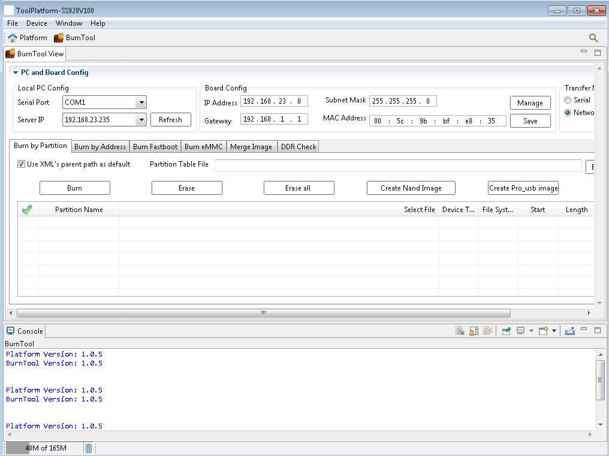
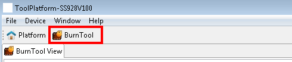
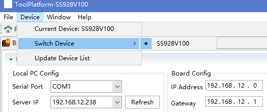
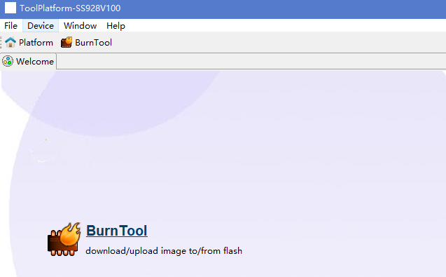
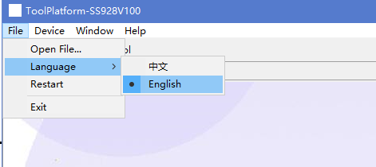
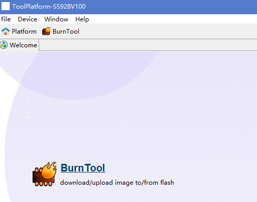
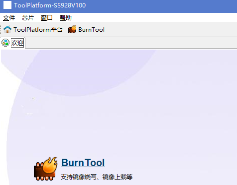

# 前言<a name="ZH-CN_TOPIC_0000002441889021"></a>

**概述<a name="section192942238173"></a>**

平台框架主要是集成了BurnTool，FastplayBinTool，LoaderBinTool等工具的一款平台工具，本文档主要介绍平台框架的功能及使用方法。

> **说明：** 
>本文以SS928V100为例，未有特殊说明，SS528V100、SS524V100、SS522V100、SS626V100、SS927V100与SS928V100内容完全一致。

**产品版本<a name="section329632361710"></a>**

与本文档相对应的产品版本如下。

<a name="table63061223201717"></a>
<table><thead align="left"><tr id="row143464239179"><th class="cellrowborder" valign="top" width="31.759999999999998%" id="mcps1.1.3.1.1"><p id="p73461923111715"><a name="p73461923111715"></a><a name="p73461923111715"></a>产品名称</p>
</th>
<th class="cellrowborder" valign="top" width="68.24%" id="mcps1.1.3.1.2"><p id="p17346142312178"><a name="p17346142312178"></a><a name="p17346142312178"></a>产品版本</p>
</th>
</tr>
</thead>
<tbody><tr id="row1034642371711"><td class="cellrowborder" valign="top" width="31.759999999999998%" headers="mcps1.1.3.1.1 "><p id="p1134682313174"><a name="p1134682313174"></a><a name="p1134682313174"></a>SS928</p>
</td>
<td class="cellrowborder" valign="top" width="68.24%" headers="mcps1.1.3.1.2 "><p id="p43461623201712"><a name="p43461623201712"></a><a name="p43461623201712"></a>V100</p>
</td>
</tr>
<tr id="row78311510142213"><td class="cellrowborder" valign="top" width="31.759999999999998%" headers="mcps1.1.3.1.1 "><p id="p1083151018221"><a name="p1083151018221"></a><a name="p1083151018221"></a>SS626</p>
</td>
<td class="cellrowborder" valign="top" width="68.24%" headers="mcps1.1.3.1.2 "><p id="p583114100228"><a name="p583114100228"></a><a name="p583114100228"></a>V100</p>
</td>
</tr>
<tr id="row117591411104615"><td class="cellrowborder" valign="top" width="31.759999999999998%" headers="mcps1.1.3.1.1 "><p id="p881081984715"><a name="p881081984715"></a><a name="p881081984715"></a>SS524</p>
</td>
<td class="cellrowborder" valign="top" width="68.24%" headers="mcps1.1.3.1.2 "><p id="p34921898474"><a name="p34921898474"></a><a name="p34921898474"></a>V100</p>
</td>
</tr>
<tr id="row1261624112613"><td class="cellrowborder" valign="top" width="31.759999999999998%" headers="mcps1.1.3.1.1 "><p id="p13616148261"><a name="p13616148261"></a><a name="p13616148261"></a>SS522</p>
</td>
<td class="cellrowborder" valign="top" width="68.24%" headers="mcps1.1.3.1.2 "><p id="p196165412612"><a name="p196165412612"></a><a name="p196165412612"></a>V100</p>
</td>
</tr>
<tr id="row4600539165"><td class="cellrowborder" valign="top" width="31.759999999999998%" headers="mcps1.1.3.1.1 "><p id="p146701318175918"><a name="p146701318175918"></a><a name="p146701318175918"></a>SS528</p>
</td>
<td class="cellrowborder" valign="top" width="68.24%" headers="mcps1.1.3.1.2 "><p id="p146705184594"><a name="p146705184594"></a><a name="p146705184594"></a>V100</p>
</td>
</tr>
<tr id="row582312263526"><td class="cellrowborder" valign="top" width="31.759999999999998%" headers="mcps1.1.3.1.1 "><p id="p4824526195210"><a name="p4824526195210"></a><a name="p4824526195210"></a>SS625</p>
</td>
<td class="cellrowborder" valign="top" width="68.24%" headers="mcps1.1.3.1.2 "><p id="p138241269524"><a name="p138241269524"></a><a name="p138241269524"></a>V100</p>
</td>
</tr>
<tr id="row206101594251"><td class="cellrowborder" valign="top" width="31.759999999999998%" headers="mcps1.1.3.1.1 "><p id="p8622349102117"><a name="p8622349102117"></a><a name="p8622349102117"></a>SS927</p>
</td>
<td class="cellrowborder" valign="top" width="68.24%" headers="mcps1.1.3.1.2 "><p id="p9185184311112"><a name="p9185184311112"></a><a name="p9185184311112"></a>V100</p>
</td>
</tr>
</tbody>
</table>

**读者对象<a name="section3304423191719"></a>**

本文档（本指南）主要适用于以下工程师：

-   技术支持工程师
-   软件开发工程师

**修订记录<a name="section1530582391712"></a>**

修订记录累积了每次文档更新的说明。最新版本的文档包含以前所有文档版本的更新内容。

<a name="table1557726816410"></a>
<table><thead align="left"><tr id="row2942532716410"><th class="cellrowborder" valign="top" width="20.72%" id="mcps1.1.4.1.1"><p id="p3778275416410"><a name="p3778275416410"></a><a name="p3778275416410"></a><strong id="b5687322716410"><a name="b5687322716410"></a><a name="b5687322716410"></a>文档版本</strong></p>
</th>
<th class="cellrowborder" valign="top" width="20.22%" id="mcps1.1.4.1.2"><p id="p5627845516410"><a name="p5627845516410"></a><a name="p5627845516410"></a><strong id="b5800814916410"><a name="b5800814916410"></a><a name="b5800814916410"></a>发布日期</strong></p>
</th>
<th class="cellrowborder" valign="top" width="59.06%" id="mcps1.1.4.1.3"><p id="p2382284816410"><a name="p2382284816410"></a><a name="p2382284816410"></a><strong id="b3316380216410"><a name="b3316380216410"></a><a name="b3316380216410"></a>修改说明</strong></p>
</th>
</tr>
</thead>
<tbody><tr id="row5947359616410"><td class="cellrowborder" valign="top" width="20.72%" headers="mcps1.1.4.1.1 "><p id="p2149706016410"><a name="p2149706016410"></a><a name="p2149706016410"></a>00B01</p>
</td>
<td class="cellrowborder" valign="top" width="20.22%" headers="mcps1.1.4.1.2 "><p id="p648803616410"><a name="p648803616410"></a><a name="p648803616410"></a>2025-09-15</p>
</td>
<td class="cellrowborder" valign="top" width="59.06%" headers="mcps1.1.4.1.3 "><p id="p1946537916410"><a name="p1946537916410"></a><a name="p1946537916410"></a>第1次临时版本发布。</p>
</td>
</tr>
</tbody>
</table>

# 工具平台概述<a name="ZH-CN_TOPIC_0000002441768845"></a>


## 工具概述<a name="ZH-CN_TOPIC_0000002408169708"></a>

平台框架主要是用于集成其他工具的一个平台，它可以集成多个工具，对其他工具提供运行的环境以及公共的功能。

## 工具界面概述<a name="ZH-CN_TOPIC_0000002441768857"></a>

运行工具平台，将看到如[图1](#1-1)启动界面。

**图 1**  工具启动画面<a name="1-1"></a>  


启动画面跳转后，显示工具首页，如[图2](#_Ref403114108)所示。

**图 2**  工具首页<a name="_Ref403114108"></a>  


工具首页布局从上到下为：

-   1.菜单栏
-   2.工具栏
-   3.工具透视图栏

切换到不同的工具透视图，各工具自身包含的工具按钮会显示在工具栏上，点击按钮后，会调用相应的功能。

在工具平台主界面里，可以看到工具透视图，包括工具平台自身的透视图和已安装并处于激活状态的工具的透视图。如[图3](#1-3)所示。

**图 3**  已安装透视图<a name="1-3"></a>  


点击不同透视图图标，可切换不同的工具透视图。透视图快捷图标可删除，拖动调整显示顺序。

# 方案管理<a name="ZH-CN_TOPIC_0000002408169700"></a>


## 方案切换<a name="ZH-CN_TOPIC_0000002441889037"></a>

通过ToolPlatform平台的菜单栏可以切换当前的方案，当方案切换以后，ToolPlatform中的工具会自动判断是否支持当前方案，不支持该方案的工具将会被禁用。

在工具平台菜单中【Device】 \> 【Switch Device】，选择要切换的方案，如所[图1](#_Ref377548814)示。

**图 1**  方案切换菜单<a name="_Ref377548814"></a>  


## 方案工具适配性<a name="ZH-CN_TOPIC_0000002408329616"></a>

在工具平台菜单中【Device】\>【Current Device】中，显示当前为SS928V100，如[图1](#2-3-1)所示。

**图 1**  切换到SS928V100<a name="2-3-1"></a>  


在ToolPlatform平台界面上显示SS928V100可调用的工具，如[图2](#2-3-2)所示。

**图 2**  SS928V100可用工具<a name="2-3-2"></a>  


# 语言切换<a name="ZH-CN_TOPIC_0000002441889029"></a>

在文件菜单栏中选择语言切换，具体步骤如下：

运行工具平台，打开平台界面。

1.  在工具平台菜单中【文件】\>【语言】中，可选择中文和英文的语言切换，如[图1](#6-1)所示。

    **图 1**  语言切换菜单<a name="6-1"></a>  
    

2.  点击【English】，系统显示启动界面画面。
3.  启动完毕，关闭启动画面，显示主界面为英文，如[图3](#6-3)所示。

    **图 2**  程序英文界面<a name="6-2"></a>  
    

4.  在工具平台菜单中的【文件】 \> 【语言】中，点击【中文】，系统显示启动界面画面，在启动画面中显示启动进度条。
5.  进度加载完毕，关闭启动画面，显示主界面为中文，如[图3](#6-3)所示。

    **图 3**  程序中文界面<a name="6-3"></a>  
    

# FAQ<a name="ZH-CN_TOPIC_0000002441889017"></a>


## 工具运行缓慢<a name="ZH-CN_TOPIC_0000002441768849"></a>

**问题描述<a name="section1518663911276"></a>**

在使用工具进行操作时，工具如果运行缓慢，需如何提升运行速度？

**解决办法<a name="section9267755192714"></a>**

本工具是基于Java语言开发，故其运行方式符合一般Java程序的模式。工具如果运行速度较慢，是因为其执行过程中需要的内存空间较大（例如，读取大量寄存器或内存数据到工具里），此时，请配置加大工具的内存。

配置工具内存的方法如下：

编辑ToolPlatform工具所在目录下的ToolPlatform.ini（ToolPlatform版本不同，文件名可能存在差异）文件。

根据PC的实际可用物理内存的大小，适当调整所配置的参数。

参数说明：

-   Xms512m
    -   说明：JVM初始分配的堆内存。
    -   默认配置：物理内存的1/64。

-   Xmx512m
    -   说明：JVM最大分配的堆内存（JVM会按需分配）。
    -   默认配置：物理内存的1/4。

-   -XX:PermSize
    -   说明：JVM初始分配的非堆内存。
    -   默认配置：64M。

-   -XX:MaxPermSize
    -   说明：JVM可分配的最大非堆内存（JVM会按需分配）。
    -   默认配置：256M。

-   -XX:+UseParallelGC
    -   说明：并行运行GC（JVM垃圾回收）。

> **须知：** 
>-   默认空余堆内存小于40%时，JVM就会增大堆直到-Xmx的最大限制。
>-   空余堆内存大于70%时，JVM会减少堆，直到-Xms的最小限制。
>-   因此一般设置-Xms与-Xmx相同，来避免每次GC\(JVM垃圾回收\)后调整堆内存大小。
>-   在多核机器下，可以尝试打开XX:+UseParallelGC参数。
>-   如果-Xmx或-XX:MaxPermSize不指定或者指定的值偏小，应用可能会导致java.lang.OutOfMemeoryError错误。需要重新配置参数，重新运行ToolPlatform工具。

## 如何获取系统中当前使用的JRE版本信息？<a name="ZH-CN_TOPIC_0000002408169720"></a>

**问题描述<a name="section15553458202815"></a>**

如何获取系统中当前使用的JRE版本信息？

**解决办法<a name="section103688892911"></a>**

可以通过在控制台执行命令：java -version来查看版本信息。

## 为什么工具放在F:\\Work!!!!!!!!!!!!!!!!!!!!!\\这样的路径下不能运行<a name="ZH-CN_TOPIC_0000002441768869"></a>

**问题描述<a name="section197723261293"></a>**

工具放在F:\\Work!!!!!!!!!!!!!!!!!!!!!\\这样的路径下，会提示如[图1](#fig326mcpsimp)异常，无法运行。

**图 1**  路径异常提示<a name="fig326mcpsimp"></a>  


**问题分析<a name="section16242653152911"></a>**

是由于工具依赖的eclipse无法识别“！”字符，导致异常。

**解决办法<a name="section9439958182919"></a>**

避免在带特殊字符的路径下使用ToolPlatform工具。

## ToolPlatform的Linux版本在Ubuntu等操作系统下使用需要注意什么？<a name="ZH-CN_TOPIC_0000002408329628"></a>

**问题描述<a name="section10787113323014"></a>**

当ToolPlatform的Linux版本在Ubuntu操作系统下可能会出现无法启动或串口网口无法正常使用的问题时该怎么办？

**解决办法<a name="section15836241173018"></a>**

-   ToolPlatform工具正常启动的步骤：

    首先，给ToolPlatform目录读写权限（chmod 777 -R ToolPlatform），再进入ToolPlatform目录（cd ToolPlatform），最后使用管理员权限打开ToolPlatform（sudo ./ToolPlatform）,正常情况下工具已经可以运行；

-   ToolPlatform工具无法启动问题：

    首先确认需要安装的JDK1.6以上的32位版本在当前操作系统上是否安装成功并配置好环境变量（通过在终端输入java -version命令进行查看），确认JDK已经安装完成后，若仍无法启动，因ToolPlatform依赖GTK库文件，请根据当前操作系统安装对应版本的GTK库文件\(以下命令仅供参考\)：

    ```
    sudo apt-get install libgtk-3-dev
    sudo apt-get install ia32-libs-gtk
    sudo apt-get install ia32-libs libglib2.0-dev
    sudo apt-get install gtk2-engines
    sudo apt-get install gtk2-engines-*
    sudo apt-get install libgtkmm-2.4-1c2
    sudo apt-get install libcanberra-gtk-module
    sudo apt-get install gtk2-engines:i386
    sudo apt-get install gtk2-engines-*:i386
    sudo apt-get install libgtkmm-2.4-1c2:i386
    sudo apt-get install libcanberra-gtk-module:i386
    sudo apt-get update
    sudo apt-get install libgtk2.0-0
    sudo apt-get install libgtk2.0-0:i386（64位）
    sudo apt-get install libxtst6
    sudo apt-get install libxtst6:i386(64位)
    ```

-   BurnTool工具中串口无法正常获取的问题：

    使用sudo ./ToolPlatform 的方式打开工具。

-   BurnTool工具中网口TFTP无法正常下载：

    使用sudo ./ToolPlatform 的方式打开工具，若仍不可用，请检查自身网络环境。

# 缩略语<a name="ZH-CN_TOPIC_0000002408329612"></a>

<a name="table137mcpsimp"></a>
<table><tbody><tr id="row143mcpsimp"><td class="cellrowborder" colspan="3" valign="top"><p id="p145mcpsimp"><a name="p145mcpsimp"></a><a name="p145mcpsimp"></a><strong id="b146mcpsimp"><a name="b146mcpsimp"></a><a name="b146mcpsimp"></a>A</strong></p>
</td>
</tr>
<tr id="row149mcpsimp"><td class="cellrowborder" valign="top" width="23%"><p id="p151mcpsimp"><a name="p151mcpsimp"></a><a name="p151mcpsimp"></a>API</p>
</td>
<td class="cellrowborder" valign="top" width="30%"><p id="p153mcpsimp"><a name="p153mcpsimp"></a><a name="p153mcpsimp"></a>Application Programming Interface</p>
</td>
<td class="cellrowborder" valign="top" width="47%"><p id="p155mcpsimp"><a name="p155mcpsimp"></a><a name="p155mcpsimp"></a>应用接口</p>
</td>
</tr>
<tr id="row156mcpsimp"><td class="cellrowborder" colspan="3" valign="top"><p id="p158mcpsimp"><a name="p158mcpsimp"></a><a name="p158mcpsimp"></a><strong id="b159mcpsimp"><a name="b159mcpsimp"></a><a name="b159mcpsimp"></a>J</strong></p>
</td>
</tr>
<tr id="row162mcpsimp"><td class="cellrowborder" valign="top" width="23%"><p id="p164mcpsimp"><a name="p164mcpsimp"></a><a name="p164mcpsimp"></a>JRE</p>
</td>
<td class="cellrowborder" valign="top" width="30%"><p id="p166mcpsimp"><a name="p166mcpsimp"></a><a name="p166mcpsimp"></a>Java Runtime Environment</p>
</td>
<td class="cellrowborder" valign="top" width="47%"><p id="p168mcpsimp"><a name="p168mcpsimp"></a><a name="p168mcpsimp"></a>Java运行环境</p>
</td>
</tr>
<tr id="row169mcpsimp"><td class="cellrowborder" valign="top" width="23%"><p id="p171mcpsimp"><a name="p171mcpsimp"></a><a name="p171mcpsimp"></a>JDK</p>
</td>
<td class="cellrowborder" valign="top" width="30%"><p id="p173mcpsimp"><a name="p173mcpsimp"></a><a name="p173mcpsimp"></a>Java Development Kit</p>
</td>
<td class="cellrowborder" valign="top" width="47%"><p id="p175mcpsimp"><a name="p175mcpsimp"></a><a name="p175mcpsimp"></a>Jave开发包</p>
</td>
</tr>
</tbody>
</table>

