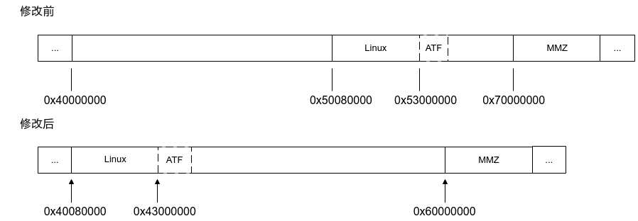
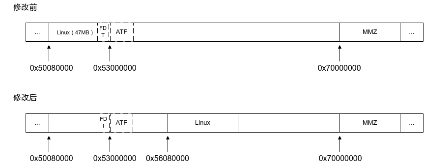

# 前言<a name="ZH-CN_TOPIC_0000002424202118"></a>

**概述<a name="section4537382116410"></a>**

本文描述了小系统各模块如何定义内存空间并给出示例修改，以指导开发人员根据实际业务场景，调整系统的内存布局。

> **须知：** 
>后文的描述用“xxxx”表示项目名称，例如：xxxx\_defconfig  --\>  ss928v100\_defconfig。
>“yyyy”表示版本号，例如：u-boot-yyyy  --\>  u-boot-2020.01、linux-yyyy  --\>  linux-6.6

**产品版本<a name="section5164203710567"></a>**

与本文档相对应的产品版本如下。

<a name="table4170737175613"></a>
<table><thead align="left"><tr id="row31991337135618"><th class="cellrowborder" valign="top" width="39.25%" id="mcps1.1.3.1.1"><p id="p219963765616"><a name="p219963765616"></a><a name="p219963765616"></a>产品名称</p>
</th>
<th class="cellrowborder" valign="top" width="60.75000000000001%" id="mcps1.1.3.1.2"><p id="p12199337185619"><a name="p12199337185619"></a><a name="p12199337185619"></a>产品版本</p>
</th>
</tr>
</thead>
<tbody><tr id="row419914372567"><td class="cellrowborder" valign="top" width="39.25%" headers="mcps1.1.3.1.1 "><p id="p181991937105611"><a name="p181991937105611"></a><a name="p181991937105611"></a>SS928</p>
</td>
<td class="cellrowborder" valign="top" width="60.75000000000001%" headers="mcps1.1.3.1.2 "><p id="p819943745619"><a name="p819943745619"></a><a name="p819943745619"></a>V100</p>
</td>
</tr>
<tr id="row127881511132510"><td class="cellrowborder" valign="top" width="39.25%" headers="mcps1.1.3.1.1 "><p id="p1397518149259"><a name="p1397518149259"></a><a name="p1397518149259"></a>SS927</p>
</td>
<td class="cellrowborder" valign="top" width="60.75000000000001%" headers="mcps1.1.3.1.2 "><p id="p397511145253"><a name="p397511145253"></a><a name="p397511145253"></a>V100</p>
</td>
</tr>
</tbody>
</table>

> **说明：** 
>本文以SS928V100描述为例，未有特殊说明，SS927V100与SS928V100内容一致。

**读者对象<a name="section4378592816410"></a>**

本文档主要适用于以下工程师：

-   技术支持工程师
-   软件开发工程师

**修订记录<a name="section558815935816"></a>**

修订记录累积了每次文档更新的说明。最新版本的文档包含以前所有文档版本的更新内容。

<a name="table126443203200"></a>
<table><thead align="left"><tr id="row264516207203"><th class="cellrowborder" valign="top" width="20.72%" id="mcps1.1.4.1.1"><p id="p146456203200"><a name="p146456203200"></a><a name="p146456203200"></a><strong id="b8645172022010"><a name="b8645172022010"></a><a name="b8645172022010"></a>文档版本</strong></p>
</th>
<th class="cellrowborder" valign="top" width="26.119999999999997%" id="mcps1.1.4.1.2"><p id="p364512062019"><a name="p364512062019"></a><a name="p364512062019"></a><strong id="b1464512200200"><a name="b1464512200200"></a><a name="b1464512200200"></a>发布日期</strong></p>
</th>
<th class="cellrowborder" valign="top" width="53.16%" id="mcps1.1.4.1.3"><p id="p664522018206"><a name="p664522018206"></a><a name="p664522018206"></a><strong id="b156451420152010"><a name="b156451420152010"></a><a name="b156451420152010"></a>修改说明</strong></p>
</th>
</tr>
</thead>
<tbody><tr id="row56451520182017"><td class="cellrowborder" valign="top" width="20.72%" headers="mcps1.1.4.1.1 "><p id="p1564572014209"><a name="p1564572014209"></a><a name="p1564572014209"></a>00B01</p>
</td>
<td class="cellrowborder" valign="top" width="26.119999999999997%" headers="mcps1.1.4.1.2 "><p id="p126451920132014"><a name="p126451920132014"></a><a name="p126451920132014"></a>2025-09-15</p>
</td>
<td class="cellrowborder" valign="top" width="53.16%" headers="mcps1.1.4.1.3 "><p id="p1664582017209"><a name="p1664582017209"></a><a name="p1664582017209"></a>第1次临时版本发布。</p>
</td>
</tr>
</tbody>
</table>

# 概述<a name="ZH-CN_TOPIC_0000002424202134"></a>

在调整内存布局时，要充分考虑布局变动对各模块间的影响。

本文将阐述各模块与内存布局的关系，以及修改内存布局的方法。涉及模块如下：

-   U-Boot
-   Linux内核
-   ATF
-   GSL
-   MPP

# 内存布局<a name="ZH-CN_TOPIC_0000002457880873"></a>

本章描述各模块如何定义自身使用的内存空间。

> **说明：** 
>各模块先给出文件路径，然后描述该文件中涉及内存布局定义的配置项、宏、变量的含义。


## U-Boot<a name="ZH-CN_TOPIC_0000002424361986"></a>

u-boot-yyyy/configs/xxxx\_defconfig

CONFIG\_KERNEL\_LOAD\_ADDR，规定了内核启动的地址；U-Boot 根据此地址的偏移来加载各模块数据。

## Linux内核<a name="ZH-CN_TOPIC_0000002424361998"></a>

linux-yyyy/arch/arm64/boot/dts/vendor/xxxx-demb.dts

-   “/memreserve/”，内存保留区，该段内存用作安全DDR。
-   memory 节点的 reg 属性，描述内核可用的DDR地址空间。

## ATF<a name="ZH-CN_TOPIC_0000002457840765"></a>

arm-trusted-firmware-yyyy/plat/vendor/xxxx/include/platform\_def.h

-   BL31\_BASE，描述 ATF 启动地址。
-   BL31\_SIZE，描述 ATF 内存空间大小。

地址关系：

BL31\_BASE = CONFIG\_KERNEL\_LOAD\_ADDR + 0x2F80000 （[CONFIG\_KERNEL\_LOAD\_ADDR](#ZH-CN_TOPIC_0000002424361986)  是 U-Boot 中定义的内核启动地址。）

## GSL<a name="ZH-CN_TOPIC_0000002457880857"></a>

boot/gsl/include/xxxx/platform.h

KERNEL\_LOAD\_ADDR，内核启动地址。

地址关系：

KERNEL\_LOAD\_ADDR = CONFIG\_KERNEL\_LOAD\_ADDR （[CONFIG\_KERNEL\_LOAD\_ADDR](#ZH-CN_TOPIC_0000002424361986)  是 U-Boot 中定义的内核启动地址。）

## MPP<a name="ZH-CN_TOPIC_0000002457880837"></a>

-   xxxx\_yyyy/smp/a55\_linux/mpp/out/ko/loadxxxx
    -   mem\_total：ddr总内存大小
    -   mem\_start：ddr起始地址
    -   ipcm\_mem\_size：ipcm内存大小
    -   dsp\_mem\_size: dsp liteos总内存大小（liteos os和liteos mmz）
    -   mcu\_mem\_size：mcu liteos总内存大小（liteos os和liteos mmz）
    -   os\_mem\_size：linux os内存大小
    -   mmz\_start：linux mmz起始地址
    -   mmz\_size：linux mmz内存大小

# 示例修改<a name="ZH-CN_TOPIC_0000002457880885"></a>


## Linux 内核往前移动0x10000000<a name="ZH-CN_TOPIC_0000002457840777"></a>


### 修改方案<a name="ZH-CN_TOPIC_0000002424202158"></a>

-   Linux启动地址0x50080000改为0x40080000，即往前移动0x10000000（= 0x50080000 - 0x40080000）；
-   ATF随内核前移0x10000000。

**图 1**  删除LiteOS的前后对比<a name="fig10232031174813"></a>  


### 修改点<a name="ZH-CN_TOPIC_0000002457840789"></a>

> **说明：** 
>行首的“-”表示修改前，“+”表示修改后。
>移动Linux启动地址需要以2MB对齐的基址，例如：40080000、40280000为2MB对齐位置，40180000无法启动

-   U-Boot：修改内核加载地址，前移0x10000000

    ```
    --- a/configs/xxxx_defconfig
    +++ b/configs/xxxx_defconfig
    @@ -302,7 +302,7 @@
    - CONFIG_KERNEL_LOAD_ADDR=0x50080000
    + CONFIG_KERNEL_LOAD_ADDR=0x40080000
    ```

-   Linux：修改设备树中memory保留区域和memory节点的范围，前移0x10000000

    ```
    --- a/arch/arm64/boot/dts/vendor/xxxx-demb.dts
    +++ b/arch/arm64/boot/dts/vendor/xxxx-demb.dts
    @@ -19,7 +19,7 @@
    /* reserved for warmreset */
    /* reserved for arm trustedfirmware */
    /* Modify this configuration according to the system framework */
    - /memreserve/ 0x52fff000 0x01a02000;
    + /memreserve/ 0x42fff000 0x01a02000;
    #include "xxxx.dtsi"
    / {
    @@ -101,7 +101,7 @@
           memory {
                          device_type = "memory";
                          - reg = <0x0 0x50000000 0x1 0xf0000000>; /* system memory base */
                          + reg = <0x0 0x40000000 0x1 0xf0000000>; /* system memory base */
            };
    };
    ```

-   ATF：修改起始地址，前移0x10000000

    ```
    --- a/plat/vendor/xxxx/include/platform_def.h
    +++ b/plat/vendor/xxxx/include/platform_def.h
    @@ -66,7 +66,7 @@
    - #define BL31_BASE                      (0x53000000)
    + #define BL31_BASE                      (0x43000000)
    ```

-   GSL：修改内核加载地址（该地址与U-Boot保持一致），前移0x10000000

    ```
    --- a/include/platform.h
    +++ b/include/platform.h
    @@ -288,7 +288,7 @@
    - #define KERNEL_LOAD_ADDR  0x50080000
    + #define KERNEL_LOAD_ADDR  0x40080000
    ```

-   MPP：修改liteos内存大小和mmz起始地址

    xxxx\_yyyy/smp/a55\_linux/mpp/out/ko/loadxxxx：

    ```
    -ipcm_mem_size=2               # 2M, ipcm mem
    -dsp_mem_size=62               # 62M, dsp mem
    -mcu_mem_size=192              # 192M, mcu mem
    +ipcm_mem_size=0               # 0M, ipcm mem
    +dsp_mem_size=0               # 0M, dsp mem
    +mcu_mem_size=0              # 0M, mcu mem
    os_mem_size=512               # 512M, os mem
    
    -mmz_start=0x70000000;         # mmz start addr
    -mmz_size=3328M;               # 3328M, mmz size
    +mmz_start=0x60000000;         # mmz start addr
    +mmz_size=3584M;               # 3584M, mmz size
    ```

## 扩大Linux空间大小<a name="ZH-CN_TOPIC_0000002424361970"></a>


### 修改方案<a name="ZH-CN_TOPIC_0000002457880893"></a>

现有Linux的空间预留0x2F00000（47MB），需要再扩大空间可将BL33\_LOAD\_ADDR 内核加载地址移至optee后未使用的地址。

**图 1**  扩大Linux空间的前后对比<a name="fig10232031174813"></a>  


### 修改点<a name="ZH-CN_TOPIC_0000002424202098"></a>

> **说明：** 
>行首的“-”表示修改前，“+”表示修改后。

-   U-Boot：修改内核加载地址，即后移0x6000000

```
--- a/common/load_fip.c
+++ b/common/load_fip.c
@@ -250,7 +250,7 @@ uuid_t uuid_bl31 = UUID_EL3_RUNTIME_FIRMWARE_BL31;

long long kernel_load_addr;
/* kernel start addr - sizeof(header) */
-#define BL33_LOAD_ADDR  (kernel_load_addr - 0x40)
+#define BL33_LOAD_ADDR  (kernel_load_addr - 0x40 + 0x6000000)
#define FDT_LOAD_ADDR   (kernel_load_addr + 0x2F00000)
#define BL31_BASE       (kernel_load_addr + 0x2F80000)
```

