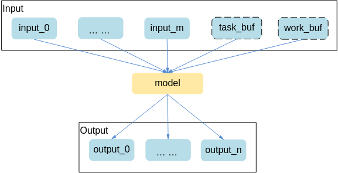
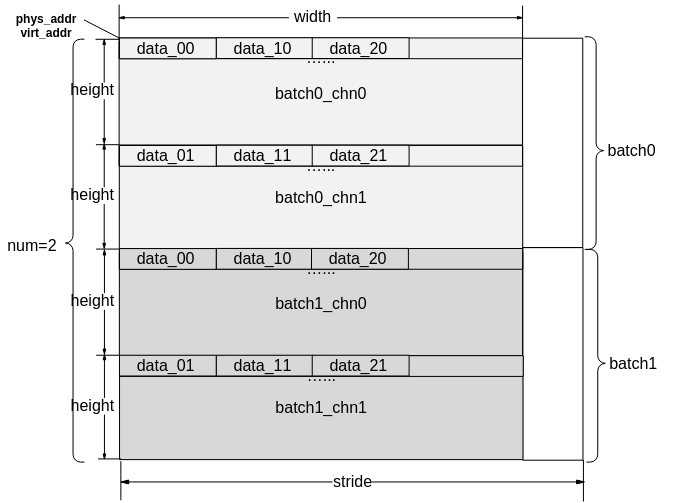
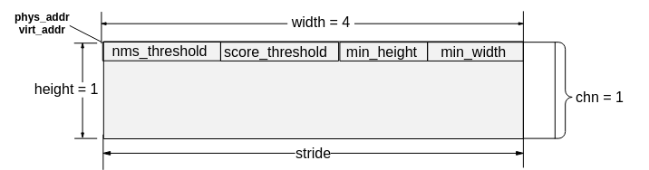

# 前言<a name="ZH-CN_TOPIC_0000002408421258"></a>

**概述<a name="section145mcpsimp"></a>**

本文档详细描述了_图像分析引擎_2开发和_图像分析引擎_1的开发差异。

**产品版本<a name="section300mcpsimp"></a>**

与本文档相对应的产品版本如下。

<a name="table303mcpsimp"></a>
<table><thead align="left"><tr id="row308mcpsimp"><th class="cellrowborder" valign="top" width="45%" id="mcps1.1.3.1.1"><p id="p310mcpsimp"><a name="p310mcpsimp"></a><a name="p310mcpsimp"></a>产品名称</p>
</th>
<th class="cellrowborder" valign="top" width="55.00000000000001%" id="mcps1.1.3.1.2"><p id="p312mcpsimp"><a name="p312mcpsimp"></a><a name="p312mcpsimp"></a>产品版本</p>
</th>
</tr>
</thead>
<tbody><tr id="row314mcpsimp"><td class="cellrowborder" valign="top" width="45%" headers="mcps1.1.3.1.1 "><p id="p316mcpsimp"><a name="p316mcpsimp"></a><a name="p316mcpsimp"></a>SS928</p>
</td>
<td class="cellrowborder" valign="top" width="55.00000000000001%" headers="mcps1.1.3.1.2 "><p id="p318mcpsimp"><a name="p318mcpsimp"></a><a name="p318mcpsimp"></a>V100</p>
</td>
</tr>
<tr id="row1376073312191"><td class="cellrowborder" valign="top" width="45%" headers="mcps1.1.3.1.1 "><p id="p5760533111913"><a name="p5760533111913"></a><a name="p5760533111913"></a>SS927</p>
</td>
<td class="cellrowborder" valign="top" width="55.00000000000001%" headers="mcps1.1.3.1.2 "><p id="p6760333131918"><a name="p6760333131918"></a><a name="p6760333131918"></a>V100</p>
</td>
</tr>
</tbody>
</table>

**读者对象<a name="section150mcpsimp"></a>**

本文档主要适用于以下工程师：

-   技术支持工程师
-   软件开发工程师

**修订记录<a name="section156mcpsimp"></a>**

修订记录累积了每次文档更新的说明。最新版本的文档包含以前所有文档版本的更新内容。

<a name="table1557726816410"></a>
<table><thead align="left"><tr id="row2942532716410"><th class="cellrowborder" valign="top" width="20.72%" id="mcps1.1.4.1.1"><p id="p3778275416410"><a name="p3778275416410"></a><a name="p3778275416410"></a><strong id="b5687322716410"><a name="b5687322716410"></a><a name="b5687322716410"></a>文档版本</strong></p>
</th>
<th class="cellrowborder" valign="top" width="20.22%" id="mcps1.1.4.1.2"><p id="p5627845516410"><a name="p5627845516410"></a><a name="p5627845516410"></a><strong id="b5800814916410"><a name="b5800814916410"></a><a name="b5800814916410"></a>发布日期</strong></p>
</th>
<th class="cellrowborder" valign="top" width="59.06%" id="mcps1.1.4.1.3"><p id="p2382284816410"><a name="p2382284816410"></a><a name="p2382284816410"></a><strong id="b3316380216410"><a name="b3316380216410"></a><a name="b3316380216410"></a>修改说明</strong></p>
</th>
</tr>
</thead>
<tbody><tr id="row5947359616410"><td class="cellrowborder" valign="top" width="20.72%" headers="mcps1.1.4.1.1 "><p id="p2149706016410"><a name="p2149706016410"></a><a name="p2149706016410"></a>00B01</p>
</td>
<td class="cellrowborder" valign="top" width="20.22%" headers="mcps1.1.4.1.2 "><p id="p648803616410"><a name="p648803616410"></a><a name="p648803616410"></a>2025-09-15</p>
</td>
<td class="cellrowborder" valign="top" width="59.06%" headers="mcps1.1.4.1.3 "><p id="p1946537916410"><a name="p1946537916410"></a><a name="p1946537916410"></a>第1次临时版本发布。</p>
</td>
</tr>
</tbody>
</table>

# SDK接口差异<a name="ZH-CN_TOPIC_0000002408421246"></a>


## 风格差异<a name="ZH-CN_TOPIC_0000002441980521"></a>

图像分析引擎1为ACL接口，图像分析引擎2为SVP ACL接口。

为了避免编译时符号冲突，SVP ACL使用linux风格，宏定义和枚举采用SVP\_ACL\_前缀；ACL使用的驼峰风格，宏定义和枚举采用ACL\_前缀。函数、宏定义、枚举以及结构体详细差异参见[表1](#table183mcpsimp)。

**表 1**  风格差异示例

<a name="table183mcpsimp"></a>
<table><thead align="left"><tr id="row190mcpsimp"><th class="cellrowborder" valign="top" width="11%" id="mcps1.2.4.1.1"><p id="p192mcpsimp"><a name="p192mcpsimp"></a><a name="p192mcpsimp"></a>差异</p>
</th>
<th class="cellrowborder" valign="top" width="39.18%" id="mcps1.2.4.1.2"><p id="p194mcpsimp"><a name="p194mcpsimp"></a><a name="p194mcpsimp"></a>ACL接口</p>
</th>
<th class="cellrowborder" valign="top" width="49.82%" id="mcps1.2.4.1.3"><p id="p196mcpsimp"><a name="p196mcpsimp"></a><a name="p196mcpsimp"></a>SVP_ACL接口</p>
</th>
</tr>
</thead>
<tbody><tr id="row198mcpsimp"><td class="cellrowborder" valign="top" width="11%" headers="mcps1.2.4.1.1 "><p id="p200mcpsimp"><a name="p200mcpsimp"></a><a name="p200mcpsimp"></a>函数</p>
</td>
<td class="cellrowborder" valign="top" width="39.18%" headers="mcps1.2.4.1.2 "><pre class="codeblock" id="codeblock15403587314"><a name="codeblock15403587314"></a><a name="codeblock15403587314"></a>aclInit(const char *configPath)</pre>
</td>
<td class="cellrowborder" valign="top" width="49.82%" headers="mcps1.2.4.1.3 "><pre class="codeblock" id="codeblock181561342"><a name="codeblock181561342"></a><a name="codeblock181561342"></a>svp_acl_init(const char *config_path)</pre>
</td>
</tr>
<tr id="row205mcpsimp"><td class="cellrowborder" valign="top" width="11%" headers="mcps1.2.4.1.1 "><p id="p207mcpsimp"><a name="p207mcpsimp"></a><a name="p207mcpsimp"></a>宏定义</p>
</td>
<td class="cellrowborder" valign="top" width="39.18%" headers="mcps1.2.4.1.2 "><pre class="codeblock" id="codeblock16299115212210"><a name="codeblock16299115212210"></a><a name="codeblock16299115212210"></a>#define ACL_MAX_DIM_CNT          128</pre>
</td>
<td class="cellrowborder" valign="top" width="49.82%" headers="mcps1.2.4.1.3 "><pre class="codeblock" id="codeblock5354175511212"><a name="codeblock5354175511212"></a><a name="codeblock5354175511212"></a>#define SVP_ACL_MAX_DIM_CNT          128</pre>
</td>
</tr>
<tr id="row212mcpsimp"><td class="cellrowborder" valign="top" width="11%" headers="mcps1.2.4.1.1 "><p id="p214mcpsimp"><a name="p214mcpsimp"></a><a name="p214mcpsimp"></a>枚举</p>
</td>
<td class="cellrowborder" valign="top" width="39.18%" headers="mcps1.2.4.1.2 "><pre class="codeblock" id="codeblock45217611210"><a name="codeblock45217611210"></a><a name="codeblock45217611210"></a>typedef enum aclrtRunMode {
    ACL_DEVICE,
    ACL_HOST,
} aclrtRunMode;</pre>
</td>
<td class="cellrowborder" valign="top" width="49.82%" headers="mcps1.2.4.1.3 "><pre class="codeblock" id="codeblock1566414105212"><a name="codeblock1566414105212"></a><a name="codeblock1566414105212"></a>typedef enum svp_acl_rt_run_mode {
    SVP_ACL_DEVICE,
    SVP_ACL_HOST,
} svp_acl_rt_run_mode;</pre>
</td>
</tr>
<tr id="row225mcpsimp"><td class="cellrowborder" valign="top" width="11%" headers="mcps1.2.4.1.1 "><p id="p227mcpsimp"><a name="p227mcpsimp"></a><a name="p227mcpsimp"></a>结构体</p>
</td>
<td class="cellrowborder" valign="top" width="39.18%" headers="mcps1.2.4.1.2 "><pre class="codeblock" id="codeblock141280435318"><a name="codeblock141280435318"></a><a name="codeblock141280435318"></a>typedef struct aclmdlIODims {
    char name[ACL_MAX_TENSOR_NAME_LEN];
    size_t dimCount;
    int64_t dims[ACL_MAX_DIM_CNT];
} aclmdlIODims;</pre>
</td>
<td class="cellrowborder" valign="top" width="49.82%" headers="mcps1.2.4.1.3 "><pre class="codeblock" id="codeblock54308261337"><a name="codeblock54308261337"></a><a name="codeblock54308261337"></a>typedef struct svp_acl_mdl_io_dims {
    char name[SVP_ACL_MAX_TENSOR_NAME_LEN];
    size_t dim_count;
    int64_t dims[SVP_ACL_MAX_DIM_CNT];
} svp_acl_mdl_io_dims;</pre>
</td>
</tr>
</tbody>
</table>

## 使用差异<a name="ZH-CN_TOPIC_0000002442020361"></a>


### 创建databuffer函数<a name="ZH-CN_TOPIC_0000002442020401"></a>

由于_图像分析引擎_2逻辑在执行的时候，输入输出数据需要传入stride，用于逻辑读/写操作时快速跳到下一行，因此在创建和更新data buffer的时候会增加一个stride入参。

**表 1**  创建data buffer函数差异

<a name="table244mcpsimp"></a>
<table><thead align="left"><tr id="row251mcpsimp"><th class="cellrowborder" valign="top" width="9.01%" id="mcps1.2.4.1.1"><p id="p253mcpsimp"><a name="p253mcpsimp"></a><a name="p253mcpsimp"></a>功能</p>
</th>
<th class="cellrowborder" valign="top" width="44.99%" id="mcps1.2.4.1.2"><p id="p255mcpsimp"><a name="p255mcpsimp"></a><a name="p255mcpsimp"></a>ACL函数</p>
</th>
<th class="cellrowborder" valign="top" width="46%" id="mcps1.2.4.1.3"><p id="p257mcpsimp"><a name="p257mcpsimp"></a><a name="p257mcpsimp"></a>SVP_ACL函数</p>
</th>
</tr>
</thead>
<tbody><tr id="row259mcpsimp"><td class="cellrowborder" valign="top" width="9.01%" headers="mcps1.2.4.1.1 "><p id="p261mcpsimp"><a name="p261mcpsimp"></a><a name="p261mcpsimp"></a>创建</p>
</td>
<td class="cellrowborder" valign="top" width="44.99%" headers="mcps1.2.4.1.2 "><pre class="codeblock" id="codeblock10935184052"><a name="codeblock10935184052"></a><a name="codeblock10935184052"></a>aclCreateDataBuffer(void *data, size_t size);</pre>
</td>
<td class="cellrowborder" valign="top" width="46%" headers="mcps1.2.4.1.3 "><pre class="codeblock" id="codeblock392181515514"><a name="codeblock392181515514"></a><a name="codeblock392181515514"></a>svp_acl_data_buffer *svp_acl_create_data_buffer(void *data, size_t size, size_t stride)</pre>
</td>
</tr>
<tr id="row266mcpsimp"><td class="cellrowborder" valign="top" width="9.01%" headers="mcps1.2.4.1.1 "><p id="p268mcpsimp"><a name="p268mcpsimp"></a><a name="p268mcpsimp"></a>更新</p>
</td>
<td class="cellrowborder" valign="top" width="44.99%" headers="mcps1.2.4.1.2 "><pre class="codeblock" id="codeblock5290177652"><a name="codeblock5290177652"></a><a name="codeblock5290177652"></a>aclUpdateDataBuffer(aclDataBuffer *dataBuffer, void *data, size_t size);</pre>
</td>
<td class="cellrowborder" valign="top" width="46%" headers="mcps1.2.4.1.3 "><pre class="codeblock" id="codeblock1939412173518"><a name="codeblock1939412173518"></a><a name="codeblock1939412173518"></a>svp_acl_update_data_buffer(svp_acl_data_buffer *data_buffer, void *data, size_t size, size_t stride);</pre>
</td>
</tr>
</tbody>
</table>

由于引入stride，所以SVP ACL接口返回的输入输出size是按照stride对齐后的内存大小，为了方便获取stride，SVP\_ACL接口新增了与stride操作相关的函数，增加函数见下表：

**表 2**  新增stride相关函数

<a name="table274mcpsimp"></a>
<table><thead align="left"><tr id="row281mcpsimp"><th class="cellrowborder" valign="top" width="25%" id="mcps1.2.4.1.1"><p id="p283mcpsimp"><a name="p283mcpsimp"></a><a name="p283mcpsimp"></a>功能</p>
</th>
<th class="cellrowborder" valign="top" width="50%" id="mcps1.2.4.1.2"><p id="p285mcpsimp"><a name="p285mcpsimp"></a><a name="p285mcpsimp"></a>SVP_ACL函数</p>
</th>
<th class="cellrowborder" valign="top" width="25%" id="mcps1.2.4.1.3"><p id="p287mcpsimp"><a name="p287mcpsimp"></a><a name="p287mcpsimp"></a>备注</p>
</th>
</tr>
</thead>
<tbody><tr id="row289mcpsimp"><td class="cellrowborder" valign="top" width="25%" headers="mcps1.2.4.1.1 "><p id="p291mcpsimp"><a name="p291mcpsimp"></a><a name="p291mcpsimp"></a>从data buffer中获取配置的stride</p>
</td>
<td class="cellrowborder" valign="top" width="50%" headers="mcps1.2.4.1.2 "><pre class="codeblock" id="codeblock12578131955"><a name="codeblock12578131955"></a><a name="codeblock12578131955"></a>size_t svp_acl_get_data_buffer_stride(const svp_acl_data_buffer *data_buffer);</pre>
</td>
<td class="cellrowborder" valign="top" width="25%" headers="mcps1.2.4.1.3 "><p id="p295mcpsimp"><a name="p295mcpsimp"></a><a name="p295mcpsimp"></a>无。</p>
</td>
</tr>
<tr id="row296mcpsimp"><td class="cellrowborder" valign="top" width="25%" headers="mcps1.2.4.1.1 "><p id="p298mcpsimp"><a name="p298mcpsimp"></a><a name="p298mcpsimp"></a>获取模型输入数据的默认stride</p>
</td>
<td class="cellrowborder" valign="top" width="50%" headers="mcps1.2.4.1.2 "><pre class="codeblock" id="codeblock24281834953"><a name="codeblock24281834953"></a><a name="codeblock24281834953"></a>size_t svp_acl_mdl_get_input_default_stride(const svp_acl_mdl_desc *model_desc, size_t index);</pre>
</td>
<td class="cellrowborder" valign="top" width="25%" headers="mcps1.2.4.1.3 "><p id="p302mcpsimp"><a name="p302mcpsimp"></a><a name="p302mcpsimp"></a>stride按照输入维度最后一维对齐。</p>
</td>
</tr>
<tr id="row303mcpsimp"><td class="cellrowborder" valign="top" width="25%" headers="mcps1.2.4.1.1 "><p id="p305mcpsimp"><a name="p305mcpsimp"></a><a name="p305mcpsimp"></a>获取模型输出数据的默认stride</p>
</td>
<td class="cellrowborder" valign="top" width="50%" headers="mcps1.2.4.1.2 "><pre class="codeblock" id="codeblock151981337952"><a name="codeblock151981337952"></a><a name="codeblock151981337952"></a>size_t svp_acl_mdl_get_output_default_stride(const svp_acl_mdl_desc *model_desc, size_t index);</pre>
</td>
<td class="cellrowborder" valign="top" width="25%" headers="mcps1.2.4.1.3 "><p id="p309mcpsimp"><a name="p309mcpsimp"></a><a name="p309mcpsimp"></a>stride按照输出维度最后一维对齐。</p>
</td>
</tr>
</tbody>
</table>

### 模型加载函数<a name="ZH-CN_TOPIC_0000002408581154"></a>

SVP\_ACL模型加载函数为**svp\_acl\_mdl\_load\_from\_mem**\(\)，其实现与ACL对应接口的差异如下。

**表 1**  模型加载函数差异

<a name="table313mcpsimp"></a>
<table><thead align="left"><tr id="row320mcpsimp"><th class="cellrowborder" valign="top" width="23.9%" id="mcps1.2.4.1.1"><p id="p322mcpsimp"><a name="p322mcpsimp"></a><a name="p322mcpsimp"></a>说明</p>
</th>
<th class="cellrowborder" valign="top" width="34.67%" id="mcps1.2.4.1.2"><p id="p324mcpsimp"><a name="p324mcpsimp"></a><a name="p324mcpsimp"></a>函数</p>
</th>
<th class="cellrowborder" valign="top" width="41.43%" id="mcps1.2.4.1.3"><p id="p326mcpsimp"><a name="p326mcpsimp"></a><a name="p326mcpsimp"></a>差异</p>
</th>
</tr>
</thead>
<tbody><tr id="row328mcpsimp"><td class="cellrowborder" valign="top" width="23.9%" headers="mcps1.2.4.1.1 "><p id="p330mcpsimp"><a name="p330mcpsimp"></a><a name="p330mcpsimp"></a>ACL模型加载函数</p>
</td>
<td class="cellrowborder" valign="top" width="34.67%" headers="mcps1.2.4.1.2 "><pre class="codeblock" id="codeblock48131001269"><a name="codeblock48131001269"></a><a name="codeblock48131001269"></a>aclError aclmdlLoadFromMem(const void *model,  size_t modelSize, uint32_t *modelId);</pre>
</td>
<td class="cellrowborder" valign="top" width="41.43%" headers="mcps1.2.4.1.3 "><a name="ol334mcpsimp"></a><a name="ol334mcpsimp"></a><ol id="ol334mcpsimp"><li>会将model内存中存储的权重参数拷贝到内部开辟的一块内存，因此该接口调用完后，model内存可以被释放。</li><li>task_buf和work_buf都是内部管理</li></ol>
</td>
</tr>
<tr id="row337mcpsimp"><td class="cellrowborder" valign="top" width="23.9%" headers="mcps1.2.4.1.1 "><p id="p339mcpsimp"><a name="p339mcpsimp"></a><a name="p339mcpsimp"></a>SVP_ACL模型加载</p>
</td>
<td class="cellrowborder" valign="top" width="34.67%" headers="mcps1.2.4.1.2 "><pre class="codeblock" id="codeblock45691743619"><a name="codeblock45691743619"></a><a name="codeblock45691743619"></a>svp_acl_error svp_acl_mdl_load_from_mem(const void *model, size_t model_size, uint32_t *model_id)</pre>
</td>
<td class="cellrowborder" valign="top" width="41.43%" headers="mcps1.2.4.1.3 "><a name="ol343mcpsimp"></a><a name="ol343mcpsimp"></a><ol id="ol343mcpsimp"><li>不会拷贝model内存中的权重到其他内存，因此在卸载模型之前，model内存不能被释放。</li><li>task_buf和work_buf由用户管理。</li></ol>
</td>
</tr>
</tbody>
</table>

### 获取模型输入个数函数<a name="ZH-CN_TOPIC_0000002408421262"></a>

为了使模型独立于device，context以及stream，SVP ACL将task\_buf和work\_buf独立出来由用户管理，模型执行的时候作为输入传入，在保证task\_buf和work\_buf正确使用的情况下，使得模型可以同时被同步，异步，多线程或者多device执行，输入变化如[图1](#fig046712315474)所示。

**图 1**  模型输入/输出数据<a name="fig046712315474"></a>  


因此SVP ACL修改了模型输入接口的特性，差异说明如[表1](#table351mcpsimp)所示。

**表 1**  获取输入个数接口差异

<a name="table351mcpsimp"></a>
<table><thead align="left"><tr id="row358mcpsimp"><th class="cellrowborder" valign="top" width="19.8%" id="mcps1.2.4.1.1"><p id="p360mcpsimp"><a name="p360mcpsimp"></a><a name="p360mcpsimp"></a>说明</p>
</th>
<th class="cellrowborder" valign="top" width="50.2%" id="mcps1.2.4.1.2"><p id="p362mcpsimp"><a name="p362mcpsimp"></a><a name="p362mcpsimp"></a>函数</p>
</th>
<th class="cellrowborder" valign="top" width="30%" id="mcps1.2.4.1.3"><p id="p364mcpsimp"><a name="p364mcpsimp"></a><a name="p364mcpsimp"></a>差异</p>
</th>
</tr>
</thead>
<tbody><tr id="row366mcpsimp"><td class="cellrowborder" valign="top" width="19.8%" headers="mcps1.2.4.1.1 "><p id="p368mcpsimp"><a name="p368mcpsimp"></a><a name="p368mcpsimp"></a>ACL获取模型输入个数函数</p>
</td>
<td class="cellrowborder" valign="top" width="50.2%" headers="mcps1.2.4.1.2 "><pre class="codeblock" id="codeblock1181511438710"><a name="codeblock1181511438710"></a><a name="codeblock1181511438710"></a>size_t aclmdlGetNumInputs(aclmdlDesc *modelDesc);</pre>
</td>
<td class="cellrowborder" valign="top" width="30%" headers="mcps1.2.4.1.3 "><p id="p373mcpsimp"><a name="p373mcpsimp"></a><a name="p373mcpsimp"></a>获取的是实际模型输入个数M。</p>
</td>
</tr>
<tr id="row374mcpsimp"><td class="cellrowborder" valign="top" width="19.8%" headers="mcps1.2.4.1.1 "><p id="p376mcpsimp"><a name="p376mcpsimp"></a><a name="p376mcpsimp"></a>SVP_ACL获取模型输入个数函数</p>
</td>
<td class="cellrowborder" valign="top" width="50.2%" headers="mcps1.2.4.1.2 "><pre class="codeblock" id="codeblock8122154610717"><a name="codeblock8122154610717"></a><a name="codeblock8122154610717"></a>size_t svp_acl_mdl_get_num_inputs(const svp_acl_mdl_desc *model_desc)</pre>
</td>
<td class="cellrowborder" valign="top" width="30%" headers="mcps1.2.4.1.3 "><p id="p380mcpsimp"><a name="p380mcpsimp"></a><a name="p380mcpsimp"></a>获取的个数比模型实际输入个数多2个，为M+2。</p>
</td>
</tr>
</tbody>
</table>

### 依据数据类型获取数据大小<a name="ZH-CN_TOPIC_0000002408581150"></a>

SVP ACL为了支持紧密排布的RAW数据，如输入为12bit或14bit紧密排布。这样数据bit长度就不是8bit的整数倍，无法用Byte为单位表示，因此SVP ACL依据数据类型获取数据大小的时候返回值为bit数，而不是Byte数，差异如[表1](#table383mcpsimp)所示。

**表 1**  获取数据大小接口差异

<a name="table383mcpsimp"></a>
<table><thead align="left"><tr id="row390mcpsimp"><th class="cellrowborder" valign="top" width="27%" id="mcps1.2.4.1.1"><p id="p392mcpsimp"><a name="p392mcpsimp"></a><a name="p392mcpsimp"></a>说明</p>
</th>
<th class="cellrowborder" valign="top" width="43%" id="mcps1.2.4.1.2"><p id="p394mcpsimp"><a name="p394mcpsimp"></a><a name="p394mcpsimp"></a>函数</p>
</th>
<th class="cellrowborder" valign="top" width="30%" id="mcps1.2.4.1.3"><p id="p396mcpsimp"><a name="p396mcpsimp"></a><a name="p396mcpsimp"></a>差异</p>
</th>
</tr>
</thead>
<tbody><tr id="row398mcpsimp"><td class="cellrowborder" valign="top" width="27%" headers="mcps1.2.4.1.1 "><p id="p400mcpsimp"><a name="p400mcpsimp"></a><a name="p400mcpsimp"></a>ACL依据数据类型获取数据size</p>
</td>
<td class="cellrowborder" valign="top" width="43%" headers="mcps1.2.4.1.2 "><pre class="codeblock" id="codeblock752212557711"><a name="codeblock752212557711"></a><a name="codeblock752212557711"></a>size_t aclDataTypeSize(aclDataType dataType);</pre>
</td>
<td class="cellrowborder" valign="top" width="30%" headers="mcps1.2.4.1.3 "><p id="p404mcpsimp"><a name="p404mcpsimp"></a><a name="p404mcpsimp"></a>返回值为Byte数</p>
</td>
</tr>
<tr id="row405mcpsimp"><td class="cellrowborder" valign="top" width="27%" headers="mcps1.2.4.1.1 "><p id="p407mcpsimp"><a name="p407mcpsimp"></a><a name="p407mcpsimp"></a>SVP_ACL依据数据类型获取数据size</p>
</td>
<td class="cellrowborder" valign="top" width="43%" headers="mcps1.2.4.1.2 "><pre class="codeblock" id="codeblock1584016577716"><a name="codeblock1584016577716"></a><a name="codeblock1584016577716"></a>size_t svp_acl_data_type_size(svp_acl_data_type data_type)</pre>
</td>
<td class="cellrowborder" valign="top" width="30%" headers="mcps1.2.4.1.3 "><p id="p411mcpsimp"><a name="p411mcpsimp"></a><a name="p411mcpsimp"></a>返回值为bit数。</p>
</td>
</tr>
</tbody>
</table>

### 板端环境安装差异<a name="ZH-CN_TOPIC_0000002408581158"></a>

图像分析引擎1需要配置两个环境变量LD\_LIBRARY\_PATH以及ASCEND\_AACPU\_KERNEL\_PATH，以SS928V100为例，相关库路径为/xxx（客户自定义）/smp/a55\_linux/mpp/out/lib/nnn，其他解决方案类似，需要强调的是ASCEND\_AACPU\_KERNEL\_PATH不支持路径拼接，因此在设定时需注意不能使用拼接路径。

图像分析引擎2只需要配置环境变量LD\_LIBRARY\_PATH，以SS928V100为例，相关库路径为/xxx（客户自定义）/smp/a55\_linux/mpp/out/lib/svp\_nnn，其他解决方案类似。

### Recurrent网络执行<a name="ZH-CN_TOPIC_0000002442020373"></a>

ACL不支持T可变，只支持N可变，也就是输入帧数一定是T的整数倍，SVP ACL支持Recurrent函数T可以变，N只能为1，因此增加接口用于用户配置每次执行中实际的总帧数的接口：

```
svp_acl_error svp_acl_mdl_set_total_t(uint32_t model_id, svp_acl_mdl_dataset *dataset, uint64_t total_t)
```

### 动态batch<a name="ZH-CN_TOPIC_0000002442020393"></a>

SVP ACL支持配置任意batch值，只要不超过目前SDK的约束范围，图像最大batch为256，非图像最大batch是5000。在执行前模型前通过**svp\_acl\_mdl\_set\_dynamic\_batch\_size**\(\)函数配置本次执行要处理的实际batch数。可以通过svp\_acl\_mdl\_get\_dynamic\_batch\(\)接口获取模型中配置的batch数（只支持一个档位），注意获取的不是**svp\_acl\_mdl\_set\_dynamic\_batch\_size**\(\)函数配置的batch数。

### 获取模型中模式识别cpu任务个数<a name="ZH-CN_TOPIC_0000002408581182"></a>

如果模型中含有_模式识别_CPU算子，模型执行异步推理的时候需要起一个线程调用_模式识别_CPU任务处理函数，为了对外能感知模型中是否函数_模式识别_CPU算子，从而决定是否要起_模式识别_CPU任务处理线程，SVP ACL增加函数来获取模型中_模式识别_CPU任务个数，如果为0，则不需要起线程，反之则要起_模式识别_CPU任务处理线程，新增接口如下。

```
svp_acl_error svp_acl_ext_get_mdl_aacpu_task_num(uint32_t model_id, uint32_t *num);
```

### 数据排布<a name="ZH-CN_TOPIC_0000002408421238"></a>

1.  SVP\_ACL统一输入输出数据格式如[图1](#fig15260105645110)所示（YVU420SP/YUV420SP除外）。

    -   如果是RGB\_PACKAGE格式，data\_xx数据类型为U24，通道数为1。
    -   如果是XRGB\_PACKAGE格式，data\_xx数据类型为U32，通道数为1。

    **图 1**  模型输入/输出数据排布（2通道，batch为2示意图）<a name="fig15260105645110"></a>  
    

2.  YVU420SP/YUV420SP数据排布如[图2](#fig9599144935219)所示。

    **图 2**  YVU420SP数据排布（2通道，frame为2示意图）<a name="fig9599144935219"></a>  
    

3.  在SVP ACL为了让使用者软件开发人员不用感知检测网网络类型，将检测网输出框结果排布统一成如[图3](#fig7652953553)格式。

    **图 3**  检测网输出框结果数据排布（2通道，chn为2示意图）<a name="fig7652953553"></a>  
    

4.  SVP ACL支持检测网阈值通过data层传入，阈值输入固定长度为4，分别nms\_threshold，score\_threshold，min\_height，min\_width，排布格式如[图4](#fig01731256135515)所示。

    **图 4**  阈值输入数据排布<a name="fig01731256135515"></a>  
    

### 支持的接口<a name="ZH-CN_TOPIC_0000002441980509"></a>

**表 1**  支持的接口差异

<a name="table9473151118548"></a>
<table><thead align="left"><tr id="row11671129544"><th class="cellrowborder" valign="top" width="17.71%" id="mcps1.2.5.1.1"><p id="p166715128544"><a name="p166715128544"></a><a name="p166715128544"></a>目录</p>
</th>
<th class="cellrowborder" valign="top" width="32.08%" id="mcps1.2.5.1.2"><p id="p567161216548"><a name="p567161216548"></a><a name="p567161216548"></a>目录或ACL接口或ACL数据类型</p>
</th>
<th class="cellrowborder" valign="top" width="29.799999999999997%" id="mcps1.2.5.1.3"><p id="p1767101219543"><a name="p1767101219543"></a><a name="p1767101219543"></a>目录或ACL接口</p>
</th>
<th class="cellrowborder" valign="top" width="20.41%" id="mcps1.2.5.1.4"><p id="p1967121213545"><a name="p1967121213545"></a><a name="p1967121213545"></a>SVP_ACL是否有对应接口或数据类型</p>
</th>
</tr>
</thead>
<tbody><tr id="row567171275414"><td class="cellrowborder" rowspan="5" valign="top" width="17.71%" headers="mcps1.2.5.1.1 "><p id="p16791245419"><a name="p16791245419"></a><a name="p16791245419"></a>系统配置</p>
</td>
<td class="cellrowborder" valign="top" width="32.08%" headers="mcps1.2.5.1.2 "><p id="p36781214542"><a name="p36781214542"></a><a name="p36781214542"></a>aclInit</p>
</td>
<td class="cellrowborder" valign="top" width="29.799999999999997%" headers="mcps1.2.5.1.3 "><p id="p267161214541"><a name="p267161214541"></a><a name="p267161214541"></a>-</p>
</td>
<td class="cellrowborder" valign="top" width="20.41%" headers="mcps1.2.5.1.4 "><p id="p3671712175418"><a name="p3671712175418"></a><a name="p3671712175418"></a>是</p>
</td>
</tr>
<tr id="row136761205417"><td class="cellrowborder" valign="top" headers="mcps1.2.5.1.1 "><p id="p76718122545"><a name="p76718122545"></a><a name="p76718122545"></a>aclFinalize</p>
</td>
<td class="cellrowborder" valign="top" headers="mcps1.2.5.1.2 "><p id="p2671912205416"><a name="p2671912205416"></a><a name="p2671912205416"></a>-</p>
</td>
<td class="cellrowborder" valign="top" headers="mcps1.2.5.1.3 "><p id="p16711245419"><a name="p16711245419"></a><a name="p16711245419"></a>是</p>
</td>
</tr>
<tr id="row116751218546"><td class="cellrowborder" valign="top" headers="mcps1.2.5.1.1 "><p id="p186713125547"><a name="p186713125547"></a><a name="p186713125547"></a>aclrtGetVersion</p>
</td>
<td class="cellrowborder" valign="top" headers="mcps1.2.5.1.2 "><p id="p106761235417"><a name="p106761235417"></a><a name="p106761235417"></a>-</p>
</td>
<td class="cellrowborder" valign="top" headers="mcps1.2.5.1.3 "><p id="p176751205410"><a name="p176751205410"></a><a name="p176751205410"></a>否</p>
</td>
</tr>
<tr id="row1467131212548"><td class="cellrowborder" valign="top" headers="mcps1.2.5.1.1 "><p id="p467171285412"><a name="p467171285412"></a><a name="p467171285412"></a>aclrtGetSocVersion</p>
</td>
<td class="cellrowborder" valign="top" headers="mcps1.2.5.1.2 "><p id="p267512175412"><a name="p267512175412"></a><a name="p267512175412"></a>-</p>
</td>
<td class="cellrowborder" valign="top" headers="mcps1.2.5.1.3 "><p id="p1767111210548"><a name="p1767111210548"></a><a name="p1767111210548"></a>否</p>
</td>
</tr>
<tr id="row166761213545"><td class="cellrowborder" valign="top" headers="mcps1.2.5.1.1 "><p id="p106721265415"><a name="p106721265415"></a><a name="p106721265415"></a>aclGetRecentErrMsg</p>
</td>
<td class="cellrowborder" valign="top" headers="mcps1.2.5.1.2 "><p id="p36791220549"><a name="p36791220549"></a><a name="p36791220549"></a>-</p>
</td>
<td class="cellrowborder" valign="top" headers="mcps1.2.5.1.3 "><p id="p7671912195417"><a name="p7671912195417"></a><a name="p7671912195417"></a>否</p>
</td>
</tr>
<tr id="row86731219544"><td class="cellrowborder" rowspan="6" valign="top" width="17.71%" headers="mcps1.2.5.1.1 "><p id="p1967612195410"><a name="p1967612195410"></a><a name="p1967612195410"></a>Device管理</p>
</td>
<td class="cellrowborder" valign="top" width="32.08%" headers="mcps1.2.5.1.2 "><p id="p467151225412"><a name="p467151225412"></a><a name="p467151225412"></a>aclrtSetDevice</p>
</td>
<td class="cellrowborder" valign="top" width="29.799999999999997%" headers="mcps1.2.5.1.3 "><p id="p1767012155411"><a name="p1767012155411"></a><a name="p1767012155411"></a>-</p>
</td>
<td class="cellrowborder" valign="top" width="20.41%" headers="mcps1.2.5.1.4 "><p id="p136714124543"><a name="p136714124543"></a><a name="p136714124543"></a>是</p>
</td>
</tr>
<tr id="row1667171215543"><td class="cellrowborder" valign="top" headers="mcps1.2.5.1.1 "><p id="p176781218543"><a name="p176781218543"></a><a name="p176781218543"></a>aclrtResetDevice</p>
</td>
<td class="cellrowborder" valign="top" headers="mcps1.2.5.1.2 "><p id="p136751214548"><a name="p136751214548"></a><a name="p136751214548"></a>-</p>
</td>
<td class="cellrowborder" valign="top" headers="mcps1.2.5.1.3 "><p id="p86741212545"><a name="p86741212545"></a><a name="p86741212545"></a>是</p>
</td>
</tr>
<tr id="row186781218544"><td class="cellrowborder" valign="top" headers="mcps1.2.5.1.1 "><p id="p3674128544"><a name="p3674128544"></a><a name="p3674128544"></a>aclrtGetDevice</p>
</td>
<td class="cellrowborder" valign="top" headers="mcps1.2.5.1.2 "><p id="p126751275416"><a name="p126751275416"></a><a name="p126751275416"></a>-</p>
</td>
<td class="cellrowborder" valign="top" headers="mcps1.2.5.1.3 "><p id="p367141213545"><a name="p367141213545"></a><a name="p367141213545"></a>是</p>
</td>
</tr>
<tr id="row76817129540"><td class="cellrowborder" valign="top" headers="mcps1.2.5.1.1 "><p id="p1468212115418"><a name="p1468212115418"></a><a name="p1468212115418"></a>aclrtGetRunMode</p>
</td>
<td class="cellrowborder" valign="top" headers="mcps1.2.5.1.2 "><p id="p36816127549"><a name="p36816127549"></a><a name="p36816127549"></a>-</p>
</td>
<td class="cellrowborder" valign="top" headers="mcps1.2.5.1.3 "><p id="p1068141213545"><a name="p1068141213545"></a><a name="p1068141213545"></a>是</p>
</td>
</tr>
<tr id="row96821220544"><td class="cellrowborder" valign="top" headers="mcps1.2.5.1.1 "><p id="p96881215547"><a name="p96881215547"></a><a name="p96881215547"></a>aclrtSetTsDevice</p>
</td>
<td class="cellrowborder" valign="top" headers="mcps1.2.5.1.2 "><p id="p1368812155418"><a name="p1368812155418"></a><a name="p1368812155418"></a>-</p>
</td>
<td class="cellrowborder" valign="top" headers="mcps1.2.5.1.3 "><p id="p668111285414"><a name="p668111285414"></a><a name="p668111285414"></a>否</p>
</td>
</tr>
<tr id="row166841235419"><td class="cellrowborder" valign="top" headers="mcps1.2.5.1.1 "><p id="p1168141255416"><a name="p1168141255416"></a><a name="p1168141255416"></a>aclrtGetDeviceCount</p>
</td>
<td class="cellrowborder" valign="top" headers="mcps1.2.5.1.2 "><p id="p06811210546"><a name="p06811210546"></a><a name="p06811210546"></a>-</p>
</td>
<td class="cellrowborder" valign="top" headers="mcps1.2.5.1.3 "><p id="p468912105414"><a name="p468912105414"></a><a name="p468912105414"></a>是</p>
</td>
</tr>
<tr id="row468181217548"><td class="cellrowborder" rowspan="4" valign="top" width="17.71%" headers="mcps1.2.5.1.1 "><p id="p76891210544"><a name="p76891210544"></a><a name="p76891210544"></a>Context管理</p>
</td>
<td class="cellrowborder" valign="top" width="32.08%" headers="mcps1.2.5.1.2 "><p id="p36871214549"><a name="p36871214549"></a><a name="p36871214549"></a>aclrtCreateContext</p>
</td>
<td class="cellrowborder" valign="top" width="29.799999999999997%" headers="mcps1.2.5.1.3 "><p id="p1868112205415"><a name="p1868112205415"></a><a name="p1868112205415"></a>-</p>
</td>
<td class="cellrowborder" valign="top" width="20.41%" headers="mcps1.2.5.1.4 "><p id="p468181215413"><a name="p468181215413"></a><a name="p468181215413"></a>是</p>
</td>
</tr>
<tr id="row116861275416"><td class="cellrowborder" valign="top" headers="mcps1.2.5.1.1 "><p id="p14681612105419"><a name="p14681612105419"></a><a name="p14681612105419"></a>aclrtDestroyContext</p>
</td>
<td class="cellrowborder" valign="top" headers="mcps1.2.5.1.2 "><p id="p10688127549"><a name="p10688127549"></a><a name="p10688127549"></a>-</p>
</td>
<td class="cellrowborder" valign="top" headers="mcps1.2.5.1.3 "><p id="p166801245414"><a name="p166801245414"></a><a name="p166801245414"></a>是</p>
</td>
</tr>
<tr id="row1868712145417"><td class="cellrowborder" valign="top" headers="mcps1.2.5.1.1 "><p id="p5681412165413"><a name="p5681412165413"></a><a name="p5681412165413"></a>aclrtSetCurrentContext</p>
</td>
<td class="cellrowborder" valign="top" headers="mcps1.2.5.1.2 "><p id="p2068201211545"><a name="p2068201211545"></a><a name="p2068201211545"></a>-</p>
</td>
<td class="cellrowborder" valign="top" headers="mcps1.2.5.1.3 "><p id="p1968111245418"><a name="p1968111245418"></a><a name="p1968111245418"></a>是</p>
</td>
</tr>
<tr id="row1168171210544"><td class="cellrowborder" valign="top" headers="mcps1.2.5.1.1 "><p id="p156861285416"><a name="p156861285416"></a><a name="p156861285416"></a>aclrtGetCurrentContext</p>
</td>
<td class="cellrowborder" valign="top" headers="mcps1.2.5.1.2 "><p id="p1168131285417"><a name="p1168131285417"></a><a name="p1168131285417"></a>-</p>
</td>
<td class="cellrowborder" valign="top" headers="mcps1.2.5.1.3 "><p id="p468101265412"><a name="p468101265412"></a><a name="p468101265412"></a>是</p>
</td>
</tr>
<tr id="row176821255410"><td class="cellrowborder" rowspan="6" valign="top" width="17.71%" headers="mcps1.2.5.1.1 "><p id="p1868131255411"><a name="p1868131255411"></a><a name="p1868131255411"></a>算力Group查询与设置</p>
</td>
<td class="cellrowborder" valign="top" width="32.08%" headers="mcps1.2.5.1.2 "><p id="p968212155413"><a name="p968212155413"></a><a name="p968212155413"></a>aclrtSetGroup</p>
</td>
<td class="cellrowborder" valign="top" width="29.799999999999997%" headers="mcps1.2.5.1.3 "><p id="p14933193164320"><a name="p14933193164320"></a><a name="p14933193164320"></a>-</p>
</td>
<td class="cellrowborder" valign="top" width="20.41%" headers="mcps1.2.5.1.4 "><p id="p668151210544"><a name="p668151210544"></a><a name="p668151210544"></a>否</p>
</td>
</tr>
<tr id="row568131219545"><td class="cellrowborder" valign="top" headers="mcps1.2.5.1.1 "><p id="p4681812105410"><a name="p4681812105410"></a><a name="p4681812105410"></a>aclrtGetGroupCount</p>
</td>
<td class="cellrowborder" valign="top" headers="mcps1.2.5.1.2 "><p id="p12933638439"><a name="p12933638439"></a><a name="p12933638439"></a>-</p>
</td>
<td class="cellrowborder" valign="top" headers="mcps1.2.5.1.3 "><p id="p12682120546"><a name="p12682120546"></a><a name="p12682120546"></a>否</p>
</td>
</tr>
<tr id="row1268512185418"><td class="cellrowborder" valign="top" headers="mcps1.2.5.1.1 "><p id="p1068812125414"><a name="p1068812125414"></a><a name="p1068812125414"></a>aclrtCreateGroupInfo</p>
</td>
<td class="cellrowborder" valign="top" headers="mcps1.2.5.1.2 "><p id="p1293483104317"><a name="p1293483104317"></a><a name="p1293483104317"></a>-</p>
</td>
<td class="cellrowborder" valign="top" headers="mcps1.2.5.1.3 "><p id="p15683129542"><a name="p15683129542"></a><a name="p15683129542"></a>否</p>
</td>
</tr>
<tr id="row968101220546"><td class="cellrowborder" valign="top" headers="mcps1.2.5.1.1 "><p id="p1768141295418"><a name="p1768141295418"></a><a name="p1768141295418"></a>aclrtDestroyGroupInfo</p>
</td>
<td class="cellrowborder" valign="top" headers="mcps1.2.5.1.2 "><p id="p8934143174310"><a name="p8934143174310"></a><a name="p8934143174310"></a>-</p>
</td>
<td class="cellrowborder" valign="top" headers="mcps1.2.5.1.3 "><p id="p269212105417"><a name="p269212105417"></a><a name="p269212105417"></a>否</p>
</td>
</tr>
<tr id="row76916120545"><td class="cellrowborder" valign="top" headers="mcps1.2.5.1.1 "><p id="p156911215546"><a name="p156911215546"></a><a name="p156911215546"></a>aclrtGetAllGroupInfo</p>
</td>
<td class="cellrowborder" valign="top" headers="mcps1.2.5.1.2 "><p id="p1545817132433"><a name="p1545817132433"></a><a name="p1545817132433"></a>-</p>
</td>
<td class="cellrowborder" valign="top" headers="mcps1.2.5.1.3 "><p id="p196971285418"><a name="p196971285418"></a><a name="p196971285418"></a>否</p>
</td>
</tr>
<tr id="row1169181211547"><td class="cellrowborder" valign="top" headers="mcps1.2.5.1.1 "><p id="p1069012155411"><a name="p1069012155411"></a><a name="p1069012155411"></a>aclrtGetGroupInfoDetail</p>
</td>
<td class="cellrowborder" valign="top" headers="mcps1.2.5.1.2 "><p id="p1458201334316"><a name="p1458201334316"></a><a name="p1458201334316"></a>-</p>
</td>
<td class="cellrowborder" valign="top" headers="mcps1.2.5.1.3 "><p id="p66921213547"><a name="p66921213547"></a><a name="p66921213547"></a>否</p>
</td>
</tr>
<tr id="row2691712135417"><td class="cellrowborder" rowspan="2" valign="top" width="17.71%" headers="mcps1.2.5.1.1 "><p id="p76971213549"><a name="p76971213549"></a><a name="p76971213549"></a>Stream管理</p>
</td>
<td class="cellrowborder" valign="top" width="32.08%" headers="mcps1.2.5.1.2 "><p id="p106951219543"><a name="p106951219543"></a><a name="p106951219543"></a>aclrtCreateStream</p>
</td>
<td class="cellrowborder" valign="top" width="29.799999999999997%" headers="mcps1.2.5.1.3 "><p id="p845851384317"><a name="p845851384317"></a><a name="p845851384317"></a>-</p>
</td>
<td class="cellrowborder" valign="top" width="20.41%" headers="mcps1.2.5.1.4 "><p id="p76916129548"><a name="p76916129548"></a><a name="p76916129548"></a>是</p>
</td>
</tr>
<tr id="row269912145411"><td class="cellrowborder" valign="top" headers="mcps1.2.5.1.1 "><p id="p36916123547"><a name="p36916123547"></a><a name="p36916123547"></a>aclrtDestroyStream</p>
</td>
<td class="cellrowborder" valign="top" headers="mcps1.2.5.1.2 "><p id="p1458313194317"><a name="p1458313194317"></a><a name="p1458313194317"></a>-</p>
</td>
<td class="cellrowborder" valign="top" headers="mcps1.2.5.1.3 "><p id="p7690128547"><a name="p7690128547"></a><a name="p7690128547"></a>是</p>
</td>
</tr>
<tr id="row12692012195418"><td class="cellrowborder" rowspan="21" valign="top" width="17.71%" headers="mcps1.2.5.1.1 "><p id="p46981265419"><a name="p46981265419"></a><a name="p46981265419"></a>同步等待</p>
</td>
<td class="cellrowborder" valign="top" width="32.08%" headers="mcps1.2.5.1.2 "><p id="p6691012155419"><a name="p6691012155419"></a><a name="p6691012155419"></a>aclrtCreateEvent</p>
</td>
<td class="cellrowborder" valign="top" width="29.799999999999997%" headers="mcps1.2.5.1.3 "><p id="p116725159438"><a name="p116725159438"></a><a name="p116725159438"></a>-</p>
</td>
<td class="cellrowborder" valign="top" width="20.41%" headers="mcps1.2.5.1.4 "><p id="p46991220547"><a name="p46991220547"></a><a name="p46991220547"></a>否</p>
</td>
</tr>
<tr id="row869171214542"><td class="cellrowborder" valign="top" headers="mcps1.2.5.1.1 "><p id="p1769191245412"><a name="p1769191245412"></a><a name="p1769191245412"></a>aclrtCreateEventWithFlag</p>
</td>
<td class="cellrowborder" valign="top" headers="mcps1.2.5.1.2 "><p id="p2672015164316"><a name="p2672015164316"></a><a name="p2672015164316"></a>-</p>
</td>
<td class="cellrowborder" valign="top" headers="mcps1.2.5.1.3 "><p id="p7691612155419"><a name="p7691612155419"></a><a name="p7691612155419"></a>否</p>
</td>
</tr>
<tr id="row11691812135415"><td class="cellrowborder" valign="top" headers="mcps1.2.5.1.1 "><p id="p7698121548"><a name="p7698121548"></a><a name="p7698121548"></a>aclrtDestroyEvent</p>
</td>
<td class="cellrowborder" valign="top" headers="mcps1.2.5.1.2 "><p id="p46723155436"><a name="p46723155436"></a><a name="p46723155436"></a>-</p>
</td>
<td class="cellrowborder" valign="top" headers="mcps1.2.5.1.3 "><p id="p19692124548"><a name="p19692124548"></a><a name="p19692124548"></a>否</p>
</td>
</tr>
<tr id="row1869131214546"><td class="cellrowborder" valign="top" headers="mcps1.2.5.1.1 "><p id="p116917126547"><a name="p116917126547"></a><a name="p116917126547"></a>aclrtRecordEvent</p>
</td>
<td class="cellrowborder" valign="top" headers="mcps1.2.5.1.2 "><p id="p4672101519435"><a name="p4672101519435"></a><a name="p4672101519435"></a>-</p>
</td>
<td class="cellrowborder" valign="top" headers="mcps1.2.5.1.3 "><p id="p1069121265416"><a name="p1069121265416"></a><a name="p1069121265416"></a>否</p>
</td>
</tr>
<tr id="row76951210542"><td class="cellrowborder" valign="top" headers="mcps1.2.5.1.1 "><p id="p2069181211542"><a name="p2069181211542"></a><a name="p2069181211542"></a>aclrtResetEvent</p>
</td>
<td class="cellrowborder" valign="top" headers="mcps1.2.5.1.2 "><p id="p11619151716431"><a name="p11619151716431"></a><a name="p11619151716431"></a>-</p>
</td>
<td class="cellrowborder" valign="top" headers="mcps1.2.5.1.3 "><p id="p66931225414"><a name="p66931225414"></a><a name="p66931225414"></a>否</p>
</td>
</tr>
<tr id="row1169412175411"><td class="cellrowborder" valign="top" headers="mcps1.2.5.1.1 "><p id="p8693125542"><a name="p8693125542"></a><a name="p8693125542"></a>aclrtQueryEvent</p>
</td>
<td class="cellrowborder" valign="top" headers="mcps1.2.5.1.2 "><p id="p10619317144312"><a name="p10619317144312"></a><a name="p10619317144312"></a>-</p>
</td>
<td class="cellrowborder" valign="top" headers="mcps1.2.5.1.3 "><p id="p17014126547"><a name="p17014126547"></a><a name="p17014126547"></a>否</p>
</td>
</tr>
<tr id="row170121225413"><td class="cellrowborder" valign="top" headers="mcps1.2.5.1.1 "><p id="p77020129548"><a name="p77020129548"></a><a name="p77020129548"></a>aclrtSynchronizeEvent</p>
</td>
<td class="cellrowborder" valign="top" headers="mcps1.2.5.1.2 "><p id="p11619131717432"><a name="p11619131717432"></a><a name="p11619131717432"></a>-</p>
</td>
<td class="cellrowborder" valign="top" headers="mcps1.2.5.1.3 "><p id="p117018122542"><a name="p117018122542"></a><a name="p117018122542"></a>否</p>
</td>
</tr>
<tr id="row170512135418"><td class="cellrowborder" valign="top" headers="mcps1.2.5.1.1 "><p id="p270141215544"><a name="p270141215544"></a><a name="p270141215544"></a>aclrtEventElapsedTime</p>
</td>
<td class="cellrowborder" valign="top" headers="mcps1.2.5.1.2 "><p id="p461910177430"><a name="p461910177430"></a><a name="p461910177430"></a>-</p>
</td>
<td class="cellrowborder" valign="top" headers="mcps1.2.5.1.3 "><p id="p1770111214543"><a name="p1770111214543"></a><a name="p1770111214543"></a>否</p>
</td>
</tr>
<tr id="row47011123549"><td class="cellrowborder" valign="top" headers="mcps1.2.5.1.1 "><p id="p19701112195413"><a name="p19701112195413"></a><a name="p19701112195413"></a>aclrtStreamWaitEvent</p>
</td>
<td class="cellrowborder" valign="top" headers="mcps1.2.5.1.2 "><p id="p1315131915439"><a name="p1315131915439"></a><a name="p1315131915439"></a>-</p>
</td>
<td class="cellrowborder" valign="top" headers="mcps1.2.5.1.3 "><p id="p207021211541"><a name="p207021211541"></a><a name="p207021211541"></a>否</p>
</td>
</tr>
<tr id="row57031214545"><td class="cellrowborder" valign="top" headers="mcps1.2.5.1.1 "><p id="p47011128541"><a name="p47011128541"></a><a name="p47011128541"></a>aclrtSynchronizeDevice</p>
</td>
<td class="cellrowborder" valign="top" headers="mcps1.2.5.1.2 "><p id="p4315111944318"><a name="p4315111944318"></a><a name="p4315111944318"></a>-</p>
</td>
<td class="cellrowborder" valign="top" headers="mcps1.2.5.1.3 "><p id="p14702121547"><a name="p14702121547"></a><a name="p14702121547"></a>是</p>
</td>
</tr>
<tr id="row107011216544"><td class="cellrowborder" valign="top" headers="mcps1.2.5.1.1 "><p id="p47015124540"><a name="p47015124540"></a><a name="p47015124540"></a>aclrtSynchronizeStream</p>
</td>
<td class="cellrowborder" valign="top" headers="mcps1.2.5.1.2 "><p id="p631591964316"><a name="p631591964316"></a><a name="p631591964316"></a>-</p>
</td>
<td class="cellrowborder" valign="top" headers="mcps1.2.5.1.3 "><p id="p2070181235415"><a name="p2070181235415"></a><a name="p2070181235415"></a>是</p>
</td>
</tr>
<tr id="row3701012125414"><td class="cellrowborder" valign="top" headers="mcps1.2.5.1.1 "><p id="p670151215413"><a name="p670151215413"></a><a name="p670151215413"></a>aclrtSubscribeReport</p>
</td>
<td class="cellrowborder" valign="top" headers="mcps1.2.5.1.2 "><p id="p1631541924314"><a name="p1631541924314"></a><a name="p1631541924314"></a>-</p>
</td>
<td class="cellrowborder" valign="top" headers="mcps1.2.5.1.3 "><p id="p117031215418"><a name="p117031215418"></a><a name="p117031215418"></a>是</p>
</td>
</tr>
<tr id="row1470612135414"><td class="cellrowborder" valign="top" headers="mcps1.2.5.1.1 "><p id="p17017124542"><a name="p17017124542"></a><a name="p17017124542"></a>aclrtLaunchCallback</p>
</td>
<td class="cellrowborder" valign="top" headers="mcps1.2.5.1.2 "><p id="p671992154310"><a name="p671992154310"></a><a name="p671992154310"></a>-</p>
</td>
<td class="cellrowborder" valign="top" headers="mcps1.2.5.1.3 "><p id="p157071219543"><a name="p157071219543"></a><a name="p157071219543"></a>是</p>
</td>
</tr>
<tr id="row1970191215411"><td class="cellrowborder" valign="top" headers="mcps1.2.5.1.1 "><p id="p67011128541"><a name="p67011128541"></a><a name="p67011128541"></a>aclrtProcessReport</p>
</td>
<td class="cellrowborder" valign="top" headers="mcps1.2.5.1.2 "><p id="p20719172164315"><a name="p20719172164315"></a><a name="p20719172164315"></a>-</p>
</td>
<td class="cellrowborder" valign="top" headers="mcps1.2.5.1.3 "><p id="p970161295411"><a name="p970161295411"></a><a name="p970161295411"></a>是</p>
</td>
</tr>
<tr id="row470151218542"><td class="cellrowborder" valign="top" headers="mcps1.2.5.1.1 "><p id="p117051210549"><a name="p117051210549"></a><a name="p117051210549"></a>aclrtUnSubscribeReport</p>
</td>
<td class="cellrowborder" valign="top" headers="mcps1.2.5.1.2 "><p id="p971932110431"><a name="p971932110431"></a><a name="p971932110431"></a>-</p>
</td>
<td class="cellrowborder" valign="top" headers="mcps1.2.5.1.3 "><p id="p470181295417"><a name="p470181295417"></a><a name="p470181295417"></a>是</p>
</td>
</tr>
<tr id="row1870912165412"><td class="cellrowborder" valign="top" headers="mcps1.2.5.1.1 "><p id="p1570912145413"><a name="p1570912145413"></a><a name="p1570912145413"></a>aclrtSetExceptionInfoCallback</p>
</td>
<td class="cellrowborder" valign="top" headers="mcps1.2.5.1.2 "><p id="p17719182112430"><a name="p17719182112430"></a><a name="p17719182112430"></a>-</p>
</td>
<td class="cellrowborder" valign="top" headers="mcps1.2.5.1.3 "><p id="p1370171214540"><a name="p1370171214540"></a><a name="p1370171214540"></a>否</p>
</td>
</tr>
<tr id="row47091285414"><td class="cellrowborder" valign="top" headers="mcps1.2.5.1.1 "><p id="p1470312115417"><a name="p1470312115417"></a><a name="p1470312115417"></a>aclrtGetTaskIdFromExceptionInfo</p>
</td>
<td class="cellrowborder" valign="top" headers="mcps1.2.5.1.2 "><p id="p14899822134314"><a name="p14899822134314"></a><a name="p14899822134314"></a>-</p>
</td>
<td class="cellrowborder" valign="top" headers="mcps1.2.5.1.3 "><p id="p1970312175412"><a name="p1970312175412"></a><a name="p1970312175412"></a>否</p>
</td>
</tr>
<tr id="row071312175414"><td class="cellrowborder" valign="top" headers="mcps1.2.5.1.1 "><p id="p147141265418"><a name="p147141265418"></a><a name="p147141265418"></a>aclrtGetStreamIdFromExceptionInfo</p>
</td>
<td class="cellrowborder" valign="top" headers="mcps1.2.5.1.2 "><p id="p18993226433"><a name="p18993226433"></a><a name="p18993226433"></a>-</p>
</td>
<td class="cellrowborder" valign="top" headers="mcps1.2.5.1.3 "><p id="p187191225418"><a name="p187191225418"></a><a name="p187191225418"></a>否</p>
</td>
</tr>
<tr id="row271161225418"><td class="cellrowborder" valign="top" headers="mcps1.2.5.1.1 "><p id="p197181213547"><a name="p197181213547"></a><a name="p197181213547"></a>aclrtGetThreadIdFromExceptionInfo</p>
</td>
<td class="cellrowborder" valign="top" headers="mcps1.2.5.1.2 "><p id="p1589914221438"><a name="p1589914221438"></a><a name="p1589914221438"></a>-</p>
</td>
<td class="cellrowborder" valign="top" headers="mcps1.2.5.1.3 "><p id="p87151235415"><a name="p87151235415"></a><a name="p87151235415"></a>否</p>
</td>
</tr>
<tr id="row1711112105413"><td class="cellrowborder" valign="top" headers="mcps1.2.5.1.1 "><p id="p87114121543"><a name="p87114121543"></a><a name="p87114121543"></a>aclrtGetDeviceIdFromExceptionInfo</p>
</td>
<td class="cellrowborder" valign="top" headers="mcps1.2.5.1.2 "><p id="p15899172214436"><a name="p15899172214436"></a><a name="p15899172214436"></a>-</p>
</td>
<td class="cellrowborder" valign="top" headers="mcps1.2.5.1.3 "><p id="p10711122541"><a name="p10711122541"></a><a name="p10711122541"></a>否</p>
</td>
</tr>
<tr id="row571181245417"><td class="cellrowborder" valign="top" headers="mcps1.2.5.1.1 "><p id="p177191255414"><a name="p177191255414"></a><a name="p177191255414"></a>aclrtSetOpWaitTimeout</p>
</td>
<td class="cellrowborder" valign="top" headers="mcps1.2.5.1.2 "><p id="p765962416435"><a name="p765962416435"></a><a name="p765962416435"></a>-</p>
</td>
<td class="cellrowborder" valign="top" headers="mcps1.2.5.1.3 "><p id="p6711512185420"><a name="p6711512185420"></a><a name="p6711512185420"></a>是</p>
</td>
</tr>
<tr id="row117131225410"><td class="cellrowborder" rowspan="15" valign="top" width="17.71%" headers="mcps1.2.5.1.1 "><p id="p1971012175413"><a name="p1971012175413"></a><a name="p1971012175413"></a>内存管理</p>
</td>
<td class="cellrowborder" valign="top" width="32.08%" headers="mcps1.2.5.1.2 "><p id="p67181213546"><a name="p67181213546"></a><a name="p67181213546"></a>aclrtMalloc</p>
</td>
<td class="cellrowborder" valign="top" width="29.799999999999997%" headers="mcps1.2.5.1.3 "><p id="p36591624164318"><a name="p36591624164318"></a><a name="p36591624164318"></a>-</p>
</td>
<td class="cellrowborder" valign="top" width="20.41%" headers="mcps1.2.5.1.4 "><p id="p271712105412"><a name="p271712105412"></a><a name="p271712105412"></a>是</p>
</td>
</tr>
<tr id="row177113125545"><td class="cellrowborder" valign="top" headers="mcps1.2.5.1.1 "><p id="p97121211545"><a name="p97121211545"></a><a name="p97121211545"></a>aclrtMallocCached</p>
</td>
<td class="cellrowborder" valign="top" headers="mcps1.2.5.1.2 "><p id="p1565917245439"><a name="p1565917245439"></a><a name="p1565917245439"></a>-</p>
</td>
<td class="cellrowborder" valign="top" headers="mcps1.2.5.1.3 "><p id="p1711712155414"><a name="p1711712155414"></a><a name="p1711712155414"></a>是</p>
</td>
</tr>
<tr id="row77119121547"><td class="cellrowborder" valign="top" headers="mcps1.2.5.1.1 "><p id="p12712127543"><a name="p12712127543"></a><a name="p12712127543"></a>aclrtMemFlush</p>
</td>
<td class="cellrowborder" valign="top" headers="mcps1.2.5.1.2 "><p id="p56596242439"><a name="p56596242439"></a><a name="p56596242439"></a>-</p>
</td>
<td class="cellrowborder" valign="top" headers="mcps1.2.5.1.3 "><p id="p1471121219544"><a name="p1471121219544"></a><a name="p1471121219544"></a>是</p>
</td>
</tr>
<tr id="row127111211545"><td class="cellrowborder" valign="top" headers="mcps1.2.5.1.1 "><p id="p1171212185415"><a name="p1171212185415"></a><a name="p1171212185415"></a>aclrtMemInvalidate</p>
</td>
<td class="cellrowborder" valign="top" headers="mcps1.2.5.1.2 "><p id="p15843152514312"><a name="p15843152514312"></a><a name="p15843152514312"></a>-</p>
</td>
<td class="cellrowborder" valign="top" headers="mcps1.2.5.1.3 "><p id="p37121214549"><a name="p37121214549"></a><a name="p37121214549"></a>是</p>
</td>
</tr>
<tr id="row12716123543"><td class="cellrowborder" valign="top" headers="mcps1.2.5.1.1 "><p id="p15713129549"><a name="p15713129549"></a><a name="p15713129549"></a>aclrtFree</p>
</td>
<td class="cellrowborder" valign="top" headers="mcps1.2.5.1.2 "><p id="p158431225184312"><a name="p158431225184312"></a><a name="p158431225184312"></a>-</p>
</td>
<td class="cellrowborder" valign="top" headers="mcps1.2.5.1.3 "><p id="p7713121549"><a name="p7713121549"></a><a name="p7713121549"></a>是</p>
</td>
</tr>
<tr id="row37114126540"><td class="cellrowborder" valign="top" headers="mcps1.2.5.1.1 "><p id="p1571151210541"><a name="p1571151210541"></a><a name="p1571151210541"></a>aclrtMallocHost</p>
</td>
<td class="cellrowborder" valign="top" headers="mcps1.2.5.1.2 "><p id="p28431525174314"><a name="p28431525174314"></a><a name="p28431525174314"></a>-</p>
</td>
<td class="cellrowborder" valign="top" headers="mcps1.2.5.1.3 "><p id="p207113121541"><a name="p207113121541"></a><a name="p207113121541"></a>是</p>
</td>
</tr>
<tr id="row37131215543"><td class="cellrowborder" valign="top" headers="mcps1.2.5.1.1 "><p id="p9717126542"><a name="p9717126542"></a><a name="p9717126542"></a>aclrtFreeHost</p>
</td>
<td class="cellrowborder" valign="top" headers="mcps1.2.5.1.2 "><p id="p13843112519436"><a name="p13843112519436"></a><a name="p13843112519436"></a>-</p>
</td>
<td class="cellrowborder" valign="top" headers="mcps1.2.5.1.3 "><p id="p17219123546"><a name="p17219123546"></a><a name="p17219123546"></a>是</p>
</td>
</tr>
<tr id="row0721126544"><td class="cellrowborder" valign="top" headers="mcps1.2.5.1.1 "><p id="p1872191265412"><a name="p1872191265412"></a><a name="p1872191265412"></a>aclrtMemset</p>
</td>
<td class="cellrowborder" valign="top" headers="mcps1.2.5.1.2 "><p id="p1996319263435"><a name="p1996319263435"></a><a name="p1996319263435"></a>-</p>
</td>
<td class="cellrowborder" valign="top" headers="mcps1.2.5.1.3 "><p id="p177211215543"><a name="p177211215543"></a><a name="p177211215543"></a>否</p>
</td>
</tr>
<tr id="row117215127541"><td class="cellrowborder" valign="top" headers="mcps1.2.5.1.1 "><p id="p57231215548"><a name="p57231215548"></a><a name="p57231215548"></a>aclrtMemsetAsync</p>
</td>
<td class="cellrowborder" valign="top" headers="mcps1.2.5.1.2 "><p id="p2096322616439"><a name="p2096322616439"></a><a name="p2096322616439"></a>-</p>
</td>
<td class="cellrowborder" valign="top" headers="mcps1.2.5.1.3 "><p id="p7725129546"><a name="p7725129546"></a><a name="p7725129546"></a>否</p>
</td>
</tr>
<tr id="row77241213547"><td class="cellrowborder" valign="top" headers="mcps1.2.5.1.1 "><p id="p15721212155418"><a name="p15721212155418"></a><a name="p15721212155418"></a>aclrtMemcpy</p>
</td>
<td class="cellrowborder" valign="top" headers="mcps1.2.5.1.2 "><p id="p1896418262436"><a name="p1896418262436"></a><a name="p1896418262436"></a>-</p>
</td>
<td class="cellrowborder" valign="top" headers="mcps1.2.5.1.3 "><p id="p167210129542"><a name="p167210129542"></a><a name="p167210129542"></a>否</p>
</td>
</tr>
<tr id="row1872111220541"><td class="cellrowborder" valign="top" headers="mcps1.2.5.1.1 "><p id="p872171217541"><a name="p872171217541"></a><a name="p872171217541"></a>aclrtMemcpyAsync</p>
</td>
<td class="cellrowborder" valign="top" headers="mcps1.2.5.1.2 "><p id="p18964326174319"><a name="p18964326174319"></a><a name="p18964326174319"></a>-</p>
</td>
<td class="cellrowborder" valign="top" headers="mcps1.2.5.1.3 "><p id="p17210128544"><a name="p17210128544"></a><a name="p17210128544"></a>否</p>
</td>
</tr>
<tr id="row2072712155417"><td class="cellrowborder" valign="top" headers="mcps1.2.5.1.1 "><p id="p1972191210547"><a name="p1972191210547"></a><a name="p1972191210547"></a>aclrtGetMemInfo</p>
</td>
<td class="cellrowborder" valign="top" headers="mcps1.2.5.1.2 "><p id="p970632814437"><a name="p970632814437"></a><a name="p970632814437"></a>-</p>
</td>
<td class="cellrowborder" valign="top" headers="mcps1.2.5.1.3 "><p id="p107201213541"><a name="p107201213541"></a><a name="p107201213541"></a>否</p>
</td>
</tr>
<tr id="row07201213544"><td class="cellrowborder" valign="top" headers="mcps1.2.5.1.1 "><p id="p1472191216541"><a name="p1472191216541"></a><a name="p1472191216541"></a>aclrtDeviceCanAccessPeer</p>
</td>
<td class="cellrowborder" valign="top" headers="mcps1.2.5.1.2 "><p id="p47061428124315"><a name="p47061428124315"></a><a name="p47061428124315"></a>-</p>
</td>
<td class="cellrowborder" valign="top" headers="mcps1.2.5.1.3 "><p id="p1272151225410"><a name="p1272151225410"></a><a name="p1272151225410"></a>否</p>
</td>
</tr>
<tr id="row57211124548"><td class="cellrowborder" valign="top" headers="mcps1.2.5.1.1 "><p id="p972141220546"><a name="p972141220546"></a><a name="p972141220546"></a>aclrtDeviceEnablePeerAccess</p>
</td>
<td class="cellrowborder" valign="top" headers="mcps1.2.5.1.2 "><p id="p107061028134312"><a name="p107061028134312"></a><a name="p107061028134312"></a>-</p>
</td>
<td class="cellrowborder" valign="top" headers="mcps1.2.5.1.3 "><p id="p2720124547"><a name="p2720124547"></a><a name="p2720124547"></a>否</p>
</td>
</tr>
<tr id="row972151255417"><td class="cellrowborder" valign="top" headers="mcps1.2.5.1.1 "><p id="p197271275420"><a name="p197271275420"></a><a name="p197271275420"></a>aclrtDeviceDisablePeerAccess</p>
</td>
<td class="cellrowborder" valign="top" headers="mcps1.2.5.1.2 "><p id="p1770692811431"><a name="p1770692811431"></a><a name="p1770692811431"></a>-</p>
</td>
<td class="cellrowborder" valign="top" headers="mcps1.2.5.1.3 "><p id="p9726127549"><a name="p9726127549"></a><a name="p9726127549"></a>否</p>
</td>
</tr>
<tr id="row572012115411"><td class="cellrowborder" rowspan="24" valign="top" width="17.71%" headers="mcps1.2.5.1.1 "><p id="p8721124549"><a name="p8721124549"></a><a name="p8721124549"></a>模型加载与执行</p>
</td>
<td class="cellrowborder" valign="top" width="32.08%" headers="mcps1.2.5.1.2 "><p id="p147291215415"><a name="p147291215415"></a><a name="p147291215415"></a>aclmdlLoadFromFile</p>
</td>
<td class="cellrowborder" valign="top" width="29.799999999999997%" headers="mcps1.2.5.1.3 "><p id="p91183974316"><a name="p91183974316"></a><a name="p91183974316"></a>-</p>
</td>
<td class="cellrowborder" valign="top" width="20.41%" headers="mcps1.2.5.1.4 "><p id="p1772141295418"><a name="p1772141295418"></a><a name="p1772141295418"></a>否</p>
</td>
</tr>
<tr id="row12721412195416"><td class="cellrowborder" valign="top" headers="mcps1.2.5.1.1 "><p id="p97211212546"><a name="p97211212546"></a><a name="p97211212546"></a>aclmdlLoadFromMem</p>
</td>
<td class="cellrowborder" valign="top" headers="mcps1.2.5.1.2 "><p id="p21123984316"><a name="p21123984316"></a><a name="p21123984316"></a>-</p>
</td>
<td class="cellrowborder" valign="top" headers="mcps1.2.5.1.3 "><p id="p67211126547"><a name="p67211126547"></a><a name="p67211126547"></a>是</p>
</td>
</tr>
<tr id="row1272141245419"><td class="cellrowborder" valign="top" headers="mcps1.2.5.1.1 "><p id="p2721912135416"><a name="p2721912135416"></a><a name="p2721912135416"></a>aclmdlLoadFromFileWithMem</p>
</td>
<td class="cellrowborder" valign="top" headers="mcps1.2.5.1.2 "><p id="p721539144310"><a name="p721539144310"></a><a name="p721539144310"></a>-</p>
</td>
<td class="cellrowborder" valign="top" headers="mcps1.2.5.1.3 "><p id="p1473312125412"><a name="p1473312125412"></a><a name="p1473312125412"></a>否</p>
</td>
</tr>
<tr id="row2731212155419"><td class="cellrowborder" valign="top" headers="mcps1.2.5.1.1 "><p id="p6731812195410"><a name="p6731812195410"></a><a name="p6731812195410"></a>aclmdlLoadFromMemWithMem</p>
</td>
<td class="cellrowborder" valign="top" headers="mcps1.2.5.1.2 "><p id="p132539194313"><a name="p132539194313"></a><a name="p132539194313"></a>-</p>
</td>
<td class="cellrowborder" valign="top" headers="mcps1.2.5.1.3 "><p id="p127314121543"><a name="p127314121543"></a><a name="p127314121543"></a>否</p>
</td>
</tr>
<tr id="row57310129546"><td class="cellrowborder" valign="top" headers="mcps1.2.5.1.1 "><p id="p47361245413"><a name="p47361245413"></a><a name="p47361245413"></a>aclmdlLoadFromFileWithQ</p>
</td>
<td class="cellrowborder" valign="top" headers="mcps1.2.5.1.2 "><p id="p1621539164314"><a name="p1621539164314"></a><a name="p1621539164314"></a>-</p>
</td>
<td class="cellrowborder" valign="top" headers="mcps1.2.5.1.3 "><p id="p147331225415"><a name="p147331225415"></a><a name="p147331225415"></a>否</p>
</td>
</tr>
<tr id="row1673312185416"><td class="cellrowborder" valign="top" headers="mcps1.2.5.1.1 "><p id="p12731412115419"><a name="p12731412115419"></a><a name="p12731412115419"></a>aclmdlLoadFromMemWithQ</p>
</td>
<td class="cellrowborder" valign="top" headers="mcps1.2.5.1.2 "><p id="p3370341174315"><a name="p3370341174315"></a><a name="p3370341174315"></a>-</p>
</td>
<td class="cellrowborder" valign="top" headers="mcps1.2.5.1.3 "><p id="p157361216543"><a name="p157361216543"></a><a name="p157361216543"></a>否</p>
</td>
</tr>
<tr id="row1173141255418"><td class="cellrowborder" valign="top" headers="mcps1.2.5.1.1 "><p id="p187361215416"><a name="p187361215416"></a><a name="p187361215416"></a>aclmdlExecute</p>
</td>
<td class="cellrowborder" valign="top" headers="mcps1.2.5.1.2 "><p id="p1037054114313"><a name="p1037054114313"></a><a name="p1037054114313"></a>-</p>
</td>
<td class="cellrowborder" valign="top" headers="mcps1.2.5.1.3 "><p id="p1073161217545"><a name="p1073161217545"></a><a name="p1073161217545"></a>是</p>
</td>
</tr>
<tr id="row15731612105413"><td class="cellrowborder" valign="top" headers="mcps1.2.5.1.1 "><p id="p1473412195417"><a name="p1473412195417"></a><a name="p1473412195417"></a>aclmdlExecuteAsync</p>
</td>
<td class="cellrowborder" valign="top" headers="mcps1.2.5.1.2 "><p id="p6370241194313"><a name="p6370241194313"></a><a name="p6370241194313"></a>-</p>
</td>
<td class="cellrowborder" valign="top" headers="mcps1.2.5.1.3 "><p id="p37301245418"><a name="p37301245418"></a><a name="p37301245418"></a>是</p>
</td>
</tr>
<tr id="row197316128545"><td class="cellrowborder" valign="top" headers="mcps1.2.5.1.1 "><p id="p77318125547"><a name="p77318125547"></a><a name="p77318125547"></a>aclmdlUnload</p>
</td>
<td class="cellrowborder" valign="top" headers="mcps1.2.5.1.2 "><p id="p153711341194312"><a name="p153711341194312"></a><a name="p153711341194312"></a>-</p>
</td>
<td class="cellrowborder" valign="top" headers="mcps1.2.5.1.3 "><p id="p1673512205411"><a name="p1673512205411"></a><a name="p1673512205411"></a>是</p>
</td>
</tr>
<tr id="row97341215413"><td class="cellrowborder" valign="top" headers="mcps1.2.5.1.1 "><p id="p107351215546"><a name="p107351215546"></a><a name="p107351215546"></a>aclmdlQuerySize</p>
</td>
<td class="cellrowborder" valign="top" headers="mcps1.2.5.1.2 "><p id="p1371204184316"><a name="p1371204184316"></a><a name="p1371204184316"></a>-</p>
</td>
<td class="cellrowborder" valign="top" headers="mcps1.2.5.1.3 "><p id="p1373181235411"><a name="p1373181235411"></a><a name="p1373181235411"></a>否</p>
</td>
</tr>
<tr id="row57341213548"><td class="cellrowborder" valign="top" headers="mcps1.2.5.1.1 "><p id="p13731912105415"><a name="p13731912105415"></a><a name="p13731912105415"></a>aclmdlQuerySizeFromMem</p>
</td>
<td class="cellrowborder" valign="top" headers="mcps1.2.5.1.2 "><p id="p14541543184313"><a name="p14541543184313"></a><a name="p14541543184313"></a>-</p>
</td>
<td class="cellrowborder" valign="top" headers="mcps1.2.5.1.3 "><p id="p13734126545"><a name="p13734126545"></a><a name="p13734126545"></a>否</p>
</td>
</tr>
<tr id="row1673191285412"><td class="cellrowborder" valign="top" headers="mcps1.2.5.1.1 "><p id="p773171225412"><a name="p773171225412"></a><a name="p773171225412"></a>aclmdlSetDynamicBatchSize</p>
</td>
<td class="cellrowborder" valign="top" headers="mcps1.2.5.1.2 "><p id="p125411434432"><a name="p125411434432"></a><a name="p125411434432"></a>-</p>
</td>
<td class="cellrowborder" valign="top" headers="mcps1.2.5.1.3 "><p id="p97321285411"><a name="p97321285411"></a><a name="p97321285411"></a>是</p>
</td>
</tr>
<tr id="row4731121545"><td class="cellrowborder" valign="top" headers="mcps1.2.5.1.1 "><p id="p1073161285418"><a name="p1073161285418"></a><a name="p1073161285418"></a>aclmdlSetDynamicHWSize</p>
</td>
<td class="cellrowborder" valign="top" headers="mcps1.2.5.1.2 "><p id="p95410438437"><a name="p95410438437"></a><a name="p95410438437"></a>-</p>
</td>
<td class="cellrowborder" valign="top" headers="mcps1.2.5.1.3 "><p id="p57341255417"><a name="p57341255417"></a><a name="p57341255417"></a>是</p>
</td>
</tr>
<tr id="row87491255412"><td class="cellrowborder" valign="top" headers="mcps1.2.5.1.1 "><p id="p117419121541"><a name="p117419121541"></a><a name="p117419121541"></a>aclmdlSetInput<em id="i117411220545"><a name="i117411220545"></a><a name="i117411220545"></a>AA</em>PP</p>
</td>
<td class="cellrowborder" valign="top" headers="mcps1.2.5.1.2 "><p id="p175411443134316"><a name="p175411443134316"></a><a name="p175411443134316"></a>-</p>
</td>
<td class="cellrowborder" valign="top" headers="mcps1.2.5.1.3 "><p id="p27461211548"><a name="p27461211548"></a><a name="p27461211548"></a>否</p>
</td>
</tr>
<tr id="row5741812165419"><td class="cellrowborder" valign="top" headers="mcps1.2.5.1.1 "><p id="p1674131213542"><a name="p1674131213542"></a><a name="p1674131213542"></a>aclmdlGetFirst<em id="i177415124549"><a name="i177415124549"></a><a name="i177415124549"></a>Aa</em>ppInfo</p>
</td>
<td class="cellrowborder" valign="top" headers="mcps1.2.5.1.2 "><p id="p954124312434"><a name="p954124312434"></a><a name="p954124312434"></a>-</p>
</td>
<td class="cellrowborder" valign="top" headers="mcps1.2.5.1.3 "><p id="p197451225418"><a name="p197451225418"></a><a name="p197451225418"></a>是</p>
</td>
</tr>
<tr id="row14744129548"><td class="cellrowborder" valign="top" headers="mcps1.2.5.1.1 "><p id="p274151245410"><a name="p274151245410"></a><a name="p274151245410"></a>aclmdlGet<em id="i107414128545"><a name="i107414128545"></a><a name="i107414128545"></a>Aa</em>ppType</p>
</td>
<td class="cellrowborder" valign="top" headers="mcps1.2.5.1.2 "><p id="p581810489438"><a name="p581810489438"></a><a name="p581810489438"></a>-</p>
</td>
<td class="cellrowborder" valign="top" headers="mcps1.2.5.1.3 "><p id="p67461275413"><a name="p67461275413"></a><a name="p67461275413"></a>否</p>
</td>
</tr>
<tr id="row17741412145417"><td class="cellrowborder" valign="top" headers="mcps1.2.5.1.1 "><p id="p4744124542"><a name="p4744124542"></a><a name="p4744124542"></a>aclmdlSet<em id="i97412127548"><a name="i97412127548"></a><a name="i97412127548"></a>AA</em>PPByInputIndex</p>
</td>
<td class="cellrowborder" valign="top" headers="mcps1.2.5.1.2 "><p id="p158187482434"><a name="p158187482434"></a><a name="p158187482434"></a>-</p>
</td>
<td class="cellrowborder" valign="top" headers="mcps1.2.5.1.3 "><p id="p074412175416"><a name="p074412175416"></a><a name="p074412175416"></a>否</p>
</td>
</tr>
<tr id="row127441213547"><td class="cellrowborder" valign="top" headers="mcps1.2.5.1.1 "><p id="p14748129546"><a name="p14748129546"></a><a name="p14748129546"></a>aclmdlSetInputDynamicDims</p>
</td>
<td class="cellrowborder" valign="top" headers="mcps1.2.5.1.2 "><p id="p78181848134320"><a name="p78181848134320"></a><a name="p78181848134320"></a>-</p>
</td>
<td class="cellrowborder" valign="top" headers="mcps1.2.5.1.3 "><p id="p67414128548"><a name="p67414128548"></a><a name="p67414128548"></a>否</p>
</td>
</tr>
<tr id="row16741612165413"><td class="cellrowborder" valign="top" headers="mcps1.2.5.1.1 "><p id="p874121214547"><a name="p874121214547"></a><a name="p874121214547"></a>aclmdlCreateAndGetOpDesc</p>
</td>
<td class="cellrowborder" valign="top" headers="mcps1.2.5.1.2 "><p id="p14819114812433"><a name="p14819114812433"></a><a name="p14819114812433"></a>-</p>
</td>
<td class="cellrowborder" valign="top" headers="mcps1.2.5.1.3 "><p id="p2741212205412"><a name="p2741212205412"></a><a name="p2741212205412"></a>否</p>
</td>
</tr>
<tr id="row207418126545"><td class="cellrowborder" valign="top" headers="mcps1.2.5.1.1 "><p id="p197491245412"><a name="p197491245412"></a><a name="p197491245412"></a>aclmdlInitDump</p>
</td>
<td class="cellrowborder" valign="top" headers="mcps1.2.5.1.2 "><p id="p198196488432"><a name="p198196488432"></a><a name="p198196488432"></a>-</p>
</td>
<td class="cellrowborder" valign="top" headers="mcps1.2.5.1.3 "><p id="p4741912195416"><a name="p4741912195416"></a><a name="p4741912195416"></a>是</p>
</td>
</tr>
<tr id="row207401215411"><td class="cellrowborder" valign="top" headers="mcps1.2.5.1.1 "><p id="p87451216548"><a name="p87451216548"></a><a name="p87451216548"></a>aclmdlSetDump</p>
</td>
<td class="cellrowborder" valign="top" headers="mcps1.2.5.1.2 "><p id="p10649750164315"><a name="p10649750164315"></a><a name="p10649750164315"></a>-</p>
</td>
<td class="cellrowborder" valign="top" headers="mcps1.2.5.1.3 "><p id="p127413123547"><a name="p127413123547"></a><a name="p127413123547"></a>是</p>
</td>
</tr>
<tr id="row97417123542"><td class="cellrowborder" valign="top" headers="mcps1.2.5.1.1 "><p id="p574312145417"><a name="p574312145417"></a><a name="p574312145417"></a>aclmdlFinalizeDump</p>
</td>
<td class="cellrowborder" valign="top" headers="mcps1.2.5.1.2 "><p id="p364917504439"><a name="p364917504439"></a><a name="p364917504439"></a>-</p>
</td>
<td class="cellrowborder" valign="top" headers="mcps1.2.5.1.3 "><p id="p3741612145415"><a name="p3741612145415"></a><a name="p3741612145415"></a>是</p>
</td>
</tr>
<tr id="row1574181216547"><td class="cellrowborder" valign="top" headers="mcps1.2.5.1.1 "><p id="p15741912115415"><a name="p15741912115415"></a><a name="p15741912115415"></a>aclmdlSetConfigOpt</p>
</td>
<td class="cellrowborder" valign="top" headers="mcps1.2.5.1.2 "><p id="p156507503438"><a name="p156507503438"></a><a name="p156507503438"></a>-</p>
</td>
<td class="cellrowborder" valign="top" headers="mcps1.2.5.1.3 "><p id="p187461216544"><a name="p187461216544"></a><a name="p187461216544"></a>是</p>
</td>
</tr>
<tr id="row974121255419"><td class="cellrowborder" valign="top" headers="mcps1.2.5.1.1 "><p id="p117515127545"><a name="p117515127545"></a><a name="p117515127545"></a>aclmdlLoadWithConfig</p>
</td>
<td class="cellrowborder" valign="top" headers="mcps1.2.5.1.2 "><p id="p8650135016432"><a name="p8650135016432"></a><a name="p8650135016432"></a>-</p>
</td>
<td class="cellrowborder" valign="top" headers="mcps1.2.5.1.3 "><p id="p47517125548"><a name="p47517125548"></a><a name="p47517125548"></a>是</p>
</td>
</tr>
<tr id="row675121215543"><td class="cellrowborder" rowspan="6" valign="top" width="17.71%" headers="mcps1.2.5.1.1 "><p id="p775181219546"><a name="p775181219546"></a><a name="p775181219546"></a>算子编译</p>
</td>
<td class="cellrowborder" valign="top" width="32.08%" headers="mcps1.2.5.1.2 "><p id="p37581255414"><a name="p37581255414"></a><a name="p37581255414"></a>aclopRegisterCompileFunc</p>
</td>
<td class="cellrowborder" valign="top" width="29.799999999999997%" headers="mcps1.2.5.1.3 "><p id="p3650155004310"><a name="p3650155004310"></a><a name="p3650155004310"></a>-</p>
</td>
<td class="cellrowborder" valign="top" width="20.41%" headers="mcps1.2.5.1.4 "><p id="p1675712165412"><a name="p1675712165412"></a><a name="p1675712165412"></a>否</p>
</td>
</tr>
<tr id="row075111210547"><td class="cellrowborder" valign="top" headers="mcps1.2.5.1.1 "><p id="p1575191225411"><a name="p1575191225411"></a><a name="p1575191225411"></a>aclopUnregisterCompileFunc</p>
</td>
<td class="cellrowborder" valign="top" headers="mcps1.2.5.1.2 "><p id="p1036345219436"><a name="p1036345219436"></a><a name="p1036345219436"></a>-</p>
</td>
<td class="cellrowborder" valign="top" headers="mcps1.2.5.1.3 "><p id="p1975112145410"><a name="p1975112145410"></a><a name="p1975112145410"></a>否</p>
</td>
</tr>
<tr id="row6755128541"><td class="cellrowborder" valign="top" headers="mcps1.2.5.1.1 "><p id="p37581217549"><a name="p37581217549"></a><a name="p37581217549"></a>aclopCreateKernel</p>
</td>
<td class="cellrowborder" valign="top" headers="mcps1.2.5.1.2 "><p id="p13634526435"><a name="p13634526435"></a><a name="p13634526435"></a>-</p>
</td>
<td class="cellrowborder" valign="top" headers="mcps1.2.5.1.3 "><p id="p197561265418"><a name="p197561265418"></a><a name="p197561265418"></a>否</p>
</td>
</tr>
<tr id="row137519121547"><td class="cellrowborder" valign="top" headers="mcps1.2.5.1.1 "><p id="p14753122543"><a name="p14753122543"></a><a name="p14753122543"></a>aclopSetKernelArgs</p>
</td>
<td class="cellrowborder" valign="top" headers="mcps1.2.5.1.2 "><p id="p18363052124316"><a name="p18363052124316"></a><a name="p18363052124316"></a>-</p>
</td>
<td class="cellrowborder" valign="top" headers="mcps1.2.5.1.3 "><p id="p1175161225416"><a name="p1175161225416"></a><a name="p1175161225416"></a>否</p>
</td>
</tr>
<tr id="row475612115416"><td class="cellrowborder" valign="top" headers="mcps1.2.5.1.1 "><p id="p575312195416"><a name="p575312195416"></a><a name="p575312195416"></a>aclopSetKernelWorkspaceSizes</p>
</td>
<td class="cellrowborder" valign="top" headers="mcps1.2.5.1.2 "><p id="p1363125219430"><a name="p1363125219430"></a><a name="p1363125219430"></a>-</p>
</td>
<td class="cellrowborder" valign="top" headers="mcps1.2.5.1.3 "><p id="p3757122543"><a name="p3757122543"></a><a name="p3757122543"></a>否</p>
</td>
</tr>
<tr id="row157518124546"><td class="cellrowborder" valign="top" headers="mcps1.2.5.1.1 "><p id="p27561214548"><a name="p27561214548"></a><a name="p27561214548"></a>aclopUpdateParams</p>
</td>
<td class="cellrowborder" valign="top" headers="mcps1.2.5.1.2 "><p id="p153631352164310"><a name="p153631352164310"></a><a name="p153631352164310"></a>-</p>
</td>
<td class="cellrowborder" valign="top" headers="mcps1.2.5.1.3 "><p id="p1375121218541"><a name="p1375121218541"></a><a name="p1375121218541"></a>否</p>
</td>
</tr>
<tr id="row37531235417"><td class="cellrowborder" rowspan="6" valign="top" width="17.71%" headers="mcps1.2.5.1.1 "><p id="p975712105410"><a name="p975712105410"></a><a name="p975712105410"></a>算子加载与执行</p>
</td>
<td class="cellrowborder" valign="top" width="32.08%" headers="mcps1.2.5.1.2 "><p id="p8756127543"><a name="p8756127543"></a><a name="p8756127543"></a>aclopSetModelDir</p>
</td>
<td class="cellrowborder" valign="top" width="29.799999999999997%" headers="mcps1.2.5.1.3 "><p id="p96309540439"><a name="p96309540439"></a><a name="p96309540439"></a>-</p>
</td>
<td class="cellrowborder" valign="top" width="20.41%" headers="mcps1.2.5.1.4 "><p id="p15758128546"><a name="p15758128546"></a><a name="p15758128546"></a>否</p>
</td>
</tr>
<tr id="row075141255411"><td class="cellrowborder" valign="top" headers="mcps1.2.5.1.1 "><p id="p1875121212544"><a name="p1875121212544"></a><a name="p1875121212544"></a>aclopLoad</p>
</td>
<td class="cellrowborder" valign="top" headers="mcps1.2.5.1.2 "><p id="p1363095494315"><a name="p1363095494315"></a><a name="p1363095494315"></a>-</p>
</td>
<td class="cellrowborder" valign="top" headers="mcps1.2.5.1.3 "><p id="p157581295410"><a name="p157581295410"></a><a name="p157581295410"></a>否</p>
</td>
</tr>
<tr id="row18751512135413"><td class="cellrowborder" valign="top" headers="mcps1.2.5.1.1 "><p id="p187511212547"><a name="p187511212547"></a><a name="p187511212547"></a>aclopExecute</p>
</td>
<td class="cellrowborder" valign="top" headers="mcps1.2.5.1.2 "><p id="p1363035417439"><a name="p1363035417439"></a><a name="p1363035417439"></a>-</p>
</td>
<td class="cellrowborder" valign="top" headers="mcps1.2.5.1.3 "><p id="p17759123544"><a name="p17759123544"></a><a name="p17759123544"></a>否</p>
</td>
</tr>
<tr id="row1175131275412"><td class="cellrowborder" valign="top" headers="mcps1.2.5.1.1 "><p id="p17581285418"><a name="p17581285418"></a><a name="p17581285418"></a>aclopExecuteV2</p>
</td>
<td class="cellrowborder" valign="top" headers="mcps1.2.5.1.2 "><p id="p363095416434"><a name="p363095416434"></a><a name="p363095416434"></a>-</p>
</td>
<td class="cellrowborder" valign="top" headers="mcps1.2.5.1.3 "><p id="p187514124540"><a name="p187514124540"></a><a name="p187514124540"></a>否</p>
</td>
</tr>
<tr id="row20761012165415"><td class="cellrowborder" valign="top" headers="mcps1.2.5.1.1 "><p id="p476101219542"><a name="p476101219542"></a><a name="p476101219542"></a>aclopExecWithHandle</p>
</td>
<td class="cellrowborder" valign="top" headers="mcps1.2.5.1.2 "><p id="p10631954174318"><a name="p10631954174318"></a><a name="p10631954174318"></a>-</p>
</td>
<td class="cellrowborder" valign="top" headers="mcps1.2.5.1.3 "><p id="p127615122545"><a name="p127615122545"></a><a name="p127615122545"></a>否</p>
</td>
</tr>
<tr id="row127691295413"><td class="cellrowborder" valign="top" headers="mcps1.2.5.1.1 "><p id="p97614120542"><a name="p97614120542"></a><a name="p97614120542"></a>aclopInferShape</p>
</td>
<td class="cellrowborder" valign="top" headers="mcps1.2.5.1.2 "><p id="p1164857144311"><a name="p1164857144311"></a><a name="p1164857144311"></a>-</p>
</td>
<td class="cellrowborder" valign="top" headers="mcps1.2.5.1.3 "><p id="p127631214549"><a name="p127631214549"></a><a name="p127631214549"></a>否</p>
</td>
</tr>
<tr id="row1576191255413"><td class="cellrowborder" rowspan="14" valign="top" width="17.71%" headers="mcps1.2.5.1.1 "><p id="p57671255418"><a name="p57671255418"></a><a name="p57671255418"></a>CBLAS接口</p>
</td>
<td class="cellrowborder" valign="top" width="32.08%" headers="mcps1.2.5.1.2 "><p id="p107618124547"><a name="p107618124547"></a><a name="p107618124547"></a>aclblasGemvEx</p>
</td>
<td class="cellrowborder" valign="top" width="29.799999999999997%" headers="mcps1.2.5.1.3 "><p id="p19644576434"><a name="p19644576434"></a><a name="p19644576434"></a>-</p>
</td>
<td class="cellrowborder" valign="top" width="20.41%" headers="mcps1.2.5.1.4 "><p id="p137651255413"><a name="p137651255413"></a><a name="p137651255413"></a>否</p>
</td>
</tr>
<tr id="row15767128546"><td class="cellrowborder" valign="top" headers="mcps1.2.5.1.1 "><p id="p476412175411"><a name="p476412175411"></a><a name="p476412175411"></a>aclblasCreateHandleForGemvEx</p>
</td>
<td class="cellrowborder" valign="top" headers="mcps1.2.5.1.2 "><p id="p2064145744311"><a name="p2064145744311"></a><a name="p2064145744311"></a>-</p>
</td>
<td class="cellrowborder" valign="top" headers="mcps1.2.5.1.3 "><p id="p187615129549"><a name="p187615129549"></a><a name="p187615129549"></a>否</p>
</td>
</tr>
<tr id="row16761012205411"><td class="cellrowborder" valign="top" headers="mcps1.2.5.1.1 "><p id="p18767124544"><a name="p18767124544"></a><a name="p18767124544"></a>aclblasHgemv</p>
</td>
<td class="cellrowborder" valign="top" headers="mcps1.2.5.1.2 "><p id="p0641757194312"><a name="p0641757194312"></a><a name="p0641757194312"></a>-</p>
</td>
<td class="cellrowborder" valign="top" headers="mcps1.2.5.1.3 "><p id="p147601285420"><a name="p147601285420"></a><a name="p147601285420"></a>否</p>
</td>
</tr>
<tr id="row87641275418"><td class="cellrowborder" valign="top" headers="mcps1.2.5.1.1 "><p id="p97612123543"><a name="p97612123543"></a><a name="p97612123543"></a>aclblasCreateHandleForHgemv</p>
</td>
<td class="cellrowborder" valign="top" headers="mcps1.2.5.1.2 "><p id="p1264145774313"><a name="p1264145774313"></a><a name="p1264145774313"></a>-</p>
</td>
<td class="cellrowborder" valign="top" headers="mcps1.2.5.1.3 "><p id="p1176141225410"><a name="p1176141225410"></a><a name="p1176141225410"></a>否</p>
</td>
</tr>
<tr id="row1476151225414"><td class="cellrowborder" valign="top" headers="mcps1.2.5.1.1 "><p id="p1276131235411"><a name="p1276131235411"></a><a name="p1276131235411"></a>aclblasS8gemv</p>
</td>
<td class="cellrowborder" valign="top" headers="mcps1.2.5.1.2 "><p id="p665020598439"><a name="p665020598439"></a><a name="p665020598439"></a>-</p>
</td>
<td class="cellrowborder" valign="top" headers="mcps1.2.5.1.3 "><p id="p276181275418"><a name="p276181275418"></a><a name="p276181275418"></a>否</p>
</td>
</tr>
<tr id="row3761012155413"><td class="cellrowborder" valign="top" headers="mcps1.2.5.1.1 "><p id="p87611126545"><a name="p87611126545"></a><a name="p87611126545"></a>aclblasCreateHandleForS8gemv</p>
</td>
<td class="cellrowborder" valign="top" headers="mcps1.2.5.1.2 "><p id="p665015911438"><a name="p665015911438"></a><a name="p665015911438"></a>-</p>
</td>
<td class="cellrowborder" valign="top" headers="mcps1.2.5.1.3 "><p id="p157691216541"><a name="p157691216541"></a><a name="p157691216541"></a>否</p>
</td>
</tr>
<tr id="row37691218543"><td class="cellrowborder" valign="top" headers="mcps1.2.5.1.1 "><p id="p13762012175410"><a name="p13762012175410"></a><a name="p13762012175410"></a>aclblasGemmEx</p>
</td>
<td class="cellrowborder" valign="top" headers="mcps1.2.5.1.2 "><p id="p1465114591436"><a name="p1465114591436"></a><a name="p1465114591436"></a>-</p>
</td>
<td class="cellrowborder" valign="top" headers="mcps1.2.5.1.3 "><p id="p1776912145411"><a name="p1776912145411"></a><a name="p1776912145411"></a>否</p>
</td>
</tr>
<tr id="row187619126545"><td class="cellrowborder" valign="top" headers="mcps1.2.5.1.1 "><p id="p1476181212549"><a name="p1476181212549"></a><a name="p1476181212549"></a>aclblasCreateHandleForGemmEx</p>
</td>
<td class="cellrowborder" valign="top" headers="mcps1.2.5.1.2 "><p id="p1765111598436"><a name="p1765111598436"></a><a name="p1765111598436"></a>-</p>
</td>
<td class="cellrowborder" valign="top" headers="mcps1.2.5.1.3 "><p id="p117631295411"><a name="p117631295411"></a><a name="p117631295411"></a>否</p>
</td>
</tr>
<tr id="row18761612165415"><td class="cellrowborder" valign="top" headers="mcps1.2.5.1.1 "><p id="p67613123548"><a name="p67613123548"></a><a name="p67613123548"></a>aclblasHgemm</p>
</td>
<td class="cellrowborder" valign="top" headers="mcps1.2.5.1.2 "><p id="p265185994311"><a name="p265185994311"></a><a name="p265185994311"></a>-</p>
</td>
<td class="cellrowborder" valign="top" headers="mcps1.2.5.1.3 "><p id="p1176161275415"><a name="p1176161275415"></a><a name="p1176161275415"></a>否</p>
</td>
</tr>
<tr id="row167771225416"><td class="cellrowborder" valign="top" headers="mcps1.2.5.1.1 "><p id="p11773126547"><a name="p11773126547"></a><a name="p11773126547"></a>aclblasCreateHandleForHgemm</p>
</td>
<td class="cellrowborder" valign="top" headers="mcps1.2.5.1.2 "><p id="p142103414410"><a name="p142103414410"></a><a name="p142103414410"></a>-</p>
</td>
<td class="cellrowborder" valign="top" headers="mcps1.2.5.1.3 "><p id="p16771512175418"><a name="p16771512175418"></a><a name="p16771512175418"></a>否</p>
</td>
</tr>
<tr id="row47714124541"><td class="cellrowborder" valign="top" headers="mcps1.2.5.1.1 "><p id="p1777181255411"><a name="p1777181255411"></a><a name="p1777181255411"></a>aclblasS8gemm</p>
</td>
<td class="cellrowborder" valign="top" headers="mcps1.2.5.1.2 "><p id="p22104484419"><a name="p22104484419"></a><a name="p22104484419"></a>-</p>
</td>
<td class="cellrowborder" valign="top" headers="mcps1.2.5.1.3 "><p id="p2077812155416"><a name="p2077812155416"></a><a name="p2077812155416"></a>否</p>
</td>
</tr>
<tr id="row1377612145412"><td class="cellrowborder" valign="top" headers="mcps1.2.5.1.1 "><p id="p167771245410"><a name="p167771245410"></a><a name="p167771245410"></a>aclblasCreateHandleForS8gemm</p>
</td>
<td class="cellrowborder" valign="top" headers="mcps1.2.5.1.2 "><p id="p1421084154414"><a name="p1421084154414"></a><a name="p1421084154414"></a>-</p>
</td>
<td class="cellrowborder" valign="top" headers="mcps1.2.5.1.3 "><p id="p1877112175414"><a name="p1877112175414"></a><a name="p1877112175414"></a>否</p>
</td>
</tr>
<tr id="row277171213549"><td class="cellrowborder" valign="top" headers="mcps1.2.5.1.1 "><p id="p97715127542"><a name="p97715127542"></a><a name="p97715127542"></a>aclopCast</p>
</td>
<td class="cellrowborder" valign="top" headers="mcps1.2.5.1.2 "><p id="p1686710614443"><a name="p1686710614443"></a><a name="p1686710614443"></a>-</p>
</td>
<td class="cellrowborder" valign="top" headers="mcps1.2.5.1.3 "><p id="p577181285418"><a name="p577181285418"></a><a name="p577181285418"></a>否</p>
</td>
</tr>
<tr id="row127721205417"><td class="cellrowborder" valign="top" headers="mcps1.2.5.1.1 "><p id="p1477112185415"><a name="p1477112185415"></a><a name="p1477112185415"></a>aclopCreateHandleForCast</p>
</td>
<td class="cellrowborder" valign="top" headers="mcps1.2.5.1.2 "><p id="p086776204412"><a name="p086776204412"></a><a name="p086776204412"></a>-</p>
</td>
<td class="cellrowborder" valign="top" headers="mcps1.2.5.1.3 "><p id="p137731255419"><a name="p137731255419"></a><a name="p137731255419"></a>否</p>
</td>
</tr>
<tr id="row6771612105418"><td class="cellrowborder" rowspan="33" valign="top" width="17.71%" headers="mcps1.2.5.1.1 "><p id="p16773126549"><a name="p16773126549"></a><a name="p16773126549"></a>媒体数据处理</p>
</td>
<td class="cellrowborder" rowspan="2" valign="top" width="32.08%" headers="mcps1.2.5.1.2 "><p id="p7771312195413"><a name="p7771312195413"></a><a name="p7771312195413"></a>内存申请与释放</p>
</td>
<td class="cellrowborder" valign="top" width="29.799999999999997%" headers="mcps1.2.5.1.3 "><p id="p107715129543"><a name="p107715129543"></a><a name="p107715129543"></a>acldvppMalloc</p>
</td>
<td class="cellrowborder" valign="top" width="20.41%" headers="mcps1.2.5.1.4 "><p id="p1277612155411"><a name="p1277612155411"></a><a name="p1277612155411"></a>否</p>
</td>
</tr>
<tr id="row8772012105413"><td class="cellrowborder" valign="top" headers="mcps1.2.5.1.1 "><p id="p477712135414"><a name="p477712135414"></a><a name="p477712135414"></a>acldvppFree</p>
</td>
<td class="cellrowborder" valign="top" headers="mcps1.2.5.1.2 "><p id="p147716126541"><a name="p147716126541"></a><a name="p147716126541"></a>否</p>
</td>
</tr>
<tr id="row877412155414"><td class="cellrowborder" rowspan="6" valign="top" headers="mcps1.2.5.1.1 "><p id="p167713126545"><a name="p167713126545"></a><a name="p167713126545"></a>通道创建与释放</p>
</td>
<td class="cellrowborder" valign="top" headers="mcps1.2.5.1.2 "><p id="p87781205411"><a name="p87781205411"></a><a name="p87781205411"></a>acldvppCreateChannel</p>
</td>
<td class="cellrowborder" valign="top" headers="mcps1.2.5.1.3 "><p id="p577191255416"><a name="p577191255416"></a><a name="p577191255416"></a>否</p>
</td>
</tr>
<tr id="row37711219544"><td class="cellrowborder" valign="top" headers="mcps1.2.5.1.1 "><p id="p777141212546"><a name="p777141212546"></a><a name="p777141212546"></a>acldvppDestroyChannel</p>
</td>
<td class="cellrowborder" valign="top" headers="mcps1.2.5.1.2 "><p id="p477812145418"><a name="p477812145418"></a><a name="p477812145418"></a>否</p>
</td>
</tr>
<tr id="row577812165413"><td class="cellrowborder" valign="top" headers="mcps1.2.5.1.1 "><p id="p107731211543"><a name="p107731211543"></a><a name="p107731211543"></a>aclvdecCreateChannel</p>
</td>
<td class="cellrowborder" valign="top" headers="mcps1.2.5.1.2 "><p id="p177512165417"><a name="p177512165417"></a><a name="p177512165417"></a>否</p>
</td>
</tr>
<tr id="row67741215542"><td class="cellrowborder" valign="top" headers="mcps1.2.5.1.1 "><p id="p1477112135420"><a name="p1477112135420"></a><a name="p1477112135420"></a>aclvdecDestroyChannel</p>
</td>
<td class="cellrowborder" valign="top" headers="mcps1.2.5.1.2 "><p id="p147781245417"><a name="p147781245417"></a><a name="p147781245417"></a>否</p>
</td>
</tr>
<tr id="row147791212549"><td class="cellrowborder" valign="top" headers="mcps1.2.5.1.1 "><p id="p14779124548"><a name="p14779124548"></a><a name="p14779124548"></a>aclvencCreateChannel</p>
</td>
<td class="cellrowborder" valign="top" headers="mcps1.2.5.1.2 "><p id="p177771219543"><a name="p177771219543"></a><a name="p177771219543"></a>否</p>
</td>
</tr>
<tr id="row67741225410"><td class="cellrowborder" valign="top" headers="mcps1.2.5.1.1 "><p id="p107791275419"><a name="p107791275419"></a><a name="p107791275419"></a>aclvencDestroyChannel</p>
</td>
<td class="cellrowborder" valign="top" headers="mcps1.2.5.1.2 "><p id="p7781122546"><a name="p7781122546"></a><a name="p7781122546"></a>否</p>
</td>
</tr>
<tr id="row578151220540"><td class="cellrowborder" rowspan="11" valign="top" headers="mcps1.2.5.1.1 "><p id="p8781912185419"><a name="p8781912185419"></a><a name="p8781912185419"></a>VPC功能</p>
</td>
<td class="cellrowborder" valign="top" headers="mcps1.2.5.1.2 "><p id="p1378912115415"><a name="p1378912115415"></a><a name="p1378912115415"></a>acldvppVpcResizeAsync</p>
</td>
<td class="cellrowborder" valign="top" headers="mcps1.2.5.1.3 "><p id="p7781812135412"><a name="p7781812135412"></a><a name="p7781812135412"></a>否</p>
</td>
</tr>
<tr id="row1778131255416"><td class="cellrowborder" valign="top" headers="mcps1.2.5.1.1 "><p id="p87819124544"><a name="p87819124544"></a><a name="p87819124544"></a>acldvppVpcCropAsync</p>
</td>
<td class="cellrowborder" valign="top" headers="mcps1.2.5.1.2 "><p id="p5782012105412"><a name="p5782012105412"></a><a name="p5782012105412"></a>否</p>
</td>
</tr>
<tr id="row1978712165412"><td class="cellrowborder" valign="top" headers="mcps1.2.5.1.1 "><p id="p207812124542"><a name="p207812124542"></a><a name="p207812124542"></a>acldvppVpcBatchCropAsync</p>
</td>
<td class="cellrowborder" valign="top" headers="mcps1.2.5.1.2 "><p id="p1878171225416"><a name="p1878171225416"></a><a name="p1878171225416"></a>否</p>
</td>
</tr>
<tr id="row1078191235416"><td class="cellrowborder" valign="top" headers="mcps1.2.5.1.1 "><p id="p67831255419"><a name="p67831255419"></a><a name="p67831255419"></a>acldvppVpcCropAndPasteAsync</p>
</td>
<td class="cellrowborder" valign="top" headers="mcps1.2.5.1.2 "><p id="p127814123544"><a name="p127814123544"></a><a name="p127814123544"></a>否</p>
</td>
</tr>
<tr id="row207820125549"><td class="cellrowborder" valign="top" headers="mcps1.2.5.1.1 "><p id="p47812122541"><a name="p47812122541"></a><a name="p47812122541"></a>acldvppVpcBatchCropAndPasteAsync</p>
</td>
<td class="cellrowborder" valign="top" headers="mcps1.2.5.1.2 "><p id="p978171255420"><a name="p978171255420"></a><a name="p978171255420"></a>否</p>
</td>
</tr>
<tr id="row177820129545"><td class="cellrowborder" valign="top" headers="mcps1.2.5.1.1 "><p id="p878412205414"><a name="p878412205414"></a><a name="p878412205414"></a>acldvppVpcBatchCropAndMakeBorder</p>
</td>
<td class="cellrowborder" valign="top" headers="mcps1.2.5.1.2 "><p id="p1778121215412"><a name="p1778121215412"></a><a name="p1778121215412"></a>否</p>
</td>
</tr>
<tr id="row14781512195412"><td class="cellrowborder" valign="top" headers="mcps1.2.5.1.1 "><p id="p8781712165416"><a name="p8781712165416"></a><a name="p8781712165416"></a>acldvppVpcConvertColorAsync</p>
</td>
<td class="cellrowborder" valign="top" headers="mcps1.2.5.1.2 "><p id="p87818122546"><a name="p87818122546"></a><a name="p87818122546"></a>否</p>
</td>
</tr>
<tr id="row37871205419"><td class="cellrowborder" valign="top" headers="mcps1.2.5.1.1 "><p id="p97811128544"><a name="p97811128544"></a><a name="p97811128544"></a>acldvppVpcPyrDownAsync</p>
</td>
<td class="cellrowborder" valign="top" headers="mcps1.2.5.1.2 "><p id="p478201275420"><a name="p478201275420"></a><a name="p478201275420"></a>否</p>
</td>
</tr>
<tr id="row47812123545"><td class="cellrowborder" valign="top" headers="mcps1.2.5.1.1 "><p id="p17781712145418"><a name="p17781712145418"></a><a name="p17781712145418"></a>acldvppVpcEqualizeHistAsync</p>
</td>
<td class="cellrowborder" valign="top" headers="mcps1.2.5.1.2 "><p id="p8781012195412"><a name="p8781012195412"></a><a name="p8781012195412"></a>否</p>
</td>
</tr>
<tr id="row137871275410"><td class="cellrowborder" valign="top" headers="mcps1.2.5.1.1 "><p id="p1079012125415"><a name="p1079012125415"></a><a name="p1079012125415"></a>acldvppVpcMakeBorderAsync</p>
</td>
<td class="cellrowborder" valign="top" headers="mcps1.2.5.1.2 "><p id="p4791127542"><a name="p4791127542"></a><a name="p4791127542"></a>否</p>
</td>
</tr>
<tr id="row167961217543"><td class="cellrowborder" valign="top" headers="mcps1.2.5.1.1 "><p id="p37971225416"><a name="p37971225416"></a><a name="p37971225416"></a>acldvppVpcCalcHistAsync</p>
</td>
<td class="cellrowborder" valign="top" headers="mcps1.2.5.1.2 "><p id="p979112105417"><a name="p979112105417"></a><a name="p979112105417"></a>否</p>
</td>
</tr>
<tr id="row37931210546"><td class="cellrowborder" rowspan="4" valign="top" headers="mcps1.2.5.1.1 "><p id="p47941212546"><a name="p47941212546"></a><a name="p47941212546"></a>JPEGD功能</p>
</td>
<td class="cellrowborder" valign="top" headers="mcps1.2.5.1.2 "><p id="p13792012155415"><a name="p13792012155415"></a><a name="p13792012155415"></a>acldvppJpegDecodeAsync</p>
</td>
<td class="cellrowborder" valign="top" headers="mcps1.2.5.1.3 "><p id="p979131219548"><a name="p979131219548"></a><a name="p979131219548"></a>否</p>
</td>
</tr>
<tr id="row3792012155414"><td class="cellrowborder" valign="top" headers="mcps1.2.5.1.1 "><p id="p3791512145411"><a name="p3791512145411"></a><a name="p3791512145411"></a>acldvppJpegGetImageInfo</p>
</td>
<td class="cellrowborder" valign="top" headers="mcps1.2.5.1.2 "><p id="p479612125410"><a name="p479612125410"></a><a name="p479612125410"></a>否</p>
</td>
</tr>
<tr id="row1879101213546"><td class="cellrowborder" valign="top" headers="mcps1.2.5.1.1 "><p id="p1579141255410"><a name="p1579141255410"></a><a name="p1579141255410"></a>acldvppJpegGetImageInfoV2</p>
</td>
<td class="cellrowborder" valign="top" headers="mcps1.2.5.1.2 "><p id="p13791612175412"><a name="p13791612175412"></a><a name="p13791612175412"></a>否</p>
</td>
</tr>
<tr id="row117914121543"><td class="cellrowborder" valign="top" headers="mcps1.2.5.1.1 "><p id="p779171218544"><a name="p779171218544"></a><a name="p779171218544"></a>acldvppJpegPredictDecSize</p>
</td>
<td class="cellrowborder" valign="top" headers="mcps1.2.5.1.2 "><p id="p0791812185413"><a name="p0791812185413"></a><a name="p0791812185413"></a>否</p>
</td>
</tr>
<tr id="row16791126544"><td class="cellrowborder" rowspan="2" valign="top" headers="mcps1.2.5.1.1 "><p id="p1879112165420"><a name="p1879112165420"></a><a name="p1879112165420"></a>JPEGE功能</p>
</td>
<td class="cellrowborder" valign="top" headers="mcps1.2.5.1.2 "><p id="p14791712105415"><a name="p14791712105415"></a><a name="p14791712105415"></a>acldvppJpegEncodeAsync</p>
</td>
<td class="cellrowborder" valign="top" headers="mcps1.2.5.1.3 "><p id="p1679171265420"><a name="p1679171265420"></a><a name="p1679171265420"></a>否</p>
</td>
</tr>
<tr id="row12797127541"><td class="cellrowborder" valign="top" headers="mcps1.2.5.1.1 "><p id="p1679181210542"><a name="p1679181210542"></a><a name="p1679181210542"></a>acldvppJpegPredictEncSize</p>
</td>
<td class="cellrowborder" valign="top" headers="mcps1.2.5.1.2 "><p id="p5791912175418"><a name="p5791912175418"></a><a name="p5791912175418"></a>否</p>
</td>
</tr>
<tr id="row177919120542"><td class="cellrowborder" rowspan="3" valign="top" headers="mcps1.2.5.1.1 "><p id="p17791112125418"><a name="p17791112125418"></a><a name="p17791112125418"></a>PNGD功能</p>
</td>
<td class="cellrowborder" valign="top" headers="mcps1.2.5.1.2 "><p id="p779512165416"><a name="p779512165416"></a><a name="p779512165416"></a>acldvppPngDecodeAsync</p>
</td>
<td class="cellrowborder" valign="top" headers="mcps1.2.5.1.3 "><p id="p5791512195417"><a name="p5791512195417"></a><a name="p5791512195417"></a>否</p>
</td>
</tr>
<tr id="row67921255412"><td class="cellrowborder" valign="top" headers="mcps1.2.5.1.1 "><p id="p879121211543"><a name="p879121211543"></a><a name="p879121211543"></a>acldvppPngGetImageInfo</p>
</td>
<td class="cellrowborder" valign="top" headers="mcps1.2.5.1.2 "><p id="p779161255413"><a name="p779161255413"></a><a name="p779161255413"></a>否</p>
</td>
</tr>
<tr id="row1079912125414"><td class="cellrowborder" valign="top" headers="mcps1.2.5.1.1 "><p id="p107911120546"><a name="p107911120546"></a><a name="p107911120546"></a>acldvppPngPredictDecSize</p>
</td>
<td class="cellrowborder" valign="top" headers="mcps1.2.5.1.2 "><p id="p1579191275412"><a name="p1579191275412"></a><a name="p1579191275412"></a>否</p>
</td>
</tr>
<tr id="row13791312185413"><td class="cellrowborder" rowspan="3" valign="top" headers="mcps1.2.5.1.1 "><p id="p1579111295420"><a name="p1579111295420"></a><a name="p1579111295420"></a>VDEC功能</p>
</td>
<td class="cellrowborder" valign="top" headers="mcps1.2.5.1.2 "><p id="p137981225415"><a name="p137981225415"></a><a name="p137981225415"></a>aclvdecSendFrame</p>
</td>
<td class="cellrowborder" valign="top" headers="mcps1.2.5.1.3 "><p id="p6797125541"><a name="p6797125541"></a><a name="p6797125541"></a>否</p>
</td>
</tr>
<tr id="row1579112115412"><td class="cellrowborder" valign="top" headers="mcps1.2.5.1.1 "><p id="p117920126541"><a name="p117920126541"></a><a name="p117920126541"></a>aclvdecSendSkippedFrame</p>
</td>
<td class="cellrowborder" valign="top" headers="mcps1.2.5.1.2 "><p id="p679161214545"><a name="p679161214545"></a><a name="p679161214545"></a>否</p>
</td>
</tr>
<tr id="row17931215415"><td class="cellrowborder" valign="top" headers="mcps1.2.5.1.1 "><p id="p57910128544"><a name="p57910128544"></a><a name="p57910128544"></a>aclvdecCallback</p>
</td>
<td class="cellrowborder" valign="top" headers="mcps1.2.5.1.2 "><p id="p1079101215419"><a name="p1079101215419"></a><a name="p1079101215419"></a>否</p>
</td>
</tr>
<tr id="row979101225415"><td class="cellrowborder" rowspan="2" valign="top" headers="mcps1.2.5.1.1 "><p id="p57911265410"><a name="p57911265410"></a><a name="p57911265410"></a>VENC功能</p>
</td>
<td class="cellrowborder" valign="top" headers="mcps1.2.5.1.2 "><p id="p148021265412"><a name="p148021265412"></a><a name="p148021265412"></a>aclvencSendFrame</p>
</td>
<td class="cellrowborder" valign="top" headers="mcps1.2.5.1.3 "><p id="p1580101205414"><a name="p1580101205414"></a><a name="p1580101205414"></a>否</p>
</td>
</tr>
<tr id="row118091214543"><td class="cellrowborder" valign="top" headers="mcps1.2.5.1.1 "><p id="p18801812135418"><a name="p18801812135418"></a><a name="p18801812135418"></a>aclvencCallback</p>
</td>
<td class="cellrowborder" valign="top" headers="mcps1.2.5.1.2 "><p id="p1880111225419"><a name="p1880111225419"></a><a name="p1880111225419"></a>否</p>
</td>
</tr>
<tr id="row188010127547"><td class="cellrowborder" valign="top" width="17.71%" headers="mcps1.2.5.1.1 "><p id="p28015122544"><a name="p28015122544"></a><a name="p28015122544"></a>日志管理</p>
</td>
<td class="cellrowborder" valign="top" width="32.08%" headers="mcps1.2.5.1.2 "><p id="p98019127545"><a name="p98019127545"></a><a name="p98019127545"></a>aclAppLog</p>
</td>
<td class="cellrowborder" valign="top" width="29.799999999999997%" headers="mcps1.2.5.1.3 "><p id="p580812115412"><a name="p580812115412"></a><a name="p580812115412"></a>-</p>
</td>
<td class="cellrowborder" valign="top" width="20.41%" headers="mcps1.2.5.1.4 "><p id="p158081215418"><a name="p158081215418"></a><a name="p158081215418"></a>否</p>
</td>
</tr>
<tr id="row58041235411"><td class="cellrowborder" rowspan="7" valign="top" width="17.71%" headers="mcps1.2.5.1.1 "><p id="p180201216541"><a name="p180201216541"></a><a name="p180201216541"></a>特征向量检索</p>
</td>
<td class="cellrowborder" valign="top" width="32.08%" headers="mcps1.2.5.1.2 "><p id="p17808125542"><a name="p17808125542"></a><a name="p17808125542"></a>aclfvInit</p>
</td>
<td class="cellrowborder" valign="top" width="29.799999999999997%" headers="mcps1.2.5.1.3 "><p id="p680161235413"><a name="p680161235413"></a><a name="p680161235413"></a>-</p>
</td>
<td class="cellrowborder" valign="top" width="20.41%" headers="mcps1.2.5.1.4 "><p id="p13804125543"><a name="p13804125543"></a><a name="p13804125543"></a>否</p>
</td>
</tr>
<tr id="row280121235417"><td class="cellrowborder" valign="top" headers="mcps1.2.5.1.1 "><p id="p198041210542"><a name="p198041210542"></a><a name="p198041210542"></a>aclfvRelease</p>
</td>
<td class="cellrowborder" valign="top" headers="mcps1.2.5.1.2 "><p id="p78014123548"><a name="p78014123548"></a><a name="p78014123548"></a>-</p>
</td>
<td class="cellrowborder" valign="top" headers="mcps1.2.5.1.3 "><p id="p18061245412"><a name="p18061245412"></a><a name="p18061245412"></a>否</p>
</td>
</tr>
<tr id="row1980712145414"><td class="cellrowborder" valign="top" headers="mcps1.2.5.1.1 "><p id="p180912165412"><a name="p180912165412"></a><a name="p180912165412"></a>aclfvRepoAdd</p>
</td>
<td class="cellrowborder" valign="top" headers="mcps1.2.5.1.2 "><p id="p8290111194412"><a name="p8290111194412"></a><a name="p8290111194412"></a>-</p>
</td>
<td class="cellrowborder" valign="top" headers="mcps1.2.5.1.3 "><p id="p2809127546"><a name="p2809127546"></a><a name="p2809127546"></a>否</p>
</td>
</tr>
<tr id="row0801912115412"><td class="cellrowborder" valign="top" headers="mcps1.2.5.1.1 "><p id="p1880141211542"><a name="p1880141211542"></a><a name="p1880141211542"></a>aclfvRepoDel</p>
</td>
<td class="cellrowborder" valign="top" headers="mcps1.2.5.1.2 "><p id="p529051154412"><a name="p529051154412"></a><a name="p529051154412"></a>-</p>
</td>
<td class="cellrowborder" valign="top" headers="mcps1.2.5.1.3 "><p id="p1803122545"><a name="p1803122545"></a><a name="p1803122545"></a>否</p>
</td>
</tr>
<tr id="row1480101215419"><td class="cellrowborder" valign="top" headers="mcps1.2.5.1.1 "><p id="p11802121548"><a name="p11802121548"></a><a name="p11802121548"></a>aclfvDel</p>
</td>
<td class="cellrowborder" valign="top" headers="mcps1.2.5.1.2 "><p id="p20916151440"><a name="p20916151440"></a><a name="p20916151440"></a>-</p>
</td>
<td class="cellrowborder" valign="top" headers="mcps1.2.5.1.3 "><p id="p2802124546"><a name="p2802124546"></a><a name="p2802124546"></a>否</p>
</td>
</tr>
<tr id="row480181215420"><td class="cellrowborder" valign="top" headers="mcps1.2.5.1.1 "><p id="p58019120544"><a name="p58019120544"></a><a name="p58019120544"></a>aclfvModify</p>
</td>
<td class="cellrowborder" valign="top" headers="mcps1.2.5.1.2 "><p id="p391215154419"><a name="p391215154419"></a><a name="p391215154419"></a>-</p>
</td>
<td class="cellrowborder" valign="top" headers="mcps1.2.5.1.3 "><p id="p6801812175419"><a name="p6801812175419"></a><a name="p6801812175419"></a>否</p>
</td>
</tr>
<tr id="row580812165420"><td class="cellrowborder" valign="top" headers="mcps1.2.5.1.1 "><p id="p14801612155414"><a name="p14801612155414"></a><a name="p14801612155414"></a>aclfvSearch</p>
</td>
<td class="cellrowborder" valign="top" headers="mcps1.2.5.1.2 "><p id="p1810151510449"><a name="p1810151510449"></a><a name="p1810151510449"></a>-</p>
</td>
<td class="cellrowborder" valign="top" headers="mcps1.2.5.1.3 "><p id="p1980612205413"><a name="p1980612205413"></a><a name="p1980612205413"></a>否</p>
</td>
</tr>
<tr id="row1980121275420"><td class="cellrowborder" rowspan="16" valign="top" width="17.71%" headers="mcps1.2.5.1.1 "><p id="p17809120545"><a name="p17809120545"></a><a name="p17809120545"></a>Profiling配置</p>
</td>
<td class="cellrowborder" valign="top" width="32.08%" headers="mcps1.2.5.1.2 "><p id="p6801812165419"><a name="p6801812165419"></a><a name="p6801812165419"></a>aclprofInit</p>
</td>
<td class="cellrowborder" valign="top" width="29.799999999999997%" headers="mcps1.2.5.1.3 "><p id="p71017159444"><a name="p71017159444"></a><a name="p71017159444"></a>-</p>
</td>
<td class="cellrowborder" valign="top" width="20.41%" headers="mcps1.2.5.1.4 "><p id="p7801112105411"><a name="p7801112105411"></a><a name="p7801112105411"></a>是</p>
</td>
</tr>
<tr id="row181101295413"><td class="cellrowborder" valign="top" headers="mcps1.2.5.1.1 "><p id="p981101295415"><a name="p981101295415"></a><a name="p981101295415"></a>aclprofStart</p>
</td>
<td class="cellrowborder" valign="top" headers="mcps1.2.5.1.2 "><p id="p121021514412"><a name="p121021514412"></a><a name="p121021514412"></a>-</p>
</td>
<td class="cellrowborder" valign="top" headers="mcps1.2.5.1.3 "><p id="p108117126545"><a name="p108117126545"></a><a name="p108117126545"></a>是</p>
</td>
</tr>
<tr id="row4817126544"><td class="cellrowborder" valign="top" headers="mcps1.2.5.1.1 "><p id="p168116127542"><a name="p168116127542"></a><a name="p168116127542"></a>aclprofStop</p>
</td>
<td class="cellrowborder" valign="top" headers="mcps1.2.5.1.2 "><p id="p532241618447"><a name="p532241618447"></a><a name="p532241618447"></a>-</p>
</td>
<td class="cellrowborder" valign="top" headers="mcps1.2.5.1.3 "><p id="p13815123542"><a name="p13815123542"></a><a name="p13815123542"></a>是</p>
</td>
</tr>
<tr id="row081131217547"><td class="cellrowborder" valign="top" headers="mcps1.2.5.1.1 "><p id="p18812129549"><a name="p18812129549"></a><a name="p18812129549"></a>aclprofFinalize</p>
</td>
<td class="cellrowborder" valign="top" headers="mcps1.2.5.1.2 "><p id="p17322216164415"><a name="p17322216164415"></a><a name="p17322216164415"></a>-</p>
</td>
<td class="cellrowborder" valign="top" headers="mcps1.2.5.1.3 "><p id="p081111215410"><a name="p081111215410"></a><a name="p081111215410"></a>是</p>
</td>
</tr>
<tr id="row0811112165412"><td class="cellrowborder" valign="top" headers="mcps1.2.5.1.1 "><p id="p1181201205418"><a name="p1181201205418"></a><a name="p1181201205418"></a>aclprofModelSubscribe</p>
</td>
<td class="cellrowborder" valign="top" headers="mcps1.2.5.1.2 "><p id="p1132211164445"><a name="p1132211164445"></a><a name="p1132211164445"></a>-</p>
</td>
<td class="cellrowborder" valign="top" headers="mcps1.2.5.1.3 "><p id="p18811112115410"><a name="p18811112115410"></a><a name="p18811112115410"></a>是</p>
</td>
</tr>
<tr id="row08141219543"><td class="cellrowborder" valign="top" headers="mcps1.2.5.1.1 "><p id="p1481191265415"><a name="p1481191265415"></a><a name="p1481191265415"></a>aclprofModelUnSubscribe</p>
</td>
<td class="cellrowborder" valign="top" headers="mcps1.2.5.1.2 "><p id="p133221416164411"><a name="p133221416164411"></a><a name="p133221416164411"></a>-</p>
</td>
<td class="cellrowborder" valign="top" headers="mcps1.2.5.1.3 "><p id="p6811312105410"><a name="p6811312105410"></a><a name="p6811312105410"></a>是</p>
</td>
</tr>
<tr id="row11811812195418"><td class="cellrowborder" valign="top" headers="mcps1.2.5.1.1 "><p id="p198111128543"><a name="p198111128543"></a><a name="p198111128543"></a>aclprofGetOpDescSize</p>
</td>
<td class="cellrowborder" valign="top" headers="mcps1.2.5.1.2 "><p id="p832261614419"><a name="p832261614419"></a><a name="p832261614419"></a>-</p>
</td>
<td class="cellrowborder" valign="top" headers="mcps1.2.5.1.3 "><p id="p4811124547"><a name="p4811124547"></a><a name="p4811124547"></a>是</p>
</td>
</tr>
<tr id="row1181812195412"><td class="cellrowborder" valign="top" headers="mcps1.2.5.1.1 "><p id="p881111218548"><a name="p881111218548"></a><a name="p881111218548"></a>aclprofGetOpNum</p>
</td>
<td class="cellrowborder" valign="top" headers="mcps1.2.5.1.2 "><p id="p833131710445"><a name="p833131710445"></a><a name="p833131710445"></a>-</p>
</td>
<td class="cellrowborder" valign="top" headers="mcps1.2.5.1.3 "><p id="p7811125548"><a name="p7811125548"></a><a name="p7811125548"></a>是</p>
</td>
</tr>
<tr id="row781512145413"><td class="cellrowborder" valign="top" headers="mcps1.2.5.1.1 "><p id="p1881201219544"><a name="p1881201219544"></a><a name="p1881201219544"></a>aclprofGetOpTypeLen</p>
</td>
<td class="cellrowborder" valign="top" headers="mcps1.2.5.1.2 "><p id="p233121713449"><a name="p233121713449"></a><a name="p233121713449"></a>-</p>
</td>
<td class="cellrowborder" valign="top" headers="mcps1.2.5.1.3 "><p id="p1881101275411"><a name="p1881101275411"></a><a name="p1881101275411"></a>是</p>
</td>
</tr>
<tr id="row1881101265412"><td class="cellrowborder" valign="top" headers="mcps1.2.5.1.1 "><p id="p12812123541"><a name="p12812123541"></a><a name="p12812123541"></a>aclprofGetOpType</p>
</td>
<td class="cellrowborder" valign="top" headers="mcps1.2.5.1.2 "><p id="p33311517184416"><a name="p33311517184416"></a><a name="p33311517184416"></a>-</p>
</td>
<td class="cellrowborder" valign="top" headers="mcps1.2.5.1.3 "><p id="p28141210544"><a name="p28141210544"></a><a name="p28141210544"></a>是</p>
</td>
</tr>
<tr id="row58161265415"><td class="cellrowborder" valign="top" headers="mcps1.2.5.1.1 "><p id="p1681141214548"><a name="p1681141214548"></a><a name="p1681141214548"></a>aclprofGetOpNameLen</p>
</td>
<td class="cellrowborder" valign="top" headers="mcps1.2.5.1.2 "><p id="p1633114173447"><a name="p1633114173447"></a><a name="p1633114173447"></a>-</p>
</td>
<td class="cellrowborder" valign="top" headers="mcps1.2.5.1.3 "><p id="p11818126544"><a name="p11818126544"></a><a name="p11818126544"></a>是</p>
</td>
</tr>
<tr id="row108114123542"><td class="cellrowborder" valign="top" headers="mcps1.2.5.1.1 "><p id="p682111265416"><a name="p682111265416"></a><a name="p682111265416"></a>aclprofGetOpName</p>
</td>
<td class="cellrowborder" valign="top" headers="mcps1.2.5.1.2 "><p id="p13331171714416"><a name="p13331171714416"></a><a name="p13331171714416"></a>-</p>
</td>
<td class="cellrowborder" valign="top" headers="mcps1.2.5.1.3 "><p id="p168214124541"><a name="p168214124541"></a><a name="p168214124541"></a>是</p>
</td>
</tr>
<tr id="row138291255414"><td class="cellrowborder" valign="top" headers="mcps1.2.5.1.1 "><p id="p582712205420"><a name="p582712205420"></a><a name="p582712205420"></a>aclprofGetOpStart</p>
</td>
<td class="cellrowborder" valign="top" headers="mcps1.2.5.1.2 "><p id="p12725131916444"><a name="p12725131916444"></a><a name="p12725131916444"></a>-</p>
</td>
<td class="cellrowborder" valign="top" headers="mcps1.2.5.1.3 "><p id="p2829127549"><a name="p2829127549"></a><a name="p2829127549"></a>是</p>
</td>
</tr>
<tr id="row882512165417"><td class="cellrowborder" valign="top" headers="mcps1.2.5.1.1 "><p id="p582712175414"><a name="p582712175414"></a><a name="p582712175414"></a>aclprofGetOpEnd</p>
</td>
<td class="cellrowborder" valign="top" headers="mcps1.2.5.1.2 "><p id="p12725191944414"><a name="p12725191944414"></a><a name="p12725191944414"></a>-</p>
</td>
<td class="cellrowborder" valign="top" headers="mcps1.2.5.1.3 "><p id="p88231218542"><a name="p88231218542"></a><a name="p88231218542"></a>是</p>
</td>
</tr>
<tr id="row2821912115417"><td class="cellrowborder" valign="top" headers="mcps1.2.5.1.1 "><p id="p7821412145419"><a name="p7821412145419"></a><a name="p7821412145419"></a>aclprofGetOpDuration</p>
</td>
<td class="cellrowborder" valign="top" headers="mcps1.2.5.1.2 "><p id="p197251719164413"><a name="p197251719164413"></a><a name="p197251719164413"></a>-</p>
</td>
<td class="cellrowborder" valign="top" headers="mcps1.2.5.1.3 "><p id="p0822129547"><a name="p0822129547"></a><a name="p0822129547"></a>是</p>
</td>
</tr>
<tr id="row6827127547"><td class="cellrowborder" valign="top" headers="mcps1.2.5.1.1 "><p id="p1582131215541"><a name="p1582131215541"></a><a name="p1582131215541"></a>aclprofGetModelId</p>
</td>
<td class="cellrowborder" valign="top" headers="mcps1.2.5.1.2 "><p id="p1572571918447"><a name="p1572571918447"></a><a name="p1572571918447"></a>-</p>
</td>
<td class="cellrowborder" valign="top" headers="mcps1.2.5.1.3 "><p id="p782151216542"><a name="p782151216542"></a><a name="p782151216542"></a>是</p>
</td>
</tr>
<tr id="row14821812195411"><td class="cellrowborder" rowspan="3" valign="top" width="17.71%" headers="mcps1.2.5.1.1 "><p id="p168221217542"><a name="p168221217542"></a><a name="p168221217542"></a>数据类型转换及获取数据大小</p>
</td>
<td class="cellrowborder" valign="top" width="32.08%" headers="mcps1.2.5.1.2 "><p id="p3826120545"><a name="p3826120545"></a><a name="p3826120545"></a>aclDataTypeSize</p>
</td>
<td class="cellrowborder" valign="top" width="29.799999999999997%" headers="mcps1.2.5.1.3 "><p id="p6725111920445"><a name="p6725111920445"></a><a name="p6725111920445"></a>-</p>
</td>
<td class="cellrowborder" valign="top" width="20.41%" headers="mcps1.2.5.1.4 "><p id="p3821812165416"><a name="p3821812165416"></a><a name="p3821812165416"></a>是</p>
</td>
</tr>
<tr id="row188220123540"><td class="cellrowborder" valign="top" headers="mcps1.2.5.1.1 "><p id="p1282412185419"><a name="p1282412185419"></a><a name="p1282412185419"></a>aclFloat16ToFloat</p>
</td>
<td class="cellrowborder" valign="top" headers="mcps1.2.5.1.2 "><p id="p4510521134419"><a name="p4510521134419"></a><a name="p4510521134419"></a>-</p>
</td>
<td class="cellrowborder" valign="top" headers="mcps1.2.5.1.3 "><p id="p28216126543"><a name="p28216126543"></a><a name="p28216126543"></a>否</p>
</td>
</tr>
<tr id="row98231211547"><td class="cellrowborder" valign="top" headers="mcps1.2.5.1.1 "><p id="p6821812145410"><a name="p6821812145410"></a><a name="p6821812145410"></a>aclFloatToFloat16</p>
</td>
<td class="cellrowborder" valign="top" headers="mcps1.2.5.1.2 "><p id="p251022119440"><a name="p251022119440"></a><a name="p251022119440"></a>-</p>
</td>
<td class="cellrowborder" valign="top" headers="mcps1.2.5.1.3 "><p id="p882161245410"><a name="p882161245410"></a><a name="p882161245410"></a>否</p>
</td>
</tr>
<tr id="row1782161225413"><td class="cellrowborder" valign="top" width="17.71%" headers="mcps1.2.5.1.1 "><p id="p13822012145412"><a name="p13822012145412"></a><a name="p13822012145412"></a>SoC扩展接口</p>
</td>
<td class="cellrowborder" valign="top" width="32.08%" headers="mcps1.2.5.1.2 "><p id="p1821212155419"><a name="p1821212155419"></a><a name="p1821212155419"></a>aclextProcess<em id="i1482191218544"><a name="i1482191218544"></a><a name="i1482191218544"></a>Aa</em>cpuTask</p>
</td>
<td class="cellrowborder" valign="top" width="29.799999999999997%" headers="mcps1.2.5.1.3 "><p id="p125111321154411"><a name="p125111321154411"></a><a name="p125111321154411"></a>-</p>
</td>
<td class="cellrowborder" valign="top" width="20.41%" headers="mcps1.2.5.1.4 "><p id="p1382151225419"><a name="p1382151225419"></a><a name="p1382151225419"></a>是</p>
</td>
</tr>
<tr id="row08201219547"><td class="cellrowborder" rowspan="190" valign="top" width="17.71%" headers="mcps1.2.5.1.1 "><p id="p38231215415"><a name="p38231215415"></a><a name="p38231215415"></a>数据类型及其操作接口</p>
</td>
<td class="cellrowborder" valign="top" width="32.08%" headers="mcps1.2.5.1.2 "><p id="p18820122540"><a name="p18820122540"></a><a name="p18820122540"></a>aclError</p>
</td>
<td class="cellrowborder" valign="top" width="29.799999999999997%" headers="mcps1.2.5.1.3 "><p id="p1651117213445"><a name="p1651117213445"></a><a name="p1651117213445"></a>-</p>
</td>
<td class="cellrowborder" valign="top" width="20.41%" headers="mcps1.2.5.1.4 "><p id="p1482161285414"><a name="p1482161285414"></a><a name="p1482161285414"></a>是</p>
</td>
</tr>
<tr id="row38251212540"><td class="cellrowborder" valign="top" headers="mcps1.2.5.1.1 "><p id="p1683181214543"><a name="p1683181214543"></a><a name="p1683181214543"></a>aclDataType</p>
</td>
<td class="cellrowborder" valign="top" headers="mcps1.2.5.1.2 "><p id="p251152174420"><a name="p251152174420"></a><a name="p251152174420"></a>-</p>
</td>
<td class="cellrowborder" valign="top" headers="mcps1.2.5.1.3 "><p id="p158319127547"><a name="p158319127547"></a><a name="p158319127547"></a>是</p>
</td>
</tr>
<tr id="row28311127546"><td class="cellrowborder" valign="top" headers="mcps1.2.5.1.1 "><p id="p18319127547"><a name="p18319127547"></a><a name="p18319127547"></a>aclFloat16</p>
</td>
<td class="cellrowborder" valign="top" headers="mcps1.2.5.1.2 "><p id="p566710232442"><a name="p566710232442"></a><a name="p566710232442"></a>-</p>
</td>
<td class="cellrowborder" valign="top" headers="mcps1.2.5.1.3 "><p id="p883101275413"><a name="p883101275413"></a><a name="p883101275413"></a>是</p>
</td>
</tr>
<tr id="row7834124549"><td class="cellrowborder" valign="top" headers="mcps1.2.5.1.1 "><p id="p183412165411"><a name="p183412165411"></a><a name="p183412165411"></a>aclFormat</p>
</td>
<td class="cellrowborder" valign="top" headers="mcps1.2.5.1.2 "><p id="p1766732317441"><a name="p1766732317441"></a><a name="p1766732317441"></a>-</p>
</td>
<td class="cellrowborder" valign="top" headers="mcps1.2.5.1.3 "><p id="p5832012175415"><a name="p5832012175415"></a><a name="p5832012175415"></a>是</p>
</td>
</tr>
<tr id="row108331205412"><td class="cellrowborder" valign="top" headers="mcps1.2.5.1.1 "><p id="p20831812145411"><a name="p20831812145411"></a><a name="p20831812145411"></a>acldvppPixelFormat</p>
</td>
<td class="cellrowborder" valign="top" headers="mcps1.2.5.1.2 "><p id="p8667202316448"><a name="p8667202316448"></a><a name="p8667202316448"></a>-</p>
</td>
<td class="cellrowborder" valign="top" headers="mcps1.2.5.1.3 "><p id="p58311120545"><a name="p58311120545"></a><a name="p58311120545"></a>否</p>
</td>
</tr>
<tr id="row1783812185414"><td class="cellrowborder" valign="top" headers="mcps1.2.5.1.1 "><p id="p6833122544"><a name="p6833122544"></a><a name="p6833122544"></a>acldvppStreamFormat</p>
</td>
<td class="cellrowborder" valign="top" headers="mcps1.2.5.1.2 "><p id="p166671023134412"><a name="p166671023134412"></a><a name="p166671023134412"></a>-</p>
</td>
<td class="cellrowborder" valign="top" headers="mcps1.2.5.1.3 "><p id="p1383151211540"><a name="p1383151211540"></a><a name="p1383151211540"></a>否</p>
</td>
</tr>
<tr id="row28361217541"><td class="cellrowborder" valign="top" headers="mcps1.2.5.1.1 "><p id="p198311129543"><a name="p198311129543"></a><a name="p198311129543"></a>acldvppJpegFormat</p>
</td>
<td class="cellrowborder" valign="top" headers="mcps1.2.5.1.2 "><p id="p13667172320443"><a name="p13667172320443"></a><a name="p13667172320443"></a>-</p>
</td>
<td class="cellrowborder" valign="top" headers="mcps1.2.5.1.3 "><p id="p198311255414"><a name="p198311255414"></a><a name="p198311255414"></a>否</p>
</td>
</tr>
<tr id="row183151213543"><td class="cellrowborder" valign="top" headers="mcps1.2.5.1.1 "><p id="p138331214549"><a name="p138331214549"></a><a name="p138331214549"></a>aclrtContext</p>
</td>
<td class="cellrowborder" valign="top" headers="mcps1.2.5.1.2 "><p id="p1369952512441"><a name="p1369952512441"></a><a name="p1369952512441"></a>-</p>
</td>
<td class="cellrowborder" valign="top" headers="mcps1.2.5.1.3 "><p id="p5832122548"><a name="p5832122548"></a><a name="p5832122548"></a>是</p>
</td>
</tr>
<tr id="row1583131217548"><td class="cellrowborder" valign="top" headers="mcps1.2.5.1.1 "><p id="p14831112195415"><a name="p14831112195415"></a><a name="p14831112195415"></a>aclrtStream</p>
</td>
<td class="cellrowborder" valign="top" headers="mcps1.2.5.1.2 "><p id="p9699925104416"><a name="p9699925104416"></a><a name="p9699925104416"></a>-</p>
</td>
<td class="cellrowborder" valign="top" headers="mcps1.2.5.1.3 "><p id="p18318123545"><a name="p18318123545"></a><a name="p18318123545"></a>是</p>
</td>
</tr>
<tr id="row3831912175414"><td class="cellrowborder" valign="top" headers="mcps1.2.5.1.1 "><p id="p1583912105410"><a name="p1583912105410"></a><a name="p1583912105410"></a>aclrtEvent</p>
</td>
<td class="cellrowborder" valign="top" headers="mcps1.2.5.1.2 "><p id="p1270062554410"><a name="p1270062554410"></a><a name="p1270062554410"></a>-</p>
</td>
<td class="cellrowborder" valign="top" headers="mcps1.2.5.1.3 "><p id="p1283121210544"><a name="p1283121210544"></a><a name="p1283121210544"></a>否</p>
</td>
</tr>
<tr id="row68319121541"><td class="cellrowborder" valign="top" headers="mcps1.2.5.1.1 "><p id="p1283191235414"><a name="p1283191235414"></a><a name="p1283191235414"></a>aclrtEventStatus</p>
</td>
<td class="cellrowborder" valign="top" headers="mcps1.2.5.1.2 "><p id="p670022584418"><a name="p670022584418"></a><a name="p670022584418"></a>-</p>
</td>
<td class="cellrowborder" valign="top" headers="mcps1.2.5.1.3 "><p id="p17839127547"><a name="p17839127547"></a><a name="p17839127547"></a>否</p>
</td>
</tr>
<tr id="row1831412145419"><td class="cellrowborder" valign="top" headers="mcps1.2.5.1.1 "><p id="p1283101275416"><a name="p1283101275416"></a><a name="p1283101275416"></a>aclrtRunMode</p>
</td>
<td class="cellrowborder" valign="top" headers="mcps1.2.5.1.2 "><p id="p47001252446"><a name="p47001252446"></a><a name="p47001252446"></a>-</p>
</td>
<td class="cellrowborder" valign="top" headers="mcps1.2.5.1.3 "><p id="p1883412165414"><a name="p1883412165414"></a><a name="p1883412165414"></a>是</p>
</td>
</tr>
<tr id="row1183131219540"><td class="cellrowborder" valign="top" headers="mcps1.2.5.1.1 "><p id="p168361235411"><a name="p168361235411"></a><a name="p168361235411"></a>aclTransType</p>
</td>
<td class="cellrowborder" valign="top" headers="mcps1.2.5.1.2 "><p id="p194642029104418"><a name="p194642029104418"></a><a name="p194642029104418"></a>-</p>
</td>
<td class="cellrowborder" valign="top" headers="mcps1.2.5.1.3 "><p id="p484312175414"><a name="p484312175414"></a><a name="p484312175414"></a>否</p>
</td>
</tr>
<tr id="row1584181295412"><td class="cellrowborder" valign="top" headers="mcps1.2.5.1.1 "><p id="p158441295419"><a name="p158441295419"></a><a name="p158441295419"></a>aclComputeType</p>
</td>
<td class="cellrowborder" valign="top" headers="mcps1.2.5.1.2 "><p id="p746492913443"><a name="p746492913443"></a><a name="p746492913443"></a>-</p>
</td>
<td class="cellrowborder" valign="top" headers="mcps1.2.5.1.3 "><p id="p6842012135417"><a name="p6842012135417"></a><a name="p6842012135417"></a>否</p>
</td>
</tr>
<tr id="row11841912135417"><td class="cellrowborder" valign="top" headers="mcps1.2.5.1.1 "><p id="p784161215415"><a name="p784161215415"></a><a name="p784161215415"></a>aclfvSearchType</p>
</td>
<td class="cellrowborder" valign="top" headers="mcps1.2.5.1.2 "><p id="p74652029164410"><a name="p74652029164410"></a><a name="p74652029164410"></a>-</p>
</td>
<td class="cellrowborder" valign="top" headers="mcps1.2.5.1.3 "><p id="p1884612155411"><a name="p1884612155411"></a><a name="p1884612155411"></a>否</p>
</td>
</tr>
<tr id="row884312205419"><td class="cellrowborder" valign="top" headers="mcps1.2.5.1.1 "><p id="p1584712165419"><a name="p1584712165419"></a><a name="p1584712165419"></a>acl<em id="i884912105410"><a name="i884912105410"></a><a name="i884912105410"></a>Aa</em>ppInputFormat</p>
</td>
<td class="cellrowborder" valign="top" headers="mcps1.2.5.1.2 "><p id="p846532918443"><a name="p846532918443"></a><a name="p846532918443"></a>-</p>
</td>
<td class="cellrowborder" valign="top" headers="mcps1.2.5.1.3 "><p id="p1384181255413"><a name="p1384181255413"></a><a name="p1384181255413"></a>否</p>
</td>
</tr>
<tr id="row10848124542"><td class="cellrowborder" valign="top" headers="mcps1.2.5.1.1 "><p id="p208419126549"><a name="p208419126549"></a><a name="p208419126549"></a>acl<em id="i6841512195416"><a name="i6841512195416"></a><a name="i6841512195416"></a>Aa</em>ppInfo</p>
</td>
<td class="cellrowborder" valign="top" headers="mcps1.2.5.1.2 "><p id="p15465162913444"><a name="p15465162913444"></a><a name="p15465162913444"></a>-</p>
</td>
<td class="cellrowborder" valign="top" headers="mcps1.2.5.1.3 "><p id="p884171235412"><a name="p884171235412"></a><a name="p884171235412"></a>否</p>
</td>
</tr>
<tr id="row1584111255420"><td class="cellrowborder" valign="top" headers="mcps1.2.5.1.1 "><p id="p148461216544"><a name="p148461216544"></a><a name="p148461216544"></a>acl<em id="i48413121542"><a name="i48413121542"></a><a name="i48413121542"></a>Aa</em>ppDims</p>
</td>
<td class="cellrowborder" valign="top" headers="mcps1.2.5.1.2 "><p id="p16443113324419"><a name="p16443113324419"></a><a name="p16443113324419"></a>-</p>
</td>
<td class="cellrowborder" valign="top" headers="mcps1.2.5.1.3 "><p id="p178431213542"><a name="p178431213542"></a><a name="p178431213542"></a>否</p>
</td>
</tr>
<tr id="row168431216544"><td class="cellrowborder" valign="top" headers="mcps1.2.5.1.1 "><p id="p108431213545"><a name="p108431213545"></a><a name="p108431213545"></a>aclmdlIODims</p>
</td>
<td class="cellrowborder" valign="top" headers="mcps1.2.5.1.2 "><p id="p3443113315444"><a name="p3443113315444"></a><a name="p3443113315444"></a>-</p>
</td>
<td class="cellrowborder" valign="top" headers="mcps1.2.5.1.3 "><p id="p484111215418"><a name="p484111215418"></a><a name="p484111215418"></a>是</p>
</td>
</tr>
<tr id="row484512205413"><td class="cellrowborder" valign="top" headers="mcps1.2.5.1.1 "><p id="p188481225416"><a name="p188481225416"></a><a name="p188481225416"></a>aclrtGroupAttr</p>
</td>
<td class="cellrowborder" valign="top" headers="mcps1.2.5.1.2 "><p id="p18443133324416"><a name="p18443133324416"></a><a name="p18443133324416"></a>-</p>
</td>
<td class="cellrowborder" valign="top" headers="mcps1.2.5.1.3 "><p id="p784101255410"><a name="p784101255410"></a><a name="p784101255410"></a>否</p>
</td>
</tr>
<tr id="row1584161275414"><td class="cellrowborder" valign="top" headers="mcps1.2.5.1.1 "><p id="p58421217546"><a name="p58421217546"></a><a name="p58421217546"></a>aclprof<em id="i18846124547"><a name="i18846124547"></a><a name="i18846124547"></a>Aa</em>coreMetrics</p>
</td>
<td class="cellrowborder" valign="top" headers="mcps1.2.5.1.2 "><p id="p1144316338445"><a name="p1144316338445"></a><a name="p1144316338445"></a>-</p>
</td>
<td class="cellrowborder" valign="top" headers="mcps1.2.5.1.3 "><p id="p88411123541"><a name="p88411123541"></a><a name="p88411123541"></a>否</p>
</td>
</tr>
<tr id="row18841122547"><td class="cellrowborder" valign="top" headers="mcps1.2.5.1.1 "><p id="p4841712145413"><a name="p4841712145413"></a><a name="p4841712145413"></a>acldvppBorderType</p>
</td>
<td class="cellrowborder" valign="top" headers="mcps1.2.5.1.2 "><p id="p104441633104410"><a name="p104441633104410"></a><a name="p104441633104410"></a>-</p>
</td>
<td class="cellrowborder" valign="top" headers="mcps1.2.5.1.3 "><p id="p784171219543"><a name="p784171219543"></a><a name="p784171219543"></a>否</p>
</td>
</tr>
<tr id="row18847124545"><td class="cellrowborder" valign="top" headers="mcps1.2.5.1.1 "><p id="p78419123544"><a name="p78419123544"></a><a name="p78419123544"></a>aclmdlInput<em id="i784121216541"><a name="i784121216541"></a><a name="i784121216541"></a>Aa</em>ppType</p>
</td>
<td class="cellrowborder" valign="top" headers="mcps1.2.5.1.2 "><p id="p11444733104417"><a name="p11444733104417"></a><a name="p11444733104417"></a>-</p>
</td>
<td class="cellrowborder" valign="top" headers="mcps1.2.5.1.3 "><p id="p1985181214541"><a name="p1985181214541"></a><a name="p1985181214541"></a>否</p>
</td>
</tr>
<tr id="row148511265412"><td class="cellrowborder" valign="top" headers="mcps1.2.5.1.1 "><p id="p198516125541"><a name="p198516125541"></a><a name="p198516125541"></a>aclvencChannelDescParamType</p>
</td>
<td class="cellrowborder" valign="top" headers="mcps1.2.5.1.2 "><p id="p13444153317449"><a name="p13444153317449"></a><a name="p13444153317449"></a>-</p>
</td>
<td class="cellrowborder" valign="top" headers="mcps1.2.5.1.3 "><p id="p20854126546"><a name="p20854126546"></a><a name="p20854126546"></a>否</p>
</td>
</tr>
<tr id="row6851212135415"><td class="cellrowborder" valign="top" headers="mcps1.2.5.1.1 "><p id="p1085161285411"><a name="p1085161285411"></a><a name="p1085161285411"></a>aclmdlConfigAttr</p>
</td>
<td class="cellrowborder" valign="top" headers="mcps1.2.5.1.2 "><p id="p178821363441"><a name="p178821363441"></a><a name="p178821363441"></a>-</p>
</td>
<td class="cellrowborder" valign="top" headers="mcps1.2.5.1.3 "><p id="p485912175414"><a name="p485912175414"></a><a name="p485912175414"></a>否</p>
</td>
</tr>
<tr id="row17855127548"><td class="cellrowborder" valign="top" headers="mcps1.2.5.1.1 "><p id="p485181215543"><a name="p485181215543"></a><a name="p485181215543"></a>aclMemType</p>
</td>
<td class="cellrowborder" valign="top" headers="mcps1.2.5.1.2 "><p id="p128821360441"><a name="p128821360441"></a><a name="p128821360441"></a>-</p>
</td>
<td class="cellrowborder" valign="top" headers="mcps1.2.5.1.3 "><p id="p685912115415"><a name="p685912115415"></a><a name="p685912115415"></a>否</p>
</td>
</tr>
<tr id="row785171265419"><td class="cellrowborder" valign="top" headers="mcps1.2.5.1.1 "><p id="p10851612135410"><a name="p10851612135410"></a><a name="p10851612135410"></a>aclmdl<em id="i12854123545"><a name="i12854123545"></a><a name="i12854123545"></a>AA</em>PP</p>
</td>
<td class="cellrowborder" valign="top" headers="mcps1.2.5.1.2 "><p id="p11882133634413"><a name="p11882133634413"></a><a name="p11882133634413"></a>-</p>
</td>
<td class="cellrowborder" valign="top" headers="mcps1.2.5.1.3 "><p id="p5851912185417"><a name="p5851912185417"></a><a name="p5851912185417"></a>否</p>
</td>
</tr>
<tr id="row585111295414"><td class="cellrowborder" valign="top" headers="mcps1.2.5.1.1 "><p id="p4199174694419"><a name="p4199174694419"></a><a name="p4199174694419"></a>-</p>
</td>
<td class="cellrowborder" valign="top" headers="mcps1.2.5.1.2 "><p id="p98591212543"><a name="p98591212543"></a><a name="p98591212543"></a>aclmdlCreate<em id="i15851812185413"><a name="i15851812185413"></a><a name="i15851812185413"></a>AA</em>PP</p>
</td>
<td class="cellrowborder" valign="top" headers="mcps1.2.5.1.3 "><p id="p1585141210544"><a name="p1585141210544"></a><a name="p1585141210544"></a>否</p>
</td>
</tr>
<tr id="row1385912145417"><td class="cellrowborder" valign="top" headers="mcps1.2.5.1.1 "><p id="p4199134634412"><a name="p4199134634412"></a><a name="p4199134634412"></a>-</p>
</td>
<td class="cellrowborder" valign="top" headers="mcps1.2.5.1.2 "><p id="p1285161215412"><a name="p1285161215412"></a><a name="p1285161215412"></a>aclmdlSet<em id="i1685912195414"><a name="i1685912195414"></a><a name="i1685912195414"></a>AA</em>PPCscParams</p>
</td>
<td class="cellrowborder" valign="top" headers="mcps1.2.5.1.3 "><p id="p1785131214543"><a name="p1785131214543"></a><a name="p1785131214543"></a>否</p>
</td>
</tr>
<tr id="row1485121225417"><td class="cellrowborder" valign="top" headers="mcps1.2.5.1.1 "><p id="p619944616445"><a name="p619944616445"></a><a name="p619944616445"></a>-</p>
</td>
<td class="cellrowborder" valign="top" headers="mcps1.2.5.1.2 "><p id="p985191216544"><a name="p985191216544"></a><a name="p985191216544"></a>aclmdlSet<em id="i98551235410"><a name="i98551235410"></a><a name="i98551235410"></a>AA</em>PPInputFormat</p>
</td>
<td class="cellrowborder" valign="top" headers="mcps1.2.5.1.3 "><p id="p285151215418"><a name="p285151215418"></a><a name="p285151215418"></a>否</p>
</td>
</tr>
<tr id="row185612145416"><td class="cellrowborder" valign="top" headers="mcps1.2.5.1.1 "><p id="p7513547114412"><a name="p7513547114412"></a><a name="p7513547114412"></a>-</p>
</td>
<td class="cellrowborder" valign="top" headers="mcps1.2.5.1.2 "><p id="p168511120547"><a name="p168511120547"></a><a name="p168511120547"></a>aclmdlSet<em id="i1485212145416"><a name="i1485212145416"></a><a name="i1485212145416"></a>AA</em>PPRbuvSwapSwitch</p>
</td>
<td class="cellrowborder" valign="top" headers="mcps1.2.5.1.3 "><p id="p78512123542"><a name="p78512123542"></a><a name="p78512123542"></a>否</p>
</td>
</tr>
<tr id="row88561275416"><td class="cellrowborder" valign="top" headers="mcps1.2.5.1.1 "><p id="p851314478444"><a name="p851314478444"></a><a name="p851314478444"></a>-</p>
</td>
<td class="cellrowborder" valign="top" headers="mcps1.2.5.1.2 "><p id="p1085161218547"><a name="p1085161218547"></a><a name="p1085161218547"></a>aclmdlSet<em id="i985912175419"><a name="i985912175419"></a><a name="i985912175419"></a>AA</em>PPAxSwapSwitch</p>
</td>
<td class="cellrowborder" valign="top" headers="mcps1.2.5.1.3 "><p id="p3851612115413"><a name="p3851612115413"></a><a name="p3851612115413"></a>否</p>
</td>
</tr>
<tr id="row138521214549"><td class="cellrowborder" valign="top" headers="mcps1.2.5.1.1 "><p id="p145141947194412"><a name="p145141947194412"></a><a name="p145141947194412"></a>-</p>
</td>
<td class="cellrowborder" valign="top" headers="mcps1.2.5.1.2 "><p id="p1885012175412"><a name="p1885012175412"></a><a name="p1885012175412"></a>aclmdlSet<em id="i1686212135415"><a name="i1686212135415"></a><a name="i1686212135415"></a>AA</em>PPSrcImageSize</p>
</td>
<td class="cellrowborder" valign="top" headers="mcps1.2.5.1.3 "><p id="p118671205418"><a name="p118671205418"></a><a name="p118671205418"></a>否</p>
</td>
</tr>
<tr id="row1886151265413"><td class="cellrowborder" valign="top" headers="mcps1.2.5.1.1 "><p id="p1259513480449"><a name="p1259513480449"></a><a name="p1259513480449"></a>-</p>
</td>
<td class="cellrowborder" valign="top" headers="mcps1.2.5.1.2 "><p id="p68671213549"><a name="p68671213549"></a><a name="p68671213549"></a>aclmdlSet<em id="i188610126544"><a name="i188610126544"></a><a name="i188610126544"></a>AA</em>PPScfParams</p>
</td>
<td class="cellrowborder" valign="top" headers="mcps1.2.5.1.3 "><p id="p1986012175418"><a name="p1986012175418"></a><a name="p1986012175418"></a>否</p>
</td>
</tr>
<tr id="row286012105414"><td class="cellrowborder" valign="top" headers="mcps1.2.5.1.1 "><p id="p1559511481445"><a name="p1559511481445"></a><a name="p1559511481445"></a>-</p>
</td>
<td class="cellrowborder" valign="top" headers="mcps1.2.5.1.2 "><p id="p686312165410"><a name="p686312165410"></a><a name="p686312165410"></a>aclmdlSet<em id="i1386612135419"><a name="i1386612135419"></a><a name="i1386612135419"></a>AA</em>PPCropParams</p>
</td>
<td class="cellrowborder" valign="top" headers="mcps1.2.5.1.3 "><p id="p1386191217548"><a name="p1386191217548"></a><a name="p1386191217548"></a>否</p>
</td>
</tr>
<tr id="row0865124540"><td class="cellrowborder" valign="top" headers="mcps1.2.5.1.1 "><p id="p14595548174414"><a name="p14595548174414"></a><a name="p14595548174414"></a>-</p>
</td>
<td class="cellrowborder" valign="top" headers="mcps1.2.5.1.2 "><p id="p118614121546"><a name="p118614121546"></a><a name="p118614121546"></a>aclmdlSet<em id="i1386151210541"><a name="i1386151210541"></a><a name="i1386151210541"></a>AA</em>PPPaddingParams</p>
</td>
<td class="cellrowborder" valign="top" headers="mcps1.2.5.1.3 "><p id="p18865123544"><a name="p18865123544"></a><a name="p18865123544"></a>否</p>
</td>
</tr>
<tr id="row14861812205414"><td class="cellrowborder" valign="top" headers="mcps1.2.5.1.1 "><p id="p6459104994413"><a name="p6459104994413"></a><a name="p6459104994413"></a>-</p>
</td>
<td class="cellrowborder" valign="top" headers="mcps1.2.5.1.2 "><p id="p88631255414"><a name="p88631255414"></a><a name="p88631255414"></a>aclmdlSet<em id="i78691235413"><a name="i78691235413"></a><a name="i78691235413"></a>AA</em>PPDtcPixelMean</p>
</td>
<td class="cellrowborder" valign="top" headers="mcps1.2.5.1.3 "><p id="p58615127548"><a name="p58615127548"></a><a name="p58615127548"></a>否</p>
</td>
</tr>
<tr id="row17867123545"><td class="cellrowborder" valign="top" headers="mcps1.2.5.1.1 "><p id="p174591049184420"><a name="p174591049184420"></a><a name="p174591049184420"></a>-</p>
</td>
<td class="cellrowborder" valign="top" headers="mcps1.2.5.1.2 "><p id="p886012105412"><a name="p886012105412"></a><a name="p886012105412"></a>aclmdlSet<em id="i16861412125420"><a name="i16861412125420"></a><a name="i16861412125420"></a>AA</em>PPDtcPixelMin</p>
</td>
<td class="cellrowborder" valign="top" headers="mcps1.2.5.1.3 "><p id="p18611123548"><a name="p18611123548"></a><a name="p18611123548"></a>否</p>
</td>
</tr>
<tr id="row886101215547"><td class="cellrowborder" valign="top" headers="mcps1.2.5.1.1 "><p id="p17459549204411"><a name="p17459549204411"></a><a name="p17459549204411"></a>-</p>
</td>
<td class="cellrowborder" valign="top" headers="mcps1.2.5.1.2 "><p id="p7868122542"><a name="p7868122542"></a><a name="p7868122542"></a>aclmdlSet<em id="i17861812125413"><a name="i17861812125413"></a><a name="i17861812125413"></a>AA</em>PPPixelVarReci</p>
</td>
<td class="cellrowborder" valign="top" headers="mcps1.2.5.1.3 "><p id="p148671218548"><a name="p148671218548"></a><a name="p148671218548"></a>否</p>
</td>
</tr>
<tr id="row686412145412"><td class="cellrowborder" valign="top" headers="mcps1.2.5.1.1 "><p id="p58671752134410"><a name="p58671752134410"></a><a name="p58671752134410"></a>-</p>
</td>
<td class="cellrowborder" valign="top" headers="mcps1.2.5.1.2 "><p id="p8868121544"><a name="p8868121544"></a><a name="p8868121544"></a>aclmdlDestroy<em id="i17861124541"><a name="i17861124541"></a><a name="i17861124541"></a>AA</em>PP</p>
</td>
<td class="cellrowborder" valign="top" headers="mcps1.2.5.1.3 "><p id="p188612122547"><a name="p188612122547"></a><a name="p188612122547"></a>否</p>
</td>
</tr>
<tr id="row48651211548"><td class="cellrowborder" rowspan="2" valign="top" headers="mcps1.2.5.1.1 "><p id="p1686171216541"><a name="p1686171216541"></a><a name="p1686171216541"></a>aclopHandle</p>
</td>
<td class="cellrowborder" valign="top" headers="mcps1.2.5.1.2 "><p id="p138610127548"><a name="p138610127548"></a><a name="p138610127548"></a>aclopCreateHandle</p>
</td>
<td class="cellrowborder" valign="top" headers="mcps1.2.5.1.3 "><p id="p4861912125412"><a name="p4861912125412"></a><a name="p4861912125412"></a>否</p>
</td>
</tr>
<tr id="row178611212547"><td class="cellrowborder" valign="top" headers="mcps1.2.5.1.1 "><p id="p08618124544"><a name="p08618124544"></a><a name="p08618124544"></a>aclopDestroyHandle</p>
</td>
<td class="cellrowborder" valign="top" headers="mcps1.2.5.1.2 "><p id="p1786111275415"><a name="p1786111275415"></a><a name="p1786111275415"></a>否</p>
</td>
</tr>
<tr id="row7861612115420"><td class="cellrowborder" rowspan="6" valign="top" headers="mcps1.2.5.1.1 "><p id="p1786191219548"><a name="p1786191219548"></a><a name="p1786191219548"></a>aclDataBuffer</p>
</td>
<td class="cellrowborder" valign="top" headers="mcps1.2.5.1.2 "><p id="p18791213542"><a name="p18791213542"></a><a name="p18791213542"></a>aclCreateDataBuffer</p>
</td>
<td class="cellrowborder" valign="top" headers="mcps1.2.5.1.3 "><p id="p1787101212542"><a name="p1787101212542"></a><a name="p1787101212542"></a>是</p>
</td>
</tr>
<tr id="row887212195410"><td class="cellrowborder" valign="top" headers="mcps1.2.5.1.1 "><p id="p98715128549"><a name="p98715128549"></a><a name="p98715128549"></a>aclDestroyDataBuffer</p>
</td>
<td class="cellrowborder" valign="top" headers="mcps1.2.5.1.2 "><p id="p15878126543"><a name="p15878126543"></a><a name="p15878126543"></a>是</p>
</td>
</tr>
<tr id="row178751215414"><td class="cellrowborder" valign="top" headers="mcps1.2.5.1.1 "><p id="p187181275413"><a name="p187181275413"></a><a name="p187181275413"></a>aclGetDataBufferAddr</p>
</td>
<td class="cellrowborder" valign="top" headers="mcps1.2.5.1.2 "><p id="p4871712125410"><a name="p4871712125410"></a><a name="p4871712125410"></a>是</p>
</td>
</tr>
<tr id="row787151210541"><td class="cellrowborder" valign="top" headers="mcps1.2.5.1.1 "><p id="p887171235419"><a name="p887171235419"></a><a name="p887171235419"></a>aclGetDataBufferSize</p>
</td>
<td class="cellrowborder" valign="top" headers="mcps1.2.5.1.2 "><p id="p98711122540"><a name="p98711122540"></a><a name="p98711122540"></a>是</p>
</td>
</tr>
<tr id="row188711225412"><td class="cellrowborder" valign="top" headers="mcps1.2.5.1.1 "><p id="p58781235414"><a name="p58781235414"></a><a name="p58781235414"></a>aclGetDataBufferSizeV2</p>
</td>
<td class="cellrowborder" valign="top" headers="mcps1.2.5.1.2 "><p id="p15879125547"><a name="p15879125547"></a><a name="p15879125547"></a>否</p>
</td>
</tr>
<tr id="row1387191285418"><td class="cellrowborder" valign="top" headers="mcps1.2.5.1.1 "><p id="p28717120540"><a name="p28717120540"></a><a name="p28717120540"></a>aclUpdateDataBuffer</p>
</td>
<td class="cellrowborder" valign="top" headers="mcps1.2.5.1.2 "><p id="p16871912175410"><a name="p16871912175410"></a><a name="p16871912175410"></a>是</p>
</td>
</tr>
<tr id="row20871212175412"><td class="cellrowborder" rowspan="6" valign="top" headers="mcps1.2.5.1.1 "><p id="p11871123543"><a name="p11871123543"></a><a name="p11871123543"></a>aclmdlDataset</p>
</td>
<td class="cellrowborder" valign="top" headers="mcps1.2.5.1.2 "><p id="p188701217542"><a name="p188701217542"></a><a name="p188701217542"></a>aclmdlCreateDataset</p>
</td>
<td class="cellrowborder" valign="top" headers="mcps1.2.5.1.3 "><p id="p168714129543"><a name="p168714129543"></a><a name="p168714129543"></a>是</p>
</td>
</tr>
<tr id="row158771235413"><td class="cellrowborder" valign="top" headers="mcps1.2.5.1.1 "><p id="p1587112185414"><a name="p1587112185414"></a><a name="p1587112185414"></a>aclmdlDestroyDataset</p>
</td>
<td class="cellrowborder" valign="top" headers="mcps1.2.5.1.2 "><p id="p188791265413"><a name="p188791265413"></a><a name="p188791265413"></a>是</p>
</td>
</tr>
<tr id="row68711215544"><td class="cellrowborder" valign="top" headers="mcps1.2.5.1.1 "><p id="p11872123543"><a name="p11872123543"></a><a name="p11872123543"></a>aclmdlAddDatasetBuffer</p>
</td>
<td class="cellrowborder" valign="top" headers="mcps1.2.5.1.2 "><p id="p987181211546"><a name="p987181211546"></a><a name="p987181211546"></a>是</p>
</td>
</tr>
<tr id="row987141219546"><td class="cellrowborder" valign="top" headers="mcps1.2.5.1.1 "><p id="p16871812155416"><a name="p16871812155416"></a><a name="p16871812155416"></a>aclmdlGetDatasetNumBuffers</p>
</td>
<td class="cellrowborder" valign="top" headers="mcps1.2.5.1.2 "><p id="p1287101211548"><a name="p1287101211548"></a><a name="p1287101211548"></a>是</p>
</td>
</tr>
<tr id="row16871212105417"><td class="cellrowborder" valign="top" headers="mcps1.2.5.1.1 "><p id="p138771235415"><a name="p138771235415"></a><a name="p138771235415"></a>aclmdlGetDatasetBuffer</p>
</td>
<td class="cellrowborder" valign="top" headers="mcps1.2.5.1.2 "><p id="p5871312175412"><a name="p5871312175412"></a><a name="p5871312175412"></a>是</p>
</td>
</tr>
<tr id="row987111215541"><td class="cellrowborder" valign="top" headers="mcps1.2.5.1.1 "><p id="p2875126542"><a name="p2875126542"></a><a name="p2875126542"></a>aclmdlSetDatasetTensorDesc</p>
</td>
<td class="cellrowborder" valign="top" headers="mcps1.2.5.1.2 "><p id="p387112165410"><a name="p387112165410"></a><a name="p387112165410"></a>否</p>
</td>
</tr>
<tr id="row687171215418"><td class="cellrowborder" rowspan="24" valign="top" headers="mcps1.2.5.1.1 "><p id="p12871012195420"><a name="p12871012195420"></a><a name="p12871012195420"></a>aclmdlDesc</p>
</td>
<td class="cellrowborder" valign="top" headers="mcps1.2.5.1.2 "><p id="p1687812175411"><a name="p1687812175411"></a><a name="p1687812175411"></a>aclmdlCreateDesc</p>
</td>
<td class="cellrowborder" valign="top" headers="mcps1.2.5.1.3 "><p id="p187111219548"><a name="p187111219548"></a><a name="p187111219548"></a>是</p>
</td>
</tr>
<tr id="row128718127545"><td class="cellrowborder" valign="top" headers="mcps1.2.5.1.1 "><p id="p1287141255416"><a name="p1287141255416"></a><a name="p1287141255416"></a>aclmdlDestroyDesc</p>
</td>
<td class="cellrowborder" valign="top" headers="mcps1.2.5.1.2 "><p id="p787212115419"><a name="p787212115419"></a><a name="p787212115419"></a>是</p>
</td>
</tr>
<tr id="row88711123548"><td class="cellrowborder" valign="top" headers="mcps1.2.5.1.1 "><p id="p1887151215548"><a name="p1887151215548"></a><a name="p1887151215548"></a>aclmdlGetDesc</p>
</td>
<td class="cellrowborder" valign="top" headers="mcps1.2.5.1.2 "><p id="p118781214542"><a name="p118781214542"></a><a name="p118781214542"></a>是</p>
</td>
</tr>
<tr id="row15879122545"><td class="cellrowborder" valign="top" headers="mcps1.2.5.1.1 "><p id="p588111275419"><a name="p588111275419"></a><a name="p588111275419"></a>aclmdlGetNumInputs</p>
</td>
<td class="cellrowborder" valign="top" headers="mcps1.2.5.1.2 "><p id="p12881212175417"><a name="p12881212175417"></a><a name="p12881212175417"></a>是</p>
</td>
</tr>
<tr id="row48841275416"><td class="cellrowborder" valign="top" headers="mcps1.2.5.1.1 "><p id="p118815125540"><a name="p118815125540"></a><a name="p118815125540"></a>aclmdlGetNumOutputs</p>
</td>
<td class="cellrowborder" valign="top" headers="mcps1.2.5.1.2 "><p id="p68819129546"><a name="p68819129546"></a><a name="p68819129546"></a>是</p>
</td>
</tr>
<tr id="row15881712175417"><td class="cellrowborder" valign="top" headers="mcps1.2.5.1.1 "><p id="p12882012135413"><a name="p12882012135413"></a><a name="p12882012135413"></a>aclmdlGetInputSizeByIndex</p>
</td>
<td class="cellrowborder" valign="top" headers="mcps1.2.5.1.2 "><p id="p1188171214545"><a name="p1188171214545"></a><a name="p1188171214545"></a>是</p>
</td>
</tr>
<tr id="row108891265416"><td class="cellrowborder" valign="top" headers="mcps1.2.5.1.1 "><p id="p1988171210545"><a name="p1988171210545"></a><a name="p1988171210545"></a>aclmdlGetOutputSizeByIndex</p>
</td>
<td class="cellrowborder" valign="top" headers="mcps1.2.5.1.2 "><p id="p19881712185411"><a name="p19881712185411"></a><a name="p19881712185411"></a>是</p>
</td>
</tr>
<tr id="row10880125540"><td class="cellrowborder" valign="top" headers="mcps1.2.5.1.1 "><p id="p188812145414"><a name="p188812145414"></a><a name="p188812145414"></a>aclmdlGetInputDims</p>
</td>
<td class="cellrowborder" valign="top" headers="mcps1.2.5.1.2 "><p id="p1988161211545"><a name="p1988161211545"></a><a name="p1988161211545"></a>是</p>
</td>
</tr>
<tr id="row198811285419"><td class="cellrowborder" valign="top" headers="mcps1.2.5.1.1 "><p id="p288112195419"><a name="p288112195419"></a><a name="p288112195419"></a>aclmdlGetInputDimsV2</p>
</td>
<td class="cellrowborder" valign="top" headers="mcps1.2.5.1.2 "><p id="p20882126548"><a name="p20882126548"></a><a name="p20882126548"></a>否</p>
</td>
</tr>
<tr id="row28831216540"><td class="cellrowborder" valign="top" headers="mcps1.2.5.1.1 "><p id="p98811122545"><a name="p98811122545"></a><a name="p98811122545"></a>aclmdlGetOutputDims</p>
</td>
<td class="cellrowborder" valign="top" headers="mcps1.2.5.1.2 "><p id="p17889128542"><a name="p17889128542"></a><a name="p17889128542"></a>是</p>
</td>
</tr>
<tr id="row4887124545"><td class="cellrowborder" valign="top" headers="mcps1.2.5.1.1 "><p id="p14886129549"><a name="p14886129549"></a><a name="p14886129549"></a>aclmdlGetInputNameByIndex</p>
</td>
<td class="cellrowborder" valign="top" headers="mcps1.2.5.1.2 "><p id="p138841225415"><a name="p138841225415"></a><a name="p138841225415"></a>是</p>
</td>
</tr>
<tr id="row16882129541"><td class="cellrowborder" valign="top" headers="mcps1.2.5.1.1 "><p id="p1588101295417"><a name="p1588101295417"></a><a name="p1588101295417"></a>aclmdlGetOutputNameByIndex</p>
</td>
<td class="cellrowborder" valign="top" headers="mcps1.2.5.1.2 "><p id="p5880125546"><a name="p5880125546"></a><a name="p5880125546"></a>是</p>
</td>
</tr>
<tr id="row988191275413"><td class="cellrowborder" valign="top" headers="mcps1.2.5.1.1 "><p id="p158817124549"><a name="p158817124549"></a><a name="p158817124549"></a>aclmdlGetInputFormat</p>
</td>
<td class="cellrowborder" valign="top" headers="mcps1.2.5.1.2 "><p id="p138871265419"><a name="p138871265419"></a><a name="p138871265419"></a>是</p>
</td>
</tr>
<tr id="row588141211543"><td class="cellrowborder" valign="top" headers="mcps1.2.5.1.1 "><p id="p98891205413"><a name="p98891205413"></a><a name="p98891205413"></a>aclmdlGetOutputFormat</p>
</td>
<td class="cellrowborder" valign="top" headers="mcps1.2.5.1.2 "><p id="p68841216540"><a name="p68841216540"></a><a name="p68841216540"></a>是</p>
</td>
</tr>
<tr id="row118817128547"><td class="cellrowborder" valign="top" headers="mcps1.2.5.1.1 "><p id="p208841225415"><a name="p208841225415"></a><a name="p208841225415"></a>aclmdlGetInputDataType</p>
</td>
<td class="cellrowborder" valign="top" headers="mcps1.2.5.1.2 "><p id="p688181217546"><a name="p688181217546"></a><a name="p688181217546"></a>是</p>
</td>
</tr>
<tr id="row1888131295414"><td class="cellrowborder" valign="top" headers="mcps1.2.5.1.1 "><p id="p198871205413"><a name="p198871205413"></a><a name="p198871205413"></a>aclmdlGetOutputDataType</p>
</td>
<td class="cellrowborder" valign="top" headers="mcps1.2.5.1.2 "><p id="p1988151255411"><a name="p1988151255411"></a><a name="p1988151255411"></a>是</p>
</td>
</tr>
<tr id="row488101215543"><td class="cellrowborder" valign="top" headers="mcps1.2.5.1.1 "><p id="p1288181220547"><a name="p1288181220547"></a><a name="p1288181220547"></a>aclmdlGetInputIndexByName</p>
</td>
<td class="cellrowborder" valign="top" headers="mcps1.2.5.1.2 "><p id="p68815126549"><a name="p68815126549"></a><a name="p68815126549"></a>是</p>
</td>
</tr>
<tr id="row58816128545"><td class="cellrowborder" valign="top" headers="mcps1.2.5.1.1 "><p id="p288111245413"><a name="p288111245413"></a><a name="p288111245413"></a>aclmdlGetOutputIndexByName</p>
</td>
<td class="cellrowborder" valign="top" headers="mcps1.2.5.1.2 "><p id="p12885120549"><a name="p12885120549"></a><a name="p12885120549"></a>是</p>
</td>
</tr>
<tr id="row388412145411"><td class="cellrowborder" valign="top" headers="mcps1.2.5.1.1 "><p id="p48841235411"><a name="p48841235411"></a><a name="p48841235411"></a>aclmdlGetDynamicBatch</p>
</td>
<td class="cellrowborder" valign="top" headers="mcps1.2.5.1.2 "><p id="p1588131215413"><a name="p1588131215413"></a><a name="p1588131215413"></a>是</p>
</td>
</tr>
<tr id="row20891912125417"><td class="cellrowborder" valign="top" headers="mcps1.2.5.1.1 "><p id="p1689101285411"><a name="p1689101285411"></a><a name="p1689101285411"></a>aclmdlGetDynamicHW</p>
</td>
<td class="cellrowborder" valign="top" headers="mcps1.2.5.1.2 "><p id="p1789121285411"><a name="p1789121285411"></a><a name="p1789121285411"></a>是</p>
</td>
</tr>
<tr id="row208911215413"><td class="cellrowborder" valign="top" headers="mcps1.2.5.1.1 "><p id="p1789112175413"><a name="p1789112175413"></a><a name="p1789112175413"></a>aclmdlGetCurOutputDims</p>
</td>
<td class="cellrowborder" valign="top" headers="mcps1.2.5.1.2 "><p id="p58981218542"><a name="p58981218542"></a><a name="p58981218542"></a>否</p>
</td>
</tr>
<tr id="row289121275415"><td class="cellrowborder" valign="top" headers="mcps1.2.5.1.1 "><p id="p1589191211541"><a name="p1589191211541"></a><a name="p1589191211541"></a>aclmdlGetInputDynamicGearCount</p>
</td>
<td class="cellrowborder" valign="top" headers="mcps1.2.5.1.2 "><p id="p989141225417"><a name="p989141225417"></a><a name="p989141225417"></a>否</p>
</td>
</tr>
<tr id="row68981255411"><td class="cellrowborder" valign="top" headers="mcps1.2.5.1.1 "><p id="p16898121541"><a name="p16898121541"></a><a name="p16898121541"></a>aclmdlGetInputDynamicDims</p>
</td>
<td class="cellrowborder" valign="top" headers="mcps1.2.5.1.2 "><p id="p118921225412"><a name="p118921225412"></a><a name="p118921225412"></a>否</p>
</td>
</tr>
<tr id="row19891512145413"><td class="cellrowborder" valign="top" headers="mcps1.2.5.1.1 "><p id="p128941210541"><a name="p128941210541"></a><a name="p128941210541"></a>aclmdlGetTensorRealName</p>
</td>
<td class="cellrowborder" valign="top" headers="mcps1.2.5.1.2 "><p id="p16899127545"><a name="p16899127545"></a><a name="p16899127545"></a>否</p>
</td>
</tr>
<tr id="row198931285420"><td class="cellrowborder" rowspan="25" valign="top" headers="mcps1.2.5.1.1 "><p id="p08931212541"><a name="p08931212541"></a><a name="p08931212541"></a>aclTensorDesc</p>
</td>
<td class="cellrowborder" valign="top" headers="mcps1.2.5.1.2 "><p id="p14899128545"><a name="p14899128545"></a><a name="p14899128545"></a>aclCreateTensorDesc</p>
</td>
<td class="cellrowborder" valign="top" headers="mcps1.2.5.1.3 "><p id="p158919125544"><a name="p158919125544"></a><a name="p158919125544"></a>否</p>
</td>
</tr>
<tr id="row1789101210543"><td class="cellrowborder" valign="top" headers="mcps1.2.5.1.1 "><p id="p08971210542"><a name="p08971210542"></a><a name="p08971210542"></a>aclDestroyTensorDesc</p>
</td>
<td class="cellrowborder" valign="top" headers="mcps1.2.5.1.2 "><p id="p989181219543"><a name="p989181219543"></a><a name="p989181219543"></a>否</p>
</td>
</tr>
<tr id="row188913120541"><td class="cellrowborder" valign="top" headers="mcps1.2.5.1.1 "><p id="p16893128546"><a name="p16893128546"></a><a name="p16893128546"></a>aclGetTensorDescType</p>
</td>
<td class="cellrowborder" valign="top" headers="mcps1.2.5.1.2 "><p id="p158901217548"><a name="p158901217548"></a><a name="p158901217548"></a>否</p>
</td>
</tr>
<tr id="row989181295419"><td class="cellrowborder" valign="top" headers="mcps1.2.5.1.1 "><p id="p58981285411"><a name="p58981285411"></a><a name="p58981285411"></a>aclGetTensorDescFormat</p>
</td>
<td class="cellrowborder" valign="top" headers="mcps1.2.5.1.2 "><p id="p68991213541"><a name="p68991213541"></a><a name="p68991213541"></a>否</p>
</td>
</tr>
<tr id="row15897127540"><td class="cellrowborder" valign="top" headers="mcps1.2.5.1.1 "><p id="p489512115416"><a name="p489512115416"></a><a name="p489512115416"></a>aclGetTensorDescSize</p>
</td>
<td class="cellrowborder" valign="top" headers="mcps1.2.5.1.2 "><p id="p118915124546"><a name="p118915124546"></a><a name="p118915124546"></a>否</p>
</td>
</tr>
<tr id="row689121295417"><td class="cellrowborder" valign="top" headers="mcps1.2.5.1.1 "><p id="p889181215545"><a name="p889181215545"></a><a name="p889181215545"></a>aclGetTensorDescElementCount</p>
</td>
<td class="cellrowborder" valign="top" headers="mcps1.2.5.1.2 "><p id="p4891112155416"><a name="p4891112155416"></a><a name="p4891112155416"></a>否</p>
</td>
</tr>
<tr id="row108941215548"><td class="cellrowborder" valign="top" headers="mcps1.2.5.1.1 "><p id="p78991295419"><a name="p78991295419"></a><a name="p78991295419"></a>aclGetTensorDescNumDims</p>
</td>
<td class="cellrowborder" valign="top" headers="mcps1.2.5.1.2 "><p id="p4897121546"><a name="p4897121546"></a><a name="p4897121546"></a>否</p>
</td>
</tr>
<tr id="row9894122548"><td class="cellrowborder" valign="top" headers="mcps1.2.5.1.1 "><p id="p3890123542"><a name="p3890123542"></a><a name="p3890123542"></a>aclGetTensorDescDim</p>
</td>
<td class="cellrowborder" valign="top" headers="mcps1.2.5.1.2 "><p id="p5891012155416"><a name="p5891012155416"></a><a name="p5891012155416"></a>否</p>
</td>
</tr>
<tr id="row789141295415"><td class="cellrowborder" valign="top" headers="mcps1.2.5.1.1 "><p id="p3891012205411"><a name="p3891012205411"></a><a name="p3891012205411"></a>aclGetTensorDescDimV2</p>
</td>
<td class="cellrowborder" valign="top" headers="mcps1.2.5.1.2 "><p id="p158931211546"><a name="p158931211546"></a><a name="p158931211546"></a>否</p>
</td>
</tr>
<tr id="row589151285414"><td class="cellrowborder" valign="top" headers="mcps1.2.5.1.1 "><p id="p88931285416"><a name="p88931285416"></a><a name="p88931285416"></a>aclGetTensorDescDimRange</p>
</td>
<td class="cellrowborder" valign="top" headers="mcps1.2.5.1.2 "><p id="p1389111235411"><a name="p1389111235411"></a><a name="p1389111235411"></a>否</p>
</td>
</tr>
<tr id="row188931214546"><td class="cellrowborder" valign="top" headers="mcps1.2.5.1.1 "><p id="p29017128543"><a name="p29017128543"></a><a name="p29017128543"></a>aclSetTensorDescName</p>
</td>
<td class="cellrowborder" valign="top" headers="mcps1.2.5.1.2 "><p id="p990101218549"><a name="p990101218549"></a><a name="p990101218549"></a>否</p>
</td>
</tr>
<tr id="row1890111214541"><td class="cellrowborder" valign="top" headers="mcps1.2.5.1.1 "><p id="p1890171218542"><a name="p1890171218542"></a><a name="p1890171218542"></a>aclGetTensorDescName</p>
</td>
<td class="cellrowborder" valign="top" headers="mcps1.2.5.1.2 "><p id="p139041245419"><a name="p139041245419"></a><a name="p139041245419"></a>否</p>
</td>
</tr>
<tr id="row89061265411"><td class="cellrowborder" valign="top" headers="mcps1.2.5.1.1 "><p id="p1090151215410"><a name="p1090151215410"></a><a name="p1090151215410"></a>aclTransTensorDescFormat</p>
</td>
<td class="cellrowborder" valign="top" headers="mcps1.2.5.1.2 "><p id="p1901412125411"><a name="p1901412125411"></a><a name="p1901412125411"></a>否</p>
</td>
</tr>
<tr id="row1890512145415"><td class="cellrowborder" valign="top" headers="mcps1.2.5.1.1 "><p id="p1901812135417"><a name="p1901812135417"></a><a name="p1901812135417"></a>aclSetTensorStorageShape</p>
</td>
<td class="cellrowborder" valign="top" headers="mcps1.2.5.1.2 "><p id="p3901812205416"><a name="p3901812205416"></a><a name="p3901812205416"></a>否</p>
</td>
</tr>
<tr id="row199031215412"><td class="cellrowborder" valign="top" headers="mcps1.2.5.1.1 "><p id="p390151216542"><a name="p390151216542"></a><a name="p390151216542"></a>aclSetTensorStorageFormat</p>
</td>
<td class="cellrowborder" valign="top" headers="mcps1.2.5.1.2 "><p id="p1901112165412"><a name="p1901112165412"></a><a name="p1901112165412"></a>否</p>
</td>
</tr>
<tr id="row390171255418"><td class="cellrowborder" valign="top" headers="mcps1.2.5.1.1 "><p id="p1390111212543"><a name="p1390111212543"></a><a name="p1390111212543"></a>aclSetTensorOriginFormat</p>
</td>
<td class="cellrowborder" valign="top" headers="mcps1.2.5.1.2 "><p id="p2090161295410"><a name="p2090161295410"></a><a name="p2090161295410"></a>否</p>
</td>
</tr>
<tr id="row1790121215415"><td class="cellrowborder" valign="top" headers="mcps1.2.5.1.1 "><p id="p6901912115419"><a name="p6901912115419"></a><a name="p6901912115419"></a>aclSetTensorOriginShape</p>
</td>
<td class="cellrowborder" valign="top" headers="mcps1.2.5.1.2 "><p id="p119081211542"><a name="p119081211542"></a><a name="p119081211542"></a>否</p>
</td>
</tr>
<tr id="row890161275416"><td class="cellrowborder" valign="top" headers="mcps1.2.5.1.1 "><p id="p18903128546"><a name="p18903128546"></a><a name="p18903128546"></a>aclSetTensorShape</p>
</td>
<td class="cellrowborder" valign="top" headers="mcps1.2.5.1.2 "><p id="p69018126542"><a name="p69018126542"></a><a name="p69018126542"></a>否</p>
</td>
</tr>
<tr id="row1190191219546"><td class="cellrowborder" valign="top" headers="mcps1.2.5.1.1 "><p id="p39019122544"><a name="p39019122544"></a><a name="p39019122544"></a>aclSetTensorFormat</p>
</td>
<td class="cellrowborder" valign="top" headers="mcps1.2.5.1.2 "><p id="p19001235411"><a name="p19001235411"></a><a name="p19001235411"></a>否</p>
</td>
</tr>
<tr id="row29018121544"><td class="cellrowborder" valign="top" headers="mcps1.2.5.1.1 "><p id="p19906125542"><a name="p19906125542"></a><a name="p19906125542"></a>aclSetTensorShapeRange</p>
</td>
<td class="cellrowborder" valign="top" headers="mcps1.2.5.1.2 "><p id="p590812145411"><a name="p590812145411"></a><a name="p590812145411"></a>否</p>
</td>
</tr>
<tr id="row1490191285418"><td class="cellrowborder" valign="top" headers="mcps1.2.5.1.1 "><p id="p6901312195417"><a name="p6901312195417"></a><a name="p6901312195417"></a>aclSetTensorDynamicInput</p>
</td>
<td class="cellrowborder" valign="top" headers="mcps1.2.5.1.2 "><p id="p7901512105414"><a name="p7901512105414"></a><a name="p7901512105414"></a>否</p>
</td>
</tr>
<tr id="row149011220544"><td class="cellrowborder" valign="top" headers="mcps1.2.5.1.1 "><p id="p3902126547"><a name="p3902126547"></a><a name="p3902126547"></a>aclGetTensorDescByIndex</p>
</td>
<td class="cellrowborder" valign="top" headers="mcps1.2.5.1.2 "><p id="p49091211545"><a name="p49091211545"></a><a name="p49091211545"></a>否</p>
</td>
</tr>
<tr id="row39061295412"><td class="cellrowborder" valign="top" headers="mcps1.2.5.1.1 "><p id="p1290111225417"><a name="p1290111225417"></a><a name="p1290111225417"></a>aclGetTensorDescAddress</p>
</td>
<td class="cellrowborder" valign="top" headers="mcps1.2.5.1.2 "><p id="p1790212115411"><a name="p1790212115411"></a><a name="p1790212115411"></a>否</p>
</td>
</tr>
<tr id="row14901112135414"><td class="cellrowborder" valign="top" headers="mcps1.2.5.1.1 "><p id="p1090812165416"><a name="p1090812165416"></a><a name="p1090812165416"></a>aclSetTensorConst</p>
</td>
<td class="cellrowborder" valign="top" headers="mcps1.2.5.1.2 "><p id="p1690191285418"><a name="p1690191285418"></a><a name="p1690191285418"></a>否</p>
</td>
</tr>
<tr id="row690121235419"><td class="cellrowborder" valign="top" headers="mcps1.2.5.1.1 "><p id="p5908122541"><a name="p5908122541"></a><a name="p5908122541"></a>aclSetTensorPlaceMent</p>
</td>
<td class="cellrowborder" valign="top" headers="mcps1.2.5.1.2 "><p id="p290131275413"><a name="p290131275413"></a><a name="p290131275413"></a>否</p>
</td>
</tr>
<tr id="row9901127541"><td class="cellrowborder" rowspan="11" valign="top" headers="mcps1.2.5.1.1 "><p id="p0901512105410"><a name="p0901512105410"></a><a name="p0901512105410"></a>aclopAttr</p>
</td>
<td class="cellrowborder" valign="top" headers="mcps1.2.5.1.2 "><p id="p1590212165414"><a name="p1590212165414"></a><a name="p1590212165414"></a>aclopCreateAttr</p>
</td>
<td class="cellrowborder" valign="top" headers="mcps1.2.5.1.3 "><p id="p1691171218547"><a name="p1691171218547"></a><a name="p1691171218547"></a>否</p>
</td>
</tr>
<tr id="row179191217544"><td class="cellrowborder" valign="top" headers="mcps1.2.5.1.1 "><p id="p19911712205411"><a name="p19911712205411"></a><a name="p19911712205411"></a>aclopDestroyAttr</p>
</td>
<td class="cellrowborder" valign="top" headers="mcps1.2.5.1.2 "><p id="p1591171210544"><a name="p1591171210544"></a><a name="p1591171210544"></a>否</p>
</td>
</tr>
<tr id="row1991151255418"><td class="cellrowborder" valign="top" headers="mcps1.2.5.1.1 "><p id="p1391191212545"><a name="p1391191212545"></a><a name="p1391191212545"></a>aclopSetAttrBool</p>
</td>
<td class="cellrowborder" valign="top" headers="mcps1.2.5.1.2 "><p id="p189116125541"><a name="p189116125541"></a><a name="p189116125541"></a>否</p>
</td>
</tr>
<tr id="row59119123541"><td class="cellrowborder" valign="top" headers="mcps1.2.5.1.1 "><p id="p139141225415"><a name="p139141225415"></a><a name="p139141225415"></a>aclopSetAttrInt</p>
</td>
<td class="cellrowborder" valign="top" headers="mcps1.2.5.1.2 "><p id="p13911712175420"><a name="p13911712175420"></a><a name="p13911712175420"></a>否</p>
</td>
</tr>
<tr id="row169131210546"><td class="cellrowborder" valign="top" headers="mcps1.2.5.1.1 "><p id="p17911012165418"><a name="p17911012165418"></a><a name="p17911012165418"></a>clopSetAttrFloat</p>
</td>
<td class="cellrowborder" valign="top" headers="mcps1.2.5.1.2 "><p id="p9914123541"><a name="p9914123541"></a><a name="p9914123541"></a>否</p>
</td>
</tr>
<tr id="row49151285411"><td class="cellrowborder" valign="top" headers="mcps1.2.5.1.1 "><p id="p691151220541"><a name="p691151220541"></a><a name="p691151220541"></a>aclopSetAttrString</p>
</td>
<td class="cellrowborder" valign="top" headers="mcps1.2.5.1.2 "><p id="p99181255415"><a name="p99181255415"></a><a name="p99181255415"></a>否</p>
</td>
</tr>
<tr id="row8911712195415"><td class="cellrowborder" valign="top" headers="mcps1.2.5.1.1 "><p id="p1591612105416"><a name="p1591612105416"></a><a name="p1591612105416"></a>aclopSetAttrListBool</p>
</td>
<td class="cellrowborder" valign="top" headers="mcps1.2.5.1.2 "><p id="p10914128549"><a name="p10914128549"></a><a name="p10914128549"></a>否</p>
</td>
</tr>
<tr id="row2911712175415"><td class="cellrowborder" valign="top" headers="mcps1.2.5.1.1 "><p id="p16911120544"><a name="p16911120544"></a><a name="p16911120544"></a>aclopSetAttrListInt</p>
</td>
<td class="cellrowborder" valign="top" headers="mcps1.2.5.1.2 "><p id="p19911121547"><a name="p19911121547"></a><a name="p19911121547"></a>否</p>
</td>
</tr>
<tr id="row491512185419"><td class="cellrowborder" valign="top" headers="mcps1.2.5.1.1 "><p id="p3911512145415"><a name="p3911512145415"></a><a name="p3911512145415"></a>aclopSetAttrListFloat</p>
</td>
<td class="cellrowborder" valign="top" headers="mcps1.2.5.1.2 "><p id="p1491141211546"><a name="p1491141211546"></a><a name="p1491141211546"></a>否</p>
</td>
</tr>
<tr id="row15919125547"><td class="cellrowborder" valign="top" headers="mcps1.2.5.1.1 "><p id="p15912127545"><a name="p15912127545"></a><a name="p15912127545"></a>aclopSetAttrListString</p>
</td>
<td class="cellrowborder" valign="top" headers="mcps1.2.5.1.2 "><p id="p1091141215549"><a name="p1091141215549"></a><a name="p1091141215549"></a>否</p>
</td>
</tr>
<tr id="row1191161255412"><td class="cellrowborder" valign="top" headers="mcps1.2.5.1.1 "><p id="p19911412145416"><a name="p19911412145416"></a><a name="p19911412145416"></a>aclopSetAttrListListInt</p>
</td>
<td class="cellrowborder" valign="top" headers="mcps1.2.5.1.2 "><p id="p13914129541"><a name="p13914129541"></a><a name="p13914129541"></a>否</p>
</td>
</tr>
<tr id="row149101285414"><td class="cellrowborder" rowspan="4" valign="top" headers="mcps1.2.5.1.1 "><p id="p1591101245416"><a name="p1591101245416"></a><a name="p1591101245416"></a>acldvppChannelDesc</p>
</td>
<td class="cellrowborder" valign="top" headers="mcps1.2.5.1.2 "><p id="p491161235416"><a name="p491161235416"></a><a name="p491161235416"></a>acldvppCreateChannelDesc</p>
</td>
<td class="cellrowborder" valign="top" headers="mcps1.2.5.1.3 "><p id="p209151218545"><a name="p209151218545"></a><a name="p209151218545"></a>否</p>
</td>
</tr>
<tr id="row59114126549"><td class="cellrowborder" valign="top" headers="mcps1.2.5.1.1 "><p id="p129161215413"><a name="p129161215413"></a><a name="p129161215413"></a>acldvppDestroyChannelDesc</p>
</td>
<td class="cellrowborder" valign="top" headers="mcps1.2.5.1.2 "><p id="p1491161213544"><a name="p1491161213544"></a><a name="p1491161213544"></a>否</p>
</td>
</tr>
<tr id="row199116123547"><td class="cellrowborder" valign="top" headers="mcps1.2.5.1.1 "><p id="p159131210546"><a name="p159131210546"></a><a name="p159131210546"></a>acldvppGetChannelDescChannelId</p>
</td>
<td class="cellrowborder" valign="top" headers="mcps1.2.5.1.2 "><p id="p189151215545"><a name="p189151215545"></a><a name="p189151215545"></a>否</p>
</td>
</tr>
<tr id="row591512105411"><td class="cellrowborder" valign="top" headers="mcps1.2.5.1.1 "><p id="p1891412195413"><a name="p1891412195413"></a><a name="p1891412195413"></a>acldvppSetChannelDescMode</p>
</td>
<td class="cellrowborder" valign="top" headers="mcps1.2.5.1.2 "><p id="p99181275420"><a name="p99181275420"></a><a name="p99181275420"></a>否</p>
</td>
</tr>
<tr id="row199101275414"><td class="cellrowborder" rowspan="4" valign="top" headers="mcps1.2.5.1.1 "><p id="p99181212546"><a name="p99181212546"></a><a name="p99181212546"></a>acldvppPicDesc</p>
</td>
<td class="cellrowborder" valign="top" headers="mcps1.2.5.1.2 "><p id="p4912012185412"><a name="p4912012185412"></a><a name="p4912012185412"></a>acldvppCreatePicDesc</p>
</td>
<td class="cellrowborder" valign="top" headers="mcps1.2.5.1.3 "><p id="p992201245419"><a name="p992201245419"></a><a name="p992201245419"></a>否</p>
</td>
</tr>
<tr id="row092171295417"><td class="cellrowborder" valign="top" headers="mcps1.2.5.1.1 "><p id="p492712195419"><a name="p492712195419"></a><a name="p492712195419"></a>acldvppSetPicDesc系列接口</p>
</td>
<td class="cellrowborder" valign="top" headers="mcps1.2.5.1.2 "><p id="p1792121265412"><a name="p1792121265412"></a><a name="p1792121265412"></a>否</p>
</td>
</tr>
<tr id="row17927121548"><td class="cellrowborder" valign="top" headers="mcps1.2.5.1.1 "><p id="p1192101225417"><a name="p1192101225417"></a><a name="p1192101225417"></a>acldvppGetPicDesc系列接口</p>
</td>
<td class="cellrowborder" valign="top" headers="mcps1.2.5.1.2 "><p id="p692812185411"><a name="p692812185411"></a><a name="p692812185411"></a>否</p>
</td>
</tr>
<tr id="row189213125542"><td class="cellrowborder" valign="top" headers="mcps1.2.5.1.1 "><p id="p179281225417"><a name="p179281225417"></a><a name="p179281225417"></a>acldvppDestroyPicDesc</p>
</td>
<td class="cellrowborder" valign="top" headers="mcps1.2.5.1.2 "><p id="p199201215411"><a name="p199201215411"></a><a name="p199201215411"></a>否</p>
</td>
</tr>
<tr id="row692111214545"><td class="cellrowborder" rowspan="3" valign="top" headers="mcps1.2.5.1.1 "><p id="p1992712155417"><a name="p1992712155417"></a><a name="p1992712155417"></a>acldvppRoiConfig</p>
</td>
<td class="cellrowborder" valign="top" headers="mcps1.2.5.1.2 "><p id="p1192151211549"><a name="p1192151211549"></a><a name="p1192151211549"></a>acldvppCreateRoiConfig</p>
</td>
<td class="cellrowborder" valign="top" headers="mcps1.2.5.1.3 "><p id="p189231212549"><a name="p189231212549"></a><a name="p189231212549"></a>否</p>
</td>
</tr>
<tr id="row992181219545"><td class="cellrowborder" valign="top" headers="mcps1.2.5.1.1 "><p id="p169221225413"><a name="p169221225413"></a><a name="p169221225413"></a>acldvppSetRoiConfig系列接口</p>
</td>
<td class="cellrowborder" valign="top" headers="mcps1.2.5.1.2 "><p id="p199213129544"><a name="p199213129544"></a><a name="p199213129544"></a>否</p>
</td>
</tr>
<tr id="row14922127549"><td class="cellrowborder" valign="top" headers="mcps1.2.5.1.1 "><p id="p1592112185418"><a name="p1592112185418"></a><a name="p1592112185418"></a>acldvppDestroyRoiConfig</p>
</td>
<td class="cellrowborder" valign="top" headers="mcps1.2.5.1.2 "><p id="p149215122542"><a name="p149215122542"></a><a name="p149215122542"></a>否</p>
</td>
</tr>
<tr id="row99241218542"><td class="cellrowborder" rowspan="4" valign="top" headers="mcps1.2.5.1.1 "><p id="p11921812135419"><a name="p11921812135419"></a><a name="p11921812135419"></a>acldvppResizeConfig</p>
</td>
<td class="cellrowborder" valign="top" headers="mcps1.2.5.1.2 "><p id="p1992111211542"><a name="p1992111211542"></a><a name="p1992111211542"></a>acldvppCreateResizeConfig</p>
</td>
<td class="cellrowborder" valign="top" headers="mcps1.2.5.1.3 "><p id="p209213125545"><a name="p209213125545"></a><a name="p209213125545"></a>否</p>
</td>
</tr>
<tr id="row199211216546"><td class="cellrowborder" valign="top" headers="mcps1.2.5.1.1 "><p id="p1792171215414"><a name="p1792171215414"></a><a name="p1792171215414"></a>acldvppSetResizeConfigInterpolation</p>
</td>
<td class="cellrowborder" valign="top" headers="mcps1.2.5.1.2 "><p id="p1892512145416"><a name="p1892512145416"></a><a name="p1892512145416"></a>否</p>
</td>
</tr>
<tr id="row18921712155418"><td class="cellrowborder" valign="top" headers="mcps1.2.5.1.1 "><p id="p1092121285414"><a name="p1092121285414"></a><a name="p1092121285414"></a>acldvppGetResizeConfigInterpolation</p>
</td>
<td class="cellrowborder" valign="top" headers="mcps1.2.5.1.2 "><p id="p392111205414"><a name="p392111205414"></a><a name="p392111205414"></a>否</p>
</td>
</tr>
<tr id="row109211213546"><td class="cellrowborder" valign="top" headers="mcps1.2.5.1.1 "><p id="p792191265417"><a name="p792191265417"></a><a name="p792191265417"></a>acldvppDestroyResizeConfig</p>
</td>
<td class="cellrowborder" valign="top" headers="mcps1.2.5.1.2 "><p id="p109281210540"><a name="p109281210540"></a><a name="p109281210540"></a>否</p>
</td>
</tr>
<tr id="row2921121543"><td class="cellrowborder" rowspan="4" valign="top" headers="mcps1.2.5.1.1 "><p id="p1892201217543"><a name="p1892201217543"></a><a name="p1892201217543"></a>acldvppJpegeConfig</p>
</td>
<td class="cellrowborder" valign="top" headers="mcps1.2.5.1.2 "><p id="p109212121544"><a name="p109212121544"></a><a name="p109212121544"></a>acldvppCreateJpegeConfig</p>
</td>
<td class="cellrowborder" valign="top" headers="mcps1.2.5.1.3 "><p id="p10924129541"><a name="p10924129541"></a><a name="p10924129541"></a>否</p>
</td>
</tr>
<tr id="row692912145410"><td class="cellrowborder" valign="top" headers="mcps1.2.5.1.1 "><p id="p1292111218543"><a name="p1292111218543"></a><a name="p1292111218543"></a>acldvppSetJpegeConfigLevel</p>
</td>
<td class="cellrowborder" valign="top" headers="mcps1.2.5.1.2 "><p id="p292101219540"><a name="p292101219540"></a><a name="p292101219540"></a>否</p>
</td>
</tr>
<tr id="row29219129548"><td class="cellrowborder" valign="top" headers="mcps1.2.5.1.1 "><p id="p12925129544"><a name="p12925129544"></a><a name="p12925129544"></a>acldvppGetJpegeConfigLevel</p>
</td>
<td class="cellrowborder" valign="top" headers="mcps1.2.5.1.2 "><p id="p139217123546"><a name="p139217123546"></a><a name="p139217123546"></a>否</p>
</td>
</tr>
<tr id="row109217128541"><td class="cellrowborder" valign="top" headers="mcps1.2.5.1.1 "><p id="p792101215414"><a name="p792101215414"></a><a name="p792101215414"></a>acldvppDestroyJpegeConfig</p>
</td>
<td class="cellrowborder" valign="top" headers="mcps1.2.5.1.2 "><p id="p12931212165418"><a name="p12931212165418"></a><a name="p12931212165418"></a>否</p>
</td>
</tr>
<tr id="row89381219547"><td class="cellrowborder" rowspan="4" valign="top" headers="mcps1.2.5.1.1 "><p id="p5931912145416"><a name="p5931912145416"></a><a name="p5931912145416"></a>aclvdecChannelDesc</p>
</td>
<td class="cellrowborder" valign="top" headers="mcps1.2.5.1.2 "><p id="p2093131217541"><a name="p2093131217541"></a><a name="p2093131217541"></a>aclvdecCreateChannelDesc</p>
</td>
<td class="cellrowborder" valign="top" headers="mcps1.2.5.1.3 "><p id="p20931812165418"><a name="p20931812165418"></a><a name="p20931812165418"></a>否</p>
</td>
</tr>
<tr id="row0931512105410"><td class="cellrowborder" valign="top" headers="mcps1.2.5.1.1 "><p id="p159315129545"><a name="p159315129545"></a><a name="p159315129545"></a>aclvdecSetChannelDesc系列接口</p>
</td>
<td class="cellrowborder" valign="top" headers="mcps1.2.5.1.2 "><p id="p18933121542"><a name="p18933121542"></a><a name="p18933121542"></a>否</p>
</td>
</tr>
<tr id="row193191210546"><td class="cellrowborder" valign="top" headers="mcps1.2.5.1.1 "><p id="p2093712155415"><a name="p2093712155415"></a><a name="p2093712155415"></a>aclvdecGetChannelDesc系列接口</p>
</td>
<td class="cellrowborder" valign="top" headers="mcps1.2.5.1.2 "><p id="p17933120540"><a name="p17933120540"></a><a name="p17933120540"></a>否</p>
</td>
</tr>
<tr id="row59381295416"><td class="cellrowborder" valign="top" headers="mcps1.2.5.1.1 "><p id="p1393012175418"><a name="p1393012175418"></a><a name="p1393012175418"></a>aclvdecDestroyChannelDesc</p>
</td>
<td class="cellrowborder" valign="top" headers="mcps1.2.5.1.2 "><p id="p5931912135415"><a name="p5931912135415"></a><a name="p5931912135415"></a>否</p>
</td>
</tr>
<tr id="row1593512145418"><td class="cellrowborder" rowspan="4" valign="top" headers="mcps1.2.5.1.1 "><p id="p1094151205417"><a name="p1094151205417"></a><a name="p1094151205417"></a>acldvppStreamDesc</p>
</td>
<td class="cellrowborder" valign="top" headers="mcps1.2.5.1.2 "><p id="p159416127542"><a name="p159416127542"></a><a name="p159416127542"></a>acldvppCreateStreamDesc</p>
</td>
<td class="cellrowborder" valign="top" headers="mcps1.2.5.1.3 "><p id="p1994121225417"><a name="p1994121225417"></a><a name="p1994121225417"></a>否</p>
</td>
</tr>
<tr id="row49419129543"><td class="cellrowborder" valign="top" headers="mcps1.2.5.1.1 "><p id="p09421295415"><a name="p09421295415"></a><a name="p09421295415"></a>acldvppSetStreamDesc系列接口</p>
</td>
<td class="cellrowborder" valign="top" headers="mcps1.2.5.1.2 "><p id="p1294181214547"><a name="p1294181214547"></a><a name="p1294181214547"></a>否</p>
</td>
</tr>
<tr id="row894812155414"><td class="cellrowborder" valign="top" headers="mcps1.2.5.1.1 "><p id="p09416120547"><a name="p09416120547"></a><a name="p09416120547"></a>acldvppGetStreamDesc系列接口</p>
</td>
<td class="cellrowborder" valign="top" headers="mcps1.2.5.1.2 "><p id="p16942012155414"><a name="p16942012155414"></a><a name="p16942012155414"></a>否</p>
</td>
</tr>
<tr id="row1494212165417"><td class="cellrowborder" valign="top" headers="mcps1.2.5.1.1 "><p id="p11941126542"><a name="p11941126542"></a><a name="p11941126542"></a>acldvppDestroyStreamDesc</p>
</td>
<td class="cellrowborder" valign="top" headers="mcps1.2.5.1.2 "><p id="p18941412125411"><a name="p18941412125411"></a><a name="p18941412125411"></a>否</p>
</td>
</tr>
<tr id="row69481211549"><td class="cellrowborder" rowspan="2" valign="top" headers="mcps1.2.5.1.1 "><p id="p194191255416"><a name="p194191255416"></a><a name="p194191255416"></a>aclvdecFrameConfig</p>
</td>
<td class="cellrowborder" valign="top" headers="mcps1.2.5.1.2 "><p id="p394151218549"><a name="p394151218549"></a><a name="p394151218549"></a>aclvdecCreateFrameConfig</p>
</td>
<td class="cellrowborder" valign="top" headers="mcps1.2.5.1.3 "><p id="p194712165411"><a name="p194712165411"></a><a name="p194712165411"></a>否</p>
</td>
</tr>
<tr id="row69411213544"><td class="cellrowborder" valign="top" headers="mcps1.2.5.1.1 "><p id="p119410123540"><a name="p119410123540"></a><a name="p119410123540"></a>aclvdecDestroyFrameConfig</p>
</td>
<td class="cellrowborder" valign="top" headers="mcps1.2.5.1.2 "><p id="p1794512145411"><a name="p1794512145411"></a><a name="p1794512145411"></a>否</p>
</td>
</tr>
<tr id="row1594151211546"><td class="cellrowborder" rowspan="3" valign="top" headers="mcps1.2.5.1.1 "><p id="p18941212135410"><a name="p18941212135410"></a><a name="p18941212135410"></a>acldvppBatchPicDesc</p>
</td>
<td class="cellrowborder" valign="top" headers="mcps1.2.5.1.2 "><p id="p119411218546"><a name="p119411218546"></a><a name="p119411218546"></a>acldvppCreateBatchPicDesc</p>
</td>
<td class="cellrowborder" valign="top" headers="mcps1.2.5.1.3 "><p id="p794912165413"><a name="p794912165413"></a><a name="p794912165413"></a>否</p>
</td>
</tr>
<tr id="row494131216544"><td class="cellrowborder" valign="top" headers="mcps1.2.5.1.1 "><p id="p094141219544"><a name="p094141219544"></a><a name="p094141219544"></a>acldvppGetPicDesc</p>
</td>
<td class="cellrowborder" valign="top" headers="mcps1.2.5.1.2 "><p id="p19471225416"><a name="p19471225416"></a><a name="p19471225416"></a>否</p>
</td>
</tr>
<tr id="row494412175415"><td class="cellrowborder" valign="top" headers="mcps1.2.5.1.1 "><p id="p194512195418"><a name="p194512195418"></a><a name="p194512195418"></a>acldvppDestroyBatchPicDesc</p>
</td>
<td class="cellrowborder" valign="top" headers="mcps1.2.5.1.2 "><p id="p16949125549"><a name="p16949125549"></a><a name="p16949125549"></a>否</p>
</td>
</tr>
<tr id="row9943127549"><td class="cellrowborder" rowspan="6" valign="top" headers="mcps1.2.5.1.1 "><p id="p139481215420"><a name="p139481215420"></a><a name="p139481215420"></a>aclvencChannelDesc</p>
</td>
<td class="cellrowborder" valign="top" headers="mcps1.2.5.1.2 "><p id="p10942012165410"><a name="p10942012165410"></a><a name="p10942012165410"></a>aclvencCreateChannelDesc</p>
</td>
<td class="cellrowborder" valign="top" headers="mcps1.2.5.1.3 "><p id="p1194151205411"><a name="p1194151205411"></a><a name="p1194151205411"></a>否</p>
</td>
</tr>
<tr id="row159410125541"><td class="cellrowborder" valign="top" headers="mcps1.2.5.1.1 "><p id="p394012115415"><a name="p394012115415"></a><a name="p394012115415"></a>aclvencSetChannelDesc系列接口</p>
</td>
<td class="cellrowborder" valign="top" headers="mcps1.2.5.1.2 "><p id="p2941512195417"><a name="p2941512195417"></a><a name="p2941512195417"></a>否</p>
</td>
</tr>
<tr id="row1594191220545"><td class="cellrowborder" valign="top" headers="mcps1.2.5.1.1 "><p id="p1194151225410"><a name="p1194151225410"></a><a name="p1194151225410"></a>aclvencGetChannelDesc系列接口</p>
</td>
<td class="cellrowborder" valign="top" headers="mcps1.2.5.1.2 "><p id="p1394191215544"><a name="p1394191215544"></a><a name="p1394191215544"></a>否</p>
</td>
</tr>
<tr id="row209413125543"><td class="cellrowborder" valign="top" headers="mcps1.2.5.1.1 "><p id="p1294131218541"><a name="p1294131218541"></a><a name="p1294131218541"></a>aclvencSetChannelDescParam</p>
</td>
<td class="cellrowborder" valign="top" headers="mcps1.2.5.1.2 "><p id="p794212145411"><a name="p794212145411"></a><a name="p794212145411"></a>否</p>
</td>
</tr>
<tr id="row49451265415"><td class="cellrowborder" valign="top" headers="mcps1.2.5.1.1 "><p id="p494101218545"><a name="p494101218545"></a><a name="p494101218545"></a>aclvencGetChannelDescParam</p>
</td>
<td class="cellrowborder" valign="top" headers="mcps1.2.5.1.2 "><p id="p694141214543"><a name="p694141214543"></a><a name="p694141214543"></a>否</p>
</td>
</tr>
<tr id="row1594151214546"><td class="cellrowborder" valign="top" headers="mcps1.2.5.1.1 "><p id="p1941712175417"><a name="p1941712175417"></a><a name="p1941712175417"></a>aclvencDestroyChannelDesc</p>
</td>
<td class="cellrowborder" valign="top" headers="mcps1.2.5.1.2 "><p id="p169516128542"><a name="p169516128542"></a><a name="p169516128542"></a>否</p>
</td>
</tr>
<tr id="row1395512105418"><td class="cellrowborder" rowspan="4" valign="top" headers="mcps1.2.5.1.1 "><p id="p2095121212541"><a name="p2095121212541"></a><a name="p2095121212541"></a>aclvencFrameConfig</p>
</td>
<td class="cellrowborder" valign="top" headers="mcps1.2.5.1.2 "><p id="p79521245417"><a name="p79521245417"></a><a name="p79521245417"></a>aclvencCreateFrameConfig</p>
</td>
<td class="cellrowborder" valign="top" headers="mcps1.2.5.1.3 "><p id="p2958128548"><a name="p2958128548"></a><a name="p2958128548"></a>否</p>
</td>
</tr>
<tr id="row6950125540"><td class="cellrowborder" valign="top" headers="mcps1.2.5.1.1 "><p id="p129541225418"><a name="p129541225418"></a><a name="p129541225418"></a>aclvencSetFrameConfig系列接口</p>
</td>
<td class="cellrowborder" valign="top" headers="mcps1.2.5.1.2 "><p id="p17951012125416"><a name="p17951012125416"></a><a name="p17951012125416"></a>否</p>
</td>
</tr>
<tr id="row14951012175412"><td class="cellrowborder" valign="top" headers="mcps1.2.5.1.1 "><p id="p159516125547"><a name="p159516125547"></a><a name="p159516125547"></a>aclvencGetFrameConfig系列接口</p>
</td>
<td class="cellrowborder" valign="top" headers="mcps1.2.5.1.2 "><p id="p3953123541"><a name="p3953123541"></a><a name="p3953123541"></a>否</p>
</td>
</tr>
<tr id="row149521219544"><td class="cellrowborder" valign="top" headers="mcps1.2.5.1.1 "><p id="p119517128542"><a name="p119517128542"></a><a name="p119517128542"></a>aclvencDestroyFrameConfig</p>
</td>
<td class="cellrowborder" valign="top" headers="mcps1.2.5.1.2 "><p id="p995812135414"><a name="p995812135414"></a><a name="p995812135414"></a>否</p>
</td>
</tr>
<tr id="row995312195419"><td class="cellrowborder" rowspan="4" valign="top" headers="mcps1.2.5.1.1 "><p id="p199581210544"><a name="p199581210544"></a><a name="p199581210544"></a>acldvppLutMap</p>
</td>
<td class="cellrowborder" valign="top" headers="mcps1.2.5.1.2 "><p id="p3958125543"><a name="p3958125543"></a><a name="p3958125543"></a>acldvppCreateLutMap</p>
</td>
<td class="cellrowborder" valign="top" headers="mcps1.2.5.1.3 "><p id="p2095161295419"><a name="p2095161295419"></a><a name="p2095161295419"></a>否</p>
</td>
</tr>
<tr id="row595121225415"><td class="cellrowborder" valign="top" headers="mcps1.2.5.1.1 "><p id="p14953126543"><a name="p14953126543"></a><a name="p14953126543"></a>acldvppDestroyLutMap</p>
</td>
<td class="cellrowborder" valign="top" headers="mcps1.2.5.1.2 "><p id="p69561275413"><a name="p69561275413"></a><a name="p69561275413"></a>否</p>
</td>
</tr>
<tr id="row89531219546"><td class="cellrowborder" valign="top" headers="mcps1.2.5.1.1 "><p id="p1295171214543"><a name="p1295171214543"></a><a name="p1295171214543"></a>acldvppGetLutMapDims</p>
</td>
<td class="cellrowborder" valign="top" headers="mcps1.2.5.1.2 "><p id="p9951012205412"><a name="p9951012205412"></a><a name="p9951012205412"></a>否</p>
</td>
</tr>
<tr id="row1295181211548"><td class="cellrowborder" valign="top" headers="mcps1.2.5.1.1 "><p id="p795131220542"><a name="p795131220542"></a><a name="p795131220542"></a>acldvppGetLutMapData</p>
</td>
<td class="cellrowborder" valign="top" headers="mcps1.2.5.1.2 "><p id="p8951412175411"><a name="p8951412175411"></a><a name="p8951412175411"></a>否</p>
</td>
</tr>
<tr id="row109541215412"><td class="cellrowborder" rowspan="4" valign="top" headers="mcps1.2.5.1.1 "><p id="p695171210548"><a name="p695171210548"></a><a name="p695171210548"></a>acldvppBorderConfig</p>
</td>
<td class="cellrowborder" valign="top" headers="mcps1.2.5.1.2 "><p id="p149561275411"><a name="p149561275411"></a><a name="p149561275411"></a>acldvppCreateBorderConfig</p>
</td>
<td class="cellrowborder" valign="top" headers="mcps1.2.5.1.3 "><p id="p179551215413"><a name="p179551215413"></a><a name="p179551215413"></a>否</p>
</td>
</tr>
<tr id="row1195131245412"><td class="cellrowborder" valign="top" headers="mcps1.2.5.1.1 "><p id="p11961912145413"><a name="p11961912145413"></a><a name="p11961912145413"></a>acldvppSetBorderConfig系列接口</p>
</td>
<td class="cellrowborder" valign="top" headers="mcps1.2.5.1.2 "><p id="p1496312195418"><a name="p1496312195418"></a><a name="p1496312195418"></a>否</p>
</td>
</tr>
<tr id="row89641275419"><td class="cellrowborder" valign="top" headers="mcps1.2.5.1.1 "><p id="p1496181275416"><a name="p1496181275416"></a><a name="p1496181275416"></a>acldvppGetBorderConfig系列接口</p>
</td>
<td class="cellrowborder" valign="top" headers="mcps1.2.5.1.2 "><p id="p1996151245417"><a name="p1996151245417"></a><a name="p1996151245417"></a>否</p>
</td>
</tr>
<tr id="row129617121540"><td class="cellrowborder" valign="top" headers="mcps1.2.5.1.1 "><p id="p18961612155413"><a name="p18961612155413"></a><a name="p18961612155413"></a>acldvppDestroyBorderConfig</p>
</td>
<td class="cellrowborder" valign="top" headers="mcps1.2.5.1.2 "><p id="p11966129542"><a name="p11966129542"></a><a name="p11966129542"></a>否</p>
</td>
</tr>
<tr id="row13966127542"><td class="cellrowborder" rowspan="6" valign="top" headers="mcps1.2.5.1.1 "><p id="p39611129545"><a name="p39611129545"></a><a name="p39611129545"></a>acldvppHist</p>
</td>
<td class="cellrowborder" valign="top" headers="mcps1.2.5.1.2 "><p id="p1096121217544"><a name="p1096121217544"></a><a name="p1096121217544"></a>acldvppCreateHist</p>
</td>
<td class="cellrowborder" valign="top" headers="mcps1.2.5.1.3 "><p id="p13961712135418"><a name="p13961712135418"></a><a name="p13961712135418"></a>否</p>
</td>
</tr>
<tr id="row3961712155413"><td class="cellrowborder" valign="top" headers="mcps1.2.5.1.1 "><p id="p119641215417"><a name="p119641215417"></a><a name="p119641215417"></a>acldvppDestroyHist</p>
</td>
<td class="cellrowborder" valign="top" headers="mcps1.2.5.1.2 "><p id="p1896712175411"><a name="p1896712175411"></a><a name="p1896712175411"></a>否</p>
</td>
</tr>
<tr id="row149611265415"><td class="cellrowborder" valign="top" headers="mcps1.2.5.1.1 "><p id="p16961127548"><a name="p16961127548"></a><a name="p16961127548"></a>acldvppGetHistDims</p>
</td>
<td class="cellrowborder" valign="top" headers="mcps1.2.5.1.2 "><p id="p396181245418"><a name="p396181245418"></a><a name="p396181245418"></a>否</p>
</td>
</tr>
<tr id="row59671295415"><td class="cellrowborder" valign="top" headers="mcps1.2.5.1.1 "><p id="p39661216545"><a name="p39661216545"></a><a name="p39661216545"></a>acldvppGetHistData</p>
</td>
<td class="cellrowborder" valign="top" headers="mcps1.2.5.1.2 "><p id="p4961712135416"><a name="p4961712135416"></a><a name="p4961712135416"></a>否</p>
</td>
</tr>
<tr id="row1396181265411"><td class="cellrowborder" valign="top" headers="mcps1.2.5.1.1 "><p id="p1196121216547"><a name="p1196121216547"></a><a name="p1196121216547"></a>acldvppGetHistRetCode</p>
</td>
<td class="cellrowborder" valign="top" headers="mcps1.2.5.1.2 "><p id="p1296141220540"><a name="p1296141220540"></a><a name="p1296141220540"></a>否</p>
</td>
</tr>
<tr id="row119614123549"><td class="cellrowborder" valign="top" headers="mcps1.2.5.1.1 "><p id="p119616123541"><a name="p119616123541"></a><a name="p119616123541"></a>acldvppClearHist</p>
</td>
<td class="cellrowborder" valign="top" headers="mcps1.2.5.1.2 "><p id="p79618123540"><a name="p79618123540"></a><a name="p79618123540"></a>否</p>
</td>
</tr>
<tr id="row18961612105411"><td class="cellrowborder" rowspan="2" valign="top" headers="mcps1.2.5.1.1 "><p id="p1696201214540"><a name="p1696201214540"></a><a name="p1696201214540"></a>aclfvRepoRange</p>
</td>
<td class="cellrowborder" valign="top" headers="mcps1.2.5.1.2 "><p id="p1396161213545"><a name="p1396161213545"></a><a name="p1396161213545"></a>aclfvCreateRepoRange</p>
</td>
<td class="cellrowborder" valign="top" headers="mcps1.2.5.1.3 "><p id="p8961120540"><a name="p8961120540"></a><a name="p8961120540"></a>否</p>
</td>
</tr>
<tr id="row19613129544"><td class="cellrowborder" valign="top" headers="mcps1.2.5.1.1 "><p id="p11966129543"><a name="p11966129543"></a><a name="p11966129543"></a>aclfvDestroyRepoRange</p>
</td>
<td class="cellrowborder" valign="top" headers="mcps1.2.5.1.2 "><p id="p89641245417"><a name="p89641245417"></a><a name="p89641245417"></a>否</p>
</td>
</tr>
<tr id="row896912135416"><td class="cellrowborder" rowspan="2" valign="top" headers="mcps1.2.5.1.1 "><p id="p189691295415"><a name="p189691295415"></a><a name="p189691295415"></a>aclfvFeatureInfo</p>
</td>
<td class="cellrowborder" valign="top" headers="mcps1.2.5.1.2 "><p id="p1967122547"><a name="p1967122547"></a><a name="p1967122547"></a>aclfvCreateFeatureInfo</p>
</td>
<td class="cellrowborder" valign="top" headers="mcps1.2.5.1.3 "><p id="p139616125548"><a name="p139616125548"></a><a name="p139616125548"></a>否</p>
</td>
</tr>
<tr id="row29681216549"><td class="cellrowborder" valign="top" headers="mcps1.2.5.1.1 "><p id="p1196181205412"><a name="p1196181205412"></a><a name="p1196181205412"></a>aclfvDestroyFeatureInfo</p>
</td>
<td class="cellrowborder" valign="top" headers="mcps1.2.5.1.2 "><p id="p69671218546"><a name="p69671218546"></a><a name="p69671218546"></a>否</p>
</td>
</tr>
<tr id="row6961712135412"><td class="cellrowborder" rowspan="2" valign="top" headers="mcps1.2.5.1.1 "><p id="p19962122547"><a name="p19962122547"></a><a name="p19962122547"></a>aclfvQueryTable</p>
</td>
<td class="cellrowborder" valign="top" headers="mcps1.2.5.1.2 "><p id="p296111210543"><a name="p296111210543"></a><a name="p296111210543"></a>aclfvCreateQueryTable</p>
</td>
<td class="cellrowborder" valign="top" headers="mcps1.2.5.1.3 "><p id="p1096412105411"><a name="p1096412105411"></a><a name="p1096412105411"></a>否</p>
</td>
</tr>
<tr id="row99781265413"><td class="cellrowborder" valign="top" headers="mcps1.2.5.1.1 "><p id="p129721285416"><a name="p129721285416"></a><a name="p129721285416"></a>aclfvDestroyQueryTable</p>
</td>
<td class="cellrowborder" valign="top" headers="mcps1.2.5.1.2 "><p id="p18975120547"><a name="p18975120547"></a><a name="p18975120547"></a>否</p>
</td>
</tr>
<tr id="row59791219544"><td class="cellrowborder" rowspan="2" valign="top" headers="mcps1.2.5.1.1 "><p id="p109719128546"><a name="p109719128546"></a><a name="p109719128546"></a>aclfvSearchInput</p>
</td>
<td class="cellrowborder" valign="top" headers="mcps1.2.5.1.2 "><p id="p13972123541"><a name="p13972123541"></a><a name="p13972123541"></a>aclfvCreateSearchInput</p>
</td>
<td class="cellrowborder" valign="top" headers="mcps1.2.5.1.3 "><p id="p29721218545"><a name="p29721218545"></a><a name="p29721218545"></a>否</p>
</td>
</tr>
<tr id="row15971612125412"><td class="cellrowborder" valign="top" headers="mcps1.2.5.1.1 "><p id="p1797191225411"><a name="p1797191225411"></a><a name="p1797191225411"></a>aclfvDestroySearchInput</p>
</td>
<td class="cellrowborder" valign="top" headers="mcps1.2.5.1.2 "><p id="p0971123546"><a name="p0971123546"></a><a name="p0971123546"></a>否</p>
</td>
</tr>
<tr id="row1097112165417"><td class="cellrowborder" rowspan="2" valign="top" headers="mcps1.2.5.1.1 "><p id="p13971512205412"><a name="p13971512205412"></a><a name="p13971512205412"></a>aclfvSearchResult</p>
</td>
<td class="cellrowborder" valign="top" headers="mcps1.2.5.1.2 "><p id="p1397112115417"><a name="p1397112115417"></a><a name="p1397112115417"></a>aclfvCreateSearchResult</p>
</td>
<td class="cellrowborder" valign="top" headers="mcps1.2.5.1.3 "><p id="p16971612115410"><a name="p16971612115410"></a><a name="p16971612115410"></a>否</p>
</td>
</tr>
<tr id="row13974122548"><td class="cellrowborder" valign="top" headers="mcps1.2.5.1.1 "><p id="p69712126541"><a name="p69712126541"></a><a name="p69712126541"></a>aclfvDestroySearchResult</p>
</td>
<td class="cellrowborder" valign="top" headers="mcps1.2.5.1.2 "><p id="p8971412155411"><a name="p8971412155411"></a><a name="p8971412155411"></a>否</p>
</td>
</tr>
<tr id="row1897812185415"><td class="cellrowborder" rowspan="4" valign="top" headers="mcps1.2.5.1.1 "><p id="p1497201245420"><a name="p1497201245420"></a><a name="p1497201245420"></a>aclfvInitPara</p>
</td>
<td class="cellrowborder" valign="top" headers="mcps1.2.5.1.2 "><p id="p897151216541"><a name="p897151216541"></a><a name="p897151216541"></a>aclfvCreateInitPara</p>
</td>
<td class="cellrowborder" valign="top" headers="mcps1.2.5.1.3 "><p id="p79771210542"><a name="p79771210542"></a><a name="p79771210542"></a>否</p>
</td>
</tr>
<tr id="row209714121549"><td class="cellrowborder" valign="top" headers="mcps1.2.5.1.1 "><p id="p1697112135412"><a name="p1697112135412"></a><a name="p1697112135412"></a>aclfvDestroyInitPara</p>
</td>
<td class="cellrowborder" valign="top" headers="mcps1.2.5.1.2 "><p id="p1597112195417"><a name="p1597112195417"></a><a name="p1597112195417"></a>否</p>
</td>
</tr>
<tr id="row297512125412"><td class="cellrowborder" valign="top" headers="mcps1.2.5.1.1 "><p id="p1197101216548"><a name="p1197101216548"></a><a name="p1197101216548"></a>aclfvSet1NTopNum</p>
</td>
<td class="cellrowborder" valign="top" headers="mcps1.2.5.1.2 "><p id="p139811210543"><a name="p139811210543"></a><a name="p139811210543"></a>否</p>
</td>
</tr>
<tr id="row198912195417"><td class="cellrowborder" valign="top" headers="mcps1.2.5.1.1 "><p id="p498111215548"><a name="p498111215548"></a><a name="p498111215548"></a>aclfvSetNMTopNum</p>
</td>
<td class="cellrowborder" valign="top" headers="mcps1.2.5.1.2 "><p id="p89820121547"><a name="p89820121547"></a><a name="p89820121547"></a>否</p>
</td>
</tr>
<tr id="row1098912105417"><td class="cellrowborder" rowspan="2" valign="top" headers="mcps1.2.5.1.1 "><p id="p18981312175411"><a name="p18981312175411"></a><a name="p18981312175411"></a>aclprofConfig</p>
</td>
<td class="cellrowborder" valign="top" headers="mcps1.2.5.1.2 "><p id="p12981412105414"><a name="p12981412105414"></a><a name="p12981412105414"></a>aclprofCreateConfig</p>
</td>
<td class="cellrowborder" valign="top" headers="mcps1.2.5.1.3 "><p id="p1798101235414"><a name="p1798101235414"></a><a name="p1798101235414"></a>是</p>
</td>
</tr>
<tr id="row12980126547"><td class="cellrowborder" valign="top" headers="mcps1.2.5.1.1 "><p id="p798812175417"><a name="p798812175417"></a><a name="p798812175417"></a>aclprofDestroyConfig</p>
</td>
<td class="cellrowborder" valign="top" headers="mcps1.2.5.1.2 "><p id="p13981312195420"><a name="p13981312195420"></a><a name="p13981312195420"></a>是</p>
</td>
</tr>
<tr id="row3981128548"><td class="cellrowborder" rowspan="2" valign="top" headers="mcps1.2.5.1.1 "><p id="p29861215542"><a name="p29861215542"></a><a name="p29861215542"></a>aclprofSubscribeConfig</p>
</td>
<td class="cellrowborder" valign="top" headers="mcps1.2.5.1.2 "><p id="p1988123541"><a name="p1988123541"></a><a name="p1988123541"></a>aclprofCreateSubscribeConfig</p>
</td>
<td class="cellrowborder" valign="top" headers="mcps1.2.5.1.3 "><p id="p19861285415"><a name="p19861285415"></a><a name="p19861285415"></a>是</p>
</td>
</tr>
<tr id="row49820126549"><td class="cellrowborder" valign="top" headers="mcps1.2.5.1.1 "><p id="p898111211547"><a name="p898111211547"></a><a name="p898111211547"></a>aclprofDestroySubscribeConfig</p>
</td>
<td class="cellrowborder" valign="top" headers="mcps1.2.5.1.2 "><p id="p189851212547"><a name="p189851212547"></a><a name="p189851212547"></a>是</p>
</td>
</tr>
<tr id="row2098612175412"><td class="cellrowborder" rowspan="2" valign="top" headers="mcps1.2.5.1.1 "><p id="p18983127542"><a name="p18983127542"></a><a name="p18983127542"></a>aclmdlConfigHandle</p>
</td>
<td class="cellrowborder" valign="top" headers="mcps1.2.5.1.2 "><p id="p598012195416"><a name="p598012195416"></a><a name="p598012195416"></a>aclmdlCreateConfigHandle</p>
</td>
<td class="cellrowborder" valign="top" headers="mcps1.2.5.1.3 "><p id="p998131235418"><a name="p998131235418"></a><a name="p998131235418"></a>是</p>
</td>
</tr>
<tr id="row098121217549"><td class="cellrowborder" valign="top" headers="mcps1.2.5.1.1 "><p id="p4981412195416"><a name="p4981412195416"></a><a name="p4981412195416"></a>aclmdlDestroyConfigHandle</p>
</td>
<td class="cellrowborder" valign="top" headers="mcps1.2.5.1.2 "><p id="p169831220541"><a name="p169831220541"></a><a name="p169831220541"></a>是</p>
</td>
</tr>
</tbody>
</table>

# 小型化工具使用差异<a name="ZH-CN_TOPIC_0000002441980513"></a>


## Caffe小型化工具差异<a name="ZH-CN_TOPIC_0000002441980541"></a>


### 支持量化的算子不同<a name="ZH-CN_TOPIC_0000002441980553"></a>

为了实现更低的带宽成本，_图像分析引擎_2小型化工具除了支持带权重层的量化，还支持对不带权重的层做激活量化。

-   当前支持的带权重量化层为：全连接层（InnerProduct）、卷积层（Convolution和DepthwiseConv）、反卷积层（Deconvolution）。
-   当前支持的不带权重的量化层为：PassThrough, Pooling, PSROIPooling, ROIPooling, SPP, Upsample, Eltwise, Slice, Concat, Softmax, ROIAlign, AbsVal, BNLL, CReLU, ELU, Exp, Interp, Log, LRN, Mvm, Nms, Normalize, Power, PReLU, Reduction, ReLU, Sigmoid, Sort, Threshold, Scale, BatchNorm, Bias, Reshape, ShuffleChannel, Crop, Axpy, Flatten, Permute, Tile, Split, ArgMax, Clip, Hswish, MVN, Reorg, TanH, MatMul, RReLU, ReLU6

### 支持量化的位宽不同<a name="ZH-CN_TOPIC_0000002408421270"></a>

_图像分析引擎_2小型化工具支持更灵活的量化位宽控制。

-   激活量化在Calibration和Retrain时可以配置8\~16之间任意位宽，配置8时最终使用8bit部署，配置大于8时为高精度模式，最终使用16bit部署（一般推荐8或者12）
-   权重量化在Calibration时可以配置4和8两种位宽量化，在Retrain时可以配置8一种量化位宽

### 对外接口和功能差异<a name="ZH-CN_TOPIC_0000002442020385"></a>

_图像分析引擎_2小型化工具的接口和功能都和_图像分析引擎_1存在差异：

-   _图像分析引擎_2的Calibration把权重量化和激活量化分离为weights\_quantize\_model和activation\_quantize\_model两个接口；
-   _图像分析引擎_2的Calibration支持权重压缩成4bit，并且支持在权重量化后对BN层的参数进行更新；
-   新增了对推理图的uninplace功能，在Sample中新增中间结果打印脚本，方便中间结果导出和精度比对；
-   _图像分析引擎_2小型化工具不支持auto\_nuq和accuracy\_based\_auto\_calibration功能。

### 量化生成件差异<a name="ZH-CN_TOPIC_0000002408421234"></a>

_图像分析引擎_2小型化工具生成的量化参数单独储存在名为quant\_param\_record.txt或者quant\_param\_record.bin的文件中，deploy模型中仅储存不含量化层的INT定点模型。

## Pytorch小型化工具差异<a name="ZH-CN_TOPIC_0000002408581170"></a>


### 支持量化的算子不同<a name="ZH-CN_TOPIC_0000002408421230"></a>

为了实现更低的带宽成本，_图像分析引擎_2小型化工具除了支持带权重层的量化，还支持对不带权重的层做激活量化。

<a name="table2693mcpsimp"></a>
<table><thead align="left"><tr id="row2700mcpsimp"><th class="cellrowborder" valign="top" width="9%" id="mcps1.1.5.1.1"><p id="entry2701mcpsimpp0"><a name="entry2701mcpsimpp0"></a><a name="entry2701mcpsimpp0"></a>类型</p>
</th>
<th class="cellrowborder" valign="top" width="28.999999999999996%" id="mcps1.1.5.1.2"><p id="p2703mcpsimp"><a name="p2703mcpsimp"></a><a name="p2703mcpsimp"></a>层名</p>
</th>
<th class="cellrowborder" valign="top" width="31%" id="mcps1.1.5.1.3"><p id="p2705mcpsimp"><a name="p2705mcpsimp"></a><a name="p2705mcpsimp"></a>约束</p>
</th>
<th class="cellrowborder" valign="top" width="31%" id="mcps1.1.5.1.4"><p id="p2707mcpsimp"><a name="p2707mcpsimp"></a><a name="p2707mcpsimp"></a>备注</p>
</th>
</tr>
</thead>
<tbody><tr id="row2709mcpsimp"><td class="cellrowborder" rowspan="3" valign="top" width="9%" headers="mcps1.1.5.1.1 "><p id="p2711mcpsimp"><a name="p2711mcpsimp"></a><a name="p2711mcpsimp"></a>支持权重及数据量化的层</p>
</td>
<td class="cellrowborder" valign="top" width="28.999999999999996%" headers="mcps1.1.5.1.2 "><p id="p2713mcpsimp"><a name="p2713mcpsimp"></a><a name="p2713mcpsimp"></a>torch.nn.Linear：全连接层</p>
</td>
<td class="cellrowborder" valign="top" width="31%" headers="mcps1.1.5.1.3 "><p id="p2715mcpsimp"><a name="p2715mcpsimp"></a><a name="p2715mcpsimp"></a>-</p>
</td>
<td class="cellrowborder" rowspan="3" valign="top" width="31%" headers="mcps1.1.5.1.4 "><p id="p2717mcpsimp"><a name="p2717mcpsimp"></a><a name="p2717mcpsimp"></a>复用层（共用weight和bias参数）不支持量化。</p>
</td>
</tr>
<tr id="row2718mcpsimp"><td class="cellrowborder" valign="top" headers="mcps1.1.5.1.1 "><p id="p2720mcpsimp"><a name="p2720mcpsimp"></a><a name="p2720mcpsimp"></a>torch.nn.Conv2d：卷积层</p>
</td>
<td class="cellrowborder" valign="top" headers="mcps1.1.5.1.2 "><p id="p2722mcpsimp"><a name="p2722mcpsimp"></a><a name="p2722mcpsimp"></a>-</p>
</td>
</tr>
<tr id="row2723mcpsimp"><td class="cellrowborder" valign="top" headers="mcps1.1.5.1.1 "><p id="p2725mcpsimp"><a name="p2725mcpsimp"></a><a name="p2725mcpsimp"></a>torch.nn.ConvTranspose2d：反卷积层</p>
</td>
<td class="cellrowborder" valign="top" headers="mcps1.1.5.1.2 "><p id="p2727mcpsimp"><a name="p2727mcpsimp"></a><a name="p2727mcpsimp"></a>groups为1</p>
</td>
</tr>
<tr id="row2728mcpsimp"><td class="cellrowborder" rowspan="15" valign="top" width="9%" headers="mcps1.1.5.1.1 "><p id="p2730mcpsimp"><a name="p2730mcpsimp"></a><a name="p2730mcpsimp"></a>支持数据量化的层</p>
</td>
<td class="cellrowborder" valign="top" width="28.999999999999996%" headers="mcps1.1.5.1.2 "><p id="p2732mcpsimp"><a name="p2732mcpsimp"></a><a name="p2732mcpsimp"></a>torch.nn.MaxPool2d, torch.nn.functional.max_pool2d</p>
</td>
<td class="cellrowborder" valign="top" width="31%" headers="mcps1.1.5.1.3 "><p id="entry2733mcpsimpp0"><a name="entry2733mcpsimpp0"></a><a name="entry2733mcpsimpp0"></a>-</p>
</td>
<td class="cellrowborder" valign="top" width="31%" headers="mcps1.1.5.1.4 "><p id="entry2734mcpsimpp0"><a name="entry2734mcpsimpp0"></a><a name="entry2734mcpsimpp0"></a>-</p>
</td>
</tr>
<tr id="row2735mcpsimp"><td class="cellrowborder" valign="top" headers="mcps1.1.5.1.1 "><p id="p2737mcpsimp"><a name="p2737mcpsimp"></a><a name="p2737mcpsimp"></a>torch.nn.AdaptiveMaxPool2d,</p>
<p id="p191mcpsimp"><a name="p191mcpsimp"></a><a name="p191mcpsimp"></a>torch.nn.functional.adaptive_max_pool2d</p>
</td>
<td class="cellrowborder" valign="top" headers="mcps1.1.5.1.2 "><p id="entry2738mcpsimpp0"><a name="entry2738mcpsimpp0"></a><a name="entry2738mcpsimpp0"></a>-</p>
</td>
<td class="cellrowborder" valign="top" headers="mcps1.1.5.1.3 "><p id="entry2739mcpsimpp0"><a name="entry2739mcpsimpp0"></a><a name="entry2739mcpsimpp0"></a>-</p>
</td>
</tr>
<tr id="row17288834114211"><td class="cellrowborder" valign="top" headers="mcps1.1.5.1.1 "><p id="p12883345429"><a name="p12883345429"></a><a name="p12883345429"></a>torch.nn.AvgPool2d, torch.nn.functional.avg_pool2d</p>
</td>
<td class="cellrowborder" valign="top" headers="mcps1.1.5.1.2 "><p id="p02884348426"><a name="p02884348426"></a><a name="p02884348426"></a>-</p>
</td>
<td class="cellrowborder" valign="top" headers="mcps1.1.5.1.3 "><p id="p7288133419428"><a name="p7288133419428"></a><a name="p7288133419428"></a>-</p>
</td>
</tr>
<tr id="row2740mcpsimp"><td class="cellrowborder" valign="top" headers="mcps1.1.5.1.1 "><p id="p2742mcpsimp"><a name="p2742mcpsimp"></a><a name="p2742mcpsimp"></a>torch.nn.AdaptiveAvgPool2d, torch.nn.functional.adaptive_avg_pool2d</p>
</td>
<td class="cellrowborder" valign="top" headers="mcps1.1.5.1.2 "><p id="entry2743mcpsimpp0"><a name="entry2743mcpsimpp0"></a><a name="entry2743mcpsimpp0"></a>-</p>
</td>
<td class="cellrowborder" valign="top" headers="mcps1.1.5.1.3 "><p id="entry2744mcpsimpp0"><a name="entry2744mcpsimpp0"></a><a name="entry2744mcpsimpp0"></a>-</p>
</td>
</tr>
<tr id="row2745mcpsimp"><td class="cellrowborder" valign="top" headers="mcps1.1.5.1.1 "><p id="p2747mcpsimp"><a name="p2747mcpsimp"></a><a name="p2747mcpsimp"></a>+, torch.add</p>
</td>
<td class="cellrowborder" valign="top" headers="mcps1.1.5.1.2 "><p id="p2749mcpsimp"><a name="p2749mcpsimp"></a><a name="p2749mcpsimp"></a>至少有一路输入类型是Tensor</p>
</td>
<td class="cellrowborder" valign="top" headers="mcps1.1.5.1.3 "><p id="p2751mcpsimp"><a name="p2751mcpsimp"></a><a name="p2751mcpsimp"></a>需要手动引入amct_pytorch.custom_op.eltwise.eltwise模块中的EltwiseAdd算子，并将+或者torch.add替换为EltwiseAdd，详细参考《AMCT使用指南(PyTorch)》</p>
</td>
</tr>
<tr id="row2752mcpsimp"><td class="cellrowborder" valign="top" headers="mcps1.1.5.1.1 "><p id="p2754mcpsimp"><a name="p2754mcpsimp"></a><a name="p2754mcpsimp"></a>*, torch.mul</p>
</td>
<td class="cellrowborder" valign="top" headers="mcps1.1.5.1.2 "><p id="p2756mcpsimp"><a name="p2756mcpsimp"></a><a name="p2756mcpsimp"></a>至少有一路输入类型是Tensor</p>
</td>
<td class="cellrowborder" valign="top" headers="mcps1.1.5.1.3 "><p id="p2758mcpsimp"><a name="p2758mcpsimp"></a><a name="p2758mcpsimp"></a>需要手动引入amct_pytorch.custom_op.eltwise.eltwise模块中的EltwiseMul算子，并将*或者torch.mul替换为EltwiseMul，方法同EltwiseAdd</p>
</td>
</tr>
<tr id="row2759mcpsimp"><td class="cellrowborder" valign="top" headers="mcps1.1.5.1.1 "><p id="p2761mcpsimp"><a name="p2761mcpsimp"></a><a name="p2761mcpsimp"></a>/, torch.div</p>
</td>
<td class="cellrowborder" valign="top" headers="mcps1.1.5.1.2 "><p id="p2763mcpsimp"><a name="p2763mcpsimp"></a><a name="p2763mcpsimp"></a>至少有一路输入类型是Tensor</p>
</td>
<td class="cellrowborder" valign="top" headers="mcps1.1.5.1.3 "><p id="p2765mcpsimp"><a name="p2765mcpsimp"></a><a name="p2765mcpsimp"></a>需要手动引入amct_pytorch.custom_op.eltwise.eltwise模块中的EltwiseDiv算子，并将/或者torch.div替换为EltwiseDiv，方法同EltwiseAdd</p>
</td>
</tr>
<tr id="row2766mcpsimp"><td class="cellrowborder" valign="top" headers="mcps1.1.5.1.1 "><p id="p2768mcpsimp"><a name="p2768mcpsimp"></a><a name="p2768mcpsimp"></a>torch.chunk</p>
</td>
<td class="cellrowborder" valign="top" headers="mcps1.1.5.1.2 "><p id="entry2769mcpsimpp0"><a name="entry2769mcpsimpp0"></a><a name="entry2769mcpsimpp0"></a>-</p>
</td>
<td class="cellrowborder" valign="top" headers="mcps1.1.5.1.3 "><p id="p2771mcpsimp"><a name="p2771mcpsimp"></a><a name="p2771mcpsimp"></a>需要手动引入amct_pytorch.custom_op.split.split中的Split算子</p>
</td>
</tr>
<tr id="row2772mcpsimp"><td class="cellrowborder" valign="top" headers="mcps1.1.5.1.1 "><p id="p2774mcpsimp"><a name="p2774mcpsimp"></a><a name="p2774mcpsimp"></a>torch.view</p>
</td>
<td class="cellrowborder" valign="top" headers="mcps1.1.5.1.2 "><p id="entry2775mcpsimpp0"><a name="entry2775mcpsimpp0"></a><a name="entry2775mcpsimpp0"></a>-</p>
</td>
<td class="cellrowborder" valign="top" headers="mcps1.1.5.1.3 "><p id="p2777mcpsimp"><a name="p2777mcpsimp"></a><a name="p2777mcpsimp"></a>需要手动引入amct_pytorch.custom_op.reshape.reshape中的Reshape算子</p>
</td>
</tr>
<tr id="row2778mcpsimp"><td class="cellrowborder" valign="top" headers="mcps1.1.5.1.1 "><p id="p2780mcpsimp"><a name="p2780mcpsimp"></a><a name="p2780mcpsimp"></a>torch.transpose</p>
</td>
<td class="cellrowborder" valign="top" headers="mcps1.1.5.1.2 "><p id="entry2781mcpsimpp0"><a name="entry2781mcpsimpp0"></a><a name="entry2781mcpsimpp0"></a>-</p>
</td>
<td class="cellrowborder" valign="top" headers="mcps1.1.5.1.3 "><p id="p2783mcpsimp"><a name="p2783mcpsimp"></a><a name="p2783mcpsimp"></a>需要手动引入amct_pytorch.custom_op.transpose.transpose中的Transpose算子</p>
</td>
</tr>
<tr id="row2784mcpsimp"><td class="cellrowborder" valign="top" headers="mcps1.1.5.1.1 "><p id="p2786mcpsimp"><a name="p2786mcpsimp"></a><a name="p2786mcpsimp"></a>torch.cat</p>
</td>
<td class="cellrowborder" valign="top" headers="mcps1.1.5.1.2 "><p id="entry2787mcpsimpp0"><a name="entry2787mcpsimpp0"></a><a name="entry2787mcpsimpp0"></a>-</p>
</td>
<td class="cellrowborder" valign="top" headers="mcps1.1.5.1.3 "><p id="p2789mcpsimp"><a name="p2789mcpsimp"></a><a name="p2789mcpsimp"></a>需要手动引入amct_pytorch.custom_op.concat.concat模块中的Concat算子，并将torch.cat替换为Concat，详细参考《AMCT使用指南(PyTorch)》</p>
</td>
</tr>
<tr id="row2790mcpsimp"><td class="cellrowborder" valign="top" headers="mcps1.1.5.1.1 "><p id="p2792mcpsimp"><a name="p2792mcpsimp"></a><a name="p2792mcpsimp"></a>torch.max(input)</p>
</td>
<td class="cellrowborder" valign="top" headers="mcps1.1.5.1.2 "><p id="entry2793mcpsimpp0"><a name="entry2793mcpsimpp0"></a><a name="entry2793mcpsimpp0"></a>-</p>
</td>
<td class="cellrowborder" valign="top" headers="mcps1.1.5.1.3 "><p id="p2795mcpsimp"><a name="p2795mcpsimp"></a><a name="p2795mcpsimp"></a>需要手动引入hotwheels.amct_pytorch.custom_op.max.max中的Max算子</p>
</td>
</tr>
<tr id="row2796mcpsimp"><td class="cellrowborder" valign="top" headers="mcps1.1.5.1.1 "><p id="p2798mcpsimp"><a name="p2798mcpsimp"></a><a name="p2798mcpsimp"></a>torch.max(input, other, *, out=None)</p>
</td>
<td class="cellrowborder" valign="top" headers="mcps1.1.5.1.2 "><p id="entry2799mcpsimpp0"><a name="entry2799mcpsimpp0"></a><a name="entry2799mcpsimpp0"></a>-</p>
</td>
<td class="cellrowborder" valign="top" headers="mcps1.1.5.1.3 "><p id="p2801mcpsimp"><a name="p2801mcpsimp"></a><a name="p2801mcpsimp"></a>需要手动引入hotwheels.amct_pytorch.custom_op.max.max中的ReduceMax算子</p>
</td>
</tr>
<tr id="row2802mcpsimp"><td class="cellrowborder" valign="top" headers="mcps1.1.5.1.1 "><p id="p2804mcpsimp"><a name="p2804mcpsimp"></a><a name="p2804mcpsimp"></a>torch.mean(input)</p>
</td>
<td class="cellrowborder" valign="top" headers="mcps1.1.5.1.2 "><p id="entry2805mcpsimpp0"><a name="entry2805mcpsimpp0"></a><a name="entry2805mcpsimpp0"></a>-</p>
</td>
<td class="cellrowborder" valign="top" headers="mcps1.1.5.1.3 "><p id="p2807mcpsimp"><a name="p2807mcpsimp"></a><a name="p2807mcpsimp"></a>需要手动引入hotwheels.amct_pytorch.custom_op.mean.mean中的Mean算子</p>
</td>
</tr>
<tr id="row2808mcpsimp"><td class="cellrowborder" valign="top" headers="mcps1.1.5.1.1 "><p id="p2810mcpsimp"><a name="p2810mcpsimp"></a><a name="p2810mcpsimp"></a>torch.mean(input, other, *, out=None)</p>
</td>
<td class="cellrowborder" valign="top" headers="mcps1.1.5.1.2 "><p id="entry2811mcpsimpp0"><a name="entry2811mcpsimpp0"></a><a name="entry2811mcpsimpp0"></a>-</p>
</td>
<td class="cellrowborder" valign="top" headers="mcps1.1.5.1.3 "><p id="p2813mcpsimp"><a name="p2813mcpsimp"></a><a name="p2813mcpsimp"></a>需要手动引入hotwheels.amct_pytorch.custom_op.mean.mean中的ReduceMean算子</p>
</td>
</tr>
</tbody>
</table>

### 支持量化的位宽不同<a name="ZH-CN_TOPIC_0000002442020365"></a>

_图像分析引擎_2小型化工具支持更灵活的量化位宽控制。

-   激活量化在Calibration和Retrain时可以配置8\~16之间任意位宽，配置8时最终使用8bit部署，配置大于8时为高精度模式，最终使用16bit部署（一般推荐8或者12）。
-   权重量化在Calibration时可以配置4和8两种位宽量化，在Retrain时可以配置4和8两种量化位宽。

### 对外接口和功能差异<a name="ZH-CN_TOPIC_0000002408581198"></a>

_图像分析引擎_2小型化工具的接口和功能都和_图像分析引擎_1存在差异：

-   _图像分析引擎_2的Calibration支持权重压缩成4bit，并且支持在权重量化后对BN层的参数进行更新；

    4bit量化需要用到更新BN的接口：

    update\_bn\_status\(calibration\_model, training=True\)

-   _图像分析引擎_2在Calibration场景save\_model接口函数原型为：

    save\_model\(modfied\_onnx\_file, record\_file, save\_path, calibration\_torch\_model\)

    _图像分析引擎_1在Calibration场景save\_model接口函数原型为：

    save\_model\(modfied\_onnx\_file, record\_file, save\_path\)

-   _图像分析引擎_2小型化工具不支持nuq算法和accuracy\_based\_auto\_calibration功能

### 量化生成件差异<a name="ZH-CN_TOPIC_0000002442020357"></a>

_图像分析引擎_2小型化工具生成的量化参数单独储存在名为quant\_param\_record.txt的文件中，deploy模型中仅储存不含量化层的INT定点模型。

# ATC使用差异<a name="ZH-CN_TOPIC_0000002408421278"></a>


## SVP ATC特性差异<a name="ZH-CN_TOPIC_0000002441980549"></a>

**表 1**  SVP ATC特性差异

<a name="table173345142211"></a>
<table><thead align="left"><tr id="row633125152212"><th class="cellrowborder" valign="top" width="16.34163416341634%" id="mcps1.2.4.1.1"><p id="p20349592215"><a name="p20349592215"></a><a name="p20349592215"></a>差异项</p>
</th>
<th class="cellrowborder" valign="top" width="37.463746374637466%" id="mcps1.2.4.1.2"><p id="p898242610483"><a name="p898242610483"></a><a name="p898242610483"></a>图像分析引擎1（NNN）</p>
</th>
<th class="cellrowborder" valign="top" width="46.19461946194619%" id="mcps1.2.4.1.3"><p id="p16790143511485"><a name="p16790143511485"></a><a name="p16790143511485"></a>图像分析引擎2（SVP_NNN）</p>
</th>
</tr>
</thead>
<tbody><tr id="row6345532215"><td class="cellrowborder" valign="top" width="16.34163416341634%" headers="mcps1.2.4.1.1 "><p id="p8346514222"><a name="p8346514222"></a><a name="p8346514222"></a>开源网络模型</p>
</td>
<td class="cellrowborder" valign="top" width="37.463746374637466%" headers="mcps1.2.4.1.2 "><p id="p17980202614481"><a name="p17980202614481"></a><a name="p17980202614481"></a>Caffe、Onnx、Tensorflow， --framework</p>
</td>
<td class="cellrowborder" valign="top" width="46.19461946194619%" headers="mcps1.2.4.1.3 "><p id="p8790335104817"><a name="p8790335104817"></a><a name="p8790335104817"></a>Caffe、Onnx</p>
</td>
</tr>
<tr id="row234851221"><td class="cellrowborder" valign="top" width="16.34163416341634%" headers="mcps1.2.4.1.1 "><p id="p203411512210"><a name="p203411512210"></a><a name="p203411512210"></a>解析浮点模型</p>
</td>
<td class="cellrowborder" valign="top" width="37.463746374637466%" headers="mcps1.2.4.1.2 "><p id="p11979122684817"><a name="p11979122684817"></a><a name="p11979122684817"></a>不支持</p>
</td>
<td class="cellrowborder" valign="top" width="46.19461946194619%" headers="mcps1.2.4.1.3 "><p id="p778910354484"><a name="p778910354484"></a><a name="p778910354484"></a>支持, --weight</p>
</td>
</tr>
<tr id="row11343552216"><td class="cellrowborder" valign="top" width="16.34163416341634%" headers="mcps1.2.4.1.1 "><p id="p203417582211"><a name="p203417582211"></a><a name="p203417582211"></a>支持量化校准</p>
</td>
<td class="cellrowborder" valign="top" width="37.463746374637466%" headers="mcps1.2.4.1.2 "><p id="p997912266487"><a name="p997912266487"></a><a name="p997912266487"></a>不支持</p>
</td>
<td class="cellrowborder" valign="top" width="46.19461946194619%" headers="mcps1.2.4.1.3 "><p id="p6788143510486"><a name="p6788143510486"></a><a name="p6788143510486"></a>支持, --image_list</p>
</td>
</tr>
<tr id="row12729725161712"><td class="cellrowborder" valign="top" width="16.34163416341634%" headers="mcps1.2.4.1.1 "><p id="p1872922511719"><a name="p1872922511719"></a><a name="p1872922511719"></a>自定义算子</p>
</td>
<td class="cellrowborder" valign="top" width="37.463746374637466%" headers="mcps1.2.4.1.2 "><p id="p1472982551716"><a name="p1472982551716"></a><a name="p1472982551716"></a>支持</p>
</td>
<td class="cellrowborder" valign="top" width="46.19461946194619%" headers="mcps1.2.4.1.3 "><p id="p9730102518178"><a name="p9730102518178"></a><a name="p9730102518178"></a>支持</p>
</td>
</tr>
<tr id="row18199161920267"><td class="cellrowborder" valign="top" width="16.34163416341634%" headers="mcps1.2.4.1.1 "><p id="p142006196267"><a name="p142006196267"></a><a name="p142006196267"></a>动态AAPP</p>
</td>
<td class="cellrowborder" valign="top" width="37.463746374637466%" headers="mcps1.2.4.1.2 "><p id="p15978326204818"><a name="p15978326204818"></a><a name="p15978326204818"></a>支持</p>
</td>
<td class="cellrowborder" valign="top" width="46.19461946194619%" headers="mcps1.2.4.1.3 "><p id="p1178753516481"><a name="p1178753516481"></a><a name="p1178753516481"></a>不支持</p>
</td>
</tr>
<tr id="row963715275418"><td class="cellrowborder" valign="top" width="16.34163416341634%" headers="mcps1.2.4.1.1 "><p id="p18637165205414"><a name="p18637165205414"></a><a name="p18637165205414"></a>静态AAPP</p>
</td>
<td class="cellrowborder" valign="top" width="37.463746374637466%" headers="mcps1.2.4.1.2 "><p id="p2637175215412"><a name="p2637175215412"></a><a name="p2637175215412"></a>支持改变图像尺寸（Crop/Resize/Padding）、色域转换（转换图像格式）、减均值/乘系数（改变图像像素值）</p>
<p id="p17280194199"><a name="p17280194199"></a><a name="p17280194199"></a>--insert_op_conf</p>
</td>
<td class="cellrowborder" valign="top" width="46.19461946194619%" headers="mcps1.2.4.1.3 "><p id="p8637652195411"><a name="p8637652195411"></a><a name="p8637652195411"></a>不支持改变图像尺寸（Crop、Resize、Padding），支持色域转换（转换图像格式）、减均值/乘系数（改变图像像素值）</p>
<p id="p1890314512812"><a name="p1890314512812"></a><a name="p1890314512812"></a>--insert_op_conf</p>
</td>
</tr>
<tr id="row1740615094715"><td class="cellrowborder" valign="top" width="16.34163416341634%" headers="mcps1.2.4.1.1 "><p id="p18407145054718"><a name="p18407145054718"></a><a name="p18407145054718"></a>动态分辨率</p>
</td>
<td class="cellrowborder" valign="top" width="37.463746374637466%" headers="mcps1.2.4.1.2 "><p id="p1195732684811"><a name="p1195732684811"></a><a name="p1195732684811"></a>支持, --dynamic_image_size</p>
</td>
<td class="cellrowborder" valign="top" width="46.19461946194619%" headers="mcps1.2.4.1.3 "><p id="p107857356489"><a name="p107857356489"></a><a name="p107857356489"></a>不支持</p>
</td>
</tr>
<tr id="row77471146144913"><td class="cellrowborder" valign="top" width="16.34163416341634%" headers="mcps1.2.4.1.1 "><p id="p47471746194918"><a name="p47471746194918"></a><a name="p47471746194918"></a>动态Batch</p>
</td>
<td class="cellrowborder" valign="top" width="37.463746374637466%" headers="mcps1.2.4.1.2 "><p id="p97471046124919"><a name="p97471046124919"></a><a name="p97471046124919"></a>支持，--dynamic_batch_size</p>
</td>
<td class="cellrowborder" valign="top" width="46.19461946194619%" headers="mcps1.2.4.1.3 "><p id="p15747446174913"><a name="p15747446174913"></a><a name="p15747446174913"></a>支持, --batch_num</p>
</td>
</tr>
<tr id="row266519485490"><td class="cellrowborder" valign="top" width="16.34163416341634%" headers="mcps1.2.4.1.1 "><p id="p7665144824912"><a name="p7665144824912"></a><a name="p7665144824912"></a>数据排布格式</p>
</td>
<td class="cellrowborder" valign="top" width="37.463746374637466%" headers="mcps1.2.4.1.2 "><p id="p166564854913"><a name="p166564854913"></a><a name="p166564854913"></a>支持NCHW、NHWC，--input_format</p>
</td>
<td class="cellrowborder" valign="top" width="46.19461946194619%" headers="mcps1.2.4.1.3 "><p id="p6665144854919"><a name="p6665144854919"></a><a name="p6665144854919"></a>只支持NCHW</p>
</td>
</tr>
<tr id="row852445218495"><td class="cellrowborder" valign="top" width="16.34163416341634%" headers="mcps1.2.4.1.1 "><p id="p9524185214491"><a name="p9524185214491"></a><a name="p9524185214491"></a>权重压缩</p>
</td>
<td class="cellrowborder" valign="top" width="37.463746374637466%" headers="mcps1.2.4.1.2 "><p id="p652414528491"><a name="p652414528491"></a><a name="p652414528491"></a>支持，--enable_compress_weight</p>
</td>
<td class="cellrowborder" valign="top" width="46.19461946194619%" headers="mcps1.2.4.1.3 "><p id="p12524952124914"><a name="p12524952124914"></a><a name="p12524952124914"></a>不支持</p>
</td>
</tr>
<tr id="row1224364731319"><td class="cellrowborder" valign="top" width="16.34163416341634%" headers="mcps1.2.4.1.1 "><p id="p18243184717132"><a name="p18243184717132"></a><a name="p18243184717132"></a>权重量化位宽</p>
</td>
<td class="cellrowborder" valign="top" width="37.463746374637466%" headers="mcps1.2.4.1.2 "><p id="p1224364741317"><a name="p1224364741317"></a><a name="p1224364741317"></a>支持8bit</p>
</td>
<td class="cellrowborder" valign="top" width="46.19461946194619%" headers="mcps1.2.4.1.3 "><p id="p152431547141316"><a name="p152431547141316"></a><a name="p152431547141316"></a>支持4bit、8bit</p>
</td>
</tr>
<tr id="row1715942515277"><td class="cellrowborder" valign="top" width="16.34163416341634%" headers="mcps1.2.4.1.1 "><p id="p615914253277"><a name="p615914253277"></a><a name="p615914253277"></a>指定网络节点输出</p>
</td>
<td class="cellrowborder" valign="top" width="37.463746374637466%" headers="mcps1.2.4.1.2 "><p id="p21594258274"><a name="p21594258274"></a><a name="p21594258274"></a>支持，配置层名，板端ACL接口返回层名，--out_nodes</p>
</td>
<td class="cellrowborder" valign="top" width="46.19461946194619%" headers="mcps1.2.4.1.3 "><p id="p1215982512716"><a name="p1215982512716"></a><a name="p1215982512716"></a>支持，配置层名，板端ACL接口返回输出名，--out_nodes</p>
</td>
</tr>
<tr id="row348913212387"><td class="cellrowborder" valign="top" width="16.34163416341634%" headers="mcps1.2.4.1.1 "><p id="p14489326386"><a name="p14489326386"></a><a name="p14489326386"></a>算子自动调优</p>
</td>
<td class="cellrowborder" valign="top" width="37.463746374637466%" headers="mcps1.2.4.1.2 "><p id="p648910216387"><a name="p648910216387"></a><a name="p648910216387"></a>支持，--auto_tune_mode</p>
</td>
<td class="cellrowborder" valign="top" width="46.19461946194619%" headers="mcps1.2.4.1.3 "><p id="p174899212384"><a name="p174899212384"></a><a name="p174899212384"></a>不支持，离线编译生成*.om时默认性能优先。</p>
</td>
</tr>
<tr id="row724021219406"><td class="cellrowborder" valign="top" width="16.34163416341634%" headers="mcps1.2.4.1.1 "><p id="p3240131218405"><a name="p3240131218405"></a><a name="p3240131218405"></a>Caffe扩展算子</p>
</td>
<td class="cellrowborder" valign="top" width="37.463746374637466%" headers="mcps1.2.4.1.2 "><p id="p12401012144016"><a name="p12401012144016"></a><a name="p12401012144016"></a>支持</p>
</td>
<td class="cellrowborder" valign="top" width="46.19461946194619%" headers="mcps1.2.4.1.3 "><p id="p22401212164014"><a name="p22401212164014"></a><a name="p22401212164014"></a>支持，算子类型和参数有差异。</p>
</td>
</tr>
</tbody>
</table>

## SVP ATC 命令行差异<a name="ZH-CN_TOPIC_0000002408581166"></a>

<a name="table1156542002614"></a>
<table><thead align="left"><tr id="row157282206269"><th class="cellrowborder" valign="top" width="45.51%" id="mcps1.1.3.1.1"><p id="p1728192018261"><a name="p1728192018261"></a><a name="p1728192018261"></a>图像分析引擎1（NNN）</p>
</th>
<th class="cellrowborder" valign="top" width="54.49%" id="mcps1.1.3.1.2"><p id="p8728920132612"><a name="p8728920132612"></a><a name="p8728920132612"></a>图像分析引擎2（SVP_NNN）</p>
</th>
</tr>
</thead>
<tbody><tr id="row6728172012616"><td class="cellrowborder" valign="top" width="45.51%" headers="mcps1.1.3.1.1 "><p id="p107282205263"><a name="p107282205263"></a><a name="p107282205263"></a>-</p>
</td>
<td class="cellrowborder" valign="top" width="54.49%" headers="mcps1.1.3.1.2 "><p id="p072842002612"><a name="p072842002612"></a><a name="p072842002612"></a>batch_num</p>
</td>
</tr>
<tr id="row13728172042619"><td class="cellrowborder" valign="top" width="45.51%" headers="mcps1.1.3.1.1 "><p id="p117281920112614"><a name="p117281920112614"></a><a name="p117281920112614"></a>auto_tune_mode</p>
</td>
<td class="cellrowborder" valign="top" width="54.49%" headers="mcps1.1.3.1.2 "><p id="p137281820102611"><a name="p137281820102611"></a><a name="p137281820102611"></a>-</p>
</td>
</tr>
<tr id="row5728420172620"><td class="cellrowborder" valign="top" width="45.51%" headers="mcps1.1.3.1.1 "><p id="p37281420182615"><a name="p37281420182615"></a><a name="p37281420182615"></a>buffer_optimize</p>
</td>
<td class="cellrowborder" valign="top" width="54.49%" headers="mcps1.1.3.1.2 "><p id="p47284201266"><a name="p47284201266"></a><a name="p47284201266"></a>-</p>
</td>
</tr>
<tr id="row127281020162618"><td class="cellrowborder" valign="top" width="45.51%" headers="mcps1.1.3.1.1 "><p id="p14728172022614"><a name="p14728172022614"></a><a name="p14728172022614"></a>check_report</p>
</td>
<td class="cellrowborder" valign="top" width="54.49%" headers="mcps1.1.3.1.2 "><p id="p10728182011262"><a name="p10728182011262"></a><a name="p10728182011262"></a>check_report</p>
</td>
</tr>
<tr id="row107281320152615"><td class="cellrowborder" valign="top" width="45.51%" headers="mcps1.1.3.1.1 "><p id="p19729202012269"><a name="p19729202012269"></a><a name="p19729202012269"></a>-</p>
</td>
<td class="cellrowborder" valign="top" width="54.49%" headers="mcps1.1.3.1.2 "><p id="p10729182092610"><a name="p10729182092610"></a><a name="p10729182092610"></a>compile_mode</p>
</td>
</tr>
<tr id="row127291720162613"><td class="cellrowborder" valign="top" width="45.51%" headers="mcps1.1.3.1.1 "><p id="p19729320152614"><a name="p19729320152614"></a><a name="p19729320152614"></a>compress_weight_conf</p>
</td>
<td class="cellrowborder" valign="top" width="54.49%" headers="mcps1.1.3.1.2 "><p id="p127295209265"><a name="p127295209265"></a><a name="p127295209265"></a>-</p>
</td>
</tr>
<tr id="row16729102092618"><td class="cellrowborder" valign="top" width="45.51%" headers="mcps1.1.3.1.1 "><p id="p167295209266"><a name="p167295209266"></a><a name="p167295209266"></a>core_type</p>
</td>
<td class="cellrowborder" valign="top" width="54.49%" headers="mcps1.1.3.1.2 "><p id="p17293202269"><a name="p17293202269"></a><a name="p17293202269"></a>-</p>
</td>
</tr>
<tr id="row37291220102617"><td class="cellrowborder" valign="top" width="45.51%" headers="mcps1.1.3.1.1 "><p id="p11729172052611"><a name="p11729172052611"></a><a name="p11729172052611"></a>-</p>
</td>
<td class="cellrowborder" valign="top" width="54.49%" headers="mcps1.1.3.1.2 "><p id="p16729162032612"><a name="p16729162032612"></a><a name="p16729162032612"></a>cutoff_layer</p>
</td>
</tr>
<tr id="row1582843919341"><td class="cellrowborder" valign="top" width="45.51%" headers="mcps1.1.3.1.1 "><p id="p58282394344"><a name="p58282394344"></a><a name="p58282394344"></a>-</p>
</td>
<td class="cellrowborder" valign="top" width="54.49%" headers="mcps1.1.3.1.2 "><p id="p1482873912344"><a name="p1482873912344"></a><a name="p1482873912344"></a>custom_ops_lib</p>
</td>
</tr>
<tr id="row972952019268"><td class="cellrowborder" valign="top" width="45.51%" headers="mcps1.1.3.1.1 "><p id="p1172910202267"><a name="p1172910202267"></a><a name="p1172910202267"></a>debug_dir</p>
</td>
<td class="cellrowborder" valign="top" width="54.49%" headers="mcps1.1.3.1.2 "><p id="p3729720112610"><a name="p3729720112610"></a><a name="p3729720112610"></a>-</p>
</td>
</tr>
<tr id="row11729320132618"><td class="cellrowborder" valign="top" width="45.51%" headers="mcps1.1.3.1.1 "><p id="p14729142092611"><a name="p14729142092611"></a><a name="p14729142092611"></a>-</p>
</td>
<td class="cellrowborder" valign="top" width="54.49%" headers="mcps1.1.3.1.2 "><p id="p8729192062611"><a name="p8729192062611"></a><a name="p8729192062611"></a>detection_out_accuracy</p>
</td>
</tr>
<tr id="row10729320112620"><td class="cellrowborder" valign="top" width="45.51%" headers="mcps1.1.3.1.1 "><p id="p1672972016265"><a name="p1672972016265"></a><a name="p1672972016265"></a>disable_reuse_memory</p>
</td>
<td class="cellrowborder" valign="top" width="54.49%" headers="mcps1.1.3.1.2 "><p id="p4729152018266"><a name="p4729152018266"></a><a name="p4729152018266"></a>-</p>
</td>
</tr>
<tr id="row0729420132613"><td class="cellrowborder" valign="top" width="45.51%" headers="mcps1.1.3.1.1 "><p id="p19729162018265"><a name="p19729162018265"></a><a name="p19729162018265"></a>display_model_info</p>
</td>
<td class="cellrowborder" valign="top" width="54.49%" headers="mcps1.1.3.1.2 "><p id="p57299209260"><a name="p57299209260"></a><a name="p57299209260"></a>-</p>
</td>
</tr>
<tr id="row11729182072616"><td class="cellrowborder" valign="top" width="45.51%" headers="mcps1.1.3.1.1 "><p id="p4729420122614"><a name="p4729420122614"></a><a name="p4729420122614"></a>-</p>
</td>
<td class="cellrowborder" valign="top" width="54.49%" headers="mcps1.1.3.1.2 "><p id="p1772962013260"><a name="p1772962013260"></a><a name="p1772962013260"></a>dump_data</p>
</td>
</tr>
<tr id="row67294204265"><td class="cellrowborder" valign="top" width="45.51%" headers="mcps1.1.3.1.1 "><p id="p57291020192616"><a name="p57291020192616"></a><a name="p57291020192616"></a>dump_mode</p>
</td>
<td class="cellrowborder" valign="top" width="54.49%" headers="mcps1.1.3.1.2 "><p id="p9729320202612"><a name="p9729320202612"></a><a name="p9729320202612"></a>dump_mode</p>
</td>
</tr>
<tr id="row1372932017261"><td class="cellrowborder" valign="top" width="45.51%" headers="mcps1.1.3.1.1 "><p id="p157294205263"><a name="p157294205263"></a><a name="p157294205263"></a>dynamic_batch_size</p>
</td>
<td class="cellrowborder" valign="top" width="54.49%" headers="mcps1.1.3.1.2 "><p id="p0729162082611"><a name="p0729162082611"></a><a name="p0729162082611"></a>-</p>
</td>
</tr>
<tr id="row472902019264"><td class="cellrowborder" valign="top" width="45.51%" headers="mcps1.1.3.1.1 "><p id="p3729120132618"><a name="p3729120132618"></a><a name="p3729120132618"></a>dynamic_dims</p>
</td>
<td class="cellrowborder" valign="top" width="54.49%" headers="mcps1.1.3.1.2 "><p id="p1729120162614"><a name="p1729120162614"></a><a name="p1729120162614"></a>-</p>
</td>
</tr>
<tr id="row9729112042617"><td class="cellrowborder" valign="top" width="45.51%" headers="mcps1.1.3.1.1 "><p id="p19729420102618"><a name="p19729420102618"></a><a name="p19729420102618"></a>dynamic_image_size</p>
</td>
<td class="cellrowborder" valign="top" width="54.49%" headers="mcps1.1.3.1.2 "><p id="p17729172042611"><a name="p17729172042611"></a><a name="p17729172042611"></a>-</p>
</td>
</tr>
<tr id="row4729102012616"><td class="cellrowborder" valign="top" width="45.51%" headers="mcps1.1.3.1.1 "><p id="p2729520102619"><a name="p2729520102619"></a><a name="p2729520102619"></a>enable_compress_weight</p>
</td>
<td class="cellrowborder" valign="top" width="54.49%" headers="mcps1.1.3.1.2 "><p id="p117298203262"><a name="p117298203262"></a><a name="p117298203262"></a>-</p>
</td>
</tr>
<tr id="row19729320132611"><td class="cellrowborder" valign="top" width="45.51%" headers="mcps1.1.3.1.1 "><p id="p19729102011264"><a name="p19729102011264"></a><a name="p19729102011264"></a>enable_scope_fusion_passes</p>
</td>
<td class="cellrowborder" valign="top" width="54.49%" headers="mcps1.1.3.1.2 "><p id="p14730182019266"><a name="p14730182019266"></a><a name="p14730182019266"></a>-</p>
</td>
</tr>
<tr id="row173016205267"><td class="cellrowborder" valign="top" width="45.51%" headers="mcps1.1.3.1.1 "><p id="p9730620182610"><a name="p9730620182610"></a><a name="p9730620182610"></a>enable_single_stream</p>
</td>
<td class="cellrowborder" valign="top" width="54.49%" headers="mcps1.1.3.1.2 "><p id="p473082052618"><a name="p473082052618"></a><a name="p473082052618"></a>-</p>
</td>
</tr>
<tr id="row11730220162613"><td class="cellrowborder" valign="top" width="45.51%" headers="mcps1.1.3.1.1 "><p id="p9730122062614"><a name="p9730122062614"></a><a name="p9730122062614"></a>enable_small_channel</p>
</td>
<td class="cellrowborder" valign="top" width="54.49%" headers="mcps1.1.3.1.2 "><p id="p167303208264"><a name="p167303208264"></a><a name="p167303208264"></a>-</p>
</td>
</tr>
<tr id="row973032012616"><td class="cellrowborder" valign="top" width="45.51%" headers="mcps1.1.3.1.1 "><p id="p1973032022619"><a name="p1973032022619"></a><a name="p1973032022619"></a>-</p>
</td>
<td class="cellrowborder" valign="top" width="54.49%" headers="mcps1.1.3.1.2 "><p id="p47301820122617"><a name="p47301820122617"></a><a name="p47301820122617"></a>forward_quantization_option</p>
</td>
</tr>
<tr id="row1373082092614"><td class="cellrowborder" valign="top" width="45.51%" headers="mcps1.1.3.1.1 "><p id="p1173014209262"><a name="p1173014209262"></a><a name="p1173014209262"></a>framework</p>
</td>
<td class="cellrowborder" valign="top" width="54.49%" headers="mcps1.1.3.1.2 "><p id="p2073002022619"><a name="p2073002022619"></a><a name="p2073002022619"></a>framework</p>
</td>
</tr>
<tr id="row1730182020265"><td class="cellrowborder" valign="top" width="45.51%" headers="mcps1.1.3.1.1 "><p id="p973082052616"><a name="p973082052616"></a><a name="p973082052616"></a>fusion_switch_file</p>
</td>
<td class="cellrowborder" valign="top" width="54.49%" headers="mcps1.1.3.1.2 "><p id="p373010205262"><a name="p373010205262"></a><a name="p373010205262"></a>fusion_switch_file</p>
</td>
</tr>
<tr id="row4730152092616"><td class="cellrowborder" valign="top" width="45.51%" headers="mcps1.1.3.1.1 "><p id="p17730920172613"><a name="p17730920172613"></a><a name="p17730920172613"></a>h/help</p>
</td>
<td class="cellrowborder" valign="top" width="54.49%" headers="mcps1.1.3.1.2 "><p id="p9730820122619"><a name="p9730820122619"></a><a name="p9730820122619"></a>help</p>
</td>
</tr>
<tr id="row0730122072618"><td class="cellrowborder" valign="top" width="45.51%" headers="mcps1.1.3.1.1 "><p id="p873022022619"><a name="p873022022619"></a><a name="p873022022619"></a>-</p>
</td>
<td class="cellrowborder" valign="top" width="54.49%" headers="mcps1.1.3.1.2 "><p id="p77301220132614"><a name="p77301220132614"></a><a name="p77301220132614"></a>generate_anchors_file</p>
</td>
</tr>
<tr id="row57305208260"><td class="cellrowborder" valign="top" width="45.51%" headers="mcps1.1.3.1.1 "><p id="p12730182012263"><a name="p12730182012263"></a><a name="p12730182012263"></a>-</p>
</td>
<td class="cellrowborder" valign="top" width="54.49%" headers="mcps1.1.3.1.2 "><p id="p77304208268"><a name="p77304208268"></a><a name="p77304208268"></a>gfpq_param_file</p>
</td>
</tr>
<tr id="row773062092620"><td class="cellrowborder" valign="top" width="45.51%" headers="mcps1.1.3.1.1 "><p id="p5730182042615"><a name="p5730182042615"></a><a name="p5730182042615"></a>-</p>
</td>
<td class="cellrowborder" valign="top" width="54.49%" headers="mcps1.1.3.1.2 "><p id="p27301920142618"><a name="p27301920142618"></a><a name="p27301920142618"></a>image_data_bits</p>
</td>
</tr>
<tr id="row77303209264"><td class="cellrowborder" valign="top" width="45.51%" headers="mcps1.1.3.1.1 "><p id="p473002072614"><a name="p473002072614"></a><a name="p473002072614"></a>-</p>
</td>
<td class="cellrowborder" valign="top" width="54.49%" headers="mcps1.1.3.1.2 "><p id="p0730192016266"><a name="p0730192016266"></a><a name="p0730192016266"></a>image_dcmp_mode</p>
</td>
</tr>
<tr id="row17730142032615"><td class="cellrowborder" valign="top" width="45.51%" headers="mcps1.1.3.1.1 "><p id="p473082052617"><a name="p473082052617"></a><a name="p473082052617"></a>-</p>
</td>
<td class="cellrowborder" valign="top" width="54.49%" headers="mcps1.1.3.1.2 "><p id="p14730102010262"><a name="p14730102010262"></a><a name="p14730102010262"></a>image_height</p>
</td>
</tr>
<tr id="row1573012205263"><td class="cellrowborder" valign="top" width="45.51%" headers="mcps1.1.3.1.1 "><p id="p8730102042611"><a name="p8730102042611"></a><a name="p8730102042611"></a>-</p>
</td>
<td class="cellrowborder" valign="top" width="54.49%" headers="mcps1.1.3.1.2 "><p id="p117301520142619"><a name="p117301520142619"></a><a name="p117301520142619"></a>image_list</p>
</td>
</tr>
<tr id="row6730182052615"><td class="cellrowborder" valign="top" width="45.51%" headers="mcps1.1.3.1.1 "><p id="p107302208261"><a name="p107302208261"></a><a name="p107302208261"></a>-</p>
</td>
<td class="cellrowborder" valign="top" width="54.49%" headers="mcps1.1.3.1.2 "><p id="p11730720102619"><a name="p11730720102619"></a><a name="p11730720102619"></a>image_report_bit</p>
</td>
</tr>
<tr id="row19730520122615"><td class="cellrowborder" valign="top" width="45.51%" headers="mcps1.1.3.1.1 "><p id="p11730172062619"><a name="p11730172062619"></a><a name="p11730172062619"></a>-</p>
</td>
<td class="cellrowborder" valign="top" width="54.49%" headers="mcps1.1.3.1.2 "><p id="p197311620192611"><a name="p197311620192611"></a><a name="p197311620192611"></a>image_report_name</p>
</td>
</tr>
<tr id="row4731172016266"><td class="cellrowborder" valign="top" width="45.51%" headers="mcps1.1.3.1.1 "><p id="p137311720202615"><a name="p137311720202615"></a><a name="p137311720202615"></a>-</p>
</td>
<td class="cellrowborder" valign="top" width="54.49%" headers="mcps1.1.3.1.2 "><p id="p9731172002617"><a name="p9731172002617"></a><a name="p9731172002617"></a>image_report_type</p>
</td>
</tr>
<tr id="row273112205268"><td class="cellrowborder" valign="top" width="45.51%" headers="mcps1.1.3.1.1 "><p id="p1173116202268"><a name="p1173116202268"></a><a name="p1173116202268"></a>-</p>
</td>
<td class="cellrowborder" valign="top" width="54.49%" headers="mcps1.1.3.1.2 "><p id="p4731112011262"><a name="p4731112011262"></a><a name="p4731112011262"></a>image_width</p>
</td>
</tr>
<tr id="row273152017264"><td class="cellrowborder" valign="top" width="45.51%" headers="mcps1.1.3.1.1 "><p id="p20731162014264"><a name="p20731162014264"></a><a name="p20731162014264"></a>input_format</p>
</td>
<td class="cellrowborder" valign="top" width="54.49%" headers="mcps1.1.3.1.2 "><p id="p1573162072614"><a name="p1573162072614"></a><a name="p1573162072614"></a>input_format</p>
</td>
</tr>
<tr id="row18731182042618"><td class="cellrowborder" valign="top" width="45.51%" headers="mcps1.1.3.1.1 "><p id="p1373112019263"><a name="p1373112019263"></a><a name="p1373112019263"></a>input_fp16_nodes</p>
</td>
<td class="cellrowborder" valign="top" width="54.49%" headers="mcps1.1.3.1.2 "><p id="p10731182032612"><a name="p10731182032612"></a><a name="p10731182032612"></a>-</p>
</td>
</tr>
<tr id="row3731122017261"><td class="cellrowborder" valign="top" width="45.51%" headers="mcps1.1.3.1.1 "><p id="p77311420112610"><a name="p77311420112610"></a><a name="p77311420112610"></a>input_shape</p>
</td>
<td class="cellrowborder" valign="top" width="54.49%" headers="mcps1.1.3.1.2 "><p id="p10731320162612"><a name="p10731320162612"></a><a name="p10731320162612"></a>input_shape</p>
</td>
</tr>
<tr id="row07310200269"><td class="cellrowborder" valign="top" width="45.51%" headers="mcps1.1.3.1.1 "><p id="p1173122032614"><a name="p1173122032614"></a><a name="p1173122032614"></a>input_shape_range</p>
</td>
<td class="cellrowborder" valign="top" width="54.49%" headers="mcps1.1.3.1.2 "><p id="p10731520152612"><a name="p10731520152612"></a><a name="p10731520152612"></a>-</p>
</td>
</tr>
<tr id="row2731132052613"><td class="cellrowborder" valign="top" width="45.51%" headers="mcps1.1.3.1.1 "><p id="p273117204264"><a name="p273117204264"></a><a name="p273117204264"></a>-</p>
</td>
<td class="cellrowborder" valign="top" width="54.49%" headers="mcps1.1.3.1.2 "><p id="p15731192014267"><a name="p15731192014267"></a><a name="p15731192014267"></a>input_type</p>
</td>
</tr>
<tr id="row3731720102620"><td class="cellrowborder" valign="top" width="45.51%" headers="mcps1.1.3.1.1 "><p id="p15731122092617"><a name="p15731122092617"></a><a name="p15731122092617"></a>insert_op_conf</p>
</td>
<td class="cellrowborder" valign="top" width="54.49%" headers="mcps1.1.3.1.2 "><p id="p4731122013268"><a name="p4731122013268"></a><a name="p4731122013268"></a>insert_op_conf</p>
</td>
</tr>
<tr id="row573142042618"><td class="cellrowborder" valign="top" width="45.51%" headers="mcps1.1.3.1.1 "><p id="p273122017260"><a name="p273122017260"></a><a name="p273122017260"></a>-</p>
</td>
<td class="cellrowborder" valign="top" width="54.49%" headers="mcps1.1.3.1.2 "><p id="p47311820192613"><a name="p47311820192613"></a><a name="p47311820192613"></a>internal_stride</p>
</td>
</tr>
<tr id="row9731122002610"><td class="cellrowborder" valign="top" width="45.51%" headers="mcps1.1.3.1.1 "><p id="p773132019266"><a name="p773132019266"></a><a name="p773132019266"></a>is_input_adjust_hw_layout</p>
</td>
<td class="cellrowborder" valign="top" width="54.49%" headers="mcps1.1.3.1.2 "><p id="p1173152062613"><a name="p1173152062613"></a><a name="p1173152062613"></a>-</p>
</td>
</tr>
<tr id="row073142032613"><td class="cellrowborder" valign="top" width="45.51%" headers="mcps1.1.3.1.1 "><p id="p8731152015267"><a name="p8731152015267"></a><a name="p8731152015267"></a>-</p>
</td>
<td class="cellrowborder" valign="top" width="54.49%" headers="mcps1.1.3.1.2 "><p id="p1373152010262"><a name="p1373152010262"></a><a name="p1373152010262"></a>is_precheck</p>
</td>
</tr>
<tr id="row19731142062613"><td class="cellrowborder" valign="top" width="45.51%" headers="mcps1.1.3.1.1 "><p id="p273142019268"><a name="p273142019268"></a><a name="p273142019268"></a>is_output_adjust_hw_layout</p>
</td>
<td class="cellrowborder" valign="top" width="54.49%" headers="mcps1.1.3.1.2 "><p id="p073117206267"><a name="p073117206267"></a><a name="p073117206267"></a>-</p>
</td>
</tr>
<tr id="row4731112012615"><td class="cellrowborder" valign="top" width="45.51%" headers="mcps1.1.3.1.1 "><p id="p173212204265"><a name="p173212204265"></a><a name="p173212204265"></a>json</p>
</td>
<td class="cellrowborder" valign="top" width="54.49%" headers="mcps1.1.3.1.2 "><p id="p1273232018263"><a name="p1273232018263"></a><a name="p1273232018263"></a>json</p>
</td>
</tr>
<tr id="row4732132052610"><td class="cellrowborder" valign="top" width="45.51%" headers="mcps1.1.3.1.1 "><p id="p573213204265"><a name="p573213204265"></a><a name="p573213204265"></a>-</p>
</td>
<td class="cellrowborder" valign="top" width="54.49%" headers="mcps1.1.3.1.2 "><p id="p673222062620"><a name="p673222062620"></a><a name="p673222062620"></a>layer_fusion_enable</p>
</td>
</tr>
<tr id="row873282016267"><td class="cellrowborder" valign="top" width="45.51%" headers="mcps1.1.3.1.1 "><p id="p973212202266"><a name="p973212202266"></a><a name="p973212202266"></a>-</p>
</td>
<td class="cellrowborder" valign="top" width="54.49%" headers="mcps1.1.3.1.2 "><p id="p177321920152617"><a name="p177321920152617"></a><a name="p177321920152617"></a>layer_m2m_enable</p>
</td>
</tr>
<tr id="row873214209262"><td class="cellrowborder" valign="top" width="45.51%" headers="mcps1.1.3.1.1 "><p id="p473282002620"><a name="p473282002620"></a><a name="p473282002620"></a>keep_dtype</p>
</td>
<td class="cellrowborder" valign="top" width="54.49%" headers="mcps1.1.3.1.2 "><p id="p37321920142613"><a name="p37321920142613"></a><a name="p37321920142613"></a>-</p>
</td>
</tr>
<tr id="row673242020261"><td class="cellrowborder" valign="top" width="45.51%" headers="mcps1.1.3.1.1 "><p id="p1273202019265"><a name="p1273202019265"></a><a name="p1273202019265"></a>log</p>
</td>
<td class="cellrowborder" valign="top" width="54.49%" headers="mcps1.1.3.1.2 "><p id="p4732920122619"><a name="p4732920122619"></a><a name="p4732920122619"></a>-</p>
</td>
</tr>
<tr id="row373232016263"><td class="cellrowborder" valign="top" width="45.51%" headers="mcps1.1.3.1.1 "><p id="p1373252012268"><a name="p1373252012268"></a><a name="p1373252012268"></a>-</p>
</td>
<td class="cellrowborder" valign="top" width="54.49%" headers="mcps1.1.3.1.2 "><p id="p1873216204262"><a name="p1873216204262"></a><a name="p1873216204262"></a>log_level</p>
</td>
</tr>
<tr id="row87321220132614"><td class="cellrowborder" valign="top" width="45.51%" headers="mcps1.1.3.1.1 "><p id="p673292014268"><a name="p673292014268"></a><a name="p673292014268"></a>-</p>
</td>
<td class="cellrowborder" valign="top" width="54.49%" headers="mcps1.1.3.1.2 "><p id="p11732112016264"><a name="p11732112016264"></a><a name="p11732112016264"></a>low_score_threshold</p>
</td>
</tr>
<tr id="row273312092617"><td class="cellrowborder" valign="top" width="45.51%" headers="mcps1.1.3.1.1 "><p id="p167336203265"><a name="p167336203265"></a><a name="p167336203265"></a>-</p>
</td>
<td class="cellrowborder" valign="top" width="54.49%" headers="mcps1.1.3.1.2 "><p id="p5733112010264"><a name="p5733112010264"></a><a name="p5733112010264"></a>max_roi_frame_cnt</p>
</td>
</tr>
<tr id="row073372017265"><td class="cellrowborder" valign="top" width="45.51%" headers="mcps1.1.3.1.1 "><p id="p18733220182613"><a name="p18733220182613"></a><a name="p18733220182613"></a>mdl_bank_path</p>
</td>
<td class="cellrowborder" valign="top" width="54.49%" headers="mcps1.1.3.1.2 "><p id="p8733192012262"><a name="p8733192012262"></a><a name="p8733192012262"></a>-</p>
</td>
</tr>
<tr id="row77331820132611"><td class="cellrowborder" valign="top" width="45.51%" headers="mcps1.1.3.1.1 "><p id="p1733520202620"><a name="p1733520202620"></a><a name="p1733520202620"></a>-</p>
</td>
<td class="cellrowborder" valign="top" width="54.49%" headers="mcps1.1.3.1.2 "><p id="p18733720102619"><a name="p18733720102619"></a><a name="p18733720102619"></a>min_height</p>
</td>
</tr>
<tr id="row5733142022618"><td class="cellrowborder" valign="top" width="45.51%" headers="mcps1.1.3.1.1 "><p id="p673317205261"><a name="p673317205261"></a><a name="p673317205261"></a>-</p>
</td>
<td class="cellrowborder" valign="top" width="54.49%" headers="mcps1.1.3.1.2 "><p id="p2733142010266"><a name="p2733142010266"></a><a name="p2733142010266"></a>min_width</p>
</td>
</tr>
<tr id="row1073392019262"><td class="cellrowborder" valign="top" width="45.51%" headers="mcps1.1.3.1.1 "><p id="p167331020102617"><a name="p167331020102617"></a><a name="p167331020102617"></a>mode</p>
</td>
<td class="cellrowborder" valign="top" width="54.49%" headers="mcps1.1.3.1.2 "><p id="p073320209265"><a name="p073320209265"></a><a name="p073320209265"></a>mode</p>
</td>
</tr>
<tr id="row10733182092620"><td class="cellrowborder" valign="top" width="45.51%" headers="mcps1.1.3.1.1 "><p id="p11733182012267"><a name="p11733182012267"></a><a name="p11733182012267"></a>model</p>
</td>
<td class="cellrowborder" valign="top" width="54.49%" headers="mcps1.1.3.1.2 "><p id="p573332012615"><a name="p573332012615"></a><a name="p573332012615"></a>model</p>
</td>
</tr>
<tr id="row373302032616"><td class="cellrowborder" valign="top" width="45.51%" headers="mcps1.1.3.1.1 "><p id="p973312203262"><a name="p973312203262"></a><a name="p973312203262"></a>modify_mixlist</p>
</td>
<td class="cellrowborder" valign="top" width="54.49%" headers="mcps1.1.3.1.2 "><p id="p1773322042618"><a name="p1773322042618"></a><a name="p1773322042618"></a>-</p>
</td>
</tr>
<tr id="row157344200269"><td class="cellrowborder" valign="top" width="45.51%" headers="mcps1.1.3.1.1 "><p id="p3734182092619"><a name="p3734182092619"></a><a name="p3734182092619"></a>-</p>
</td>
<td class="cellrowborder" valign="top" width="54.49%" headers="mcps1.1.3.1.2 "><p id="p873415204269"><a name="p873415204269"></a><a name="p873415204269"></a>net_optimize_enable</p>
</td>
</tr>
<tr id="row17341209266"><td class="cellrowborder" valign="top" width="45.51%" headers="mcps1.1.3.1.1 "><p id="p8734192072614"><a name="p8734192072614"></a><a name="p8734192072614"></a>-</p>
</td>
<td class="cellrowborder" valign="top" width="54.49%" headers="mcps1.1.3.1.2 "><p id="p57342207260"><a name="p57342207260"></a><a name="p57342207260"></a>nms_threshold</p>
</td>
</tr>
<tr id="row473492022615"><td class="cellrowborder" valign="top" width="45.51%" headers="mcps1.1.3.1.1 "><p id="p87347208263"><a name="p87347208263"></a><a name="p87347208263"></a>-</p>
</td>
<td class="cellrowborder" valign="top" width="54.49%" headers="mcps1.1.3.1.2 "><p id="p1273414201265"><a name="p1273414201265"></a><a name="p1273414201265"></a>num_recurrent_sentences</p>
</td>
</tr>
<tr id="row67345205268"><td class="cellrowborder" valign="top" width="45.51%" headers="mcps1.1.3.1.1 "><p id="p11734192020266"><a name="p11734192020266"></a><a name="p11734192020266"></a>om</p>
</td>
<td class="cellrowborder" valign="top" width="54.49%" headers="mcps1.1.3.1.2 "><p id="p97341120162616"><a name="p97341120162616"></a><a name="p97341120162616"></a>om</p>
</td>
</tr>
<tr id="row173492010260"><td class="cellrowborder" valign="top" width="45.51%" headers="mcps1.1.3.1.1 "><p id="p3734162032620"><a name="p3734162032620"></a><a name="p3734162032620"></a>-</p>
</td>
<td class="cellrowborder" valign="top" width="54.49%" headers="mcps1.1.3.1.2 "><p id="p973412011266"><a name="p973412011266"></a><a name="p973412011266"></a>online_model_type</p>
</td>
</tr>
<tr id="row13734182062614"><td class="cellrowborder" valign="top" width="45.51%" headers="mcps1.1.3.1.1 "><p id="p1573462032619"><a name="p1573462032619"></a><a name="p1573462032619"></a>op_bank_path</p>
</td>
<td class="cellrowborder" valign="top" width="54.49%" headers="mcps1.1.3.1.2 "><p id="p17341320102616"><a name="p17341320102616"></a><a name="p17341320102616"></a>-</p>
</td>
</tr>
<tr id="row7734162082611"><td class="cellrowborder" valign="top" width="45.51%" headers="mcps1.1.3.1.1 "><p id="p4734112012263"><a name="p4734112012263"></a><a name="p4734112012263"></a>op_compiler_cache_dir</p>
</td>
<td class="cellrowborder" valign="top" width="54.49%" headers="mcps1.1.3.1.2 "><p id="p14734152012619"><a name="p14734152012619"></a><a name="p14734152012619"></a>-</p>
</td>
</tr>
<tr id="row1073412082615"><td class="cellrowborder" valign="top" width="45.51%" headers="mcps1.1.3.1.1 "><p id="p1773414207263"><a name="p1773414207263"></a><a name="p1773414207263"></a>op_compiler_cache_mode</p>
</td>
<td class="cellrowborder" valign="top" width="54.49%" headers="mcps1.1.3.1.2 "><p id="p17734102022618"><a name="p17734102022618"></a><a name="p17734102022618"></a>-</p>
</td>
</tr>
<tr id="row177345202262"><td class="cellrowborder" valign="top" width="45.51%" headers="mcps1.1.3.1.1 "><p id="p2073462022618"><a name="p2073462022618"></a><a name="p2073462022618"></a>op_debug_level</p>
</td>
<td class="cellrowborder" valign="top" width="54.49%" headers="mcps1.1.3.1.2 "><p id="p20734192012265"><a name="p20734192012265"></a><a name="p20734192012265"></a>-</p>
</td>
</tr>
<tr id="row5734182012266"><td class="cellrowborder" valign="top" width="45.51%" headers="mcps1.1.3.1.1 "><p id="p77341420112615"><a name="p77341420112615"></a><a name="p77341420112615"></a>op_name_map</p>
</td>
<td class="cellrowborder" valign="top" width="54.49%" headers="mcps1.1.3.1.2 "><p id="p773442042611"><a name="p773442042611"></a><a name="p773442042611"></a>-</p>
</td>
</tr>
<tr id="row173415206268"><td class="cellrowborder" valign="top" width="45.51%" headers="mcps1.1.3.1.1 "><p id="p1735122082619"><a name="p1735122082619"></a><a name="p1735122082619"></a>op_precision_mode</p>
</td>
<td class="cellrowborder" valign="top" width="54.49%" headers="mcps1.1.3.1.2 "><p id="p27351120172612"><a name="p27351120172612"></a><a name="p27351120172612"></a>-</p>
</td>
</tr>
<tr id="row573512062611"><td class="cellrowborder" valign="top" width="45.51%" headers="mcps1.1.3.1.1 "><p id="p1735920202611"><a name="p1735920202611"></a><a name="p1735920202611"></a>op_select_implmode</p>
</td>
<td class="cellrowborder" valign="top" width="54.49%" headers="mcps1.1.3.1.2 "><p id="p15735220182610"><a name="p15735220182610"></a><a name="p15735220182610"></a>-</p>
</td>
</tr>
<tr id="row873512020269"><td class="cellrowborder" valign="top" width="45.51%" headers="mcps1.1.3.1.1 "><p id="p167353205269"><a name="p167353205269"></a><a name="p167353205269"></a>optypelist_for_implmode</p>
</td>
<td class="cellrowborder" valign="top" width="54.49%" headers="mcps1.1.3.1.2 "><p id="p1073512012614"><a name="p1073512012614"></a><a name="p1073512012614"></a>-</p>
</td>
</tr>
<tr id="row37355208269"><td class="cellrowborder" valign="top" width="45.51%" headers="mcps1.1.3.1.1 "><p id="p47351520112611"><a name="p47351520112611"></a><a name="p47351520112611"></a>out_nodes</p>
</td>
<td class="cellrowborder" valign="top" width="54.49%" headers="mcps1.1.3.1.2 "><p id="p2073513205267"><a name="p2073513205267"></a><a name="p2073513205267"></a>out_nodes</p>
</td>
</tr>
<tr id="row2735142015262"><td class="cellrowborder" valign="top" width="45.51%" headers="mcps1.1.3.1.1 "><p id="p57351820132616"><a name="p57351820132616"></a><a name="p57351820132616"></a>output</p>
</td>
<td class="cellrowborder" valign="top" width="54.49%" headers="mcps1.1.3.1.2 "><p id="p14735112016263"><a name="p14735112016263"></a><a name="p14735112016263"></a>output</p>
</td>
</tr>
<tr id="row19735132013264"><td class="cellrowborder" valign="top" width="45.51%" headers="mcps1.1.3.1.1 "><p id="p18735132016268"><a name="p18735132016268"></a><a name="p18735132016268"></a>-</p>
</td>
<td class="cellrowborder" valign="top" width="54.49%" headers="mcps1.1.3.1.2 "><p id="p473515203264"><a name="p473515203264"></a><a name="p473515203264"></a>output_shape</p>
</td>
</tr>
<tr id="row273522018269"><td class="cellrowborder" valign="top" width="45.51%" headers="mcps1.1.3.1.1 "><p id="p873510208261"><a name="p873510208261"></a><a name="p873510208261"></a>output_type</p>
</td>
<td class="cellrowborder" valign="top" width="54.49%" headers="mcps1.1.3.1.2 "><p id="p1573517209261"><a name="p1573517209261"></a><a name="p1573517209261"></a>output_type</p>
</td>
</tr>
<tr id="row1773562042610"><td class="cellrowborder" valign="top" width="45.51%" headers="mcps1.1.3.1.1 "><p id="p1073582062618"><a name="p1073582062618"></a><a name="p1073582062618"></a>precision_mode</p>
</td>
<td class="cellrowborder" valign="top" width="54.49%" headers="mcps1.1.3.1.2 "><p id="p473542020265"><a name="p473542020265"></a><a name="p473542020265"></a>-</p>
</td>
</tr>
<tr id="row1273517202268"><td class="cellrowborder" valign="top" width="45.51%" headers="mcps1.1.3.1.1 "><p id="p16735520122613"><a name="p16735520122613"></a><a name="p16735520122613"></a>-</p>
</td>
<td class="cellrowborder" valign="top" width="54.49%" headers="mcps1.1.3.1.2 "><p id="p1973582015268"><a name="p1973582015268"></a><a name="p1973582015268"></a>recurrent_cont</p>
</td>
</tr>
<tr id="row1473542052619"><td class="cellrowborder" valign="top" width="45.51%" headers="mcps1.1.3.1.1 "><p id="p373592010266"><a name="p373592010266"></a><a name="p373592010266"></a>-</p>
</td>
<td class="cellrowborder" valign="top" width="54.49%" headers="mcps1.1.3.1.2 "><p id="p7735620172612"><a name="p7735620172612"></a><a name="p7735620172612"></a>recurrent_max_total_t</p>
</td>
</tr>
<tr id="row15735720152615"><td class="cellrowborder" valign="top" width="45.51%" headers="mcps1.1.3.1.1 "><p id="p12735162022611"><a name="p12735162022611"></a><a name="p12735162022611"></a>-</p>
</td>
<td class="cellrowborder" valign="top" width="54.49%" headers="mcps1.1.3.1.2 "><p id="p1735112019263"><a name="p1735112019263"></a><a name="p1735112019263"></a>recurrent_tmax</p>
</td>
</tr>
<tr id="row9735920102610"><td class="cellrowborder" valign="top" width="45.51%" headers="mcps1.1.3.1.1 "><p id="p20735420112610"><a name="p20735420112610"></a><a name="p20735420112610"></a>save_original_model</p>
</td>
<td class="cellrowborder" valign="top" width="54.49%" headers="mcps1.1.3.1.2 "><p id="p10735720102619"><a name="p10735720102619"></a><a name="p10735720102619"></a>save_original_model</p>
</td>
</tr>
<tr id="row573512207266"><td class="cellrowborder" valign="top" width="45.51%" headers="mcps1.1.3.1.1 "><p id="p173552062611"><a name="p173552062611"></a><a name="p173552062611"></a>shape_generalized_build_mode</p>
</td>
<td class="cellrowborder" valign="top" width="54.49%" headers="mcps1.1.3.1.2 "><p id="p1973512015261"><a name="p1973512015261"></a><a name="p1973512015261"></a>-</p>
</td>
</tr>
<tr id="row14735182011264"><td class="cellrowborder" valign="top" width="45.51%" headers="mcps1.1.3.1.1 "><p id="p47351020122616"><a name="p47351020122616"></a><a name="p47351020122616"></a>singleop</p>
</td>
<td class="cellrowborder" valign="top" width="54.49%" headers="mcps1.1.3.1.2 "><p id="p18736102092613"><a name="p18736102092613"></a><a name="p18736102092613"></a>-</p>
</td>
</tr>
<tr id="row3736172052619"><td class="cellrowborder" valign="top" width="45.51%" headers="mcps1.1.3.1.1 "><p id="p27361820182612"><a name="p27361820182612"></a><a name="p27361820182612"></a>soc_version</p>
</td>
<td class="cellrowborder" valign="top" width="54.49%" headers="mcps1.1.3.1.2 "><p id="p87361520132615"><a name="p87361520132615"></a><a name="p87361520132615"></a>soc_version</p>
</td>
</tr>
<tr id="row14736720112615"><td class="cellrowborder" valign="top" width="45.51%" headers="mcps1.1.3.1.1 "><p id="p1973632012620"><a name="p1973632012620"></a><a name="p1973632012620"></a>-</p>
</td>
<td class="cellrowborder" valign="top" width="54.49%" headers="mcps1.1.3.1.2 "><p id="p1273662042617"><a name="p1273662042617"></a><a name="p1273662042617"></a>use_class_id</p>
</td>
</tr>
<tr id="row1030821611333"><td class="cellrowborder" valign="top" width="45.51%" headers="mcps1.1.3.1.1 "><p id="p73088164333"><a name="p73088164333"></a><a name="p73088164333"></a>-</p>
</td>
<td class="cellrowborder" valign="top" width="54.49%" headers="mcps1.1.3.1.2 "><p id="p830811620337"><a name="p830811620337"></a><a name="p830811620337"></a>version</p>
</td>
</tr>
<tr id="row07361420152619"><td class="cellrowborder" valign="top" width="45.51%" headers="mcps1.1.3.1.1 "><p id="p10736520152611"><a name="p10736520152611"></a><a name="p10736520152611"></a>weight</p>
</td>
<td class="cellrowborder" valign="top" width="54.49%" headers="mcps1.1.3.1.2 "><p id="p0736202062618"><a name="p0736202062618"></a><a name="p0736202062618"></a>weight</p>
</td>
</tr>
<tr id="row8736132022617"><td class="cellrowborder" valign="top" width="45.51%" headers="mcps1.1.3.1.1 "><p id="p137363208267"><a name="p137363208267"></a><a name="p137363208267"></a>-</p>
</td>
<td class="cellrowborder" valign="top" width="54.49%" headers="mcps1.1.3.1.2 "><p id="p177366202266"><a name="p177366202266"></a><a name="p177366202266"></a>weight_quant_per_channel</p>
</td>
</tr>
</tbody>
</table>

## SVP ATC支持的算子规格差异<a name="ZH-CN_TOPIC_0000002408581190"></a>

**表 1**  Caffe扩展算子差异

<a name="table1552412495441"></a>
<table><thead align="left"><tr id="row1524149174414"><th class="cellrowborder" valign="top" width="22.98229822982298%" id="mcps1.2.4.1.1"><p id="p452454994418"><a name="p452454994418"></a><a name="p452454994418"></a>扩展算子</p>
</th>
<th class="cellrowborder" valign="top" width="24.652465246524653%" id="mcps1.2.4.1.2"><p id="p35245496441"><a name="p35245496441"></a><a name="p35245496441"></a>图像分析引擎1（NNN）</p>
</th>
<th class="cellrowborder" valign="top" width="52.36523652365236%" id="mcps1.2.4.1.3"><p id="p8728920132612"><a name="p8728920132612"></a><a name="p8728920132612"></a>图像分析引擎2（SVP_NNN）</p>
</th>
</tr>
</thead>
<tbody><tr id="row1252413496449"><td class="cellrowborder" valign="top" width="22.98229822982298%" headers="mcps1.2.4.1.1 "><p id="p3547338205420"><a name="p3547338205420"></a><a name="p3547338205420"></a>Reverse</p>
</td>
<td class="cellrowborder" valign="top" width="24.652465246524653%" headers="mcps1.2.4.1.2 "><p id="p185251949114411"><a name="p185251949114411"></a><a name="p185251949114411"></a>支持</p>
</td>
<td class="cellrowborder" valign="top" width="52.36523652365236%" headers="mcps1.2.4.1.3 "><p id="p35256496449"><a name="p35256496449"></a><a name="p35256496449"></a>不支持</p>
</td>
</tr>
<tr id="row1752515491447"><td class="cellrowborder" valign="top" width="22.98229822982298%" headers="mcps1.2.4.1.1 "><p id="p534745813545"><a name="p534745813545"></a><a name="p534745813545"></a>ROIPooling</p>
</td>
<td class="cellrowborder" valign="top" width="24.652465246524653%" headers="mcps1.2.4.1.2 "><p id="p5525134916444"><a name="p5525134916444"></a><a name="p5525134916444"></a>支持</p>
</td>
<td class="cellrowborder" valign="top" width="52.36523652365236%" headers="mcps1.2.4.1.3 "><p id="p1952512494441"><a name="p1952512494441"></a><a name="p1952512494441"></a>支持</p>
</td>
</tr>
<tr id="row1352594914449"><td class="cellrowborder" valign="top" width="22.98229822982298%" headers="mcps1.2.4.1.1 "><p id="p452584918444"><a name="p452584918444"></a><a name="p452584918444"></a>PSROIPooling</p>
</td>
<td class="cellrowborder" valign="top" width="24.652465246524653%" headers="mcps1.2.4.1.2 "><p id="p475945875818"><a name="p475945875818"></a><a name="p475945875818"></a>支持</p>
</td>
<td class="cellrowborder" valign="top" width="52.36523652365236%" headers="mcps1.2.4.1.3 "><p id="p479553513595"><a name="p479553513595"></a><a name="p479553513595"></a>支持</p>
</td>
</tr>
<tr id="row15251649184416"><td class="cellrowborder" valign="top" width="22.98229822982298%" headers="mcps1.2.4.1.1 "><p id="p5525204917449"><a name="p5525204917449"></a><a name="p5525204917449"></a>Upsample(Yolo,NEAREST)</p>
</td>
<td class="cellrowborder" valign="top" width="24.652465246524653%" headers="mcps1.2.4.1.2 "><p id="p976465815589"><a name="p976465815589"></a><a name="p976465815589"></a>支持，可配置scale、stride</p>
</td>
<td class="cellrowborder" valign="top" width="52.36523652365236%" headers="mcps1.2.4.1.3 "><p id="p195251495447"><a name="p195251495447"></a><a name="p195251495447"></a>支持，可配置scale（等同于stride），默认值为2。</p>
</td>
</tr>
<tr id="row2525144944414"><td class="cellrowborder" valign="top" width="22.98229822982298%" headers="mcps1.2.4.1.1 "><p id="p1636195421810"><a name="p1636195421810"></a><a name="p1636195421810"></a>Normalize</p>
</td>
<td class="cellrowborder" valign="top" width="24.652465246524653%" headers="mcps1.2.4.1.2 "><p id="p8768558105811"><a name="p8768558105811"></a><a name="p8768558105811"></a>支持</p>
</td>
<td class="cellrowborder" valign="top" width="52.36523652365236%" headers="mcps1.2.4.1.3 "><p id="p4464136706"><a name="p4464136706"></a><a name="p4464136706"></a>支持</p>
</td>
</tr>
<tr id="row1352534911449"><td class="cellrowborder" valign="top" width="22.98229822982298%" headers="mcps1.2.4.1.1 "><p id="p1252554918441"><a name="p1252554918441"></a><a name="p1252554918441"></a>Reorg</p>
</td>
<td class="cellrowborder" valign="top" width="24.652465246524653%" headers="mcps1.2.4.1.2 "><p id="p77711658135818"><a name="p77711658135818"></a><a name="p77711658135818"></a>支持</p>
</td>
<td class="cellrowborder" valign="top" width="52.36523652365236%" headers="mcps1.2.4.1.3 "><p id="p164674364015"><a name="p164674364015"></a><a name="p164674364015"></a>支持</p>
</td>
</tr>
<tr id="row183481120105515"><td class="cellrowborder" valign="top" width="22.98229822982298%" headers="mcps1.2.4.1.1 "><p id="p134812075513"><a name="p134812075513"></a><a name="p134812075513"></a>Proposal</p>
</td>
<td class="cellrowborder" valign="top" width="24.652465246524653%" headers="mcps1.2.4.1.2 "><p id="p1177313589587"><a name="p1177313589587"></a><a name="p1177313589587"></a>支持</p>
</td>
<td class="cellrowborder" valign="top" width="52.36523652365236%" headers="mcps1.2.4.1.3 "><p id="p587154218019"><a name="p587154218019"></a><a name="p587154218019"></a>支持，参数有差异，参考RPN自定义算子配置。</p>
</td>
</tr>
<tr id="row55592227553"><td class="cellrowborder" valign="top" width="22.98229822982298%" headers="mcps1.2.4.1.1 "><p id="p2559162211556"><a name="p2559162211556"></a><a name="p2559162211556"></a>ROIAlign</p>
</td>
<td class="cellrowborder" valign="top" width="24.652465246524653%" headers="mcps1.2.4.1.2 "><p id="p1877610585581"><a name="p1877610585581"></a><a name="p1877610585581"></a>支持</p>
</td>
<td class="cellrowborder" valign="top" width="52.36523652365236%" headers="mcps1.2.4.1.3 "><p id="p1590542805"><a name="p1590542805"></a><a name="p1590542805"></a>不支持</p>
</td>
</tr>
<tr id="row3539824175520"><td class="cellrowborder" valign="top" width="22.98229822982298%" headers="mcps1.2.4.1.1 "><p id="p3539192410550"><a name="p3539192410550"></a><a name="p3539192410550"></a>ShuffleChannel</p>
</td>
<td class="cellrowborder" valign="top" width="24.652465246524653%" headers="mcps1.2.4.1.2 "><p id="p15779185825813"><a name="p15779185825813"></a><a name="p15779185825813"></a>支持</p>
</td>
<td class="cellrowborder" valign="top" width="52.36523652365236%" headers="mcps1.2.4.1.3 "><p id="p39417421809"><a name="p39417421809"></a><a name="p39417421809"></a>支持</p>
</td>
</tr>
<tr id="row1116042614551"><td class="cellrowborder" valign="top" width="22.98229822982298%" headers="mcps1.2.4.1.1 "><p id="p10533102125610"><a name="p10533102125610"></a><a name="p10533102125610"></a>Yolo（Yolo/Detection/Region）</p>
</td>
<td class="cellrowborder" valign="top" width="24.652465246524653%" headers="mcps1.2.4.1.2 "><p id="p9781135815817"><a name="p9781135815817"></a><a name="p9781135815817"></a>支持</p>
</td>
<td class="cellrowborder" valign="top" width="52.36523652365236%" headers="mcps1.2.4.1.3 "><p id="p13981442809"><a name="p13981442809"></a><a name="p13981442809"></a>不支持</p>
</td>
</tr>
<tr id="row099805714558"><td class="cellrowborder" valign="top" width="22.98229822982298%" headers="mcps1.2.4.1.1 "><p id="p799845710553"><a name="p799845710553"></a><a name="p799845710553"></a>PriorBox</p>
</td>
<td class="cellrowborder" valign="top" width="24.652465246524653%" headers="mcps1.2.4.1.2 "><p id="p13784205816580"><a name="p13784205816580"></a><a name="p13784205816580"></a>支持</p>
</td>
<td class="cellrowborder" valign="top" width="52.36523652365236%" headers="mcps1.2.4.1.3 "><p id="p1310284212012"><a name="p1310284212012"></a><a name="p1310284212012"></a>不支持</p>
</td>
</tr>
<tr id="row1095315925518"><td class="cellrowborder" valign="top" width="22.98229822982298%" headers="mcps1.2.4.1.1 "><p id="p695375925511"><a name="p695375925511"></a><a name="p695375925511"></a>SpatialTransformer</p>
</td>
<td class="cellrowborder" valign="top" width="24.652465246524653%" headers="mcps1.2.4.1.2 "><p id="p678835811587"><a name="p678835811587"></a><a name="p678835811587"></a>支持</p>
</td>
<td class="cellrowborder" valign="top" width="52.36523652365236%" headers="mcps1.2.4.1.3 "><p id="p310512421807"><a name="p310512421807"></a><a name="p310512421807"></a>不支持</p>
</td>
</tr>
<tr id="row458313145619"><td class="cellrowborder" valign="top" width="22.98229822982298%" headers="mcps1.2.4.1.1 "><p id="p95832175611"><a name="p95832175611"></a><a name="p95832175611"></a>YoloV3DetectionOutput</p>
</td>
<td class="cellrowborder" valign="top" width="24.652465246524653%" headers="mcps1.2.4.1.2 "><p id="p3793145825812"><a name="p3793145825812"></a><a name="p3793145825812"></a>支持</p>
</td>
<td class="cellrowborder" valign="top" width="52.36523652365236%" headers="mcps1.2.4.1.3 "><p id="p1410719420011"><a name="p1410719420011"></a><a name="p1410719420011"></a>支持，层类型为DetectionOutput，参考RPN自定义算子配置。</p>
</td>
</tr>
<tr id="row13118266566"><td class="cellrowborder" valign="top" width="22.98229822982298%" headers="mcps1.2.4.1.1 "><p id="p131172619565"><a name="p131172619565"></a><a name="p131172619565"></a>YoloV2DetectionOutput</p>
</td>
<td class="cellrowborder" valign="top" width="24.652465246524653%" headers="mcps1.2.4.1.2 "><p id="p47961158165811"><a name="p47961158165811"></a><a name="p47961158165811"></a>支持</p>
</td>
<td class="cellrowborder" valign="top" width="52.36523652365236%" headers="mcps1.2.4.1.3 "><p id="p09101461537"><a name="p09101461537"></a><a name="p09101461537"></a>支持，层类型为DetectionOutput，参考RPN自定义算子配置。</p>
</td>
</tr>
<tr id="row977002345612"><td class="cellrowborder" valign="top" width="22.98229822982298%" headers="mcps1.2.4.1.1 "><p id="p17770132311561"><a name="p17770132311561"></a><a name="p17770132311561"></a>SSDDetectionOutput</p>
</td>
<td class="cellrowborder" valign="top" width="24.652465246524653%" headers="mcps1.2.4.1.2 "><p id="p67991158155813"><a name="p67991158155813"></a><a name="p67991158155813"></a>支持</p>
</td>
<td class="cellrowborder" valign="top" width="52.36523652365236%" headers="mcps1.2.4.1.3 "><p id="p291418616315"><a name="p291418616315"></a><a name="p291418616315"></a>支持，层类型为DetectionOutput，参考RPN自定义算子配置。</p>
</td>
</tr>
<tr id="row1455884418567"><td class="cellrowborder" valign="top" width="22.98229822982298%" headers="mcps1.2.4.1.1 "><p id="p1355854410568"><a name="p1355854410568"></a><a name="p1355854410568"></a>FSRDetectionOutput</p>
</td>
<td class="cellrowborder" valign="top" width="24.652465246524653%" headers="mcps1.2.4.1.2 "><p id="p108021589588"><a name="p108021589588"></a><a name="p108021589588"></a>支持</p>
</td>
<td class="cellrowborder" valign="top" width="52.36523652365236%" headers="mcps1.2.4.1.3 "><p id="p291716234"><a name="p291716234"></a><a name="p291716234"></a>支持，层类型为DetectionOutput，参考RPN自定义算子配置。</p>
</td>
</tr>
</tbody>
</table>

详细见《ATC工具使用指南》的“5 算子规格说明”。

# 仿真器差异<a name="ZH-CN_TOPIC_0000002441980517"></a>


## SVP ACL仿真器说明<a name="ZH-CN_TOPIC_0000002441980529"></a>

在图像分析引擎2 SVP ACL中，提供仿真器Simulator，供用户在非上板的PC/服务器环境执行仿真任务。

仿真器与SVP ACL的SDK共用一套头文件定义，即一套相同的SVP ACL调用实现代码，通过链接仿真库的方法，可在仿真环境中使用编译器编译可执行程序或库，在仿真环境中执行_图像分析引擎_2仿真。

-   Simulator\(Function\)表示功能仿真，从功能一致性的角度去模拟硬件，速度较快；
-   Simulator\(Instruction\)表示指令仿真，从指令一致性的角度去模拟硬件，速度较慢。

功能仿真、指令仿真、板端环境三者的推理输出buffer内容保持完全一致。

仿真器的使用，请参考《MindCmd使用指南》“应用工程”章节。

