# 前言<a name="ZH-CN_TOPIC_0000002530221645"></a>

**概述<a name="section5622mcpsimp"></a>**

PQ Tools图像质量调试工具使用指南主要辅助调试人员进行图像效果及差异化的调节，本文重点阐述相关的调试操作方法。

> **说明：** 
>本文以SS928V100描述为例，未有特殊说明，SS927V100与SS928V100内容一致。

**产品版本<a name="section5625mcpsimp"></a>**

与本文档相对应的产品版本如下。

<a name="table5628mcpsimp"></a>
<table><thead align="left"><tr id="row5633mcpsimp"><th class="cellrowborder" valign="top" width="32%" id="mcps1.1.3.1.1"><p id="p5635mcpsimp"><a name="p5635mcpsimp"></a><a name="p5635mcpsimp"></a>产品名称</p>
</th>
<th class="cellrowborder" valign="top" width="68%" id="mcps1.1.3.1.2"><p id="p5637mcpsimp"><a name="p5637mcpsimp"></a><a name="p5637mcpsimp"></a>产品版本</p>
</th>
</tr>
</thead>
<tbody><tr id="row5639mcpsimp"><td class="cellrowborder" valign="top" width="32%" headers="mcps1.1.3.1.1 "><p id="p5641mcpsimp"><a name="p5641mcpsimp"></a><a name="p5641mcpsimp"></a>SS928</p>
</td>
<td class="cellrowborder" valign="top" width="68%" headers="mcps1.1.3.1.2 "><p id="p5643mcpsimp"><a name="p5643mcpsimp"></a><a name="p5643mcpsimp"></a>V100</p>
</td>
</tr>
<tr id="row4477135110273"><td class="cellrowborder" valign="top" width="32%" headers="mcps1.1.3.1.1 "><p id="p17797185342716"><a name="p17797185342716"></a><a name="p17797185342716"></a>SS927</p>
</td>
<td class="cellrowborder" valign="top" width="68%" headers="mcps1.1.3.1.2 "><p id="p1879775352710"><a name="p1879775352710"></a><a name="p1879775352710"></a>V100</p>
</td>
</tr>
</tbody>
</table>

**读者对象<a name="section5644mcpsimp"></a>**

本文档（本指南）主要适用于以下工程师：

-   技术支持工程师
-   软件开发工程师

**修改记录<a name="section5650mcpsimp"></a>**

<a name="table5652mcpsimp"></a>
<table><thead align="left"><tr id="row5658mcpsimp"><th class="cellrowborder" valign="top" width="21%" id="mcps1.1.4.1.1"><p id="p5660mcpsimp"><a name="p5660mcpsimp"></a><a name="p5660mcpsimp"></a>文档版本</p>
</th>
<th class="cellrowborder" valign="top" width="26%" id="mcps1.1.4.1.2"><p id="p5663mcpsimp"><a name="p5663mcpsimp"></a><a name="p5663mcpsimp"></a>发布日期</p>
</th>
<th class="cellrowborder" valign="top" width="53%" id="mcps1.1.4.1.3"><p id="p5666mcpsimp"><a name="p5666mcpsimp"></a><a name="p5666mcpsimp"></a>修改说明</p>
</th>
</tr>
</thead>
<tbody><tr id="row9157117152013"><td class="cellrowborder" valign="top" width="21%" headers="mcps1.1.4.1.1 "><p id="p14523111518206"><a name="p14523111518206"></a><a name="p14523111518206"></a>00B02</p>
</td>
<td class="cellrowborder" valign="top" width="26%" headers="mcps1.1.4.1.2 "><p id="p1052321511203"><a name="p1052321511203"></a><a name="p1052321511203"></a>2025-12-25</p>
</td>
<td class="cellrowborder" valign="top" width="53%" headers="mcps1.1.4.1.3 "><p id="p15523171512209"><a name="p15523171512209"></a><a name="p15523171512209"></a>第2次临时版本发布。</p>
<p id="p10140193052014"><a name="p10140193052014"></a><a name="p10140193052014"></a>“Linux系统下板端软件的安装与运行”与“鱼眼镜头标定步骤”小节涉及修改</p>
</td>
</tr>
<tr id="row5669mcpsimp"><td class="cellrowborder" valign="top" width="21%" headers="mcps1.1.4.1.1 "><p id="p5671mcpsimp"><a name="p5671mcpsimp"></a><a name="p5671mcpsimp"></a>00B01</p>
</td>
<td class="cellrowborder" valign="top" width="26%" headers="mcps1.1.4.1.2 "><p id="p5673mcpsimp"><a name="p5673mcpsimp"></a><a name="p5673mcpsimp"></a>2025-09-15</p>
</td>
<td class="cellrowborder" valign="top" width="53%" headers="mcps1.1.4.1.3 "><p id="p5675mcpsimp"><a name="p5675mcpsimp"></a><a name="p5675mcpsimp"></a>第1次临时版本发布。</p>
</td>
</tr>
</tbody>
</table>

# 概  述<a name="ZH-CN_TOPIC_0000002498301814"></a>


## 工具概述<a name="ZH-CN_TOPIC_0000002530061733"></a>

PQ向客户提供一系列专业图像质量调试工具（以下简称PQTools），包括方便的在线调试工具（Tuning Tool），连接单板后可以直接进行ISP等各模块的参数调节，同时通过实时预览点播（Stream）观看设置完参数后的效果；还针对常用调试的场景提供各类数据分析等（Analysis Tool），对客户调节提供更客观的分析。

工具的架构如[图1](#fig12895245195817)所示。

**图 1**  工具架构图<a name="fig12895245195817"></a>  
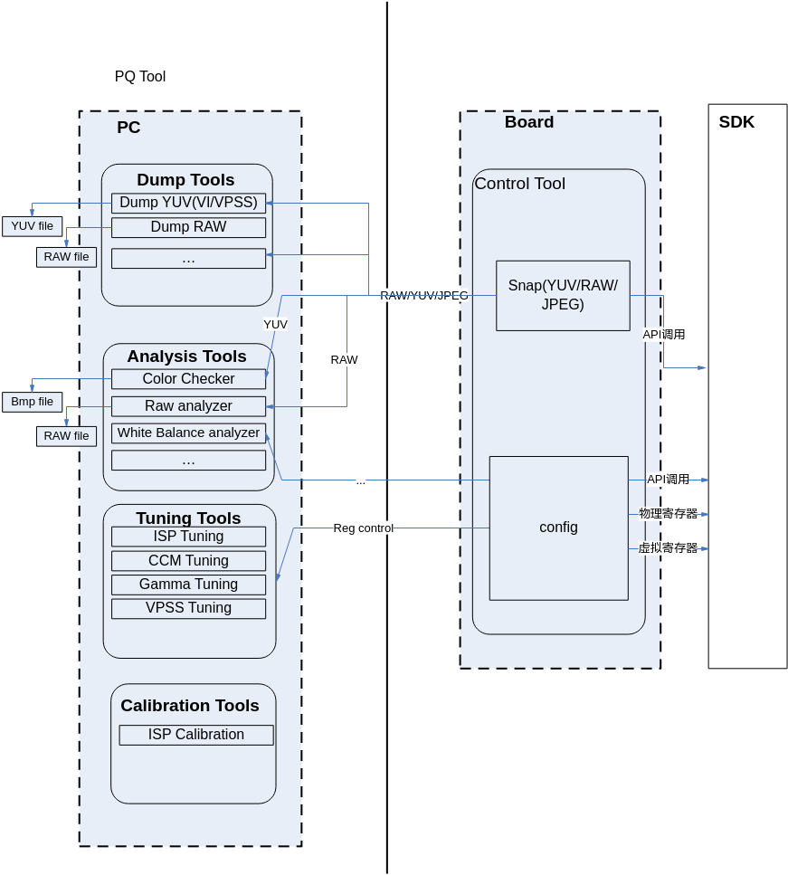

工具从使用场景上来分主要分为：

-   标定工具（Calibration Tool）：用于自动生成各个支持ISP模块的算法参数。现阶段该工具是个独立工具。
-   在线调试工具（Tuning Tool）：用于各类参数的精细及差异化的调节，实时生效，可以通过预览看到图像质量的效果。
-   分析工具（Analysis Tool）：辅助在线调试工具，提供常用的数据、图表，实时调节同时实时分析。
-   抓拍工具（Capture Tool）：抓拍工具，支持抓拍YUV、RAW、JPEG文件。
-   工具从交付上来看，分为PC端及板端两大部分，PC端包括在线调试工具、另外以插件的形式提供各种分析工具和标定工具；板端为ittb\_control进程，主要负责在线参数调节。

## 环境准备说明<a name="ZH-CN_TOPIC_0000002530221735"></a>


### 软硬件需求<a name="ZH-CN_TOPIC_0000002498141768"></a>

-   硬件需求
    -   安装有前言产品版本所列芯片，并具有网络端口的单板硬件。
    -   台式计算机或便携式计算机。
    -   网络连接线（若使用局域网络，则还需要路由器等网络交换设备）或者串口连接线。
    -   用于运行PQTools工具的计算机显示器分辨率宽度不小于1024，高度不小于768。

-   软件需求

    用于运行PQTools工具的计算机须安装Windows 10或以上版本的64位Windows操作系统。

    使用ISP标定、自动对焦参数仿真、PQTools Stitching Tool前，请下载python3.9.2安装包（64位）

    [https://www.python.org/downloads/release/python-392/](https://www.python.org/downloads/release/python-392/)，Windows用户选择如[图1](#fig1216734547)红色方框所标：

    **图 1**  下载提示<a name="fig1216734547"></a>  
    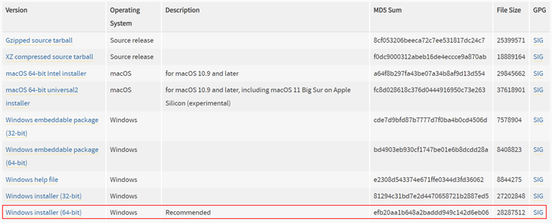

    安装并配置系统路径如[图2](#fig18802134119314)所示。

    该路径仅为示例，具体请依据实际python路径配置环境变量。

    **图 2**  系统路径配置<a name="fig18802134119314"></a>  
    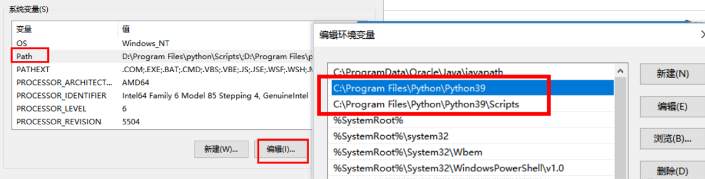

    python安装成功后，请使用 pip install 安装numpy， scipy， csaps 三个组件。

> **须知：** 
>PQTools工具部分功能不支持中文路径，在使用工具及载入文件的过程中，避免使用包含中文的文件路径。**目前因为算法调用工具python目录内容，对于工具路径算法内有限制：**
>-   **桌面及桌面以下路径**
>-   **中文路径**
>-   **数字开头的路径**

### 物理链路连接<a name="ZH-CN_TOPIC_0000002530221609"></a>

PQTools工具分为客户端（即PC端软件）和服务端（即板端软件），使用网络或者串口通信进行交互。可使用以下三种连接方式中的任意一种来完成物理链路的连接。

-   计算机与单板直接连接

    将网络连接线的两端分别接入单板和计算机的网络端口。

-   使用局域网络
    -   将网络连接线的两端分别接入单板网络端口与路由器客户端口。
    -   若计算机使用有线网络，则将另一根网络连接线的两端分别接入计算机的网络端口与路由器客户端口；若使用无线网络，则请参照当前路由器的设置（或网络管理员分配给您的网络设置）将计算机接入无线热点。

-   计算机与单板用串口连接

    将串口连接线的两端分别接入单板串口和计算机的串口。

### PQTools发布包目录说明<a name="ZH-CN_TOPIC_0000002498141840"></a>


#### SS928V100\_PQ\_Vx.x.x.x.tgz<a name="ZH-CN_TOPIC_0000002498301738"></a>

此版本使用请参考“[Linux系统下板端软件的安装与运行](#ZH-CN_TOPIC_0000002530221763)”章节。解压后包的目录结构如[图1](#_ref513797864)所示。

**图 1**  解压后的目录结构<a name="_ref513797864"></a>  


-   configs目录，包含ittb\_stream运行各种业务场景的sensor配置文件（如果不需要运行ittb\_stream，可删除该目录以节省板端空间；如果只运行个别场景，可删除该目录下其他场景的sensor配置文件以节省板端空间）
-   libs目录，包含ittb\_control和ittb\_stream运行的动态库文件（默认提供所有已支持场景的sensor库，如果只运行个别场景，可删除该目录下其他场景的sensor库以节省板端空间）
-   config.cfg是ittb\_control和ittb\_stream运行所需的配置文件
-   PQTools.sh是运行ittb\_control和ittb\_stream的脚本文件
-   ittb\_control和ittb\_stream是业务程序文件
-   StartControl.sh是快速重启ittb\_control的脚本文件

#### SS928V100\_ext\_api\_Vx.x.x.x.tgz<a name="ZH-CN_TOPIC_0000002530221767"></a>

此发布包用于将PQTools工具部分功能编译到用户业务中的小型化场景。解压后包的目录结构如[图1](#_toc51692445)所示。

**图 1**  解压后的目录结构<a name="_toc51692445"></a>  
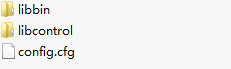

-   libbin目录，包含BIN功能的头文件和库文件，以及编译sample供用户参考。
-   libcontrol目录，包含control功能的头文件和库文件，以及编译sample供用户参考。
-   编译libbin与libcontrol的sample前，需要修改对应Makefile中的SDK\_DIR变量。
-   config.cfg，control功能运行所需的配置文件（如果将libcontrol编译到用户业务中，需要将此文件放在运行目录）。

### Linux系统下板端软件的安装与运行<a name="ZH-CN_TOPIC_0000002530221763"></a>

烧录芯片SDK并配置板端工具运行环境步骤，具体请参考《SSXX SDK 安装以及升级使用说明》，烧写镜像文件到单板，并配置好网络。

1.  把发布包中的SSXX\_SDK\_VX.X.X.X.tgz解压，将mpp/ko目录放置到文件系统中，或者nfs mount服务器的mpp目录到单板文件系统上。
2.  运行ko目录中的loadXXXX脚本。
3.  把发布包中的SSXX\_PQ\_VX.X.X.X.tgz解压，参考readme.txt在sample目录下编译生成test\_pqt后，将sample目录下的文件拷贝到文件系统中，或者nfs mount 到单板文件系统中。
4.  板端使用./test\_pqt运行支持stream和control功能的单个进程。

## PC端软件的安装<a name="ZH-CN_TOPIC_0000002498301772"></a>

PQTools工具PC端软件是绿色软件，直接使用解压缩工具（如WinRAR、WinZip等）将PQTools工具压缩包（zip格式）解压缩到任意的可写目录，即可使用。

## 快速入门<a name="ZH-CN_TOPIC_0000002498301786"></a>


### 欢迎界面<a name="ZH-CN_TOPIC_0000002498301740"></a>

用户每次运行PQTools.exe启动工具时，工具会弹出欢迎界面，引导用户快速新建调试表格与连接单板，如[图1](#fig1611913543)所示。

**图 1**  欢迎界面图例<a name="fig1611913543"></a>  
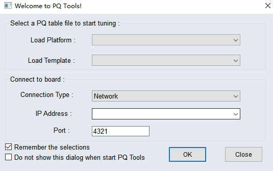

若希望通过此界面快速展开图像质量调试，请执行以下操作：

1.  选定正确的调试表格模板。在“Load Template”的下拉框中，选择与被调试芯片名称一致，且版本号匹配的模板。
2.  连接单板：如果用网络连接单板，“Connection Type”下拉框选择“Network”，并在“IP Address”一栏中输入单板使用的IP地址；在“Port”一栏中输入运行板端程序时指定的端口号码（默认为4321）。

    如果用串口连接单板，需要执行以下操作：

    -   先修改板端版本包的config.cfg文件中的\[Default\] UartEn，从0改为1。
    -   修改config.cfg文件中的\[Default\] UartDev，默认为/dev/ttyAMA0，如果改串口通信，则需要通过如下方法关闭串口控制台（注意：关闭之后无法再通过串口终端来操作单板，所以请务必保证单板的启动脚本中有媒体业务和ittb\_control的启动流程）：

        单Linux系统：

        用该命令注释掉/etc/inittab中的控制台初始化动作，然后重启单板：

        ```
        sed -i "s/^::respawn:\/sbin\/getty/#::respawn:\/sbin\/getty/g" /etc/inittab 
         reboot
        ```

    -   工具界面的“Connection Type”下拉框选择“Serial Port”，并选择相应的COM口来连接板端。

以上操作执行完毕后，点击“OK”按钮，工具将读取选定的模板生成调试表，并自动建立计算机与单板间的网络连接。若网络连接成功，工具还将自动从板端读取所有调试项的值。若串口打开成功，工具只会自动读取工具当前显示页面的调试项的值。

> **说明：** 
>-   默认情况下，工具会记住用户每次输入的所有信息。若用户只是将参数用于一次临时的调试，并不希望工具记住，请将“Remember the selections”前的复选框取消勾选。
>-   如果用户不希望每次打开工具时弹出欢迎窗口，请勾选“Do not show this dialog when start PQ Tools”。若勾选此项，则下一次用户启动工具时，欢迎窗口将不再出现，而是直接显示工具主界面。

### 工具主界面<a name="ZH-CN_TOPIC_0000002530061641"></a>

工具主界面如[图1](#fig4429101745518)所示。

**图 1**  工具主界面图例<a name="fig4429101745518"></a>  
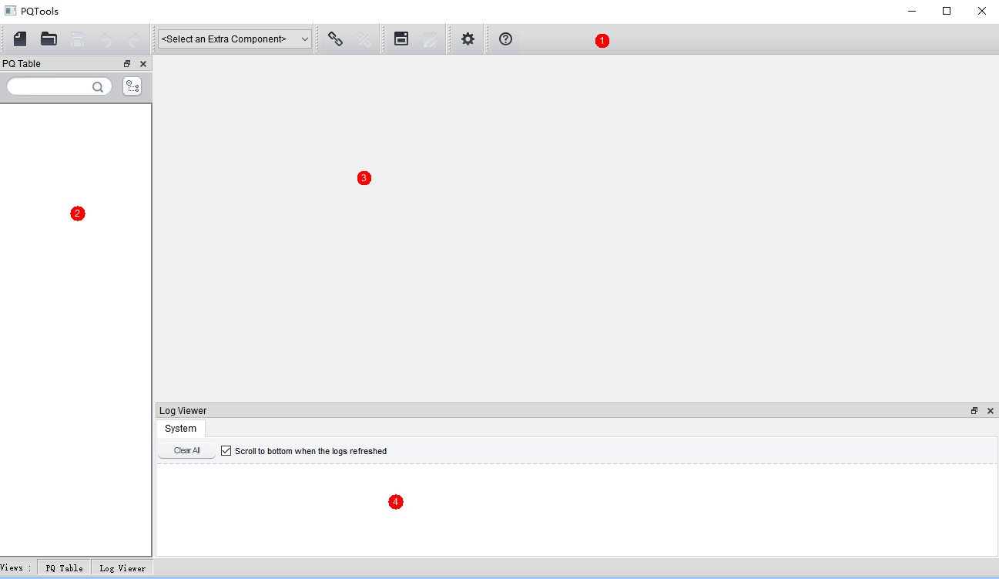

PQTools工具的主界面按功能的不同分为以下几个区域：

-   \(1\) 工具栏：提供一些常用的操作的快捷按钮
-   \(2\) 调试表面板：显示当前打开的调试表文件所包含的所有可调试项
-   \(3\) 调试区域：点击左侧的树节点，此区域会显示选中节点对应的调试页面
-   \(4\) 高级功能区域：显示通信日志。
-   \(5\) 提示栏：显示一些操作的提示性文本。

### 常用操作<a name="ZH-CN_TOPIC_0000002530061749"></a>


#### 新建调试表<a name="ZH-CN_TOPIC_0000002498301748"></a>

通过工具栏的“新建”（）按钮可以创建一个调试表格，并将其用于图像质量调试。点击“新建”按钮，工具会弹出“Create a new PQ table”对话框，如[图1](#fig10817881288)所示。

**图 1**  创建调试表格对话框<a name="fig10817881288"></a>  
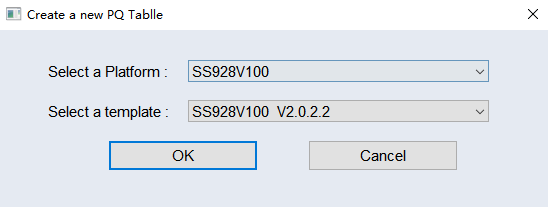

在下拉框中选择对应的调试表格模板，点击“OK”按钮，工具将建立调试表格。建立后，在主界面的调试表面板区，会显示当前调试表格的树形结构（详细描述请参见"[界面及功能说明](#ZH-CN_TOPIC_0000002498141848)"）。

#### 保存调试数据文件<a name="ZH-CN_TOPIC_0000002498301818"></a>

如果需要将当前的调试表以及板端读取到的调试数据保存到文件中，请点击工具栏上的“保存”按钮（）。此时工具将弹出路径选择的对话框。用户选定路径后，工具即将当前调试表的数据进行保存。

保存的文件格式为\*.xml。调试数据文件亦会包含所使用调试表的结构。

#### 打开调试数据文件<a name="ZH-CN_TOPIC_0000002498141846"></a>

如果需要加载保存的调试数据文件，请点击工具栏上的“打开”按钮（），此时工具将弹出对话框，让用户选择要打开的数据文件。

工具打开调试数据文件时，会读取文件中保存的调试表结构并将其显示在调试表面板。

> **须知：** 
>-   导入xml文件后，切换可调项界面不会自动获取板端数据，可调项界面显示导入文件的数据。
>-   导入xml文件后，点击主界面或可将参数设置到板端，或者切换到可调项界面点击调试页上的将此组数据设置到板端。
>-   PQTools当前版本导出的数据文件格式为.xml。
>-   打开文件时，可通过弹窗选择仅加载数据或新建调试表。仅加载数据仅刷新调试表界面的数据，新建调试表则相当于重新启动工具，会同时刷新外挂插件，并还原至初始状态。

#### 撤销与重做<a name="ZH-CN_TOPIC_0000002530221717"></a>

如果某一次调试操作需要被撤销，单击工具栏上的“撤销”按钮（）即可完成。要重做被撤销的操作，请单击工具栏上的“重做”按钮（）。

#### 打开外挂插件/外挂程序<a name="ZH-CN_TOPIC_0000002498301780"></a>

工具栏的下拉框（）列出了所有当前可用的外挂插件与程序。点击下拉框，选择需要使用的插件/程序即可。

工具只加载当前芯片支持的插件。

> **须知：** 
>-   工具退出时，被打开的插件会同时被关闭。
>-   由于一些外挂程序依赖连接参数，因此打开外挂的应用程序时，若工具没有与单板建立网络连接，则打开操作将被阻止。

#### 连接单板<a name="ZH-CN_TOPIC_0000002498141806"></a>

点击工具栏上的“连接”（）按钮，工具将弹出单板连接向导对话框如[图1](#fig611801919308)所示。

**图 1**  单板连接向导<a name="fig611801919308"></a>  
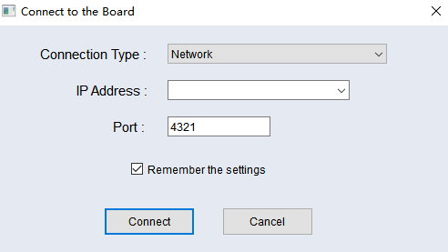

用户在“IP Address”的输入框中输入单板的IP地址（也可以点击下拉按钮选择之前连接过的单板的IP地址）并在“Port”文本框中输入端口号后，点击“Connect”，工具就会尝试连接单板。

若单板连接成功，则工具栏的“连接”按钮（）将被禁用，“断开”按钮（）会被激活。

#### 断开与单板的连接<a name="ZH-CN_TOPIC_0000002530061643"></a>

在已经连接单板的状态下，点击工具栏的“断开”按钮（），即可中断与计算机单板的网络连接。

#### 工具调试表设置<a name="ZH-CN_TOPIC_0000002498301774"></a>

点击工具栏的“设置”按钮（），打开工具调试表设置对话框。

**图 1**  工具调试表设置对话框<a name="fig1829891514415"></a>  
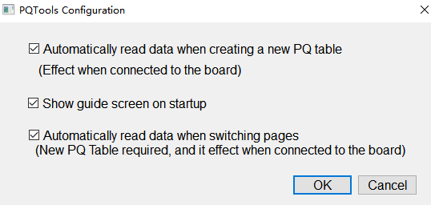

#### 工具版本号查看<a name="ZH-CN_TOPIC_0000002498141776"></a>

点击工具栏的“关于”按钮（），工具将弹出对话框如[图1](#fig127801132104515)所示。

**图 1**  工具版本号显示框<a name="fig127801132104515"></a>  
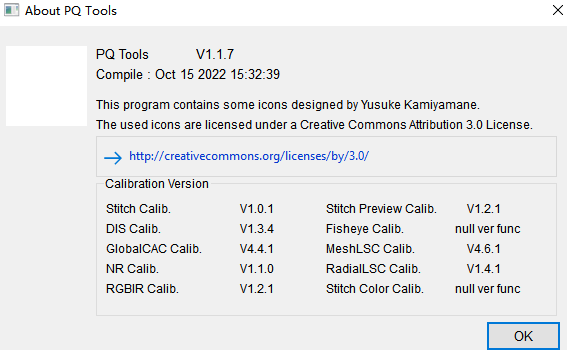

对话框中显示工具的版本信息以及各标定模块算法版本号。

# 界面及功能说明<a name="ZH-CN_TOPIC_0000002498141848"></a>


## 在线调试界面及功能说明<a name="ZH-CN_TOPIC_0000002498301816"></a>


### 调试结构界面<a name="ZH-CN_TOPIC_0000002498301768"></a>

新建调试表或打开调试数据文件以后，左侧的调试表面板将显示出当前调试表的结构，如[图1](#fig478484714466)所示。

**图 1**  调试表<a name="fig478484714466"></a>  
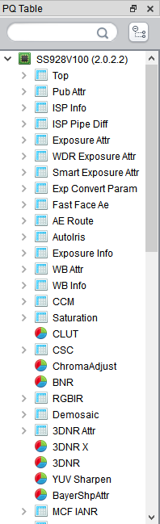

按照被调试功能大类的不同，调试表中设立了很多的调试页面。点击这些调试页的节点，工具会在右侧的调试区域显示调试页中包含的内容，如图  [图2](#fig826218494470)所示。

**图 2**  打开调试表中的调试页<a name="fig826218494470"></a>  
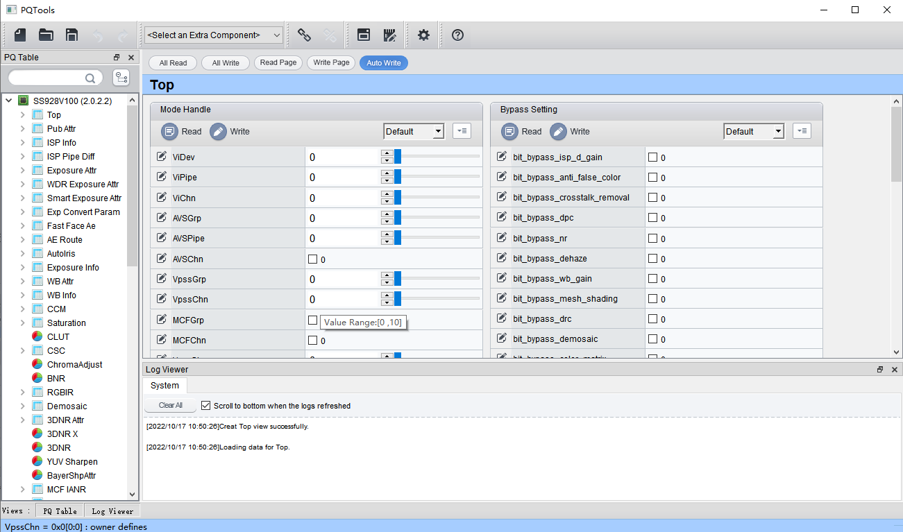

使用搜索框可以通过关键字快速定位调试项。在搜索框中输入关键字（关键字不区分大小写）以后，按下回车键（或点击放大镜按钮），工具将自动定位到下一个包含该关键字的字段，并打开其所属的调试页面，如[图3](#_toc51692454)所示。

**图 3**  使用搜索功能<a name="_toc51692454"></a>  
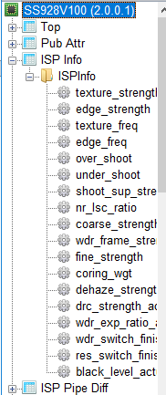

**图 4**  曲线页面<a name="fig283mcpsimp"></a>  

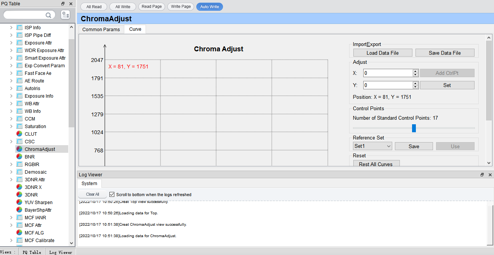

> **须知：** 
>-   如果搜索字段是曲线的名字，可跳转到对应的曲线页面；
>-   该搜索框不支持搜索3DNR参数，在3DNR页面中搜索3DNR参数。

### 读写通路设置<a name="ZH-CN_TOPIC_0000002530061753"></a>

对于支持多Sensor通路的环境，通过TOP页面的Mode Handle项来配置，如[图1](#_toc51692456)所示。

**图 1**  Sensor通路配置<a name="_toc51692456"></a>  

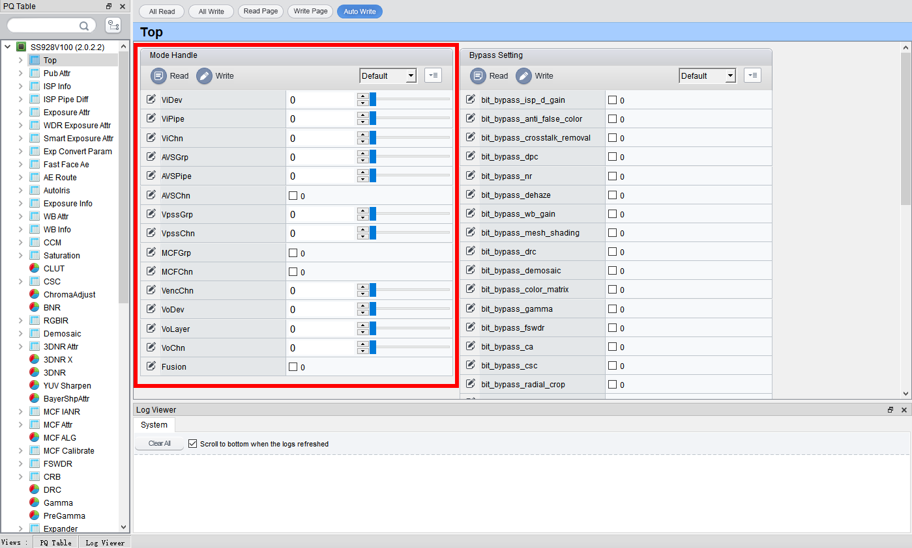

多Sensor场景下：

-   抓取不同Sensor的YUV文件时，需要根据配置文件中Sensor使用的ViPipe来设置Top页面对应的ViPipe编号，然后使用抓拍工具抓取对应Sensor的YUV数据图像，切换YUV抓取来源的Sensor只和ViPipe有关。
-   通过ISP各项功能调试不同Sensor的图像质量相关参数时，也需要根据配置文件中Sensor使用的ViPipe来设置Top页面对应的ViPipe编号，然后进行参数调试，查看图像效果变化，切换不同Sensor的图像质量调试时，通过ViPipe在不同的Sensor中间切换。

> **须知：** 
>-   新建调试表功能和切换调试页面引发的自动数据读取受此设置影响。
>-   具备独立通道选择功能的插件，读写通道不受主界面上通道设置的影响。
>-   不支持AVSP功能的芯片，没有AVSGrp、AVSPipe、AVSChn三个调试项。

### 寄存器/算法参数调整<a name="ZH-CN_TOPIC_0000002530221725"></a>

在调试表树结构中以图标表示的调试页为“寄存器/算法参数”调试页。这些页对应的调试界面如[图1](#fig3235113211493)所示。

**图 1**  寄存器/算法参数调试页（以曝光参数为例）<a name="fig3235113211493"></a>  
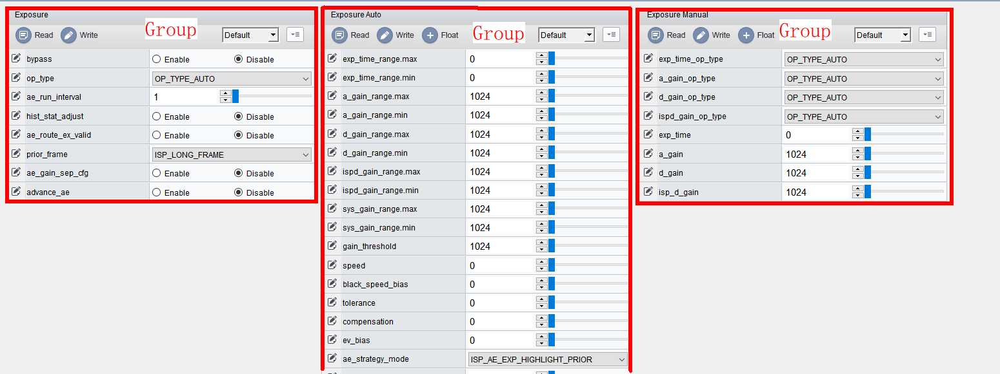

根据每个页面的调试子功能的不同，一个调试页面中的所有算法参数还会被分成若干个分组。

部分分组由于设备接口限制会具有一些特殊属性。这些属性会在每个分组名称的右侧进行标注。目前工具提供的分组特殊属性有：

-   Indi-Read：当用户点击“Read Page”或“Read All”时，本组寄存器/算法参数不进行读取操作，但仍可以通过该组的“Read”按钮进行读取；
-   Indi-Write：当用户点击“Write Page”或“Write All”时，本组寄存器/算法参数不进行写入操作，但仍可以通过该组的“Write”按钮进行写入。

具有特殊属性的寄存器/算法参数组示例如[图2](#fig28121346501)所示。

**图 2**  具有特殊属性的寄存器/算法参数组示例（以FPN为例）<a name="fig28121346501"></a>  
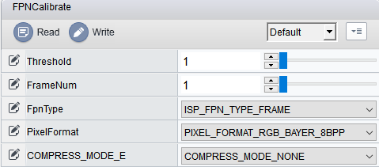


#### 寄存器/算法参数的查看与修改<a name="ZH-CN_TOPIC_0000002498301822"></a>

每个组内都包含有寄存器与算法参数，其中标有“”的参数行代表可写参数，标有“”的参数行代表只读参数。参数按照其内部形式与取值范围的不同，被分为以下五类，并以不同的控件呈现，如[表1](#table317mcpsimp)所示。

**表 1**  寄存器/算法参数的调试项类型

<a name="table317mcpsimp"></a>
<table><thead align="left"><tr id="row323mcpsimp"><th class="cellrowborder" valign="top" width="12%" id="mcps1.2.4.1.1"><p id="p325mcpsimp"><a name="p325mcpsimp"></a><a name="p325mcpsimp"></a>类型</p>
</th>
<th class="cellrowborder" valign="top" width="21%" id="mcps1.2.4.1.2"><p id="p327mcpsimp"><a name="p327mcpsimp"></a><a name="p327mcpsimp"></a>说明</p>
</th>
<th class="cellrowborder" valign="top" width="67%" id="mcps1.2.4.1.3"><p id="p329mcpsimp"><a name="p329mcpsimp"></a><a name="p329mcpsimp"></a>控件操作</p>
</th>
</tr>
</thead>
<tbody><tr id="row331mcpsimp"><td class="cellrowborder" valign="top" width="12%" headers="mcps1.2.4.1.1 "><p id="p333mcpsimp"><a name="p333mcpsimp"></a><a name="p333mcpsimp"></a>数值</p>
</td>
<td class="cellrowborder" valign="top" width="21%" headers="mcps1.2.4.1.2 "><p id="p335mcpsimp"><a name="p335mcpsimp"></a><a name="p335mcpsimp"></a>参数的形式是具有一定取值范围的实数</p>
</td>
<td class="cellrowborder" valign="top" width="67%" headers="mcps1.2.4.1.3 "><p id="p337mcpsimp"><a name="p337mcpsimp"></a><a name="p337mcpsimp"></a>使用以下调整面板：</p>
<p id="p20888134219456"><a name="p20888134219456"></a><a name="p20888134219456"></a><a name="image118885425458"></a><a name="image118885425458"></a><span></span></p>
<p id="p339mcpsimp"><a name="p339mcpsimp"></a><a name="p339mcpsimp"></a>可通过文本框查看当前值。修改值可以通过以下三种方式：</p>
<a name="ul340mcpsimp"></a><a name="ul340mcpsimp"></a><ul id="ul340mcpsimp"><li>在文本框中输入值</li><li>点击文本框右侧的小箭头按钮微调</li><li>拖动最右侧的滑动条</li></ul>
</td>
</tr>
<tr id="row344mcpsimp"><td class="cellrowborder" valign="top" width="12%" headers="mcps1.2.4.1.1 "><p id="p346mcpsimp"><a name="p346mcpsimp"></a><a name="p346mcpsimp"></a>比特</p>
</td>
<td class="cellrowborder" valign="top" width="21%" headers="mcps1.2.4.1.2 "><p id="p348mcpsimp"><a name="p348mcpsimp"></a><a name="p348mcpsimp"></a>参数在0和1中间取值</p>
</td>
<td class="cellrowborder" valign="top" width="67%" headers="mcps1.2.4.1.3 "><p id="p350mcpsimp"><a name="p350mcpsimp"></a><a name="p350mcpsimp"></a>通过复选框查看并设定值，复选框选中时取1，未选中时取0</p>
<p id="p1137710574455"><a name="p1137710574455"></a><a name="p1137710574455"></a><a name="image13377175711454"></a><a name="image13377175711454"></a><span></span></p>
</td>
</tr>
<tr id="row352mcpsimp"><td class="cellrowborder" valign="top" width="12%" headers="mcps1.2.4.1.1 "><p id="p354mcpsimp"><a name="p354mcpsimp"></a><a name="p354mcpsimp"></a>布尔</p>
</td>
<td class="cellrowborder" valign="top" width="21%" headers="mcps1.2.4.1.2 "><p id="p356mcpsimp"><a name="p356mcpsimp"></a><a name="p356mcpsimp"></a>参数的形式为二选一</p>
</td>
<td class="cellrowborder" valign="top" width="67%" headers="mcps1.2.4.1.3 "><p id="p358mcpsimp"><a name="p358mcpsimp"></a><a name="p358mcpsimp"></a>通过单选框查看并设定值：</p>
<p id="p1281610617461"><a name="p1281610617461"></a><a name="p1281610617461"></a><a name="image881612614620"></a><a name="image881612614620"></a><span></span></p>
</td>
</tr>
<tr id="row360mcpsimp"><td class="cellrowborder" valign="top" width="12%" headers="mcps1.2.4.1.1 "><p id="p362mcpsimp"><a name="p362mcpsimp"></a><a name="p362mcpsimp"></a>枚举</p>
</td>
<td class="cellrowborder" valign="top" width="21%" headers="mcps1.2.4.1.2 "><p id="p364mcpsimp"><a name="p364mcpsimp"></a><a name="p364mcpsimp"></a>参数的形式是多项（一般&gt;3）中取其一</p>
</td>
<td class="cellrowborder" valign="top" width="67%" headers="mcps1.2.4.1.3 "><p id="p366mcpsimp"><a name="p366mcpsimp"></a><a name="p366mcpsimp"></a>通过下拉框查看并设定值：</p>
<p id="p8664191624611"><a name="p8664191624611"></a><a name="p8664191624611"></a><a name="image1466416160467"></a><a name="image1466416160467"></a><span></span></p>
</td>
</tr>
<tr id="row368mcpsimp"><td class="cellrowborder" valign="top" width="12%" headers="mcps1.2.4.1.1 "><p id="p370mcpsimp"><a name="p370mcpsimp"></a><a name="p370mcpsimp"></a>矩阵</p>
</td>
<td class="cellrowborder" valign="top" width="21%" headers="mcps1.2.4.1.2 "><p id="p372mcpsimp"><a name="p372mcpsimp"></a><a name="p372mcpsimp"></a>参数的形式是一个多字节序列</p>
</td>
<td class="cellrowborder" valign="top" width="67%" headers="mcps1.2.4.1.3 "><p id="p374mcpsimp"><a name="p374mcpsimp"></a><a name="p374mcpsimp"></a>调试页面会显示一个打开矩阵的按钮：</p>
<p id="p857920274467"><a name="p857920274467"></a><a name="p857920274467"></a><a name="image257810277461"></a><a name="image257810277461"></a><span></span></p>
<p id="p376mcpsimp"><a name="p376mcpsimp"></a><a name="p376mcpsimp"></a>点击该按钮，会弹出一个对话框，矩阵的值会显示在对话框内的表格控件中：</p>
<p id="p915135561517"><a name="p915135561517"></a><a name="p915135561517"></a><a name="image960845512157"></a><a name="image960845512157"></a><span>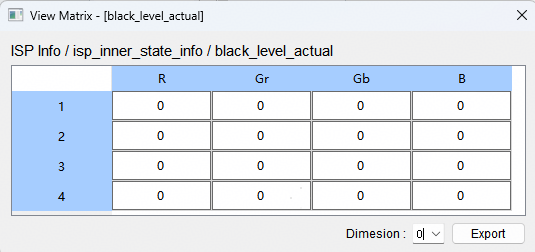</span></p>
<p id="p378mcpsimp"><a name="p378mcpsimp"></a><a name="p378mcpsimp"></a>用户修改表格中的值，点击空白处或者关闭对话框，即可完成矩阵值的修改。</p>
<p id="p379mcpsimp"><a name="p379mcpsimp"></a><a name="p379mcpsimp"></a>矩阵若是只读的，用户将无法修改表格内的值，且此时打开矩阵的按钮显示文本为“View this Matrix”。</p>
<p id="p380mcpsimp"><a name="p380mcpsimp"></a><a name="p380mcpsimp"></a>Dimension用于三维矩阵选择第三维，一、二维矩阵Dimension下拉框中只有“0”。</p>
<p id="p381mcpsimp"><a name="p381mcpsimp"></a><a name="p381mcpsimp"></a>用户可以使用Import&amp;Export导入导出矩阵。</p>
</td>
</tr>
</tbody>
</table>

#### 浮点形式变换<a name="ZH-CN_TOPIC_0000002498141802"></a>

部分的寄存器/算法参数分组中的某些参数具有浮点形式，它们比起实际的数值形式表意更加清晰（如曝光参数中的增益值）。在这种情况下，可以通过分组的“浮点形式变换”按钮（）使这些参数切换到增益值，如[图1](#fig17266281744)所示。

**图 1**  参数的浮点形式变换<a name="fig17266281744"></a>  
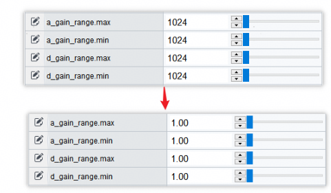

显示浮点数的状态下，若用户再点击一次浮点形式变换按钮，则这些参数将恢复原始数值的显示。

#### 从板端读取数据<a name="ZH-CN_TOPIC_0000002530221695"></a>

在已经连接到板端工具的情况下，点击每个分组内的“Read”按钮（），工具就会读取组内每一项参数在单板上的数值，并显示在工具上。

#### 将数据写入到板端<a name="ZH-CN_TOPIC_0000002530221765"></a>

在已经连接到板端工具的情况下，点击每个分组内的“Write”按钮（），工具会将组内每一个可写参数项的当前显示值写到板端。

#### 数据的暂存与恢复<a name="ZH-CN_TOPIC_0000002498141858"></a>

工具对每个调试项分组提供两组数据暂存空间，用户可以利用暂存空间临时保存调整的值进行复原或比较操作。

-   点击“To Set”按钮（或），可以将分组内当前调整好的值暂存起来。
-   点击“Load Set”按钮（或），可以将暂存的值恢复到分组界面上。

#### 数据的显示方式转换<a name="ZH-CN_TOPIC_0000002530221715"></a>

选择列表的项，Group页面上的数据将以十进制形式显示。选择，将以十六进制形式显示。

#### 物理/虚拟寄存器的添加与调试<a name="ZH-CN_TOPIC_0000002530221723"></a>

PQTools工具的XML格式中，对于算法参数接口和寄存器采取了不同的定义格式，因此用户并不能直接通过复制XML中已有的定义来自行添加寄存器。以下介绍如何在XML中添加寄存器到界面进行调试。

1.  用文本编辑器（如Notepad等）打开工具的XML文件，搜索字符串“ <REG\_DEF\>”，找到寄存器的定义单元。XML中已经包含一些预定义的寄存器定义节点（仅作为示例，不对应任何PQ参数）

    **图 1**  寄存器定义示例<a name="_toc51692460"></a>  
    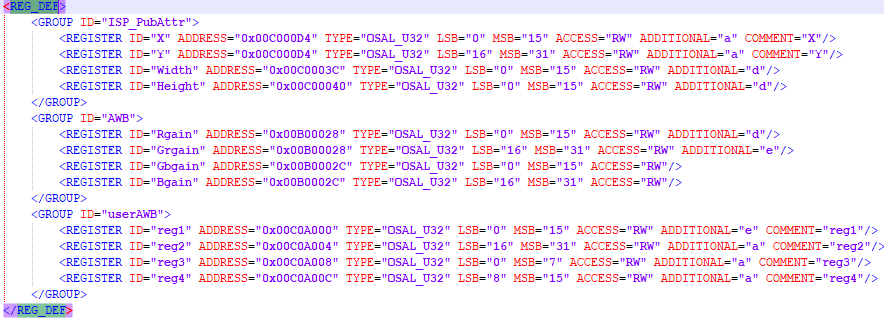

2.  GROUP为寄存器组的定义，ID为这个寄存器组的名称（定义后，将显示在寄存器组的标题栏中）。根据需要增加寄存器组。
3.  REGISTER为寄存器的定义，其所支持的属性如[表1](#_toc51692645)所示，根据需要添加：

    **表 1**  寄存器的属性字段

    <a name="_toc51692645"></a>
    <table><thead align="left"><tr id="row413mcpsimp"><th class="cellrowborder" valign="top" width="17.169999999999998%" id="mcps1.2.4.1.1"><p id="p415mcpsimp"><a name="p415mcpsimp"></a><a name="p415mcpsimp"></a>属性</p>
    </th>
    <th class="cellrowborder" valign="top" width="23.23%" id="mcps1.2.4.1.2"><p id="p417mcpsimp"><a name="p417mcpsimp"></a><a name="p417mcpsimp"></a>存在必要性</p>
    </th>
    <th class="cellrowborder" valign="top" width="59.599999999999994%" id="mcps1.2.4.1.3"><p id="p419mcpsimp"><a name="p419mcpsimp"></a><a name="p419mcpsimp"></a>表示含义</p>
    </th>
    </tr>
    </thead>
    <tbody><tr id="row421mcpsimp"><td class="cellrowborder" valign="top" width="17.169999999999998%" headers="mcps1.2.4.1.1 "><p id="p423mcpsimp"><a name="p423mcpsimp"></a><a name="p423mcpsimp"></a>ID</p>
    </td>
    <td class="cellrowborder" valign="top" width="23.23%" headers="mcps1.2.4.1.2 "><p id="p425mcpsimp"><a name="p425mcpsimp"></a><a name="p425mcpsimp"></a>必须</p>
    </td>
    <td class="cellrowborder" valign="top" width="59.599999999999994%" headers="mcps1.2.4.1.3 "><p id="p427mcpsimp"><a name="p427mcpsimp"></a><a name="p427mcpsimp"></a>寄存器的名称。定义后，将显示在寄存器的标题栏中。</p>
    </td>
    </tr>
    <tr id="row428mcpsimp"><td class="cellrowborder" valign="top" width="17.169999999999998%" headers="mcps1.2.4.1.1 "><p id="p430mcpsimp"><a name="p430mcpsimp"></a><a name="p430mcpsimp"></a>ADDRTYPE</p>
    </td>
    <td class="cellrowborder" valign="top" width="23.23%" headers="mcps1.2.4.1.2 "><p id="p432mcpsimp"><a name="p432mcpsimp"></a><a name="p432mcpsimp"></a>必须</p>
    </td>
    <td class="cellrowborder" valign="top" width="59.599999999999994%" headers="mcps1.2.4.1.3 "><p id="p434mcpsimp"><a name="p434mcpsimp"></a><a name="p434mcpsimp"></a>寄存器的地址类型。</p>
    <p id="p435mcpsimp"><a name="p435mcpsimp"></a><a name="p435mcpsimp"></a>0：物理地址</p>
    <p id="p436mcpsimp"><a name="p436mcpsimp"></a><a name="p436mcpsimp"></a>1：虚拟地址</p>
    <p id="p437mcpsimp"><a name="p437mcpsimp"></a><a name="p437mcpsimp"></a>默认地址类型为虚拟地址，此时该项可以选择性配置，当地址类型为物理地址时，该项必须配置。</p>
    </td>
    </tr>
    <tr id="row438mcpsimp"><td class="cellrowborder" valign="top" width="17.169999999999998%" headers="mcps1.2.4.1.1 "><p id="p440mcpsimp"><a name="p440mcpsimp"></a><a name="p440mcpsimp"></a>ADDRESS</p>
    </td>
    <td class="cellrowborder" valign="top" width="23.23%" headers="mcps1.2.4.1.2 "><p id="p442mcpsimp"><a name="p442mcpsimp"></a><a name="p442mcpsimp"></a>必须</p>
    </td>
    <td class="cellrowborder" valign="top" width="59.599999999999994%" headers="mcps1.2.4.1.3 "><p id="p444mcpsimp"><a name="p444mcpsimp"></a><a name="p444mcpsimp"></a>寄存器的地址。</p>
    <p id="p445mcpsimp"><a name="p445mcpsimp"></a><a name="p445mcpsimp"></a>地址类型为虚拟地址时：高12bit表示mod，0x00A表示AE，0x00B表示AWB，0x00C表示ISP（客户自研3A应配置为0x00C）；低20bit表示offset，即参数项在mod中的偏移（客户自研3A应配置为 VREG_AE_OFFSET/VREG_AWB_OFFSET/VREG_AF_OFFSET+参数项offset）。</p>
    <p id="p446mcpsimp"><a name="p446mcpsimp"></a><a name="p446mcpsimp"></a>VREG_AE_OFFSET、VREG_AWB_OFFSET、VREG_AF_OFFSET的值见mpp/component/isp/user/firmware/include/isp_ext_config.h</p>
    <p id="p447mcpsimp"><a name="p447mcpsimp"></a><a name="p447mcpsimp"></a>注：可参考<a href="#_toc51692460">图1</a> 寄存器定义示例 进行设置</p>
    </td>
    </tr>
    <tr id="row449mcpsimp"><td class="cellrowborder" valign="top" width="17.169999999999998%" headers="mcps1.2.4.1.1 "><p id="p451mcpsimp"><a name="p451mcpsimp"></a><a name="p451mcpsimp"></a>ACCESS</p>
    </td>
    <td class="cellrowborder" valign="top" width="23.23%" headers="mcps1.2.4.1.2 "><p id="p453mcpsimp"><a name="p453mcpsimp"></a><a name="p453mcpsimp"></a>必须</p>
    </td>
    <td class="cellrowborder" valign="top" width="59.599999999999994%" headers="mcps1.2.4.1.3 "><p id="p455mcpsimp"><a name="p455mcpsimp"></a><a name="p455mcpsimp"></a>寄存器的可访问性，由下列字母中的一个或多个组成：</p>
    <p id="p456mcpsimp"><a name="p456mcpsimp"></a><a name="p456mcpsimp"></a>R：表示寄存器可读</p>
    <p id="p457mcpsimp"><a name="p457mcpsimp"></a><a name="p457mcpsimp"></a>W：表示寄存器可写</p>
    <p id="p458mcpsimp"><a name="p458mcpsimp"></a><a name="p458mcpsimp"></a>H：表示寄存器须从界面隐藏</p>
    </td>
    </tr>
    <tr id="row459mcpsimp"><td class="cellrowborder" valign="top" width="17.169999999999998%" headers="mcps1.2.4.1.1 "><p id="p461mcpsimp"><a name="p461mcpsimp"></a><a name="p461mcpsimp"></a>TYPE</p>
    </td>
    <td class="cellrowborder" valign="top" width="23.23%" headers="mcps1.2.4.1.2 "><p id="p463mcpsimp"><a name="p463mcpsimp"></a><a name="p463mcpsimp"></a>必须</p>
    </td>
    <td class="cellrowborder" valign="top" width="59.599999999999994%" headers="mcps1.2.4.1.3 "><p id="p465mcpsimp"><a name="p465mcpsimp"></a><a name="p465mcpsimp"></a>该寄存器的数据类型。目前可支持以下类型：</p>
    <p id="p466mcpsimp"><a name="p466mcpsimp"></a><a name="p466mcpsimp"></a>OSAL_BOOL：布尔类型，等同于32位有符号整型。设置为此类型时，工具界面将显示此寄存器为布尔型界面。</p>
    <p id="p467mcpsimp"><a name="p467mcpsimp"></a><a name="p467mcpsimp"></a>OSAL_S32：32位有符号整型</p>
    <p id="p468mcpsimp"><a name="p468mcpsimp"></a><a name="p468mcpsimp"></a>OSAL_U32：32位无符号整型</p>
    <p id="p469mcpsimp"><a name="p469mcpsimp"></a><a name="p469mcpsimp"></a>对于OSAL_S32类型与OSAL_U32类型，若有效比特位只有1位（LSB与MSB相同），则工具会将此寄存器显示为比特型；否则显示为数值型。</p>
    </td>
    </tr>
    <tr id="row470mcpsimp"><td class="cellrowborder" valign="top" width="17.169999999999998%" headers="mcps1.2.4.1.1 "><p id="p472mcpsimp"><a name="p472mcpsimp"></a><a name="p472mcpsimp"></a>COUNT</p>
    </td>
    <td class="cellrowborder" valign="top" width="23.23%" headers="mcps1.2.4.1.2 "><p id="p474mcpsimp"><a name="p474mcpsimp"></a><a name="p474mcpsimp"></a>可选</p>
    </td>
    <td class="cellrowborder" valign="top" width="59.599999999999994%" headers="mcps1.2.4.1.3 "><p id="p476mcpsimp"><a name="p476mcpsimp"></a><a name="p476mcpsimp"></a>如果寄存器为多地址连续（可理解为数组），此处可以填入元素个数。需要定义为多维数组的情况，数字间用逗号隔开。</p>
    <p id="p477mcpsimp"><a name="p477mcpsimp"></a><a name="p477mcpsimp"></a>定义此项后，工具上将以矩阵型显示该寄存器。</p>
    <p id="p478mcpsimp"><a name="p478mcpsimp"></a><a name="p478mcpsimp"></a>请注意填入的数字为不带0x的十六进制数。</p>
    </td>
    </tr>
    <tr id="row479mcpsimp"><td class="cellrowborder" valign="top" width="17.169999999999998%" headers="mcps1.2.4.1.1 "><p id="p481mcpsimp"><a name="p481mcpsimp"></a><a name="p481mcpsimp"></a>LSB</p>
    </td>
    <td class="cellrowborder" valign="top" width="23.23%" headers="mcps1.2.4.1.2 "><p id="p483mcpsimp"><a name="p483mcpsimp"></a><a name="p483mcpsimp"></a>可选</p>
    </td>
    <td class="cellrowborder" valign="top" width="59.599999999999994%" headers="mcps1.2.4.1.3 "><p id="p485mcpsimp"><a name="p485mcpsimp"></a><a name="p485mcpsimp"></a>寄存器有效位域的最低位。如不存在该定义，取默认值0</p>
    </td>
    </tr>
    <tr id="row486mcpsimp"><td class="cellrowborder" valign="top" width="17.169999999999998%" headers="mcps1.2.4.1.1 "><p id="p488mcpsimp"><a name="p488mcpsimp"></a><a name="p488mcpsimp"></a>MSB</p>
    </td>
    <td class="cellrowborder" valign="top" width="23.23%" headers="mcps1.2.4.1.2 "><p id="p490mcpsimp"><a name="p490mcpsimp"></a><a name="p490mcpsimp"></a>可选</p>
    </td>
    <td class="cellrowborder" valign="top" width="59.599999999999994%" headers="mcps1.2.4.1.3 "><p id="p492mcpsimp"><a name="p492mcpsimp"></a><a name="p492mcpsimp"></a>寄存器有效位域的最高位。如不存在该定义，取默认值（数据类型支持的最大位数 - 1）</p>
    </td>
    </tr>
    <tr id="row493mcpsimp"><td class="cellrowborder" valign="top" width="17.169999999999998%" headers="mcps1.2.4.1.1 "><p id="p495mcpsimp"><a name="p495mcpsimp"></a><a name="p495mcpsimp"></a>RANGE</p>
    </td>
    <td class="cellrowborder" valign="top" width="23.23%" headers="mcps1.2.4.1.2 "><p id="p497mcpsimp"><a name="p497mcpsimp"></a><a name="p497mcpsimp"></a>可选</p>
    </td>
    <td class="cellrowborder" valign="top" width="59.599999999999994%" headers="mcps1.2.4.1.3 "><p id="p499mcpsimp"><a name="p499mcpsimp"></a><a name="p499mcpsimp"></a>寄存器在数据类型和比特数的范围限制之上进一步限制的范围。</p>
    <p id="p500mcpsimp"><a name="p500mcpsimp"></a><a name="p500mcpsimp"></a>格式为[最小值, 最大值]（中括号可以用小括号替换，表示边界值不可取）。</p>
    <p id="p501mcpsimp"><a name="p501mcpsimp"></a><a name="p501mcpsimp"></a>不存在时取数据类型和比特数限制的默认范围。</p>
    </td>
    </tr>
    <tr id="row502mcpsimp"><td class="cellrowborder" valign="top" width="17.169999999999998%" headers="mcps1.2.4.1.1 "><p id="p504mcpsimp"><a name="p504mcpsimp"></a><a name="p504mcpsimp"></a>RADIX</p>
    </td>
    <td class="cellrowborder" valign="top" width="23.23%" headers="mcps1.2.4.1.2 "><p id="p506mcpsimp"><a name="p506mcpsimp"></a><a name="p506mcpsimp"></a>可选</p>
    </td>
    <td class="cellrowborder" valign="top" width="59.599999999999994%" headers="mcps1.2.4.1.3 "><p id="p508mcpsimp"><a name="p508mcpsimp"></a><a name="p508mcpsimp"></a>寄存器默认以哪种进制显示，可取值10或16。不存在时默认取10。</p>
    </td>
    </tr>
    <tr id="row509mcpsimp"><td class="cellrowborder" valign="top" width="17.169999999999998%" headers="mcps1.2.4.1.1 "><p id="p511mcpsimp"><a name="p511mcpsimp"></a><a name="p511mcpsimp"></a>COMMENT</p>
    </td>
    <td class="cellrowborder" valign="top" width="23.23%" headers="mcps1.2.4.1.2 "><p id="p513mcpsimp"><a name="p513mcpsimp"></a><a name="p513mcpsimp"></a>可选</p>
    </td>
    <td class="cellrowborder" valign="top" width="59.599999999999994%" headers="mcps1.2.4.1.3 "><p id="p515mcpsimp"><a name="p515mcpsimp"></a><a name="p515mcpsimp"></a>关于该寄存器的说明。鼠标悬停在寄存器界面上时，会在状态栏显示相应的提示。</p>
    </td>
    </tr>
    </tbody>
    </table>

4.  找到<FUNCTIONS\>的XML节点，添加以下子节点（可以从已有的FUNCTION节点复制添加）：

    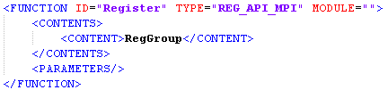

    其中RegGroup需要替换成步骤2中定义的寄存器组名。

5.  保存XML文件，用PQTools工具重新打开这个编辑过的XML文件。

    > **说明：** 
    >板端添加物理/虚拟寄存器读写请参考ISP的firmware中寄存器相关代码。

> **须知：** 
>所有xml的页面参数不会自动刷新，有需要刷新数据时点击各页面里的“Read”或页面上方的“ReadPage”，如：Defect Pixel的DP Static Calibrate，在进行坏点标定时把EnableDetect设为Enable状态，标定结束SDK内部会把EnableDetect参数设为Disable状态，用户要获取当前的标定结果就需要点击页面里的“Read”进行刷新。
>设置ADDRTYPE=0，添加物理寄存器调试时，注意不要添加无效寄存器或非法寄存器，可能会导致单板端不可预期的错误。

### 调试数据的批量读写与自动写入<a name="ZH-CN_TOPIC_0000002530061755"></a>

每新建一个调试表或打开一个数据文件，读写控制面板就会显示在界面上，如[图1](#fig166984072217)所示。

**图 1**  读写控制面板<a name="fig166984072217"></a>  


读写控制面板包含以下功能入口（所有的读写操作均需要在已连接单板状态下进行）：

-   全部读取按钮（）：点击此按钮时，工具会读取调试表内所有调试项在板端的当前数值。新建调试表（未打开自动读取）或导入BIN文件后，建议执行一次全部读取操作。
-   全部写入按钮（）：点击此按钮时，工具会将调试表内所有调试项在工具中的暂存值写入到板端。
-   自动写入开关（关闭状态， 打开状态）：开关打开时，每修改一个可写的调试项，工具就会将该调试项的新值写入板端。建议打开此功能，以保证调试值能立即生效。
-   页读取按钮（）：点击此按钮时，工具会读取当前打开的调试页内所有调试项在板端的当前数值。若当前打开的页面为GAMMA等支持数据读取的特殊调试页面，则会触发相应调试页的数据读取动作。
-   页写入按钮（）：点击此按钮时，工具会将当前打开的调试页内所有调试项在工具中的暂存值写入到板端。若当前打开的页面为GAMMA等特殊调试页面，则会触发相应调试页的数据写入动作。

### 曲线可视化调试<a name="ZH-CN_TOPIC_0000002498141854"></a>


#### 通用曲线功能说明<a name="ZH-CN_TOPIC_0000002530221719"></a>


##### 曲线的基本调整方法<a name="ZH-CN_TOPIC_0000002498301746"></a>

曲线上有一定数量的控制点，用于改变曲线的走向。

用户将鼠标指向控制点时，鼠标指针会变为垂直调整形态（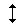），此时按住鼠标左键并上下移动鼠标，可以改变控制点的垂直位置，并观察此时曲线的变化。

在鼠标指针处于精确选择状态（）的情况下，在曲线上单击鼠标左键，则工具会将当前鼠标位置映射到对应曲线上的点，并将该点变为控制点。

在鼠标指针指向控制点的状态下单击鼠标右键，则指向的控制点会被重置为普通点，不再具有控制曲线的功能。

-   点击“”按钮，工具会从板端读取曲线数据，并刷新曲线显示。
-   点击“”按钮，工具会将曲线数据写入到板端。

如果按钮是点亮状态，调整后的参数会自动写到板端。

##### 曲线的高级控制<a name="ZH-CN_TOPIC_0000002530061789"></a>

**图 1**  曲线示例一<a name="fig33421411102311"></a>  
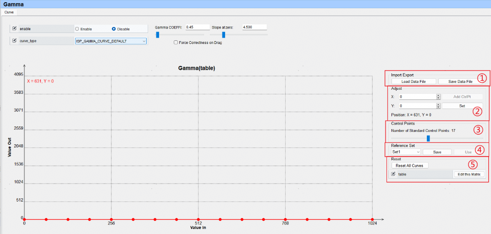

**图 2**  曲线示例二<a name="fig26364286238"></a>  
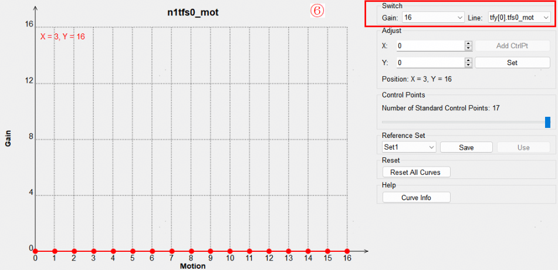

1.  Import & Export

    -   点击“Save Data File”，可以将当前调整的曲线数据保存到本地文件中。
    -   点击“Load Data File”，可以从文件中读取曲线数据，恢复到当前曲线的数据集中，并显示恢复后的曲线。

    工具支持保存以下三种格式的数据文件：

    -   浮点型，保存在文本文件中的是每个数据的浮点形式（当前值与最大值的比例），取小数点后六位，范围为0.0到1.0之间；
    -   十进制整数形式，保存在文本文件中的是每个曲线数据的十进制表示形式，与界面上对应点位的值相同，取值范围为0到最大值之间；
    -   十六进制形式，保存在文本文件中的是每个曲线数据的十六进制表示形式，数据取值和范围与十进制相同。

2.  Adjust
    -   在X文本框中输入数值后，可以查看曲线对应横轴坐标上的点的纵轴值。
    -   若当前X、Y文本框内值对应的点不是控制点时，点击“Add CtrlPt”按钮，可以将这个点变为控制点。
    -   若当前X、Y文本框内值对应的点是控制点，在Y文本框输入新值后点击“Set”按钮，可以将当前控制点的纵轴值设置为刚输入的新值。
    -   鼠标在坐标系中移动时，“Position”字符串显示X和Y的位置，鼠标移出坐标系则显示“Out of chart”。

3.  Control Points

    通过该区域的滑动条，用户可以快速设置曲线上控制点的数量。

4.  Reference Set

    对每条曲线提供Set1\~Set5 5组暂存值，点击“Save”按钮将当前界面曲线上的值存入Set，点击“Use”按钮将已存入Set的值设置到当前界面曲线上。未进行“Save”的Set的“Use”按钮不可操作。

5.  Reset

    点击“Reset All Curves”按钮可将当前界面对应的曲线设置为起始控制点Y值为0，最后一个控制点Y值为最大值的一条直线。

6.  Switch
    -   通过“Gain”下拉框，用户可在不同倍率之间切换坐标系纵轴最大值。
    -   通过“Line”下拉框，用户可在多条曲线之间切换显示。

#### Gamma可视化调试<a name="ZH-CN_TOPIC_0000002530061799"></a>

在调试表树结构中以图标表示的调试页为“可视化Gamma”调试页。Gamma页对应的调试界面，如[图1](#fig1055850102415)所示。

**图 1**  Gamma可视化调试界面<a name="fig1055850102415"></a>  
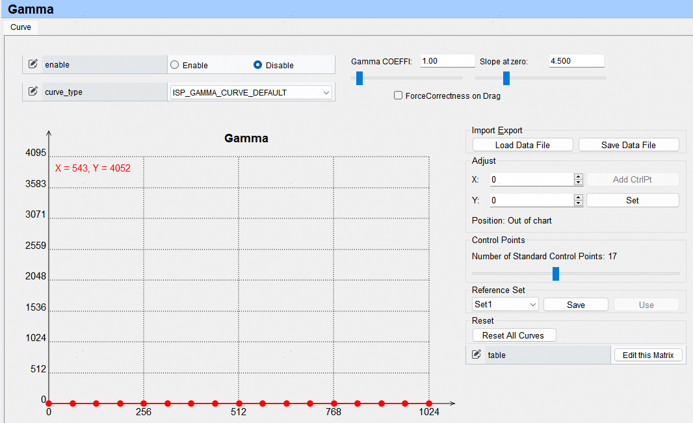

-   通过设置\[Enable\]参数项为Enable选中状态使能Gamma。
-   通过Gamma COEFFI的滑条，或在滑条上方的文本框中输入数值，用户可以将可见的Gamma曲线恢复为标准的Gamma曲线（受当前选定的系数影响。系数范围为0.01到20.00）
-   通过Slope at Zero 的滑条，或在滑条上方的文本框中输入数值，用户可以调节gamma曲线的零点斜率的值（受当前选定的系数影响。系数范围为0.001到20.000）
-   勾选“Force Correctness on Drag”复选框的情况下，每次拖动控制点时，控制点的纵轴取值最大不能大于右边一个控制点的纵轴值，最小不能小于左侧一个控制点的纵轴值。

其它功能参考"[通用曲线功能说明](#ZH-CN_TOPIC_0000002530221719)"。

#### DRC可视化调试<a name="ZH-CN_TOPIC_0000002498301766"></a>

针对某些具备DRC模块的芯片，PQTools提供了DRC可视化调试功能。在左侧的调试表树视图中找到带有标识的页面，点击即可打开DRC模块调试界面。


##### DRC使能<a name="ZH-CN_TOPIC_0000002530061705"></a>

在DRC寄存器修改界面设置\[Enable\]参数项为Enable选中状态。

**图 1**  DRC寄存器设置界面<a name="fig21194421522"></a>  
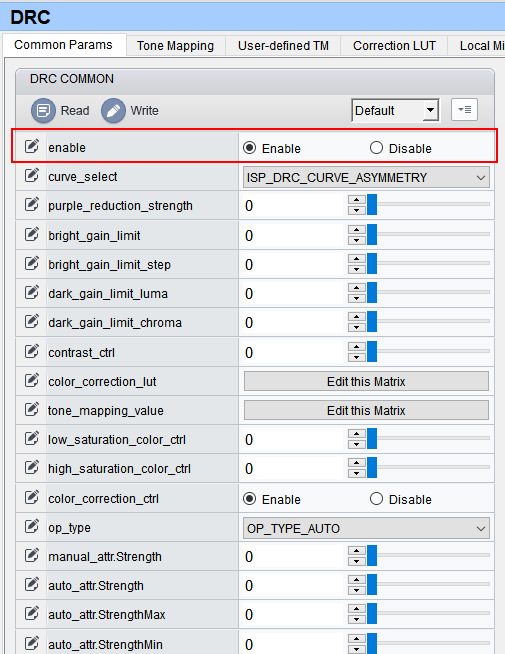

##### DRC色调映射曲线调试<a name="ZH-CN_TOPIC_0000002530221729"></a>

PQTools工具提供了DRC色调映射曲线调试功能，通过2个或更多（取决于芯片）参数来调整DRC色调映射曲线的走向。

**图 1**  DRC色调映射界面<a name="fig195512168534"></a>  
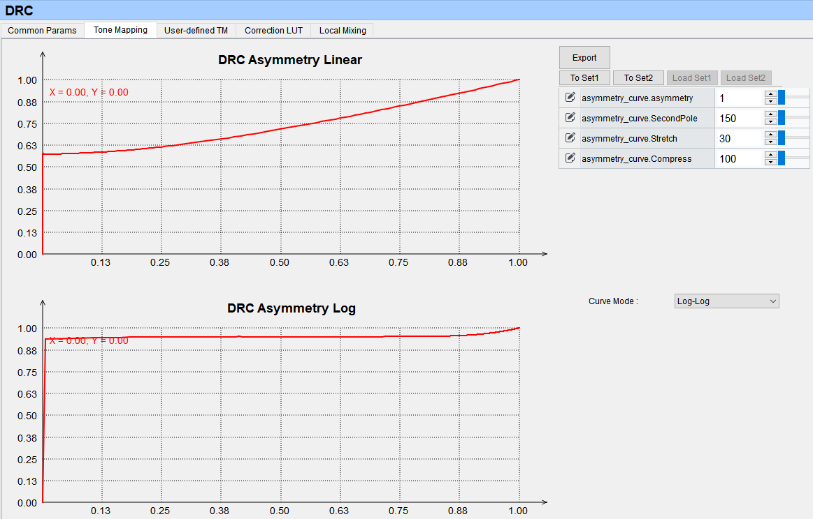

调整曲线图右侧的参数，配合观察左侧曲线走势，即可完成调整。

打开DRC可视化调整页面点击“Tone Mapping”页签，首先显示的即为色调映射曲线调试，如[图1](#fig195512168534)所示。图中的 Export 按钮用于从板端导出Tone Mapping曲线的各个点的纵坐标值，并保存到一个txt格式的可编辑文件中，供User-defined TM页面导入。

##### DRC色调TM曲线调试<a name="ZH-CN_TOPIC_0000002498301828"></a>

开启PQTools调试表，在DRC页面将主标签页切换到User-defined TM，即为色调TM曲线调试，已支持鼠标左键按下框选曲线图像放大，及放大状态下右键按住拖动功能（框选时从左到右为放大，从右向左为还原），如[图1](#fig3732321181215)所示。

**图 1**  DRC色调TM调试界面<a name="fig3732321181215"></a>  
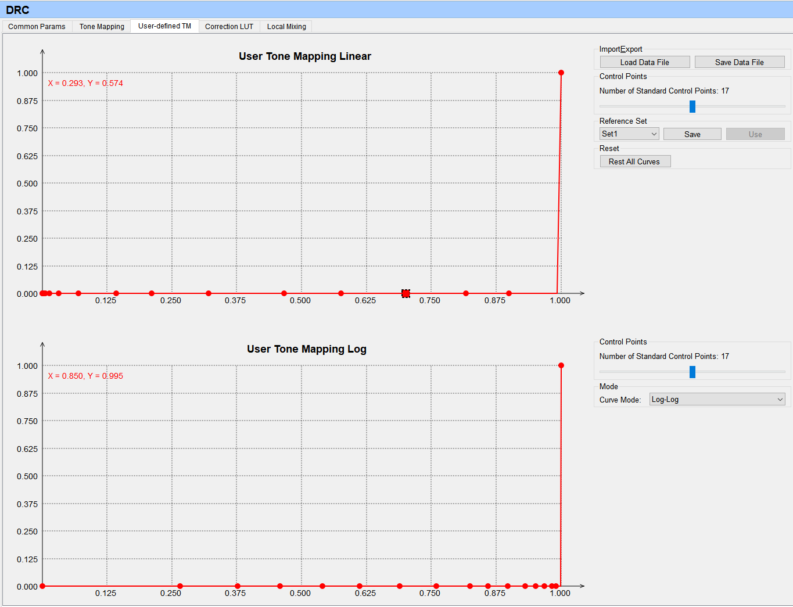

请参考"[通用曲线功能说明](#ZH-CN_TOPIC_0000002530221719)"。

##### 饱和度修正曲线调试<a name="ZH-CN_TOPIC_0000002530061747"></a>

PQTools工具提供了饱和度修正曲线的调整功能。在DRC页面将主标签页切换到Correction LUT，即可看到该功能界面，如[图1](#fig7898123713597)所示。

**图 1**  DRC饱和度修正曲线界面<a name="fig7898123713597"></a>  
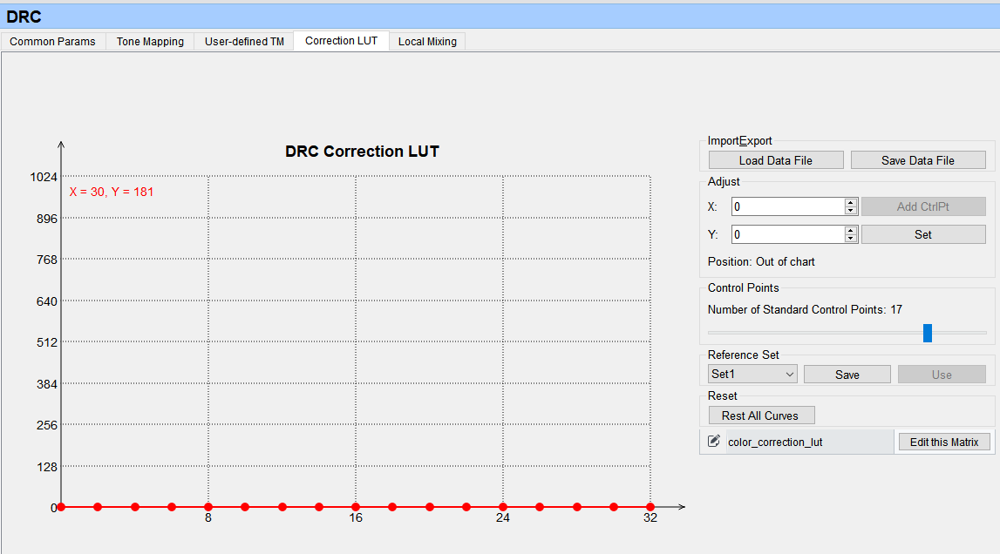

请参考"[通用曲线功能说明](#ZH-CN_TOPIC_0000002530221719)"。

##### 局部细节回叠曲线<a name="ZH-CN_TOPIC_0000002530061719"></a>

PQTools工具提供了局部细节回叠曲线的调整功能。在DRC页面将主标签页切换到Local Mixing，即可看到该功能界面，如[图1](#fig1675112459016)所示。

**图 1**  DRC局部细节回叠曲线界面<a name="fig1675112459016"></a>  
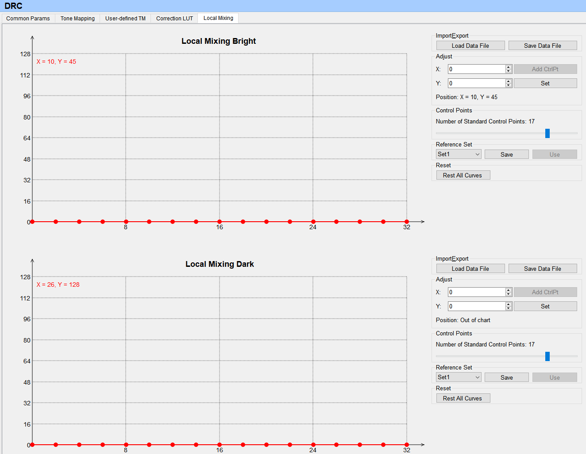

请参考"[通用曲线功能说明](#ZH-CN_TOPIC_0000002530221719)"。

#### CLUT可视化调试<a name="ZH-CN_TOPIC_0000002530221677"></a>

在左侧的调试表树视图中找到标签，点击即可打开CLUT可视化调试界面。


##### CLUT在线调优基本原理<a name="ZH-CN_TOPIC_0000002498141838"></a>

CLUT在线调优基于捕获的Clut模块输入图像，根据用户指定的目标方向，建立输入图像和目标图像在RGB空间的3D映射表。和CLUT离线标定工具相比，在线调优工具减弱了各个颜色之间的相互干扰。

##### Cap Image Online功能<a name="ZH-CN_TOPIC_0000002498301660"></a>

捕获Clut模块在线输入图像。在捕获过程中，工具会自动对ISP PIPE多个模块的参数进行调整，用户会观察到预览页面图像变化。捕获完成后，会自动恢复捕获前的默认配置。推荐用户在捕获图像上选择色彩源，通过拉动HSV结点或设置RGB值的方式给出色彩目标。在Clut调优过程中，需要实时观测预览输出，判断调优是否已达标。捕获图像是Clut模块输入图像，调节Clut参数，捕获图像不会发生改变。

**图 1**  CLUT在线调优界面<a name="fig174981637261"></a>  
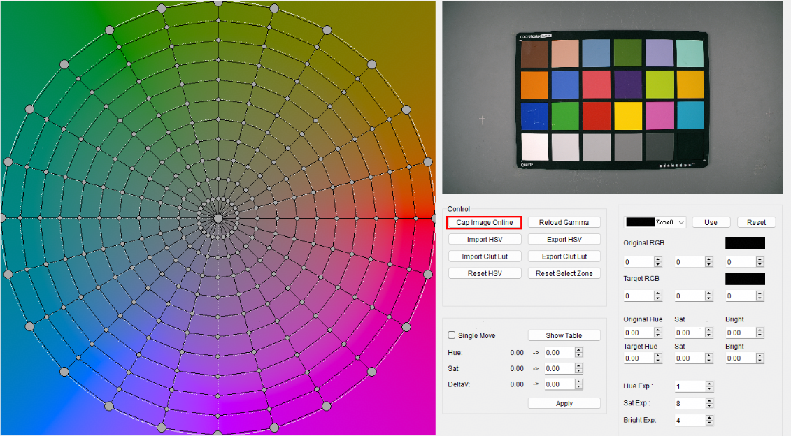

##### HSV可视化界面调优<a name="ZH-CN_TOPIC_0000002530221705"></a>

1.  使能Clut，将强度设置为1024 \(1x\)，Clut表清零。

    **图 1**  默认强度确认<a name="fig14627194324415"></a>  
    
    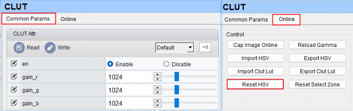

2.  在捕获图像上通过画框或者取点方式取RGB对的输入，同时在左侧HSV色彩空间显示源的位置，在右侧的源和目标映射区域，显示源和目标的RGB值、HSV值（目标色默认值与源相同）。

    **图 2**  取色<a name="fig1147115716441"></a>  
    
    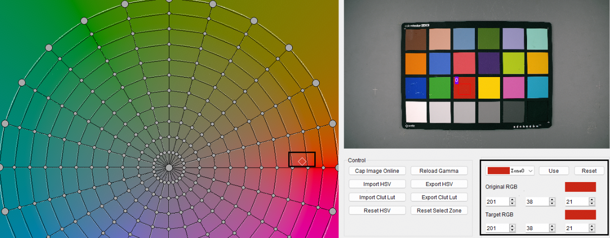

3.  选择HSV色彩空间源点附近的多个点，准备对该区域进行调整。

    **图 3**  选择调整区域<a name="fig196265915717"></a>  
    
    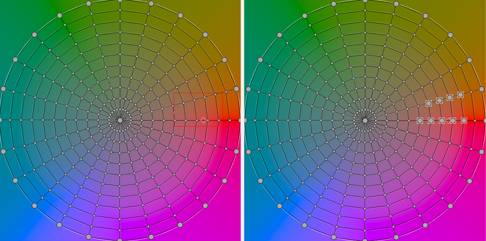

4.  拖动HSV色彩空间源点附近的多个点到目标方向，松开鼠标，观察预览输出是否达标，如果没有，继续调整目标位置。同时观察对其他色调的影响是否可接受，如果不能接受，需要重新选择源点范围。

    以红色调整到偏橙的方向为例，将源附近的多个点向90度方向拉动，红色偏橙。

    **图 4**  拉动红色区域结点<a name="fig6652131154516"></a>  
    
    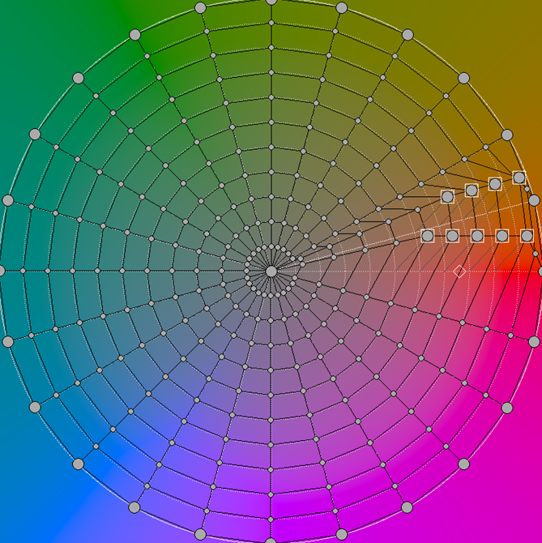

    **图 5**  调整前后色彩差异 \(左图是调整前，右图是调整后\)<a name="fig8500172419451"></a>  
    
    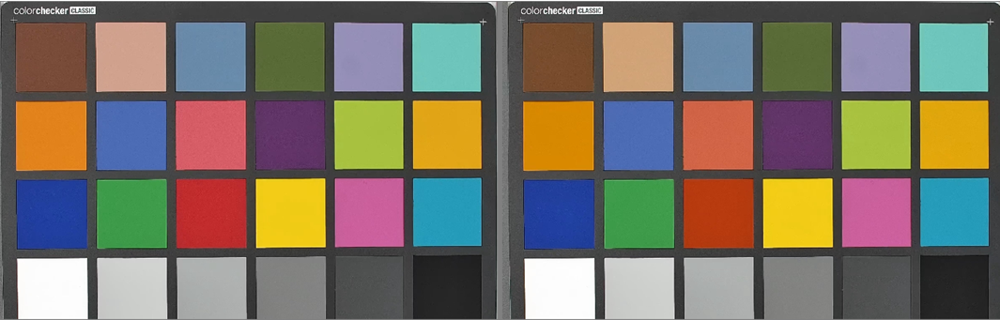

    观察目标图，红色效果符合预期，但肤色偏黄，需要重新选择源点范围，避免肤色被调整。如[图6](#fig4370748468)，保持红色方框内颜色不动，可降低对肤色的影响。

    **图 6**  Hue 15度方向的结点不动，避免肤色调整 \(左图Hue 15调整，右图Hue 15不调整\)<a name="fig4370748468"></a>  
    
    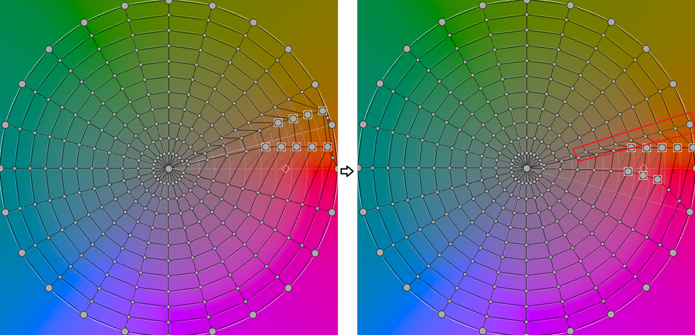

    **图 7**  效果对比 \(左图Hue 15调整，右图Hue 15不调整\)<a name="fig980115298465"></a>  
    
    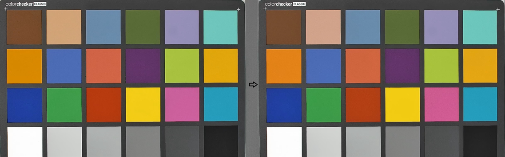

5.  重复步骤4，完成其他颜色的调节。建议通过Export HSV将本次调试过程导出，后续可通过Import HSV加载历史HSV调试过程，在之前基础上，继续Clut调整。

    **图 8**  HSV导入、导出控件<a name="fig925317595129"></a>  
    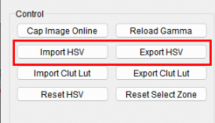

6.  Import Clut Lut支持将Clut LUT导入，在HSV页面会显示Clut Lut对颜色做了哪些调整。通过HSV页面调节Clut，同时保存HSV.txt和Clut Lut，再通过 Import HSV导入HSV.txt，和通过Import Clut Lut导入Clut LUT，在HSV页面显示会有偏差。推荐仅用Import Clut Lut功能做辅助判断，不做为后续调整的基础。

    **图 9**  HSV导入和Clut导入差异。左图是HSV导入，右图是Clut导入。<a name="fig8627793579"></a>  
    
    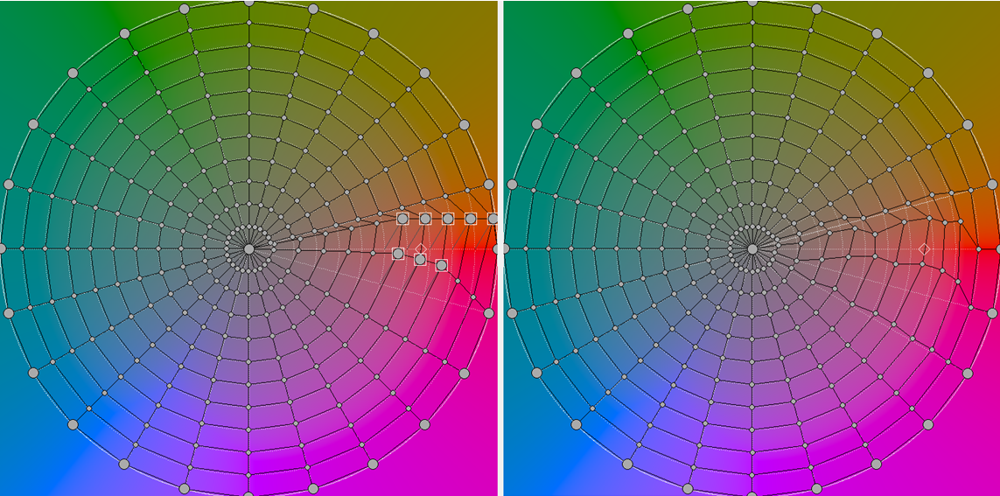

7.  勾选Single Move选项，支持对HSV单个结点进行调整，相邻其他结点位置固定。

    **图 10**  Single Move示例<a name="fig2062799145717"></a>  
    
    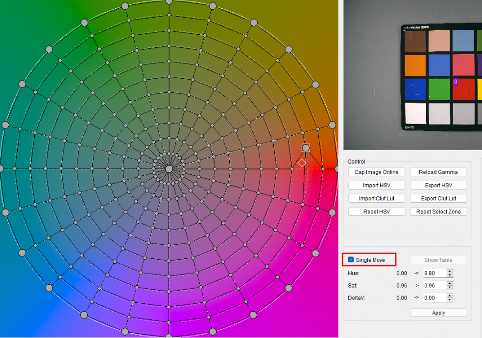

8.  取消Single Move选项，Show Tab支持在Hue, Sat维度通过填表方式生成Clut表。用户手动填表需要考虑相邻结点的平滑性。

    **图 11**  Table 操作界面<a name="fig6207338111314"></a>  
    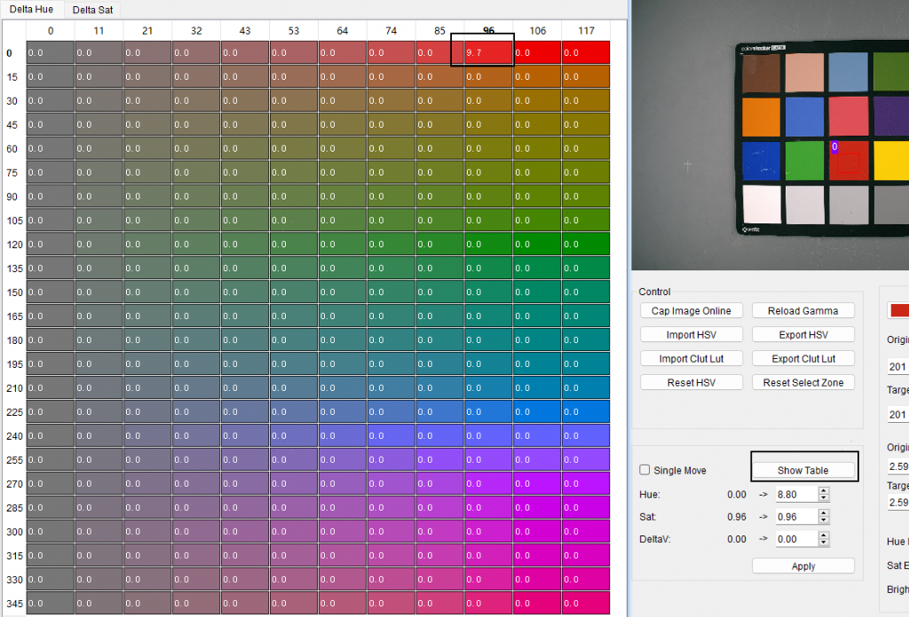

##### RGB对调优<a name="ZH-CN_TOPIC_0000002530061723"></a>

1.  选择Zone0，在捕获图像上通过画框或者取点方式取RGB对的输入，同时在左侧HSV色彩空间显示源的位置，在右侧的源和目标映射区域，显示源和目标的RGB值、HSV值（目标色默认值与源相同）。

    **图 1**  RGB对调优<a name="fig11244852151112"></a>  
    
    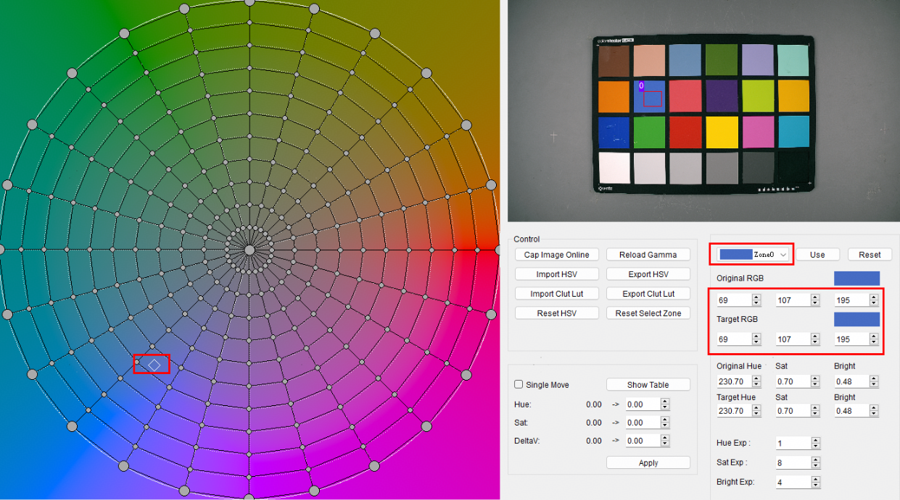

2.  设置Zone0的目标值。支持通过手动输入或者上下翻键方式设定目标RGB值或HSV值。源、目标的RGB和HSV是对应的，调整目标RGB值，HSV会自动更新；调整目标HSV值，RGB会自动更新。

    **图 2**  设置目标值<a name="fig731983451116"></a>  
    
    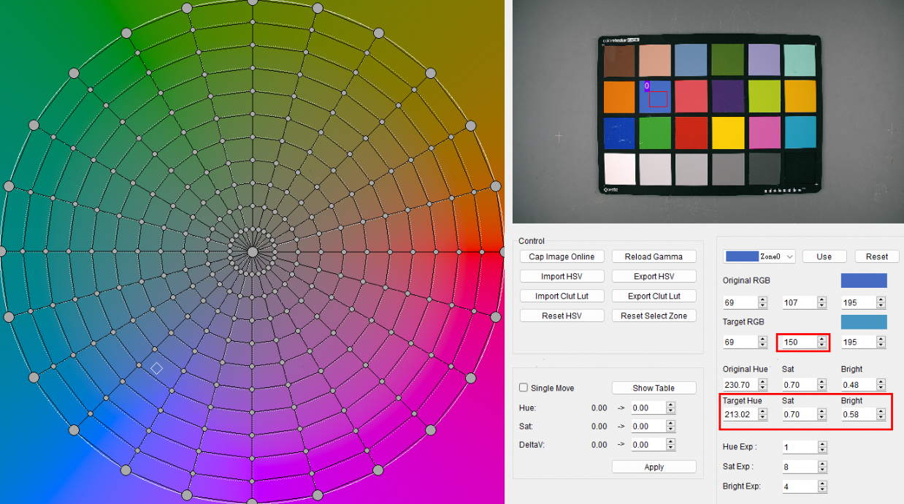

3.  点击Use按键，左侧HSV图根据用户期望调整的方向，调整HSV结点位置。

    **图 3**  调试生效<a name="fig42295191128"></a>  
    
    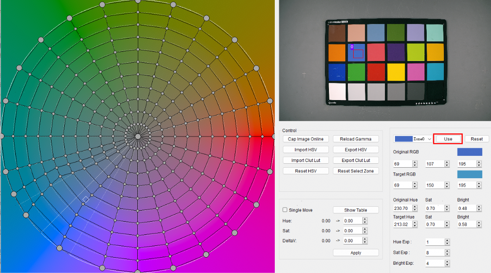

4.  观察Stream输出色彩是否达标，如果没有，继续调整目标位置。

    **图 4**  Zone0蓝色调整效果 \(左图是调整前，右图是调整后\)<a name="fig1013193571213"></a>  
    .jpg "Zone0蓝色调整效果-(左图是调整前-右图是调整后)")

5.  修改目标值，继续对蓝色块进行调优。

    **图 5**  Zone0蓝色再次调整目标值<a name="fig81354719121"></a>  
    
    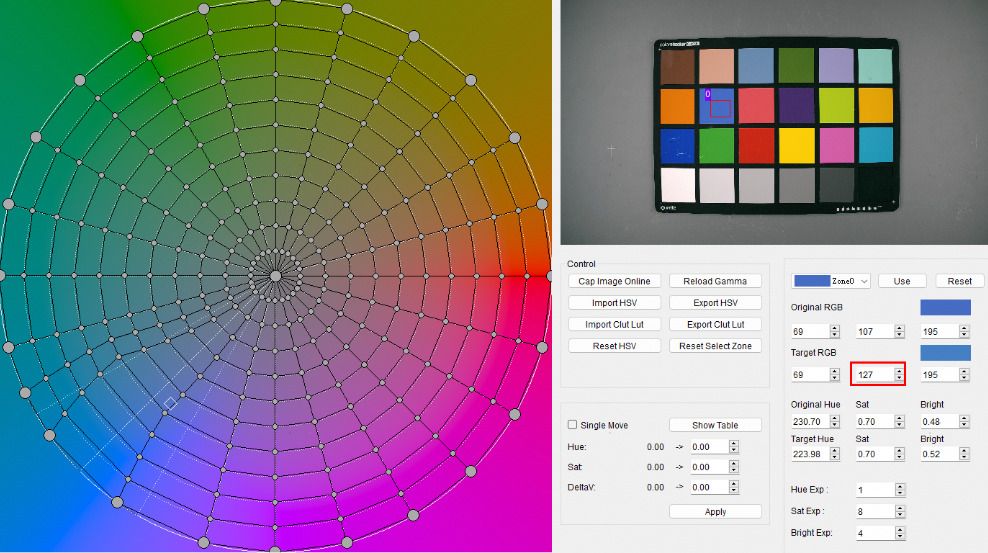

6.  Hue Exp参数对应RGB映射对在色调维度的范围，取值越大，色调维度被调整的结点越多；当不希望其他颜色被影响时，可调小Hue Exp取值。在调整幅度较大时，适当增大Hue Exp可避免放大噪声。
7.  Sat Exp参数对应RGB映射对在饱和度维度的范围，取值越大，饱和度维度被调整的结点越多；在灰色区域被影响时，可调小Sat Exp取值。
8.  Bright Exp参数对应RGB映射对在亮度维度的范围，取值越大，亮度维度被调整的结点越多。希望亮、暗区域也进行色彩调整时，可适当调大Bright Exp范围，但也会一定程度增大暗区的噪声。

    **图 6**  RGB对调试相关参数<a name="fig3781414134"></a>  
    
    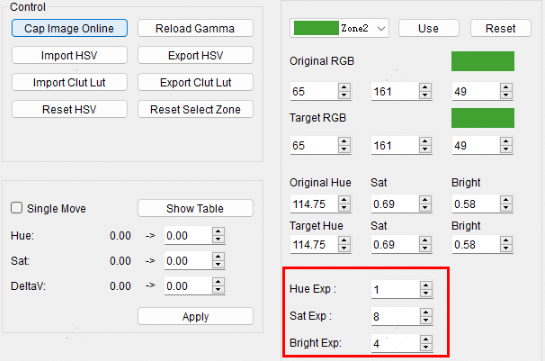

9.  完成Zone0 RGB对的调节后，可选择Zone1，继续其他颜色的调优。要求按顺序选择Zone。

    **图 7**  多个RGB对调试<a name="fig255721291310"></a>  
    
    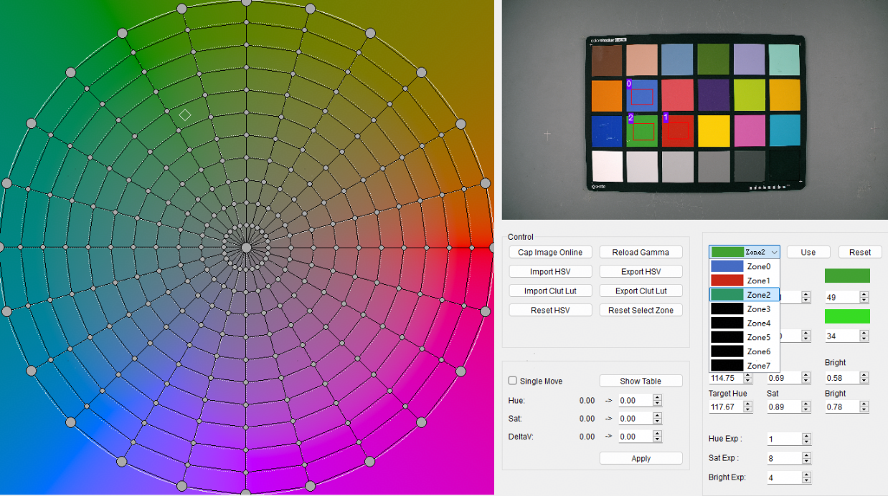

10. 完成调试目标后，通过Export HSV按钮，可保存当前的RGB对调试设置和HSV映射表，后续可通过Import HSV基于历史调优结果继续。离线Clut标定工具通过Import RGB对方式也可以导入该结果，通过离线标定工具进行Clut调优。用户可比较2个工具的标定结果做选择。

    **图 8**  离线Clut工具导入在线RGB对，进行Clut Calibration<a name="fig190222111313"></a>  
    
    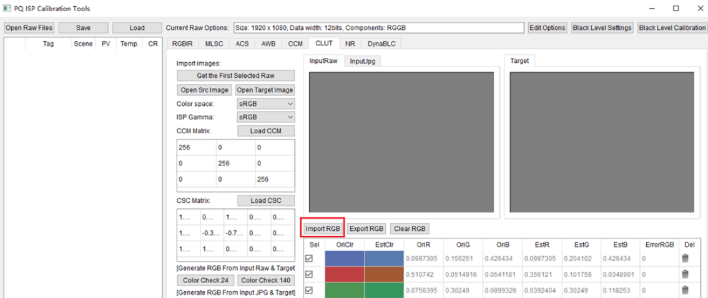

> **须知：** 
>打开工具连接单板后，系统将自动获取Gamma表，若修改了Gamma表的数据，需点击Reload Gamma按钮以刷新。

#### Sharpen可视化调试<a name="ZH-CN_TOPIC_0000002498301812"></a>

PQTools提供了专用的页面，供用户以图形化的方式调整Sharpen功能中的Luma Weight矩阵。

在左侧的调试表树视图中找到或标签，点击即可打开Sharpen曲线的页面。

以YuvSharpen曲线为例进行说明。


##### Sharpen使能<a name="ZH-CN_TOPIC_0000002498301824"></a>

在Sharpen寄存器修改界面设置\[Enable\]参数项为Enable选中状态。

**图 1**  Sharpen寄存器设置界面<a name="fig629mcpsimp"></a>  
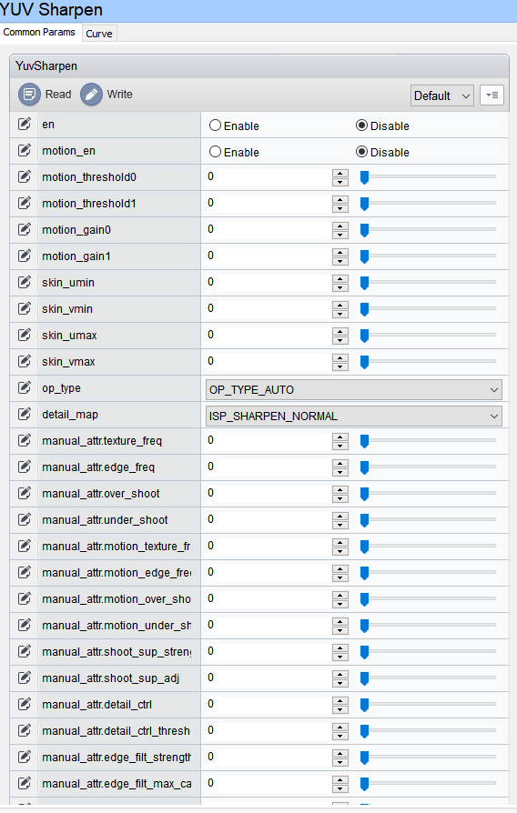

##### Sharpen Luma Weight曲线调试<a name="ZH-CN_TOPIC_0000002498141790"></a>

**图 1**  Sharpen Luma Weight调试界面<a name="fig6965727122518"></a>  
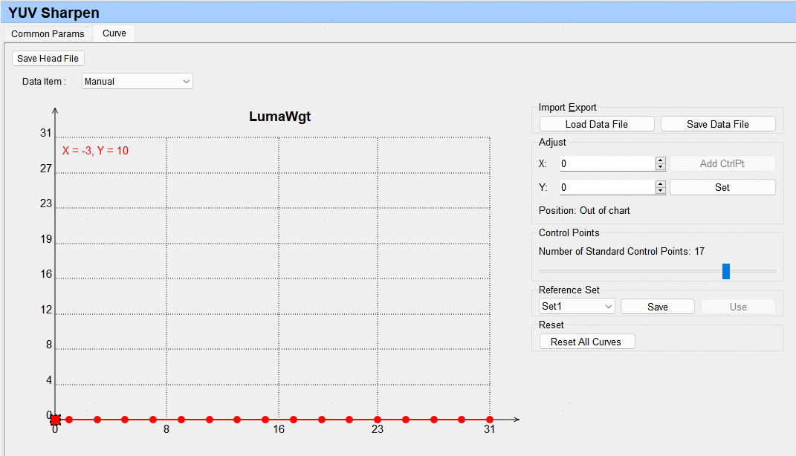

通过Data item下拉框选择曲线对应的数据。

其它功能请参考"[通用曲线功能说明](#ZH-CN_TOPIC_0000002530221719)"。

##### Sharpen Texture Strength曲线调试<a name="ZH-CN_TOPIC_0000002498141758"></a>

**图 1**  Sharpen Texture Strength调试界面<a name="fig16870143342610"></a>  
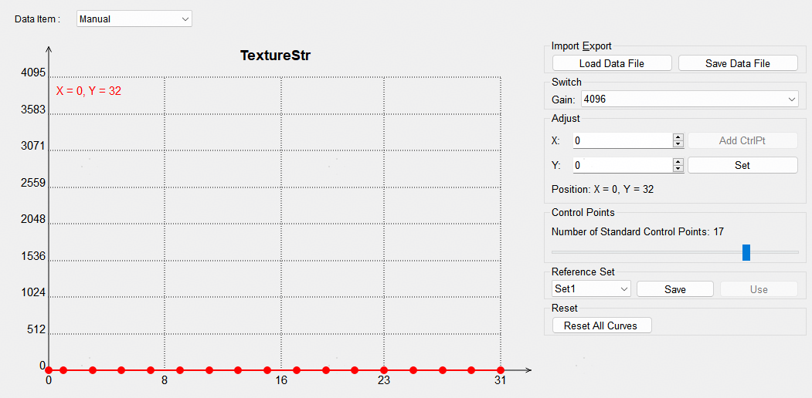

通过Data item下拉框选择曲线对应的数据。

其它功能请参考"[通用曲线功能说明](#ZH-CN_TOPIC_0000002530221719)"。

##### Sharpen Edge Strength曲线调试<a name="ZH-CN_TOPIC_0000002498141810"></a>

**图 1**  Sharpen Edge Strength调试界面<a name="fig152122618281"></a>  
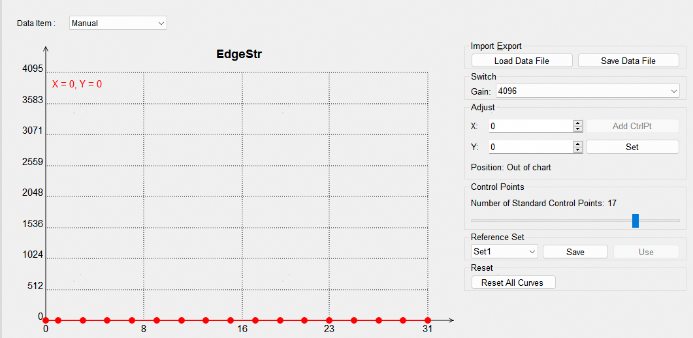

通过Data item下拉框选择曲线对应的数据。

其它功能请参考"[通用曲线功能说明](#ZH-CN_TOPIC_0000002530221719)"。

##### YUVsharpen曲线调试<a name="ZH-CN_TOPIC_0000002530061805"></a>

**图 1**  YUVsharpen曲线界面 结构体数据导出功能<a name="fig517013354288"></a>  
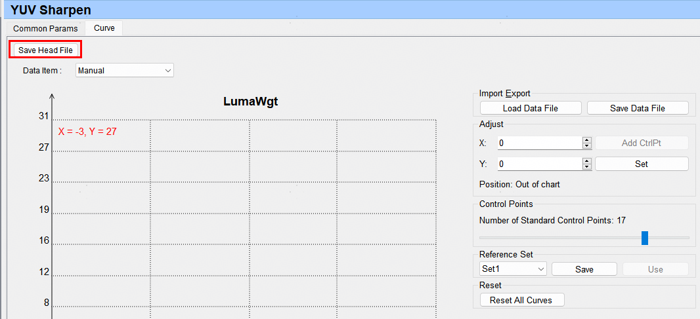

只需点击按钮并设置自己想要的名称即可将sharpen数据按照isp\_sharpen\_attr（具体请见《ISP 开发参考》）结构体形式导出成头文件，默认文件名为sharpen\_str.h。

#### CA可视化调试<a name="ZH-CN_TOPIC_0000002530221733"></a>

PQTools提供了CA曲线调试功能。

在左侧的调试表树视图中找到带有标识的页面，点击即可打开CA模块调试界面。


##### CA使能<a name="ZH-CN_TOPIC_0000002498141744"></a>

在CA寄存器修改界面设置\[en\]参数项为Enable选中状态。

**图 1**  CA寄存器设置界面<a name="fig661mcpsimp"></a>  
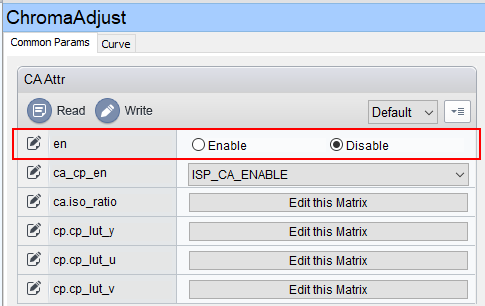

##### CA曲线调试<a name="ZH-CN_TOPIC_0000002498141842"></a>

**图 1**  CA曲线调试界面<a name="fig94621221162915"></a>  
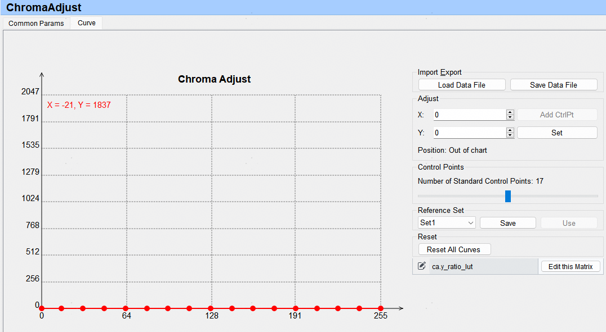

请参考"[通用曲线功能说明](#ZH-CN_TOPIC_0000002530221719)"。

##### Color Palette功能<a name="ZH-CN_TOPIC_0000002530221773"></a>

导入\*.pal格式的色板文件，以方便快速导入YUV数据。\*.pal文件格式如工具包Plugins\\Data\\ColorPaletteSample\\glowbow.pal所示。该功能页面默认不显示，由XML文件中PQTOOLS\_XML\\FUNCTION（ID="ChromaAdjust"）\\PARAMETERS\\KEY="CP"参数值控制。

**图 1**  Color Palette功能界面<a name="fig106791748132918"></a>  
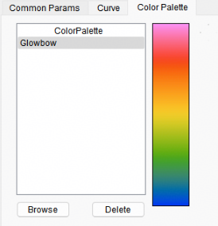

使用步骤：

1.  在XML文件中，将PQTOOLS\_XML\\FUNCTION\\PARAMETERS\\KEY="CP"参数值改为VALUE="TRUE";
2.  点击Browse按钮进行文件浏览；点击delete按钮删除对应Color Palette；
3.  点击记录项，颜色条显示对应色板，左侧页签的调试项Y,U,V数据更新，点击Write Page按钮，参数下发板端。

#### LDCI可视化调试<a name="ZH-CN_TOPIC_0000002498301742"></a>

在左侧的调试表树视图中找到带有标识的页面，点击即可打开LDCI模块调试界面。


##### LDCI使能<a name="ZH-CN_TOPIC_0000002530221669"></a>

在LDCI寄存器修改界面设置\[Enable\]参数项为Enable选中状态。

**图 1**  LDCI寄存器设置界面<a name="fig682mcpsimp"></a>  
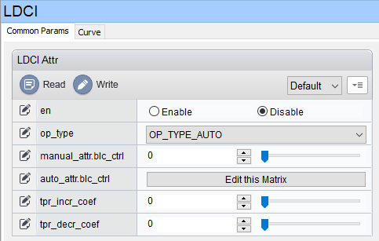

##### LDCI LPF Coef曲线调试<a name="ZH-CN_TOPIC_0000002498301658"></a>

**图 1**  LDCI LPF Coef曲线调试界面<a name="fig685mcpsimp"></a>  

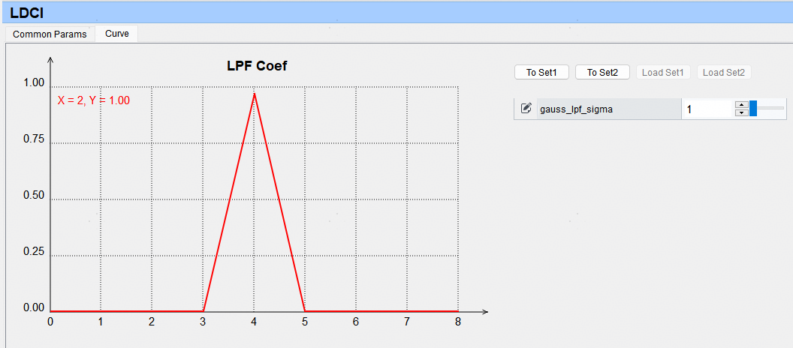

调节gauss\_lpf\_sigma参数值，LDCI LPF Coef曲线即随之变化。

如果工具栏上是使能状态，修改后的参数会设置到板端。

##### LDCI HePosWgt曲线调试<a name="ZH-CN_TOPIC_0000002530221777"></a>

**图 1**  LDCI HePosWgt曲线调试界面<a name="fig690mcpsimp"></a>  

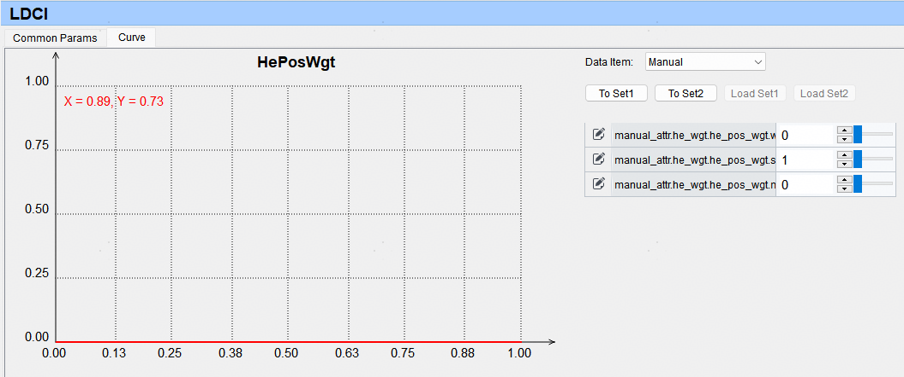

通过Data Item下拉框选择手动和自动模式，手动模式和自动模式的曲线调试方法相同。

调节he\_pos\_wgt结构体的wgt、sigma、mean三个参数，HePosWgt曲线即随之改变。如果工具栏上是使能状态，参数设置到板端。

##### LDCI HeNegWgt曲线调试<a name="ZH-CN_TOPIC_0000002530061759"></a>

**图 1**  LDCI HeNegWgt曲线调试界面<a name="fig695mcpsimp"></a>  

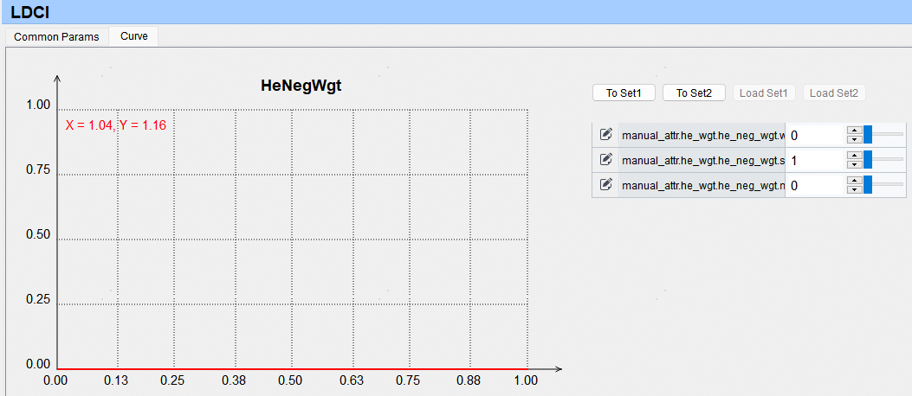

通过Data Item下拉框选择手动和自动模式，手动模式和自动模式的曲线调试方法相同。

调节he\_neg\_wgt结构体的wgt、sigma、mean三个参数，HeNegWgt曲线即随之改变，如果工具栏上是使能状态，参数设置到板端。

#### Dehaze可视化调试<a name="ZH-CN_TOPIC_0000002530221663"></a>

在左侧的调试表树视图中找到带有  标识的页面，点击即可打开Dehaze模块调试界面。


##### Dehaze使能<a name="ZH-CN_TOPIC_0000002530221759"></a>

**图 1**  Dehaze寄存器设置界面<a name="fig702mcpsimp"></a>  

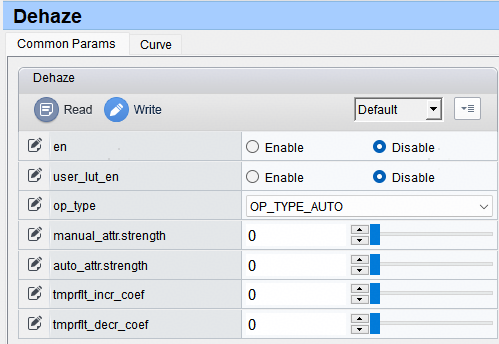

在Dehaze寄存器设置界面设置\[en\]参数项为Enable选中状态

##### Dehaze曲线调试<a name="ZH-CN_TOPIC_0000002530061803"></a>

**图 1**  Dehaze曲线调试界面<a name="fig706mcpsimp"></a>  

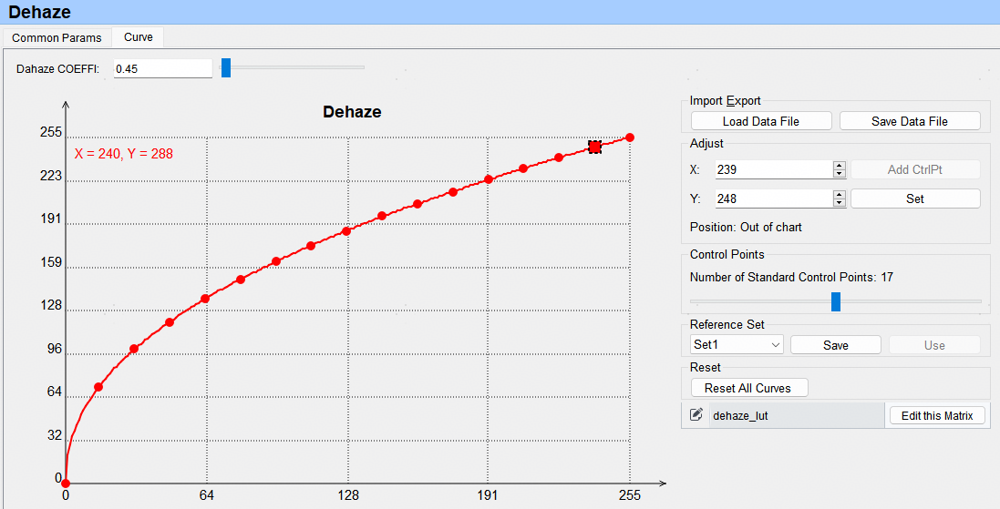

通过Dehaze COEFFI的滑条，或在滑条左边的文本框中输入数值，用户可以将可见的Dehaze曲线恢复为标准的Dehaze曲线（受当前选定的系数影响。系数范围为0.01到20.00）

其它功能请参考"[通用曲线功能说明](#ZH-CN_TOPIC_0000002530221719)"。

#### MCF可视化调试<a name="ZH-CN_TOPIC_0000002530221687"></a>

> **须知：** 
>-   生态版本不支持MCF功能。
>-   MCF调试必须在MCF业务时才能使用。目前仅支持SS928V100解决方案。

在左侧的调试表树视图中找到带有标识的页面，点击即可打开MCF模块调试界面。

**图 1**  MCF 曲线调试界面<a name="fig137161256191812"></a>  
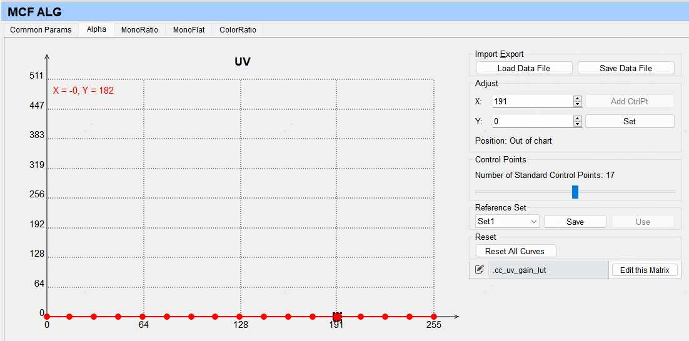

共有4个页签，UV曲线仅Alpha页签支持可调，其余3条曲线LF、MF、HF4个页签都支持可调。

MCF曲线无特殊使用方式，使用方法请参考 "[通用曲线功能说明](#ZH-CN_TOPIC_0000002530221719)"。

#### PreGamma可视化调试<a name="ZH-CN_TOPIC_0000002498141748"></a>

在左侧的调试表树视图中找到带有标识的页面，点击即可打开PreGamma模块调试界面。

**图 1**  PreGamma调试界面<a name="fig284173310185"></a>  

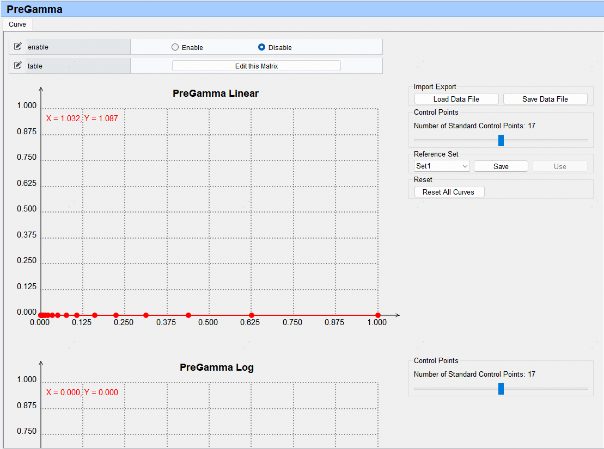

-   通过设置\[Enable\]参数项为Enable选中状态使能PreGamma。
-   拖拉控制点调整参数，PreGamma Linear及PreGamma Log 同时生效。

其它功能参考"[通用曲线功能说明](#ZH-CN_TOPIC_0000002530221719)"。

#### 3DNR曲线可视化调试<a name="ZH-CN_TOPIC_0000002530221605"></a>

> **须知：** 
>使用3DNR Curve界面前须修改NR页面的3DNR\_ATTR组中的参数：
>-   op\_mode设置为OP\_TYPE\_MANUAL，可设置MANUAL组（“Write Page”跳过AUTO组，提示“skip auto!”）；
>-   op\_mode设置为OP\_TYPE\_AUTO，可设置AUTO组，（“Write Page”跳过MANUAL组，提示“skip manual”）。

在左侧的调试表树视图中找到带有标识的页面，点击即可打开3DNR曲线调试界面。

**图 1**  3DNR曲线调试界面<a name="fig189451949111912"></a>  

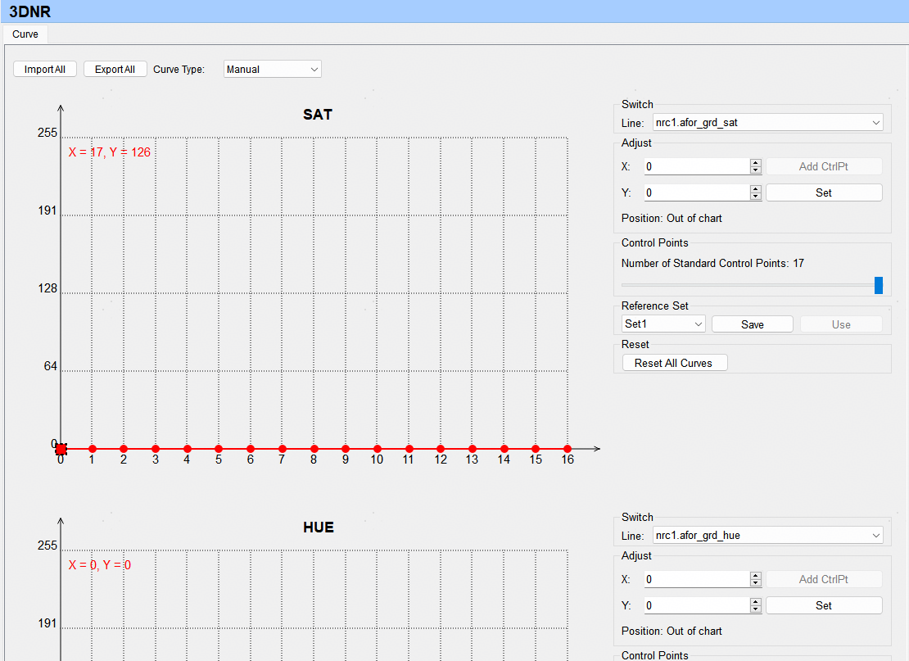

-   点击“Export All”按钮把Manual和Auto所有模式的曲线的值导出到一个txt文件中。
-   点击“Import All”按钮从一个txt文件导入数据到Manual和Auto所有模式的曲线中。
-   其他参考 "[通用曲线功能说明](#ZH-CN_TOPIC_0000002530221719)"。

#### BNR曲线可视化调试<a name="ZH-CN_TOPIC_0000002498141860"></a>

在左侧的调试表树视图中找到带有标识的页面，点击即可打开BNR模块调试界面。

**图 1**  BNR曲线调试界面<a name="fig6734549162011"></a>  

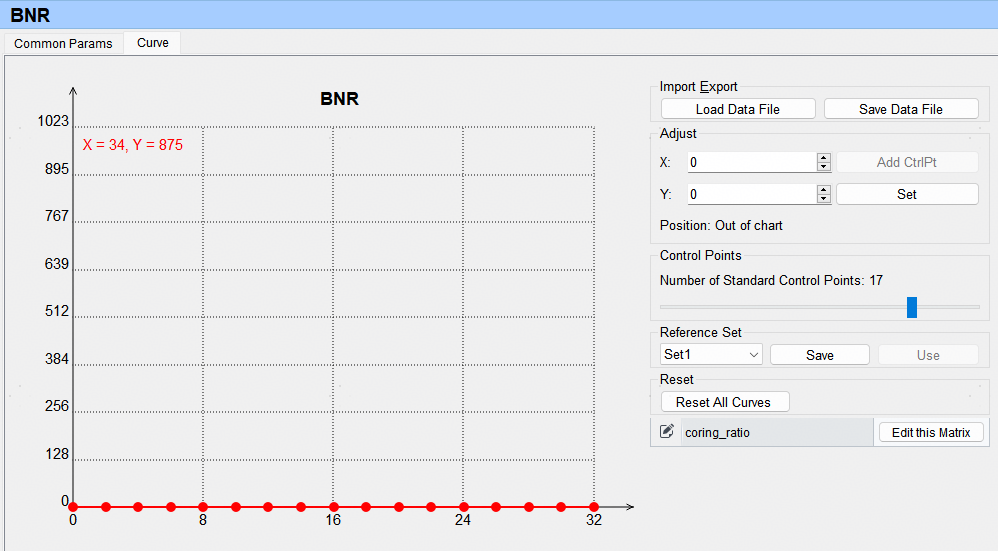

功能参考"[通用曲线功能说明](#ZH-CN_TOPIC_0000002530221719)"。

#### MeshShading曲线可视化调试<a name="ZH-CN_TOPIC_0000002498141812"></a>

在左侧的调试表树视图中找到带有标识的页面，点击即可打开MeshShading模块调试界面。

> **须知：** 
>MeshShading可视化调试仅用于特殊场景（如红外）下提高图像四周亮度，四个通道的增益都一样，普通模式请使用MeshShading标定。

**图 1**  MeshShading曲线调试界面<a name="fig765mcpsimp"></a>  

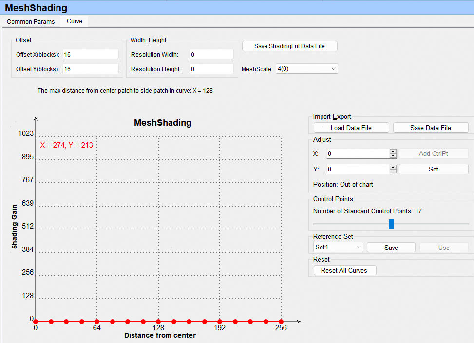

OffsetX和OffsetY是设置MeshShading分块的中心点，取值范围\[0,32\]，都取0时为图像左上角的分块，都取32为图像右下角分块，以此类推，默认取\[16,16\]。

在界面上修改OffsetX和OffsetY的值，软件计算出中心到边缘的最大值X，该值是调试曲线的横坐标Distance from center，X为一个归一化的值，X的取值范围\[128,256\]，X取128时，Offset取的是中心块，X取256时，Offset取的是任意四周上的块。

界面上Resolution Width和Resolution Height的值，是从PubAttr结构体中的wnd\_rect.width和wnd\_rect.height获取的，仅做参考用。

通过下拉框选择MeshScale，刷新对应的值到曲线上，不同的MeshScale会对应不同的默认值（1倍增益），请在选取合适的MeshScale后再调试曲线，切换MeshScale会导致增益表刷新，之前调试的结果丢失。

改变OffsetX/OffsetY后，必须调试曲线后增益值才会刷新。

点击“Save ShadingLut Data File”按钮，生成一个默认文件名为alg\_lsc\_calib\_info的.h文件，文件中保存的数据按照结构体格式，保存了Shading Lut Attr结构体中的x\_grid\_width，y\_grid\_width和lsc\_gain\_lut的值。

其他功能参考"[通用曲线功能说明](#ZH-CN_TOPIC_0000002530221719)"。

### 3DNR可视化调试<a name="ZH-CN_TOPIC_0000002530061689"></a>

与其他寄存器和算法模块不同，3DNR功能复杂且限制较多，因此进行了单独设计。以下均以SS928V100的X接口为例说明。

在调试表中点击名称以3DNR\_X起始的调试页，即可打开3DNR调试界面，如[图1](#_toc51692492)所示：

**图 1**  3DNR X\_MANUAL调试界面<a name="_toc51692492"></a>  


左侧的树形控件列出了在当前页面下可以调整的3DNR模式（一级节点），以及模式下可调整的3DNR数据集（二级节点）。每一个3DNR模式（或处于该模式下的数据集）节点被点击时，界面右侧均会显示该模式的调试界面。

对于调试界面：

-   数据集自上而下排列，并具备独立的标题栏：
    -   点击数据集标题栏中的“Export”按钮，可以导出数据集中的调试数据到以.txt结尾的文件\(数据格式按数据参数的界面显示\)中，以明文形式保存；
    -   点击数据集标题栏中的“Import”按钮，可以导入之前导出的txt数据。
    -   点击“Export Auto All”按钮，可以将整个Auto模式页面的数据导出到文本文件（每组Auto数据格式按数据参数的界面显示，增加ThreeDNRCount、IsoThresh、3DnrParam\_\*等字段和部分注释）中，点击“Import Auto All”按钮，可将导出的整体数据导入到界面显示。
    -   对于自动模式（左侧列表中名称以AUTO结尾的模式），每个数据集具备ISO值。在数据集标题栏的右侧可以编辑ISO值。
    -   “To Set1”，“To Set2”和“Load Set1”，“Load Set2”两组按钮，可以保存两组设置参数，方便用户调试。点击“To Set1”按钮将界面的设置参数缓存起来，点击“Load Set1”按钮将缓存的设置参数显示在界面，“To Set2”和“Load Set2”操作相同。

-   多个输入框对应1个变量标记的情形，表示该变量本身为数组，或者是某个作为数组的结构体中的成员。对应数组下标从小到大的变化，文本框从左到右排列；
-   文本框为淡黄色背景的，表示对应的参数为可以更改的参数。这些值的各种组合，对应 3DNR的各种能力和风格；
-   文本框为淡紫色背景的，表示对应的参数不建议设置，这些成员通常应该取默认值，在某些极端情况下也许取其他值效果更好些；
-   文本框为白色背景且无法编辑的，表示对应的参数不应被设置，它们在任何情况下都应该取默认值。工具上无法修改这类参数的值。
-   支持键盘操作：Tab键切换文本框，支持“↑”“↓”增减参数值。
-   当存在有Auto页面时，Manual页面可以通过ISO下拉框选择需要拷贝的Auto页面。点击“Copy From”按钮，就可以将与ISO值对应的Auto页中的所有数据拷贝到Manual页面中。3DNR的具体调试建议请参照文档《SSXX 3DNR参数配置说明》。

在左侧的树形控件上右键点击3DNR模式节点，可以进行模式相关的操作，如[图2](#_toc51692493)所示：

**图 2**  3DNR模式右键调试界面<a name="_toc51692493"></a>  

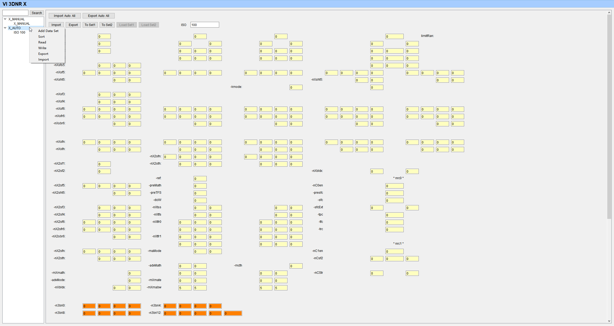

-   Add Data Set：在该模式下追加一个新的数据集（至列表末尾），若所选模式为自动模式，则新数据集的ISO值与其上一个数据集相同；
-   Sort：对模式下所有数据集按ISO从小到大的顺序进行排序；
-   Read：单独对所选模式进行板端读取操作；
-   Write：单独对所选模式进行板端写入操作；
-   Export：整体数据导出，以明文形式保存，导出格式支持按结构体\(3DNRX\_STRUCT\_TYPE\)和界面排布\(3DNRX\_DEBUG\_TYPE\)两种；
-   Import：整体数据导入。

在左侧的树形控件上右键点击数据集节点，可以进行数据集相关的操作，如[图3](#_toc51692494)所示：

**图 3**  3DNR数据右键调试界面<a name="_toc51692494"></a>  

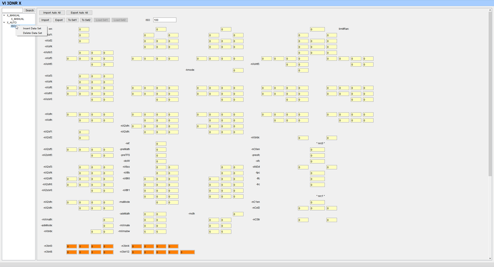

-   Insert Data Set：在所选数据集的下方插入一个新的数据集，若所选模式为自动式，则新数据集的ISO值与所选数据集相同；
-   Delete Data Set：删除所选数据集。
-   Search：在页面左上角的编辑框中输入要查询的字段，不区分大小写，点击“Search”按钮或按下“Enter”键，如果可调项名字中包含搜索的字段，将该可调项名字设置为橙色，并将界面滚动到该可调项所在位置如[图4](#_toc51692495)所示。

**图 4**  3DNR X搜索页面<a name="_toc51692495"></a>  

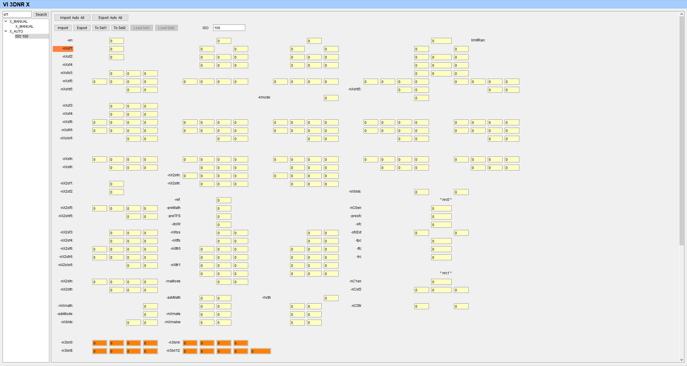

在PQTools工具的读写工具栏上点击按钮，可以对全部的3DNR模式执行板端读取操作；点击按钮，可以对全部的3DNR模式执行板端写入操作。

> **须知：** 
>-   每个模式下的数据集都有一定的数量限制（一般对于手动模式是只有1个，自动模式为多个）当一个模式下数据集数量达到其最大值时，用户将无法添加新的数据集；而当一个模式下只剩1个数据集时，该数据集无法删除；
>-   对于自动模式，若数据集间的ISO值不为自上而下的递增状态，则将该模式下的调试数据写入板端时可能会失败。因此建议用户在将自动模式的数据写入板端前，先对该模式执行排序动作。
>-   对于自动模式，如果工具从板端读取数据全为0，界面不显示Auto模式下的可调项，此时操作“Write”板端报错，需操作“Add Data Set”添加第一组数据集（参数默认最小有效值，自动写入板端）。
>-   使用3DNR可视化页面前须修改NR页面的3DNR\_ATTR组中的参数：OptMode设置为OPERATION\_MODE\_MANUAL，可设置3DNR可视化页面的MANUAL组（“Write Page”跳过AUTO组，提示“skip auto!”）；OptMode设置为OPERATION\_MODE\_AUTO，可设置AUTO组，（“Write Page”跳过MANUAL组，提示“skip manual”）。
>-   设置3DNRAttr中OptMode的Auto或Manual模式后可以调试3DNR对应的参数并生效，若只选择OptMode的Auto或Manual模式3DNR对应的参数并不生效，重新Read后OptMode显示当前生效的模式。
>-   导出的3DNR文件支持参数修改后导入，但不能改变数据解析结构。
>-   3DNR界面排布是根据芯片特性进行排布，各芯片界面存在差异。
>-   板端不会同时保存Auto和Manual模式的数据，因此重新打开PC端工具时，仅能读取到一种模式的数据。

### FPN矫正<a name="ZH-CN_TOPIC_0000002530061787"></a>

在左侧的调试表树视图中找到FPN的页面，点击即可看到FPN标定矫正页面如[图1](#fig524211441796)。

**图 1**  FPN标定矫正页面<a name="fig524211441796"></a>  
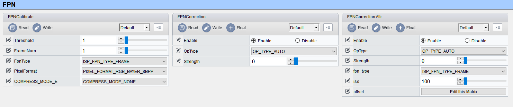

FPN矫正功能使用前必须优先进行标定操作生成矫正用数据，工具可以通过配置板端版本路径中的config.cfg文件 bSaveFPN 来决定是否将标定产生的raw数据保存成文件。不使能时，保存在工具申请的内存中。

FPN矫正页分为三个 group 如[图1](#fig524211441796)。

分别为：

-   FPNCalibrate：设置标定参数及标定。设置好参数后点击Write即可。
-   FPNCorrection：使用上一步生成的标定数据结果进行FPN矫正。选择OpType，设置Strength 数值 及Enable 为Enable状态后 点击 Write按钮 进行板端业务 FPN 矫正。
-   FPNCorrection Attr：在使用PQTools工具或者其他方式进行过一次矫正操作后，可以通过此group 进行fpn效果细节参数的调节。

## ISP标定工具<a name="ZH-CN_TOPIC_0000002498301800"></a>


### 概述<a name="ZH-CN_TOPIC_0000002498301718"></a>

由于镜头和图像传感器市场成熟度高，市场上有大量不同光学特征的镜头以及不同电气特征的传感器。ISP中某些模块无法自动对这些特征统一补偿，使得图像的效果与期望效果有一定偏差。因此本标定工具主要以目前仪器设备获得的图像、期望图像等为输入，协助仪器设备最终的输出能够更好地逼近期望效果。

PQTools工具提供了黑电平（BLC）、NR、ACS、MLSC、RGBIR、CCM、AWB、CLUT等8个ISP模块的参数标定功能。根据各自的算法原理，它们之间有如[图1](#fig1691913018280)的顺序关系。

**图 1**  标定模块的流程关系<a name="fig1691913018280"></a>  
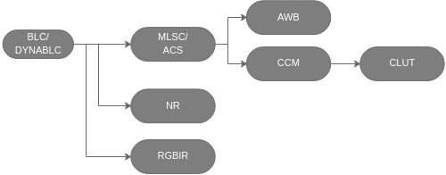

其中，AWB和CCM标定模块之间不互相依赖，在LSC\(MLSC\)标定结束后即可进行； NR标定模块在黑电平确认后即可进行，不受其它标定模块影响。

具体的标定操作要求和建议可参考SDK文档《ISP 图像调优指南》。

> **须知：** 
>标定工具下发板端，通过主界面TOP-\>Mode Handle设置通路，参考"[读写通路设置](#ZH-CN_TOPIC_0000002530061753)"。

### 标定工具的界面与基本操作<a name="ZH-CN_TOPIC_0000002530061695"></a>

从PQTools工具主界面工具栏中的附加组件下拉框中选择“PQTools ISP Calibration Tool”，即可打开标定工具。如[图1](#fig16232113716249)所示。

**图 1**  标定工具界面<a name="fig16232113716249"></a>  
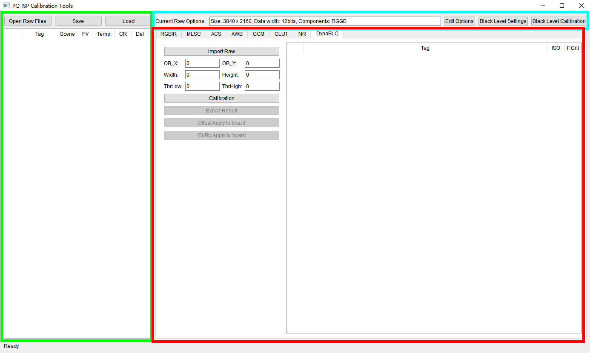

如[图1](#fig16232113716249)所示，绿框区域为导入需要标定的Raw的基本信息及列表，蓝框区域为输入的Raw的基本属性及BLC参数设定，红框区域为各标定算法工作区域。


#### 设置RAW基本属性<a name="ZH-CN_TOPIC_0000002498141702"></a>

在软硬件配置相同的情况下，标定所使用的所有RAW文件，其分辨率、位宽、分量排序的参数通常都是相同的。使用标定工具时，可以通过蓝框区域的Edit Options按钮进行RAW文件的统一配置。如[图1](#fig659764792613)所示。

**图 1**  RAW文件配置对话框<a name="fig659764792613"></a>  
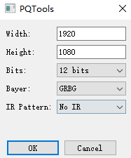

用户需要设置：

-   RAW图像的宽度（最小120，最大8192，必须是2的倍数，标定LSC时必须是4的倍数，否则shading功能会不正常）
-   RAW图像的高度（最小120，最大8192，必须是2的倍数，标定LSC时必须是4的倍数，否则shading功能会不正常）
-   RAW图像的位宽（支持10 bits、12 bits、16bits）
-   分量排序（RGGB、GRBG、GBRG、BGGR）
-   红外分量替换（IR Pattern，仅用于标定RGBIR sensor，可选择替换常规sensor的Gr或Gb分量。如果基于常规sensor标定，请选择No IR）。

设置以后，点击“OK”按钮保存。之后导入的所有RAW文件均会按此设置来进行操作。

> **须知：** 
>用户导入了任何RAW数据之后，将不能再更改RAW的基本属性。如果需要更改，请删除所有已经导入的RAW数据。

#### 导入RAW文件<a name="ZH-CN_TOPIC_0000002530061791"></a>

完成Raw的基本属性设置后，可通过绿框区域中的“Open RAW Files”按钮，导入标定所需的RAW文件。点击按钮后，选定需要导入的RAW文件，并点击“OK”按钮。之后，工具会弹出确认对话框，如[图1](#fig157115119329)所示。

**图 1**  导入确认对话框<a name="fig157115119329"></a>  
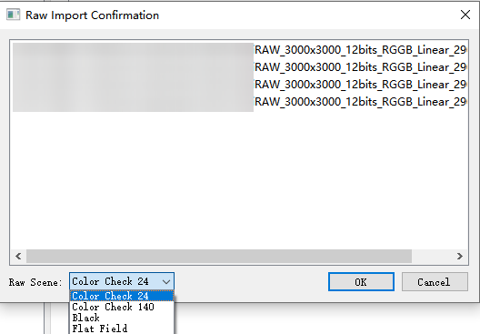

该对话框会列出所有即将被导入的RAW文件的路径，并提供用户选择RAW数据场景的接口。用户可以从以下几种场景中选择一个指定给导入的RAW文件：

-   Color Check 24：24色卡场景，可用于NR、CLUT、RGBIR、AWB、CCM标定；
-   Color Check 140：140色卡场景，可用于AWB和CLUT算法标定；
-   Black：全黑场景，用于黑电平标定（BLC）；
-   Flat Field：平坦场景，用于MLSC、ACS标定。

用户指定场景后，点击“OK”按钮，即可导入文件。被导入的RAW数据将在工具主界面左边的列表中显示。

**图 2**  列表显示导入的RAW数据<a name="fig11904132153410"></a>  
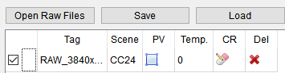

列表除显示导入的RAW数据的基本信息，还提供了一些操作接口：

-   第一列可进行勾选，以被标定模块导入使用；
-   Tag列为RAW数据的别名，可点击进行修改（默认为导入RAW的文件名）；
-   PV列为预览按钮，单击可预览图像。对于Flat Field场景的RAW数据，工具显示其黑白图像，否则显示插值运算后的彩色图像；对于24或140色卡场景的RAW数据，还可以进行色卡选框，选框调节默认为“Coarse”模式，可统一调节所有选框的大小和位置。Coarse复选框未勾选时为“Fine”模式，此模式下可独立调节单个选框的大小和位置，也可多个选框一起调节大小。
-   Temp.列为色温值，可预先设置，并导入到AWB和CCM标定中使用；
-   Del列为删除按钮，可以将导入的RAW数据从列表中清除。

#### 标定配置保存导入<a name="ZH-CN_TOPIC_0000002530061757"></a>

保存导入功能支持用户保存和导入标定工具现场配置（标定配置，文件路径，间接数据，辅助数据等），原则上只保存和导入用户手动输入数据，不保存和导入标定后生成的数据。

-   点击“Save”按钮，将配置信息保存到文件名格式为“芯片名\_ISPCalibration\_时间戳.xml”的xml文件中。
-   点击“Load”按钮，将选择的配置文件导入工具后，工具恢复之前的配置。
-   保存的XML文件的格式不可修改，可以修改参数值（不建议修改）。

### 黑电平的标定<a name="ZH-CN_TOPIC_0000002498301714"></a>


#### 黑电平标定基本原理<a name="ZH-CN_TOPIC_0000002530221749"></a>

模拟信号很微弱时，有可能不被A/D转换出来，导致光线很暗时，图像细节丢失。因此，Sensor会在A/D转换前，给模拟信号一个固定的偏移量，保证输出的数字信号保留更多的图像细节。

黑电平校正模块就是通过标定的方式，确定这个偏移量的具体值。后续的ISP处理模块，需要先减掉该偏移值，才能保证数据的线性一致性。

> **须知：** 
>因为黑电平数值与后续的图像的插值处理密切相关，因此工具目前进行了操作限制：若RAW数据列表中存在有24色卡或140色卡场景的RAW数据时，将不能进行黑电平的更改。因此若用户需要更改或标定黑电平值，请在导入色卡RAW文件之前完成。

#### 黑电平标定支持的模式<a name="ZH-CN_TOPIC_0000002530221745"></a>

在ISP标定工具中，黑电平支持两种形式的标定：手动输入黑电平模式以及使用黑帧进行自动黑电平标定模式。

如果在进行标定之前，事先已获取了sensor的黑电平参数（通过Sensor介绍文档，或者使用其他黑电平标定工具获得），则可点击标定工具右上角的Black Level Settings按钮，在弹出的对话框中，直接输入各分量的值。之后的其他标定模块在进行标定时，工具会根据需求自动调用此数值。手动输入黑电平模式的界面如[图1](#fig522761312110)所示。

**图 1**  黑电平设置对话框<a name="fig522761312110"></a>  
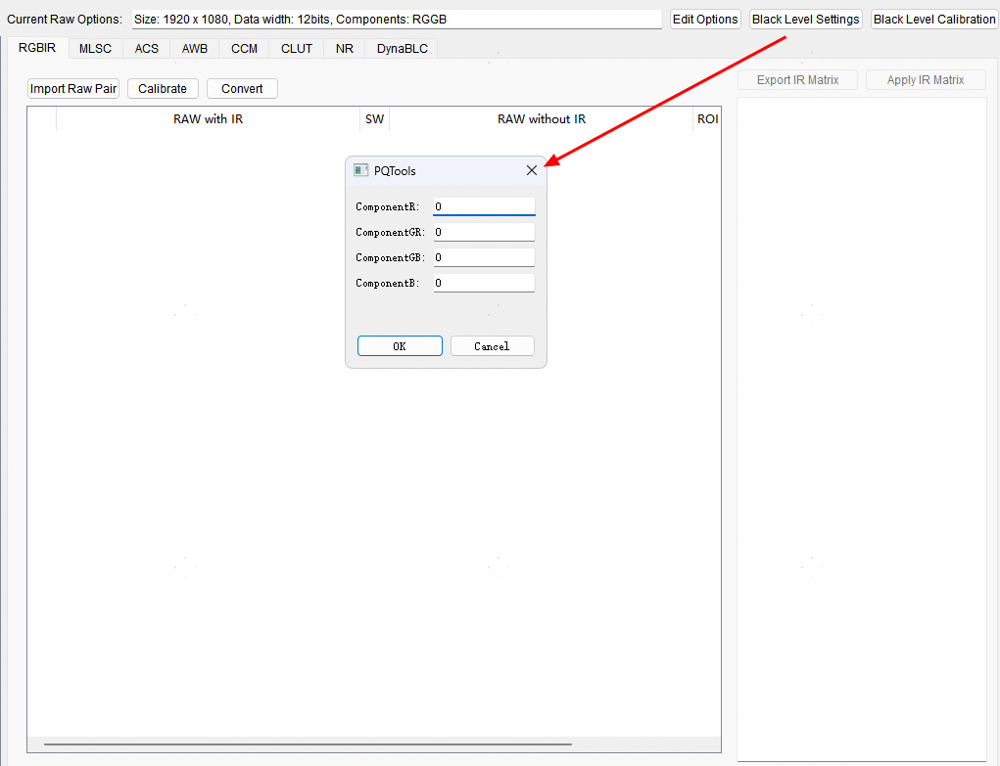

#### 黑电平标定序列采集要求<a name="ZH-CN_TOPIC_0000002530221665"></a>

如果事先未获取到sensor的黑电平参数，或者需要获得更精确的黑电平数值，本标定工具亦提供了自动标定黑电平的模式。在标定之前需要用户手动采集黑电平标定所需输入的Raw，采集步骤如下：

1.  将设备的光圈完全关闭，或者使用镜头盖将镜头输入遮挡，确保无光线进入；
2.  通过PQTools的ExposureAttr标签，手动设置整个系统的增益为1x。具体操作方法如下：将Exposure和Exposure Manual选框中的所有OpType设置为OP\_TYPE\_MANUAL，同时将Exposure Manual选框中的AGain、DGain、ISPDgain手动设置为1024；
3.  使用PQTools Capture Tool抓取一个Raw文件。

通过以上三步，即可得到黑电平标定需要的Raw。采集到的Raw如[图1](#fig15558203510351)所示。

**图 1**  黑电平输入Raw示意图<a name="fig15558203510351"></a>  
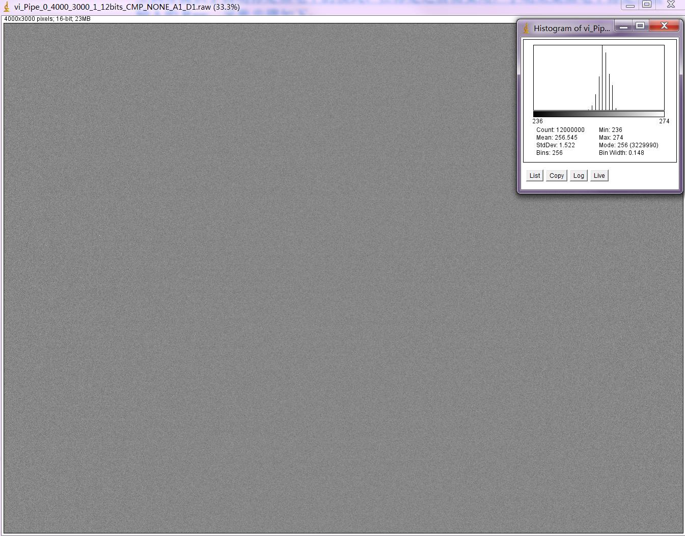

#### 黑电平标定步骤<a name="ZH-CN_TOPIC_0000002530061711"></a>

采集到标定算法所需的Raw后，用户可按照以下方法进行黑电平自动模式的标定：

1.  按照"[标定工具的界面与基本操作](#ZH-CN_TOPIC_0000002530061695)"节的描述，在标定工具主界面导入Raw文件，选择为Black场景，并勾选。
2.  点击Black Level Calibration按钮，在弹出的对话框中点击确定

#### 黑电平标定结果说明<a name="ZH-CN_TOPIC_0000002498301672"></a>

完成标定步骤后，标定工具左下角的状态栏中会显示Ready字样，此时打开Black Level Settings对话框，会发现原先为0的各分量黑电平已显示有值，如[图1](#fig36412026194912)所示。

**图 1**  黑电平标定结果示意图<a name="fig36412026194912"></a>  

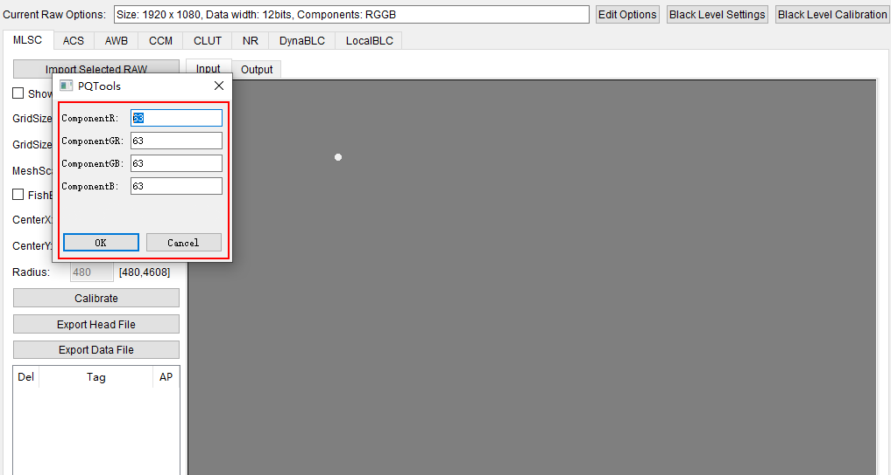

生成的黑电平值与Raw数据位宽匹配。当前标定工具不支持自动导入黑电平，因此用户需要手动将标定结果配置到对应的sensor驱动文件以及PQTools中。

### RGBIR标定工具<a name="ZH-CN_TOPIC_0000002498141850"></a>


#### RGBIR标定原理<a name="ZH-CN_TOPIC_0000002498301782"></a>

本文中所述RGBIR sensor为RGBIR4x4排列的sensor，sensor中的pattern顺序，如[图1](#_toc51692504)所示。

**图 1**  RGBIR 4x4 Pattern<a name="_toc51692504"></a>  


RGBIR sensor由于有一个红外分量，通常使用双通滤光片，此时仍然有红外光照射在sensor表面，因此要先通过算法将R、G、B通道上的红外光去除掉，恢复出各通道正确的颜色，起到传统红外截止滤光片的作用。

ISP中的RGBIR模块使用一个矩阵来对输入颜色进行处理，以去除红外光数据。使用相同场景下带红外分量的颜色数据和不带红外分量的颜色数据计算出这组矩阵的过程，即为IR标定过程。

#### RAW图像采集步骤<a name="ZH-CN_TOPIC_0000002498141742"></a>

采集步骤如下：

1.  在待标定光源环境（阳光直射、或A光源）下，尽量保证色卡光照均匀，没有阴影。等待光源稳定，并保证sensor使用的是双通滤光片。
2.  硬件上电，在工具上确认以下参数。

    **图 1**  IR标定参数确认——RGBIR参数<a name="fig937mcpsimp"></a>  
    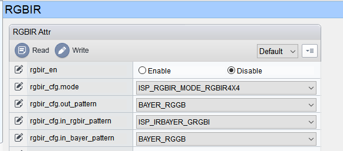

    **图 2**  IR标定参数确认——RGBIR矩阵<a name="fig939mcpsimp"></a>  
    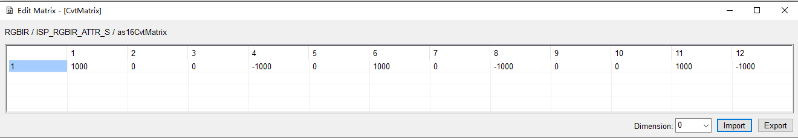

1.  将AE compensation设置为0x40或者更大，要求此时图像尽可能亮而且没有色块过曝（像素值达到最大值）。
2.  Freeze整个FW（目的是固定此时的AE参数，采用其他方式达到此目的也可以），使用抓拍工具采集一帧RAW数据，命名保存。
3.  增加红外截止滤光片（切换IR\_CUT为红外截止滤光片或者将红外截止滤光片放置在镜头前）。
4.  使用抓拍工具采集另外一帧RAW数据，命名保存以IRCut为标注。

#### RGBIR标定界面与功能<a name="ZH-CN_TOPIC_0000002530061777"></a>

将标定工具的主功能标签页切换到RGBIR，即可看到RGBIR标定的界面。如[图1](#fig19611527191118)所示。

**图 1**  RGBIR标定界面<a name="fig19611527191118"></a>  
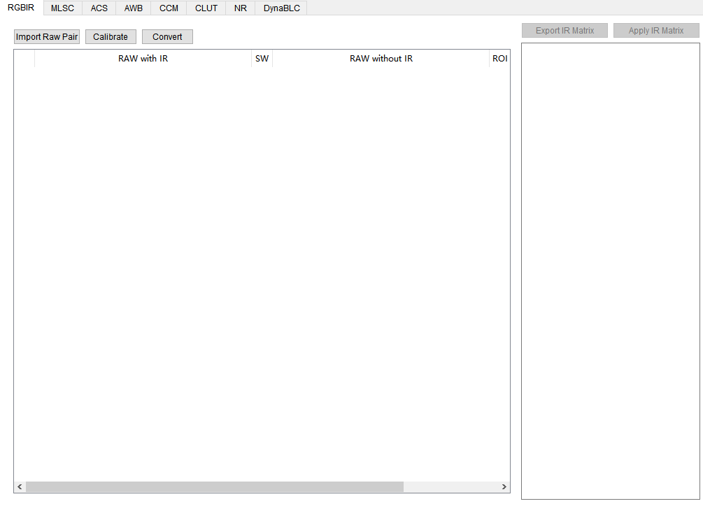

其中工具上方的工具按钮提供导入RAW图像、设置RAW图像、标定、导出结果和将结果发送到板端的操作接口，下方左侧的列表记录导入的RAW文件，右侧的文本框直接输出标定结果到屏幕，并支持标定结果的导出及下发板端功能。

同时提供将RGBIR 4x4格式的Raw转换为指定Pattern顺序的Bayer Raw功能。

#### RGBIR标定的操作流程<a name="ZH-CN_TOPIC_0000002530221737"></a>

进行IR标定，请遵循以下流程（后面章节中，将进行各个操作流程的说明）：

1.  参照"[设置RAW基本属性](#ZH-CN_TOPIC_0000002498141702)"章节的描述，指定RAW数据的基本属性。特别是要正确的选择IR Pattern的类型，IR Pattern和Bayer是互斥的。
2.  参照"[导入RAW文件](#ZH-CN_TOPIC_0000002530061791)"章节的描述，在标定工具主界面导入所有所需的RAW数据（包括含红外分量的RAW数据，及对应不含红外分量的）。
3.  在RGBIR页面导入1-4对RAW文件配对（24色卡场景限定）。
4.  对导入的RAW数据进行24色选框。
5.  进行标定。

#### 导入RAW文件并选定24色区域<a name="ZH-CN_TOPIC_0000002530221659"></a>

在标定工具主界面导入好所需的RAW文件后，勾选其中的一对含红外/去红外配对的RAW文件，如[图1](#fig120755819158)所示。

**图 1**  选定要进行IR标定的RAW数据<a name="fig120755819158"></a>  
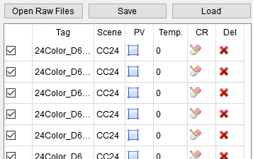

选择好文件后，回到RGBIR页面点击“Import RAW Pair”按钮，即可将这一对RAW文件导入为一个标定实例，如[图2](#fig327664531615)所示。

**图 2**  RGBIR标定实例<a name="fig327664531615"></a>  
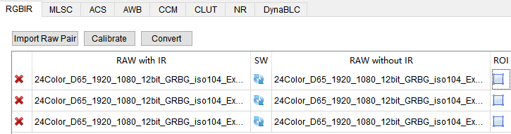

工具默认将顺位靠前的RAW数据指定为含IR，顺位靠后的RAW数据指定为不含IR。如果对应关系不正确，请点击SW列的按钮，将对应关系交换即可。

点击第一列的红叉按钮，可将导入的RAW配对删除。

点击ROI列的按钮，会弹出24色框选对话框，如[图3](#fig116777151920)所示。

**图 3**  RAW图像数据的24色取框<a name="fig116777151920"></a>  
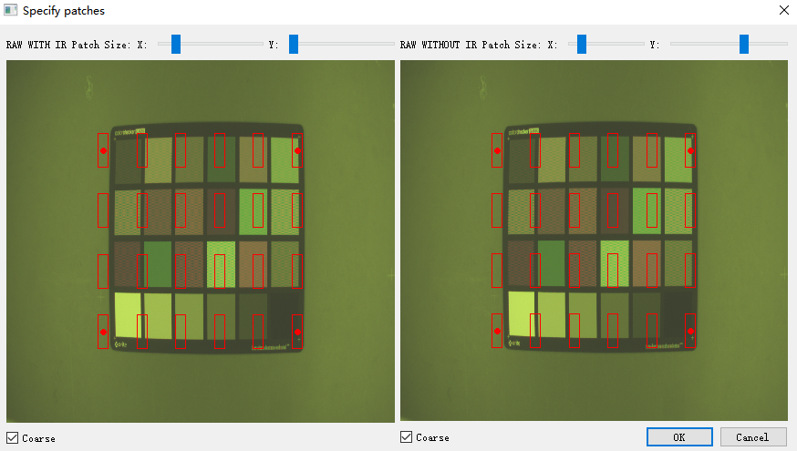

分别在两个图像上拖动四角的手柄以改变取框的排布，使其对准图像上的24色区域即可。如需要调整取框的大小，则拖动对应图像上方的Patch Size滑块即可。选框时，使色框尽可能大（但需要每个色框内所有像素颜色几乎相同），这样可以使取到的分量平均值更加精确，从而得到更准确的标定结果。注意：IR Pattern的RAW图像在工具上会显示为黑白图。

#### 进行标定<a name="ZH-CN_TOPIC_0000002498141764"></a>

当用户输入了1组或者多组RAW文件后，即可进行标定。点击上方的“Calibrate”按钮后，工具将执行标定算法，并输出结果。右侧的文本框显示的是当前选中的那组RAW的标定结果。如[图1](#_toc51692511)所示。

**图 1**  IR标定结果输出<a name="_toc51692511"></a>  
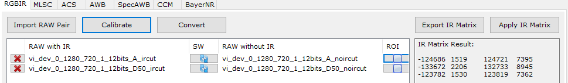

#### 导出IR标定结果<a name="ZH-CN_TOPIC_0000002530061649"></a>

标定完成后，点击“Export IR Matrix”可将IR矩阵保存为文本文件，文件中包含每一组RAW文件的标定结果，用with IR的RAW文件名来标识每个矩阵。选取保存路径后点击确定，即可保存成功。

#### 将标定结果发送至板端<a name="ZH-CN_TOPIC_0000002498301820"></a>

标定完成后，点击“Apply IR Matrix”可将当前选中的那组RAW的标定结果发送至板端直接生效。

#### 将RGBIR4x4 Pattern的Raw转换为Bayer格式<a name="ZH-CN_TOPIC_0000002530061703"></a>

本工具也支持将任意输入的RGBIR 4x4 pattern的Raw转换为Bayer格式。以方便用户对RGBIR sensor进行AWB、CCM标定。

注意：由于RGBIR sensor本身的感光特性，导致经过转换的Bayer数据的标定结果可能无法那么准确，尤其在A光源这样的本身IR分量较大的光源下。因此推荐如果想得到相对准确的AWB、CCM标定结果，可使用和RGBIR sensor相同型号的RGB sensor进行标定，将标定结果用于RGBIR sensor可以得到较好的图像效果。

点击工具界面上方的Convert按钮，即可进入转换功能，转换界面如[图1](#fig254510126210)所示。

**图 1**  RGBIR转换功能工具界面<a name="fig254510126210"></a>  
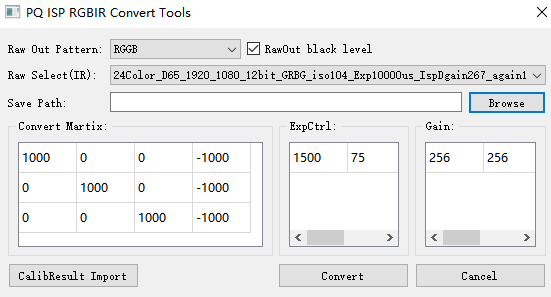

其中Raw Out Pattern为所需要转换出Raw文件的Bayer Pattern的格式，无论RGBIR的Raw的输入形式为何，本工具支持任意Bayer Pattern的输出。

RawOut black level的复选框表示输出的Raw是否需要带黑电平，如果是需要将Raw用来做AWB和CCM标定，建议勾选。

Raw Select \(IR\)为需要进行转换的带IR分量的Raw。用户需要手动从已导入ISP标定工具左侧Raw列表已经导入的Raw中进行选择。

Save Path为用户指定的转换后的Raw的所在路径，工具自动将转换后的Raw命名为Raw Select \(IR\)中的文件名加后缀\_IRRemoved，并保存在指定路径中。

Convert Matrix为用户指定的转换矩阵，默认使用单位矩阵，推荐在对D50及以上色温的光源采集下来的Raw进行转换的时候使用该默认矩阵。本工具也支持用户将RGBIR的标定结果进行导入，用来进行数据转换。首先选中RGBIR标定页面Raw标定列表中想要使用的哪一组Raw，然后点击转换界面的CaliResult Import按钮即可。

Exp Ctrl和Gain是在转换过程中对数据进行曝光控制，具体使用方法请参考《ISP 图像调优指南》的RGBIR部分（4.25节）的内容。推荐保持默认参数不动。

具体转换步骤为：

1.  选择Raw Out Pattern为需要输出的Bayer Pattern的格式，并选择需要进行转换的带IR分量的Raw。
2.  通过Browse按钮设置需要保存的raw的路径，设定后再设定对应的Convert Matrix的值。
3.  点击Convert按钮，即可完成转换。

> **注意：** 
>由于RGBIR的感光特性，A光源下的转换结果可能无法准确进行AWB和CCM的标定。另外转换前和转换后的Raw数据位宽一致，均为载入Raw时设定的初始化位宽。

### NR标定<a name="ZH-CN_TOPIC_0000002498301698"></a>


#### NR标定基本原理<a name="ZH-CN_TOPIC_0000002498141828"></a>

噪声是图像传感器的主要参数。对于任何一个图像传感器，每个像素都存在一定的感光模拟误差和模数转换误差，因此输出的数据也存在误差，一般意义上称为图像传感器噪声。

影响图像传感器系统的噪声主要有散粒噪声、热噪声和固定模式噪声等形式。为了使得NR运行中更加精准地区分噪声和细节，需要一个模型来描述图像传感器本身的噪声特性。

为了得到图像传感器的噪声模型，需要在灯箱环境下拍摄24色卡。 在一个ISO值下，拍摄得到的24色卡中每个色块对应一个亮度值，通过对每个色块的“亮度均值”和“亮度方差”进行分析，可以建立“亮度 — 亮度分布密集程度”这样的模型去描述图像传感器的噪声特性。若每个非过曝色块内亮度分布非常集中，则说明该图像传感器整体噪声小。当然，对于不同的ISO值，噪声强度是不一样的，所以需要进一步知道各个ISO下的噪声强度。

在NR运行时，若当处理块内“亮度方差”与“标定值\(色卡块内的平坦区域\)”接近，则表示当前处理块内不存在“可靠”细节，反之，则认为存在“可靠”细节。

#### NR标定模式介绍<a name="ZH-CN_TOPIC_0000002498301792"></a>

新升级的标定算法支持适配HNR/BayerNR的简单模式simple mode。在简单模式下，采集标定数据的时候，dgain固定设为1倍，只需要采集iso100到again打满的iso档位下的raw数据进行标定即可。简单模式不仅数据采集更加方便，而且能够避免之前标定工具在高iso下受噪声截断影响带来的标定结果不准确的问题，所以我们推荐使用新的简单模式进行标定。

> **须知：** 
>工具默认使用simple mode进行噪声标定，如果不使用simple mode，在高iso下抓标定数据时，需要使用sensor dgain而不是ispdgain，因为ispdgain在raw数据上无法体现出来，会造成工具误判。

#### NR标定序列采集要求<a name="ZH-CN_TOPIC_0000002530221699"></a>

NR的标定数据采集的重要点如下：

1.  前期准备包括：D65光源下的灯箱、需要标定的镜头+sensor、标准24色卡。色卡如[图1](#_toc51692513)所示。

    **图 1**  标准24色卡<a name="_toc51692513"></a>  
    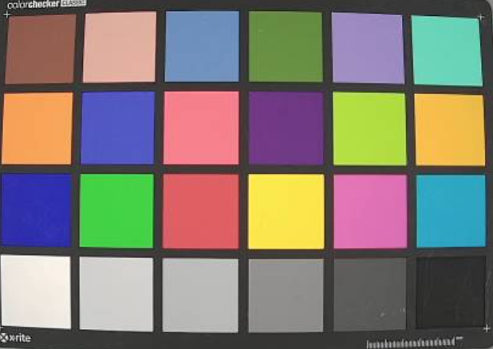

2.  将色卡固定在灯箱里面，灯箱照度保持在400lux左右，保持照度均匀。将镜头固定，调整镜头与色卡的距离，使得拍摄到的色卡覆盖整个成像屏幕的1/2左右，如[图1](#ZH-CN_TOPIC_0000002498301710)所示。
3.  ISO设置：

    将镜头光圈调节到最大，操作人员设置所需要的ISO值，然后调节曝光时间，使拍摄的色卡左下方色块的亮度达到最大值（跟位宽有关，12bit为4095）的80%（比如，dump出一帧raw，用imageJ打开，用鼠标框出亮色块，ctrl+H快捷键查看色块的直方图分布，计算色块的最大亮度与实际的最大亮度比值）。

    **注意：左下方色块不能出现过曝，即所有亮度值都小于最大值。**

4.  亮帧图像采集：

    当图像满足步骤2中要求时，抓取N帧raw数据（N取30帧左右），N帧raw存放在同一个文件里，名字按照filename\_bright\_isoxxx.raw的方式命名（filename表示原文件名，xxx为测得RAW的ISO值）。注意：拍摄过程中，请不要移动镜头和色卡 ，色卡附近不要有人、物体移动，以免影响环境光使抓取的raw数据帧与帧之间数据不一样。

5.  暗帧图像采集：

    保持ISO不变，通过下述方法降低大约4EV曝光量（任选一种）：光照强度减小为原来的1/16；曝光时间减小为原来的1/16；光圈大小减小为原来的1/4；在镜头前盖上1/16减光片。然后抓取N帧raw数据（N取30帧左右），文件命名filename\_dark\_isoxxx.raw，拍摄注意点与亮帧图像采集相同。

6.  重复步骤3-5，直到获得所有需要的ISO范围。ISO取值范围为\[100左右\]，\[200左右\]，\[400左右\], \[800左右\]，\[1600左右\], \[3200左右\]，\[6400左右\]，\[12800左右\]，\[25600左右\]，\[51200左右\]，\[102400左右\]，\[204800左右\]，ISO的取值范围覆盖尽量广。

    **注意，新的NR标定工具推荐使用简单模式，这时只用采集到again 打满对应的ISO即可，后续ISO可不用采集（比如again max=62416，这时只需要采集到ISO=6095即可）。**

1.  黑帧图像采集：

    采集完各个iso档位的亮帧和暗帧数据后，需要采集黑帧数据，将所有外界光源关闭，并完全遮挡住镜头（可以使用镜头盖），和步骤6相同的ISO采集数据。ISO档位要求从iso100采集到对应again 打满的iso档位。文件命名可参考filename\_black\_iso150.raw。

> **须知：** 
>-   拍摄过程中，请不要移动镜头和色卡，色卡附近不要有人、物体移动，以免影响环境光，从而影响raw数据质量。
>-   由于NR标定算法需求，每个ISO档下固定需要采集亮，暗，黑帧数据（simple mode），帧数分别不低于30帧，最高帧数不高于500帧，由于帧数过多会导致标定时间较长，所以标定数据的帧数建议取30帧。
>-   同一ISO档，NR同时参考亮暗帧标定时，亮暗帧的标定结果会进行融合，最后标定结果仍是一组参数，而不是分开的两组参数。

#### NR标定工具界面介绍<a name="ZH-CN_TOPIC_0000002498301670"></a>

采集图像后，打开ISP标定工具，并切换至NR页面，即可看到NR标定工具的界面，如[图1](#fig566015393120)所示。

**图 1**  NR标定工具界面<a name="fig566015393120"></a>  
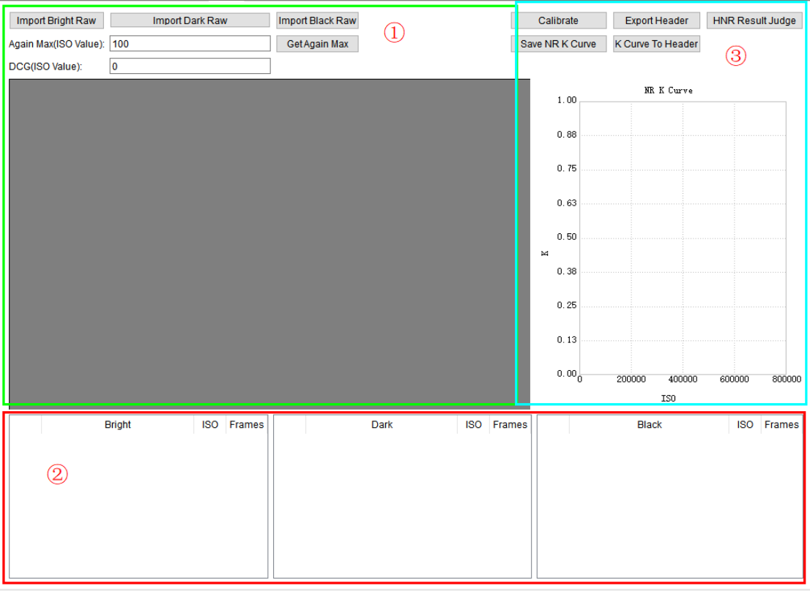

NR标定工具界面可以划分如下三个区域（如[图1](#fig566015393120)所示）

-   **raw图像显示区域**：在图中绿色框区域，对选中的raw图像进行显示。用户可以根据图像显示手动调节标定区域，使得红色标定框位于各个色卡范围内；按钮“Import Bright Raw”用于导入亮帧raw数据，按钮“Import Dark Raw”用于导入暗帧raw数据，按钮“Import Black Raw”用于导入黑帧raw数据，被导入的raw数据名称会显示在下方红色方框的对应区域内。另外，支持从文件名中解析亮帧和暗帧Raw文件，通过“Dark”，“Bright”, “Black”判断Raw属性,解析暗亮帧RAW文件支持全大写，全小写和首字母大写，如果点击导入按钮不匹配时会报错提示。Again Max值可以使用“Get Again Max”按钮从板端获取，也支持手动输入配置；
-   **标定raw数据列表区域**：在图中红色方框区域，会显示被导入进行标定的raw数据文件名称，对应的ISO值以及raw数据的帧数。导入的亮暗帧文件会分Bright和Dark显示，并会根据输入文件的ISO值对应进行配对。黑帧会在Black显示，不与亮暗帧配对；
-   **标定结果显示区域**：在图中蓝色框区域，能够进行标定的操作和标定结果的查看。按钮“Calibrate”开始进行标定，“Save NR K Curve”和“Export Header”分别用于导出标定过程量（曲线数据）和导出标定结果，标定完成后，标定过程量会以折线图的形式显示在图中。 按钮HNR Result Judge弹出标定结果评分页面。

    > **须知：** 
    >工具界面上配置的Again Max\(ISO Value\)需要依据sensor最大模拟增益对应的ISO值进行配置。点击Get Again Max按钮，从板端获取的值会自动转换成iso值。
    >导入的RAW文件命名时，ISO值前需添加"iso"标识，Import之后才会自动识别显示出ISO值，否则Import后要手动输入ISO值。如果Import RAW文件后ISO值未能自动识别，建议先导入全部RAW数据，再设置ISO值。

#### NR标定步骤<a name="ZH-CN_TOPIC_0000002530061797"></a>

使用标定工具进行NR标定的步骤如下：

1.  参见"[黑电平的标定](#ZH-CN_TOPIC_0000002498301714)"章节，确定待标定设备的黑电平值；
2.  在工具最左侧的RAW Data列表中，导入刚抓拍好的黑帧raw图像和24色卡类型RAW图像；
3.  勾选参与标定的RAW图像，并在NR标定界面点击“Import Bright Raw ”和“Import Dark Raw ” 和Import Black Raw”按钮分别将它们引入到标定界面；
4.  修改每个24色卡类型RAW文件的选框、ISO值（如文件名中带有\_isoxxx字样的标示，工具可自动解析其ISO值）和帧数。文件帧数可以被自动识别，也可以手动输入。
5.  点击标定界面右上角的“Calibration”按钮。

标定结束后，工具将显示标定出的ISO/K曲线图，如[图1](#fig629131112512)所示。

**图 1**  NR标定结果<a name="fig629131112512"></a>  

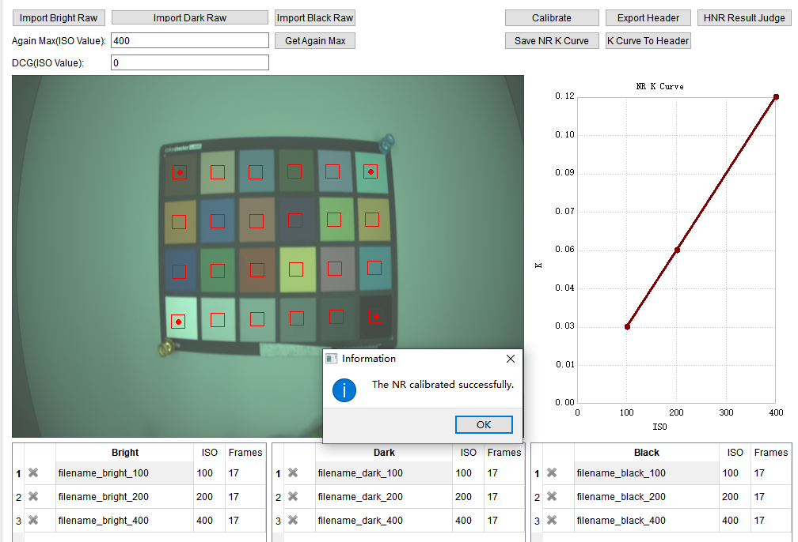

#### NR标定结果的显示和导出<a name="ZH-CN_TOPIC_0000002498141756"></a>

标定结束后，用户可以点击“Export Header”按钮，将当前的标定结果保存为.h文件。该.h文件中的内容可以直接用于板端头文件。

标定完成后，工具会显示ISO/K曲线，客户可以进行标定结果的比对和查看，也可以点击“Save NR K Curve”导出ISO/K数据。

> **须知：** 
>新版本标定工具的标定结果的形式有所变化，工具对原始各个iso档位的kb值进行拟合后，分别将kb各自的拟合参数进行输出。

#### NR标定结果说明<a name="ZH-CN_TOPIC_0000002530221643"></a>

标定结果直接影响到NR的去噪效果，以[图1](#_toc51692516)为例，左图没有对噪声模型参数b做标定，右图对噪声模型参数b做了标定，可以看到，右图中的颗粒噪声明显改善。

**图 1**  NR 标定图像效果的影响<a name="_toc51692516"></a>  


#### NR标定结果验证<a name="ZH-CN_TOPIC_0000002498301762"></a>

为了对噪声模型标定结果进行验证，标定工具支持在线对标定参数进行验证，具体方式为：标定工具在线连接板子，获取板端标定参数，并计算出当前iso的kb值，绘制出kb曲线，同时支持客户在线抓raw（最小2帧），并在raw上面选取相关区域进行噪声方差计算，将计算结果和标定参数理论计算值进行对比，给出相应的误差比例，当误差比例过大时，说明当前标定参数不准确，建议客户重新进行噪声模型参数标定。

使用进行NR标定结果验证的步骤如下：

1.  NR标定结果验证是连接单板在线分析的,使用之前需要先在单板上运行业务, PQ工具连接到单板；
2.  从PQ工具主界面工具栏的外挂插件下拉框中选择“PQ RAW YUV Analyzer”，选择右上角Online debug进入NR标定结果验证界面；
3.  点击Online debug下方的BITS下拉框选择\(8-16\)bits，点击Prepare Data抓拍RAW图像,等待抓拍后的图像载入界面；
4.  用鼠标左键点击选划定合适的平坦区域，左侧列表会显示该区域的均值和方差结果，\(如果默认的图像大小划定区域困难，滑动鼠标滚轮来缩放或调整图像，Clear All ROI按钮可以清空左侧列表和图像的划定区域\)；
5.  点击左下角的Create Chart，工具将显示NR标定结果曲线和验证区域的结果图像,如  [图1](#fig95871514274)  显示。

**图 1**  NR 标定结果验证<a name="fig95871514274"></a>  
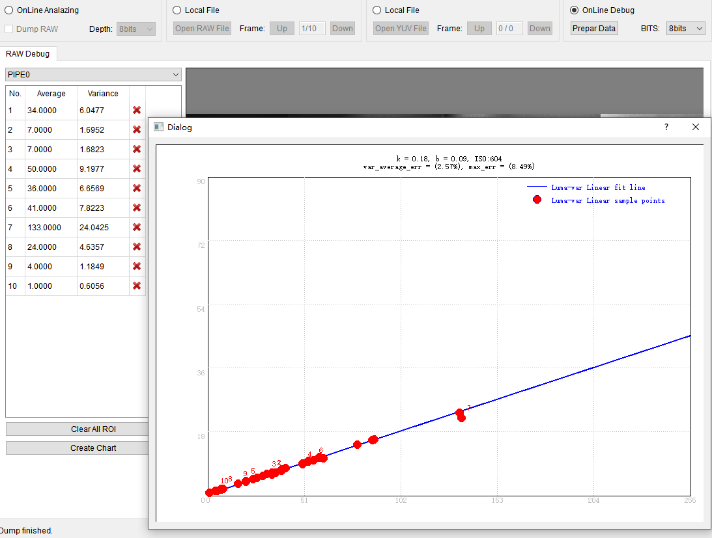

如  [图1](#fig95871514274)所示，在线抓raw验证后，可以观察红色的采样点和蓝色的理论标定曲线之间的吻合程度，如果偏离较远，说明标定参数可能存在问题。客户也可以参考工具计算给出的最大相对误差比例max\_err，如果max\_err\>50%，建议客户重新审视标定参数的正确性。

#### NR标定结果评分<a name="ZH-CN_TOPIC_0000002498141714"></a>

为了客观评价NR的标定结果对当前的这个Sensor适用性， 工具增加了标定结果评分功能。

**图 1**  NR标定结果评分界面<a name="fig161010490312"></a>  
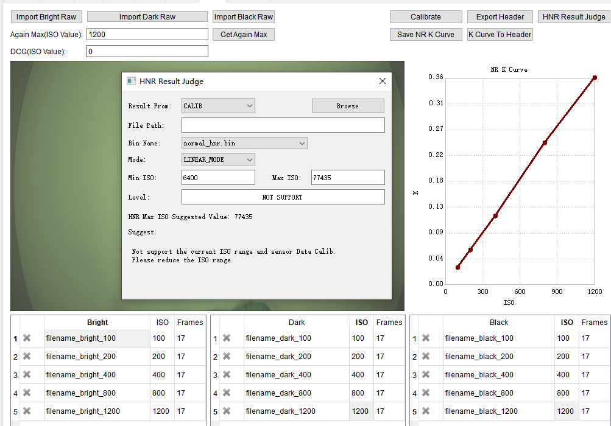

NR标定结束后点击 HNR Result Judge按钮弹出评价窗口[图1](#fig161010490312)所示。

-   正常标定结束，默认显示当前标定结果评分。
-   支持导入历史导出头文件结果进行评分。通过Result From下拉菜单进行切换，点击Browse导入文件。
-   File Path显示导入文件路径，不可修改。
-   支持修改入参 Min ISO 以及 Max ISO 来重新进行评分。
-   评分分为三档：SUPPORT\(正常可用\)， RISK\(有一定风险\)，NOT SUPPORT\(不支持\)。当评分不是SUPPORT时， 请参考最下方建议进行处理。
-   点Browse导入文件，切换Bin Name、Mode，修改Min ISO、Max ISO会刷新评分。

#### K Curve To Header使用说明<a name="ZH-CN_TOPIC_0000002530221613"></a>

K Curve To Header功能支持从Save NR K Curve获得的头文件转换为Export Header的头文件。 NR标定参数是由kb值计算得出，因此当无法找到NR标定结果文件时，若能提供kb值文件，则可由kb值文件计算出NR标定结果。需要注意的是，由于文件中的kb值存在精度损失，因此转换得到的NR标定结果通常会存在轻微差异，但这不会影响NR标定结果的使用。

### MLSC标定<a name="ZH-CN_TOPIC_0000002530221747"></a>


#### MLSC标定基本原理<a name="ZH-CN_TOPIC_0000002498141822"></a>

通过研究发现，在Lens Shading现象中，目标点的亮度衰减趋势符合余弦四次方定律。对于同一个镜头模组，其成像亮度只会随着成像点和光轴之间的成像角度变化而变化。并且其变化趋势为：与成像角度的余弦值的四次方成正比，正比系数通过镜头的透镜直径以及焦距确定。

因此对于同一镜头模组，其标定结果需要满足以下两个条件：

-   标定结果可以有效反映出亮度衰减趋势；
-   标定结果可以用来恢复图像区域中所有目标点的亮度。因此本模块的标定结果需要使用Mesh的网格方式进行储存。

同时需要注意的是，由于不同光源或者不同色温下光的频谱不同，加上IR-cut Filter的影响，所以即使是同一镜头模组，其在不同光源下的Color Shading特征曲线亦不相同，因此为满足在不同光源或色温下的Color Shading的校正要求，需要在不同光源或色温下对MLSC进行校正。

由于Color Shading的影响，对于某些Color Shading现象比较严重的镜头或者sensor，在做AWB标定之前需要对AWB的标定采集序列进行MLSC校正，以校正结果作为AWB标定算法的输入才能得到准确的AWB标定结果。

#### MLSC标定序列采集要求<a name="ZH-CN_TOPIC_0000002498301750"></a>

MLSC进行标定时，需要多光源的灰度图像。具体的采集要求如下：

-   MLSC模块的标定序列采集对象要求必须是亮度分布平坦且均匀的光源，同时采集对象必须保持平滑无纹理。理想情况下应采用**辉度箱、积分球、DNP灯箱**进行采集，其他可以作为MLSC标定序列采集对象的场景有：**灯箱灰内壁（无明显划痕或污迹）、透过毛玻璃而达到均匀分布的光源**。如果条件所限，也可以是**任意能达到亮度均匀分布的灰度平面（类似白墙）**，但是标定的准确程度可能会受到影响。
-   如果采集对象为灯箱灰内壁，由于灯箱光源分布在内壁上有一定可能性分布不均匀，故最好保持镜头对准光源中心处，并尽量保证镜头捕获区域光源分布平坦。
-   采集序列格式为RAW格式，只需1帧即可，采集过程中，光源照度在400 lux左右，镜头中心亮度需保持为最大值（255）的70%，并且使用需要标定的镜头。
-   对于需要在不同光源下使用的场景，需要在不同光源下进行标定，常用的光源有TL84、CWF、A、D65、D50等，用户请根据使用需求选择光源进行标定。
-   对于不同镜头模组，需要进行重复标定。

具体的采集步骤如下：

1.  将镜头对准目标区域，并保证环境不被干扰；
2.  调节光源亮度，使得镜头中心亮度平均值为最大值的70%；
3.  使用PQTools Capture Tool进行Raw数据的采集，只需1帧即可；
4.  更换光源，重复上述步骤。

采集后的MLSC标定序列如[图1](#fig7374324328)所示。

**图 1**  MLSC标定序列图像<a name="fig7374324328"></a>  


#### MLSC标定工具界面介绍<a name="ZH-CN_TOPIC_0000002530061707"></a>

将ISP标定工具的主功能标签页切换到MLSC，即可看到MLSC标定的界面。MLSC标定的主界面如[图1](#fig16401114543215)所示。

**图 1**  MLSC界面<a name="fig16401114543215"></a>  
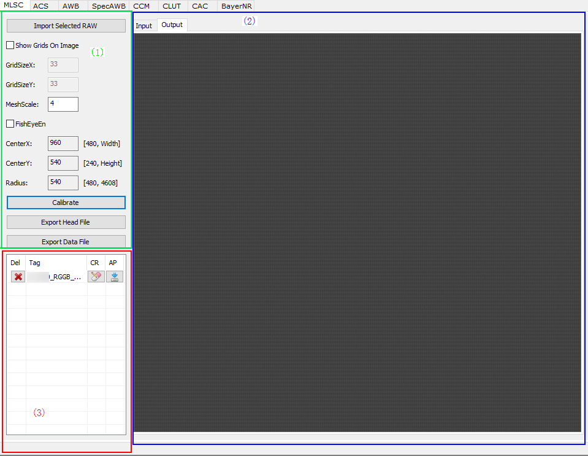

如主界面[图1](#fig16401114543215)所示，MLSC标定工具主要可以分为三部分：控制区（1绿色方框所示）、显示区（2蓝色方框所示）、列表区（3红色方框所示）。

-   控制区：工具进行标定的主要功能均由此处入口，以下将一一描述。
-   显示区：显示输入图像以及MLSC标定后的输出图像。
-   列表区：打开的输入图像均会在此处显示，并提供下发标定结果至板端的功能。

#### MLSC标定步骤<a name="ZH-CN_TOPIC_0000002530061645"></a>

在本芯片中，MLSC标定算法增加了适配鱼眼镜头的标定功能。具体请参考"[使用MLSC标定鱼眼镜头图像](#ZH-CN_TOPIC_0000002530061771)"节内容。

针对普通镜头的标定步骤如下：

-   参见"[黑电平的标定](#ZH-CN_TOPIC_0000002498301714)"章节，确定待标定设备的黑电平值；
-   在工具最左侧的RAW Data列表中，导入Flat Field场景的RAW文件。图像导入后，在列表区会显示被导入图像的别名，并提供相关功能按钮（相关功能按钮请参考附件）。同时显示区将显示最后一个被导入的RAW图像，如[图1](#fig417612409335)所示。

**图 1**  导入RAW数据后的MLSC界面<a name="fig417612409335"></a>  
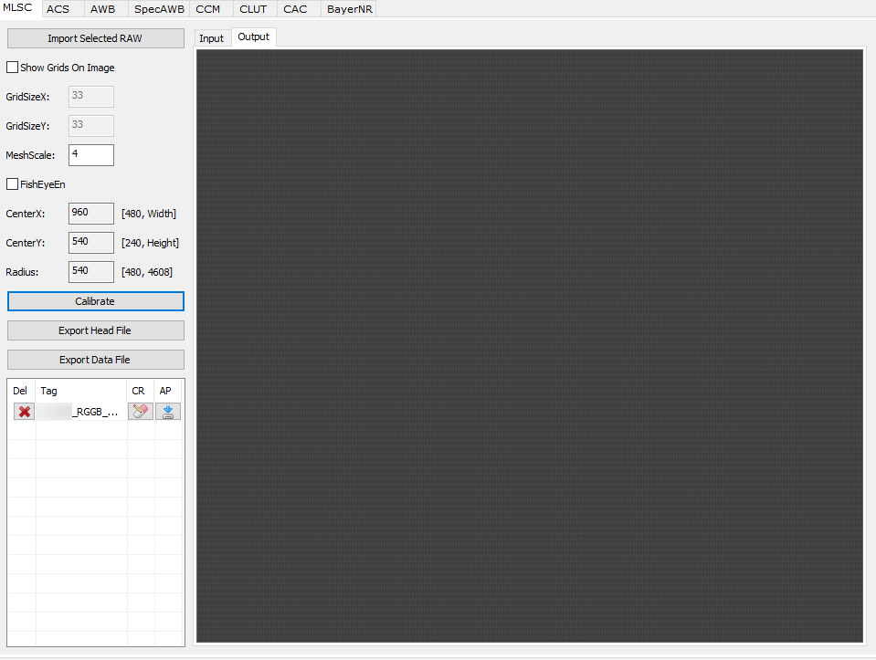

-   输入标定参数：MeshScale的值，MeshScale的具体取值方法和含义请参考附录内容；
-   参数配置完成后，可勾选Show Grids on Image勾选框，确认在显示区图像上看到了均匀划分的32x32的网格；
-   点击“Calibrate”按钮即可进行MLSC标定。

> **须知：** 
>在对普通镜头的图像进行标定时，请不要勾选FishEyeEn，参数CenterX、CenterY、Radius是与鱼眼镜头图像标定相关的参数，请参考"[使用MLSC标定鱼眼镜头图像](#ZH-CN_TOPIC_0000002530061771)"节使用MLSC标定鱼眼镜头图像的描述。

#### MLSC标定结果说明<a name="ZH-CN_TOPIC_0000002530221769"></a>

标定结束后，工具会生成MLSC标定参数，并且显示区会切换至Output页签，显示标定参数作用于输入图像后的输出图像，可根据输出图像大致判断校正的准确程度，然后修改参数进行调试，附录2中将介绍如何验证校正结果的准确性。

如果同时导入多张图像一次性标定，标定完成后，工具会在列表区将所有标定结果显示出来，此时点击列表区中的图像，会在显示区显示对应的输出图像。

标定后的MLSC界面如[图1](#fig171015541119)所示。

**图 1**  MLSC标定结果说明<a name="fig171015541119"></a>  
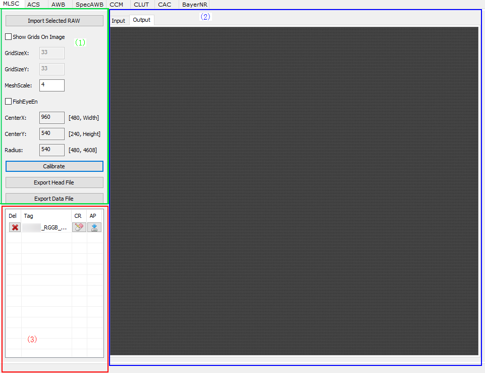

由于MLSC标定算法在整个标定流程中的特殊位置，标定工具提供了以下标定结果的使用功能：

-   标定结果导出功能
-   使用特定标定结果矫正其他Raw文件的功能
-   将标定结果下发至板端的功能

> **须知：** 
>在使用MLSC标定结果之前可参考"[附录2：MLSC标定结果的有效性验证](#ZH-CN_TOPIC_0000002530061779)"中有关验证标定结果正确性的方法，确认正确后即可进行其他Raw的矫正。


##### 标定结果导出功能<a name="ZH-CN_TOPIC_0000002530221673"></a>

在对图像进行标定后，可以点击“Export Head File”和“Export Data File”按钮将标定参数导出为本地文件：

-   导出.h文件，生成文件包含一个结构体定义：

    isp\_shading\_attr记录了每幅图像的增益值以及LSC校正参数（包括MeshScale和横纵方向上分区大小划分XGridWidth，YGridWidth），每幅图像有两组（4张表x2）相同的值。

-   导出data文件，生成若干txt文件，包含所有RAW数据各颜色通道的Mesh Shading表格。

若需将数据应用至各类sensor的xxx\_cmos\_ex.h文件，直接修改文件中结构体isp\_cmos\_lsc的定义，具体用法请参考《ISP开发参考》。

> **须知：** 
>如果列表中存在还未进行标定的RAW数据（多见于标定后再导入新的RAW数据到MLSC界面），将不能导出头文件。

##### 使用标定结果校正其他Raw的功能<a name="ZH-CN_TOPIC_0000002530061687"></a>

本功能主要用于AWB和CCM等算法的标定。

标定完成后，可以使用任意一个RAW文件上的标定结果对标定工具导入的其他RAW文件进行Shading校正（如AWB和CCM使用的RAW，在某些Shading严重的镜头下需要先进行Shading校正）。操作步骤如下：

1.  在MLSC标定工具的RAW文件列表中，选取一个已完成标定的RAW数据项，点击CR一栏中的按钮。后续校正将使用这个RAW文件上标定出的矩阵；
2.  在弹出的对话框中，选择需要进行校正的RAW数据项（须提前导入标定工具）；根据需要，可以将校正生成的raw文件保存到设置的路径下；
3.  对即将生成的校正后RAW数据命名；
4.  点击“OK”按钮。

之后标定工具的RAW文件列表中会出现刚刚命名的RAW数据，点击PV一栏中的按钮即可看到Shading校正后的效果。

##### 将标定结果下发板端的功能<a name="ZH-CN_TOPIC_0000002530061775"></a>

标定完成后，选取一个已完成标定的RAW数据项，点击AP一栏中的按钮，即可将这个RAW文件上标定出的Shading矩阵下发到板端，板端上的两组数据都取相同图像上的值。

#### 使用MLSC标定鱼眼镜头图像<a name="ZH-CN_TOPIC_0000002530061771"></a>

MLSC标定算法在本芯片中亦增加了针对鱼眼镜头图像标定的功能。相较于普通镜头的标定流程，使用标定鱼眼镜头的功能时需要额外注意的情况如下：

-   标定序列采集要求：由于鱼眼镜头FOV角度极大，因此用来标定的序列图像请使用积分球等设备采集；
-   标定步骤要求：MLSC标定算法针对鱼眼镜头的标定序列进行了算法优化。因此在进行标定鱼眼镜头序列标定的时候需要勾选控制区中的“FishEyeEn”选择框。并设置CenterX、CenterY和Radius三个参数。


##### 鱼眼镜头标定输入参数<a name="ZH-CN_TOPIC_0000002498141778"></a>

请参考"[鱼眼标定工具](#ZH-CN_TOPIC_0000002530061637)"鱼眼标定工具参考小节所述，获取鱼眼镜头的Center和Radius参数，并填入控制区中对应位置：

-   CenterX：鱼眼图像光学中心点的横坐标。
-   CenterY：鱼眼图像光学中心点的纵坐标。
-   Radius：鱼眼图像的参考半径，可不严格按照实际的半径来设置，参考半径是标定算法用来控制对鱼眼图像边缘校正的强度。当设置的半径过大时，边缘会过度校正，有白色块出现；当设置的半径过小时，边缘会存在校正不足的可能。该参数需要根据标定出来的实际结果来进行调试，取最优的半径。

##### 鱼眼镜头标定步骤<a name="ZH-CN_TOPIC_0000002498301730"></a>

以3000x3000分辨率的鱼眼图为例，如[图1](#_toc51692521)，未设置参数时，CenterX/Y默认取图像的几何中心点，Radius默认取宽的一半。

**图 1**  MLSC鱼眼标定示意图1<a name="_toc51692521"></a>  
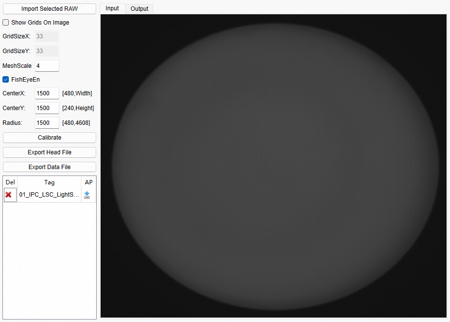

取鱼眼标定工具获取的标定结果Center: \(1555, 1558\)  Radius: 1558填入，点击Calibrate进行校正，如[图2](#fig1182mcpsimp)所示：

**图 2**  MLSC鱼眼标定示意图2<a name="fig1182mcpsimp"></a>  


如[图3](#fig1185mcpsimp)所示，可以看到边缘部分有过亮区域，手动调节Radius，比如改为1458，点击Calibrate，过亮区域消失，但是同时要注意，Radius设置过小，边缘会校正不足。

**图 3**  MLSC鱼眼标定示意图3<a name="fig1185mcpsimp"></a>  
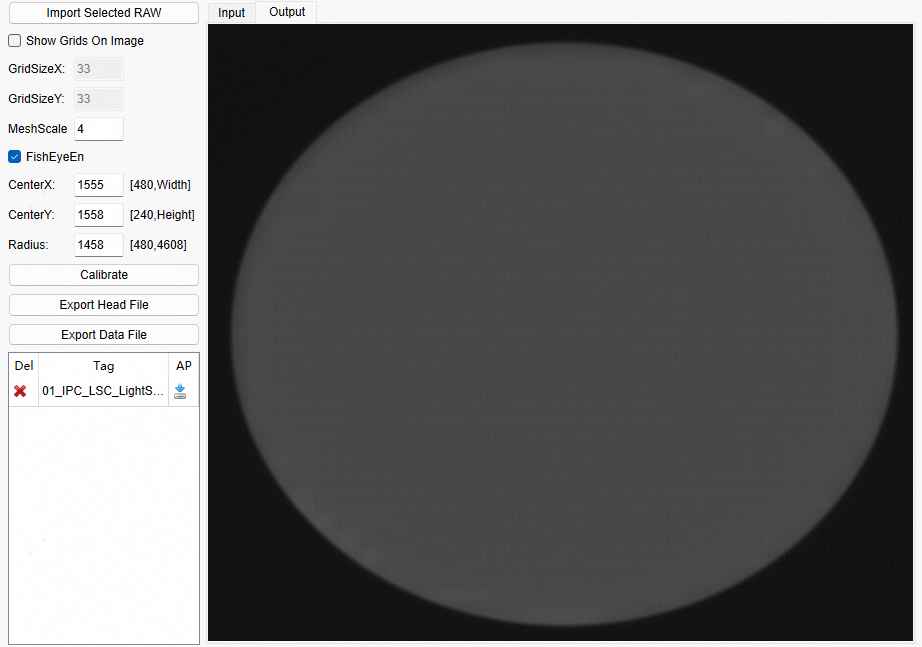

鱼眼镜头的标定结果使用方法与普通镜头结果一致，可参考"[MLSC标定结果说明](#ZH-CN_TOPIC_0000002530221769)"节内容。

#### 附录1：MLSC参数说明<a name="ZH-CN_TOPIC_0000002530221617"></a>

-   MeshScale：为校正增益精度控制参数。

    当MeshScale取值为0\~3时，增益精度从高到低，同时增益的取值范围从小变大；当为4\~7时，精度从高到低，增益的取值范围从小变大，与取值为0\~3不同的是，此时增益最小值为1倍增益。

    具体MeshScale的取值和增益精度/增益取值范围对应关系如[表1](#_toc51692646)所示。

**表 1**  MeshScale的取值和增益精度/增益取值范围对应关系

<a name="_toc51692646"></a>
<table><thead align="left"><tr id="row1203mcpsimp"><th class="cellrowborder" valign="top" width="18.18181818181818%" id="mcps1.2.5.1.1"><p id="p1205mcpsimp"><a name="p1205mcpsimp"></a><a name="p1205mcpsimp"></a>MeshScale</p>
</th>
<th class="cellrowborder" valign="top" width="24.242424242424242%" id="mcps1.2.5.1.2"><p id="p1207mcpsimp"><a name="p1207mcpsimp"></a><a name="p1207mcpsimp"></a>增益表的数据格式</p>
</th>
<th class="cellrowborder" valign="top" width="22.222222222222225%" id="mcps1.2.5.1.3"><p id="p1209mcpsimp"><a name="p1209mcpsimp"></a><a name="p1209mcpsimp"></a>增益取值范围</p>
</th>
<th class="cellrowborder" valign="top" width="35.35353535353536%" id="mcps1.2.5.1.4"><p id="p1211mcpsimp"><a name="p1211mcpsimp"></a><a name="p1211mcpsimp"></a>1倍增益对应增益配置值</p>
</th>
</tr>
</thead>
<tbody><tr id="row1213mcpsimp"><td class="cellrowborder" valign="top" width="18.18181818181818%" headers="mcps1.2.5.1.1 "><p id="p1215mcpsimp"><a name="p1215mcpsimp"></a><a name="p1215mcpsimp"></a>0</p>
</td>
<td class="cellrowborder" valign="top" width="24.242424242424242%" headers="mcps1.2.5.1.2 "><p id="p1217mcpsimp"><a name="p1217mcpsimp"></a><a name="p1217mcpsimp"></a>u1.9</p>
</td>
<td class="cellrowborder" valign="top" width="22.222222222222225%" headers="mcps1.2.5.1.3 "><p id="p1219mcpsimp"><a name="p1219mcpsimp"></a><a name="p1219mcpsimp"></a>[0,2)</p>
</td>
<td class="cellrowborder" valign="top" width="35.35353535353536%" headers="mcps1.2.5.1.4 "><p id="p1221mcpsimp"><a name="p1221mcpsimp"></a><a name="p1221mcpsimp"></a>512</p>
</td>
</tr>
<tr id="row1222mcpsimp"><td class="cellrowborder" valign="top" width="18.18181818181818%" headers="mcps1.2.5.1.1 "><p id="p1224mcpsimp"><a name="p1224mcpsimp"></a><a name="p1224mcpsimp"></a>1</p>
</td>
<td class="cellrowborder" valign="top" width="24.242424242424242%" headers="mcps1.2.5.1.2 "><p id="p1226mcpsimp"><a name="p1226mcpsimp"></a><a name="p1226mcpsimp"></a>u2.8</p>
</td>
<td class="cellrowborder" valign="top" width="22.222222222222225%" headers="mcps1.2.5.1.3 "><p id="p1228mcpsimp"><a name="p1228mcpsimp"></a><a name="p1228mcpsimp"></a>[0,4)</p>
</td>
<td class="cellrowborder" valign="top" width="35.35353535353536%" headers="mcps1.2.5.1.4 "><p id="p1230mcpsimp"><a name="p1230mcpsimp"></a><a name="p1230mcpsimp"></a>256</p>
</td>
</tr>
<tr id="row1231mcpsimp"><td class="cellrowborder" valign="top" width="18.18181818181818%" headers="mcps1.2.5.1.1 "><p id="p1233mcpsimp"><a name="p1233mcpsimp"></a><a name="p1233mcpsimp"></a>2</p>
</td>
<td class="cellrowborder" valign="top" width="24.242424242424242%" headers="mcps1.2.5.1.2 "><p id="p1235mcpsimp"><a name="p1235mcpsimp"></a><a name="p1235mcpsimp"></a>u3.7</p>
</td>
<td class="cellrowborder" valign="top" width="22.222222222222225%" headers="mcps1.2.5.1.3 "><p id="p1237mcpsimp"><a name="p1237mcpsimp"></a><a name="p1237mcpsimp"></a>[0,8)</p>
</td>
<td class="cellrowborder" valign="top" width="35.35353535353536%" headers="mcps1.2.5.1.4 "><p id="p1239mcpsimp"><a name="p1239mcpsimp"></a><a name="p1239mcpsimp"></a>128</p>
</td>
</tr>
<tr id="row1240mcpsimp"><td class="cellrowborder" valign="top" width="18.18181818181818%" headers="mcps1.2.5.1.1 "><p id="p1242mcpsimp"><a name="p1242mcpsimp"></a><a name="p1242mcpsimp"></a>3</p>
</td>
<td class="cellrowborder" valign="top" width="24.242424242424242%" headers="mcps1.2.5.1.2 "><p id="p1244mcpsimp"><a name="p1244mcpsimp"></a><a name="p1244mcpsimp"></a>u4.6</p>
</td>
<td class="cellrowborder" valign="top" width="22.222222222222225%" headers="mcps1.2.5.1.3 "><p id="p1246mcpsimp"><a name="p1246mcpsimp"></a><a name="p1246mcpsimp"></a>[0,16)</p>
</td>
<td class="cellrowborder" valign="top" width="35.35353535353536%" headers="mcps1.2.5.1.4 "><p id="p1248mcpsimp"><a name="p1248mcpsimp"></a><a name="p1248mcpsimp"></a>64</p>
</td>
</tr>
<tr id="row1249mcpsimp"><td class="cellrowborder" valign="top" width="18.18181818181818%" headers="mcps1.2.5.1.1 "><p id="p1251mcpsimp"><a name="p1251mcpsimp"></a><a name="p1251mcpsimp"></a>4</p>
</td>
<td class="cellrowborder" valign="top" width="24.242424242424242%" headers="mcps1.2.5.1.2 "><p id="p1253mcpsimp"><a name="p1253mcpsimp"></a><a name="p1253mcpsimp"></a>u0.10</p>
</td>
<td class="cellrowborder" valign="top" width="22.222222222222225%" headers="mcps1.2.5.1.3 "><p id="p1255mcpsimp"><a name="p1255mcpsimp"></a><a name="p1255mcpsimp"></a>[1,2)</p>
</td>
<td class="cellrowborder" valign="top" width="35.35353535353536%" headers="mcps1.2.5.1.4 "><p id="p1257mcpsimp"><a name="p1257mcpsimp"></a><a name="p1257mcpsimp"></a>0</p>
</td>
</tr>
<tr id="row1258mcpsimp"><td class="cellrowborder" valign="top" width="18.18181818181818%" headers="mcps1.2.5.1.1 "><p id="p1260mcpsimp"><a name="p1260mcpsimp"></a><a name="p1260mcpsimp"></a>5</p>
</td>
<td class="cellrowborder" valign="top" width="24.242424242424242%" headers="mcps1.2.5.1.2 "><p id="p1262mcpsimp"><a name="p1262mcpsimp"></a><a name="p1262mcpsimp"></a>u1.9</p>
</td>
<td class="cellrowborder" valign="top" width="22.222222222222225%" headers="mcps1.2.5.1.3 "><p id="p1264mcpsimp"><a name="p1264mcpsimp"></a><a name="p1264mcpsimp"></a>[1,3)</p>
</td>
<td class="cellrowborder" valign="top" width="35.35353535353536%" headers="mcps1.2.5.1.4 "><p id="p1266mcpsimp"><a name="p1266mcpsimp"></a><a name="p1266mcpsimp"></a>0</p>
</td>
</tr>
<tr id="row1267mcpsimp"><td class="cellrowborder" valign="top" width="18.18181818181818%" headers="mcps1.2.5.1.1 "><p id="p1269mcpsimp"><a name="p1269mcpsimp"></a><a name="p1269mcpsimp"></a>6</p>
</td>
<td class="cellrowborder" valign="top" width="24.242424242424242%" headers="mcps1.2.5.1.2 "><p id="p1271mcpsimp"><a name="p1271mcpsimp"></a><a name="p1271mcpsimp"></a>u2.8</p>
</td>
<td class="cellrowborder" valign="top" width="22.222222222222225%" headers="mcps1.2.5.1.3 "><p id="p1273mcpsimp"><a name="p1273mcpsimp"></a><a name="p1273mcpsimp"></a>[1,5)</p>
</td>
<td class="cellrowborder" valign="top" width="35.35353535353536%" headers="mcps1.2.5.1.4 "><p id="p1275mcpsimp"><a name="p1275mcpsimp"></a><a name="p1275mcpsimp"></a>0</p>
</td>
</tr>
<tr id="row1276mcpsimp"><td class="cellrowborder" valign="top" width="18.18181818181818%" headers="mcps1.2.5.1.1 "><p id="p1278mcpsimp"><a name="p1278mcpsimp"></a><a name="p1278mcpsimp"></a>7</p>
</td>
<td class="cellrowborder" valign="top" width="24.242424242424242%" headers="mcps1.2.5.1.2 "><p id="p1280mcpsimp"><a name="p1280mcpsimp"></a><a name="p1280mcpsimp"></a>u3.7</p>
</td>
<td class="cellrowborder" valign="top" width="22.222222222222225%" headers="mcps1.2.5.1.3 "><p id="p1282mcpsimp"><a name="p1282mcpsimp"></a><a name="p1282mcpsimp"></a>[1,9)</p>
</td>
<td class="cellrowborder" valign="top" width="35.35353535353536%" headers="mcps1.2.5.1.4 "><p id="p1284mcpsimp"><a name="p1284mcpsimp"></a><a name="p1284mcpsimp"></a>0</p>
</td>
</tr>
</tbody>
</table>

> **须知：** 
>在能够完全校正的情况下，增益精度MeshScale应该尽量选择精度高的档位，提高校正的准确度，例如当MeshScale为0或4时都能校正，应当选择4。对于某些镜头阴影特别严重的极端情况下，存在无法完全校正的可能，当选择较大增益倍数（如MeshScale为3）校正时，可能会出现暗条纹或格子，此时需要降低增益倍数来提高精度（设MeshScale为 2或7），重新标定，直到暗条纹或格子消失为止。

-   GridSizeX & GridSizeY：这两个参数无法配置，仅在界面上作为显示当前图像分区数目使用。GridSizeX和GridSizeY分别表示横向与纵向上区域的划分的大小，表示有33 x 33个标定的点。

#### 附录2：MLSC标定结果的有效性验证<a name="ZH-CN_TOPIC_0000002530061779"></a>

有两种方法可以查看MLSC标定结果是否正确，在实际操作中可根据具体条件进行选择。

-   Method 1

    将标定结果下发板端后，可以用PQTools的点播工具查看标定的结果，可粗略观察中心区域与左右两边亮度和颜色的图像质量，将鼠标放置图像上会显示当前像素点的值（工具左下角），比较这些点的差异。

-   Method 2

    将标定结果下发板端后，使用PQTools Capture Tool导出JPG或BMP格式的图，使用专业的图像质量测试工具进行测试，如Imatest当中的Flat Field模块可用来测试Shading的亮度与颜色偏差的指标，亮度平整度在98%以上，色度偏差ΔC最大值小于1，可认为指标达标，偏差在人眼能够察觉的范围之下。

    当出现偏差较大时，请首先检查黑电平是否配置正确，BayerPattern是否配置正确，若还是有偏差，则检查MeshScale设置的增益范围是否够用，不够则需要重新进行标定。

### ACS标定<a name="ZH-CN_TOPIC_0000002530061701"></a>


#### ACS标定基本原理<a name="ZH-CN_TOPIC_0000002498141740"></a>

由于不同光源或者不同色温下光源的频谱不同，同时较小的镜头模组的CRA角度较大，加上IR-cut Filter的影响，在不同光源下的Color Shading特征曲线表现不一致，导致了Color Shading的产生。这种情况下，MLSC标定无法完全解决Color Shading问题。为了校正有Color Shading的镜头和sensor组合，在不同光源下，需要进行ACS（Auto Color Shading）标定。

为了准确获取镜头和sensor在各种光源下的Color Shading特征曲线，需要在各种光源下进行raw数据采集，常用的光源类型有：H，A，D50，D65，TL84，D75，CWF，U30，U35，10k。

#### ACS标定序列采集要求<a name="ZH-CN_TOPIC_0000002530221657"></a>

ACS进行标定时，需要各类光源的灰度图像，基本的采集要求和MLSC标定的采集要求一致，同时也有一些特定的采集要求：

-   请首先确认镜头模组的shading衰减曲线在RAW图上是呈左右和上下对称的，这种情况下采集的环境必须是理想的平坦光源，对于不对称的镜头模组，标定的效果会不太理想，同时影响后续的产线标定。
-   ACS模块的标定序列采集对象要求必须是亮度分布平坦且均匀的光源，在7到10种光源下进行标定：H，A，D50，D65，TL84，D75，CWF，U30，U35，10k，建议A，D50，D65，TL84，D75，CWF是6种必须要标定的光源，其他类型光源可以根据产品的应用场景进行选择，总共参与标定的光源必须大于等于7种。
-   为了保证在多种光源下采集的RAW图的平坦均匀性，有两种方式：
    -   方法一，取一张灰卡，让光源均匀照射在灰卡上，用照度计测量镜头视场内中心与四周的照度，使其差异在5%以内，并拍摄灰卡；
    -   方法二，让镜头正对光源，用毛玻璃扩散片（Diffuser）盖住镜头，采集数据。

具体的采集步骤如下：

1.  将镜头对准目标区域，并保证拍摄区域光照的均匀性；
2.  保证亮度足够并且不过曝，使用PQTools Capture Tool进行Raw数据的采集，只需1帧即可，把采集下来的RAW文件命名加上对应的光源；
3.  更换光源，重复上述步骤，直到采集完所需的光源为止。

一个典型的Color Shading标定场景（未进行LSC校正）在点播工具下如[图1](#fig11413124342213)所示：

**图 1**  ACS标定序列图像<a name="fig11413124342213"></a>  


#### ACS标定工具界面介绍<a name="ZH-CN_TOPIC_0000002530221757"></a>

将ISP标定工具的主功能标签页切换到ACS，即可看到ACS标定的界面。ACS标定的主界面如[图1](#fig152884863520)所示。

**图 1**  ACS界面<a name="fig152884863520"></a>  


如[图1](#fig152884863520)所示，ACS标定工具主要可以分为三部分：。

-   控制区（1绿色方框所示）：工具进行标定的主要功能均由此处入口，以下将一一描述。
-   显示区（2蓝色方框所示）：显示ACS标定结果。
-   列表区（3红色方框所示）：显示标定用的RAW文件，可显示LightType，进行选择或删除操作。

#### ACS标定步骤<a name="ZH-CN_TOPIC_0000002530221697"></a>

在本芯片中，针对镜头的标定步骤如下：

1.  参见"[黑电平的标定](#ZH-CN_TOPIC_0000002498301714)"章节，确定待标定设备的黑电平值；
2.  在工具最左侧的RAW Data列表中，导入Flat Field场景的RAW文件。可识别RAW文件名进行LightType选择。图像导入后，在列表区会显示被导入图像的别名，并提供相关功能按钮（相关功能按钮请参考附件）。同时显示区将显示最后一个被导入的RAW图像，如[图1](#_toc51692526)所示。

**图 1**  ACS标定界面区域3标定RAW列表<a name="_toc51692526"></a>  
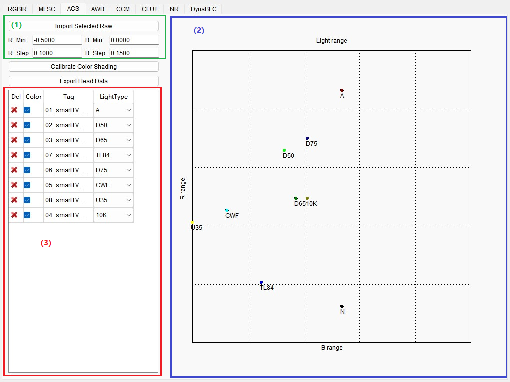

输入标定参数：

-   R\_Min:\[-1.0000,1.0000\], 默认值-0.5000；
-   R\_Step: \[0,1.0000\], 默认值0.1000；

-   B\_Min: \[-1.0000,1.0000\], 默认值0.000；
-   B\_Step: \[0,1.0000\], 默认值0.1500；
-   Color那一栏通常需要全选;
-   参数配置完成后，可进行ACS Color  Shading标定，此时其余按钮灰显；
-   点击“Calibrate Color Shading”按钮即可进行ACS Color标定。
-   标定完成后，可以点击“Export Head Data”按钮导出头文件。

ACS标定是离线标定，不下发板端。

#### ACS标定调试<a name="ZH-CN_TOPIC_0000002498141760"></a>

为了使ACS标定的结果更加准确，标定一次后，需要根据光源点的分布表来调整R\_Min，R\_Step，B\_Min，B\_Step四个参数，光源分布表是标定后的模型所能够校正的光源范围的集合，横坐标是B分量，纵坐标是R分量。

**图 1**  ACS标定后的光源分布表<a name="fig126466584303"></a>  
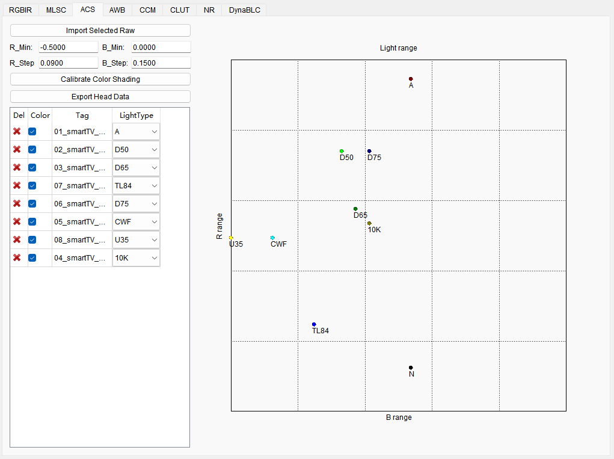

光源的分布越集中，说明可校正的标定光源外的范围越大，但是校正的精度会降低；光源分布越分散，说明可校正的标定光源外的范围越小，但是校正的精度会提高。

总体的调试策略是调整这四个参数，调整标定光源的分布，达到校正范围与校正精度之间的平衡。N点表示的是最接近没有Color Shading时的情况，当在光源点坐标范围包围内，也就是不在边界线上时，表示是无Color Shading的情况。

R\_Min，R\_Step两个参数控制R分量上光源的平移和缩放，B\_Min，B\_Step两个参数控制B分量上光源的平移和缩放。当Min参数从小变大时，R纵坐标光源点整体会向下移动，B横坐标整体会向左移动；当Step参数增大时，光源点的分布就更集中，Step参数减小时，光源点的分布就更分散。

参数调整对光源点分布表的影响如[图1](#fig126466584303)所示。

**图 2**  R\_Min增大<a name="fig13176158173416"></a>  
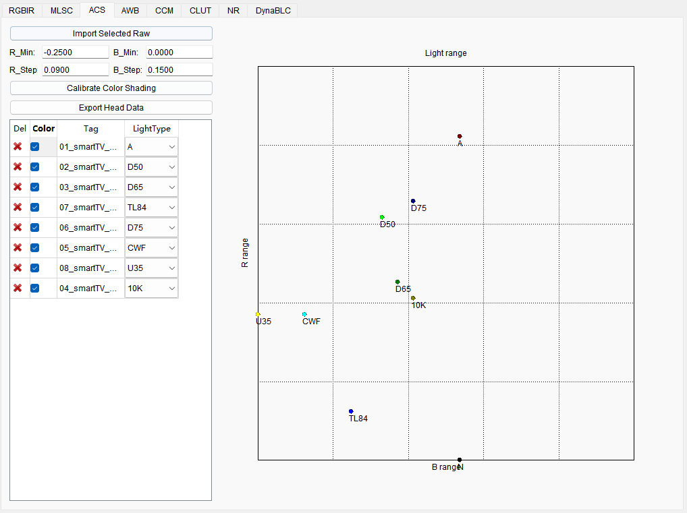

**图 3**  R\_Step增大<a name="fig140211387347"></a>  
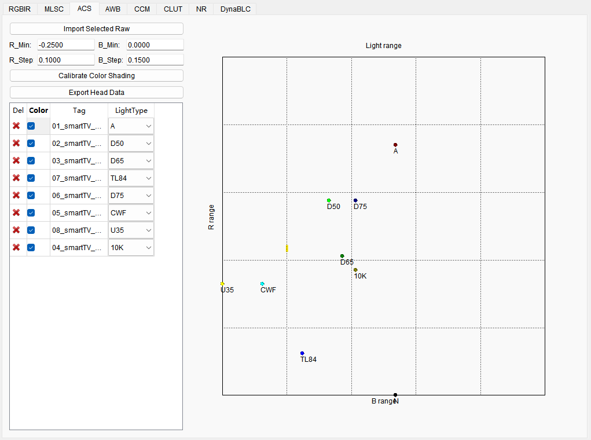

**图 4**  R\_Step减小<a name="fig171848417355"></a>  
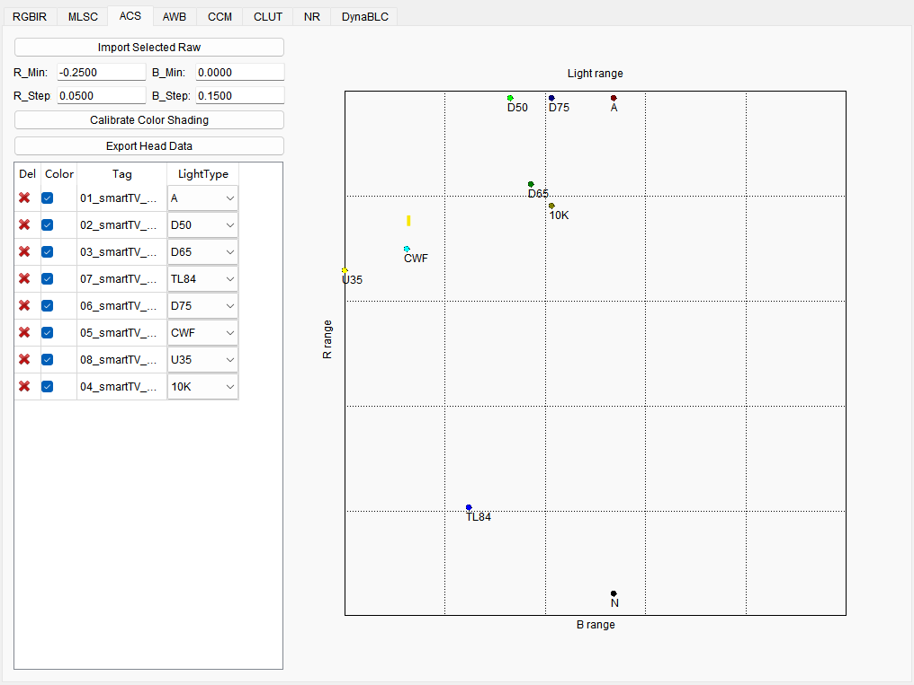

**图 5**  B\_Min增大，R\_Min增大<a name="fig99269269352"></a>  
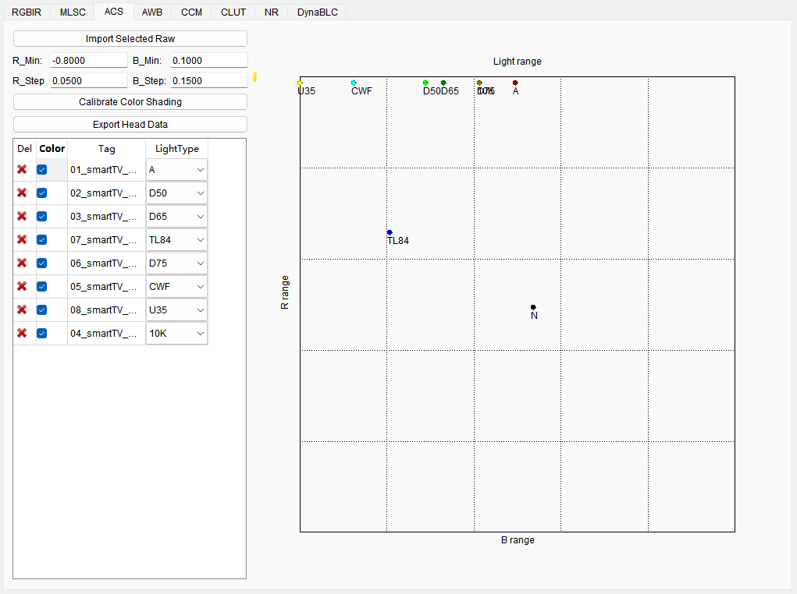

**图 6**  B\_Step增大<a name="fig3317114233515"></a>  
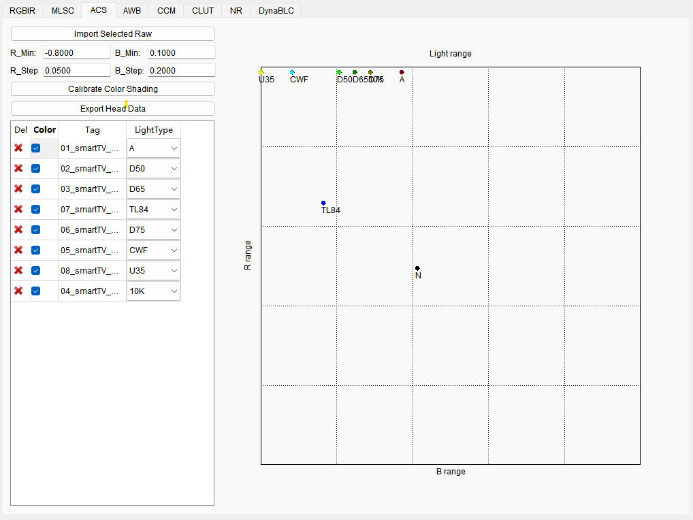

#### ACS标定结果说明<a name="ZH-CN_TOPIC_0000002498301690"></a>

标定结束后，工具会生成ACS标定参数，参数无下发板端功能，需手动配置到xxx\_cmos\_ex.h文件中编译并运行查看效果，可以点击“Export Head Data”按钮将标定参数导出为本地头文件：

-   导出.h文件，生成文件包含一个结构体定义：
-   ot\_isp\_cmos\_acs，其中包含了ACS模块的开关，ACS模块的校正强度，标定参数结构体ot\_isp\_acs\_calib\_param，Y\_Shading Lut表结构体ot\_isp\_acs\_y\_shading\_lut，Color Shading Lut表结构体ot\_isp\_acs\_color\_shading\_lut。

需将数据应用至各类sensor的xxx\_cmos\_ex.h文件，直接在文件中添加结构体ot\_isp\_cmos\_acs的定义，具体用法请参考《ISP开发参考》。

### AWB标定<a name="ZH-CN_TOPIC_0000002498301720"></a>


#### AWB标定基本原理<a name="ZH-CN_TOPIC_0000002498301724"></a>

AWB标定，即根据sensor在数个标准光源下的白点特征\(R/G，B/G\)，计算最佳普朗克拟合曲线和色温拟合曲线。采用这个办法，可以获得较为理想的AWB算法的输入。

#### AWB标定序列采集要求<a name="ZH-CN_TOPIC_0000002498301710"></a>

AWB标定算法所需Raw可以在室内实验室环境下采集（光源类型和光照亮度需可控），具体采集时需要准备的环境如下所示：

-   采集设备：标准X-Rite 24色卡、照度为600Lux的多种均匀光源（左右两侧双光源，光源与色卡平面的夹角在25°- 45°），需要标定的设备、色温计等。在光源类型的选择上，请尽量满足高（6500K以上），中（5000K左右）、低（2300K左右）色温至少各有一组。推荐使用D75（7500K）、D50（5000K）和A（2856K）三组光源；
-   （可选）室内标定之前，可在室外自然光环境采集5000K附近的24色卡Raw，以提高标定的准确性；
-   采集之前需要通过设置ExposureAttr中的Compensation参数调整画面目标亮度，使得最亮灰阶\(Block 19\)的G分量亮度在饱和值的0.8倍左右（即使用PQStream点播工具预览时，该色块的RGB值为204左右）；
-   为尽量保证标定结果准确，采集Raw时请尽量使24色卡画面占据60%以上的画面内容，采集帧数1帧即可，采集时需要记录实际环境色温；
-   由于AWB标定结果会受到镜头Shading影响，为尽量保证标定结果准确，对能明显观察到镜头阴影的设备，请将采集下来的Raw进行Shading矫正后再进行AWB标定。具体操作方法请参考"[MLSC标定](#ZH-CN_TOPIC_0000002530221747)"节所述内容。

确保以上条件同时满足后，采集下来的Raw即可输入给AWB标定算法进行处理。AWB标定算法输入Raw示意如[图1](#_toc51692533)：

**图 1**  AWB标定算法输入Raw示意<a name="_toc51692533"></a>  
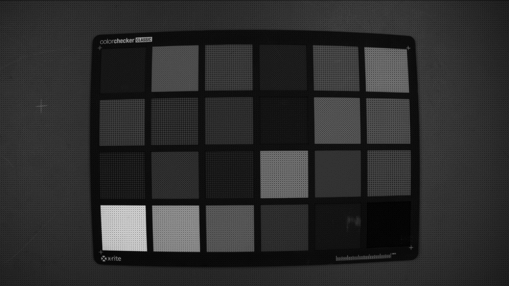

#### AWB标定工具的界面说明<a name="ZH-CN_TOPIC_0000002498141738"></a>

将标定工具的主功能标签页切换到AWB，即可看到AWB标定的界面。工具的界面如[图1](#fig3344269336)所示。

**图 1**  AWB标定工具界面<a name="fig3344269336"></a>  
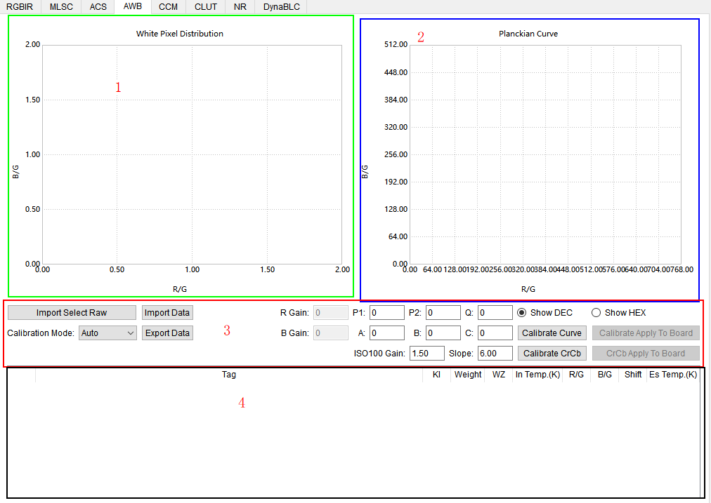

工具界面主要分为4部分：

-   White Pixel Distribution图表（绿色区域）：位于工具左上角，显示各个导入的图像样本的白块R/G、B/G值位置；
-   Planckian Curve图表（蓝色区域）：位于工具右上角，显示标定完成后的普朗克曲线；
-   操作区域（红色区域）：位于工具中间，提供用户导入RAW文件，设置标定参数、启动标定和向单板写数据的操作接口。同时也显示标定后的色温曲线参数值和增益值。本区域中，P1、P2、Q、A、B、C六个值为标定结果输出值，用来描述普朗克曲线，R Gain、B Gain两个值为标定输入值，用来描述中心色温的RGain、BGain值，并能进行RAW标定数据的导入导出，和下发板端操作。
-   RAW文件配置表（黑色区域）：可以对导入的RAW文件设置权重，色温，并配置白区。标定完成后，还会显示对应光源下的色温和Shift值，对AWB的raw文件配置进行导入导出，导入导出参数有文件名、KI值、输入色温、R/G、B/G值。

#### AWB标定步骤<a name="ZH-CN_TOPIC_0000002530221751"></a>

标定工具支持AWB的自动标定与半自动标定，自动标定和半自动标定的主要区别在于是否需要手动输入Rgain和Bgain的值。

1.  在标定工具主界面指定黑电平，或进行一次黑电平标定。
2.  参照"[设置RAW基本属性](#ZH-CN_TOPIC_0000002498141702)"章节的描述，在标定工具主界面导入需要进行AWB标定的RAW数据，并进行勾选。要求输入至少3个不同光源的RAW文件。
3.  选择Mode下拉框为Auto。（如果需要进行半自动标定，请选择Semi-Auto）
4.  在AWB标定界面导入勾选的RAW数据，并设置各个RAW数据的权重，色温。权重默认值为1，取值范围为0\~15，权重值越高，则该色温在AWB普朗克曲线拟合过程中的倾向度越高。色温即为采集RAW数据过程中记录的实际色温值。
5.  使用工具在各个RAW数据中勾选白平衡块，具体勾选过程请参考附录内容。
6.  选择3个RAW为关键光源 \(KI\)作为标定起始点。推荐选择A、D50、D75三个光源为KI。
7.  如果选择标定模式为Semi-Auto，请在操作区域R Gain、B Gain输入框手动设置R Gain和B Gain的值。
8.  点击“Calibrate”按钮。

#### CrCb参数标定步骤<a name="ZH-CN_TOPIC_0000002530221713"></a>

CrCb标定主要利用最大色温和最小色温的R/G、B/G的值进行标定，得出4组CrCb数组的值。

1.  在标定工具主界面指定黑电平，或进行一次黑电平标定。
2.  参照“[设置RAW基本属性](#ZH-CN_TOPIC_0000002498141702)”设置RAW基本属性章节的描述，在标定工具主界面导入需要进行AWB标定的RAW数据，并进行勾选。要求输入至少3个不同光源的RAW文件。
3.  使用工具在各个RAW数据中勾选白平衡块并设置相应RAW数据的色温值，具体勾选过程请参考附录内容。
4.  点击“Calibrate CrCb”按钮。

#### AWB标定结果说明<a name="ZH-CN_TOPIC_0000002498141772"></a>

所有的RAW文件都选择好白块以后，即可进行标定。点击“Calibrate Curve”按钮后，等待一小段时间，标定即可完成。标定完成后，以下的结果会被给出：

-   Planckian Curve图表中输出普朗克曲线，并标出每个RAW文件在该图表中的位置；
-   R Gain，B Gain以及色温曲线的6个参数（P1，P2，Q，A，B，C）值也将给出（如果是半自动标定，则R Gain和B Gain的值与用户输入相同）；
-   基于上述标定参数，输出每个RAW文件对应的Shift值和色温期望值（Es. Temp）。|Shift|值越小，色温期望值与真实色温误差越小，表示标定参数越准确。

**图 1**  AWB标定结果<a name="fig1624654653613"></a>  
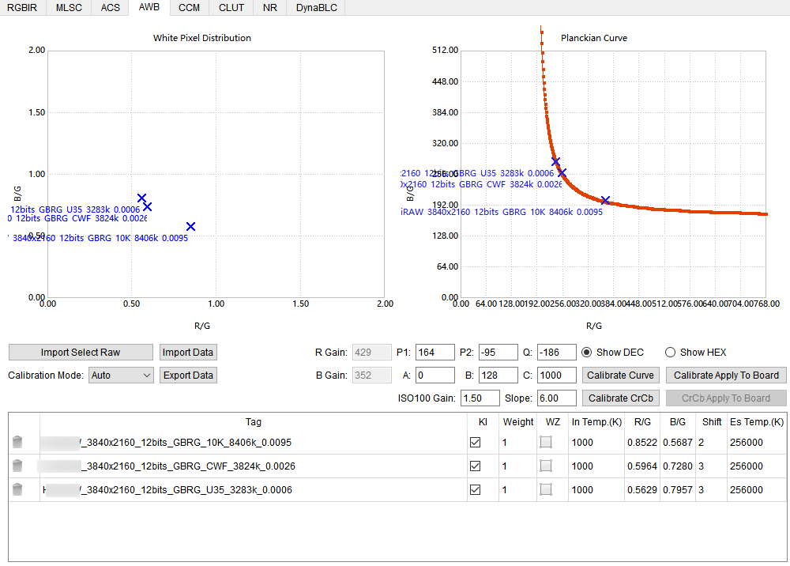

> **须知：** 
>标定算法需要3个关键光源才可运行。因此用户选定的关键光源不为3个时，点击“Calibrate Curve”按钮将无法进行标定。

AWB算法支持下发板端功能，完成标定后，点击“XX Apply To Board”按钮，可以将标定结果下发至板端。发送的数据将立即生效。

#### 附录：为RAW文件样本勾选白区<a name="ZH-CN_TOPIC_0000002498141852"></a>

点击RAW文件配置表（工作区黑色区域）中对应RAW文件在WZ（White Zone）一栏中的按钮，可以打开白块框选对话框，如[图1](#fig14000447252)所示。

**图 1**  白区勾选窗口<a name="fig14000447252"></a>  
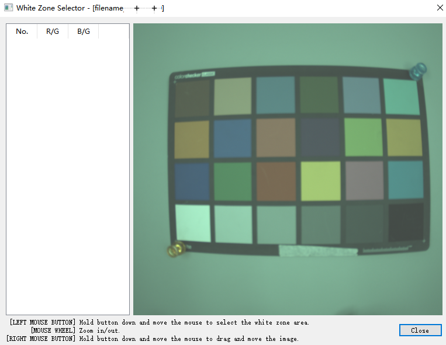

按住鼠标右键并拖动鼠标，可以移动图像；使用鼠标滚轮可以缩放图像。

在图像显示的区域使用鼠标左键，可框选图像中的区域。对于24色卡场景，一般选择20-22色块作为白块；对于实际拍摄的自然场景，选择其中的白色部分。选框时，使色框尽可能大（但需要保证所有像素颜色几乎相同），这样可以使取到的R/G和B/G更加精确，从而得到更准确的标定结果。选定白区后的效果如[图2](#fig14851613163610)所示。

**图 2**  白块勾选<a name="fig14851613163610"></a>  
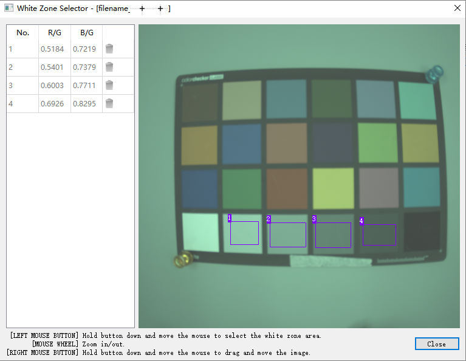

选定白块后，左侧的列表会显示选定白块的R/G与B/G比值，显示的序号与右侧选框对应。若选择了不需要的选框，或选框错误，可以在列表中点击对应序号右侧的红叉按钮将其删除。

如[图3](#fig20920144172219)所示，请注意如果不同亮度的B/G值差异明显（\>0.1），需要确认黑电平设置是否合理。

选择完毕后点击“Close”按钮关闭白块勾选对话框。工具将自动计算该RAW文件的R/G和B/G的算术平均值，并显示在列表中，并在White Pixel Distribution图表中标示该RAW文件所处的位置。

**图 3**  白块勾选完毕<a name="fig20920144172219"></a>  
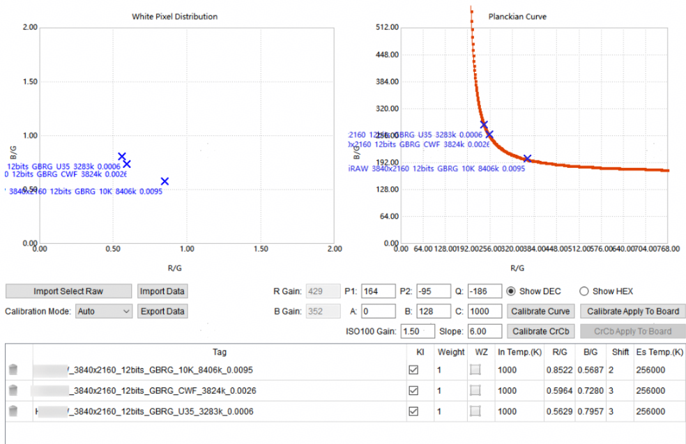

### CCM标定<a name="ZH-CN_TOPIC_0000002530061663"></a>


#### CCM标定工具原理<a name="ZH-CN_TOPIC_0000002498141750"></a>

CCM标定的原理是，使用sensor抓拍到的24色卡场景下前18个色块的实际颜色信息和其期望值，计算3x3的CCM矩阵。输入颜色经CCM矩阵处理得到的颜色与其期望值差距越小，则CCM矩阵就越理想。

#### CCM标定序列采集需求<a name="ZH-CN_TOPIC_0000002530221681"></a>

-   采集设备准备：标准X-Rite 24色卡，照度为600Lux均匀光源（左右两侧双光源，光源与色卡平面的夹角在25°- 45°）。
-   调整AE目标亮度，PQStream点播工具显示页面上查看第20色块的G值在201附近，第21色块的G值在163附近就表示曝光合适。
-   采集中性灰RAW图像，检查镜头阴影程度。Shading较严重时，需要先标定Shading系数，24色卡图像需要先进行Shading校正后，再进行CCM标定。

#### CCM标定工具的界面与功能<a name="ZH-CN_TOPIC_0000002498301684"></a>

将标定工具的主功能标签页切换到CCM，即可看到CCM标定的界面。

**图 1**  CCM标定工具界面<a name="fig1289482822318"></a>  
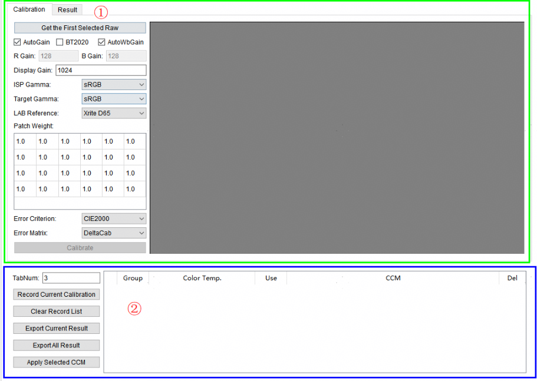

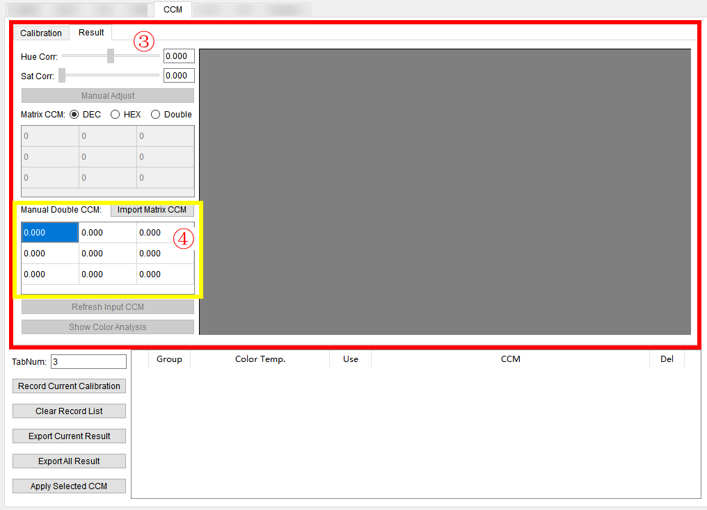

CCM标定工具主要分为四部分：

-   标定区域：上方的标签页，包含“Calibration”与“Result”两个页面，执行CCM标定功能和CCM手动调整功能。
-   记录区域：暂存标定结果，并将用户选择的标定结果发送到板端。
-   结果区域：色调、饱和度修正值，显示校正后图像，CCM结果\(浮点型和整型两种形式\) 还有颜色误差分析。
-   图像微调区域：对CCM矩阵进行数据输入，仅能输入浮点类型数据，并对图像进行微调。

#### CCM标定步骤<a name="ZH-CN_TOPIC_0000002530061681"></a>

进行CCM标定，请遵循以下流程（后面章节中，将进行各个操作流程的说明）：

1.  参照"[设置RAW基本属性](#ZH-CN_TOPIC_0000002498141702)"章节的描述，在标定工具主界面导入需要进行CCM标定的RAW数据。
2.  导入RAW文件（24色卡限定）。
3.  选取24色区域，操作方法请参考附录1。
4.  配置标定参数（GAMMA，参考LAB，色块权重，差异标准，AutoGain，AutoWbGain，R Gain，B Gain，Display Gain），参数意义请参考附录2。
5.  点击“Calibrate”按钮进行标定，获得结果CCM。
6.  在Result页面进行手动色调/饱和度调整，直到获取的CCM满足要求，并能点击Show Color Analysis 查看图像差异结果分析。

#### CCM标定结果说明<a name="ZH-CN_TOPIC_0000002498301804"></a>

当24色选框完成，并配置好所有的标定参数后，即可点击“Calibrate”进行标定。标定完成后，工具自动跳转到Result 页面，并显示校正后图像，CCM\(浮点型和整型两种形式\)和色调、饱和度修正值，如[图1](#fig07341854152319)所示。

**图 1**  初步标定完成<a name="fig07341854152319"></a>  
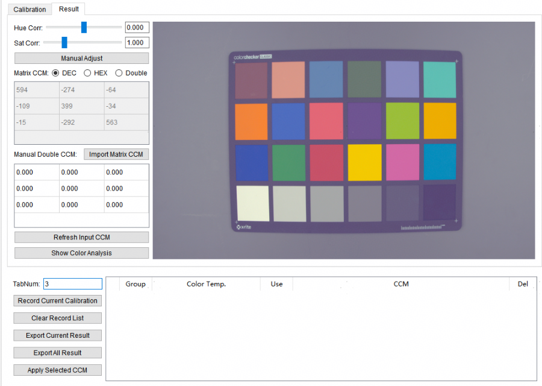


##### 显示颜色差异结果<a name="ZH-CN_TOPIC_0000002530061717"></a>

可点击“Show Color Analysis”按钮显示当前图像和源图像的差异结果，如[图1](#fig77431643112619)所示。

**图 1**  CCM图像颜色差异分析<a name="fig77431643112619"></a>  
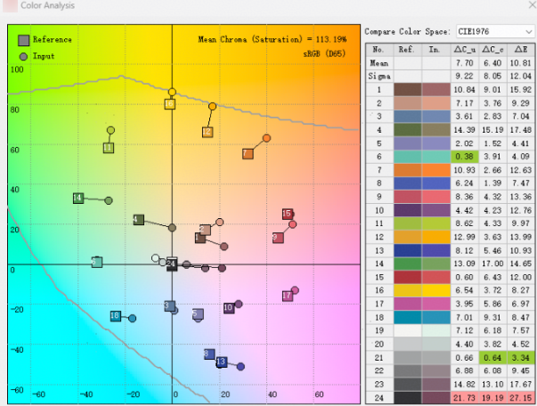

测量的结果是显示RAW数据经过当前CCM参数，得到的源图像与LAB Customization中设定的目标图像的差异。一般来说，源图像的圆形和目标图像的方形会比较接近。用户可以不断调节方形的位置来引导CCM参数的标定。

如果需要测量源图像和标准色卡值之间的误差，请使用PQTools Color Checker工具。

##### 手动调整<a name="ZH-CN_TOPIC_0000002498301712"></a>

如果查看校正后的图像发现效果不理想，还可以进行手动调整。在“Result”页面调整色调（Hue Corr）和饱和度（Sat Corr）修正值，并点击“Manual Adjust”，可以重新计算CCM并进行图像校正。点击“Import Matrix CCM”可把Matrix CCM的值导入到Manual CCM的矩阵中，进行手动调整图像。重复上述操作，直到获得满意图像即可。

##### 导出当前标定结果<a name="ZH-CN_TOPIC_0000002530221631"></a>

点击CCM标定界面上的“Export Current Result”可将当前标定的数据导出成一系列文件。在弹出的目录选择对话框选择好输出路径后，工具将保存一系列文件，包括：

-   输入图像（经过Demosaic处理）
-   输出图像（经过Demosaic和CCM校正处理）
-   CCM标定结果矩阵（包含浮点，10进制和16进制3种形式），若手动进行CCM矩阵的输入，也可在结果导出中导出输入的CCM矩阵的浮点和转换后的10进制和16进制数。

##### 导出全部标定结果<a name="ZH-CN_TOPIC_0000002530061699"></a>

点击CCM标定界面上的“Export All Result”可导出当前标定数据的输入图像，输出图像，和所有记录的CCM标定结果矩阵（如果没有记录，则只有当前标定结果的矩阵），包括：

-   当前标定的输入图像（经过Demosaic处理）
-   当前标定的输出图像（经过Demosaic和CCM校正处理）
-   当前CCM标定结果矩阵和所有记录的CCM标定结果矩阵（包含浮点，10进制和16进制3种形式）以及手动输入的CCM矩阵值（包含浮点，10进制和16进制3种形式）

##### 记录功能<a name="ZH-CN_TOPIC_0000002530061709"></a>

当用户调整到一组合适的CCM，可将其暂存起来。点击对话框上的“Record Current Calibration”按钮，可将当前标定的所有信息在程序中暂时记录下来。记录后，下方列表会显示一条CCM信息：

**图 1**  记录功能<a name="fig16131818172719"></a>  
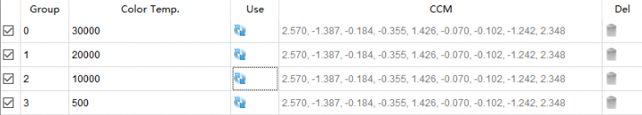

在Color Temp. 一栏，可以为该记录设置色温，一般与输入图像采集时的色温相对应。

点击Use一栏的环状箭头按钮，可以将对应的记录（包括使用的图像，标定参数等）恢复到标定界面，可以继续利用这些参数进行标定或手动调整。恢复后，工具将立即使用恢复的参数执行一次标定。

如果不需要再用到特定的记录，点击记录右侧Del一栏中的红叉按钮可将记录删除。如需要删除全部的记录，请点击“Clear Record List”按钮。

##### 标定结果下发到板端<a name="ZH-CN_TOPIC_0000002530221627"></a>

当用户标定并记录了多组参数后，可以选出其中的七组以下\(含7组\)数据，将这些记录中的结果CCM发送到单板。采取以下步骤：

1.  设置TabNum，默认为3，范围\[3,7\]，其含义为板端生效的CCM组数。
2.  在记录列表最左侧的复选框上，勾选1组到7组需要下发到板端的CCM标定结果。
3.  设置Group号，Group号的意义为板端生效的CCM的第几组，Group的取值范围\[0, TabNum-1\]且不能有相同。例如TabNum为3时，Group号为0，1，2。
4.  为勾选的记录设置色温值。
5.  点击界面上的“Apply Selected CCM”按钮。

> **须知：** 
>选择下发板端的记录必须满足以下条件，下发才能成功并生效：Group与色温成反比。前一组的色温值与后一组的色温值需符合如下规则：Tpre\*\(100 - 6.25\) \> Tpost\*\(100 + 6.25\)即高色温值的15/16需大于低色温值的17/16。

##### 附录1：选择24色区域<a name="ZH-CN_TOPIC_0000002530221653"></a>

导入RAW图像后，可在右侧的图像区域选择24色范围。拖动四角色块中央的红色手柄，即可改变24色框的排布，将24个方框对准RAW图像的24色区域即可。如[图1](#fig1684116203484)所示。

**图 1**  24色选框<a name="fig1684116203484"></a>  

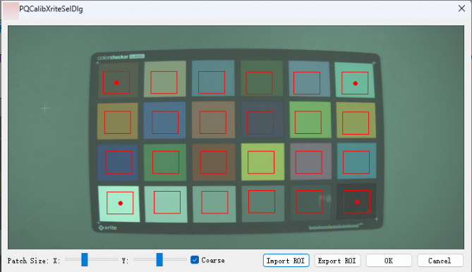

移动图片区域左侧的Patch Size X或Patch Size Y滑块，可以改变选框的各个方框的水平和垂直大小。调整时，使色框尽可能大（但需要每个框内，所有像素颜色几乎相同），这样可以使取到的颜色更加精确，从而得到更准确的标定结果。

##### 附录2：配置标定参数<a name="ZH-CN_TOPIC_0000002530221753"></a>

请按照以下基本步骤设置标定参数：

1.  设置ISP Gamma：在ISP Gamma的下拉框中选择需要的Gamma预设值（目前支持sRGB和Rec709，BT.2020），也支持自定义。请用户输入ISP当前生效的Gamma表。
2.  设置显示Gamma：在Target Gamma的下拉框中选择需要的Gamma预设值（目前支持sRGB和Rec709）。
3.  设置LAB参考值：在LAB Reference的下拉框中选择需要的LAB预设值（目前支持D65条件下的Xrite标准值）。也支持自定义，可自定义输入色卡中的值并进行标定。
4.  在6x4的表格中配置色块的权重。色块的位置与表格中的位置对应，取值范围为0到16.0的浮点数，保留一位小数。
5.  选择差异衡量的标准（支持CIE2000和CIE76）以及差异矩阵（Delta Cab与Delta Eab）。推荐使用“CIE76 Delta Eab”和“CIE2000 Delta Cab”两种组合进行标定。
6.  选择是否AutoGain，当选择AutoGain时，会对RAW的值和目标值做亮度补偿。
7.  输入Display Gain值，对结果生成的图像进行校正。

-   自定义ISP Gamma的方法

    在ISP Gamma的下拉框中选择Customize…，并在随后弹出的文件选择对话框中选择一个Gamma文本文件用于导入（例如可以选择：PQTools\\Plugins\\Data\\ColorCalibrationPicture\\gamma257.txt）。文本文件的格式必须是以下三种之一才可以被工具识别：

    -   一列排列的浮点数，数据的排列必须由小到大，且最大值为1.0
    -   一列排列的10进制正整数，数据的排列必须由小到大。工具以最大值为归一化的标准值。
    -   一列排列的16进制数，数据的排列必须由小到大。工具以最大值为归一化的标准值。

        若文件成功导入，则工具在标定时使用该文件内保存的Gamma数据。

-   自定义LAB参考值的方法

    在 LAB Reference的下拉框中选择Customize，打开LAB自定义对话框，如[图1](#fig4758162814496)所示。

**图 1**  LAB自定义对话框<a name="fig4758162814496"></a>  
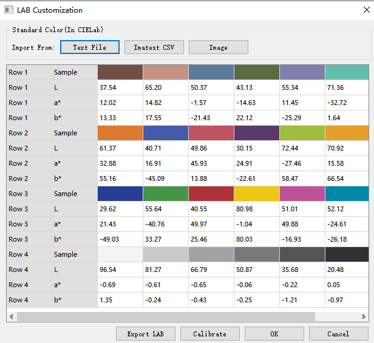

**图 2**  LAB点击颜色弹框选择<a name="fig14650256161210"></a>  
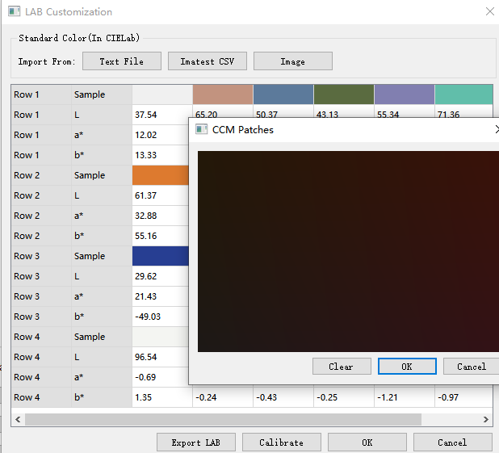

用户可以用5种方式自定义LAB参考值：

-   直接在表格中输入值。
-   导入文本文件：点击Import From右侧的“Text File”按钮，选择一个txt文件后即可将其中的值导入至该对话框。选择的文本文件必须是一系列浮点数，并且用逗号或空格隔开，行列数可任意。
-   导入Imatest 3.x 的Color Check功能生成的CSV文件：点击Import From右侧的“Imatest CSV”按钮，选择一个由Imatest 3.x工具导出的csv文件后，即可导入其中的LAB数据。可选择导入ideal或meas数据。
-   从图片框选：点击Import From右侧的“Image”按钮，选择一张jpg或bmp图片（例如可以选择：PQTools\\Plugins\\Data\\ColorCalibrationPicture\\target\_A.jpg）。之后在打开的对话框中进行24色框选即可。方法与之前CCM标定工具上的框选一致。
-   可点击列表中的颜色，弹出调色板，如[图1](#fig4758162814496)所示，调色板是当前L亮度下的一定范围内的颜色，用户点击选框中颜色，画出一个矩形框，选择颜色，获得LAB值。
-   点击“Export LAB”按钮可以导出当前的LAB值，生成txt文件，可用于导入Txt File。

设置完成后点击“OK”。之后标定工具在标定时，会使用用户自定义的LAB数据。

标定BT.2020下的CCM的配置方法：

1.  选择是否BT.2020，当选择BT.2020时，标定得到的CCM参数符合BT.2020的标准。
2.  设置ISP Gamma，在ISP Gamma的下拉框中选择需要的Gamma预设值（BT.2020），也支持自定义。请用户输入ISP当前生效的Gamma表。
3.  当目标图片或者目标值为sRGB标准时，设置显示Gamma，在Target Gamma的下拉框中选择需要的Gamma预设值（sRGB）。当目标图片或者目标值为BT.2020标准时，选择预设值（Rec709）。
4.  设置LAB参考值，在LAB Reference的下拉框中选择需要的LAB预设值（目前支持D65条件下的Xrite标准值）。也支持自定义。
5.  选择好所需的颜色后，可直接在该界面进行标定。

### CLUT标定<a name="ZH-CN_TOPIC_0000002498301776"></a>

> **须知：** 
>由于大分辨率标定时内存占用比较大，CLUT标定导入的RAW建议不超过4096\*4096的分辨率，否则工具有挂死的危险。如果有需要超大分辨率，请像CAC一样进行RAW的下采样，然后将下采样的RAW进行标定。


#### CLUT标定基本原理<a name="ZH-CN_TOPIC_0000002530061685"></a>

CLUT标定基于用户提供的24色卡、140色卡或用户自由选择的颜色对，建立输入图像和目标图像的RGB空间的3D映射表。CLUT算法基于映射表对图像进行逐像素的调节，以满足用户颜色调节的需求。标定的主要目的是通过源和目标的RGB对，确定CLUT的对于各种颜色的调节方向和调节量。

#### CLUT标定工具界面与功能<a name="ZH-CN_TOPIC_0000002498301686"></a>

CLUT主界面如[图1](#fig18977141615210)所示。

**图 1**  CLUT主界面<a name="fig18977141615210"></a>  
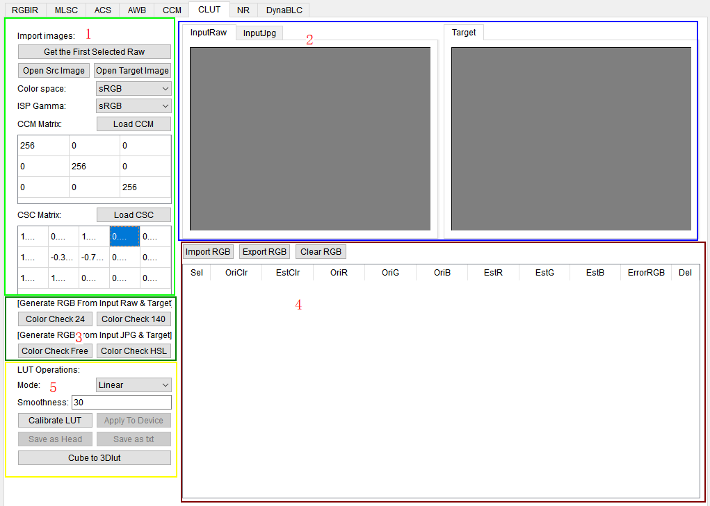

将标定工具的主功能标签页切换到CLUT，即可看到CLUT标定的界面。

如主界面[图1](#fig18977141615210)所示，CLUT标定工具主要可以分为五部分：图像参数区（1）、图像预览区（2）、颜色选取区（3）、RGB对区（4）、CLUT生成区（5）。

-   图像参数区：待标定机器和目标机器的相关参数，这些参数用来从RAW或JPG中获得ISP中CLUT模块处的数据。
-   图像预览区：显示输入图像或者目标图像。
-   颜色选取区：提供四种从输入图像和目标图像中选取RGB对的工具。
-   RGB对区：显示收集到的RGB对数据。
-   CLUT生成区：用来生成和保存CLUT。

#### CLUT标定校正步骤<a name="ZH-CN_TOPIC_0000002530221671"></a>

图像亮度、白平衡、CCM参数、Gamma曲线等都会影响CLUT标定的准确性。因此，CLUT标定前，确认待标定机器和目标机器的AWB设置正确，亮度、灰阶表现一致。

1.  在D50或D65灯箱光源，600lux左右照度，对着24色卡或140色卡，拍摄待标定机器的RAW或JPG图片和目标机器的JPG图片。在室外采集2-3组不同亮度的待标定机器RAW或JPG图片和目标机器的JPG图片，这里的源和目标图片对可以同时含有色卡也可以不含有色卡。详细要求请参考"[附录1：采集数据的要求](#ZH-CN_TOPIC_0000002498301806)"。
2.  如果画面的Shading现象严重，可参考"[MLSC标定](#ZH-CN_TOPIC_0000002530221747)"中介绍内容，对图像进行Shading矫正后再进行CLUT标定。
3.  加载图片文件，请参考"[附录2：加载文件](#ZH-CN_TOPIC_0000002498141804)"。
4.  设置图像参数，请参考"[附录3：图像参数区设置](#ZH-CN_TOPIC_0000002530221655)"。
5.  使用Color Check 24和Color Check 140两个工具，可以从待标定机器的RAW和目标机器的JPG图片中获得RGB对。
6.  这种方式的优点是可以简单快速的确定各种颜色的调节方向和调节量，包含需要调节的颜色和需要固定不调节的颜色，获得的RGB对可以看做是CLUT的基础调节。
7.  使用Color Check Free工具，可以从待标定机器的JPG图片和目标机器的JPG图片中获得RGB对。这种方式的优点是从场景中选择感兴趣的颜色，做进一步精细的调节。使用Color Check HSL工具，可以从待标定机器的JPG图片中获得RGB对。这种方式的优点是在当前的颜色表现的基础上调节。请"[附录4：RGB对生成](#ZH-CN_TOPIC_0000002530221633)"。
8.  使用经过整理确认的RGB对的数据生成CLUT表。整理RGB对的具体方法可参考"[附录5：整理RGB对](#ZH-CN_TOPIC_0000002498141752)"。
9.  标定结果下发板端确认效果，存储标定结果用于FW。

#### CLUT标定结果说明<a name="ZH-CN_TOPIC_0000002498301732"></a>

标定结束后，CLUT标定工具会生成基于用户选择的颜色映射矩阵。本标定工具提供了以下标定结果的使用功能：

-   保存标定参数
-   将标定结果发送至板端的功能


##### 保存标定参数<a name="ZH-CN_TOPIC_0000002498301682"></a>

点击“Save as Head”按钮，可以将工具内的标定参数保存为.h文件，可供在代码中编译使用。点击“Save as txt”按钮，可以将工具内的标定参数保存为.txt文件。可以在调试页中导入到CLUT参数矩阵中。

##### 将标定结果发送至板端<a name="ZH-CN_TOPIC_0000002498301706"></a>

点击界面上的“Apply To Device”按钮，可以将标定生成的CLUT三维矩阵直接应用至板端对应的CLUT处，并立即生效。

##### 附录1：采集数据的要求<a name="ZH-CN_TOPIC_0000002498301806"></a>

在D50或D65灯箱光源或者是室外采集RAW时，场景内放置有色卡，通过PQStream工具的图像预览界面读取色卡的第21色块的G通道的值，通过调节曝光等ISP内影响亮度的参数，观察这个值和目标机器采集的图片中的值基本接近，这时可以采集RAW数据。

在使用RAW数据作为源数据和JPG作为目标数据时，要求源和目标图像内都有色卡，RAW数据会参考JPG目标数据的白平衡结果，进行白平衡增益的处理。不需要手动设定白平衡增益。推荐采集RAW数据的步骤如下：

1.  通过PQStream工具调节亮度

    通过PQStream点播工具的图像预览界面读取色卡的第21色块的G通道的值。然后调节ISP参数，让该值和目标JPG相当。

    **图 1**  PQStream工具预览读取值<a name="fig1606mcpsimp"></a>  
    
    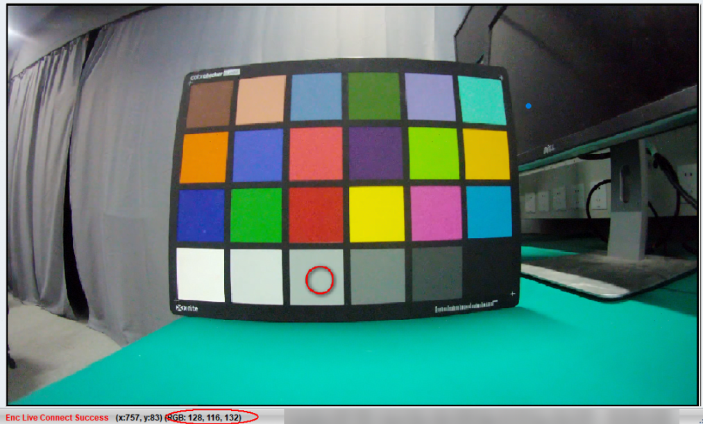

2.  采集RAW数据

    通过PQTools工具的Capture Tool采集RAW数据。

    **图 2**  PQTools工具采集RAW数据<a name="fig968681175313"></a>  
    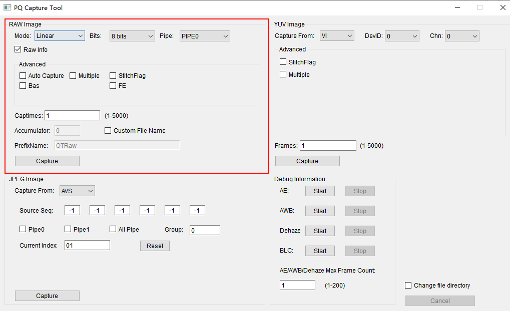

在使用ISP输出端的JPG作为源数据时，需要注意采集到的JPG数据和ISP输出保持一致。因为YUV转RGB的标准的原因，容易导致采集到的JPG数据和ISP输出有偏差。比较简单的方式是使用MPV播放器播放码流并截图，取得JPG数据。也可以采用其他方法，比如抓取板端的YUV数据，然后转换成JPG数据。不推荐在Capture Tool工具中抓取JPEG图片，因为这里的YUV转RGB参数和ISP的RGB转YUV参数不对应。推荐采集JPG数据的步骤如下：

1.  通过PQStream工具录制H.265码流

    通过PQStream工具的Record按钮，录制一小段H.265码流。

    **图 3**  PQStream工具录制码流<a name="fig4347195682919"></a>  
    

2.  播放器的配置

    配置MPV播放器的输出的YUV转RGB的数据格式，在MPV目录下的mpv.conf文件中写入“video-output-levels=limited”，让播放器的输出和ISP的输出保持一致。

    **图 4**  MPV的参数配置<a name="fig4561418297"></a>  
    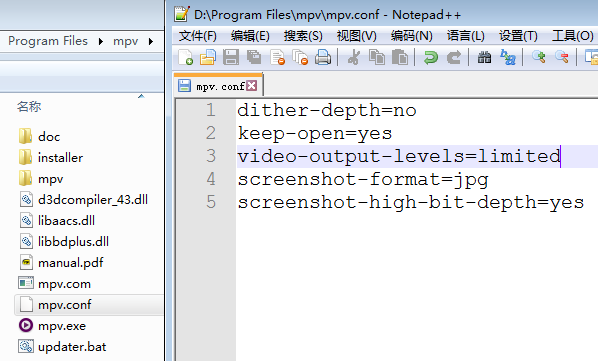

    在播放器播放H265码流的时候，使用快捷键S或Ctrl+S截图。

##### 附录2：加载文件<a name="ZH-CN_TOPIC_0000002498141804"></a>

1.  打开 RAW文件

    参照"[设置RAW基本属性](#ZH-CN_TOPIC_0000002498141702)"章节的叙述导入24色卡或140色卡场景的RAW文件，并在主界面列表进行选择后，点击“Get the First Selected RAW”按钮，即可导入图像。同时界面将显示第一个被导入的RAW图像。

    **图 1**  CLUT打开输入图像<a name="fig1628mcpsimp"></a>  
    
    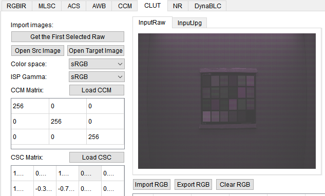

2.  打开源jpg或bmp图像

    **图 2**  CLUT打开源jpg或bmp图像<a name="fig1632mcpsimp"></a>  
    
    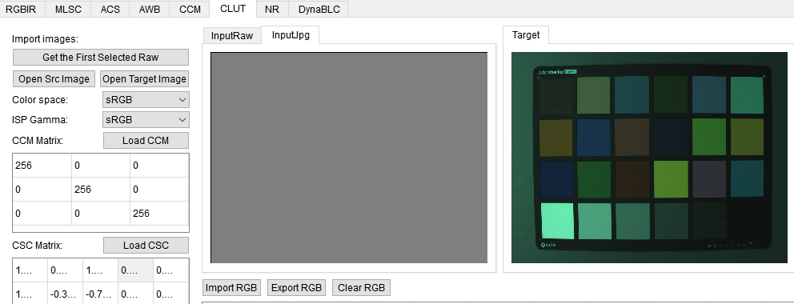

    点击“Open Src Image”按钮，选择图片导入。

3.  打开目标图像

    **图 3**  CLUT打开目标图像<a name="fig1636mcpsimp"></a>  
    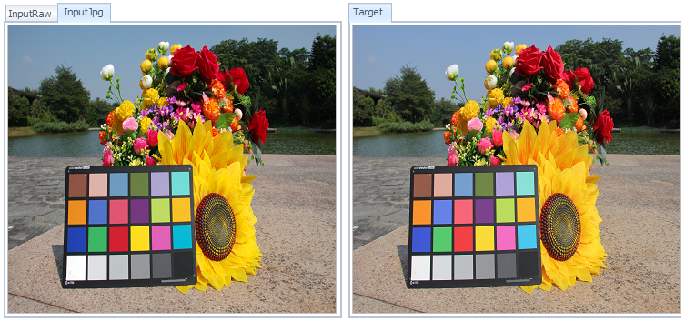

    点击“Open Target Image”按钮，选择一幅jpg格式的图像作为目标图像打开。此时显示区的Target页签会显示目标图像。

##### 附录3：图像参数区设置<a name="ZH-CN_TOPIC_0000002530221655"></a>

-   “Color space”下拉框：

    选择当前ISP的工作模式是sRGB或者BT2020模式。

-   “ISP Gamma”下拉框：

    选择当前ISP使用的Gamma表，这里预置了sRGB或者BT2020的Gamma表，建议用户通过Customize加载源图像机器ISP使用的Gamma表。

-   “CCM Matrix”：

    通过Load CCM按钮导入当前ISP使用的CCM参数，选择已保存的CCM标定数据文件，即可导入已标定的CCM 10进制定点数据到表格中。当输入图像是RAW数据的时候，会使用这里的CCM参数。ISP Calibration Tool的CCM标定结果可以直接导入。同时CLUT工具也支持标定结果的自解析，可将10进制或16进制CCM数据直接解析并显示成10进制数据（不支持Double类型数据）。也可以导入PQTools界面中，AWB Info处导出的当前板端使用的CCM参数。

-   “CSC Matrix”：

    通过Load CSC按钮导入含YUV转RGB参数的txt文件，yuvtorgb\_601\_full内容举例如下：

    1.0000,0.0000,1.4023,0.0000,0.0000,1.0000,-0.3438,-0.7139,-0.5000,0.0000,1.0000,1.7725,0.0000,-0.5000,0.0000

    导入后界面显示为

    1.0000  0.0000   1.4023   0.0000  0.0000

    1.0000  -0.3438  -0.7139  -0.5000  0.0000

    1.0000  1.7725   0.0000   -0.5000  0.0000

    前三列是BT601标准规定的full yuvtorgb转换参数

    第四列是输入yuv数据的偏移量

    第五列是输出rgb数据的偏移量

    yuvtorgb\_709\_limit内容如下：

    1.1641,0.0000,1.7930,-0.0625,0.0000,1.1641,-0.2129,-0.5332,-0.5000,0.0000,1.1641,2.1123,0.0000,-0.5000,0.0000

    yuvtorgb\_709\_full内容如下：

    1.0000,0.0000,1.5752,0.0000,0.0000,1.0000,-0.1875,-0.4678,-0.5000,0.0000,1.0000,1.8555,0.0000,-0.5000,0.0000

    yuvtorgb\_601\_limit内容如下：

    1.1641,0.0000,1.5957,-0.0625,0.0000,1.1641,-0.3916,-0.8125,-0.5000,0.0000,1.1641,2.0176,0.0000,-0.5000,0.0000

    > **须知：** 
    >如果修改了CCM Matrix，需要保证修改后满秩矩阵，否则标定会有错误提示。

##### 附录4：RGB对生成<a name="ZH-CN_TOPIC_0000002530221633"></a>

1.  根据输入图片的场景，点击不同按钮。
    -   如果是待标定机器的RAW和目标机器的JPG图片，图片中含有24色卡的场景，则点击“Color Check 24”按钮；
    -   如果是待标定机器的RAW和目标机器的JPG图片，图片中含有140色卡的场景，则点击“Color Check 140”按钮。
    -   如果是待标定机器的JPG和目标机器的JPG图片，在源图像和目标图像自由选择的场景，则点击“Color Check Free”按钮。这里的图片可以含有色卡，也可以不含有色卡。
    -   如果是待标定机器的JPG，在源图像自由选择颜色后配置HSL的场景，则点击“Color Check HSL”按钮。这里的图片可以含有色卡，也可以不含有色卡。

1.  在使用“Color Check Free”或“Color Check HSL”调节某些颜色前，建议使用“Color Check 24”或“Color Check 140”产生比较全面的颜色RGB对。用户在新增需要调节的颜色RGB对的同时，也需要提供不需要调节的颜色RGB对，即RGB对中的源和目标值相同或接近。通过这种方式可以控制某些单一的颜色调节对相邻颜色的影响范围，即通过增加相邻颜色RGB对的方式来将相邻的颜色符合基本不变的需求。前两个场景，在弹出的对话框中，进行颜色框选。
    -   左键按住四个角的色框中的红点，可以拖动色框，调整选择的颜色。如[图1](#fig1917311293313)所示。
    -   图像上方的两个滑动条可以调节色框的宽高长度。色框越大，获取的色块像素数越多，标定结果越准确，同时耗时会增长。
    -   Color Check Free场景，可以在源图像与目标图像上通过拖动鼠标选择矩形区域，选择的区域最大数量为8。如[图2](#fig16358165614336)所示。
    -   Color Check HSL场景，可以在源图像通过拖动鼠标选择矩形区域，选择的区域最大数量为8。可通过编辑框和滑动条设置Hue、Saturation与Lightness的值。Hue范围+-20，Saturation范围0.4-1.6倍，Lightness范围0.6-1.4倍。如[图3](#fig6769140153515)所示。

2.  点击“OK”按钮。

    **图 1**  24色区域框选<a name="fig1917311293313"></a>  
    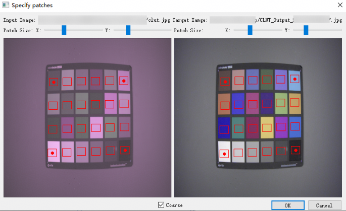

    **图 2**  Color Check Free场景框选<a name="fig16358165614336"></a>  
    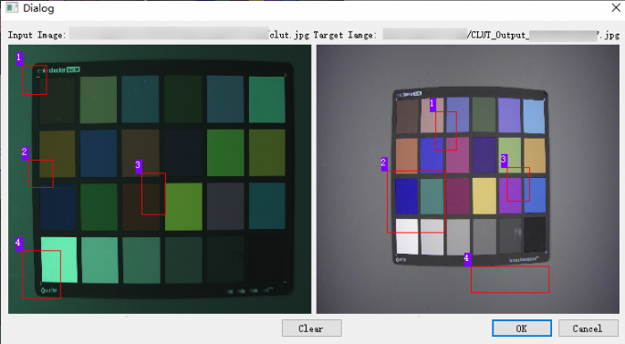

    **图 3**  Color Check HSL场景框选<a name="fig6769140153515"></a>  
    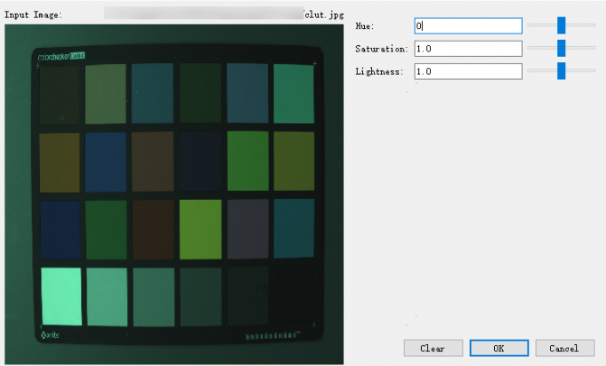

##### 附录5：整理RGB对<a name="ZH-CN_TOPIC_0000002498141752"></a>

生成的RGB对添加到RGB对列表后，可在列表中对生成RGB对进行选择或取消选择或删除。使用Export RGB可导出列表中的RGB数据到文件中。使用Import RGB可以从文件导入RGB对到列表中进行标定。每次生成的RGB对会添加到当前RGB对的后面，Clear RGB可以清除当前列表中的所有RGB对。

**图 1**  RGB对列表<a name="fig1673mcpsimp"></a>  

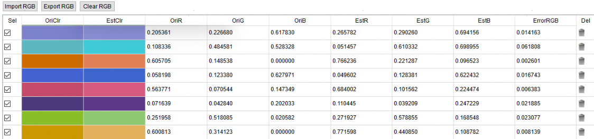

**图 2**  CLUT标定生成<a name="fig1675mcpsimp"></a>  

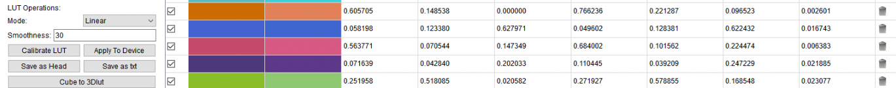

-   可以修改“LUT Operations”栏目下的“Mode”下拉框选择工作模式，SDR模式下选择Linear，HDR模式下选择CLUT HDR。填写Smoothness参数，Smoothness参数范围为1-100，平滑度逐渐提高，建议值在15-30范围，值越小会尽量让各种颜色的调节准确，但容易把图像噪声放大；值越大会让相邻颜色平滑调节，减少由于颜色增强导致的噪声过大。点击“Calibrate LUT”按钮，对RGB列表中的RGB对进行标定。
-   点击“Calibrate LUT”按钮，约40秒后，工具内部生成了CLUT标定参数。推荐用户将CLUT参数下发板端后，灌RAW观察颜色调节效果。
-   点击”Cube to 3Dlut" 按钮，支持将Cube格式3D Lut表转换为SS928V100 3D Lut表（需要配置正确的gamma）。

### DynaBLC标定<a name="ZH-CN_TOPIC_0000002498141784"></a>


#### 标定基本原理<a name="ZH-CN_TOPIC_0000002498141816"></a>

Sensor的ob区黑电平和可见光区黑电平的差值会随iso的改变而改变。此工具用于标定不同iso情况下ob区黑电平和可见光区黑电平的差值。

#### DynaBLC 采集要求<a name="ZH-CN_TOPIC_0000002498141826"></a>

-   需要采集黑帧（遮住镜头抓取的数据）
-   至少采集16帧
-   确保当前通路已经输入ob区。ob区的获取方式需要在pub\_attr里将裁剪起始点都设置为0。

    **图 1**  ob区裁剪起始点<a name="fig1549163211015"></a>  
    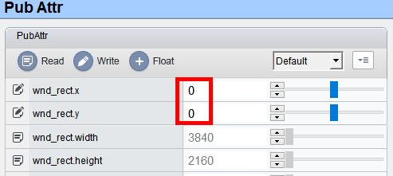

-   抓raw数据时，Again、Dgain成倍数增加。先增加Again，再增加dgain。不调节ISPDgain。从iso100开始，每增加一倍Again或Dgain值，采集一个该增益下对应iso的raw数据。直到Again，Dgain都为最大值。此增益下的iso为最后一档iso。如[图2](#fig27917328115)所示

    **图 2**  iso增益表<a name="fig27917328115"></a>  
    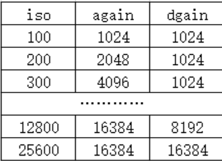

#### DynaBLC 工具界面介绍<a name="ZH-CN_TOPIC_0000002498301726"></a>

**图 1**  工具界面图<a name="fig1343781191318"></a>  
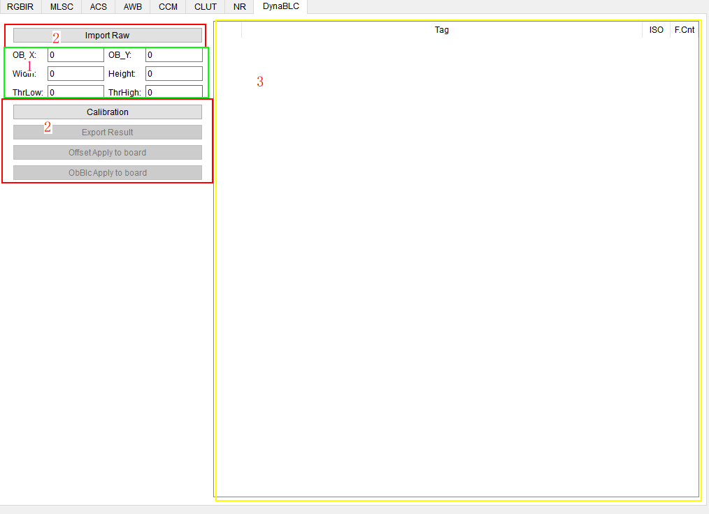

1区域是标定参数， 2 区域是控制按钮，3区域为导入标定的源 raw文件列表。

#### DynaBLC 标定步骤<a name="ZH-CN_TOPIC_0000002498141736"></a>

针对sensor的标定步骤如下：

1.  在工具最左侧的RAW Data列表中，导入采集的特殊 BLC 场景的RAW（带ob区）文件。可识别RAW文件名进行ISO设置。图像导入后，在列表区会显示被导入图像的别名，并提供相关功能按钮。显示相关信息。如[图1](#fig191252215916)。

    **图 1**  Raw列表导入演示<a name="fig191252215916"></a>  
    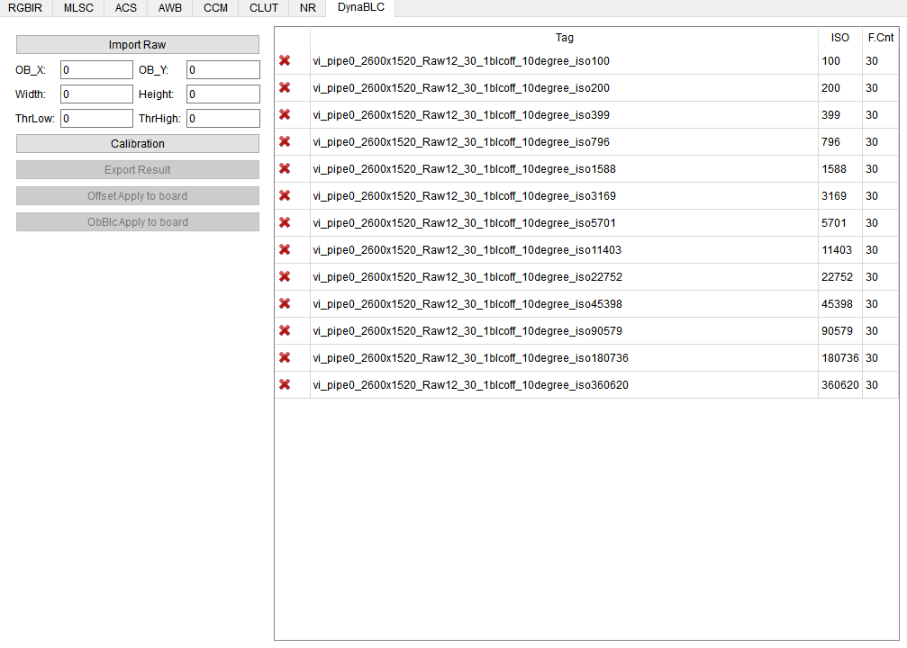

2.  根据实际情况输入标定参数，Width和Height不能为0，否则标定结果异常。\(OB\_X, OB\_Y\)为OB区的起始坐标点。Width和Height为OB区的宽高。ThrLow和ThrHigh为统计像素点的阈值。
3.  点击Calibration按钮进行标定 等待下方标定进行中状态条消失后，即可点击Export Result导出标定结果或者直接点击Offset Apply to board 按钮，将标定结果直接下发板端。点击ObBlc Apply to board 将OB区黑电平标定结果下发板端。

## 高级功能<a name="ZH-CN_TOPIC_0000002498141762"></a>


### 寄存器修改器<a name="ZH-CN_TOPIC_0000002498301694"></a>

如果用户需要修改某一特定寄存器地址上的值，可以直接使用寄存器修改器来完成。该修改器支持32位物理/虚拟寄存器的读取和修改。

点击工具栏的“寄存器修改器”按钮（）打开寄存器修改器，如[图1](#fig1272143853812)。

**图 1**  寄存器修改器<a name="fig1272143853812"></a>  
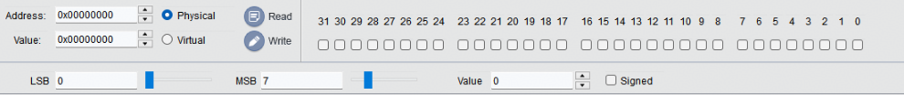

读取一个特定地址上的寄存器值，请遵循下列步骤进行：

1.  在“Address”输入框中输入地址值
2.  选择寄存器类别“Physical”或“Virtual”
3.  点击“Read”按钮

若读取成功，工具会在“Value”输入框中显示读取到的值，同时右侧的按位修改区域会匹配读取到的值。

向一个特定地址上的寄存器写入值，请按照以下步骤进行：

1.  在“Address”输入框中输入地址值
2.  选择寄存器类别“Physical”或“Virtual”
3.  在“Value”输入框中输入要写入的值，或通过右侧的按位修改区域修改单个位上的数值，也可以通过下方设置最低位LSB、最高位MSB、有无符号型Signed来确保输入的数值Value不会超范围。
4.  点击“Write”按钮。

> **须知：** 
>-   寄存器地址值必须为4的整数倍，否则无法进行读写。
>-   Virtual类型寄存器地址需按照模块标记地址+偏移的方式填写。AE模块标记地址为0x00A00000，AWB模块标记地址为0x00B00000，ISP（外部）虚拟寄存器标记地址为0x00C00000。例如：地址0x00A00004代表的是AE库虚拟寄存器偏移为0x4的地址。其中Virtual偏移范围请参考《ISP 开发参考》中isp\_reg\_attr接口的对应部分。
>-   使用原则为：对于出现或定义过的地址可进行相应的读和写操作，如果该地址在相应的寄存器类型上未定义或不明用途，请慎重选择填写和使用。因此填写寄存器地址后必须选择对应的寄存器类型，即Physical或Virtual。例如，地址0x00A00004是表格中对应的虚拟寄存器地址，而该地址也是合法的物理地址值（但在物理寄存器范畴内此寄存器无效，或是有更重要的用途）。若此时将此地址选择物理寄存器类型进行读写，可能引起程序崩溃或其他异常，请务必小心使用。

### 参数的导出导入<a name="ZH-CN_TOPIC_0000002498141722"></a>

请参考"[使用工具导入导出参数](#ZH-CN_TOPIC_0000002530061765)"。

### 通信日志<a name="ZH-CN_TOPIC_0000002530061661"></a>

与单板连接后，所有与板端的数据交互都会记载日志并显示在通信日志窗口，如[图1](#fig1345419309141)所示。

**图 1**  通信日志窗口<a name="fig1345419309141"></a>  


与板端进行数据交互时，记载的日志包含以下信息：

-   日志生成的时间；
-   通信方式与参数；
-   通信内容（如当前读取或写入的调试项）；
-   交互情况（包含会话启动，会话应答等）；
-   如果通信出错，则显示错误信息。

点击“Clear All”，可以清除当前所打印的通信日志。

点击“Scroll to bottom when the logs refreshed”日志栏显示最新打印信息，取消勾选后显示当前打印信息。

支持鼠标右键或者Ctrl A 、Ctrl C复制日志栏全部信息。

日志最大支持显示2万行。

### I2C读写工具<a name="ZH-CN_TOPIC_0000002530221721"></a>

用户可以使用I2C读写工具对通过I2C总线连接的Sensor或其他器件的寄存器进行读写。

在工具栏的“附加组件”下拉框中，选择“PQTools I2C Editor”即可打开I2C编辑窗口。

**图 1**  I2C读写工具<a name="fig38311744195912"></a>  
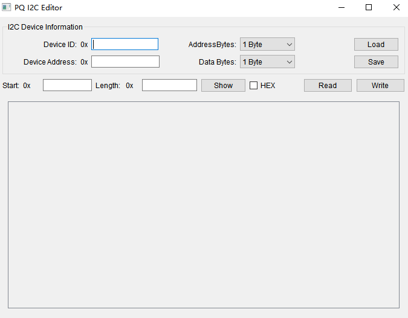

其中I2C Device Information用于配置I2C设备的信息。

读取一个特定地址段上的I2C值，请遵循下列步骤进行：

1.  分别在Device ID和Device Address中输入I2C设备的ID和地址。
2.  分别在Address Bytes和Data Bytes中选择地址位宽和数据位宽。
3.  在Start和Length框中输入起始地址和长度。
4.  点击“Show”按钮，此时符合地址范围的寄存器编辑框出现在下方。
5.  点击“Read”按钮。

若读取成功，工具会在各个编辑框中显示对应地址的值。

写入一个特定地址段上的I2C值，请按照以下步骤进行：

1.  分别在Device ID和Device Address中输入I2C设备的ID和地址。
2.  分别在Address Bytes和Data Bytes中选择地址位宽和数据位宽。
3.  在Start和Length框中输入起始地址和长度。
4.  点击“Show”按钮，此时符合地址范围的寄存器编辑框出现在下方。
5.  编辑写入的I2C地址，修改其值。
6.  点击“Write”按钮。

此外，通过Load和Save按钮，可以保存或导入I2C的器件配置。

### SPI读写工具<a name="ZH-CN_TOPIC_0000002498301708"></a>

用户可以使用SPI读写工具对一些基于SPI的外围器件上的寄存器进行读写。

在工具栏的“附加组件”下拉框中，选择“PQTools SPI Editor”即可打开SPI编辑窗口。

**图 1**  SPI读写工具<a name="fig1489362711020"></a>  
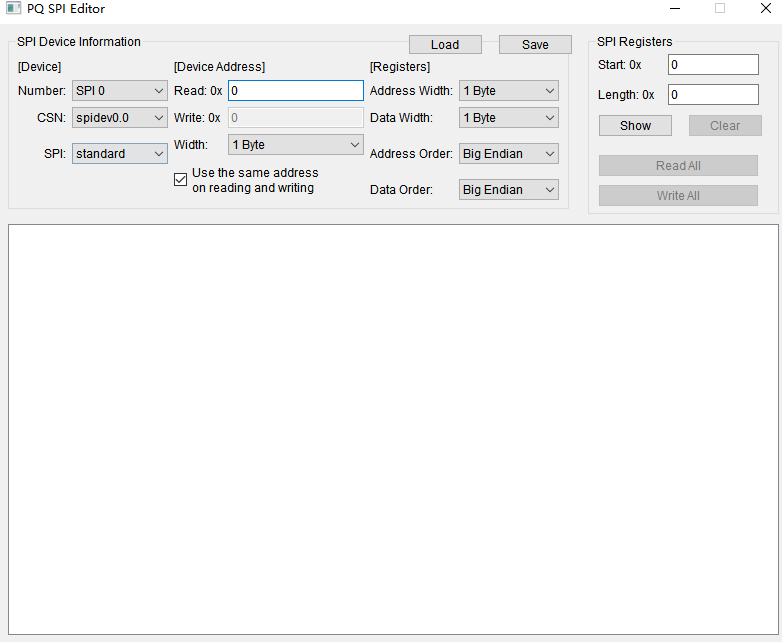

其中SPI Device Information用于配置SPI设备的信息。

读取一个特定地址段上的SPI值，请遵循下列步骤进行：

1.  在Device一栏配置SPI Number、CSN和SPI模式（标准或非标准）。
2.  在Device Address一栏配置设备地址：在Read后的输入框中填入读取数据用的设备地址，并在Width下拉框中选择设备地址位宽。
3.  在Registers一栏配置寄存器地址和数据的属性：分别在Address Width和Data Width中选择寄存器地址位宽和数据位宽；再分别在Address Order和Data Order中选择地址和值的大小端排序。
4.  在右侧SPI Registers的Start和Length框中输入起始地址和长度。
5.  点击“Show”按钮，此时符合地址范围的寄存器编辑框出现在下方。
6.  点击“Read”按钮。

写入一个特定地址段上的SPI值，请按照以下步骤进行：

1.  在Device一栏配置SPI Number、CSN和SPI模式（标准或非标准）。
2.  在Device Address一栏配置设备地址：在Write后的输入框中填入写入数据用的设备地址（如果SPI器件的读写设备地址相同，亦可在保留下方Use the same address on reading and writing勾选的情况下，填写Read后的输入框），并在Width下拉框中选择设备地址位宽。
3.  在Registers一栏配置寄存器地址和数据的属性：分别在Address Width和Data Width中选择寄存器地址位宽和数据位宽；再分别在Address Order和Data Order中选择地址和值的大小端排序。
4.  在右侧SPI Registers的Start和Length框中输入起始地址和长度。
5.  点击“Show”按钮，此时符合地址范围的寄存器编辑框出现在下方。
6.  编辑写入的SPI地址，修改其值。
7.  点击“Write”按钮。

若SPI项读写成功，对应值的单元格会变成绿色背景；若读写失败，单元格会变成红色背景，如[图2](#_toc51692563)所示。

**图 2**  SPI读写工具的结果提示<a name="_toc51692563"></a>  


通过Load和Save按钮，可以保存或导入SPI的器件配置。

点击“Clear”按钮，可以将下方编辑区域内的寄存器项清空。

> **须知：** 
>-   用户点击了“Show”按钮后，将不能更改地址位宽和数据位宽，也无法读取器件配置文件。如需进行上述操作，请点击“Clear”按钮清空编辑项。
>-   3线SPI sensor寄存器的读写，Device Number、CSN、设备地址不需要，可以不设置，直接设置好地址位宽与数据位宽、起始地址与所要读写数据的长度. 如果用户采用了私有标准的SPI，则根据读写驱动的需要，设置所需的信息。

## 分析工具界面及功能说明<a name="ZH-CN_TOPIC_0000002530221651"></a>


### 颜色分析工具<a name="ZH-CN_TOPIC_0000002530061739"></a>


#### 工具界面<a name="ZH-CN_TOPIC_0000002530221679"></a>

从PQTools工具主界面工具栏的外挂插件下拉框中选择“PQ Color Checker”，可以打开颜色分析工具，如[图1](#fig133451118413)所示。

**图 1**  颜色分析工具<a name="fig133451118413"></a>  
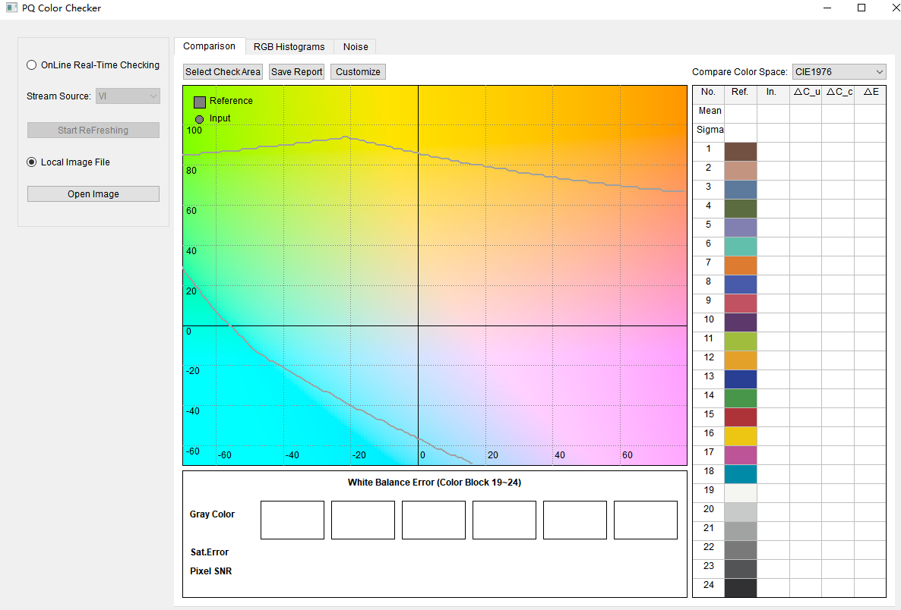

颜色分析功能可以显示以下分析数据：

-   标准色与取样色在L\*a\*b\*矩阵下坐标点的位置距离对比图
-   CIE1976算法得出的不考虑亮度的L\*a\*b\*色彩空间距离值ΔC\*ab（含修正饱和度后的值），以及考虑亮度的L\*a\*b\*色彩空间距离值ΔE\*ab（图像是sRGB色彩空间时，选择CIE1976；图像是Rec.2020 Full色彩空间时，选择CIE1976\_BT2020）。
-   CIE2000算法得出的不考虑亮度的L\*a\*b\*色彩空间距离值ΔC00（含修正饱和度后的值），以及考虑亮度的L\*a\*b\*色彩空间距离值ΔE00（图像是sRGB色彩空间时，选择CIE2000；图像是Rec.2020 Full色彩空间时，选择CIE2000\_BT2020）。
-   白平衡误差分析
-   取样颜色的RGB平均值
-   RGB分量统计直方图，包含融合直方图与各分量直方图

#### 选择数据来源<a name="ZH-CN_TOPIC_0000002530221641"></a>

颜色分析工具既支持连接单板进行在线分析，又支持读取本地图片文件进行分析。

若连接在线分析，请按以下步骤进行操作：

1.  将摄像机对准标准的PANTONE 24色色卡。
2.  在PQTools工具主界面上，打开一个调试表文件（芯片型号与版本均与板端匹配）。
3.  在板端运行ISP/VI/VPSS业务。
4.  将PQTools工具连接到单板
5.  通过主界面TOP-\>Mode Handle选择抓YUV通道（参考"[读写通路设置](#ZH-CN_TOPIC_0000002530061753)"）。
6.  在颜色分析工具的主界面上，点击“Online Real-Time Checking”单选框。
7.  从“Stream Source”下拉框中选择图像数据源来自的模块（VI/VPSS/VO）。

若分析本地图片，请按照以下步骤进行操作：

1.  在颜色分析工具的主界面上，点击“Local Image File”单选框。
2.  选择一个PANTONE 24色色卡的照片。

#### 使用24色颜色对比功能<a name="ZH-CN_TOPIC_0000002530061667"></a>

在线模式下从板端获取到第一帧图片数据，或离线模式下打开了图片文件后，工具的状态栏会提示图像已经就绪（The image is ready）。此时可使用24色颜色对比功能。

**图 1**  24色颜色对比功能界面<a name="fig1807mcpsimp"></a>  
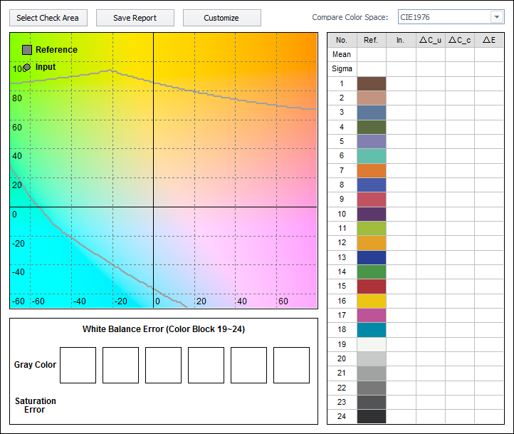

在“Comparison”页签上，点击“Select Check Area”按钮，可以打开24色取样对话框：

**图 2**  颜色分析工具24色取样界面<a name="fig1724173371511"></a>  
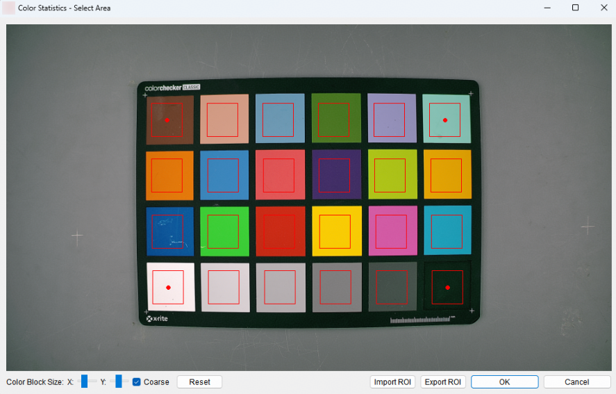

拖动红色方框的边角，使得红色方框准确落在24色色块范围内，可达到最佳的颜色取样效果。使用对话框下方的Color Block Size选项，可以调整红色方框的水平和垂直大小。红色方框应尽量多地覆盖色块中的像素（但需要保证每个红色方框落在单独的色块内，同一方框内所有像素颜色相同），这样可以更精确的取色。

调整完毕后点击“OK”，这时界面上就会显示出颜色分析结果了，如[图3](#_toc51692567)所示。

**图 3**  显示颜色分析结果<a name="_toc51692567"></a>  

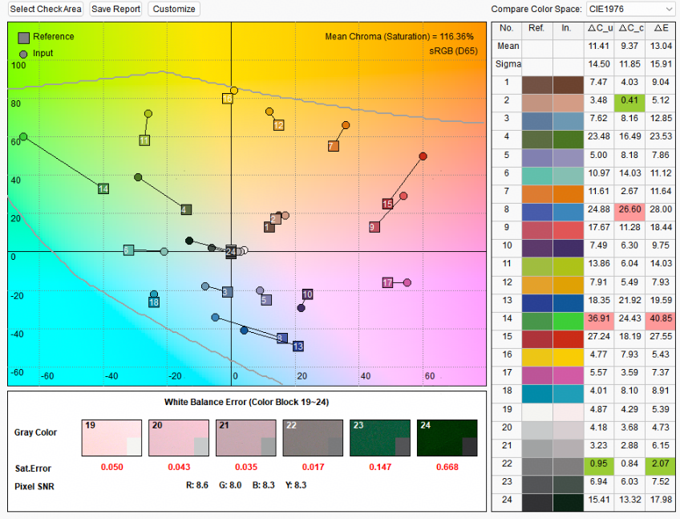

通过Compare Color Space可以切换比较分量（仅限右边表格）。目前支持在CIE1976、CIE2000、RGB、CIE1976\_BT2020与CIE2000\_BT2020颜色空间之间进行切换。这里需要注意的是先通过Compare Color Space切换比较分量后再加载图片，才能得到正确的颜色分析结果。

若需要重新调整24色的取样范围，请在颜色分析工具主界面上点击“Select Check Area”按钮。

#### 自定义标准色<a name="ZH-CN_TOPIC_0000002498141718"></a>

颜色工具提供了一组默认的标准色卡值（以L\*a\*b\*色彩空间的数值表示）。这组色卡值与D65光源，2度观察者角度下的X-Rite标准值近似。

用户还可以自行定义标准色卡值。点击“Comparison”页签下的Customize按钮，可以打开色卡配置的对话框：

**图 1**  标准色卡配置对话框<a name="fig118781361532"></a>  
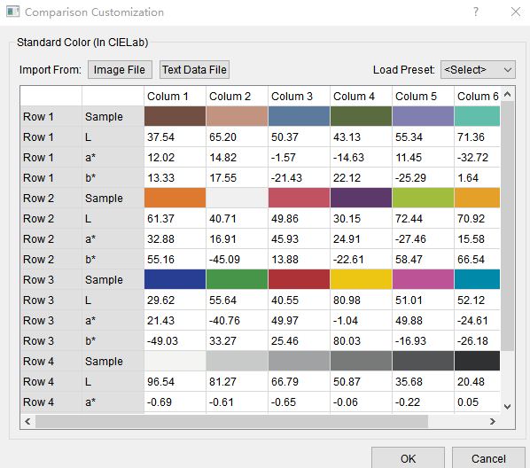

需要更改标准色卡值时，直接在表格对应的单元格中输入值即可。

-   点击Import From右侧的“Image File”按钮，用户可以自选一张标准色卡的图片，框定24色范围后，将其用作标准色卡。这时工具将根据用户框定的24色卡区域自动求取色卡的L\*a\*b\*值。
-   点击Import From右侧的“Text Data File”按钮，用户可以选择一种包含标准色卡值的数据文件，并将其中的值导入作为工具的标准色卡值。目前支持导入Imatest3.4工具生成的csv文件，可选择导入ideal（标准值）或meas（输入值）的值。

从对话框右上角的Load Preset下拉框中，用户可以选择一组预设值作为标准色卡值。目前仅可选X-Rite D65近似值作为预设值。

> **须知：** 
>若要使用Imatest数据文件的导入功能，则请不要人为修改从Imatest导出的csv文件，否则工具可能无法识别。

#### 查看RGB统计直方图<a name="ZH-CN_TOPIC_0000002530061713"></a>

同样，在线模式下从板端获取到第一帧图片数据，或离线模式下打开了图片文件后，还可以选择使用RGB统计直方图功能。

**图 1**  统计直方图功能界面<a name="fig1831mcpsimp"></a>  


查看统计直方图前，需要划定一块统计区域。激活“RGB Histograms”页签界面，点击位于页签内的“Select Analysis Area”，可以打开划定统计区域的对话框，如[图2](#fig11833849111712)所示。

**图 2**  选择统计信息分析区域<a name="fig11833849111712"></a>  
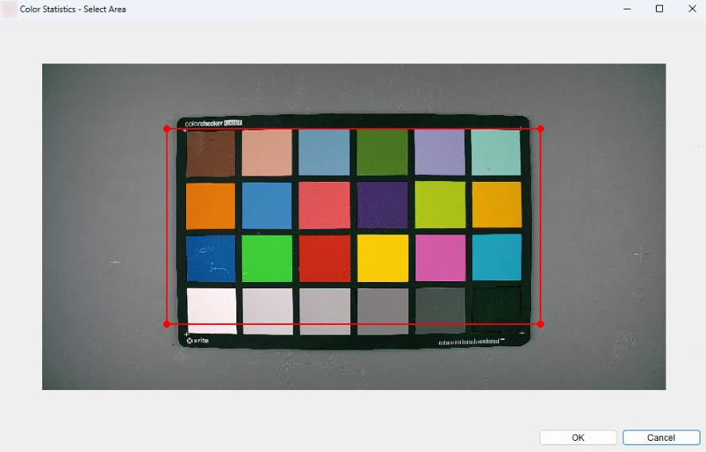

拖动红色方框的边角可以选定分析区域。选择完毕后，单击“OK”按钮，工具就会显示该选定区域的分量统计数据，如[图3](#_toc51692571)所示。

**图 3**  显示统计直方图<a name="_toc51692571"></a>  
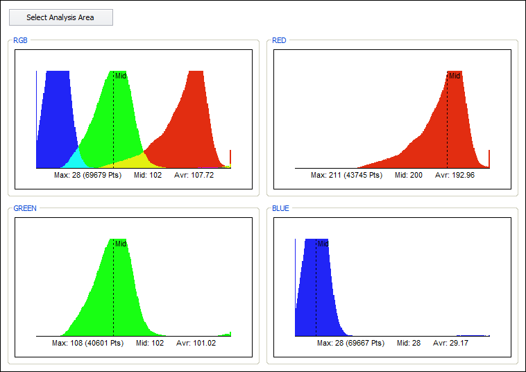

其中在每个统计图内，横轴代表分量值（从左到右0-255），纵轴代表对应该分量上某个特定值的点数（对于某些最大分量点数过多的情况，工具对图像做了一定裁剪）。图片下方黑色的文字显示了该分量上的一些特殊值：

-   最大值（Max）：对应点数最多的分量值；
-   中值（Mid）：以该值为分界，大于等于（和小于等于）该值的分量值对应点数占到大约一半；
-   平均值（Avr）：该分量上所有点的分量值的算术平均值。

#### 测算图片任意区域的信噪比SNR<a name="ZH-CN_TOPIC_0000002530061679"></a>

在线模式下从板端获取到第一帧图片数据，或离线模式下打开了图片文件后，还可以选择使用信噪比SNR测算功能。在工具上方选择Noise页签即可开启该功能。

**图 1**  SNR测算工具<a name="fig1916901449"></a>  
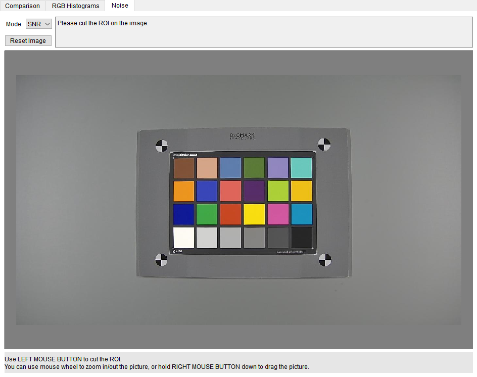

被打开的图片显示在工具中央。按住鼠标右键并移动鼠标，可以移动图片的位置；使用鼠标滚轮可以将图片进行等比缩放。

找到需要测算SNR的区域后，使用鼠标左键将该区域框出，工具即会在界面上方的文本框里给出SNR的测算结果。

本工具中计算SNR的公式为：-20\*log\(区域均方差/255\)。

**图 2**  显示SNR计算结果<a name="fig1522202410"></a>  
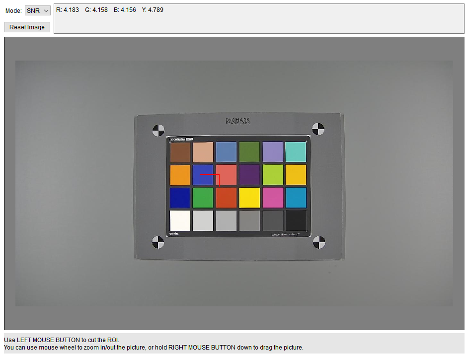

### 原始数据（RAW）和YUV分析工具<a name="ZH-CN_TOPIC_0000002498141734"></a>


#### 工具界面<a name="ZH-CN_TOPIC_0000002530221711"></a>

从PQTools工具主界面工具栏的外挂插件下拉框中选择“PQ RAW YUV Analyzer”，可以打开RAW/YUV分析工具，如[图1](#fig660011461349)所示。

**图 1**  RAW/YUV分析工具主界面<a name="fig660011461349"></a>  
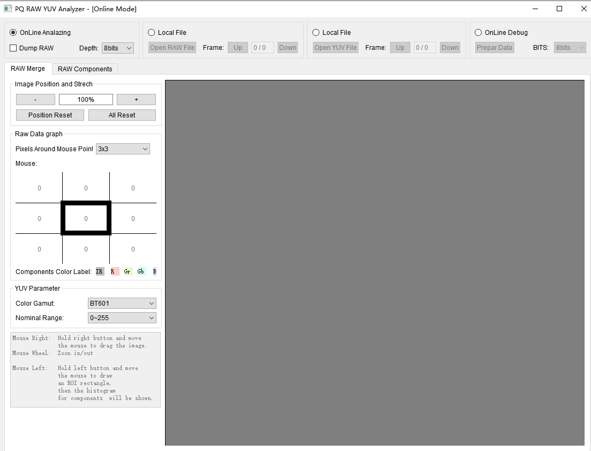

RAW/YUV分析工具可以查看用户所打开的图像上每一个点的分量和具体亮度值，以及亮度分布的直方图。变换图像显示区域上方的选项卡设置，可以选择查看整体图像和每一个分量的图像。

另外，RAW/YUV分析工具在OnlineDebug页面中集成了在线验证NR标定参数的功能（参考"[NR标定结果验证](#ZH-CN_TOPIC_0000002498301762)"）。

#### 选择数据来源<a name="ZH-CN_TOPIC_0000002530221707"></a>

RAW/YUV分析工具支持连接单板在线分析，支持打开本地的RAW格式文件进行分析，也支持打开本地的YUV格式文件进行显示。对于本地RAW/YUV数据，工具在支持专有格式RAW/YUV文件的同时，也支持通用RAW/YUV数据格式。

若连接在线分析，请按以下步骤进行操作：

1.  在PQTools工具主界面上，打开一个调试表文件（芯片型号与版本均与板端匹配）。
2.  在单板上运行ISP/VI/VPSS的业务。
3.  将PQTools工具连接到单板。
4.  通过主界面TOP-\>Mode Handle选择抓RAW通道（参考"[读写通路设置](#ZH-CN_TOPIC_0000002530061753)"）。
5.  在原始数据分析工具的主界面上，点击“Online Analyzing”单选框。设置获取图像的深度（Depth）。（在线分析过程中亦可以修改设置）
6.  勾选上Dump RAW的复选框。

> **须知：** 
>目前RAW分析工具的在线抓拍功能直接抓取的均是线性模式下的RAW图像数据。
>抓取数据的bit数不应该小于sensor数据的bit数。

若要打开本地的RAW数据文件，请按以下步骤进行操作：

1.  在RAW/YUV分析工具的主界面上，点击左边的“Local File”单选框。
2.  选择一个.raw为后缀名的文件。
3.  如果工具能检测到所打开文件的文件名中包含的图像信息，则会自动解析，否则会弹出详细设定对话框。在弹出的详细设定对话框中，用户需指定该数据文件的分辨率，深度，类型，分量模型，IR分量替换位置与文件头偏移值，紧凑raw选项。

    **图 1**  通用RAW数据文件详细设定<a name="fig137122276513"></a>  
    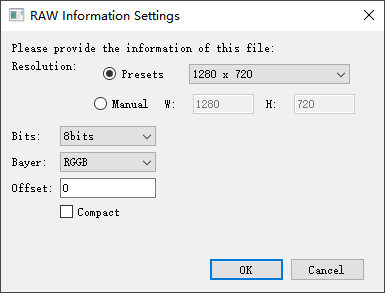

4.  单击“OK”按钮。

    选定数据来源后，工具将显示原始数据的图像，如[图2](#fig1389102710134)所示。

    **图 2**  显示原始数据图像<a name="fig1389102710134"></a>  
    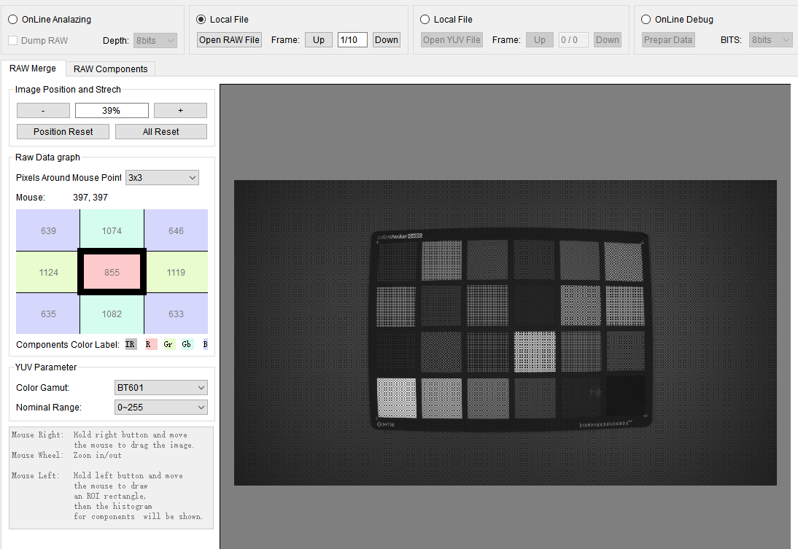

5.  多帧RAW文件查看

    在原始数据分析工具的主界面上，在Frame文本框中输入要跳转到帧页面，按回车键即可跳转，也可使用Up/Down按钮在当前帧的上下页面之间跳转。

若要打开本地的YUV文件，请按以下步骤进行操作：

1.  在原始数据分析工具的主界面上，点击右边的“Local File”单选框，并点击“Open YUV File”。
2.  选择一个.yuv为后缀名的文件。
3.  如果工具能检测到所打开文件的文件名中包含的图像信息，则会自动解析，否则会弹出详细设定对话框。在弹出的详细设定对话框中，用户需指定该数据文件的分辨率，位宽，像素格式，视频格式。

    **图 3**  通用YUV数据文件详细设定<a name="fig1936653311131"></a>  
    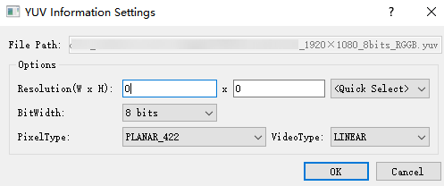

4.  单击OK，图像数据显示参照[图2](#fig1389102710134)所示，多帧文件的操作也参照上述的多帧RAW文件的操作。
5.  在YUV Merge界面下，YUV Parameter中的“Color Gamut”，用于选择当前显示的YUV的色域空间；“Nominal Range”用于选择YUV显示的标称范围。

> **须知：** 
>工具暂时只支持导入像素格式为semiplanar 420、视频格式为linear的YUV文件。

#### 获取合并后的原始图像数据<a name="ZH-CN_TOPIC_0000002498141836"></a>

在RAW Merge界面下，原始数据图像显示出来以后，将鼠标指针移到图像中，即可观察到鼠标指针指向的点（称为目标点）及其周围的点的分量和亮度值。

如果默认的图像大小取点困难，可以采用以下几种方式来缩放或调整图像：

1.  按住鼠标右键并移动鼠标可以拖拽图像。
2.  鼠标滚轮向前，可以将图像放大，且放大后的图像会聚焦到鼠标点击的点。鼠标滚轮向后，可以将图像缩小。
3.  在Zoom框内，点击“+”或“-”按钮，可以按照预置的比例放大缩小。
4.  在Zoom框内的输入框中，直接输入缩放比例。

分析数据显示在左侧的“Raw Data Graph”（分析数据图）框里，如[图1](#_toc51692578)所示。

**图 1**  分析数据图<a name="_toc51692578"></a>  
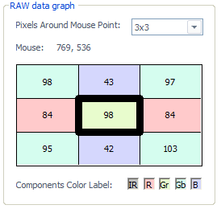

其中，被黑色粗边框包围的方格表示目标点，其它的方格为目标点周围的图像点。

每个方格的背景颜色表示图像点属于哪个分量（在分析数据图下方有图例），方格内的数值表示图像点具体的亮度值。

可以通过“Pixels Around Mouse Point”设置分析数据图显示目标点周围图像点的范围（可选3x3、5x5、7x7）。

#### 显示亮度统计直方图<a name="ZH-CN_TOPIC_0000002498301692"></a>

如需查看特定区域的亮度分布统计直方图，用户可使用鼠标左键，在显示的图像上用鼠标画出一个方框，作为分析区域，如[图1](#fig16198711616)所示。

**图 1**  划定亮度分析区域<a name="fig16198711616"></a>  
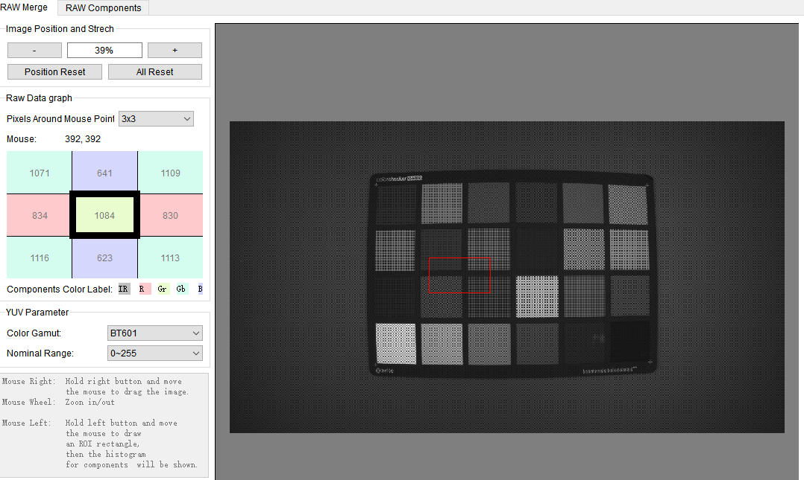

选定分析区域以后，工具将弹出对话框，显示亮度统计直方图以及具体的统计数据，如[图2](#fig112666289313)所示。

**图 2**  显示亮度直方图和详细统计数据<a name="fig112666289313"></a>  
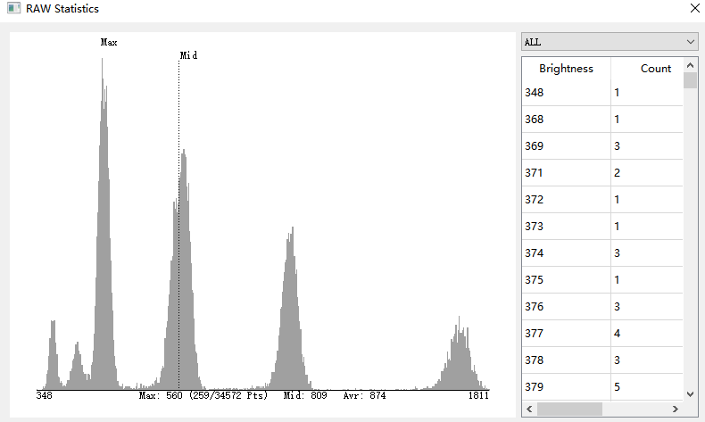

在统计图内，横轴代表有效分量值的范围，纵轴代表对应某个特定亮度的点数。图片下方带颜色的文字显示了该分量上的一些特殊值：

-   最大值（Max）：对应点数最多的分量值；
-   中值（Mid）：以该值为分界，大于等于（和小于等于）该值的亮度值对应点数占到大约一半；
-   平均值（Avr）：所有点的亮度值的算术平均值。
-   右侧的列表显示了每一个亮度值对应点的点数。

通过窗口右上角的下拉框，可选择查看整体直方图和单分量直方图。

#### 查看分量图像<a name="ZH-CN_TOPIC_0000002530061655"></a>

将工具界面的选项卡切换到“RAW Components”标签，可以查看分量图像。如[图1](#fig156516161271)所示。

**图 1**  查看分量图像<a name="fig156516161271"></a>  
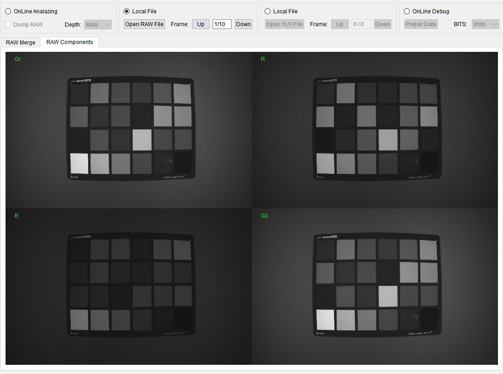

### 3A 分析工具<a name="ZH-CN_TOPIC_0000002498141766"></a>

PQTools工具提供了3A分析工具插件，供用户方便地查看3A统计数据。

> **须知：** 
>生态版本不支持拼接相关功能。


#### 工具界面<a name="ZH-CN_TOPIC_0000002498141694"></a>

从PQTools工具主界面工具栏的外挂插件下拉框中选择“PQ 3A Analyser”，可以打开3A分析工具，如[图1](#fig102525561576)所示。

> **说明：** 
>在抓取3A统计数据之前，需通过主界面TOP-\>Mode Handle选择抓YUV通道（参考"[读写通路设置](#ZH-CN_TOPIC_0000002530061753)"），通过主界面StatisticConfig-\>AECfg设置；统计AE和AWB信息时，支持拼接时的信息统计。

**图 1**  3A分析工具界面<a name="fig102525561576"></a>  
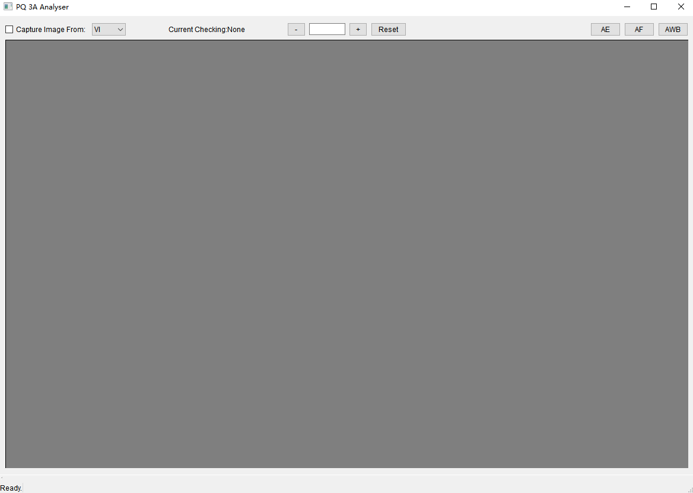

#### 获取图像与统计数据<a name="ZH-CN_TOPIC_0000002498141728"></a>

3A分析工具当前仅支持连接单板进行分析。打开工具界面后，用户需通过以下操作从单板获取图像，以及对应的统计数据：

1.  在PQTools工具的主程序上，进行与板端的连接。
2.  在3A分析工具的主界面上，在Capture Image From 之后的下拉框中，选择图像数据源。目前工具支持从VI、VPSS或VO上获取图像数据。
3.  勾选Capture Image from之前的复选框。

之后工具将自动从板端抓取数据，直到用户取消对Capture Image 复选框的勾选。成功从板端抓取数据后，工具会在下方的灰色区域显示图像效果如[图1](#fig4921358163813)所示。

**图 1**  3A分析工具显示图像数据<a name="fig4921358163813"></a>  

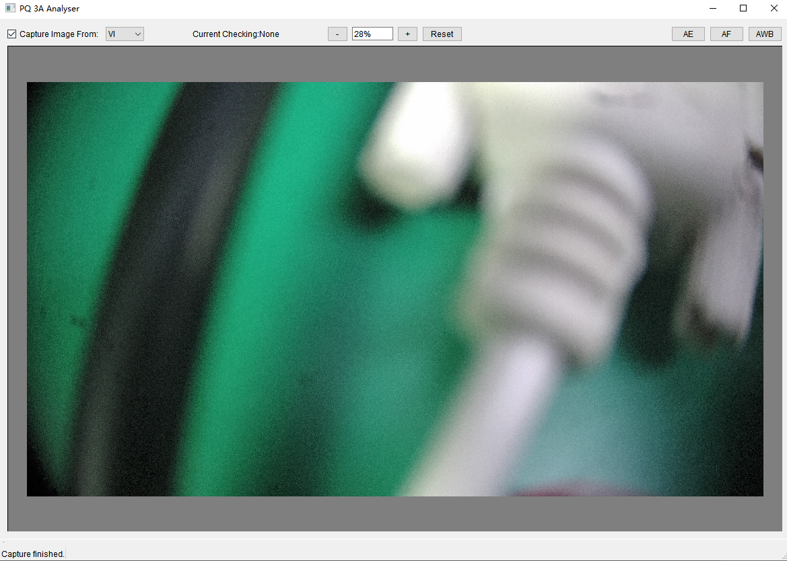

-   点击“+”或“-”按钮，可以按照预置的比例放大缩小。
-   输入框中，直接输入缩放比例。
-   鼠标右键可以拖动图像
-   点击Reset可以复位图像的大小和位置

#### 查看AE统计数据<a name="ZH-CN_TOPIC_0000002498141794"></a>

点击3A分析工具右上角的AE按钮，可以打开AE统计信息对话框如[图1](#fig62311646689)所示。

**图 1**  AE统计信息对话框<a name="fig62311646689"></a>  
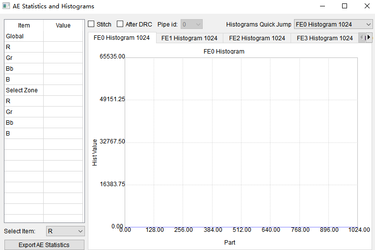

-   界面上的Stitch复选框，支持拼接功能。且FE Histogram有多组，且为1024。
-   Pipe id用于选择不同pipe的拼接分块统计信息，只有在勾选了Stitch的情况下才有效。用户需要保证Pipe id与主界面TOP页面的 ViPipe一致才能使图和统计信息对应。
-   Select Item下拉框用于选择某个分块统计信息的分量显示在图像中的每个分块格子内，当选择None时，图像上不显示任何值。

同时，3A分析工具的主界面图像区域也会被黄线分割成一个个区间，用户可以使用鼠标左键进行区间选择，如[图2](#_toc51692585)所示。

**图 2**  AE区间选择<a name="_toc51692585"></a>  
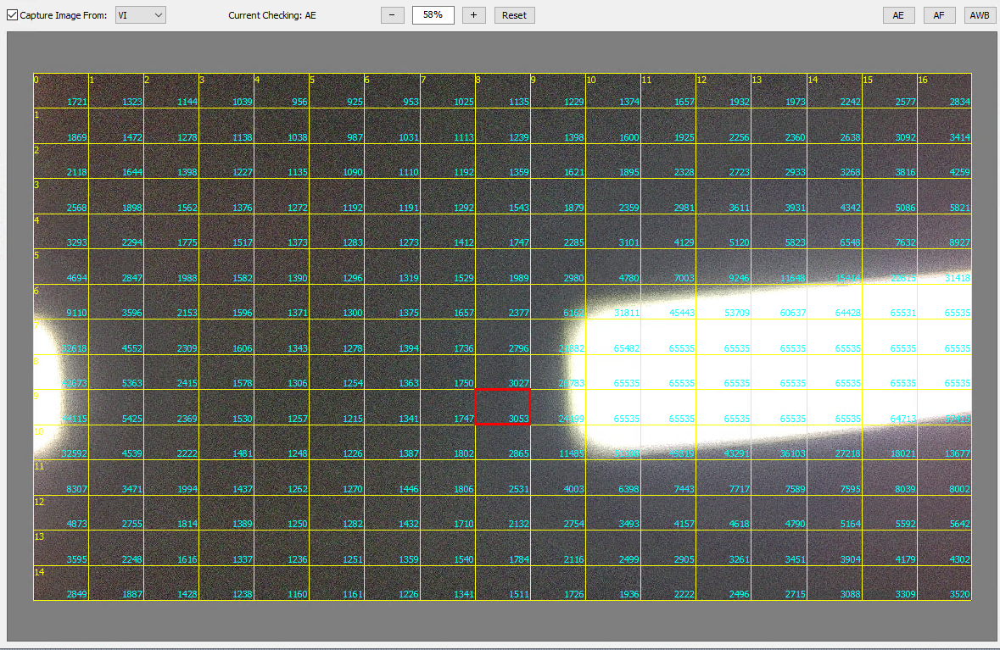

AE功能页面各区域功能如下（对应[图1](#fig62311646689)）：

1.  统计信息：可以查看全局和分区间的分量平均值。在3A分析工具主界面切换选区时，选择区间的统计信息数据会变化。
2.  保存统计信息：点击“Export AE Statistics”按钮，可将从板端获取的AE统计信息数据保存为明文的txt文件；
3.  直方图：可查看AE统计直方图。可使用上方的下拉框或标签页选择来切换想要查看的直方图。After DRC Histogram 1024是工具板端程序自动将AE统计信息切换到After DRC之后，重新获取上来的BE直方图，切换到After DRC Histogram 1024后，全局统计信息和分块统计信息也会是After DRC的。All Histogram是将所有的直方图合并到一个页签内，该页内的某个直方图\(背景色变成白色\)，则当前的分块统计信息和全局统计信息也会与之对应。

> **须知：** 
>-   拼接模式下，若图像是多路拼接的，则导出的统计信息也是多路的，并且与图像是相对应的。以SS928V100为例，VI、VPSS导出Pipe的统计信息，VO导出拼接后的统计信息。
>-   当Histogram Quick Jump下拉框切到MG时，是没有直方图信息的，只有全局统计信息和分块统计信息，线性模式下，MG统计信息默认是bypass的（获取上来全是0），需要将工具主界面Top-\> Bypass Setting中 bit\_bypass\_mg\_stat去勾选才能获取到正常的MG统计信息。
>-   在获取After DRC位置的BE统计信息前，需要将ExposureAttr中的op\_type和hist\_stat\_adjust分别设置Manual和False，并且要将DRC的开关打开，否则After DRC统计信息可能会有异常。
>-   当选择从VI或VPSS获取图像时，板端工具会创建一个venc通道用于将VI和VPSS通道的YUV送入进行编码生成JPEG图像，再发送给3A分析工具。创建的VENC通道的通道号默认为最后一个通道，可以通过修改板端版本包里面的config.cfg中的“JpegChn”来配置。选择从VO获取图像则是由板端将VO通道的YUV图像直接发送给PC端。

#### 查看AF统计数据<a name="ZH-CN_TOPIC_0000002498301758"></a>

点击3A分析工具右上角的AF按钮，可以打开AF统计信息对话框如[图1](#fig210312401899)所示。还可以选择在3A主界面上显示某通道某成员的值。

**图 1**  AF统计信息对话框<a name="fig210312401899"></a>  
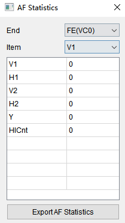

同时，3A分析工具的主界面图像区域也会被黄线分割成一个个区间，用户可以使用鼠标左键进行区间选择，如[图2](#_toc51692587)所示。

**图 2**  AF区间选择<a name="_toc51692587"></a>  
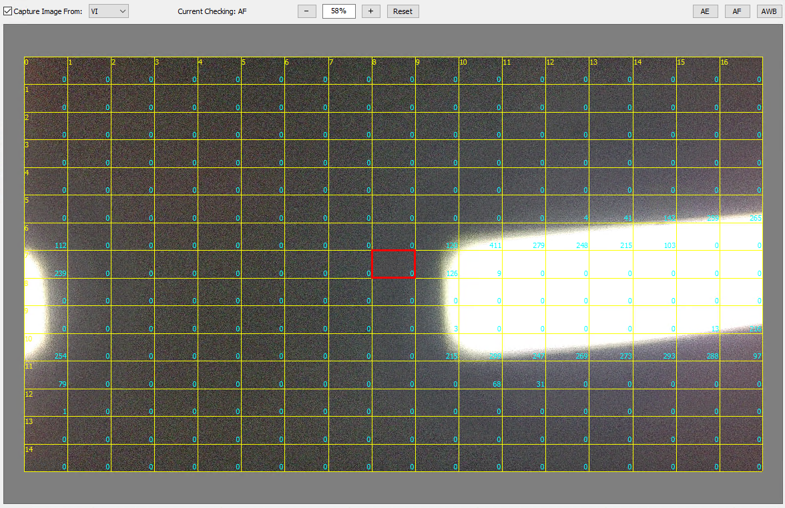

在统计信息对话框中，可以查看所选区间的AF统计信息。在3A分析工具主界面切换选区时，统计信息数据会变化。

点击AF统计信息对话框下方的“Export AF Statistics”按钮，可将从板端获取的统计信息保存为明文的txt文件。

> **须知：** 
>拼接模式下，若图像是多路拼接的，则导出的统计信息也是多路的，并且与图像是相对应的。以SS928V100为例，VI、VPSS导出Pipe的统计信息，VO导出拼接后的统计信息。

#### 查看AWB统计数据<a name="ZH-CN_TOPIC_0000002530061781"></a>

点击3A分析工具右上角的AWB按钮，可以打开AWB统计信息对话框如[图1](#fig102537731013)所示。AWB界面上有Stitch复选框，支持拼接操作。

**图 1**  AWB统计信息对话框<a name="fig102537731013"></a>  
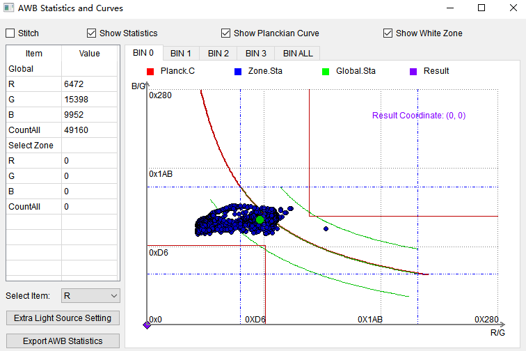

同时，3A分析工具的主界面图像区域也会被黄线分割成一个个区间，用户可以使用鼠标左键进行区间选择，如[图2](#_toc51692589)所示。

**图 2**  AWB区间选择<a name="_toc51692589"></a>  
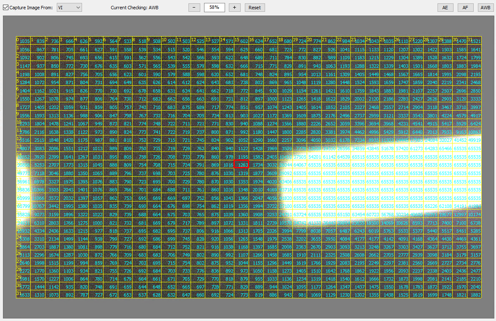

在统计图上显示的内容有：

1.  红色曲线：普朗克曲线。
2.  绿色点：全局统计信息在普朗克坐标系上对应的点。
3.  紫色点：AWB计算结果在普朗克坐标系上对应的点。
4.  蓝色点：分区间统计信息在普朗克坐标系上对应的点。
5.  绿色曲线：基础白区区间。其中中间线基本等同于普朗克曲线，与ActiveShift值相关。
6.  蓝色点段线：Rgain和Bgain的取值范围。在手动模式下，这两个值固定；在自动模式下，会和当前板端设定的高低色温相关。
7.  右上和左下的红色直线围成的区域：分别为排除紫色和绿色干扰而从白区中剔除的区间。与AWB参数中的CurveLLimit和CurveRLimit相关。
8.  十字型标记：表示独立光源点。周围的红色或绿色圆圈表示独立光源点的影响范围。其中绿色圆圈表示增加的白区表现，红色圆圈表示因排除干扰而剔除的白区表现。
9.  紫色的Result Coordinate字样：显示AWB在普朗克曲线上的坐标值。

通过图像上方的Show Statistics、Show Planckian Curve、Show White Zone可分别控制坐标图上统计信息、色温曲线和白区区间（包含独立光源点）的显示与隐藏。

从左侧图像上选定区间，可以将右侧坐标图上对应该区间的统计信息点高亮显示。用鼠标左键点选分区间统计信息的点，可在3A工具主界面的图像上自动选择对应的区间。

BIN 0用于显示不同亮度范围下的统计图。BIN的个数取决于主界面上的StatisticsConfig -\> WBConfig -\> ZoneBin，亮度范围取决于同一页面下的HistBinThresh。

点击“Export AWB Statistics”按钮，可以将从板端获取到的统计信息数据保存为明文的txt文本文件。

> **须知：** 
>-   拼接模式下，若图像是多路拼接的，则导出的统计信息也是多路的，并且与图像是相对应的。以SS928V100为例，VI、VPSS导出Pipe的统计信息，VO导出拼接后的统计信息。
>-   拼接模式下，每一路的参数是独立配置的，每一路的分块个数都需要配置，而且需要相同。即每一路的stitch\_enable，zone\_col，zone\_bin需要相同。
>-   3A分析工具获取的AWB统计信息是统计模块直接输出结果。
>-   配置AWB统计模块位置为Expander后时，3A分析工具的统计信息和AWB算法的统计信息不一致。此时，AWB分析工具不可用。

#### AWB独立光源点编辑<a name="ZH-CN_TOPIC_0000002498141720"></a>

3A分析工具中的AWB页面独立光源点编辑。在工具上点击“Extra Light Source Setting”按钮，可以打开白区编辑对话框，如[图1](#fig536411019194)所示。

**图 1**  独立光源点编辑示意图<a name="fig536411019194"></a>  
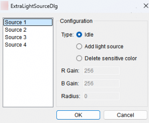

用户可以编辑最多4组独立光源点设置。按照以下的步骤即可进行：

1.  选择编辑的独立光源点组（左侧Source 1至Source 4）；
2.  选定独立光源点类型：Idle——无白区设置；Add light source——添加独立光源点；Delete sensitive color——剔除干扰区域；
3.  指定光源点的红色和蓝色增益值，以及作用半径；
4.  视需要重复步骤1-3后，点击“OK”按钮。

设置完成后，再抓取一次3A分析信息，普朗克坐标图即会刷新并显示用户的独立光源点及其引入的白区范围。

此外，用户可以通过图像区域上选取区间来快速添加独立光源点。在区间上点击右键，工具即会弹出选项菜单，如[图2](#fig632016379191)所示。

**图 2**  添加独立光源点选项菜单<a name="fig632016379191"></a>  
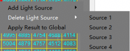

用户可以在Add Light Source菜单项中选取独立光源点组添加独立光源点，在Delete Light Source中选取独立光源点组剔除干扰区域。选取后，在弹出的对话框中输入半径，即可完成添加。

> **须知：** 
>若菜单中选取的独立光源点组在之前已经有独立光源设置，则其将会被覆盖。

#### 应用局部AWB结果至全局AWB<a name="ZH-CN_TOPIC_0000002498141712"></a>

工具支持将某一区间上的AWB结果应用至全局。在区间上点击右键并选择Apply Result to Global（见[图2](#ZH-CN_TOPIC_0000002498141720)），即可完成设置。

> **须知：** 
>-   使用该功能后，AWB将强制变更为手动模式。如需切换回自动模式，请调节PQTools工具主界面的相关寄存器参数。
>-   如果所选分区间的统计信息存在CountAll=0、R=0、B=0三种情况中的任意一种，则无法应用此区间的AWB结果至板端。此时工具会提示错误。

### 自动对焦参数仿真工具使用说明<a name="ZH-CN_TOPIC_0000002498301790"></a>

PQTools工具提供了自动对焦参数仿真插件，使图像质量调试人员可以：

-   根据截止频率自动获取较适合的AF参数，并查看对应的频率响应曲线；
-   自行配置AF参数，并查看对应的频率响应曲线。


#### 工具界面<a name="ZH-CN_TOPIC_0000002498141692"></a>

从PQTools工具主界面工具栏的外挂插件下拉框中选择“PQAuto Focus Simulator”，可以打开自动对焦参数仿真工具，如[图1](#fig510883851014)所示。

**图 1**  自动对焦参数仿真工具<a name="fig510883851014"></a>  

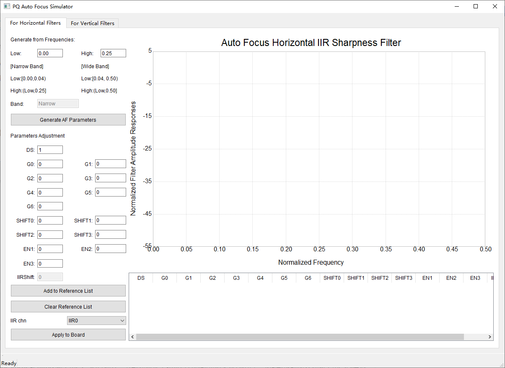

工具分为For Horizontal filters 和For Vertical filters两个页签，相互独立，分别对应水平和垂直方向的滤波器参数仿真。下面叙述的内容对两个页签均有效。

AF水平滤波器具备以下两种模式：

-   窄带模式（Narrow Band）：此种模式下，AF水平滤波器将在一个较小的频率范围内进行对焦。当用户设置的截止频率的低频小于0.04时，工具将推荐用户使用窄带模式。这个模式下，截止频率高频最大值为0.25。
-   宽带模式（Wide Band）：此种模式下，AF水平滤波器将在一个较大的频率范围内进行对焦。当截止频率的低频大于或等于0.04时，工具将推荐用户使用宽带模式。这个模式下，截止频率高频最大值为0.5。

用户可以使用Apply To Board按钮将参考组表中任意的一组数值下发到板端对应的寄存器分组来对模式和滤波系数进行设置。

#### 通过截止频率获取AF滤波系数<a name="ZH-CN_TOPIC_0000002498301700"></a>

在每个页签中，用户均可以用截止频率来生成滤波系数。在Generate from Frequencies处输入截止频率的低频和高频后，点击“Generate AF Parameters”，即可生成截止频率对应的滤波系数，显示在Parameters adjustment下方的各个文本框中，并在右侧的坐标图上显示对应该组滤波系数的频率响应曲线，曲线以红色表示，如[图1](#fig195582032251)和[图2](#fig1448214180256)所示。

**图 1**  通过截止频率获取滤波系数（窄带）<a name="fig195582032251"></a>  
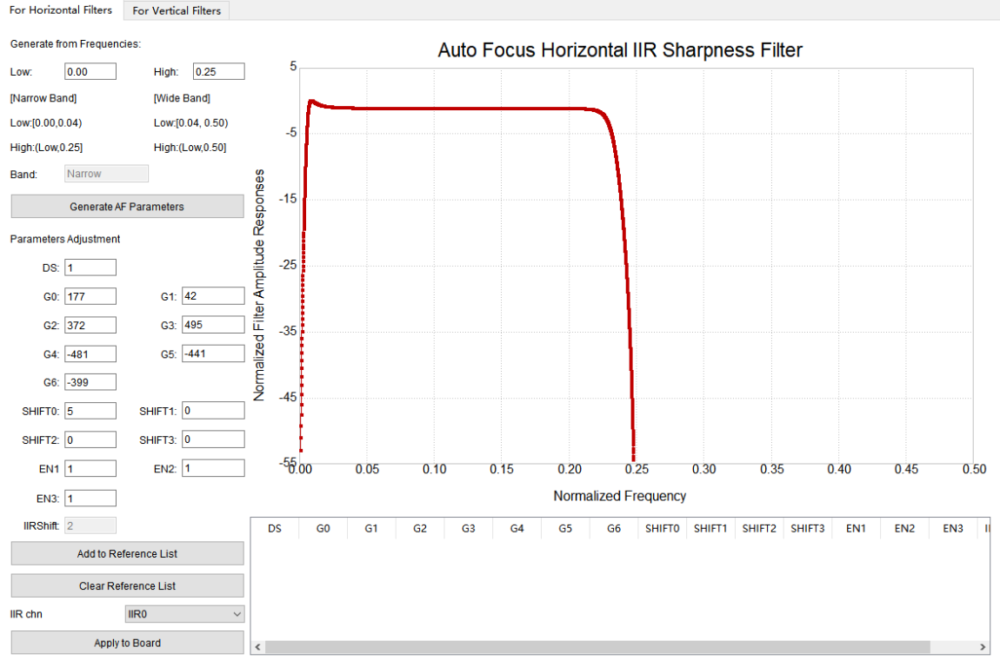

**图 2**  通过截止频率获取滤波系数（宽带）<a name="fig1448214180256"></a>  
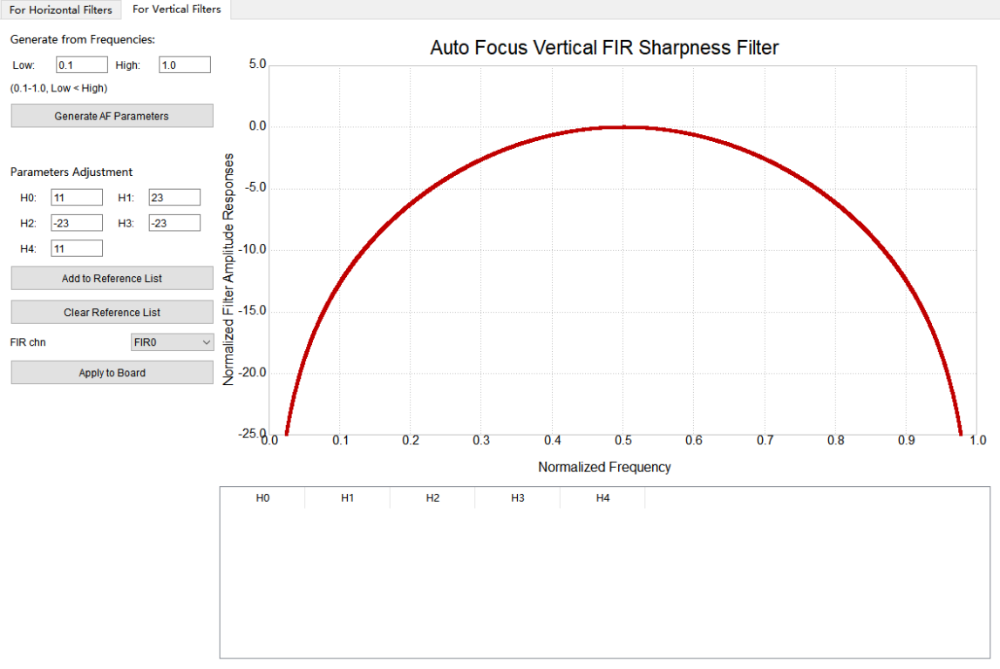

> **须知：** 
>截止频率在工具中会自动适配精度。水平滤波器的截止频率取小数点后两位，垂直滤波器的截止频率取小数点后一位。取精度时，多余的小数位数直接舍弃。

#### 手动配置滤波系数<a name="ZH-CN_TOPIC_0000002498301764"></a>

除了通过截止频率获取对应的滤波系数，用户还可以手动设置每个滤波系数项。在Parameters adjustment处，找到对应的参数并进行修改后，工具将自动计算这组参数的频率响应曲线并绘制在右侧。曲线以红色表示。但是“IIRShift”参数为只读参数，不能进行手动配置。

#### 设置参考组<a name="ZH-CN_TOPIC_0000002498141786"></a>

如果用户想要在不同组的滤波系数间对比，可以使用参考组功能。当用户需要将某一组滤波系数列为参考组时，点击“Add to Reference List”按钮，工具即会在右下角的列表中添加一行，列出该参考组的参数项，如[图1](#fig1654615122218)所示。

**图 1**  参考组列表<a name="fig1654615122218"></a>  
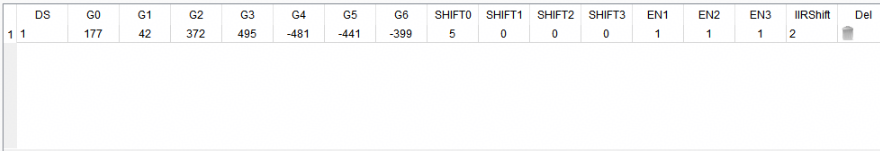

对于每一个参考组，工具还将在上方的坐标图上生成一条曲线，以灰色表示，如[图2](#_toc51692596)所示：

**图 2**  参考组的曲线显示<a name="_toc51692596"></a>  
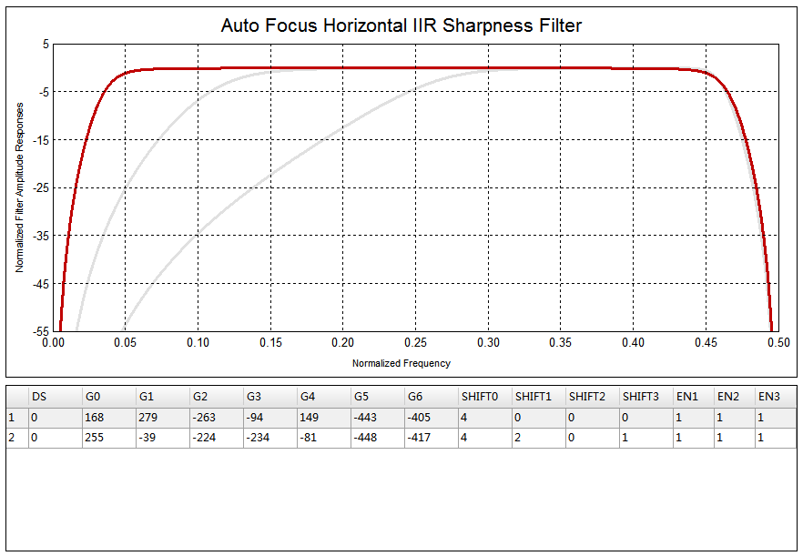

用户还可以将某一参考组的曲线高亮显示出来。在列表中点击需要高亮显示的参考组，此时对应的曲线会在上方的坐标图中变成蓝色，如[图3](#_toc51692597)所示：

**图 3**  选中参考组曲线高亮显示<a name="_toc51692597"></a>  
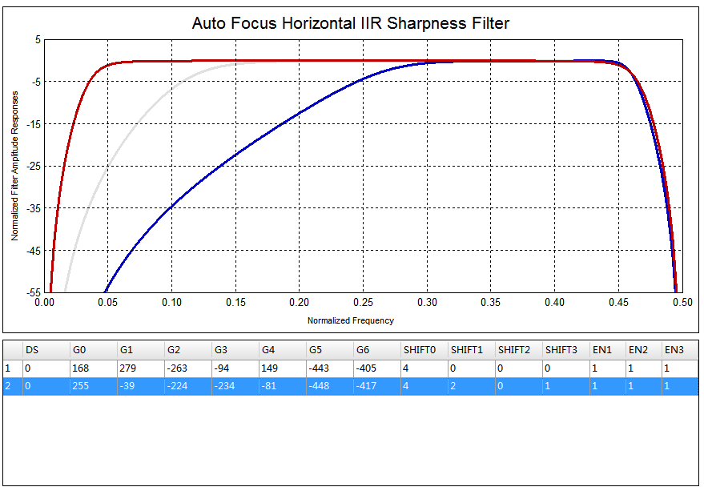

通过这样的方式，用户可以在不同的参考组间进行频率响应曲线对比，从而发现更优的方案。

> **须知：** 
>-   在坐标图上，红色的当前参数曲线和蓝色的参考组高亮曲线相对其他的灰色参考组曲线处于更上方的位置。因此，会出现刚刚添加参考组时看不到灰色曲线的状况。此时只要修改滤波系数，使红色曲线重新绘制，就能看到灰色的参考曲线。
>-   每个页签上最多只能添加6组参考组。如果需要添加新的参考组，请先点击Clear Reference List删除所有参考组。

## 其他辅助工具使用说明<a name="ZH-CN_TOPIC_0000002498141834"></a>


### 抓拍工具使用说明<a name="ZH-CN_TOPIC_0000002530221635"></a>

PQTools工具提供了易于使用的抓拍工具，可以抓取板端的图像数据（RAW、YUV、JPEG），也可以抓拍AE、AWB和Dehaze的Debug信息并保存为本地文件。

> **须知：** 
>生态版本不支持拼接、MCF相关功能。


#### 工具界面<a name="ZH-CN_TOPIC_0000002530061659"></a>

从PQTools工具主界面工具栏的外挂插件下拉框中选择“PQ Capture Tool”，可以打开抓拍工具，如[图1](#fig20995161131416)所示。主界面分为五部分：

-   raw图像抓拍
-   yuv图像抓拍
-   jpeg 图像抓拍
-   debug信息抓拍
-   抓拍后续处理

**图 1**  抓拍工具界面<a name="fig20995161131416"></a>  
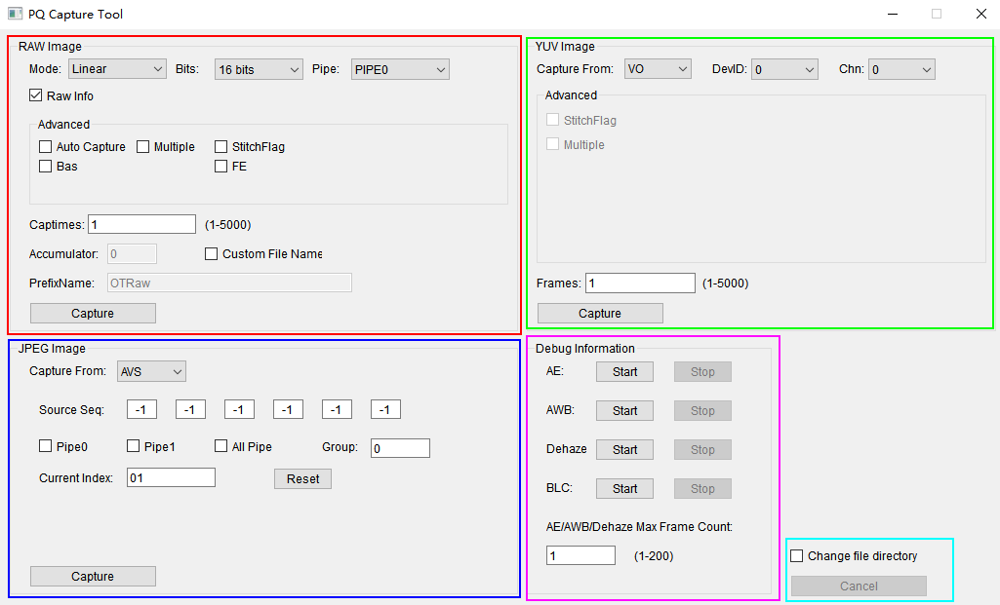

#### 抓取YUV图像数据<a name="ZH-CN_TOPIC_0000002498141818"></a>

抓取YUV图像数据步骤如下：

1.  通过主界面TOP-\>Mode Handle选择抓YUV通道（参考"[读写通路设置](#ZH-CN_TOPIC_0000002530061753)"）；
2.  在“YUV Image”分组框中选择抓取YUV数据的位置（VI/VPSS/VO/MCF）；
3.  如果板端运行AVS拼接业务时，若需要从拼接的各路同时抓取YUV图像，则勾选“StitchFlag”，抓拍成功后得到的YUV文件的帧数是界面上输入的帧数\*拼接路数，帧顺序为AVS pipe的顺序；
4.  输入抓取的帧数；
5.  点击Capture按钮，若抓取成功，且板端的config.cfg中配置Dump\_Method/Method值为0（默认为0），YUV数据将保存到工具已选择的路径下；
6.  当勾选了“Change file directory”，每次抓拍工具将弹出选择保存YUV文件路径的对话框，否则只有首次抓拍会弹出。若抓取成功，则保存在已选择的目录下。

    > **须知：** 
    >-   SS928V100解决方案最大支持帧数为5000帧。
    >-   勾选StitchFlag后，从AVS前端绑定模块抓取数据，与YUV Image Capture选取的YUV数据抓取位置无关。
    >-   若抓取的帧数较大，超出了板端当前分配的vb块数，需要修改ini文件，增加分配给业务的vb块数。板端可供抓取的帧数为业务第一次启动时的所有可用Pool下的Minfree之和（通过cat /proc/umap/vb查看），如果大于这个数，会占用业务正常运行时使用的vb，导致抓取的帧是不连续的。
    >-   若通道开启压缩模式，抓取YUV会进行解压缩再发送给PC端，解压缩的操作会占用一块vb。
    >-   拼接模式下YUV文件保存顺序：四路拼接，勾选StitchFlag，Frames为2，抓取的YUV文件帧顺序按AVS pipe顺序保存（pipe0-pipe1-pipe2-pipe3-pipe0-pipe1-pipe2-pipe3）。

#### 抓取RAW图像数据<a name="ZH-CN_TOPIC_0000002498301662"></a>

抓取RAW图像数据步骤如下：

**单通路：**

1.  在“RAW Image”分组框中选择抓取RAW数据的位宽。
2.  在Mode下拉框处选择设备模式：
    -   若设备运行在线性模式下，请选择“Linear”；
    -   若设备运行在WDR模式下，请根据设备实际运行情况，选择VC通路（VCNum）或多VC结合（2in1等）选项。

3.  在pipe下拉菜单 选择要抓取的pipe。
4.  设置抓取的次数 Captimes。
5.  如果需要在抓拍成功后的文件名中体现帧数量等信息，则勾选“Custom File Name”，可以自定义文件的名称前缀，并在抓拍后的文件名中体现帧数量（实际抓拍到的帧数）；
6.  如果板端运行AVS拼接业务时，若需要从拼接的各路同时抓取RAW图像，则勾选“StitchFlag”，抓拍成功后得到的RAW文件的帧数是界面上输入的次数\*拼接路数，帧顺序为AVS pipe的顺序；
7.  如果需要在抓拍RAW数据的同时保存ISP相关信息，请勾选“Raw Info”（勾选此选项并进行抓拍后，工具会在保存通常RAW数据文件的同时，还会生成一个带有ISP信息的文本文件）
8.  如果需要在抓拍RAW数据的同时保存编码信息，请配置config.cfg 文件中\[Other\]的RawExtraInfo=1，板端重启业务，然后抓拍RAW数据，就会生成一个带有编码信息的文本文件。编码信息为板端抓完所有RAW数据后，从/proc/umap/rc获取的文本信息。
9.  如果需要连续不断地抓拍RAW数据，请勾选“Auto Capture”。勾选后，点击“Capture”按钮，工具就会抓拍一组连续帧保存到文件中（帧数在界面上配置），然后又继续发送命令抓拍，直到用户点击 “Cancel”按钮才停止。每组RAW数据之间是非连续的。
10. 点击“Capture”按钮。若勾选了“Change file directory”，每次点击“ Capture ”，抓拍工具都会弹出选择保存RAW文件路径的对话框，否则只有首次抓拍会弹出。若抓取成功，则保存在已选择的目录下。
11. 若抓取成功，且板端的config.cfg中配置Dump\_Method/Method值为0（默认为0），RAW数据将保存到工具已选择的路径下。
12. 在抓取YUV或RAW图像数据时，用户可随时取消抓取。点击“Cancel”按钮，工具会在抓取到下一帧数据后停止进行抓取，并恢复界面可操作状态。但是若工具已经抓取到最后一帧图像数据，则暂停会无效，工具还将弹出图像数据保存对话框。

**多通路：**

1.  在“RAW Image”分组框中选择抓取RAW数据的位宽。
2.  在Mode下拉框处选择设备模式：
    -   若设备运行在线性模式下，请选择“Linear”；
    -   若设备运行在WDR模式下，请根据设备实际运行情况，选择VC通路（VCNum）或多VC结合（2in1等）选项。

3.  点击多通路功能复选框 Multiple 在弹出的多个复选框中选择和板端业务匹配的通路
4.  设置抓取的次数 Captimes .
5.  点击“Capture”按钮。若勾选了“Change file directory”，每次点击“ Capture ”，抓拍工具都会弹出选择保存RAW文件路径的对话框，否则只有首次抓拍会弹出。若抓取成功，则保存在已选择的目录下。

    > **须知：** 
    >-   多通路抓拍不支持单通路下的拼接复选框功能.但是可以单独抓取多个拼接通路的RAW文件。同时多通路抓拍功能最少需要选择一个pipe。多通路模式下 按照选择的pipe个数保存文件。一个文件对应一个pipe。
    >-   新增特殊抓拍场景，使用Bas 复选框 和FE复选框进行选择。
    >-   抓取的图像数据均为纯数据，不包含任何头数据。
    >-   抓取RAW数据时需要common vb配置为图像的像素数乘以2，否则抓取可能会失败。
    >-   抓取数据的bit数不应该小于sensor数据的bit数。
    >-   SS928V100解决方案最大支持帧数为5000帧。
    >-   若抓取的帧数较大，超出了板端当前分配的vb块数，需要修改ini文件，增加分配给业务的vb块数。板端可供抓取的帧数为业务第一次启动时的所有可用Pool下的Minfree之和（通过cat /proc/umap/vb查看），如果大于这个数，会占用业务正常运行时使用的vb，导致抓取的帧是不连续的。
    >-   拼接模式下RAW文件保存顺序：四路拼接，勾选StitchFlag，Frames为2，抓取的RAW文件帧顺序按AVS pipe顺序保存（pipe0-pipe1-pipe2-pipe3-pipe0-pipe1-pipe2-pipe3）。

#### 抓取JPEG图像数据<a name="ZH-CN_TOPIC_0000002498141730"></a>

以SS928V100为例，抓取JPEG图像数据步骤如下：

1.  在“JPEG Image”分组中，在“Capture from”下拉框处选择抓取数据的位置（AVS\\VI\\VPSS\\VENC）；选择AVS时，如果是单镜头抓拍，选择镜头对应的Pipe，勾选Pipe0或Pipe1，如果是双镜头抓拍，Pipe0和Pipe1都勾选，如果需要抓拍AVS拼接的所有镜头，则勾选All Pipe。Source Seq用于指定AVS前端模块（例如VPSS）的镜头顺序（例如4路场景的两路非融合拼接，Source Seq指定为3 2 1 0，表示用户定义VPSS Grp3为镜头0，VPSS Grp2为镜头1，VPSS Grp1为镜头2，VPSS Grp0为镜头3），镜头号会体现在JPEG文件命名上。
2.  根据不同位置显示的不同UI，在Group、Pipe、Chn等编辑框输入相应的值，选择Check控件是否使能。（Trigger复选框勾选时是在snap通路抓图像数据，不勾选时抓的是视频通路数据）
3.  点击“Capture”按钮，抓取JPEG图像。如果勾选了“Change file directory”复选框，每次点击“Capture”都会让用户选择保存目录，否则就使用上次选择的目录。

    > **须知：** 
    >-   “Capture from”选择AVS\\VI\\VPSS时，出JPEG的编码通道在板端的config.cfg文件中设置。JpegChn =63表示这个JPEG编码通道的通道号，不能与业务中使用的编码通道号重复。
    >-   “Capture from”选择VENC时，需要保证该编码通道为JPEG编码通道，否则抓拍失败。
    >-   如果业务中没有JPEG编码通道，从H.264\\H.265编码通道绑定的前端模块（比如VPSS）抓拍JPEG，即可得到对应的JPEG图像。
    >-   “Capture from”选择AVS时，需要在Stream工具上配置AVS的通道绑定关系，具体请参考章节"[Stitch数据源切换](#ZH-CN_TOPIC_0000002530061631)"。
    >-   不支持压缩通路抓jpeg。

#### 抓取调试信息<a name="ZH-CN_TOPIC_0000002530061741"></a>

PQTools工具提供了抓取AE/AWB/Dehaze模块调试信息的功能。可以在“Debug Information”分组框内找到操作接口。

-   抓取AE的调试信息步骤如下：

1.  通过主界面TOP-\>Mode Handle选择通道（参考"[读写通路设置](#ZH-CN_TOPIC_0000002530061753)"）。
2.  在“AE/AWB/Dehaze Max Frame Count”文本框里输入抓取调试信息的帧数。
3.  点击AE右侧“Start”按钮。
4.  点击AE右侧“Stop”按钮。若抓取成功，工具将弹出保存文件对话框，此时选择保存位置。

-   抓取AWB的调试信息步骤如下：

1.  通过主界面TOP-\>Mode Handle选择通道（参考"[读写通路设置](#ZH-CN_TOPIC_0000002530061753)"）。
2.  在“AE/AWB/Dehaze Max Frame Count”文本框里输入抓取调试信息的帧数。
3.  点击“AWB”按钮右侧“Start”按钮。
4.  点击“AWB”按钮右侧“Stop”按钮。若抓取成功，工具将弹出保存文件对话框，此时选择保存位置。

-   抓取Dehaze的调试信息步骤如下：

1.  通过主界面TOP-\>Mode Handle选择通道（参考"[读写通路设置](#ZH-CN_TOPIC_0000002530061753)"）。
2.  勾选主界面Dehaze-\>Enable使能Dehaze。
3.  在“AE/AWB/Dehaze Max Frame Count”文本框里输入抓取调试信息的帧数。
4.  点击Dehaze右侧“Start”按钮。
5.  点击Dehaze右侧“Stop”按钮。若抓取成功，工具将弹出保存文件对话框，此时选择保存位置。

> **须知：** 
>-   若界面上对应的抓取功能被禁用，则表示当前的芯片无法支持。
>-   抓取的AE、AWB和Dehaze调试信息为转换后的明文数据。
>-   抓取的AWB调试信息中的统计信息，支持最大32\*32分块\* 4bin工作模式，或者最大32\*32分块\* 1bin \* 4路拼接工作模式。

### RAW实用工具使用说明<a name="ZH-CN_TOPIC_0000002498301756"></a>

PQTools工具提供了RAW实用工具，可供用户将抓取的RAW图像数据倒灌回板端。

> **须知：** 
>生态版本不支持拼接、MCF相关功能。


#### 工具界面<a name="ZH-CN_TOPIC_0000002498141844"></a>

从PQTools工具主界面工具栏的外挂插件下拉框中选择“PQ RAW Utilities”，可以打开RAW实用工具，如[图1](#fig1511763421510)所示。

界面的“StitchFlag”复选框用于选择是否为拼接模式，“RawSource”选择列表用于选择“FE”和“USER”。

**图 1**  RAW实用工具界面<a name="fig1511763421510"></a>  
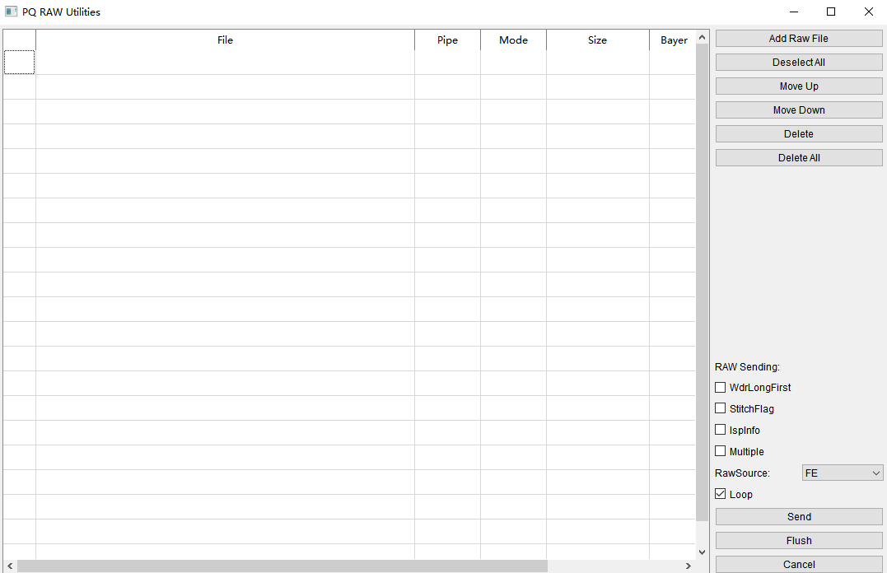

#### 导入RAW数据<a name="ZH-CN_TOPIC_0000002530221625"></a>

在进行倒灌和转换操作之前，用户需要将RAW数据导入到工具左侧的列表中，点击工具右上角的Add RAW File按钮即可添加RAW文件，支持同时导入多个文件。

如果导入的RAW文件是在抓拍工具抓拍到，且以默认文件名保存的（格式形如RAW\_1920x1080\_12bits\_RGGB\_Linear\_XXXXXX），则RAW实用工具可以直接解析这个RAW文件的大小、位宽、模式、分量排序。

工具会对每一个无法直接解析文件名的RAW文件弹出[图1](#fig4945141151611)所示的RAW属性输入框，此时用户需要手动填写RAW数据的属性。

**图 1**  RAW属性输入<a name="fig4945141151611"></a>  
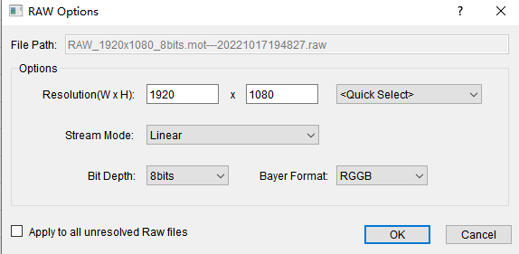

按如下步骤填写：

1.  在Resolution \(W x H\)处填写RAW图像的分辨率。如果RAW图像实际的分辨率为常用分辨率，可在右边的Quick Select下拉框快速选择；
2.  选择RAW数据是在哪个stream模式下被抓拍出来的（线性/WDR VCNum0\~3/WDR结合2\~4 in1）；
3.  在Bit Depth下拉框处选择RAW数据的位宽（8bits/10bits/12bits/16bits）；
4.  在Bayer Format处选择RAW数据对应的分量排序模式（RGGB/GRBG/GBRG/BGGR）。
5.  若导入的所有文件中，所有尚未设置属性的RAW数据与当前设置属性的RAW数据具备完全一致的分辨率、模式、位宽、分量排序值，则用户可以勾选Apply to all unresolved RAW files复选框，指示工具对所有尚未设置属性的RAW数据统一设置属性。
6.  点击“OK”按钮。

导入RAW数据完成后的界面如  [图2](#fig139411946488)所示。

**图 2**  导入RAW数据后的RAW实用工具界面<a name="fig139411946488"></a>  
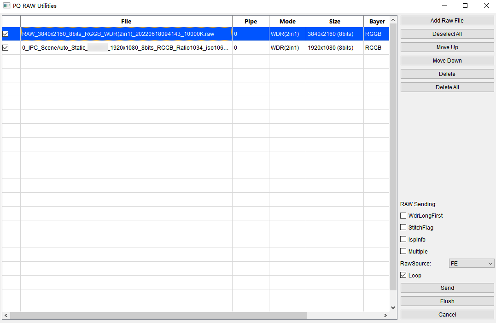

导入RAW文件后可以进行以下列表编辑操作：

-   选中：可以直接在列表上点击一行以选中改行指定的RAW文件。可以使用Ctrl或Shift按钮进行多选；
-   上移/下移：选中RAW文件后，可以点击Move Up将选中的文件上移一个位次，或是点击Move Down下移一个位次；（多选RAW文件时，仅对选中的第一个RAW文件生效）
-   删除：选中RAW数据后，可以点击Delete按钮删除所有选中的RAW文件项；
-   清空：点击Delete All按钮，可以清空RAW文件列表。
-   全选/反选：点击Deselect All取消全部，点击Select all选中全部。
-   可以修改 pipe 列的数值来指定要灌入的 VIpipe通道 \[0,7\]。修改一个同时可以修改列表内的所有RAW文件对应的pipe。
-   勾选Multiple功能复选框后，可以单独修改每个RAW文件对应的pipe列数值。此功能只有在板端具有多个pipe的业务场景下才可以使用。

#### RAW数据的ISPInfo信息<a name="ZH-CN_TOPIC_0000002530221649"></a>

用户在导入RAW数据时，工具会先获取RAW文件的ISPInfo信息。

ISPInfo信息获取来源优先级：

-   RAW的同名txt。
-   RAW的文件名。
-   用户输入。

具体每种方式如下：

-   RAW的同名txt: 信息完整时，正常导入；信息不完整时，参数默认值为0，提示用户信息不全的参数。
-   无txt，文件名符合新规范：

    文件名信息完整时，正常导入；基础信息不完整时，弹框输入基础信息；ISPInfo信息不全或没有时，解析不到的参数值默认值为0。例如：RAW\_3840x2160\_16bits\_RGGB\_WDR\(2in1\)\_iso105\_ag1024\_dg1024\_ispdg1080\_exp456\_cnt30.raw\_cvt.raw

-   无txt，文件名符合目前工具抓出来的规范：

    文件名信息完整时，正常导入，ISPInfo默认值为0。例如：RAW\_3840x2160\_16bits\_RGGB\_WDR\(VCNum1\)\_20190110142508.raw

-   无txt，文件名不符合任意规范：

    弹框输入基础信息，ISPInfo默认值为0。

点击RAW工具界面的Info列的按钮，弹出ISPInfo编辑界面，可以修改和保存选择的RAW文件的Info信息。

**图 1**  ISPInfo信息编辑界面<a name="fig14883141717"></a>  
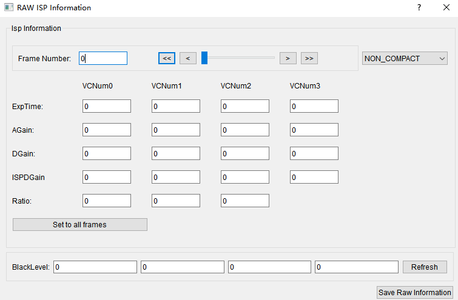

界面功能如下:

-   Frame Number编辑框：显示索引号为编辑框中的frame的ISPInfo信息。
-   “<<” 和“\>\> ”按钮：切换显示RAW头尾frame的ISPInfo信息。
-   “< ”和“\>”按钮：切换显示RAW前后frame的ISPInfo信息。
-   通过修改滚动条的值切换到对应frame的ISPInfo信息的显示。
-   Set to all frames按钮：将当前界面上的ISPInfo信息设置到RAW的所有帧。
-   Refresh按钮：将板端的BlackLevel的值刷新到界面上。
-   Save Raw Information按钮：会把编辑后的Raw的所有frame\(主pipe和非主pipe\)的ISPInfo按照索引号保存到文件中，默认文件名和RAW相同，文件格式为txt，文件名字和路径可编辑。
-   编辑框内输入的值，超出范围时，均按照取值范围做剪切并生效。

#### 向板端倒灌RAW图像数据<a name="ZH-CN_TOPIC_0000002530061761"></a>

向板端倒灌RAW图像数据步骤如下：

1.  导入RAW文件后 默认的灌入通路为pipe 0，可以手动修改RAW文件列表的Pipe属性来选择灌入的板端通路；
2.  按"[导入RAW数据](#ZH-CN_TOPIC_0000002530221625)"章节的说明，导入需要灌入的RAW文件。可以同时灌入多个文件。导入后，在列表第一列勾选需要灌入的RAW文件。
3.  使用右侧的Move Up和Move Down按钮调整RAW文件的次序。工具组合RAW文件数据时，按照从上到下的顺序排列。
4.  指定发送到板端的RAW帧的起始帧\(F.Start, 从1开始计数\)，结束帧\(F.End, 必须大于等于起始帧\)，以及帧发送间隔（F.Gop,默认值为1，即逐帧发送，若大于1，则跳帧发送）。
5.  设置灌入方式：选择Route Combine方式时，工具会将勾选的相同通路的RAW数据组合在一起后，按通路号从小到大的次序依次将RAW文件灌入设备。
6.  使用Route Combine方式倒灌RAW数据时，如果需要使用循环倒灌功能，请将Loop单选框勾选。
7.  如果需要灌RAW时同时发送IspInfo到板端，需要勾选IspInfo复选框，工具就会解析与RAW文件同一路径下同名的txt文件，并将参数发送到板端。板端灌RAW过程中会将IspInfo中的“Exposure\_Time”、“A\_Gain”、“D\_Gain”、“ISP\_D\_Gain”这几个参数的值通过OT\_MPI\_ISP\_SetExposureAttr生效；“Ratio\_0”、“Ratio\_1”、“Ratio\_2” 这几个参数通过OT\_MPI\_ISP\_SetWDRExposureAttr生效；“BlackLevel\_R”，“BlackLevel\_Gr”，“BlackLevel\_Gb”，“BlackLevel\_B”通过OT\_MPI\_ISP\_SetBlackLevelAttr生效；“Bayer”则通过OT\_MPI\_ISP\_SetPubAttr生效。并且会将对应Auto/Manual设置为Manual。当点击“Flush”停止灌RAW时，参数会被恢复到灌RAW之前的值。
8.  SS928V100支持灌RAW到FE。灌RAW到FE前，需要开启自产生时序。开启方法是：勾选主界面可调项的TimingAttr页面的Enable。

    > **注意：** 
    >FE灌wdr格式RAW文件时，必须在业务初始化时开启自产生时序属性，设置方法是在对应场景的ini文件的业务相关\[vi\_timing.x\] 属性中配置TimingEnable = TRUE, TimingFrmRate = 合适的帧率。

9.  点击“Send”将图像数据发送到板端。
10. 如果发送结束，点击“Flush”按钮通知板端结束发送。如果取消灌RAW，点击“Cancel”按钮通知板端终止灌入。
11. 如果板端运行的是拍照业务，需要灌RAW来调试拍照效果，可以参考下面操作：
    -   将Top页面的ViPipe改为拍照的pipe，配置SnapAttr页使拍照帧数大于0；
    -   单pipe拍照模式可以灌RAW到BE（勾选SnapMode和Loop），然后用抓拍工具抓取JPEG（不勾选Trigger）。也可以灌RAW到FE（不勾选SnapMode），然后用抓拍工具抓取JPEG（勾选Trigger）。
    -   双pipe拍照模式需要勾选SnapMode和Loop灌RAW到BE，灌入的帧数需要与SnapMode中的帧数保持一致，然后勾选抓拍工具的Trigger，从抓拍通路抓取JPEG。当抓取JPEG时，正在循环灌到视频通路的RAW会被灌到抓拍通路，抓取的JPEG与灌入的RAW是一一对应的关系。

12. 如果是线性多通路场景或者WDR及拼接场景。在不使用默认的WDR或者拼接RAW文件灌入时，可以勾选界面的Multiple 复选框然后导入想要灌入不同通路的RAW文件。修改各自的Pipe属性。点击“Send”即可灌入板端不同通路，此功能不限制不同通路之间的分辨率差异（需要各个通路的灌入帧数保持一致）。

> **须知：** 
>-   .F.Gop和F.Start配合使用，可用于发送RAW文件中的部分帧：比如导入帧顺序按AVS pipe顺序保存RAW文件（pipe0-pipe1-pipe2-pipe3-pipe0-pipe1-pipe2-pipe3），如果F.Start设置为3（即从第三帧开始）、F.Gop设置为4，则可将pipe2的RAW数据灌入板端。
>-   未勾选Multiple时，列表中所有相同通路的RAW文件必须具备相同的分辨率，位域，Bayer序列和模式，且必须与所灌入通路的设置一致。否则灌入操作会失败。
>-   若灌入的帧数较大，超出了板端当前剩余的MMZ内存，可以在保证板端业务正常运行的前提下，将分配给业务的vb的块数尽可能地减少。
>-   若要将WDR\(VCNum1\~3\)格式的RAW灌到线性场景下，需要手动将文件名中的“WDR\(VCNum1\~3\)”更改为“Linear”，如果有对应的isp info的txt文件，则需要将文件里的WDR\_Mode值改为0。
>-   若没接sensor时需要灌RAW进行调试，可以打开自产生时序后进行灌RAW（将ini文件中的TimingEnable设置为TRUE后重启业务），以这种方式灌RAW时WDR模式下的帧率可能会不达标。

### YUV实用工具使用说明<a name="ZH-CN_TOPIC_0000002530221607"></a>

PQTools工具提供了YUV实用工具，可供用户将抓取的YUV图像数据倒灌回板端。

> **须知：** 
>生态版本不支持拼接、MCF相关功能。


#### 工具界面<a name="ZH-CN_TOPIC_0000002530061677"></a>

从PQTools工具主界面工具栏的外挂插件下拉框中选择“PQ YUV Utilities”，可以打开YUV实用工具，如[图1](#fig16104420171816)所示。

**图 1**  YUV实用工具界面<a name="fig16104420171816"></a>  
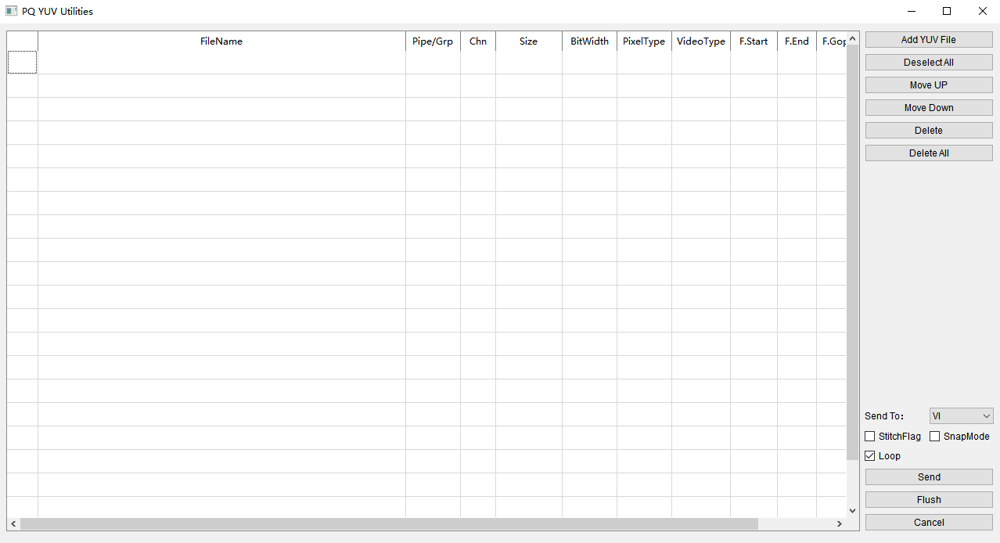

#### 向板端倒灌YUV图像数据<a name="ZH-CN_TOPIC_0000002498141780"></a>

向板端倒灌YUV图像数据步骤如下：

**图 1**  YUV属性输入<a name="fig1135085116185"></a>  
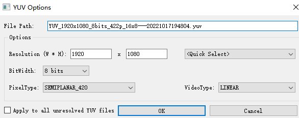

1.  通过主界面TOP-\>Mode Handle选择灌YUV通道（参考"[读写通路设置](#ZH-CN_TOPIC_0000002530061753)"）；
2.  点击“Add YUV File”按钮，选择YUV文件添加到左侧列表中。
3.  在弹出的对话框中指定YUV文件的各项参数（如果YUV文件来源于抓拍工具，则此步骤可以省略，配置对话框不会弹出）。
4.  F.Start和 F.End用于指定发送到板端的YUV帧数的范围（以1起始，起始帧不能大于结束帧）。
5.  在Send to下拉框中设置灌入位置。
6.  可勾选“StitchFlag”复选框进行拼接灌包，选择“Loop”复选框循环灌包。
7.  点击“Send”将图像数据发送到板端。
8.  点击“Flush”按钮，停止循环灌包；点击“Cancel”按钮，取消灌YUV。

    > **须知：** 
    >-   F.Gop和F.Start配合使用，可用于发送YUV文件中的部分帧：比如按照AVS pipe顺序（pipe0-pipe1-pipe2-pipe3-pipe0-pipe1-pipe2-pipe3）保存YUV文件，如果F.Start设置为3（即从第三帧开始）、F.Gop设置为4，则可将pipe2的YUV数据灌入板端。
    >-   默认提供的ini不支持从vi灌YUV，如需要请参考[ini文件适配](#ZH-CN_TOPIC_0000002530221755)"[说明9](#ZH-CN_TOPIC_0000002530221755)："配置ini并重新启动业务。
    >-   “Cancel”功能暂不支持。
    >-   当前支持从VI/VPSS/AVS/VENC模块灌入。
    >-   当前支持两种格式 YUV\_planar420，YUV\_semiplanar420
    >-   对mcf 模块灌入YUV时，要自行确认好对应通路的YUV格式。保证黑白和彩色YUV灌入正确的mcf chn。同时和其他模块不同，mcf 灌YUV需要注意，group/pip通路默认一般为0，需要根据chn号来设置区分黑白和彩色通路。

### 外接存储设备抓灌说明<a name="ZH-CN_TOPIC_0000002530221703"></a>

PQTools工具提供了抓拍RAW或YUV存储至外接存储设备和从外接存储设备读取RAW文件倒灌的功能。

使能该功能需要配置板端的config.cfg。

> **须知：** 
>生态版本不支持拼接相关功能。


#### 抓取图像存储到外接设备<a name="ZH-CN_TOPIC_0000002530221761"></a>

Config.cfg的\[Dump\_Method\]是抓拍存外接存储设备的控制参数。\[Yuv\_Image\]和\[Raw\_Image\]中的参数等同于PC端工具界面上的参数。\[Dump\_Method\]中的各参数作用如下：

\[Method\]

-   0：关闭抓拍存外接存储设备功能；
-   1：可通过PC端来触发抓RAW/YUV存储到设备；
-   2：重启板端业务会自动抓取RAW/YUV存储；
-   3：重启板端业务会自动读取文件灌RAW。
-   4：重启板端业务会自动读取文件灌YUV。

\[Path\]

保存图像文件的路径，可设置为挂载的外界存储设备的路径。

\[Option\]

-   0：表示边抓图像边存文件，该方式不受限于板端的内存，但受限于存文件的速度，若速度不够快时，可能会导致丢帧。文件需要以O\_DIRECT的方式打开，文件系统需要使用CMA方案（请见“[使用CMA方案保存RAW文件到SSD](#ZH-CN_TOPIC_0000002498301678)”描述）；
-   1：表示先抓完图像存到vb中，再将vb中的图像数据一起写到文件中，该方式受限于板端内存的大小。

\[SplitSize\]

当抓拍的图像文件长度超过该值（单位为MBytes），程序会自动切分文件。

\[DelayTime\]

若Dump\_Method配置为2或3，启动板端工具后，程序会延迟DelayTime分钟的时间再进行自动抓灌。

\[Image\]

-   0：表示抓YUV；
-   1：表示抓RAW。

\[SaveIspInfo\]

当设置为1时，抓RAW或YUV会生成对应的IspInfo信息的txt文件。

> **须知：** 
>-   板端保存文件是紧凑型的，而工具端保存的文件则是非紧凑型的，板端保存的10bit和12bit的图像文件不能直接给工具端使用。
>-   若开启Dump\_Method/Method，3A分析工具、鱼眼标定工具、辅助对焦工具等需要抓拍的工具将无法抓拍，图像已被存在板端。
>-   对于USB3.0接口，使用高写入性能的固态硬盘，能够满足抓拍3840\*2160@30fps 8bit、10bit RAW的连续帧。抓取3840\*2160@30fps 12bit 16bit不丢帧请选用更高写性能的固态硬盘。
>-   首次触发抓拍弹出文件路径保存对话框，配置抓到pc端的数据保存路径。
>-   Option为0类型时保存文件数据512对齐，部分场景下抓取数据不能被图像宽高整除，因此无法通过板端灌入此文件。


##### 使用CMA方案保存RAW文件到SSD<a name="ZH-CN_TOPIC_0000002498301678"></a>

使用CMA方案配置uboot启动参数和加载相关ko的参数，以SS928V100为例：

-   修改u-boot的参数：

    ```
    setenv bootargs 'mem=4032M mmz_allocator=cma mmz=anonymous,0,0x64000000,3520M console=ttyAMA0,115200 root=/dev/mtdblock2 rw rootfstype=yaffs2 mtdparts=nand:1M(boot),9M(kernel),16M(rootfs)'
    ```

-   修改load\_ss928v100：将该脚本中的mmz\_allocator=ot改为mmz\_allocator=cma

    修改config.cfg，如[图1](#_ref11424457)和[图2](#_toc51692606)所示。

    **图 1**  配置自动灌RAW参数<a name="_ref11424457"></a>  
    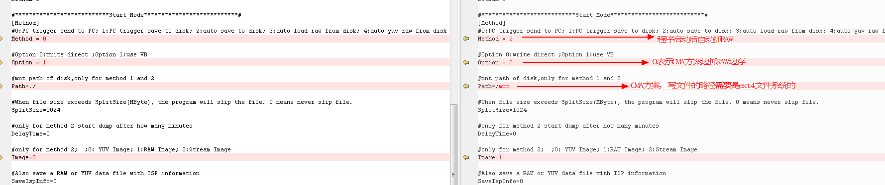

    **图 2**  抓raw的帧数<a name="_toc51692606"></a>  
    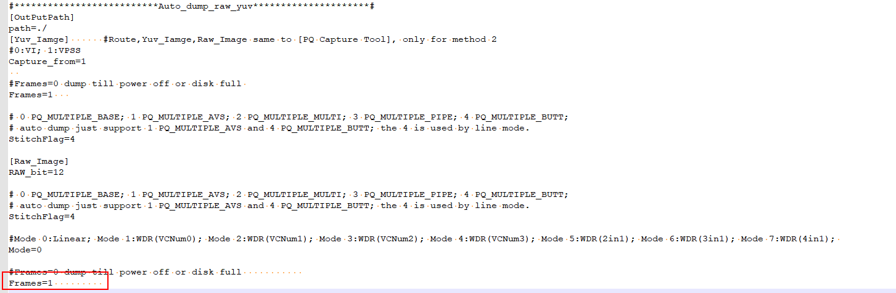

#### 从存储设备中读取文件灌RAW及YUV<a name="ZH-CN_TOPIC_0000002498301702"></a>

需要将\[Method\]中的【Method】配置为3为灌RAW功能，开启功能；【Method】配置为4为灌YUV功能。

灌RAW时需要适配\[Module\]中【vipipe】，根据业务进行配置；灌YUV时需要适配\[Module\]中【vipipe】、【vichn】、【vpssgrp】、【vpsschn】等参数，根据业务进行配置。

适配\[Auto\_Load\]模块：

【Loop】

当配置为1且【SrcRawPath】为文件名时，可以开启循环灌RAW的功能。

【StitchFlag】

-   0：PC单通路灌RAW或YUV；
-   1：灌拼接RAW或YUV；
-   2：PC多通路灌 RAW 或 YUV；
-   3：保留功能项；
-   4：保留功能项；
-   5：Board 灌 RAW 或 YUV.

【SrcPath】

-   当配置为RAW文件的路径名时，程序会读取该目录下所有的RAW或YUV文件并灌入\(一次配置只支持灌一种文件，RAW或者YUV\)；
-   当配置为路径+RAW或YUV文件名时，程序只会读取该文件并灌入。

【SaveType】

-   0：只进行灌入RAW或YUV，不抓取数据
-   1：灌入RAW或YUV，抓取并保存YUV数据
-   2：灌入RAW或YUV，抓取并保存为h264/h265码流

【DestImagePath】

生成YUV或码流的路径。

> **说明：** 
>【SaveType】配置为1时，需要配置\[Yuv\_Image\]中【Capture\_from】，选择VI或VPSS抓取并保存YUV数据。
>【SaveType】配置为2时，需要将ini中的Transfer改为FALSE才能正常抓取并保存码流数据，此时码流将不会被发送到PC端。
>【SaveType】配置为1或2时，程序灌入RAW或YUV数据后，会抓取YUV或码流并保存。一个灌入文件对应一个输出（YUV或码流）文件，输出文件名中会包含灌入RAW或YUV文件的文件名。
>【SrcPath】配置路径名为目录，若该目录下有子目录，那么【DestImagePath】目录下也会自动创建同名的子目录，并在该目录下生成YUV或码流文件。
>若\[Method\]中的【SaveIspInfo】配置为1时，生成YUV的同时会生成对应的IspInfo的txt文件。

适配\[Raw\_Load\]模块：

【RawSource】

-   0：灌RAW到FE；
-   1：灌RAW到 USER。

当配置为1时进行灌RAW，通路会循环处理同一帧RAW数据以保证帧率达标直到下一帧RAW数据灌入。由于读文件灌RAW的速度赶不上业务配置的帧率，通路上就会出现重复帧。所以不建议配置为1时，进行灌RAW存YUV和灌RAW存H264/H265码流。

【ReadyFrames】

该参数控制灌RAW的准备帧数，用于使ISP稳定。程序会取RAW文件的前15帧（若不足15帧，则取所有帧），先正序灌到第15帧（不足15帧的则灌到最后一帧）再倒序灌到第1帧，该步骤反复进行，直到灌入的帧数等于该参数配置的值。之后程序便可以从第一帧开始灌并抓YUV。

【WithIspInfo】

当配置为1时，程序会解析RAW文件的ISP Info信息并设置到ISP中。解析ISP Info有两种方式，

-   方式1：是通过文件名解析，该文件名必须符合这种格式：xxxx\_xxxx\_xxxx\_1920x1080\_12bits\_RGGB\_ag1024\_dg1024\_ispdg1024\_exp2061\_iso100\_Ratio98\_xxxx\_xxxx.raw；
-   方式2：读取与RAW文件同路径下并且同名的txt文件，程序优先解析txt文件；

    ISP Info的配置方法如下：程序会将Isp Info中的“Exposure\_Time”、“A\_Gain”、“D\_Gain”、“ISP\_D\_Gain”这几个参数的值通过OT\_MPI\_ISP\_SetExposureAttr生效；“Ratio\_0”、“Ratio\_1”、“Ratio\_2” 这几个参数通过OT\_MPI\_ISP\_SetWDRExposureAttr生效；“BlackLevel\_R”，“BlackLevel\_Gr”，“BlackLevel\_Gb”，“BlackLevel\_B”通过OT\_MPI\_ISP\_SetBlackLevelAttr生效；“Bayer”则通过OT\_MPI\_ISP\_SetPubAttr生效。并且会将对应Auto/Manual设置为Manual；

【NonCompact】

-   0：紧凑RAW；
-   1：非紧凑RAW。

【WaitFeIntCnt】

每帧RAW在灌之前都会先配置ISP Info然后等待WaitFeIntCnt个FE的中断以确保ISP Info生效于这帧RAW。

【WithBlackLevel】

当ISP Info采用方式1来解析时，BlackLevel由该参数来使能。当配置为1，则【BlackLevel\_R】、【BlackLevel\_Gr】、【BlackLevel\_Gb】和【BlackLevel\_B】的值将通过ss\_mpi\_isp\_set\_black\_level\_attr生效。

【BlackDataFrom】

-   0：BlackLevel参数值来自config.cfg配置中参数【BlackLevel\_R】、【BlackLevel\_Gr】、【BlackLevel\_Gb】、【BlackLevel\_B】；
-   1：BlackLevel参数值来自IspInfo文件。

【WdrLongfirst】

-   0：按RAW文件顺序读帧；
-   1：按RAW文件逆序读帧。

> **须知：** 
>-   板端自动读文件灌RAW并没有帧数限制，业务流程上是读取一组灌入一组，所以灌RAW的速率受文件读取速率的限制。
>-   当某个RAW文件灌入失败，则该文件将被跳过，程序会继续读取下一个文件。
>-   灌RAW过程中可以通过连接PQTools，点击RAW Utilities页面的“Flush”来停止灌RAW。

适配\[Yuv\_Load\]模块：

【YuvSource】

-   0：灌YUV到VI
-   1：灌YUV到VPSS
-   2：灌YUV到Stitch
-   3：灌YUV到VENC

【enPixelType】

-   0：灌planar420格式
-   1：灌semi-planar420格式

> **须知：** 
>【SaveType】配置为1时，灌入YUV和抓取YUV不能是同一模块。
>【enPixelType】格式选择需要与灌入文件的YUV格式匹配，不匹配可能会导致图像异常等问题。
>当某个YUV文件灌入失败，则该文件将被跳过，程序会继续读取下一个文件。
>灌YUV过程中可以通过连接PQTools，点击YUV Utilities页面的“Flush”来停止灌YUV。

#### 起业务后自动抓取码流数据<a name="ZH-CN_TOPIC_0000002498141808"></a>

1.  需要将\[Method\]中的Method配置为2：auto save to disk；
2.  将Image 配置为2：Stream Image；
3.  将Path 配置为想要保存抓取文件的路径。
4.  配置\[Stream\_Image\]：
5.  Frames=xxx 为想要抓取的码流帧数。
6.  设置想要抓取的venc通道 \[Module\] vencchn=0 （默认为0）
7.  然后将对应的起业务ini配置文件中的 venc.x 通道属性Transfer 设置为 FALSE
8.  非DIS码流场景，确认 bDisStream 参数配置为 0.
9.  使用脚本启动业务或者重启业务，看到串口输出抓取结束即可到指定路径找到码流文件。

### 鱼眼标定工具<a name="ZH-CN_TOPIC_0000002530061637"></a>

PQTools工具提供了鱼眼标定工具，可以根据鱼眼镜头抓拍的图像自动确定鱼眼镜头的位置特性（偏移、半径），使GDC模块能正确还原图像。该工具需要配合鱼眼镜头使用。

为了使工具能更准确的确定鱼眼轮廓，用户抓拍时需要尽量使鱼眼图像区域和黑边区域的边角清晰可辨。抓拍前请先设置最低ISO，降低噪声影响。

推荐抓拍步骤为：

1.  首先用一般的白色纸巾（或者其他相似物品，如白色打印纸等）均匀覆盖鱼眼镜头；
2.  然后设置较长曝光时间（可以通过降低帧率来增大曝光时间），使鱼眼图像基本曝光过度（可以适当提高AE的目标亮度Compensation），并且四周黑色区域不泛白；
3.  最后调节镜头对焦至镜头光圈位置或者纸巾表面，使鱼眼图像边缘清晰，完成抓拍。

抓拍完毕后，打开PQTools工具，在插件下拉框中选择“PQ Fish Eye Calibration Tool”，即可打开鱼眼标定工具，如[图1](#fig264613462018)所示。

**图 1**  鱼眼标定工具界面<a name="fig264613462018"></a>  
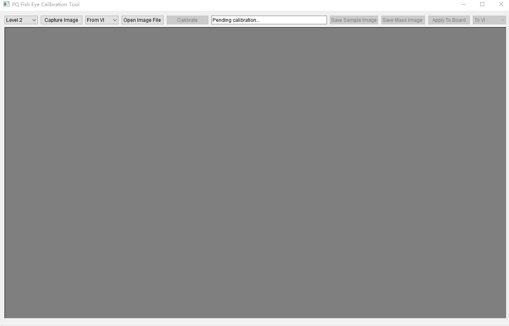

标定前，用户须根据实际需求，在界面左上角的下拉框中选择标定级别（Level 0\~2）。标定级别越高（Level 2），算法对图像进行预处理的强度就越高，从而得到标定结果的稳定性就越高。用户可以使用两种方式导入用户标定的图像：

-   在线抓取：点击“Capture Image”可从板端抓取一张YUV图像。可通过右侧的下拉框选择图像来源（From VI/From VPSS/From VO）；（请按照上文推荐的方式进行抓拍）
-   选择本地文件：点击“Open Image File”，选择YUV图像导入。如果图像文件名符合抓拍工具的默认文件名格式，则工具自动解析其分辨率和格式信息，否则，用户需要在弹出的对话框中自行输入这些参数。

> **须知：** 
>-   鱼眼标定工具仅支持8bit、420sp两种格式的YUV数据，请勿导入其他格式的YUV数据文件（例如P444，P400等，PQ Capture Tools抓出的sp420 YUV格式可以使用）。
>-   鱼眼标定工具对于非鱼眼高亮抓拍的YUV数据也能进行标定，但结果没有意义。请用户自行保证输入鱼眼YUV的正确性。

文件输入完毕后，工具自动运行标定，并在上方的文本框中显示结果：

**图 2**  鱼眼标定工具输出参数结果<a name="fig2434mcpsimp"></a>  


其中Center表示鱼眼中心在图像中的位置（以图像左上角为坐标原点，第一个数值为横坐标，第二个数值为纵坐标），Radius表示鱼眼的半径，Offset表示鱼眼圆心位置与图像中心的偏移值（第一个数值为水平方向偏移，第二个数值为垂直方向偏移）。

同时，下方的图像显示区域会显示打开的图像，并绘制一些辅助图元：

**图 3**  鱼眼标定工具输出参数结果<a name="fig2438mcpsimp"></a>  
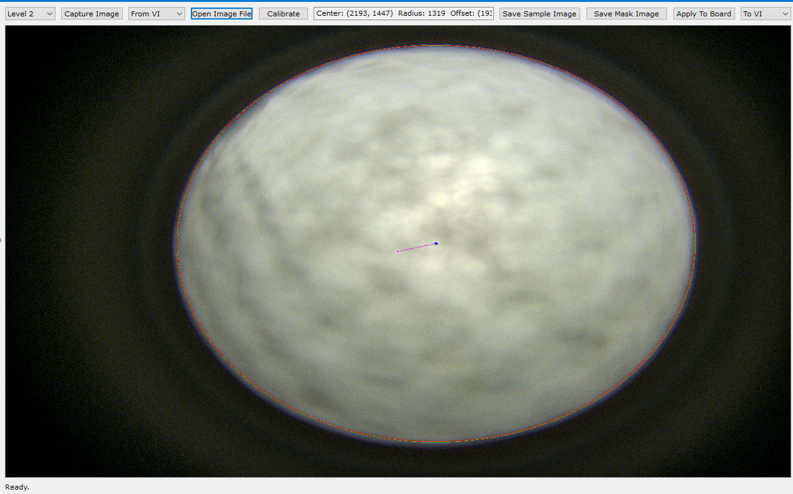

工具会显示以下几种辅助图元：

1.  边缘圆周：工具会根据计算出的鱼眼圆心坐标和半径将鱼眼的圆周用红色线条绘制出来。
2.  鱼眼中心点：工具标定时会将鱼眼中心以蓝色点标出。
3.  图像中心点：工具标定时会将图像中心以紫色点标注，并以紫线与鱼眼中心点连线（在鱼眼偏移较大的场景下显示会较明显）。

标定完成后，若用户需要切换标定级别并重新标定，可采取以下操作：

-   抓拍标定的场合：切换级别后，重新点击“Capture Image”进行抓拍标定。
-   本地文件标定的场合：切换级别后，点击“Calibrate”按钮。
-   点击“Save Sample Image”按钮，可将画了辅助线的标定输出图像保存到本地。
-   点击“Save Mask Image”按钮，可获取AVSP矩阵转换用的遮罩图像。
-   点击“Apply To Board”按钮，可以将标定出的鱼眼参数设置到板端。需要注意的是，在单板上的VI和VPSS模块上各存在一套鱼眼参数，用户需要在设置参数到板端之前，使用工具右上角的下拉框选择参数的下发位置。

### LMF转换工具使用说明<a name="ZH-CN_TOPIC_0000002498301798"></a>

PQTools工具提供了LMF参数转换工具，使得用户可以将镜头厂商提供的镜头参数转换为LMF矩阵。从PQTools工具主界面的下拉框中选择“PQ LMF Converter”即可启动该工具，其界面如[图1](#fig12896034162118)所示。

**图 1**  LMF转换工具界面<a name="fig12896034162118"></a>  
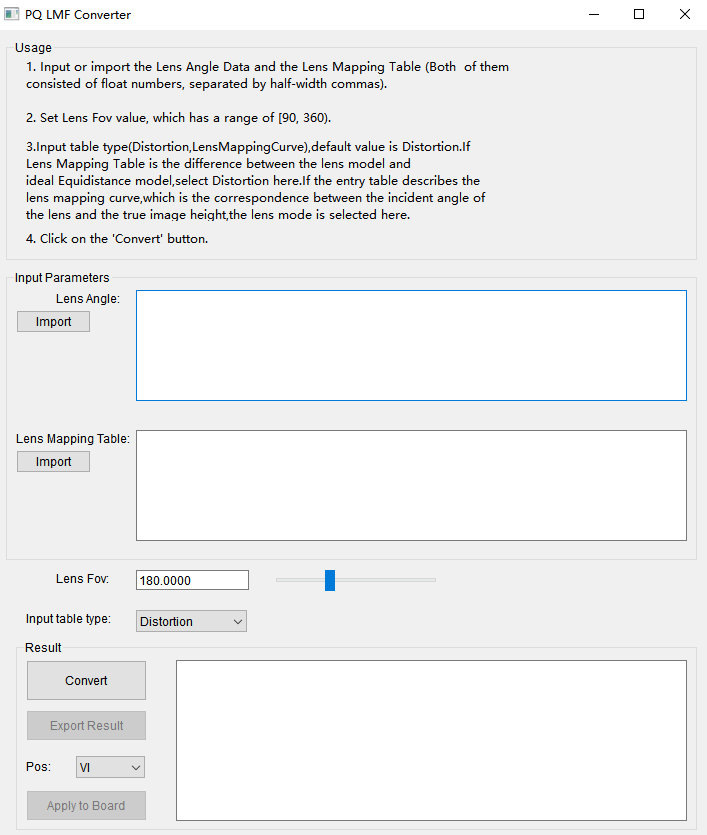

将镜头参数转换为LMF矩阵，请遵循以下步骤进行：

1.  通过主界面TOP-\>Mode Handle设置VI Pipe（参考"[读写通路设置](#ZH-CN_TOPIC_0000002530061753)"）；
2.  输入由一系列浮点数组成的镜头角度数据（Lens Angle），输入数字间以逗号进行分隔，最大支持2000个浮点数组成的序列。点击“Import”按钮，可以直接导入文本文件中记录的数据。
3.  输入由一系列浮点数组成的镜头映射表（Lens Mapping Table），输入数字间以逗号进行分隔，最大支持2000个浮点数组成的序列。点击“Import”按钮，可以直接导入文本文件中记录的数据。畸变数据中包含的浮点数个数必须与角度数据中浮点数的个数相同。
4.  输入视野值（Lens Fov），取值范围为\[90, 360 \)；
5.  输入表项类型。表项类型分两种，1）Distortion；2）LensMappingCurve。缺省值是Distortion。若Lens Mapping Table是镜头模型与理想Equidistance模型之间的差异，则在此处选择Distortion模式。若Lens Mapping Table是镜头映射曲线，即镜头入射角与真实像高的对应关系，则在此处选择LensMappingCurve模式。
6.  点击“Convert”按钮，执行转换。转换结束后，工具会生成一个由128个整数组成的LMF矩阵序列，并显示在右侧的文本框中。
7.  点击“Export Result”，以明文方式保存转换后的数据。
8.  点击“Apply to Board”，将转换后的数据下发板端。

> **须知：** 
>表项"LensAngle" 和 "Lens Mapping Table" 长度需要一致，长度不能超过2000。
>表项"LensAngle" 的第一个参数需要是0。如果厂商提供的表项里面没有0，则需要在"LensAngle" 和 "Lens Mapping Table"这两个表项里面的最前面一个元素补0。举例如下：
>-   镜头提供的表项：
>LensAngle = \{0.1,0.2,0.3,0.4, ... \}, Lens Mapping Table= \{0.002,0.0041,0.0061,0.0082, ... \}
>-   配置给工具的表项如下:
>LensAngle = \{0, 0.1,0.2,0.3,0.4, ... \}, Lens Mapping Table= \{0, 0.002,0.0041,0.0061,0.0082, ... \}
>升级后的LMF转换工具，理论上通过像高LensMappingCurve转换LMF矩阵的方法对各种镜头都是通用的，但实际我们只验证过等距离投影和立体投影模型的鱼眼镜头是支持的，其他复杂的镜头或者投影模型没有验证过，并不能保证一定支持LMF转换。如遇到不支持的可根据实际情况另提需求。

### 辅助对焦工具使用说明<a name="ZH-CN_TOPIC_0000002498301752"></a>

PQTools工具提供了辅助对焦工具，可以辅助用户在手动调焦的时候使焦距更快的达到最佳状态。从PQTools工具主界面的下拉框中选择“PQ Focus Assistant”即可启动该工具，辅助对焦工具的界面如[图1](#fig1223216812212)所示。

**图 1**  辅助对焦工具界面<a name="fig1223216812212"></a>  
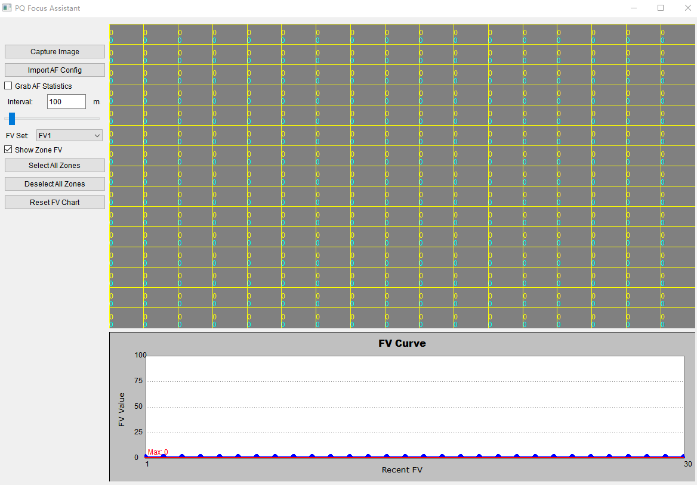

工具界面主要分三大部分：

\(1\) 操作区：进行各种工具操作

\(2\) 图像和区间显示区：显示抓拍到的图像，区间分布和各个区间的FV值（其中黄色值为区间当前的FV值，蓝色的值为区间历史FV最大值）

\(3\) FV变化曲线：显示全局FV值的变化曲线。其中横坐标为1的点为最近取到的FV值所表示的点。每次FV值刷新时，之前取到的值会右移。


#### 利用辅助对焦工具进行调焦<a name="ZH-CN_TOPIC_0000002498141800"></a>

使用辅助对焦工具调焦的步骤如下：

1.  将镜头焦距调整为最模糊状态。
2.  通过主界面TOP-\>Mode Handle选择VPSS的YUV通道（参考"[读写通路设置](#ZH-CN_TOPIC_0000002530061753)"）。
3.  确定当前设备的AF区间配置状态：勾选Grab AF Statistics，并在图像显示区的区间数量变化时取消勾选。
4.  选择FV组别：在FV Set下拉框下选择FV1组（对应低频，峰值较缓达到）和FV2组（对应高频，峰值较快达到）。
5.  在图像和区间显示区域点击确定调焦时需要关注哪些区间。其中关注的区间左上角会显示一个绿色圆点。可以点击工具左侧的Select All Zones选定所有区间，Deselect All Zones取消所有区间选定，方便操作。
6.  再次勾选Grab AF Statistics。此时图像显示区和下方的曲线图开始不断刷新。
7.  调整镜头焦距。此时FV值曲线最大值红线稳步升高。
8.  当发现FV值曲线上位置1的点开始出现平稳下降时，最大值红线的位置应该不再变化（可视为红线FV为理论最优对焦FV）。此时反方向调焦至位置1上的点无限接近红线位置即可。

#### 对焦辅助操作<a name="ZH-CN_TOPIC_0000002498301794"></a>

如果用户在调焦过程中，需要确定点播图像上的区域属于哪个区间，可以点击Capture Image来抓拍一帧图像。图像显示在图像区域后，即可进行确认。

工具上Grab AF Statistics勾选后，工具将以一个固定的时间间隔从板端获取AF统计信息。用户可以修改Interval值来改变这个间隔。改变范围为50\~1000毫秒。

如果用户不需要查看分区间FV值的当前值和峰值，可以将左侧的Show Zone FV复选框取消勾选。取消勾选后再次勾选，区间FV值会再次显示。

如果用户改变了区间配置，此时的理论FV最大值会发生变化。建议用户此时点击“Reset FV Chart”按钮。点击后，右下方图表中的历史全局FV值将被清空，最大FV值的红线也将归零。

#### 导入AF配置文件<a name="ZH-CN_TOPIC_0000002530221623"></a>

通过修改AF的配置，可以使设备的AF模块更好地适应运行环境，并进行更有效的对焦。除了直接调整PQTools工具主界面StatisticsConfig页面下的AF参数，从辅助对焦工具中亦可直接导入ini配置文件，实现对AF参数的导入。

步骤如下：

1.  在PQTools工具目录下找到FOCUS.ini文件，将其复制到任意可写目录，并打开进行修改（修改为对应场景的参数）
2.  在辅助对焦工具上点击Import AF Config按钮，选择刚刚修改的配置文件

> **须知：** 
>修改ini文件时，请仅修改各参数的值。修改参数标题会造成数据无法正确导入，或是导入后引发无法预料的问题。

### PQ Stitching Tool使用说明<a name="ZH-CN_TOPIC_0000002530061669"></a>

> **须知：** 
>生态版本不支持拼接相关功能。

PQTools工具针对芯片的多路拼接功能提供了一系列工具，用以满足不同场景下的拼接需求。目前主要包含了：

-   多路拼接参数标定功能（Stitch Calibration）：本工具主要用来根据用户所抓拍到的多路标定图，计算得到芯片所需的拼接标定参数。详细内容请参考"[多路拼接标定功能（Stitch Calibration）](#ZH-CN_TOPIC_0000002498301778)"中所述内容；
-   查找表转换功能（Stitch Conversion）：本工具主要用于将PTGui或者Hugin等第三方标定结果转换为所需的查找表。详细内容请参考"[查找表转换功能（Stitch Conversion）](#ZH-CN_TOPIC_0000002498141710)"中所述内容；
-   拼接颜色差异标定功能（Stitch Color Correction）：本工具主要用于针对多路拼接时的Sensor个体间成像存在亮度、颜色差异的标定。详细内容请参考"[拼接颜色差异标定功能（Stitch Color Correction）](#ZH-CN_TOPIC_0000002530221743)"中所述内容；
-   PNG Mask文件转换功能（Stitch Mask Converter）：本工具主要用于将PNG格式的Mask文件转换为YUV格式的Mask文件并保存。详细内容请参考"[PNG Mask文件转换功能（Stitch Mask Converter）](#ZH-CN_TOPIC_0000002530061727)"中所述内容。
-   多路离线拼接功能（Stitch Preview）：本工具主要用来进行多路拼接时输入参数的拼接结果预览。详细内容请参考"[多路离线拼接功能（Stitch Preview）](#ZH-CN_TOPIC_0000002530061745)"中所述内容。
-   多路自动精调功能（Stitch Auto Fine Tuning）：本工具提供了多路自动精调功能。详细内容请参考"[多路自动精调功能](#ZH-CN_TOPIC_0000002530221739)"中所述内容。

**图 1**  PQTools Stitching Tool界面示意<a name="fig117415319231"></a>  


#### 多路拼接标定功能（Stitch Calibration）<a name="ZH-CN_TOPIC_0000002498301778"></a>

Stitch Calibration工具在PQ Stitching Tool中。该工具提供了多路拼接标定功能，可以根据用户所抓拍的多路标定图计算得到拼接标定参数。目前仅支持.jpg格式的图像。工具界面如[图1](#fig354494717236)所示。

**图 1**  AVSP标定功能界面（已完成配置）<a name="fig354494717236"></a>  
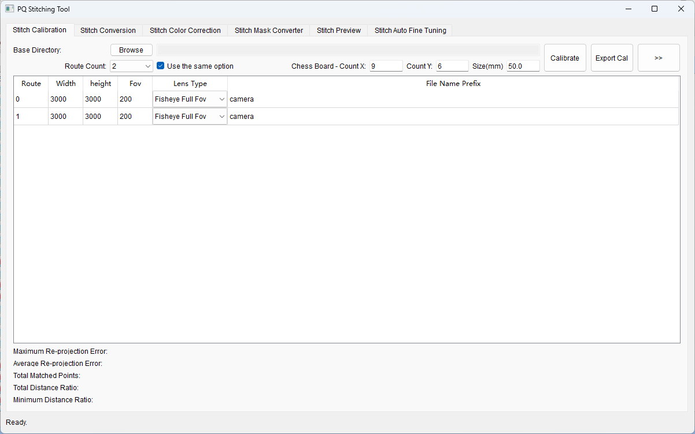

在使用标定工具之前，用户需要进行图像抓拍。拼接标定要求，抓拍可分为两种类型：

-   标定单镜头的畸变矫正的图片，可将棋盘格放置镜头前方，并不断变换棋盘格方向及位置，每个镜头至少抓取10张图像。保存时以<固定前缀名\><镜头号\>\_<帧序号\>.jpg来对图像进行命名。
-   标定相邻镜头相对位置的图片。此时需先确定相邻镜头，每组相邻镜头同时拍取标定图片，抓拍时将棋盘格放置于重叠区内，相邻镜头都要看到完整的棋盘格，不断变换棋盘格在重叠区的位置或距离或小幅度旋转，每个重叠区至少抓拍10对（即20张）图片。保存时以<固定前缀名\><镜头号\>\_<较小镜头号\><较大镜头号\>\_<帧序号\>.jpg来对图像进行命名。

具体抓拍要求及注意事项可参考《拼接 FAQ》第2章“模型标定方法”。

图像抓拍完毕后，按以下的流程使用标定工具进行标定：

1.  点击“Browse”按钮，并选择抓拍图像的保存路径；
2.  在“Route Count”下拉框选择通路数量。这个数量必须和抓拍图像的环境所启用的通路数量一致；
3.  设置每个通路的分辨率、镜头Fov值、Lens Type镜头类型与文件名前缀。如果所有通路采用一样的设置，可以勾选Use the same option复选框，这样每改变一个通路的设置时其他通路也会同步设置为相同值；
4.  在Chess Board字样右侧设置棋盘格的X方向角点数量（Count X），Y方向的角点数量（Count Y）及单个格子的物理边长（Size）；
5.  点击“Calibrate”开始标定；
6.  点击“Export Cal”导出标定生成的拼接标定参数（格式为.cal）。

标定过程中，标定工具所在目录下的tmp文件夹中将输出棋盘格检测结果图像，可用于判断所拍摄的棋盘格标定图是否能够准确的检测出棋盘格角点。如[图2](#fig14081511162820)\(a\)中有彩色的角点示意，表示该标定图中的棋盘格角点检测成功，即该标定图有效，将参与标定计算；[图2](#fig14081511162820)\(b\)中由于棋盘格反光较为严重，导致棋盘格角点检测失败，则没有彩色的角点示意，故该标定图无效，不参与标定计算。

**图 2**  棋盘格检测结果示意图<a name="fig14081511162820"></a>  
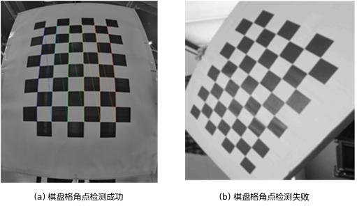

标定成功时，工具会弹出一个保存文件对话框，使用户可以保存所生成的拼接标定参数（格式为.cal）。这份拼接参数为未经处理的原始参数，用户还需要运行查找表转换功能将参数转换为二进制查找表后才能将其应用于设备。用户可以点击“\>\>”字样的按钮直接将标定结果输入到转换工具界面，之后请参照"[查找表转换功能（Stitch Conversion）](#ZH-CN_TOPIC_0000002498141710)"章节进行查找表转换操作。

标定完成后，界面底部将输出标定误差，用于评估标定效果，分别为：

-   Maximum Re-projection Error：指最大标定误差，可以判断标定过程中是否有棋盘格内角点匹配错误情况，若该值大于20则需要评估标定图中是否出现多个棋盘格，或者命名错误；
-   Average Re-projection Error：指平均误差，若该值小于3，则标定效果是比较满意的；
-   Total Matched Point：指匹配成功的角点对，与图像数量及棋盘格内角点数相关。
-   Total Distance Ratio：指所有图片中的棋盘格距离覆盖率，即抓拍标定图时，棋盘格所覆盖的范围。当棋盘格的距离覆盖率越大时，拼接效果越好，如按照标定图像抓拍要求进行，该值一般大于1.0。
-   Minimum Distance Ratio：指多组内参或者外参标定图对应的棋盘格距离覆盖率最小值。

#### 查找表转换功能（Stitch Conversion）<a name="ZH-CN_TOPIC_0000002498141710"></a>

Stitch Conversion提供了查找表转换功能，可以将PTGuiPro或者Hugin工具生成的多路拼接标定参数转换为AVSP查找表，工具界面如[图1](#fig520364852415)所示。

**图 1**  AVSP查找表转换界面（已导入数据）<a name="fig520364852415"></a>  
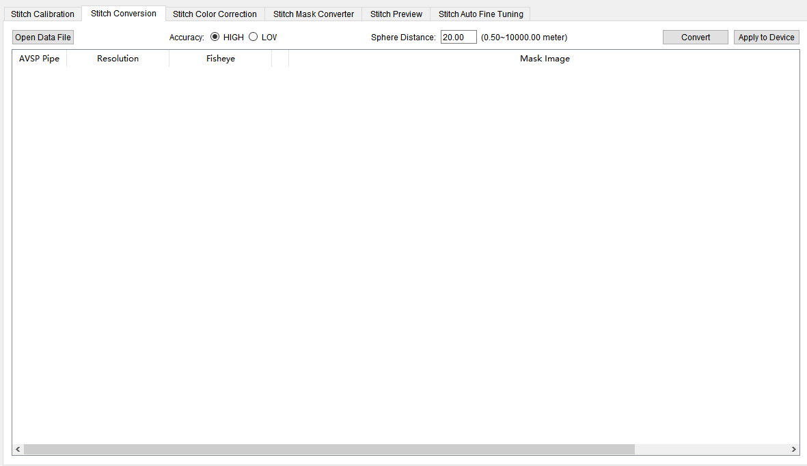

进行数据转换的步骤为：

1.  点击“Open Data File”按钮，并选择一个标定参数文件。工具支持自研算法生成的参数文件（.cal）或PTGui Pro/Hugin工具生成的参数文件（.pto或.pts）。选择文件后，工具会将该参数文件内包含的通路信息显示在下面表格中。
2.  为每个通路选择一张黑白模板图。在表格中每个通路行的Mask Image找到浏览按钮（文本显示为省略号），点击以选择图片。用户也可以在Mask Image中直接输入遮罩图的路径。
3.  在Accuracy处设置查找表精度（HIGH或LOW）。
4.  设置最佳拼接距离（Sphere Distance）。
5.  点击“Convert”转换按钮。

标定结束后，工具将对每个通路生成两个二进制文件，其中文件名中标注mesh的文件为拼接坐标查找表数据文件，而标注poly的文件为拼接有效区域边界坐标的数据文件。点击“Apply to Device”按钮，可以直接将生成的查找表发送到设备上并即时生效。

#### 拼接颜色差异标定功能（Stitch Color Correction）<a name="ZH-CN_TOPIC_0000002530221743"></a>

Stitch Color Correction 提供了颜色差异标定功能。由于物理器件及模组公差上的区别，Sensor个体间成像存在亮度、颜色差异，拼接颜色差异标定工具支持对其中两个sensor所采集的Raw数据进行亮度、颜色差异标定。标定完成后，用户将参数配置到板端，可提升不同sensor成像的亮度、颜色一致性。

点击“Stitch Color Correction”页签即可打开拼接颜色校正页面。如[图1](#fig1576519387256)所示。

**图 1**  拼接颜色校正页面<a name="fig1576519387256"></a>  
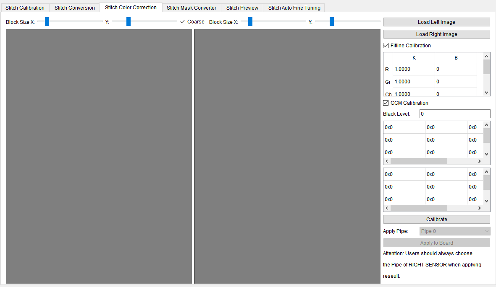

用户可以在该页面内完成两个Sensor通路的亮度差异（拟合曲线）标定和CCM差异标定。标定步骤如下：

1.  采集设备准备：标准X-Rite 24色卡、照度为600Lux、色温为5000K上下的均匀光源（左右两侧双光源，光源与色卡平面的夹角在25°- 45°）。调整AE目标，保证最亮灰阶\(Block 19\)的G分量亮度在饱和值的0.8倍左右。RAW数据抓图过程中需要保证不同sensor采集时的曝光量相同（曝光时间、模拟增益、sensor数字增益完全相同）。
2.  点击“Load Left Image”，并选择对应基准sensor所抓拍的RAW图像，选取24色区域；
3.  点击“Load Right Image”，并选择对应矫正sensor所抓拍的RAW图像，选取24色区域；还可以进行色卡选框，选框调节默认为“Coarse”模式，可统一调节所有选框的大小和位置。Coarse复选框未勾选时为“Fine”模式，此模式下可独立调节单个选框的大小和位置，也可多个选框一起调节大小。需要进行亮度差异（拟合曲线）标定时，请勾选“Fitline Calibration”；
4.  继续进行CCM标定时，请勾选“CCM Calibration”；用户仅需要进行CCM标定时，标定工具默认左右两侧sensor不存在亮度差异，会自动Bypass亮度差异标定。
5.  点击“Calibrate”按钮，执行标定。

标定后，工具将依据用户选择的标定项来显示标定结果，如[图2](#fig17501840113213)所示。

-   若用户标定了亮度拟合曲线，则工具会在拟合曲线参数表中显示拟合参数；
-   若用户标定了CCM，则工具会显示浮点形式的CCM矩阵表格和16进制模式下的CCM矩阵表格。

    **图 2**  拼接颜色校正页面<a name="fig17501840113213"></a>  
    
    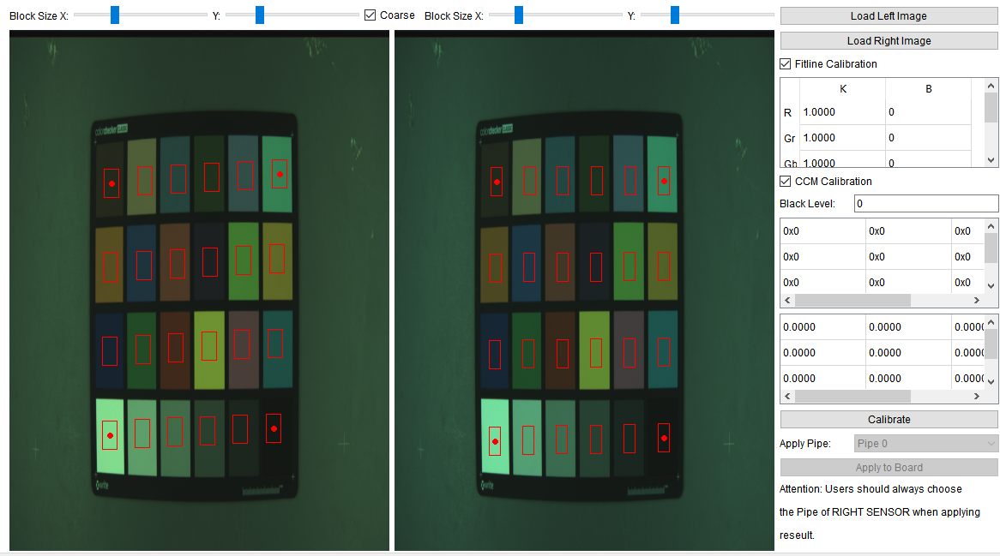

在Apply Pipe右侧的下拉框选定当前右侧sensor（即矫正sensor）对应的通道号，并点击“Apply to Board”按钮，可以将标定出来的亮度差异拟合参数及CCM矩阵发送到板端，并使其立即生效。

> **须知：** 
>-   工具使用的标定算法目前是以左侧sensor为基准，右侧sensor为标定目标来编写的，因此在选择下发板端的sensor通道号时，请务必选择右侧sensor的通道号，否则将造成颜色校正不正确。
>-   颜色差异标定时，需保证色卡的正确方向，正常是以6x4分布，且白色格子处于左下角。若RAW图像有旋转或者翻转，则需移动红色24色卡选框，使之匹配。

#### PNG Mask文件转换功能（Stitch Mask Converter）<a name="ZH-CN_TOPIC_0000002530061727"></a>

Stitch Mask Converter工具提供了Mask文件转换功能，可以将Png Mask文件转换成Yuv Mask文件并保存。该Yuv Mask模板可应用于板端LUT生成工具，简化板端LUT生成过程中的内部计算，以最高效率完成LUT文件的生成。工具界面如[图1](#_toc51692618)所示。

**图 1**  Mask文件转换界面<a name="_toc51692618"></a>  
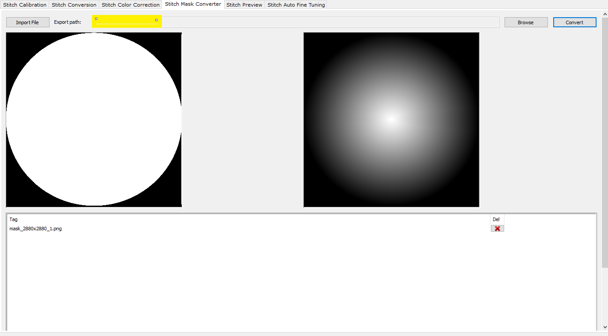

进行数据转换的步骤为：

1.  点击“Import File”按钮导入Png格式的Mask文件，最大支持导入8个。
2.  点击“Browse”按钮选择导出Yuv文件的路径。
3.  点击“Convert”按钮进行转换。
4.  转换成功后，列表中当前所选择的项对应的Yuv图像显示在右侧图像控件中。
5.  点击鼠标左键在列表中选择不同的文件，图像区域显示的图像随之切换。
6.  可以在列表点击删除按钮删除已导入的文件，再导入新文件进行转换。

#### 多路离线拼接功能（Stitch Preview）<a name="ZH-CN_TOPIC_0000002530061745"></a>

Stitch Preview工具提供了多路图像离线拼接功能，可以将最多6张图像拼接，并支持拼接输出图像预览。可以不依赖单板进行拼接，不受限于单板特定分辨率，方便查看效果。该工具仅作为标定后拼接效果的预览与参考之用，实际效果请到板端上确认，Stitch Preview在拼缝处的效果可能会与板端有一点差异。

**图 1**  多路离线拼接界面<a name="fig2610mcpsimp"></a>  
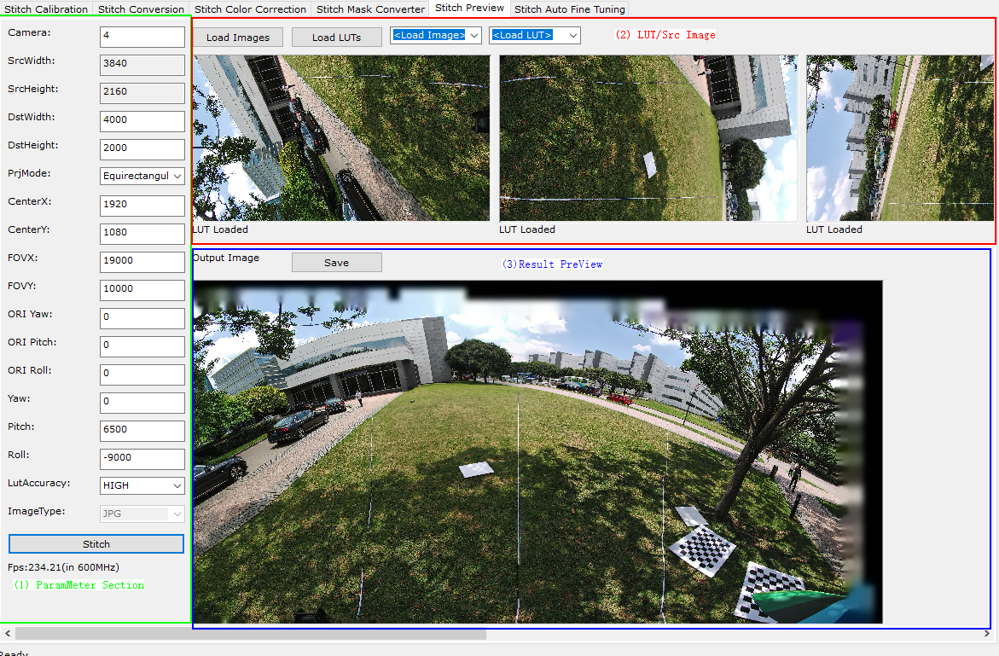

进行多路离线拼接的步骤为：

1.  如果界面左侧的参数默认值不符合用户拼接场景，首先进行调整。SrcWidth、SrcHeight、ImageType不需要设置，以Image 0显示位置的图像数据进行自动刷新。
2.  点击“Load Images”按钮选择多张图像导入。
3.  点击“Load LUTs”按钮选择多个LUT文件导入。
4.  如果需要导入单张图像，点击“<Load Image\>”下拉框选择单张图像导入。
5.  如果需要导入单个LUT文件，点击“<Load LUT\>”下拉框选择单个LUT文件导入。
6.  点击“Stitch”按钮进行拼接。
7.  如果需要保存输出图像，拼接完成后点击“Save”按钮选择保存文件路径进行保存。

#### 多路自动精调功能<a name="ZH-CN_TOPIC_0000002530221739"></a>

Stitch Auto Fine Tuning 工具提供了多路自动精调功能。支持在线抓取图片和本地导入图片进行精调，精调结果可下发板端，方便测试、用户现场调试和演示。

**图 1**  多路精调界面<a name="fig2623mcpsimp"></a>  
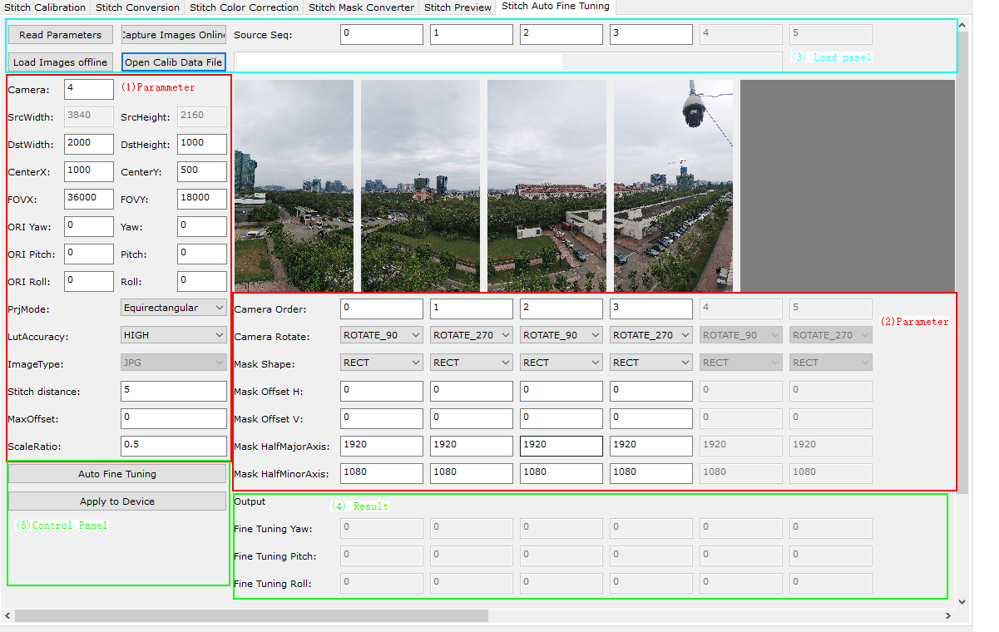

进行多路精调的步骤如下：

1.  设置参数。如果参数的默认值不符合用户的场景，设置Parameter Section 1和Parameter Section 2的参数。用户可以点击“Read Parameters”按钮或者编辑修改，其中“Stitch Distance”、“MaxOffset”、“Scale Ratio”和Parameter Section 2的参数不支持从板端获取。
2.  加载图像。有两种方式加载图像，设置Source Seq（参考抓拍工具使用说明），点击“Capture Images Online”按钮从板端获取图像；点击“Load Images Offline ”按钮从本地加载图像。图像加载完后会在tmp目录下生成临时图像。
3.  导入标定文件。点击“Open Calib Data File”按钮，导入拼接标定文件，显示拼接文件路径 \(标定文件所需求的拼接源数目和实际加载或者抓取的图片路数必须一致\)。
4.  调整图像顺序和图像的旋转角度。如果图像显示顺序不是从左到右按空间方位显示，可以编辑Camera Order控件，调整图片的位置。如果图片显示角度不对，可以编辑Camera Rotate调整图像角度。
5.  启动自动精调。点击“Auto Fine Tuning”按钮，进行自动精调。
6.  下发LUT表到板端。点击“Apply to Device”按钮，下发精调生成的LUT表到板端。

### OSD转换工具使用说明<a name="ZH-CN_TOPIC_0000002498301676"></a>

若客户需要在等距柱面投影\(Equirectangular\)全景图底部或顶部加入特定Logo，遮挡全景摄像机支架，可使用OSD转换工具将圆形Logo图片转换为全景细长型的Logo图片。一般情况下，全景Logo图片的宽度与全景拼接图的宽度相同，全景Logo图片的高度则决定了Logo在全景画面中的遮挡范围，可根据实际情况配置。

在PQTools工具主界面的插件下拉框中找到“PQ OSD Converter”并点击，即可打开OSD转换工具。其界面如[图1](#fig1732293222616)所示。

**图 1**  OSD转换工具界面（已打开输入图像）<a name="fig1732293222616"></a>  
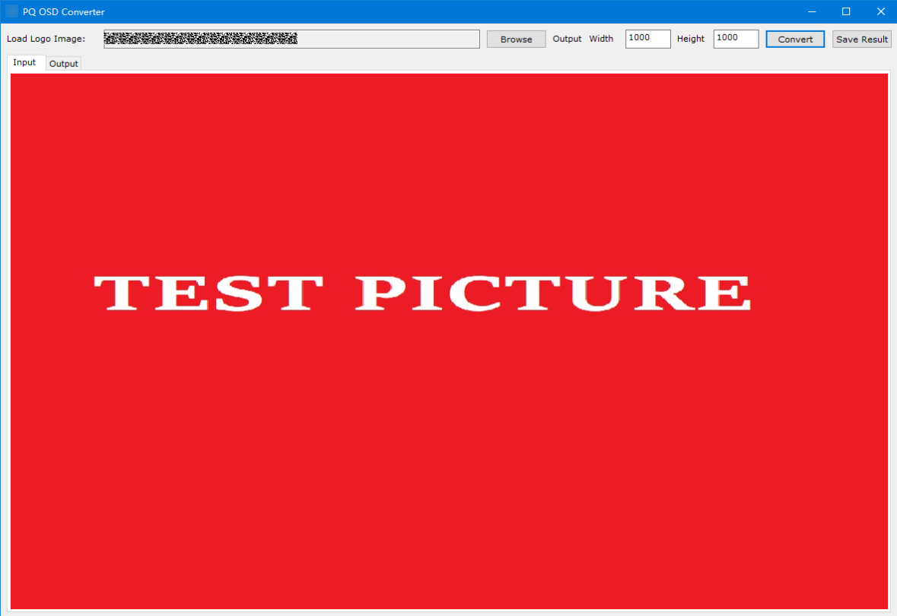

转换步骤如下：

1.  点击“Browse”按钮并选择一个Bmp/Jpg格式的图像。选择图像后，工具将在Input页签中显示选中的图像，用户可以改变输出图形的宽高，范围为100\~8192。
2.  点击“Convert”按钮进行转换。

成功转换的情况下，工具会在 Output页签显示转换后的图像，如[图2](#fig61951939397)所示。用户可以点击“Save Result”将输出图像导出到本地磁盘进行保存。

**图 2**  OSD转换输出<a name="fig61951939397"></a>  

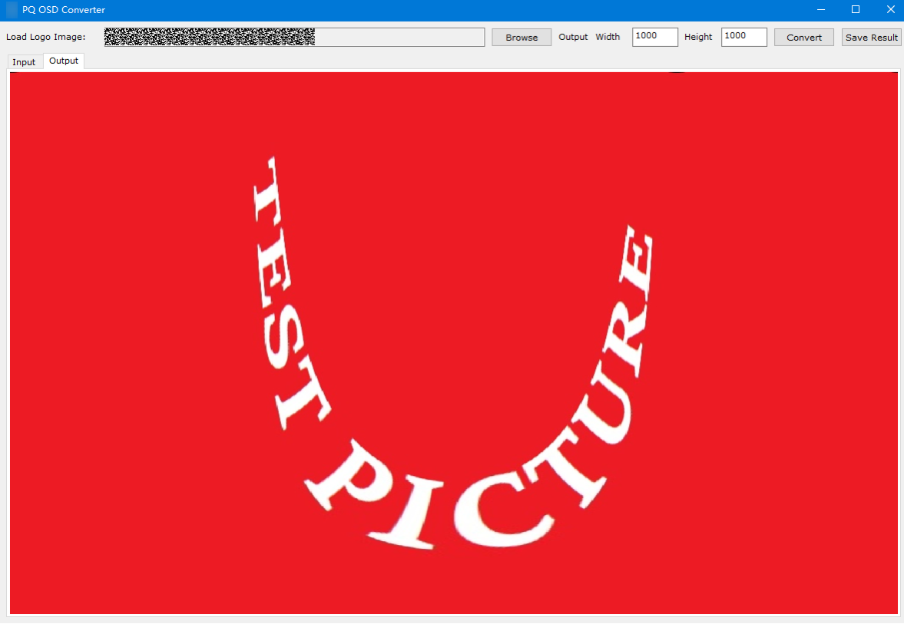

> **须知：** 
>-   输入的是圆形logo，故输入图片的宽高必须相等（正方形图片），否则无法读入。输出图像的显示有拉伸，以最终保存图像为准。
>-   仅SS928V100解决方案支持此功能。

### DIS标定工具使用说明<a name="ZH-CN_TOPIC_0000002498141726"></a>


#### DIS标定基本原理<a name="ZH-CN_TOPIC_0000002530061751"></a>

在DIS（数字视频防抖）应用中，使用陀螺仪感应器，配合localDIS对图像进行精细稳像校准，由于镜头畸变的存在，为确定空间物体表面某点的三维几何位置与其在图像中对应点之间的相互关系，必须建立摄像机成像的几何模型，这些几何模型参数就是摄像机参数。在大多数条件下这些参数必须通过实验与计算才能得到，这个求解参数的过程就称之为摄像机标定。

在应用中，摄像机参数的标定是非常关键的环节，其标定结果的精度及算法的稳定性直接影响防抖效果结果的准确性。因此，做好摄像机标定是做好后续工作的前提，是提升防抖效果的重点所在。其标定的目的是为了获取摄像机内参、外参、畸变参数。将摄像机参数的标定过程集成在DIS镜头标定中。

DIS镜头标定提供模型及产线标定，并提供算法参数下发板端接口，标定结果可以直接应用在板端生效，提升评估、开发的效率。

#### DIS标定序列采集要求<a name="ZH-CN_TOPIC_0000002530061653"></a>

-   标定环境应该光照充足且尽量均匀，否则较大的噪声可能会对标定算法的检测造成影响；
-   棋盘格图卡不能有明显反光/阴影 等导致亮暗不均的地方；否则需要调整摄像机、图卡和光源的相对位置；
-   棋盘格图卡不能过小，一般来说图卡中的每个方格应不低于10个像素；如果棋盘格在画面中占据的像素太少，可以考虑将棋盘格图卡靠近摄像机或者更换更大尺寸的图卡（必要时减少棋盘格格子的数量，最少的棋盘格角点数目是4\*3）；
-   画面中不能出现多个不同规格的棋盘格或者类似棋盘格式样的道具；如果出现该现象，请提前将该道具移走或者遮挡住，也可以手工在图片编辑工具中将该部分涂掉；但若是相同规格（棋盘格大小和角点数目相同）的棋盘格且不重叠是允许的，并且可以提升效率；
-   每个棋盘格图卡在画面中必须完整，否则无法检测；
-   不同标定图片中所有的棋盘格叠加起来要覆盖整个有效画面，并且重点覆盖四个角落；
-   棋盘格需要覆盖至少3种不同的距离，并且这个距离最好是包含最常使用的一个距离；
-   棋盘格需要覆盖不同的角度；
-   每张抓拍图片中的棋盘格必须要清晰，不能有模糊现象；如果不够清晰，请先确认对焦清晰且景深较好；
-   图卡应该满足一定程度的覆盖，该覆盖应该包括实际标定的距离、图像有效区域、不同的角度等，同一位置的多张相同图片没有意义。

**表 1**  建议的镜头模型标定方法（以广角镜头的产品为例、其它视场角的距离参考调整）

<a name="table2665mcpsimp"></a>
<table><thead align="left"><tr id="row2676mcpsimp"><th class="cellrowborder" valign="top" width="5.050505050505051%" id="mcps1.2.8.1.1"><p id="p2678mcpsimp"><a name="p2678mcpsimp"></a><a name="p2678mcpsimp"></a>步骤</p>
</th>
<th class="cellrowborder" valign="top" width="22.222222222222225%" id="mcps1.2.8.1.2"><p id="p2680mcpsimp"><a name="p2680mcpsimp"></a><a name="p2680mcpsimp"></a>目标</p>
</th>
<th class="cellrowborder" valign="top" width="38.38383838383839%" id="mcps1.2.8.1.3"><p id="p2682mcpsimp"><a name="p2682mcpsimp"></a><a name="p2682mcpsimp"></a>标定方式</p>
</th>
<th class="cellrowborder" valign="top" width="10.101010101010102%" id="mcps1.2.8.1.4"><p id="p2684mcpsimp"><a name="p2684mcpsimp"></a><a name="p2684mcpsimp"></a>数量</p>
</th>
<th class="cellrowborder" valign="top" width="8.080808080808081%" id="mcps1.2.8.1.5"><p id="p2686mcpsimp"><a name="p2686mcpsimp"></a><a name="p2686mcpsimp"></a>图片编号</p>
</th>
<th class="cellrowborder" valign="top" width="11.111111111111112%" id="mcps1.2.8.1.6"><p id="p2688mcpsimp"><a name="p2688mcpsimp"></a><a name="p2688mcpsimp"></a>参考距离</p>
</th>
<th class="cellrowborder" valign="top" width="5.050505050505051%" id="mcps1.2.8.1.7"><p id="p2690mcpsimp"><a name="p2690mcpsimp"></a><a name="p2690mcpsimp"></a>备注</p>
</th>
</tr>
</thead>
<tbody><tr id="row2692mcpsimp"><td class="cellrowborder" valign="top" width="5.050505050505051%" headers="mcps1.2.8.1.1 "><p id="p2694mcpsimp"><a name="p2694mcpsimp"></a><a name="p2694mcpsimp"></a>1</p>
</td>
<td class="cellrowborder" valign="top" width="22.222222222222225%" headers="mcps1.2.8.1.2 "><p id="p2696mcpsimp"><a name="p2696mcpsimp"></a><a name="p2696mcpsimp"></a>近距离大画面覆盖</p>
</td>
<td class="cellrowborder" valign="top" width="38.38383838383839%" headers="mcps1.2.8.1.3 "><p id="p2698mcpsimp"><a name="p2698mcpsimp"></a><a name="p2698mcpsimp"></a>保证棋盘格<strong id="b2699mcpsimp"><a name="b2699mcpsimp"></a><a name="b2699mcpsimp"></a>居中正放</strong>，最大程度覆盖最多的画面；要注意若棋盘格畸变过于明显或棋盘格显示不完整，请增大图卡和摄像机的距离。</p>
</td>
<td class="cellrowborder" valign="top" width="10.101010101010102%" headers="mcps1.2.8.1.4 "><p id="p2701mcpsimp"><a name="p2701mcpsimp"></a><a name="p2701mcpsimp"></a>2</p>
</td>
<td class="cellrowborder" valign="top" width="8.080808080808081%" headers="mcps1.2.8.1.5 "><p id="p2703mcpsimp"><a name="p2703mcpsimp"></a><a name="p2703mcpsimp"></a>1-2</p>
</td>
<td class="cellrowborder" valign="top" width="11.111111111111112%" headers="mcps1.2.8.1.6 "><p id="p2705mcpsimp"><a name="p2705mcpsimp"></a><a name="p2705mcpsimp"></a>0.5m</p>
</td>
<td class="cellrowborder" valign="top" width="5.050505050505051%" headers="mcps1.2.8.1.7 "><p id="entry2706mcpsimpp0"><a name="entry2706mcpsimpp0"></a><a name="entry2706mcpsimpp0"></a>-</p>
</td>
</tr>
<tr id="row2707mcpsimp"><td class="cellrowborder" valign="top" width="5.050505050505051%" headers="mcps1.2.8.1.1 "><p id="p2709mcpsimp"><a name="p2709mcpsimp"></a><a name="p2709mcpsimp"></a>2</p>
</td>
<td class="cellrowborder" valign="top" width="22.222222222222225%" headers="mcps1.2.8.1.2 "><p id="p2711mcpsimp"><a name="p2711mcpsimp"></a><a name="p2711mcpsimp"></a>中距离多角度覆盖</p>
</td>
<td class="cellrowborder" valign="top" width="38.38383838383839%" headers="mcps1.2.8.1.3 "><p id="p2713mcpsimp"><a name="p2713mcpsimp"></a><a name="p2713mcpsimp"></a>保证棋盘格在画面中，每次将图卡旋转约30&deg;，确保每个棋盘格在画面中完整。</p>
</td>
<td class="cellrowborder" valign="top" width="10.101010101010102%" headers="mcps1.2.8.1.4 "><p id="p2715mcpsimp"><a name="p2715mcpsimp"></a><a name="p2715mcpsimp"></a>4</p>
</td>
<td class="cellrowborder" valign="top" width="8.080808080808081%" headers="mcps1.2.8.1.5 "><p id="p2717mcpsimp"><a name="p2717mcpsimp"></a><a name="p2717mcpsimp"></a>3-6</p>
</td>
<td class="cellrowborder" valign="top" width="11.111111111111112%" headers="mcps1.2.8.1.6 "><p id="p2719mcpsimp"><a name="p2719mcpsimp"></a><a name="p2719mcpsimp"></a>0.6m</p>
</td>
<td class="cellrowborder" valign="top" width="5.050505050505051%" headers="mcps1.2.8.1.7 "><p id="entry2720mcpsimpp0"><a name="entry2720mcpsimpp0"></a><a name="entry2720mcpsimpp0"></a>-</p>
</td>
</tr>
<tr id="row2721mcpsimp"><td class="cellrowborder" valign="top" width="5.050505050505051%" headers="mcps1.2.8.1.1 "><p id="p2723mcpsimp"><a name="p2723mcpsimp"></a><a name="p2723mcpsimp"></a>3</p>
</td>
<td class="cellrowborder" valign="top" width="22.222222222222225%" headers="mcps1.2.8.1.2 "><p id="p2725mcpsimp"><a name="p2725mcpsimp"></a><a name="p2725mcpsimp"></a>中距离画面全覆盖</p>
</td>
<td class="cellrowborder" valign="top" width="38.38383838383839%" headers="mcps1.2.8.1.3 "><p id="p2727mcpsimp"><a name="p2727mcpsimp"></a><a name="p2727mcpsimp"></a>覆盖全屏(4角+4边)：每张图卡占据画面约1/4，紧贴4角抓取4张图片，并靠近4边图卡以边为轴倾斜30&deg;抓取4张。</p>
</td>
<td class="cellrowborder" valign="top" width="10.101010101010102%" headers="mcps1.2.8.1.4 "><p id="p2729mcpsimp"><a name="p2729mcpsimp"></a><a name="p2729mcpsimp"></a>8</p>
</td>
<td class="cellrowborder" valign="top" width="8.080808080808081%" headers="mcps1.2.8.1.5 "><p id="p2731mcpsimp"><a name="p2731mcpsimp"></a><a name="p2731mcpsimp"></a>7-14</p>
</td>
<td class="cellrowborder" valign="top" width="11.111111111111112%" headers="mcps1.2.8.1.6 "><p id="p2733mcpsimp"><a name="p2733mcpsimp"></a><a name="p2733mcpsimp"></a>0.6m</p>
</td>
<td class="cellrowborder" valign="top" width="5.050505050505051%" headers="mcps1.2.8.1.7 "><p id="entry2734mcpsimpp0"><a name="entry2734mcpsimpp0"></a><a name="entry2734mcpsimpp0"></a>-</p>
</td>
</tr>
<tr id="row2735mcpsimp"><td class="cellrowborder" valign="top" width="5.050505050505051%" headers="mcps1.2.8.1.1 "><p id="p2737mcpsimp"><a name="p2737mcpsimp"></a><a name="p2737mcpsimp"></a>4</p>
</td>
<td class="cellrowborder" valign="top" width="22.222222222222225%" headers="mcps1.2.8.1.2 "><p id="p2739mcpsimp"><a name="p2739mcpsimp"></a><a name="p2739mcpsimp"></a>远距离四角覆盖</p>
</td>
<td class="cellrowborder" valign="top" width="38.38383838383839%" headers="mcps1.2.8.1.3 "><p id="p2741mcpsimp"><a name="p2741mcpsimp"></a><a name="p2741mcpsimp"></a>增大图卡和摄像机的距离一倍，让图卡紧贴镜头四个角落（尽可能靠近，并保持完整），每个角落至少抓取2张（抓取时均需重新调整位置）。</p>
</td>
<td class="cellrowborder" valign="top" width="10.101010101010102%" headers="mcps1.2.8.1.4 "><p id="p2743mcpsimp"><a name="p2743mcpsimp"></a><a name="p2743mcpsimp"></a>8</p>
</td>
<td class="cellrowborder" valign="top" width="8.080808080808081%" headers="mcps1.2.8.1.5 "><p id="p2745mcpsimp"><a name="p2745mcpsimp"></a><a name="p2745mcpsimp"></a>15-22</p>
</td>
<td class="cellrowborder" valign="top" width="11.111111111111112%" headers="mcps1.2.8.1.6 "><p id="p2747mcpsimp"><a name="p2747mcpsimp"></a><a name="p2747mcpsimp"></a>1.0m</p>
</td>
<td class="cellrowborder" valign="top" width="5.050505050505051%" headers="mcps1.2.8.1.7 "><p id="entry2748mcpsimpp0"><a name="entry2748mcpsimpp0"></a><a name="entry2748mcpsimpp0"></a>-</p>
</td>
</tr>
<tr id="row2749mcpsimp"><td class="cellrowborder" valign="top" width="5.050505050505051%" headers="mcps1.2.8.1.1 "><p id="p2751mcpsimp"><a name="p2751mcpsimp"></a><a name="p2751mcpsimp"></a>5</p>
</td>
<td class="cellrowborder" valign="top" width="22.222222222222225%" headers="mcps1.2.8.1.2 "><p id="p2753mcpsimp"><a name="p2753mcpsimp"></a><a name="p2753mcpsimp"></a>不同距离覆盖</p>
</td>
<td class="cellrowborder" valign="top" width="38.38383838383839%" headers="mcps1.2.8.1.3 "><p id="p2755mcpsimp"><a name="p2755mcpsimp"></a><a name="p2755mcpsimp"></a>图卡在图像的不同距离和位置，并每次变换一次角度抓取若干图片，距离和位置根据前面步骤中覆盖不充分的地方进行适当增补。</p>
</td>
<td class="cellrowborder" valign="top" width="10.101010101010102%" headers="mcps1.2.8.1.4 "><p id="p2757mcpsimp"><a name="p2757mcpsimp"></a><a name="p2757mcpsimp"></a>8</p>
</td>
<td class="cellrowborder" valign="top" width="8.080808080808081%" headers="mcps1.2.8.1.5 "><p id="p2759mcpsimp"><a name="p2759mcpsimp"></a><a name="p2759mcpsimp"></a>23-30</p>
</td>
<td class="cellrowborder" valign="top" width="11.111111111111112%" headers="mcps1.2.8.1.6 "><p id="p2761mcpsimp"><a name="p2761mcpsimp"></a><a name="p2761mcpsimp"></a>-</p>
</td>
<td class="cellrowborder" valign="top" width="5.050505050505051%" headers="mcps1.2.8.1.7 "><p id="entry2762mcpsimpp0"><a name="entry2762mcpsimpp0"></a><a name="entry2762mcpsimpp0"></a>-</p>
</td>
</tr>
</tbody>
</table>

参考以上步骤，共计需要抓取符合采集要求的图片约30张（如[图1](#_toc51692623)所示），实际可根据抓取图片的质量可以适当增补图片，但不宜过多。

**图 1**  建议的镜头模型标定方法抓取的标定图片示例<a name="_toc51692623"></a>  
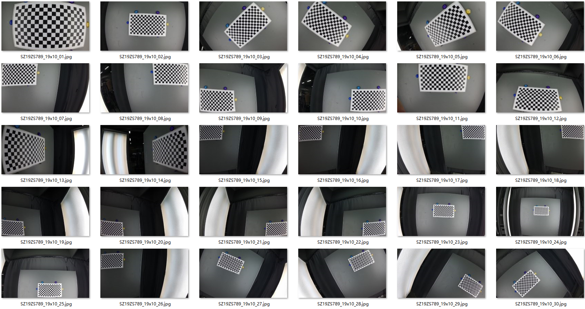

#### DIS标定工具界面介绍<a name="ZH-CN_TOPIC_0000002498141824"></a>

图片采集好后，打开DIS标定工具界面，即可看到DIS标定界面由模型标定“Design Calibration”和 产线标定“Product Calibration”、Ldcv3标定“Ldcv3 Calibration”三个子页面组成；如[图1](#_toc51692624)所示。

需要配置棋盘格角点的数目CbDimWidth和CbDimHeight，注意不是棋盘格方格的数目，一般来说角点的数目是对应方格数目-1，当棋盘格数目配置错误时，可能出现标定失败或结果异常；

DistCoeffType是畸变系数的个数，一般默认为3个，当输出畸变参数超出芯片支持的范围时，按照3-\>2-\>1-\>0 的顺序逐个尝试减少数量；

DistRatio是相对输入源图像畸变的比例，默认配置为1，即不做畸变校正，畸变保持和源图像一致；配置为0时，畸变最小；DistRatio在参数转换（Convert Calibration Data）时起作用，转换的系数下发板端（Apply To Board）时只有在GYRO DIS 开启且LDCV2 disable后生效；SS928V100中 DistRatio配置无效。

**图 1**  DIS标定模型标定页面<a name="_toc51692624"></a>  

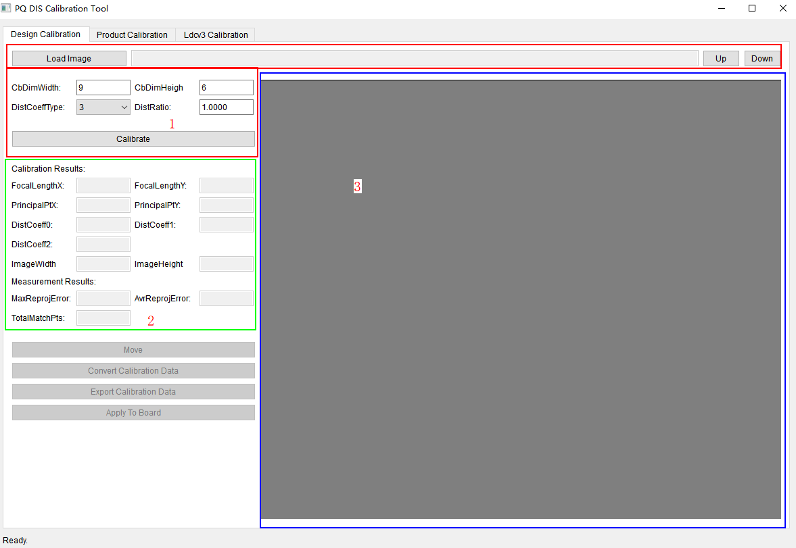

对于DIS标定页面中的模型标定来说：

-   标定参数预设区域\(红色区域\)：用于进行标定所需的参数设置。
    -   Load Image：点击导入DIS标定图片的所在文件夹目录；
    -   Up/Down：点击切换目录中图片的显示；
    -   CbDimWidth/CbDimHeight：导入棋盘格的宽高，取值范围\[3，1024\]；
    -   DistCoeffType：下拉框畸变类型有四种模式。
    -   DistRatio：输入畸变百分比，取值范围为\[0,1\]；

        0，输出图像无畸变（视场角损失较大）；

        1=100%，输出图像畸变程度和输入源一致（但视场角损失最小）。

-   图片显示区域\(蓝色区域\)：用于显示图片文件夹里的jpg棋盘格图，默认显示第一张；
-   结果显示区域\(绿色区域\)：用于显示标定完成后生成的标定结果参数\(Calibration Results\)和度量参数\(Measurement Results\)。
-   点击“Move”可把模型标定结果导入产线标定，作为产线标定的输入参数。

**图 2**  DIS标定产线标定页面<a name="fig530952011330"></a>  
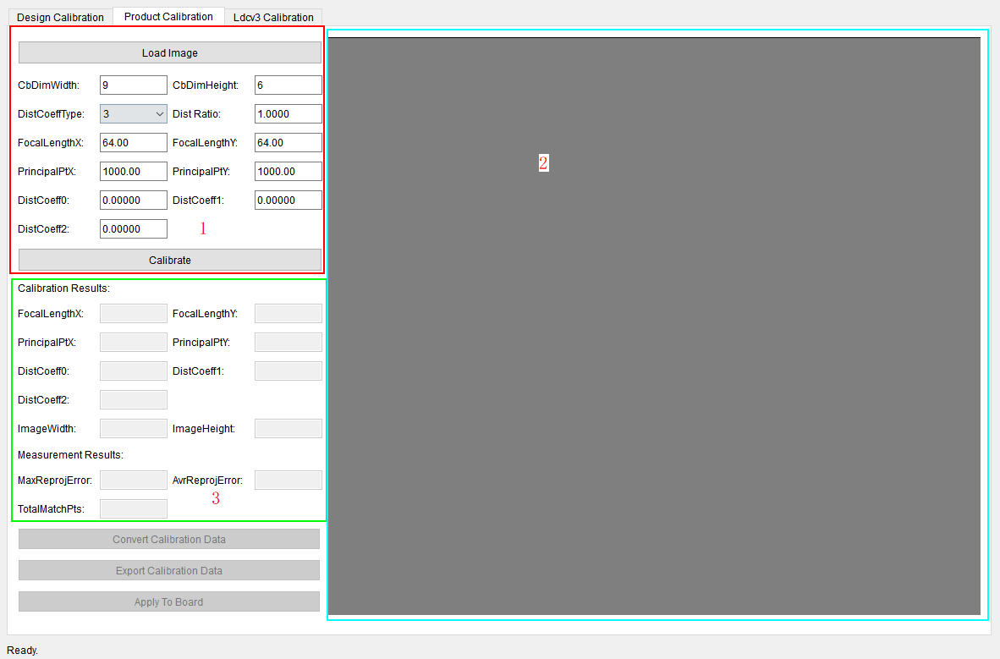

对于DIS标定页面中的产线标定来说：

-   标定参数预设区域\(红色区域\)：用于进行标定所需的参数设置；
    -   Load Image：点击导入DIS产线标定jpg图片；
    -   CbDimWidth/CbDimHeight：导入棋盘格的宽高，取值范围\[3，1024\]；
    -   DistCoeffType下拉框畸变类型有四种模式。
    -   DistRatio：输入畸变百分比，取值范围为\[0, 1\]。

        0, 输出图像无畸变（视场角损失较大）；

        1=100%，输出图像畸变程度和输入源一致（但视场角损失最小）。

        DistRatio参数需要在 LDCV2 ATTR 配置为 disable时才能生效。

    -   FocalLengthX、FocalLengthY表示焦距，取值范围\[64, 23420\]
    -   PrincipalPtX、PrincipalPtY表示光心\[0，8192\]，但具体生效范围：PrincipalPtX，\[W\*0.35, W\*0.65\]；PrincipalPtY，\[H\*0.35, H\*0.65\]\(W、H表示输入图片宽高\)。DistCoeff0\~2表示畸变系数。

-   图片显示区域\(蓝色区域\)：用于显示图片文件夹里的jpg棋盘格图，默认显示第一张；
-   结果显示区域\(绿色区域\)：用于显示标定完成后生成的标定结果参数\(Calibration Results\)和度量参数\(Measurement Results\)。与DIS模型标定一致。

#### DIS标定步骤<a name="ZH-CN_TOPIC_0000002498141782"></a>

标定工具支持DIS的模型标定和产线标定，并且模型标定和产线标定步骤相同：

1.  点击“Load Image”，模型标定中导入一个含有.jpg图片的文件夹目录，产线标定中导入一张标准的.jpg图片，显示在图片显示区域，可点击“Up” “Down”按钮切换图片显示。
2.  进行参数设置，在界面输入合理的参数，产线标定可通过模型标定Move过来的参数作为参数值，也可手动输入。
3.  点击“Calibrate”进行标定。
4.  点击“Convert Calibration Data”可以把标定结果参数转换成下发板端需要的参数，不进行Convert 就无法进行下发板端。
5.  模型标定可在标定后生成标定结果参数，通过点击“Move”按钮传到产线标定作为输入参数值。
6.  可点击“Export Calibration Data”对转换后的参数进行导出到txt文件。
7.  点击“Apply To Board”按钮下发板端。

> **须知：** 
>-   模型、产线标定下发板端前需将VI LDC页面的VI LDC Base项中的LDC base.ldc\_version设置成LDC\_V2并下发板端，下发成功后数据更新至VI LDC页面的VI LDC V2项。
>-   Ldcv3标定下发板端前需将VI LDC页面的VI LDC Base项中的LDC base.ldc\_version设置成LDC\_V3并下发板端，下发成功后数据更新至VI LDC页面的VI LDC V3项。

#### DIS标定结果说明<a name="ZH-CN_TOPIC_0000002498141798"></a>

**图 1**  DIS标定结果<a name="_toc51692626"></a>  
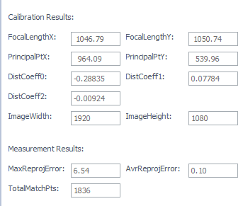

进行模型标定和产线标定后，都会生成如[图1](#_toc51692626)所示的标定结果。

标定结果参数：FocalLengthX、FocalLengthY表示焦距，PrincipalPtX、PrincipalPtY表示光心，DistCoeff0\~2表示畸变系数，ImageWidth、ImageHeight表示导入图片的像素宽高。如果畸变系数不符合[表1](#table2819mcpsimp)所示的畸变系数范围，按下"Convert Calibration Data”按钮会弹出报错框"Unsupported dist coeffs”。此时需要检查标定图片是否满足[DIS标定序列采集要求](#ZH-CN_TOPIC_0000002530061653)。

**表 1**  镜头标定算法内参

<a name="table2819mcpsimp"></a>
<table><thead align="left"><tr id="row2826mcpsimp"><th class="cellrowborder" valign="top" width="22.222222222222225%" id="mcps1.2.4.1.1"><p id="p2828mcpsimp"><a name="p2828mcpsimp"></a><a name="p2828mcpsimp"></a>参数名称</p>
</th>
<th class="cellrowborder" valign="top" width="34.34343434343434%" id="mcps1.2.4.1.2"><p id="p2830mcpsimp"><a name="p2830mcpsimp"></a><a name="p2830mcpsimp"></a>CAMERA_CALIB_SS928</p>
</th>
<th class="cellrowborder" valign="top" width="43.43434343434344%" id="mcps1.2.4.1.3"><p id="p2832mcpsimp"><a name="p2832mcpsimp"></a><a name="p2832mcpsimp"></a>备注</p>
</th>
</tr>
</thead>
<tbody><tr id="row2834mcpsimp"><td class="cellrowborder" valign="top" width="22.222222222222225%" headers="mcps1.2.4.1.1 "><p id="p2836mcpsimp"><a name="p2836mcpsimp"></a><a name="p2836mcpsimp"></a>FocalLengthX</p>
</td>
<td class="cellrowborder" valign="top" width="34.34343434343434%" headers="mcps1.2.4.1.2 "><p id="p2838mcpsimp"><a name="p2838mcpsimp"></a><a name="p2838mcpsimp"></a>[64,1173417]</p>
</td>
<td class="cellrowborder" valign="top" width="43.43434343434344%" headers="mcps1.2.4.1.3 "><p id="p2840mcpsimp"><a name="p2840mcpsimp"></a><a name="p2840mcpsimp"></a>-</p>
</td>
</tr>
<tr id="row2841mcpsimp"><td class="cellrowborder" valign="top" width="22.222222222222225%" headers="mcps1.2.4.1.1 "><p id="p2843mcpsimp"><a name="p2843mcpsimp"></a><a name="p2843mcpsimp"></a>FocalLengthY</p>
</td>
<td class="cellrowborder" valign="top" width="34.34343434343434%" headers="mcps1.2.4.1.2 "><p id="p2845mcpsimp"><a name="p2845mcpsimp"></a><a name="p2845mcpsimp"></a>[64,1173417]</p>
</td>
<td class="cellrowborder" valign="top" width="43.43434343434344%" headers="mcps1.2.4.1.3 "><p id="p2847mcpsimp"><a name="p2847mcpsimp"></a><a name="p2847mcpsimp"></a>-</p>
</td>
</tr>
<tr id="row2848mcpsimp"><td class="cellrowborder" valign="top" width="22.222222222222225%" headers="mcps1.2.4.1.1 "><p id="p2850mcpsimp"><a name="p2850mcpsimp"></a><a name="p2850mcpsimp"></a>PrincipalPtX</p>
</td>
<td class="cellrowborder" valign="top" width="34.34343434343434%" headers="mcps1.2.4.1.2 "><p id="p2852mcpsimp"><a name="p2852mcpsimp"></a><a name="p2852mcpsimp"></a>[W*0.35,W*0.65]</p>
</td>
<td class="cellrowborder" valign="top" width="43.43434343434344%" headers="mcps1.2.4.1.3 "><p id="p2854mcpsimp"><a name="p2854mcpsimp"></a><a name="p2854mcpsimp"></a>W为图像宽度</p>
</td>
</tr>
<tr id="row2855mcpsimp"><td class="cellrowborder" valign="top" width="22.222222222222225%" headers="mcps1.2.4.1.1 "><p id="p2857mcpsimp"><a name="p2857mcpsimp"></a><a name="p2857mcpsimp"></a>PrincipalPtY</p>
</td>
<td class="cellrowborder" valign="top" width="34.34343434343434%" headers="mcps1.2.4.1.2 "><p id="p2859mcpsimp"><a name="p2859mcpsimp"></a><a name="p2859mcpsimp"></a>[H*0.35,H*0.65]</p>
</td>
<td class="cellrowborder" valign="top" width="43.43434343434344%" headers="mcps1.2.4.1.3 "><p id="p2861mcpsimp"><a name="p2861mcpsimp"></a><a name="p2861mcpsimp"></a>H为图像高度</p>
</td>
</tr>
<tr id="row2862mcpsimp"><td class="cellrowborder" valign="top" width="22.222222222222225%" headers="mcps1.2.4.1.1 "><p id="p2864mcpsimp"><a name="p2864mcpsimp"></a><a name="p2864mcpsimp"></a>DistCoeff0</p>
</td>
<td class="cellrowborder" valign="top" width="34.34343434343434%" headers="mcps1.2.4.1.2 "><p id="p2866mcpsimp"><a name="p2866mcpsimp"></a><a name="p2866mcpsimp"></a>[-0.7,1]</p>
</td>
<td class="cellrowborder" valign="top" width="43.43434343434344%" headers="mcps1.2.4.1.3 "><p id="p2868mcpsimp"><a name="p2868mcpsimp"></a><a name="p2868mcpsimp"></a>-</p>
</td>
</tr>
<tr id="row2869mcpsimp"><td class="cellrowborder" valign="top" width="22.222222222222225%" headers="mcps1.2.4.1.1 "><p id="p2871mcpsimp"><a name="p2871mcpsimp"></a><a name="p2871mcpsimp"></a>DistCoeff1</p>
</td>
<td class="cellrowborder" valign="top" width="34.34343434343434%" headers="mcps1.2.4.1.2 "><p id="p2873mcpsimp"><a name="p2873mcpsimp"></a><a name="p2873mcpsimp"></a>[-0.5,0.5]</p>
</td>
<td class="cellrowborder" valign="top" width="43.43434343434344%" headers="mcps1.2.4.1.3 "><p id="p2875mcpsimp"><a name="p2875mcpsimp"></a><a name="p2875mcpsimp"></a>-</p>
</td>
</tr>
<tr id="row2876mcpsimp"><td class="cellrowborder" valign="top" width="22.222222222222225%" headers="mcps1.2.4.1.1 "><p id="p2878mcpsimp"><a name="p2878mcpsimp"></a><a name="p2878mcpsimp"></a>DistCoeff2</p>
</td>
<td class="cellrowborder" valign="top" width="34.34343434343434%" headers="mcps1.2.4.1.2 "><p id="p2880mcpsimp"><a name="p2880mcpsimp"></a><a name="p2880mcpsimp"></a>[-0.1,0.1]</p>
</td>
<td class="cellrowborder" valign="top" width="43.43434343434344%" headers="mcps1.2.4.1.3 "><p id="p2882mcpsimp"><a name="p2882mcpsimp"></a><a name="p2882mcpsimp"></a>-</p>
</td>
</tr>
<tr id="row2883mcpsimp"><td class="cellrowborder" valign="top" width="22.222222222222225%" headers="mcps1.2.4.1.1 "><p id="p2885mcpsimp"><a name="p2885mcpsimp"></a><a name="p2885mcpsimp"></a>ImageWidth</p>
</td>
<td class="cellrowborder" valign="top" width="34.34343434343434%" headers="mcps1.2.4.1.2 "><p id="p2887mcpsimp"><a name="p2887mcpsimp"></a><a name="p2887mcpsimp"></a>[1280,8192]</p>
</td>
<td class="cellrowborder" valign="top" width="43.43434343434344%" headers="mcps1.2.4.1.3 "><p id="p2889mcpsimp"><a name="p2889mcpsimp"></a><a name="p2889mcpsimp"></a>-</p>
</td>
</tr>
<tr id="row2890mcpsimp"><td class="cellrowborder" valign="top" width="22.222222222222225%" headers="mcps1.2.4.1.1 "><p id="p2892mcpsimp"><a name="p2892mcpsimp"></a><a name="p2892mcpsimp"></a>ImageHeight</p>
</td>
<td class="cellrowborder" valign="top" width="34.34343434343434%" headers="mcps1.2.4.1.2 "><p id="p2894mcpsimp"><a name="p2894mcpsimp"></a><a name="p2894mcpsimp"></a>[720,8192]</p>
</td>
<td class="cellrowborder" valign="top" width="43.43434343434344%" headers="mcps1.2.4.1.3 "><p id="p2896mcpsimp"><a name="p2896mcpsimp"></a><a name="p2896mcpsimp"></a>-</p>
</td>
</tr>
</tbody>
</table>

度量参数：MaxReprojError表示最大标定误差，AvrReprojError表示平均误差，TotalMatchPts表示成功匹配的角对点。

**表 2**  镜头标定误差评估

<a name="table2898mcpsimp"></a>
<table><thead align="left"><tr id="row2904mcpsimp"><th class="cellrowborder" valign="top" width="23%" id="mcps1.2.3.1.1"><p id="p2906mcpsimp"><a name="p2906mcpsimp"></a><a name="p2906mcpsimp"></a>参数名称</p>
</th>
<th class="cellrowborder" valign="top" width="77%" id="mcps1.2.3.1.2"><p id="p2908mcpsimp"><a name="p2908mcpsimp"></a><a name="p2908mcpsimp"></a>描述</p>
</th>
</tr>
</thead>
<tbody><tr id="row2910mcpsimp"><td class="cellrowborder" valign="top" width="23%" headers="mcps1.2.3.1.1 "><p id="p2912mcpsimp"><a name="p2912mcpsimp"></a><a name="p2912mcpsimp"></a>dMaxReprojErr</p>
</td>
<td class="cellrowborder" valign="top" width="77%" headers="mcps1.2.3.1.2 "><p id="p2914mcpsimp"><a name="p2914mcpsimp"></a><a name="p2914mcpsimp"></a>最大标定反投影误差(以像素为单位)，用于判断标定过程中是否有棋盘格内角点的最差匹配情况，值越小，表示标定效果越好；&lt;=20。</p>
</td>
</tr>
<tr id="row2915mcpsimp"><td class="cellrowborder" valign="top" width="23%" headers="mcps1.2.3.1.1 "><p id="p2917mcpsimp"><a name="p2917mcpsimp"></a><a name="p2917mcpsimp"></a>dAvrReprojErr</p>
</td>
<td class="cellrowborder" valign="top" width="77%" headers="mcps1.2.3.1.2 "><p id="p2919mcpsimp"><a name="p2919mcpsimp"></a><a name="p2919mcpsimp"></a>这是平均反投影错误 (以像素为单位)，用于判断标定过程中是否有棋盘格内角点的平均匹配情况，值越小，表示标定效果越好；&lt;=4。</p>
</td>
</tr>
<tr id="row2920mcpsimp"><td class="cellrowborder" valign="top" width="23%" headers="mcps1.2.3.1.1 "><p id="p2922mcpsimp"><a name="p2922mcpsimp"></a><a name="p2922mcpsimp"></a>u32TotalMatchedPoints</p>
</td>
<td class="cellrowborder" valign="top" width="77%" headers="mcps1.2.3.1.2 "><p id="p2924mcpsimp"><a name="p2924mcpsimp"></a><a name="p2924mcpsimp"></a>指成功的检测出来的角点总数目，与图像数量及棋盘格内角点数相关。</p>
</td>
</tr>
</tbody>
</table>

标定结果可通过下发板端按钮将结果发送到板端，发送的数据立即生效。

此外得到标定结果的同时，工具有时还会返回当前标定过程中相应的Warning提示，如[图2](#fig11924173715115)所示的例子。

**图 2**  DIS标定结果提示举例<a name="fig11924173715115"></a>  


常见Warning解释：

"Warning: chessboards not fully found in image: 图片路径"，表示该图片的棋盘格没有找全，没有加入当前标定结果的计算。

"Warning: The large chessboards do not occupy the entire image: xxx"，表示标定图片中近距离大画面覆盖的图片四周的覆盖情况，目前这个结果仅作为参考值，还不能直接来判断标定的准确性。

"Warning: Missing image containing large chessboard\(chessboardW/imgW \> 60 % or chessboardH/imgH \> 60 %\)"，表示在标定图片中没有找到近距离大画面覆盖的图片，这个情况得考虑补充相应的图片。

#### LDCV3镜头标定工具界面介绍<a name="ZH-CN_TOPIC_0000002498141820"></a>

通过仪器测量出待矫正镜头的物体角度（Object Angle）与图像高度（Image Height）关系表，将图像高度以毫米（mm）为单位，作为一列放在txt文件中，物体角度以度（°）为单位，作为第二列放在txt文件中，用逗号隔开。数据格式如下所示：

3.95386,-65.00008,

3.40029,-62.40004,

最少需要包含4组测量数据，测量结果准备好后，打开Ldcv3标定工具界面，导入txt文件；如[Figure 1](#fig14418439281)所示。

需要配置使用的sensor的像素大小（PixelSize），例如2.9000。图像的宽度（Image Width），图像的高度（Image Height）。

**图 1**  LDCV3镜头标定页面<a name="fig14418439281"></a>  


对于LDCV3镜头标定页面来说：

-   结果显示区域：用于显示标定完成后生成的标定结果参数\(Calibration Result\)；
    -   FocalLenX、FocalLenY表示焦距，取值范围\[64, 23420\]
    -   CoorShiftX、CoorShiftY表示光心\[0，8192\]，但具体生效范围：CoorShiftX，\[W\*0.35, W\*0.65\]；CoorShiftY，\[H\*0.35, H\*0.65\]\(W、H表示输入图片宽高\)。
    -   CaliRatio0\~3表示畸变系数。

-   Sensor和镜头装配时要尽量保证sensor中心和镜头光心对齐，没有偏差。如果光心偏差会导致LDCV3矫正效果变差。有条件的情况下，可以拍摄多组棋盘格图片，在DIS标定界面使用模型标定“Design Calibration”，得到PrincipalPtX和PrincipalPtY标定结果，将该值替换CoorShiftX、CoorShiftY值。以获得更好的矫正效果。
-   镜头测试数据中的视场角范围需要尽量大，能覆盖sensor的视场角要求。镜头测量数据的角度间隔需要尽量小，比如间隔一度测量一次。这样的镜头数据才能让LDCV3的矫正效果更好。
-   PixelSize，分辨率值，镜头测量数据，这几个数据需要都填正确，生成的LDCV3参数才能写入板端接口。如果PixelSize不正确，或者镜头测量数据不准确，都有可能导致生成的LDCV3参数报错。这时需要重新检查PixelSize，分辨率值，或者重新测量镜头数据。

    > **须知：** 
    >-   模型、产线标定下发板端前需将VI LDC页面的VI LDC Base项中的LDC base.ldc\_version设置成LDC\_V2并下发板端，下发成功后数据更新至VI LDC页面的VI LDC V2项。
    >-   Ldcv3标定下发板端前需将VI LDC页面的VI LDC Base项中的LDC base.ldc\_version设置成LDC\_V3并下发板端，下发成功后数据更新至VI LDC页面的VI LDC V3项。

### Dis Debug陀螺仪工具使用说明<a name="ZH-CN_TOPIC_0000002498301826"></a>


#### 使用要求<a name="ZH-CN_TOPIC_0000002530061731"></a>

需要sensor支持DIS功能。启动板端业务前需要加载陀螺仪相关ko，启动业务的ini文件中需要有\[motionfusion\]相关配置。

#### 界面介绍<a name="ZH-CN_TOPIC_0000002530221731"></a>

**图 1**  陀螺仪界面<a name="fig04507376612"></a>  


> **须知：** 
>图中①为输入区，②为图像区，③为数据显示区

#### 使用步骤<a name="ZH-CN_TOPIC_0000002530061793"></a>

1.  打开工具后设置RefreshTime后，点击Start按钮开始获取。
2.  需要停止时点击Stop按钮。

获取到数据后，在统计图上左键框选可以放大该区域图像，右键点击可以缩小。

#### 结果说明<a name="ZH-CN_TOPIC_0000002530221685"></a>

**图 1**  显示陀螺仪获取的数据<a name="fig695181311117"></a>  


结果分为两部分，左半部分为gyro data，右半部分为acc data。以左半部分为例，图中有x、y、z、pts四种数据，横坐标为数据顺序数，用颜色来区分在图中是哪些点，其中pts为pts的间隔（由于pts的单位是微秒，间隔值较大，为了放入一幅图中，已将其除以100），表中average为平均值，standard deviation为标准差，cumulative average为累计均值，cumulative number为累计数据条数。右上角Temperature为温度。

### 工具参数联动使用说明<a name="ZH-CN_TOPIC_0000002530221621"></a>


#### 参数联动规则<a name="ZH-CN_TOPIC_0000002530061671"></a>

当有约束的参数被用户修改时，满足联动条件约束的一个或多个参数值会被自动修改为最接近的有效值，并下发数据到板端。

#### 参数联动列表<a name="ZH-CN_TOPIC_0000002498301728"></a>

目前已支持的参数列表和限制条件，如[表1](#_table14781114164310)所示。

**表 1**  参数联动列表

<a name="_table14781114164310"></a>
<table><thead align="left"><tr id="row2960mcpsimp"><th class="cellrowborder" valign="top" id="mcps1.2.6.1.1"><p id="p2962mcpsimp"><a name="p2962mcpsimp"></a><a name="p2962mcpsimp"></a>联动参数所属功能模块</p>
</th>
<th class="cellrowborder" colspan="3" valign="top" id="mcps1.2.6.1.2"><p id="p2964mcpsimp"><a name="p2964mcpsimp"></a><a name="p2964mcpsimp"></a>联动参数</p>
</th>
<th class="cellrowborder" valign="top" id="mcps1.2.6.1.3"><p id="p2966mcpsimp"><a name="p2966mcpsimp"></a><a name="p2966mcpsimp"></a>联动规则</p>
</th>
</tr>
</thead>
<tbody><tr id="row2968mcpsimp"><td class="cellrowborder" rowspan="2" valign="top" headers="mcps1.2.6.1.1 "><p id="p2970mcpsimp"><a name="p2970mcpsimp"></a><a name="p2970mcpsimp"></a>AE Route</p>
</td>
<td class="cellrowborder" colspan="3" valign="top" headers="mcps1.2.6.1.2 "><p id="p2972mcpsimp"><a name="p2972mcpsimp"></a><a name="p2972mcpsimp"></a>AE Route. TotalNum</p>
</td>
<td class="cellrowborder" valign="top" headers="mcps1.2.6.1.3 "><p id="p2974mcpsimp"><a name="p2974mcpsimp"></a><a name="p2974mcpsimp"></a>要小于等于RouteNode的节点个数</p>
</td>
</tr>
<tr id="row2975mcpsimp"><td class="cellrowborder" colspan="3" valign="top" headers="mcps1.2.6.1.1 mcps1.2.6.1.2 "><p id="p2977mcpsimp"><a name="p2977mcpsimp"></a><a name="p2977mcpsimp"></a>AE RouteEx. TotalNum</p>
</td>
<td class="cellrowborder" valign="top" headers="mcps1.2.6.1.2 "><p id="p2979mcpsimp"><a name="p2979mcpsimp"></a><a name="p2979mcpsimp"></a>要小于等于RouteExNode的节点个数</p>
</td>
</tr>
<tr id="row2980mcpsimp"><td class="cellrowborder" rowspan="8" valign="top" headers="mcps1.2.6.1.1 "><p id="p2982mcpsimp"><a name="p2982mcpsimp"></a><a name="p2982mcpsimp"></a>WBAttr</p>
</td>
<td class="cellrowborder" rowspan="4" valign="top" headers="mcps1.2.6.1.2 "><p id="p2984mcpsimp"><a name="p2984mcpsimp"></a><a name="p2984mcpsimp"></a>AWBAttr</p>
</td>
<td class="cellrowborder" colspan="2" valign="top" headers="mcps1.2.6.1.2 "><p id="p2986mcpsimp"><a name="p2986mcpsimp"></a><a name="p2986mcpsimp"></a>stCTLimit.HighRgLimit</p>
</td>
<td class="cellrowborder" valign="top" headers="mcps1.2.6.1.3 "><p id="p2988mcpsimp"><a name="p2988mcpsimp"></a><a name="p2988mcpsimp"></a>手动模式下用户设定高色温下的最大R增益，8bit小数精度，取值范围：[0x0, 0xFFF]</p>
</td>
</tr>
<tr id="row2989mcpsimp"><td class="cellrowborder" colspan="2" valign="top" headers="mcps1.2.6.1.1 mcps1.2.6.1.2 "><p id="p2991mcpsimp"><a name="p2991mcpsimp"></a><a name="p2991mcpsimp"></a>stCTLimit.HighBgLimit</p>
</td>
<td class="cellrowborder" valign="top" headers="mcps1.2.6.1.2 "><p id="p2993mcpsimp"><a name="p2993mcpsimp"></a><a name="p2993mcpsimp"></a>手动模式下用户设定高色温下的最小B增益，8bit小数精度，取值范围：[0x0, 0xFFF]</p>
</td>
</tr>
<tr id="row2994mcpsimp"><td class="cellrowborder" colspan="2" valign="top" headers="mcps1.2.6.1.1 mcps1.2.6.1.2 "><p id="p2996mcpsimp"><a name="p2996mcpsimp"></a><a name="p2996mcpsimp"></a>stCTLimit.LowRgLimit</p>
</td>
<td class="cellrowborder" valign="top" headers="mcps1.2.6.1.2 "><p id="p2998mcpsimp"><a name="p2998mcpsimp"></a><a name="p2998mcpsimp"></a>手动模式下用户设定低色温下的最小R增益，8bit小数精度，取值范围：[0x0, u16HighRgLimit)</p>
</td>
</tr>
<tr id="row2999mcpsimp"><td class="cellrowborder" colspan="2" valign="top" headers="mcps1.2.6.1.1 mcps1.2.6.1.2 "><p id="p3001mcpsimp"><a name="p3001mcpsimp"></a><a name="p3001mcpsimp"></a>stCTLimit.LowBgLimit</p>
</td>
<td class="cellrowborder" valign="top" headers="mcps1.2.6.1.2 "><p id="p3003mcpsimp"><a name="p3003mcpsimp"></a><a name="p3003mcpsimp"></a>手动模式下用户设定低色温下的最大B增益，8bit小数精度，取值范围：(u16HighBgLimit, 0xFFF]</p>
</td>
</tr>
<tr id="row3004mcpsimp"><td class="cellrowborder" rowspan="4" valign="top" headers="mcps1.2.6.1.1 "><p id="p3006mcpsimp"><a name="p3006mcpsimp"></a><a name="p3006mcpsimp"></a>AWBAttrEx</p>
</td>
<td class="cellrowborder" colspan="2" valign="top" headers="mcps1.2.6.1.2 "><p id="p3008mcpsimp"><a name="p3008mcpsimp"></a><a name="p3008mcpsimp"></a>stInOrOut.LowStart</p>
</td>
<td class="cellrowborder" valign="top" headers="mcps1.2.6.1.2 "><p id="p3010mcpsimp"><a name="p3010mcpsimp"></a><a name="p3010mcpsimp"></a>将位于低色温范围内的像素权重调低，低色温区起始值，建议5000K</p>
</td>
</tr>
<tr id="row3011mcpsimp"><td class="cellrowborder" colspan="2" valign="top" headers="mcps1.2.6.1.1 mcps1.2.6.1.2 "><p id="p3013mcpsimp"><a name="p3013mcpsimp"></a><a name="p3013mcpsimp"></a>stInOrOut.LowStop</p>
</td>
<td class="cellrowborder" valign="top" headers="mcps1.2.6.1.2 "><p id="p3015mcpsimp"><a name="p3015mcpsimp"></a><a name="p3015mcpsimp"></a>将位于低色温范围内的像素权重调低，低色温区终止值，建议4500K。</p>
<p id="p3016mcpsimp"><a name="p3016mcpsimp"></a><a name="p3016mcpsimp"></a>取值范围：(0, u16LowStart)</p>
</td>
</tr>
<tr id="row3017mcpsimp"><td class="cellrowborder" colspan="2" valign="top" headers="mcps1.2.6.1.1 mcps1.2.6.1.2 "><p id="p3019mcpsimp"><a name="p3019mcpsimp"></a><a name="p3019mcpsimp"></a>stInOrOut.HighStart</p>
</td>
<td class="cellrowborder" valign="top" headers="mcps1.2.6.1.2 "><p id="p3021mcpsimp"><a name="p3021mcpsimp"></a><a name="p3021mcpsimp"></a>将位于高色温范围内的像素权重调低，高色温区起始值，建议6500K。</p>
<p id="p3022mcpsimp"><a name="p3022mcpsimp"></a><a name="p3022mcpsimp"></a>取值范围：(u16LowStart, 0xFFFF]</p>
</td>
</tr>
<tr id="row3023mcpsimp"><td class="cellrowborder" colspan="2" valign="top" headers="mcps1.2.6.1.1 mcps1.2.6.1.2 "><p id="p3025mcpsimp"><a name="p3025mcpsimp"></a><a name="p3025mcpsimp"></a>stInOrOut.HighStop</p>
</td>
<td class="cellrowborder" valign="top" headers="mcps1.2.6.1.2 "><p id="p3027mcpsimp"><a name="p3027mcpsimp"></a><a name="p3027mcpsimp"></a>将位于高色温范围内的像素权重调低，高色温区终止值，建议8000K。</p>
<p id="p3028mcpsimp"><a name="p3028mcpsimp"></a><a name="p3028mcpsimp"></a>取值范围：(u16HighStart, 0xFFFF]</p>
</td>
</tr>
<tr id="row3029mcpsimp"><td class="cellrowborder" rowspan="2" valign="top" headers="mcps1.2.6.1.1 "><p id="p3031mcpsimp"><a name="p3031mcpsimp"></a><a name="p3031mcpsimp"></a>Shading Lut Attr</p>
</td>
<td class="cellrowborder" colspan="3" valign="top" headers="mcps1.2.6.1.2 "><p id="p3033mcpsimp"><a name="p3033mcpsimp"></a><a name="p3033mcpsimp"></a>XGridWidth</p>
</td>
<td class="cellrowborder" rowspan="2" valign="top" headers="mcps1.2.6.1.3 "><p id="p3035mcpsimp"><a name="p3035mcpsimp"></a><a name="p3035mcpsimp"></a>取值范围：[4, 255]</p>
</td>
</tr>
<tr id="row3036mcpsimp"><td class="cellrowborder" colspan="3" valign="top" headers="mcps1.2.6.1.1 mcps1.2.6.1.2 "><p id="p3038mcpsimp"><a name="p3038mcpsimp"></a><a name="p3038mcpsimp"></a>YGridWidth</p>
</td>
</tr>
<tr id="row3039mcpsimp"><td class="cellrowborder" valign="top" headers="mcps1.2.6.1.1 "><p id="p3041mcpsimp"><a name="p3041mcpsimp"></a><a name="p3041mcpsimp"></a>DefectPixel</p>
</td>
<td class="cellrowborder" colspan="3" valign="top" headers="mcps1.2.6.1.2 "><p id="p3043mcpsimp"><a name="p3043mcpsimp"></a><a name="p3043mcpsimp"></a>DP Static Calibrate. CountMax</p>
</td>
<td class="cellrowborder" valign="top" headers="mcps1.2.6.1.3 "><p id="p3045mcpsimp"><a name="p3045mcpsimp"></a><a name="p3045mcpsimp"></a>图像分辨率小于等于4K时，STATIC_DP_COUNT_MAX = 4096</p>
<p id="p3046mcpsimp"><a name="p3046mcpsimp"></a><a name="p3046mcpsimp"></a>图像分辨率大于4K时，STATIC_DP_COUNT_MAX = 8192</p>
</td>
</tr>
<tr id="row3047mcpsimp"><td class="cellrowborder" rowspan="2" valign="top" headers="mcps1.2.6.1.1 "><p id="p3049mcpsimp"><a name="p3049mcpsimp"></a><a name="p3049mcpsimp"></a>RadialCROP</p>
</td>
<td class="cellrowborder" rowspan="2" colspan="2" valign="top" headers="mcps1.2.6.1.2 "><p id="p3051mcpsimp"><a name="p3051mcpsimp"></a><a name="p3051mcpsimp"></a>RadialCROP</p>
</td>
<td class="cellrowborder" valign="top" headers="mcps1.2.6.1.2 "><p id="p3053mcpsimp"><a name="p3053mcpsimp"></a><a name="p3053mcpsimp"></a>stCenterCoor.X</p>
</td>
<td class="cellrowborder" valign="top" headers="mcps1.2.6.1.3 "><p id="p3055mcpsimp"><a name="p3055mcpsimp"></a><a name="p3055mcpsimp"></a>取值范围：[0,u32Width -1]，默认为：u32Width/2</p>
</td>
</tr>
<tr id="row3056mcpsimp"><td class="cellrowborder" valign="top" headers="mcps1.2.6.1.1 "><p id="p3058mcpsimp"><a name="p3058mcpsimp"></a><a name="p3058mcpsimp"></a>stCenterCoor.Y</p>
</td>
<td class="cellrowborder" valign="top" headers="mcps1.2.6.1.2 "><p id="p3060mcpsimp"><a name="p3060mcpsimp"></a><a name="p3060mcpsimp"></a>取值范围：[0,u32Height -1]，默认为：u32Height/2</p>
</td>
</tr>
<tr id="row3061mcpsimp"><td class="cellrowborder" valign="top" headers="mcps1.2.6.1.1 "><p id="p3063mcpsimp"><a name="p3063mcpsimp"></a><a name="p3063mcpsimp"></a>FPN</p>
</td>
<td class="cellrowborder" colspan="2" valign="top" headers="mcps1.2.6.1.2 "><p id="p3065mcpsimp"><a name="p3065mcpsimp"></a><a name="p3065mcpsimp"></a>FPNCalibrate</p>
</td>
<td class="cellrowborder" valign="top" headers="mcps1.2.6.1.2 "><p id="p3067mcpsimp"><a name="p3067mcpsimp"></a><a name="p3067mcpsimp"></a>FrameNum</p>
</td>
<td class="cellrowborder" valign="top" headers="mcps1.2.6.1.3 "><p id="p3069mcpsimp"><a name="p3069mcpsimp"></a><a name="p3069mcpsimp"></a>标定的帧数，取值范围为{1，2，4，8，16}，即为2的整数次幂，FPN不支持在离线模式下进行标定，向下剪切。</p>
</td>
</tr>
<tr id="row3070mcpsimp"><td class="cellrowborder" rowspan="2" valign="top" headers="mcps1.2.6.1.1 "><p id="p3072mcpsimp"><a name="p3072mcpsimp"></a><a name="p3072mcpsimp"></a>Fisheye</p>
</td>
<td class="cellrowborder" rowspan="2" colspan="2" valign="top" headers="mcps1.2.6.1.2 "><p id="p3074mcpsimp"><a name="p3074mcpsimp"></a><a name="p3074mcpsimp"></a>FisheyeAttr</p>
</td>
<td class="cellrowborder" valign="top" headers="mcps1.2.6.1.2 "><p id="p3076mcpsimp"><a name="p3076mcpsimp"></a><a name="p3076mcpsimp"></a>MountMode</p>
</td>
<td class="cellrowborder" valign="top" headers="mcps1.2.6.1.3 "><p id="p3078mcpsimp"><a name="p3078mcpsimp"></a><a name="p3078mcpsimp"></a>360校正模式下不支持壁装，MountMode切换为地装</p>
</td>
</tr>
<tr id="row3079mcpsimp"><td class="cellrowborder" valign="top" headers="mcps1.2.6.1.1 "><p id="p3081mcpsimp"><a name="p3081mcpsimp"></a><a name="p3081mcpsimp"></a>ViewMode</p>
</td>
<td class="cellrowborder" valign="top" headers="mcps1.2.6.1.2 "><p id="p3083mcpsimp"><a name="p3083mcpsimp"></a><a name="p3083mcpsimp"></a>180校正模式下不支持顶装和地装，MountMode切换为壁装</p>
</td>
</tr>
<tr id="row3084mcpsimp"><td class="cellrowborder" rowspan="2" valign="top" headers="mcps1.2.6.1.1 "><p id="p3086mcpsimp"><a name="p3086mcpsimp"></a><a name="p3086mcpsimp"></a>VencEx</p>
</td>
<td class="cellrowborder" rowspan="2" colspan="2" valign="top" headers="mcps1.2.6.1.2 "><p id="p3088mcpsimp"><a name="p3088mcpsimp"></a><a name="p3088mcpsimp"></a>ROI Attributes</p>
</td>
<td class="cellrowborder" valign="top" headers="mcps1.2.6.1.2 "><p id="p3090mcpsimp"><a name="p3090mcpsimp"></a><a name="p3090mcpsimp"></a>Qp</p>
</td>
<td class="cellrowborder" valign="top" headers="mcps1.2.6.1.3 "><p id="p3092mcpsimp"><a name="p3092mcpsimp"></a><a name="p3092mcpsimp"></a>当QP模式为FALSE时，s32Qp为QP偏移，s32Qp范围[-51,51]；</p>
<p id="p3093mcpsimp"><a name="p3093mcpsimp"></a><a name="p3093mcpsimp"></a>当QP模式为TRUE时，s32Qp为宏块QP值，s32Qp范围[0,51]</p>
</td>
</tr>
<tr id="row3094mcpsimp"><td class="cellrowborder" valign="top" headers="mcps1.2.6.1.1 "><p id="p3096mcpsimp"><a name="p3096mcpsimp"></a><a name="p3096mcpsimp"></a>stRect.X/Y/Width/Height</p>
</td>
<td class="cellrowborder" valign="top" headers="mcps1.2.6.1.2 "><p id="p3098mcpsimp"><a name="p3098mcpsimp"></a><a name="p3098mcpsimp"></a>s32X、s32Y、u32Width、u32Height必须是16对齐，向下剪切</p>
</td>
</tr>
<tr id="row3099mcpsimp"><td class="cellrowborder" rowspan="3" valign="top" headers="mcps1.2.6.1.1 "><p id="p3101mcpsimp"><a name="p3101mcpsimp"></a><a name="p3101mcpsimp"></a>FSWDR</p>
</td>
<td class="cellrowborder" rowspan="3" colspan="2" valign="top" headers="mcps1.2.6.1.2 "><p id="p3103mcpsimp"><a name="p3103mcpsimp"></a><a name="p3103mcpsimp"></a>FSWDR</p>
</td>
<td class="cellrowborder" valign="top" headers="mcps1.2.6.1.2 "><p id="p3105mcpsimp"><a name="p3105mcpsimp"></a><a name="p3105mcpsimp"></a>LongThr</p>
</td>
<td class="cellrowborder" valign="top" headers="mcps1.2.6.1.3 "><p id="p3107mcpsimp"><a name="p3107mcpsimp"></a><a name="p3107mcpsimp"></a>取值范围：[0, u16ShortThr]</p>
</td>
</tr>
<tr id="row3108mcpsimp"><td class="cellrowborder" valign="top" headers="mcps1.2.6.1.1 "><p id="p3110mcpsimp"><a name="p3110mcpsimp"></a><a name="p3110mcpsimp"></a>ForceLongLowThr</p>
</td>
<td class="cellrowborder" valign="top" headers="mcps1.2.6.1.2 "><p id="p3112mcpsimp"><a name="p3112mcpsimp"></a><a name="p3112mcpsimp"></a>取值范围：[0, ForceLongHigThr]</p>
</td>
</tr>
<tr id="row3113mcpsimp"><td class="cellrowborder" valign="top" headers="mcps1.2.6.1.1 "><p id="p3115mcpsimp"><a name="p3115mcpsimp"></a><a name="p3115mcpsimp"></a>u8MdThrLowGain</p>
</td>
<td class="cellrowborder" valign="top" headers="mcps1.2.6.1.2 "><p id="p3117mcpsimp"><a name="p3117mcpsimp"></a><a name="p3117mcpsimp"></a>取值范围：[0, u8MdThrHigGain]</p>
</td>
</tr>
<tr id="row3118mcpsimp"><td class="cellrowborder" valign="top" headers="mcps1.2.6.1.1 "><p id="p3120mcpsimp"><a name="p3120mcpsimp"></a><a name="p3120mcpsimp"></a>DRC</p>
</td>
<td class="cellrowborder" colspan="2" valign="top" headers="mcps1.2.6.1.2 "><p id="p3122mcpsimp"><a name="p3122mcpsimp"></a><a name="p3122mcpsimp"></a>Common Params</p>
</td>
<td class="cellrowborder" valign="top" headers="mcps1.2.6.1.2 "><p id="p3124mcpsimp"><a name="p3124mcpsimp"></a><a name="p3124mcpsimp"></a>Auto.StrengthMin</p>
</td>
<td class="cellrowborder" valign="top" headers="mcps1.2.6.1.3 "><p id="p3126mcpsimp"><a name="p3126mcpsimp"></a><a name="p3126mcpsimp"></a>取值范围：[0,StrengthMax]</p>
</td>
</tr>
<tr id="row3127mcpsimp"><td class="cellrowborder" rowspan="11" valign="top" headers="mcps1.2.6.1.1 "><p id="p3129mcpsimp"><a name="p3129mcpsimp"></a><a name="p3129mcpsimp"></a>3DNR X</p>
</td>
<td class="cellrowborder" rowspan="6" colspan="2" valign="top" headers="mcps1.2.6.1.2 "><p id="p3131mcpsimp"><a name="p3131mcpsimp"></a><a name="p3131mcpsimp"></a>VI_3DNRAttr</p>
</td>
<td class="cellrowborder" valign="top" headers="mcps1.2.6.1.2 "><p id="p3133mcpsimp"><a name="p3133mcpsimp"></a><a name="p3133mcpsimp"></a>sth/sthd</p>
</td>
<td class="cellrowborder" valign="top" headers="mcps1.2.6.1.3 "><p id="p3135mcpsimp"><a name="p3135mcpsimp"></a><a name="p3135mcpsimp"></a>sth大等于sthd</p>
</td>
</tr>
<tr id="row3136mcpsimp"><td class="cellrowborder" valign="top" headers="mcps1.2.6.1.1 "><p id="p3138mcpsimp"><a name="p3138mcpsimp"></a><a name="p3138mcpsimp"></a>math/mathd</p>
</td>
<td class="cellrowborder" valign="top" headers="mcps1.2.6.1.2 "><p id="p3140mcpsimp"><a name="p3140mcpsimp"></a><a name="p3140mcpsimp"></a>math大等于mathd</p>
</td>
</tr>
<tr id="row3141mcpsimp"><td class="cellrowborder" valign="top" headers="mcps1.2.6.1.1 "><p id="p3143mcpsimp"><a name="p3143mcpsimp"></a><a name="p3143mcpsimp"></a>Dert</p>
</td>
<td class="cellrowborder" valign="top" headers="mcps1.2.6.1.2 "><p id="p3145mcpsimp"><a name="p3145mcpsimp"></a><a name="p3145mcpsimp"></a>Dert[0]等于0时,SelRt[0]和SelRt[1]值为16</p>
</td>
</tr>
<tr id="row3146mcpsimp"><td class="cellrowborder" valign="top" headers="mcps1.2.6.1.1 "><p id="p3148mcpsimp"><a name="p3148mcpsimp"></a><a name="p3148mcpsimp"></a>Dert</p>
</td>
<td class="cellrowborder" valign="top" headers="mcps1.2.6.1.2 "><p id="p3150mcpsimp"><a name="p3150mcpsimp"></a><a name="p3150mcpsimp"></a>Dert[0]不等于0时, nXsfn[0~2]取值范围[3,max]</p>
</td>
</tr>
<tr id="row3151mcpsimp"><td class="cellrowborder" valign="top" headers="mcps1.2.6.1.1 "><p id="p3153mcpsimp"><a name="p3153mcpsimp"></a><a name="p3153mcpsimp"></a>ref</p>
</td>
<td class="cellrowborder" valign="top" headers="mcps1.2.6.1.2 "><p id="p3155mcpsimp"><a name="p3155mcpsimp"></a><a name="p3155mcpsimp"></a>ref[1]等于0时, ref[0]等于0，en[3]等于0</p>
</td>
</tr>
<tr id="row3156mcpsimp"><td class="cellrowborder" valign="top" headers="mcps1.2.6.1.1 "><p id="p3158mcpsimp"><a name="p3158mcpsimp"></a><a name="p3158mcpsimp"></a>en</p>
</td>
<td class="cellrowborder" valign="top" headers="mcps1.2.6.1.2 "><p id="p3160mcpsimp"><a name="p3160mcpsimp"></a><a name="p3160mcpsimp"></a>en[2]等于0时, en[3]等于0</p>
</td>
</tr>
<tr id="row3161mcpsimp"><td class="cellrowborder" rowspan="5" colspan="2" valign="top" headers="mcps1.2.6.1.1 mcps1.2.6.1.2 "><p id="p3163mcpsimp"><a name="p3163mcpsimp"></a><a name="p3163mcpsimp"></a>VPSS_3DNRAttr</p>
</td>
<td class="cellrowborder" valign="top" headers="mcps1.2.6.1.2 "><p id="p3165mcpsimp"><a name="p3165mcpsimp"></a><a name="p3165mcpsimp"></a>NrMotionMode 等于COMPENSATE</p>
</td>
<td class="cellrowborder" valign="top" headers="mcps1.2.6.1.2 "><p id="p3167mcpsimp"><a name="p3167mcpsimp"></a><a name="p3167mcpsimp"></a>1. biPath[0]、biPath[1]都为0</p>
<p id="p3168mcpsimp"><a name="p3168mcpsimp"></a><a name="p3168mcpsimp"></a>2. AdvMath值为1</p>
</td>
</tr>
<tr id="row3169mcpsimp"><td class="cellrowborder" valign="top" headers="mcps1.2.6.1.1 "><p id="p3171mcpsimp"><a name="p3171mcpsimp"></a><a name="p3171mcpsimp"></a>NrMotionMode等于NORMAL</p>
</td>
<td class="cellrowborder" valign="top" headers="mcps1.2.6.1.2 "><p id="p3173mcpsimp"><a name="p3173mcpsimp"></a><a name="p3173mcpsimp"></a>rftIdx[0]值为2</p>
</td>
</tr>
<tr id="row3174mcpsimp"><td class="cellrowborder" valign="top" headers="mcps1.2.6.1.1 "><p id="p3176mcpsimp"><a name="p3176mcpsimp"></a><a name="p3176mcpsimp"></a>NrMotionMode等于NORMAL 并且AdvMath等于1</p>
</td>
<td class="cellrowborder" valign="top" headers="mcps1.2.6.1.2 "><p id="p3178mcpsimp"><a name="p3178mcpsimp"></a><a name="p3178mcpsimp"></a>mXmabw[0]值为4</p>
</td>
</tr>
<tr id="row3179mcpsimp"><td class="cellrowborder" valign="top" headers="mcps1.2.6.1.1 "><p id="p3181mcpsimp"><a name="p3181mcpsimp"></a><a name="p3181mcpsimp"></a>NrMotionMode等于NORMAL 并且 biPath[0]等于0</p>
</td>
<td class="cellrowborder" valign="top" headers="mcps1.2.6.1.2 "><p id="p3183mcpsimp"><a name="p3183mcpsimp"></a><a name="p3183mcpsimp"></a>1. AdvMath值为0</p>
<p id="p3184mcpsimp"><a name="p3184mcpsimp"></a><a name="p3184mcpsimp"></a>2. mXmabw[0]取值[5,9]</p>
</td>
</tr>
<tr id="row3185mcpsimp"><td class="cellrowborder" valign="top" headers="mcps1.2.6.1.1 "><p id="p3187mcpsimp"><a name="p3187mcpsimp"></a><a name="p3187mcpsimp"></a>NrMotionMode等于NORMAL 并且 biPath[1]等于0</p>
</td>
<td class="cellrowborder" valign="top" headers="mcps1.2.6.1.2 "><p id="p3189mcpsimp"><a name="p3189mcpsimp"></a><a name="p3189mcpsimp"></a>mXmabw[2]取值[5,9]</p>
</td>
</tr>
</tbody>
</table>

## 参数详细说明<a name="ZH-CN_TOPIC_0000002498141708"></a>

下面将详细列出界面上各模块参数对应SDK的API函数参考，这些参数说明请参考[表1](#ZH-CN_TOPIC_0000002498301796)\~[表54](#ZH-CN_TOPIC_0000002498301796)。

> **须知：** 
>生态版本不支持拼接、MCF相关功能。


### SS928V100参数<a name="ZH-CN_TOPIC_0000002498301796"></a>

**表 1**  TOP设置对应API

<a name="_toc51692651"></a>
<table><thead align="left"><tr id="row3200mcpsimp"><th class="cellrowborder" valign="top" width="34%" id="mcps1.2.3.1.1"><p id="p3202mcpsimp"><a name="p3202mcpsimp"></a><a name="p3202mcpsimp"></a>功能模块</p>
</th>
<th class="cellrowborder" valign="top" width="66%" id="mcps1.2.3.1.2"><p id="p3204mcpsimp"><a name="p3204mcpsimp"></a><a name="p3204mcpsimp"></a>对应SDK API</p>
</th>
</tr>
</thead>
<tbody><tr id="row3206mcpsimp"><td class="cellrowborder" valign="top" width="34%" headers="mcps1.2.3.1.1 "><p id="p3208mcpsimp"><a name="p3208mcpsimp"></a><a name="p3208mcpsimp"></a>Mode Handle</p>
</td>
<td class="cellrowborder" valign="top" width="66%" headers="mcps1.2.3.1.2 "><p id="p3210mcpsimp"><a name="p3210mcpsimp"></a><a name="p3210mcpsimp"></a>无</p>
</td>
</tr>
<tr id="row3211mcpsimp"><td class="cellrowborder" valign="top" width="34%" headers="mcps1.2.3.1.1 "><p id="p3213mcpsimp"><a name="p3213mcpsimp"></a><a name="p3213mcpsimp"></a>Bypass Setting</p>
</td>
<td class="cellrowborder" valign="top" width="66%" headers="mcps1.2.3.1.2 "><p id="p3215mcpsimp"><a name="p3215mcpsimp"></a><a name="p3215mcpsimp"></a>ot_mpi_isp_set_module_ctrl</p>
<p id="p3216mcpsimp"><a name="p3216mcpsimp"></a><a name="p3216mcpsimp"></a>ot_mpi_isp_get_module_ctrl</p>
</td>
</tr>
<tr id="row3217mcpsimp"><td class="cellrowborder" valign="top" width="34%" headers="mcps1.2.3.1.1 "><p id="p3219mcpsimp"><a name="p3219mcpsimp"></a><a name="p3219mcpsimp"></a>Fmw State</p>
</td>
<td class="cellrowborder" valign="top" width="66%" headers="mcps1.2.3.1.2 "><p id="p3221mcpsimp"><a name="p3221mcpsimp"></a><a name="p3221mcpsimp"></a>ot_mpi_isp_set_fmw_state</p>
<p id="p3222mcpsimp"><a name="p3222mcpsimp"></a><a name="p3222mcpsimp"></a>ot_mpi_isp_get_fmw_state</p>
</td>
</tr>
<tr id="row3223mcpsimp"><td class="cellrowborder" valign="top" width="34%" headers="mcps1.2.3.1.1 "><p id="p3225mcpsimp"><a name="p3225mcpsimp"></a><a name="p3225mcpsimp"></a>CTRL Param</p>
</td>
<td class="cellrowborder" valign="top" width="66%" headers="mcps1.2.3.1.2 "><p id="p3227mcpsimp"><a name="p3227mcpsimp"></a><a name="p3227mcpsimp"></a>ot_mpi_isp_set_ctrl_param</p>
<p id="p3228mcpsimp"><a name="p3228mcpsimp"></a><a name="p3228mcpsimp"></a>ot_mpi_isp_get_ctrl_param</p>
</td>
</tr>
<tr id="row3229mcpsimp"><td class="cellrowborder" valign="top" width="34%" headers="mcps1.2.3.1.1 "><p id="p3231mcpsimp"><a name="p3231mcpsimp"></a><a name="p3231mcpsimp"></a>MOD Param</p>
</td>
<td class="cellrowborder" valign="top" width="66%" headers="mcps1.2.3.1.2 "><p id="p3233mcpsimp"><a name="p3233mcpsimp"></a><a name="p3233mcpsimp"></a>ot_mpi_isp_set_mod_param</p>
<p id="p3234mcpsimp"><a name="p3234mcpsimp"></a><a name="p3234mcpsimp"></a>ot_mpi_isp_get_mod_param</p>
</td>
</tr>
</tbody>
</table>

**表 2**  PubAttr设置对应API

<a name="table3235mcpsimp"></a>
<table><thead align="left"><tr id="row3241mcpsimp"><th class="cellrowborder" valign="top" width="34%" id="mcps1.2.3.1.1"><p id="p3243mcpsimp"><a name="p3243mcpsimp"></a><a name="p3243mcpsimp"></a>功能模块</p>
</th>
<th class="cellrowborder" valign="top" width="66%" id="mcps1.2.3.1.2"><p id="p3245mcpsimp"><a name="p3245mcpsimp"></a><a name="p3245mcpsimp"></a>对应SDK API</p>
</th>
</tr>
</thead>
<tbody><tr id="row3247mcpsimp"><td class="cellrowborder" valign="top" width="34%" headers="mcps1.2.3.1.1 "><p id="p3249mcpsimp"><a name="p3249mcpsimp"></a><a name="p3249mcpsimp"></a>PubAttr</p>
</td>
<td class="cellrowborder" valign="top" width="66%" headers="mcps1.2.3.1.2 "><p id="p3251mcpsimp"><a name="p3251mcpsimp"></a><a name="p3251mcpsimp"></a>ot_mpi_isp_set_pub_attr</p>
<p id="p3252mcpsimp"><a name="p3252mcpsimp"></a><a name="p3252mcpsimp"></a>ot_mpi_isp_get_pub_attr</p>
</td>
</tr>
</tbody>
</table>

**表 3**  ISPInfo设置对应API

<a name="table3253mcpsimp"></a>
<table><thead align="left"><tr id="row3259mcpsimp"><th class="cellrowborder" valign="top" width="34%" id="mcps1.2.3.1.1"><p id="p3261mcpsimp"><a name="p3261mcpsimp"></a><a name="p3261mcpsimp"></a>功能模块</p>
</th>
<th class="cellrowborder" valign="top" width="66%" id="mcps1.2.3.1.2"><p id="p3263mcpsimp"><a name="p3263mcpsimp"></a><a name="p3263mcpsimp"></a>对应SDK API</p>
</th>
</tr>
</thead>
<tbody><tr id="row3265mcpsimp"><td class="cellrowborder" valign="top" width="34%" headers="mcps1.2.3.1.1 "><p id="p3267mcpsimp"><a name="p3267mcpsimp"></a><a name="p3267mcpsimp"></a>ISPInfo</p>
</td>
<td class="cellrowborder" valign="top" width="66%" headers="mcps1.2.3.1.2 "><p id="p3269mcpsimp"><a name="p3269mcpsimp"></a><a name="p3269mcpsimp"></a>ot_mpi_isp_query_inner_state_info</p>
</td>
</tr>
</tbody>
</table>

**表 4**  ExposureAttr设置对应API

<a name="table3270mcpsimp"></a>
<table><thead align="left"><tr id="row3276mcpsimp"><th class="cellrowborder" valign="top" width="34%" id="mcps1.2.3.1.1"><p id="p3278mcpsimp"><a name="p3278mcpsimp"></a><a name="p3278mcpsimp"></a>功能模块</p>
</th>
<th class="cellrowborder" valign="top" width="66%" id="mcps1.2.3.1.2"><p id="p3280mcpsimp"><a name="p3280mcpsimp"></a><a name="p3280mcpsimp"></a>对应SDK API</p>
</th>
</tr>
</thead>
<tbody><tr id="row3282mcpsimp"><td class="cellrowborder" valign="top" width="34%" headers="mcps1.2.3.1.1 "><p id="p3284mcpsimp"><a name="p3284mcpsimp"></a><a name="p3284mcpsimp"></a>ExposureAttr</p>
</td>
<td class="cellrowborder" valign="top" width="66%" headers="mcps1.2.3.1.2 "><p id="p3286mcpsimp"><a name="p3286mcpsimp"></a><a name="p3286mcpsimp"></a>ot_mpi_isp_set_exposure_attr</p>
<p id="p3287mcpsimp"><a name="p3287mcpsimp"></a><a name="p3287mcpsimp"></a>ot_mpi_isp_get_exposure_attr</p>
</td>
</tr>
</tbody>
</table>

**表 5**  WDRExposureAttr设置对应API

<a name="table3288mcpsimp"></a>
<table><thead align="left"><tr id="row3294mcpsimp"><th class="cellrowborder" valign="top" width="34%" id="mcps1.2.3.1.1"><p id="p3296mcpsimp"><a name="p3296mcpsimp"></a><a name="p3296mcpsimp"></a>功能模块</p>
</th>
<th class="cellrowborder" valign="top" width="66%" id="mcps1.2.3.1.2"><p id="p3298mcpsimp"><a name="p3298mcpsimp"></a><a name="p3298mcpsimp"></a>对应SDK API</p>
</th>
</tr>
</thead>
<tbody><tr id="row3300mcpsimp"><td class="cellrowborder" valign="top" width="34%" headers="mcps1.2.3.1.1 "><p id="p3302mcpsimp"><a name="p3302mcpsimp"></a><a name="p3302mcpsimp"></a>WDRExposureAttr</p>
</td>
<td class="cellrowborder" valign="top" width="66%" headers="mcps1.2.3.1.2 "><p id="p3304mcpsimp"><a name="p3304mcpsimp"></a><a name="p3304mcpsimp"></a>ot_mpi_isp_set_wdr_exposure_attr</p>
<p id="p3305mcpsimp"><a name="p3305mcpsimp"></a><a name="p3305mcpsimp"></a>ot_mpi_isp_get_wdr_exposure_attr</p>
</td>
</tr>
</tbody>
</table>

**表 6**  SmartExposureAttr设置对应API

<a name="table3306mcpsimp"></a>
<table><thead align="left"><tr id="row3312mcpsimp"><th class="cellrowborder" valign="top" width="34%" id="mcps1.2.3.1.1"><p id="p3314mcpsimp"><a name="p3314mcpsimp"></a><a name="p3314mcpsimp"></a>功能模块</p>
</th>
<th class="cellrowborder" valign="top" width="66%" id="mcps1.2.3.1.2"><p id="p3316mcpsimp"><a name="p3316mcpsimp"></a><a name="p3316mcpsimp"></a>对应SDK API</p>
</th>
</tr>
</thead>
<tbody><tr id="row3318mcpsimp"><td class="cellrowborder" valign="top" width="34%" headers="mcps1.2.3.1.1 "><p id="p3320mcpsimp"><a name="p3320mcpsimp"></a><a name="p3320mcpsimp"></a>SmartExposureAttr</p>
</td>
<td class="cellrowborder" valign="top" width="66%" headers="mcps1.2.3.1.2 "><p id="p3322mcpsimp"><a name="p3322mcpsimp"></a><a name="p3322mcpsimp"></a>ot_mpi_isp_set_smart_exposure_attr</p>
<p id="p3323mcpsimp"><a name="p3323mcpsimp"></a><a name="p3323mcpsimp"></a>ot_mpi_isp_set_smart_exposure_attr</p>
</td>
</tr>
</tbody>
</table>

**表 7**  Exp Convert Param设置对应API

<a name="table3324mcpsimp"></a>
<table><thead align="left"><tr id="row3330mcpsimp"><th class="cellrowborder" valign="top" width="34%" id="mcps1.2.3.1.1"><p id="p3332mcpsimp"><a name="p3332mcpsimp"></a><a name="p3332mcpsimp"></a>功能模块</p>
</th>
<th class="cellrowborder" valign="top" width="66%" id="mcps1.2.3.1.2"><p id="p3334mcpsimp"><a name="p3334mcpsimp"></a><a name="p3334mcpsimp"></a>对应SDK API</p>
</th>
</tr>
</thead>
<tbody><tr id="row3336mcpsimp"><td class="cellrowborder" valign="top" width="34%" headers="mcps1.2.3.1.1 "><p id="p3338mcpsimp"><a name="p3338mcpsimp"></a><a name="p3338mcpsimp"></a>Exp Convert Param</p>
</td>
<td class="cellrowborder" valign="top" width="66%" headers="mcps1.2.3.1.2 "><p id="p3340mcpsimp"><a name="p3340mcpsimp"></a><a name="p3340mcpsimp"></a>ot_mpi_isp_set_exp_convert</p>
<p id="p3341mcpsimp"><a name="p3341mcpsimp"></a><a name="p3341mcpsimp"></a>ot_mpi_isp_get_exp_convert</p>
</td>
</tr>
</tbody>
</table>

**表 8**  AERoute设置对应API

<a name="table3342mcpsimp"></a>
<table><thead align="left"><tr id="row3348mcpsimp"><th class="cellrowborder" valign="top" width="34%" id="mcps1.2.3.1.1"><p id="p3350mcpsimp"><a name="p3350mcpsimp"></a><a name="p3350mcpsimp"></a>功能模块</p>
</th>
<th class="cellrowborder" valign="top" width="66%" id="mcps1.2.3.1.2"><p id="p3352mcpsimp"><a name="p3352mcpsimp"></a><a name="p3352mcpsimp"></a>对应SDK API</p>
</th>
</tr>
</thead>
<tbody><tr id="row3354mcpsimp"><td class="cellrowborder" valign="top" width="34%" headers="mcps1.2.3.1.1 "><p id="p3356mcpsimp"><a name="p3356mcpsimp"></a><a name="p3356mcpsimp"></a>AE Route</p>
</td>
<td class="cellrowborder" valign="top" width="66%" headers="mcps1.2.3.1.2 "><p id="p3358mcpsimp"><a name="p3358mcpsimp"></a><a name="p3358mcpsimp"></a>ot_mpi_isp_set_ae_route_attr</p>
<p id="p3359mcpsimp"><a name="p3359mcpsimp"></a><a name="p3359mcpsimp"></a>ot_mpi_isp_get_ae_route_attr</p>
</td>
</tr>
<tr id="row3360mcpsimp"><td class="cellrowborder" valign="top" width="34%" headers="mcps1.2.3.1.1 "><p id="p3362mcpsimp"><a name="p3362mcpsimp"></a><a name="p3362mcpsimp"></a>AE Route EX</p>
</td>
<td class="cellrowborder" valign="top" width="66%" headers="mcps1.2.3.1.2 "><p id="p3364mcpsimp"><a name="p3364mcpsimp"></a><a name="p3364mcpsimp"></a>ot_mpi_isp_set_ae_route_attr_ex</p>
<p id="p3365mcpsimp"><a name="p3365mcpsimp"></a><a name="p3365mcpsimp"></a>ot_mpi_isp_get_ae_route_attr_ex</p>
</td>
</tr>
<tr id="row3366mcpsimp"><td class="cellrowborder" valign="top" width="34%" headers="mcps1.2.3.1.1 "><p id="p3368mcpsimp"><a name="p3368mcpsimp"></a><a name="p3368mcpsimp"></a>AE Route SF</p>
</td>
<td class="cellrowborder" valign="top" width="66%" headers="mcps1.2.3.1.2 "><p id="p3370mcpsimp"><a name="p3370mcpsimp"></a><a name="p3370mcpsimp"></a>ot_mpi_isp_set_ae_route_sf_attr</p>
<p id="p3371mcpsimp"><a name="p3371mcpsimp"></a><a name="p3371mcpsimp"></a>ot_mpi_isp_get_ae_route_sf_attr</p>
</td>
</tr>
<tr id="row3372mcpsimp"><td class="cellrowborder" valign="top" width="34%" headers="mcps1.2.3.1.1 "><p id="p3374mcpsimp"><a name="p3374mcpsimp"></a><a name="p3374mcpsimp"></a>AE Route SF EX</p>
</td>
<td class="cellrowborder" valign="top" width="66%" headers="mcps1.2.3.1.2 "><p id="p3376mcpsimp"><a name="p3376mcpsimp"></a><a name="p3376mcpsimp"></a>ot_mpi_isp_set_ae_route_sf_attr_ex</p>
<p id="p3377mcpsimp"><a name="p3377mcpsimp"></a><a name="p3377mcpsimp"></a>ot_mpi_isp_get_ae_route_sf_attr_ex</p>
</td>
</tr>
</tbody>
</table>

**表 9**  AutoIris设置对应API

<a name="table3378mcpsimp"></a>
<table><thead align="left"><tr id="row3384mcpsimp"><th class="cellrowborder" valign="top" width="34%" id="mcps1.2.3.1.1"><p id="p3386mcpsimp"><a name="p3386mcpsimp"></a><a name="p3386mcpsimp"></a>功能模块</p>
</th>
<th class="cellrowborder" valign="top" width="66%" id="mcps1.2.3.1.2"><p id="p3388mcpsimp"><a name="p3388mcpsimp"></a><a name="p3388mcpsimp"></a>对应SDK API</p>
</th>
</tr>
</thead>
<tbody><tr id="row3390mcpsimp"><td class="cellrowborder" valign="top" width="34%" headers="mcps1.2.3.1.1 "><p id="p3392mcpsimp"><a name="p3392mcpsimp"></a><a name="p3392mcpsimp"></a>AIAttr</p>
</td>
<td class="cellrowborder" valign="top" width="66%" headers="mcps1.2.3.1.2 "><p id="p3394mcpsimp"><a name="p3394mcpsimp"></a><a name="p3394mcpsimp"></a>ot_mpi_isp_set_iris_attr</p>
<p id="p3395mcpsimp"><a name="p3395mcpsimp"></a><a name="p3395mcpsimp"></a>ot_mpi_isp_get_iris_attr</p>
</td>
</tr>
<tr id="row3396mcpsimp"><td class="cellrowborder" valign="top" width="34%" headers="mcps1.2.3.1.1 "><p id="p3398mcpsimp"><a name="p3398mcpsimp"></a><a name="p3398mcpsimp"></a>DcirisAttr</p>
</td>
<td class="cellrowborder" valign="top" width="66%" headers="mcps1.2.3.1.2 "><p id="p3400mcpsimp"><a name="p3400mcpsimp"></a><a name="p3400mcpsimp"></a>ot_mpi_isp_set_dciris_attr</p>
<p id="p3401mcpsimp"><a name="p3401mcpsimp"></a><a name="p3401mcpsimp"></a>ot_mpi_isp_get_dciris_attr</p>
</td>
</tr>
<tr id="row3402mcpsimp"><td class="cellrowborder" valign="top" width="34%" headers="mcps1.2.3.1.1 "><p id="p3404mcpsimp"><a name="p3404mcpsimp"></a><a name="p3404mcpsimp"></a>PirisAttr</p>
</td>
<td class="cellrowborder" valign="top" width="66%" headers="mcps1.2.3.1.2 "><p id="p3406mcpsimp"><a name="p3406mcpsimp"></a><a name="p3406mcpsimp"></a>ot_mpi_isp_set_piris_attr</p>
<p id="p3407mcpsimp"><a name="p3407mcpsimp"></a><a name="p3407mcpsimp"></a>ot_mpi_isp_get_piris_attr</p>
</td>
</tr>
</tbody>
</table>

**表 10**  ExposureInfo设置对应API

<a name="table3408mcpsimp"></a>
<table><thead align="left"><tr id="row3414mcpsimp"><th class="cellrowborder" valign="top" width="34%" id="mcps1.2.3.1.1"><p id="p3416mcpsimp"><a name="p3416mcpsimp"></a><a name="p3416mcpsimp"></a>功能模块</p>
</th>
<th class="cellrowborder" valign="top" width="66%" id="mcps1.2.3.1.2"><p id="p3418mcpsimp"><a name="p3418mcpsimp"></a><a name="p3418mcpsimp"></a>对应SDK API</p>
</th>
</tr>
</thead>
<tbody><tr id="row3420mcpsimp"><td class="cellrowborder" valign="top" width="34%" headers="mcps1.2.3.1.1 "><p id="p3422mcpsimp"><a name="p3422mcpsimp"></a><a name="p3422mcpsimp"></a>ExposureInfo</p>
</td>
<td class="cellrowborder" valign="top" width="66%" headers="mcps1.2.3.1.2 "><p id="p3424mcpsimp"><a name="p3424mcpsimp"></a><a name="p3424mcpsimp"></a>ot_mpi_isp_query_exposure_info</p>
</td>
</tr>
</tbody>
</table>

**表 11**  WBAttr设置对应API

<a name="table3425mcpsimp"></a>
<table><thead align="left"><tr id="row3431mcpsimp"><th class="cellrowborder" valign="top" width="34%" id="mcps1.2.3.1.1"><p id="p3433mcpsimp"><a name="p3433mcpsimp"></a><a name="p3433mcpsimp"></a>功能模块</p>
</th>
<th class="cellrowborder" valign="top" width="66%" id="mcps1.2.3.1.2"><p id="p3435mcpsimp"><a name="p3435mcpsimp"></a><a name="p3435mcpsimp"></a>对应SDK API</p>
</th>
</tr>
</thead>
<tbody><tr id="row3437mcpsimp"><td class="cellrowborder" valign="top" width="34%" headers="mcps1.2.3.1.1 "><p id="p3439mcpsimp"><a name="p3439mcpsimp"></a><a name="p3439mcpsimp"></a>White Balance</p>
</td>
<td class="cellrowborder" valign="top" width="66%" headers="mcps1.2.3.1.2 "><p id="p3441mcpsimp"><a name="p3441mcpsimp"></a><a name="p3441mcpsimp"></a>ot_mpi_isp_set_wb_attr</p>
<p id="p3442mcpsimp"><a name="p3442mcpsimp"></a><a name="p3442mcpsimp"></a>ot_mpi_isp_get_wb_attr</p>
</td>
</tr>
<tr id="row3443mcpsimp"><td class="cellrowborder" valign="top" width="34%" headers="mcps1.2.3.1.1 "><p id="p3445mcpsimp"><a name="p3445mcpsimp"></a><a name="p3445mcpsimp"></a>AWBAttr</p>
</td>
<td class="cellrowborder" valign="top" width="66%" headers="mcps1.2.3.1.2 "><p id="p3447mcpsimp"><a name="p3447mcpsimp"></a><a name="p3447mcpsimp"></a>ot_mpi_isp_set_wb_attr</p>
<p id="p3448mcpsimp"><a name="p3448mcpsimp"></a><a name="p3448mcpsimp"></a>ot_mpi_isp_get_wb_attr</p>
</td>
</tr>
<tr id="row3449mcpsimp"><td class="cellrowborder" valign="top" width="34%" headers="mcps1.2.3.1.1 "><p id="p3451mcpsimp"><a name="p3451mcpsimp"></a><a name="p3451mcpsimp"></a>MWBAttr</p>
</td>
<td class="cellrowborder" valign="top" width="66%" headers="mcps1.2.3.1.2 "><p id="p3453mcpsimp"><a name="p3453mcpsimp"></a><a name="p3453mcpsimp"></a>ot_mpi_isp_set_wb_attr</p>
<p id="p3454mcpsimp"><a name="p3454mcpsimp"></a><a name="p3454mcpsimp"></a>ot_mpi_isp_get_wb_attr</p>
</td>
</tr>
<tr id="row3455mcpsimp"><td class="cellrowborder" valign="top" width="34%" headers="mcps1.2.3.1.1 "><p id="p3457mcpsimp"><a name="p3457mcpsimp"></a><a name="p3457mcpsimp"></a>AWBAttrEx</p>
</td>
<td class="cellrowborder" valign="top" width="66%" headers="mcps1.2.3.1.2 "><p id="p3459mcpsimp"><a name="p3459mcpsimp"></a><a name="p3459mcpsimp"></a>ot_mpi_isp_set_awb_attr_ex</p>
<p id="p3460mcpsimp"><a name="p3460mcpsimp"></a><a name="p3460mcpsimp"></a>ot_mpi_isp_get_awb_attr_ex</p>
</td>
</tr>
<tr id="row3461mcpsimp"><td class="cellrowborder" valign="top" width="34%" headers="mcps1.2.3.1.1 "><p id="p3463mcpsimp"><a name="p3463mcpsimp"></a><a name="p3463mcpsimp"></a>BlackLevel</p>
</td>
<td class="cellrowborder" valign="top" width="66%" headers="mcps1.2.3.1.2 "><p id="p3465mcpsimp"><a name="p3465mcpsimp"></a><a name="p3465mcpsimp"></a>ot_mpi_isp_set_black_level_attr</p>
<p id="p3466mcpsimp"><a name="p3466mcpsimp"></a><a name="p3466mcpsimp"></a>ot_mpi_isp_get_black_level_attr</p>
</td>
</tr>
</tbody>
</table>

**表 12**  WBInfo设置对应API

<a name="table3467mcpsimp"></a>
<table><thead align="left"><tr id="row3473mcpsimp"><th class="cellrowborder" valign="top" width="34%" id="mcps1.2.3.1.1"><p id="p3475mcpsimp"><a name="p3475mcpsimp"></a><a name="p3475mcpsimp"></a>功能模块</p>
</th>
<th class="cellrowborder" valign="top" width="66%" id="mcps1.2.3.1.2"><p id="p3477mcpsimp"><a name="p3477mcpsimp"></a><a name="p3477mcpsimp"></a>对应SDK API</p>
</th>
</tr>
</thead>
<tbody><tr id="row3479mcpsimp"><td class="cellrowborder" valign="top" width="34%" headers="mcps1.2.3.1.1 "><p id="p3481mcpsimp"><a name="p3481mcpsimp"></a><a name="p3481mcpsimp"></a>WBInfo</p>
</td>
<td class="cellrowborder" valign="top" width="66%" headers="mcps1.2.3.1.2 "><p id="p3483mcpsimp"><a name="p3483mcpsimp"></a><a name="p3483mcpsimp"></a>ot_mpi_isp_query_wb_info</p>
</td>
</tr>
<tr id="row3484mcpsimp"><td class="cellrowborder" valign="top" width="34%" headers="mcps1.2.3.1.1 "><p id="p3486mcpsimp"><a name="p3486mcpsimp"></a><a name="p3486mcpsimp"></a>CalGainByTemp</p>
</td>
<td class="cellrowborder" valign="top" width="66%" headers="mcps1.2.3.1.2 "><p id="p3488mcpsimp"><a name="p3488mcpsimp"></a><a name="p3488mcpsimp"></a>ot_mpi_isp_cal_gain_by_temp</p>
</td>
</tr>
</tbody>
</table>

**表 13**  CCM设置对应API

<a name="table3489mcpsimp"></a>
<table><thead align="left"><tr id="row3495mcpsimp"><th class="cellrowborder" valign="top" width="34%" id="mcps1.2.3.1.1"><p id="p3497mcpsimp"><a name="p3497mcpsimp"></a><a name="p3497mcpsimp"></a>功能模块</p>
</th>
<th class="cellrowborder" valign="top" width="66%" id="mcps1.2.3.1.2"><p id="p3499mcpsimp"><a name="p3499mcpsimp"></a><a name="p3499mcpsimp"></a>对应SDK API</p>
</th>
</tr>
</thead>
<tbody><tr id="row3501mcpsimp"><td class="cellrowborder" valign="top" width="34%" headers="mcps1.2.3.1.1 "><p id="p3503mcpsimp"><a name="p3503mcpsimp"></a><a name="p3503mcpsimp"></a>CCM</p>
</td>
<td class="cellrowborder" valign="top" width="66%" headers="mcps1.2.3.1.2 "><p id="p3505mcpsimp"><a name="p3505mcpsimp"></a><a name="p3505mcpsimp"></a>ot_mpi_isp_set_ccm_attr</p>
<p id="p3506mcpsimp"><a name="p3506mcpsimp"></a><a name="p3506mcpsimp"></a>ot_mpi_isp_get_ccm_attr</p>
</td>
</tr>
<tr id="row3507mcpsimp"><td class="cellrowborder" valign="top" width="34%" headers="mcps1.2.3.1.1 "><p id="p3509mcpsimp"><a name="p3509mcpsimp"></a><a name="p3509mcpsimp"></a>ColorToneAttr</p>
</td>
<td class="cellrowborder" valign="top" width="66%" headers="mcps1.2.3.1.2 "><p id="p3511mcpsimp"><a name="p3511mcpsimp"></a><a name="p3511mcpsimp"></a>ot_mpi_isp_set_color_tone_attr</p>
<p id="p3512mcpsimp"><a name="p3512mcpsimp"></a><a name="p3512mcpsimp"></a>ot_mpi_isp_get_color_tone_attr</p>
</td>
</tr>
</tbody>
</table>

**表 14**  Saturation设置对应API

<a name="table3513mcpsimp"></a>
<table><thead align="left"><tr id="row3519mcpsimp"><th class="cellrowborder" valign="top" width="34%" id="mcps1.2.3.1.1"><p id="p3521mcpsimp"><a name="p3521mcpsimp"></a><a name="p3521mcpsimp"></a>功能模块</p>
</th>
<th class="cellrowborder" valign="top" width="66%" id="mcps1.2.3.1.2"><p id="p3523mcpsimp"><a name="p3523mcpsimp"></a><a name="p3523mcpsimp"></a>对应SDK API</p>
</th>
</tr>
</thead>
<tbody><tr id="row3525mcpsimp"><td class="cellrowborder" valign="top" width="34%" headers="mcps1.2.3.1.1 "><p id="p3527mcpsimp"><a name="p3527mcpsimp"></a><a name="p3527mcpsimp"></a>Saturation</p>
</td>
<td class="cellrowborder" valign="top" width="66%" headers="mcps1.2.3.1.2 "><p id="p3529mcpsimp"><a name="p3529mcpsimp"></a><a name="p3529mcpsimp"></a>ot_mpi_isp_set_saturation_attr</p>
<p id="p3530mcpsimp"><a name="p3530mcpsimp"></a><a name="p3530mcpsimp"></a>ot_mpi_isp_get_saturation_attr</p>
</td>
</tr>
</tbody>
</table>

**表 15**  CLUT设置对应API

<a name="table3531mcpsimp"></a>
<table><thead align="left"><tr id="row3537mcpsimp"><th class="cellrowborder" valign="top" width="34%" id="mcps1.2.3.1.1"><p id="p3539mcpsimp"><a name="p3539mcpsimp"></a><a name="p3539mcpsimp"></a>功能模块</p>
</th>
<th class="cellrowborder" valign="top" width="66%" id="mcps1.2.3.1.2"><p id="p3541mcpsimp"><a name="p3541mcpsimp"></a><a name="p3541mcpsimp"></a>对应SDK API</p>
</th>
</tr>
</thead>
<tbody><tr id="row3543mcpsimp"><td class="cellrowborder" valign="top" width="34%" headers="mcps1.2.3.1.1 "><p id="p3545mcpsimp"><a name="p3545mcpsimp"></a><a name="p3545mcpsimp"></a>CLUT Attr</p>
</td>
<td class="cellrowborder" valign="top" width="66%" headers="mcps1.2.3.1.2 "><p id="p3547mcpsimp"><a name="p3547mcpsimp"></a><a name="p3547mcpsimp"></a>ot_mpi_isp_set_clut_attr</p>
<p id="p3548mcpsimp"><a name="p3548mcpsimp"></a><a name="p3548mcpsimp"></a>ot_mpi_isp_get_clut_attr</p>
</td>
</tr>
<tr id="row3549mcpsimp"><td class="cellrowborder" valign="top" width="34%" headers="mcps1.2.3.1.1 "><p id="p3551mcpsimp"><a name="p3551mcpsimp"></a><a name="p3551mcpsimp"></a>CLUT Lut</p>
</td>
<td class="cellrowborder" valign="top" width="66%" headers="mcps1.2.3.1.2 "><p id="p3553mcpsimp"><a name="p3553mcpsimp"></a><a name="p3553mcpsimp"></a>ot_mpi_isp_set_clut_coeff</p>
<p id="p3554mcpsimp"><a name="p3554mcpsimp"></a><a name="p3554mcpsimp"></a>ot_mpi_isp_get_clut_coeff</p>
</td>
</tr>
</tbody>
</table>

**表 16**  CSC设置对应API

<a name="table3555mcpsimp"></a>
<table><thead align="left"><tr id="row3561mcpsimp"><th class="cellrowborder" valign="top" width="34%" id="mcps1.2.3.1.1"><p id="p3563mcpsimp"><a name="p3563mcpsimp"></a><a name="p3563mcpsimp"></a>功能模块</p>
</th>
<th class="cellrowborder" valign="top" width="66%" id="mcps1.2.3.1.2"><p id="p3565mcpsimp"><a name="p3565mcpsimp"></a><a name="p3565mcpsimp"></a>对应SDK API</p>
</th>
</tr>
</thead>
<tbody><tr id="row3567mcpsimp"><td class="cellrowborder" valign="top" width="34%" headers="mcps1.2.3.1.1 "><p id="p3569mcpsimp"><a name="p3569mcpsimp"></a><a name="p3569mcpsimp"></a>CSC</p>
</td>
<td class="cellrowborder" valign="top" width="66%" headers="mcps1.2.3.1.2 "><p id="p3571mcpsimp"><a name="p3571mcpsimp"></a><a name="p3571mcpsimp"></a>ot_mpi_isp_set_csc_attr</p>
<p id="p3572mcpsimp"><a name="p3572mcpsimp"></a><a name="p3572mcpsimp"></a>ot_mpi_isp_get_csc_attr</p>
</td>
</tr>
</tbody>
</table>

**表 17**  ChromaAdjust设置对应API

<a name="table3573mcpsimp"></a>
<table><thead align="left"><tr id="row3579mcpsimp"><th class="cellrowborder" valign="top" width="34%" id="mcps1.2.3.1.1"><p id="p3581mcpsimp"><a name="p3581mcpsimp"></a><a name="p3581mcpsimp"></a>功能模块</p>
</th>
<th class="cellrowborder" valign="top" width="66%" id="mcps1.2.3.1.2"><p id="p3583mcpsimp"><a name="p3583mcpsimp"></a><a name="p3583mcpsimp"></a>对应SDK API</p>
</th>
</tr>
</thead>
<tbody><tr id="row3585mcpsimp"><td class="cellrowborder" valign="top" width="34%" headers="mcps1.2.3.1.1 "><p id="p3587mcpsimp"><a name="p3587mcpsimp"></a><a name="p3587mcpsimp"></a>CA Attr</p>
</td>
<td class="cellrowborder" valign="top" width="66%" headers="mcps1.2.3.1.2 "><p id="p3589mcpsimp"><a name="p3589mcpsimp"></a><a name="p3589mcpsimp"></a>ot_mpi_isp_set_ca_attr</p>
<p id="p3590mcpsimp"><a name="p3590mcpsimp"></a><a name="p3590mcpsimp"></a>ot_mpi_isp_get_ca_attr</p>
</td>
</tr>
</tbody>
</table>

**表 18**  BNR设置对应API

<a name="table3591mcpsimp"></a>
<table><thead align="left"><tr id="row3597mcpsimp"><th class="cellrowborder" valign="top" width="34%" id="mcps1.2.3.1.1"><p id="p3599mcpsimp"><a name="p3599mcpsimp"></a><a name="p3599mcpsimp"></a>功能模块</p>
</th>
<th class="cellrowborder" valign="top" width="66%" id="mcps1.2.3.1.2"><p id="p3601mcpsimp"><a name="p3601mcpsimp"></a><a name="p3601mcpsimp"></a>对应SDK API</p>
</th>
</tr>
</thead>
<tbody><tr id="row3603mcpsimp"><td class="cellrowborder" valign="top" width="34%" headers="mcps1.2.3.1.1 "><p id="p3605mcpsimp"><a name="p3605mcpsimp"></a><a name="p3605mcpsimp"></a>NR Attr</p>
</td>
<td class="cellrowborder" valign="top" width="66%" headers="mcps1.2.3.1.2 "><p id="p3607mcpsimp"><a name="p3607mcpsimp"></a><a name="p3607mcpsimp"></a>ot_mpi_isp_set_nr_attr</p>
<p id="p3608mcpsimp"><a name="p3608mcpsimp"></a><a name="p3608mcpsimp"></a>ot_mpi_isp_get_nr_attr</p>
</td>
</tr>
</tbody>
</table>

**表 19**  RGBIR设置对应API

<a name="table3609mcpsimp"></a>
<table><thead align="left"><tr id="row3615mcpsimp"><th class="cellrowborder" valign="top" width="34%" id="mcps1.2.3.1.1"><p id="p3617mcpsimp"><a name="p3617mcpsimp"></a><a name="p3617mcpsimp"></a>功能模块</p>
</th>
<th class="cellrowborder" valign="top" width="66%" id="mcps1.2.3.1.2"><p id="p3619mcpsimp"><a name="p3619mcpsimp"></a><a name="p3619mcpsimp"></a>对应SDK API</p>
</th>
</tr>
</thead>
<tbody><tr id="row3621mcpsimp"><td class="cellrowborder" valign="top" width="34%" headers="mcps1.2.3.1.1 "><p id="p3623mcpsimp"><a name="p3623mcpsimp"></a><a name="p3623mcpsimp"></a>RGBIR Attr</p>
</td>
<td class="cellrowborder" valign="top" width="66%" headers="mcps1.2.3.1.2 "><p id="p3625mcpsimp"><a name="p3625mcpsimp"></a><a name="p3625mcpsimp"></a>ot_mpi_isp_set_rgbir_attr</p>
<p id="p3626mcpsimp"><a name="p3626mcpsimp"></a><a name="p3626mcpsimp"></a>ot_mpi_isp_get_rgbir_attr</p>
</td>
</tr>
</tbody>
</table>

**表 20**  Demosaic设置对应API

<a name="table3627mcpsimp"></a>
<table><thead align="left"><tr id="row3633mcpsimp"><th class="cellrowborder" valign="top" width="34%" id="mcps1.2.3.1.1"><p id="p3635mcpsimp"><a name="p3635mcpsimp"></a><a name="p3635mcpsimp"></a>功能模块</p>
</th>
<th class="cellrowborder" valign="top" width="66%" id="mcps1.2.3.1.2"><p id="p3637mcpsimp"><a name="p3637mcpsimp"></a><a name="p3637mcpsimp"></a>对应SDK API</p>
</th>
</tr>
</thead>
<tbody><tr id="row3639mcpsimp"><td class="cellrowborder" valign="top" width="34%" headers="mcps1.2.3.1.1 "><p id="p3641mcpsimp"><a name="p3641mcpsimp"></a><a name="p3641mcpsimp"></a>Demosaic</p>
</td>
<td class="cellrowborder" valign="top" width="66%" headers="mcps1.2.3.1.2 "><p id="p3643mcpsimp"><a name="p3643mcpsimp"></a><a name="p3643mcpsimp"></a>ot_mpi_isp_set_demosaic_attr</p>
<p id="p3644mcpsimp"><a name="p3644mcpsimp"></a><a name="p3644mcpsimp"></a>ot_mpi_isp_get_demosaic_attr</p>
</td>
</tr>
</tbody>
</table>

**表 21**  3DNR\_X/3DNR Curve设置对应API

<a name="table3645mcpsimp"></a>
<table><thead align="left"><tr id="row3651mcpsimp"><th class="cellrowborder" valign="top" width="34%" id="mcps1.2.3.1.1"><p id="p3653mcpsimp"><a name="p3653mcpsimp"></a><a name="p3653mcpsimp"></a>功能模块</p>
</th>
<th class="cellrowborder" valign="top" width="66%" id="mcps1.2.3.1.2"><p id="p3655mcpsimp"><a name="p3655mcpsimp"></a><a name="p3655mcpsimp"></a>对应SDK API</p>
</th>
</tr>
</thead>
<tbody><tr id="row3657mcpsimp"><td class="cellrowborder" valign="top" width="34%" headers="mcps1.2.3.1.1 "><p id="p3659mcpsimp"><a name="p3659mcpsimp"></a><a name="p3659mcpsimp"></a>3DNR_X</p>
</td>
<td class="cellrowborder" valign="top" width="66%" headers="mcps1.2.3.1.2 "><p id="p3661mcpsimp"><a name="p3661mcpsimp"></a><a name="p3661mcpsimp"></a>ot_mpi_vpss_set_grp_param</p>
<p id="p3662mcpsimp"><a name="p3662mcpsimp"></a><a name="p3662mcpsimp"></a>ot_mpi_vpss_get_grp_param</p>
</td>
</tr>
</tbody>
</table>

**表 22**  YuvSharpen设置对应API

<a name="table3663mcpsimp"></a>
<table><thead align="left"><tr id="row3669mcpsimp"><th class="cellrowborder" valign="top" width="34%" id="mcps1.2.3.1.1"><p id="p3671mcpsimp"><a name="p3671mcpsimp"></a><a name="p3671mcpsimp"></a>功能模块</p>
</th>
<th class="cellrowborder" valign="top" width="66%" id="mcps1.2.3.1.2"><p id="p3673mcpsimp"><a name="p3673mcpsimp"></a><a name="p3673mcpsimp"></a>对应SDK API</p>
</th>
</tr>
</thead>
<tbody><tr id="row3675mcpsimp"><td class="cellrowborder" valign="top" width="34%" headers="mcps1.2.3.1.1 "><p id="p3677mcpsimp"><a name="p3677mcpsimp"></a><a name="p3677mcpsimp"></a>YUV Sharpen</p>
</td>
<td class="cellrowborder" valign="top" width="66%" headers="mcps1.2.3.1.2 "><p id="p3679mcpsimp"><a name="p3679mcpsimp"></a><a name="p3679mcpsimp"></a>ot_mpi_isp_set_sharpen_attr</p>
<p id="p3680mcpsimp"><a name="p3680mcpsimp"></a><a name="p3680mcpsimp"></a>ot_mpi_isp_get_sharpen_attr</p>
</td>
</tr>
</tbody>
</table>

**表 23**  BayerShpAttr设置对应API

<a name="table3681mcpsimp"></a>
<table><thead align="left"><tr id="row3687mcpsimp"><th class="cellrowborder" valign="top" width="34%" id="mcps1.2.3.1.1"><p id="p3689mcpsimp"><a name="p3689mcpsimp"></a><a name="p3689mcpsimp"></a>功能模块</p>
</th>
<th class="cellrowborder" valign="top" width="66%" id="mcps1.2.3.1.2"><p id="p3691mcpsimp"><a name="p3691mcpsimp"></a><a name="p3691mcpsimp"></a>对应SDK API</p>
</th>
</tr>
</thead>
<tbody><tr id="row3693mcpsimp"><td class="cellrowborder" valign="top" width="34%" headers="mcps1.2.3.1.1 "><p id="p3695mcpsimp"><a name="p3695mcpsimp"></a><a name="p3695mcpsimp"></a>BayerSharpen Attr</p>
</td>
<td class="cellrowborder" valign="top" width="66%" headers="mcps1.2.3.1.2 "><p id="p3697mcpsimp"><a name="p3697mcpsimp"></a><a name="p3697mcpsimp"></a>ot_mpi_isp_set_bayershp_attr</p>
<p id="p3698mcpsimp"><a name="p3698mcpsimp"></a><a name="p3698mcpsimp"></a>ot_mpi_isp_get_bayershp_attr</p>
</td>
</tr>
</tbody>
</table>

**表 24**  MCF Attr/MCF ALG设置对应API

<a name="table3699mcpsimp"></a>
<table><thead align="left"><tr id="row3705mcpsimp"><th class="cellrowborder" valign="top" width="35%" id="mcps1.2.3.1.1"><p id="p3707mcpsimp"><a name="p3707mcpsimp"></a><a name="p3707mcpsimp"></a>功能模块</p>
</th>
<th class="cellrowborder" valign="top" width="65%" id="mcps1.2.3.1.2"><p id="p3709mcpsimp"><a name="p3709mcpsimp"></a><a name="p3709mcpsimp"></a>对应SDK API</p>
</th>
</tr>
</thead>
<tbody><tr id="row3711mcpsimp"><td class="cellrowborder" valign="top" width="35%" headers="mcps1.2.3.1.1 "><p id="p3713mcpsimp"><a name="p3713mcpsimp"></a><a name="p3713mcpsimp"></a>MCFGrp Attr</p>
</td>
<td class="cellrowborder" valign="top" width="65%" headers="mcps1.2.3.1.2 "><p id="p3715mcpsimp"><a name="p3715mcpsimp"></a><a name="p3715mcpsimp"></a>ot_mpi_mcf_set_grp_attr</p>
<p id="p3716mcpsimp"><a name="p3716mcpsimp"></a><a name="p3716mcpsimp"></a>ot_mpi_mcf_get_grp_attr</p>
</td>
</tr>
<tr id="row3717mcpsimp"><td class="cellrowborder" valign="top" width="35%" headers="mcps1.2.3.1.1 "><p id="p3719mcpsimp"><a name="p3719mcpsimp"></a><a name="p3719mcpsimp"></a>MCF ALG 参数及曲线</p>
</td>
<td class="cellrowborder" valign="top" width="65%" headers="mcps1.2.3.1.2 "><p id="p3721mcpsimp"><a name="p3721mcpsimp"></a><a name="p3721mcpsimp"></a>ot_mpi_mcf_set_alg_param</p>
<p id="p3722mcpsimp"><a name="p3722mcpsimp"></a><a name="p3722mcpsimp"></a>ot_mpi_mcf_get_alg_param</p>
</td>
</tr>
</tbody>
</table>

**表 25**  FSWDR设置对应API

<a name="table3723mcpsimp"></a>
<table><thead align="left"><tr id="row3729mcpsimp"><th class="cellrowborder" valign="top" width="34%" id="mcps1.2.3.1.1"><p id="p3731mcpsimp"><a name="p3731mcpsimp"></a><a name="p3731mcpsimp"></a>功能模块</p>
</th>
<th class="cellrowborder" valign="top" width="66%" id="mcps1.2.3.1.2"><p id="p3733mcpsimp"><a name="p3733mcpsimp"></a><a name="p3733mcpsimp"></a>对应SDK API</p>
</th>
</tr>
</thead>
<tbody><tr id="row3735mcpsimp"><td class="cellrowborder" valign="top" width="34%" headers="mcps1.2.3.1.1 "><p id="p3737mcpsimp"><a name="p3737mcpsimp"></a><a name="p3737mcpsimp"></a>FSWDR</p>
</td>
<td class="cellrowborder" valign="top" width="66%" headers="mcps1.2.3.1.2 "><p id="p3739mcpsimp"><a name="p3739mcpsimp"></a><a name="p3739mcpsimp"></a>ot_mpi_isp_set_fswdr_attr</p>
<p id="p3740mcpsimp"><a name="p3740mcpsimp"></a><a name="p3740mcpsimp"></a>ot_mpi_isp_get_fswdr_attr</p>
</td>
</tr>
</tbody>
</table>

**表 26**  CRB设置对应API

<a name="table3741mcpsimp"></a>
<table><thead align="left"><tr id="row3747mcpsimp"><th class="cellrowborder" valign="top" width="34%" id="mcps1.2.3.1.1"><p id="p3749mcpsimp"><a name="p3749mcpsimp"></a><a name="p3749mcpsimp"></a>功能模块</p>
</th>
<th class="cellrowborder" valign="top" width="66%" id="mcps1.2.3.1.2"><p id="p3751mcpsimp"><a name="p3751mcpsimp"></a><a name="p3751mcpsimp"></a>对应SDK API</p>
</th>
</tr>
</thead>
<tbody><tr id="row3753mcpsimp"><td class="cellrowborder" valign="top" width="34%" headers="mcps1.2.3.1.1 "><p id="p3755mcpsimp"><a name="p3755mcpsimp"></a><a name="p3755mcpsimp"></a>CRB Attr</p>
</td>
<td class="cellrowborder" valign="top" width="66%" headers="mcps1.2.3.1.2 "><p id="p3757mcpsimp"><a name="p3757mcpsimp"></a><a name="p3757mcpsimp"></a>ot_mpi_isp_set_crb_attr</p>
<p id="p3758mcpsimp"><a name="p3758mcpsimp"></a><a name="p3758mcpsimp"></a>ot_mpi_isp_get_crb_attr</p>
</td>
</tr>
</tbody>
</table>

**表 27**  DRC设置对应API

<a name="table3759mcpsimp"></a>
<table><thead align="left"><tr id="row3765mcpsimp"><th class="cellrowborder" valign="top" width="34%" id="mcps1.2.3.1.1"><p id="p3767mcpsimp"><a name="p3767mcpsimp"></a><a name="p3767mcpsimp"></a>功能模块</p>
</th>
<th class="cellrowborder" valign="top" width="66%" id="mcps1.2.3.1.2"><p id="p3769mcpsimp"><a name="p3769mcpsimp"></a><a name="p3769mcpsimp"></a>对应SDK API</p>
</th>
</tr>
</thead>
<tbody><tr id="row3771mcpsimp"><td class="cellrowborder" valign="top" width="34%" headers="mcps1.2.3.1.1 "><p id="p3773mcpsimp"><a name="p3773mcpsimp"></a><a name="p3773mcpsimp"></a>DRC</p>
</td>
<td class="cellrowborder" valign="top" width="66%" headers="mcps1.2.3.1.2 "><p id="p3775mcpsimp"><a name="p3775mcpsimp"></a><a name="p3775mcpsimp"></a>ot_mpi_isp_set_drc_attr</p>
<p id="p3776mcpsimp"><a name="p3776mcpsimp"></a><a name="p3776mcpsimp"></a>ot_mpi_isp_get_drc_attr</p>
</td>
</tr>
</tbody>
</table>

**表 28**  Gamma设置对应API

<a name="table3777mcpsimp"></a>
<table><thead align="left"><tr id="row3783mcpsimp"><th class="cellrowborder" valign="top" width="34%" id="mcps1.2.3.1.1"><p id="p3785mcpsimp"><a name="p3785mcpsimp"></a><a name="p3785mcpsimp"></a>功能模块</p>
</th>
<th class="cellrowborder" valign="top" width="66%" id="mcps1.2.3.1.2"><p id="p3787mcpsimp"><a name="p3787mcpsimp"></a><a name="p3787mcpsimp"></a>对应SDK API</p>
</th>
</tr>
</thead>
<tbody><tr id="row3789mcpsimp"><td class="cellrowborder" valign="top" width="34%" headers="mcps1.2.3.1.1 "><p id="p3791mcpsimp"><a name="p3791mcpsimp"></a><a name="p3791mcpsimp"></a>Gamma</p>
</td>
<td class="cellrowborder" valign="top" width="66%" headers="mcps1.2.3.1.2 "><p id="p3793mcpsimp"><a name="p3793mcpsimp"></a><a name="p3793mcpsimp"></a>ot_mpi_isp_set_gamma_attr</p>
<p id="p3794mcpsimp"><a name="p3794mcpsimp"></a><a name="p3794mcpsimp"></a>ot_mpi_isp_get_gamma_attr</p>
</td>
</tr>
</tbody>
</table>

**表 29**  PreGamma设置对应API

<a name="table3795mcpsimp"></a>
<table><thead align="left"><tr id="row3801mcpsimp"><th class="cellrowborder" valign="top" width="34%" id="mcps1.2.3.1.1"><p id="p3803mcpsimp"><a name="p3803mcpsimp"></a><a name="p3803mcpsimp"></a>功能模块</p>
</th>
<th class="cellrowborder" valign="top" width="66%" id="mcps1.2.3.1.2"><p id="p3805mcpsimp"><a name="p3805mcpsimp"></a><a name="p3805mcpsimp"></a>对应SDK API</p>
</th>
</tr>
</thead>
<tbody><tr id="row3807mcpsimp"><td class="cellrowborder" valign="top" width="34%" headers="mcps1.2.3.1.1 "><p id="p3809mcpsimp"><a name="p3809mcpsimp"></a><a name="p3809mcpsimp"></a>PreGamma</p>
</td>
<td class="cellrowborder" valign="top" width="66%" headers="mcps1.2.3.1.2 "><p id="p3811mcpsimp"><a name="p3811mcpsimp"></a><a name="p3811mcpsimp"></a>ot_mpi_isp_set_pregamma_attr</p>
<p id="p3812mcpsimp"><a name="p3812mcpsimp"></a><a name="p3812mcpsimp"></a>ot_mpi_isp_get_pregamma_attr</p>
</td>
</tr>
</tbody>
</table>

**表 30**  LDCI设置对应API

<a name="table3813mcpsimp"></a>
<table><thead align="left"><tr id="row3819mcpsimp"><th class="cellrowborder" valign="top" width="34%" id="mcps1.2.3.1.1"><p id="p3821mcpsimp"><a name="p3821mcpsimp"></a><a name="p3821mcpsimp"></a>功能模块</p>
</th>
<th class="cellrowborder" valign="top" width="66%" id="mcps1.2.3.1.2"><p id="p3823mcpsimp"><a name="p3823mcpsimp"></a><a name="p3823mcpsimp"></a>对应SDK API</p>
</th>
</tr>
</thead>
<tbody><tr id="row3825mcpsimp"><td class="cellrowborder" valign="top" width="34%" headers="mcps1.2.3.1.1 "><p id="p3827mcpsimp"><a name="p3827mcpsimp"></a><a name="p3827mcpsimp"></a>LDCI Attr</p>
</td>
<td class="cellrowborder" valign="top" width="66%" headers="mcps1.2.3.1.2 "><p id="p3829mcpsimp"><a name="p3829mcpsimp"></a><a name="p3829mcpsimp"></a>ot_mpi_isp_set_ldci_attr</p>
<p id="p3830mcpsimp"><a name="p3830mcpsimp"></a><a name="p3830mcpsimp"></a>ot_mpi_isp_get_ldci_attr</p>
</td>
</tr>
</tbody>
</table>

**表 31**  Dehaze设置对应API

<a name="table3831mcpsimp"></a>
<table><thead align="left"><tr id="row3837mcpsimp"><th class="cellrowborder" valign="top" width="34%" id="mcps1.2.3.1.1"><p id="p3839mcpsimp"><a name="p3839mcpsimp"></a><a name="p3839mcpsimp"></a>功能模块</p>
</th>
<th class="cellrowborder" valign="top" width="66%" id="mcps1.2.3.1.2"><p id="p3841mcpsimp"><a name="p3841mcpsimp"></a><a name="p3841mcpsimp"></a>对应SDK API</p>
</th>
</tr>
</thead>
<tbody><tr id="row3843mcpsimp"><td class="cellrowborder" valign="top" width="34%" headers="mcps1.2.3.1.1 "><p id="p3845mcpsimp"><a name="p3845mcpsimp"></a><a name="p3845mcpsimp"></a>Dehaze</p>
</td>
<td class="cellrowborder" valign="top" width="66%" headers="mcps1.2.3.1.2 "><p id="p3847mcpsimp"><a name="p3847mcpsimp"></a><a name="p3847mcpsimp"></a>ot_mpi_isp_set_dehaze_attr</p>
<p id="p3848mcpsimp"><a name="p3848mcpsimp"></a><a name="p3848mcpsimp"></a>ot_mpi_isp_get_dehaze_attr</p>
</td>
</tr>
</tbody>
</table>

**表 32**  AntiFalseColor设置对应API

<a name="table3849mcpsimp"></a>
<table><thead align="left"><tr id="row3855mcpsimp"><th class="cellrowborder" valign="top" width="34%" id="mcps1.2.3.1.1"><p id="p3857mcpsimp"><a name="p3857mcpsimp"></a><a name="p3857mcpsimp"></a>功能模块</p>
</th>
<th class="cellrowborder" valign="top" width="66%" id="mcps1.2.3.1.2"><p id="p3859mcpsimp"><a name="p3859mcpsimp"></a><a name="p3859mcpsimp"></a>对应SDK API</p>
</th>
</tr>
</thead>
<tbody><tr id="row3861mcpsimp"><td class="cellrowborder" valign="top" width="34%" headers="mcps1.2.3.1.1 "><p id="p3863mcpsimp"><a name="p3863mcpsimp"></a><a name="p3863mcpsimp"></a>AntiFalse</p>
</td>
<td class="cellrowborder" valign="top" width="66%" headers="mcps1.2.3.1.2 "><p id="p3865mcpsimp"><a name="p3865mcpsimp"></a><a name="p3865mcpsimp"></a>ot_mpi_isp_set_anti_false_color_attr</p>
<p id="p3866mcpsimp"><a name="p3866mcpsimp"></a><a name="p3866mcpsimp"></a>ot_mpi_isp_get_anti_false_color_attr</p>
</td>
</tr>
</tbody>
</table>

**表 33**  Crosstalk设置对应API

<a name="table3867mcpsimp"></a>
<table><thead align="left"><tr id="row3873mcpsimp"><th class="cellrowborder" valign="top" width="34%" id="mcps1.2.3.1.1"><p id="p3875mcpsimp"><a name="p3875mcpsimp"></a><a name="p3875mcpsimp"></a>功能模块</p>
</th>
<th class="cellrowborder" valign="top" width="66%" id="mcps1.2.3.1.2"><p id="p3877mcpsimp"><a name="p3877mcpsimp"></a><a name="p3877mcpsimp"></a>对应SDK API</p>
</th>
</tr>
</thead>
<tbody><tr id="row3879mcpsimp"><td class="cellrowborder" valign="top" width="34%" headers="mcps1.2.3.1.1 "><p id="p3881mcpsimp"><a name="p3881mcpsimp"></a><a name="p3881mcpsimp"></a>Crosstalk</p>
</td>
<td class="cellrowborder" valign="top" width="66%" headers="mcps1.2.3.1.2 "><p id="p3883mcpsimp"><a name="p3883mcpsimp"></a><a name="p3883mcpsimp"></a>ot_mpi_isp_set_crosstalk_attr</p>
<p id="p3884mcpsimp"><a name="p3884mcpsimp"></a><a name="p3884mcpsimp"></a>ot_mpi_isp_get_crosstalk_attr</p>
</td>
</tr>
</tbody>
</table>

**表 34**  MeshShading设置对应API

<a name="table3885mcpsimp"></a>
<table><thead align="left"><tr id="row3891mcpsimp"><th class="cellrowborder" valign="top" width="34%" id="mcps1.2.3.1.1"><p id="p3893mcpsimp"><a name="p3893mcpsimp"></a><a name="p3893mcpsimp"></a>功能模块</p>
</th>
<th class="cellrowborder" valign="top" width="66%" id="mcps1.2.3.1.2"><p id="p3895mcpsimp"><a name="p3895mcpsimp"></a><a name="p3895mcpsimp"></a>对应SDK API</p>
</th>
</tr>
</thead>
<tbody><tr id="row3897mcpsimp"><td class="cellrowborder" valign="top" width="34%" headers="mcps1.2.3.1.1 "><p id="p3899mcpsimp"><a name="p3899mcpsimp"></a><a name="p3899mcpsimp"></a>Shading Attr</p>
</td>
<td class="cellrowborder" valign="top" width="66%" headers="mcps1.2.3.1.2 "><p id="p3901mcpsimp"><a name="p3901mcpsimp"></a><a name="p3901mcpsimp"></a>ot_mpi_isp_set_mesh_shading_attr</p>
<p id="p3902mcpsimp"><a name="p3902mcpsimp"></a><a name="p3902mcpsimp"></a>ot_mpi_isp_get_mesh_shading_attr</p>
</td>
</tr>
<tr id="row3903mcpsimp"><td class="cellrowborder" valign="top" width="34%" headers="mcps1.2.3.1.1 "><p id="p3905mcpsimp"><a name="p3905mcpsimp"></a><a name="p3905mcpsimp"></a>Shading Lut Attr</p>
</td>
<td class="cellrowborder" valign="top" width="66%" headers="mcps1.2.3.1.2 "><p id="p3907mcpsimp"><a name="p3907mcpsimp"></a><a name="p3907mcpsimp"></a>ot_mpi_isp_set_mesh_shading_gain_lut_attr</p>
<p id="p3908mcpsimp"><a name="p3908mcpsimp"></a><a name="p3908mcpsimp"></a>ot_mpi_isp_get_mesh_shading_gain_lut_attr</p>
</td>
</tr>
</tbody>
</table>

**表 35**  DefectPixel设置对应API

<a name="table3909mcpsimp"></a>
<table><thead align="left"><tr id="row3915mcpsimp"><th class="cellrowborder" valign="top" width="34%" id="mcps1.2.3.1.1"><p id="p3917mcpsimp"><a name="p3917mcpsimp"></a><a name="p3917mcpsimp"></a>功能模块</p>
</th>
<th class="cellrowborder" valign="top" width="66%" id="mcps1.2.3.1.2"><p id="p3919mcpsimp"><a name="p3919mcpsimp"></a><a name="p3919mcpsimp"></a>对应SDK API</p>
</th>
</tr>
</thead>
<tbody><tr id="row3921mcpsimp"><td class="cellrowborder" valign="top" width="34%" headers="mcps1.2.3.1.1 "><p id="p3923mcpsimp"><a name="p3923mcpsimp"></a><a name="p3923mcpsimp"></a>DP Auto Calibrate</p>
</td>
<td class="cellrowborder" valign="top" width="66%" headers="mcps1.2.3.1.2 "><p id="p3925mcpsimp"><a name="p3925mcpsimp"></a><a name="p3925mcpsimp"></a>ot_mpi_isp_set_dp_dynamic_attr</p>
<p id="p3926mcpsimp"><a name="p3926mcpsimp"></a><a name="p3926mcpsimp"></a>ot_mpi_isp_get_dp_dynamic_attr</p>
</td>
</tr>
<tr id="row3927mcpsimp"><td class="cellrowborder" valign="top" width="34%" headers="mcps1.2.3.1.1 "><p id="p3929mcpsimp"><a name="p3929mcpsimp"></a><a name="p3929mcpsimp"></a>DP Static Calibrate</p>
</td>
<td class="cellrowborder" valign="top" width="66%" headers="mcps1.2.3.1.2 "><p id="p1977815417165"><a name="p1977815417165"></a><a name="p1977815417165"></a>ot_mpi_isp_get_dp_calibrate</p>
<p id="p3931mcpsimp"><a name="p3931mcpsimp"></a><a name="p3931mcpsimp"></a>ot_mpi_isp_get_dp_calibrate</p>
</td>
</tr>
<tr id="row3932mcpsimp"><td class="cellrowborder" valign="top" width="34%" headers="mcps1.2.3.1.1 "><p id="p3934mcpsimp"><a name="p3934mcpsimp"></a><a name="p3934mcpsimp"></a>DPAttr</p>
</td>
<td class="cellrowborder" valign="top" width="66%" headers="mcps1.2.3.1.2 "><p id="p3936mcpsimp"><a name="p3936mcpsimp"></a><a name="p3936mcpsimp"></a>ot_mpi_isp_set_dp_static_attr</p>
<p id="p3937mcpsimp"><a name="p3937mcpsimp"></a><a name="p3937mcpsimp"></a>ot_mpi_isp_get_dp_static_attr</p>
</td>
</tr>
</tbody>
</table>

**表 36**  CAC设置对应API

<a name="table3938mcpsimp"></a>
<table><thead align="left"><tr id="row3944mcpsimp"><th class="cellrowborder" valign="top" width="34%" id="mcps1.2.3.1.1"><p id="p3946mcpsimp"><a name="p3946mcpsimp"></a><a name="p3946mcpsimp"></a>功能模块</p>
</th>
<th class="cellrowborder" valign="top" width="66%" id="mcps1.2.3.1.2"><p id="p3948mcpsimp"><a name="p3948mcpsimp"></a><a name="p3948mcpsimp"></a>对应SDK API</p>
</th>
</tr>
</thead>
<tbody><tr id="row3950mcpsimp"><td class="cellrowborder" valign="top" width="34%" headers="mcps1.2.3.1.1 "><p id="p3952mcpsimp"><a name="p3952mcpsimp"></a><a name="p3952mcpsimp"></a>LocalATTR</p>
</td>
<td class="cellrowborder" valign="top" width="66%" headers="mcps1.2.3.1.2 "><p id="p3954mcpsimp"><a name="p3954mcpsimp"></a><a name="p3954mcpsimp"></a>ot_mpi_isp_set_local_cac_attr</p>
<p id="p3955mcpsimp"><a name="p3955mcpsimp"></a><a name="p3955mcpsimp"></a>ot_mpi_isp_get_local_cac_attr</p>
</td>
</tr>
<tr id="row3956mcpsimp"><td class="cellrowborder" valign="top" width="34%" headers="mcps1.2.3.1.1 "><p id="p3958mcpsimp"><a name="p3958mcpsimp"></a><a name="p3958mcpsimp"></a>Acac Attr</p>
</td>
<td class="cellrowborder" valign="top" width="66%" headers="mcps1.2.3.1.2 "><p id="p3960mcpsimp"><a name="p3960mcpsimp"></a><a name="p3960mcpsimp"></a>ot_mpi_isp_set_acac_attr</p>
<p id="p3961mcpsimp"><a name="p3961mcpsimp"></a><a name="p3961mcpsimp"></a>ot_mpi_isp_get_acac_attr</p>
</td>
</tr>
</tbody>
</table>

**表 37**  LDC设置对应API

<a name="table3962mcpsimp"></a>
<table><thead align="left"><tr id="row3968mcpsimp"><th class="cellrowborder" valign="top" width="34%" id="mcps1.2.3.1.1"><p id="p3970mcpsimp"><a name="p3970mcpsimp"></a><a name="p3970mcpsimp"></a>功能模块</p>
</th>
<th class="cellrowborder" valign="top" width="66%" id="mcps1.2.3.1.2"><p id="p3972mcpsimp"><a name="p3972mcpsimp"></a><a name="p3972mcpsimp"></a>对应SDK API</p>
</th>
</tr>
</thead>
<tbody><tr id="row3974mcpsimp"><td class="cellrowborder" valign="top" width="34%" headers="mcps1.2.3.1.1 "><p id="p3976mcpsimp"><a name="p3976mcpsimp"></a><a name="p3976mcpsimp"></a>LDC</p>
</td>
<td class="cellrowborder" valign="top" width="66%" headers="mcps1.2.3.1.2 "><p id="p3978mcpsimp"><a name="p3978mcpsimp"></a><a name="p3978mcpsimp"></a>ot_mpi_vi_set_chn_ldc_attr</p>
<p id="p3979mcpsimp"><a name="p3979mcpsimp"></a><a name="p3979mcpsimp"></a>ot_mpi_vi_get_chn_ldc_attr</p>
</td>
</tr>
</tbody>
</table>

**表 38**  LDCV2设置对应API

<a name="table3980mcpsimp"></a>
<table><thead align="left"><tr id="row3986mcpsimp"><th class="cellrowborder" valign="top" width="34%" id="mcps1.2.3.1.1"><p id="p3988mcpsimp"><a name="p3988mcpsimp"></a><a name="p3988mcpsimp"></a>功能模块</p>
</th>
<th class="cellrowborder" valign="top" width="66%" id="mcps1.2.3.1.2"><p id="p3990mcpsimp"><a name="p3990mcpsimp"></a><a name="p3990mcpsimp"></a>对应SDK API</p>
</th>
</tr>
</thead>
<tbody><tr id="row3992mcpsimp"><td class="cellrowborder" valign="top" width="34%" headers="mcps1.2.3.1.1 "><p id="p3994mcpsimp"><a name="p3994mcpsimp"></a><a name="p3994mcpsimp"></a>LDCV2</p>
</td>
<td class="cellrowborder" valign="top" width="66%" headers="mcps1.2.3.1.2 "><p id="p3996mcpsimp"><a name="p3996mcpsimp"></a><a name="p3996mcpsimp"></a>ot_mpi_vi_set_chn_ldc_attr</p>
<p id="p3997mcpsimp"><a name="p3997mcpsimp"></a><a name="p3997mcpsimp"></a>ot_mpi_vi_get_chn_ldc_attr</p>
</td>
</tr>
</tbody>
</table>

**表 39**  FPN设置对应API

<a name="table3998mcpsimp"></a>
<table><thead align="left"><tr id="row4004mcpsimp"><th class="cellrowborder" valign="top" width="34%" id="mcps1.2.3.1.1"><p id="p4006mcpsimp"><a name="p4006mcpsimp"></a><a name="p4006mcpsimp"></a>功能模块</p>
</th>
<th class="cellrowborder" valign="top" width="66%" id="mcps1.2.3.1.2"><p id="p4008mcpsimp"><a name="p4008mcpsimp"></a><a name="p4008mcpsimp"></a>对应SDK API</p>
</th>
</tr>
</thead>
<tbody><tr id="row4010mcpsimp"><td class="cellrowborder" valign="top" width="34%" headers="mcps1.2.3.1.1 "><p id="p4012mcpsimp"><a name="p4012mcpsimp"></a><a name="p4012mcpsimp"></a>FPNCalibrate</p>
</td>
<td class="cellrowborder" valign="top" width="66%" headers="mcps1.2.3.1.2 "><p id="p4014mcpsimp"><a name="p4014mcpsimp"></a><a name="p4014mcpsimp"></a>ot_mpi_isp_fpn_calibrate</p>
</td>
</tr>
<tr id="row4015mcpsimp"><td class="cellrowborder" valign="top" width="34%" headers="mcps1.2.3.1.1 "><p id="p4017mcpsimp"><a name="p4017mcpsimp"></a><a name="p4017mcpsimp"></a>FPNCorrection</p>
</td>
<td class="cellrowborder" valign="top" width="66%" headers="mcps1.2.3.1.2 "><p id="p4019mcpsimp"><a name="p4019mcpsimp"></a><a name="p4019mcpsimp"></a>ot_mpi_isp_set_fpn_attr</p>
<p id="p4020mcpsimp"><a name="p4020mcpsimp"></a><a name="p4020mcpsimp"></a>ot_mpi_isp_get_fpn_attr</p>
</td>
</tr>
</tbody>
</table>

**表 40**  RC Attr设置对应API

<a name="table4021mcpsimp"></a>
<table><thead align="left"><tr id="row4027mcpsimp"><th class="cellrowborder" valign="top" width="34%" id="mcps1.2.3.1.1"><p id="p4029mcpsimp"><a name="p4029mcpsimp"></a><a name="p4029mcpsimp"></a>功能模块</p>
</th>
<th class="cellrowborder" valign="top" width="66%" id="mcps1.2.3.1.2"><p id="p4031mcpsimp"><a name="p4031mcpsimp"></a><a name="p4031mcpsimp"></a>对应SDK API</p>
</th>
</tr>
</thead>
<tbody><tr id="row4033mcpsimp"><td class="cellrowborder" valign="top" width="34%" headers="mcps1.2.3.1.1 "><p id="p4035mcpsimp"><a name="p4035mcpsimp"></a><a name="p4035mcpsimp"></a>RC Attr</p>
</td>
<td class="cellrowborder" valign="top" width="66%" headers="mcps1.2.3.1.2 "><p id="p4037mcpsimp"><a name="p4037mcpsimp"></a><a name="p4037mcpsimp"></a>ot_mpi_venc_set_chn_attr</p>
<p id="p4038mcpsimp"><a name="p4038mcpsimp"></a><a name="p4038mcpsimp"></a>ot_mpi_venc_get_chn_attr</p>
</td>
</tr>
</tbody>
</table>

**表 41**  RC Param设置对应API

<a name="table4039mcpsimp"></a>
<table><thead align="left"><tr id="row4045mcpsimp"><th class="cellrowborder" valign="top" width="34%" id="mcps1.2.3.1.1"><p id="p4047mcpsimp"><a name="p4047mcpsimp"></a><a name="p4047mcpsimp"></a>功能模块</p>
</th>
<th class="cellrowborder" valign="top" width="66%" id="mcps1.2.3.1.2"><p id="p4049mcpsimp"><a name="p4049mcpsimp"></a><a name="p4049mcpsimp"></a>对应SDK API</p>
</th>
</tr>
</thead>
<tbody><tr id="row4051mcpsimp"><td class="cellrowborder" valign="top" width="34%" headers="mcps1.2.3.1.1 "><p id="p4053mcpsimp"><a name="p4053mcpsimp"></a><a name="p4053mcpsimp"></a>RC Param</p>
</td>
<td class="cellrowborder" valign="top" width="66%" headers="mcps1.2.3.1.2 "><p id="p4055mcpsimp"><a name="p4055mcpsimp"></a><a name="p4055mcpsimp"></a>ot_mpi_venc_set_rc_param</p>
<p id="p4056mcpsimp"><a name="p4056mcpsimp"></a><a name="p4056mcpsimp"></a>ot_mpi_venc_get_rc_param</p>
</td>
</tr>
</tbody>
</table>

**表 42**  GopMode设置对应API

<a name="table4057mcpsimp"></a>
<table><thead align="left"><tr id="row4063mcpsimp"><th class="cellrowborder" valign="top" width="34%" id="mcps1.2.3.1.1"><p id="p4065mcpsimp"><a name="p4065mcpsimp"></a><a name="p4065mcpsimp"></a>功能模块</p>
</th>
<th class="cellrowborder" valign="top" width="66%" id="mcps1.2.3.1.2"><p id="p4067mcpsimp"><a name="p4067mcpsimp"></a><a name="p4067mcpsimp"></a>对应SDK API</p>
</th>
</tr>
</thead>
<tbody><tr id="row4069mcpsimp"><td class="cellrowborder" valign="top" width="34%" headers="mcps1.2.3.1.1 "><p id="p4071mcpsimp"><a name="p4071mcpsimp"></a><a name="p4071mcpsimp"></a>GopMode</p>
</td>
<td class="cellrowborder" valign="top" width="66%" headers="mcps1.2.3.1.2 "><p id="p4073mcpsimp"><a name="p4073mcpsimp"></a><a name="p4073mcpsimp"></a>ot_mpi_venc_set_chn_attr</p>
<p id="p4074mcpsimp"><a name="p4074mcpsimp"></a><a name="p4074mcpsimp"></a>ot_mpi_venc_get_chn_attr</p>
</td>
</tr>
</tbody>
</table>

**表 43**  VencEx设置对应API

<a name="table4075mcpsimp"></a>
<table><thead align="left"><tr id="row4081mcpsimp"><th class="cellrowborder" valign="top" width="34%" id="mcps1.2.3.1.1"><p id="p4083mcpsimp"><a name="p4083mcpsimp"></a><a name="p4083mcpsimp"></a>功能模块</p>
</th>
<th class="cellrowborder" valign="top" width="66%" id="mcps1.2.3.1.2"><p id="p4085mcpsimp"><a name="p4085mcpsimp"></a><a name="p4085mcpsimp"></a>对应SDK API</p>
</th>
</tr>
</thead>
<tbody><tr id="row4087mcpsimp"><td class="cellrowborder" valign="top" width="34%" headers="mcps1.2.3.1.1 "><p id="p4089mcpsimp"><a name="p4089mcpsimp"></a><a name="p4089mcpsimp"></a>Intra Refresh</p>
</td>
<td class="cellrowborder" valign="top" width="66%" headers="mcps1.2.3.1.2 "><p id="p4091mcpsimp"><a name="p4091mcpsimp"></a><a name="p4091mcpsimp"></a>ot_mpi_venc_set_intra_refresh</p>
<p id="p4092mcpsimp"><a name="p4092mcpsimp"></a><a name="p4092mcpsimp"></a>ot_mpi_venc_get_intra_refresh</p>
</td>
</tr>
<tr id="row4093mcpsimp"><td class="cellrowborder" valign="top" width="34%" headers="mcps1.2.3.1.1 "><p id="p4095mcpsimp"><a name="p4095mcpsimp"></a><a name="p4095mcpsimp"></a>ROI Attributes</p>
</td>
<td class="cellrowborder" valign="top" width="66%" headers="mcps1.2.3.1.2 "><p id="p4097mcpsimp"><a name="p4097mcpsimp"></a><a name="p4097mcpsimp"></a>ot_mpi_venc_set_roi_attr</p>
<p id="p4098mcpsimp"><a name="p4098mcpsimp"></a><a name="p4098mcpsimp"></a>ot_mpi_venc_get_roi_attr</p>
</td>
</tr>
<tr id="row4099mcpsimp"><td class="cellrowborder" valign="top" width="34%" headers="mcps1.2.3.1.1 "><p id="p4101mcpsimp"><a name="p4101mcpsimp"></a><a name="p4101mcpsimp"></a>ROICfgIndex</p>
</td>
<td class="cellrowborder" valign="top" width="66%" headers="mcps1.2.3.1.2 "><p id="p4103mcpsimp"><a name="p4103mcpsimp"></a><a name="p4103mcpsimp"></a>无</p>
</td>
</tr>
<tr id="row4104mcpsimp"><td class="cellrowborder" valign="top" width="34%" headers="mcps1.2.3.1.1 "><p id="p4106mcpsimp"><a name="p4106mcpsimp"></a><a name="p4106mcpsimp"></a>ROIBG_Frame_Rate</p>
</td>
<td class="cellrowborder" valign="top" width="66%" headers="mcps1.2.3.1.2 "><p id="p4108mcpsimp"><a name="p4108mcpsimp"></a><a name="p4108mcpsimp"></a>ot_mpi_venc_set_roi_bg_frame_rate</p>
<p id="p4109mcpsimp"><a name="p4109mcpsimp"></a><a name="p4109mcpsimp"></a>ot_mpi_venc_get_roi_bg_frame_rate</p>
</td>
</tr>
<tr id="row4110mcpsimp"><td class="cellrowborder" valign="top" width="34%" headers="mcps1.2.3.1.1 "><p id="p4112mcpsimp"><a name="p4112mcpsimp"></a><a name="p4112mcpsimp"></a>Color2Grey</p>
</td>
<td class="cellrowborder" valign="top" width="66%" headers="mcps1.2.3.1.2 "><p id="p4114mcpsimp"><a name="p4114mcpsimp"></a><a name="p4114mcpsimp"></a>ot_mpi_venc_set_chn_param</p>
<p id="p4115mcpsimp"><a name="p4115mcpsimp"></a><a name="p4115mcpsimp"></a>ot_mpi_venc_get_chn_param</p>
</td>
</tr>
<tr id="row4116mcpsimp"><td class="cellrowborder" valign="top" width="34%" headers="mcps1.2.3.1.1 "><p id="p4118mcpsimp"><a name="p4118mcpsimp"></a><a name="p4118mcpsimp"></a>REF Parameters</p>
</td>
<td class="cellrowborder" valign="top" width="66%" headers="mcps1.2.3.1.2 "><p id="p4120mcpsimp"><a name="p4120mcpsimp"></a><a name="p4120mcpsimp"></a>ot_mpi_venc_set_ref_param</p>
<p id="p4121mcpsimp"><a name="p4121mcpsimp"></a><a name="p4121mcpsimp"></a>ot_mpi_venc_get_ref_param</p>
</td>
</tr>
<tr id="row4122mcpsimp"><td class="cellrowborder" valign="top" width="34%" headers="mcps1.2.3.1.1 "><p id="p4124mcpsimp"><a name="p4124mcpsimp"></a><a name="p4124mcpsimp"></a>Frame Lost</p>
</td>
<td class="cellrowborder" valign="top" width="66%" headers="mcps1.2.3.1.2 "><p id="p4126mcpsimp"><a name="p4126mcpsimp"></a><a name="p4126mcpsimp"></a>ot_mpi_venc_set_frame_lost_strategy</p>
<p id="p4127mcpsimp"><a name="p4127mcpsimp"></a><a name="p4127mcpsimp"></a>ot_mpi_venc_get_frame_lost_strategy</p>
</td>
</tr>
<tr id="row4128mcpsimp"><td class="cellrowborder" valign="top" width="34%" headers="mcps1.2.3.1.1 "><p id="p4130mcpsimp"><a name="p4130mcpsimp"></a><a name="p4130mcpsimp"></a>Super Frame</p>
</td>
<td class="cellrowborder" valign="top" width="66%" headers="mcps1.2.3.1.2 "><p id="p4132mcpsimp"><a name="p4132mcpsimp"></a><a name="p4132mcpsimp"></a>ot_mpi_venc_set_super_frame_strategy</p>
<p id="p4133mcpsimp"><a name="p4133mcpsimp"></a><a name="p4133mcpsimp"></a>ot_mpi_venc_get_super_frame_strategy</p>
</td>
</tr>
</tbody>
</table>

**表 44**  VencEx2设置对应API

<a name="table4134mcpsimp"></a>
<table><thead align="left"><tr id="row4140mcpsimp"><th class="cellrowborder" valign="top" width="34%" id="mcps1.2.3.1.1"><p id="p4142mcpsimp"><a name="p4142mcpsimp"></a><a name="p4142mcpsimp"></a>功能模块</p>
</th>
<th class="cellrowborder" valign="top" width="66%" id="mcps1.2.3.1.2"><p id="p4144mcpsimp"><a name="p4144mcpsimp"></a><a name="p4144mcpsimp"></a>对应SDK API</p>
</th>
</tr>
</thead>
<tbody><tr id="row4146mcpsimp"><td class="cellrowborder" valign="top" width="34%" headers="mcps1.2.3.1.1 "><p id="p4148mcpsimp"><a name="p4148mcpsimp"></a><a name="p4148mcpsimp"></a>Scene</p>
</td>
<td class="cellrowborder" valign="top" width="66%" headers="mcps1.2.3.1.2 "><p id="p4150mcpsimp"><a name="p4150mcpsimp"></a><a name="p4150mcpsimp"></a>ot_mpi_venc_set_scene_mode</p>
<p id="p4151mcpsimp"><a name="p4151mcpsimp"></a><a name="p4151mcpsimp"></a>ot_mpi_venc_get_scene_mode</p>
</td>
</tr>
<tr id="row4152mcpsimp"><td class="cellrowborder" valign="top" width="34%" headers="mcps1.2.3.1.1 "><p id="p4154mcpsimp"><a name="p4154mcpsimp"></a><a name="p4154mcpsimp"></a>ForeGroundProtect</p>
</td>
<td class="cellrowborder" valign="top" width="66%" headers="mcps1.2.3.1.2 "><p id="p4156mcpsimp"><a name="p4156mcpsimp"></a><a name="p4156mcpsimp"></a>ot_mpi_venc_set_fg_protect</p>
<p id="p4157mcpsimp"><a name="p4157mcpsimp"></a><a name="p4157mcpsimp"></a>ot_mpi_venc_get_fg_protect</p>
</td>
</tr>
</tbody>
</table>

**表 45**  DeBreathEffect设置对应API

<a name="table4158mcpsimp"></a>
<table><thead align="left"><tr id="row4164mcpsimp"><th class="cellrowborder" valign="top" width="34%" id="mcps1.2.3.1.1"><p id="p4166mcpsimp"><a name="p4166mcpsimp"></a><a name="p4166mcpsimp"></a>功能模块</p>
</th>
<th class="cellrowborder" valign="top" width="66%" id="mcps1.2.3.1.2"><p id="p4168mcpsimp"><a name="p4168mcpsimp"></a><a name="p4168mcpsimp"></a>对应SDK API</p>
</th>
</tr>
</thead>
<tbody><tr id="row4170mcpsimp"><td class="cellrowborder" valign="top" width="34%" headers="mcps1.2.3.1.1 "><p id="p4172mcpsimp"><a name="p4172mcpsimp"></a><a name="p4172mcpsimp"></a>DeBreathEffect</p>
</td>
<td class="cellrowborder" valign="top" width="66%" headers="mcps1.2.3.1.2 "><p id="p4174mcpsimp"><a name="p4174mcpsimp"></a><a name="p4174mcpsimp"></a>ot_mpi_venc_set_debreath_effect</p>
<p id="p4175mcpsimp"><a name="p4175mcpsimp"></a><a name="p4175mcpsimp"></a>ot_mpi_venc_get_debreath_effect</p>
</td>
</tr>
</tbody>
</table>

**表 46**  RadialCROP设置对应API

<a name="table4176mcpsimp"></a>
<table><thead align="left"><tr id="row4182mcpsimp"><th class="cellrowborder" valign="top" width="34%" id="mcps1.2.3.1.1"><p id="p4184mcpsimp"><a name="p4184mcpsimp"></a><a name="p4184mcpsimp"></a>功能模块</p>
</th>
<th class="cellrowborder" valign="top" width="66%" id="mcps1.2.3.1.2"><p id="p4186mcpsimp"><a name="p4186mcpsimp"></a><a name="p4186mcpsimp"></a>对应SDK API</p>
</th>
</tr>
</thead>
<tbody><tr id="row4188mcpsimp"><td class="cellrowborder" valign="top" width="34%" headers="mcps1.2.3.1.1 "><p id="p4190mcpsimp"><a name="p4190mcpsimp"></a><a name="p4190mcpsimp"></a>RadialCROP</p>
</td>
<td class="cellrowborder" valign="top" width="66%" headers="mcps1.2.3.1.2 "><p id="p4192mcpsimp"><a name="p4192mcpsimp"></a><a name="p4192mcpsimp"></a>ot_mpi_isp_set_rc_attr</p>
<p id="p4193mcpsimp"><a name="p4193mcpsimp"></a><a name="p4193mcpsimp"></a>ot_mpi_isp_get_rc_attr</p>
</td>
</tr>
</tbody>
</table>

**表 47**  VpssCROP设置对应API

<a name="table4194mcpsimp"></a>
<table><thead align="left"><tr id="row4200mcpsimp"><th class="cellrowborder" valign="top" width="34%" id="mcps1.2.3.1.1"><p id="p4202mcpsimp"><a name="p4202mcpsimp"></a><a name="p4202mcpsimp"></a>功能模块</p>
</th>
<th class="cellrowborder" valign="top" width="66%" id="mcps1.2.3.1.2"><p id="p4204mcpsimp"><a name="p4204mcpsimp"></a><a name="p4204mcpsimp"></a>对应SDK API</p>
</th>
</tr>
</thead>
<tbody><tr id="row4206mcpsimp"><td class="cellrowborder" valign="top" width="34%" headers="mcps1.2.3.1.1 "><p id="p4208mcpsimp"><a name="p4208mcpsimp"></a><a name="p4208mcpsimp"></a>CROP_INFO</p>
</td>
<td class="cellrowborder" valign="top" width="66%" headers="mcps1.2.3.1.2 "><p id="p4210mcpsimp"><a name="p4210mcpsimp"></a><a name="p4210mcpsimp"></a>ot_mpi_vpss_set_grp_crop</p>
<p id="p4211mcpsimp"><a name="p4211mcpsimp"></a><a name="p4211mcpsimp"></a>ot_mpi_vpss_get_grp_crop</p>
</td>
</tr>
</tbody>
</table>

**表 48**  DNG设置对应API

<a name="table4212mcpsimp"></a>
<table><thead align="left"><tr id="row4218mcpsimp"><th class="cellrowborder" valign="top" width="34%" id="mcps1.2.3.1.1"><p id="p4220mcpsimp"><a name="p4220mcpsimp"></a><a name="p4220mcpsimp"></a>功能模块</p>
</th>
<th class="cellrowborder" valign="top" width="66%" id="mcps1.2.3.1.2"><p id="p4222mcpsimp"><a name="p4222mcpsimp"></a><a name="p4222mcpsimp"></a>对应SDK API</p>
</th>
</tr>
</thead>
<tbody><tr id="row4224mcpsimp"><td class="cellrowborder" valign="top" width="34%" headers="mcps1.2.3.1.1 "><p id="p4226mcpsimp"><a name="p4226mcpsimp"></a><a name="p4226mcpsimp"></a>DngColorParam</p>
</td>
<td class="cellrowborder" valign="top" width="66%" headers="mcps1.2.3.1.2 "><p id="p4228mcpsimp"><a name="p4228mcpsimp"></a><a name="p4228mcpsimp"></a>ot_mpi_isp_set_dng_color_param</p>
<p id="p4229mcpsimp"><a name="p4229mcpsimp"></a><a name="p4229mcpsimp"></a>ot_mpi_isp_get_dng_color_param</p>
</td>
</tr>
<tr id="row4230mcpsimp"><td class="cellrowborder" valign="top" width="34%" headers="mcps1.2.3.1.1 "><p id="p4232mcpsimp"><a name="p4232mcpsimp"></a><a name="p4232mcpsimp"></a>DngImageStaticInfo</p>
</td>
<td class="cellrowborder" valign="top" width="66%" headers="mcps1.2.3.1.2 "><p id="p4234mcpsimp"><a name="p4234mcpsimp"></a><a name="p4234mcpsimp"></a>ot_mpi_isp_get_dng_image_static_info</p>
</td>
</tr>
</tbody>
</table>

**表 49**  StatisticsConfig设置对应API

<a name="table4235mcpsimp"></a>
<table><thead align="left"><tr id="row4241mcpsimp"><th class="cellrowborder" valign="top" width="34%" id="mcps1.2.3.1.1"><p id="p4243mcpsimp"><a name="p4243mcpsimp"></a><a name="p4243mcpsimp"></a>功能模块</p>
</th>
<th class="cellrowborder" valign="top" width="66%" id="mcps1.2.3.1.2"><p id="p4245mcpsimp"><a name="p4245mcpsimp"></a><a name="p4245mcpsimp"></a>对应SDK API</p>
</th>
</tr>
</thead>
<tbody><tr id="row4247mcpsimp"><td class="cellrowborder" valign="top" width="34%" headers="mcps1.2.3.1.1 "><p id="p4249mcpsimp"><a name="p4249mcpsimp"></a><a name="p4249mcpsimp"></a>StatisticsConfig</p>
</td>
<td class="cellrowborder" valign="top" width="66%" headers="mcps1.2.3.1.2 "><p id="p4251mcpsimp"><a name="p4251mcpsimp"></a><a name="p4251mcpsimp"></a>ot_mpi_isp_set_stats_cfg</p>
<p id="p4252mcpsimp"><a name="p4252mcpsimp"></a><a name="p4252mcpsimp"></a>ot_mpi_isp_get_stats_cfg</p>
</td>
</tr>
</tbody>
</table>

**表 50**  SpreadCoef设置对应API

<a name="table4253mcpsimp"></a>
<table><thead align="left"><tr id="row4259mcpsimp"><th class="cellrowborder" valign="top" width="34%" id="mcps1.2.3.1.1"><p id="p4261mcpsimp"><a name="p4261mcpsimp"></a><a name="p4261mcpsimp"></a>功能模块</p>
</th>
<th class="cellrowborder" valign="top" width="66%" id="mcps1.2.3.1.2"><p id="p4263mcpsimp"><a name="p4263mcpsimp"></a><a name="p4263mcpsimp"></a>对应SDK API</p>
</th>
</tr>
</thead>
<tbody><tr id="row4265mcpsimp"><td class="cellrowborder" valign="top" width="34%" headers="mcps1.2.3.1.1 "><p id="p4267mcpsimp"><a name="p4267mcpsimp"></a><a name="p4267mcpsimp"></a>VI_Spread</p>
</td>
<td class="cellrowborder" valign="top" width="66%" headers="mcps1.2.3.1.2 "><p id="p4269mcpsimp"><a name="p4269mcpsimp"></a><a name="p4269mcpsimp"></a>ot_mpi_vi_set_chn_spread_attr</p>
<p id="p4270mcpsimp"><a name="p4270mcpsimp"></a><a name="p4270mcpsimp"></a>ot_mpi_vi_get_chn_spread_attr</p>
</td>
</tr>
<tr id="row4271mcpsimp"><td class="cellrowborder" valign="top" width="34%" headers="mcps1.2.3.1.1 "><p id="p4273mcpsimp"><a name="p4273mcpsimp"></a><a name="p4273mcpsimp"></a>VPSS_Spread</p>
</td>
<td class="cellrowborder" valign="top" width="66%" headers="mcps1.2.3.1.2 "><p id="p4275mcpsimp"><a name="p4275mcpsimp"></a><a name="p4275mcpsimp"></a>ot_mpi_vpss_set_chn_spread_attr</p>
<p id="p4276mcpsimp"><a name="p4276mcpsimp"></a><a name="p4276mcpsimp"></a>ot_mpi_vpss_get_chn_spread_attr</p>
</td>
</tr>
</tbody>
</table>

**表 51**  RotateEX设置对应API

<a name="table4277mcpsimp"></a>
<table><thead align="left"><tr id="row4283mcpsimp"><th class="cellrowborder" valign="top" width="34%" id="mcps1.2.3.1.1"><p id="p4285mcpsimp"><a name="p4285mcpsimp"></a><a name="p4285mcpsimp"></a>功能模块</p>
</th>
<th class="cellrowborder" valign="top" width="66%" id="mcps1.2.3.1.2"><p id="p4287mcpsimp"><a name="p4287mcpsimp"></a><a name="p4287mcpsimp"></a>对应SDK API</p>
</th>
</tr>
</thead>
<tbody><tr id="row4289mcpsimp"><td class="cellrowborder" valign="top" width="34%" headers="mcps1.2.3.1.1 "><p id="p4291mcpsimp"><a name="p4291mcpsimp"></a><a name="p4291mcpsimp"></a>RotateEX</p>
</td>
<td class="cellrowborder" valign="top" width="66%" headers="mcps1.2.3.1.2 "><p id="p4293mcpsimp"><a name="p4293mcpsimp"></a><a name="p4293mcpsimp"></a>ot_mpi_vi_set_chn_rotation</p>
<p id="p4294mcpsimp"><a name="p4294mcpsimp"></a><a name="p4294mcpsimp"></a>ot_mpi_vi_get_chn_rotation</p>
</td>
</tr>
</tbody>
</table>

**表 52**  TimingAttr设置对应API

<a name="table4295mcpsimp"></a>
<table><thead align="left"><tr id="row4301mcpsimp"><th class="cellrowborder" valign="top" width="34%" id="mcps1.2.3.1.1"><p id="p4303mcpsimp"><a name="p4303mcpsimp"></a><a name="p4303mcpsimp"></a>功能模块</p>
</th>
<th class="cellrowborder" valign="top" width="66%" id="mcps1.2.3.1.2"><p id="p4305mcpsimp"><a name="p4305mcpsimp"></a><a name="p4305mcpsimp"></a>对应SDK API</p>
</th>
</tr>
</thead>
<tbody><tr id="row4307mcpsimp"><td class="cellrowborder" valign="top" width="34%" headers="mcps1.2.3.1.1 "><p id="p4309mcpsimp"><a name="p4309mcpsimp"></a><a name="p4309mcpsimp"></a>TimingAttr</p>
</td>
<td class="cellrowborder" valign="top" width="66%" headers="mcps1.2.3.1.2 "><p id="p4311mcpsimp"><a name="p4311mcpsimp"></a><a name="p4311mcpsimp"></a>ot_mpi_vi_set_dev_timing_attr</p>
<p id="p4312mcpsimp"><a name="p4312mcpsimp"></a><a name="p4312mcpsimp"></a>ot_mpi_vi_get_dev_timing_attr</p>
</td>
</tr>
</tbody>
</table>

**表 53**  DIS设置对应API

<a name="table4313mcpsimp"></a>
<table><thead align="left"><tr id="row4319mcpsimp"><th class="cellrowborder" valign="top" width="34%" id="mcps1.2.3.1.1"><p id="p4321mcpsimp"><a name="p4321mcpsimp"></a><a name="p4321mcpsimp"></a>功能模块</p>
</th>
<th class="cellrowborder" valign="top" width="66%" id="mcps1.2.3.1.2"><p id="p4323mcpsimp"><a name="p4323mcpsimp"></a><a name="p4323mcpsimp"></a>对应SDK API</p>
</th>
</tr>
</thead>
<tbody><tr id="row4325mcpsimp"><td class="cellrowborder" valign="top" width="34%" headers="mcps1.2.3.1.1 "><p id="p4327mcpsimp"><a name="p4327mcpsimp"></a><a name="p4327mcpsimp"></a>VI_DISATTR</p>
</td>
<td class="cellrowborder" valign="top" width="66%" headers="mcps1.2.3.1.2 "><p id="p4329mcpsimp"><a name="p4329mcpsimp"></a><a name="p4329mcpsimp"></a>ot_mpi_vi_set_chn_dis_attr</p>
<p id="p4330mcpsimp"><a name="p4330mcpsimp"></a><a name="p4330mcpsimp"></a>ot_mpi_vi_get_chn_dis_attr</p>
</td>
</tr>
<tr id="row4331mcpsimp"><td class="cellrowborder" valign="top" width="34%" headers="mcps1.2.3.1.1 "><p id="p4333mcpsimp"><a name="p4333mcpsimp"></a><a name="p4333mcpsimp"></a>VI_DISConfig</p>
</td>
<td class="cellrowborder" valign="top" width="66%" headers="mcps1.2.3.1.2 "><p id="p4335mcpsimp"><a name="p4335mcpsimp"></a><a name="p4335mcpsimp"></a>ot_mpi_vi_set_chn_dis_cfg</p>
<p id="p4336mcpsimp"><a name="p4336mcpsimp"></a><a name="p4336mcpsimp"></a>ot_mpi_vi_get_chn_dis_cfg</p>
</td>
</tr>
<tr id="row4337mcpsimp"><td class="cellrowborder" valign="top" width="34%" headers="mcps1.2.3.1.1 "><p id="p4339mcpsimp"><a name="p4339mcpsimp"></a><a name="p4339mcpsimp"></a>VI_DISParam</p>
</td>
<td class="cellrowborder" valign="top" width="66%" headers="mcps1.2.3.1.2 "><p id="p4341mcpsimp"><a name="p4341mcpsimp"></a><a name="p4341mcpsimp"></a>ot_mpi_vi_set_chn_dis_param</p>
<p id="p4342mcpsimp"><a name="p4342mcpsimp"></a><a name="p4342mcpsimp"></a>ot_mpi_vi_get_chn_dis_param</p>
</td>
</tr>
</tbody>
</table>

**表 54**  Fisheye设置对应API

<a name="_toc51692704"></a>
<table><thead align="left"><tr id="row4348mcpsimp"><th class="cellrowborder" valign="top" width="34%" id="mcps1.2.3.1.1"><p id="p4350mcpsimp"><a name="p4350mcpsimp"></a><a name="p4350mcpsimp"></a>功能模块</p>
</th>
<th class="cellrowborder" valign="top" width="66%" id="mcps1.2.3.1.2"><p id="p4352mcpsimp"><a name="p4352mcpsimp"></a><a name="p4352mcpsimp"></a>对应SDK API</p>
</th>
</tr>
</thead>
<tbody><tr id="row4354mcpsimp"><td class="cellrowborder" valign="top" width="34%" headers="mcps1.2.3.1.1 "><p id="p4356mcpsimp"><a name="p4356mcpsimp"></a><a name="p4356mcpsimp"></a>FisheyeAttr</p>
</td>
<td class="cellrowborder" valign="top" width="66%" headers="mcps1.2.3.1.2 "><p id="p4358mcpsimp"><a name="p4358mcpsimp"></a><a name="p4358mcpsimp"></a>ot_mpi_vi_set_chn_fisheye</p>
<p id="p4359mcpsimp"><a name="p4359mcpsimp"></a><a name="p4359mcpsimp"></a>ot_mpi_vi_get_chn_fisheye</p>
</td>
</tr>
<tr id="row4360mcpsimp"><td class="cellrowborder" valign="top" width="34%" headers="mcps1.2.3.1.1 "><p id="p4362mcpsimp"><a name="p4362mcpsimp"></a><a name="p4362mcpsimp"></a>FisheyeDevConfig</p>
</td>
<td class="cellrowborder" valign="top" width="66%" headers="mcps1.2.3.1.2 "><p id="p4364mcpsimp"><a name="p4364mcpsimp"></a><a name="p4364mcpsimp"></a>ot_mpi_vi_set_pipe_fisheye_cfg</p>
<p id="p4365mcpsimp"><a name="p4365mcpsimp"></a><a name="p4365mcpsimp"></a>ot_mpi_vi_get_pipe_fisheye_cfg</p>
</td>
</tr>
</tbody>
</table>

# 工具应用参考<a name="ZH-CN_TOPIC_0000002498301754"></a>


## 工具的参数如何导入导出？<a name="ZH-CN_TOPIC_0000002530061743"></a>

> **须知：** 
>生态版本不支持参数导入导出功能。


### 使用工具导入导出参数<a name="ZH-CN_TOPIC_0000002530061765"></a>

工具的参数既可以支持PC端的配置文件导入和导出，同时支持工具的参数固化到单板。

若用户希望导入或导出PQTools工具主程序使用的参数文件，请按照"[保存调试数据文件](#ZH-CN_TOPIC_0000002498301818)"和"[打开调试数据文件](#ZH-CN_TOPIC_0000002498141846)"章节的说明，进行保存.xml数据文件，以及打开.xml数据文件的操作。

若用户希望将参数导入到单板，或从单板导出参数数据进行备份，则请使用工具提供的“二进制数据处理”功能。请按以下说明进行操作：

-   导入导出板端参数BIN文件

    在连接到单板，并已经打开调试表的状态下，点击工具栏上的“二进制数据处理”按钮（），打开对话框：

-   导入导出参数配置

    当前导入导出BIN文件，支持两种类型的BIN：

    -   演进型：开发阶段使用，保存图像质量AE/AWB/ISP参数，可保证在版本更迭过程中，图像质量结构体发生变动时，上一版本保存的BIN在当前版本使用；
    -   稳定型：支持导入ISP参数以及3DNR参数，如果选择导入3DNR参数到BIN文件，需要在Top页面设置当前3DNR参数业务的pipe或者group号。

**图 1**  二进制数据处理对话框 （演进型）<a name="fig9612133103212"></a>  


**图 2**  二进制数据处理对话框（稳定型）<a name="fig1675418825310"></a>  
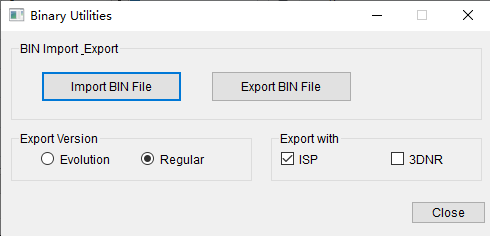

通过[图1](#fig9612133103212)和[图2](#fig1675418825310)中“BIN Import Export”组可完成以下操作：

-   导出板端参数BIN文件：点击“Export BIN File”按钮，并在弹出的文件保存对话框中选择一个保存路径。工具会将板端当前的参数保存到指定的保存路径。
-   导入板端参数BIN文件：点击“Import BIN File”按钮，并在弹出的文件选择对话框中选择一个正确的板端参数BIN文件。工具会将选择的文件发送到板端。发送完成后，数据会即时生效。

> **须知：** 
>-   通过本功能导出的参数BIN文件为板端专用，只能通过BIN对话框的导入功能导入，无法直接在PQTools工具主程序中打开。
>-   BIN保存的ISP模块参数，是ISP模块中非统计信息的数据。
>-   导入的BIN文件需要符合当前业务的场景（VI的分辨率、WDR模式、ISP路数、ViPipe和VpssGrp等基本参数需要相同）才能正常运行。
>-   每次导出的ISP模块参数，地址等信息相较于上一次会有变化。
>-   下章节使用库导入导出图像质量参数不支持演进型BIN导入导出。

### BIN中ISP保存模块<a name="ZH-CN_TOPIC_0000002530061795"></a>

isp\_ext\_config.h头文件中部分功能宏对应的寄存器地址及长度值，具体模块：

VREG\_BLC\_OFFSET + 0x8,     /\* ot\_ext\_system\_black\_level\_change\_write \*/

VREG\_RC\_OFFSET + 0x1,     /\* ot\_ext\_system\_rc\_coef\_update\_en\_write \*/

VREG\_CLUT\_OFFSET + 0x1,     /\* ot\_ext\_system\_clut\_lut\_update\_en\_write \*/

VREG\_CLUT\_OFFSET + 0x8,     /\* ot\_ext\_system\_clut\_ctrl\_update\_en\_write \*/

VREG\_GE\_OFFSET + 0x67,     /\* ot\_ext\_system\_ge\_coef\_update\_en\_write \*/

VREG\_CSC\_OFFSET + 0x58,     /\* ot\_ext\_system\_csc\_attr\_update\_write \*/

VREG\_WDR\_OFFSET + 0x1,     /\* ot\_ext\_system\_wdr\_coef\_update\_en\_write \*/

VREG\_DM\_OFFSET + 0x12,     /\* ot\_ext\_system\_demosaic\_attr\_update\_en\_write \*/

VREG\_AWB\_OFFSET + 0x28,     /\* ot\_ext\_system\_wb\_statistics\_mpi\_update\_en\_write \*/

VREG\_DEHAZE\_OFFSET + 0x142,     /\* ot\_ext\_system\_user\_dehaze\_lut\_update\_write \*/

VREG\_DRC\_OFFSET + 0x1,     /\* ot\_ext\_system\_drc\_param\_updated\_write \*//

VREG\_PREGAMMA\_OFFSET + 0x1,     /\* ot\_ext\_system\_pregamma\_lut\_update\_write \*/

VREG\_CA\_OFFSET + 0x446,     /\* ot\_ext\_system\_ca\_coef\_update\_en\_write \*/

VREG\_GAMMA\_OFFSET + 0x1,     /\* ot\_ext\_system\_gamma\_lut\_update\_write \*/

VREG\_SHARPEN\_OFFSET + 0x3,     /\* ot\_ext\_system\_sharpen\_mpi\_update\_en\_write \*/

VREG\_LSC\_OFFSET + 0x1,     /\* ot\_ext\_system\_isp\_mesh\_shading\_lut\_attr\_updata\_write \*/

VREG\_LSC\_OFFSET + 0x2,     /\* ot\_ext\_system\_isp\_mesh\_shading\_attr\_updata\_write \*/

VREG\_LSC\_OFFSET + 0x4460,     /\* ot\_ext\_system\_isp\_mesh\_shading\_fe\_lut\_attr\_updata\_write \*/

VREG\_LSC\_OFFSET + 0x4461,     /\* ot\_ext\_system\_isp\_mesh\_shading\_fe\_attr\_updata\_write \*/

VREG\_DPC\_OFFSET + 0x5e,     /\* ot\_ext\_system\_dpc\_static\_attr\_update\_write \*/

VREG\_DPC\_OFFSET + 0x5f      /\* ot\_ext\_system\_dpc\_dynamic\_attr\_update\_write \*/

ot\_mpi\_isp.h头文件中clut功能参数，对应set接口ot\_mpi\_isp\_set\_clut\_coeff（方便理解将ISP虚拟寄存器clut读写数据段映射为接口来描述）；

ot\_mpi\_ae.h头文件中get/set接口对应的功能参数；

ot\_mpi\_awb.h头文件中get/set接口对应的功能参数。

### 使用库导入导出图像质量参数<a name="ZH-CN_TOPIC_0000002530221615"></a>

板端工具提供导入导出参数库文件，可根据自己的需要选择功能。


#### 开放参数<a name="ZH-CN_TOPIC_0000002498141686"></a>

```
typedef struct otPQ_BIN_ISP_S { 
    int enable; 
} PQ_BIN_ISP_S; 
  
typedef struct otPQ_BIN_NRX_S{ 
    int enable; 
    int viPipe; 
    int vpssGrp; 
} PQ_BIN_NRX_S; 
  
typedef struct otPQ_BIN_ISP_EVO_S {
    int enable;
    int viPipe;
} PQ_BIN_ISP_EVO_S;

typedef struct otPQ_BIN_MODULE_S{ 
    PQ_BIN_ISP_S stISP; 
    PQ_BIN_NRX_S st3DNR; 
    PQ_BIN_ISP_EVO_S stIspEvo;
} PQ_BIN_MODULE_S;
```

#### 开放接口<a name="ZH-CN_TOPIC_0000002530221675"></a>

-   [OT\_PQ\_GetISPDataTotalLen](#ZH-CN_TOPIC_0000002498301666)：获取isp参数BIN数据的长度。
-   [OT\_PQ\_GetStructParamLen](#ZH-CN_TOPIC_0000002530061633)：获取Struct BIN数据的长度。
-   [OT\_PQ\_BIN\_ExportBinData](#ZH-CN_TOPIC_0000002498301722)：导出BIN文件。
-   [OT\_PQ\_BIN\_ImportBinData](#ZH-CN_TOPIC_0000002498141704)：导入BIN文件。

可参考推荐使用流程，如[图1](#fig13565672314)所示。

**图 1**  BIN推荐使用流程<a name="fig13565672314"></a>  
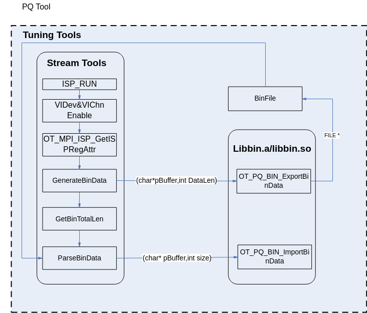

#### 数据类型<a name="ZH-CN_TOPIC_0000002530061651"></a>


##### PQ\_BIN\_ISP\_S<a name="ZH-CN_TOPIC_0000002530061773"></a>

【说明】

设置ISP BIN参数。

【定义】

```
typedef struct otPQ_BIN_ISP_S { 
    int enable; 
} PQ_BIN_ISP_S;
```

【成员】

<a name="table4415mcpsimp"></a>
<table><thead align="left"><tr id="row4420mcpsimp"><th class="cellrowborder" valign="top" width="50%" id="mcps1.1.3.1.1"><p id="p4422mcpsimp"><a name="p4422mcpsimp"></a><a name="p4422mcpsimp"></a>成员名称</p>
</th>
<th class="cellrowborder" valign="top" width="50%" id="mcps1.1.3.1.2"><p id="p4424mcpsimp"><a name="p4424mcpsimp"></a><a name="p4424mcpsimp"></a>描述</p>
</th>
</tr>
</thead>
<tbody><tr id="row4426mcpsimp"><td class="cellrowborder" valign="top" width="50%" headers="mcps1.1.3.1.1 "><p id="p4428mcpsimp"><a name="p4428mcpsimp"></a><a name="p4428mcpsimp"></a>enable</p>
</td>
<td class="cellrowborder" valign="top" width="50%" headers="mcps1.1.3.1.2 "><p id="p4430mcpsimp"><a name="p4430mcpsimp"></a><a name="p4430mcpsimp"></a>ISP参数保存的使能开关</p>
</td>
</tr>
</tbody>
</table>

【注意事项】

无

【相关数据类型及接口】

无

##### PQ\_BIN\_NRX\_S<a name="ZH-CN_TOPIC_0000002530221709"></a>

【说明】

设置NRX结构体保存 BIN参数。

【定义】

```
typedef struct otPQ_BIN_NRX_S { 
    int enable; 
    int viPipe; 
    int vpssGrp; 
} PQ_BIN_NRX_S;
```

【成员】

<a name="table4441mcpsimp"></a>
<table><thead align="left"><tr id="row4446mcpsimp"><th class="cellrowborder" valign="top" width="34%" id="mcps1.1.3.1.1"><p id="p4448mcpsimp"><a name="p4448mcpsimp"></a><a name="p4448mcpsimp"></a>成员名称</p>
</th>
<th class="cellrowborder" valign="top" width="66%" id="mcps1.1.3.1.2"><p id="p4450mcpsimp"><a name="p4450mcpsimp"></a><a name="p4450mcpsimp"></a>描述</p>
</th>
</tr>
</thead>
<tbody><tr id="row4452mcpsimp"><td class="cellrowborder" valign="top" width="34%" headers="mcps1.1.3.1.1 "><p id="p4454mcpsimp"><a name="p4454mcpsimp"></a><a name="p4454mcpsimp"></a>enable</p>
</td>
<td class="cellrowborder" valign="top" width="66%" headers="mcps1.1.3.1.2 "><p id="p4456mcpsimp"><a name="p4456mcpsimp"></a><a name="p4456mcpsimp"></a>ISP参数保存的使能开关</p>
</td>
</tr>
<tr id="row4457mcpsimp"><td class="cellrowborder" valign="top" width="34%" headers="mcps1.1.3.1.1 "><p id="p4459mcpsimp"><a name="p4459mcpsimp"></a><a name="p4459mcpsimp"></a>viPipe</p>
</td>
<td class="cellrowborder" valign="top" width="66%" headers="mcps1.1.3.1.2 "><p id="p4461mcpsimp"><a name="p4461mcpsimp"></a><a name="p4461mcpsimp"></a>viPipe通道号</p>
</td>
</tr>
<tr id="row4462mcpsimp"><td class="cellrowborder" valign="top" width="34%" headers="mcps1.1.3.1.1 "><p id="p4464mcpsimp"><a name="p4464mcpsimp"></a><a name="p4464mcpsimp"></a>vpssGrp</p>
</td>
<td class="cellrowborder" valign="top" width="66%" headers="mcps1.1.3.1.2 "><p id="p4466mcpsimp"><a name="p4466mcpsimp"></a><a name="p4466mcpsimp"></a>vpssGrp的通道号</p>
</td>
</tr>
</tbody>
</table>

【注意事项】

enable使能之后，需要设置对应场景的viPipe号或者是vpssGrp号。

【相关数据类型及接口】

无

##### PQ\_BIN\_ISP\_EVO\_S<a name="ZH-CN_TOPIC_0000002530061769"></a>

【说明】

设置演进版本BIN结构体参数。

【定义】

```
typedef struct otPQ_BIN_ISP_EVO_S {
    int enable;
    int viPipe;
} PQ_BIN_ISP_EVO_S;
```

【成员】

<a name="table4342229205412"></a>
<table><thead align="left"><tr id="row734292911541"><th class="cellrowborder" valign="top" width="34%" id="mcps1.1.3.1.1"><p id="p13342192975419"><a name="p13342192975419"></a><a name="p13342192975419"></a>成员名称</p>
</th>
<th class="cellrowborder" valign="top" width="66%" id="mcps1.1.3.1.2"><p id="p10342202925414"><a name="p10342202925414"></a><a name="p10342202925414"></a>描述</p>
</th>
</tr>
</thead>
<tbody><tr id="row734214294549"><td class="cellrowborder" valign="top" width="34%" headers="mcps1.1.3.1.1 "><p id="p734222925412"><a name="p734222925412"></a><a name="p734222925412"></a>enable</p>
</td>
<td class="cellrowborder" valign="top" width="66%" headers="mcps1.1.3.1.2 "><p id="p133424299541"><a name="p133424299541"></a><a name="p133424299541"></a>是否使用演进版本的BIN，默认置为false</p>
</td>
</tr>
<tr id="row123421229195413"><td class="cellrowborder" valign="top" width="34%" headers="mcps1.1.3.1.1 "><p id="p103422029135411"><a name="p103422029135411"></a><a name="p103422029135411"></a>viPipe</p>
</td>
<td class="cellrowborder" valign="top" width="66%" headers="mcps1.1.3.1.2 "><p id="p5343172914544"><a name="p5343172914544"></a><a name="p5343172914544"></a>演进版本BIN viPipe通道号</p>
</td>
</tr>
</tbody>
</table>

【注意事项】

演进版本是指还未开发完成的版本，即isp未开发完，BIN结构可能会变化.在这个过程中上个版本导出的BIN，在下个版本导入可能就会错位，所以用演进版本BIN，导入时只导入未变化的部分

【相关数据类型及接口】

无

##### PQ\_BIN\_MODULE\_S<a name="ZH-CN_TOPIC_0000002498141796"></a>

【说明】

设置保存BIN数据的参数。

【定义】

```
typedef struct otPQ_BIN_MODULE_S {
    PQ_BIN_ISP_S  stISP;
    PQ_BIN_NRX_S  st3DNR;
    PQ_BIN_ISP_EVO_S stIspEvo;
} PQ_BIN_MODULE_S;
```

【成员】

<a name="table4482mcpsimp"></a>
<table><thead align="left"><tr id="row4487mcpsimp"><th class="cellrowborder" valign="top" width="50%" id="mcps1.1.3.1.1"><p id="p4489mcpsimp"><a name="p4489mcpsimp"></a><a name="p4489mcpsimp"></a>成员名称</p>
</th>
<th class="cellrowborder" valign="top" width="50%" id="mcps1.1.3.1.2"><p id="p4491mcpsimp"><a name="p4491mcpsimp"></a><a name="p4491mcpsimp"></a>描述</p>
</th>
</tr>
</thead>
<tbody><tr id="row4493mcpsimp"><td class="cellrowborder" valign="top" width="50%" headers="mcps1.1.3.1.1 "><p id="p4495mcpsimp"><a name="p4495mcpsimp"></a><a name="p4495mcpsimp"></a>stISP</p>
</td>
<td class="cellrowborder" valign="top" width="50%" headers="mcps1.1.3.1.2 "><p id="p4497mcpsimp"><a name="p4497mcpsimp"></a><a name="p4497mcpsimp"></a>保存ISP参数的相关设置参数</p>
</td>
</tr>
<tr id="row4498mcpsimp"><td class="cellrowborder" valign="top" width="50%" headers="mcps1.1.3.1.1 "><p id="p4500mcpsimp"><a name="p4500mcpsimp"></a><a name="p4500mcpsimp"></a>st3DNR</p>
</td>
<td class="cellrowborder" valign="top" width="50%" headers="mcps1.1.3.1.2 "><p id="p4502mcpsimp"><a name="p4502mcpsimp"></a><a name="p4502mcpsimp"></a>保存3dnr参数的相关设置参数</p>
</td>
</tr>
<tr id="row1825419784614"><td class="cellrowborder" valign="top" width="50%" headers="mcps1.1.3.1.1 "><p id="p1925418717462"><a name="p1925418717462"></a><a name="p1925418717462"></a>stIspEvo</p>
</td>
<td class="cellrowborder" valign="top" width="50%" headers="mcps1.1.3.1.2 "><p id="p15254187194619"><a name="p15254187194619"></a><a name="p15254187194619"></a>保存演进版本BIN的相关设置参数，</p>
</td>
</tr>
</tbody>
</table>

【注意事项】

无

【相关数据类型及接口】

无

#### API参考<a name="ZH-CN_TOPIC_0000002498301802"></a>


##### OT\_PQ\_GetISPDataTotalLen<a name="ZH-CN_TOPIC_0000002498301666"></a>

【描述】

获取isp 参数BIN数据的长度。

【语法】

```
unsigned int OT_PQ_GetISPDataTotalLen();
```

【参数】

无

【返回值】

<a name="table4555mcpsimp"></a>
<table><thead align="left"><tr id="row4560mcpsimp"><th class="cellrowborder" valign="top" width="50%" id="mcps1.1.3.1.1"><p id="p4562mcpsimp"><a name="p4562mcpsimp"></a><a name="p4562mcpsimp"></a>返回值</p>
</th>
<th class="cellrowborder" valign="top" width="50%" id="mcps1.1.3.1.2"><p id="p4564mcpsimp"><a name="p4564mcpsimp"></a><a name="p4564mcpsimp"></a>描述</p>
</th>
</tr>
</thead>
<tbody><tr id="row4566mcpsimp"><td class="cellrowborder" valign="top" width="50%" headers="mcps1.1.3.1.1 "><p id="p4568mcpsimp"><a name="p4568mcpsimp"></a><a name="p4568mcpsimp"></a>长度</p>
</td>
<td class="cellrowborder" valign="top" width="50%" headers="mcps1.1.3.1.2 "><p id="p4570mcpsimp"><a name="p4570mcpsimp"></a><a name="p4570mcpsimp"></a>BIN数据的总长度。</p>
</td>
</tr>
</tbody>
</table>

【错误码】

无

【需求】

-   头文件：ot\_pq\_bin.h
-   库文件：libbin.a

【注意】

此函数必须在调用[OT\_PQ\_BIN\_ExportBinData](#ZH-CN_TOPIC_0000002498301722)接口前调用。

##### OT\_PQ\_GetStructParamLen<a name="ZH-CN_TOPIC_0000002530061633"></a>

【描述】

获取struct BIN数据的长度。

【语法】

```
unsigned int OT_PQ_GetStructParamLen (PQ_BIN_MODULE_S *pstBinParam);
```

【参数】

<a name="table4533mcpsimp"></a>
<table><thead align="left"><tr id="row4539mcpsimp"><th class="cellrowborder" valign="top" width="23%" id="mcps1.1.4.1.1"><p id="p4541mcpsimp"><a name="p4541mcpsimp"></a><a name="p4541mcpsimp"></a>参数名称</p>
</th>
<th class="cellrowborder" valign="top" width="55.00000000000001%" id="mcps1.1.4.1.2"><p id="p4543mcpsimp"><a name="p4543mcpsimp"></a><a name="p4543mcpsimp"></a>描述</p>
</th>
<th class="cellrowborder" valign="top" width="22%" id="mcps1.1.4.1.3"><p id="p4545mcpsimp"><a name="p4545mcpsimp"></a><a name="p4545mcpsimp"></a>输入/输出</p>
</th>
</tr>
</thead>
<tbody><tr id="row4547mcpsimp"><td class="cellrowborder" valign="top" width="23%" headers="mcps1.1.4.1.1 "><p id="p4549mcpsimp"><a name="p4549mcpsimp"></a><a name="p4549mcpsimp"></a>pstBinParam</p>
</td>
<td class="cellrowborder" valign="top" width="55.00000000000001%" headers="mcps1.1.4.1.2 "><p id="p4551mcpsimp"><a name="p4551mcpsimp"></a><a name="p4551mcpsimp"></a>设置BIN文件保存内存和相关通道参数。</p>
</td>
<td class="cellrowborder" valign="top" width="22%" headers="mcps1.1.4.1.3 "><p id="p4553mcpsimp"><a name="p4553mcpsimp"></a><a name="p4553mcpsimp"></a>输入</p>
</td>
</tr>
</tbody>
</table>

【返回值】

<a name="table4555mcpsimp"></a>
<table><thead align="left"><tr id="row4560mcpsimp"><th class="cellrowborder" valign="top" width="50%" id="mcps1.1.3.1.1"><p id="p4562mcpsimp"><a name="p4562mcpsimp"></a><a name="p4562mcpsimp"></a>返回值</p>
</th>
<th class="cellrowborder" valign="top" width="50%" id="mcps1.1.3.1.2"><p id="p4564mcpsimp"><a name="p4564mcpsimp"></a><a name="p4564mcpsimp"></a>描述</p>
</th>
</tr>
</thead>
<tbody><tr id="row4566mcpsimp"><td class="cellrowborder" valign="top" width="50%" headers="mcps1.1.3.1.1 "><p id="p4568mcpsimp"><a name="p4568mcpsimp"></a><a name="p4568mcpsimp"></a>长度</p>
</td>
<td class="cellrowborder" valign="top" width="50%" headers="mcps1.1.3.1.2 "><p id="p4570mcpsimp"><a name="p4570mcpsimp"></a><a name="p4570mcpsimp"></a>Struct参数的实际长度。</p>
</td>
</tr>
</tbody>
</table>

【错误码】

无

【需求】

-   头文件：ot\_pq\_bin.h
-   库文件：libbin.a

【注意】

此函数必须在调用[OT\_PQ\_BIN\_ExportBinData](#ZH-CN_TOPIC_0000002498301722)接口前调用。

##### OT\_PQ\_BIN\_ExportBinData<a name="ZH-CN_TOPIC_0000002498301722"></a>

【描述】

导出BIN数据。

【语法】

```
int OT_PQ_BIN_ExportBinData(PQ_BIN_MODULE_S *pstBinParam, unsigned char* pu8Buffer, unsigned int u32DataLength);
```

【参数】

<a name="table4587mcpsimp"></a>
<table><thead align="left"><tr id="row4593mcpsimp"><th class="cellrowborder" valign="top" width="24.75%" id="mcps1.1.4.1.1"><p id="p4595mcpsimp"><a name="p4595mcpsimp"></a><a name="p4595mcpsimp"></a>参数名称</p>
</th>
<th class="cellrowborder" valign="top" width="53.47%" id="mcps1.1.4.1.2"><p id="p4597mcpsimp"><a name="p4597mcpsimp"></a><a name="p4597mcpsimp"></a>描述</p>
</th>
<th class="cellrowborder" valign="top" width="21.78%" id="mcps1.1.4.1.3"><p id="p4599mcpsimp"><a name="p4599mcpsimp"></a><a name="p4599mcpsimp"></a>输入/输出</p>
</th>
</tr>
</thead>
<tbody><tr id="row4601mcpsimp"><td class="cellrowborder" valign="top" width="24.75%" headers="mcps1.1.4.1.1 "><p id="p4603mcpsimp"><a name="p4603mcpsimp"></a><a name="p4603mcpsimp"></a>pstBinParam</p>
</td>
<td class="cellrowborder" valign="top" width="53.47%" headers="mcps1.1.4.1.2 "><p id="p4605mcpsimp"><a name="p4605mcpsimp"></a><a name="p4605mcpsimp"></a>设置BIN文件保存内存和相关通道参数</p>
</td>
<td class="cellrowborder" valign="top" width="21.78%" headers="mcps1.1.4.1.3 "><p id="p4607mcpsimp"><a name="p4607mcpsimp"></a><a name="p4607mcpsimp"></a>输入</p>
</td>
</tr>
<tr id="row4608mcpsimp"><td class="cellrowborder" valign="top" width="24.75%" headers="mcps1.1.4.1.1 "><p id="p4610mcpsimp"><a name="p4610mcpsimp"></a><a name="p4610mcpsimp"></a>pu8Buffer</p>
</td>
<td class="cellrowborder" valign="top" width="53.47%" headers="mcps1.1.4.1.2 "><p id="p4612mcpsimp"><a name="p4612mcpsimp"></a><a name="p4612mcpsimp"></a>存放BIN的内存空间</p>
</td>
<td class="cellrowborder" valign="top" width="21.78%" headers="mcps1.1.4.1.3 "><p id="p4614mcpsimp"><a name="p4614mcpsimp"></a><a name="p4614mcpsimp"></a>输出</p>
</td>
</tr>
<tr id="row4615mcpsimp"><td class="cellrowborder" valign="top" width="24.75%" headers="mcps1.1.4.1.1 "><p id="p4617mcpsimp"><a name="p4617mcpsimp"></a><a name="p4617mcpsimp"></a>u32DataLength</p>
</td>
<td class="cellrowborder" valign="top" width="53.47%" headers="mcps1.1.4.1.2 "><p id="p4619mcpsimp"><a name="p4619mcpsimp"></a><a name="p4619mcpsimp"></a>BIN数据的长度</p>
</td>
<td class="cellrowborder" valign="top" width="21.78%" headers="mcps1.1.4.1.3 "><p id="p4621mcpsimp"><a name="p4621mcpsimp"></a><a name="p4621mcpsimp"></a>输入</p>
</td>
</tr>
</tbody>
</table>

【返回值】

<a name="table4623mcpsimp"></a>
<table><thead align="left"><tr id="row4628mcpsimp"><th class="cellrowborder" valign="top" width="39%" id="mcps1.1.3.1.1"><p id="p4630mcpsimp"><a name="p4630mcpsimp"></a><a name="p4630mcpsimp"></a>返回值</p>
</th>
<th class="cellrowborder" valign="top" width="61%" id="mcps1.1.3.1.2"><p id="p4632mcpsimp"><a name="p4632mcpsimp"></a><a name="p4632mcpsimp"></a>描述</p>
</th>
</tr>
</thead>
<tbody><tr id="row4634mcpsimp"><td class="cellrowborder" valign="top" width="39%" headers="mcps1.1.3.1.1 "><p id="p4636mcpsimp"><a name="p4636mcpsimp"></a><a name="p4636mcpsimp"></a>0</p>
</td>
<td class="cellrowborder" valign="top" width="61%" headers="mcps1.1.3.1.2 "><p id="p4638mcpsimp"><a name="p4638mcpsimp"></a><a name="p4638mcpsimp"></a>成功</p>
</td>
</tr>
<tr id="row4639mcpsimp"><td class="cellrowborder" valign="top" width="39%" headers="mcps1.1.3.1.1 "><p id="p4641mcpsimp"><a name="p4641mcpsimp"></a><a name="p4641mcpsimp"></a>非0</p>
</td>
<td class="cellrowborder" valign="top" width="61%" headers="mcps1.1.3.1.2 "><p id="p4643mcpsimp"><a name="p4643mcpsimp"></a><a name="p4643mcpsimp"></a>失败，其值为错误码</p>
</td>
</tr>
</tbody>
</table>

【错误码】

<a name="table4645mcpsimp"></a>
<table><thead align="left"><tr id="row4650mcpsimp"><th class="cellrowborder" valign="top" width="28.999999999999996%" id="mcps1.1.3.1.1"><p id="p4652mcpsimp"><a name="p4652mcpsimp"></a><a name="p4652mcpsimp"></a>接口返回值</p>
</th>
<th class="cellrowborder" valign="top" width="71%" id="mcps1.1.3.1.2"><p id="p4654mcpsimp"><a name="p4654mcpsimp"></a><a name="p4654mcpsimp"></a>含义</p>
</th>
</tr>
</thead>
<tbody><tr id="row4656mcpsimp"><td class="cellrowborder" valign="top" width="28.999999999999996%" headers="mcps1.1.3.1.1 "><p id="p4658mcpsimp"><a name="p4658mcpsimp"></a><a name="p4658mcpsimp"></a>0xCB000001</p>
</td>
<td class="cellrowborder" valign="top" width="71%" headers="mcps1.1.3.1.2 "><p id="p4660mcpsimp"><a name="p4660mcpsimp"></a><a name="p4660mcpsimp"></a>入参指针为空</p>
</td>
</tr>
<tr id="row4661mcpsimp"><td class="cellrowborder" valign="top" width="28.999999999999996%" headers="mcps1.1.3.1.1 "><p id="p4663mcpsimp"><a name="p4663mcpsimp"></a><a name="p4663mcpsimp"></a>0xCB000003</p>
</td>
<td class="cellrowborder" valign="top" width="71%" headers="mcps1.1.3.1.2 "><p id="p4665mcpsimp"><a name="p4665mcpsimp"></a><a name="p4665mcpsimp"></a>未分配到内存空间</p>
</td>
</tr>
<tr id="row4666mcpsimp"><td class="cellrowborder" valign="top" width="28.999999999999996%" headers="mcps1.1.3.1.1 "><p id="p4668mcpsimp"><a name="p4668mcpsimp"></a><a name="p4668mcpsimp"></a>0xCB000005</p>
</td>
<td class="cellrowborder" valign="top" width="71%" headers="mcps1.1.3.1.2 "><p id="p4670mcpsimp"><a name="p4670mcpsimp"></a><a name="p4670mcpsimp"></a>数据不完整</p>
</td>
</tr>
<tr id="row4671mcpsimp"><td class="cellrowborder" valign="top" width="28.999999999999996%" headers="mcps1.1.3.1.1 "><p id="p4673mcpsimp"><a name="p4673mcpsimp"></a><a name="p4673mcpsimp"></a>0xCB000008</p>
</td>
<td class="cellrowborder" valign="top" width="71%" headers="mcps1.1.3.1.2 "><p id="p4675mcpsimp"><a name="p4675mcpsimp"></a><a name="p4675mcpsimp"></a>数据损坏</p>
</td>
</tr>
<tr id="row4676mcpsimp"><td class="cellrowborder" valign="top" width="28.999999999999996%" headers="mcps1.1.3.1.1 "><p id="p4678mcpsimp"><a name="p4678mcpsimp"></a><a name="p4678mcpsimp"></a>0xCB000009</p>
</td>
<td class="cellrowborder" valign="top" width="71%" headers="mcps1.1.3.1.2 "><p id="p4680mcpsimp"><a name="p4680mcpsimp"></a><a name="p4680mcpsimp"></a>Mpi接口读写错误</p>
</td>
</tr>
<tr id="row4681mcpsimp"><td class="cellrowborder" valign="top" width="28.999999999999996%" headers="mcps1.1.3.1.1 "><p id="p4683mcpsimp"><a name="p4683mcpsimp"></a><a name="p4683mcpsimp"></a>0xCB00000A</p>
</td>
<td class="cellrowborder" valign="top" width="71%" headers="mcps1.1.3.1.2 "><p id="p4685mcpsimp"><a name="p4685mcpsimp"></a><a name="p4685mcpsimp"></a>数据受保护</p>
</td>
</tr>
</tbody>
</table>

【需求】

-   头文件：ot\_pq\_bin.h
-   库文件：libbin.a

【注意】

调用此函数必须先调用[OT\_PQ\_GetISPDataTotalLen](#ZH-CN_TOPIC_0000002498301666)或者[OT\_PQ\_GetStructParamLen](#ZH-CN_TOPIC_0000002530061633)函数，获取数据的大小，否则可能出现内存问题。

##### OT\_PQ\_BIN\_ImportBinData<a name="ZH-CN_TOPIC_0000002498141704"></a>

【描述】

导入BIN数据。

【语法】

```
int OT_PQ_BIN_ImportBinData(PQ_BIN_MODULE_S *pstBinParam，unsigned char* pu8Buffer, unsigned int u32DataLength);
```

【参数】

<a name="table4701mcpsimp"></a>
<table><thead align="left"><tr id="row4707mcpsimp"><th class="cellrowborder" valign="top" width="30%" id="mcps1.1.4.1.1"><p id="p4709mcpsimp"><a name="p4709mcpsimp"></a><a name="p4709mcpsimp"></a>参数名称</p>
</th>
<th class="cellrowborder" valign="top" width="50%" id="mcps1.1.4.1.2"><p id="p4711mcpsimp"><a name="p4711mcpsimp"></a><a name="p4711mcpsimp"></a>描述</p>
</th>
<th class="cellrowborder" valign="top" width="20%" id="mcps1.1.4.1.3"><p id="p4713mcpsimp"><a name="p4713mcpsimp"></a><a name="p4713mcpsimp"></a>输入/输出</p>
</th>
</tr>
</thead>
<tbody><tr id="row4715mcpsimp"><td class="cellrowborder" valign="top" width="30%" headers="mcps1.1.4.1.1 "><p id="p4717mcpsimp"><a name="p4717mcpsimp"></a><a name="p4717mcpsimp"></a>pstBinParam</p>
</td>
<td class="cellrowborder" valign="top" width="50%" headers="mcps1.1.4.1.2 "><p id="p4719mcpsimp"><a name="p4719mcpsimp"></a><a name="p4719mcpsimp"></a>设置BIN文件保存内存和相关通道参数</p>
</td>
<td class="cellrowborder" valign="top" width="20%" headers="mcps1.1.4.1.3 "><p id="p4721mcpsimp"><a name="p4721mcpsimp"></a><a name="p4721mcpsimp"></a>输入</p>
</td>
</tr>
<tr id="row4722mcpsimp"><td class="cellrowborder" valign="top" width="30%" headers="mcps1.1.4.1.1 "><p id="p4724mcpsimp"><a name="p4724mcpsimp"></a><a name="p4724mcpsimp"></a>pu8Buffer</p>
</td>
<td class="cellrowborder" valign="top" width="50%" headers="mcps1.1.4.1.2 "><p id="p4726mcpsimp"><a name="p4726mcpsimp"></a><a name="p4726mcpsimp"></a>BIN的内存空间</p>
</td>
<td class="cellrowborder" valign="top" width="20%" headers="mcps1.1.4.1.3 "><p id="p4728mcpsimp"><a name="p4728mcpsimp"></a><a name="p4728mcpsimp"></a>输入</p>
</td>
</tr>
<tr id="row4729mcpsimp"><td class="cellrowborder" valign="top" width="30%" headers="mcps1.1.4.1.1 "><p id="p4731mcpsimp"><a name="p4731mcpsimp"></a><a name="p4731mcpsimp"></a>u32DataLength</p>
</td>
<td class="cellrowborder" valign="top" width="50%" headers="mcps1.1.4.1.2 "><p id="p4733mcpsimp"><a name="p4733mcpsimp"></a><a name="p4733mcpsimp"></a>BIN大小</p>
</td>
<td class="cellrowborder" valign="top" width="20%" headers="mcps1.1.4.1.3 "><p id="p4735mcpsimp"><a name="p4735mcpsimp"></a><a name="p4735mcpsimp"></a>输入</p>
</td>
</tr>
</tbody>
</table>

【返回值】

<a name="table4737mcpsimp"></a>
<table><thead align="left"><tr id="row4742mcpsimp"><th class="cellrowborder" valign="top" width="51%" id="mcps1.1.3.1.1"><p id="p4744mcpsimp"><a name="p4744mcpsimp"></a><a name="p4744mcpsimp"></a>返回值</p>
</th>
<th class="cellrowborder" valign="top" width="49%" id="mcps1.1.3.1.2"><p id="p4746mcpsimp"><a name="p4746mcpsimp"></a><a name="p4746mcpsimp"></a>描述</p>
</th>
</tr>
</thead>
<tbody><tr id="row4748mcpsimp"><td class="cellrowborder" valign="top" width="51%" headers="mcps1.1.3.1.1 "><p id="p4750mcpsimp"><a name="p4750mcpsimp"></a><a name="p4750mcpsimp"></a>0</p>
</td>
<td class="cellrowborder" valign="top" width="49%" headers="mcps1.1.3.1.2 "><p id="p4752mcpsimp"><a name="p4752mcpsimp"></a><a name="p4752mcpsimp"></a>成功</p>
</td>
</tr>
<tr id="row4753mcpsimp"><td class="cellrowborder" valign="top" width="51%" headers="mcps1.1.3.1.1 "><p id="p4755mcpsimp"><a name="p4755mcpsimp"></a><a name="p4755mcpsimp"></a>非0</p>
</td>
<td class="cellrowborder" valign="top" width="49%" headers="mcps1.1.3.1.2 "><p id="p4757mcpsimp"><a name="p4757mcpsimp"></a><a name="p4757mcpsimp"></a>失败，其值为错误码</p>
</td>
</tr>
</tbody>
</table>

【错误码】

<a name="table4759mcpsimp"></a>
<table><thead align="left"><tr id="row4764mcpsimp"><th class="cellrowborder" valign="top" width="50%" id="mcps1.1.3.1.1"><p id="p4766mcpsimp"><a name="p4766mcpsimp"></a><a name="p4766mcpsimp"></a>接口返回值</p>
</th>
<th class="cellrowborder" valign="top" width="50%" id="mcps1.1.3.1.2"><p id="p4768mcpsimp"><a name="p4768mcpsimp"></a><a name="p4768mcpsimp"></a>含义</p>
</th>
</tr>
</thead>
<tbody><tr id="row4770mcpsimp"><td class="cellrowborder" valign="top" width="50%" headers="mcps1.1.3.1.1 "><p id="p4772mcpsimp"><a name="p4772mcpsimp"></a><a name="p4772mcpsimp"></a>0xCB000001</p>
</td>
<td class="cellrowborder" valign="top" width="50%" headers="mcps1.1.3.1.2 "><p id="p4774mcpsimp"><a name="p4774mcpsimp"></a><a name="p4774mcpsimp"></a>入参指针为空</p>
</td>
</tr>
<tr id="row4775mcpsimp"><td class="cellrowborder" valign="top" width="50%" headers="mcps1.1.3.1.1 "><p id="p4777mcpsimp"><a name="p4777mcpsimp"></a><a name="p4777mcpsimp"></a>0xCB000003</p>
</td>
<td class="cellrowborder" valign="top" width="50%" headers="mcps1.1.3.1.2 "><p id="p4779mcpsimp"><a name="p4779mcpsimp"></a><a name="p4779mcpsimp"></a>申请空间失败</p>
</td>
</tr>
<tr id="row4780mcpsimp"><td class="cellrowborder" valign="top" width="50%" headers="mcps1.1.3.1.1 "><p id="p4782mcpsimp"><a name="p4782mcpsimp"></a><a name="p4782mcpsimp"></a>0xCB000008</p>
</td>
<td class="cellrowborder" valign="top" width="50%" headers="mcps1.1.3.1.2 "><p id="p4784mcpsimp"><a name="p4784mcpsimp"></a><a name="p4784mcpsimp"></a>数据错误</p>
</td>
</tr>
<tr id="row4785mcpsimp"><td class="cellrowborder" valign="top" width="50%" headers="mcps1.1.3.1.1 "><p id="p4787mcpsimp"><a name="p4787mcpsimp"></a><a name="p4787mcpsimp"></a>0xCB000009</p>
</td>
<td class="cellrowborder" valign="top" width="50%" headers="mcps1.1.3.1.2 "><p id="p4789mcpsimp"><a name="p4789mcpsimp"></a><a name="p4789mcpsimp"></a>Mpi接口读写错误</p>
</td>
</tr>
<tr id="row4790mcpsimp"><td class="cellrowborder" valign="top" width="50%" headers="mcps1.1.3.1.1 "><p id="p4792mcpsimp"><a name="p4792mcpsimp"></a><a name="p4792mcpsimp"></a>0xCB00000A</p>
</td>
<td class="cellrowborder" valign="top" width="50%" headers="mcps1.1.3.1.2 "><p id="p4794mcpsimp"><a name="p4794mcpsimp"></a><a name="p4794mcpsimp"></a>数据被保护</p>
</td>
</tr>
</tbody>
</table>

【需求】

-   头文件：ot\_pq\_bin.h
-   库文件：libbin.a

【注意】

无

## 工具如何替换3A算法？<a name="ZH-CN_TOPIC_0000002498301810"></a>

工具可通过配置XML指定修改某一地址对应的值。若要替换3A算法首先更新XML文件中3A算法的地址和格式等配置选项，具体更改配置方法请看“[物理/虚拟寄存器的添加与调试](#ZH-CN_TOPIC_0000002530221723)”，最后用图像调节工具导入配置好的xml文件即可。

> **须知：** 
>在 LiteOS 系统下替换3A算法，需要手动删除3A相关xml选项，否则程序会有挂死现象。

# 点播工具使用<a name="ZH-CN_TOPIC_0000002530221689"></a>


## 点播软件的安装与运行<a name="ZH-CN_TOPIC_0000002498141770"></a>


### 板端软件执行<a name="ZH-CN_TOPIC_0000002530221775"></a>

直接运行可执行程序，根据实际sensor情况运行PQTools.sh。步骤如下：

1.  把位于发布包中的SSXX\_PQ\_VX.X.X.X.tgz解压到单板上或者服务器上。如果解压到服务器上运行，需先将单板mount到服务器目录下。
2.  板端的工具是根据./PQTools.sh脚本里的配置启动的，需运行脚本即可。启动脚本后需输入启动参数，如下：

    ./ PQTools.sh  -a  sensor目录 ini序列  如 ./ PQTools.sh  -a  XXX  0

    -   sensor目录：应用程序默认在**SSXX\_PQ\_V**X.X.X.X目录下configs目录下读取config\_entry.ini
    -   ini序列在config\_entry.ini中可以查看；也可以配置config\_entry.ini，而不输入ini序列。

### PC端软件执行<a name="ZH-CN_TOPIC_0000002498301664"></a>

点播软件的PC端软件是绿色软件，直接使用解压缩工具（如WinRAR、WinZip等）将PQStream（zip格式）解压缩到任意的可写目录，即可使用。

如果需要支持4K30fps，推荐显卡性能如下：

-   显卡内存：2GB
-   显存位宽：128bit
-   核心频率：900MHz
-   显存频率：5000MHz
-   如果需要支持10bit图像显示，显卡和显示器必须支持10bit。

## 快速入门<a name="ZH-CN_TOPIC_0000002498141688"></a>

运行PQStream软件后，出现登录画面，输入相应的IP地址，点击“确定”按钮，即可进去主界面，如[图1](#fig3954122972511)和[图2](#fig1350914534258)所示。

**图 1**  登录界面<a name="fig3954122972511"></a>  
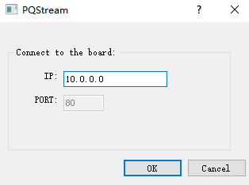

**图 2**  主界面<a name="fig1350914534258"></a>  
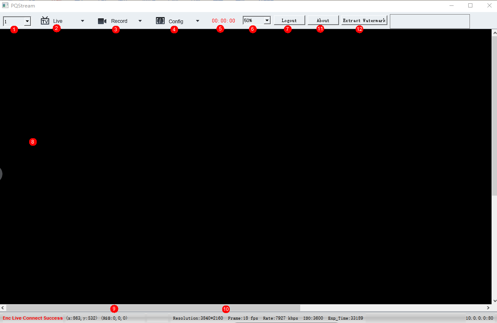

主界面各功能按钮和区域的介绍如下：

> **说明：** 
>\(1\) 预览通道
>\(2\) 预览源（Enc/YUV）
>\(3\) 录像/停止录像
>\(4\) 参数设置
>\(5\) 录像时长
>\(6\) 预览窗口比例
>\(7\) 登录/登出
>\(8\) 视频预览主页面
>\(9\) 当前信息
>\(10\) 通道信息显示
>\(11\) 查看工具版本号

> **须知：** 
>-   录像后的抓JPEG功能已经移到了 control 界面上，stream 上不支持抓JPEG。
>-   当帧率为120时，由于工具当前不支持过高帧率，所以板端会进行帧率控制；建议控制作为30\~60帧。


### 预览<a name="ZH-CN_TOPIC_0000002530061697"></a>

\(1\)预览通道选择：控制预览画面来源于哪一个通道。

\(2\)预览与停止：控制视频预览与停止。点播一路编码预览时，下拉菜单包括Enc、YUV两种预览模式以及停止预览控制，如[图1](#fig5819736192618)所示。

**图 1**  预览下拉菜单<a name="fig5819736192618"></a>  


当程序启动时，会自动链接主程序设置IP地址的设备。可以在左下角查看当前链接状态“\(9\) 当前信息”，链接成功后可视频预览页面“\(8\)视频预览主页面”观察当前视频。

> **说明：** 
>-   点播编码格式可由板端的配置文件配置，修改对应sensor的配置文件中RcMode字段的值即可。
>-   支持多路编码点播工具中，默认启动的是第一路编码点播。若是想要预览其他路，使用预览通道选择。
>-   如需修改编码格式需要在对应sensor配置文件中的venc字段RcMode为所需要的编码格式。支持多路编码预览的工具，修改编码格式需要在对应sensor配置文件中的venc\_X字段RcMode为所需要的编码格式，X为编码通道编号。
>-   配置文件路径为板端发布包中configs文件夹。
>-   点播工具暂不支持YUV预览。

视频窗口可以通过下拉框“\(6\)预览窗口比例”选择缩放比例。目前支持30%、50%、80%或100%的比例缩放。当视频窗口过大时，可以拖动预览窗口的滚动条查看。也可以鼠标拖动应用程序右下角改变其大小。

### 录像<a name="ZH-CN_TOPIC_0000002530061737"></a>

\(3\)录像：控制录像的开始与停止。下拉菜单包括录像的开始、停止和设置，如[图2](#ZH-CN_TOPIC_0000002498141688)所示。当视频正常链接的时候，点击下拉菜单录像按钮进行录像。开始录像时录像按钮变为且下拉菜单变为。在“\(5\)录像时长”处显示已录像时长。此时当点击下拉列表的停止按钮，停止录像。同时按钮恢复先前状态，“\(5\)录像时长”消失。

### 右键功能菜单<a name="ZH-CN_TOPIC_0000002530061783"></a>


#### 显示方式<a name="ZH-CN_TOPIC_0000002498301744"></a>

在可视频预览页面“\(8\)视频预览主页面”，点击鼠标右键出现右键菜单，第1个VO Type，有2个选项，默认使用BT709。

**图 1**  右键菜单（显示方式）<a name="fig4890mcpsimp"></a>  


#### 解码方式<a name="ZH-CN_TOPIC_0000002530061715"></a>

在可视频预览页面“\(8\)视频预览主页面”，点击鼠标右键出现右键菜单，第2个Stream Type，有2个选项，默认使用Rate First，Data First一般使用超大I帧的场景。

**图 1**  右键菜单（解码方式）<a name="fig4894mcpsimp"></a>  
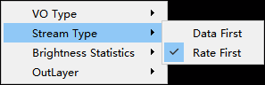

#### 区域平均亮度统计<a name="ZH-CN_TOPIC_0000002498141856"></a>

**图 1**  亮度统计开关<a name="fig4897mcpsimp"></a>  


-   打开后在工具的最下方状态栏出现亮度统计显示项。


-   鼠标左键在图像上按住不放，拖动框选想要的区域后，松开鼠标左键。数值就会显示。


此功能比较适合静态场景测试，当图像为高速运动场景时。获取的数据可能和实际鼠标点击时的图像相差较大。

#### 输出图层<a name="ZH-CN_TOPIC_0000002498141830"></a>

在可视频预览页面“\(8\)视频预览主页面”，点击鼠标右键出现右键菜单，第4个OutLayer，有2个选项，默认使用Normal，Original用于隐私保护等特殊使用场景。

**图 1**  输出图层选项<a name="fig13203174711144"></a>  
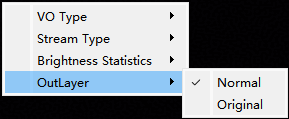

> **须知：** 
>此功能依赖隐私保护媒体业务，SS928V100不支持。

### WDR模式切换<a name="ZH-CN_TOPIC_0000002530061639"></a>

WDR模式切换，可获取当前设备支持的WDR模式，并可快速切换所有支持的WDR模式，画面快速生效，如[图1](#_toc51692635)所示。

**图 1**  WDR模式切换<a name="_toc51692635"></a>  

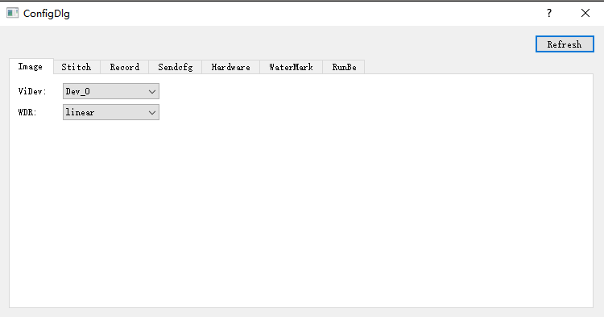

ViDev选择VI设备，WDR下拉选择要切换的WDR模式，选择即生效。

> **说明：** 
>如当前ViDev仅支持一种WDR模式，该功能即不允许切换操作。

### Stitch数据源切换<a name="ZH-CN_TOPIC_0000002530061631"></a>

Stitch数据源切换功能实现输入到AVSP模块的数据来源快速设置，点播画面立即生效，如[图1](#fig184698372336)所示。

**图 1**  Config-Stitch数据源设置<a name="fig184698372336"></a>  


Pipe0 From Source Seq表示pipe0图像数据从镜头x获取，Pipe1 From Source Seq表示pipe1图像数据从镜头y获取，默认设置0,1下发板端，点播画面无变化。设置其他不同值下发板端，点播图像会切换到设置的镜头画面。

> **说明：** 
>AVSP数据源设置前提条件：1、当前avsp模块初始化成功；2、数据源真实存在。

### 录像设置<a name="ZH-CN_TOPIC_0000002530221667"></a>

录像保存路径设置，如[图1](#fig96211046153415)所示。

**图 1**  录像设置<a name="fig96211046153415"></a>  
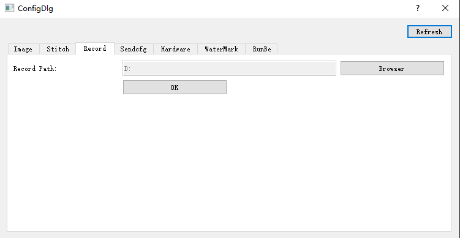

-   Browse功能

    支持手动选择录像文件储存在PC中的路径。

-   OK

    点击保存设置，可选择退出参数设置窗口。

### Sensor参数设置<a name="ZH-CN_TOPIC_0000002498301760"></a>

Sensor参数设置功能“\(4\)参数设置”实现动态切换配置sensor参数。如[图1](#fig109274101354)所示。

**图 1**  Config功能主界面<a name="fig109274101354"></a>  
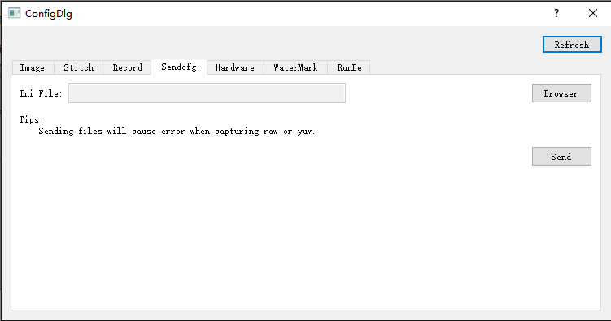

-   Browse功能

    支持手动选择PC中的配置文件。

-   选择发送格式

    全部重启和切换wdr格式。

-   Send功能

    把browse选中的配置文件下发到板端并配置到板端。

> **须知：** 
>发送到板端的配置文件格式必须与模板格式一致。
>板端重加载配置时会断开连接，加载成功后自动重连点播。

## ini文件适配<a name="ZH-CN_TOPIC_0000002530221755"></a>

> **须知：** 
>生态版本不支持拼接、MCF相关功能。

**表 1**  ini文件参数一览表

<a name="table4940mcpsimp"></a>
<table><thead align="left"><tr id="row4948mcpsimp"><th class="cellrowborder" valign="top" width="15.151515151515152%" id="mcps1.2.5.1.1"><p id="p4950mcpsimp"><a name="p4950mcpsimp"></a><a name="p4950mcpsimp"></a>Key字段</p>
</th>
<th class="cellrowborder" valign="top" width="19.19191919191919%" id="mcps1.2.5.1.2"><p id="p4952mcpsimp"><a name="p4952mcpsimp"></a><a name="p4952mcpsimp"></a>字段</p>
</th>
<th class="cellrowborder" valign="top" width="23.232323232323232%" id="mcps1.2.5.1.3"><p id="p4954mcpsimp"><a name="p4954mcpsimp"></a><a name="p4954mcpsimp"></a>对应接口</p>
</th>
<th class="cellrowborder" valign="top" width="42.42424242424242%" id="mcps1.2.5.1.4"><p id="p4956mcpsimp"><a name="p4956mcpsimp"></a><a name="p4956mcpsimp"></a>说明</p>
</th>
</tr>
</thead>
<tbody><tr id="row4958mcpsimp"><td class="cellrowborder" rowspan="2" valign="top" width="15.151515151515152%" headers="mcps1.2.5.1.1 "><p id="p4960mcpsimp"><a name="p4960mcpsimp"></a><a name="p4960mcpsimp"></a>isp</p>
</td>
<td class="cellrowborder" valign="top" width="19.19191919191919%" headers="mcps1.2.5.1.2 "><p id="p4962mcpsimp"><a name="p4962mcpsimp"></a><a name="p4962mcpsimp"></a>IspNum</p>
</td>
<td class="cellrowborder" valign="top" width="23.232323232323232%" headers="mcps1.2.5.1.3 "><p id="p4964mcpsimp"><a name="p4964mcpsimp"></a><a name="p4964mcpsimp"></a>工具内部参数</p>
</td>
<td class="cellrowborder" valign="top" width="42.42424242424242%" headers="mcps1.2.5.1.4 "><p id="p4966mcpsimp"><a name="p4966mcpsimp"></a><a name="p4966mcpsimp"></a>isp数目，与isp.x配置项的数目匹配</p>
</td>
</tr>
<tr id="row4967mcpsimp"><td class="cellrowborder" valign="top" headers="mcps1.2.5.1.1 "><p id="p4969mcpsimp"><a name="p4969mcpsimp"></a><a name="p4969mcpsimp"></a>IntBotHalf</p>
</td>
<td class="cellrowborder" valign="top" headers="mcps1.2.5.1.2 "><p id="p4971mcpsimp"><a name="p4971mcpsimp"></a><a name="p4971mcpsimp"></a>ot_mpi_isp_set_mod_param</p>
</td>
<td class="cellrowborder" valign="top" headers="mcps1.2.5.1.3 "><p id="p4973mcpsimp"><a name="p4973mcpsimp"></a><a name="p4973mcpsimp"></a>参考《ISP开发参考》</p>
</td>
</tr>
<tr id="row4974mcpsimp"><td class="cellrowborder" rowspan="7" valign="top" width="15.151515151515152%" headers="mcps1.2.5.1.1 "><p id="p4976mcpsimp"><a name="p4976mcpsimp"></a><a name="p4976mcpsimp"></a>isp.0</p>
</td>
<td class="cellrowborder" valign="top" width="19.19191919191919%" headers="mcps1.2.5.1.2 "><p id="p4978mcpsimp"><a name="p4978mcpsimp"></a><a name="p4978mcpsimp"></a>DevId</p>
</td>
<td class="cellrowborder" valign="top" width="23.232323232323232%" headers="mcps1.2.5.1.3 "><p id="p4980mcpsimp"><a name="p4980mcpsimp"></a><a name="p4980mcpsimp"></a>ot_mpi_isp_mem_init</p>
<p id="p4981mcpsimp"><a name="p4981mcpsimp"></a><a name="p4981mcpsimp"></a>ot_mpi_isp_init</p>
<p id="p4982mcpsimp"><a name="p4982mcpsimp"></a><a name="p4982mcpsimp"></a>ot_mpi_isp_run</p>
</td>
<td class="cellrowborder" valign="top" width="42.42424242424242%" headers="mcps1.2.5.1.4 "><p id="p4984mcpsimp"><a name="p4984mcpsimp"></a><a name="p4984mcpsimp"></a>启动isp的设备号</p>
</td>
</tr>
<tr id="row4985mcpsimp"><td class="cellrowborder" valign="top" headers="mcps1.2.5.1.1 "><p id="p4987mcpsimp"><a name="p4987mcpsimp"></a><a name="p4987mcpsimp"></a>SensorType</p>
</td>
<td class="cellrowborder" valign="top" headers="mcps1.2.5.1.2 "><p id="p4989mcpsimp"><a name="p4989mcpsimp"></a><a name="p4989mcpsimp"></a>无</p>
</td>
<td class="cellrowborder" valign="top" headers="mcps1.2.5.1.3 "><p id="p4991mcpsimp"><a name="p4991mcpsimp"></a><a name="p4991mcpsimp"></a>ISP_SNS_OBJ_S结构体对象</p>
</td>
</tr>
<tr id="row4992mcpsimp"><td class="cellrowborder" valign="top" headers="mcps1.2.5.1.1 "><p id="p4994mcpsimp"><a name="p4994mcpsimp"></a><a name="p4994mcpsimp"></a>SensorLibFile</p>
</td>
<td class="cellrowborder" valign="top" headers="mcps1.2.5.1.2 "><p id="p4996mcpsimp"><a name="p4996mcpsimp"></a><a name="p4996mcpsimp"></a>工具内部参数</p>
</td>
<td class="cellrowborder" valign="top" headers="mcps1.2.5.1.3 "><p id="p4998mcpsimp"><a name="p4998mcpsimp"></a><a name="p4998mcpsimp"></a>Sensor动态库文件</p>
</td>
</tr>
<tr id="row4999mcpsimp"><td class="cellrowborder" valign="top" headers="mcps1.2.5.1.1 "><p id="p5001mcpsimp"><a name="p5001mcpsimp"></a><a name="p5001mcpsimp"></a>WdrModeNum</p>
<p id="p5002mcpsimp"><a name="p5002mcpsimp"></a><a name="p5002mcpsimp"></a>UseWdrMode</p>
<p id="p5003mcpsimp"><a name="p5003mcpsimp"></a><a name="p5003mcpsimp"></a>WdrMode0</p>
<p id="p5004mcpsimp"><a name="p5004mcpsimp"></a><a name="p5004mcpsimp"></a>UseMipiMode0</p>
</td>
<td class="cellrowborder" valign="top" headers="mcps1.2.5.1.2 "><p id="p5006mcpsimp"><a name="p5006mcpsimp"></a><a name="p5006mcpsimp"></a>工具内部参数</p>
</td>
<td class="cellrowborder" valign="top" headers="mcps1.2.5.1.3 "><p id="p5008mcpsimp"><a name="p5008mcpsimp"></a><a name="p5008mcpsimp"></a>WDR模式配置项，详见表下说明1</p>
</td>
</tr>
<tr id="row5009mcpsimp"><td class="cellrowborder" valign="top" headers="mcps1.2.5.1.1 "><p id="p5011mcpsimp"><a name="p5011mcpsimp"></a><a name="p5011mcpsimp"></a>Isp_x</p>
<p id="p5012mcpsimp"><a name="p5012mcpsimp"></a><a name="p5012mcpsimp"></a>Isp_y</p>
<p id="p5013mcpsimp"><a name="p5013mcpsimp"></a><a name="p5013mcpsimp"></a>Isp_w</p>
<p id="p5014mcpsimp"><a name="p5014mcpsimp"></a><a name="p5014mcpsimp"></a>Isp_h</p>
<p id="p5015mcpsimp"><a name="p5015mcpsimp"></a><a name="p5015mcpsimp"></a>SensorWidth</p>
<p id="p5016mcpsimp"><a name="p5016mcpsimp"></a><a name="p5016mcpsimp"></a>SensorHeight</p>
<p id="p5017mcpsimp"><a name="p5017mcpsimp"></a><a name="p5017mcpsimp"></a>Isp_FrameRate</p>
<p id="p5018mcpsimp"><a name="p5018mcpsimp"></a><a name="p5018mcpsimp"></a>Isp_Bayer</p>
<p id="p5019mcpsimp"><a name="p5019mcpsimp"></a><a name="p5019mcpsimp"></a>SnsMode</p>
</td>
<td class="cellrowborder" valign="top" headers="mcps1.2.5.1.2 "><p id="p5021mcpsimp"><a name="p5021mcpsimp"></a><a name="p5021mcpsimp"></a>ot_mpi_isp_set_pub_attr</p>
</td>
<td class="cellrowborder" valign="top" headers="mcps1.2.5.1.3 "><p id="p5023mcpsimp"><a name="p5023mcpsimp"></a><a name="p5023mcpsimp"></a>参考《ISP开发参考》</p>
</td>
</tr>
<tr id="row5024mcpsimp"><td class="cellrowborder" valign="top" headers="mcps1.2.5.1.1 "><p id="p5026mcpsimp"><a name="p5026mcpsimp"></a><a name="p5026mcpsimp"></a>SnsType</p>
<p id="p5027mcpsimp"><a name="p5027mcpsimp"></a><a name="p5027mcpsimp"></a>I2cDev</p>
<p id="p5028mcpsimp"><a name="p5028mcpsimp"></a><a name="p5028mcpsimp"></a>SspDev</p>
<p id="p5029mcpsimp"><a name="p5029mcpsimp"></a><a name="p5029mcpsimp"></a>SspCs</p>
</td>
<td class="cellrowborder" valign="top" headers="mcps1.2.5.1.2 "><p id="p5031mcpsimp"><a name="p5031mcpsimp"></a><a name="p5031mcpsimp"></a>pfnSetBusInfo</p>
</td>
<td class="cellrowborder" valign="top" headers="mcps1.2.5.1.3 "><p id="p5033mcpsimp"><a name="p5033mcpsimp"></a><a name="p5033mcpsimp"></a>BusInfo配置项，详见表下说明2</p>
</td>
</tr>
<tr id="row5034mcpsimp"><td class="cellrowborder" valign="top" headers="mcps1.2.5.1.1 "><p id="p5036mcpsimp"><a name="p5036mcpsimp"></a><a name="p5036mcpsimp"></a>ProcParam</p>
<p id="p5037mcpsimp"><a name="p5037mcpsimp"></a><a name="p5037mcpsimp"></a>StatIntvl</p>
<p id="p5038mcpsimp"><a name="p5038mcpsimp"></a><a name="p5038mcpsimp"></a>UpdatePos</p>
<p id="p5039mcpsimp"><a name="p5039mcpsimp"></a><a name="p5039mcpsimp"></a>IntTimeOut</p>
<p id="p5040mcpsimp"><a name="p5040mcpsimp"></a><a name="p5040mcpsimp"></a>PwmNumber</p>
<p id="p5041mcpsimp"><a name="p5041mcpsimp"></a><a name="p5041mcpsimp"></a>PortIntDelay</p>
</td>
<td class="cellrowborder" valign="top" headers="mcps1.2.5.1.2 "><p id="p5043mcpsimp"><a name="p5043mcpsimp"></a><a name="p5043mcpsimp"></a>ot_mpi_isp_set_ctrl_param</p>
</td>
<td class="cellrowborder" valign="top" headers="mcps1.2.5.1.3 "><p id="p5045mcpsimp"><a name="p5045mcpsimp"></a><a name="p5045mcpsimp"></a>参考《ISP开发参考》</p>
</td>
</tr>
<tr id="row5046mcpsimp"><td class="cellrowborder" rowspan="2" valign="top" width="15.151515151515152%" headers="mcps1.2.5.1.1 "><p id="p5048mcpsimp"><a name="p5048mcpsimp"></a><a name="p5048mcpsimp"></a>mipi</p>
</td>
<td class="cellrowborder" valign="top" width="19.19191919191919%" headers="mcps1.2.5.1.2 "><p id="p5050mcpsimp"><a name="p5050mcpsimp"></a><a name="p5050mcpsimp"></a>lane_divide_mode</p>
</td>
<td class="cellrowborder" valign="top" width="23.232323232323232%" headers="mcps1.2.5.1.3 "><p id="p5052mcpsimp"><a name="p5052mcpsimp"></a><a name="p5052mcpsimp"></a>OT_MIPI_SET_HS_MODE</p>
</td>
<td class="cellrowborder" valign="top" width="42.42424242424242%" headers="mcps1.2.5.1.4 "><p id="p5054mcpsimp"><a name="p5054mcpsimp"></a><a name="p5054mcpsimp"></a>mipi hs_mode配置项</p>
</td>
</tr>
<tr id="row5055mcpsimp"><td class="cellrowborder" valign="top" headers="mcps1.2.5.1.1 "><p id="p5057mcpsimp"><a name="p5057mcpsimp"></a><a name="p5057mcpsimp"></a>MipiModeNum</p>
</td>
<td class="cellrowborder" valign="top" headers="mcps1.2.5.1.2 "><p id="p5059mcpsimp"><a name="p5059mcpsimp"></a><a name="p5059mcpsimp"></a>工具内部参数</p>
</td>
<td class="cellrowborder" valign="top" headers="mcps1.2.5.1.3 "><p id="p5061mcpsimp"><a name="p5061mcpsimp"></a><a name="p5061mcpsimp"></a>mipi数目，与mipi_mode.x配置项的数目匹配</p>
</td>
</tr>
<tr id="row5062mcpsimp"><td class="cellrowborder" valign="top" width="15.151515151515152%" headers="mcps1.2.5.1.1 "><p id="p5064mcpsimp"><a name="p5064mcpsimp"></a><a name="p5064mcpsimp"></a>mipi_mode.0</p>
</td>
<td class="cellrowborder" valign="top" width="19.19191919191919%" headers="mcps1.2.5.1.2 "><p id="p5066mcpsimp"><a name="p5066mcpsimp"></a><a name="p5066mcpsimp"></a>{所有字段}</p>
</td>
<td class="cellrowborder" valign="top" width="23.232323232323232%" headers="mcps1.2.5.1.3 "><p id="p5068mcpsimp"><a name="p5068mcpsimp"></a><a name="p5068mcpsimp"></a>OTMIPI_SET_DEV_ATTR</p>
</td>
<td class="cellrowborder" valign="top" width="42.42424242424242%" headers="mcps1.2.5.1.4 "><p id="p5070mcpsimp"><a name="p5070mcpsimp"></a><a name="p5070mcpsimp"></a>对应combo_dev_attr_t结构，参考《MIPI使用指南》</p>
</td>
</tr>
<tr id="row5071mcpsimp"><td class="cellrowborder" rowspan="3" valign="top" width="15.151515151515152%" headers="mcps1.2.5.1.1 "><p id="p5073mcpsimp"><a name="p5073mcpsimp"></a><a name="p5073mcpsimp"></a>vi</p>
</td>
<td class="cellrowborder" valign="top" width="19.19191919191919%" headers="mcps1.2.5.1.2 "><p id="p5075mcpsimp"><a name="p5075mcpsimp"></a><a name="p5075mcpsimp"></a>StitchGrpNum</p>
</td>
<td class="cellrowborder" valign="top" width="23.232323232323232%" headers="mcps1.2.5.1.3 "><p id="p5077mcpsimp"><a name="p5077mcpsimp"></a><a name="p5077mcpsimp"></a>工具内部参数</p>
</td>
<td class="cellrowborder" valign="top" width="42.42424242424242%" headers="mcps1.2.5.1.4 "><p id="p5079mcpsimp"><a name="p5079mcpsimp"></a><a name="p5079mcpsimp"></a>拼接组数目，与stitch_grp.x配置项的数目匹配</p>
</td>
</tr>
<tr id="row5080mcpsimp"><td class="cellrowborder" valign="top" headers="mcps1.2.5.1.1 "><p id="p5082mcpsimp"><a name="p5082mcpsimp"></a><a name="p5082mcpsimp"></a>DevNum</p>
</td>
<td class="cellrowborder" valign="top" headers="mcps1.2.5.1.2 "><p id="p5084mcpsimp"><a name="p5084mcpsimp"></a><a name="p5084mcpsimp"></a>工具内部参数</p>
</td>
<td class="cellrowborder" valign="top" headers="mcps1.2.5.1.3 "><p id="p5086mcpsimp"><a name="p5086mcpsimp"></a><a name="p5086mcpsimp"></a>VI Dev数目，与vi_dev.x、vi_timing.x配置项的数目匹配</p>
</td>
</tr>
<tr id="row5087mcpsimp"><td class="cellrowborder" valign="top" headers="mcps1.2.5.1.1 "><p id="p5089mcpsimp"><a name="p5089mcpsimp"></a><a name="p5089mcpsimp"></a>PipeNum</p>
</td>
<td class="cellrowborder" valign="top" headers="mcps1.2.5.1.2 "><p id="p5091mcpsimp"><a name="p5091mcpsimp"></a><a name="p5091mcpsimp"></a>工具内部参数</p>
</td>
<td class="cellrowborder" valign="top" headers="mcps1.2.5.1.3 "><p id="p5093mcpsimp"><a name="p5093mcpsimp"></a><a name="p5093mcpsimp"></a>VI Pipe数目，与vi_pipe.x、vi_snap.x、vi_fisheye.x配置项的数目匹配</p>
</td>
</tr>
<tr id="row5094mcpsimp"><td class="cellrowborder" valign="top" width="15.151515151515152%" headers="mcps1.2.5.1.1 "><p id="p5096mcpsimp"><a name="p5096mcpsimp"></a><a name="p5096mcpsimp"></a>stitch_grp.0</p>
</td>
<td class="cellrowborder" valign="top" width="19.19191919191919%" headers="mcps1.2.5.1.2 "><p id="p5098mcpsimp"><a name="p5098mcpsimp"></a><a name="p5098mcpsimp"></a>{所有字段}</p>
</td>
<td class="cellrowborder" valign="top" width="23.232323232323232%" headers="mcps1.2.5.1.3 "><p id="p5100mcpsimp"><a name="p5100mcpsimp"></a><a name="p5100mcpsimp"></a>ot_mpi_vi_set_stitch_grp_attr</p>
</td>
<td class="cellrowborder" valign="top" width="42.42424242424242%" headers="mcps1.2.5.1.4 "><p id="p5102mcpsimp"><a name="p5102mcpsimp"></a><a name="p5102mcpsimp"></a>参考《MPP 媒体处理软件 V5.0 开发参考》的“视频输入”章节</p>
</td>
</tr>
<tr id="row5103mcpsimp"><td class="cellrowborder" valign="top" width="15.151515151515152%" headers="mcps1.2.5.1.1 "><p id="p5105mcpsimp"><a name="p5105mcpsimp"></a><a name="p5105mcpsimp"></a>vi_dev.0</p>
</td>
<td class="cellrowborder" valign="top" width="19.19191919191919%" headers="mcps1.2.5.1.2 "><p id="p5107mcpsimp"><a name="p5107mcpsimp"></a><a name="p5107mcpsimp"></a>{所有字段}</p>
</td>
<td class="cellrowborder" valign="top" width="23.232323232323232%" headers="mcps1.2.5.1.3 "><p id="p5109mcpsimp"><a name="p5109mcpsimp"></a><a name="p5109mcpsimp"></a>ot_mpi_vi_set_dev_attr</p>
</td>
<td class="cellrowborder" valign="top" width="42.42424242424242%" headers="mcps1.2.5.1.4 "><p id="p5111mcpsimp"><a name="p5111mcpsimp"></a><a name="p5111mcpsimp"></a>参考《MPP 媒体处理软件 V5.0 开发参考》的“视频输入”章节</p>
</td>
</tr>
<tr id="row5112mcpsimp"><td class="cellrowborder" valign="top" width="15.151515151515152%" headers="mcps1.2.5.1.1 "><p id="p5114mcpsimp"><a name="p5114mcpsimp"></a><a name="p5114mcpsimp"></a>vi_timing.0</p>
</td>
<td class="cellrowborder" valign="top" width="19.19191919191919%" headers="mcps1.2.5.1.2 "><p id="p5116mcpsimp"><a name="p5116mcpsimp"></a><a name="p5116mcpsimp"></a>{所有字段}</p>
</td>
<td class="cellrowborder" valign="top" width="23.232323232323232%" headers="mcps1.2.5.1.3 "><p id="p5118mcpsimp"><a name="p5118mcpsimp"></a><a name="p5118mcpsimp"></a>ot_mpi_vi_set_dev_timing_attr</p>
</td>
<td class="cellrowborder" valign="top" width="42.42424242424242%" headers="mcps1.2.5.1.4 "><p id="p5120mcpsimp"><a name="p5120mcpsimp"></a><a name="p5120mcpsimp"></a>参考《MPP 媒体处理软件 V5.0 开发参考》的“视频输入”章节</p>
</td>
</tr>
<tr id="row5121mcpsimp"><td class="cellrowborder" rowspan="2" valign="top" width="15.151515151515152%" headers="mcps1.2.5.1.1 "><p id="p5123mcpsimp"><a name="p5123mcpsimp"></a><a name="p5123mcpsimp"></a>vi_pipe.0</p>
</td>
<td class="cellrowborder" valign="top" width="19.19191919191919%" headers="mcps1.2.5.1.2 "><p id="p5125mcpsimp"><a name="p5125mcpsimp"></a><a name="p5125mcpsimp"></a>{所有字段}</p>
<p id="p5126mcpsimp"><a name="p5126mcpsimp"></a><a name="p5126mcpsimp"></a>（除RepeatMode、ChnNum外）</p>
</td>
<td class="cellrowborder" valign="top" width="23.232323232323232%" headers="mcps1.2.5.1.3 "><p id="p5128mcpsimp"><a name="p5128mcpsimp"></a><a name="p5128mcpsimp"></a>ot_mpi_vi_create_pipe</p>
</td>
<td class="cellrowborder" valign="top" width="42.42424242424242%" headers="mcps1.2.5.1.4 "><p id="p5130mcpsimp"><a name="p5130mcpsimp"></a><a name="p5130mcpsimp"></a>参考《MPP 媒体处理软件 V5.0 开发参考》的“视频输入”章节</p>
</td>
</tr>
<tr id="row5131mcpsimp"><td class="cellrowborder" valign="top" headers="mcps1.2.5.1.1 "><p id="p5133mcpsimp"><a name="p5133mcpsimp"></a><a name="p5133mcpsimp"></a>ChnNum</p>
</td>
<td class="cellrowborder" valign="top" headers="mcps1.2.5.1.2 "><p id="p5135mcpsimp"><a name="p5135mcpsimp"></a><a name="p5135mcpsimp"></a>工具内部参数</p>
</td>
<td class="cellrowborder" valign="top" headers="mcps1.2.5.1.3 "><p id="p5137mcpsimp"><a name="p5137mcpsimp"></a><a name="p5137mcpsimp"></a>VI Chn数目，与vi_chn.x.x、vi_gdc.x.x、vi_dis.x.x、vi_spread.x.x、vi_ldc.x.x配置项的数目匹配</p>
</td>
</tr>
<tr id="row5138mcpsimp"><td class="cellrowborder" rowspan="2" valign="top" width="15.151515151515152%" headers="mcps1.2.5.1.1 "><p id="p5140mcpsimp"><a name="p5140mcpsimp"></a><a name="p5140mcpsimp"></a>vi_fisheye.0</p>
</td>
<td class="cellrowborder" valign="top" width="19.19191919191919%" headers="mcps1.2.5.1.2 "><p id="p5142mcpsimp"><a name="p5142mcpsimp"></a><a name="p5142mcpsimp"></a>Fisheye</p>
</td>
<td class="cellrowborder" valign="top" width="23.232323232323232%" headers="mcps1.2.5.1.3 "><p id="p5144mcpsimp"><a name="p5144mcpsimp"></a><a name="p5144mcpsimp"></a>工具内部参数</p>
</td>
<td class="cellrowborder" valign="top" width="42.42424242424242%" headers="mcps1.2.5.1.4 "><p id="p5146mcpsimp"><a name="p5146mcpsimp"></a><a name="p5146mcpsimp"></a>鱼眼使能标志，详见表下说明3</p>
</td>
</tr>
<tr id="row5147mcpsimp"><td class="cellrowborder" valign="top" headers="mcps1.2.5.1.1 "><p id="p5149mcpsimp"><a name="p5149mcpsimp"></a><a name="p5149mcpsimp"></a>LMFCoef</p>
</td>
<td class="cellrowborder" valign="top" headers="mcps1.2.5.1.2 "><p id="p5151mcpsimp"><a name="p5151mcpsimp"></a><a name="p5151mcpsimp"></a>ot_mpi_vi_set_pipe_fisheye_cfg</p>
</td>
<td class="cellrowborder" valign="top" headers="mcps1.2.5.1.3 "><p id="p5153mcpsimp"><a name="p5153mcpsimp"></a><a name="p5153mcpsimp"></a>参考《MPP 媒体处理软件 V5.0 开发参考》的“视频输入”章节</p>
</td>
</tr>
<tr id="row5154mcpsimp"><td class="cellrowborder" valign="top" width="15.151515151515152%" headers="mcps1.2.5.1.1 "><p id="p5156mcpsimp"><a name="p5156mcpsimp"></a><a name="p5156mcpsimp"></a>vi_chn.0.0</p>
</td>
<td class="cellrowborder" valign="top" width="19.19191919191919%" headers="mcps1.2.5.1.2 "><p id="p5158mcpsimp"><a name="p5158mcpsimp"></a><a name="p5158mcpsimp"></a>{所有字段}</p>
</td>
<td class="cellrowborder" valign="top" width="23.232323232323232%" headers="mcps1.2.5.1.3 "><p id="p5160mcpsimp"><a name="p5160mcpsimp"></a><a name="p5160mcpsimp"></a>ot_mpi_vi_set_chn_attr或ot_mpi_vi_set_ext_chn_attr</p>
</td>
<td class="cellrowborder" valign="top" width="42.42424242424242%" headers="mcps1.2.5.1.4 "><p id="p5162mcpsimp"><a name="p5162mcpsimp"></a><a name="p5162mcpsimp"></a>参考《MPP 媒体处理软件 V5.0 开发参考》的“视频输入”章节</p>
</td>
</tr>
<tr id="row5163mcpsimp"><td class="cellrowborder" valign="top" width="15.151515151515152%" headers="mcps1.2.5.1.1 "><p id="p5165mcpsimp"><a name="p5165mcpsimp"></a><a name="p5165mcpsimp"></a>vi_gdc.0.1</p>
</td>
<td class="cellrowborder" valign="top" width="19.19191919191919%" headers="mcps1.2.5.1.2 "><p id="p5167mcpsimp"><a name="p5167mcpsimp"></a><a name="p5167mcpsimp"></a>{所有字段}</p>
</td>
<td class="cellrowborder" valign="top" width="23.232323232323232%" headers="mcps1.2.5.1.3 "><p id="p5169mcpsimp"><a name="p5169mcpsimp"></a><a name="p5169mcpsimp"></a>ot_mpi_vi_set_chn_fisheye</p>
</td>
<td class="cellrowborder" valign="top" width="42.42424242424242%" headers="mcps1.2.5.1.4 "><p id="p5171mcpsimp"><a name="p5171mcpsimp"></a><a name="p5171mcpsimp"></a>参考《MPP 媒体处理软件 V5.0 开发参考》的“视频输入”章节</p>
</td>
</tr>
<tr id="row5172mcpsimp"><td class="cellrowborder" valign="top" width="15.151515151515152%" headers="mcps1.2.5.1.1 "><p id="p5174mcpsimp"><a name="p5174mcpsimp"></a><a name="p5174mcpsimp"></a>vi_dis.0.0</p>
</td>
<td class="cellrowborder" valign="top" width="19.19191919191919%" headers="mcps1.2.5.1.2 "><p id="p5176mcpsimp"><a name="p5176mcpsimp"></a><a name="p5176mcpsimp"></a>{所有字段}</p>
</td>
<td class="cellrowborder" valign="top" width="23.232323232323232%" headers="mcps1.2.5.1.3 "><p id="p5178mcpsimp"><a name="p5178mcpsimp"></a><a name="p5178mcpsimp"></a>ot_mpi_vi_set_chn_dis_cfg</p>
<p id="p5179mcpsimp"><a name="p5179mcpsimp"></a><a name="p5179mcpsimp"></a>ot_mpi_vi_set_chn_dis_attr</p>
</td>
<td class="cellrowborder" valign="top" width="42.42424242424242%" headers="mcps1.2.5.1.4 "><p id="p5181mcpsimp"><a name="p5181mcpsimp"></a><a name="p5181mcpsimp"></a>参考《MPP 媒体处理软件 V5.0 开发参考》的“视频输入”章节</p>
</td>
</tr>
<tr id="row5182mcpsimp"><td class="cellrowborder" valign="top" width="15.151515151515152%" headers="mcps1.2.5.1.1 "><p id="p5184mcpsimp"><a name="p5184mcpsimp"></a><a name="p5184mcpsimp"></a>vi_spread.0.0</p>
</td>
<td class="cellrowborder" valign="top" width="19.19191919191919%" headers="mcps1.2.5.1.2 "><p id="p5186mcpsimp"><a name="p5186mcpsimp"></a><a name="p5186mcpsimp"></a>{所有字段}</p>
</td>
<td class="cellrowborder" valign="top" width="23.232323232323232%" headers="mcps1.2.5.1.3 "><p id="p5188mcpsimp"><a name="p5188mcpsimp"></a><a name="p5188mcpsimp"></a>ot_mpi_vi_set_chn_spread_attr</p>
</td>
<td class="cellrowborder" valign="top" width="42.42424242424242%" headers="mcps1.2.5.1.4 "><p id="p5190mcpsimp"><a name="p5190mcpsimp"></a><a name="p5190mcpsimp"></a>参考《MPP 媒体处理软件 V5.0 开发参考》的“视频输入”章节</p>
</td>
</tr>
<tr id="row5191mcpsimp"><td class="cellrowborder" valign="top" width="15.151515151515152%" headers="mcps1.2.5.1.1 "><p id="p5193mcpsimp"><a name="p5193mcpsimp"></a><a name="p5193mcpsimp"></a>vi_ldc.0.0</p>
</td>
<td class="cellrowborder" valign="top" width="19.19191919191919%" headers="mcps1.2.5.1.2 "><p id="p5195mcpsimp"><a name="p5195mcpsimp"></a><a name="p5195mcpsimp"></a>{所有字段}</p>
</td>
<td class="cellrowborder" valign="top" width="23.232323232323232%" headers="mcps1.2.5.1.3 "><p id="p5197mcpsimp"><a name="p5197mcpsimp"></a><a name="p5197mcpsimp"></a>ot_mpi_vi_set_chn_ldc_attr</p>
</td>
<td class="cellrowborder" valign="top" width="42.42424242424242%" headers="mcps1.2.5.1.4 "><p id="p5199mcpsimp"><a name="p5199mcpsimp"></a><a name="p5199mcpsimp"></a>参考《MPP 媒体处理软件 V5.0 开发参考》的“视频输入”章节</p>
</td>
</tr>
<tr id="row5200mcpsimp"><td class="cellrowborder" valign="top" width="15.151515151515152%" headers="mcps1.2.5.1.1 "><p id="p5202mcpsimp"><a name="p5202mcpsimp"></a><a name="p5202mcpsimp"></a>vpss_group</p>
</td>
<td class="cellrowborder" valign="top" width="19.19191919191919%" headers="mcps1.2.5.1.2 "><p id="p5204mcpsimp"><a name="p5204mcpsimp"></a><a name="p5204mcpsimp"></a>VpssGrpNum</p>
</td>
<td class="cellrowborder" valign="top" width="23.232323232323232%" headers="mcps1.2.5.1.3 "><p id="p5206mcpsimp"><a name="p5206mcpsimp"></a><a name="p5206mcpsimp"></a>工具内部参数</p>
</td>
<td class="cellrowborder" valign="top" width="42.42424242424242%" headers="mcps1.2.5.1.4 "><p id="p5208mcpsimp"><a name="p5208mcpsimp"></a><a name="p5208mcpsimp"></a>VPSS Grp数目，与vpss_group.x配置项的数目匹配</p>
</td>
</tr>
<tr id="row5209mcpsimp"><td class="cellrowborder" rowspan="2" valign="top" width="15.151515151515152%" headers="mcps1.2.5.1.1 "><p id="p5211mcpsimp"><a name="p5211mcpsimp"></a><a name="p5211mcpsimp"></a>vpss_group.0</p>
</td>
<td class="cellrowborder" valign="top" width="19.19191919191919%" headers="mcps1.2.5.1.2 "><p id="p5213mcpsimp"><a name="p5213mcpsimp"></a><a name="p5213mcpsimp"></a>{所有字段}</p>
<p id="p5214mcpsimp"><a name="p5214mcpsimp"></a><a name="p5214mcpsimp"></a>（除VpssChnNum外）</p>
</td>
<td class="cellrowborder" valign="top" width="23.232323232323232%" headers="mcps1.2.5.1.3 "><p id="p5216mcpsimp"><a name="p5216mcpsimp"></a><a name="p5216mcpsimp"></a>ot_mpi_vpss_create_grp</p>
</td>
<td class="cellrowborder" valign="top" width="42.42424242424242%" headers="mcps1.2.5.1.4 "><p id="p5218mcpsimp"><a name="p5218mcpsimp"></a><a name="p5218mcpsimp"></a>参考《MPP 媒体处理软件 V5.0 开发参考》的“视频处理子系统”章节</p>
</td>
</tr>
<tr id="row5219mcpsimp"><td class="cellrowborder" valign="top" headers="mcps1.2.5.1.1 "><p id="p5221mcpsimp"><a name="p5221mcpsimp"></a><a name="p5221mcpsimp"></a>VpssChnNum</p>
</td>
<td class="cellrowborder" valign="top" headers="mcps1.2.5.1.2 "><p id="p5223mcpsimp"><a name="p5223mcpsimp"></a><a name="p5223mcpsimp"></a>工具内部参数</p>
</td>
<td class="cellrowborder" valign="top" headers="mcps1.2.5.1.3 "><p id="p5225mcpsimp"><a name="p5225mcpsimp"></a><a name="p5225mcpsimp"></a>VPSS Chn数目，与vpss_chn.x.x配置项的数目匹配</p>
</td>
</tr>
<tr id="row5226mcpsimp"><td class="cellrowborder" valign="top" width="15.151515151515152%" headers="mcps1.2.5.1.1 "><p id="p5228mcpsimp"><a name="p5228mcpsimp"></a><a name="p5228mcpsimp"></a>vpss_chn.0.0</p>
</td>
<td class="cellrowborder" valign="top" width="19.19191919191919%" headers="mcps1.2.5.1.2 "><p id="p5230mcpsimp"><a name="p5230mcpsimp"></a><a name="p5230mcpsimp"></a>{所有字段}</p>
</td>
<td class="cellrowborder" valign="top" width="23.232323232323232%" headers="mcps1.2.5.1.3 "><p id="p5232mcpsimp"><a name="p5232mcpsimp"></a><a name="p5232mcpsimp"></a>ot_mpi_vpss_set_chn_attr或ot_mpi_vpss_set_ext_chn_attr</p>
</td>
<td class="cellrowborder" valign="top" width="42.42424242424242%" headers="mcps1.2.5.1.4 "><p id="p5234mcpsimp"><a name="p5234mcpsimp"></a><a name="p5234mcpsimp"></a>参考《MPP 媒体处理软件 V5.0 开发参考》的“视频处理子系统”章节</p>
</td>
</tr>
<tr id="row5235mcpsimp"><td class="cellrowborder" valign="top" width="15.151515151515152%" headers="mcps1.2.5.1.1 "><p id="p5237mcpsimp"><a name="p5237mcpsimp"></a><a name="p5237mcpsimp"></a>vpss_rotation.0.0</p>
</td>
<td class="cellrowborder" valign="top" width="19.19191919191919%" headers="mcps1.2.5.1.2 "><p id="p5239mcpsimp"><a name="p5239mcpsimp"></a><a name="p5239mcpsimp"></a>Rotation</p>
</td>
<td class="cellrowborder" valign="top" width="23.232323232323232%" headers="mcps1.2.5.1.3 "><p id="p5241mcpsimp"><a name="p5241mcpsimp"></a><a name="p5241mcpsimp"></a>ot_mpi_vpss_set_chn_rotation</p>
</td>
<td class="cellrowborder" valign="top" width="42.42424242424242%" headers="mcps1.2.5.1.4 "><p id="p5243mcpsimp"><a name="p5243mcpsimp"></a><a name="p5243mcpsimp"></a>参考《MPP 媒体处理软件 V5.0 开发参考》的“视频处理子系统”章节</p>
</td>
</tr>
<tr id="row5244mcpsimp"><td class="cellrowborder" rowspan="2" valign="top" width="15.151515151515152%" headers="mcps1.2.5.1.1 "><p id="p5246mcpsimp"><a name="p5246mcpsimp"></a><a name="p5246mcpsimp"></a>avs</p>
</td>
<td class="cellrowborder" valign="top" width="19.19191919191919%" headers="mcps1.2.5.1.2 "><p id="p5248mcpsimp"><a name="p5248mcpsimp"></a><a name="p5248mcpsimp"></a>AvsGrpNum</p>
</td>
<td class="cellrowborder" valign="top" width="23.232323232323232%" headers="mcps1.2.5.1.3 "><p id="p5250mcpsimp"><a name="p5250mcpsimp"></a><a name="p5250mcpsimp"></a>工具内部参数</p>
</td>
<td class="cellrowborder" valign="top" width="42.42424242424242%" headers="mcps1.2.5.1.4 "><p id="p5252mcpsimp"><a name="p5252mcpsimp"></a><a name="p5252mcpsimp"></a>AVS Grp数目，与avs_grp.x配置项的数目匹配</p>
</td>
</tr>
<tr id="row5253mcpsimp"><td class="cellrowborder" valign="top" headers="mcps1.2.5.1.1 "><p id="p5255mcpsimp"><a name="p5255mcpsimp"></a><a name="p5255mcpsimp"></a>WorkingSetSize</p>
</td>
<td class="cellrowborder" valign="top" headers="mcps1.2.5.1.2 "><p id="p5257mcpsimp"><a name="p5257mcpsimp"></a><a name="p5257mcpsimp"></a>ot_mpi_avs_set_mod_param</p>
</td>
<td class="cellrowborder" valign="top" headers="mcps1.2.5.1.3 "><p id="p5259mcpsimp"><a name="p5259mcpsimp"></a><a name="p5259mcpsimp"></a>参考《MPP 媒体处理软件 V5.0 开发参考》的“全景拼接”章节</p>
</td>
</tr>
<tr id="row5260mcpsimp"><td class="cellrowborder" rowspan="2" valign="top" width="15.151515151515152%" headers="mcps1.2.5.1.1 "><p id="p5262mcpsimp"><a name="p5262mcpsimp"></a><a name="p5262mcpsimp"></a>avs_grp.0</p>
</td>
<td class="cellrowborder" valign="top" width="19.19191919191919%" headers="mcps1.2.5.1.2 "><p id="p5264mcpsimp"><a name="p5264mcpsimp"></a><a name="p5264mcpsimp"></a>{所有字段}</p>
<p id="p5265mcpsimp"><a name="p5265mcpsimp"></a><a name="p5265mcpsimp"></a>（除ChnNum外）</p>
</td>
<td class="cellrowborder" valign="top" width="23.232323232323232%" headers="mcps1.2.5.1.3 "><p id="p5267mcpsimp"><a name="p5267mcpsimp"></a><a name="p5267mcpsimp"></a>ot_mpi_avs_create_grp</p>
</td>
<td class="cellrowborder" valign="top" width="42.42424242424242%" headers="mcps1.2.5.1.4 "><p id="p5269mcpsimp"><a name="p5269mcpsimp"></a><a name="p5269mcpsimp"></a>参考《MPP 媒体处理软件 V5.0 开发参考》的“全景拼接”章节</p>
</td>
</tr>
<tr id="row5270mcpsimp"><td class="cellrowborder" valign="top" headers="mcps1.2.5.1.1 "><p id="p5272mcpsimp"><a name="p5272mcpsimp"></a><a name="p5272mcpsimp"></a>ChnNum</p>
</td>
<td class="cellrowborder" valign="top" headers="mcps1.2.5.1.2 "><p id="p5274mcpsimp"><a name="p5274mcpsimp"></a><a name="p5274mcpsimp"></a>工具内部参数</p>
</td>
<td class="cellrowborder" valign="top" headers="mcps1.2.5.1.3 "><p id="p5276mcpsimp"><a name="p5276mcpsimp"></a><a name="p5276mcpsimp"></a>AVS Chn数目，与avs_chn.x.x配置项的数目匹配</p>
</td>
</tr>
<tr id="row5277mcpsimp"><td class="cellrowborder" valign="top" width="15.151515151515152%" headers="mcps1.2.5.1.1 "><p id="p5279mcpsimp"><a name="p5279mcpsimp"></a><a name="p5279mcpsimp"></a>avs_chn.0.0</p>
</td>
<td class="cellrowborder" valign="top" width="19.19191919191919%" headers="mcps1.2.5.1.2 "><p id="p5281mcpsimp"><a name="p5281mcpsimp"></a><a name="p5281mcpsimp"></a>{所有字段}</p>
</td>
<td class="cellrowborder" valign="top" width="23.232323232323232%" headers="mcps1.2.5.1.3 "><p id="p5283mcpsimp"><a name="p5283mcpsimp"></a><a name="p5283mcpsimp"></a>ot_mpi_avs_set_chn_attr</p>
</td>
<td class="cellrowborder" valign="top" width="42.42424242424242%" headers="mcps1.2.5.1.4 "><p id="p5285mcpsimp"><a name="p5285mcpsimp"></a><a name="p5285mcpsimp"></a>参考《MPP 媒体处理软件 V5.0 开发参考》的“全景拼接”章节</p>
</td>
</tr>
<tr id="row5286mcpsimp"><td class="cellrowborder" valign="top" width="15.151515151515152%" headers="mcps1.2.5.1.1 "><p id="p5288mcpsimp"><a name="p5288mcpsimp"></a><a name="p5288mcpsimp"></a>venc</p>
</td>
<td class="cellrowborder" valign="top" width="19.19191919191919%" headers="mcps1.2.5.1.2 "><p id="p5290mcpsimp"><a name="p5290mcpsimp"></a><a name="p5290mcpsimp"></a>VencNum</p>
</td>
<td class="cellrowborder" valign="top" width="23.232323232323232%" headers="mcps1.2.5.1.3 "><p id="p5292mcpsimp"><a name="p5292mcpsimp"></a><a name="p5292mcpsimp"></a>工具内部参数</p>
</td>
<td class="cellrowborder" valign="top" width="42.42424242424242%" headers="mcps1.2.5.1.4 "><p id="p5294mcpsimp"><a name="p5294mcpsimp"></a><a name="p5294mcpsimp"></a>VENC数目，与venc.x配置项的数目匹配</p>
</td>
</tr>
<tr id="row5295mcpsimp"><td class="cellrowborder" valign="top" width="15.151515151515152%" headers="mcps1.2.5.1.1 "><p id="p5297mcpsimp"><a name="p5297mcpsimp"></a><a name="p5297mcpsimp"></a>venc.0</p>
</td>
<td class="cellrowborder" valign="top" width="19.19191919191919%" headers="mcps1.2.5.1.2 "><p id="p5299mcpsimp"><a name="p5299mcpsimp"></a><a name="p5299mcpsimp"></a>{所有字段}</p>
</td>
<td class="cellrowborder" valign="top" width="23.232323232323232%" headers="mcps1.2.5.1.3 "><p id="p5301mcpsimp"><a name="p5301mcpsimp"></a><a name="p5301mcpsimp"></a>ot_mpi_venc_create_chn</p>
</td>
<td class="cellrowborder" valign="top" width="42.42424242424242%" headers="mcps1.2.5.1.4 "><p id="p5303mcpsimp"><a name="p5303mcpsimp"></a><a name="p5303mcpsimp"></a>参考《MPP 媒体处理软件 V5.0 开发参考》的“视频编码”章节</p>
</td>
</tr>
<tr id="row5304mcpsimp"><td class="cellrowborder" rowspan="2" valign="top" width="15.151515151515152%" headers="mcps1.2.5.1.1 "><p id="p5306mcpsimp"><a name="p5306mcpsimp"></a><a name="p5306mcpsimp"></a>vo</p>
</td>
<td class="cellrowborder" valign="top" width="19.19191919191919%" headers="mcps1.2.5.1.2 "><p id="p5308mcpsimp"><a name="p5308mcpsimp"></a><a name="p5308mcpsimp"></a>DevNum</p>
</td>
<td class="cellrowborder" valign="top" width="23.232323232323232%" headers="mcps1.2.5.1.3 "><p id="p5310mcpsimp"><a name="p5310mcpsimp"></a><a name="p5310mcpsimp"></a>工具内部参数</p>
</td>
<td class="cellrowborder" valign="top" width="42.42424242424242%" headers="mcps1.2.5.1.4 "><p id="p5312mcpsimp"><a name="p5312mcpsimp"></a><a name="p5312mcpsimp"></a>VO Dev数目，与vo_dev.x配置项的数目匹配</p>
</td>
</tr>
<tr id="row5313mcpsimp"><td class="cellrowborder" valign="top" headers="mcps1.2.5.1.1 "><p id="p5315mcpsimp"><a name="p5315mcpsimp"></a><a name="p5315mcpsimp"></a>LayerNum</p>
</td>
<td class="cellrowborder" valign="top" headers="mcps1.2.5.1.2 "><p id="p5317mcpsimp"><a name="p5317mcpsimp"></a><a name="p5317mcpsimp"></a>工具内部参数</p>
</td>
<td class="cellrowborder" valign="top" headers="mcps1.2.5.1.3 "><p id="p5319mcpsimp"><a name="p5319mcpsimp"></a><a name="p5319mcpsimp"></a>VO Layer数目，与vo_layer.x配置项的数目匹配</p>
</td>
</tr>
<tr id="row5320mcpsimp"><td class="cellrowborder" valign="top" width="15.151515151515152%" headers="mcps1.2.5.1.1 "><p id="p5322mcpsimp"><a name="p5322mcpsimp"></a><a name="p5322mcpsimp"></a>vo_dev.0</p>
</td>
<td class="cellrowborder" valign="top" width="19.19191919191919%" headers="mcps1.2.5.1.2 "><p id="p5324mcpsimp"><a name="p5324mcpsimp"></a><a name="p5324mcpsimp"></a>{所有字段}</p>
</td>
<td class="cellrowborder" valign="top" width="23.232323232323232%" headers="mcps1.2.5.1.3 "><p id="p5326mcpsimp"><a name="p5326mcpsimp"></a><a name="p5326mcpsimp"></a>ot_mpi_vo_set_pub_attr</p>
</td>
<td class="cellrowborder" valign="top" width="42.42424242424242%" headers="mcps1.2.5.1.4 "><p id="p5328mcpsimp"><a name="p5328mcpsimp"></a><a name="p5328mcpsimp"></a>参考《MPP 媒体处理软件 V5.0 开发参考》的“视频输出”章节</p>
</td>
</tr>
<tr id="row5329mcpsimp"><td class="cellrowborder" rowspan="2" valign="top" width="15.151515151515152%" headers="mcps1.2.5.1.1 "><p id="p5331mcpsimp"><a name="p5331mcpsimp"></a><a name="p5331mcpsimp"></a>vo_layer.0</p>
</td>
<td class="cellrowborder" valign="top" width="19.19191919191919%" headers="mcps1.2.5.1.2 "><p id="p5333mcpsimp"><a name="p5333mcpsimp"></a><a name="p5333mcpsimp"></a>{所有字段}</p>
<p id="p5334mcpsimp"><a name="p5334mcpsimp"></a><a name="p5334mcpsimp"></a>（除ChnNum外）</p>
</td>
<td class="cellrowborder" valign="top" width="23.232323232323232%" headers="mcps1.2.5.1.3 "><p id="p5336mcpsimp"><a name="p5336mcpsimp"></a><a name="p5336mcpsimp"></a>ot_mpi_vo_set_video_layer_attr</p>
</td>
<td class="cellrowborder" valign="top" width="42.42424242424242%" headers="mcps1.2.5.1.4 "><p id="p5338mcpsimp"><a name="p5338mcpsimp"></a><a name="p5338mcpsimp"></a>参考《MPP 媒体处理软件 V5.0 开发参考》的“视频输出”章节</p>
</td>
</tr>
<tr id="row5339mcpsimp"><td class="cellrowborder" valign="top" headers="mcps1.2.5.1.1 "><p id="p5341mcpsimp"><a name="p5341mcpsimp"></a><a name="p5341mcpsimp"></a>ChnNum</p>
</td>
<td class="cellrowborder" valign="top" headers="mcps1.2.5.1.2 "><p id="p5343mcpsimp"><a name="p5343mcpsimp"></a><a name="p5343mcpsimp"></a>工具内部参数</p>
</td>
<td class="cellrowborder" valign="top" headers="mcps1.2.5.1.3 "><p id="p5345mcpsimp"><a name="p5345mcpsimp"></a><a name="p5345mcpsimp"></a>VO Chn数目，与vo_chn.x.x配置项的数目匹配</p>
</td>
</tr>
<tr id="row5346mcpsimp"><td class="cellrowborder" valign="top" width="15.151515151515152%" headers="mcps1.2.5.1.1 "><p id="p5348mcpsimp"><a name="p5348mcpsimp"></a><a name="p5348mcpsimp"></a>vo_chn</p>
</td>
<td class="cellrowborder" valign="top" width="19.19191919191919%" headers="mcps1.2.5.1.2 "><p id="p5350mcpsimp"><a name="p5350mcpsimp"></a><a name="p5350mcpsimp"></a>{所有字段}</p>
</td>
<td class="cellrowborder" valign="top" width="23.232323232323232%" headers="mcps1.2.5.1.3 "><p id="p5352mcpsimp"><a name="p5352mcpsimp"></a><a name="p5352mcpsimp"></a>ot_mpi_vo_set_chn_attr</p>
</td>
<td class="cellrowborder" valign="top" width="42.42424242424242%" headers="mcps1.2.5.1.4 "><p id="p5354mcpsimp"><a name="p5354mcpsimp"></a><a name="p5354mcpsimp"></a>参考《MPP 媒体处理软件 V5.0 开发参考》的“视频输出”章节</p>
</td>
</tr>
<tr id="row5355mcpsimp"><td class="cellrowborder" valign="top" width="15.151515151515152%" headers="mcps1.2.5.1.1 "><p id="p5357mcpsimp"><a name="p5357mcpsimp"></a><a name="p5357mcpsimp"></a>bind</p>
</td>
<td class="cellrowborder" valign="top" width="19.19191919191919%" headers="mcps1.2.5.1.2 "><p id="p5359mcpsimp"><a name="p5359mcpsimp"></a><a name="p5359mcpsimp"></a>BindNum</p>
</td>
<td class="cellrowborder" valign="top" width="23.232323232323232%" headers="mcps1.2.5.1.3 "><p id="p5361mcpsimp"><a name="p5361mcpsimp"></a><a name="p5361mcpsimp"></a>工具内部参数</p>
</td>
<td class="cellrowborder" valign="top" width="42.42424242424242%" headers="mcps1.2.5.1.4 "><p id="p5363mcpsimp"><a name="p5363mcpsimp"></a><a name="p5363mcpsimp"></a>模块间绑定关系数目，详见表下说明5</p>
</td>
</tr>
<tr id="row5364mcpsimp"><td class="cellrowborder" valign="top" width="15.151515151515152%" headers="mcps1.2.5.1.1 "><p id="p5366mcpsimp"><a name="p5366mcpsimp"></a><a name="p5366mcpsimp"></a>bind_attr</p>
</td>
<td class="cellrowborder" valign="top" width="19.19191919191919%" headers="mcps1.2.5.1.2 "><p id="p5368mcpsimp"><a name="p5368mcpsimp"></a><a name="p5368mcpsimp"></a>{所有字段}</p>
</td>
<td class="cellrowborder" valign="top" width="23.232323232323232%" headers="mcps1.2.5.1.3 "><p id="p5370mcpsimp"><a name="p5370mcpsimp"></a><a name="p5370mcpsimp"></a>工具内部参数</p>
</td>
<td class="cellrowborder" valign="top" width="42.42424242424242%" headers="mcps1.2.5.1.4 "><p id="p5372mcpsimp"><a name="p5372mcpsimp"></a><a name="p5372mcpsimp"></a>模块间绑定关系，详见表下说明5</p>
</td>
</tr>
<tr id="row5373mcpsimp"><td class="cellrowborder" valign="top" width="15.151515151515152%" headers="mcps1.2.5.1.1 "><p id="p5375mcpsimp"><a name="p5375mcpsimp"></a><a name="p5375mcpsimp"></a>vb</p>
</td>
<td class="cellrowborder" valign="top" width="19.19191919191919%" headers="mcps1.2.5.1.2 "><p id="p5377mcpsimp"><a name="p5377mcpsimp"></a><a name="p5377mcpsimp"></a>VbNum</p>
</td>
<td class="cellrowborder" valign="top" width="23.232323232323232%" headers="mcps1.2.5.1.3 "><p id="p5379mcpsimp"><a name="p5379mcpsimp"></a><a name="p5379mcpsimp"></a>工具内部参数</p>
</td>
<td class="cellrowborder" valign="top" width="42.42424242424242%" headers="mcps1.2.5.1.4 "><p id="p5381mcpsimp"><a name="p5381mcpsimp"></a><a name="p5381mcpsimp"></a>vb数目，与vbblk.x配置项的数目匹配</p>
</td>
</tr>
<tr id="row5382mcpsimp"><td class="cellrowborder" valign="top" width="15.151515151515152%" headers="mcps1.2.5.1.1 "><p id="p5384mcpsimp"><a name="p5384mcpsimp"></a><a name="p5384mcpsimp"></a>vbblk.0</p>
</td>
<td class="cellrowborder" valign="top" width="19.19191919191919%" headers="mcps1.2.5.1.2 "><p id="p5386mcpsimp"><a name="p5386mcpsimp"></a><a name="p5386mcpsimp"></a>{所有字段}</p>
</td>
<td class="cellrowborder" valign="top" width="23.232323232323232%" headers="mcps1.2.5.1.3 "><p id="p5388mcpsimp"><a name="p5388mcpsimp"></a><a name="p5388mcpsimp"></a>ot_mpi_vb_set_cfg</p>
</td>
<td class="cellrowborder" valign="top" width="42.42424242424242%" headers="mcps1.2.5.1.4 "><p id="p5390mcpsimp"><a name="p5390mcpsimp"></a><a name="p5390mcpsimp"></a>参考《MPP 媒体处理软件 V5.0 开发参考》的“系统控制”章节</p>
<p id="p5391mcpsimp"><a name="p5391mcpsimp"></a><a name="p5391mcpsimp"></a>详见表下说明6</p>
</td>
</tr>
<tr id="row5392mcpsimp"><td class="cellrowborder" rowspan="2" valign="top" width="15.151515151515152%" headers="mcps1.2.5.1.1 "><p id="p5394mcpsimp"><a name="p5394mcpsimp"></a><a name="p5394mcpsimp"></a>sys</p>
</td>
<td class="cellrowborder" valign="top" width="19.19191919191919%" headers="mcps1.2.5.1.2 "><p id="p5396mcpsimp"><a name="p5396mcpsimp"></a><a name="p5396mcpsimp"></a>ViVpssMode</p>
</td>
<td class="cellrowborder" valign="top" width="23.232323232323232%" headers="mcps1.2.5.1.3 "><p id="p5398mcpsimp"><a name="p5398mcpsimp"></a><a name="p5398mcpsimp"></a>ot_mpi_sys_set_vi_vpss_mode</p>
</td>
<td class="cellrowborder" valign="top" width="42.42424242424242%" headers="mcps1.2.5.1.4 "><p id="p5400mcpsimp"><a name="p5400mcpsimp"></a><a name="p5400mcpsimp"></a>参考《MPP 媒体处理软件 V5.0 开发参考》的“系统控制”章节</p>
</td>
</tr>
<tr id="row5401mcpsimp"><td class="cellrowborder" valign="top" headers="mcps1.2.5.1.1 "><p id="p5403mcpsimp"><a name="p5403mcpsimp"></a><a name="p5403mcpsimp"></a>CompRatio_10Bit</p>
<p id="p5404mcpsimp"><a name="p5404mcpsimp"></a><a name="p5404mcpsimp"></a>CompRatio_12Bit</p>
<p id="p5405mcpsimp"><a name="p5405mcpsimp"></a><a name="p5405mcpsimp"></a>CompRatio_14Bit</p>
</td>
<td class="cellrowborder" valign="top" headers="mcps1.2.5.1.2 "><p id="p5407mcpsimp"><a name="p5407mcpsimp"></a><a name="p5407mcpsimp"></a>ot_mpi_sys_set_raw_frame_compress_param</p>
</td>
<td class="cellrowborder" valign="top" headers="mcps1.2.5.1.3 "><p id="p5409mcpsimp"><a name="p5409mcpsimp"></a><a name="p5409mcpsimp"></a>参考《MPP 媒体处理软件 V5.0 开发参考》的“系统控制”章节</p>
</td>
</tr>
</tbody>
</table>

-   说明1：此ini文件支持在多种WDR模式之间切换。WdrModeNum表示可切换的数目；UseWdrMode表示生效的WDR模式，即以该WDR模式启动业务；WdrModex表示可切换的WDR模式的种类，如果WdrModeNum配置为2，则应当配置WdrMode0和WdrMode1；UseMipiModex与WdrModex对应，表示该WDR模式使用的mipimode配置为后面的\[mipi\_mode.x\]。
-   说明2：SnsType、I2cDev、SspDev、SspCs用于配置此isp对应的i2c或ssp设备。SnsType配置为0（ISP\_SNS\_I2C\_TYPE）表示此isp对应i2c设备，此时需配置I2cDev；SnsType配置为1（ISP\_SNS\_SSP\_TYPE）表示此isp对应ssp设备，此时需配置SspDev、SspCs；SnsType配置为2（ISP\_SNS\_TYPE\_BUTT）表示使用默认配置，此时无需配置I2cDev、SspDev、SspCs。
-   说明3：此ini文件支持配置为鱼眼模式。如果\[vi\_fisheye.x\]中的Fisheye配置为FALSE，表示此Pipe不使用鱼眼模式，\[vi\_fisheye.x\]中的其他项目无需配置，\[vi\_gdc.x.x\]也无需配置。
-   说明4：\[bind\]和\[bind\_attr\]用于配置各模块间的绑定关系。如果\[bind\]中的BindNum配置为5，则应当在\[bind\_attr\]配置bind0、bind1、bind2、bind3和bind4。每一项bindx有6个属性，分别对应SrcMod、SrcDev、SrcChn、DstMod、DstDev、DstChn。例如bind0 = 16|0|0|15|0|0表示将VI Pipe0的Chn0作为前端与VO Layer0的Chn0作为后端绑定起来。
-   说明5：\[vb\]和\[vbblk.x\]用于配置系统vb。为方便用户修改width、height时查找替换，\[vbblk.x\]中VbSize使用VbSize = width|height的格式进行配置。最终生效的vb大小为Width x Height x VbCoef / 10，例如VbSize = 3840|2160，VbCoef = 20，则生效的vb大小为3840 x 2160 x 20 / 10 = 16588800
-   说明6：如果配置的场景不需要某个模块，将此模块的数目配置为0即可。例如配置的场景不需要AVS模块，将AvsGrpNum配置为0，此时\[avs\_grp.x\]和\[avs\_chn.x.x\]无需配置。
-   说明7：VENC模块的属性BufSize，在ini中体现如BufCoef的注释：BufSize = PicWidth\*PicHeight\*BufCoef，设置宽、高、系数即可计算BufSize。
-   说明8：同系列芯片ini配置默认为可支持性能最低一款芯片。
-   说明9：修改ini配置，实现从vi灌YUV；

    如用pipe1起业务从VI灌YUV参考如下配置修改ini：

    ```
    {"[isp.0]",          "DevId",             "1"},
    {"[vi]",             "WdrGrpNum",         "0"},
    {"[vi_dev.0]",       "BindPipeId",        "1"},
    {"[vi_pipe.0]",      "pipe_id",           "1"},
    {"[vi_pipe.0]",      "IspBypass",         "TRUE"},
    {"[vi_pipe.0]",      "PixFmt",            "28"},
    {"[vi_pipe.0]",      "BitWidth",          "0"},
    {"[vi_pipe.0]",      "CompressMode",      "0"},
    {"[vpss_group.0]",   "NrEn",              "TRUE"},
    {"[bind_attr]",      "bind0",             "16|1|0|7|0|0"},
    ```

    > **注意：** 
    >-   PixFmt要设置为OT\_PIXEL\_FORMAT\_YVU\_SEMIPLANAR\_420 格式，不同版本之间可能枚举值不同，需适配。
    >-   从VI灌YUV指定的pipe号是否支持需要与芯片保持一致。

-   说明10：一般来说ini里面默认设置可支持PQTools PC软件所有调试、抓灌等功能，但经济型芯片因为DDR非常小，需要通过修改ini多处实现部分功能。

## 新sensor对接，如何支持？<a name="ZH-CN_TOPIC_0000002530221693"></a>

利用发布包中的配置文件，修改对应参数后设置到板端使其生效。

> **注意：** 
>配置文件的格式请与发布包中配置文件格式一致，参考"[ini文件适配](#ZH-CN_TOPIC_0000002530221755)"。

使参数生效有两种方式：

-   板端启动指定的配置文件。

    启动脚本PQTools.sh，启动方式为：

    ./PQTools.sh 启动业务 业务启动方式 配置文件夹

    启动stream

    ./PQTools.sh -s filepath

    帮助

    ./PQTools.sh -h

    配置文件中包含修改的config\_entry.ini、指定的配置文件

> **注意：** 
>配置文件统一写入工具发布包中的configs文件夹内。

> **说明：** 
>可以用指定的配置文件内容替换到configs里的一个sensor目录里面的ini中。

-   PC端下发配置文件。

1.  启动单板工具。

    按"[板端软件执行](#ZH-CN_TOPIC_0000002530221775)"启动。

2.  启动PC端工具。

    打开主程序的点播工具插件，点击“config”按钮，点击“Browser”按钮选择配置好的sensor配置文件，点击“send”即可。

# 第三方播放工具使用<a name="ZH-CN_TOPIC_0000002498141746"></a>

支持第三方开源软件VLC进行在线点播。


## 使用VLC硬解ittb\_stream<a name="ZH-CN_TOPIC_0000002530061801"></a>

VLC是一款开源的播放软件，通过[https://www.videolan.org](https://www.videolan.org)  网站可以下载到Windows版本的vlc安装程序，以版本2.2.6为例，双击安装程序，根据提示进行安装。

安装完成之后，使用VLC进行大分辨率大码率的码流点播步骤如下：

1.  打开VLC，在工具-\>首选项，将硬件加速打开，以及网络默认缓存策略改为最低延迟，如[图1](#_toc51692639)所示，点击“保存”按钮并重启VLC。

    **图 1**  VLC参数设置<a name="_toc51692639"></a>  
    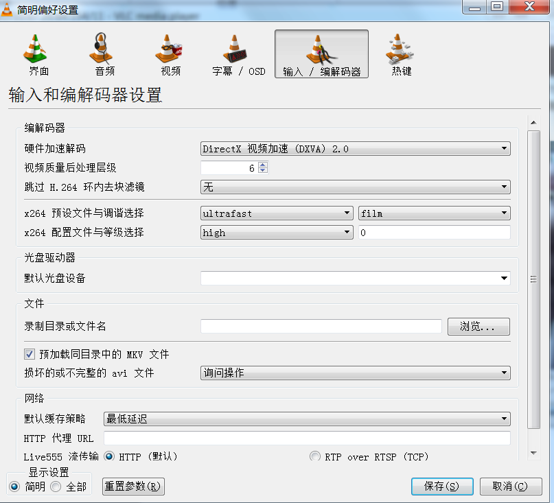

2.  在板端正常启动ittb\_stream业务。
3.  VLC中点Ctrl+N，输入如下URL：rtsp://10.67.20.64:554/0，其中10.67.20.64为单板IP地址，0表示VENC通道号（当前已初始化且有码流的VENC通道），如[图2](#_toc51692640)所示。

    **图 2**  VLC设置播放数据源<a name="_toc51692640"></a>  
    

4.  勾选“显示更多选项”，把“正在缓冲”改成100ms，点击播放，如[图3](#_toc51692641)所示。

    **图 3**  设置播放参数<a name="_toc51692641"></a>  
    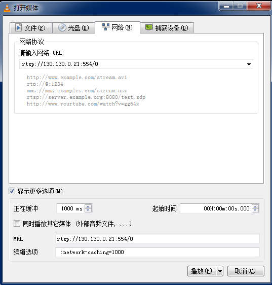

    > **须知：** 
    >因为默认跑SmartP，刚开始缺少I帧画面会发绿，且长时间刷不回来，过1\~2分钟后图像就正常了。

# FAQ<a name="ZH-CN_TOPIC_0000002498141690"></a>


## 为什么工具连接单板会提示版本不匹配？<a name="ZH-CN_TOPIC_0000002530221603"></a>

【现象】

正确启动单板对应的图像调节工具且图像调节工具能够正确打开，打开xml文件之后连接单板，工具提示版本不匹配。

【分析】

图像调节工具板端版本与xml版本不匹配。

【解决】

察看当前使用的SDK 版本，更新xml至当前SDK版本对应图像调节工具版本。

## PQTools工具文本文件导入导出异常如何处理<a name="ZH-CN_TOPIC_0000002530221683"></a>

【现象】

PQTools工具部分支持导入导出文本文件的功能界面，如矩阵式寄存器对话框、PreGamma调试界面、Gamma调试界面、LMF转换工具等。

现象一：将记事本中能打开且格式正常的文本文件导入PC端工具时，出现“格式不正确”的提示或者乱码；

现象二：从工具导出的文本文件使用记事本打开，显示乱码。

【分析】

PQTools工具目前仅支持ANSI编码的文本文件，如果导入其他编码格式的文件则无法识别。

【解决】

现象一：导入PQTools工具文本文件前，使用记事本或Notepad++等文本编辑器将原始文件以ANSI编码重新保存。

现象二：使用记事本打开PQTools工具导出的文本文件时需要选择文件的编码格式为ANSI类型。

## 如何处理低照度场景编码I帧过大无法点播<a name="ZH-CN_TOPIC_0000002498141788"></a>

【现象】

灌入低照度场景抓取的RAW后点播画面黑屏，再次连接提示成功但画面仍然黑屏。

【分析】

低照度场景的RAW经过编码后的I帧远大于正常场景，网传buffer和PC端接收码流的buffer受限，不能传输和存储该I帧。

【解决】

用户可在板端配置文件config\_mt.ini通过修改bufcoef配置网传buffer的大小；在PC端点播画面右键选择StreamType为Data First，可保证PC端接收码流的buffer足够存储该I帧。

## 如何读取到RC属性或者GopMode属性<a name="ZH-CN_TOPIC_0000002498301808"></a>

【现象】

在PQTools工具调试界面中，读取RC属性或者GopMode属性都失败。

【分析】

读取RC属性或者GopMode属性时，只能读取对应模式下的属性。如果模式错误，则会读取失败。

【解决】

查看当前RC或者GopMode处于什么模式，读取对应模式下的属性。如果需要读取其他模式下的属性，需要设置RC或者GopMode到对应的模式，并同时对该模式属性进行写操作。

## 如何解决因内存不够导致的抓/灌RAW/YUV等操作失败<a name="ZH-CN_TOPIC_0000002530061721"></a>

【现象】

在control界面上，执行抓多帧RAW/YUV、会出现因vb块数不够而导致失败。

【分析】

板端缓存RAW和YUV数据，是从媒体业务创建的vb pool中获取上来的，当vb块数不够时，抓RAW或YUV的MPI接口就会失败返回，导致抓RAW/YUV失败。

【解决】

当抓RAW/YUV时，剩余的可用vb块数要大于所抓的帧数。

## 在使用CLUT标定时，出现文件路径解析错误<a name="ZH-CN_TOPIC_0000002530061691"></a>

【现象】

工具的存放路径包含中文时，使用CLUT标定，工具报路径解析错误。如[图1](#_toc51692642)所示。

**图 1**  错误告警信息<a name="_toc51692642"></a>  
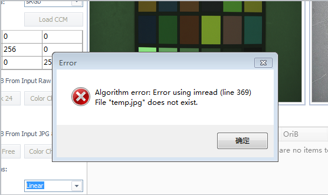

【分析】

CLUT工具标定时，会在PQTools工具目录下自动生成临时文件。如果PQTools工具目录在中文目录下，会因为CLUT标定算法库不支持中文路径，无法解析到生成的临时文件而报错。

【解决】

将PQTools工具放在英文路径下运行。

## 使用非SDK提供的 3A库，如何配置XML可调项<a name="ZH-CN_TOPIC_0000002530221771"></a>

【现象】

媒体业务启用的是非SDK提供的3A库，无法使用PQTools工具进行3A参数的调试。

【分析】

PQTools工具提供的XML可调项均为SDK接口，非SDK提供的3A无法与SDK接口一一对应。

【解决】

可在XML中自行添加自定义寄存器调试非SDK提供的 3A参数，参考"[物理/虚拟寄存器的添加与调试](#ZH-CN_TOPIC_0000002530221723)"。

## 用户的媒体业务起来后，PQTools工具界面不能调节AE、AWB等参数<a name="ZH-CN_TOPIC_0000002498301784"></a>

【现象】

媒体业务起来后，使用PQTools工具进行AE、AWB等参数的调试失败。

【分析】

可能的两个原因：

-   媒体业务IspRun没有运行起来；
-   媒体业务加载非SDK提供的3A库；

【解决】

-   在板端命令查看业务线程，是否存在IspRun线程。
-   在XML中自行添加自定义寄存器调试非SDK提供的3A参数，参考"[物理/虚拟寄存器的添加与调试](#ZH-CN_TOPIC_0000002530221723)"。

## PQTools工具4K分辨率下部分界面显示异常<a name="ZH-CN_TOPIC_0000002498141774"></a>

【现象】

Win7系统下，PQTools工具运行后，打开“PQ RAW YUV Analyzer”界面显示异常，如图：


【分析】

高DPI显示设置（125%、150%，甚至更高）下发生显示异常问题；

原因：Win7系统增加了高DPI适配功能，默认支持自动进行高DPI适配，使得界面窗口和控件可以自动放大显示。DPI适配不兼容代码设置的控件位置和大小。

【解决】

-   方案一：修改显示器屏幕文本缩放比例，比如：100%。注销后生效；
-   方案二：修改DPI配置：找到“自定义DPI设置”-\>“使用Windows XP风格DPI缩放比例”，修改显示状态，点击确定-\>点击应用。注销后生效。

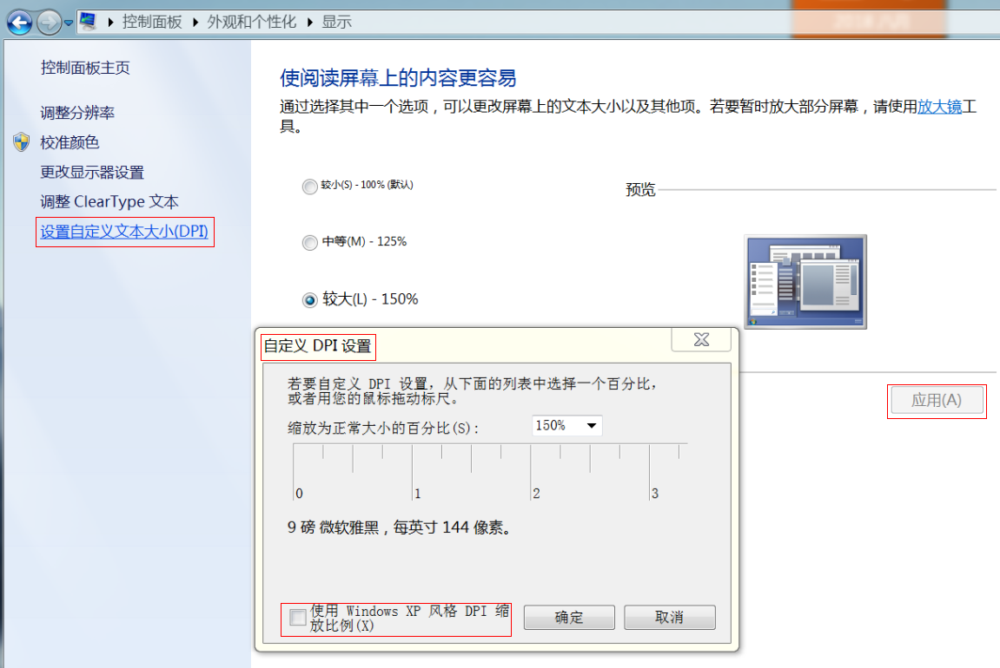

## PQTools工具灌RAW之后，图像显示异常<a name="ZH-CN_TOPIC_0000002498301734"></a>

【现象】

SS928V100、使用PQ RAW Utilities工具将RAW文件倒灌到板端，图像显示异常，如[图1](#_fig10111422426)所示。

**图 1**  使用RAW Utilities工具后图像异常示意图<a name="_fig10111422426"></a>  


【分析】

灌RAW到FE需要开启自产生时序。

【解决】

灌RAW之前将PQTools主界面的TimingAttr的Enable勾选上。注意：勾选之后不灌RAW，图像异常。

## FPN标定无法存raw文件<a name="ZH-CN_TOPIC_0000002530061735"></a>

【现象】

FPN标定和校正功能，但是FPN标定时无法存Raw文件，并且芯片支持文件系统。

【分析】

为了适配无文件系统的芯片，FPN标定结果默认写到内存中。

【解决】

FPN标定支持写内存和写Raw文件两种方案，当需要存Raw文件时，可以修改config.cfg文件中\[FPNSaveRaw\]节点下的enable值：

-   enable=0时，表示将FPN标定结果写入内存中；
-   enable=1时，表示存Raw文件。

## 8k分辨率ISP工具导入RAW个数受限<a name="ZH-CN_TOPIC_0000002530061785"></a>

【现象】

ISP标定工具，进行AWB标定时导入8k分辨率的RAW数据最多导入13张，继续导入时弹框提示“File to import RAW file‘xxx.raw’:Memory allocation failed.”。

【分析】

所有32位应用程序都有4G的进程地址空间，操作系统保留部分空间（1G，操作系统的内核模式地址空间限定），应用程序拥有的用户模式虚拟地址空间（3G）。

PQTools工具为32位应用程序，ISP标定工具导入RAW数据时内存申请：RAW内存和RGB内存（RAW转成RGB显示）。如：7680x4320分辨率，需要的连续内存为190M：64M\(RAW\)+126M\(RGB\)。

【解决】

1.  根据场景导入合适张数的RAW文件。
2.  AWB标定只和光学器件（镜头、Sensor）相关，使用相同光学套件，采集小分辨率的图像进行数据标定。

## 关闭板端业务命令<a name="ZH-CN_TOPIC_0000002530061725"></a>

-   LiteOS系统端pq\_control业务命令选项添加“stop”字段可关闭 LiteOS系统下的control业务。

    举例：pq\_control stop

-   Linux系统端PQTools.sh业务启动脚本命令选项添加“-as”字段可关闭Linux系统下的板端PQTools业务。

    举例：PQTools.sh –as

## PQTools DIS标定工具convert或apply失败的解决方法<a name="ZH-CN_TOPIC_0000002498301716"></a>

DIS标定工具需要先calibration，再Convert Calibration Data，然后才可以Apply To Board。若未经过Convert Calibration Data会报错误，如[图1](#_toc51692643)所示。

**图 1**  若未经过Convert Calibration Data报错误图<a name="_toc51692643"></a>  
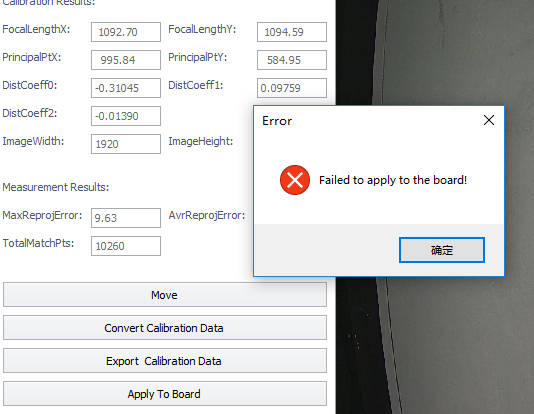

在Convert Calibration Data这一步，可能出现类似上面的报错，这时可能是标定参数超出范围，参考镜头标定算法内参，标定出的算法参数超出范围有2种解决方法：

-   重新添加标定图片，重点添加：棋盘格在画面居中、且占用画面比例较大的图片（需要靠近些镜头）若干张；
-   减少畸变系数DistCoeffType的个数，默认为3，进行递减，直到输出参数在芯片支持的范围内，这时不需要减少图片。

其中第一种方法同时对标定效果有些改进，为首选方法。但第二种方法更快捷。

## 关于隐私保护PQTools工具使用及限制说明<a name="ZH-CN_TOPIC_0000002498301830"></a>

1.  PQStream工具由于缺少相应的解码库，暂时不支持点播隐私保护的码流；
2.  隐私保护的码流被点播时会导致pc端点播工具卡住，以及板端网络层异常，需要重启板端业务方可继续使用正常点播业务。
3.  板端支持业务起来时自动录制隐私保护的码流，在配置对应的隐私保护媒体之后，打开板端码流录制功能，可保存隐私保护的码流。

## 关于Stitch Preview拼接仿真限制说明<a name="ZH-CN_TOPIC_0000002530221701"></a>

Stitch Preview拼接仿真功能对内存消耗较大。分辨率过大时就会造成当前32位工具内存不足。（32位工具最大可用内存是2G，超过时会提示内存不足如[图1](#fig3499334164112)所示）。如果使用出现内存不足的情况，请适当调小分辨率。

**图 1**  拼接仿真内存不足报错<a name="fig3499334164112"></a>  


## 关于使用工具抓JPEG图像异常<a name="ZH-CN_TOPIC_0000002530061675"></a>

如果VENC前端绑定模块输出的YUV格式为Tile，会导致VENC 通道抓出的图像如下所示。需要将前端chn 属性中video\_format修改为 OT\_VIDEO\_FORMAT\_LINEAR。

此问题涉及到工具模块：PQ Stitching Tool中Stitch Auto Fine Tuning；Capture Tool中JPEG Image；PQ 3A Analyser；


