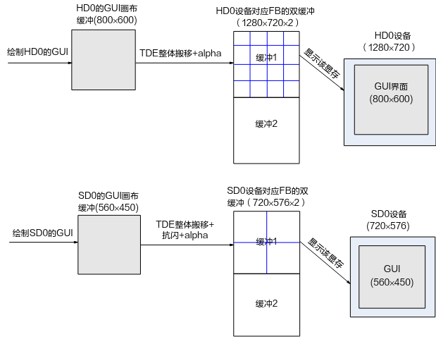

# 前言

**概述**

本文为图形开发推荐了1个方案，分别从方案介绍、衍生方案、开发流程、应用场景及优点和限制介绍，为用户在进行图形开发时提供参考。

> **说明：** 
>-   本文未有特殊说明，SS528V100、SS625V100、SS524V100、SS522V101与SS626V100完全一致。
>-   未有特殊说明，SS927V100与SS928V100，SS522V100与SS524V100内容完全一致。

**产品版本**

与本文档相对应的产品版本如下。

<table><thead align="left"><tr id="row155mcpsimp"><th class="cellrowborder" valign="top" width="32%" id="mcps1.1.3.1.1">
产品名称

</th>
<th class="cellrowborder" valign="top" width="68%" id="mcps1.1.3.1.2">
产品版本

</th>
</tr>
</thead>
<tbody><tr id="row161mcpsimp"><td class="cellrowborder" valign="top" width="32%" headers="mcps1.1.3.1.1 ">
SS928

</td>
<td class="cellrowborder" valign="top" width="68%" headers="mcps1.1.3.1.2 ">
V100

</td>
</tr>
<tr id="row166mcpsimp"><td class="cellrowborder" valign="top" width="32%" headers="mcps1.1.3.1.1 ">
SS626

</td>
<td class="cellrowborder" valign="top" width="68%" headers="mcps1.1.3.1.2 ">
V100

</td>
</tr>
<tr id="row1159710223415"><td class="cellrowborder" valign="top" width="32%" headers="mcps1.1.3.1.1 ">
SS524

</td>
<td class="cellrowborder" valign="top" width="68%" headers="mcps1.1.3.1.2 ">
V100

</td>
</tr>
<tr id="row3806135719163"><td class="cellrowborder" valign="top" width="32%" headers="mcps1.1.3.1.1 ">
SS522

</td>
<td class="cellrowborder" valign="top" width="68%" headers="mcps1.1.3.1.2 ">
V100

</td>
</tr>
<tr id="row1154655371615"><td class="cellrowborder" valign="top" width="32%" headers="mcps1.1.3.1.1 ">
SS522

</td>
<td class="cellrowborder" valign="top" width="68%" headers="mcps1.1.3.1.2 ">
V101

</td>
</tr>
<tr id="row13305165014598"><td class="cellrowborder" valign="top" width="32%" headers="mcps1.1.3.1.1 ">
SS528

</td>
<td class="cellrowborder" valign="top" width="68%" headers="mcps1.1.3.1.2 ">
V100

</td>
</tr>
<tr id="row14441920446"><td class="cellrowborder" valign="top" width="32%" headers="mcps1.1.3.1.1 ">
SS625

</td>
<td class="cellrowborder" valign="top" width="68%" headers="mcps1.1.3.1.2 ">
V100

</td>
</tr>
<tr id="row124425241073"><td class="cellrowborder" valign="top" width="32%" headers="mcps1.1.3.1.1 ">
SS927

</td>
<td class="cellrowborder" valign="top" width="68%" headers="mcps1.1.3.1.2 ">
V100

</td>
</tr>
</tbody>
</table>

**读者对象**

本文档（本指南）主要适用于以下工程师：

-   技术支持工程师
-   软件开发工程师

**符号约定**

在本文中可能出现下列标志，它们所代表的含义如下。

<table><thead align="left"><tr id="row185mcpsimp"><th class="cellrowborder" valign="top" width="18%" id="mcps1.1.3.1.1">
符号

</th>
<th class="cellrowborder" valign="top" width="82%" id="mcps1.1.3.1.2">
说明

</th>
</tr>
</thead>
<tbody><tr id="row191mcpsimp"><td class="cellrowborder" valign="top" width="18%" headers="mcps1.1.3.1.1 ">

</td>
<td class="cellrowborder" valign="top" width="82%" headers="mcps1.1.3.1.2 ">
表示如不避免则将会导致死亡或严重伤害的具有高等级风险的危害。

</td>
</tr>
<tr id="row196mcpsimp"><td class="cellrowborder" valign="top" width="18%" headers="mcps1.1.3.1.1 ">

</td>
<td class="cellrowborder" valign="top" width="82%" headers="mcps1.1.3.1.2 ">
表示如不避免则可能导致死亡或严重伤害的具有中等级风险的危害。

</td>
</tr>
<tr id="row201mcpsimp"><td class="cellrowborder" valign="top" width="18%" headers="mcps1.1.3.1.1 ">

</td>
<td class="cellrowborder" valign="top" width="82%" headers="mcps1.1.3.1.2 ">
表示如不避免则可能导致轻微或中度伤害的具有低等级风险的危害。

</td>
</tr>
<tr id="row206mcpsimp"><td class="cellrowborder" valign="top" width="18%" headers="mcps1.1.3.1.1 ">

</td>
<td class="cellrowborder" valign="top" width="82%" headers="mcps1.1.3.1.2 ">
用于传递设备或环境安全警示信息。如不避免则可能会导致设备损坏、数据丢失、设备性能降低或其它不可预知的结果。

“须知”不涉及人身伤害。

</td>
</tr>
<tr id="row212mcpsimp"><td class="cellrowborder" valign="top" width="18%" headers="mcps1.1.3.1.1 ">

</td>
<td class="cellrowborder" valign="top" width="82%" headers="mcps1.1.3.1.2 ">
对正文中重点信息的补充说明。

“说明”不是安全警示信息，不涉及人身、设备及环境伤害信息。

</td>
</tr>
</tbody>
</table>

**修订记录**

修订记录累积了每次文档更新的说明。最新版本的文档包含以前所有文档版本的更新内容。

<table><thead align="left"><tr id="row264516207203"><th class="cellrowborder" valign="top" width="20.72%" id="mcps1.1.4.1.1">
<strong id="b8645172022010">文档版本</strong>

</th>
<th class="cellrowborder" valign="top" width="26.119999999999997%" id="mcps1.1.4.1.2">
<strong id="b1464512200200">发布日期</strong>

</th>
<th class="cellrowborder" valign="top" width="53.16%" id="mcps1.1.4.1.3">
<strong id="b156451420152010">修改说明</strong>

</th>
</tr>
</thead>
<tbody><tr id="row56451520182017"><td class="cellrowborder" valign="top" width="20.72%" headers="mcps1.1.4.1.1 ">
00B01

</td>
<td class="cellrowborder" valign="top" width="26.119999999999997%" headers="mcps1.1.4.1.2 ">
2025-09-15

</td>
<td class="cellrowborder" valign="top" width="53.16%" headers="mcps1.1.4.1.3 ">
第1次临时版本发布。

</td>
</tr>
</tbody>
</table>

# 图形层介绍

## 概述

数字媒体处理平台提供一整套机制支持图形界面的开发，主要包括：

-   图形二维加速引擎（Two Dimensional Engine，简称TDE），它利用硬件加速对图形图像进行处理。
-   Graphic Framebuffer Group（以下简称GFBG）用于管理叠加图形层，它不仅提供Linux Framebuffer的基本功能，还在Linux Framebuffer的基础上增加层间colorkey、层间Alpha等扩展功能。

> **说明：** 
>-   TDE相关使用方法请参见《TDE API参考》
>-   GFBG相关使用方法请参见《GFBG 开发指南》和《GFBG API参考》

## 图形层体系结构

-   SS528V100/SS625V100/SS524V100支持2路高清HD0\\HD1显示设备，1路标清SD0显示设备，同时支持4个图形层G0、G1、G2、G3。
-   SS522V101支持1路高清HD0显示设备，1路标清SD0显示设备，同时支持3个图形层G0、G2、G3。
-   SS928V100支持2路高清HD0和HD1显示设备，1路标清SD0显示设备，同时支持3个图形层G0、G1、G3。
-   SS626V100支持2路高清HD0和HD1显示设备，1路标清SD0显示设备，同时支持5个图形层G0、G1、G2、G3、G4。

> **说明：** 
>每个输出设备支持的接口类型和时序请参见对应芯片手册的VDP章节。

各个图形层与各设备有一定的约束关系，如[表1](#_Ref391716435)\~[表4](#_Ref57990861)所示。

**表 1**  FB设备文件、图形层以及输出设备的对应关系 \(SS528V100/SS625V100/SS524V100\)

<table><thead align="left"><tr id="row254mcpsimp"><th class="cellrowborder" valign="top" width="18%" id="mcps1.2.4.1.1">
FB设备文件

</th>
<th class="cellrowborder" valign="top" width="23%" id="mcps1.2.4.1.2">
图形层

</th>
<th class="cellrowborder" valign="top" width="59%" id="mcps1.2.4.1.3">
对应显示设备

</th>
</tr>
</thead>
<tbody><tr id="row262mcpsimp"><td class="cellrowborder" valign="top" width="18%" headers="mcps1.2.4.1.1 ">
/dev/fb0

</td>
<td class="cellrowborder" valign="top" width="23%" headers="mcps1.2.4.1.2 ">
G0

</td>
<td class="cellrowborder" valign="top" width="59%" headers="mcps1.2.4.1.3 ">
G0在HD0设备上显示。

</td>
</tr>
<tr id="row269mcpsimp"><td class="cellrowborder" valign="top" width="18%" headers="mcps1.2.4.1.1 ">
/dev/fb1

</td>
<td class="cellrowborder" valign="top" width="23%" headers="mcps1.2.4.1.2 ">
G1

</td>
<td class="cellrowborder" valign="top" width="59%" headers="mcps1.2.4.1.3 ">
G1在HD1设备上显示。

</td>
</tr>
<tr id="row276mcpsimp"><td class="cellrowborder" valign="top" width="18%" headers="mcps1.2.4.1.1 ">
/dev/fb2

</td>
<td class="cellrowborder" valign="top" width="23%" headers="mcps1.2.4.1.2 ">
G2

</td>
<td class="cellrowborder" valign="top" width="59%" headers="mcps1.2.4.1.3 ">
G2在HD0、HD1、SD0设备上显示。

</td>
</tr>
<tr id="row283mcpsimp"><td class="cellrowborder" valign="top" width="18%" headers="mcps1.2.4.1.1 ">
/dev/fb3

</td>
<td class="cellrowborder" valign="top" width="23%" headers="mcps1.2.4.1.2 ">
G3

</td>
<td class="cellrowborder" valign="top" width="59%" headers="mcps1.2.4.1.3 ">
G3在HD0、HD1、SD0设备上显示。

</td>
</tr>
</tbody>
</table>

**表 2**  FB设备文件、图形层以及输出设备的对应关系 \(SS522V101\)

<table><thead align="left"><tr id="row297mcpsimp"><th class="cellrowborder" valign="top" width="18%" id="mcps1.2.4.1.1">
FB设备文件

</th>
<th class="cellrowborder" valign="top" width="23%" id="mcps1.2.4.1.2">
图形层

</th>
<th class="cellrowborder" valign="top" width="59%" id="mcps1.2.4.1.3">
对应显示设备

</th>
</tr>
</thead>
<tbody><tr id="row305mcpsimp"><td class="cellrowborder" valign="top" width="18%" headers="mcps1.2.4.1.1 ">
/dev/fb0

</td>
<td class="cellrowborder" valign="top" width="23%" headers="mcps1.2.4.1.2 ">
G0

</td>
<td class="cellrowborder" valign="top" width="59%" headers="mcps1.2.4.1.3 ">
G0在HD0设备上显示。

</td>
</tr>
<tr id="row312mcpsimp"><td class="cellrowborder" valign="top" width="18%" headers="mcps1.2.4.1.1 ">
/dev/fb1

</td>
<td class="cellrowborder" valign="top" width="23%" headers="mcps1.2.4.1.2 ">
G2

</td>
<td class="cellrowborder" valign="top" width="59%" headers="mcps1.2.4.1.3 ">
G2在HD0、HD1、SD0设备上显示。

</td>
</tr>
<tr id="row319mcpsimp"><td class="cellrowborder" valign="top" width="18%" headers="mcps1.2.4.1.1 ">
/dev/fb2

</td>
<td class="cellrowborder" valign="top" width="23%" headers="mcps1.2.4.1.2 ">
G3

</td>
<td class="cellrowborder" valign="top" width="59%" headers="mcps1.2.4.1.3 ">
G3在HD0、HD1、SD0设备上显示。

</td>
</tr>
</tbody>
</table>

**表 3**  FB设备文件、图形层以及输出设备的对应关系 \(SS928V100\)

<table><thead align="left"><tr id="row333mcpsimp"><th class="cellrowborder" valign="top" width="18%" id="mcps1.2.4.1.1">
FB设备文件

</th>
<th class="cellrowborder" valign="top" width="23%" id="mcps1.2.4.1.2">
图形层

</th>
<th class="cellrowborder" valign="top" width="59%" id="mcps1.2.4.1.3">
对应显示设备

</th>
</tr>
</thead>
<tbody><tr id="row341mcpsimp"><td class="cellrowborder" valign="top" width="18%" headers="mcps1.2.4.1.1 ">
/dev/fb0

</td>
<td class="cellrowborder" valign="top" width="23%" headers="mcps1.2.4.1.2 ">
G0

</td>
<td class="cellrowborder" valign="top" width="59%" headers="mcps1.2.4.1.3 ">
G0在HD0设备上显示。

</td>
</tr>
<tr id="row348mcpsimp"><td class="cellrowborder" valign="top" width="18%" headers="mcps1.2.4.1.1 ">
/dev/fb1

</td>
<td class="cellrowborder" valign="top" width="23%" headers="mcps1.2.4.1.2 ">
G1

</td>
<td class="cellrowborder" valign="top" width="59%" headers="mcps1.2.4.1.3 ">
G1在HD1设备上显示。

</td>
</tr>
<tr id="row355mcpsimp"><td class="cellrowborder" valign="top" width="18%" headers="mcps1.2.4.1.1 ">
/dev/fb2

</td>
<td class="cellrowborder" valign="top" width="23%" headers="mcps1.2.4.1.2 ">
G3

</td>
<td class="cellrowborder" valign="top" width="59%" headers="mcps1.2.4.1.3 ">
G3在HD0、HD1、SD0设备上显示。

</td>
</tr>
</tbody>
</table>

**表 4**  FB设备文件、图形层以及输出设备的对应关系 \(SS626V100\)

<table><thead align="left"><tr id="row368mcpsimp"><th class="cellrowborder" valign="top" width="18%" id="mcps1.2.4.1.1">
FB设备文件

</th>
<th class="cellrowborder" valign="top" width="23%" id="mcps1.2.4.1.2">
图形层

</th>
<th class="cellrowborder" valign="top" width="59%" id="mcps1.2.4.1.3">
对应显示设备

</th>
</tr>
</thead>
<tbody><tr id="row376mcpsimp"><td class="cellrowborder" valign="top" width="18%" headers="mcps1.2.4.1.1 ">
/dev/fb0

</td>
<td class="cellrowborder" valign="top" width="23%" headers="mcps1.2.4.1.2 ">
G0

</td>
<td class="cellrowborder" valign="top" width="59%" headers="mcps1.2.4.1.3 ">
G0在HD0设备上显示。

</td>
</tr>
<tr id="row383mcpsimp"><td class="cellrowborder" valign="top" width="18%" headers="mcps1.2.4.1.1 ">
/dev/fb1

</td>
<td class="cellrowborder" valign="top" width="23%" headers="mcps1.2.4.1.2 ">
G1

</td>
<td class="cellrowborder" valign="top" width="59%" headers="mcps1.2.4.1.3 ">
G1在HD1设备上显示。

</td>
</tr>
<tr id="row390mcpsimp"><td class="cellrowborder" valign="top" width="18%" headers="mcps1.2.4.1.1 ">
/dev/fb2

</td>
<td class="cellrowborder" valign="top" width="23%" headers="mcps1.2.4.1.2 ">
G2

</td>
<td class="cellrowborder" valign="top" width="59%" headers="mcps1.2.4.1.3 ">
G2在HD0、HD1、SD0设备上显示。

</td>
</tr>
<tr id="row397mcpsimp"><td class="cellrowborder" valign="top" width="18%" headers="mcps1.2.4.1.1 ">
/dev/fb3

</td>
<td class="cellrowborder" valign="top" width="23%" headers="mcps1.2.4.1.2 ">
G3

</td>
<td class="cellrowborder" valign="top" width="59%" headers="mcps1.2.4.1.3 ">
G3在HD0、HD1设备上显示。

</td>
</tr>
<tr id="row404mcpsimp"><td class="cellrowborder" valign="top" width="18%" headers="mcps1.2.4.1.1 ">
/dev/fb4

</td>
<td class="cellrowborder" valign="top" width="23%" headers="mcps1.2.4.1.2 ">
G4

</td>
<td class="cellrowborder" valign="top" width="59%" headers="mcps1.2.4.1.3 ">
G4在HD1、SD0设备上显示。

</td>
</tr>
</tbody>
</table>

> **说明：** 
>为了显示图形层，使用芯片的用户必须先配置并启动输出设备，最后通过GFBG模块接口操作图像层使之显示。

# 图形开发推荐方案

## 概述

在视频采集领域中，一般输出设备的图形用户界面内容包括：

-   后端OSD：显示画面分割线、通道号、时间等信息，用以界定多画面显示布局。
-   GUI界面：包括各种菜单、进度条等元素，用户通过操作GUI界面进行设备配置。
-   鼠标：提供更方便易用的界面菜单操作方式。

以上3类图形内容可以通过1个图形层实现，也可以通过多个图形层实现。对于提供多个图形层的芯片，指导用户正确、合理、有效地利用这些图形层，以满足不同的输出界面应用场景。下面推荐几种方案供参考。

## 单图层实现用户界面方案

### 方案介绍

该方案总体思路是：每个设备都只使用1层图形层来完成本设备的后端OSD、GUI和鼠标的显示，鼠标也可以使用独立的鼠标层实现。

可具体描述为：每个输出设备使用一个图形层来完成本设备的后端OSD、GUI；GUI画在独立的缓存上，后端OSD直接画在FB显存中，再通过TDE进行alpha混合；鼠标可以使用单独的鼠标图形层，也可以跟OSD、GUI共用一个图层，共用图层的时候，可以画在GUI缓存上。

该方案使用了以下机制：

-   每个设备的后端OSD直接绘制在各自的FB显存中。

    例如在每个图形层对应的FB显存中绘制分割布局、通道号或者时间。

-   每个设备一块GUI画布，GUI变更时局部刷新。

    每个设备使用一块独立的缓存绘制GUI（称该块缓存为GUI画布），当GUI变更时仅需要进行局部刷新。

-   GUI画布整体搬移至相应图层的FB显存中

    将绘制好的画布整体搬移到相应的FB缓冲中，在此过程中可利用TDE实现GUI和OSD的叠加透明效果。每次GUI或OSD有变动时，由于是对画布和OSD整体做叠加，故不需要针对局部信息计算GUI和OSD的叠加区域。

-   FB双缓冲

    为防止一块FB缓冲被边绘制边显示而导致绘制过程可见，推荐使用FB双缓冲机制或是GFBG实现的扩展模式中的GFBG\_LAYER\_BUF\_DOUBLE / GFBG\_LAYER\_BUF\_DOUBLE\_IMMEDIATE机制。它们的原理都是为FB分配2块大小相同的缓冲作为显存交替绘制和显示。如VO正在显示缓冲2，则本次绘制的对象为缓冲1，然后对于FB标准模式可通过FB的PAN\_DISPLAY或FBIOFLIP\_SURFACE调用通知VO显示缓冲1，而对于FB扩展模式可通过FB的FBIO\_REFRESH调用通知VO显示缓冲1。

方案的结构如[图1](#fig116691737132)所示。

**图 1**  单图层方案的结构示意图  

该方案在后端OSD或者GUI界面变动时，都需要重新绘制FB缓存：

-   本设备的后端OSD改变时，如16通道分割线切换到9通道分割线：先清空FB缓存，再绘制新的OSD，再将GUI界面整体搬移到FB缓存中。
-   GUI界面每次变动时，都需要先清空FB缓存，再绘制OSD，然后将新的GUI界面整体搬移到FB缓存中。

### 衍生方案

当SD0和HD0设备上想同时显示同样的GUI界面时，该方案可简化仅有一块GUI画布缓存：

-   画布大小与HD0的GUI层大小相同（800x600），用户可按照HD0的GUI规格（如800x600）准备一套图片，每次GUI变更时仅局部绘制画布，而SD0的GUI则是将画布整体经过缩放、抗闪得到，其效果略差于HD上的GUI。
-   每次更新画布后，对于HD设备，由于画布大小与GUI界面大小相同，故利用TDE做整体搬移操作即可；对于SD0设备，需要利用TDE对画布整体进行缩放至和SD0绑定的图形层对应的FB显存中，同时进行抗闪烁处理（因SD0是隔行设备）。

该衍生方案的结构如[图1](#fig16738132531813)所示。

**图 1**  衍生方案的结构图  

### 开发流程

#### 方案1的开发流程

以HD0和SD0设备上的GUI和OSD为例：HD0设备上16画面等分分割线，SD0设备上4画面等分分割线，且HD0和SD0同时显示同样的GUI。

若此时GUI界面有变化，则该方案的实现过程为：

1.  清空HD0和SD0对应图形层的FB的空闲缓冲（假设为缓冲1，缓冲2正在被VO显示）。
2.  在HD0对应图形层的FB缓冲1中绘制16通道分割线。
3.  在SD0对应图形层的FB缓冲1中绘制4通道分割线。
4.  局部更新画布。
5.  用TDE将画布整体搬移到HD0对应图形层的FB缓冲1的合适位置，此过程可以做alpha透明度叠加以实现GUI半透明效果。
6.  用TDE将画布整体缩放到SD0对应图形层的FB缓冲1的合适位置，此过程可以做抗闪、alpha透明度叠加（以实现GUI半透明效果）。
7.  通过FB接口调用PAN\_DISPLAY通知HD0显示和本设备绑定图形层已准备好的FB的缓冲1。
8.  通过FB接口调用PAN\_DISPLAY通知SD0显示本设备绑定图形层已准备好的FB的缓冲1。

### 应用场景

应用场景如下：

-   每个设备上有各自的后端OSD（如HD0为16画面分割布局，HD1为8画面分割布局，SD0为4画面分割布局）。
-   2或多个输出设备上同时有GUI界面（相同或者不同）。

### 优点和限制

该方案具有以下优点：

-   可同时在多个设备上显示GUI界面。
-   GUI画布可局部刷新，节省总线带宽和TDE性能。
-   可实现GUI和OSD的叠加透明效果，且用户控制流程简单。每次GUI或OSD有变动时，由于是对画布和OSD整体做叠加，故不需要针对局部信息计算GUI和OSD的叠加区域。
-   对于衍生方案，用户仅需要一套GUI界面的图片，就可适应不同分辨率设备的GUI需求，节省Flash空间。

该方案具有以下约束：

对于衍生方案：标清设备上的GUI是画布缩放得到的，故效果略差于高清设备上的GUI。

