# 前言<a name="ZH-CN_TOPIC_0000002512103553"></a>

**概述<a name="section15117166194219"></a>**

本文档主要是指导使用GMAC、USB和eMMC卡等驱动模块的相关人员，通过一定的步骤和方法对和这些驱动模块相连的外围设备进行控制，主要包括操作准备、操作过程、操作中需要注意的问题以及操作示例。

> **说明：** 
>本文以SS928V100描述为例，未有特殊说明，SS927V100与SS928V100内容一致。

**产品版本<a name="section10120166104220"></a>**

与本文档相对应的产品版本如下。

<a name="table1612713694220"></a>
<table><thead align="left"><tr id="row13191136144220"><th class="cellrowborder" valign="top" width="31.759999999999998%" id="mcps1.1.3.1.1"><p id="p41918612421"><a name="p41918612421"></a><a name="p41918612421"></a>产品名称</p>
</th>
<th class="cellrowborder" valign="top" width="68.24%" id="mcps1.1.3.1.2"><p id="p14191663422"><a name="p14191663422"></a><a name="p14191663422"></a>产品版本</p>
</th>
</tr>
</thead>
<tbody><tr id="row1819118616425"><td class="cellrowborder" valign="top" width="31.759999999999998%" headers="mcps1.1.3.1.1 "><p id="p81911613425"><a name="p81911613425"></a><a name="p81911613425"></a>SS928</p>
</td>
<td class="cellrowborder" valign="top" width="68.24%" headers="mcps1.1.3.1.2 "><p id="p91911617427"><a name="p91911617427"></a><a name="p91911617427"></a>V100</p>
</td>
</tr>
<tr id="row64983499368"><td class="cellrowborder" valign="top" width="31.759999999999998%" headers="mcps1.1.3.1.1 "><p id="p182829527361"><a name="p182829527361"></a><a name="p182829527361"></a>SS927</p>
</td>
<td class="cellrowborder" valign="top" width="68.24%" headers="mcps1.1.3.1.2 "><p id="p4282165214366"><a name="p4282165214366"></a><a name="p4282165214366"></a>V100</p>
</td>
</tr>
</tbody>
</table>

**读者对象<a name="section81264620425"></a>**

本文档（本指南）主要适用于以下工程师：

-   技术支持工程师
-   软件开发工程师

**修改记录<a name="section2467512116410"></a>**

<a name="table1557726816410"></a>
<table><thead align="left"><tr id="row2942532716410"><th class="cellrowborder" valign="top" width="20.72%" id="mcps1.1.4.1.1"><p id="p3778275416410"><a name="p3778275416410"></a><a name="p3778275416410"></a><strong id="b5687322716410"><a name="b5687322716410"></a><a name="b5687322716410"></a>文档版本</strong></p>
</th>
<th class="cellrowborder" valign="top" width="26.119999999999997%" id="mcps1.1.4.1.2"><p id="p5627845516410"><a name="p5627845516410"></a><a name="p5627845516410"></a><strong id="b5800814916410"><a name="b5800814916410"></a><a name="b5800814916410"></a>发布日期</strong></p>
</th>
<th class="cellrowborder" valign="top" width="53.16%" id="mcps1.1.4.1.3"><p id="p2382284816410"><a name="p2382284816410"></a><a name="p2382284816410"></a><strong id="b3316380216410"><a name="b3316380216410"></a><a name="b3316380216410"></a>修改说明</strong></p>
</th>
</tr>
</thead>
<tbody><tr id="row5947359616410"><td class="cellrowborder" valign="top" width="20.72%" headers="mcps1.1.4.1.1 "><p id="p18213152074216"><a name="p18213152074216"></a><a name="p18213152074216"></a>00B01</p>
</td>
<td class="cellrowborder" valign="top" width="26.119999999999997%" headers="mcps1.1.4.1.2 "><p id="p87086249422"><a name="p87086249422"></a><a name="p87086249422"></a>2025-11-15</p>
</td>
<td class="cellrowborder" valign="top" width="53.16%" headers="mcps1.1.4.1.3 "><p id="p492913284427"><a name="p492913284427"></a><a name="p492913284427"></a>第1次临时版本发布</p>
</td>
</tr>
</tbody>
</table>

# Linux<a name="ZH-CN_TOPIC_0000002512063547"></a>


## GMAC操作指南<a name="ZH-CN_TOPIC_0000002512063505"></a>


### 操作示例<a name="ZH-CN_TOPIC_0000002479903676"></a>

> **说明：** 
>默认情况下，相关GMAC模块已全部编入内核，不需要执行加载操作，请直接跳至配置IP地址步骤。

内核下使用网口的操作涉及到以下几个方面：

-   GMAC模块支持TSO功能且默认是打开的，如果用户希望关闭TSO功能，可通过工具ethtool将其关闭。开关TSO功能的方法如下：

    -   关闭TSO：./ethtool –K eth0 tx off
    -   打开TSO：./ethtool –K eth0 tx on

    TSO（TCP Segment Offload）功能简介：

    -   TSO \(TCP Segmentation Offload\)是一种利用网卡分割大数据包，减小CPU负荷的一种技术，也被叫做LSO \(Large Segment Offload\)，如果数据包的类型只能是TCP，则被称之为TSO，如果硬件支持TSO功能的话，也需要同时支持硬件的TCP校验计算和分散-聚集 \(Scatter Gather\) 功能。TSO的实现，其实是由软件和硬件结合起来完成的，具体说来，硬件能够对大的数据包进行分片，并对每个分片附着相关的头部。
    -   芯片使用TSO时，会把一部分由CPU处理的工作转移到由网卡来处理，减轻CPU的压力，提高性能。

-   配置ip地址和子网掩码

    ```
    ifconfig eth0 xxx.xxx.xxx.xxx netmask xxx.xxx.xxx.xxx up
    ```

-   设置缺省网关

    ```
    route add default gw xxx.xxx.xxx.xxx
    ```

-   mount nfs

    ```
    mount -t nfs -o nolock xxx.xxx.xxx.xxx:/your/path /mount-dir
    ```

-   shell下使用tftp上传下载文件

    前提是在server端有tftp服务软件在运行。

    -   下载文件：tftp -r XX.file serverip -g

        其中：XX.file为需要下载的文件，serverip需要下载的文件所在的server的ip地址。

    -   上传文件：tftp -l xx.file remoteip –p

        其中，xx.file为需要上传的文件，remoteip文件需要上传到的server的ip地址。

### IPv6说明<a name="ZH-CN_TOPIC_0000002479903632"></a>

发布包中默认关闭IPv6功能。如果要支持IPv6，需要修改内核选项，并重新编译内核。具体操作如下：

```
cd open_source/linux/linux-4.19.y
cp arch/arm64/configs/ss928v100_defconfig .config
make ARCH=arm64 CROSS_COMPILE=aarch64-mix210-linux- menuconfig
```

进入如下目录，将该页面选项配置如[图1](#_Toc498609228)所示。

```
[*] Networking support  --->
    Networking options  --->
        <*>   The IPv6 protocol  --->
```

**图 1**  IPv6 Protocol配置示意图<a name="_Toc498609228"></a>  


IPv6环境配置如下：

-   配置ip地址及缺省网关

    ```
    ip -6  addr add <ipv6address>/<ipv6_prefixlen> dev <port>
    ```

    ```
    示例：ip -6 addr add 2001:da8:207::9402/64 dev eth0
    ```

-   Ping某个- IPv6地址

    ```
    ping -6  <ipv6address>
    示例：ping -6  2001:da8:207::9403
    ```

### PHY地址配置<a name="ZH-CN_TOPIC_0000002512063519"></a>

-   U-boot下配置方式

    U-boot下可通过修改U-boot配置文件include/configs/ss928v100.h中宏定义 CONFIG\_GMAC\_PHY0\_ADDR和CONFIG\_GMAC\_PHY1\_ADDR的值来配置不同的PHY地址。

-   Kernel下配置方式

    在Kernel下可通过修改 arch/arm64/boot/dts/vendor下的dts配置文件 ss928v100-demb.dts配置PHY地址。如[图1](#_Toc498609229)所示，“reg = <1\>”中的数值1表示PHY地址。

**图 1**  PHY地址配置节点示意图<a name="_Toc498609229"></a>  
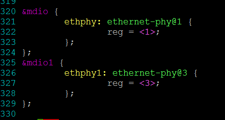

### IEEE 802.3x流控功能配置<a name="ZH-CN_TOPIC_0000002480063688"></a>


#### 流控功能描述<a name="ZH-CN_TOPIC_0000002512103529"></a>

GMAC网络支持IEEE 802.3x定义的流控功能，能够发送流控帧和接收处理对端的流控帧。

-   流控帧发送功能：

    在接收方向，若当前接收描述子队列出现紧张，可能无法满足已收到的数据包全部送达软件，则会发送流控帧至对端，告知对端暂停一定时间不发包。

-   流控帧的接收功能：

    当接收到流控帧，GMAC会根据帧内的流控时间字段进行延迟发送，等待计时到达流控时间后，则会再次启动发送，或在等待过程中收到了对端发送的流控时间为0的流控帧，同样会再次启动发送。

#### 流控功能配置<a name="ZH-CN_TOPIC_0000002512103583"></a>

流控功能配置方法如下：

```
cd open_source/linux/linux-4.19.y
cp arch/arm64/configs/ss928v100_defconfig .config
make ARCH=arm64 CROSS_COMPILE=aarch64-mix210-linux- menuconfig
```

对应选项如下：

```
Device Drivers  --->
  [*] Network device support  --->
    [*]   Ethernet driver support  --->
      [*]    Vendor devices
        <*>     eth gmac family network device support  --->
```


用户可配置的流控参数如下：

-   CONFIG\_RX\_FLOW\_CTRL\_SUPPORT接收流控帧功能是否使能；
-   CONFIG\_TX\_FLOW\_CTRL\_SUPPORT发送流控帧功能是否使能；
-   CONFIG\_TX\_FLOW\_CTRL\_ACTIVE\_THRESHOLD发送流控激活水线，当接收队列可用描述子个数小于该值，会启动逻辑发送流控帧的流程；
-   CONFIG\_TX\_FLOW\_CTRL\_DEACTIVE\_THRESHOLD发送流控撤销水线，当接收队列可用描述子个数大于或者等于该值同时正处于流控状态时，解除当前流控状态。

> **说明：** 
>流控功能激活水线值必须小于撤销水线。

#### ethtool配置接口<a name="ZH-CN_TOPIC_0000002480063656"></a>

用户可以通过标准ethtool工具接口进行流控功能的使能。

ethtool  –a  eth0 命令查看eth0口流控功能状态；打印如下：

```
# ./ethtool -a eth0
Pause parameters for eth0:
Autonegotiate:  on
RX:             on
TX:             on
```

其中，RX流控是打开的，TX流控是打开的；

用户可以通过以下命令打开或关闭TX流控：

```
# ./ethtool -A eth0 tx off（关闭TX流控）
# ./ethtool -A eth0 tx on（打开TX流控）
```

### Ipfrag 参数配置<a name="ZH-CN_TOPIC_0000002512063515"></a>

当接收大带宽、报文长度较大的 UDP 数据流，且网络不稳定的情况下，可能导致分片内存被耗尽，协议栈主动丢包，建议适当增大IP 参数 ipfrag\_high\_thresh、ipfrag\_low\_thresh 的值，当前的默认值为 4194304、3145728。

修改方法：xxx 为要设置的值

\~ \# echo xxx \> /proc/sys/net/ipv4/ipfrag\_high\_thresh

\~ \# echo xxx \> /proc/sys/net/ipv4/ipfrag\_low\_thresh

参数说明：

ipfrag\_high\_thresh 参数用来设置内核中可用来做 IP 分段重组的最大内存值。当达到该最大边界时, 负责分段重组的 handler 将会丢弃所有待处理的 ip 分段，直到占用的内存恢复到最小边界值 ipfrag\_low\_thresh。

### 双网口配置<a name="ZH-CN_TOPIC_0000002512063533"></a>

当应用场景需要配置双网口的时候，默认sdk和demo板是不支持双网口的，需要客户自行配置双网口。下述配置例子以GMAC0为千兆网卡\(rgmii\)，phy地址为1，GMAC1为百兆网卡\(rmii\)，phy地址为3为例，具体MAC模式，phy地址根据客户自己的硬件设计来：

GMAC0	1000M\(rgmii\) phy 1

GMAC1	100M\(rmii\) phy 3

U-boot修改点：

进入U-boot目录：vim include/configs/ss928v100.h

修改后值：

```
/*Network configuration*/
#define CONFIG_PHY_GIGE
#ifdef CONFIG_GMACV300_ETH
#define CONFIG_GMAC_NUMS        2
#define CONFIG_GMAC_PHY0_ADDR     1
#define CONFIG_GMAC_PHY0_INTERFACE_MODE       2 /* rgmii 2, rmii 1, mii 0 */
#define CONFIG_GMAC_PHY1_ADDR     3
#define CONFIG_GMAC_PHY1_INTERFACE_MODE       1 /* rgmii 2, rmii 1, mii 0 */
#define CONFIG_GMAC_DESC_4_WORD
#define CONFIG_SYS_FAULT_ECHO_LINK_DOWN 1
#endif
```

Linux修改点：

进入linux目录：vim arch/arm64/boot/dts/vendor/ss928v100-demb.dts

修改后值：

```
&mdio {
        ethphy: ethernet-phy@1 {
                reg = <1>;
        };
};
&mdio1 {
        ethphy1: ethernet-phy@3 {
                reg = <3>;
        };
};
 
&gmac {
        phy-handle = <&ethphy>;
        phy-mode = "rgmii";
};
 
&gmac1 {
        phy-handle = <&ethphy1>;
        phy-mode = "rmii";
};
```

## USB操作指南<a name="ZH-CN_TOPIC_0000002512063507"></a>


### 操作准备<a name="ZH-CN_TOPIC_0000002480063646"></a>

当前产品的USB，均提供最高USB3.0速率。其主从模式（Host/Device）为：USB3\_0口仅支持USB Host模式；USB3\_1口可以在Host模式或者Deivce模式中二选一使用，默认SDK版本使用Device模式。

USB的操作准备如下：

-   U-boot和Linux内核使用SDK发布的U-boot和kernel。
-   文件系统可以使用本地文件系统jffs2、ext4或cramfs，也可以使用NFS。

### 操作过程<a name="ZH-CN_TOPIC_0000002512063493"></a>


#### Uboot 下USB Host操作过程<a name="ZH-CN_TOPIC_0000002480063630"></a>

> **说明：** 
>当前uboot下只支持纯存储类设备，如：U盘，硬盘等。不支持带CD-ROM分区的设备，对接PC看设备盘符，如果有光盘驱动盘符即为有CD-ROM分区。

编译uboot下USB相关的驱动。

1.  进入menuconfig的如下路径，确认以下驱动配置全部选上，默认配置是全选。

    ```
    Command line interface  --->
             Device access commands  --->
                  [*] usb
    Device Drivers  --->
             [*] vendor usb phy driver
             [*] USB support  --->
                  [*]   xHCI HCD (USB 3.0) support
                  [*]   USB Mass Storage support
    ```

2.  编译命令：

    ```
    make ARCH=arm CROSS_COMPILE=aarch64-mix210-linux- menuconfig
    make ARCH=arm CROSS_COMPILE=aarch64-mix210-linux- -j 20
    cp ../../../osdrv/tools/pc/uboot_tools/reg_info.bin .reg
    make ARCH=arm CROSS_COMPILE=aarch64-mix210-linux- u-boot-z.bin
    ```

    编译生成的 u-boot-ss928v100.bin即为可用的u-boot镜像。

#### 内核下USB Host操作过程<a name="ZH-CN_TOPIC_0000002512103591"></a>

1.  启动单板，加载jffs2、ext4或cramfs文件系统，也可以使用NFS。
2.  默认USB Host相关模块已经全部编入内核，不需要再执行加载命令，就可以对U盘、鼠标或者键盘进行相关操作。具体操作请参见“2.3 操作示例”。下面列出所有USB Host相关驱动：
    -   文件系统和存储设备相关模块
        -   vfat
        -   ext4
        -   scsi\_mod
        -   sd\_mod
        -   nls\_ascii
        -   nls\_iso8859-1

    -   键盘相关模块
        -   evdev
        -   usbhid

    -   鼠标相关模块
        -   mousedev
        -   usbhid
        -   evdev

    -   USB Host模块
        -   xhci-hcd
        -   xhci-plat-hcd
        -   usb-storage
        -   phy-vendor-usb3

#### 内核下USB Device操作过程<a name="ZH-CN_TOPIC_0000002480063612"></a>

1.  编译USB Device相关的内核驱动模块。

    -   进入menuconfig的如下路径，USB device作为虚拟u盘、虚拟网口、虚拟串口、_录像机_的配置如下。

        ```
        Device Drivers  --->
                 <*> Multimedia support  --->
                          [*]   Cameras/video grabbers support 
                          [*]   Media USB Adapters  --->
                                   <*>   USB Video Class (UVC)
                                   [*]     UVC input events device support
                          [*]   V4L platform devices  ---> 
                 <*> Sound card support  --->
                          <*>   Advanced Linux Sound Architecture  --->
                                   [*]   USB sound devices  --->  
                 [*] USB support  --->
                          <*>  DesignWare USB3 DRD Core Support
                                   DWC3 Mode Selection (Gadget only mode)  --->
                          <*>  USB Gadget Support  --->
                                   <*>   USB Gadget functions configurable through configfs
                                             [*]   Abstract Control Model (CDC ACM)
                                             [*]   RNDIS
                                             [*]   Mass storage
                                             [*]   Audio Class 1.0
                                             [*]   USB Webcam function
                 PHY Subsystem  --->
                          <*>  VENDOR USB support  --->
                                   [*]    Vendor USB PHY driver
                                   [*]    Vendor USB related configuration  --->
                                             [ ] USB DRD0 Mode Select HOST
                                             [*] USB DRD0 Mode Select DEVICE
        ```

    > **说明：** 
    >DRD0只能host/device二选一。即上述配置中的USB DRD0 Mode Select HOST和USB DRD0 Mode Select DEVICE不能同时选择。
    >并非所有芯片均有device模式，具体芯片规格请查看芯片手册或咨询技术支持。

    -   编译内核模块，生成.ko文件。

        ```
        make ARCH=arm64 CROSS_COMPILE=aarch64-mix210-linux- modules –j 32
        ```

        注意：在编译模块时，要先编译内核，编译内核命令为：

        ```
        make ARCH=arm64 CROSS_COMPILE=aarch64-mix210-linux- uImage –j 32
        ```

2.  启动单板，加载jffs2、ext4或cramfs文件系统，也可以使用NFS。
3.  单板作为Device时，需要加载相关环境变量和配置相关脚本。具体操作请参见“[操作示例](#ZH-CN_TOPIC_0000002512103593)”。

### 操作示例<a name="ZH-CN_TOPIC_0000002480063640"></a>


#### Uboot下U盘操作示例<a name="ZH-CN_TOPIC_0000002512103597"></a>


##### 上电前插入设备<a name="ZH-CN_TOPIC_0000002512063501"></a>

> **说明：** 
>Uboot下不支持热插拔，系统上电之前需要将设备插入U口。

单板上电，进入uboot命令行，输入命令：usb start，观察是否识别成功。

-   U口插入高速/超速u盘正常情况下串口打印为：

    ```
    # usb start
    USB0:   Register 1000140 NbrPorts 1
    Starting the controller
    USB XHCI 1.10
    scanning bus 0 for devices... 2 USB Device(s) found
    scanning usb for storage devices... 1 Storage Device(s) found
    ```

> **说明：** 
>若usb start后出现识别枚举报错，如：Device not responding to set address等，或者usb start后出现完全无法检测到设备，请在uboot命令行执行：setenv usb\_pgood\_delay XXX，该设置针对某些预热较慢的设备，增加timeout等待设备上电稳定，XXX可根据当前设备的预热快慢设置合理的值，建议取值范围为1000-3000。

识别完成后，再输入命令：usb tree，查看识别速率。

-   U口插入高速/超速u盘正常情况下串口打印为：

    ```
    # usb tree
    USB device tree:
    1  Hub (5 Gb/s, 0mA)
    |  U-Boot XHCI Host Controller
    |
    +-2  Mass Storage (480 Mb/s, 250mA)
    Generic Mass Storage Device 121220130416
    ```

##### 初始化及应用<a name="ZH-CN_TOPIC_0000002512103561"></a>

识别完成以后，进行以下操作。

1.  查看设备信息。

    Uboot命令行执行：usb info \[dev\]，可以查看当前控制器上接的所有设备的设备信息，可在命令后加参数查看单个具体设备的信息，如：usb info 2，正常查看示例如下：

    ```
     # usb info 2
    config for device 2
    2: Mass Storage,  USB Revision 2.0
      - Generic Mass Storage B92AAF26
      - Class: (from Interface) Mass Storage
      - PacketSize: 64  Configurations: 1
      - Vendor: 0x058f  Product 0x6387 Version 1.0
        Configuration: 1
        - Interfaces: 1 Bus Powered 200mA
          Interface: 0
          - Alternate Setting 0, Endpoints: 2
          - Class Mass Storage, Transp. SCSI, Bulk only
          - Endpoint 1 Out Bulk MaxPacket 512
          - Endpoint 2 In Bulk MaxPacket 512
    ```

1.  对U盘进行读操作。

    Uboot命令行执行：usb read addr blk\# cnt，使用命令将起始地址为blk大小为cnt的数据读到DDR地址addr的位置。正常读操作完成示例如下：

    ```
     # usb read 0x82000000 0 2000
    USB read: device 0 block # 0, count 8192 ... 8192 blocks read: OK
    ```

1.  对U盘进行写操作。

    Uboot命令行执行：usb write addr blk\# cnt，使用命令将DDR地址addr的cnt大小的数据写到U盘的blk位置。正常读操作完成示例如下：

    ```
     # usb write 0x82000000 2000 2000
    ```

    ```
    USB write: device 0 block # 8192, count 8192 ... 8192 blocks write: OK
    ```

#### 内核下U盘操作示例<a name="ZH-CN_TOPIC_0000002512103535"></a>


##### 插入检测<a name="ZH-CN_TOPIC_0000002480063692"></a>

直接插入U盘，观察是否枚举成功。

-   USB口插入高速U盘的正常串口打印为：

    ```
    ~ # usb 1-1: new high-speed USB device number 2 using xhci-hcd
    scsi2 : usb-storage 1-1:1.0
    scsi 2:0:0:0: Direct-Access           1.00 PQ: 0 ANSI: 4
    sd 2:0:0:0: [sda] 15131636 512-byte logical blocks: (7.74 GB/7.21 GiB)
    sd 2:0:0:0: [sda] Write Protect is off
    sd 2:0:0:0: [sda] Write cache: disabled, read cache: enabled, doesn't support DPO or FUA
    sda: sda1
    sd 2:0:0:0: [sda] Attached SCSI removable disk
    ```

-   USB口插入超速U盘正常串口打印为：

    ```
    ~ # usb 2-1: new SuperSpeed  USB device number 3 using xhci-hcd
    scsi2 : usb-storage 2-1:1.0
    scsi 2:0:0:0: Direct-Access           1.00 PQ: 0 ANSI: 4
    sd 2:0:0:0: [sda] 15131636 512-byte logical blocks: (7.74 GB/7.21 GiB)
    sd 2:0:0:0: [sda] Write Protect is off
    sd 2:0:0:0: [sda] Write cache: disabled, read cache: enabled, doesn't support DPO or FUA
    sda: sda1
    sd 2:0:0:0: [sda] Attached SCSI removable disk
    ```

其中：sda1表示U盘或移动硬盘上的第一个分区，当存在多个分区时，会出现sda1、sda2、sda3等字样。

##### 初始化及应用<a name="ZH-CN_TOPIC_0000002480063658"></a>

模块插入完成后，进行如下操作：

> **说明：** 
>sdXY中X代表磁盘号，Y代表分区号，请根据具体系统环境进行修改。

-   分区命令操作的具体设备节点为sdX，示例：$ fdisk /dev/sda
-   用mkdosfs工具格式化的具体分区为sdXY：\~ $ mkdosfs –F 32 /dev/sda1
-   挂载的具体分区为sdXY：\~ $ mount -t vfat /dev/sda1 /mnt

1.  查看分区信息。
    -   运行命令“ls /dev”查看系统设备文件，若没有分区信息sdXY，表示还没有分区，请参见“[用fdisk工具分区](#ZH-CN_TOPIC_0000002479903638)”进行分区后，进入步骤 2。
    -   若有分区信息sdXY，则已经检测到盘，并已经进行分区，进入步骤 2。

2.  查看格式化信息。
    -   若没有格式化，请参见“  [用mkdosfs工具格式化](#ZH-CN_TOPIC_0000002512103571)”进行格式化后，进入步骤 3。
    -   若已格式化，进入步骤 3。

3.  挂载目录，请参见“[挂载目录](#ZH-CN_TOPIC_0000002512103519)”。
4.  对硬盘进行读写操作，请参见“[读写文件](#ZH-CN_TOPIC_0000002512103577)”。

#### 内核下键盘操作示例<a name="ZH-CN_TOPIC_0000002512103585"></a>

键盘操作过程如下：

1.  插入模块。

    插入键盘相关模块后，键盘会在/dev/input目录下生成event0节点。

2.  接收键盘输入。

    执行命令：cat /dev/input/event0

    然后在USB键盘上敲击，可以看到屏幕有输出。

#### 内核下鼠标操作示例<a name="ZH-CN_TOPIC_0000002479903684"></a>

鼠标操作过程如下：

1.  插入模块。

    插入鼠标相关模块后，鼠标会在/dev/input目录下生成mouse0节点。

2.  接收鼠标输入。

    执行命令：cat /dev/input/mouse0

3.  进行鼠标操作（点击、滑动等），可以看到串口打印出相应码值。

#### 内核下虚拟U盘操作示例<a name="ZH-CN_TOPIC_0000002512103525"></a>

单板作为虚拟U盘时，以Flash和SD卡做存储介质为例，操作过程如下：

1.  配置环境变量和脚本。
    -   以Flash作为虚拟U盘的存储介质，操作为：

        ```
        export VID="0x1D6B"
        export PID="0x0001"
        export MANUFACTURER="Vendor"
        export PRODUCT="MassStorage"
        export SERIALNUMBER="123456789012"
        export MEMORY=/dev/mtdblockX
        ./Config_Storage.sh
        ```

        其中，mtdblockX为Flash的第X个分区，请用户根据具体情况选择。

    -   以SD卡作为虚拟U盘的存储介质，操作为：

        ```
        export VID="0x1D6B"
        export PID="0x0001"
        export MANUFACTURER=" Vendor"
        export PRODUCT="MassStorage"
        export SERIALNUMBER="123456789012"
        export MEMORY=/dev/mmcblk0pX
        ./Config_Storage.sh
        ```

        其中，mmcblk0pX为SD卡的第X个分区，请用户根据具体情况选择。

        > **说明：** 
        >1.  上述export所修饰的变量用户可自主适配，变量所表示的含义如下：
        >    -   VID表示厂商ID，使用时必须修改；
        >    -   PID表示产品ID，使用时必须修改；
        >    -   MANUFACTURER表示厂商名，默认发布是Vendor，使用时必须修改；
        >    -   PRODUCT表示产品名，使用时请按需求修改；
        >    -   SERIALNUMBER表示产品序列号，使用时请按需求修改；
        >2.  Config\_Storage.sh为启动mass storage所进行的必要操作，用户可不用修改。
        >    Config\_Storage.sh见附录：[虚拟U盘](#ZH-CN_TOPIC_0000002512063553)。
        >1.  若要卸载存储功能模块，执行Disable\_Storage.sh即可，脚本内容用户可不用修改。
        >    Disable\_Storage.sh见附录：[虚拟U盘](#ZH-CN_TOPIC_0000002512063553)。

2.  通过USB将单板与PC端相连，此时PC端可识别到盘符。至此，单板可以当做真正的U盘使用。

#### 内核下虚拟网口操作示例<a name="ZH-CN_TOPIC_0000002480063670"></a>

单板作为虚拟网口设备，操作过程如下：

1.  配置环境变量和脚本。

    ```
    export VID="0x1D6B"
    export PID="0x0002"
    export MANUFACTURER="Vendor"
    export PRODUCT="Ethernet"
    export SERIALNUMBER="123456789012"
    ./Config_Ether.sh
    ```

    > **说明：** 
    >1.  上述export所修饰的变量用户可自主适配，变量所表示的含义如下：
    >    -   VID表示厂商ID，使用时必须修改；
    >    -   PID表示产品ID，使用时必须修改；
    >    -   MANUFACTURER表示厂商名，默认发布是Vendor，使用时必须修改；
    >    -   PRODUCT表示产品名，使用时必须修改；
    >    -   SERIALNUMBER表示产品序列号，使用时请按需求修改；
    >2.  Config\_Ether.sh为启动虚拟网口所进行的必要操作，用户可不用修改。
    >    Config\_Ether.sh见附录：[虚拟网口](#ZH-CN_TOPIC_0000002480063664)。
    >3.  若要卸载网口功能模块，执行Disable\_ Ether.sh即可，脚本内容用户可不用修改。
    >    Disable\_ Ether.sh见附录：[虚拟网口](#ZH-CN_TOPIC_0000002480063664)。

2.  通过USB数据线将单板与Host pc端相连，若pc系统为win10系统，pc端会自动加载驱动，在设备管理器的网络适配器部分可以看到Remote NDIS Compatible Device \#x设备，但部分pc可能会识别为串口设备，解决方法见步骤4后的说明；若pc系统为win7系统，第一次可能会失败，需要自行安装驱动，方法为：
    -   右击计算机，进入管理界面；
    -   打开设备管理器；
    -   点击其他设备会看到Ethernet，双击；
    -   打开驱动程序界面，点击更新驱动程序，进入浏览计算机以查找驱动程序软件\(R\)；
    -   把路径指向linux.inf所在的目录，将下面文件下载到本地目录，点击下一步，计算机会自动进行安装驱动程序，安装成功后，点击网络适配器会看到Ethernet Linux USB Ethernet /RNDIS Gadget \#x。

        linux.inf文件取自发布包路径为：\{SDK\_PATH\}/open\_source/linux/linux-4.19.y/Documentation/usb/

3.  在单板端配置IP，命令为：ifconfig usb0 xx.xx.xx.xx netmask 255.255.xxx.0;route add default gw xx.xx.xx.xx。
4.  当单板和pc通过USB数据线相连时，会在PC端生成USB网络节点，具体位置：打开网络和共享中心--\>更改适配器设置---\>Linux USB Ethernet /RNDIS Gadget \#x。对该节点设置网络IP，则单板和PC可以相互ping通，并且通信。

    > **说明：** 
    >Config\_Ether.sh脚本已经针对win10系统进行了适配，但发现部分win10pc会将网口设备识别为串口设备，解决方法为将RNDIS.cat、RNDIS.inf驱动文件放到本地目录，在设备管理器对新增的串口设备进行驱动更新，方法同步骤中win7pc更新驱动方法，更新后网口设备即可正常使用。
    >win10pc需要关闭数字签名后才可以更新驱动，关闭方法可在网上搜索，此处不再赘述。
    >RNDIS.cat和RNDIS.inf文件可通过网络搜索获取。

#### 内核下虚拟串口操作示例<a name="ZH-CN_TOPIC_0000002512103569"></a>

单板作为虚拟串口设备，操作过程如下：

1.  配置环境变量和脚本。

    ```
    export VID="0x1D6B"
    export PID="0x0003"
    export MANUFACTURER="Vendor"
    export PRODUCT="SerialGadget"
    export SERIALNUMBER="123456789012"
    ./Config_Serial.sh
    ```

    > **说明：** 
    >1.  上述export所修饰的变量用户可自主适配，变量所表示的含义如下：
    >    -   VID表示厂商ID，使用时必须修改；
    >    -   PID表示产品ID，使用时必须修改；
    >    -   MANUFACTURER表示厂商名，默认发布是Vendor使用时必须修改；
    >    -   PRODUCT表示产品名，使用时必须修改；
    >    -   SERIALNUMBER表示产品序列号，使用时请按需求修改；
    >1.  Config\_Serial.sh为启动虚拟串口所进行的必要操作，用户可不用修改。
    >    Config\_Serial.sh见附录：[虚拟串口](#ZH-CN_TOPIC_0000002479903674)。
    >2.  若要卸载串口功能模块，执行Disable\_Serial.sh即可，脚本内容用户可不用修改。
    >    Disable\_Serial.sh见附录：[虚拟串口](#ZH-CN_TOPIC_0000002479903674)。

2.  在单板端，进行如下操作：

    ```
    vi /etc/inittab
    #::respawn:/sbin/getty -L ttyS000 115200 vt100 -n root -I "Auto login as root ..."
    ::respawn:/sbin/getty -L ttyGS0 115200 vt100 -n root -I "Auto login as root ..."
    ```

    然后重启单板。

3.  通过USB数据线将单板与Host pc端相连，

    若pc系统为win10系统，pc端会自动加载驱动。

    若pc系统为win7系统，第一次可能会失败，需要自行安装驱动，方法为：

    -   右击计算机，进入管理界面；
    -   打开设备管理器；
    -   点击其他设备会看到名为PRODUCT变量的设备（如SerialGadget），双击；
    -   打开驱动程序界面，点击更新驱动程序，进入浏览计算机以查找驱动程序软件\(R\)。
    -   把路径指向linux-cdc-acm.inf所在的目录，将下面文件下载到本地目录，点击下一步，计算机会自动进行安装驱动程序，安装成功后，点击端口（COM和LPT），会看到Gadget Serial（COMx）设备，若pc为win10系统，不需要自行安装驱动即可在端口（COM和LPT）看到USB串行设备（COMx）设备。

        linux-cdc-acm.inf文件取自发布包路径为：\{SDK\_PATH\}/open\_source/linux/linux-4.19.y/Documentation/usb/

#### 内核下录像机操作示例<a name="ZH-CN_TOPIC_0000002512103551"></a>

**表 1**  UVC解决方案特性表

<a name="table6465725141113"></a>
<table><thead align="left"><tr id="row124654254114"><th class="cellrowborder" valign="top" width="5.129487051294871%" id="mcps1.2.5.1.1"><p id="p291729201211"><a name="p291729201211"></a><a name="p291729201211"></a>编号</p>
</th>
<th class="cellrowborder" valign="top" width="18.51814818518148%" id="mcps1.2.5.1.2"><p id="p1846572571112"><a name="p1846572571112"></a><a name="p1846572571112"></a>特性</p>
</th>
<th class="cellrowborder" valign="top" width="33.826617338266175%" id="mcps1.2.5.1.3"><p id="p446516257119"><a name="p446516257119"></a><a name="p446516257119"></a>使用说明</p>
</th>
<th class="cellrowborder" valign="top" width="42.52574742525748%" id="mcps1.2.5.1.4"><p id="p174659259115"><a name="p174659259115"></a><a name="p174659259115"></a>备注</p>
</th>
</tr>
</thead>
<tbody><tr id="row123811666122"><td class="cellrowborder" valign="top" width="5.129487051294871%" headers="mcps1.2.5.1.1 "><p id="p2912293126"><a name="p2912293126"></a><a name="p2912293126"></a>1</p>
</td>
<td class="cellrowborder" valign="top" width="18.51814818518148%" headers="mcps1.2.5.1.2 "><p id="p11381166111214"><a name="p11381166111214"></a><a name="p11381166111214"></a>支持的协议版本(UVC 1.1/1.5)</p>
</td>
<td class="cellrowborder" valign="top" width="33.826617338266175%" headers="mcps1.2.5.1.3 "><p id="p238116141215"><a name="p238116141215"></a><a name="p238116141215"></a>支持UVC 1.1和UVC 1.5协议，可通过配置脚本参数切换。</p>
</td>
<td class="cellrowborder" valign="top" width="42.52574742525748%" headers="mcps1.2.5.1.4 "><p id="p0381126181212"><a name="p0381126181212"></a><a name="p0381126181212"></a>默认使用UVC 1.1版本，切换无需重新编译烧写内核，下文配置脚本说明阐述切换方法。</p>
</td>
</tr>
<tr id="row14661425181111"><td class="cellrowborder" valign="top" width="5.129487051294871%" headers="mcps1.2.5.1.1 "><p id="p15911829201216"><a name="p15911829201216"></a><a name="p15911829201216"></a>2</p>
</td>
<td class="cellrowborder" valign="top" width="18.51814818518148%" headers="mcps1.2.5.1.2 "><p id="p1946672551111"><a name="p1946672551111"></a><a name="p1946672551111"></a>媒体数据传输方案(高性能0拷贝/V4L2)</p>
</td>
<td class="cellrowborder" valign="top" width="33.826617338266175%" headers="mcps1.2.5.1.3 "><p id="p4466425181119"><a name="p4466425181119"></a><a name="p4466425181119"></a>高性能0拷贝方案减少了流程中数据拷贝次数；Linux Kernel原生的V4L2方案使用传统ioctl方式送流。可通过配置脚本参数切换。</p>
</td>
<td class="cellrowborder" valign="top" width="42.52574742525748%" headers="mcps1.2.5.1.4 "><p id="p2466152514113"><a name="p2466152514113"></a><a name="p2466152514113"></a>默认使用高性能模式，依赖uvc ko及ss_mpi_uvc_xxx接口，走定制的数据通道；V4L2框架使用传统ioctl以拷贝方式送媒体数据。切换无需重新编译烧写内核，下文配置脚本说明阐述切换方法。</p>
</td>
</tr>
<tr id="row15466122541119"><td class="cellrowborder" valign="top" width="5.129487051294871%" headers="mcps1.2.5.1.1 "><p id="p49115295123"><a name="p49115295123"></a><a name="p49115295123"></a>3</p>
</td>
<td class="cellrowborder" valign="top" width="18.51814818518148%" headers="mcps1.2.5.1.2 "><p id="p15466162517115"><a name="p15466162517115"></a><a name="p15466162517115"></a>USB传输模式(isoc/bulk)</p>
</td>
<td class="cellrowborder" valign="top" width="33.826617338266175%" headers="mcps1.2.5.1.3 "><p id="p1746662591117"><a name="p1746662591117"></a><a name="p1746662591117"></a>内核默认仅支持USB 等时(isoc)传输模式，新增批量(bulk)传输模式，可通过配置脚本参数切换。</p>
</td>
<td class="cellrowborder" valign="top" width="42.52574742525748%" headers="mcps1.2.5.1.4 "><p id="p3466122514117"><a name="p3466122514117"></a><a name="p3466122514117"></a>默认使用等时传输，切换无需重新编译烧写内核，下文配置脚本说明阐述切换方法。</p>
</td>
</tr>
<tr id="row168507315261"><td class="cellrowborder" valign="top" width="5.129487051294871%" headers="mcps1.2.5.1.1 "><p id="p1291329101217"><a name="p1291329101217"></a><a name="p1291329101217"></a>4</p>
</td>
<td class="cellrowborder" valign="top" width="18.51814818518148%" headers="mcps1.2.5.1.2 "><p id="p6355141122613"><a name="p6355141122613"></a><a name="p6355141122613"></a>UVC路数(单路/双路)</p>
</td>
<td class="cellrowborder" valign="top" width="33.826617338266175%" headers="mcps1.2.5.1.3 "><p id="p4355171142611"><a name="p4355171142611"></a><a name="p4355171142611"></a>支持单路UVC和双路UVC，可通过配置脚本参数切换。</p>
</td>
<td class="cellrowborder" valign="top" width="42.52574742525748%" headers="mcps1.2.5.1.4 "><p id="p133551416268"><a name="p133551416268"></a><a name="p133551416268"></a>默认使用单路UVC。使用双路UVC，需准备一拖二mipi排线和两个sensor。理论上，对比单路UVC双路UVC会占用两倍相关资源。下文配置脚本说明阐述切换方法。</p>
</td>
</tr>
<tr id="row6336142112614"><td class="cellrowborder" valign="top" width="5.129487051294871%" headers="mcps1.2.5.1.1 "><p id="p1791152911125"><a name="p1791152911125"></a><a name="p1791152911125"></a>5</p>
</td>
<td class="cellrowborder" valign="top" width="18.51814818518148%" headers="mcps1.2.5.1.2 "><p id="p56591440142616"><a name="p56591440142616"></a><a name="p56591440142616"></a>UVC Still Image</p>
</td>
<td class="cellrowborder" valign="top" width="33.826617338266175%" headers="mcps1.2.5.1.3 "><p id="p26591940182611"><a name="p26591940182611"></a><a name="p26591940182611"></a>支持UVC Still Image截图功能，可通过配置脚本参数选择是否支持。</p>
</td>
<td class="cellrowborder" valign="top" width="42.52574742525748%" headers="mcps1.2.5.1.4 "><p id="p16591540142614"><a name="p16591540142614"></a><a name="p16591540142614"></a>仅基于传统V4L2传输的单路UVC支持Still Image功能，高性能0拷贝方案暂不支持。Still Image功能默认关闭，下文阐述Still Image的打开方法和资源依赖。</p>
</td>
</tr>
</tbody>
</table>

> **须知：** 
>Still Image资源依赖
>支持Still Image需打开如下内核配置选项:
>```
>Device Drivers  --->
>         USB support  ---> 
>                  USB Gadget Support  --->
>                           USB Gadget functions configurable through configfs  --->
>                                    [*] USB Webcam function
>                                             [*] UVC Still Image
>```
>method2使用视频管道传输，截图时视频短暂停顿，不使用独立端点；method3使用独立管道传输，截图过程不影响视频传输，但会多占一个USB端点。
>若内核不打开Still Image选项，建议将\{SDK\_PATH\}/smp/a7\_linux/source/mpp/sample/uvc\_app/uvc.h中的”\#define UVC\_STILL\_IMAGE”注释掉，否则会有不影响使用的错误打印。

单板作为_录像机_设备，操作过程如下：

1.  编译应用程序：

    uvc\_app编译

    参考\{SDK\_PATH\}/mpp/sample/uvc\_app目录下的readme.txt和alsa\_readme.txt文件

2.  配置环境变量和脚本。

    ```
    export VID="0x1234"
    export PID="0x0004"
    export MANUFACTURER="Vendor"
    export PRODUCT="Camera"
    export SERIALNUMBER="123456789012"
    export BCDUVC="0x0110"
    #export TransferMode="bulk"
    #export PerfMode="v4l2"
    #export StillCaptureMethod=2  # Supported only in PerfMode="v4l2".
    
    export UVC_DEVICE_CNT=1  # 1 or 2,  only 1 if enable Still Image (StillCaptureMethod)
    
    export CamControl1=0xFF
    export CamControl2=0x7F
    export CamControl3=0x3E
    export ProcControl1=0xFF
    export ProcControl2=0xFF
    export ProcControl3=0x07
    export EcdControl1=0xFF
    export EcdControl2=0xFF
    export EcdControl3=0x0F
    export EcdRtControl1=0xFF
    export EcdRtControl2=0xFF
    export EcdRtControl3=0x0F
    export ExtControl1=0xFF
    export ExtControl2=0xFF
    
    export YUYV="360p 720p 1080p 2160p"
    export NV21="360p 720p 1080p 2160p"
    export NV12="360p 720p 1080p 2160p"
    export MJPEG="360p 720p 1080p 2160p"
    export H264="360p 720p 1080p 2160p"
    export H265="360p 720p 1080p 2160p"
    
    # USB3.0 bandwidth is not enough, so 2160p YUV is not supported if there are 2 devices
    if [ ${UVC_DEVICE_CNT} != 1 ] ; then
    	export YUYV="360p 720p 1080p"
    	export NV21="360p 720p 1080p"
    	export NV12="360p 720p 1080p"
    fi
    
    ./ConfigUVC.sh
    cd ./ko
    ./load_ss928v100 -i
    cd -
    if [ "$PerfMode" == "v4l2" ]; then
     ./sample_uvc_v4l2 ${UVC_DEVICE_CNT} &
    else
     ./sample_uvc ${UVC_DEVICE_CNT} 0 &
    fi
    ```

    > **说明：** 
    >1.  上述export所修饰的变量用户可自主适配，变量所表示的含义如下：
    >    -   VID表示厂商ID，使用时必须修改；
    >    -   PID表示产品ID，使用时必须修改；
    >    -   MANUFACTURER表示厂商名，默认发布是Vendor，使用时必须修改；
    >    -   PRODUCT表示产品名，使用时必须修改；
    >    -   SERIALNUMBER表示产品序列号，使用时请按需求修改；
    >    -   CamControl1、CamControl2、CamControl3表示的是UVC CT（Camera Terminal）单元的可控制项，具体请查看UVC 1.1协议的3.7.2.3章节；
    >    -   ProcControl1、ProcControl2 表示的是UVC PU（Processing Unit）单元的可控制项，具体请查看UVC 1.1协议的3.7.2.5章节；
    >    -   YUYV、NV21、NV12、MJPEG、H265和H264表示每种格式所支持的分辨率；
    >    -   ConfigUVC.sh脚本为启动uvc所进行的必要操作，用户可不用修改；
    >    -   ConfigUVC.sh见附录：[录像机](#ZH-CN_TOPIC_0000002512103601)；
    >    -   BCDUVC=0x0110表示UVC 1.1，BCDUVC=0x0150表示UVC 1.5；
    >    -   TransferMode="bulk"表示使用uvc 使用bulk传输，注释掉或其他值表示uvc 使用isoc传输；
    >    -   PerfMode="v4l2"表示使用传统v4l2方式送流\(对应应用程序sample\_uvc\_v4l2\)，注释掉或其他值表示使用高性能0拷贝方式送流\(对应应用程序sample\_uvc\)；
    >    -   StillCaptureMethod=2表示支持Still Image method2，"=3"表示支持Still Image method3，"=0"或注释掉表示不支持Still Image功能；
    >    -   UVC\_DEVICE\_CNT=1表示使用单路UVC，"=2”表示使用双路UVC；
    >    -   脚本中的“./load\_ss928v100 -i”语句为加载媒体驱动的命令，请根据项目实际需要正确配置参数。
    >2.  ./ko目录为媒体相关驱动。
    >3.  双路UVC因USB带宽等限制不支持yuyv/nv21/nv21 2160p及部分1080p分辨率的组合\(仅USB3.0下isoc的部分组合，未提及均不涉及\)：
    >    -   yuyv/nv12/nv21 1080p +  yuyv/nv12/nv21 的任意分辨率；
    >    -   yuyv/nv12/nv21 1080p + mjpeg/h264/h265 2160p。

3.  通过USB数据线将单板与PC相连，PC端识别后，设备列表会出现AC Interface和UVC Camera，代表识别正常，如[图1](#fig103911212135415)所示。

    **图 1**  设备管理器中uvc和uac节点<a name="fig103911212135415"></a>  
    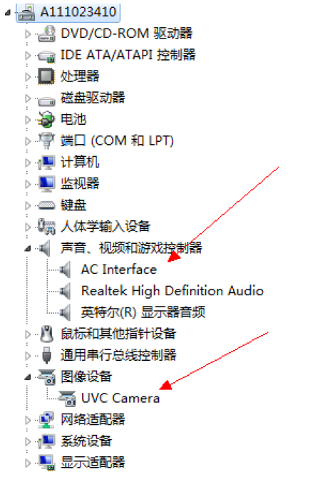

4.  PC端使用PotPlayer软件进行音视频捕获，软件可以到官网下载\(32位PC机请下载32-bit PotPlayer，64位PC机请下载64-bit PotPlayer\)，例如：

    [https://daumpotplayer.com/download/](https://daumpotplayer.com/download/)

    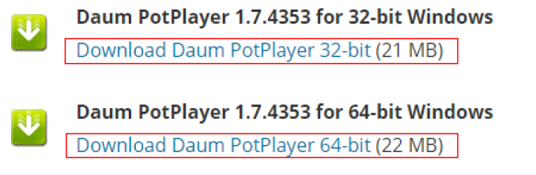

    > **说明：** 
    >AMCAP是基于Windows DirectShow技术开发，会采用Windows 自带的DTV-DVD H.264解码器解码H.264码流，会使H.264解码卡顿或花屏。不推荐采用AMCAP等其他软件。

5.  PotPlayer软件安装。安装过程中，请注意最后一步，Detect H/W decoder/encoder选项需要选中\(默认是没有选中\)，其他步骤选择默认，具体安装过程如[图2](#fig926614531282)所示

    **图 2**  安装过程示意图<a name="fig926614531282"></a>  
    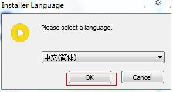

    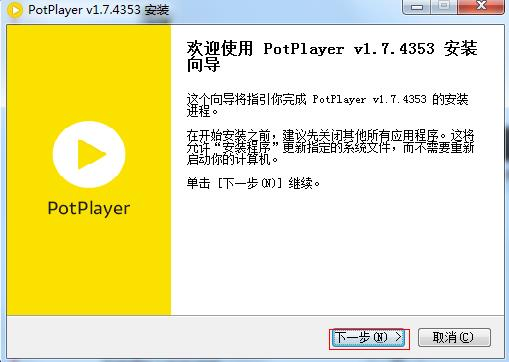

    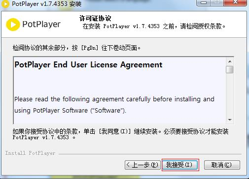

    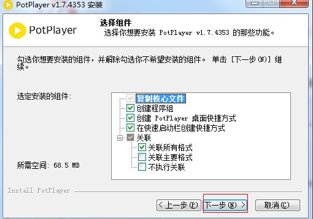

    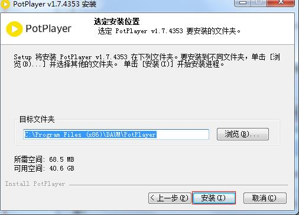

    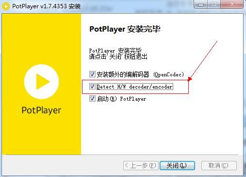

    至此安装完毕。

6.  PC端执行使用软件PotPlayer采集数据：

    1. 单击“PotPlayer”，选中“选项”，如[图3](#fig17925195310110)所示。

    **图 3**  PotPlayer对话框选项<a name="fig17925195310110"></a>  
    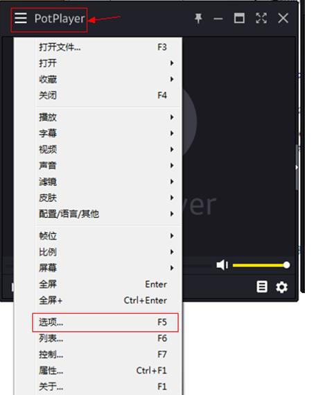

    2. 按[图4](#fig18932417111320)所示操作，在选项对话框中进行设置，最后打开设备，即可看到图像。

    **图 4**  配置选项选择<a name="fig18932417111320"></a>  
    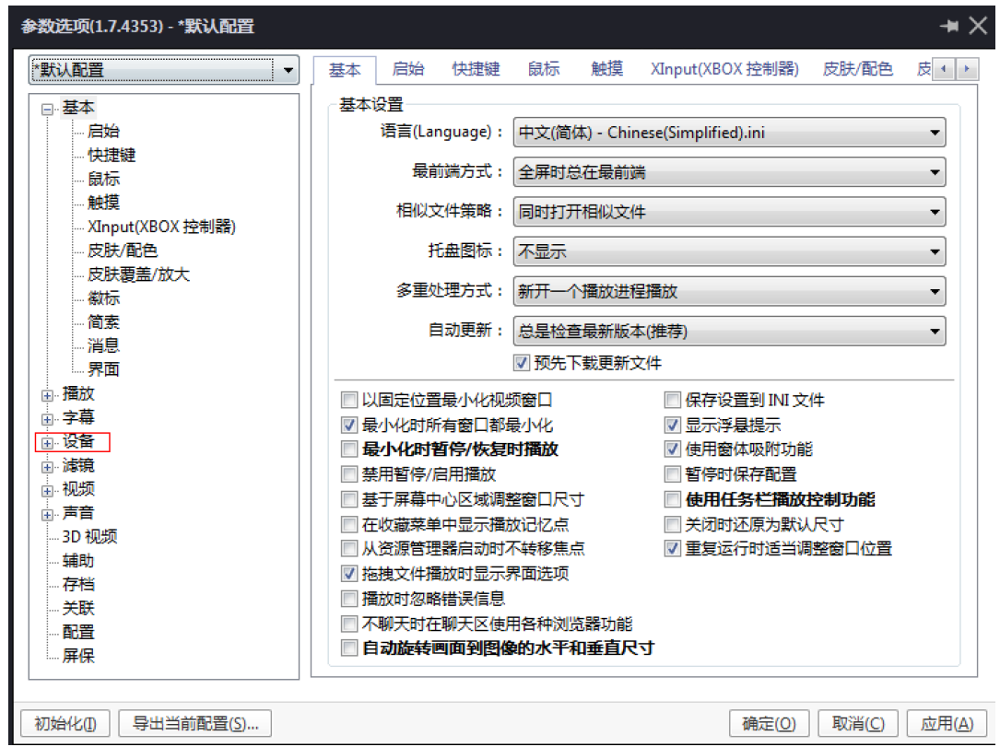

    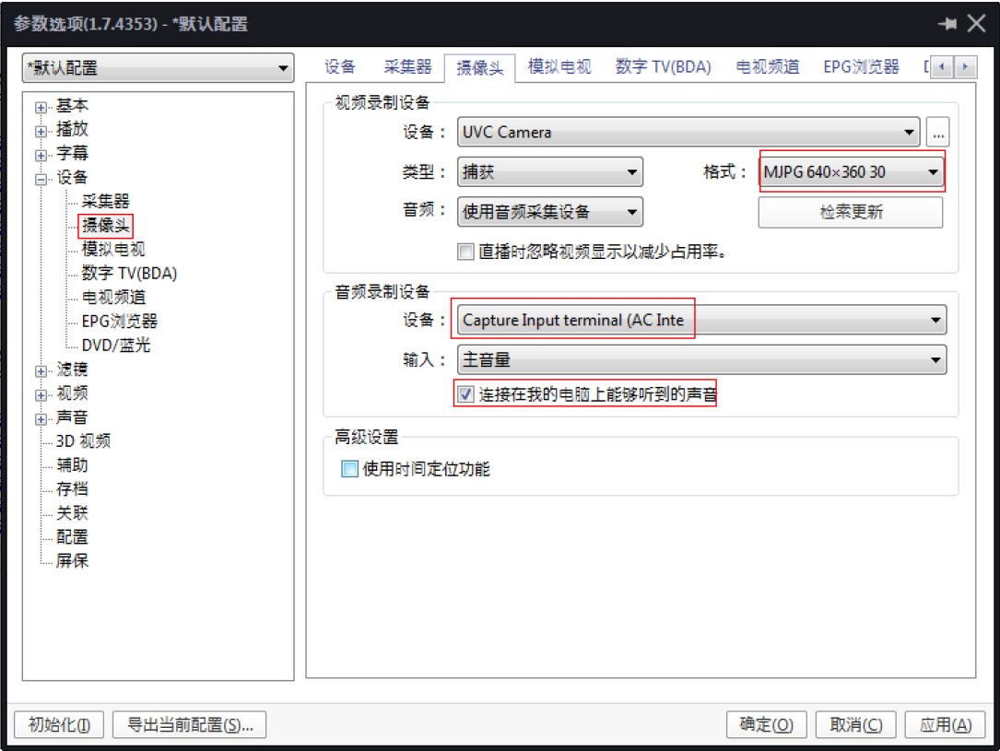

    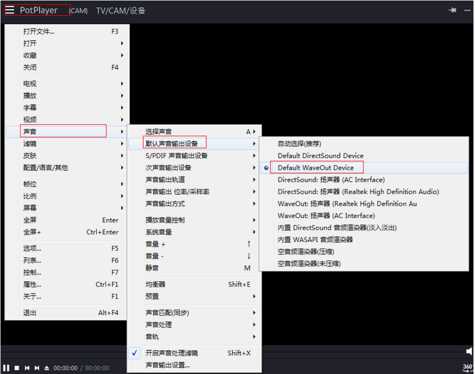

    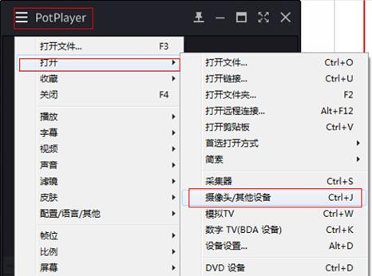

#### 复合设备<a name="ZH-CN_TOPIC_0000002480063618"></a>

如有复合设备使用需求，可将上述单一功能的配置脚本进行组合，合并为一个脚本，然后同时链接需要的功能节点即可，在端点数够用的情况下，可对支持单一功能进行灵活复合。

### 操作中需要注意的问题<a name="ZH-CN_TOPIC_0000002512063535"></a>

操作中需要注意的问题如下：

-   在操作时请尽量按照完整的操作顺序进行操作（mount→操作文件→umount），以免造成文件系统的异常。
-   目前键盘和鼠标的驱动要和上层结合使用，比如鼠标事件要和上层的GUI结合。对键盘的操作只需要对/dev下的event节点读取即可，而鼠标则需要标准的库支持。
-   在Linux系统中提供了一套标准的鼠标应用接口libgpm，如果需要使用鼠标客户可自行编译此库。在使用时建议使用内核标准接口gpm。

    已测试通过的标准接口版本：gpm-1.20.5。

    另外在gpm中还提供了一整套的测试工具源码（如：mev等），用户可根据这些测试程序进行编码等操作，降低开发难度。

-   USB Device单板要插入模块后，再与Host端相连，否则Host端将不识别Device设备，并循环打印错误信息。
-   作为USB device网口功能时，在每次重启单板后，请删除以前网桥并重新建立新的网桥。

## eMMC操作指南<a name="ZH-CN_TOPIC_0000002512103531"></a>


### 操作准备<a name="ZH-CN_TOPIC_0000002512103555"></a>

eMMC卡的操作准备如下：

-   U-boot和Linux内核使用SDK发布的U-boot和kernel。
-   文件系统。

    可以使用SDK发布的本地文件系统jffs2、ext4或squashFS，也可以通过本地文件系统再挂载到NFS。

### 操作过程<a name="ZH-CN_TOPIC_0000002512063541"></a>

操作过程如下：

1.  启动单板，加载本地文件系统jffs2、ext4或squashFS，也可以通过本地文件系统进一步挂载到NFS。
2.  加载内核。默认eMMC相关模块已全部编入内核，不需要再执行加载命令。下面列出eMMC所有相关驱动：
    -   文件系统和存储设备相关模块
        -   nls\_base
        -   nls\_cp437
        -   fat
        -   vfat
        -   msdos
        -   mke2fs
        -   nls\_iso8859-1
        -   nls\_ascii

    -   eMMC相关模块
        -   mmc\_core
        -   sdhci
        -   sdhci-pltfm
        -   sdhci-bspmmc\_block

3.  通常情况eMMC是焊接单板上的，加载驱动后有eMMC识别打印，如果MMC驱动模块已经编译进内核启动后eMMC会自动识别（相关管脚复用需配置正确），然后可以对eMMC进行相关操作，具体操作请参见“[操作示例](#ZH-CN_TOPIC_0000002512103593)”。

### 操作示例<a name="ZH-CN_TOPIC_0000002512063513"></a>

在控制台下实现读写eMMC的操作示例如[图1](#fig4424152661713)所示。

**图 1**  在控制台下实现读写eMMC的操作示例<a name="fig4424152661713"></a>  
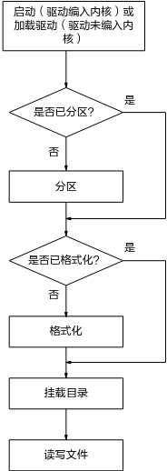

初始化及应用，待eMMC识别后，进行如下操作：

> **说明：** 
>其中X为分区号，由fdisk工具分区时决定。

-   命令fdisk操作的具体目录需改为：\~ $ fdisk /dev/mmcblk0
-   用mkdosfs工具格式化的具体目录需改为：\~ $ mkdosfs –F 32 /dev/mmcblk0pX
-   用mke2fs工具格式化的具体目录需改为：\~ $ mke2fs /dev/mmcblk0pX
-   挂载的具体目录需改为：\~ $ mount -t type /dev/mmcblk0pX /mnt，其中type是文件系统类型（vfat / ext4等）

1.  查看分区信息。
    -   控制台输入ls /dev | grep mmcblk, 若没有显示出mmcblk0pX，表示还没有分区，如果单板是spi nand/nor等方式启动，请参见“[用fdisk工具分区](#ZH-CN_TOPIC_0000002479903638)”进行分区后，进入步骤 2，如果是单板是eMMC启动，须通过在bootargs增加分区的方式增加分区，请参见“[修改bootargs方式增加分区](#ZH-CN_TOPIC_0000002479903702)”，进入步骤2。
    -   若有分区信息pX，则eMMC分区已经检测到，并已经进行分区，进入步骤 2。

2.  查看格式化信息。
    -   若没有格式化，请参见“[用mkdosfs工具格式化](#ZH-CN_TOPIC_0000002512103571)”或“[用mke2fs工具格式化](#ZH-CN_TOPIC_0000002512103545)”进行格式化后，进入步骤 3。
    -   若已格式化，进入步骤 3。

3.  挂载目录，请参见“[挂载目录](#ZH-CN_TOPIC_0000002512103519)”。
4.  对eMMC分区进行读写操作，请参见“[读写文件](#ZH-CN_TOPIC_0000002512103577)”

### 修改bootargs方式增加分区<a name="ZH-CN_TOPIC_0000002479903702"></a>

修改bootargs方式增加分区步骤如下：

1.  启动控制台输入Ctrl +C 进入uboot。

    ```
    Hit any key to stop autoboot:  0 
    # <INTERRUPT>
    # <INTERRUPT>
    ```

2.  控制台输入printenv命令查看当前bootargs

    ```
    # bootargs=mem=256M console=ttyAMA0,115200 root=/dev/mmcblk0p3 clk_ignore_unused rootfstype=ext4 rw rootwait blkdevparts=mmcblk0:1M(u-boot.bin),9M(kernel),96M(rootfs.ext4)
    ```

3.  增加分区（举例：新增分区大小500M）

    ```
    # setenv bootargs "mem=256M console=ttyAMA0,115200 root=/dev/mmcblk0p3 clk_ignore_unused rootfstype=ext4 rw rootwait blkdevparts=mmcblk0:1M(u-boot.bin),9M(kernel),96M(rootfs.ext4),500M(new_partition)"
    # saveenv
    ```

4.  重启进入到kernel可以看到新增分区4 大小500M（前3个分区分别是boot,kernel,rootfs）

    ```
    ~ # ls /dev/ |grep mmcblk
    mmcblk0
    mmcblk0boot0
    mmcblk0boot1
    mmcblk0p1
    mmcblk0p2
    mmcblk0p3
    mmcblk0p4
    mmcblk0rpmb
    ```

### 操作中需要注意的问题<a name="ZH-CN_TOPIC_0000002512103595"></a>

在正常操作过程中需要遵守的事项：

-   每次需要读写eMMC分区时，必须确保eMMC已经创建分区，并将该分区格式化（vfat / ext4等），并使用mount挂载，挂载后才能读写对应分区。
-   每次读写操作前需要使用mount命令挂载系统。
-   断电前建议umount挂载点（建议正常的操作顺序是先umount，后断电操作等）。

在正常操作过程中不能进行的操作：

-   读写eMMC分区时建议不要对单板做断上电操作，否则可能导致卡中文件或文件系统被破坏。
-   当前目录处于挂载目录时，不能umount操作，必须转到其它目录下才能umount操作。
-   系统中读写挂载目录的进程没有完全退出时，不能umount操作，必须完全结束操作挂载目录的任务才能正常umount操作。

### 其他注意事项<a name="ZH-CN_TOPIC_0000002512063499"></a>

eMMC发布模式是HS400ES（工作在8bit模式下）或者HS200（工作在4bit模式下）需1.8V供电，3.3V工作电压下eMMC不支持高速模式，如3.3V供电，需按照[图1](#_Ref33704652)和[图2](#_Ref33704655)修改，将工作模式改为HS模式。

**图 1**  uboot下修改<a name="_Ref33704652"></a>  
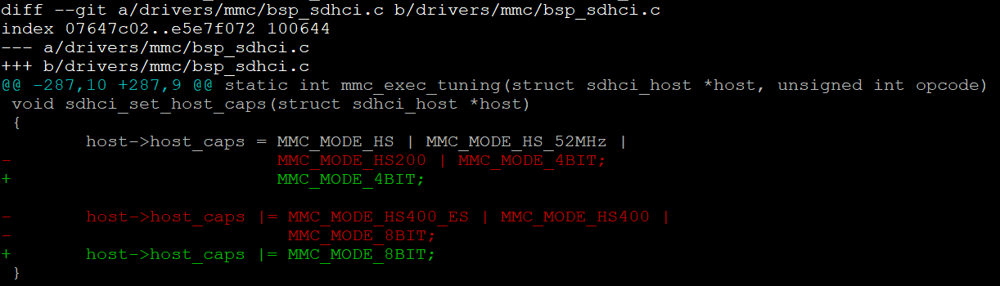

**图 2**  内核下修改（以SS928V100为例）<a name="_Ref33704655"></a>  


## I2C操作指南<a name="ZH-CN_TOPIC_0000002480063636"></a>


### 操作准备<a name="ZH-CN_TOPIC_0000002479903708"></a>

I2C的操作准备如下：

-   Linux内核使用SDK发布的kernel。
-   文件系统。

    可以使用SDK发布的本地文件系统jffs2、ext4或squashFS，也可以通过本地文件系统再挂载到NFS。

### 操作过程<a name="ZH-CN_TOPIC_0000002512063503"></a>

操作过程如下：

1.  启动单板，加载本地文件系统jffs2、ext4或squashFS，也可以通过本地文件系统进一步挂载到NFS。
2.  加载内核。默认I2C相关模块已全部编入内核，不需要再执行加载命令。
3.  参考SS928V100\_PINOUT\_CN.xlsx表格，自行配置相应I2C的管脚复用。
4.  在控制台下运行I2C读写命令或者自行在内核态或者用户态编写I2C读写程序，就可以对挂载在I2C控制器上的外围设备进行读写操作。具体操作请参见“[操作示例](#ZH-CN_TOPIC_0000002512103593)”。

### 接口速率设置说明<a name="ZH-CN_TOPIC_0000002479903712"></a>

发布包中默认接口速率是100K。如果要更改接口速率，需要修改 arch/arm64/boot/dts/vendor/ss928v100.dtsi，并重新编译内核。具体操作如下：

i2c\_bus0节点中的clock-frequency属性的值，如[图1](#_Ref411428751)所示。

**图 1**  接口速率配置示意图<a name="_Ref411428751"></a>  
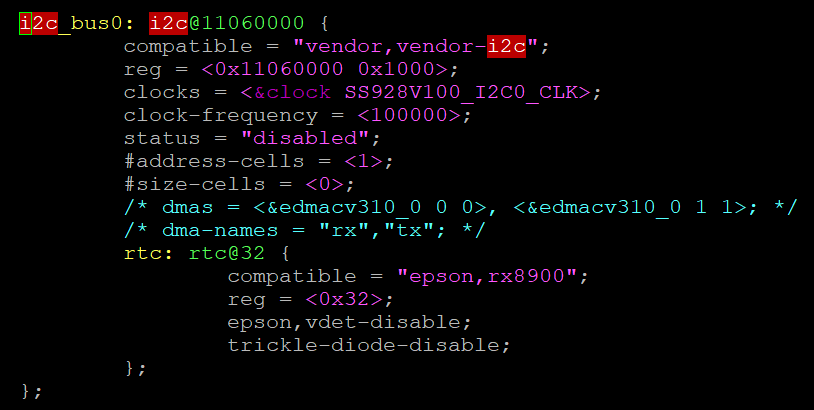

### 操作示例<a name="ZH-CN_TOPIC_0000002480063624"></a>


#### I2C读写命令示例<a name="ZH-CN_TOPIC_0000002479903666"></a>

此操作示例通过I2C读写命令实现对I2C外围设备的读写操作。

-   在控制台使用i2c\_read命令对I2C外围设备进行读操作：

    ```
    ~ $ i2c_read <i2c_num> <dev_addr> <reg_addr> <reg_addr_end> <reg_width> <data_width> <reg_step>
    ```

    例如：读挂载在I2C控制器0上、设备地址为0x72设备的0x8寄存器：

    ```
    ~ $ i2c_read 0 0x72 0x8 0x8 0x1 0x1
    ```

    > **说明：** 
    >i2c\_num：I2C控制器序号（对应芯片手册中的I2C控制器编号）
    >dev\_addr：外围设备地址（支持标准地址（7bit）和扩展地址（10bit））
    >reg\_addr：读外围设备寄存器操作的开始地址
    >reg\_addr\_end：读外围设备寄存器操作的结束地址
    >reg\_width：外围设备的寄存器位宽（支持8/16/24/32bit）
    >data\_width：外围设备的数据位宽（支持8/16/24/32bit）
    >reg\_step：连续读外围设备寄存器操作时递增幅值，默认为1，即连续读寄存器，读取单个寄存器时不使用该参数

-   在控制台使用i2c\_write命令对I2C外围设备进行写操作：

    ```
    ~ $ i2c_write <i2c_num> <dev_addr> <reg_addr> <value> <reg_width> <data_width>
    ```

    例如：向挂载在I2C控制器0上、设备地址为0x72设备的0x8寄存器写入数据0xa5：

    ```
    ~ $ i2c_write 0 0x72 0x8 0xa5 0x1 0x1
    ```

    > **说明：** 
    >i2c\_num：I2C控制器编号（对应芯片手册中的I2C控制器编号）
    >dev\_addr：外围设备地址（支持标准地址（7bit）和扩展地址（10bit））
    >reg\_addr：写外围设备寄存器操作的地址
    >value：写外围设备寄存器操作的数据
    >reg\_width：外围设备的寄存器位宽（支持8/16/24/32bit）
    >data\_width：外围设备的数据位宽（支持8/16/24/32bit）

#### 内核态I2C读写程序示例<a name="ZH-CN_TOPIC_0000002512063543"></a>

此操作示例在内核态下通过I2C读写程序实现对I2C外围设备的读写操作。

1.  调用I2C核心层的函数，获得描述一个I2C控制器的结构体i2c\_adap：

    ```
    i2c_adap = i2c_get_adapter(0);
    ```

    > **说明：** 
    >假设我们已经知道新增的器件挂载在I2C控制器0上，直接设置i2c\_get\_adapter的参数为0。

2.  把I2C控制器和新增的I2C外围设备关联起来，得到描述I2C外围设备的客户端结构体bsp\_client：

    ```
    bsp_client = i2c_new_device(i2c_adap, &bsp_info);
    ```

    > **说明：** 
    >bsp\_info结构体提供了I2C外围设备的设备地址。

3.  在非中断上下文中，调用I2C核心层提供的标准读写函数对外围器件进行读写：

    ```
    ret = i2c_master_send(client, buf, count);
    ret = i2c_transfer(client->adapter, msg, 2);
    ```

    在中断上下文中，调用I2C驱动层的读写函数对外围器件进行读写：

    ```
    ret = bsp_i2c_master_send(client, buf, count);
    ret = bsp_i2c_transfer (client->adapter, msg, 2);
    ```

    > **说明：** 
    >-   参数client为步骤2得到的描述I2C外围设备的客户端结构体bsp\_client。
    >-   参数buf为需要读写的寄存器和数据。
    >-   参数count为buf的长度。
    >-   参数msg为读操作时的两个i2c\_msg的首地址。

    代码示例如下：

    > **说明：** 
    >此代码为示例程序，仅为客户开发内核态的I2C外围设备驱动程序提供参考，不提供实际应用功能。

    //I2C外围设备信息列表

    ```
    static struct i2c_board_info bsp_info = {
    ```

    //一项I2C\_BOARD\_INFO代表一个支持的I2C外围设备，它的名字叫做"bsp\_test”，设备地址是0x72

    ```
             I2C_BOARD_INFO("bsp_test", 0x39),
    };
     
    ```

    > **说明：** 
    >在代码调用中，器件地址不能包含读写位，但命令行中需要包含读写位。

    ```
    static struct i2c_client *bsp_client = NULL;
     
    int bsp_i2c_write(unsigned int reg_addr, unsigned int reg_addr_num,
                            unsigned int data, unsigned int data_byte_num)
    {
        unsigned char buf[8];
        int ret = 0;
        int idx = 0;
        struct i2c_client *client;
        
        client = bsp_client;
     
        /* reg_addr config */
        if (reg_addr_num == 2)
                 buf[idx++]  = (reg_addr >> 8);
        buf[idx++] = reg_addr;
     
        /* data config */
        if (data_byte_num == 2)
                 buf[idx++] = data >> 8;
        buf[idx++] = data;
    ```

    //在非中断上下文中，调用内核提供的I2C标准写函数进行写操作

    ```
        ret = i2c_master_send(client, buf, idx);
    ```

    //在中断上下文中，调用驱动层提供的写函数进行写操作

    ```
        ret = bsp_i2c_master_send(client, buf, idx);
        return ret;   
    }
    static struct i2c_msg g_msg[2];
     
    int bsp_i2c_read(unsigned int reg_addr, unsigned int reg_addr_num,
                      unsigned int data_byte_num)
    {
             unsigned char buf[4];
             int ret = 0;
             int ret_data = 0xFF;
             int idx = 0;
             struct i2c_client *client;
             struct i2c_msg *msg;
     
             client = bsp_client;
     
             msg = &g_msg[0];
     
             memset(msg, 0x0, sizeof(struct i2c_msg) * 2);
     
             msg[0].addr = bsp_client->addr;
             msg[0].flags = client->flags & I2C_M_TEN;
             msg[0].len = reg_addr_num;
             msg[0].buf = buf;
     
             /* reg_addr config */
             if (reg_addr_num == 2)
                      buf[idx++] = reg_addr >> 8;
             buf[idx++] = reg_addr;
     
             msg[1].addr = bsp_client->addr;
             msg[1].flags = client->flags & I2C_M_TEN;
             msg[1].flags |= I2C_M_RD;
             msg[1].len = data_byte_num;
             msg[1].buf = buf;
    ```

    //sensor的读操作一般需要先写一个寄存器地址，才能读出指定寄存器的数据。

    //在非中断上下文中，需要调内核提供的i2c\_transfer传两个msg进行先写后读。

    ```
             ret = i2c_transfer(client->adapter, msg, 2);
    ```

    //在中断上下文中，需要调内核提供的bsp\_i2c\_transfer传两个msg进行先写后读。

    ```
    ret = bsp_i2c_transfer(client->adapter, msg, 2);
             if (ret == 2) {
                      if (data_byte_num == 2)
                                ret_data = buf[1] | (buf[0] << 8);
                      else
                                ret_data = buf[0];
             } else
                      ret_data = -EIO;
     
             return ret_data;
    }
    static int bsp_dev_init(void)
    {
    //分配一个I2C控制器指针
            struct i2c_adapter *i2c_adap;
    //调用core层的函数，获得描述一个I2C控制器的结构体i2c_adap。假设我们已经知道新增的外围设备挂载在编号为I2C控制器2上
            i2c_adap = i2c_get_adapter(2);
    //把I2C控制器和新增的I2C外围设备关联起来，I2C外围设备挂载在I2C控制器2，地址是0x72，就组成了一个客户端bsp_client。
            bsp_client = i2c_new_device(i2c_adap, &bsp_info);
            i2c_put_adapter(i2c_adap);
            return 0;
    }
    static void bsp_dev_exit(void)
    {
             i2c_unregister_device(bsp_client);
    }
    ```

#### 用户态I2C读写程序示例<a name="ZH-CN_TOPIC_0000002512063525"></a>

此操作示例在用户态下通过I2C读写程序实现对I2C外围设备的读写操作。

1.  打开I2C总线对应的设备文件，获取文件描述符：

    ```
    fd = open("/dev/i2c-0", O_RDWR);
    ```

2.  进行数据读写：

    ```
    ioctl(fd, I2C_RDWR, &rdwr);
    write(fd, buf, (reg_width + data_width));
    ```

    代码示例如下：

    > **说明：** 
    >此代码为示例程序，仅为客户开发用户态的外围设备驱动程序提供参考，不提供实际应用功能。
    >用户态具体外围设备驱动程序可以参考发布包中的i2c\_ops程序，具体路径为：osdrv/tools/board/reg-tools-1.0.0/source/tools/i2c\_ops.c

    ```
    int i2c_read(unsigned int i2c_num, unsigned int dev_addr, unsigned int reg_addr,
                      unsigned int reg_addr_end, unsigned int reg_width,
                      unsigned int data_width, unsigned int reg_step)
    {
             int retval = 0;
             int fd = -1;
             char file_name[0x10];
             unsigned char buf[4];
             int cur_addr;
             static struct i2c_rdwr_ioctl_data rdwr;
             static struct i2c_msg msg[2];
             unsigned int data;
     
             memset(buf, 0x0, 4);
     
             printf("i2c_num:0x%x, dev_addr:0x%x; reg_addr:0x%x; reg_addr_end:0x%x; reg_width: %d; data_width: %d. \n\n",
                                i2c_num, dev_addr << 1, reg_addr, reg_addr_end, reg_width, data_width);
     
             sprintf(file_name, "/dev/i2c-%u", i2c_num);
             fd = open(file_name, O_RDWR);
             if (fd < 0) {
                      printf("Open %s error!\n",file_name);
                      return -1;
             }
     
             retval = ioctl(fd, I2C_SLAVE_FORCE, dev_addr);
             if (retval < 0) {
                      printf("CMD_SET_I2C_SLAVE error!\n");
                      retval = -1;
                      goto end;
             }
             msg[0].addr = dev_addr;
             msg[0].flags = 0;
             msg[0].len = reg_width;
             msg[0].buf = buf;
    ```

    > **说明：** 
    >在代码调用中，器件地址不能包含读写位，但命令行中需要包含读写位。

    ```
             msg[1].addr = dev_addr;
             msg[1].flags = 0;
             msg[1].flags |= I2C_M_RD;
             msg[1].len = data_width;
             msg[1].buf = buf;
     
             rdwr.msgs = &msg[0];
             rdwr.nmsgs = (__u32)2;
             for (cur_addr = reg_addr; cur_addr <= reg_addr_end; cur_addr += reg_step) {
                      if (reg_width == 2) {
                                buf[0] = (cur_addr >> 8) & 0xff;
                                buf[1] = cur_addr & 0xff;
                      } else
                                buf[0] = cur_addr & 0xff;
     
                      retval = ioctl(fd, I2C_RDWR, &rdwr);
                      if (retval != 2) {
                                printf("CMD_I2C_READ error!\n");
                                retval = -1;
                                goto end;
                      }
     
                      if (data_width == 2) {
                                data = buf[1] | (buf[0] << 8);
                      } else
                                data = buf[0];
     
                      printf("0x%x: 0x%x\n", cur_addr, data);
             }
     
             retval = 0;
     
    end:
             close(fd);
             return retval;
    }
     
    int i2c_write(unsigned int i2c_num, unsigned int dev_addr,
                      unsigned int reg_addr, unsigned int data,
                      unsigned int reg_width, unsigned int data_width)
    {
             int retval = 0;
             int fd = -1;
             int index = 0;
             char file_name[0x10];
             unsigned char buf[4];
     
             printf("i2c_num:0x%x, dev_addr:0x%x; reg_addr:0x%x; data:0x%x; reg_width: %d; data_width: %d.\n",
                                i2c_num, dev_addr << 1, reg_addr, data, reg_width, data_width);
     
             sprintf(file_name, "/dev/i2c-%u", i2c_num);
             fd = open(file_name, O_RDWR);
             if (fd<0) {
                      printf("Open %s error!\n", file_name);
                      return -1;
             }
     
             retval = ioctl(fd, I2C_SLAVE_FORCE, dev_addr);
             if(retval < 0) {
                      printf("set i2c device address error!\n");
                      retval = -1;
                      goto end;
             }
     
             if (reg_width == 2) {
                      buf[index] = (reg_addr >> 8) & 0xff;
                      index++;
                      buf[index] = reg_addr & 0xff;
                      index++;
             } else {
                      buf[index] = reg_addr & 0xff;
                      index++;
             }
     
             if (data_width == 2) {
                      buf[index] = (data >> 8) & 0xff;
                      index++;
                      buf[index] = data & 0xff;
                      index++;
             } else {
                      buf[index] = data & 0xff;
                      index++;
             }
     
             retval = write(fd, buf, (reg_width + data_width));
             if(retval < 0) {
                      printf("i2c write error!\n");
                      retval = -1;
                      goto end;
             }
     
             retval = 0;
     
    end:
             close(fd);
             return retval;
    }
    ```

### I2C工作模式的切换<a name="ZH-CN_TOPIC_0000002479903678"></a>


#### 中断模式<a name="ZH-CN_TOPIC_0000002479903686"></a>

I2C的工作模式默认是轮询模式，如果需要切换中断模式，则需要打开arch/arm64/boot/dts/vendor/ss928v100.dtsi文件，找到对应的I2C，填写中断号即可，例如将I2C2切换为中断模式，则需要加入“interrupts = <GIC\_SPI 64 IRQ\_TYPE\_LEVEL\_HIGH\>;”，如[图1](#_Ref36827088)所示。

**图 1**  I2C节点描述图<a name="_Ref36827088"></a>  
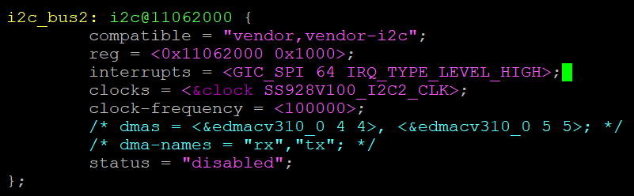

上述中断号需要查看芯片手册中的中断源分配表，I2C0 默认对接 RTC 模块。

> **须知：** 
>由于不支持中断嵌套，使用I2C的中断模式时，不能在其它模块的中断处理中调用I2C的读写函数。

#### DMA模式<a name="ZH-CN_TOPIC_0000002512063539"></a>

1.  I2C的工作模式默认是轮询模式，如果需要切换DMA模式，则需要打开arch/arm64/boot/dts/vendor/ss928v100.dtsi文件，找到对应的I2C，填写dmas和dma-names的内容，如I2C2加入“dmas = <&edmacv310\_0 4 4\>, <&edmacv310\_0 5 5\>;”和“dma-names = "tx","rx";”，如[图1](#fig279852413388)所示。

    **图 1**  I2C节点描述图<a name="fig279852413388"></a>  
    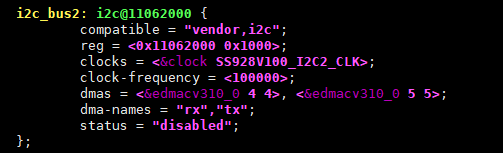

    上述的dma通道号需要查看芯片手册中的DMAC外设硬件请求线编号说明。

2.  在编译linux时menuconfig修改对应的选项，关闭标准DMA驱动选项Device Drivers  ---\> DMA Engine support；同时打开非标准DMA驱动，Device Drivers  ---\> Vendor EDMAC Controller support和Device Drivers  ---\> Vendor EDMAC Controller interrupt mode support。相对的，如果需要关闭非标准DMA功能，则将该选项关闭，如[图2](#fig823117223395)所示。

    **图 2**  编译menuconfig过程图<a name="fig823117223395"></a>  
    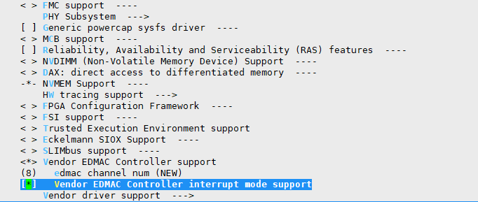

3.  打开arch/arm64/boot/dts/vendor/ss928v100-demb.dts文件，如果需要打开DMA功能，则需要将edmacv310\_0的“status”的值配置为okay；相对的，如果要关闭DMA功能，则将该控制器的“status”的值配置为disabled，如[图3](#fig196853232401)所示。

    **图 3**  DMA控制器节点<a name="fig196853232401"></a>  
    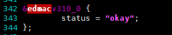

4.  打开arch/arm64/boot/dts/vendor/ss928v100.dtsi文件，将edmacv310\_0的compatible属性修改为"vendor,edmacv310\_n"，使用非标准DMA驱动，如[图4](#fig3543719154118)所示。

    **图 4**  修改DMA节点compatible属性<a name="fig3543719154118"></a>  
    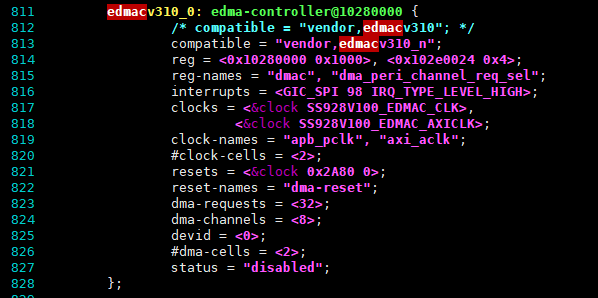

    > **须知：** 
    >I2C使用非标准DMA驱动，防止冲突标准DMA驱动和非标准DMA驱动只能二选一。因此，如果打开了非标准DMA驱动，则由标准DMA驱动所支持的UART DMA传输功能和SPI DMA传输功能将不可用。
    >由于不支持中断嵌套，使用I2C的DMA模式时，不能在其它模块的中断处理中调用I2C的读写函数。

## SPI操作指南<a name="ZH-CN_TOPIC_0000002512063529"></a>


### 操作准备<a name="ZH-CN_TOPIC_0000002512063549"></a>

SPI的操作准备如下：

-   Linux内核使用SDK发布的kernel。
-   文件系统。

    可以使用SDK发布的本地文件系统jffs2、ext4或squashFS，也可以通过本地文件系统再挂载到NFS。

### 操作过程<a name="ZH-CN_TOPIC_0000002512063559"></a>

操作过程如下：

1.  启动单板，加载本地文件系统jffs2、ext4或squashFS，也可以通过本地文件系统进一步挂载到NFS。
2.  加载内核。默认SPI相关模块已全部编入内核，不需要再执行加载命令。
3.  参考SS928V100\_PINOUT\_CN.xlsx表格，自行配置相应SPI的管脚复用。
4.  在控制台下运行SPI读写命令或者自行在内核态或者用户态编写SPI读写程序，就可以对挂载在某个SPI控制器某个片选上的外围设备进行读写操作。具体操作请参见“[操作示例](#ZH-CN_TOPIC_0000002512103593)”。

### 操作示例<a name="ZH-CN_TOPIC_0000002512103523"></a>


#### SPI读写命令示例<a name="ZH-CN_TOPIC_0000002512103565"></a>

此操作示例通过SPI读写命令实现对SPI外围设备的读写操作。

-   在控制台使用spi\_read命令对SPI外围设备进行读操作：

    ```
    ~ $ ssp_read <spi_num> <csn> <dev_addr> <reg_addr> [num_reg] [dev_width] [reg_width] [data_width] [reg_order] [data_order]
    ```

    其中\[num\_reg\] 可以省略，缺省值是1（表示读1个寄存器）。

    \[dev\_width\] \[reg\_width\] \[data\_width\]可以省略，缺省值都是1（表示1Byte）。

    \[reg\_order\] \[data\_order\] 可以省略，缺省值都是1 （0表示高低地址字节顺序调换）。

    例如：读挂载在SPI控制器0片选0上设备地址为0x2的设备的0x0寄存器：

    ```
    ~ $ ssp_read 0x0 0x0 0x2 0x0 0x10 0x1 0x1 0x1
    ```

    > **说明：** 
    >spi\_num：SPI控制器号（对应芯片手册中的SPI控制器编号）
    >csn：片选号（对应芯片手册中的SPI控制器片选数，比如：控制器有2个片选，则片选号为0、1）
    >dev\_addr：外围设备地址
    >reg\_addr：外围设备寄存器开始地址
    >num\_reg：读外围设备寄存器个数
    >dev\_width：外围设备地址位宽（支持8/16bit）
    >reg\_width：外围设备寄存器地址位宽（支持8/16bit）
    >data\_width：外围设备的数据位宽（支持8/16bit）
    >reg\_order：外围设备寄存器地址的字节顺序
    >data\_order：外围设备数据的字节顺序

-   在控制台使用spi\_write命令对SPI外围设备进行写操作：

    ```
    ~ $ ssp_write <spi_num> <csn> <dev_addr> <reg_addr> <data> [dev_width] [reg_width] [data_width] [reg_order] [data_order]
    ```

    其中\[dev\_width\] \[reg\_width\] \[data\_width\] \[reg\_order\] \[data\_order\]可以省略，缺省值都是1。

    例如向挂载在SPI控制器0片选0上设备地址为0x2的设备的0x0寄存器写入数据0x65：

    ```
    ~ $ ssp_write 0x0 0x0 0x2 0x0 0x65 0x1 0x1 0x1
    ```

    > **说明：** 
    >-   spi\_num：SPI控制器序号（对应芯片手册中的SPI控制器编号）
    >-   csn：片选号（对应芯片手册中的SPI控制器片选数，比如：控制器有2个片选，则对应片选号为0、1）
    >-   dev\_addr：外围设备地址
    >-   reg\_addr：外围设备寄存器地址
    >-   data：写外围设备寄存器的数据
    >-   dev\_width：外围设备地址位宽（支持8/16bit）
    >-   reg\_width：外围设备寄存器地址位宽（支持8/16bit）
    >-   data\_width：外围设备的数据位宽（支持8/16bit）
    >-   reg\_order：外围设备寄存器地址的字节顺序
    >-   data\_order：外围设备数据的字节顺序
    >此SPI读写命令仅支持sensor的读写操作。

#### 内核态SPI读写程序示例<a name="ZH-CN_TOPIC_0000002480063608"></a>

此操作示例在内核态下通过SPI读写程序实现对SPI外围设备的读写操作。

1.  调用SPI核心层的函数，获得描述一个SPI控制器的结构体：

    ```
    bsp_master = spi_busnum_to_master(bus_num);
    ```

    > **说明：** 
    >参数bus\_num为要读写的SPI外围设备所连接的SPI控制器号。
    >bsp\_master为描述SPI控制器的spi\_master结构体类型指针变量。

2.  通过每个spi片选在核心层的名称调用SPI核心层函数得到挂载在某个spi控制器某个片选上描述SPI外围设备的结构体：

    ```
    sprintf(spi_name, "%s.%u", dev_name(&bsp_master->dev),csn);
    d = bus_find_device_by_name(&spi_bus_type, NULL, spi_name);
    bsp_spi = to_spi_device(d);
    ```

    > **说明：** 
    >spi\_bus\_type为核心层定义的描述spi总线的bus\_type结构体类型变量。
    >bsp\_spi为描述SPI外围设备的spi\_device结构体类型指针变量。

3.  设置spi\_transfer结构体中的成员，调用SPI核心层函数将spi\_transfer添加到spi\_message的队列当中。

    ```
    spi_message_init(&m);
    spi_message_add_tail(&t, &m);
    ```

    > **说明：** 
    >-   参数t为描述传输一桢消息的spi\_transfer结构体类型变量。
    >-   参数m为描述传输一个消息队列的spi\_message结构体类型变量。

4.  然后调用SPI核心层提供的标准读写函数对外围器件进行读写：

    ```
    status = spi_async(spi, &m);
    status = spi_sync(spi, &m);
    ```

    > **说明：** 
    >参数spi为描述SPI外围设备的spi\_device结构体类型指针变量。
    >spi\_async函数进行spi异步读写操作。
    >spi\_sync函数进行spi同步读写操作。

    代码示例如下：

    > **说明：** 
    >此代码为异步读写SPI外围设备XXX的示例程序，仅为客户开发内核态的SPI外围设备驱动程序提供参考，不提供实际应用功能。
    >内核态具体SPI外围设备驱动程序可以参考SDK发布包中的sensor\_spi程序，具体路径为：mpp/extdrv/sensor\_spi/sensor\_spi.c

    //模块参数，传入spi控制器号即spi总线号和spi片选号

    ```
    static unsigned bus_num = 0;
    static unsigned csn = 0;
    module_param(bus_num, uint, S_IRUGO);
    MODULE_PARM_DESC(bus_num, "spi bus number");
    module_param(csn, uint, S_IRUGO);
    MODULE_PARM_DESC(csn, "chip select number");
    ```

    //描述SPI控制器的结构体

    ```
    struct spi_master     *bsp_master;
    ```

    //描述SPI外围设备的结构体

    ```
    struct spi_device      *bsp_spi;
     
    int ssp_write_alt(unsigned char devaddr,unsigned char addr, unsigned char data)
    {
             struct spi_master              *master = bsp_master;
             struct spi_device       *spi = bsp_spi;
             static struct spi_transfer   t;
             static struct spi_message          m;
             static unsigned char                 buf[4];
             int                     status = 0;
             unsigned long                flags;
     
             /* check spi_message is or no finish */
             spin_lock_irqsave(&master->queue_lock, flags);
    ```

    //该消息队列传输完成之后，在核心层会将spi\_message的state成员设为空指针。

    ```
             if (m.state != NULL) {
                      spin_unlock_irqrestore(&master->queue_lock, flags);
                      return -EFAULT;
             }
             spin_unlock_irqrestore(&master->queue_lock, flags);
    ```

    //设置SPI传输模式

    ```
             spi->mode = SPI_MODE_3 | SPI_LSB_FIRST;
     
             memset(buf, 0, sizeof buf);
             buf[0] = devaddr;
             buf[0] &= (~0x80);
             buf[1] = addr;
             buf[2] = data;
     
             t.tx_buf = buf;
             t.rx_buf = buf;
             t.len = 3;
             t.cs_change = 1;
             t.bits_per_word = 8;
             t.speed_hz = 2000000;
    ```

    //初始化并设置SPI传输队列

    ```
             spi_message_init(&m);
             spi_message_add_tail(&t, &m);
             m.state = &m;
    ```

    > **说明：** 
    >进行异步的spi读写操作，由于是异步操作，因此该调用返回时，spi读写操作不一定完成，因此往该调用传的参数所指的地址空间必须是局部静态变量或全局变量，以防止函数返回时将传给spi\_async的地址空间释放掉。spi\_async函数的原型为int spi\_async\(struct spi\_device \*spi, struct spi\_message \*message\)，则在这里变量m和t都必须为静态变量，并且t中所指的buf也必须是静态的。

    ```
             status = spi_async(spi, &m);
             return status;
    }
     
    int ssp_read_alt(unsigned char devaddr,unsigned char addr, unsigned char *data)
    {
             struct spi_master              *master = bsp_master;
             struct spi_device       *spi = bsp_spi;
             static struct spi_transfer   t;
             static struct spi_message          m;
             static unsigned char                  buf[4];
             int                                 status = 0;
             unsigned long           flags;
     
             /* check spi_message is or no finish */
             spin_lock_irqsave(&master->queue_lock, flags);
    ```

    //该消息队列传输完成之后，在核心层会将spi\_message的state成员设为空指针。

    ```
             if (m.state != NULL) {
                      spin_unlock_irqrestore(&master->queue_lock, flags);
                      return -EFAULT;
             }
             spin_unlock_irqrestore(&master->queue_lock, flags);
    ```

    //设置SPI传输模式

    ```
             spi->mode = SPI_MODE_3 | SPI_LSB_FIRST;
     
             memset(buf, 0, sizeof buf);
             buf[0] = devaddr;
             buf[0] |= 0x80;
             buf[1] = addr;
             buf[2] = 0;
     
             t.tx_buf = buf;
             t.rx_buf = buf;
             t.len = 3;
             t.cs_change = 1;
             t.bits_per_word = 8;
             t.speed_hz = 2000000;
    ```

    //初始化化并设置SPI传输队列

    ```
             spi_message_init(&m);
             spi_message_add_tail(&t, &m);
             m.state = &m;
    ```

    > **说明：** 
    >进行异步的spi读写操作，由于是异步操作，因此该调用返回时，spi读写操作不一定完成，因此往该调用传的参数所指的地址空间必须是局部静态变量或全局变量，以防止函数返回时将传给spi\_async的地址空间释放掉。spi\_async函数的原型为int spi\_async\(struct spi\_device \*spi, struct spi\_message \*message\)，则在这里变量m和t都必须为静态变量，并且t中所指的buf也必须是静态的。

    ```
             status = spi_async(spi, &m);
             *data = buf[2];
             return status;
    }
    ```

    //外部引用声明SPI核心层定义的表示spi总线的spi\_bus\_type

    ```
    extern struct bus_type spi bus_type;
     
    static int __init sspdev_init(void)
    {
             int                       status = 0;
             struct device               *d;
             char                            *spi_name;
    ```

    //通过spi控制器号得到描述spi控制器的结构体

    ```
             bsp_master = spi_busnum_to_master(bus_num);
             if (bsp_master) {
                      spi_name = kzalloc(strlen(dev_name(&bsp_master->dev)) + 10 , GFP_KERNEL);
                      if (!spi_name) {
                                status = -ENOMEM;
                                goto end0;
                      }
                      sprintf(spi_name, "%s.%u", dev_name(&bsp_master->dev),csn);
    ```

    //通过每个片选在SPI核心层的名称得到指向spi\_device的device成员的指针

    ```
                      d = bus_find_device_by_name(&spi_bus_type, NULL, spi_name);
                      if (d == NULL) {
                                status = -ENXIO;
                                goto end1;
                      }
    ```

    //通过指向spi\_device的device成员的指针得到描述SPI外围设备的结构体

    ```
                      bsp_spi = to_spi_device(d);
                      if(bsp_spi == NULL) {
                                status = -ENXIO;
                                goto end2;
                      }
             } else {
                      status = -ENXIO;
                      goto end0;
             }
     
             status = 0;
    end2:
             put_device(d);
    end1:
             kfree(spi_name);
    end0:
             return status;
    }
    ```

#### 用户态SPI读写程序示例<a name="ZH-CN_TOPIC_0000002479903704"></a>

此操作示例在用户态下实现对挂载在SPI控制器0片选0上的SPI外围设备的读写操作。

1.  打开SPI总线对应的设备文件，获取文件描述符：

    ```
    fd = open("/dev/spidev0.0", O_RDWR);
    ```

2.  通过ioctl设置SPI传输模式：

    ```
    value = SPI_MODE_3 | SPI_LSB_FIRST;
    ret = ioctl(fd, SPI_IOC_WR_MODE, &value);
    ```

    > **说明：** 
    >SPI\_MODE\_3表示SPI的时钟和相位都为1的模式。
    >SPI\_LSB\_FIRST表示SPI传输时每个数据的格式为大端结束。

    > **须知：** 
    >SPI\_MODE\_3和SPI\_LSB\_FIRST的含义可参考内核代码include/linux/spi/spi.h，用户态下使用该宏可包含SDK发布包中的osdrv/tools/board/reg-tools-1.0.0/include/common/bsp\_spi.h头文件。

    SPI的时钟、相位、大小端结束模式可参考芯片手册。

3.  通过ioctl设置SPI传输速率和数据位数：

    ```
    bits = 8;
    ret = ioctl(fd, SPI_IOC_WR_BITS_PER_WORD, &bits);
    ret = ioctl(fd, SPI_IOC_RD_BITS_PER_WORD, &bits);
    speed = 2000000;
    ret = ioctl(fd, SPI_IOC_WR_MAX_SPEED_HZ, &speed);
    ret = ioctl(fd, SPI_IOC_RD_MAX_SPEED_HZ, &speed);
    ```

    > **说明：** 
    >SPI\_IOC\_WR\_MAX\_SPEED\_HZ表示将SPI的速率设置为speed。
    >SPI\_IOC\_RD\_MAX\_SPEED\_HZ表示读取当前SPI的传输速率到speed中。
    >SPI\_IOC\_WR\_BITS\_PER\_WORD表示将SPI传输的数据位大小设置为bits。
    >SPI\_IOC\_RD\_BITS\_PER\_WORD表示读取当前设置的SPI数据位大小到bits中。
    >在设置传输速率和数据位数以及读写模式时，一定要将传输速率在最后一项设置，否则设置的速率会被SPI最大速率覆盖掉。

4.  使用ioctl进行数据读写：

    ```
    ret = ioctl(fd, SPI_IOC_MESSAGE(1), mesg);
    ```

    > **说明：** 
    >mesg表示传输一帧消息的spi\_ioc结构体数组首地址，并且一次读写的数据总长度不超过4KB。
    >SPI\_IOC\_MESSAGE\(n\)表示全双工读写n帧消息的命令。

    代码示例如下：

    > **说明：** 
    >此代码仅为客户开发用户态的SPI外围设备操作程序提供参考，不提供实际应用功能。
    >用户态具体SPI外围设备驱动程序可以参考SDK发布包中的ssp\_rw程序，具体路径为：osdrv/tools/board/reg-tools-1.0.0/source/tools/ssp\_rw.c

    ```
    int sensor_write_register(unsigned int addr, unsigned char data)
    {
             int     fd = -1;
             int     ret;
             unsigned int speed = 2000000;
             uint8_t bits = 8;
             unsigned int      value;
             struct spi_ioc_transfer       mesg[1];
             unsigned char           tx_buf[4];  
             unsigned char         rx_buf[4];  
             char          file_name[] = "/dev/spidev0.0";
             fd = open(file_name, 0);
             if (fd < 0) {
                      return -1;
             }
             memset(tx_buf, 0, sizeof tx_buf);  
             memset(rx_buf, 0, sizeof rx_buf);  
             tx_buf[0] = (addr & 0xff00) >> 8;
             tx_buf[0] &= (~0x80);
             tx_buf[1] = addr & 0xff;
             tx_buf[2] = data;
     
             memset(mesg, 0, sizeof mesg);  
             mesg[0].tx_buf = (__u32)tx_buf;  
             mesg[0].rx_buf = (__u32)rx_buf; 
             mesg[0].len = 3;  
             mesg[0].speed_hz = 2000000;
             mesg[0].bits_per_word = 8;
             mesg[0].cs_change = 1;
     
             value = SPI_MODE_3 | SPI_LSB_FIRST;
             ret = ioctl(fd, SPI_IOC_WR_MODE, &value);
             if (ret < 0) {  
                      close(fd);
                      return -1;  
             }
     
             ret = ioctl(fd, SPI_IOC_WR_MAX_SPEED_HZ, &speed);
             if (ret < 0) { 
                      close(fd);
                      return -1;  
             }
             ret = ioctl(fd, SPI_IOC_WR_BITS_PER_WORD, &bits);
             if (ret < 0) { 
                      close(fd);
                      return -1;  
             }
             ret = ioctl(fd, SPI_IOC_MESSAGE(1), mesg);
             if (ret != mesg[0].len) {  
                      close(fd);
                      return -1;  
             }
             close(fd);
             return 0;
    }
     
    int sensor_read_register(unsigned int addr,unsigned char *data)
    {
             int    fd = -1;
             int    ret = 0;
             unsigned int speed = 2000000;
             uint8_t bits = 8;
             unsigned int     value;
             struct spi_ioc_transfer      mesg[1];
             unsigned char  tx_buf[4];  
             unsigned char  rx_buf[4];  
             char          file_name[] = "/dev/spidev0.0";
     
             fd = open(file_name, 0);
             if (fd < 0) {
                      return -1;
             }
     
             memset(tx_buf, 0, sizeof tx_buf);  
             memset(rx_buf, 0, sizeof rx_buf);  
             tx_buf[0] = (addr & 0xff00) >> 8;
             tx_buf[0] |= 0x80;
             tx_buf[1] = addr & 0xff;
             tx_buf[2] = 0;
     
             memset(mesg, 0, sizeof mesg);  
             mesg[0].tx_buf = (__u32)tx_buf;  
             mesg[0].rx_buf = (__u32)rx_buf;  
             mesg[0].len = 3;  
             mesg[0].speed_hz = 2000000;
             mesg[0].bits_per_word = 8;
             mesg[0].cs_change = 1;
             value = SPI_MODE_3 | SPI_LSB_FIRST;
             ret = ioctl(fd, SPI_IOC_WR_MODE, &value);
             if (ret < 0) {  
                      close(fd);
                      return -1;  
             }
    
             ret = ioctl(fd, SPI_IOC_WR_MAX_SPEED_HZ, &speed);
             if (ret < 0) { 
                      close(fd);
                      return -1;  
             }
             ret = ioctl(fd, SPI_IOC_WR_BITS_PER_WORD, &bits);
             if (ret < 0) { 
                      close(fd);
                      return -1;  
             }
    
             ret = ioctl(fd, SPI_IOC_MESSAGE(1), mesg);
             if (ret != mesg[0].len) {  
                      close(fd);
                      return -1;  
             }
             *data = rx_buf[2];
             close(fd);
             return 0;
    }
    ```

#### SPI slave 模式操作<a name="ZH-CN_TOPIC_0000002480063682"></a>

1.  修改 dtsi 文件设置SPI为从模式，如[图1](#fig189828561719)所示。

    **图 1**  设置SPI从模式<a name="fig189828561719"></a>  
    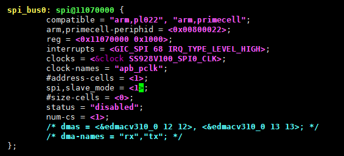

2.  编译内核镜并烧录，SPI 从模式的使用和主模式一致，通信时双方模式以及帧格式须保持一致。

### SPI工作模式的切换<a name="ZH-CN_TOPIC_0000002512063557"></a>


#### 轮询模式<a name="ZH-CN_TOPIC_0000002512063575"></a>

SPI的工作模式默认是中断模式，如果要修改SPI的工作模式为轮询模式，则需要修改arch/arm64/boot/dts/vendor/ss928v100-demb.dts文件中对应的SPI中将“pl022,com-mode”配置为1，而且确认该SPI的“status”值为okay，如[图1](#_Ref36827303)所示。

**图 1**  SPI节点描述图<a name="_Ref36827303"></a>  
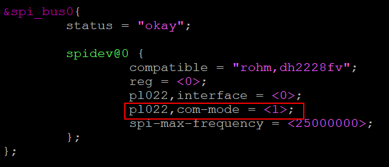

#### 中断模式<a name="ZH-CN_TOPIC_0000002480063632"></a>

SPI的工作模式默认是中断模式，打开arch/arm64/boot/dts/vendor/ss928v100-demb.dts文件找到对应的SPI，确认“pl022,com-mode”配置为0，而且“status”值为okay，如[图1](#_Ref36827325)所示。

**图 1**  SPI节点描述图<a name="_Ref36827325"></a>  
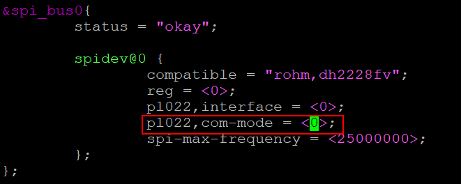

#### DMA模式的开启和关闭<a name="ZH-CN_TOPIC_0000002480063650"></a>

1.  如果需要开启DMA功能，首先需要在编译linux时menuconfig打开对应的选项，Device Drivers  ---\> DMA Engine support  ---\> Vendor EDMAC Controller support。相对的，如果需要关闭DMA功能，则将该选项关闭，如[图1](#fig04111939496)所示。

    **图 1**  编译menuconfig过程图<a name="fig04111939496"></a>  
    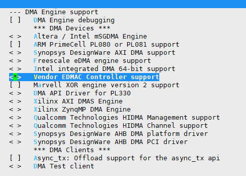

2.  打开arch/arm64/boot/dts/vendor/ss928v100-demb.dts文件，如果需要打开DMA功能，则需要将edmacv310\_0的“status”的值配置为okay；相对的，如果要关闭DMA功能，则将该控制器的“status”的值配置为disabled，如[图2](#fig46191059997)所示。

    **图 2**  DMA控制器节点<a name="fig46191059997"></a>  
    

3.  为SPI添加DMA相关属性，在arch/arm64/boot/dts/vendor/ss928v100.dtsi文件对应spi\_bus节点中添加dmas和dma-names属性。其中，<&edmacv310\_0 12 12\>中的12需要和DMA外设请求信号线号保持一致，具体需要查看芯片手册中的硬件请求线编号说明，如[图3](#fig18931127141015)所示。

    **图 3**  SPI添加DMA相关属性<a name="fig18931127141015"></a>  
    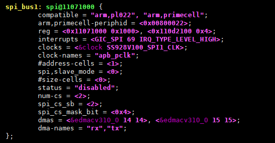

4.  SPI的工作模式默认是中断模式，如果要修改SPI的工作模式为DMA模式，则需要修改arch/arm64/boot/dts/vendor/ss928v100-demb.dts文件中对应的SPI中将“pl022,com-mode”配置为2，而且确认该SPI的“status”值为okay，如[图4](#fig15784105971010)所示。

    **图 4**  SPI节点描述图<a name="fig15784105971010"></a>  
    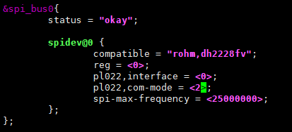

    > **须知：** 
    >区别于I2C，SPI使用标准DMA驱动，防止冲突标准DMA驱动和非标准DMA驱动只能二选一。因此，如果打开了标准DMA驱动，则由非标准DMA驱动所支持的I2C DMA传输功能将不可用。

## GPIO操作指南<a name="ZH-CN_TOPIC_0000002512063565"></a>


### 操作准备<a name="ZH-CN_TOPIC_0000002512103567"></a>

GPIO的操作准备如下：

-   Linux内核使用SDK发布的kernel。
-   文件系统。

    可以使用SDK发布的本地文件系统jffs2、Ext4或SquashFS，也可以通过本地文件系统再挂载到NFS。

### 操作过程<a name="ZH-CN_TOPIC_0000002480063642"></a>

操作过程如下：

1.  启动单板，加载本地文件系统jffs2、Ext4或SquashFS，也可以通过本地文件系统进一步挂载到NFS。
2.  加载内核。默认GPIO相关模块已全部编入内核，不需要再执行加载命令。
3.  配置管脚复用。
4.  在控制台下运行相关命令或者自行在内核态或者用户态下编写GPIO操作程序，就可以对GPIO进行输入输出操作。具体操作请参见“[操作示例](#ZH-CN_TOPIC_0000002512103593)”。

    > **说明：** 
    >操作GPIO前，对应的管脚需要复用到GPIO功能。

### 操作示例<a name="ZH-CN_TOPIC_0000002479903658"></a>


#### GPIO操作命令示例<a name="ZH-CN_TOPIC_0000002480063694"></a>

此操作示例通过命令实现对GPIO的读写操作。

1.  在控制台使用echo命令将要操作的GPIO编号export：

    ```
    echo N > /sys/class/gpio/export
    ```

    > **说明：** 
    >每组GPIO有8个GPIO管脚。

    N为要操作的GPIO编号，该编号等于GPIO组号 \* 8 + 组内偏移号，例如GPIO4\_2的编号为4 \* 8 + 2 = 34。

    export之后就会生成/sys/class/gpio/gpioN目录

    例如：export  GPIO4\_2：

    ```
    echo 34 > /sys/class/gpio/export
    ```

2.  在控制台使用echo命令设置GPIO方向：

    -   对于输入：echo in \> /sys/class/gpio/gpioN/direction
    -   对于输出：echo out \> /sys/class/gpio/gpioN/direction

    例如：设置GPIO4\_2方向

    -   对于输入：echo in \> /sys/class/gpio/gpio34/direction
    -   对于输出：echo out \> /sys/class/gpio/gpio34/direction

    > **说明：** 
    >-   GPIO方向只有out 和in 两种。
    >-   可使用cat命令查看GPIO方向：cat  /sys/class/gpio/gpioN/direction，例如查看GPIO4\_2方向：cat /sys/class/gpio/gpio34/direction

3.  在控制台使用cat或echo命令查看GPIO输入值或设置GPIO输出值：

    查看输入值：cat /sys/class/gpio/gpioN/value

    输出低：echo 0 \> /sys/class/gpio/gpioN/value

    输出高：echo 1 \> /sys/class/gpio/gpioN/value

    > **说明：** 
    >GPIO的电平值只有 0 和 1。为低电平；1为高电平。

4.  在控制台使用echo命令将操作的GPIO编号unexport：

    ```
    echo N > /sys/class/gpio/unexport
    ```

#### 内核态GPIO操作示例<a name="ZH-CN_TOPIC_0000002480063666"></a>

此操作示例在内核态下实现对GPIO的读写操以及GPIO中断操作。


##### 内核态GPIO读写操作示例<a name="ZH-CN_TOPIC_0000002512063509"></a>

操作示例如下：

1.  注册GPIO：

    ```
    gpio_request(gpio_num, NULL);
    ```

    > **说明：** 
    >-   每组GPIO有8个GPIO管脚。
    >-   参数gpio\_num为要操作的GPIO编号，该编号等于GPIO组号 \* 8 + 组内偏移号，例如GPIO4\_2的编号为4 \* 8 + 2 = 34

2.  设置GPIO方向：

    -   对于输入：gpio\_direction\_input\(gpio\_num\)
    -   对于输出：gpio\_direction\_output\(gpio\_num, gpio\_out\_val\)

    > **说明：** 
    >如果是输出，需要设置一个输出的初始值，参数gpio\_out\_val为输出时的初始值。

3.  查看GPIO输入值或设置GPIO输出值：

    查看输入值：gpio\_get\_value\(gpio\_num\);

    输出低：gpio\_set\_value\(gpio\_num, 0\);

    输出高：gpio\_set\_value\(gpio\_num, 1\);

    > **说明：** 
    >输入值为gpio\_get\_value\(gpio\_num\)的返回值。

4.  释放注册的GPIO编号：

    ```
    gpio_free(gpio_num);
    ```

##### 内核态GPIO中断操作示例<a name="ZH-CN_TOPIC_0000002479903648"></a>

> **须知：** 
>默认使用内核标准GPIO。若客户自己实现了GPIO的驱动及中断注册，而非使用内核标准GPIO，则需关闭内核标准GPIO。否则两套驱动之间会产生冲突，影响使用。
>关闭内核标准GPIO方法如下：
>-   打开dts文件：/arch/arm64/boot/dts/vendor/ss928v100-demb.dts，将相应的gpio状态从“okay”改成“disabled”，如[图1](#_Ref492480915)所示。
>    vi /arch/arm64/boot/dts/vendor/ss928v100-demb.dts
>-   修改后保存退出，重新编译内核。
>    cp arch/arm64/configs/ss928v100\_defconfig .config
>    make ARCH=arm64 CROSS\_COMPILE=aarch64-mix210-linux- menuconfig
>    make ARCH=arm64 CROSS\_COMPILE=aarch64-mix210-linux- uImage -j 20
>    cd osdrv/open\_source/trusted-firmware-a/trusted-firmware-a-2.2
>    ./mk\_ss928v100.sh

**图 1**  关闭内核标准GPIO示例<a name="_Ref492480915"></a>  
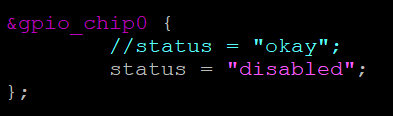

1.  注册GPIO：

    ```
    gpio_request(gpio_num, NULL);
    ```

    > **说明：** 
    >-   每组GPIO有8个GPIO管脚。
    >-   参数gpio\_num为要操作的GPIO编号，该编号等于GPIO组号 \* 8 + 组内偏移号，例如GPIO4\_2的编号为4 \* 8 + 2 = 34。

2.  设置GPIO方向：

    ```
    gpio_direction_input(gpio_num)
    ```

    > **说明：** 
    >对于要作为中断源的GPIO引脚，方向必须配置为输入。

1.  映射操作的GPIO编号对应的中断号：

    ```
    irq_num = gpio_to_irq(gpio_num);
    ```

    > **说明：** 
    >中断号为gpio\_to\_irq\(gpio\_num\)的返回值。

2.  注册中断：

    ```
    request_irq(irq_num, gpio_dev_test_isr, irqflags, "gpio_dev_test", &gpio_irq_type))
    ```

    > **说明：** 
    >Irqflags为需要注册的中断类型，常用类型有：
    >-   IRQF\_SHARED：共享中断；
    >-   IRQF\_TRIGGER\_RISING：上升沿触发；
    >-   IRQF\_TRIGGER\_FALLING：下降沿触发；
    >-   IRQF\_TRIGGER\_HIGH：高电平触发；
    >-   IRQF\_TRIGGER\_LOW：低电平触发。

3.  结束时释放注册的中断和GPIO编号：

    ```
    free_irq(gpio_to_irq(gpio_num), &gpio_irq_type);
    gpio_free(gpio_num);
    ```

    代码示例如下：

    > **说明：** 
    >此代码为GPIO操作的示例程序，仅为客户开发内核态的GPIO操作程序提供参考，不提供实际应用功能。

    ```
    #include <linux/delay.h>
    #include <linux/gpio.h>
    #include <linux/interrupt.h>
    #include <linux/module.h>
    //模块参数，GPIO组号、组内偏移、方向、输出时的输出初始值
    static unsigned int gpio_chip_num = 4;
    module_param(gpio_chip_num, uint, S_IRUGO);
    MODULE_PARM_DESC(gpio_chip_num, "gpio chip num");
     
    static unsigned int gpio_offset_num = 2;
    module_param(gpio_offset_num, uint, S_IRUGO);
    MODULE_PARM_DESC(gpio_offset_num, "gpio offset num");
     
    static unsigned int gpio_dir = 1;
    module_param(gpio_dir, uint, S_IRUGO);
    MODULE_PARM_DESC(gpio_dir, "gpio dir");
     
    static unsigned int gpio_out_val = 1;
    module_param(gpio_out_val, uint, S_IRUGO);
    MODULE_PARM_DESC(gpio_out_val, "gpio out val");
     
    //模块参数，中断触发类型
    /*
     * 0 - disable irq
     * 1 - rising edge triggered
     * 2 - falling edge triggered
     * 3 - rising and falling edge triggered
     * 4 - high level triggered
     * 8 - low level triggered
     */
    static unsigned int gpio_irq_type = 0;
    module_param(gpio_irq_type, uint, S_IRUGO);
    MODULE_PARM_DESC(gpio_irq_type, "gpio irq type");
     
    spinlock_t lock;
     
    static int gpio_dev_test_in(unsigned int gpio_num)
    {
                      //设置方向为输入
            if (gpio_direction_input(gpio_num)) {
                    pr_err("[%s %d]gpio_direction_input fail!\n",
                                    __func__, __LINE__);
                    return -EIO;
            }
                      //读出GPIO输入值
            pr_info ("[%s %d]gpio%d_%d in %d\n", __func__, __LINE__,
                            gpio_num / 8, gpio_num % 8,
                            gpio_get_value(gpio_num));
     
            return 0;
    }
    //中断处理函数
    static irqreturn_t gpio_dev_test_isr(int irq, void *dev_id)
    {
            pr_info("[%s %d]\n", __func__, __LINE__);
     
            return IRQ_HANDLED;
    }
     
    static int gpio_dev_test_irq(unsigned int gpio_num)
    {
            unsigned int irq_num;
            unsigned int irqflags = 0;
                      //设置方向为输入
            if (gpio_direction_input(gpio_num)) {
                    pr_err("[%s %d]gpio_direction_input fail!\n",
                                    __func__, __LINE__);
                    return -EIO;
            }
     
            switch (gpio_irq_type) {
                    case 1:
                            irqflags = IRQF_TRIGGER_RISING;
                            break;
                    case 2:
                            irqflags = IRQF_TRIGGER_FALLING;
                            break;
                    case 3:
                            irqflags = IRQF_TRIGGER_RISING |
                                    IRQF_TRIGGER_FALLING;
                            break;
                    case 4:
                            irqflags = IRQF_TRIGGER_HIGH;
                            break;
                    case 8:
                            irqflags = IRQF_TRIGGER_LOW;
                            break;
                    default:
                            pr_info("[%s %d]gpio_irq_type error!\n",
                                            __func__, __LINE__);
                            return -1;
            }
     
            pr_info("[%s %d]gpio_irq_type = %d\n", __func__, __LINE__, gpio_irq_type);
            irqflags |= IRQF_SHARED;
                      //根据GPIO编号映射中断号
            irq_num = gpio_to_irq(gpio_num);
                      //注册中断
            if (request_irq(irq_num, gpio_dev_test_isr, irqflags,
                                    "gpio_dev_test", &gpio_irq_type)) {
                    pr_info("[%s %d]request_irq error!\n", __func__, __LINE__);
                    return -1;
            }
     
            return 0;
    }
     
    static void gpio_dev_test_irq_exit(unsigned int gpio_num)
    {
            unsigned long flags;
     
            pr_info("[%s %d]\n", __func__, __LINE__);
                      //释放注册的中断
            spin_lock_irqsave(&lock, flags);
            free_irq(gpio_to_irq(gpio_num), &gpio_irq_type);
            spin_unlock_irqrestore(&lock, flags);
    }
    static int gpio_dev_test_out(unsigned int gpio_num, unsigned int gpio_out_val)
    {
                      //设置方向为输出，并输出一个初始值
            if (gpio_direction_output(gpio_num, !!gpio_out_val)) {
                    pr_err("[%s %d]gpio_direction_output fail!\n",
                                    __func__, __LINE__);
                    return -EIO;
            }
     
            pr_info("[%s %d]gpio%d_%d out %d\n", __func__, __LINE__,
                                    gpio_num / 8, gpio_num % 8, !!gpio_out_val);
            return 0;
    }
     
    static int __init gpio_dev_test_init(void)
    {
            unsigned int gpio_num;
            int status = 0;
     
            pr_info("[%s %d]\n", __func__, __LINE__);
     
            spin_lock_init(&lock);
     
            gpio_num = gpio_chip_num * 8 + gpio_offset_num;
                      //注册要操作的GPIO编号
            if (gpio_request(gpio_num, NULL)) {
                    pr_err("[%s %d]gpio_request fail! gpio_num=%d \n", __func__, __LINE__, gpio_num);
                    return -EIO;
            }
     
            if (gpio_dir) {
                    status = gpio_dev_test_out(gpio_num, gpio_out_val);
            } else {
                    if (gpio_irq_type)
                            status = gpio_dev_test_irq(gpio_num);
                    else
                            status = gpio_dev_test_in(gpio_num);
            }
     
            if (status)
                    gpio_free(gpio_num);
     
            return status;
    }
    module_init(gpio_dev_test_init);
     
    static void __exit gpio_dev_test_exit(void)
    {
            unsigned int gpio_num;
     
            pr_info("[%s %d]\n", __func__, __LINE__);
     
            gpio_num = gpio_chip_num * 8 + gpio_offset_num;
     
            if (gpio_irq_type)
                    gpio_dev_test_irq_exit(gpio_num);
                      //释放注册的GPIO编号
            gpio_free(gpio_num);
    }
     
    module_exit(gpio_dev_test_exit);
     
    MODULE_DESCRIPTION("GPIO device test Driver sample");
    MODULE_LICENSE("GPL");
    ```

#### 用户态GPIO操作程序示例<a name="ZH-CN_TOPIC_0000002512103549"></a>

此操作示例在用户态下实现对GPIO的读写操作。

1.  将要操作的GPIO编号export：

    ```
    fp = fopen("/sys/class/gpio/export", "w");
    fprintf(fp, "%d", gpio_num);
    fclose(fp);
    ```

    > **说明：** 
    >-   每组GPIO有8个GPIO管脚。
    >-   参数gpio\_num为要操作的GPIO编号，该编号等于GPIO组号 \* 8 + 组内偏移号，例如GPIO4\_2的编号为4 \* 8 + 2 = 34。

2.  设置GPIO方向：

    ```
    fp = fopen("/sys/class/gpio/gpio%d/direction", "rb+");
    ```

    对于输入：fprintf\(fp, "in"\);

    对于输出：fprintf\(fp, "out"\);

    ```
    fclose(fp);
    ```

3.  查看GPIO输入值或设置GPIO输出值：

    ```
    fp = fopen("/sys/class/gpio/gpio%d/value", "rb+");
    ```

    查看输入值：fread\(buf, sizeof\(char\), sizeof\(buf\) - 1, fp\);

    输出低：

    ```
    strcpy(buf,"0");
    fwrite(buf, sizeof(char), sizeof(buf) - 1, fp);
    ```

    输出高：

    ```
    strcpy(buf,"1");
    fwrite(buf, sizeof(char), sizeof(buf) - 1, fp);
    ```

4.  将操作的GPIO编号unexport：

    ```
    fp = fopen("/sys/class/gpio/unexport", "w");
    fprintf(fp, "%d", gpio_num);
    fclose(fp);
    ```

    代码示例如下：

    > **说明：** 
    >此代码为GPIO操作示例程序，仅为客户开发用户态的GPIO操作程序提供参考，不提供实际应用功能。

    ```
    #include <stdio.h>
    #include <string.h>
     
    int gpio_test_in(unsigned int gpio_chip_num, unsigned int gpio_offset_num)
    {
            FILE *fp;
            char file_name[50];
            unsigned char buf[10];
            unsigned int gpio_num;
     
            gpio_num = gpio_chip_num * 8 + gpio_offset_num;
     
            sprintf(file_name, "/sys/class/gpio/export");
            fp = fopen(file_name, "w");
            if (fp == NULL) {
                    printf("Cannot open %s.\n", file_name);
                    return -1;
            }
            fprintf(fp, "%d", gpio_num);
            fclose(fp);
     
            sprintf(file_name, "/sys/class/gpio/gpio%d/direction", gpio_num);
            fp = fopen(file_name, "rb+");
            if (fp == NULL) {
                    printf("Cannot open %s.\n", file_name);
                    return -1;
            }
            fprintf(fp, "in");
            fclose(fp);
     
            sprintf(file_name, "/sys/class/gpio/gpio%d/value", gpio_num);
            fp = fopen(file_name, "rb+");
            if (fp == NULL) {
                    printf("Cannot open %s.\n", file_name);
                    return -1;
            }
            memset(buf, 0, 10);
            fread(buf, sizeof(char), sizeof(buf) - 1, fp);
            printf("%s: gpio%d_%d = %d\n", __func__,
                            gpio_chip_num, gpio_offset_num, buf[0]-48);
            fclose(fp);
            sprintf(file_name, "/sys/class/gpio/unexport");
            fp = fopen(file_name, "w");
            if (fp == NULL) {
                    printf("Cannot open %s.\n", file_name);
                    return -1;
            }
            fprintf(fp, "%d", gpio_num);
            fclose(fp);
     
            return (int)(buf[0]-48);
    }
     
    int gpio_test_out(unsigned int gpio_chip_num, unsigned int gpio_offset_num,
                    unsigned int gpio_out_val)
    {
            FILE *fp;
            char file_name[50];
            unsigned char buf[10];
            unsigned int gpio_num;
     
            gpio_num = gpio_chip_num * 8 + gpio_offset_num;
     
            sprintf(file_name, "/sys/class/gpio/export");
            fp = fopen(file_name, "w");
            if (fp == NULL) {
                    printf("Cannot open %s.\n", file_name);
                    return -1;
            }
            fprintf(fp, "%d", gpio_num);
            fclose(fp);
     
            sprintf(file_name, "/sys/class/gpio/gpio%d/direction", gpio_num);
            fp = fopen(file_name, "rb+");
            if (fp == NULL) {
                    printf("Cannot open %s.\n", file_name);
                    return -1;
            }
            fprintf(fp, "out");
            fclose(fp);
     
            sprintf(file_name, "/sys/class/gpio/gpio%d/value", gpio_num);
            fp = fopen(file_name, "rb+");
            if (fp == NULL) {
                    printf("Cannot open %s.\n", file_name);
                    return -1;
            }
            if (gpio_out_val)
                    strcpy(buf,"1");
            else
                    strcpy(buf,"0");
     
            fwrite(buf, sizeof(char), sizeof(buf) - 1, fp);
            printf("%s: gpio%d_%d = %s\n", __func__,
                            gpio_chip_num, gpio_offset_num, buf);
            fclose(fp);
     
            sprintf(file_name, "/sys/class/gpio/unexport");
            fp = fopen(file_name, "w");
            if (fp == NULL) {
                    printf("Cannot open %s.\n", file_name);
                    return -1;
            }
            fprintf(fp, "%d", gpio_num);
            fclose(fp);
     
            return 0;
    }
    ```

## UART操作指南<a name="ZH-CN_TOPIC_0000002512103557"></a>


### 操作准备<a name="ZH-CN_TOPIC_0000002480063620"></a>

UART的操作准备如下：

-   Linux内核使用SDK发布的kernel。
-   文件系统。

    可以使用SDK发布的本地文件系统jffs2、ext4或squashFS，也可以通过本地文件系统再挂载到NFS。

### 操作过程<a name="ZH-CN_TOPIC_0000002480063674"></a>

操作过程如下：

1.  SS928V100默认只打开了uart0，如果需要打开其他uart，可以进入arch/arm64/boot/dts/vendor/ss928v100-demb.dts文件，找到对应的uart，将“status”的值配置为okay。
2.  编译并加载内核。启动单板，加载jffs2、ext4或cramfs文件系统，也可以使用NFS。
3.  参考《SS928V100\_PINOUT\_CN.xlsx》表格，自行配置相应Uart的管脚复用。

### 操作示例<a name="ZH-CN_TOPIC_0000002479903670"></a>


#### STTY操作命令示例<a name="ZH-CN_TOPIC_0000002479903642"></a>

stty命令可用于检查和修改uart对应的终端设备节点的属性。例如可通过stty命令查看/dev/ttyAMA2节点的所有属性信息：

```
~ # stty -F /dev/ttyAMA2 -a
speed 9600 baud;stty: /dev/ttyAMA2
line = 0;
intr = ^C; quit = ^\; erase = ^?; kill = ^U; eof = ^D; eol = <undef>;
eol2 = <undef>; swtch = <undef>; start = ^Q; stop = ^S; susp = ^Z; rprnt = ^R;
werase = ^W; lnext = ^V; flush = ^O; min = 1; time = 0;
-parenb -parodd cs8 hupcl -cstopb cread clocal -crtscts
-ignbrk -brkint -ignpar -parmrk -inpck -istrip -inlcr -igncr icrnl ixon -ixoff
-iuclc -ixany -imaxbel -iutf8
opost -olcuc -ocrnl onlcr -onocr -onlret -ofill -ofdel nl0 cr0 tab0 bs0 vt0 ff0
isig icanon iexten echo echoe echok -echonl -noflsh -xcase -tostop -echoprt
echoctl echoke
```

使用stty命令对/dev/ttyAMA2节点的波特率进行修改：

```
~ # stty -F /dev/ttyAMA2 ispeed 115200 ospeed 115200
```

#### 用户态UART读写程序示例<a name="ZH-CN_TOPIC_0000002512063571"></a>

1.  打开UART对应的设备文件，获取文件描述符：

    ```
    fd = open(“/dev/ttyAMA2”,O_RDWR|O_NOCTTY|O_NDELAY);
    ```

2.  获取终端的属性

    ```
    struct termios options;
    tcgetattr(fd,&options);
    ```

3.  修改终端属性

    例如，需要将波特率修改为115200：

    ```
    cfsetispeed(&options,B115200);
    cfsetospeed(&options,B115200);
    ```

4.  激活修改后的终端属性

    ```
    tcsetattr(fd,TCSANOW,&options);
    ```

    > **说明：** 
    >可以通过包含\#include<termios.h\>头文件使用这些函数。

5.  对终端进行数据读写

    ```
    write(fd, buffer, len);
    read(fd,buffer,len);
    ```

    代码示例如下：

    > **说明：** 
    >此代码为UART操作示例代码，仅为客户开发用户态的UART操作程序提供参考，不提供实际应用功能。

    ```
    int uart_set(int fd)
    {
             struct termios options;
             
             if(tcgetattr(fd,&options) < 0) {
                      printf("tcgetattr error\n");
                      return -1;
             }
             //设置波特率
             cfsetispeed(&options,B115200);
             cfsetospeed(&options,B115200);
             //关闭流控
             options.c_cflag &= ~CRTSCTS;
             //设置数据位
             options.c_cflag &= ~CSIZE;
             options.c_cflag |= CS8;
             //设置校验位
             options.c_cflag &= ~PARENB;
             options.c_cflag &= ~INPCK;
             if(tcsetattr(fd,TCSANOW,&options) < 0) {
                      printf("tcsetattr failed\n");
                      return -1;
             }
             return 0;
    }
     
    int uart_read(int fd, char *buf, int len)
    {
             int ret;
             int read_num, left_num;
             fd_set rfds;
             char *ptr;
             
             FD_ZERO(&rfds);
             FD_SET(fd,&rfds);
             
             left_num = len;
             
             ret = select(fd+1,&rfds,NULL,NULL,NULL);
             if (ret > 0) {
                      while(left_num > 0)
                      {
                                read_num = read(fd,buf,left_num);
                                if (read_num > 0) {
                                         left_num -= read_num;
                                         ptr += read_num;
                                } else {
                                         printf("read fail!\n");
                                         return -1;
                                }
                      }
             }
             return 0;
    }
     
    int uart_write(int fd, char *buf, int len)
    {
             int ret;
             int write_num, left_num;
             char *ptr;
             
             left_num = len;
             while(left_num > 0)
             {
                      write_num = write(fd,buf,left_num);
                      if (write_num > 0) {
                                left_num -= write_num;
                                ptr += write_num;
                      } else {
                                printf("write fail!\n");
                               return -1;
                      }
             }
             return 0;
    }
    ```

### UART工作模式的切换<a name="ZH-CN_TOPIC_0000002479903630"></a>


#### 中断模式<a name="ZH-CN_TOPIC_0000002479903652"></a>

UART的工作模式默认是中断模式，打开arch/arm64/boot/dts/vendor/ss928v100.dtsi文件，找到对应的uart，填写中断号即可，例如将uart1切换为中断模式，则需要加入“interrupts = <GIC\_SPI 57 IRQ\_TYPE\_LEVEL\_HIGH\>;”，如[图1](#_Ref82872793)所示。

**图 1**  UART节点描述图<a name="_Ref82872793"></a>  
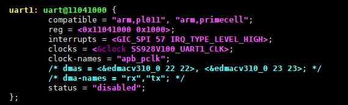

上述中断号需要查看芯片手册中的中断源分配表。

#### DMA模式<a name="ZH-CN_TOPIC_0000002479903626"></a>

1.  如果需要开启DMA功能，首先需要在编译linux时menuconfig打开对应的选项，Device Drivers  ---\> DMA Engine support  ---\> Vendor EDMAC Controller support。相对的，如果需要关闭DMA功能，则将该选项关闭，如[图1](#fig16720171216599)所示。

    **图 1**  编译menuconfig过程图<a name="fig16720171216599"></a>  
    

2.  打开arch/arm64/boot/dts/vendor/ss928v100-demb.dts文件，如果需要打开DMA功能，则需要将edmacv310\_0的“status”的值配置为okay；相对的，如果要关闭DMA功能，则将该控制器的“status”的值配置为disabled，如[图2](#fig7351949302)所示。

    **图 2**  DMA控制器节点<a name="fig7351949302"></a>  
    

3.  UART的工作模式默认是中断模式，如果需要切换DMA模式，则需要打开arch/arm64/boot/dts/vendor/ss928v100.dtsi文件，找到对应的UART，填写dmas和dma-names的内容，如uart1加入“dmas = <&edmacv310\_0 22 22\>, <&edmacv310\_0 23 23\>;”和“dma-names = "rx","tx";”，如[图3](#fig12271338911)所示。

    **图 3**  UART添加DMA相关属性<a name="fig12271338911"></a>  
    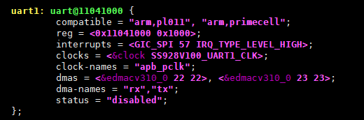

    > **须知：** 
    >UART使用标准DMA驱动，防止冲突标准DMA驱动和非标准DMA驱动只能二选一。因此，如果打开了标准DMA驱动，则由非标准DMA驱动所支持的I2C DMA传输功能将不可用。

## SDIO操作指南<a name="ZH-CN_TOPIC_0000002479903636"></a>


### 内核中SDIO驱动开启方法<a name="ZH-CN_TOPIC_0000002512103603"></a>

内核中SDIO驱动默认是开启的，SS928V100有3个MMC控制器，其中 MMC2控制器默认开启SDIO功能，模式为HS模式。如需开启MMC2控制器SDR104模式，请修改DTSI。

1.  打开ss928v100.dtsi文件

    ```
    $vi arch/arm64/boot/dts/vendor/ss928v100.dtsi
    ```

2.  DTSI增加SDR104描述（以SS928V100为例）

    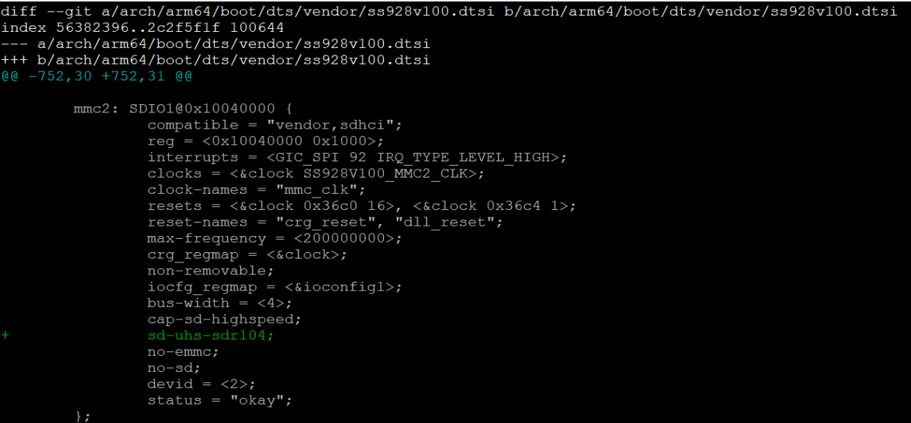

## PCIe操作指南<a name="ZH-CN_TOPIC_0000002480063616"></a>


### 内核中PCIe控制器驱动开启方法<a name="ZH-CN_TOPIC_0000002480063626"></a>

在SS928V100内核中，PCIe控制器默认工作在 EP 模式，如果需要使用 RC 模式，可以按照如下方法：

1.  执行menuconfig命令

    ```
    $ cp arch/arm64/configs/ss928v100_defconfig .config
    $ make ARCH=arm64 CROSS_COMPILE=aarch64-mix210-linux- menuconfig
    ```

2.  选中PCIe控制器驱动相关选项

    进入Bus support  ---\>

    ```
    Bus support  --->
        [*]   Vendor PCI Express support
    ```

    选中\[\*\] Vendor PCI Express support表示设置控制器工作在 RC 模式。

    在“Vendor PCI Express support”选项中，有一个“limit pcie max read request size”选项，用来限制PCIe的最大读请求为128字节，需要节省总线带宽时，可以开启该选项。

3.  保存menuconfig配置，编译内核镜像uImage

    ```
    $ make ARCH=arm64 CROSS_COMPILE=aarch64-mix210-linux- uImage
    ```

4.  编译ATF镜像

    进入opensource/arm-trusted-firmware/trusted-firmware-a-2.2目录，执行mk\_ss928v100.sh脚本：

    ```
    $ chmod 777 mk_ss928v100.sh
    $ ./mk_ss928v100.sh
    ```

    在opensource/arm-trusted-firmware/trusted-firmware-a-2.2/build/ss928v100/release目录下，生成的fip.bin文件就是ATF+kernel的镜像。

### 内核中PCIe MSI中断关闭方法<a name="ZH-CN_TOPIC_0000002512103541"></a>

在SS928V100内核中，默认开启了PCIe的MSI中断，如果要关闭PCIe的MSI中断，可以按照如下方法：

1.  打开ss928v100.dtsi文件

    ```
    $vi arch/arm64/boot/dts/vendor/ss928v100.dtsi
    ```

2.  在PCIe的配置信息中，把MSI相关的参数注释掉

    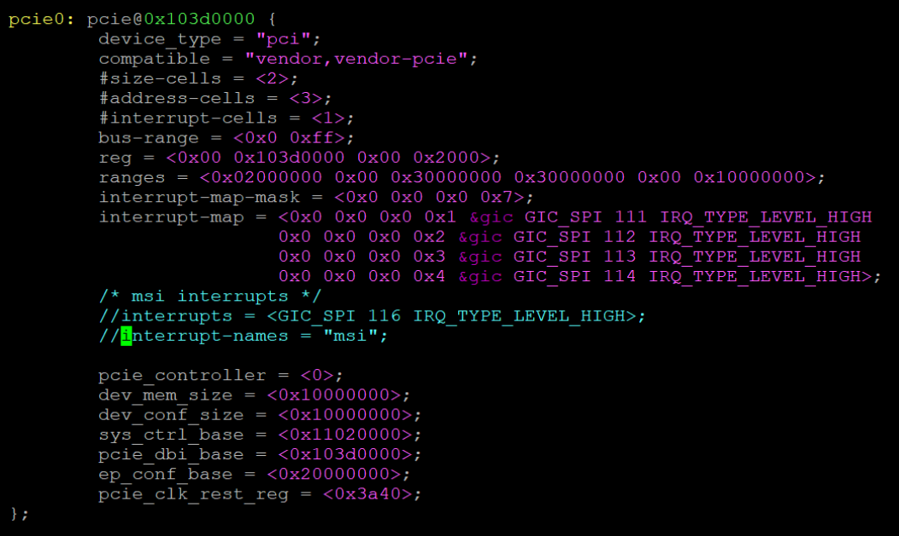

    如上图，注释掉PCIe1配置信息中的“interrupts = <GIC\_SPI 140 IRQ\_TYPE\_LEVEL\_HIGH\>;”和“interrupt-names = "msi";”。

3.  保存ss928v100.dtsi文件配置，编译内核镜像uImage

    ```
    $ cp arch/arm64/configs/ss928v100_defconfig .config
    $ make ARCH=arm64 CROSS_COMPILE=aarch64-mix210-linux- menuconfig
    $ make ARCH=arm64 CROSS_COMPILE=aarch64-mix210-linux- uImage
    ```

4.  编译ATF镜像

    进入opensource/arm-trusted-firmware/trusted-firmware-a-2.2目录，执行mk\_ss928v100.sh脚本：

    ```
    $ chmod 777 mk_ss928v100.sh
    $ ./mk_ss928v100.sh
    ```

    在opensource/arm-trusted-firmware/trusted-firmware-a-2.2/build/ss928v100/release目录下，生成的fip.bin文件就是ATF+kernel的镜像。

### 支持 NVME 设备方法<a name="ZH-CN_TOPIC_0000002479903692"></a>

通过 PCIe 接入 NVMe 固态硬盘，需要开启 NVME 内核选项：

```
Device Drivers  --->
    NVME Support  --->
        <*> NVM Express block device
        [ ] NVMe multipath support (NEW)
```

## PWM操作指南<a name="ZH-CN_TOPIC_0000002512103575"></a>


### 内核PWM驱动开启方法<a name="ZH-CN_TOPIC_0000002512063523"></a>

在内核中，PWM驱动默认未开启，如果需要开启PWM驱动，可以按照如下方法\(以SS928V100为例，默认情况下，该解决方案内核适配的是PWM0和PWM1\)：

1.  执行menuconfig命令

    ```
    $ cp arch/arm64/configs/ss928v100_defconfig .config
    $ make ARCH=arm64 CROSS_COMPILE=aarch64-mix210-linux- menuconfig
    ```

2.  选中PWM驱动相关选项

    进入Device Drivers  ---\>

    选中：\[\*\] Pulse-Width Modulation \(PWM\) Support  ---\>

    选中：<\*\>  Vendor PWM support

    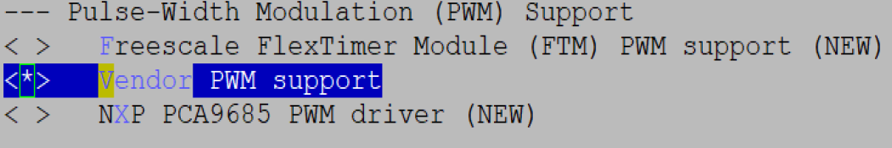

3.  保存menuconfig配置，编译内核镜像uImage

    ```
    $ make ARCH=arm64 CROSS_COMPILE=aarch64-mix210-linux- uImage
    ```

4.  编译ATF镜像

    进入opensource/arm-trusted-firmware/trusted-firmware-a-2.2目录，执行mk\_ss928v100.sh脚本：

    ```
    $ chmod 777 mk_ss928v100.sh
    $ ./mk_ss928v100.sh
    ```

    在opensource/arm-trusted-firmware/trusted-firmware-a-2.2/build/ss928v100/release目录下，生成的fip.bin文件就是ATF+kernel的镜像。

### 内核PWM驱动使用方法<a name="ZH-CN_TOPIC_0000002480063678"></a>

内核已经开启PWM驱动情况下，使用PWM的方法如下（以SS928V100为例）：

方法1：使用echo，cat命令的方式（以PWM0的通道0为例）

1.  在控制台使用 echo 命令将要操作的PWM的通道编号进行导出

    对于PWM0，对应文件/sys/class/pwm/pwmchip0

    echo N \> /sys/class/pwm/pwmchip0/export; N表示通道号，范围为\[0, 15\]

    ```
    $ echo 0 > /sys/class/pwm/pwmchip0/export
    $ echo 1 > /sys/class/pwm/pwmchip0/export
    ......
    $ echo 15 > /sys/class/pwm/pwmchip0/export
    ```

    对于PWM1，对应文件/sys/class/pwm/pwmchip16

    echo N \> /sys/class/pwm/pwmchip16/export; N表示通道号，范围为\[0, 15\]

    ```
    $ echo 0 > /sys/class/pwm/pwmchip16/export
    $ echo 1 > /sys/class/pwm/pwmchip16/export
    ......
    $ echo 15 > /sys/class/pwm/pwmchip16/export
    ```

    导出后，通道上产生如下属性文件（以PWM0的通道0为例），通过读写这些文件，可以达到操作通道的目的。

    ```
    /sys/class/pwm/pwmchip0/pwm0/period ——周期
    /sys/class/pwm/pwmchip0/pwm0/duty_cycle ——占空比（或互补信号对0的占空比）
    /sys/class/pwm/pwmchip0/pwm0/enable ——使能
    /sys/class/pwm/pwmchip0/pwm0/polarity ——极性
    /sys/class/pwm/pwmchip0/pwm0/capture ——捕捉，不支持
    ```

    另外，部分通道（PWM0的通道15、PWM1的通道0和通道1）支持若干个互补信号对的占空比的配置，导出后会产生对应互补信号对的占空比配置文件（以pwm0的通道15为例），互补信号对的占空比独立可配，其他如周期、使能等属性与通道保持一致，互补信号对1与互补信号对2的占空比的设置以及读取方法与互补信号对0类似。

    ```
    /sys/class/pwm/pwmchip0/pwm15/duty_cycle1 ——互补信号对1的占空比
    /sys/class/pwm/pwmchip0/pwm15/duty_cycle2 ——互补信号对2的占空比
    ```

2.  在控制台使用echo命令设置PWM的周期

    周期period=1000000ns，即1KHz

    ```
    $ echo 1000000 > /sys/class/pwm/pwmchip0/pwm0/period
    ```

3.  在控制台使用echo命令设置PWM的占空比

    占空比duty\_cycle=500000ns，即50%

    ```
    $ echo 500000 > /sys/class/pwm/pwmchip0/pwm0/duty_cycle
    ```

4.  在控制台使用echo命令使能PWM

    使能enable=1，即使能通道

    ```
    $ echo 1 > /sys/class/pwm/pwmchip0/pwm0/enable
    ```

5.  在控制台使用cat命令读取PWM的周期

    ```
    $ cat /sys/class/pwm/pwmchip0/pwm0/period
    ```

6.  在控制台使用cat命令读取PWM的占空比

    ```
    $ cat /sys/class/pwm/pwmchip0/pwm0/duty_cycle
    ```

7.  在控制台使用cat命令读取PWM的使能状态

    ```
    $ cat /sys/class/pwm/pwmchip0/pwm0/enable
    ```

8.  在控制台使用echo命令禁用PWM

    ```
    $ echo 0 > /sys/class/pwm/pwmchip0/pwm0/enable
    ```

方法2：使用fopen，fwrite，fread，fseek，fclose的方式（以PWM0的通道0为例）：

1.  打开文件/sys/class/pwm/pwmchip0/export

    ```
    #define PWM_EXPORT(pwm_num)                   "/sys/class/pwm/pwmchip"#pwm_num"/export"
    fp_export = fopen(PWM_EXPORT(0), "w");
    ```

2.  写文件/sys/class/pwm/pwmchip0/export，导出道通的周期、占空比等属性文件

    ```
    fwrite("0", 1, 1, fp_export);
    ```

3.  打开文件/sys/class/pwm/pwmchip0/pwm0/period、/sys/class/pwm/pwmchip0/pwm0/duty\_cycle、/sys/class/pwm/pwmchip0/pwm0/enable

    ```
    #define PWM_CHN_PERIOD(pwm_num, chn_num)      "/sys/class/pwm/pwmchip"#pwm_num"/pwm"#chn_num"/period"
    #define PWM_CHN_DUTY_CYCLE(pwm_num, chn_num)  "/sys/class/pwm/pwmchip"#pwm_num"/pwm"#chn_num"/duty_cycle"
    #define PWM_CHN_DUTY_CYCLE1(pwm_num, chn_num) "/sys/class/pwm/pwmchip"#pwm_num"/pwm"#chn_num"/duty_cycle1"
    #define PWM_CHN_DUTY_CYCLE2(pwm_num, chn_num) "/sys/class/pwm/pwmchip"#pwm_num"/pwm"#chn_num"/duty_cycle2"
    #define PWM_CHN_ENABLE(pwm_num, chn_num)      "/sys/class/pwm/pwmchip"#pwm_num"/pwm"#chn_num"/enable"
    
    fp_period = fopen(PWM_CHN_PERIOD(0, 0), "rw");
    fp_duty_cycle = fopen(PWM_CHN_DUTY_CYCLE(0, 0), "rw");
    // 如果存在互补信号对1，则打开互补信号对1占空比对应文件
    // 如果存在互补信号对2，则打开互补信号对2占空比对应文件
    fp_enable = fopen(PWM_CHN_ENABLE(0, 0), "rw");
    ```

4.  写文件/sys/class/pwm/pwmchip0/pwm0/period、/sys/class/pwm/pwmchip0/pwm0/duty\_cycle、/sys/class/pwm/pwmchip0/pwm0/enable，以设置通道的周期、占空比、使能等

    ```
    fwrite("1000000", 1, strlen("1000000"), fp_period);
    fwrite("500000", 1, strlen("500000"), fp_duty_cycle);
    fwrite("1", 1, strlen("1"), fp_enable);
    ```

5.  读文件/sys/class/pwm/pwmchip0/pwm0/period、/sys/class/pwm/pwmchip0/pwm0/duty\_cycle、/sys/class/pwm/pwmchip0/pwm0/enable，以获取通道的周期、占空比、使能等

    ```
    fseek(fp_period, 0, SEEK_SET);
    fread(read_buf, 1, count, fp_period);
    fseek(fp_duty_cycle, 0, SEEK_SET);
    fread(read_buf, 1, count, fp_duty_cycle);
    fseek(fp_enable, 0, SEEK_SET);
    fread(read_buf, 1, count, fp_enable);
    ```

6.  写文件/sys/class/pwm/pwmchip0/pwm0/enable，以禁用通道

    ```
    fwrite("0", 1, strlen("0"), fp_enable);
    ```

7.  关闭文件

    ```
    fclose(fp_enable);
    fclose(fp_duty_cycle);
    fclose(fp_period);
    fclose(fp_export);
    ```

## EDMA操作指南<a name="ZH-CN_TOPIC_0000002479903650"></a>


### 操作准备<a name="ZH-CN_TOPIC_0000002512063545"></a>

使用 SDK 发布的 Linux 内核。编译前，用 menuconfig 打开 DMA Engine 和 EDMA Controller 选项。

```
Device Drivers  --->
    [*] DMA Engine support  --->
        <*>   Vendor EDMAC Controller support

```

此外，还需要将 arch/arm64/boot/dts/vendor/ss928v100-demb.dts文件中 edmacv310\_0 的“status”的值配置为okay；

```
 &edmacv310_0 {
        status = "okay";
};
```

### 操作过程<a name="ZH-CN_TOPIC_0000002512063561"></a>

-   Linux 内核的 DMAEngine Framework 为用户提供了一系列 DMA 的 API，EDMA 驱动（drivers/dma/edmacv310.c 文件）从底层实现了这些 API 的功能。
-   DMA 传输的地址必须是物理地址，且单次传输的源地址空间和目的地址空间都必须连续。
-   对于 kmalloc 得到的内存，可先通过流式映射将虚拟地址转化为物理地址，再用 DMA 传输数据；流式映射可保证cache和内存数据一致性。
-   对于 vmalloc 得到的内存，其物理地址空间不连续，不支持 DMA 传输。
-   如果传输的内存是cacheable的，请注意在传输前后，确保cache和内存数据的一致性。
-   目前支持的单次拷贝最大数据长度为 32MB，最小传输 1 Byte，支持按单字节对齐传输数据。

内存到内存数据拷贝函数的实现步骤与参考代码：

1.  设置 DMA传 输类型：

    ```
    dma_cap_mask_t mask;
    dma_cap_zero(mask);
    dma_cap_set(DMA_MEMCPY, mask);
    ```

1.  dma\_request\_channel 申请 DMA 通道：

    ```
    #define dma_request_channel(mask, x, y) \
    	__dma_request_channel(&(mask), x, y, NULL)
    struct dma_chan *__dma_request_channel(const dma_cap_mask_t *mask,
    		dma_filter_fn fn, void *fn_param, struct device_node *np);
    ```

2.  如果是 kmalloc 的虚拟地址，可通过流式式映射 dma\_map\_single 得到物理地址（否则跳过此步骤）：

    ```
    #define dma_map_single(d, a, s, r) dma_map_single_attrs(d, a, s, r, 0)
    static inline dma_addr_t dma_map_single_attrs(struct device *dev, void *ptr,
    		size_t size, enum dma_data_direction dir, unsigned long attrs)
    ```

3.  dma\_async\_tx\_descriptor  获取 DMA 传输描述符：

    ```
    static inline struct dma_async_tx_descriptor *dmaengine_prep_dma_memcpy(
    		struct dma_chan *chan, dma_addr_t dest, dma_addr_t src,
    		size_t len, unsigned long flags)
    ```

4.  dmaengine\_submit 提交传输请求：

    ```
    static inline dma_cookie_t dmaengine_submit(struct dma_async_tx_descriptor *desc);
    ```

5.  dma\_async\_issue\_pending 启动 DMA 传输：

    ```
    static inline void dma_async_issue_pending(struct dma_chan *chan);
    ```

6.  等待传输完成，例如 dma\_sync\_wait：

    ```
    enum dma_status dma_sync_wait(struct dma_chan *chan, dma_cookie_t cookie);
    ```

7.  如果用了流式映射，还要用 dma\_unmap\_single 取消映射（否则跳过此步骤）：

    ```
    #define dma_unmap_single(d, a, s, r) dma_unmap_single_attrs(d, a, s, r, 0)
    static inline void dma_unmap_single_attrs(struct device *dev, dma_addr_t addr,
    		size_t size, enum dma_data_direction dir, unsigned long attrs)
    ```

8.  dma\_release\_channel 释放DMA通道：

    ```
    void dma_release_channel(struct dma_chan *chan);
    ```

### 操作示例<a name="ZH-CN_TOPIC_0000002512103593"></a>


#### 传输物理地址数据<a name="ZH-CN_TOPIC_0000002512063551"></a>

使用 DMA 传输物理地址数据的示例如下：

```
#include <linux/dmaengine.h>
#include <linux/dma-mapping.h>
#include <linux/module.h>

int dma_phy_memcpy(dma_addr_t phy_dst, dma_addr_t  phy_src, size_t size)
{
	dma_cap_mask_t mask;
	struct dma_chan *chn = NULL;
	struct dma_async_tx_descriptor* tx = NULL;
	dma_cookie_t cookie;
	int ret = 0;

	/* 设置 DMA传 输类型 */
	dma_cap_zero(mask);
	dma_cap_set(DMA_MEMCPY, mask);

	/* 申请通道 */
	chn = dma_request_channel(mask, NULL, NULL);
	if (chn == NULL) {
		printk("dma_request_channel failed!\n");
		return -1;
	}

	/* 获取描述符 */
	tx = dmaengine_prep_dma_memcpy(chn, phy_dst, phy_src, size, DMA_CTRL_ACK | DMA_PREP_INTERRUPT);
	if (tx == NULL) {
		printk("prep_dma_memcpy failed!\n");
		ret = -1;
		goto out;
	}

	/* 提交传输请求 */
	cookie = dmaengine_submit(tx);
	/* 启动传输 */
	dma_async_issue_pending(chn);
	/* 等待传输完成 */
	dma_sync_wait(chn, cookie);
out:
	/* 释放通道 */
	dma_release_channel(chn);
	return ret;
}

#define __64KB (1024 *  64)

static int dma_phy_memcpy_init(void)
{	
	unsigned long src = 0x80000000;
	unsigned long dst = 0x81000000;
	size_t trans_size = __64KB;

	dma_phy_memcpy(dst, src, trans_size);

	return 0;
}
static void dma_phy_memcpy_exit(void)
{
}
module_init(dma_phy_memcpy_init)
module_exit(dma_phy_memcpy_exit)
MODULE_LICENSE("GPL");
```

#### 传输 kmalloc 地址数据<a name="ZH-CN_TOPIC_0000002480063660"></a>

使用 DMA 传输 kmalloc 虚拟地址数据的示例如下：

```
#include <linux/dmaengine.h>
#include <linux/dma-mapping.h>
#include <linux/module.h>
#include <linux/slab.h>

int dma_virt_memcpy(void *virt_dst, void *virt_src, size_t size)
{
	dma_cap_mask_t mask;
	struct dma_chan *chn = NULL;
	struct dma_async_tx_descriptor* tx = NULL;
	dma_addr_t dma_src, dma_dst;
	dma_cookie_t cookie;
	int ret = 0;

	/* 设置 DMA传 输类型 */
	dma_cap_zero(mask);
	dma_cap_set(DMA_MEMCPY, mask);

	/* 申请通道 */
	chn = dma_request_channel(mask, NULL, NULL);
	if (chn == NULL) {
		printk("dma_request_channel failed!\n");
		return -1;
	}

	/* 流式映射 */
	dma_src = dma_map_single(chn->device->dev, virt_src, size, DMA_TO_DEVICE);
	dma_dst = dma_map_single(chn->device->dev, virt_dst, size, DMA_FROM_DEVICE);
	if (dma_src == 0 || dma_dst == 0) {
		printk("dma_map_single failed!\n");
		ret = -1;
		goto out;
	}

	/* 获取描述符 */
	tx = dmaengine_prep_dma_memcpy(chn, dma_dst, dma_src, size, DMA_CTRL_ACK | DMA_PREP_INTERRUPT);
	if (tx == NULL) {
		printk("prep_dma_memcpy failed!\n");
		ret = -1;
		goto out;
	}

	/* 提交传输请求 */
	cookie = dmaengine_submit(tx);
	/* 启动传输 */
	dma_async_issue_pending(chn);
	/* 等待传输完成 */
	dma_sync_wait(chn, cookie);

	/* 取消流式映射 */
	dma_unmap_single(chn->device->dev, dma_src, size, DMA_TO_DEVICE);
	dma_unmap_single(chn->device->dev, dma_dst, size, DMA_FROM_DEVICE);
out:
	/* 释放通道 */
	dma_release_channel(chn);
	return ret;
}

#define __64KB (1024 *  64)

static int dma_virt_memcpy_init(void)
{	
	void *src;
	void *dst;
	size_t trans_size = __64KB;

	src = kmalloc(trans_size, GFP_KERNEL);
	if (src == NULL)
		return -1;

	dst = kmalloc(trans_size, GFP_KERNEL);
	if (dst == NULL) {
		kfree(src);
		return -1;
	}

	memset(src, 0xAA, trans_size);
	memset(dst, 0x00, trans_size);
	dma_virt_memcpy(dst, src, trans_size);

	kfree(src);
	kfree(dst);
	return 0;
}

static void dma_virt_memcpy_exit(void)
{

}

module_init(dma_virt_memcpy_init)
module_exit(dma_virt_memcpy_exit)
MODULE_LICENSE("GPL");
```

## 附录<a name="ZH-CN_TOPIC_0000002512103599"></a>


### 用fdisk工具分区<a name="ZH-CN_TOPIC_0000002479903638"></a>

通过“[查看当前状态](#ZH-CN_TOPIC_0000002479903694)”，对应以下情况选择操作：

-   若已有分区，本操作可以跳过，直接到“[用mkdosfs工具格式化](#ZH-CN_TOPIC_0000002512103571)”。
-   若没有分区，则在控制台的提示符下，输入命令fdisk，具体格式如下：

    ```
    ~ $ fdisk 设备节点
    ```

回车后，输入命令m，根据帮助信息继续进行以下的操作。回车后，输入命令m，根据帮助信息继续进行以下的操作。

其中设备节点与实际接入的设备类型有关，具体名称在以上各章节的“操作示例”中均有说明。


#### 查看当前状态<a name="ZH-CN_TOPIC_0000002479903694"></a>

在控制台的提示符下，输入命令p，查看当前分区状态：

```
Command (m for help): p
```

控制台显示出分区状态信息：

```
Disk /dev/mmc/blk1/disc: 127 MB, 127139840 bytes
8 heads, 32 sectors/track, 970 cylinders
Units = cylinders of 256 * 512 = 131072 bytes
Device Boot Start End Blocks Id System
```

上面信息表明设备没有分区，需要按照“[创建新的分区](#ZH-CN_TOPIC_0000002512103559)”和“[保存分区信息](#ZH-CN_TOPIC_0000002479903660)”的描述对设备进行分区。

#### 创建新的分区<a name="ZH-CN_TOPIC_0000002512103559"></a>

创建新的分区步骤如下：

1.  切换分区创建方式。

    Busybox的版本已升级为1.31.1版本，升级后分区创建的默认方式已变为sectors\(扇区\)的方式，若想跟老平台的使用保持一致即使用cylinders\(柱面\)的方式，需要执行如下操作：

    在提示符下输入命令u，切换为cylinders\(柱面\)分区创建方式：

    ```
    Command (m for help): u
    ```

    控制台显示出如下信息：

    ```
    Command (m for help): u
    Changing display/entry units to cylinders
    ```

2.  创建新的分区。

    在提示符下输入命令n，创建新的分区：

    ```
    Command (m for help): n
    ```

    控制台显示出如下信息：

    ```
    Command action
    e extended
    p primary partition (1-4)
    ```

3.  建立主分区。

    输入命令p，选择主分区：

    ```
    p
    ```

4.  选择分区数。

    本例中选择为1，输入数字1：

    ```
    Partition number (1-4): 1
    ```

    控制台显示出如下信息：

    ```
    First cylinder (1-970, default 1):
    ```

5.  选择起始柱面。

    本例选择默认值1，直接回车：

    ```
    Using default value 1
    ```

6.  选择结束柱面。

    本例选择默认值970，直接回车：

    ```
    Last cylinder or +size or +sizeM or +sizeK (1-970, default 970):
    Using default value 970
    ```

7.  选择系统格式。

    由于系统默认为Linux格式，本例中选择Win95 FAT格式，输入命令t进行修改：

    ```
    Command (m for help): t
    Selected partition 1
    ```

    输入命令b，选择Win95 FAT格式：

    ```
    Hex code (type L to list codes): b
    ```

    输入命令l，可以查看fdisk所有分区的详细信息：

    ```
    Changed system type of partition 1 to b (Win95 FAT32)
    ```

8.  查看分区状态。

    输入命令p，查看当前分区状态：

    ```
    Command (m for help): p
    ```

    控制台显示出当前分区状态信息，表示成功分区。

#### 保存分区信息<a name="ZH-CN_TOPIC_0000002479903660"></a>

输入命令w，写入并保存分区信息到设备：

```
Command (m for help): w
```

控制台显示出当前设备信息，表示成功写入分区信息到设备：

```
The partition table has been altered!
Calling ioctl() to re-read partition table.
…………
~ $
```

### 用mkdosfs工具格式化<a name="ZH-CN_TOPIC_0000002512103571"></a>

存在以下情况选择操作：

-   若已格式化，本操作可以跳过，直接到“[挂载目录](#ZH-CN_TOPIC_0000002512103519)”。
-   若没有格式化，则输入命令mkdosfs进行格式化：

    ```
    ~ $ mkdosfs –F 32 设备分区名
    ```

其中设备分区名与实际接入的设备类型有关，具体名称在以上各章节的“操作示例”中均有说明。

控制台没有显示错误提示信息，表示成功格式化：

```
~ $
```

### 用mke2fs工具格式化<a name="ZH-CN_TOPIC_0000002512103545"></a>

存在以下情况选择操作：

-   若已格式化，本操作可以跳过，直接到“[挂载目录](#ZH-CN_TOPIC_0000002512103519)”。
-   若没有格式化，则输入命令mke2fs进行格式化：

    ```
    ~ $ mke2fs 设备分区名
    ```

其中设备分区名与实际接入的设备类型有关，具体名称在以上各章节的“操作示例”中均有说明。

控制台没有显示错误提示信息，表示成功格式化：

```
~ $
```

### 挂载目录<a name="ZH-CN_TOPIC_0000002512103519"></a>

使用命令mount挂载到mnt目录下，就可以进行读写文件操作：

```
~ $ mount -t type 设备分区名 /mnt
```

其中type和文件系统格式有关，设备分区名与实际接入的设备类型有关，具体名称在以上各章节的“操作示例”中均有说明。

### 读写文件<a name="ZH-CN_TOPIC_0000002512103577"></a>

读写操作的具体情况很多，在本例中使用命令cp实现读写操作。

使用命令cp拷贝当前目录下的test.txt文件到mnt目录下，即拷贝至设备，实现写操作，如：

```
~ $ cp ./test.txt /mnt
```

### USB Device模式配置脚本<a name="ZH-CN_TOPIC_0000002512103587"></a>

> **注意：** 
>由于脚本最终在单板上运行，编写脚本时，应注意文件编码和文档格式。请将文件编码配置为UTF-8编码，文档格式为设置Unix\(LF\)格式（即使用LF表明换行）。否则，脚本执行过程中可能会出现错误，导致执行失败。


#### 虚拟U盘<a name="ZH-CN_TOPIC_0000002512063553"></a>

新建Config\_Storage.sh文件，将以下内容拷贝到文件中：

```
mount -t configfs none /sys/kernel/config/

cd /sys/kernel/config/usb_gadget/
mkdir storage
cd storage

mkdir functions/mass_storage.0 
echo $MEMORY > functions/mass_storage.0/lun.0/file

echo $VID > idVendor
echo $PID > idProduct
mkdir strings/0x409
echo $MANUFACTURER > strings/0x409/manufacturer
echo $PRODUCT > strings/0x409/product
echo $SERIALNUMBER > strings/0x409/serialnumber

mkdir configs/c.1/
echo "0xC0" > configs/c.1/bmAttributes
echo "1" > configs/c.1/MaxPower
mkdir configs/c.1/strings/0x409/
echo "Mass Storage" > configs/c.1/strings/0x409/configuration
ln -s functions/mass_storage.0/ configs/c.1/

echo "$(ls /sys/class/udc/)" > UDC
```

新建Disable\_Storage.sh文件，将以下内容拷贝到文件中：

```
cd /sys/kernel/config/usb_gadget/storage
echo > UDC
rm configs/c.1/mass_storage.0
rmdir configs/c.1/strings/0x409
rmdir functions/mass_storage.0
rmdir configs/c.1
rmdir strings/0x409
cd ../
rmdir storage
cd /root/
umount /sys/kernel/config/
```

#### 虚拟网口<a name="ZH-CN_TOPIC_0000002480063664"></a>

新建Config\_Ether.sh文件，将以下内容拷贝到文件中：

```
mount -t configfs none /sys/kernel/config/
cd /sys/kernel/config/usb_gadget/
mkdir ether
cd ether/
echo "0x0200" > bcdUSB
echo "0xef" > bDeviceClass
echo "2" > bDeviceSubClass
echo $VID > idVendor
echo $PID > idProduct
echo "0x3000" > bcdDevice
echo "0x01" > bDeviceProtocol
mkdir strings/0x409
echo $MANUFACTURER > strings/0x409/manufacturer
echo $PRODUCT > strings/0x409/product
echo $SERIALNUMBER > strings/0x409/serialnumber

mkdir configs/c.1
echo "0xC0" > configs/c.1/bmAttributes
echo "1" > configs/c.1/MaxPower
mkdir configs/c.1/strings/0x409/
echo "RNDIS" > configs/c.1/strings/0x409/configuration
echo "1" > os_desc/use
echo "0xcd" > os_desc/b_vendor_code
echo "MSFT100" > os_desc/qw_sign

mkdir functions/rndis.usb0
echo "RNDIS" > functions/rndis.usb0/os_desc/interface.rndis/compatible_id
echo "5162001" > functions/rndis.usb0/os_desc/interface.rndis/sub_compatible_id

ln -s functions/rndis.usb0 configs/c.1
ln -s configs/c.1 os_desc
echo "$(ls /sys/class/udc/)" > UDC
```

新建Disable\_Ether.sh文件，将以下内容拷贝到文件中：

```
cd /sys/kernel/config/usb_gadget/ether
echo > UDC
rm configs/c.1/rndis.usb0
rmdir configs/c.1/strings/0x409
rmdir functions/rndis.usb0
rm os_desc/c.1
rmdir configs/c.1
rmdir strings/0x409
cd ../
rmdir ether
cd /root/
umount /sys/kernel/config/
```

#### 虚拟串口<a name="ZH-CN_TOPIC_0000002479903674"></a>

新建Config\_Serial.sh文件，将以下内容拷贝到文件中：

```
mount -t configfs none /sys/kernel/config/
cd /sys/kernel/config/usb_gadget/
mkdir acm
cd acm

mkdir functions/acm.0
echo $VID > idVendor
echo $PID > idProduct
echo "2" > bDeviceClass
mkdir strings/0x409
echo $MANUFACTURER > strings/0x409/manufacturer
echo $PRODUCT > strings/0x409/product
echo $SERIALNUMBER > strings/0x409/serialnumber

mkdir configs/c.1/
echo "1" > configs/c.1/MaxPower
echo "0xC0" > configs/c.1/bmAttributes
mkdir configs/c.1/strings/0x409/
echo "CDC ACM config" > configs/c.1/strings/0x409/configuration
ln -s functions/acm.0/ configs/c.1/
echo "$(ls /sys/class/udc/)" > UDC
```

新建Disable\_Serial.sh文件，将以下内容拷贝到文件中：

```
cd /sys/kernel/config/usb_gadget/acm
echo > UDC
rm configs/c.1/acm.0
rmdir configs/c.1/strings/0x409
rmdir functions/acm.0
rmdir configs/c.1
rmdir strings/0x409
cd ../
rmdir acm
cd /root/
umount /sys/kernel/config/
```

#### 录像机<a name="ZH-CN_TOPIC_0000002512103601"></a>

（_直接复制文档的内容，可能会在行末多出一个空格，以下的脚本请注意cat命令行行末不能留有空格，否则会导致脚本执行失败_）

新建ConfigUVC.sh文件，将以下内容拷贝到文件中：

```
#!/bin/sh

######################################################
# set_resolution()  fill resoluton
# $1 formats
# $2 base_path
# $3 0 or 1: means need fill dwMaxVideoFrameBufferSize
# $4 format name string
#######################################################
function set_resolution()
{
	for i in $1
	do
		echo "$i"
		case $i in
		"360p")
			mkdir $2/360p/
			echo -e "333333" > $2/360p/dwFrameInterval
			echo "333333" > $2/360p/dwDefaultFrameInterval
			echo "110592000" > $2/360p/dwMaxBitRate
			if [ $3 -eq 1 ]; then
				echo "460800" > $2/360p/dwMaxVideoFrameBufferSize
			fi
			echo "110592000" > $2/360p/dwMinBitRate
			echo "360" > $2/360p/wHeight
			echo "640" > $2/360p/wWidth
			;;
		"480p")
			mkdir $2/480p/
			echo -e "333333" > $2/480p/dwFrameInterval
			echo "333333" > $2/480p/dwDefaultFrameInterval
			echo "147456000" > $2/480p/dwMaxBitRate
			if [ $3 -eq 1 ]; then
				echo "614400" > $2/480p/dwMaxVideoFrameBufferSize
			fi
			echo "147456000" > $2/480p/dwMinBitRate
			echo "480" > $2/480p/wHeight
			echo "640" > $2/480p/wWidth
			;;
		"720p")
			mkdir $2/720p/
			echo -e "333333" > $2/720p/dwFrameInterval
			echo "333333" > $2/720p/dwDefaultFrameInterval
			echo "442368000" > $2/720p/dwMaxBitRate
			if [ $3 -eq 1 ]; then
				echo "1843200" > $2/720p/dwMaxVideoFrameBufferSize
			fi
			echo "442368000" > $2/720p/dwMinBitRate
			echo "720" > $2/720p/wHeight
			echo "1280" > $2/720p/wWidth
			;;
		"1080p")
			mkdir $2/1080p/
			echo -e "333333"> $2/1080p/dwFrameInterval
			echo "333333" > $2/1080p/dwDefaultFrameInterval
			echo "995328000" > $2/1080p/dwMaxBitRate
			if [ $3 -eq 1 ]; then
				echo "4147200" > $2/1080p/dwMaxVideoFrameBufferSize
			fi
			echo "995328000" > $2/1080p/dwMinBitRate
			echo "1080" > $2/1080p/wHeight
			echo "1920" > $2/1080p/wWidth
			;;
		"1440p")
			mkdir $2/1440p/
			echo -e "333333" > $2/1440p/dwFrameInterval
			echo "333333" > $2/1440p/dwDefaultFrameInterval
			echo "1769472000" > $2/1440p/dwMaxBitRate
			if [ $3 -eq 1 ]; then
				echo "7372800" > $2/1440p/dwMaxVideoFrameBufferSize
			fi
			echo "1769472000" > $2/1440p/dwMinBitRate
			echo "1440" > $2/1440p/wHeight
			echo "2560" > $2/1440p/wWidth
			;;
		"2160p")
			mkdir $2/2160p/
			echo -e "333333" > $2/2160p/dwFrameInterval
			echo "333333" > $2/2160p/dwDefaultFrameInterval
			echo "3981312000" > $2/2160p/dwMaxBitRate
			if [ $3 -eq 1 ]; then
				echo "16588800" > $2/2160p/dwMaxVideoFrameBufferSize
			fi
			echo "3981312000" > $2/2160p/dwMinBitRate
			echo "2160" > $2/2160p/wHeight
			echo "3840" > $2/2160p/wWidth
			;;

		*)
			echo "$4 $i is invalid!"
			;;
		esac
	done
}

######################################################
# set_format()  fill format
# no argument
#######################################################
function set_format()
{
	#YUV
	if [ -n "$YUYV" ]; then
		echo "Add YUYV..."
		mkdir streaming/uncompressed/yuy2/
		echo -en "\x59\x55\x59\x32\x00\x00\x10\x00\x80\x00\x00\xaa\x00\x38\x9b\x71" > streaming/uncompressed/yuy2/guidFormat
		echo 16 > streaming/uncompressed/yuy2/bBitsPerPixel

		set_resolution "$YUYV" streaming/uncompressed/yuy2/ 1 "YUYV"

		ln -s streaming/uncompressed/yuy2/ streaming/header/h/
		echo -e "Added YUYV\n"
	fi

	#NV21
	if [ -n "$NV21" ]; then
		echo "Add NV21..."
		mkdir streaming/uncompressed/nv21/
		echo -en "\x4E\x56\x32\x31\x00\x00\x10\x00\x80\x00\x00\xaa\x00\x38\x9b\x71" > streaming/uncompressed/nv21/guidFormat
		echo 12 > streaming/uncompressed/nv21/bBitsPerPixel

		set_resolution "$NV21" streaming/uncompressed/nv21/ 1 "NV21"

		ln -s streaming/uncompressed/nv21/ streaming/header/h/
		echo -e "Added NV21\n"
	fi

	#NV12
	if [ -n "$NV12" ]; then
		echo "Add NV12..."
		mkdir streaming/uncompressed/nv12/
		echo -en "\x4E\x56\x31\x32\x00\x00\x10\x00\x80\x00\x00\xaa\x00\x38\x9b\x71" > streaming/uncompressed/nv12/guidFormat
		echo 12 > streaming/uncompressed/nv12/bBitsPerPixel

		set_resolution "$NV12" streaming/uncompressed/nv12/ 1 "NV12"

		ln -s streaming/uncompressed/nv12/ streaming/header/h/
		echo -e "Added NV12\n"
	fi

	#MJPEG
	if [ -n "$MJPEG" ]; then
		echo "Add MJPEG..."
		mkdir streaming/mjpeg/m/

		set_resolution "$MJPEG" streaming/mjpeg/m/ 1 "MJPEG"

		ln -s streaming/mjpeg/m/ streaming/header/h/
		echo -e "Added MJPEG\n"
	fi

	#H264
	if [ -n "$H264" ]; then
		echo "Add H264..."
		mkdir streaming/framebased/h264/
		echo -en "\x48\x32\x36\x34\x00\x00\x10\x00\x80\x00\x00\xaa\x00\x38\x9b\x71" > streaming/framebased/h264/guidFormat

		set_resolution "$H264" streaming/framebased/h264/ 0 "H264"

		ln -s streaming/framebased/h264/ streaming/header/h/
		echo -e "Added H264\n"
	fi

	#HEVC aka H265
	if [ -n "$H265" ]; then
		echo "Add HEVC(H265)..."
		mkdir streaming/framebased/h265/
		#echo -en "\x48\x45\x56\x43\x00\x00\x10\x00\x80\x00\x00\xaa\x00\x38\x9b\x71" > streaming/framebased/h265/guidFormat
		echo -en "\x48\x32\x36\x35\x00\x00\x10\x00\x80\x00\x00\xaa\x00\x38\x9b\x71" > streaming/framebased/h265/guidFormat

		set_resolution "$H265" streaming/framebased/h265/ 0 "HEVC(H265)"

		ln -s streaming/framebased/h265/ streaming/header/h/
		echo -e "Added HEVC(H265)\n"
	fi
}

mount -t configfs none /sys/kernel/config/
cd /sys/kernel/config/usb_gadget/
mkdir camera
cd camera

echo "0x01" > bDeviceProtocol
echo "0x02" > bDeviceSubClass
echo "0xEF" > bDeviceClass
echo $VID > idVendor
echo $PID > idProduct
mkdir strings/0x409
echo $MANUFACTURER > strings/0x409/manufacturer
echo $PRODUCT > strings/0x409/product
echo $SERIALNUMBER > strings/0x409/serialnumber

make_function()
{
	mkdir functions/uvc.usb${1}
	cd functions/uvc.usb${1}
	mkdir control/header/h/
	echo $BCDUVC > control/header/h/bcdUVC
	echo "48000000" > control/header/h/dwClockFrequency
	ln -s control/header/h/ control/class/fs/
	ln -s control/header/h/ control/class/ss/

cat <<EOF> control/terminal/camera/default/bmControls
$CamControl1
$CamControl2
$CamControl3
EOF

cat <<EOF> control/processing/default/bmControls
$ProcControl1
$ProcControl2
$ProcControl3
EOF

cat <<EOF> control/encoding/default/bmControls
$EcdControl1
$EcdControl2
$EcdControl3
EOF

cat <<EOF> control/encoding/default/bmControlsRuntime
$EcdRtControl1
$EcdRtControl2
$EcdRtControl3
EOF

cat <<EOF> control/extension/default/bmControls
$ExtControl1
$ExtControl2
EOF

	mkdir streaming/header/h/

	set_format

	if [ "$PerfMode" != "v4l2" ]; then
		echo "WARNING: Performance mode does not support still image yet."
		echo 0 > streaming/header/h/bStillCaptureMethod
	elif [ "$StillCaptureMethod" == 3 -o "$StillCaptureMethod" == 2 -o "$StillCaptureMethod" == 1 ];then
		echo $StillCaptureMethod > streaming/header/h/bStillCaptureMethod
	else
		echo 0 > streaming/header/h/bStillCaptureMethod
	fi

	ln -s streaming/header/h/ streaming/class/fs/
	ln -s streaming/header/h/ streaming/class/hs/
	ln -s streaming/header/h/ streaming/class/ss/

	if [ "$TransferMode" == "bulk" ];then
		echo -e "setting mode to bulk"
		echo "bulk" > streaming_transfer
		echo 32768 > streaming_maxpacket
		echo 15 > streaming_maxburst
	else
		echo -e "setting mode to isoc"
		echo "isoc" > streaming_transfer
		echo 1024 > streaming_maxpacket
	fi

	if [ "$PerfMode" == "v4l2" ]; then
		echo "v4l2" > performance_mode
	fi

	if [ "$PerfMode" != "v4l2" ]; then
		echo 0 > still_capture_method
	elif [ "$StillCaptureMethod" == 3 -o "$StillCaptureMethod" == 2 -o "$StillCaptureMethod" == 1 ];then
		echo $StillCaptureMethod > still_capture_method
		if [ "$StillCaptureMethod" == 3 ];then
			echo 32768 > still_maxpacket
		fi
	else
		echo 0 > still_capture_method
	fi

	#-Create and setup configuration
	cd ../../
}

for i in `seq 0 $(expr ${UVC_DEVICE_CNT} - 1)` ; do
	make_function $i
done

#mkdir functions/uac1.usb0
#echo 8 > functions/uac1.usb0/req_number

mkdir configs/c.1/
echo "0x01" > configs/c.1/MaxPower
echo "0xc0" > configs/c.1/bmAttributes
mkdir configs/c.1/strings/0x409/
echo "Config 1" > configs/c.1/strings/0x409/configuration

for i in `seq 0 $(expr ${UVC_DEVICE_CNT} - 1)` ; do
	ln -s functions/uvc.usb${i}/ configs/c.1/
done
#ln -s functions/uac1.usb0/ configs/c.1/

echo "$(ls /sys/class/udc)" > UDC

```

注：录像机脚本中包含了UAC相关内容，默认关闭状态，若需使用UAC功能，需将脚本中带有"uac"字样的行注释取消。

# Huawei LiteOS<a name="ZH-CN_TOPIC_0000002479903696"></a>


## I2C操作指南<a name="ZH-CN_TOPIC_0000002479903690"></a>


### 功能介绍<a name="ZH-CN_TOPIC_0000002480063644"></a>

I<sup>2</sup>C模块的作用是完成CPU对I<sup>2</sup>C总线上连接的从设备的读写。

### 模块编译<a name="ZH-CN_TOPIC_0000002512063511"></a>

源码路径为drivers/i2c。用户需要对I<sup>2</sup>C设备进行访问操作时，首先要在编译脚本里指定I<sup>2</sup>C源码路径与头文件路径。编译成功后，out目录下会生成名为libi2c.a的库文件。链接时需要通过-li2c参数指定该库文件。

> **说明：**  文档中的路径指的是Huawei LiteOS源代码根目录或其相对路径。

### 使用示例<a name="ZH-CN_TOPIC_0000002480063622"></a>


#### 模块初始化<a name="ZH-CN_TOPIC_0000002479903644"></a>

此操作示例介绍如何初始化I<sup>2</sup>C驱动。

1.  驱动初始化，调用如下接口：

    ```
    i2c_dev_init();
    ```

2.  开发者需要根据设备硬件特性配置相关的管脚复用。

    具体请参考《XXXX\_PINOUT\_CN》中管脚控制寄存器页签。

3.  用户可根据需要调用模块的读写函数对设备进行访问。参考[通过调用驱动函数访问I2C设备](#ZH-CN_TOPIC_0000002479903698)及[通过设备节点操作访问I2C设备](#ZH-CN_TOPIC_0000002479903654)。

#### 通过调用驱动函数访问I2C设备<a name="ZH-CN_TOPIC_0000002479903698"></a>

1.  定义一个设备描述结构体。

    ```
    struct i2c_client client;
    ```

2.  调用 client\_attach把client关系到对应的控制器上。

    函数原型：

    ```
    int client_attach(struct i2c_client * client, int adapter_index) \\adapter_index:被关联的i2c总线号的值，例如需要操作i2c0，则该值为0。
    ```

3.  调用提供的标准读写函数对外围器件进行读写。

    读：ret = i2c\_transfer\(struct i2c\_adapter\* const adapter, struct i2c\_msg\* const msgs, int count\);

    写：ret = i2c\_master\_send\(struct i2c\_client \*client, const char \*buf, int count\);

    代码示例如下：

    > **说明：** 
    >此代码为读写I<sup>2</sup>C外围设备的示例程序，仅为客户调用I<sup>2</sup>C驱动程序访问外围设备提供参考，不提供实际应用功能。

    ```
    struct  i2c_client  i2c_client_obj; //i2c控制结构体
     #define SLAVE_ADDR 0x34  //i2c设备地址
     #define SLAVE_REG_ADDR 0x300f //i2c设备寄存器地址
     /* client 初始化 */ 
     int i2c_client_init(void) 
     { 
         int ret = 0; 
         struct i2c_client * i2c_client0 = &i2c_client_obj; 
         i2c_client0->addr = SLAVE_ADDR >> 1; 
         ret = client_attach(i2c_client0, 0); 
         if(ret) { 
             dprintf("Fail to attach client!\n"); 
             return -1; 
         } 
         return 0; 
     } 
     UINT32 sample_i2c_write(void) 
     { 
         int ret; 
         struct i2c_client * i2c_client0 = & i2c_client_obj; 
         char buf[4] = {0}; 
         i2c_client_init(); 
         buf[0] = SLAVE_REG_ADDR & 0xff; 
         buf[1] = (SLAVE_REG_ADDR >> 8) & 0xff; 
         buf[2] = 0x03; //往i2c设备写入的值
         //调用I2C驱动标准写函数进行写操作
         ret = i2c_master_send(i2c_client0, &buf, 3); 
         return ret; 
     } 
     UINT32 sample_i2c_read(void) 
     { 
         int ret; 
         struct i2c_client *i2c_client0 = & i2c_client_obj; 
         struct i2c_rdwr_ioctl_data rdwr; 
         struct i2c_msg msg[2]; 
         unsigned char recvbuf[4]; 
         memset(recvbuf, 0x0 ,4); 
         i2c_client_init(); 
         msg[0].addr = SLAVE_ADDR >> 1; 
         msg[0].flags = 0; 
         msg[0].len = 2; 
         msg[0].buf = recvbuf; 
         msg[1].addr = SLAVE_ADDR >> 1; 
         msg[1].flags = 0; 
         msg[1].flags |= I2C_M_RD; 
         msg[1].len = 1; 
         msg[1].buf = recvbuf; 
         rdwr.msgs = &msg[0]; 
         rdwr.nmsgs = 2; 
         recvbuf[0] = SLAVE_REG_ADDR & 0xff; 
         recvbuf[1] = (SLAVE_REG_ADDR >> 8) & 0xff; 
         i2c_transfer(i2c_client0->adapter, msg, rdwr.nmsgs); 
         dprintf("val = 0x%x\n",recvbuf[0]); //buf[0] 保存着从i2c设备读写的值
         return ret; 
     }
    ```

#### 通过设备节点操作访问I2C设备<a name="ZH-CN_TOPIC_0000002479903654"></a>

1.  打开总线对应的设备文件，获取文件描述符：

    ```
    fd = open("/dev/i2c-0",O_RDWR);
    ```

    > **说明：** 
    >如未完成设备文件的注册工作，可调用i2c\_dev\_init（）函数注册设备文件。

2.  **通过ioctl设置外围设备地址、外围设备寄存器位宽和数据位宽：**

    ```
    ret = ioctl(fd, I2C_SLAVE_FORCE, device_addr); 
     ioctl(fd, I2C_16BIT_REG, 0); 
     ioctl(fd, I2C_16BIT_DATA, 0);
    ```

    > **说明：** 
    >相关宏定义在drivers/i2c/include/i2c.h头文件中。

3.  **使用以下函数进行数据读写：**

    ```
    ioctl(fd, I2C_RDWR, &rdwr); 
     write(fd, buf, count);
    ```

    > **说明：** 
    >-   步骤2中，设置寄存器位宽和数据位宽时，ioctl的第三个参数为0表示8bit位宽，为1表示16bit位宽。
    >-   步骤3中，使用ioctl进行读写的相关宏定义在drivers/i2c/include/i2c.h头文件中。

    代码示例请参考文件：

    ```
    drivers/i2c/src/i2c_shell.c
    ```

    > **说明：** 
    >-   此代码为示例程序，仅为客户通过文件系统访问I<sup>2</sup>C外围设备操作提供参考，不提供实际应用功能。
    >-   用户调用read、write接口读写i2c操作时，buf包含了寄存器地址与需要操作的数据字节，count为寄存器地址所占字节数与需要操作数据字节数的总和。

### shell命令<a name="ZH-CN_TOPIC_0000002512063569"></a>


#### i2c\_read命令<a name="ZH-CN_TOPIC_0000002480063614"></a>

在控制台使用i2c\_read命令对I<sup>2</sup>C外围设备进行读操作：

```
i2c_read <i2c_num> <device_addr> <start_reg_addr> <end_reg_addr> [reg_width] [data_width] [addr_width]
```

例如读挂载在I<sup>2</sup>C控制器0上的XXX设备的0x3000到0x3010寄存器：

```
i2c_read 0x0 0x34 0x3000 0x3010 2 1 7
```

> **说明：** 
>-   i2c\_num：I<sup>2</sup>C控制器序号。
>-   device\_addr：外围设备地址。
>-   start\_reg\_addr：读外围设备寄存器操作的开始地址。
>-   end\_reg\_addr：读外围设备寄存器操作的结束地址。
>-   reg\_width：外围设备的寄存器位宽（支持8/16bit，2: 16bit/1:8bit）。
>-   data\_width：外围设备的数据位宽（支持8/16bit，2: 16bit/1:8bit）。
>-   addr\_width：外围设备地址位宽（支持7/10位位宽，7:7bit/10:10bit\)。

#### i2c\_write命令<a name="ZH-CN_TOPIC_0000002480063648"></a>

在控制台使用i2c\_write命令对I<sup>2</sup>C外围设备进行写操作：

```
i2c_write <i2c_num> <device_addr> <reg_addr> <reg_value> [reg_width] [data_width] [addr_width]
```

例如向挂载在I<sup>2</sup>C控制器0上的XXX设备的0x300f寄存器以400K速率写入数据0x10：

```
i2c_write 0x0 0x34 0x300f 0x00 2 1 7
```

> **说明：** 
>-   i2c\_num：I<sup>2</sup>C控制器序号。
>-   device\_addr：外围设备地址。
>-   reg\_addr：写外围设备寄存器操作的地址。
>-   reg\_value：写外围设备寄存器操作的数据。
>-   reg\_width：外围设备的寄存器位宽（I<sup>2</sup>C控制器支持8/16bit）。
>-   data\_width：外围设备的数据位宽（I<sup>2</sup>C控制器支持8/16bit）。
>-   addr\_width：外围设备地址位宽（支持7/10位位宽），7:7bit/10:10bit。

### API参考<a name="ZH-CN_TOPIC_0000002512063527"></a>

该功能模块提供以下接口：

-   [i2c\_dev\_init](#ZH-CN_TOPIC_0000002512063531)：用于初始化。
-   [i2c\_master\_recv](#ZH-CN_TOPIC_0000002512103563)：用于读取I<sup>2</sup>C数据的函数接口。
-   [i2c\_master\_send](#ZH-CN_TOPIC_0000002512103527)：用于写入I<sup>2</sup>C数据的函数接口。
-   [i2c\_transfer](#ZH-CN_TOPIC_0000002479903680)：用于I<sup>2</sup>C传输的函数接口。
-   [client\_attach](#ZH-CN_TOPIC_0000002512063577)：用于关联client与adapter。
-   [client\_deinit](#ZH-CN_TOPIC_0000002512103533)：用于去关联client与adapter。


#### i2c\_dev\_init<a name="ZH-CN_TOPIC_0000002512063531"></a>

【描述】

I<sup>2</sup>C设备初始化。

【语法】

```
int i2c_dev_init(void);
```

【参数】

无

【返回值】

<a name="table209mcpsimp"></a>
<table><thead align="left"><tr id="row214mcpsimp"><th class="cellrowborder" valign="top" width="50%" id="mcps1.1.3.1.1"><p id="p216mcpsimp"><a name="p216mcpsimp"></a><a name="p216mcpsimp"></a>返回值</p>
</th>
<th class="cellrowborder" valign="top" width="50%" id="mcps1.1.3.1.2"><p id="p218mcpsimp"><a name="p218mcpsimp"></a><a name="p218mcpsimp"></a>描述</p>
</th>
</tr>
</thead>
<tbody><tr id="row220mcpsimp"><td class="cellrowborder" valign="top" width="50%" headers="mcps1.1.3.1.1 "><p id="p222mcpsimp"><a name="p222mcpsimp"></a><a name="p222mcpsimp"></a>0</p>
</td>
<td class="cellrowborder" valign="top" width="50%" headers="mcps1.1.3.1.2 "><p id="p224mcpsimp"><a name="p224mcpsimp"></a><a name="p224mcpsimp"></a>操作成功</p>
</td>
</tr>
<tr id="row225mcpsimp"><td class="cellrowborder" valign="top" width="50%" headers="mcps1.1.3.1.1 "><p id="p227mcpsimp"><a name="p227mcpsimp"></a><a name="p227mcpsimp"></a>其它</p>
</td>
<td class="cellrowborder" valign="top" width="50%" headers="mcps1.1.3.1.2 "><p id="p229mcpsimp"><a name="p229mcpsimp"></a><a name="p229mcpsimp"></a>操作失败</p>
</td>
</tr>
</tbody>
</table>

#### i2c\_master\_recv<a name="ZH-CN_TOPIC_0000002512103563"></a>

【描述】

用于读取I<sup>2</sup>C数据的函数接口。

【语法】

```
int i2c_master_recv(const struct i2c_client *client, char *buf, int count);
```

【参数】

<a name="table238mcpsimp"></a>
<table><thead align="left"><tr id="row244mcpsimp"><th class="cellrowborder" valign="top" width="15%" id="mcps1.1.4.1.1"><p id="p246mcpsimp"><a name="p246mcpsimp"></a><a name="p246mcpsimp"></a>参数名称</p>
</th>
<th class="cellrowborder" valign="top" width="69%" id="mcps1.1.4.1.2"><p id="p248mcpsimp"><a name="p248mcpsimp"></a><a name="p248mcpsimp"></a>描述</p>
</th>
<th class="cellrowborder" valign="top" width="16%" id="mcps1.1.4.1.3"><p id="p250mcpsimp"><a name="p250mcpsimp"></a><a name="p250mcpsimp"></a>输入/输出</p>
</th>
</tr>
</thead>
<tbody><tr id="row252mcpsimp"><td class="cellrowborder" valign="top" width="15%" headers="mcps1.1.4.1.1 "><p id="p254mcpsimp"><a name="p254mcpsimp"></a><a name="p254mcpsimp"></a>client</p>
</td>
<td class="cellrowborder" valign="top" width="69%" headers="mcps1.1.4.1.2 "><p id="p256mcpsimp"><a name="p256mcpsimp"></a><a name="p256mcpsimp"></a>I<sup id="sup257mcpsimp"><a name="sup257mcpsimp"></a><a name="sup257mcpsimp"></a>2</sup>C设备描述结构体</p>
</td>
<td class="cellrowborder" valign="top" width="16%" headers="mcps1.1.4.1.3 "><p id="p259mcpsimp"><a name="p259mcpsimp"></a><a name="p259mcpsimp"></a>输入</p>
</td>
</tr>
<tr id="row260mcpsimp"><td class="cellrowborder" valign="top" width="15%" headers="mcps1.1.4.1.1 "><p id="p262mcpsimp"><a name="p262mcpsimp"></a><a name="p262mcpsimp"></a>buf</p>
</td>
<td class="cellrowborder" valign="top" width="69%" headers="mcps1.1.4.1.2 "><p id="p264mcpsimp"><a name="p264mcpsimp"></a><a name="p264mcpsimp"></a>数据保存buffer</p>
</td>
<td class="cellrowborder" valign="top" width="16%" headers="mcps1.1.4.1.3 "><p id="p266mcpsimp"><a name="p266mcpsimp"></a><a name="p266mcpsimp"></a>输出</p>
</td>
</tr>
<tr id="row267mcpsimp"><td class="cellrowborder" valign="top" width="15%" headers="mcps1.1.4.1.1 "><p id="p269mcpsimp"><a name="p269mcpsimp"></a><a name="p269mcpsimp"></a>count</p>
</td>
<td class="cellrowborder" valign="top" width="69%" headers="mcps1.1.4.1.2 "><p id="p271mcpsimp"><a name="p271mcpsimp"></a><a name="p271mcpsimp"></a>传输的字节数</p>
</td>
<td class="cellrowborder" valign="top" width="16%" headers="mcps1.1.4.1.3 "><p id="p273mcpsimp"><a name="p273mcpsimp"></a><a name="p273mcpsimp"></a>输入</p>
</td>
</tr>
</tbody>
</table>

【返回值】

<a name="table275mcpsimp"></a>
<table><thead align="left"><tr id="row280mcpsimp"><th class="cellrowborder" valign="top" width="50%" id="mcps1.1.3.1.1"><p id="p282mcpsimp"><a name="p282mcpsimp"></a><a name="p282mcpsimp"></a>返回值</p>
</th>
<th class="cellrowborder" valign="top" width="50%" id="mcps1.1.3.1.2"><p id="p284mcpsimp"><a name="p284mcpsimp"></a><a name="p284mcpsimp"></a>描述</p>
</th>
</tr>
</thead>
<tbody><tr id="row286mcpsimp"><td class="cellrowborder" valign="top" width="50%" headers="mcps1.1.3.1.1 "><p id="p288mcpsimp"><a name="p288mcpsimp"></a><a name="p288mcpsimp"></a>非负值</p>
</td>
<td class="cellrowborder" valign="top" width="50%" headers="mcps1.1.3.1.2 "><p id="p290mcpsimp"><a name="p290mcpsimp"></a><a name="p290mcpsimp"></a>读写长度</p>
</td>
</tr>
<tr id="row291mcpsimp"><td class="cellrowborder" valign="top" width="50%" headers="mcps1.1.3.1.1 "><p id="p293mcpsimp"><a name="p293mcpsimp"></a><a name="p293mcpsimp"></a>负值</p>
</td>
<td class="cellrowborder" valign="top" width="50%" headers="mcps1.1.3.1.2 "><p id="p295mcpsimp"><a name="p295mcpsimp"></a><a name="p295mcpsimp"></a>读写失败</p>
</td>
</tr>
</tbody>
</table>

#### i2c\_master\_send<a name="ZH-CN_TOPIC_0000002512103527"></a>

【描述】

用于写入I<sup>2</sup>C数据的函数接口。

【语法】

```
int i2c_master_send(const struct i2c_client* const client, const char *buffer, int count);
```

【参数】

<a name="table306mcpsimp"></a>
<table><thead align="left"><tr id="row312mcpsimp"><th class="cellrowborder" valign="top" width="15%" id="mcps1.1.4.1.1"><p id="p314mcpsimp"><a name="p314mcpsimp"></a><a name="p314mcpsimp"></a>参数名称</p>
</th>
<th class="cellrowborder" valign="top" width="69%" id="mcps1.1.4.1.2"><p id="p316mcpsimp"><a name="p316mcpsimp"></a><a name="p316mcpsimp"></a>描述</p>
</th>
<th class="cellrowborder" valign="top" width="16%" id="mcps1.1.4.1.3"><p id="p318mcpsimp"><a name="p318mcpsimp"></a><a name="p318mcpsimp"></a>输入/输出</p>
</th>
</tr>
</thead>
<tbody><tr id="row320mcpsimp"><td class="cellrowborder" valign="top" width="15%" headers="mcps1.1.4.1.1 "><p id="p322mcpsimp"><a name="p322mcpsimp"></a><a name="p322mcpsimp"></a>client</p>
</td>
<td class="cellrowborder" valign="top" width="69%" headers="mcps1.1.4.1.2 "><p id="p324mcpsimp"><a name="p324mcpsimp"></a><a name="p324mcpsimp"></a>I<sup id="sup325mcpsimp"><a name="sup325mcpsimp"></a><a name="sup325mcpsimp"></a>2</sup>C设备描述结构体</p>
</td>
<td class="cellrowborder" valign="top" width="16%" headers="mcps1.1.4.1.3 "><p id="p327mcpsimp"><a name="p327mcpsimp"></a><a name="p327mcpsimp"></a>输入</p>
</td>
</tr>
<tr id="row328mcpsimp"><td class="cellrowborder" valign="top" width="15%" headers="mcps1.1.4.1.1 "><p id="p330mcpsimp"><a name="p330mcpsimp"></a><a name="p330mcpsimp"></a>buf</p>
</td>
<td class="cellrowborder" valign="top" width="69%" headers="mcps1.1.4.1.2 "><p id="p332mcpsimp"><a name="p332mcpsimp"></a><a name="p332mcpsimp"></a>数据保存buffer</p>
</td>
<td class="cellrowborder" valign="top" width="16%" headers="mcps1.1.4.1.3 "><p id="p334mcpsimp"><a name="p334mcpsimp"></a><a name="p334mcpsimp"></a>输入</p>
</td>
</tr>
<tr id="row335mcpsimp"><td class="cellrowborder" valign="top" width="15%" headers="mcps1.1.4.1.1 "><p id="p337mcpsimp"><a name="p337mcpsimp"></a><a name="p337mcpsimp"></a>count</p>
</td>
<td class="cellrowborder" valign="top" width="69%" headers="mcps1.1.4.1.2 "><p id="p339mcpsimp"><a name="p339mcpsimp"></a><a name="p339mcpsimp"></a>传输的字节数</p>
</td>
<td class="cellrowborder" valign="top" width="16%" headers="mcps1.1.4.1.3 "><p id="p341mcpsimp"><a name="p341mcpsimp"></a><a name="p341mcpsimp"></a>输入</p>
</td>
</tr>
</tbody>
</table>

【返回值】

<a name="table343mcpsimp"></a>
<table><thead align="left"><tr id="row348mcpsimp"><th class="cellrowborder" valign="top" width="50%" id="mcps1.1.3.1.1"><p id="p350mcpsimp"><a name="p350mcpsimp"></a><a name="p350mcpsimp"></a>返回值</p>
</th>
<th class="cellrowborder" valign="top" width="50%" id="mcps1.1.3.1.2"><p id="p352mcpsimp"><a name="p352mcpsimp"></a><a name="p352mcpsimp"></a>描述</p>
</th>
</tr>
</thead>
<tbody><tr id="row354mcpsimp"><td class="cellrowborder" valign="top" width="50%" headers="mcps1.1.3.1.1 "><p id="p356mcpsimp"><a name="p356mcpsimp"></a><a name="p356mcpsimp"></a>非负值</p>
</td>
<td class="cellrowborder" valign="top" width="50%" headers="mcps1.1.3.1.2 "><p id="p358mcpsimp"><a name="p358mcpsimp"></a><a name="p358mcpsimp"></a>读写长度</p>
</td>
</tr>
<tr id="row359mcpsimp"><td class="cellrowborder" valign="top" width="50%" headers="mcps1.1.3.1.1 "><p id="p361mcpsimp"><a name="p361mcpsimp"></a><a name="p361mcpsimp"></a>负值</p>
</td>
<td class="cellrowborder" valign="top" width="50%" headers="mcps1.1.3.1.2 "><p id="p363mcpsimp"><a name="p363mcpsimp"></a><a name="p363mcpsimp"></a>读写失败</p>
</td>
</tr>
</tbody>
</table>

#### i2c\_transfer<a name="ZH-CN_TOPIC_0000002479903680"></a>

【描述】

用于写入I<sup>2</sup>C数据的函数接口。

【语法】

```
int i2c_transfer(struct i2c_adapter* const adapter, struct i2c_msg* const msgs, int count);
```

【参数】

<a name="table373mcpsimp"></a>
<table><thead align="left"><tr id="row379mcpsimp"><th class="cellrowborder" valign="top" width="15%" id="mcps1.1.4.1.1"><p id="p381mcpsimp"><a name="p381mcpsimp"></a><a name="p381mcpsimp"></a>参数名称</p>
</th>
<th class="cellrowborder" valign="top" width="69%" id="mcps1.1.4.1.2"><p id="p383mcpsimp"><a name="p383mcpsimp"></a><a name="p383mcpsimp"></a>描述</p>
</th>
<th class="cellrowborder" valign="top" width="16%" id="mcps1.1.4.1.3"><p id="p385mcpsimp"><a name="p385mcpsimp"></a><a name="p385mcpsimp"></a>输入/输出</p>
</th>
</tr>
</thead>
<tbody><tr id="row387mcpsimp"><td class="cellrowborder" valign="top" width="15%" headers="mcps1.1.4.1.1 "><p id="p389mcpsimp"><a name="p389mcpsimp"></a><a name="p389mcpsimp"></a>adapter</p>
</td>
<td class="cellrowborder" valign="top" width="69%" headers="mcps1.1.4.1.2 "><p id="p391mcpsimp"><a name="p391mcpsimp"></a><a name="p391mcpsimp"></a>I<sup id="sup392mcpsimp"><a name="sup392mcpsimp"></a><a name="sup392mcpsimp"></a>2</sup>C控制器adatper</p>
</td>
<td class="cellrowborder" valign="top" width="16%" headers="mcps1.1.4.1.3 "><p id="p394mcpsimp"><a name="p394mcpsimp"></a><a name="p394mcpsimp"></a>输入</p>
</td>
</tr>
<tr id="row395mcpsimp"><td class="cellrowborder" valign="top" width="15%" headers="mcps1.1.4.1.1 "><p id="p397mcpsimp"><a name="p397mcpsimp"></a><a name="p397mcpsimp"></a>msgs</p>
</td>
<td class="cellrowborder" valign="top" width="69%" headers="mcps1.1.4.1.2 "><p id="p399mcpsimp"><a name="p399mcpsimp"></a><a name="p399mcpsimp"></a>待发送msg数组</p>
</td>
<td class="cellrowborder" valign="top" width="16%" headers="mcps1.1.4.1.3 "><p id="p401mcpsimp"><a name="p401mcpsimp"></a><a name="p401mcpsimp"></a>输入</p>
</td>
</tr>
<tr id="row402mcpsimp"><td class="cellrowborder" valign="top" width="15%" headers="mcps1.1.4.1.1 "><p id="p404mcpsimp"><a name="p404mcpsimp"></a><a name="p404mcpsimp"></a>count</p>
</td>
<td class="cellrowborder" valign="top" width="69%" headers="mcps1.1.4.1.2 "><p id="p406mcpsimp"><a name="p406mcpsimp"></a><a name="p406mcpsimp"></a>需要被发送的msg个数</p>
</td>
<td class="cellrowborder" valign="top" width="16%" headers="mcps1.1.4.1.3 "><p id="p408mcpsimp"><a name="p408mcpsimp"></a><a name="p408mcpsimp"></a>输入</p>
</td>
</tr>
</tbody>
</table>

【返回值】

<a name="table410mcpsimp"></a>
<table><thead align="left"><tr id="row415mcpsimp"><th class="cellrowborder" valign="top" width="50%" id="mcps1.1.3.1.1"><p id="p417mcpsimp"><a name="p417mcpsimp"></a><a name="p417mcpsimp"></a>返回值</p>
</th>
<th class="cellrowborder" valign="top" width="50%" id="mcps1.1.3.1.2"><p id="p419mcpsimp"><a name="p419mcpsimp"></a><a name="p419mcpsimp"></a>描述</p>
</th>
</tr>
</thead>
<tbody><tr id="row421mcpsimp"><td class="cellrowborder" valign="top" width="50%" headers="mcps1.1.3.1.1 "><p id="p423mcpsimp"><a name="p423mcpsimp"></a><a name="p423mcpsimp"></a>非负值</p>
</td>
<td class="cellrowborder" valign="top" width="50%" headers="mcps1.1.3.1.2 "><p id="p425mcpsimp"><a name="p425mcpsimp"></a><a name="p425mcpsimp"></a>被发送的msg个数</p>
</td>
</tr>
<tr id="row426mcpsimp"><td class="cellrowborder" valign="top" width="50%" headers="mcps1.1.3.1.1 "><p id="p428mcpsimp"><a name="p428mcpsimp"></a><a name="p428mcpsimp"></a>负值</p>
</td>
<td class="cellrowborder" valign="top" width="50%" headers="mcps1.1.3.1.2 "><p id="p430mcpsimp"><a name="p430mcpsimp"></a><a name="p430mcpsimp"></a>读写失败</p>
</td>
</tr>
</tbody>
</table>

#### client\_attach<a name="ZH-CN_TOPIC_0000002512063577"></a>

【描述】

用于关联client与adapter。

【语法】

```
int client_attach(struct i2c_client* const client, int adapter_index);
```

【参数】

<a name="table438mcpsimp"></a>
<table><thead align="left"><tr id="row444mcpsimp"><th class="cellrowborder" valign="top" width="20%" id="mcps1.1.4.1.1"><p id="p446mcpsimp"><a name="p446mcpsimp"></a><a name="p446mcpsimp"></a>参数名称</p>
</th>
<th class="cellrowborder" valign="top" width="64%" id="mcps1.1.4.1.2"><p id="p448mcpsimp"><a name="p448mcpsimp"></a><a name="p448mcpsimp"></a>描述</p>
</th>
<th class="cellrowborder" valign="top" width="16%" id="mcps1.1.4.1.3"><p id="p450mcpsimp"><a name="p450mcpsimp"></a><a name="p450mcpsimp"></a>输入/输出</p>
</th>
</tr>
</thead>
<tbody><tr id="row452mcpsimp"><td class="cellrowborder" valign="top" width="20%" headers="mcps1.1.4.1.1 "><p id="p454mcpsimp"><a name="p454mcpsimp"></a><a name="p454mcpsimp"></a>client</p>
</td>
<td class="cellrowborder" valign="top" width="64%" headers="mcps1.1.4.1.2 "><p id="p456mcpsimp"><a name="p456mcpsimp"></a><a name="p456mcpsimp"></a>client结构体</p>
</td>
<td class="cellrowborder" valign="top" width="16%" headers="mcps1.1.4.1.3 "><p id="p458mcpsimp"><a name="p458mcpsimp"></a><a name="p458mcpsimp"></a>输入</p>
</td>
</tr>
<tr id="row459mcpsimp"><td class="cellrowborder" valign="top" width="20%" headers="mcps1.1.4.1.1 "><p id="p461mcpsimp"><a name="p461mcpsimp"></a><a name="p461mcpsimp"></a>adapter_index</p>
</td>
<td class="cellrowborder" valign="top" width="64%" headers="mcps1.1.4.1.2 "><p id="p463mcpsimp"><a name="p463mcpsimp"></a><a name="p463mcpsimp"></a>关联的host序号</p>
</td>
<td class="cellrowborder" valign="top" width="16%" headers="mcps1.1.4.1.3 "><p id="p465mcpsimp"><a name="p465mcpsimp"></a><a name="p465mcpsimp"></a>输入</p>
</td>
</tr>
</tbody>
</table>

【返回值】

无

<a name="table468mcpsimp"></a>
<table><thead align="left"><tr id="row473mcpsimp"><th class="cellrowborder" valign="top" width="50%" id="mcps1.1.3.1.1"><p id="p475mcpsimp"><a name="p475mcpsimp"></a><a name="p475mcpsimp"></a>返回值</p>
</th>
<th class="cellrowborder" valign="top" width="50%" id="mcps1.1.3.1.2"><p id="p477mcpsimp"><a name="p477mcpsimp"></a><a name="p477mcpsimp"></a>描述</p>
</th>
</tr>
</thead>
<tbody><tr id="row479mcpsimp"><td class="cellrowborder" valign="top" width="50%" headers="mcps1.1.3.1.1 "><p id="p481mcpsimp"><a name="p481mcpsimp"></a><a name="p481mcpsimp"></a>0</p>
</td>
<td class="cellrowborder" valign="top" width="50%" headers="mcps1.1.3.1.2 "><p id="p483mcpsimp"><a name="p483mcpsimp"></a><a name="p483mcpsimp"></a>操作成功</p>
</td>
</tr>
<tr id="row484mcpsimp"><td class="cellrowborder" valign="top" width="50%" headers="mcps1.1.3.1.1 "><p id="p486mcpsimp"><a name="p486mcpsimp"></a><a name="p486mcpsimp"></a>其它</p>
</td>
<td class="cellrowborder" valign="top" width="50%" headers="mcps1.1.3.1.2 "><p id="p488mcpsimp"><a name="p488mcpsimp"></a><a name="p488mcpsimp"></a>操作失败</p>
</td>
</tr>
</tbody>
</table>

#### client\_deinit<a name="ZH-CN_TOPIC_0000002512103533"></a>

【描述】

用于去关联client与adapter。

【语法】

```
int client_deinit(struct i2c_client * client);
```

【参数】

<a name="table496mcpsimp"></a>
<table><thead align="left"><tr id="row502mcpsimp"><th class="cellrowborder" valign="top" width="20%" id="mcps1.1.4.1.1"><p id="p504mcpsimp"><a name="p504mcpsimp"></a><a name="p504mcpsimp"></a>参数名称</p>
</th>
<th class="cellrowborder" valign="top" width="64%" id="mcps1.1.4.1.2"><p id="p506mcpsimp"><a name="p506mcpsimp"></a><a name="p506mcpsimp"></a>描述</p>
</th>
<th class="cellrowborder" valign="top" width="16%" id="mcps1.1.4.1.3"><p id="p508mcpsimp"><a name="p508mcpsimp"></a><a name="p508mcpsimp"></a>输入/输出</p>
</th>
</tr>
</thead>
<tbody><tr id="row510mcpsimp"><td class="cellrowborder" valign="top" width="20%" headers="mcps1.1.4.1.1 "><p id="p512mcpsimp"><a name="p512mcpsimp"></a><a name="p512mcpsimp"></a>client</p>
</td>
<td class="cellrowborder" valign="top" width="64%" headers="mcps1.1.4.1.2 "><p id="p514mcpsimp"><a name="p514mcpsimp"></a><a name="p514mcpsimp"></a>client结构体</p>
</td>
<td class="cellrowborder" valign="top" width="16%" headers="mcps1.1.4.1.3 "><p id="p516mcpsimp"><a name="p516mcpsimp"></a><a name="p516mcpsimp"></a>输入</p>
</td>
</tr>
</tbody>
</table>

【返回值】

<a name="table518mcpsimp"></a>
<table><thead align="left"><tr id="row523mcpsimp"><th class="cellrowborder" valign="top" width="50%" id="mcps1.1.3.1.1"><p id="p525mcpsimp"><a name="p525mcpsimp"></a><a name="p525mcpsimp"></a>返回值</p>
</th>
<th class="cellrowborder" valign="top" width="50%" id="mcps1.1.3.1.2"><p id="p527mcpsimp"><a name="p527mcpsimp"></a><a name="p527mcpsimp"></a>描述</p>
</th>
</tr>
</thead>
<tbody><tr id="row529mcpsimp"><td class="cellrowborder" valign="top" width="50%" headers="mcps1.1.3.1.1 "><p id="p531mcpsimp"><a name="p531mcpsimp"></a><a name="p531mcpsimp"></a>0</p>
</td>
<td class="cellrowborder" valign="top" width="50%" headers="mcps1.1.3.1.2 "><p id="p533mcpsimp"><a name="p533mcpsimp"></a><a name="p533mcpsimp"></a>操作成功</p>
</td>
</tr>
<tr id="row534mcpsimp"><td class="cellrowborder" valign="top" width="50%" headers="mcps1.1.3.1.1 "><p id="p536mcpsimp"><a name="p536mcpsimp"></a><a name="p536mcpsimp"></a>其它</p>
</td>
<td class="cellrowborder" valign="top" width="50%" headers="mcps1.1.3.1.2 "><p id="p538mcpsimp"><a name="p538mcpsimp"></a><a name="p538mcpsimp"></a>操作失败</p>
</td>
</tr>
</tbody>
</table>

### 数据类型<a name="ZH-CN_TOPIC_0000002479903628"></a>

[i2c\_client](#ZH-CN_TOPIC_0000002480063652)：I<sup>2</sup>C从设备结构体。


#### i2c\_client<a name="ZH-CN_TOPIC_0000002480063652"></a>

【说明】

I<sup>2</sup>C从设备结构体。

【定义】

```
struct i2c_client {
    u_short flags;                                                              
    u_short addr;                                                   
    char name[COMPAT_I2C_NAME_SIZE];                                                                   
    i2c_adapter_t *adapter;                                             
    i2c_driver_t *driver;                                               
    device_t dev;                                                        
    INT32 irq;                                                           
    list_head_t detected; 
};
```

【成员】

<a name="table561mcpsimp"></a>
<table><thead align="left"><tr id="row566mcpsimp"><th class="cellrowborder" valign="top" width="37%" id="mcps1.1.3.1.1"><p id="p568mcpsimp"><a name="p568mcpsimp"></a><a name="p568mcpsimp"></a>成员名称</p>
</th>
<th class="cellrowborder" valign="top" width="63%" id="mcps1.1.3.1.2"><p id="p570mcpsimp"><a name="p570mcpsimp"></a><a name="p570mcpsimp"></a>描述</p>
</th>
</tr>
</thead>
<tbody><tr id="row572mcpsimp"><td class="cellrowborder" valign="top" width="37%" headers="mcps1.1.3.1.1 "><p xml:lang="sv-SE" id="p574mcpsimp"><a name="p574mcpsimp"></a><a name="p574mcpsimp"></a>flags</p>
</td>
<td class="cellrowborder" valign="top" width="63%" headers="mcps1.1.3.1.2 "><p xml:lang="sv-SE" id="p576mcpsimp"><a name="p576mcpsimp"></a><a name="p576mcpsimp"></a>标志信息</p>
</td>
</tr>
<tr id="row577mcpsimp"><td class="cellrowborder" valign="top" width="37%" headers="mcps1.1.3.1.1 "><p xml:lang="sv-SE" id="p579mcpsimp"><a name="p579mcpsimp"></a><a name="p579mcpsimp"></a>addr</p>
</td>
<td class="cellrowborder" valign="top" width="63%" headers="mcps1.1.3.1.2 "><p xml:lang="sv-SE" id="p581mcpsimp"><a name="p581mcpsimp"></a><a name="p581mcpsimp"></a>地址</p>
</td>
</tr>
<tr id="row582mcpsimp"><td class="cellrowborder" valign="top" width="37%" headers="mcps1.1.3.1.1 "><p xml:lang="sv-SE" id="p584mcpsimp"><a name="p584mcpsimp"></a><a name="p584mcpsimp"></a>name</p>
</td>
<td class="cellrowborder" valign="top" width="63%" headers="mcps1.1.3.1.2 "><p id="p586mcpsimp"><a name="p586mcpsimp"></a><a name="p586mcpsimp"></a>名称</p>
</td>
</tr>
<tr id="row587mcpsimp"><td class="cellrowborder" valign="top" width="37%" headers="mcps1.1.3.1.1 "><p xml:lang="sv-SE" id="p589mcpsimp"><a name="p589mcpsimp"></a><a name="p589mcpsimp"></a>adapter</p>
</td>
<td class="cellrowborder" valign="top" width="63%" headers="mcps1.1.3.1.2 "><p id="p591mcpsimp"><a name="p591mcpsimp"></a><a name="p591mcpsimp"></a>适配层结构体指针</p>
</td>
</tr>
<tr id="row592mcpsimp"><td class="cellrowborder" valign="top" width="37%" headers="mcps1.1.3.1.1 "><p xml:lang="sv-SE" id="p594mcpsimp"><a name="p594mcpsimp"></a><a name="p594mcpsimp"></a>driver</p>
</td>
<td class="cellrowborder" valign="top" width="63%" headers="mcps1.1.3.1.2 "><p id="p596mcpsimp"><a name="p596mcpsimp"></a><a name="p596mcpsimp"></a>驱动层结构体指针</p>
</td>
</tr>
<tr id="row597mcpsimp"><td class="cellrowborder" valign="top" width="37%" headers="mcps1.1.3.1.1 "><p xml:lang="sv-SE" id="p599mcpsimp"><a name="p599mcpsimp"></a><a name="p599mcpsimp"></a>dev</p>
</td>
<td class="cellrowborder" valign="top" width="63%" headers="mcps1.1.3.1.2 "><p id="p601mcpsimp"><a name="p601mcpsimp"></a><a name="p601mcpsimp"></a>设备结构体</p>
</td>
</tr>
<tr id="row602mcpsimp"><td class="cellrowborder" valign="top" width="37%" headers="mcps1.1.3.1.1 "><p xml:lang="sv-SE" id="p604mcpsimp"><a name="p604mcpsimp"></a><a name="p604mcpsimp"></a>irq</p>
</td>
<td class="cellrowborder" valign="top" width="63%" headers="mcps1.1.3.1.2 "><p id="p606mcpsimp"><a name="p606mcpsimp"></a><a name="p606mcpsimp"></a>中断号</p>
</td>
</tr>
<tr id="row607mcpsimp"><td class="cellrowborder" valign="top" width="37%" headers="mcps1.1.3.1.1 "><p xml:lang="sv-SE" id="p609mcpsimp"><a name="p609mcpsimp"></a><a name="p609mcpsimp"></a>detected</p>
</td>
<td class="cellrowborder" valign="top" width="63%" headers="mcps1.1.3.1.2 "><p id="p611mcpsimp"><a name="p611mcpsimp"></a><a name="p611mcpsimp"></a>链表头</p>
</td>
</tr>
</tbody>
</table>

## SPI操作指南<a name="ZH-CN_TOPIC_0000002480063610"></a>


### 功能介绍<a name="ZH-CN_TOPIC_0000002479903682"></a>

SPI模块的作用是访问SPI总线上连接的从设备。

### 模块编译<a name="ZH-CN_TOPIC_0000002479903646"></a>

源码路径为drivers/spi，要在编译脚本里指定SPI源码路径与头文件路径，编译成功后，out目录下会生成名为libspi.a的库文件，链接时需要通过-lspi参数指定该库文件。

> **说明：**  文档中的路径指的是Huawei LiteOS源代码根目录下的相对路径。

### 使用示例<a name="ZH-CN_TOPIC_0000002512103579"></a>


#### 模块初始化<a name="ZH-CN_TOPIC_0000002480063662"></a>

此操作示例介绍如何初始化SPI驱动。

1.  驱动初始化，调用如下接口：

    ```
    spi_dev_init();
    ```

2.  开发者需要根据设备硬件特性配置相关的管脚复用。

    具体请参考《XXXX\_PINOUT\_CN》中管脚控制寄存器页签。

3.  用户可根据需要调用模块的读写函数对设备进行访问。参考[通过调用驱动函数访问SPI设备](#ZH-CN_TOPIC_0000002480063668)及[通过设备节点操作访问SPI设备](#ZH-CN_TOPIC_0000002512103581)。

#### 通过调用驱动函数访问SPI设备<a name="ZH-CN_TOPIC_0000002480063668"></a>

1.  定义一个SPI数据传输结构体：

    ```
    struct spi_ioc_transfer transfer[1];
    ```

2.  初始化 spi\_ioc\_transfer：

    ```
    transfer[0].tx_buf = (uint32_t)buf; 
     transfer[0].rx_buf = (uint32_t)buf; 
     transfer[0].len = DEV_WIDTH + REG_WIDTH + DATA_WIDTH; 
     transfer[0].cs_change = 1;
    ```

    > **说明：** 
    >cs\_change为是否在发送完成后失效片选，值为1，则片选会在发送完成后失效设备，否则不失效。

3.  **调用spidev\_transfer函数访问spi设备：**

    ```
    retval = spi_dev_set(bus_num, csn, &transfer[0]);
    ```

    代码示例如下：

    > **说明：** 
    >此代码为读写SPI外围设备的示例程序，仅为客户调用SPI驱动程序访问外围设备提供参考，不提供实际应用功能。

    ```
    #define DEV_WIDTH  1 
     #define REG_WIDTH 2 
     #define DATA_WIDTH 1 
     #define SPI_NUM 0 
     #define SPI_DEVICE_ADDR 0x82 
     #define SPI_REG_ADDR 0x0 
     int ssp_func_read(unsigned char *data) 
     { 
         unsigned char buf[0x10]; 
         struct spi_ioc_transfer transfer[1]; 
         int retval = 0; 
         transfer[0].tx_buf = buf; 
         transfer[0].rx_buf = buf; 
         transfer[0].len = DEV_WIDTH + REG_WIDTH + DATA_WIDTH; 
         transfer[0].cs_change = 1; 
         transfer[0].speed = 20000; 
         memset(buf, 0, sizeof(buf)); 
         /*请根据spi的发送方式配置是高位在前或低位在前配置读写位*/ 
         buf[0] = (SPI_DEVICE_ADDR & 0xff) | 0x80 ; 
         buf[1] = 0x0; 
         buf[2] = (SPI_REG_ADDR & 0xff); 
         retval = spi_dev_set(0,0,&transfer[0]); 
         *data =  buf[DEV_WIDTH + REG_WIDTH]; 
         return retval ; 
     } 
     int ssp_func_write(void) 
     { 
         unsigned char buf[0x10]; 
         struct spi_ioc_transfer transfer[1]; 
         int retval = 0; 
         transfer[0].tx_buf = buf; 
         transfer[0].rx_buf = buf; 
         transfer[0].len = DEV_WIDTH + REG_WIDTH + DATA_WIDTH; 
         transfer[0].cs_change = 1; 
         transfer[0].speed = 20000; 
         memset(buf, 0, sizeof(buf)); 
         /*请根据spi的发送方式配置是高位在前或低位在前配置读写位*/ 
         buf[0] = (SPI_DEVICE_ADDR & 0xff) &(~0x80) ; 
         buf[1] = 0x0; 
         buf[2] = (SPI_REG_ADDR & 0xff); 
         buf[3] = 0x1; //需要写入的数据
         retval = spi_dev_set(0,0,&transfer[0]); 
         return retval; 
     }
    ```

#### 通过设备节点操作访问SPI设备<a name="ZH-CN_TOPIC_0000002512103581"></a>

1.  打开SPI总线对应的设备文件，获取文件描述符。

    ```
    fd = open("/dev/spidev0.0", O_RDWR);
    ```

    > **说明：** 
    >如未完成设备文件的注册工作，可调用spidev\_init函数注册设备文件。

2.  通过ioctl设置SPI传输模式。

    ```
    value = SPI_MODE_3 | SPI_LSB_FIRST; 
     ret = ioctl(fd, SPI_IOC_WR_MODE, &value);
    ```

    > **说明：** 
    >-   SPI\_MODE\_3表示SPI的时钟和相位都为1的模式。
    >-   SPI\_LSB\_FIRST表示SPI传输时每个数据的格式为大端结束。

    相关宏定义在drivers/spi/include/spidev.h头文件。

    SPI的时钟、相位、大小端模式可参考芯片手册。

3.  使用ioctl进行读写：

    ```
    ret = ioctl(fd, SPI_IOC_MESSAGE, mesg);
    ```

    > **说明：** 
    >-   mesg表示传输一帧消息的struct spi\_ioc\_transfer结构体数组首地址。
    >-   SPI\_IOC\_MESSAGE表示全双工读写消息的命令。

    代码示例如下：

    > **说明：** 
    >此代码为示例程序，仅为客户通过文件系统访问SPI外围设备操作提供参考，不提供实际应用功能。

    ```
    #define SPI_DEV_ADDR 0x02  //器件地址
     INT32  spi_dev_read(unsigned char reg_addr , unsigned char * data ) 
     { 
         struct file * fd = NULL; 
         int ret = 0; 
         unsigned char buf[0x10]; 
         struct spi_ioc_transfer transfer[1]; 
         fd = open("/dev/spidev0.0", O_RDWR); 
         if ( fd == 0 ) { 
             dprintf("open /dev/spidev0.0 fail! \n"); 
             return -1; 
         } 
         dprintf("open success !\n \n"); 
         value = SPI_MODE_3 | SPI_LSB_FIRST; 
         ret = ioctl(fd, SPI_IOC_WR_MODE, &value); 
         memset(transfer, 0, sizeof transfer); 
         transfer[0].tx_buf = (uint32_t)buf; 
         transfer[0].rx_buf = (uint32_t)buf; 
         transfer[0].len = 3; 
         transfer[0].cs = 0; 
         buf[0] = SPI_DEV_ADDR | 0x80;    //dev addr 
         buf[1] = reg_addr & 0xff ;  //reg_addr 
         buf[2] = 0; 
         ret = ioctl(fd, SPI_IOC_MESSAGE, transfer); 
         if (ret < 0) 
         { 
             dprintf("ioctl spi fail ! \n"); 
             close(fd); 
             return -1; 
         } 
         * data = buf[2]; 
         close(fd); 
         return 0 ; 
     } 
     INT32  spi_dev_write(unsigned char reg_addr , unsigned char reg_val) 
     { 
         struct file * fd; 
         int ret = 0; 
         unsigned char buf[0x10]; 
         struct spi_ioc_transfer transfer[1]; 
         fd = open("/dev/spidev0.0", O_RDWR); 
         if ( fd == 0 ) { 
             dprintf("open /dev/spidev0.0fail! \n"); 
             return -1; 
         } 
         dprintf("open success !\n \n"); 
         value = SPI_MODE_3 | SPI_LSB_FIRST; 
         ret = ioctl(fd, SPI_IOC_WR_MODE, &value); 
         memset(transfer, 0, sizeof transfer); 
         transfer[0].tx_buf = (uint32_t)buf; 
         transfer[0].rx_buf = (uint32_t)buf; 
         transfer[0].len = 3; 
         transfer[0].cs = 0; 
         buf[0] = SPI_DEV_ADDR & (~0x80);    //dev addr 
         buf[1] = reg_addr & 0xff;       //reg_addr 
         buf[2] = reg_val & 0xff; 
         ret = ioctl(fd, SPI_IOC_MESSAGE, transfer); 
         if (ret < 0) 
         { 
             dprintf("ioctl spi fail ! \n"); 
             close(fd); 
             return -1; 
         } 
         close(fd); 
         return 0; 
     }
    ```

### shell命令<a name="ZH-CN_TOPIC_0000002512103537"></a>


#### ssp\_read命令<a name="ZH-CN_TOPIC_0000002480063680"></a>

在控制台使用spi\_read命令对SPI外围设备进行读操作：

```
ssp_read <spi_num> <csn> <dev_addr> <reg_addr> [num_reg] [dev_width] [reg_width] [data_width]
```

其中\[num\_reg\] 可以省略，缺省值是1（表示读1个寄存器）。

\[dev\_width\] \[reg\_width\] \[data\_width\]可以省略，缺省值都是1（表示1Byte）。

例如读挂载在SPI控制器0片选0上设备地址为0x2的设备的0x0寄存器：

```
ssp_read 0x0 0x0 0x2 0x0 0x10 0x1 0x1 0x1
```

> **说明：** 
>-   spi\_num：SPI控制器号（对应芯片手册中的SPI控制器编号）。
>-   csn：片选号
>-   dev\_addr：外围设备地址。
>-   reg\_addr：外围设备寄存器开始地址。
>-   num\_reg：读外围设备寄存器个数。
>-   dev\_width：外围设备地址位宽（支持8位）。
>-   reg\_width：外围设备寄存器地址位宽（支持8位）。
>-   data\_width：外围设备的数据位宽（支持8位）。
>此SPI读写命令仅支持sensor的读写操作。

#### ssp\_rwrite命令<a name="ZH-CN_TOPIC_0000002479903668"></a>

在控制台使用spi\_write命令对SPI外围设备进行写操作：

```
ssp_write <spi_num> <csn> <dev_addr> <reg_addr> <data> [dev_width] [reg_width] [data_width]
```

其中\[dev\_width\] \[reg\_width\] \[data\_width\]可以省略，缺省值都是1（表示1 Byte）。例如向挂载在SPI控制器0片选0上设备地址为0x2的设备的0x0寄存器写入数据0x65：

```
ssp_write 0x0 0x0 0x2 0x0 0x65 0x1 0x1 0x1
```

> **说明：** 
>-   spi\_num：SPI控制器号（对应芯片手册中的SPI控制器编号）。
>-   csn：片选号。
>-   dev\_addr：外围设备地址。
>-   reg\_addr：外围设备寄存器地址。
>-   data：写外围设备寄存器的数据。
>-   dev\_width：外围设备地址位宽（支持8位）。
>-   reg\_width：外围设备寄存器地址位宽（支持8位）。
>-   data\_width：外围设备的数据位宽（支持8位）。
>此SPI读写命令仅支持sensor的读写操作。

### API参考<a name="ZH-CN_TOPIC_0000002480063684"></a>

[spi\_dev\_set](#ZH-CN_TOPIC_0000002512103589)：用于发起对SPI设备的读写操作。


#### spi\_dev\_set<a name="ZH-CN_TOPIC_0000002512103589"></a>

【描述】

用于发起对SPI设备的读写操作。

【语法】

```
int spi_dev_set(int host_no, int cs_no, struct spi_ioc_transfer *transfer);
```

【需求】

-   头文件：spi.h soc/spi.h
-   库文件：libspi.a

【参数】

<a name="table863mcpsimp"></a>
<table><thead align="left"><tr id="row869mcpsimp"><th class="cellrowborder" valign="top" width="16%" id="mcps1.1.4.1.1"><p id="p871mcpsimp"><a name="p871mcpsimp"></a><a name="p871mcpsimp"></a>参数名称</p>
</th>
<th class="cellrowborder" valign="top" width="68%" id="mcps1.1.4.1.2"><p id="p873mcpsimp"><a name="p873mcpsimp"></a><a name="p873mcpsimp"></a>描述</p>
</th>
<th class="cellrowborder" valign="top" width="16%" id="mcps1.1.4.1.3"><p id="p875mcpsimp"><a name="p875mcpsimp"></a><a name="p875mcpsimp"></a>输入/输出</p>
</th>
</tr>
</thead>
<tbody><tr id="row877mcpsimp"><td class="cellrowborder" valign="top" width="16%" headers="mcps1.1.4.1.1 "><p id="p879mcpsimp"><a name="p879mcpsimp"></a><a name="p879mcpsimp"></a>host_no</p>
</td>
<td class="cellrowborder" valign="top" width="68%" headers="mcps1.1.4.1.2 "><p id="p881mcpsimp"><a name="p881mcpsimp"></a><a name="p881mcpsimp"></a>操作的控制器序号</p>
</td>
<td class="cellrowborder" valign="top" width="16%" headers="mcps1.1.4.1.3 "><p id="p883mcpsimp"><a name="p883mcpsimp"></a><a name="p883mcpsimp"></a>输入</p>
</td>
</tr>
<tr id="row884mcpsimp"><td class="cellrowborder" valign="top" width="16%" headers="mcps1.1.4.1.1 "><p id="p886mcpsimp"><a name="p886mcpsimp"></a><a name="p886mcpsimp"></a>cs_no</p>
</td>
<td class="cellrowborder" valign="top" width="68%" headers="mcps1.1.4.1.2 "><p id="p888mcpsimp"><a name="p888mcpsimp"></a><a name="p888mcpsimp"></a>片选</p>
</td>
<td class="cellrowborder" valign="top" width="16%" headers="mcps1.1.4.1.3 "><p id="p890mcpsimp"><a name="p890mcpsimp"></a><a name="p890mcpsimp"></a>输入</p>
</td>
</tr>
<tr id="row891mcpsimp"><td class="cellrowborder" valign="top" width="16%" headers="mcps1.1.4.1.1 "><p id="p893mcpsimp"><a name="p893mcpsimp"></a><a name="p893mcpsimp"></a>transfer</p>
</td>
<td class="cellrowborder" valign="top" width="68%" headers="mcps1.1.4.1.2 "><p id="p895mcpsimp"><a name="p895mcpsimp"></a><a name="p895mcpsimp"></a>传输控制结构体指针。</p>
<p id="p896mcpsimp"><a name="p896mcpsimp"></a><a name="p896mcpsimp"></a>取值：用户定义并填充成员，参考<a href="数据类型-32.md">数据类型</a>。</p>
</td>
<td class="cellrowborder" valign="top" width="16%" headers="mcps1.1.4.1.3 "><p id="p899mcpsimp"><a name="p899mcpsimp"></a><a name="p899mcpsimp"></a>输入</p>
</td>
</tr>
</tbody>
</table>

【返回值】

<a name="table901mcpsimp"></a>
<table><thead align="left"><tr id="row906mcpsimp"><th class="cellrowborder" valign="top" width="50%" id="mcps1.1.3.1.1"><p id="p908mcpsimp"><a name="p908mcpsimp"></a><a name="p908mcpsimp"></a>返回值</p>
</th>
<th class="cellrowborder" valign="top" width="50%" id="mcps1.1.3.1.2"><p id="p910mcpsimp"><a name="p910mcpsimp"></a><a name="p910mcpsimp"></a>描述</p>
</th>
</tr>
</thead>
<tbody><tr id="row912mcpsimp"><td class="cellrowborder" valign="top" width="50%" headers="mcps1.1.3.1.1 "><p id="p914mcpsimp"><a name="p914mcpsimp"></a><a name="p914mcpsimp"></a>非负值</p>
</td>
<td class="cellrowborder" valign="top" width="50%" headers="mcps1.1.3.1.2 "><p id="p916mcpsimp"><a name="p916mcpsimp"></a><a name="p916mcpsimp"></a>读写长度</p>
</td>
</tr>
<tr id="row917mcpsimp"><td class="cellrowborder" valign="top" width="50%" headers="mcps1.1.3.1.1 "><p id="p919mcpsimp"><a name="p919mcpsimp"></a><a name="p919mcpsimp"></a>负值</p>
</td>
<td class="cellrowborder" valign="top" width="50%" headers="mcps1.1.3.1.2 "><p id="p921mcpsimp"><a name="p921mcpsimp"></a><a name="p921mcpsimp"></a>读写失败</p>
</td>
</tr>
</tbody>
</table>

### 数据类型<a name="ZH-CN_TOPIC_0000002512063537"></a>

[spi\_ioc\_transfer](#ZH-CN_TOPIC_0000002512063521)：SPI传输控制结构体。


#### spi\_ioc\_transfer<a name="ZH-CN_TOPIC_0000002512063521"></a>

【说明】

SPI传输控制结构体。

【定义】

```
struct spi_ioc_transfer {
    const char      *tx_buf;
    char            *rx_buf;
    unsigned        len;
    unsigned        cs_change;
    unsigned int    speed;
};
```

【成员】

<a name="table954mcpsimp"></a>
<table><thead align="left"><tr id="row959mcpsimp"><th class="cellrowborder" valign="top" width="37%" id="mcps1.1.3.1.1"><p id="p961mcpsimp"><a name="p961mcpsimp"></a><a name="p961mcpsimp"></a>成员名称</p>
</th>
<th class="cellrowborder" valign="top" width="63%" id="mcps1.1.3.1.2"><p id="p963mcpsimp"><a name="p963mcpsimp"></a><a name="p963mcpsimp"></a>描述</p>
</th>
</tr>
</thead>
<tbody><tr id="row965mcpsimp"><td class="cellrowborder" valign="top" width="37%" headers="mcps1.1.3.1.1 "><p id="p967mcpsimp"><a name="p967mcpsimp"></a><a name="p967mcpsimp"></a>tx_buf</p>
</td>
<td class="cellrowborder" valign="top" width="63%" headers="mcps1.1.3.1.2 "><p id="p969mcpsimp"><a name="p969mcpsimp"></a><a name="p969mcpsimp"></a>写缓冲区地址</p>
</td>
</tr>
<tr id="row970mcpsimp"><td class="cellrowborder" valign="top" width="37%" headers="mcps1.1.3.1.1 "><p id="p972mcpsimp"><a name="p972mcpsimp"></a><a name="p972mcpsimp"></a>rx_buf</p>
</td>
<td class="cellrowborder" valign="top" width="63%" headers="mcps1.1.3.1.2 "><p id="p974mcpsimp"><a name="p974mcpsimp"></a><a name="p974mcpsimp"></a>读缓冲区地址</p>
</td>
</tr>
<tr id="row975mcpsimp"><td class="cellrowborder" valign="top" width="37%" headers="mcps1.1.3.1.1 "><p id="p977mcpsimp"><a name="p977mcpsimp"></a><a name="p977mcpsimp"></a>len</p>
</td>
<td class="cellrowborder" valign="top" width="63%" headers="mcps1.1.3.1.2 "><p id="p979mcpsimp"><a name="p979mcpsimp"></a><a name="p979mcpsimp"></a>读、写长度</p>
</td>
</tr>
<tr id="row980mcpsimp"><td class="cellrowborder" valign="top" width="37%" headers="mcps1.1.3.1.1 "><p id="p982mcpsimp"><a name="p982mcpsimp"></a><a name="p982mcpsimp"></a>cs_change</p>
</td>
<td class="cellrowborder" valign="top" width="63%" headers="mcps1.1.3.1.2 "><p id="p984mcpsimp"><a name="p984mcpsimp"></a><a name="p984mcpsimp"></a>片选改变标志</p>
</td>
</tr>
<tr id="row985mcpsimp"><td class="cellrowborder" valign="top" width="37%" headers="mcps1.1.3.1.1 "><p id="p987mcpsimp"><a name="p987mcpsimp"></a><a name="p987mcpsimp"></a>speed</p>
</td>
<td class="cellrowborder" valign="top" width="63%" headers="mcps1.1.3.1.2 "><p id="p989mcpsimp"><a name="p989mcpsimp"></a><a name="p989mcpsimp"></a>速率</p>
</td>
</tr>
</tbody>
</table>

## UART操作指南<a name="ZH-CN_TOPIC_0000002512103543"></a>


### 功能介绍<a name="ZH-CN_TOPIC_0000002512103547"></a>

UART是一个异步串行的通信接口。UART模块实现SS928V100与其连接的其它UART设备\(串行终端，MCU等\)收发通信。

### 模块编译<a name="ZH-CN_TOPIC_0000002479903706"></a>

源码路径为drivers/uart。用户需要对UART设备进行访问操作时，首先要在编译脚本里指定UART源码路径与头文件路径。编译成功后，out目录下会生成名为libuart.a的库文件。链接时需要通过-luart参数指定该库文件。

### 使用示例<a name="ZH-CN_TOPIC_0000002512063495"></a>

1.  在初始化函数中调用以下接口实现UART驱动注册。

    ```
    uart_dev_init();
    ```

    由于shell多用UART0作为通信交互与调试信息打印。应该完成以上UART驱动注册。

2.  开发者根据设备硬件特性配置相关的管脚复用。

    具体请参考《XXXX\_PINOUT\_CN》中管脚控制寄存器页签。

3.  通过/dev/uartdev-x节点调用open打开指定UART。
4.  打开UART后可调用ioctl配置。
5.  打开UART后可调用read，write读取数据，与发送数据，可采用select阻塞read。
6.  不使用UART时，调用close关闭。关闭后UART控制器不会再接收串口接收线上的数据。

### API参考<a name="ZH-CN_TOPIC_0000002512103521"></a>

-   [uart\_dev\_init](#ZH-CN_TOPIC_0000002479903672)：UART设备初始化。
-   [uart\_suspend](#ZH-CN_TOPIC_0000002479903688)：UART设备挂起。
-   [uart\_resume](#ZH-CN_TOPIC_0000002512103573)：UART设备唤醒。


#### uart\_dev\_init<a name="ZH-CN_TOPIC_0000002479903672"></a>

【描述】

UART设备初始化。

【语法】

```
int uart_dev_init(void);
```

【参数】

<a name="table1071mcpsimp"></a>
<table><thead align="left"><tr id="row1077mcpsimp"><th class="cellrowborder" valign="top" width="15%" id="mcps1.1.4.1.1"><p id="p1079mcpsimp"><a name="p1079mcpsimp"></a><a name="p1079mcpsimp"></a>参数名称</p>
</th>
<th class="cellrowborder" valign="top" width="69%" id="mcps1.1.4.1.2"><p id="p1081mcpsimp"><a name="p1081mcpsimp"></a><a name="p1081mcpsimp"></a>描述</p>
</th>
<th class="cellrowborder" valign="top" width="16%" id="mcps1.1.4.1.3"><p id="p1083mcpsimp"><a name="p1083mcpsimp"></a><a name="p1083mcpsimp"></a>输入/输出</p>
</th>
</tr>
</thead>
<tbody><tr id="row1085mcpsimp"><td class="cellrowborder" valign="top" width="15%" headers="mcps1.1.4.1.1 "><p id="p1087mcpsimp"><a name="p1087mcpsimp"></a><a name="p1087mcpsimp"></a>无</p>
</td>
<td class="cellrowborder" valign="top" width="69%" headers="mcps1.1.4.1.2 "><p id="p1089mcpsimp"><a name="p1089mcpsimp"></a><a name="p1089mcpsimp"></a>无</p>
</td>
<td class="cellrowborder" valign="top" width="16%" headers="mcps1.1.4.1.3 "><p id="p1091mcpsimp"><a name="p1091mcpsimp"></a><a name="p1091mcpsimp"></a>无</p>
</td>
</tr>
</tbody>
</table>

【返回值】

<a name="table1093mcpsimp"></a>
<table><thead align="left"><tr id="row1098mcpsimp"><th class="cellrowborder" valign="top" width="50%" id="mcps1.1.3.1.1"><p id="p1100mcpsimp"><a name="p1100mcpsimp"></a><a name="p1100mcpsimp"></a>返回值</p>
</th>
<th class="cellrowborder" valign="top" width="50%" id="mcps1.1.3.1.2"><p id="p1102mcpsimp"><a name="p1102mcpsimp"></a><a name="p1102mcpsimp"></a>描述</p>
</th>
</tr>
</thead>
<tbody><tr id="row1104mcpsimp"><td class="cellrowborder" valign="top" width="50%" headers="mcps1.1.3.1.1 "><p id="p1106mcpsimp"><a name="p1106mcpsimp"></a><a name="p1106mcpsimp"></a>0</p>
</td>
<td class="cellrowborder" valign="top" width="50%" headers="mcps1.1.3.1.2 "><p id="p1108mcpsimp"><a name="p1108mcpsimp"></a><a name="p1108mcpsimp"></a>操作成功</p>
</td>
</tr>
<tr id="row1109mcpsimp"><td class="cellrowborder" valign="top" width="50%" headers="mcps1.1.3.1.1 "><p id="p1111mcpsimp"><a name="p1111mcpsimp"></a><a name="p1111mcpsimp"></a>其它</p>
</td>
<td class="cellrowborder" valign="top" width="50%" headers="mcps1.1.3.1.2 "><p id="p1113mcpsimp"><a name="p1113mcpsimp"></a><a name="p1113mcpsimp"></a>操作失败</p>
</td>
</tr>
</tbody>
</table>

#### uart\_suspend<a name="ZH-CN_TOPIC_0000002479903688"></a>

【描述】

UART设备挂起。

【语法】

```
int uart_suspend(void *data);
```

【参数】

<a name="table1120mcpsimp"></a>
<table><thead align="left"><tr id="row1126mcpsimp"><th class="cellrowborder" valign="top" width="15%" id="mcps1.1.4.1.1"><p id="p1128mcpsimp"><a name="p1128mcpsimp"></a><a name="p1128mcpsimp"></a>参数名称</p>
</th>
<th class="cellrowborder" valign="top" width="69%" id="mcps1.1.4.1.2"><p id="p1130mcpsimp"><a name="p1130mcpsimp"></a><a name="p1130mcpsimp"></a>描述</p>
</th>
<th class="cellrowborder" valign="top" width="16%" id="mcps1.1.4.1.3"><p id="p1132mcpsimp"><a name="p1132mcpsimp"></a><a name="p1132mcpsimp"></a>输入/输出</p>
</th>
</tr>
</thead>
<tbody><tr id="row1134mcpsimp"><td class="cellrowborder" valign="top" width="15%" headers="mcps1.1.4.1.1 "><p id="p1136mcpsimp"><a name="p1136mcpsimp"></a><a name="p1136mcpsimp"></a>data</p>
</td>
<td class="cellrowborder" valign="top" width="69%" headers="mcps1.1.4.1.2 "><p id="p1138mcpsimp"><a name="p1138mcpsimp"></a><a name="p1138mcpsimp"></a>未使用（保留），传入NULL即可</p>
</td>
<td class="cellrowborder" valign="top" width="16%" headers="mcps1.1.4.1.3 "><p id="p1140mcpsimp"><a name="p1140mcpsimp"></a><a name="p1140mcpsimp"></a>无</p>
</td>
</tr>
</tbody>
</table>

【返回值】

<a name="table1142mcpsimp"></a>
<table><thead align="left"><tr id="row1147mcpsimp"><th class="cellrowborder" valign="top" width="50%" id="mcps1.1.3.1.1"><p id="p1149mcpsimp"><a name="p1149mcpsimp"></a><a name="p1149mcpsimp"></a>返回值</p>
</th>
<th class="cellrowborder" valign="top" width="50%" id="mcps1.1.3.1.2"><p id="p1151mcpsimp"><a name="p1151mcpsimp"></a><a name="p1151mcpsimp"></a>描述</p>
</th>
</tr>
</thead>
<tbody><tr id="row1153mcpsimp"><td class="cellrowborder" valign="top" width="50%" headers="mcps1.1.3.1.1 "><p id="p1155mcpsimp"><a name="p1155mcpsimp"></a><a name="p1155mcpsimp"></a>0</p>
</td>
<td class="cellrowborder" valign="top" width="50%" headers="mcps1.1.3.1.2 "><p id="p1157mcpsimp"><a name="p1157mcpsimp"></a><a name="p1157mcpsimp"></a>操作成功</p>
</td>
</tr>
<tr id="row1158mcpsimp"><td class="cellrowborder" valign="top" width="50%" headers="mcps1.1.3.1.1 "><p id="p1160mcpsimp"><a name="p1160mcpsimp"></a><a name="p1160mcpsimp"></a>其它</p>
</td>
<td class="cellrowborder" valign="top" width="50%" headers="mcps1.1.3.1.2 "><p id="p1162mcpsimp"><a name="p1162mcpsimp"></a><a name="p1162mcpsimp"></a>操作失败</p>
</td>
</tr>
</tbody>
</table>

#### uart\_resume<a name="ZH-CN_TOPIC_0000002512103573"></a>

【描述】

UART设备唤醒。

【语法】

```
int uart_resume(void *data);
```

【参数】

<a name="table1169mcpsimp"></a>
<table><thead align="left"><tr id="row1175mcpsimp"><th class="cellrowborder" valign="top" width="15%" id="mcps1.1.4.1.1"><p id="p1177mcpsimp"><a name="p1177mcpsimp"></a><a name="p1177mcpsimp"></a>参数名称</p>
</th>
<th class="cellrowborder" valign="top" width="69%" id="mcps1.1.4.1.2"><p id="p1179mcpsimp"><a name="p1179mcpsimp"></a><a name="p1179mcpsimp"></a>描述</p>
</th>
<th class="cellrowborder" valign="top" width="16%" id="mcps1.1.4.1.3"><p id="p1181mcpsimp"><a name="p1181mcpsimp"></a><a name="p1181mcpsimp"></a>输入/输出</p>
</th>
</tr>
</thead>
<tbody><tr id="row1183mcpsimp"><td class="cellrowborder" valign="top" width="15%" headers="mcps1.1.4.1.1 "><p id="p1185mcpsimp"><a name="p1185mcpsimp"></a><a name="p1185mcpsimp"></a>data</p>
</td>
<td class="cellrowborder" valign="top" width="69%" headers="mcps1.1.4.1.2 "><p id="p1187mcpsimp"><a name="p1187mcpsimp"></a><a name="p1187mcpsimp"></a>未使用（保留），传入NULL即可</p>
</td>
<td class="cellrowborder" valign="top" width="16%" headers="mcps1.1.4.1.3 "><p id="p1189mcpsimp"><a name="p1189mcpsimp"></a><a name="p1189mcpsimp"></a>无</p>
</td>
</tr>
</tbody>
</table>

【返回值】

<a name="table1191mcpsimp"></a>
<table><thead align="left"><tr id="row1196mcpsimp"><th class="cellrowborder" valign="top" width="50%" id="mcps1.1.3.1.1"><p id="p1198mcpsimp"><a name="p1198mcpsimp"></a><a name="p1198mcpsimp"></a>返回值</p>
</th>
<th class="cellrowborder" valign="top" width="50%" id="mcps1.1.3.1.2"><p id="p1200mcpsimp"><a name="p1200mcpsimp"></a><a name="p1200mcpsimp"></a>描述</p>
</th>
</tr>
</thead>
<tbody><tr id="row1202mcpsimp"><td class="cellrowborder" valign="top" width="50%" headers="mcps1.1.3.1.1 "><p id="p1204mcpsimp"><a name="p1204mcpsimp"></a><a name="p1204mcpsimp"></a>0</p>
</td>
<td class="cellrowborder" valign="top" width="50%" headers="mcps1.1.3.1.2 "><p id="p1206mcpsimp"><a name="p1206mcpsimp"></a><a name="p1206mcpsimp"></a>操作成功</p>
</td>
</tr>
<tr id="row1207mcpsimp"><td class="cellrowborder" valign="top" width="50%" headers="mcps1.1.3.1.1 "><p id="p1209mcpsimp"><a name="p1209mcpsimp"></a><a name="p1209mcpsimp"></a>其它</p>
</td>
<td class="cellrowborder" valign="top" width="50%" headers="mcps1.1.3.1.2 "><p id="p1211mcpsimp"><a name="p1211mcpsimp"></a><a name="p1211mcpsimp"></a>操作失败</p>
</td>
</tr>
</tbody>
</table>

### ioctl配置说明<a name="ZH-CN_TOPIC_0000002512103539"></a>

打开UART后，通过ioctl配置UART波特率，dma接收，阻塞读取，线控等。如不配置，采用默认值配置。例如，配置波特率为：

```
ret = ioctl(fd, UART_CFG_BAUDRATE, 9600);
```

> **说明：** 
>相关宏定义在drivers/uart/include/uart.h头文件中，配置说明请查看[表1](#_Ref449603135)所示。

**表 1**  UART配置说明

<a name="_Ref449603135"></a>
<table><thead align="left"><tr id="row1224mcpsimp"><th class="cellrowborder" valign="top" width="25%" id="mcps1.2.5.1.1"><p id="p1226mcpsimp"><a name="p1226mcpsimp"></a><a name="p1226mcpsimp"></a>命令号</p>
</th>
<th class="cellrowborder" valign="top" width="11%" id="mcps1.2.5.1.2"><p id="p1228mcpsimp"><a name="p1228mcpsimp"></a><a name="p1228mcpsimp"></a>命令码</p>
</th>
<th class="cellrowborder" valign="top" width="14.000000000000002%" id="mcps1.2.5.1.3"><p id="p1230mcpsimp"><a name="p1230mcpsimp"></a><a name="p1230mcpsimp"></a>参数</p>
</th>
<th class="cellrowborder" valign="top" width="50%" id="mcps1.2.5.1.4"><p id="p1232mcpsimp"><a name="p1232mcpsimp"></a><a name="p1232mcpsimp"></a>说明</p>
</th>
</tr>
</thead>
<tbody><tr id="row1234mcpsimp"><td class="cellrowborder" valign="top" width="25%" headers="mcps1.2.5.1.1 "><p id="p1236mcpsimp"><a name="p1236mcpsimp"></a><a name="p1236mcpsimp"></a>UART_CFG_BAUDRATE</p>
</td>
<td class="cellrowborder" valign="top" width="11%" headers="mcps1.2.5.1.2 "><p id="p1238mcpsimp"><a name="p1238mcpsimp"></a><a name="p1238mcpsimp"></a>0x101</p>
</td>
<td class="cellrowborder" valign="top" width="14.000000000000002%" headers="mcps1.2.5.1.3 "><p id="p1240mcpsimp"><a name="p1240mcpsimp"></a><a name="p1240mcpsimp"></a>波特率</p>
</td>
<td class="cellrowborder" valign="top" width="50%" headers="mcps1.2.5.1.4 "><p id="p1242mcpsimp"><a name="p1242mcpsimp"></a><a name="p1242mcpsimp"></a>配置波特率，默认波特率为115200；支持最大波特率为921600。</p>
</td>
</tr>
<tr id="row1244mcpsimp"><td class="cellrowborder" valign="top" width="25%" headers="mcps1.2.5.1.1 "><p id="p1246mcpsimp"><a name="p1246mcpsimp"></a><a name="p1246mcpsimp"></a>UART_CFG_DMA_RX</p>
</td>
<td class="cellrowborder" valign="top" width="11%" headers="mcps1.2.5.1.2 "><p id="p1248mcpsimp"><a name="p1248mcpsimp"></a><a name="p1248mcpsimp"></a>0x102</p>
</td>
<td class="cellrowborder" valign="top" width="14.000000000000002%" headers="mcps1.2.5.1.3 "><p id="p1250mcpsimp"><a name="p1250mcpsimp"></a><a name="p1250mcpsimp"></a>0、1</p>
</td>
<td class="cellrowborder" valign="top" width="50%" headers="mcps1.2.5.1.4 "><p id="p1252mcpsimp"><a name="p1252mcpsimp"></a><a name="p1252mcpsimp"></a>0：配置为中断接收方式；</p>
<p id="p7587141413619"><a name="p7587141413619"></a><a name="p7587141413619"></a>1：配置为DMA接收方式（暂未支持）</p>
<p id="p8480123110715"><a name="p8480123110715"></a><a name="p8480123110715"></a>默认为中断方式</p>
</td>
</tr>
<tr id="row1254mcpsimp"><td class="cellrowborder" valign="top" width="25%" headers="mcps1.2.5.1.1 "><p id="p1256mcpsimp"><a name="p1256mcpsimp"></a><a name="p1256mcpsimp"></a>UART_CFG_DMA_TX</p>
</td>
<td class="cellrowborder" valign="top" width="11%" headers="mcps1.2.5.1.2 "><p id="p1258mcpsimp"><a name="p1258mcpsimp"></a><a name="p1258mcpsimp"></a>0x103</p>
</td>
<td class="cellrowborder" valign="top" width="14.000000000000002%" headers="mcps1.2.5.1.3 "><p id="p1260mcpsimp"><a name="p1260mcpsimp"></a><a name="p1260mcpsimp"></a>0、1</p>
</td>
<td class="cellrowborder" valign="top" width="50%" headers="mcps1.2.5.1.4 "><p id="p1262mcpsimp"><a name="p1262mcpsimp"></a><a name="p1262mcpsimp"></a>暂未支持</p>
</td>
</tr>
<tr id="row1263mcpsimp"><td class="cellrowborder" valign="top" width="25%" headers="mcps1.2.5.1.1 "><p id="p1265mcpsimp"><a name="p1265mcpsimp"></a><a name="p1265mcpsimp"></a>UART_CFG_RD_BLOCK</p>
</td>
<td class="cellrowborder" valign="top" width="11%" headers="mcps1.2.5.1.2 "><p id="p1267mcpsimp"><a name="p1267mcpsimp"></a><a name="p1267mcpsimp"></a>0x104</p>
</td>
<td class="cellrowborder" valign="top" width="14.000000000000002%" headers="mcps1.2.5.1.3 "><p id="p1269mcpsimp"><a name="p1269mcpsimp"></a><a name="p1269mcpsimp"></a>0、1</p>
</td>
<td class="cellrowborder" valign="top" width="50%" headers="mcps1.2.5.1.4 "><p id="p1271mcpsimp"><a name="p1271mcpsimp"></a><a name="p1271mcpsimp"></a>0：配置为非阻塞方式read；</p>
<p id="p1272mcpsimp"><a name="p1272mcpsimp"></a><a name="p1272mcpsimp"></a>1：配置为事件阻塞方式read</p>
<p id="p1273mcpsimp"><a name="p1273mcpsimp"></a><a name="p1273mcpsimp"></a>默认为阻塞方式；</p>
</td>
</tr>
<tr id="row1274mcpsimp"><td class="cellrowborder" valign="top" width="25%" headers="mcps1.2.5.1.1 "><p id="p1276mcpsimp"><a name="p1276mcpsimp"></a><a name="p1276mcpsimp"></a>UART_CFG_ATTR</p>
</td>
<td class="cellrowborder" valign="top" width="11%" headers="mcps1.2.5.1.2 "><p id="p1278mcpsimp"><a name="p1278mcpsimp"></a><a name="p1278mcpsimp"></a>0x105</p>
</td>
<td class="cellrowborder" valign="top" width="14.000000000000002%" headers="mcps1.2.5.1.3 "><p id="p1280mcpsimp"><a name="p1280mcpsimp"></a><a name="p1280mcpsimp"></a>&amp;uart_attr</p>
</td>
<td class="cellrowborder" valign="top" width="50%" headers="mcps1.2.5.1.4 "><p id="p1282mcpsimp"><a name="p1282mcpsimp"></a><a name="p1282mcpsimp"></a>配置校验位，数据位，停止位，FIFO，CTS/RTS等</p>
<p id="p1283mcpsimp"><a name="p1283mcpsimp"></a><a name="p1283mcpsimp"></a>默认值为：无校验位，8位数据位，1位停止位，禁能CTS/RTS。</p>
<p id="p1284mcpsimp"><a name="p1284mcpsimp"></a><a name="p1284mcpsimp"></a>参考头文件struct uart_attr</p>
</td>
</tr>
<tr id="row1285mcpsimp"><td class="cellrowborder" valign="top" width="25%" headers="mcps1.2.5.1.1 "><p id="p1287mcpsimp"><a name="p1287mcpsimp"></a><a name="p1287mcpsimp"></a>UART_CFG_PRIVATE</p>
</td>
<td class="cellrowborder" valign="top" width="11%" headers="mcps1.2.5.1.2 "><p id="p1289mcpsimp"><a name="p1289mcpsimp"></a><a name="p1289mcpsimp"></a>0x110</p>
</td>
<td class="cellrowborder" valign="top" width="14.000000000000002%" headers="mcps1.2.5.1.3 "><p id="p1291mcpsimp"><a name="p1291mcpsimp"></a><a name="p1291mcpsimp"></a>自定义</p>
</td>
<td class="cellrowborder" valign="top" width="50%" headers="mcps1.2.5.1.4 "><p id="p1293mcpsimp"><a name="p1293mcpsimp"></a><a name="p1293mcpsimp"></a>驱动自定命令</p>
</td>
</tr>
</tbody>
</table>

## GPIO操作指南<a name="ZH-CN_TOPIC_0000002512063555"></a>


### 功能介绍<a name="ZH-CN_TOPIC_0000002480063634"></a>

GPIO可配置为输入或者输出，可用于生成特定应用的输出信号或采集特定应用的输入信号。

> **须知：** 
>在MCU侧使用GPIO的中断模式时，请将ARM侧对应的GPIO组关闭，避免两边处理一个GPIO中断，导致出现丢中断的现象。

### 模块编译<a name="ZH-CN_TOPIC_0000002479903634"></a>

源码路径为drivers/gpio，在编译脚本里指定源码路径与头文件路径，编译成功后，out目录下会生成名为libgpio.a的库文件，链接时通过-lgpio指定对应库文件。

> **说明：**  文档中的路径指的是Huawei LiteOS源代码根目录下的相对路径。

### 使用示例<a name="ZH-CN_TOPIC_0000002512063497"></a>


#### 模块初始化<a name="ZH-CN_TOPIC_0000002480063676"></a>

在对GPIO操作之前需要调用初始化函数：

```
gpio_dev_init();
```

#### 通过文件系统访问GPIO<a name="ZH-CN_TOPIC_0000002480063672"></a>

1.  打开GPIO总线对应的设备文件，获取文件描述符。

    ```
    fd = open("/dev/gpio", O_RDWR);
    ```

    > **说明：** 
    >如未完成设备文件的注册工作，可调用gpio\_dev\_init函数注册设备文件。

2.  定义GPIO状态结构体，并初始化。

    ```
    gpio_groupbit_info group_bit_info; 
     group_bit_info.groupnumber = 1; 
     group_bit_info.bitnumber =1; 
    使用ioctl获得GPIO信息
     ioctl(fd, GPIO_GET_DIR, &group_bit_info);
    ```

    > **说明：** 
    >以上示例的作用是获得GPIO的输入输出状态。更多操作的宏定义在drivers/gpio/include/gpio.h头文件。

### API参考<a name="ZH-CN_TOPIC_0000002512063563"></a>

该功能模块提供以下接口：

-   [gpio\_chip\_init](#ZH-CN_TOPIC_0000002479903662)：GPIO初始化接口。
-   [gpio\_chip\_deinit](#ZH-CN_TOPIC_0000002480063628)：GPIO去初始化接口。
-   [gpio\_get\_direction](#ZH-CN_TOPIC_0000002479903640)：获取GPIO方向。
-   [gpio\_direction\_input](#ZH-CN_TOPIC_0000002512063567)：设置GPIO方向为输入。
-   [gpio\_direction\_output](#ZH-CN_TOPIC_0000002479903700)：设置GPIO方向为输出。
-   [gpio\_get\_value](#ZH-CN_TOPIC_0000002480063690)：获取GPIO值。
-   [gpio\_set\_value](#ZH-CN_TOPIC_0000002479903656)：设置GPIO值。
-   [gpio\_irq\_register](#ZH-CN_TOPIC_0000002480063686)：注册GPIO中断。
-   [gpio\_set\_irq\_type](#ZH-CN_TOPIC_0000002480063654)：设置GPIO中断类型。
-   [gpio\_irq\_enable](#ZH-CN_TOPIC_0000002480063638)：使能GPIO中断。
-   [gpio\_get\_irq\_status](#ZH-CN_TOPIC_0000002512063517)：获取中断状态。
-   [gpio\_clear\_irq](#ZH-CN_TOPIC_0000002512063573)：清除GPIO寄存器中断状态。


#### gpio\_chip\_init<a name="ZH-CN_TOPIC_0000002479903662"></a>

【描述】

GPIO初始化接口。

【语法】

```
int gpio_chip_init(struct gpio_descriptor *gd);
```

【参数】

<a name="table1352mcpsimp"></a>
<table><thead align="left"><tr id="row1358mcpsimp"><th class="cellrowborder" valign="top" width="25%" id="mcps1.1.4.1.1"><p id="p1360mcpsimp"><a name="p1360mcpsimp"></a><a name="p1360mcpsimp"></a>参数名称</p>
</th>
<th class="cellrowborder" valign="top" width="59%" id="mcps1.1.4.1.2"><p id="p1362mcpsimp"><a name="p1362mcpsimp"></a><a name="p1362mcpsimp"></a>描述</p>
</th>
<th class="cellrowborder" valign="top" width="16%" id="mcps1.1.4.1.3"><p id="p1364mcpsimp"><a name="p1364mcpsimp"></a><a name="p1364mcpsimp"></a>输入/输出</p>
</th>
</tr>
</thead>
<tbody><tr id="row1366mcpsimp"><td class="cellrowborder" valign="top" width="25%" headers="mcps1.1.4.1.1 "><p id="p1368mcpsimp"><a name="p1368mcpsimp"></a><a name="p1368mcpsimp"></a>gd</p>
</td>
<td class="cellrowborder" valign="top" width="59%" headers="mcps1.1.4.1.2 "><p id="p1370mcpsimp"><a name="p1370mcpsimp"></a><a name="p1370mcpsimp"></a>全局变量，定义于drivers/gpio/src/gpio_pl061.c 中</p>
</td>
<td class="cellrowborder" valign="top" width="16%" headers="mcps1.1.4.1.3 "><p id="p1372mcpsimp"><a name="p1372mcpsimp"></a><a name="p1372mcpsimp"></a>输入</p>
</td>
</tr>
</tbody>
</table>

【注意】

开发者可参考drivers/gpio/src/gpio\_pl061.c中对该接口的调用。

#### gpio\_chip\_deinit<a name="ZH-CN_TOPIC_0000002480063628"></a>

【描述】

GPIO去初始化接口。

【语法】

```
int gpio_chip_deinit(struct gpio_descriptor *gd);
```

【参数】

<a name="table1381mcpsimp"></a>
<table><thead align="left"><tr id="row1387mcpsimp"><th class="cellrowborder" valign="top" width="25%" id="mcps1.1.4.1.1"><p id="p1389mcpsimp"><a name="p1389mcpsimp"></a><a name="p1389mcpsimp"></a>参数名称</p>
</th>
<th class="cellrowborder" valign="top" width="59%" id="mcps1.1.4.1.2"><p id="p1391mcpsimp"><a name="p1391mcpsimp"></a><a name="p1391mcpsimp"></a>描述</p>
</th>
<th class="cellrowborder" valign="top" width="16%" id="mcps1.1.4.1.3"><p id="p1393mcpsimp"><a name="p1393mcpsimp"></a><a name="p1393mcpsimp"></a>输入/输出</p>
</th>
</tr>
</thead>
<tbody><tr id="row1395mcpsimp"><td class="cellrowborder" valign="top" width="25%" headers="mcps1.1.4.1.1 "><p id="p1397mcpsimp"><a name="p1397mcpsimp"></a><a name="p1397mcpsimp"></a>gd</p>
</td>
<td class="cellrowborder" valign="top" width="59%" headers="mcps1.1.4.1.2 "><p id="p1399mcpsimp"><a name="p1399mcpsimp"></a><a name="p1399mcpsimp"></a>全局变量，定义于drivers/gpio/src/gpio_pl061.c 中</p>
</td>
<td class="cellrowborder" valign="top" width="16%" headers="mcps1.1.4.1.3 "><p id="p1401mcpsimp"><a name="p1401mcpsimp"></a><a name="p1401mcpsimp"></a>输入</p>
</td>
</tr>
</tbody>
</table>

【注意】

开发者可参考drivers/gpio/src/gpio\_pl061.c中对该接口的调用。

#### gpio\_get\_direction<a name="ZH-CN_TOPIC_0000002479903640"></a>

【描述】

获取GPIO方向。

【语法】

```
int gpio_get_direction(gpio_groupbit_info * gpio_info);
```

【参数】

<a name="table1410mcpsimp"></a>
<table><thead align="left"><tr id="row1416mcpsimp"><th class="cellrowborder" valign="top" width="20%" id="mcps1.1.4.1.1"><p id="p1418mcpsimp"><a name="p1418mcpsimp"></a><a name="p1418mcpsimp"></a>参数名称</p>
</th>
<th class="cellrowborder" valign="top" width="64%" id="mcps1.1.4.1.2"><p id="p1420mcpsimp"><a name="p1420mcpsimp"></a><a name="p1420mcpsimp"></a>描述</p>
</th>
<th class="cellrowborder" valign="top" width="16%" id="mcps1.1.4.1.3"><p id="p1422mcpsimp"><a name="p1422mcpsimp"></a><a name="p1422mcpsimp"></a>输入/输出</p>
</th>
</tr>
</thead>
<tbody><tr id="row1424mcpsimp"><td class="cellrowborder" valign="top" width="20%" headers="mcps1.1.4.1.1 "><p id="p1426mcpsimp"><a name="p1426mcpsimp"></a><a name="p1426mcpsimp"></a>gpio_info</p>
</td>
<td class="cellrowborder" valign="top" width="64%" headers="mcps1.1.4.1.2 "><p id="p1428mcpsimp"><a name="p1428mcpsimp"></a><a name="p1428mcpsimp"></a>操作的GPIO信息。</p>
<p id="p1429mcpsimp"><a name="p1429mcpsimp"></a><a name="p1429mcpsimp"></a>作输入时必须初始化groupnumber与bitnumber成员</p>
<p id="p1430mcpsimp"><a name="p1430mcpsimp"></a><a name="p1430mcpsimp"></a>获取的方向值将保存在direction成员中。</p>
</td>
<td class="cellrowborder" valign="top" width="16%" headers="mcps1.1.4.1.3 "><p id="p1432mcpsimp"><a name="p1432mcpsimp"></a><a name="p1432mcpsimp"></a>输入</p>
</td>
</tr>
</tbody>
</table>

#### gpio\_direction\_input<a name="ZH-CN_TOPIC_0000002512063567"></a>

【描述】

设置GPIO方向为输入。

【语法】

```
int gpio_direction_input(gpio_groupbit_info * gpio_info);
```

【参数】

<a name="table1439mcpsimp"></a>
<table><thead align="left"><tr id="row1445mcpsimp"><th class="cellrowborder" valign="top" width="20%" id="mcps1.1.4.1.1"><p id="p1447mcpsimp"><a name="p1447mcpsimp"></a><a name="p1447mcpsimp"></a>参数名称</p>
</th>
<th class="cellrowborder" valign="top" width="64%" id="mcps1.1.4.1.2"><p id="p1449mcpsimp"><a name="p1449mcpsimp"></a><a name="p1449mcpsimp"></a>描述</p>
</th>
<th class="cellrowborder" valign="top" width="16%" id="mcps1.1.4.1.3"><p id="p1451mcpsimp"><a name="p1451mcpsimp"></a><a name="p1451mcpsimp"></a>输入/输出</p>
</th>
</tr>
</thead>
<tbody><tr id="row1453mcpsimp"><td class="cellrowborder" valign="top" width="20%" headers="mcps1.1.4.1.1 "><p id="p1455mcpsimp"><a name="p1455mcpsimp"></a><a name="p1455mcpsimp"></a>gpio_info</p>
</td>
<td class="cellrowborder" valign="top" width="64%" headers="mcps1.1.4.1.2 "><p id="p1457mcpsimp"><a name="p1457mcpsimp"></a><a name="p1457mcpsimp"></a>操作的GPIO信息。</p>
<p id="p1458mcpsimp"><a name="p1458mcpsimp"></a><a name="p1458mcpsimp"></a>作输入时必须初始化groupnumber与bitnumber成员</p>
</td>
<td class="cellrowborder" valign="top" width="16%" headers="mcps1.1.4.1.3 "><p id="p1460mcpsimp"><a name="p1460mcpsimp"></a><a name="p1460mcpsimp"></a>输入</p>
</td>
</tr>
</tbody>
</table>

#### gpio\_direction\_output<a name="ZH-CN_TOPIC_0000002479903700"></a>

【描述】

设置GPIO方向为输出。

【语法】

```
int gpio_direction_output(gpio_groupbit_info * gpio_info);
```

【参数】

<a name="table1467mcpsimp"></a>
<table><thead align="left"><tr id="row1473mcpsimp"><th class="cellrowborder" valign="top" width="20%" id="mcps1.1.4.1.1"><p id="p1475mcpsimp"><a name="p1475mcpsimp"></a><a name="p1475mcpsimp"></a>参数名称</p>
</th>
<th class="cellrowborder" valign="top" width="64%" id="mcps1.1.4.1.2"><p id="p1477mcpsimp"><a name="p1477mcpsimp"></a><a name="p1477mcpsimp"></a>描述</p>
</th>
<th class="cellrowborder" valign="top" width="16%" id="mcps1.1.4.1.3"><p id="p1479mcpsimp"><a name="p1479mcpsimp"></a><a name="p1479mcpsimp"></a>输入/输出</p>
</th>
</tr>
</thead>
<tbody><tr id="row1481mcpsimp"><td class="cellrowborder" valign="top" width="20%" headers="mcps1.1.4.1.1 "><p id="p1483mcpsimp"><a name="p1483mcpsimp"></a><a name="p1483mcpsimp"></a>gpio_info</p>
</td>
<td class="cellrowborder" valign="top" width="64%" headers="mcps1.1.4.1.2 "><p id="p1485mcpsimp"><a name="p1485mcpsimp"></a><a name="p1485mcpsimp"></a>操作的GPIO信息。</p>
<p id="p1486mcpsimp"><a name="p1486mcpsimp"></a><a name="p1486mcpsimp"></a>作输入时必须初始化groupnumber与bitnumber成员</p>
</td>
<td class="cellrowborder" valign="top" width="16%" headers="mcps1.1.4.1.3 "><p id="p1488mcpsimp"><a name="p1488mcpsimp"></a><a name="p1488mcpsimp"></a>输入</p>
</td>
</tr>
</tbody>
</table>

#### gpio\_get\_value<a name="ZH-CN_TOPIC_0000002480063690"></a>

【描述】

获取GPIO值。

【语法】

```
int gpio_get_value (gpio_groupbit_info * gpio_info);
```

【参数】

<a name="table1495mcpsimp"></a>
<table><thead align="left"><tr id="row1501mcpsimp"><th class="cellrowborder" valign="top" width="20%" id="mcps1.1.4.1.1"><p id="p1503mcpsimp"><a name="p1503mcpsimp"></a><a name="p1503mcpsimp"></a>参数名称</p>
</th>
<th class="cellrowborder" valign="top" width="64%" id="mcps1.1.4.1.2"><p id="p1505mcpsimp"><a name="p1505mcpsimp"></a><a name="p1505mcpsimp"></a>描述</p>
</th>
<th class="cellrowborder" valign="top" width="16%" id="mcps1.1.4.1.3"><p id="p1507mcpsimp"><a name="p1507mcpsimp"></a><a name="p1507mcpsimp"></a>输入/输出</p>
</th>
</tr>
</thead>
<tbody><tr id="row1509mcpsimp"><td class="cellrowborder" valign="top" width="20%" headers="mcps1.1.4.1.1 "><p id="p1511mcpsimp"><a name="p1511mcpsimp"></a><a name="p1511mcpsimp"></a>gpio_info</p>
</td>
<td class="cellrowborder" valign="top" width="64%" headers="mcps1.1.4.1.2 "><p id="p1513mcpsimp"><a name="p1513mcpsimp"></a><a name="p1513mcpsimp"></a>操作的GPIO信息。</p>
<p id="p1514mcpsimp"><a name="p1514mcpsimp"></a><a name="p1514mcpsimp"></a>作输入时必须初始化groupnumber与bitnumber成员</p>
<p id="p1515mcpsimp"><a name="p1515mcpsimp"></a><a name="p1515mcpsimp"></a>获取的值将保存在value成员里</p>
</td>
<td class="cellrowborder" valign="top" width="16%" headers="mcps1.1.4.1.3 "><p id="p1517mcpsimp"><a name="p1517mcpsimp"></a><a name="p1517mcpsimp"></a>输入</p>
</td>
</tr>
</tbody>
</table>

#### gpio\_set\_value<a name="ZH-CN_TOPIC_0000002479903656"></a>

【描述】

设置GPIO值。

【语法】

```
int gpio_set_value (gpio_groupbit_info * gpio_info);
```

【参数】

<a name="table1524mcpsimp"></a>
<table><thead align="left"><tr id="row1530mcpsimp"><th class="cellrowborder" valign="top" width="20%" id="mcps1.1.4.1.1"><p id="p1532mcpsimp"><a name="p1532mcpsimp"></a><a name="p1532mcpsimp"></a>参数名称</p>
</th>
<th class="cellrowborder" valign="top" width="64%" id="mcps1.1.4.1.2"><p id="p1534mcpsimp"><a name="p1534mcpsimp"></a><a name="p1534mcpsimp"></a>描述</p>
</th>
<th class="cellrowborder" valign="top" width="16%" id="mcps1.1.4.1.3"><p id="p1536mcpsimp"><a name="p1536mcpsimp"></a><a name="p1536mcpsimp"></a>输入/输出</p>
</th>
</tr>
</thead>
<tbody><tr id="row1538mcpsimp"><td class="cellrowborder" valign="top" width="20%" headers="mcps1.1.4.1.1 "><p id="p1540mcpsimp"><a name="p1540mcpsimp"></a><a name="p1540mcpsimp"></a>gpio_info</p>
</td>
<td class="cellrowborder" valign="top" width="64%" headers="mcps1.1.4.1.2 "><p id="p1542mcpsimp"><a name="p1542mcpsimp"></a><a name="p1542mcpsimp"></a>操作的GPIO信息。</p>
<p id="p1543mcpsimp"><a name="p1543mcpsimp"></a><a name="p1543mcpsimp"></a>作输入时必须初始化groupnumber和bitnumber成员</p>
<p id="p1544mcpsimp"><a name="p1544mcpsimp"></a><a name="p1544mcpsimp"></a>并将设置的值保存在value成员里</p>
</td>
<td class="cellrowborder" valign="top" width="16%" headers="mcps1.1.4.1.3 "><p id="p1546mcpsimp"><a name="p1546mcpsimp"></a><a name="p1546mcpsimp"></a>输入</p>
</td>
</tr>
</tbody>
</table>

#### gpio\_irq\_register<a name="ZH-CN_TOPIC_0000002480063686"></a>

【描述】

注册GPIO中断。

【语法】

```
int gpio_irq_register (gpio_groupbit_info * gpio_info);
```

【参数】

<a name="table1553mcpsimp"></a>
<table><thead align="left"><tr id="row1559mcpsimp"><th class="cellrowborder" valign="top" width="18%" id="mcps1.1.4.1.1"><p id="p1561mcpsimp"><a name="p1561mcpsimp"></a><a name="p1561mcpsimp"></a>参数名称</p>
</th>
<th class="cellrowborder" valign="top" width="68%" id="mcps1.1.4.1.2"><p id="p1563mcpsimp"><a name="p1563mcpsimp"></a><a name="p1563mcpsimp"></a>描述</p>
</th>
<th class="cellrowborder" valign="top" width="14.000000000000002%" id="mcps1.1.4.1.3"><p id="p1565mcpsimp"><a name="p1565mcpsimp"></a><a name="p1565mcpsimp"></a>输入/输出</p>
</th>
</tr>
</thead>
<tbody><tr id="row1567mcpsimp"><td class="cellrowborder" valign="top" width="18%" headers="mcps1.1.4.1.1 "><p id="p1569mcpsimp"><a name="p1569mcpsimp"></a><a name="p1569mcpsimp"></a>gpio_info</p>
</td>
<td class="cellrowborder" valign="top" width="68%" headers="mcps1.1.4.1.2 "><p id="p1571mcpsimp"><a name="p1571mcpsimp"></a><a name="p1571mcpsimp"></a>操作的GPIO信息。</p>
<p id="p1572mcpsimp"><a name="p1572mcpsimp"></a><a name="p1572mcpsimp"></a>作输入时必须初始化groupnumber和bitnumber成员。</p>
<p id="p1573mcpsimp"><a name="p1573mcpsimp"></a><a name="p1573mcpsimp"></a>将设置的中断类型保存在irq_type成员里。</p>
<p id="p1574mcpsimp"><a name="p1574mcpsimp"></a><a name="p1574mcpsimp"></a>将设置的中断回调函数地址保存在irq_handler成员里。</p>
<p id="p1575mcpsimp"><a name="p1575mcpsimp"></a><a name="p1575mcpsimp"></a>如有私有数据需要传递到回调函数，将数据地址保存在data成员里，如无则不需要初始化。</p>
</td>
<td class="cellrowborder" valign="top" width="14.000000000000002%" headers="mcps1.1.4.1.3 "><p id="p1577mcpsimp"><a name="p1577mcpsimp"></a><a name="p1577mcpsimp"></a>输入</p>
</td>
</tr>
</tbody>
</table>

#### gpio\_set\_irq\_type<a name="ZH-CN_TOPIC_0000002480063654"></a>

【描述】

设置GPIO中断类型。

【语法】

```
int gpio_set_irq_type(gpio_groupbit_info * gpio_info);
```

【参数】

<a name="table1584mcpsimp"></a>
<table><thead align="left"><tr id="row1590mcpsimp"><th class="cellrowborder" valign="top" width="20%" id="mcps1.1.4.1.1"><p id="p1592mcpsimp"><a name="p1592mcpsimp"></a><a name="p1592mcpsimp"></a>参数名称</p>
</th>
<th class="cellrowborder" valign="top" width="64%" id="mcps1.1.4.1.2"><p id="p1594mcpsimp"><a name="p1594mcpsimp"></a><a name="p1594mcpsimp"></a>描述</p>
</th>
<th class="cellrowborder" valign="top" width="16%" id="mcps1.1.4.1.3"><p id="p1596mcpsimp"><a name="p1596mcpsimp"></a><a name="p1596mcpsimp"></a>输入/输出</p>
</th>
</tr>
</thead>
<tbody><tr id="row1598mcpsimp"><td class="cellrowborder" valign="top" width="20%" headers="mcps1.1.4.1.1 "><p id="p1600mcpsimp"><a name="p1600mcpsimp"></a><a name="p1600mcpsimp"></a>gpio_info</p>
</td>
<td class="cellrowborder" valign="top" width="64%" headers="mcps1.1.4.1.2 "><p id="p1602mcpsimp"><a name="p1602mcpsimp"></a><a name="p1602mcpsimp"></a>操作的GPIO信息。</p>
<p id="p1603mcpsimp"><a name="p1603mcpsimp"></a><a name="p1603mcpsimp"></a>作输入时必须初始化groupnumber和bitnumber成员</p>
<p id="p1604mcpsimp"><a name="p1604mcpsimp"></a><a name="p1604mcpsimp"></a>并将中断类型保存在irq_type成员里。相关值可参考drivers/gpio/include/gpio.h文件中gpio_groupbit_info结构体中定义的宏。</p>
</td>
<td class="cellrowborder" valign="top" width="16%" headers="mcps1.1.4.1.3 "><p id="p1606mcpsimp"><a name="p1606mcpsimp"></a><a name="p1606mcpsimp"></a>输入</p>
</td>
</tr>
</tbody>
</table>

#### gpio\_irq\_enable<a name="ZH-CN_TOPIC_0000002480063638"></a>

【描述】

使能GPIO中断。

【语法】

```
int gpio_irq_enable(gpio_groupbit_info * gpio_info);
```

【参数】

<a name="table1613mcpsimp"></a>
<table><thead align="left"><tr id="row1619mcpsimp"><th class="cellrowborder" valign="top" width="16%" id="mcps1.1.4.1.1"><p id="p1621mcpsimp"><a name="p1621mcpsimp"></a><a name="p1621mcpsimp"></a>参数名称</p>
</th>
<th class="cellrowborder" valign="top" width="68%" id="mcps1.1.4.1.2"><p id="p1623mcpsimp"><a name="p1623mcpsimp"></a><a name="p1623mcpsimp"></a>描述</p>
</th>
<th class="cellrowborder" valign="top" width="16%" id="mcps1.1.4.1.3"><p id="p1625mcpsimp"><a name="p1625mcpsimp"></a><a name="p1625mcpsimp"></a>输入/输出</p>
</th>
</tr>
</thead>
<tbody><tr id="row1627mcpsimp"><td class="cellrowborder" valign="top" width="16%" headers="mcps1.1.4.1.1 "><p id="p1629mcpsimp"><a name="p1629mcpsimp"></a><a name="p1629mcpsimp"></a>gpio_info</p>
</td>
<td class="cellrowborder" valign="top" width="68%" headers="mcps1.1.4.1.2 "><p id="p1631mcpsimp"><a name="p1631mcpsimp"></a><a name="p1631mcpsimp"></a>操作的GPIO信息。</p>
<p id="p1632mcpsimp"><a name="p1632mcpsimp"></a><a name="p1632mcpsimp"></a>作输入时必须初始化groupnumber和bitnumber成员</p>
<p id="p1633mcpsimp"><a name="p1633mcpsimp"></a><a name="p1633mcpsimp"></a>打开中断，则初始化irq_enableGPIO_IRQ_ENABLE</p>
<p id="p1634mcpsimp"><a name="p1634mcpsimp"></a><a name="p1634mcpsimp"></a>否则为GPIO_IRQ_DISABLE</p>
</td>
<td class="cellrowborder" valign="top" width="16%" headers="mcps1.1.4.1.3 "><p id="p1636mcpsimp"><a name="p1636mcpsimp"></a><a name="p1636mcpsimp"></a>输入</p>
</td>
</tr>
</tbody>
</table>

#### gpio\_get\_irq\_status<a name="ZH-CN_TOPIC_0000002512063517"></a>

【描述】

获取GPIO中断状态。

【语法】

```
int gpio_get_irq_status (gpio_groupbit_info * gpio_info);
```

【参数】

<a name="table1643mcpsimp"></a>
<table><thead align="left"><tr id="row1649mcpsimp"><th class="cellrowborder" valign="top" width="16%" id="mcps1.1.4.1.1"><p id="p1651mcpsimp"><a name="p1651mcpsimp"></a><a name="p1651mcpsimp"></a>参数名称</p>
</th>
<th class="cellrowborder" valign="top" width="68%" id="mcps1.1.4.1.2"><p id="p1653mcpsimp"><a name="p1653mcpsimp"></a><a name="p1653mcpsimp"></a>描述</p>
</th>
<th class="cellrowborder" valign="top" width="16%" id="mcps1.1.4.1.3"><p id="p1655mcpsimp"><a name="p1655mcpsimp"></a><a name="p1655mcpsimp"></a>输入/输出</p>
</th>
</tr>
</thead>
<tbody><tr id="row1657mcpsimp"><td class="cellrowborder" valign="top" width="16%" headers="mcps1.1.4.1.1 "><p id="p1659mcpsimp"><a name="p1659mcpsimp"></a><a name="p1659mcpsimp"></a>gpio_info</p>
</td>
<td class="cellrowborder" valign="top" width="68%" headers="mcps1.1.4.1.2 "><p id="p1661mcpsimp"><a name="p1661mcpsimp"></a><a name="p1661mcpsimp"></a>操作的GPIO信息。</p>
<p id="p1662mcpsimp"><a name="p1662mcpsimp"></a><a name="p1662mcpsimp"></a>作输入时必须初始化groupnumber和bitnumber成员</p>
<p id="p1663mcpsimp"><a name="p1663mcpsimp"></a><a name="p1663mcpsimp"></a>获取的中断状态将保存在irq_status成员里</p>
</td>
<td class="cellrowborder" valign="top" width="16%" headers="mcps1.1.4.1.3 "><p id="p1665mcpsimp"><a name="p1665mcpsimp"></a><a name="p1665mcpsimp"></a>输入</p>
</td>
</tr>
</tbody>
</table>

#### gpio\_clear\_irq<a name="ZH-CN_TOPIC_0000002512063573"></a>

【描述】

清除GPIO中断寄存器状态。

【语法】

```
int gpio_clear_irq (gpio_groupbit_info * gpio_info);
```

【参数】

<a name="table1672mcpsimp"></a>
<table><thead align="left"><tr id="row1678mcpsimp"><th class="cellrowborder" valign="top" width="16%" id="mcps1.1.4.1.1"><p id="p1680mcpsimp"><a name="p1680mcpsimp"></a><a name="p1680mcpsimp"></a>参数名称</p>
</th>
<th class="cellrowborder" valign="top" width="68%" id="mcps1.1.4.1.2"><p id="p1682mcpsimp"><a name="p1682mcpsimp"></a><a name="p1682mcpsimp"></a>描述</p>
</th>
<th class="cellrowborder" valign="top" width="16%" id="mcps1.1.4.1.3"><p id="p1684mcpsimp"><a name="p1684mcpsimp"></a><a name="p1684mcpsimp"></a>输入/输出</p>
</th>
</tr>
</thead>
<tbody><tr id="row1686mcpsimp"><td class="cellrowborder" valign="top" width="16%" headers="mcps1.1.4.1.1 "><p id="p1688mcpsimp"><a name="p1688mcpsimp"></a><a name="p1688mcpsimp"></a>gpio_info</p>
</td>
<td class="cellrowborder" valign="top" width="68%" headers="mcps1.1.4.1.2 "><p id="p1690mcpsimp"><a name="p1690mcpsimp"></a><a name="p1690mcpsimp"></a>操作的GPIO信息。</p>
<p id="p1691mcpsimp"><a name="p1691mcpsimp"></a><a name="p1691mcpsimp"></a>作输入时必须初始化groupnumber和bitnumber成员</p>
</td>
<td class="cellrowborder" valign="top" width="16%" headers="mcps1.1.4.1.3 "><p id="p1693mcpsimp"><a name="p1693mcpsimp"></a><a name="p1693mcpsimp"></a>输入</p>
</td>
</tr>
</tbody>
</table>
