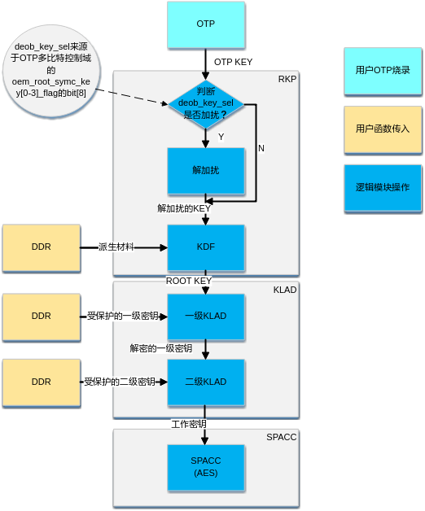

# 前言<a name="ZH-CN_TOPIC_0000002424349962"></a>

**产品版本<a name="section18702155413353"></a>**

与本文档相对应的产品版本如下。

<a name="table187251254193511"></a>
<table><thead align="left"><tr id="row13800185412357"><th class="cellrowborder" valign="top" width="31.31%" id="mcps1.1.3.1.1"><p id="p1680011544355"><a name="p1680011544355"></a><a name="p1680011544355"></a>产品名称</p>
</th>
<th class="cellrowborder" valign="top" width="68.69%" id="mcps1.1.3.1.2"><p id="p38006546351"><a name="p38006546351"></a><a name="p38006546351"></a>产品版本</p>
</th>
</tr>
</thead>
<tbody><tr id="row14800754183515"><td class="cellrowborder" valign="top" width="31.31%" headers="mcps1.1.3.1.1 "><p id="p680013548356"><a name="p680013548356"></a><a name="p680013548356"></a>SS928</p>
</td>
<td class="cellrowborder" valign="top" width="68.69%" headers="mcps1.1.3.1.2 "><p id="p14800145403519"><a name="p14800145403519"></a><a name="p14800145403519"></a>V100</p>
</td>
</tr>
<tr id="row1814825163714"><td class="cellrowborder" valign="top" width="31.31%" headers="mcps1.1.3.1.1 "><p id="p111491650373"><a name="p111491650373"></a><a name="p111491650373"></a>SS626</p>
</td>
<td class="cellrowborder" valign="top" width="68.69%" headers="mcps1.1.3.1.2 "><p id="p114975173716"><a name="p114975173716"></a><a name="p114975173716"></a>V100</p>
</td>
</tr>
<tr id="row203262171414"><td class="cellrowborder" valign="top" width="31.31%" headers="mcps1.1.3.1.1 "><p id="p8622349102117"><a name="p8622349102117"></a><a name="p8622349102117"></a>SS927</p>
</td>
<td class="cellrowborder" valign="top" width="68.69%" headers="mcps1.1.3.1.2 "><p id="p9185184311112"><a name="p9185184311112"></a><a name="p9185184311112"></a>V100</p>
</td>
</tr>
</tbody>
</table>

**读者对象<a name="section8711125463519"></a>**

本文档（本指南）主要适用于以下工程师：

-   技术支持工程师
-   软件开发工程师

**符号约定<a name="section27127546353"></a>**

在本文中可能出现下列标志，它们所代表的含义如下。

<a name="table18726165483514"></a>
<table><thead align="left"><tr id="row16800195493519"><th class="cellrowborder" valign="top" width="20.200000000000003%" id="mcps1.1.3.1.1"><p id="p178005548352"><a name="p178005548352"></a><a name="p178005548352"></a><strong id="b7800155433510"><a name="b7800155433510"></a><a name="b7800155433510"></a>符号</strong></p>
</th>
<th class="cellrowborder" valign="top" width="79.80000000000001%" id="mcps1.1.3.1.2"><p id="p2800105483516"><a name="p2800105483516"></a><a name="p2800105483516"></a><strong id="b1800554193519"><a name="b1800554193519"></a><a name="b1800554193519"></a>说明</strong></p>
</th>
</tr>
</thead>
<tbody><tr id="row880005423516"><td class="cellrowborder" valign="top" width="20.200000000000003%" headers="mcps1.1.3.1.1 "><p class="msonormal" id="p186mcpsimp"><a name="p186mcpsimp"></a><a name="p186mcpsimp"></a><a name="image103"></a><a name="image103"></a><span></span></p>
</td>
<td class="cellrowborder" valign="top" width="79.80000000000001%" headers="mcps1.1.3.1.2 "><p id="p58002541356"><a name="p58002541356"></a><a name="p58002541356"></a>表示如不避免则将会导致死亡或严重伤害的具有高等级风险的危害。</p>
</td>
</tr>
<tr id="row9800135483510"><td class="cellrowborder" valign="top" width="20.200000000000003%" headers="mcps1.1.3.1.1 "><p class="msonormal" id="p191mcpsimp"><a name="p191mcpsimp"></a><a name="p191mcpsimp"></a><a name="image104"></a><a name="image104"></a><span></span></p>
</td>
<td class="cellrowborder" valign="top" width="79.80000000000001%" headers="mcps1.1.3.1.2 "><p id="p3800145419357"><a name="p3800145419357"></a><a name="p3800145419357"></a>表示如不避免则可能导致死亡或严重伤害的具有中等级风险的危害。</p>
</td>
</tr>
<tr id="row1080055419355"><td class="cellrowborder" valign="top" width="20.200000000000003%" headers="mcps1.1.3.1.1 "><p class="msonormal" id="p196mcpsimp"><a name="p196mcpsimp"></a><a name="p196mcpsimp"></a><a name="image105"></a><a name="image105"></a><span></span></p>
</td>
<td class="cellrowborder" valign="top" width="79.80000000000001%" headers="mcps1.1.3.1.2 "><p id="p15801155433513"><a name="p15801155433513"></a><a name="p15801155433513"></a>表示如不避免则可能导致轻微或中度伤害的具有低等级风险的危害。</p>
</td>
</tr>
<tr id="row2801054103511"><td class="cellrowborder" valign="top" width="20.200000000000003%" headers="mcps1.1.3.1.1 "><p class="msonormal" id="p201mcpsimp"><a name="p201mcpsimp"></a><a name="p201mcpsimp"></a><a name="image106"></a><a name="image106"></a><span></span></p>
</td>
<td class="cellrowborder" valign="top" width="79.80000000000001%" headers="mcps1.1.3.1.2 "><p id="p128011954183510"><a name="p128011954183510"></a><a name="p128011954183510"></a>用于传递设备或环境安全警示信息。如不避免则可能会导致设备损坏、数据丢失、设备性能降低或其它不可预知的结果。</p>
<p id="p18010545352"><a name="p18010545352"></a><a name="p18010545352"></a>“须知”不涉及人身伤害。</p>
</td>
</tr>
<tr id="row17801145414351"><td class="cellrowborder" valign="top" width="20.200000000000003%" headers="mcps1.1.3.1.1 "><p class="msonormal" id="p207mcpsimp"><a name="p207mcpsimp"></a><a name="p207mcpsimp"></a><a name="image107"></a><a name="image107"></a><span></span></p>
</td>
<td class="cellrowborder" valign="top" width="79.80000000000001%" headers="mcps1.1.3.1.2 "><p id="p16801145418351"><a name="p16801145418351"></a><a name="p16801145418351"></a>对正文中重点信息的补充说明。</p>
<p id="p2801054163520"><a name="p2801054163520"></a><a name="p2801054163520"></a>“说明”不是安全警示信息，不涉及人身、设备及环境伤害信息。</p>
</td>
</tr>
</tbody>
</table>

**修改记录<a name="section2467512116410"></a>**

<a name="table256mcpsimp"></a>
<table><thead align="left"><tr id="row262mcpsimp"><th class="cellrowborder" valign="top" width="20.97%" id="mcps1.1.4.1.1"><p id="p264mcpsimp"><a name="p264mcpsimp"></a><a name="p264mcpsimp"></a><strong id="b265mcpsimp"><a name="b265mcpsimp"></a><a name="b265mcpsimp"></a>文档版本</strong></p>
</th>
<th class="cellrowborder" valign="top" width="26.029999999999998%" id="mcps1.1.4.1.2"><p id="p267mcpsimp"><a name="p267mcpsimp"></a><a name="p267mcpsimp"></a><strong id="b268mcpsimp"><a name="b268mcpsimp"></a><a name="b268mcpsimp"></a>发布日期</strong></p>
</th>
<th class="cellrowborder" valign="top" width="53%" id="mcps1.1.4.1.3"><p id="p270mcpsimp"><a name="p270mcpsimp"></a><a name="p270mcpsimp"></a><strong id="b271mcpsimp"><a name="b271mcpsimp"></a><a name="b271mcpsimp"></a>修改说明</strong></p>
</th>
</tr>
</thead>
<tbody><tr id="row280mcpsimp"><td class="cellrowborder" valign="top" width="20.97%" headers="mcps1.1.4.1.1 "><p id="p282mcpsimp"><a name="p282mcpsimp"></a><a name="p282mcpsimp"></a>00B01</p>
</td>
<td class="cellrowborder" valign="top" width="26.029999999999998%" headers="mcps1.1.4.1.2 "><p id="p284mcpsimp"><a name="p284mcpsimp"></a><a name="p284mcpsimp"></a>2025-09-15</p>
</td>
<td class="cellrowborder" valign="top" width="53%" headers="mcps1.1.4.1.3 "><p id="p286mcpsimp"><a name="p286mcpsimp"></a><a name="p286mcpsimp"></a>第1次临时版本发布。</p>
</td>
</tr>
</tbody>
</table>

# 概述<a name="ZH-CN_TOPIC_0000002424349970"></a>

SSxxxx SoC提供丰富的安全特性，包括一系列硬件、固件和软件，以支持客户构建安全可信的设备。主要的安全特性如下：

-   One Time Programmable（OTP），用于存储包括设备安全启动验签的RSA 公钥哈希、多组对称根密钥、SoC安全相关的各种控制信息，以及用户自定义数据等。
-   芯片支持基于OTP对称根密钥的三级密钥派生。支持对烧录到OTP的根密钥的加扰保护；密钥派生过程中所有的明文密钥软件不可见。
-   硬件真随机数。
-   非对称密码算法RSA模块。
-   支持多种通用Hash算法和对称密码算法的SPACC模块。
-   基于硬件可信根的安全启动：支持安全镜像逐级校验；支持镜像加密可选择；支持TEE/REE信任链分离；安全启动镜像和非安全启动镜像格式统一，即安全启动没有使能的情况下，非加密的安全启动镜像也可以正常启动。
-   支持ARM TrustZone，支持安全、非安全内存地址隔离。客户可构建TEE安全方案。
-   支持安全JTAG。

# OTP<a name="ZH-CN_TOPIC_0000002424190122"></a>


## 简介<a name="ZH-CN_TOPIC_0000002457828777"></a>

OTP是一种非易失性存储器，其主要特性是对应存储空间的内容由0写为1之后，或者写入后锁定，就不能再次更改。SSxxxx OTP 包含如下几大区域：

1.  存放SoC各种密钥的区域：包括存放安全启动的根公钥哈希值\(受限可读），存放保护多个对称密码算法根密钥。密钥区域一旦发起写入操作，自行锁定不可再更改。

    芯片可存放各组根公钥哈希值，用于安全启动校验。包括：芯片厂商根公钥哈希\(已预置），OEM根公钥哈希和第三方双签名根公钥哈希。客户可根据产品实际需要，选择合适的根公钥（通过OTP选择）。

    加解密根密钥：芯片预留4个OEM可烧写的对称密码根密钥OTP空间，oem\_root\_symc\_key0\~ oem\_root\_symc\_key3，OEM可以利用这里面的一个或者多个根密钥，分别派生出不同的密钥保护密钥和工作密钥。这些密钥区域可以通过对应的OTP烧写接口烧写，一旦写入，硬件自行锁定，不可更改。写入的内容也不能通过软件方式或JTAG接口读取得到。

    芯片预置一个芯片厂商TEE对称密码算法加解密的根密钥，用户可根据实际需要选择使用（通过OTP选择）。

2.  SoC重要特性/功能开关控制区域（含单bit控制区域和多bit控制区域）：SoC大多数重要的特性，都可以通过OTP来控制，以提高产品应用的灵活性。比如：安全启动使能，安全启动镜像是否加密，安全启动是否启动冗余备份，是否使能TEE，JTAG工作模式选择等等。特性/功能开关控制区域，在烧写好目标值之后，都可以选择将其锁定，避免后续非法篡改。

    **强烈建议客户在最终产品发布前，将所有的特性/功能开关位对应的值设置好，并且强制锁定！即使默认值满足要求，也要求锁定**。

3.  用户自定义区域：芯片集成了约25Kbit的用户自定义OTP区域，用以存放用户数据。

    用户自定义区域还包含了一个128bit的版本控制区域：版本控制区域用于存放重要版本标识，防止版本回滚攻击。即防止攻击者利用有安全漏洞的老的合法镜像重新升级，实现重放攻击。版本控制区域不能锁定，每一个控制位都只能由0写到1，一旦写入1后，便不可再更改（one way 模式）。

    在SSxxxx SDK包中，提供了OTP相关的读写接口。详细请参考本文“[SSxxxx OTP字段定义](#ZH-CN_TOPIC_0000002457868877)  ”以及文档《OTP API 参考》。

    > **须知：** 
    >所有的OTP控制位，无论默认值是否满足实际应用，请全部重新烧写锁定，保证设备安全。

## SSxxxx OTP字段定义<a name="ZH-CN_TOPIC_0000002457868877"></a>


### OTP位域属性说明<a name="ZH-CN_TOPIC_0000002424190150"></a>


#### LOCK属性说明<a name="ZH-CN_TOPIC_0000002457828801"></a>

-   **Oneway属性**：具有此属性的位域未烧写为1的bit都可以在下一次继续烧写，直到所有bit都烧为1；lock使能位不会锁定此属性的位域；
-   **lockable属性**：lockable属性的相关位域在锁定前与oneway属性一致，烧写对应的lock位后，即使没烧写过的bit也不能再次烧写；**建议lockable属性的位域，烧写值后对对应的位域进行锁定，防止被修改。**
-   **wrlock属性**：只要执行过写操作，相应的位域即锁定，不能再做更改。

#### Load shadow属性说明<a name="ZH-CN_TOPIC_0000002457868889"></a>

-   芯片上电硬复位后OTP的值会自动加载到对应的寄存器（shadow寄存器）；每次烧写OTP后，必须重新上下电才能从shadow寄存器读到刷新后的值；
-   OTP位域无对应的shadow寄存器。

### 密钥区域<a name="ZH-CN_TOPIC_0000002457828785"></a>

<a name="table1869mcpsimp"></a>
<table><thead align="left"><tr id="row1877mcpsimp"><th class="cellrowborder" valign="top" width="28.000000000000004%" id="mcps1.1.6.1.1"><p id="p1879mcpsimp"><a name="p1879mcpsimp"></a><a name="p1879mcpsimp"></a>字段名称</p>
</th>
<th class="cellrowborder" valign="top" width="9%" id="mcps1.1.6.1.2"><p id="p1881mcpsimp"><a name="p1881mcpsimp"></a><a name="p1881mcpsimp"></a>位宽</p>
</th>
<th class="cellrowborder" valign="top" width="15%" id="mcps1.1.6.1.3"><p id="p1883mcpsimp"><a name="p1883mcpsimp"></a><a name="p1883mcpsimp"></a>load shadow属性</p>
</th>
<th class="cellrowborder" valign="top" width="9%" id="mcps1.1.6.1.4"><p id="p1885mcpsimp"><a name="p1885mcpsimp"></a><a name="p1885mcpsimp"></a>Lock属性</p>
</th>
<th class="cellrowborder" valign="top" width="39%" id="mcps1.1.6.1.5"><p id="p1887mcpsimp"><a name="p1887mcpsimp"></a><a name="p1887mcpsimp"></a>说明</p>
</th>
</tr>
</thead>
<tbody><tr id="row1889mcpsimp"><td class="cellrowborder" valign="top" width="28.000000000000004%" headers="mcps1.1.6.1.1 "><p id="p1891mcpsimp"><a name="p1891mcpsimp"></a><a name="p1891mcpsimp"></a>oem_root_public_key_sha256</p>
</td>
<td class="cellrowborder" valign="top" width="9%" headers="mcps1.1.6.1.2 "><p id="p1893mcpsimp"><a name="p1893mcpsimp"></a><a name="p1893mcpsimp"></a>256</p>
</td>
<td class="cellrowborder" valign="top" width="15%" headers="mcps1.1.6.1.3 "><p id="p1895mcpsimp"><a name="p1895mcpsimp"></a><a name="p1895mcpsimp"></a>N</p>
</td>
<td class="cellrowborder" valign="top" width="9%" headers="mcps1.1.6.1.4 "><p id="p1897mcpsimp"><a name="p1897mcpsimp"></a><a name="p1897mcpsimp"></a>wrlock</p>
</td>
<td class="cellrowborder" valign="top" width="39%" headers="mcps1.1.6.1.5 "><p id="p1899mcpsimp"><a name="p1899mcpsimp"></a><a name="p1899mcpsimp"></a>OEM根公钥sha256哈希值。用于安全启动信任链校验</p>
</td>
</tr>
<tr id="row1900mcpsimp"><td class="cellrowborder" valign="top" width="28.000000000000004%" headers="mcps1.1.6.1.1 "><p id="p1902mcpsimp"><a name="p1902mcpsimp"></a><a name="p1902mcpsimp"></a>tp_root_public_key_sha256</p>
</td>
<td class="cellrowborder" valign="top" width="9%" headers="mcps1.1.6.1.2 "><p id="p1904mcpsimp"><a name="p1904mcpsimp"></a><a name="p1904mcpsimp"></a>256</p>
</td>
<td class="cellrowborder" valign="top" width="15%" headers="mcps1.1.6.1.3 "><p id="p1906mcpsimp"><a name="p1906mcpsimp"></a><a name="p1906mcpsimp"></a>N</p>
</td>
<td class="cellrowborder" valign="top" width="9%" headers="mcps1.1.6.1.4 "><p id="p1908mcpsimp"><a name="p1908mcpsimp"></a><a name="p1908mcpsimp"></a>wrlock</p>
</td>
<td class="cellrowborder" valign="top" width="39%" headers="mcps1.1.6.1.5 "><p id="p1910mcpsimp"><a name="p1910mcpsimp"></a><a name="p1910mcpsimp"></a>第三方根公钥sha256哈希值（用于安全启动双签名）</p>
</td>
</tr>
<tr id="row1911mcpsimp"><td class="cellrowborder" valign="top" width="28.000000000000004%" headers="mcps1.1.6.1.1 "><p id="p1913mcpsimp"><a name="p1913mcpsimp"></a><a name="p1913mcpsimp"></a>oem_root_symc_key0</p>
</td>
<td class="cellrowborder" valign="top" width="9%" headers="mcps1.1.6.1.2 "><p id="p1915mcpsimp"><a name="p1915mcpsimp"></a><a name="p1915mcpsimp"></a>128</p>
</td>
<td class="cellrowborder" valign="top" width="15%" headers="mcps1.1.6.1.3 "><p id="p1917mcpsimp"><a name="p1917mcpsimp"></a><a name="p1917mcpsimp"></a>N</p>
</td>
<td class="cellrowborder" valign="top" width="9%" headers="mcps1.1.6.1.4 "><p id="p1919mcpsimp"><a name="p1919mcpsimp"></a><a name="p1919mcpsimp"></a>wrlock</p>
</td>
<td class="cellrowborder" valign="top" width="39%" headers="mcps1.1.6.1.5 "><p id="p1921mcpsimp"><a name="p1921mcpsimp"></a><a name="p1921mcpsimp"></a>对称算法（AES）根密钥KEY0。软件不可读取</p>
</td>
</tr>
<tr id="row1922mcpsimp"><td class="cellrowborder" valign="top" width="28.000000000000004%" headers="mcps1.1.6.1.1 "><p id="p1924mcpsimp"><a name="p1924mcpsimp"></a><a name="p1924mcpsimp"></a>oem_root_symc_key1</p>
</td>
<td class="cellrowborder" valign="top" width="9%" headers="mcps1.1.6.1.2 "><p id="p1926mcpsimp"><a name="p1926mcpsimp"></a><a name="p1926mcpsimp"></a>128</p>
</td>
<td class="cellrowborder" valign="top" width="15%" headers="mcps1.1.6.1.3 "><p id="p1928mcpsimp"><a name="p1928mcpsimp"></a><a name="p1928mcpsimp"></a>N</p>
</td>
<td class="cellrowborder" valign="top" width="9%" headers="mcps1.1.6.1.4 "><p id="p1930mcpsimp"><a name="p1930mcpsimp"></a><a name="p1930mcpsimp"></a>wrlock</p>
</td>
<td class="cellrowborder" valign="top" width="39%" headers="mcps1.1.6.1.5 "><p id="p1932mcpsimp"><a name="p1932mcpsimp"></a><a name="p1932mcpsimp"></a>对称算法（AES）根密钥KEY1。软件不可读取</p>
</td>
</tr>
<tr id="row1933mcpsimp"><td class="cellrowborder" valign="top" width="28.000000000000004%" headers="mcps1.1.6.1.1 "><p id="p1935mcpsimp"><a name="p1935mcpsimp"></a><a name="p1935mcpsimp"></a>oem_root_symc_key2</p>
</td>
<td class="cellrowborder" valign="top" width="9%" headers="mcps1.1.6.1.2 "><p id="p1937mcpsimp"><a name="p1937mcpsimp"></a><a name="p1937mcpsimp"></a>128</p>
</td>
<td class="cellrowborder" valign="top" width="15%" headers="mcps1.1.6.1.3 "><p id="p1939mcpsimp"><a name="p1939mcpsimp"></a><a name="p1939mcpsimp"></a>N</p>
</td>
<td class="cellrowborder" valign="top" width="9%" headers="mcps1.1.6.1.4 "><p id="p1941mcpsimp"><a name="p1941mcpsimp"></a><a name="p1941mcpsimp"></a>wrlock</p>
</td>
<td class="cellrowborder" valign="top" width="39%" headers="mcps1.1.6.1.5 "><p id="p1943mcpsimp"><a name="p1943mcpsimp"></a><a name="p1943mcpsimp"></a>对称算法（AES）根密钥KEY2。软件不可读取</p>
</td>
</tr>
<tr id="row1944mcpsimp"><td class="cellrowborder" valign="top" width="28.000000000000004%" headers="mcps1.1.6.1.1 "><p id="p1946mcpsimp"><a name="p1946mcpsimp"></a><a name="p1946mcpsimp"></a>oem_root_symc_key3</p>
</td>
<td class="cellrowborder" valign="top" width="9%" headers="mcps1.1.6.1.2 "><p id="p1948mcpsimp"><a name="p1948mcpsimp"></a><a name="p1948mcpsimp"></a>128</p>
</td>
<td class="cellrowborder" valign="top" width="15%" headers="mcps1.1.6.1.3 "><p id="p1950mcpsimp"><a name="p1950mcpsimp"></a><a name="p1950mcpsimp"></a>N</p>
</td>
<td class="cellrowborder" valign="top" width="9%" headers="mcps1.1.6.1.4 "><p id="p1952mcpsimp"><a name="p1952mcpsimp"></a><a name="p1952mcpsimp"></a>wrlock</p>
</td>
<td class="cellrowborder" valign="top" width="39%" headers="mcps1.1.6.1.5 "><p id="p1954mcpsimp"><a name="p1954mcpsimp"></a><a name="p1954mcpsimp"></a>对称算法（AES）根密钥KEY3。软件不可读取</p>
</td>
</tr>
</tbody>
</table>

密钥区域可以通过下面OTP API接口访问：

```
td_s32 ot_mpi_otp_burn_product_pv(const ot_otp_burn_pv_item *pv, td_u32 num);  td_s32 ot_mpi_otp_read_product_pv(ot_otp_burn_pv_item *pv, td_u32 num);
```

详细请参考《OTP API参考》

密钥区域的内容不可读取，因此ot\_mpi\_otp\_read\_product\_pv接口只是返回对应区域的锁定状态（已经锁定的区域，不可再写），无法获取该区域的内容。

### 单比特控制区域<a name="ZH-CN_TOPIC_0000002424349982"></a>

<a name="table1960mcpsimp"></a>
<table><thead align="left"><tr id="row1968mcpsimp"><th class="cellrowborder" valign="top" width="21.21212121212121%" id="mcps1.1.6.1.1"><p id="p1970mcpsimp"><a name="p1970mcpsimp"></a><a name="p1970mcpsimp"></a>字段名称</p>
</th>
<th class="cellrowborder" valign="top" width="8.08080808080808%" id="mcps1.1.6.1.2"><p id="p1972mcpsimp"><a name="p1972mcpsimp"></a><a name="p1972mcpsimp"></a>位宽</p>
</th>
<th class="cellrowborder" valign="top" width="14.14141414141414%" id="mcps1.1.6.1.3"><p id="p1974mcpsimp"><a name="p1974mcpsimp"></a><a name="p1974mcpsimp"></a>load shadow属性</p>
</th>
<th class="cellrowborder" valign="top" width="11.111111111111112%" id="mcps1.1.6.1.4"><p id="p1976mcpsimp"><a name="p1976mcpsimp"></a><a name="p1976mcpsimp"></a>Lock属性</p>
</th>
<th class="cellrowborder" valign="top" width="45.45454545454545%" id="mcps1.1.6.1.5"><p id="p1978mcpsimp"><a name="p1978mcpsimp"></a><a name="p1978mcpsimp"></a>说明</p>
</th>
</tr>
</thead>
<tbody><tr id="row1980mcpsimp"><td class="cellrowborder" valign="top" width="21.21212121212121%" headers="mcps1.1.6.1.1 "><p id="p1982mcpsimp"><a name="p1982mcpsimp"></a><a name="p1982mcpsimp"></a>tee_owner_sel</p>
</td>
<td class="cellrowborder" valign="top" width="8.08080808080808%" headers="mcps1.1.6.1.2 "><p id="p1984mcpsimp"><a name="p1984mcpsimp"></a><a name="p1984mcpsimp"></a>1</p>
</td>
<td class="cellrowborder" valign="top" width="14.14141414141414%" headers="mcps1.1.6.1.3 "><p id="p1986mcpsimp"><a name="p1986mcpsimp"></a><a name="p1986mcpsimp"></a>Y</p>
</td>
<td class="cellrowborder" valign="top" width="11.111111111111112%" headers="mcps1.1.6.1.4 "><p id="p1988mcpsimp"><a name="p1988mcpsimp"></a><a name="p1988mcpsimp"></a>lockable</p>
</td>
<td class="cellrowborder" valign="top" width="45.45454545454545%" headers="mcps1.1.6.1.5 "><p id="p1990mcpsimp"><a name="p1990mcpsimp"></a><a name="p1990mcpsimp"></a>在TEE使能时用于选择root public key、对称密钥、TEE侧调试的功能jtag key的owner（芯片厂商/OEM)；TEE不使能时此位域无效。</p>
<p id="p1991mcpsimp"><a name="p1991mcpsimp"></a><a name="p1991mcpsimp"></a>0：OEM (oem_root_public_key_sha256 + oem_root_symc_key0/1/2/3)</p>
<p id="p1992mcpsimp"><a name="p1992mcpsimp"></a><a name="p1992mcpsimp"></a>1：芯片厂商</p>
</td>
</tr>
<tr id="row1993mcpsimp"><td class="cellrowborder" valign="top" width="21.21212121212121%" headers="mcps1.1.6.1.1 "><p id="p1995mcpsimp"><a name="p1995mcpsimp"></a><a name="p1995mcpsimp"></a>oem_rk_deob_en</p>
</td>
<td class="cellrowborder" valign="top" width="8.08080808080808%" headers="mcps1.1.6.1.2 "><p id="p1997mcpsimp"><a name="p1997mcpsimp"></a><a name="p1997mcpsimp"></a>1</p>
</td>
<td class="cellrowborder" valign="top" width="14.14141414141414%" headers="mcps1.1.6.1.3 "><p id="p1999mcpsimp"><a name="p1999mcpsimp"></a><a name="p1999mcpsimp"></a>Y</p>
</td>
<td class="cellrowborder" valign="top" width="11.111111111111112%" headers="mcps1.1.6.1.4 "><p id="p2001mcpsimp"><a name="p2001mcpsimp"></a><a name="p2001mcpsimp"></a>lockable</p>
</td>
<td class="cellrowborder" valign="top" width="45.45454545454545%" headers="mcps1.1.6.1.5 "><p id="p2003mcpsimp"><a name="p2003mcpsimp"></a><a name="p2003mcpsimp"></a>芯片支持对OTP对称根密钥进行混淆保护，此位域用于使能OEM_ROOTKEY的解混淆。</p>
<p id="p2004mcpsimp"><a name="p2004mcpsimp"></a><a name="p2004mcpsimp"></a>0：关闭；</p>
<p id="p2005mcpsimp"><a name="p2005mcpsimp"></a><a name="p2005mcpsimp"></a>1：使能。</p>
</td>
</tr>
<tr id="row2006mcpsimp"><td class="cellrowborder" valign="top" width="21.21212121212121%" headers="mcps1.1.6.1.1 "><p id="p2008mcpsimp"><a name="p2008mcpsimp"></a><a name="p2008mcpsimp"></a>jtag_key_sel0</p>
</td>
<td class="cellrowborder" valign="top" width="8.08080808080808%" headers="mcps1.1.6.1.2 "><p id="p2010mcpsimp"><a name="p2010mcpsimp"></a><a name="p2010mcpsimp"></a>1</p>
</td>
<td class="cellrowborder" valign="top" width="14.14141414141414%" headers="mcps1.1.6.1.3 "><p id="p2012mcpsimp"><a name="p2012mcpsimp"></a><a name="p2012mcpsimp"></a>Y</p>
</td>
<td class="cellrowborder" valign="top" width="11.111111111111112%" headers="mcps1.1.6.1.4 "><p id="p2014mcpsimp"><a name="p2014mcpsimp"></a><a name="p2014mcpsimp"></a>lockable</p>
</td>
<td class="cellrowborder" rowspan="2" valign="top" width="45.45454545454545%" headers="mcps1.1.6.1.5 "><p id="p2016mcpsimp"><a name="p2016mcpsimp"></a><a name="p2016mcpsimp"></a>功能JTAG password模式下的根密钥选择控制。</p>
<p id="p2017mcpsimp"><a name="p2017mcpsimp"></a><a name="p2017mcpsimp"></a>[jtag_key_sel1，jtag_key_sel0]:</p>
<p id="p2018mcpsimp"><a name="p2018mcpsimp"></a><a name="p2018mcpsimp"></a>0x0：选择oem_root_symc_key0作为JTAG root key；</p>
<p id="p2019mcpsimp"><a name="p2019mcpsimp"></a><a name="p2019mcpsimp"></a>0x1：选择oem_root_symc_key1作为JTAG root key；</p>
<p id="p2020mcpsimp"><a name="p2020mcpsimp"></a><a name="p2020mcpsimp"></a>0x2: 选择oem_root_symc_key2作为JTAG root key；</p>
<p id="p2021mcpsimp"><a name="p2021mcpsimp"></a><a name="p2021mcpsimp"></a>0x3：选择oem_root_symc_key3作为JTAG root key。</p>
</td>
</tr>
<tr id="row2022mcpsimp"><td class="cellrowborder" valign="top" headers="mcps1.1.6.1.1 "><p id="p2024mcpsimp"><a name="p2024mcpsimp"></a><a name="p2024mcpsimp"></a>jtag_key_sel1</p>
</td>
<td class="cellrowborder" valign="top" headers="mcps1.1.6.1.2 "><p id="p2026mcpsimp"><a name="p2026mcpsimp"></a><a name="p2026mcpsimp"></a>1</p>
</td>
<td class="cellrowborder" valign="top" headers="mcps1.1.6.1.3 "><p id="p2028mcpsimp"><a name="p2028mcpsimp"></a><a name="p2028mcpsimp"></a>Y</p>
</td>
<td class="cellrowborder" valign="top" headers="mcps1.1.6.1.4 "><p id="p2030mcpsimp"><a name="p2030mcpsimp"></a><a name="p2030mcpsimp"></a>lockable</p>
</td>
</tr>
<tr id="row2031mcpsimp"><td class="cellrowborder" valign="top" width="21.21212121212121%" headers="mcps1.1.6.1.1 "><p id="p2033mcpsimp"><a name="p2033mcpsimp"></a><a name="p2033mcpsimp"></a>sec_ds_enable</p>
</td>
<td class="cellrowborder" valign="top" width="8.08080808080808%" headers="mcps1.1.6.1.2 "><p id="p2035mcpsimp"><a name="p2035mcpsimp"></a><a name="p2035mcpsimp"></a>1</p>
</td>
<td class="cellrowborder" valign="top" width="14.14141414141414%" headers="mcps1.1.6.1.3 "><p id="p2037mcpsimp"><a name="p2037mcpsimp"></a><a name="p2037mcpsimp"></a>Y</p>
</td>
<td class="cellrowborder" valign="top" width="11.111111111111112%" headers="mcps1.1.6.1.4 "><p id="p2039mcpsimp"><a name="p2039mcpsimp"></a><a name="p2039mcpsimp"></a>lockable</p>
</td>
<td class="cellrowborder" valign="top" width="45.45454545454545%" headers="mcps1.1.6.1.5 "><p id="p2041mcpsimp"><a name="p2041mcpsimp"></a><a name="p2041mcpsimp"></a>sec_subsys的dsensor使能控制，使能后可增强芯片时钟、电压、电磁的防攻击能力，建议TEE使能的话同时使能该功能。</p>
<p id="p2042mcpsimp"><a name="p2042mcpsimp"></a><a name="p2042mcpsimp"></a>0：关闭sec_subsys的dsensor；</p>
<p id="p2043mcpsimp"><a name="p2043mcpsimp"></a><a name="p2043mcpsimp"></a>1：使能sec_subsys的dsensor。</p>
</td>
</tr>
<tr id="row2044mcpsimp"><td class="cellrowborder" valign="top" width="21.21212121212121%" headers="mcps1.1.6.1.1 "><p id="p2046mcpsimp"><a name="p2046mcpsimp"></a><a name="p2046mcpsimp"></a>acpu_ds_enable</p>
</td>
<td class="cellrowborder" valign="top" width="8.08080808080808%" headers="mcps1.1.6.1.2 "><p id="p2048mcpsimp"><a name="p2048mcpsimp"></a><a name="p2048mcpsimp"></a>1</p>
</td>
<td class="cellrowborder" valign="top" width="14.14141414141414%" headers="mcps1.1.6.1.3 "><p id="p2050mcpsimp"><a name="p2050mcpsimp"></a><a name="p2050mcpsimp"></a>Y</p>
</td>
<td class="cellrowborder" valign="top" width="11.111111111111112%" headers="mcps1.1.6.1.4 "><p id="p2052mcpsimp"><a name="p2052mcpsimp"></a><a name="p2052mcpsimp"></a>lockable</p>
</td>
<td class="cellrowborder" valign="top" width="45.45454545454545%" headers="mcps1.1.6.1.5 "><p id="p2054mcpsimp"><a name="p2054mcpsimp"></a><a name="p2054mcpsimp"></a>acpu subsys的dsensor使能控制，使能后可增强芯片时钟、电压、电磁的防攻击能力，建议TEE使能的话同时使能该功能。</p>
<p id="p2055mcpsimp"><a name="p2055mcpsimp"></a><a name="p2055mcpsimp"></a>0：关闭acpu subsys的dsensor；</p>
<p id="p2056mcpsimp"><a name="p2056mcpsimp"></a><a name="p2056mcpsimp"></a>1：使能acpu subsys的dsensor。</p>
</td>
</tr>
<tr id="row2057mcpsimp"><td class="cellrowborder" valign="top" width="21.21212121212121%" headers="mcps1.1.6.1.1 "><p id="p2059mcpsimp"><a name="p2059mcpsimp"></a><a name="p2059mcpsimp"></a>uboot_redundance</p>
</td>
<td class="cellrowborder" valign="top" width="8.08080808080808%" headers="mcps1.1.6.1.2 "><p id="p2061mcpsimp"><a name="p2061mcpsimp"></a><a name="p2061mcpsimp"></a>1</p>
</td>
<td class="cellrowborder" valign="top" width="14.14141414141414%" headers="mcps1.1.6.1.3 "><p id="p2063mcpsimp"><a name="p2063mcpsimp"></a><a name="p2063mcpsimp"></a>Y</p>
</td>
<td class="cellrowborder" valign="top" width="11.111111111111112%" headers="mcps1.1.6.1.4 "><p id="p2065mcpsimp"><a name="p2065mcpsimp"></a><a name="p2065mcpsimp"></a>lockable</p>
</td>
<td class="cellrowborder" valign="top" width="45.45454545454545%" headers="mcps1.1.6.1.5 "><p id="p2067mcpsimp"><a name="p2067mcpsimp"></a><a name="p2067mcpsimp"></a>uboot冗余备份启动使能模式标志。</p>
<p id="p2068mcpsimp"><a name="p2068mcpsimp"></a><a name="p2068mcpsimp"></a>0：关闭；</p>
<p id="p2069mcpsimp"><a name="p2069mcpsimp"></a><a name="p2069mcpsimp"></a>1：使能。</p>
</td>
</tr>
<tr id="row2070mcpsimp"><td class="cellrowborder" valign="top" width="21.21212121212121%" headers="mcps1.1.6.1.1 "><p id="p2072mcpsimp"><a name="p2072mcpsimp"></a><a name="p2072mcpsimp"></a>otp_pcie_disable</p>
</td>
<td class="cellrowborder" valign="top" width="8.08080808080808%" headers="mcps1.1.6.1.2 "><p id="p2074mcpsimp"><a name="p2074mcpsimp"></a><a name="p2074mcpsimp"></a>1</p>
</td>
<td class="cellrowborder" valign="top" width="14.14141414141414%" headers="mcps1.1.6.1.3 "><p id="p2076mcpsimp"><a name="p2076mcpsimp"></a><a name="p2076mcpsimp"></a>Y</p>
</td>
<td class="cellrowborder" valign="top" width="11.111111111111112%" headers="mcps1.1.6.1.4 "><p id="p2078mcpsimp"><a name="p2078mcpsimp"></a><a name="p2078mcpsimp"></a>lockable</p>
</td>
<td class="cellrowborder" valign="top" width="45.45454545454545%" headers="mcps1.1.6.1.5 "><p id="p2080mcpsimp"><a name="p2080mcpsimp"></a><a name="p2080mcpsimp"></a>PCIE disable控制信号，用来开关PCIE模块。</p>
<p id="p2081mcpsimp"><a name="p2081mcpsimp"></a><a name="p2081mcpsimp"></a>0：使能PCIE；</p>
<p id="p2082mcpsimp"><a name="p2082mcpsimp"></a><a name="p2082mcpsimp"></a>1：关闭PCIE。</p>
</td>
</tr>
<tr id="row2083mcpsimp"><td class="cellrowborder" valign="top" width="21.21212121212121%" headers="mcps1.1.6.1.1 "><p id="p2085mcpsimp"><a name="p2085mcpsimp"></a><a name="p2085mcpsimp"></a>otp_pcie_ep_boot_disable</p>
</td>
<td class="cellrowborder" valign="top" width="8.08080808080808%" headers="mcps1.1.6.1.2 "><p id="p2087mcpsimp"><a name="p2087mcpsimp"></a><a name="p2087mcpsimp"></a>1</p>
</td>
<td class="cellrowborder" valign="top" width="14.14141414141414%" headers="mcps1.1.6.1.3 "><p id="p2089mcpsimp"><a name="p2089mcpsimp"></a><a name="p2089mcpsimp"></a>Y</p>
</td>
<td class="cellrowborder" valign="top" width="11.111111111111112%" headers="mcps1.1.6.1.4 "><p id="p2091mcpsimp"><a name="p2091mcpsimp"></a><a name="p2091mcpsimp"></a>lockable</p>
</td>
<td class="cellrowborder" valign="top" width="45.45454545454545%" headers="mcps1.1.6.1.5 "><p id="p2093mcpsimp"><a name="p2093mcpsimp"></a><a name="p2093mcpsimp"></a>PCIE 从启动disable控制信号。</p>
<p id="p2094mcpsimp"><a name="p2094mcpsimp"></a><a name="p2094mcpsimp"></a>0：使能PCIE从启动模式；</p>
<p id="p2095mcpsimp"><a name="p2095mcpsimp"></a><a name="p2095mcpsimp"></a>1：关闭PCIE从启动模式。</p>
</td>
</tr>
<tr id="row2096mcpsimp"><td class="cellrowborder" valign="top" width="21.21212121212121%" headers="mcps1.1.6.1.1 "><p id="p2098mcpsimp"><a name="p2098mcpsimp"></a><a name="p2098mcpsimp"></a>bload_dec_en</p>
</td>
<td class="cellrowborder" valign="top" width="8.08080808080808%" headers="mcps1.1.6.1.2 "><p id="p2100mcpsimp"><a name="p2100mcpsimp"></a><a name="p2100mcpsimp"></a>1</p>
</td>
<td class="cellrowborder" valign="top" width="14.14141414141414%" headers="mcps1.1.6.1.3 "><p id="p2102mcpsimp"><a name="p2102mcpsimp"></a><a name="p2102mcpsimp"></a>Y</p>
</td>
<td class="cellrowborder" valign="top" width="11.111111111111112%" headers="mcps1.1.6.1.4 "><p id="p2104mcpsimp"><a name="p2104mcpsimp"></a><a name="p2104mcpsimp"></a>lockable</p>
</td>
<td class="cellrowborder" valign="top" width="45.45454545454545%" headers="mcps1.1.6.1.5 "><p id="p2106mcpsimp"><a name="p2106mcpsimp"></a><a name="p2106mcpsimp"></a>安全启动的bootloader镜像是否解密。</p>
<p id="p2107mcpsimp"><a name="p2107mcpsimp"></a><a name="p2107mcpsimp"></a>0: 是否解密bootloader取决于镜像中的Boot_Enc_Flag标志；</p>
<p id="p2108mcpsimp"><a name="p2108mcpsimp"></a><a name="p2108mcpsimp"></a>1: 解密bootloader。</p>
</td>
</tr>
<tr id="row2109mcpsimp"><td class="cellrowborder" valign="top" width="21.21212121212121%" headers="mcps1.1.6.1.1 "><p id="p2111mcpsimp"><a name="p2111mcpsimp"></a><a name="p2111mcpsimp"></a>reserved_flag</p>
</td>
<td class="cellrowborder" valign="top" width="8.08080808080808%" headers="mcps1.1.6.1.2 "><p id="p2113mcpsimp"><a name="p2113mcpsimp"></a><a name="p2113mcpsimp"></a>17</p>
</td>
<td class="cellrowborder" valign="top" width="14.14141414141414%" headers="mcps1.1.6.1.3 "><p id="p2115mcpsimp"><a name="p2115mcpsimp"></a><a name="p2115mcpsimp"></a>Y</p>
</td>
<td class="cellrowborder" valign="top" width="11.111111111111112%" headers="mcps1.1.6.1.4 "><p id="p2117mcpsimp"><a name="p2117mcpsimp"></a><a name="p2117mcpsimp"></a>lockable</p>
</td>
<td class="cellrowborder" valign="top" width="45.45454545454545%" headers="mcps1.1.6.1.5 "><p id="p2119mcpsimp"><a name="p2119mcpsimp"></a><a name="p2119mcpsimp"></a>保留标记位，预留自定义用。</p>
</td>
</tr>
</tbody>
</table>

单比特控制的区域可以通过下面OTP API接口访问：

```
td_s32 ot_mpi_otp_burn_product_pv(const ot_otp_burn_pv_item *pv, td_u32 num);  td_s32 ot_mpi_otp_read_product_pv(ot_otp_burn_pv_item *pv, td_u32 num);
```

详细请参考《OTP API参考》

单比特控制的区域，OTP对应的值，会在其对应的shadow寄存器中体现出来。通过ot\_mpi\_otp\_read\_product\_pv接口只能返回该控制位的锁定状态（已经锁定的位置，不可再写），不能直接获得该控制位的值。

### 多比特控制区域<a name="ZH-CN_TOPIC_0000002424349994"></a>

<a name="table2125mcpsimp"></a>
<table><thead align="left"><tr id="row2133mcpsimp"><th class="cellrowborder" valign="top" width="30.303030303030305%" id="mcps1.1.6.1.1"><p id="p2135mcpsimp"><a name="p2135mcpsimp"></a><a name="p2135mcpsimp"></a>字段名称</p>
</th>
<th class="cellrowborder" valign="top" width="8.08080808080808%" id="mcps1.1.6.1.2"><p id="p2137mcpsimp"><a name="p2137mcpsimp"></a><a name="p2137mcpsimp"></a>位宽</p>
</th>
<th class="cellrowborder" valign="top" width="13.13131313131313%" id="mcps1.1.6.1.3"><p id="p2139mcpsimp"><a name="p2139mcpsimp"></a><a name="p2139mcpsimp"></a>load shadow属性</p>
</th>
<th class="cellrowborder" valign="top" width="11.111111111111112%" id="mcps1.1.6.1.4"><p id="p2141mcpsimp"><a name="p2141mcpsimp"></a><a name="p2141mcpsimp"></a>Lock属性</p>
</th>
<th class="cellrowborder" valign="top" width="37.37373737373737%" id="mcps1.1.6.1.5"><p id="p2143mcpsimp"><a name="p2143mcpsimp"></a><a name="p2143mcpsimp"></a>说明</p>
</th>
</tr>
</thead>
<tbody><tr id="row2145mcpsimp"><td class="cellrowborder" valign="top" width="30.303030303030305%" headers="mcps1.1.6.1.1 "><p id="p2147mcpsimp"><a name="p2147mcpsimp"></a><a name="p2147mcpsimp"></a>update_from_uart_disable</p>
</td>
<td class="cellrowborder" valign="top" width="8.08080808080808%" headers="mcps1.1.6.1.2 "><p id="p2149mcpsimp"><a name="p2149mcpsimp"></a><a name="p2149mcpsimp"></a>1</p>
</td>
<td class="cellrowborder" valign="top" width="13.13131313131313%" headers="mcps1.1.6.1.3 "><p id="p2151mcpsimp"><a name="p2151mcpsimp"></a><a name="p2151mcpsimp"></a>Y</p>
</td>
<td class="cellrowborder" valign="top" width="11.111111111111112%" headers="mcps1.1.6.1.4 "><p id="p2153mcpsimp"><a name="p2153mcpsimp"></a><a name="p2153mcpsimp"></a>oneway</p>
</td>
<td class="cellrowborder" valign="top" width="37.37373737373737%" headers="mcps1.1.6.1.5 "><p id="p2155mcpsimp"><a name="p2155mcpsimp"></a><a name="p2155mcpsimp"></a>标志是否可以从UART升级。</p>
<p id="p2156mcpsimp"><a name="p2156mcpsimp"></a><a name="p2156mcpsimp"></a>0：可以从UART升级；</p>
<p id="p2157mcpsimp"><a name="p2157mcpsimp"></a><a name="p2157mcpsimp"></a>1：禁止从UART升级。</p>
</td>
</tr>
<tr id="row2158mcpsimp"><td class="cellrowborder" valign="top" width="30.303030303030305%" headers="mcps1.1.6.1.1 "><p id="p2160mcpsimp"><a name="p2160mcpsimp"></a><a name="p2160mcpsimp"></a>update_from_sdio_disable</p>
</td>
<td class="cellrowborder" valign="top" width="8.08080808080808%" headers="mcps1.1.6.1.2 "><p id="p2162mcpsimp"><a name="p2162mcpsimp"></a><a name="p2162mcpsimp"></a>1</p>
</td>
<td class="cellrowborder" valign="top" width="13.13131313131313%" headers="mcps1.1.6.1.3 "><p id="p2164mcpsimp"><a name="p2164mcpsimp"></a><a name="p2164mcpsimp"></a>Y</p>
</td>
<td class="cellrowborder" valign="top" width="11.111111111111112%" headers="mcps1.1.6.1.4 "><p id="p2166mcpsimp"><a name="p2166mcpsimp"></a><a name="p2166mcpsimp"></a>oneway</p>
</td>
<td class="cellrowborder" valign="top" width="37.37373737373737%" headers="mcps1.1.6.1.5 "><p id="p2168mcpsimp"><a name="p2168mcpsimp"></a><a name="p2168mcpsimp"></a>标志是否可以从SDIO升级。</p>
<p id="p2169mcpsimp"><a name="p2169mcpsimp"></a><a name="p2169mcpsimp"></a>0：可以从SDIO升级；</p>
<p id="p2170mcpsimp"><a name="p2170mcpsimp"></a><a name="p2170mcpsimp"></a>1：禁止从SDIO升级。</p>
</td>
</tr>
<tr id="row2171mcpsimp"><td class="cellrowborder" valign="top" width="30.303030303030305%" headers="mcps1.1.6.1.1 "><p id="p2173mcpsimp"><a name="p2173mcpsimp"></a><a name="p2173mcpsimp"></a>update_from_usbdev_disable</p>
</td>
<td class="cellrowborder" valign="top" width="8.08080808080808%" headers="mcps1.1.6.1.2 "><p id="p2175mcpsimp"><a name="p2175mcpsimp"></a><a name="p2175mcpsimp"></a>1</p>
</td>
<td class="cellrowborder" valign="top" width="13.13131313131313%" headers="mcps1.1.6.1.3 "><p id="p2177mcpsimp"><a name="p2177mcpsimp"></a><a name="p2177mcpsimp"></a>Y</p>
</td>
<td class="cellrowborder" valign="top" width="11.111111111111112%" headers="mcps1.1.6.1.4 "><p id="p2179mcpsimp"><a name="p2179mcpsimp"></a><a name="p2179mcpsimp"></a>oneway</p>
</td>
<td class="cellrowborder" valign="top" width="37.37373737373737%" headers="mcps1.1.6.1.5 "><p id="p2181mcpsimp"><a name="p2181mcpsimp"></a><a name="p2181mcpsimp"></a>标志是否可以从USB Device升级。</p>
<p id="p2182mcpsimp"><a name="p2182mcpsimp"></a><a name="p2182mcpsimp"></a>0：可以从USB Device升级；</p>
<p id="p2183mcpsimp"><a name="p2183mcpsimp"></a><a name="p2183mcpsimp"></a>1：禁止从USB Device升级。</p>
</td>
</tr>
<tr id="row2184mcpsimp"><td class="cellrowborder" valign="top" width="30.303030303030305%" headers="mcps1.1.6.1.1 "><p id="p2186mcpsimp"><a name="p2186mcpsimp"></a><a name="p2186mcpsimp"></a>scs_dbg_disable</p>
</td>
<td class="cellrowborder" valign="top" width="8.08080808080808%" headers="mcps1.1.6.1.2 "><p id="p2188mcpsimp"><a name="p2188mcpsimp"></a><a name="p2188mcpsimp"></a>1</p>
</td>
<td class="cellrowborder" valign="top" width="13.13131313131313%" headers="mcps1.1.6.1.3 "><p id="p2190mcpsimp"><a name="p2190mcpsimp"></a><a name="p2190mcpsimp"></a>Y</p>
</td>
<td class="cellrowborder" valign="top" width="11.111111111111112%" headers="mcps1.1.6.1.4 "><p id="p2192mcpsimp"><a name="p2192mcpsimp"></a><a name="p2192mcpsimp"></a>oneway</p>
</td>
<td class="cellrowborder" valign="top" width="37.37373737373737%" headers="mcps1.1.6.1.5 "><p id="p2194mcpsimp"><a name="p2194mcpsimp"></a><a name="p2194mcpsimp"></a>安全启动失败时是否打印debug信息。</p>
<p id="p2195mcpsimp"><a name="p2195mcpsimp"></a><a name="p2195mcpsimp"></a>0：使能打印；</p>
<p id="p2196mcpsimp"><a name="p2196mcpsimp"></a><a name="p2196mcpsimp"></a>1：关闭打印。</p>
</td>
</tr>
<tr id="row2197mcpsimp"><td class="cellrowborder" valign="top" width="30.303030303030305%" headers="mcps1.1.6.1.1 "><p id="p2199mcpsimp"><a name="p2199mcpsimp"></a><a name="p2199mcpsimp"></a>reserveda0_0</p>
</td>
<td class="cellrowborder" valign="top" width="8.08080808080808%" headers="mcps1.1.6.1.2 "><p id="p2201mcpsimp"><a name="p2201mcpsimp"></a><a name="p2201mcpsimp"></a>4</p>
</td>
<td class="cellrowborder" valign="top" width="13.13131313131313%" headers="mcps1.1.6.1.3 "><p id="p2203mcpsimp"><a name="p2203mcpsimp"></a><a name="p2203mcpsimp"></a>Y</p>
</td>
<td class="cellrowborder" valign="top" width="11.111111111111112%" headers="mcps1.1.6.1.4 "><p id="p2205mcpsimp"><a name="p2205mcpsimp"></a><a name="p2205mcpsimp"></a>oneway</p>
</td>
<td class="cellrowborder" valign="top" width="37.37373737373737%" headers="mcps1.1.6.1.5 "><p id="p2207mcpsimp"><a name="p2207mcpsimp"></a><a name="p2207mcpsimp"></a>保留</p>
</td>
</tr>
<tr id="row2208mcpsimp"><td class="cellrowborder" valign="top" width="30.303030303030305%" headers="mcps1.1.6.1.1 "><p id="p2210mcpsimp"><a name="p2210mcpsimp"></a><a name="p2210mcpsimp"></a>oem_cw_crc_rd_disable</p>
</td>
<td class="cellrowborder" valign="top" width="8.08080808080808%" headers="mcps1.1.6.1.2 "><p id="p2212mcpsimp"><a name="p2212mcpsimp"></a><a name="p2212mcpsimp"></a>8</p>
</td>
<td class="cellrowborder" valign="top" width="13.13131313131313%" headers="mcps1.1.6.1.3 "><p id="p2214mcpsimp"><a name="p2214mcpsimp"></a><a name="p2214mcpsimp"></a>Y</p>
</td>
<td class="cellrowborder" valign="top" width="11.111111111111112%" headers="mcps1.1.6.1.4 "><p id="p2216mcpsimp"><a name="p2216mcpsimp"></a><a name="p2216mcpsimp"></a>oneway</p>
</td>
<td class="cellrowborder" valign="top" width="37.37373737373737%" headers="mcps1.1.6.1.5 "><p id="p2218mcpsimp"><a name="p2218mcpsimp"></a><a name="p2218mcpsimp"></a>是否使能RKP、KLAD计算结果的CRC。版本已提供驱动，保持默认值即可。</p>
<p id="p2219mcpsimp"><a name="p2219mcpsimp"></a><a name="p2219mcpsimp"></a>0x42: 使能，计算CRC且CRC结果可回读；</p>
<p id="p2220mcpsimp"><a name="p2220mcpsimp"></a><a name="p2220mcpsimp"></a>其他: 关闭，不计算CRC。</p>
</td>
</tr>
<tr id="row2221mcpsimp"><td class="cellrowborder" valign="top" width="30.303030303030305%" headers="mcps1.1.6.1.1 "><p id="p2223mcpsimp"><a name="p2223mcpsimp"></a><a name="p2223mcpsimp"></a>func_jtag_prt_mode</p>
</td>
<td class="cellrowborder" valign="top" width="8.08080808080808%" headers="mcps1.1.6.1.2 "><p id="p2225mcpsimp"><a name="p2225mcpsimp"></a><a name="p2225mcpsimp"></a>8</p>
</td>
<td class="cellrowborder" valign="top" width="13.13131313131313%" headers="mcps1.1.6.1.3 "><p id="p2227mcpsimp"><a name="p2227mcpsimp"></a><a name="p2227mcpsimp"></a>Y</p>
</td>
<td class="cellrowborder" valign="top" width="11.111111111111112%" headers="mcps1.1.6.1.4 "><p id="p2229mcpsimp"><a name="p2229mcpsimp"></a><a name="p2229mcpsimp"></a>oneway</p>
</td>
<td class="cellrowborder" valign="top" width="37.37373737373737%" headers="mcps1.1.6.1.5 "><p id="p2231mcpsimp"><a name="p2231mcpsimp"></a><a name="p2231mcpsimp"></a>功能JTAG（用于调试CPU）模式控制。</p>
<p id="p2232mcpsimp"><a name="p2232mcpsimp"></a><a name="p2232mcpsimp"></a>0x42: 打开;</p>
<p id="p2233mcpsimp"><a name="p2233mcpsimp"></a><a name="p2233mcpsimp"></a>0x63: 密码保护;</p>
<p id="p2234mcpsimp"><a name="p2234mcpsimp"></a><a name="p2234mcpsimp"></a>其他: 关闭。</p>
</td>
</tr>
<tr id="row2235mcpsimp"><td class="cellrowborder" valign="top" width="30.303030303030305%" headers="mcps1.1.6.1.1 "><p id="p2237mcpsimp"><a name="p2237mcpsimp"></a><a name="p2237mcpsimp"></a>soc_jtag_prt_mode</p>
</td>
<td class="cellrowborder" valign="top" width="8.08080808080808%" headers="mcps1.1.6.1.2 "><p id="p2239mcpsimp"><a name="p2239mcpsimp"></a><a name="p2239mcpsimp"></a>8</p>
</td>
<td class="cellrowborder" valign="top" width="13.13131313131313%" headers="mcps1.1.6.1.3 "><p id="p2241mcpsimp"><a name="p2241mcpsimp"></a><a name="p2241mcpsimp"></a>Y</p>
</td>
<td class="cellrowborder" valign="top" width="11.111111111111112%" headers="mcps1.1.6.1.4 "><p id="p2243mcpsimp"><a name="p2243mcpsimp"></a><a name="p2243mcpsimp"></a>oneway</p>
</td>
<td class="cellrowborder" valign="top" width="37.37373737373737%" headers="mcps1.1.6.1.5 "><p id="p2245mcpsimp"><a name="p2245mcpsimp"></a><a name="p2245mcpsimp"></a>DFT JTAG模式控制。</p>
<p id="p2246mcpsimp"><a name="p2246mcpsimp"></a><a name="p2246mcpsimp"></a>0x42: 打开;</p>
<p id="p2247mcpsimp"><a name="p2247mcpsimp"></a><a name="p2247mcpsimp"></a>0x63: 密码保护;</p>
<p id="p2248mcpsimp"><a name="p2248mcpsimp"></a><a name="p2248mcpsimp"></a>其他: 关闭。</p>
</td>
</tr>
<tr id="row2249mcpsimp"><td class="cellrowborder" valign="top" width="30.303030303030305%" headers="mcps1.1.6.1.1 "><p id="p2251mcpsimp"><a name="p2251mcpsimp"></a><a name="p2251mcpsimp"></a>uart0_disable</p>
</td>
<td class="cellrowborder" valign="top" width="8.08080808080808%" headers="mcps1.1.6.1.2 "><p id="p2253mcpsimp"><a name="p2253mcpsimp"></a><a name="p2253mcpsimp"></a>1</p>
</td>
<td class="cellrowborder" valign="top" width="13.13131313131313%" headers="mcps1.1.6.1.3 "><p id="p2255mcpsimp"><a name="p2255mcpsimp"></a><a name="p2255mcpsimp"></a>Y</p>
</td>
<td class="cellrowborder" valign="top" width="11.111111111111112%" headers="mcps1.1.6.1.4 "><p id="p2257mcpsimp"><a name="p2257mcpsimp"></a><a name="p2257mcpsimp"></a>oneway</p>
</td>
<td class="cellrowborder" valign="top" width="37.37373737373737%" headers="mcps1.1.6.1.5 "><p id="p2259mcpsimp"><a name="p2259mcpsimp"></a><a name="p2259mcpsimp"></a>UART0端口关闭控制位。</p>
<p id="p2260mcpsimp"><a name="p2260mcpsimp"></a><a name="p2260mcpsimp"></a>0:打开;</p>
<p id="p2261mcpsimp"><a name="p2261mcpsimp"></a><a name="p2261mcpsimp"></a>1:关闭。</p>
</td>
</tr>
<tr id="row2262mcpsimp"><td class="cellrowborder" valign="top" width="30.303030303030305%" headers="mcps1.1.6.1.1 "><p id="p2264mcpsimp"><a name="p2264mcpsimp"></a><a name="p2264mcpsimp"></a>uart1_disable</p>
</td>
<td class="cellrowborder" valign="top" width="8.08080808080808%" headers="mcps1.1.6.1.2 "><p id="p2266mcpsimp"><a name="p2266mcpsimp"></a><a name="p2266mcpsimp"></a>1</p>
</td>
<td class="cellrowborder" valign="top" width="13.13131313131313%" headers="mcps1.1.6.1.3 "><p id="p2268mcpsimp"><a name="p2268mcpsimp"></a><a name="p2268mcpsimp"></a>Y</p>
</td>
<td class="cellrowborder" valign="top" width="11.111111111111112%" headers="mcps1.1.6.1.4 "><p id="p2270mcpsimp"><a name="p2270mcpsimp"></a><a name="p2270mcpsimp"></a>oneway</p>
</td>
<td class="cellrowborder" valign="top" width="37.37373737373737%" headers="mcps1.1.6.1.5 "><p id="p2272mcpsimp"><a name="p2272mcpsimp"></a><a name="p2272mcpsimp"></a>UART1端口关闭控制位。</p>
<p id="p2273mcpsimp"><a name="p2273mcpsimp"></a><a name="p2273mcpsimp"></a>0:打开;</p>
<p id="p2274mcpsimp"><a name="p2274mcpsimp"></a><a name="p2274mcpsimp"></a>1:关闭。</p>
</td>
</tr>
<tr id="row2275mcpsimp"><td class="cellrowborder" valign="top" width="30.303030303030305%" headers="mcps1.1.6.1.1 "><p id="p2277mcpsimp"><a name="p2277mcpsimp"></a><a name="p2277mcpsimp"></a>uart2_disable</p>
</td>
<td class="cellrowborder" valign="top" width="8.08080808080808%" headers="mcps1.1.6.1.2 "><p id="p2279mcpsimp"><a name="p2279mcpsimp"></a><a name="p2279mcpsimp"></a>1</p>
</td>
<td class="cellrowborder" valign="top" width="13.13131313131313%" headers="mcps1.1.6.1.3 "><p id="p2281mcpsimp"><a name="p2281mcpsimp"></a><a name="p2281mcpsimp"></a>Y</p>
</td>
<td class="cellrowborder" valign="top" width="11.111111111111112%" headers="mcps1.1.6.1.4 "><p id="p2283mcpsimp"><a name="p2283mcpsimp"></a><a name="p2283mcpsimp"></a>oneway</p>
</td>
<td class="cellrowborder" valign="top" width="37.37373737373737%" headers="mcps1.1.6.1.5 "><p id="p2285mcpsimp"><a name="p2285mcpsimp"></a><a name="p2285mcpsimp"></a>UART2端口关闭控制位。</p>
<p id="p2286mcpsimp"><a name="p2286mcpsimp"></a><a name="p2286mcpsimp"></a>0:打开;</p>
<p id="p2287mcpsimp"><a name="p2287mcpsimp"></a><a name="p2287mcpsimp"></a>1:关闭。</p>
</td>
</tr>
<tr id="row2288mcpsimp"><td class="cellrowborder" valign="top" width="30.303030303030305%" headers="mcps1.1.6.1.1 "><p id="p2290mcpsimp"><a name="p2290mcpsimp"></a><a name="p2290mcpsimp"></a>uart3_disable</p>
</td>
<td class="cellrowborder" valign="top" width="8.08080808080808%" headers="mcps1.1.6.1.2 "><p id="p2292mcpsimp"><a name="p2292mcpsimp"></a><a name="p2292mcpsimp"></a>1</p>
</td>
<td class="cellrowborder" valign="top" width="13.13131313131313%" headers="mcps1.1.6.1.3 "><p id="p2294mcpsimp"><a name="p2294mcpsimp"></a><a name="p2294mcpsimp"></a>Y</p>
</td>
<td class="cellrowborder" valign="top" width="11.111111111111112%" headers="mcps1.1.6.1.4 "><p id="p2296mcpsimp"><a name="p2296mcpsimp"></a><a name="p2296mcpsimp"></a>oneway</p>
</td>
<td class="cellrowborder" valign="top" width="37.37373737373737%" headers="mcps1.1.6.1.5 "><p id="p2298mcpsimp"><a name="p2298mcpsimp"></a><a name="p2298mcpsimp"></a>UART3端口关闭控制位。</p>
<p id="p2299mcpsimp"><a name="p2299mcpsimp"></a><a name="p2299mcpsimp"></a>0:打开;</p>
<p id="p2300mcpsimp"><a name="p2300mcpsimp"></a><a name="p2300mcpsimp"></a>1:关闭。</p>
</td>
</tr>
<tr id="row2301mcpsimp"><td class="cellrowborder" valign="top" width="30.303030303030305%" headers="mcps1.1.6.1.1 "><p id="p2303mcpsimp"><a name="p2303mcpsimp"></a><a name="p2303mcpsimp"></a>uart4_disable</p>
</td>
<td class="cellrowborder" valign="top" width="8.08080808080808%" headers="mcps1.1.6.1.2 "><p id="p2305mcpsimp"><a name="p2305mcpsimp"></a><a name="p2305mcpsimp"></a>1</p>
</td>
<td class="cellrowborder" valign="top" width="13.13131313131313%" headers="mcps1.1.6.1.3 "><p id="p2307mcpsimp"><a name="p2307mcpsimp"></a><a name="p2307mcpsimp"></a>Y</p>
</td>
<td class="cellrowborder" valign="top" width="11.111111111111112%" headers="mcps1.1.6.1.4 "><p id="p2309mcpsimp"><a name="p2309mcpsimp"></a><a name="p2309mcpsimp"></a>oneway</p>
</td>
<td class="cellrowborder" valign="top" width="37.37373737373737%" headers="mcps1.1.6.1.5 "><p id="p2311mcpsimp"><a name="p2311mcpsimp"></a><a name="p2311mcpsimp"></a>UART4端口关闭控制位。</p>
<p id="p2312mcpsimp"><a name="p2312mcpsimp"></a><a name="p2312mcpsimp"></a>0:打开;</p>
<p id="p2313mcpsimp"><a name="p2313mcpsimp"></a><a name="p2313mcpsimp"></a>1:关闭。</p>
</td>
</tr>
<tr id="row2314mcpsimp"><td class="cellrowborder" valign="top" width="30.303030303030305%" headers="mcps1.1.6.1.1 "><p id="p2316mcpsimp"><a name="p2316mcpsimp"></a><a name="p2316mcpsimp"></a>uart5_disable</p>
</td>
<td class="cellrowborder" valign="top" width="8.08080808080808%" headers="mcps1.1.6.1.2 "><p id="p2318mcpsimp"><a name="p2318mcpsimp"></a><a name="p2318mcpsimp"></a>1</p>
</td>
<td class="cellrowborder" valign="top" width="13.13131313131313%" headers="mcps1.1.6.1.3 "><p id="p2320mcpsimp"><a name="p2320mcpsimp"></a><a name="p2320mcpsimp"></a>Y</p>
</td>
<td class="cellrowborder" valign="top" width="11.111111111111112%" headers="mcps1.1.6.1.4 "><p id="p2322mcpsimp"><a name="p2322mcpsimp"></a><a name="p2322mcpsimp"></a>oneway</p>
</td>
<td class="cellrowborder" valign="top" width="37.37373737373737%" headers="mcps1.1.6.1.5 "><p id="p2324mcpsimp"><a name="p2324mcpsimp"></a><a name="p2324mcpsimp"></a>UART5端口关闭控制位。</p>
<p id="p2325mcpsimp"><a name="p2325mcpsimp"></a><a name="p2325mcpsimp"></a>0:打开;</p>
<p id="p2326mcpsimp"><a name="p2326mcpsimp"></a><a name="p2326mcpsimp"></a>1:关闭。</p>
</td>
</tr>
<tr id="row2327mcpsimp"><td class="cellrowborder" valign="top" width="30.303030303030305%" headers="mcps1.1.6.1.1 "><p id="p2329mcpsimp"><a name="p2329mcpsimp"></a><a name="p2329mcpsimp"></a>reserveda1_0</p>
</td>
<td class="cellrowborder" valign="top" width="8.08080808080808%" headers="mcps1.1.6.1.2 "><p id="p2331mcpsimp"><a name="p2331mcpsimp"></a><a name="p2331mcpsimp"></a>26</p>
</td>
<td class="cellrowborder" valign="top" width="13.13131313131313%" headers="mcps1.1.6.1.3 "><p id="p2333mcpsimp"><a name="p2333mcpsimp"></a><a name="p2333mcpsimp"></a>Y</p>
</td>
<td class="cellrowborder" valign="top" width="11.111111111111112%" headers="mcps1.1.6.1.4 "><p id="p2335mcpsimp"><a name="p2335mcpsimp"></a><a name="p2335mcpsimp"></a>oneway</p>
</td>
<td class="cellrowborder" valign="top" width="37.37373737373737%" headers="mcps1.1.6.1.5 "><p id="p2337mcpsimp"><a name="p2337mcpsimp"></a><a name="p2337mcpsimp"></a>保留</p>
</td>
</tr>
<tr id="row2338mcpsimp"><td class="cellrowborder" valign="top" width="30.303030303030305%" headers="mcps1.1.6.1.1 "><p id="p2340mcpsimp"><a name="p2340mcpsimp"></a><a name="p2340mcpsimp"></a>oem_version</p>
</td>
<td class="cellrowborder" valign="top" width="8.08080808080808%" headers="mcps1.1.6.1.2 "><p id="p2342mcpsimp"><a name="p2342mcpsimp"></a><a name="p2342mcpsimp"></a>32</p>
</td>
<td class="cellrowborder" valign="top" width="13.13131313131313%" headers="mcps1.1.6.1.3 "><p id="p2344mcpsimp"><a name="p2344mcpsimp"></a><a name="p2344mcpsimp"></a>Y</p>
</td>
<td class="cellrowborder" valign="top" width="11.111111111111112%" headers="mcps1.1.6.1.4 "><p id="p2346mcpsimp"><a name="p2346mcpsimp"></a><a name="p2346mcpsimp"></a>oneway</p>
</td>
<td class="cellrowborder" valign="top" width="37.37373737373737%" headers="mcps1.1.6.1.5 "><p id="p2348mcpsimp"><a name="p2348mcpsimp"></a><a name="p2348mcpsimp"></a>建议用作OEM版本号，实现版本防回滚功能。</p>
</td>
</tr>
<tr id="row2349mcpsimp"><td class="cellrowborder" valign="top" width="30.303030303030305%" headers="mcps1.1.6.1.1 "><p id="p2351mcpsimp"><a name="p2351mcpsimp"></a><a name="p2351mcpsimp"></a>third_party_version</p>
</td>
<td class="cellrowborder" valign="top" width="8.08080808080808%" headers="mcps1.1.6.1.2 "><p id="p2353mcpsimp"><a name="p2353mcpsimp"></a><a name="p2353mcpsimp"></a>32</p>
</td>
<td class="cellrowborder" valign="top" width="13.13131313131313%" headers="mcps1.1.6.1.3 "><p id="p2355mcpsimp"><a name="p2355mcpsimp"></a><a name="p2355mcpsimp"></a>Y</p>
</td>
<td class="cellrowborder" valign="top" width="11.111111111111112%" headers="mcps1.1.6.1.4 "><p id="p2357mcpsimp"><a name="p2357mcpsimp"></a><a name="p2357mcpsimp"></a>oneway</p>
</td>
<td class="cellrowborder" valign="top" width="37.37373737373737%" headers="mcps1.1.6.1.5 "><p id="p2359mcpsimp"><a name="p2359mcpsimp"></a><a name="p2359mcpsimp"></a>建议用作第三方版本号，实现版本防回滚功能。</p>
</td>
</tr>
<tr id="row2360mcpsimp"><td class="cellrowborder" valign="top" width="30.303030303030305%" headers="mcps1.1.6.1.1 "><p id="p2362mcpsimp"><a name="p2362mcpsimp"></a><a name="p2362mcpsimp"></a>reserved</p>
</td>
<td class="cellrowborder" valign="top" width="8.08080808080808%" headers="mcps1.1.6.1.2 "><p id="p2364mcpsimp"><a name="p2364mcpsimp"></a><a name="p2364mcpsimp"></a>384</p>
</td>
<td class="cellrowborder" valign="top" width="13.13131313131313%" headers="mcps1.1.6.1.3 "><p id="p2366mcpsimp"><a name="p2366mcpsimp"></a><a name="p2366mcpsimp"></a>N</p>
</td>
<td class="cellrowborder" valign="top" width="11.111111111111112%" headers="mcps1.1.6.1.4 "><p id="p2368mcpsimp"><a name="p2368mcpsimp"></a><a name="p2368mcpsimp"></a>oneway</p>
</td>
<td class="cellrowborder" valign="top" width="37.37373737373737%" headers="mcps1.1.6.1.5 "><p id="p2370mcpsimp"><a name="p2370mcpsimp"></a><a name="p2370mcpsimp"></a>保留</p>
</td>
</tr>
<tr id="row2371mcpsimp"><td class="cellrowborder" valign="top" width="30.303030303030305%" headers="mcps1.1.6.1.1 "><p id="p2373mcpsimp"><a name="p2373mcpsimp"></a><a name="p2373mcpsimp"></a>soc_tee_enable</p>
</td>
<td class="cellrowborder" valign="top" width="8.08080808080808%" headers="mcps1.1.6.1.2 "><p id="p2375mcpsimp"><a name="p2375mcpsimp"></a><a name="p2375mcpsimp"></a>8</p>
</td>
<td class="cellrowborder" valign="top" width="13.13131313131313%" headers="mcps1.1.6.1.3 "><p id="p2377mcpsimp"><a name="p2377mcpsimp"></a><a name="p2377mcpsimp"></a>Y</p>
</td>
<td class="cellrowborder" valign="top" width="11.111111111111112%" headers="mcps1.1.6.1.4 "><p id="p2379mcpsimp"><a name="p2379mcpsimp"></a><a name="p2379mcpsimp"></a>lockable</p>
</td>
<td class="cellrowborder" valign="top" width="37.37373737373737%" headers="mcps1.1.6.1.5 "><p id="p2381mcpsimp"><a name="p2381mcpsimp"></a><a name="p2381mcpsimp"></a>用于表示是否使能TEE。</p>
<p id="p2382mcpsimp"><a name="p2382mcpsimp"></a><a name="p2382mcpsimp"></a>0x42: 关闭 TEE；此时CPU默认为安全状态，不区分TEE和REE。</p>
<p id="p2383mcpsimp"><a name="p2383mcpsimp"></a><a name="p2383mcpsimp"></a>其他: 使能 TEE。TEE环境下CPU为安全状态， REE环境下CPU为非安全状态。</p>
</td>
</tr>
<tr id="row2384mcpsimp"><td class="cellrowborder" valign="top" width="30.303030303030305%" headers="mcps1.1.6.1.1 "><p id="p2386mcpsimp"><a name="p2386mcpsimp"></a><a name="p2386mcpsimp"></a>reservedlk0</p>
</td>
<td class="cellrowborder" valign="top" width="8.08080808080808%" headers="mcps1.1.6.1.2 "><p id="p2388mcpsimp"><a name="p2388mcpsimp"></a><a name="p2388mcpsimp"></a>24</p>
</td>
<td class="cellrowborder" valign="top" width="13.13131313131313%" headers="mcps1.1.6.1.3 "><p id="p2390mcpsimp"><a name="p2390mcpsimp"></a><a name="p2390mcpsimp"></a>Y</p>
</td>
<td class="cellrowborder" valign="top" width="11.111111111111112%" headers="mcps1.1.6.1.4 "><p id="p2392mcpsimp"><a name="p2392mcpsimp"></a><a name="p2392mcpsimp"></a>lockable</p>
</td>
<td class="cellrowborder" valign="top" width="37.37373737373737%" headers="mcps1.1.6.1.5 "><p id="p2394mcpsimp"><a name="p2394mcpsimp"></a><a name="p2394mcpsimp"></a>保留</p>
</td>
</tr>
<tr id="row2395mcpsimp"><td class="cellrowborder" valign="top" width="30.303030303030305%" headers="mcps1.1.6.1.1 "><p id="p2397mcpsimp"><a name="p2397mcpsimp"></a><a name="p2397mcpsimp"></a>oem_root_symc_key0_flag</p>
</td>
<td class="cellrowborder" valign="top" width="8.08080808080808%" headers="mcps1.1.6.1.2 "><p id="p2399mcpsimp"><a name="p2399mcpsimp"></a><a name="p2399mcpsimp"></a>32</p>
</td>
<td class="cellrowborder" valign="top" width="13.13131313131313%" headers="mcps1.1.6.1.3 "><p id="p2401mcpsimp"><a name="p2401mcpsimp"></a><a name="p2401mcpsimp"></a>Y</p>
</td>
<td class="cellrowborder" valign="top" width="11.111111111111112%" headers="mcps1.1.6.1.4 "><p id="p2403mcpsimp"><a name="p2403mcpsimp"></a><a name="p2403mcpsimp"></a>lockable</p>
</td>
<td class="cellrowborder" valign="top" width="37.37373737373737%" headers="mcps1.1.6.1.5 "><p id="p2405mcpsimp"><a name="p2405mcpsimp"></a><a name="p2405mcpsimp"></a>oem_root_symc_key0 flag.</p>
<p id="p2406mcpsimp"><a name="p2406mcpsimp"></a><a name="p2406mcpsimp"></a>bit[7:0]: 保留，必须配置为0x00;</p>
<p id="p2407mcpsimp"><a name="p2407mcpsimp"></a><a name="p2407mcpsimp"></a>bit[8]: deob_key_sel 根密钥加扰静态值选择，固定写0；</p>
<p id="p2408mcpsimp"><a name="p2408mcpsimp"></a><a name="p2408mcpsimp"></a>bit[9] root_key_disable 当前根密钥slot禁用；</p>
<p id="p2409mcpsimp"><a name="p2409mcpsimp"></a><a name="p2409mcpsimp"></a>bit[31:10]: 保留。</p>
</td>
</tr>
<tr id="row2410mcpsimp"><td class="cellrowborder" valign="top" width="30.303030303030305%" headers="mcps1.1.6.1.1 "><p id="p2412mcpsimp"><a name="p2412mcpsimp"></a><a name="p2412mcpsimp"></a>oem_root_symc_key1_flag</p>
</td>
<td class="cellrowborder" valign="top" width="8.08080808080808%" headers="mcps1.1.6.1.2 "><p id="p2414mcpsimp"><a name="p2414mcpsimp"></a><a name="p2414mcpsimp"></a>32</p>
</td>
<td class="cellrowborder" valign="top" width="13.13131313131313%" headers="mcps1.1.6.1.3 "><p id="p2416mcpsimp"><a name="p2416mcpsimp"></a><a name="p2416mcpsimp"></a>Y</p>
</td>
<td class="cellrowborder" valign="top" width="11.111111111111112%" headers="mcps1.1.6.1.4 "><p id="p2418mcpsimp"><a name="p2418mcpsimp"></a><a name="p2418mcpsimp"></a>lockable</p>
</td>
<td class="cellrowborder" valign="top" width="37.37373737373737%" headers="mcps1.1.6.1.5 "><p id="p2420mcpsimp"><a name="p2420mcpsimp"></a><a name="p2420mcpsimp"></a>oem_root_symc_key1 flag.</p>
<p id="p2421mcpsimp"><a name="p2421mcpsimp"></a><a name="p2421mcpsimp"></a>bit[7:0]: 保留，必须配置为0x00;</p>
<p id="p2422mcpsimp"><a name="p2422mcpsimp"></a><a name="p2422mcpsimp"></a>bit[8]: deob_key_sel 根密钥加扰静态值选择，固定写0；</p>
<p id="p2423mcpsimp"><a name="p2423mcpsimp"></a><a name="p2423mcpsimp"></a>bit[9] root_key_disable 当前根密钥slot禁用；</p>
<p id="p2424mcpsimp"><a name="p2424mcpsimp"></a><a name="p2424mcpsimp"></a>bit[31:10]: 保留。</p>
</td>
</tr>
<tr id="row2425mcpsimp"><td class="cellrowborder" valign="top" width="30.303030303030305%" headers="mcps1.1.6.1.1 "><p id="p2427mcpsimp"><a name="p2427mcpsimp"></a><a name="p2427mcpsimp"></a>oem_root_symc_key2_flag</p>
</td>
<td class="cellrowborder" valign="top" width="8.08080808080808%" headers="mcps1.1.6.1.2 "><p id="p2429mcpsimp"><a name="p2429mcpsimp"></a><a name="p2429mcpsimp"></a>32</p>
</td>
<td class="cellrowborder" valign="top" width="13.13131313131313%" headers="mcps1.1.6.1.3 "><p id="p2431mcpsimp"><a name="p2431mcpsimp"></a><a name="p2431mcpsimp"></a>Y</p>
</td>
<td class="cellrowborder" valign="top" width="11.111111111111112%" headers="mcps1.1.6.1.4 "><p id="p2433mcpsimp"><a name="p2433mcpsimp"></a><a name="p2433mcpsimp"></a>lockable</p>
</td>
<td class="cellrowborder" valign="top" width="37.37373737373737%" headers="mcps1.1.6.1.5 "><p id="p2435mcpsimp"><a name="p2435mcpsimp"></a><a name="p2435mcpsimp"></a>oem_root_symc_key2 flag.</p>
<p id="p2436mcpsimp"><a name="p2436mcpsimp"></a><a name="p2436mcpsimp"></a>bit[7:0]: 保留，必须配置为0x00;</p>
<p id="p2437mcpsimp"><a name="p2437mcpsimp"></a><a name="p2437mcpsimp"></a>bit[8]: deob_key_sel 根密钥加扰静态值选择，固定写0；</p>
<p id="p2438mcpsimp"><a name="p2438mcpsimp"></a><a name="p2438mcpsimp"></a>bit[9] root_key_disable 当前根密钥slot禁用；</p>
<p id="p2439mcpsimp"><a name="p2439mcpsimp"></a><a name="p2439mcpsimp"></a>bit[31:10]: 保留。</p>
</td>
</tr>
<tr id="row2440mcpsimp"><td class="cellrowborder" valign="top" width="30.303030303030305%" headers="mcps1.1.6.1.1 "><p id="p2442mcpsimp"><a name="p2442mcpsimp"></a><a name="p2442mcpsimp"></a>oem_root_symc_key3_flag</p>
</td>
<td class="cellrowborder" valign="top" width="8.08080808080808%" headers="mcps1.1.6.1.2 "><p id="p2444mcpsimp"><a name="p2444mcpsimp"></a><a name="p2444mcpsimp"></a>32</p>
</td>
<td class="cellrowborder" valign="top" width="13.13131313131313%" headers="mcps1.1.6.1.3 "><p id="p2446mcpsimp"><a name="p2446mcpsimp"></a><a name="p2446mcpsimp"></a>Y</p>
</td>
<td class="cellrowborder" valign="top" width="11.111111111111112%" headers="mcps1.1.6.1.4 "><p id="p2448mcpsimp"><a name="p2448mcpsimp"></a><a name="p2448mcpsimp"></a>lockable</p>
</td>
<td class="cellrowborder" valign="top" width="37.37373737373737%" headers="mcps1.1.6.1.5 "><p id="p2450mcpsimp"><a name="p2450mcpsimp"></a><a name="p2450mcpsimp"></a>oem_root_symc_key3 flag.</p>
<p id="p2451mcpsimp"><a name="p2451mcpsimp"></a><a name="p2451mcpsimp"></a>bit[7:0]: 保留，必须配置为0x00;</p>
<p id="p2452mcpsimp"><a name="p2452mcpsimp"></a><a name="p2452mcpsimp"></a>bit[8]: deob_key_sel 根密钥加扰静态值选择，固定写0；</p>
<p id="p2453mcpsimp"><a name="p2453mcpsimp"></a><a name="p2453mcpsimp"></a>bit[9] root_key_disable 当前根密钥slot禁用；</p>
<p id="p2454mcpsimp"><a name="p2454mcpsimp"></a><a name="p2454mcpsimp"></a>bit[31:10]: 保留。</p>
</td>
</tr>
<tr id="row2455mcpsimp"><td class="cellrowborder" valign="top" width="30.303030303030305%" headers="mcps1.1.6.1.1 "><p id="p2457mcpsimp"><a name="p2457mcpsimp"></a><a name="p2457mcpsimp"></a>secure_boot_en</p>
</td>
<td class="cellrowborder" valign="top" width="8.08080808080808%" headers="mcps1.1.6.1.2 "><p id="p2459mcpsimp"><a name="p2459mcpsimp"></a><a name="p2459mcpsimp"></a>8</p>
</td>
<td class="cellrowborder" valign="top" width="13.13131313131313%" headers="mcps1.1.6.1.3 "><p id="p2461mcpsimp"><a name="p2461mcpsimp"></a><a name="p2461mcpsimp"></a>Y</p>
</td>
<td class="cellrowborder" valign="top" width="11.111111111111112%" headers="mcps1.1.6.1.4 "><p id="p2463mcpsimp"><a name="p2463mcpsimp"></a><a name="p2463mcpsimp"></a>lockable</p>
</td>
<td class="cellrowborder" valign="top" width="37.37373737373737%" headers="mcps1.1.6.1.5 "><p id="p2465mcpsimp"><a name="p2465mcpsimp"></a><a name="p2465mcpsimp"></a>安全启动使能控制。</p>
<p id="p2466mcpsimp"><a name="p2466mcpsimp"></a><a name="p2466mcpsimp"></a>0x42：非安全启动；</p>
<p id="p2467mcpsimp"><a name="p2467mcpsimp"></a><a name="p2467mcpsimp"></a>其他：安全启动。</p>
</td>
</tr>
<tr id="row2468mcpsimp"><td class="cellrowborder" valign="top" width="30.303030303030305%" headers="mcps1.1.6.1.1 "><p id="p2470mcpsimp"><a name="p2470mcpsimp"></a><a name="p2470mcpsimp"></a>reservedlk5</p>
</td>
<td class="cellrowborder" valign="top" width="8.08080808080808%" headers="mcps1.1.6.1.2 "><p id="p2472mcpsimp"><a name="p2472mcpsimp"></a><a name="p2472mcpsimp"></a>24</p>
</td>
<td class="cellrowborder" valign="top" width="13.13131313131313%" headers="mcps1.1.6.1.3 "><p id="p2474mcpsimp"><a name="p2474mcpsimp"></a><a name="p2474mcpsimp"></a>Y</p>
</td>
<td class="cellrowborder" valign="top" width="11.111111111111112%" headers="mcps1.1.6.1.4 "><p id="p2476mcpsimp"><a name="p2476mcpsimp"></a><a name="p2476mcpsimp"></a>lockable</p>
</td>
<td class="cellrowborder" valign="top" width="37.37373737373737%" headers="mcps1.1.6.1.5 "><p id="p2478mcpsimp"><a name="p2478mcpsimp"></a><a name="p2478mcpsimp"></a>保留</p>
</td>
</tr>
<tr id="row2479mcpsimp"><td class="cellrowborder" valign="top" width="30.303030303030305%" headers="mcps1.1.6.1.1 "><p id="p2481mcpsimp"><a name="p2481mcpsimp"></a><a name="p2481mcpsimp"></a>double_sign_en</p>
</td>
<td class="cellrowborder" valign="top" width="8.08080808080808%" headers="mcps1.1.6.1.2 "><p id="p2483mcpsimp"><a name="p2483mcpsimp"></a><a name="p2483mcpsimp"></a>4</p>
</td>
<td class="cellrowborder" valign="top" width="13.13131313131313%" headers="mcps1.1.6.1.3 "><p id="p2485mcpsimp"><a name="p2485mcpsimp"></a><a name="p2485mcpsimp"></a>Y</p>
</td>
<td class="cellrowborder" valign="top" width="11.111111111111112%" headers="mcps1.1.6.1.4 "><p id="p2487mcpsimp"><a name="p2487mcpsimp"></a><a name="p2487mcpsimp"></a>lockable</p>
</td>
<td class="cellrowborder" valign="top" width="37.37373737373737%" headers="mcps1.1.6.1.5 "><p id="p2489mcpsimp"><a name="p2489mcpsimp"></a><a name="p2489mcpsimp"></a>安全启动双签名使能控制。</p>
<p id="p2490mcpsimp"><a name="p2490mcpsimp"></a><a name="p2490mcpsimp"></a>0xA: 不使能；</p>
<p id="p2491mcpsimp"><a name="p2491mcpsimp"></a><a name="p2491mcpsimp"></a>其他：使能双签名。</p>
</td>
</tr>
<tr id="row2492mcpsimp"><td class="cellrowborder" valign="top" width="30.303030303030305%" headers="mcps1.1.6.1.1 "><p id="p2494mcpsimp"><a name="p2494mcpsimp"></a><a name="p2494mcpsimp"></a>reservedlk6</p>
</td>
<td class="cellrowborder" valign="top" width="8.08080808080808%" headers="mcps1.1.6.1.2 "><p id="p2496mcpsimp"><a name="p2496mcpsimp"></a><a name="p2496mcpsimp"></a>28</p>
</td>
<td class="cellrowborder" valign="top" width="13.13131313131313%" headers="mcps1.1.6.1.3 "><p id="p2498mcpsimp"><a name="p2498mcpsimp"></a><a name="p2498mcpsimp"></a>Y</p>
</td>
<td class="cellrowborder" valign="top" width="11.111111111111112%" headers="mcps1.1.6.1.4 "><p id="p2500mcpsimp"><a name="p2500mcpsimp"></a><a name="p2500mcpsimp"></a>lockable</p>
</td>
<td class="cellrowborder" valign="top" width="37.37373737373737%" headers="mcps1.1.6.1.5 "><p id="p2502mcpsimp"><a name="p2502mcpsimp"></a><a name="p2502mcpsimp"></a>保留</p>
</td>
</tr>
<tr id="row2503mcpsimp"><td class="cellrowborder" valign="top" width="30.303030303030305%" headers="mcps1.1.6.1.1 "><p id="p2505mcpsimp"><a name="p2505mcpsimp"></a><a name="p2505mcpsimp"></a>reservedlk7</p>
</td>
<td class="cellrowborder" valign="top" width="8.08080808080808%" headers="mcps1.1.6.1.2 "><p id="p2507mcpsimp"><a name="p2507mcpsimp"></a><a name="p2507mcpsimp"></a>28</p>
</td>
<td class="cellrowborder" valign="top" width="13.13131313131313%" headers="mcps1.1.6.1.3 "><p id="p2509mcpsimp"><a name="p2509mcpsimp"></a><a name="p2509mcpsimp"></a>Y</p>
</td>
<td class="cellrowborder" valign="top" width="11.111111111111112%" headers="mcps1.1.6.1.4 "><p id="p2511mcpsimp"><a name="p2511mcpsimp"></a><a name="p2511mcpsimp"></a>lockable</p>
</td>
<td class="cellrowborder" valign="top" width="37.37373737373737%" headers="mcps1.1.6.1.5 "><p id="p2513mcpsimp"><a name="p2513mcpsimp"></a><a name="p2513mcpsimp"></a>保留</p>
</td>
</tr>
<tr id="row2514mcpsimp"><td class="cellrowborder" valign="top" width="30.303030303030305%" headers="mcps1.1.6.1.1 "><p id="p2516mcpsimp"><a name="p2516mcpsimp"></a><a name="p2516mcpsimp"></a>gsl_dec_en</p>
</td>
<td class="cellrowborder" valign="top" width="8.08080808080808%" headers="mcps1.1.6.1.2 "><p id="p2518mcpsimp"><a name="p2518mcpsimp"></a><a name="p2518mcpsimp"></a>4</p>
</td>
<td class="cellrowborder" valign="top" width="13.13131313131313%" headers="mcps1.1.6.1.3 "><p id="p2520mcpsimp"><a name="p2520mcpsimp"></a><a name="p2520mcpsimp"></a>Y</p>
</td>
<td class="cellrowborder" valign="top" width="11.111111111111112%" headers="mcps1.1.6.1.4 "><p id="p2522mcpsimp"><a name="p2522mcpsimp"></a><a name="p2522mcpsimp"></a>lockable</p>
</td>
<td class="cellrowborder" valign="top" width="37.37373737373737%" headers="mcps1.1.6.1.5 "><p id="p2524mcpsimp"><a name="p2524mcpsimp"></a><a name="p2524mcpsimp"></a>控制是否解密GSL。</p>
<p id="p2525mcpsimp"><a name="p2525mcpsimp"></a><a name="p2525mcpsimp"></a>0xA：是否解密GSL取决于镜像中的GSL_Code_Enc_Flag标志；</p>
<p id="p2526mcpsimp"><a name="p2526mcpsimp"></a><a name="p2526mcpsimp"></a>其他：解密GSL。</p>
</td>
</tr>
<tr id="row2527mcpsimp"><td class="cellrowborder" valign="top" width="30.303030303030305%" headers="mcps1.1.6.1.1 "><p id="p2529mcpsimp"><a name="p2529mcpsimp"></a><a name="p2529mcpsimp"></a>reservedlk8</p>
</td>
<td class="cellrowborder" valign="top" width="8.08080808080808%" headers="mcps1.1.6.1.2 "><p id="p2531mcpsimp"><a name="p2531mcpsimp"></a><a name="p2531mcpsimp"></a>28</p>
</td>
<td class="cellrowborder" valign="top" width="13.13131313131313%" headers="mcps1.1.6.1.3 "><p id="p2533mcpsimp"><a name="p2533mcpsimp"></a><a name="p2533mcpsimp"></a>Y</p>
</td>
<td class="cellrowborder" valign="top" width="11.111111111111112%" headers="mcps1.1.6.1.4 "><p id="p2535mcpsimp"><a name="p2535mcpsimp"></a><a name="p2535mcpsimp"></a>lockable</p>
</td>
<td class="cellrowborder" valign="top" width="37.37373737373737%" headers="mcps1.1.6.1.5 "><p id="p2537mcpsimp"><a name="p2537mcpsimp"></a><a name="p2537mcpsimp"></a>保留</p>
</td>
</tr>
<tr id="row2538mcpsimp"><td class="cellrowborder" valign="top" width="30.303030303030305%" headers="mcps1.1.6.1.1 "><p id="p2540mcpsimp"><a name="p2540mcpsimp"></a><a name="p2540mcpsimp"></a>quick_boot</p>
</td>
<td class="cellrowborder" valign="top" width="8.08080808080808%" headers="mcps1.1.6.1.2 "><p id="p2542mcpsimp"><a name="p2542mcpsimp"></a><a name="p2542mcpsimp"></a>4</p>
</td>
<td class="cellrowborder" valign="top" width="13.13131313131313%" headers="mcps1.1.6.1.3 "><p id="p2544mcpsimp"><a name="p2544mcpsimp"></a><a name="p2544mcpsimp"></a>Y</p>
</td>
<td class="cellrowborder" valign="top" width="11.111111111111112%" headers="mcps1.1.6.1.4 "><p id="p2546mcpsimp"><a name="p2546mcpsimp"></a><a name="p2546mcpsimp"></a>lockable</p>
</td>
<td class="cellrowborder" valign="top" width="37.37373737373737%" headers="mcps1.1.6.1.5 "><p id="p2548mcpsimp"><a name="p2548mcpsimp"></a><a name="p2548mcpsimp"></a>是否使用快速启动方案。</p>
<p id="p2549mcpsimp"><a name="p2549mcpsimp"></a><a name="p2549mcpsimp"></a>0x5: 使用快速启动；</p>
<p id="p2550mcpsimp"><a name="p2550mcpsimp"></a><a name="p2550mcpsimp"></a>其他: 不使用快速启动。</p>
</td>
</tr>
<tr id="row2551mcpsimp"><td class="cellrowborder" valign="top" width="30.303030303030305%" headers="mcps1.1.6.1.1 "><p id="p2553mcpsimp"><a name="p2553mcpsimp"></a><a name="p2553mcpsimp"></a>reservedlk9</p>
</td>
<td class="cellrowborder" valign="top" width="8.08080808080808%" headers="mcps1.1.6.1.2 "><p id="p2555mcpsimp"><a name="p2555mcpsimp"></a><a name="p2555mcpsimp"></a>28</p>
</td>
<td class="cellrowborder" valign="top" width="13.13131313131313%" headers="mcps1.1.6.1.3 "><p id="p2557mcpsimp"><a name="p2557mcpsimp"></a><a name="p2557mcpsimp"></a>Y</p>
</td>
<td class="cellrowborder" valign="top" width="11.111111111111112%" headers="mcps1.1.6.1.4 "><p id="p2559mcpsimp"><a name="p2559mcpsimp"></a><a name="p2559mcpsimp"></a>lockable</p>
</td>
<td class="cellrowborder" valign="top" width="37.37373737373737%" headers="mcps1.1.6.1.5 "><p id="p2561mcpsimp"><a name="p2561mcpsimp"></a><a name="p2561mcpsimp"></a>保留</p>
</td>
</tr>
<tr id="row2562mcpsimp"><td class="cellrowborder" valign="top" width="30.303030303030305%" headers="mcps1.1.6.1.1 "><p id="p2564mcpsimp"><a name="p2564mcpsimp"></a><a name="p2564mcpsimp"></a>oem_msid</p>
</td>
<td class="cellrowborder" valign="top" width="8.08080808080808%" headers="mcps1.1.6.1.2 "><p id="p2566mcpsimp"><a name="p2566mcpsimp"></a><a name="p2566mcpsimp"></a>32</p>
</td>
<td class="cellrowborder" valign="top" width="13.13131313131313%" headers="mcps1.1.6.1.3 "><p id="p2568mcpsimp"><a name="p2568mcpsimp"></a><a name="p2568mcpsimp"></a>Y</p>
</td>
<td class="cellrowborder" valign="top" width="11.111111111111112%" headers="mcps1.1.6.1.4 "><p id="p2570mcpsimp"><a name="p2570mcpsimp"></a><a name="p2570mcpsimp"></a>lockable</p>
</td>
<td class="cellrowborder" valign="top" width="37.37373737373737%" headers="mcps1.1.6.1.5 "><p id="p2572mcpsimp"><a name="p2572mcpsimp"></a><a name="p2572mcpsimp"></a>客户细分市场标识（ID）：便于客户对不同细分市场的差异化控制。ID内容由客户自己管理，需保证客户镜像中MSID的值和OTP烧制的值一致。</p>
</td>
</tr>
<tr id="row2573mcpsimp"><td class="cellrowborder" valign="top" width="30.303030303030305%" headers="mcps1.1.6.1.1 "><p id="p2575mcpsimp"><a name="p2575mcpsimp"></a><a name="p2575mcpsimp"></a>third_party_msid</p>
</td>
<td class="cellrowborder" valign="top" width="8.08080808080808%" headers="mcps1.1.6.1.2 "><p id="p2577mcpsimp"><a name="p2577mcpsimp"></a><a name="p2577mcpsimp"></a>32</p>
</td>
<td class="cellrowborder" valign="top" width="13.13131313131313%" headers="mcps1.1.6.1.3 "><p id="p2579mcpsimp"><a name="p2579mcpsimp"></a><a name="p2579mcpsimp"></a>Y</p>
</td>
<td class="cellrowborder" valign="top" width="11.111111111111112%" headers="mcps1.1.6.1.4 "><p id="p2581mcpsimp"><a name="p2581mcpsimp"></a><a name="p2581mcpsimp"></a>lockable</p>
</td>
<td class="cellrowborder" valign="top" width="37.37373737373737%" headers="mcps1.1.6.1.5 "><p id="p2583mcpsimp"><a name="p2583mcpsimp"></a><a name="p2583mcpsimp"></a>第三方细分市场标识（ID）：便于其对不同细分市场的差异化控制。ID内容由第三方管理，需保证镜像中对应MSID的值和OTP烧制的值一致。</p>
</td>
</tr>
<tr id="row2584mcpsimp"><td class="cellrowborder" valign="top" width="30.303030303030305%" headers="mcps1.1.6.1.1 "><p id="p2586mcpsimp"><a name="p2586mcpsimp"></a><a name="p2586mcpsimp"></a>tee_msid</p>
</td>
<td class="cellrowborder" valign="top" width="8.08080808080808%" headers="mcps1.1.6.1.2 "><p id="p2588mcpsimp"><a name="p2588mcpsimp"></a><a name="p2588mcpsimp"></a>32</p>
</td>
<td class="cellrowborder" valign="top" width="13.13131313131313%" headers="mcps1.1.6.1.3 "><p id="p2590mcpsimp"><a name="p2590mcpsimp"></a><a name="p2590mcpsimp"></a>Y</p>
</td>
<td class="cellrowborder" valign="top" width="11.111111111111112%" headers="mcps1.1.6.1.4 "><p id="p2592mcpsimp"><a name="p2592mcpsimp"></a><a name="p2592mcpsimp"></a>lockable</p>
</td>
<td class="cellrowborder" valign="top" width="37.37373737373737%" headers="mcps1.1.6.1.5 "><p id="p2594mcpsimp"><a name="p2594mcpsimp"></a><a name="p2594mcpsimp"></a>TEE侧镜像细分市场标识（ID）：便于其对不同细分市场的差异化控制。ID内容由TEE owner自己管理，需保证镜像中对应MSID的值和OTP烧制的值一致。</p>
</td>
</tr>
<tr id="row2595mcpsimp"><td class="cellrowborder" valign="top" width="30.303030303030305%" headers="mcps1.1.6.1.1 "><p id="p2597mcpsimp"><a name="p2597mcpsimp"></a><a name="p2597mcpsimp"></a>reserved</p>
</td>
<td class="cellrowborder" valign="top" width="8.08080808080808%" headers="mcps1.1.6.1.2 "><p id="p2599mcpsimp"><a name="p2599mcpsimp"></a><a name="p2599mcpsimp"></a>608</p>
</td>
<td class="cellrowborder" valign="top" width="13.13131313131313%" headers="mcps1.1.6.1.3 "><p id="p2601mcpsimp"><a name="p2601mcpsimp"></a><a name="p2601mcpsimp"></a>N</p>
</td>
<td class="cellrowborder" valign="top" width="11.111111111111112%" headers="mcps1.1.6.1.4 "><p id="p2603mcpsimp"><a name="p2603mcpsimp"></a><a name="p2603mcpsimp"></a>lockable</p>
</td>
<td class="cellrowborder" valign="top" width="37.37373737373737%" headers="mcps1.1.6.1.5 "><p id="p2605mcpsimp"><a name="p2605mcpsimp"></a><a name="p2605mcpsimp"></a>保留</p>
</td>
</tr>
</tbody>
</table>

多比特控制区域可通过如下OTP API访问：

```
td_s32 ot_mpi_otp_burn_product_pv(const ot_otp_burn_pv_item *pv, td_u32 num);  td_s32 ot_mpi_otp_read_product_pv(ot_otp_burn_pv_item *pv, td_u32 num)
```

多比特控制区域可读可写。其中oneway属性的区域，不可锁定，通过API获得的锁定状态无意义。

### 用户自定义区域<a name="ZH-CN_TOPIC_0000002457868901"></a>

<a name="table102mcpsimp"></a>
<table><thead align="left"><tr id="row110mcpsimp"><th class="cellrowborder" valign="top" width="17%" id="mcps1.1.6.1.1"><p id="p112mcpsimp"><a name="p112mcpsimp"></a><a name="p112mcpsimp"></a>字段名称</p>
</th>
<th class="cellrowborder" valign="top" width="8%" id="mcps1.1.6.1.2"><p id="p114mcpsimp"><a name="p114mcpsimp"></a><a name="p114mcpsimp"></a>位宽</p>
</th>
<th class="cellrowborder" valign="top" width="15%" id="mcps1.1.6.1.3"><p id="p116mcpsimp"><a name="p116mcpsimp"></a><a name="p116mcpsimp"></a>load shadow属性</p>
</th>
<th class="cellrowborder" valign="top" width="13%" id="mcps1.1.6.1.4"><p id="p118mcpsimp"><a name="p118mcpsimp"></a><a name="p118mcpsimp"></a>Lock属性</p>
</th>
<th class="cellrowborder" valign="top" width="47%" id="mcps1.1.6.1.5"><p id="p120mcpsimp"><a name="p120mcpsimp"></a><a name="p120mcpsimp"></a>说明</p>
</th>
</tr>
</thead>
<tbody><tr id="row122mcpsimp"><td class="cellrowborder" valign="top" width="17%" headers="mcps1.1.6.1.1 "><p id="p124mcpsimp"><a name="p124mcpsimp"></a><a name="p124mcpsimp"></a>ree_user_data</p>
</td>
<td class="cellrowborder" valign="top" width="8%" headers="mcps1.1.6.1.2 "><p id="p126mcpsimp"><a name="p126mcpsimp"></a><a name="p126mcpsimp"></a>16384</p>
</td>
<td class="cellrowborder" valign="top" width="15%" headers="mcps1.1.6.1.3 "><p id="p128mcpsimp"><a name="p128mcpsimp"></a><a name="p128mcpsimp"></a>N</p>
</td>
<td class="cellrowborder" valign="top" width="13%" headers="mcps1.1.6.1.4 "><p id="p130mcpsimp"><a name="p130mcpsimp"></a><a name="p130mcpsimp"></a>lockable</p>
</td>
<td class="cellrowborder" valign="top" width="47%" headers="mcps1.1.6.1.5 "><p id="p132mcpsimp"><a name="p132mcpsimp"></a><a name="p132mcpsimp"></a>TEE、REE都可以访问。</p>
</td>
</tr>
<tr id="row133mcpsimp"><td class="cellrowborder" valign="top" width="17%" headers="mcps1.1.6.1.1 "><p id="p135mcpsimp"><a name="p135mcpsimp"></a><a name="p135mcpsimp"></a>tee_sec_version</p>
</td>
<td class="cellrowborder" valign="top" width="8%" headers="mcps1.1.6.1.2 "><p id="p137mcpsimp"><a name="p137mcpsimp"></a><a name="p137mcpsimp"></a>128</p>
</td>
<td class="cellrowborder" valign="top" width="15%" headers="mcps1.1.6.1.3 "><p id="p139mcpsimp"><a name="p139mcpsimp"></a><a name="p139mcpsimp"></a>N</p>
</td>
<td class="cellrowborder" valign="top" width="13%" headers="mcps1.1.6.1.4 "><p id="p141mcpsimp"><a name="p141mcpsimp"></a><a name="p141mcpsimp"></a>oneway</p>
</td>
<td class="cellrowborder" valign="top" width="47%" headers="mcps1.1.6.1.5 "><p id="p143mcpsimp"><a name="p143mcpsimp"></a><a name="p143mcpsimp"></a>TEE的版本区预留128bit，TEE的版本区REE可以读，不能烧写。</p>
</td>
</tr>
<tr id="row144mcpsimp"><td class="cellrowborder" valign="top" width="17%" headers="mcps1.1.6.1.1 "><p id="p146mcpsimp"><a name="p146mcpsimp"></a><a name="p146mcpsimp"></a>tee_user_data</p>
</td>
<td class="cellrowborder" valign="top" width="8%" headers="mcps1.1.6.1.2 "><p id="p148mcpsimp"><a name="p148mcpsimp"></a><a name="p148mcpsimp"></a>9088</p>
</td>
<td class="cellrowborder" valign="top" width="15%" headers="mcps1.1.6.1.3 "><p id="p150mcpsimp"><a name="p150mcpsimp"></a><a name="p150mcpsimp"></a>N</p>
</td>
<td class="cellrowborder" valign="top" width="13%" headers="mcps1.1.6.1.4 "><p id="p152mcpsimp"><a name="p152mcpsimp"></a><a name="p152mcpsimp"></a>lockable</p>
</td>
<td class="cellrowborder" valign="top" width="47%" headers="mcps1.1.6.1.5 "><p id="p154mcpsimp"><a name="p154mcpsimp"></a><a name="p154mcpsimp"></a>用户自定义数据。</p>
<a name="ul155mcpsimp"></a><a name="ul155mcpsimp"></a><ul id="ul155mcpsimp"><li>该区域当soc_tee_enable使能时，只有TEE和SOC_JTAG可写；</li><li>REE不能访问该区域。</li></ul>
</td>
</tr>
</tbody>
</table>

用户自定义区域可通过如下OTP API访问：

```
td_s32 ot_mpi_otp_set_user_data(const td_char *field_name, td_u32 offset, const td_u8 *value, td_u32 value_len);  td_s32 ot_mpi_otp_get_user_data(const td_char *field_name, td_u32 offset, td_u8 *value, td_u32 value_len);  td_s32 ot_mpi_otp_set_user_data_lock(const td_char *field_name, td_u32 offset, td_u32 value_len);  td_s32 ot_mpi_otp_get_user_data_lock(const td_char *field_name, td_u32 offset, td_u32 value_len, ot_otp_lock_status *lock);
```

用户自定义区域可写可读，其中oneway属性的区域，不可锁定，通过API获得的锁定状态无意义。

> **须知：** 
>配置JTAG安全模式时，请注意以下事项：
>-   jtag\_prt\_mode字段为oneway属性（为0的bit可以烧写为1，直到所有bit都为1），其他字段位只要写过一次即锁定；
>-   jtag\_prt\_mode可以向更高密级配置：JTAG OPEN →JTAG PASSWORD → JTAG CLOSE。

### shadow寄存器<a name="ZH-CN_TOPIC_0000002424349954"></a>

shadow寄存器概览如[表1](#__Ref55290132)所示。

**表 1**  shadow寄存器概览（基址是0x1012\_0000）

<a name="__Ref55290132"></a>
<table><thead align="left"><tr id="row174mcpsimp"><th class="cellrowborder" valign="top" width="15%" id="mcps1.2.4.1.1"><p id="p176mcpsimp"><a name="p176mcpsimp"></a><a name="p176mcpsimp"></a>偏移地址</p>
</th>
<th class="cellrowborder" valign="top" width="36%" id="mcps1.2.4.1.2"><p id="p178mcpsimp"><a name="p178mcpsimp"></a><a name="p178mcpsimp"></a>名称</p>
</th>
<th class="cellrowborder" valign="top" width="49%" id="mcps1.2.4.1.3"><p id="p180mcpsimp"><a name="p180mcpsimp"></a><a name="p180mcpsimp"></a>描述</p>
</th>
</tr>
</thead>
<tbody><tr id="row182mcpsimp"><td class="cellrowborder" valign="top" width="15%" headers="mcps1.2.4.1.1 "><p id="p184mcpsimp"><a name="p184mcpsimp"></a><a name="p184mcpsimp"></a>0x2050</p>
</td>
<td class="cellrowborder" valign="top" width="36%" headers="mcps1.2.4.1.2 "><p id="p186mcpsimp"><a name="p186mcpsimp"></a><a name="p186mcpsimp"></a><a href="#ZH-CN_TOPIC_0000002457868921">OTP_USER_ONEWAY0</a></p>
</td>
<td class="cellrowborder" valign="top" width="49%" headers="mcps1.2.4.1.3 "><p id="p189mcpsimp"><a name="p189mcpsimp"></a><a name="p189mcpsimp"></a>OTP用户接口寄存器20</p>
</td>
</tr>
<tr id="row190mcpsimp"><td class="cellrowborder" valign="top" width="15%" headers="mcps1.2.4.1.1 "><p id="p192mcpsimp"><a name="p192mcpsimp"></a><a name="p192mcpsimp"></a>0x2054</p>
</td>
<td class="cellrowborder" valign="top" width="36%" headers="mcps1.2.4.1.2 "><p id="p194mcpsimp"><a name="p194mcpsimp"></a><a name="p194mcpsimp"></a><a href="#ZH-CN_TOPIC_0000002457828761">OTP_USER_ONEWAY1</a></p>
</td>
<td class="cellrowborder" valign="top" width="49%" headers="mcps1.2.4.1.3 "><p id="p197mcpsimp"><a name="p197mcpsimp"></a><a name="p197mcpsimp"></a>OTP用户接口寄存器21</p>
</td>
</tr>
<tr id="row198mcpsimp"><td class="cellrowborder" valign="top" width="15%" headers="mcps1.2.4.1.1 "><p id="p200mcpsimp"><a name="p200mcpsimp"></a><a name="p200mcpsimp"></a>0x2058</p>
</td>
<td class="cellrowborder" valign="top" width="36%" headers="mcps1.2.4.1.2 "><p id="p202mcpsimp"><a name="p202mcpsimp"></a><a name="p202mcpsimp"></a><a href="#ZH-CN_TOPIC_0000002424190138">OTP_USER_LOCKABLE0</a></p>
</td>
<td class="cellrowborder" valign="top" width="49%" headers="mcps1.2.4.1.3 "><p id="p205mcpsimp"><a name="p205mcpsimp"></a><a name="p205mcpsimp"></a>OTP用户接口寄存器22</p>
</td>
</tr>
<tr id="row206mcpsimp"><td class="cellrowborder" valign="top" width="15%" headers="mcps1.2.4.1.1 "><p id="p208mcpsimp"><a name="p208mcpsimp"></a><a name="p208mcpsimp"></a>0x205C</p>
</td>
<td class="cellrowborder" valign="top" width="36%" headers="mcps1.2.4.1.2 "><p id="p210mcpsimp"><a name="p210mcpsimp"></a><a name="p210mcpsimp"></a><a href="#ZH-CN_TOPIC_0000002457868909">OTP_USER_LOCKABLE1</a></p>
</td>
<td class="cellrowborder" valign="top" width="49%" headers="mcps1.2.4.1.3 "><p id="p213mcpsimp"><a name="p213mcpsimp"></a><a name="p213mcpsimp"></a>OTP用户接口寄存器23</p>
</td>
</tr>
<tr id="row214mcpsimp"><td class="cellrowborder" valign="top" width="15%" headers="mcps1.2.4.1.1 "><p id="p216mcpsimp"><a name="p216mcpsimp"></a><a name="p216mcpsimp"></a>0x2060</p>
</td>
<td class="cellrowborder" valign="top" width="36%" headers="mcps1.2.4.1.2 "><p id="p218mcpsimp"><a name="p218mcpsimp"></a><a name="p218mcpsimp"></a><a href="#ZH-CN_TOPIC_0000002424349946">OTP_USER_LOCKABLE2</a></p>
</td>
<td class="cellrowborder" valign="top" width="49%" headers="mcps1.2.4.1.3 "><p id="p221mcpsimp"><a name="p221mcpsimp"></a><a name="p221mcpsimp"></a>OTP用户接口寄存器24</p>
</td>
</tr>
<tr id="row222mcpsimp"><td class="cellrowborder" valign="top" width="15%" headers="mcps1.2.4.1.1 "><p id="p224mcpsimp"><a name="p224mcpsimp"></a><a name="p224mcpsimp"></a>0x2064</p>
</td>
<td class="cellrowborder" valign="top" width="36%" headers="mcps1.2.4.1.2 "><p id="p226mcpsimp"><a name="p226mcpsimp"></a><a name="p226mcpsimp"></a><a href="#ZH-CN_TOPIC_0000002424349966">OTP_USER_LOCKABLE3</a></p>
</td>
<td class="cellrowborder" valign="top" width="49%" headers="mcps1.2.4.1.3 "><p id="p229mcpsimp"><a name="p229mcpsimp"></a><a name="p229mcpsimp"></a>OTP用户接口寄存器25</p>
</td>
</tr>
<tr id="row230mcpsimp"><td class="cellrowborder" valign="top" width="15%" headers="mcps1.2.4.1.1 "><p id="p232mcpsimp"><a name="p232mcpsimp"></a><a name="p232mcpsimp"></a>0x2068</p>
</td>
<td class="cellrowborder" valign="top" width="36%" headers="mcps1.2.4.1.2 "><p id="p234mcpsimp"><a name="p234mcpsimp"></a><a name="p234mcpsimp"></a><a href="#ZH-CN_TOPIC_0000002457828797">OTP_USER_LOCKABLE4</a></p>
</td>
<td class="cellrowborder" valign="top" width="49%" headers="mcps1.2.4.1.3 "><p id="p237mcpsimp"><a name="p237mcpsimp"></a><a name="p237mcpsimp"></a>OTP用户接口寄存器26</p>
</td>
</tr>
<tr id="row238mcpsimp"><td class="cellrowborder" valign="top" width="15%" headers="mcps1.2.4.1.1 "><p id="p240mcpsimp"><a name="p240mcpsimp"></a><a name="p240mcpsimp"></a>0x206C</p>
</td>
<td class="cellrowborder" valign="top" width="36%" headers="mcps1.2.4.1.2 "><p id="p242mcpsimp"><a name="p242mcpsimp"></a><a name="p242mcpsimp"></a><a href="#ZH-CN_TOPIC_0000002424190134">OTP_USER_LOCKABLE5</a></p>
</td>
<td class="cellrowborder" valign="top" width="49%" headers="mcps1.2.4.1.3 "><p id="p245mcpsimp"><a name="p245mcpsimp"></a><a name="p245mcpsimp"></a>OTP用户接口寄存器27</p>
</td>
</tr>
<tr id="row246mcpsimp"><td class="cellrowborder" valign="top" width="15%" headers="mcps1.2.4.1.1 "><p id="p248mcpsimp"><a name="p248mcpsimp"></a><a name="p248mcpsimp"></a>0x2070</p>
</td>
<td class="cellrowborder" valign="top" width="36%" headers="mcps1.2.4.1.2 "><p id="p250mcpsimp"><a name="p250mcpsimp"></a><a name="p250mcpsimp"></a><a href="#ZH-CN_TOPIC_0000002457868885">OTP_USER_LOCKABLE6</a></p>
</td>
<td class="cellrowborder" valign="top" width="49%" headers="mcps1.2.4.1.3 "><p id="p253mcpsimp"><a name="p253mcpsimp"></a><a name="p253mcpsimp"></a>OTP用户接口寄存器28</p>
</td>
</tr>
<tr id="row262mcpsimp"><td class="cellrowborder" valign="top" width="15%" headers="mcps1.2.4.1.1 "><p id="p264mcpsimp"><a name="p264mcpsimp"></a><a name="p264mcpsimp"></a>0x2078</p>
</td>
<td class="cellrowborder" valign="top" width="36%" headers="mcps1.2.4.1.2 "><p id="p266mcpsimp"><a name="p266mcpsimp"></a><a name="p266mcpsimp"></a><a href="#ZH-CN_TOPIC_0000002424190146">OTP_USER_LOCKABLE8</a></p>
</td>
<td class="cellrowborder" valign="top" width="49%" headers="mcps1.2.4.1.3 "><p id="p269mcpsimp"><a name="p269mcpsimp"></a><a name="p269mcpsimp"></a>OTP用户接口寄存器30</p>
</td>
</tr>
<tr id="row270mcpsimp"><td class="cellrowborder" valign="top" width="15%" headers="mcps1.2.4.1.1 "><p id="p272mcpsimp"><a name="p272mcpsimp"></a><a name="p272mcpsimp"></a>0x207C</p>
</td>
<td class="cellrowborder" valign="top" width="36%" headers="mcps1.2.4.1.2 "><p id="p274mcpsimp"><a name="p274mcpsimp"></a><a name="p274mcpsimp"></a><a href="#ZH-CN_TOPIC_0000002457828805">OTP_USER_LOCKABLE9</a></p>
</td>
<td class="cellrowborder" valign="top" width="49%" headers="mcps1.2.4.1.3 "><p id="p277mcpsimp"><a name="p277mcpsimp"></a><a name="p277mcpsimp"></a>OTP用户接口寄存器31</p>
</td>
</tr>
<tr id="row278mcpsimp"><td class="cellrowborder" valign="top" width="15%" headers="mcps1.2.4.1.1 "><p id="p280mcpsimp"><a name="p280mcpsimp"></a><a name="p280mcpsimp"></a>0x2080</p>
</td>
<td class="cellrowborder" valign="top" width="36%" headers="mcps1.2.4.1.2 "><p id="p282mcpsimp"><a name="p282mcpsimp"></a><a name="p282mcpsimp"></a><a href="#ZH-CN_TOPIC_0000002457828773">OTP_USER_LOCKABLE10</a></p>
</td>
<td class="cellrowborder" valign="top" width="49%" headers="mcps1.2.4.1.3 "><p id="p285mcpsimp"><a name="p285mcpsimp"></a><a name="p285mcpsimp"></a>OTP用户接口寄存器32</p>
</td>
</tr>
<tr id="row286mcpsimp"><td class="cellrowborder" valign="top" width="15%" headers="mcps1.2.4.1.1 "><p id="p288mcpsimp"><a name="p288mcpsimp"></a><a name="p288mcpsimp"></a>0x2084</p>
</td>
<td class="cellrowborder" valign="top" width="36%" headers="mcps1.2.4.1.2 "><p id="p290mcpsimp"><a name="p290mcpsimp"></a><a name="p290mcpsimp"></a><a href="#ZH-CN_TOPIC_0000002457828793">OTP_USER_LOCKABLE11</a></p>
</td>
<td class="cellrowborder" valign="top" width="49%" headers="mcps1.2.4.1.3 "><p id="p293mcpsimp"><a name="p293mcpsimp"></a><a name="p293mcpsimp"></a>OTP用户接口寄存器33</p>
</td>
</tr>
<tr id="row294mcpsimp"><td class="cellrowborder" valign="top" width="15%" headers="mcps1.2.4.1.1 "><p id="p296mcpsimp"><a name="p296mcpsimp"></a><a name="p296mcpsimp"></a>0x208c</p>
</td>
<td class="cellrowborder" valign="top" width="36%" headers="mcps1.2.4.1.2 "><p id="p298mcpsimp"><a name="p298mcpsimp"></a><a name="p298mcpsimp"></a><a href="#ZH-CN_TOPIC_0000002424190166">OTP_USER_LOCKABLE13</a></p>
</td>
<td class="cellrowborder" valign="top" width="49%" headers="mcps1.2.4.1.3 "><p id="p301mcpsimp"><a name="p301mcpsimp"></a><a name="p301mcpsimp"></a>OTP用户接口寄存器35</p>
</td>
</tr>
<tr id="row302mcpsimp"><td class="cellrowborder" valign="top" width="15%" headers="mcps1.2.4.1.1 "><p id="p304mcpsimp"><a name="p304mcpsimp"></a><a name="p304mcpsimp"></a>0x2090</p>
</td>
<td class="cellrowborder" valign="top" width="36%" headers="mcps1.2.4.1.2 "><p id="p306mcpsimp"><a name="p306mcpsimp"></a><a name="p306mcpsimp"></a><a href="#ZH-CN_TOPIC_0000002424190142">OTP_USER_LOCKABLE14</a></p>
</td>
<td class="cellrowborder" valign="top" width="49%" headers="mcps1.2.4.1.3 "><p id="p309mcpsimp"><a name="p309mcpsimp"></a><a name="p309mcpsimp"></a>OTP用户接口寄存器36</p>
</td>
</tr>
<tr id="row310mcpsimp"><td class="cellrowborder" valign="top" width="15%" headers="mcps1.2.4.1.1 "><p id="p312mcpsimp"><a name="p312mcpsimp"></a><a name="p312mcpsimp"></a>0x2094</p>
</td>
<td class="cellrowborder" valign="top" width="36%" headers="mcps1.2.4.1.2 "><p id="p314mcpsimp"><a name="p314mcpsimp"></a><a name="p314mcpsimp"></a><a href="#ZH-CN_TOPIC_0000002424349958">OTP_USER_LOCKABLE15</a></p>
</td>
<td class="cellrowborder" valign="top" width="49%" headers="mcps1.2.4.1.3 "><p id="p317mcpsimp"><a name="p317mcpsimp"></a><a name="p317mcpsimp"></a>OTP用户接口寄存器37</p>
</td>
</tr>
<tr id="row318mcpsimp"><td class="cellrowborder" valign="top" width="15%" headers="mcps1.2.4.1.1 "><p id="p320mcpsimp"><a name="p320mcpsimp"></a><a name="p320mcpsimp"></a>0x2098</p>
</td>
<td class="cellrowborder" valign="top" width="36%" headers="mcps1.2.4.1.2 "><p id="p322mcpsimp"><a name="p322mcpsimp"></a><a name="p322mcpsimp"></a><a href="#ZH-CN_TOPIC_0000002457868897">OTP_USER_LOCKABLE16</a></p>
</td>
<td class="cellrowborder" valign="top" width="49%" headers="mcps1.2.4.1.3 "><p id="p325mcpsimp"><a name="p325mcpsimp"></a><a name="p325mcpsimp"></a>OTP用户接口寄存器38</p>
</td>
</tr>
<tr id="row326mcpsimp"><td class="cellrowborder" valign="top" width="15%" headers="mcps1.2.4.1.1 "><p id="p328mcpsimp"><a name="p328mcpsimp"></a><a name="p328mcpsimp"></a>0x209c</p>
</td>
<td class="cellrowborder" valign="top" width="36%" headers="mcps1.2.4.1.2 "><p id="p330mcpsimp"><a name="p330mcpsimp"></a><a name="p330mcpsimp"></a><a href="#ZH-CN_TOPIC_0000002424190162">OTP_USER_LOCKABLE17</a></p>
</td>
<td class="cellrowborder" valign="top" width="49%" headers="mcps1.2.4.1.3 "><p id="p333mcpsimp"><a name="p333mcpsimp"></a><a name="p333mcpsimp"></a>OTP用户接口寄存器39</p>
</td>
</tr>
</tbody>
</table>


#### OTP\_USER\_ONEWAY0<a name="ZH-CN_TOPIC_0000002457868921"></a>

OTP\_USER\_ONEWAY0为OTP用户接口寄存器20。

Offset Address: 0x2050   Total Reset Value: 0x0000\_0000

<a name="table337mcpsimp"></a>
<table><thead align="left"><tr id="row345mcpsimp"><th class="cellrowborder" valign="top" width="13.831383138313832%" id="mcps1.1.6.1.1"><p id="p347mcpsimp"><a name="p347mcpsimp"></a><a name="p347mcpsimp"></a>Bits</p>
</th>
<th class="cellrowborder" valign="top" width="11.501150115011502%" id="mcps1.1.6.1.2"><p id="p349mcpsimp"><a name="p349mcpsimp"></a><a name="p349mcpsimp"></a>Access</p>
</th>
<th class="cellrowborder" valign="top" width="23.42234223422342%" id="mcps1.1.6.1.3"><p id="p351mcpsimp"><a name="p351mcpsimp"></a><a name="p351mcpsimp"></a>Name</p>
</th>
<th class="cellrowborder" valign="top" width="36.393639363936394%" id="mcps1.1.6.1.4"><p id="p353mcpsimp"><a name="p353mcpsimp"></a><a name="p353mcpsimp"></a>Description</p>
</th>
<th class="cellrowborder" valign="top" width="14.85148514851485%" id="mcps1.1.6.1.5"><p id="p355mcpsimp"><a name="p355mcpsimp"></a><a name="p355mcpsimp"></a>Reset</p>
</th>
</tr>
</thead>
<tbody><tr id="row357mcpsimp"><td class="cellrowborder" valign="top" width="13.831383138313832%" headers="mcps1.1.6.1.1 "><p id="p359mcpsimp"><a name="p359mcpsimp"></a><a name="p359mcpsimp"></a>[31:24]</p>
</td>
<td class="cellrowborder" valign="top" width="11.501150115011502%" headers="mcps1.1.6.1.2 "><p id="p361mcpsimp"><a name="p361mcpsimp"></a><a name="p361mcpsimp"></a>RO</p>
</td>
<td class="cellrowborder" valign="top" width="23.42234223422342%" headers="mcps1.1.6.1.3 "><p id="p363mcpsimp"><a name="p363mcpsimp"></a><a name="p363mcpsimp"></a>soc_jtag_prt_mode</p>
</td>
<td class="cellrowborder" valign="top" width="36.393639363936394%" headers="mcps1.1.6.1.4 "><p id="p365mcpsimp"><a name="p365mcpsimp"></a><a name="p365mcpsimp"></a>DFT JTAG模式控制。</p>
<p id="p366mcpsimp"><a name="p366mcpsimp"></a><a name="p366mcpsimp"></a>0x42: 打开;</p>
<p id="p367mcpsimp"><a name="p367mcpsimp"></a><a name="p367mcpsimp"></a>0x63: 密码保护;</p>
<p id="p368mcpsimp"><a name="p368mcpsimp"></a><a name="p368mcpsimp"></a>其他: 关闭。</p>
</td>
<td class="cellrowborder" valign="top" width="14.85148514851485%" headers="mcps1.1.6.1.5 "><p id="p370mcpsimp"><a name="p370mcpsimp"></a><a name="p370mcpsimp"></a>0x00</p>
</td>
</tr>
<tr id="row371mcpsimp"><td class="cellrowborder" valign="top" width="13.831383138313832%" headers="mcps1.1.6.1.1 "><p id="p373mcpsimp"><a name="p373mcpsimp"></a><a name="p373mcpsimp"></a>[23:16]</p>
</td>
<td class="cellrowborder" valign="top" width="11.501150115011502%" headers="mcps1.1.6.1.2 "><p id="p375mcpsimp"><a name="p375mcpsimp"></a><a name="p375mcpsimp"></a>RO</p>
</td>
<td class="cellrowborder" valign="top" width="23.42234223422342%" headers="mcps1.1.6.1.3 "><p id="p377mcpsimp"><a name="p377mcpsimp"></a><a name="p377mcpsimp"></a>func_jtag_prt_mode</p>
</td>
<td class="cellrowborder" valign="top" width="36.393639363936394%" headers="mcps1.1.6.1.4 "><p id="p379mcpsimp"><a name="p379mcpsimp"></a><a name="p379mcpsimp"></a>功能JTAG（用于调试CPU）模式控制。</p>
<p id="p380mcpsimp"><a name="p380mcpsimp"></a><a name="p380mcpsimp"></a>0x42: 打开;</p>
<p id="p381mcpsimp"><a name="p381mcpsimp"></a><a name="p381mcpsimp"></a>0x63: 密码保护;</p>
<p id="p382mcpsimp"><a name="p382mcpsimp"></a><a name="p382mcpsimp"></a>其他: 关闭。</p>
</td>
<td class="cellrowborder" valign="top" width="14.85148514851485%" headers="mcps1.1.6.1.5 "><p id="p384mcpsimp"><a name="p384mcpsimp"></a><a name="p384mcpsimp"></a>0x00</p>
</td>
</tr>
<tr id="row385mcpsimp"><td class="cellrowborder" valign="top" width="13.831383138313832%" headers="mcps1.1.6.1.1 "><p id="p387mcpsimp"><a name="p387mcpsimp"></a><a name="p387mcpsimp"></a>[15:8]</p>
</td>
<td class="cellrowborder" valign="top" width="11.501150115011502%" headers="mcps1.1.6.1.2 "><p id="p389mcpsimp"><a name="p389mcpsimp"></a><a name="p389mcpsimp"></a>RO</p>
</td>
<td class="cellrowborder" valign="top" width="23.42234223422342%" headers="mcps1.1.6.1.3 "><p id="p391mcpsimp"><a name="p391mcpsimp"></a><a name="p391mcpsimp"></a>oem_cw_crc_rd_disable</p>
</td>
<td class="cellrowborder" valign="top" width="36.393639363936394%" headers="mcps1.1.6.1.4 "><p id="p393mcpsimp"><a name="p393mcpsimp"></a><a name="p393mcpsimp"></a>是否使能RKP、KLAD计算结果的CRC。版本已提供驱动，保持默认值即可。</p>
<p id="p394mcpsimp"><a name="p394mcpsimp"></a><a name="p394mcpsimp"></a>0x42: 使能，计算CRC且CRC结果可回读；</p>
<p id="p395mcpsimp"><a name="p395mcpsimp"></a><a name="p395mcpsimp"></a>其他: 关闭，不计算CRC。</p>
</td>
<td class="cellrowborder" valign="top" width="14.85148514851485%" headers="mcps1.1.6.1.5 "><p id="p397mcpsimp"><a name="p397mcpsimp"></a><a name="p397mcpsimp"></a>0x00</p>
</td>
</tr>
<tr id="row398mcpsimp"><td class="cellrowborder" valign="top" width="13.831383138313832%" headers="mcps1.1.6.1.1 "><p id="p400mcpsimp"><a name="p400mcpsimp"></a><a name="p400mcpsimp"></a>[7:4]</p>
</td>
<td class="cellrowborder" valign="top" width="11.501150115011502%" headers="mcps1.1.6.1.2 "><p id="p402mcpsimp"><a name="p402mcpsimp"></a><a name="p402mcpsimp"></a>-</p>
</td>
<td class="cellrowborder" valign="top" width="23.42234223422342%" headers="mcps1.1.6.1.3 "><p id="p404mcpsimp"><a name="p404mcpsimp"></a><a name="p404mcpsimp"></a>reserveda0_0</p>
</td>
<td class="cellrowborder" valign="top" width="36.393639363936394%" headers="mcps1.1.6.1.4 "><p id="p406mcpsimp"><a name="p406mcpsimp"></a><a name="p406mcpsimp"></a>保留</p>
</td>
<td class="cellrowborder" valign="top" width="14.85148514851485%" headers="mcps1.1.6.1.5 "><p id="p408mcpsimp"><a name="p408mcpsimp"></a><a name="p408mcpsimp"></a>0x0</p>
</td>
</tr>
<tr id="row409mcpsimp"><td class="cellrowborder" valign="top" width="13.831383138313832%" headers="mcps1.1.6.1.1 "><p id="p411mcpsimp"><a name="p411mcpsimp"></a><a name="p411mcpsimp"></a>[3]</p>
</td>
<td class="cellrowborder" valign="top" width="11.501150115011502%" headers="mcps1.1.6.1.2 "><p id="p413mcpsimp"><a name="p413mcpsimp"></a><a name="p413mcpsimp"></a>RO</p>
</td>
<td class="cellrowborder" valign="top" width="23.42234223422342%" headers="mcps1.1.6.1.3 "><p id="p415mcpsimp"><a name="p415mcpsimp"></a><a name="p415mcpsimp"></a>scs_dbg_disable</p>
</td>
<td class="cellrowborder" valign="top" width="36.393639363936394%" headers="mcps1.1.6.1.4 "><p id="p417mcpsimp"><a name="p417mcpsimp"></a><a name="p417mcpsimp"></a>安全启动失败时是否打印debug信息。</p>
<p id="p418mcpsimp"><a name="p418mcpsimp"></a><a name="p418mcpsimp"></a>0: 使能打印；</p>
<p id="p419mcpsimp"><a name="p419mcpsimp"></a><a name="p419mcpsimp"></a>1: 关闭打印。</p>
</td>
<td class="cellrowborder" valign="top" width="14.85148514851485%" headers="mcps1.1.6.1.5 "><p id="p421mcpsimp"><a name="p421mcpsimp"></a><a name="p421mcpsimp"></a>0x0</p>
</td>
</tr>
<tr id="row422mcpsimp"><td class="cellrowborder" valign="top" width="13.831383138313832%" headers="mcps1.1.6.1.1 "><p id="p424mcpsimp"><a name="p424mcpsimp"></a><a name="p424mcpsimp"></a>[2]</p>
</td>
<td class="cellrowborder" valign="top" width="11.501150115011502%" headers="mcps1.1.6.1.2 "><p id="p426mcpsimp"><a name="p426mcpsimp"></a><a name="p426mcpsimp"></a>RO</p>
</td>
<td class="cellrowborder" valign="top" width="23.42234223422342%" headers="mcps1.1.6.1.3 "><p id="p428mcpsimp"><a name="p428mcpsimp"></a><a name="p428mcpsimp"></a>update_from_usbdev_disable</p>
</td>
<td class="cellrowborder" valign="top" width="36.393639363936394%" headers="mcps1.1.6.1.4 "><p id="p430mcpsimp"><a name="p430mcpsimp"></a><a name="p430mcpsimp"></a>标志是否可以从USB Device升级。</p>
<p id="p431mcpsimp"><a name="p431mcpsimp"></a><a name="p431mcpsimp"></a>0：可以从USB Device升级；</p>
<p id="p432mcpsimp"><a name="p432mcpsimp"></a><a name="p432mcpsimp"></a>1：禁止从USB Device升级。</p>
</td>
<td class="cellrowborder" valign="top" width="14.85148514851485%" headers="mcps1.1.6.1.5 "><p id="p434mcpsimp"><a name="p434mcpsimp"></a><a name="p434mcpsimp"></a>0x0</p>
</td>
</tr>
<tr id="row435mcpsimp"><td class="cellrowborder" valign="top" width="13.831383138313832%" headers="mcps1.1.6.1.1 "><p id="p437mcpsimp"><a name="p437mcpsimp"></a><a name="p437mcpsimp"></a>[1]</p>
</td>
<td class="cellrowborder" valign="top" width="11.501150115011502%" headers="mcps1.1.6.1.2 "><p id="p439mcpsimp"><a name="p439mcpsimp"></a><a name="p439mcpsimp"></a>RO</p>
</td>
<td class="cellrowborder" valign="top" width="23.42234223422342%" headers="mcps1.1.6.1.3 "><p id="p441mcpsimp"><a name="p441mcpsimp"></a><a name="p441mcpsimp"></a>update_from_sdio_disable</p>
</td>
<td class="cellrowborder" valign="top" width="36.393639363936394%" headers="mcps1.1.6.1.4 "><p id="p443mcpsimp"><a name="p443mcpsimp"></a><a name="p443mcpsimp"></a>标志是否可以从SDIO升级。</p>
<p id="p444mcpsimp"><a name="p444mcpsimp"></a><a name="p444mcpsimp"></a>0：可以从SDIO升级；</p>
<p id="p445mcpsimp"><a name="p445mcpsimp"></a><a name="p445mcpsimp"></a>1：禁止从SDIO升级。</p>
</td>
<td class="cellrowborder" valign="top" width="14.85148514851485%" headers="mcps1.1.6.1.5 "><p id="p447mcpsimp"><a name="p447mcpsimp"></a><a name="p447mcpsimp"></a>0x0</p>
</td>
</tr>
<tr id="row448mcpsimp"><td class="cellrowborder" valign="top" width="13.831383138313832%" headers="mcps1.1.6.1.1 "><p id="p450mcpsimp"><a name="p450mcpsimp"></a><a name="p450mcpsimp"></a>[0]</p>
</td>
<td class="cellrowborder" valign="top" width="11.501150115011502%" headers="mcps1.1.6.1.2 "><p id="p452mcpsimp"><a name="p452mcpsimp"></a><a name="p452mcpsimp"></a>RO</p>
</td>
<td class="cellrowborder" valign="top" width="23.42234223422342%" headers="mcps1.1.6.1.3 "><p id="p454mcpsimp"><a name="p454mcpsimp"></a><a name="p454mcpsimp"></a>update_from_uart_disable</p>
</td>
<td class="cellrowborder" valign="top" width="36.393639363936394%" headers="mcps1.1.6.1.4 "><p id="p456mcpsimp"><a name="p456mcpsimp"></a><a name="p456mcpsimp"></a>标志是否可以从UART升级。</p>
<p id="p457mcpsimp"><a name="p457mcpsimp"></a><a name="p457mcpsimp"></a>0：可以从UART升级；</p>
<p id="p458mcpsimp"><a name="p458mcpsimp"></a><a name="p458mcpsimp"></a>1：禁止从UART升级。</p>
</td>
<td class="cellrowborder" valign="top" width="14.85148514851485%" headers="mcps1.1.6.1.5 "><p id="p460mcpsimp"><a name="p460mcpsimp"></a><a name="p460mcpsimp"></a>0x0</p>
</td>
</tr>
</tbody>
</table>

#### OTP\_USER\_ONEWAY1<a name="ZH-CN_TOPIC_0000002457828761"></a>

OTP\_USER\_ONEWAY1为OTP用户接口寄存器21。

Offset Address: 0x2054   Total Reset Value: 0x0000\_0000

<a name="table464mcpsimp"></a>
<table><thead align="left"><tr id="row472mcpsimp"><th class="cellrowborder" valign="top" width="10.891089108910892%" id="mcps1.1.6.1.1"><p id="p474mcpsimp"><a name="p474mcpsimp"></a><a name="p474mcpsimp"></a>Bits</p>
</th>
<th class="cellrowborder" valign="top" width="10.891089108910892%" id="mcps1.1.6.1.2"><p id="p476mcpsimp"><a name="p476mcpsimp"></a><a name="p476mcpsimp"></a>Access</p>
</th>
<th class="cellrowborder" valign="top" width="20.792079207920793%" id="mcps1.1.6.1.3"><p id="p478mcpsimp"><a name="p478mcpsimp"></a><a name="p478mcpsimp"></a>Name</p>
</th>
<th class="cellrowborder" valign="top" width="42.57425742574257%" id="mcps1.1.6.1.4"><p id="p480mcpsimp"><a name="p480mcpsimp"></a><a name="p480mcpsimp"></a>Description</p>
</th>
<th class="cellrowborder" valign="top" width="14.85148514851485%" id="mcps1.1.6.1.5"><p id="p482mcpsimp"><a name="p482mcpsimp"></a><a name="p482mcpsimp"></a>Reset</p>
</th>
</tr>
</thead>
<tbody><tr id="row484mcpsimp"><td class="cellrowborder" valign="top" width="10.891089108910892%" headers="mcps1.1.6.1.1 "><p id="p486mcpsimp"><a name="p486mcpsimp"></a><a name="p486mcpsimp"></a>[31:6]</p>
</td>
<td class="cellrowborder" valign="top" width="10.891089108910892%" headers="mcps1.1.6.1.2 "><p id="p488mcpsimp"><a name="p488mcpsimp"></a><a name="p488mcpsimp"></a>-</p>
</td>
<td class="cellrowborder" valign="top" width="20.792079207920793%" headers="mcps1.1.6.1.3 "><p id="p490mcpsimp"><a name="p490mcpsimp"></a><a name="p490mcpsimp"></a>reserveda1_0</p>
</td>
<td class="cellrowborder" valign="top" width="42.57425742574257%" headers="mcps1.1.6.1.4 "><p id="p492mcpsimp"><a name="p492mcpsimp"></a><a name="p492mcpsimp"></a>保留</p>
</td>
<td class="cellrowborder" valign="top" width="14.85148514851485%" headers="mcps1.1.6.1.5 "><p id="p494mcpsimp"><a name="p494mcpsimp"></a><a name="p494mcpsimp"></a>0x0000000</p>
</td>
</tr>
<tr id="row495mcpsimp"><td class="cellrowborder" valign="top" width="10.891089108910892%" headers="mcps1.1.6.1.1 "><p id="p497mcpsimp"><a name="p497mcpsimp"></a><a name="p497mcpsimp"></a>[5]</p>
</td>
<td class="cellrowborder" valign="top" width="10.891089108910892%" headers="mcps1.1.6.1.2 "><p id="p499mcpsimp"><a name="p499mcpsimp"></a><a name="p499mcpsimp"></a>RO</p>
</td>
<td class="cellrowborder" valign="top" width="20.792079207920793%" headers="mcps1.1.6.1.3 "><p id="p501mcpsimp"><a name="p501mcpsimp"></a><a name="p501mcpsimp"></a>uart5_disable</p>
</td>
<td class="cellrowborder" valign="top" width="42.57425742574257%" headers="mcps1.1.6.1.4 "><p id="p503mcpsimp"><a name="p503mcpsimp"></a><a name="p503mcpsimp"></a>标志是否关闭UART5。</p>
<p id="p504mcpsimp"><a name="p504mcpsimp"></a><a name="p504mcpsimp"></a>0：UART5可用；</p>
<p id="p505mcpsimp"><a name="p505mcpsimp"></a><a name="p505mcpsimp"></a>1：UART5关闭。</p>
</td>
<td class="cellrowborder" valign="top" width="14.85148514851485%" headers="mcps1.1.6.1.5 "><p id="p507mcpsimp"><a name="p507mcpsimp"></a><a name="p507mcpsimp"></a>0x0</p>
</td>
</tr>
<tr id="row508mcpsimp"><td class="cellrowborder" valign="top" width="10.891089108910892%" headers="mcps1.1.6.1.1 "><p id="p510mcpsimp"><a name="p510mcpsimp"></a><a name="p510mcpsimp"></a>[4]</p>
</td>
<td class="cellrowborder" valign="top" width="10.891089108910892%" headers="mcps1.1.6.1.2 "><p id="p512mcpsimp"><a name="p512mcpsimp"></a><a name="p512mcpsimp"></a>RO</p>
</td>
<td class="cellrowborder" valign="top" width="20.792079207920793%" headers="mcps1.1.6.1.3 "><p id="p514mcpsimp"><a name="p514mcpsimp"></a><a name="p514mcpsimp"></a>uart4_disable</p>
</td>
<td class="cellrowborder" valign="top" width="42.57425742574257%" headers="mcps1.1.6.1.4 "><p id="p516mcpsimp"><a name="p516mcpsimp"></a><a name="p516mcpsimp"></a>标志是否关闭UART4。</p>
<p id="p517mcpsimp"><a name="p517mcpsimp"></a><a name="p517mcpsimp"></a>0：UART4可用；</p>
<p id="p518mcpsimp"><a name="p518mcpsimp"></a><a name="p518mcpsimp"></a>1：UART4关闭。</p>
</td>
<td class="cellrowborder" valign="top" width="14.85148514851485%" headers="mcps1.1.6.1.5 "><p id="p520mcpsimp"><a name="p520mcpsimp"></a><a name="p520mcpsimp"></a>0x0</p>
</td>
</tr>
<tr id="row521mcpsimp"><td class="cellrowborder" valign="top" width="10.891089108910892%" headers="mcps1.1.6.1.1 "><p id="p523mcpsimp"><a name="p523mcpsimp"></a><a name="p523mcpsimp"></a>[3]</p>
</td>
<td class="cellrowborder" valign="top" width="10.891089108910892%" headers="mcps1.1.6.1.2 "><p id="p525mcpsimp"><a name="p525mcpsimp"></a><a name="p525mcpsimp"></a>RO</p>
</td>
<td class="cellrowborder" valign="top" width="20.792079207920793%" headers="mcps1.1.6.1.3 "><p id="p527mcpsimp"><a name="p527mcpsimp"></a><a name="p527mcpsimp"></a>uart3_disable</p>
</td>
<td class="cellrowborder" valign="top" width="42.57425742574257%" headers="mcps1.1.6.1.4 "><p id="p529mcpsimp"><a name="p529mcpsimp"></a><a name="p529mcpsimp"></a>标志是否关闭UART3。</p>
<p id="p530mcpsimp"><a name="p530mcpsimp"></a><a name="p530mcpsimp"></a>0：UART3可用；</p>
<p id="p531mcpsimp"><a name="p531mcpsimp"></a><a name="p531mcpsimp"></a>1：UART3关闭。</p>
</td>
<td class="cellrowborder" valign="top" width="14.85148514851485%" headers="mcps1.1.6.1.5 "><p id="p533mcpsimp"><a name="p533mcpsimp"></a><a name="p533mcpsimp"></a>0x0</p>
</td>
</tr>
<tr id="row534mcpsimp"><td class="cellrowborder" valign="top" width="10.891089108910892%" headers="mcps1.1.6.1.1 "><p id="p536mcpsimp"><a name="p536mcpsimp"></a><a name="p536mcpsimp"></a>[2]</p>
</td>
<td class="cellrowborder" valign="top" width="10.891089108910892%" headers="mcps1.1.6.1.2 "><p id="p538mcpsimp"><a name="p538mcpsimp"></a><a name="p538mcpsimp"></a>RO</p>
</td>
<td class="cellrowborder" valign="top" width="20.792079207920793%" headers="mcps1.1.6.1.3 "><p id="p540mcpsimp"><a name="p540mcpsimp"></a><a name="p540mcpsimp"></a>uart2_disable</p>
</td>
<td class="cellrowborder" valign="top" width="42.57425742574257%" headers="mcps1.1.6.1.4 "><p id="p542mcpsimp"><a name="p542mcpsimp"></a><a name="p542mcpsimp"></a>标志是否关闭UART2。</p>
<p id="p543mcpsimp"><a name="p543mcpsimp"></a><a name="p543mcpsimp"></a>0：UART2可用；</p>
<p id="p544mcpsimp"><a name="p544mcpsimp"></a><a name="p544mcpsimp"></a>1：UART2关闭。</p>
</td>
<td class="cellrowborder" valign="top" width="14.85148514851485%" headers="mcps1.1.6.1.5 "><p id="p546mcpsimp"><a name="p546mcpsimp"></a><a name="p546mcpsimp"></a>0x0</p>
</td>
</tr>
<tr id="row547mcpsimp"><td class="cellrowborder" valign="top" width="10.891089108910892%" headers="mcps1.1.6.1.1 "><p id="p549mcpsimp"><a name="p549mcpsimp"></a><a name="p549mcpsimp"></a>[1]</p>
</td>
<td class="cellrowborder" valign="top" width="10.891089108910892%" headers="mcps1.1.6.1.2 "><p id="p551mcpsimp"><a name="p551mcpsimp"></a><a name="p551mcpsimp"></a>RO</p>
</td>
<td class="cellrowborder" valign="top" width="20.792079207920793%" headers="mcps1.1.6.1.3 "><p id="p553mcpsimp"><a name="p553mcpsimp"></a><a name="p553mcpsimp"></a>uart1_disable</p>
</td>
<td class="cellrowborder" valign="top" width="42.57425742574257%" headers="mcps1.1.6.1.4 "><p id="p555mcpsimp"><a name="p555mcpsimp"></a><a name="p555mcpsimp"></a>标志是否关闭UART1。</p>
<p id="p556mcpsimp"><a name="p556mcpsimp"></a><a name="p556mcpsimp"></a>0：UART1可用；</p>
<p id="p557mcpsimp"><a name="p557mcpsimp"></a><a name="p557mcpsimp"></a>1：UART1关闭。</p>
</td>
<td class="cellrowborder" valign="top" width="14.85148514851485%" headers="mcps1.1.6.1.5 "><p id="p559mcpsimp"><a name="p559mcpsimp"></a><a name="p559mcpsimp"></a>0x0</p>
</td>
</tr>
<tr id="row560mcpsimp"><td class="cellrowborder" valign="top" width="10.891089108910892%" headers="mcps1.1.6.1.1 "><p id="p562mcpsimp"><a name="p562mcpsimp"></a><a name="p562mcpsimp"></a>[0]</p>
</td>
<td class="cellrowborder" valign="top" width="10.891089108910892%" headers="mcps1.1.6.1.2 "><p id="p564mcpsimp"><a name="p564mcpsimp"></a><a name="p564mcpsimp"></a>RO</p>
</td>
<td class="cellrowborder" valign="top" width="20.792079207920793%" headers="mcps1.1.6.1.3 "><p id="p566mcpsimp"><a name="p566mcpsimp"></a><a name="p566mcpsimp"></a>uart0_disable</p>
</td>
<td class="cellrowborder" valign="top" width="42.57425742574257%" headers="mcps1.1.6.1.4 "><p id="p568mcpsimp"><a name="p568mcpsimp"></a><a name="p568mcpsimp"></a>标志是否关闭UART0。</p>
<p id="p569mcpsimp"><a name="p569mcpsimp"></a><a name="p569mcpsimp"></a>0：UART0可用；</p>
<p id="p570mcpsimp"><a name="p570mcpsimp"></a><a name="p570mcpsimp"></a>1：UART0关闭。</p>
</td>
<td class="cellrowborder" valign="top" width="14.85148514851485%" headers="mcps1.1.6.1.5 "><p id="p572mcpsimp"><a name="p572mcpsimp"></a><a name="p572mcpsimp"></a>0x0</p>
</td>
</tr>
</tbody>
</table>

#### OTP\_USER\_LOCKABLE0<a name="ZH-CN_TOPIC_0000002424190138"></a>

OTP\_USER\_LOCKABLE0为OTP用户接口寄存器22。

Offset Address: 0x2058   Total Reset Value: 0x0000\_0000

<a name="table576mcpsimp"></a>
<table><thead align="left"><tr id="row584mcpsimp"><th class="cellrowborder" valign="top" width="10.891089108910892%" id="mcps1.1.6.1.1"><p id="p586mcpsimp"><a name="p586mcpsimp"></a><a name="p586mcpsimp"></a>Bits</p>
</th>
<th class="cellrowborder" valign="top" width="10.891089108910892%" id="mcps1.1.6.1.2"><p id="p588mcpsimp"><a name="p588mcpsimp"></a><a name="p588mcpsimp"></a>Access</p>
</th>
<th class="cellrowborder" valign="top" width="20.792079207920793%" id="mcps1.1.6.1.3"><p id="p590mcpsimp"><a name="p590mcpsimp"></a><a name="p590mcpsimp"></a>Name</p>
</th>
<th class="cellrowborder" valign="top" width="41.584158415841586%" id="mcps1.1.6.1.4"><p id="p592mcpsimp"><a name="p592mcpsimp"></a><a name="p592mcpsimp"></a>Description</p>
</th>
<th class="cellrowborder" valign="top" width="15.841584158415841%" id="mcps1.1.6.1.5"><p id="p594mcpsimp"><a name="p594mcpsimp"></a><a name="p594mcpsimp"></a>Reset</p>
</th>
</tr>
</thead>
<tbody><tr id="row596mcpsimp"><td class="cellrowborder" valign="top" width="10.891089108910892%" headers="mcps1.1.6.1.1 "><p id="p598mcpsimp"><a name="p598mcpsimp"></a><a name="p598mcpsimp"></a>[31:8]</p>
</td>
<td class="cellrowborder" valign="top" width="10.891089108910892%" headers="mcps1.1.6.1.2 "><p id="p600mcpsimp"><a name="p600mcpsimp"></a><a name="p600mcpsimp"></a>-</p>
</td>
<td class="cellrowborder" valign="top" width="20.792079207920793%" headers="mcps1.1.6.1.3 "><p id="p602mcpsimp"><a name="p602mcpsimp"></a><a name="p602mcpsimp"></a>reservedlk0</p>
</td>
<td class="cellrowborder" valign="top" width="41.584158415841586%" headers="mcps1.1.6.1.4 "><p id="p604mcpsimp"><a name="p604mcpsimp"></a><a name="p604mcpsimp"></a>保留</p>
</td>
<td class="cellrowborder" valign="top" width="15.841584158415841%" headers="mcps1.1.6.1.5 "><p id="p606mcpsimp"><a name="p606mcpsimp"></a><a name="p606mcpsimp"></a>0x000000</p>
</td>
</tr>
<tr id="row607mcpsimp"><td class="cellrowborder" valign="top" width="10.891089108910892%" headers="mcps1.1.6.1.1 "><p id="p609mcpsimp"><a name="p609mcpsimp"></a><a name="p609mcpsimp"></a>[7:0]</p>
</td>
<td class="cellrowborder" valign="top" width="10.891089108910892%" headers="mcps1.1.6.1.2 "><p id="p611mcpsimp"><a name="p611mcpsimp"></a><a name="p611mcpsimp"></a>RO</p>
</td>
<td class="cellrowborder" valign="top" width="20.792079207920793%" headers="mcps1.1.6.1.3 "><p id="p613mcpsimp"><a name="p613mcpsimp"></a><a name="p613mcpsimp"></a>soc_tee_enable</p>
</td>
<td class="cellrowborder" valign="top" width="41.584158415841586%" headers="mcps1.1.6.1.4 "><p id="p615mcpsimp"><a name="p615mcpsimp"></a><a name="p615mcpsimp"></a>用于表示是否使能TEE。</p>
<p id="p616mcpsimp"><a name="p616mcpsimp"></a><a name="p616mcpsimp"></a>0x42: 关闭 TEE；</p>
<p id="p617mcpsimp"><a name="p617mcpsimp"></a><a name="p617mcpsimp"></a>其他: 使能 TEE。</p>
</td>
<td class="cellrowborder" valign="top" width="15.841584158415841%" headers="mcps1.1.6.1.5 "><p id="p619mcpsimp"><a name="p619mcpsimp"></a><a name="p619mcpsimp"></a>0x00</p>
</td>
</tr>
</tbody>
</table>

#### OTP\_USER\_LOCKABLE1<a name="ZH-CN_TOPIC_0000002457868909"></a>

OTP\_USER\_LOCKABLE1为OTP用户接口寄存器23。

Offset Address: 0x205C   Total Reset Value: 0x0000\_0000

<a name="table623mcpsimp"></a>
<table><thead align="left"><tr id="row631mcpsimp"><th class="cellrowborder" valign="top" width="10.891089108910892%" id="mcps1.1.6.1.1"><p id="p633mcpsimp"><a name="p633mcpsimp"></a><a name="p633mcpsimp"></a>Bits</p>
</th>
<th class="cellrowborder" valign="top" width="10.891089108910892%" id="mcps1.1.6.1.2"><p id="p635mcpsimp"><a name="p635mcpsimp"></a><a name="p635mcpsimp"></a>Access</p>
</th>
<th class="cellrowborder" valign="top" width="20.792079207920793%" id="mcps1.1.6.1.3"><p id="p637mcpsimp"><a name="p637mcpsimp"></a><a name="p637mcpsimp"></a>Name</p>
</th>
<th class="cellrowborder" valign="top" width="42.57425742574258%" id="mcps1.1.6.1.4"><p id="p639mcpsimp"><a name="p639mcpsimp"></a><a name="p639mcpsimp"></a>Description</p>
</th>
<th class="cellrowborder" valign="top" width="14.851485148514854%" id="mcps1.1.6.1.5"><p id="p641mcpsimp"><a name="p641mcpsimp"></a><a name="p641mcpsimp"></a>Reset</p>
</th>
</tr>
</thead>
<tbody><tr id="row643mcpsimp"><td class="cellrowborder" valign="top" width="10.891089108910892%" headers="mcps1.1.6.1.1 "><p id="p645mcpsimp"><a name="p645mcpsimp"></a><a name="p645mcpsimp"></a>[31:0]</p>
</td>
<td class="cellrowborder" valign="top" width="10.891089108910892%" headers="mcps1.1.6.1.2 "><p id="p647mcpsimp"><a name="p647mcpsimp"></a><a name="p647mcpsimp"></a>RO</p>
</td>
<td class="cellrowborder" valign="top" width="20.792079207920793%" headers="mcps1.1.6.1.3 "><p id="p649mcpsimp"><a name="p649mcpsimp"></a><a name="p649mcpsimp"></a>oem_root_symc_key0_flag</p>
</td>
<td class="cellrowborder" valign="top" width="42.57425742574258%" headers="mcps1.1.6.1.4 "><p id="p651mcpsimp"><a name="p651mcpsimp"></a><a name="p651mcpsimp"></a>oem_root_symc_key0 flag。</p>
<p id="p652mcpsimp"><a name="p652mcpsimp"></a><a name="p652mcpsimp"></a>bit[7:0]: 保留；</p>
<p id="p653mcpsimp"><a name="p653mcpsimp"></a><a name="p653mcpsimp"></a>bit[8]: deob_key_sel 根密钥加扰静态值选择，固定写0；</p>
<p id="p654mcpsimp"><a name="p654mcpsimp"></a><a name="p654mcpsimp"></a>bit[9]: root_key_disable 当前根密钥slot禁用；</p>
<p id="p655mcpsimp"><a name="p655mcpsimp"></a><a name="p655mcpsimp"></a>bit[31:10]: 保留。</p>
</td>
<td class="cellrowborder" valign="top" width="14.851485148514854%" headers="mcps1.1.6.1.5 "><p id="p657mcpsimp"><a name="p657mcpsimp"></a><a name="p657mcpsimp"></a>0x00000000</p>
</td>
</tr>
</tbody>
</table>

#### OTP\_USER\_LOCKABLE2<a name="ZH-CN_TOPIC_0000002424349946"></a>

OTP\_USER\_LOCKABLE2为OTP用户接口寄存器24。

Offset Address: 0x2060   Total Reset Value: 0x0000\_0000

<a name="table661mcpsimp"></a>
<table><thead align="left"><tr id="row669mcpsimp"><th class="cellrowborder" valign="top" width="10.891089108910892%" id="mcps1.1.6.1.1"><p id="p671mcpsimp"><a name="p671mcpsimp"></a><a name="p671mcpsimp"></a>Bits</p>
</th>
<th class="cellrowborder" valign="top" width="10.891089108910892%" id="mcps1.1.6.1.2"><p id="p673mcpsimp"><a name="p673mcpsimp"></a><a name="p673mcpsimp"></a>Access</p>
</th>
<th class="cellrowborder" valign="top" width="20.792079207920793%" id="mcps1.1.6.1.3"><p id="p675mcpsimp"><a name="p675mcpsimp"></a><a name="p675mcpsimp"></a>Name</p>
</th>
<th class="cellrowborder" valign="top" width="42.57425742574258%" id="mcps1.1.6.1.4"><p id="p677mcpsimp"><a name="p677mcpsimp"></a><a name="p677mcpsimp"></a>Description</p>
</th>
<th class="cellrowborder" valign="top" width="14.851485148514854%" id="mcps1.1.6.1.5"><p id="p679mcpsimp"><a name="p679mcpsimp"></a><a name="p679mcpsimp"></a>Reset</p>
</th>
</tr>
</thead>
<tbody><tr id="row681mcpsimp"><td class="cellrowborder" valign="top" width="10.891089108910892%" headers="mcps1.1.6.1.1 "><p id="p683mcpsimp"><a name="p683mcpsimp"></a><a name="p683mcpsimp"></a>[31:0]</p>
</td>
<td class="cellrowborder" valign="top" width="10.891089108910892%" headers="mcps1.1.6.1.2 "><p id="p685mcpsimp"><a name="p685mcpsimp"></a><a name="p685mcpsimp"></a>RO</p>
</td>
<td class="cellrowborder" valign="top" width="20.792079207920793%" headers="mcps1.1.6.1.3 "><p id="p687mcpsimp"><a name="p687mcpsimp"></a><a name="p687mcpsimp"></a>oem_root_symc_key1_flag</p>
</td>
<td class="cellrowborder" valign="top" width="42.57425742574258%" headers="mcps1.1.6.1.4 "><p id="p689mcpsimp"><a name="p689mcpsimp"></a><a name="p689mcpsimp"></a>oem_root_symc_key1 flag。</p>
<p id="p690mcpsimp"><a name="p690mcpsimp"></a><a name="p690mcpsimp"></a>bit[7:0]: 保留；</p>
<p id="p691mcpsimp"><a name="p691mcpsimp"></a><a name="p691mcpsimp"></a>bit[8]: deob_key_sel 根密钥加扰静态值选择，固定写0；</p>
<p id="p692mcpsimp"><a name="p692mcpsimp"></a><a name="p692mcpsimp"></a>bit[9] root_key_disable 当前根密钥slot禁用；</p>
<p id="p693mcpsimp"><a name="p693mcpsimp"></a><a name="p693mcpsimp"></a>bit[31:10]: 保留。</p>
</td>
<td class="cellrowborder" valign="top" width="14.851485148514854%" headers="mcps1.1.6.1.5 "><p id="p695mcpsimp"><a name="p695mcpsimp"></a><a name="p695mcpsimp"></a>0x00000000</p>
</td>
</tr>
</tbody>
</table>

#### OTP\_USER\_LOCKABLE3<a name="ZH-CN_TOPIC_0000002424349966"></a>

OTP\_USER\_LOCKABLE3为OTP用户接口寄存器25。

Offset Address: 0x2064   Total Reset Value: 0x0000\_0000

<a name="table699mcpsimp"></a>
<table><thead align="left"><tr id="row707mcpsimp"><th class="cellrowborder" valign="top" width="10.891089108910892%" id="mcps1.1.6.1.1"><p id="p709mcpsimp"><a name="p709mcpsimp"></a><a name="p709mcpsimp"></a>Bits</p>
</th>
<th class="cellrowborder" valign="top" width="10.891089108910892%" id="mcps1.1.6.1.2"><p id="p711mcpsimp"><a name="p711mcpsimp"></a><a name="p711mcpsimp"></a>Access</p>
</th>
<th class="cellrowborder" valign="top" width="20.792079207920793%" id="mcps1.1.6.1.3"><p id="p713mcpsimp"><a name="p713mcpsimp"></a><a name="p713mcpsimp"></a>Name</p>
</th>
<th class="cellrowborder" valign="top" width="42.57425742574258%" id="mcps1.1.6.1.4"><p id="p715mcpsimp"><a name="p715mcpsimp"></a><a name="p715mcpsimp"></a>Description</p>
</th>
<th class="cellrowborder" valign="top" width="14.851485148514854%" id="mcps1.1.6.1.5"><p id="p717mcpsimp"><a name="p717mcpsimp"></a><a name="p717mcpsimp"></a>Reset</p>
</th>
</tr>
</thead>
<tbody><tr id="row719mcpsimp"><td class="cellrowborder" valign="top" width="10.891089108910892%" headers="mcps1.1.6.1.1 "><p id="p721mcpsimp"><a name="p721mcpsimp"></a><a name="p721mcpsimp"></a>[31:0]</p>
</td>
<td class="cellrowborder" valign="top" width="10.891089108910892%" headers="mcps1.1.6.1.2 "><p id="p723mcpsimp"><a name="p723mcpsimp"></a><a name="p723mcpsimp"></a>RO</p>
</td>
<td class="cellrowborder" valign="top" width="20.792079207920793%" headers="mcps1.1.6.1.3 "><p id="p725mcpsimp"><a name="p725mcpsimp"></a><a name="p725mcpsimp"></a>oem_root_symc_key2_flag</p>
</td>
<td class="cellrowborder" valign="top" width="42.57425742574258%" headers="mcps1.1.6.1.4 "><p id="p727mcpsimp"><a name="p727mcpsimp"></a><a name="p727mcpsimp"></a>oem_root_symc_key2 flag。</p>
<p id="p728mcpsimp"><a name="p728mcpsimp"></a><a name="p728mcpsimp"></a>bit[7:0]: 保留；</p>
<p id="p729mcpsimp"><a name="p729mcpsimp"></a><a name="p729mcpsimp"></a>bit[8]: deob_key_sel 根密钥加扰静态值选择，固定写0；</p>
<p id="p730mcpsimp"><a name="p730mcpsimp"></a><a name="p730mcpsimp"></a>bit[9]: root_key_disable 当前根密钥slot禁用；</p>
<p id="p731mcpsimp"><a name="p731mcpsimp"></a><a name="p731mcpsimp"></a>bit[31:10]: 保留。</p>
</td>
<td class="cellrowborder" valign="top" width="14.851485148514854%" headers="mcps1.1.6.1.5 "><p id="p733mcpsimp"><a name="p733mcpsimp"></a><a name="p733mcpsimp"></a>0x00000000</p>
</td>
</tr>
</tbody>
</table>

#### OTP\_USER\_LOCKABLE4<a name="ZH-CN_TOPIC_0000002457828797"></a>

OTP\_USER\_LOCKABLE4为OTP用户接口寄存器26。

Offset Address: 0x2068   Total Reset Value: 0x0000\_0000

<a name="table737mcpsimp"></a>
<table><thead align="left"><tr id="row745mcpsimp"><th class="cellrowborder" valign="top" width="10.891089108910892%" id="mcps1.1.6.1.1"><p id="p747mcpsimp"><a name="p747mcpsimp"></a><a name="p747mcpsimp"></a>Bits</p>
</th>
<th class="cellrowborder" valign="top" width="10.891089108910892%" id="mcps1.1.6.1.2"><p id="p749mcpsimp"><a name="p749mcpsimp"></a><a name="p749mcpsimp"></a>Access</p>
</th>
<th class="cellrowborder" valign="top" width="20.792079207920793%" id="mcps1.1.6.1.3"><p id="p751mcpsimp"><a name="p751mcpsimp"></a><a name="p751mcpsimp"></a>Name</p>
</th>
<th class="cellrowborder" valign="top" width="42.57425742574258%" id="mcps1.1.6.1.4"><p id="p753mcpsimp"><a name="p753mcpsimp"></a><a name="p753mcpsimp"></a>Description</p>
</th>
<th class="cellrowborder" valign="top" width="14.851485148514854%" id="mcps1.1.6.1.5"><p id="p755mcpsimp"><a name="p755mcpsimp"></a><a name="p755mcpsimp"></a>Reset</p>
</th>
</tr>
</thead>
<tbody><tr id="row757mcpsimp"><td class="cellrowborder" valign="top" width="10.891089108910892%" headers="mcps1.1.6.1.1 "><p id="p759mcpsimp"><a name="p759mcpsimp"></a><a name="p759mcpsimp"></a>[31:0]</p>
</td>
<td class="cellrowborder" valign="top" width="10.891089108910892%" headers="mcps1.1.6.1.2 "><p id="p761mcpsimp"><a name="p761mcpsimp"></a><a name="p761mcpsimp"></a>RO</p>
</td>
<td class="cellrowborder" valign="top" width="20.792079207920793%" headers="mcps1.1.6.1.3 "><p id="p763mcpsimp"><a name="p763mcpsimp"></a><a name="p763mcpsimp"></a>oem_root_symc_key3_flag</p>
</td>
<td class="cellrowborder" valign="top" width="42.57425742574258%" headers="mcps1.1.6.1.4 "><p id="p765mcpsimp"><a name="p765mcpsimp"></a><a name="p765mcpsimp"></a>oem_root_symc_key3 flag.</p>
<p id="p766mcpsimp"><a name="p766mcpsimp"></a><a name="p766mcpsimp"></a>bit[7:0]: 保留；</p>
<p id="p767mcpsimp"><a name="p767mcpsimp"></a><a name="p767mcpsimp"></a>bit[8]: deob_key_sel 根密钥加扰静态值选择，固定写0；</p>
<p id="p768mcpsimp"><a name="p768mcpsimp"></a><a name="p768mcpsimp"></a>bit[9] root_key_disable 当前根密钥slot禁用；</p>
<p id="p769mcpsimp"><a name="p769mcpsimp"></a><a name="p769mcpsimp"></a>bit[31:10]: 保留。</p>
</td>
<td class="cellrowborder" valign="top" width="14.851485148514854%" headers="mcps1.1.6.1.5 "><p id="p771mcpsimp"><a name="p771mcpsimp"></a><a name="p771mcpsimp"></a>0x00000000</p>
</td>
</tr>
</tbody>
</table>

#### OTP\_USER\_LOCKABLE5<a name="ZH-CN_TOPIC_0000002424190134"></a>

OTP\_USER\_LOCKABLE5为OTP用户接口寄存器27。

Offset Address: 0x206C   Total Reset Value: 0x0000\_0000

<a name="table775mcpsimp"></a>
<table><thead align="left"><tr id="row783mcpsimp"><th class="cellrowborder" valign="top" width="10.891089108910892%" id="mcps1.1.6.1.1"><p id="p785mcpsimp"><a name="p785mcpsimp"></a><a name="p785mcpsimp"></a>Bits</p>
</th>
<th class="cellrowborder" valign="top" width="10.891089108910892%" id="mcps1.1.6.1.2"><p id="p787mcpsimp"><a name="p787mcpsimp"></a><a name="p787mcpsimp"></a>Access</p>
</th>
<th class="cellrowborder" valign="top" width="20.792079207920793%" id="mcps1.1.6.1.3"><p id="p789mcpsimp"><a name="p789mcpsimp"></a><a name="p789mcpsimp"></a>Name</p>
</th>
<th class="cellrowborder" valign="top" width="42.57425742574258%" id="mcps1.1.6.1.4"><p id="p791mcpsimp"><a name="p791mcpsimp"></a><a name="p791mcpsimp"></a>Description</p>
</th>
<th class="cellrowborder" valign="top" width="14.851485148514854%" id="mcps1.1.6.1.5"><p id="p793mcpsimp"><a name="p793mcpsimp"></a><a name="p793mcpsimp"></a>Reset</p>
</th>
</tr>
</thead>
<tbody><tr id="row795mcpsimp"><td class="cellrowborder" valign="top" width="10.891089108910892%" headers="mcps1.1.6.1.1 "><p id="p797mcpsimp"><a name="p797mcpsimp"></a><a name="p797mcpsimp"></a>[31:15]</p>
</td>
<td class="cellrowborder" valign="top" width="10.891089108910892%" headers="mcps1.1.6.1.2 "><p id="p799mcpsimp"><a name="p799mcpsimp"></a><a name="p799mcpsimp"></a>-</p>
</td>
<td class="cellrowborder" valign="top" width="20.792079207920793%" headers="mcps1.1.6.1.3 "><p id="p801mcpsimp"><a name="p801mcpsimp"></a><a name="p801mcpsimp"></a>reserved_flag</p>
</td>
<td class="cellrowborder" valign="top" width="42.57425742574258%" headers="mcps1.1.6.1.4 "><p id="p803mcpsimp"><a name="p803mcpsimp"></a><a name="p803mcpsimp"></a>保留。</p>
</td>
<td class="cellrowborder" valign="top" width="14.851485148514854%" headers="mcps1.1.6.1.5 "><p id="p805mcpsimp"><a name="p805mcpsimp"></a><a name="p805mcpsimp"></a>0x00000</p>
</td>
</tr>
<tr id="row806mcpsimp"><td class="cellrowborder" valign="top" width="10.891089108910892%" headers="mcps1.1.6.1.1 "><p id="p808mcpsimp"><a name="p808mcpsimp"></a><a name="p808mcpsimp"></a>[14]</p>
</td>
<td class="cellrowborder" valign="top" width="10.891089108910892%" headers="mcps1.1.6.1.2 "><p id="p810mcpsimp"><a name="p810mcpsimp"></a><a name="p810mcpsimp"></a>RO</p>
</td>
<td class="cellrowborder" valign="top" width="20.792079207920793%" headers="mcps1.1.6.1.3 "><p id="p812mcpsimp"><a name="p812mcpsimp"></a><a name="p812mcpsimp"></a>bload_dec_en</p>
</td>
<td class="cellrowborder" valign="top" width="42.57425742574258%" headers="mcps1.1.6.1.4 "><p id="p814mcpsimp"><a name="p814mcpsimp"></a><a name="p814mcpsimp"></a>安全启动的bootloader镜像是否解密。</p>
<p id="p815mcpsimp"><a name="p815mcpsimp"></a><a name="p815mcpsimp"></a>0: 是否解密bootloader取决于镜像中的Boot_Enc_Flag标志；</p>
<p id="p816mcpsimp"><a name="p816mcpsimp"></a><a name="p816mcpsimp"></a>1: 解密bootloader。</p>
</td>
<td class="cellrowborder" valign="top" width="14.851485148514854%" headers="mcps1.1.6.1.5 "><p id="p818mcpsimp"><a name="p818mcpsimp"></a><a name="p818mcpsimp"></a>0x0</p>
</td>
</tr>
<tr id="row819mcpsimp"><td class="cellrowborder" valign="top" width="10.891089108910892%" headers="mcps1.1.6.1.1 "><p id="p821mcpsimp"><a name="p821mcpsimp"></a><a name="p821mcpsimp"></a>[13]</p>
</td>
<td class="cellrowborder" valign="top" width="10.891089108910892%" headers="mcps1.1.6.1.2 "><p id="p823mcpsimp"><a name="p823mcpsimp"></a><a name="p823mcpsimp"></a>RO</p>
</td>
<td class="cellrowborder" valign="top" width="20.792079207920793%" headers="mcps1.1.6.1.3 "><p id="p825mcpsimp"><a name="p825mcpsimp"></a><a name="p825mcpsimp"></a>otp_pcie_ep_boot_disable</p>
</td>
<td class="cellrowborder" valign="top" width="42.57425742574258%" headers="mcps1.1.6.1.4 "><p id="p827mcpsimp"><a name="p827mcpsimp"></a><a name="p827mcpsimp"></a>PCIE 从启动disable控制信号。</p>
<p id="p828mcpsimp"><a name="p828mcpsimp"></a><a name="p828mcpsimp"></a>0：PCIE从启动模式开启；</p>
<p id="p829mcpsimp"><a name="p829mcpsimp"></a><a name="p829mcpsimp"></a>1：PCIE从启动模式关闭。</p>
</td>
<td class="cellrowborder" valign="top" width="14.851485148514854%" headers="mcps1.1.6.1.5 "><p id="p831mcpsimp"><a name="p831mcpsimp"></a><a name="p831mcpsimp"></a>0x0</p>
</td>
</tr>
<tr id="row832mcpsimp"><td class="cellrowborder" valign="top" width="10.891089108910892%" headers="mcps1.1.6.1.1 "><p id="p834mcpsimp"><a name="p834mcpsimp"></a><a name="p834mcpsimp"></a>[12]</p>
</td>
<td class="cellrowborder" valign="top" width="10.891089108910892%" headers="mcps1.1.6.1.2 "><p id="p836mcpsimp"><a name="p836mcpsimp"></a><a name="p836mcpsimp"></a>RO</p>
</td>
<td class="cellrowborder" valign="top" width="20.792079207920793%" headers="mcps1.1.6.1.3 "><p id="p838mcpsimp"><a name="p838mcpsimp"></a><a name="p838mcpsimp"></a>otp_pcie_disable</p>
</td>
<td class="cellrowborder" valign="top" width="42.57425742574258%" headers="mcps1.1.6.1.4 "><p id="p840mcpsimp"><a name="p840mcpsimp"></a><a name="p840mcpsimp"></a>PCIE disable控制信号。</p>
<p id="p841mcpsimp"><a name="p841mcpsimp"></a><a name="p841mcpsimp"></a>0：PCIE使能；</p>
<p id="p842mcpsimp"><a name="p842mcpsimp"></a><a name="p842mcpsimp"></a>1：PCIE不使能。</p>
</td>
<td class="cellrowborder" valign="top" width="14.851485148514854%" headers="mcps1.1.6.1.5 "><p id="p844mcpsimp"><a name="p844mcpsimp"></a><a name="p844mcpsimp"></a>0x0</p>
</td>
</tr>
<tr id="row845mcpsimp"><td class="cellrowborder" valign="top" width="10.891089108910892%" headers="mcps1.1.6.1.1 "><p id="p847mcpsimp"><a name="p847mcpsimp"></a><a name="p847mcpsimp"></a>[11]</p>
</td>
<td class="cellrowborder" valign="top" width="10.891089108910892%" headers="mcps1.1.6.1.2 "><p id="p849mcpsimp"><a name="p849mcpsimp"></a><a name="p849mcpsimp"></a>RO</p>
</td>
<td class="cellrowborder" valign="top" width="20.792079207920793%" headers="mcps1.1.6.1.3 "><p id="p851mcpsimp"><a name="p851mcpsimp"></a><a name="p851mcpsimp"></a>uboot_redundance</p>
</td>
<td class="cellrowborder" valign="top" width="42.57425742574258%" headers="mcps1.1.6.1.4 "><p id="p853mcpsimp"><a name="p853mcpsimp"></a><a name="p853mcpsimp"></a>uboot冗余备份启动使能模式标志。</p>
<p id="p854mcpsimp"><a name="p854mcpsimp"></a><a name="p854mcpsimp"></a>0：关闭；</p>
<p id="p855mcpsimp"><a name="p855mcpsimp"></a><a name="p855mcpsimp"></a>1：使能。</p>
</td>
<td class="cellrowborder" valign="top" width="14.851485148514854%" headers="mcps1.1.6.1.5 "><p id="p857mcpsimp"><a name="p857mcpsimp"></a><a name="p857mcpsimp"></a>0x0</p>
</td>
</tr>
<tr id="row858mcpsimp"><td class="cellrowborder" valign="top" width="10.891089108910892%" headers="mcps1.1.6.1.1 "><p id="p860mcpsimp"><a name="p860mcpsimp"></a><a name="p860mcpsimp"></a>[10]</p>
</td>
<td class="cellrowborder" valign="top" width="10.891089108910892%" headers="mcps1.1.6.1.2 "><p id="p862mcpsimp"><a name="p862mcpsimp"></a><a name="p862mcpsimp"></a>-</p>
</td>
<td class="cellrowborder" valign="top" width="20.792079207920793%" headers="mcps1.1.6.1.3 "><p id="p864mcpsimp"><a name="p864mcpsimp"></a><a name="p864mcpsimp"></a>reserved</p>
</td>
<td class="cellrowborder" valign="top" width="42.57425742574258%" headers="mcps1.1.6.1.4 "><p id="p866mcpsimp"><a name="p866mcpsimp"></a><a name="p866mcpsimp"></a>保留。</p>
</td>
<td class="cellrowborder" valign="top" width="14.851485148514854%" headers="mcps1.1.6.1.5 "><p id="p868mcpsimp"><a name="p868mcpsimp"></a><a name="p868mcpsimp"></a>0x0</p>
</td>
</tr>
<tr id="row869mcpsimp"><td class="cellrowborder" valign="top" width="10.891089108910892%" headers="mcps1.1.6.1.1 "><p id="p871mcpsimp"><a name="p871mcpsimp"></a><a name="p871mcpsimp"></a>[9]</p>
</td>
<td class="cellrowborder" valign="top" width="10.891089108910892%" headers="mcps1.1.6.1.2 "><p id="p873mcpsimp"><a name="p873mcpsimp"></a><a name="p873mcpsimp"></a>RO</p>
</td>
<td class="cellrowborder" valign="top" width="20.792079207920793%" headers="mcps1.1.6.1.3 "><p id="p875mcpsimp"><a name="p875mcpsimp"></a><a name="p875mcpsimp"></a>acpu_ds_enable</p>
</td>
<td class="cellrowborder" valign="top" width="42.57425742574258%" headers="mcps1.1.6.1.4 "><p id="p877mcpsimp"><a name="p877mcpsimp"></a><a name="p877mcpsimp"></a>acpu subsys的dsensor使能控制，使能后可增强芯片时钟、电压、电磁的防攻击能力，建议TEE使能的话同时使能该功能。</p>
<p id="p878mcpsimp"><a name="p878mcpsimp"></a><a name="p878mcpsimp"></a>0：关闭acpu subsys的dsensor；</p>
<p id="p879mcpsimp"><a name="p879mcpsimp"></a><a name="p879mcpsimp"></a>1：使能acpu subsys的dsensor。</p>
</td>
<td class="cellrowborder" valign="top" width="14.851485148514854%" headers="mcps1.1.6.1.5 "><p id="p881mcpsimp"><a name="p881mcpsimp"></a><a name="p881mcpsimp"></a>0x0</p>
</td>
</tr>
<tr id="row882mcpsimp"><td class="cellrowborder" valign="top" width="10.891089108910892%" headers="mcps1.1.6.1.1 "><p id="p884mcpsimp"><a name="p884mcpsimp"></a><a name="p884mcpsimp"></a>[8]</p>
</td>
<td class="cellrowborder" valign="top" width="10.891089108910892%" headers="mcps1.1.6.1.2 "><p id="p886mcpsimp"><a name="p886mcpsimp"></a><a name="p886mcpsimp"></a>RO</p>
</td>
<td class="cellrowborder" valign="top" width="20.792079207920793%" headers="mcps1.1.6.1.3 "><p id="p888mcpsimp"><a name="p888mcpsimp"></a><a name="p888mcpsimp"></a>sec_ds_enable</p>
</td>
<td class="cellrowborder" valign="top" width="42.57425742574258%" headers="mcps1.1.6.1.4 "><p id="p890mcpsimp"><a name="p890mcpsimp"></a><a name="p890mcpsimp"></a>sec_subsys的dsensor使能控制，使能后可增强芯片时钟、电压、电磁的防攻击能力，建议TEE使能的话同时使能该功能。</p>
<p id="p891mcpsimp"><a name="p891mcpsimp"></a><a name="p891mcpsimp"></a>0：关闭sec_subsys的dsensor；</p>
<p id="p892mcpsimp"><a name="p892mcpsimp"></a><a name="p892mcpsimp"></a>1：使能sec_subsys的dsensor。</p>
</td>
<td class="cellrowborder" valign="top" width="14.851485148514854%" headers="mcps1.1.6.1.5 "><p id="p894mcpsimp"><a name="p894mcpsimp"></a><a name="p894mcpsimp"></a>0x0</p>
</td>
</tr>
<tr id="row895mcpsimp"><td class="cellrowborder" valign="top" width="10.891089108910892%" headers="mcps1.1.6.1.1 "><p id="p897mcpsimp"><a name="p897mcpsimp"></a><a name="p897mcpsimp"></a>[7:6]</p>
</td>
<td class="cellrowborder" valign="top" width="10.891089108910892%" headers="mcps1.1.6.1.2 "><p id="p899mcpsimp"><a name="p899mcpsimp"></a><a name="p899mcpsimp"></a>RO</p>
</td>
<td class="cellrowborder" valign="top" width="20.792079207920793%" headers="mcps1.1.6.1.3 "><p id="p901mcpsimp"><a name="p901mcpsimp"></a><a name="p901mcpsimp"></a>jtag_key_sel</p>
</td>
<td class="cellrowborder" valign="top" width="42.57425742574258%" headers="mcps1.1.6.1.4 "><p id="p903mcpsimp"><a name="p903mcpsimp"></a><a name="p903mcpsimp"></a>选择哪个OEM_ROOT_KEY作为JTAG KEY。</p>
<p id="p904mcpsimp"><a name="p904mcpsimp"></a><a name="p904mcpsimp"></a>0x0: oem_root_symc_key0；</p>
<p id="p905mcpsimp"><a name="p905mcpsimp"></a><a name="p905mcpsimp"></a>0x1: oem_root_symc_key1；</p>
<p id="p906mcpsimp"><a name="p906mcpsimp"></a><a name="p906mcpsimp"></a>0x2: oem_root_symc_key2；</p>
<p id="p907mcpsimp"><a name="p907mcpsimp"></a><a name="p907mcpsimp"></a>0x3: oem_root_symc_key3。</p>
</td>
<td class="cellrowborder" valign="top" width="14.851485148514854%" headers="mcps1.1.6.1.5 "><p id="p909mcpsimp"><a name="p909mcpsimp"></a><a name="p909mcpsimp"></a>0x0</p>
</td>
</tr>
<tr id="row910mcpsimp"><td class="cellrowborder" valign="top" width="10.891089108910892%" headers="mcps1.1.6.1.1 "><p id="p912mcpsimp"><a name="p912mcpsimp"></a><a name="p912mcpsimp"></a>[5]</p>
</td>
<td class="cellrowborder" valign="top" width="10.891089108910892%" headers="mcps1.1.6.1.2 "><p id="p914mcpsimp"><a name="p914mcpsimp"></a><a name="p914mcpsimp"></a>RO</p>
</td>
<td class="cellrowborder" valign="top" width="20.792079207920793%" headers="mcps1.1.6.1.3 "><p id="p916mcpsimp"><a name="p916mcpsimp"></a><a name="p916mcpsimp"></a>oem_rk_deob_en</p>
</td>
<td class="cellrowborder" valign="top" width="42.57425742574258%" headers="mcps1.1.6.1.4 "><p id="p918mcpsimp"><a name="p918mcpsimp"></a><a name="p918mcpsimp"></a>芯片支持对OTP对称根密钥进行混淆保护，此位域用于使能OEM_ROOTKEY的解混淆。</p>
<p id="p919mcpsimp"><a name="p919mcpsimp"></a><a name="p919mcpsimp"></a>0：关闭；</p>
<p id="p920mcpsimp"><a name="p920mcpsimp"></a><a name="p920mcpsimp"></a>1：使能。</p>
</td>
<td class="cellrowborder" valign="top" width="14.851485148514854%" headers="mcps1.1.6.1.5 "><p id="p922mcpsimp"><a name="p922mcpsimp"></a><a name="p922mcpsimp"></a>0x0</p>
</td>
</tr>
<tr id="row923mcpsimp"><td class="cellrowborder" valign="top" width="10.891089108910892%" headers="mcps1.1.6.1.1 "><p id="p925mcpsimp"><a name="p925mcpsimp"></a><a name="p925mcpsimp"></a>[4]</p>
</td>
<td class="cellrowborder" valign="top" width="10.891089108910892%" headers="mcps1.1.6.1.2 "><p id="p927mcpsimp"><a name="p927mcpsimp"></a><a name="p927mcpsimp"></a>RO</p>
</td>
<td class="cellrowborder" valign="top" width="20.792079207920793%" headers="mcps1.1.6.1.3 "><p id="p929mcpsimp"><a name="p929mcpsimp"></a><a name="p929mcpsimp"></a>tee_owner_sel</p>
</td>
<td class="cellrowborder" valign="top" width="42.57425742574258%" headers="mcps1.1.6.1.4 "><p id="p931mcpsimp"><a name="p931mcpsimp"></a><a name="p931mcpsimp"></a>在TEE使能时用于选择root public key、对称密钥、TEE侧调试的功能jtag key的owner（芯片厂商/OEM)；TEE不使能时此位域无效。</p>
<p id="p932mcpsimp"><a name="p932mcpsimp"></a><a name="p932mcpsimp"></a>0：OEM (oem_root_public_key_sha256 + oem_root_symc_key0/1/2/3)；</p>
<p id="p933mcpsimp"><a name="p933mcpsimp"></a><a name="p933mcpsimp"></a>1：芯片厂商。</p>
</td>
<td class="cellrowborder" valign="top" width="14.851485148514854%" headers="mcps1.1.6.1.5 "><p id="p935mcpsimp"><a name="p935mcpsimp"></a><a name="p935mcpsimp"></a>0x0</p>
</td>
</tr>
<tr id="row936mcpsimp"><td class="cellrowborder" valign="top" width="10.891089108910892%" headers="mcps1.1.6.1.1 "><p id="p938mcpsimp"><a name="p938mcpsimp"></a><a name="p938mcpsimp"></a>[3:0]</p>
</td>
<td class="cellrowborder" valign="top" width="10.891089108910892%" headers="mcps1.1.6.1.2 "><p id="p940mcpsimp"><a name="p940mcpsimp"></a><a name="p940mcpsimp"></a>-</p>
</td>
<td class="cellrowborder" valign="top" width="20.792079207920793%" headers="mcps1.1.6.1.3 "><p id="p942mcpsimp"><a name="p942mcpsimp"></a><a name="p942mcpsimp"></a>reserved</p>
</td>
<td class="cellrowborder" valign="top" width="42.57425742574258%" headers="mcps1.1.6.1.4 "><p id="p944mcpsimp"><a name="p944mcpsimp"></a><a name="p944mcpsimp"></a>保留。</p>
</td>
<td class="cellrowborder" valign="top" width="14.851485148514854%" headers="mcps1.1.6.1.5 "><p id="p946mcpsimp"><a name="p946mcpsimp"></a><a name="p946mcpsimp"></a>0x0</p>
</td>
</tr>
</tbody>
</table>

#### OTP\_USER\_LOCKABLE6<a name="ZH-CN_TOPIC_0000002457868885"></a>

OTP\_USER\_LOCKABLE6为OTP用户接口寄存器28。

Offset Address: 0x2070   Total Reset Value: 0x0000\_0056

<a name="table950mcpsimp"></a>
<table><thead align="left"><tr id="row958mcpsimp"><th class="cellrowborder" valign="top" width="10.891089108910892%" id="mcps1.1.6.1.1"><p id="p960mcpsimp"><a name="p960mcpsimp"></a><a name="p960mcpsimp"></a>Bits</p>
</th>
<th class="cellrowborder" valign="top" width="10.891089108910892%" id="mcps1.1.6.1.2"><p id="p962mcpsimp"><a name="p962mcpsimp"></a><a name="p962mcpsimp"></a>Access</p>
</th>
<th class="cellrowborder" valign="top" width="20.792079207920793%" id="mcps1.1.6.1.3"><p id="p964mcpsimp"><a name="p964mcpsimp"></a><a name="p964mcpsimp"></a>Name</p>
</th>
<th class="cellrowborder" valign="top" width="42.57425742574258%" id="mcps1.1.6.1.4"><p id="p966mcpsimp"><a name="p966mcpsimp"></a><a name="p966mcpsimp"></a>Description</p>
</th>
<th class="cellrowborder" valign="top" width="14.851485148514854%" id="mcps1.1.6.1.5"><p id="p968mcpsimp"><a name="p968mcpsimp"></a><a name="p968mcpsimp"></a>Reset</p>
</th>
</tr>
</thead>
<tbody><tr id="row970mcpsimp"><td class="cellrowborder" valign="top" width="10.891089108910892%" headers="mcps1.1.6.1.1 "><p id="p972mcpsimp"><a name="p972mcpsimp"></a><a name="p972mcpsimp"></a>[31:8]</p>
</td>
<td class="cellrowborder" valign="top" width="10.891089108910892%" headers="mcps1.1.6.1.2 "><p id="p974mcpsimp"><a name="p974mcpsimp"></a><a name="p974mcpsimp"></a>-</p>
</td>
<td class="cellrowborder" valign="top" width="20.792079207920793%" headers="mcps1.1.6.1.3 "><p id="p976mcpsimp"><a name="p976mcpsimp"></a><a name="p976mcpsimp"></a>reserved</p>
</td>
<td class="cellrowborder" valign="top" width="42.57425742574258%" headers="mcps1.1.6.1.4 "><p id="p978mcpsimp"><a name="p978mcpsimp"></a><a name="p978mcpsimp"></a>保留。</p>
</td>
<td class="cellrowborder" valign="top" width="14.851485148514854%" headers="mcps1.1.6.1.5 "><p id="p980mcpsimp"><a name="p980mcpsimp"></a><a name="p980mcpsimp"></a>0x000000</p>
</td>
</tr>
<tr id="row981mcpsimp"><td class="cellrowborder" valign="top" width="10.891089108910892%" headers="mcps1.1.6.1.1 "><p id="p983mcpsimp"><a name="p983mcpsimp"></a><a name="p983mcpsimp"></a>[7:0]</p>
</td>
<td class="cellrowborder" valign="top" width="10.891089108910892%" headers="mcps1.1.6.1.2 "><p id="p985mcpsimp"><a name="p985mcpsimp"></a><a name="p985mcpsimp"></a>RO</p>
</td>
<td class="cellrowborder" valign="top" width="20.792079207920793%" headers="mcps1.1.6.1.3 "><p id="p987mcpsimp"><a name="p987mcpsimp"></a><a name="p987mcpsimp"></a>otp_init_rdy</p>
</td>
<td class="cellrowborder" valign="top" width="42.57425742574258%" headers="mcps1.1.6.1.4 "><p id="p989mcpsimp"><a name="p989mcpsimp"></a><a name="p989mcpsimp"></a>OTPC 初始化完成标志。</p>
<p id="p990mcpsimp"><a name="p990mcpsimp"></a><a name="p990mcpsimp"></a>0xA9: 完成；</p>
<p id="p991mcpsimp"><a name="p991mcpsimp"></a><a name="p991mcpsimp"></a>其他: 未完成。</p>
</td>
<td class="cellrowborder" valign="top" width="14.851485148514854%" headers="mcps1.1.6.1.5 "><p id="p993mcpsimp"><a name="p993mcpsimp"></a><a name="p993mcpsimp"></a>0x56</p>
</td>
</tr>
</tbody>
</table>

#### OTP\_USER\_LOCKABLE8<a name="ZH-CN_TOPIC_0000002424190146"></a>

OTP\_USER\_LOCKABLE8为OTP用户接口寄存器30。

Offset Address: 0x2078   Total Reset Value: 0x0000\_0000

<a name="table1031mcpsimp"></a>
<table><thead align="left"><tr id="row1039mcpsimp"><th class="cellrowborder" valign="top" width="10.891089108910892%" id="mcps1.1.6.1.1"><p id="p1041mcpsimp"><a name="p1041mcpsimp"></a><a name="p1041mcpsimp"></a>Bits</p>
</th>
<th class="cellrowborder" valign="top" width="10.891089108910892%" id="mcps1.1.6.1.2"><p id="p1043mcpsimp"><a name="p1043mcpsimp"></a><a name="p1043mcpsimp"></a>Access</p>
</th>
<th class="cellrowborder" valign="top" width="20.792079207920793%" id="mcps1.1.6.1.3"><p id="p1045mcpsimp"><a name="p1045mcpsimp"></a><a name="p1045mcpsimp"></a>Name</p>
</th>
<th class="cellrowborder" valign="top" width="42.57425742574258%" id="mcps1.1.6.1.4"><p id="p1047mcpsimp"><a name="p1047mcpsimp"></a><a name="p1047mcpsimp"></a>Description</p>
</th>
<th class="cellrowborder" valign="top" width="14.851485148514854%" id="mcps1.1.6.1.5"><p id="p1049mcpsimp"><a name="p1049mcpsimp"></a><a name="p1049mcpsimp"></a>Reset</p>
</th>
</tr>
</thead>
<tbody><tr id="row1051mcpsimp"><td class="cellrowborder" valign="top" width="10.891089108910892%" headers="mcps1.1.6.1.1 "><p id="p1053mcpsimp"><a name="p1053mcpsimp"></a><a name="p1053mcpsimp"></a>[31:8]</p>
</td>
<td class="cellrowborder" valign="top" width="10.891089108910892%" headers="mcps1.1.6.1.2 "><p id="p1055mcpsimp"><a name="p1055mcpsimp"></a><a name="p1055mcpsimp"></a>-</p>
</td>
<td class="cellrowborder" valign="top" width="20.792079207920793%" headers="mcps1.1.6.1.3 "><p id="p1057mcpsimp"><a name="p1057mcpsimp"></a><a name="p1057mcpsimp"></a>reservedlk5</p>
</td>
<td class="cellrowborder" valign="top" width="42.57425742574258%" headers="mcps1.1.6.1.4 "><p id="p1059mcpsimp"><a name="p1059mcpsimp"></a><a name="p1059mcpsimp"></a>保留。</p>
</td>
<td class="cellrowborder" valign="top" width="14.851485148514854%" headers="mcps1.1.6.1.5 "><p id="p1061mcpsimp"><a name="p1061mcpsimp"></a><a name="p1061mcpsimp"></a>0x000000</p>
</td>
</tr>
<tr id="row1062mcpsimp"><td class="cellrowborder" valign="top" width="10.891089108910892%" headers="mcps1.1.6.1.1 "><p id="p1064mcpsimp"><a name="p1064mcpsimp"></a><a name="p1064mcpsimp"></a>[7:0]</p>
</td>
<td class="cellrowborder" valign="top" width="10.891089108910892%" headers="mcps1.1.6.1.2 "><p id="p1066mcpsimp"><a name="p1066mcpsimp"></a><a name="p1066mcpsimp"></a>RO</p>
</td>
<td class="cellrowborder" valign="top" width="20.792079207920793%" headers="mcps1.1.6.1.3 "><p id="p1068mcpsimp"><a name="p1068mcpsimp"></a><a name="p1068mcpsimp"></a>secure_boot_en</p>
</td>
<td class="cellrowborder" valign="top" width="42.57425742574258%" headers="mcps1.1.6.1.4 "><p id="p1070mcpsimp"><a name="p1070mcpsimp"></a><a name="p1070mcpsimp"></a>安全启动使能控制。</p>
<p id="p1071mcpsimp"><a name="p1071mcpsimp"></a><a name="p1071mcpsimp"></a>0x42：非安全启动；</p>
<p id="p1072mcpsimp"><a name="p1072mcpsimp"></a><a name="p1072mcpsimp"></a>其他：安全启动。</p>
</td>
<td class="cellrowborder" valign="top" width="14.851485148514854%" headers="mcps1.1.6.1.5 "><p id="p1074mcpsimp"><a name="p1074mcpsimp"></a><a name="p1074mcpsimp"></a>0x00</p>
</td>
</tr>
</tbody>
</table>

#### OTP\_USER\_LOCKABLE9<a name="ZH-CN_TOPIC_0000002457828805"></a>

OTP\_USER\_LOCKABLE9为OTP用户接口寄存器31。

Offset Address: 0x207C   Total Reset Value: 0x0000\_0000

<a name="table1078mcpsimp"></a>
<table><thead align="left"><tr id="row1086mcpsimp"><th class="cellrowborder" valign="top" width="10.891089108910892%" id="mcps1.1.6.1.1"><p id="p1088mcpsimp"><a name="p1088mcpsimp"></a><a name="p1088mcpsimp"></a>Bits</p>
</th>
<th class="cellrowborder" valign="top" width="10.891089108910892%" id="mcps1.1.6.1.2"><p id="p1090mcpsimp"><a name="p1090mcpsimp"></a><a name="p1090mcpsimp"></a>Access</p>
</th>
<th class="cellrowborder" valign="top" width="20.792079207920793%" id="mcps1.1.6.1.3"><p id="p1092mcpsimp"><a name="p1092mcpsimp"></a><a name="p1092mcpsimp"></a>Name</p>
</th>
<th class="cellrowborder" valign="top" width="42.57425742574258%" id="mcps1.1.6.1.4"><p id="p1094mcpsimp"><a name="p1094mcpsimp"></a><a name="p1094mcpsimp"></a>Description</p>
</th>
<th class="cellrowborder" valign="top" width="14.851485148514854%" id="mcps1.1.6.1.5"><p id="p1096mcpsimp"><a name="p1096mcpsimp"></a><a name="p1096mcpsimp"></a>Reset</p>
</th>
</tr>
</thead>
<tbody><tr id="row1098mcpsimp"><td class="cellrowborder" valign="top" width="10.891089108910892%" headers="mcps1.1.6.1.1 "><p id="p1100mcpsimp"><a name="p1100mcpsimp"></a><a name="p1100mcpsimp"></a>[31:4]</p>
</td>
<td class="cellrowborder" valign="top" width="10.891089108910892%" headers="mcps1.1.6.1.2 "><p id="p1102mcpsimp"><a name="p1102mcpsimp"></a><a name="p1102mcpsimp"></a>-</p>
</td>
<td class="cellrowborder" valign="top" width="20.792079207920793%" headers="mcps1.1.6.1.3 "><p id="p1104mcpsimp"><a name="p1104mcpsimp"></a><a name="p1104mcpsimp"></a>reservedlk6</p>
</td>
<td class="cellrowborder" valign="top" width="42.57425742574258%" headers="mcps1.1.6.1.4 "><p id="p1106mcpsimp"><a name="p1106mcpsimp"></a><a name="p1106mcpsimp"></a>保留。</p>
</td>
<td class="cellrowborder" valign="top" width="14.851485148514854%" headers="mcps1.1.6.1.5 "><p id="p1108mcpsimp"><a name="p1108mcpsimp"></a><a name="p1108mcpsimp"></a>0x0000000</p>
</td>
</tr>
<tr id="row1109mcpsimp"><td class="cellrowborder" valign="top" width="10.891089108910892%" headers="mcps1.1.6.1.1 "><p id="p1111mcpsimp"><a name="p1111mcpsimp"></a><a name="p1111mcpsimp"></a>[3:0]</p>
</td>
<td class="cellrowborder" valign="top" width="10.891089108910892%" headers="mcps1.1.6.1.2 "><p id="p1113mcpsimp"><a name="p1113mcpsimp"></a><a name="p1113mcpsimp"></a>RO</p>
</td>
<td class="cellrowborder" valign="top" width="20.792079207920793%" headers="mcps1.1.6.1.3 "><p id="p1115mcpsimp"><a name="p1115mcpsimp"></a><a name="p1115mcpsimp"></a>double_sign_en</p>
</td>
<td class="cellrowborder" valign="top" width="42.57425742574258%" headers="mcps1.1.6.1.4 "><p id="p1117mcpsimp"><a name="p1117mcpsimp"></a><a name="p1117mcpsimp"></a>双签名使能控制。</p>
<p id="p1118mcpsimp"><a name="p1118mcpsimp"></a><a name="p1118mcpsimp"></a>0xA：不使能；</p>
<p id="p1119mcpsimp"><a name="p1119mcpsimp"></a><a name="p1119mcpsimp"></a>其他：使能。</p>
</td>
<td class="cellrowborder" valign="top" width="14.851485148514854%" headers="mcps1.1.6.1.5 "><p id="p1121mcpsimp"><a name="p1121mcpsimp"></a><a name="p1121mcpsimp"></a>0x0</p>
</td>
</tr>
</tbody>
</table>

#### OTP\_USER\_LOCKABLE10<a name="ZH-CN_TOPIC_0000002457828773"></a>

OTP\_USER\_LOCKABLE10为OTP用户接口寄存器32。

Offset Address: 0x2080   Total Reset Value: 0x0000\_0000

<a name="table1125mcpsimp"></a>
<table><thead align="left"><tr id="row1133mcpsimp"><th class="cellrowborder" valign="top" width="10.891089108910892%" id="mcps1.1.6.1.1"><p id="p1135mcpsimp"><a name="p1135mcpsimp"></a><a name="p1135mcpsimp"></a>Bits</p>
</th>
<th class="cellrowborder" valign="top" width="10.891089108910892%" id="mcps1.1.6.1.2"><p id="p1137mcpsimp"><a name="p1137mcpsimp"></a><a name="p1137mcpsimp"></a>Access</p>
</th>
<th class="cellrowborder" valign="top" width="20.792079207920793%" id="mcps1.1.6.1.3"><p id="p1139mcpsimp"><a name="p1139mcpsimp"></a><a name="p1139mcpsimp"></a>Name</p>
</th>
<th class="cellrowborder" valign="top" width="42.57425742574258%" id="mcps1.1.6.1.4"><p id="p1141mcpsimp"><a name="p1141mcpsimp"></a><a name="p1141mcpsimp"></a>Description</p>
</th>
<th class="cellrowborder" valign="top" width="14.851485148514854%" id="mcps1.1.6.1.5"><p id="p1143mcpsimp"><a name="p1143mcpsimp"></a><a name="p1143mcpsimp"></a>Reset</p>
</th>
</tr>
</thead>
<tbody><tr id="row1145mcpsimp"><td class="cellrowborder" valign="top" width="10.891089108910892%" headers="mcps1.1.6.1.1 "><p id="p1147mcpsimp"><a name="p1147mcpsimp"></a><a name="p1147mcpsimp"></a>[31:0]</p>
</td>
<td class="cellrowborder" valign="top" width="10.891089108910892%" headers="mcps1.1.6.1.2 "><p id="p1149mcpsimp"><a name="p1149mcpsimp"></a><a name="p1149mcpsimp"></a>RO</p>
</td>
<td class="cellrowborder" valign="top" width="20.792079207920793%" headers="mcps1.1.6.1.3 "><p id="p1151mcpsimp"><a name="p1151mcpsimp"></a><a name="p1151mcpsimp"></a>oem_version</p>
</td>
<td class="cellrowborder" valign="top" width="42.57425742574258%" headers="mcps1.1.6.1.4 "><p id="p1153mcpsimp"><a name="p1153mcpsimp"></a><a name="p1153mcpsimp"></a>建议用作OEM版本号，实现版本防回滚功能。</p>
</td>
<td class="cellrowborder" valign="top" width="14.851485148514854%" headers="mcps1.1.6.1.5 "><p id="p1155mcpsimp"><a name="p1155mcpsimp"></a><a name="p1155mcpsimp"></a>0x00000000</p>
</td>
</tr>
</tbody>
</table>

#### OTP\_USER\_LOCKABLE11<a name="ZH-CN_TOPIC_0000002457828793"></a>

OTP\_USER\_LOCKABLE11为OTP用户接口寄存器33。

Offset Address: 0x2084   Total Reset Value: 0x0000\_0000

<a name="table1159mcpsimp"></a>
<table><thead align="left"><tr id="row1167mcpsimp"><th class="cellrowborder" valign="top" width="10.891089108910892%" id="mcps1.1.6.1.1"><p id="p1169mcpsimp"><a name="p1169mcpsimp"></a><a name="p1169mcpsimp"></a>Bits</p>
</th>
<th class="cellrowborder" valign="top" width="10.891089108910892%" id="mcps1.1.6.1.2"><p id="p1171mcpsimp"><a name="p1171mcpsimp"></a><a name="p1171mcpsimp"></a>Access</p>
</th>
<th class="cellrowborder" valign="top" width="20.792079207920793%" id="mcps1.1.6.1.3"><p id="p1173mcpsimp"><a name="p1173mcpsimp"></a><a name="p1173mcpsimp"></a>Name</p>
</th>
<th class="cellrowborder" valign="top" width="42.57425742574258%" id="mcps1.1.6.1.4"><p id="p1175mcpsimp"><a name="p1175mcpsimp"></a><a name="p1175mcpsimp"></a>Description</p>
</th>
<th class="cellrowborder" valign="top" width="14.851485148514854%" id="mcps1.1.6.1.5"><p id="p1177mcpsimp"><a name="p1177mcpsimp"></a><a name="p1177mcpsimp"></a>Reset</p>
</th>
</tr>
</thead>
<tbody><tr id="row1179mcpsimp"><td class="cellrowborder" valign="top" width="10.891089108910892%" headers="mcps1.1.6.1.1 "><p id="p1181mcpsimp"><a name="p1181mcpsimp"></a><a name="p1181mcpsimp"></a>[31:0]</p>
</td>
<td class="cellrowborder" valign="top" width="10.891089108910892%" headers="mcps1.1.6.1.2 "><p id="p1183mcpsimp"><a name="p1183mcpsimp"></a><a name="p1183mcpsimp"></a>RO</p>
</td>
<td class="cellrowborder" valign="top" width="20.792079207920793%" headers="mcps1.1.6.1.3 "><p id="p1185mcpsimp"><a name="p1185mcpsimp"></a><a name="p1185mcpsimp"></a>third_party_version</p>
</td>
<td class="cellrowborder" valign="top" width="42.57425742574258%" headers="mcps1.1.6.1.4 "><p id="p1187mcpsimp"><a name="p1187mcpsimp"></a><a name="p1187mcpsimp"></a>建议用作第三方版本号，实现版本防回滚功能。</p>
</td>
<td class="cellrowborder" valign="top" width="14.851485148514854%" headers="mcps1.1.6.1.5 "><p id="p1189mcpsimp"><a name="p1189mcpsimp"></a><a name="p1189mcpsimp"></a>0x00000000</p>
</td>
</tr>
</tbody>
</table>

#### OTP\_USER\_LOCKABLE13<a name="ZH-CN_TOPIC_0000002424190166"></a>

OTP\_USER\_LOCKABLE13为OTP用户接口寄存器35。

Offset Address: 0x208c   Total Reset Value: 0x0000\_0000

<a name="table1193mcpsimp"></a>
<table><thead align="left"><tr id="row1201mcpsimp"><th class="cellrowborder" valign="top" width="10.891089108910892%" id="mcps1.1.6.1.1"><p id="p1203mcpsimp"><a name="p1203mcpsimp"></a><a name="p1203mcpsimp"></a>Bits</p>
</th>
<th class="cellrowborder" valign="top" width="10.891089108910892%" id="mcps1.1.6.1.2"><p id="p1205mcpsimp"><a name="p1205mcpsimp"></a><a name="p1205mcpsimp"></a>Access</p>
</th>
<th class="cellrowborder" valign="top" width="20.792079207920793%" id="mcps1.1.6.1.3"><p id="p1207mcpsimp"><a name="p1207mcpsimp"></a><a name="p1207mcpsimp"></a>Name</p>
</th>
<th class="cellrowborder" valign="top" width="42.57425742574258%" id="mcps1.1.6.1.4"><p id="p1209mcpsimp"><a name="p1209mcpsimp"></a><a name="p1209mcpsimp"></a>Description</p>
</th>
<th class="cellrowborder" valign="top" width="14.851485148514854%" id="mcps1.1.6.1.5"><p id="p1211mcpsimp"><a name="p1211mcpsimp"></a><a name="p1211mcpsimp"></a>Reset</p>
</th>
</tr>
</thead>
<tbody><tr id="row1213mcpsimp"><td class="cellrowborder" valign="top" width="10.891089108910892%" headers="mcps1.1.6.1.1 "><p id="p1215mcpsimp"><a name="p1215mcpsimp"></a><a name="p1215mcpsimp"></a>[31:4]</p>
</td>
<td class="cellrowborder" valign="top" width="10.891089108910892%" headers="mcps1.1.6.1.2 "><p id="p1217mcpsimp"><a name="p1217mcpsimp"></a><a name="p1217mcpsimp"></a>-</p>
</td>
<td class="cellrowborder" valign="top" width="20.792079207920793%" headers="mcps1.1.6.1.3 "><p id="p1219mcpsimp"><a name="p1219mcpsimp"></a><a name="p1219mcpsimp"></a>reservedlk8</p>
</td>
<td class="cellrowborder" valign="top" width="42.57425742574258%" headers="mcps1.1.6.1.4 "><p id="p1221mcpsimp"><a name="p1221mcpsimp"></a><a name="p1221mcpsimp"></a>保留。</p>
</td>
<td class="cellrowborder" valign="top" width="14.851485148514854%" headers="mcps1.1.6.1.5 "><p id="p1223mcpsimp"><a name="p1223mcpsimp"></a><a name="p1223mcpsimp"></a>0x0000000</p>
</td>
</tr>
<tr id="row1224mcpsimp"><td class="cellrowborder" valign="top" width="10.891089108910892%" headers="mcps1.1.6.1.1 "><p id="p1226mcpsimp"><a name="p1226mcpsimp"></a><a name="p1226mcpsimp"></a>[3:0]</p>
</td>
<td class="cellrowborder" valign="top" width="10.891089108910892%" headers="mcps1.1.6.1.2 "><p id="p1228mcpsimp"><a name="p1228mcpsimp"></a><a name="p1228mcpsimp"></a>RO</p>
</td>
<td class="cellrowborder" valign="top" width="20.792079207920793%" headers="mcps1.1.6.1.3 "><p id="p1230mcpsimp"><a name="p1230mcpsimp"></a><a name="p1230mcpsimp"></a>gsl_dec_en</p>
</td>
<td class="cellrowborder" valign="top" width="42.57425742574258%" headers="mcps1.1.6.1.4 "><p id="p1232mcpsimp"><a name="p1232mcpsimp"></a><a name="p1232mcpsimp"></a>控制是否解密GSL。</p>
<p id="p1233mcpsimp"><a name="p1233mcpsimp"></a><a name="p1233mcpsimp"></a>0xA：是否解密GSL取决于镜像中的GSL_Code_Enc_Flag标志；其他：解密GSL。</p>
</td>
<td class="cellrowborder" valign="top" width="14.851485148514854%" headers="mcps1.1.6.1.5 "><p id="p1235mcpsimp"><a name="p1235mcpsimp"></a><a name="p1235mcpsimp"></a>0x0</p>
</td>
</tr>
</tbody>
</table>

#### OTP\_USER\_LOCKABLE14<a name="ZH-CN_TOPIC_0000002424190142"></a>

OTP\_USER\_LOCKABLE14为OTP用户接口寄存器36。

Offset Address: 0x2090   Total Reset Value: 0x0000\_0000

<a name="table1239mcpsimp"></a>
<table><thead align="left"><tr id="row1247mcpsimp"><th class="cellrowborder" valign="top" width="10.891089108910892%" id="mcps1.1.6.1.1"><p id="p1249mcpsimp"><a name="p1249mcpsimp"></a><a name="p1249mcpsimp"></a>Bits</p>
</th>
<th class="cellrowborder" valign="top" width="10.891089108910892%" id="mcps1.1.6.1.2"><p id="p1251mcpsimp"><a name="p1251mcpsimp"></a><a name="p1251mcpsimp"></a>Access</p>
</th>
<th class="cellrowborder" valign="top" width="20.792079207920793%" id="mcps1.1.6.1.3"><p id="p1253mcpsimp"><a name="p1253mcpsimp"></a><a name="p1253mcpsimp"></a>Name</p>
</th>
<th class="cellrowborder" valign="top" width="42.57425742574258%" id="mcps1.1.6.1.4"><p id="p1255mcpsimp"><a name="p1255mcpsimp"></a><a name="p1255mcpsimp"></a>Description</p>
</th>
<th class="cellrowborder" valign="top" width="14.851485148514854%" id="mcps1.1.6.1.5"><p id="p1257mcpsimp"><a name="p1257mcpsimp"></a><a name="p1257mcpsimp"></a>Reset</p>
</th>
</tr>
</thead>
<tbody><tr id="row1259mcpsimp"><td class="cellrowborder" valign="top" width="10.891089108910892%" headers="mcps1.1.6.1.1 "><p id="p1261mcpsimp"><a name="p1261mcpsimp"></a><a name="p1261mcpsimp"></a>[31:4]</p>
</td>
<td class="cellrowborder" valign="top" width="10.891089108910892%" headers="mcps1.1.6.1.2 "><p id="p1263mcpsimp"><a name="p1263mcpsimp"></a><a name="p1263mcpsimp"></a>-</p>
</td>
<td class="cellrowborder" valign="top" width="20.792079207920793%" headers="mcps1.1.6.1.3 "><p id="p1265mcpsimp"><a name="p1265mcpsimp"></a><a name="p1265mcpsimp"></a>reservedlk9</p>
</td>
<td class="cellrowborder" valign="top" width="42.57425742574258%" headers="mcps1.1.6.1.4 "><p id="p1267mcpsimp"><a name="p1267mcpsimp"></a><a name="p1267mcpsimp"></a>保留。</p>
</td>
<td class="cellrowborder" valign="top" width="14.851485148514854%" headers="mcps1.1.6.1.5 "><p id="p1269mcpsimp"><a name="p1269mcpsimp"></a><a name="p1269mcpsimp"></a>0x0000000</p>
</td>
</tr>
<tr id="row1270mcpsimp"><td class="cellrowborder" valign="top" width="10.891089108910892%" headers="mcps1.1.6.1.1 "><p id="p1272mcpsimp"><a name="p1272mcpsimp"></a><a name="p1272mcpsimp"></a>[3:0]</p>
</td>
<td class="cellrowborder" valign="top" width="10.891089108910892%" headers="mcps1.1.6.1.2 "><p id="p1274mcpsimp"><a name="p1274mcpsimp"></a><a name="p1274mcpsimp"></a>RO</p>
</td>
<td class="cellrowborder" valign="top" width="20.792079207920793%" headers="mcps1.1.6.1.3 "><p id="p1276mcpsimp"><a name="p1276mcpsimp"></a><a name="p1276mcpsimp"></a>quick_boot</p>
</td>
<td class="cellrowborder" valign="top" width="42.57425742574258%" headers="mcps1.1.6.1.4 "><p id="p1278mcpsimp"><a name="p1278mcpsimp"></a><a name="p1278mcpsimp"></a>是否支持快速启动功能（兼容传统用法）。</p>
<p id="p1279mcpsimp"><a name="p1279mcpsimp"></a><a name="p1279mcpsimp"></a>0x5: 使用快速启动；</p>
<p id="p1280mcpsimp"><a name="p1280mcpsimp"></a><a name="p1280mcpsimp"></a>其他: 不使用快速启动。</p>
</td>
<td class="cellrowborder" valign="top" width="14.851485148514854%" headers="mcps1.1.6.1.5 "><p id="p1282mcpsimp"><a name="p1282mcpsimp"></a><a name="p1282mcpsimp"></a>0x0</p>
</td>
</tr>
</tbody>
</table>

#### OTP\_USER\_LOCKABLE15<a name="ZH-CN_TOPIC_0000002424349958"></a>

OTP\_USER\_LOCKABLE15为OTP用户接口寄存器37。

Offset Address: 0x2094   Total Reset Value: 0x0000\_0000

<a name="table1286mcpsimp"></a>
<table><thead align="left"><tr id="row1294mcpsimp"><th class="cellrowborder" valign="top" width="10.891089108910892%" id="mcps1.1.6.1.1"><p id="p1296mcpsimp"><a name="p1296mcpsimp"></a><a name="p1296mcpsimp"></a>Bits</p>
</th>
<th class="cellrowborder" valign="top" width="10.891089108910892%" id="mcps1.1.6.1.2"><p id="p1298mcpsimp"><a name="p1298mcpsimp"></a><a name="p1298mcpsimp"></a>Access</p>
</th>
<th class="cellrowborder" valign="top" width="20.792079207920793%" id="mcps1.1.6.1.3"><p id="p1300mcpsimp"><a name="p1300mcpsimp"></a><a name="p1300mcpsimp"></a>Name</p>
</th>
<th class="cellrowborder" valign="top" width="42.57425742574258%" id="mcps1.1.6.1.4"><p id="p1302mcpsimp"><a name="p1302mcpsimp"></a><a name="p1302mcpsimp"></a>Description</p>
</th>
<th class="cellrowborder" valign="top" width="14.851485148514854%" id="mcps1.1.6.1.5"><p id="p1304mcpsimp"><a name="p1304mcpsimp"></a><a name="p1304mcpsimp"></a>Reset</p>
</th>
</tr>
</thead>
<tbody><tr id="row1306mcpsimp"><td class="cellrowborder" valign="top" width="10.891089108910892%" headers="mcps1.1.6.1.1 "><p id="p1308mcpsimp"><a name="p1308mcpsimp"></a><a name="p1308mcpsimp"></a>[31:0]</p>
</td>
<td class="cellrowborder" valign="top" width="10.891089108910892%" headers="mcps1.1.6.1.2 "><p id="p1310mcpsimp"><a name="p1310mcpsimp"></a><a name="p1310mcpsimp"></a>RO</p>
</td>
<td class="cellrowborder" valign="top" width="20.792079207920793%" headers="mcps1.1.6.1.3 "><p id="p1312mcpsimp"><a name="p1312mcpsimp"></a><a name="p1312mcpsimp"></a>oem_msid</p>
</td>
<td class="cellrowborder" valign="top" width="42.57425742574258%" headers="mcps1.1.6.1.4 "><p id="p1314mcpsimp"><a name="p1314mcpsimp"></a><a name="p1314mcpsimp"></a>客户细分市场标识（ID）：便于客户对不同细分市场的差异化控制。ID内容由客户自己管理，需保证客户镜像中MSID的值和OTP烧制的值一致。</p>
</td>
<td class="cellrowborder" valign="top" width="14.851485148514854%" headers="mcps1.1.6.1.5 "><p id="p1316mcpsimp"><a name="p1316mcpsimp"></a><a name="p1316mcpsimp"></a>0x00000000</p>
</td>
</tr>
</tbody>
</table>

#### OTP\_USER\_LOCKABLE16<a name="ZH-CN_TOPIC_0000002457868897"></a>

OTP\_USER\_LOCKABLE16为OTP用户接口寄存器38。

Offset Address: 0x2098   Total Reset Value: 0x0000\_0000

<a name="table1320mcpsimp"></a>
<table><thead align="left"><tr id="row1328mcpsimp"><th class="cellrowborder" valign="top" width="10.891089108910892%" id="mcps1.1.6.1.1"><p id="p1330mcpsimp"><a name="p1330mcpsimp"></a><a name="p1330mcpsimp"></a>Bits</p>
</th>
<th class="cellrowborder" valign="top" width="10.891089108910892%" id="mcps1.1.6.1.2"><p id="p1332mcpsimp"><a name="p1332mcpsimp"></a><a name="p1332mcpsimp"></a>Access</p>
</th>
<th class="cellrowborder" valign="top" width="20.792079207920793%" id="mcps1.1.6.1.3"><p id="p1334mcpsimp"><a name="p1334mcpsimp"></a><a name="p1334mcpsimp"></a>Name</p>
</th>
<th class="cellrowborder" valign="top" width="42.57425742574258%" id="mcps1.1.6.1.4"><p id="p1336mcpsimp"><a name="p1336mcpsimp"></a><a name="p1336mcpsimp"></a>Description</p>
</th>
<th class="cellrowborder" valign="top" width="14.851485148514854%" id="mcps1.1.6.1.5"><p id="p1338mcpsimp"><a name="p1338mcpsimp"></a><a name="p1338mcpsimp"></a>Reset</p>
</th>
</tr>
</thead>
<tbody><tr id="row1340mcpsimp"><td class="cellrowborder" valign="top" width="10.891089108910892%" headers="mcps1.1.6.1.1 "><p id="p1342mcpsimp"><a name="p1342mcpsimp"></a><a name="p1342mcpsimp"></a>[31:0]</p>
</td>
<td class="cellrowborder" valign="top" width="10.891089108910892%" headers="mcps1.1.6.1.2 "><p id="p1344mcpsimp"><a name="p1344mcpsimp"></a><a name="p1344mcpsimp"></a>RO</p>
</td>
<td class="cellrowborder" valign="top" width="20.792079207920793%" headers="mcps1.1.6.1.3 "><p id="p1346mcpsimp"><a name="p1346mcpsimp"></a><a name="p1346mcpsimp"></a>third_party_msid</p>
</td>
<td class="cellrowborder" valign="top" width="42.57425742574258%" headers="mcps1.1.6.1.4 "><p id="p1348mcpsimp"><a name="p1348mcpsimp"></a><a name="p1348mcpsimp"></a>第三方细分市场标识（ID）：便于其对不同细分市场的差异化控制。ID内容由第三方管理，需保证镜像中对应MSID的值和OTP烧写的值一致。</p>
</td>
<td class="cellrowborder" valign="top" width="14.851485148514854%" headers="mcps1.1.6.1.5 "><p id="p1350mcpsimp"><a name="p1350mcpsimp"></a><a name="p1350mcpsimp"></a>0x00000000</p>
</td>
</tr>
</tbody>
</table>

#### OTP\_USER\_LOCKABLE17<a name="ZH-CN_TOPIC_0000002424190162"></a>

OTP\_USER\_LOCKABLE17为OTP用户接口寄存器39。

Offset Address: 0x209c   Total Reset Value: 0x0000\_0000

<a name="table1354mcpsimp"></a>
<table><thead align="left"><tr id="row1362mcpsimp"><th class="cellrowborder" valign="top" width="10.891089108910892%" id="mcps1.1.6.1.1"><p id="p1364mcpsimp"><a name="p1364mcpsimp"></a><a name="p1364mcpsimp"></a>Bits</p>
</th>
<th class="cellrowborder" valign="top" width="10.891089108910892%" id="mcps1.1.6.1.2"><p id="p1366mcpsimp"><a name="p1366mcpsimp"></a><a name="p1366mcpsimp"></a>Access</p>
</th>
<th class="cellrowborder" valign="top" width="20.792079207920793%" id="mcps1.1.6.1.3"><p id="p1368mcpsimp"><a name="p1368mcpsimp"></a><a name="p1368mcpsimp"></a>Name</p>
</th>
<th class="cellrowborder" valign="top" width="42.57425742574258%" id="mcps1.1.6.1.4"><p id="p1370mcpsimp"><a name="p1370mcpsimp"></a><a name="p1370mcpsimp"></a>Description</p>
</th>
<th class="cellrowborder" valign="top" width="14.851485148514854%" id="mcps1.1.6.1.5"><p id="p1372mcpsimp"><a name="p1372mcpsimp"></a><a name="p1372mcpsimp"></a>Reset</p>
</th>
</tr>
</thead>
<tbody><tr id="row1374mcpsimp"><td class="cellrowborder" valign="top" width="10.891089108910892%" headers="mcps1.1.6.1.1 "><p id="p1376mcpsimp"><a name="p1376mcpsimp"></a><a name="p1376mcpsimp"></a>[31:0]</p>
</td>
<td class="cellrowborder" valign="top" width="10.891089108910892%" headers="mcps1.1.6.1.2 "><p id="p1378mcpsimp"><a name="p1378mcpsimp"></a><a name="p1378mcpsimp"></a>RO</p>
</td>
<td class="cellrowborder" valign="top" width="20.792079207920793%" headers="mcps1.1.6.1.3 "><p id="p1380mcpsimp"><a name="p1380mcpsimp"></a><a name="p1380mcpsimp"></a>tee_msid</p>
</td>
<td class="cellrowborder" valign="top" width="42.57425742574258%" headers="mcps1.1.6.1.4 "><p id="p1382mcpsimp"><a name="p1382mcpsimp"></a><a name="p1382mcpsimp"></a>TEE侧镜像细分市场标识（ID）：便于其对不同细分市场的差异化控制。ID内容由TEE owner自己管理，需保证镜像中对应MSID的值和OTP烧写的值一致。</p>
</td>
<td class="cellrowborder" valign="top" width="14.851485148514854%" headers="mcps1.1.6.1.5 "><p id="p1384mcpsimp"><a name="p1384mcpsimp"></a><a name="p1384mcpsimp"></a>0x00000000</p>
</td>
</tr>
</tbody>
</table>

# 硬件真随机数<a name="ZH-CN_TOPIC_0000002457828765"></a>


## TRNG<a name="ZH-CN_TOPIC_0000002457828781"></a>

TRNG模块能够生成真随机数。产生的真随机数符合FIPS140-1的随机测试标准。

TRNG具体应用方法，请参考文档《CIPHER API 参考》

# 密钥管理<a name="ZH-CN_TOPIC_0000002424349990"></a>

密钥管理分为三级，分别为RKP、一级KLAD、二级KLAD，增强了密钥安全强度。密钥经三级密钥管理后，生成明文的工作密钥，并送给加解密引擎（SPACC），实现对最终的数据加解密运算。明文的工作密钥不会出现在内存中，确保不会被泄露。


## RKP<a name="ZH-CN_TOPIC_0000002424190126"></a>

RKP模块从OTP中获取对称根密钥，根据OTP配置判断是否解混淆对称根密钥，根据用户输入的派生材料派生ROOT KEY，并将ROOT KEY传递给一级KLAD。ROOT KEY存储在硬件中，不会泄露。RKP的具体规格：

-   支持AES 128 ECB算法。
-   支持从OTP中获取对称根密钥。
-   支持对称根密钥解混淆。
-   支持派生2<sup>32</sup>个密钥。

## 一级KLAD<a name="ZH-CN_TOPIC_0000002424190154"></a>

一级KLAD从RKP模块中获取ROOT KEY，并将受保护的一级密钥解密，传递给二级KLAD。解密后的一级密钥存储在硬件中，不会泄露。一级KLAD的具体规格：

-   支持AES 128 ECB算法。
-   支持受保护的一级密钥长度为128bits。

## 二级KLAD<a name="ZH-CN_TOPIC_0000002457828809"></a>

二级KLAD从一级KLAD获取解密后的密钥，并将受保护的二级密钥解密（明文的工作密钥），传递给加解密引擎（SPACC）。明文的工作密钥存储在硬件中，不会泄露。二级KLAD的具体规格：

-   支持AES 128 ECB算法。
-   支持受保护的二级密钥长度为128/256bits。

为详细了解密钥管理中RKP、一级KLAD、二级KLAD与OTP、SPACC之间的关系，请参考[图1](#fig769715318593)。

**图 1**  密钥管理原理图<a name="fig769715318593"></a>  


SPACC具体应用方法，请参考文档《CIPHER API 参考》

# 硬件非对称密码算法<a name="ZH-CN_TOPIC_0000002457868905"></a>


## RSA<a name="ZH-CN_TOPIC_0000002457868881"></a>

RSA是一种非对称密码算法，通过模幂计算实现加解密，常用于对数据进行数字签名和签名验证。SSXXXX RSA模块支持RSA2048/3072/4096，算法实现符合PKCS\#1 V1.5/2.1标准。具体规格：

-   支持2048bit、3072bit和4096bit的密钥位宽。
-   2048密钥位宽公钥加解密性能最低为10 bps。
-   支持RSA内部密钥RAM、报文RAM和结果RAM清零。

RSA具体应用方法，请参考文档《CIPHER API 参考》。

# Hash算法和对称密码算法AES<a name="ZH-CN_TOPIC_0000002424190130"></a>


## SPACC<a name="ZH-CN_TOPIC_0000002457828789"></a>

SSxxxx SPACC模块实现了对称密码算法AES和HASH算法。

AES算法的实现符合FIPS 197 标准；AES 的工作模式符合NIST special800-38a 标准。

SHA算法实现符合FIPS180-2标准，HMAC\_SHA算法实现符合RFC2104标准。

具体规格：

-   支持AES ECB/CBC/OFB/CFB/CTR/CCM/GCM。
-   支持AES128、AES192和AES256。
-   支持SHA256、HMAC-SHA256、SHA384、HMAC-SHA384、SHA512、HMAC-SHA512。
-   支持15个DMA通道。
-   支持CPU配置输入数据和DMA方式读取输入数据。
-   多块加密通道支持字节地址。
-   AES算法支持基于硬件根密钥派生工作密钥进行加解密（如[图1](#fig769715318593)）

# 安全启动<a name="ZH-CN_TOPIC_0000002424349950"></a>

SSxxxx 支持基于芯片硬件可信根的安全启动。芯片OTP中可存储一个RSA2048（或者RSA4096）public key的hash256值，作为安全启动签名校验的起点。安全启动的信任传递为：

-   硬件可信根（OTP hash值）验证Flash中的RSA public key，这部分由BootRom完成；
-   RSA public key 验证U-boot；
-   U-boot再验证启动后续的镜像（uImage、rootfs，和其它分区）。

强烈建议在产品开发中使用安全启动。安全启动需要通过OTP中的secure\_boot\_en 控制位来使能。在使能安全启动之前，版本提供的未加密的安全启动镜像（特指安全U-boot），可以正常启动。

SSxxxx 安全启动方案支持镜像加密功能。安全启动的根密钥来自于OTP中的AES key0（软件不可读），由根密钥派生出实际的镜像解密密钥。

OTP中的可信根，以及数据加解密根密钥AES key0 完全由客户自行管理并烧录。

安全启动更详细的信息，请参考文档《SSxxxVxxx  安全启动使用指南》。

# 支持安全、非安全内存地址隔离<a name="ZH-CN_TOPIC_0000002457868893"></a>


## TZASC<a name="ZH-CN_TOPIC_0000002424190118"></a>

SSxxxx  提供TZASC模块，支持对内存地址空间进行隔离控制，使CPU和其他SoC组件在处于安全模式和非安全模式等不同特权模式下，对内存的访问权限进行硬件级别的控制。这是实现基于ARM TrustZone 下的TEE、REE隔离的基础。

TZASC全称是TrustZone Address Space Controller，它是Advanced Microcontroller Bus Architecture（AMBA）兼容的SoC外围组件，可对接AMBA AXI和AMBA APB接口。

SSxxxx的 TZASC模块提供了16个可配置的区域（region0\~region15）。其中region0固定使能，无法配置访问属性，大小覆盖除了region1\~region15区域以外的所有内存区域。任何组件（无论是安全还是非安全）都无法访问region0覆盖的内存。

其余内存区域的访问属性，可以根据需要，选择下面四个属性单元的组合：

-   安全可读属性
-   安全可写属性
-   非安全可读属性
-   非安全可写属性

TZASC模块的bypass属性控制着模块是否使能：

-   默认bypass属性使能，TZASC模块处于失能状态，内存访问不受限制；
-   设置bypass属性失能，TZASC模块将会使能，各内存区域的访问属性生效。

TZASC控制的参考代码，请参考发布包GSL源代码根目录下drivers/tzasc/tzasc.c，该代码在boot/checkup.c中调用。

> **须知：** 
>-   bypass属性失能后，在系统复位前无法再次使能。
>-   TZASC的配置，建议客户在系统启动之后，只做一次配置，不要多次动态调整，以避免处理不当导致其他异常。

# 安全Debug<a name="ZH-CN_TOPIC_0000002424349978"></a>


## JTAG<a name="ZH-CN_TOPIC_0000002457868917"></a>

SSxxxx 的JTAG调试接口可以通过OTP进行打开模式、密码模式、永久关闭模式的切换，默认为打开模式。OTP烧写的具体操作方法，请参照本文“[SSxxxx OTP字段定义](#ZH-CN_TOPIC_0000002457868877)”和文档《OTP API 参考》。

通过JTAG调试接口对SoC进行调试，需要配套的调试板和PC对应的软件工具。

JTAG的安全由OTP中如下四个控制属性控制：

-   jtag\_ca\_en：
    -   不使能，则JTAG永远打开，JTAG调试无需任何权鉴；
    -   使能，JTAG安全由jtag\_prt\_mode控制。

-   jtag\_prt\_mode：在jtag\_ca\_en为1（使能）的情况下有效。jtag\_prt\_mode由2bit控制不同工作模式。

    -   直通模式，即无需任何权鉴即可联通；
    -   密码模式，需要输入用户名和密码（参见jtag\_pw\_id和jtag\_pw字段）；
    -   其它模式，jtag关闭，即不可用。

    详细配置，请参考本文“[SSxxxx OTP字段定义](#ZH-CN_TOPIC_0000002457868877)”。

-   jtag\_pw\_id：JTAG的用户名。如有需要，需在设备出厂前烧录；可以通过PC端调试工具读取。
-   jtag\_pw：JTAG用户密码。如有需要，需在设备出厂前烧录。该字段不可读取。

密码模式下，如果调试者输入的用户名、密码和OTP中的jtag\_pw\_id、jtag\_pw一致，则可以打开JTAG，否则不能接通JTAG。芯片重启后需要重新输入密码。

JTAG的权限由DBC模块控制，密钥模式下要打开JTAG，需要配置DBC寄存器。

通过SOC JTAG读写DBC寄存器的方法：

-   读 chipid

    chipid为64bit，储存在2个寄存器中，需要读2次完全获取。

    -   配置chipid\[31:0\]的寄存器地址0x13000到JTAG\_ADDR；配置0x01到JTAG\_ENABLE开始读操作：
    -   读JTAG\_STATUS直到req\_cnt以及ack\_cnt计数都已经加1。
    -   读JTAG\_RDATA获得chipid\[31:0\]。
    -   配置0x0到JTAG\_ENABLE清除读使能。

    chipid\[63:32\]同样的操作，仅需修改ADDR为0x13004.

-   输入密钥

    jtag密钥128bit，需要写4次寄存器输入。

    -   配置COM\_PSWD\_0的寄存器地址0x13010到JTAG\_ADDR；配置密钥的低32bit数据到JTAG\_WDATA，配置0x1到JTAG\_WRITE和JTAG\_ENABLE开始写操作：
    -   读JTAG\_STATUS 直到req\_cnt以及ack\_cnt计数都已经加1。
    -   配置0x0到JTAG\_WRITE和JTAG\_ENABLE清除写使能。

    其余96bit同样的操作输入，对应密钥寄存器地址为0x130014\~0x13001c.

**表 1**  SOC\_JTAG接口命令

<a name="table1506mcpsimp"></a>
<table><thead align="left"><tr id="row1514mcpsimp"><th class="cellrowborder" valign="top" width="24%" id="mcps1.2.5.1.1"><p id="p1516mcpsimp"><a name="p1516mcpsimp"></a><a name="p1516mcpsimp"></a>Instruction</p>
</th>
<th class="cellrowborder" valign="top" width="26%" id="mcps1.2.5.1.2"><p id="p1518mcpsimp"><a name="p1518mcpsimp"></a><a name="p1518mcpsimp"></a>Data Register</p>
</th>
<th class="cellrowborder" valign="top" width="16%" id="mcps1.2.5.1.3"><p id="p1520mcpsimp"><a name="p1520mcpsimp"></a><a name="p1520mcpsimp"></a>Length</p>
</th>
<th class="cellrowborder" valign="top" width="34%" id="mcps1.2.5.1.4"><p id="p1522mcpsimp"><a name="p1522mcpsimp"></a><a name="p1522mcpsimp"></a>接口信号名</p>
</th>
</tr>
</thead>
<tbody><tr id="row1524mcpsimp"><td class="cellrowborder" valign="top" width="24%" headers="mcps1.2.5.1.1 "><p id="p1526mcpsimp"><a name="p1526mcpsimp"></a><a name="p1526mcpsimp"></a>RESERVED</p>
</td>
<td class="cellrowborder" valign="top" width="26%" headers="mcps1.2.5.1.2 "><p id="p1528mcpsimp"><a name="p1528mcpsimp"></a><a name="p1528mcpsimp"></a>RESERVED</p>
</td>
<td class="cellrowborder" valign="top" width="16%" headers="mcps1.2.5.1.3 "><p id="p1530mcpsimp"><a name="p1530mcpsimp"></a><a name="p1530mcpsimp"></a>20</p>
</td>
<td class="cellrowborder" valign="top" width="34%" headers="mcps1.2.5.1.4 "><p id="p1532mcpsimp"><a name="p1532mcpsimp"></a><a name="p1532mcpsimp"></a>soc_jtag_op[127:108]</p>
</td>
</tr>
<tr id="row1533mcpsimp"><td class="cellrowborder" rowspan="4" valign="top" width="24%" headers="mcps1.2.5.1.1 "><p id="p1535mcpsimp"><a name="p1535mcpsimp"></a><a name="p1535mcpsimp"></a>soc_jtag_op_data</p>
</td>
<td class="cellrowborder" valign="top" width="26%" headers="mcps1.2.5.1.2 "><p id="p1537mcpsimp"><a name="p1537mcpsimp"></a><a name="p1537mcpsimp"></a>JTAG_WDATA_1</p>
</td>
<td class="cellrowborder" valign="top" width="16%" headers="mcps1.2.5.1.3 "><p id="p1539mcpsimp"><a name="p1539mcpsimp"></a><a name="p1539mcpsimp"></a>32</p>
</td>
<td class="cellrowborder" valign="top" width="34%" headers="mcps1.2.5.1.4 "><p id="p1541mcpsimp"><a name="p1541mcpsimp"></a><a name="p1541mcpsimp"></a>soc_jtag_op[107:76]</p>
</td>
</tr>
<tr id="row1542mcpsimp"><td class="cellrowborder" valign="top" headers="mcps1.2.5.1.1 "><p id="p1544mcpsimp"><a name="p1544mcpsimp"></a><a name="p1544mcpsimp"></a>JTAG_ADDR_1</p>
</td>
<td class="cellrowborder" valign="top" headers="mcps1.2.5.1.2 "><p id="p1546mcpsimp"><a name="p1546mcpsimp"></a><a name="p1546mcpsimp"></a>20</p>
</td>
<td class="cellrowborder" valign="top" headers="mcps1.2.5.1.3 "><p id="p1548mcpsimp"><a name="p1548mcpsimp"></a><a name="p1548mcpsimp"></a>soc_jtag_op[75:56]</p>
</td>
</tr>
<tr id="row1549mcpsimp"><td class="cellrowborder" valign="top" headers="mcps1.2.5.1.1 "><p id="p1551mcpsimp"><a name="p1551mcpsimp"></a><a name="p1551mcpsimp"></a>JTAG_WDATA_0</p>
</td>
<td class="cellrowborder" valign="top" headers="mcps1.2.5.1.2 "><p id="p1553mcpsimp"><a name="p1553mcpsimp"></a><a name="p1553mcpsimp"></a>32</p>
</td>
<td class="cellrowborder" valign="top" headers="mcps1.2.5.1.3 "><p id="p1555mcpsimp"><a name="p1555mcpsimp"></a><a name="p1555mcpsimp"></a>soc_jtag_op[55:24]</p>
</td>
</tr>
<tr id="row1556mcpsimp"><td class="cellrowborder" valign="top" headers="mcps1.2.5.1.1 "><p id="p1558mcpsimp"><a name="p1558mcpsimp"></a><a name="p1558mcpsimp"></a>JTAG_ADDR_0</p>
</td>
<td class="cellrowborder" valign="top" headers="mcps1.2.5.1.2 "><p id="p1560mcpsimp"><a name="p1560mcpsimp"></a><a name="p1560mcpsimp"></a>20</p>
</td>
<td class="cellrowborder" valign="top" headers="mcps1.2.5.1.3 "><p id="p1562mcpsimp"><a name="p1562mcpsimp"></a><a name="p1562mcpsimp"></a>soc_jtag_op[23:4]</p>
</td>
</tr>
<tr id="row1563mcpsimp"><td class="cellrowborder" rowspan="4" valign="top" width="24%" headers="mcps1.2.5.1.1 "><p id="p1565mcpsimp"><a name="p1565mcpsimp"></a><a name="p1565mcpsimp"></a>soc_jtag_op_com</p>
</td>
<td class="cellrowborder" valign="top" width="26%" headers="mcps1.2.5.1.2 "><p id="p1567mcpsimp"><a name="p1567mcpsimp"></a><a name="p1567mcpsimp"></a>JTAG_WRITE_1</p>
</td>
<td class="cellrowborder" valign="top" width="16%" headers="mcps1.2.5.1.3 "><p id="p1569mcpsimp"><a name="p1569mcpsimp"></a><a name="p1569mcpsimp"></a>1</p>
</td>
<td class="cellrowborder" valign="top" width="34%" headers="mcps1.2.5.1.4 "><p id="p1571mcpsimp"><a name="p1571mcpsimp"></a><a name="p1571mcpsimp"></a>soc_jtag_op[3]</p>
</td>
</tr>
<tr id="row1572mcpsimp"><td class="cellrowborder" valign="top" headers="mcps1.2.5.1.1 "><p id="p1574mcpsimp"><a name="p1574mcpsimp"></a><a name="p1574mcpsimp"></a>JTAG_WRITE_0</p>
</td>
<td class="cellrowborder" valign="top" headers="mcps1.2.5.1.2 "><p id="p1576mcpsimp"><a name="p1576mcpsimp"></a><a name="p1576mcpsimp"></a>1</p>
</td>
<td class="cellrowborder" valign="top" headers="mcps1.2.5.1.3 "><p id="p1578mcpsimp"><a name="p1578mcpsimp"></a><a name="p1578mcpsimp"></a>soc_jtag_op[2]</p>
</td>
</tr>
<tr id="row1579mcpsimp"><td class="cellrowborder" valign="top" headers="mcps1.2.5.1.1 "><p id="p1581mcpsimp"><a name="p1581mcpsimp"></a><a name="p1581mcpsimp"></a>JTAG_ENABLE_1</p>
</td>
<td class="cellrowborder" valign="top" headers="mcps1.2.5.1.2 "><p id="p1583mcpsimp"><a name="p1583mcpsimp"></a><a name="p1583mcpsimp"></a>1</p>
</td>
<td class="cellrowborder" valign="top" headers="mcps1.2.5.1.3 "><p id="p1585mcpsimp"><a name="p1585mcpsimp"></a><a name="p1585mcpsimp"></a>soc_jtag_op[1]</p>
</td>
</tr>
<tr id="row1586mcpsimp"><td class="cellrowborder" valign="top" headers="mcps1.2.5.1.1 "><p id="p1588mcpsimp"><a name="p1588mcpsimp"></a><a name="p1588mcpsimp"></a>JTAG_ENABLE_0</p>
</td>
<td class="cellrowborder" valign="top" headers="mcps1.2.5.1.2 "><p id="p1590mcpsimp"><a name="p1590mcpsimp"></a><a name="p1590mcpsimp"></a>1</p>
</td>
<td class="cellrowborder" valign="top" headers="mcps1.2.5.1.3 "><p id="p1592mcpsimp"><a name="p1592mcpsimp"></a><a name="p1592mcpsimp"></a>soc_jtag_op[0]</p>
</td>
</tr>
<tr id="row1593mcpsimp"><td class="cellrowborder" rowspan="2" valign="top" width="24%" headers="mcps1.2.5.1.1 "><p id="p1595mcpsimp"><a name="p1595mcpsimp"></a><a name="p1595mcpsimp"></a>soc_jtag_op_rdata</p>
</td>
<td class="cellrowborder" valign="top" width="26%" headers="mcps1.2.5.1.2 "><p id="p1597mcpsimp"><a name="p1597mcpsimp"></a><a name="p1597mcpsimp"></a>JTAG_RDATA_1</p>
</td>
<td class="cellrowborder" valign="top" width="16%" headers="mcps1.2.5.1.3 "><p id="p1599mcpsimp"><a name="p1599mcpsimp"></a><a name="p1599mcpsimp"></a>32</p>
</td>
<td class="cellrowborder" valign="top" width="34%" headers="mcps1.2.5.1.4 "><p id="p1601mcpsimp"><a name="p1601mcpsimp"></a><a name="p1601mcpsimp"></a>soc_jtag_op_rdata[63:32]</p>
</td>
</tr>
<tr id="row1602mcpsimp"><td class="cellrowborder" valign="top" headers="mcps1.2.5.1.1 "><p id="p1604mcpsimp"><a name="p1604mcpsimp"></a><a name="p1604mcpsimp"></a>JTAG_RDATA_0</p>
</td>
<td class="cellrowborder" valign="top" headers="mcps1.2.5.1.2 "><p id="p1606mcpsimp"><a name="p1606mcpsimp"></a><a name="p1606mcpsimp"></a>32</p>
</td>
<td class="cellrowborder" valign="top" headers="mcps1.2.5.1.3 "><p id="p1608mcpsimp"><a name="p1608mcpsimp"></a><a name="p1608mcpsimp"></a>soc_jtag_op_rdata[31:0]</p>
</td>
</tr>
<tr id="row1609mcpsimp"><td class="cellrowborder" rowspan="2" valign="top" width="24%" headers="mcps1.2.5.1.1 "><p id="p1611mcpsimp"><a name="p1611mcpsimp"></a><a name="p1611mcpsimp"></a>soc_jtag_op_stat</p>
</td>
<td class="cellrowborder" valign="top" width="26%" headers="mcps1.2.5.1.2 "><p id="p1613mcpsimp"><a name="p1613mcpsimp"></a><a name="p1613mcpsimp"></a>JTAG_ACK_CNT</p>
</td>
<td class="cellrowborder" valign="top" width="16%" headers="mcps1.2.5.1.3 "><p id="p1615mcpsimp"><a name="p1615mcpsimp"></a><a name="p1615mcpsimp"></a>16</p>
</td>
<td class="cellrowborder" valign="top" width="34%" headers="mcps1.2.5.1.4 "><p id="p1617mcpsimp"><a name="p1617mcpsimp"></a><a name="p1617mcpsimp"></a>soc_jtag_op_stat[31:16]</p>
</td>
</tr>
<tr id="row1618mcpsimp"><td class="cellrowborder" valign="top" headers="mcps1.2.5.1.1 "><p id="p1620mcpsimp"><a name="p1620mcpsimp"></a><a name="p1620mcpsimp"></a>JTAG_REQ_CNT</p>
</td>
<td class="cellrowborder" valign="top" headers="mcps1.2.5.1.2 "><p id="p1622mcpsimp"><a name="p1622mcpsimp"></a><a name="p1622mcpsimp"></a>16</p>
</td>
<td class="cellrowborder" valign="top" headers="mcps1.2.5.1.3 "><p id="p1624mcpsimp"><a name="p1624mcpsimp"></a><a name="p1624mcpsimp"></a>soc_jtag_op_stat[15:0]</p>
</td>
</tr>
</tbody>
</table>

> **说明：** 
>-   SOC JTAG支持一次配置1个命令，也支持一次配置2个命令。soc\_jtag\_op有128bit，当前为了提升指令效率，reserved的高20bit未使用，其他108bit根据数据和使能拆分为2个指令；
>-   当SOC JTAG一次配置1个命令时，支持通过JTAG\_ENABLE\_0或者JTAG\_ENABLE\_1发起；
>-   当SOC JTAG一次配置2个命令时，逻辑优先执行JTAG\_ENABLE\_0，再执行JTAG\_ENABLE\_1命令；
>-   JTAG\_REQ\_CNT是SOC JTAG命令请求次数统计，JTAG\_ACK\_CNT是逻辑命令完成次数统计;
>-   **无论是否启用安全JTAG功能，建议客户根据实际情况烧写锁定JTAG状态。**

# 缩略语<a name="ZH-CN_TOPIC_0000002424349974"></a>

<a name="table1642mcpsimp"></a>
<table><thead align="left"><tr id="row1647mcpsimp"><th class="cellrowborder" valign="top" width="26%" id="mcps1.1.3.1.1"><p id="p1649mcpsimp"><a name="p1649mcpsimp"></a><a name="p1649mcpsimp"></a><strong id="b1650mcpsimp"><a name="b1650mcpsimp"></a><a name="b1650mcpsimp"></a>缩略语</strong></p>
</th>
<th class="cellrowborder" valign="top" width="74%" id="mcps1.1.3.1.2"><p id="p1652mcpsimp"><a name="p1652mcpsimp"></a><a name="p1652mcpsimp"></a><strong id="b1653mcpsimp"><a name="b1653mcpsimp"></a><a name="b1653mcpsimp"></a>说明</strong></p>
</th>
</tr>
</thead>
<tbody><tr id="row1655mcpsimp"><td class="cellrowborder" valign="top" width="26%" headers="mcps1.1.3.1.1 "><p id="p1657mcpsimp"><a name="p1657mcpsimp"></a><a name="p1657mcpsimp"></a>OTP</p>
</td>
<td class="cellrowborder" valign="top" width="74%" headers="mcps1.1.3.1.2 "><p id="p1659mcpsimp"><a name="p1659mcpsimp"></a><a name="p1659mcpsimp"></a>One Time Programmable</p>
</td>
</tr>
<tr id="row1660mcpsimp"><td class="cellrowborder" valign="top" width="26%" headers="mcps1.1.3.1.1 "><p id="p1662mcpsimp"><a name="p1662mcpsimp"></a><a name="p1662mcpsimp"></a>KLAD</p>
</td>
<td class="cellrowborder" valign="top" width="74%" headers="mcps1.1.3.1.2 "><p id="p1664mcpsimp"><a name="p1664mcpsimp"></a><a name="p1664mcpsimp"></a>Key Ladder</p>
</td>
</tr>
<tr id="row1665mcpsimp"><td class="cellrowborder" valign="top" width="26%" headers="mcps1.1.3.1.1 "><p id="p1667mcpsimp"><a name="p1667mcpsimp"></a><a name="p1667mcpsimp"></a>SPACC</p>
</td>
<td class="cellrowborder" valign="top" width="74%" headers="mcps1.1.3.1.2 "><p id="p1669mcpsimp"><a name="p1669mcpsimp"></a><a name="p1669mcpsimp"></a>Security Protocol Accelerator</p>
</td>
</tr>
<tr id="row1670mcpsimp"><td class="cellrowborder" valign="top" width="26%" headers="mcps1.1.3.1.1 "><p id="p1672mcpsimp"><a name="p1672mcpsimp"></a><a name="p1672mcpsimp"></a>AES</p>
</td>
<td class="cellrowborder" valign="top" width="74%" headers="mcps1.1.3.1.2 "><p id="p1674mcpsimp"><a name="p1674mcpsimp"></a><a name="p1674mcpsimp"></a>Advanced Encryption Standard</p>
</td>
</tr>
<tr id="row1675mcpsimp"><td class="cellrowborder" valign="top" width="26%" headers="mcps1.1.3.1.1 "><p id="p1677mcpsimp"><a name="p1677mcpsimp"></a><a name="p1677mcpsimp"></a>TZASC</p>
</td>
<td class="cellrowborder" valign="top" width="74%" headers="mcps1.1.3.1.2 "><p id="p1679mcpsimp"><a name="p1679mcpsimp"></a><a name="p1679mcpsimp"></a>Trust Zone Address Space Controller</p>
</td>
</tr>
<tr id="row1680mcpsimp"><td class="cellrowborder" valign="top" width="26%" headers="mcps1.1.3.1.1 "><p id="p1682mcpsimp"><a name="p1682mcpsimp"></a><a name="p1682mcpsimp"></a>TEE</p>
</td>
<td class="cellrowborder" valign="top" width="74%" headers="mcps1.1.3.1.2 "><p id="p1684mcpsimp"><a name="p1684mcpsimp"></a><a name="p1684mcpsimp"></a>Trusted Executed Environment</p>
</td>
</tr>
<tr id="row1685mcpsimp"><td class="cellrowborder" valign="top" width="26%" headers="mcps1.1.3.1.1 "><p id="p1687mcpsimp"><a name="p1687mcpsimp"></a><a name="p1687mcpsimp"></a>REE</p>
</td>
<td class="cellrowborder" valign="top" width="74%" headers="mcps1.1.3.1.2 "><p id="p1689mcpsimp"><a name="p1689mcpsimp"></a><a name="p1689mcpsimp"></a>Rich Executed Environment</p>
</td>
</tr>
</tbody>
</table>

