# 前言<a name="ZH-CN_TOPIC_0000002442020853"></a>

**概述<a name="section906mcpsimp"></a>**

本文用于指导开发人员基于现有模型、使用SVP ACL（Smart Vision Processing Advanced Computing Language）提供的C语言API库开发图像分析工具应用，用于实现目标识别、图像分类等功能。

**产品版本<a name="section300mcpsimp"></a>**

与本文档相对应的产品版本如下。

<a name="table303mcpsimp"></a>
<table><thead align="left"><tr id="row308mcpsimp"><th class="cellrowborder" valign="top" width="45%" id="mcps1.1.3.1.1"><p id="p310mcpsimp"><a name="p310mcpsimp"></a><a name="p310mcpsimp"></a>产品名称</p>
</th>
<th class="cellrowborder" valign="top" width="55.00000000000001%" id="mcps1.1.3.1.2"><p id="p312mcpsimp"><a name="p312mcpsimp"></a><a name="p312mcpsimp"></a>产品版本</p>
</th>
</tr>
</thead>
<tbody><tr id="row314mcpsimp"><td class="cellrowborder" valign="top" width="45%" headers="mcps1.1.3.1.1 "><p id="p316mcpsimp"><a name="p316mcpsimp"></a><a name="p316mcpsimp"></a>SS928</p>
</td>
<td class="cellrowborder" valign="top" width="55.00000000000001%" headers="mcps1.1.3.1.2 "><p id="p318mcpsimp"><a name="p318mcpsimp"></a><a name="p318mcpsimp"></a>V100</p>
</td>
</tr>
<tr id="row1376073312191"><td class="cellrowborder" valign="top" width="45%" headers="mcps1.1.3.1.1 "><p id="p5760533111913"><a name="p5760533111913"></a><a name="p5760533111913"></a>SS927</p>
</td>
<td class="cellrowborder" valign="top" width="55.00000000000001%" headers="mcps1.1.3.1.2 "><p id="p6760333131918"><a name="p6760333131918"></a><a name="p6760333131918"></a>V100</p>
</td>
</tr>
</tbody>
</table>

**读者对象<a name="section910mcpsimp"></a>**

本文档适用于基于SVP ACL接口进行应用开发的人员，通过本文档您可以达成：

-   了解SVP ACL的功能架构、基本概念以及接口的典型调用流程。
-   使用SVP ACL接口进行应用开发的基本流程和实现方法。
-   能够基于本文档中的样例，扩展进行其它应用的开发。

掌握以下经验和技能可以更好地理解本文档：

-   具备C++/C语言程序开发能力。
-   对机器学习、_图像分析方法_有一定的了解。

**修改记录<a name="section2467512116410"></a>**

<a name="table1557726816410"></a>
<table><thead align="left"><tr id="row2942532716410"><th class="cellrowborder" valign="top" width="20.72%" id="mcps1.1.4.1.1"><p id="p3778275416410"><a name="p3778275416410"></a><a name="p3778275416410"></a><strong id="b5687322716410"><a name="b5687322716410"></a><a name="b5687322716410"></a>文档版本</strong></p>
</th>
<th class="cellrowborder" valign="top" width="20.22%" id="mcps1.1.4.1.2"><p id="p5627845516410"><a name="p5627845516410"></a><a name="p5627845516410"></a><strong id="b5800814916410"><a name="b5800814916410"></a><a name="b5800814916410"></a>发布日期</strong></p>
</th>
<th class="cellrowborder" valign="top" width="59.06%" id="mcps1.1.4.1.3"><p id="p2382284816410"><a name="p2382284816410"></a><a name="p2382284816410"></a><strong id="b3316380216410"><a name="b3316380216410"></a><a name="b3316380216410"></a>修改说明</strong></p>
</th>
</tr>
</thead>
<tbody><tr id="row5947359616410"><td class="cellrowborder" valign="top" width="20.72%" headers="mcps1.1.4.1.1 "><p id="p2149706016410"><a name="p2149706016410"></a><a name="p2149706016410"></a>00B01</p>
</td>
<td class="cellrowborder" valign="top" width="20.22%" headers="mcps1.1.4.1.2 "><p id="p648803616410"><a name="p648803616410"></a><a name="p648803616410"></a>2025-09-15</p>
</td>
<td class="cellrowborder" valign="top" width="59.06%" headers="mcps1.1.4.1.3 "><p id="p1946537916410"><a name="p1946537916410"></a><a name="p1946537916410"></a>第1次临时版本发布。</p>
</td>
</tr>
</tbody>
</table>

# 使用约束<a name="ZH-CN_TOPIC_0000002408421554"></a>

-   不支持使用fork函数创建多个进程，且在进程中调用SVP ACL接口的场景，否则进程运行时会报错或者卡死。
-   对于创建类接口（例如：svp\_acl\_rt\_create\_context 、svp\_acl\_rt\_create\_stream、svp\_acl\_create\_data\_buffer等），用户调用该类接口创建对应的资源后，资源使用完成后，建议及时调用对应的销毁类接口（例如：svp\_acl\_rt\_destroy\_context、svp\_acl\_rt\_destroy\_stream、svp\_acl\_destroy\_data\_buffer等），否则，程序可能会异常。
-   对于销毁类接口（例如：svp\_acl\_rt\_destroy\_context、svp\_acl\_rt\_destroy\_stream、svp\_acl\_rt\_free、svp\_acl\_destroy\_data\_buffer等），用户调用该类接口后，不能继续使用已释放或销毁的资源，建议用户调用销毁类接口后，将相关资源设置为无效值（例如，置为NULL）。
-   一个Device上默认最多只能支持64个用户进程。

# 新手指引<a name="ZH-CN_TOPIC_0000002442020717"></a>


## 文档结构总览<a name="ZH-CN_TOPIC_0000002408581518"></a>

本文档分为以下几章：

-   [前言](#ZH-CN_TOPIC_0000002442020853)：介绍文档概述和读者对象。
-   [使用约束](#ZH-CN_TOPIC_0000002408421554)：介绍SVP ACL的总体使用约束。
-   [新手指引](#ZH-CN_TOPIC_0000002442020717)：介绍文档结构、接口命名规则。
-   [简介](#ZH-CN_TOPIC_0000002408421786)：介绍SVP（Smart Vision Platform）ACL（Advanced Computing Language）的基础知识，包括功能、基本概念、各概念之间的关系、如何查看日志等。
-   [接口调用流程介绍](#ZH-CN_TOPIC_0000002441980889)：介绍各场景下的SVP ACL接口调用流程。
-   [开发流程](#ZH-CN_TOPIC_0000002408421570)：介绍使用SVP ACL提供的接口开发应用的基本步骤。
-   [准备环境](#ZH-CN_TOPIC_0000002442020869)：介绍准备开发环境和板端环境时需要参考的文档。
-   [开发首个应用](#ZH-CN_TOPIC_0000002441980881)：以开发图片分类应用（不包含抠图、缩放、解码等数据预处理的开发）为例，按照开发流程，结合示例代码，介绍各步骤的基本原理。
-   [开发典型功能点的介绍](#ZH-CN_TOPIC_0000002408581594)：SVP ACL各功能点的详细介绍。
-   [SVP ACL API参考](#ZH-CN_TOPIC_0000002408421574)：介绍API的功能、原型、参数等。
-   [SVP ACL样例使用指导](#ZH-CN_TOPIC_0000002441981261)：介绍如何使用SVP ACL提供的样例。

## 表达约定<a name="ZH-CN_TOPIC_0000002408581726"></a>


### 接口命名规则<a name="ZH-CN_TOPIC_0000002408581482"></a>

接口命名同时满足如下规则：

1.  规则1：svp\_acl+_接口类别缩写_+_操作动词_+_对象_
2.  规则2：操作动词和对象均采用小写

### 接口类别<a name="ZH-CN_TOPIC_0000002441980845"></a>

<a name="table5761mcpsimp"></a>
<table><thead align="left"><tr id="row5767mcpsimp"><th class="cellrowborder" valign="top" width="28.999999999999996%" id="mcps1.1.4.1.1"><p id="p5769mcpsimp"><a name="p5769mcpsimp"></a><a name="p5769mcpsimp"></a>接口类别</p>
</th>
<th class="cellrowborder" valign="top" width="15%" id="mcps1.1.4.1.2"><p id="p5771mcpsimp"><a name="p5771mcpsimp"></a><a name="p5771mcpsimp"></a>缩写</p>
</th>
<th class="cellrowborder" valign="top" width="56.00000000000001%" id="mcps1.1.4.1.3"><p id="p5773mcpsimp"><a name="p5773mcpsimp"></a><a name="p5773mcpsimp"></a>描述</p>
</th>
</tr>
</thead>
<tbody><tr id="row5775mcpsimp"><td class="cellrowborder" valign="top" width="28.999999999999996%" headers="mcps1.1.4.1.1 "><p id="p5777mcpsimp"><a name="p5777mcpsimp"></a><a name="p5777mcpsimp"></a>runtime</p>
</td>
<td class="cellrowborder" valign="top" width="15%" headers="mcps1.1.4.1.2 "><p id="p5779mcpsimp"><a name="p5779mcpsimp"></a><a name="p5779mcpsimp"></a>rt</p>
</td>
<td class="cellrowborder" valign="top" width="56.00000000000001%" headers="mcps1.1.4.1.3 "><p id="p5781mcpsimp"><a name="p5781mcpsimp"></a><a name="p5781mcpsimp"></a>表示运行管理类的接口。</p>
</td>
</tr>
<tr id="row5782mcpsimp"><td class="cellrowborder" valign="top" width="28.999999999999996%" headers="mcps1.1.4.1.1 "><p id="p5784mcpsimp"><a name="p5784mcpsimp"></a><a name="p5784mcpsimp"></a>model</p>
</td>
<td class="cellrowborder" valign="top" width="15%" headers="mcps1.1.4.1.2 "><p id="p5786mcpsimp"><a name="p5786mcpsimp"></a><a name="p5786mcpsimp"></a>mdl</p>
</td>
<td class="cellrowborder" valign="top" width="56.00000000000001%" headers="mcps1.1.4.1.3 "><p id="p5788mcpsimp"><a name="p5788mcpsimp"></a><a name="p5788mcpsimp"></a>表示模型推理类的接口。</p>
</td>
</tr>
</tbody>
</table>

注：

1. 缩写原则上不超过4个字母

2. 在接口命名中，如果类别与操作对象重叠时，操作动词后的对象将省略。

如：svp\_acl\_mdl\_load\_from\_mem，表示model类接口，这个接口表示含义是load model from mem，因此在接口命名中Load后面 mdl将被省略。

# 简介<a name="ZH-CN_TOPIC_0000002408421786"></a>

本文用于指导开发人员基于现有模型、使用SVP ACL（Smart Vision Processing Advanced Computing Language）提供的C语言API库开发图像分析工具应用，用于实现目标识别、图像分类等功能。


## 什么是SVP ACL<a name="ZH-CN_TOPIC_0000002442020901"></a>

SVP ACL（Smart Vision Processing Advanced Computing Language）提供Device管理、Context管理、Stream管理、内存管理、模型加载与执行等C语言API库供用户开发图像分析工具应用，用于实现目标识别、图像分类等功能。用户可以通过第三方框架调用SVP ACL接口，以便使用SoC的计算能力；用户还可以使用SVP ACL封装实现第三方lib库，以便提供SoC的运行管理、资源管理能力。

在运行应用时，SVP ACL调用mdl管理器提供的接口实现模型的加载与执行、调用运行管理器的接口实现Device管理/Context管理/Stream管理/内存管理等。

计算资源层是SoC的硬件算力基础，主要完成图像分析工具的矩阵相关计算、完成控制算子/标量/向量等通用计算和执行控制功能、完成图像和视频数据的预处理，为图像分析工具计算提供了执行上的保障。

**图 1**  逻辑架构图<a name="fig1754516145614"></a>  
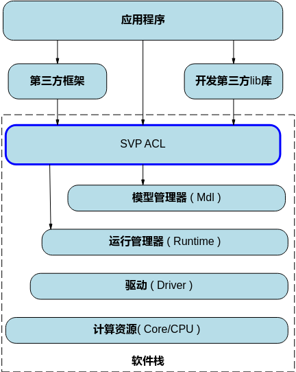

## 基本概念<a name="ZH-CN_TOPIC_0000002441980857"></a>

**表 1**  概念介绍

<a name="table3953mcpsimp"></a>
<table><thead align="left"><tr id="row3959mcpsimp"><th class="cellrowborder" valign="top" width="26%" id="mcps1.2.3.1.1"><p id="p3961mcpsimp"><a name="p3961mcpsimp"></a><a name="p3961mcpsimp"></a>概念</p>
</th>
<th class="cellrowborder" valign="top" width="74%" id="mcps1.2.3.1.2"><p id="p3963mcpsimp"><a name="p3963mcpsimp"></a><a name="p3963mcpsimp"></a>描述</p>
</th>
</tr>
</thead>
<tbody><tr id="row3965mcpsimp"><td class="cellrowborder" valign="top" width="26%" headers="mcps1.2.3.1.1 "><p id="p3967mcpsimp"><a name="p3967mcpsimp"></a><a name="p3967mcpsimp"></a>同步/异步</p>
</td>
<td class="cellrowborder" valign="top" width="74%" headers="mcps1.2.3.1.2 "><p id="p3969mcpsimp"><a name="p3969mcpsimp"></a><a name="p3969mcpsimp"></a>本文中提及的同步、异步是站在调用者和执行者的角度，在当前场景下，若在板端环境调用接口后不等待Device执行完成再返回，则表示板端环境的调度是异步的；若在板端环境调用接口后需等待Device执行完成再返回，则表示板端环境的调度是同步的。</p>
</td>
</tr>
<tr id="row3970mcpsimp"><td class="cellrowborder" valign="top" width="26%" headers="mcps1.2.3.1.1 "><p id="p3972mcpsimp"><a name="p3972mcpsimp"></a><a name="p3972mcpsimp"></a>进程/线程</p>
</td>
<td class="cellrowborder" valign="top" width="74%" headers="mcps1.2.3.1.2 "><p id="p3974mcpsimp"><a name="p3974mcpsimp"></a><a name="p3974mcpsimp"></a>本文中提及的进程、线程，若无特别注明，则表示板端环境上的进程、线程。</p>
</td>
</tr>
<tr id="row3975mcpsimp"><td class="cellrowborder" valign="top" width="26%" headers="mcps1.2.3.1.1 "><p id="p3977mcpsimp"><a name="p3977mcpsimp"></a><a name="p3977mcpsimp"></a>Device</p>
</td>
<td class="cellrowborder" valign="top" width="74%" headers="mcps1.2.3.1.2 "><p id="p3979mcpsimp"><a name="p3979mcpsimp"></a><a name="p3979mcpsimp"></a>Device表示板端环境上的图像分析引擎。</p>
</td>
</tr>
<tr id="row3981mcpsimp"><td class="cellrowborder" valign="top" width="26%" headers="mcps1.2.3.1.1 "><p id="p3983mcpsimp"><a name="p3983mcpsimp"></a><a name="p3983mcpsimp"></a>Context</p>
</td>
<td class="cellrowborder" valign="top" width="74%" headers="mcps1.2.3.1.2 "><p id="p3985mcpsimp"><a name="p3985mcpsimp"></a><a name="p3985mcpsimp"></a>Context作为一个容器，管理了所有对象（包括Stream、设备内存等）的生命周期。不同Context的Stream之间、不同的Context之间是完全隔离的，无法建立同步等待关系。</p>
<p id="p3986mcpsimp"><a name="p3986mcpsimp"></a><a name="p3986mcpsimp"></a>Context分为两种：</p>
<a name="ul3987mcpsimp"></a><a name="ul3987mcpsimp"></a><ul id="ul3987mcpsimp"><li>默认Context：调用<a href="#ZH-CN_TOPIC_0000002408421586">svp_acl_rt_set_device</a>接口指定用于运算的Device时，系统会自动隐式创建一个默认Context，一个Device对应一个默认Context，默认Context不能通过<a href="#ZH-CN_TOPIC_0000002441980909">svp_acl_rt_destroy_context</a>接口来释放。</li><li>显式创建的Context：<strong id="b3992mcpsimp"><a name="b3992mcpsimp"></a><a name="b3992mcpsimp"></a>推荐，</strong>在进程或线程中调用<a href="#ZH-CN_TOPIC_0000002408581542">svp_acl_rt_create_context</a>接口显式创建一个Context。</li></ul>
</td>
</tr>
<tr id="row3994mcpsimp"><td class="cellrowborder" valign="top" width="26%" headers="mcps1.2.3.1.1 "><p id="p3996mcpsimp"><a name="p3996mcpsimp"></a><a name="p3996mcpsimp"></a>Stream</p>
</td>
<td class="cellrowborder" valign="top" width="74%" headers="mcps1.2.3.1.2 "><p id="p3998mcpsimp"><a name="p3998mcpsimp"></a><a name="p3998mcpsimp"></a>Stream用于维护一些异步操作的执行顺序，确保按照应用程序中的代码调用顺序在Device上执行。</p>
<p id="p3999mcpsimp"><a name="p3999mcpsimp"></a><a name="p3999mcpsimp"></a>Stream分两种：</p>
<a name="ul4000mcpsimp"></a><a name="ul4000mcpsimp"></a><ul id="ul4000mcpsimp"><li>默认Stream：调用<a href="#ZH-CN_TOPIC_0000002408421586">svp_acl_rt_set_device</a>接口指定用于运算的Device时，系统会自动隐式创建一个默认Stream，一个Device对应一个默认Stream，默认Stream不能通过<a href="#ZH-CN_TOPIC_0000002408581750">svp_acl_rt_destroy_stream</a>接口来释放。</li><li>显式创建的Stream：<strong id="b4005mcpsimp"><a name="b4005mcpsimp"></a><a name="b4005mcpsimp"></a>推荐，</strong>在进程或线程中调用<a href="#ZH-CN_TOPIC_0000002408421842">svp_acl_rt_create_stream</a>接口显式创建一个Stream。</li></ul>
</td>
</tr>
<tr id="row4007mcpsimp"><td class="cellrowborder" valign="top" width="26%" headers="mcps1.2.3.1.1 "><p id="p4009mcpsimp"><a name="p4009mcpsimp"></a><a name="p4009mcpsimp"></a>动态Batch/动态分辨率</p>
</td>
<td class="cellrowborder" valign="top" width="74%" headers="mcps1.2.3.1.2 "><p id="p4011mcpsimp"><a name="p4011mcpsimp"></a><a name="p4011mcpsimp"></a>在某些场景下，模型每次输入的Batch数或分辨率是不固定的，如检测出目标后再执行目标识别网络，由于目标个数不固定导致目标识别网络输入BatchSize不固定。</p>
<a name="ul4012mcpsimp"></a><a name="ul4012mcpsimp"></a><ul id="ul4012mcpsimp"><li>动态Batch：用户执行推理时，其Batch数是动态可变的。</li><li>动态分辨率: 用户执行推理时，每张图片的分辨率H*W是动态可变的；如果和动态Batch一起使用，则一次多Batch推理的多张图片需要使用相同的分辨率。</li></ul>
</td>
</tr>
<tr id="row4015mcpsimp"><td class="cellrowborder" valign="top" width="26%" headers="mcps1.2.3.1.1 "><p id="p4017mcpsimp"><a name="p4017mcpsimp"></a><a name="p4017mcpsimp"></a>动态维度（ND格式）</p>
</td>
<td class="cellrowborder" valign="top" width="74%" headers="mcps1.2.3.1.2 "><p id="p4019mcpsimp"><a name="p4019mcpsimp"></a><a name="p4019mcpsimp"></a>为了支持Transformer等网络在输入格式的维度不确定的场景，需要支持ND格式下任意维度的动态设置。</p>
<p id="p4020mcpsimp"><a name="p4020mcpsimp"></a><a name="p4020mcpsimp"></a>ND表示支持任意格式，当前N≠4。</p>
</td>
</tr>
<tr id="row4021mcpsimp"><td class="cellrowborder" valign="top" width="26%" headers="mcps1.2.3.1.1 "><p id="p4023mcpsimp"><a name="p4023mcpsimp"></a><a name="p4023mcpsimp"></a>通道</p>
</td>
<td class="cellrowborder" valign="top" width="74%" headers="mcps1.2.3.1.2 "><p id="p4025mcpsimp"><a name="p4025mcpsimp"></a><a name="p4025mcpsimp"></a>在RGB色彩模式下，图像通道就是指单独的红色R、绿色G、蓝色B部分。也就是说，一幅完整的图像，是由红色绿色蓝色三个通道组成的，它们共同作用产生了完整的图像。</p>
</td>
</tr>
</tbody>
</table>

## 进程、线程、Device、Context、Stream之间的关系<a name="ZH-CN_TOPIC_0000002408421614"></a>

各基本概念的介绍请参见[基本概念](#ZH-CN_TOPIC_0000002441980857)。


### Device、Context、Stream之间的关系<a name="ZH-CN_TOPIC_0000002442020749"></a>

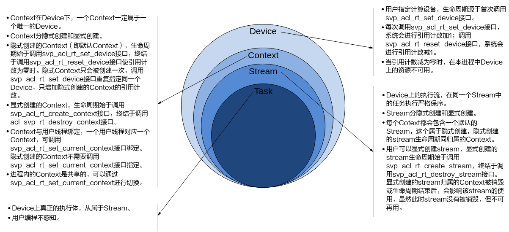

### 线程、Context、Stream之间的关系<a name="ZH-CN_TOPIC_0000002408421850"></a>

-   一个用户线程一定会绑定一个Context，所有Device的资源使用或调度，都必须基于Context。
-   一个线程中当前会有一个唯一的Context在用，Context中已经关联了本线程要使用的Device。
-   可以通过[svp\_acl\_rt\_set\_current\_context](#ZH-CN_TOPIC_0000002408421610)进行Device的快速切换。示例代码如下，仅供参考，不可以直接拷贝编译运行：

    ```
    … 
     svp_acl_rt_create_context(&ctx1, 0); 
     svp_acl_mdl_execute(mdl1, input1, output1); 
     svp_acl_rt_create_context(&ctx2,1); 
      
     /*在当前线程中，创建ctx2后，当前线程对应的Context切换为ctx2，对应在Device 1进行后续的计算任务，本例中将在Device 1上进行mdl2的执行调用 */ 
     svp_acl_mdl_execute(mdl2, input2, output2);
     svp_acl_rt_set_current_context(ctx1); 
      
     /*在当前线程中，通过Context切换，使后续模型计算任务在对应的Device 0上进行*/ 
     svp_acl_mdl_execute(mdl3, input3, output3); 
     …
    ```

-   一个线程中可以创建多个Stream，不同的Stream上计算任务是可以并行执行；多线程场景下，也可以每个线程创建一个Stream，线程之间的Stream在Device上相互独立，每个Stream内部的任务是按照Stream下发的顺序执行。
-   多线程的调度依赖于运行应用的操作系统调度，Device侧多Stream调度，由Device上调度组件进行调度。

### 一个进程内多个线程间的Context迁移<a name="ZH-CN_TOPIC_0000002408581506"></a>

-   一个进程中可以创建多个Context，但一个线程同一时刻只能使用一个Context。
-   线程中创建的多个Context，线程缺省使用最后一次创建的Context。
-   进程内创建的多个Context，可以通过[svp\_acl\_rt\_set\_current\_context](#ZH-CN_TOPIC_0000002408421610)设置当前需要使用的Context。

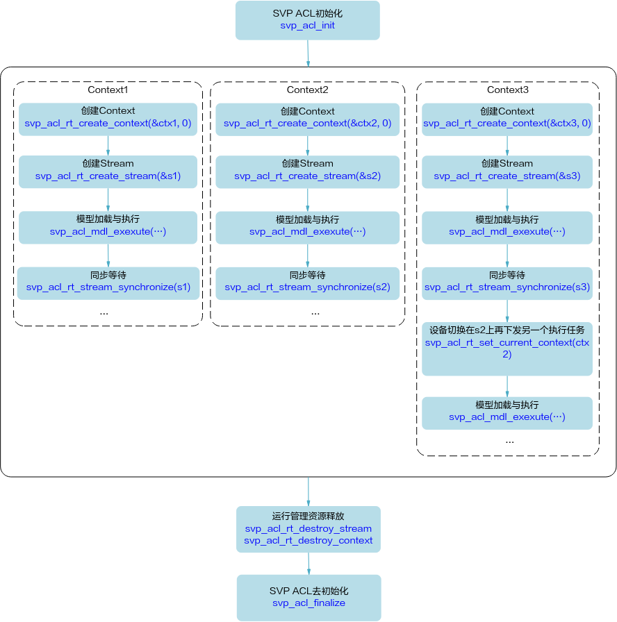

### 默认Context和默认Stream的使用场景<a name="ZH-CN_TOPIC_0000002441980869"></a>

-   Device上执行操作下发前，必须有Context和Stream，这个Context、Stream可以显式创建，也可以隐式创建。隐式创建的Context、Stream就是默认Context、默认Stream。

    默认Stream作为接口入参时，直接传NULL。

-   默认Context不允许用户执行[svp\_acl\_rt\_get\_current\_context](#ZH-CN_TOPIC_0000002442020945)或[svp\_acl\_rt\_set\_current\_context](#ZH-CN_TOPIC_0000002408421610)操作，也不允许执行[svp\_acl\_rt\_destroy\_context](#ZH-CN_TOPIC_0000002441980909)操作。
-   默认Context、默认Stream一般适用于简单应用，用户仅仅需要一个Device的计算场景下。多线程应用程序建议全部使用显式创建的Context和Stream。

示例代码如下，仅供参考，不可以直接拷贝编译运行：

```
… 
svp_acl_init(...); 
svp_acl_rt_set_device(0);  
 
/*已经创建了一个default ctx，在default ctx中创建了一个default stream，并且在当前线程可用*/ 
… 
svp_acl_mdl_execute_async(mdl1,input1,output1,NULL);  //最后一个NULL表示在default stream上执行模型mdl1 
svp_acl_mdl_execute_async(mdl2,input2,output2,NULL); //最后一个NULL表示在default stream上执行模型mdl2 
svp_acl_rt_synchronize_stream(NULL);  
 
/*等待计算任务全部完成（mdl1、mdl2执行结束），用户根据需要获取计算任务的输出结果*/ 
… 
svp_acl_rt_reset_device(0);  //释放计算设备0，对应的default ctx及default stream生命周期也终止
```

### 多线程、多stream的性能说明<a name="ZH-CN_TOPIC_0000002408581758"></a>

-   线程调度依赖运行的操作系统，Stream上下发了任务后，Stream的调度由Device的调度单元调度，但如果一个进程内的多Stream上的任务在Device存在资源争抢的时候，性能可能会比单Stream低。
-   当前芯片有不同的执行部件，如模式识别Core、模式识别CPU等，对应使用不同执行部件的任务，建议多Stream的创建按照算子执行引擎划分。
-   单线程多Stream与多线程多Stream（进程属于多线程，每个线程中一个Stream）性能上哪个更优，具体取决于应用本身的逻辑实现，一般来说前者性能略好，原因是相对后者，应用层少了线程调度开销。

## SVP ACL内存申请使用说明<a name="ZH-CN_TOPIC_0000002408421814"></a>

用户内存管理有两种管理方式：

1.  独立内存管理，根据需要单独申请所需的内存，内存不做拆分或者二次分配。
2.  内存池管理内存，用户一次性申请一块较大内存，并在使用时从这块较大内存中二次分配所需内存。

    在内存二次分配时，使用如下接口从内存池申请对应内存，由于接口对申请的内存地址、大小有约束，在内存池管理时，需要关注，否则容易出现内存越界。

    <a name="table4581mcpsimp"></a>
    <table><thead align="left"><tr id="row4587mcpsimp"><th class="cellrowborder" valign="top" width="25%" id="mcps1.1.4.1.1"><p id="p4589mcpsimp"><a name="p4589mcpsimp"></a><a name="p4589mcpsimp"></a>接口</p>
    </th>
    <th class="cellrowborder" valign="top" width="20%" id="mcps1.1.4.1.2"><p id="p4591mcpsimp"><a name="p4591mcpsimp"></a><a name="p4591mcpsimp"></a>用途</p>
    </th>
    <th class="cellrowborder" valign="top" width="55.00000000000001%" id="mcps1.1.4.1.3"><p id="p4593mcpsimp"><a name="p4593mcpsimp"></a><a name="p4593mcpsimp"></a>输入内存/输出内存</p>
    </th>
    </tr>
    </thead>
    <tbody><tr id="row4595mcpsimp"><td class="cellrowborder" valign="top" width="25%" headers="mcps1.1.4.1.1 "><p id="p4597mcpsimp"><a name="p4597mcpsimp"></a><a name="p4597mcpsimp"></a><a href="#ZH-CN_TOPIC_0000002408581654">svp_acl_rt_malloc</a></p>
    </td>
    <td class="cellrowborder" valign="top" width="20%" headers="mcps1.1.4.1.2 "><p id="p4601mcpsimp"><a name="p4601mcpsimp"></a><a name="p4601mcpsimp"></a>申请Device上的内存，同步接口。</p>
    </td>
    <td class="cellrowborder" valign="top" width="55.00000000000001%" headers="mcps1.1.4.1.3 "><a name="ul4603mcpsimp"></a><a name="ul4603mcpsimp"></a><ul id="ul4603mcpsimp"><li>使用<a href="#ZH-CN_TOPIC_0000002408581654">svp_acl_rt_malloc</a>接口申请的内存，需要通过<a href="#ZH-CN_TOPIC_0000002408581838">svp_acl_rt_free</a>接口释放内存。</li><li>频繁调用<a href="#ZH-CN_TOPIC_0000002408581654">svp_acl_rt_malloc</a>接口申请内存、调用<a href="#ZH-CN_TOPIC_0000002408581838">svp_acl_rt_free</a>接口释放内存，会损耗性能，建议用户提前做内存预先分配或二次管理，避免频繁申请/释放内存。</li></ul>
    </td>
    </tr>
    <tr id="row4612mcpsimp"><td class="cellrowborder" valign="top" width="25%" headers="mcps1.1.4.1.1 "><p id="p4614mcpsimp"><a name="p4614mcpsimp"></a><a name="p4614mcpsimp"></a><a href="#ZH-CN_TOPIC_0000002408581790">svp_acl_rt_malloc_host</a></p>
    </td>
    <td class="cellrowborder" valign="top" width="20%" headers="mcps1.1.4.1.2 "><p id="p4618mcpsimp"><a name="p4618mcpsimp"></a><a name="p4618mcpsimp"></a>申请Host或Device上的内存，Device上的内存按普通页申请。同步接口。</p>
    </td>
    <td class="cellrowborder" valign="top" width="55.00000000000001%" headers="mcps1.1.4.1.3 "><a name="ul4620mcpsimp"></a><a name="ul4620mcpsimp"></a><ul id="ul4620mcpsimp"><li>使用<a href="#ZH-CN_TOPIC_0000002408581790">svp_acl_rt_malloc_host</a>接口申请的内存，需要通过<a href="#ZH-CN_TOPIC_0000002408581844">svp_acl_rt_free_host</a>接口释放内存。</li><li>如果没有Host端，调用该接口会获取Device侧内存，也可调用<a href="#ZH-CN_TOPIC_0000002408581838">svp_acl_rt_free</a>释放。</li><li>频繁调用<a href="#ZH-CN_TOPIC_0000002408581790">svp_acl_rt_malloc_host</a>接口申请内存、调用<a href="#ZH-CN_TOPIC_0000002408581844">svp_acl_rt_free_host</a>接口释放内存，会损耗性能，建议用户提前做内存预先分配或二次管理，避免频繁申请/释放内存。</li></ul>
    </td>
    </tr>
    </tbody>
    </table>

## 如何获取Sample<a name="ZH-CN_TOPIC_0000002441980885"></a>

当前SVP ACL提供的样例如[表1](#table3919mcpsimp)所示。

**表 1**  Sample列表

<a name="table3919mcpsimp"></a>
<table><thead align="left"><tr id="row3926mcpsimp"><th class="cellrowborder" valign="top" width="27%" id="mcps1.2.4.1.1"><p id="p3928mcpsimp"><a name="p3928mcpsimp"></a><a name="p3928mcpsimp"></a>Sample</p>
</th>
<th class="cellrowborder" valign="top" width="36%" id="mcps1.2.4.1.2"><p id="p3930mcpsimp"><a name="p3930mcpsimp"></a><a name="p3930mcpsimp"></a>基本功能</p>
</th>
<th class="cellrowborder" valign="top" width="37%" id="mcps1.2.4.1.3"><p id="p3932mcpsimp"><a name="p3932mcpsimp"></a><a name="p3932mcpsimp"></a>样例介绍、编译及运行</p>
</th>
</tr>
</thead>
<tbody><tr id="row3934mcpsimp"><td class="cellrowborder" valign="top" width="27%" headers="mcps1.2.4.1.1 "><p id="p3936mcpsimp"><a name="p3936mcpsimp"></a><a name="p3936mcpsimp"></a>resnet50_imagenet_classification</p>
</td>
<td class="cellrowborder" valign="top" width="36%" headers="mcps1.2.4.1.2 "><p id="p3938mcpsimp"><a name="p3938mcpsimp"></a><a name="p3938mcpsimp"></a>基于Caffe ResNet-50网络实现图片分类（同步推理）</p>
</td>
<td class="cellrowborder" valign="top" width="37%" headers="mcps1.2.4.1.3 "><p id="p3940mcpsimp"><a name="p3940mcpsimp"></a><a name="p3940mcpsimp"></a><a href="#ZH-CN_TOPIC_0000002442020893">基于Caffe ResNet-50网络实现图片分类（同步推理）</a></p>
</td>
</tr>
<tr id="row3942mcpsimp"><td class="cellrowborder" valign="top" width="27%" headers="mcps1.2.4.1.1 "><p id="p3944mcpsimp"><a name="p3944mcpsimp"></a><a name="p3944mcpsimp"></a>resnet50_async_imagenet_classification</p>
</td>
<td class="cellrowborder" valign="top" width="36%" headers="mcps1.2.4.1.2 "><p id="p3946mcpsimp"><a name="p3946mcpsimp"></a><a name="p3946mcpsimp"></a>基于Caffe ResNet-50网络实现图片分类（异步推理）</p>
</td>
<td class="cellrowborder" valign="top" width="37%" headers="mcps1.2.4.1.3 "><p id="p3948mcpsimp"><a name="p3948mcpsimp"></a><a name="p3948mcpsimp"></a><a href="#ZH-CN_TOPIC_0000002408581502">基于Caffe ResNet-50网络实现图片分类（异步推理）</a></p>
</td>
</tr>
</tbody>
</table>

切至发布包Sample目录，解压samples.tar.gz

```
tar -zxvf samples.tar.gz
```

## 如何查看日志<a name="ZH-CN_TOPIC_0000002442020801"></a>

在控制台上可以使用cat命令查看信息，cat /dev/logmpp查看错误日志。

## 如何查看Proc信息<a name="ZH-CN_TOPIC_0000002408581614"></a>


### 概述<a name="ZH-CN_TOPIC_0000002408422038"></a>

调试信息采用了Linux下的proc文件系统，可实时反映当前系统的运行状态，所记录的信息可供问题定位及分析时使用。

【文件目录】

/proc/umap

【信息查看方法】

-   在控制台上可以使用cat命令查看信息，cat /proc/umap/svp\__nnn_；也可以使用其他常用的文件操作命令，例如 cp /proc/umap/svp\__nnn_  ./，将文件拷贝到当前目录。
-   在应用程序中可以将上述文件当作普通只读文件进行读操作，例如fopen、fread等。

> **说明：** 
>参数在描述时有以下2种情况需要注意：
>-   取值为\{0, 1\}的参数，如未列出具体取值和含义的对应关系，则参数为1时表示肯定，为0时表示否定。
>-   取值为\{aaa, bbb, ccc\}的参数，未列出具体取值和含义的对应关系，但可直接根据取值aaa、bbb或ccc判断参数含义。

### Proc信息说明<a name="ZH-CN_TOPIC_0000002408581534"></a>

【调试信息】

```
# cat /proc/umap/svp_nnn 
[SVP_NNN] Version:  [xxxxVx.x.x.x B0xx Release], Build Time[mm dd yyyy, hh:mm:ss]
 
---------------------------svp_nnn module param--------------------------
  nnn_save_power   max_task_node_num
0                    512
                 
---------------------------svp_nnn resource info------------------------
  free_model_num
                63
  device_id   free_stream_num   free_report_num   free_task_node_num
            0                 127                  128                     511
 
---------------------------svp_nnn busy stream info----------------------
  device_id   stream_id   report_id    block_type   send_task_num   
            0            0            -1               1                 0
timeout_err_cnt hw_err_cnt   aacpu_err_cnt
                 0            0                  0
  model_task_handle   model_task_handle_wrap   model_task_finish
                     1                            0                      0
model_task_finish_wrap
                         0
   callback_task_handle   callback_task_handle_wrap   callback_task_finish  
0                                0                          0
callback_task_finish_wrap
0

----------------------svp_nnn sync model task info-----------------
device_id  task_send_num  task_send_num_wrap  task_finish_num  task_finish_num_wrap
         0               1                     0               1                     0
---------------------------svp_nnn irq info------------------------------
  device_id   irq_cnt_last_sec   max_irq_cnt_per_sec   total_irq_cnt
            0                   17                        17              181
 
  cur_irq_time   max_irq_time   irq_time_last_sec   max_irq_time_per_sec
               8               24                    180                       180
total_irq_time
            2445
 
---------------------------svp_nnn runtime info--------------------------
  device_id   hw_status   last_stream_id   last_task_node_id   net_seg_idx
            0            0                   0                      0            446
net_seg_num
          610
 
  timeout_err_cnt   hw_err_cnt   aacpu_err_cnt 
0               0                 0
last_hw_task_time   hw_utilization   total_running_time
                  13                  0%                    897 
```

【调试信息分析】

记录当前SVP图像分析引擎模块参数信息，资源信息，被调用stream信息，中断信息和运行时状态信息。

【参数说明】

<a name="table2926mcpsimp"></a>
<table><thead align="left"><tr id="row2932mcpsimp"><th class="cellrowborder" colspan="2" valign="top" id="mcps1.1.4.1.1"><p id="p2934mcpsimp"><a name="p2934mcpsimp"></a><a name="p2934mcpsimp"></a>参数</p>
</th>
<th class="cellrowborder" valign="top" id="mcps1.1.4.1.2"><p id="p2936mcpsimp"><a name="p2936mcpsimp"></a><a name="p2936mcpsimp"></a>描述</p>
</th>
</tr>
</thead>
<tbody><tr id="row2938mcpsimp"><td class="cellrowborder" rowspan="2" valign="top" width="21.21212121212121%" headers="mcps1.1.4.1.1 "><p id="p2940mcpsimp"><a name="p2940mcpsimp"></a><a name="p2940mcpsimp"></a>svp_<em id="i2941mcpsimp"><a name="i2941mcpsimp"></a><a name="i2941mcpsimp"></a>nnn</em> module param</p>
<p id="p2942mcpsimp"><a name="p2942mcpsimp"></a><a name="p2942mcpsimp"></a>SVP图像分析引擎 模块参数</p>
</td>
<td class="cellrowborder" valign="top" width="32.32323232323232%" headers="mcps1.1.4.1.1 "><p id="p2945mcpsimp"><a name="p2945mcpsimp"></a><a name="p2945mcpsimp"></a><em id="i2946mcpsimp"><a name="i2946mcpsimp"></a><a name="i2946mcpsimp"></a>nnn</em>_save_power</p>
</td>
<td class="cellrowborder" valign="top" width="46.464646464646464%" headers="mcps1.1.4.1.2 "><p id="p2948mcpsimp"><a name="p2948mcpsimp"></a><a name="p2948mcpsimp"></a>低功耗标志。</p>
<p id="p2949mcpsimp"><a name="p2949mcpsimp"></a><a name="p2949mcpsimp"></a>0：关闭低功耗；</p>
<p id="p2950mcpsimp"><a name="p2950mcpsimp"></a><a name="p2950mcpsimp"></a>1：打开低功耗。</p>
</td>
</tr>
<tr id="row2951mcpsimp"><td class="cellrowborder" valign="top" headers="mcps1.1.4.1.1 "><p id="p2953mcpsimp"><a name="p2953mcpsimp"></a><a name="p2953mcpsimp"></a>max_task_node_num</p>
</td>
<td class="cellrowborder" valign="top" headers="mcps1.1.4.1.1 "><p id="p2955mcpsimp"><a name="p2955mcpsimp"></a><a name="p2955mcpsimp"></a>最大任务节点个数，范围[1, 4096]，默认为512个，用户可通过模块参数svp_<em id="i2956mcpsimp"><a name="i2956mcpsimp"></a><a name="i2956mcpsimp"></a>nnn</em>_max_task_node_num配置。配置方式是在加载svp_<em id="i5677114714443"><a name="i5677114714443"></a><a name="i5677114714443"></a>nnn的ko时</em>，使用"svp_nnn_max_task_node_num=512"参数并修改"512"的值，将其配置成需要设置的数值。</p>
</td>
</tr>
<tr id="row2957mcpsimp"><td class="cellrowborder" rowspan="5" valign="top" width="21.21212121212121%" headers="mcps1.1.4.1.1 "><p id="p2959mcpsimp"><a name="p2959mcpsimp"></a><a name="p2959mcpsimp"></a>svp_<em id="i2960mcpsimp"><a name="i2960mcpsimp"></a><a name="i2960mcpsimp"></a>nnn</em> resource info</p>
<p id="p2961mcpsimp"><a name="p2961mcpsimp"></a><a name="p2961mcpsimp"></a>SVP图像分析引擎资源信息</p>
</td>
<td class="cellrowborder" valign="top" width="32.32323232323232%" headers="mcps1.1.4.1.1 "><p id="p2964mcpsimp"><a name="p2964mcpsimp"></a><a name="p2964mcpsimp"></a>free_model_num</p>
</td>
<td class="cellrowborder" valign="top" width="46.464646464646464%" headers="mcps1.1.4.1.2 "><p id="p2966mcpsimp"><a name="p2966mcpsimp"></a><a name="p2966mcpsimp"></a>剩余可加载的模型个数。</p>
</td>
</tr>
<tr id="row2967mcpsimp"><td class="cellrowborder" valign="top" headers="mcps1.1.4.1.1 "><p id="p2969mcpsimp"><a name="p2969mcpsimp"></a><a name="p2969mcpsimp"></a>device_id</p>
</td>
<td class="cellrowborder" valign="top" headers="mcps1.1.4.1.1 "><p id="p2971mcpsimp"><a name="p2971mcpsimp"></a><a name="p2971mcpsimp"></a>设备ID。</p>
</td>
</tr>
<tr id="row2972mcpsimp"><td class="cellrowborder" valign="top" headers="mcps1.1.4.1.1 "><p id="p2974mcpsimp"><a name="p2974mcpsimp"></a><a name="p2974mcpsimp"></a>free_stream_num</p>
</td>
<td class="cellrowborder" valign="top" headers="mcps1.1.4.1.1 "><p id="p2976mcpsimp"><a name="p2976mcpsimp"></a><a name="p2976mcpsimp"></a>剩余可申请的Stream个数。</p>
</td>
</tr>
<tr id="row2977mcpsimp"><td class="cellrowborder" valign="top" headers="mcps1.1.4.1.1 "><p id="p2979mcpsimp"><a name="p2979mcpsimp"></a><a name="p2979mcpsimp"></a>free_report_num</p>
</td>
<td class="cellrowborder" valign="top" headers="mcps1.1.4.1.1 "><p id="p2981mcpsimp"><a name="p2981mcpsimp"></a><a name="p2981mcpsimp"></a>剩余可申请的report个数。</p>
</td>
</tr>
<tr id="row2982mcpsimp"><td class="cellrowborder" valign="top" headers="mcps1.1.4.1.1 "><p id="p2984mcpsimp"><a name="p2984mcpsimp"></a><a name="p2984mcpsimp"></a>free_task_node_num</p>
</td>
<td class="cellrowborder" valign="top" headers="mcps1.1.4.1.1 "><p id="p2986mcpsimp"><a name="p2986mcpsimp"></a><a name="p2986mcpsimp"></a>剩余可申请的task节点个数。</p>
</td>
</tr>
<tr id="row2987mcpsimp"><td class="cellrowborder" rowspan="16" valign="top" width="21.21212121212121%" headers="mcps1.1.4.1.1 "><p id="p2989mcpsimp"><a name="p2989mcpsimp"></a><a name="p2989mcpsimp"></a>svp_<em id="i2990mcpsimp"><a name="i2990mcpsimp"></a><a name="i2990mcpsimp"></a>nnn</em> busy stream info</p>
<p id="p2991mcpsimp"><a name="p2991mcpsimp"></a><a name="p2991mcpsimp"></a>SVP图像分析引擎运行stream的信息</p>
</td>
<td class="cellrowborder" valign="top" width="32.32323232323232%" headers="mcps1.1.4.1.1 "><p id="p2994mcpsimp"><a name="p2994mcpsimp"></a><a name="p2994mcpsimp"></a>device_id</p>
</td>
<td class="cellrowborder" valign="top" width="46.464646464646464%" headers="mcps1.1.4.1.2 "><p id="p2996mcpsimp"><a name="p2996mcpsimp"></a><a name="p2996mcpsimp"></a>设备ID。</p>
</td>
</tr>
<tr id="row2997mcpsimp"><td class="cellrowborder" valign="top" headers="mcps1.1.4.1.1 "><p id="p2999mcpsimp"><a name="p2999mcpsimp"></a><a name="p2999mcpsimp"></a>stream_id</p>
</td>
<td class="cellrowborder" valign="top" headers="mcps1.1.4.1.1 "><p id="p3001mcpsimp"><a name="p3001mcpsimp"></a><a name="p3001mcpsimp"></a>Stream ID。</p>
</td>
</tr>
<tr id="row3002mcpsimp"><td class="cellrowborder" valign="top" headers="mcps1.1.4.1.1 "><p id="p3004mcpsimp"><a name="p3004mcpsimp"></a><a name="p3004mcpsimp"></a>report_id</p>
</td>
<td class="cellrowborder" valign="top" headers="mcps1.1.4.1.1 "><p id="p3006mcpsimp"><a name="p3006mcpsimp"></a><a name="p3006mcpsimp"></a>Stream注册的report ID。如果为-1，则Stream没有注册report。</p>
</td>
</tr>
<tr id="row3007mcpsimp"><td class="cellrowborder" valign="top" headers="mcps1.1.4.1.1 "><p id="p3009mcpsimp"><a name="p3009mcpsimp"></a><a name="p3009mcpsimp"></a>block_type</p>
</td>
<td class="cellrowborder" valign="top" headers="mcps1.1.4.1.1 "><p id="p3011mcpsimp"><a name="p3011mcpsimp"></a><a name="p3011mcpsimp"></a>阻塞类型。</p>
<p id="p3012mcpsimp"><a name="p3012mcpsimp"></a><a name="p3012mcpsimp"></a>0：没有被阻塞；</p>
<p id="p8538948191118"><a name="p8538948191118"></a><a name="p8538948191118"></a>1：被逻辑任务阻塞；</p>
<p id="p3013mcpsimp"><a name="p3013mcpsimp"></a><a name="p3013mcpsimp"></a>2：被模式识别CPU任务阻塞；</p>
<p id="p3015mcpsimp"><a name="p3015mcpsimp"></a><a name="p3015mcpsimp"></a>3：被Callback任务阻塞。</p>
</td>
</tr>
<tr id="row3016mcpsimp"><td class="cellrowborder" valign="top" headers="mcps1.1.4.1.1 "><p id="p3018mcpsimp"><a name="p3018mcpsimp"></a><a name="p3018mcpsimp"></a>send_task_num</p>
</td>
<td class="cellrowborder" valign="top" headers="mcps1.1.4.1.1 "><p id="p3020mcpsimp"><a name="p3020mcpsimp"></a><a name="p3020mcpsimp"></a>下发到Stream上的任务个数。</p>
</td>
</tr>
<tr id="row3021mcpsimp"><td class="cellrowborder" valign="top" headers="mcps1.1.4.1.1 "><p id="p3023mcpsimp"><a name="p3023mcpsimp"></a><a name="p3023mcpsimp"></a>timeout_err_cnt</p>
</td>
<td class="cellrowborder" valign="top" headers="mcps1.1.4.1.1 "><p id="p3025mcpsimp"><a name="p3025mcpsimp"></a><a name="p3025mcpsimp"></a>Stream上发生超时错误的个数。</p>
</td>
</tr>
<tr id="row3026mcpsimp"><td class="cellrowborder" valign="top" headers="mcps1.1.4.1.1 "><p id="p3028mcpsimp"><a name="p3028mcpsimp"></a><a name="p3028mcpsimp"></a>hw_err_cnt</p>
</td>
<td class="cellrowborder" valign="top" headers="mcps1.1.4.1.1 "><p id="p3030mcpsimp"><a name="p3030mcpsimp"></a><a name="p3030mcpsimp"></a>Stream上发生逻辑错误的个数。</p>
</td>
</tr>
<tr id="row3031mcpsimp"><td class="cellrowborder" valign="top" headers="mcps1.1.4.1.1 "><p id="p3033mcpsimp"><a name="p3033mcpsimp"></a><a name="p3033mcpsimp"></a><em id="i3034mcpsimp"><a name="i3034mcpsimp"></a><a name="i3034mcpsimp"></a>aa</em>cpu_err_cnt</p>
</td>
<td class="cellrowborder" valign="top" headers="mcps1.1.4.1.1 "><p id="p3036mcpsimp"><a name="p3036mcpsimp"></a><a name="p3036mcpsimp"></a>Stream上发生模式识别CPU任务执行错误的个数。</p>
</td>
</tr>
<tr id="row3038mcpsimp"><td class="cellrowborder" valign="top" headers="mcps1.1.4.1.1 "><p id="p3040mcpsimp"><a name="p3040mcpsimp"></a><a name="p3040mcpsimp"></a>model_task_handle</p>
</td>
<td class="cellrowborder" valign="top" headers="mcps1.1.4.1.1 "><p id="p3042mcpsimp"><a name="p3042mcpsimp"></a><a name="p3042mcpsimp"></a>模型推理任务handle。</p>
</td>
</tr>
<tr id="row3043mcpsimp"><td class="cellrowborder" valign="top" headers="mcps1.1.4.1.1 "><p id="p3045mcpsimp"><a name="p3045mcpsimp"></a><a name="p3045mcpsimp"></a>model_task_handle_wrap</p>
</td>
<td class="cellrowborder" valign="top" headers="mcps1.1.4.1.1 "><p id="p3047mcpsimp"><a name="p3047mcpsimp"></a><a name="p3047mcpsimp"></a>模型推理任务handle发生回写次数。</p>
</td>
</tr>
<tr id="row3048mcpsimp"><td class="cellrowborder" valign="top" headers="mcps1.1.4.1.1 "><p id="p3050mcpsimp"><a name="p3050mcpsimp"></a><a name="p3050mcpsimp"></a>model_task_finish</p>
</td>
<td class="cellrowborder" valign="top" headers="mcps1.1.4.1.1 "><p id="p3052mcpsimp"><a name="p3052mcpsimp"></a><a name="p3052mcpsimp"></a>已完成模型推理任务个数。</p>
</td>
</tr>
<tr id="row3053mcpsimp"><td class="cellrowborder" valign="top" headers="mcps1.1.4.1.1 "><p id="p3055mcpsimp"><a name="p3055mcpsimp"></a><a name="p3055mcpsimp"></a>model_task_finish_wrap</p>
</td>
<td class="cellrowborder" valign="top" headers="mcps1.1.4.1.1 "><p id="p3057mcpsimp"><a name="p3057mcpsimp"></a><a name="p3057mcpsimp"></a>已完成模型推理任务数发生回写的次数。</p>
</td>
</tr>
<tr id="row3058mcpsimp"><td class="cellrowborder" valign="top" headers="mcps1.1.4.1.1 "><p id="p3060mcpsimp"><a name="p3060mcpsimp"></a><a name="p3060mcpsimp"></a>callback_task_handle</p>
</td>
<td class="cellrowborder" valign="top" headers="mcps1.1.4.1.1 "><p id="p3062mcpsimp"><a name="p3062mcpsimp"></a><a name="p3062mcpsimp"></a>Callback任务handle。</p>
</td>
</tr>
<tr id="row3063mcpsimp"><td class="cellrowborder" valign="top" headers="mcps1.1.4.1.1 "><p id="p3065mcpsimp"><a name="p3065mcpsimp"></a><a name="p3065mcpsimp"></a>callback_task_handle_wrap</p>
</td>
<td class="cellrowborder" valign="top" headers="mcps1.1.4.1.1 "><p id="p3067mcpsimp"><a name="p3067mcpsimp"></a><a name="p3067mcpsimp"></a>Callback任务handle发生回写次数。</p>
</td>
</tr>
<tr id="row3068mcpsimp"><td class="cellrowborder" valign="top" headers="mcps1.1.4.1.1 "><p id="p3070mcpsimp"><a name="p3070mcpsimp"></a><a name="p3070mcpsimp"></a>callback_task_finish</p>
</td>
<td class="cellrowborder" valign="top" headers="mcps1.1.4.1.1 "><p id="p3072mcpsimp"><a name="p3072mcpsimp"></a><a name="p3072mcpsimp"></a>已完成Callback任务个数。</p>
</td>
</tr>
<tr id="row3073mcpsimp"><td class="cellrowborder" valign="top" headers="mcps1.1.4.1.1 "><p id="p3075mcpsimp"><a name="p3075mcpsimp"></a><a name="p3075mcpsimp"></a>callback_task_finish_wrap</p>
</td>
<td class="cellrowborder" valign="top" headers="mcps1.1.4.1.1 "><p id="p3077mcpsimp"><a name="p3077mcpsimp"></a><a name="p3077mcpsimp"></a>已完成Callback任务数发生回写的次数。</p>
</td>
</tr>
<tr id="row3078mcpsimp"><td class="cellrowborder" rowspan="9" valign="top" width="21.21212121212121%" headers="mcps1.1.4.1.1 "><p id="p3080mcpsimp"><a name="p3080mcpsimp"></a><a name="p3080mcpsimp"></a>svp_<em id="i3081mcpsimp"><a name="i3081mcpsimp"></a><a name="i3081mcpsimp"></a>nnn</em> irq info</p>
<p id="p3082mcpsimp"><a name="p3082mcpsimp"></a><a name="p3082mcpsimp"></a>SVP图像分析引擎中断信息</p>
</td>
<td class="cellrowborder" valign="top" width="32.32323232323232%" headers="mcps1.1.4.1.1 "><p id="p3085mcpsimp"><a name="p3085mcpsimp"></a><a name="p3085mcpsimp"></a>device_id</p>
</td>
<td class="cellrowborder" valign="top" width="46.464646464646464%" headers="mcps1.1.4.1.2 "><p id="p3087mcpsimp"><a name="p3087mcpsimp"></a><a name="p3087mcpsimp"></a>设备ID。</p>
</td>
</tr>
<tr id="row3088mcpsimp"><td class="cellrowborder" valign="top" headers="mcps1.1.4.1.1 "><p id="p3090mcpsimp"><a name="p3090mcpsimp"></a><a name="p3090mcpsimp"></a>irq_cnt_last_sec</p>
</td>
<td class="cellrowborder" valign="top" headers="mcps1.1.4.1.1 "><p id="p3092mcpsimp"><a name="p3092mcpsimp"></a><a name="p3092mcpsimp"></a>最近1秒内中断执行次数。</p>
</td>
</tr>
<tr id="row3093mcpsimp"><td class="cellrowborder" valign="top" headers="mcps1.1.4.1.1 "><p id="p3095mcpsimp"><a name="p3095mcpsimp"></a><a name="p3095mcpsimp"></a>max_irq_cnt_per_sec</p>
</td>
<td class="cellrowborder" valign="top" headers="mcps1.1.4.1.1 "><p id="p3097mcpsimp"><a name="p3097mcpsimp"></a><a name="p3097mcpsimp"></a>历史上的1秒内最大的中断执行次数。</p>
</td>
</tr>
<tr id="row3098mcpsimp"><td class="cellrowborder" valign="top" headers="mcps1.1.4.1.1 "><p id="p3100mcpsimp"><a name="p3100mcpsimp"></a><a name="p3100mcpsimp"></a>total_irq_cnt</p>
</td>
<td class="cellrowborder" valign="top" headers="mcps1.1.4.1.1 "><p id="p3102mcpsimp"><a name="p3102mcpsimp"></a><a name="p3102mcpsimp"></a>产生中断的总次数。</p>
</td>
</tr>
<tr id="row3103mcpsimp"><td class="cellrowborder" valign="top" headers="mcps1.1.4.1.1 "><p id="p3105mcpsimp"><a name="p3105mcpsimp"></a><a name="p3105mcpsimp"></a>cur_irq_time</p>
</td>
<td class="cellrowborder" valign="top" headers="mcps1.1.4.1.1 "><p id="p3107mcpsimp"><a name="p3107mcpsimp"></a><a name="p3107mcpsimp"></a>最近一次执行中断的执行耗时。</p>
<p id="p3108mcpsimp"><a name="p3108mcpsimp"></a><a name="p3108mcpsimp"></a>单位：us。</p>
</td>
</tr>
<tr id="row3109mcpsimp"><td class="cellrowborder" valign="top" headers="mcps1.1.4.1.1 "><p id="p3111mcpsimp"><a name="p3111mcpsimp"></a><a name="p3111mcpsimp"></a>max_irq_time</p>
</td>
<td class="cellrowborder" valign="top" headers="mcps1.1.4.1.1 "><p id="p3113mcpsimp"><a name="p3113mcpsimp"></a><a name="p3113mcpsimp"></a>执行一次中断的最大耗时。</p>
<p id="p3114mcpsimp"><a name="p3114mcpsimp"></a><a name="p3114mcpsimp"></a>单位：us。</p>
</td>
</tr>
<tr id="row3115mcpsimp"><td class="cellrowborder" valign="top" headers="mcps1.1.4.1.1 "><p id="p3117mcpsimp"><a name="p3117mcpsimp"></a><a name="p3117mcpsimp"></a>irq_time_last_sec</p>
</td>
<td class="cellrowborder" valign="top" headers="mcps1.1.4.1.1 "><p id="p3119mcpsimp"><a name="p3119mcpsimp"></a><a name="p3119mcpsimp"></a>最近一秒执行中断的执行耗时。</p>
<p id="p3120mcpsimp"><a name="p3120mcpsimp"></a><a name="p3120mcpsimp"></a>单位：us。</p>
</td>
</tr>
<tr id="row3121mcpsimp"><td class="cellrowborder" valign="top" headers="mcps1.1.4.1.1 "><p id="p3123mcpsimp"><a name="p3123mcpsimp"></a><a name="p3123mcpsimp"></a>max_irq_time_per_sec</p>
</td>
<td class="cellrowborder" valign="top" headers="mcps1.1.4.1.1 "><p id="p3125mcpsimp"><a name="p3125mcpsimp"></a><a name="p3125mcpsimp"></a>历史上一秒内执行中断的最大耗时。</p>
<p id="p3126mcpsimp"><a name="p3126mcpsimp"></a><a name="p3126mcpsimp"></a>单位：us。</p>
</td>
</tr>
<tr id="row3127mcpsimp"><td class="cellrowborder" valign="top" headers="mcps1.1.4.1.1 "><p id="p3129mcpsimp"><a name="p3129mcpsimp"></a><a name="p3129mcpsimp"></a>total_irq_time</p>
</td>
<td class="cellrowborder" valign="top" headers="mcps1.1.4.1.1 "><p id="p3131mcpsimp"><a name="p3131mcpsimp"></a><a name="p3131mcpsimp"></a>中断处理总时间。</p>
<p id="p3132mcpsimp"><a name="p3132mcpsimp"></a><a name="p3132mcpsimp"></a>单位：us。</p>
</td>
</tr>
<tr id="row231412611314"><td class="cellrowborder" rowspan="5" valign="top" width="21.21212121212121%" headers="mcps1.1.4.1.1 "><p id="p1584344481310"><a name="p1584344481310"></a><a name="p1584344481310"></a>svp_<em id="i13843164414135"><a name="i13843164414135"></a><a name="i13843164414135"></a>nnn</em> sync model task info</p>
<p id="p13843134451315"><a name="p13843134451315"></a><a name="p13843134451315"></a>SVP图像分析引擎同步模型任务信息</p>
</td>
<td class="cellrowborder" valign="top" width="32.32323232323232%" headers="mcps1.1.4.1.1 "><p id="p165635512131"><a name="p165635512131"></a><a name="p165635512131"></a>device_id</p>
</td>
<td class="cellrowborder" valign="top" width="46.464646464646464%" headers="mcps1.1.4.1.2 "><p id="p11569559138"><a name="p11569559138"></a><a name="p11569559138"></a>设备ID。</p>
</td>
</tr>
<tr id="row1594016267136"><td class="cellrowborder" valign="top" headers="mcps1.1.4.1.1 "><p id="p25665511312"><a name="p25665511312"></a><a name="p25665511312"></a>task_send_num</p>
</td>
<td class="cellrowborder" valign="top" headers="mcps1.1.4.1.1 "><p id="p7565555136"><a name="p7565555136"></a><a name="p7565555136"></a>下发任务个数。</p>
</td>
</tr>
<tr id="row613973212135"><td class="cellrowborder" valign="top" headers="mcps1.1.4.1.1 "><p id="p95655591310"><a name="p95655591310"></a><a name="p95655591310"></a>task_send_num_wrap</p>
</td>
<td class="cellrowborder" valign="top" headers="mcps1.1.4.1.1 "><p id="p175617553139"><a name="p175617553139"></a><a name="p175617553139"></a>下发任务数发生回绕的次数。</p>
</td>
</tr>
<tr id="row16190321201314"><td class="cellrowborder" valign="top" headers="mcps1.1.4.1.1 "><p id="p156195551311"><a name="p156195551311"></a><a name="p156195551311"></a>task_finish_num</p>
</td>
<td class="cellrowborder" valign="top" headers="mcps1.1.4.1.1 "><p id="p35625541316"><a name="p35625541316"></a><a name="p35625541316"></a>完成任务个数。</p>
</td>
</tr>
<tr id="row1249312914131"><td class="cellrowborder" valign="top" headers="mcps1.1.4.1.1 "><p id="p185617555137"><a name="p185617555137"></a><a name="p185617555137"></a>task_finish_num_wrap</p>
</td>
<td class="cellrowborder" valign="top" headers="mcps1.1.4.1.1 "><p id="p1156105511136"><a name="p1156105511136"></a><a name="p1156105511136"></a>完成任务数发生回绕的次数。</p>
</td>
</tr>
<tr id="row3133mcpsimp"><td class="cellrowborder" rowspan="12" valign="top" width="21.21212121212121%" headers="mcps1.1.4.1.1 "><p id="p3135mcpsimp"><a name="p3135mcpsimp"></a><a name="p3135mcpsimp"></a>svp_<em id="i3136mcpsimp"><a name="i3136mcpsimp"></a><a name="i3136mcpsimp"></a>nnn</em> runtime info</p>
<p id="p3137mcpsimp"><a name="p3137mcpsimp"></a><a name="p3137mcpsimp"></a>SVP图像分析引擎设备运行信息</p>
</td>
<td class="cellrowborder" valign="top" width="32.32323232323232%" headers="mcps1.1.4.1.1 "><p id="p3140mcpsimp"><a name="p3140mcpsimp"></a><a name="p3140mcpsimp"></a>device_id</p>
</td>
<td class="cellrowborder" valign="top" width="46.464646464646464%" headers="mcps1.1.4.1.2 "><p id="p3142mcpsimp"><a name="p3142mcpsimp"></a><a name="p3142mcpsimp"></a>设备ID。</p>
</td>
</tr>
<tr id="row3143mcpsimp"><td class="cellrowborder" valign="top" headers="mcps1.1.4.1.1 "><p id="p3145mcpsimp"><a name="p3145mcpsimp"></a><a name="p3145mcpsimp"></a>hw_status</p>
</td>
<td class="cellrowborder" valign="top" headers="mcps1.1.4.1.1 "><p id="p3147mcpsimp"><a name="p3147mcpsimp"></a><a name="p3147mcpsimp"></a>硬件所处状态。</p>
<p id="p3148mcpsimp"><a name="p3148mcpsimp"></a><a name="p3148mcpsimp"></a>0：空闲。</p>
<p id="p3149mcpsimp"><a name="p3149mcpsimp"></a><a name="p3149mcpsimp"></a>1：工作。</p>
</td>
</tr>
<tr id="row3150mcpsimp"><td class="cellrowborder" valign="top" headers="mcps1.1.4.1.1 "><p id="p3152mcpsimp"><a name="p3152mcpsimp"></a><a name="p3152mcpsimp"></a>last_stream_id</p>
</td>
<td class="cellrowborder" valign="top" headers="mcps1.1.4.1.1 "><p id="p3154mcpsimp"><a name="p3154mcpsimp"></a><a name="p3154mcpsimp"></a>最近一次下发任务到图像分析引擎的Stream id。</p>
</td>
</tr>
<tr id="row3156mcpsimp"><td class="cellrowborder" valign="top" headers="mcps1.1.4.1.1 "><p id="p3158mcpsimp"><a name="p3158mcpsimp"></a><a name="p3158mcpsimp"></a>last_task_node_id</p>
</td>
<td class="cellrowborder" valign="top" headers="mcps1.1.4.1.1 "><p id="p3160mcpsimp"><a name="p3160mcpsimp"></a><a name="p3160mcpsimp"></a>最近一次在图像分析引擎上执行的任务节点id。</p>
</td>
</tr>
<tr id="row3162mcpsimp"><td class="cellrowborder" valign="top" headers="mcps1.1.4.1.1 "><p id="p3164mcpsimp"><a name="p3164mcpsimp"></a><a name="p3164mcpsimp"></a>net_seg_idx</p>
</td>
<td class="cellrowborder" valign="top" headers="mcps1.1.4.1.1 "><p id="p3166mcpsimp"><a name="p3166mcpsimp"></a><a name="p3166mcpsimp"></a>最近一次图像分析引擎任务被执行的网络段索引。</p>
</td>
</tr>
<tr id="row3168mcpsimp"><td class="cellrowborder" valign="top" headers="mcps1.1.4.1.1 "><p id="p3170mcpsimp"><a name="p3170mcpsimp"></a><a name="p3170mcpsimp"></a>net_seg_num</p>
</td>
<td class="cellrowborder" valign="top" headers="mcps1.1.4.1.1 "><p id="p3172mcpsimp"><a name="p3172mcpsimp"></a><a name="p3172mcpsimp"></a>最近一次图像分析引擎任务含有的网络段数。</p>
</td>
</tr>
<tr id="row3174mcpsimp"><td class="cellrowborder" valign="top" headers="mcps1.1.4.1.1 "><p id="p3176mcpsimp"><a name="p3176mcpsimp"></a><a name="p3176mcpsimp"></a>timeout_err_cnt</p>
</td>
<td class="cellrowborder" valign="top" headers="mcps1.1.4.1.1 "><p id="p3178mcpsimp"><a name="p3178mcpsimp"></a><a name="p3178mcpsimp"></a>设备上发生超时错误的个数。</p>
</td>
</tr>
<tr id="row3179mcpsimp"><td class="cellrowborder" valign="top" headers="mcps1.1.4.1.1 "><p id="p3181mcpsimp"><a name="p3181mcpsimp"></a><a name="p3181mcpsimp"></a>hw_err_cnt</p>
</td>
<td class="cellrowborder" valign="top" headers="mcps1.1.4.1.1 "><p id="p3183mcpsimp"><a name="p3183mcpsimp"></a><a name="p3183mcpsimp"></a>设备上发生逻辑错误的个数。</p>
</td>
</tr>
<tr id="row3184mcpsimp"><td class="cellrowborder" valign="top" headers="mcps1.1.4.1.1 "><p id="p3186mcpsimp"><a name="p3186mcpsimp"></a><a name="p3186mcpsimp"></a><em id="i3187mcpsimp"><a name="i3187mcpsimp"></a><a name="i3187mcpsimp"></a>aa</em>cpu_err_cnt</p>
</td>
<td class="cellrowborder" valign="top" headers="mcps1.1.4.1.1 "><p id="p3189mcpsimp"><a name="p3189mcpsimp"></a><a name="p3189mcpsimp"></a>设备上发生模式识别CPU任务执行错误的个数</p>
</td>
</tr>
<tr id="row3191mcpsimp"><td class="cellrowborder" valign="top" headers="mcps1.1.4.1.1 "><p id="p3193mcpsimp"><a name="p3193mcpsimp"></a><a name="p3193mcpsimp"></a>last_hw_task_time</p>
</td>
<td class="cellrowborder" valign="top" headers="mcps1.1.4.1.1 "><p id="p3195mcpsimp"><a name="p3195mcpsimp"></a><a name="p3195mcpsimp"></a>最近一次图像分析引擎执行任务的耗时。</p>
</td>
</tr>
<tr id="row3197mcpsimp"><td class="cellrowborder" valign="top" headers="mcps1.1.4.1.1 "><p id="p3199mcpsimp"><a name="p3199mcpsimp"></a><a name="p3199mcpsimp"></a>hw_utilization</p>
</td>
<td class="cellrowborder" valign="top" headers="mcps1.1.4.1.1 "><p id="p3201mcpsimp"><a name="p3201mcpsimp"></a><a name="p3201mcpsimp"></a>最近1s内硬件执行时间所占的比例。</p>
</td>
</tr>
<tr id="row3202mcpsimp"><td class="cellrowborder" valign="top" headers="mcps1.1.4.1.1 "><p id="p3204mcpsimp"><a name="p3204mcpsimp"></a><a name="p3204mcpsimp"></a>total_running_time</p>
</td>
<td class="cellrowborder" valign="top" headers="mcps1.1.4.1.1 "><p id="p3206mcpsimp"><a name="p3206mcpsimp"></a><a name="p3206mcpsimp"></a>设备运行总时间。</p>
<p id="p3207mcpsimp"><a name="p3207mcpsimp"></a><a name="p3207mcpsimp"></a>单位：s</p>
</td>
</tr>
</tbody>
</table>

备注：loadSS928V100脚本位置在版本包目录/mpp/out/ko/路径下。其中loadSS928V100脚本默认加载PQP的ko，PQP与svp\__nnn_是互斥的，不能同时加载，需要手动修改loadSS928V100脚本加载svp\__nnn_的ko。

# 接口调用流程介绍<a name="ZH-CN_TOPIC_0000002441980889"></a>


## 主要接口调用流程<a name="ZH-CN_TOPIC_0000002442021025"></a>

**图 1**  接口调用流程图<a name="fig1938116460321"></a>  
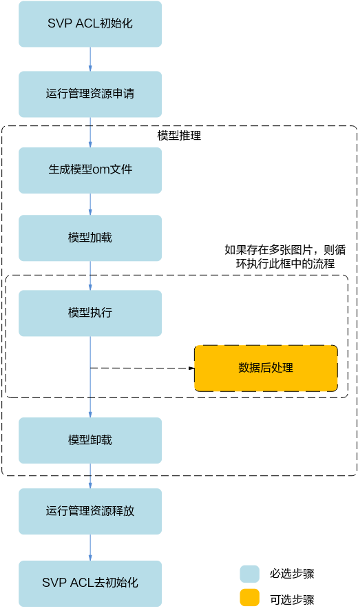

上图根据应用开发中的典型功能抽象出主要的接口调用流程，例如，如果需要实现模型推理的功能，则需要先加载模型，模型推理结束后，则需要卸载模型；如果模型推理后，需要从推理结果中查找最大置信度的类别标识对图片分类，则需要数据后处理。

1.  SVP ACL初始化：调用[svp\_acl\_init](#ZH-CN_TOPIC_0000002442020877)接口实现初始化SVP ACL。
2.  运行管理资源申请：依次申请运行管理资源：[Device](#ZH-CN_TOPIC_0000002441980857)、[Context](#ZH-CN_TOPIC_0000002441980857)、[Stream](#ZH-CN_TOPIC_0000002441980857)。具体流程，请参见“[运行管理资源申请](#ZH-CN_TOPIC_0000002441981173)”。
3.  模型推理。
    1.  生成模型om文件：需使用ATC工具将第三方网络（例如，Caffe ResNet-50网络）转换为适配SoC的离线模型（\*.om文件），请参见《ATC工具使用指南》。
    2.  模型加载：模型推理前，需要先将对应的模型加载到系统中。具体流程，请参见“[模型加载](#ZH-CN_TOPIC_0000002408581558)”。
    3.  模型执行：使用模型实现图片分类、目标识别等功能，目前SVP ACL提供同步推理接口和异步推理接口，支持动态Batch、动态分辨率等场景。具体流程，请参见“[模型执行](#ZH-CN_TOPIC_0000002408421538)”。
    4.  （可选）数据后处理：处理模型推理的结果，此处根据用户的实际需求来处理推理结果，例如用户可以将获取到的推理结果写入文件、从推理结果中找到每张图片最大置信度的类别标识等。
    5.  模型卸载：调用[svp\_acl\_mdl\_unload](#ZH-CN_TOPIC_0000002408421730)接口卸载模型。

4.  运行管理资源释放：所有数据处理都结束后，需要依次释放运行管理资源：[Stream](#ZH-CN_TOPIC_0000002441980857)、[Context](#ZH-CN_TOPIC_0000002441980857)、[Device](#ZH-CN_TOPIC_0000002441980857)。具体流程，请参见“[运行管理资源释放](#ZH-CN_TOPIC_0000002441980865)”。
5.  SVP ACL去初始化：调用[svp\_acl\_finalize](#ZH-CN_TOPIC_0000002441980877)接口实现SVP ACL去初始化。

    > **说明：** 
    >在应用开发过程中，各环节都涉及内存的申请与释放、数据传输（通过内存复制实现）、数据类型的创建与销毁，因此未在图中一一标识，关于内存申请与释放、内存复制的接口请参见“[内存管理](#ZH-CN_TOPIC_0000002441981181)”，数据类型的创建与销毁的接口请参见“[数据类型及其操作接口](#ZH-CN_TOPIC_0000002441981013)”。

## 运行管理资源申请<a name="ZH-CN_TOPIC_0000002441981173"></a>

您需要依次申请运行管理资源，包括：[Device](#ZH-CN_TOPIC_0000002441980857)、[Context](#ZH-CN_TOPIC_0000002441980857)、[Stream](#ZH-CN_TOPIC_0000002441980857)。其中创建Context、Stream的方式分为隐式创建和显式创建。

-   隐式创建Context和Stream：适合简单、无复杂交互逻辑的应用，但缺点在于，在多线程编程中，每个线程都使用默认Context或默认Stream，默认Stream中任务的执行顺序取决于操作系统线程调度的顺序。
-   显式创建Context和Stream：**推荐显式**，适合大型、复杂交互逻辑的应用，且便于提高程序的可读性、可维护性。

**图 1**  运行管理资源申请流程<a name="fig1492084710146"></a>  
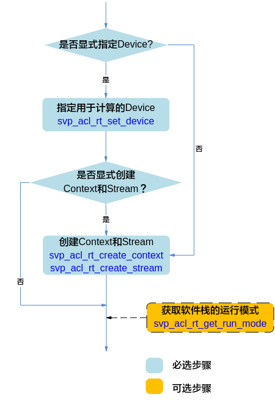

1.  申请运行管理资源时，需按顺序依次申请：[Device](#ZH-CN_TOPIC_0000002441980857)、[Context](#ZH-CN_TOPIC_0000002441980857)、[Stream](#ZH-CN_TOPIC_0000002441980857)。
    -   调用[svp\_acl\_rt\_set\_device](#ZH-CN_TOPIC_0000002408421586)接口显式指定用于运算的Device。
        -   调用[svp\_acl\_rt\_create\_context](#ZH-CN_TOPIC_0000002408581542)接口显式创建Context，调用[svp\_acl\_rt\_create\_stream](#ZH-CN_TOPIC_0000002408421842)接口显式创建Stream。
        -   不显式创建Context和Stream，系统会使用默认Context、默认Stream，该默认Context、默认Stream是在调用[svp\_acl\_rt\_set\_device](#ZH-CN_TOPIC_0000002408421586)接口时隐式创建的。

            默认Stream作为接口入参时，直接传NULL。

    -   不显式指定用于运算的Device。

        调用[svp\_acl\_rt\_create\_context](#ZH-CN_TOPIC_0000002408581542)接口显式创建Context，调用[svp\_acl\_rt\_create\_stream](#ZH-CN_TOPIC_0000002408421842)接口显式创建Stream。系统在显式创建Context时，系统内部会调用[svp\_acl\_rt\_set\_device](#ZH-CN_TOPIC_0000002408421586)接口指定运行的Device，Device ID通过[svp\_acl\_rt\_create\_context](#ZH-CN_TOPIC_0000002408581542)接口传入。

2.  （可选）调用[svp\_acl\_rt\_get\_run\_mode](#ZH-CN_TOPIC_0000002408581714)接口获取软件栈的运行模式，根据运行模式来判断后续的内存申请接口调用逻辑，如果查询结果为SVP\_ACL\_HOST，则数据传输时涉及申请Host上的内存；如果查询结果为SVP\_ACL\_DEVICE，则数据传输时不涉及申请Host上的内存，仅需申请Device上的内存。

## 模型加载<a name="ZH-CN_TOPIC_0000002408581558"></a>

**图 1**  模型加载流程<a name="fig15136105912515"></a>  
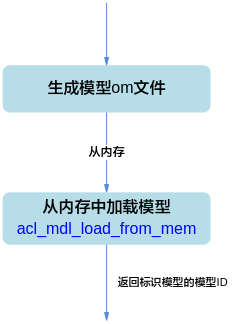

-   在模型加载前，需使用ATC工具将第三方网络（例如，Caffe ResNet-50网络）转换为适配SoC的离线模型（\*.om文件），请参见《ATC工具使用指南》。
-   支持以下方式加载模型，模型加载成功后，返回标识模型的模型ID：

    [svp\_acl\_mdl\_load\_from\_mem](#ZH-CN_TOPIC_0000002408422002)：从内存加载离线模型数据，由系统内部管理内存。

## 模型执行<a name="ZH-CN_TOPIC_0000002408421538"></a>


### 基本的模型执行流程<a name="ZH-CN_TOPIC_0000002408421550"></a>

**图 1**  基本的模型推理流程<a name="fig9994194717321"></a>  
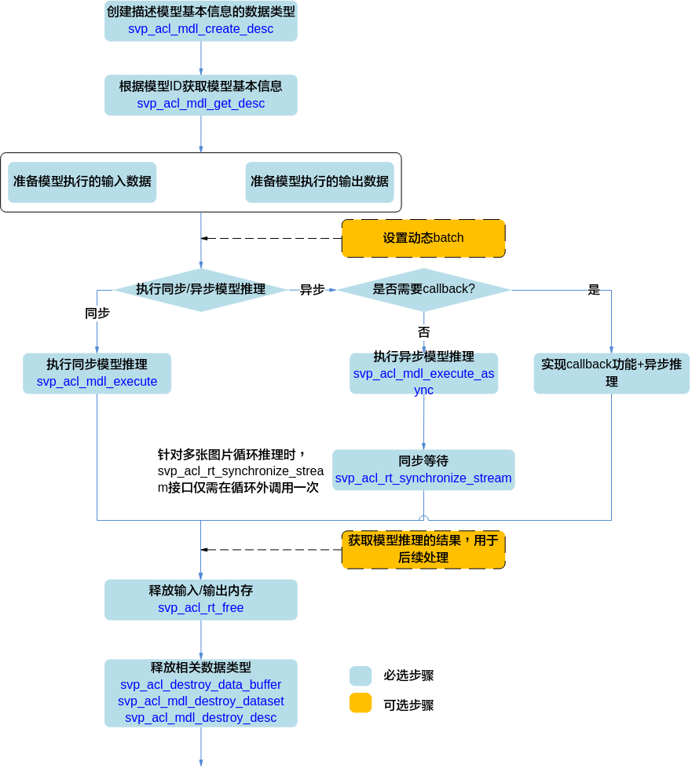

模型执行的关键流程说明如下：

1.  调用[svp\_acl\_mdl\_create\_desc](#ZH-CN_TOPIC_0000002442020705)接口创建描述模型基本信息的数据类型。
2.  调用[svp\_acl\_mdl\_get\_desc](#ZH-CN_TOPIC_0000002442020761)接口根据“[模型加载](#ZH-CN_TOPIC_0000002408581558)”中返回的模型ID获取模型基本信息。
3.  准备模型执行的输入、输出数据，具体流程，请参见“[准备模型执行的输入/输出数据](#ZH-CN_TOPIC_0000002408421658)”。
4.  设置动态Batch的具体流程，请参见“[设置动态Batch和Total\_t](#ZH-CN_TOPIC_0000002408581646)”。
5.  执行模型推理。

    当前系统支持模型的同步推理和异步推理：

    -   同步推理时调用[svp\_acl\_mdl\_execute](#ZH-CN_TOPIC_0000002442020701)接口
    -   异步推理时调用[svp\_acl\_mdl\_execute\_async](#ZH-CN_TOPIC_0000002442020689)接口

        对于异步接口，还需调用[svp\_acl\_rt\_synchronize\_stream](#ZH-CN_TOPIC_0000002408421694)接口阻塞Host运行，直到指定Stream中的所有任务都完成。

        如果同时需要实现Callback功能，请参见“[Callback场景](#ZH-CN_TOPIC_0000002408581622)”。

6.  获取模型推理的结果，用于后续处理。

    对于同步推理，直接获取模型推理的输出数据即可。

    对于异步推理，在实现Callback功能时，在回调函数内获取模型推理的结果，供后续使用。

7.  释放内存。

    调用[svp\_acl\_rt\_free](#ZH-CN_TOPIC_0000002408581838)接口释放Device上的内存。

8.  释放相关数据类型的数据。

    在模型推理结束后，需及时调用[svp\_acl\_destroy\_data\_buffer](#ZH-CN_TOPIC_0000002408421986)接口和[svp\_acl\_mdl\_destroy\_dataset](#ZH-CN_TOPIC_0000002408421806)接口释放描述模型输入的数据，且先调用[svp\_acl\_destroy\_data\_buffer](#ZH-CN_TOPIC_0000002408421986)接口，再调用[svp\_acl\_mdl\_destroy\_dataset](#ZH-CN_TOPIC_0000002408421806)接口。如果存在多个输入、输出，需调用多次[svp\_acl\_destroy\_data\_buffer](#ZH-CN_TOPIC_0000002408421986)接口。

### 设置动态Batch和Total\_t<a name="ZH-CN_TOPIC_0000002408581646"></a>

> **须知：** 
>-   Recurrent网络只支持设置动态batch为1，支持设置Total\_t（要处理的总帧数）；非Recurrent网络只支持设置动态batch，不支持设置Total\_t。
>-   图片输入时最大batch数为256。非图片输入时，最大batch数为5000。

1.  准备模型推理的动态Batch输入的数据，详细流程请参见“[准备模型执行的输入/输出数据](#ZH-CN_TOPIC_0000002408421658)”。

    1.  设置动态batch之前需要先调用[svp\_acl\_mdl\_get\_input\_index\_by\_name](#ZH-CN_TOPIC_0000002408421626)接口根据输入名称获取模型中标识动态Batch输入的index，动态Batch输入的名称固定为SVP\_ACL\_DYNAMIC\_TENSOR\_NAME，然后再调用[svp\_acl\_mdl\_set\_dynamic\_batch\_size](#ZH-CN_TOPIC_0000002442020845)接口根据index设置动态batch。
    2.  申请动态Batch输入对应的内存前，需要先调用[svp\_acl\_mdl\_get\_num\_inputs](#ZH-CN_TOPIC_0000002408581782)获取输入个数，然后调用[svp\_acl\_mdl\_get\_input\_size\_by\_index](#ZH-CN_TOPIC_0000002408581926)接口根据index获取单batch所需内存大小，乘以用户要设置的动态batch值得到需要的内存大小\(task\_buf和work\_buf不需要乘以动态batch值，详细请参见“[准备模型执行的输入/输出数据](#ZH-CN_TOPIC_0000002408421658)”\)。

    > **说明：** 
    >SVP\_ACL\_DYNAMIC\_TENSOR\_NAME是一个宏，宏的定义如下：

    ```
    #define SVP_ACL_DYNAMIC_TENSOR_NAME "svp_acl_mbatch_shape_data"
    ```

2.  在成功加载模型之后，执行模型之前，设置动态Batch数或者设置Total\_t。
    1.  设置动态Batch数

        调用[svp\_acl\_mdl\_set\_dynamic\_batch\_size](#ZH-CN_TOPIC_0000002442020845)接口设置动态Batch数。

    2.  设置Total\_t

        调用[svp\_acl\_mdl\_set\_total\_t](#ZH-CN_TOPIC_0000002408421754)接口设置Recurrent网络推理的帧数。

### 设置动态分辨率<a name="ZH-CN_TOPIC_0000002442021097"></a>

-   准备模型推理的动态分辨率输入的数据，详细流程请参见“[准备模型执行的输入/输出数据](#ZH-CN_TOPIC_0000002408421658)”。

    -   设置动态分辨率之前需要先调用[svp\_acl\_mdl\_get\_input\_index\_by\_name](#ZH-CN_TOPIC_0000002408421626)接口根据输入名称获取模型中标识动态分辨率输入的index，动态分辨率输入的名称固定为SVP\_ACL\_DYNAMIC\_TENSOR\_NAME。
    -   设置动态分辨率之前，调用[svp\_acl\_mdl\_get\_input\_size\_by\_index](#ZH-CN_TOPIC_0000002408581926)或者[svp\_acl\_mdl\_get\_output\_size\_by\_index](#ZH-CN_TOPIC_0000002408581530)接口根据index获取的是默认分辨率\(最大分辨率\)的size。
    -   设置动态分辨率之前，调用[svp\_acl\_mdl\_get\_input\_default\_stride](#ZH-CN_TOPIC_0000002408421738)或者[svp\_acl\_mdl\_get\_output\_default\_stride](#ZH-CN_TOPIC_0000002408421746)接口根据index获取的是默认分辨率\(最大分辨率\)的stride。
    -   设置动态分辨率之前，调用[svp\_acl\_mdl\_get\_input\_dims](#ZH-CN_TOPIC_0000002442020721)或者[svp\_acl\_mdl\_get\_output\_dims](#ZH-CN_TOPIC_0000002442020729)接口根据index获取的是默认分辨率\(最大分辨率\)的dims。
    -   设置动态分辨率之后，以上接口获取的size/stride/dims是当前设置的分辨率的size/stride/dims；workbuf/taskbuf获取的\(最大分辨率\)size/stride/dims。

    > **说明：** 
    >SVP\_ACL\_DYNAMIC\_TENSOR\_NAME是一个宏，宏的定义如下：
    >```
    >#define SVP_ACL_DYNAMIC_TENSOR_NAME "svp_acl_mbatch_shape_data"
    >```
    >当前动态分辨率的设置是跟随模型的，所以不支持多个线程同时对加载的一个模型进行同时设置不同的分辨率；当前支持的场景是设置一个分辨率，跑推理，当前推理完成；切换分辨率，继续推理。

-   在成功加载模型之后，执行模型之前，设置动态分辨率大小。
    -   调用[svp\_acl\_mdl\_get\_dynamic\_hw](#ZH-CN_TOPIC_0000002442021005)接口获取支持的动态分辨率个数和大小。
    -   调用[svp\_acl\_mdl\_set\_dynamic\_hw\_size](#ZH-CN_TOPIC_0000002408581890)接口根据index设置动态分辨率大小。

### 准备模型执行的输入/输出数据<a name="ZH-CN_TOPIC_0000002408421658"></a>

**图 1**  模型输入/输出数据<a name="fig11885192314108"></a>  


准备输入内存时需要额外输入两块内存，分别为task\_buf，work\_buf，对应的输入索引为M-2和M-1（M是通过[svp\_acl\_mdl\_get\_num\_inputs](#ZH-CN_TOPIC_0000002408581782)接口获取的输入个数）。在申请动态batch内存时，这两块内存不需要乘以batch值。

> **说明：** 
>-   task\_buf用于填充模型推理的任务信息，当前模型推理完之前不能被修改或被其他模型推理任务使用，task\_buf的大小不为0。
>-   work\_buf用于任务执行时存储中间结果，一个stream上如果会执行不同的模型，开辟一个最大的work\_buf即可，这些模型在该stream上推理时可以共用，不同stream间不能共用，work\_buf大小不为0。

**图 2**  模型执行的输入/输出数据准备流程<a name="fig201911293012"></a>  
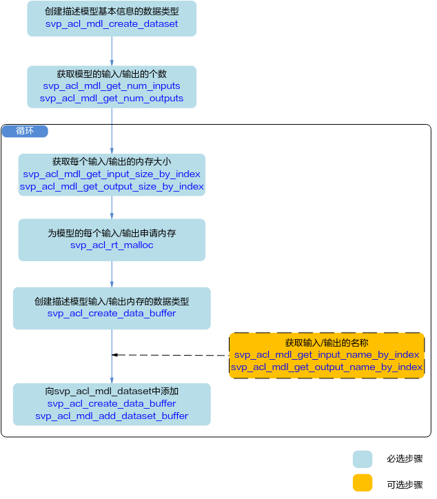

使用[svp\_acl\_mdl\_desc](#ZH-CN_TOPIC_0000002441980853)类型的数据描述模型基本信息（例如输入/输出的个数、名称、数据类型、Format、维度信息等），使用[svp\_acl\_mdl\_dataset](#ZH-CN_TOPIC_0000002441981101)类型的数据描述模型的输入/输出数据，模型可能存在多个输入、多个输出，每个输入/输出的内存地址、内存大小用[svp\_acl\_data\_buffer](#ZH-CN_TOPIC_0000002408581490)类型的数据来描述。

**图 3** [svp\_acl\_mdl\_dataset](#ZH-CN_TOPIC_0000002441981101)类型与[svp\_acl\_data\_buffer](#ZH-CN_TOPIC_0000002408581490)类型的关系<a name="fig147991655103120"></a>  
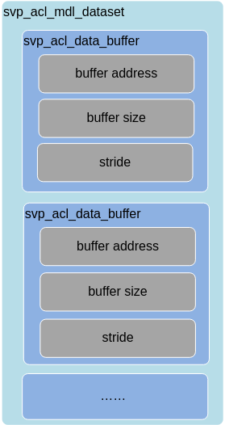

模型存在多个输入、输出时，用户在向[svp\_acl\_mdl\_dataset](#ZH-CN_TOPIC_0000002441981101)中添加[svp\_acl\_create\_data\_buffer](#ZH-CN_TOPIC_0000002408421762)时，为避免顺序出错，可以先获取输入、输出的名称，根据输入、输出名称所对应的index的顺序添加。

> **说明：** 
>在创建[svp\_acl\_data\_buffer](#ZH-CN_TOPIC_0000002408581490)类型的数据时，内存大小可以通过调用[svp\_acl\_mdl\_get\_input\_size\_by\_index](#ZH-CN_TOPIC_0000002408581926)接口根据index获取。

**图 4**  模型输入/输出数据排布（通道为2，batch为2示意图）<a name="fig186181219123517"></a>  


SVP\_ACL输入输出数据stride都是按照最后一维对齐，除YVU420SP与YUV420SP输入格式外，数据排布都如[图4](#fig186181219123517)所示。

-   如果是RGB\_PACKAGE格式，data\_xx数据类型为U24，通道数为1。
-   如果是XRGB\_PACKAGE格式，data\_xx数据类型为U32，通道数为1。
-   如果是XBGR\_PACKAGE格式，data\_xx数据类型为U32，通道数为1。
-   如果是RGBX\_PACKAGE格式，data\_xx数据类型为U32，通道数为1。
-   如果是BGRX\_PACKAGE格式，data\_xx数据类型为U32，通道数为1。
-   如果是BGR\_PACKAGE格式，data\_xx数据类型为U24，通道数为1。
-   如果是BGR\_PLANAR格式，data\_xx数据类型为U8，通道数为3。
-   如果是RGB\_PLANAR格式，data\_xx数据类型为U8，通道数为3。
-   如果是XRGB\_PLANAR格式，data\_xx数据类型为U8，通道数为3。
-   如果是XBGR\_PLANAR格式，data\_xx数据类型为U8，通道数为3。
-   如果是RGBX\_PLANAR格式，data\_xx数据类型为U8，通道数为3。
-   如果是BGRX\_PLANAR格式，data\_xx数据类型为U8，通道数为3。
-   如果是RAW\_RGGB格式，data\_xx数据类型为U8/U12/U14/U16，通道数为1。
-   如果是RAW\_GRBG格式，data\_xx数据类型为U8/U12/U14/U16，通道数为1。
-   如果是RAW\_GBRG格式，data\_xx数据类型为U8/U12/U14/U16，通道数为1。
-   如果是RAW\_BGGR格式，data\_xx数据类型为U8/U12/U14/U16，通道数为1。

**图 5**  YVU420SP/YUV420SP数据排布（通道为2，frame为2示意图）<a name="fig2051112249454"></a>  
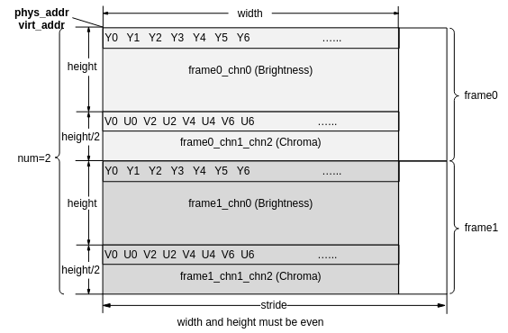

SVP\_ACL支持检测网阈值通过data层传入，阈值输入固定长度为4，分别是nms\_threshold，score\_threshold，min\_height，min\_width，同时将检测网络输出的检测框结果数据排布进行了统一，检测网阈值和检测框结果排布格式如[图7](#fig2039910144816)所示。

**图 6**  检测网阈值输入数据排布<a name="fig12471115634615"></a>  
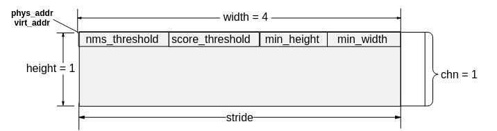

**图 7**  检测框结果数据排布（通道为2，chn为2示意图）<a name="fig2039910144816"></a>  
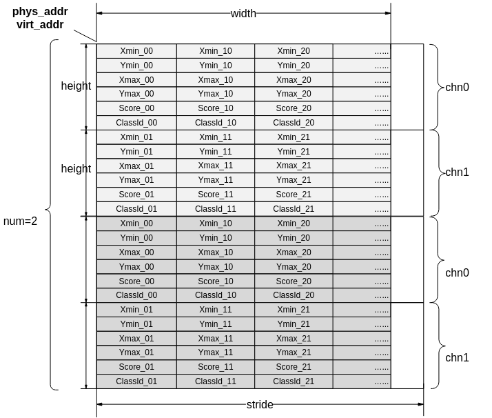

## 同步等待<a name="ZH-CN_TOPIC_0000002442020793"></a>


### 多Device场景<a name="ZH-CN_TOPIC_0000002408581638"></a>

**图 1**  同步等待流程多Device场景<a name="fig18381162175012"></a>  
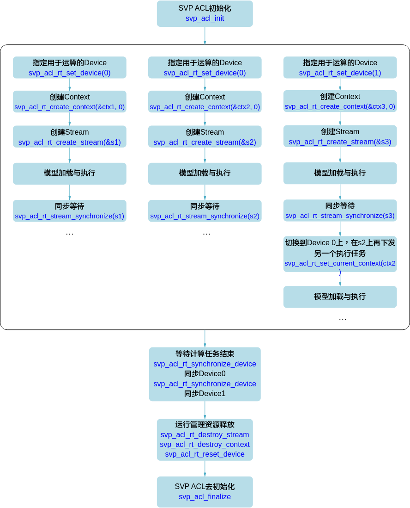

-   在多Device时，利用Context切换（调用[svp\_acl\_rt\_set\_current\_context](#ZH-CN_TOPIC_0000002408421610)接口）来切换Device，比使用[svp\_acl\_rt\_set\_device](#ZH-CN_TOPIC_0000002408421586)接口效率高。
-   调用[svp\_acl\_rt\_synchronize\_device](#ZH-CN_TOPIC_0000002441980957)接口等待Device上的计算任务结束。
-   模型加载的流程请参见“[模型加载](#ZH-CN_TOPIC_0000002408581558)”，模型执行的流程请参见“[模型执行](#ZH-CN_TOPIC_0000002408421538)”。

### 多Stream场景<a name="ZH-CN_TOPIC_0000002408581866"></a>

**图 1**  同步等待流程多Stream场景<a name="fig151761723115714"></a>  
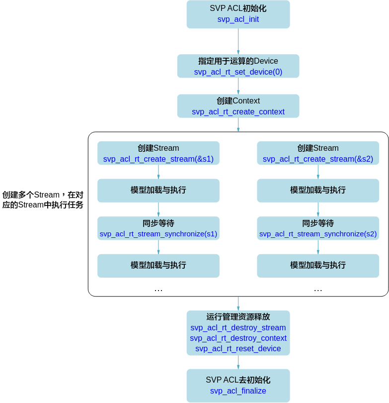

模型加载的流程请参见“[模型加载](#ZH-CN_TOPIC_0000002408581558)”，模型执行的流程请参见“[模型执行](#ZH-CN_TOPIC_0000002408421538)”。

### Callback场景<a name="ZH-CN_TOPIC_0000002408581622"></a>

**图 1**  同步等待流程Callback场景模型推理<a name="fig6474121712107"></a>  
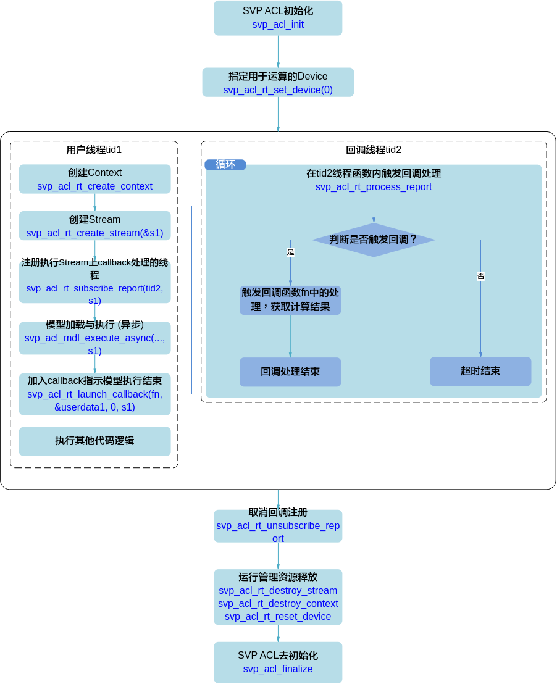

Callback流程中关键流程说明如下：

-   回调函数fn需由用户提前创建，用于获取并处理模型推理或算子执行的结果。
-   线程tid2需由用户提前创建，并自定义线程函数，在线程函数内调用[svp\_acl\_rt\_process\_report](#ZH-CN_TOPIC_0000002441981129)接口，等待指定时间后，触发回调函数。
-   调用[svp\_acl\_rt\_subscribe\_report](#ZH-CN_TOPIC_0000002408581574)接口：指定处理Stream上回调函数的线程，线程与tid2保持一致。
-   调用[svp\_acl\_rt\_launch\_callback](#ZH-CN_TOPIC_0000002442020997)接口：在Stream的任务队列中增加一个需要在板端环境上执行的回调函数，回调函数与fn保持一致。
-   调用[svp\_acl\_rt\_unsubscribe\_report](#ZH-CN_TOPIC_0000002441981193)接口：取消线程注册（Stream上的回调函数不再由指定线程处理）。
-   如果是异步推理Callback场景，为确保Stream中所有任务都完成、模型推理的结果数据都经过Callback函数处理，在Stream销毁前，需要调用一次[svp\_acl\_rt\_synchronize\_device](#ZH-CN_TOPIC_0000002441980957)接口。

## 运行管理资源释放<a name="ZH-CN_TOPIC_0000002441980865"></a>

**图 1**  运行管理资源释放流程<a name="fig19418163914186"></a>  
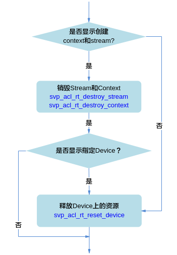

释放运行管理资源时，需按顺序依次释放：[Stream](#ZH-CN_TOPIC_0000002441980857)、[Context](#ZH-CN_TOPIC_0000002441980857)、[Device](#ZH-CN_TOPIC_0000002441980857)。

-   显式创建Context和Stream时，需调用[svp\_acl\_rt\_destroy\_stream](#ZH-CN_TOPIC_0000002408581750)接口释放Stream，再调用[svp\_acl\_rt\_destroy\_context](#ZH-CN_TOPIC_0000002441980909)接口释放Context。若显式调用[svp\_acl\_rt\_set\_device](#ZH-CN_TOPIC_0000002408421586)接口指定运算的Device时，还需调用[svp\_acl\_rt\_reset\_device](#ZH-CN_TOPIC_0000002408581690)接口释放Device上的资源。
-   不显式创建Context和Stream时，仅需调用[svp\_acl\_rt\_reset\_device](#ZH-CN_TOPIC_0000002408581690)接口释放Device上的资源。

# 开发流程<a name="ZH-CN_TOPIC_0000002408421570"></a>

**图 1**  开发流程（不包含数据预处理）<a name="fig8148143272210"></a>  
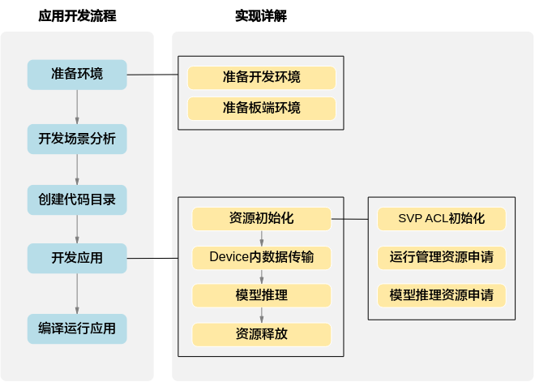

1.  准备环境，包括开发环境和板端环境。
2.  开发场景分析。

    根据开发场景分析涉及哪些功能（例如，数据传输、模型推理等）的开发，确定功能后，再明确涉及的命令或接口，请参见“[开发场景分析](#ZH-CN_TOPIC_0000002441981093)”。

3.  创建代码目录。

    在开发应用前，您需要先创建目录，存放代码文件、编译脚本、测试图片数据、模型文件等，请参见“[创建代码目录](#ZH-CN_TOPIC_0000002442020921)”。

4.  开发应用。
    1.  资源初始化，包括SVP ACL初始化、运行管理资源申请、模型推理资源申请等，请参见“[资源初始化](#ZH-CN_TOPIC_0000002408421578)”。

        使用SVP ACL接口开发应用时，必须先调用[svp\_acl\_init](#ZH-CN_TOPIC_0000002442020877)接口进行SVP ACL初始化，否则可能会导致后续系统内部资源初始化出错，进而导致其它业务异常。

    2.  数据传输，请参见“[读入图片数据](#ZH-CN_TOPIC_0000002441980873)”。
    3.  执行模型推理。请参见“[模型推理](#ZH-CN_TOPIC_0000002408421526)”。

        模型推理结束后，需及时释放相关资源。

    4.  若需要处理模型推理的结果，还需要进行数据后处理，例如对于图片分类应用，通过数据后处理从推理结果中查找最大置信度的类别标识。
    5.  所有数据处理结束后，需及时释放运行管理资源。

5.  编译运行应用，包括模型转换、编译代码、运行应用，请参见“[编译及运行应用](#ZH-CN_TOPIC_0000002408422014)”。

# 准备环境<a name="ZH-CN_TOPIC_0000002442020869"></a>


## 准备开发环境<a name="ZH-CN_TOPIC_0000002442020677"></a>

-   您需要参见《驱动和开发环境安装指南》安装开发环境，获取以下文件：
    -   从“SVP ACLlib组件的安装目录/acllib/include/acl”目录下获取调用SVP ACL接口所需的头文件。
    -   从“SVP ACLlib组件的安装目录/acllib/lib64/stub”目录下获取编译SVP ACL接口所需的库文件。

-   在安装开发环境后，您需要参见《驱动和开发环境安装指南》中的“安装后处理 ”章节安装交叉编译器，并配置对应环境变量。

    > **须知：** 
    >-   本文以如下安装路径示例来说明操作步骤，实际编译、运行应用前，**请务必**获取这些组件的实际安装路径，以便后续操作时使用，其中，$HOME表示安装用户的家目录：
    >    以非root用户安装ACLlib组件安装包，安装路径示例为$HOME/acl，在该路径下，包括“acllib”目录。
    >-   本文中的操作步骤（包括模型转换、编译代码等）需以运行用户登录开发环境后再执行，**请务必**获取各组件的运行用户，以便后续操作时使用。
    >-   用户使用export命令在当前终端窗口下声明环境变量，关闭Shell终端或切换用户时环境变量失效。

## 准备运行环境<a name="ZH-CN_TOPIC_0000002408581510"></a>

-   如果您需要运行应用，需完成板端环境的配置、软件包的部署等，请参见《驱动和开发环境安装指南》。
-   板端环境的操作系统为Linux时，在部署与调试后，使用过程中，若板端环境上的空间不足时，您可以使用mount命令将NFS服务器上的目录挂载到板端环境的指定目录。
    1.  以root用户登录Linux服务器（Ubuntu操作系统），安装NFS服务并配置共享目录。

        确保环境连网且源可用的前提下，安装NFS服务，可参考如下命令安装，如果安装过程中提示已安装NFS服务，则无需重复安装：

        ```
        apt-get install nfs-kernel-server
        ```

        在“/etc/exports”文件中配置共享目录，配置完成后，执行/etc/init.d/nfs-kernel-server restart命令重启NFS服务使配置生效。可参考如下配置段（添加在文件的末尾），斜体部分请根据实际情况替换，服务器绝对路径表示Linux服务器的共享目录，如不存在，请提前创建。

        ```
        服务器绝对路径 *(rw,sync,root_squash,anonuid=id*,anongid=gid*)
        ```

    2.  命令示例如下，其中，path表示板端环境上的目录，需根据实际情况修改，例如：/root。

        ```
        mount -t nfs -o nolock,tcp NFS服务器IP地址:服务器绝对路径 path
        ```

# 开发首个应用<a name="ZH-CN_TOPIC_0000002441980881"></a>


## 开发场景分析<a name="ZH-CN_TOPIC_0000002441981093"></a>


### 开发场景<a name="ZH-CN_TOPIC_0000002441980849"></a>

开发图片分类应用，对2张分辨率为1024\*683的\*.jpg图片分类。

### 场景分析<a name="ZH-CN_TOPIC_0000002442020885"></a>

您可从以下几方面入手分析该应用需包含哪些功能，这些功能点对应哪些SVP ACL接口。

<a name="table4438mcpsimp"></a>
<table><thead align="left"><tr id="row4444mcpsimp"><th class="cellrowborder" valign="top" width="18%" id="mcps1.1.4.1.1"><p id="p4446mcpsimp"><a name="p4446mcpsimp"></a><a name="p4446mcpsimp"></a>场景列表</p>
</th>
<th class="cellrowborder" valign="top" width="40%" id="mcps1.1.4.1.2"><p id="p4448mcpsimp"><a name="p4448mcpsimp"></a><a name="p4448mcpsimp"></a>实现分析</p>
</th>
<th class="cellrowborder" valign="top" width="42%" id="mcps1.1.4.1.3"><p id="p4450mcpsimp"><a name="p4450mcpsimp"></a><a name="p4450mcpsimp"></a>涉及的命令或关键接口</p>
</th>
</tr>
</thead>
<tbody><tr id="row4452mcpsimp"><td class="cellrowborder" valign="top" width="18%" headers="mcps1.1.4.1.1 "><p id="p4454mcpsimp"><a name="p4454mcpsimp"></a><a name="p4454mcpsimp"></a>模型推理</p>
</td>
<td class="cellrowborder" valign="top" width="40%" headers="mcps1.1.4.1.2 "><p id="p4456mcpsimp"><a name="p4456mcpsimp"></a><a name="p4456mcpsimp"></a>本文介绍的场景是图片分类，因此需要选取开源的分类网络，此处选择的是Caffe resnet-50网络，将开源的resnet-50网络转换为适配图像分析引擎的离线模型（*.om文件），使用该离线模型推理图片所属的类别。</p>
<p id="p4458mcpsimp"><a name="p4458mcpsimp"></a><a name="p4458mcpsimp"></a>resnet-50网络对输入图片宽高的要求为224*224，且要求输入图片格式为RGB。但当前输入图片是*.jpg格式，因此下文的样例中提供了一个Python脚本先转换图片。</p>
</td>
<td class="cellrowborder" valign="top" width="42%" headers="mcps1.1.4.1.3 "><a name="ul4460mcpsimp"></a><a name="ul4460mcpsimp"></a><ul id="ul4460mcpsimp"><li>使用ATC（Advanced Tensor Compiler）工具将resnet-50网络转换为*.om文件（适配图像分析引擎处理器的离线模型）。<p id="p4463mcpsimp"><a name="p4463mcpsimp"></a><a name="p4463mcpsimp"></a>请参见《ATC工具使用指南》。</p>
</li><li>模型加载<p id="p4465mcpsimp"><a name="p4465mcpsimp"></a><a name="p4465mcpsimp"></a>svp_acl_mdl_load_from_mem</p>
</li><li>模型执行<p id="p4467mcpsimp"><a name="p4467mcpsimp"></a><a name="p4467mcpsimp"></a>svp_acl_mdl_execute</p>
</li><li>模型卸载<p id="p4469mcpsimp"><a name="p4469mcpsimp"></a><a name="p4469mcpsimp"></a>svp_acl_mdl_unload</p>
</li></ul>
</td>
</tr>
</tbody>
</table>

## 创建代码目录<a name="ZH-CN_TOPIC_0000002442020921"></a>

在开发应用前，您需要先创建目录，存放代码文件、编译脚本、测试图片数据、模型文件等。

以开发环境的安装用户，在开发环境的任意目录下创建存放应用代码的目录，如下仅是示例，可参考：

```
├App名称
├── caffe_model     //该目录下存放模型转换相关的文件
│   ├── xxx.caffemodel
├── model     //该目录下存放转化后的om模型
│   ├── xxx.om
├── data
│   ├── xxx.jpg            //原始测试数据
├── inc         //该目录下存放声明函数的头文件
│   ├── xxx.h
├── out      //该目录下存放输出结果
├── src     //该目录下存放系统初始化的配置文件、编译脚本、函数的实现文件
│   ├── xxx.json         //系统初始化的配置文件
│   ├── CMakeLists.txt         //编译脚本
│   ├── xxx.cpp          //实现文件
```

## 开发应用<a name="ZH-CN_TOPIC_0000002408581698"></a>


### 资源初始化<a name="ZH-CN_TOPIC_0000002408421578"></a>


#### SVP ACL初始化<a name="ZH-CN_TOPIC_0000002442020737"></a>

**基本原理**：必须调用[svp\_acl\_init](#ZH-CN_TOPIC_0000002442020877)接口初始化SVP ACL，配置文件内容为json格式，当前支持以下配置。

dump信息配置，示例、配置说明及约束请参见《ATC工具使用指南》“online\_model\_type”章节。默认不启动dump配置。

> **说明：** 
>如果当前的默认配置已满足需求，无需修改，可向svp\_acl\_init接口中传入NULL，或者可将配置文件配置为空json串（即配置文件中只有\{\}）。
>向svp\_acl\_init接口中传入空指针的示例如下：
>svp\_acl\_error ret = svp\_acl\_init\(NULL\);

**示例代码**：可以从[acl\_resnet50](#ZH-CN_TOPIC_0000002442020893)样例中查看完整样例代码。

调用接口后，增加了异常处理的分支，同时通过ERROR\_LOG记录报错日志、通过INFO\_LOG记录各动作的提示日志，示例代码中不一一列举。以下是关键步骤的代码示例，不可以直接拷贝编译运行，仅供参考。

```
#include "acl/svp_acl.h" 
//...... 
//初始化基本配置。 
//此处的..表示相对路径，相对可执行文件所在的目录 
//例如，编译出来的可执行文件存放在out目录下，此处的..就表示out目录的上一级目录 
const char * acl_config_path = "../src/acl.json"; 
svp_acl_error ret = svp_acl_init(acl_config_path); 
//......
```

#### 运行管理资源申请（单进程+单线程+单Stream）<a name="ZH-CN_TOPIC_0000002408581550"></a>

多线程、多Stream的场景请参见[Stream管理](#ZH-CN_TOPIC_0000002442020933)。

**基本原理**：需要按顺序依次申请如下资源：[Device](#ZH-CN_TOPIC_0000002441980857)、[Context](#ZH-CN_TOPIC_0000002441980857)、[Stream](#ZH-CN_TOPIC_0000002441980857)，确保可以使用这些资源执行运算、管理任务。

-   关于Context和Stream
    -   显式创建Context时，调用[svp\_acl\_rt\_create\_context](#ZH-CN_TOPIC_0000002408581542)接口，此时需显式调用[svp\_acl\_rt\_destroy\_context](#ZH-CN_TOPIC_0000002441980909)接口释放。
    -   显式创建Stream时，调用[svp\_acl\_rt\_create\_stream](#ZH-CN_TOPIC_0000002408421842)接口，此时需显式调用[svp\_acl\_rt\_destroy\_stream](#ZH-CN_TOPIC_0000002408581750)接口释放。
    -   如果不显式创建Context和Stream，您可以使用[svp\_acl\_rt\_set\_device](#ZH-CN_TOPIC_0000002408421586)接口隐式创建的默认Context和默认Stream，但默认Context和默认Stream存在如下限制：
        -   一个Device对应一个默认Context，默认Context不能通过[svp\_acl\_rt\_destroy\_context](#ZH-CN_TOPIC_0000002441980909)接口来释放。
        -   一个Device对应一个默认Stream，默认Stream不能通过[svp\_acl\_rt\_destroy\_stream](#ZH-CN_TOPIC_0000002408581750)接口来释放。默认Stream作为接口入参时，直接传NULL。

-   关于单进程、单线程、单Stream场景
    -   单进程：一个应用程序对应一个进程。
    -   单线程：不显式创建多个线程时，默认只有一个线程。
    -   单Stream：整个开发的过程中使用同一个Stream。

        对于同一个Stream中的异步任务，SVP ACL会按照应用程序中任务的顺序执行任务，确保异步任务执行的顺序。

**示例代码**：可以从[acl\_resnet50](#ZH-CN_TOPIC_0000002442020893)样例中查看完整样例代码。

调用接口后，增加了异常处理的分支，同时通过ERROR\_LOG记录报错日志、通过INFO\_LOG记录各动作的提示日志，示例代码中不一一列举。以下是关键步骤的代码示例，不可以直接拷贝编译运行，仅供参考。

```
#include "acl/svp_acl.h" 
//...... 
//1.初始化变量 
extern bool g_is_device; 
//...... 
 
//2.指定运算的Device，SoC场景下，当前只有一个Device 
ret = svp_acl_rt_set_device(device_id); 
 
//3.显式创建一个Context，用于管理Stream对象 
ret = svp_acl_rt_create_context(&context, device_id); 
 
//4.显式创建一个Stream 
//用于维护一些异步操作的执行顺序，确保按照应用程序中的代码调用顺序执行任务 
ret = svp_acl_rt_create_stream(&stream); 
 
//5.获取当前svp_acl软件栈的运行模式，根据不同的运行模式，后续的接口调用方式不同 
//SoC场景下,该接口的查询结果为SVP_ACL_DEVICE，表示svp_acl软件栈运行在SoC的CPU上，只需申请SoC上的内存 
svp_acl_rt_run_mode run_mode; 
ret = svp_acl_rt_get_run_mode(&run_mode); 
g_is_device = (run_mode == SVP_ACL_DEVICE); 
 
//......
```

#### 模型推理资源申请<a name="ZH-CN_TOPIC_0000002442020989"></a>

**基本原理**：在模型推理前，需要从离线模型文件（适配SoC的离线模型）中加载模型数据到内存中。

-   关于模型转换

    在模型加载前，需要将第三方网络（例如，Caffe ResNet-50网络）转换为适配SoC的离线模型，请参见《ATC工具使用指南》。

-   关于模型加载

    加载模型数据方式如下：

    [svp\_acl\_mdl\_load\_from\_mem](#ZH-CN_TOPIC_0000002408422002)：从内存加载离线模型数据，由系统内部管理内存。

-   关于模型的输入、输出数据

    [svp\_acl\_mdl\_dataset](#ZH-CN_TOPIC_0000002441981101)主要用于描述模型推理时的输入数据/输出数据，模型可能存在多个输入/多个输出，每个输入/输出的内存地址、内存大小用[svp\_acl\_data\_buffer](#ZH-CN_TOPIC_0000002408581490)类型的数据来描述。

**示例代码**：可以从[acl\_resnet50](#ZH-CN_TOPIC_0000002442020893)样例中查看完整样例代码。

以下是关键步骤的代码示例，不可以直接拷贝编译运行，仅供参考。

```
#include "acl/svp_acl.h" 
//...... 
//1.初始化变量。 
//此处的..表示相对路径，相对可执行文件所在的目录 
//例如，编译出来的可执行文件存放在out目录下，此处的..就表示out目录的上一级目录 
const char* om_model_path = "../model/resnet50.om" 
//...... 
 
 
//2.申请用于存储.om文件内存，model_mem_size为.om文件大小。 
ret = svp_acl_rt_malloc(&model_mem_ptr, model_mem_size, SVP_ACL_MEM_MALLOC_HUGE_FIRST); 
//......
 
//3.加载离线模型文件（适配SoC的离线模型）。 
//模型加载成功，返回标识模型的ID。 
ret = svp_acl_mdl_load_from_mem(model_mem_ptr, model_mem_size, &model_id); 
 
//4.根据5中加载成功的模型的ID，获取该模型的描述信息。 
// model_desc为svp_acl_mdl_desc类型。 
model_desc = svp_acl_mdl_create_desc(); 
ret = svp_acl_mdl_get_desc(model_desc, model_id); 
 
//5.创建svp_acl_model_dataset类型的数据，描述模型推理的输出。 
//output为svp_acl_mdl_dataset类型 
output = svp_acl_mdl_create_dataset(); 
 
//6.1 获取模型的输出个数. 
size_t output_size = svp_acl_mdl_get_num_outputs(model_desc); 
 
//6.2 循环为每个输出申请内存，并将每个输出添加到svp_acl_model_dataset类型的数据中. 
for (size_t i = 0; i < output_size; ++i) { 
    size_t buffer_size = svp_acl_mdl_get_output_size_by_index(model_desc, i); 
    void *output_buffer = nullptr; 
    svp_acl_error ret = svp_acl_rt_malloc(&output_buffer, buffer_size, SVP_ACL_MEM_MALLOC_NORMAL_ONLY); 
    svp_acl_data_buffer* output_data = svp_acl_create_data_buffer(output_buffer, buffer_size);    
    ret = svp_acl_mdl_add_dataset_buffer(output, output_data); 
    } 
//......
```

### 读入图片数据<a name="ZH-CN_TOPIC_0000002441980873"></a>

**基本原理**：

-   根据“[运行管理资源申请（单进程+单线程+单Stream）](#ZH-CN_TOPIC_0000002408581550)”中[svp\_acl\_rt\_get\_run\_mode](#ZH-CN_TOPIC_0000002408581714)接口的查询结果（SVP\_ACL\_DEVICE，表示软件栈运行在SoC的图像分析引擎上），在自定义函数ReadBinFile内部，直接调用[svp\_acl\_rt\_malloc](#ZH-CN_TOPIC_0000002408581654)申请Device上的内存，再调用C++标准库的read函数将图片数据读入Device的内存中。
-   读入图片数据（即将输入图片数据传输到Device上，用于推理）。

**示例代码**：可以从[acl\_resnet50](#ZH-CN_TOPIC_0000002442020893)样例中查看完整样例代码。

以下是关键步骤的代码示例，不可以直接拷贝编译运行，仅供参考。

```
#include <iostream> 
#include <fstream> 
#include <cstring> 
#include "acl/svp_acl.h" 
//...... 
//以下数据用于描述图片的路径及图片名称picName。 
string testFile[] = { 
        "../data/dog1_1024_683.bin", 
        "../data/dog2_1024_683.bin" 
    }; 
 
//循环处理每张图片 
for (size_t index = 0; index < sizeof(testFile) / sizeof(testFile[0]); ++index)  { 
 
    //自定义函数，调用C++标准库std::ifstream中的函数读取图片文件。 
    //并输出图片文件占用的内存大小fileSize，返回值为图片文件的内存地址inputBuff。 
 
    void *inputBuff = nullptr; 
    uint32_t fileSize = 0; 
    auto ret = Utils::ReadBinFile(fileName, inputBuff, fileSize); 
 
    //TODO：模型推理 
} 
//......
```

### 模型推理<a name="ZH-CN_TOPIC_0000002408421798"></a>

**基本原理**：同步执行模型推理。模型推理结束后，需及时释放相关资源。

-   关于模型推理

    调用[svp\_acl\_mdl\_execute](#ZH-CN_TOPIC_0000002442020701)接口实现同步模型推理，该接口的入参之一是模型ID，在[模型推理资源申请](#ZH-CN_TOPIC_0000002442020989)阶段，如果加载模型成功，则会返回标识模型的ID。

-   关于模型输出数据的处理

    [示例代码](#ZH-CN_TOPIC_0000002441981121)中的代码逻辑是：获取模型推理的输出数据，将输出数据转换为float类型后，再输出其中top5置信度的类别编号。

-   关于资源释放
    -   [svp\_acl\_mdl\_dataset](#ZH-CN_TOPIC_0000002441981101)主要用于描述模型推理时的输入数据、输出数据，模型可能存在多个输入、多个输出，每个输入/输出的内存地址、内存大小用[svp\_acl\_data\_buffer](#ZH-CN_TOPIC_0000002408581490)类型的数据来描述。在模型推理结束后，需及时调用[svp\_acl\_destroy\_data\_buffer](#ZH-CN_TOPIC_0000002408421986)接口和[svp\_acl\_mdl\_destroy\_dataset](#ZH-CN_TOPIC_0000002408421806)接口释放描述模型输入的数据，且先调用[svp\_acl\_destroy\_data\_buffer](#ZH-CN_TOPIC_0000002408421986)接口，再调用[svp\_acl\_mdl\_destroy\_dataset](#ZH-CN_TOPIC_0000002408421806)接口。如果存在多个输入，需调用多次[svp\_acl\_destroy\_data\_buffer](#ZH-CN_TOPIC_0000002408421986)接口。
    -   在模型推理结束后，还需要通过[svp\_acl\_mdl\_unload](#ZH-CN_TOPIC_0000002408421730)接口卸载模型。


#### 示例代码<a name="ZH-CN_TOPIC_0000002441981121"></a>

您可以从[acl\_resnet50](#ZH-CN_TOPIC_0000002442020893)样例中查看完整样例代码。

调用接口后，增加了异常处理的分支，同时通过ERROR\_LOG记录报错日志、通过INFO\_LOG记录各动作的提示日志，示例代码中不一一列举。以下是关键步骤的代码示例，不可以直接拷贝编译运行，仅供参考。

```
#include <iostream> 
#include <map> 
#include <sstream> 
#include <algorithm> 
#include "acl/svp_acl.h" 
//...... 
//以下数据用于描述图片的路径及图片名称picName。 
string testFile[] = { 
        "../data/dog1_1024_683.bin", 
        "../data/dog2_1024_683.bin" 
    }; 
 
//循环处理每张图片 
for (size_t index = 0; index < sizeof(testFile) / sizeof(testFile[0]); ++index)  { 
 
    //1. 创建模型推理的输入数据 
    //创建svp_acl_mdl_dataset类型的数据input_，用于描述模型推理时的输入数据（图片数据集） 
    //输入的内存地址、内存大小用svp_acl_data_buffer类型的数据来描述   
    input_ = svp_acl_mdl_create_dataset(); 
    //示例中的模型只有1个输入，将“读入图片数据”阶段的图片数据作为模型推理的输入 
    //inputDataBuffer表示图片数据在Device中的内存，bufferSize表示内存大小 
    svp_acl_data_buffer* inputData = svp_acl_create_data_buffer(inputDataBuffer, bufferSize); 
    svp_acl_error ret = svp_acl_mdl_add_dataset_buffer(input_, inputData); 
     
    //2. 执行模型推理 
    //modelId_表示模型ID，在“模型推理资源初始化”时成功加载模型后，会返回标识模型的ID 
    //output_表示模型推理的输出数据，在“模型推理资源初始化”时已定义 
    svp_acl_error ret = svp_acl_mdl_execute(modelId_, input_, output_);
 
    //获取模型推理的输出，做数据后处理，输出top5置信度的类别编号 
    for (size_t i = 0; i < svp_acl_mdl_get_dataset_num_buffers (output_); ++i) { 
        //获取每个输出的内存地址和内存大小 
        svp_acl_data_buffer* dataBuffer = svp_acl_mdl_get_dataset_buffer(output_, i); 
        void* data = svp_acl_get_data_buffer_addr(dataBuffer); 
 
        size_t len = svp_acl_get_data_buffer_size(dataBuffer); 
 
        //将内存中的数据转换为float类型 
        float *outData = NULL; 
        outData = reinterpret_cast<float*>(data); 
         
        //屏显每张图片的top5置信度的类别编号 
        map<float, int, greater<float> > resultMap; 
        for (int j = 0; j < len / sizeof(float); ++j) { 
            resultMap[*outData] = j; 
            outData++; 
        } 
        int cnt = 0; 
        for (auto it = resultMap.begin(); it != resultMap.end(); ++it) { 
            // print top 5 
            if (++cnt > 5) { 
                break; 
            } 
 
            INFO_LOG("top %d: index[%d] value[%lf]", cnt, it->second, it->first); 
    } 
 
    //3. 模型推理结束后，释放模型推理的输入内存picDevBuffer 
    svp_acl_rt_free(picDevBuffer); 
 
    //4. 释放资源 
    //如果模型存在多个输入，则需要多次调用svp_acl_destroy_data_buffer释放描述每个输入的svp_acl_mdl_dataset类型数据 
    for (size_t i = 0; i < svp_acl_mdl_get_dataset_num_buffers(input_); ++i) { 
        svp_acl_data_buffer* dataBuffer = svp_acl_mdl_get_dataset_buffer(input_, i); 
        void* data = svp_acl_get_data_buffer_addr(dataBuffer); 
        (void)svp_acl_rt_free(data); 
        svp_acl_destroy_data_buffer(dataBuffer); 
    } 
 
    svp_acl_mdl_destroy_dataset(input_); 
 
    //...... 
} 
//TODO：释放运行管理资源
```

### 运行管理资源释放与SVP ACL去初始化<a name="ZH-CN_TOPIC_0000002442020953"></a>

**基本原理**：

所有数据处理都结束后，需要释放运行管理资源，包括[Stream](#ZH-CN_TOPIC_0000002441980857)、[Context](#ZH-CN_TOPIC_0000002441980857)、[Device](#ZH-CN_TOPIC_0000002441980857)。释放资源时，需要按顺序释放，先释放Stream，再释放Context，最后再释放Device。

-   如果使用默认Stream，则不能通过[svp\_acl\_rt\_destroy\_stream](#ZH-CN_TOPIC_0000002408581750)接口来释放。
-   如果使用默认Context，则不能通过[svp\_acl\_rt\_destroy\_context](#ZH-CN_TOPIC_0000002441980909)接口来释放。
-   默认Context、默认Stream，是在调用[svp\_acl\_rt\_reset\_device](#ZH-CN_TOPIC_0000002408581690)接口后自动释放。
-   调用[svp\_acl\_finalize](#ZH-CN_TOPIC_0000002441980877)接口实现SVP ACL去初始化。

**示例代码**：可以从[acl\_resnet50](#ZH-CN_TOPIC_0000002442020893)样例中查看完整样例代码。

以下是关键步骤的代码示例，不可以直接拷贝编译运行，仅供参考。

```
#include "acl/svp_acl.h" 
//...... 
 
svp_acl_error ret = svp_acl_rt_destroy_stream(stream); 
ret = svp_acl_rt_destroy_context(context); 
ret = svp_acl_rt_reset_device(device_id); 
ret = svp_acl_finalize(); 
//......
```

## 编译及运行应用<a name="ZH-CN_TOPIC_0000002408421606"></a>

编译运行应用的步骤，请参见[基于Caffe ResNet-50网络实现图片分类（同步推理）](#ZH-CN_TOPIC_0000002442020893)。

**相关注意点：**

-   模型转换，详细说明请参见《ATC工具使用指南》。
-   编译代码时，编译脚本的修改点如下。

    您可以从[acl\_resnet50](#ZH-CN_TOPIC_0000002442020893)样例中获取编译脚本CMakeLists.txt，在该编译脚本的基础上修改如下参数。

    -   include\_directories：添加头文件所在的目录。

        示例如下：

        ```
        include_directories(
                  directoryPath1
                  directoryPath2
         )
        ```

    -   link\_directories：添加库文件所在的目录。

        示例如下：

        ```
        link_directories( 
                  directoryPath3  
                  directoryPath4
         )
        ```

    -   <a name="li936585013283"></a>add\_executable：修改可执行文件的名称（例如：_main_）、添加\*.cpp文件所在的目录。

        示例如下：

        ```
        add_executable(main
                  directoryPath5
                  directoryPath6)
        ```

    -   target\_link\_libraries：修改可执行文件的名称（与  [add\_executable](#li936585013283)中保持一致）、添加可执行文件依赖的库文件。

        示例如下：

        ```
        target_link_libraries(main
                  svp_acl
                  libName1
                   libName2)
        ```

        依赖的库文件与接口所在的头文件有关，具体对应关系如下：

**表 1**  头文件与库文件的对应关系

<a name="table6712mcpsimp"></a>
<table><thead align="left"><tr id="row6718mcpsimp"><th class="cellrowborder" valign="top" width="49%" id="mcps1.2.3.1.1"><p id="p6720mcpsimp"><a name="p6720mcpsimp"></a><a name="p6720mcpsimp"></a>头文件</p>
</th>
<th class="cellrowborder" valign="top" width="51%" id="mcps1.2.3.1.2"><p id="p6722mcpsimp"><a name="p6722mcpsimp"></a><a name="p6722mcpsimp"></a>库文件</p>
</th>
</tr>
</thead>
<tbody><tr id="row6724mcpsimp"><td class="cellrowborder" valign="top" width="49%" headers="mcps1.2.3.1.1 "><p id="p6726mcpsimp"><a name="p6726mcpsimp"></a><a name="p6726mcpsimp"></a>Acllib组件的安装目录/acllib/include/acl/svp_acl_base.h</p>
</td>
<td class="cellrowborder" rowspan="6" valign="top" width="51%" headers="mcps1.2.3.1.2 "><p id="p6728mcpsimp"><a name="p6728mcpsimp"></a><a name="p6728mcpsimp"></a>Acllib组件的安装目录/acllib/lib64/stub/libsvp_acl.so</p>
</td>
</tr>
<tr id="row6729mcpsimp"><td class="cellrowborder" valign="top" headers="mcps1.2.3.1.1 "><p id="p6731mcpsimp"><a name="p6731mcpsimp"></a><a name="p6731mcpsimp"></a>Acllib组件的安装目录/acllib/include/acl/svp_acl.h</p>
</td>
</tr>
<tr id="row6732mcpsimp"><td class="cellrowborder" valign="top" headers="mcps1.2.3.1.1 "><p id="p6734mcpsimp"><a name="p6734mcpsimp"></a><a name="p6734mcpsimp"></a>Acllib组件的安装目录/acllib/include/acl/svp_acl_mdl.h</p>
</td>
</tr>
<tr id="row6735mcpsimp"><td class="cellrowborder" valign="top" headers="mcps1.2.3.1.1 "><p id="p6737mcpsimp"><a name="p6737mcpsimp"></a><a name="p6737mcpsimp"></a>Acllib组件的安装目录/acllib/include/acl/svp_acl_rt.h</p>
</td>
</tr>
<tr id="row6738mcpsimp"><td class="cellrowborder" valign="top" headers="mcps1.2.3.1.1 "><p id="p6740mcpsimp"><a name="p6740mcpsimp"></a><a name="p6740mcpsimp"></a>Acllib组件的安装目录/acllib/include/acl/svp_acl_ext.h</p>
</td>
</tr>
<tr id="row6741mcpsimp"><td class="cellrowborder" valign="top" headers="mcps1.2.3.1.1 "><p id="p6743mcpsimp"><a name="p6743mcpsimp"></a><a name="p6743mcpsimp"></a>Acllib组件的安装目录/acllib/include/acl/svp_acl_prof.h</p>
</td>
</tr>
</tbody>
</table>

> **说明：** 
>-   编译通过后，运行应用时，通过配置环境变量，应用会链接到运行环境上“Acllib组件的安装目录/acllib/lib64”目录下的\*.so库，运行时会自动链接到依赖其它组件的\*.so库。
>-   编译基于SVP ACL接口的代码逻辑时，请按照引用的头文件，依赖对应的so文件，引用多余的so文件可能导致后续版本升级时存在兼容性问题。
>    编译选项修改可执行文件的名称（与  [add\_executable](#li936585013283)保持一致），以及可执行文件的安装目录。
>    示例如下，表示main安装在$\{CMAKE\_INSTALL\_PREFIX\}/out目录下，$\{CMAKE\_INSTALL\_PREFIX\}变量定义的路径是相对路径，相对cmake命令执行的路径：
>    ```
>    set(CMAKE_RUNTIME_OUTPUT_DIRECTORY  "../../../out") 
>    install(TARGETS main DESTINATION ${CMAKE_RUNTIME_OUTPUT_DIRECTORY})
>    ```
>-   关于cmake参数的详细介绍，请参见[https://cmake.org/cmake/help/latest/guide/tutorial/index.html](https://cmake.org/cmake/help/latest/guide/tutorial/index.html)，选择对应的版本后查看参数。

-   运行可执行文件时，需将SVP ACL初始化配置文件（acl.json）所在的目录、可执行文件所在的目录、测试图片所在的目录、\*.om文件所在的目录都上传到板端环境的同一个目录下。

    如果在SVP ACL初始化阶段，在svp\_acl\_init接口中传入空指针，则无需将SVP ACL初始化配置文件（acl.json）所在的目录上传到板端环境。

# 开发典型功能点的介绍<a name="ZH-CN_TOPIC_0000002408581594"></a>


## Stream管理<a name="ZH-CN_TOPIC_0000002441980973"></a>


### 原理介绍<a name="ZH-CN_TOPIC_0000002441981205"></a>

在SVP ACL中，Stream是一个任务队列，应用程序通过Stream来管理任务的并行，一个Stream内部的任务保序执行，即Stream根据发送过来的任务依次执行；不同Stream中的任务并行执行。一个默认Context下会挂一个默认Stream，如果不显式创建Stream，可使用默认Stream。默认Stream作为接口入参时，直接传NULL。

### 单线程单Stream<a name="ZH-CN_TOPIC_0000002408421862"></a>

调用接口后，需增加异常处理的分支，示例代码中不一一列举。以下是关键步骤的代码示例，不可以直接拷贝编译运行，仅供参考。

```
#include "acl/svp_acl.h" 
//...... 
//显式创建一个Stream 
svp_acl_rt_stream stream; 
svp_acl_rt_create_stream(&stream); 
uint32_t model_id = 0;

//调用触发任务的接口，例如异步模型推理，任务下发在stream1 
svp_acl_mdl_dataset *input; 
svp_acl_mdl_dataset *output; 
svp_acl_mdl_execute_async(model_id, input, output, stream)；
```

```
//调用svp_acl_rt_synchronize_stream接口，阻塞应用程序运行，直到指定Stream中的所有任务都完成。 
svp_acl_rt_synchronize_stream(stream); 
 
//Stream使用结束后，显式销毁Stream 
svp_acl_rt_destroy_stream(stream); 
//......
```

### 单线程多Stream<a name="ZH-CN_TOPIC_0000002408581770"></a>

调用接口后，需增加异常处理的分支，示例代码中不一一列举。以下是关键步骤的代码示例，不可以直接拷贝编译运行，仅供参考。

```
#include "acl/svp_acl.h" 
//...... 
int32_t device_id = 0 ; 
uint32_t model_id1 = 0; 
uint32_t model_id2 = 1; 
svp_acl_rt_context context; 
svp_acl_rt_stream stream1； 
svp_acl_rt_stream stream2； 
 
//如果只创建了一个Context，线程默认将这个Context作为线程当前的Context； 
//如果是多个Context，则需要调用svp_acl_rt_set_current_context接口设置当前线程的Context 
svp_acl_rt_create_context(&context, device_id); 

svp_acl_rt_create_stream(&stream1); 
//调用触发任务的接口，例如异步模型推理，任务下发在stream1 
svp_acl_mdl_dataset *input1; 
svp_acl_mdl_dataset *output1; 
svp_acl_mdl_execute_async(model_id1, input1, output1, stream1)； 
 
svp_acl_rt_create_stream(&stream2); 
//调用触发任务的接口，例如异步模型推理， 任务下发在stream2 
svp_acl_mdl_dataset *input2; 
svp_acl_mdl_dataset *output2; 
svp_acl_mdl_execute_async(model_id2, input2, output2, stream2)； 
 
// 流同步 
svp_acl_rt_synchronize_stream(stream1)； 
svp_acl_rt_synchronize_stream(stream2)； 
 
//释放资源 
svp_acl_rt_destroy_stream(stream1); 
svp_acl_rt_destroy_stream(stream2); 
svp_acl_rt_destroy_context(context); 
//....
```

### 多线程多Stream<a name="ZH-CN_TOPIC_0000002408581826"></a>

调用接口后，需增加异常处理的分支，示例代码中不一一列举。以下是关键步骤的代码示例，不可以直接拷贝编译运行，仅供参考。

```
#include "acl/svp_acl.h" 
//...... 
void run_thread(svp_acl_rt_stream stream) { 
    int32_t device_id =0 ; 
    svp_acl_rt_context context; 
 
    //如果只创建了一个Context，线程默认将这个Context作为线程当前的Context； 
    //如果是多个Context，则需要调用svp_acl_rt_set_current_context接口设置当前线程的Context 
    svp_acl_rt_create_context(&context, device_id); 
    svp_acl_rt_create_stream(&stream); 
 
    //调用触发任务的接口 
    //.... 
 
    //释放资源 
    svp_acl_rt_destroy_stream(stream); 
    svp_acl_rt_destroy_context(context); 
    
} 
 
svp_acl_rt_stream stream1； 
svp_acl_rt_stream stream2； 
//创建2个线程，每个线程对应一个Stream 
std::thread t1(runThread, stream1); 
std::thread t2(runThread, stream2); 
//显式调用join函数确保结束线程 
t1.join(); 
t2.join();
```

## 同步等待<a name="ZH-CN_TOPIC_0000002408421882"></a>


### 原理介绍<a name="ZH-CN_TOPIC_0000002441980925"></a>

SVP ACL提供以下几种同步机制：

-   Stream内任务的同步等待：调用[svp\_acl\_rt\_synchronize\_stream](#ZH-CN_TOPIC_0000002408421694)接口，阻塞应用程序运行，直到指定Stream中的所有任务都完成。
-   Device的同步等待：调用[svp\_acl\_rt\_synchronize\_device](#ZH-CN_TOPIC_0000002441980957)接口，阻塞应用程序运行，直到正在运算中的Device完成运算。多Device场景下，调用该接口等待的是当前Context对应的Device。

### 关于Stream内任务的同步等待<a name="ZH-CN_TOPIC_0000002442020669"></a>

调用接口后，需增加异常处理的分支，示例代码中不一一列举。以下是关键步骤的代码示例，不可以直接拷贝编译运行，仅供参考。

```
#include "acl/svp_acl.h" 
//...... 
//显式创建一个Stream 
svp_acl_rt_stream stream; 
svp_acl_rt_create_stream(&stream); 
uint32_t model_id = 0;

//调用触发任务的接口，例如异步模型推理，任务下发在stream1 
svp_acl_mdl_dataset *input; 
svp_acl_mdl_dataset *output; 
svp_acl_mdl_execute_async(model_id, input, output, stream)；
```

```
//调用svp_acl_rt_synchronize_stream接口，阻塞应用程序运行，直到指定Stream中的所有任务都完成。 
svp_acl_rt_synchronize_stream(stream); 
 
//Stream使用结束后，显式销毁Stream 
svp_acl_rt_destroy_stream(stream); 
//......
```

### 关于Device的同步等待<a name="ZH-CN_TOPIC_0000002442020673"></a>

调用接口后，需增加异常处理的分支，示例代码中不一一列举。以下是关键步骤的代码示例，不可以直接拷贝编译运行，仅供参考。

```
#include "acl/svp_acl.h" 
//...... 
//指定device 
svp_acl_rt_set_device(0); 
 
//创建context 
svp_acl_rt_context ctx; 
svp_acl_rt_create_context(&ctx, 0); 
 
//创建stream 
svp_acl_rt_stream stream; 
svp_acl_rt_create_stream(&stream); 
 
//阻塞应用程序运行，直到正在运算中的Device完成运算 
svp_acl_rt_synchronize_device(); 
 
//资源销毁 
svp_acl_rt_destroy_stream(stream); 
svp_acl_rt_destroy_context(ctx); 
svp_acl_rt_reset_device(0);
```

## 模型推理<a name="ZH-CN_TOPIC_0000002408421526"></a>


### 单Batch+固定shape+单模型同步推理<a name="ZH-CN_TOPIC_0000002442021053"></a>

1.  若涉及色域转换（转换图像格式）、图像归一化（减均值/乘系数）等，在模型加载前，需要先参见《ATC工具使用指南》转换模型。
2.  在模型推理前，需要从离线模型文件（适配SoC的离线模型）中加载模型数据到内存中，并创建[svp\_acl\_mdl\_dataset](#ZH-CN_TOPIC_0000002441981101)类型的数据描述模型的输出。请参见[模型推理资源申请](#ZH-CN_TOPIC_0000002442020989)。
3.  加载模型后，再同步执行模型推理。请参见[模型推理](#ZH-CN_TOPIC_0000002408421526)。

### 异步推理+callback回调处理<a name="ZH-CN_TOPIC_0000002442021037"></a>

**基本原理**：

异步推理场景下，关键接口的调用流程如下：

1.  调用[svp\_acl\_init](#ZH-CN_TOPIC_0000002442020877)接口初始化SVP ACL。
2.  按顺序调用[svp\_acl\_rt\_set\_device](#ZH-CN_TOPIC_0000002408421586)**、**[svp\_acl\_rt\_create\_context](#ZH-CN_TOPIC_0000002408581542)、[svp\_acl\_rt\_create\_stream](#ZH-CN_TOPIC_0000002408421842)接口依次申请运行管理资源：[Device](#ZH-CN_TOPIC_0000002441980857)、[Context](#ZH-CN_TOPIC_0000002441980857)、[Stream](#ZH-CN_TOPIC_0000002441980857)，确保可以使用这些资源执行运算、管理任务。

    如果不显式创建Context和Stream，您可以使用[svp\_acl\_rt\_set\_device](#ZH-CN_TOPIC_0000002408421586)接口隐式创建的默认Context和默认Stream，但默认Context和默认Stream存在如下限制：

    -   一个Device对应一个默认Context，默认Context不能通过[svp\_acl\_rt\_destroy\_context](#ZH-CN_TOPIC_0000002441980909)接口来释放。
    -   一个Device对应一个默认Stream，默认Stream不能通过[svp\_acl\_rt\_destroy\_stream](#ZH-CN_TOPIC_0000002408581750)接口来释放。默认Stream作为接口入参时，直接传NULL。

3.  申请模型推理资源。
    1.  加载模型。

        [svp\_acl\_mdl\_load\_from\_mem](#ZH-CN_TOPIC_0000002408422002)：从内存加载离线模型数据。

    2.  <a name="li923473118332"></a>调用[svp\_acl\_mdl\_get\_desc](#ZH-CN_TOPIC_0000002442020761)接口获取成功加载的模型的描述信息。
    3.  初始化内存，用于存放模型推理的输入数据、输出数据。

        此处需要用户可自行定义函数实现以下关键点：

        1.  调用[svp\_acl\_mdl\_create\_dataset](#ZH-CN_TOPIC_0000002408581522)接口创建[svp\_acl\_mdl\_dataset](#ZH-CN_TOPIC_0000002441981101)类型的数据（描述模型的输入/输出）。
        2.  模型可能存在多个输入/输出，调用[svp\_acl\_create\_data\_buffer](#ZH-CN_TOPIC_0000002408421762)接口创建[svp\_acl\_data\_buffer](#ZH-CN_TOPIC_0000002408581490)类型的数据（描述每个输入/输出数据的内存地址、内存大小）。

            模型输入数据的内存大小，根据实际读入的图片数据的大小来确定。

            模型输出数据的内存大小，可调用[svp\_acl\_mdl\_get\_output\_size\_by\_index](#ZH-CN_TOPIC_0000002408581530)接口根据[3.b](#li923473118332)中模型描述信息获取每个输出需占用的内存大小。

        3.  调用[svp\_acl\_mdl\_add\_dataset\_buffer](#ZH-CN_TOPIC_0000002441981285)接口向[svp\_acl\_mdl\_dataset](#ZH-CN_TOPIC_0000002441981101)中增加[svp\_acl\_data\_buffer](#ZH-CN_TOPIC_0000002408581490)。

4.  执行模型异步推理和callback（用于处理模型推理的结果）。

    此处需要用户可自行定义函数实现以下关键点：

    1.  创建新线程（例如t1），在线程函数内调用[svp\_acl\_rt\_process\_report](#ZH-CN_TOPIC_0000002441981129)接口，等待指定时间后，触发回调函数（例如CallBackFunc，用于处理模型推理结果）。
    2.  调用[svp\_acl\_rt\_subscribe\_report](#ZH-CN_TOPIC_0000002408581574)接口，指定处理Stream上回调函数（CallBackFunc）的线程（t1），回调函数需要提前创建，用于处理模型推理的结果（例如，将推理结果写入文件、从推理结果中获取topn置信度的类别标识等）。
    3.  调用[svp\_acl\_mdl\_execute\_async](#ZH-CN_TOPIC_0000002442020689)接口执行异步模型推理。
    4.  调用[svp\_acl\_rt\_launch\_callback](#ZH-CN_TOPIC_0000002442020997)接口，在Stream的任务队列中增加一个需要在板端环境上执行的回调函数（CallBackFunc）。
    5.  调用[svp\_acl\_rt\_synchronize\_stream](#ZH-CN_TOPIC_0000002408421694)接口，阻塞应用程序运行，直到指定Stream中的所有任务都完成。
    6.  调用[svp\_acl\_rt\_unsubscribe\_report](#ZH-CN_TOPIC_0000002441981193)接口，取消线程注册，Stream上的回调函数（CallBackFunc）不再由指定线程（t1）处理。
    7.  模型推理结束后，调用[svp\_acl\_mdl\_unload](#ZH-CN_TOPIC_0000002408421730)接口卸载模型。

5.  所有数据处理结束后，按顺序调用[svp\_acl\_rt\_destroy\_stream](#ZH-CN_TOPIC_0000002408581750)、[svp\_acl\_rt\_destroy\_context](#ZH-CN_TOPIC_0000002441980909)、[svp\_acl\_rt\_reset\_device](#ZH-CN_TOPIC_0000002408581690)接口依次释放运行管理资源，包括[Stream](#ZH-CN_TOPIC_0000002441980857)、[Context](#ZH-CN_TOPIC_0000002441980857)、[Device](#ZH-CN_TOPIC_0000002441980857)。
6.  调用[svp\_acl\_finalize](#ZH-CN_TOPIC_0000002441980877)接口实现SVP ACL去初始化。

    **示例代码**：

    您可以从[acl\_resnet50\_async](#ZH-CN_TOPIC_0000002408581502)样例中查看完整样例代码，以下是关键步骤的代码示例，不可以直接拷贝编译运行，仅供参考。

    在[acl\_resnet50\_async](#ZH-CN_TOPIC_0000002408581502)样例中：

    -   运行可执行文件，不带参数时：
        -   执行模型异步推理的次数默认为10次，对应代码中的g\_executeTimes变量；
        -   callback间隔默认为1，表示1次异步推理后，下发一次callback任务，对应代码中的g\_callbackInterval变量；
        -   内存池中的内存块的个数默认为10个，对应代码中的g\_memoryPoolSize。

    -   运行可执行文件，带参数时：

        -   第一个参数表示执行模型异步推理的次数；
        -   第二个参数表示下发callback间隔，参数值为0时表示不下发callback任务，参数值为非0值（例如m）时表示m次异步推理后下发一次callback任务；
        -   第三个参数表示内存池中内存块的个数，内存块个数需大于等于模型异步推理的次数。用户可根据输入图片数量，来调整内存块的个数，例如有2张输入图片、内存块个数为2时，则1张图片1个内存块；例如有3张输入图片、内存块个数为10时，则执行10次循环，每（10/3取整）个内存块对应同一张图片，剩下1个内存块随机对应1张图片。内存块中存放是模型推理的输入数据、输出数据，若多个内存块对应的是同一张图片，则多个内存块中存放的是相同的输入数据、输出数据，用于输入图片少但又想模拟大量图片数据的场景。

        ```
        #include "acl/svp_acl.h" 
        //...... 
        //1. SVP ACL初始化 
        //此处的..表示相对路径，相对可执行文件所在的目录 
        //例如，编译出来的可执行文件存放在out目录下，此处的..就表示out目录的上一级目录 
        const char *aclConfigPath = "../src/acl.json"; 
        svp_acl_error ret = svp_acl_init(aclConfigPath); 
         
        //2. 申请运行管理资源 
        extern bool g_isDevice; 
        ret = svp_acl_rt_set_device(deviceId_); 
        ret = svp_acl_rt_create_context(&context_, deviceId_); 
        ret = svp_acl_rt_create_stream(&stream_); 
        //获取当前svp_acl软件栈的运行模式，根据不同的运行模式，后续的内存申请、内存复制等接口调用方式不同 
        svp_acl_rt_run_mode run_mode; 
        ret = svp_acl_rt_get_run_mode(&runMode); 
        g_isDevice = (runMode == ACL_DEVICE); 
         
        //3. 申请模型推理资源 
         
        //此处的..表示相对路径，相对可执行文件所在的目录 
        //例如，编译出来的可执行文件存放在out目录下，此处的..就表示out目录的上一级目录 
        const char* omModelPath = "../model/resnet50.om" 
         
        //3.1 加载模型 
        //根据模型文件获取模型执行时所需的权值内存大小、工作内存大小，并申请权值内存、工作内存 
        ret = svp_acl_rt_malloc(&modelMemPtr_, modelMemSize_, SVP_ACL_MEM_MALLOC_NORMAL_ONLY); 
         
        //加载离线模型文件，模型加载成功，返回标识模型的ID。 
        ret = svp_acl_mdl_load_from_mem(modelPath, &modelId_, modelMemPtr_, 
                modelMemSize_); 
         
        //3.2 根据模型的ID，获取该模型的描述信息 
        modelDesc_ = svp_acl_mdl_create_desc(); 
        ret = svp_acl_mdl_get_desc(modelDesc_, modelId_); 
         
        //3.3 自定义函数InitMemPool，初始化内存池，存放模型推理的输入数据、输出数据 
        //-----自定义函数InitMemPool内部的关键实现----- 
        string testFile[] = { 
                "../data/dog1_1024_683.bin", 
                "../data/dog2_1024_683.bin" 
            }; 
        size_t fileNum = sizeof(testFile) / sizeof(testFile[0]); 
        for (size_t i = 0; i < g_memoryPoolSize; ++i) { 
                size_t index = i % (sizeof(testFile) / sizeof(testFile[0])); 
                // model process 
                uint32_t devBufferSize; 
                //自定义函数GetDeviceBufferOfFile，完成以下功能： 
                //获取Host上存放输入图片数据的内存及内存大小、将图片数据从Host传输到Device、获取Device上存放输入图片数据的内存及内存大小 
                void *picDevBuffer = Utils::GetDeviceBufferOfFile(testFile[index], devBufferSize); 
                aclmdlDataset *input = nullptr; 
                //自定义函数CreateInput，创建aclmdlDataset类型的数据input，用于存放模型推理的输入数据 
                Result ret = CreateInput(picDevBuffer, devBufferSize, input); 
                svp_acl_mdl_dataset *output = nullptr; 
                //自定义函数CreateOutput，创建svp_acl_mdl_dataset类型的数据output，用于存放模型推理的输出数据，modelDesc表示模型的描述信息 
                CreateOutput(output, modelDesc); 
                { 
                    std::lock_guard<std::recursive_mutex> lk(freePoolMutex_); 
                    freeMemoryPool_[input] = output; 
                } 
        } 
        //-----自定义函数InitMemPool内部的关键实现----- 
         
        //4 模型推理 
        //4.1 创建线程tid，并将该tid线程指定为处理Stream上回调函数的线程 
        //其中ProcessCallback为线程函数，在该函数内调用svp_acl_rt_process_report接口，等待指定时间后，触发回调函数处理 
        pthread_t tid; 
        (void)pthread_create(&tid, nullptr, ProcessCallback, &s_isExit); 
         
        //4.2 指定处理Stream上回调函数的线程 
        svp_acl_error aclRt = svp_acl_rt_subscribe_report(tid, stream_); 
         
        //4.2 创建回调函数，用户处理模型推理的结果，由用户自行定义 
        void ModelProcess::CallBackFunc(void *arg) 
        { 
            std::map<svp_acl_mdl_dataset *, svp_acl_mdl_dataset *> *dataMap = 
                (std::map<svp_acl_mdl_dataset *, svp_acl_mdl_dataset *> *)arg; 
         
            svp_acl_mdl_dataset *input = nullptr; 
            svp_acl_mdl_dataset *output = nullptr; 
            MemoryPool *memPool = MemoryPool::Instance(); 
         
            for (auto& data : *dataMap) { 
                ModelProcess::OutputModelResult(data.second); 
                memPool->FreeMemory(data.first, data.second); 
            } 
         
            delete dataMap; 
        } 
         
        //4.3 自定义函数ExecuteAsync，执行模型推理 
        //-----自定义函数ExecuteAsync内部的关键实现----- 
        bool isCallback = (g_callbackInterval != 0); 
            size_t callbackCnt = 0; 
            std::map<svp_acl_mdl_dataset *, svp_acl_mdl_dataset *> *dataMap = nullptr; 
            svp_acl_mdl_dataset *input = nullptr; 
            svp_acl_mdl_dataset *output = nullptr; 
            MemoryPool *memPool = MemoryPool::Instance(); 
            for (uint32_t cnt = 0; cnt < g_executeTimes; ++cnt) { 
                if (memPool->mallocMemory(input, output) != SUCCESS) { 
                    ERROR_LOG("get free memory failed"); 
                    return FAILED; 
                } 
                //执行异步推理 
                svp_acl_error ret = svp_acl_mdl_execute_async(modelId_, input, output, stream_); 
         
                if (isCallback) { 
                    if (dataMap == nullptr) { 
                        dataMap = new std::map<svp_acl_mdl_dataset *, svp_acl_mdl_dataset *>; 
                        if (dataMap == nullptr) { 
                            ERROR_LOG("malloc list failed, modelId is %u", modelId_); 
                            memPool->FreeMemory(input, output); 
                            return FAILED; 
                        } 
                    } 
                    (*dataMap)[input] = output; 
                    callbackCnt++; 
                    if ((callbackCnt % g_callbackInterval) == 0) { 
                        //在Stream的任务队列中增加一个需要在Host上执行的回调函数 
                        ret = svp_acl_rt_launch_callback(CallBackFunc, (void *)dataMap, SVP_ACL_CALLBACK_BLOCK, stream_); 
                        if (ret != ACL_SUCCESS) { 
                            ERROR_LOG("launch callback failed, index=%zu", callbackCnt); 
                            memPool->FreeMemory(input, output); 
                            delete dataMap; 
                            return FAILED; 
                        } 
                        dataMap = nullptr; 
                    } 
         
                } 
            } 
        //-----自定义函数ExecuteAsync内部的关键实现----- 
         
        //4.4 对于异步推理，需阻塞应用程序运行，直到指定Stream中的所有任务都完成 
        svp_acl_rt_synchronize_stream(stream_); 
         
        //4.5 取消线程注册，Stream上的回调函数不再由指定线程处理  
        aclRt = svp_acl_rt_unsubscribe_report(static_cast<uint64_t>(tid), stream_); 
        s_isExit = true; 
        (void)pthread_join(tid, nullptr); 
         
        //5 释放运行管理资源 
        svp_acl_error ret = svp_acl_rt_destroy_stream(stream_); 
        ret = svp_acl_rt_destroy_context(context_); 
        ret = svp_acl_rt_reset_device(deviceId_); 
         
        //6 SVP ACL去初始化 
        ret = svp_acl_finalize(); 
        //...... 
        
        ```

### 多模型推理<a name="ZH-CN_TOPIC_0000002441980989"></a>

多模型推理的基本流程与单模型类似，请参见[单Batch+固定shape+单模型同步推理](#ZH-CN_TOPIC_0000002442021053)。

多模型推理与单模型推理的不同点如下：

-   关于模型加载，如果涉及多个模型，需调用多次模型加载接口。

    [svp\_acl\_mdl\_load\_from\_mem](#ZH-CN_TOPIC_0000002408422002)：从内存加载离线模型数据。

-   关于模型推理，如果涉及多个模型，需调用多次模型推理接口。

    调用[svp\_acl\_mdl\_execute](#ZH-CN_TOPIC_0000002442020701)接口实现同步模型推理。

## 带cache属性的内存管理<a name="ZH-CN_TOPIC_0000002441981237"></a>

**基本原理**：

通过[svp\_acl\_rt\_malloc\_cached](#ZH-CN_TOPIC_0000002408581470)接口申请的内存支持cache缓存，对于频繁使用的内存，建议使用本接口分配内存，这样可以提高cpu的读写效率，提升系统性能，但需要用户处理cpu与硬件设备（如图像分析引擎）之间的数据一致性问题，SVP ACL提供了[svp\_acl\_rt\_mem\_flush](#ZH-CN_TOPIC_0000002442020653)接口将cache中的数据刷新到ddr中，从而确保硬件设备（如图像分析引擎）可以从ddr中获取最新数据进行处理，SVP ACL还提供了[svp\_acl\_rt\_mem\_invalidate](#ZH-CN_TOPIC_0000002408581854)接口将cache中的数据置为无效（如果cache被CPU写操作，调用该接口功能会将数据刷到ddr），从而确保cpu可以获取到ddr中的经图像分析引擎处理后的结果数据。

如果任务（例如，模型加载）不涉及cpu与硬件设备（如图像分析引擎）之间的数据交互，则不涉及两者之间的数据一致性问题，因此就不需要调用[svp\_acl\_rt\_mem\_flush](#ZH-CN_TOPIC_0000002442020653)接口和[svp\_acl\_rt\_mem\_invalidate](#ZH-CN_TOPIC_0000002408581854)接口。

**示例代码**：

调用接口后，需增加异常处理的分支，示例代码中不一一列举。以下是关键步骤的代码示例，不可以直接拷贝编译运行，仅供参考。

示例中，运行管理资源申请与释放请参见[运行管理资源申请](#ZH-CN_TOPIC_0000002441981173)和[运行管理资源释放](#ZH-CN_TOPIC_0000002441980865)，模型加载的接口调用流程请参见[模型加载](#ZH-CN_TOPIC_0000002408581558)，模型推理的接口调用流程、准备模型推理的输入/输出数据的接口调用流程请参见[模型执行](#ZH-CN_TOPIC_0000002408421538)。

```
//1.申请运行管理资源，包括设置用于计算的Device、创建Context、创建Stream 
//...... 
 
//2.模型加载，加载成功后，返回标识模型的model_id 
//...... 
 
//3.创建svp_acl_mdl_dataset类型的数据，用于描述模型的输入数据input、输出数据output 
void *input_dev_buffer = null; 
void *output_dev_buffer = null; 
size_t input_size; 
size_t output_size; 
 
//3.1 申请支持cache缓存的内存：input_dev_buffer用于存放模型推理的输入数据 
svp_acl_error ret = svp_acl_rt_malloc_cached(&input_dev_buffer, input_size, SVP_ACL_MEM_MALLOC_NORMAL_ONLY); 
svp_acl_mdl_dataset *input = svp_acl_mdl_create_dataset(); 
svp_acl_data_buffer* input_data = svp_acl_create_data_buffer(input_dev_buffer, input_size); 
ret = svp_acl_mdl_add_dataset_buffer(input, input_data); 
//将输入数据读入内存中，该自定义函数ReadFile由用户实现 
read_file(file_name, input_dev_buffer, input_size); 
 
//3.2 申请支持cache缓存的内存：output_dev_buffer用于存放模型推理的输出数据 
ret = svp_acl_rt_malloc_cached(&output_dev_buffer, output_size, SVP_ACL_MEM_MALLOC_NORMAL_ONLY); 
svp_acl_mdl_dataset *output = svp_acl_mdl_create_dataset(); 
svp_acl_data_buffer* output_data = svp_acl_create_data_buffer(output_dev_buffer,
size); 
ret = svp_acl_mdl_add_dataset_buffer(output, output_data); 
        
//4.把对应cache中的数据刷新到ddr 
//示例以获取第一个输入为例，如果有多个输入，可调用svp_acl_mdl_get_dataset_num_buffers接口获取输入个数 
svp_acl_data_buffer *input_data_buffer = svp_acl_mdl_get_dataset_buffer(input, 0); 
void *input_data_buffer_addr = svp_acl_get_data_buffer_addr(input_data_buffer); 
size_t input_data_buffer_size = svp_acl_get_data_buffer_size(input_data_buffer); 
ret = svp_acl_rt_mem_flush(input_data_buffer_addr, input_data_buffer_size); 
 
//5.执行模型 
ret = svp_acl_mdl_execute(model_id, input, output); 
 
//6.执行svp_acl_rt_mem_invalidate接口，把对应cache中的数据置为无效，确保cpu获取到的是ddr中的数据 
//示例以获取第一个输出为例，如果有多个输出，可调用svp_acl_mdl_get_dataset_num_buffers接口获取输出个数 
svp_acl_data_buffer *out_data_buffer = svp_acl_mdl_get_dataset_buffer(output, 0); 
void *output_data_buffer_addr = svp_acl_get_data_buffer_addr(out_data_buffer); 
size_t output_data_buffer_size = svp_acl_get_data_buffer_size(out_data_buffer); 
ret = svp_acl_rt_mem_invalidate(output_data_buffer_addr, output_data_buffer_size); 
 
//7.处理模型推理结果 
//TODO 
 
//8.释放内存 
svp_acl_rt_free(input_dev_buffer); 
svp_acl_rt_free(output_dev_buffer); 
 
//9.释放描述模型输入/输出信息、内存等资源，卸载模型 
//...... 
 
//10.释放运行管理资源 
//......
```

## 推理使用模式识别CPU算子<a name="ZH-CN_TOPIC_0000002441980981"></a>

**基本原理**：

SoC推理场景下，如果模型中有模式识别 Core不支持的算子，需要通过模式识别CPU算子来实现，这时，异步推理场景下可以调用[svp\_acl\_ext\_process\_aacpu\_task](#ZH-CN_TOPIC_0000002441980901)接口来接收模式识别CPU算子并在CPU上执行，同步推理场景下无需用户做特殊处理。下面就异步推理关于该接口的使用方式进行进一步介绍。

模式识别CPU算子在CPU侧执行时可能会引入一些问题，因此用户需要关注以下几点：

1.  为了不影响整个推理业务，需要创建模式识别CPU工作线程对模式识别CPU算子进行处理，确保模式识别CPU算子处理和推理业务同时在CPU侧运行，且可保证各自的执行效率。
2.  需要用户在模式识别CPU工作线程内，调用[svp\_acl\_ext\_process\_aacpu\_task](#ZH-CN_TOPIC_0000002441980901)接口来接收模式识别CPU算子并执行。
3.  用户场景差异比较大，需要根据自己业务需求来部署模式识别CPU工作线程，例如线程数量，是否绑核。

    **示例代码**：

    调用接口后，需增加异常处理的分支，示例代码中不一一列举。以下是关键步骤的代码示例，不可以直接拷贝编译运行，仅供参考。

    示例中，异步推理流程请参见[异步推理+callback回调处理](#ZH-CN_TOPIC_0000002442021037)  。

    ```
    //1.实现模式识别CPU工作线程处理函数 
    static bool thread_exit_flag = false; 
    void *cpu_func_async_test(void *param) 
    { 
        while (thread_exit_flag == false) { 
            svp_acl_ext_process_aacpu_task(1000); 
        } 
        return NULL; 
    } 
     
    //2.主线程创建模式识别CPU工作线程 
    static pthread_t g_tid; 
    pthread_create(&g_tid, NULL, cpu_func_async_test, NULL); 
     
    //3.异步推理流程 
    //...... 
     
    //4.释放线程 
    thread_exit_flag = true; 
    pthread_join(g_tid, NULL); 
    ```

    > **须知：** 
    >编译代码的时候，需要匹配对应的头文件svp\_acl\_ext.h，目前文件（分别在板端SDK版本的smp/a55\_linux/mpp/out路径的include/svp\_nnn和lib/svp\_nnn目录下，其他解决方案类似参考）。

## Profiling性能数据采集<a name="ZH-CN_TOPIC_0000002442020697"></a>

**基本原理**：

该章节下的接口用于Profiling采集性能数据，实现方式支持以下两种：

-   方式一：将采集到的Profiling数据写入文件，再使用Profiling工具解析该文件。
-   方式二：将采集到的Profiling数据解析后写入管道，由用户读入内存，再由用户调用ACL的接口获取性能数据。

实现方式详细说明请参考“[功能及约束说明](#ZH-CN_TOPIC_0000002442020713)”。

示例代码1：

调用接口后，需增加异常处理的分支，并记录报错日志、提示日志，此处不一一列举。以下是关键步骤的代码示例，不可以直接拷贝编译运行，仅供参考。

示例中，运行管理资源申请与释放、模型加载的接口调用流程、模型推理的接口调用流程、准备模型推理的输入/输出数据的接口调用流程请参见[异步推理+callback回调处理](#ZH-CN_TOPIC_0000002442021037)。

```
//1.SVP ACL资源初始化、模型加载、数据创建
 
//2.创建管道（UNIX操作系统下需要引用C++标准库头文件unistd.h），用于读取以及写入模型订阅的数据 
int sub_fd[2]; 
// 读管道指针指向sub_fd[0]，写管道指针指向sub_fd[1]  
pipe(sub_fd); 
 
//3.创建模型订阅的配置并且进行模型订阅 
svp_acl_prof_subscribe_config *config = svp_acl_prof_create_subscribe_config(1, 0, &sub_fd[1]); 
//模型订阅需要传入模型的model_id 
svp_acl_prof_model_subscribe(model_id, config); 
 
//4.实现管道读取订阅数据的函数 
//4.1 自定义函数，实现从用户内存中读取订阅数据的函数 
void get_model_info(void *data, uint32_t len) { 
    uint32_t op_number = 0; 
    uint32_t data_len = 0; 
    //通过SVP ACL接口读取算子信息个数 
    svp_acl_prof_get_op_num(data, len, &op_number); 
    //遍历用户内存的算子信息 
    for (int32_t i = 0; i < op_number; i++){ 
        //获取算子的模型id 
        uint32_t model_id = svp_acl_prof_get_model_id(data,len, i); 
        //获取算子的类型名称长度 
        size_t op_type_len = 0; 
        svp_acl_prof_get_op_type_len(data, len, i, &op_type_len); 
        //获取算子的类型名称 
        char op_type[op_type_len]; 
        svp_acl_prof_get_op_type(data, len, i, op_type, op_type_len); 
        //获取算子的详细名称长度 
        size_t op_name_len = 0; 
        svp_acl_prof_get_op_name_len(data, len, i, &op_name_len); 
        //获取算子的详细名称 
        char op_name[op_name_len]; 
        svp_acl_prof_get_op_name(data, len, i, op_name, op_name_len); 
        //获取算子的执行开始时间 
        uint64_t op_start = svp_acl_prof_get_op_start(data, len, i); 
        //获取算子的执行结束时间 
        uint64_t op_end = svp_acl_prof_get_op_end(data, len, i); 
        uint64_t op_duration = svp_acl_prof_get_op_duration(data, len, i); 
    } 
} 
 
//4.2 自定义函数，实现从管道中读取数据到用户内存的函数 
void *prof_data_read(void *fd) { 
    //设置每次从管道中读取的算子信息个数 
    uint64_t N = 10; 
    //获取单位算子信息的大小（Byte） 
    uint64_t buffer_size = 0; 
    svp_acl_prof_get_op_desc_size(&buffer_size); 
    //计算存储算子信息的内存的大小，并且申请内存 
    uint64_t read_buf_len = buffer_size * N; 
    char *read_buf =  (char *)malloc(sizeof(char) * read_buf_len); 
    //从管道中读取数据到申请的内存中，读取到的实际数据大小data_len可能小于buffer_size * N，如果管道中没有数据，默认会阻塞直到读取到数据为止 
    uint32_t data_len = read(*(int*)fd, read_buf, read_buf_len); 
    //读取数据到read_buf成功 
    while (data_len > 0) { 
        //调用4.1实现的函数解析内存中的数据 
        get_model_info(read_buf, data_len); 
        memset(read_buf, 0, buffer_size); 
        data_len = read(*(int*)fd, read_buf, read_buf_len); 
    } 
    free(read_buf); 
} 
 
//5. 启动线程读取管道数据并解析 
pthread_t sub_tid = 0; 
pthread_create(&sub_tid, NULL, prof_data_read, &sub_fd[0]); 
 
//6.执行模型
ret = svp_acl_mdl_execute(model_id, input, output); 
 
//7.处理模型推理结果、释放资源、卸载模型、等待线程数据获取完毕
//8.取消订阅，释放订阅相关资源
svp_acl_prof_model_unsubscribe(model_id); 
close(sub_fd[1]);
pthread_join(sub_tid, NULL); 
close(sub_fd[0]); 
//释放config指针 
svp_acl_prof_destroy_subscribe_config(config); 

//9. 释放运行管理资源，SVP ACL去初始化
//......
```

示例代码2：

调用接口后，需增加异常处理的分支，示例代码中不一一列举。以下是关键步骤的代码示例，不可以直接拷贝编译运行，仅供参考。

示例中，运行管理资源申请与释放、模型加载的接口调用流程、模型推理的接口调用流程、准备模型推理的输入/输出数据的接口调用流程请参见[异步推理+callback回调处理](#ZH-CN_TOPIC_0000002442021037)。

```
//1.SVP ACL资源初始化、模型加载、数据创建
//2.profiling初始化 
//设置数据落盘路径 
const char *prof_path = "./"; 
svp_acl_prof_init(prof_path, strlen(prof_path)); 
 
//3.进行profiling配置 
uint32_t device_id_list[1] = {0}; 
//创建配置结构体 
svp_acl_prof_config *config = svp_acl_prof_create_config(device_id_list, 1, 0, NULL, SVP_ACL_PROF_AACORE_METRICS | SVP_ACL_PROF_AACPU); 
svp_acl_prof_start(config); 
 
//4.执行模型
ret = svp_acl_mdl_execute(model_id, input, output); 
 
//5.处理模型推理结果、释放资源、卸载模型
 
//6.关闭profiling配置, 释放配置资源, 释放profiling组件资源 
svp_acl_prof_stop(config); 
svp_acl_prof_destroy_config(config); 
svp_acl_prof_finalize(); 
 
//7.释放运行管理资源，SVP ACL去初始化.
//......
```

JSON文件格式：

通过svp\_acl\_init指定带有Profiling配置的json文件也可以实现将采集到的Profiling数据写入文件的功能，文件格式如下：

```
{ 
"profiler": { 
              "switch": "on", 
              "output": "output",
              "interval": "20",
              "aac_metrics": "ArithmeticUtilization",
              "aacpu": "on",
              "acl_api": "on"
            } 
}
```

profiler参数配置说明：

-   switch：Profiling开关，取值on或off。可选参数。

    on表示开启Profiling，off表示关闭Profiling；如果缺失该参数或参数值不为on，则表示关闭Profiling。

-   output：Profiling性能数据在板端环境上的落盘路径。可选参数。

    Profiling采集结束后，在该目录下生成JOB开头目录，存放Profiling采集的性能原始数据。支持配置绝对路径或相对路径（相对执行命令行时的当前路径）：

    -   绝对路径配置以“/”开头，例如：/home/output。
    -   相对路径配置直接以目录名开始，例如：output。
    -   如果该处设置的目录不存在，默认存放采集结果数据到应用工程可执行文件所在目录（确保安装时配置的运行用户具有该目录的读写权限）。

    > **注意：** 
    >该参数指定的目录需要提前创建且确保安装时配置的运行用户具有读写权限。

-   interval：Profiling采集间隔，代表每interval次推理保存一次Profiling数据，此配置建议不要设置太小，否则可能由于落盘数据太慢而引起数据丢失。
-   _aa_c\_metrics：模式识别Core采集事件，配置为ArithmeticUtilization代表采集模式识别Core性能数据，否则为不采集。
-   _aa_cpu：模式识别CPU采集事件，配置为on代表采集模式识别CPU性能数据，否则为不开启。
-   acl\_api：ACL API采集事件，配置为on代表采集主要ACL API接口性能数据，否则为不开启。

> **注意：** 
>acl\_api性能数据的内存当前配置最大值为512，表示一次采集只能最多采集512份acl\_api的数据。如果一次采集超出最大份数，数据会覆盖，导致采集的api数据不准。一次采集中，加载模型/卸载模型会占据2份acl\_api内存数据。
>-   不带aacpu算子的网络，建议采集数据时，一次采集不要超过510（512 - 2）份；
>-   带aacpu算子的网络，建议采集数据时，一次采集不要超过255（\(512 - 2\) / 2）份。

# SVP ACL API参考<a name="ZH-CN_TOPIC_0000002408421574"></a>


## 接口列表<a name="ZH-CN_TOPIC_0000002408421566"></a>

<a name="table3281mcpsimp"></a>
<table><thead align="left"><tr id="row3288mcpsimp"><th class="cellrowborder" valign="top" width="21.21212121212121%" id="mcps1.1.5.1.1"><p id="ZH-CN_TOPIC_0000001073896209"><a name="ZH-CN_TOPIC_0000001073896209"></a><a name="ZH-CN_TOPIC_0000001073896209"></a>一级目录</p>
</th>
<th class="cellrowborder" valign="top" width="37.15371537153715%" id="mcps1.1.5.1.2"><p id="p3291mcpsimp"><a name="p3291mcpsimp"></a><a name="p3291mcpsimp"></a>二级目录或接口或数据类型</p>
</th>
<th class="cellrowborder" valign="top" width="26.36263626362636%" id="mcps1.1.5.1.3"><p id="p3293mcpsimp"><a name="p3293mcpsimp"></a><a name="p3293mcpsimp"></a>三级目录或接口</p>
</th>
<th class="cellrowborder" valign="top" width="15.271527152715272%" id="mcps1.1.5.1.4"><p id="p3295mcpsimp"><a name="p3295mcpsimp"></a><a name="p3295mcpsimp"></a>是否支持</p>
</th>
</tr>
</thead>
<tbody><tr id="row3297mcpsimp"><td class="cellrowborder" rowspan="2" valign="top" width="21.21212121212121%" headers="mcps1.1.5.1.1 "><p id="p3299mcpsimp"><a name="p3299mcpsimp"></a><a name="p3299mcpsimp"></a>系统配置</p>
</td>
<td class="cellrowborder" valign="top" width="37.15371537153715%" headers="mcps1.1.5.1.2 "><p id="p3301mcpsimp"><a name="p3301mcpsimp"></a><a name="p3301mcpsimp"></a>svp_acl_init</p>
</td>
<td class="cellrowborder" valign="top" width="26.36263626362636%" headers="mcps1.1.5.1.3 "><p id="entry3302mcpsimpp0"><a name="entry3302mcpsimpp0"></a><a name="entry3302mcpsimpp0"></a>-</p>
</td>
<td class="cellrowborder" valign="top" width="15.271527152715272%" headers="mcps1.1.5.1.4 "><p id="p3304mcpsimp"><a name="p3304mcpsimp"></a><a name="p3304mcpsimp"></a>支持</p>
</td>
</tr>
<tr id="row3305mcpsimp"><td class="cellrowborder" valign="top" headers="mcps1.1.5.1.1 "><p id="p3307mcpsimp"><a name="p3307mcpsimp"></a><a name="p3307mcpsimp"></a>svp_acl_finalize</p>
</td>
<td class="cellrowborder" valign="top" headers="mcps1.1.5.1.2 "><p id="entry3308mcpsimpp0"><a name="entry3308mcpsimpp0"></a><a name="entry3308mcpsimpp0"></a>-</p>
</td>
<td class="cellrowborder" valign="top" headers="mcps1.1.5.1.3 "><p id="p3310mcpsimp"><a name="p3310mcpsimp"></a><a name="p3310mcpsimp"></a>支持</p>
</td>
</tr>
<tr id="row3311mcpsimp"><td class="cellrowborder" rowspan="5" valign="top" width="21.21212121212121%" headers="mcps1.1.5.1.1 "><p id="p3313mcpsimp"><a name="p3313mcpsimp"></a><a name="p3313mcpsimp"></a>Device管理</p>
</td>
<td class="cellrowborder" valign="top" width="37.15371537153715%" headers="mcps1.1.5.1.2 "><p id="p3315mcpsimp"><a name="p3315mcpsimp"></a><a name="p3315mcpsimp"></a>svp_acl_rt_set_device</p>
</td>
<td class="cellrowborder" valign="top" width="26.36263626362636%" headers="mcps1.1.5.1.3 "><p id="entry3316mcpsimpp0"><a name="entry3316mcpsimpp0"></a><a name="entry3316mcpsimpp0"></a>-</p>
</td>
<td class="cellrowborder" valign="top" width="15.271527152715272%" headers="mcps1.1.5.1.4 "><p id="p3318mcpsimp"><a name="p3318mcpsimp"></a><a name="p3318mcpsimp"></a>支持</p>
</td>
</tr>
<tr id="row3319mcpsimp"><td class="cellrowborder" valign="top" headers="mcps1.1.5.1.1 "><p id="p3321mcpsimp"><a name="p3321mcpsimp"></a><a name="p3321mcpsimp"></a>svp_acl_rt_reset_device</p>
</td>
<td class="cellrowborder" valign="top" headers="mcps1.1.5.1.2 "><p id="entry3322mcpsimpp0"><a name="entry3322mcpsimpp0"></a><a name="entry3322mcpsimpp0"></a>-</p>
</td>
<td class="cellrowborder" valign="top" headers="mcps1.1.5.1.3 "><p id="p3324mcpsimp"><a name="p3324mcpsimp"></a><a name="p3324mcpsimp"></a>支持</p>
</td>
</tr>
<tr id="row3325mcpsimp"><td class="cellrowborder" valign="top" headers="mcps1.1.5.1.1 "><p id="p3327mcpsimp"><a name="p3327mcpsimp"></a><a name="p3327mcpsimp"></a>svp_acl_rt_get_device</p>
</td>
<td class="cellrowborder" valign="top" headers="mcps1.1.5.1.2 "><p id="entry3328mcpsimpp0"><a name="entry3328mcpsimpp0"></a><a name="entry3328mcpsimpp0"></a>-</p>
</td>
<td class="cellrowborder" valign="top" headers="mcps1.1.5.1.3 "><p id="p3330mcpsimp"><a name="p3330mcpsimp"></a><a name="p3330mcpsimp"></a>支持</p>
</td>
</tr>
<tr id="row3331mcpsimp"><td class="cellrowborder" valign="top" headers="mcps1.1.5.1.1 "><p id="p3333mcpsimp"><a name="p3333mcpsimp"></a><a name="p3333mcpsimp"></a>svp_acl_rt_get_run_mode</p>
</td>
<td class="cellrowborder" valign="top" headers="mcps1.1.5.1.2 "><p id="entry3334mcpsimpp0"><a name="entry3334mcpsimpp0"></a><a name="entry3334mcpsimpp0"></a>-</p>
</td>
<td class="cellrowborder" valign="top" headers="mcps1.1.5.1.3 "><p id="p3336mcpsimp"><a name="p3336mcpsimp"></a><a name="p3336mcpsimp"></a>支持</p>
</td>
</tr>
<tr id="row3337mcpsimp"><td class="cellrowborder" valign="top" headers="mcps1.1.5.1.1 "><p id="p3339mcpsimp"><a name="p3339mcpsimp"></a><a name="p3339mcpsimp"></a>svp_acl_rt_get_device_count</p>
</td>
<td class="cellrowborder" valign="top" headers="mcps1.1.5.1.2 "><p id="entry3340mcpsimpp0"><a name="entry3340mcpsimpp0"></a><a name="entry3340mcpsimpp0"></a>-</p>
</td>
<td class="cellrowborder" valign="top" headers="mcps1.1.5.1.3 "><p id="p3342mcpsimp"><a name="p3342mcpsimp"></a><a name="p3342mcpsimp"></a>支持</p>
</td>
</tr>
<tr id="row3343mcpsimp"><td class="cellrowborder" rowspan="4" valign="top" width="21.21212121212121%" headers="mcps1.1.5.1.1 "><p id="p3345mcpsimp"><a name="p3345mcpsimp"></a><a name="p3345mcpsimp"></a>Context管理</p>
</td>
<td class="cellrowborder" valign="top" width="37.15371537153715%" headers="mcps1.1.5.1.2 "><p id="p3347mcpsimp"><a name="p3347mcpsimp"></a><a name="p3347mcpsimp"></a>svp_acl_rt_create_context</p>
</td>
<td class="cellrowborder" valign="top" width="26.36263626362636%" headers="mcps1.1.5.1.3 "><p id="entry3348mcpsimpp0"><a name="entry3348mcpsimpp0"></a><a name="entry3348mcpsimpp0"></a>-</p>
</td>
<td class="cellrowborder" valign="top" width="15.271527152715272%" headers="mcps1.1.5.1.4 "><p id="p3350mcpsimp"><a name="p3350mcpsimp"></a><a name="p3350mcpsimp"></a>支持</p>
</td>
</tr>
<tr id="row3351mcpsimp"><td class="cellrowborder" valign="top" headers="mcps1.1.5.1.1 "><p id="p3353mcpsimp"><a name="p3353mcpsimp"></a><a name="p3353mcpsimp"></a>svp_acl_rt_destroy_context</p>
</td>
<td class="cellrowborder" valign="top" headers="mcps1.1.5.1.2 "><p id="entry3354mcpsimpp0"><a name="entry3354mcpsimpp0"></a><a name="entry3354mcpsimpp0"></a>-</p>
</td>
<td class="cellrowborder" valign="top" headers="mcps1.1.5.1.3 "><p id="p3356mcpsimp"><a name="p3356mcpsimp"></a><a name="p3356mcpsimp"></a>支持</p>
</td>
</tr>
<tr id="row3357mcpsimp"><td class="cellrowborder" valign="top" headers="mcps1.1.5.1.1 "><p id="p3359mcpsimp"><a name="p3359mcpsimp"></a><a name="p3359mcpsimp"></a>svp_acl_rt_set_current_context</p>
</td>
<td class="cellrowborder" valign="top" headers="mcps1.1.5.1.2 "><p id="entry3360mcpsimpp0"><a name="entry3360mcpsimpp0"></a><a name="entry3360mcpsimpp0"></a>-</p>
</td>
<td class="cellrowborder" valign="top" headers="mcps1.1.5.1.3 "><p id="p3362mcpsimp"><a name="p3362mcpsimp"></a><a name="p3362mcpsimp"></a>支持</p>
</td>
</tr>
<tr id="row3363mcpsimp"><td class="cellrowborder" valign="top" headers="mcps1.1.5.1.1 "><p id="p3365mcpsimp"><a name="p3365mcpsimp"></a><a name="p3365mcpsimp"></a>svp_acl_rt_get_current_context</p>
</td>
<td class="cellrowborder" valign="top" headers="mcps1.1.5.1.2 "><p id="entry3366mcpsimpp0"><a name="entry3366mcpsimpp0"></a><a name="entry3366mcpsimpp0"></a>-</p>
</td>
<td class="cellrowborder" valign="top" headers="mcps1.1.5.1.3 "><p id="p3368mcpsimp"><a name="p3368mcpsimp"></a><a name="p3368mcpsimp"></a>支持</p>
</td>
</tr>
<tr id="row3369mcpsimp"><td class="cellrowborder" rowspan="2" valign="top" width="21.21212121212121%" headers="mcps1.1.5.1.1 "><p id="p3371mcpsimp"><a name="p3371mcpsimp"></a><a name="p3371mcpsimp"></a>Stream管理</p>
</td>
<td class="cellrowborder" valign="top" width="37.15371537153715%" headers="mcps1.1.5.1.2 "><p id="p3373mcpsimp"><a name="p3373mcpsimp"></a><a name="p3373mcpsimp"></a>svp_acl_rt_create_stream</p>
</td>
<td class="cellrowborder" valign="top" width="26.36263626362636%" headers="mcps1.1.5.1.3 "><p id="entry3374mcpsimpp0"><a name="entry3374mcpsimpp0"></a><a name="entry3374mcpsimpp0"></a>-</p>
</td>
<td class="cellrowborder" valign="top" width="15.271527152715272%" headers="mcps1.1.5.1.4 "><p id="p3376mcpsimp"><a name="p3376mcpsimp"></a><a name="p3376mcpsimp"></a>支持</p>
</td>
</tr>
<tr id="row3377mcpsimp"><td class="cellrowborder" valign="top" headers="mcps1.1.5.1.1 "><p id="p3379mcpsimp"><a name="p3379mcpsimp"></a><a name="p3379mcpsimp"></a>svp_acl_rt_destroy_stream</p>
</td>
<td class="cellrowborder" valign="top" headers="mcps1.1.5.1.2 "><p id="entry3380mcpsimpp0"><a name="entry3380mcpsimpp0"></a><a name="entry3380mcpsimpp0"></a>-</p>
</td>
<td class="cellrowborder" valign="top" headers="mcps1.1.5.1.3 "><p id="p3382mcpsimp"><a name="p3382mcpsimp"></a><a name="p3382mcpsimp"></a>支持</p>
</td>
</tr>
<tr id="row3383mcpsimp"><td class="cellrowborder" rowspan="7" valign="top" width="21.21212121212121%" headers="mcps1.1.5.1.1 "><p id="p3385mcpsimp"><a name="p3385mcpsimp"></a><a name="p3385mcpsimp"></a>同步等待</p>
</td>
<td class="cellrowborder" valign="top" width="37.15371537153715%" headers="mcps1.1.5.1.2 "><p id="p3387mcpsimp"><a name="p3387mcpsimp"></a><a name="p3387mcpsimp"></a>svp_acl_rt_synchronize_device</p>
</td>
<td class="cellrowborder" valign="top" width="26.36263626362636%" headers="mcps1.1.5.1.3 "><p id="entry3388mcpsimpp0"><a name="entry3388mcpsimpp0"></a><a name="entry3388mcpsimpp0"></a>-</p>
</td>
<td class="cellrowborder" valign="top" width="15.271527152715272%" headers="mcps1.1.5.1.4 "><p id="p3390mcpsimp"><a name="p3390mcpsimp"></a><a name="p3390mcpsimp"></a>支持</p>
</td>
</tr>
<tr id="row3391mcpsimp"><td class="cellrowborder" valign="top" headers="mcps1.1.5.1.1 "><p id="p3393mcpsimp"><a name="p3393mcpsimp"></a><a name="p3393mcpsimp"></a>svp_acl_rt_synchronize_stream</p>
</td>
<td class="cellrowborder" valign="top" headers="mcps1.1.5.1.2 "><p id="entry3394mcpsimpp0"><a name="entry3394mcpsimpp0"></a><a name="entry3394mcpsimpp0"></a>-</p>
</td>
<td class="cellrowborder" valign="top" headers="mcps1.1.5.1.3 "><p id="p3396mcpsimp"><a name="p3396mcpsimp"></a><a name="p3396mcpsimp"></a>支持</p>
</td>
</tr>
<tr id="row3397mcpsimp"><td class="cellrowborder" valign="top" headers="mcps1.1.5.1.1 "><p id="p3399mcpsimp"><a name="p3399mcpsimp"></a><a name="p3399mcpsimp"></a>svp_acl_rt_subscribe_report</p>
</td>
<td class="cellrowborder" valign="top" headers="mcps1.1.5.1.2 "><p id="entry3400mcpsimpp0"><a name="entry3400mcpsimpp0"></a><a name="entry3400mcpsimpp0"></a>-</p>
</td>
<td class="cellrowborder" valign="top" headers="mcps1.1.5.1.3 "><p id="p3402mcpsimp"><a name="p3402mcpsimp"></a><a name="p3402mcpsimp"></a>支持</p>
</td>
</tr>
<tr id="row3403mcpsimp"><td class="cellrowborder" valign="top" headers="mcps1.1.5.1.1 "><p id="p3405mcpsimp"><a name="p3405mcpsimp"></a><a name="p3405mcpsimp"></a>svp_acl_rt_launch_callback</p>
</td>
<td class="cellrowborder" valign="top" headers="mcps1.1.5.1.2 "><p id="entry3406mcpsimpp0"><a name="entry3406mcpsimpp0"></a><a name="entry3406mcpsimpp0"></a>-</p>
</td>
<td class="cellrowborder" valign="top" headers="mcps1.1.5.1.3 "><p id="p3408mcpsimp"><a name="p3408mcpsimp"></a><a name="p3408mcpsimp"></a>支持</p>
</td>
</tr>
<tr id="row3409mcpsimp"><td class="cellrowborder" valign="top" headers="mcps1.1.5.1.1 "><p id="p3411mcpsimp"><a name="p3411mcpsimp"></a><a name="p3411mcpsimp"></a>svp_acl_rt_process_report</p>
</td>
<td class="cellrowborder" valign="top" headers="mcps1.1.5.1.2 "><p id="entry3412mcpsimpp0"><a name="entry3412mcpsimpp0"></a><a name="entry3412mcpsimpp0"></a>-</p>
</td>
<td class="cellrowborder" valign="top" headers="mcps1.1.5.1.3 "><p id="p3414mcpsimp"><a name="p3414mcpsimp"></a><a name="p3414mcpsimp"></a>支持</p>
</td>
</tr>
<tr id="row3415mcpsimp"><td class="cellrowborder" valign="top" headers="mcps1.1.5.1.1 "><p id="p3417mcpsimp"><a name="p3417mcpsimp"></a><a name="p3417mcpsimp"></a>svp_acl_rt_unsubscribe_report</p>
</td>
<td class="cellrowborder" valign="top" headers="mcps1.1.5.1.2 "><p id="entry3418mcpsimpp0"><a name="entry3418mcpsimpp0"></a><a name="entry3418mcpsimpp0"></a>-</p>
</td>
<td class="cellrowborder" valign="top" headers="mcps1.1.5.1.3 "><p id="p3420mcpsimp"><a name="p3420mcpsimp"></a><a name="p3420mcpsimp"></a>支持</p>
</td>
</tr>
<tr id="row3421mcpsimp"><td class="cellrowborder" valign="top" headers="mcps1.1.5.1.1 "><p id="p3423mcpsimp"><a name="p3423mcpsimp"></a><a name="p3423mcpsimp"></a>svp_acl_rt_set_op_wait_timeout</p>
</td>
<td class="cellrowborder" valign="top" headers="mcps1.1.5.1.2 "><p id="entry3424mcpsimpp0"><a name="entry3424mcpsimpp0"></a><a name="entry3424mcpsimpp0"></a>-</p>
</td>
<td class="cellrowborder" valign="top" headers="mcps1.1.5.1.3 "><p id="p3426mcpsimp"><a name="p3426mcpsimp"></a><a name="p3426mcpsimp"></a>支持</p>
</td>
</tr>
<tr id="row3427mcpsimp"><td class="cellrowborder" rowspan="7" valign="top" width="21.21212121212121%" headers="mcps1.1.5.1.1 "><p id="p3429mcpsimp"><a name="p3429mcpsimp"></a><a name="p3429mcpsimp"></a>内存管理</p>
</td>
<td class="cellrowborder" valign="top" width="37.15371537153715%" headers="mcps1.1.5.1.2 "><p id="p3431mcpsimp"><a name="p3431mcpsimp"></a><a name="p3431mcpsimp"></a>svp_acl_rt_malloc</p>
</td>
<td class="cellrowborder" valign="top" width="26.36263626362636%" headers="mcps1.1.5.1.3 "><p id="entry3432mcpsimpp0"><a name="entry3432mcpsimpp0"></a><a name="entry3432mcpsimpp0"></a>-</p>
</td>
<td class="cellrowborder" valign="top" width="15.271527152715272%" headers="mcps1.1.5.1.4 "><p id="p3434mcpsimp"><a name="p3434mcpsimp"></a><a name="p3434mcpsimp"></a>支持</p>
</td>
</tr>
<tr id="row3435mcpsimp"><td class="cellrowborder" valign="top" headers="mcps1.1.5.1.1 "><p id="p3437mcpsimp"><a name="p3437mcpsimp"></a><a name="p3437mcpsimp"></a>svp_acl_rt_malloc_cached</p>
</td>
<td class="cellrowborder" valign="top" headers="mcps1.1.5.1.2 "><p id="entry3438mcpsimpp0"><a name="entry3438mcpsimpp0"></a><a name="entry3438mcpsimpp0"></a>-</p>
</td>
<td class="cellrowborder" valign="top" headers="mcps1.1.5.1.3 "><p id="p3440mcpsimp"><a name="p3440mcpsimp"></a><a name="p3440mcpsimp"></a>支持</p>
</td>
</tr>
<tr id="row3441mcpsimp"><td class="cellrowborder" valign="top" headers="mcps1.1.5.1.1 "><p id="p3443mcpsimp"><a name="p3443mcpsimp"></a><a name="p3443mcpsimp"></a>svp_acl_rt_mem_flush</p>
</td>
<td class="cellrowborder" valign="top" headers="mcps1.1.5.1.2 "><p id="entry3444mcpsimpp0"><a name="entry3444mcpsimpp0"></a><a name="entry3444mcpsimpp0"></a>-</p>
</td>
<td class="cellrowborder" valign="top" headers="mcps1.1.5.1.3 "><p id="p3446mcpsimp"><a name="p3446mcpsimp"></a><a name="p3446mcpsimp"></a>支持</p>
</td>
</tr>
<tr id="row3447mcpsimp"><td class="cellrowborder" valign="top" headers="mcps1.1.5.1.1 "><p id="p3449mcpsimp"><a name="p3449mcpsimp"></a><a name="p3449mcpsimp"></a>svp_acl_rt_mem_invalidate</p>
</td>
<td class="cellrowborder" valign="top" headers="mcps1.1.5.1.2 "><p id="entry3450mcpsimpp0"><a name="entry3450mcpsimpp0"></a><a name="entry3450mcpsimpp0"></a>-</p>
</td>
<td class="cellrowborder" valign="top" headers="mcps1.1.5.1.3 "><p id="p3452mcpsimp"><a name="p3452mcpsimp"></a><a name="p3452mcpsimp"></a>支持</p>
</td>
</tr>
<tr id="row3453mcpsimp"><td class="cellrowborder" valign="top" headers="mcps1.1.5.1.1 "><p id="p3455mcpsimp"><a name="p3455mcpsimp"></a><a name="p3455mcpsimp"></a>svp_acl_rt_free</p>
</td>
<td class="cellrowborder" valign="top" headers="mcps1.1.5.1.2 "><p id="entry3456mcpsimpp0"><a name="entry3456mcpsimpp0"></a><a name="entry3456mcpsimpp0"></a>-</p>
</td>
<td class="cellrowborder" valign="top" headers="mcps1.1.5.1.3 "><p id="p3458mcpsimp"><a name="p3458mcpsimp"></a><a name="p3458mcpsimp"></a>支持</p>
</td>
</tr>
<tr id="row3459mcpsimp"><td class="cellrowborder" valign="top" headers="mcps1.1.5.1.1 "><p id="p3461mcpsimp"><a name="p3461mcpsimp"></a><a name="p3461mcpsimp"></a>svp_acl_rt_malloc_host</p>
</td>
<td class="cellrowborder" valign="top" headers="mcps1.1.5.1.2 "><p id="entry3462mcpsimpp0"><a name="entry3462mcpsimpp0"></a><a name="entry3462mcpsimpp0"></a>-</p>
</td>
<td class="cellrowborder" valign="top" headers="mcps1.1.5.1.3 "><p id="p3464mcpsimp"><a name="p3464mcpsimp"></a><a name="p3464mcpsimp"></a>支持</p>
</td>
</tr>
<tr id="row3465mcpsimp"><td class="cellrowborder" valign="top" headers="mcps1.1.5.1.1 "><p id="p3467mcpsimp"><a name="p3467mcpsimp"></a><a name="p3467mcpsimp"></a>svp_acl_rt_free_host</p>
</td>
<td class="cellrowborder" valign="top" headers="mcps1.1.5.1.2 "><p id="entry3468mcpsimpp0"><a name="entry3468mcpsimpp0"></a><a name="entry3468mcpsimpp0"></a>-</p>
</td>
<td class="cellrowborder" valign="top" headers="mcps1.1.5.1.3 "><p id="p3470mcpsimp"><a name="p3470mcpsimp"></a><a name="p3470mcpsimp"></a>支持</p>
</td>
</tr>
<tr id="row3471mcpsimp"><td class="cellrowborder" rowspan="14" valign="top" width="21.21212121212121%" headers="mcps1.1.5.1.1 "><p id="p3473mcpsimp"><a name="p3473mcpsimp"></a><a name="p3473mcpsimp"></a>模型加载与执行</p>
<p id="p7995201693910"><a name="p7995201693910"></a><a name="p7995201693910"></a></p>
</td>
<td class="cellrowborder" valign="top" width="37.15371537153715%" headers="mcps1.1.5.1.2 "><p id="p3475mcpsimp"><a name="p3475mcpsimp"></a><a name="p3475mcpsimp"></a>svp_acl_mdl_load_from_mem</p>
</td>
<td class="cellrowborder" valign="top" width="26.36263626362636%" headers="mcps1.1.5.1.3 "><p id="entry3476mcpsimpp0"><a name="entry3476mcpsimpp0"></a><a name="entry3476mcpsimpp0"></a>-</p>
</td>
<td class="cellrowborder" valign="top" width="15.271527152715272%" headers="mcps1.1.5.1.4 "><p id="p3478mcpsimp"><a name="p3478mcpsimp"></a><a name="p3478mcpsimp"></a>支持</p>
</td>
</tr>
<tr id="row3479mcpsimp"><td class="cellrowborder" valign="top" headers="mcps1.1.5.1.1 "><p id="p3481mcpsimp"><a name="p3481mcpsimp"></a><a name="p3481mcpsimp"></a>svp_acl_mdl_execute</p>
</td>
<td class="cellrowborder" valign="top" headers="mcps1.1.5.1.2 "><p id="entry3482mcpsimpp0"><a name="entry3482mcpsimpp0"></a><a name="entry3482mcpsimpp0"></a>-</p>
</td>
<td class="cellrowborder" valign="top" headers="mcps1.1.5.1.3 "><p id="p3484mcpsimp"><a name="p3484mcpsimp"></a><a name="p3484mcpsimp"></a>支持</p>
</td>
</tr>
<tr id="row3485mcpsimp"><td class="cellrowborder" valign="top" headers="mcps1.1.5.1.1 "><p id="p3487mcpsimp"><a name="p3487mcpsimp"></a><a name="p3487mcpsimp"></a>svp_acl_mdl_execute_async</p>
</td>
<td class="cellrowborder" valign="top" headers="mcps1.1.5.1.2 "><p id="p1445214203501"><a name="p1445214203501"></a><a name="p1445214203501"></a>-</p>
</td>
<td class="cellrowborder" valign="top" headers="mcps1.1.5.1.3 "><p id="p3490mcpsimp"><a name="p3490mcpsimp"></a><a name="p3490mcpsimp"></a>支持</p>
</td>
</tr>
<tr id="row3491mcpsimp"><td class="cellrowborder" valign="top" headers="mcps1.1.5.1.1 "><p id="p3493mcpsimp"><a name="p3493mcpsimp"></a><a name="p3493mcpsimp"></a>svp_acl_mdl_unload</p>
</td>
<td class="cellrowborder" valign="top" headers="mcps1.1.5.1.2 "><p id="p16452172015020"><a name="p16452172015020"></a><a name="p16452172015020"></a>-</p>
</td>
<td class="cellrowborder" valign="top" headers="mcps1.1.5.1.3 "><p id="p3496mcpsimp"><a name="p3496mcpsimp"></a><a name="p3496mcpsimp"></a>支持</p>
</td>
</tr>
<tr id="row3497mcpsimp"><td class="cellrowborder" valign="top" headers="mcps1.1.5.1.1 "><p id="p3499mcpsimp"><a name="p3499mcpsimp"></a><a name="p3499mcpsimp"></a>svp_acl_mdl_set_dynamic_batch_size</p>
</td>
<td class="cellrowborder" valign="top" headers="mcps1.1.5.1.2 "><p id="p14452420125019"><a name="p14452420125019"></a><a name="p14452420125019"></a>-</p>
</td>
<td class="cellrowborder" valign="top" headers="mcps1.1.5.1.3 "><p id="p3502mcpsimp"><a name="p3502mcpsimp"></a><a name="p3502mcpsimp"></a>支持</p>
</td>
</tr>
<tr id="row3503mcpsimp"><td class="cellrowborder" valign="top" headers="mcps1.1.5.1.1 "><p id="p3505mcpsimp"><a name="p3505mcpsimp"></a><a name="p3505mcpsimp"></a>svp_acl_mdl_set_total_t</p>
</td>
<td class="cellrowborder" valign="top" headers="mcps1.1.5.1.2 "><p id="p1345272020502"><a name="p1345272020502"></a><a name="p1345272020502"></a>-</p>
</td>
<td class="cellrowborder" valign="top" headers="mcps1.1.5.1.3 "><p id="p3508mcpsimp"><a name="p3508mcpsimp"></a><a name="p3508mcpsimp"></a>支持</p>
</td>
</tr>
<tr id="row3509mcpsimp"><td class="cellrowborder" valign="top" headers="mcps1.1.5.1.1 "><p id="p3511mcpsimp"><a name="p3511mcpsimp"></a><a name="p3511mcpsimp"></a>svp_acl_mdl_init_dump</p>
</td>
<td class="cellrowborder" valign="top" headers="mcps1.1.5.1.2 "><p id="p1945282095017"><a name="p1945282095017"></a><a name="p1945282095017"></a>-</p>
</td>
<td class="cellrowborder" valign="top" headers="mcps1.1.5.1.3 "><p id="p3514mcpsimp"><a name="p3514mcpsimp"></a><a name="p3514mcpsimp"></a>支持</p>
</td>
</tr>
<tr id="row3515mcpsimp"><td class="cellrowborder" valign="top" headers="mcps1.1.5.1.1 "><p id="p3517mcpsimp"><a name="p3517mcpsimp"></a><a name="p3517mcpsimp"></a>svp_acl_mdl_set_dump</p>
</td>
<td class="cellrowborder" valign="top" headers="mcps1.1.5.1.2 "><p id="p16453820195017"><a name="p16453820195017"></a><a name="p16453820195017"></a>-</p>
</td>
<td class="cellrowborder" valign="top" headers="mcps1.1.5.1.3 "><p id="p3520mcpsimp"><a name="p3520mcpsimp"></a><a name="p3520mcpsimp"></a>支持</p>
</td>
</tr>
<tr id="row3521mcpsimp"><td class="cellrowborder" valign="top" headers="mcps1.1.5.1.1 "><p id="p3523mcpsimp"><a name="p3523mcpsimp"></a><a name="p3523mcpsimp"></a>svp_acl_mdl_finalize_dump</p>
</td>
<td class="cellrowborder" valign="top" headers="mcps1.1.5.1.2 "><p id="p1525142314504"><a name="p1525142314504"></a><a name="p1525142314504"></a>-</p>
</td>
<td class="cellrowborder" valign="top" headers="mcps1.1.5.1.3 "><p id="p3526mcpsimp"><a name="p3526mcpsimp"></a><a name="p3526mcpsimp"></a>支持</p>
</td>
</tr>
<tr id="row1073919233512"><td class="cellrowborder" valign="top" headers="mcps1.1.5.1.1 "><p id="p674012310512"><a name="p674012310512"></a><a name="p674012310512"></a>svp_acl_mdl_set_config_opt</p>
</td>
<td class="cellrowborder" valign="top" headers="mcps1.1.5.1.2 "><p id="p1474022316512"><a name="p1474022316512"></a><a name="p1474022316512"></a>-</p>
</td>
<td class="cellrowborder" valign="top" headers="mcps1.1.5.1.3 "><p id="p1979281455219"><a name="p1979281455219"></a><a name="p1979281455219"></a>支持</p>
</td>
</tr>
<tr id="row43631528105120"><td class="cellrowborder" valign="top" headers="mcps1.1.5.1.1 "><p id="p9364728115117"><a name="p9364728115117"></a><a name="p9364728115117"></a>svp_acl_mdl_load_with_config</p>
</td>
<td class="cellrowborder" valign="top" headers="mcps1.1.5.1.2 "><p id="p12364528125112"><a name="p12364528125112"></a><a name="p12364528125112"></a>-</p>
</td>
<td class="cellrowborder" valign="top" headers="mcps1.1.5.1.3 "><p id="p5214171625214"><a name="p5214171625214"></a><a name="p5214171625214"></a>支持</p>
</td>
</tr>
<tr id="row141951758717"><td class="cellrowborder" valign="top" headers="mcps1.1.5.1.1 "><p id="p91959510719"><a name="p91959510719"></a><a name="p91959510719"></a>svp_acl_mdl_get_first_<em id="i1525172421018"><a name="i1525172421018"></a><a name="i1525172421018"></a>aa</em>pp_info</p>
</td>
<td class="cellrowborder" valign="top" headers="mcps1.1.5.1.2 "><p id="p91958518719"><a name="p91958518719"></a><a name="p91958518719"></a>-</p>
</td>
<td class="cellrowborder" valign="top" headers="mcps1.1.5.1.3 "><p id="p9195951372"><a name="p9195951372"></a><a name="p9195951372"></a>支持</p>
</td>
</tr>
<tr id="row181887389107"><td class="cellrowborder" valign="top" headers="mcps1.1.5.1.1 "><p id="p0188203861011"><a name="p0188203861011"></a><a name="p0188203861011"></a>svp_acl_mdl_get_dynamic_batch</p>
</td>
<td class="cellrowborder" valign="top" headers="mcps1.1.5.1.2 "><p id="p718883814100"><a name="p718883814100"></a><a name="p718883814100"></a>-</p>
</td>
<td class="cellrowborder" valign="top" headers="mcps1.1.5.1.3 "><p id="p4188183814102"><a name="p4188183814102"></a><a name="p4188183814102"></a>支持</p>
</td>
</tr>
<tr id="row199581619394"><td class="cellrowborder" valign="top" headers="mcps1.1.5.1.1 "><p id="p1845473413316"><a name="p1845473413316"></a><a name="p1845473413316"></a>svp_acl_mdl_set_dynamic_hw_size</p>
</td>
<td class="cellrowborder" valign="top" headers="mcps1.1.5.1.2 "><p id="p445417346330"><a name="p445417346330"></a><a name="p445417346330"></a>-</p>
</td>
<td class="cellrowborder" valign="top" headers="mcps1.1.5.1.3 "><p id="p6454203412339"><a name="p6454203412339"></a><a name="p6454203412339"></a>支持</p>
</td>
</tr>
<tr id="row3527mcpsimp"><td class="cellrowborder" rowspan="16" valign="top" width="21.21212121212121%" headers="mcps1.1.5.1.1 "><p id="p3529mcpsimp"><a name="p3529mcpsimp"></a><a name="p3529mcpsimp"></a>Profiling配置</p>
</td>
<td class="cellrowborder" valign="top" width="37.15371537153715%" headers="mcps1.1.5.1.2 "><p id="p3531mcpsimp"><a name="p3531mcpsimp"></a><a name="p3531mcpsimp"></a>svp_acl_prof_init</p>
</td>
<td class="cellrowborder" valign="top" width="26.36263626362636%" headers="mcps1.1.5.1.3 "><p id="p825172375014"><a name="p825172375014"></a><a name="p825172375014"></a>-</p>
</td>
<td class="cellrowborder" valign="top" width="15.271527152715272%" headers="mcps1.1.5.1.4 "><p id="p3534mcpsimp"><a name="p3534mcpsimp"></a><a name="p3534mcpsimp"></a>支持</p>
</td>
</tr>
<tr id="row3535mcpsimp"><td class="cellrowborder" valign="top" headers="mcps1.1.5.1.1 "><p id="p3537mcpsimp"><a name="p3537mcpsimp"></a><a name="p3537mcpsimp"></a>svp_acl_prof_start</p>
</td>
<td class="cellrowborder" valign="top" headers="mcps1.1.5.1.2 "><p id="p1625122311503"><a name="p1625122311503"></a><a name="p1625122311503"></a>-</p>
</td>
<td class="cellrowborder" valign="top" headers="mcps1.1.5.1.3 "><p id="p3540mcpsimp"><a name="p3540mcpsimp"></a><a name="p3540mcpsimp"></a>支持</p>
</td>
</tr>
<tr id="row3541mcpsimp"><td class="cellrowborder" valign="top" headers="mcps1.1.5.1.1 "><p id="p3543mcpsimp"><a name="p3543mcpsimp"></a><a name="p3543mcpsimp"></a>svp_acl_prof_stop</p>
</td>
<td class="cellrowborder" valign="top" headers="mcps1.1.5.1.2 "><p id="p1251112385013"><a name="p1251112385013"></a><a name="p1251112385013"></a>-</p>
</td>
<td class="cellrowborder" valign="top" headers="mcps1.1.5.1.3 "><p id="p3546mcpsimp"><a name="p3546mcpsimp"></a><a name="p3546mcpsimp"></a>支持</p>
</td>
</tr>
<tr id="row3547mcpsimp"><td class="cellrowborder" valign="top" headers="mcps1.1.5.1.1 "><p id="p3549mcpsimp"><a name="p3549mcpsimp"></a><a name="p3549mcpsimp"></a>svp_acl_prof_finalize</p>
</td>
<td class="cellrowborder" valign="top" headers="mcps1.1.5.1.2 "><p id="p202511123165016"><a name="p202511123165016"></a><a name="p202511123165016"></a>-</p>
</td>
<td class="cellrowborder" valign="top" headers="mcps1.1.5.1.3 "><p id="p3552mcpsimp"><a name="p3552mcpsimp"></a><a name="p3552mcpsimp"></a>支持</p>
</td>
</tr>
<tr id="row3553mcpsimp"><td class="cellrowborder" valign="top" headers="mcps1.1.5.1.1 "><p id="p3555mcpsimp"><a name="p3555mcpsimp"></a><a name="p3555mcpsimp"></a>svp_acl_prof_model_subscribe</p>
</td>
<td class="cellrowborder" valign="top" headers="mcps1.1.5.1.2 "><p id="p15252142310505"><a name="p15252142310505"></a><a name="p15252142310505"></a>-</p>
</td>
<td class="cellrowborder" valign="top" headers="mcps1.1.5.1.3 "><p id="p3558mcpsimp"><a name="p3558mcpsimp"></a><a name="p3558mcpsimp"></a>支持</p>
</td>
</tr>
<tr id="row3559mcpsimp"><td class="cellrowborder" valign="top" headers="mcps1.1.5.1.1 "><p id="p3561mcpsimp"><a name="p3561mcpsimp"></a><a name="p3561mcpsimp"></a>svp_acl_prof_model_unsubscribe</p>
</td>
<td class="cellrowborder" valign="top" headers="mcps1.1.5.1.2 "><p id="p6453129135013"><a name="p6453129135013"></a><a name="p6453129135013"></a>-</p>
</td>
<td class="cellrowborder" valign="top" headers="mcps1.1.5.1.3 "><p id="p3564mcpsimp"><a name="p3564mcpsimp"></a><a name="p3564mcpsimp"></a>支持</p>
</td>
</tr>
<tr id="row3565mcpsimp"><td class="cellrowborder" valign="top" headers="mcps1.1.5.1.1 "><p id="p3567mcpsimp"><a name="p3567mcpsimp"></a><a name="p3567mcpsimp"></a>svp_acl_prof_get_op_desc_size</p>
</td>
<td class="cellrowborder" valign="top" headers="mcps1.1.5.1.2 "><p id="p144538295508"><a name="p144538295508"></a><a name="p144538295508"></a>-</p>
</td>
<td class="cellrowborder" valign="top" headers="mcps1.1.5.1.3 "><p id="p3570mcpsimp"><a name="p3570mcpsimp"></a><a name="p3570mcpsimp"></a>支持</p>
</td>
</tr>
<tr id="row3571mcpsimp"><td class="cellrowborder" valign="top" headers="mcps1.1.5.1.1 "><p id="p3573mcpsimp"><a name="p3573mcpsimp"></a><a name="p3573mcpsimp"></a>svp_acl_prof_get_op_num</p>
</td>
<td class="cellrowborder" valign="top" headers="mcps1.1.5.1.2 "><p id="p045320297504"><a name="p045320297504"></a><a name="p045320297504"></a>-</p>
</td>
<td class="cellrowborder" valign="top" headers="mcps1.1.5.1.3 "><p id="p3576mcpsimp"><a name="p3576mcpsimp"></a><a name="p3576mcpsimp"></a>支持</p>
</td>
</tr>
<tr id="row3577mcpsimp"><td class="cellrowborder" valign="top" headers="mcps1.1.5.1.1 "><p id="p3579mcpsimp"><a name="p3579mcpsimp"></a><a name="p3579mcpsimp"></a>svp_acl_prof_get_op_type_len</p>
</td>
<td class="cellrowborder" valign="top" headers="mcps1.1.5.1.2 "><p id="p1645352965019"><a name="p1645352965019"></a><a name="p1645352965019"></a>-</p>
</td>
<td class="cellrowborder" valign="top" headers="mcps1.1.5.1.3 "><p id="p3582mcpsimp"><a name="p3582mcpsimp"></a><a name="p3582mcpsimp"></a>支持</p>
</td>
</tr>
<tr id="row3583mcpsimp"><td class="cellrowborder" valign="top" headers="mcps1.1.5.1.1 "><p id="p3585mcpsimp"><a name="p3585mcpsimp"></a><a name="p3585mcpsimp"></a>svp_acl_prof_get_op_type</p>
</td>
<td class="cellrowborder" valign="top" headers="mcps1.1.5.1.2 "><p id="p194531129165014"><a name="p194531129165014"></a><a name="p194531129165014"></a>-</p>
</td>
<td class="cellrowborder" valign="top" headers="mcps1.1.5.1.3 "><p id="p3588mcpsimp"><a name="p3588mcpsimp"></a><a name="p3588mcpsimp"></a>支持</p>
</td>
</tr>
<tr id="row3589mcpsimp"><td class="cellrowborder" valign="top" headers="mcps1.1.5.1.1 "><p id="p3591mcpsimp"><a name="p3591mcpsimp"></a><a name="p3591mcpsimp"></a>svp_acl_prof_get_op_name_len</p>
</td>
<td class="cellrowborder" valign="top" headers="mcps1.1.5.1.2 "><p id="p2453102917509"><a name="p2453102917509"></a><a name="p2453102917509"></a>-</p>
</td>
<td class="cellrowborder" valign="top" headers="mcps1.1.5.1.3 "><p id="p3594mcpsimp"><a name="p3594mcpsimp"></a><a name="p3594mcpsimp"></a>支持</p>
</td>
</tr>
<tr id="row3595mcpsimp"><td class="cellrowborder" valign="top" headers="mcps1.1.5.1.1 "><p id="p3597mcpsimp"><a name="p3597mcpsimp"></a><a name="p3597mcpsimp"></a>svp_acl_prof_get_op_name</p>
</td>
<td class="cellrowborder" valign="top" headers="mcps1.1.5.1.2 "><p id="p1588673195020"><a name="p1588673195020"></a><a name="p1588673195020"></a>-</p>
</td>
<td class="cellrowborder" valign="top" headers="mcps1.1.5.1.3 "><p id="p3600mcpsimp"><a name="p3600mcpsimp"></a><a name="p3600mcpsimp"></a>支持</p>
</td>
</tr>
<tr id="row3601mcpsimp"><td class="cellrowborder" valign="top" headers="mcps1.1.5.1.1 "><p id="p3603mcpsimp"><a name="p3603mcpsimp"></a><a name="p3603mcpsimp"></a>svp_acl_prof_get_op_start</p>
</td>
<td class="cellrowborder" valign="top" headers="mcps1.1.5.1.2 "><p id="p7886133116502"><a name="p7886133116502"></a><a name="p7886133116502"></a>-</p>
</td>
<td class="cellrowborder" valign="top" headers="mcps1.1.5.1.3 "><p id="p3606mcpsimp"><a name="p3606mcpsimp"></a><a name="p3606mcpsimp"></a>支持</p>
</td>
</tr>
<tr id="row3607mcpsimp"><td class="cellrowborder" valign="top" headers="mcps1.1.5.1.1 "><p id="p3609mcpsimp"><a name="p3609mcpsimp"></a><a name="p3609mcpsimp"></a>svp_acl_prof_get_op_stop</p>
</td>
<td class="cellrowborder" valign="top" headers="mcps1.1.5.1.2 "><p id="p3886133116506"><a name="p3886133116506"></a><a name="p3886133116506"></a>-</p>
</td>
<td class="cellrowborder" valign="top" headers="mcps1.1.5.1.3 "><p id="p3612mcpsimp"><a name="p3612mcpsimp"></a><a name="p3612mcpsimp"></a>支持</p>
</td>
</tr>
<tr id="row3613mcpsimp"><td class="cellrowborder" valign="top" headers="mcps1.1.5.1.1 "><p id="p3615mcpsimp"><a name="p3615mcpsimp"></a><a name="p3615mcpsimp"></a>svp_acl_prof_get_op_duration</p>
</td>
<td class="cellrowborder" valign="top" headers="mcps1.1.5.1.2 "><p id="p8886731105015"><a name="p8886731105015"></a><a name="p8886731105015"></a>-</p>
</td>
<td class="cellrowborder" valign="top" headers="mcps1.1.5.1.3 "><p id="p3618mcpsimp"><a name="p3618mcpsimp"></a><a name="p3618mcpsimp"></a>支持</p>
</td>
</tr>
<tr id="row3619mcpsimp"><td class="cellrowborder" valign="top" headers="mcps1.1.5.1.1 "><p id="p3621mcpsimp"><a name="p3621mcpsimp"></a><a name="p3621mcpsimp"></a>svp_acl_prof_get_model_id</p>
</td>
<td class="cellrowborder" valign="top" headers="mcps1.1.5.1.2 "><p id="p12886103116506"><a name="p12886103116506"></a><a name="p12886103116506"></a>-</p>
</td>
<td class="cellrowborder" valign="top" headers="mcps1.1.5.1.3 "><p id="p3624mcpsimp"><a name="p3624mcpsimp"></a><a name="p3624mcpsimp"></a>支持</p>
</td>
</tr>
<tr id="row3625mcpsimp"><td class="cellrowborder" valign="top" width="21.21212121212121%" headers="mcps1.1.5.1.1 "><p id="p3627mcpsimp"><a name="p3627mcpsimp"></a><a name="p3627mcpsimp"></a>获取数据大小</p>
</td>
<td class="cellrowborder" valign="top" width="37.15371537153715%" headers="mcps1.1.5.1.2 "><p id="p3629mcpsimp"><a name="p3629mcpsimp"></a><a name="p3629mcpsimp"></a>svp_acl_data_type_size</p>
</td>
<td class="cellrowborder" valign="top" width="26.36263626362636%" headers="mcps1.1.5.1.3 "><p id="p7886173113504"><a name="p7886173113504"></a><a name="p7886173113504"></a>-</p>
</td>
<td class="cellrowborder" valign="top" width="15.271527152715272%" headers="mcps1.1.5.1.4 "><p id="p3632mcpsimp"><a name="p3632mcpsimp"></a><a name="p3632mcpsimp"></a>支持</p>
</td>
</tr>
<tr id="row3633mcpsimp"><td class="cellrowborder" rowspan="3" valign="top" width="21.21212121212121%" headers="mcps1.1.5.1.1 "><p id="p3635mcpsimp"><a name="p3635mcpsimp"></a><a name="p3635mcpsimp"></a>SoC扩展接口</p>
</td>
<td class="cellrowborder" valign="top" width="37.15371537153715%" headers="mcps1.1.5.1.2 "><p id="p3637mcpsimp"><a name="p3637mcpsimp"></a><a name="p3637mcpsimp"></a>svp_acl_ext_process_<em id="i3638mcpsimp"><a name="i3638mcpsimp"></a><a name="i3638mcpsimp"></a>aa</em>cpu_task</p>
</td>
<td class="cellrowborder" valign="top" width="26.36263626362636%" headers="mcps1.1.5.1.3 "><p id="p123161334125015"><a name="p123161334125015"></a><a name="p123161334125015"></a>-</p>
</td>
<td class="cellrowborder" valign="top" width="15.271527152715272%" headers="mcps1.1.5.1.4 "><p id="p3641mcpsimp"><a name="p3641mcpsimp"></a><a name="p3641mcpsimp"></a>支持</p>
</td>
</tr>
<tr id="row3642mcpsimp"><td class="cellrowborder" valign="top" headers="mcps1.1.5.1.1 "><p id="p3644mcpsimp"><a name="p3644mcpsimp"></a><a name="p3644mcpsimp"></a>svp_acl_ext_get_mdl_<em id="i3645mcpsimp"><a name="i3645mcpsimp"></a><a name="i3645mcpsimp"></a>aa</em>cpu_task_num</p>
</td>
<td class="cellrowborder" valign="top" headers="mcps1.1.5.1.2 "><p id="p83161434165014"><a name="p83161434165014"></a><a name="p83161434165014"></a>-</p>
</td>
<td class="cellrowborder" valign="top" headers="mcps1.1.5.1.3 "><p id="p3648mcpsimp"><a name="p3648mcpsimp"></a><a name="p3648mcpsimp"></a>支持</p>
</td>
</tr>
<tr id="row1692218712182"><td class="cellrowborder" valign="top" headers="mcps1.1.5.1.1 "><p id="p2092311712183"><a name="p2092311712183"></a><a name="p2092311712183"></a>svp_acl_ext_get_mdl_net_type</p>
</td>
<td class="cellrowborder" valign="top" headers="mcps1.1.5.1.2 "><p id="p19239713184"><a name="p19239713184"></a><a name="p19239713184"></a>-</p>
</td>
<td class="cellrowborder" valign="top" headers="mcps1.1.5.1.3 "><p id="p6923978186"><a name="p6923978186"></a><a name="p6923978186"></a>支持</p>
</td>
</tr>
<tr id="row3649mcpsimp"><td class="cellrowborder" rowspan="46" valign="top" width="21.21212121212121%" headers="mcps1.1.5.1.1 "><p id="p3651mcpsimp"><a name="p3651mcpsimp"></a><a name="p3651mcpsimp"></a>数据类型及其操作接口</p>
<p id="p969784802010"><a name="p969784802010"></a><a name="p969784802010"></a></p>
</td>
<td class="cellrowborder" valign="top" width="37.15371537153715%" headers="mcps1.1.5.1.2 "><p id="p3653mcpsimp"><a name="p3653mcpsimp"></a><a name="p3653mcpsimp"></a>svp_acl_error</p>
</td>
<td class="cellrowborder" valign="top" width="26.36263626362636%" headers="mcps1.1.5.1.3 "><p id="p13316334125011"><a name="p13316334125011"></a><a name="p13316334125011"></a>-</p>
</td>
<td class="cellrowborder" valign="top" width="15.271527152715272%" headers="mcps1.1.5.1.4 "><p id="p3656mcpsimp"><a name="p3656mcpsimp"></a><a name="p3656mcpsimp"></a>支持</p>
</td>
</tr>
<tr id="row3657mcpsimp"><td class="cellrowborder" valign="top" headers="mcps1.1.5.1.1 "><p id="p3659mcpsimp"><a name="p3659mcpsimp"></a><a name="p3659mcpsimp"></a>svp_acl_data_type</p>
</td>
<td class="cellrowborder" valign="top" headers="mcps1.1.5.1.2 "><p id="p531643415016"><a name="p531643415016"></a><a name="p531643415016"></a>-</p>
</td>
<td class="cellrowborder" valign="top" headers="mcps1.1.5.1.3 "><p id="p3662mcpsimp"><a name="p3662mcpsimp"></a><a name="p3662mcpsimp"></a>支持</p>
</td>
</tr>
<tr id="row3663mcpsimp"><td class="cellrowborder" valign="top" headers="mcps1.1.5.1.1 "><p id="p3665mcpsimp"><a name="p3665mcpsimp"></a><a name="p3665mcpsimp"></a>svp_acl_float16</p>
</td>
<td class="cellrowborder" valign="top" headers="mcps1.1.5.1.2 "><p id="p431653418504"><a name="p431653418504"></a><a name="p431653418504"></a>-</p>
</td>
<td class="cellrowborder" valign="top" headers="mcps1.1.5.1.3 "><p id="p3668mcpsimp"><a name="p3668mcpsimp"></a><a name="p3668mcpsimp"></a>支持</p>
</td>
</tr>
<tr id="row3669mcpsimp"><td class="cellrowborder" valign="top" headers="mcps1.1.5.1.1 "><p id="p3671mcpsimp"><a name="p3671mcpsimp"></a><a name="p3671mcpsimp"></a>svp_acl_format</p>
</td>
<td class="cellrowborder" valign="top" headers="mcps1.1.5.1.2 "><p id="p33163348502"><a name="p33163348502"></a><a name="p33163348502"></a>-</p>
</td>
<td class="cellrowborder" valign="top" headers="mcps1.1.5.1.3 "><p id="p3674mcpsimp"><a name="p3674mcpsimp"></a><a name="p3674mcpsimp"></a>支持</p>
</td>
</tr>
<tr id="row3675mcpsimp"><td class="cellrowborder" valign="top" headers="mcps1.1.5.1.1 "><p id="p3677mcpsimp"><a name="p3677mcpsimp"></a><a name="p3677mcpsimp"></a>svp_acl_rt_context</p>
</td>
<td class="cellrowborder" valign="top" headers="mcps1.1.5.1.2 "><p id="p1285844165020"><a name="p1285844165020"></a><a name="p1285844165020"></a>-</p>
</td>
<td class="cellrowborder" valign="top" headers="mcps1.1.5.1.3 "><p id="p3680mcpsimp"><a name="p3680mcpsimp"></a><a name="p3680mcpsimp"></a>支持</p>
</td>
</tr>
<tr id="row3681mcpsimp"><td class="cellrowborder" valign="top" headers="mcps1.1.5.1.1 "><p id="p3683mcpsimp"><a name="p3683mcpsimp"></a><a name="p3683mcpsimp"></a>svp_acl_rt_stream</p>
</td>
<td class="cellrowborder" valign="top" headers="mcps1.1.5.1.2 "><p id="p485894110507"><a name="p485894110507"></a><a name="p485894110507"></a>-</p>
</td>
<td class="cellrowborder" valign="top" headers="mcps1.1.5.1.3 "><p id="p3686mcpsimp"><a name="p3686mcpsimp"></a><a name="p3686mcpsimp"></a>支持</p>
</td>
</tr>
<tr id="row3687mcpsimp"><td class="cellrowborder" valign="top" headers="mcps1.1.5.1.1 "><p id="p3689mcpsimp"><a name="p3689mcpsimp"></a><a name="p3689mcpsimp"></a>svp_acl_mdl_io_dims</p>
</td>
<td class="cellrowborder" valign="top" headers="mcps1.1.5.1.2 "><p id="p128581841115014"><a name="p128581841115014"></a><a name="p128581841115014"></a>-</p>
</td>
<td class="cellrowborder" valign="top" headers="mcps1.1.5.1.3 "><p id="p3692mcpsimp"><a name="p3692mcpsimp"></a><a name="p3692mcpsimp"></a>支持</p>
</td>
</tr>
<tr id="row3693mcpsimp"><td class="cellrowborder" rowspan="6" valign="top" headers="mcps1.1.5.1.1 "><p id="p3695mcpsimp"><a name="p3695mcpsimp"></a><a name="p3695mcpsimp"></a>svp_acl_data_buffer</p>
</td>
<td class="cellrowborder" valign="top" headers="mcps1.1.5.1.2 "><p id="p3697mcpsimp"><a name="p3697mcpsimp"></a><a name="p3697mcpsimp"></a>svp_acl_create_data_buffer</p>
</td>
<td class="cellrowborder" valign="top" headers="mcps1.1.5.1.3 "><p id="p3699mcpsimp"><a name="p3699mcpsimp"></a><a name="p3699mcpsimp"></a>支持</p>
</td>
</tr>
<tr id="row3700mcpsimp"><td class="cellrowborder" valign="top" headers="mcps1.1.5.1.1 "><p id="p3702mcpsimp"><a name="p3702mcpsimp"></a><a name="p3702mcpsimp"></a>svp_acl_destroy_data_buffer</p>
</td>
<td class="cellrowborder" valign="top" headers="mcps1.1.5.1.2 "><p id="p3704mcpsimp"><a name="p3704mcpsimp"></a><a name="p3704mcpsimp"></a>支持</p>
</td>
</tr>
<tr id="row3705mcpsimp"><td class="cellrowborder" valign="top" headers="mcps1.1.5.1.1 "><p id="p3707mcpsimp"><a name="p3707mcpsimp"></a><a name="p3707mcpsimp"></a>svp_acl_get_data_buffer_addr</p>
</td>
<td class="cellrowborder" valign="top" headers="mcps1.1.5.1.2 "><p id="p3709mcpsimp"><a name="p3709mcpsimp"></a><a name="p3709mcpsimp"></a>支持</p>
</td>
</tr>
<tr id="row3710mcpsimp"><td class="cellrowborder" valign="top" headers="mcps1.1.5.1.1 "><p id="p3712mcpsimp"><a name="p3712mcpsimp"></a><a name="p3712mcpsimp"></a>svp_acl_get_data_buffer_size</p>
</td>
<td class="cellrowborder" valign="top" headers="mcps1.1.5.1.2 "><p id="p3714mcpsimp"><a name="p3714mcpsimp"></a><a name="p3714mcpsimp"></a>支持</p>
</td>
</tr>
<tr id="row3715mcpsimp"><td class="cellrowborder" valign="top" headers="mcps1.1.5.1.1 "><p id="p3717mcpsimp"><a name="p3717mcpsimp"></a><a name="p3717mcpsimp"></a>svp_acl_get_data_buffer_stride</p>
</td>
<td class="cellrowborder" valign="top" headers="mcps1.1.5.1.2 "><p id="p3719mcpsimp"><a name="p3719mcpsimp"></a><a name="p3719mcpsimp"></a>支持</p>
</td>
</tr>
<tr id="row3720mcpsimp"><td class="cellrowborder" valign="top" headers="mcps1.1.5.1.1 "><p id="p3722mcpsimp"><a name="p3722mcpsimp"></a><a name="p3722mcpsimp"></a>svp_acl_update_data_buffer</p>
</td>
<td class="cellrowborder" valign="top" headers="mcps1.1.5.1.2 "><p id="p3724mcpsimp"><a name="p3724mcpsimp"></a><a name="p3724mcpsimp"></a>支持</p>
</td>
</tr>
<tr id="row3725mcpsimp"><td class="cellrowborder" rowspan="5" valign="top" headers="mcps1.1.5.1.1 "><p id="p3727mcpsimp"><a name="p3727mcpsimp"></a><a name="p3727mcpsimp"></a>svp_acl_mdl_dataset</p>
</td>
<td class="cellrowborder" valign="top" headers="mcps1.1.5.1.2 "><p id="p3729mcpsimp"><a name="p3729mcpsimp"></a><a name="p3729mcpsimp"></a>svp_acl_mdl_create_dataset</p>
</td>
<td class="cellrowborder" valign="top" headers="mcps1.1.5.1.3 "><p id="p3731mcpsimp"><a name="p3731mcpsimp"></a><a name="p3731mcpsimp"></a>支持</p>
</td>
</tr>
<tr id="row3732mcpsimp"><td class="cellrowborder" valign="top" headers="mcps1.1.5.1.1 "><p id="p3734mcpsimp"><a name="p3734mcpsimp"></a><a name="p3734mcpsimp"></a>svp_acl_mdl_destroy_dataset</p>
</td>
<td class="cellrowborder" valign="top" headers="mcps1.1.5.1.2 "><p id="p3736mcpsimp"><a name="p3736mcpsimp"></a><a name="p3736mcpsimp"></a>支持</p>
</td>
</tr>
<tr id="row3737mcpsimp"><td class="cellrowborder" valign="top" headers="mcps1.1.5.1.1 "><p id="p3739mcpsimp"><a name="p3739mcpsimp"></a><a name="p3739mcpsimp"></a>svp_acl_mdl_add_dataset_buffer</p>
</td>
<td class="cellrowborder" valign="top" headers="mcps1.1.5.1.2 "><p id="p3741mcpsimp"><a name="p3741mcpsimp"></a><a name="p3741mcpsimp"></a>支持</p>
</td>
</tr>
<tr id="row3742mcpsimp"><td class="cellrowborder" valign="top" headers="mcps1.1.5.1.1 "><p id="p3744mcpsimp"><a name="p3744mcpsimp"></a><a name="p3744mcpsimp"></a>svp_acl_mdl_get_dataset_num_buffers</p>
</td>
<td class="cellrowborder" valign="top" headers="mcps1.1.5.1.2 "><p id="p3746mcpsimp"><a name="p3746mcpsimp"></a><a name="p3746mcpsimp"></a>支持</p>
</td>
</tr>
<tr id="row3747mcpsimp"><td class="cellrowborder" valign="top" headers="mcps1.1.5.1.1 "><p id="p3749mcpsimp"><a name="p3749mcpsimp"></a><a name="p3749mcpsimp"></a>svp_acl_mdl_get_dataset_buffer</p>
</td>
<td class="cellrowborder" valign="top" headers="mcps1.1.5.1.2 "><p id="p3751mcpsimp"><a name="p3751mcpsimp"></a><a name="p3751mcpsimp"></a>支持</p>
</td>
</tr>
<tr id="row3752mcpsimp"><td class="cellrowborder" rowspan="20" valign="top" headers="mcps1.1.5.1.1 "><p id="p3754mcpsimp"><a name="p3754mcpsimp"></a><a name="p3754mcpsimp"></a>svp_acl_mdl_desc</p>
<p id="p17742192317381"><a name="p17742192317381"></a><a name="p17742192317381"></a></p>
</td>
<td class="cellrowborder" valign="top" headers="mcps1.1.5.1.2 "><p id="p3756mcpsimp"><a name="p3756mcpsimp"></a><a name="p3756mcpsimp"></a>svp_acl_mdl_create_desc</p>
</td>
<td class="cellrowborder" valign="top" headers="mcps1.1.5.1.3 "><p id="p3758mcpsimp"><a name="p3758mcpsimp"></a><a name="p3758mcpsimp"></a>支持</p>
</td>
</tr>
<tr id="row3759mcpsimp"><td class="cellrowborder" valign="top" headers="mcps1.1.5.1.1 "><p id="p3761mcpsimp"><a name="p3761mcpsimp"></a><a name="p3761mcpsimp"></a>svp_acl_mdl_destroy_desc</p>
</td>
<td class="cellrowborder" valign="top" headers="mcps1.1.5.1.2 "><p id="p3763mcpsimp"><a name="p3763mcpsimp"></a><a name="p3763mcpsimp"></a>支持</p>
</td>
</tr>
<tr id="row3764mcpsimp"><td class="cellrowborder" valign="top" headers="mcps1.1.5.1.1 "><p id="p3766mcpsimp"><a name="p3766mcpsimp"></a><a name="p3766mcpsimp"></a>svp_acl_mdl_get_desc</p>
</td>
<td class="cellrowborder" valign="top" headers="mcps1.1.5.1.2 "><p id="p3768mcpsimp"><a name="p3768mcpsimp"></a><a name="p3768mcpsimp"></a>支持</p>
</td>
</tr>
<tr id="row3769mcpsimp"><td class="cellrowborder" valign="top" headers="mcps1.1.5.1.1 "><p id="p3771mcpsimp"><a name="p3771mcpsimp"></a><a name="p3771mcpsimp"></a>svp_acl_mdl_get_num_inputs</p>
</td>
<td class="cellrowborder" valign="top" headers="mcps1.1.5.1.2 "><p id="p3773mcpsimp"><a name="p3773mcpsimp"></a><a name="p3773mcpsimp"></a>支持</p>
</td>
</tr>
<tr id="row3774mcpsimp"><td class="cellrowborder" valign="top" headers="mcps1.1.5.1.1 "><p id="p3776mcpsimp"><a name="p3776mcpsimp"></a><a name="p3776mcpsimp"></a>svp_acl_mdl_get_num_outputs</p>
</td>
<td class="cellrowborder" valign="top" headers="mcps1.1.5.1.2 "><p id="p3778mcpsimp"><a name="p3778mcpsimp"></a><a name="p3778mcpsimp"></a>支持</p>
</td>
</tr>
<tr id="row3779mcpsimp"><td class="cellrowborder" valign="top" headers="mcps1.1.5.1.1 "><p id="p3781mcpsimp"><a name="p3781mcpsimp"></a><a name="p3781mcpsimp"></a>svp_acl_mdl_get_input_size_by_index</p>
</td>
<td class="cellrowborder" valign="top" headers="mcps1.1.5.1.2 "><p id="p3783mcpsimp"><a name="p3783mcpsimp"></a><a name="p3783mcpsimp"></a>支持</p>
</td>
</tr>
<tr id="row3784mcpsimp"><td class="cellrowborder" valign="top" headers="mcps1.1.5.1.1 "><p id="p3786mcpsimp"><a name="p3786mcpsimp"></a><a name="p3786mcpsimp"></a>svp_acl_mdl_get_output_size_by_index</p>
</td>
<td class="cellrowborder" valign="top" headers="mcps1.1.5.1.2 "><p id="p3788mcpsimp"><a name="p3788mcpsimp"></a><a name="p3788mcpsimp"></a>支持</p>
</td>
</tr>
<tr id="row3789mcpsimp"><td class="cellrowborder" valign="top" headers="mcps1.1.5.1.1 "><p id="p3791mcpsimp"><a name="p3791mcpsimp"></a><a name="p3791mcpsimp"></a>svp_acl_mdl_get_input_dims</p>
</td>
<td class="cellrowborder" valign="top" headers="mcps1.1.5.1.2 "><p id="p3793mcpsimp"><a name="p3793mcpsimp"></a><a name="p3793mcpsimp"></a>支持</p>
</td>
</tr>
<tr id="row3794mcpsimp"><td class="cellrowborder" valign="top" headers="mcps1.1.5.1.1 "><p id="p3796mcpsimp"><a name="p3796mcpsimp"></a><a name="p3796mcpsimp"></a>svp_acl_mdl_get_output_dims</p>
</td>
<td class="cellrowborder" valign="top" headers="mcps1.1.5.1.2 "><p id="p3798mcpsimp"><a name="p3798mcpsimp"></a><a name="p3798mcpsimp"></a>支持</p>
</td>
</tr>
<tr id="row3799mcpsimp"><td class="cellrowborder" valign="top" headers="mcps1.1.5.1.1 "><p id="p3801mcpsimp"><a name="p3801mcpsimp"></a><a name="p3801mcpsimp"></a>svp_acl_mdl_get_input_name_by_index</p>
</td>
<td class="cellrowborder" valign="top" headers="mcps1.1.5.1.2 "><p id="p3803mcpsimp"><a name="p3803mcpsimp"></a><a name="p3803mcpsimp"></a>支持</p>
</td>
</tr>
<tr id="row3804mcpsimp"><td class="cellrowborder" valign="top" headers="mcps1.1.5.1.1 "><p id="p3806mcpsimp"><a name="p3806mcpsimp"></a><a name="p3806mcpsimp"></a>svp_acl_mdl_get_output_name_by_index</p>
</td>
<td class="cellrowborder" valign="top" headers="mcps1.1.5.1.2 "><p id="p3808mcpsimp"><a name="p3808mcpsimp"></a><a name="p3808mcpsimp"></a>支持</p>
</td>
</tr>
<tr id="row3809mcpsimp"><td class="cellrowborder" valign="top" headers="mcps1.1.5.1.1 "><p id="p3811mcpsimp"><a name="p3811mcpsimp"></a><a name="p3811mcpsimp"></a>svp_acl_mdl_get_input_format</p>
</td>
<td class="cellrowborder" valign="top" headers="mcps1.1.5.1.2 "><p id="p3813mcpsimp"><a name="p3813mcpsimp"></a><a name="p3813mcpsimp"></a>支持</p>
</td>
</tr>
<tr id="row3814mcpsimp"><td class="cellrowborder" valign="top" headers="mcps1.1.5.1.1 "><p id="p3816mcpsimp"><a name="p3816mcpsimp"></a><a name="p3816mcpsimp"></a>svp_acl_mdl_get_output_format</p>
</td>
<td class="cellrowborder" valign="top" headers="mcps1.1.5.1.2 "><p id="p3818mcpsimp"><a name="p3818mcpsimp"></a><a name="p3818mcpsimp"></a>支持</p>
</td>
</tr>
<tr id="row3819mcpsimp"><td class="cellrowborder" valign="top" headers="mcps1.1.5.1.1 "><p id="p3821mcpsimp"><a name="p3821mcpsimp"></a><a name="p3821mcpsimp"></a>svp_acl_mdl_get_input_data_type</p>
</td>
<td class="cellrowborder" valign="top" headers="mcps1.1.5.1.2 "><p id="p3823mcpsimp"><a name="p3823mcpsimp"></a><a name="p3823mcpsimp"></a>支持</p>
</td>
</tr>
<tr id="row3824mcpsimp"><td class="cellrowborder" valign="top" headers="mcps1.1.5.1.1 "><p id="p3826mcpsimp"><a name="p3826mcpsimp"></a><a name="p3826mcpsimp"></a>svp_acl_mdl_get_output_data_type</p>
</td>
<td class="cellrowborder" valign="top" headers="mcps1.1.5.1.2 "><p id="p3828mcpsimp"><a name="p3828mcpsimp"></a><a name="p3828mcpsimp"></a>支持</p>
</td>
</tr>
<tr id="row3829mcpsimp"><td class="cellrowborder" valign="top" headers="mcps1.1.5.1.1 "><p id="p3831mcpsimp"><a name="p3831mcpsimp"></a><a name="p3831mcpsimp"></a>svp_acl_mdl_get_input_index_by_name</p>
</td>
<td class="cellrowborder" valign="top" headers="mcps1.1.5.1.2 "><p id="p3833mcpsimp"><a name="p3833mcpsimp"></a><a name="p3833mcpsimp"></a>支持</p>
</td>
</tr>
<tr id="row3834mcpsimp"><td class="cellrowborder" valign="top" headers="mcps1.1.5.1.1 "><p id="p3836mcpsimp"><a name="p3836mcpsimp"></a><a name="p3836mcpsimp"></a>svp_acl_mdl_get_output_index_by_name</p>
</td>
<td class="cellrowborder" valign="top" headers="mcps1.1.5.1.2 "><p id="p3838mcpsimp"><a name="p3838mcpsimp"></a><a name="p3838mcpsimp"></a>支持</p>
</td>
</tr>
<tr id="row3839mcpsimp"><td class="cellrowborder" valign="top" headers="mcps1.1.5.1.1 "><p id="p3841mcpsimp"><a name="p3841mcpsimp"></a><a name="p3841mcpsimp"></a>svp_acl_mdl_get_input_default_stride</p>
</td>
<td class="cellrowborder" valign="top" headers="mcps1.1.5.1.2 "><p id="p3843mcpsimp"><a name="p3843mcpsimp"></a><a name="p3843mcpsimp"></a>支持</p>
</td>
</tr>
<tr id="row3844mcpsimp"><td class="cellrowborder" valign="top" headers="mcps1.1.5.1.1 "><p id="p3846mcpsimp"><a name="p3846mcpsimp"></a><a name="p3846mcpsimp"></a>svp_acl_mdl_get_output_default_stride</p>
</td>
<td class="cellrowborder" valign="top" headers="mcps1.1.5.1.2 "><p id="p3848mcpsimp"><a name="p3848mcpsimp"></a><a name="p3848mcpsimp"></a>支持</p>
</td>
</tr>
<tr id="row87411123103811"><td class="cellrowborder" valign="top" headers="mcps1.1.5.1.1 "><p id="p66401022183416"><a name="p66401022183416"></a><a name="p66401022183416"></a>svp_acl_mdl_get_dynamic_hw</p>
</td>
<td class="cellrowborder" valign="top" headers="mcps1.1.5.1.2 "><p id="p564032210347"><a name="p564032210347"></a><a name="p564032210347"></a>支持</p>
</td>
</tr>
<tr id="row3849mcpsimp"><td class="cellrowborder" rowspan="2" valign="top" headers="mcps1.1.5.1.1 "><p id="p3851mcpsimp"><a name="p3851mcpsimp"></a><a name="p3851mcpsimp"></a>svp_acl_prof_config</p>
</td>
<td class="cellrowborder" valign="top" headers="mcps1.1.5.1.2 "><p id="p3853mcpsimp"><a name="p3853mcpsimp"></a><a name="p3853mcpsimp"></a>svp_acl_prof_create_config</p>
</td>
<td class="cellrowborder" valign="top" headers="mcps1.1.5.1.3 "><p id="p3855mcpsimp"><a name="p3855mcpsimp"></a><a name="p3855mcpsimp"></a>支持</p>
</td>
</tr>
<tr id="row3856mcpsimp"><td class="cellrowborder" valign="top" headers="mcps1.1.5.1.1 "><p id="p3858mcpsimp"><a name="p3858mcpsimp"></a><a name="p3858mcpsimp"></a>svp_acl_prof_destroy_config</p>
</td>
<td class="cellrowborder" valign="top" headers="mcps1.1.5.1.2 "><p id="p3860mcpsimp"><a name="p3860mcpsimp"></a><a name="p3860mcpsimp"></a>支持</p>
</td>
</tr>
<tr id="row3861mcpsimp"><td class="cellrowborder" rowspan="2" valign="top" headers="mcps1.1.5.1.1 "><p id="p3863mcpsimp"><a name="p3863mcpsimp"></a><a name="p3863mcpsimp"></a>svp_acl_prof_subscribe_config</p>
</td>
<td class="cellrowborder" valign="top" headers="mcps1.1.5.1.2 "><p id="p3865mcpsimp"><a name="p3865mcpsimp"></a><a name="p3865mcpsimp"></a>svp_acl_prof_create_subscribe_config</p>
</td>
<td class="cellrowborder" valign="top" headers="mcps1.1.5.1.3 "><p id="p3867mcpsimp"><a name="p3867mcpsimp"></a><a name="p3867mcpsimp"></a>支持</p>
</td>
</tr>
<tr id="row3868mcpsimp"><td class="cellrowborder" valign="top" headers="mcps1.1.5.1.1 "><p id="p3870mcpsimp"><a name="p3870mcpsimp"></a><a name="p3870mcpsimp"></a>svp_acl_prof_destroy_subscribe_config</p>
</td>
<td class="cellrowborder" valign="top" headers="mcps1.1.5.1.2 "><p id="p3872mcpsimp"><a name="p3872mcpsimp"></a><a name="p3872mcpsimp"></a>支持</p>
</td>
</tr>
<tr id="row1268375425319"><td class="cellrowborder" valign="top" headers="mcps1.1.5.1.1 "><p id="p1968385415531"><a name="p1968385415531"></a><a name="p1968385415531"></a>svp_acl_mdl_config_attr</p>
</td>
<td class="cellrowborder" valign="top" headers="mcps1.1.5.1.2 "><p id="p5683195435318"><a name="p5683195435318"></a><a name="p5683195435318"></a>-</p>
</td>
<td class="cellrowborder" valign="top" headers="mcps1.1.5.1.3 "><p id="p29007439545"><a name="p29007439545"></a><a name="p29007439545"></a>支持</p>
</td>
</tr>
<tr id="row195791609548"><td class="cellrowborder" rowspan="2" valign="top" headers="mcps1.1.5.1.1 "><p id="p3781025195416"><a name="p3781025195416"></a><a name="p3781025195416"></a>svp_acl_mdl_config_handle</p>
</td>
<td class="cellrowborder" valign="top" headers="mcps1.1.5.1.2 "><p id="p3331173895418"><a name="p3331173895418"></a><a name="p3331173895418"></a>svp_acl_mdl_create_config_handle</p>
</td>
<td class="cellrowborder" valign="top" headers="mcps1.1.5.1.3 "><p id="p272174412543"><a name="p272174412543"></a><a name="p272174412543"></a>支持</p>
</td>
</tr>
<tr id="row13311373547"><td class="cellrowborder" valign="top" headers="mcps1.1.5.1.1 "><p id="p33311938205416"><a name="p33311938205416"></a><a name="p33311938205416"></a>svp_acl_mdl_destroy_config_handle</p>
</td>
<td class="cellrowborder" valign="top" headers="mcps1.1.5.1.2 "><p id="p418974513541"><a name="p418974513541"></a><a name="p418974513541"></a>支持</p>
</td>
</tr>
<tr id="row1569714811206"><td class="cellrowborder" valign="top" headers="mcps1.1.5.1.1 "><p id="p66979482204"><a name="p66979482204"></a><a name="p66979482204"></a>svp_acl_<em id="i173211015112112"><a name="i173211015112112"></a><a name="i173211015112112"></a>aa</em>pp_input_format</p>
<p id="p163571917122118"><a name="p163571917122118"></a><a name="p163571917122118"></a>svp_acl_<em id="i16441936192119"><a name="i16441936192119"></a><a name="i16441936192119"></a>aa</em>pp_info</p>
</td>
<td class="cellrowborder" valign="top" headers="mcps1.1.5.1.2 "><p id="p136971848142013"><a name="p136971848142013"></a><a name="p136971848142013"></a>svp_acl_mdl_get_first_<em id="i1364145211213"><a name="i1364145211213"></a><a name="i1364145211213"></a>aa</em>pp_info</p>
</td>
<td class="cellrowborder" valign="top" headers="mcps1.1.5.1.3 "><p id="p1469874832015"><a name="p1469874832015"></a><a name="p1469874832015"></a>支持</p>
</td>
</tr>
</tbody>
</table>

## 系统配置<a name="ZH-CN_TOPIC_0000002408581662"></a>


### svp\_acl\_init<a name="ZH-CN_TOPIC_0000002442020877"></a>

函数功能：SVP ACL初始化函数，同步接口。

约束说明：

-   一个进程内只能调用一次[svp\_acl\_init](#ZH-CN_TOPIC_0000002442020877)接口。
-   使用SVP ACL接口开发应用时，必须先调用[svp\_acl\_init](#ZH-CN_TOPIC_0000002442020877)接口，进行内部资源初始化，否则可能会导致业务异常。
-   进程退出时需要调用[svp\_acl\_finalize](#ZH-CN_TOPIC_0000002441980877)接口释放内部资源。

函数原型：

```
svp_acl_error svp_acl_init(const char *config_path)
```

参数说明：

<a name="table5732mcpsimp"></a>
<table><thead align="left"><tr id="row5738mcpsimp"><th class="cellrowborder" valign="top" width="20.54%" id="mcps1.1.4.1.1"><p id="p5740mcpsimp"><a name="p5740mcpsimp"></a><a name="p5740mcpsimp"></a>参数名</p>
</th>
<th class="cellrowborder" valign="top" width="17.2%" id="mcps1.1.4.1.2"><p id="p5742mcpsimp"><a name="p5742mcpsimp"></a><a name="p5742mcpsimp"></a>输入/输出</p>
</th>
<th class="cellrowborder" valign="top" width="62.260000000000005%" id="mcps1.1.4.1.3"><p id="p5744mcpsimp"><a name="p5744mcpsimp"></a><a name="p5744mcpsimp"></a>说明</p>
</th>
</tr>
</thead>
<tbody><tr id="row5746mcpsimp"><td class="cellrowborder" valign="top" width="20.54%" headers="mcps1.1.4.1.1 "><p id="p5748mcpsimp"><a name="p5748mcpsimp"></a><a name="p5748mcpsimp"></a>config_path</p>
</td>
<td class="cellrowborder" valign="top" width="17.2%" headers="mcps1.1.4.1.2 "><p id="p5750mcpsimp"><a name="p5750mcpsimp"></a><a name="p5750mcpsimp"></a>输入</p>
</td>
<td class="cellrowborder" valign="top" width="62.260000000000005%" headers="mcps1.1.4.1.3 "><p id="p5752mcpsimp"><a name="p5752mcpsimp"></a><a name="p5752mcpsimp"></a>配置文件所在的路径，包含文件名，配置文件内容为json格式（json文件内的“{”的层级最多为10，“[”的层级最多为10）。如果以下的默认配置已满足需求，无需修改，可向aclInit接口中传入NULL，或者可将配置文件配置为空json串（即配置文件中只有{}）。</p>
<p id="p5753mcpsimp"><a name="p5753mcpsimp"></a><a name="p5753mcpsimp"></a>配置文件格式为json格式，当前支持以下配置：</p>
<a name="ul5754mcpsimp"></a><a name="ul5754mcpsimp"></a><ul id="ul5754mcpsimp"><li>dump信息配置，示例、配置说明及约束请参见《ATC工具使用指南》“online_model_type”章节。默认不启动dump配置。dump功能开启除了配置json文件外，OM需要选择开启dump模式，如果OM开启dump后，json未配置dump，运行会报错，开启dump模式请参考《ATC工具使用指南》。</li><li>profiling信息配置，配置说明请参见<a href="#ZH-CN_TOPIC_0000002408581520">Profiling性能数据采集</a>。默认不启动Profiling配置。</li></ul>
</td>
</tr>
</tbody>
</table>

返回值说明：返回0表示成功，返回其它值表示失败。

### svp\_acl\_finalize<a name="ZH-CN_TOPIC_0000002441980877"></a>

函数功能：SVP ACL去初始化函数，用于释放进程内的SVP ACL内部管理的相关资源，同步接口。

约束说明：

-   用户申请的资源需要在调用svp\_acl\_finalize接口前通过调用对应的释放接口释放，防止未释放的资源造成内存泄露或者后续被误用而导致业务异常。
-   应用的进程退出前，应显式调用该接口实现SVP ACL去初始化，否则可能会导致异常，例如应用进程退出时有异常报错。
-   不建议在析构函数中调用svp\_acl\_finalize接口，否则在进程退出时可能由于单例析构顺序未知而导致进程异常退出的问题。

函数原型：

```
svp_acl_error svp_acl_finalize()
```

参数说明：无

返回值说明：返回0表示成功，返回其它值表示失败。

## Device管理<a name="ZH-CN_TOPIC_0000002408421602"></a>


### svp\_acl\_rt\_set\_device<a name="ZH-CN_TOPIC_0000002408421586"></a>

函数功能：

-   指定用于运算的Device，同时隐式创建默认Context，该默认Context中包含1个默认Stream，同步接口。
-   如果多次调用svp\_acl\_rt\_set\_device接口而不调用[svp\_acl\_rt\_reset\_device](#ZH-CN_TOPIC_0000002408581690)接口释放本进程使用的Device资源，功能上不会有问题，因为在进程退出时也会释放本进程使用的Device资源。建议svp\_acl\_rt\_set\_device接口和[svp\_acl\_rt\_reset\_device](#ZH-CN_TOPIC_0000002408581690)接口配对使用，在不使用Device上资源时，通过调用[svp\_acl\_rt\_reset\_device](#ZH-CN_TOPIC_0000002408581690)接口及时释放本进程使用的Device资源。

    支持以下使用场景：

    -   在不同进程或线程中可指定同一个Device用于运算。
    -   在某一进程中指定Device，该进程内的多个线程可共用此Device显式创建Context（[svp\_acl\_rt\_create\_context](#ZH-CN_TOPIC_0000002408581542)接口）。
    -   多Device场景下，可在进程中通过svp\_acl\_rt\_set\_device接口切换到其它Device。但利用Context切换（调用[svp\_acl\_rt\_set\_current\_context](#ZH-CN_TOPIC_0000002408421610)接口）来切换Device，比使用svp\_acl\_rt\_set\_device接口效率高。

函数原型：

```
svp_acl_error svp_acl_rt_set_device(int32_t device_id)
```

参数说明：

<a name="table2395mcpsimp"></a>
<table><thead align="left"><tr id="row2401mcpsimp"><th class="cellrowborder" valign="top" width="28.999999999999996%" id="mcps1.1.4.1.1"><p id="p2403mcpsimp"><a name="p2403mcpsimp"></a><a name="p2403mcpsimp"></a>参数名</p>
</th>
<th class="cellrowborder" valign="top" width="17%" id="mcps1.1.4.1.2"><p id="p2405mcpsimp"><a name="p2405mcpsimp"></a><a name="p2405mcpsimp"></a>输入/输出</p>
</th>
<th class="cellrowborder" valign="top" width="54%" id="mcps1.1.4.1.3"><p id="p2407mcpsimp"><a name="p2407mcpsimp"></a><a name="p2407mcpsimp"></a>说明</p>
</th>
</tr>
</thead>
<tbody><tr id="row2409mcpsimp"><td class="cellrowborder" valign="top" width="28.999999999999996%" headers="mcps1.1.4.1.1 "><p id="p2411mcpsimp"><a name="p2411mcpsimp"></a><a name="p2411mcpsimp"></a>device_id</p>
</td>
<td class="cellrowborder" valign="top" width="17%" headers="mcps1.1.4.1.2 "><p id="p2413mcpsimp"><a name="p2413mcpsimp"></a><a name="p2413mcpsimp"></a>输入</p>
</td>
<td class="cellrowborder" valign="top" width="54%" headers="mcps1.1.4.1.3 "><p id="p2415mcpsimp"><a name="p2415mcpsimp"></a><a name="p2415mcpsimp"></a>Device ID。</p>
<p id="p2416mcpsimp"><a name="p2416mcpsimp"></a><a name="p2416mcpsimp"></a>用户调用<a href="#ZH-CN_TOPIC_0000002408581648">svp_acl_rt_get_device_count</a>接口获取可用的Device数量后，这个Device ID的取值范围：[0, (可用的Device数量-1)]</p>
</td>
</tr>
</tbody>
</table>

返回值说明：返回0表示成功，返回其它值表示失败。

### svp\_acl\_rt\_reset\_device<a name="ZH-CN_TOPIC_0000002408581690"></a>

函数功能：复位当前运算的Device，释放Device上的资源，包括默认Context、默认Stream以及默认Context下创建的所有Stream，同步接口。若默认Context或默认Stream下的任务还未完成，会删除任务，不再执行。

约束说明：

-   若要复位的Device上存在显式创建的Context、Stream，在复位前，建议遵循如下接口调用顺序，否则可能会导致业务异常。
-   接口调用顺序：调用[svp\_acl\_rt\_destroy\_stream](#ZH-CN_TOPIC_0000002408581750)接口释放显式创建的Stream--\>调用[svp\_acl\_rt\_destroy\_context](#ZH-CN_TOPIC_0000002441980909)释放显式创建的Context--\>调用svp\_acl\_rt\_reset\_device接口

函数原型：

```
svp_acl_error svp_acl_rt_reset_device(int32_t device_id)
```

参数说明：

<a name="table169mcpsimp"></a>
<table><thead align="left"><tr id="row175mcpsimp"><th class="cellrowborder" valign="top" width="28.999999999999996%" id="mcps1.1.4.1.1"><p id="p177mcpsimp"><a name="p177mcpsimp"></a><a name="p177mcpsimp"></a>参数名</p>
</th>
<th class="cellrowborder" valign="top" width="25%" id="mcps1.1.4.1.2"><p id="p179mcpsimp"><a name="p179mcpsimp"></a><a name="p179mcpsimp"></a>输入/输出</p>
</th>
<th class="cellrowborder" valign="top" width="46%" id="mcps1.1.4.1.3"><p id="p181mcpsimp"><a name="p181mcpsimp"></a><a name="p181mcpsimp"></a>说明</p>
</th>
</tr>
</thead>
<tbody><tr id="row183mcpsimp"><td class="cellrowborder" valign="top" width="28.999999999999996%" headers="mcps1.1.4.1.1 "><p id="p185mcpsimp"><a name="p185mcpsimp"></a><a name="p185mcpsimp"></a>device_id</p>
</td>
<td class="cellrowborder" valign="top" width="25%" headers="mcps1.1.4.1.2 "><p id="p187mcpsimp"><a name="p187mcpsimp"></a><a name="p187mcpsimp"></a>输入</p>
</td>
<td class="cellrowborder" valign="top" width="46%" headers="mcps1.1.4.1.3 "><p id="p189mcpsimp"><a name="p189mcpsimp"></a><a name="p189mcpsimp"></a>Device ID。</p>
</td>
</tr>
</tbody>
</table>

返回值说明：返回0表示成功，返回其它值表示失败。

### svp\_acl\_rt\_get\_device<a name="ZH-CN_TOPIC_0000002408581686"></a>

函数功能：获取当前正在使用的Device的ID，同步接口。

约束说明：如果没有调用[svp\_acl\_rt\_set\_device](#ZH-CN_TOPIC_0000002408421586)接口显式指定Device或没有调用[svp\_acl\_rt\_create\_context](#ZH-CN_TOPIC_0000002408581542)接口隐式指定Device，则调用本接口时，返回错误。

函数原型：

```
svp_acl_error svp_acl_rt_get_device(int32_t *device_id)
```

参数说明：

<a name="table6258mcpsimp"></a>
<table><thead align="left"><tr id="row6264mcpsimp"><th class="cellrowborder" valign="top" width="28.999999999999996%" id="mcps1.1.4.1.1"><p id="p6266mcpsimp"><a name="p6266mcpsimp"></a><a name="p6266mcpsimp"></a>参数名</p>
</th>
<th class="cellrowborder" valign="top" width="25%" id="mcps1.1.4.1.2"><p id="p6268mcpsimp"><a name="p6268mcpsimp"></a><a name="p6268mcpsimp"></a>输入/输出</p>
</th>
<th class="cellrowborder" valign="top" width="46%" id="mcps1.1.4.1.3"><p id="p6270mcpsimp"><a name="p6270mcpsimp"></a><a name="p6270mcpsimp"></a>说明</p>
</th>
</tr>
</thead>
<tbody><tr id="row6272mcpsimp"><td class="cellrowborder" valign="top" width="28.999999999999996%" headers="mcps1.1.4.1.1 "><p id="p6274mcpsimp"><a name="p6274mcpsimp"></a><a name="p6274mcpsimp"></a>device_id</p>
</td>
<td class="cellrowborder" valign="top" width="25%" headers="mcps1.1.4.1.2 "><p id="p6276mcpsimp"><a name="p6276mcpsimp"></a><a name="p6276mcpsimp"></a>输出</p>
</td>
<td class="cellrowborder" valign="top" width="46%" headers="mcps1.1.4.1.3 "><p id="p6278mcpsimp"><a name="p6278mcpsimp"></a><a name="p6278mcpsimp"></a>Device ID。</p>
</td>
</tr>
</tbody>
</table>

返回值说明：返回0表示成功，返回其它值表示失败。

### svp\_acl\_rt\_get\_run\_mode<a name="ZH-CN_TOPIC_0000002408581714"></a>

函数功能：获取当前svp\_acl软件栈的运行模式，同步接口。

函数原型：

```
svp_acl_error svp_acl_rt_get_run_mode(svp_acl_rt_run_mode *run_mode)
```

参数说明：

<a name="table1214mcpsimp"></a>
<table><thead align="left"><tr id="row1220mcpsimp"><th class="cellrowborder" valign="top" width="28.999999999999996%" id="mcps1.1.4.1.1"><p id="p1222mcpsimp"><a name="p1222mcpsimp"></a><a name="p1222mcpsimp"></a>参数名</p>
</th>
<th class="cellrowborder" valign="top" width="25%" id="mcps1.1.4.1.2"><p id="p1224mcpsimp"><a name="p1224mcpsimp"></a><a name="p1224mcpsimp"></a>输入/输出</p>
</th>
<th class="cellrowborder" valign="top" width="46%" id="mcps1.1.4.1.3"><p id="p1226mcpsimp"><a name="p1226mcpsimp"></a><a name="p1226mcpsimp"></a>说明</p>
</th>
</tr>
</thead>
<tbody><tr id="row1228mcpsimp"><td class="cellrowborder" valign="top" width="28.999999999999996%" headers="mcps1.1.4.1.1 "><p id="p1230mcpsimp"><a name="p1230mcpsimp"></a><a name="p1230mcpsimp"></a>run_mode</p>
</td>
<td class="cellrowborder" valign="top" width="25%" headers="mcps1.1.4.1.2 "><p id="p1232mcpsimp"><a name="p1232mcpsimp"></a><a name="p1232mcpsimp"></a>输出</p>
</td>
<td class="cellrowborder" valign="top" width="46%" headers="mcps1.1.4.1.3 "><p id="p1234mcpsimp"><a name="p1234mcpsimp"></a><a name="p1234mcpsimp"></a>表示运行模式。</p>
<pre class="codeblock" id="codeblock6703134317512"><a name="codeblock6703134317512"></a><a name="codeblock6703134317512"></a>typedef enum svp_acl_rt_run_mode { 
     //软件栈运行在SoC的CPU上
     SVP_ACL_DEVICE,  
     //SoC不支持
     SVP_ACL_HOST,  
 } svp_acl_rt_run_mode;</pre>
</td>
</tr>
</tbody>
</table>

返回值说明：返回0表示成功，返回其它值表示失败。

### svp\_acl\_rt\_get\_device\_count<a name="ZH-CN_TOPIC_0000002441981065"></a>

函数功能：获取可用Device的数量，同步接口。

函数原型：

```
svp_acl_error svp_acl_rt_get_device_count(uint32_t *count)
```

参数说明：

<a name="table1288mcpsimp"></a>
<table><thead align="left"><tr id="row1294mcpsimp"><th class="cellrowborder" valign="top" width="28.999999999999996%" id="mcps1.1.4.1.1"><p id="p1296mcpsimp"><a name="p1296mcpsimp"></a><a name="p1296mcpsimp"></a>参数名</p>
</th>
<th class="cellrowborder" valign="top" width="25%" id="mcps1.1.4.1.2"><p id="p1298mcpsimp"><a name="p1298mcpsimp"></a><a name="p1298mcpsimp"></a>输入/输出</p>
</th>
<th class="cellrowborder" valign="top" width="46%" id="mcps1.1.4.1.3"><p id="p1300mcpsimp"><a name="p1300mcpsimp"></a><a name="p1300mcpsimp"></a>说明</p>
</th>
</tr>
</thead>
<tbody><tr id="row1302mcpsimp"><td class="cellrowborder" valign="top" width="28.999999999999996%" headers="mcps1.1.4.1.1 "><p id="p1304mcpsimp"><a name="p1304mcpsimp"></a><a name="p1304mcpsimp"></a>count</p>
</td>
<td class="cellrowborder" valign="top" width="25%" headers="mcps1.1.4.1.2 "><p id="p1306mcpsimp"><a name="p1306mcpsimp"></a><a name="p1306mcpsimp"></a>输出</p>
</td>
<td class="cellrowborder" valign="top" width="46%" headers="mcps1.1.4.1.3 "><p id="p1308mcpsimp"><a name="p1308mcpsimp"></a><a name="p1308mcpsimp"></a>Device数量。</p>
</td>
</tr>
</tbody>
</table>

返回值说明：返回0表示成功，返回其它值表示失败。

## Context管理<a name="ZH-CN_TOPIC_0000002408581706"></a>


### svp\_acl\_rt\_create\_context<a name="ZH-CN_TOPIC_0000002408581542"></a>

函数功能：显式创建一个Context，该Context中包含1个默认Stream，同步接口。

支持以下使用场景：

-   若不调用svp\_acl\_rt\_create\_context接口显式创建Context，那系统会使用默认Context，该默认Context是在调用[svp\_acl\_rt\_set\_device](#ZH-CN_TOPIC_0000002408421586)接口时隐式创建的。
    -   隐式创建Context：适合简单、无复杂交互逻辑的应用，但缺点在于，在多线程编程中，执行结果取决于线程调度的顺序。
    -   显式创建Context：**推荐显式**，适合大型、复杂交互逻辑的应用，且便于提高程序的可读性、可维护性。

-   若在某一进程内创建多个Context（Context的数量与Stream相关，Stream数量有限制，请参见[svp\_acl\_rt\_create\_stream](#ZH-CN_TOPIC_0000002408421842)），当前线程在同一时刻内只能使用其中一个Context，建议通过[svp\_acl\_rt\_set\_current\_context](#ZH-CN_TOPIC_0000002408421610)接口明确指定当前线程的Context，增加程序的可维护性。

函数原型：

```
svp_acl_error svp_acl_rt_create_context(svp_acl_rt_context *context, int32_t device_id)
```

参数说明：

<a name="table6930mcpsimp"></a>
<table><thead align="left"><tr id="row6936mcpsimp"><th class="cellrowborder" valign="top" width="28.999999999999996%" id="mcps1.1.4.1.1"><p id="p6938mcpsimp"><a name="p6938mcpsimp"></a><a name="p6938mcpsimp"></a>参数名</p>
</th>
<th class="cellrowborder" valign="top" width="19%" id="mcps1.1.4.1.2"><p id="p6940mcpsimp"><a name="p6940mcpsimp"></a><a name="p6940mcpsimp"></a>输入/输出</p>
</th>
<th class="cellrowborder" valign="top" width="52%" id="mcps1.1.4.1.3"><p id="p6942mcpsimp"><a name="p6942mcpsimp"></a><a name="p6942mcpsimp"></a>说明</p>
</th>
</tr>
</thead>
<tbody><tr id="row6944mcpsimp"><td class="cellrowborder" valign="top" width="28.999999999999996%" headers="mcps1.1.4.1.1 "><p id="p6946mcpsimp"><a name="p6946mcpsimp"></a><a name="p6946mcpsimp"></a>device_id</p>
</td>
<td class="cellrowborder" valign="top" width="19%" headers="mcps1.1.4.1.2 "><p id="p6948mcpsimp"><a name="p6948mcpsimp"></a><a name="p6948mcpsimp"></a>输入</p>
</td>
<td class="cellrowborder" valign="top" width="52%" headers="mcps1.1.4.1.3 "><p id="p6950mcpsimp"><a name="p6950mcpsimp"></a><a name="p6950mcpsimp"></a>指定需要创建context的Device的ID。</p>
</td>
</tr>
<tr id="row6951mcpsimp"><td class="cellrowborder" valign="top" width="28.999999999999996%" headers="mcps1.1.4.1.1 "><p id="p6953mcpsimp"><a name="p6953mcpsimp"></a><a name="p6953mcpsimp"></a>context</p>
</td>
<td class="cellrowborder" valign="top" width="19%" headers="mcps1.1.4.1.2 "><p id="p6955mcpsimp"><a name="p6955mcpsimp"></a><a name="p6955mcpsimp"></a>输出</p>
</td>
<td class="cellrowborder" valign="top" width="52%" headers="mcps1.1.4.1.3 "><p id="p6957mcpsimp"><a name="p6957mcpsimp"></a><a name="p6957mcpsimp"></a>创建的context的指针。</p>
</td>
</tr>
</tbody>
</table>

返回值说明：返回0表示成功，返回其它值表示失败。

### svp\_acl\_rt\_destroy\_context<a name="ZH-CN_TOPIC_0000002441980909"></a>

函数功能：销毁一个Context，释放Context的资源，同步接口。只能销毁通过[svp\_acl\_rt\_create\_context](#ZH-CN_TOPIC_0000002408581542)接口创建的Context。

函数原型：

```
svp_acl_error svp_acl_rt_destroy_context(svp_acl_rt_context context)
```

参数说明：

<a name="table2213mcpsimp"></a>
<table><thead align="left"><tr id="row2219mcpsimp"><th class="cellrowborder" valign="top" width="28.999999999999996%" id="mcps1.1.4.1.1"><p id="p2221mcpsimp"><a name="p2221mcpsimp"></a><a name="p2221mcpsimp"></a>参数名</p>
</th>
<th class="cellrowborder" valign="top" width="25%" id="mcps1.1.4.1.2"><p id="p2223mcpsimp"><a name="p2223mcpsimp"></a><a name="p2223mcpsimp"></a>输入/输出</p>
</th>
<th class="cellrowborder" valign="top" width="46%" id="mcps1.1.4.1.3"><p id="p2225mcpsimp"><a name="p2225mcpsimp"></a><a name="p2225mcpsimp"></a>说明</p>
</th>
</tr>
</thead>
<tbody><tr id="row2227mcpsimp"><td class="cellrowborder" valign="top" width="28.999999999999996%" headers="mcps1.1.4.1.1 "><p id="p2229mcpsimp"><a name="p2229mcpsimp"></a><a name="p2229mcpsimp"></a>context</p>
</td>
<td class="cellrowborder" valign="top" width="25%" headers="mcps1.1.4.1.2 "><p id="p2231mcpsimp"><a name="p2231mcpsimp"></a><a name="p2231mcpsimp"></a>输入</p>
</td>
<td class="cellrowborder" valign="top" width="46%" headers="mcps1.1.4.1.3 "><p id="p2233mcpsimp"><a name="p2233mcpsimp"></a><a name="p2233mcpsimp"></a>指定需要销毁的context。</p>
</td>
</tr>
</tbody>
</table>

返回值说明：返回0表示成功，返回其它值表示失败。

### svp\_acl\_rt\_set\_current\_context<a name="ZH-CN_TOPIC_0000002408421610"></a>

函数功能：设置线程的Context，同步接口。

支持以下场景：

-   如果在某线程（例如：thread1）中调用[svp\_acl\_rt\_create\_context](#ZH-CN_TOPIC_0000002408581542)接口显式创建一个Context（例如：ctx1），则可以不调用svp\_acl\_rt\_set\_current\_context接口指定该线程的Context，系统默认将ctx1作为thread1的Context。
-   如果没有调用[svp\_acl\_rt\_create\_context](#ZH-CN_TOPIC_0000002408581542)接口显式创建Context，则系统将默认Context作为线程的Context，此时，不能通过[svp\_acl\_rt\_destroy\_context](#ZH-CN_TOPIC_0000002441980909)接口来释放默认Context。
-   如果多次调用svp\_acl\_rt\_set\_current\_context接口设置线程的Context，以最后一次为准。

约束说明：

-   若给线程设置的Context所对应的Device已经被复位，则不能将该Context设置为线程的Context，否则会导致业务异常。
-   推荐在某一线程中创建的Context，在该线程中使用。若在线程A中调用[svp\_acl\_rt\_create\_context](#ZH-CN_TOPIC_0000002408581542)接口创建Context，在线程B中使用该Context，则需由用户自行保证两个线程中同一个Context下同一个Stream中任务执行的顺序。

函数原型：

```
svp_acl_error svp_acl_rt_set_current_context(svp_acl_rt_context context)
```

参数说明：

<a name="table6612mcpsimp"></a>
<table><thead align="left"><tr id="row6618mcpsimp"><th class="cellrowborder" valign="top" width="28.999999999999996%" id="mcps1.1.4.1.1"><p id="p6620mcpsimp"><a name="p6620mcpsimp"></a><a name="p6620mcpsimp"></a>参数名</p>
</th>
<th class="cellrowborder" valign="top" width="25%" id="mcps1.1.4.1.2"><p id="p6622mcpsimp"><a name="p6622mcpsimp"></a><a name="p6622mcpsimp"></a>输入/输出</p>
</th>
<th class="cellrowborder" valign="top" width="46%" id="mcps1.1.4.1.3"><p id="p6624mcpsimp"><a name="p6624mcpsimp"></a><a name="p6624mcpsimp"></a>说明</p>
</th>
</tr>
</thead>
<tbody><tr id="row6626mcpsimp"><td class="cellrowborder" valign="top" width="28.999999999999996%" headers="mcps1.1.4.1.1 "><p id="p6628mcpsimp"><a name="p6628mcpsimp"></a><a name="p6628mcpsimp"></a>context</p>
</td>
<td class="cellrowborder" valign="top" width="25%" headers="mcps1.1.4.1.2 "><p id="p6630mcpsimp"><a name="p6630mcpsimp"></a><a name="p6630mcpsimp"></a>输入</p>
</td>
<td class="cellrowborder" valign="top" width="46%" headers="mcps1.1.4.1.3 "><p id="p6632mcpsimp"><a name="p6632mcpsimp"></a><a name="p6632mcpsimp"></a>线程当前的context。</p>
</td>
</tr>
</tbody>
</table>

返回值说明：返回0表示成功，返回其它值表示失败。

### svp\_acl\_rt\_get\_current\_context<a name="ZH-CN_TOPIC_0000002442020945"></a>

函数功能：

-   获取线程的Context，同步接口。
-   如果用户多次调用[svp\_acl\_rt\_set\_current\_context](#ZH-CN_TOPIC_0000002408421610)接口设置当前线程的Context，则获取的是最后一次设置的Context。

函数原型：

```
svp_acl_error svp_acl_rt_get_current_context(svp_acl_rt_context *context)
```

参数说明：

<a name="table7020mcpsimp"></a>
<table><thead align="left"><tr id="row7026mcpsimp"><th class="cellrowborder" valign="top" width="28.999999999999996%" id="mcps1.1.4.1.1"><p id="p7028mcpsimp"><a name="p7028mcpsimp"></a><a name="p7028mcpsimp"></a>参数名</p>
</th>
<th class="cellrowborder" valign="top" width="25%" id="mcps1.1.4.1.2"><p id="p7030mcpsimp"><a name="p7030mcpsimp"></a><a name="p7030mcpsimp"></a>输入/输出</p>
</th>
<th class="cellrowborder" valign="top" width="46%" id="mcps1.1.4.1.3"><p id="p7032mcpsimp"><a name="p7032mcpsimp"></a><a name="p7032mcpsimp"></a>说明</p>
</th>
</tr>
</thead>
<tbody><tr id="row7034mcpsimp"><td class="cellrowborder" valign="top" width="28.999999999999996%" headers="mcps1.1.4.1.1 "><p id="p7036mcpsimp"><a name="p7036mcpsimp"></a><a name="p7036mcpsimp"></a>context</p>
</td>
<td class="cellrowborder" valign="top" width="25%" headers="mcps1.1.4.1.2 "><p id="p7038mcpsimp"><a name="p7038mcpsimp"></a><a name="p7038mcpsimp"></a>输出</p>
</td>
<td class="cellrowborder" valign="top" width="46%" headers="mcps1.1.4.1.3 "><p id="p7040mcpsimp"><a name="p7040mcpsimp"></a><a name="p7040mcpsimp"></a>线程当前的context。</p>
</td>
</tr>
</tbody>
</table>

返回值说明：返回0表示成功，返回其它值表示失败。

## Stream管理<a name="ZH-CN_TOPIC_0000002442020933"></a>


### svp\_acl\_rt\_create\_stream<a name="ZH-CN_TOPIC_0000002408421842"></a>

函数功能：创建一个Stream，同步接口。

约束说明：

-   SoC-cs形态，硬件资源最多支持128个Stream，如果已存在多个默认Stream，只能显式创建N个Stream（N=128-默认Stream个数），例如，若已存在一个默认Stream，则只能显式创建127个Stream。
-   每个Context对应一个默认Stream，该默认Stream是调用[svp\_acl\_rt\_set\_device](#ZH-CN_TOPIC_0000002408421586)接口或[svp\_acl\_rt\_create\_context](#ZH-CN_TOPIC_0000002408581542)接口隐式创建的。推荐调用svp\_acl\_rt\_create\_stream接口显式创建Stream。
-   隐式创建Stream：适合简单、无复杂交互逻辑的应用，但缺点在于，在多线程编程中，执行结果取决于线程调度的顺序。
-   显式创建Stream：**推荐显式**，适合大型、复杂交互逻辑的应用，且便于提高程序的可读性、可维护性。

函数原型：

```
svp_acl_error svp_acl_rt_create_stream(svp_acl_rt_stream *stream)
```

参数说明：

<a name="table1840mcpsimp"></a>
<table><thead align="left"><tr id="row1846mcpsimp"><th class="cellrowborder" valign="top" width="28.999999999999996%" id="mcps1.1.4.1.1"><p id="p1848mcpsimp"><a name="p1848mcpsimp"></a><a name="p1848mcpsimp"></a>参数名</p>
</th>
<th class="cellrowborder" valign="top" width="25%" id="mcps1.1.4.1.2"><p id="p1850mcpsimp"><a name="p1850mcpsimp"></a><a name="p1850mcpsimp"></a>输入/输出</p>
</th>
<th class="cellrowborder" valign="top" width="46%" id="mcps1.1.4.1.3"><p id="p1852mcpsimp"><a name="p1852mcpsimp"></a><a name="p1852mcpsimp"></a>说明</p>
</th>
</tr>
</thead>
<tbody><tr id="row1854mcpsimp"><td class="cellrowborder" valign="top" width="28.999999999999996%" headers="mcps1.1.4.1.1 "><p id="p1856mcpsimp"><a name="p1856mcpsimp"></a><a name="p1856mcpsimp"></a>stream</p>
</td>
<td class="cellrowborder" valign="top" width="25%" headers="mcps1.1.4.1.2 "><p id="p1858mcpsimp"><a name="p1858mcpsimp"></a><a name="p1858mcpsimp"></a>输出</p>
</td>
<td class="cellrowborder" valign="top" width="46%" headers="mcps1.1.4.1.3 "><p id="p1860mcpsimp"><a name="p1860mcpsimp"></a><a name="p1860mcpsimp"></a>新创建的stream的指针。</p>
</td>
</tr>
</tbody>
</table>

返回值说明：返回0表示成功，返回其它值表示失败。

### svp\_acl\_rt\_destroy\_stream<a name="ZH-CN_TOPIC_0000002408581750"></a>

函数功能：销毁指定Stream，只能销毁通过[svp\_acl\_rt\_create\_stream](#ZH-CN_TOPIC_0000002408421842)接口创建的Stream，同步接口。

约束说明：

-   在调用svp\_acl\_rt\_destroy\_stream接口销毁指定Stream前，需要先调用[svp\_acl\_rt\_synchronize\_stream](#ZH-CN_TOPIC_0000002408421694)接口确保Stream中的任务都已完成。
-   调用svp\_acl\_rt\_destroy\_stream接口销毁指定Stream时，需确保该Stream在当前Context下。
-   在调用svp\_acl\_rt\_destroy\_stream接口销毁指定Stream时，需确保其它接口没有正在使用该Stream。

函数原型：

```
svp_acl_error svp_acl_rt_destroy_stream(svp_acl_rt_stream stream)
```

参数说明：

<a name="table5985mcpsimp"></a>
<table><thead align="left"><tr id="row5991mcpsimp"><th class="cellrowborder" valign="top" width="28.999999999999996%" id="mcps1.1.4.1.1"><p id="p5993mcpsimp"><a name="p5993mcpsimp"></a><a name="p5993mcpsimp"></a>参数名</p>
</th>
<th class="cellrowborder" valign="top" width="25%" id="mcps1.1.4.1.2"><p id="p5995mcpsimp"><a name="p5995mcpsimp"></a><a name="p5995mcpsimp"></a>输入/输出</p>
</th>
<th class="cellrowborder" valign="top" width="46%" id="mcps1.1.4.1.3"><p id="p5997mcpsimp"><a name="p5997mcpsimp"></a><a name="p5997mcpsimp"></a>说明</p>
</th>
</tr>
</thead>
<tbody><tr id="row5999mcpsimp"><td class="cellrowborder" valign="top" width="28.999999999999996%" headers="mcps1.1.4.1.1 "><p id="p6001mcpsimp"><a name="p6001mcpsimp"></a><a name="p6001mcpsimp"></a>stream</p>
</td>
<td class="cellrowborder" valign="top" width="25%" headers="mcps1.1.4.1.2 "><p id="p6003mcpsimp"><a name="p6003mcpsimp"></a><a name="p6003mcpsimp"></a>输入</p>
</td>
<td class="cellrowborder" valign="top" width="46%" headers="mcps1.1.4.1.3 "><p id="p6005mcpsimp"><a name="p6005mcpsimp"></a><a name="p6005mcpsimp"></a>待销毁的stream。</p>
</td>
</tr>
</tbody>
</table>

返回值说明：返回0表示成功，返回其它值表示失败。

## 同步等待<a name="ZH-CN_TOPIC_0000002441981109"></a>


### svp\_acl\_rt\_synchronize\_device<a name="ZH-CN_TOPIC_0000002441980957"></a>

函数功能：

-   阻塞应用程序运行，直到正在运算中的Device完成运算，同步接口。
-   多Device场景下，调用该接口等待的是当前Context对应的Device。

约束说明：一个进程内多线程场景下，不支持多线程并发调用本接口。

函数原型：

```
svp_acl_error svp_acl_rt_synchronize_device(void)
```

参数说明：无

返回值说明：返回0表示成功，返回其它值表示失败。

### svp\_acl\_rt\_synchronize\_stream<a name="ZH-CN_TOPIC_0000002408421694"></a>

函数功能：阻塞应用程序运行，直到指定Stream中的所有任务都完成，同步接口。

函数原型：

```
svp_acl_error svp_acl_rt_synchronize_stream(svp_acl_rt_stream stream)
```

参数说明：

<a name="table2577mcpsimp"></a>
<table><thead align="left"><tr id="row2583mcpsimp"><th class="cellrowborder" valign="top" width="28.999999999999996%" id="mcps1.1.4.1.1"><p id="p2585mcpsimp"><a name="p2585mcpsimp"></a><a name="p2585mcpsimp"></a>参数名</p>
</th>
<th class="cellrowborder" valign="top" width="25%" id="mcps1.1.4.1.2"><p id="p2587mcpsimp"><a name="p2587mcpsimp"></a><a name="p2587mcpsimp"></a>输入/输出</p>
</th>
<th class="cellrowborder" valign="top" width="46%" id="mcps1.1.4.1.3"><p id="p2589mcpsimp"><a name="p2589mcpsimp"></a><a name="p2589mcpsimp"></a>说明</p>
</th>
</tr>
</thead>
<tbody><tr id="row2591mcpsimp"><td class="cellrowborder" valign="top" width="28.999999999999996%" headers="mcps1.1.4.1.1 "><p id="p2593mcpsimp"><a name="p2593mcpsimp"></a><a name="p2593mcpsimp"></a>stream</p>
</td>
<td class="cellrowborder" valign="top" width="25%" headers="mcps1.1.4.1.2 "><p id="p2595mcpsimp"><a name="p2595mcpsimp"></a><a name="p2595mcpsimp"></a>输入</p>
</td>
<td class="cellrowborder" valign="top" width="46%" headers="mcps1.1.4.1.3 "><p id="p2597mcpsimp"><a name="p2597mcpsimp"></a><a name="p2597mcpsimp"></a>指定需要完成所有任务的stream，如果为NULL则调用默认stream。</p>
</td>
</tr>
</tbody>
</table>

返回值说明：返回0表示成功，返回其它值表示失败。

### svp\_acl\_rt\_subscribe\_report<a name="ZH-CN_TOPIC_0000002408581574"></a>

函数功能：注册处理Stream上回调函数的线程。同步接口。

约束说明：

-   支持多次调用本接口给多个Stream（仅支持同一Device内的多个Stream）注册同一个处理回调函数的线程；
-   为确保Stream内的任务按调用顺序执行，不支持调用本接口给同一个Stream注册多个处理回调函数的线程；
-   单进程内调用本接口注册的线程数量如果超过128个，则接口返回失败；
-   考虑操作系统的线程切换性能开销，建议调用本接口注册的线程数量控制在32个以下（包括32）；
-   同一个进程内，在不同的Device上注册回调函数的线程时，不能指定同一个线程ID。

函数原型：

```
svp_acl_error svp_acl_rt_subscribe_report(uint64_t thread_id, svp_acl_rt_stream stream)
```

参数说明：

<a name="table1573mcpsimp"></a>
<table><thead align="left"><tr id="row1579mcpsimp"><th class="cellrowborder" valign="top" width="28.999999999999996%" id="mcps1.1.4.1.1"><p id="p1581mcpsimp"><a name="p1581mcpsimp"></a><a name="p1581mcpsimp"></a>参数名</p>
</th>
<th class="cellrowborder" valign="top" width="25%" id="mcps1.1.4.1.2"><p id="p1583mcpsimp"><a name="p1583mcpsimp"></a><a name="p1583mcpsimp"></a>输入/输出</p>
</th>
<th class="cellrowborder" valign="top" width="46%" id="mcps1.1.4.1.3"><p id="p1585mcpsimp"><a name="p1585mcpsimp"></a><a name="p1585mcpsimp"></a>说明</p>
</th>
</tr>
</thead>
<tbody><tr id="row1587mcpsimp"><td class="cellrowborder" valign="top" width="28.999999999999996%" headers="mcps1.1.4.1.1 "><p id="p1589mcpsimp"><a name="p1589mcpsimp"></a><a name="p1589mcpsimp"></a>thread_id</p>
</td>
<td class="cellrowborder" valign="top" width="25%" headers="mcps1.1.4.1.2 "><p id="p1591mcpsimp"><a name="p1591mcpsimp"></a><a name="p1591mcpsimp"></a>输入</p>
</td>
<td class="cellrowborder" valign="top" width="46%" headers="mcps1.1.4.1.3 "><p id="p1593mcpsimp"><a name="p1593mcpsimp"></a><a name="p1593mcpsimp"></a>指定线程的ID。</p>
</td>
</tr>
<tr id="row1594mcpsimp"><td class="cellrowborder" valign="top" width="28.999999999999996%" headers="mcps1.1.4.1.1 "><p id="p1596mcpsimp"><a name="p1596mcpsimp"></a><a name="p1596mcpsimp"></a>stream</p>
</td>
<td class="cellrowborder" valign="top" width="25%" headers="mcps1.1.4.1.2 "><p id="p1598mcpsimp"><a name="p1598mcpsimp"></a><a name="p1598mcpsimp"></a>输入</p>
</td>
<td class="cellrowborder" valign="top" width="46%" headers="mcps1.1.4.1.3 "><p id="p1600mcpsimp"><a name="p1600mcpsimp"></a><a name="p1600mcpsimp"></a>指定Stream。</p>
</td>
</tr>
</tbody>
</table>

返回值说明：返回0表示成功，返回其它值表示失败。

### svp\_acl\_rt\_launch\_callback<a name="ZH-CN_TOPIC_0000002442020997"></a>

函数功能：在Stream的任务队列中增加一个需要在板端环境上执行的回调函数。异步接口。

函数原型：

```
svp_acl_error svp_acl_rt_launch_callback(svp_acl_rt_callback fn, void *user_data, svp_acl_rt_callback_block_type blockType, svp_acl_rt_stream stream)
```

参数说明：

<a name="table1159mcpsimp"></a>
<table><thead align="left"><tr id="row1165mcpsimp"><th class="cellrowborder" valign="top" width="28.999999999999996%" id="mcps1.1.4.1.1"><p id="p1167mcpsimp"><a name="p1167mcpsimp"></a><a name="p1167mcpsimp"></a>参数名</p>
</th>
<th class="cellrowborder" valign="top" width="17%" id="mcps1.1.4.1.2"><p id="p1169mcpsimp"><a name="p1169mcpsimp"></a><a name="p1169mcpsimp"></a>输入/输出</p>
</th>
<th class="cellrowborder" valign="top" width="54%" id="mcps1.1.4.1.3"><p id="p1171mcpsimp"><a name="p1171mcpsimp"></a><a name="p1171mcpsimp"></a>说明</p>
</th>
</tr>
</thead>
<tbody><tr id="row1173mcpsimp"><td class="cellrowborder" valign="top" width="28.999999999999996%" headers="mcps1.1.4.1.1 "><p id="p1175mcpsimp"><a name="p1175mcpsimp"></a><a name="p1175mcpsimp"></a>fn</p>
</td>
<td class="cellrowborder" valign="top" width="17%" headers="mcps1.1.4.1.2 "><p id="p1177mcpsimp"><a name="p1177mcpsimp"></a><a name="p1177mcpsimp"></a>输入</p>
</td>
<td class="cellrowborder" valign="top" width="54%" headers="mcps1.1.4.1.3 "><p id="p1179mcpsimp"><a name="p1179mcpsimp"></a><a name="p1179mcpsimp"></a>指定要增加的回调函数。</p>
<p id="p1180mcpsimp"><a name="p1180mcpsimp"></a><a name="p1180mcpsimp"></a>回调函数的函数原型为：</p>
<pre class="codeblock" id="codeblock17960944145619"><a name="codeblock17960944145619"></a><a name="codeblock17960944145619"></a>typedef void (*svp_acl_rt_callback)(void *user_data)</pre>
</td>
</tr>
<tr id="row1182mcpsimp"><td class="cellrowborder" valign="top" width="28.999999999999996%" headers="mcps1.1.4.1.1 "><p id="p1184mcpsimp"><a name="p1184mcpsimp"></a><a name="p1184mcpsimp"></a>user_data</p>
</td>
<td class="cellrowborder" valign="top" width="17%" headers="mcps1.1.4.1.2 "><p id="p1186mcpsimp"><a name="p1186mcpsimp"></a><a name="p1186mcpsimp"></a>输入</p>
</td>
<td class="cellrowborder" valign="top" width="54%" headers="mcps1.1.4.1.3 "><p id="p1188mcpsimp"><a name="p1188mcpsimp"></a><a name="p1188mcpsimp"></a>待传递给回调函数的用户数据，若fn不需要入参，user_data可以为空。</p>
</td>
</tr>
<tr id="row1189mcpsimp"><td class="cellrowborder" valign="top" width="28.999999999999996%" headers="mcps1.1.4.1.1 "><p id="p1191mcpsimp"><a name="p1191mcpsimp"></a><a name="p1191mcpsimp"></a>block_type</p>
</td>
<td class="cellrowborder" valign="top" width="17%" headers="mcps1.1.4.1.2 "><p id="p1193mcpsimp"><a name="p1193mcpsimp"></a><a name="p1193mcpsimp"></a>输入</p>
</td>
<td class="cellrowborder" valign="top" width="54%" headers="mcps1.1.4.1.3 "><p id="p57773411715"><a name="p57773411715"></a><a name="p57773411715"></a>指定回调函数调用是否阻塞Device运行。</p>
<pre class="codeblock" id="codeblock169545141712"><a name="codeblock169545141712"></a><a name="codeblock169545141712"></a>typedef enum svp_acl_rt_callback_block_type { 
     SVP_ACL_CALLBACK_NO_BLOCK,  //非阻塞
     SVP_ACL_CALLBACK_BLOCK,  //阻塞
 } svp_acl_rt_callback_block_type;</pre>
</td>
</tr>
<tr id="row1197mcpsimp"><td class="cellrowborder" valign="top" width="28.999999999999996%" headers="mcps1.1.4.1.1 "><p id="p1199mcpsimp"><a name="p1199mcpsimp"></a><a name="p1199mcpsimp"></a>stream</p>
</td>
<td class="cellrowborder" valign="top" width="17%" headers="mcps1.1.4.1.2 "><p id="p1201mcpsimp"><a name="p1201mcpsimp"></a><a name="p1201mcpsimp"></a>输入</p>
</td>
<td class="cellrowborder" valign="top" width="54%" headers="mcps1.1.4.1.3 "><p id="p1203mcpsimp"><a name="p1203mcpsimp"></a><a name="p1203mcpsimp"></a>指定Stream，如果为NULL则调用默认stream。</p>
</td>
</tr>
</tbody>
</table>

约束说明：用户需要保证传入的fn和user\_data的正确性，以及user\_data所指向内存空间大小是否足够，否则处理回调函数时会导致程序异常。

返回值说明：返回0表示成功，返回其它值表示失败。

### svp\_acl\_rt\_process\_report<a name="ZH-CN_TOPIC_0000002441981129"></a>

函数功能：

-   在timeout时间内，触发回调处理，由[svp\_acl\_rt\_subscribe\_report](#ZH-CN_TOPIC_0000002408581574)接口指定的线程处理回调。同步接口。
-   用户需新建一个线程，在线程函数内调用本接口。

函数原型：

```
svp_acl_error svp_acl_rt_process_report(int32_t timeout)
```

参数说明：

<a name="table6125mcpsimp"></a>
<table><thead align="left"><tr id="row6131mcpsimp"><th class="cellrowborder" valign="top" width="28.999999999999996%" id="mcps1.1.4.1.1"><p id="p6133mcpsimp"><a name="p6133mcpsimp"></a><a name="p6133mcpsimp"></a>参数名</p>
</th>
<th class="cellrowborder" valign="top" width="25%" id="mcps1.1.4.1.2"><p id="p6135mcpsimp"><a name="p6135mcpsimp"></a><a name="p6135mcpsimp"></a>输入/输出</p>
</th>
<th class="cellrowborder" valign="top" width="46%" id="mcps1.1.4.1.3"><p id="p6137mcpsimp"><a name="p6137mcpsimp"></a><a name="p6137mcpsimp"></a>说明</p>
</th>
</tr>
</thead>
<tbody><tr id="row6139mcpsimp"><td class="cellrowborder" valign="top" width="28.999999999999996%" headers="mcps1.1.4.1.1 "><p id="p6141mcpsimp"><a name="p6141mcpsimp"></a><a name="p6141mcpsimp"></a>timeout</p>
</td>
<td class="cellrowborder" valign="top" width="25%" headers="mcps1.1.4.1.2 "><p id="p6143mcpsimp"><a name="p6143mcpsimp"></a><a name="p6143mcpsimp"></a>输入</p>
</td>
<td class="cellrowborder" valign="top" width="46%" headers="mcps1.1.4.1.3 "><p id="p6145mcpsimp"><a name="p6145mcpsimp"></a><a name="p6145mcpsimp"></a>超时时间，单位为ms。</p>
<p id="p6146mcpsimp"><a name="p6146mcpsimp"></a><a name="p6146mcpsimp"></a>取值范围：</p>
<a name="ul6147mcpsimp"></a><a name="ul6147mcpsimp"></a><ul id="ul6147mcpsimp"><li>-1：表示无限等待</li><li>大于等于0：表示等待的时间</li></ul>
</td>
</tr>
</tbody>
</table>

返回值说明：返回0表示成功，返回其它值表示失败。

### svp\_acl\_rt\_unsubscribe\_report<a name="ZH-CN_TOPIC_0000002441981193"></a>

函数功能：取消线程注册，Stream上的回调函数不再由指定线程处理。同步接口。

函数原型：

```
svp_acl_error svp_acl_rt_unsubscribe_report(uint64_t thread_id, svp_acl_rt_stream stream)
```

参数说明：

<a name="table6554mcpsimp"></a>
<table><thead align="left"><tr id="row6560mcpsimp"><th class="cellrowborder" valign="top" width="28.999999999999996%" id="mcps1.1.4.1.1"><p id="p6562mcpsimp"><a name="p6562mcpsimp"></a><a name="p6562mcpsimp"></a>参数名</p>
</th>
<th class="cellrowborder" valign="top" width="25%" id="mcps1.1.4.1.2"><p id="p6564mcpsimp"><a name="p6564mcpsimp"></a><a name="p6564mcpsimp"></a>输入/输出</p>
</th>
<th class="cellrowborder" valign="top" width="46%" id="mcps1.1.4.1.3"><p id="p6566mcpsimp"><a name="p6566mcpsimp"></a><a name="p6566mcpsimp"></a>说明</p>
</th>
</tr>
</thead>
<tbody><tr id="row6568mcpsimp"><td class="cellrowborder" valign="top" width="28.999999999999996%" headers="mcps1.1.4.1.1 "><p id="p6570mcpsimp"><a name="p6570mcpsimp"></a><a name="p6570mcpsimp"></a>thread_id</p>
</td>
<td class="cellrowborder" valign="top" width="25%" headers="mcps1.1.4.1.2 "><p id="p6572mcpsimp"><a name="p6572mcpsimp"></a><a name="p6572mcpsimp"></a>输入</p>
</td>
<td class="cellrowborder" valign="top" width="46%" headers="mcps1.1.4.1.3 "><p id="p6574mcpsimp"><a name="p6574mcpsimp"></a><a name="p6574mcpsimp"></a>指定线程的ID。</p>
</td>
</tr>
<tr id="row6575mcpsimp"><td class="cellrowborder" valign="top" width="28.999999999999996%" headers="mcps1.1.4.1.1 "><p id="p6577mcpsimp"><a name="p6577mcpsimp"></a><a name="p6577mcpsimp"></a>stream</p>
</td>
<td class="cellrowborder" valign="top" width="25%" headers="mcps1.1.4.1.2 "><p id="p6579mcpsimp"><a name="p6579mcpsimp"></a><a name="p6579mcpsimp"></a>输入</p>
</td>
<td class="cellrowborder" valign="top" width="46%" headers="mcps1.1.4.1.3 "><p id="p6581mcpsimp"><a name="p6581mcpsimp"></a><a name="p6581mcpsimp"></a>指定Stream，如果为NULL则调用默认stream。</p>
</td>
</tr>
</tbody>
</table>

返回值说明：返回0表示成功，返回其它值表示失败。

### svp\_acl\_rt\_set\_op\_wait\_timeout<a name="ZH-CN_TOPIC_0000002442021017"></a>

函数功能：

-   设置等待超时时间。同步接口。
-   对于需要等待Stream、Device上任务完成的场景，可以调用本接口设置等待超时时间。设置超时时间后，如果等待任务完成的时间超过所设置的时间，则SVP ACL会返回报错。不调用本接口设置等待超时时间，则默认超时时间是120秒。

函数原型：

```
svp_acl_error svp_acl_rt_set_op_wait_timeout(uint32_t timeout)
```

参数说明：

<a name="table6469mcpsimp"></a>
<table><thead align="left"><tr id="row6475mcpsimp"><th class="cellrowborder" valign="top" width="25%" id="mcps1.1.4.1.1"><p id="p6477mcpsimp"><a name="p6477mcpsimp"></a><a name="p6477mcpsimp"></a>参数名</p>
</th>
<th class="cellrowborder" valign="top" width="23%" id="mcps1.1.4.1.2"><p id="p6479mcpsimp"><a name="p6479mcpsimp"></a><a name="p6479mcpsimp"></a>输入/输出</p>
</th>
<th class="cellrowborder" valign="top" width="52%" id="mcps1.1.4.1.3"><p id="p6481mcpsimp"><a name="p6481mcpsimp"></a><a name="p6481mcpsimp"></a>说明</p>
</th>
</tr>
</thead>
<tbody><tr id="row6483mcpsimp"><td class="cellrowborder" valign="top" width="25%" headers="mcps1.1.4.1.1 "><p id="p6485mcpsimp"><a name="p6485mcpsimp"></a><a name="p6485mcpsimp"></a>timeout</p>
</td>
<td class="cellrowborder" valign="top" width="23%" headers="mcps1.1.4.1.2 "><p id="p6487mcpsimp"><a name="p6487mcpsimp"></a><a name="p6487mcpsimp"></a>输入</p>
</td>
<td class="cellrowborder" valign="top" width="52%" headers="mcps1.1.4.1.3 "><p id="p6489mcpsimp"><a name="p6489mcpsimp"></a><a name="p6489mcpsimp"></a>设置超时时间，单位为秒。</p>
<p id="p6490mcpsimp"><a name="p6490mcpsimp"></a><a name="p6490mcpsimp"></a>将该参数设置为0时，表示不超时。</p>
<p id="p6491mcpsimp"><a name="p6491mcpsimp"></a><a name="p6491mcpsimp"></a>取值范围: [0, 4000000]。</p>
</td>
</tr>
</tbody>
</table>

返回值说明：返回0表示成功，返回其它值表示失败。

## 内存管理<a name="ZH-CN_TOPIC_0000002441981181"></a>


### svp\_acl\_rt\_malloc<a name="ZH-CN_TOPIC_0000002408581654"></a>

函数功能：

-   申请Device上的内存，同步接口。
-   在Device上申请size大小的线性内存，通过\*dev\_ptr返回已分配内存的虚拟地址指针。
-   通过该接口申请的Device内存不支持cache缓存，如果用户需要申请支持cache缓存的内存，请参见[svp\_acl\_rt\_malloc\_cached](#ZH-CN_TOPIC_0000002408581470)。

约束说明：

-   使用svp\_acl\_rt\_malloc接口申请的内存，需要通过[svp\_acl\_rt\_free](#ZH-CN_TOPIC_0000002408581838)接口释放内存。
-   频繁调用svp\_acl\_rt\_malloc接口申请内存、调用[svp\_acl\_rt\_free](#ZH-CN_TOPIC_0000002408581838)接口释放内存，会损耗性能，建议用户提前做内存预先分配或二次管理，避免频繁申请/释放内存。

函数原型：

```
svp_acl_error svp_acl_rt_malloc(void **dev_ptr, size_t size, svp_acl_rt_mem_malloc_policy policy)
```

参数说明：

<a name="table5883mcpsimp"></a>
<table><thead align="left"><tr id="row5889mcpsimp"><th class="cellrowborder" valign="top" width="28.999999999999996%" id="mcps1.1.4.1.1"><p id="p5891mcpsimp"><a name="p5891mcpsimp"></a><a name="p5891mcpsimp"></a>参数名</p>
</th>
<th class="cellrowborder" valign="top" width="25%" id="mcps1.1.4.1.2"><p id="p5893mcpsimp"><a name="p5893mcpsimp"></a><a name="p5893mcpsimp"></a>输入/输出</p>
</th>
<th class="cellrowborder" valign="top" width="46%" id="mcps1.1.4.1.3"><p id="p5895mcpsimp"><a name="p5895mcpsimp"></a><a name="p5895mcpsimp"></a>说明</p>
</th>
</tr>
</thead>
<tbody><tr id="row5897mcpsimp"><td class="cellrowborder" valign="top" width="28.999999999999996%" headers="mcps1.1.4.1.1 "><p id="p5899mcpsimp"><a name="p5899mcpsimp"></a><a name="p5899mcpsimp"></a>size</p>
</td>
<td class="cellrowborder" valign="top" width="25%" headers="mcps1.1.4.1.2 "><p id="p5901mcpsimp"><a name="p5901mcpsimp"></a><a name="p5901mcpsimp"></a>输入</p>
</td>
<td class="cellrowborder" valign="top" width="46%" headers="mcps1.1.4.1.3 "><p id="p5903mcpsimp"><a name="p5903mcpsimp"></a><a name="p5903mcpsimp"></a>申请内存的大小，单位Byte。</p>
<p id="p5904mcpsimp"><a name="p5904mcpsimp"></a><a name="p5904mcpsimp"></a>size不能为0。</p>
</td>
</tr>
<tr id="row5905mcpsimp"><td class="cellrowborder" valign="top" width="28.999999999999996%" headers="mcps1.1.4.1.1 "><p id="p5907mcpsimp"><a name="p5907mcpsimp"></a><a name="p5907mcpsimp"></a>policy</p>
</td>
<td class="cellrowborder" valign="top" width="25%" headers="mcps1.1.4.1.2 "><p id="p5909mcpsimp"><a name="p5909mcpsimp"></a><a name="p5909mcpsimp"></a>输入</p>
</td>
<td class="cellrowborder" valign="top" width="46%" headers="mcps1.1.4.1.3 "><p id="p74328163161"><a name="p74328163161"></a><a name="p74328163161"></a>内存分配规则。</p>
<pre class="codeblock" id="codeblock15689162415166"><a name="codeblock15689162415166"></a><a name="codeblock15689162415166"></a>typedef enum svp_acl_rt_mem_malloc_policy { 
 SVP_ACL_MEM_MALLOC_HUGE_FIRST, // SOC不支持申请大页内存，使用该内存分配规则，申请的是普通页的内存
 SVP_ACL_MEM_MALLOC_HUGE_ONLY, // SOC不支持, 使用该内存分配规则，申请的是普通页的内存
 SVP_ACL_MEM_MALLOC_NORMAL_ONLY, // 仅申请普通页
 } svp_acl_rt_mem_malloc_policy;</pre>
</td>
</tr>
<tr id="row5913mcpsimp"><td class="cellrowborder" valign="top" width="28.999999999999996%" headers="mcps1.1.4.1.1 "><p id="p5915mcpsimp"><a name="p5915mcpsimp"></a><a name="p5915mcpsimp"></a>dev_ptr</p>
</td>
<td class="cellrowborder" valign="top" width="25%" headers="mcps1.1.4.1.2 "><p id="p5917mcpsimp"><a name="p5917mcpsimp"></a><a name="p5917mcpsimp"></a>输出</p>
</td>
<td class="cellrowborder" valign="top" width="46%" headers="mcps1.1.4.1.3 "><p id="p5919mcpsimp"><a name="p5919mcpsimp"></a><a name="p5919mcpsimp"></a>指向Device上已分配内存的指针的指针。</p>
</td>
</tr>
</tbody>
</table>

返回值说明：返回0表示成功，返回其它值表示失败。

### svp\_acl\_rt\_malloc\_cached<a name="ZH-CN_TOPIC_0000002408581470"></a>

函数功能：

-   申请Device上的内存，同步接口，该接口在任何场景下申请的内存都是支持cache缓存。
-   在Device上申请size大小的线性内存，通过\*dev\_ptr返回已分配内存的虚拟地址指针。
-   通过本接口分配的内存支持cache缓存，对于频繁使用的内存，建议使用本接口分配内存，这样可以提高cpu的读写效率，提升系统性能。当cpu访问此接口申请的内存时，会将内存中的数据放在cache中，而硬件设备（如图像分析引擎）只能访问物理内存，不能访问cache中内容，对于这种cpu和硬件会共同操作的内存，需要调用[svp\_acl\_rt\_mem\_flush](#ZH-CN_TOPIC_0000002442020653)接口做好数据同步。

约束说明：其它约束与[svp\_acl\_rt\_malloc](#ZH-CN_TOPIC_0000002408581654)接口相同，但使用本接口申请的支持cache缓存的内存，需要用户显式处理cpu与图像分析引擎之间cache的一致性。

函数原型：

```
svp_acl_error svp_acl_rt_malloc_cached(void **dev_ptr, size_t size, svp_acl_rt_mem_malloc_policy policy)
```

参数说明：

<a name="table5679mcpsimp"></a>
<table><thead align="left"><tr id="row5685mcpsimp"><th class="cellrowborder" valign="top" width="28.999999999999996%" id="mcps1.1.4.1.1"><p id="p5687mcpsimp"><a name="p5687mcpsimp"></a><a name="p5687mcpsimp"></a>参数名</p>
</th>
<th class="cellrowborder" valign="top" width="23%" id="mcps1.1.4.1.2"><p id="p5689mcpsimp"><a name="p5689mcpsimp"></a><a name="p5689mcpsimp"></a>输入/输出</p>
</th>
<th class="cellrowborder" valign="top" width="48%" id="mcps1.1.4.1.3"><p id="p5691mcpsimp"><a name="p5691mcpsimp"></a><a name="p5691mcpsimp"></a>说明</p>
</th>
</tr>
</thead>
<tbody><tr id="row5693mcpsimp"><td class="cellrowborder" valign="top" width="28.999999999999996%" headers="mcps1.1.4.1.1 "><p id="p5695mcpsimp"><a name="p5695mcpsimp"></a><a name="p5695mcpsimp"></a>dev_ptr</p>
</td>
<td class="cellrowborder" valign="top" width="23%" headers="mcps1.1.4.1.2 "><p id="p5697mcpsimp"><a name="p5697mcpsimp"></a><a name="p5697mcpsimp"></a>输出</p>
</td>
<td class="cellrowborder" valign="top" width="48%" headers="mcps1.1.4.1.3 "><p id="p5699mcpsimp"><a name="p5699mcpsimp"></a><a name="p5699mcpsimp"></a>指向Device上已分配内存的指针的指针。</p>
</td>
</tr>
<tr id="row5700mcpsimp"><td class="cellrowborder" valign="top" width="28.999999999999996%" headers="mcps1.1.4.1.1 "><p id="p5702mcpsimp"><a name="p5702mcpsimp"></a><a name="p5702mcpsimp"></a>size</p>
</td>
<td class="cellrowborder" valign="top" width="23%" headers="mcps1.1.4.1.2 "><p id="p5704mcpsimp"><a name="p5704mcpsimp"></a><a name="p5704mcpsimp"></a>输入</p>
</td>
<td class="cellrowborder" valign="top" width="48%" headers="mcps1.1.4.1.3 "><p id="p5706mcpsimp"><a name="p5706mcpsimp"></a><a name="p5706mcpsimp"></a>申请内存的大小，单位Byte。</p>
<p id="p5707mcpsimp"><a name="p5707mcpsimp"></a><a name="p5707mcpsimp"></a>size不能为0。</p>
</td>
</tr>
<tr id="row5708mcpsimp"><td class="cellrowborder" valign="top" width="28.999999999999996%" headers="mcps1.1.4.1.1 "><p id="p5710mcpsimp"><a name="p5710mcpsimp"></a><a name="p5710mcpsimp"></a>policy</p>
</td>
<td class="cellrowborder" valign="top" width="23%" headers="mcps1.1.4.1.2 "><p id="p5712mcpsimp"><a name="p5712mcpsimp"></a><a name="p5712mcpsimp"></a>输入</p>
</td>
<td class="cellrowborder" valign="top" width="48%" headers="mcps1.1.4.1.3 "><p id="p84361467182"><a name="p84361467182"></a><a name="p84361467182"></a>内存分配规则。</p>
<pre class="codeblock" id="codeblock1781111351817"><a name="codeblock1781111351817"></a><a name="codeblock1781111351817"></a>typedef enum svp_acl_rt_mem_malloc_policy { 
 SVP_ACL_MEM_MALLOC_HUGE_FIRST, // SOC不支持申请大页内存，使用该内存分配规则，申请的是普通页的内存
 SVP_ACL_MEM_MALLOC_HUGE_ONLY, // SOC不支持, 使用该内存分配规则，申请的是普通页的内存
 SVP_ACL_MEM_MALLOC_NORMAL_ONLY, // 仅申请普通页
 } svp_acl_rt_mem_malloc_policy;</pre>
</td>
</tr>
</tbody>
</table>

返回值说明：返回0表示成功，返回其它值表示失败。

### svp\_acl\_rt\_mem\_flush<a name="ZH-CN_TOPIC_0000002442020653"></a>

函数功能：

-   将cache中的数据刷新到ddr中，并将cache中的内容设置成无效。
-   当cache里的数据为最新数据时，为了保证不能直接访问cache的硬件（如图像分析引擎）在访问内存时能够得到正确的数据，此时需要先调用本接口将cache里的内容更新到内存，这样，当硬件访问内存时，保证了数据的一致性和正确性。
-   此接口应与[svp\_acl\_rt\_malloc\_cached](#ZH-CN_TOPIC_0000002408581470)接口配套使用。

函数原型：

```
svp_acl_error svp_acl_rt_mem_flush(const void *dev_ptr, size_t size)
```

参数说明：

<a name="table7195mcpsimp"></a>
<table><thead align="left"><tr id="row7201mcpsimp"><th class="cellrowborder" valign="top" width="28.999999999999996%" id="mcps1.1.4.1.1"><p id="p7203mcpsimp"><a name="p7203mcpsimp"></a><a name="p7203mcpsimp"></a>参数名</p>
</th>
<th class="cellrowborder" valign="top" width="25%" id="mcps1.1.4.1.2"><p id="p7205mcpsimp"><a name="p7205mcpsimp"></a><a name="p7205mcpsimp"></a>输入/输出</p>
</th>
<th class="cellrowborder" valign="top" width="46%" id="mcps1.1.4.1.3"><p id="p7207mcpsimp"><a name="p7207mcpsimp"></a><a name="p7207mcpsimp"></a>说明</p>
</th>
</tr>
</thead>
<tbody><tr id="row7209mcpsimp"><td class="cellrowborder" valign="top" width="28.999999999999996%" headers="mcps1.1.4.1.1 "><p id="p7211mcpsimp"><a name="p7211mcpsimp"></a><a name="p7211mcpsimp"></a>dev_ptr</p>
</td>
<td class="cellrowborder" valign="top" width="25%" headers="mcps1.1.4.1.2 "><p id="p7213mcpsimp"><a name="p7213mcpsimp"></a><a name="p7213mcpsimp"></a>输入</p>
</td>
<td class="cellrowborder" valign="top" width="46%" headers="mcps1.1.4.1.3 "><p id="p7215mcpsimp"><a name="p7215mcpsimp"></a><a name="p7215mcpsimp"></a>要flush的ddr内存起始地址。</p>
</td>
</tr>
<tr id="row7216mcpsimp"><td class="cellrowborder" valign="top" width="28.999999999999996%" headers="mcps1.1.4.1.1 "><p id="p7218mcpsimp"><a name="p7218mcpsimp"></a><a name="p7218mcpsimp"></a>size</p>
</td>
<td class="cellrowborder" valign="top" width="25%" headers="mcps1.1.4.1.2 "><p id="p7220mcpsimp"><a name="p7220mcpsimp"></a><a name="p7220mcpsimp"></a>输入</p>
</td>
<td class="cellrowborder" valign="top" width="46%" headers="mcps1.1.4.1.3 "><p id="p7222mcpsimp"><a name="p7222mcpsimp"></a><a name="p7222mcpsimp"></a>要flush的ddr内存大小，单位Byte。</p>
<p id="p7223mcpsimp"><a name="p7223mcpsimp"></a><a name="p7223mcpsimp"></a>size不能为0。</p>
</td>
</tr>
</tbody>
</table>

返回值说明：返回0表示成功，返回其它值表示失败。

### svp\_acl\_rt\_mem\_invalidate<a name="ZH-CN_TOPIC_0000002408581854"></a>

函数功能：

-   将cache中的数据设置成无效。
-   针对硬件输出的内存，如果此时cache中有预读引起的脏数据，硬件计算完成后，为了保证CPU后处理能获取到正确的数据，此时需要将cache中预读数据置无效。如果CPU对该内存执行过写操作，调用该接口会将cache中的数据同步到ddr。
-   此接口应与[svp\_acl\_rt\_malloc\_cached](#ZH-CN_TOPIC_0000002408581470)接口配套使用。

函数原型：

```
svp_acl_error svp_acl_rt_mem_invalidate(const void *dev_ptr, size_t size)
```

参数说明：

<a name="table2119mcpsimp"></a>
<table><thead align="left"><tr id="row2125mcpsimp"><th class="cellrowborder" valign="top" width="28.999999999999996%" id="mcps1.1.4.1.1"><p id="p2127mcpsimp"><a name="p2127mcpsimp"></a><a name="p2127mcpsimp"></a>参数名</p>
</th>
<th class="cellrowborder" valign="top" width="25%" id="mcps1.1.4.1.2"><p id="p2129mcpsimp"><a name="p2129mcpsimp"></a><a name="p2129mcpsimp"></a>输入/输出</p>
</th>
<th class="cellrowborder" valign="top" width="46%" id="mcps1.1.4.1.3"><p id="p2131mcpsimp"><a name="p2131mcpsimp"></a><a name="p2131mcpsimp"></a>说明</p>
</th>
</tr>
</thead>
<tbody><tr id="row2133mcpsimp"><td class="cellrowborder" valign="top" width="28.999999999999996%" headers="mcps1.1.4.1.1 "><p id="p2135mcpsimp"><a name="p2135mcpsimp"></a><a name="p2135mcpsimp"></a>dev_ptr</p>
</td>
<td class="cellrowborder" valign="top" width="25%" headers="mcps1.1.4.1.2 "><p id="p2137mcpsimp"><a name="p2137mcpsimp"></a><a name="p2137mcpsimp"></a>输入</p>
</td>
<td class="cellrowborder" valign="top" width="46%" headers="mcps1.1.4.1.3 "><p id="p2139mcpsimp"><a name="p2139mcpsimp"></a><a name="p2139mcpsimp"></a>需要指定ddr内存对应的cache无效。</p>
</td>
</tr>
<tr id="row2140mcpsimp"><td class="cellrowborder" valign="top" width="28.999999999999996%" headers="mcps1.1.4.1.1 "><p id="p2142mcpsimp"><a name="p2142mcpsimp"></a><a name="p2142mcpsimp"></a>size</p>
</td>
<td class="cellrowborder" valign="top" width="25%" headers="mcps1.1.4.1.2 "><p id="p2144mcpsimp"><a name="p2144mcpsimp"></a><a name="p2144mcpsimp"></a>输入</p>
</td>
<td class="cellrowborder" valign="top" width="46%" headers="mcps1.1.4.1.3 "><p id="p2146mcpsimp"><a name="p2146mcpsimp"></a><a name="p2146mcpsimp"></a>ddr内存大小，单位Byte。</p>
<p id="p2147mcpsimp"><a name="p2147mcpsimp"></a><a name="p2147mcpsimp"></a>size不能为0。</p>
</td>
</tr>
</tbody>
</table>

返回值说明：返回0表示成功，返回其它值表示失败。

### svp\_acl\_rt\_free<a name="ZH-CN_TOPIC_0000002408581838"></a>

函数功能：

-   释放Device上的内存，同步接口。
-   本接口只能释放通过[svp\_acl\_rt\_malloc](#ZH-CN_TOPIC_0000002408581654)接口或[svp\_acl\_rt\_malloc\_cached](#ZH-CN_TOPIC_0000002408581470)接口申请的内存。如果应用在Device侧使用[svp\_acl\_rt\_malloc\_host](#ZH-CN_TOPIC_0000002408421714)接口申请内存，也可以通过本接口释放。

函数原型：

```
svp_acl_error svp_acl_rt_free(const void *dev_ptr)
```

参数说明：

<a name="table688mcpsimp"></a>
<table><thead align="left"><tr id="row694mcpsimp"><th class="cellrowborder" valign="top" width="28.999999999999996%" id="mcps1.1.4.1.1"><p id="p696mcpsimp"><a name="p696mcpsimp"></a><a name="p696mcpsimp"></a>参数名</p>
</th>
<th class="cellrowborder" valign="top" width="25%" id="mcps1.1.4.1.2"><p id="p698mcpsimp"><a name="p698mcpsimp"></a><a name="p698mcpsimp"></a>输入/输出</p>
</th>
<th class="cellrowborder" valign="top" width="46%" id="mcps1.1.4.1.3"><p id="p700mcpsimp"><a name="p700mcpsimp"></a><a name="p700mcpsimp"></a>说明</p>
</th>
</tr>
</thead>
<tbody><tr id="row702mcpsimp"><td class="cellrowborder" valign="top" width="28.999999999999996%" headers="mcps1.1.4.1.1 "><p id="p704mcpsimp"><a name="p704mcpsimp"></a><a name="p704mcpsimp"></a>dev_ptr</p>
</td>
<td class="cellrowborder" valign="top" width="25%" headers="mcps1.1.4.1.2 "><p id="p706mcpsimp"><a name="p706mcpsimp"></a><a name="p706mcpsimp"></a>输入</p>
</td>
<td class="cellrowborder" valign="top" width="46%" headers="mcps1.1.4.1.3 "><p id="p708mcpsimp"><a name="p708mcpsimp"></a><a name="p708mcpsimp"></a>待释放内存的指针。</p>
</td>
</tr>
</tbody>
</table>

返回值说明：返回0表示成功，返回其它值表示失败。

### svp\_acl\_rt\_malloc\_host<a name="ZH-CN_TOPIC_0000002408421714"></a>

函数功能：申请Host或Device上的内存，Device上的内存按普通页申请。同步接口。

约束说明：

-   使用svp\_acl\_rt\_malloc\_host接口申请的内存，需要通过[svp\_acl\_rt\_free\_host](#ZH-CN_TOPIC_0000002408421954)接口释放内存。
-   应用在Host上运行时，调用该接口申请的是Host内存，由系统保证内存首地址64字节对齐。应用在Device上运行时，调用该接口申请的是Device内存，由系统保证内存首地址64字节对齐。
-   频繁调用svp\_acl\_rt\_malloc\_host接口申请内存、调用[svp\_acl\_rt\_free\_host](#ZH-CN_TOPIC_0000002408421954)接口释放内存，会损耗性能，建议用户提前做内存预先分配或二次管理，避免频繁申请/释放内存。

函数原型：

```
svp_acl_error svp_acl_rt_malloc_host(void **host_ptr, size_t size)
```

参数说明：

<a name="table727mcpsimp"></a>
<table><thead align="left"><tr id="row733mcpsimp"><th class="cellrowborder" valign="top" width="28.999999999999996%" id="mcps1.1.4.1.1"><p id="p735mcpsimp"><a name="p735mcpsimp"></a><a name="p735mcpsimp"></a>参数名</p>
</th>
<th class="cellrowborder" valign="top" width="25%" id="mcps1.1.4.1.2"><p id="p737mcpsimp"><a name="p737mcpsimp"></a><a name="p737mcpsimp"></a>输入/输出</p>
</th>
<th class="cellrowborder" valign="top" width="46%" id="mcps1.1.4.1.3"><p id="p739mcpsimp"><a name="p739mcpsimp"></a><a name="p739mcpsimp"></a>说明</p>
</th>
</tr>
</thead>
<tbody><tr id="row741mcpsimp"><td class="cellrowborder" valign="top" width="28.999999999999996%" headers="mcps1.1.4.1.1 "><p id="p743mcpsimp"><a name="p743mcpsimp"></a><a name="p743mcpsimp"></a>size</p>
</td>
<td class="cellrowborder" valign="top" width="25%" headers="mcps1.1.4.1.2 "><p id="p745mcpsimp"><a name="p745mcpsimp"></a><a name="p745mcpsimp"></a>输入</p>
</td>
<td class="cellrowborder" valign="top" width="46%" headers="mcps1.1.4.1.3 "><p id="p747mcpsimp"><a name="p747mcpsimp"></a><a name="p747mcpsimp"></a>申请内存的大小，单位Byte。</p>
<p id="p748mcpsimp"><a name="p748mcpsimp"></a><a name="p748mcpsimp"></a>size不能为0。</p>
</td>
</tr>
<tr id="row749mcpsimp"><td class="cellrowborder" valign="top" width="28.999999999999996%" headers="mcps1.1.4.1.1 "><p id="p751mcpsimp"><a name="p751mcpsimp"></a><a name="p751mcpsimp"></a>host_ptr</p>
</td>
<td class="cellrowborder" valign="top" width="25%" headers="mcps1.1.4.1.2 "><p id="p753mcpsimp"><a name="p753mcpsimp"></a><a name="p753mcpsimp"></a>输出</p>
</td>
<td class="cellrowborder" valign="top" width="46%" headers="mcps1.1.4.1.3 "><p id="p755mcpsimp"><a name="p755mcpsimp"></a><a name="p755mcpsimp"></a>“已分配内存的指针”的指针。</p>
</td>
</tr>
</tbody>
</table>

返回值说明：返回0表示成功，返回其它值表示失败。

### svp\_acl\_rt\_free\_host<a name="ZH-CN_TOPIC_0000002408421954"></a>

函数功能：

-   释放Host或Device上的内存，同步接口。
-   应用在Host侧，svp\_acl\_rt\_free\_host接口只能释放通过[svp\_acl\_rt\_malloc\_host](#ZH-CN_TOPIC_0000002408421714)接口申请的内存。应用在Device侧，svp\_acl\_rt\_free\_host接口既可以释放[svp\_acl\_rt\_malloc\_host](#ZH-CN_TOPIC_0000002408421714)接口申请的内存，也可以释放[svp\_acl\_rt\_malloc](#ZH-CN_TOPIC_0000002408581654)接口申请的内存。

函数原型：

```
svp_acl_error svp_acl_rt_free_host(const void *host_ptr)
```

参数说明：

<a name="table4685mcpsimp"></a>
<table><thead align="left"><tr id="row4691mcpsimp"><th class="cellrowborder" valign="top" width="28.999999999999996%" id="mcps1.1.4.1.1"><p id="p4693mcpsimp"><a name="p4693mcpsimp"></a><a name="p4693mcpsimp"></a>参数名</p>
</th>
<th class="cellrowborder" valign="top" width="25%" id="mcps1.1.4.1.2"><p id="p4695mcpsimp"><a name="p4695mcpsimp"></a><a name="p4695mcpsimp"></a>输入/输出</p>
</th>
<th class="cellrowborder" valign="top" width="46%" id="mcps1.1.4.1.3"><p id="p4697mcpsimp"><a name="p4697mcpsimp"></a><a name="p4697mcpsimp"></a>说明</p>
</th>
</tr>
</thead>
<tbody><tr id="row4699mcpsimp"><td class="cellrowborder" valign="top" width="28.999999999999996%" headers="mcps1.1.4.1.1 "><p id="p4701mcpsimp"><a name="p4701mcpsimp"></a><a name="p4701mcpsimp"></a>host_ptr</p>
</td>
<td class="cellrowborder" valign="top" width="25%" headers="mcps1.1.4.1.2 "><p id="p4703mcpsimp"><a name="p4703mcpsimp"></a><a name="p4703mcpsimp"></a>输入</p>
</td>
<td class="cellrowborder" valign="top" width="46%" headers="mcps1.1.4.1.3 "><p id="p4705mcpsimp"><a name="p4705mcpsimp"></a><a name="p4705mcpsimp"></a>待释放内存的指针。</p>
</td>
</tr>
</tbody>
</table>

返回值说明：返回0表示成功，返回其它值表示失败。

## 模型加载与执行<a name="ZH-CN_TOPIC_0000002408581878"></a>


### svp\_acl\_mdl\_load\_from\_mem<a name="ZH-CN_TOPIC_0000002408422002"></a>

函数功能：

-   从内存加载离线模型数据，加载的模型是独立的，不依赖于device，contxt等资源，可以被下发到不同的stream上执行，同步接口。
-   系统完成模型加载后，返回的模型ID，作为后续操作时用于识别模型的标志。

约束说明：

-   最多可加载128个模型。
-   输入/输出所有维度乘积值不能超过0xFFFFFFFF。
-   生成.om文件时配置的\[internal\_stride\]项（详细参见《ATC工具使用指南》）必须大于0且为16的倍数（倍数须为2的非负整数次幂），最大不能超过256。
-   Recurrent网络生成.om文件时配置的\[recurrent\_max\_total\_t\]项（详细参见《ATC工具使用指南》）必须大于0，最大不能超过1024。
-   输入/输出默认stride按照生成.om文件时配置的\[internal\_stride\]的值对齐后不能超过0xFFFFFFFF（详细输入/输出默认stride计算方法请参见[svp\_acl\_mdl\_get\_input\_default\_stride](#ZH-CN_TOPIC_0000002408421738)和[svp\_acl\_mdl\_get\_output\_default\_stride](#ZH-CN_TOPIC_0000002408421746)）。
-   输入/输出按照默认stride计算得到的单batch内存大小不能超过0xFFFFFFFF（详细输入/输出内存计算方法请参见[svp\_acl\_mdl\_get\_input\_size\_by\_index](#ZH-CN_TOPIC_0000002408581926)和[svp\_acl\_mdl\_get\_output\_size\_by\_index](#ZH-CN_TOPIC_0000002408581530)）。
-   Recurrent网络data层个数范围：\[2, 5\]。
-   Recurrent网络不支持前后接模式识别CPU算子。
-   模型每个执行段data层和report层个数总和不能超过32。

函数原型：

```
svp_acl_error svp_acl_mdl_load_from_mem(const void* model,size_t model_size, uint32_t* model_id)
```

参数说明：

<a name="table1446mcpsimp"></a>
<table><thead align="left"><tr id="row1452mcpsimp"><th class="cellrowborder" valign="top" width="28.999999999999996%" id="mcps1.1.4.1.1"><p id="p1454mcpsimp"><a name="p1454mcpsimp"></a><a name="p1454mcpsimp"></a>参数名</p>
</th>
<th class="cellrowborder" valign="top" width="25%" id="mcps1.1.4.1.2"><p id="p1456mcpsimp"><a name="p1456mcpsimp"></a><a name="p1456mcpsimp"></a>输入/输出</p>
</th>
<th class="cellrowborder" valign="top" width="46%" id="mcps1.1.4.1.3"><p id="p1458mcpsimp"><a name="p1458mcpsimp"></a><a name="p1458mcpsimp"></a>说明</p>
</th>
</tr>
</thead>
<tbody><tr id="row1460mcpsimp"><td class="cellrowborder" valign="top" width="28.999999999999996%" headers="mcps1.1.4.1.1 "><p id="p1462mcpsimp"><a name="p1462mcpsimp"></a><a name="p1462mcpsimp"></a>model</p>
</td>
<td class="cellrowborder" valign="top" width="25%" headers="mcps1.1.4.1.2 "><p id="p1464mcpsimp"><a name="p1464mcpsimp"></a><a name="p1464mcpsimp"></a>输入</p>
</td>
<td class="cellrowborder" valign="top" width="46%" headers="mcps1.1.4.1.3 "><p id="p1466mcpsimp"><a name="p1466mcpsimp"></a><a name="p1466mcpsimp"></a>模型数据的内存地址。用户要保证内存中存储的模型数据的完整性和正确性，在调用<a href="#ZH-CN_TOPIC_0000002408581818">svp_acl_mdl_unload</a>接口卸载模型之前内存不能被释放且内存中的模型数据不能被修改。</p>
</td>
</tr>
<tr id="row1468mcpsimp"><td class="cellrowborder" valign="top" width="28.999999999999996%" headers="mcps1.1.4.1.1 "><p id="p1470mcpsimp"><a name="p1470mcpsimp"></a><a name="p1470mcpsimp"></a>model_size</p>
</td>
<td class="cellrowborder" valign="top" width="25%" headers="mcps1.1.4.1.2 "><p id="p1472mcpsimp"><a name="p1472mcpsimp"></a><a name="p1472mcpsimp"></a>输入</p>
</td>
<td class="cellrowborder" valign="top" width="46%" headers="mcps1.1.4.1.3 "><p id="p1474mcpsimp"><a name="p1474mcpsimp"></a><a name="p1474mcpsimp"></a>内存中的模型数据长度，单位Byte。</p>
</td>
</tr>
<tr id="row1475mcpsimp"><td class="cellrowborder" valign="top" width="28.999999999999996%" headers="mcps1.1.4.1.1 "><p id="p1477mcpsimp"><a name="p1477mcpsimp"></a><a name="p1477mcpsimp"></a>model_id</p>
</td>
<td class="cellrowborder" valign="top" width="25%" headers="mcps1.1.4.1.2 "><p id="p1479mcpsimp"><a name="p1479mcpsimp"></a><a name="p1479mcpsimp"></a>输出</p>
</td>
<td class="cellrowborder" valign="top" width="46%" headers="mcps1.1.4.1.3 "><p id="p1481mcpsimp"><a name="p1481mcpsimp"></a><a name="p1481mcpsimp"></a>系统完成模型加载后生成的模型ID。</p>
</td>
</tr>
</tbody>
</table>

返回值说明：返回0表示成功，返回其它值表示失败。

### svp\_acl\_mdl\_execute<a name="ZH-CN_TOPIC_0000002442020701"></a>

函数功能：执行模型推理，直到返回推理结果，同步接口。

约束说明：

-   input中的task\_buf（见[准备模型执行的输入/输出数据](#ZH-CN_TOPIC_0000002408421658)）在任务模型推理完成前不能被改写也不能被其他任务使用。
-   input中的work\_buf（见[准备模型执行的输入/输出数据](#ZH-CN_TOPIC_0000002408421658)）不能被其他stream上的任务使用。
-   在模型推理完成之前，不能调用[svp\_acl\_mdl\_destroy\_dataset](#ZH-CN_TOPIC_0000002408421806)接口释放input或output，不能调用[svp\_acl\_update\_data\_buffer](#ZH-CN_TOPIC_0000002441981029)接口更新input或者output。

函数原型：

```
svp_acl_error svp_acl_mdl_execute(uint32_t model_id, const svp_acl_mdl_dataset *input, const svp_acl_mdl_dataset *output)
```

参数说明：

<a name="table6197mcpsimp"></a>
<table><thead align="left"><tr id="row6203mcpsimp"><th class="cellrowborder" valign="top" width="28.999999999999996%" id="mcps1.1.4.1.1"><p id="p6205mcpsimp"><a name="p6205mcpsimp"></a><a name="p6205mcpsimp"></a>参数名</p>
</th>
<th class="cellrowborder" valign="top" width="25%" id="mcps1.1.4.1.2"><p id="p6207mcpsimp"><a name="p6207mcpsimp"></a><a name="p6207mcpsimp"></a>输入/输出</p>
</th>
<th class="cellrowborder" valign="top" width="46%" id="mcps1.1.4.1.3"><p id="p6209mcpsimp"><a name="p6209mcpsimp"></a><a name="p6209mcpsimp"></a>说明</p>
</th>
</tr>
</thead>
<tbody><tr id="row6211mcpsimp"><td class="cellrowborder" valign="top" width="28.999999999999996%" headers="mcps1.1.4.1.1 "><p id="p6213mcpsimp"><a name="p6213mcpsimp"></a><a name="p6213mcpsimp"></a>model_id</p>
</td>
<td class="cellrowborder" valign="top" width="25%" headers="mcps1.1.4.1.2 "><p id="p6215mcpsimp"><a name="p6215mcpsimp"></a><a name="p6215mcpsimp"></a>输入</p>
</td>
<td class="cellrowborder" valign="top" width="46%" headers="mcps1.1.4.1.3 "><p id="p6217mcpsimp"><a name="p6217mcpsimp"></a><a name="p6217mcpsimp"></a>指定需要执行推理的模型的ID。</p>
<p id="p6218mcpsimp"><a name="p6218mcpsimp"></a><a name="p6218mcpsimp"></a>调用<a href="#ZH-CN_TOPIC_0000002408581744">svp_acl_mdl_load_from_mem</a>接口加载模型成功后，会返回模型ID。</p>
</td>
</tr>
<tr id="row6221mcpsimp"><td class="cellrowborder" valign="top" width="28.999999999999996%" headers="mcps1.1.4.1.1 "><p id="p6223mcpsimp"><a name="p6223mcpsimp"></a><a name="p6223mcpsimp"></a>input</p>
</td>
<td class="cellrowborder" valign="top" width="25%" headers="mcps1.1.4.1.2 "><p id="p6225mcpsimp"><a name="p6225mcpsimp"></a><a name="p6225mcpsimp"></a>输入</p>
</td>
<td class="cellrowborder" valign="top" width="46%" headers="mcps1.1.4.1.3 "><p id="p6227mcpsimp"><a name="p6227mcpsimp"></a><a name="p6227mcpsimp"></a>模型推理的输入数据。</p>
<p id="p6228mcpsimp"><a name="p6228mcpsimp"></a><a name="p6228mcpsimp"></a>若用户使用<a href="#ZH-CN_TOPIC_0000002408581654">svp_acl_rt_malloc</a>或<a href="#ZH-CN_TOPIC_0000002408581790">svp_acl_rt_malloc_host</a>接口申请大块内存并自行划分、管理内存时，用户在管理内存时，模型输入数据的内存有对齐和补齐要求，首地址和stride需要16字节对齐。</p>
</td>
</tr>
<tr id="row6233mcpsimp"><td class="cellrowborder" valign="top" width="28.999999999999996%" headers="mcps1.1.4.1.1 "><p id="p6235mcpsimp"><a name="p6235mcpsimp"></a><a name="p6235mcpsimp"></a>output</p>
</td>
<td class="cellrowborder" valign="top" width="25%" headers="mcps1.1.4.1.2 "><p id="p6237mcpsimp"><a name="p6237mcpsimp"></a><a name="p6237mcpsimp"></a>输出</p>
</td>
<td class="cellrowborder" valign="top" width="46%" headers="mcps1.1.4.1.3 "><p id="p6239mcpsimp"><a name="p6239mcpsimp"></a><a name="p6239mcpsimp"></a>模型推理的输出数据。</p>
<p id="p6240mcpsimp"><a name="p6240mcpsimp"></a><a name="p6240mcpsimp"></a>若用户使用<a href="#ZH-CN_TOPIC_0000002408581654">svp_acl_rt_malloc</a>接口申请大块内存并自行划分、管理内存时，用户在管理内存时，模型输出数据的内存有对齐和补齐要求，首地址和stride需要16字节对齐。</p>
</td>
</tr>
</tbody>
</table>

返回值说明：返回0表示成功，返回其它值表示失败。

### svp\_acl\_mdl\_execute\_async<a name="ZH-CN_TOPIC_0000002442020689"></a>

函数功能：执行模型推理，异步接口。

约束说明：

-   input中的task\_buf（见[准备模型执行的输入/输出数据](#ZH-CN_TOPIC_0000002408421658)）在任务模型推理完成前不能被改写也不能被其他任务使用。
-   input中的work\_buf（见[准备模型执行的输入/输出数据](#ZH-CN_TOPIC_0000002408421658)）不能被其他stream上的任务使用。
-   在模型推理完成之前，不能调用[svp\_acl\_mdl\_destroy\_dataset](#ZH-CN_TOPIC_0000002408421806)接口释放input或output，不能调用[svp\_acl\_update\_data\_buffer](#ZH-CN_TOPIC_0000002441981029)接口更新input或者output。

函数原型：

```
svp_acl_error svp_acl_mdl_execute_async(uint32_t model_id, const svp_acl_mdl_dataset *input, const svp_acl_mdl_dataset *output, svp_acl_rt_stream stream)
```

参数说明：

<a name="table7328mcpsimp"></a>
<table><thead align="left"><tr id="row7334mcpsimp"><th class="cellrowborder" valign="top" width="28.999999999999996%" id="mcps1.1.4.1.1"><p id="p7336mcpsimp"><a name="p7336mcpsimp"></a><a name="p7336mcpsimp"></a>参数名</p>
</th>
<th class="cellrowborder" valign="top" width="18.9%" id="mcps1.1.4.1.2"><p id="p7338mcpsimp"><a name="p7338mcpsimp"></a><a name="p7338mcpsimp"></a>输入/输出</p>
</th>
<th class="cellrowborder" valign="top" width="52.1%" id="mcps1.1.4.1.3"><p id="p7340mcpsimp"><a name="p7340mcpsimp"></a><a name="p7340mcpsimp"></a>说明</p>
</th>
</tr>
</thead>
<tbody><tr id="row7342mcpsimp"><td class="cellrowborder" valign="top" width="28.999999999999996%" headers="mcps1.1.4.1.1 "><p id="p7344mcpsimp"><a name="p7344mcpsimp"></a><a name="p7344mcpsimp"></a>model_id</p>
</td>
<td class="cellrowborder" valign="top" width="18.9%" headers="mcps1.1.4.1.2 "><p id="p7346mcpsimp"><a name="p7346mcpsimp"></a><a name="p7346mcpsimp"></a>输入</p>
</td>
<td class="cellrowborder" valign="top" width="52.1%" headers="mcps1.1.4.1.3 "><p id="p7348mcpsimp"><a name="p7348mcpsimp"></a><a name="p7348mcpsimp"></a>指定需要执行推理的模型的ID。</p>
<p id="p7349mcpsimp"><a name="p7349mcpsimp"></a><a name="p7349mcpsimp"></a>调用<a href="#ZH-CN_TOPIC_0000002408581744">svp_acl_mdl_load_from_mem</a>接口加载模型成功后，会返回模型ID。</p>
</td>
</tr>
<tr id="row7352mcpsimp"><td class="cellrowborder" valign="top" width="28.999999999999996%" headers="mcps1.1.4.1.1 "><p id="p7354mcpsimp"><a name="p7354mcpsimp"></a><a name="p7354mcpsimp"></a>input</p>
</td>
<td class="cellrowborder" valign="top" width="18.9%" headers="mcps1.1.4.1.2 "><p id="p7356mcpsimp"><a name="p7356mcpsimp"></a><a name="p7356mcpsimp"></a>输入</p>
</td>
<td class="cellrowborder" valign="top" width="52.1%" headers="mcps1.1.4.1.3 "><p id="p7358mcpsimp"><a name="p7358mcpsimp"></a><a name="p7358mcpsimp"></a>模型推理的输入数据。</p>
<p id="p7359mcpsimp"><a name="p7359mcpsimp"></a><a name="p7359mcpsimp"></a>若用户使用<a href="#ZH-CN_TOPIC_0000002408581654">svp_acl_rt_malloc</a>或<a href="#ZH-CN_TOPIC_0000002408581790">svp_acl_rt_malloc_host</a>接口申请大块内存并自行划分、管理内存时，用户在管理内存时，模型输入数据的内存有对齐和补齐要求，首地址和stride需要16字节对齐。</p>
</td>
</tr>
<tr id="row7364mcpsimp"><td class="cellrowborder" valign="top" width="28.999999999999996%" headers="mcps1.1.4.1.1 "><p id="p7366mcpsimp"><a name="p7366mcpsimp"></a><a name="p7366mcpsimp"></a>output</p>
</td>
<td class="cellrowborder" valign="top" width="18.9%" headers="mcps1.1.4.1.2 "><p id="p7368mcpsimp"><a name="p7368mcpsimp"></a><a name="p7368mcpsimp"></a>输出</p>
</td>
<td class="cellrowborder" valign="top" width="52.1%" headers="mcps1.1.4.1.3 "><p id="p7370mcpsimp"><a name="p7370mcpsimp"></a><a name="p7370mcpsimp"></a>模型推理的输出数据。</p>
<p id="p7371mcpsimp"><a name="p7371mcpsimp"></a><a name="p7371mcpsimp"></a>若用户使用<a href="#ZH-CN_TOPIC_0000002408581654">svp_acl_rt_malloc</a>接口申请大块内存并自行划分、管理内存时，用户在管理内存时，模型输出数据的内存有对齐和补齐要求，首地址和stride需要16字节对齐。</p>
</td>
</tr>
<tr id="row7374mcpsimp"><td class="cellrowborder" valign="top" width="28.999999999999996%" headers="mcps1.1.4.1.1 "><p id="p7376mcpsimp"><a name="p7376mcpsimp"></a><a name="p7376mcpsimp"></a>stream</p>
</td>
<td class="cellrowborder" valign="top" width="18.9%" headers="mcps1.1.4.1.2 "><p id="p7378mcpsimp"><a name="p7378mcpsimp"></a><a name="p7378mcpsimp"></a>输入</p>
</td>
<td class="cellrowborder" valign="top" width="52.1%" headers="mcps1.1.4.1.3 "><p id="p7380mcpsimp"><a name="p7380mcpsimp"></a><a name="p7380mcpsimp"></a>指定stream。stream为NULL则使用默认stream。</p>
</td>
</tr>
</tbody>
</table>

返回值说明：返回0表示成功，返回其它值表示失败。

### svp\_acl\_mdl\_unload<a name="ZH-CN_TOPIC_0000002408421730"></a>

函数功能：系统完成模型推理后，可调用该接口卸载模型，释放资源，同步接口。

约束说明：

-   在调用svp\_acl\_mdl\_unload接口卸载指定模型时，需确保其它接口没有正在使用该模型。
-   不建议在析构函数中调用svp\_acl\_mdl\_unload接口，否则在进程退出时可能由于单例析构顺序未知而导致进程异常退出的问题。

函数原型：

```
svp_acl_error svp_acl_mdl_unload(uint32_t model_id)
```

参数说明：

<a name="table2666mcpsimp"></a>
<table><thead align="left"><tr id="row2672mcpsimp"><th class="cellrowborder" valign="top" width="28.999999999999996%" id="mcps1.1.4.1.1"><p id="p2674mcpsimp"><a name="p2674mcpsimp"></a><a name="p2674mcpsimp"></a>参数名</p>
</th>
<th class="cellrowborder" valign="top" width="25%" id="mcps1.1.4.1.2"><p id="p2676mcpsimp"><a name="p2676mcpsimp"></a><a name="p2676mcpsimp"></a>输入/输出</p>
</th>
<th class="cellrowborder" valign="top" width="46%" id="mcps1.1.4.1.3"><p id="p2678mcpsimp"><a name="p2678mcpsimp"></a><a name="p2678mcpsimp"></a>说明</p>
</th>
</tr>
</thead>
<tbody><tr id="row2680mcpsimp"><td class="cellrowborder" valign="top" width="28.999999999999996%" headers="mcps1.1.4.1.1 "><p id="p2682mcpsimp"><a name="p2682mcpsimp"></a><a name="p2682mcpsimp"></a>model_id</p>
</td>
<td class="cellrowborder" valign="top" width="25%" headers="mcps1.1.4.1.2 "><p id="p2684mcpsimp"><a name="p2684mcpsimp"></a><a name="p2684mcpsimp"></a>输入</p>
</td>
<td class="cellrowborder" valign="top" width="46%" headers="mcps1.1.4.1.3 "><p id="p2686mcpsimp"><a name="p2686mcpsimp"></a><a name="p2686mcpsimp"></a>指定需卸载的模型的ID。</p>
</td>
</tr>
</tbody>
</table>

返回值说明：返回0表示成功，返回其它值表示失败。

### svp\_acl\_mdl\_set\_dynamic\_batch\_size<a name="ZH-CN_TOPIC_0000002442020845"></a>

函数功能：用于设置模型推理时的批量大小Batch（每次处理图片的数量）。

约束说明：

-   配置batch\_size时，batch\_size需大于0，若输入为图片类型，不能超过256；若输入为非图片数据，不能超过5000。如果执行模型前没有调用该接口配置batch\_size到dataset，则将按照dataset中默认的batch值（默认值为1）执行。
-   batch\_size值约束请查看《ATC工具使用指南》中batch\_num参数说明。

函数原型：

```
svp_acl_error svp_acl_mdl_set_dynamic_batch_size(uint32_t model_id, svp_acl_mdl_dataset *dataset, size_t index, uint64_t batch_size)
```

参数说明：

<a name="table2463mcpsimp"></a>
<table><thead align="left"><tr id="row2469mcpsimp"><th class="cellrowborder" valign="top" width="28.999999999999996%" id="mcps1.1.4.1.1"><p id="p2471mcpsimp"><a name="p2471mcpsimp"></a><a name="p2471mcpsimp"></a>参数名</p>
</th>
<th class="cellrowborder" valign="top" width="24%" id="mcps1.1.4.1.2"><p id="p2473mcpsimp"><a name="p2473mcpsimp"></a><a name="p2473mcpsimp"></a>输入/输出</p>
</th>
<th class="cellrowborder" valign="top" width="47%" id="mcps1.1.4.1.3"><p id="p2475mcpsimp"><a name="p2475mcpsimp"></a><a name="p2475mcpsimp"></a>说明</p>
</th>
</tr>
</thead>
<tbody><tr id="row2477mcpsimp"><td class="cellrowborder" valign="top" width="28.999999999999996%" headers="mcps1.1.4.1.1 "><p id="p2479mcpsimp"><a name="p2479mcpsimp"></a><a name="p2479mcpsimp"></a>model_id</p>
</td>
<td class="cellrowborder" valign="top" width="24%" headers="mcps1.1.4.1.2 "><p id="p2481mcpsimp"><a name="p2481mcpsimp"></a><a name="p2481mcpsimp"></a>输入</p>
</td>
<td class="cellrowborder" valign="top" width="47%" headers="mcps1.1.4.1.3 "><p id="p2483mcpsimp"><a name="p2483mcpsimp"></a><a name="p2483mcpsimp"></a>模型ID。</p>
<p id="p2484mcpsimp"><a name="p2484mcpsimp"></a><a name="p2484mcpsimp"></a>调用<a href="#ZH-CN_TOPIC_0000002408581744">svp_acl_mdl_load_from_mem</a>接口加载模型成功后，会返回模型ID。</p>
</td>
</tr>
<tr id="row2487mcpsimp"><td class="cellrowborder" valign="top" width="28.999999999999996%" headers="mcps1.1.4.1.1 "><p id="p2489mcpsimp"><a name="p2489mcpsimp"></a><a name="p2489mcpsimp"></a>dataset</p>
</td>
<td class="cellrowborder" valign="top" width="24%" headers="mcps1.1.4.1.2 "><p id="p2491mcpsimp"><a name="p2491mcpsimp"></a><a name="p2491mcpsimp"></a>输入&amp;输出</p>
</td>
<td class="cellrowborder" valign="top" width="47%" headers="mcps1.1.4.1.3 "><p id="p2493mcpsimp"><a name="p2493mcpsimp"></a><a name="p2493mcpsimp"></a>表示模型的输入数据。</p>
<p id="p2494mcpsimp"><a name="p2494mcpsimp"></a><a name="p2494mcpsimp"></a>使用<a href="#ZH-CN_TOPIC_0000002408581778">svp_acl_mdl_dataset</a>类型的数据描述模型推理时的输入数据，输入的内存地址、内存大小用<a href="#ZH-CN_TOPIC_0000002408581572">svp_acl_data_buffer</a>类型的数据来描述。</p>
</td>
</tr>
<tr id="row2497mcpsimp"><td class="cellrowborder" valign="top" width="28.999999999999996%" headers="mcps1.1.4.1.1 "><p id="p2499mcpsimp"><a name="p2499mcpsimp"></a><a name="p2499mcpsimp"></a>index</p>
</td>
<td class="cellrowborder" valign="top" width="24%" headers="mcps1.1.4.1.2 "><p id="p2501mcpsimp"><a name="p2501mcpsimp"></a><a name="p2501mcpsimp"></a>输入</p>
</td>
<td class="cellrowborder" valign="top" width="47%" headers="mcps1.1.4.1.3 "><p id="p2503mcpsimp"><a name="p2503mcpsimp"></a><a name="p2503mcpsimp"></a>标识动态Batch输入的输入index，需调用<a href="#ZH-CN_TOPIC_0000002408581726">svp_acl_mdl_get_input_index_by_name</a>接口获取，输入名称固定为SVP_ACL_DYNAMIC_TENSOR_NAME。</p>
</td>
</tr>
<tr id="row2506mcpsimp"><td class="cellrowborder" valign="top" width="28.999999999999996%" headers="mcps1.1.4.1.1 "><p id="p2508mcpsimp"><a name="p2508mcpsimp"></a><a name="p2508mcpsimp"></a>batch_size</p>
</td>
<td class="cellrowborder" valign="top" width="24%" headers="mcps1.1.4.1.2 "><p id="p2510mcpsimp"><a name="p2510mcpsimp"></a><a name="p2510mcpsimp"></a>输入</p>
</td>
<td class="cellrowborder" valign="top" width="47%" headers="mcps1.1.4.1.3 "><p id="p2512mcpsimp"><a name="p2512mcpsimp"></a><a name="p2512mcpsimp"></a>指定模型推理时的批量大小Batch。</p>
</td>
</tr>
</tbody>
</table>

返回值说明：返回0表示成功，返回其它值表示失败。

### svp\_acl\_mdl\_set\_total\_t<a name="ZH-CN_TOPIC_0000002408421754"></a>

函数功能：用于设置Recurrent模型推理时要处理的总帧数。

约束说明：配置的total\_t不能为0，也不能超过编译om时\[recurrent\_max\_total\_t\]项配置的值（详细参见《ATC工具使用指南》）。执行Recurrent网络前可以调用该接口将total\_t配置到dataset中，如果没有配置，将把编译om时\[recurrent\_max\_total\_t\]项配置的值作为T维度长度进行内存校验和网络执行。

函数原型：

```
svp_acl_error svp_acl_mdl_set_total_t(uint32_t model_id, svp_acl_mdl_dataset *dataset, uint64_t total_t)
```

参数说明：

<a name="table2612mcpsimp"></a>
<table><thead align="left"><tr id="row2618mcpsimp"><th class="cellrowborder" valign="top" width="28.999999999999996%" id="mcps1.1.4.1.1"><p id="p2620mcpsimp"><a name="p2620mcpsimp"></a><a name="p2620mcpsimp"></a>参数名</p>
</th>
<th class="cellrowborder" valign="top" width="24%" id="mcps1.1.4.1.2"><p id="p2622mcpsimp"><a name="p2622mcpsimp"></a><a name="p2622mcpsimp"></a>输入/输出</p>
</th>
<th class="cellrowborder" valign="top" width="47%" id="mcps1.1.4.1.3"><p id="p2624mcpsimp"><a name="p2624mcpsimp"></a><a name="p2624mcpsimp"></a>说明</p>
</th>
</tr>
</thead>
<tbody><tr id="row2626mcpsimp"><td class="cellrowborder" valign="top" width="28.999999999999996%" headers="mcps1.1.4.1.1 "><p id="p2628mcpsimp"><a name="p2628mcpsimp"></a><a name="p2628mcpsimp"></a>model_id</p>
</td>
<td class="cellrowborder" valign="top" width="24%" headers="mcps1.1.4.1.2 "><p id="p2630mcpsimp"><a name="p2630mcpsimp"></a><a name="p2630mcpsimp"></a>输入</p>
</td>
<td class="cellrowborder" valign="top" width="47%" headers="mcps1.1.4.1.3 "><p id="p2632mcpsimp"><a name="p2632mcpsimp"></a><a name="p2632mcpsimp"></a>模型ID。</p>
<p id="p2633mcpsimp"><a name="p2633mcpsimp"></a><a name="p2633mcpsimp"></a>调用<a href="#ZH-CN_TOPIC_0000002408581744">svp_acl_mdl_load_from_mem</a>接口加载模型成功后，会返回模型ID。</p>
</td>
</tr>
<tr id="row2636mcpsimp"><td class="cellrowborder" valign="top" width="28.999999999999996%" headers="mcps1.1.4.1.1 "><p id="p2638mcpsimp"><a name="p2638mcpsimp"></a><a name="p2638mcpsimp"></a>dataset</p>
</td>
<td class="cellrowborder" valign="top" width="24%" headers="mcps1.1.4.1.2 "><p id="p2640mcpsimp"><a name="p2640mcpsimp"></a><a name="p2640mcpsimp"></a>输入&amp;输出</p>
</td>
<td class="cellrowborder" valign="top" width="47%" headers="mcps1.1.4.1.3 "><p id="p2642mcpsimp"><a name="p2642mcpsimp"></a><a name="p2642mcpsimp"></a>表示模型的输入数据。</p>
<p id="p2643mcpsimp"><a name="p2643mcpsimp"></a><a name="p2643mcpsimp"></a>使用svp_acl_mdl_dataset类型的数据描述模型推理时的输入数据，输入的内存地址、内存大小用<a href="#ZH-CN_TOPIC_0000002408581572">svp_acl_data_buffer</a>类型的数据来描述。</p>
</td>
</tr>
<tr id="row2646mcpsimp"><td class="cellrowborder" valign="top" width="28.999999999999996%" headers="mcps1.1.4.1.1 "><p id="p2648mcpsimp"><a name="p2648mcpsimp"></a><a name="p2648mcpsimp"></a>total_t</p>
</td>
<td class="cellrowborder" valign="top" width="24%" headers="mcps1.1.4.1.2 "><p id="p2650mcpsimp"><a name="p2650mcpsimp"></a><a name="p2650mcpsimp"></a>输入</p>
</td>
<td class="cellrowborder" valign="top" width="47%" headers="mcps1.1.4.1.3 "><p id="p2652mcpsimp"><a name="p2652mcpsimp"></a><a name="p2652mcpsimp"></a>指定Recurrent推理时的总帧数。</p>
</td>
</tr>
</tbody>
</table>

返回值说明：返回0表示成功，返回其它值表示失败。

### svp\_acl\_mdl\_init\_dump<a name="ZH-CN_TOPIC_0000002408581466"></a>

函数功能：

-   Dump初始化。
-   svp\_acl\_mdl\_init\_dump接口需要与[svp\_acl\_mdl\_set\_dump](#ZH-CN_TOPIC_0000002408581674)接口、[svp\_acl\_mdl\_finalize\_dump](#ZH-CN_TOPIC_0000002442021141)接口配合使用，用于配置Dump信息。
-   接口的调用顺序如下，以配置两个模型的Dump信息为例：[svp\_acl\_init](#ZH-CN_TOPIC_0000002442020877)接口--\>svp\_acl\_mdl\_init\_dump接口--\>[svp\_acl\_mdl\_set\_dump](#ZH-CN_TOPIC_0000002408581674)接口--\>模型1加载--\>[svp\_acl\_mdl\_finalize\_dump](#ZH-CN_TOPIC_0000002442021141)接口--\>svp\_acl\_mdl\_init\_dump接口--\>[svp\_acl\_mdl\_set\_dump](#ZH-CN_TOPIC_0000002408581674)接口--\>模型2加载--\>[svp\_acl\_mdl\_finalize\_dump](#ZH-CN_TOPIC_0000002442021141)接口--\>执行其它任务--\>模型卸载--\>[svp\_acl\_finalize](#ZH-CN_TOPIC_0000002441980877)接口

约束说明：

-   如果已经通过[svp\_acl\_init](#ZH-CN_TOPIC_0000002442020877)接口配置了dump信息，则调用svp\_acl\_mdl\_init\_dump接口时会返回失败。
-   必须在调用[svp\_acl\_init](#ZH-CN_TOPIC_0000002442020877)接口之后、模型加载接口之前调用svp\_acl\_mdl\_init\_dump接口。

函数原型：

```
svp_acl_error svp_acl_mdl_init_dump()
```

参数说明：无

返回值说明：返回0表示成功，返回其它值表示失败。

### svp\_acl\_mdl\_set\_dump<a name="ZH-CN_TOPIC_0000002408581674"></a>

函数功能：

-   设置dump参数。
-   svp\_acl\_mdl\_set\_dump接口需要与[svp\_acl\_mdl\_init\_dump](#ZH-CN_TOPIC_0000002408581466)接口、[svp\_acl\_mdl\_finalize\_dump](#ZH-CN_TOPIC_0000002442021141)接口配合使用，用于配置Dump信息。
-   接口的调用顺序如下，以配置两个模型的Dump信息为例：[svp\_acl\_init](#ZH-CN_TOPIC_0000002442020877)接口--\>[svp\_acl\_mdl\_init\_dump](#ZH-CN_TOPIC_0000002408581466)接口--\>svp\_acl\_mdl\_set\_dump接口--\>模型1加载--\>[svp\_acl\_mdl\_finalize\_dump](#ZH-CN_TOPIC_0000002442021141)接口--\>[svp\_acl\_mdl\_init\_dump](#ZH-CN_TOPIC_0000002408581466)接口--\>svp\_acl\_mdl\_set\_dump接口--\>模型2加载--\>[svp\_acl\_mdl\_finalize\_dump](#ZH-CN_TOPIC_0000002442021141)接口--\>执行其它任务--\>模型卸载--\>[svp\_acl\_finalize](#ZH-CN_TOPIC_0000002441980877)接口

约束说明：

-   只有在调用本接口之后加载模型，配置的Dump信息有效。在调用本接口之前已经加载的模型不受影响，除非用户在调用本接口后重新加载该模型。

    例如以下接口调用顺序中，加载的模型1不受影响，配置的Dump信息仅对加载的模型2有效：

    [svp\_acl\_mdl\_init\_dump](#ZH-CN_TOPIC_0000002408581466)接口--\>模型1加载--\>svp\_acl\_mdl\_set\_dump接口--\>模型2加载--\>[svp\_acl\_mdl\_finalize\_dump](#ZH-CN_TOPIC_0000002442021141)接口

-   多次调用本接口对同一个模型配置了Dump信息，系统内处理时会采用覆盖策略。

    例如以下接口调用顺序中，第二次调用本接口配置的Dump信息会覆盖第一次配置的Dump信息：

    [svp\_acl\_mdl\_init\_dump](#ZH-CN_TOPIC_0000002408581466)接口--\>svp\_acl\_mdl\_set\_dump接口--\>svp\_acl\_mdl\_set\_dump接口--\>模型1加载--\>[svp\_acl\_mdl\_finalize\_dump](#ZH-CN_TOPIC_0000002442021141)接口

-   Dump功能开启除了配置json文件，OM需要选择开启Dump模式的OM，开启Dump模式请参考《ATC工具使用指南》“online\_model\_type”的相关描述。

函数原型：

```
svp_acl_error svp_acl_mdl_set_dump(const char *dump_cfg_path)
```

参数说明：

<a name="table6038mcpsimp"></a>
<table><thead align="left"><tr id="row6044mcpsimp"><th class="cellrowborder" valign="top" width="28.999999999999996%" id="mcps1.1.4.1.1"><p id="p6046mcpsimp"><a name="p6046mcpsimp"></a><a name="p6046mcpsimp"></a>参数名</p>
</th>
<th class="cellrowborder" valign="top" width="24%" id="mcps1.1.4.1.2"><p id="p6048mcpsimp"><a name="p6048mcpsimp"></a><a name="p6048mcpsimp"></a>输入/输出</p>
</th>
<th class="cellrowborder" valign="top" width="47%" id="mcps1.1.4.1.3"><p id="p6050mcpsimp"><a name="p6050mcpsimp"></a><a name="p6050mcpsimp"></a>说明</p>
</th>
</tr>
</thead>
<tbody><tr id="row6052mcpsimp"><td class="cellrowborder" valign="top" width="28.999999999999996%" headers="mcps1.1.4.1.1 "><p id="p6054mcpsimp"><a name="p6054mcpsimp"></a><a name="p6054mcpsimp"></a>dump_cfg_path</p>
</td>
<td class="cellrowborder" valign="top" width="24%" headers="mcps1.1.4.1.2 "><p id="p6057mcpsimp"><a name="p6057mcpsimp"></a><a name="p6057mcpsimp"></a>输入</p>
</td>
<td class="cellrowborder" valign="top" width="47%" headers="mcps1.1.4.1.3 "><p id="p6059mcpsimp"><a name="p6059mcpsimp"></a><a name="p6059mcpsimp"></a>配置文件所在的路径，包含文件名。</p>
<p id="p6060mcpsimp"><a name="p6060mcpsimp"></a><a name="p6060mcpsimp"></a>配置文件格式为json格式，当前可配置dump数据的相关信息，示例请参见<a href="#section83668424395">配置文件示例</a>，详细配置说明请参见《精度比对工具使用指导》中的比对数据准备&gt;准备离线模型Dump数据；如果不涉及配置信息，需向svp_acl_mdl_set_dump接口中传入NULL。</p>
</td>
</tr>
</tbody>
</table>

配置文件示例：

以Caffe ResNet-50网络为例，若需要比对Caffe ResNet-50网络与基于Caffe ResNet-50转换成的适配SoC的离线模型中某些层算子的输出结果，可以在配置文件中配置如下内容：

```
{                                                                                             
	"dump":{                                                                                  
		"dump_list":[                                                                         
			{                                                                                 
				"model_name":"ResNet-50", 
				"layer":[ 
				      "conv1conv1_relu", 
				      "res2a_branch2ares2a_branch2a_relu", 
				      "res2a_branch1", 
				      "pool1" 
				]                                                      
			}                                                                                 
		],                                                                                    
		"dump_path":"/MyApp20/dump", 
                "dump_mode":"output"                                  
	}       
 
}
```

返回值说明：返回0表示成功，返回其它值表示失败。

### svp\_acl\_mdl\_finalize\_dump<a name="ZH-CN_TOPIC_0000002442021141"></a>

函数功能：

-   Dump去初始化。
-   svp\_acl\_mdl\_finalize\_dump接口需要与[svp\_acl\_mdl\_init\_dump](#ZH-CN_TOPIC_0000002408581466)接口、[svp\_acl\_mdl\_set\_dump](#ZH-CN_TOPIC_0000002408581674)接口配合使用，用于配置Dump信息。
-   接口的调用顺序如下，以配置两个模型的Dump信息为例：[svp\_acl\_init](#ZH-CN_TOPIC_0000002442020877)接口--\>[svp\_acl\_mdl\_init\_dump](#ZH-CN_TOPIC_0000002408581466)接口--\>[svp\_acl\_mdl\_set\_dump](#ZH-CN_TOPIC_0000002408581674)接口--\>模型1加载--\>svp\_acl\_mdl\_finalize\_dump接口--\>[svp\_acl\_mdl\_init\_dump](#ZH-CN_TOPIC_0000002408581466)接口--\>[svp\_acl\_mdl\_set\_dump](#ZH-CN_TOPIC_0000002408581674)接口--\>模型2加载--\>svp\_acl\_mdl\_finalize\_dump接口--\>执行其它任务--\>模型卸载--\>[svp\_acl\_finalize](#ZH-CN_TOPIC_0000002441980877)接口

函数原型：

```
svp_acl_error svp_acl_mdl_finalize_dump()
```

参数说明：无

返回值说明：返回0表示成功，返回其它值表示失败。

### svp\_acl\_mdl\_set\_config\_opt<a name="ZH-CN_TOPIC_0000002408421582"></a>

函数功能：

设置模型加载的配置对象中的各属性的取值，包括模型执行的优先级、模型的内存地址、内存大小等。

约束说明：

按如下接口调用顺序可实现模型加载的功能：

1.  调用[svp\_acl\_mdl\_create\_config\_handle](#ZH-CN_TOPIC_0000002441980841)接口创建模型加载的配置对象。
2.  多次调用svp\_acl\_mdl\_set\_config\_opt接口设置配置对象中每个属性的值。
3.  调用[svp\_acl\_mdl\_load\_with\_config](#ZH-CN_TOPIC_0000002441980893)接口指定模型加载时需要的配置信息，并进行模型加载。
4.  模型加载成功后，调用[svp\_acl\_mdl\_destroy\_config\_handle](#ZH-CN_TOPIC_0000002442020777)接口销毁。
5.  值得注意的是通过[svp\_acl\_mdl\_load\_with\_config](#ZH-CN_TOPIC_0000002441980893)接口加载的模型同样需要调用svp\_acl\_mdl\_unload接口进行模型卸载。

函数原型：

```
svp_acl_error svp_acl_mdl_set_config_opt(svp_acl_mdl_config_handle *handle, svp_acl_mdl_config_attr attr, const void *attr_value, size_t value_size)
```

参数说明：

<a name="table4866131820574"></a>
<table><thead align="left"><tr id="row19909718105717"><th class="cellrowborder" valign="top" width="23.562356235623565%" id="mcps1.1.4.1.1"><p id="p7909121817571"><a name="p7909121817571"></a><a name="p7909121817571"></a>参数名</p>
</th>
<th class="cellrowborder" valign="top" width="19.121912191219124%" id="mcps1.1.4.1.2"><p id="p1290913181571"><a name="p1290913181571"></a><a name="p1290913181571"></a>输入/输出</p>
</th>
<th class="cellrowborder" valign="top" width="57.31573157315732%" id="mcps1.1.4.1.3"><p id="p8909101816577"><a name="p8909101816577"></a><a name="p8909101816577"></a>说明</p>
</th>
</tr>
</thead>
<tbody><tr id="row1091013186574"><td class="cellrowborder" valign="top" width="23.562356235623565%" headers="mcps1.1.4.1.1 "><p id="p691051810577"><a name="p691051810577"></a><a name="p691051810577"></a>handle</p>
</td>
<td class="cellrowborder" valign="top" width="19.121912191219124%" headers="mcps1.1.4.1.2 "><p id="p18910201895716"><a name="p18910201895716"></a><a name="p18910201895716"></a>输入</p>
</td>
<td class="cellrowborder" valign="top" width="57.31573157315732%" headers="mcps1.1.4.1.3 "><p id="p59101418145717"><a name="p59101418145717"></a><a name="p59101418145717"></a>指定模型加载的配置对象。需提前调用<a href="#ZH-CN_TOPIC_0000002441980841">svp_acl_mdl_create_config_handle</a>接口创建该对象。</p>
</td>
</tr>
<tr id="row1891081865719"><td class="cellrowborder" valign="top" width="23.562356235623565%" headers="mcps1.1.4.1.1 "><p id="p1991041816572"><a name="p1991041816572"></a><a name="p1991041816572"></a>attr</p>
</td>
<td class="cellrowborder" valign="top" width="19.121912191219124%" headers="mcps1.1.4.1.2 "><p id="p391051835712"><a name="p391051835712"></a><a name="p391051835712"></a>输入</p>
</td>
<td class="cellrowborder" valign="top" width="57.31573157315732%" headers="mcps1.1.4.1.3 "><p id="p1591081895711"><a name="p1591081895711"></a><a name="p1591081895711"></a>指定需设置的属性。</p>
</td>
</tr>
<tr id="row1291011187577"><td class="cellrowborder" valign="top" width="23.562356235623565%" headers="mcps1.1.4.1.1 "><p id="p8910518135717"><a name="p8910518135717"></a><a name="p8910518135717"></a>attr_value</p>
</td>
<td class="cellrowborder" valign="top" width="19.121912191219124%" headers="mcps1.1.4.1.2 "><p id="p1591015186572"><a name="p1591015186572"></a><a name="p1591015186572"></a>输入</p>
</td>
<td class="cellrowborder" valign="top" width="57.31573157315732%" headers="mcps1.1.4.1.3 "><p id="p1291061845713"><a name="p1291061845713"></a><a name="p1291061845713"></a>指向属性值的指针，attr对应的属性取值。</p>
<p id="p3910151815571"><a name="p3910151815571"></a><a name="p3910151815571"></a>如果属性值本身是指针，则传入该指针的地址。</p>
</td>
</tr>
<tr id="row1891051845714"><td class="cellrowborder" valign="top" width="23.562356235623565%" headers="mcps1.1.4.1.1 "><p id="p49101318195718"><a name="p49101318195718"></a><a name="p49101318195718"></a>value_size</p>
</td>
<td class="cellrowborder" valign="top" width="19.121912191219124%" headers="mcps1.1.4.1.2 "><p id="p591031816574"><a name="p591031816574"></a><a name="p591031816574"></a>输入</p>
</td>
<td class="cellrowborder" valign="top" width="57.31573157315732%" headers="mcps1.1.4.1.3 "><p id="p5910111845712"><a name="p5910111845712"></a><a name="p5910111845712"></a>attr_value部分的数据长度。</p>
<p id="p491061815718"><a name="p491061815718"></a><a name="p491061815718"></a>用户可使用C/C++标准库的函数sizeof(*attr_value)查询数据长度。</p>
</td>
</tr>
</tbody>
</table>

返回值说明：返回0表示成功，返回其它值表示失败。

### svp\_acl\_mdl\_load\_with\_config<a name="ZH-CN_TOPIC_0000002441980893"></a>

函数功能：

指定模型加载时需要的配置信息，并进行模型加载。

约束说明：

1.  调用[svp\_acl\_mdl\_create\_config\_handle](#ZH-CN_TOPIC_0000002441980841)接口创建模型加载的配置对象。
2.  多次调用[svp\_acl\_mdl\_set\_config\_opt](#ZH-CN_TOPIC_0000002408421582)接口设置配置对象中每个属性的值。
3.  调用svp\_acl\_mdl\_load\_with\_config接口指定模型加载时需要的配置信息，并进行模型加载。
4.  模型加载成功后，调用[svp\_acl\_mdl\_destroy\_config\_handle](#ZH-CN_TOPIC_0000002442020777)接口销毁。

函数原型：

```
svp_acl_error svp_acl_mdl_load_with_config(const svp_acl_mdl_config_handle *handle, uint32_t *model_id)
```

参数说明：

<a name="table1479873435914"></a>
<table><thead align="left"><tr id="row1383116342594"><th class="cellrowborder" valign="top" width="21.81218121812181%" id="mcps1.1.4.1.1"><p id="p19831634115919"><a name="p19831634115919"></a><a name="p19831634115919"></a>参数名</p>
</th>
<th class="cellrowborder" valign="top" width="12.331233123312332%" id="mcps1.1.4.1.2"><p id="p88311834135913"><a name="p88311834135913"></a><a name="p88311834135913"></a>输入/输出</p>
</th>
<th class="cellrowborder" valign="top" width="65.85658565856586%" id="mcps1.1.4.1.3"><p id="p1683133411599"><a name="p1683133411599"></a><a name="p1683133411599"></a>说明</p>
</th>
</tr>
</thead>
<tbody><tr id="row1383123413595"><td class="cellrowborder" valign="top" width="21.81218121812181%" headers="mcps1.1.4.1.1 "><p id="p583123410599"><a name="p583123410599"></a><a name="p583123410599"></a>handle</p>
</td>
<td class="cellrowborder" valign="top" width="12.331233123312332%" headers="mcps1.1.4.1.2 "><p id="p1183163405919"><a name="p1183163405919"></a><a name="p1183163405919"></a>输入</p>
</td>
<td class="cellrowborder" valign="top" width="65.85658565856586%" headers="mcps1.1.4.1.3 "><p id="p3831534105919"><a name="p3831534105919"></a><a name="p3831534105919"></a>指定模型加载的配置对象。需提前调用<a href="#ZH-CN_TOPIC_0000002441980841">svp_acl_mdl_create_config_handle</a>接口创建该对象，与<a href="#ZH-CN_TOPIC_0000002408421582">svp_acl_mdl_set_config_opt</a>中的handle保持一致。</p>
</td>
</tr>
<tr id="row583193414594"><td class="cellrowborder" valign="top" width="21.81218121812181%" headers="mcps1.1.4.1.1 "><p id="p683133410595"><a name="p683133410595"></a><a name="p683133410595"></a>model_id</p>
</td>
<td class="cellrowborder" valign="top" width="12.331233123312332%" headers="mcps1.1.4.1.2 "><p id="p198311734125911"><a name="p198311734125911"></a><a name="p198311734125911"></a>输出</p>
</td>
<td class="cellrowborder" valign="top" width="65.85658565856586%" headers="mcps1.1.4.1.3 "><p id="p18314345597"><a name="p18314345597"></a><a name="p18314345597"></a>系统完成模型加载后生成的模型ID。</p>
</td>
</tr>
</tbody>
</table>

返回值说明：返回0表示成功，返回其它值表示失败。

### svp\_acl\_mdl\_get\_first\__aa_pp\_info<a name="ZH-CN_TOPIC_0000002441980933"></a>

函数功能：

获取模型_AA_PP的配置信息。

约束说明：

使用本接口获取模型中_AA_PP的信息，只能获取[svp\_acl\_aapp\_info](#ZH-CN_TOPIC_0000002441981153)结构体中inputFormat的值，其他的值无法获取。

函数原型：

```
svp_acl_error svp_acl_mdl_get_first_aapp_info(uint32_t model_id, size_t index, svp_acl_aapp_info *aapp_info)
```

参数说明：

<a name="table1479873435914"></a>
<table><thead align="left"><tr id="row1383116342594"><th class="cellrowborder" valign="top" width="21.81218121812181%" id="mcps1.1.4.1.1"><p id="p19831634115919"><a name="p19831634115919"></a><a name="p19831634115919"></a>参数名</p>
</th>
<th class="cellrowborder" valign="top" width="12.331233123312332%" id="mcps1.1.4.1.2"><p id="p88311834135913"><a name="p88311834135913"></a><a name="p88311834135913"></a>输入/输出</p>
</th>
<th class="cellrowborder" valign="top" width="65.85658565856586%" id="mcps1.1.4.1.3"><p id="p1683133411599"><a name="p1683133411599"></a><a name="p1683133411599"></a>说明</p>
</th>
</tr>
</thead>
<tbody><tr id="row1383123413595"><td class="cellrowborder" valign="top" width="21.81218121812181%" headers="mcps1.1.4.1.1 "><p id="p583123410599"><a name="p583123410599"></a><a name="p583123410599"></a>model_id</p>
</td>
<td class="cellrowborder" valign="top" width="12.331233123312332%" headers="mcps1.1.4.1.2 "><p id="p1183163405919"><a name="p1183163405919"></a><a name="p1183163405919"></a>输入</p>
</td>
<td class="cellrowborder" valign="top" width="65.85658565856586%" headers="mcps1.1.4.1.3 "><p id="p3831534105919"><a name="p3831534105919"></a><a name="p3831534105919"></a>系统完成模型加载后生成的模型ID。</p>
</td>
</tr>
<tr id="row1585175421311"><td class="cellrowborder" valign="top" width="21.81218121812181%" headers="mcps1.1.4.1.1 "><p id="p958525415133"><a name="p958525415133"></a><a name="p958525415133"></a>index</p>
</td>
<td class="cellrowborder" valign="top" width="12.331233123312332%" headers="mcps1.1.4.1.2 "><p id="p1160614014149"><a name="p1160614014149"></a><a name="p1160614014149"></a>输入</p>
</td>
<td class="cellrowborder" valign="top" width="65.85658565856586%" headers="mcps1.1.4.1.3 "><p id="p15586185441313"><a name="p15586185441313"></a><a name="p15586185441313"></a>模型中输入的index。不支持获取task_buf与work_buf的<em id="i1418618817432"><a name="i1418618817432"></a><a name="i1418618817432"></a>aa</em>pp配置信息。</p>
</td>
</tr>
<tr id="row583193414594"><td class="cellrowborder" valign="top" width="21.81218121812181%" headers="mcps1.1.4.1.1 "><p id="p683133410595"><a name="p683133410595"></a><a name="p683133410595"></a><em id="i11341020191411"><a name="i11341020191411"></a><a name="i11341020191411"></a>aa</em>pp_info</p>
</td>
<td class="cellrowborder" valign="top" width="12.331233123312332%" headers="mcps1.1.4.1.2 "><p id="p198311734125911"><a name="p198311734125911"></a><a name="p198311734125911"></a>输出</p>
</td>
<td class="cellrowborder" valign="top" width="65.85658565856586%" headers="mcps1.1.4.1.3 "><p id="p18314345597"><a name="p18314345597"></a><a name="p18314345597"></a>获取指定输入上AAPP的配置信息。当前只能获取输入的foramt类型。</p>
</td>
</tr>
</tbody>
</table>

返回值说明：返回0表示成功，返回其它值表示失败。

### svp\_acl\_mdl\_get\_dynamic\_batch<a name="ZH-CN_TOPIC_0000002441981217"></a>

函数功能：

根据模型描述信息获取模型生成时配置的Batch信息。同步接口。

函数原型：

```
svp_acl_error svp_acl_mdl_get_dynamic_batch(const svp_acl_mdl_desc *model_desc, svp_acl_mdl_batch *batch);
```

参数说明：

<a name="table1479873435914"></a>
<table><thead align="left"><tr id="row1383116342594"><th class="cellrowborder" valign="top" width="21.81218121812181%" id="mcps1.1.4.1.1"><p id="p19831634115919"><a name="p19831634115919"></a><a name="p19831634115919"></a>参数名</p>
</th>
<th class="cellrowborder" valign="top" width="12.331233123312332%" id="mcps1.1.4.1.2"><p id="p88311834135913"><a name="p88311834135913"></a><a name="p88311834135913"></a>输入/输出</p>
</th>
<th class="cellrowborder" valign="top" width="65.85658565856586%" id="mcps1.1.4.1.3"><p id="p1683133411599"><a name="p1683133411599"></a><a name="p1683133411599"></a>说明</p>
</th>
</tr>
</thead>
<tbody><tr id="row1383123413595"><td class="cellrowborder" valign="top" width="21.81218121812181%" headers="mcps1.1.4.1.1 "><p id="p6604525113718"><a name="p6604525113718"></a><a name="p6604525113718"></a>model_desc</p>
</td>
<td class="cellrowborder" valign="top" width="12.331233123312332%" headers="mcps1.1.4.1.2 "><p id="p1183163405919"><a name="p1183163405919"></a><a name="p1183163405919"></a>输入</p>
</td>
<td class="cellrowborder" valign="top" width="65.85658565856586%" headers="mcps1.1.4.1.3 "><p id="p3831534105919"><a name="p3831534105919"></a><a name="p3831534105919"></a><a href="#ZH-CN_TOPIC_0000002408581772">svp_acl_mdl_desc</a>类型数据的指针。</p>
</td>
</tr>
<tr id="row1585175421311"><td class="cellrowborder" valign="top" width="21.81218121812181%" headers="mcps1.1.4.1.1 "><p id="p1413993016378"><a name="p1413993016378"></a><a name="p1413993016378"></a>batch</p>
</td>
<td class="cellrowborder" valign="top" width="12.331233123312332%" headers="mcps1.1.4.1.2 "><p id="p1160614014149"><a name="p1160614014149"></a><a name="p1160614014149"></a>输出</p>
</td>
<td class="cellrowborder" valign="top" width="65.85658565856586%" headers="mcps1.1.4.1.3 "><pre class="codeblock" id="codeblock148538253466"><a name="codeblock148538253466"></a><a name="codeblock148538253466"></a>#define SVP_ACL_MAX_BATCH_NUM        1
typedef struct svp_acl_mdl_batch {
    size_t batch_count; /* batch array count, only support 1 */
    uint64_t batch[SVP_ACL_MAX_BATCH_NUM]; /* batch data array */
} svp_acl_mdl_batch;</pre>
<p id="p15586185441313"><a name="p15586185441313"></a><a name="p15586185441313"></a>当前只支持获取生成模型时配置的Batch信息。Batch值约束请查看《ATC工具使用指南》中batch_num参数说明。</p>
</td>
</tr>
</tbody>
</table>

返回值说明：返回0表示成功，返回其它值表示失败。

### svp\_acl\_mdl\_set\_dynamic\_hw\_size<a name="ZH-CN_TOPIC_0000002408581890"></a>

函数功能：

动态分辨率场景下，在模型执行前调用本接口设置模型推理时输入图片的高和宽。

函数原型：

```
svp_acl_error svp_acl_mdl_set_dynamic_hw_size(uint32_t model_id, svp_acl_mdl_dataset *dataset, size_t index, uint64_t height, uint64_t width);
```

参数说明：

<a name="table1479873435914"></a>
<table><thead align="left"><tr id="row1383116342594"><th class="cellrowborder" valign="top" width="21.81218121812181%" id="mcps1.1.4.1.1"><p id="p19831634115919"><a name="p19831634115919"></a><a name="p19831634115919"></a>参数名</p>
</th>
<th class="cellrowborder" valign="top" width="12.331233123312332%" id="mcps1.1.4.1.2"><p id="p88311834135913"><a name="p88311834135913"></a><a name="p88311834135913"></a>输入/输出</p>
</th>
<th class="cellrowborder" valign="top" width="65.85658565856586%" id="mcps1.1.4.1.3"><p id="p1683133411599"><a name="p1683133411599"></a><a name="p1683133411599"></a>说明</p>
</th>
</tr>
</thead>
<tbody><tr id="row1383123413595"><td class="cellrowborder" valign="top" width="21.81218121812181%" headers="mcps1.1.4.1.1 "><p id="p583123410599"><a name="p583123410599"></a><a name="p583123410599"></a>model_id</p>
</td>
<td class="cellrowborder" valign="top" width="12.331233123312332%" headers="mcps1.1.4.1.2 "><p id="p146414933712"><a name="p146414933712"></a><a name="p146414933712"></a>输入</p>
</td>
<td class="cellrowborder" valign="top" width="65.85658565856586%" headers="mcps1.1.4.1.3 "><p id="p18464149193711"><a name="p18464149193711"></a><a name="p18464149193711"></a>系统完成模型加载后生成的模型ID。</p>
</td>
</tr>
<tr id="row1585175421311"><td class="cellrowborder" valign="top" width="21.81218121812181%" headers="mcps1.1.4.1.1 "><p id="p2638mcpsimp"><a name="p2638mcpsimp"></a><a name="p2638mcpsimp"></a>dataset</p>
</td>
<td class="cellrowborder" valign="top" width="12.331233123312332%" headers="mcps1.1.4.1.2 "><p id="p2640mcpsimp"><a name="p2640mcpsimp"></a><a name="p2640mcpsimp"></a>输入&amp;输出</p>
</td>
<td class="cellrowborder" valign="top" width="65.85658565856586%" headers="mcps1.1.4.1.3 "><p id="p2642mcpsimp"><a name="p2642mcpsimp"></a><a name="p2642mcpsimp"></a>表示模型的输入数据。</p>
<p id="p2643mcpsimp"><a name="p2643mcpsimp"></a><a name="p2643mcpsimp"></a>使用svp_acl_mdl_dataset类型的数据描述模型推理时的输入数据，输入的内存地址、内存大小用<a href="#ZH-CN_TOPIC_0000002408581572">svp_acl_data_buffer</a>类型的数据来描述。</p>
</td>
</tr>
<tr id="row688619541416"><td class="cellrowborder" valign="top" width="21.81218121812181%" headers="mcps1.1.4.1.1 "><p id="p2499mcpsimp"><a name="p2499mcpsimp"></a><a name="p2499mcpsimp"></a>index</p>
</td>
<td class="cellrowborder" valign="top" width="12.331233123312332%" headers="mcps1.1.4.1.2 "><p id="p2501mcpsimp"><a name="p2501mcpsimp"></a><a name="p2501mcpsimp"></a>输入</p>
</td>
<td class="cellrowborder" valign="top" width="65.85658565856586%" headers="mcps1.1.4.1.3 "><p id="p2503mcpsimp"><a name="p2503mcpsimp"></a><a name="p2503mcpsimp"></a>标识动态HW输入的输入index，需调用<a href="#ZH-CN_TOPIC_0000002408581726">svp_acl_mdl_get_input_index_by_name</a>接口获取，输入名称固定为SVP_ACL_DYNAMIC_TENSOR_NAME。</p>
</td>
</tr>
<tr id="row162213919436"><td class="cellrowborder" valign="top" width="21.81218121812181%" headers="mcps1.1.4.1.1 "><p id="p1262313934315"><a name="p1262313934315"></a><a name="p1262313934315"></a>height</p>
</td>
<td class="cellrowborder" valign="top" width="12.331233123312332%" headers="mcps1.1.4.1.2 "><p id="p156231954314"><a name="p156231954314"></a><a name="p156231954314"></a>输入</p>
</td>
<td class="cellrowborder" valign="top" width="65.85658565856586%" headers="mcps1.1.4.1.3 "><p id="p567761718478"><a name="p567761718478"></a><a name="p567761718478"></a>需设置的H值。</p>
<p id="p56082200471"><a name="p56082200471"></a><a name="p56082200471"></a>此处设置的分辨率只能是模型构建时设置的分辨率档位中的某一档，模型构建的详细说明请参见《ATC工具使用指南》--dynamic_image_size参数。</p>
<p id="p862315919430"><a name="p862315919430"></a><a name="p862315919430"></a>可以调用<a href="#ZH-CN_TOPIC_0000002408581514">svp_acl_mdl_get_dynamic_hw</a>接口获取指定模型支持的分辨率档位数以及每一档中的宽、高。</p>
</td>
</tr>
<tr id="row18324148134619"><td class="cellrowborder" valign="top" width="21.81218121812181%" headers="mcps1.1.4.1.1 "><p id="p173241948184613"><a name="p173241948184613"></a><a name="p173241948184613"></a>width</p>
</td>
<td class="cellrowborder" valign="top" width="12.331233123312332%" headers="mcps1.1.4.1.2 "><p id="p1324124816467"><a name="p1324124816467"></a><a name="p1324124816467"></a>输入</p>
</td>
<td class="cellrowborder" valign="top" width="65.85658565856586%" headers="mcps1.1.4.1.3 "><p id="p12399112319472"><a name="p12399112319472"></a><a name="p12399112319472"></a>需设置的W值。</p>
<p id="p19361426194711"><a name="p19361426194711"></a><a name="p19361426194711"></a>此处设置的分辨率只能是模型构建时设置的分辨率档位中的某一档，模型构建的详细说明请参见《ATC工具使用指南》--dynamic_image_size参数。</p>
<p id="p11324174884611"><a name="p11324174884611"></a><a name="p11324174884611"></a>可以调用<a href="#ZH-CN_TOPIC_0000002408581514">svp_acl_mdl_get_dynamic_hw</a>接口获取指定模型支持的分辨率档位数以及每一档中的宽、高。</p>
</td>
</tr>
</tbody>
</table>

返回值说明：返回0表示成功，返回其它值表示失败。

## Profiling配置<a name="ZH-CN_TOPIC_0000002442020725"></a>


### 功能及约束说明<a name="ZH-CN_TOPIC_0000002442020713"></a>

功能：

该章节下的接口用于Profiling采集性能数据，实现方式支持以下两种：

-   方式一：将采集到的Profiling数据写入文件，再使用Profiling工具解析该文件，并展示性能分析数据

    包括以下两种接口调用方式：

    -   [svp\_acl\_prof\_init](#ZH-CN_TOPIC_0000002441981049)接口、[svp\_acl\_prof\_start](#ZH-CN_TOPIC_0000002441981041)接口、[svp\_acl\_prof\_stop](#ZH-CN_TOPIC_0000002441981081)接口、[svp\_acl\_prof\_finalize](#ZH-CN_TOPIC_0000002408581486)接口配合使用，实现该方式的性能数据采集。该方式可获取SVP ACL的接口性能数据、_模式识别_Core上算子的执行时间、模式识别CPU算子的执行时间等。目前这些接口为进程级控制，表示在进程内任意线程调用该接口，其它线程都会生效。

        一个进程内，可以根据需求多次调用这些接口，基于不同的Profiling采集配置，采集数据。

    -   调用[svp\_acl\_init](#ZH-CN_TOPIC_0000002442020877)接口，在SVP ACL初始化阶段，通过\*.json文件传入要采集的Profiling数据。该方式可获取SVP ACL的接口性能数据、模式识别Core上算子的执行时间、模式识别CPU算子的执行时间等。

        一个进程内，只能调用一次[svp\_acl\_init](#ZH-CN_TOPIC_0000002442020877)接口，如果要修改Profiling采集配置，需修改\*.json文件中的配置。详细使用说明请参见接口处的说明，不在本章节描述。

-   方式二：将采集到的Profiling数据解析后写入管道，由用户读入内存，再由用户调用SVP ACL的接口获取性能数据

    [svp\_acl\_prof\_model\_subscribe](#ZH-CN_TOPIC_0000002441981073)接口、svp\_acl\_prof\_get\*接口、[svp\_acl\_prof\_model\_unsubscribe](#ZH-CN_TOPIC_0000002442021153)接口配合使用，实现该方式的性能数据采集，当前支持获取网络模型中模式识别Core算子的性能数据，包括算子名称、算子类型名称、算子执行时间等。

总体约束：两种方式的Profiling性能数据采集接口不能交叉调用。

-   [svp\_acl\_prof\_init](#ZH-CN_TOPIC_0000002441981049)接口和[svp\_acl\_prof\_finalize](#ZH-CN_TOPIC_0000002408581486)接口之间不能调用[svp\_acl\_prof\_model\_subscribe](#ZH-CN_TOPIC_0000002441981073)接口、svp\_acl\_prof\_get\*接口、[svp\_acl\_prof\_model\_unsubscribe](#ZH-CN_TOPIC_0000002442021153)接口；
-   [svp\_acl\_prof\_model\_subscribe](#ZH-CN_TOPIC_0000002441981073)接口和[svp\_acl\_prof\_model\_unsubscribe](#ZH-CN_TOPIC_0000002442021153)接口之间不能调用[svp\_acl\_prof\_init](#ZH-CN_TOPIC_0000002441981049)接口、[svp\_acl\_prof\_start](#ZH-CN_TOPIC_0000002441981041)接口、[svp\_acl\_prof\_stop](#ZH-CN_TOPIC_0000002441981081)接口、[svp\_acl\_prof\_finalize](#ZH-CN_TOPIC_0000002408581486)接口。
-   通过方式二实现的Profiling采集暂不能很好的支持Recurrent、RPN、ROI、CPU Loop的网络，这些网络建议通过MindStduio工具采集并解析Profiling数据。
-   开启profling进行数据采集时，由于第一帧推理需要配置profling的使能/内存，并且第一帧推理时硬件会额外处理页表等动作，所以第一帧推理采集的数据会偏高。

方式一的接口约束说明

-   **调用接口要求**：
    -   [svp\_acl\_prof\_init](#ZH-CN_TOPIC_0000002441981049)接口必须在svp\_acl\_init接口之后、模型加载之前调用。

        如果已经通过[svp\_acl\_init](#ZH-CN_TOPIC_0000002442020877)接口配置了Profiling信息，则调用[svp\_acl\_prof\_init](#ZH-CN_TOPIC_0000002441981049)接口、[svp\_acl\_prof\_start](#ZH-CN_TOPIC_0000002441981041)接口、[svp\_acl\_prof\_stop](#ZH-CN_TOPIC_0000002441981081)接口、[svp\_acl\_prof\_finalize](#ZH-CN_TOPIC_0000002408581486)时，会返回报错。

        如果没有调用[svp\_acl\_prof\_init](#ZH-CN_TOPIC_0000002441981049)接口，调用[svp\_acl\_prof\_start](#ZH-CN_TOPIC_0000002441981041)接口、[svp\_acl\_prof\_stop](#ZH-CN_TOPIC_0000002441981081)接口、[svp\_acl\_prof\_finalize](#ZH-CN_TOPIC_0000002408581486)时，会返回报错。

    -   [svp\_acl\_prof\_start](#ZH-CN_TOPIC_0000002441981041)接口在模型执行之前调用，若在模型执行过程中调用[svp\_acl\_prof\_start](#ZH-CN_TOPIC_0000002441981041)接口，Profling采集到的数据为调用[svp\_acl\_prof\_start](#ZH-CN_TOPIC_0000002441981041)接口之后的数据，可能导致数据不完整。

        调用[svp\_acl\_prof\_start](#ZH-CN_TOPIC_0000002441981041)接口时，可以指定从一个Device上采集性能数据，也可以指定从多个Device上采集性能数据。

        一个用户APP进程内，如果连续调用多次[svp\_acl\_prof\_start](#ZH-CN_TOPIC_0000002441981041)接口，指定重复的Profiling配置，或指定的Device重复，会返回报错。

    -   在用户APP的进程生命周期内，[svp\_acl\_prof\_init](#ZH-CN_TOPIC_0000002441981049)接口与[svp\_acl\_prof\_finalize](#ZH-CN_TOPIC_0000002408581486)接口配对使用，建议只调用一次，如该组合多次调用可以改变保存性能数据的文件的路径。
    -   [svp\_acl\_prof\_start](#ZH-CN_TOPIC_0000002441981041)接口与[svp\_acl\_prof\_stop](#ZH-CN_TOPIC_0000002441981081)接口需配对使用。

-   **接口调用顺序：**
    -   **建议的接口调用顺序如下**，以“一个用户APP进程内采集多个模型推理时的性能数据”为例：

        [svp\_acl\_init](#ZH-CN_TOPIC_0000002442020877)接口--\>[svp\_acl\_prof\_init](#ZH-CN_TOPIC_0000002441981049)接口--\>[svp\_acl\_prof\_start](#ZH-CN_TOPIC_0000002441981041)**接口**--\>模型1加载--\>模型1执行--\>模型2加载--\>模型2执行--\>模型卸载--\>[svp\_acl\_prof\_stop](#ZH-CN_TOPIC_0000002441981081)**接口**\(与[svp\_acl\_prof\_start](#ZH-CN_TOPIC_0000002441981041)接口的[svp\_acl\_prof\_config](#ZH-CN_TOPIC_0000002441981005)数据保持一致\)--\>[svp\_acl\_prof\_finalize](#ZH-CN_TOPIC_0000002408581486)接口--\>执行其它任务--\>[svp\_acl\_finalize](#ZH-CN_TOPIC_0000002441980877)接口

    -   **错误的接口调用顺序示例如下**，以“一个用户APP进程内，如果连续调用多次[svp\_acl\_prof\_start](#ZH-CN_TOPIC_0000002441981041)接口，指定的Device重复”为例：

        [svp\_acl\_init](#ZH-CN_TOPIC_0000002442020877)接口--\>[svp\_acl\_prof\_init](#ZH-CN_TOPIC_0000002441981049)接口--\>[svp\_acl\_prof\_start](#ZH-CN_TOPIC_0000002441981041)**接口**\(指定Device 0\)--\>[svp\_acl\_prof\_start](#ZH-CN_TOPIC_0000002441981041)**接口**\(指定**Device 0**\)--\>模型1加载--\>模型1执行--\>模型2加载--\>模型2执行--\>[svp\_acl\_prof\_stop](#ZH-CN_TOPIC_0000002441981081)**接口**--\>[svp\_acl\_prof\_stop](#ZH-CN_TOPIC_0000002441981081)**接口**--\>[svp\_acl\_prof\_finalize](#ZH-CN_TOPIC_0000002408581486)--\>执行其它任务--\>模型卸载--\>[svp\_acl\_finalize](#ZH-CN_TOPIC_0000002441980877)接口

方式二的接口约束说明

-   接口调用要求：
    -   [svp\_acl\_prof\_model\_subscribe](#ZH-CN_TOPIC_0000002441981073)接口在模型执行之前调用，若在模型执行过程中调用[svp\_acl\_prof\_model\_subscribe](#ZH-CN_TOPIC_0000002441981073)接口，Profling采集到的数据为调用[svp\_acl\_prof\_model\_subscribe](#ZH-CN_TOPIC_0000002441981073)接口之后的数据，可能导致数据不完整。
    -   [svp\_acl\_prof\_model\_subscribe](#ZH-CN_TOPIC_0000002441981073)接口需与[svp\_acl\_prof\_model\_unsubscribe](#ZH-CN_TOPIC_0000002442021153)接口配对使用，不能在调用接口前，多次调用

        [svp\_acl\_prof\_model\_subscribe](#ZH-CN_TOPIC_0000002441981073)接口重复订阅相同的模型。

    -   不能调用[svp\_acl\_prof\_model\_subscribe](#ZH-CN_TOPIC_0000002441981073)接口订阅不存在的模型ID。
    -   不能调用[svp\_acl\_prof\_model\_unsubscribe](#ZH-CN_TOPIC_0000002442021153)接口取消订阅不存在的模型ID或未订阅过的模型ID。
    -   如果在同一个Device上加载了多个模型，只能对多个模型下发同样的订阅配置。

-   接口调用顺序：
    -   建议的接口调用顺序如下：

        模型加载--\>[svp\_acl\_prof\_model\_subscribe](#ZH-CN_TOPIC_0000002441981073)接口--\>[svp\_acl\_prof\_get\_op\_desc\_size](#ZH-CN_TOPIC_0000002408421634)接口--\>[svp\_acl\_prof\_get\_op\_num](#ZH-CN_TOPIC_0000002442020733)接口--\>[svp\_acl\_prof\_get\_op\_type](#ZH-CN_TOPIC_0000002442021133)/[svp\_acl\_prof\_get\_op\_name](#ZH-CN_TOPIC_0000002408421598)/[svp\_acl\_prof\_get\_op\_start](#ZH-CN_TOPIC_0000002408421826)/[svp\_acl\_prof\_get\_op\_end](#ZH-CN_TOPIC_0000002441981329)/[svp\_acl\_prof\_get\_op\_duration](#ZH-CN_TOPIC_0000002442020825)/[svp\_acl\_prof\_get\_model\_id](#ZH-CN_TOPIC_0000002441980941)接口--\>[svp\_acl\_prof\_model\_unsubscribe](#ZH-CN_TOPIC_0000002442021153)接口

    -   错误的接口调用顺序示例如下，以重复定义同一个模型为例：

        模型1加载--\>[svp\_acl\_prof\_model\_subscribe](#ZH-CN_TOPIC_0000002441981073)接口\(指定模型1\)--\>[svp\_acl\_prof\_model\_subscribe](#ZH-CN_TOPIC_0000002441981073)接口\(指定模型1\)--\>[svp\_acl\_prof\_model\_unsubscribe](#ZH-CN_TOPIC_0000002442021153)接口

### svp\_acl\_prof\_init<a name="ZH-CN_TOPIC_0000002441981049"></a>

函数功能：初始化Profiling，目前用于设置保存性能数据的文件的路径。同步接口。

函数原型：

```
svp_acl_error svp_acl_prof_init(const char *result_path, size_t length)
```

参数说明：

<a name="table1696mcpsimp"></a>
<table><thead align="left"><tr id="row1702mcpsimp"><th class="cellrowborder" valign="top" width="28.999999999999996%" id="mcps1.1.4.1.1"><p id="p1704mcpsimp"><a name="p1704mcpsimp"></a><a name="p1704mcpsimp"></a>参数名</p>
</th>
<th class="cellrowborder" valign="top" width="25%" id="mcps1.1.4.1.2"><p id="p1706mcpsimp"><a name="p1706mcpsimp"></a><a name="p1706mcpsimp"></a>输入/输出</p>
</th>
<th class="cellrowborder" valign="top" width="46%" id="mcps1.1.4.1.3"><p id="p1708mcpsimp"><a name="p1708mcpsimp"></a><a name="p1708mcpsimp"></a>说明</p>
</th>
</tr>
</thead>
<tbody><tr id="row1710mcpsimp"><td class="cellrowborder" valign="top" width="28.999999999999996%" headers="mcps1.1.4.1.1 "><p id="p1712mcpsimp"><a name="p1712mcpsimp"></a><a name="p1712mcpsimp"></a>result_path</p>
</td>
<td class="cellrowborder" valign="top" width="25%" headers="mcps1.1.4.1.2 "><p id="p1714mcpsimp"><a name="p1714mcpsimp"></a><a name="p1714mcpsimp"></a>输入</p>
</td>
<td class="cellrowborder" valign="top" width="46%" headers="mcps1.1.4.1.3 "><p id="p1716mcpsimp"><a name="p1716mcpsimp"></a><a name="p1716mcpsimp"></a>指定保存性能数据的文件的路径，此路径为绝对路径。</p>
</td>
</tr>
<tr id="row1717mcpsimp"><td class="cellrowborder" valign="top" width="28.999999999999996%" headers="mcps1.1.4.1.1 "><p id="p1719mcpsimp"><a name="p1719mcpsimp"></a><a name="p1719mcpsimp"></a>length</p>
</td>
<td class="cellrowborder" valign="top" width="25%" headers="mcps1.1.4.1.2 "><p id="p1721mcpsimp"><a name="p1721mcpsimp"></a><a name="p1721mcpsimp"></a>输入</p>
</td>
<td class="cellrowborder" valign="top" width="46%" headers="mcps1.1.4.1.3 "><p id="p1723mcpsimp"><a name="p1723mcpsimp"></a><a name="p1723mcpsimp"></a>result_path的长度，单位为Byte，最大长度不超过4096字节。</p>
</td>
</tr>
</tbody>
</table>

返回值说明：返回0表示成功，返回其它值表示失败。

参考资源：接口调用示例，参见[Profiling性能数据采集](#ZH-CN_TOPIC_0000002442020697)。

### svp\_acl\_prof\_start<a name="ZH-CN_TOPIC_0000002441981041"></a>

函数功能：

-   下发Profiling请求，使能对应数据的采集。同步接口。
-   用户可根据需要，在模型执行过程中按需调用svp\_acl\_prof\_start接口，Profling采集到的数据为调用该接口之后的数据，且只会获取一次模型Profiling数据。

函数原型：

```
svp_acl_error svp_acl_prof_start (const svp_acl_prof_config *profiler_config)
```

参数说明：

<a name="table535mcpsimp"></a>
<table><thead align="left"><tr id="row541mcpsimp"><th class="cellrowborder" valign="top" width="20.79%" id="mcps1.1.4.1.1"><p id="p543mcpsimp"><a name="p543mcpsimp"></a><a name="p543mcpsimp"></a>参数名</p>
</th>
<th class="cellrowborder" valign="top" width="10.89%" id="mcps1.1.4.1.2"><p id="p545mcpsimp"><a name="p545mcpsimp"></a><a name="p545mcpsimp"></a>输入/输出</p>
</th>
<th class="cellrowborder" valign="top" width="68.32000000000001%" id="mcps1.1.4.1.3"><p id="p547mcpsimp"><a name="p547mcpsimp"></a><a name="p547mcpsimp"></a>说明</p>
</th>
</tr>
</thead>
<tbody><tr id="row549mcpsimp"><td class="cellrowborder" valign="top" width="20.79%" headers="mcps1.1.4.1.1 "><p id="p551mcpsimp"><a name="p551mcpsimp"></a><a name="p551mcpsimp"></a>profiler_config</p>
</td>
<td class="cellrowborder" valign="top" width="10.89%" headers="mcps1.1.4.1.2 "><p id="p553mcpsimp"><a name="p553mcpsimp"></a><a name="p553mcpsimp"></a>输入</p>
</td>
<td class="cellrowborder" valign="top" width="68.32000000000001%" headers="mcps1.1.4.1.3 "><p id="p555mcpsimp"><a name="p555mcpsimp"></a><a name="p555mcpsimp"></a>指定Profiling配置数据。</p>
<p id="p556mcpsimp"><a name="p556mcpsimp"></a><a name="p556mcpsimp"></a>需提前调用<a href="#ZH-CN_TOPIC_0000002408581532">svp_acl_prof_create_config</a>接口创建svp_acl_prof_config类型的数据。</p>
</td>
</tr>
</tbody>
</table>

返回值说明：返回0表示成功，返回其它值表示失败。

参考资源：接口调用示例，参见[Profiling性能数据采集](#ZH-CN_TOPIC_0000002442020697)。

### svp\_acl\_prof\_stop<a name="ZH-CN_TOPIC_0000002441981081"></a>

函数功能：停止Profiling数据采集，同步接口。

函数原型：

```
svp_acl_error svp_acl_prof_stop(const svp_acl_prof_config *profiler_config)
```

参数说明：

<a name="table1756mcpsimp"></a>
<table><thead align="left"><tr id="row1762mcpsimp"><th class="cellrowborder" valign="top" width="20.79%" id="mcps1.1.4.1.1"><p id="p1764mcpsimp"><a name="p1764mcpsimp"></a><a name="p1764mcpsimp"></a>参数名</p>
</th>
<th class="cellrowborder" valign="top" width="10.89%" id="mcps1.1.4.1.2"><p id="p1766mcpsimp"><a name="p1766mcpsimp"></a><a name="p1766mcpsimp"></a>输入/输出</p>
</th>
<th class="cellrowborder" valign="top" width="68.32000000000001%" id="mcps1.1.4.1.3"><p id="p1768mcpsimp"><a name="p1768mcpsimp"></a><a name="p1768mcpsimp"></a>说明</p>
</th>
</tr>
</thead>
<tbody><tr id="row1770mcpsimp"><td class="cellrowborder" valign="top" width="20.79%" headers="mcps1.1.4.1.1 "><p id="p1772mcpsimp"><a name="p1772mcpsimp"></a><a name="p1772mcpsimp"></a>profiler_config</p>
</td>
<td class="cellrowborder" valign="top" width="10.89%" headers="mcps1.1.4.1.2 "><p id="p1774mcpsimp"><a name="p1774mcpsimp"></a><a name="p1774mcpsimp"></a>输入</p>
</td>
<td class="cellrowborder" valign="top" width="68.32000000000001%" headers="mcps1.1.4.1.3 "><p id="p1776mcpsimp"><a name="p1776mcpsimp"></a><a name="p1776mcpsimp"></a>指定停止Profiling数据采集的配置。</p>
<p id="p1777mcpsimp"><a name="p1777mcpsimp"></a><a name="p1777mcpsimp"></a>与<a href="#ZH-CN_TOPIC_0000002408581488">svp_acl_prof_start</a>接口中的<a href="#ZH-CN_TOPIC_0000002408581538">svp_acl_prof_config</a>类型数据保持一致。</p>
</td>
</tr>
</tbody>
</table>

返回值说明：返回0表示成功，返回其它值表示失败。

参考资源：接口调用示例，参见[Profiling性能数据采集](#ZH-CN_TOPIC_0000002442020697)。

### svp\_acl\_prof\_finalize<a name="ZH-CN_TOPIC_0000002408581486"></a>

函数功能：结束Profiling。同步接口。

函数原型：

```
svp_acl_error svp_acl_prof_finalize()
```

参数说明：无

返回值说明：返回0表示成功，返回其它值表示失败。

参考资源：接口调用示例，参见[Profiling性能数据采集](#ZH-CN_TOPIC_0000002442020697)。

### svp\_acl\_prof\_model\_subscribe<a name="ZH-CN_TOPIC_0000002441981073"></a>

函数功能：网络场景下，订阅算子的基本信息，包括算子名称、算子类型、算子执行耗时等。同步接口。需要与[svp\_acl\_prof\_model\_unsubscribe](#ZH-CN_TOPIC_0000002442021153)接口配对使用。

函数原型：

```
svp_acl_error svp_acl_prof_model_subscribe(uint32_t model_id, const svp_acl_prof_subscribe_config *prof_subscribe_config)
```

参数说明：

<a name="table7482mcpsimp"></a>
<table><thead align="left"><tr id="row7488mcpsimp"><th class="cellrowborder" valign="top" width="21%" id="mcps1.1.4.1.1"><p id="p7490mcpsimp"><a name="p7490mcpsimp"></a><a name="p7490mcpsimp"></a>参数名</p>
</th>
<th class="cellrowborder" valign="top" width="10%" id="mcps1.1.4.1.2"><p id="p7492mcpsimp"><a name="p7492mcpsimp"></a><a name="p7492mcpsimp"></a>输入/输出</p>
</th>
<th class="cellrowborder" valign="top" width="69%" id="mcps1.1.4.1.3"><p id="p7494mcpsimp"><a name="p7494mcpsimp"></a><a name="p7494mcpsimp"></a>说明</p>
</th>
</tr>
</thead>
<tbody><tr id="row7496mcpsimp"><td class="cellrowborder" valign="top" width="21%" headers="mcps1.1.4.1.1 "><p id="p7498mcpsimp"><a name="p7498mcpsimp"></a><a name="p7498mcpsimp"></a>model_id</p>
</td>
<td class="cellrowborder" valign="top" width="10%" headers="mcps1.1.4.1.2 "><p id="p7500mcpsimp"><a name="p7500mcpsimp"></a><a name="p7500mcpsimp"></a>输入</p>
</td>
<td class="cellrowborder" valign="top" width="69%" headers="mcps1.1.4.1.3 "><p id="p7502mcpsimp"><a name="p7502mcpsimp"></a><a name="p7502mcpsimp"></a>待订阅的网络模型的ID。</p>
<p id="p7503mcpsimp"><a name="p7503mcpsimp"></a><a name="p7503mcpsimp"></a>调用<a href="#ZH-CN_TOPIC_0000002408581744">svp_acl_mdl_load_from_mem</a>接口加载模型成功后，会返回模型ID。</p>
</td>
</tr>
<tr id="row7505mcpsimp"><td class="cellrowborder" valign="top" width="21%" headers="mcps1.1.4.1.1 "><p id="p7507mcpsimp"><a name="p7507mcpsimp"></a><a name="p7507mcpsimp"></a>prof_subscribe_config</p>
</td>
<td class="cellrowborder" valign="top" width="10%" headers="mcps1.1.4.1.2 "><p id="p7509mcpsimp"><a name="p7509mcpsimp"></a><a name="p7509mcpsimp"></a>输入</p>
</td>
<td class="cellrowborder" valign="top" width="69%" headers="mcps1.1.4.1.3 "><p id="p7511mcpsimp"><a name="p7511mcpsimp"></a><a name="p7511mcpsimp"></a>待订阅的配置信息。</p>
<p id="p7512mcpsimp"><a name="p7512mcpsimp"></a><a name="p7512mcpsimp"></a>需提前调用<a href="#ZH-CN_TOPIC_0000002408581526">svp_acl_prof_create_subscribe_config</a>接口创建<a href="#ZH-CN_TOPIC_0000002408581538">svp_acl_prof_subscribe_config</a>类型的数据。</p>
</td>
</tr>
</tbody>
</table>

返回值说明：返回0表示成功，返回其它值表示失败。

参考资源：接口调用示例，参见[Profiling性能数据采集](#ZH-CN_TOPIC_0000002442020697)。

### svp\_acl\_prof\_model\_unsubscribe<a name="ZH-CN_TOPIC_0000002442021153"></a>

函数功能：网络场景下，取消订阅算子的基本信息，包括算子名称、算子类型、算子执行耗时等。同步接口。需要与[svp\_acl\_prof\_model\_subscribe](#ZH-CN_TOPIC_0000002441981073)接口配对使用。

函数原型：

```
svp_acl_error svp_acl_prof_model_unsubscribe(uint32_t model_id)
```

参数说明：

<a name="table4113mcpsimp"></a>
<table><thead align="left"><tr id="row4119mcpsimp"><th class="cellrowborder" valign="top" width="20.79%" id="mcps1.1.4.1.1"><p id="p4121mcpsimp"><a name="p4121mcpsimp"></a><a name="p4121mcpsimp"></a>参数名</p>
</th>
<th class="cellrowborder" valign="top" width="20.150000000000002%" id="mcps1.1.4.1.2"><p id="p4123mcpsimp"><a name="p4123mcpsimp"></a><a name="p4123mcpsimp"></a>输入/输出</p>
</th>
<th class="cellrowborder" valign="top" width="59.06%" id="mcps1.1.4.1.3"><p id="p4125mcpsimp"><a name="p4125mcpsimp"></a><a name="p4125mcpsimp"></a>说明</p>
</th>
</tr>
</thead>
<tbody><tr id="row4127mcpsimp"><td class="cellrowborder" valign="top" width="20.79%" headers="mcps1.1.4.1.1 "><p id="p4129mcpsimp"><a name="p4129mcpsimp"></a><a name="p4129mcpsimp"></a>model_id</p>
</td>
<td class="cellrowborder" valign="top" width="20.150000000000002%" headers="mcps1.1.4.1.2 "><p id="p4131mcpsimp"><a name="p4131mcpsimp"></a><a name="p4131mcpsimp"></a>输入</p>
</td>
<td class="cellrowborder" valign="top" width="59.06%" headers="mcps1.1.4.1.3 "><p id="p4133mcpsimp"><a name="p4133mcpsimp"></a><a name="p4133mcpsimp"></a>已订阅的模型的ID。</p>
</td>
</tr>
</tbody>
</table>

返回值说明：返回0表示成功，返回其它值表示失败。

参考资源：接口调用示例，参见[Profiling性能数据采集](#ZH-CN_TOPIC_0000002442020697)。

### svp\_acl\_prof\_get\_op\_desc\_size<a name="ZH-CN_TOPIC_0000002408421634"></a>

函数功能：

-   获取单个算子数据结构的大小，单位为Byte。当前版本中约定每个算子数据结构的大小是一样的。同步接口。
-   建议用户新建一个线程，在新线程内调用该接口，否则可能阻塞主线程中的其它任务调度。

函数原型：

```
svp_acl_error svp_acl_prof_get_op_desc_size(size_t *op_desc_size)
```

参数说明：

<a name="table6393mcpsimp"></a>
<table><thead align="left"><tr id="row6399mcpsimp"><th class="cellrowborder" valign="top" width="20.79%" id="mcps1.1.4.1.1"><p id="p6401mcpsimp"><a name="p6401mcpsimp"></a><a name="p6401mcpsimp"></a>参数名</p>
</th>
<th class="cellrowborder" valign="top" width="10.89%" id="mcps1.1.4.1.2"><p id="p6403mcpsimp"><a name="p6403mcpsimp"></a><a name="p6403mcpsimp"></a>输入/输出</p>
</th>
<th class="cellrowborder" valign="top" width="68.32000000000001%" id="mcps1.1.4.1.3"><p id="p6405mcpsimp"><a name="p6405mcpsimp"></a><a name="p6405mcpsimp"></a>说明</p>
</th>
</tr>
</thead>
<tbody><tr id="row6407mcpsimp"><td class="cellrowborder" valign="top" width="20.79%" headers="mcps1.1.4.1.1 "><p id="p6409mcpsimp"><a name="p6409mcpsimp"></a><a name="p6409mcpsimp"></a>op_desc_size</p>
</td>
<td class="cellrowborder" valign="top" width="10.89%" headers="mcps1.1.4.1.2 "><p id="p6411mcpsimp"><a name="p6411mcpsimp"></a><a name="p6411mcpsimp"></a>输出</p>
</td>
<td class="cellrowborder" valign="top" width="68.32000000000001%" headers="mcps1.1.4.1.3 "><p id="p6413mcpsimp"><a name="p6413mcpsimp"></a><a name="p6413mcpsimp"></a>算子数据结构的大小。</p>
</td>
</tr>
</tbody>
</table>

返回值说明：返回0表示成功，返回其它值表示失败。

参考资源：接口调用示例，参见[Profiling性能数据采集](#ZH-CN_TOPIC_0000002442020697)。

### svp\_acl\_prof\_get\_op\_num<a name="ZH-CN_TOPIC_0000002442020733"></a>

函数功能：

-   获取指定内存中算子的数量。同步接口。
-   建议用户新建一个线程，在新线程内调用该接口，否则可能阻塞主线程中的其它任务调度。

函数原型：

```
svp_acl_error svp_acl_prof_get_op_num(const void *op_info, size_t op_info_len, uint32_t *op_number)
```

参数说明：

<a name="table1379mcpsimp"></a>
<table><thead align="left"><tr id="row1385mcpsimp"><th class="cellrowborder" valign="top" width="20.79%" id="mcps1.1.4.1.1"><p id="p1387mcpsimp"><a name="p1387mcpsimp"></a><a name="p1387mcpsimp"></a>参数名</p>
</th>
<th class="cellrowborder" valign="top" width="10.89%" id="mcps1.1.4.1.2"><p id="p1389mcpsimp"><a name="p1389mcpsimp"></a><a name="p1389mcpsimp"></a>输入/输出</p>
</th>
<th class="cellrowborder" valign="top" width="68.32000000000001%" id="mcps1.1.4.1.3"><p id="p1391mcpsimp"><a name="p1391mcpsimp"></a><a name="p1391mcpsimp"></a>说明</p>
</th>
</tr>
</thead>
<tbody><tr id="row1393mcpsimp"><td class="cellrowborder" valign="top" width="20.79%" headers="mcps1.1.4.1.1 "><p id="p1395mcpsimp"><a name="p1395mcpsimp"></a><a name="p1395mcpsimp"></a>op_info</p>
</td>
<td class="cellrowborder" valign="top" width="10.89%" headers="mcps1.1.4.1.2 "><p id="p1397mcpsimp"><a name="p1397mcpsimp"></a><a name="p1397mcpsimp"></a>输入</p>
</td>
<td class="cellrowborder" valign="top" width="68.32000000000001%" headers="mcps1.1.4.1.3 "><p id="p1399mcpsimp"><a name="p1399mcpsimp"></a><a name="p1399mcpsimp"></a>指定算子信息的内存地址。</p>
<p id="p1400mcpsimp"><a name="p1400mcpsimp"></a><a name="p1400mcpsimp"></a>调用<a href="#ZH-CN_TOPIC_0000002408581464">svp_acl_prof_get_op_desc_size</a>接口获取到单个算子数据结构的大小后，用户需按照“单个算子数据结构的大小*整数系数”得到的数值申请内存，用于存放Profiling采集到的算子信息数据，作为本接口的输入。</p>
</td>
</tr>
<tr id="row1402mcpsimp"><td class="cellrowborder" valign="top" width="20.79%" headers="mcps1.1.4.1.1 "><p id="p1404mcpsimp"><a name="p1404mcpsimp"></a><a name="p1404mcpsimp"></a>op_info_len</p>
</td>
<td class="cellrowborder" valign="top" width="10.89%" headers="mcps1.1.4.1.2 "><p id="p1406mcpsimp"><a name="p1406mcpsimp"></a><a name="p1406mcpsimp"></a>输入</p>
</td>
<td class="cellrowborder" valign="top" width="68.32000000000001%" headers="mcps1.1.4.1.3 "><p id="p1408mcpsimp"><a name="p1408mcpsimp"></a><a name="p1408mcpsimp"></a>算子信息的长度。</p>
</td>
</tr>
<tr id="row1409mcpsimp"><td class="cellrowborder" valign="top" width="20.79%" headers="mcps1.1.4.1.1 "><p id="p1411mcpsimp"><a name="p1411mcpsimp"></a><a name="p1411mcpsimp"></a>op_number</p>
</td>
<td class="cellrowborder" valign="top" width="10.89%" headers="mcps1.1.4.1.2 "><p id="p1413mcpsimp"><a name="p1413mcpsimp"></a><a name="p1413mcpsimp"></a>输出</p>
</td>
<td class="cellrowborder" valign="top" width="68.32000000000001%" headers="mcps1.1.4.1.3 "><p id="p1415mcpsimp"><a name="p1415mcpsimp"></a><a name="p1415mcpsimp"></a>算子的数量。</p>
</td>
</tr>
</tbody>
</table>

返回值说明：返回0表示成功，返回其它值表示失败。

参考资源：接口调用示例，参见[Profiling性能数据采集](#ZH-CN_TOPIC_0000002442020697)。

### svp\_acl\_prof\_get\_op\_type\_len<a name="ZH-CN_TOPIC_0000002408581742"></a>

函数功能：

-   获取算子类型的字符串长度，用于内存申请。同步接口。
-   建议用户新建一个线程，在新线程内调用该接口，否则可能阻塞主线程中的其它任务调度。

函数原型：

```
svp_acl_error svp_acl_prof_get_op_type_len(const void *op_info, size_t op_info_len, uint32_t index, size_t *op_type_len)
```

参数说明：

<a name="table6337mcpsimp"></a>
<table><thead align="left"><tr id="row6343mcpsimp"><th class="cellrowborder" valign="top" width="21%" id="mcps1.1.4.1.1"><p id="p6345mcpsimp"><a name="p6345mcpsimp"></a><a name="p6345mcpsimp"></a>参数名</p>
</th>
<th class="cellrowborder" valign="top" width="10%" id="mcps1.1.4.1.2"><p id="p6347mcpsimp"><a name="p6347mcpsimp"></a><a name="p6347mcpsimp"></a>输入/输出</p>
</th>
<th class="cellrowborder" valign="top" width="69%" id="mcps1.1.4.1.3"><p id="p6349mcpsimp"><a name="p6349mcpsimp"></a><a name="p6349mcpsimp"></a>说明</p>
</th>
</tr>
</thead>
<tbody><tr id="row6351mcpsimp"><td class="cellrowborder" valign="top" width="21%" headers="mcps1.1.4.1.1 "><p id="p6353mcpsimp"><a name="p6353mcpsimp"></a><a name="p6353mcpsimp"></a>op_info</p>
</td>
<td class="cellrowborder" valign="top" width="10%" headers="mcps1.1.4.1.2 "><p id="p6355mcpsimp"><a name="p6355mcpsimp"></a><a name="p6355mcpsimp"></a>输入</p>
</td>
<td class="cellrowborder" valign="top" width="69%" headers="mcps1.1.4.1.3 "><p id="p6357mcpsimp"><a name="p6357mcpsimp"></a><a name="p6357mcpsimp"></a>包含算子信息的地址。</p>
</td>
</tr>
<tr id="row6358mcpsimp"><td class="cellrowborder" valign="top" width="21%" headers="mcps1.1.4.1.1 "><p id="p6360mcpsimp"><a name="p6360mcpsimp"></a><a name="p6360mcpsimp"></a>op_info_len</p>
</td>
<td class="cellrowborder" valign="top" width="10%" headers="mcps1.1.4.1.2 "><p id="p6362mcpsimp"><a name="p6362mcpsimp"></a><a name="p6362mcpsimp"></a>输入</p>
</td>
<td class="cellrowborder" valign="top" width="69%" headers="mcps1.1.4.1.3 "><p id="p6364mcpsimp"><a name="p6364mcpsimp"></a><a name="p6364mcpsimp"></a>算子信息的长度。</p>
</td>
</tr>
<tr id="row6365mcpsimp"><td class="cellrowborder" valign="top" width="21%" headers="mcps1.1.4.1.1 "><p id="p6367mcpsimp"><a name="p6367mcpsimp"></a><a name="p6367mcpsimp"></a>index</p>
</td>
<td class="cellrowborder" valign="top" width="10%" headers="mcps1.1.4.1.2 "><p id="p6369mcpsimp"><a name="p6369mcpsimp"></a><a name="p6369mcpsimp"></a>输入</p>
</td>
<td class="cellrowborder" valign="top" width="69%" headers="mcps1.1.4.1.3 "><p id="p6371mcpsimp"><a name="p6371mcpsimp"></a><a name="p6371mcpsimp"></a>指定获取第几个算子的算子类型名称。</p>
<p id="p6372mcpsimp"><a name="p6372mcpsimp"></a><a name="p6372mcpsimp"></a>用户调用<a href="#ZH-CN_TOPIC_0000002408581494">svp_acl_prof_get_op_num</a>接口获取算子数量后，这个index的取值范围：[0, (算子数量-1)]</p>
</td>
</tr>
<tr id="row6374mcpsimp"><td class="cellrowborder" valign="top" width="21%" headers="mcps1.1.4.1.1 "><p id="p6376mcpsimp"><a name="p6376mcpsimp"></a><a name="p6376mcpsimp"></a>op_type_len</p>
</td>
<td class="cellrowborder" valign="top" width="10%" headers="mcps1.1.4.1.2 "><p id="p6378mcpsimp"><a name="p6378mcpsimp"></a><a name="p6378mcpsimp"></a>输出</p>
</td>
<td class="cellrowborder" valign="top" width="69%" headers="mcps1.1.4.1.3 "><p id="p6380mcpsimp"><a name="p6380mcpsimp"></a><a name="p6380mcpsimp"></a>op_type的长度。</p>
</td>
</tr>
</tbody>
</table>

返回值说明：返回0表示成功，返回其它值表示失败。

参考资源：接口调用示例，参见[Profiling性能数据采集](#ZH-CN_TOPIC_0000002442020697)。

### svp\_acl\_prof\_get\_op\_type<a name="ZH-CN_TOPIC_0000002442021133"></a>

函数功能：

-   获取指定算子的算子类型名称，同步接口。
-   建议用户新建一个线程，在新线程内调用该接口，否则可能阻塞主线程中的其它任务调度。

函数原型：

```
svp_acl_error svp_acl_prof_get_op_type(const void *op_info, size_t op_info_len, uint32_t index, char *op_type, size_t op_type_len)
```

参数说明：

<a name="table5598mcpsimp"></a>
<table><thead align="left"><tr id="row5604mcpsimp"><th class="cellrowborder" valign="top" width="20.79%" id="mcps1.1.4.1.1"><p id="p5606mcpsimp"><a name="p5606mcpsimp"></a><a name="p5606mcpsimp"></a>参数名</p>
</th>
<th class="cellrowborder" valign="top" width="10.89%" id="mcps1.1.4.1.2"><p id="p5608mcpsimp"><a name="p5608mcpsimp"></a><a name="p5608mcpsimp"></a>输入/输出</p>
</th>
<th class="cellrowborder" valign="top" width="68.32000000000001%" id="mcps1.1.4.1.3"><p id="p5610mcpsimp"><a name="p5610mcpsimp"></a><a name="p5610mcpsimp"></a>说明</p>
</th>
</tr>
</thead>
<tbody><tr id="row5612mcpsimp"><td class="cellrowborder" valign="top" width="20.79%" headers="mcps1.1.4.1.1 "><p id="p5614mcpsimp"><a name="p5614mcpsimp"></a><a name="p5614mcpsimp"></a>op_info</p>
</td>
<td class="cellrowborder" valign="top" width="10.89%" headers="mcps1.1.4.1.2 "><p id="p5616mcpsimp"><a name="p5616mcpsimp"></a><a name="p5616mcpsimp"></a>输入</p>
</td>
<td class="cellrowborder" valign="top" width="68.32000000000001%" headers="mcps1.1.4.1.3 "><p id="p5618mcpsimp"><a name="p5618mcpsimp"></a><a name="p5618mcpsimp"></a>包含算子信息的地址。</p>
</td>
</tr>
<tr id="row5619mcpsimp"><td class="cellrowborder" valign="top" width="20.79%" headers="mcps1.1.4.1.1 "><p id="p5621mcpsimp"><a name="p5621mcpsimp"></a><a name="p5621mcpsimp"></a>op_info_len</p>
</td>
<td class="cellrowborder" valign="top" width="10.89%" headers="mcps1.1.4.1.2 "><p id="p5623mcpsimp"><a name="p5623mcpsimp"></a><a name="p5623mcpsimp"></a>输入</p>
</td>
<td class="cellrowborder" valign="top" width="68.32000000000001%" headers="mcps1.1.4.1.3 "><p id="p5625mcpsimp"><a name="p5625mcpsimp"></a><a name="p5625mcpsimp"></a>算子信息的长度。</p>
</td>
</tr>
<tr id="row5626mcpsimp"><td class="cellrowborder" valign="top" width="20.79%" headers="mcps1.1.4.1.1 "><p id="p5628mcpsimp"><a name="p5628mcpsimp"></a><a name="p5628mcpsimp"></a>index</p>
</td>
<td class="cellrowborder" valign="top" width="10.89%" headers="mcps1.1.4.1.2 "><p id="p5630mcpsimp"><a name="p5630mcpsimp"></a><a name="p5630mcpsimp"></a>输入</p>
</td>
<td class="cellrowborder" valign="top" width="68.32000000000001%" headers="mcps1.1.4.1.3 "><p id="p5632mcpsimp"><a name="p5632mcpsimp"></a><a name="p5632mcpsimp"></a>指定获取第几个算子的算子类型名称。</p>
<p id="p5633mcpsimp"><a name="p5633mcpsimp"></a><a name="p5633mcpsimp"></a>用户调用<a href="#ZH-CN_TOPIC_0000002408581494">svp_acl_prof_get_op_num</a>接口获取算子数量后，这个index的取值范围：[0, (算子数量-1)]</p>
</td>
</tr>
<tr id="row5635mcpsimp"><td class="cellrowborder" valign="top" width="20.79%" headers="mcps1.1.4.1.1 "><p id="p5637mcpsimp"><a name="p5637mcpsimp"></a><a name="p5637mcpsimp"></a>op_type</p>
</td>
<td class="cellrowborder" valign="top" width="10.89%" headers="mcps1.1.4.1.2 "><p id="p5639mcpsimp"><a name="p5639mcpsimp"></a><a name="p5639mcpsimp"></a>输出</p>
</td>
<td class="cellrowborder" valign="top" width="68.32000000000001%" headers="mcps1.1.4.1.3 "><p id="p5641mcpsimp"><a name="p5641mcpsimp"></a><a name="p5641mcpsimp"></a>算子类型名称。</p>
</td>
</tr>
<tr id="row5642mcpsimp"><td class="cellrowborder" valign="top" width="20.79%" headers="mcps1.1.4.1.1 "><p id="p5644mcpsimp"><a name="p5644mcpsimp"></a><a name="p5644mcpsimp"></a>op_type_len</p>
</td>
<td class="cellrowborder" valign="top" width="10.89%" headers="mcps1.1.4.1.2 "><p id="p5646mcpsimp"><a name="p5646mcpsimp"></a><a name="p5646mcpsimp"></a>输入</p>
</td>
<td class="cellrowborder" valign="top" width="68.32000000000001%" headers="mcps1.1.4.1.3 "><p id="p5648mcpsimp"><a name="p5648mcpsimp"></a><a name="p5648mcpsimp"></a>op_type的实际内存申请长度。取值范围建议不小于svp_acl_prof_get_op_type_len，否则内容会有截断。</p>
</td>
</tr>
</tbody>
</table>

返回值说明：返回0表示成功，返回其它值表示失败。

参考资源：接口调用示例，参见[Profiling性能数据采集](#ZH-CN_TOPIC_0000002442020697)。

### svp\_acl\_prof\_get\_op\_name\_len<a name="ZH-CN_TOPIC_0000002442020977"></a>

函数功能：

-   获取算子名称的字符串长度，用于内存申请。同步接口。
-   建议用户新建一个线程，在新线程内调用该接口，否则可能阻塞主线程中的其它任务调度。

函数原型：

```
svp_acl_error svp_acl_prof_get_op_name_len(const void *op_info, size_t op_info_len, uint32_t index, size_t *op_name_len)
```

参数说明：

<a name="table4198mcpsimp"></a>
<table><thead align="left"><tr id="row4204mcpsimp"><th class="cellrowborder" valign="top" width="20.79%" id="mcps1.1.4.1.1"><p id="p4206mcpsimp"><a name="p4206mcpsimp"></a><a name="p4206mcpsimp"></a>参数名</p>
</th>
<th class="cellrowborder" valign="top" width="10.89%" id="mcps1.1.4.1.2"><p id="p4208mcpsimp"><a name="p4208mcpsimp"></a><a name="p4208mcpsimp"></a>输入/输出</p>
</th>
<th class="cellrowborder" valign="top" width="68.32000000000001%" id="mcps1.1.4.1.3"><p id="p4210mcpsimp"><a name="p4210mcpsimp"></a><a name="p4210mcpsimp"></a>说明</p>
</th>
</tr>
</thead>
<tbody><tr id="row4212mcpsimp"><td class="cellrowborder" valign="top" width="20.79%" headers="mcps1.1.4.1.1 "><p id="p4214mcpsimp"><a name="p4214mcpsimp"></a><a name="p4214mcpsimp"></a>op_info</p>
</td>
<td class="cellrowborder" valign="top" width="10.89%" headers="mcps1.1.4.1.2 "><p id="p4216mcpsimp"><a name="p4216mcpsimp"></a><a name="p4216mcpsimp"></a>输入</p>
</td>
<td class="cellrowborder" valign="top" width="68.32000000000001%" headers="mcps1.1.4.1.3 "><p id="p4218mcpsimp"><a name="p4218mcpsimp"></a><a name="p4218mcpsimp"></a>包含算子信息的地址。</p>
</td>
</tr>
<tr id="row4219mcpsimp"><td class="cellrowborder" valign="top" width="20.79%" headers="mcps1.1.4.1.1 "><p id="p4221mcpsimp"><a name="p4221mcpsimp"></a><a name="p4221mcpsimp"></a>op_info_len</p>
</td>
<td class="cellrowborder" valign="top" width="10.89%" headers="mcps1.1.4.1.2 "><p id="p4223mcpsimp"><a name="p4223mcpsimp"></a><a name="p4223mcpsimp"></a>输入</p>
</td>
<td class="cellrowborder" valign="top" width="68.32000000000001%" headers="mcps1.1.4.1.3 "><p id="p4225mcpsimp"><a name="p4225mcpsimp"></a><a name="p4225mcpsimp"></a>算子信息的长度。</p>
</td>
</tr>
<tr id="row4226mcpsimp"><td class="cellrowborder" valign="top" width="20.79%" headers="mcps1.1.4.1.1 "><p id="p4228mcpsimp"><a name="p4228mcpsimp"></a><a name="p4228mcpsimp"></a>index</p>
</td>
<td class="cellrowborder" valign="top" width="10.89%" headers="mcps1.1.4.1.2 "><p id="p4230mcpsimp"><a name="p4230mcpsimp"></a><a name="p4230mcpsimp"></a>输入</p>
</td>
<td class="cellrowborder" valign="top" width="68.32000000000001%" headers="mcps1.1.4.1.3 "><p id="p4232mcpsimp"><a name="p4232mcpsimp"></a><a name="p4232mcpsimp"></a>指定获取第几个算子的算子名称长度。</p>
<p id="p4233mcpsimp"><a name="p4233mcpsimp"></a><a name="p4233mcpsimp"></a>用户调用<a href="#ZH-CN_TOPIC_0000002408581494">svp_acl_prof_get_op_num</a>接口获取算子数量后，这个index的取值范围：[0, (算子数量-1)]</p>
</td>
</tr>
<tr id="row4235mcpsimp"><td class="cellrowborder" valign="top" width="20.79%" headers="mcps1.1.4.1.1 "><p id="p4237mcpsimp"><a name="p4237mcpsimp"></a><a name="p4237mcpsimp"></a>op_name_len</p>
</td>
<td class="cellrowborder" valign="top" width="10.89%" headers="mcps1.1.4.1.2 "><p id="p4239mcpsimp"><a name="p4239mcpsimp"></a><a name="p4239mcpsimp"></a>输出</p>
</td>
<td class="cellrowborder" valign="top" width="68.32000000000001%" headers="mcps1.1.4.1.3 "><p id="p4241mcpsimp"><a name="p4241mcpsimp"></a><a name="p4241mcpsimp"></a>op_name的实际内存申请长度。</p>
</td>
</tr>
</tbody>
</table>

返回值说明：返回0表示成功，返回其它值表示失败。

参考资源：接口调用示例，参见[Profiling性能数据采集](#ZH-CN_TOPIC_0000002442020697)。

### svp\_acl\_prof\_get\_op\_name<a name="ZH-CN_TOPIC_0000002408421598"></a>

函数功能：

-   获取指定算子的算子名称。同步接口。
-   建议用户新建一个线程，在新线程内调用该接口，否则可能阻塞主线程中的其它任务调度。

函数原型：

```
svp_acl_error svp_acl_prof_get_op_name(const void *op_info, size_t op_info_len, uint32_t index, char *op_name, size_t op_name_len)
```

参数说明：

<a name="table4832mcpsimp"></a>
<table><thead align="left"><tr id="row4838mcpsimp"><th class="cellrowborder" valign="top" width="20.79%" id="mcps1.1.4.1.1"><p id="p4840mcpsimp"><a name="p4840mcpsimp"></a><a name="p4840mcpsimp"></a>参数名</p>
</th>
<th class="cellrowborder" valign="top" width="10.89%" id="mcps1.1.4.1.2"><p id="p4842mcpsimp"><a name="p4842mcpsimp"></a><a name="p4842mcpsimp"></a>输入/输出</p>
</th>
<th class="cellrowborder" valign="top" width="68.32000000000001%" id="mcps1.1.4.1.3"><p id="p4844mcpsimp"><a name="p4844mcpsimp"></a><a name="p4844mcpsimp"></a>说明</p>
</th>
</tr>
</thead>
<tbody><tr id="row4846mcpsimp"><td class="cellrowborder" valign="top" width="20.79%" headers="mcps1.1.4.1.1 "><p id="p4848mcpsimp"><a name="p4848mcpsimp"></a><a name="p4848mcpsimp"></a>op_info</p>
</td>
<td class="cellrowborder" valign="top" width="10.89%" headers="mcps1.1.4.1.2 "><p id="p4850mcpsimp"><a name="p4850mcpsimp"></a><a name="p4850mcpsimp"></a>输入</p>
</td>
<td class="cellrowborder" valign="top" width="68.32000000000001%" headers="mcps1.1.4.1.3 "><p id="p4852mcpsimp"><a name="p4852mcpsimp"></a><a name="p4852mcpsimp"></a>包含算子信息的地址。</p>
</td>
</tr>
<tr id="row4853mcpsimp"><td class="cellrowborder" valign="top" width="20.79%" headers="mcps1.1.4.1.1 "><p id="p4855mcpsimp"><a name="p4855mcpsimp"></a><a name="p4855mcpsimp"></a>op_info_len</p>
</td>
<td class="cellrowborder" valign="top" width="10.89%" headers="mcps1.1.4.1.2 "><p id="p4857mcpsimp"><a name="p4857mcpsimp"></a><a name="p4857mcpsimp"></a>输入</p>
</td>
<td class="cellrowborder" valign="top" width="68.32000000000001%" headers="mcps1.1.4.1.3 "><p id="p4859mcpsimp"><a name="p4859mcpsimp"></a><a name="p4859mcpsimp"></a>算子信息的长度。</p>
</td>
</tr>
<tr id="row4860mcpsimp"><td class="cellrowborder" valign="top" width="20.79%" headers="mcps1.1.4.1.1 "><p id="p4862mcpsimp"><a name="p4862mcpsimp"></a><a name="p4862mcpsimp"></a>index</p>
</td>
<td class="cellrowborder" valign="top" width="10.89%" headers="mcps1.1.4.1.2 "><p id="p4864mcpsimp"><a name="p4864mcpsimp"></a><a name="p4864mcpsimp"></a>输入</p>
</td>
<td class="cellrowborder" valign="top" width="68.32000000000001%" headers="mcps1.1.4.1.3 "><p id="p4866mcpsimp"><a name="p4866mcpsimp"></a><a name="p4866mcpsimp"></a>指定获取第几个算子的算子名称。</p>
<p id="p4867mcpsimp"><a name="p4867mcpsimp"></a><a name="p4867mcpsimp"></a>用户调用<a href="#ZH-CN_TOPIC_0000002408581494">svp_acl_prof_get_op_num</a>接口获取算子数量后，这个index的取值范围：[0, (算子数量-1)]</p>
</td>
</tr>
<tr id="row4869mcpsimp"><td class="cellrowborder" valign="top" width="20.79%" headers="mcps1.1.4.1.1 "><p id="p4871mcpsimp"><a name="p4871mcpsimp"></a><a name="p4871mcpsimp"></a>op_name</p>
</td>
<td class="cellrowborder" valign="top" width="10.89%" headers="mcps1.1.4.1.2 "><p id="p4873mcpsimp"><a name="p4873mcpsimp"></a><a name="p4873mcpsimp"></a>输出</p>
</td>
<td class="cellrowborder" valign="top" width="68.32000000000001%" headers="mcps1.1.4.1.3 "><p id="p4875mcpsimp"><a name="p4875mcpsimp"></a><a name="p4875mcpsimp"></a>算子名称。</p>
</td>
</tr>
<tr id="row4876mcpsimp"><td class="cellrowborder" valign="top" width="20.79%" headers="mcps1.1.4.1.1 "><p id="p4878mcpsimp"><a name="p4878mcpsimp"></a><a name="p4878mcpsimp"></a>op_name_len</p>
</td>
<td class="cellrowborder" valign="top" width="10.89%" headers="mcps1.1.4.1.2 "><p id="p4880mcpsimp"><a name="p4880mcpsimp"></a><a name="p4880mcpsimp"></a>输入</p>
</td>
<td class="cellrowborder" valign="top" width="68.32000000000001%" headers="mcps1.1.4.1.3 "><p id="p4882mcpsimp"><a name="p4882mcpsimp"></a><a name="p4882mcpsimp"></a>op_name的实际内存申请长度。取值范围建议不小于<a href="#ZH-CN_TOPIC_0000002408581476">svp_acl_prof_get_op_name_len</a>。</p>
</td>
</tr>
</tbody>
</table>

返回值说明：返回0表示成功，返回其它值表示失败。

参考资源：接口调用示例，参见[Profiling性能数据采集](#ZH-CN_TOPIC_0000002442020697)。

### svp\_acl\_prof\_get\_op\_start<a name="ZH-CN_TOPIC_0000002408421826"></a>

函数功能：

-   获取算子执行的开始时间，单位为ns。同步接口。
-   建议用户新建一个线程，在新线程内调用该接口，否则可能阻塞主线程中的其它任务调度。

函数原型：

```
uint64_t svp_acl_prof_get_op_start(const void *op_info, size_t op_info_len, uint32_t index)
```

参数说明：

<a name="table2157mcpsimp"></a>
<table><thead align="left"><tr id="row2163mcpsimp"><th class="cellrowborder" valign="top" width="20.79%" id="mcps1.1.4.1.1"><p id="p2165mcpsimp"><a name="p2165mcpsimp"></a><a name="p2165mcpsimp"></a>参数名</p>
</th>
<th class="cellrowborder" valign="top" width="10.89%" id="mcps1.1.4.1.2"><p id="p2167mcpsimp"><a name="p2167mcpsimp"></a><a name="p2167mcpsimp"></a>输入/输出</p>
</th>
<th class="cellrowborder" valign="top" width="68.32000000000001%" id="mcps1.1.4.1.3"><p id="p2169mcpsimp"><a name="p2169mcpsimp"></a><a name="p2169mcpsimp"></a>说明</p>
</th>
</tr>
</thead>
<tbody><tr id="row2171mcpsimp"><td class="cellrowborder" valign="top" width="20.79%" headers="mcps1.1.4.1.1 "><p id="p2173mcpsimp"><a name="p2173mcpsimp"></a><a name="p2173mcpsimp"></a>op_info</p>
</td>
<td class="cellrowborder" valign="top" width="10.89%" headers="mcps1.1.4.1.2 "><p id="p2175mcpsimp"><a name="p2175mcpsimp"></a><a name="p2175mcpsimp"></a>输入</p>
</td>
<td class="cellrowborder" valign="top" width="68.32000000000001%" headers="mcps1.1.4.1.3 "><p id="p2177mcpsimp"><a name="p2177mcpsimp"></a><a name="p2177mcpsimp"></a>包含算子信息的地址。</p>
</td>
</tr>
<tr id="row2178mcpsimp"><td class="cellrowborder" valign="top" width="20.79%" headers="mcps1.1.4.1.1 "><p id="p2180mcpsimp"><a name="p2180mcpsimp"></a><a name="p2180mcpsimp"></a>op_info_len</p>
</td>
<td class="cellrowborder" valign="top" width="10.89%" headers="mcps1.1.4.1.2 "><p id="p2182mcpsimp"><a name="p2182mcpsimp"></a><a name="p2182mcpsimp"></a>输入</p>
</td>
<td class="cellrowborder" valign="top" width="68.32000000000001%" headers="mcps1.1.4.1.3 "><p id="p2184mcpsimp"><a name="p2184mcpsimp"></a><a name="p2184mcpsimp"></a>算子信息的长度。</p>
</td>
</tr>
<tr id="row2185mcpsimp"><td class="cellrowborder" valign="top" width="20.79%" headers="mcps1.1.4.1.1 "><p id="p2187mcpsimp"><a name="p2187mcpsimp"></a><a name="p2187mcpsimp"></a>index</p>
</td>
<td class="cellrowborder" valign="top" width="10.89%" headers="mcps1.1.4.1.2 "><p id="p2189mcpsimp"><a name="p2189mcpsimp"></a><a name="p2189mcpsimp"></a>输入</p>
</td>
<td class="cellrowborder" valign="top" width="68.32000000000001%" headers="mcps1.1.4.1.3 "><p id="p2191mcpsimp"><a name="p2191mcpsimp"></a><a name="p2191mcpsimp"></a>指定获取第几个算子执行的开始时间。</p>
<p id="p2192mcpsimp"><a name="p2192mcpsimp"></a><a name="p2192mcpsimp"></a>用户调用<a href="#ZH-CN_TOPIC_0000002408581494">svp_acl_prof_get_op_num</a>接口获取算子数量后，这个index的取值范围：[0, (算子数量-1)]</p>
</td>
</tr>
</tbody>
</table>

返回值说明：算子执行的开始时间。

参考资源：接口调用示例，参见[Profiling性能数据采集](#ZH-CN_TOPIC_0000002442020697)。

### svp\_acl\_prof\_get\_op\_end<a name="ZH-CN_TOPIC_0000002441981329"></a>

函数功能：

-   获取算子执行的结束时间，单位为ns。同步接口。
-   建议用户新建一个线程，在新线程内调用该接口，否则可能阻塞主线程中的其它任务调度。

函数原型：

```
uint64_t svp_acl_prof_get_op_end(const void *op_info, size_t op_info_len, uint32_t index)
```

参数说明：

<a name="table6800mcpsimp"></a>
<table><thead align="left"><tr id="row6806mcpsimp"><th class="cellrowborder" valign="top" width="20.79%" id="mcps1.1.4.1.1"><p id="p6808mcpsimp"><a name="p6808mcpsimp"></a><a name="p6808mcpsimp"></a>参数名</p>
</th>
<th class="cellrowborder" valign="top" width="10.89%" id="mcps1.1.4.1.2"><p id="p6810mcpsimp"><a name="p6810mcpsimp"></a><a name="p6810mcpsimp"></a>输入/输出</p>
</th>
<th class="cellrowborder" valign="top" width="68.32000000000001%" id="mcps1.1.4.1.3"><p id="p6812mcpsimp"><a name="p6812mcpsimp"></a><a name="p6812mcpsimp"></a>说明</p>
</th>
</tr>
</thead>
<tbody><tr id="row6814mcpsimp"><td class="cellrowborder" valign="top" width="20.79%" headers="mcps1.1.4.1.1 "><p id="p6816mcpsimp"><a name="p6816mcpsimp"></a><a name="p6816mcpsimp"></a>op_info</p>
</td>
<td class="cellrowborder" valign="top" width="10.89%" headers="mcps1.1.4.1.2 "><p id="p6818mcpsimp"><a name="p6818mcpsimp"></a><a name="p6818mcpsimp"></a>输入</p>
</td>
<td class="cellrowborder" valign="top" width="68.32000000000001%" headers="mcps1.1.4.1.3 "><p id="p6820mcpsimp"><a name="p6820mcpsimp"></a><a name="p6820mcpsimp"></a>包含算子信息的地址。</p>
</td>
</tr>
<tr id="row6821mcpsimp"><td class="cellrowborder" valign="top" width="20.79%" headers="mcps1.1.4.1.1 "><p id="p6823mcpsimp"><a name="p6823mcpsimp"></a><a name="p6823mcpsimp"></a>op_info_len</p>
</td>
<td class="cellrowborder" valign="top" width="10.89%" headers="mcps1.1.4.1.2 "><p id="p6825mcpsimp"><a name="p6825mcpsimp"></a><a name="p6825mcpsimp"></a>输入</p>
</td>
<td class="cellrowborder" valign="top" width="68.32000000000001%" headers="mcps1.1.4.1.3 "><p id="p6827mcpsimp"><a name="p6827mcpsimp"></a><a name="p6827mcpsimp"></a>算子信息的长度。</p>
</td>
</tr>
<tr id="row6828mcpsimp"><td class="cellrowborder" valign="top" width="20.79%" headers="mcps1.1.4.1.1 "><p id="p6830mcpsimp"><a name="p6830mcpsimp"></a><a name="p6830mcpsimp"></a>index</p>
</td>
<td class="cellrowborder" valign="top" width="10.89%" headers="mcps1.1.4.1.2 "><p id="p6832mcpsimp"><a name="p6832mcpsimp"></a><a name="p6832mcpsimp"></a>输入</p>
</td>
<td class="cellrowborder" valign="top" width="68.32000000000001%" headers="mcps1.1.4.1.3 "><p id="p6834mcpsimp"><a name="p6834mcpsimp"></a><a name="p6834mcpsimp"></a>指定获取第几个算子执行的结束时间。</p>
<p id="p6835mcpsimp"><a name="p6835mcpsimp"></a><a name="p6835mcpsimp"></a>用户调用<a href="#ZH-CN_TOPIC_0000002408581494">svp_acl_prof_get_op_num</a>接口获取算子数量后，这个index的取值范围：[0, (算子数量-1)]</p>
</td>
</tr>
</tbody>
</table>

返回值说明：算子执行结束时间。

参考资源：接口调用示例，参见[Profiling性能数据采集](#ZH-CN_TOPIC_0000002442020697)。

### svp\_acl\_prof\_get\_op\_duration<a name="ZH-CN_TOPIC_0000002442020825"></a>

函数功能：

-   获取算子执行的耗时时间，单位为ns。同步接口。
-   建议用户新建一个线程，在新线程内调用该接口，否则可能阻塞主线程中的其它任务调度。

函数原型：

```
uint64_t svp_acl_prof_get_op_duration(const void *op_info, size_t op_info_len, uint32_t index)
```

参数说明：

<a name="table4148mcpsimp"></a>
<table><thead align="left"><tr id="row4154mcpsimp"><th class="cellrowborder" valign="top" width="20.79%" id="mcps1.1.4.1.1"><p id="p4156mcpsimp"><a name="p4156mcpsimp"></a><a name="p4156mcpsimp"></a>参数名</p>
</th>
<th class="cellrowborder" valign="top" width="10.89%" id="mcps1.1.4.1.2"><p id="p4158mcpsimp"><a name="p4158mcpsimp"></a><a name="p4158mcpsimp"></a>输入/输出</p>
</th>
<th class="cellrowborder" valign="top" width="68.32000000000001%" id="mcps1.1.4.1.3"><p id="p4160mcpsimp"><a name="p4160mcpsimp"></a><a name="p4160mcpsimp"></a>说明</p>
</th>
</tr>
</thead>
<tbody><tr id="row4162mcpsimp"><td class="cellrowborder" valign="top" width="20.79%" headers="mcps1.1.4.1.1 "><p id="p4164mcpsimp"><a name="p4164mcpsimp"></a><a name="p4164mcpsimp"></a>op_info</p>
</td>
<td class="cellrowborder" valign="top" width="10.89%" headers="mcps1.1.4.1.2 "><p id="p4166mcpsimp"><a name="p4166mcpsimp"></a><a name="p4166mcpsimp"></a>输入</p>
</td>
<td class="cellrowborder" valign="top" width="68.32000000000001%" headers="mcps1.1.4.1.3 "><p id="p4168mcpsimp"><a name="p4168mcpsimp"></a><a name="p4168mcpsimp"></a>包含算子信息的地址。</p>
</td>
</tr>
<tr id="row4169mcpsimp"><td class="cellrowborder" valign="top" width="20.79%" headers="mcps1.1.4.1.1 "><p id="p4171mcpsimp"><a name="p4171mcpsimp"></a><a name="p4171mcpsimp"></a>op_info_len</p>
</td>
<td class="cellrowborder" valign="top" width="10.89%" headers="mcps1.1.4.1.2 "><p id="p4173mcpsimp"><a name="p4173mcpsimp"></a><a name="p4173mcpsimp"></a>输入</p>
</td>
<td class="cellrowborder" valign="top" width="68.32000000000001%" headers="mcps1.1.4.1.3 "><p id="p4175mcpsimp"><a name="p4175mcpsimp"></a><a name="p4175mcpsimp"></a>算子信息的长度。</p>
</td>
</tr>
<tr id="row4176mcpsimp"><td class="cellrowborder" valign="top" width="20.79%" headers="mcps1.1.4.1.1 "><p id="p4178mcpsimp"><a name="p4178mcpsimp"></a><a name="p4178mcpsimp"></a>index</p>
</td>
<td class="cellrowborder" valign="top" width="10.89%" headers="mcps1.1.4.1.2 "><p id="p4180mcpsimp"><a name="p4180mcpsimp"></a><a name="p4180mcpsimp"></a>输入</p>
</td>
<td class="cellrowborder" valign="top" width="68.32000000000001%" headers="mcps1.1.4.1.3 "><p id="p4182mcpsimp"><a name="p4182mcpsimp"></a><a name="p4182mcpsimp"></a>指定获取第几个算子执行的耗时时间。</p>
<p id="p4183mcpsimp"><a name="p4183mcpsimp"></a><a name="p4183mcpsimp"></a>用户调用<a href="#ZH-CN_TOPIC_0000002408581494">svp_acl_prof_get_op_num</a>接口获取算子数量后，这个index的取值范围：[0, (算子数量-1)]</p>
</td>
</tr>
</tbody>
</table>

返回值说明：算子执行的耗时时间。

参考资源：接口调用示例，参见[Profiling性能数据采集](#ZH-CN_TOPIC_0000002442020697)。

### svp\_acl\_prof\_get\_model\_id<a name="ZH-CN_TOPIC_0000002441980941"></a>

函数功能：

-   获取指定算子所在模型的ID。同步接口。
-   建议用户新建一个线程，在新线程内调用该接口，否则可能阻塞主线程中的其它任务调度。

函数原型：

```
size_t svp_acl_prof_get_model_id(const void *op_info, size_t op_info_len, uint32_t index)
```

参数说明：

<a name="table6288mcpsimp"></a>
<table><thead align="left"><tr id="row6294mcpsimp"><th class="cellrowborder" valign="top" width="20.79%" id="mcps1.1.4.1.1"><p id="p6296mcpsimp"><a name="p6296mcpsimp"></a><a name="p6296mcpsimp"></a>参数名</p>
</th>
<th class="cellrowborder" valign="top" width="10.89%" id="mcps1.1.4.1.2"><p id="p6298mcpsimp"><a name="p6298mcpsimp"></a><a name="p6298mcpsimp"></a>输入/输出</p>
</th>
<th class="cellrowborder" valign="top" width="68.32000000000001%" id="mcps1.1.4.1.3"><p id="p6300mcpsimp"><a name="p6300mcpsimp"></a><a name="p6300mcpsimp"></a>说明</p>
</th>
</tr>
</thead>
<tbody><tr id="row6302mcpsimp"><td class="cellrowborder" valign="top" width="20.79%" headers="mcps1.1.4.1.1 "><p id="p6304mcpsimp"><a name="p6304mcpsimp"></a><a name="p6304mcpsimp"></a>op_info</p>
</td>
<td class="cellrowborder" valign="top" width="10.89%" headers="mcps1.1.4.1.2 "><p id="p6306mcpsimp"><a name="p6306mcpsimp"></a><a name="p6306mcpsimp"></a>输入</p>
</td>
<td class="cellrowborder" valign="top" width="68.32000000000001%" headers="mcps1.1.4.1.3 "><p id="p6308mcpsimp"><a name="p6308mcpsimp"></a><a name="p6308mcpsimp"></a>包含算子信息的地址。</p>
</td>
</tr>
<tr id="row6309mcpsimp"><td class="cellrowborder" valign="top" width="20.79%" headers="mcps1.1.4.1.1 "><p id="p6311mcpsimp"><a name="p6311mcpsimp"></a><a name="p6311mcpsimp"></a>op_info_len</p>
</td>
<td class="cellrowborder" valign="top" width="10.89%" headers="mcps1.1.4.1.2 "><p id="p6313mcpsimp"><a name="p6313mcpsimp"></a><a name="p6313mcpsimp"></a>输入</p>
</td>
<td class="cellrowborder" valign="top" width="68.32000000000001%" headers="mcps1.1.4.1.3 "><p id="p6315mcpsimp"><a name="p6315mcpsimp"></a><a name="p6315mcpsimp"></a>算子信息的长度。</p>
</td>
</tr>
<tr id="row6316mcpsimp"><td class="cellrowborder" valign="top" width="20.79%" headers="mcps1.1.4.1.1 "><p id="p6318mcpsimp"><a name="p6318mcpsimp"></a><a name="p6318mcpsimp"></a>index</p>
</td>
<td class="cellrowborder" valign="top" width="10.89%" headers="mcps1.1.4.1.2 "><p id="p6320mcpsimp"><a name="p6320mcpsimp"></a><a name="p6320mcpsimp"></a>输入</p>
</td>
<td class="cellrowborder" valign="top" width="68.32000000000001%" headers="mcps1.1.4.1.3 "><p id="p6322mcpsimp"><a name="p6322mcpsimp"></a><a name="p6322mcpsimp"></a>指定获取第几个算子所在模型的ID。</p>
<p id="p6323mcpsimp"><a name="p6323mcpsimp"></a><a name="p6323mcpsimp"></a>用户调用<a href="#ZH-CN_TOPIC_0000002408581494">svp_acl_prof_get_op_num</a>接口获取算子数量后，这个index的取值范围：[0, (算子数量-1)]</p>
</td>
</tr>
</tbody>
</table>

返回值说明：模型的ID。

参考资源：接口调用示例，参见[Profiling性能数据采集](#ZH-CN_TOPIC_0000002442020697)。

## 获取数据大小<a name="ZH-CN_TOPIC_0000002408581798"></a>


### svp\_acl\_data\_type\_size<a name="ZH-CN_TOPIC_0000002408581938"></a>

函数功能：获取svp\_acl\_data\_type数据的大小，单位bit，同步接口。

函数原型：

```
size_t svp_acl_data_type_size(svp_acl_data_type data_type)
```

参数说明：

<a name="table1531mcpsimp"></a>
<table><thead align="left"><tr id="row1537mcpsimp"><th class="cellrowborder" valign="top" width="20.79%" id="mcps1.1.4.1.1"><p id="p1539mcpsimp"><a name="p1539mcpsimp"></a><a name="p1539mcpsimp"></a>参数名</p>
</th>
<th class="cellrowborder" valign="top" width="10.89%" id="mcps1.1.4.1.2"><p id="p1541mcpsimp"><a name="p1541mcpsimp"></a><a name="p1541mcpsimp"></a>输入/输出</p>
</th>
<th class="cellrowborder" valign="top" width="68.32000000000001%" id="mcps1.1.4.1.3"><p id="p1543mcpsimp"><a name="p1543mcpsimp"></a><a name="p1543mcpsimp"></a>说明</p>
</th>
</tr>
</thead>
<tbody><tr id="row1545mcpsimp"><td class="cellrowborder" valign="top" width="20.79%" headers="mcps1.1.4.1.1 "><p id="p1547mcpsimp"><a name="p1547mcpsimp"></a><a name="p1547mcpsimp"></a>data_type</p>
</td>
<td class="cellrowborder" valign="top" width="10.89%" headers="mcps1.1.4.1.2 "><p id="p1550mcpsimp"><a name="p1550mcpsimp"></a><a name="p1550mcpsimp"></a>输入</p>
</td>
<td class="cellrowborder" valign="top" width="68.32000000000001%" headers="mcps1.1.4.1.3 "><p id="p1552mcpsimp"><a name="p1552mcpsimp"></a><a name="p1552mcpsimp"></a>指定要获取大小的svp_acl_data_type数据。</p>
</td>
</tr>
</tbody>
</table>

返回值说明：返回[svp\_acl\_data\_type](#ZH-CN_TOPIC_0000002408581454)数据的大小，单位bit。

## SoC扩展接口<a name="ZH-CN_TOPIC_0000002408421906"></a>


### svp\_acl\_ext\_process\_aacpu\_task<a name="ZH-CN_TOPIC_0000002441980901"></a>

函数功能：

-   获取模式识别CPU任务并执行。同步接口。
-   用户需新建一个线程，在线程函数内调用svp\_acl\_ext\_process\__aa_cpu\_task接口。

约束说明：如果当前进程没有创建任何stream，会返回错误。

函数原型：

```
svp_acl_error svp_acl_ext_process_aacpu_task(int32_t timeout)
```

参数说明：

<a name="table380mcpsimp"></a>
<table><thead align="left"><tr id="row386mcpsimp"><th class="cellrowborder" valign="top" width="28.999999999999996%" id="mcps1.1.4.1.1"><p id="p388mcpsimp"><a name="p388mcpsimp"></a><a name="p388mcpsimp"></a>参数名</p>
</th>
<th class="cellrowborder" valign="top" width="25%" id="mcps1.1.4.1.2"><p id="p390mcpsimp"><a name="p390mcpsimp"></a><a name="p390mcpsimp"></a>输入/输出</p>
</th>
<th class="cellrowborder" valign="top" width="46%" id="mcps1.1.4.1.3"><p id="p392mcpsimp"><a name="p392mcpsimp"></a><a name="p392mcpsimp"></a>说明</p>
</th>
</tr>
</thead>
<tbody><tr id="row394mcpsimp"><td class="cellrowborder" valign="top" width="28.999999999999996%" headers="mcps1.1.4.1.1 "><p id="p396mcpsimp"><a name="p396mcpsimp"></a><a name="p396mcpsimp"></a>timeout</p>
</td>
<td class="cellrowborder" valign="top" width="25%" headers="mcps1.1.4.1.2 "><p id="p398mcpsimp"><a name="p398mcpsimp"></a><a name="p398mcpsimp"></a>输入</p>
</td>
<td class="cellrowborder" valign="top" width="46%" headers="mcps1.1.4.1.3 "><p id="p400mcpsimp"><a name="p400mcpsimp"></a><a name="p400mcpsimp"></a>超时时间，单位为ms。</p>
<p id="p401mcpsimp"><a name="p401mcpsimp"></a><a name="p401mcpsimp"></a>取值范围：</p>
<a name="ul402mcpsimp"></a><a name="ul402mcpsimp"></a><ul id="ul402mcpsimp"><li>-1：表示无限等待</li><li>大于等于0：表示等待的时间</li></ul>
</td>
</tr>
</tbody>
</table>

返回值说明：返回0表示成功，返回其它值表示失败。

### svp\_acl\_ext\_get\_mdl\_aacpu\_task\_num<a name="ZH-CN_TOPIC_0000002408421890"></a>

函数功能：获取模型中模式识别CPU任务个数。同步接口。

函数原型：

```
svp_acl_error svp_acl_ext_get_mdl_aacpu_task_num(uint32_t model_id, uint32_t *num)
```

参数说明：

<a name="table2335mcpsimp"></a>
<table><thead align="left"><tr id="row2341mcpsimp"><th class="cellrowborder" valign="top" width="28.999999999999996%" id="mcps1.1.4.1.1"><p id="p2343mcpsimp"><a name="p2343mcpsimp"></a><a name="p2343mcpsimp"></a>参数名</p>
</th>
<th class="cellrowborder" valign="top" width="17%" id="mcps1.1.4.1.2"><p id="p2345mcpsimp"><a name="p2345mcpsimp"></a><a name="p2345mcpsimp"></a>输入/输出</p>
</th>
<th class="cellrowborder" valign="top" width="54%" id="mcps1.1.4.1.3"><p id="p2347mcpsimp"><a name="p2347mcpsimp"></a><a name="p2347mcpsimp"></a>说明</p>
</th>
</tr>
</thead>
<tbody><tr id="row2349mcpsimp"><td class="cellrowborder" valign="top" width="28.999999999999996%" headers="mcps1.1.4.1.1 "><p id="p2351mcpsimp"><a name="p2351mcpsimp"></a><a name="p2351mcpsimp"></a>model_id</p>
</td>
<td class="cellrowborder" valign="top" width="17%" headers="mcps1.1.4.1.2 "><p id="p2353mcpsimp"><a name="p2353mcpsimp"></a><a name="p2353mcpsimp"></a>输入</p>
</td>
<td class="cellrowborder" valign="top" width="54%" headers="mcps1.1.4.1.3 "><p id="p2355mcpsimp"><a name="p2355mcpsimp"></a><a name="p2355mcpsimp"></a>指定需要执行推理的模型的ID。</p>
<p id="p4769327393"><a name="p4769327393"></a><a name="p4769327393"></a>调用<a href="#ZH-CN_TOPIC_0000002408581744">svp_acl_mdl_load_from_mem</a>接口加载模型成功后，会返回模型ID。</p>
</td>
</tr>
<tr id="row2360mcpsimp"><td class="cellrowborder" valign="top" width="28.999999999999996%" headers="mcps1.1.4.1.1 "><p id="p2362mcpsimp"><a name="p2362mcpsimp"></a><a name="p2362mcpsimp"></a>num</p>
</td>
<td class="cellrowborder" valign="top" width="17%" headers="mcps1.1.4.1.2 "><p id="p2364mcpsimp"><a name="p2364mcpsimp"></a><a name="p2364mcpsimp"></a>输出</p>
</td>
<td class="cellrowborder" valign="top" width="54%" headers="mcps1.1.4.1.3 "><p id="p2366mcpsimp"><a name="p2366mcpsimp"></a><a name="p2366mcpsimp"></a>获取对应模型所含有模式识别CPU任务个数。</p>
</td>
</tr>
</tbody>
</table>

返回值说明：返回0表示成功，返回其它值表示失败。

### svp\_acl\_ext\_get\_mdl\_net\_type<a name="ZH-CN_TOPIC_0000002408421870"></a>

函数功能：获取模型中的网络类型

函数原型：

```
svp_acl_error svp_acl_ext_get_mdl_net_type(uint32_t model_id, uint32_t *net_type)
```

参数说明：

<a name="table2335mcpsimp"></a>
<table><thead align="left"><tr id="row2341mcpsimp"><th class="cellrowborder" valign="top" width="24.45%" id="mcps1.1.4.1.1"><p id="p2343mcpsimp"><a name="p2343mcpsimp"></a><a name="p2343mcpsimp"></a>参数名</p>
</th>
<th class="cellrowborder" valign="top" width="17.5%" id="mcps1.1.4.1.2"><p id="p2345mcpsimp"><a name="p2345mcpsimp"></a><a name="p2345mcpsimp"></a>输入/输出</p>
</th>
<th class="cellrowborder" valign="top" width="58.050000000000004%" id="mcps1.1.4.1.3"><p id="p2347mcpsimp"><a name="p2347mcpsimp"></a><a name="p2347mcpsimp"></a>说明</p>
</th>
</tr>
</thead>
<tbody><tr id="row2349mcpsimp"><td class="cellrowborder" valign="top" width="24.45%" headers="mcps1.1.4.1.1 "><p id="p2351mcpsimp"><a name="p2351mcpsimp"></a><a name="p2351mcpsimp"></a>model_id</p>
</td>
<td class="cellrowborder" valign="top" width="17.5%" headers="mcps1.1.4.1.2 "><p id="p2353mcpsimp"><a name="p2353mcpsimp"></a><a name="p2353mcpsimp"></a>输入</p>
</td>
<td class="cellrowborder" valign="top" width="58.050000000000004%" headers="mcps1.1.4.1.3 "><p id="p2355mcpsimp"><a name="p2355mcpsimp"></a><a name="p2355mcpsimp"></a>指定需要执行推理的模型的ID。</p>
<p id="p4769327393"><a name="p4769327393"></a><a name="p4769327393"></a>调用<a href="#ZH-CN_TOPIC_0000002408581744">svp_acl_mdl_load_from_mem</a>接口加载模型成功后，会返回模型ID。</p>
</td>
</tr>
<tr id="row2360mcpsimp"><td class="cellrowborder" valign="top" width="24.45%" headers="mcps1.1.4.1.1 "><p id="p2362mcpsimp"><a name="p2362mcpsimp"></a><a name="p2362mcpsimp"></a>net_type</p>
</td>
<td class="cellrowborder" valign="top" width="17.5%" headers="mcps1.1.4.1.2 "><p id="p2364mcpsimp"><a name="p2364mcpsimp"></a><a name="p2364mcpsimp"></a>输出</p>
</td>
<td class="cellrowborder" valign="top" width="58.050000000000004%" headers="mcps1.1.4.1.3 "><p id="p2366mcpsimp"><a name="p2366mcpsimp"></a><a name="p2366mcpsimp"></a>获取对应模型中的网络类型，当前模型中有RECURRENT网络会返回SVP_ACL_NET_TYPE_RECURRENT类型，其余的模型返回SVP_ACL_NET_TYPE_CNN类型。</p>
<pre class="codeblock" id="codeblock13779175016589"><a name="codeblock13779175016589"></a><a name="codeblock13779175016589"></a>#define SVP_ACL_NET_TYPE_CNN 0x1
#define SVP_ACL_NET_TYPE_RECURRENT (0x1 &lt;&lt; 1)</pre>
</td>
</tr>
</tbody>
</table>

返回值说明：返回0表示成功，返回其它值表示失败。

## 数据类型及其操作接口<a name="ZH-CN_TOPIC_0000002441981013"></a>


### svp\_acl\_error<a name="ZH-CN_TOPIC_0000002441980837"></a>

```
typedef int svp_acl_error;
```

**表 1**  返回码列表

<a name="table4900mcpsimp"></a>
<table><thead align="left"><tr id="row4907mcpsimp"><th class="cellrowborder" valign="top" width="38.503850385038504%" id="mcps1.2.4.1.1"><p id="p4909mcpsimp"><a name="p4909mcpsimp"></a><a name="p4909mcpsimp"></a>返回码</p>
</th>
<th class="cellrowborder" valign="top" width="28.162816281628167%" id="mcps1.2.4.1.2"><p id="p4911mcpsimp"><a name="p4911mcpsimp"></a><a name="p4911mcpsimp"></a>含义</p>
</th>
<th class="cellrowborder" valign="top" width="33.33333333333333%" id="mcps1.2.4.1.3"><p id="p4913mcpsimp"><a name="p4913mcpsimp"></a><a name="p4913mcpsimp"></a>可能原因及解决方法</p>
</th>
</tr>
</thead>
<tbody><tr id="row4915mcpsimp"><td class="cellrowborder" valign="top" width="38.503850385038504%" headers="mcps1.2.4.1.1 "><p id="p4917mcpsimp"><a name="p4917mcpsimp"></a><a name="p4917mcpsimp"></a>#define SVP_ACL_SUCCESS  0</p>
</td>
<td class="cellrowborder" valign="top" width="28.162816281628167%" headers="mcps1.2.4.1.2 "><p id="p4919mcpsimp"><a name="p4919mcpsimp"></a><a name="p4919mcpsimp"></a>执行成功</p>
</td>
<td class="cellrowborder" valign="top" width="33.33333333333333%" headers="mcps1.2.4.1.3 "><p id="p4921mcpsimp"><a name="p4921mcpsimp"></a><a name="p4921mcpsimp"></a>-</p>
</td>
</tr>
<tr id="row4922mcpsimp"><td class="cellrowborder" valign="top" width="38.503850385038504%" headers="mcps1.2.4.1.1 "><p id="p4924mcpsimp"><a name="p4924mcpsimp"></a><a name="p4924mcpsimp"></a>#define SVP_ACL_ERROR_NONE 0</p>
</td>
<td class="cellrowborder" valign="top" width="28.162816281628167%" headers="mcps1.2.4.1.2 "><p id="p4926mcpsimp"><a name="p4926mcpsimp"></a><a name="p4926mcpsimp"></a>执行成功。</p>
</td>
<td class="cellrowborder" valign="top" width="33.33333333333333%" headers="mcps1.2.4.1.3 "><p id="p4928mcpsimp"><a name="p4928mcpsimp"></a><a name="p4928mcpsimp"></a>-</p>
</td>
</tr>
<tr id="row4929mcpsimp"><td class="cellrowborder" valign="top" width="38.503850385038504%" headers="mcps1.2.4.1.1 "><p id="p4931mcpsimp"><a name="p4931mcpsimp"></a><a name="p4931mcpsimp"></a>#define SVP_ACL_ERROR_INVALID_PARAM  100000</p>
</td>
<td class="cellrowborder" valign="top" width="28.162816281628167%" headers="mcps1.2.4.1.2 "><p id="p4933mcpsimp"><a name="p4933mcpsimp"></a><a name="p4933mcpsimp"></a>参数校验失败。</p>
</td>
<td class="cellrowborder" valign="top" width="33.33333333333333%" headers="mcps1.2.4.1.3 "><p id="p4935mcpsimp"><a name="p4935mcpsimp"></a><a name="p4935mcpsimp"></a>请检查接口的入参值是否正确。</p>
</td>
</tr>
<tr id="row4936mcpsimp"><td class="cellrowborder" valign="top" width="38.503850385038504%" headers="mcps1.2.4.1.1 "><p id="p4938mcpsimp"><a name="p4938mcpsimp"></a><a name="p4938mcpsimp"></a>#define SVP_ACL_ERROR_UNINITIALIZE  100001</p>
</td>
<td class="cellrowborder" valign="top" width="28.162816281628167%" headers="mcps1.2.4.1.2 "><p id="p4940mcpsimp"><a name="p4940mcpsimp"></a><a name="p4940mcpsimp"></a>未初始化。</p>
</td>
<td class="cellrowborder" valign="top" width="33.33333333333333%" headers="mcps1.2.4.1.3 "><p id="p4942mcpsimp"><a name="p4942mcpsimp"></a><a name="p4942mcpsimp"></a>请检查是否已调用<a href="#ZH-CN_TOPIC_0000002408581446">svp_acl_init</a>接口进行初始化，请确保已调用接口，且在其它SVP ACL接口之前调用。</p>
</td>
</tr>
<tr id="row4947mcpsimp"><td class="cellrowborder" valign="top" width="38.503850385038504%" headers="mcps1.2.4.1.1 "><p id="p4949mcpsimp"><a name="p4949mcpsimp"></a><a name="p4949mcpsimp"></a>#define SVP_ACL_ERROR_REPEAT_INITIALIZE  100002</p>
</td>
<td class="cellrowborder" valign="top" width="28.162816281628167%" headers="mcps1.2.4.1.2 "><p id="p4951mcpsimp"><a name="p4951mcpsimp"></a><a name="p4951mcpsimp"></a>重复初始化或重复加载。</p>
</td>
<td class="cellrowborder" valign="top" width="33.33333333333333%" headers="mcps1.2.4.1.3 "><p id="p4953mcpsimp"><a name="p4953mcpsimp"></a><a name="p4953mcpsimp"></a>请检查是否调用对应的接口重复初始化或重复加载。</p>
</td>
</tr>
<tr id="row4954mcpsimp"><td class="cellrowborder" valign="top" width="38.503850385038504%" headers="mcps1.2.4.1.1 "><p id="p4956mcpsimp"><a name="p4956mcpsimp"></a><a name="p4956mcpsimp"></a>#define SVP_ACL_ERROR_INVALID_FILE  100003</p>
</td>
<td class="cellrowborder" valign="top" width="28.162816281628167%" headers="mcps1.2.4.1.2 "><p id="p4958mcpsimp"><a name="p4958mcpsimp"></a><a name="p4958mcpsimp"></a>无效的文件。</p>
</td>
<td class="cellrowborder" valign="top" width="33.33333333333333%" headers="mcps1.2.4.1.3 "><p id="p4960mcpsimp"><a name="p4960mcpsimp"></a><a name="p4960mcpsimp"></a>请检查文件是否存在、文件是否能被访问等。</p>
</td>
</tr>
<tr id="row4961mcpsimp"><td class="cellrowborder" valign="top" width="38.503850385038504%" headers="mcps1.2.4.1.1 "><p id="p4963mcpsimp"><a name="p4963mcpsimp"></a><a name="p4963mcpsimp"></a>#define SVP_ACL_ERROR_WRITE_FILE  100004</p>
</td>
<td class="cellrowborder" valign="top" width="28.162816281628167%" headers="mcps1.2.4.1.2 "><p id="p4965mcpsimp"><a name="p4965mcpsimp"></a><a name="p4965mcpsimp"></a>写文件失败。</p>
</td>
<td class="cellrowborder" valign="top" width="33.33333333333333%" headers="mcps1.2.4.1.3 "><p id="p4967mcpsimp"><a name="p4967mcpsimp"></a><a name="p4967mcpsimp"></a>请检查文件路径是否存在、文件是否有写权限等。</p>
</td>
</tr>
<tr id="row4968mcpsimp"><td class="cellrowborder" valign="top" width="38.503850385038504%" headers="mcps1.2.4.1.1 "><p id="p4970mcpsimp"><a name="p4970mcpsimp"></a><a name="p4970mcpsimp"></a>#define SVP_ACL_ERROR_INVALID_FILE_SIZE  100005</p>
</td>
<td class="cellrowborder" valign="top" width="28.162816281628167%" headers="mcps1.2.4.1.2 "><p id="p4972mcpsimp"><a name="p4972mcpsimp"></a><a name="p4972mcpsimp"></a>无效的文件大小。</p>
</td>
<td class="cellrowborder" valign="top" width="33.33333333333333%" headers="mcps1.2.4.1.3 "><p id="p4974mcpsimp"><a name="p4974mcpsimp"></a><a name="p4974mcpsimp"></a>请检查文件大小是否符合接口要求。</p>
</td>
</tr>
<tr id="row4975mcpsimp"><td class="cellrowborder" valign="top" width="38.503850385038504%" headers="mcps1.2.4.1.1 "><p id="p4977mcpsimp"><a name="p4977mcpsimp"></a><a name="p4977mcpsimp"></a>#define SVP_ACL_ERROR_PARSE_FILE  100006</p>
</td>
<td class="cellrowborder" valign="top" width="28.162816281628167%" headers="mcps1.2.4.1.2 "><p id="p4979mcpsimp"><a name="p4979mcpsimp"></a><a name="p4979mcpsimp"></a>解析文件失败。</p>
</td>
<td class="cellrowborder" valign="top" width="33.33333333333333%" headers="mcps1.2.4.1.3 "><p id="p4981mcpsimp"><a name="p4981mcpsimp"></a><a name="p4981mcpsimp"></a>请检查文件内容是否合法。</p>
</td>
</tr>
<tr id="row4982mcpsimp"><td class="cellrowborder" valign="top" width="38.503850385038504%" headers="mcps1.2.4.1.1 "><p id="p4984mcpsimp"><a name="p4984mcpsimp"></a><a name="p4984mcpsimp"></a>#define SVP_ACL_ERROR_FILE_MISSING_ATTR  100007</p>
</td>
<td class="cellrowborder" valign="top" width="28.162816281628167%" headers="mcps1.2.4.1.2 "><p id="p4986mcpsimp"><a name="p4986mcpsimp"></a><a name="p4986mcpsimp"></a>文件缺失参数。</p>
</td>
<td class="cellrowborder" valign="top" width="33.33333333333333%" headers="mcps1.2.4.1.3 "><p id="p4988mcpsimp"><a name="p4988mcpsimp"></a><a name="p4988mcpsimp"></a>请检查文件内容是否完整。</p>
</td>
</tr>
<tr id="row4989mcpsimp"><td class="cellrowborder" valign="top" width="38.503850385038504%" headers="mcps1.2.4.1.1 "><p id="p4991mcpsimp"><a name="p4991mcpsimp"></a><a name="p4991mcpsimp"></a>#define SVP_ACL_ERROR_FILE_ATTR_INVALID  100008</p>
</td>
<td class="cellrowborder" valign="top" width="28.162816281628167%" headers="mcps1.2.4.1.2 "><p id="p4993mcpsimp"><a name="p4993mcpsimp"></a><a name="p4993mcpsimp"></a>文件参数无效。</p>
</td>
<td class="cellrowborder" valign="top" width="33.33333333333333%" headers="mcps1.2.4.1.3 "><p id="p4995mcpsimp"><a name="p4995mcpsimp"></a><a name="p4995mcpsimp"></a>请检查文件中参数值是否正确。</p>
</td>
</tr>
<tr id="row4996mcpsimp"><td class="cellrowborder" valign="top" width="38.503850385038504%" headers="mcps1.2.4.1.1 "><p id="p4998mcpsimp"><a name="p4998mcpsimp"></a><a name="p4998mcpsimp"></a>#define SVP_ACL_ERROR_INVALID_DUMP_CONFIG  100009</p>
</td>
<td class="cellrowborder" valign="top" width="28.162816281628167%" headers="mcps1.2.4.1.2 "><p id="p5000mcpsimp"><a name="p5000mcpsimp"></a><a name="p5000mcpsimp"></a>无效的Dump配置。</p>
</td>
<td class="cellrowborder" valign="top" width="33.33333333333333%" headers="mcps1.2.4.1.3 "><p id="p5002mcpsimp"><a name="p5002mcpsimp"></a><a name="p5002mcpsimp"></a>请检查Dump配置是否正确，详细配置请参见《ATC工具使用指南》“online_model_type”章节。</p>
</td>
</tr>
<tr id="row5003mcpsimp"><td class="cellrowborder" valign="top" width="38.503850385038504%" headers="mcps1.2.4.1.1 "><p id="p5005mcpsimp"><a name="p5005mcpsimp"></a><a name="p5005mcpsimp"></a>#define SVP_ACL_ERROR_INVALID_PROFILING_CONFIG  100010</p>
</td>
<td class="cellrowborder" valign="top" width="28.162816281628167%" headers="mcps1.2.4.1.2 "><p id="p5007mcpsimp"><a name="p5007mcpsimp"></a><a name="p5007mcpsimp"></a>无效的Profiling配置。</p>
</td>
<td class="cellrowborder" valign="top" width="33.33333333333333%" headers="mcps1.2.4.1.3 "><p id="p5009mcpsimp"><a name="p5009mcpsimp"></a><a name="p5009mcpsimp"></a>请检查Profiling配置是否正确。</p>
</td>
</tr>
<tr id="row5010mcpsimp"><td class="cellrowborder" valign="top" width="38.503850385038504%" headers="mcps1.2.4.1.1 "><p id="p5012mcpsimp"><a name="p5012mcpsimp"></a><a name="p5012mcpsimp"></a>#define SVP_ACL_ERROR_INVALID_MODEL_ID  100011</p>
</td>
<td class="cellrowborder" valign="top" width="28.162816281628167%" headers="mcps1.2.4.1.2 "><p id="p5014mcpsimp"><a name="p5014mcpsimp"></a><a name="p5014mcpsimp"></a>无效的模型ID。</p>
</td>
<td class="cellrowborder" valign="top" width="33.33333333333333%" headers="mcps1.2.4.1.3 "><p id="p5016mcpsimp"><a name="p5016mcpsimp"></a><a name="p5016mcpsimp"></a>请检查模型ID是否正确、模型是否正确加载。</p>
</td>
</tr>
<tr id="row5017mcpsimp"><td class="cellrowborder" valign="top" width="38.503850385038504%" headers="mcps1.2.4.1.1 "><p id="p5019mcpsimp"><a name="p5019mcpsimp"></a><a name="p5019mcpsimp"></a>#define SVP_ACL_ERROR_DESERIALIZE_MODEL  100012</p>
</td>
<td class="cellrowborder" valign="top" width="28.162816281628167%" headers="mcps1.2.4.1.2 "><p id="p5021mcpsimp"><a name="p5021mcpsimp"></a><a name="p5021mcpsimp"></a>反序列化模型失败。</p>
</td>
<td class="cellrowborder" valign="top" width="33.33333333333333%" headers="mcps1.2.4.1.3 "><p id="p5023mcpsimp"><a name="p5023mcpsimp"></a><a name="p5023mcpsimp"></a>模型可能与当前版本不匹配，请参见《ATC工具使用指南》重新转换模型。</p>
</td>
</tr>
<tr id="row5024mcpsimp"><td class="cellrowborder" valign="top" width="38.503850385038504%" headers="mcps1.2.4.1.1 "><p id="p5026mcpsimp"><a name="p5026mcpsimp"></a><a name="p5026mcpsimp"></a>#define SVP_ACL_ERROR_PARSE_MODEL  100013</p>
</td>
<td class="cellrowborder" valign="top" width="28.162816281628167%" headers="mcps1.2.4.1.2 "><p id="p5028mcpsimp"><a name="p5028mcpsimp"></a><a name="p5028mcpsimp"></a>解析模型失败。</p>
</td>
<td class="cellrowborder" valign="top" width="33.33333333333333%" headers="mcps1.2.4.1.3 "><p id="p5030mcpsimp"><a name="p5030mcpsimp"></a><a name="p5030mcpsimp"></a>模型可能与当前版本不匹配，请参见《ATC工具使用指南》重新转换模型。</p>
</td>
</tr>
<tr id="row5031mcpsimp"><td class="cellrowborder" valign="top" width="38.503850385038504%" headers="mcps1.2.4.1.1 "><p id="p5033mcpsimp"><a name="p5033mcpsimp"></a><a name="p5033mcpsimp"></a>#define SVP_ACL_ERROR_READ_MODEL_FAILURE  100014</p>
</td>
<td class="cellrowborder" valign="top" width="28.162816281628167%" headers="mcps1.2.4.1.2 "><p id="p5035mcpsimp"><a name="p5035mcpsimp"></a><a name="p5035mcpsimp"></a>读取模型失败。</p>
</td>
<td class="cellrowborder" valign="top" width="33.33333333333333%" headers="mcps1.2.4.1.3 "><p id="p5037mcpsimp"><a name="p5037mcpsimp"></a><a name="p5037mcpsimp"></a>请检查模型文件是否存在、模型文件是否能被访问等。</p>
</td>
</tr>
<tr id="row5038mcpsimp"><td class="cellrowborder" valign="top" width="38.503850385038504%" headers="mcps1.2.4.1.1 "><p id="p5040mcpsimp"><a name="p5040mcpsimp"></a><a name="p5040mcpsimp"></a>#define SVP_ACL_ERROR_MODEL_SIZE_INVALID  100015</p>
</td>
<td class="cellrowborder" valign="top" width="28.162816281628167%" headers="mcps1.2.4.1.2 "><p id="p5042mcpsimp"><a name="p5042mcpsimp"></a><a name="p5042mcpsimp"></a>无效的模型大小。</p>
</td>
<td class="cellrowborder" valign="top" width="33.33333333333333%" headers="mcps1.2.4.1.3 "><p id="p5044mcpsimp"><a name="p5044mcpsimp"></a><a name="p5044mcpsimp"></a>模型文件无效，请参见《ATC工具使用指南》重新转换模型。</p>
</td>
</tr>
<tr id="row5045mcpsimp"><td class="cellrowborder" valign="top" width="38.503850385038504%" headers="mcps1.2.4.1.1 "><p id="p5047mcpsimp"><a name="p5047mcpsimp"></a><a name="p5047mcpsimp"></a>#define SVP_ACL_ERROR_MODEL_MISSING_ATTR  100016</p>
</td>
<td class="cellrowborder" valign="top" width="28.162816281628167%" headers="mcps1.2.4.1.2 "><p id="p5049mcpsimp"><a name="p5049mcpsimp"></a><a name="p5049mcpsimp"></a>模型缺少参数。</p>
</td>
<td class="cellrowborder" valign="top" width="33.33333333333333%" headers="mcps1.2.4.1.3 "><p id="p5051mcpsimp"><a name="p5051mcpsimp"></a><a name="p5051mcpsimp"></a>模型可能与当前版本不匹配，请参见《ATC工具使用指南》重新转换模型。</p>
</td>
</tr>
<tr id="row5052mcpsimp"><td class="cellrowborder" valign="top" width="38.503850385038504%" headers="mcps1.2.4.1.1 "><p id="p5054mcpsimp"><a name="p5054mcpsimp"></a><a name="p5054mcpsimp"></a>#define SVP_ACL_ERROR_MODEL_INPUT_NOT_MATCH  100017</p>
</td>
<td class="cellrowborder" valign="top" width="28.162816281628167%" headers="mcps1.2.4.1.2 "><p id="p5056mcpsimp"><a name="p5056mcpsimp"></a><a name="p5056mcpsimp"></a>模型的输入不匹配。</p>
</td>
<td class="cellrowborder" valign="top" width="33.33333333333333%" headers="mcps1.2.4.1.3 "><p id="p5058mcpsimp"><a name="p5058mcpsimp"></a><a name="p5058mcpsimp"></a>请检查模型的输入是否正确。</p>
</td>
</tr>
<tr id="row5059mcpsimp"><td class="cellrowborder" valign="top" width="38.503850385038504%" headers="mcps1.2.4.1.1 "><p id="p5061mcpsimp"><a name="p5061mcpsimp"></a><a name="p5061mcpsimp"></a>#define SVP_ACL_ERROR_MODEL_OUTPUT_NOT_MATCH  100018</p>
</td>
<td class="cellrowborder" valign="top" width="28.162816281628167%" headers="mcps1.2.4.1.2 "><p id="p5063mcpsimp"><a name="p5063mcpsimp"></a><a name="p5063mcpsimp"></a>模型的输出不匹配。</p>
</td>
<td class="cellrowborder" valign="top" width="33.33333333333333%" headers="mcps1.2.4.1.3 "><p id="p5065mcpsimp"><a name="p5065mcpsimp"></a><a name="p5065mcpsimp"></a>请检查模型的输出是否正确。</p>
</td>
</tr>
<tr id="row5066mcpsimp"><td class="cellrowborder" valign="top" width="38.503850385038504%" headers="mcps1.2.4.1.1 "><p id="p5068mcpsimp"><a name="p5068mcpsimp"></a><a name="p5068mcpsimp"></a>#define SVP_ACL_ERROR_MODEL_NOT_DYNAMIC  100019</p>
</td>
<td class="cellrowborder" valign="top" width="28.162816281628167%" headers="mcps1.2.4.1.2 "><p id="p5070mcpsimp"><a name="p5070mcpsimp"></a><a name="p5070mcpsimp"></a>非动态模型。</p>
</td>
<td class="cellrowborder" valign="top" width="33.33333333333333%" headers="mcps1.2.4.1.3 "><p id="p5072mcpsimp"><a name="p5072mcpsimp"></a><a name="p5072mcpsimp"></a>请检查当前模型是否支持动态场景，如不支持，请参见《ATC工具使用指南》重新转换模型。</p>
</td>
</tr>
<tr id="row5073mcpsimp"><td class="cellrowborder" valign="top" width="38.503850385038504%" headers="mcps1.2.4.1.1 "><p id="p5075mcpsimp"><a name="p5075mcpsimp"></a><a name="p5075mcpsimp"></a>#define SVP_ACL_ERROR_OP_TYPE_NOT_MATCH  100020</p>
</td>
<td class="cellrowborder" valign="top" width="28.162816281628167%" headers="mcps1.2.4.1.2 "><p id="p5077mcpsimp"><a name="p5077mcpsimp"></a><a name="p5077mcpsimp"></a>单算子类型不匹配。</p>
</td>
<td class="cellrowborder" valign="top" width="33.33333333333333%" headers="mcps1.2.4.1.3 "><p id="p5079mcpsimp"><a name="p5079mcpsimp"></a><a name="p5079mcpsimp"></a>请检查算子类型是否正确。</p>
</td>
</tr>
<tr id="row5080mcpsimp"><td class="cellrowborder" valign="top" width="38.503850385038504%" headers="mcps1.2.4.1.1 "><p id="p5082mcpsimp"><a name="p5082mcpsimp"></a><a name="p5082mcpsimp"></a>#define SVP_ACL_ERROR_OP_INPUT_NOT_MATCH  100021</p>
</td>
<td class="cellrowborder" valign="top" width="28.162816281628167%" headers="mcps1.2.4.1.2 "><p id="p5084mcpsimp"><a name="p5084mcpsimp"></a><a name="p5084mcpsimp"></a>单算子的输入不匹配。</p>
</td>
<td class="cellrowborder" valign="top" width="33.33333333333333%" headers="mcps1.2.4.1.3 "><p id="p5086mcpsimp"><a name="p5086mcpsimp"></a><a name="p5086mcpsimp"></a>请检查算子的输入是否正确。</p>
</td>
</tr>
<tr id="row5087mcpsimp"><td class="cellrowborder" valign="top" width="38.503850385038504%" headers="mcps1.2.4.1.1 "><p id="p5089mcpsimp"><a name="p5089mcpsimp"></a><a name="p5089mcpsimp"></a>#define SVP_ACL_ERROR_OP_OUTPUT_NOT_MATCH  100022</p>
</td>
<td class="cellrowborder" valign="top" width="28.162816281628167%" headers="mcps1.2.4.1.2 "><p id="p5091mcpsimp"><a name="p5091mcpsimp"></a><a name="p5091mcpsimp"></a>单算子的输出不匹配。</p>
</td>
<td class="cellrowborder" valign="top" width="33.33333333333333%" headers="mcps1.2.4.1.3 "><p id="p5093mcpsimp"><a name="p5093mcpsimp"></a><a name="p5093mcpsimp"></a>请检查算子的输出是否正确。</p>
</td>
</tr>
<tr id="row5094mcpsimp"><td class="cellrowborder" valign="top" width="38.503850385038504%" headers="mcps1.2.4.1.1 "><p id="p5096mcpsimp"><a name="p5096mcpsimp"></a><a name="p5096mcpsimp"></a>#define SVP_ACL_ERROR_OP_ATTR_NOT_MATCH  100023</p>
</td>
<td class="cellrowborder" valign="top" width="28.162816281628167%" headers="mcps1.2.4.1.2 "><p id="p5098mcpsimp"><a name="p5098mcpsimp"></a><a name="p5098mcpsimp"></a>单算子的属性不匹配。</p>
</td>
<td class="cellrowborder" valign="top" width="33.33333333333333%" headers="mcps1.2.4.1.3 "><p id="p5100mcpsimp"><a name="p5100mcpsimp"></a><a name="p5100mcpsimp"></a>请检查算子的属性是否正确。</p>
</td>
</tr>
<tr id="row5101mcpsimp"><td class="cellrowborder" valign="top" width="38.503850385038504%" headers="mcps1.2.4.1.1 "><p id="p5103mcpsimp"><a name="p5103mcpsimp"></a><a name="p5103mcpsimp"></a>#define SVP_ACL_ERROR_OP_NOT_FOUND  100024</p>
</td>
<td class="cellrowborder" valign="top" width="28.162816281628167%" headers="mcps1.2.4.1.2 "><p id="p5105mcpsimp"><a name="p5105mcpsimp"></a><a name="p5105mcpsimp"></a>单算子未找到。</p>
</td>
<td class="cellrowborder" valign="top" width="33.33333333333333%" headers="mcps1.2.4.1.3 "><p id="p5107mcpsimp"><a name="p5107mcpsimp"></a><a name="p5107mcpsimp"></a>请检查算子类型是否支持。</p>
</td>
</tr>
<tr id="row5108mcpsimp"><td class="cellrowborder" valign="top" width="38.503850385038504%" headers="mcps1.2.4.1.1 "><p id="p5110mcpsimp"><a name="p5110mcpsimp"></a><a name="p5110mcpsimp"></a>#define SVP_ACL_ERROR_OP_LOAD_FAILED  100025</p>
</td>
<td class="cellrowborder" valign="top" width="28.162816281628167%" headers="mcps1.2.4.1.2 "><p id="p5112mcpsimp"><a name="p5112mcpsimp"></a><a name="p5112mcpsimp"></a>单算子加载失败。</p>
</td>
<td class="cellrowborder" valign="top" width="33.33333333333333%" headers="mcps1.2.4.1.3 "><p id="p5114mcpsimp"><a name="p5114mcpsimp"></a><a name="p5114mcpsimp"></a>模型可能与当前版本不匹配，请参见《ATC工具使用指南》重新转换模型。</p>
</td>
</tr>
<tr id="row5115mcpsimp"><td class="cellrowborder" valign="top" width="38.503850385038504%" headers="mcps1.2.4.1.1 "><p id="p5117mcpsimp"><a name="p5117mcpsimp"></a><a name="p5117mcpsimp"></a>#define SVP_ACL_ERROR_UNSUPPORTED_DATA_TYPE  100026</p>
</td>
<td class="cellrowborder" valign="top" width="28.162816281628167%" headers="mcps1.2.4.1.2 "><p id="p5119mcpsimp"><a name="p5119mcpsimp"></a><a name="p5119mcpsimp"></a>不支持的数据类型。</p>
</td>
<td class="cellrowborder" valign="top" width="33.33333333333333%" headers="mcps1.2.4.1.3 "><p id="p5121mcpsimp"><a name="p5121mcpsimp"></a><a name="p5121mcpsimp"></a>请检查数据类型是否存在或当前是否支持。</p>
</td>
</tr>
<tr id="row5122mcpsimp"><td class="cellrowborder" valign="top" width="38.503850385038504%" headers="mcps1.2.4.1.1 "><p id="p5124mcpsimp"><a name="p5124mcpsimp"></a><a name="p5124mcpsimp"></a>#define SVP_ACL_ERROR_FORMAT_NOT_MATCH  100027</p>
</td>
<td class="cellrowborder" valign="top" width="28.162816281628167%" headers="mcps1.2.4.1.2 "><p id="p5126mcpsimp"><a name="p5126mcpsimp"></a><a name="p5126mcpsimp"></a>Format不匹配。</p>
</td>
<td class="cellrowborder" valign="top" width="33.33333333333333%" headers="mcps1.2.4.1.3 "><p id="p5128mcpsimp"><a name="p5128mcpsimp"></a><a name="p5128mcpsimp"></a>请检查Format是否正确。</p>
</td>
</tr>
<tr id="row5129mcpsimp"><td class="cellrowborder" valign="top" width="38.503850385038504%" headers="mcps1.2.4.1.1 "><p id="p5131mcpsimp"><a name="p5131mcpsimp"></a><a name="p5131mcpsimp"></a>#define SVP_ACL_ERROR_BIN_SELECTOR_NOT_REGISTERED  100028</p>
</td>
<td class="cellrowborder" valign="top" width="28.162816281628167%" headers="mcps1.2.4.1.2 "><p id="p5133mcpsimp"><a name="p5133mcpsimp"></a><a name="p5133mcpsimp"></a>使用二进制选择方式编译算子接口时，算子未注册选择器。</p>
</td>
<td class="cellrowborder" valign="top" width="33.33333333333333%" headers="mcps1.2.4.1.3 "><p id="p5135mcpsimp"><a name="p5135mcpsimp"></a><a name="p5135mcpsimp"></a>请检查是否注册算子选择器。</p>
</td>
</tr>
<tr id="row5136mcpsimp"><td class="cellrowborder" valign="top" width="38.503850385038504%" headers="mcps1.2.4.1.1 "><p id="p5138mcpsimp"><a name="p5138mcpsimp"></a><a name="p5138mcpsimp"></a>#define SVP_ACL_ERROR_KERNEL_NOT_FOUND  100029</p>
</td>
<td class="cellrowborder" valign="top" width="28.162816281628167%" headers="mcps1.2.4.1.2 "><p id="p5140mcpsimp"><a name="p5140mcpsimp"></a><a name="p5140mcpsimp"></a>编译算子时，算子Kernel未注册。</p>
</td>
<td class="cellrowborder" valign="top" width="33.33333333333333%" headers="mcps1.2.4.1.3 "><p id="p5142mcpsimp"><a name="p5142mcpsimp"></a><a name="p5142mcpsimp"></a>请检查是否注册算子Kernel。</p>
</td>
</tr>
<tr id="row5143mcpsimp"><td class="cellrowborder" valign="top" width="38.503850385038504%" headers="mcps1.2.4.1.1 "><p id="p5145mcpsimp"><a name="p5145mcpsimp"></a><a name="p5145mcpsimp"></a>#define SVP_ACL_ERROR_BIN_SELECTOR_ALREADY_REGISTERED  100030</p>
</td>
<td class="cellrowborder" valign="top" width="28.162816281628167%" headers="mcps1.2.4.1.2 "><p id="p5147mcpsimp"><a name="p5147mcpsimp"></a><a name="p5147mcpsimp"></a>使用二进制选择方式编译算子接口时，算子重复注册。</p>
</td>
<td class="cellrowborder" valign="top" width="33.33333333333333%" headers="mcps1.2.4.1.3 "><p id="p5149mcpsimp"><a name="p5149mcpsimp"></a><a name="p5149mcpsimp"></a>请检查是否重复注册算子选择器。</p>
</td>
</tr>
<tr id="row5150mcpsimp"><td class="cellrowborder" valign="top" width="38.503850385038504%" headers="mcps1.2.4.1.1 "><p id="p5152mcpsimp"><a name="p5152mcpsimp"></a><a name="p5152mcpsimp"></a>#define SVP_ACL_ERROR_KERNEL_ALREADY_REGISTERED  100031</p>
</td>
<td class="cellrowborder" valign="top" width="28.162816281628167%" headers="mcps1.2.4.1.2 "><p id="p5154mcpsimp"><a name="p5154mcpsimp"></a><a name="p5154mcpsimp"></a>编译算子时，算子Kernel重复注册。</p>
</td>
<td class="cellrowborder" valign="top" width="33.33333333333333%" headers="mcps1.2.4.1.3 "><p id="p5156mcpsimp"><a name="p5156mcpsimp"></a><a name="p5156mcpsimp"></a>请检查是否重复注册算子Kernel。</p>
</td>
</tr>
<tr id="row5157mcpsimp"><td class="cellrowborder" valign="top" width="38.503850385038504%" headers="mcps1.2.4.1.1 "><p id="p5159mcpsimp"><a name="p5159mcpsimp"></a><a name="p5159mcpsimp"></a>#define SVP_ACL_ERROR_INVALID_QUEUE_ID  100032</p>
</td>
<td class="cellrowborder" valign="top" width="28.162816281628167%" headers="mcps1.2.4.1.2 "><p id="p5161mcpsimp"><a name="p5161mcpsimp"></a><a name="p5161mcpsimp"></a>无效的队列ID。</p>
</td>
<td class="cellrowborder" valign="top" width="33.33333333333333%" headers="mcps1.2.4.1.3 "><p id="p5163mcpsimp"><a name="p5163mcpsimp"></a><a name="p5163mcpsimp"></a>请检查队列ID是否正确。</p>
</td>
</tr>
<tr id="row5164mcpsimp"><td class="cellrowborder" valign="top" width="38.503850385038504%" headers="mcps1.2.4.1.1 "><p id="p5166mcpsimp"><a name="p5166mcpsimp"></a><a name="p5166mcpsimp"></a>#define SVP_ACL_ERROR_REPEAT_SUBSCRIBE  100033</p>
</td>
<td class="cellrowborder" valign="top" width="28.162816281628167%" headers="mcps1.2.4.1.2 "><p id="p5168mcpsimp"><a name="p5168mcpsimp"></a><a name="p5168mcpsimp"></a>重复订阅。</p>
</td>
<td class="cellrowborder" valign="top" width="33.33333333333333%" headers="mcps1.2.4.1.3 "><p id="p5170mcpsimp"><a name="p5170mcpsimp"></a><a name="p5170mcpsimp"></a>请检查针对同一个Stream，是否重复调用<a href="#ZH-CN_TOPIC_0000002408581490">svp_acl_rt_unsubscribe_report</a>接口。</p>
</td>
</tr>
<tr id="row5173mcpsimp"><td class="cellrowborder" valign="top" width="38.503850385038504%" headers="mcps1.2.4.1.1 "><p id="p5175mcpsimp"><a name="p5175mcpsimp"></a><a name="p5175mcpsimp"></a>#define SVP_ACL_ERROR_STREAM_NOT_SUBSCRIBE  100034</p>
</td>
<td class="cellrowborder" valign="top" width="28.162816281628167%" headers="mcps1.2.4.1.2 "><p id="p5177mcpsimp"><a name="p5177mcpsimp"></a><a name="p5177mcpsimp"></a>Stream未订阅。</p>
</td>
<td class="cellrowborder" valign="top" width="33.33333333333333%" headers="mcps1.2.4.1.3 "><p id="p5179mcpsimp"><a name="p5179mcpsimp"></a><a name="p5179mcpsimp"></a>请检查是否已调用<a href="#ZH-CN_TOPIC_0000002408581548">svp_acl_rt_subscribe_report</a>接口。</p>
</td>
</tr>
<tr id="row5182mcpsimp"><td class="cellrowborder" valign="top" width="38.503850385038504%" headers="mcps1.2.4.1.1 "><p id="p5184mcpsimp"><a name="p5184mcpsimp"></a><a name="p5184mcpsimp"></a>#define SVP_ACL_ERROR_THREAD_NOT_SUBSCRIBE  100035</p>
</td>
<td class="cellrowborder" valign="top" width="28.162816281628167%" headers="mcps1.2.4.1.2 "><p id="p5186mcpsimp"><a name="p5186mcpsimp"></a><a name="p5186mcpsimp"></a>线程未订阅。</p>
</td>
<td class="cellrowborder" valign="top" width="33.33333333333333%" headers="mcps1.2.4.1.3 "><p id="p5188mcpsimp"><a name="p5188mcpsimp"></a><a name="p5188mcpsimp"></a>请检查是否已调用<a href="#ZH-CN_TOPIC_0000002408581548">svp_acl_rt_subscribe_report</a>接口。</p>
</td>
</tr>
<tr id="row5191mcpsimp"><td class="cellrowborder" valign="top" width="38.503850385038504%" headers="mcps1.2.4.1.1 "><p id="p5193mcpsimp"><a name="p5193mcpsimp"></a><a name="p5193mcpsimp"></a>#define SVP_ACL_ERROR_WAIT_CALLBACK_TIMEOUT  100036</p>
</td>
<td class="cellrowborder" valign="top" width="28.162816281628167%" headers="mcps1.2.4.1.2 "><p id="p5195mcpsimp"><a name="p5195mcpsimp"></a><a name="p5195mcpsimp"></a>等待callback超时。</p>
</td>
<td class="cellrowborder" valign="top" width="33.33333333333333%" headers="mcps1.2.4.1.3 "><p id="p5197mcpsimp"><a name="p5197mcpsimp"></a><a name="p5197mcpsimp"></a>请检查是否已调用<a href="#ZH-CN_TOPIC_0000002408581554">svp_acl_rt_launch_callback</a>接口下发callback任务；</p>
<p id="p5200mcpsimp"><a name="p5200mcpsimp"></a><a name="p5200mcpsimp"></a>请检查<a href="#ZH-CN_TOPIC_0000002408581560">svp_acl_rt_process_report</a>接口中超时时间是否合理；</p>
<p id="p5203mcpsimp"><a name="p5203mcpsimp"></a><a name="p5203mcpsimp"></a>请检查callback任务是否已经处理完成，如果已处理完成，但还调用<a href="#ZH-CN_TOPIC_0000002408581560">svp_acl_rt_process_report</a>接口，则需优化代码逻辑。</p>
</td>
</tr>
<tr id="row5206mcpsimp"><td class="cellrowborder" valign="top" width="38.503850385038504%" headers="mcps1.2.4.1.1 "><p id="p5208mcpsimp"><a name="p5208mcpsimp"></a><a name="p5208mcpsimp"></a>#define SVP_ACL_ERROR_REPEAT_FINALIZE  100037</p>
</td>
<td class="cellrowborder" valign="top" width="28.162816281628167%" headers="mcps1.2.4.1.2 "><p id="p5210mcpsimp"><a name="p5210mcpsimp"></a><a name="p5210mcpsimp"></a>重复去初始化。</p>
</td>
<td class="cellrowborder" valign="top" width="33.33333333333333%" headers="mcps1.2.4.1.3 "><p id="p5212mcpsimp"><a name="p5212mcpsimp"></a><a name="p5212mcpsimp"></a>请检查是否重复调用<a href="#ZH-CN_TOPIC_0000002408581440">svp_acl_finalize</a>接口进行去初始化。</p>
</td>
</tr>
<tr id="row5215mcpsimp"><td class="cellrowborder" valign="top" width="38.503850385038504%" headers="mcps1.2.4.1.1 "><p id="p5217mcpsimp"><a name="p5217mcpsimp"></a><a name="p5217mcpsimp"></a>#define SVP_ACL_ERROR_NOT_STATIC_<em id="i5218mcpsimp"><a name="i5218mcpsimp"></a><a name="i5218mcpsimp"></a>AA</em>PP  100038</p>
</td>
<td class="cellrowborder" valign="top" width="28.162816281628167%" headers="mcps1.2.4.1.2 "><p id="p5220mcpsimp"><a name="p5220mcpsimp"></a><a name="p5220mcpsimp"></a>静态<em id="i5221mcpsimp"><a name="i5221mcpsimp"></a><a name="i5221mcpsimp"></a>AA</em>PP配置信息不存在。</p>
</td>
<td class="cellrowborder" valign="top" width="33.33333333333333%" headers="mcps1.2.4.1.3 "><p id="p5223mcpsimp"><a name="p5223mcpsimp"></a><a name="p5223mcpsimp"></a>请传入正确的index值。</p>
</td>
</tr>
<tr id="row5224mcpsimp"><td class="cellrowborder" valign="top" width="38.503850385038504%" headers="mcps1.2.4.1.1 "><p id="p5226mcpsimp"><a name="p5226mcpsimp"></a><a name="p5226mcpsimp"></a>#define SVP_ACL_ERROR_COMPILING_STUB_MODE  100039</p>
</td>
<td class="cellrowborder" valign="top" width="28.162816281628167%" headers="mcps1.2.4.1.2 "><p id="p5228mcpsimp"><a name="p5228mcpsimp"></a><a name="p5228mcpsimp"></a>运行应用前配置的动态库路径是编译桩的路径，不是正确的动态库路径。</p>
</td>
<td class="cellrowborder" valign="top" width="33.33333333333333%" headers="mcps1.2.4.1.3 "><p id="p5230mcpsimp"><a name="p5230mcpsimp"></a><a name="p5230mcpsimp"></a>请检查动态库路径的配置，确保使用运行模式的动态库。</p>
</td>
</tr>
<tr id="row5231mcpsimp"><td class="cellrowborder" valign="top" width="38.503850385038504%" headers="mcps1.2.4.1.1 "><p id="p5233mcpsimp"><a name="p5233mcpsimp"></a><a name="p5233mcpsimp"></a>#define SVP_ACL_ERROR_GROUP_NOT_SET  100040</p>
</td>
<td class="cellrowborder" valign="top" width="28.162816281628167%" headers="mcps1.2.4.1.2 "><p id="p5235mcpsimp"><a name="p5235mcpsimp"></a><a name="p5235mcpsimp"></a>未设置Group。</p>
</td>
<td class="cellrowborder" valign="top" width="33.33333333333333%" headers="mcps1.2.4.1.3 "><p id="p5237mcpsimp"><a name="p5237mcpsimp"></a><a name="p5237mcpsimp"></a>请检查是否已调用配置Group接口。</p>
</td>
</tr>
<tr id="row5238mcpsimp"><td class="cellrowborder" valign="top" width="38.503850385038504%" headers="mcps1.2.4.1.1 "><p id="p5240mcpsimp"><a name="p5240mcpsimp"></a><a name="p5240mcpsimp"></a>#define SVP_ACL_ERROR_GROUP_NOT_CREATE  100041</p>
</td>
<td class="cellrowborder" valign="top" width="28.162816281628167%" headers="mcps1.2.4.1.2 "><p id="p5242mcpsimp"><a name="p5242mcpsimp"></a><a name="p5242mcpsimp"></a>未创建对应的Group。</p>
</td>
<td class="cellrowborder" valign="top" width="33.33333333333333%" headers="mcps1.2.4.1.3 "><p id="p5244mcpsimp"><a name="p5244mcpsimp"></a><a name="p5244mcpsimp"></a>请检查调用接口时设置的Group ID是否在支持的范围内，Group ID的取值范围：[0, (Group数量-1)]</p>
</td>
</tr>
<tr id="row5245mcpsimp"><td class="cellrowborder" valign="top" width="38.503850385038504%" headers="mcps1.2.4.1.1 "><p id="p5247mcpsimp"><a name="p5247mcpsimp"></a><a name="p5247mcpsimp"></a>#define SVP_ACL_ERROR_PROF_ALREADY_RUN  100042</p>
</td>
<td class="cellrowborder" valign="top" width="28.162816281628167%" headers="mcps1.2.4.1.2 "><p id="p5249mcpsimp"><a name="p5249mcpsimp"></a><a name="p5249mcpsimp"></a>已存在采集Profiling数据的任务。</p>
</td>
<td class="cellrowborder" valign="top" width="33.33333333333333%" headers="mcps1.2.4.1.3 "><a name="ul5251mcpsimp"></a><a name="ul5251mcpsimp"></a><ul id="ul5251mcpsimp"><li>请检查在调用prof接口配置Profiling性能数据采集信息前，是否已调用<a href="#ZH-CN_TOPIC_0000002408581446">svp_acl_init</a>接口配置Profiling信息，如是，请调整代码逻辑，保留一种方式配置Profiling信息即可。</li><li>请检查是否对同一个Device重复下发了多次Profiling配置。</li></ul>
</td>
</tr>
<tr id="row5256mcpsimp"><td class="cellrowborder" valign="top" width="38.503850385038504%" headers="mcps1.2.4.1.1 "><p id="p5258mcpsimp"><a name="p5258mcpsimp"></a><a name="p5258mcpsimp"></a>#define SVP_ACL_ERROR_PROF_NOT_RUN  100043</p>
</td>
<td class="cellrowborder" valign="top" width="28.162816281628167%" headers="mcps1.2.4.1.2 "><p id="p5260mcpsimp"><a name="p5260mcpsimp"></a><a name="p5260mcpsimp"></a>未进行Profiling初始化。</p>
</td>
<td class="cellrowborder" valign="top" width="33.33333333333333%" headers="mcps1.2.4.1.3 "><p id="p5262mcpsimp"><a name="p5262mcpsimp"></a><a name="p5262mcpsimp"></a>请检查接口调用顺序。</p>
</td>
</tr>
<tr id="row5263mcpsimp"><td class="cellrowborder" valign="top" width="38.503850385038504%" headers="mcps1.2.4.1.1 "><p id="p5265mcpsimp"><a name="p5265mcpsimp"></a><a name="p5265mcpsimp"></a>#define SVP_ACL_ERROR_DUMP_ALREADY_RUN  100044</p>
</td>
<td class="cellrowborder" valign="top" width="28.162816281628167%" headers="mcps1.2.4.1.2 "><p id="p5267mcpsimp"><a name="p5267mcpsimp"></a><a name="p5267mcpsimp"></a>已存在获取Dump数据的任务。</p>
</td>
<td class="cellrowborder" valign="top" width="33.33333333333333%" headers="mcps1.2.4.1.3 "><p id="p5269mcpsimp"><a name="p5269mcpsimp"></a><a name="p5269mcpsimp"></a>请检查在调用Dump接口配置Dump信息前，是否已调用<a href="#ZH-CN_TOPIC_0000002408581446">svp_acl_init</a>接口配置Dump信息，如是，请调整代码逻辑，保留一种方式配置Dump信息即可。</p>
</td>
</tr>
<tr id="row5272mcpsimp"><td class="cellrowborder" valign="top" width="38.503850385038504%" headers="mcps1.2.4.1.1 "><p id="p5274mcpsimp"><a name="p5274mcpsimp"></a><a name="p5274mcpsimp"></a>#define SVP_ACL_ERROR_DUMP_NOT_RUN  100045</p>
</td>
<td class="cellrowborder" valign="top" width="28.162816281628167%" headers="mcps1.2.4.1.2 "><p id="p5276mcpsimp"><a name="p5276mcpsimp"></a><a name="p5276mcpsimp"></a>未先进行Dump初始化。</p>
</td>
<td class="cellrowborder" valign="top" width="33.33333333333333%" headers="mcps1.2.4.1.3 "><p id="p5278mcpsimp"><a name="p5278mcpsimp"></a><a name="p5278mcpsimp"></a>请检查获取Dump数据的接口调用顺序。</p>
</td>
</tr>
<tr id="row5279mcpsimp"><td class="cellrowborder" valign="top" width="38.503850385038504%" headers="mcps1.2.4.1.1 "><p id="p5281mcpsimp"><a name="p5281mcpsimp"></a><a name="p5281mcpsimp"></a>#define SVP_ACL_ERROR_PROF_REPEAT_SUBSCRIBE  148046</p>
</td>
<td class="cellrowborder" valign="top" width="28.162816281628167%" headers="mcps1.2.4.1.2 "><p id="p5283mcpsimp"><a name="p5283mcpsimp"></a><a name="p5283mcpsimp"></a>重复订阅同一个模型。</p>
</td>
<td class="cellrowborder" valign="top" width="33.33333333333333%" headers="mcps1.2.4.1.3 "><p id="p5285mcpsimp"><a name="p5285mcpsimp"></a><a name="p5285mcpsimp"></a>请检查接口调用顺序。</p>
</td>
</tr>
<tr id="row5286mcpsimp"><td class="cellrowborder" valign="top" width="38.503850385038504%" headers="mcps1.2.4.1.1 "><p id="p5288mcpsimp"><a name="p5288mcpsimp"></a><a name="p5288mcpsimp"></a>#define SVP_ACL_ERROR_PROF_API_CONFLICT  148047</p>
</td>
<td class="cellrowborder" valign="top" width="28.162816281628167%" headers="mcps1.2.4.1.2 "><p id="p5290mcpsimp"><a name="p5290mcpsimp"></a><a name="p5290mcpsimp"></a>采集性能数据的接口调用冲突。</p>
</td>
<td class="cellrowborder" valign="top" width="33.33333333333333%" headers="mcps1.2.4.1.3 "><p id="p5292mcpsimp"><a name="p5292mcpsimp"></a><a name="p5292mcpsimp"></a>两种方式的Profiling性能数据采集接口不能交叉调用。</p>
</td>
</tr>
<tr id="row5293mcpsimp"><td class="cellrowborder" valign="top" width="38.503850385038504%" headers="mcps1.2.4.1.1 "><p id="p5295mcpsimp"><a name="p5295mcpsimp"></a><a name="p5295mcpsimp"></a>#define SVP_ACL_ERROR_INVALID_MAX_OPQUEUE_NUM_CONFIG  148048</p>
</td>
<td class="cellrowborder" valign="top" width="28.162816281628167%" headers="mcps1.2.4.1.2 "><p id="p5297mcpsimp"><a name="p5297mcpsimp"></a><a name="p5297mcpsimp"></a>无效的算子缓存信息老化配置。</p>
</td>
<td class="cellrowborder" valign="top" width="33.33333333333333%" headers="mcps1.2.4.1.3 "><p id="p5299mcpsimp"><a name="p5299mcpsimp"></a><a name="p5299mcpsimp"></a>请检查算子缓存信息老化配置，参考<a href="#ZH-CN_TOPIC_0000002408581446">svp_acl_init</a>处的配置说明及示例。</p>
</td>
</tr>
<tr id="row5302mcpsimp"><td class="cellrowborder" valign="top" width="38.503850385038504%" headers="mcps1.2.4.1.1 "><p id="p5304mcpsimp"><a name="p5304mcpsimp"></a><a name="p5304mcpsimp"></a>#define SVP_ACL_ERROR_BAD_ALLOC  200000</p>
</td>
<td class="cellrowborder" valign="top" width="28.162816281628167%" headers="mcps1.2.4.1.2 "><p id="p5306mcpsimp"><a name="p5306mcpsimp"></a><a name="p5306mcpsimp"></a>申请资源失败。</p>
</td>
<td class="cellrowborder" valign="top" width="33.33333333333333%" headers="mcps1.2.4.1.3 "><p id="p5308mcpsimp"><a name="p5308mcpsimp"></a><a name="p5308mcpsimp"></a>请检查硬件环境上的内存剩余情况或者Stream、Context等资源剩余情况。</p>
</td>
</tr>
<tr id="row5309mcpsimp"><td class="cellrowborder" valign="top" width="38.503850385038504%" headers="mcps1.2.4.1.1 "><p id="p5311mcpsimp"><a name="p5311mcpsimp"></a><a name="p5311mcpsimp"></a>#define SVP_ACL_ERROR_API_NOT_SUPPORT  200001</p>
</td>
<td class="cellrowborder" valign="top" width="28.162816281628167%" headers="mcps1.2.4.1.2 "><p id="p5313mcpsimp"><a name="p5313mcpsimp"></a><a name="p5313mcpsimp"></a>接口不支持。</p>
</td>
<td class="cellrowborder" valign="top" width="33.33333333333333%" headers="mcps1.2.4.1.3 "><p id="p5315mcpsimp"><a name="p5315mcpsimp"></a><a name="p5315mcpsimp"></a>请检查调用的接口当前是否支持。</p>
</td>
</tr>
<tr id="row5316mcpsimp"><td class="cellrowborder" valign="top" width="38.503850385038504%" headers="mcps1.2.4.1.1 "><p id="p5318mcpsimp"><a name="p5318mcpsimp"></a><a name="p5318mcpsimp"></a>#define SVP_ACL_ERROR_INVALID_DEVICE  200002</p>
</td>
<td class="cellrowborder" valign="top" width="28.162816281628167%" headers="mcps1.2.4.1.2 "><p id="p5320mcpsimp"><a name="p5320mcpsimp"></a><a name="p5320mcpsimp"></a>无效的Device。</p>
</td>
<td class="cellrowborder" valign="top" width="33.33333333333333%" headers="mcps1.2.4.1.3 "><p id="p5322mcpsimp"><a name="p5322mcpsimp"></a><a name="p5322mcpsimp"></a>请检查Device是否存在。</p>
</td>
</tr>
<tr id="row5323mcpsimp"><td class="cellrowborder" valign="top" width="38.503850385038504%" headers="mcps1.2.4.1.1 "><p id="p5325mcpsimp"><a name="p5325mcpsimp"></a><a name="p5325mcpsimp"></a>#define SVP_ACL_ERROR_MEMORY_ADDRESS_UNALIGNED  200003</p>
</td>
<td class="cellrowborder" valign="top" width="28.162816281628167%" headers="mcps1.2.4.1.2 "><p id="p5327mcpsimp"><a name="p5327mcpsimp"></a><a name="p5327mcpsimp"></a>内存地址未对齐。</p>
</td>
<td class="cellrowborder" valign="top" width="33.33333333333333%" headers="mcps1.2.4.1.3 "><p id="p5329mcpsimp"><a name="p5329mcpsimp"></a><a name="p5329mcpsimp"></a>请检查内存地址是否符合接口要求。</p>
</td>
</tr>
<tr id="row5330mcpsimp"><td class="cellrowborder" valign="top" width="38.503850385038504%" headers="mcps1.2.4.1.1 "><p id="p5332mcpsimp"><a name="p5332mcpsimp"></a><a name="p5332mcpsimp"></a>#define SVP_ACL_ERROR_RESOURCE_NOT_MATCH  200004</p>
</td>
<td class="cellrowborder" valign="top" width="28.162816281628167%" headers="mcps1.2.4.1.2 "><p id="p5334mcpsimp"><a name="p5334mcpsimp"></a><a name="p5334mcpsimp"></a>资源不匹配。</p>
</td>
<td class="cellrowborder" valign="top" width="33.33333333333333%" headers="mcps1.2.4.1.3 "><p id="p5336mcpsimp"><a name="p5336mcpsimp"></a><a name="p5336mcpsimp"></a>请检查调用接口时，是否传入正确的Stream、Context等资源。</p>
</td>
</tr>
<tr id="row5337mcpsimp"><td class="cellrowborder" valign="top" width="38.503850385038504%" headers="mcps1.2.4.1.1 "><p id="p5339mcpsimp"><a name="p5339mcpsimp"></a><a name="p5339mcpsimp"></a>#define SVP_ACL_ERROR_INVALID_RESOURCE_HANDLE  200005</p>
</td>
<td class="cellrowborder" valign="top" width="28.162816281628167%" headers="mcps1.2.4.1.2 "><p id="p5341mcpsimp"><a name="p5341mcpsimp"></a><a name="p5341mcpsimp"></a>无效的资源句柄。</p>
</td>
<td class="cellrowborder" valign="top" width="33.33333333333333%" headers="mcps1.2.4.1.3 "><p id="p5343mcpsimp"><a name="p5343mcpsimp"></a><a name="p5343mcpsimp"></a>请检查调用接口时，传入的Stream、Context等资源是否已被销毁或占用。</p>
</td>
</tr>
<tr id="row5344mcpsimp"><td class="cellrowborder" valign="top" width="38.503850385038504%" headers="mcps1.2.4.1.1 "><p id="p5346mcpsimp"><a name="p5346mcpsimp"></a><a name="p5346mcpsimp"></a>#define SVP_ACL_ERROR_FEATURE_UNSUPPORTED  200006</p>
</td>
<td class="cellrowborder" valign="top" width="28.162816281628167%" headers="mcps1.2.4.1.2 "><p id="p5348mcpsimp"><a name="p5348mcpsimp"></a><a name="p5348mcpsimp"></a>特性不支持。</p>
</td>
<td class="cellrowborder" valign="top" width="33.33333333333333%" headers="mcps1.2.4.1.3 "><p id="p5350mcpsimp"><a name="p5350mcpsimp"></a><a name="p5350mcpsimp"></a>请根据日志报错排查问题，或联系软件工程师。</p>
</td>
</tr>
<tr id="row5351mcpsimp"><td class="cellrowborder" valign="top" width="38.503850385038504%" headers="mcps1.2.4.1.1 "><p id="p5353mcpsimp"><a name="p5353mcpsimp"></a><a name="p5353mcpsimp"></a>#define SVP_ACL_ERROR_PROF_MODULES_UNSUPPORTED  200007</p>
</td>
<td class="cellrowborder" valign="top" width="28.162816281628167%" headers="mcps1.2.4.1.2 "><p id="p5355mcpsimp"><a name="p5355mcpsimp"></a><a name="p5355mcpsimp"></a>下发了不支持的Profiling配置。</p>
</td>
<td class="cellrowborder" valign="top" width="33.33333333333333%" headers="mcps1.2.4.1.3 "><p id="p5357mcpsimp"><a name="p5357mcpsimp"></a><a name="p5357mcpsimp"></a>请检查Profiling的配置是否正确。</p>
</td>
</tr>
<tr id="row5358mcpsimp"><td class="cellrowborder" valign="top" width="38.503850385038504%" headers="mcps1.2.4.1.1 "><p id="p5360mcpsimp"><a name="p5360mcpsimp"></a><a name="p5360mcpsimp"></a>#define SVP_ACL_ERROR_STORAGE_OVER_LIMIT  300000</p>
</td>
<td class="cellrowborder" valign="top" width="28.162816281628167%" headers="mcps1.2.4.1.2 "><p id="p5362mcpsimp"><a name="p5362mcpsimp"></a><a name="p5362mcpsimp"></a>超出存储上限。</p>
</td>
<td class="cellrowborder" valign="top" width="33.33333333333333%" headers="mcps1.2.4.1.3 "><p id="p5364mcpsimp"><a name="p5364mcpsimp"></a><a name="p5364mcpsimp"></a>请检查硬件环境上的存储剩余情况。</p>
</td>
</tr>
<tr id="row5365mcpsimp"><td class="cellrowborder" valign="top" width="38.503850385038504%" headers="mcps1.2.4.1.1 "><p id="p5367mcpsimp"><a name="p5367mcpsimp"></a><a name="p5367mcpsimp"></a>#define SVP_ACL_ERROR_INTERNAL_ERROR  500000</p>
</td>
<td class="cellrowborder" valign="top" width="28.162816281628167%" headers="mcps1.2.4.1.2 "><p id="p5369mcpsimp"><a name="p5369mcpsimp"></a><a name="p5369mcpsimp"></a>未知内部错误。</p>
</td>
<td class="cellrowborder" valign="top" width="33.33333333333333%" headers="mcps1.2.4.1.3 "><p id="p5371mcpsimp"><a name="p5371mcpsimp"></a><a name="p5371mcpsimp"></a>请根据日志报错排查问题，或联系软件工程师。</p>
</td>
</tr>
<tr id="row5372mcpsimp"><td class="cellrowborder" valign="top" width="38.503850385038504%" headers="mcps1.2.4.1.1 "><p id="p5374mcpsimp"><a name="p5374mcpsimp"></a><a name="p5374mcpsimp"></a>#define SVP_ACL_ERROR_FAILURE  500001</p>
</td>
<td class="cellrowborder" valign="top" width="28.162816281628167%" headers="mcps1.2.4.1.2 "><p id="p5376mcpsimp"><a name="p5376mcpsimp"></a><a name="p5376mcpsimp"></a>系统内部SVP ACL的错误。</p>
</td>
<td class="cellrowborder" valign="top" width="33.33333333333333%" headers="mcps1.2.4.1.3 "><p id="p5378mcpsimp"><a name="p5378mcpsimp"></a><a name="p5378mcpsimp"></a>请根据日志报错排查问题，或联系软件工程师。</p>
</td>
</tr>
<tr id="row5379mcpsimp"><td class="cellrowborder" valign="top" width="38.503850385038504%" headers="mcps1.2.4.1.1 "><p id="p5381mcpsimp"><a name="p5381mcpsimp"></a><a name="p5381mcpsimp"></a>#define SVP_ACL_ERROR_GE_FAILURE  500002</p>
</td>
<td class="cellrowborder" valign="top" width="28.162816281628167%" headers="mcps1.2.4.1.2 "><p id="p5383mcpsimp"><a name="p5383mcpsimp"></a><a name="p5383mcpsimp"></a>系统内部GE的错误。</p>
</td>
<td class="cellrowborder" valign="top" width="33.33333333333333%" headers="mcps1.2.4.1.3 "><p id="p5385mcpsimp"><a name="p5385mcpsimp"></a><a name="p5385mcpsimp"></a>请根据日志报错排查问题，或联系软件工程师。</p>
</td>
</tr>
<tr id="row5386mcpsimp"><td class="cellrowborder" valign="top" width="38.503850385038504%" headers="mcps1.2.4.1.1 "><p id="p5388mcpsimp"><a name="p5388mcpsimp"></a><a name="p5388mcpsimp"></a>#define SVP_ACL_ERROR_RT_FAILURE  500003</p>
</td>
<td class="cellrowborder" valign="top" width="28.162816281628167%" headers="mcps1.2.4.1.2 "><p id="p5390mcpsimp"><a name="p5390mcpsimp"></a><a name="p5390mcpsimp"></a>系统内部RUNTIME的错误。</p>
</td>
<td class="cellrowborder" valign="top" width="33.33333333333333%" headers="mcps1.2.4.1.3 "><p id="p5392mcpsimp"><a name="p5392mcpsimp"></a><a name="p5392mcpsimp"></a>请根据日志报错排查问题，或联系软件工程师。</p>
</td>
</tr>
<tr id="row5393mcpsimp"><td class="cellrowborder" valign="top" width="38.503850385038504%" headers="mcps1.2.4.1.1 "><p id="p5395mcpsimp"><a name="p5395mcpsimp"></a><a name="p5395mcpsimp"></a>#define SVP_ACL_ERROR_DRV_FAILURE  500004</p>
</td>
<td class="cellrowborder" valign="top" width="28.162816281628167%" headers="mcps1.2.4.1.2 "><p id="p5397mcpsimp"><a name="p5397mcpsimp"></a><a name="p5397mcpsimp"></a>系统内部DRV（Driver）的错误。</p>
</td>
<td class="cellrowborder" valign="top" width="33.33333333333333%" headers="mcps1.2.4.1.3 "><p id="p5399mcpsimp"><a name="p5399mcpsimp"></a><a name="p5399mcpsimp"></a>请根据日志报错排查问题，或联系软件工程师。</p>
</td>
</tr>
<tr id="row5400mcpsimp"><td class="cellrowborder" valign="top" width="38.503850385038504%" headers="mcps1.2.4.1.1 "><p id="p5402mcpsimp"><a name="p5402mcpsimp"></a><a name="p5402mcpsimp"></a>#define SVP_ACL_ERROR_PROFILING_FAILURE 500005</p>
</td>
<td class="cellrowborder" valign="top" width="28.162816281628167%" headers="mcps1.2.4.1.2 "><p id="p5404mcpsimp"><a name="p5404mcpsimp"></a><a name="p5404mcpsimp"></a>Profiling相关错误。</p>
</td>
<td class="cellrowborder" valign="top" width="33.33333333333333%" headers="mcps1.2.4.1.3 "><p id="p5406mcpsimp"><a name="p5406mcpsimp"></a><a name="p5406mcpsimp"></a>请根据日志报错排查问题，或联系软件工程师。</p>
</td>
</tr>
<tr id="row5407mcpsimp"><td class="cellrowborder" valign="top" width="38.503850385038504%" headers="mcps1.2.4.1.1 "><p id="p5409mcpsimp"><a name="p5409mcpsimp"></a><a name="p5409mcpsimp"></a>#define SVP_ACL_ERROR_RT_REPORT_TIMEOUT 507012</p>
</td>
<td class="cellrowborder" valign="top" width="28.162816281628167%" headers="mcps1.2.4.1.2 "><p id="p5411mcpsimp"><a name="p5411mcpsimp"></a><a name="p5411mcpsimp"></a>获取task超时。</p>
</td>
<td class="cellrowborder" valign="top" width="33.33333333333333%" headers="mcps1.2.4.1.3 "><p id="p5413mcpsimp"><a name="p5413mcpsimp"></a><a name="p5413mcpsimp"></a>请根据日志报错排查问题，或联系软件工程师。</p>
</td>
</tr>
</tbody>
</table>

> **说明：** 
>返回码定义规则：
>-   规则1：开发人员的环境异常或者代码逻辑错误，可以通过优化环境或代码逻辑的方式解决问题，此时返回码定义为：1XXXXX。
>-   规则2：资源不足（Stream、内存等）、开发人员编程时使用的的接口或参数与当前硬件不匹配，可以通过在编程时合理使用资源的方式解决，此时返回码定义为：2XXXXX。
>-   规则3：业务功能异常，比如队列满、队列空等，此时返回码定义为3XXXXX。
>-   规则4：软硬件内部异常，包括软件内部错误、Device执行失败等，用户无法解决问题，需要将问题反馈给软件工程师的，此时返回码定义为：5XXXXX。
>-   规则5：无法识别的错误，当前都映射为500000。

### svp\_acl\_data\_type<a name="ZH-CN_TOPIC_0000002408581454"></a>

```
typedef enum { 
  SVP_ACL_DT_UNDEFINED = -1,   //未知数据类型，默认值。 
  SVP_ACL_FLOAT = 0, 
  SVP_ACL_FLOAT16 = 1, 
  SVP_ACL_INT8 = 2, 
  SVP_ACL_INT32 = 3, 
  SVP_ACL_UINT8 = 4, 
  SVP_ACL_INT16 = 6, 
  SVP_ACL_UINT16 = 7, 
  SVP_ACL_UINT32 = 8, 
  SVP_ACL_INT64 = 9, 
  SVP_ACL_UINT64 = 10, 
  SVP_ACL_DOUBLE = 11, 
  SVP_ACL_BOOL = 12, 
  SVP_ACL_STRING = 13,
  SVP_ACL_INT10 = 100,
  SVP_ACL_UINT10 = 101,
  SVP_ACL_INT12 = 102,
  SVP_ACL_UINT12 = 103,
  SVP_ACL_INT14 = 104,
  SVP_ACL_UINT14 = 105,
  SVP_ACL_INT24 = 106,
  SVP_ACL_UINT24 = 107,
} svp_acl_data_type;
```

### svp\_acl\_float16<a name="ZH-CN_TOPIC_0000002442021165"></a>

该数据类型仅用于数据传递，不能用于加减乘除等运算。

```
typedef uint16_t svp_acl_float16;
```

### svp\_acl\_format<a name="ZH-CN_TOPIC_0000002408581950"></a>

```
typedef enum { 
  SVP_ACL_FORMAT_UNDEFINED = -1,   
  SVP_ACL_FORMAT_NCHW = 0, 
  SVP_ACL_FORMAT_NHWC = 1, 
  SVP_ACL_FORMAT_ND = 2, 
  SVP_ACL_FORMAT_NC1HWC0 = 3, 
  SVP_ACL_FORMAT_FRACTAL_Z = 4, 
  SVP_ACL_FORMAT_NC1HWC0_C04 = 12, 
  SVP_ACL_FORMAT_FRACTAL_NZ = 29, 
} svp_acl_format;
```

-   UNDEFINED：未知格式，默认值。
-   ND：表示支持任意格式，仅有Square、Tanh等这些单输入对自身处理的算子外，其它需要慎用。
-   NCHW：NCHW格式。
-   NHWC：NHWC格式。
-   NC1HWC0：自研的5维数据格式。其中，C0与微架构强相关，该值等于cube单元的size，例如16；C1是将C维度按照C0切分：C1=C/C0， 若结果不整除，最后一份数据需要padding到C0。
-   FRACTAL\_Z：卷积的权重的格式。
-   NC1HWC0\_C04：自研的5维数据格式。其中，C0固定为4，C1是将C维度按照C0切分：C1=C/C0， 若结果不整除，最后一份数据需要padding到C0。当前版本不支持。
-   FRACTAL\_NZ：内部格式，用户目前无需使用。

### svp\_acl\_rt\_context<a name="ZH-CN_TOPIC_0000002408581446"></a>

```
typedef void *svp_acl_rt_context;
```

### svp\_acl\_rt\_stream<a name="ZH-CN_TOPIC_0000002408421670"></a>

```
typedef void *svp_acl_rt_stream;
```

### svp\_acl\_rt\_run\_mode<a name="ZH-CN_TOPIC_0000002441981249"></a>

```
typedef enum svp_acl_rt_run_mode { 
    SVP_ACL_DEVICE,   /* 软件栈运行在Device的Control CPU或板端环境上 */
    SVP_ACL_HOST,     /* 软件栈运行在Host侧 */ 
} svp_acl_rt_run_mode;
```

### svp\_acl\_mdl\_io\_dims<a name="ZH-CN_TOPIC_0000002408421766"></a>

```
#define SVP_ACL_MAX_DIM_CNT  128 
#define SVP_ACL_MAX_TENSOR_NAME_LEN  128 
typedef struct svp_acl_mdl_io_dims { 
    char name[SVP_ACL_MAX_TENSOR_NAME_LEN]; /* tensor name */ 
    size_t dim_count;  /* Shape中的维度个数，如果为标量，则维度个数为0 */ 
    int64_t dims[SVP_ACL_MAX_DIM_CNT]; /* 维度信息 */ 
} svp_acl_mdl_io_dims;
```

### svp\_acl\_data\_buffer<a name="ZH-CN_TOPIC_0000002408581490"></a>


#### svp\_acl\_create\_data\_buffer<a name="ZH-CN_TOPIC_0000002408421762"></a>

函数功能：创建svp\_acl\_data\_buffer类型的数据，该数据类型用于描述内存地址、大小等内存信息。同步接口。

函数原型：

```
svp_acl_data_buffer *svp_acl_create_data_buffer(void *data, size_t size, size_t stride)
```

参数说明：

<a name="table6848mcpsimp"></a>
<table><thead align="left"><tr id="row6854mcpsimp"><th class="cellrowborder" valign="top" width="20.79%" id="mcps1.1.4.1.1"><p id="p6856mcpsimp"><a name="p6856mcpsimp"></a><a name="p6856mcpsimp"></a>参数名</p>
</th>
<th class="cellrowborder" valign="top" width="10.89%" id="mcps1.1.4.1.2"><p id="p6858mcpsimp"><a name="p6858mcpsimp"></a><a name="p6858mcpsimp"></a>输入/输出</p>
</th>
<th class="cellrowborder" valign="top" width="68.32000000000001%" id="mcps1.1.4.1.3"><p id="p6860mcpsimp"><a name="p6860mcpsimp"></a><a name="p6860mcpsimp"></a>说明</p>
</th>
</tr>
</thead>
<tbody><tr id="row6862mcpsimp"><td class="cellrowborder" valign="top" width="20.79%" headers="mcps1.1.4.1.1 "><p id="p6864mcpsimp"><a name="p6864mcpsimp"></a><a name="p6864mcpsimp"></a>data</p>
</td>
<td class="cellrowborder" valign="top" width="10.89%" headers="mcps1.1.4.1.2 "><p id="p6866mcpsimp"><a name="p6866mcpsimp"></a><a name="p6866mcpsimp"></a>输入</p>
</td>
<td class="cellrowborder" valign="top" width="68.32000000000001%" headers="mcps1.1.4.1.3 "><p id="p6868mcpsimp"><a name="p6868mcpsimp"></a><a name="p6868mcpsimp"></a>存放数据的内存地址。</p>
<p id="p6869mcpsimp"><a name="p6869mcpsimp"></a><a name="p6869mcpsimp"></a>该内存需由用户自行管理，调用<a href="#ZH-CN_TOPIC_0000002408581654">svp_acl_rt_malloc</a>接口/<a href="#ZH-CN_TOPIC_0000002408581482">svp_acl_rt_free</a>接口申请/释放内存，或调用<a href="#ZH-CN_TOPIC_0000002408581660">svp_acl_rt_malloc_host</a>接口/<a href="#ZH-CN_TOPIC_0000002408581470">svp_acl_rt_free_host</a>接口申请/释放内存。</p>
</td>
</tr>
<tr id="row6878mcpsimp"><td class="cellrowborder" valign="top" width="20.79%" headers="mcps1.1.4.1.1 "><p id="p6880mcpsimp"><a name="p6880mcpsimp"></a><a name="p6880mcpsimp"></a>size</p>
</td>
<td class="cellrowborder" valign="top" width="10.89%" headers="mcps1.1.4.1.2 "><p id="p6882mcpsimp"><a name="p6882mcpsimp"></a><a name="p6882mcpsimp"></a>输入</p>
</td>
<td class="cellrowborder" valign="top" width="68.32000000000001%" headers="mcps1.1.4.1.3 "><p id="p6884mcpsimp"><a name="p6884mcpsimp"></a><a name="p6884mcpsimp"></a>内存大小，单位Byte。</p>
<p id="p6885mcpsimp"><a name="p6885mcpsimp"></a><a name="p6885mcpsimp"></a>size大小：(0, 0xFFFFFFFF]。</p>
<p id="p6886mcpsimp"><a name="p6886mcpsimp"></a><a name="p6886mcpsimp"></a>可参照<a href="#ZH-CN_TOPIC_0000002408581678">svp_acl_mdl_get_input_size_by_index</a>或<a href="#ZH-CN_TOPIC_0000002408581684">svp_acl_mdl_get_output_size_by_index</a>中描述的计算方法计算获取。</p>
</td>
</tr>
<tr id="row6889mcpsimp"><td class="cellrowborder" valign="top" width="20.79%" headers="mcps1.1.4.1.1 "><p id="p6891mcpsimp"><a name="p6891mcpsimp"></a><a name="p6891mcpsimp"></a>stride</p>
</td>
<td class="cellrowborder" valign="top" width="10.89%" headers="mcps1.1.4.1.2 "><p id="p6893mcpsimp"><a name="p6893mcpsimp"></a><a name="p6893mcpsimp"></a>输入</p>
</td>
<td class="cellrowborder" valign="top" width="68.32000000000001%" headers="mcps1.1.4.1.3 "><p id="p6895mcpsimp"><a name="p6895mcpsimp"></a><a name="p6895mcpsimp"></a>跨度大小，用于逻辑快速跳转到下一行，要求16字节对齐，单位Byte。</p>
<p id="p6896mcpsimp"><a name="p6896mcpsimp"></a><a name="p6896mcpsimp"></a>stride大小：(0, 0xFFFFFFFF)。</p>
<p id="p6897mcpsimp"><a name="p6897mcpsimp"></a><a name="p6897mcpsimp"></a>可参照<a href="#ZH-CN_TOPIC_0000002408581690">svp_acl_mdl_get_input_default_stride</a>或<a href="#ZH-CN_TOPIC_0000002408581696">svp_acl_mdl_get_output_default_stride</a>中的计算方法计算获得。</p>
</td>
</tr>
</tbody>
</table>

返回值说明：返回svp\_acl\_data\_buffer类型的指针。

#### svp\_acl\_destroy\_data\_buffer<a name="ZH-CN_TOPIC_0000002408421986"></a>

函数功能：

-   销毁svp\_acl\_data\_buffer类型的数据。同步接口。
-   此处仅销毁svp\_acl\_data\_buffer类型的数据，调用[svp\_acl\_create\_data\_buffer](#ZH-CN_TOPIC_0000002408421762)接口创建svp\_acl\_data\_buffer类型数据时传入的data的内存需由用户自行释放。

函数原型：

```
svp_acl_error svp_acl_destroy_data_buffer(const svp_acl_data_buffer *data_buffer)
```

参数说明：

<a name="table1500mcpsimp"></a>
<table><thead align="left"><tr id="row1506mcpsimp"><th class="cellrowborder" valign="top" width="28.999999999999996%" id="mcps1.1.4.1.1"><p id="p1508mcpsimp"><a name="p1508mcpsimp"></a><a name="p1508mcpsimp"></a>参数名</p>
</th>
<th class="cellrowborder" valign="top" width="25%" id="mcps1.1.4.1.2"><p id="p1510mcpsimp"><a name="p1510mcpsimp"></a><a name="p1510mcpsimp"></a>输入/输出</p>
</th>
<th class="cellrowborder" valign="top" width="46%" id="mcps1.1.4.1.3"><p id="p1512mcpsimp"><a name="p1512mcpsimp"></a><a name="p1512mcpsimp"></a>说明</p>
</th>
</tr>
</thead>
<tbody><tr id="row1514mcpsimp"><td class="cellrowborder" valign="top" width="28.999999999999996%" headers="mcps1.1.4.1.1 "><p id="p1516mcpsimp"><a name="p1516mcpsimp"></a><a name="p1516mcpsimp"></a>data_buffer</p>
</td>
<td class="cellrowborder" valign="top" width="25%" headers="mcps1.1.4.1.2 "><p id="p1518mcpsimp"><a name="p1518mcpsimp"></a><a name="p1518mcpsimp"></a>输入</p>
</td>
<td class="cellrowborder" valign="top" width="46%" headers="mcps1.1.4.1.3 "><p id="p1520mcpsimp"><a name="p1520mcpsimp"></a><a name="p1520mcpsimp"></a>待销毁的svp_acl_data_buffer类型的指针。</p>
</td>
</tr>
</tbody>
</table>

返回值说明：返回0表示成功，返回非0表示失败。

#### svp\_acl\_get\_data\_buffer\_addr<a name="ZH-CN_TOPIC_0000002408581906"></a>

函数功能：获取svp\_acl\_data\_buffer类型中的数据的内存地址。同步接口。

函数原型：

```
void *svp_acl_get_data_buffer_addr(const svp_acl_data_buffer *data_buffer)
```

参数说明：

<a name="table1320mcpsimp"></a>
<table><thead align="left"><tr id="row1326mcpsimp"><th class="cellrowborder" valign="top" width="28.999999999999996%" id="mcps1.1.4.1.1"><p id="p1328mcpsimp"><a name="p1328mcpsimp"></a><a name="p1328mcpsimp"></a>参数名</p>
</th>
<th class="cellrowborder" valign="top" width="25%" id="mcps1.1.4.1.2"><p id="p1330mcpsimp"><a name="p1330mcpsimp"></a><a name="p1330mcpsimp"></a>输入/输出</p>
</th>
<th class="cellrowborder" valign="top" width="46%" id="mcps1.1.4.1.3"><p id="p1332mcpsimp"><a name="p1332mcpsimp"></a><a name="p1332mcpsimp"></a>说明</p>
</th>
</tr>
</thead>
<tbody><tr id="row1334mcpsimp"><td class="cellrowborder" valign="top" width="28.999999999999996%" headers="mcps1.1.4.1.1 "><p id="p1336mcpsimp"><a name="p1336mcpsimp"></a><a name="p1336mcpsimp"></a>data_buffer</p>
</td>
<td class="cellrowborder" valign="top" width="25%" headers="mcps1.1.4.1.2 "><p id="p1338mcpsimp"><a name="p1338mcpsimp"></a><a name="p1338mcpsimp"></a>输入</p>
</td>
<td class="cellrowborder" valign="top" width="46%" headers="mcps1.1.4.1.3 "><p id="p1340mcpsimp"><a name="p1340mcpsimp"></a><a name="p1340mcpsimp"></a>svp_acl_data_buffer的地址。</p>
</td>
</tr>
</tbody>
</table>

返回值说明：返回[svp\_acl\_data\_buffer](#ZH-CN_TOPIC_0000002408581490)类型中的数据的内存地址。

#### svp\_acl\_get\_data\_buffer\_size<a name="ZH-CN_TOPIC_0000002442020681"></a>

函数功能：获取svp\_acl\_data\_buffer类型中数据的内存大小，单位Byte。同步接口。

函数原型：

```
size_t svp_acl_get_data_buffer_size(const svp_acl_data_buffer *data_buffer)
```

参数说明：

<a name="table4292mcpsimp"></a>
<table><thead align="left"><tr id="row4298mcpsimp"><th class="cellrowborder" valign="top" width="28.999999999999996%" id="mcps1.1.4.1.1"><p id="p4300mcpsimp"><a name="p4300mcpsimp"></a><a name="p4300mcpsimp"></a>参数名</p>
</th>
<th class="cellrowborder" valign="top" width="25%" id="mcps1.1.4.1.2"><p id="p4302mcpsimp"><a name="p4302mcpsimp"></a><a name="p4302mcpsimp"></a>输入/输出</p>
</th>
<th class="cellrowborder" valign="top" width="46%" id="mcps1.1.4.1.3"><p id="p4304mcpsimp"><a name="p4304mcpsimp"></a><a name="p4304mcpsimp"></a>说明</p>
</th>
</tr>
</thead>
<tbody><tr id="row4306mcpsimp"><td class="cellrowborder" valign="top" width="28.999999999999996%" headers="mcps1.1.4.1.1 "><p id="p4308mcpsimp"><a name="p4308mcpsimp"></a><a name="p4308mcpsimp"></a>data_buffer</p>
</td>
<td class="cellrowborder" valign="top" width="25%" headers="mcps1.1.4.1.2 "><p id="p4310mcpsimp"><a name="p4310mcpsimp"></a><a name="p4310mcpsimp"></a>输入</p>
</td>
<td class="cellrowborder" valign="top" width="46%" headers="mcps1.1.4.1.3 "><p id="p4312mcpsimp"><a name="p4312mcpsimp"></a><a name="p4312mcpsimp"></a>svp_acl_data_buffer的地址。</p>
</td>
</tr>
</tbody>
</table>

返回值说明：[svp\_acl\_data\_buffer](#ZH-CN_TOPIC_0000002408581490)类型中数据的内存大小。

#### svp\_acl\_get\_data\_buffer\_stride<a name="ZH-CN_TOPIC_0000002441980833"></a>

函数功能：获取svp\_acl\_data\_buffer类型中stride的大小，单位Byte。同步接口。

函数原型：

```
size_t svp_acl_get_data_buffer_stride(const svp_acl_data_buffer *data_buffer)
```

参数说明：

<a name="table7128mcpsimp"></a>
<table><thead align="left"><tr id="row7134mcpsimp"><th class="cellrowborder" valign="top" width="28.999999999999996%" id="mcps1.1.4.1.1"><p id="p7136mcpsimp"><a name="p7136mcpsimp"></a><a name="p7136mcpsimp"></a>参数名</p>
</th>
<th class="cellrowborder" valign="top" width="25%" id="mcps1.1.4.1.2"><p id="p7138mcpsimp"><a name="p7138mcpsimp"></a><a name="p7138mcpsimp"></a>输入/输出</p>
</th>
<th class="cellrowborder" valign="top" width="46%" id="mcps1.1.4.1.3"><p id="p7140mcpsimp"><a name="p7140mcpsimp"></a><a name="p7140mcpsimp"></a>说明</p>
</th>
</tr>
</thead>
<tbody><tr id="row7142mcpsimp"><td class="cellrowborder" valign="top" width="28.999999999999996%" headers="mcps1.1.4.1.1 "><p id="p7144mcpsimp"><a name="p7144mcpsimp"></a><a name="p7144mcpsimp"></a>data_buffer</p>
</td>
<td class="cellrowborder" valign="top" width="25%" headers="mcps1.1.4.1.2 "><p id="p7146mcpsimp"><a name="p7146mcpsimp"></a><a name="p7146mcpsimp"></a>输入</p>
</td>
<td class="cellrowborder" valign="top" width="46%" headers="mcps1.1.4.1.3 "><p id="p7148mcpsimp"><a name="p7148mcpsimp"></a><a name="p7148mcpsimp"></a>svp_acl_data_buffer的地址。</p>
</td>
</tr>
</tbody>
</table>

返回值说明：[svp\_acl\_data\_buffer](#ZH-CN_TOPIC_0000002408581490)类型中stride的大小。

#### svp\_acl\_update\_data\_buffer<a name="ZH-CN_TOPIC_0000002441981029"></a>

函数功能：

-   更新svp\_acl\_data\_buffer中数据的内存及大小。同步接口。
-   更新svp\_acl\_data\_buffer后，之前svp\_acl\_data\_buffer中存放数据的内存如果不使用，需及时释放，否则可能会导致内存泄漏。

函数原型：

```
svp_acl_error svp_acl_update_data_buffer(svp_acl_data_buffer *data_buffer, void *data, size_t size, size_t stride)
```

参数说明：

<a name="table7410mcpsimp"></a>
<table><thead align="left"><tr id="row7416mcpsimp"><th class="cellrowborder" valign="top" width="28.999999999999996%" id="mcps1.1.4.1.1"><p id="p7418mcpsimp"><a name="p7418mcpsimp"></a><a name="p7418mcpsimp"></a>参数名</p>
</th>
<th class="cellrowborder" valign="top" width="25%" id="mcps1.1.4.1.2"><p id="p7420mcpsimp"><a name="p7420mcpsimp"></a><a name="p7420mcpsimp"></a>输入/输出</p>
</th>
<th class="cellrowborder" valign="top" width="46%" id="mcps1.1.4.1.3"><p id="p7422mcpsimp"><a name="p7422mcpsimp"></a><a name="p7422mcpsimp"></a>说明</p>
</th>
</tr>
</thead>
<tbody><tr id="row7424mcpsimp"><td class="cellrowborder" valign="top" width="28.999999999999996%" headers="mcps1.1.4.1.1 "><p id="p7426mcpsimp"><a name="p7426mcpsimp"></a><a name="p7426mcpsimp"></a>data_buffer</p>
</td>
<td class="cellrowborder" valign="top" width="25%" headers="mcps1.1.4.1.2 "><p id="p7428mcpsimp"><a name="p7428mcpsimp"></a><a name="p7428mcpsimp"></a>输入</p>
</td>
<td class="cellrowborder" valign="top" width="46%" headers="mcps1.1.4.1.3 "><p id="p7430mcpsimp"><a name="p7430mcpsimp"></a><a name="p7430mcpsimp"></a>svp_acl_data_buffer的地址。</p>
</td>
</tr>
<tr id="row7431mcpsimp"><td class="cellrowborder" valign="top" width="28.999999999999996%" headers="mcps1.1.4.1.1 "><p id="p7433mcpsimp"><a name="p7433mcpsimp"></a><a name="p7433mcpsimp"></a>data</p>
</td>
<td class="cellrowborder" valign="top" width="25%" headers="mcps1.1.4.1.2 "><p id="p7435mcpsimp"><a name="p7435mcpsimp"></a><a name="p7435mcpsimp"></a>输入</p>
</td>
<td class="cellrowborder" valign="top" width="46%" headers="mcps1.1.4.1.3 "><p id="p7437mcpsimp"><a name="p7437mcpsimp"></a><a name="p7437mcpsimp"></a>存放数据的内存地址。</p>
<p id="p7438mcpsimp"><a name="p7438mcpsimp"></a><a name="p7438mcpsimp"></a>该内存需由用户自行管理，调用<a href="#ZH-CN_TOPIC_0000002408581654">svp_acl_rt_malloc</a>接口/<a href="#ZH-CN_TOPIC_0000002408581482">svp_acl_rt_free</a>接口申请/释放内存，或调用<a href="#ZH-CN_TOPIC_0000002408581660">svp_acl_rt_malloc_host</a>接口/<a href="#ZH-CN_TOPIC_0000002408581470">svp_acl_rt_free_host</a>接口申请/释放内存。</p>
</td>
</tr>
<tr id="row7447mcpsimp"><td class="cellrowborder" valign="top" width="28.999999999999996%" headers="mcps1.1.4.1.1 "><p id="p7449mcpsimp"><a name="p7449mcpsimp"></a><a name="p7449mcpsimp"></a>size</p>
</td>
<td class="cellrowborder" valign="top" width="25%" headers="mcps1.1.4.1.2 "><p id="p7451mcpsimp"><a name="p7451mcpsimp"></a><a name="p7451mcpsimp"></a>输入</p>
</td>
<td class="cellrowborder" valign="top" width="46%" headers="mcps1.1.4.1.3 "><p id="p7453mcpsimp"><a name="p7453mcpsimp"></a><a name="p7453mcpsimp"></a>内存大小，单位Byte。</p>
<p id="p7454mcpsimp"><a name="p7454mcpsimp"></a><a name="p7454mcpsimp"></a>size大小：(0, 0xFFFFFFFF]。</p>
</td>
</tr>
<tr id="row7455mcpsimp"><td class="cellrowborder" valign="top" width="28.999999999999996%" headers="mcps1.1.4.1.1 "><p id="p7457mcpsimp"><a name="p7457mcpsimp"></a><a name="p7457mcpsimp"></a>stride</p>
</td>
<td class="cellrowborder" valign="top" width="25%" headers="mcps1.1.4.1.2 "><p id="p7459mcpsimp"><a name="p7459mcpsimp"></a><a name="p7459mcpsimp"></a>输入</p>
</td>
<td class="cellrowborder" valign="top" width="46%" headers="mcps1.1.4.1.3 "><p id="p7461mcpsimp"><a name="p7461mcpsimp"></a><a name="p7461mcpsimp"></a>跨度大小，用于逻辑快速跳转到下一行，需要16字节对齐，单位Byte。</p>
<p id="p7462mcpsimp"><a name="p7462mcpsimp"></a><a name="p7462mcpsimp"></a>stirde大小：(0, 0xFFFFFFFF)。</p>
<p id="p7463mcpsimp"><a name="p7463mcpsimp"></a><a name="p7463mcpsimp"></a>可参照<a href="#ZH-CN_TOPIC_0000002408581690">svp_acl_mdl_get_input_default_stride</a>或<a href="#ZH-CN_TOPIC_0000002408581696">svp_acl_mdl_get_output_default_stride</a>参照中的计算方法计算获得。</p>
</td>
</tr>
</tbody>
</table>

返回值说明：返回0表示成功，返回非0表示失败。

### svp\_acl\_mdl\_dataset<a name="ZH-CN_TOPIC_0000002441981101"></a>


#### svp\_acl\_mdl\_create\_dataset<a name="ZH-CN_TOPIC_0000002408581522"></a>

函数功能：创建svp\_acl\_mdl\_dataset类型的数据，该数据类型用于描述模型推理时的输入数据、输出数据，模型可能存在多个输入、多个输出，每个输入/输出的内存地址、内存大小用[svp\_acl\_data\_buffer](#ZH-CN_TOPIC_0000002408581490)类型的数据来描述。同步接口。

函数原型：

```
svp_acl_mdl_dataset *svp_acl_mdl_create_dataset()
```

参数说明：无

返回值说明：返回svp\_acl\_mdl\_dataset类型的指针。

#### svp\_acl\_mdl\_destroy\_dataset<a name="ZH-CN_TOPIC_0000002408421806"></a>

函数功能：销毁svp\_acl\_mdl\_dataset类型的数据。同步接口。

函数原型：

```
svp_acl_error svp_acl_mdl_destroy_dataset(const svp_acl_mdl_dataset *dataset)
```

参数说明：

<a name="table6505mcpsimp"></a>
<table><thead align="left"><tr id="row6511mcpsimp"><th class="cellrowborder" valign="top" width="28.999999999999996%" id="mcps1.1.4.1.1"><p id="p6513mcpsimp"><a name="p6513mcpsimp"></a><a name="p6513mcpsimp"></a>参数名</p>
</th>
<th class="cellrowborder" valign="top" width="20%" id="mcps1.1.4.1.2"><p id="p6515mcpsimp"><a name="p6515mcpsimp"></a><a name="p6515mcpsimp"></a>输入/输出</p>
</th>
<th class="cellrowborder" valign="top" width="51%" id="mcps1.1.4.1.3"><p id="p6517mcpsimp"><a name="p6517mcpsimp"></a><a name="p6517mcpsimp"></a>说明</p>
</th>
</tr>
</thead>
<tbody><tr id="row6519mcpsimp"><td class="cellrowborder" valign="top" width="28.999999999999996%" headers="mcps1.1.4.1.1 "><p id="p6521mcpsimp"><a name="p6521mcpsimp"></a><a name="p6521mcpsimp"></a>dataset</p>
</td>
<td class="cellrowborder" valign="top" width="20%" headers="mcps1.1.4.1.2 "><p id="p6523mcpsimp"><a name="p6523mcpsimp"></a><a name="p6523mcpsimp"></a>输入</p>
</td>
<td class="cellrowborder" valign="top" width="51%" headers="mcps1.1.4.1.3 "><p id="p6525mcpsimp"><a name="p6525mcpsimp"></a><a name="p6525mcpsimp"></a>待销毁的svp_acl_mdl_dataset类型的指针。</p>
</td>
</tr>
</tbody>
</table>

返回值说明：返回0表示成功，返回非0表示失败。

#### svp\_acl\_mdl\_add\_dataset\_buffer<a name="ZH-CN_TOPIC_0000002441981285"></a>

函数功能：向svp\_acl\_mdl\_dataset中增加svp\_acl\_data\_buffer。同步接口。

约束说明：最多添加256个data\_buffer。

函数原型：

```
svp_acl_error svp_acl_mdl_add_dataset_buffer(svp_acl_mdl_dataset *dataset, svp_acl_data_buffer *data_buffer)
```

参数说明：

<a name="table4748mcpsimp"></a>
<table><thead align="left"><tr id="row4754mcpsimp"><th class="cellrowborder" valign="top" width="28.999999999999996%" id="mcps1.1.4.1.1"><p id="p4756mcpsimp"><a name="p4756mcpsimp"></a><a name="p4756mcpsimp"></a>参数名</p>
</th>
<th class="cellrowborder" valign="top" width="25%" id="mcps1.1.4.1.2"><p id="p4758mcpsimp"><a name="p4758mcpsimp"></a><a name="p4758mcpsimp"></a>输入/输出</p>
</th>
<th class="cellrowborder" valign="top" width="46%" id="mcps1.1.4.1.3"><p id="p4760mcpsimp"><a name="p4760mcpsimp"></a><a name="p4760mcpsimp"></a>说明</p>
</th>
</tr>
</thead>
<tbody><tr id="row4762mcpsimp"><td class="cellrowborder" valign="top" width="28.999999999999996%" headers="mcps1.1.4.1.1 "><p id="p4764mcpsimp"><a name="p4764mcpsimp"></a><a name="p4764mcpsimp"></a>dataset</p>
</td>
<td class="cellrowborder" valign="top" width="25%" headers="mcps1.1.4.1.2 "><p id="p4766mcpsimp"><a name="p4766mcpsimp"></a><a name="p4766mcpsimp"></a>输出</p>
</td>
<td class="cellrowborder" valign="top" width="46%" headers="mcps1.1.4.1.3 "><p id="p4768mcpsimp"><a name="p4768mcpsimp"></a><a name="p4768mcpsimp"></a>待增加svp_acl_data_buffer的svp_acl_mdl_dataset地址。</p>
</td>
</tr>
<tr id="row4769mcpsimp"><td class="cellrowborder" valign="top" width="28.999999999999996%" headers="mcps1.1.4.1.1 "><p id="p4771mcpsimp"><a name="p4771mcpsimp"></a><a name="p4771mcpsimp"></a>data_buffer</p>
</td>
<td class="cellrowborder" valign="top" width="25%" headers="mcps1.1.4.1.2 "><p id="p4773mcpsimp"><a name="p4773mcpsimp"></a><a name="p4773mcpsimp"></a>输入</p>
</td>
<td class="cellrowborder" valign="top" width="46%" headers="mcps1.1.4.1.3 "><p id="p4775mcpsimp"><a name="p4775mcpsimp"></a><a name="p4775mcpsimp"></a>待增加的svp_acl_data_buffer地址</p>
</td>
</tr>
</tbody>
</table>

返回值说明：返回0表示成功，返回非0表示失败。

#### svp\_acl\_mdl\_get\_dataset\_num\_buffers<a name="ZH-CN_TOPIC_0000002408581914"></a>

函数功能：获取svp\_acl\_mdl\_dataset中svp\_acl\_data\_buffer的个数，同步接口。

函数原型：

```
size_t svp_acl_mdl_get_dataset_num_buffers(const svp_acl_mdl_dataset *dataset)
```

参数说明：

<a name="table1946mcpsimp"></a>
<table><thead align="left"><tr id="row1952mcpsimp"><th class="cellrowborder" valign="top" width="28.999999999999996%" id="mcps1.1.4.1.1"><p id="p1954mcpsimp"><a name="p1954mcpsimp"></a><a name="p1954mcpsimp"></a>参数名</p>
</th>
<th class="cellrowborder" valign="top" width="25%" id="mcps1.1.4.1.2"><p id="p1956mcpsimp"><a name="p1956mcpsimp"></a><a name="p1956mcpsimp"></a>输入/输出</p>
</th>
<th class="cellrowborder" valign="top" width="46%" id="mcps1.1.4.1.3"><p id="p1958mcpsimp"><a name="p1958mcpsimp"></a><a name="p1958mcpsimp"></a>说明</p>
</th>
</tr>
</thead>
<tbody><tr id="row1960mcpsimp"><td class="cellrowborder" valign="top" width="28.999999999999996%" headers="mcps1.1.4.1.1 "><p id="p1962mcpsimp"><a name="p1962mcpsimp"></a><a name="p1962mcpsimp"></a>dataset</p>
</td>
<td class="cellrowborder" valign="top" width="25%" headers="mcps1.1.4.1.2 "><p id="p1964mcpsimp"><a name="p1964mcpsimp"></a><a name="p1964mcpsimp"></a>输入</p>
</td>
<td class="cellrowborder" valign="top" width="46%" headers="mcps1.1.4.1.3 "><p id="p1966mcpsimp"><a name="p1966mcpsimp"></a><a name="p1966mcpsimp"></a>svp_acl_mdl_dataset地址。</p>
</td>
</tr>
</tbody>
</table>

返回值说明：svp\_acl\_data\_buffer的个数。

#### svp\_acl\_mdl\_get\_dataset\_buffer<a name="ZH-CN_TOPIC_0000002442020709"></a>

函数功能：获取svp\_acl\_mdl\_dataset中的第n个svp\_acl\_data\_buffer。同步接口。

函数原型：

```
svp_acl_data_buffer *svp_acl_mdl_get_dataset_buffer(const svp_acl_mdl_dataset *dataset, size_t index)
```

参数说明：

<a name="table3885mcpsimp"></a>
<table><thead align="left"><tr id="row3891mcpsimp"><th class="cellrowborder" valign="top" width="28.999999999999996%" id="mcps1.1.4.1.1"><p id="p3893mcpsimp"><a name="p3893mcpsimp"></a><a name="p3893mcpsimp"></a>参数名</p>
</th>
<th class="cellrowborder" valign="top" width="25%" id="mcps1.1.4.1.2"><p id="p3895mcpsimp"><a name="p3895mcpsimp"></a><a name="p3895mcpsimp"></a>输入/输出</p>
</th>
<th class="cellrowborder" valign="top" width="46%" id="mcps1.1.4.1.3"><p id="p3897mcpsimp"><a name="p3897mcpsimp"></a><a name="p3897mcpsimp"></a>说明</p>
</th>
</tr>
</thead>
<tbody><tr id="row3899mcpsimp"><td class="cellrowborder" valign="top" width="28.999999999999996%" headers="mcps1.1.4.1.1 "><p id="p3901mcpsimp"><a name="p3901mcpsimp"></a><a name="p3901mcpsimp"></a>dataset</p>
</td>
<td class="cellrowborder" valign="top" width="25%" headers="mcps1.1.4.1.2 "><p id="p3903mcpsimp"><a name="p3903mcpsimp"></a><a name="p3903mcpsimp"></a>输入</p>
</td>
<td class="cellrowborder" valign="top" width="46%" headers="mcps1.1.4.1.3 "><p id="p3905mcpsimp"><a name="p3905mcpsimp"></a><a name="p3905mcpsimp"></a><a href="#ZH-CN_TOPIC_0000002408581566">svp_acl_mdl_dataset</a>地址。</p>
</td>
</tr>
<tr id="row3906mcpsimp"><td class="cellrowborder" valign="top" width="28.999999999999996%" headers="mcps1.1.4.1.1 "><p id="p3908mcpsimp"><a name="p3908mcpsimp"></a><a name="p3908mcpsimp"></a>index</p>
</td>
<td class="cellrowborder" valign="top" width="25%" headers="mcps1.1.4.1.2 "><p id="p3910mcpsimp"><a name="p3910mcpsimp"></a><a name="p3910mcpsimp"></a>输入</p>
</td>
<td class="cellrowborder" valign="top" width="46%" headers="mcps1.1.4.1.3 "><p id="p3912mcpsimp"><a name="p3912mcpsimp"></a><a name="p3912mcpsimp"></a>表明获取的是第几个<a href="#ZH-CN_TOPIC_0000002408581572">svp_acl_data_buffer</a>。</p>
</td>
</tr>
</tbody>
</table>

返回值说明：

-   获取成功，返回[svp\_acl\_data\_buffer](#ZH-CN_TOPIC_0000002408581490)的地址。
-   获取失败返回空地址。

### svp\_acl\_mdl\_desc<a name="ZH-CN_TOPIC_0000002441980853"></a>


#### svp\_acl\_mdl\_create\_desc<a name="ZH-CN_TOPIC_0000002442020705"></a>

函数功能：创建svp\_acl\_mdl\_desc类型的数据，表示模型描述信息。同步接口。

函数原型：

```
svp_acl_mdl_desc *svp_acl_mdl_create_desc()
```

参数说明：无

返回值说明：返回svp\_acl\_mdl\_desc类型的指针。

#### svp\_acl\_mdl\_destroy\_desc<a name="ZH-CN_TOPIC_0000002408581806"></a>

函数功能：销毁svp\_acl\_mdl\_desc类型的数据。同步接口。

函数原型：

```
svp_acl_error svp_acl_mdl_destroy_desc(svp_acl_mdl_desc *model_desc)
```

参数说明：

<a name="table4084mcpsimp"></a>
<table><thead align="left"><tr id="row4090mcpsimp"><th class="cellrowborder" valign="top" width="28.999999999999996%" id="mcps1.1.4.1.1"><p id="p4092mcpsimp"><a name="p4092mcpsimp"></a><a name="p4092mcpsimp"></a>参数名</p>
</th>
<th class="cellrowborder" valign="top" width="17%" id="mcps1.1.4.1.2"><p id="p4094mcpsimp"><a name="p4094mcpsimp"></a><a name="p4094mcpsimp"></a>输入/输出</p>
</th>
<th class="cellrowborder" valign="top" width="54%" id="mcps1.1.4.1.3"><p id="p4096mcpsimp"><a name="p4096mcpsimp"></a><a name="p4096mcpsimp"></a>说明</p>
</th>
</tr>
</thead>
<tbody><tr id="row4098mcpsimp"><td class="cellrowborder" valign="top" width="28.999999999999996%" headers="mcps1.1.4.1.1 "><p id="p4100mcpsimp"><a name="p4100mcpsimp"></a><a name="p4100mcpsimp"></a>model_desc</p>
</td>
<td class="cellrowborder" valign="top" width="17%" headers="mcps1.1.4.1.2 "><p id="p4102mcpsimp"><a name="p4102mcpsimp"></a><a name="p4102mcpsimp"></a>输入</p>
</td>
<td class="cellrowborder" valign="top" width="54%" headers="mcps1.1.4.1.3 "><p id="p4104mcpsimp"><a name="p4104mcpsimp"></a><a name="p4104mcpsimp"></a>待销毁的<a href="#ZH-CN_TOPIC_0000002441980853">svp_acl_mdl_desc</a>类型的指针。</p>
</td>
</tr>
</tbody>
</table>

返回值说明：返回0表示成功，返回非0表示失败。

#### svp\_acl\_mdl\_get\_desc<a name="ZH-CN_TOPIC_0000002442020761"></a>

函数功能：根据模型ID获取该模型的模型描述信息。同步接口。

函数原型：

```
svp_acl_error svp_acl_mdl_get_desc(svp_acl_mdl_desc *model_desc, uint32_t model_id)
```

参数说明：

<a name="table6078mcpsimp"></a>
<table><thead align="left"><tr id="row6084mcpsimp"><th class="cellrowborder" valign="top" width="20.79%" id="mcps1.1.4.1.1"><p id="p6086mcpsimp"><a name="p6086mcpsimp"></a><a name="p6086mcpsimp"></a>参数名</p>
</th>
<th class="cellrowborder" valign="top" width="10.89%" id="mcps1.1.4.1.2"><p id="p6088mcpsimp"><a name="p6088mcpsimp"></a><a name="p6088mcpsimp"></a>输入/输出</p>
</th>
<th class="cellrowborder" valign="top" width="68.32000000000001%" id="mcps1.1.4.1.3"><p id="p6090mcpsimp"><a name="p6090mcpsimp"></a><a name="p6090mcpsimp"></a>说明</p>
</th>
</tr>
</thead>
<tbody><tr id="row6092mcpsimp"><td class="cellrowborder" valign="top" width="20.79%" headers="mcps1.1.4.1.1 "><p id="p6094mcpsimp"><a name="p6094mcpsimp"></a><a name="p6094mcpsimp"></a>model_desc</p>
</td>
<td class="cellrowborder" valign="top" width="10.89%" headers="mcps1.1.4.1.2 "><p id="p6096mcpsimp"><a name="p6096mcpsimp"></a><a name="p6096mcpsimp"></a>输出</p>
</td>
<td class="cellrowborder" valign="top" width="68.32000000000001%" headers="mcps1.1.4.1.3 "><p id="p6098mcpsimp"><a name="p6098mcpsimp"></a><a name="p6098mcpsimp"></a><a href="#ZH-CN_TOPIC_0000002441980853">svp_acl_mdl_desc</a>类型数据的指针。</p>
</td>
</tr>
<tr id="row6101mcpsimp"><td class="cellrowborder" valign="top" width="20.79%" headers="mcps1.1.4.1.1 "><p id="p6103mcpsimp"><a name="p6103mcpsimp"></a><a name="p6103mcpsimp"></a>model_id</p>
</td>
<td class="cellrowborder" valign="top" width="10.89%" headers="mcps1.1.4.1.2 "><p id="p6105mcpsimp"><a name="p6105mcpsimp"></a><a name="p6105mcpsimp"></a>输入</p>
</td>
<td class="cellrowborder" valign="top" width="68.32000000000001%" headers="mcps1.1.4.1.3 "><p id="p6107mcpsimp"><a name="p6107mcpsimp"></a><a name="p6107mcpsimp"></a>模型ID。</p>
<p id="p6108mcpsimp"><a name="p6108mcpsimp"></a><a name="p6108mcpsimp"></a><a href="#ZH-CN_TOPIC_0000002408581744">svp_acl_mdl_load_from_mem</a>接口加载模型成功后，会返回模型ID。</p>
</td>
</tr>
</tbody>
</table>

返回值说明：返回0表示成功，返回非0表示失败。

#### svp\_acl\_mdl\_get\_num\_inputs<a name="ZH-CN_TOPIC_0000002408581782"></a>

函数功能：根据模型描述信息获取模型的输入个数。同步接口。

函数原型：

```
size_t svp_acl_mdl_get_num_inputs(const svp_acl_mdl_desc *model_desc)
```

参数说明：

<a name="table5439mcpsimp"></a>

<table><thead align="left"><tr id="row5445mcpsimp"><th class="cellrowborder" valign="top" width="28.999999999999996%" id="mcps1.1.4.1.1"><p id="p5447mcpsimp"><a name="p5447mcpsimp"></a><a name="p5447mcpsimp"></a>参数名</p>
</th>
<th class="cellrowborder" valign="top" width="25%" id="mcps1.1.4.1.2"><p id="p5449mcpsimp"><a name="p5449mcpsimp"></a><a name="p5449mcpsimp"></a>输入/输出</p>
</th>
<th class="cellrowborder" valign="top" width="46%" id="mcps1.1.4.1.3"><p id="p5451mcpsimp"><a name="p5451mcpsimp"></a><a name="p5451mcpsimp"></a>说明</p>
</th>
</tr>
</thead>
<tbody><tr id="row5453mcpsimp"><td class="cellrowborder" valign="top" width="28.999999999999996%" headers="mcps1.1.4.1.1 "><p id="p5455mcpsimp"><a name="p5455mcpsimp"></a><a name="p5455mcpsimp"></a>model_desc</p>
</td>
<td class="cellrowborder" valign="top" width="25%" headers="mcps1.1.4.1.2 "><p id="p5457mcpsimp"><a name="p5457mcpsimp"></a><a name="p5457mcpsimp"></a>输入</p>
</td>
<td class="cellrowborder" valign="top" width="46%" headers="mcps1.1.4.1.3 "><p id="p5459mcpsimp"><a name="p5459mcpsimp"></a><a name="p5459mcpsimp"></a><a href="#ZH-CN_TOPIC_0000002441980853">svp_acl_mdl_desc</a>类型数据的指针。</p>
</td>
</tr>
</tbody>
</table>

返回值说明：模型的输入个数。

#### svp\_acl\_mdl\_get\_num\_outputs<a name="ZH-CN_TOPIC_0000002441981297"></a>

函数功能：根据模型描述信息获取模型的输出个数。同步接口。

函数原型：

```
size_t svp_acl_mdl_get_num_outputs(const svp_acl_mdl_desc *modelDesc)
```

参数说明：

<a name="table4047mcpsimp"></a>

<table><thead align="left"><tr id="row4053mcpsimp"><th class="cellrowborder" valign="top" width="28.999999999999996%" id="mcps1.1.4.1.1"><p id="p4055mcpsimp"><a name="p4055mcpsimp"></a><a name="p4055mcpsimp"></a>参数名</p>
</th>
<th class="cellrowborder" valign="top" width="25%" id="mcps1.1.4.1.2"><p id="p4057mcpsimp"><a name="p4057mcpsimp"></a><a name="p4057mcpsimp"></a>输入/输出</p>
</th>
<th class="cellrowborder" valign="top" width="46%" id="mcps1.1.4.1.3"><p id="p4059mcpsimp"><a name="p4059mcpsimp"></a><a name="p4059mcpsimp"></a>说明</p>
</th>
</tr>
</thead>
<tbody><tr id="row4061mcpsimp"><td class="cellrowborder" valign="top" width="28.999999999999996%" headers="mcps1.1.4.1.1 "><p id="p4063mcpsimp"><a name="p4063mcpsimp"></a><a name="p4063mcpsimp"></a>model_desc</p>
</td>
<td class="cellrowborder" valign="top" width="25%" headers="mcps1.1.4.1.2 "><p id="p4065mcpsimp"><a name="p4065mcpsimp"></a><a name="p4065mcpsimp"></a>输入</p>
</td>
<td class="cellrowborder" valign="top" width="46%" headers="mcps1.1.4.1.3 "><p id="p4067mcpsimp"><a name="p4067mcpsimp"></a><a name="p4067mcpsimp"></a><a href="#ZH-CN_TOPIC_0000002441980853">svp_acl_mdl_desc</a>类型数据的指针。</p>
</td>
</tr>
</tbody>
</table>

返回值说明：模型的输出个数。

#### svp\_acl\_mdl\_get\_input\_size\_by\_index<a name="ZH-CN_TOPIC_0000002408581926"></a>

函数功能：根据模型描述信息获取指定输入的大小，单位为Byte。同步接口。

函数原型：

```
size_t svp_acl_mdl_get_input_size_by_index(const svp_acl_mdl_desc *model_desc, size_t index)
```

参数说明：

<a name="table2526mcpsimp"></a>
<table><thead align="left"><tr id="row2532mcpsimp"><th class="cellrowborder" valign="top" width="20.79%" id="mcps1.1.4.1.1"><p id="p2534mcpsimp"><a name="p2534mcpsimp"></a><a name="p2534mcpsimp"></a>参数名</p>
</th>
<th class="cellrowborder" valign="top" width="10.89%" id="mcps1.1.4.1.2"><p id="p2536mcpsimp"><a name="p2536mcpsimp"></a><a name="p2536mcpsimp"></a>输入/输出</p>
</th>
<th class="cellrowborder" valign="top" width="68.32000000000001%" id="mcps1.1.4.1.3"><p id="p2538mcpsimp"><a name="p2538mcpsimp"></a><a name="p2538mcpsimp"></a>说明</p>
</th>
</tr>
</thead>
<tbody><tr id="row2540mcpsimp"><td class="cellrowborder" valign="top" width="20.79%" headers="mcps1.1.4.1.1 "><p id="p2542mcpsimp"><a name="p2542mcpsimp"></a><a name="p2542mcpsimp"></a>model_desc</p>
</td>
<td class="cellrowborder" valign="top" width="10.89%" headers="mcps1.1.4.1.2 "><p id="p2544mcpsimp"><a name="p2544mcpsimp"></a><a name="p2544mcpsimp"></a>输入</p>
</td>
<td class="cellrowborder" valign="top" width="68.32000000000001%" headers="mcps1.1.4.1.3 "><p id="p2546mcpsimp"><a name="p2546mcpsimp"></a><a name="p2546mcpsimp"></a><a href="#ZH-CN_TOPIC_0000002441980853">svp_acl_mdl_desc</a>类型数据的指针。</p>
</td>
</tr>
<tr id="row2549mcpsimp"><td class="cellrowborder" valign="top" width="20.79%" headers="mcps1.1.4.1.1 "><p id="p2551mcpsimp"><a name="p2551mcpsimp"></a><a name="p2551mcpsimp"></a>index</p>
</td>
<td class="cellrowborder" valign="top" width="10.89%" headers="mcps1.1.4.1.2 "><p id="p2553mcpsimp"><a name="p2553mcpsimp"></a><a name="p2553mcpsimp"></a>输入</p>
</td>
<td class="cellrowborder" valign="top" width="68.32000000000001%" headers="mcps1.1.4.1.3 "><p id="p2555mcpsimp"><a name="p2555mcpsimp"></a><a name="p2555mcpsimp"></a>指定获取第几个输入的大小，index值从0开始。</p>
</td>
</tr>
</tbody>
</table>

返回值说明：

-   返回指定输入单batch大小。单位是Byte。
-   非YVU输入的input\_size = d\_0 \* d\_1 \*… \* d\_n-2 \* default\_stride;
-   YUV420SP\_U8输入的input\_size = d\_0 \* d\_i \* … \* d\_n-2 \* default\_stride / 2;
-   YUV422SP\_U8输入的input\_size = d\_0 \* d\_i \* … \* d\_n-2 \* default\_stride / 3 \* 2;
-   其中d\_i表示第i维长度，n表示指定输入的维度个数，default\_stride为默认stride\(详细请参见[svp\_acl\_mdl\_get\_input\_default\_stride](#ZH-CN_TOPIC_0000002408421738)\)。
-   实际使用中的stride可能不等于default\_stride，实际输入大小actual\_input\_size可以通过input\_size / default\_stride \* actual\_stride换算得到，也可将上述的计算公式中的default\_stride替换为actual\_stride计算获得，其中actual\_input\_size表示实际所需输入内存大小，actual\_stride表示实际stride大小。

#### svp\_acl\_mdl\_get\_output\_size\_by\_index<a name="ZH-CN_TOPIC_0000002408581530"></a>

函数功能：根据模型描述信息获取指定输出的大小，单位为Byte。同步接口。

函数原型：

```
size_t svp_acl_mdl_get_output_size_by_index(const svp_acl_mdl_desc *model_desc, size_t index)
```

参数说明：

<a name="table1616mcpsimp"></a>
<table><thead align="left"><tr id="row1622mcpsimp"><th class="cellrowborder" valign="top" width="20.79%" id="mcps1.1.4.1.1"><p id="p1624mcpsimp"><a name="p1624mcpsimp"></a><a name="p1624mcpsimp"></a>参数名</p>
</th>
<th class="cellrowborder" valign="top" width="10.89%" id="mcps1.1.4.1.2"><p id="p1626mcpsimp"><a name="p1626mcpsimp"></a><a name="p1626mcpsimp"></a>输入/输出</p>
</th>
<th class="cellrowborder" valign="top" width="68.32000000000001%" id="mcps1.1.4.1.3"><p id="p1628mcpsimp"><a name="p1628mcpsimp"></a><a name="p1628mcpsimp"></a>说明</p>
</th>
</tr>
</thead>
<tbody><tr id="row1630mcpsimp"><td class="cellrowborder" valign="top" width="20.79%" headers="mcps1.1.4.1.1 "><p id="p1632mcpsimp"><a name="p1632mcpsimp"></a><a name="p1632mcpsimp"></a>model_desc</p>
</td>
<td class="cellrowborder" valign="top" width="10.89%" headers="mcps1.1.4.1.2 "><p id="p1634mcpsimp"><a name="p1634mcpsimp"></a><a name="p1634mcpsimp"></a>输入</p>
</td>
<td class="cellrowborder" valign="top" width="68.32000000000001%" headers="mcps1.1.4.1.3 "><p id="p1636mcpsimp"><a name="p1636mcpsimp"></a><a name="p1636mcpsimp"></a><a href="#ZH-CN_TOPIC_0000002441980853">svp_acl_mdl_desc</a>类型数据的指针。</p>
</td>
</tr>
<tr id="row1639mcpsimp"><td class="cellrowborder" valign="top" width="20.79%" headers="mcps1.1.4.1.1 "><p id="p1641mcpsimp"><a name="p1641mcpsimp"></a><a name="p1641mcpsimp"></a>index</p>
</td>
<td class="cellrowborder" valign="top" width="10.89%" headers="mcps1.1.4.1.2 "><p id="p1643mcpsimp"><a name="p1643mcpsimp"></a><a name="p1643mcpsimp"></a>输入</p>
</td>
<td class="cellrowborder" valign="top" width="68.32000000000001%" headers="mcps1.1.4.1.3 "><p id="p1645mcpsimp"><a name="p1645mcpsimp"></a><a name="p1645mcpsimp"></a>指定获取第几个输出的大小，index值从0开始。</p>
</td>
</tr>
</tbody>
</table>

返回值说明：

-   返回指定输出的单batch大小。单位是Byte。
-   返回output\_size = d\_0 \* d\_1 \*… \* d\_n-2 \* default\_stride，其中d\_i表示第i维长度，n表示指定输出的维度个数，default\_stride为默认stride\(详细请参见[svp\_acl\_mdl\_get\_output\_default\_stride](#ZH-CN_TOPIC_0000002408421746)\)。
-   实际使用中的stride可能不等于default\_stride，实际输出大小actual\_output\_size可以通过output\_size / default\_stride \* actual\_stride换算得到，也可将上述的计算公式中的default\_stride替换为actual\_stride计算获得。其中actual\_output\_size表示实际所需输出内存大小，actual\_stride表示实际stride大小。

#### svp\_acl\_mdl\_get\_input\_dims<a name="ZH-CN_TOPIC_0000002442020721"></a>

函数功能：根据模型描述信息获取模型的输入tensor的维度信息。同步接口。

函数原型：

```
svp_acl_error svp_acl_mdl_get_input_dims(const svp_acl_mdl_desc *model_desc, size_t index, svp_acl_mdl_io_dims *dims)
```

参数说明：

**表 1**  图像输入维度定义规则

<a name="d0e41190"></a>
<table><thead align="left"><tr id="row427mcpsimp"><th class="cellrowborder" valign="top" width="20.79%" id="mcps1.2.4.1.1"><p id="p429mcpsimp"><a name="p429mcpsimp"></a><a name="p429mcpsimp"></a>参数名</p>
</th>
<th class="cellrowborder" valign="top" width="10.89%" id="mcps1.2.4.1.2"><p id="p431mcpsimp"><a name="p431mcpsimp"></a><a name="p431mcpsimp"></a>输入/输出</p>
</th>
<th class="cellrowborder" valign="top" width="68.32000000000001%" id="mcps1.2.4.1.3"><p id="p433mcpsimp"><a name="p433mcpsimp"></a><a name="p433mcpsimp"></a>说明</p>
</th>
</tr>
</thead>
<tbody><tr id="row435mcpsimp"><td class="cellrowborder" valign="top" width="20.79%" headers="mcps1.2.4.1.1 "><p id="p437mcpsimp"><a name="p437mcpsimp"></a><a name="p437mcpsimp"></a>model_desc</p>
</td>
<td class="cellrowborder" valign="top" width="10.89%" headers="mcps1.2.4.1.2 "><p id="p439mcpsimp"><a name="p439mcpsimp"></a><a name="p439mcpsimp"></a>输入</p>
</td>
<td class="cellrowborder" valign="top" width="68.32000000000001%" headers="mcps1.2.4.1.3 "><p id="p441mcpsimp"><a name="p441mcpsimp"></a><a name="p441mcpsimp"></a><a href="#ZH-CN_TOPIC_0000002441980853">svp_acl_mdl_desc</a>类型数据的指针。</p>
</td>
</tr>
<tr id="row444mcpsimp"><td class="cellrowborder" valign="top" width="20.79%" headers="mcps1.2.4.1.1 "><p id="p446mcpsimp"><a name="p446mcpsimp"></a><a name="p446mcpsimp"></a>index</p>
</td>
<td class="cellrowborder" valign="top" width="10.89%" headers="mcps1.2.4.1.2 "><p id="p448mcpsimp"><a name="p448mcpsimp"></a><a name="p448mcpsimp"></a>输入</p>
</td>
<td class="cellrowborder" valign="top" width="68.32000000000001%" headers="mcps1.2.4.1.3 "><p id="p450mcpsimp"><a name="p450mcpsimp"></a><a name="p450mcpsimp"></a>指定获取第几个输入的Dims，index值从0开始。</p>
</td>
</tr>
<tr id="row451mcpsimp"><td class="cellrowborder" valign="top" width="20.79%" headers="mcps1.2.4.1.1 "><p id="p453mcpsimp"><a name="p453mcpsimp"></a><a name="p453mcpsimp"></a>dims</p>
</td>
<td class="cellrowborder" valign="top" width="10.89%" headers="mcps1.2.4.1.2 "><p id="p455mcpsimp"><a name="p455mcpsimp"></a><a name="p455mcpsimp"></a>输出</p>
</td>
<td class="cellrowborder" valign="top" width="68.32000000000001%" headers="mcps1.2.4.1.3 "><p id="p457mcpsimp"><a name="p457mcpsimp"></a><a name="p457mcpsimp"></a>获取输入维度信息。</p>
</td>
</tr>
</tbody>
</table>

<a name="table458mcpsimp"></a>
<table><thead align="left"><tr id="row464mcpsimp"><th class="cellrowborder" valign="top" width="35.64356435643564%" id="mcps1.1.4.1.1"><p id="p466mcpsimp"><a name="p466mcpsimp"></a><a name="p466mcpsimp"></a>图像格式</p>
</th>
<th class="cellrowborder" valign="top" width="28.712871287128717%" id="mcps1.1.4.1.2"><p id="p468mcpsimp"><a name="p468mcpsimp"></a><a name="p468mcpsimp"></a>Format参考格式</p>
</th>
<th class="cellrowborder" valign="top" width="35.64356435643564%" id="mcps1.1.4.1.3"><p id="p470mcpsimp"><a name="p470mcpsimp"></a><a name="p470mcpsimp"></a>维度定义规则</p>
</th>
</tr>
</thead>
<tbody><tr id="row472mcpsimp"><td class="cellrowborder" valign="top" width="35.64356435643564%" headers="mcps1.1.4.1.1 "><p id="p474mcpsimp"><a name="p474mcpsimp"></a><a name="p474mcpsimp"></a>YUV420SP_U8</p>
</td>
<td class="cellrowborder" valign="top" width="28.712871287128717%" headers="mcps1.1.4.1.2 "><p id="p476mcpsimp"><a name="p476mcpsimp"></a><a name="p476mcpsimp"></a>NCHW</p>
</td>
<td class="cellrowborder" valign="top" width="35.64356435643564%" headers="mcps1.1.4.1.3 "><p id="p478mcpsimp"><a name="p478mcpsimp"></a><a name="p478mcpsimp"></a>n,c,h,w, 其中c=3</p>
</td>
</tr>
<tr id="row479mcpsimp"><td class="cellrowborder" valign="top" width="35.64356435643564%" headers="mcps1.1.4.1.1 "><p id="p481mcpsimp"><a name="p481mcpsimp"></a><a name="p481mcpsimp"></a>YUV422SP_U8</p>
</td>
<td class="cellrowborder" valign="top" width="28.712871287128717%" headers="mcps1.1.4.1.2 "><p id="p483mcpsimp"><a name="p483mcpsimp"></a><a name="p483mcpsimp"></a>NCHW</p>
</td>
<td class="cellrowborder" valign="top" width="35.64356435643564%" headers="mcps1.1.4.1.3 "><p id="p485mcpsimp"><a name="p485mcpsimp"></a><a name="p485mcpsimp"></a>n,c,h,w, 其中c=3</p>
</td>
</tr>
<tr id="row486mcpsimp"><td class="cellrowborder" valign="top" width="35.64356435643564%" headers="mcps1.1.4.1.1 "><p id="p488mcpsimp"><a name="p488mcpsimp"></a><a name="p488mcpsimp"></a>XRGB_PACKAGE_U8</p>
</td>
<td class="cellrowborder" valign="top" width="28.712871287128717%" headers="mcps1.1.4.1.2 "><p id="p490mcpsimp"><a name="p490mcpsimp"></a><a name="p490mcpsimp"></a>NCHW</p>
</td>
<td class="cellrowborder" valign="top" width="35.64356435643564%" headers="mcps1.1.4.1.3 "><p id="p492mcpsimp"><a name="p492mcpsimp"></a><a name="p492mcpsimp"></a>n,c,h,w, 其中c=1</p>
</td>
</tr>
<tr id="row493mcpsimp"><td class="cellrowborder" valign="top" width="35.64356435643564%" headers="mcps1.1.4.1.1 "><p id="p495mcpsimp"><a name="p495mcpsimp"></a><a name="p495mcpsimp"></a>XRGB_PLANAR_U8</p>
</td>
<td class="cellrowborder" valign="top" width="28.712871287128717%" headers="mcps1.1.4.1.2 "><p id="p497mcpsimp"><a name="p497mcpsimp"></a><a name="p497mcpsimp"></a>NCHW</p>
</td>
<td class="cellrowborder" valign="top" width="35.64356435643564%" headers="mcps1.1.4.1.3 "><p id="p499mcpsimp"><a name="p499mcpsimp"></a><a name="p499mcpsimp"></a>n,c,h,w, 其中c=4</p>
</td>
</tr>
<tr id="row500mcpsimp"><td class="cellrowborder" valign="top" width="35.64356435643564%" headers="mcps1.1.4.1.1 "><p id="p502mcpsimp"><a name="p502mcpsimp"></a><a name="p502mcpsimp"></a>RGB_PACKAGE_U8</p>
</td>
<td class="cellrowborder" valign="top" width="28.712871287128717%" headers="mcps1.1.4.1.2 "><p id="p504mcpsimp"><a name="p504mcpsimp"></a><a name="p504mcpsimp"></a>NCHW</p>
</td>
<td class="cellrowborder" valign="top" width="35.64356435643564%" headers="mcps1.1.4.1.3 "><p id="p506mcpsimp"><a name="p506mcpsimp"></a><a name="p506mcpsimp"></a>n,h,w,c, 其中c=1</p>
</td>
</tr>
<tr id="row507mcpsimp"><td class="cellrowborder" valign="top" width="35.64356435643564%" headers="mcps1.1.4.1.1 "><p id="p509mcpsimp"><a name="p509mcpsimp"></a><a name="p509mcpsimp"></a>RGB_PLANAR_U8</p>
</td>
<td class="cellrowborder" valign="top" width="28.712871287128717%" headers="mcps1.1.4.1.2 "><p id="p511mcpsimp"><a name="p511mcpsimp"></a><a name="p511mcpsimp"></a>NCHW</p>
</td>
<td class="cellrowborder" valign="top" width="35.64356435643564%" headers="mcps1.1.4.1.3 "><p id="p513mcpsimp"><a name="p513mcpsimp"></a><a name="p513mcpsimp"></a>n,c,h,w, 其中c=3</p>
</td>
</tr>
<tr id="row514mcpsimp"><td class="cellrowborder" valign="top" width="35.64356435643564%" headers="mcps1.1.4.1.1 "><p id="p516mcpsimp"><a name="p516mcpsimp"></a><a name="p516mcpsimp"></a>YUV400_U8</p>
</td>
<td class="cellrowborder" valign="top" width="28.712871287128717%" headers="mcps1.1.4.1.2 "><p id="p518mcpsimp"><a name="p518mcpsimp"></a><a name="p518mcpsimp"></a>NCHW</p>
</td>
<td class="cellrowborder" valign="top" width="35.64356435643564%" headers="mcps1.1.4.1.3 "><p id="p520mcpsimp"><a name="p520mcpsimp"></a><a name="p520mcpsimp"></a>n,h,w,c, 其中c=1</p>
</td>
</tr>
</tbody>
</table>

返回值说明：返回0表示成功，返回非0表示失败。

#### svp\_acl\_mdl\_get\_output\_dims<a name="ZH-CN_TOPIC_0000002442020729"></a>

函数功能：根据模型描述信息获取指定的模型输出tensor的维度信息。同步接口。

函数原型：

```
svp_acl_error svp_acl_mdl_get_output_dims(const svp_acl_mdl_desc *model_desc, size_t index, svp_acl_mdl_io_dims *dims)
```

参数说明：

<a name="table3227mcpsimp"></a>
<table><thead align="left"><tr id="row3233mcpsimp"><th class="cellrowborder" valign="top" width="20.79%" id="mcps1.1.4.1.1"><p id="p3235mcpsimp"><a name="p3235mcpsimp"></a><a name="p3235mcpsimp"></a>参数名</p>
</th>
<th class="cellrowborder" valign="top" width="10.89%" id="mcps1.1.4.1.2"><p id="p3237mcpsimp"><a name="p3237mcpsimp"></a><a name="p3237mcpsimp"></a>输入/输出</p>
</th>
<th class="cellrowborder" valign="top" width="68.32000000000001%" id="mcps1.1.4.1.3"><p id="p3239mcpsimp"><a name="p3239mcpsimp"></a><a name="p3239mcpsimp"></a>说明</p>
</th>
</tr>
</thead>
<tbody><tr id="row3241mcpsimp"><td class="cellrowborder" valign="top" width="20.79%" headers="mcps1.1.4.1.1 "><p id="p3243mcpsimp"><a name="p3243mcpsimp"></a><a name="p3243mcpsimp"></a>model_desc</p>
</td>
<td class="cellrowborder" valign="top" width="10.89%" headers="mcps1.1.4.1.2 "><p id="p3245mcpsimp"><a name="p3245mcpsimp"></a><a name="p3245mcpsimp"></a>输入</p>
</td>
<td class="cellrowborder" valign="top" width="68.32000000000001%" headers="mcps1.1.4.1.3 "><p id="p3247mcpsimp"><a name="p3247mcpsimp"></a><a name="p3247mcpsimp"></a><a href="#ZH-CN_TOPIC_0000002441980853">svp_acl_mdl_desc</a>类型数据的指针。</p>
</td>
</tr>
<tr id="row3250mcpsimp"><td class="cellrowborder" valign="top" width="20.79%" headers="mcps1.1.4.1.1 "><p id="p3252mcpsimp"><a name="p3252mcpsimp"></a><a name="p3252mcpsimp"></a>index</p>
</td>
<td class="cellrowborder" valign="top" width="10.89%" headers="mcps1.1.4.1.2 "><p id="p3254mcpsimp"><a name="p3254mcpsimp"></a><a name="p3254mcpsimp"></a>输入</p>
</td>
<td class="cellrowborder" valign="top" width="68.32000000000001%" headers="mcps1.1.4.1.3 "><p id="p3256mcpsimp"><a name="p3256mcpsimp"></a><a name="p3256mcpsimp"></a>指定获取第几个输出的Dims，index值从0开始。</p>
</td>
</tr>
<tr id="row3257mcpsimp"><td class="cellrowborder" valign="top" width="20.79%" headers="mcps1.1.4.1.1 "><p id="p3259mcpsimp"><a name="p3259mcpsimp"></a><a name="p3259mcpsimp"></a>dims</p>
</td>
<td class="cellrowborder" valign="top" width="10.89%" headers="mcps1.1.4.1.2 "><p id="p3261mcpsimp"><a name="p3261mcpsimp"></a><a name="p3261mcpsimp"></a>输出</p>
</td>
<td class="cellrowborder" valign="top" width="68.32000000000001%" headers="mcps1.1.4.1.3 "><p id="p3263mcpsimp"><a name="p3263mcpsimp"></a><a name="p3263mcpsimp"></a>获取输出维度信息。</p>
</td>
</tr>
</tbody>
</table>

返回值说明：返回0表示成功，返回非0表示失败。

#### svp\_acl\_mdl\_get\_input\_name\_by\_index<a name="ZH-CN_TOPIC_0000002442021069"></a>

函数功能：根据模型描述信息获取模型中指定输入的bottom名称。同步接口。

函数原型：

```
const char *svp_acl_mdl_get_input_name_by_index(const svp_acl_mdl_desc *model_desc, size_t index)
```

参数说明：

<a name="table874mcpsimp"></a>
<table><thead align="left"><tr id="row880mcpsimp"><th class="cellrowborder" valign="top" width="20.79%" id="mcps1.1.4.1.1"><p id="p882mcpsimp"><a name="p882mcpsimp"></a><a name="p882mcpsimp"></a>参数名</p>
</th>
<th class="cellrowborder" valign="top" width="10.89%" id="mcps1.1.4.1.2"><p id="p884mcpsimp"><a name="p884mcpsimp"></a><a name="p884mcpsimp"></a>输入/输出</p>
</th>
<th class="cellrowborder" valign="top" width="68.32000000000001%" id="mcps1.1.4.1.3"><p id="p886mcpsimp"><a name="p886mcpsimp"></a><a name="p886mcpsimp"></a>说明</p>
</th>
</tr>
</thead>
<tbody><tr id="row888mcpsimp"><td class="cellrowborder" valign="top" width="20.79%" headers="mcps1.1.4.1.1 "><p id="p890mcpsimp"><a name="p890mcpsimp"></a><a name="p890mcpsimp"></a>model_desc</p>
</td>
<td class="cellrowborder" valign="top" width="10.89%" headers="mcps1.1.4.1.2 "><p id="p892mcpsimp"><a name="p892mcpsimp"></a><a name="p892mcpsimp"></a>输入</p>
</td>
<td class="cellrowborder" valign="top" width="68.32000000000001%" headers="mcps1.1.4.1.3 "><p id="p894mcpsimp"><a name="p894mcpsimp"></a><a name="p894mcpsimp"></a><a href="#ZH-CN_TOPIC_0000002441980853">svp_acl_mdl_desc</a>类型数据的指针。</p>
</td>
</tr>
<tr id="row897mcpsimp"><td class="cellrowborder" valign="top" width="20.79%" headers="mcps1.1.4.1.1 "><p id="p899mcpsimp"><a name="p899mcpsimp"></a><a name="p899mcpsimp"></a>index</p>
</td>
<td class="cellrowborder" valign="top" width="10.89%" headers="mcps1.1.4.1.2 "><p id="p901mcpsimp"><a name="p901mcpsimp"></a><a name="p901mcpsimp"></a>输入</p>
</td>
<td class="cellrowborder" valign="top" width="68.32000000000001%" headers="mcps1.1.4.1.3 "><p id="p903mcpsimp"><a name="p903mcpsimp"></a><a name="p903mcpsimp"></a>指定获取第几个输入的名称，index值从0开始。</p>
</td>
</tr>
</tbody>
</table>

返回值说明：返回指定输入的bottom名称，task\_buf和work\_buf返回的名称分别为“task\_buf”和“work\_buf”。

#### svp\_acl\_mdl\_get\_output\_name\_by\_index<a name="ZH-CN_TOPIC_0000002442021089"></a>

函数功能：根据模型描述信息获取模型中指定输出的top名称。同步接口。

函数原型：

```
const char *svp_acl_mdl_get_output_name_by_index(const svp_acl_mdl_desc *model_desc, size_t index)
```

参数说明：

<a name="table2293mcpsimp"></a>
<table><thead align="left"><tr id="row2299mcpsimp"><th class="cellrowborder" valign="top" width="20.79%" id="mcps1.1.4.1.1"><p id="p2301mcpsimp"><a name="p2301mcpsimp"></a><a name="p2301mcpsimp"></a>参数名</p>
</th>
<th class="cellrowborder" valign="top" width="10.89%" id="mcps1.1.4.1.2"><p id="p2303mcpsimp"><a name="p2303mcpsimp"></a><a name="p2303mcpsimp"></a>输入/输出</p>
</th>
<th class="cellrowborder" valign="top" width="68.32000000000001%" id="mcps1.1.4.1.3"><p id="p2305mcpsimp"><a name="p2305mcpsimp"></a><a name="p2305mcpsimp"></a>说明</p>
</th>
</tr>
</thead>
<tbody><tr id="row2307mcpsimp"><td class="cellrowborder" valign="top" width="20.79%" headers="mcps1.1.4.1.1 "><p id="p2309mcpsimp"><a name="p2309mcpsimp"></a><a name="p2309mcpsimp"></a>model_desc</p>
</td>
<td class="cellrowborder" valign="top" width="10.89%" headers="mcps1.1.4.1.2 "><p id="p2311mcpsimp"><a name="p2311mcpsimp"></a><a name="p2311mcpsimp"></a>输入</p>
</td>
<td class="cellrowborder" valign="top" width="68.32000000000001%" headers="mcps1.1.4.1.3 "><p id="p2313mcpsimp"><a name="p2313mcpsimp"></a><a name="p2313mcpsimp"></a><a href="#ZH-CN_TOPIC_0000002441980853">svp_acl_mdl_desc</a>类型数据的指针。</p>
</td>
</tr>
<tr id="row2316mcpsimp"><td class="cellrowborder" valign="top" width="20.79%" headers="mcps1.1.4.1.1 "><p id="p2318mcpsimp"><a name="p2318mcpsimp"></a><a name="p2318mcpsimp"></a>index</p>
</td>
<td class="cellrowborder" valign="top" width="10.89%" headers="mcps1.1.4.1.2 "><p id="p2320mcpsimp"><a name="p2320mcpsimp"></a><a name="p2320mcpsimp"></a>输入</p>
</td>
<td class="cellrowborder" valign="top" width="68.32000000000001%" headers="mcps1.1.4.1.3 "><p id="p2322mcpsimp"><a name="p2322mcpsimp"></a><a name="p2322mcpsimp"></a>指定获取第几个输出的top名称，index值从0开始。</p>
</td>
</tr>
</tbody>
</table>

返回值说明：返回指定输出的top名称。

#### svp\_acl\_mdl\_get\_input\_format<a name="ZH-CN_TOPIC_0000002408421922"></a>

函数功能：根据模型描述信息获取模型中指定输入的Format。同步接口。

函数原型：

```
svp_acl_format svp_acl_mdl_get_input_format(const svp_acl_mdl_desc *model_desc, size_t index)
```

参数说明：

<a name="table1874mcpsimp"></a>
<table><thead align="left"><tr id="row1880mcpsimp"><th class="cellrowborder" valign="top" width="20.79%" id="mcps1.1.4.1.1"><p id="p1882mcpsimp"><a name="p1882mcpsimp"></a><a name="p1882mcpsimp"></a>参数名</p>
</th>
<th class="cellrowborder" valign="top" width="10.89%" id="mcps1.1.4.1.2"><p id="p1884mcpsimp"><a name="p1884mcpsimp"></a><a name="p1884mcpsimp"></a>输入/输出</p>
</th>
<th class="cellrowborder" valign="top" width="68.32000000000001%" id="mcps1.1.4.1.3"><p id="p1886mcpsimp"><a name="p1886mcpsimp"></a><a name="p1886mcpsimp"></a>说明</p>
</th>
</tr>
</thead>
<tbody><tr id="row1888mcpsimp"><td class="cellrowborder" valign="top" width="20.79%" headers="mcps1.1.4.1.1 "><p id="p1890mcpsimp"><a name="p1890mcpsimp"></a><a name="p1890mcpsimp"></a>model_desc</p>
</td>
<td class="cellrowborder" valign="top" width="10.89%" headers="mcps1.1.4.1.2 "><p id="p1892mcpsimp"><a name="p1892mcpsimp"></a><a name="p1892mcpsimp"></a>输入</p>
</td>
<td class="cellrowborder" valign="top" width="68.32000000000001%" headers="mcps1.1.4.1.3 "><p id="p1894mcpsimp"><a name="p1894mcpsimp"></a><a name="p1894mcpsimp"></a><a href="#ZH-CN_TOPIC_0000002441980853">svp_acl_mdl_desc</a>类型数据的指针。</p>
</td>
</tr>
<tr id="row1897mcpsimp"><td class="cellrowborder" valign="top" width="20.79%" headers="mcps1.1.4.1.1 "><p id="p1899mcpsimp"><a name="p1899mcpsimp"></a><a name="p1899mcpsimp"></a>index</p>
</td>
<td class="cellrowborder" valign="top" width="10.89%" headers="mcps1.1.4.1.2 "><p id="p1901mcpsimp"><a name="p1901mcpsimp"></a><a name="p1901mcpsimp"></a>输入</p>
</td>
<td class="cellrowborder" valign="top" width="68.32000000000001%" headers="mcps1.1.4.1.3 "><p id="p1903mcpsimp"><a name="p1903mcpsimp"></a><a name="p1903mcpsimp"></a>指定获取第几个输入的Format，index值从0开始。</p>
</td>
</tr>
</tbody>
</table>

返回值说明：返回指定输入的Format。

#### svp\_acl\_mdl\_get\_output\_format<a name="ZH-CN_TOPIC_0000002408422026"></a>

函数功能：根据模型描述信息获取模型中指定输出的Format。同步接口。

函数原型：

```
svp_acl_format svp_acl_mdl_get_output_format(const svp_acl_mdl_desc *model_desc, size_t index)
```

参数说明：

<a name="table6646mcpsimp"></a>
<table><thead align="left"><tr id="row6652mcpsimp"><th class="cellrowborder" valign="top" width="20.79%" id="mcps1.1.4.1.1"><p id="p6654mcpsimp"><a name="p6654mcpsimp"></a><a name="p6654mcpsimp"></a>参数名</p>
</th>
<th class="cellrowborder" valign="top" width="10.89%" id="mcps1.1.4.1.2"><p id="p6656mcpsimp"><a name="p6656mcpsimp"></a><a name="p6656mcpsimp"></a>输入/输出</p>
</th>
<th class="cellrowborder" valign="top" width="68.32000000000001%" id="mcps1.1.4.1.3"><p id="p6658mcpsimp"><a name="p6658mcpsimp"></a><a name="p6658mcpsimp"></a>说明</p>
</th>
</tr>
</thead>
<tbody><tr id="row6660mcpsimp"><td class="cellrowborder" valign="top" width="20.79%" headers="mcps1.1.4.1.1 "><p id="p6662mcpsimp"><a name="p6662mcpsimp"></a><a name="p6662mcpsimp"></a>model_desc</p>
</td>
<td class="cellrowborder" valign="top" width="10.89%" headers="mcps1.1.4.1.2 "><p id="p6664mcpsimp"><a name="p6664mcpsimp"></a><a name="p6664mcpsimp"></a>输入</p>
</td>
<td class="cellrowborder" valign="top" width="68.32000000000001%" headers="mcps1.1.4.1.3 "><p id="p6666mcpsimp"><a name="p6666mcpsimp"></a><a name="p6666mcpsimp"></a><a href="#ZH-CN_TOPIC_0000002441980853">svp_acl_mdl_desc</a>类型数据的指针。</p>
</td>
</tr>
<tr id="row6669mcpsimp"><td class="cellrowborder" valign="top" width="20.79%" headers="mcps1.1.4.1.1 "><p id="p6671mcpsimp"><a name="p6671mcpsimp"></a><a name="p6671mcpsimp"></a>index</p>
</td>
<td class="cellrowborder" valign="top" width="10.89%" headers="mcps1.1.4.1.2 "><p id="p6673mcpsimp"><a name="p6673mcpsimp"></a><a name="p6673mcpsimp"></a>输入</p>
</td>
<td class="cellrowborder" valign="top" width="68.32000000000001%" headers="mcps1.1.4.1.3 "><p id="p6675mcpsimp"><a name="p6675mcpsimp"></a><a name="p6675mcpsimp"></a>指定获取第几个输出的Format，index值从0开始。</p>
</td>
</tr>
</tbody>
</table>

返回值说明：返回指定输出的Format。

#### svp\_acl\_mdl\_get\_input\_data\_type<a name="ZH-CN_TOPIC_0000002441981305"></a>

函数功能：根据模型描述信息获取模型中指定输入的数据类型。同步接口。

函数原型：

```
svp_acl_data_type svp_acl_mdl_get_input_data_type(const svp_acl_mdl_desc *model_desc, size_t index)
```

参数说明：

**表 1**  图像输入数据类型定义规则

<a name="table1000mcpsimp"></a>
<table><thead align="left"><tr id="row1007mcpsimp"><th class="cellrowborder" valign="top" width="20%" id="mcps1.2.4.1.1"><p id="p1009mcpsimp"><a name="p1009mcpsimp"></a><a name="p1009mcpsimp"></a>参数名</p>
</th>
<th class="cellrowborder" valign="top" width="16%" id="mcps1.2.4.1.2"><p id="p1011mcpsimp"><a name="p1011mcpsimp"></a><a name="p1011mcpsimp"></a>输入/输出</p>
</th>
<th class="cellrowborder" valign="top" width="64%" id="mcps1.2.4.1.3"><p id="p1013mcpsimp"><a name="p1013mcpsimp"></a><a name="p1013mcpsimp"></a>说明</p>
</th>
</tr>
</thead>
<tbody><tr id="row1015mcpsimp"><td class="cellrowborder" valign="top" width="20%" headers="mcps1.2.4.1.1 "><p id="p1017mcpsimp"><a name="p1017mcpsimp"></a><a name="p1017mcpsimp"></a>model_desc</p>
</td>
<td class="cellrowborder" valign="top" width="16%" headers="mcps1.2.4.1.2 "><p id="p1019mcpsimp"><a name="p1019mcpsimp"></a><a name="p1019mcpsimp"></a>输入</p>
</td>
<td class="cellrowborder" valign="top" width="64%" headers="mcps1.2.4.1.3 "><p id="p1021mcpsimp"><a name="p1021mcpsimp"></a><a name="p1021mcpsimp"></a><a href="#ZH-CN_TOPIC_0000002441980853">svp_acl_mdl_desc</a>类型数据的指针。</p>
</td>
</tr>
<tr id="row1024mcpsimp"><td class="cellrowborder" valign="top" width="20%" headers="mcps1.2.4.1.1 "><p id="p1026mcpsimp"><a name="p1026mcpsimp"></a><a name="p1026mcpsimp"></a>index</p>
</td>
<td class="cellrowborder" valign="top" width="16%" headers="mcps1.2.4.1.2 "><p id="p1028mcpsimp"><a name="p1028mcpsimp"></a><a name="p1028mcpsimp"></a>输入</p>
</td>
<td class="cellrowborder" valign="top" width="64%" headers="mcps1.2.4.1.3 "><p id="p1030mcpsimp"><a name="p1030mcpsimp"></a><a name="p1030mcpsimp"></a>指定获取第几个输入的数据类型，index值从0开始。</p>
</td>
</tr>
</tbody>
</table>

<a name="table1031mcpsimp"></a>
<table><thead align="left"><tr id="row1036mcpsimp"><th class="cellrowborder" valign="top" width="37%" id="mcps1.1.3.1.1"><p id="p1038mcpsimp"><a name="p1038mcpsimp"></a><a name="p1038mcpsimp"></a>图像格式</p>
</th>
<th class="cellrowborder" valign="top" width="63%" id="mcps1.1.3.1.2"><p id="p1040mcpsimp"><a name="p1040mcpsimp"></a><a name="p1040mcpsimp"></a>数据类型定义规则</p>
</th>
</tr>
</thead>
<tbody><tr id="row1042mcpsimp"><td class="cellrowborder" valign="top" width="37%" headers="mcps1.1.3.1.1 "><p id="p1044mcpsimp"><a name="p1044mcpsimp"></a><a name="p1044mcpsimp"></a>YUV420SP_U8</p>
</td>
<td class="cellrowborder" valign="top" width="63%" headers="mcps1.1.3.1.2 "><p id="p1046mcpsimp"><a name="p1046mcpsimp"></a><a name="p1046mcpsimp"></a>SVP_ACL_UINT8</p>
</td>
</tr>
<tr id="row1047mcpsimp"><td class="cellrowborder" valign="top" width="37%" headers="mcps1.1.3.1.1 "><p id="p1049mcpsimp"><a name="p1049mcpsimp"></a><a name="p1049mcpsimp"></a>YUV422SP_U8</p>
</td>
<td class="cellrowborder" valign="top" width="63%" headers="mcps1.1.3.1.2 "><p id="p1051mcpsimp"><a name="p1051mcpsimp"></a><a name="p1051mcpsimp"></a>SVP_ACL_UINT8</p>
</td>
</tr>
<tr id="row1052mcpsimp"><td class="cellrowborder" valign="top" width="37%" headers="mcps1.1.3.1.1 "><p id="p1054mcpsimp"><a name="p1054mcpsimp"></a><a name="p1054mcpsimp"></a>XRGB_PACKAGE_U8</p>
</td>
<td class="cellrowborder" valign="top" width="63%" headers="mcps1.1.3.1.2 "><p id="p1056mcpsimp"><a name="p1056mcpsimp"></a><a name="p1056mcpsimp"></a>SVP_ACL_UINT32</p>
</td>
</tr>
<tr id="row1057mcpsimp"><td class="cellrowborder" valign="top" width="37%" headers="mcps1.1.3.1.1 "><p id="p1059mcpsimp"><a name="p1059mcpsimp"></a><a name="p1059mcpsimp"></a>XRGB_PLANAR_U8</p>
</td>
<td class="cellrowborder" valign="top" width="63%" headers="mcps1.1.3.1.2 "><p id="p1061mcpsimp"><a name="p1061mcpsimp"></a><a name="p1061mcpsimp"></a>SVP_ACL_UINT8</p>
</td>
</tr>
<tr id="row1062mcpsimp"><td class="cellrowborder" valign="top" width="37%" headers="mcps1.1.3.1.1 "><p id="p1064mcpsimp"><a name="p1064mcpsimp"></a><a name="p1064mcpsimp"></a>RGB_PACKAGE_U8</p>
</td>
<td class="cellrowborder" valign="top" width="63%" headers="mcps1.1.3.1.2 "><p id="p1066mcpsimp"><a name="p1066mcpsimp"></a><a name="p1066mcpsimp"></a>SVP_ACL_UINT24</p>
</td>
</tr>
<tr id="row1067mcpsimp"><td class="cellrowborder" valign="top" width="37%" headers="mcps1.1.3.1.1 "><p id="p1069mcpsimp"><a name="p1069mcpsimp"></a><a name="p1069mcpsimp"></a>RGB_PLANAR_U8</p>
</td>
<td class="cellrowborder" valign="top" width="63%" headers="mcps1.1.3.1.2 "><p id="p1071mcpsimp"><a name="p1071mcpsimp"></a><a name="p1071mcpsimp"></a>SVP_ACL_UINT8</p>
</td>
</tr>
<tr id="row1072mcpsimp"><td class="cellrowborder" valign="top" width="37%" headers="mcps1.1.3.1.1 "><p id="p1074mcpsimp"><a name="p1074mcpsimp"></a><a name="p1074mcpsimp"></a>YUV400_U8</p>
</td>
<td class="cellrowborder" valign="top" width="63%" headers="mcps1.1.3.1.2 "><p id="p1076mcpsimp"><a name="p1076mcpsimp"></a><a name="p1076mcpsimp"></a>SVP_ACL_UINT8</p>
</td>
</tr>
</tbody>
</table>

返回值说明：返回指定输入的数据类型。

#### svp\_acl\_mdl\_get\_output\_data\_type<a name="ZH-CN_TOPIC_0000002408421654"></a>

函数功能：根据模型描述信息获取模型中指定输出的数据类型。同步接口。

函数原型：

```
svp_acl_data_type svp_acl_mdl_get_output_data_type(const svp_acl_mdl_desc *model_desc, size_t index)
```

参数说明：

<a name="table5933mcpsimp"></a>
<table><thead align="left"><tr id="row5939mcpsimp"><th class="cellrowborder" valign="top" width="20.79%" id="mcps1.1.4.1.1"><p id="p5941mcpsimp"><a name="p5941mcpsimp"></a><a name="p5941mcpsimp"></a>参数名</p>
</th>
<th class="cellrowborder" valign="top" width="10.89%" id="mcps1.1.4.1.2"><p id="p5943mcpsimp"><a name="p5943mcpsimp"></a><a name="p5943mcpsimp"></a>输入/输出</p>
</th>
<th class="cellrowborder" valign="top" width="68.32000000000001%" id="mcps1.1.4.1.3"><p id="p5945mcpsimp"><a name="p5945mcpsimp"></a><a name="p5945mcpsimp"></a>说明</p>
</th>
</tr>
</thead>
<tbody><tr id="row5947mcpsimp"><td class="cellrowborder" valign="top" width="20.79%" headers="mcps1.1.4.1.1 "><p id="p5949mcpsimp"><a name="p5949mcpsimp"></a><a name="p5949mcpsimp"></a>model_desc</p>
</td>
<td class="cellrowborder" valign="top" width="10.89%" headers="mcps1.1.4.1.2 "><p id="p5951mcpsimp"><a name="p5951mcpsimp"></a><a name="p5951mcpsimp"></a>输入</p>
</td>
<td class="cellrowborder" valign="top" width="68.32000000000001%" headers="mcps1.1.4.1.3 "><p id="p5953mcpsimp"><a name="p5953mcpsimp"></a><a name="p5953mcpsimp"></a><a href="#ZH-CN_TOPIC_0000002441980853">svp_acl_mdl_desc</a>类型数据的指针。</p>
</td>
</tr>
<tr id="row5956mcpsimp"><td class="cellrowborder" valign="top" width="20.79%" headers="mcps1.1.4.1.1 "><p id="p5958mcpsimp"><a name="p5958mcpsimp"></a><a name="p5958mcpsimp"></a>index</p>
</td>
<td class="cellrowborder" valign="top" width="10.89%" headers="mcps1.1.4.1.2 "><p id="p5960mcpsimp"><a name="p5960mcpsimp"></a><a name="p5960mcpsimp"></a>输入</p>
</td>
<td class="cellrowborder" valign="top" width="68.32000000000001%" headers="mcps1.1.4.1.3 "><p id="p5962mcpsimp"><a name="p5962mcpsimp"></a><a name="p5962mcpsimp"></a>指定获取第几个输出的数据类型，index值从0开始。</p>
</td>
</tr>
</tbody>
</table>

返回值说明：返回指定输出的数据类型。

#### svp\_acl\_mdl\_get\_input\_index\_by\_name<a name="ZH-CN_TOPIC_0000002408421626"></a>

函数功能：根据模型中的输入名称获取对应输入的索引编号。同步接口。

函数原型：

```
svp_acl_error svp_acl_mdl_get_input_index_by_name(const svp_acl_mdl_desc *model_desc, const char *name, size_t *index)
```

参数说明：

<a name="table203mcpsimp"></a>
<table><thead align="left"><tr id="row209mcpsimp"><th class="cellrowborder" valign="top" width="20.79%" id="mcps1.1.4.1.1"><p id="p211mcpsimp"><a name="p211mcpsimp"></a><a name="p211mcpsimp"></a>参数名</p>
</th>
<th class="cellrowborder" valign="top" width="10.89%" id="mcps1.1.4.1.2"><p id="p213mcpsimp"><a name="p213mcpsimp"></a><a name="p213mcpsimp"></a>输入/输出</p>
</th>
<th class="cellrowborder" valign="top" width="68.32000000000001%" id="mcps1.1.4.1.3"><p id="p215mcpsimp"><a name="p215mcpsimp"></a><a name="p215mcpsimp"></a>说明</p>
</th>
</tr>
</thead>
<tbody><tr id="row217mcpsimp"><td class="cellrowborder" valign="top" width="20.79%" headers="mcps1.1.4.1.1 "><p id="p219mcpsimp"><a name="p219mcpsimp"></a><a name="p219mcpsimp"></a>model_desc</p>
</td>
<td class="cellrowborder" valign="top" width="10.89%" headers="mcps1.1.4.1.2 "><p id="p221mcpsimp"><a name="p221mcpsimp"></a><a name="p221mcpsimp"></a>输入</p>
</td>
<td class="cellrowborder" valign="top" width="68.32000000000001%" headers="mcps1.1.4.1.3 "><p id="p223mcpsimp"><a name="p223mcpsimp"></a><a name="p223mcpsimp"></a><a href="#ZH-CN_TOPIC_0000002441980853">svp_acl_mdl_desc</a>类型数据的指针。</p>
</td>
</tr>
<tr id="row226mcpsimp"><td class="cellrowborder" valign="top" width="20.79%" headers="mcps1.1.4.1.1 "><p id="p228mcpsimp"><a name="p228mcpsimp"></a><a name="p228mcpsimp"></a>name</p>
</td>
<td class="cellrowborder" valign="top" width="10.89%" headers="mcps1.1.4.1.2 "><p id="p230mcpsimp"><a name="p230mcpsimp"></a><a name="p230mcpsimp"></a>输入</p>
</td>
<td class="cellrowborder" valign="top" width="68.32000000000001%" headers="mcps1.1.4.1.3 "><p id="p232mcpsimp"><a name="p232mcpsimp"></a><a name="p232mcpsimp"></a>指定输入名称。</p>
<p id="p233mcpsimp"><a name="p233mcpsimp"></a><a name="p233mcpsimp"></a>获取task_buf， work_buf索引时，输入的名称分别为“task_buf”，“work_buf”。</p>
</td>
</tr>
<tr id="row234mcpsimp"><td class="cellrowborder" valign="top" width="20.79%" headers="mcps1.1.4.1.1 "><p id="p236mcpsimp"><a name="p236mcpsimp"></a><a name="p236mcpsimp"></a>index</p>
</td>
<td class="cellrowborder" valign="top" width="10.89%" headers="mcps1.1.4.1.2 "><p id="p238mcpsimp"><a name="p238mcpsimp"></a><a name="p238mcpsimp"></a>输出</p>
</td>
<td class="cellrowborder" valign="top" width="68.32000000000001%" headers="mcps1.1.4.1.3 "><p id="p240mcpsimp"><a name="p240mcpsimp"></a><a name="p240mcpsimp"></a>获取对应输入的索引编号。</p>
</td>
</tr>
</tbody>
</table>

返回值说明：返回0表示成功，返回非0表示失败。

#### svp\_acl\_mdl\_get\_output\_index\_by\_name<a name="ZH-CN_TOPIC_0000002408421642"></a>

函数功能：根据模型中的输出名称获取对应输出的索引编号。同步接口。

函数原型：

```
svp_acl_error svp_acl_mdl_get_output_index_by_name(const svp_acl_mdl_desc *model_desc, const char *name, size_t *index)
```

参数说明：

<a name="table7254mcpsimp"></a>
<table><thead align="left"><tr id="row7260mcpsimp"><th class="cellrowborder" valign="top" width="20.79%" id="mcps1.1.4.1.1"><p id="p7262mcpsimp"><a name="p7262mcpsimp"></a><a name="p7262mcpsimp"></a>参数名</p>
</th>
<th class="cellrowborder" valign="top" width="10.89%" id="mcps1.1.4.1.2"><p id="p7264mcpsimp"><a name="p7264mcpsimp"></a><a name="p7264mcpsimp"></a>输入/输出</p>
</th>
<th class="cellrowborder" valign="top" width="68.32000000000001%" id="mcps1.1.4.1.3"><p id="p7266mcpsimp"><a name="p7266mcpsimp"></a><a name="p7266mcpsimp"></a>说明</p>
</th>
</tr>
</thead>
<tbody><tr id="row7268mcpsimp"><td class="cellrowborder" valign="top" width="20.79%" headers="mcps1.1.4.1.1 "><p id="p7270mcpsimp"><a name="p7270mcpsimp"></a><a name="p7270mcpsimp"></a>model_desc</p>
</td>
<td class="cellrowborder" valign="top" width="10.89%" headers="mcps1.1.4.1.2 "><p id="p7272mcpsimp"><a name="p7272mcpsimp"></a><a name="p7272mcpsimp"></a>输入</p>
</td>
<td class="cellrowborder" valign="top" width="68.32000000000001%" headers="mcps1.1.4.1.3 "><p id="p7274mcpsimp"><a name="p7274mcpsimp"></a><a name="p7274mcpsimp"></a><a href="#ZH-CN_TOPIC_0000002441980853">svp_acl_mdl_desc</a>类型数据的指针。</p>
</td>
</tr>
<tr id="row7277mcpsimp"><td class="cellrowborder" valign="top" width="20.79%" headers="mcps1.1.4.1.1 "><p id="p7279mcpsimp"><a name="p7279mcpsimp"></a><a name="p7279mcpsimp"></a>name</p>
</td>
<td class="cellrowborder" valign="top" width="10.89%" headers="mcps1.1.4.1.2 "><p id="p7281mcpsimp"><a name="p7281mcpsimp"></a><a name="p7281mcpsimp"></a>输入</p>
</td>
<td class="cellrowborder" valign="top" width="68.32000000000001%" headers="mcps1.1.4.1.3 "><p id="p7283mcpsimp"><a name="p7283mcpsimp"></a><a name="p7283mcpsimp"></a>指定输出名称。</p>
</td>
</tr>
<tr id="row7284mcpsimp"><td class="cellrowborder" valign="top" width="20.79%" headers="mcps1.1.4.1.1 "><p id="p7286mcpsimp"><a name="p7286mcpsimp"></a><a name="p7286mcpsimp"></a>index</p>
</td>
<td class="cellrowborder" valign="top" width="10.89%" headers="mcps1.1.4.1.2 "><p id="p7288mcpsimp"><a name="p7288mcpsimp"></a><a name="p7288mcpsimp"></a>输出</p>
</td>
<td class="cellrowborder" valign="top" width="68.32000000000001%" headers="mcps1.1.4.1.3 "><p id="p7290mcpsimp"><a name="p7290mcpsimp"></a><a name="p7290mcpsimp"></a>获取对应输出的索引编号。</p>
</td>
</tr>
</tbody>
</table>

返回值说明：返回0表示成功，返回非0表示失败。

#### svp\_acl\_mdl\_get\_input\_default\_stride<a name="ZH-CN_TOPIC_0000002408421738"></a>

函数功能：根据模型描述信息获取模型中指定输入的默认stride。同步接口。

函数原型：

```
size_t svp_acl_mdl_get_input_default_stride(const svp_acl_mdl_desc *model_desc,size_t index)
```

参数说明：

<a name="table5808mcpsimp"></a>
<table><thead align="left"><tr id="row5814mcpsimp"><th class="cellrowborder" valign="top" width="20.79%" id="mcps1.1.4.1.1"><p id="p5816mcpsimp"><a name="p5816mcpsimp"></a><a name="p5816mcpsimp"></a>参数名</p>
</th>
<th class="cellrowborder" valign="top" width="10.89%" id="mcps1.1.4.1.2"><p id="p5818mcpsimp"><a name="p5818mcpsimp"></a><a name="p5818mcpsimp"></a>输入/输出</p>
</th>
<th class="cellrowborder" valign="top" width="68.32000000000001%" id="mcps1.1.4.1.3"><p id="p5820mcpsimp"><a name="p5820mcpsimp"></a><a name="p5820mcpsimp"></a>说明</p>
</th>
</tr>
</thead>
<tbody><tr id="row5822mcpsimp"><td class="cellrowborder" valign="top" width="20.79%" headers="mcps1.1.4.1.1 "><p id="p5824mcpsimp"><a name="p5824mcpsimp"></a><a name="p5824mcpsimp"></a>model_desc</p>
</td>
<td class="cellrowborder" valign="top" width="10.89%" headers="mcps1.1.4.1.2 "><p id="p5826mcpsimp"><a name="p5826mcpsimp"></a><a name="p5826mcpsimp"></a>输入</p>
</td>
<td class="cellrowborder" valign="top" width="68.32000000000001%" headers="mcps1.1.4.1.3 "><p id="p5828mcpsimp"><a name="p5828mcpsimp"></a><a name="p5828mcpsimp"></a><a href="#ZH-CN_TOPIC_0000002441980853">svp_acl_mdl_desc</a>类型数据的指针。</p>
</td>
</tr>
<tr id="row5831mcpsimp"><td class="cellrowborder" valign="top" width="20.79%" headers="mcps1.1.4.1.1 "><p id="p5833mcpsimp"><a name="p5833mcpsimp"></a><a name="p5833mcpsimp"></a>index</p>
</td>
<td class="cellrowborder" valign="top" width="10.89%" headers="mcps1.1.4.1.2 "><p id="p5835mcpsimp"><a name="p5835mcpsimp"></a><a name="p5835mcpsimp"></a>输入</p>
</td>
<td class="cellrowborder" valign="top" width="68.32000000000001%" headers="mcps1.1.4.1.3 "><p id="p5837mcpsimp"><a name="p5837mcpsimp"></a><a name="p5837mcpsimp"></a>获取对应输入的索引编号。</p>
</td>
</tr>
</tbody>
</table>

返回值说明：

-   返回指定输入的默认stride大小。单位是Byte。
-   默认stride = ceil \(ceil\(last\_dim \*  [svp\_acl\_data\_type\_size](#ZH-CN_TOPIC_0000002408581938)\(data\_type\) / byte\_bit\_num\) / default\_align\_byte\) \* default\_align\_byte。
-   其中ceil\(\)函数表示向上取整；last\_dim表示指定输入的最后一维长度；data\_type表示指定输入的数据类型；byte\_bit\_num 表示一个字节所占bit数，数值为8；default\_align\_byte表示生成.om时\[internal\_stride\]项所配置的对齐字节数，数值大于0且为16的整数倍（倍数需为2的非负整数次幂）并且不超过256。
-   如果实际使用中用户需要根据实际需要计算输入stride，可将上述计算中default\_align\_byte替换成实际所需的对齐字节数actual\_align\_byte，actual\_align\_byte不能为0并且为16的整数倍。

#### svp\_acl\_mdl\_get\_output\_default\_stride<a name="ZH-CN_TOPIC_0000002408421746"></a>

函数功能：根据模型描述信息获取模型中指定输出的默认stride。同步接口。

函数原型：

```
size_t svp_acl_mdl_get_output_default_stride(const svp_acl_mdl_desc *model_desc, size_t index)
```

参数说明：

<a name="table4786mcpsimp"></a>
<table><thead align="left"><tr id="row4792mcpsimp"><th class="cellrowborder" valign="top" width="20.79%" id="mcps1.1.4.1.1"><p id="p4794mcpsimp"><a name="p4794mcpsimp"></a><a name="p4794mcpsimp"></a>参数名</p>
</th>
<th class="cellrowborder" valign="top" width="10.89%" id="mcps1.1.4.1.2"><p id="p4796mcpsimp"><a name="p4796mcpsimp"></a><a name="p4796mcpsimp"></a>输入/输出</p>
</th>
<th class="cellrowborder" valign="top" width="68.32000000000001%" id="mcps1.1.4.1.3"><p id="p4798mcpsimp"><a name="p4798mcpsimp"></a><a name="p4798mcpsimp"></a>说明</p>
</th>
</tr>
</thead>
<tbody><tr id="row4800mcpsimp"><td class="cellrowborder" valign="top" width="20.79%" headers="mcps1.1.4.1.1 "><p id="p4802mcpsimp"><a name="p4802mcpsimp"></a><a name="p4802mcpsimp"></a>model_desc</p>
</td>
<td class="cellrowborder" valign="top" width="10.89%" headers="mcps1.1.4.1.2 "><p id="p4804mcpsimp"><a name="p4804mcpsimp"></a><a name="p4804mcpsimp"></a>输入</p>
</td>
<td class="cellrowborder" valign="top" width="68.32000000000001%" headers="mcps1.1.4.1.3 "><p id="p4806mcpsimp"><a name="p4806mcpsimp"></a><a name="p4806mcpsimp"></a><a href="#ZH-CN_TOPIC_0000002441980853">svp_acl_mdl_desc</a>类型数据的指针。</p>
</td>
</tr>
<tr id="row4809mcpsimp"><td class="cellrowborder" valign="top" width="20.79%" headers="mcps1.1.4.1.1 "><p id="p4811mcpsimp"><a name="p4811mcpsimp"></a><a name="p4811mcpsimp"></a>index</p>
</td>
<td class="cellrowborder" valign="top" width="10.89%" headers="mcps1.1.4.1.2 "><p id="p4813mcpsimp"><a name="p4813mcpsimp"></a><a name="p4813mcpsimp"></a>输入</p>
</td>
<td class="cellrowborder" valign="top" width="68.32000000000001%" headers="mcps1.1.4.1.3 "><p id="p4815mcpsimp"><a name="p4815mcpsimp"></a><a name="p4815mcpsimp"></a>获取对应输出的索引编号。</p>
</td>
</tr>
</tbody>
</table>

返回值说明：

-   返回指定输出的默认stride大小。单位是Byte。
-   默认stride = ceil \(ceil\(last\_dim \*  [svp\_acl\_data\_type\_size](#ZH-CN_TOPIC_0000002408581938)\(data\_type\) / byte\_bit\_num\) / default\_align\_byte\) \* default\_align\_byte。
-   其中ceil\(\)函数表示向上取整；last\_dim表示指定输出的最后一维长度；data\_type表示指定输出的数据类型；byte\_bit\_num 表示一个字节所占bit数，数值为8；default\_align\_byte表示生成.om时\[internal\_stride\]项所配置的对齐字节数，数值为16的整数倍（倍数需为2的非负整数次幂）且不超过256。
-   如果实际使用中用户需要根据实际需要计算输出stride，可将上述计算中default\_align\_byte替换成实际所需的对齐字节数actual\_align\_byte，actual\_align\_byte不能为0并且为16的整数倍。

#### svp\_acl\_mdl\_get\_dynamic\_hw<a name="ZH-CN_TOPIC_0000002442021005"></a>

函数功能：

根据模型描述信息获取模型支持的动态宽高信息。同步接口。

函数原型：

```
svp_acl_error svp_acl_mdl_get_dynamic_hw(const svp_acl_mdl_desc *model_desc, size_t index, svp_acl_mdl_hw *hw)
```

参数说明：

<a name="table4786mcpsimp"></a>
<table><thead align="left"><tr id="row4792mcpsimp"><th class="cellrowborder" valign="top" width="20.79%" id="mcps1.1.4.1.1"><p id="p4794mcpsimp"><a name="p4794mcpsimp"></a><a name="p4794mcpsimp"></a>参数名</p>
</th>
<th class="cellrowborder" valign="top" width="10.89%" id="mcps1.1.4.1.2"><p id="p4796mcpsimp"><a name="p4796mcpsimp"></a><a name="p4796mcpsimp"></a>输入/输出</p>
</th>
<th class="cellrowborder" valign="top" width="68.32000000000001%" id="mcps1.1.4.1.3"><p id="p4798mcpsimp"><a name="p4798mcpsimp"></a><a name="p4798mcpsimp"></a>说明</p>
</th>
</tr>
</thead>
<tbody><tr id="row4800mcpsimp"><td class="cellrowborder" valign="top" width="20.79%" headers="mcps1.1.4.1.1 "><p id="p4802mcpsimp"><a name="p4802mcpsimp"></a><a name="p4802mcpsimp"></a>model_desc</p>
</td>
<td class="cellrowborder" valign="top" width="10.89%" headers="mcps1.1.4.1.2 "><p id="p4804mcpsimp"><a name="p4804mcpsimp"></a><a name="p4804mcpsimp"></a>输入</p>
</td>
<td class="cellrowborder" valign="top" width="68.32000000000001%" headers="mcps1.1.4.1.3 "><p id="p4806mcpsimp"><a name="p4806mcpsimp"></a><a name="p4806mcpsimp"></a><a href="#ZH-CN_TOPIC_0000002441980853">svp_acl_mdl_desc</a>类型数据的指针。</p>
</td>
</tr>
<tr id="row4809mcpsimp"><td class="cellrowborder" valign="top" width="20.79%" headers="mcps1.1.4.1.1 "><p id="p4811mcpsimp"><a name="p4811mcpsimp"></a><a name="p4811mcpsimp"></a>index</p>
</td>
<td class="cellrowborder" valign="top" width="10.89%" headers="mcps1.1.4.1.2 "><p id="p4813mcpsimp"><a name="p4813mcpsimp"></a><a name="p4813mcpsimp"></a>输入</p>
</td>
<td class="cellrowborder" valign="top" width="68.32000000000001%" headers="mcps1.1.4.1.3 "><p id="p4815mcpsimp"><a name="p4815mcpsimp"></a><a name="p4815mcpsimp"></a>标识动态HW输入的输入index，当前固定为SVP_ACL_DYNAMIC_TENSOR_NAME的index，值为0。</p>
</td>
</tr>
<tr id="row1096184534012"><td class="cellrowborder" valign="top" width="20.79%" headers="mcps1.1.4.1.1 "><p id="p6961845104013"><a name="p6961845104013"></a><a name="p6961845104013"></a>hw</p>
</td>
<td class="cellrowborder" valign="top" width="10.89%" headers="mcps1.1.4.1.2 "><p id="p69644513407"><a name="p69644513407"></a><a name="p69644513407"></a>输出</p>
</td>
<td class="cellrowborder" valign="top" width="68.32000000000001%" headers="mcps1.1.4.1.3 "><pre class="codeblock" id="codeblock15724131516462"><a name="codeblock15724131516462"></a><a name="codeblock15724131516462"></a>#define SVP_ACL_MAX_HW_NUM           100
typedef struct {
    size_t hw_count; /* 模型中支持的宽高分档数 */
    uint64_t hw[SVP_ACL_MAX_HW_NUM][2]; /* &lt;div&gt;模型中支持的具体分档，组分档中，数组下标为0代表的是高，下标为1代表的是宽 */
} svp_acl_mdl_hw;</pre>
<p id="p125951013135310"><a name="p125951013135310"></a><a name="p125951013135310"></a>hw_count等于0时，表示不支持设置档位信息，以模型中的档位为准。</p>
</td>
</tr>
</tbody>
</table>

返回值说明：

返回0表示成功，返回非0表示失败。

### svp\_acl\_prof\_config<a name="ZH-CN_TOPIC_0000002441981005"></a>


#### svp\_acl\_prof\_create\_config<a name="ZH-CN_TOPIC_0000002408581966"></a>

函数功能：

-   创建svp\_acl\_prof\_config类型的数据，表示创建Profiling配置数据。同步接口。
-   svp\_acl\_prof\_config类型数据可以只创建一次、多处使用，用户需要保证数据的一致性和准确性。
-   如需销毁svp\_acl\_prof\_config类型的数据，请参见[svp\_acl\_prof\_destroy\_config](#ZH-CN_TOPIC_0000002441981317)。

函数原型：

```
svp_acl_prof_config *svp_acl_prof_create_config(const uint32_t *device_id_list, uint32_t device_num, svp_acl_prof_aacore_metrics aacore_metrics, const svp_acl_prof_aacore_events *aacore_events, uint64_t data_type_config)
```

参数说明：

<a name="table266mcpsimp"></a>
<table><thead align="left"><tr id="row272mcpsimp"><th class="cellrowborder" valign="top" width="28.999999999999996%" id="mcps1.1.4.1.1"><p id="p274mcpsimp"><a name="p274mcpsimp"></a><a name="p274mcpsimp"></a>参数名</p>
</th>
<th class="cellrowborder" valign="top" width="25%" id="mcps1.1.4.1.2"><p id="p276mcpsimp"><a name="p276mcpsimp"></a><a name="p276mcpsimp"></a>输入/输出</p>
</th>
<th class="cellrowborder" valign="top" width="46%" id="mcps1.1.4.1.3"><p id="p278mcpsimp"><a name="p278mcpsimp"></a><a name="p278mcpsimp"></a>说明</p>
</th>
</tr>
</thead>
<tbody><tr id="row280mcpsimp"><td class="cellrowborder" valign="top" width="28.999999999999996%" headers="mcps1.1.4.1.1 "><p id="p282mcpsimp"><a name="p282mcpsimp"></a><a name="p282mcpsimp"></a>device_id_list</p>
</td>
<td class="cellrowborder" valign="top" width="25%" headers="mcps1.1.4.1.2 "><p id="p284mcpsimp"><a name="p284mcpsimp"></a><a name="p284mcpsimp"></a>输入</p>
</td>
<td class="cellrowborder" valign="top" width="46%" headers="mcps1.1.4.1.3 "><p id="p286mcpsimp"><a name="p286mcpsimp"></a><a name="p286mcpsimp"></a>Device ID列表。</p>
</td>
</tr>
<tr id="row287mcpsimp"><td class="cellrowborder" valign="top" width="28.999999999999996%" headers="mcps1.1.4.1.1 "><p id="p289mcpsimp"><a name="p289mcpsimp"></a><a name="p289mcpsimp"></a>device_num</p>
</td>
<td class="cellrowborder" valign="top" width="25%" headers="mcps1.1.4.1.2 "><p id="p291mcpsimp"><a name="p291mcpsimp"></a><a name="p291mcpsimp"></a>输入</p>
</td>
<td class="cellrowborder" valign="top" width="46%" headers="mcps1.1.4.1.3 "><p id="p293mcpsimp"><a name="p293mcpsimp"></a><a name="p293mcpsimp"></a>Device的个数。需由用户保证device_id_list中的Device个数与device_num参数值一致，否则可能会导致后续业务异常。</p>
</td>
</tr>
<tr id="row294mcpsimp"><td class="cellrowborder" valign="top" width="28.999999999999996%" headers="mcps1.1.4.1.1 "><p id="p296mcpsimp"><a name="p296mcpsimp"></a><a name="p296mcpsimp"></a><em id="i297mcpsimp"><a name="i297mcpsimp"></a><a name="i297mcpsimp"></a>aa</em>core_metrics</p>
</td>
<td class="cellrowborder" valign="top" width="25%" headers="mcps1.1.4.1.2 "><p id="p299mcpsimp"><a name="p299mcpsimp"></a><a name="p299mcpsimp"></a>输入</p>
</td>
<td class="cellrowborder" valign="top" width="46%" headers="mcps1.1.4.1.3 "><p id="p301mcpsimp"><a name="p301mcpsimp"></a><a name="p301mcpsimp"></a>表示模式识别Core性能指标采集项。只支持配置为0。</p>
</td>
</tr>
<tr id="row303mcpsimp"><td class="cellrowborder" valign="top" width="28.999999999999996%" headers="mcps1.1.4.1.1 "><p id="p305mcpsimp"><a name="p305mcpsimp"></a><a name="p305mcpsimp"></a><em id="i306mcpsimp"><a name="i306mcpsimp"></a><a name="i306mcpsimp"></a>aa</em>core_events</p>
</td>
<td class="cellrowborder" valign="top" width="25%" headers="mcps1.1.4.1.2 "><p id="p308mcpsimp"><a name="p308mcpsimp"></a><a name="p308mcpsimp"></a>输入</p>
</td>
<td class="cellrowborder" valign="top" width="46%" headers="mcps1.1.4.1.3 "><p id="p310mcpsimp"><a name="p310mcpsimp"></a><a name="p310mcpsimp"></a>表示模式识别Core事件，目前配置为NULL。</p>
</td>
</tr>
<tr id="row312mcpsimp"><td class="cellrowborder" valign="top" width="28.999999999999996%" headers="mcps1.1.4.1.1 "><p id="p314mcpsimp"><a name="p314mcpsimp"></a><a name="p314mcpsimp"></a>data_type_config</p>
</td>
<td class="cellrowborder" valign="top" width="25%" headers="mcps1.1.4.1.2 "><p id="p316mcpsimp"><a name="p316mcpsimp"></a><a name="p316mcpsimp"></a>输入</p>
</td>
<td class="cellrowborder" valign="top" width="46%" headers="mcps1.1.4.1.3 "><p id="p318mcpsimp"><a name="p318mcpsimp"></a><a name="p318mcpsimp"></a>用户选择如下多个宏进行逻辑或（例如：SVP_ACL_PROF_ACL_API | SVP_ACL_PROF_<em id="i319mcpsimp"><a name="i319mcpsimp"></a><a name="i319mcpsimp"></a>AA</em>CORE_METRICS），作为data_type_config参数值。每个宏表示某一类性能数据，详细说明如下：</p>
<a name="ul320mcpsimp"></a><a name="ul320mcpsimp"></a><ul id="ul320mcpsimp"><li>SVP_ACL_PROF_ACL_API：表示采集ACL接口的性能数据。</li><li>SVP_ACL_PROF_TASK_TIME：表示采集模式识别Core算子的执行时间。</li><li>SVP_ACL_PROF_<em id="i325mcpsimp"><a name="i325mcpsimp"></a><a name="i325mcpsimp"></a>AA</em>CORE_METRICS：表示采集模式识别Core性能指标数据，逻辑或时必须包括该宏，<em id="i327mcpsimp"><a name="i327mcpsimp"></a><a name="i327mcpsimp"></a>aa</em>core_metrics入参处配置的性能指标采集项才有效。</li><li>SVP_ACL_PROF_<em id="i329mcpsimp"><a name="i329mcpsimp"></a><a name="i329mcpsimp"></a>AA</em>CPU：表示采集模式识别CPU任务的开始、结束轨迹数据。</li></ul>
</td>
</tr>
</tbody>
</table>

返回值说明：

-   返回svp\_acl\_prof\_config类型的指针，表示成功。
-   返回nullptr，表示失败。

#### svp\_acl\_prof\_destroy\_config<a name="ZH-CN_TOPIC_0000002441981317"></a>

函数功能：销毁通过[svp\_acl\_prof\_create\_config](#ZH-CN_TOPIC_0000002408581966)接口创建的svp\_acl\_prof\_config类型的数据。同步接口。

函数原型：

```
svp_acl_error svp_acl_prof_destroy_config(const svp_acl_prof_config *profiler_config)
```

参数说明：

<a name="table1792mcpsimp"></a>
<table><thead align="left"><tr id="row1798mcpsimp"><th class="cellrowborder" valign="top" width="28.999999999999996%" id="mcps1.1.4.1.1"><p id="p1800mcpsimp"><a name="p1800mcpsimp"></a><a name="p1800mcpsimp"></a>参数名</p>
</th>
<th class="cellrowborder" valign="top" width="25%" id="mcps1.1.4.1.2"><p id="p1802mcpsimp"><a name="p1802mcpsimp"></a><a name="p1802mcpsimp"></a>输入/输出</p>
</th>
<th class="cellrowborder" valign="top" width="46%" id="mcps1.1.4.1.3"><p id="p1804mcpsimp"><a name="p1804mcpsimp"></a><a name="p1804mcpsimp"></a>说明</p>
</th>
</tr>
</thead>
<tbody><tr id="row1806mcpsimp"><td class="cellrowborder" valign="top" width="28.999999999999996%" headers="mcps1.1.4.1.1 "><p id="p1808mcpsimp"><a name="p1808mcpsimp"></a><a name="p1808mcpsimp"></a>profiler_config</p>
</td>
<td class="cellrowborder" valign="top" width="25%" headers="mcps1.1.4.1.2 "><p id="p1810mcpsimp"><a name="p1810mcpsimp"></a><a name="p1810mcpsimp"></a>输入</p>
</td>
<td class="cellrowborder" valign="top" width="46%" headers="mcps1.1.4.1.3 "><p id="p1812mcpsimp"><a name="p1812mcpsimp"></a><a name="p1812mcpsimp"></a>待销毁的svp_acl_prof_config类型的指针。</p>
</td>
</tr>
</tbody>
</table>

返回值说明：返回0表示成功，返回非0表示失败。

### svp\_acl\_prof\_subscribe\_config<a name="ZH-CN_TOPIC_0000002441980805"></a>


#### svp\_acl\_prof\_create\_subscribe\_config<a name="ZH-CN_TOPIC_0000002442020813"></a>

函数功能：

-   创建svp\_acl\_prof\_subscribe\_config类型的数据，表示创建订阅配置信息。同步接口。
-   如需销毁svp\_acl\_prof\_subscribe\_config类型的数据，请参见[svp\_acl\_prof\_destroy\_subscribe\_config](#ZH-CN_TOPIC_0000002408421702)。

函数原型：

```
svp_acl_prof_subscribe_config *svp_acl_prof_create_subscribe_config(int8_t time_info_switch, svp_acl_prof_aacore_metrics aacore_metrics, const void *fd)
```

参数说明：

<a name="table4495mcpsimp"></a>
<table><thead align="left"><tr id="row4501mcpsimp"><th class="cellrowborder" valign="top" width="28.999999999999996%" id="mcps1.1.4.1.1"><p id="p4503mcpsimp"><a name="p4503mcpsimp"></a><a name="p4503mcpsimp"></a>参数名</p>
</th>
<th class="cellrowborder" valign="top" width="25%" id="mcps1.1.4.1.2"><p id="p4505mcpsimp"><a name="p4505mcpsimp"></a><a name="p4505mcpsimp"></a>输入/输出</p>
</th>
<th class="cellrowborder" valign="top" width="46%" id="mcps1.1.4.1.3"><p id="p4507mcpsimp"><a name="p4507mcpsimp"></a><a name="p4507mcpsimp"></a>说明</p>
</th>
</tr>
</thead>
<tbody><tr id="row4509mcpsimp"><td class="cellrowborder" valign="top" width="28.999999999999996%" headers="mcps1.1.4.1.1 "><p id="p4511mcpsimp"><a name="p4511mcpsimp"></a><a name="p4511mcpsimp"></a>time_info_switch</p>
</td>
<td class="cellrowborder" valign="top" width="25%" headers="mcps1.1.4.1.2 "><p id="p4513mcpsimp"><a name="p4513mcpsimp"></a><a name="p4513mcpsimp"></a>输入</p>
</td>
<td class="cellrowborder" valign="top" width="46%" headers="mcps1.1.4.1.3 "><p id="p4515mcpsimp"><a name="p4515mcpsimp"></a><a name="p4515mcpsimp"></a>是否采集网络模型中算子的性能数据：</p>
<a name="ul4516mcpsimp"></a><a name="ul4516mcpsimp"></a><ul id="ul4516mcpsimp"><li>1：采集</li><li>0：不采集</li></ul>
</td>
</tr>
<tr id="row4519mcpsimp"><td class="cellrowborder" valign="top" width="28.999999999999996%" headers="mcps1.1.4.1.1 "><p id="p4521mcpsimp"><a name="p4521mcpsimp"></a><a name="p4521mcpsimp"></a><em id="i4522mcpsimp"><a name="i4522mcpsimp"></a><a name="i4522mcpsimp"></a>aa</em>core_metrics</p>
</td>
<td class="cellrowborder" valign="top" width="25%" headers="mcps1.1.4.1.2 "><p id="p4524mcpsimp"><a name="p4524mcpsimp"></a><a name="p4524mcpsimp"></a>输入</p>
</td>
<td class="cellrowborder" valign="top" width="46%" headers="mcps1.1.4.1.3 "><p id="p4526mcpsimp"><a name="p4526mcpsimp"></a><a name="p4526mcpsimp"></a>表示模式识别Core性能指标采集项。不支持配置。</p>
</td>
</tr>
<tr id="row4528mcpsimp"><td class="cellrowborder" valign="top" width="28.999999999999996%" headers="mcps1.1.4.1.1 "><p id="p4530mcpsimp"><a name="p4530mcpsimp"></a><a name="p4530mcpsimp"></a>fd</p>
</td>
<td class="cellrowborder" valign="top" width="25%" headers="mcps1.1.4.1.2 "><p id="p4532mcpsimp"><a name="p4532mcpsimp"></a><a name="p4532mcpsimp"></a>输入</p>
</td>
<td class="cellrowborder" valign="top" width="46%" headers="mcps1.1.4.1.3 "><p id="p4534mcpsimp"><a name="p4534mcpsimp"></a><a name="p4534mcpsimp"></a>用户创建的管道写指针。</p>
<p id="p1240274212597"><a name="p1240274212597"></a><a name="p1240274212597"></a>指针fd指向的值范围不能小于0。</p>
</td>
</tr>
</tbody>
</table>

返回值说明：

-   返回svp\_acl\_prof\_subscribe\_config类型的指针，表示成功。
-   返回nullptr，表示失败。

#### svp\_acl\_prof\_destroy\_subscribe\_config<a name="ZH-CN_TOPIC_0000002408421702"></a>

函数功能：销毁通过[svp\_acl\_prof\_create\_subscribe\_config](#ZH-CN_TOPIC_0000002442020813)接口创建的svp\_acl\_prof\_subscribe\_config类型的数据。同步接口。

函数原型：

```
svp_acl_error svp_acl_prof_destroy_subscribe_config(const svp_acl_prof_subscribe_config *prof_subscribe_config)
```

参数说明：

<a name="table576mcpsimp"></a>
<table><thead align="left"><tr id="row582mcpsimp"><th class="cellrowborder" valign="top" width="28.999999999999996%" id="mcps1.1.4.1.1"><p id="p584mcpsimp"><a name="p584mcpsimp"></a><a name="p584mcpsimp"></a>参数名</p>
</th>
<th class="cellrowborder" valign="top" width="19%" id="mcps1.1.4.1.2"><p id="p586mcpsimp"><a name="p586mcpsimp"></a><a name="p586mcpsimp"></a>输入/输出</p>
</th>
<th class="cellrowborder" valign="top" width="52%" id="mcps1.1.4.1.3"><p id="p588mcpsimp"><a name="p588mcpsimp"></a><a name="p588mcpsimp"></a>说明</p>
</th>
</tr>
</thead>
<tbody><tr id="row590mcpsimp"><td class="cellrowborder" valign="top" width="28.999999999999996%" headers="mcps1.1.4.1.1 "><p id="p592mcpsimp"><a name="p592mcpsimp"></a><a name="p592mcpsimp"></a>prof_subscribe_config</p>
</td>
<td class="cellrowborder" valign="top" width="19%" headers="mcps1.1.4.1.2 "><p id="p594mcpsimp"><a name="p594mcpsimp"></a><a name="p594mcpsimp"></a>输入</p>
</td>
<td class="cellrowborder" valign="top" width="52%" headers="mcps1.1.4.1.3 "><p id="p596mcpsimp"><a name="p596mcpsimp"></a><a name="p596mcpsimp"></a>待销毁的<a href="#ZH-CN_TOPIC_0000002408581538">svp_acl_prof_subscribe_config</a>类型的指针。</p>
</td>
</tr>
</tbody>
</table>

返回值说明：返回0表示成功，返回非0表示失败。

### svp\_acl\_mdl\_config\_attr<a name="ZH-CN_TOPIC_0000002441980813"></a>

```
typedef enum { 
     SVP_ACL_MDL_PRIORITY_INT32 = 0,    //模型执行的优先级，高优先级任务会优先调度，不支持高优先级任务抢占低优先级任务，数字越小优先级越高，取值[0,7]，可选项。默认值为0。
     SVP_ACL_MDL_LOAD_TYPE_SIZET,        //模型加载方式，见下文详细的取值说明，必选项。
     SVP_ACL_MDL_PATH_PTR,              //离线模型文件路径的指针，如果选择从文件加载模型，则该选项必选，目前不支持。
     SVP_ACL_MDL_MEM_ADDR_PTR,          //模型在内存中的起始地址，如果选择从内存加载模型，则该选项必选。
     SVP_ACL_MDL_MEM_SIZET,             //模型在内存中的大小，如果选择从内存加载模型，则该选项必选，与SVP_ACL_MDL_MEM_ADDR_PTR选项配合使用。
     SVP_ACL_MDL_WEIGHT_ADDR_PTR,       //Device上模型权值内存（存放权值数据）的指针，如果需要由用户管理权值内存，则该选项必选。若不配置该选项，则表示由系统管理内存，目前不支持。
     SVP_ACL_MDL_WEIGHT_SIZET,          //权值内存大小，单位为Byte，如果需要由用户管理权值内存，则该选项必选，与SVP_ACL_MDL_WEIGHT_ADDR_PTR选项配合使用，目前不支持。
     SVP_ACL_MDL_WORKSPACE_ADDR_PTR,    //Device上模型所需工作内存（存放模型输入/输出等数据）的指针，如果需要由用户管理工作内存，则该选项必选。若不配置该选项，则表示由系统管理内存，目前不支持。
     SVP_ACL_MDL_WORKSPACE_SIZET,       //模型所需工作内存的大小，单位为Byte，如果需要由用户管理权值内存，则该选项必选，与SVP_ACL_MDL_WORKSPACE_ADDR_PTR选项配合使用，目前不支持。
     SVP_ACL_MDL_INPUTQ_NUM_SIZET,      //模型输入队列大小 ,带队列加载模型时，该选项必选，与SVP_ACL_MDL_INPUTQ_ADDR_PTR选项配合使用。当前版本不支持该接口，目前不支持。
     SVP_ACL_MDL_INPUTQ_ADDR_PTR,       //模型输入队列ID的指针，带队列加载模型时，该选项必选，一个模型输入对应一个队列ID。当前版本不支持该接口，目前不支持。
     SVP_ACL_MDL_OUTPUTQ_NUM_SIZET,     //模型输出队列大小，带队列加载模型时，该选项必选，与SVP_ACL_MDL_OUTPUTQ_ADDR_PTR选项配置使用。当前版本不支持该接口，目前不支持。
     SVP_ACL_MDL_OUTPUTQ_ADDR_PTR       //模型输出队列ID的指针，带队列加载模型时，该选项必选，一个模型输出对应一个队列ID。当前版本不支持该接口，目前不支持。
} svp_acl_mdl_config_attr;
```

SVP\_ACL\_MDL\_LOAD\_TYPE\_SIZET（表示模型加载方式）的取值使用如下宏：

-   SVP\_ACL\_MDL\_LOAD\_FROM\_FILE \(目前不支持\)

    ```
    #define SVP_ACL_MDL_LOAD_FROM_FILE 1
    ```

-   SVP\_ACL\_MDL\_LOAD\_FROM\_FILE\_WITH\_MEM \(目前不支持\)

    ```
    #define SVP_ACL_MDL_LOAD_FROM_FILE_WITH_MEM 2
    ```

-   SVP\_ACL\_MDL\_LOAD\_FROM\_MEM

    ```
    #define SVP_ACL_MDL_LOAD_FROM_MEM 3
    ```

-   SVP\_ACL\_MDL\_LOAD\_FROM\_MEM\_WITH\_MEM \(目前不支持\)

    ```
    #define SVP_ACL_MDL_LOAD_FROM_MEM_WITH_MEM 4
    ```

-   SVP\_ACL\_MDL\_LOAD\_FROM\_FILE\_WITH\_Q \(目前不支持\)

    ```
    #define SVP_ACL_MDL_LOAD_FROM_FILE_WITH_Q 5
    ```

### svp\_acl\_mdl\_config\_handle<a name="ZH-CN_TOPIC_0000002408421558"></a>


#### svp\_acl\_mdl\_create\_config\_handle<a name="ZH-CN_TOPIC_0000002441980841"></a>

函数功能：创建[svp\_acl\_mdl\_config\_handle](#ZH-CN_TOPIC_0000002408421558)类型的数据，表示一个模型加载的配置对象，同步接口。如需销毁[svp\_acl\_mdl\_config\_handle](#ZH-CN_TOPIC_0000002408421558)类型的数据，请参见[svp\_acl\_mdl\_destroy\_config\_handle](#ZH-CN_TOPIC_0000002442020777)。

函数原型：

```
svp_acl_mdl_config_handle *svp_acl_mdl_create_config_handle()
```

参数说明：无。

返回值说明：

-   返回[svp\_acl\_mdl\_config\_handle](#ZH-CN_TOPIC_0000002408421558)类型的指针，表示成功。
-   返回nullptr，表示失败。

#### svp\_acl\_mdl\_destroy\_config\_handle<a name="ZH-CN_TOPIC_0000002442020777"></a>

函数功能：销毁通过[svp\_acl\_mdl\_create\_config\_handle](#ZH-CN_TOPIC_0000002441980841)接口创建的svp\_acl\_mdl\_config\_handle类型的数据。同步接口。

函数原型：

```
svp_acl_error svp_acl_mdl_destroy_config_handle (svp_acl_mdl_config_handle *handle)
```

参数说明：

<a name="table957275145915"></a>
<table><thead align="left"><tr id="row195921953598"><th class="cellrowborder" valign="top" width="29.29%" id="mcps1.1.4.1.1"><p id="p10592155175918"><a name="p10592155175918"></a><a name="p10592155175918"></a>参数名</p>
</th>
<th class="cellrowborder" valign="top" width="19.189999999999998%" id="mcps1.1.4.1.2"><p id="p5592125165910"><a name="p5592125165910"></a><a name="p5592125165910"></a>输入/输出</p>
</th>
<th class="cellrowborder" valign="top" width="51.519999999999996%" id="mcps1.1.4.1.3"><p id="p135920525919"><a name="p135920525919"></a><a name="p135920525919"></a>说明</p>
</th>
</tr>
</thead>
<tbody><tr id="row259214515592"><td class="cellrowborder" valign="top" width="29.29%" headers="mcps1.1.4.1.1 "><p id="p4592115115914"><a name="p4592115115914"></a><a name="p4592115115914"></a>handle</p>
</td>
<td class="cellrowborder" valign="top" width="19.189999999999998%" headers="mcps1.1.4.1.2 "><p id="p195922517590"><a name="p195922517590"></a><a name="p195922517590"></a>输入</p>
</td>
<td class="cellrowborder" valign="top" width="51.519999999999996%" headers="mcps1.1.4.1.3 "><p id="p1859213585912"><a name="p1859213585912"></a><a name="p1859213585912"></a>待销毁的<a href="#ZH-CN_TOPIC_0000002408421558">svp_acl_mdl_config_handle</a>类型的指针。</p>
</td>
</tr>
</tbody>
</table>

返回值说明：返回0表示成功，返回非0表示失败。

### svp\_acl\__aa_pp\_input\_format<a name="ZH-CN_TOPIC_0000002408581566"></a>

支持的图片详情如下：

```
typedef enum {
    SVP_ACL_YUV420SP_U8 = 0x1,
    SVP_ACL_XRGB8888_U8 = 0x2,
    SVP_ACL_RGB888_U8 = 0x3,
    SVP_ACL_YUV400_U8 = 0x4,
    SVP_ACL_NC1HWC0DI_FP16 = 0x5, /* not support */
    SVP_ACL_NC1HWC0DI_S8 = 0x6, /* not support */
    SVP_ACL_ARGB8888_U8 = 0x7, /* not support */
    SVP_ACL_YUYV_U8 = 0x8, /* not support */
    SVP_ACL_YUV422SP_U8 = 0x9,
    SVP_ACL_AYUV444_U8 = 0xA, /* not support */
    SVP_ACL_RAW10 = 0xB, /* not support */
    SVP_ACL_RAW12 = 0xC, /* not support */
    SVP_ACL_RAW16 = 0xD, /* not support */
    SVP_ACL_RAW24 = 0xE, /* not support */
    SVP_ACL_FEATURE_MAP_U8 = 0x100,
    SVP_ACL_FEATURE_MAP_S8 = 0x101,
    SVP_ACL_FEATURE_MAP_U16 = 0x102,
    SVP_ACL_FEATURE_MAP_S16 = 0x103,
    SVP_ACL_FEATURE_MAP_FP16 = 0x104,
    SVP_ACL_FEATURE_MAP_FP32 = 0x105,
    SVP_ACL_YVU420SP_U8 = 0x106,
    SVP_ACL_YVU422SP_U8 = 0x107,
    SVP_ACL_BGR_PLANAR_U8 = 0x108,
    SVP_ACL_RGB_PLANAR_U8 = 0x109,
    SVP_ACL_BGR_PACKAGE_U8 = 0x10A,
    SVP_ACL_XRGB_PLANAR_U8 = 0x10B,
    SVP_ACL_XBGR_PLANAR_U8 = 0x10C,
    SVP_ACL_RGBX_PLANAR_U8 = 0x10D,
    SVP_ACL_BGRX_PLANAR_U8 = 0x10E,
    SVP_ACL_XBGR_PACKAGE_U8 = 0x10F,
    SVP_ACL_RGBX_PACKAGE_U8 = 0x110,
    SVP_ACL_BGRX_PACKAGE_U8 = 0x111,
    SVP_ACL_AAPP_RESERVED = 0xFFFF
} svp_acl_aapp_input_format;
```

### svp\_acl\__aa_pp\_info<a name="ZH-CN_TOPIC_0000002441981153"></a>

```
typedef struct svp_acl_aapp_info {
    svp_acl_aapp_input_format input_format;
} svp_acl_aapp_info;
```

# SVP ACL样例使用指导<a name="ZH-CN_TOPIC_0000002441981261"></a>


## 总体说明<a name="ZH-CN_TOPIC_0000002442020909"></a>

当前版本支持的样例以及样例在各形态的编译运行指导请参见[如何获取Sample](#ZH-CN_TOPIC_0000002441980885)。

## 基于Caffe ResNet-50网络实现图片分类（同步推理）<a name="ZH-CN_TOPIC_0000002442020893"></a>


### 样例介绍<a name="ZH-CN_TOPIC_0000002442021121"></a>


#### 获取样例<a name="ZH-CN_TOPIC_0000002441981273"></a>

参考[如何获取Sample](#ZH-CN_TOPIC_0000002441980885)，获取样例代码。

#### 功能描述<a name="ZH-CN_TOPIC_0000002408581478"></a>

该样例主要是基于Caffe ResNet-50网络（单输入、单Batch）实现图片分类的功能。

将Caffe ResNet-50网络的模型文件转换为适配SoC的离线模型（\*.om文件），在样例中，加载该om文件，对2张\*.jpg图片进行同步推理，分别得到推理结果后，再对推理结果进行处理，输出top5置信度的类别标识。

**图 1**  Sample示例<a name="fig5655mcpsimp"></a>  
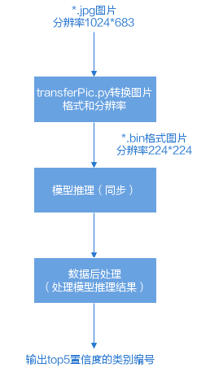

#### 原理介绍<a name="ZH-CN_TOPIC_0000002441981025"></a>

在该Sample中，涉及的关键功能点，如[表1](#table607mcpsimp)所示。API接口的详细介绍请参见[SVP ACL API参考](#ZH-CN_TOPIC_0000002408421574)。

> **说明：** 
>Device表示板端环境上的图像分析引擎，SOC场景下，当前只有一个Device。

**表 1**  Sample中的关键功能点

<a name="table607mcpsimp"></a>
<table><tbody><tr id="row612mcpsimp"><th class="firstcol" valign="top" width="19%" id="mcps1.2.3.1.1"><p id="p614mcpsimp"><a name="p614mcpsimp"></a><a name="p614mcpsimp"></a><strong id="b5443152418290"><a name="b5443152418290"></a><a name="b5443152418290"></a>初始化</strong></p>
</th>
<td class="cellrowborder" valign="top" width="81%" headers="mcps1.2.3.1.1 "><a name="ul616mcpsimp"></a><a name="ul616mcpsimp"></a><ul id="ul616mcpsimp"><li>调用svp_acl_init接口初始化SVP ACL配置。</li><li>调用svp_acl_finalize接口实现SVP ACL去初始化。</li></ul>
</td>
</tr>
<tr id="row619mcpsimp"><th class="firstcol" valign="top" width="19%" id="mcps1.2.3.2.1"><p id="p621mcpsimp"><a name="p621mcpsimp"></a><a name="p621mcpsimp"></a>Device管理</p>
</th>
<td class="cellrowborder" valign="top" width="81%" headers="mcps1.2.3.2.1 "><a name="ul623mcpsimp"></a><a name="ul623mcpsimp"></a><ul id="ul623mcpsimp"><li>调用svp_acl_rt_set_device接口指定用于运算的Device。</li><li>调用svp_acl_rt_get_run_mode接口获取svp_acl软件栈的运行模式，根据运行模式的不同，内部处理流程不同。</li><li>调用svp_acl_rt_reset_device接口复位当前运算的Device，回收Device上的资源。</li></ul>
</td>
</tr>
<tr id="row627mcpsimp"><th class="firstcol" valign="top" width="19%" id="mcps1.2.3.3.1"><p id="p629mcpsimp"><a name="p629mcpsimp"></a><a name="p629mcpsimp"></a>Context管理</p>
</th>
<td class="cellrowborder" valign="top" width="81%" headers="mcps1.2.3.3.1 "><a name="ul631mcpsimp"></a><a name="ul631mcpsimp"></a><ul id="ul631mcpsimp"><li>调用svp_acl_rt_create_context接口创建Context。</li><li>调用svp_acl_rt_destroy_context接口销毁Context。</li></ul>
</td>
</tr>
<tr id="row634mcpsimp"><th class="firstcol" valign="top" width="19%" id="mcps1.2.3.4.1"><p id="p636mcpsimp"><a name="p636mcpsimp"></a><a name="p636mcpsimp"></a>Stream管理</p>
</th>
<td class="cellrowborder" valign="top" width="81%" headers="mcps1.2.3.4.1 "><a name="ul638mcpsimp"></a><a name="ul638mcpsimp"></a><ul id="ul638mcpsimp"><li>调用svp_acl_rt_create_stream接口创建Stream。</li><li>调用svp_acl_rt_destroy_stream接口销毁Stream。</li></ul>
</td>
</tr>
<tr id="row641mcpsimp"><th class="firstcol" valign="top" width="19%" id="mcps1.2.3.5.1"><p id="p643mcpsimp"><a name="p643mcpsimp"></a><a name="p643mcpsimp"></a>内存管理</p>
</th>
<td class="cellrowborder" valign="top" width="81%" headers="mcps1.2.3.5.1 "><a name="ul645mcpsimp"></a><a name="ul645mcpsimp"></a><ul id="ul645mcpsimp"><li>调用svp_acl_rt_malloc接口申请Device上的内存。</li><li>调用svp_acl_rt_free接口释放Device上的内存。</li></ul>
</td>
</tr>
<tr id="row648mcpsimp"><th class="firstcol" valign="top" width="19%" id="mcps1.2.3.6.1"><p id="p650mcpsimp"><a name="p650mcpsimp"></a><a name="p650mcpsimp"></a>模型推理</p>
</th>
<td class="cellrowborder" valign="top" width="81%" headers="mcps1.2.3.6.1 "><a name="ul652mcpsimp"></a><a name="ul652mcpsimp"></a><ul id="ul652mcpsimp"><li>调用svp_acl_mdl_load_from_mem接口从存放*.om文件内存中加载模型。</li><li>调用svp_acl_mdl_execute接口执行模型推理，同步接口。</li><li>调用svp_acl_mdl_unload接口卸载模型。</li></ul>
</td>
</tr>
<tr id="row656mcpsimp"><th class="firstcol" valign="top" width="19%" id="mcps1.2.3.7.1"><p id="p658mcpsimp"><a name="p658mcpsimp"></a><a name="p658mcpsimp"></a>数据后处理</p>
</th>
<td class="cellrowborder" valign="top" width="81%" headers="mcps1.2.3.7.1 "><p id="p660mcpsimp"><a name="p660mcpsimp"></a><a name="p660mcpsimp"></a>提供样例代码，在接口OutputModelResult中，处理模型推理的结果，直接在终端上显示top5置信度的类别编号。</p>
<p id="p661mcpsimp"><a name="p661mcpsimp"></a><a name="p661mcpsimp"></a>另外，在接口DumpModelOutputResult中，将模型推理的结果写入文件（运行可执行文件后，推理结果文件在应用可执行文件的同级目录下）。</p>
<pre class="screen" id="screen16947114013486"><a name="screen16947114013486"></a><a name="screen16947114013486"></a>processModel.OutputModelResult();
processModel.DumpModelOutputResult();</pre>
</td>
</tr>
</tbody>
</table>

#### 目录结构<a name="ZH-CN_TOPIC_0000002408581474"></a>

样例代码结构如下所示。

```
├── caffe_model
│   ├── resnet50.caffemodel         //测试权重数据,需要按指导获取测试权重数据，放到caffe_model目录下
│   ├── resnet50.prototxt           //测试模型网络,需要按指导获取测试模型网络，放到caffe_model目录下
│   ├── pixel_mean.txt              //均值文件，数据归一化使用

├── data 
│   ├── dog1_1024_683.jpg            //测试数据,需要按指导获取测试图片，放到data目录下 
│   ├── dog2_1024_683.jpg            //测试数据,需要按指导获取测试图片，放到data目录下 
│   ├── image_ref_list.txt           //保存测试数据对应文件名的文件
 
├── inc 
│   ├── model_process.h               //声明模型处理相关函数的头文件 
│   ├── sample_process.h              //声明资源初始化/销毁相关函数的头文件                    
│   ├── utils.h                       //声明公共函数（例如：文件读取函数）的头文件 
 
├── model                              //存放转换后模型目录

├── script 
│   ├── transferPic.py               //将*.jpg转换为*.bin，同时将图片从1024*683的分辨率缩放为224*224 
 
├── src 
│   ├── acl.json         //系统初始化的配置文件 
│   ├── CMakeLists.txt         //编译脚本 
│   ├── main.cpp               //主函数，图片分类功能的实现文件 
│   ├── model_process.cpp      //模型处理相关函数的实现文件 
│   ├── sample_process.cpp     //资源初始化/销毁相关函数的实现文件            
│   ├── utils.cpp              //公共函数（例如：文件读取函数）的实现文件 
 
├── .project     //工程信息文件，包含工程类型、工程描述、运行目标设备类型等  
├── CMakeLists.txt    //编译脚本，调用src目录下的CMakeLists文件
├── resnet50_config.json //配置模型生成信息文件
├── README.md
```

### 编译及运行应用<a name="ZH-CN_TOPIC_0000002442021109"></a>

1.  模型转换
    1.  以运行用户登录开发环境。
    2.  参考《ATC工具使用指南》中的“使用入门”，执行“准备动作”，包括获取工具、设置环境变量。
    3.  准备数据。

        从https://gitee.com/ascend/ModelZoo-TensorFlow/tree/master/TensorFlow/contrib/cv/resnet50/ATC\_resnet50\_caffe\_AE 链接中获取ResNet-50网络的模型文件（\*.prototxt）、预训练模型文件（\*.caffemodel），并以运行用户将获取的文件上传至开发环境的“样例目录/caffe\_model”目录下，也可查看README.md。如果目录不存在，需要自行创建。

        请从以下链接获取该样例的输入图片，并以运行用户将获取的文件上传至开发环境的“样例目录/data”目录下。如果目录不存在，需自行创建。

        -   [https://c7xcode.obs.cn-north-4.myhuaweicloud.com/models/aclsample/dog1\_1024\_683.jpg](https://c7xcode.obs.cn-north-4.myhuaweicloud.com/models/aclsample/dog1_1024_683.jpg)
        -   [https://c7xcode.obs.cn-north-4.myhuaweicloud.com/models/aclsample/dog2\_1024\_683.jpg](https://c7xcode.obs.cn-north-4.myhuaweicloud.com/models/aclsample/dog2_1024_683.jpg)

            在“样例目录/data”目录下，创建参考图片列表文件（image\_ref\_list.txt）并在其中填写图片路径data/ dog1\_1024\_683.jpg及data/ dog2\_1024\_683.jpg，各路径换行填写。

    4.  将ResNet-50网络转换为适配SoC的离线模型（\*.om文件）。

        切换到“样例目录”目录，执行如下命令：

        ```
        atc --save_original_model="true" --soc_version=${soc_version} --log_level="0" --input_format="NCHW" --weight="./caffe_model/resnet50.caffemodel" --batch_num="256" --compile_mode="0" --image_list="data:./data/image_ref_list.txt" --input_shape="data:1,3,224,224" --online_model_type="0" --framework="0" --insert_op_conf="resnet50_insert_op.cfg" --dump_data="0" --output="./model/resnet50" --model="./caffe_model/resnet50.prototxt"
        ```

        -   --soc\_version：SoC的版本，用户根据具体板端环境形态，选择对应的取值。
        -   --insert\_op\_conf：插入图像预处理的配置。配置了图像预处理的Data层表示输入数据格式为图像，没有配置的为Feature Map，可参考《ATC工具使用指南》配置。
        -   --output：生成的resnet50.om文件存放在“样例目录/model”目录下，建议使用命令中的默认设置，否则在编译代码前，您还需要修改sample\_process.cpp中的omModelPath参数值。

            ```
            const char* omModelPath = "../model/resnet50.om";
            ```

        关于各参数的详细解释，请参见《ATC工具使用指南》。

1.  编译代码
    1.  以运行用户登录开发环境。
    2.  设置环境变量，编译脚本CMakeLists.txt通过环境变量所设置的头文件、库文件的路径来编译代码。

        如下为设置环境变量的示例，请将“$HOME/acl”替换为ACLlib组件的实际安装路径。

        注意：stub路径中的库仅作为编译使用，在板端环境运行时请使用SDK包中的库。

        ```
        export DDK_PATH=$HOME/acl/ascend-toolkit/svp_latest/x86_64-linux
        export NNN_HOST_LIB=$HOME/acl/ascend-toolkit/svp_latest/x86_64-linux/acllib/lib64/stub
        ```

    3.  切换到样例目录，创建目录用于存放编译文件，例如，本文中，创建的目录为“build/intermediates/soc”。

        ```
        mkdir -p build/intermediates/soc
        ```

    4.  切换到“build/intermediates/soc”目录，执行**cmake**生成编译文件。

        “../../../src”表示CMakeLists.txt文件所在的目录，请根据实际目录层级修改。

        ```
        cd build/intermediates/soc
        ```

        您需要根据所安装的交叉编译器，执行对应的cmake命令：

        若在开发环境上安装的ACLlib软件包为Linux操作系统SoC-cs形态，则执行如下编译命令：

        ```
        cmake ../../../src -DCMAKE_CXX_COMPILER=aarch64-mix410-linux-g++ -DCMAKE_SKIP_RPATH=TRUE
        ```

    5.  执行**make**命令，生成的可执行文件main在“样例目录/out”目录下。

        ```
        make
        ```

2.  准备测试数据。

    1.  请参考步骤1，在“样例目录/data”目录下，存放测试图片dog1\_1024\_683.jpg和dog2\_1024\_683.jpg。
    2.  以运行用户登录开发环境。
    3.  切换到“样例目录/data”目录下，执行transferPic.py脚本，将\*.jpg转换为\*.bin，同时将图片从1024\*683的分辨率缩放为224\*224。在“样例目录/data”目录下生成2个\*.bin文件。

        ```
        python3.7.5 ../script/transferPic.py
        ```

    > **说明：** 
    >如果执行脚本报错“ModuleNotFoundError: No module named 'PIL'”，则表示缺少Pillow库，请使用**pip3.7.5 install Pillow --user**命令安装Pillow库。

3.  运行可执行文件。
    1.  将开发环境的样例目录及目录下的文件上传到板端环境。

        板端环境的操作系统为Linux时，以root用户将开发环境上的目录及其文件上传到板端环境的指定目录下，例如“/root/acl\_resnet50”。

    2.  登录板端环境。

        板端环境的操作系统为Linux时，以root用户登录板端环境。

    3.  设置环境变量。

        板端环境的操作系统为Linux时，必须设置如下环境变量，并根据libsvp\_acl.so和libsvp\__aa_cpu.so文件所在的路径设置LD\_LIBRARY\_PATH环境变量。

        ```
        export LD_LIBRARY_PATH=/home/demo/out/lib
        ```

    4.  切换到可执行文件main所在的目录，例如“$HOME/acl\_resnet50/out”，给该目录下的main文件加执行权限。

        ```
        chmod +x main
        ```

    5.  切换到可执行文件main所在的目录，例如“$HOME/acl\_resnet50/out”，运行可执行文件。

        ```
        ./main
        ```

        执行成功后，在屏幕上的关键提示信息示例如下，index及其value会根据板端环境的实际情况有所不同：

        ```
         [INFO] acl init success 
         [INFO] open device 0 success 
         [INFO] create context success 
         [INFO] create stream success 
         [INFO] load model ../model/resnet50.om success 
         [INFO] create model description success 
         [INFO] create model output success 
         [INFO] start to process file:../data/dog1_1024_683.bin 
         [INFO] model execute success 
         [INFO] top 1: index[161] value[0.900391] 
         [INFO] top 2: index[164] value[0.038666] 
         [INFO] top 3: index[163] value[0.019287] 
         [INFO] top 4: index[166] value[0.016357] 
         [INFO] top 5: index[167] value[0.012161] 
         [INFO] output data success 
         [INFO] start to process file:../data/dog2_1024_683.bin 
         [INFO] model execute success 
         [INFO] top 1: index[267] value[0.974609] 
         [INFO] top 2: index[266] value[0.013062] 
         [INFO] top 3: index[265] value[0.010017] 
         [INFO] top 4: index[129] value[0.000335] 
         [INFO] top 5: index[372] value[0.000179] 
         [INFO] output data success 
         [INFO] Unload model success, modelId is 1 
         [INFO] execute sample success 
         [INFO] end to destroy stream  
         [INFO] end to destroy context 
         [INFO] end to reset device is 0
        ```

## 基于Caffe ResNet-50网络实现图片分类（异步推理）<a name="ZH-CN_TOPIC_0000002408581502"></a>


### 样例介绍<a name="ZH-CN_TOPIC_0000002408421782"></a>


#### 获取样例<a name="ZH-CN_TOPIC_0000002408581498"></a>

参考[如何获取Sample](#ZH-CN_TOPIC_0000002441980885)，获取样例代码。

#### 功能描述<a name="ZH-CN_TOPIC_0000002408421978"></a>

该样例主要是基于Caffe ResNet-50网络（单输入、单Batch）实现图片分类的功能。

将Caffe ResNet-50网络的模型文件转换为适配SoC的离线模型（\*.om文件），在样例中，加载该om文件，对2张\*.jpg图片进行n次异步推理（n作为运行应用的参数，由用户配置），分别得到n次推理结果后，再对推理结果进行处理，输出top1置信度的类别标识。

**图 1**  Sample示例<a name="fig1605mcpsimp"></a>  
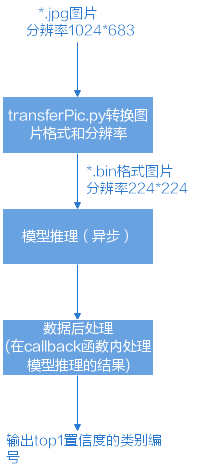

#### 原理介绍<a name="ZH-CN_TOPIC_0000002408581814"></a>

在该Sample中，涉及的关键功能点，如[表1](#table4320mcpsimp)所示。API接口的详细介绍请参见[SVP ACL API参考](#ZH-CN_TOPIC_0000002408421574)。

> **说明：** 
>Device表示板端环境上的图像分析引擎，SOC场景下，当前只有一个Device。

**表 1**  Sample中的关键功能点

<a name="table4320mcpsimp"></a>
<table><tbody><tr id="row4325mcpsimp"><th class="firstcol" valign="top" width="19%" id="mcps1.2.3.1.1"><p id="p4327mcpsimp"><a name="p4327mcpsimp"></a><a name="p4327mcpsimp"></a>初始化</p>
</th>
<td class="cellrowborder" valign="top" width="81%" headers="mcps1.2.3.1.1 "><a name="ul4329mcpsimp"></a><a name="ul4329mcpsimp"></a><ul id="ul4329mcpsimp"><li>调用svp_acl_init接口初始化SVP ACL配置。</li><li>调用svp_acl_finalize接口实现SVP ACL去初始化。</li></ul>
</td>
</tr>
<tr id="row4332mcpsimp"><th class="firstcol" valign="top" width="19%" id="mcps1.2.3.2.1"><p id="p4334mcpsimp"><a name="p4334mcpsimp"></a><a name="p4334mcpsimp"></a>Device管理</p>
</th>
<td class="cellrowborder" valign="top" width="81%" headers="mcps1.2.3.2.1 "><a name="ul4336mcpsimp"></a><a name="ul4336mcpsimp"></a><ul id="ul4336mcpsimp"><li>调用svp_acl_rt_set_device接口指定用于运算的Device。</li><li>调用svp_acl_rt_get_run_mode接口获取软件栈的运行模式，根据运行模式的不同，内部处理流程不同。</li><li>调用svp_acl_rt_reset_device接口复位当前运算的Device，回收Device上的资源。</li></ul>
</td>
</tr>
<tr id="row4340mcpsimp"><th class="firstcol" valign="top" width="19%" id="mcps1.2.3.3.1"><p id="p4342mcpsimp"><a name="p4342mcpsimp"></a><a name="p4342mcpsimp"></a>Context管理</p>
</th>
<td class="cellrowborder" valign="top" width="81%" headers="mcps1.2.3.3.1 "><a name="ul4344mcpsimp"></a><a name="ul4344mcpsimp"></a><ul id="ul4344mcpsimp"><li>调用svp_acl_rt_create_context接口创建Context。</li><li>调用svp_acl_rt_set_current_context接口设置线程的Context。</li><li>调用svp_acl_rt_destroy_context接口销毁Context。</li></ul>
</td>
</tr>
<tr id="row4348mcpsimp"><th class="firstcol" valign="top" width="19%" id="mcps1.2.3.4.1"><p id="p4350mcpsimp"><a name="p4350mcpsimp"></a><a name="p4350mcpsimp"></a>Stream管理</p>
</th>
<td class="cellrowborder" valign="top" width="81%" headers="mcps1.2.3.4.1 "><a name="ul4352mcpsimp"></a><a name="ul4352mcpsimp"></a><ul id="ul4352mcpsimp"><li>调用svp_acl_rt_create_stream接口创建Stream。</li><li>调用svp_acl_rt_destroy_stream接口销毁Stream。</li></ul>
</td>
</tr>
<tr id="row4355mcpsimp"><th class="firstcol" valign="top" width="19%" id="mcps1.2.3.5.1"><p id="p4357mcpsimp"><a name="p4357mcpsimp"></a><a name="p4357mcpsimp"></a>内存管理</p>
</th>
<td class="cellrowborder" valign="top" width="81%" headers="mcps1.2.3.5.1 "><a name="ul4359mcpsimp"></a><a name="ul4359mcpsimp"></a><ul id="ul4359mcpsimp"><li>调用svp_acl_rt_malloc_host接口申请Host上内存。</li><li>调用svp_acl_rt_free_host释放Host上的内存。</li><li>调用svp_acl_rt_malloc接口申请Device上的内存。</li><li>调用svp_acl_rt_free接口释放Device上的内存。</li></ul>
</td>
</tr>
<tr id="row4364mcpsimp"><th class="firstcol" valign="top" width="19%" id="mcps1.2.3.6.1"><p id="p4366mcpsimp"><a name="p4366mcpsimp"></a><a name="p4366mcpsimp"></a>模型推理</p>
</th>
<td class="cellrowborder" valign="top" width="81%" headers="mcps1.2.3.6.1 "><a name="ul4368mcpsimp"></a><a name="ul4368mcpsimp"></a><ul id="ul4368mcpsimp"><li>调用svp_acl_mdl_load_from_mem接口从*.om文件加载模型。</li><li>创建新线程（例如t1），在线程函数内调用svp_acl_rt_process_report接口，等待指定时间后，触发回调函数（例如CallBackFunc，用于处理模型推理结果）。</li><li>调用svp_acl_rt_subscribe_report接口，指定处理Stream上回调函数（CallBackFunc）的线程（t1）。</li><li>调用svp_acl_mdl_execute_async接口执行模型推理，异步接口。</li><li>调用svp_acl_rt_launch_callback接口，在Stream的任务队列中增加一个需要在Host/Device上执行的回调函数（CallBackFunc）。</li><li>调用svp_acl_rt_synchronize_stream接口，阻塞应用程序运行，直到指定Stream中的所有任务都完成。</li><li>调用svp_acl_rt_unsubscribe_report接口，取消线程注册，Stream上的回调函数（CallBackFunc）不再由指定线程（t1）处理。</li><li>模型推理结束后，调用svp_acl_mdl_unload接口卸载模型。</li></ul>
</td>
</tr>
<tr id="row4377mcpsimp"><th class="firstcol" valign="top" width="19%" id="mcps1.2.3.7.1"><p id="p4379mcpsimp"><a name="p4379mcpsimp"></a><a name="p4379mcpsimp"></a>数据后处理</p>
</th>
<td class="cellrowborder" valign="top" width="81%" headers="mcps1.2.3.7.1 "><p id="p4381mcpsimp"><a name="p4381mcpsimp"></a><a name="p4381mcpsimp"></a>提供样例代码，在接口OutputModelResult中，处理模型推理的结果，直接在终端上显示top5置信度的类别编号。</p>
<p id="p4382mcpsimp"><a name="p4382mcpsimp"></a><a name="p4382mcpsimp"></a>另外，在接口DumpModelOutputResult中，将模型推理的结果写入文件（运行可执行文件后，推理结果文件在应用可执行文件的同级目录下）。</p>
<pre class="screen" id="screen17436652161112"><a name="screen17436652161112"></a><a name="screen17436652161112"></a>processModel.OutputModelResult();
processModel.DumpModelOutputResult();</pre>
</td>
</tr>
</tbody>
</table>

#### 目录结构<a name="ZH-CN_TOPIC_0000002441981141"></a>

样例代码结构如下所示。

```
├── caffe_model
│   ├── resnet50.caffemodel         //测试权重数据,需要按指导获取测试权重数据，放到caffe_model目录下
│   ├── resnet50.prototxt           //测试模型网络,需要按指导获取测试模型网络，放到caffe_model目录下
│   ├── pixel_mean.txt              //均值文件，数据归一化使用

├── data 
│   ├── dog1_1024_683.jpg            //测试数据,需要按指导获取测试图片，放到data目录下 
│   ├── dog2_1024_683.jpg            //测试数据,需要按指导获取测试图片，放到data目录下 
│   ├── image_ref_list.txt           //保存测试数据对应文件名的文件
 
├── inc 
│   ├── memory_pool.h                 //声明内存池处理相关函数的头文件 
│   ├── model_process.h               //声明模型处理相关函数的头文件 
│   ├── sample_process.h              //声明资源初始化/销毁相关函数的头文件                    
│   ├── utils.h                       //声明公共函数（例如：文件读取函数）的头文件 
 
├── model                              //存放转换后模型目录

├── script 
│   ├── transferPic.py               //将*.jpg转换为*.bin，同时将图片从1024*683的分辨率缩放为224*224 
 
├── src 
│   ├── acl.json         //系统初始化的配置文件 
│   ├── CMakeLists.txt         //编译脚本 
│   ├── main.cpp               //主函数，图片分类功能的实现文件 
│   ├── memory_pool.cpp        //内存池处理相关函数的实现文件 
│   ├── model_process.cpp      //模型处理相关函数的实现文件 
│   ├── sample_process.cpp     //资源初始化/销毁相关函数的实现文件                                           
│   ├── utils.cpp              //公共函数（例如：文件读取函数）的实现文件 
 
├── .project     //工程信息文件，包含工程类型、工程描述、运行目标设备类型等 
├── CMakeLists.txt    //编译脚本，调用src目录下的CMakeLists文件
├── resnet50_config.json //配置模型生成信息文件
├── README.md
```

### 编译及运行应用<a name="ZH-CN_TOPIC_0000002408422014"></a>

1.  模型转换。

    1.  以运行用户登录开发环境。
    2.  参考《ATC工具使用指南》中的“使用入门”，执行“准备动作”，包括获取工具、设置环境变量。
    3.  准备数据。

        从https://gitee.com/ascend/ModelZoo-TensorFlow/tree/master/TensorFlow/contrib/cv/resnet50/ATC\_resnet50\_caffe\_AE 链接中获取ResNet-50网络的模型文件（\*.prototxt）、预训练模型文件（\*.caffemodel），并以运行用户将获取的文件上传至开发环境的“样例目录/caffe\_model”目录下，也可查看README.md。如果目录不存在，需要自行创建。

    请从以下链接获取该样例的输入图片，并以运行用户将获取的文件上传至开发环境的“样例目录/data”目录下。如果目录不存在，需自行创建。

    -   [https://c7xcode.obs.cn-north-4.myhuaweicloud.com/models/aclsample/dog1\_1024\_683.jpg](https://c7xcode.obs.cn-north-4.myhuaweicloud.com/models/aclsample/dog1_1024_683.jpg)
    -   [https://c7xcode.obs.cn-north-4.myhuaweicloud.com/models/aclsample/dog2\_1024\_683.jpg](https://c7xcode.obs.cn-north-4.myhuaweicloud.com/models/aclsample/dog2_1024_683.jpg)

        在“样例目录/data”目录下，创建参考图片列表文件（image\_ref\_list.txt）并在其中填写图片路径data/ dog1\_1024\_683.jpg及data/ dog2\_1024\_683.jpg，各路径换行填写。

    1.  将ResNet-50网络转换为适配SoC的离线模型（\*.om文件）。

        切换到“样例目录”目录，执行如下命令：

        ```
        atc --save_original_model="true" --soc_version=${soc_version} --log_level="0" --input_format="NCHW" --weight="./caffe_model/resnet50.caffemodel" --batch_num="256" --compile_mode="0" --image_list="data:./data/image_ref_list.txt" --input_shape="data:1,3,224,224" --online_model_type="0" --framework="0" --insert_op_conf="resnet50_insert_op.cfg" --dump_data="0" --output="./model/resnet50" --model="./caffe_model/resnet50.prototxt"
        ```

        -   --soc\_version：SoC的版本，用户根据具体板端环境形态，选择对应的取值。
        -   --insert\_op\_conf：插入图像预处理的配置。配置了图像预处理的Data层表示输入数据格式为图像，没有配置的为Feature Map，可参考《ATC工具使用指南》配置。
        -   --output：生成的resnet50.om文件存放在“样例目录/model”目录下，建议使用命令中的默认设置，否则在编译代码前，您还需要修改sample\_process.cpp中的omModelPath参数值。

            ```
            const char* omModelPath = "../model/resnet50.om";
            ```

            关于各参数的详细解释，请参见《ATC工具使用指南》。

1.  编译代码。
    1.  以运行用户登录开发环境。
    2.  设置环境变量，编译脚本CMakeLists.txt通过环境变量所设置的头文件、库文件的路径来编译代码。

        如下为设置环境变量的示例，请将“$HOME/acl”替换为ACLlib组件的实际安装路径。

        注意：stub路径中的库仅作为编译使用，在板端环境运行时请使用SDK包中的库。

        ```
        export DDK_PATH=$HOME/acl/ascend-toolkit/svp_latest/x86_64-linux
        export NNN_HOST_LIB=$HOME/acl/ascend-toolkit/svp_latest/x86_64-linux/acllib/lib64/stub
        ```

    3.  切换到样例目录，创建目录用于存放编译文件，例如，本文中，创建的目录为“build/intermediates/soc”。

        ```
        mkdir -p build/intermediates/soc
        ```

    4.  切换到“build/intermediates/soc”目录，执行**cmake**生成编译文件。

        “../../../src”表示CMakeLists.txt文件所在的目录，请根据实际目录层级修改。

        ```
        cd build/intermediates/soc
        ```

        您需要根据所安装的交叉编译器，执行对应的cmake命令：

        若在开发环境上安装的ACLlib软件包为Linux操作系统SoC-cs形态，则执行如下编译命令：

        ```
        cmake ../../../src -DCMAKE_CXX_COMPILER=aarch64-mix410-linux-g++ -DCMAKE_SKIP_RPATH=TRUE
        ```

    5.  执行**make**命令，生成的可执行文件main在“样例目录/out”目录下。

        ```
        make
        ```

2.  准备测试数据。

    1.  请参考步骤1，在“样例目录/data”目录下，存放测试图片dog1\_1024\_683.jpg和dog2\_1024\_683.jpg
    2.  以运行用户登录开发环境。
    3.  切换到“样例目录/data”目录下，执行transferPic.py脚本，将\*.jpg转换为\*.bin，同时将图片从1024\*683的分辨率缩放为224\*224。在“样例目录/data”目录下生成2个\*.bin文件。

        ```
        python3.7.5 ../script/transferPic.py
        ```

    > **说明：** 
    >如果执行脚本报错“ModuleNotFoundError: No module named 'PIL'”，则表示缺少Pillow库，请使用**pip3.7.5 install Pillow --user**命令安装Pillow库。

3.  运行可执行文件。
    1.  将开发环境的样例目录及目录下的文件上传到板端环境。

        板端环境的操作系统为Linux时，以root用户将开发环境上的目录及其文件上传到板端环境的指定目录下，例如“/root/acl\_resnet50\_async”。

    2.  登录板端环境。

        板端环境的操作系统为Linux时，以root用户登录板端环境。

    3.  设置环境变量。

        板端环境的操作系统为Linux时，必须设置如下环境变量，并根据libsvp\_acl.so和libsvp\__aa_cpu.so文件所在的路径设置LD\_LIBRARY\_PATH环境变量。

        ```
        export LD_LIBRARY_PATH=/home/demo/out/lib
        ```

    4.  切换到可执行文件main所在的目录，例如“$HOME/acl\_resnet50\_async/out”，给该目录下的main文件加执行权限。

        ```
        chmod +x main
        ```

    5.  切换到可执行文件main所在的目录，例如“$HOME/acl\_resnet50\_async/out”，运行可执行文件。
        -   运行可执行文件，不带参数时：
            -   执行模型异步推理的次数默认为10次；
            -   callback间隔默认为，表示1次异步推理后，下发一次callback任务；
            -   内存池中的内存块的个数默认为10个。

        -   运行可执行文件，带参数时：

            -   第一个参数表示执行模型异步推理的次数；

            -   第二个参数表示下发callback间隔，参数值为0时表示不下发callback任务，参数值为非0值（例如m）时表示m次异步推理后下发一次callback任务；
            -   第三个参数表示内存池中内存块的个数，内存块个数需大于等于模型异步推理的次数。

                ```
                ./main
                ```

            执行成功后，在屏幕上的关键提示信息示例如下，index及其value会根据板端环境的实际情况有所不同：

            备注：日志中出现“…… get callback task failed”，是因为执行过程中推理还没有开始执行就起线程进行callback处理，此为正常现象。

            ```
            [INFO]  ./main param1 param2 param3, param1 is execute model times(default 10), param2 is callback interval(default 1), param3 is memory pool size(default 10) 
             [INFO]  execute times = 10 
             [INFO]  callback interval = 1 
             [INFO]  memory pool size = 10 
             [INFO]  acl init success 
             [INFO]  open device 0 success 
             [INFO]  create context success 
             [INFO]  create stream success 
             [INFO]  get run mode success 
             [INFO]  load model ../model/resnet50.om success 
             [INFO]  create model description success 
             [INFO]  init memory pool success 
             [INFO]  subscribe report success 
             [INFO]  top 1: index[267] value[0.889648] 
             [INFO]  top 1: index[161] value[0.836914] 
             [INFO]  top 1: index[267] value[0.889648] 
             [INFO]  top 1: index[161] value[0.836914] 
             [INFO]  top 1: index[161] value[0.836914] 
             [INFO]  top 1: index[267] value[0.889648] 
             [INFO]  top 1: index[161] value[0.836914] 
             [INFO]  top 1: index[267] value[0.889648] 
             [INFO]  top 1: index[161] value[0.836914] 
             [INFO]  top 1: index[267] value[0.889648] 
             ...... 
             [INFO]  top 1: index[161] value[0.836914] 
             [INFO]  top 1: index[267] value[0.889648] 
             [INFO]  model execute success 
             [INFO]  unsubscribe report success 
             [INFO]  unload model success, modelId is 1 
             [INFO]  execute sample success 
             [INFO]  end to destroy stream 
             [INFO]  end to destroy context 
             [INFO]  end to reset device is 0 
             [INFO]  end to finalize acl
            ```

# FAQ<a name="ZH-CN_TOPIC_0000002442020965"></a>


## SS928V100解决方案使用SVP\__NNN_模块注意事项<a name="ZH-CN_TOPIC_0000002408421590"></a>

hnr与svp\__nnn_互斥：

1.  两者不能同时使用，所依赖的ko（ot\_pqp.ko/ot\_svp\__nnn_.ko）为互斥，不能同时插入
2.  当前版本默认都没有加载ko,使用svp\__nnn_的进程需要手动更改加载脚本，或者手动insmod ot\_svp\__nnn_.ko。如果ot\_pqp.ko已经加载，需要rmmod ot\_pqp.ko，然后加载ot\_svp\__nnn_.ko

## SVP\__NNN_离线模型保护<a name="ZH-CN_TOPIC_0000002408421966"></a>

当前svp\__nnn_中未提供OM的完整性与机密性保护机制，需客户对OM的完整性与机密性进行保护。

## 第一次推理耗时长的问题<a name="ZH-CN_TOPIC_0000002408421934"></a>

用户在进行第一次推理时，可能会碰到推理时间比后续推理耗时长的问题。这种现象可能是因为linux内存管理的缺页机制引发的。建议用户在申请内存时，对workbuf、output等内存进行初始化为0的操作，这样提前把缺页机制完成，使第一次推理耗时与后续的推理基本一致。

