# 前言<a name="ZH-CN_TOPIC_0000002413203032"></a>

**概述<a name="section4537382116410"></a>**

本文介绍客户如何快速使用SVP\_NNN\_PC发布包转换模型并在PC和SVP\_NNN上进行推理。

**产品版本<a name="section16428154481216"></a>**

与本文档相对应的产品版本如下。

<a name="table0428544111215"></a>
<table><thead align="left"><tr id="row342774481217"><th class="cellrowborder" valign="top" width="45%" id="mcps1.1.3.1.1"><p id="p1042704421217"><a name="p1042704421217"></a><a name="p1042704421217"></a>产品名称</p>
</th>
<th class="cellrowborder" valign="top" width="55.00000000000001%" id="mcps1.1.3.1.2"><p id="p1142717443126"><a name="p1142717443126"></a><a name="p1142717443126"></a>产品版本</p>
</th>
</tr>
</thead>
<tbody><tr id="row1533613482454"><td class="cellrowborder" valign="top" width="45%" headers="mcps1.1.3.1.1 "><p id="p1587119153326"><a name="p1587119153326"></a><a name="p1587119153326"></a>SS928</p>
</td>
<td class="cellrowborder" valign="top" width="55.00000000000001%" headers="mcps1.1.3.1.2 "><p id="p158711415193215"><a name="p158711415193215"></a><a name="p158711415193215"></a>V100</p>
</td>
</tr>
<tr id="row567519265"><td class="cellrowborder" valign="top" width="45%" headers="mcps1.1.3.1.1 "><p id="p787141553210"><a name="p787141553210"></a><a name="p787141553210"></a>SS927</p>
</td>
<td class="cellrowborder" valign="top" width="55.00000000000001%" headers="mcps1.1.3.1.2 "><p id="p20871215113219"><a name="p20871215113219"></a><a name="p20871215113219"></a>V100</p>
</td>
</tr>
</tbody>
</table>

**读者对象<a name="section4378592816410"></a>**

本文档主要适用于软件开发工程师。

掌握以下经验和技能可以更好地理解本文档：

-   熟悉Linux基本命令。
-   对机器学习、图像分析方法有一定的了解。

**符号约定<a name="section133020216410"></a>**

在本文中可能出现下列标志，它们所代表的含义如下。

<a name="table2622507016410"></a>
<table><thead align="left"><tr id="row1530720816410"><th class="cellrowborder" valign="top" width="20.580000000000002%" id="mcps1.1.3.1.1"><p id="p6450074116410"><a name="p6450074116410"></a><a name="p6450074116410"></a><strong id="b2136615816410"><a name="b2136615816410"></a><a name="b2136615816410"></a>符号</strong></p>
</th>
<th class="cellrowborder" valign="top" width="79.42%" id="mcps1.1.3.1.2"><p id="p5435366816410"><a name="p5435366816410"></a><a name="p5435366816410"></a><strong id="b5941558116410"><a name="b5941558116410"></a><a name="b5941558116410"></a>说明</strong></p>
</th>
</tr>
</thead>
<tbody><tr id="row1372280416410"><td class="cellrowborder" valign="top" width="20.580000000000002%" headers="mcps1.1.3.1.1 "><p id="p3734547016410"><a name="p3734547016410"></a><a name="p3734547016410"></a><a name="image2670064316410"></a><a name="image2670064316410"></a><span></span></p>
</td>
<td class="cellrowborder" valign="top" width="79.42%" headers="mcps1.1.3.1.2 "><p id="p1757432116410"><a name="p1757432116410"></a><a name="p1757432116410"></a>表示如不避免则将会导致死亡或严重伤害的具有高等级风险的危害。</p>
</td>
</tr>
<tr id="row466863216410"><td class="cellrowborder" valign="top" width="20.580000000000002%" headers="mcps1.1.3.1.1 "><p id="p1432579516410"><a name="p1432579516410"></a><a name="p1432579516410"></a><a name="image4895582316410"></a><a name="image4895582316410"></a><span></span></p>
</td>
<td class="cellrowborder" valign="top" width="79.42%" headers="mcps1.1.3.1.2 "><p id="p959197916410"><a name="p959197916410"></a><a name="p959197916410"></a>表示如不避免则可能导致死亡或严重伤害的具有中等级风险的危害。</p>
</td>
</tr>
<tr id="row123863216410"><td class="cellrowborder" valign="top" width="20.580000000000002%" headers="mcps1.1.3.1.1 "><p id="p1232579516410"><a name="p1232579516410"></a><a name="p1232579516410"></a><a name="image1235582316410"></a><a name="image1235582316410"></a><span></span></p>
</td>
<td class="cellrowborder" valign="top" width="79.42%" headers="mcps1.1.3.1.2 "><p id="p123197916410"><a name="p123197916410"></a><a name="p123197916410"></a>表示如不避免则可能导致轻微或中度伤害的具有低等级风险的危害。</p>
</td>
</tr>
<tr id="row5786682116410"><td class="cellrowborder" valign="top" width="20.580000000000002%" headers="mcps1.1.3.1.1 "><p id="p2204984716410"><a name="p2204984716410"></a><a name="p2204984716410"></a><a name="image4504446716410"></a><a name="image4504446716410"></a><span></span></p>
</td>
<td class="cellrowborder" valign="top" width="79.42%" headers="mcps1.1.3.1.2 "><p id="p4388861916410"><a name="p4388861916410"></a><a name="p4388861916410"></a>用于传递设备或环境安全警示信息。如不避免则可能会导致设备损坏、数据丢失、设备性能降低或其它不可预知的结果。</p>
<p id="p1238861916410"><a name="p1238861916410"></a><a name="p1238861916410"></a>“须知”不涉及人身伤害。</p>
</td>
</tr>
<tr id="row2856923116410"><td class="cellrowborder" valign="top" width="20.580000000000002%" headers="mcps1.1.3.1.1 "><p id="p5555360116410"><a name="p5555360116410"></a><a name="p5555360116410"></a><a name="image799324016410"></a><a name="image799324016410"></a><span></span></p>
</td>
<td class="cellrowborder" valign="top" width="79.42%" headers="mcps1.1.3.1.2 "><p id="p4612588116410"><a name="p4612588116410"></a><a name="p4612588116410"></a>对正文中重点信息的补充说明。</p>
<p id="p1232588116410"><a name="p1232588116410"></a><a name="p1232588116410"></a>“说明”不是安全警示信息，不涉及人身、设备及环境伤害信息。</p>
</td>
</tr>
</tbody>
</table>

**修改记录<a name="section2467512116410"></a>**

<a name="table1125885525217"></a>
<table><thead align="left"><tr id="row425917551523"><th class="cellrowborder" valign="top" width="20.72%" id="mcps1.1.4.1.1"><p id="p19259555205218"><a name="p19259555205218"></a><a name="p19259555205218"></a><strong id="b13259195555215"><a name="b13259195555215"></a><a name="b13259195555215"></a>文档版本</strong></p>
</th>
<th class="cellrowborder" valign="top" width="20.22%" id="mcps1.1.4.1.2"><p id="p12259055105217"><a name="p12259055105217"></a><a name="p12259055105217"></a><strong id="b112591455165213"><a name="b112591455165213"></a><a name="b112591455165213"></a>发布日期</strong></p>
</th>
<th class="cellrowborder" valign="top" width="59.06%" id="mcps1.1.4.1.3"><p id="p625985585220"><a name="p625985585220"></a><a name="p625985585220"></a><strong id="b15259755185216"><a name="b15259755185216"></a><a name="b15259755185216"></a>修改说明</strong></p>
</th>
</tr>
</thead>
<tbody><tr id="row425985519529"><td class="cellrowborder" valign="top" width="20.72%" headers="mcps1.1.4.1.1 "><p id="p4260125525214"><a name="p4260125525214"></a><a name="p4260125525214"></a>00B01</p>
</td>
<td class="cellrowborder" valign="top" width="20.22%" headers="mcps1.1.4.1.2 "><p id="p4260155518528"><a name="p4260155518528"></a><a name="p4260155518528"></a>2025-09-15</p>
</td>
<td class="cellrowborder" valign="top" width="59.06%" headers="mcps1.1.4.1.3 "><p id="p1626035517524"><a name="p1626035517524"></a><a name="p1626035517524"></a>第1次临时版本发布。</p>
</td>
</tr>
</tbody>
</table>

# 简介<a name="ZH-CN_TOPIC_0000002413203036"></a>

图像分析引擎1与图像分析引擎2存在差异，详细差异请参见《图像分析引擎2与图像分析引擎1使用差异说明》，请根据说明选择合适的引擎。本指南针对图像分析引擎2。


## 功能框架<a name="ZH-CN_TOPIC_0000002446642273"></a>

**图 1**  整体框架<a name="fig183212536115"></a>  
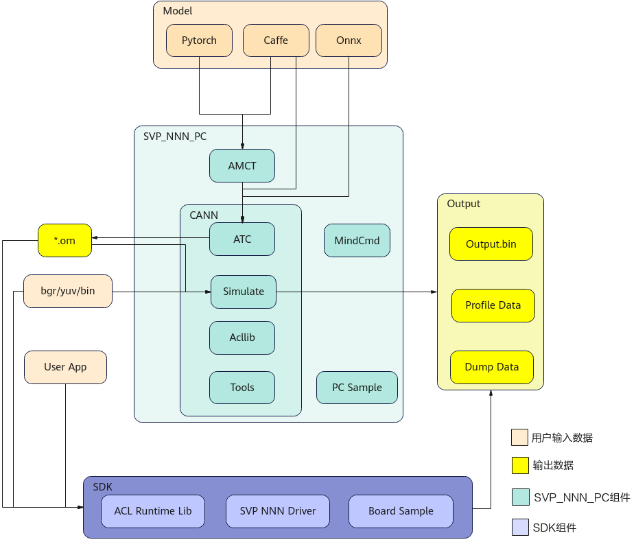

## 工具功能<a name="ZH-CN_TOPIC_0000002413203024"></a>

SVP\__NNN_\_PC组件包中，提供如下的工具链：

-   AMCT：模型压缩工具（Advanced Model Compression Toolkit）对原始网络模型进行量化，量化是指对模型的权重（weight）和数据（activation）进行低比特处理，让最终生成的网络模型更加轻量化，从而达到节省网络模型存储空间、降低传输时延、提高计算效率，达到性能提升与优化的目标。
-   MindCmd：Python命令行工具，依赖CANN、AMCT\(可选\)，支持网络模型端到端运行数据预处理、Ground Truth、AMCT、ATC、Simulate、板端推理、Dump、精度比对、性能分析，旨在提升网络模型移植、分析和优化的效率。
-   PC Sample：提供sample示例。
-   Ascend-cann-toolkit：开发套件包，简称CANN。为开发者提供基于模式识别处理器SoC的相关算法开发工具包，旨在帮助开发者进行快速、高效的模型、算子和应用的开发。CANN主要提供如下工具。
    -   ATC：将开源框架网络模型通过ATC\(Advanced Tensor Compiler\)工具转换成适配图像分析引擎的离线模型。
    -   Simulate：提供功能、指令PC端模拟器，能够完整运行离线模型，加快网络模型的调试部署。
    -   Acllib：开发板SVP\_NNN提供的库。
    -   Tools：提供Profiling性能分析工具和精度比对工具。Profiling性能分析工具用于采集和分析运行在SoC上的推理业务（应用或算子）各个运行阶段的关键性能指标，用户可根据输出的性能数据针对关键性能瓶颈做出优化以实现产品的极致性能；精度比对工具的定位是解决模型的精度问题，提供比对自有模型算子的运算结果与Caffe等标准算子的运算结果，以便确认误差发生的算子。

SDK组件：提供的C语言API库开发图像分析工具应用，用于实现目标识别、图像分类等功能。

# 开发环境准备<a name="ZH-CN_TOPIC_0000002446762149"></a>


## 开发环境<a name="ZH-CN_TOPIC_0000002446642261"></a>

该场景下的开发环境需要单独部署SVP\__NNN_\_PC软件包，采用命令行的方式进行安装和使用。


### 简介<a name="ZH-CN_TOPIC_0000002446642257"></a>

部署架构如[图1](#fig730141553)所示。NNN环境包含 PC 端工具侧开发环境和单板侧板端环境，当一个训练好的模型过来后，首先可以经过AMCT（Advanced Model Compression Toolkit，模型压缩工具）进行量化，将模型中部分层量化为 8bit 计算，提升计算效率；其次使用ATC（Advanced Tensor Compiler）工具将量化后的模型或非量化的模型转换为Ascend NNN认识的离线模型；最后，离线模型放置在板端环境，即可进行推理。

**图 1**  部署架构<a name="fig730141553"></a>  

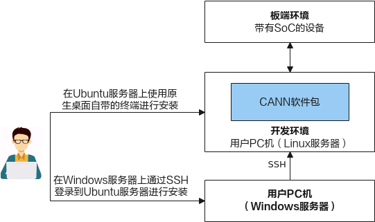

**板端环境：**板端环境中包含板端执行推理时需要的头文件、动态库、驱动ko以及sample。

**开发环境：**命令行方式开发环境

该场景下的开发环境需要单独部署CANN软件包，采用命令行的方式进行安装和使用。

### 使用流程<a name="ZH-CN_TOPIC_0000002413043208"></a>

本章节介绍以原始训练好的模型如何在SVP\_NNN上执行的整体使用流程，运行流程如[图1](#fig15391337766)所示。

**图 1**  运行流程<a name="fig15391337766"></a>  

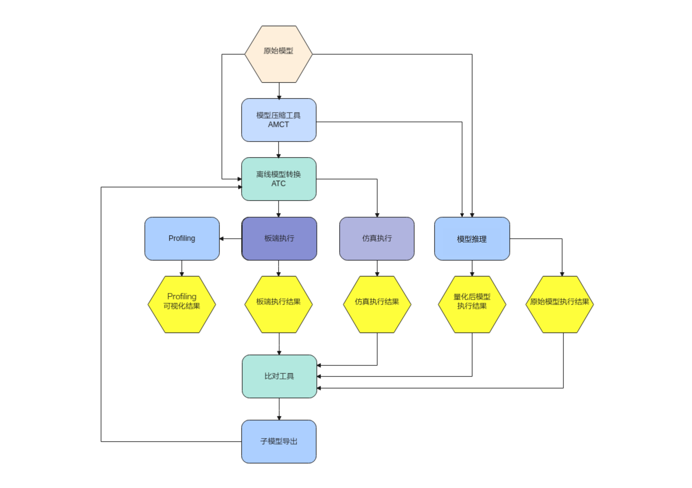

下面以ONNX原始网络模型为例，说明运行流程。

1.  当ONNX模型准备好后，可以直接使用ATC工具进行离线模型转换，也可以使用AMCT 模型压缩工具先进行量化，然后将量化后的ONNX模型再传给ATC工具进行离线模型转换。
2.  ATC离线模型转换后生成的om模型，可以在板端环境上使用ACL（Advanced Computing Language）接口做推理。
3.  推理后如果遇到精度问题，可以选择Dump网络的中间层数据，并和ONNX的Dump结果做比较，来定位是哪一层的问题。为了缩小范围，可以使用MindCmd上的子模型导出功能，将问题范围缩小，再使用导出的子模型复现问题。
4.  当推理性能不满足要求时，可以通过Profiling工具查看网络中每个算子的耗时以及带宽数据，可以通过分析瓶颈点，修改网络来提升整网性能。

> **说明：** 
>上述流程中涉及的参考手册如下。
>-   AMCT模型压缩工具：
>    -   推荐使用AMCT的情况
>        提高模型精度和减少量化误差，请参见《AMCT使用指南（Caffe）》“参数调优说明”章节和《AMCT使用指南（PyTorch）》“量化调优”章节。
>    -   必须使用AMCT的情况
>        量化重训，请参见《AMCT使用指南（Caffe）》、《AMCT使用指南（PyTorch）》“量化感知训练”章节。
>-   ATC工具模型转换：请参见《MindCmd使用指南》“模型转换”章节或《ATC工具使用指南》，将训练好的模型转换成平台识别的离线模型，应用程序指定模型资源后即可进行推理；具体支持的Caffe算子规格请参见《ATC工具使用指南》“算子规格说明”章节。

## 命令行开发环境安装<a name="ZH-CN_TOPIC_0000002413043196"></a>

CANN（Compute Architecture for Neural Networks）是针对AI场景推出的异构计算架构，通过提供多层次的编程接口，支持用户快速构建AI应用和业务。本文档主要用于指导用户安装CANN开发环境，用于代码开发、编译等的开发活动（例如ATC模型转换、算子和推理应用程序的纯代码开发）。

安装流程如[图1](#fig212818171998)所示。

**图 1**  安装流程<a name="fig212818171998"></a>  

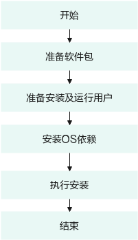


### 软件包获取<a name="ZH-CN_TOPIC_0000002446762145"></a>

环境搭建前，请准备如下CANN软件包，用户根据具体板端环境，选择其中一个软件包进行安装。

**表 1**  软件包说明

<a name="table968816871013"></a>
<table><thead align="left"><tr id="row11688685105"><th class="cellrowborder" valign="top" width="19.01190119011901%" id="mcps1.2.4.1.1"><p id="p137871824141014"><a name="p137871824141014"></a><a name="p137871824141014"></a>形态</p>
</th>
<th class="cellrowborder" valign="top" width="33.24332433243324%" id="mcps1.2.4.1.2"><p id="p6688589108"><a name="p6688589108"></a><a name="p6688589108"></a>包名</p>
</th>
<th class="cellrowborder" valign="top" width="47.74477447744774%" id="mcps1.2.4.1.3"><p id="p968828171015"><a name="p968828171015"></a><a name="p968828171015"></a>说明</p>
</th>
</tr>
</thead>
<tbody><tr id="row4688118181011"><td class="cellrowborder" valign="top" width="19.01190119011901%" headers="mcps1.2.4.1.1 "><p id="p5145411109"><a name="p5145411109"></a><a name="p5145411109"></a>Linux操作系统SoC形态软件包</p>
</td>
<td class="cellrowborder" valign="top" width="33.24332433243324%" headers="mcps1.2.4.1.2 "><p id="p9492645101017"><a name="p9492645101017"></a><a name="p9492645101017"></a>Ascend-cann-toolkit<em id="i7492194581011"><a name="i7492194581011"></a><a name="i7492194581011"></a>_&lt;version&gt;</em>_linux.x86_64.run</p>
</td>
<td class="cellrowborder" valign="top" width="47.74477447744774%" headers="mcps1.2.4.1.3 "><p id="p9688785102"><a name="p9688785102"></a><a name="p9688785102"></a>主要用于用户开发应用、自定义算子和模型转换。包含开发应用程序所需的库文件、开发辅助工具如ATC模型转换工具等。</p>
</td>
</tr>
</tbody>
</table>

其中_<version\>_表示软件版本号。

### 环境要求<a name="ZH-CN_TOPIC_0000002446642269"></a>

开发环境所要求的硬件及操作系统要满足以下条件。

**表 1**  环境信息

<a name="table659mcpsimp"></a>
<table><thead align="left"><tr id="row742753919918"><th class="cellrowborder" valign="top" width="13.270000000000001%" id="mcps1.2.4.1.1"><p id="p667mcpsimp"><a name="p667mcpsimp"></a><a name="p667mcpsimp"></a>类别</p>
</th>
<th class="cellrowborder" valign="top" width="17.89%" id="mcps1.2.4.1.2"><p id="p669mcpsimp"><a name="p669mcpsimp"></a><a name="p669mcpsimp"></a>版本限制</p>
</th>
<th class="cellrowborder" valign="top" width="68.84%" id="mcps1.2.4.1.3"><p id="p13427103912910"><a name="p13427103912910"></a><a name="p13427103912910"></a>注意事项</p>
</th>
</tr>
</thead>
<tbody><tr id="row673mcpsimp"><td class="cellrowborder" valign="top" width="13.270000000000001%" headers="mcps1.2.4.1.1 "><p id="p675mcpsimp"><a name="p675mcpsimp"></a><a name="p675mcpsimp"></a>硬件</p>
</td>
<td class="cellrowborder" valign="top" width="17.89%" headers="mcps1.2.4.1.2 "><p id="p677mcpsimp"><a name="p677mcpsimp"></a><a name="p677mcpsimp"></a>内存：最小4GB</p>
</td>
<td class="cellrowborder" valign="top" width="68.84%" headers="mcps1.2.4.1.3 "><a name="ul679mcpsimp"></a><a name="ul679mcpsimp"></a><ul id="ul679mcpsimp"><li>若Linux宿主机内存为4G，使用ATC工具进行模型转换时，建议Model文件大小不超过350M，如果超过此规格，操作系统可能会因为超过安全内存阈值而工作不稳定。</li><li>若Linux宿主机配置升级，比如8G内存，则相应支持的操作对象规格按比例提升。<p id="p682mcpsimp"><a name="p682mcpsimp"></a><a name="p682mcpsimp"></a>例如，内存由4G升级到8G，则Model文件建议大小不超过700M。</p>
</li></ul>
</td>
</tr>
<tr id="row683mcpsimp"><td class="cellrowborder" valign="top" width="13.270000000000001%" headers="mcps1.2.4.1.1 "><p id="p685mcpsimp"><a name="p685mcpsimp"></a><a name="p685mcpsimp"></a>操作系统</p>
</td>
<td class="cellrowborder" valign="top" width="17.89%" headers="mcps1.2.4.1.2 "><p id="p687mcpsimp"><a name="p687mcpsimp"></a><a name="p687mcpsimp"></a>Ubuntu 18.04 x86_64</p>
</td>
<td class="cellrowborder" valign="top" width="68.84%" headers="mcps1.2.4.1.3 "><p id="p689mcpsimp"><a name="p689mcpsimp"></a><a name="p689mcpsimp"></a>请从http://old-releases.ubuntu.com/releases/18.04.1/网站下载对应版本软件进行安装，可以下载桌面版：ubuntu-xxx-desktop-amd64.iso，或Server版：ubuntu-xxx-server-amd64.iso。</p>
</td>
</tr>
<tr id="row690mcpsimp"><td class="cellrowborder" valign="top" width="13.270000000000001%" headers="mcps1.2.4.1.1 "><p id="p692mcpsimp"><a name="p692mcpsimp"></a><a name="p692mcpsimp"></a>Python</p>
</td>
<td class="cellrowborder" valign="top" width="17.89%" headers="mcps1.2.4.1.2 "><p id="p694mcpsimp"><a name="p694mcpsimp"></a><a name="p694mcpsimp"></a>3.7.5</p>
</td>
<td class="cellrowborder" valign="top" width="68.84%" headers="mcps1.2.4.1.3 "><p id="p696mcpsimp"><a name="p696mcpsimp"></a><a name="p696mcpsimp"></a>-</p>
</td>
</tr>
<tr id="row697mcpsimp"><td class="cellrowborder" valign="top" width="13.270000000000001%" headers="mcps1.2.4.1.1 "><p id="p699mcpsimp"><a name="p699mcpsimp"></a><a name="p699mcpsimp"></a>gcc</p>
</td>
<td class="cellrowborder" valign="top" width="17.89%" headers="mcps1.2.4.1.2 "><p id="p701mcpsimp"><a name="p701mcpsimp"></a><a name="p701mcpsimp"></a>7.4.0</p>
</td>
<td class="cellrowborder" valign="top" width="68.84%" headers="mcps1.2.4.1.3 "><p id="p703mcpsimp"><a name="p703mcpsimp"></a><a name="p703mcpsimp"></a>-</p>
</td>
</tr>
<tr id="row704mcpsimp"><td class="cellrowborder" valign="top" width="13.270000000000001%" headers="mcps1.2.4.1.1 "><p id="p706mcpsimp"><a name="p706mcpsimp"></a><a name="p706mcpsimp"></a>g++</p>
</td>
<td class="cellrowborder" valign="top" width="17.89%" headers="mcps1.2.4.1.2 "><p id="p708mcpsimp"><a name="p708mcpsimp"></a><a name="p708mcpsimp"></a>7.4.0</p>
</td>
<td class="cellrowborder" valign="top" width="68.84%" headers="mcps1.2.4.1.3 "><p id="p710mcpsimp"><a name="p710mcpsimp"></a><a name="p710mcpsimp"></a>-</p>
</td>
</tr>
<tr id="row711mcpsimp"><td class="cellrowborder" valign="top" width="13.270000000000001%" headers="mcps1.2.4.1.1 "><p id="p713mcpsimp"><a name="p713mcpsimp"></a><a name="p713mcpsimp"></a>cmake</p>
</td>
<td class="cellrowborder" valign="top" width="17.89%" headers="mcps1.2.4.1.2 "><p id="p715mcpsimp"><a name="p715mcpsimp"></a><a name="p715mcpsimp"></a>3.10.2</p>
</td>
<td class="cellrowborder" valign="top" width="68.84%" headers="mcps1.2.4.1.3 "><p id="p717mcpsimp"><a name="p717mcpsimp"></a><a name="p717mcpsimp"></a>-</p>
</td>
</tr>
<tr id="row718mcpsimp"><td class="cellrowborder" valign="top" width="13.270000000000001%" headers="mcps1.2.4.1.1 "><p id="p720mcpsimp"><a name="p720mcpsimp"></a><a name="p720mcpsimp"></a>protobuf</p>
</td>
<td class="cellrowborder" valign="top" width="17.89%" headers="mcps1.2.4.1.2 "><p id="p722mcpsimp"><a name="p722mcpsimp"></a><a name="p722mcpsimp"></a>3.13.0+</p>
</td>
<td class="cellrowborder" valign="top" width="68.84%" headers="mcps1.2.4.1.3 "><p id="p724mcpsimp"><a name="p724mcpsimp"></a><a name="p724mcpsimp"></a>该依赖为精度比对工具和profiling工具使用，为python版本的软件。</p>
</td>
</tr>
</tbody>
</table>

注：环境安装可具体参考《驱动和开发环境安装指南》文档。

### 软件包安装<a name="ZH-CN_TOPIC_0000002413203020"></a>

**软件包安装操作步骤**：

如下命令中的\*.run请替换为具体CANN软件包，CANN软件包路径：SVP\_PC/SVP\__NNN_\_PC\_<version\>/CANN/Ascend-cann-toolkit\_<version\>\_linux.x86\_64.run。

命令中所涉及的$\{INSTALL\_DIR\}请替换为CANN软件安装后文件存储路径。例如，$HOME/Ascend/ascend-toolkit/<version\>/x86\_64-linux。

1.  以CANN软件包的安装用户登录开发环境，切换到软件包所在路径。

    ```
    cd SVP_NNN_PC_<version>/CANN/
    ```

2.  增加安装用户对软件包的可执行权限。

    在软件包所在路径执行ls -l命令检查安装用户是否有该文件的执行权限，若没有，请执行如下命令。

    ```
    chmod +x *.run
    ```

3.  校验软件包。

    执行如下命令，校验软件包安装文件的一致性和完整性。

    ```
    ./*.run --check
    ```

4.  执行如下命令进行安装（以下命令支持--install-path=<path\>等参数，具体参数说明请参考文档《驱动和开发环境安装指南》）。

    ```
    ./*.run --install
    ```

    > **说明：** 
    >-   如果以root用户安装，建议不要安装在非root用户目录下，否则存在被非root用户替换root用户文件以达到提权目的的安全风险。
    >-   如果要多个版本并存，请使用--install-path=<path\>指定新版本的安装路径。
    >-   如果默认安装路径下已经安装了其他架构NNN的版本，请使用--install-path=<path\>指定新的安装路径。否则安装和更新将覆盖原有版本。

    若出现如下关键信息，则说明安装成功：

    ```
    [INFO] xxx install success
    ```

    -   软件包默认安装路径：root用户/usr/local/Ascend；非root用户$HOME/Ascend
    -   安装详细日志路径：$\{INSTALL\_DIR\}/ascend\_install.log。
    -   安装后软件包的安装路径、安装命令以及运行用户信息记录路径：$\{INSTALL\_DIR\}/_<package\_name\>_/ascend\_install.info。

        $\{INSTALL\_DIR\}请替换为CANN软件安装后文件存储路径。例如，$HOME/Ascend/ascend-toolkit/<version\>/x86\_64-linux。

5.  配置环境变量。

    执行如下命令配置环境变量。

    ```
    source ${INSTALL_DIR}/script/setenv.sh
    ```

    $\{INSTALL\_DIR\}请替换为CANN软件安装后文件存储路径。例如，$HOME/Ascend/ascend-toolkit/<version\>/x86\_64-linux。

### 安装后处理<a name="ZH-CN_TOPIC_0000002446642265"></a>

开发环境安装完毕，如果用户使用应用工程开发了相关程序，需要进行工程的编译和运行，用于生成相关二进制文件，进行工程编译之前，请先配置交叉编译环境。

根据开发环境安装时选择的CANN软件包的形态不同，交叉编译环境配置方法不同。

需要搭建交叉编译环境，具体方法请参考文档《驱动和开发环境安装指南》“交叉编译环境准备”章节。

# 手动部署<a name="ZH-CN_TOPIC_0000002413043212"></a>


## SVP ACL Sample简介<a name="ZH-CN_TOPIC_0000002413203028"></a>


### PC Sample<a name="ZH-CN_TOPIC_0000002446762165"></a>

PC sample有一个完整的编译、仿真、板端、可视化结果输出的流程，使用单张图作为输入。sample所在路径：SVP\_PC/SVP\_NNN\_PC\_<version\>/ Sample/samples/。

当前提供的sample分为以下几种。

```
├── 1_classification
│   ├── lenet_dynamic_batch  //基于Caffe Lenet网络（单输入、动态Batch）实现图片分类的功能
│   └── resnet50_imagenet_classification   //基于Caffe ResNet-50网络（单输入、单Batch）实现图片分类的功能
│   ├── resnet50_async_imagenet_classification  //基于Caffe ResNet-50网络（单输入、单Batch）实现图片分类的功能
│   ├── resnet50_cached_imagenet_classification   //使用svp_acl_rt_mallor_cached接口和svp_acl_rt_mem_flush接口来提升数据搬移的性能
│   ├── resnet50_imagelist_imagenet_classification   //在多张图片情况下如何减少内存的重复申请释放，通过一次内存初始化，复用内存进行推理
├── 2_object_detection
│   ├── fasterrcnn   //基于FasterRCNN Alexnet网络（单输入、单Batch）实现图片目标检测的功能
│   ├── rfcn          //基于RFCN Resnet50网络（单输入、单Batch）实现图片目标检测的功能
│   ├── ssd           //基于Caffe SSD网络（单输入、单Batch）实现图片目标检测的功能
│   └── yolo          //基于Caffe Yolo (V1,V2,V3,V4)网络实现图片目标检测的功能
├── 3_segmentation
│   └── segnet     //基于Caffe Segnet网络（单输入、单Batch）实现图像分割的功能
├── 4_aicpu
│   └── concat     //基于Onnx concat网络（双输入、单Batch）实现AACPU Concat网络推理的功能
├── 5_nlp
│   └── lstm        //基于Caffe Lstm网络（多输入、单Batch）实现现时间序列推理的功能
├── 6_tracker
└── goturn      //基于Goturn网络（双输入、单Batch）实现图片目标跟踪的功能
├── 7_info
│   └── parser_model   //基于传入任意网络模型（单输入、单Batch）实现网络输入输出信息解析和网络推理功能
├── 8_graph         //基于ATC的构图与模型转换接口提供简要的实现
├── 9_custom        //基于Caffe 自定义算子Cpu网络（单输入、单Batch）
```

按照各sample目录下的README.md文件的说明使用，包含功能描述、原理介绍、目录结构、模型文件和图片数据下载链接、环境配置和编译运行。

注：需要严格按照规则使用sample，例如2\_object\_detection中的网络支持检测网硬化加速，则对应的sample仅适用于支持此功能的网络。如修改了原始模型分辨率或输入图像格式等信息，也需要修改sample对应的部分。

### 开发板Sample<a name="ZH-CN_TOPIC_0000002446762177"></a>

开发板sample仅包含板端的编译与运行，使用视频流作为输入。sample所在路径：/SS928V100<version\>/SS928V100<version\>/01.software/board/SS928V100\_SDK\_<version\>/SS928V100\_SDK\_<version\>/package/smp/smp/a55\_linux/mpp/sample/svp/svp\__n__nn_。当前提供的sample包含resnet50和lstm。按照sample目录下的README.md文件的说明使用。

注：需要严格按照规则使用sample，开发板中的sample均包含检测网硬化加速，则输入的om模型必须包含rpn这一路输入。如修改了原始模型分辨率或输入图像格式等信息，也需要修改sample对应的部分。

### ACL接口介绍<a name="ZH-CN_TOPIC_0000002446762157"></a>

以PC sample中2\_object\_detection/yolo为例，在该Sample中，涉及的关键功能点如下所示。API 接口的详细介绍请参见《应用开发指南》。

-   初始化
    -   调用svp\_acl\_init接口初始化ACL配置。
    -   调用svp\_acl\_finalize接口实现ACL去初始化。

-   Device管理
    -   调用svp\_acl\_rt\_set\_device接口指定用于运算的Device。
    -   调用svp\_acl\_rt\_get\_run\_mode接口获取运行模式，根据运行模式的不同，内部处理流程不同。
    -   调用svp\_acl\_rt\_reset\_device接口复位当前运算的Device，回收Device上的资源。

-   Context管理
    -   调用svp\_acl\_rt\_create\_context接口创建Context。
    -   调用svp\_acl\_rt\_destroy\_context接口销毁Context。

-   Stream管理
    -   调用svp\_acl\_rt\_create\_stream接口创建Stream。
    -   调用svp\_acl\_rt\_destroy\_stream接口销毁Stream。

-   内存管理
    -   调用svp\_acl\_rt\_malloc接口申请Device上的内存。
    -   调用svp\_acl\_rt\_free接口释放Device上的内存。

-   数据传输

    调用svp\_acl\_rt\_memcpy接口通过内存复制的方式实现数据传输。

-   模型推理
    -   调用svp\_acl\_mdl\_load\_from\_mem接口从\\\*.om文件加载模型。
    -   调用svp\_acl\_mdl\_execute接口执行模型推理，同步接口。
    -   调用svp\_acl\_mdl\_unload接口卸载模型。

## 模型编译<a name="ZH-CN_TOPIC_0000002446642313"></a>


### 模型编译<a name="ZH-CN_TOPIC_0000002446642305"></a>

本章节介绍 ONNX 模型转换的基本操作, 使用 ATC工具将 ONNX 模型编译成 om 模型。请先参考[开发环境准备](#ZH-CN_TOPIC_0000002446762149)章节完成开发环境搭建。本节示例模型为开源模型 yolov5s。


#### 运行前准备<a name="ZH-CN_TOPIC_0000002446762173"></a>

本章节所需模型yolov5s及相关依赖已在SVP\__NNN_\_PC软件包中提供。

解压SVP\__NNN_\_PC\_<version\>软件包提供的Sample目录下的samples.tar.gz

```
tar -zxf samples.tar.gz
```

在当前解压目录下进入samples/2\_object\_detection/yolo目录

```
cd samples/2_object_detection/yolo/
```

目录结构如下

```
├── build.sh  //编译可执行文件脚本
├── caffe_model  //caffe模型
│   ├── *.caffemodel
│   ├── *.prototxt
├── CMakeLists.txt //编译脚本，调用src目录下的CMakeLists文件
├── data
│   ├── ...  //测试数据
├── inc
│   ├── model_process.h
│   ├── sample_process.h
│   └── utils.h
├── insert_op.cfg //aipp配置文件
├── model //atc 编译离线模型om存放路径
├── onnx_model //onnx模型
│   ├── *rpn.patch
│   ├── *.md
│   ├── *.onnx  
├── README.md
├── script 
│   ├── transferPic.py               //将*.jpg转换为*.bin
│   ├── drawbox.py               //画框脚本
├── src
│   ├── acl.json
│   ├── CMakeLists.txt
│   ├── main.cpp
│   ├── model_process.cpp
│   ├── sample_process.cpp
│   ├── utils.cpp
│   ├── *_rpn.txt
├── .project     //工程信息文件，包含工程类型、工程描述、运行目标设备类型等
├── *.json //工具转换模型配置文件
```

该目录下，其中onnx\_model文件夹存放原始的ONNX模型文件，insert\_op.cfg配置了图像预处理的Data层使用图片文件格式， data文件夹用于存放生成量化参数时用的校准数据及测试数据，model文件夹用于存放编译生成的离线模型om。

#### 命令说明<a name="ZH-CN_TOPIC_0000002413043232"></a>

ATC工具详细的用法请参考《ATC工具使用指南》。

#### 模型编译<a name="ZH-CN_TOPIC_0000002446642301"></a>

以yolov5s.onnx为例, 在准备的环境中执行如下ATC命令编译生成离线模型。

```
atc --output="./model/yolov5" --insert_op_conf=./insert_op.cfg --framework=5 --save_original_model=true --model="./onnx_model/yolov5s.onnx" --image_list="images:./data/image_ref_list.txt"
```

若提示如下信息，则说明模型转换成功

```
end binary code generating
```

成功执行命令后，在model目录下可查看离线模型（yolov5\_original.om）。

## 模型部署运行<a name="ZH-CN_TOPIC_0000002446642297"></a>


### 编译示例<a name="ZH-CN_TOPIC_0000002446642293"></a>


#### 环境准备<a name="ZH-CN_TOPIC_0000002413043236"></a>

1.  Cmake版本为3.10.2
2.  设置环境变量

    必选环境变量（如下环境变量中$\{install\_path\}以软件包使用默认安装路径为例进行说明）

    执行如下命令配置环境变量。

    ```
    source ${install_path}/Ascend/ascend-toolkit/{software version}/x86_64-linux/script/setenv.sh
    ```

3.  检查本地是否已安装开发板所需的交叉编译链工具链

#### 本地编译<a name="ZH-CN_TOPIC_0000002413043228"></a>

> **说明：** 
>本文对应芯片工具链如下：aarch64-unknown-linux-ohos-clang和aarch64-v01c01-linux-gnu-gcc

切换到样例目录2\_object\_detection/yolo，直接执行命令：

```
./build.sh
```

同时在out目录下生成功能仿真可执行文件（func\_main），指令仿真可执行文件（inst\_main）和板端可执行文件（board\_main）。其中：

board\_main由编译链编译的可执行文件。

### 运行示例<a name="ZH-CN_TOPIC_0000002413203064"></a>

该场景下的开发环境需要单独部署CANN软件包，采用命令行的方式进行安装和使用。


#### 数据准备<a name="ZH-CN_TOPIC_0000002446762161"></a>

1.  准备离线模型om

    确认model目录下有yolov5\_original.om离线模型。模型编译，请参见[模型编译](#ZH-CN_TOPIC_0000002446642313)。

2.  准备输入图片

    切换到“2\_object\_detection/yolo/data”目录下，执行transferPic.py脚本，将\*.jpg转换为\*.bin，同时将图片分辨率缩放为模型输入所需的640\*640。在“样例目录/data”目录下生成\*.bin文件。

    ```
    cd data
    python3 ../script/transferPic.py 5
    ```

    > **须知：** 
    >-   如果执行脚本报错“ModuleNotFoundError: No module named 'PIL'”，则表示缺少Pillow库，请使用\*\*pip3.7.5 install Pillow --user\*\*命令安装Pillow库。
    >-   “5”表示生成yolov5

#### 仿真运行<a name="ZH-CN_TOPIC_0000002413203068"></a>

切换到可执行文件main所在2\_object\_detection/yolo/out目录，给可执行文件main加执行权限

```
cd out
chmod +x *_main
```

运行可执行文件

功能仿运行：

```
./func_main 5
```

指令仿运行：

```
./inst_main 5
```

若提示如下信息，则说明运行成功

```
model execute success
```

“5”表示生成yolov5

#### 开发板运行<a name="ZH-CN_TOPIC_0000002413203056"></a>


##### 环境安装<a name="ZH-CN_TOPIC_0000002413203060"></a>

-   板端环境安装请参见《SS928V100╱SS927V100 SDK 安装以及升级使用说明》。
-   SVP ACL接口使用说明请参见《应用开发指南》中“SVP ACL API参考”章节。
-   需要将SVP\__NNN_相关库路径加入到系统环境变量LD\_LIBRARY\_PATH（如smp/a55\_linux/mpp/out/lib/svp\__nnn_）。
-   板端开发所依赖的文件清单如[表1](#table764172014331)所示。

**表 1**  板端开发依赖文件

<a name="table764172014331"></a>
<table><thead align="left"><tr id="row10641720133316"><th class="cellrowborder" valign="top" width="22.42%" id="mcps1.2.3.1.1"><p id="p930337113411"><a name="p930337113411"></a><a name="p930337113411"></a>文件类型</p>
</th>
<th class="cellrowborder" valign="top" width="77.58%" id="mcps1.2.3.1.2"><p id="p36512011335"><a name="p36512011335"></a><a name="p36512011335"></a>文件名称</p>
</th>
</tr>
</thead>
<tbody><tr id="row1365142003312"><td class="cellrowborder" valign="top" width="22.42%" headers="mcps1.2.3.1.1 "><p id="p1651520133319"><a name="p1651520133319"></a><a name="p1651520133319"></a>头文件</p>
</td>
<td class="cellrowborder" valign="top" width="77.58%" headers="mcps1.2.3.1.2 "><p id="p280mcpsimp"><a name="p280mcpsimp"></a><a name="p280mcpsimp"></a>svp_acl.h</p>
<p id="p281mcpsimp"><a name="p281mcpsimp"></a><a name="p281mcpsimp"></a>svp_acl_base.h</p>
<p id="p282mcpsimp"><a name="p282mcpsimp"></a><a name="p282mcpsimp"></a>svp_acl_ext.h</p>
<p id="p283mcpsimp"><a name="p283mcpsimp"></a><a name="p283mcpsimp"></a>svp_acl_mdl.h</p>
<p id="p284mcpsimp"><a name="p284mcpsimp"></a><a name="p284mcpsimp"></a>svp_acl_prof.h</p>
<p id="p72601223113413"><a name="p72601223113413"></a><a name="p72601223113413"></a>svp_acl_rt.h</p>
</td>
</tr>
<tr id="row186512205334"><td class="cellrowborder" valign="top" width="22.42%" headers="mcps1.2.3.1.1 "><p id="p146512003317"><a name="p146512003317"></a><a name="p146512003317"></a>库文件</p>
</td>
<td class="cellrowborder" valign="top" width="77.58%" headers="mcps1.2.3.1.2 "><p id="p290mcpsimp"><a name="p290mcpsimp"></a><a name="p290mcpsimp"></a>libsvp_acl.a</p>
<p id="p291mcpsimp"><a name="p291mcpsimp"></a><a name="p291mcpsimp"></a>libsvp_acl.so</p>
<p id="p292mcpsimp"><a name="p292mcpsimp"></a><a name="p292mcpsimp"></a>libsvp_<em id="i2641103955211"><a name="i2641103955211"></a><a name="i2641103955211"></a>aacpu</em>.so</p>
<p id="p295mcpsimp"><a name="p295mcpsimp"></a><a name="p295mcpsimp"></a>libprotobuf-c.a</p>
<p id="p10658203510341"><a name="p10658203510341"></a><a name="p10658203510341"></a>libprotobuf-c.so.1</p>
</td>
</tr>
<tr id="row965142019333"><td class="cellrowborder" valign="top" width="22.42%" headers="mcps1.2.3.1.1 "><p id="p300mcpsimp"><a name="p300mcpsimp"></a><a name="p300mcpsimp"></a>ko文件</p>
</td>
<td class="cellrowborder" valign="top" width="77.58%" headers="mcps1.2.3.1.2 "><p id="p302mcpsimp"><a name="p302mcpsimp"></a><a name="p302mcpsimp"></a>xxx_svp_<em id="i722146165215"><a name="i722146165215"></a><a name="i722146165215"></a>nnn</em>.ko</p>
</td>
</tr>
</tbody>
</table>

##### 运行准备<a name="ZH-CN_TOPIC_0000002413043220"></a>

**运行准备**：

使用mount命令将NFS服务器上的目录2\_object\_detection/yolo挂载到板端环境的指定目录。

**挂载开发板：**

-   以root用户登录Linux服务器（Ubuntu操作系统），安装NFS服务并配置共享目录。

    确保环境连网且源可用的前提下，安装NFS服务，可参考如下命令安装，如果安装过程中提示已安装NFS服务，则无需重复安装：

    ```
    apt-get install nfs-kernel-server
    ```

    在“/etc/exports”文件中配置共享目录，配置完成后，执行/etc/init.d/nfs-kernel-server restart命令重启NFS服务使配置生效。可参考如下配置段（添加在文件的末尾），斜体部分请根据实际情况替换，服务器绝对路径表示Linux服务器的共享目录，如不存在，请提前创建。

    ```
    服务器绝对路径 *(rw,sync,no_root_squash,anonuid=id*,anongid=gid*)
    ```

-   命令示例如下，其中，path表示板端环境上的目录，需根据实际情况修改。

    ```
    mount -t nfs -o nolock,tcp NFS服务器IP地址:服务器绝对路径 path
    ```

##### 运行<a name="ZH-CN_TOPIC_0000002446762181"></a>

切换到开发板可执行文件main所在yolo/out目录，给可执行文件main加执行权限

```
cd out
chmod +x board_main
```

运行可执行文件

```
./ board_main 5
```

#### 运行后处理<a name="ZH-CN_TOPIC_0000002413203052"></a>

模型执行后，基于推理结果，输出检测结果并保存至out目录下xxx\_detResult.txt中，其中第一行为输入图片的W和H的大小，下面每一行有6个值，分别是对应框的classId, score, leftX, leftY, rightX, rightY。

执行结果保存为out\_img\_yolov5.jpg，如[图1](#fig1017592634014)所示。

**图 1**  结果图<a name="fig1017592634014"></a>  
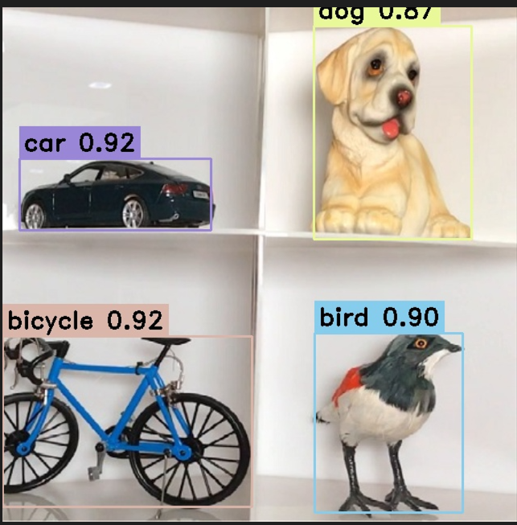

# 自动部署<a name="ZH-CN_TOPIC_0000002413043224"></a>

本节示例为使用MindCmd工具完成开源模型yolov5s.onnx的一键式部署。


## MindCmd工具准备<a name="ZH-CN_TOPIC_0000002413043240"></a>

MindCmd是一个Python命令行工具，依赖Python3.7.5和CANN。如果还没有安装CANN软件包，请先参考[软件包安装](#ZH-CN_TOPIC_0000002413203020)章节完成安装。

请参考如下步骤安装并配置MindCmd工具：

1.  安装MindCmd

    以CANN软件包的安装用户登录开发环境。MindCmd工具安装包位于SVP\_PC/SVP\__NNN_\_PC软件包中，进入安装包所在路径，并执行如下命令安装。

    ```
    cd SVP_NNN_PC_<version>/MindCmd/
    pip install mindcmd-*-py3-none-linux_x86_64.tar.gz --user
    ```

    若出现如下关键信息，则说明安装成功：

    Successfully installed mindcmd-x.x.x

2.  <a name="li134221448812"></a>配置CANN软件包安装路径

    执行如下命令，查看MindCmd工具默认配置的CANN软件包安装路径：

    ```
    mindcmd config --global base_config.cann_install_path
    ```

    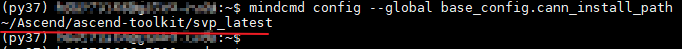

    如果不满足，请参考如下命令重置CANN软件包的实际安装路径：

    ```
    mindcmd config --global base_config.cann_install_path=/usr/local/Ascend/ascend-toolkit/svp_latest
    ```

    > **说明：** 
    >命令中的“/usr/local/Ascend/ascend-toolkit/svp\_latest”为执行示例，请根据实际安装路径进行替换。

3.  查看版本信息

    执行如下命令，查看MindCmd工具的版本和工具在[2](#li134221448812)中配置的CANN软件包版本信息。

    ```
    mindcmd -v
    ```

    如果返回以下关键信息（版本信息以实际安装为准），说明MindCmd工具安装成功。

    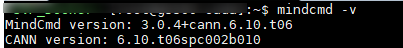

    > **说明：** 
    >图片示例返回的MindCmd工具和CANN软件包版本信息仅供参考，会根据用户环境实际安装的工具版本打印。

## 资源准备<a name="ZH-CN_TOPIC_0000002413203072"></a>

本示例所需的模型和相关资源文件均位于SVP\__NNN_\_PC软件包中的2\_object\_detection/yolo样例目录，请先执行如下命令解压。

```
cd SVP_NNN_PC_<version>/Sample/
tar -zxvf samples.tar.gz
```

## 仿真运行<a name="ZH-CN_TOPIC_0000002446642289"></a>

切换到样例目录2\_object\_detection/yolo，并执行如下命令启动仿真运行。

```
cd samples/2_object_detection/yolo/
mindcmd oneclick onnx --model ./onnx_model/yolov5s.onnx --image_list ./data/image_ref_list.txt --aipp ./insert_op.cfg --rpndata ./src/yolov5_rpn.txt
```

若出现如下关键信息，则说明功能仿真运行成功。

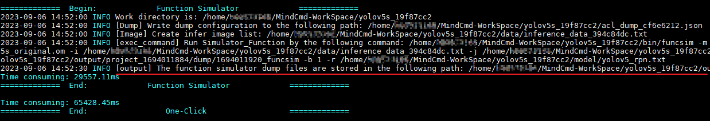

## 开发板运行<a name="ZH-CN_TOPIC_0000002446762169"></a>

请参考《SSxxxVxxx SDK 安装以及升级使用说明》完成板端基础环境安装。参考《驱动和开发环境安装指南》“OpenSSH服务搭建”章节完成板端ssh环境安装，服务器NFS环境安装。

以上环境安装完成后，请参考如下步骤在开发板运行yolov5s.onnx：

1.  <a name="li189831627119"></a>设置ssh配置文件

    在样例目录2\_object\_detection/yolo下创建ssh.cfg文件，文件格式和详细内容示例如下。

    ```
    [ssh_config]
    # board ip
    BOARD_IP=x.x.x.x
    
    # board work directory, mount to $HOST_MOUNT_PATH
    BOARD_MOUNT_PATH=/home/MindCmdUser/board_workspace/
    
    # local host ip
    HOST_IP=x.x.x.x
    
    # to avoid bottlenecks caused by copying test resources, store test resources in this path as much as possible.
    HOST_MOUNT_PATH=${SHARE_DIR}/host_workspace
    
    # board user name
    USER=${username}
    
    # board user's password
    PASSWORD=${password}
    
    # default port is 22
    PORT=22
    ```

    > **说明：** 
    >-   MindCmd工具上板推理时会根据以上配置文件提供的信息，自动执行mount、umount操作。
    >-   HOST\_MOUNT\_PATH配置的路径不能超出服务器所配置的NFS共享目录范围，否则可能会导致mount失败。
    >-   示例中的$\{SHARE\_DIR\}、$\{username\}、$\{password\}请根据实际情况替换。

2.  执行如下命令设置MindCmd工具工作路径：

    ```
    mindcmd config --global base_config.default_workspace=${SHARE_DIR}/host_workspace
    ```

    > **说明：** 
    >-   MindCmd工具与板端采用mount方式共享资源，因此上板推理时MindCmd工具的工作路径不能超出[1](#li189831627119)配置的服务器侧挂载路径（HOST\_MOUNT\_PATH）范围。
    >-   示例中的$\{SHARE\_DIR\}请根据实际情况替换。

3.  执行如下命令打开MindCmd工具开发板运行开关。

    ```
    mindcmd config --global oneclick_switch.is_nnn_run=1
    ```

4.  执行如下命令启动开发板运行。

    ```
    cd samples/2_object_detection/yolo/
    mindcmd oneclick --ssh_config ./ssh.cfg onnx --model ./onnx_model/yolov5s.onnx --image_list ./data/image_ref_list.txt --aipp ./insert_op.cfg --rpndata ./src/yolov5_rpn.txt
    ```

    若出现如下关键信息，则说明开发板运行成功。

    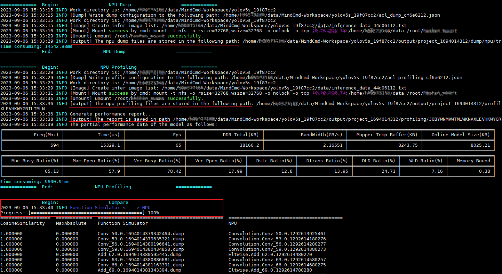

# 进阶指南<a name="ZH-CN_TOPIC_0000002446762185"></a>


## 精度分析<a name="ZH-CN_TOPIC_0000002446642285"></a>

本章节主要介绍常见精度问题的定位和分析。精度问题也叫精度掉点，是指在相同的输入下，离线模型的推理结果和原始模型的推理结果偏差超出业务可接受范围。


### 常见的精度问题来源<a name="ZH-CN_TOPIC_0000002413043216"></a>

-   数据预处理：离线模型与原始模型的预处理不同引入。
-   模型量化：AMCT量化或ATC量化时引入。
-   指令化阶段：ATC转换离线模型时引入。
-   模型后处理：离线模型与原始模型后处理方式不同引入。

### 界定精度问题的引入阶段<a name="ZH-CN_TOPIC_0000002413203044"></a>

1.  使用浮点框架的输入数据和推理工程的输入数据做比对，如果掉点较多说明数据预处理过程引入了问题。
2.  使用相同的输入做推理，分别Dump原始模型、量化模型和离线模型的逐层输出。
3.  对比原始模型和Fake Quant模型的Dump结果，如果掉点较多说明量化过程引入了问题。
4.  对比Fake Quant模型和离线模型的Dump结果，如果掉点较多说明指令化过程引入了问题。

### 使用MindCmd一键推理进行精度比对<a name="ZH-CN_TOPIC_0000002446642309"></a>

本节示例为[MindCmd工具准备](#ZH-CN_TOPIC_0000002413043240)完成sample网络yolov5s\_cpu.onnx的一键精度比对。所需模型文件、推理数据均位于SVP\__NNN_\_PC软件包中的2\_object\_detection/yolo样例目录，请参考资源准备[资源准备](#ZH-CN_TOPIC_0000002413203072)资源准备章节完成资源准备。

执行如下命令进行一键精度比对。

```
cd samples/2_object_detection/yolo
mindcmd config --global oneclick_switch.is_nnn_run=0
mindcmd oneclick onnx --model ./onnx_model/yolov5s_cpu.onnx --image_list ./data/image_ref_list.txt --aipp ./insert_op.cfg
```

如[图1](#fig183067191416)所示，MindCmd一键推理会自动执行原始模型推理、量化模型推理、功能仿真推理，并将推理结果进行精度比对。

**图 1**  精度比对展示<a name="fig183067191416"></a>  
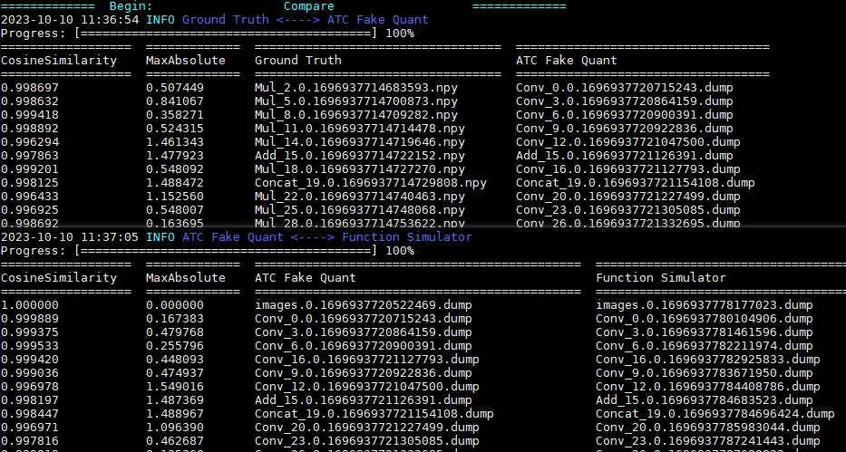

如果想了解各项参数的详细说明，请参考《MindCmd使用指南》“10 精度比对”章节。

### 精度调优建议<a name="ZH-CN_TOPIC_0000002413203048"></a>

精度问题分析步骤：

1.  确认第一层data层输入数据是否正确

    找一张有精度问题的图片，编译、指令仿真、caffe都用这张图片。比较仿真和caffe 每层的相似度。

    -   如果第一层，即data层的相似度不是0.999，请看**步骤2**。
    -   如果第一层是0.99+，后面逐层下降，最后一层小于0.95，请看**步骤3**。
    -   如果最后一层的相似度0.99，中间某些层0.90以下，请看**步骤4**。
    -   如果所有层的相似度都是0.99+且绝对误差也很小，则很可能是后处理的问题，请看**步骤5**。

2.  确认data层输入一致

    请检查均值\[mean\_file\]、缩放\[data\_scale\]、预处理方式\[norm\_type\]，是否和caffe一致。\(Mxnet 和Darknet\(yolo\) 网络训练时，默认是RGB，所以转换模型时需要配置\[RGB\_order\]为RGB。

3.  确认是否量化误差导致

    修改ATC的配置项，配置\[dump\_data\]为1，输出校准数据到mapper\_quant目录。

    配置\[forward\_quantization\_option\] 为 1，即只做数据量化，权重不量化。比较mapper\_quant和caffe相似度，如果相似度OK，说明是权重量化误差导致。

    配置\[forward\_quantization\_option\] 为 2，即只做权重量化，数据不量化。比较mapper\_quant和caffe相似度，如果相似度OK，说明是数据量化误差导致。

    -   如果是数据或权重量化误差导致，请使用AMCT工具重训。
    -   如果不是量化误差导致，请反馈明显下降的那层信息，看**步骤6**。

4.  确认层是否匹配

    ATC会优化网络结构，以适应硬件执行，所以相似度比较时有可能层和caffe的不匹配。

    -   是否inplace写法，即top和bottom名字一样。某些层不支持Inplace，需要拆开。例如 conv + tanh, 在caffe支持inplace，只输出 tanh的数据，而ATC不支持conv和tanh 融合，分别输出conv和tanh，所以比较数据时要注意。
    -   是否ATC修改了网络。请查看cnn\_net\_tree.dot \(ATC编译时生成\)，和原来的prototxt比较，看是否修改了网络结构。如SPP层拆分为Pooling和Concat，所以要和Concat的结果比，或直接看后面层的相似度。
    -   如果层匹配，而相似度比较低，请反馈信息，看**步骤6**。

5.  确认后处理是否正确

    假设caffe 的结果经过caffe的后处理画框或分类，则把仿真的结果也使用caffe的后处理，看是否正常画框或分类。

    -   如果正常，则说明是板端后处理问题，请比较板端和caffe的后处理代码。
    -   如果不正常，而数据的相似度0.99且绝对误差很小，则说明caffe的后处理代码对数据很敏感，请检查caffe的后处理代码。\(此情况很少\)

6.  提单进一步分析

    请提供以下信息：

    -   prototxt、caffemodel、onnx模型。如果不方便提供模型，请提供出问题那层对应的prototxt、weights和输入/输出数据。
    -   编译用的参数、图片、均值文件。
    -   编译时打印的ATC版本号，如 Mapper Version 1.0.0.0\_B010 \(PICO\_1.0\) 2110161033840e0d952\(CPU\) \(INST\_2.0.9\)

-   使用MindCmd一键推理，定位数据预处理、模型压缩和模型后处理引入的精度问题。
-   若浮点框架的输入数据和推理程序的输入数据存在精度问题，则请排查推理数据是否使用了相同的预处理方式。
-   若原始模型与ATC量化模型的推理结果存在精度问题时，请修改mindcmd.ini使能AMCT量化，和Fake Quant比较。（AMCT仅支持PyTorch和Caffe模型）。
-   若原始模型与AMCT量化模型的推理结果存在精度问题时，请参考《AMCT使用指南》进行精度调优，或使用QAT解决
-   若指令编译阶段引入的精度问题，请对比cnn\_net\_tree.dot和原始模型（\*.dot查看请参考《ATC工具使用指南》“2.3输出文件说明”章节），查看是否修改了网络结构，比较被修改网络结构层的后面层的相似度。
-   若argmax的index超过2048，建议使用topK实现。原因是超过2048的index，使用fp16输出会有精度误差。

**若按照以上建议排查问题未发现根因，可以提单进一步分析，需要提供能复现问题的原始模型、Fake Quant模型、om模型、推理文件、校准集、ATC命令\(包含数据预处理配置文件\)、转换log打印等。**

## 性能分析<a name="ZH-CN_TOPIC_0000002413043244"></a>

本章节介绍如何通过MindCmd进行快速获取帧率、带宽、内存、耗时等性能数据，分析性能问题并进行性能调优。


### 获取性能数据<a name="ZH-CN_TOPIC_0000002446642281"></a>

获取性能数据有以下两种方式。


#### 通过调用ACL API方式采集Profiling数据<a name="ZH-CN_TOPIC_0000002446642277"></a>

实现方式支持以下两种。

-   方式一：将采集到的Profiling数据写入文件，再使用Profiling工具解析该文件。
-   方式二：将采集到的Profiling数据解析后写入管道，由用户读入内存，再由用户调用ACL的接口获取性能数据

通过方式二实现的Profiling采集暂不能很好的支持Recurrent、RPN、ROI、CPU Loop的网络，这些网络建议通过MindCmd工具采集并解析Profiling数据。

详细使用方式请参见《应用开发指南》手册“8.6 Profiling性能数据采集”章节。

#### 使用MindCmd工具获取性能数据<a name="ZH-CN_TOPIC_0000002446762133"></a>

安装好MindCmd后，通过修改全局配置，开启上板Profiling来获取性能数据。

1.  修改配置项，示例：

    ```
    mindcmd config --global oneclick_switch.is_nnn_run=1
    mindcmd config --global oneclick_switch.is_board_profiling_open=1
    mindcmd config --global base_config.ssh_cfg_path=$HOME/ssh.cfg
    ```

2.  参考[1](#li189831627119)，新建文件_$HOME_/ssh.cfg。

    > **说明：** 
    >-   请参考《MindCmd使用指南》“NFS环境搭建”章节配置NFS环境。
    >-   MindCmd工作路径与板端挂载路径的配置请参考《MindCmd使用指南》“关于工作路径、挂载路径、数据卷路径和NFS共享路径”章节。

3.  执行Oneclick

    提前准备模型文件、图片集等，然后使用MindCmd进行一键推理。

    以yolov5s.onnx为例

    ```
    cd SVP_NNN_PC_<version>/Sample/samples/2_object_detection/yolo/onnx_model/
    mindcmd oneclick onnx -m yolov5s.onnx -i ../data/image_ref_list.txt -r ../src/yolov5_rpn.txt
    ```

    执行Oneclick后，MindCmd会将采集到的性能数据保存在csv表格中（如[图1](#fig1239501163019)所示），csv表格存放位置如[图2](#fig1691436783)所示，模型的整网性能数据打印如[图3](#fig1073092175015)所示。

    **图 1**  性能数据表格<a name="fig1239501163019"></a>  
    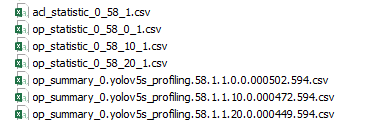

    **图 2**  性能数据表格存放位置<a name="fig1691436783"></a>  
    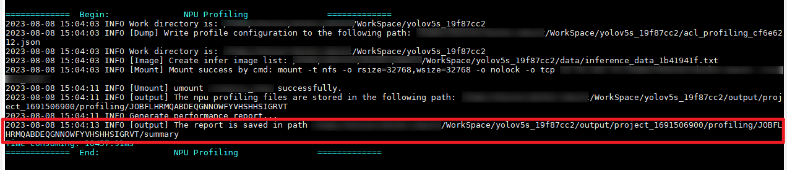

    **图 3**  模型整网性能数据<a name="fig1073092175015"></a>  
    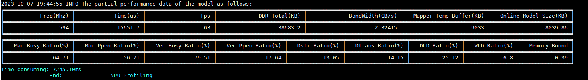

    通过得到的Profiling数据，可以了解模型在推理过程中各层耗时及各层耗时占比、带宽、帧率等性能数据，如[图4](#fig6208184011418)所示，根据获取的性能数据，我们能分析出是否存在关键性能瓶颈，辅助模型性能调优。

    **图 4**  AI Core数据表（op\_summary\_\*.csv）<a name="fig6208184011418"></a>  
    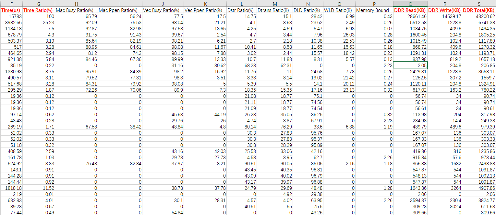

    Profiling采集的数据如下：

    -   硬件的性能数据，包括：AI Core、AI_ _Vector Core、AI_ _CPU的系统硬件性能指标。

    -   软件的性能数据，统计ACL接口的调用时间。

    可以通过在表格内对某一项数据进行降序排序，从而对耗时长、占用内存大的层进行分析，判断是否存在性能瓶颈。

如果想了解Profiling各项数据的详细说明，请参考《MindCmd使用指南》“性能分析数据说明”章节。

### 性能问题分析及性能调优<a name="ZH-CN_TOPIC_0000002413043200"></a>

-   针对性能结果数据分析原因

    根据性能数据结果进行分析，可以比较得出耗时较长、占用内存和带宽较多的接口和算子，针对这些接口和算子做进一步的剖析，从而定位到性能问题根因。

    优化建议参考：

    -   当整体耗时，整网Mac Ppen Ratio超过60%，基本不存在性能瓶颈。

    -   如果是CUBE层，当Mac Ppen Ratio超过70%，基本不存在性能瓶颈。

    -   如果是非CUBE层，当Vec Ppen Ratio超过50%且不为0，基本不存在性能瓶颈。

    -   如果上述场景均不符合，则分析DLD Ratio，WLD Ratio，Dstr Ratio的数据

        -   如果DLD Ratio高于70%，则可能DLD阻塞，建议裁剪输入数据量，如减通道、减少数据搬移或数据转换层如slice，concat，reshape，permute等。
        -   如果WLD Ratio高于80%，则可能是WLD阻塞，建议减少权重数据量，如对该层的权重做4bit量化。
        -   如果Dstr Ratio高于70%，则可能是Dstr阻塞，建议裁剪feature map的结果大小。
        -   如果Mac Ppen Ratio、Vec Ppen Ratio、DLD Ratio、WLD Ratio、Dstr Ratio都低于50%，建议提单进行反馈。

-   使用AMCT对模型进行进一步量化压缩

    如果希望进一步提升性能，还可以参考《AMCT使用指南》使用AMCT工具进行混合精度量化调优，然后重新对精度进行分析。

-   设计高性能算子模型

    通过修改网络连接方式和设置算子属性，可对网络模型的性能做进一步优化。详见《ATC工具使用指南》“性能优化推荐设置”章节。

# 高阶指南<a name="ZH-CN_TOPIC_0000002413043192"></a>


## 自定义算子<a name="ZH-CN_TOPIC_0000002413203040"></a>

-   ATC提供的接口开发自定义算子，用户可开发自定义算子以提高网络运行效率。
-   自定义算子更详细的用法请参考《ATC自定义算子开发指南》手册。

## IR构图<a name="ZH-CN_TOPIC_0000002446762153"></a>

-   ATC提供Graph接口构建网络模型，并将其转换成图像分析引擎支持的离线模型，模型转换过程中可以实现算子调度的优化、权值数据重排、内存使用优化等，可以脱离设备完成模型的预处理。
-   Graph更详细的用法请参考《ATC Graph开发指南》手册。

# 附录<a name="ZH-CN_TOPIC_0000002413043204"></a>


## 参考文档<a name="ZH-CN_TOPIC_0000002446762137"></a>

**表 1**  参考文档

<a name="table530mcpsimp"></a>
<table><thead align="left"><tr id="row536mcpsimp"><th class="cellrowborder" valign="top" width="25.15%" id="mcps1.2.4.1.1"><p id="p538mcpsimp"><a name="p538mcpsimp"></a><a name="p538mcpsimp"></a><strong id="b539mcpsimp"><a name="b539mcpsimp"></a><a name="b539mcpsimp"></a>手册名称</strong></p>
</th>
<th class="cellrowborder" valign="top" width="45.85%" id="mcps1.2.4.1.2"><p id="p541mcpsimp"><a name="p541mcpsimp"></a><a name="p541mcpsimp"></a><strong id="b542mcpsimp"><a name="b542mcpsimp"></a><a name="b542mcpsimp"></a>内容简介</strong></p>
</th>
<th class="cellrowborder" valign="top" width="28.999999999999996%" id="mcps1.2.4.1.3"><p id="p544mcpsimp"><a name="p544mcpsimp"></a><a name="p544mcpsimp"></a><strong id="b545mcpsimp"><a name="b545mcpsimp"></a><a name="b545mcpsimp"></a>关键章节</strong></p>
</th>
</tr>
</thead>
<tbody><tr id="row546mcpsimp"><td class="cellrowborder" valign="top" width="25.15%" headers="mcps1.2.4.1.1 "><p id="p548mcpsimp"><a name="p548mcpsimp"></a><a name="p548mcpsimp"></a>驱动和开发环境安装指南</p>
</td>
<td class="cellrowborder" valign="top" width="45.85%" headers="mcps1.2.4.1.2 "><p id="p550mcpsimp"><a name="p550mcpsimp"></a><a name="p550mcpsimp"></a>本文档介绍如何 安装、配置、卸载开发环境，开发环境上具备调用接口的头文件、编译接口所依赖的库文件。</p>
</td>
<td class="cellrowborder" valign="top" width="28.999999999999996%" headers="mcps1.2.4.1.3 "><a name="ul12872133516542"></a><a name="ul12872133516542"></a><ul id="ul12872133516542"><li>使用流程</li><li>环境安装</li></ul>
</td>
</tr>
<tr id="row564mcpsimp"><td class="cellrowborder" valign="top" width="25.15%" headers="mcps1.2.4.1.1 "><p id="p566mcpsimp"><a name="p566mcpsimp"></a><a name="p566mcpsimp"></a>MindCmd使用指南</p>
</td>
<td class="cellrowborder" valign="top" width="45.85%" headers="mcps1.2.4.1.2 "><p id="p568mcpsimp"><a name="p568mcpsimp"></a><a name="p568mcpsimp"></a>本文介绍如何使用MindCmd工具，以及如何通过工具进行一键推理、数据预处理、模型转换、模型压缩、开源框架推理、应用工程、精度比对、性能分析等功能。</p>
</td>
<td class="cellrowborder" valign="top" width="28.999999999999996%" headers="mcps1.2.4.1.3 "><a name="ul787312354545"></a><a name="ul787312354545"></a><ul id="ul787312354545"><li>安装</li><li>一键推理</li><li>精度比对</li><li>profiling性能分析</li></ul>
</td>
</tr>
<tr id="row574mcpsimp"><td class="cellrowborder" valign="top" width="25.15%" headers="mcps1.2.4.1.1 "><p id="p576mcpsimp"><a name="p576mcpsimp"></a><a name="p576mcpsimp"></a>ATC工具使用指南</p>
</td>
<td class="cellrowborder" valign="top" width="45.85%" headers="mcps1.2.4.1.2 "><p id="p578mcpsimp"><a name="p578mcpsimp"></a><a name="p578mcpsimp"></a>本文介绍如何将开源框架的网络模型（如Caffe等），通过ATC将其转换成图像分析引擎支持的离线模型（*.om文件）。</p>
</td>
<td class="cellrowborder" valign="top" width="28.999999999999996%" headers="mcps1.2.4.1.3 "><a name="ul187333515548"></a><a name="ul187333515548"></a><ul id="ul187333515548"><li>使用入门</li><li>参数说明</li><li>算子规格</li></ul>
</td>
</tr>
<tr id="row583mcpsimp"><td class="cellrowborder" valign="top" width="25.15%" headers="mcps1.2.4.1.1 "><p id="p585mcpsimp"><a name="p585mcpsimp"></a><a name="p585mcpsimp"></a>ATC自定义算子开发指南</p>
</td>
<td class="cellrowborder" valign="top" width="45.85%" headers="mcps1.2.4.1.2 "><p id="p587mcpsimp"><a name="p587mcpsimp"></a><a name="p587mcpsimp"></a>本文介绍客户如何使用ATC(Ascend Tensor Compiler)提供的接口开发自定义算子，以提高网络运行效率。</p>
</td>
<td class="cellrowborder" valign="top" width="28.999999999999996%" headers="mcps1.2.4.1.3 "><a name="ul98732035175410"></a><a name="ul98732035175410"></a><ul id="ul98732035175410"><li>使用入门</li><li>接口参考</li><li>算子开发流程</li></ul>
</td>
</tr>
<tr id="row592mcpsimp"><td class="cellrowborder" valign="top" width="25.15%" headers="mcps1.2.4.1.1 "><p id="p594mcpsimp"><a name="p594mcpsimp"></a><a name="p594mcpsimp"></a>ATC Graph开发指南</p>
</td>
<td class="cellrowborder" valign="top" width="45.85%" headers="mcps1.2.4.1.2 "><p id="p596mcpsimp"><a name="p596mcpsimp"></a><a name="p596mcpsimp"></a>本文用于指导开发人员，如何使用SVP ATC Graph接口构建网络模型，并将其转换成图像分析引擎支持的离线模型。</p>
</td>
<td class="cellrowborder" valign="top" width="28.999999999999996%" headers="mcps1.2.4.1.3 "><a name="ul38731235105418"></a><a name="ul38731235105418"></a><ul id="ul38731235105418"><li>使用入门</li><li>OperatorAPI 说明</li><li>GenerateModelAPI 说明</li></ul>
</td>
</tr>
<tr id="row601mcpsimp"><td class="cellrowborder" valign="top" width="25.15%" headers="mcps1.2.4.1.1 "><p id="p603mcpsimp"><a name="p603mcpsimp"></a><a name="p603mcpsimp"></a>AMCT使用指南（Caffe）</p>
</td>
<td class="cellrowborder" valign="top" width="45.85%" headers="mcps1.2.4.1.2 "><p id="p605mcpsimp"><a name="p605mcpsimp"></a><a name="p605mcpsimp"></a>本文介绍如何对Caffe框架的原始网络模型进行量化，并生成量化的模型文件以及权重文件。</p>
</td>
<td class="cellrowborder" valign="top" width="28.999999999999996%" headers="mcps1.2.4.1.3 "><a name="ul287413359545"></a><a name="ul287413359545"></a><ul id="ul287413359545"><li>概述</li><li>安装模型压缩工具</li><li>训练后量化（包括均匀量化，非均匀量化等）</li><li>量化感知训练</li><li>更新模型压缩工具</li><li>卸载模型压缩工具</li><li>接口说明</li></ul>
</td>
</tr>
<tr id="row614mcpsimp"><td class="cellrowborder" valign="top" width="25.15%" headers="mcps1.2.4.1.1 "><p id="p616mcpsimp"><a name="p616mcpsimp"></a><a name="p616mcpsimp"></a>AMCT使用指南（PyTorch）</p>
</td>
<td class="cellrowborder" valign="top" width="45.85%" headers="mcps1.2.4.1.2 "><p id="p618mcpsimp"><a name="p618mcpsimp"></a><a name="p618mcpsimp"></a>本文介绍如何对PyTorch框架的原始网络模型进行量化，并生成量化的模型文件以及权重文件。</p>
</td>
<td class="cellrowborder" valign="top" width="28.999999999999996%" headers="mcps1.2.4.1.3 "><a name="ul18874113535415"></a><a name="ul18874113535415"></a><ul id="ul18874113535415"><li>概述</li><li>安装模型压缩工具</li><li>训练后量化</li><li>量化感知训练</li><li>更新模型压缩工具</li><li>卸载模型压缩工具</li><li>接口说明</li></ul>
</td>
</tr>
<tr id="row627mcpsimp"><td class="cellrowborder" valign="top" width="25.15%" headers="mcps1.2.4.1.1 "><p id="p629mcpsimp"><a name="p629mcpsimp"></a><a name="p629mcpsimp"></a>精度比对工具使用指南</p>
</td>
<td class="cellrowborder" valign="top" width="45.85%" headers="mcps1.2.4.1.2 "><p id="p631mcpsimp"><a name="p631mcpsimp"></a><a name="p631mcpsimp"></a>本文档介绍如何使用命令行方式比对图像分析引擎离线模型与Caffe标准算子的运算结果，以便定位误差发生的原因。</p>
</td>
<td class="cellrowborder" valign="top" width="28.999999999999996%" headers="mcps1.2.4.1.3 "><a name="ul38741635195412"></a><a name="ul38741635195412"></a><ul id="ul38741635195412"><li>功能与约束</li><li>比对数据准备</li><li>Vector比对</li></ul>
</td>
</tr>
<tr id="row636mcpsimp"><td class="cellrowborder" valign="top" width="25.15%" headers="mcps1.2.4.1.1 "><p id="p638mcpsimp"><a name="p638mcpsimp"></a><a name="p638mcpsimp"></a>Profiling工具使用指南</p>
</td>
<td class="cellrowborder" valign="top" width="45.85%" headers="mcps1.2.4.1.2 "><p id="p640mcpsimp"><a name="p640mcpsimp"></a><a name="p640mcpsimp"></a>本文档详细的描述了Profiling工具的使用约束、环境准备及具体的操作指导，同时提供了常见的问题解答及故障处理方法。</p>
</td>
<td class="cellrowborder" valign="top" width="28.999999999999996%" headers="mcps1.2.4.1.3 "><a name="ul587583512549"></a><a name="ul587583512549"></a><ul id="ul587583512549"><li>Profling流程</li><li>Profling数据采集、解析</li></ul>
</td>
</tr>
<tr id="row644mcpsimp"><td class="cellrowborder" valign="top" width="25.15%" headers="mcps1.2.4.1.1 "><p id="p646mcpsimp"><a name="p646mcpsimp"></a><a name="p646mcpsimp"></a>应用开发指南</p>
</td>
<td class="cellrowborder" valign="top" width="45.85%" headers="mcps1.2.4.1.2 "><p id="p648mcpsimp"><a name="p648mcpsimp"></a><a name="p648mcpsimp"></a>本文档介绍如何使用ACL接口开发应用。</p>
</td>
<td class="cellrowborder" valign="top" width="28.999999999999996%" headers="mcps1.2.4.1.3 "><a name="ul137982035195515"></a><a name="ul137982035195515"></a><ul id="ul137982035195515"><li>简介（包括基本功能、基本概念、典型接口调用流程、如何获取sample等）</li><li>开发流程</li><li>准备环境</li><li>开发首个应用</li><li>开发典型功能点的介绍</li><li>ACL API参考</li><li>ACL样例使用指导</li></ul>
</td>
</tr>
</tbody>
</table>
