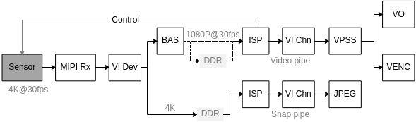
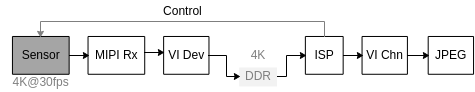
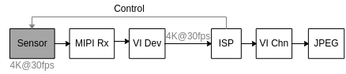
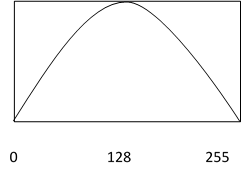
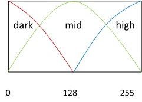
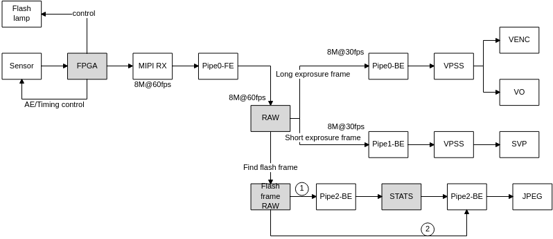

# 前言<a name="ZH-CN_TOPIC_0000002408283974"></a>

**产品版本<a name="section2422mcpsimp"></a>**

与本文档相对应的产品版本如下。

<a name="table2425mcpsimp"></a>
<table><thead align="left"><tr id="row2430mcpsimp"><th class="cellrowborder" valign="top" width="32%" id="mcps1.1.3.1.1"><p id="p2432mcpsimp"><a name="p2432mcpsimp"></a><a name="p2432mcpsimp"></a>产品名称</p>
</th>
<th class="cellrowborder" valign="top" width="68%" id="mcps1.1.3.1.2"><p id="p2434mcpsimp"><a name="p2434mcpsimp"></a><a name="p2434mcpsimp"></a>产品版本</p>
</th>
</tr>
</thead>
<tbody><tr id="row2436mcpsimp"><td class="cellrowborder" valign="top" width="32%" headers="mcps1.1.3.1.1 "><p id="p2438mcpsimp"><a name="p2438mcpsimp"></a><a name="p2438mcpsimp"></a>SS928</p>
</td>
<td class="cellrowborder" valign="top" width="68%" headers="mcps1.1.3.1.2 "><p id="p2440mcpsimp"><a name="p2440mcpsimp"></a><a name="p2440mcpsimp"></a>V100</p>
</td>
</tr>
<tr id="row22121948133617"><td class="cellrowborder" valign="top" width="32%" headers="mcps1.1.3.1.1 "><p id="p368135114363"><a name="p368135114363"></a><a name="p368135114363"></a>SS927</p>
</td>
<td class="cellrowborder" valign="top" width="68%" headers="mcps1.1.3.1.2 "><p id="p16681151103616"><a name="p16681151103616"></a><a name="p16681151103616"></a>V100</p>
</td>
</tr>
</tbody>
</table>

> **说明：** 
>本文以SS928V100描述为例，未有特殊说明，SS927V100与SS928V100内容一致。

**修订记录<a name="section2441mcpsimp"></a>**

修订记录累积了每次文档更新的说明。最新版本的文档包含以前所有文档版本的更新内容。

<a name="table126443203200"></a>
<table><thead align="left"><tr id="row264516207203"><th class="cellrowborder" valign="top" width="20.72%" id="mcps1.1.4.1.1"><p id="p146456203200"><a name="p146456203200"></a><a name="p146456203200"></a><strong id="b8645172022010"><a name="b8645172022010"></a><a name="b8645172022010"></a>文档版本</strong></p>
</th>
<th class="cellrowborder" valign="top" width="26.119999999999997%" id="mcps1.1.4.1.2"><p id="p364512062019"><a name="p364512062019"></a><a name="p364512062019"></a><strong id="b1464512200200"><a name="b1464512200200"></a><a name="b1464512200200"></a>发布日期</strong></p>
</th>
<th class="cellrowborder" valign="top" width="53.16%" id="mcps1.1.4.1.3"><p id="p664522018206"><a name="p664522018206"></a><a name="p664522018206"></a><strong id="b156451420152010"><a name="b156451420152010"></a><a name="b156451420152010"></a>修改说明</strong></p>
</th>
</tr>
</thead>
<tbody><tr id="row56451520182017"><td class="cellrowborder" valign="top" width="20.72%" headers="mcps1.1.4.1.1 "><p id="p1564572014209"><a name="p1564572014209"></a><a name="p1564572014209"></a>00B01</p>
</td>
<td class="cellrowborder" valign="top" width="26.119999999999997%" headers="mcps1.1.4.1.2 "><p id="p126451920132014"><a name="p126451920132014"></a><a name="p126451920132014"></a>2025-09-15</p>
</td>
<td class="cellrowborder" valign="top" width="53.16%" headers="mcps1.1.4.1.3 "><p id="p1664582017209"><a name="p1664582017209"></a><a name="p1664582017209"></a>第1次临时版本发布。</p>
</td>
</tr>
</tbody>
</table>

# 消费类抓拍方案使用指南<a name="ZH-CN_TOPIC_0000002408124054"></a>


## 概述<a name="ZH-CN_TOPIC_0000002441723221"></a>

消费类抓拍方案主要面向消费类电子产品中的拍照功能，支持Normal、PRO的抓拍模式，可以抓拍单张或者多张不同曝光时间的照片。消费类抓拍方案也支持HDR、SFNR、MFNR和DE的后处理算法。

抓拍的数据通路分为单pipe和双pipe，每个pipe可以在线，也可以离线，每种数据通路适用的场景都有些差异。

## 重要概念<a name="ZH-CN_TOPIC_0000002441683353"></a>

-   单pipe模式

    拍照和预览使用同一ISP通路。

-   双pipe模式

    拍照和预览使用不同的ISP通路。

-   PRO\(Professional\)模式

    专业模式拍照，这种模式下ISP会控制sensor曝光，得到多张曝光时间和增益可调的图片。可以用于HDR算法做多张不同曝光的照片合成，也可以用于拍摄固定曝光时间的照片。

-   ZSL\(Zero Shutter Lag\)

    零延时拍照。可以减少因为快门延迟或其他因素导致的延时，可以拍摄到触发拍照瞬间的图像。

## 抓拍数据通路<a name="ZH-CN_TOPIC_0000002408124058"></a>

VI的pipe工作模式分为离线模式、在线模式，拍照的数据通路建立在VI之上，所以也分这两种模式。

在拍照的场景中，一般视频预览和抓拍的分辨率是不一样的；而且拍照的ISP效果处理要对人脸肤色等做优化处理，也会和视频预览通路的不一样。所以拍照的数据通路又分为单pipe和双pipe两种。

另外消费类电子产品中还有ZSL模式拍照这种特殊场景下的拍照通路。

> **须知：** 
>VI和VPSS之间的在线、离线关系只影响拍照的YUV输出的位置，不影响拍照的控制流，所以下文说的在线和离线，都是指的拍照的那个VI pipe是在线或者离线。

综上，拍照的数据通路就会有很多种，每种数据通路的适用场景不一样，我们推荐客户采用双pipe离线模式的拍照方案，这种方案在功耗控制上是最优的，拍照的耗时也较短。

下面介绍每种数据通路的优缺点。


### 双pipe离线模式拍照<a name="ZH-CN_TOPIC_0000002441683357"></a>

双pipe离线模式拍照的数据通路如[图1](#fig1159101162512)所示。

**图 1**  双pipe离线拍照数据通路<a name="fig1159101162512"></a>  


[图1](#fig1159101162512)所标示的分辨率只是示意分辨率，实际分辨率根据客户不同的场景可能会有差异。后面的数据通路中所标示分辨率也是同样的意思。

双pipe离线的数据通路是一个sensor进来的数据，经过VI Dev时序解析后，分别绑定到2个不同的pipe，上面的pipe用于视频预览和录像，下面的pipe用于拍照。视频预览和录像的pipe是离线的；拍照的pipe也是离线的。

预览和录像的分辨率一般比较小，所以经过了BAS，做了Bayer Scale，主要目的是减小上面的pipe处理的分辨率，从而降低功耗。DV产品中预览用的LCD屏分辨率一般都很小，但需要预览通路一直存在。

拍照的分辨率一般都比较大，但用户并不会一直拍照，所以下面的pipe用于拍照，一般是在客户需要拍照时才启动下面的pipe的通路。

Sensor的曝光控制是由上面的视频pipe的ISP来控制的。

用户设置拍照相关的属性和触发拍照接口，用的pipe号都是下面那个拍照用的pipe，内部的数据同步由VI和ISP的驱动来完成。

这种数据通路可以用于NORMAL和PRO模式的拍照。PRO模式是在用户调用[ss\_mpi\_snap\_trigger\_pipe](#ZH-CN_TOPIC_0000002441683321)接口之后才开始控制sensor进行长短曝光的。

-   双pipe离线时，拍照的pipe在用户调用[ss\_mpi\_snap\_trigger\_pipe](#ZH-CN_TOPIC_0000002441683321)接口时才打开中断做数据处理，并且只处理抓拍的那几帧数据，抓拍完成后可以调用[ss\_mpi\_snap\_disable\_pipe](#ZH-CN_TOPIC_0000002408283910)停止数据处理。这样处理是为了降低拍照那个pipe的功耗。
-   双pipe离线时，用户拍摄正常曝光的照片，从调用[ss\_mpi\_snap\_trigger\_pipe](#ZH-CN_TOPIC_0000002441683321)接口到VI输出第一张正常YUV数据，理论上的耗时在3帧左右，可以满足大部分客户场景的需求。所以，我们推荐客户采用双pipe离线的数据通路来实现拍照的方案。

### 单pipe离线模式拍照<a name="ZH-CN_TOPIC_0000002408124062"></a>

单pipe离线模式拍照的数据通路如[图1](#fig7254193145214)所示。

**图 1**  单pipe离线拍照数据通路<a name="fig7254193145214"></a>  


-   单pipe离线数据通路是视频预览和拍照共用一个pipe。
-   单pipe离线模式拍照使用的方法是平时只有视频预览时整个通路可以采用比较小的分辨率，只有切换到拍照模式时才将sensor和VI等通路切换到大的拍照分辨率。这样可以节省一定的功耗。
-   单pipe离线模式拍照应用的场景是当客户的产品有多个sensor同时输入将VI pipe全部占用，无法做到一个sensor输入绑定两个pipe时，就需要用这种模式来拍照。

这种数据通路可以拍摄NORMAL和PRO模式的照片。

当录像和拍照的分辨率一样，客户又不需要对拍照的ISP做特殊的调节时，可以从单pipe的视频流里面取YUV编成jpeg来实现拍照的方案。这种方案并不需要VI和ISP的驱动做额外的事情，所以不需要调拍照相关的MPI接口。

### 单pipe在线模式拍照<a name="ZH-CN_TOPIC_0000002441683349"></a>

单pipe在线模式拍照的数据通路如[图1](#fig442419812542)所示。

**图 1**  单pipe在线拍照数据通路<a name="fig442419812542"></a>  


单pipe在线拍照的数据通路和单pipe离线的类似，区别是数据通路是在线的。这种数据通路可以拍摄NORMAL和PRO模式的照片。

> **须知：** 
>SS928V100的VI模块目前只支持1个pipe在线，如果多于1个sensor输入的场景，所有sensor要离线处理。

### ZSL模式拍照<a name="ZH-CN_TOPIC_0000002441723225"></a>

ZSL模式的拍照通路和双pipe离线模式的拍照通路一样，区别是VI驱动内部会缓存一个RAW数据的队列。在调用[ss\_mpi\_snap\_enable\_pipe](#ZH-CN_TOPIC_0000002408124010)接口后，VI内部就开始缓存RAW数据，调用[ss\_mpi\_snap\_trigger\_pipe](#ZH-CN_TOPIC_0000002441683321)接口会选择ZSL的拍照帧，然后将拍照的帧送给ISP做处理。

ZSL模式拍照，只支持拍摄NORMAL模式的照片。

## 功能描述<a name="ZH-CN_TOPIC_0000002408283970"></a>


### 连拍时的帧率控制<a name="ZH-CN_TOPIC_0000002441723157"></a>

连拍时可以做帧率控制，是通过ss\_mpi\_vi\_create\_pipe或者ss\_mpi\_vi\_set\_pipe\_attr接口设置的ot\_vi\_pipe\_attr中的帧率控制来实现的。

> **说明：** 
>以上接口请参考《MPP 媒体处理软件V5.0 开发参考》“视频输入”章节。

## API参考<a name="ZH-CN_TOPIC_0000002441683297"></a>

该模块提供以下MPI：

-   [ss\_mpi\_snap\_set\_pipe\_attr](#ZH-CN_TOPIC_0000002408124034)：设置拍照属性。
-   [ss\_mpi\_snap\_get\_pipe\_attr](#ZH-CN_TOPIC_0000002408283902)：获取拍照属性。
-   [ss\_mpi\_snap\_enable\_pipe](#ZH-CN_TOPIC_0000002408124010)：使能拍照的pipe。
-   [ss\_mpi\_snap\_disable\_pipe](#ZH-CN_TOPIC_0000002408283910)：停止拍照的pipe。
-   [ss\_mpi\_snap\_trigger\_pipe](#ZH-CN_TOPIC_0000002441683321)：触发抓拍。


### ss\_mpi\_snap\_set\_pipe\_attr<a name="ZH-CN_TOPIC_0000002408124034"></a>

【描述】

设置拍照的属性。

【语法】

```
td_s32 ss_mpi_snap_set_pipe_attr(ot_vi_pipe vi_pipe, const ot_snap_attr *snap_attr);
```

【参数】

<a name="table1182mcpsimp"></a>
<table><thead align="left"><tr id="row1188mcpsimp"><th class="cellrowborder" valign="top" width="20%" id="mcps1.1.4.1.1"><p id="p1190mcpsimp"><a name="p1190mcpsimp"></a><a name="p1190mcpsimp"></a>参数名称</p>
</th>
<th class="cellrowborder" valign="top" width="64%" id="mcps1.1.4.1.2"><p id="p1192mcpsimp"><a name="p1192mcpsimp"></a><a name="p1192mcpsimp"></a>描述</p>
</th>
<th class="cellrowborder" valign="top" width="16%" id="mcps1.1.4.1.3"><p id="p1194mcpsimp"><a name="p1194mcpsimp"></a><a name="p1194mcpsimp"></a>输入/输出</p>
</th>
</tr>
</thead>
<tbody><tr id="row1196mcpsimp"><td class="cellrowborder" valign="top" width="20%" headers="mcps1.1.4.1.1 "><p id="p1198mcpsimp"><a name="p1198mcpsimp"></a><a name="p1198mcpsimp"></a>vi_pipe</p>
</td>
<td class="cellrowborder" valign="top" width="64%" headers="mcps1.1.4.1.2 "><p id="p1200mcpsimp"><a name="p1200mcpsimp"></a><a name="p1200mcpsimp"></a>VI的pipe号。</p>
<p id="p1201mcpsimp"><a name="p1201mcpsimp"></a><a name="p1201mcpsimp"></a>取值范围：[0, OT_VI_MAX_PHYS_PIPE_NUM)。</p>
<p id="OT_VI_MAX_PHYS_PIPE_NUM"><a name="OT_VI_MAX_PHYS_PIPE_NUM"></a><a name="OT_VI_MAX_PHYS_PIPE_NUM"></a>OT_VI_MAX_PHYS_PIPE_NUM<span xml:lang="sv-SE" id="ph1202mcpsimp"><a name="ph1202mcpsimp"></a><a name="ph1202mcpsimp"></a>定义请参考</span>《MPP 媒体处理软件 V5.0 开发参考》“视频输入”章节。</p>
</td>
<td class="cellrowborder" valign="top" width="16%" headers="mcps1.1.4.1.3 "><p id="p1204mcpsimp"><a name="p1204mcpsimp"></a><a name="p1204mcpsimp"></a>输入</p>
</td>
</tr>
<tr id="row1205mcpsimp"><td class="cellrowborder" valign="top" width="20%" headers="mcps1.1.4.1.1 "><p id="p1207mcpsimp"><a name="p1207mcpsimp"></a><a name="p1207mcpsimp"></a>snap_attr</p>
</td>
<td class="cellrowborder" valign="top" width="64%" headers="mcps1.1.4.1.2 "><p id="p1209mcpsimp"><a name="p1209mcpsimp"></a><a name="p1209mcpsimp"></a>拍照参数的属性结构体指针。</p>
</td>
<td class="cellrowborder" valign="top" width="16%" headers="mcps1.1.4.1.3 "><p id="p1211mcpsimp"><a name="p1211mcpsimp"></a><a name="p1211mcpsimp"></a>输入</p>
</td>
</tr>
</tbody>
</table>

【返回值】

<a name="table1213mcpsimp"></a>
<table><thead align="left"><tr id="row1218mcpsimp"><th class="cellrowborder" valign="top" width="50%" id="mcps1.1.3.1.1"><p id="p1220mcpsimp"><a name="p1220mcpsimp"></a><a name="p1220mcpsimp"></a>返回值</p>
</th>
<th class="cellrowborder" valign="top" width="50%" id="mcps1.1.3.1.2"><p id="p1222mcpsimp"><a name="p1222mcpsimp"></a><a name="p1222mcpsimp"></a>描述</p>
</th>
</tr>
</thead>
<tbody><tr id="row1224mcpsimp"><td class="cellrowborder" valign="top" width="50%" headers="mcps1.1.3.1.1 "><p id="p1226mcpsimp"><a name="p1226mcpsimp"></a><a name="p1226mcpsimp"></a>0</p>
</td>
<td class="cellrowborder" valign="top" width="50%" headers="mcps1.1.3.1.2 "><p id="p1228mcpsimp"><a name="p1228mcpsimp"></a><a name="p1228mcpsimp"></a>成功。</p>
</td>
</tr>
<tr id="row1229mcpsimp"><td class="cellrowborder" valign="top" width="50%" headers="mcps1.1.3.1.1 "><p id="p1231mcpsimp"><a name="p1231mcpsimp"></a><a name="p1231mcpsimp"></a>非0</p>
</td>
<td class="cellrowborder" valign="top" width="50%" headers="mcps1.1.3.1.2 "><p id="p1233mcpsimp"><a name="p1233mcpsimp"></a><a name="p1233mcpsimp"></a>失败，其值为<a href="#ZH-CN_TOPIC_0000002441723193">错误码</a><span xml:lang="fr-FR" id="ph1235mcpsimp"><a name="ph1235mcpsimp"></a><a name="ph1235mcpsimp"></a>。</span></p>
</td>
</tr>
</tbody>
</table>

【解决方案差异】

无。

【需求】

-   头文件：ot\_common\_snap.h、ss\_mpi\_snap.h
-   库文件：libss\_snap.a

【注意】

-   PIPE必须已创建。
-   拍照参数必须合法，具体请参见[ot\_snap\_attr](#ZH-CN_TOPIC_0000002441723169)。
-   双pipe离线模式下，若拍照参数设置的重复送帧数不为0，在调用ss\_mpi\_vpss\_get\_chn\_frame及ss\_mpi\_vpss\_get\_grp\_frame接口（具体请参考《MPP媒体处理软件V5.0开发参考》“视频处理子系统”章节）从抓拍通路中获取帧时，会获取到重复帧。若将获取到的帧用于编码，VENC模块会自动删除重复帧，但若将获取到的帧用于图像处理，则需要手动删除重复帧。
-   WDR模式不支持拍照。
-   ZSL拍照模式下，设置的depth需要大于重复送帧的次数，否则可能因为VI处理不及时缓存队列里面的帧被冲掉而导致丢帧。
-   在调用[ss\_mpi\_snap\_enable\_pipe](#ZH-CN_TOPIC_0000002408124010)接口之后，再次调用[ss\_mpi\_snap\_set\_pipe\_attr](#ZH-CN_TOPIC_0000001218750347)接口时，只能修改成员[ot\_snap\_attr](#ZH-CN_TOPIC_0000002441723169)的pro\_attr属性，修改其他属性都会报错。

【举例】

无

【相关主题】

[ss\_mpi\_snap\_get\_pipe\_attr](#ZH-CN_TOPIC_0000002408283902)

### ss\_mpi\_snap\_get\_pipe\_attr<a name="ZH-CN_TOPIC_0000002408283902"></a>

【描述】

获取拍照的属性。

【语法】

```
td_s32 ss_mpi_snap_get_pipe_attr(ot_vi_pipe vi_pipe, ot_snap_attr *snap_attr);
```

【参数】

<a name="table990mcpsimp"></a>
<table><thead align="left"><tr id="row996mcpsimp"><th class="cellrowborder" valign="top" width="17%" id="mcps1.1.4.1.1"><p id="p998mcpsimp"><a name="p998mcpsimp"></a><a name="p998mcpsimp"></a>参数名称</p>
</th>
<th class="cellrowborder" valign="top" width="67%" id="mcps1.1.4.1.2"><p id="p1000mcpsimp"><a name="p1000mcpsimp"></a><a name="p1000mcpsimp"></a>描述</p>
</th>
<th class="cellrowborder" valign="top" width="16%" id="mcps1.1.4.1.3"><p id="p1002mcpsimp"><a name="p1002mcpsimp"></a><a name="p1002mcpsimp"></a>输入/输出</p>
</th>
</tr>
</thead>
<tbody><tr id="row1004mcpsimp"><td class="cellrowborder" valign="top" width="17%" headers="mcps1.1.4.1.1 "><p id="p1006mcpsimp"><a name="p1006mcpsimp"></a><a name="p1006mcpsimp"></a>vi_pipe</p>
</td>
<td class="cellrowborder" valign="top" width="67%" headers="mcps1.1.4.1.2 "><p id="p1008mcpsimp"><a name="p1008mcpsimp"></a><a name="p1008mcpsimp"></a>VI的pipe号。</p>
<p id="p1009mcpsimp"><a name="p1009mcpsimp"></a><a name="p1009mcpsimp"></a>取值范围：[0, <a href="#ZH-CN_TOPIC_0000002408124034">OT_VI_MAX_PHYS_PIPE_NUM</a>)。</p>
</td>
<td class="cellrowborder" valign="top" width="16%" headers="mcps1.1.4.1.3 "><p id="p1012mcpsimp"><a name="p1012mcpsimp"></a><a name="p1012mcpsimp"></a>输入</p>
</td>
</tr>
<tr id="row1013mcpsimp"><td class="cellrowborder" valign="top" width="17%" headers="mcps1.1.4.1.1 "><p id="p1015mcpsimp"><a name="p1015mcpsimp"></a><a name="p1015mcpsimp"></a>snap_attr</p>
</td>
<td class="cellrowborder" valign="top" width="67%" headers="mcps1.1.4.1.2 "><p id="p1017mcpsimp"><a name="p1017mcpsimp"></a><a name="p1017mcpsimp"></a>拍照参数的属性结构体指针。</p>
</td>
<td class="cellrowborder" valign="top" width="16%" headers="mcps1.1.4.1.3 "><p id="p1019mcpsimp"><a name="p1019mcpsimp"></a><a name="p1019mcpsimp"></a>输出</p>
</td>
</tr>
</tbody>
</table>

【返回值】

<a name="table1021mcpsimp"></a>
<table><thead align="left"><tr id="row1026mcpsimp"><th class="cellrowborder" valign="top" width="50%" id="mcps1.1.3.1.1"><p id="p1028mcpsimp"><a name="p1028mcpsimp"></a><a name="p1028mcpsimp"></a>返回值</p>
</th>
<th class="cellrowborder" valign="top" width="50%" id="mcps1.1.3.1.2"><p id="p1030mcpsimp"><a name="p1030mcpsimp"></a><a name="p1030mcpsimp"></a>描述</p>
</th>
</tr>
</thead>
<tbody><tr id="row1032mcpsimp"><td class="cellrowborder" valign="top" width="50%" headers="mcps1.1.3.1.1 "><p id="p1034mcpsimp"><a name="p1034mcpsimp"></a><a name="p1034mcpsimp"></a>0</p>
</td>
<td class="cellrowborder" valign="top" width="50%" headers="mcps1.1.3.1.2 "><p id="p1036mcpsimp"><a name="p1036mcpsimp"></a><a name="p1036mcpsimp"></a>成功。</p>
</td>
</tr>
<tr id="row1037mcpsimp"><td class="cellrowborder" valign="top" width="50%" headers="mcps1.1.3.1.1 "><p id="p1039mcpsimp"><a name="p1039mcpsimp"></a><a name="p1039mcpsimp"></a>非0</p>
</td>
<td class="cellrowborder" valign="top" width="50%" headers="mcps1.1.3.1.2 "><p id="p1041mcpsimp"><a name="p1041mcpsimp"></a><a name="p1041mcpsimp"></a>失败，其值为<a href="#ZH-CN_TOPIC_0000002408283958">错误码</a>。</p>
</td>
</tr>
</tbody>
</table>

【解决方案差异】

无。

【需求】

-   头文件：ot\_common\_snap.h、ss\_mpi\_snap.h
-   库文件：libss\_snap.a

【注意】

-   PIPE必须已创建。
-   snap属性已设置。

【举例】

无

【相关主题】

[ss\_mpi\_snap\_set\_pipe\_attr](#ZH-CN_TOPIC_0000002408124034)

### ss\_mpi\_snap\_enable\_pipe<a name="ZH-CN_TOPIC_0000002408124010"></a>

【描述】

使能拍照的pipe。

【语法】

```
td_s32 ss_mpi_snap_enable_pipe(ot_vi_pipe vi_pipe);
```

【参数】

<a name="table1789mcpsimp"></a>
<table><thead align="left"><tr id="row1795mcpsimp"><th class="cellrowborder" valign="top" width="15%" id="mcps1.1.4.1.1"><p id="p1797mcpsimp"><a name="p1797mcpsimp"></a><a name="p1797mcpsimp"></a>参数名称</p>
</th>
<th class="cellrowborder" valign="top" width="69%" id="mcps1.1.4.1.2"><p id="p1799mcpsimp"><a name="p1799mcpsimp"></a><a name="p1799mcpsimp"></a>描述</p>
</th>
<th class="cellrowborder" valign="top" width="16%" id="mcps1.1.4.1.3"><p id="p1801mcpsimp"><a name="p1801mcpsimp"></a><a name="p1801mcpsimp"></a>输入/输出</p>
</th>
</tr>
</thead>
<tbody><tr id="row1803mcpsimp"><td class="cellrowborder" valign="top" width="15%" headers="mcps1.1.4.1.1 "><p id="p1805mcpsimp"><a name="p1805mcpsimp"></a><a name="p1805mcpsimp"></a>vi_pipe</p>
</td>
<td class="cellrowborder" valign="top" width="69%" headers="mcps1.1.4.1.2 "><p id="p1807mcpsimp"><a name="p1807mcpsimp"></a><a name="p1807mcpsimp"></a>VI的pipe号。</p>
<p id="p1808mcpsimp"><a name="p1808mcpsimp"></a><a name="p1808mcpsimp"></a>取值范围：[0, <a href="#ZH-CN_TOPIC_0000002408124034">OT_VI_MAX_PHYS_PIPE_NUM</a>)。</p>
</td>
<td class="cellrowborder" valign="top" width="16%" headers="mcps1.1.4.1.3 "><p id="p1811mcpsimp"><a name="p1811mcpsimp"></a><a name="p1811mcpsimp"></a>输入</p>
</td>
</tr>
</tbody>
</table>

【返回值】

<a name="table1813mcpsimp"></a>
<table><thead align="left"><tr id="row1818mcpsimp"><th class="cellrowborder" valign="top" width="50%" id="mcps1.1.3.1.1"><p id="p1820mcpsimp"><a name="p1820mcpsimp"></a><a name="p1820mcpsimp"></a>返回值</p>
</th>
<th class="cellrowborder" valign="top" width="50%" id="mcps1.1.3.1.2"><p id="p1822mcpsimp"><a name="p1822mcpsimp"></a><a name="p1822mcpsimp"></a>描述</p>
</th>
</tr>
</thead>
<tbody><tr id="row1824mcpsimp"><td class="cellrowborder" valign="top" width="50%" headers="mcps1.1.3.1.1 "><p id="p1826mcpsimp"><a name="p1826mcpsimp"></a><a name="p1826mcpsimp"></a>0</p>
</td>
<td class="cellrowborder" valign="top" width="50%" headers="mcps1.1.3.1.2 "><p id="p1828mcpsimp"><a name="p1828mcpsimp"></a><a name="p1828mcpsimp"></a>成功。</p>
</td>
</tr>
<tr id="row1829mcpsimp"><td class="cellrowborder" valign="top" width="50%" headers="mcps1.1.3.1.1 "><p id="p1831mcpsimp"><a name="p1831mcpsimp"></a><a name="p1831mcpsimp"></a>非0</p>
</td>
<td class="cellrowborder" valign="top" width="50%" headers="mcps1.1.3.1.2 "><p id="p1833mcpsimp"><a name="p1833mcpsimp"></a><a name="p1833mcpsimp"></a>失败，其值为<a href="#ZH-CN_TOPIC_0000002408283958">错误码</a>。</p>
</td>
</tr>
</tbody>
</table>

【解决方案差异】

无。

【需求】

-   头文件：ot\_common\_snap.h、ss\_mpi\_snap.h
-   库文件：libss\_snap.a

【注意】

-   PIPE必须已创建。
-   拍照的属性必须已经设置。
-   此接口不支持单PIPE拍照场景，调用ss\_mpi\_vi\_start\_pipe之后直接使用[ss\_mpi\_snap\_trigger\_pipe](#ZH-CN_TOPIC_0000002441683321)接口即可拍照。
-   双pipe拍照场景，使能拍照PIPE只能调用[ss\_mpi\_snap\_enable\_pipe](#ZH-CN_TOPIC_0000001218948863)，而不能调用ss\_mpi\_vi\_start\_pipe接口，ss\_mpi\_vi\_start\_pipe的详细功能描述，请参考《MPP 媒体处理软件V5.0 开发参考》中“视频输入”章节的说明。
-   不支持重复使能拍照的PIPE。
-   双PIPE拍照时，[ss\_mpi\_snap\_enable\_pipe](#ZH-CN_TOPIC_0000001218948863)和[ss\_mpi\_snap\_trigger\_pipe](#ZH-CN_TOPIC_0000002441683321)两个接口的调用间隔要大于2帧的曝光时间，才能使拍照的ISP处理效果正常。
-   PRO模式拍照时，[ss\_mpi\_snap\_disable\_pipe](#ZH-CN_TOPIC_0000002408283910)和[ss\_mpi\_snap\_enable\_pipe](#ZH-CN_TOPIC_0000001218948863)两个接口的调用间隔要大于4帧，即两次拍照的间隔，在低帧率下间隔过小，第二次拍照的帧可能不是期望的曝光帧。

【举例】

无

【相关主题】

[ss\_mpi\_snap\_set\_pipe\_attr](#ZH-CN_TOPIC_0000002408124034)

### ss\_mpi\_snap\_disable\_pipe<a name="ZH-CN_TOPIC_0000002408283910"></a>

【描述】

停止拍照的pipe，也可以用于中断正在拍照的数据流。

【语法】

```
td_s32 ss_mpi_snap_disable_pipe(ot_vi_pipe vi_pipe);
```

【参数】

<a name="table823mcpsimp"></a>
<table><thead align="left"><tr id="row829mcpsimp"><th class="cellrowborder" valign="top" width="15%" id="mcps1.1.4.1.1"><p id="p831mcpsimp"><a name="p831mcpsimp"></a><a name="p831mcpsimp"></a>参数名称</p>
</th>
<th class="cellrowborder" valign="top" width="69%" id="mcps1.1.4.1.2"><p id="p833mcpsimp"><a name="p833mcpsimp"></a><a name="p833mcpsimp"></a>描述</p>
</th>
<th class="cellrowborder" valign="top" width="16%" id="mcps1.1.4.1.3"><p id="p835mcpsimp"><a name="p835mcpsimp"></a><a name="p835mcpsimp"></a>输入/输出</p>
</th>
</tr>
</thead>
<tbody><tr id="row837mcpsimp"><td class="cellrowborder" valign="top" width="15%" headers="mcps1.1.4.1.1 "><p id="p839mcpsimp"><a name="p839mcpsimp"></a><a name="p839mcpsimp"></a>vi_pipe</p>
</td>
<td class="cellrowborder" valign="top" width="69%" headers="mcps1.1.4.1.2 "><p id="p841mcpsimp"><a name="p841mcpsimp"></a><a name="p841mcpsimp"></a>VI的pipe号。</p>
<p id="p842mcpsimp"><a name="p842mcpsimp"></a><a name="p842mcpsimp"></a>取值范围：[0, <a href="#ZH-CN_TOPIC_0000002408124034">OT_VI_MAX_PHYS_PIPE_NUM</a>)。</p>
</td>
<td class="cellrowborder" valign="top" width="16%" headers="mcps1.1.4.1.3 "><p id="p845mcpsimp"><a name="p845mcpsimp"></a><a name="p845mcpsimp"></a>输入</p>
</td>
</tr>
</tbody>
</table>

【返回值】

<a name="table847mcpsimp"></a>
<table><thead align="left"><tr id="row852mcpsimp"><th class="cellrowborder" valign="top" width="50%" id="mcps1.1.3.1.1"><p id="p854mcpsimp"><a name="p854mcpsimp"></a><a name="p854mcpsimp"></a>返回值</p>
</th>
<th class="cellrowborder" valign="top" width="50%" id="mcps1.1.3.1.2"><p id="p856mcpsimp"><a name="p856mcpsimp"></a><a name="p856mcpsimp"></a>描述</p>
</th>
</tr>
</thead>
<tbody><tr id="row858mcpsimp"><td class="cellrowborder" valign="top" width="50%" headers="mcps1.1.3.1.1 "><p id="p860mcpsimp"><a name="p860mcpsimp"></a><a name="p860mcpsimp"></a>0</p>
</td>
<td class="cellrowborder" valign="top" width="50%" headers="mcps1.1.3.1.2 "><p id="p862mcpsimp"><a name="p862mcpsimp"></a><a name="p862mcpsimp"></a>成功。</p>
</td>
</tr>
<tr id="row863mcpsimp"><td class="cellrowborder" valign="top" width="50%" headers="mcps1.1.3.1.1 "><p id="p865mcpsimp"><a name="p865mcpsimp"></a><a name="p865mcpsimp"></a>非0</p>
</td>
<td class="cellrowborder" valign="top" width="50%" headers="mcps1.1.3.1.2 "><p id="p867mcpsimp"><a name="p867mcpsimp"></a><a name="p867mcpsimp"></a>失败，其值为<a href="#ZH-CN_TOPIC_0000002408283958">错误码</a>。</p>
</td>
</tr>
</tbody>
</table>

【解决方案差异】

无。

【需求】

-   头文件：ot\_common\_snap.h、ss\_mpi\_snap.h
-   库文件：libss\_snap.a

【注意】

-   PIPE必须已创建。
-   单pipe拍照场景，不支持此接口。
-   抓拍场景需保证VI通路有帧数据，否则会出现抓拍数据流内部死等帧数据，造成退出抓拍时异常卡住。

【举例】

无

【相关主题】

[ss\_mpi\_snap\_enable\_pipe](#ZH-CN_TOPIC_0000002408124010)

### ss\_mpi\_snap\_trigger\_pipe<a name="ZH-CN_TOPIC_0000002441683321"></a>

【描述】

触发拍照。

【语法】

```
td_s32 ss_mpi_snap_trigger_pipe(ot_vi_pipe vi_pipe);
```

【参数】

<a name="table2647mcpsimp"></a>
<table><thead align="left"><tr id="row2653mcpsimp"><th class="cellrowborder" valign="top" width="15%" id="mcps1.1.4.1.1"><p id="p2655mcpsimp"><a name="p2655mcpsimp"></a><a name="p2655mcpsimp"></a>参数名称</p>
</th>
<th class="cellrowborder" valign="top" width="69%" id="mcps1.1.4.1.2"><p id="p2657mcpsimp"><a name="p2657mcpsimp"></a><a name="p2657mcpsimp"></a>描述</p>
</th>
<th class="cellrowborder" valign="top" width="16%" id="mcps1.1.4.1.3"><p id="p2659mcpsimp"><a name="p2659mcpsimp"></a><a name="p2659mcpsimp"></a>输入/输出</p>
</th>
</tr>
</thead>
<tbody><tr id="row2661mcpsimp"><td class="cellrowborder" valign="top" width="15%" headers="mcps1.1.4.1.1 "><p id="p2663mcpsimp"><a name="p2663mcpsimp"></a><a name="p2663mcpsimp"></a>vi_pipe</p>
</td>
<td class="cellrowborder" valign="top" width="69%" headers="mcps1.1.4.1.2 "><p id="p2665mcpsimp"><a name="p2665mcpsimp"></a><a name="p2665mcpsimp"></a>VI的pipe号。</p>
<p id="p2666mcpsimp"><a name="p2666mcpsimp"></a><a name="p2666mcpsimp"></a>取值范围：[0, <a href="#ZH-CN_TOPIC_0000002408124034">OT_VI_MAX_PHYS_PIPE_NUM</a>)。</p>
</td>
<td class="cellrowborder" valign="top" width="16%" headers="mcps1.1.4.1.3 "><p id="p2669mcpsimp"><a name="p2669mcpsimp"></a><a name="p2669mcpsimp"></a>输入</p>
</td>
</tr>
</tbody>
</table>

【返回值】

<a name="table2671mcpsimp"></a>
<table><thead align="left"><tr id="row2676mcpsimp"><th class="cellrowborder" valign="top" width="50%" id="mcps1.1.3.1.1"><p id="p2678mcpsimp"><a name="p2678mcpsimp"></a><a name="p2678mcpsimp"></a>返回值</p>
</th>
<th class="cellrowborder" valign="top" width="50%" id="mcps1.1.3.1.2"><p id="p2680mcpsimp"><a name="p2680mcpsimp"></a><a name="p2680mcpsimp"></a>描述</p>
</th>
</tr>
</thead>
<tbody><tr id="row2682mcpsimp"><td class="cellrowborder" valign="top" width="50%" headers="mcps1.1.3.1.1 "><p id="p2684mcpsimp"><a name="p2684mcpsimp"></a><a name="p2684mcpsimp"></a>0</p>
</td>
<td class="cellrowborder" valign="top" width="50%" headers="mcps1.1.3.1.2 "><p id="p2686mcpsimp"><a name="p2686mcpsimp"></a><a name="p2686mcpsimp"></a>成功。</p>
</td>
</tr>
<tr id="row2687mcpsimp"><td class="cellrowborder" valign="top" width="50%" headers="mcps1.1.3.1.1 "><p id="p2689mcpsimp"><a name="p2689mcpsimp"></a><a name="p2689mcpsimp"></a>非0</p>
</td>
<td class="cellrowborder" valign="top" width="50%" headers="mcps1.1.3.1.2 "><p id="p2691mcpsimp"><a name="p2691mcpsimp"></a><a name="p2691mcpsimp"></a>失败，其值为<a href="#ZH-CN_TOPIC_0000002408283958">错误码</a>。</p>
</td>
</tr>
</tbody>
</table>

【解决方案差异】

无。

【需求】

-   头文件：ot\_common\_snap.h、ss\_mpi\_snap.h
-   库文件：libss\_snap.a

【注意】

-   PIPE必须已创建。
-   拍照 PIPE必须已使能，单pipe模式下拍照的属性必须已经设置。
-   正在拍照过程中，不能再次触发拍照。
-   双pipe Pro模式拍照时，由于调节曝光会导致视频通路拍照过程中有几帧闪烁，可参考《MPP 媒体处理软件 V5.0 开发参考》“视频输入”章节 ss\_mpi\_vi\_get\_pipe\_param设置抓拍时丢弃曝光帧，减弱闪烁效果。

【举例】

无

【相关主题】

[ss\_mpi\_snap\_enable\_pipe](#ZH-CN_TOPIC_0000002408124010)

## 数据类型<a name="ZH-CN_TOPIC_0000002408124030"></a>

拍照相关数据类型定义如下：

-   [ot\_snap\_attr](#ZH-CN_TOPIC_0000002441723169)：定义拍照参数的结构体。
-   [ot\_snap\_type](#ZH-CN_TOPIC_0000002441683313)：定义拍照类型的枚举。
-   [ot\_snap\_norm\_attr](#ZH-CN_TOPIC_0000002408124046)：定义Normal类型拍照参数的结构体。
-   [ot\_snap\_pro\_attr](#ZH-CN_TOPIC_0000002408283930)：定义PRO类型拍照参数的结构体。
-   [ot\_snap\_pro\_param](#ZH-CN_TOPIC_0000002441683333)：定义PRO类型ISP相关参数结构体。
-   [ot\_snap\_pro\_auto\_param](#ZH-CN_TOPIC_0000002441723173)：定义PRO类型ISP自动模式参数结构体。
-   [ot\_snap\_pro\_manual\_param](#ZH-CN_TOPIC_0000002408283966)：定义PRO类型ISP手动模式参数结构体。


### ot\_snap\_attr<a name="ZH-CN_TOPIC_0000002441723169"></a>

【说明】

定义拍照参数的结构体。

【定义】

```
typedef struct {
    ot_snap_type snap_type;
    td_bool      load_ccm_en;
    union {
        ot_snap_norm_attr norm_attr;
        ot_snap_pro_attr  pro_attr;
    };
} ot_snap_attr;
```

【成员】

<a name="table1618mcpsimp"></a>
<table><thead align="left"><tr id="row1623mcpsimp"><th class="cellrowborder" valign="top" width="36%" id="mcps1.1.3.1.1"><p id="p1625mcpsimp"><a name="p1625mcpsimp"></a><a name="p1625mcpsimp"></a>成员名称</p>
</th>
<th class="cellrowborder" valign="top" width="64%" id="mcps1.1.3.1.2"><p id="p1627mcpsimp"><a name="p1627mcpsimp"></a><a name="p1627mcpsimp"></a>描述</p>
</th>
</tr>
</thead>
<tbody><tr id="row1629mcpsimp"><td class="cellrowborder" valign="top" width="36%" headers="mcps1.1.3.1.1 "><p xml:lang="sv-SE" id="p1631mcpsimp"><a name="p1631mcpsimp"></a><a name="p1631mcpsimp"></a>snap_type</p>
</td>
<td class="cellrowborder" valign="top" width="64%" headers="mcps1.1.3.1.2 "><p xml:lang="sv-SE" id="p1633mcpsimp"><a name="p1633mcpsimp"></a><a name="p1633mcpsimp"></a>拍照类型的枚举值。</p>
</td>
</tr>
<tr id="row1634mcpsimp"><td class="cellrowborder" valign="top" width="36%" headers="mcps1.1.3.1.1 "><p xml:lang="sv-SE" id="p1636mcpsimp"><a name="p1636mcpsimp"></a><a name="p1636mcpsimp"></a>load_ccm_en</p>
</td>
<td class="cellrowborder" valign="top" width="64%" headers="mcps1.1.3.1.2 "><p id="p1638mcpsimp"><a name="p1638mcpsimp"></a><a name="p1638mcpsimp"></a>是否使用外部的<span xml:lang="sv-SE" id="ph1639mcpsimp"><a name="ph1639mcpsimp"></a><a name="ph1639mcpsimp"></a>CCM</span>值<span xml:lang="sv-SE" id="ph1640mcpsimp"><a name="ph1640mcpsimp"></a><a name="ph1640mcpsimp"></a>。</span></p>
<a name="ul1641mcpsimp"></a><a name="ul1641mcpsimp"></a><ul id="ul1641mcpsimp"><li xml:lang="sv-SE">TD_TRUE：使用外部输入的ISP_CONFIG_INFO_S中的CCM信息。</li><li xml:lang="sv-SE">TD_FALSE：不使用外部输入的CCM信息，用ISP算法自己计算生成的CCM。</li></ul>
</td>
</tr>
<tr id="row1644mcpsimp"><td class="cellrowborder" valign="top" width="36%" headers="mcps1.1.3.1.1 "><p xml:lang="sv-SE" id="p1646mcpsimp"><a name="p1646mcpsimp"></a><a name="p1646mcpsimp"></a>norm_attr</p>
</td>
<td class="cellrowborder" valign="top" width="64%" headers="mcps1.1.3.1.2 "><p xml:lang="sv-SE" id="p1648mcpsimp"><a name="p1648mcpsimp"></a><a name="p1648mcpsimp"></a>Normal类型拍照的参数结构体。</p>
</td>
</tr>
<tr id="row1649mcpsimp"><td class="cellrowborder" valign="top" width="36%" headers="mcps1.1.3.1.1 "><p xml:lang="sv-SE" id="p1651mcpsimp"><a name="p1651mcpsimp"></a><a name="p1651mcpsimp"></a>pro_attr</p>
</td>
<td class="cellrowborder" valign="top" width="64%" headers="mcps1.1.3.1.2 "><p xml:lang="sv-SE" id="p1653mcpsimp"><a name="p1653mcpsimp"></a><a name="p1653mcpsimp"></a>PRO模式拍照的参数结构体。</p>
</td>
</tr>
</tbody>
</table>

【注意事项】

无

【相关数据类型及接口】

-   [ss\_mpi\_snap\_set\_pipe\_attr](#ZH-CN_TOPIC_0000002408124034)
-   [ss\_mpi\_snap\_get\_pipe\_attr](#ZH-CN_TOPIC_0000002408283902)

### ot\_snap\_type<a name="ZH-CN_TOPIC_0000002441683313"></a>

【说明】

定义拍照类型的枚举。

【定义】

```
typedef enum {
    OT_SNAP_TYPE_NORM,
    OT_SNAP_TYPE_PRO,
    OT_SNAP_TYPE_BUTT
} ot_snap_type;
```

【成员】

<a name="table1342mcpsimp"></a>
<table><thead align="left"><tr id="row1347mcpsimp"><th class="cellrowborder" valign="top" width="36%" id="mcps1.1.3.1.1"><p id="p1349mcpsimp"><a name="p1349mcpsimp"></a><a name="p1349mcpsimp"></a>成员名称</p>
</th>
<th class="cellrowborder" valign="top" width="64%" id="mcps1.1.3.1.2"><p id="p1351mcpsimp"><a name="p1351mcpsimp"></a><a name="p1351mcpsimp"></a>描述</p>
</th>
</tr>
</thead>
<tbody><tr id="row1353mcpsimp"><td class="cellrowborder" valign="top" width="36%" headers="mcps1.1.3.1.1 "><p xml:lang="sv-SE" id="p1355mcpsimp"><a name="p1355mcpsimp"></a><a name="p1355mcpsimp"></a>OT_SNAP_TYPE_NORM</p>
</td>
<td class="cellrowborder" valign="top" width="64%" headers="mcps1.1.3.1.2 "><p xml:lang="sv-SE" id="p1357mcpsimp"><a name="p1357mcpsimp"></a><a name="p1357mcpsimp"></a>Normal类型，可以拍正常曝光的照片。</p>
</td>
</tr>
<tr id="row1358mcpsimp"><td class="cellrowborder" valign="top" width="36%" headers="mcps1.1.3.1.1 "><p xml:lang="sv-SE" id="p1360mcpsimp"><a name="p1360mcpsimp"></a><a name="p1360mcpsimp"></a>OT_SNAP_TYPE_PRO</p>
</td>
<td class="cellrowborder" valign="top" width="64%" headers="mcps1.1.3.1.2 "><p id="p1362mcpsimp"><a name="p1362mcpsimp"></a><a name="p1362mcpsimp"></a>专业类型，可以拍不同长短曝光的照片。</p>
</td>
</tr>
</tbody>
</table>

【注意事项】

无

【相关数据类型及接口】

[ot\_snap\_attr](#ZH-CN_TOPIC_0000002441723169)

### ot\_snap\_norm\_attr<a name="ZH-CN_TOPIC_0000002408124046"></a>

【说明】

定义Normal类型拍照参数的结构体。

【定义】

```
typedef struct {
    td_u32  frame_cnt;
    td_u32  repeat_send_times;
    td_bool  zsl_en;
    td_u32  frame_depth;
    td_u32  rollback_ms;
    td_u32  interval;
} ot_snap_norm_attr;
```

【成员】

<a name="table1275mcpsimp"></a>
<table><thead align="left"><tr id="row1280mcpsimp"><th class="cellrowborder" valign="top" width="36%" id="mcps1.1.3.1.1"><p id="p1282mcpsimp"><a name="p1282mcpsimp"></a><a name="p1282mcpsimp"></a>成员名称</p>
</th>
<th class="cellrowborder" valign="top" width="64%" id="mcps1.1.3.1.2"><p id="p1284mcpsimp"><a name="p1284mcpsimp"></a><a name="p1284mcpsimp"></a>描述</p>
</th>
</tr>
</thead>
<tbody><tr id="row1286mcpsimp"><td class="cellrowborder" valign="top" width="36%" headers="mcps1.1.3.1.1 "><p xml:lang="sv-SE" id="p1288mcpsimp"><a name="p1288mcpsimp"></a><a name="p1288mcpsimp"></a>frame_cnt</p>
</td>
<td class="cellrowborder" valign="top" width="64%" headers="mcps1.1.3.1.2 "><p xml:lang="sv-SE" id="p1290mcpsimp"><a name="p1290mcpsimp"></a><a name="p1290mcpsimp"></a>拍照的张数。</p>
<p xml:lang="sv-SE" id="p1291mcpsimp"><a name="p1291mcpsimp"></a><a name="p1291mcpsimp"></a>取值范围：(0, 0xFFFFFFFF]</p>
</td>
</tr>
<tr id="row1292mcpsimp"><td class="cellrowborder" valign="top" width="36%" headers="mcps1.1.3.1.1 "><p xml:lang="sv-SE" id="p1294mcpsimp"><a name="p1294mcpsimp"></a><a name="p1294mcpsimp"></a>repeat_send_times</p>
</td>
<td class="cellrowborder" valign="top" width="64%" headers="mcps1.1.3.1.2 "><p xml:lang="sv-SE" id="p1296mcpsimp"><a name="p1296mcpsimp"></a><a name="p1296mcpsimp"></a>重复送首帧RAW的次数。当VI的pipe离线时，ISP里面的某些算法需要将拍照的首帧RAW重复送多次，用于生成参考信息。</p>
<p xml:lang="sv-SE" id="p1297mcpsimp"><a name="p1297mcpsimp"></a><a name="p1297mcpsimp"></a>单pipe模式不支持重复送帧。</p>
<p xml:lang="sv-SE" id="p1298mcpsimp"><a name="p1298mcpsimp"></a><a name="p1298mcpsimp"></a>取值范围：[0, 3]</p>
</td>
</tr>
<tr id="row1299mcpsimp"><td class="cellrowborder" valign="top" width="36%" headers="mcps1.1.3.1.1 "><p xml:lang="sv-SE" id="p1301mcpsimp"><a name="p1301mcpsimp"></a><a name="p1301mcpsimp"></a>zsl_en</p>
</td>
<td class="cellrowborder" valign="top" width="64%" headers="mcps1.1.3.1.2 "><p xml:lang="sv-SE" id="p1303mcpsimp"><a name="p1303mcpsimp"></a><a name="p1303mcpsimp"></a>是否使用ZSL模式拍照。</p>
</td>
</tr>
<tr id="row1304mcpsimp"><td class="cellrowborder" valign="top" width="36%" headers="mcps1.1.3.1.1 "><p xml:lang="sv-SE" id="p1306mcpsimp"><a name="p1306mcpsimp"></a><a name="p1306mcpsimp"></a>frame_depth</p>
</td>
<td class="cellrowborder" valign="top" width="64%" headers="mcps1.1.3.1.2 "><p xml:lang="sv-SE" id="p1308mcpsimp"><a name="p1308mcpsimp"></a><a name="p1308mcpsimp"></a>ZSL模式缓存队列的深度。</p>
<p xml:lang="sv-SE" id="p1309mcpsimp"><a name="p1309mcpsimp"></a><a name="p1309mcpsimp"></a>取值范围：[1, 8]</p>
</td>
</tr>
<tr id="row1310mcpsimp"><td class="cellrowborder" valign="top" width="36%" headers="mcps1.1.3.1.1 "><p xml:lang="sv-SE" id="p1312mcpsimp"><a name="p1312mcpsimp"></a><a name="p1312mcpsimp"></a>rollback_ms</p>
</td>
<td class="cellrowborder" valign="top" width="64%" headers="mcps1.1.3.1.2 "><p xml:lang="sv-SE" id="p1314mcpsimp"><a name="p1314mcpsimp"></a><a name="p1314mcpsimp"></a>ZSL模式下，用户调用Trigger接口时往前回退多少毫秒。</p>
<p xml:lang="sv-SE" id="p1315mcpsimp"><a name="p1315mcpsimp"></a><a name="p1315mcpsimp"></a>由于ZSL的缓存最多有8帧，当回退后的时间超过缓存队列里面最早那一帧的时间时，选择缓存最早的那一帧；</p>
<p xml:lang="sv-SE" id="p1316mcpsimp"><a name="p1316mcpsimp"></a><a name="p1316mcpsimp"></a>当回退之后的时间位于缓存队列里面两帧的中间时，选择较新的那一帧。</p>
<p xml:lang="sv-SE" id="p1317mcpsimp"><a name="p1317mcpsimp"></a><a name="p1317mcpsimp"></a>取值范围：[0, 0xFFFFFFFF]</p>
<p xml:lang="sv-SE" id="p7771424103716"><a name="p7771424103716"></a><a name="p7771424103716"></a>注意：由于缓存队列长度有限，回退的时间太大是没有意义的；在重复送帧场景下，原则上最多回退的帧数为frame_depth - repeat_send_time，超过该时间缓存队列的帧被冲掉导致第二帧出现丢帧。</p>
</td>
</tr>
<tr id="row1319mcpsimp"><td class="cellrowborder" valign="top" width="36%" headers="mcps1.1.3.1.1 "><p xml:lang="sv-SE" id="p1321mcpsimp"><a name="p1321mcpsimp"></a><a name="p1321mcpsimp"></a>interval</p>
</td>
<td class="cellrowborder" valign="top" width="64%" headers="mcps1.1.3.1.2 "><p xml:lang="sv-SE" id="p1323mcpsimp"><a name="p1323mcpsimp"></a><a name="p1323mcpsimp"></a>ZSL模式下，缓存队列里面的帧可以再做一次帧率控制。该值代表在缓存队列里面找到首帧拍照帧后，间隔多少帧之后再取一帧作为拍照帧。</p>
<p xml:lang="sv-SE" id="p1324mcpsimp"><a name="p1324mcpsimp"></a><a name="p1324mcpsimp"></a>取值范围：[0, 0xFFFFFFFF]</p>
</td>
</tr>
</tbody>
</table>

【注意事项】

无

【相关数据类型及接口】

[ot\_snap\_attr](#ZH-CN_TOPIC_0000002441723169)

### ot\_snap\_pro\_attr<a name="ZH-CN_TOPIC_0000002408283930"></a>

【说明】

定义PRO类型拍照参数的结构体。

【定义】

```
typedef struct {
    td_u32  frame_cnt;
    td_u32  repeat_send_times;
    ot_snap_pro_param  pro_param;
} ot_snap_pro_attr;
```

【成员】

<a name="table2810mcpsimp"></a>
<table><thead align="left"><tr id="row2815mcpsimp"><th class="cellrowborder" valign="top" width="32%" id="mcps1.1.3.1.1"><p id="p2817mcpsimp"><a name="p2817mcpsimp"></a><a name="p2817mcpsimp"></a>成员名称</p>
</th>
<th class="cellrowborder" valign="top" width="68%" id="mcps1.1.3.1.2"><p id="p2819mcpsimp"><a name="p2819mcpsimp"></a><a name="p2819mcpsimp"></a>描述</p>
</th>
</tr>
</thead>
<tbody><tr id="row2821mcpsimp"><td class="cellrowborder" valign="top" width="32%" headers="mcps1.1.3.1.1 "><p xml:lang="sv-SE" id="p2823mcpsimp"><a name="p2823mcpsimp"></a><a name="p2823mcpsimp"></a>frame_cnt</p>
</td>
<td class="cellrowborder" valign="top" width="68%" headers="mcps1.1.3.1.2 "><p xml:lang="sv-SE" id="p2825mcpsimp"><a name="p2825mcpsimp"></a><a name="p2825mcpsimp"></a>拍照的张数。</p>
<p xml:lang="sv-SE" id="OT_ISP_PRO_MAX_FRAME_NUM"><a name="OT_ISP_PRO_MAX_FRAME_NUM"></a><a name="OT_ISP_PRO_MAX_FRAME_NUM"></a>取值范围：(0, OT_ISP_PRO_MAX_FRAME_NUM]</p>
<p xml:lang="sv-SE" id="OT_PRO_MAX_FRAME_NUM"><a name="OT_PRO_MAX_FRAME_NUM"></a><a name="OT_PRO_MAX_FRAME_NUM"></a>OT_ISP_PRO_MAX_FRAME_NUM定义请参考《ISP 开发参考》</p>
</td>
</tr>
<tr id="row2826mcpsimp"><td class="cellrowborder" valign="top" width="32%" headers="mcps1.1.3.1.1 "><p xml:lang="sv-SE" id="p2828mcpsimp"><a name="p2828mcpsimp"></a><a name="p2828mcpsimp"></a>repeat_send_times</p>
</td>
<td class="cellrowborder" valign="top" width="68%" headers="mcps1.1.3.1.2 "><p xml:lang="sv-SE" id="p2830mcpsimp"><a name="p2830mcpsimp"></a><a name="p2830mcpsimp"></a>重复送首帧RAW的张数。当VI的pipe离线时，ISP里面的某些算法需要将拍照的首帧RAW重复送多次，用于生成参考信息。</p>
<p xml:lang="sv-SE" id="p2831mcpsimp"><a name="p2831mcpsimp"></a><a name="p2831mcpsimp"></a>单pipe模式不支持重复送帧。</p>
<p xml:lang="sv-SE" id="p2832mcpsimp"><a name="p2832mcpsimp"></a><a name="p2832mcpsimp"></a>取值范围：[0, 3]</p>
</td>
</tr>
<tr id="row2833mcpsimp"><td class="cellrowborder" valign="top" width="32%" headers="mcps1.1.3.1.1 "><p xml:lang="sv-SE" id="p2835mcpsimp"><a name="p2835mcpsimp"></a><a name="p2835mcpsimp"></a>pro_param</p>
</td>
<td class="cellrowborder" valign="top" width="68%" headers="mcps1.1.3.1.2 "><p xml:lang="sv-SE" id="p2837mcpsimp"><a name="p2837mcpsimp"></a><a name="p2837mcpsimp"></a>PRO模式ISP参数结构体。</p>
</td>
</tr>
</tbody>
</table>

【注意事项】

无

【相关数据类型及接口】

[ot\_snap\_attr](#ZH-CN_TOPIC_0000002441723169)

### ot\_snap\_pro\_param<a name="ZH-CN_TOPIC_0000002441683333"></a>

【说明】

定义PRO类型中ISP参数的结构体。

【定义】

```
typedef struct {
    ot_op_mode               op_mode;
    ot_snap_pro_auto_param    auto_param;
    ot_snap_pro_manual_param  manual_param;
} ot_snap_pro_param;
```

【成员】

<a name="table1751mcpsimp"></a>
<table><thead align="left"><tr id="row1756mcpsimp"><th class="cellrowborder" valign="top" width="36%" id="mcps1.1.3.1.1"><p id="p1758mcpsimp"><a name="p1758mcpsimp"></a><a name="p1758mcpsimp"></a>成员名称</p>
</th>
<th class="cellrowborder" valign="top" width="64%" id="mcps1.1.3.1.2"><p id="p1760mcpsimp"><a name="p1760mcpsimp"></a><a name="p1760mcpsimp"></a>描述</p>
</th>
</tr>
</thead>
<tbody><tr id="row1762mcpsimp"><td class="cellrowborder" valign="top" width="36%" headers="mcps1.1.3.1.1 "><p xml:lang="sv-SE" id="p1764mcpsimp"><a name="p1764mcpsimp"></a><a name="p1764mcpsimp"></a>op_mode</p>
</td>
<td class="cellrowborder" valign="top" width="64%" headers="mcps1.1.3.1.2 "><p xml:lang="sv-SE" id="p1766mcpsimp"><a name="p1766mcpsimp"></a><a name="p1766mcpsimp"></a>设置参数类型的枚举，自动模式或者手动模式。</p>
<p xml:lang="sv-SE" id="p1767mcpsimp"><a name="p1767mcpsimp"></a><a name="p1767mcpsimp"></a>ot_op_mode定义请参考《MPP 媒体处理软件V5.0 开发参考》“系统控制”章节。</p>
</td>
</tr>
<tr id="row1768mcpsimp"><td class="cellrowborder" valign="top" width="36%" headers="mcps1.1.3.1.1 "><p xml:lang="sv-SE" id="p1770mcpsimp"><a name="p1770mcpsimp"></a><a name="p1770mcpsimp"></a>auto_param</p>
</td>
<td class="cellrowborder" valign="top" width="64%" headers="mcps1.1.3.1.2 "><p xml:lang="sv-SE" id="p1772mcpsimp"><a name="p1772mcpsimp"></a><a name="p1772mcpsimp"></a>PRO拍照时ISP自动模式的参数。</p>
</td>
</tr>
<tr id="row1773mcpsimp"><td class="cellrowborder" valign="top" width="36%" headers="mcps1.1.3.1.1 "><p xml:lang="sv-SE" id="p1775mcpsimp"><a name="p1775mcpsimp"></a><a name="p1775mcpsimp"></a>manual_param</p>
</td>
<td class="cellrowborder" valign="top" width="64%" headers="mcps1.1.3.1.2 "><p xml:lang="sv-SE" id="p1777mcpsimp"><a name="p1777mcpsimp"></a><a name="p1777mcpsimp"></a>PRO拍照时ISP手动模式的参数。</p>
</td>
</tr>
</tbody>
</table>

【注意事项】

无

【相关数据类型及接口】

[ot\_snap\_pro\_attr](#ZH-CN_TOPIC_0000002408283930)

### ot\_snap\_pro\_auto\_param<a name="ZH-CN_TOPIC_0000002441723173"></a>

【说明】

定义PRO类型ISP自动模式参数结构体。

【定义】

```
typedef struct {
    td_u16 exp_step[OT_ISP_PRO_MAX_FRAME_NUM];
} ot_snap_pro_auto_param;
```

【成员】

<a name="table1432mcpsimp"></a>
<table><thead align="left"><tr id="row1437mcpsimp"><th class="cellrowborder" valign="top" width="34%" id="mcps1.1.3.1.1"><p id="p1439mcpsimp"><a name="p1439mcpsimp"></a><a name="p1439mcpsimp"></a>成员名称</p>
</th>
<th class="cellrowborder" valign="top" width="66%" id="mcps1.1.3.1.2"><p id="p1441mcpsimp"><a name="p1441mcpsimp"></a><a name="p1441mcpsimp"></a>描述</p>
</th>
</tr>
</thead>
<tbody><tr id="row1443mcpsimp"><td class="cellrowborder" valign="top" width="34%" headers="mcps1.1.3.1.1 "><p xml:lang="sv-SE" id="p1445mcpsimp"><a name="p1445mcpsimp"></a><a name="p1445mcpsimp"></a>exp_step</p>
</td>
<td class="cellrowborder" valign="top" width="66%" headers="mcps1.1.3.1.2 "><p xml:lang="sv-SE" id="p1447mcpsimp"><a name="p1447mcpsimp"></a><a name="p1447mcpsimp"></a>PRO拍照时ISP自动模式每帧的曝光等级。</p>
<p id="p1448mcpsimp"><a name="p1448mcpsimp"></a><a name="p1448mcpsimp"></a>取值范围：[0, 0xFFFF]，与曝光时间的计算公式见注意事项。</p>
<p id="p1449mcpsimp"><a name="p1449mcpsimp"></a><a name="p1449mcpsimp"></a>曝光时间范围上限与sensor相关，如果按照设置值计算后的曝光时间超过sensor的范围上限，则按照sensor的上限生效。</p>
</td>
</tr>
</tbody>
</table>

【注意事项】

-   exp\_step是以当前预览通道的曝光量为基准，增益保持不变，根据曝光等级调整曝光时间。

    ExpTime\_i = ExpTime\_base\* exp\_step\[i\]/256

    ExpTime\_base代表基准曝光时间，ExpTime\_i代表专业拍照第i帧的曝光时间。

    -   当ExpTime\_i大于当前设置的最大曝光时间时，ISP会自动进入慢快门模式，使曝光时间等于ExpTime\_i；
    -   当ExpTime\_i小于设置的最小曝光时间时，实际曝光时间等于设置的最小曝光时间。
    -   当前预览通路的基准曝光量是指AE在自动模式下的曝光量，不支持手动AE设置基准曝光量。

【相关数据类型及接口】

[ot\_snap\_pro\_param](#ZH-CN_TOPIC_0000002441683333)

### ot\_snap\_pro\_manual\_param<a name="ZH-CN_TOPIC_0000002408283966"></a>

【说明】

定义PRO类型ISP手动模式参数结构体。

【定义】

```
typedef struct {
    td_u32 exp_time[OT_ISP_PRO_MAX_FRAME_NUM];
    td_u32 sys_gain[OT_ISP_PRO_MAX_FRAME_NUM];
} ot_snap_pro_manual_param;
```

【成员】

<a name="table1899mcpsimp"></a>
<table><thead align="left"><tr id="row1904mcpsimp"><th class="cellrowborder" valign="top" width="36%" id="mcps1.1.3.1.1"><p id="p1906mcpsimp"><a name="p1906mcpsimp"></a><a name="p1906mcpsimp"></a>成员名称</p>
</th>
<th class="cellrowborder" valign="top" width="64%" id="mcps1.1.3.1.2"><p id="p1908mcpsimp"><a name="p1908mcpsimp"></a><a name="p1908mcpsimp"></a>描述</p>
</th>
</tr>
</thead>
<tbody><tr id="row1910mcpsimp"><td class="cellrowborder" valign="top" width="36%" headers="mcps1.1.3.1.1 "><p xml:lang="sv-SE" id="p1912mcpsimp"><a name="p1912mcpsimp"></a><a name="p1912mcpsimp"></a>exp_time</p>
</td>
<td class="cellrowborder" valign="top" width="64%" headers="mcps1.1.3.1.2 "><p id="p1914mcpsimp"><a name="p1914mcpsimp"></a><a name="p1914mcpsimp"></a>PRO拍照时ISP手动模式的曝光时间，单位为微秒。</p>
<p id="p1915mcpsimp"><a name="p1915mcpsimp"></a><a name="p1915mcpsimp"></a>取值范围：[0, 0xFFFFFFFF]，范围上限与sensor相关，如果设置值超过sensor的范围上限，则按照sensor的上限生效。</p>
</td>
</tr>
<tr id="row1916mcpsimp"><td class="cellrowborder" valign="top" width="36%" headers="mcps1.1.3.1.1 "><p xml:lang="sv-SE" id="p1918mcpsimp"><a name="p1918mcpsimp"></a><a name="p1918mcpsimp"></a>sys_gain</p>
</td>
<td class="cellrowborder" valign="top" width="64%" headers="mcps1.1.3.1.2 "><p id="p1920mcpsimp"><a name="p1920mcpsimp"></a><a name="p1920mcpsimp"></a>PRO拍照时ISP手动模式的系统增益，10bit精度。</p>
<p id="p1921mcpsimp"><a name="p1921mcpsimp"></a><a name="p1921mcpsimp"></a>取值范围：[0x400, 0xFFFFFFFF]，范围上限与sensor相关，如果设置值超过sensor的范围上限，则按照sensor的上限生效。</p>
</td>
</tr>
</tbody>
</table>

【注意事项】

无

【相关数据类型及接口】

[ot\_snap\_pro\_param](#ZH-CN_TOPIC_0000002441683333)

## 错误码<a name="ZH-CN_TOPIC_0000002408283958"></a>

SNAP模块API错误码如下所示。

**表 1**  SNAP模块API错误码

<a name="_Ref69914150"></a>
<table><thead align="left"><tr id="row648mcpsimp"><th class="cellrowborder" valign="top" width="19.801980198019802%" id="mcps1.2.4.1.1"><p id="p650mcpsimp"><a name="p650mcpsimp"></a><a name="p650mcpsimp"></a>错误代码</p>
</th>
<th class="cellrowborder" valign="top" width="48.51485148514851%" id="mcps1.2.4.1.2"><p id="p652mcpsimp"><a name="p652mcpsimp"></a><a name="p652mcpsimp"></a>宏定义</p>
</th>
<th class="cellrowborder" valign="top" width="31.683168316831683%" id="mcps1.2.4.1.3"><p id="p654mcpsimp"><a name="p654mcpsimp"></a><a name="p654mcpsimp"></a>描述</p>
</th>
</tr>
</thead>
<tbody><tr id="row656mcpsimp"><td class="cellrowborder" valign="top" width="19.801980198019802%" headers="mcps1.2.4.1.1 "><p id="p658mcpsimp"><a name="p658mcpsimp"></a><a name="p658mcpsimp"></a>0xa0538002</p>
</td>
<td class="cellrowborder" valign="top" width="48.51485148514851%" headers="mcps1.2.4.1.2 "><p xml:lang="sv-SE" id="p660mcpsimp"><a name="p660mcpsimp"></a><a name="p660mcpsimp"></a>OT_ERR_SNAP_INVALID_PIPE_ID</p>
</td>
<td class="cellrowborder" valign="top" width="31.683168316831683%" headers="mcps1.2.4.1.3 "><p id="p662mcpsimp"><a name="p662mcpsimp"></a><a name="p662mcpsimp"></a>PIPE号无效</p>
</td>
</tr>
<tr id="row663mcpsimp"><td class="cellrowborder" valign="top" width="19.801980198019802%" headers="mcps1.2.4.1.1 "><p id="p665mcpsimp"><a name="p665mcpsimp"></a><a name="p665mcpsimp"></a>0xa0538007</p>
</td>
<td class="cellrowborder" valign="top" width="48.51485148514851%" headers="mcps1.2.4.1.2 "><p xml:lang="sv-SE" id="p667mcpsimp"><a name="p667mcpsimp"></a><a name="p667mcpsimp"></a>OT_ERR_SNAP_ILLEGAL_PARAM</p>
</td>
<td class="cellrowborder" valign="top" width="31.683168316831683%" headers="mcps1.2.4.1.3 "><p id="p669mcpsimp"><a name="p669mcpsimp"></a><a name="p669mcpsimp"></a>输入非法参数</p>
</td>
</tr>
<tr id="row670mcpsimp"><td class="cellrowborder" valign="top" width="19.801980198019802%" headers="mcps1.2.4.1.1 "><p id="p672mcpsimp"><a name="p672mcpsimp"></a><a name="p672mcpsimp"></a>0xa053800a</p>
</td>
<td class="cellrowborder" valign="top" width="48.51485148514851%" headers="mcps1.2.4.1.2 "><p xml:lang="sv-SE" id="p674mcpsimp"><a name="p674mcpsimp"></a><a name="p674mcpsimp"></a>OT_ERR_SNAP_NULL_PTR</p>
</td>
<td class="cellrowborder" valign="top" width="31.683168316831683%" headers="mcps1.2.4.1.3 "><p id="p676mcpsimp"><a name="p676mcpsimp"></a><a name="p676mcpsimp"></a>输入参数空指针错误</p>
</td>
</tr>
<tr id="row677mcpsimp"><td class="cellrowborder" valign="top" width="19.801980198019802%" headers="mcps1.2.4.1.1 "><p id="p679mcpsimp"><a name="p679mcpsimp"></a><a name="p679mcpsimp"></a>0xa053800c</p>
</td>
<td class="cellrowborder" valign="top" width="48.51485148514851%" headers="mcps1.2.4.1.2 "><p xml:lang="sv-SE" id="p681mcpsimp"><a name="p681mcpsimp"></a><a name="p681mcpsimp"></a>OT_ERR_SNAP_NOT_SUPPORT</p>
</td>
<td class="cellrowborder" valign="top" width="31.683168316831683%" headers="mcps1.2.4.1.3 "><p id="p683mcpsimp"><a name="p683mcpsimp"></a><a name="p683mcpsimp"></a>操作不支持</p>
</td>
</tr>
<tr id="row684mcpsimp"><td class="cellrowborder" valign="top" width="19.801980198019802%" headers="mcps1.2.4.1.1 "><p id="p686mcpsimp"><a name="p686mcpsimp"></a><a name="p686mcpsimp"></a>0xa053800d</p>
</td>
<td class="cellrowborder" valign="top" width="48.51485148514851%" headers="mcps1.2.4.1.2 "><p xml:lang="sv-SE" id="p688mcpsimp"><a name="p688mcpsimp"></a><a name="p688mcpsimp"></a>OT_ERR_SNAP_NOT_PERM</p>
</td>
<td class="cellrowborder" valign="top" width="31.683168316831683%" headers="mcps1.2.4.1.3 "><p id="p690mcpsimp"><a name="p690mcpsimp"></a><a name="p690mcpsimp"></a>操作不允许</p>
</td>
</tr>
<tr id="row691mcpsimp"><td class="cellrowborder" valign="top" width="19.801980198019802%" headers="mcps1.2.4.1.1 "><p id="p693mcpsimp"><a name="p693mcpsimp"></a><a name="p693mcpsimp"></a>0xa0538014</p>
</td>
<td class="cellrowborder" valign="top" width="48.51485148514851%" headers="mcps1.2.4.1.2 "><p xml:lang="sv-SE" id="p695mcpsimp"><a name="p695mcpsimp"></a><a name="p695mcpsimp"></a>OT_ERR_SNAP_NO_MEM</p>
</td>
<td class="cellrowborder" valign="top" width="31.683168316831683%" headers="mcps1.2.4.1.3 "><p id="p697mcpsimp"><a name="p697mcpsimp"></a><a name="p697mcpsimp"></a>未分配到内存</p>
</td>
</tr>
<tr id="row698mcpsimp"><td class="cellrowborder" valign="top" width="19.801980198019802%" headers="mcps1.2.4.1.1 "><p id="p700mcpsimp"><a name="p700mcpsimp"></a><a name="p700mcpsimp"></a>0xa0538018</p>
</td>
<td class="cellrowborder" valign="top" width="48.51485148514851%" headers="mcps1.2.4.1.2 "><p xml:lang="sv-SE" id="p702mcpsimp"><a name="p702mcpsimp"></a><a name="p702mcpsimp"></a>OT_ERR_SNAP_NOT_READY</p>
</td>
<td class="cellrowborder" valign="top" width="31.683168316831683%" headers="mcps1.2.4.1.3 "><p id="p704mcpsimp"><a name="p704mcpsimp"></a><a name="p704mcpsimp"></a>未初始化</p>
</td>
</tr>
</tbody>
</table>

# 拍照后处理算法<a name="ZH-CN_TOPIC_0000002441723197"></a>


## 概述<a name="ZH-CN_TOPIC_0000002441683337"></a>

PHOTO代表消费类抓拍方案中的拍照后处理算法，包括HDR、MFNR、SFNR、DE这几种。

拍照后，运行于CPU和DSP上的软件处理算法。

## 重要概念<a name="ZH-CN_TOPIC_0000002408124006"></a>

-   HDR\(High Dynamic Range\)

    HDR图像后处理算法，能提升图像的动态范围；通过拍照的PRO模式拍照，得到多张曝光时间和增益可调的图片，然后经过HDR算法模块合成一张具有高动态范围的图像，相比普通的图像，HDR可以提供更多的动态范围和图像细节。

-   SFNR\(Single frame noise reduction\)

    单帧降噪。

-   MFNR\(Multi-frame noise reduction\)

    多帧降噪。

-   DE\(Detail enhancement\)

    细节增强。ISP中的BNR处理，会造成图像中一些细节信息的丢失，DE算法可以补偿这些丢失的图像细节信息。DE算法的输入是一张YUV和BNR写出的RAW，输出是一张细节增强过的YUV。

## 功能描述<a name="ZH-CN_TOPIC_0000002408283942"></a>

PHOTO模块的运行依赖DSP的资源，PHOTO的库默认编译到DSP0的镜像中，所以在调用PHOTO的接口之前，请确保已经调用了ss\_mpi\_svp\_dsp\_load\_bin接口加载了DSP0的镜像。（ss\_mpi\_svp\_dsp\_load\_bin的具体描述，请参考《SVP2.0 API 参考》）

-   HDR合成当前仅支持三合一，就是输入三帧不同曝光的连续YUV，输出一帧高动态范围的YUV。三帧的输入顺序依次是短曝光的YUV，正常曝光的YUV，长曝光的YUV。
-   HDR算法支持对人脸区域的图像效果做特殊优化处理。图像中的人脸区域坐标需要提前通过人脸检测的智能算法检测出来。
-   MFNR当前仅支持四合一，输入是四帧连续的正常曝光的YUV，输出是一帧经过时域和空域降噪的YUV。
-   DE算法需要BNR RAW数据，SS928V100暂不支持获取BNR RAW数据
-   MFNR算法做完后，可以再对输出后的YUV做一次DE算法处理。DE算法需要的BNR RAW数据可以是MFNR输入的四帧YUV里面任意一帧YUV对应的BNR RAW；SS928V100暂不支持获取BNR RAW数据，因此不支持MFNR+DE的算法处理。
-   算法处理输入和输出帧数据的Stride必须是128Byte对齐，并且帧数据的像素宽高必须是8的倍数。
-   算法处理的输入YUV数据，仅支持处理NV21格式（也就是OT\_PIXEL\_FORMAT\_YVU\_SEMIPLANAR\_420格式）的非压缩数据，输入图像的动态范围仅支持OT\_DYNAMIC\_RANGE\_SDR8的。
-   拍照后处理是一个原子任务，该原子任务包含完整的init-\>process-\>deinit流程（不同算法需要调用的process次数可能不同），仅支持在同一个进程或线程中以原子任务为单位串行处理，不支持多个原子任务并行处理，不支持前一个原子任务未结束就启动下一个原子任务。
-   PHOTO中算法运行依赖DSP，由于当前DSP使用32bit地址总线，只能访问4GB的内存地址空间。所以，PHOTO算法使用的Public内存，输入、输出帧存都必须位于4GB的内存地址空间中。详细的地址范围限制说明请参考《SVP2.0 开发指南》。

## API参考<a name="ZH-CN_TOPIC_0000002441683345"></a>

该模块提供以下MPI：

-   [ss\_mpi\_photo\_alg\_init](#ZH-CN_TOPIC_0000002408124022)：初始化某个PHOTO算法。
-   [ss\_mpi\_photo\_alg\_deinit](#ZH-CN_TOPIC_0000002408123998)：去初始化某个PHOTO算法。
-   [ss\_mpi\_photo\_alg\_process](#ZH-CN_TOPIC_0000002408123990)：启动某个PHOTO算法的处理。
-   [ss\_mpi\_photo\_set\_alg\_coef](#ZH-CN_TOPIC_0000002441683341)：设置某个PHOTO算法的图像效果调节系数。
-   [ss\_mpi\_photo\_get\_alg\_coef](#ZH-CN_TOPIC_0000002441683285)：获取某个PHOTO算法的图像效果调节系数。


### ss\_mpi\_photo\_alg\_init<a name="ZH-CN_TOPIC_0000002408124022"></a>

【描述】

初始化某个PHOTO算法。

【语法】

```
td_s32 ss_mpi_photo_alg_init(ot_photo_alg_type alg_type, const ot_photo_alg_init *photo_init);
```

【参数】

<a name="table2201mcpsimp"></a>
<table><thead align="left"><tr id="row2207mcpsimp"><th class="cellrowborder" valign="top" width="20%" id="mcps1.1.4.1.1"><p id="p2209mcpsimp"><a name="p2209mcpsimp"></a><a name="p2209mcpsimp"></a>参数名称</p>
</th>
<th class="cellrowborder" valign="top" width="64%" id="mcps1.1.4.1.2"><p id="p2211mcpsimp"><a name="p2211mcpsimp"></a><a name="p2211mcpsimp"></a>描述</p>
</th>
<th class="cellrowborder" valign="top" width="16%" id="mcps1.1.4.1.3"><p id="p2213mcpsimp"><a name="p2213mcpsimp"></a><a name="p2213mcpsimp"></a>输入/输出</p>
</th>
</tr>
</thead>
<tbody><tr id="row2215mcpsimp"><td class="cellrowborder" valign="top" width="20%" headers="mcps1.1.4.1.1 "><p id="p2217mcpsimp"><a name="p2217mcpsimp"></a><a name="p2217mcpsimp"></a>alg_type</p>
</td>
<td class="cellrowborder" valign="top" width="64%" headers="mcps1.1.4.1.2 "><p id="p2219mcpsimp"><a name="p2219mcpsimp"></a><a name="p2219mcpsimp"></a>算法的枚举值。</p>
</td>
<td class="cellrowborder" valign="top" width="16%" headers="mcps1.1.4.1.3 "><p id="p2221mcpsimp"><a name="p2221mcpsimp"></a><a name="p2221mcpsimp"></a>输入</p>
</td>
</tr>
<tr id="row2222mcpsimp"><td class="cellrowborder" valign="top" width="20%" headers="mcps1.1.4.1.1 "><p id="p2224mcpsimp"><a name="p2224mcpsimp"></a><a name="p2224mcpsimp"></a>photo_init</p>
</td>
<td class="cellrowborder" valign="top" width="64%" headers="mcps1.1.4.1.2 "><p id="p2226mcpsimp"><a name="p2226mcpsimp"></a><a name="p2226mcpsimp"></a>Photo算法的初始化参数。</p>
</td>
<td class="cellrowborder" valign="top" width="16%" headers="mcps1.1.4.1.3 "><p id="p2228mcpsimp"><a name="p2228mcpsimp"></a><a name="p2228mcpsimp"></a>输入</p>
</td>
</tr>
</tbody>
</table>

【返回值】

<a name="table2230mcpsimp"></a>
<table><thead align="left"><tr id="row2235mcpsimp"><th class="cellrowborder" valign="top" width="50%" id="mcps1.1.3.1.1"><p id="p2237mcpsimp"><a name="p2237mcpsimp"></a><a name="p2237mcpsimp"></a>返回值</p>
</th>
<th class="cellrowborder" valign="top" width="50%" id="mcps1.1.3.1.2"><p id="p2239mcpsimp"><a name="p2239mcpsimp"></a><a name="p2239mcpsimp"></a>描述</p>
</th>
</tr>
</thead>
<tbody><tr id="row2241mcpsimp"><td class="cellrowborder" valign="top" width="50%" headers="mcps1.1.3.1.1 "><p id="p2243mcpsimp"><a name="p2243mcpsimp"></a><a name="p2243mcpsimp"></a>0</p>
</td>
<td class="cellrowborder" valign="top" width="50%" headers="mcps1.1.3.1.2 "><p id="p2245mcpsimp"><a name="p2245mcpsimp"></a><a name="p2245mcpsimp"></a>成功。</p>
</td>
</tr>
<tr id="row2246mcpsimp"><td class="cellrowborder" valign="top" width="50%" headers="mcps1.1.3.1.1 "><p id="p2248mcpsimp"><a name="p2248mcpsimp"></a><a name="p2248mcpsimp"></a>非0</p>
</td>
<td class="cellrowborder" valign="top" width="50%" headers="mcps1.1.3.1.2 "><p id="p2250mcpsimp"><a name="p2250mcpsimp"></a><a name="p2250mcpsimp"></a>失败，其值为<a href="#ZH-CN_TOPIC_0000002441723193">错误码</a>。</p>
</td>
</tr>
</tbody>
</table>

【解决方案差异】

无。

【需求】

-   头文件：ot\_common\_photo.h、ss\_mpi\_photo.h
-   库文件：libss\_photo.a

【注意】

-   调用该接口之前需要确保DSP端的bin文件已经加载成功。
-   该接口传入的内存是已经从MMZ中分配好的。
-   不同算法，不同分辨率需要的Public内存大小不同，建议使用ot\_common\_photo.h中定义的hdr\_get\_public\_mem\_size，mfnr\_get\_public\_mem\_size，sfnr\_get\_public\_mem\_size，de\_get\_public\_mem\_size这几个函数来获取不同分辨率对应的算法Public内存大小。

【举例】

无

【相关主题】

[ss\_mpi\_photo\_alg\_deinit](#ZH-CN_TOPIC_0000002408123998)

### ss\_mpi\_photo\_alg\_deinit<a name="ZH-CN_TOPIC_0000002408123998"></a>

【描述】

去初始化某个PHOTO算法。

【语法】

```
td_s32 ss_mpi_photo_alg_deinit(ot_photo_alg_type alg_type);
```

【参数】

<a name="table576mcpsimp"></a>
<table><thead align="left"><tr id="row582mcpsimp"><th class="cellrowborder" valign="top" width="20%" id="mcps1.1.4.1.1"><p id="p584mcpsimp"><a name="p584mcpsimp"></a><a name="p584mcpsimp"></a>参数名称</p>
</th>
<th class="cellrowborder" valign="top" width="64%" id="mcps1.1.4.1.2"><p id="p586mcpsimp"><a name="p586mcpsimp"></a><a name="p586mcpsimp"></a>描述</p>
</th>
<th class="cellrowborder" valign="top" width="16%" id="mcps1.1.4.1.3"><p id="p588mcpsimp"><a name="p588mcpsimp"></a><a name="p588mcpsimp"></a>输入/输出</p>
</th>
</tr>
</thead>
<tbody><tr id="row590mcpsimp"><td class="cellrowborder" valign="top" width="20%" headers="mcps1.1.4.1.1 "><p id="p592mcpsimp"><a name="p592mcpsimp"></a><a name="p592mcpsimp"></a>alg_type</p>
</td>
<td class="cellrowborder" valign="top" width="64%" headers="mcps1.1.4.1.2 "><p id="p594mcpsimp"><a name="p594mcpsimp"></a><a name="p594mcpsimp"></a>算法的枚举值。</p>
</td>
<td class="cellrowborder" valign="top" width="16%" headers="mcps1.1.4.1.3 "><p id="p596mcpsimp"><a name="p596mcpsimp"></a><a name="p596mcpsimp"></a>输入</p>
</td>
</tr>
</tbody>
</table>

【返回值】

<a name="table598mcpsimp"></a>
<table><thead align="left"><tr id="row603mcpsimp"><th class="cellrowborder" valign="top" width="50%" id="mcps1.1.3.1.1"><p id="p605mcpsimp"><a name="p605mcpsimp"></a><a name="p605mcpsimp"></a>返回值</p>
</th>
<th class="cellrowborder" valign="top" width="50%" id="mcps1.1.3.1.2"><p id="p607mcpsimp"><a name="p607mcpsimp"></a><a name="p607mcpsimp"></a>描述</p>
</th>
</tr>
</thead>
<tbody><tr id="row609mcpsimp"><td class="cellrowborder" valign="top" width="50%" headers="mcps1.1.3.1.1 "><p id="p611mcpsimp"><a name="p611mcpsimp"></a><a name="p611mcpsimp"></a>0</p>
</td>
<td class="cellrowborder" valign="top" width="50%" headers="mcps1.1.3.1.2 "><p id="p613mcpsimp"><a name="p613mcpsimp"></a><a name="p613mcpsimp"></a>成功。</p>
</td>
</tr>
<tr id="row614mcpsimp"><td class="cellrowborder" valign="top" width="50%" headers="mcps1.1.3.1.1 "><p id="p616mcpsimp"><a name="p616mcpsimp"></a><a name="p616mcpsimp"></a>非0</p>
</td>
<td class="cellrowborder" valign="top" width="50%" headers="mcps1.1.3.1.2 "><p id="p618mcpsimp"><a name="p618mcpsimp"></a><a name="p618mcpsimp"></a>失败，其值为<a href="#ZH-CN_TOPIC_0000002441723193">错误码</a>。</p>
</td>
</tr>
</tbody>
</table>

【解决方案差异】

无

【需求】

-   头文件：ot\_common\_photo.h、ss\_mpi\_photo.h
-   库文件：libss\_photo.a

【注意】

无

【举例】

无

【相关主题】

[ss\_mpi\_photo\_alg\_init](#ZH-CN_TOPIC_0000002408124022)

### ss\_mpi\_photo\_alg\_process<a name="ZH-CN_TOPIC_0000002408123990"></a>

【描述】

启动某个PHOTO算法的处理。这个接口是阻塞接口，当前帧处理完成之后才返回。

多帧合成的算法需要调用多次，比如HDR三合一需要调用三次这个接口，每次传一帧输入的帧数据信息，调用后当前帧就开始处理。

【语法】

```
td_s32 ss_mpi_photo_alg_process(ot_photo_alg_type alg_type, const ot_photo_alg_attr *photo_attr);
```

【参数】

<a name="table2060mcpsimp"></a>
<table><thead align="left"><tr id="row2066mcpsimp"><th class="cellrowborder" valign="top" width="20%" id="mcps1.1.4.1.1"><p id="p2068mcpsimp"><a name="p2068mcpsimp"></a><a name="p2068mcpsimp"></a>参数名称</p>
</th>
<th class="cellrowborder" valign="top" width="64%" id="mcps1.1.4.1.2"><p id="p2070mcpsimp"><a name="p2070mcpsimp"></a><a name="p2070mcpsimp"></a>描述</p>
</th>
<th class="cellrowborder" valign="top" width="16%" id="mcps1.1.4.1.3"><p id="p2072mcpsimp"><a name="p2072mcpsimp"></a><a name="p2072mcpsimp"></a>输入/输出</p>
</th>
</tr>
</thead>
<tbody><tr id="row2074mcpsimp"><td class="cellrowborder" valign="top" width="20%" headers="mcps1.1.4.1.1 "><p id="p2076mcpsimp"><a name="p2076mcpsimp"></a><a name="p2076mcpsimp"></a>alg_type</p>
</td>
<td class="cellrowborder" valign="top" width="64%" headers="mcps1.1.4.1.2 "><p id="p2078mcpsimp"><a name="p2078mcpsimp"></a><a name="p2078mcpsimp"></a>算法的枚举值。</p>
</td>
<td class="cellrowborder" valign="top" width="16%" headers="mcps1.1.4.1.3 "><p id="p2080mcpsimp"><a name="p2080mcpsimp"></a><a name="p2080mcpsimp"></a>输入</p>
</td>
</tr>
<tr id="row2081mcpsimp"><td class="cellrowborder" valign="top" width="20%" headers="mcps1.1.4.1.1 "><p id="p2083mcpsimp"><a name="p2083mcpsimp"></a><a name="p2083mcpsimp"></a>photo_attr</p>
</td>
<td class="cellrowborder" valign="top" width="64%" headers="mcps1.1.4.1.2 "><p id="p2085mcpsimp"><a name="p2085mcpsimp"></a><a name="p2085mcpsimp"></a>算法处理的属性结构体。</p>
</td>
<td class="cellrowborder" valign="top" width="16%" headers="mcps1.1.4.1.3 "><p id="p2087mcpsimp"><a name="p2087mcpsimp"></a><a name="p2087mcpsimp"></a>输入</p>
</td>
</tr>
</tbody>
</table>

【返回值】

<a name="table2089mcpsimp"></a>
<table><thead align="left"><tr id="row2094mcpsimp"><th class="cellrowborder" valign="top" width="50%" id="mcps1.1.3.1.1"><p id="p2096mcpsimp"><a name="p2096mcpsimp"></a><a name="p2096mcpsimp"></a>返回值</p>
</th>
<th class="cellrowborder" valign="top" width="50%" id="mcps1.1.3.1.2"><p id="p2098mcpsimp"><a name="p2098mcpsimp"></a><a name="p2098mcpsimp"></a>描述</p>
</th>
</tr>
</thead>
<tbody><tr id="row2100mcpsimp"><td class="cellrowborder" valign="top" width="50%" headers="mcps1.1.3.1.1 "><p id="p2102mcpsimp"><a name="p2102mcpsimp"></a><a name="p2102mcpsimp"></a>0</p>
</td>
<td class="cellrowborder" valign="top" width="50%" headers="mcps1.1.3.1.2 "><p id="p2104mcpsimp"><a name="p2104mcpsimp"></a><a name="p2104mcpsimp"></a>成功。</p>
</td>
</tr>
<tr id="row2105mcpsimp"><td class="cellrowborder" valign="top" width="50%" headers="mcps1.1.3.1.1 "><p id="p2107mcpsimp"><a name="p2107mcpsimp"></a><a name="p2107mcpsimp"></a>非0</p>
</td>
<td class="cellrowborder" valign="top" width="50%" headers="mcps1.1.3.1.2 "><p id="p2109mcpsimp"><a name="p2109mcpsimp"></a><a name="p2109mcpsimp"></a>失败，其值为<a href="#ZH-CN_TOPIC_0000002441723193">错误码</a>。</p>
</td>
</tr>
</tbody>
</table>

【解决方案差异】

无。

【需求】

-   头文件：ot\_common\_photo.h、ss\_mpi\_photo.h
-   库文件：libss\_photo.a

【注意】

对应算法必须初始化成功后，才能调用该接口。

【举例】

无

【相关主题】

[ss\_mpi\_photo\_alg\_init](#ZH-CN_TOPIC_0000002408124022)

### ss\_mpi\_photo\_set\_alg\_coef<a name="ZH-CN_TOPIC_0000002441683341"></a>

【描述】

设置某个PHOTO算法的图像效果调节系数。

这个接口不是必设的接口，PHOTO内部保存了一套默认的系数，如果不设置，就使用默认的值。

【语法】

```
td_s32 ss_mpi_photo_set_alg_coef(ot_photo_alg_type alg_type, const ot_photo_alg_coef *alg_coef);
```

【参数】

<a name="table2506mcpsimp"></a>
<table><thead align="left"><tr id="row2512mcpsimp"><th class="cellrowborder" valign="top" width="20%" id="mcps1.1.4.1.1"><p id="p2514mcpsimp"><a name="p2514mcpsimp"></a><a name="p2514mcpsimp"></a>参数名称</p>
</th>
<th class="cellrowborder" valign="top" width="64%" id="mcps1.1.4.1.2"><p id="p2516mcpsimp"><a name="p2516mcpsimp"></a><a name="p2516mcpsimp"></a>描述</p>
</th>
<th class="cellrowborder" valign="top" width="16%" id="mcps1.1.4.1.3"><p id="p2518mcpsimp"><a name="p2518mcpsimp"></a><a name="p2518mcpsimp"></a>输入/输出</p>
</th>
</tr>
</thead>
<tbody><tr id="row2520mcpsimp"><td class="cellrowborder" valign="top" width="20%" headers="mcps1.1.4.1.1 "><p id="p2522mcpsimp"><a name="p2522mcpsimp"></a><a name="p2522mcpsimp"></a>alg_type</p>
</td>
<td class="cellrowborder" valign="top" width="64%" headers="mcps1.1.4.1.2 "><p id="p2524mcpsimp"><a name="p2524mcpsimp"></a><a name="p2524mcpsimp"></a>算法的枚举值。</p>
</td>
<td class="cellrowborder" valign="top" width="16%" headers="mcps1.1.4.1.3 "><p id="p2526mcpsimp"><a name="p2526mcpsimp"></a><a name="p2526mcpsimp"></a>输入</p>
</td>
</tr>
<tr id="row2527mcpsimp"><td class="cellrowborder" valign="top" width="20%" headers="mcps1.1.4.1.1 "><p id="p2529mcpsimp"><a name="p2529mcpsimp"></a><a name="p2529mcpsimp"></a>alg_coef</p>
</td>
<td class="cellrowborder" valign="top" width="64%" headers="mcps1.1.4.1.2 "><p id="p2531mcpsimp"><a name="p2531mcpsimp"></a><a name="p2531mcpsimp"></a>算法系数的结构体。</p>
</td>
<td class="cellrowborder" valign="top" width="16%" headers="mcps1.1.4.1.3 "><p id="p2533mcpsimp"><a name="p2533mcpsimp"></a><a name="p2533mcpsimp"></a>输入</p>
</td>
</tr>
</tbody>
</table>

【返回值】

<a name="table2535mcpsimp"></a>
<table><thead align="left"><tr id="row2540mcpsimp"><th class="cellrowborder" valign="top" width="50%" id="mcps1.1.3.1.1"><p id="p2542mcpsimp"><a name="p2542mcpsimp"></a><a name="p2542mcpsimp"></a>返回值</p>
</th>
<th class="cellrowborder" valign="top" width="50%" id="mcps1.1.3.1.2"><p id="p2544mcpsimp"><a name="p2544mcpsimp"></a><a name="p2544mcpsimp"></a>描述</p>
</th>
</tr>
</thead>
<tbody><tr id="row2546mcpsimp"><td class="cellrowborder" valign="top" width="50%" headers="mcps1.1.3.1.1 "><p id="p2548mcpsimp"><a name="p2548mcpsimp"></a><a name="p2548mcpsimp"></a>0</p>
</td>
<td class="cellrowborder" valign="top" width="50%" headers="mcps1.1.3.1.2 "><p id="p2550mcpsimp"><a name="p2550mcpsimp"></a><a name="p2550mcpsimp"></a>成功。</p>
</td>
</tr>
<tr id="row2551mcpsimp"><td class="cellrowborder" valign="top" width="50%" headers="mcps1.1.3.1.1 "><p id="p2553mcpsimp"><a name="p2553mcpsimp"></a><a name="p2553mcpsimp"></a>非0</p>
</td>
<td class="cellrowborder" valign="top" width="50%" headers="mcps1.1.3.1.2 "><p id="p2555mcpsimp"><a name="p2555mcpsimp"></a><a name="p2555mcpsimp"></a>失败，其值为<a href="#ZH-CN_TOPIC_0000002441723193">错误码</a>。</p>
</td>
</tr>
</tbody>
</table>

【解决方案差异】

无。

【需求】

-   头文件：ot\_common\_photo.h、ss\_mpi\_photo.h
-   库文件：libss\_photo.a

【注意】

该接口可在算法处理第一帧之前，初始化之后调用。

【举例】

无

【相关主题】

[ss\_mpi\_photo\_get\_alg\_coef](#ZH-CN_TOPIC_0000002441683285)

### ss\_mpi\_photo\_get\_alg\_coef<a name="ZH-CN_TOPIC_0000002441683285"></a>

【描述】

获取某个PHOTO算法的图像效果调节系数。

【语法】

```
td_s32 ss_mpi_photo_get_alg_coef(ot_photo_alg_type alg_type, ot_photo_alg_coef *alg_coef);
```

【参数】

<a name="table185mcpsimp"></a>
<table><thead align="left"><tr id="row191mcpsimp"><th class="cellrowborder" valign="top" width="20%" id="mcps1.1.4.1.1"><p id="p193mcpsimp"><a name="p193mcpsimp"></a><a name="p193mcpsimp"></a>参数名称</p>
</th>
<th class="cellrowborder" valign="top" width="64%" id="mcps1.1.4.1.2"><p id="p195mcpsimp"><a name="p195mcpsimp"></a><a name="p195mcpsimp"></a>描述</p>
</th>
<th class="cellrowborder" valign="top" width="16%" id="mcps1.1.4.1.3"><p id="p197mcpsimp"><a name="p197mcpsimp"></a><a name="p197mcpsimp"></a>输入/输出</p>
</th>
</tr>
</thead>
<tbody><tr id="row199mcpsimp"><td class="cellrowborder" valign="top" width="20%" headers="mcps1.1.4.1.1 "><p id="p201mcpsimp"><a name="p201mcpsimp"></a><a name="p201mcpsimp"></a>alg_type</p>
</td>
<td class="cellrowborder" valign="top" width="64%" headers="mcps1.1.4.1.2 "><p id="p203mcpsimp"><a name="p203mcpsimp"></a><a name="p203mcpsimp"></a>算法的枚举值。</p>
</td>
<td class="cellrowborder" valign="top" width="16%" headers="mcps1.1.4.1.3 "><p id="p205mcpsimp"><a name="p205mcpsimp"></a><a name="p205mcpsimp"></a>输入</p>
</td>
</tr>
<tr id="row206mcpsimp"><td class="cellrowborder" valign="top" width="20%" headers="mcps1.1.4.1.1 "><p id="p208mcpsimp"><a name="p208mcpsimp"></a><a name="p208mcpsimp"></a>alg_coef</p>
</td>
<td class="cellrowborder" valign="top" width="64%" headers="mcps1.1.4.1.2 "><p id="p210mcpsimp"><a name="p210mcpsimp"></a><a name="p210mcpsimp"></a>算法系数的结构体。</p>
</td>
<td class="cellrowborder" valign="top" width="16%" headers="mcps1.1.4.1.3 "><p id="p212mcpsimp"><a name="p212mcpsimp"></a><a name="p212mcpsimp"></a>输出</p>
</td>
</tr>
</tbody>
</table>

【返回值】

<a name="table214mcpsimp"></a>
<table><thead align="left"><tr id="row219mcpsimp"><th class="cellrowborder" valign="top" width="50%" id="mcps1.1.3.1.1"><p id="p221mcpsimp"><a name="p221mcpsimp"></a><a name="p221mcpsimp"></a>返回值</p>
</th>
<th class="cellrowborder" valign="top" width="50%" id="mcps1.1.3.1.2"><p id="p223mcpsimp"><a name="p223mcpsimp"></a><a name="p223mcpsimp"></a>描述</p>
</th>
</tr>
</thead>
<tbody><tr id="row225mcpsimp"><td class="cellrowborder" valign="top" width="50%" headers="mcps1.1.3.1.1 "><p id="p227mcpsimp"><a name="p227mcpsimp"></a><a name="p227mcpsimp"></a>0</p>
</td>
<td class="cellrowborder" valign="top" width="50%" headers="mcps1.1.3.1.2 "><p id="p229mcpsimp"><a name="p229mcpsimp"></a><a name="p229mcpsimp"></a>成功。</p>
</td>
</tr>
<tr id="row230mcpsimp"><td class="cellrowborder" valign="top" width="50%" headers="mcps1.1.3.1.1 "><p id="p232mcpsimp"><a name="p232mcpsimp"></a><a name="p232mcpsimp"></a>非0</p>
</td>
<td class="cellrowborder" valign="top" width="50%" headers="mcps1.1.3.1.2 "><p id="p234mcpsimp"><a name="p234mcpsimp"></a><a name="p234mcpsimp"></a>失败，其值为<a href="#ZH-CN_TOPIC_0000002441723193">错误码</a>。</p>
</td>
</tr>
</tbody>
</table>

【解决方案差异】

无。

【需求】

-   头文件：ot\_common\_photo.h、ss\_mpi\_photo.h
-   库文件：libss\_photo.a

【注意】

无

【举例】

无

【相关主题】

[ss\_mpi\_photo\_set\_alg\_coef](#ZH-CN_TOPIC_0000002441683341)

## 数据类型<a name="ZH-CN_TOPIC_0000002441683317"></a>

PHOTO相关数据类型定义如下：

-   [ot\_photo\_alg\_type](#ZH-CN_TOPIC_0000002441723205)：定义PHOTO算法类型的枚举。
-   [ot\_photo\_alg\_init](#ZH-CN_TOPIC_0000002441683293)：定义PHOTO算法初始化的结构体。
-   [ot\_photo\_alg\_attr](#ZH-CN_TOPIC_0000002441723201)：定义PHOTO算法处理的属性结构体。
-   [ot\_photo\_hdr\_attr](#ZH-CN_TOPIC_0000002441723177)：定义HDR算法处理的结构体。
-   [ot\_photo\_sfnr\_attr](#ZH-CN_TOPIC_0000002408283918)：定义SFNR算法处理的结构体。
-   [ot\_photo\_mfnr\_attr](#ZH-CN_TOPIC_0000002441683289)：定义MFNR算法处理的结构体。
-   [ot\_photo\_de\_attr](#ZH-CN_TOPIC_0000002408124002)：定义DE算法处理的结构体。
-   [ot\_photo\_face\_info](#ZH-CN_TOPIC_0000002408283950)：定义人脸区域信息的结构体。
-   [ot\_photo\_alg\_coef](#ZH-CN_TOPIC_0000002441723153)：定义PHOTO算法系数的结构体。
-   [ot\_photo\_hdr\_coef](#ZH-CN_TOPIC_0000002408283926)：定义HDR算法系数的结构体。
-   [ot\_photo\_image\_fusion\_param](#ZH-CN_TOPIC_0000002441723213)：定义图像融合参数的结构体。
-   [ot\_photo\_dark\_motion\_detection\_param](#ZH-CN_TOPIC_0000002408124026)：定义HDR中鬼影检测参数的结构体。
-   [ot\_photo\_sfnr\_coef](#ZH-CN_TOPIC_0000002408283934)：定义SFNR算法系数的结构体。
-   [ot\_photo\_sfnr\_iso\_strategy](#ZH-CN_TOPIC_0000002441683301)：定义SFNR算法ISO策略的结构体。
-   [ot\_photo\_mfnr\_coef](#ZH-CN_TOPIC_0000002408124018)：定义MFNR算法系数的结构体。
-   [ot\_photo\_mfnr\_3dnr\_param](#ZH-CN_TOPIC_0000002408283962)：定义MFNR算法中时域降噪系数的结构体。
-   [ot\_photo\_mfnr\_3dnr\_iso\_strategy](#ZH-CN_TOPIC_0000002441723165)：定义MFNR算法时域降噪系数中每个ISO档位的结构体。
-   [ot\_photo\_mfnr\_2dnr\_param](#ZH-CN_TOPIC_0000002441723189)：定义MFNR算法中空域降噪系数的结构体。
-   [ot\_photo\_mfnr\_2dnr\_iso\_strategy](#ZH-CN_TOPIC_0000002441723161)：定义MFNR算法空域降噪系数中每个ISO档位的结构体。
-   [ot\_photo\_de\_coef](#ZH-CN_TOPIC_0000002408283954)：定义DE算法系数的结构体。
-   [ot\_photo\_de\_iso\_strategy](#ZH-CN_TOPIC_0000002408283946)：定义DE算法每个ISO档位对应策略的结构体。
-   [OT\_PHOTO\_HDR\_FRAME\_NUM](#ZH-CN_TOPIC_0000002441723185)：定义HDR合成的帧数目。
-   [OT\_PHOTO\_MFNR\_FRAME\_NUM](#ZH-CN_TOPIC_0000002441683325)：定义MFNR合成的帧数目。
-   [OT\_PHOTO\_HDR\_ISO\_LEVEL\_CNT](#ZH-CN_TOPIC_0000002408123994)：定义调节HDR图像效果的ISO档位数目。
-   [OT\_PHOTO\_SFNR\_ISO\_LEVEL\_CNT](#ZH-CN_TOPIC_0000002441723181)：定义调节SFNR图像效果的ISO档位数目。
-   [OT\_PHOTO\_MFNR\_ISO\_LEVEL\_CNT](#ZH-CN_TOPIC_0000002408124038)：定义调节MFNR图像效果的ISO档位数目。
-   [OT\_PHOTO\_DE\_ISO\_LEVEL\_CNT](#ZH-CN_TOPIC_0000002441683305)：定义调节DE图像效果的ISO档位数目。
-   [OT\_PHOTO\_MAX\_FACE\_NUM](#ZH-CN_TOPIC_0000002441723217)：定义算法处理中最大的人脸区域的数目。
-   [OT\_PHOTO\_MIN\_WIDTH](#ZH-CN_TOPIC_0000002441723209)：定义算法处理支持的最小图像分辨率的宽。
-   [OT\_PHOTO\_MIN\_HEIGHT](#ZH-CN_TOPIC_0000002441683329)：定义算法处理支持的最小图像分辨率的高。
-   [OT\_PHOTO\_MAX\_WIDTH](#ZH-CN_TOPIC_0000002408124042)：定义算法处理支持的最大图像分辨率的宽。
-   [OT\_PHOTO\_MAX\_HEIGHT](#ZH-CN_TOPIC_0000002408283922)：定义算法处理支持的最大图像分辨率的高。


### ot\_photo\_alg\_type<a name="ZH-CN_TOPIC_0000002441723205"></a>

【说明】

定义PHOTO算法类型的枚举。

【定义】

```
typedef enum {
    OT_PHOTO_ALG_TYPE_HDR = 0x0,
    OT_PHOTO_ALG_TYPE_SFNR = 0x1,
    OT_PHOTO_ALG_TYPE_MFNR = 0x2,
    OT_PHOTO_ALG_TYPE_DE = 0x3,
    OT_PHOTO_ALG_TYPE_BUTT
} ot_photo_alg_type;
```

【成员】

<a name="table2899mcpsimp"></a>
<table><thead align="left"><tr id="row2904mcpsimp"><th class="cellrowborder" valign="top" width="45%" id="mcps1.1.3.1.1"><p id="p2906mcpsimp"><a name="p2906mcpsimp"></a><a name="p2906mcpsimp"></a>成员名称</p>
</th>
<th class="cellrowborder" valign="top" width="55.00000000000001%" id="mcps1.1.3.1.2"><p id="p2908mcpsimp"><a name="p2908mcpsimp"></a><a name="p2908mcpsimp"></a>描述</p>
</th>
</tr>
</thead>
<tbody><tr id="row2910mcpsimp"><td class="cellrowborder" valign="top" width="45%" headers="mcps1.1.3.1.1 "><p xml:lang="sv-SE" id="p2912mcpsimp"><a name="p2912mcpsimp"></a><a name="p2912mcpsimp"></a>OT_PHOTO_ALG_TYPE_HDR</p>
</td>
<td class="cellrowborder" valign="top" width="55.00000000000001%" headers="mcps1.1.3.1.2 "><p xml:lang="sv-SE" id="p2914mcpsimp"><a name="p2914mcpsimp"></a><a name="p2914mcpsimp"></a>HDR合成算法。</p>
</td>
</tr>
<tr id="row2915mcpsimp"><td class="cellrowborder" valign="top" width="45%" headers="mcps1.1.3.1.1 "><p xml:lang="sv-SE" id="p2917mcpsimp"><a name="p2917mcpsimp"></a><a name="p2917mcpsimp"></a>OT_PHOTO_ALG_TYPE_SFNR</p>
</td>
<td class="cellrowborder" valign="top" width="55.00000000000001%" headers="mcps1.1.3.1.2 "><p xml:lang="sv-SE" id="p2919mcpsimp"><a name="p2919mcpsimp"></a><a name="p2919mcpsimp"></a>SFNR单帧降噪算法。</p>
</td>
</tr>
<tr id="row2920mcpsimp"><td class="cellrowborder" valign="top" width="45%" headers="mcps1.1.3.1.1 "><p xml:lang="sv-SE" id="p2922mcpsimp"><a name="p2922mcpsimp"></a><a name="p2922mcpsimp"></a>OT_PHOTO_ALG_TYPE_MFNR</p>
</td>
<td class="cellrowborder" valign="top" width="55.00000000000001%" headers="mcps1.1.3.1.2 "><p xml:lang="sv-SE" id="p2924mcpsimp"><a name="p2924mcpsimp"></a><a name="p2924mcpsimp"></a>MFNR多帧降噪算法。</p>
</td>
</tr>
<tr id="row2925mcpsimp"><td class="cellrowborder" valign="top" width="45%" headers="mcps1.1.3.1.1 "><p xml:lang="sv-SE" id="p2927mcpsimp"><a name="p2927mcpsimp"></a><a name="p2927mcpsimp"></a>OT_PHOTO_ALG_TYPE_DE</p>
</td>
<td class="cellrowborder" valign="top" width="55.00000000000001%" headers="mcps1.1.3.1.2 "><p xml:lang="sv-SE" id="p2929mcpsimp"><a name="p2929mcpsimp"></a><a name="p2929mcpsimp"></a>DE细节增强算法。</p>
</td>
</tr>
</tbody>
</table>

【注意事项】

无

【相关数据类型及接口】

-   [ss\_mpi\_photo\_alg\_init](#ZH-CN_TOPIC_0000002408124022)
-   [ss\_mpi\_photo\_alg\_deinit](#ZH-CN_TOPIC_0000002408123998)
-   [ss\_mpi\_photo\_alg\_process](#ZH-CN_TOPIC_0000002408123990)
-   [ss\_mpi\_photo\_set\_alg\_coef](#ZH-CN_TOPIC_0000002441683341)
-   [ss\_mpi\_photo\_get\_alg\_coef](#ZH-CN_TOPIC_0000002441683285)

### ot\_photo\_alg\_init<a name="ZH-CN_TOPIC_0000002441683293"></a>

【说明】

定义PHOTO算法初始化的结构体。

【定义】

```
typedef struct {
    td_u64 public_mem_phy_addr;
    td_u64 public_mem_vir_addr;
    td_u32 public_mem_size;
    td_bool print_debug_info;
} ot_photo_alg_init;
```

【成员】

<a name="table906mcpsimp"></a>
<table><thead align="left"><tr id="row911mcpsimp"><th class="cellrowborder" valign="top" width="28.999999999999996%" id="mcps1.1.3.1.1"><p id="p913mcpsimp"><a name="p913mcpsimp"></a><a name="p913mcpsimp"></a>成员名称</p>
</th>
<th class="cellrowborder" valign="top" width="71%" id="mcps1.1.3.1.2"><p id="p915mcpsimp"><a name="p915mcpsimp"></a><a name="p915mcpsimp"></a>描述</p>
</th>
</tr>
</thead>
<tbody><tr id="row917mcpsimp"><td class="cellrowborder" valign="top" width="28.999999999999996%" headers="mcps1.1.3.1.1 "><p xml:lang="sv-SE" id="p919mcpsimp"><a name="p919mcpsimp"></a><a name="p919mcpsimp"></a>public_mem_phy_addr</p>
</td>
<td class="cellrowborder" valign="top" width="71%" headers="mcps1.1.3.1.2 "><p xml:lang="sv-SE" id="p921mcpsimp"><a name="p921mcpsimp"></a><a name="p921mcpsimp"></a>给算法处理的内存起始物理地址。这块内存需要用户提前从MMZ区域分配。</p>
</td>
</tr>
<tr id="row922mcpsimp"><td class="cellrowborder" valign="top" width="28.999999999999996%" headers="mcps1.1.3.1.1 "><p xml:lang="sv-SE" id="p924mcpsimp"><a name="p924mcpsimp"></a><a name="p924mcpsimp"></a>public_mem_vir_addr</p>
</td>
<td class="cellrowborder" valign="top" width="71%" headers="mcps1.1.3.1.2 "><p id="p926mcpsimp"><a name="p926mcpsimp"></a><a name="p926mcpsimp"></a>给算法处理的内存起始虚拟地址，这个值当前无效，PHOTO内部并没有使用。</p>
</td>
</tr>
<tr id="row927mcpsimp"><td class="cellrowborder" valign="top" width="28.999999999999996%" headers="mcps1.1.3.1.1 "><p xml:lang="sv-SE" id="p929mcpsimp"><a name="p929mcpsimp"></a><a name="p929mcpsimp"></a>public_mem_size</p>
</td>
<td class="cellrowborder" valign="top" width="71%" headers="mcps1.1.3.1.2 "><p xml:lang="sv-SE" id="p931mcpsimp"><a name="p931mcpsimp"></a><a name="p931mcpsimp"></a>给算法处理的内存区域的长度。</p>
</td>
</tr>
<tr id="row932mcpsimp"><td class="cellrowborder" valign="top" width="28.999999999999996%" headers="mcps1.1.3.1.1 "><p xml:lang="sv-SE" id="p934mcpsimp"><a name="p934mcpsimp"></a><a name="p934mcpsimp"></a>bPrintDebugInfo</p>
</td>
<td class="cellrowborder" valign="top" width="71%" headers="mcps1.1.3.1.2 "><p xml:lang="sv-SE" id="p936mcpsimp"><a name="p936mcpsimp"></a><a name="p936mcpsimp"></a>是否开启打印调试信息。</p>
<p xml:lang="sv-SE" id="p937mcpsimp"><a name="p937mcpsimp"></a><a name="p937mcpsimp"></a>TD_TRUE：打印算法的版本号等调试信息。</p>
<p xml:lang="sv-SE" id="p938mcpsimp"><a name="p938mcpsimp"></a><a name="p938mcpsimp"></a>TD_FALSE：除异常错误信息外，不打印其他的调试信息。</p>
</td>
</tr>
</tbody>
</table>

【注意事项】

无

【相关数据类型及接口】

[ss\_mpi\_photo\_alg\_init](#ZH-CN_TOPIC_0000002408124022)

### ot\_photo\_alg\_attr<a name="ZH-CN_TOPIC_0000002441723201"></a>

【说明】

定义PHOTO算法处理的属性结构体。

```
typedef struct {
    union {
        ot_photo_hdr_attr hdr_attr;
        ot_photo_sfnr_attr sfnr_attr;
        ot_photo_mfnr_attr mfnr_attr;
        ot_photo_de_attr de_attr;
    };
} ot_photo_alg_attr;
```

【成员】

<a name="table2142mcpsimp"></a>
<table><thead align="left"><tr id="row2147mcpsimp"><th class="cellrowborder" valign="top" width="36%" id="mcps1.1.3.1.1"><p id="p2149mcpsimp"><a name="p2149mcpsimp"></a><a name="p2149mcpsimp"></a>成员名称</p>
</th>
<th class="cellrowborder" valign="top" width="64%" id="mcps1.1.3.1.2"><p id="p2151mcpsimp"><a name="p2151mcpsimp"></a><a name="p2151mcpsimp"></a>描述</p>
</th>
</tr>
</thead>
<tbody><tr id="row2153mcpsimp"><td class="cellrowborder" valign="top" width="36%" headers="mcps1.1.3.1.1 "><p xml:lang="sv-SE" id="p2155mcpsimp"><a name="p2155mcpsimp"></a><a name="p2155mcpsimp"></a>hdr_attr</p>
</td>
<td class="cellrowborder" valign="top" width="64%" headers="mcps1.1.3.1.2 "><p xml:lang="sv-SE" id="p2157mcpsimp"><a name="p2157mcpsimp"></a><a name="p2157mcpsimp"></a>HDR算法处理的结构体。</p>
</td>
</tr>
<tr id="row2158mcpsimp"><td class="cellrowborder" valign="top" width="36%" headers="mcps1.1.3.1.1 "><p xml:lang="sv-SE" id="p2160mcpsimp"><a name="p2160mcpsimp"></a><a name="p2160mcpsimp"></a>sfnr_attr</p>
</td>
<td class="cellrowborder" valign="top" width="64%" headers="mcps1.1.3.1.2 "><p id="p2162mcpsimp"><a name="p2162mcpsimp"></a><a name="p2162mcpsimp"></a>SFNR算法处理的结构体<span xml:lang="sv-SE" id="ph2163mcpsimp"><a name="ph2163mcpsimp"></a><a name="ph2163mcpsimp"></a>。</span></p>
</td>
</tr>
<tr id="row2164mcpsimp"><td class="cellrowborder" valign="top" width="36%" headers="mcps1.1.3.1.1 "><p xml:lang="sv-SE" id="p2166mcpsimp"><a name="p2166mcpsimp"></a><a name="p2166mcpsimp"></a>mfnr_attr</p>
</td>
<td class="cellrowborder" valign="top" width="64%" headers="mcps1.1.3.1.2 "><p xml:lang="sv-SE" id="p2168mcpsimp"><a name="p2168mcpsimp"></a><a name="p2168mcpsimp"></a>MFNR算法处理的结构体。</p>
</td>
</tr>
<tr id="row2169mcpsimp"><td class="cellrowborder" valign="top" width="36%" headers="mcps1.1.3.1.1 "><p xml:lang="sv-SE" id="p2171mcpsimp"><a name="p2171mcpsimp"></a><a name="p2171mcpsimp"></a>de_attr</p>
</td>
<td class="cellrowborder" valign="top" width="64%" headers="mcps1.1.3.1.2 "><p xml:lang="sv-SE" id="p2173mcpsimp"><a name="p2173mcpsimp"></a><a name="p2173mcpsimp"></a>DE算法处理的结构体。</p>
</td>
</tr>
</tbody>
</table>

【注意事项】

无

【相关数据类型及接口】

[ss\_mpi\_photo\_alg\_process](#ZH-CN_TOPIC_0000002408123990)

### ot\_photo\_hdr\_attr<a name="ZH-CN_TOPIC_0000002441723177"></a>

【说明】

定义HDR算法处理的结构体。

【定义】

```
typedef struct {
    ot_video_frame_info src_frm;
    ot_video_frame_info des_frm;
    td_u32 frm_index;
    td_u32 iso;
    td_u32 face_num;
    ot_photo_face_info face_info[OT_PHOTO_MAX_FACE_NUM];
} ot_photo_hdr_attr;
```

【成员】

<a name="table2284mcpsimp"></a>
<table><thead align="left"><tr id="row2289mcpsimp"><th class="cellrowborder" valign="top" width="27%" id="mcps1.1.3.1.1"><p id="p2291mcpsimp"><a name="p2291mcpsimp"></a><a name="p2291mcpsimp"></a>成员名称</p>
</th>
<th class="cellrowborder" valign="top" width="73%" id="mcps1.1.3.1.2"><p id="p2293mcpsimp"><a name="p2293mcpsimp"></a><a name="p2293mcpsimp"></a>描述</p>
</th>
</tr>
</thead>
<tbody><tr id="row2295mcpsimp"><td class="cellrowborder" valign="top" width="27%" headers="mcps1.1.3.1.1 "><p xml:lang="sv-SE" id="p2297mcpsimp"><a name="p2297mcpsimp"></a><a name="p2297mcpsimp"></a>src_frm</p>
</td>
<td class="cellrowborder" valign="top" width="73%" headers="mcps1.1.3.1.2 "><p id="p2299mcpsimp"><a name="p2299mcpsimp"></a><a name="p2299mcpsimp"></a>每次HDR处理的源图像帧信息。（结构体的定义请参考《MPP 媒体处理软件V5.0 开发参考》“系统控制”章节的描述）</p>
</td>
</tr>
<tr id="row2300mcpsimp"><td class="cellrowborder" valign="top" width="27%" headers="mcps1.1.3.1.1 "><p xml:lang="sv-SE" id="p2302mcpsimp"><a name="p2302mcpsimp"></a><a name="p2302mcpsimp"></a>des_frm</p>
</td>
<td class="cellrowborder" valign="top" width="73%" headers="mcps1.1.3.1.2 "><p id="p2304mcpsimp"><a name="p2304mcpsimp"></a><a name="p2304mcpsimp"></a>HDR处理的输出图像帧信息。需要用户提前从VB池中分配。</p>
<p id="p2305mcpsimp"><a name="p2305mcpsimp"></a><a name="p2305mcpsimp"></a>第一帧HDR处理时需要传入，后面两帧处理时需与第一帧的值一致。</p>
</td>
</tr>
<tr id="row2306mcpsimp"><td class="cellrowborder" valign="top" width="27%" headers="mcps1.1.3.1.1 "><p xml:lang="sv-SE" id="p2308mcpsimp"><a name="p2308mcpsimp"></a><a name="p2308mcpsimp"></a>frm_index</p>
</td>
<td class="cellrowborder" valign="top" width="73%" headers="mcps1.1.3.1.2 "><p id="p2310mcpsimp"><a name="p2310mcpsimp"></a><a name="p2310mcpsimp"></a>HDR处理的帧序号，从0开始。</p>
<p id="p2311mcpsimp"><a name="p2311mcpsimp"></a><a name="p2311mcpsimp"></a>三帧HDR合成，该值应该依次为0, 1, 2；</p>
</td>
</tr>
<tr id="row2312mcpsimp"><td class="cellrowborder" valign="top" width="27%" headers="mcps1.1.3.1.1 "><p xml:lang="sv-SE" id="p2314mcpsimp"><a name="p2314mcpsimp"></a><a name="p2314mcpsimp"></a>iso</p>
</td>
<td class="cellrowborder" valign="top" width="73%" headers="mcps1.1.3.1.2 "><p id="p2316mcpsimp"><a name="p2316mcpsimp"></a><a name="p2316mcpsimp"></a>当前处理帧的ISO值。三帧的ISO值应该保持一致。</p>
</td>
</tr>
<tr id="row2317mcpsimp"><td class="cellrowborder" valign="top" width="27%" headers="mcps1.1.3.1.1 "><p xml:lang="sv-SE" id="p2319mcpsimp"><a name="p2319mcpsimp"></a><a name="p2319mcpsimp"></a>face_num</p>
</td>
<td class="cellrowborder" valign="top" width="73%" headers="mcps1.1.3.1.2 "><p xml:lang="sv-SE" id="p2321mcpsimp"><a name="p2321mcpsimp"></a><a name="p2321mcpsimp"></a>图像中检测到的人脸的个数。以中间那帧正常曝光帧上的人脸个数为准，其他两帧无效。</p>
<p xml:lang="sv-SE" id="p2322mcpsimp"><a name="p2322mcpsimp"></a><a name="p2322mcpsimp"></a>取值范围：[0, 10]</p>
</td>
</tr>
<tr id="row2323mcpsimp"><td class="cellrowborder" valign="top" width="27%" headers="mcps1.1.3.1.1 "><p xml:lang="sv-SE" id="p2325mcpsimp"><a name="p2325mcpsimp"></a><a name="p2325mcpsimp"></a>face_info</p>
</td>
<td class="cellrowborder" valign="top" width="73%" headers="mcps1.1.3.1.2 "><p xml:lang="sv-SE" id="p2327mcpsimp"><a name="p2327mcpsimp"></a><a name="p2327mcpsimp"></a>人脸区域的信息的结构体。</p>
</td>
</tr>
</tbody>
</table>

【注意事项】

无

【相关数据类型及接口】

[ot\_photo\_alg\_attr](#ZH-CN_TOPIC_0000002441723201)

### ot\_photo\_sfnr\_attr<a name="ZH-CN_TOPIC_0000002408283918"></a>

【说明】

定义SFNR算法处理的结构体。

【定义】

```
typedef struct {
    ot_video_frame_info frm;  /* src & des */
    td_u32 iso;
} ot_photo_sfnr_attr;
```

【成员】

<a name="table954mcpsimp"></a>
<table><thead align="left"><tr id="row959mcpsimp"><th class="cellrowborder" valign="top" width="30%" id="mcps1.1.3.1.1"><p id="p961mcpsimp"><a name="p961mcpsimp"></a><a name="p961mcpsimp"></a>成员名称</p>
</th>
<th class="cellrowborder" valign="top" width="70%" id="mcps1.1.3.1.2"><p id="p963mcpsimp"><a name="p963mcpsimp"></a><a name="p963mcpsimp"></a>描述</p>
</th>
</tr>
</thead>
<tbody><tr id="row965mcpsimp"><td class="cellrowborder" valign="top" width="30%" headers="mcps1.1.3.1.1 "><p xml:lang="sv-SE" id="p967mcpsimp"><a name="p967mcpsimp"></a><a name="p967mcpsimp"></a>frm</p>
</td>
<td class="cellrowborder" valign="top" width="70%" headers="mcps1.1.3.1.2 "><p xml:lang="sv-SE" id="p969mcpsimp"><a name="p969mcpsimp"></a><a name="p969mcpsimp"></a>SFNR单帧降噪的源图帧信息结构体。</p>
<p xml:lang="sv-SE" id="p970mcpsimp"><a name="p970mcpsimp"></a><a name="p970mcpsimp"></a>SFNR处理之后，将输出的图像写回到源图这块帧存。</p>
<p xml:lang="sv-SE" id="p971mcpsimp"><a name="p971mcpsimp"></a><a name="p971mcpsimp"></a>结构体的定义请参考《MPP 媒体处理软件V5.0 开发参考》文档“系统控制”章节的描述。</p>
</td>
</tr>
<tr id="row972mcpsimp"><td class="cellrowborder" valign="top" width="30%" headers="mcps1.1.3.1.1 "><p xml:lang="sv-SE" id="p974mcpsimp"><a name="p974mcpsimp"></a><a name="p974mcpsimp"></a>iso</p>
</td>
<td class="cellrowborder" valign="top" width="70%" headers="mcps1.1.3.1.2 "><p xml:lang="sv-SE" id="p976mcpsimp"><a name="p976mcpsimp"></a><a name="p976mcpsimp"></a>当前处理帧的ISO值。</p>
</td>
</tr>
</tbody>
</table>

【注意事项】

无

【相关数据类型及接口】

[ot\_photo\_alg\_attr](#ZH-CN_TOPIC_0000002441723201)

### ot\_photo\_mfnr\_attr<a name="ZH-CN_TOPIC_0000002441683289"></a>

【说明】

定义MFNR算法处理的结构体。

【定义】

```
typedef struct {
    ot_video_frame_info src_frm;
    ot_video_frame_info des_frm;
    ot_video_frame_info raw_frm;
    td_u32 frm_index;
    td_u32 iso;
} ot_photo_mfnr_attr;
```

【成员】

<a name="table2970mcpsimp"></a>
<table><thead align="left"><tr id="row2975mcpsimp"><th class="cellrowborder" valign="top" width="37%" id="mcps1.1.3.1.1"><p id="p2977mcpsimp"><a name="p2977mcpsimp"></a><a name="p2977mcpsimp"></a>成员名称</p>
</th>
<th class="cellrowborder" valign="top" width="63%" id="mcps1.1.3.1.2"><p id="p2979mcpsimp"><a name="p2979mcpsimp"></a><a name="p2979mcpsimp"></a>描述</p>
</th>
</tr>
</thead>
<tbody><tr id="row2981mcpsimp"><td class="cellrowborder" valign="top" width="37%" headers="mcps1.1.3.1.1 "><p xml:lang="sv-SE" id="p2983mcpsimp"><a name="p2983mcpsimp"></a><a name="p2983mcpsimp"></a>src_frm</p>
</td>
<td class="cellrowborder" valign="top" width="63%" headers="mcps1.1.3.1.2 "><p xml:lang="sv-SE" id="p2985mcpsimp"><a name="p2985mcpsimp"></a><a name="p2985mcpsimp"></a>每次MFNR处理的源图像帧信息。</p>
<p xml:lang="sv-SE" id="p2986mcpsimp"><a name="p2986mcpsimp"></a><a name="p2986mcpsimp"></a>结构体的定义请参考《MPP 媒体处理软件V5.0 开发参考》文档“系统控制”章节的描述。</p>
</td>
</tr>
<tr id="row2987mcpsimp"><td class="cellrowborder" valign="top" width="37%" headers="mcps1.1.3.1.1 "><p xml:lang="sv-SE" id="p2989mcpsimp"><a name="p2989mcpsimp"></a><a name="p2989mcpsimp"></a>des_frm</p>
</td>
<td class="cellrowborder" valign="top" width="63%" headers="mcps1.1.3.1.2 "><p id="p2991mcpsimp"><a name="p2991mcpsimp"></a><a name="p2991mcpsimp"></a>MFNR处理的输出图像帧信息。需要用户提前从VB池中分配。</p>
<p id="p2992mcpsimp"><a name="p2992mcpsimp"></a><a name="p2992mcpsimp"></a>第一帧MFNR处理时就需要传入，后面三帧处理时需与第一帧的值一致。</p>
</td>
</tr>
<tr id="row2993mcpsimp"><td class="cellrowborder" valign="top" width="37%" headers="mcps1.1.3.1.1 "><p xml:lang="sv-SE" id="p2995mcpsimp"><a name="p2995mcpsimp"></a><a name="p2995mcpsimp"></a>raw_frm</p>
</td>
<td class="cellrowborder" valign="top" width="63%" headers="mcps1.1.3.1.2 "><p id="p2997mcpsimp"><a name="p2997mcpsimp"></a><a name="p2997mcpsimp"></a>如果MFNR处理之后不需要做DE算法，那么该结构体不需要赋值。</p>
<p id="p2998mcpsimp"><a name="p2998mcpsimp"></a><a name="p2998mcpsimp"></a>如果MFNR处理之后需要做DE算法，那么该结构体为DE算法需要的RAW数据的结构体。</p>
<p xml:lang="sv-SE" id="p2999mcpsimp"><a name="p2999mcpsimp"></a><a name="p2999mcpsimp"></a><span xml:lang="en-US" id="ph3000mcpsimp"><a name="ph3000mcpsimp"></a><a name="ph3000mcpsimp"></a>MFNR的四帧处理中，只使用了</span>frm_index为0的那帧对应的RAW数据，其余三帧传入的RAW数据结构体需要保持和frm_index为0的那帧RAW数据一致。</p>
</td>
</tr>
<tr id="row3001mcpsimp"><td class="cellrowborder" valign="top" width="37%" headers="mcps1.1.3.1.1 "><p xml:lang="sv-SE" id="p3003mcpsimp"><a name="p3003mcpsimp"></a><a name="p3003mcpsimp"></a>frm_index</p>
</td>
<td class="cellrowborder" valign="top" width="63%" headers="mcps1.1.3.1.2 "><p id="p3005mcpsimp"><a name="p3005mcpsimp"></a><a name="p3005mcpsimp"></a>MFNR处理的帧序号，从0开始。</p>
<p id="p3006mcpsimp"><a name="p3006mcpsimp"></a><a name="p3006mcpsimp"></a>四帧MFNR处理，该值应该依次为0, 1, 2, 3；</p>
</td>
</tr>
<tr id="row3007mcpsimp"><td class="cellrowborder" valign="top" width="37%" headers="mcps1.1.3.1.1 "><p xml:lang="sv-SE" id="p3009mcpsimp"><a name="p3009mcpsimp"></a><a name="p3009mcpsimp"></a>iso</p>
</td>
<td class="cellrowborder" valign="top" width="63%" headers="mcps1.1.3.1.2 "><p xml:lang="sv-SE" id="p3011mcpsimp"><a name="p3011mcpsimp"></a><a name="p3011mcpsimp"></a>当前处理帧的ISO值。</p>
</td>
</tr>
</tbody>
</table>

【注意事项】

无

【相关数据类型及接口】

[ot\_photo\_alg\_attr](#ZH-CN_TOPIC_0000002441723201)

### ot\_photo\_de\_attr<a name="ZH-CN_TOPIC_0000002408124002"></a>

【说明】

定义DE算法处理的结构体。

【定义】

```
typedef struct {
    ot_video_frame_info frm;  /* src & des */
    ot_video_frame_info raw_frm;
    td_u32 iso;
} ot_photo_de_attr;
```

【成员】

<a name="table1069mcpsimp"></a>
<table><thead align="left"><tr id="row1074mcpsimp"><th class="cellrowborder" valign="top" width="32%" id="mcps1.1.3.1.1"><p id="p1076mcpsimp"><a name="p1076mcpsimp"></a><a name="p1076mcpsimp"></a>成员名称</p>
</th>
<th class="cellrowborder" valign="top" width="68%" id="mcps1.1.3.1.2"><p id="p1078mcpsimp"><a name="p1078mcpsimp"></a><a name="p1078mcpsimp"></a>描述</p>
</th>
</tr>
</thead>
<tbody><tr id="row1080mcpsimp"><td class="cellrowborder" valign="top" width="32%" headers="mcps1.1.3.1.1 "><p id="p1082mcpsimp"><a name="p1082mcpsimp"></a><a name="p1082mcpsimp"></a>frm</p>
</td>
<td class="cellrowborder" valign="top" width="68%" headers="mcps1.1.3.1.2 "><p id="p1084mcpsimp"><a name="p1084mcpsimp"></a><a name="p1084mcpsimp"></a>DE细节增强算法的源图YUV数据帧信息结构体。DE处理之后，将输出的YUV图像写回到源图这块帧存。</p>
<p id="p1085mcpsimp"><a name="p1085mcpsimp"></a><a name="p1085mcpsimp"></a>结构体的定义请参考《MPP 媒体处理软件V5.0 开发参考》文档“系统控制”章节的描述。</p>
</td>
</tr>
<tr id="row1086mcpsimp"><td class="cellrowborder" valign="top" width="32%" headers="mcps1.1.3.1.1 "><p id="p1088mcpsimp"><a name="p1088mcpsimp"></a><a name="p1088mcpsimp"></a>raw_frm</p>
</td>
<td class="cellrowborder" valign="top" width="68%" headers="mcps1.1.3.1.2 "><p id="p1090mcpsimp"><a name="p1090mcpsimp"></a><a name="p1090mcpsimp"></a>DE细节增强算法需要的RAW数据帧信息结构体。</p>
</td>
</tr>
<tr id="row1091mcpsimp"><td class="cellrowborder" valign="top" width="32%" headers="mcps1.1.3.1.1 "><p id="p1093mcpsimp"><a name="p1093mcpsimp"></a><a name="p1093mcpsimp"></a>iso</p>
</td>
<td class="cellrowborder" valign="top" width="68%" headers="mcps1.1.3.1.2 "><p id="p1095mcpsimp"><a name="p1095mcpsimp"></a><a name="p1095mcpsimp"></a>当前处理帧的ISO值。</p>
</td>
</tr>
</tbody>
</table>

【注意事项】

无

【相关数据类型及接口】

[ot\_photo\_alg\_attr](#ZH-CN_TOPIC_0000002441723201)

### ot\_photo\_face\_info<a name="ZH-CN_TOPIC_0000002408283950"></a>

【说明】

定义人脸区域信息的结构体。

【定义】

```
typedef struct {
    td_u32 id;
    ot_rect face_rect;
    ot_rect left_eye_rect;
    ot_rect right_eye_rect;
    td_u32 blink_score;
    td_u32 smile_score;
} ot_photo_face_info;
```

【成员】

<a name="table2584mcpsimp"></a>
<table><thead align="left"><tr id="row2589mcpsimp"><th class="cellrowborder" valign="top" width="36%" id="mcps1.1.3.1.1"><p id="p2591mcpsimp"><a name="p2591mcpsimp"></a><a name="p2591mcpsimp"></a>成员名称</p>
</th>
<th class="cellrowborder" valign="top" width="64%" id="mcps1.1.3.1.2"><p id="p2593mcpsimp"><a name="p2593mcpsimp"></a><a name="p2593mcpsimp"></a>描述</p>
</th>
</tr>
</thead>
<tbody><tr id="row2595mcpsimp"><td class="cellrowborder" valign="top" width="36%" headers="mcps1.1.3.1.1 "><p xml:lang="sv-SE" id="p2597mcpsimp"><a name="p2597mcpsimp"></a><a name="p2597mcpsimp"></a>id</p>
</td>
<td class="cellrowborder" valign="top" width="64%" headers="mcps1.1.3.1.2 "><p id="p2599mcpsimp"><a name="p2599mcpsimp"></a><a name="p2599mcpsimp"></a>当前人脸区域的ID。</p>
</td>
</tr>
<tr id="row2600mcpsimp"><td class="cellrowborder" valign="top" width="36%" headers="mcps1.1.3.1.1 "><p xml:lang="sv-SE" id="p2602mcpsimp"><a name="p2602mcpsimp"></a><a name="p2602mcpsimp"></a>face_rect</p>
</td>
<td class="cellrowborder" valign="top" width="64%" headers="mcps1.1.3.1.2 "><p xml:lang="sv-SE" id="p2604mcpsimp"><a name="p2604mcpsimp"></a><a name="p2604mcpsimp"></a>当前人脸区域的坐标信息。</p>
<p xml:lang="sv-SE" id="p2605mcpsimp"><a name="p2605mcpsimp"></a><a name="p2605mcpsimp"></a>结构体的定义请参考《MPP 媒体处理软件V5.0 开发参考》文档“系统控制”章节的描述。</p>
</td>
</tr>
<tr id="row2606mcpsimp"><td class="cellrowborder" valign="top" width="36%" headers="mcps1.1.3.1.1 "><p xml:lang="sv-SE" id="p2608mcpsimp"><a name="p2608mcpsimp"></a><a name="p2608mcpsimp"></a>left_eye_rect</p>
</td>
<td class="cellrowborder" valign="top" width="64%" headers="mcps1.1.3.1.2 "><p xml:lang="sv-SE" id="p2610mcpsimp"><a name="p2610mcpsimp"></a><a name="p2610mcpsimp"></a>当前人脸中左眼的坐标信息。保留，暂时无效。</p>
</td>
</tr>
<tr id="row2611mcpsimp"><td class="cellrowborder" valign="top" width="36%" headers="mcps1.1.3.1.1 "><p xml:lang="sv-SE" id="p2613mcpsimp"><a name="p2613mcpsimp"></a><a name="p2613mcpsimp"></a>right_eye_rect</p>
</td>
<td class="cellrowborder" valign="top" width="64%" headers="mcps1.1.3.1.2 "><p xml:lang="sv-SE" id="p2615mcpsimp"><a name="p2615mcpsimp"></a><a name="p2615mcpsimp"></a>当前人脸中右眼的坐标信息。保留，暂时无效。</p>
</td>
</tr>
<tr id="row2616mcpsimp"><td class="cellrowborder" valign="top" width="36%" headers="mcps1.1.3.1.1 "><p xml:lang="sv-SE" id="p2618mcpsimp"><a name="p2618mcpsimp"></a><a name="p2618mcpsimp"></a>blink_score</p>
</td>
<td class="cellrowborder" valign="top" width="64%" headers="mcps1.1.3.1.2 "><p xml:lang="sv-SE" id="p2620mcpsimp"><a name="p2620mcpsimp"></a><a name="p2620mcpsimp"></a>当前人脸中眼睛闭合程度的值。保留，暂时无效。</p>
</td>
</tr>
<tr id="row2621mcpsimp"><td class="cellrowborder" valign="top" width="36%" headers="mcps1.1.3.1.1 "><p xml:lang="sv-SE" id="p2623mcpsimp"><a name="p2623mcpsimp"></a><a name="p2623mcpsimp"></a>smile_score</p>
</td>
<td class="cellrowborder" valign="top" width="64%" headers="mcps1.1.3.1.2 "><p xml:lang="sv-SE" id="p2625mcpsimp"><a name="p2625mcpsimp"></a><a name="p2625mcpsimp"></a>当前人脸中笑脸检测的程度的值。保留，暂时无效。</p>
</td>
</tr>
</tbody>
</table>

【注意事项】

无

【相关数据类型及接口】

[ot\_photo\_hdr\_attr](#ZH-CN_TOPIC_0000002441723177)

### ot\_photo\_alg\_coef<a name="ZH-CN_TOPIC_0000002441723153"></a>

【说明】

定义PHOTO算法系数的结构体。

【定义】

```
typedef struct {
    union {
        ot_photo_hdr_coef hdr_coef;
        ot_photo_sfnr_coef sfnr_coef;
        ot_photo_mfnr_coef mfnr_coef;
        ot_photo_de_coef de_coef;
    };
} ot_photo_alg_coef;
```

【成员】

<a name="table405mcpsimp"></a>
<table><thead align="left"><tr id="row410mcpsimp"><th class="cellrowborder" valign="top" width="30.55%" id="mcps1.1.3.1.1"><p id="p412mcpsimp"><a name="p412mcpsimp"></a><a name="p412mcpsimp"></a>成员名称</p>
</th>
<th class="cellrowborder" valign="top" width="69.45%" id="mcps1.1.3.1.2"><p id="p414mcpsimp"><a name="p414mcpsimp"></a><a name="p414mcpsimp"></a>描述</p>
</th>
</tr>
</thead>
<tbody><tr id="row416mcpsimp"><td class="cellrowborder" valign="top" width="30.55%" headers="mcps1.1.3.1.1 "><p xml:lang="sv-SE" id="p418mcpsimp"><a name="p418mcpsimp"></a><a name="p418mcpsimp"></a>hdr_coef</p>
</td>
<td class="cellrowborder" valign="top" width="69.45%" headers="mcps1.1.3.1.2 "><p id="p420mcpsimp"><a name="p420mcpsimp"></a><a name="p420mcpsimp"></a>HDR算法系数的结构体，默认参数：</p>
<pre class="codeblock" id="codeblock19374182012232"><a name="codeblock19374182012232"></a><a name="codeblock19374182012232"></a>#define FLOAT_INT_SHIFT (1ULL&lt;&lt;32)
ot_photo_hdr_coef g_hdr_coef = {
    .ajust_ratio =128,
    .image_scale_method =1,
    .motion_detection_param = {
        {160,  10, 20, 6.0* FLOAT_INT_SHIFT, 15},
        {240,  10, 20, 6.0* FLOAT_INT_SHIFT, 15},
        {320,  10, 20, 6.0* FLOAT_INT_SHIFT, 15},
        {640,  10, 20, 6.0* FLOAT_INT_SHIFT, 15},
        {960,  10, 20, 6.0* FLOAT_INT_SHIFT, 15},
        {1280, 15, 25, 6.0* FLOAT_INT_SHIFT, 15},
        {1600, 20, 30, 6.0* FLOAT_INT_SHIFT, 15},
        {1920, 25, 35, 6.0* FLOAT_INT_SHIFT, 15},
        {2560, 30, 40, 6.0* FLOAT_INT_SHIFT, 15},
        {6400, 30, 50, 6.0* FLOAT_INT_SHIFT, 15},
    },
    .hdr_image_fusion_param = {
        {160,  16, 1, 0, 160, 128, 128, 0.25* FLOAT_INT_SHIFT},
        {240,  16, 1, 0, 150, 128, 128, 0.25* FLOAT_INT_SHIFT},
        {320,  16, 1, 0, 140, 128, 128, 0.25* FLOAT_INT_SHIFT},
        {640,  16, 1, 0, 130, 128, 128, 0.25* FLOAT_INT_SHIFT},
        {960,  16, 1, 0, 128, 128, 128, 0.25* FLOAT_INT_SHIFT},
        {1280, 16, 1, 0, 128, 128, 128, 0.25* FLOAT_INT_SHIFT},
        {1600, 16, 1, 0, 128, 128, 128, 0.25* FLOAT_INT_SHIFT},
        {1920, 16, 1, 0, 128, 128, 128, 0.25* FLOAT_INT_SHIFT},
        {2560, 16, 1, 0, 128, 128, 128, 0.25* FLOAT_INT_SHIFT},
        {6400, 16, 1, 0, 128, 128, 128, 0.25* FLOAT_INT_SHIFT}
    }
};</pre>
</td>
</tr>
<tr id="row421mcpsimp"><td class="cellrowborder" valign="top" width="30.55%" headers="mcps1.1.3.1.1 "><p xml:lang="sv-SE" id="p423mcpsimp"><a name="p423mcpsimp"></a><a name="p423mcpsimp"></a>sfnr_coef</p>
</td>
<td class="cellrowborder" valign="top" width="69.45%" headers="mcps1.1.3.1.2 "><p id="p425mcpsimp"><a name="p425mcpsimp"></a><a name="p425mcpsimp"></a>SFNR算法系数的结构体，默认参数：</p>
<pre class="codeblock" id="codeblock1414318367311"><a name="codeblock1414318367311"></a><a name="codeblock1414318367311"></a>ot_photo_sfnr_coef g_sfnr_coef = {
    .ast_iso_strat = {
        {100,  -100, -85, -85, -90},
        {200,  -95,  -85, -75, -85},
        {400,  -90,  -75, -75, -80},
        {600,  -80,  -70, -65, -70},
        {800,  -70,  -60, -60, -65},
        {1200, -65,  -60, -55, -60},
        {1600, -60,  -60, -50, -55},
        {3200, -50,  -40, -45, -50}
    }
};</pre>
</td>
</tr>
<tr id="row426mcpsimp"><td class="cellrowborder" valign="top" width="30.55%" headers="mcps1.1.3.1.1 "><p xml:lang="sv-SE" id="p428mcpsimp"><a name="p428mcpsimp"></a><a name="p428mcpsimp"></a>mfnr_coef</p>
</td>
<td class="cellrowborder" valign="top" width="69.45%" headers="mcps1.1.3.1.2 "><p id="p430mcpsimp"><a name="p430mcpsimp"></a><a name="p430mcpsimp"></a>MFNR算法系数的结构体，默认参数：</p>
<pre class="codeblock" id="codeblock13191159143113"><a name="codeblock13191159143113"></a><a name="codeblock13191159143113"></a>ot_photo_mfnr_coef g_mfnr_coef = {
    .de_enable = TD_FALSE,
    .image_scale = TD_TRUE,
    .mfnr_2dnr.iso_2dnr_param= {
        {100,  -90, -90, -90, 3},
        {200,  -90, -85, -90, 3},
        {400,  -90, -85, -90, 3},
        {800,  -80, -80, -90, 3},
        {1600, -80, -78, -60, 3},
        {3200, -80, -75, -60, 3},
        {4800, -80, -75, -55, 3},
        {6400, -80, -65, -50, 1},
    },
    .mfnr_3dnr.iso_3dnr_param= {
        {100,   240, 4, 0,  80,  12, 4,  12, 3},
        {200,   210, 4, 0,  100, 12, 5,  12, 3},
        {400,   180, 4, 0,  130, 12, 6,  12, 4},
        {800,   160, 4, 0,  160, 12, 7,  12, 4},
        {1600,  150, 4, 0,  190, 12, 8,  12, 5},
        {3200,  136, 4, 32, 220, 12, 9,  12, 5},
        {6400,  128, 4, 48, 255, 12, 10, 12, 6},
        {12800, 128, 4, 64, 255, 12, 12, 12, 8}
    }
};</pre>
</td>
</tr>
<tr id="row431mcpsimp"><td class="cellrowborder" valign="top" width="30.55%" headers="mcps1.1.3.1.1 "><p xml:lang="sv-SE" id="p433mcpsimp"><a name="p433mcpsimp"></a><a name="p433mcpsimp"></a>de_coef</p>
</td>
<td class="cellrowborder" valign="top" width="69.45%" headers="mcps1.1.3.1.2 "><p id="p435mcpsimp"><a name="p435mcpsimp"></a><a name="p435mcpsimp"></a>DE算法系数的结构体，默认参数：</p>
<pre class="codeblock" id="codeblock115571213193216"><a name="codeblock115571213193216"></a><a name="codeblock115571213193216"></a>ot_photo_de_coef g_de_coef = {
    .de_iso_strat = {
        {100,  164, 9, 9, 9, 70, 210, 32, 140, 200, 160},
        {200,  164, 9, 9, 9, 70, 210, 32, 140, 200, 160},
        {400,  164, 9, 9, 9, 70, 210, 32, 140, 200, 160},
        {800,  164, 9, 9, 9, 70, 210, 32, 140, 200, 160},
        {1600, 164, 9, 9, 9, 70, 210, 32, 140, 200, 160},
        {3200, 164, 9, 9, 9, 70, 210, 32, 140, 200, 160},
        {4800, 164, 9, 9, 9, 70, 210, 32, 140, 200, 160},
        {6400, 164, 9, 9, 9, 70, 210, 32, 140, 200, 160}
    }
};</pre>
</td>
</tr>
</tbody>
</table>

【注意事项】

无

【相关数据类型及接口】

-   [ss\_mpi\_photo\_set\_alg\_coef](#ZH-CN_TOPIC_0000002441683341)
-   [ss\_mpi\_photo\_get\_alg\_coef](#ZH-CN_TOPIC_0000002441683285)

### ot\_photo\_hdr\_coef<a name="ZH-CN_TOPIC_0000002408283926"></a>

【说明】

定义HDR算法系数的结构体。

【定义】

```
typedef struct {
    td_s32 ajust_ratio;
    td_s32 image_scale_method;
    ot_photo_dark_motion_detection_param motion_detection_param[OT_PHOTO_HDR_ISO_LEVEL_CNT];
    ot_photo_image_fusion_param hdr_image_fusion_param[OT_PHOTO_HDR_ISO_LEVEL_CNT];
} ot_photo_hdr_coef;
```

【成员】

<a name="table1384mcpsimp"></a>
<table><thead align="left"><tr id="row1389mcpsimp"><th class="cellrowborder" valign="top" width="36%" id="mcps1.1.3.1.1"><p id="p1391mcpsimp"><a name="p1391mcpsimp"></a><a name="p1391mcpsimp"></a>成员名称</p>
</th>
<th class="cellrowborder" valign="top" width="64%" id="mcps1.1.3.1.2"><p id="p1393mcpsimp"><a name="p1393mcpsimp"></a><a name="p1393mcpsimp"></a>描述</p>
</th>
</tr>
</thead>
<tbody><tr id="row1395mcpsimp"><td class="cellrowborder" valign="top" width="36%" headers="mcps1.1.3.1.1 "><p id="p1397mcpsimp"><a name="p1397mcpsimp"></a><a name="p1397mcpsimp"></a>ajust_ratio</p>
</td>
<td class="cellrowborder" valign="top" width="64%" headers="mcps1.1.3.1.2 "><p id="p1399mcpsimp"><a name="p1399mcpsimp"></a><a name="p1399mcpsimp"></a>人脸系数衰减长曝和短曝帧的权重。</p>
<p id="p1400mcpsimp"><a name="p1400mcpsimp"></a><a name="p1400mcpsimp"></a>取值范围：[0, 255]</p>
</td>
</tr>
<tr id="row1401mcpsimp"><td class="cellrowborder" valign="top" width="36%" headers="mcps1.1.3.1.1 "><p id="p1403mcpsimp"><a name="p1403mcpsimp"></a><a name="p1403mcpsimp"></a>image_scale_method</p>
</td>
<td class="cellrowborder" valign="top" width="64%" headers="mcps1.1.3.1.2 "><p id="p1405mcpsimp"><a name="p1405mcpsimp"></a><a name="p1405mcpsimp"></a>输出图像缩放插值方式。</p>
<p id="p1406mcpsimp"><a name="p1406mcpsimp"></a><a name="p1406mcpsimp"></a>0：双线性插值；</p>
<p id="p1407mcpsimp"><a name="p1407mcpsimp"></a><a name="p1407mcpsimp"></a>1：Lanczos插值。</p>
</td>
</tr>
<tr id="row1408mcpsimp"><td class="cellrowborder" valign="top" width="36%" headers="mcps1.1.3.1.1 "><p id="p1410mcpsimp"><a name="p1410mcpsimp"></a><a name="p1410mcpsimp"></a>motion_detection_param</p>
</td>
<td class="cellrowborder" valign="top" width="64%" headers="mcps1.1.3.1.2 "><p id="p1412mcpsimp"><a name="p1412mcpsimp"></a><a name="p1412mcpsimp"></a>鬼影检测参数结构体。</p>
</td>
</tr>
<tr id="row1413mcpsimp"><td class="cellrowborder" valign="top" width="36%" headers="mcps1.1.3.1.1 "><p id="p1415mcpsimp"><a name="p1415mcpsimp"></a><a name="p1415mcpsimp"></a>hdr_image_fusion_param</p>
</td>
<td class="cellrowborder" valign="top" width="64%" headers="mcps1.1.3.1.2 "><p id="p1417mcpsimp"><a name="p1417mcpsimp"></a><a name="p1417mcpsimp"></a>图像融合参数的结构体。</p>
</td>
</tr>
</tbody>
</table>

【注意事项】

无

【相关数据类型及接口】

[ot\_photo\_alg\_coef](#ZH-CN_TOPIC_0000002441723153)

### ot\_photo\_image\_fusion\_param<a name="ZH-CN_TOPIC_0000002441723213"></a>

【说明】

定义图像融合参数的结构体。

【定义】

```
typedef struct {
    td_s32 iso_speed;
    td_s32 pyramid_top_size;
    td_s32 weight_curve_method;
    td_s32 weight_calc_method;
    td_s32 blend_uv_gain;
    td_s32 detail_enhance_ratio_l0;
    td_s32 detail_enhance_ratio_l1;
    td_float blend_sigma;
    ot_photo_hdr_fusion_mode fusion_mode;
} ot_photo_image_fusion_param;
```

【成员】

<a name="table2726mcpsimp"></a>
<table><thead align="left"><tr id="row2731mcpsimp"><th class="cellrowborder" valign="top" width="36%" id="mcps1.1.3.1.1"><p id="p2733mcpsimp"><a name="p2733mcpsimp"></a><a name="p2733mcpsimp"></a>成员名称</p>
</th>
<th class="cellrowborder" valign="top" width="64%" id="mcps1.1.3.1.2"><p id="p2735mcpsimp"><a name="p2735mcpsimp"></a><a name="p2735mcpsimp"></a>描述</p>
</th>
</tr>
</thead>
<tbody><tr id="row2737mcpsimp"><td class="cellrowborder" valign="top" width="36%" headers="mcps1.1.3.1.1 "><p xml:lang="sv-SE" id="p2739mcpsimp"><a name="p2739mcpsimp"></a><a name="p2739mcpsimp"></a>iso_speed</p>
</td>
<td class="cellrowborder" valign="top" width="64%" headers="mcps1.1.3.1.2 "><p xml:lang="sv-SE" id="p2741mcpsimp"><a name="p2741mcpsimp"></a><a name="p2741mcpsimp"></a>算法每个档位的ISO值。</p>
<p xml:lang="sv-SE" id="p2742mcpsimp"><a name="p2742mcpsimp"></a><a name="p2742mcpsimp"></a>取值范围：[160, <span xml:lang="en-US" id="ph2743mcpsimp"><a name="ph2743mcpsimp"></a><a name="ph2743mcpsimp"></a>6400</span>]</p>
</td>
</tr>
<tr id="row2744mcpsimp"><td class="cellrowborder" valign="top" width="36%" headers="mcps1.1.3.1.1 "><p xml:lang="sv-SE" id="p2746mcpsimp"><a name="p2746mcpsimp"></a><a name="p2746mcpsimp"></a>pyramid_top_size</p>
</td>
<td class="cellrowborder" valign="top" width="64%" headers="mcps1.1.3.1.2 "><p id="p2748mcpsimp"><a name="p2748mcpsimp"></a><a name="p2748mcpsimp"></a>金字塔最顶层宽/高大小限制</p>
<p xml:lang="sv-SE" id="p2749mcpsimp"><a name="p2749mcpsimp"></a><a name="p2749mcpsimp"></a>取值范围：[<span xml:lang="en-US" id="ph2750mcpsimp"><a name="ph2750mcpsimp"></a><a name="ph2750mcpsimp"></a>16</span>, <span xml:lang="en-US" id="ph2751mcpsimp"><a name="ph2751mcpsimp"></a><a name="ph2751mcpsimp"></a>128</span>]</p>
</td>
</tr>
<tr id="row2752mcpsimp"><td class="cellrowborder" valign="top" width="36%" headers="mcps1.1.3.1.1 "><p xml:lang="sv-SE" id="p2754mcpsimp"><a name="p2754mcpsimp"></a><a name="p2754mcpsimp"></a>weight_curve_method</p>
</td>
<td class="cellrowborder" valign="top" width="64%" headers="mcps1.1.3.1.2 "><p xml:lang="sv-SE" id="p2756mcpsimp"><a name="p2756mcpsimp"></a><a name="p2756mcpsimp"></a>权重曲线：</p>
<p xml:lang="sv-SE" id="p2757mcpsimp"><a name="p2757mcpsimp"></a><a name="p2757mcpsimp"></a>0：公用一个高斯曲线</p>
<p xml:lang="sv-SE" id="p2758mcpsimp"><a name="p2758mcpsimp"></a><a name="p2758mcpsimp"></a>以亮度为变量的正态分布曲线，标准差为blend_sigma</p>
<p xml:lang="sv-SE" id="p2759mcpsimp"><a name="p2759mcpsimp"></a><a name="p2759mcpsimp"></a>1：分别设置各自曲线，分段方式</p>
<p xml:lang="sv-SE" id="p2760mcpsimp"><a name="p2760mcpsimp"></a><a name="p2760mcpsimp"></a>每帧各自生成，每个曲线衰减部分由blend_sigma控制，越大衰减越快</p>
</td>
</tr>
<tr id="row2761mcpsimp"><td class="cellrowborder" valign="top" width="36%" headers="mcps1.1.3.1.1 "><p xml:lang="sv-SE" id="p2763mcpsimp"><a name="p2763mcpsimp"></a><a name="p2763mcpsimp"></a>weight_calc_method</p>
</td>
<td class="cellrowborder" valign="top" width="64%" headers="mcps1.1.3.1.2 "><p xml:lang="sv-SE" id="p2765mcpsimp"><a name="p2765mcpsimp"></a><a name="p2765mcpsimp"></a>权重查表：</p>
<p xml:lang="sv-SE" id="p2766mcpsimp"><a name="p2766mcpsimp"></a><a name="p2766mcpsimp"></a>0：表示各自帧按照亮度查各自对应曲线</p>
<p xml:lang="sv-SE" id="p2767mcpsimp"><a name="p2767mcpsimp"></a><a name="p2767mcpsimp"></a>1：表示在权重曲线weight_calc_method=1时候，只用中曝光亮度查三条曲线</p>
</td>
</tr>
<tr id="row2768mcpsimp"><td class="cellrowborder" valign="top" width="36%" headers="mcps1.1.3.1.1 "><p xml:lang="sv-SE" id="p2770mcpsimp"><a name="p2770mcpsimp"></a><a name="p2770mcpsimp"></a>blend_uv_gain</p>
</td>
<td class="cellrowborder" valign="top" width="64%" headers="mcps1.1.3.1.2 "><p id="p2772mcpsimp"><a name="p2772mcpsimp"></a><a name="p2772mcpsimp"></a>融合后UV增强系数。</p>
<p id="p2773mcpsimp"><a name="p2773mcpsimp"></a><a name="p2773mcpsimp"></a>取值范围：[128,255]</p>
</td>
</tr>
<tr id="row2774mcpsimp"><td class="cellrowborder" valign="top" width="36%" headers="mcps1.1.3.1.1 "><p xml:lang="sv-SE" id="p2776mcpsimp"><a name="p2776mcpsimp"></a><a name="p2776mcpsimp"></a>detail_enhance_ratio_l0</p>
</td>
<td class="cellrowborder" valign="top" width="64%" headers="mcps1.1.3.1.2 "><p id="p2778mcpsimp"><a name="p2778mcpsimp"></a><a name="p2778mcpsimp"></a>金字塔重建，第0层回叠系数。</p>
<p id="p2779mcpsimp"><a name="p2779mcpsimp"></a><a name="p2779mcpsimp"></a>取值范围：[0,1024]</p>
<p id="p2780mcpsimp"><a name="p2780mcpsimp"></a><a name="p2780mcpsimp"></a>增强大边</p>
</td>
</tr>
<tr id="row2781mcpsimp"><td class="cellrowborder" valign="top" width="36%" headers="mcps1.1.3.1.1 "><p xml:lang="sv-SE" id="p2783mcpsimp"><a name="p2783mcpsimp"></a><a name="p2783mcpsimp"></a>detail_enhance_ratio_l1</p>
</td>
<td class="cellrowborder" valign="top" width="64%" headers="mcps1.1.3.1.2 "><p id="p2785mcpsimp"><a name="p2785mcpsimp"></a><a name="p2785mcpsimp"></a>金字塔重建，第1层回叠系数。</p>
<p id="p2786mcpsimp"><a name="p2786mcpsimp"></a><a name="p2786mcpsimp"></a>取值范围：[0,1024]</p>
<p id="p2787mcpsimp"><a name="p2787mcpsimp"></a><a name="p2787mcpsimp"></a>增强细节</p>
</td>
</tr>
<tr id="row2788mcpsimp"><td class="cellrowborder" valign="top" width="36%" headers="mcps1.1.3.1.1 "><p xml:lang="sv-SE" id="p2790mcpsimp"><a name="p2790mcpsimp"></a><a name="p2790mcpsimp"></a>blend_sigma</p>
</td>
<td class="cellrowborder" valign="top" width="64%" headers="mcps1.1.3.1.2 "><p id="p2792mcpsimp"><a name="p2792mcpsimp"></a><a name="p2792mcpsimp"></a>正态分布曲线标准差。</p>
<p id="p2793mcpsimp"><a name="p2793mcpsimp"></a><a name="p2793mcpsimp"></a>取值范围：[0.00,4.00]</p>
</td>
</tr>
<tr id="row9292114411185"><td class="cellrowborder" valign="top" width="36%" headers="mcps1.1.3.1.1 "><p id="p172936442187"><a name="p172936442187"></a><a name="p172936442187"></a>fusion_mode</p>
</td>
<td class="cellrowborder" valign="top" width="64%" headers="mcps1.1.3.1.2 "><p id="p1529344421813"><a name="p1529344421813"></a><a name="p1529344421813"></a>hdr融合模式</p>
<p id="p3276164812196"><a name="p3276164812196"></a><a name="p3276164812196"></a>取值范围：[OT_PHOTO_HDR_FUSION_AUTO, OT_PHOTO_HDR_FUSION_ALL]</p>
</td>
</tr>
</tbody>
</table>

【注意事项】

无

【调试建议】

**图 1**  公用曲线<a name="fig1346618112128"></a>  


**图 2**  各自曲线<a name="fig16968388141"></a>  


融合模式\(weight\_curve\_method, weight\_calc\_method\)

1.  当融合模式为\(weight\_curve\_method = 0, weight\_calc\_method = 0\) 选择公用曲线，短帧，中帧，长帧分别以公用曲线算对应融合权重。
2.  当融合模式为\(weight\_curve\_method = 0, weight\_calc\_method = 1\) 选择公用曲线，只用中帧算对应权重，相当于短帧，中帧，长帧的平均，短帧，中帧，长帧权重都一样。注意：当blend\_sigma值非常小时（如小于0.1时），融合权重会以中帧为主。
3.  当融合模式为\(weight\_curve\_method = 1, weight\_calc\_method = 0\) 选择各自曲线，短帧选择high曲线，中帧选择mid曲线，长帧选择dark曲线得到融合权重。
4.  当融合模式为\(weight\_curve\_method = 1, weight\_calc\_method = 1\) 选择各自曲线，只用中帧计算融合权重，中帧选择high曲线作为短帧权重，中帧选择mid曲线作为中帧权重，中帧选择dark曲线作为长帧权重。

【相关数据类型及接口】

[ot\_photo\_hdr\_coef](#ZH-CN_TOPIC_0000002408283926)

### ot\_photo\_dark\_motion\_detection\_param<a name="ZH-CN_TOPIC_0000002408124026"></a>

【说明】

定义HDR中鬼影检测参数的结构体。

【定义】

```
typedef struct {
    td_s32 iso_speed;
    td_s32 motion_low_gray;
    td_s32 motion_high_gray;
    td_float motion_ratio;
    td_s32 night_average_luma;
} ot_photo_dark_motion_detection_param;
```

【成员】

<a name="table477mcpsimp"></a>
<table><thead align="left"><tr id="row482mcpsimp"><th class="cellrowborder" valign="top" width="36%" id="mcps1.1.3.1.1"><p id="p484mcpsimp"><a name="p484mcpsimp"></a><a name="p484mcpsimp"></a>成员名称</p>
</th>
<th class="cellrowborder" valign="top" width="64%" id="mcps1.1.3.1.2"><p id="p486mcpsimp"><a name="p486mcpsimp"></a><a name="p486mcpsimp"></a>描述</p>
</th>
</tr>
</thead>
<tbody><tr id="row488mcpsimp"><td class="cellrowborder" valign="top" width="36%" headers="mcps1.1.3.1.1 "><p xml:lang="sv-SE" id="p490mcpsimp"><a name="p490mcpsimp"></a><a name="p490mcpsimp"></a>iso_speed</p>
</td>
<td class="cellrowborder" valign="top" width="64%" headers="mcps1.1.3.1.2 "><p xml:lang="sv-SE" id="p492mcpsimp"><a name="p492mcpsimp"></a><a name="p492mcpsimp"></a>算法每个档位的ISO值。</p>
<p xml:lang="sv-SE" id="p493mcpsimp"><a name="p493mcpsimp"></a><a name="p493mcpsimp"></a>取值范围：[160, <span xml:lang="en-US" id="ph494mcpsimp"><a name="ph494mcpsimp"></a><a name="ph494mcpsimp"></a>6400</span>]</p>
</td>
</tr>
<tr id="row495mcpsimp"><td class="cellrowborder" valign="top" width="36%" headers="mcps1.1.3.1.1 "><p xml:lang="sv-SE" id="p497mcpsimp"><a name="p497mcpsimp"></a><a name="p497mcpsimp"></a>motion_low_gray</p>
</td>
<td class="cellrowborder" valign="top" width="64%" headers="mcps1.1.3.1.2 "><p id="p499mcpsimp"><a name="p499mcpsimp"></a><a name="p499mcpsimp"></a>参考帧暗区，运动检测阈值</p>
<p xml:lang="sv-SE" id="p500mcpsimp"><a name="p500mcpsimp"></a><a name="p500mcpsimp"></a>取值范围：[0, <span xml:lang="en-US" id="ph501mcpsimp"><a name="ph501mcpsimp"></a><a name="ph501mcpsimp"></a>255</span>]</p>
</td>
</tr>
<tr id="row502mcpsimp"><td class="cellrowborder" valign="top" width="36%" headers="mcps1.1.3.1.1 "><p xml:lang="sv-SE" id="p504mcpsimp"><a name="p504mcpsimp"></a><a name="p504mcpsimp"></a>motion_high_gray</p>
</td>
<td class="cellrowborder" valign="top" width="64%" headers="mcps1.1.3.1.2 "><p id="p506mcpsimp"><a name="p506mcpsimp"></a><a name="p506mcpsimp"></a>参考帧亮区，运动检测阈值</p>
<p xml:lang="sv-SE" id="p507mcpsimp"><a name="p507mcpsimp"></a><a name="p507mcpsimp"></a>取值范围：[0, <span xml:lang="en-US" id="ph508mcpsimp"><a name="ph508mcpsimp"></a><a name="ph508mcpsimp"></a>255</span>]</p>
</td>
</tr>
<tr id="row509mcpsimp"><td class="cellrowborder" valign="top" width="36%" headers="mcps1.1.3.1.1 "><p xml:lang="sv-SE" id="p511mcpsimp"><a name="p511mcpsimp"></a><a name="p511mcpsimp"></a>motion_ratio</p>
</td>
<td class="cellrowborder" valign="top" width="64%" headers="mcps1.1.3.1.2 "><p id="p513mcpsimp"><a name="p513mcpsimp"></a><a name="p513mcpsimp"></a>运动区域比例阈值，若大于阈值则不做运动矫正，丢弃当前处理帧</p>
<p id="p514mcpsimp"><a name="p514mcpsimp"></a><a name="p514mcpsimp"></a>取值范围：[0, 100]</p>
</td>
</tr>
<tr id="row515mcpsimp"><td class="cellrowborder" valign="top" width="36%" headers="mcps1.1.3.1.1 "><p xml:lang="sv-SE" id="p517mcpsimp"><a name="p517mcpsimp"></a><a name="p517mcpsimp"></a>night_average_luma</p>
</td>
<td class="cellrowborder" valign="top" width="64%" headers="mcps1.1.3.1.2 "><p xml:lang="sv-SE" id="p519mcpsimp"><a name="p519mcpsimp"></a><a name="p519mcpsimp"></a>参考帧亮度判断夜景阈值</p>
<p xml:lang="sv-SE" id="p520mcpsimp"><a name="p520mcpsimp"></a><a name="p520mcpsimp"></a>取值范围：[0, <span xml:lang="en-US" id="ph521mcpsimp"><a name="ph521mcpsimp"></a><a name="ph521mcpsimp"></a>255</span>]</p>
</td>
</tr>
</tbody>
</table>

【注意事项】

无

【相关数据类型及接口】

[ot\_photo\_hdr\_coef](#ZH-CN_TOPIC_0000002408283926)

### ot\_photo\_sfnr\_coef<a name="ZH-CN_TOPIC_0000002408283934"></a>

【说明】

定义SFNR算法系数的结构体。

【定义】

```
typedef struct {
    ot_photo_sfnr_iso_strategy  ast_iso_strat[OT_PHOTO_SFNR_ISO_LEVEL_CNT];
} ot_photo_sfnr_coef;
```

【成员】

<a name="table2864mcpsimp"></a>
<table><thead align="left"><tr id="row2869mcpsimp"><th class="cellrowborder" valign="top" width="36%" id="mcps1.1.3.1.1"><p id="p2871mcpsimp"><a name="p2871mcpsimp"></a><a name="p2871mcpsimp"></a>成员名称</p>
</th>
<th class="cellrowborder" valign="top" width="64%" id="mcps1.1.3.1.2"><p id="p2873mcpsimp"><a name="p2873mcpsimp"></a><a name="p2873mcpsimp"></a>描述</p>
</th>
</tr>
</thead>
<tbody><tr id="row2875mcpsimp"><td class="cellrowborder" valign="top" width="36%" headers="mcps1.1.3.1.1 "><p xml:lang="sv-SE" id="p2877mcpsimp"><a name="p2877mcpsimp"></a><a name="p2877mcpsimp"></a>ast_iso_strat</p>
</td>
<td class="cellrowborder" valign="top" width="64%" headers="mcps1.1.3.1.2 "><p xml:lang="sv-SE" id="p2879mcpsimp"><a name="p2879mcpsimp"></a><a name="p2879mcpsimp"></a>算法每ISO档位对应的结构体。</p>
</td>
</tr>
</tbody>
</table>

【注意事项】

无

【相关数据类型及接口】

[ot\_photo\_alg\_coef](#ZH-CN_TOPIC_0000002441723153)

### ot\_photo\_sfnr\_iso\_strategy<a name="ZH-CN_TOPIC_0000002441683301"></a>

【说明】

定义SFNR算法ISO策略的结构体。

【定义】

```
typedef struct {
    td_s32 iso_value;
    td_s32 luma;
    td_s32 chroma;
    td_s32 luma_hf;
    td_s32 chroma_hf;
} ot_photo_sfnr_iso_strategy;
```

【成员】

<a name="table114mcpsimp"></a>
<table><thead align="left"><tr id="row119mcpsimp"><th class="cellrowborder" valign="top" width="36%" id="mcps1.1.3.1.1"><p id="p121mcpsimp"><a name="p121mcpsimp"></a><a name="p121mcpsimp"></a>成员名称</p>
</th>
<th class="cellrowborder" valign="top" width="64%" id="mcps1.1.3.1.2"><p id="p123mcpsimp"><a name="p123mcpsimp"></a><a name="p123mcpsimp"></a>描述</p>
</th>
</tr>
</thead>
<tbody><tr id="row125mcpsimp"><td class="cellrowborder" valign="top" width="36%" headers="mcps1.1.3.1.1 "><p id="p127mcpsimp"><a name="p127mcpsimp"></a><a name="p127mcpsimp"></a>iso_value</p>
</td>
<td class="cellrowborder" valign="top" width="64%" headers="mcps1.1.3.1.2 "><p id="p129mcpsimp"><a name="p129mcpsimp"></a><a name="p129mcpsimp"></a>算法每个档位的ISO值。</p>
<p xml:lang="sv-SE" id="p130mcpsimp"><a name="p130mcpsimp"></a><a name="p130mcpsimp"></a>取值范围：[100, <span xml:lang="en-US" id="ph131mcpsimp"><a name="ph131mcpsimp"></a><a name="ph131mcpsimp"></a>3200</span>]</p>
</td>
</tr>
<tr id="row132mcpsimp"><td class="cellrowborder" valign="top" width="36%" headers="mcps1.1.3.1.1 "><p id="p134mcpsimp"><a name="p134mcpsimp"></a><a name="p134mcpsimp"></a>luma</p>
</td>
<td class="cellrowborder" valign="top" width="64%" headers="mcps1.1.3.1.2 "><p id="p136mcpsimp"><a name="p136mcpsimp"></a><a name="p136mcpsimp"></a>亮度低频去噪强度，数字越大去噪强度越强</p>
<p id="p137mcpsimp"><a name="p137mcpsimp"></a><a name="p137mcpsimp"></a>取值范围：[-100, 0]</p>
</td>
</tr>
<tr id="row138mcpsimp"><td class="cellrowborder" valign="top" width="36%" headers="mcps1.1.3.1.1 "><p id="p140mcpsimp"><a name="p140mcpsimp"></a><a name="p140mcpsimp"></a>chroma</p>
</td>
<td class="cellrowborder" valign="top" width="64%" headers="mcps1.1.3.1.2 "><p id="p142mcpsimp"><a name="p142mcpsimp"></a><a name="p142mcpsimp"></a>色度低频去噪强度，数字越大去噪强度越强</p>
<p id="p143mcpsimp"><a name="p143mcpsimp"></a><a name="p143mcpsimp"></a>取值范围：[-100, 0]</p>
</td>
</tr>
<tr id="row144mcpsimp"><td class="cellrowborder" valign="top" width="36%" headers="mcps1.1.3.1.1 "><p id="p146mcpsimp"><a name="p146mcpsimp"></a><a name="p146mcpsimp"></a>luma_hf</p>
</td>
<td class="cellrowborder" valign="top" width="64%" headers="mcps1.1.3.1.2 "><p id="p148mcpsimp"><a name="p148mcpsimp"></a><a name="p148mcpsimp"></a>亮度中高频去噪强度，数字越大去噪强度越强</p>
<p id="p149mcpsimp"><a name="p149mcpsimp"></a><a name="p149mcpsimp"></a>取值范围：[-100, 0]</p>
</td>
</tr>
<tr id="row150mcpsimp"><td class="cellrowborder" valign="top" width="36%" headers="mcps1.1.3.1.1 "><p id="p152mcpsimp"><a name="p152mcpsimp"></a><a name="p152mcpsimp"></a>chroma_hf</p>
</td>
<td class="cellrowborder" valign="top" width="64%" headers="mcps1.1.3.1.2 "><p id="p154mcpsimp"><a name="p154mcpsimp"></a><a name="p154mcpsimp"></a>色度中高频去噪强度，数字越大去噪强度越强</p>
<p id="p155mcpsimp"><a name="p155mcpsimp"></a><a name="p155mcpsimp"></a>取值范围：[-100, 0]</p>
</td>
</tr>
</tbody>
</table>

【注意事项】

无

【相关数据类型及接口】

[ot\_photo\_sfnr\_coef](#ZH-CN_TOPIC_0000002408283934)

### ot\_photo\_mfnr\_coef<a name="ZH-CN_TOPIC_0000002408124018"></a>

【说明】

定义MFNR算法系数的结构体。

【定义】

```
typedef struct {
    td_bool image_scale;
    ot_photo_mfnr_3dnr_param mfnr_3dnr;
    ot_photo_mfnr_2dnr_param mfnr_2dnr;
    td_bool de_enable;
    ot_photo_de_coef mfnr_de_coef;
} ot_photo_mfnr_coef;
```

【成员】

<a name="table1131mcpsimp"></a>
<table><thead align="left"><tr id="row1136mcpsimp"><th class="cellrowborder" valign="top" width="36%" id="mcps1.1.3.1.1"><p id="p1138mcpsimp"><a name="p1138mcpsimp"></a><a name="p1138mcpsimp"></a>成员名称</p>
</th>
<th class="cellrowborder" valign="top" width="64%" id="mcps1.1.3.1.2"><p id="p1140mcpsimp"><a name="p1140mcpsimp"></a><a name="p1140mcpsimp"></a>描述</p>
</th>
</tr>
</thead>
<tbody><tr id="row1142mcpsimp"><td class="cellrowborder" valign="top" width="36%" headers="mcps1.1.3.1.1 "><p id="p1144mcpsimp"><a name="p1144mcpsimp"></a><a name="p1144mcpsimp"></a>bImageScale</p>
</td>
<td class="cellrowborder" valign="top" width="64%" headers="mcps1.1.3.1.2 "><p id="p1146mcpsimp"><a name="p1146mcpsimp"></a><a name="p1146mcpsimp"></a>MFNR输出的结果是否将配准公共区域裁出缩放到原图大小。</p>
<p id="p1147mcpsimp"><a name="p1147mcpsimp"></a><a name="p1147mcpsimp"></a>TD_TRUE：表示缩放配准的公共区域；</p>
<p id="p1148mcpsimp"><a name="p1148mcpsimp"></a><a name="p1148mcpsimp"></a>TD_FALSE：不缩放，公共区域外采用填充方式；</p>
</td>
</tr>
<tr id="row1149mcpsimp"><td class="cellrowborder" valign="top" width="36%" headers="mcps1.1.3.1.1 "><p xml:lang="sv-SE" id="p1151mcpsimp"><a name="p1151mcpsimp"></a><a name="p1151mcpsimp"></a>mfnr_3dnr</p>
</td>
<td class="cellrowborder" valign="top" width="64%" headers="mcps1.1.3.1.2 "><p xml:lang="sv-SE" id="p1153mcpsimp"><a name="p1153mcpsimp"></a><a name="p1153mcpsimp"></a>MFNR算法中时域降噪系数的结构体。</p>
</td>
</tr>
<tr id="row1154mcpsimp"><td class="cellrowborder" valign="top" width="36%" headers="mcps1.1.3.1.1 "><p xml:lang="sv-SE" id="p1156mcpsimp"><a name="p1156mcpsimp"></a><a name="p1156mcpsimp"></a>mfnr_2dnr</p>
</td>
<td class="cellrowborder" valign="top" width="64%" headers="mcps1.1.3.1.2 "><p xml:lang="sv-SE" id="p1158mcpsimp"><a name="p1158mcpsimp"></a><a name="p1158mcpsimp"></a>MFNR算法中空域降噪系数的结构体。</p>
</td>
</tr>
<tr id="row1159mcpsimp"><td class="cellrowborder" valign="top" width="36%" headers="mcps1.1.3.1.1 "><p id="p1161mcpsimp"><a name="p1161mcpsimp"></a><a name="p1161mcpsimp"></a>de_enable</p>
</td>
<td class="cellrowborder" valign="top" width="64%" headers="mcps1.1.3.1.2 "><p id="p1163mcpsimp"><a name="p1163mcpsimp"></a><a name="p1163mcpsimp"></a>MFNR处理之后，是否再做DE算法。</p>
</td>
</tr>
<tr id="row1164mcpsimp"><td class="cellrowborder" valign="top" width="36%" headers="mcps1.1.3.1.1 "><p id="p1166mcpsimp"><a name="p1166mcpsimp"></a><a name="p1166mcpsimp"></a>mfnr_de_coef</p>
</td>
<td class="cellrowborder" valign="top" width="64%" headers="mcps1.1.3.1.2 "><p id="p1168mcpsimp"><a name="p1168mcpsimp"></a><a name="p1168mcpsimp"></a>DE算法系数的结构体。</p>
</td>
</tr>
</tbody>
</table>

【注意事项】

无

【相关数据类型及接口】

[ot\_photo\_alg\_coef](#ZH-CN_TOPIC_0000002441723153)

### ot\_photo\_mfnr\_3dnr\_param<a name="ZH-CN_TOPIC_0000002408283962"></a>

【说明】

定义MFNR算法中时域降噪系数的结构体。

【定义】

```
typedef struct {
    ot_photo_mfnr_3dnr_iso_strategy  iso_3dnr_param[OT_PHOTO_MFNR_ISO_LEVEL_CNT];
} ot_photo_mfnr_3dnr_param;
```

【成员】

<a name="table260mcpsimp"></a>
<table><thead align="left"><tr id="row265mcpsimp"><th class="cellrowborder" valign="top" width="27%" id="mcps1.1.3.1.1"><p id="p267mcpsimp"><a name="p267mcpsimp"></a><a name="p267mcpsimp"></a>成员名称</p>
</th>
<th class="cellrowborder" valign="top" width="73%" id="mcps1.1.3.1.2"><p id="p269mcpsimp"><a name="p269mcpsimp"></a><a name="p269mcpsimp"></a>描述</p>
</th>
</tr>
</thead>
<tbody><tr id="row271mcpsimp"><td class="cellrowborder" valign="top" width="27%" headers="mcps1.1.3.1.1 "><p xml:lang="sv-SE" id="p273mcpsimp"><a name="p273mcpsimp"></a><a name="p273mcpsimp"></a>iso_3dnr_param</p>
</td>
<td class="cellrowborder" valign="top" width="73%" headers="mcps1.1.3.1.2 "><p xml:lang="sv-SE" id="p275mcpsimp"><a name="p275mcpsimp"></a><a name="p275mcpsimp"></a>MFNR算法时域降噪系数中每个ISO档位对应的结构体。</p>
</td>
</tr>
</tbody>
</table>

【注意事项】

无

【相关数据类型及接口】

[ot\_photo\_mfnr\_coef](#ZH-CN_TOPIC_0000002408124018)

### ot\_photo\_mfnr\_3dnr\_iso\_strategy<a name="ZH-CN_TOPIC_0000002441723165"></a>

【说明】

定义MFNR算法时域降噪系数中每个ISO档位的结构体。

【定义】

```
typedef struct {
    td_s32 iso_value;
    td_s32 stnr;
    td_s32 tnr_frm_num;
    td_s32 stnr_dark_less;
    td_s32 stnr_ghost_less;
    td_s32 luma_alpha;
    td_s32 luma_delta;
    td_s32 chroma_alpha;
    td_s32 chroma_delta;
} ot_photo_mfnr_3dnr_iso_strategy;
```

【成员】

<a name="table2350mcpsimp"></a>
<table><thead align="left"><tr id="row2355mcpsimp"><th class="cellrowborder" valign="top" width="28.999999999999996%" id="mcps1.1.3.1.1"><p id="p2357mcpsimp"><a name="p2357mcpsimp"></a><a name="p2357mcpsimp"></a>成员名称</p>
</th>
<th class="cellrowborder" valign="top" width="71%" id="mcps1.1.3.1.2"><p id="p2359mcpsimp"><a name="p2359mcpsimp"></a><a name="p2359mcpsimp"></a>描述</p>
</th>
</tr>
</thead>
<tbody><tr id="row2361mcpsimp"><td class="cellrowborder" valign="top" width="28.999999999999996%" headers="mcps1.1.3.1.1 "><p id="p2363mcpsimp"><a name="p2363mcpsimp"></a><a name="p2363mcpsimp"></a>iso_value</p>
</td>
<td class="cellrowborder" valign="top" width="71%" headers="mcps1.1.3.1.2 "><p id="p2365mcpsimp"><a name="p2365mcpsimp"></a><a name="p2365mcpsimp"></a>算法每个档位的ISO值</p>
<p xml:lang="sv-SE" id="p2366mcpsimp"><a name="p2366mcpsimp"></a><a name="p2366mcpsimp"></a>取值范围：[100, <span xml:lang="en-US" id="ph2367mcpsimp"><a name="ph2367mcpsimp"></a><a name="ph2367mcpsimp"></a>12800</span>]</p>
</td>
</tr>
<tr id="row2368mcpsimp"><td class="cellrowborder" valign="top" width="28.999999999999996%" headers="mcps1.1.3.1.1 "><p id="p2370mcpsimp"><a name="p2370mcpsimp"></a><a name="p2370mcpsimp"></a>stnr</p>
</td>
<td class="cellrowborder" valign="top" width="71%" headers="mcps1.1.3.1.2 "><p id="p2372mcpsimp"><a name="p2372mcpsimp"></a><a name="p2372mcpsimp"></a>使用时域与空域的强度比，数字越大使用越多时域效果。</p>
<p id="p2373mcpsimp"><a name="p2373mcpsimp"></a><a name="p2373mcpsimp"></a>取值范围：[0, 255]</p>
</td>
</tr>
<tr id="row2374mcpsimp"><td class="cellrowborder" valign="top" width="28.999999999999996%" headers="mcps1.1.3.1.1 "><p id="p2376mcpsimp"><a name="p2376mcpsimp"></a><a name="p2376mcpsimp"></a>tnr_frm_num</p>
</td>
<td class="cellrowborder" valign="top" width="71%" headers="mcps1.1.3.1.2 "><p id="p2378mcpsimp"><a name="p2378mcpsimp"></a><a name="p2378mcpsimp"></a>参与时域降噪的帧数。</p>
<p id="p2379mcpsimp"><a name="p2379mcpsimp"></a><a name="p2379mcpsimp"></a>取值范围：[1, 4]</p>
</td>
</tr>
<tr id="row2380mcpsimp"><td class="cellrowborder" valign="top" width="28.999999999999996%" headers="mcps1.1.3.1.1 "><p id="p2382mcpsimp"><a name="p2382mcpsimp"></a><a name="p2382mcpsimp"></a>stnr_dark_less</p>
</td>
<td class="cellrowborder" valign="top" width="71%" headers="mcps1.1.3.1.2 "><p id="p2384mcpsimp"><a name="p2384mcpsimp"></a><a name="p2384mcpsimp"></a>暗处使用空域效果的强度，像素值小于此值时使用较多空域效果。</p>
<p id="p2385mcpsimp"><a name="p2385mcpsimp"></a><a name="p2385mcpsimp"></a>取值范围：[0, 255]</p>
</td>
</tr>
<tr id="row2386mcpsimp"><td class="cellrowborder" valign="top" width="28.999999999999996%" headers="mcps1.1.3.1.1 "><p id="p2388mcpsimp"><a name="p2388mcpsimp"></a><a name="p2388mcpsimp"></a>stnr_ghost_less</p>
</td>
<td class="cellrowborder" valign="top" width="71%" headers="mcps1.1.3.1.2 "><p id="p2390mcpsimp"><a name="p2390mcpsimp"></a><a name="p2390mcpsimp"></a>鬼影区域模糊强度，数字越大越模糊。</p>
<p id="p2391mcpsimp"><a name="p2391mcpsimp"></a><a name="p2391mcpsimp"></a>取值范围：[0, 255]</p>
</td>
</tr>
<tr id="row2392mcpsimp"><td class="cellrowborder" valign="top" width="28.999999999999996%" headers="mcps1.1.3.1.1 "><p id="p2394mcpsimp"><a name="p2394mcpsimp"></a><a name="p2394mcpsimp"></a>luma_alpha</p>
</td>
<td class="cellrowborder" valign="top" width="71%" headers="mcps1.1.3.1.2 "><p id="p2396mcpsimp"><a name="p2396mcpsimp"></a><a name="p2396mcpsimp"></a>亮度比阈值，当两帧亮度比大于此阈值时，执行去噪或去鬼影。</p>
<p id="p2397mcpsimp"><a name="p2397mcpsimp"></a><a name="p2397mcpsimp"></a>取值范围：[0, 255]</p>
</td>
</tr>
<tr id="row2398mcpsimp"><td class="cellrowborder" valign="top" width="28.999999999999996%" headers="mcps1.1.3.1.1 "><p id="p2400mcpsimp"><a name="p2400mcpsimp"></a><a name="p2400mcpsimp"></a>luma_delta</p>
</td>
<td class="cellrowborder" valign="top" width="71%" headers="mcps1.1.3.1.2 "><p id="p2402mcpsimp"><a name="p2402mcpsimp"></a><a name="p2402mcpsimp"></a>亮度差阈值，当两帧亮度之差大于此阈值时，执行去噪或去鬼影。</p>
<p id="p2403mcpsimp"><a name="p2403mcpsimp"></a><a name="p2403mcpsimp"></a>取值范围：[0, 255]</p>
</td>
</tr>
<tr id="row2404mcpsimp"><td class="cellrowborder" valign="top" width="28.999999999999996%" headers="mcps1.1.3.1.1 "><p id="p2406mcpsimp"><a name="p2406mcpsimp"></a><a name="p2406mcpsimp"></a>chroma_alpha</p>
</td>
<td class="cellrowborder" valign="top" width="71%" headers="mcps1.1.3.1.2 "><p id="p2408mcpsimp"><a name="p2408mcpsimp"></a><a name="p2408mcpsimp"></a>色度比阈值，当两帧色度比大于此阈值时，执行去噪或去鬼影</p>
<p id="p2409mcpsimp"><a name="p2409mcpsimp"></a><a name="p2409mcpsimp"></a>取值范围：[0, 255]</p>
</td>
</tr>
<tr id="row2410mcpsimp"><td class="cellrowborder" valign="top" width="28.999999999999996%" headers="mcps1.1.3.1.1 "><p id="p2412mcpsimp"><a name="p2412mcpsimp"></a><a name="p2412mcpsimp"></a>chroma_delta</p>
</td>
<td class="cellrowborder" valign="top" width="71%" headers="mcps1.1.3.1.2 "><p id="p2414mcpsimp"><a name="p2414mcpsimp"></a><a name="p2414mcpsimp"></a>色度差阈值，当两帧色度之差大于此阈值时，执行去噪或去鬼影。</p>
<p id="p2415mcpsimp"><a name="p2415mcpsimp"></a><a name="p2415mcpsimp"></a>取值范围：[0, 255]</p>
</td>
</tr>
</tbody>
</table>

【注意事项】

无

【相关数据类型及接口】

[ot\_photo\_mfnr\_3dnr\_param](#ZH-CN_TOPIC_0000002408283962)

### ot\_photo\_mfnr\_2dnr\_param<a name="ZH-CN_TOPIC_0000002441723189"></a>

【说明】

定义MFNR算法中空域降噪系数的结构体。

【定义】

```
typedef struct {
    ot_photo_mfnr_2dnr_iso_strategy  iso_2dnr_param[OT_PHOTO_MFNR_ISO_LEVEL_CNT];
} ot_photo_mfnr_2dnr_param;
```

【成员】

<a name="table366mcpsimp"></a>
<table><thead align="left"><tr id="row371mcpsimp"><th class="cellrowborder" valign="top" width="27%" id="mcps1.1.3.1.1"><p id="p373mcpsimp"><a name="p373mcpsimp"></a><a name="p373mcpsimp"></a>成员名称</p>
</th>
<th class="cellrowborder" valign="top" width="73%" id="mcps1.1.3.1.2"><p id="p375mcpsimp"><a name="p375mcpsimp"></a><a name="p375mcpsimp"></a>描述</p>
</th>
</tr>
</thead>
<tbody><tr id="row377mcpsimp"><td class="cellrowborder" valign="top" width="27%" headers="mcps1.1.3.1.1 "><p xml:lang="sv-SE" id="p379mcpsimp"><a name="p379mcpsimp"></a><a name="p379mcpsimp"></a>iso_2dnr_param</p>
</td>
<td class="cellrowborder" valign="top" width="73%" headers="mcps1.1.3.1.2 "><p xml:lang="sv-SE" id="p381mcpsimp"><a name="p381mcpsimp"></a><a name="p381mcpsimp"></a>MFNR算法空域降噪系数中每个ISO档位对应的结构体。</p>
</td>
</tr>
</tbody>
</table>

【注意事项】

无

【相关数据类型及接口】

[ot\_photo\_mfnr\_coef](#ZH-CN_TOPIC_0000002408124018)

### ot\_photo\_mfnr\_2dnr\_iso\_strategy<a name="ZH-CN_TOPIC_0000002441723161"></a>

【说明】

定义MFNR算法空域降噪系数中每个ISO档位的结构体。

【定义】

```
typedef struct {
    td_s32 iso_value;
    td_s32 luma;
    td_s32 chroma;
    td_s32 luma_hf2;
    td_s32 detail_min;
} ot_photo_mfnr_2dnr_iso_strategy;
```

【成员】

<a name="table1675mcpsimp"></a>
<table><thead align="left"><tr id="row1680mcpsimp"><th class="cellrowborder" valign="top" width="36%" id="mcps1.1.3.1.1"><p id="p1682mcpsimp"><a name="p1682mcpsimp"></a><a name="p1682mcpsimp"></a>成员名称</p>
</th>
<th class="cellrowborder" valign="top" width="64%" id="mcps1.1.3.1.2"><p id="p1684mcpsimp"><a name="p1684mcpsimp"></a><a name="p1684mcpsimp"></a>描述</p>
</th>
</tr>
</thead>
<tbody><tr id="row1686mcpsimp"><td class="cellrowborder" valign="top" width="36%" headers="mcps1.1.3.1.1 "><p xml:lang="sv-SE" id="p1688mcpsimp"><a name="p1688mcpsimp"></a><a name="p1688mcpsimp"></a>iso_value</p>
</td>
<td class="cellrowborder" valign="top" width="64%" headers="mcps1.1.3.1.2 "><p id="p1690mcpsimp"><a name="p1690mcpsimp"></a><a name="p1690mcpsimp"></a>算法每个档位的ISO值</p>
<p xml:lang="sv-SE" id="p1691mcpsimp"><a name="p1691mcpsimp"></a><a name="p1691mcpsimp"></a>取值范围：[100, <span xml:lang="en-US" id="ph1692mcpsimp"><a name="ph1692mcpsimp"></a><a name="ph1692mcpsimp"></a>12800</span>]</p>
</td>
</tr>
<tr id="row1693mcpsimp"><td class="cellrowborder" valign="top" width="36%" headers="mcps1.1.3.1.1 "><p xml:lang="sv-SE" id="p1695mcpsimp"><a name="p1695mcpsimp"></a><a name="p1695mcpsimp"></a>luma</p>
</td>
<td class="cellrowborder" valign="top" width="64%" headers="mcps1.1.3.1.2 "><p xml:lang="sv-SE" id="p1697mcpsimp"><a name="p1697mcpsimp"></a><a name="p1697mcpsimp"></a>亮度低频去噪强度，数字越大去噪强度越强。</p>
<p xml:lang="sv-SE" id="p1698mcpsimp"><a name="p1698mcpsimp"></a><a name="p1698mcpsimp"></a>取值范围：[-100, 0]</p>
</td>
</tr>
<tr id="row1699mcpsimp"><td class="cellrowborder" valign="top" width="36%" headers="mcps1.1.3.1.1 "><p xml:lang="sv-SE" id="p1701mcpsimp"><a name="p1701mcpsimp"></a><a name="p1701mcpsimp"></a>chroma</p>
</td>
<td class="cellrowborder" valign="top" width="64%" headers="mcps1.1.3.1.2 "><p xml:lang="sv-SE" id="p1703mcpsimp"><a name="p1703mcpsimp"></a><a name="p1703mcpsimp"></a>色度低频去噪强度，数字越大去噪强度越强。</p>
<p xml:lang="sv-SE" id="p1704mcpsimp"><a name="p1704mcpsimp"></a><a name="p1704mcpsimp"></a>取值范围：[-100, 0]</p>
</td>
</tr>
<tr id="row1705mcpsimp"><td class="cellrowborder" valign="top" width="36%" headers="mcps1.1.3.1.1 "><p xml:lang="sv-SE" id="p1707mcpsimp"><a name="p1707mcpsimp"></a><a name="p1707mcpsimp"></a>luma_hf2</p>
</td>
<td class="cellrowborder" valign="top" width="64%" headers="mcps1.1.3.1.2 "><p xml:lang="sv-SE" id="p1709mcpsimp"><a name="p1709mcpsimp"></a><a name="p1709mcpsimp"></a>亮度中高频去噪强度，数字越大去噪强度越强。</p>
<p xml:lang="sv-SE" id="p1710mcpsimp"><a name="p1710mcpsimp"></a><a name="p1710mcpsimp"></a>取值范围：[-100, 0]</p>
</td>
</tr>
<tr id="row1711mcpsimp"><td class="cellrowborder" valign="top" width="36%" headers="mcps1.1.3.1.1 "><p xml:lang="sv-SE" id="p1713mcpsimp"><a name="p1713mcpsimp"></a><a name="p1713mcpsimp"></a>detail_min</p>
</td>
<td class="cellrowborder" valign="top" width="64%" headers="mcps1.1.3.1.2 "><p xml:lang="sv-SE" id="p1715mcpsimp"><a name="p1715mcpsimp"></a><a name="p1715mcpsimp"></a>亮度高频保留强度，数字越大保留越多。</p>
<p xml:lang="sv-SE" id="p1716mcpsimp"><a name="p1716mcpsimp"></a><a name="p1716mcpsimp"></a>取值范围：[0, 8]</p>
</td>
</tr>
</tbody>
</table>

【注意事项】

无

【相关数据类型及接口】

[ot\_photo\_mfnr\_2dnr\_param](#ZH-CN_TOPIC_0000002441723189)

### ot\_photo\_de\_coef<a name="ZH-CN_TOPIC_0000002408283954"></a>

【说明】

定义DE算法系数的结构体。

【定义】

```
typedef struct {
    ot_photo_de_iso_strategy  de_iso_strat[OT_PHOTO_DE_ISO_LEVEL_CNT];
} ot_photo_de_coef;
```

【成员】

<a name="table292mcpsimp"></a>
<table><thead align="left"><tr id="row297mcpsimp"><th class="cellrowborder" valign="top" width="36%" id="mcps1.1.3.1.1"><p id="p299mcpsimp"><a name="p299mcpsimp"></a><a name="p299mcpsimp"></a>成员名称</p>
</th>
<th class="cellrowborder" valign="top" width="64%" id="mcps1.1.3.1.2"><p id="p301mcpsimp"><a name="p301mcpsimp"></a><a name="p301mcpsimp"></a>描述</p>
</th>
</tr>
</thead>
<tbody><tr id="row303mcpsimp"><td class="cellrowborder" valign="top" width="36%" headers="mcps1.1.3.1.1 "><p xml:lang="sv-SE" id="p305mcpsimp"><a name="p305mcpsimp"></a><a name="p305mcpsimp"></a>de_iso_strat</p>
</td>
<td class="cellrowborder" valign="top" width="64%" headers="mcps1.1.3.1.2 "><p xml:lang="sv-SE" id="p307mcpsimp"><a name="p307mcpsimp"></a><a name="p307mcpsimp"></a>DE算法中每个ISO档位对应策略的结构体。</p>
</td>
</tr>
</tbody>
</table>

【注意事项】

无

【相关数据类型及接口】

[ot\_photo\_alg\_coef](#ZH-CN_TOPIC_0000002441723153)

### ot\_photo\_de\_iso\_strategy<a name="ZH-CN_TOPIC_0000002408283946"></a>

【说明】

定义DE算法每个ISO档位对应策略的结构体。

【定义】

```
typedef struct {
    td_s32 iso_value;
    td_s32 global_gain;
    td_s32 gain_lf;
    td_s32 gain_hf_pos;
    td_s32 gain_hf_neg;
    td_s32 luma_scale_x0;
    td_s32 luma_scale_x1;
    td_s32 luma_scale_y1;
    td_s32 satu_gain_x0;
    td_s32 satu_gain_x1;
    td_s32 satu_gain_y1;
} ot_photo_de_iso_strategy;
```

【成员】

<a name="table1956mcpsimp"></a>
<table><thead align="left"><tr id="row1961mcpsimp"><th class="cellrowborder" valign="top" width="36%" id="mcps1.1.3.1.1"><p id="p1963mcpsimp"><a name="p1963mcpsimp"></a><a name="p1963mcpsimp"></a>成员名称</p>
</th>
<th class="cellrowborder" valign="top" width="64%" id="mcps1.1.3.1.2"><p id="p1965mcpsimp"><a name="p1965mcpsimp"></a><a name="p1965mcpsimp"></a>描述</p>
</th>
</tr>
</thead>
<tbody><tr id="row1967mcpsimp"><td class="cellrowborder" valign="top" width="36%" headers="mcps1.1.3.1.1 "><p id="p1969mcpsimp"><a name="p1969mcpsimp"></a><a name="p1969mcpsimp"></a>iso_value</p>
</td>
<td class="cellrowborder" valign="top" width="64%" headers="mcps1.1.3.1.2 "><p id="p1971mcpsimp"><a name="p1971mcpsimp"></a><a name="p1971mcpsimp"></a>算法每个档位的ISO值</p>
<p xml:lang="sv-SE" id="p1972mcpsimp"><a name="p1972mcpsimp"></a><a name="p1972mcpsimp"></a>取值范围：[100, <span xml:lang="en-US" id="ph1973mcpsimp"><a name="ph1973mcpsimp"></a><a name="ph1973mcpsimp"></a>6400</span>]</p>
</td>
</tr>
<tr id="row1974mcpsimp"><td class="cellrowborder" valign="top" width="36%" headers="mcps1.1.3.1.1 "><p id="p1976mcpsimp"><a name="p1976mcpsimp"></a><a name="p1976mcpsimp"></a>global_gain</p>
</td>
<td class="cellrowborder" valign="top" width="64%" headers="mcps1.1.3.1.2 "><p id="p1978mcpsimp"><a name="p1978mcpsimp"></a><a name="p1978mcpsimp"></a>全局细节强度系数，数字越大越强。</p>
<p id="p1979mcpsimp"><a name="p1979mcpsimp"></a><a name="p1979mcpsimp"></a>取值范围：[0, 255]</p>
</td>
</tr>
<tr id="row1980mcpsimp"><td class="cellrowborder" valign="top" width="36%" headers="mcps1.1.3.1.1 "><p id="p1982mcpsimp"><a name="p1982mcpsimp"></a><a name="p1982mcpsimp"></a>gain_lf</p>
</td>
<td class="cellrowborder" valign="top" width="64%" headers="mcps1.1.3.1.2 "><p id="p1984mcpsimp"><a name="p1984mcpsimp"></a><a name="p1984mcpsimp"></a>低频比例，数字越大越强。</p>
<p id="p1985mcpsimp"><a name="p1985mcpsimp"></a><a name="p1985mcpsimp"></a>取值范围：[0, 255]</p>
</td>
</tr>
<tr id="row1986mcpsimp"><td class="cellrowborder" valign="top" width="36%" headers="mcps1.1.3.1.1 "><p id="p1988mcpsimp"><a name="p1988mcpsimp"></a><a name="p1988mcpsimp"></a>gain_hf_pos</p>
</td>
<td class="cellrowborder" valign="top" width="64%" headers="mcps1.1.3.1.2 "><p id="p1990mcpsimp"><a name="p1990mcpsimp"></a><a name="p1990mcpsimp"></a>高频白点比例，数字越大越强。</p>
<p id="p1991mcpsimp"><a name="p1991mcpsimp"></a><a name="p1991mcpsimp"></a>取值范围：[0, 255]</p>
</td>
</tr>
<tr id="row1992mcpsimp"><td class="cellrowborder" valign="top" width="36%" headers="mcps1.1.3.1.1 "><p id="p1994mcpsimp"><a name="p1994mcpsimp"></a><a name="p1994mcpsimp"></a>gain_hf_neg</p>
</td>
<td class="cellrowborder" valign="top" width="64%" headers="mcps1.1.3.1.2 "><p id="p1996mcpsimp"><a name="p1996mcpsimp"></a><a name="p1996mcpsimp"></a>高频黑点比例，数字越大越强。</p>
<p id="p1997mcpsimp"><a name="p1997mcpsimp"></a><a name="p1997mcpsimp"></a>取值范围：[0, 255]</p>
</td>
</tr>
<tr id="row1998mcpsimp"><td class="cellrowborder" valign="top" width="36%" headers="mcps1.1.3.1.1 "><p id="p2000mcpsimp"><a name="p2000mcpsimp"></a><a name="p2000mcpsimp"></a>luma_scale_x0</p>
</td>
<td class="cellrowborder" valign="top" width="64%" headers="mcps1.1.3.1.2 "><p id="p2002mcpsimp"><a name="p2002mcpsimp"></a><a name="p2002mcpsimp"></a>亮度拉伸低阈值。</p>
<p id="p2003mcpsimp"><a name="p2003mcpsimp"></a><a name="p2003mcpsimp"></a>取值范围：[0, 255]</p>
</td>
</tr>
<tr id="row2004mcpsimp"><td class="cellrowborder" valign="top" width="36%" headers="mcps1.1.3.1.1 "><p id="p2006mcpsimp"><a name="p2006mcpsimp"></a><a name="p2006mcpsimp"></a>luma_scale_x1</p>
</td>
<td class="cellrowborder" valign="top" width="64%" headers="mcps1.1.3.1.2 "><p id="p2008mcpsimp"><a name="p2008mcpsimp"></a><a name="p2008mcpsimp"></a>亮度拉伸高阈值。</p>
<p id="p2009mcpsimp"><a name="p2009mcpsimp"></a><a name="p2009mcpsimp"></a>取值范围：[0, 255]</p>
</td>
</tr>
<tr id="row2010mcpsimp"><td class="cellrowborder" valign="top" width="36%" headers="mcps1.1.3.1.1 "><p id="p2012mcpsimp"><a name="p2012mcpsimp"></a><a name="p2012mcpsimp"></a>luma_scale_y1</p>
</td>
<td class="cellrowborder" valign="top" width="64%" headers="mcps1.1.3.1.2 "><p id="p2014mcpsimp"><a name="p2014mcpsimp"></a><a name="p2014mcpsimp"></a>亮度拉伸高阈值，对应衰减系数。</p>
<p id="p2015mcpsimp"><a name="p2015mcpsimp"></a><a name="p2015mcpsimp"></a>取值范围：[0, 255]</p>
</td>
</tr>
<tr id="row2016mcpsimp"><td class="cellrowborder" valign="top" width="36%" headers="mcps1.1.3.1.1 "><p id="p2018mcpsimp"><a name="p2018mcpsimp"></a><a name="p2018mcpsimp"></a>satu_gain_x0</p>
</td>
<td class="cellrowborder" valign="top" width="64%" headers="mcps1.1.3.1.2 "><p id="p2020mcpsimp"><a name="p2020mcpsimp"></a><a name="p2020mcpsimp"></a>饱和度低阈值。</p>
<p id="p2021mcpsimp"><a name="p2021mcpsimp"></a><a name="p2021mcpsimp"></a>取值范围：[0, 255]</p>
</td>
</tr>
<tr id="row2022mcpsimp"><td class="cellrowborder" valign="top" width="36%" headers="mcps1.1.3.1.1 "><p id="p2024mcpsimp"><a name="p2024mcpsimp"></a><a name="p2024mcpsimp"></a>satu_gain_x1</p>
</td>
<td class="cellrowborder" valign="top" width="64%" headers="mcps1.1.3.1.2 "><p id="p2026mcpsimp"><a name="p2026mcpsimp"></a><a name="p2026mcpsimp"></a>饱和度高阈值。</p>
<p id="p2027mcpsimp"><a name="p2027mcpsimp"></a><a name="p2027mcpsimp"></a>取值范围：[0, 255]</p>
</td>
</tr>
<tr id="row2028mcpsimp"><td class="cellrowborder" valign="top" width="36%" headers="mcps1.1.3.1.1 "><p id="p2030mcpsimp"><a name="p2030mcpsimp"></a><a name="p2030mcpsimp"></a>satu_gain_y1</p>
</td>
<td class="cellrowborder" valign="top" width="64%" headers="mcps1.1.3.1.2 "><p id="p2032mcpsimp"><a name="p2032mcpsimp"></a><a name="p2032mcpsimp"></a>饱和度高阈值，对应衰减系数。</p>
<p id="p2033mcpsimp"><a name="p2033mcpsimp"></a><a name="p2033mcpsimp"></a>取值范围：[0, 255]</p>
</td>
</tr>
</tbody>
</table>

【注意事项】

无

【相关数据类型及接口】

[ot\_photo\_de\_coef](#ZH-CN_TOPIC_0000002408283954)

### ot\_photo\_hdr\_fusion\_mode<a name="ZH-CN_TOPIC_0000002441683309"></a>

【说明】

定义HDR融合模式。

【定义】

```
typedef enum {
    OT_PHOTO_HDR_FUSION_AUTO = 0,
    OT_PHOTO_HDR_FUSION_SHORT_MEDIAN = 1,
    OT_PHOTO_HDR_FUSION_MEDIAN_LONG = 2,
    OT_PHOTO_HDR_FUSION_ALL = 3,
    OT_PHOTO_HDR_FUSION_BUTT
} ot_photo_hdr_fusion_mode;
```

【成员】

<a name="table1956mcpsimp"></a>
<table><thead align="left"><tr id="row1961mcpsimp"><th class="cellrowborder" valign="top" width="36%" id="mcps1.1.3.1.1"><p id="p1963mcpsimp"><a name="p1963mcpsimp"></a><a name="p1963mcpsimp"></a>成员名称</p>
</th>
<th class="cellrowborder" valign="top" width="64%" id="mcps1.1.3.1.2"><p id="p1965mcpsimp"><a name="p1965mcpsimp"></a><a name="p1965mcpsimp"></a>描述</p>
</th>
</tr>
</thead>
<tbody><tr id="row1967mcpsimp"><td class="cellrowborder" valign="top" width="36%" headers="mcps1.1.3.1.1 "><p id="p86421059122820"><a name="p86421059122820"></a><a name="p86421059122820"></a>OT_PHOTO_HDR_FUSION_AUTO</p>
</td>
<td class="cellrowborder" valign="top" width="64%" headers="mcps1.1.3.1.2 "><p xml:lang="sv-SE" id="p1972mcpsimp"><a name="p1972mcpsimp"></a><a name="p1972mcpsimp"></a>自动模式，算法自动选择融合方式</p>
</td>
</tr>
<tr id="row1974mcpsimp"><td class="cellrowborder" valign="top" width="36%" headers="mcps1.1.3.1.1 "><p id="p13268201612295"><a name="p13268201612295"></a><a name="p13268201612295"></a>OT_PHOTO_HDR_FUSION_SHORT_MEDIAN</p>
</td>
<td class="cellrowborder" valign="top" width="64%" headers="mcps1.1.3.1.2 "><p id="p79771017122912"><a name="p79771017122912"></a><a name="p79771017122912"></a>强制短帧与中帧融合</p>
</td>
</tr>
<tr id="row1980mcpsimp"><td class="cellrowborder" valign="top" width="36%" headers="mcps1.1.3.1.1 "><p id="p1945332342914"><a name="p1945332342914"></a><a name="p1945332342914"></a>OT_PHOTO_HDR_FUSION_MEDIAN_LONG</p>
</td>
<td class="cellrowborder" valign="top" width="64%" headers="mcps1.1.3.1.2 "><p id="p1467751163713"><a name="p1467751163713"></a><a name="p1467751163713"></a>强制中帧与长帧融合</p>
</td>
</tr>
<tr id="row1986mcpsimp"><td class="cellrowborder" valign="top" width="36%" headers="mcps1.1.3.1.1 "><p id="p64863273292"><a name="p64863273292"></a><a name="p64863273292"></a>OT_PHOTO_HDR_FUSION_ALL</p>
</td>
<td class="cellrowborder" valign="top" width="64%" headers="mcps1.1.3.1.2 "><p id="p2295107113815"><a name="p2295107113815"></a><a name="p2295107113815"></a>强制短帧、中帧和长帧融合</p>
</td>
</tr>
</tbody>
</table>

【注意事项】

1.  当自动模式选择不做融合，直接输出中帧时，如果暗区亮度不足时，可以选择使用OT\_PHOTO\_HDR\_FUSION\_MEDIAN\_LONG，OT\_PHOTO\_HDR\_FUSION\_ALL模式提高暗区亮度。
2.  当自动模式选择不做融合，直接输出中帧时，如果亮区过亮时，可以选择使用OT\_PHOTO\_HDR\_FUSION\_SHORT\_MEDIAN模式压制亮区亮度。
3.  具体融合权重参考weight\_curve\_method, weight\_calc\_method参数的调试建议。

【相关数据类型及接口】

[ot\_photo\_image\_fusion\_param](#ZH-CN_TOPIC_0000002441723213)

### OT\_PHOTO\_HDR\_FRAME\_NUM<a name="ZH-CN_TOPIC_0000002441723185"></a>

【说明】

定义HDR合成的帧数目。

【定义】

```
#define OT_PHOTO_HDR_FRAME_NUM 3
```

【注意事项】

无。

【相关数据类型及接口】

无。

### OT\_PHOTO\_MFNR\_FRAME\_NUM<a name="ZH-CN_TOPIC_0000002441683325"></a>

【说明】

定义MFNR合成的帧数目。

【定义】

```
#define OT_PHOTO_MFNR_FRAME_NUM 4
```

【注意事项】

无。

【相关数据类型及接口】

无。

### OT\_PHOTO\_HDR\_ISO\_LEVEL\_CNT<a name="ZH-CN_TOPIC_0000002408123994"></a>

【说明】

定义调节HDR图像效果的ISO档位数目。

【定义】

```
#define OT_PHOTO_HDR_ISO_LEVEL_CNT 10
```

【注意事项】

无。

【相关数据类型及接口】

无。

### OT\_PHOTO\_SFNR\_ISO\_LEVEL\_CNT<a name="ZH-CN_TOPIC_0000002441723181"></a>

【说明】

定义调节SFNR图像效果的ISO档位数目。

【定义】

```
#define OT_PHOTO_SFNR_ISO_LEVEL_CNT 8
```

【注意事项】

无。

【相关数据类型及接口】

无。

### OT\_PHOTO\_MFNR\_ISO\_LEVEL\_CNT<a name="ZH-CN_TOPIC_0000002408124038"></a>

【说明】

定义调节MFNR图像效果的ISO档位数目。

【定义】

```
#define OT_PHOTO_MFNR_ISO_LEVEL_CNT    8
```

【注意事项】

无。

【相关数据类型及接口】

无。

### OT\_PHOTO\_DE\_ISO\_LEVEL\_CNT<a name="ZH-CN_TOPIC_0000002441683305"></a>

【说明】

定义调节DE图像效果的ISO档位数目。

【定义】

```
#define OT_PHOTO_DE_ISO_LEVEL_CNT 8
```

【注意事项】

无。

【相关数据类型及接口】

无。

### OT\_PHOTO\_MAX\_FACE\_NUM<a name="ZH-CN_TOPIC_0000002441723217"></a>

【说明】

定义算法处理中最大的人脸区域的数目。

【定义】

```
#define OT_PHOTO_MAX_FACE_NUM  10
```

【注意事项】

无。

【相关数据类型及接口】

无。

### OT\_PHOTO\_MIN\_WIDTH<a name="ZH-CN_TOPIC_0000002441723209"></a>

【说明】

定义算法处理支持的最小图像分辨率的宽。

【定义】

```
#define OT_PHOTO_MIN_WIDTH     1280
```

【注意事项】

无。

【相关数据类型及接口】

无。

### OT\_PHOTO\_MIN\_HEIGHT<a name="ZH-CN_TOPIC_0000002441683329"></a>

【说明】

定义算法处理支持的最小图像分辨率的高。

【定义】

```
#define OT_PHOTO_MIN_HEIGHT    720
```

【注意事项】

无。

【相关数据类型及接口】

无。

### OT\_PHOTO\_MAX\_WIDTH<a name="ZH-CN_TOPIC_0000002408124042"></a>

【说明】

定义算法处理支持的最大图像分辨率的宽。

【定义】

```
#define OT_PHOTO_MAX_WIDTH     8192
```

【注意事项】

无。

【相关数据类型及接口】

无。

### OT\_PHOTO\_MAX\_HEIGHT<a name="ZH-CN_TOPIC_0000002408283922"></a>

【说明】

定义算法处理支持的最大图像分辨率的高。

【定义】

```
#define OT_PHOTO_MAX_HEIGHT    6144 
```

【注意事项】

HDR算法的最大图像分辨率的高由OT\_PHOTO\_HDR\_MAX\_HEIGHT定义。

【相关数据类型及接口】

无。

### OT\_PHOTO\_HDR\_MAX\_HEIGHT<a name="ZH-CN_TOPIC_0000002408124014"></a>

【说明】

定义HDR算法处理支持的最大图像分辨率的高。

【定义】

```
#define OT_PHOTO_HDR_MAX_HEIGHT    8192 
```

【注意事项】

无。

【相关数据类型及接口】

无。

## 错误码<a name="ZH-CN_TOPIC_0000002441723193"></a>

PHOTO模块API错误码如下所示。

**表 1**  PHOTO模块API错误码

<a name="_Ref505591466"></a>
<table><thead align="left"><tr id="row1471mcpsimp"><th class="cellrowborder" valign="top" width="19.801980198019802%" id="mcps1.2.4.1.1"><p id="p1473mcpsimp"><a name="p1473mcpsimp"></a><a name="p1473mcpsimp"></a>错误代码</p>
</th>
<th class="cellrowborder" valign="top" width="48.51485148514851%" id="mcps1.2.4.1.2"><p id="p1475mcpsimp"><a name="p1475mcpsimp"></a><a name="p1475mcpsimp"></a>宏定义</p>
</th>
<th class="cellrowborder" valign="top" width="31.683168316831683%" id="mcps1.2.4.1.3"><p id="p1477mcpsimp"><a name="p1477mcpsimp"></a><a name="p1477mcpsimp"></a>描述</p>
</th>
</tr>
</thead>
<tbody><tr id="row1479mcpsimp"><td class="cellrowborder" valign="top" width="19.801980198019802%" headers="mcps1.2.4.1.1 "><p id="p1481mcpsimp"><a name="p1481mcpsimp"></a><a name="p1481mcpsimp"></a>0xa0268001</p>
</td>
<td class="cellrowborder" valign="top" width="48.51485148514851%" headers="mcps1.2.4.1.2 "><p xml:lang="sv-SE" id="p1483mcpsimp"><a name="p1483mcpsimp"></a><a name="p1483mcpsimp"></a>OT_ERR_PHOTO_INVALID_DEVID</p>
</td>
<td class="cellrowborder" valign="top" width="31.683168316831683%" headers="mcps1.2.4.1.3 "><p id="p1485mcpsimp"><a name="p1485mcpsimp"></a><a name="p1485mcpsimp"></a>拍照算法设备号无效</p>
</td>
</tr>
<tr id="row1486mcpsimp"><td class="cellrowborder" valign="top" width="19.801980198019802%" headers="mcps1.2.4.1.1 "><p id="p1488mcpsimp"><a name="p1488mcpsimp"></a><a name="p1488mcpsimp"></a>0xa0268003</p>
</td>
<td class="cellrowborder" valign="top" width="48.51485148514851%" headers="mcps1.2.4.1.2 "><p xml:lang="pt-BR" id="p1490mcpsimp"><a name="p1490mcpsimp"></a><a name="p1490mcpsimp"></a>OT_ERR_PHOTO_INVALID_CHNID</p>
</td>
<td class="cellrowborder" valign="top" width="31.683168316831683%" headers="mcps1.2.4.1.3 "><p id="p1492mcpsimp"><a name="p1492mcpsimp"></a><a name="p1492mcpsimp"></a>拍照算法通道号无效</p>
</td>
</tr>
<tr id="row1493mcpsimp"><td class="cellrowborder" valign="top" width="19.801980198019802%" headers="mcps1.2.4.1.1 "><p id="p1495mcpsimp"><a name="p1495mcpsimp"></a><a name="p1495mcpsimp"></a>0xa0268007</p>
</td>
<td class="cellrowborder" valign="top" width="48.51485148514851%" headers="mcps1.2.4.1.2 "><p xml:lang="sv-SE" id="p1497mcpsimp"><a name="p1497mcpsimp"></a><a name="p1497mcpsimp"></a>OT_ERR_PHOTO_ILLEGAL_PARAM</p>
</td>
<td class="cellrowborder" valign="top" width="31.683168316831683%" headers="mcps1.2.4.1.3 "><p id="p1499mcpsimp"><a name="p1499mcpsimp"></a><a name="p1499mcpsimp"></a>输入参数设置无效</p>
</td>
</tr>
<tr id="row1500mcpsimp"><td class="cellrowborder" valign="top" width="19.801980198019802%" headers="mcps1.2.4.1.1 "><p id="p1502mcpsimp"><a name="p1502mcpsimp"></a><a name="p1502mcpsimp"></a>0xa0268008</p>
</td>
<td class="cellrowborder" valign="top" width="48.51485148514851%" headers="mcps1.2.4.1.2 "><p xml:lang="sv-SE" id="p1504mcpsimp"><a name="p1504mcpsimp"></a><a name="p1504mcpsimp"></a>OT_ERR_PHOTO_EXIST</p>
</td>
<td class="cellrowborder" valign="top" width="31.683168316831683%" headers="mcps1.2.4.1.3 "><p id="p1506mcpsimp"><a name="p1506mcpsimp"></a><a name="p1506mcpsimp"></a>拍照算法已存在</p>
</td>
</tr>
<tr id="row1507mcpsimp"><td class="cellrowborder" valign="top" width="19.801980198019802%" headers="mcps1.2.4.1.1 "><p id="p1509mcpsimp"><a name="p1509mcpsimp"></a><a name="p1509mcpsimp"></a>0xa0268009</p>
</td>
<td class="cellrowborder" valign="top" width="48.51485148514851%" headers="mcps1.2.4.1.2 "><p xml:lang="sv-SE" id="p1511mcpsimp"><a name="p1511mcpsimp"></a><a name="p1511mcpsimp"></a>OT_ERR_PHOTO_UNEXIST</p>
</td>
<td class="cellrowborder" valign="top" width="31.683168316831683%" headers="mcps1.2.4.1.3 "><p id="p1513mcpsimp"><a name="p1513mcpsimp"></a><a name="p1513mcpsimp"></a>拍照算法不存在</p>
</td>
</tr>
<tr id="row1514mcpsimp"><td class="cellrowborder" valign="top" width="19.801980198019802%" headers="mcps1.2.4.1.1 "><p id="p1516mcpsimp"><a name="p1516mcpsimp"></a><a name="p1516mcpsimp"></a>0xa026800a</p>
</td>
<td class="cellrowborder" valign="top" width="48.51485148514851%" headers="mcps1.2.4.1.2 "><p xml:lang="sv-SE" id="p1518mcpsimp"><a name="p1518mcpsimp"></a><a name="p1518mcpsimp"></a>OT_ERR_PHOTO_NULL_PTR</p>
</td>
<td class="cellrowborder" valign="top" width="31.683168316831683%" headers="mcps1.2.4.1.3 "><p id="p1520mcpsimp"><a name="p1520mcpsimp"></a><a name="p1520mcpsimp"></a>输入参数空指针错误</p>
</td>
</tr>
<tr id="row1521mcpsimp"><td class="cellrowborder" valign="top" width="19.801980198019802%" headers="mcps1.2.4.1.1 "><p id="p1523mcpsimp"><a name="p1523mcpsimp"></a><a name="p1523mcpsimp"></a>0xa026800b</p>
</td>
<td class="cellrowborder" valign="top" width="48.51485148514851%" headers="mcps1.2.4.1.2 "><p id="p1525mcpsimp"><a name="p1525mcpsimp"></a><a name="p1525mcpsimp"></a>OT_ERR_PHOTO_NOT_CFG</p>
</td>
<td class="cellrowborder" valign="top" width="31.683168316831683%" headers="mcps1.2.4.1.3 "><p id="p1527mcpsimp"><a name="p1527mcpsimp"></a><a name="p1527mcpsimp"></a>拍照算法属性未配置</p>
</td>
</tr>
<tr id="row1528mcpsimp"><td class="cellrowborder" valign="top" width="19.801980198019802%" headers="mcps1.2.4.1.1 "><p id="p1530mcpsimp"><a name="p1530mcpsimp"></a><a name="p1530mcpsimp"></a>0xa026800c</p>
</td>
<td class="cellrowborder" valign="top" width="48.51485148514851%" headers="mcps1.2.4.1.2 "><p id="p1532mcpsimp"><a name="p1532mcpsimp"></a><a name="p1532mcpsimp"></a>OT_ERR_PHOTO_NOT_SUPPORT</p>
</td>
<td class="cellrowborder" valign="top" width="31.683168316831683%" headers="mcps1.2.4.1.3 "><p id="p1534mcpsimp"><a name="p1534mcpsimp"></a><a name="p1534mcpsimp"></a>操作不支持</p>
</td>
</tr>
<tr id="row1535mcpsimp"><td class="cellrowborder" valign="top" width="19.801980198019802%" headers="mcps1.2.4.1.1 "><p id="p1537mcpsimp"><a name="p1537mcpsimp"></a><a name="p1537mcpsimp"></a>0xa026800d</p>
</td>
<td class="cellrowborder" valign="top" width="48.51485148514851%" headers="mcps1.2.4.1.2 "><p id="p1539mcpsimp"><a name="p1539mcpsimp"></a><a name="p1539mcpsimp"></a>OT_ERR_PHOTO_NOT_PERM</p>
</td>
<td class="cellrowborder" valign="top" width="31.683168316831683%" headers="mcps1.2.4.1.3 "><p id="p1541mcpsimp"><a name="p1541mcpsimp"></a><a name="p1541mcpsimp"></a>操作不允许</p>
</td>
</tr>
<tr id="row1542mcpsimp"><td class="cellrowborder" valign="top" width="19.801980198019802%" headers="mcps1.2.4.1.1 "><p id="p1544mcpsimp"><a name="p1544mcpsimp"></a><a name="p1544mcpsimp"></a>0xa0268014</p>
</td>
<td class="cellrowborder" valign="top" width="48.51485148514851%" headers="mcps1.2.4.1.2 "><p id="p1546mcpsimp"><a name="p1546mcpsimp"></a><a name="p1546mcpsimp"></a>OT_ERR_PHOTO_NO_MEM</p>
</td>
<td class="cellrowborder" valign="top" width="31.683168316831683%" headers="mcps1.2.4.1.3 "><p id="p1548mcpsimp"><a name="p1548mcpsimp"></a><a name="p1548mcpsimp"></a>分配内存失败</p>
</td>
</tr>
<tr id="row1549mcpsimp"><td class="cellrowborder" valign="top" width="19.801980198019802%" headers="mcps1.2.4.1.1 "><p id="p1551mcpsimp"><a name="p1551mcpsimp"></a><a name="p1551mcpsimp"></a>0xa0268015</p>
</td>
<td class="cellrowborder" valign="top" width="48.51485148514851%" headers="mcps1.2.4.1.2 "><p id="p1553mcpsimp"><a name="p1553mcpsimp"></a><a name="p1553mcpsimp"></a>OT_ERR_PHOTO_NO_BUF</p>
</td>
<td class="cellrowborder" valign="top" width="31.683168316831683%" headers="mcps1.2.4.1.3 "><p id="p1555mcpsimp"><a name="p1555mcpsimp"></a><a name="p1555mcpsimp"></a>分配缓存失败</p>
</td>
</tr>
<tr id="row1556mcpsimp"><td class="cellrowborder" valign="top" width="19.801980198019802%" headers="mcps1.2.4.1.1 "><p id="p1558mcpsimp"><a name="p1558mcpsimp"></a><a name="p1558mcpsimp"></a>0xa0268016</p>
</td>
<td class="cellrowborder" valign="top" width="48.51485148514851%" headers="mcps1.2.4.1.2 "><p xml:lang="da-DK" id="p1560mcpsimp"><a name="p1560mcpsimp"></a><a name="p1560mcpsimp"></a>OT_ERR_PHOTO_BUF_EMPTY</p>
</td>
<td class="cellrowborder" valign="top" width="31.683168316831683%" headers="mcps1.2.4.1.3 "><p id="p1562mcpsimp"><a name="p1562mcpsimp"></a><a name="p1562mcpsimp"></a>缓存为空</p>
</td>
</tr>
<tr id="row1563mcpsimp"><td class="cellrowborder" valign="top" width="19.801980198019802%" headers="mcps1.2.4.1.1 "><p id="p1565mcpsimp"><a name="p1565mcpsimp"></a><a name="p1565mcpsimp"></a>0xa0268018</p>
</td>
<td class="cellrowborder" valign="top" width="48.51485148514851%" headers="mcps1.2.4.1.2 "><p id="p1567mcpsimp"><a name="p1567mcpsimp"></a><a name="p1567mcpsimp"></a>OT_ERR_PHOTO_NOT_READY</p>
</td>
<td class="cellrowborder" valign="top" width="31.683168316831683%" headers="mcps1.2.4.1.3 "><p id="p1569mcpsimp"><a name="p1569mcpsimp"></a><a name="p1569mcpsimp"></a>系统未初始化</p>
</td>
</tr>
<tr id="row1570mcpsimp"><td class="cellrowborder" valign="top" width="19.801980198019802%" headers="mcps1.2.4.1.1 "><p id="p1572mcpsimp"><a name="p1572mcpsimp"></a><a name="p1572mcpsimp"></a>0xa0268022</p>
</td>
<td class="cellrowborder" valign="top" width="48.51485148514851%" headers="mcps1.2.4.1.2 "><p id="p1574mcpsimp"><a name="p1574mcpsimp"></a><a name="p1574mcpsimp"></a>OT_ERR_PHOTO_BUSY</p>
</td>
<td class="cellrowborder" valign="top" width="31.683168316831683%" headers="mcps1.2.4.1.3 "><p id="p1576mcpsimp"><a name="p1576mcpsimp"></a><a name="p1576mcpsimp"></a>系统忙</p>
</td>
</tr>
</tbody>
</table>

# 视频采集类抓拍方案使用指南<a name="ZH-CN_TOPIC_0000002408124050"></a>


## 概述<a name="ZH-CN_TOPIC_0000002408283938"></a>

视频采集类抓拍方案主要是面向视频采集产品中的电子警察、卡口视频采集等场景下的抓拍解决方案。视频采集类抓拍方案和消费类抓拍的显著区别是客户的定制化程度较高，与外设的交互也很多。

## 数据通路<a name="ZH-CN_TOPIC_0000002408283914"></a>

视频采集类抓拍机的产品形态较多，典型的数据通路如[图1](#fig1831003823016)所示。

**图 1**  视频采集类抓拍机典型数据通路<a name="fig1831003823016"></a>  


视频采集类抓拍机需要控制外部设备爆闪灯和频闪灯，同时需要接收交通信号灯信号、抓拍触发信号等。sensor的时序控制和AE调节需要和交通信号灯保持同步，因此需要使用客户自定义的ISP 3A算法。

实时性要求较高的场景，一般是由客户实现的FPGA来完成sensor时序的控制，爆闪灯和频闪灯的控制等。抓拍帧的标记也是由FPGA来完成，一般是在sensor输入的有效数据后额外增加几行有效数据，在里面标识是否是抓拍帧，以及其他一些客户需要的自定义信息。

从Pipe0-FE采集的RAW数据需要识别抓拍帧，同时送给不同的Pipe做后续处理。在送BE做处理之前，需要客户自己将RAW数据中额外增加的那几行自定义信息裁剪掉，防止对BE处理的图像效果有影响。当前VI Pipe要求FE写出的宽高和BE处理的宽高必须一致，所以Pipe0那一路FE写出的RAW经过裁剪后无法再送到Pipe0那一路的BE做处理，可以再起一个新的Pipe来替代Pipe0-BE。

抓拍帧的处理和视频帧不同，视频帧的ISP图像效果参数配置可以参考前一帧的统计信息计算当前帧的配置。但是抓拍帧只有一帧，没用参考帧，因此需要将抓拍帧的RAW送到Pipe2-BE两次，第一次用于生成抓拍帧的统计信息，然后根据统计信息计算出ISP的参数配置信息，再用正确的参数配置信息和抓拍帧RAW数据再做一次BE的处理，才能生成正确的抓拍帧YUV数据。

ISP算法的运行一般是由每帧的帧起始中断来驱动，但是在抓拍机的场景中都是离线送RAW数据给BE做处理的，并不适合用帧起始中断，因此需要用户程序来驱动ISP运行。在每次送RAW数据给BE做处理之前，需要调用ss\_mpi\_isp\_run\_once生成当前帧需要的寄存器配置信息，替代ss\_mpi\_isp\_run函数做的处理。

ss\_mpi\_isp\_run\_once会获取ISP处理完上一帧图像时生成的统计信息，因此，需要保证上一帧图像已经处理完成，才调用ss\_mpi\_isp\_run\_once，否则获取ISP统计信息是旧的，可能导致图像效果不符合预期。如何保证？我们可以调用ss\_mpi\_vi\_get\_chn\_frame\(VPSS离线\)或者ss\_mpi\_vpss\_get\_chn\_frame\(VPSS在线\)接口获取通道数据成功来保证上一帧已经处理完成。

## 程序调用流程<a name="ZH-CN_TOPIC_0000002408283906"></a>

程序调用流程请参考mpp/sample/ traffic\_capture中的代码实现。

程序中用到的接口请参考《ISP 开发参考》和《MPP 媒体处理软件V5.0 开发参考》。

