# 前言

**概述**

本文为使用AVSP全景拼接的开发者而写，目的是为您在开发过程中遇到的问题提供解决办法和帮助。

**产品版本**

与本文档相对应的产品版本如下。

<table><thead align="left"><tr id="row154mcpsimp"><th class="cellrowborder" valign="top" width="32%" id="mcps1.1.3.1.1">
产品名称

</th>
<th class="cellrowborder" valign="top" width="68%" id="mcps1.1.3.1.2">
产品版本

</th>
</tr>
</thead>
<tbody><tr id="row160mcpsimp"><td class="cellrowborder" valign="top" width="32%" headers="mcps1.1.3.1.1 ">
SS928

</td>
<td class="cellrowborder" valign="top" width="68%" headers="mcps1.1.3.1.2 ">
V100

</td>
</tr>
<tr id="row154435218294"><td class="cellrowborder" valign="top" width="32%" headers="mcps1.1.3.1.1 ">
SS927

</td>
<td class="cellrowborder" valign="top" width="68%" headers="mcps1.1.3.1.2 ">
V100

</td>
</tr>
</tbody>
</table>

**读者对象**

本文档（本指南）主要适用于以下工程师：

-   技术支持工程师
-   软件开发工程师
-   硬件开发工程师

**修订记录**

修订记录累积了每次文档更新的说明。最新版本的文档包含以前所有文档版本的更新内容。

<table><thead align="left"><tr id="row264516207203"><th class="cellrowborder" valign="top" width="20.72%" id="mcps1.1.4.1.1">
<strong id="b8645172022010">文档版本</strong>

</th>
<th class="cellrowborder" valign="top" width="26.119999999999997%" id="mcps1.1.4.1.2">
<strong id="b1464512200200">发布日期</strong>

</th>
<th class="cellrowborder" valign="top" width="53.16%" id="mcps1.1.4.1.3">
<strong id="b156451420152010">修改说明</strong>

</th>
</tr>
</thead>
<tbody><tr id="row56451520182017"><td class="cellrowborder" valign="top" width="20.72%" headers="mcps1.1.4.1.1 ">
00B01

</td>
<td class="cellrowborder" valign="top" width="26.119999999999997%" headers="mcps1.1.4.1.2 ">
2025-09-15

</td>
<td class="cellrowborder" valign="top" width="53.16%" headers="mcps1.1.4.1.3 ">
第1次临时版本发布。

</td>
</tr>
</tbody>
</table>

# 产线标定

## 如何理解理想的产线标定环境

【现象】

AVSP模块需要特殊的产线标定环境，客户较难理解。

【分析】

理想标定环境需要根据算法设计要求进行定制，具体描述如下。

【解决】

理想的全景拼接标定环境为一个棋盘格球面，环境设计如[图1](#fig6703175413384)所示。

**图 1**  产线标定环境示意图  
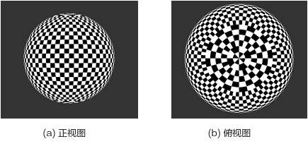

球体半径建议为0.6m至2m之间，以棋盘格可清晰对焦成像为参考。如果选用鱼眼镜头，景深相对比较大，距离比较近也能对焦清晰，所以球面半径可相应缩小，也可减小产线标定环境的制作难度及所占用的空间大小；如果选用非鱼眼镜头，由于景深相对比较小，对焦距离比较远，所以球面半径也需要相应较大，否则拍摄的图像模糊，角点检测不准确，造成标定异常。

球面上需要覆盖黑白棋盘格，根据世界地图经纬图的概念，建议南北极之间为36个格子，赤道一周72个格子，每个格子经纬方向都为5°。根据经纬度的特性，高纬度区域每个格子的水平宽度将越来越小，为了使格子大小均匀，在纬度60\~80区域，格子在经度方向上每3个进行合并，即每个格子经度为15°；在纬度0\~90区域，每个格子经度为45°，如[图1](#fig6703175413384)\(b\)所示。

采集标定图像时，将模型标定通道0对应的镜头光心位置放置在球体中心，理想条件下，球面上所有的棋盘格角点与球心距离都等于球半径R，实际操作时，由于相机摆放位置及棋盘格结构工差等原因，角点与通道0的镜头光心距离一致性需保持在10%以内，即\[0.95\*R，1.05\*R\]之间。

由于整个球面都覆盖了棋盘格，理论上相机摆放方向无特殊要求，不过因为高纬度的格子大小差异较大，所以建议重叠区尽量避开高纬度区域，放置于低纬度区域。

若棋盘格没有覆盖整个球面，则需保证各个相机之间的重叠区都能够覆盖棋盘格角点。从标定技术上，棋盘格只需要覆盖成像重叠区即可，所以若是非全景相机，可根据产品形态及产线要求对理想标定环境进行简化，并保证棋盘格为球弧面分布，格子大小尽量保持一致，且分布均匀。下面章节将以双鱼眼及四路水平结构为例说明，其他全景相机结构请根据实际情况调整。

> **须知：** 
>产线标定环境的大小与最佳拼接距离没有关联，标定完成后可在生成LUT时配置任意的最佳拼接距离。

## 如何理解双鱼眼结构产线标定环境

【现象】

针对双鱼眼结构，产线标定环境可在理想标定环境的基础上进行简化，客户较难理解。

【分析】

双鱼眼结构产线标定环境需要根据算法设计要求进行定制，具体描述如下。

【解决】

双鱼眼结构的重叠区在球面上表现为环形，故可在理想球体的基础上，将球面上下区域（高纬度区域）裁剪掉，保留赤道附近环球型即可。

建议每个格子为5°，故环球形一周仍然是72个格子，垂直方向（纬度方向）格子数量根据重叠区大小设计即可，比如镜头FOV为200°，则有40°重叠区，此时垂直方向需要8个格子以上，上下预留1个格子，10个格子较为合适。此时棋盘格则覆盖南纬25°至北纬25°之间的区域。效果如[图1](#fig261314513443)所示，其中实物图中垂直方向共有16个格子，覆盖80°重叠区，是为了适应不同的镜头选型，客户可根据自身的产品形态进行调整。

**图 1**  双鱼眼结构产线标定环境示意图  
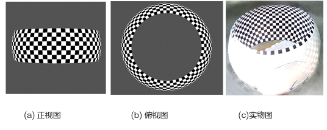

由于鱼眼镜头景深较大，近处对焦清晰，所以环球形半径大小建议处于0.6m\~1m之间即可，可与产品所定位的最佳拼接距离保持一致，以保证在该距离可以得到最佳的效果。比如产品最关注0.8m距离的拼接效果，则可将环球形半径设计为0.8m，以保证0.8m位置可达到最佳效果。

标定时将双鱼眼结构放置环形中心，并保证背景（即非棋盘格覆盖区域）干净，无其他棋盘格图样，避免标定时误检，匹配错误，造成标定失败。

由于双鱼眼结构为720°全景相机，相机底座总有一定的遮挡，这是正常现象，重叠区并非一定要覆盖全部棋盘格，在遮挡无法完全规避的情况下，请尽量覆盖即可。

实际产线标定测试效果如[图2](#fig1566112562484)\(a\)所示，这里使用的是demo版本相机，底座较大，遮挡较大，实际产品可将遮挡控制的更好。[图2](#fig1566112562484)\(b\)则是产线标定后，基于产线标定环境下的拼接效果。

**图 2**  双鱼眼结构产线标定图  
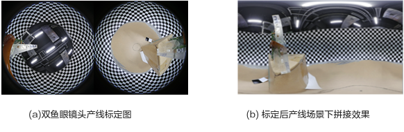

## 如何理解四路水平结构产线标定环境

【现象】

针对四路水平结构，产线标定环境可在理想标定环境的基础上进行简化，客户较难理解。

【分析】

四路水平结构产线标定环境需要根据算法设计要求进行定制，具体描述如下。

【解决】

4路水平该结构一般运用于_公共安全视频采集_领域，结构一般如[图1](#fig087182975116)所示，该类型的四路水平结构拼接图像的在水平方向的FOV通常等于或小于180°，固有两种方案可以选择：半球面或者三球弧靶面。

**图 1**  四路水平结构示意图  
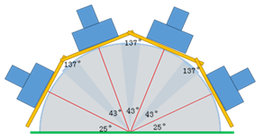

半球面方案较为简便，即在完全理想球面的基础上进行简单裁剪，水平方向上保留180°的棋盘格球面，垂直方向上也可根据镜头fov就行裁剪，如[图2](#fig1064814233245)所示，该示意图中只保留南纬60°至北纬60°区域，裁剪高纬度区域。

而对于向下倾斜的全景相机结构，该标定环境也适用，只需要将全景相机向上倾斜，使其画面全部对着棋盘格区域即可。

该方案的优点是整体结构，球心位置易于定位，较为准确，且适用向下倾斜的全景相机结构；缺点是制作难度较大，按照搬运困难，占用空间较大。详细规格这里不再描述，可参考三球弧靶面方案。

**图 2**  四路水平结构半球面产线标定环境  
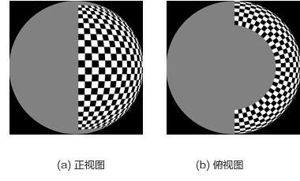

从技术上讲，采集图像时棋盘格只需要覆盖相机之间的重叠区域即可，四路水平结构的重叠区共有三个，故可以在上面半球面的基础上继续进行简化成三球弧靶面。如[图3](#fig4215154493014)所示，只保留三个重叠区对应的棋盘格弧面，为了使环境更加简易，可制作三个相同的独立可分别移动的棋盘格球弧面，使用时放置于三个重叠区相应位置。

**图 3**  四路水平结构三球弧靶面标定环境  
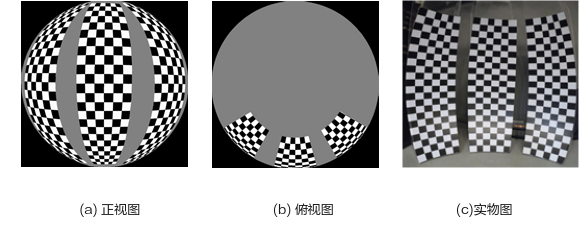

该产品形态一般搭配非鱼眼镜头，4mm\~6mm左右焦距，其景深小于鱼眼镜头，对焦距离较远，所以建议球弧面对应的半径设计为1.5m，该距离虽然不是全景相机的最佳对焦距离，但是基本还是可以较为清晰的成像，角点明显。若搭配的镜头焦距更大，则需要考虑相应的增大棋盘格球面的半径，使角点能够清晰成像，保证标定效果。

单个球弧靶面建议覆盖水平30°球面，垂直120°球面，同样借鉴世界地图经纬度的概念，按照每个格子5°设计，则:

-   水平方向上共有6个黑白格子，赤道位置水平弧长约为

    L1=θ1\*R=π/6\*1.5=0.785m

-   垂直方向上共有24个黑白格子并且以赤道为中心，上下对称，其弧长约为

    L2=θ2\*R=π\*2/3\*1.5=3.14m

实际高度约为H = 2.6m。

若实际重叠区更大，可相应增大球弧面大小及黑白格子数量；反之，若实际重叠区较小，也可相应的减小球弧面大小及黑边格子数量，只需要保证能够覆盖重叠区即可。

需要特别注意：标定图中，每个重叠区至少保证一列棋盘格以上，即两列角点以上，否则无法进行标定，因为还有镜头畸变、结构工差、相机拍摄角度等原因，请确保全景相机镜头之间的重叠区至少10°以上，甚至更大的重叠区，以保证最佳标定效果。

使用前将三个球弧面对应的球心移至相同位置，并根据镜头之间的夹角，在保持球心不动的情况下，调整球弧面之间的夹角，使重叠区都有棋盘格覆盖。标定时，将全景相机pipe0对应的镜头光心固定于球心位置，考虑工差情况，角点距离一致性保持10%以内，确保所有棋盘格角点与pipe0镜头光心之间距离处于\[1.425m，1.575m\]之间，以保证最佳拼接效果。

拍摄时请保证背景（即非棋盘格覆盖区域）干净，无其他棋盘格图样，避免标定时误检，匹配错误，造成标定失败。

该方案优点是产线环境制作难度较小，占用空间小，且可根据全景相机重叠进行调整，可适应不同的4路水平结构，如多路环绕结构；缺点是中心点较难定位，建议通过制作辅助滑轨进行移动。

产线实测标定图如[图4](#fig18248161755212)所示，为了方便比较，文档中将标定图旋转90°示意，实际图像分辨率与sensor输出一样，为3840x2160，且与第一步模型标定保持一致，标定时无需对图像进行旋转。 标定后拼接效果如[图5](#fig1826815454525)所示。

**图 4**  四路水平结构产线标定图  
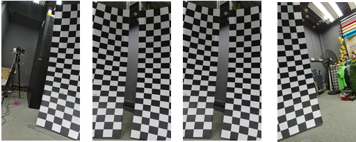

**图 5**  四路水平结构产线标定效果图  
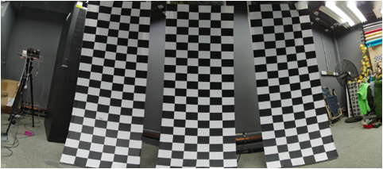

其他关于产线标定环境的建议及注意事项如下：

-   棋盘格张贴建议

    整个产线标定环境制作过程中关键难点在于棋盘格的张贴。棋盘格需要张贴在球面上，面积相对较大，棋盘格整块成型张贴难度大，可切割成条状，然后在球面上一条条张贴，形成最终的整块棋盘格图案。

**图 6**  棋盘格角点质量  
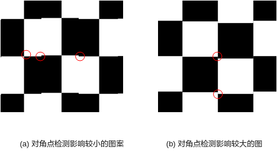

条状张贴时每条直接对齐有一定的工差，贴条之间可能有一定的错位，针对该错位，从技术上分析，[图6](#fig151051344185812)\(a\)中角点完整，虽然棋盘格中间有错位，不过对角点检测影响较小；而[图6](#fig151051344185812)\(b\)中角点有错位，影响标定过程中的检测准确性。

基于以上分析，为了保证角点的质量及完整性，每个贴条可延棋盘格中间切割，而不是从角点位置切割。如[图7](#_Ref513707564)中所示，演示4路水平结构标定环境中棋盘格图案沿横向切割成条，切割位置沿着绿色线条切割，这样不影响角点的完整性。同理，若竖向切割也建议从棋盘格格子中间分割。

**图 7**  棋盘格切割示意图  
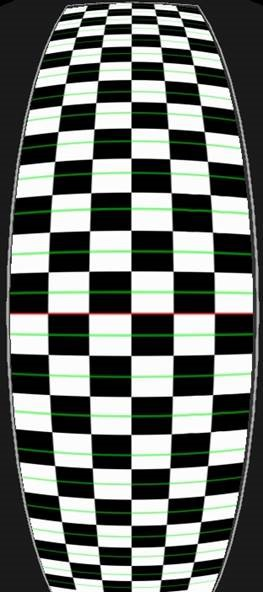

-   注意棋盘格背光及反光

    棋盘格在背光及反光情况下，极大影响棋盘格成像效果，从而影响标定效果。所以棋盘格材料需选择哑光无反光材料，且要注意产线环境的光照，避免棋盘格有背光投射。

## 如何制作彩色棋盘格产线标定环境

【现象】

黑白棋盘格对全景相机个体一致性要求是将个体差异控制在半个格子以内，当个体一致性较差时，可采用彩色棋盘格标定环境进行产线标定。彩色棋盘格标定环境可将个体差异要求放宽至1个格子。

【分析】

彩色棋盘格需要按照一定的要求进行制作，具体描述如下。

【解决】

彩色棋盘格标定环境可在黑白棋盘格环境的基础上，在黑白格子中按照一定的规律均匀交错地张贴圆形的彩色贴纸，颜色包括：洋红色（RGB:255,0,255）、绿色（RGB:0,255,0）、青色（RGB:0,255,255），共三种。于是就可以由原来的黑白两种格子类型，扩充至8种格子类型，这8种分别为：纯白色、白底洋红、白底绿色、白底青色、纯黑色、黑底洋红、黑底绿色、黑底青色。

这8种格子的张贴规律如[图1](#fig10683514734)所示，请注意不同类型的彩色棋盘格位置不需要完全与图样相同，其基本思想是：不同类型的格子均匀张贴，使同一种类型格子之间的间距尽量大，以减小特征点匹配错位的情况。[图1](#fig10683514734)\(a\)中相同类型的格子在横竖方向上都间隔4个格子，斜方向间隔2个格子。若原本的黑白棋盘格分布不均匀（如[图1](#fig6703175413384)中的北极/南极附近区域）则尽量满足规律即可。

彩色圆形贴纸的直径约为0.5\~0.9倍格子边长，没有与相邻格子连接即可。彩色圆形不要求形状大小完全一样，黑白格子大小差异较大时，也可以调整彩色贴纸的大小。彩色贴纸也不要求必须是正圆形，即使是椭圆形也可以，只要求彩色需要在格子内占比50%以上较佳，当然尽量避免使用有类似直角的图案，避免误检测为棋盘格角点。

若是双鱼眼或者四路水平结构简化标定环境，也是基于原本的黑白棋盘格按照同样的分布规律张贴彩色圆形贴纸。

**图 1**  彩色棋盘格图样  
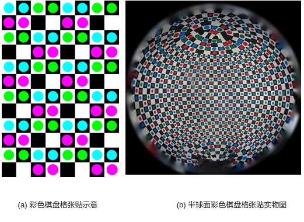

相对于黑白棋盘格，基于彩色棋盘格环境的产线标定过程中应该避免噪声、偏色等异常对图像检测造成干扰，需满足以下条件：

-   若有偏色情况请先确保颜色的准确性，标定图中必须可以明显区分彩色棋盘格的三种颜色。
-   棋盘格位置光照强度需大于300 lux，即一般室内光照强度，标定图中噪声小。
-   整个球面棋盘格布光均匀，没有明显的反光、阴影等问题。

## 如何解决产线标定时棋盘格角点匹配错位问题

【现象】

产线标定环境下拼接图中拼缝错位一个格子，如[图1](#_Ref7939578)所示。

**图 1**  产线标定错位一个格子  
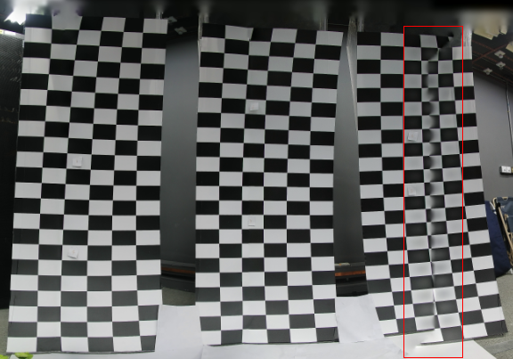

【分析】

当拼缝正好错位一个或者多个格子时，这是由于产线标定过程中棋盘格角点匹配错误造成的拼接错位。定位手段可以在产线标定工具主目录下新建“tmp”文件夹，产线标定程序运行过程中则会将角点匹配标记图保存下来。针对以上用例，最右侧两个产线标定图的角点匹配结果如[图2](#fig99661723895)所示，图中数字相同则表示标定算法计算得到的角点匹配对，本用例中所有的角点匹配都出现了错位，右侧图像向下平移了一个格子。

**图 2**  产线标定特征点匹配错误  
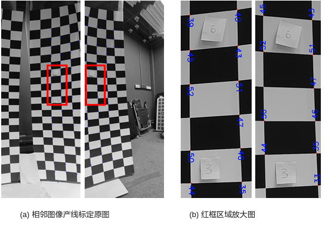

【解决】

产线标定时，标定算法基于模型标定确定的相邻图像之间的位置关系，搜索得到最邻近的特征角点匹配对。为了解决该问题，可从以下四个方面进行优化：

1.  消除模型标定在产线球面标定棋盘格半径所处距离下的标定误差。

    具体措施：将模型标定机器通过产线标定后得到的.cal文件作为其他设备产线标定的种子，而不是直接用模型标定得到的.cal文件作为种子。

2.  优化个体结构差异。

    优化个体结构差异，保证个体的一致性。进一步讲，即为产线标定个体与模型标定个体之间的结构差异必须控制在0.5个格子以内，则可以避免以上角点匹配错误的问题。

3.  扩大棋盘格格子。

    产线标定的棋盘格推荐每个格子5°，当个体结构差异较大时，可适当扩大棋盘格格子大小，以此放宽一致性的要求。

    但是要特别注意：保证重叠区最窄位置必须覆盖两个格子以上，即不管相机如何摆放都能保证重叠区可以看到完整的一个格子。由于角点匹配是基于黑色或者白色格子进行参考的，没有完整的黑/白棋盘格格子，可能完全找不到角点。

4.  采用彩色棋盘格标定方案。

    彩色棋盘格将结构差异要求放宽到1个格子。具体请参考“[如何制作彩色棋盘格产线标定环境](#ZH-CN_TOPIC_0000002431386026)”章节，同时调用产线标定接口时配置彩色棋盘格模式。

## 如何解决产线标定时无角点匹配对问题

【现象】

产线标定长时间无返回，或者产线标定后拼接效果十分异常时，可能是某对相邻图像完全没有角点匹配对导致的。

【分析】

首先当产线标定遇到异常问题时，可在产线标定工具主目录下新建“tmp”文件夹，输出角点标记图像，用于查看定位角点匹配情况。

【解决】

当配置正确时，不可能会出现产线标定无角点匹配对这种情况。所以出现该问题时，需从配置进行定位审查，包括模型标定的.cal文件读取是否正确，产线标定所配置的球面棋盘格半径是否准确，图片读取是否正常等方面，当模型标定图与产线标定图的分辨率、旋转方向不匹配时也可能导致该问题出现。

一个简单的定位方式是在PQTools工具中进行离线拼接，查看拼接效果是否正常。

> **须知：** 
>离线拼接导入的LUT为模型标定.cal文件（即产线标定的“种子”）所生成的LUT表，导入的图片为产线标定抓取的标定图，由于产线个体与模型标定个体有一定的结构差异，故拼接图会有一定的错位，这是正常情况，若出现其他异常情况则可通过拼接图效果定位出问题所在。

## 如何优化产线标定拼接效果

【现象】

在产线标定正确的情况下，在产线环境下一般可以得到几乎无错位的拼接图。但是在标定较差时，拼缝位置可能还有一定的错位；或者产线环境下效果理想无错位，但是拼接距离切换至远距离时却产生了错位。

【分析】

该问题是标定精度不足造成的，需从模型标定、产线环境这两个方面进行优化。

【解决】

1.  优化模型标定精度。

    模型标定精度评估可参考“[如何利用PQ Tools中tmp文件评估模型标定效果](#ZH-CN_TOPIC_0000002431386010)”章节进行评估，或者基于模型标定的机器，直接查看不同距离下的拼接效果，若模型标定本身的拼接效果较差，作为产线标定的种子使用时，则会影响产线标定最终的标定效果。当模型标定效果不满意时，则参考“[模型标定](#ZH-CN_TOPIC_0000002464864629)”指导进行改正优化。或者挑选多个机器进行模型标定，从中选择最佳的结果作为产线标定的种子。

2.  调整产线标定环境。

    根据产线标定环境的基本要求：需尽量保证棋盘格到镜头的距离基本一致，即棋盘格分布在球面上，标定机器位于球心中心，误差保证10%以内。

3.  将模型标定机器产线标定后得到的.cal文件作为产线标定的种子，而不是直接用模型标定得到的.cal文件作为种子。

    建议模型标定后将模型标定的机器放置产线环境中进行产线标定，得到模型标定的产线标定.cal文件，并将该.cal文件作为其他机器的产线标定种子进行标定。无论模型标定得到的.cal还是产线标定输出的.cal其格式意义都是相同的，理论上每一个.cal都可以作为产线标定的种子，所以也可以尝试挑选拼接效果较佳的.cal作为产线标定种子，在生产过程中持续迭代不断优化产线拼接效果。

# 模型标定

## 如何理解模型标定图基本要求

【现象】

拍摄模型标定图需要借助棋盘格图卡，对图卡的摆放及标定图像有一定的要求，客户无法准确理解。

【分析】

汇总注意事项。

【解决】

模型标定注意事项如下：

-   标定环境应该<u>**光照充足**</u>且尽量均匀，否则较大的<u>**噪声**</u>可能会对标定算法的检测造成影响；
-   棋盘格图卡不能有明显<u>**反光/阴影**</u>  等导致亮暗不均的地方，可通过调整镜头、图卡和光源的相对位置来规避；
-   棋盘格图卡不宜太小，一般来说图卡中的<u>每个方格边长**不低于10个像素**</u>；如果棋盘格在画面中占据的像素太少，可以考虑将棋盘格图卡靠近镜头或者更换更大尺寸的图卡（必要时减少棋盘格格子的数量，最少的棋盘格角点数目是4\*3）；
-   画面中<u>**不能出现多个棋盘格**</u>或者类似棋盘格式样的道具；如果出现该现象，请提前将该道具移走或者遮挡住，也可以手工在图片编辑工具中将该部分涂掉；
-   每个棋盘格图卡在画面中必须<u>**完整**</u>，否则无法检测，建议边缘保留半个格子宽度以上的白边。
-   所有的棋盘格的摆放位置需要<u>**覆盖整个画面**</u>（对外参来说，是覆盖整个重叠区）；
-   棋盘格需要覆盖至少<u>**3种不同的距离**</u>，并且这个距离最好是包含最常使用的一个距离；
-   棋盘格需要覆盖<u>**不同的角度**</u>；
-   每张抓拍图片中的棋盘格必须要<u>**清晰**</u>，不能有模糊现象；如果不够清晰，请先确认对焦清晰且景深较好；整个标定过程中不允许对镜头进行**调焦/变倍**操作，调焦后所有标定步骤需要重新开始；
-   图卡应该满足一定程度的覆盖，该覆盖应该包括实际标定的距离、图像有效区域、不同的角度等，同一位置的多张相同图片没有意义；

在Stitching Tool中进行标定过程中，PQTools目录下的tmp文件夹中将会保存没一张标定图像的角点检测结果，可通过该文件夹中的图片判断标定图是否符合要求。

## 如何拍摄高质量的模型标定图

【现象】

模型标定过程中需要拍摄较多的标定图，为了得到最佳的标定效果，标定图拍摄有一定的要求。客户对此要求不是特别清楚。

【分析】

模型标定图需要覆盖不同的距离、不同的位置及不同的旋转角度，为了更加清楚的描述标定图的拍摄要求，将结合文字和图像的方法演示标定图像拍摄细节。

【解决】

为了更好的解释模型标定图像的拍摄方法，将以四路水平结构为例进行图解说明。相机结构如图 四路水平结构示意图所示，其他参数如下：

**表 1**  相机结构参数

<table><thead align="left"><tr id="row363mcpsimp"><th class="cellrowborder" valign="top" width="27%" id="mcps1.2.4.1.1">
项目

</th>
<th class="cellrowborder" valign="top" width="14.000000000000002%" id="mcps1.2.4.1.2">
参数

</th>
<th class="cellrowborder" valign="top" width="59%" id="mcps1.2.4.1.3">
备注

</th>
</tr>
</thead>
<tbody><tr id="row371mcpsimp"><td class="cellrowborder" valign="top" width="27%" headers="mcps1.2.4.1.1 ">
每个镜头水平视场角

</td>
<td class="cellrowborder" valign="top" width="14.000000000000002%" headers="mcps1.2.4.1.2 ">
55&deg;

</td>
<td class="cellrowborder" valign="top" width="59%" headers="mcps1.2.4.1.3 ">
镜头视场角越小，模型标定内标定的所有距离需要相应的增加；反之，所有距离需要相应减小。

</td>
</tr>
<tr id="row378mcpsimp"><td class="cellrowborder" valign="top" width="27%" headers="mcps1.2.4.1.1 ">
拼接后的视场角

</td>
<td class="cellrowborder" valign="top" width="14.000000000000002%" headers="mcps1.2.4.1.2 ">
约180&deg;

</td>
<td class="cellrowborder" valign="top" width="59%" headers="mcps1.2.4.1.3 ">
-

</td>
</tr>
<tr id="row385mcpsimp"><td class="cellrowborder" valign="top" width="27%" headers="mcps1.2.4.1.1 ">
每个重叠区的视场角

</td>
<td class="cellrowborder" valign="top" width="14.000000000000002%" headers="mcps1.2.4.1.2 ">
约11&deg;

</td>
<td class="cellrowborder" valign="top" width="59%" headers="mcps1.2.4.1.3 ">
重叠区视场角越小，模型标定外参标定的所有距离相应增加；同时外参标定时可覆盖的距离范围（或倍数）也相应减小。

</td>
</tr>
</tbody>
</table>

### 内参标定图像拍摄方法

**表 1**  内参标定图像拍摄指导

<table><thead align="left"><tr id="row402mcpsimp"><th class="cellrowborder" valign="top" width="9%" id="mcps1.2.6.1.1">
步骤

</th>
<th class="cellrowborder" valign="top" width="20%" id="mcps1.2.6.1.2">
目标

</th>
<th class="cellrowborder" valign="top" width="45%" id="mcps1.2.6.1.3">
标定方法

</th>
<th class="cellrowborder" valign="top" width="10%" id="mcps1.2.6.1.4">
数量

</th>
<th class="cellrowborder" valign="top" width="16%" id="mcps1.2.6.1.5">
参考距离

</th>
</tr>
</thead>
<tbody><tr id="row414mcpsimp"><td class="cellrowborder" valign="top" width="9%" headers="mcps1.2.6.1.1 ">
1

</td>
<td class="cellrowborder" valign="top" width="20%" headers="mcps1.2.6.1.2 ">
近距离，单张图卡全覆盖

</td>
<td class="cellrowborder" valign="top" width="45%" headers="mcps1.2.6.1.3 ">
保证棋盘格图卡在画面中完整且最大

</td>
<td class="cellrowborder" valign="top" width="10%" headers="mcps1.2.6.1.4 ">
1

</td>
<td class="cellrowborder" valign="top" width="16%" headers="mcps1.2.6.1.5 ">
350 mm

</td>
</tr>
<tr id="row425mcpsimp"><td class="cellrowborder" valign="top" width="9%" headers="mcps1.2.6.1.1 ">
2

</td>
<td class="cellrowborder" valign="top" width="20%" headers="mcps1.2.6.1.2 ">
近距离，多张图卡全覆盖

</td>
<td class="cellrowborder" valign="top" width="45%" headers="mcps1.2.6.1.3 ">
覆盖全屏(4角+4边)：每张图卡占据画面约1/4，4角梯形变换，4边图卡以边为轴倾斜30&deg;左右

</td>
<td class="cellrowborder" valign="top" width="10%" headers="mcps1.2.6.1.4 ">
8

</td>
<td class="cellrowborder" valign="top" width="16%" headers="mcps1.2.6.1.5 ">
800 mm

</td>
</tr>
<tr id="row436mcpsimp"><td class="cellrowborder" valign="top" width="9%" headers="mcps1.2.6.1.1 ">
3

</td>
<td class="cellrowborder" valign="top" width="20%" headers="mcps1.2.6.1.2 ">
中距离，多角度

</td>
<td class="cellrowborder" valign="top" width="45%" headers="mcps1.2.6.1.3 ">
增大图卡和镜头的距离一倍，在整个画面中选取三角形三个点的位置，并且在每个位置每次将图卡旋转约30&deg;

</td>
<td class="cellrowborder" valign="top" width="10%" headers="mcps1.2.6.1.4 ">
3

</td>
<td class="cellrowborder" valign="top" width="16%" headers="mcps1.2.6.1.5 ">
2000 mm

</td>
</tr>
<tr id="row448mcpsimp"><td class="cellrowborder" valign="top" width="9%" headers="mcps1.2.6.1.1 ">
4

</td>
<td class="cellrowborder" valign="top" width="20%" headers="mcps1.2.6.1.2 ">
远距离，多角度

</td>
<td class="cellrowborder" valign="top" width="45%" headers="mcps1.2.6.1.3 ">
再次增大图卡和镜头的距离约4倍（注意，在每个位置每次将图卡旋转约30&deg;

</td>
<td class="cellrowborder" valign="top" width="10%" headers="mcps1.2.6.1.4 ">
3

</td>
<td class="cellrowborder" valign="top" width="16%" headers="mcps1.2.6.1.5 ">
6000 mm

</td>
</tr>
</tbody>
</table>

> **须知：** 
>内参标定的实际距离和单个镜头的视场角有关，镜头视场角越小，模型标定内标定的所有距离需要相应的增加；反之，所有距离需要相应减小；本章节中参考的距离都是相对于 55°视场角的镜头进行的估算。

其中一组外参标定图片的效果如[图1](#_Ref520292586)所示。

**图 1**  一组完整的内参标定图片  
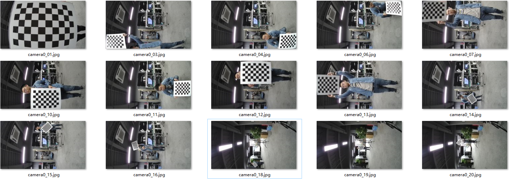

为了说明内参标定过程和要求，将实际标定图片中的棋盘格图卡提取出来，绘制在一个三维模型中，其效果如[图2](#_Ref520292652)所示。

**图 2**  一组完整的内参标定全部图片的三维投影图  
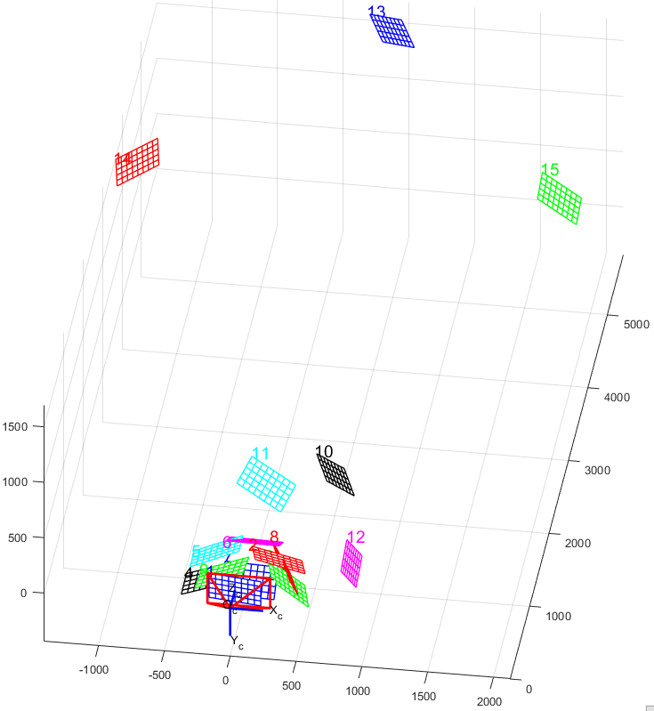

三维投影示意图中各个图像的具体意义如下。

**图 3**  三维投影示意图意义描述  
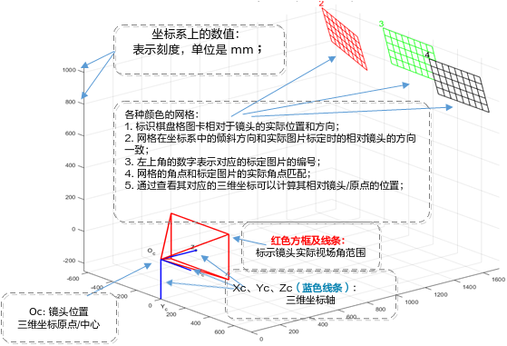

以下四个步骤详细描述内参标定具体过程。

1.  单图片全画面覆盖

    图卡靠近镜头，使得整张图卡正好**居中充满**整个画面（只要上下或左右充满即可），拍摄约1张图片。

    > **须知：** 
    >-   需要优先保证图卡的**完整**，如果图卡超出画面，需要将距离增大到图卡的所有部分出现在画面；
    >-   需要优先保证图卡的线条和角点**清晰**，如果模糊明显，需要将距离增大到图像清晰为止；
    >-   图像可以有**畸变**，但不能过大，过大的畸变将导致标定算法无法成功检测，这时需将距离增大，减小线条弯曲程度；
    >-   单图卡可以覆盖整个画面，这时图卡一般**距离**镜头很近，但过近的距离可能会产生线条距离弯曲或模糊，通常最近距离不低于300mm就可以了，通过实际预览效果来确定；
    >-   在以上条件下，保持图卡在画面的比例达到最大即可；
    >-   图卡存在各种方向的**轻微倾斜不影响**标定，不需要图卡绝对正立；
    >-   一般对于鱼眼镜头来说，由于视场角过大，图卡难以覆盖整个画面，这时只要尽可能覆盖更多即可。

    举例说明：

    如[图4](#fig525635941410)所示，一张单个格子边长为50mm，内角点数量为9\*6的棋盘格用来标定4路非鱼眼拼接的单路覆盖图。

    **图 4**  内参标定：单张图卡覆盖全屏  
    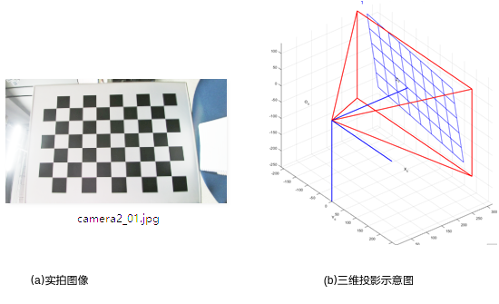

1.  多图片整个画面全覆盖

    多图片全覆盖采用**4角+4边**的方式，棋盘格图卡占据画面约1/4，分别覆盖在图像的4个角和4个边。4边时，图卡以靠近的边为轴倾斜<u>**30**</u>°左右。拍摄约8张图片。

    **图 5** 内参标定：四角覆盖实拍图  
    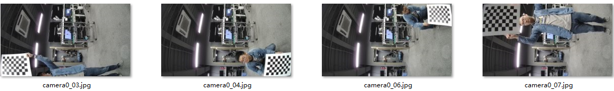

    **图 6**  内参标定：四边覆盖实拍图像  
    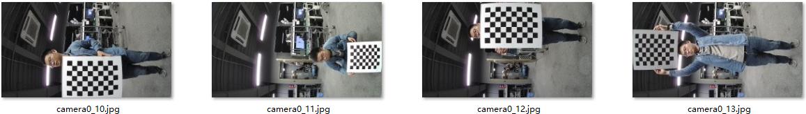

    **图 7** 内参标定：四边、四角覆盖三维投影图  
    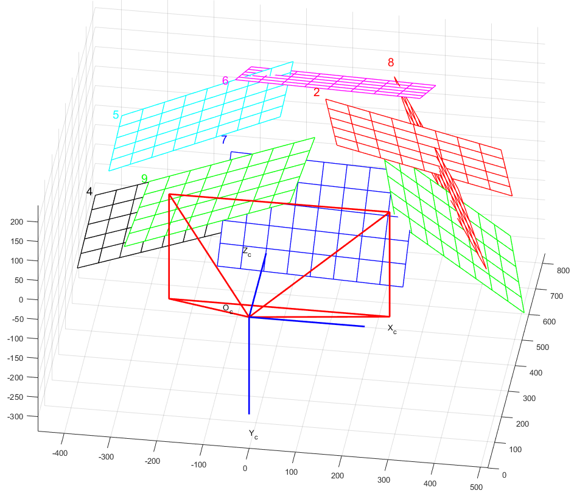

2.  距离不同角度覆盖

    增大图卡和镜头的距离**约一倍**，在整个画面中选取三角形三个顶点的位置，并且在每个位置每次将图卡旋**转约**<u>**30**</u>**°**，拍摄约<u>**3**</u>张图片。

    **图 8** 内参标定：距离不同角度和位置覆盖实拍图像  
    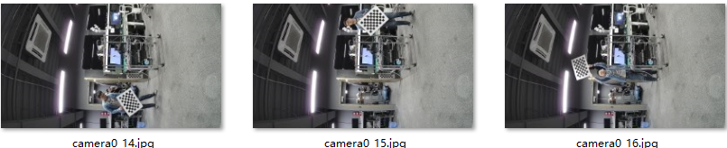

    **图 9**  内参标定：距离不同角度和位置覆盖三维投影图  
    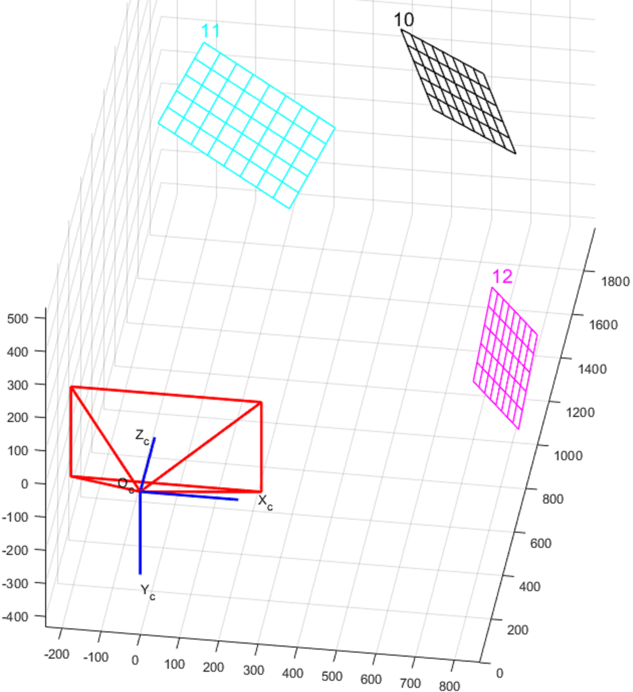

3.  远距离不同角度的覆盖

    再次增大图卡和镜头的距离约<u>**4**</u>倍（注意：当图卡所占像素过小或室内测试环境长度不够时，可以适当缩小调整的倍数），在整个画面中选取另一个三角形三个点的位置，并且在每个位置每次将图卡旋转约<u>**30**</u>**°**，拍摄约3张图片。

    **图 10**  内参标定：远距离不同角度和位置覆盖实拍图像  
    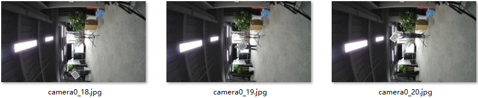

    **图 11**  内参标定：远距离不同角度和位置覆盖三维投影图  
    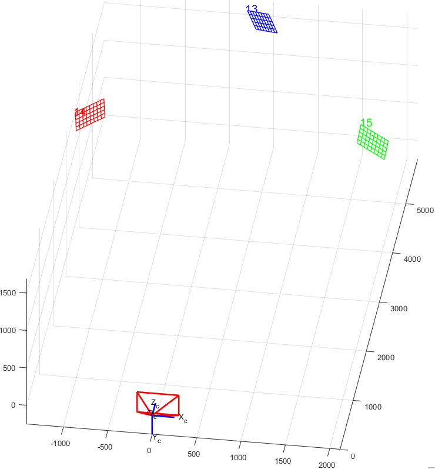

### 外参标定图像拍摄方法

**表 1**  外参标定图像拍摄指导

<table><thead align="left"><tr id="row538mcpsimp"><th class="cellrowborder" valign="top" width="9%" id="mcps1.2.6.1.1">
步骤

</th>
<th class="cellrowborder" valign="top" width="21%" id="mcps1.2.6.1.2">
目标

</th>
<th class="cellrowborder" valign="top" width="44%" id="mcps1.2.6.1.3">
标定方法

</th>
<th class="cellrowborder" valign="top" width="10%" id="mcps1.2.6.1.4">
数量

</th>
<th class="cellrowborder" valign="top" width="16%" id="mcps1.2.6.1.5">
参考距离

</th>
</tr>
</thead>
<tbody><tr id="row550mcpsimp"><td class="cellrowborder" valign="top" width="9%" headers="mcps1.2.6.1.1 ">
1

</td>
<td class="cellrowborder" valign="top" width="21%" headers="mcps1.2.6.1.2 ">
最近距离下重叠区域全覆盖

</td>
<td class="cellrowborder" valign="top" width="44%" headers="mcps1.2.6.1.3 ">
窄边两边对齐重叠区，使得棋盘格最大

</td>
<td class="cellrowborder" valign="top" width="10%" headers="mcps1.2.6.1.4 ">
5

</td>
<td class="cellrowborder" valign="top" width="16%" headers="mcps1.2.6.1.5 ">
1800 mm

</td>
</tr>
<tr id="row561mcpsimp"><td class="cellrowborder" valign="top" width="9%" headers="mcps1.2.6.1.1 ">
2

</td>
<td class="cellrowborder" valign="top" width="21%" headers="mcps1.2.6.1.2 ">
针对不同角度下对重叠区域全覆盖

</td>
<td class="cellrowborder" valign="top" width="44%" headers="mcps1.2.6.1.3 ">
调整距离更远（约1.8倍），使得图卡对角靠近2边拼缝，每拍一对<strong id="b568mcpsimp">旋转</strong>约30&deg;

</td>
<td class="cellrowborder" valign="top" width="10%" headers="mcps1.2.6.1.4 ">
8

</td>
<td class="cellrowborder" valign="top" width="16%" headers="mcps1.2.6.1.5 ">
2900 mm

</td>
</tr>
<tr id="row573mcpsimp"><td class="cellrowborder" valign="top" width="9%" headers="mcps1.2.6.1.1 ">
3

</td>
<td class="cellrowborder" valign="top" width="21%" headers="mcps1.2.6.1.2 ">
远距离不同角度覆盖

</td>
<td class="cellrowborder" valign="top" width="44%" headers="mcps1.2.6.1.3 ">
距离增加一倍，拍摄3张

</td>
<td class="cellrowborder" valign="top" width="10%" headers="mcps1.2.6.1.4 ">
3

</td>
<td class="cellrowborder" valign="top" width="16%" headers="mcps1.2.6.1.5 ">
5000 mm

</td>
</tr>
</tbody>
</table>

> **须知：** 
>外参标定距离和重叠区视场角有关：重叠区视场角越小，模型标定外参标定的所有距离相应增加；同时外参标定时可覆盖的距离范围（或倍数）也相应减小；本章节中的重叠区视场角为11°

以四路非鱼眼水平拼接为例，其中一组相邻镜头的外参标定图片的效果下所示（注意，为了排版方便，单板采取竖放的方式），共计拍摄约16对图片：

**图 1**  一组完整的外参标定图片  
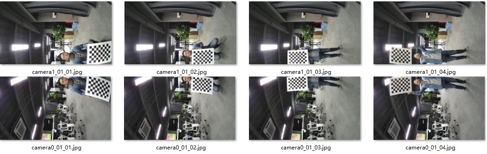

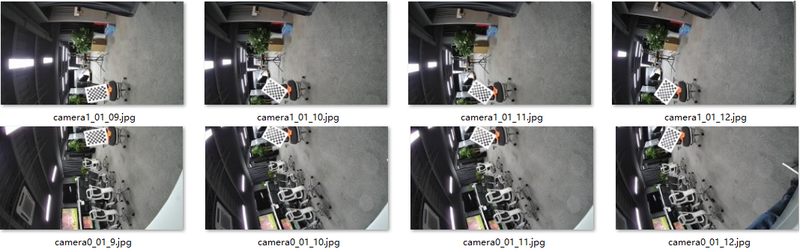

为了说明外参标定过程和要求，将实际标定图片中的棋盘格图卡提取出来，绘制在一个三维模型中，其效果如[图2](#_Ref520294639)所示。

**图 2**  一组完整的外参标定图片的三维投影图  
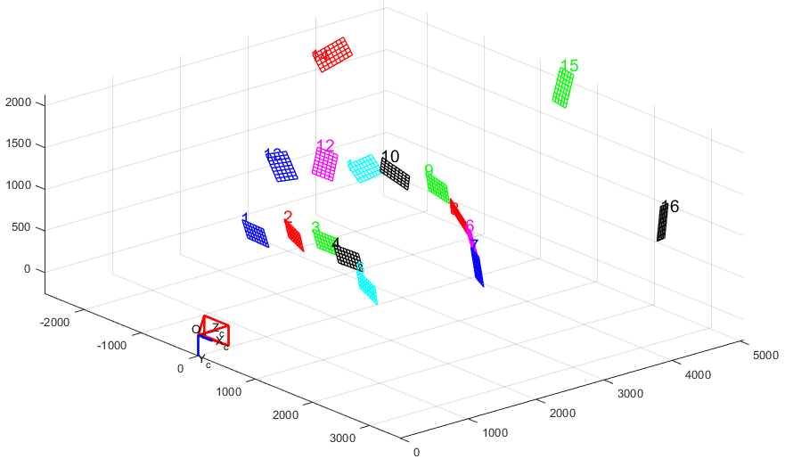

三维投影视角1

三维投影视角2

1.  最近距离下重叠区域全覆盖

    在最近距离下覆盖全部的重叠区域，可以减少标定图卡的数量，并提高标定的充分性。其方法是图卡角点数目较少的一边和重叠区两边对齐，使得棋盘格完整且达到最大，从重叠区的一侧向另一侧移动图卡，每个位置拍一张图片，棋盘格在这个标定期间不需要特别的旋转角度（否则容易导致棋盘格图卡超出某个重叠区域），在移动的过程中保持全部拍照图卡叠加后棋盘格可以覆盖整个重叠区。一般来说拍摄约5对图片即可满足（双鱼眼-背靠背结构较特殊，可能需要更多对的图片）。如[图3](#fig139332300472)所示。

    **图 3**  外参标定：最近距离下重叠区域全覆盖  
    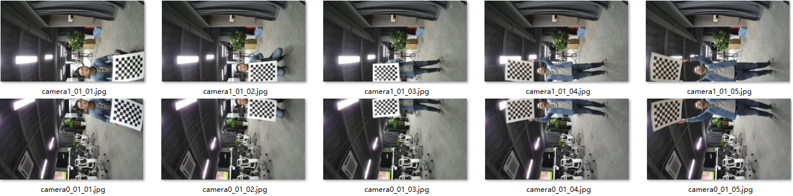

    \(a\) 外参标定：最近距离下重叠区域全覆盖实拍图像

    

    \(b\) 外参标定：最近距离下重叠区域全覆盖三维投影图像

2.  针对不同角度下对重叠区域全覆盖

    针对**不同角度**下对重叠区域全覆盖，可以覆盖较多的形状和角度，由于棋盘格图卡是方形的，实际只需要覆盖图卡旋转90°即可。需要将图卡距离调远（一般相对步骤1 增加到1.8倍，将棋盘格**对角**刚好可以出现在重叠区，参考如下标定示意图片camera2\_23\_12.jpg，这样就可以满足图卡在重叠区任意旋转而不会超出重叠区域）使得棋盘格图卡对角靠近2边重叠区域，每拍一对图片移动一次图卡并同时**旋转**约30°。该步骤约拍摄8对图片。如[图4](#_Ref520294947)所示。

    **图 4**  外参标定：全角度下重叠区域全覆盖  
    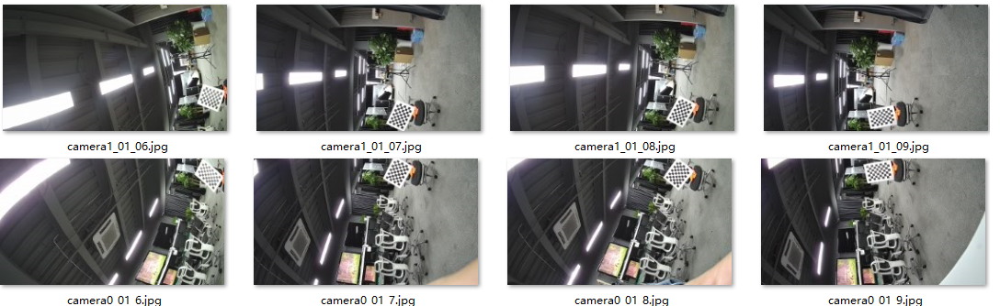

    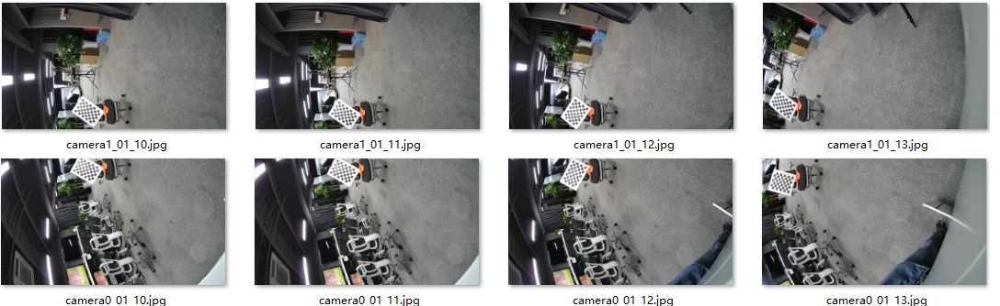

    \(a\) 外参标定：全角度下重叠区域全覆盖实拍图

    

    \(b\) 外参标定：全角度下重叠区域覆盖三维投影图

3.  远距离不同角度覆盖

    **远距离**不同角度覆盖，将图卡和镜头的距离相对于步骤2增加约1倍，位置一般覆盖重叠区域的两端和中间位置。拍摄约3对图片。

    > **须知：** 
    >-   图卡每个方格占据画面像素不能过小，一般要求每个方格不低于10个像素；若方格太小，需要减少棋盘格距离镜头的距离；
    >-   若室内环境的空间不大，可以适当减小距离；
    >-   在距离足够，棋盘格所占像素还比较多的时候，也可以适当增加距离；
    >-   标定的过程中，尽量保证图卡在两个**重叠区域**的中间地带；
    >-   距离可以通过**目测**或**直接估算**得到。

    **图 5**  外参标定：远距离重叠区域不同角度的覆盖  
    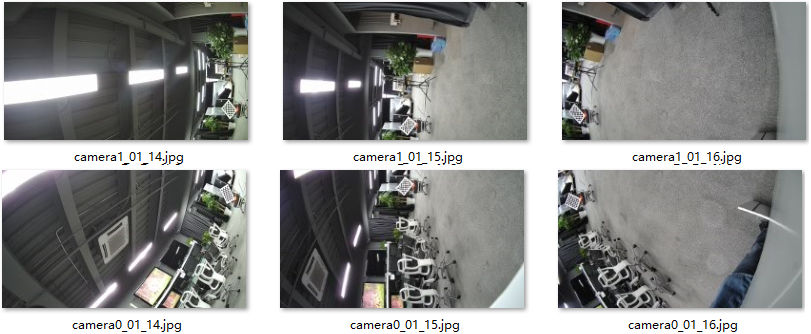

    外参标定：远距离重叠区域不同角度覆盖实拍图

    

    外参标定：远距离重叠区域不同角度覆盖三维投影图

## 如何利用PQ Tools中tmp文件评估模型标定效果

【现象】

使用PQTools进行AVSP模型标定时，PQTools中的tmp文件夹会产生一些临时文件，用于评估本次AVSP标定效果。客户对这些临时文件不熟悉。

【分析】

模型标定标定过程中，在PQTools的tmp文件夹中将产生三种类型的临时文件，分别为QA\_measures.txt、distance.csv及棋盘格标志的jpg图片。对这些文件的含义及使用进行说明。

【解决】

请参考"[QA\_measures.txt文件内容与使用说明](#ZH-CN_TOPIC_0000002464984725)"小节至"[棋盘格标志的jpg图片](#ZH-CN_TOPIC_0000002431386006)"小节描述。

### QA\_measures.txt文件内容与使用说明

该文件在模型标定完成后生成，用于评估模型标定的效果。[图1](#fig230116251091)是双镜头标定生成的一个用例，QA\_measures.txt主要分两部分，分别为Total QA Measures及Each QA Measures。

**图 1**  QA\_measures.txt文件内容  
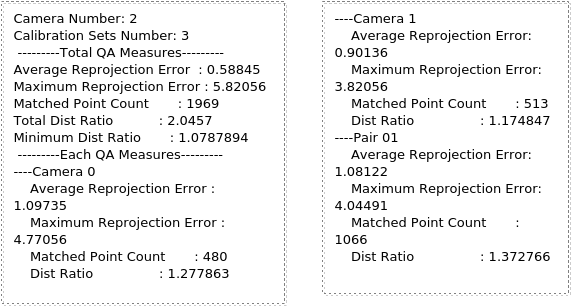

Total QA Measures为整体的标定效果评估；Each QA Measures为单个镜头或者每个拼缝的标定效果评估，可根据某个镜头或者重叠区补充或者优化标定图。其评估内容的含义如下：

-   Average Reprojection Error：指平均反投影误差，单位为像素。反投影误差即拼接图中理论投影点与实际投影点的误差，可以简单理解为平均拼接错位大小，该值越小越好。根据测试经验，该值为在\(0,1\]范围内效果极好，在\(1,2\]范围内效果很好，在\(2,3\]范围内效果较好，当该值超过3以上效果则一般。不同的产品形态可能有所不同，具体可在产品评测阶段对实际拼接进行评估。
-   Maximum Reprojection Error：指最大反投影误差，可以判断标定过程中是否有棋盘格内角点匹配错误情况，若该值大于20则需要评估标定图中是否出现多个棋盘格，或者命名错误。
-   Matched Point Count：指匹配成功的角点对，与图像数量及棋盘格内角点数量相关。
-   Total Dist Ratio或Dist Ratio：棋盘格距离评估系数。模型标定图中棋盘格需要放置于不同的距离，以丰富标定模型计算。Dist Ratio越大，则表明距离覆盖越丰富，理论上标定效果越好，对产线标定也有收益。根据测试经验，若该值大于1.0则表明模型标定效果可接受的，大于3则表明模型标定效果会比较好。
-   Minimum Dist Ratio：最小棋盘格距离评估参数。棋盘格距离评估参数分镜头和重叠区进行测算，同样的，若该值大于1.0则表明模型标定效果可接受的，大于3则表明模型标定效果会比较好。

### distance.csv文件内容与使用说明

该文件可更详细得到棋盘格距离分布，包括每个图片对应的棋盘格距离以及每个镜头或者每个拼缝标定图中的棋盘格距离直方图分布，以便更直观的评估棋盘格摆放是否正确。

如[图1](#fig38491323325)是双镜头标定的生成的一个用例，其中A区域表示每个标定图对应的棋盘格距离，若某个标定图为TRUE则表明此标定图参与进入镜头内外参标定参数计算，若为FALSE则表明该标定图不参与内外参标定参数计算，标定图是否为TRUE取决于标定过程中的迭代计算，但FALSE标定图较多时，超过一半以上，则需要考虑重拍标定图像。B区域则表示单个镜头或者重叠区的棋盘格距离直方图分布，最后一列则为所有标定图的棋盘格距离直方图分布，距离单位都为毫米（mm）。

棋盘格距离直方图是为了进一步确定标定图抓拍是否符合标准，如有异常可提高问题定位的效率。

**图 1**  distance.csv文件内容  
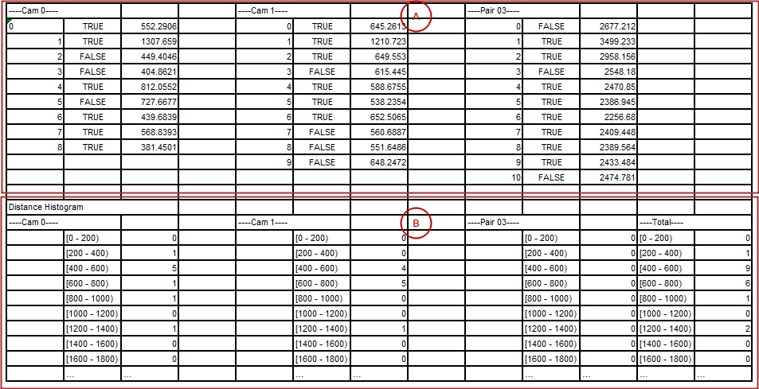

### 棋盘格标志的jpg图片

Tmp文件夹中将复制每个标定图，并将图中棋盘格角点位置用彩色的点、线表示，用于判断棋盘格检测是否准确。如[图1](#fig4128149192015)所示。

-   图a有彩色的点线标志，则表示该棋盘格的所有角点检测成功，即该标定图是有效的；
-   图b则仅有一部分的灰色点标志，表示该棋盘格角点检测失败，即该标定图是无效的；
-   图c没有任何点线标志，表示该棋盘格角点检测失败，即该标定图是无效的。

当出现棋盘格检测失败的标定图时，若有条件情况下尽量进行补充，以保证最佳标定效果。

图片命名avsp\_calib\_X\_vid\_Y\_Z.jpg命名，其中X若为单个数字则表示该图为camera X对应的内参标定图，若X为两个数字则表示该图为这两个camera之间的外参标定图；Y为镜头后缀编号，仅在外参标定图中起作用；Z为图片后缀，以0开始编号。

**图 1**  棋盘格标志示意图  
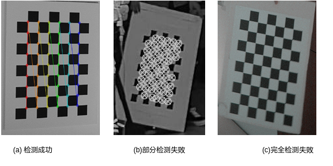

# LUT相关的调试方法

## 当Pipe无法按照顺序编号时，如何正确生成及配置LUT表

【现象】

在某些特殊的场景下，比如WDR场景下，Pipe编号无法按照从0开始顺序编号，此种情况下不知道如何按照文档指导进行标定图像命名，LUT查找表（即.bin文件）的生成及配置也存在困难。

【分析】

在AVSP模块中，每个pipe通道都有独立的LUT查找表，实现输出图像与输入图像的坐标映射，使用时先分别将各个LUT文件读入板端内存中，并将每个LUT的内存地址配置至相应的pipe通道寄存器中。由于实际使用时，LUT之间是独立没有关联的，所以抓拍标定图时可以将分散的pipe号映射至顺序编号对图像进行命名，并生成顺序命名的LUT查找表文件。使用时将LUT内存地址配置到相应的pipe通道即可。

【解决】

以4路拼接WDR场景为例，VI输出的pipe通道号分别为0、2、4、6，一般要求pipe通道顺序与硬件结构中镜头的物理顺序保持一致，比如pipe通道从小到大与镜头位置从左到右对应，建议不要乱序，否则调试过程容易出错。

标定工具对标定图像命名的要求是：图像编号需按照从0开始顺序编号。故标定图像抓拍时可将pipe0命名为camera0，pipe2命名为camera1，pipe4命名为camera2，pipe6命名为camera3，标定图抓拍后进行模型或者产线标定，并生成标定文件（即.cal文件）。

若使用PQTools或者产线标定库生成LUT，则输出LUT文件后缀将从0开始顺序命名，如PQTools将自动命名为avsp\_mesh\_out\_0.bin、avsp\_mesh\_out\_1.bin、avsp\_mesh\_out\_2.bin及avsp\_mesh\_out\_3.bin，那么使用时则需要将avsp\_mesh\_out\_0.bin读入板端的内存地址配置至pipe0， avsp\_mesh\_out\_1.bin读入板端的内存地址配置至pipe2，avsp\_mesh\_out\_2.bin读入板端的内存地址配置至pipe4，avsp\_mesh\_out\_3.bin读入板端的内存地址配置至pipe6。

若使用板端avs\_lut库生成LUT，由于该库只将LUT数据储存在内存地址中，故客户可自行将对应的LUT内存保存为任意名字，此时则可将LUT重新映射到与pipe号对应的名字，比如将第3个LUT内存保存为avsp\_mesh\_out\_4.bin文件。当然也可以直接使用，只需要将内存地址配置到对应的AVSP寄存器中即可。

## LUT最佳拼接距离与视差问题

【现象】

LUT生成时可支持拼接距离调整，即使在标定完全正确的情况下，在一般场景中，无论如何调整拼接距离，拼接缝位置也总会存在一定的重影或者错位现象。

【分析】

由于全景相机中，相邻镜头无法放在在同一位置，所以成像效果必定会存在视差问题，由此导致的重叠区不同距离的物体成像后在图像中的相对位置有差异，无法做到真正的无缝拼接。一般场景必然有一定景深的，无法保证所有的景深范围内都可以进行无缝拼接，拼接缝则有一定的重影或者错位现象。如[图1](#fig347372415259)中，相邻图像中前景与背景距离不同，存在视差现象，导致前景与背景相对位置有些许不同，如红框所示。若调整拼接距离到前景位置，则背景必然存在视角差导致的重影，如图b所示；反之调整拼接距离到背景物体，则前景出现错位。

**图 1**  视差示例  
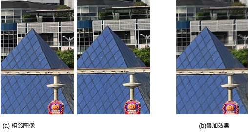

【解决】

该问题是所有拼接算法中存在的客观问题，是无法根本解决的，只能从硬件及通过拼接距离调试，减弱由于视差导致的错位问题，优化拼接效果。视角差的简化公式如下：

上式中：W为像素宽度，单位为pixel；w为sensor宽度，单位为mm；f为镜头焦距，单位为mm；b为相邻镜头间距，单位为mm；Z1/Z2为不同物体的成像距离，单位为mm。其中W、w，f都为定值，视角差与b、成正比，所以为了减小视角差造成的错位影响，应该尽量减少相邻镜头的间距。而Z1、Z2与场景相关，是无法直接进行调控的，[表1](#table1228mcpsimp)是根据一定条件得到的不同物距的视差大小，可以看出当物距越近时，视差影响越大，所以全景相机更适用于室外大而远的场景，室内场景下因为视差影响更明显，更容易出现错位重影问题。

**表 1**  不同物距的视差示例

<table><thead align="left"><tr id="row1238mcpsimp"><th class="cellrowborder" valign="top" width="15%" id="mcps1.2.8.1.1">
Z1/Z2

</th>
<th class="cellrowborder" valign="top" width="15%" id="mcps1.2.8.1.2">
1m

</th>
<th class="cellrowborder" valign="top" width="14.000000000000002%" id="mcps1.2.8.1.3">
2m

</th>
<th class="cellrowborder" valign="top" width="14.000000000000002%" id="mcps1.2.8.1.4">
3m

</th>
<th class="cellrowborder" valign="top" width="14.000000000000002%" id="mcps1.2.8.1.5">
5m

</th>
<th class="cellrowborder" valign="top" width="14.000000000000002%" id="mcps1.2.8.1.6">
8m

</th>
<th class="cellrowborder" valign="top" width="14.000000000000002%" id="mcps1.2.8.1.7">
10m

</th>
</tr>
</thead>
<tbody><tr id="row1256mcpsimp"><td class="cellrowborder" valign="top" width="15%" headers="mcps1.2.8.1.1 ">
1m

</td>
<td class="cellrowborder" valign="top" width="15%" headers="mcps1.2.8.1.2 ">
0 pixel

</td>
<td class="cellrowborder" valign="top" width="14.000000000000002%" headers="mcps1.2.8.1.3 ">
-

</td>
<td class="cellrowborder" valign="top" width="14.000000000000002%" headers="mcps1.2.8.1.4 ">
-

</td>
<td class="cellrowborder" valign="top" width="14.000000000000002%" headers="mcps1.2.8.1.5 ">
-

</td>
<td class="cellrowborder" valign="top" width="14.000000000000002%" headers="mcps1.2.8.1.6 ">
-

</td>
<td class="cellrowborder" valign="top" width="14.000000000000002%" headers="mcps1.2.8.1.7 ">
-

</td>
</tr>
<tr id="row1271mcpsimp"><td class="cellrowborder" valign="top" width="15%" headers="mcps1.2.8.1.1 ">
2m

</td>
<td class="cellrowborder" valign="top" width="15%" headers="mcps1.2.8.1.2 ">
160

</td>
<td class="cellrowborder" valign="top" width="14.000000000000002%" headers="mcps1.2.8.1.3 ">
0

</td>
<td class="cellrowborder" valign="top" width="14.000000000000002%" headers="mcps1.2.8.1.4 ">
-

</td>
<td class="cellrowborder" valign="top" width="14.000000000000002%" headers="mcps1.2.8.1.5 ">
-

</td>
<td class="cellrowborder" valign="top" width="14.000000000000002%" headers="mcps1.2.8.1.6 ">
-

</td>
<td class="cellrowborder" valign="top" width="14.000000000000002%" headers="mcps1.2.8.1.7 ">
-

</td>
</tr>
<tr id="row1286mcpsimp"><td class="cellrowborder" valign="top" width="15%" headers="mcps1.2.8.1.1 ">
3m

</td>
<td class="cellrowborder" valign="top" width="15%" headers="mcps1.2.8.1.2 ">
213

</td>
<td class="cellrowborder" valign="top" width="14.000000000000002%" headers="mcps1.2.8.1.3 ">
53

</td>
<td class="cellrowborder" valign="top" width="14.000000000000002%" headers="mcps1.2.8.1.4 ">
0

</td>
<td class="cellrowborder" valign="top" width="14.000000000000002%" headers="mcps1.2.8.1.5 ">
-

</td>
<td class="cellrowborder" valign="top" width="14.000000000000002%" headers="mcps1.2.8.1.6 ">
-

</td>
<td class="cellrowborder" valign="top" width="14.000000000000002%" headers="mcps1.2.8.1.7 ">
-

</td>
</tr>
<tr id="row1301mcpsimp"><td class="cellrowborder" valign="top" width="15%" headers="mcps1.2.8.1.1 ">
5m

</td>
<td class="cellrowborder" valign="top" width="15%" headers="mcps1.2.8.1.2 ">
256

</td>
<td class="cellrowborder" valign="top" width="14.000000000000002%" headers="mcps1.2.8.1.3 ">
96

</td>
<td class="cellrowborder" valign="top" width="14.000000000000002%" headers="mcps1.2.8.1.4 ">
43

</td>
<td class="cellrowborder" valign="top" width="14.000000000000002%" headers="mcps1.2.8.1.5 ">
0

</td>
<td class="cellrowborder" valign="top" width="14.000000000000002%" headers="mcps1.2.8.1.6 ">
-

</td>
<td class="cellrowborder" valign="top" width="14.000000000000002%" headers="mcps1.2.8.1.7 ">
-

</td>
</tr>
<tr id="row1316mcpsimp"><td class="cellrowborder" valign="top" width="15%" headers="mcps1.2.8.1.1 ">
8m

</td>
<td class="cellrowborder" valign="top" width="15%" headers="mcps1.2.8.1.2 ">
280

</td>
<td class="cellrowborder" valign="top" width="14.000000000000002%" headers="mcps1.2.8.1.3 ">
120

</td>
<td class="cellrowborder" valign="top" width="14.000000000000002%" headers="mcps1.2.8.1.4 ">
67

</td>
<td class="cellrowborder" valign="top" width="14.000000000000002%" headers="mcps1.2.8.1.5 ">
8

</td>
<td class="cellrowborder" valign="top" width="14.000000000000002%" headers="mcps1.2.8.1.6 ">
0

</td>
<td class="cellrowborder" valign="top" width="14.000000000000002%" headers="mcps1.2.8.1.7 ">
-

</td>
</tr>
<tr id="row1331mcpsimp"><td class="cellrowborder" valign="top" width="15%" headers="mcps1.2.8.1.1 ">
10m

</td>
<td class="cellrowborder" valign="top" width="15%" headers="mcps1.2.8.1.2 ">
288

</td>
<td class="cellrowborder" valign="top" width="14.000000000000002%" headers="mcps1.2.8.1.3 ">
128

</td>
<td class="cellrowborder" valign="top" width="14.000000000000002%" headers="mcps1.2.8.1.4 ">
75

</td>
<td class="cellrowborder" valign="top" width="14.000000000000002%" headers="mcps1.2.8.1.5 ">
10

</td>
<td class="cellrowborder" valign="top" width="14.000000000000002%" headers="mcps1.2.8.1.6 ">
8

</td>
<td class="cellrowborder" valign="top" width="14.000000000000002%" headers="mcps1.2.8.1.7 ">
0

</td>
</tr>
</tbody>
</table>

该模型是在理想状态下，单纯考虑视角差计算得到的，仅供参考。实际应用，错位还与镜头畸变、相邻镜头之间硬件差异等其他因素有关，镜头畸变越严重，如广角镜头，错位可能越严重。

## Fine Tuning调试方法

【现象】

Fine Tuning功能在板端LUT库中实现，即每次Fine Tuning都通过刷新LUT表实现。Fine Tuning 参数及调试方法有一定的理解难度。

【分析】

Fine Tuning可调整多路拼接中每个通道的图像位置，其参数共五个维度，分别为：

-   姿态角Yaw、Pitch、Roll三个维度。一般调整效果相当于：Yaw即在输入图像畸变中心X方向上平移整体图像，Pitch是在输入图像畸变中心的Y方向上平移整体图像，Roll则是以输入图畸变中心为轴旋转图像。
-   畸变中心平移OffsetX、OffsetY两个维度。一般调整效果是：OffsetX即是改变输入图像畸变中心的X坐标，OffsetY是改变输入图像畸变中心的Y坐标。

不建议客户对闭环的全景拼接（如背靠背双鱼眼拼接、多路水平环绕360°拼接等）开放Fine Tuning功能，因为单个图像调整后很难兼顾左右相邻镜头。一般Fine Tuning常应用于多路水平拼接（非360°）场景。

【解决】

下面以Fine Tuning应用最多的4路水平拼接为例，指导如何实现Fine Tuning，为了简化，建议仅开放Yaw、Pitch、Roll三个维度，更进一步为了便于最终用户理解及使用，可将Yaw转换为OffsetH\(即左右偏移\)，Pitch转换为OffsetV（及上下偏移）。

Fine Tuning方向是基于原始图进行微调的，而最终调试效果则是基于拼接图效果，所以OffsetH及OffsetV应该是单个图像在最终拼接图的上下左右移动，如何将OffsetH及OffsetV转换为Fine Tuning中的Yaw，Pitch是关键。Roll为旋转，无需转换。

一般情况下，对于4路水平拼接用例，原始图在拼接图中的位置可能顺时针旋转0°、90°、180°及270°，这四种常见情况的换算方法如下：

-   顺时针旋转0°情况：

    Yaw = K1\*OffsetH

    Pitch = K2\*OffsetV

-   顺时针旋转90°情况：

    Yaw = - K1\*OffsetV

    Pitch = K2\*OffsetH

-   顺时针旋转180°情况：

    Yaw = - K1\*OffsetH

    Pitch = - K2\*OffsetV

-   顺时针旋转270°情况：

    Yaw = K1\*OffsetV

    Pitch = - K2\*OffsetH

其中K1及K2为角度与像素坐标的转换，取决于拼接图像的分辨率、FOV以及微调的精度，可通过实际情况配置测试得到。

具体以一个实例进一步说明，假设原始图及拼接图像如[图1](#fig8890314113117)所示，每个镜头的FOV为90°\*55°，重叠区15%，输出拼接图像分辨率为3840\*2160，输出FOV大约为195°\*90°，则在水平方向上K1=195/3840=0.05，垂直方向上K2=90/2160=0.04。

注意不同通道的原始图像旋转方向不同，那么各个通道的转换如[表1](#_Ref9347211)。

**图 1**  原图与拼接图示意  
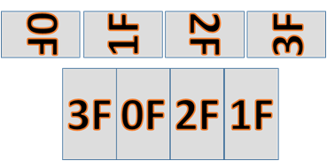

**表 1**  Fine Tuning转换结果

<table><thead align="left"><tr id="row1386mcpsimp"><th class="cellrowborder" valign="top" width="25%" id="mcps1.2.5.1.1">
通道0（270&deg;）

</th>
<th class="cellrowborder" valign="top" width="25%" id="mcps1.2.5.1.2">
通道1（90&deg;）

</th>
<th class="cellrowborder" valign="top" width="25%" id="mcps1.2.5.1.3">
通道2（270&deg;）

</th>
<th class="cellrowborder" valign="top" width="25%" id="mcps1.2.5.1.4">
通道3（90&deg;）

</th>
</tr>
</thead>
<tbody><tr id="row1395mcpsimp"><td class="cellrowborder" valign="top" width="25%" headers="mcps1.2.5.1.1 ">
Yaw = 0.05*OffsetV

Pitch = -0.04*OffsetH

</td>
<td class="cellrowborder" valign="top" width="25%" headers="mcps1.2.5.1.2 ">
Yaw = - 0.05*OffsetV

Pitch = 0.04*OffsetH

</td>
<td class="cellrowborder" valign="top" width="25%" headers="mcps1.2.5.1.3 ">
Yaw = 0.05*OffsetV

Pitch = -0.04*OffsetH

</td>
<td class="cellrowborder" valign="top" width="25%" headers="mcps1.2.5.1.4 ">
Yaw = - 0.05*OffsetV

Pitch = 0.04*OffsetH

</td>
</tr>
</tbody>
</table>
