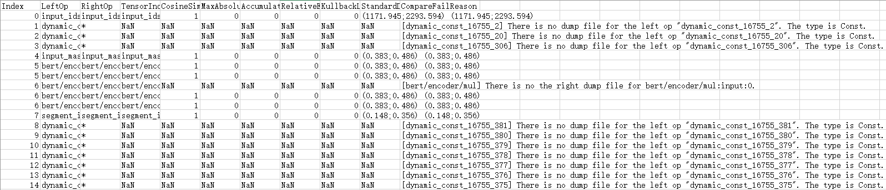
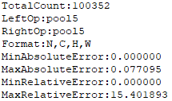
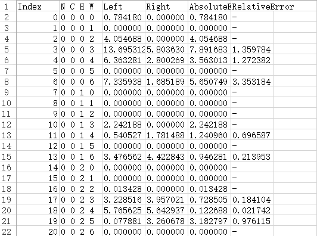

# 前言<a name="ZH-CN_TOPIC_0000002442022493"></a>

**概述<a name="section430mcpsimp"></a>**

本文档详细的描述了精度比对工具的使用约束、比对数据准备以及具体的比对操作指导，同时提供了dump数据格式转换、查看等方法。

**产品版本<a name="section300mcpsimp"></a>**

与本文档相对应的产品版本如下。

<a name="table303mcpsimp"></a>
<table><thead align="left"><tr id="row308mcpsimp"><th class="cellrowborder" valign="top" width="45%" id="mcps1.1.3.1.1"><p id="p310mcpsimp"><a name="p310mcpsimp"></a><a name="p310mcpsimp"></a>产品名称</p>
</th>
<th class="cellrowborder" valign="top" width="55.00000000000001%" id="mcps1.1.3.1.2"><p id="p312mcpsimp"><a name="p312mcpsimp"></a><a name="p312mcpsimp"></a>产品版本</p>
</th>
</tr>
</thead>
<tbody><tr id="row314mcpsimp"><td class="cellrowborder" valign="top" width="45%" headers="mcps1.1.3.1.1 "><p id="p316mcpsimp"><a name="p316mcpsimp"></a><a name="p316mcpsimp"></a>SS928</p>
</td>
<td class="cellrowborder" valign="top" width="55.00000000000001%" headers="mcps1.1.3.1.2 "><p id="p318mcpsimp"><a name="p318mcpsimp"></a><a name="p318mcpsimp"></a>V100</p>
</td>
</tr>
<tr id="row1376073312191"><td class="cellrowborder" valign="top" width="45%" headers="mcps1.1.3.1.1 "><p id="p5760533111913"><a name="p5760533111913"></a><a name="p5760533111913"></a>SS927</p>
</td>
<td class="cellrowborder" valign="top" width="55.00000000000001%" headers="mcps1.1.3.1.2 "><p id="p6760333131918"><a name="p6760333131918"></a><a name="p6760333131918"></a>V100</p>
</td>
</tr>
</tbody>
</table>

**读者对象<a name="section433mcpsimp"></a>**

本文档主要适用于开发人员。

-   技术支持工程师
-   软件开发工程师

**符号约定<a name="section133020216410"></a>**

在本文中可能出现下列标志，它们所代表的含义如下。

<a name="table2622507016410"></a>
<table><thead align="left"><tr id="row1530720816410"><th class="cellrowborder" valign="top" width="20.580000000000002%" id="mcps1.1.3.1.1"><p id="p6450074116410"><a name="p6450074116410"></a><a name="p6450074116410"></a>符号</p>
</th>
<th class="cellrowborder" valign="top" width="79.42%" id="mcps1.1.3.1.2"><p id="p5435366816410"><a name="p5435366816410"></a><a name="p5435366816410"></a>说明</p>
</th>
</tr>
</thead>
<tbody><tr id="row1372280416410"><td class="cellrowborder" valign="top" width="20.580000000000002%" headers="mcps1.1.3.1.1 "><p id="p3734547016410"><a name="p3734547016410"></a><a name="p3734547016410"></a><a name="image2670064316410"></a><a name="image2670064316410"></a><span></span></p>
</td>
<td class="cellrowborder" valign="top" width="79.42%" headers="mcps1.1.3.1.2 "><p id="p1757432116410"><a name="p1757432116410"></a><a name="p1757432116410"></a>表示如不避免则将会导致死亡或严重伤害的具有高等级风险的危害。</p>
</td>
</tr>
<tr id="row466863216410"><td class="cellrowborder" valign="top" width="20.580000000000002%" headers="mcps1.1.3.1.1 "><p id="p1432579516410"><a name="p1432579516410"></a><a name="p1432579516410"></a><a name="image4895582316410"></a><a name="image4895582316410"></a><span></span></p>
</td>
<td class="cellrowborder" valign="top" width="79.42%" headers="mcps1.1.3.1.2 "><p id="p959197916410"><a name="p959197916410"></a><a name="p959197916410"></a>表示如不避免则可能导致死亡或严重伤害的具有中等级风险的危害。</p>
</td>
</tr>
<tr id="row123863216410"><td class="cellrowborder" valign="top" width="20.580000000000002%" headers="mcps1.1.3.1.1 "><p id="p1232579516410"><a name="p1232579516410"></a><a name="p1232579516410"></a><a name="image1235582316410"></a><a name="image1235582316410"></a><span></span></p>
</td>
<td class="cellrowborder" valign="top" width="79.42%" headers="mcps1.1.3.1.2 "><p id="p123197916410"><a name="p123197916410"></a><a name="p123197916410"></a>表示如不避免则可能导致轻微或中度伤害的具有低等级风险的危害。</p>
</td>
</tr>
<tr id="row5786682116410"><td class="cellrowborder" valign="top" width="20.580000000000002%" headers="mcps1.1.3.1.1 "><p id="p2204984716410"><a name="p2204984716410"></a><a name="p2204984716410"></a><a name="image4504446716410"></a><a name="image4504446716410"></a><span></span></p>
</td>
<td class="cellrowborder" valign="top" width="79.42%" headers="mcps1.1.3.1.2 "><p id="p4388861916410"><a name="p4388861916410"></a><a name="p4388861916410"></a>用于传递设备或环境安全警示信息。如不避免则可能会导致设备损坏、数据丢失、设备性能降低或其它不可预知的结果。</p>
<p id="p1238861916410"><a name="p1238861916410"></a><a name="p1238861916410"></a>“须知”不涉及人身伤害。</p>
</td>
</tr>
<tr id="row2856923116410"><td class="cellrowborder" valign="top" width="20.580000000000002%" headers="mcps1.1.3.1.1 "><p id="p5555360116410"><a name="p5555360116410"></a><a name="p5555360116410"></a><a name="image799324016410"></a><a name="image799324016410"></a><span></span></p>
</td>
<td class="cellrowborder" valign="top" width="79.42%" headers="mcps1.1.3.1.2 "><p id="p4612588116410"><a name="p4612588116410"></a><a name="p4612588116410"></a>对正文中重点信息的补充说明。</p>
<p id="p1232588116410"><a name="p1232588116410"></a><a name="p1232588116410"></a>“说明”不是安全警示信息，不涉及人身、设备及环境伤害信息。</p>
</td>
</tr>
</tbody>
</table>

**修改记录<a name="section2467512116410"></a>**

<a name="table1557726816410"></a>
<table><thead align="left"><tr id="row2942532716410"><th class="cellrowborder" valign="top" width="20.72%" id="mcps1.1.4.1.1"><p id="p3778275416410"><a name="p3778275416410"></a><a name="p3778275416410"></a><strong id="b5687322716410"><a name="b5687322716410"></a><a name="b5687322716410"></a>文档版本</strong></p>
</th>
<th class="cellrowborder" valign="top" width="20.22%" id="mcps1.1.4.1.2"><p id="p5627845516410"><a name="p5627845516410"></a><a name="p5627845516410"></a><strong id="b5800814916410"><a name="b5800814916410"></a><a name="b5800814916410"></a>发布日期</strong></p>
</th>
<th class="cellrowborder" valign="top" width="59.06%" id="mcps1.1.4.1.3"><p id="p2382284816410"><a name="p2382284816410"></a><a name="p2382284816410"></a><strong id="b3316380216410"><a name="b3316380216410"></a><a name="b3316380216410"></a>修改说明</strong></p>
</th>
</tr>
</thead>
<tbody><tr id="row5947359616410"><td class="cellrowborder" valign="top" width="20.72%" headers="mcps1.1.4.1.1 "><p id="p2149706016410"><a name="p2149706016410"></a><a name="p2149706016410"></a>00B01</p>
</td>
<td class="cellrowborder" valign="top" width="20.22%" headers="mcps1.1.4.1.2 "><p id="p648803616410"><a name="p648803616410"></a><a name="p648803616410"></a>2025-09-15</p>
</td>
<td class="cellrowborder" valign="top" width="59.06%" headers="mcps1.1.4.1.3 "><p id="p1946537916410"><a name="p1946537916410"></a><a name="p1946537916410"></a>第1次临时版本发布。</p>
</td>
</tr>
</tbody>
</table>

# 功能与约束<a name="ZH-CN_TOPIC_0000002408583266"></a>


## 简介<a name="ZH-CN_TOPIC_0000002442022477"></a>

ATC在模型转换过程中对模型进行了优化，包括算子消除、算子融合、算子拆分，可能会造成自有实现的算子运算结果与用业界标准算子（如Caffe）的运算结果存在偏差，此时需要提供工具比对两者之间的差距，帮助开发人员快速解决算子精度问题。

精度比对工具的定位是解决模型的精度问题，提供比对自有模型算子的运算结果与Caffe等标准算子的运算结果，以便确认误差发生的算子，目前提供以下比对方法。

Vector比对，包含余弦相似度、最大绝对误差、累积相对误差、欧氏相对距离、KLD散度、标准差的算法比对。

## 功能<a name="ZH-CN_TOPIC_0000002442022485"></a>

当前版本，Vector比对支持通过SoC运行生成的dump数据与Ground Truth（基于GPU/CPU运行生成的npy数据）进行比对，同时还支持量化、非量化的数据比对。请在比对操作前确保已按您的比对场景准备好数据，如[表1](#table7281152114211)。

**表 1**  精度比对场景

<a name="table7281152114211"></a>
<table><thead align="left"><tr id="row450mcpsimp"><th class="cellrowborder" valign="top" width="11%" id="mcps1.2.4.1.1"><p id="p452mcpsimp"><a name="p452mcpsimp"></a><a name="p452mcpsimp"></a>序号</p>
</th>
<th class="cellrowborder" valign="top" width="43%" id="mcps1.2.4.1.2"><p id="p454mcpsimp"><a name="p454mcpsimp"></a><a name="p454mcpsimp"></a>待比对数据（My Output）</p>
</th>
<th class="cellrowborder" valign="top" width="46%" id="mcps1.2.4.1.3"><p id="p456mcpsimp"><a name="p456mcpsimp"></a><a name="p456mcpsimp"></a>标准数据（Ground Truth）</p>
</th>
</tr>
</thead>
<tbody><tr id="row458mcpsimp"><td class="cellrowborder" valign="top" width="11%" headers="mcps1.2.4.1.1 "><p id="p460mcpsimp"><a name="p460mcpsimp"></a><a name="p460mcpsimp"></a>1</p>
</td>
<td class="cellrowborder" valign="top" width="43%" headers="mcps1.2.4.1.2 "><p id="p462mcpsimp"><a name="p462mcpsimp"></a><a name="p462mcpsimp"></a>量化离线模型在SoC上运行生成的dump数据</p>
</td>
<td class="cellrowborder" valign="top" width="46%" headers="mcps1.2.4.1.3 "><p id="p464mcpsimp"><a name="p464mcpsimp"></a><a name="p464mcpsimp"></a>非量化原始模型的npy文件（或dump数据）(Caffe)</p>
</td>
</tr>
<tr id="row465mcpsimp"><td class="cellrowborder" valign="top" width="11%" headers="mcps1.2.4.1.1 "><p id="p467mcpsimp"><a name="p467mcpsimp"></a><a name="p467mcpsimp"></a>2</p>
</td>
<td class="cellrowborder" valign="top" width="43%" headers="mcps1.2.4.1.2 "><p id="p469mcpsimp"><a name="p469mcpsimp"></a><a name="p469mcpsimp"></a>量化离线模型在仿真器上运行生成的dump数据</p>
</td>
<td class="cellrowborder" valign="top" width="46%" headers="mcps1.2.4.1.3 "><p id="p471mcpsimp"><a name="p471mcpsimp"></a><a name="p471mcpsimp"></a>非量化原始模型的npy文件（或dump数据）(Caffe)</p>
</td>
</tr>
<tr id="row472mcpsimp"><td class="cellrowborder" valign="top" width="11%" headers="mcps1.2.4.1.1 "><p id="p474mcpsimp"><a name="p474mcpsimp"></a><a name="p474mcpsimp"></a>3</p>
</td>
<td class="cellrowborder" valign="top" width="43%" headers="mcps1.2.4.1.2 "><p id="p476mcpsimp"><a name="p476mcpsimp"></a><a name="p476mcpsimp"></a>量化原始模型的npy文件（或dump数据）(Caffe)</p>
</td>
<td class="cellrowborder" valign="top" width="46%" headers="mcps1.2.4.1.3 "><p id="p478mcpsimp"><a name="p478mcpsimp"></a><a name="p478mcpsimp"></a>非量化原始模型的npy文件（或dump数据）(Caffe)</p>
</td>
</tr>
<tr id="row479mcpsimp"><td class="cellrowborder" valign="top" width="11%" headers="mcps1.2.4.1.1 "><p id="p481mcpsimp"><a name="p481mcpsimp"></a><a name="p481mcpsimp"></a>4</p>
</td>
<td class="cellrowborder" valign="top" width="43%" headers="mcps1.2.4.1.2 "><p id="p483mcpsimp"><a name="p483mcpsimp"></a><a name="p483mcpsimp"></a>原始模型在ATC上运行生成的dump数据</p>
</td>
<td class="cellrowborder" valign="top" width="46%" headers="mcps1.2.4.1.3 "><p id="p485mcpsimp"><a name="p485mcpsimp"></a><a name="p485mcpsimp"></a>非量化原始模型的npy文件（或dump数据）(Caffe)</p>
</td>
</tr>
<tr id="row486mcpsimp"><td class="cellrowborder" valign="top" width="11%" headers="mcps1.2.4.1.1 "><p id="p488mcpsimp"><a name="p488mcpsimp"></a><a name="p488mcpsimp"></a>5</p>
</td>
<td class="cellrowborder" valign="top" width="43%" headers="mcps1.2.4.1.2 "><p id="p490mcpsimp"><a name="p490mcpsimp"></a><a name="p490mcpsimp"></a>量化离线模型在SoC上运行生成的dump数据</p>
</td>
<td class="cellrowborder" valign="top" width="46%" headers="mcps1.2.4.1.3 "><p id="p492mcpsimp"><a name="p492mcpsimp"></a><a name="p492mcpsimp"></a>量化原始模型的npy文件（或dump数据）(Caffe)</p>
</td>
</tr>
<tr id="row493mcpsimp"><td class="cellrowborder" valign="top" width="11%" headers="mcps1.2.4.1.1 "><p id="p495mcpsimp"><a name="p495mcpsimp"></a><a name="p495mcpsimp"></a>6</p>
</td>
<td class="cellrowborder" valign="top" width="43%" headers="mcps1.2.4.1.2 "><p id="p497mcpsimp"><a name="p497mcpsimp"></a><a name="p497mcpsimp"></a>量化离线模型在仿真器上运行生成的dump数据</p>
</td>
<td class="cellrowborder" valign="top" width="46%" headers="mcps1.2.4.1.3 "><p id="p499mcpsimp"><a name="p499mcpsimp"></a><a name="p499mcpsimp"></a>原始模型在ATC上运行生成的dump数据</p>
</td>
</tr>
<tr id="row500mcpsimp"><td class="cellrowborder" valign="top" width="11%" headers="mcps1.2.4.1.1 "><p id="p502mcpsimp"><a name="p502mcpsimp"></a><a name="p502mcpsimp"></a>7</p>
</td>
<td class="cellrowborder" valign="top" width="43%" headers="mcps1.2.4.1.2 "><p id="p504mcpsimp"><a name="p504mcpsimp"></a><a name="p504mcpsimp"></a>量化离线模型在仿真器上运行生成的dump数据</p>
</td>
<td class="cellrowborder" valign="top" width="46%" headers="mcps1.2.4.1.3 "><p id="p506mcpsimp"><a name="p506mcpsimp"></a><a name="p506mcpsimp"></a>量化原始模型的npy文件（或dump数据）(Caffe)</p>
</td>
</tr>
<tr id="row507mcpsimp"><td class="cellrowborder" valign="top" width="11%" headers="mcps1.2.4.1.1 "><p id="p509mcpsimp"><a name="p509mcpsimp"></a><a name="p509mcpsimp"></a>8</p>
</td>
<td class="cellrowborder" valign="top" width="43%" headers="mcps1.2.4.1.2 "><p id="p511mcpsimp"><a name="p511mcpsimp"></a><a name="p511mcpsimp"></a>量化离线模型在SoC上运行生成的dump数据</p>
</td>
<td class="cellrowborder" valign="top" width="46%" headers="mcps1.2.4.1.3 "><p id="p513mcpsimp"><a name="p513mcpsimp"></a><a name="p513mcpsimp"></a>量化离线模型在仿真器上运行生成的dump数据</p>
</td>
</tr>
</tbody>
</table>

## 约束与说明<a name="ZH-CN_TOPIC_0000002442022473"></a>

-   使用精度比对工具前，请参考《驱动和开发环境安装指南》手册完成开发环境搭建。本文以HLAAUser 普通用户安装，且默认安装路径/home/HLAAUser /Ascend为例，介绍精度比对的操作方法，请实际操作时根据您自己的环境进行替换。本文中举例路径均需要确保HLAAUser 具有读或读写权限。
-   本文多处举例或说明提到运行环境，请根据实际情况替换。标准形态：Ascend EP（Endpoint）环境，表示Host侧；Ascend RC（Root Complex）环境，表示板端环境；开放形态：表示Device侧。
-   使用精度比对工具，请确保硬件环境满足要求：CPU 8核 2.6Ghz，内存16GB，否则有可能会造成比对缓慢。
-   精度比对工具需要配套python3.7.5版本使用。
-   精度比对支持的dump数据的类型：
    -   FLOAT
    -   FLOAT16
    -   DT\_INT8
    -   DT\_UINT8
    -   DT\_INT16
    -   DT\_UINT16
    -   DT\_INT32
    -   DT\_INT64
    -   DT\_UINT32
    -   DT\_UINT64
    -   DT\_BOOL
    -   DT\_DOUBLE

# 比对数据准备<a name="ZH-CN_TOPIC_0000002408583258"></a>


## 数据格式要求<a name="ZH-CN_TOPIC_0000002441982629"></a>

当前版本支持多种比对方式，因此dump、npy数据文件命名需满足以下要求。

**表 1**  数据文件命名规则

<a name="table542mcpsimp"></a>
<table><thead align="left"><tr id="row549mcpsimp"><th class="cellrowborder" valign="top" width="31%" id="mcps1.2.4.1.1"><p id="p551mcpsimp"><a name="p551mcpsimp"></a><a name="p551mcpsimp"></a>数据类型</p>
</th>
<th class="cellrowborder" valign="top" width="35%" id="mcps1.2.4.1.2"><p id="p553mcpsimp"><a name="p553mcpsimp"></a><a name="p553mcpsimp"></a>数据命名格式</p>
</th>
<th class="cellrowborder" valign="top" width="34%" id="mcps1.2.4.1.3"><p id="p555mcpsimp"><a name="p555mcpsimp"></a><a name="p555mcpsimp"></a>备注</p>
</th>
</tr>
</thead>
<tbody><tr id="row557mcpsimp"><td class="cellrowborder" valign="top" width="31%" headers="mcps1.2.4.1.1 "><p id="p559mcpsimp"><a name="p559mcpsimp"></a><a name="p559mcpsimp"></a>量化离线模型在SoC上运行生成的dump数据</p>
</td>
<td class="cellrowborder" valign="top" width="35%" headers="mcps1.2.4.1.2 "><p id="p561mcpsimp"><a name="p561mcpsimp"></a><a name="p561mcpsimp"></a>{op_type}.{op_name}.{output_index}.{timestamp}</p>
</td>
<td class="cellrowborder" rowspan="4" valign="top" width="34%" headers="mcps1.2.4.1.3 "><p id="p563mcpsimp"><a name="p563mcpsimp"></a><a name="p563mcpsimp"></a>命名格式说明：op_type、op_name对应的名称需满足“A-Za-z0-9_-”正则表达式规则，SoC的dump结果timestamp为12位时间戳，其余为16位。output_index、task_id、stream_id为0~9数字组成。</p>
</td>
</tr>
<tr id="row564mcpsimp"><td class="cellrowborder" valign="top" headers="mcps1.2.4.1.1 "><p id="p566mcpsimp"><a name="p566mcpsimp"></a><a name="p566mcpsimp"></a>量化离线模型在ATC上运行生成的dump数据</p>
</td>
<td class="cellrowborder" valign="top" headers="mcps1.2.4.1.2 "><p id="p568mcpsimp"><a name="p568mcpsimp"></a><a name="p568mcpsimp"></a>{op_name}.{output_index}.{timestamp}.dump</p>
</td>
</tr>
<tr id="row569mcpsimp"><td class="cellrowborder" valign="top" headers="mcps1.2.4.1.1 "><p id="p571mcpsimp"><a name="p571mcpsimp"></a><a name="p571mcpsimp"></a>量化离线模型在仿真器上运行生成的dump数据</p>
</td>
<td class="cellrowborder" valign="top" headers="mcps1.2.4.1.2 "><p id="p573mcpsimp"><a name="p573mcpsimp"></a><a name="p573mcpsimp"></a>{op_name}.{output_index}.{timestamp}.dump</p>
</td>
</tr>
<tr id="row574mcpsimp"><td class="cellrowborder" valign="top" headers="mcps1.2.4.1.1 "><p id="p576mcpsimp"><a name="p576mcpsimp"></a><a name="p576mcpsimp"></a>npy数据(Caffe)</p>
</td>
<td class="cellrowborder" valign="top" headers="mcps1.2.4.1.2 "><p id="p578mcpsimp"><a name="p578mcpsimp"></a><a name="p578mcpsimp"></a>{op_name}.{output_index}.{timestamp}.npy</p>
</td>
</tr>
</tbody>
</table>

## 准备离线模型dump数据文件（ACL接口方式）<a name="ZH-CN_TOPIC_0000002408423330"></a>


### 前提条件<a name="ZH-CN_TOPIC_0000002441982641"></a>

在准备dump数据前，请参考《ATC工具使用指南》模型转换，准备好离线模型文件；如果涉及模型量化，请参考《AMCT使用指南（Caffe\)》和《AMCT使用指南（PyTorch）》完成量化操作后再进行模型转换，生成量化的离线模型文件。并请使用配套生成的模型文件完成应用工程的编译、运行，确保工程正常。

> **说明：** 
>-   执行模型压缩工具时，同步会生成量化融合规则文件，该文件在精度比对时会使用。
>-   提供2种接口方式dump数据：svp\_acl\_init\(\)接口和svp\_acl\_mdl\_set\_dump\(\)接口。
>    svp\_acl\_init\(\)接口和svp\_acl\_mdl\_set\_dump\(\)接口的详细使用方法请参考《应用开发指南》。

### dump数据<a name="ZH-CN_TOPIC_0000002408423338"></a>

参考下面步骤进行离线模型dump操作：

1.  打开工程文件，查看调用的svp\_acl\_init\(\)或svp\_acl\_mdl\_set\_dump\(\)函数，获取acl.json文件路径。

    > **说明：** 
    >如果**svp\_acl\_init**\(\)或**svp\_acl\_mdl\_set\_dump**\(\)初始化为空，则需要修改该函数，补充[步骤2](#li3175123813116)创建的acl.json路径。这里的acl.json路径是相对工程编译生成的二进制文件的路径。

2.  <a name="li3175123813116"></a>在查出的目录下修改acl.json文件（如不存在，则需要新建，建议放在工程编译后的out目录下），添加dump配置，格式如下所示，参数说明参见[表1](#table32318383312)。

    ```
    {                                                                                       
             "dump":{                                                                            
                      "dump_list":[                                                                   
                                {        "model_name":"ResNet-101" 
                                }, 
                                {                                                                         
                                         "model_name":"ResNet-50", 
                                         "layer":[ 
                                               "conv1conv1_relu", 
                                               "res2a_branch2ares2a_branch2a_relu", 
                                               "res2a_branch1", 
                                               "pool1" 
                                         ]  
                                }   
                      ],   
                      "dump_path":"/home/HLAAUser /output", 
                    "dump_mode":"output"
             }                                                                                         
    }
    ```

    **表 1**  acl.json文件格式说明

    <a name="table32318383312"></a>
    <table><thead align="left"><tr id="row2176438123113"><th class="cellrowborder" valign="top" width="13.270000000000001%" id="mcps1.2.6.1.1"><p id="p11176123873116"><a name="p11176123873116"></a><a name="p11176123873116"></a>配置项</p>
    </th>
    <th class="cellrowborder" valign="top" width="11.219999999999999%" id="mcps1.2.6.1.2"><p id="p317612385319"><a name="p317612385319"></a><a name="p317612385319"></a>说明</p>
    </th>
    <th class="cellrowborder" valign="top" width="26.979999999999997%" id="mcps1.2.6.1.3"><p id="p191761638103119"><a name="p191761638103119"></a><a name="p191761638103119"></a>取值</p>
    </th>
    <th class="cellrowborder" valign="top" width="9.75%" id="mcps1.2.6.1.4"><p id="p6176438173114"><a name="p6176438173114"></a><a name="p6176438173114"></a>是否必选</p>
    </th>
    <th class="cellrowborder" valign="top" width="38.78%" id="mcps1.2.6.1.5"><p id="p31761138173112"><a name="p31761138173112"></a><a name="p31761138173112"></a>备注</p>
    </th>
    </tr>
    </thead>
    <tbody><tr id="row1917673814317"><td class="cellrowborder" valign="top" width="13.270000000000001%" headers="mcps1.2.6.1.1 "><p id="p317614382314"><a name="p317614382314"></a><a name="p317614382314"></a>dump</p>
    </td>
    <td class="cellrowborder" valign="top" width="11.219999999999999%" headers="mcps1.2.6.1.2 "><p id="p131761738133116"><a name="p131761738133116"></a><a name="p131761738133116"></a>--</p>
    </td>
    <td class="cellrowborder" valign="top" width="26.979999999999997%" headers="mcps1.2.6.1.3 "><p id="p6176113817315"><a name="p6176113817315"></a><a name="p6176113817315"></a>--</p>
    </td>
    <td class="cellrowborder" valign="top" width="9.75%" headers="mcps1.2.6.1.4 "><p id="p817643820312"><a name="p817643820312"></a><a name="p817643820312"></a>是</p>
    </td>
    <td class="cellrowborder" valign="top" width="38.78%" headers="mcps1.2.6.1.5 "><a name="ul217613823118"></a><a name="ul217613823118"></a><ul id="ul217613823118"><li>不具有输出的AA CPU算子不会生成dump数据。</li><li>采用dump部分算子场景下，因data算子不会在AA CPU或AA Core上执行。只有用户填写dump data节点算子时一并填写data节点算子的后继节点，才能dump出data节点算子数据。</li></ul>
    </td>
    </tr>
    <tr id="row91761438183116"><td class="cellrowborder" valign="top" width="13.270000000000001%" headers="mcps1.2.6.1.1 "><p id="p817618381316"><a name="p817618381316"></a><a name="p817618381316"></a>dump_list</p>
    </td>
    <td class="cellrowborder" valign="top" width="11.219999999999999%" headers="mcps1.2.6.1.2 "><p id="p917610388311"><a name="p917610388311"></a><a name="p917610388311"></a>待dump数据的整网模型列表</p>
    </td>
    <td class="cellrowborder" valign="top" width="26.979999999999997%" headers="mcps1.2.6.1.3 "><p id="p4376513204720"><a name="p4376513204720"></a><a name="p4376513204720"></a>如果存在多个模型需要dump，则需要为每个模型创建dump配置，且每个模型之间用英文逗号隔开。</p>
    </td>
    <td class="cellrowborder" valign="top" width="9.75%" headers="mcps1.2.6.1.4 "><p id="p191764381319"><a name="p191764381319"></a><a name="p191764381319"></a>是</p>
    </td>
    <td class="cellrowborder" valign="top" width="38.78%" headers="mcps1.2.6.1.5 "><p id="p1517643823110"><a name="p1517643823110"></a><a name="p1517643823110"></a>--</p>
    </td>
    </tr>
    <tr id="row91769388315"><td class="cellrowborder" valign="top" width="13.270000000000001%" headers="mcps1.2.6.1.1 "><p id="p91761238163110"><a name="p91761238163110"></a><a name="p91761238163110"></a>model_name</p>
    </td>
    <td class="cellrowborder" valign="top" width="11.219999999999999%" headers="mcps1.2.6.1.2 "><p id="p817793863113"><a name="p817793863113"></a><a name="p817793863113"></a>模型名称</p>
    </td>
    <td class="cellrowborder" valign="top" width="26.979999999999997%" headers="mcps1.2.6.1.3 "><p id="p11932182282910"><a name="p11932182282910"></a><a name="p11932182282910"></a>模型加载方式为内存加载时，配置为ATC模型文件转换后的json文件里的最外层"name"字段对应值。</p>
    </td>
    <td class="cellrowborder" valign="top" width="9.75%" headers="mcps1.2.6.1.4 "><p id="p717713853113"><a name="p717713853113"></a><a name="p717713853113"></a>是</p>
    </td>
    <td class="cellrowborder" valign="top" width="38.78%" headers="mcps1.2.6.1.5 "><p id="p11484116105216"><a name="p11484116105216"></a><a name="p11484116105216"></a>各个模型的model_name值须唯一</p>
    <p id="p3929515181916"><a name="p3929515181916"></a><a name="p3929515181916"></a>通过ATC命令生成模型的json文件，在json文件中查找"name"字段对应值，查找模型名称和算子名称，模型名称在"graph"字段外、算子名称在"graph"字段内。生成json文件的方法请参考比对步骤中<a href="#ZH-CN_TOPIC_0000002441982633">2</a>的方法。</p>
    </td>
    </tr>
    <tr id="row417723863120"><td class="cellrowborder" valign="top" width="13.270000000000001%" headers="mcps1.2.6.1.1 "><p id="p217720381319"><a name="p217720381319"></a><a name="p217720381319"></a>layer</p>
    </td>
    <td class="cellrowborder" valign="top" width="11.219999999999999%" headers="mcps1.2.6.1.2 "><p id="p417711389316"><a name="p417711389316"></a><a name="p417711389316"></a>算子名</p>
    </td>
    <td class="cellrowborder" valign="top" width="26.979999999999997%" headers="mcps1.2.6.1.3 "><a name="ul1217773812315"></a><a name="ul1217773812315"></a><ul id="ul1217773812315"><li>当需要dump指定的部分算子时，按格式配置layer字段，每行配置模型中的一个算子名，且每个算子之间用英文逗号隔开。</li><li>当需要dump模型的所有算子时，不需要包含layer字段。</li></ul>
    </td>
    <td class="cellrowborder" valign="top" width="9.75%" headers="mcps1.2.6.1.4 "><p id="p19177638193118"><a name="p19177638193118"></a><a name="p19177638193118"></a>否</p>
    </td>
    <td class="cellrowborder" valign="top" width="38.78%" headers="mcps1.2.6.1.5 "><p id="p917773813117"><a name="p917773813117"></a><a name="p917773813117"></a>在IO性能相对较差的开发者板上，可能会出现由于数据量过大导致执行超时的情况，所以不建议全量dump，请指定算子进行dump。</p>
    </td>
    </tr>
    <tr id="row517713384310"><td class="cellrowborder" valign="top" width="13.270000000000001%" headers="mcps1.2.6.1.1 "><p id="p16177123818314"><a name="p16177123818314"></a><a name="p16177123818314"></a>dump_path</p>
    </td>
    <td class="cellrowborder" valign="top" width="11.219999999999999%" headers="mcps1.2.6.1.2 "><p id="p51771038203113"><a name="p51771038203113"></a><a name="p51771038203113"></a>dump数据文件存储到运行环境的目录</p>
    </td>
    <td class="cellrowborder" valign="top" width="26.979999999999997%" headers="mcps1.2.6.1.3 "><p id="p181771338163119"><a name="p181771338163119"></a><a name="p181771338163119"></a>支持配置绝对路径或相对路径：</p>
    <a name="ul7177123811315"></a><a name="ul7177123811315"></a><ul id="ul7177123811315"><li>绝对路径配置以“/”开头，例如：/home/HLAAUser /output。</li><li>相对路径配置直接以目录名开始，例如：output。</li></ul>
    <p id="p151771838163115"><a name="p151771838163115"></a><a name="p151771838163115"></a>例如：dump_path配置为/home/HLAAUser /output，则dump数据文件存储到运行环境的/home/HLAAUser /output目录下。</p>
    </td>
    <td class="cellrowborder" valign="top" width="9.75%" headers="mcps1.2.6.1.4 "><p id="p1017733813315"><a name="p1017733813315"></a><a name="p1017733813315"></a>是</p>
    </td>
    <td class="cellrowborder" valign="top" width="38.78%" headers="mcps1.2.6.1.5 "><p id="p1178133819318"><a name="p1178133819318"></a><a name="p1178133819318"></a>该参数指定的目录需要提前创建且确保安装时配置的运行用户具有读写权限。</p>
    </td>
    </tr>
    <tr id="row1717803812315"><td class="cellrowborder" valign="top" width="13.270000000000001%" headers="mcps1.2.6.1.1 "><p id="p1817811382316"><a name="p1817811382316"></a><a name="p1817811382316"></a>dump_mode</p>
    </td>
    <td class="cellrowborder" valign="top" width="11.219999999999999%" headers="mcps1.2.6.1.2 "><p id="p12178183823117"><a name="p12178183823117"></a><a name="p12178183823117"></a>dump数据模式</p>
    </td>
    <td class="cellrowborder" valign="top" width="26.979999999999997%" headers="mcps1.2.6.1.3 "><a name="ul171781338193119"></a><a name="ul171781338193119"></a><ul id="ul171781338193119"><li>input：dump算子的输入数据。</li><li>output：dump算子的输出数据。</li><li>all：dump算子的输入、输出数据。</li></ul>
    </td>
    <td class="cellrowborder" valign="top" width="9.75%" headers="mcps1.2.6.1.4 "><p id="p71784384316"><a name="p71784384316"></a><a name="p71784384316"></a>是</p>
    </td>
    <td class="cellrowborder" valign="top" width="38.78%" headers="mcps1.2.6.1.5 "><p id="p10178938103118"><a name="p10178938103118"></a><a name="p10178938103118"></a>SoC（SS626V100）形态下dump_mode暂时不支持Input与All</p>
    </td>
    </tr>
    </tbody>
    </table>

3.  运行应用工程，生成dump数据文件。

    工程运行完毕后，可以在运行环境查看到生成的dump数据文件。生成的路径及格式说明：

    ```
    {dump_path}/{time}/{deviceid}/{model_name}/{model_id}/{data_index}/{dump文件} 
    单算子模型dump时为{dump_path}/{time}/{deviceid}/{dump文件}
    ```

    **表 2**  Simulator生成dump数据文件路径说明

    <a name="table1471123823118"></a>
    <table><thead align="left"><tr id="row1178638183117"><th class="cellrowborder" valign="top" width="16.16%" id="mcps1.2.4.1.1"><p id="p18178838173116"><a name="p18178838173116"></a><a name="p18178838173116"></a>路径key</p>
    </th>
    <th class="cellrowborder" valign="top" width="50.51%" id="mcps1.2.4.1.2"><p id="p1617814382313"><a name="p1617814382313"></a><a name="p1617814382313"></a>说明</p>
    </th>
    <th class="cellrowborder" valign="top" width="33.33%" id="mcps1.2.4.1.3"><p id="p1217843814317"><a name="p1217843814317"></a><a name="p1217843814317"></a>备注</p>
    </th>
    </tr>
    </thead>
    <tbody><tr id="row11781338163112"><td class="cellrowborder" valign="top" width="16.16%" headers="mcps1.2.4.1.1 "><p id="p20178183812314"><a name="p20178183812314"></a><a name="p20178183812314"></a>dump_path</p>
    </td>
    <td class="cellrowborder" valign="top" width="50.51%" headers="mcps1.2.4.1.2 "><p id="p171798387316"><a name="p171798387316"></a><a name="p171798387316"></a>acl.json中配置的dump数据文件存储目录</p>
    </td>
    <td class="cellrowborder" valign="top" width="33.33%" headers="mcps1.2.4.1.3 "><p id="p13179103812317"><a name="p13179103812317"></a><a name="p13179103812317"></a>--</p>
    </td>
    </tr>
    <tr id="row0179638193110"><td class="cellrowborder" valign="top" width="16.16%" headers="mcps1.2.4.1.1 "><p id="p1917910387316"><a name="p1917910387316"></a><a name="p1917910387316"></a>time</p>
    </td>
    <td class="cellrowborder" valign="top" width="50.51%" headers="mcps1.2.4.1.2 "><p id="p61796384315"><a name="p61796384315"></a><a name="p61796384315"></a>dump数据文件落盘的时间</p>
    </td>
    <td class="cellrowborder" valign="top" width="33.33%" headers="mcps1.2.4.1.3 "><p id="p16179143819315"><a name="p16179143819315"></a><a name="p16179143819315"></a>格式为：YYYYMMDDHHMMSS</p>
    </td>
    </tr>
    <tr id="row1017917386311"><td class="cellrowborder" valign="top" width="16.16%" headers="mcps1.2.4.1.1 "><p id="p21791538173120"><a name="p21791538173120"></a><a name="p21791538173120"></a>deviceid</p>
    </td>
    <td class="cellrowborder" valign="top" width="50.51%" headers="mcps1.2.4.1.2 "><p id="p17179153815315"><a name="p17179153815315"></a><a name="p17179153815315"></a>Device设备ID号</p>
    </td>
    <td class="cellrowborder" valign="top" width="33.33%" headers="mcps1.2.4.1.3 "><p id="p1517983813115"><a name="p1517983813115"></a><a name="p1517983813115"></a>--</p>
    </td>
    </tr>
    <tr id="row8179338133114"><td class="cellrowborder" valign="top" width="16.16%" headers="mcps1.2.4.1.1 "><p id="p7179438143118"><a name="p7179438143118"></a><a name="p7179438143118"></a>model_name</p>
    </td>
    <td class="cellrowborder" valign="top" width="50.51%" headers="mcps1.2.4.1.2 "><p id="p3179123812315"><a name="p3179123812315"></a><a name="p3179123812315"></a>模型名称</p>
    </td>
    <td class="cellrowborder" valign="top" width="33.33%" headers="mcps1.2.4.1.3 "><p id="p1217943811319"><a name="p1217943811319"></a><a name="p1217943811319"></a>如果model_name出现了“.”、“/”、“\”、空格时，转换为下划线表示。</p>
    </td>
    </tr>
    <tr id="row16179183810311"><td class="cellrowborder" valign="top" width="16.16%" headers="mcps1.2.4.1.1 "><p id="p101793387319"><a name="p101793387319"></a><a name="p101793387319"></a>model_id</p>
    </td>
    <td class="cellrowborder" valign="top" width="50.51%" headers="mcps1.2.4.1.2 "><p id="p1217903823119"><a name="p1217903823119"></a><a name="p1217903823119"></a>模型ID号</p>
    </td>
    <td class="cellrowborder" valign="top" width="33.33%" headers="mcps1.2.4.1.3 "><p id="p617963817310"><a name="p617963817310"></a><a name="p617963817310"></a>--</p>
    </td>
    </tr>
    <tr id="row517963811318"><td class="cellrowborder" valign="top" width="16.16%" headers="mcps1.2.4.1.1 "><p id="p11801385319"><a name="p11801385319"></a><a name="p11801385319"></a>data_index</p>
    </td>
    <td class="cellrowborder" valign="top" width="50.51%" headers="mcps1.2.4.1.2 "><p id="p218023883119"><a name="p218023883119"></a><a name="p218023883119"></a>针对每个Task ID执行的次数维护一个序号，从0开始计数，该Task每dump一次数据，序号递增1</p>
    </td>
    <td class="cellrowborder" valign="top" width="33.33%" headers="mcps1.2.4.1.3 "><p id="p3180138133118"><a name="p3180138133118"></a><a name="p3180138133118"></a>具体可参考《应用开发指南》——“9.8.2 svp_acl_mdl_execute"。</p>
    </td>
    </tr>
    <tr id="row318053863115"><td class="cellrowborder" valign="top" width="16.16%" headers="mcps1.2.4.1.1 "><p id="p151801386316"><a name="p151801386316"></a><a name="p151801386316"></a>dump文件</p>
    </td>
    <td class="cellrowborder" valign="top" width="50.51%" headers="mcps1.2.4.1.2 "><p id="p3180138163111"><a name="p3180138163111"></a><a name="p3180138163111"></a>命名规则格式为{op_name}.{op_index}.{timestamp}.dump</p>
    </td>
    <td class="cellrowborder" valign="top" width="33.33%" headers="mcps1.2.4.1.3 "><p id="p171803384316"><a name="p171803384316"></a><a name="p171803384316"></a>如果op_type、op_name出现了“.”、“/”、“\”、空格时，转换为下划线表示。</p>
    </td>
    </tr>
    </tbody>
    </table>

    **表 3**  SoC生成dump数据文件路径说明

    <a name="table114362055361"></a>
    <table><thead align="left"><tr id="row3436145514611"><th class="cellrowborder" valign="top" width="16.16%" id="mcps1.2.4.1.1"><p id="p104361955866"><a name="p104361955866"></a><a name="p104361955866"></a>路径key</p>
    </th>
    <th class="cellrowborder" valign="top" width="50.51%" id="mcps1.2.4.1.2"><p id="p1143619551614"><a name="p1143619551614"></a><a name="p1143619551614"></a>说明</p>
    </th>
    <th class="cellrowborder" valign="top" width="33.33%" id="mcps1.2.4.1.3"><p id="p164369550619"><a name="p164369550619"></a><a name="p164369550619"></a>备注</p>
    </th>
    </tr>
    </thead>
    <tbody><tr id="row16436175512620"><td class="cellrowborder" valign="top" width="16.16%" headers="mcps1.2.4.1.1 "><p id="p1443617554619"><a name="p1443617554619"></a><a name="p1443617554619"></a>dump_path</p>
    </td>
    <td class="cellrowborder" valign="top" width="50.51%" headers="mcps1.2.4.1.2 "><p id="p24361255066"><a name="p24361255066"></a><a name="p24361255066"></a>acl.json中配置的dump数据文件存储目录</p>
    </td>
    <td class="cellrowborder" valign="top" width="33.33%" headers="mcps1.2.4.1.3 "><p id="p134364559619"><a name="p134364559619"></a><a name="p134364559619"></a>--</p>
    </td>
    </tr>
    <tr id="row0436165514617"><td class="cellrowborder" valign="top" width="16.16%" headers="mcps1.2.4.1.1 "><p id="p184361455968"><a name="p184361455968"></a><a name="p184361455968"></a>time</p>
    </td>
    <td class="cellrowborder" valign="top" width="50.51%" headers="mcps1.2.4.1.2 "><p id="p7436655768"><a name="p7436655768"></a><a name="p7436655768"></a>dump数据文件落盘的时间</p>
    </td>
    <td class="cellrowborder" valign="top" width="33.33%" headers="mcps1.2.4.1.3 "><p id="p44361855962"><a name="p44361855962"></a><a name="p44361855962"></a>格式为：YYYYMMDDHHMMSS</p>
    </td>
    </tr>
    <tr id="row14436555263"><td class="cellrowborder" valign="top" width="16.16%" headers="mcps1.2.4.1.1 "><p id="p1343619551161"><a name="p1343619551161"></a><a name="p1343619551161"></a>deviceid</p>
    </td>
    <td class="cellrowborder" valign="top" width="50.51%" headers="mcps1.2.4.1.2 "><p id="p2043614551861"><a name="p2043614551861"></a><a name="p2043614551861"></a>Device设备ID号</p>
    </td>
    <td class="cellrowborder" valign="top" width="33.33%" headers="mcps1.2.4.1.3 "><p id="p5436155261"><a name="p5436155261"></a><a name="p5436155261"></a>--</p>
    </td>
    </tr>
    <tr id="row1943695512613"><td class="cellrowborder" valign="top" width="16.16%" headers="mcps1.2.4.1.1 "><p id="p1436165517616"><a name="p1436165517616"></a><a name="p1436165517616"></a>model_name</p>
    </td>
    <td class="cellrowborder" valign="top" width="50.51%" headers="mcps1.2.4.1.2 "><p id="p84364551965"><a name="p84364551965"></a><a name="p84364551965"></a>模型名称</p>
    </td>
    <td class="cellrowborder" valign="top" width="33.33%" headers="mcps1.2.4.1.3 "><p id="p24361455360"><a name="p24361455360"></a><a name="p24361455360"></a>如果model_name出现了“.”、“/”、“\”、空格时，转换为下划线表示。</p>
    </td>
    </tr>
    <tr id="row1436175519611"><td class="cellrowborder" valign="top" width="16.16%" headers="mcps1.2.4.1.1 "><p id="p15436185520615"><a name="p15436185520615"></a><a name="p15436185520615"></a>model_id</p>
    </td>
    <td class="cellrowborder" valign="top" width="50.51%" headers="mcps1.2.4.1.2 "><p id="p1543612551561"><a name="p1543612551561"></a><a name="p1543612551561"></a>板端生成对应ID号，从0开始计数，每dump一次数据，序号递增1</p>
    </td>
    <td class="cellrowborder" valign="top" width="33.33%" headers="mcps1.2.4.1.3 "><p id="p19436165519618"><a name="p19436165519618"></a><a name="p19436165519618"></a>具体可参考《应用开发指南》——“9.8 模型加载与执行。</p>
    </td>
    </tr>
    <tr id="row44361455863"><td class="cellrowborder" valign="top" width="16.16%" headers="mcps1.2.4.1.1 "><p id="p164364551168"><a name="p164364551168"></a><a name="p164364551168"></a>data_index</p>
    </td>
    <td class="cellrowborder" valign="top" width="50.51%" headers="mcps1.2.4.1.2 "><p id="p16436455865"><a name="p16436455865"></a><a name="p16436455865"></a>针对每个Task ID执行的次数维护一个序号，从0开始计数，该Task每dump一次数据，序号递增1</p>
    </td>
    <td class="cellrowborder" valign="top" width="33.33%" headers="mcps1.2.4.1.3 "><p id="p174371551618"><a name="p174371551618"></a><a name="p174371551618"></a>具体可参考《应用开发指南》——“9.8.2 svp_acl_mdl_execute"。</p>
    </td>
    </tr>
    <tr id="row1543718551969"><td class="cellrowborder" valign="top" width="16.16%" headers="mcps1.2.4.1.1 "><p id="p5437105514618"><a name="p5437105514618"></a><a name="p5437105514618"></a>dump文件</p>
    </td>
    <td class="cellrowborder" valign="top" width="50.51%" headers="mcps1.2.4.1.2 "><p id="p1343712557611"><a name="p1343712557611"></a><a name="p1343712557611"></a>命名规则格式为{op_type}.{op_name}.{output_index}.{timestamp}。如果按命名规则定义的文件名称长度超过了OS文件名称长度限制（一般是255个字符），则会将该dump文件重命名为一串随机数字，映射关系可查看同目录下的mapping.csv</p>
    </td>
    <td class="cellrowborder" valign="top" width="33.33%" headers="mcps1.2.4.1.3 "><p id="p174372551169"><a name="p174372551169"></a><a name="p174372551169"></a>如果op_type、op_name出现了“.”、“/”、“\”、空格时，转换为下划线表示。</p>
    </td>
    </tr>
    </tbody>
    </table>

## 准备Caffe模型npy数据文件<a name="ZH-CN_TOPIC_0000002441982649"></a>

本版本不提供Caffe模型npy数据生成功能，请自行安装Caffe环境并提前准备Caffe原始数据“\*.npy”文件。我们仅提供生成符合精度比对要求的numpy格式Caffe原始数据“\*.npy”文件的样例参考。

> **说明：** 
>如何准备原始caffe模型npy数据，您可以参考论坛发帖[算子精度比对工具标杆数据生成环境搭建指导（Caffe + TensorFlow）](https://bbs.huaweicloud.com/blogs/181059)或者自行获取其他方法。该贴仅供参考。

Caffe原始npy数据文件准备要求：

-   文件内容以 numpy格式保存。
-   文件命名以op\_name.output\_index.timestamp.npy形式命名。设置numpy数据文件名包括output\_index字段且值为0，确保转换生成的dump数据的output\_index为0。因为精度比对时，默认从第一个output\_index为0的数据开始，否则无比对结果。
-   为确保生成符合命名要求的.npy文件，需要对原始的Caffe模型文件去除in-place，生成新的.prototxt模型文件用于生成.npy文件（例如：如果有未去除in-place的A、B、C、D四个融合算子，进行dump数据，输出的结果为D算子的结果，但命名却是A算子开头，就会导致比对时找不到文件）。针对量化场景，需要先在环境上安装模型压缩工具再执行去除in-place命令，安装方法请参考《AMCT使用指南（Caffe\)》。

    进入/home/HLAAUser /Ascend/ascend-toolkit/svp\_latest/toolkit/tools/operator\_cmp/compare目录，执行命令去除in-place，命令行举例如下。

    **python3.7.5 inplace\_layer\_process.pyc -i /home/user/resnet50.prototxt**

    执行命令后，在/home/user目录下生成去除in-place的new\_resnet50.prototxt文件。

-   针对量化场景：为确保精度误差，需要执行Caffe模型推理时预处理数据与Caffe模型压缩时预处理数据一致。

为输出符合精度比对要求的“\*.npy”数据文件，需在推理结束后的代码中增加以下类似代码。

```
    #read prototxt file 
     net_param = caffe_pb2.NetParameter()         
     with open(self.model_file_path, 'rb') as model_file: 
         google.protobuf.text_format.Parse(model_file.read(), net_param) 
  
         # save data to numpy file 
         for layer in net_param.layer:  
             name = layer.name.replace("/", "_").replace(".", "_") 
             index = 0 
             for top in layer.top:  
                 data = net.blobs[top].data[...] 
                 file_name = name + "." + str(index) + "." + str(  
                     round(time.time() * 1000000)) + ".npy" 
                 output_dump_path = os.path.join(self.output_path, file_name) 
                 np.save(output_dump_path, data) 
                 os.chmod(output_dump_path, FILE_PERMISSION_FLAG) 
                 print('The dump data of "' + layer.name 
                       + '" has been saved to "' + output_dump_path + '".') 
                 index += 1
```

增加上述代码后，运行Caffe模型的应用工程，即可生成符合要求的“\*.npy”数据文件。

# Vector比对<a name="ZH-CN_TOPIC_0000002408583250"></a>


## 约束<a name="ZH-CN_TOPIC_0000002441982637"></a>

Vector命令行比对提供了按模型比对和按单算子比对两种方式，请根据比对场景选择比对方式。

Vector比对使用约束：

-   需要确保离线模型的dump文件与Caffe模型的npy文件为相同模型的数据。如果不是相同模型的数据，但模型中有相同的算子名称，也可以进行比较，但结果数据只显示匹配到的相同算子的比对结果。
-   针对FastRcnn网络场景，Proposal算子及之后的算子，算子精度不达标属于正常情况，以最终画框结果为准。
-   如果在图编译过程中，原图的算子发生了融合，导致算子的output在编译后的模型中找不到对应的output时，该算子无法进行比对。
-   如果在图编译阶段对图做了结构性修改（如stride切分、L1 fusion、L2 fusion）的场景，会造成算子的input或output无法比对。
-   如果比对数据两边相同算子有dump数据，但算子的shape不一致（离线模型算子shape变小）或format不支持转换，该算子无法进行比对。
-   当模型转换对输入数据做了额外的预处理，造成原始模型的输入与离线模型的data算子输入格式不同时（比如AAPP场景下data输入为YUV），data算子比对结果异常，不具备参考意义。
-   如果比对数据两边相同算子有多个input且input顺序不一致，会导致该算子的input的比对结果不可信。
-   如果没有关闭对应的融合规则，会使得量化算子与之前的算子进行融合，导致该算子的output的比对结果不可信。
-   量化模型里做了量化处理的算子无法比对，必须是反量化的输出才能比对，量化模型里未做量化处理的算子不受影响。例如，量化模型里AscendQuant算子的output无法比对。

## 比对数据说明<a name="ZH-CN_TOPIC_0000002441982645"></a>

执行Vector比对前，请根据您将要进行Vector比对的场景参考[表1](#d0e1441)要求准备好比对数据。

> **说明：** 
>My Output离线模型文件与量化融合规则文件使用场景说明：
>-   离线模型文件：使用SoC运行生成的dump数据与Ground Truth比对，选择该模型文件。
>-   量化融合规则文件：只要涉及量化与非量化数据比对，则必须选择该文件。

**表 1**  Vector比对前数据准备

<a name="d0e1441"></a>
<table><thead align="left"><tr id="row850mcpsimp"><th class="cellrowborder" valign="top" width="10.101010101010102%" id="mcps1.2.5.1.1"><p id="p852mcpsimp"><a name="p852mcpsimp"></a><a name="p852mcpsimp"></a>序号</p>
</th>
<th class="cellrowborder" valign="top" width="28.28282828282828%" id="mcps1.2.5.1.2"><p id="p854mcpsimp"><a name="p854mcpsimp"></a><a name="p854mcpsimp"></a>待比对数据（My Output）</p>
</th>
<th class="cellrowborder" valign="top" width="29.902990299029902%" id="mcps1.2.5.1.3"><p id="p856mcpsimp"><a name="p856mcpsimp"></a><a name="p856mcpsimp"></a>标准数据（Ground Truth）</p>
</th>
<th class="cellrowborder" valign="top" width="31.71317131713171%" id="mcps1.2.5.1.4"><p id="p858mcpsimp"><a name="p858mcpsimp"></a><a name="p858mcpsimp"></a>模型文件/融合规则文件</p>
</th>
</tr>
</thead>
<tbody><tr id="row860mcpsimp"><td class="cellrowborder" valign="top" width="10.101010101010102%" headers="mcps1.2.5.1.1 "><p id="p862mcpsimp"><a name="p862mcpsimp"></a><a name="p862mcpsimp"></a>1</p>
</td>
<td class="cellrowborder" valign="top" width="28.28282828282828%" headers="mcps1.2.5.1.2 "><p id="p864mcpsimp"><a name="p864mcpsimp"></a><a name="p864mcpsimp"></a>量化离线模型在SoC上运行生成的dump数据</p>
</td>
<td class="cellrowborder" valign="top" width="29.902990299029902%" headers="mcps1.2.5.1.3 "><p id="p866mcpsimp"><a name="p866mcpsimp"></a><a name="p866mcpsimp"></a>非量化原始模型的npy文件（或dump数据）(Caffe)</p>
</td>
<td class="cellrowborder" valign="top" width="31.71317131713171%" headers="mcps1.2.5.1.4 "><a name="ul868mcpsimp"></a><a name="ul868mcpsimp"></a><ul id="ul868mcpsimp"><li>量化离线模型文件（*.om）</li><li>模型小型化后的量化融合规则文件（json文件）</li></ul>
</td>
</tr>
<tr id="row871mcpsimp"><td class="cellrowborder" valign="top" width="10.101010101010102%" headers="mcps1.2.5.1.1 "><p id="p873mcpsimp"><a name="p873mcpsimp"></a><a name="p873mcpsimp"></a>2</p>
</td>
<td class="cellrowborder" valign="top" width="28.28282828282828%" headers="mcps1.2.5.1.2 "><p id="p875mcpsimp"><a name="p875mcpsimp"></a><a name="p875mcpsimp"></a>量化离线模型在仿真器上运行生成的dump数据</p>
</td>
<td class="cellrowborder" valign="top" width="29.902990299029902%" headers="mcps1.2.5.1.3 "><p id="p877mcpsimp"><a name="p877mcpsimp"></a><a name="p877mcpsimp"></a>非量化原始模型的npy文件（或dump数据）(Caffe)</p>
</td>
<td class="cellrowborder" valign="top" width="31.71317131713171%" headers="mcps1.2.5.1.4 "><a name="ul879mcpsimp"></a><a name="ul879mcpsimp"></a><ul id="ul879mcpsimp"><li>量化离线模型文件（*.om）</li><li>模型小型化后的量化融合规则文件（json文件）</li></ul>
</td>
</tr>
<tr id="row882mcpsimp"><td class="cellrowborder" valign="top" width="10.101010101010102%" headers="mcps1.2.5.1.1 "><p id="p884mcpsimp"><a name="p884mcpsimp"></a><a name="p884mcpsimp"></a>3</p>
</td>
<td class="cellrowborder" valign="top" width="28.28282828282828%" headers="mcps1.2.5.1.2 "><p id="p886mcpsimp"><a name="p886mcpsimp"></a><a name="p886mcpsimp"></a>量化原始模型的npy文件（或dump数据）(Caffe)</p>
</td>
<td class="cellrowborder" valign="top" width="29.902990299029902%" headers="mcps1.2.5.1.3 "><p id="p888mcpsimp"><a name="p888mcpsimp"></a><a name="p888mcpsimp"></a>非量化原始模型的npy文件（或dump数据）(Caffe)</p>
</td>
<td class="cellrowborder" valign="top" width="31.71317131713171%" headers="mcps1.2.5.1.4 "><a name="ul890mcpsimp"></a><a name="ul890mcpsimp"></a><ul id="ul890mcpsimp"><li>模型小型化后的量化融合规则文件（json文件）</li></ul>
</td>
</tr>
<tr id="row892mcpsimp"><td class="cellrowborder" valign="top" width="10.101010101010102%" headers="mcps1.2.5.1.1 "><p id="p894mcpsimp"><a name="p894mcpsimp"></a><a name="p894mcpsimp"></a>4</p>
</td>
<td class="cellrowborder" valign="top" width="28.28282828282828%" headers="mcps1.2.5.1.2 "><p id="p896mcpsimp"><a name="p896mcpsimp"></a><a name="p896mcpsimp"></a>原始模型在ATC上运行生成的dump数据</p>
</td>
<td class="cellrowborder" valign="top" width="29.902990299029902%" headers="mcps1.2.5.1.3 "><p id="p898mcpsimp"><a name="p898mcpsimp"></a><a name="p898mcpsimp"></a>非量化原始模型的npy文件（或dump数据）(Caffe)</p>
</td>
<td class="cellrowborder" valign="top" width="31.71317131713171%" headers="mcps1.2.5.1.4 "><a name="ul900mcpsimp"></a><a name="ul900mcpsimp"></a><ul id="ul900mcpsimp"><li>量化离线模型文件（*.om）</li></ul>
</td>
</tr>
<tr id="row902mcpsimp"><td class="cellrowborder" valign="top" width="10.101010101010102%" headers="mcps1.2.5.1.1 "><p id="p904mcpsimp"><a name="p904mcpsimp"></a><a name="p904mcpsimp"></a>5</p>
</td>
<td class="cellrowborder" valign="top" width="28.28282828282828%" headers="mcps1.2.5.1.2 "><p id="p906mcpsimp"><a name="p906mcpsimp"></a><a name="p906mcpsimp"></a>量化离线模型在SoC上运行生成的dump数据</p>
</td>
<td class="cellrowborder" valign="top" width="29.902990299029902%" headers="mcps1.2.5.1.3 "><p id="p908mcpsimp"><a name="p908mcpsimp"></a><a name="p908mcpsimp"></a>量化原始模型的npy文件（或dump数据）(Caffe)</p>
</td>
<td class="cellrowborder" valign="top" width="31.71317131713171%" headers="mcps1.2.5.1.4 "><a name="ul910mcpsimp"></a><a name="ul910mcpsimp"></a><ul id="ul910mcpsimp"><li>量化离线模型文件（*.om）</li></ul>
</td>
</tr>
<tr id="row912mcpsimp"><td class="cellrowborder" valign="top" width="10.101010101010102%" headers="mcps1.2.5.1.1 "><p id="p914mcpsimp"><a name="p914mcpsimp"></a><a name="p914mcpsimp"></a>6</p>
</td>
<td class="cellrowborder" valign="top" width="28.28282828282828%" headers="mcps1.2.5.1.2 "><p id="p916mcpsimp"><a name="p916mcpsimp"></a><a name="p916mcpsimp"></a>量化离线模型在仿真器上运行生成的dump数据</p>
</td>
<td class="cellrowborder" valign="top" width="29.902990299029902%" headers="mcps1.2.5.1.3 "><p id="p918mcpsimp"><a name="p918mcpsimp"></a><a name="p918mcpsimp"></a>量化原始模型的npy文件（或dump数据）(Caffe)</p>
</td>
<td class="cellrowborder" valign="top" width="31.71317131713171%" headers="mcps1.2.5.1.4 "><a name="ul920mcpsimp"></a><a name="ul920mcpsimp"></a><ul id="ul920mcpsimp"><li>量化离线模型文件（*.om）</li></ul>
</td>
</tr>
<tr id="row922mcpsimp"><td class="cellrowborder" valign="top" width="10.101010101010102%" headers="mcps1.2.5.1.1 "><p id="p924mcpsimp"><a name="p924mcpsimp"></a><a name="p924mcpsimp"></a>7</p>
</td>
<td class="cellrowborder" valign="top" width="28.28282828282828%" headers="mcps1.2.5.1.2 "><p id="p926mcpsimp"><a name="p926mcpsimp"></a><a name="p926mcpsimp"></a>量化离线模型在仿真器上运行生成的dump数据</p>
</td>
<td class="cellrowborder" valign="top" width="29.902990299029902%" headers="mcps1.2.5.1.3 "><p id="p928mcpsimp"><a name="p928mcpsimp"></a><a name="p928mcpsimp"></a>原始模型在ATC上运行生成的dump数据</p>
</td>
<td class="cellrowborder" valign="top" width="31.71317131713171%" headers="mcps1.2.5.1.4 "><p id="p930mcpsimp"><a name="p930mcpsimp"></a><a name="p930mcpsimp"></a>无</p>
</td>
</tr>
<tr id="row931mcpsimp"><td class="cellrowborder" valign="top" width="10.101010101010102%" headers="mcps1.2.5.1.1 "><p id="p933mcpsimp"><a name="p933mcpsimp"></a><a name="p933mcpsimp"></a>8</p>
</td>
<td class="cellrowborder" valign="top" width="28.28282828282828%" headers="mcps1.2.5.1.2 "><p id="p935mcpsimp"><a name="p935mcpsimp"></a><a name="p935mcpsimp"></a>量化离线模型在SoC上运行生成的dump数据</p>
</td>
<td class="cellrowborder" valign="top" width="29.902990299029902%" headers="mcps1.2.5.1.3 "><p id="p937mcpsimp"><a name="p937mcpsimp"></a><a name="p937mcpsimp"></a>量化离线模型在仿真器上运行生成的dump数据</p>
</td>
<td class="cellrowborder" valign="top" width="31.71317131713171%" headers="mcps1.2.5.1.4 "><p id="p939mcpsimp"><a name="p939mcpsimp"></a><a name="p939mcpsimp"></a>无</p>
</td>
</tr>
</tbody>
</table>

## 整网比对<a name="ZH-CN_TOPIC_0000002442022481"></a>


### 命令格式说明<a name="ZH-CN_TOPIC_0000002408423358"></a>

msaccucmp.pyc脚本工具是由Python编写的精度比对命令行工具。功能及安装路径如下：

功能：整网比对和单算子比对功能。

路径：$\{INSTALL\_DIR\}/toolkit/tools/operator\_cmp/compare

Vector比对命令行格式如下:

```
python3.7.5 msaccucmp.pyc compare -m my_dump_path -g golden_dump_path [-f fusion_rule_file] [-q quant_fusion_rule_file] [-out output] [-c custom_script_path] [-v version]
```

命令行参数说明如[表1](#d0e1596)所示。

msaccucmp.pyc工具保存在开发工具包CANN安装路径/\{version\}/x86\_64-linux/toolkit/tools/operator\_cmp/compare目录下。

**表 1**  整网比对命令行参数说明

<a name="d0e1596"></a>
<table><thead align="left"><tr id="row952mcpsimp"><th class="cellrowborder" valign="top" width="21%" id="mcps1.2.4.1.1"><p id="p954mcpsimp"><a name="p954mcpsimp"></a><a name="p954mcpsimp"></a>参数名</p>
</th>
<th class="cellrowborder" valign="top" width="61%" id="mcps1.2.4.1.2"><p id="p957mcpsimp"><a name="p957mcpsimp"></a><a name="p957mcpsimp"></a>参数说明</p>
</th>
<th class="cellrowborder" valign="top" width="18%" id="mcps1.2.4.1.3"><p id="p960mcpsimp"><a name="p960mcpsimp"></a><a name="p960mcpsimp"></a>是否必选</p>
</th>
</tr>
</thead>
<tbody><tr id="row963mcpsimp"><td class="cellrowborder" valign="top" width="21%" headers="mcps1.2.4.1.1 "><p id="p965mcpsimp"><a name="p965mcpsimp"></a><a name="p965mcpsimp"></a>-m</p>
<p id="p966mcpsimp"><a name="p966mcpsimp"></a><a name="p966mcpsimp"></a>--my_dump_path</p>
</td>
<td class="cellrowborder" valign="top" width="61%" headers="mcps1.2.4.1.2 "><p id="p968mcpsimp"><a name="p968mcpsimp"></a><a name="p968mcpsimp"></a>My Output模型的比对数据文件目录。</p>
</td>
<td class="cellrowborder" valign="top" width="18%" headers="mcps1.2.4.1.3 "><p id="p970mcpsimp"><a name="p970mcpsimp"></a><a name="p970mcpsimp"></a>是</p>
</td>
</tr>
<tr id="row971mcpsimp"><td class="cellrowborder" valign="top" width="21%" headers="mcps1.2.4.1.1 "><p id="p973mcpsimp"><a name="p973mcpsimp"></a><a name="p973mcpsimp"></a>-g</p>
<p id="p974mcpsimp"><a name="p974mcpsimp"></a><a name="p974mcpsimp"></a>--golden_dump_path</p>
</td>
<td class="cellrowborder" valign="top" width="61%" headers="mcps1.2.4.1.2 "><p id="p976mcpsimp"><a name="p976mcpsimp"></a><a name="p976mcpsimp"></a>Ground Truth模型的比对数据文件目录。</p>
</td>
<td class="cellrowborder" valign="top" width="18%" headers="mcps1.2.4.1.3 "><p id="p978mcpsimp"><a name="p978mcpsimp"></a><a name="p978mcpsimp"></a>是</p>
</td>
</tr>
<tr id="row979mcpsimp"><td class="cellrowborder" valign="top" width="21%" headers="mcps1.2.4.1.1 "><p id="p981mcpsimp"><a name="p981mcpsimp"></a><a name="p981mcpsimp"></a>-f</p>
<p id="p982mcpsimp"><a name="p982mcpsimp"></a><a name="p982mcpsimp"></a>--fusion_rule_file</p>
</td>
<td class="cellrowborder" valign="top" width="61%" headers="mcps1.2.4.1.2 "><p id="p984mcpsimp"><a name="p984mcpsimp"></a><a name="p984mcpsimp"></a>离线模型的全网层信息文件（通过使用ATC转换.om模型文件生成的json文件）。</p>
</td>
<td class="cellrowborder" valign="top" width="18%" headers="mcps1.2.4.1.3 "><p id="p986mcpsimp"><a name="p986mcpsimp"></a><a name="p986mcpsimp"></a>否</p>
</td>
</tr>
<tr id="row987mcpsimp"><td class="cellrowborder" valign="top" width="21%" headers="mcps1.2.4.1.1 "><p id="p989mcpsimp"><a name="p989mcpsimp"></a><a name="p989mcpsimp"></a>-q</p>
<p id="p990mcpsimp"><a name="p990mcpsimp"></a><a name="p990mcpsimp"></a>--quant_fusion_rule_file</p>
</td>
<td class="cellrowborder" valign="top" width="61%" headers="mcps1.2.4.1.2 "><p id="p992mcpsimp"><a name="p992mcpsimp"></a><a name="p992mcpsimp"></a>量化融合规则文件。</p>
</td>
<td class="cellrowborder" valign="top" width="18%" headers="mcps1.2.4.1.3 "><p id="p994mcpsimp"><a name="p994mcpsimp"></a><a name="p994mcpsimp"></a>否</p>
</td>
</tr>
<tr id="row995mcpsimp"><td class="cellrowborder" valign="top" width="21%" headers="mcps1.2.4.1.1 "><p id="p997mcpsimp"><a name="p997mcpsimp"></a><a name="p997mcpsimp"></a>-out</p>
<p id="p998mcpsimp"><a name="p998mcpsimp"></a><a name="p998mcpsimp"></a>--output</p>
</td>
<td class="cellrowborder" valign="top" width="61%" headers="mcps1.2.4.1.2 "><p id="p1000mcpsimp"><a name="p1000mcpsimp"></a><a name="p1000mcpsimp"></a>比对数据结果存放路径，默认为当前路径。</p>
</td>
<td class="cellrowborder" valign="top" width="18%" headers="mcps1.2.4.1.3 "><p id="p1002mcpsimp"><a name="p1002mcpsimp"></a><a name="p1002mcpsimp"></a>否</p>
</td>
</tr>
<tr id="row1003mcpsimp"><td class="cellrowborder" valign="top" width="21%" headers="mcps1.2.4.1.1 "><p id="p1005mcpsimp"><a name="p1005mcpsimp"></a><a name="p1005mcpsimp"></a>-c</p>
<p id="p1006mcpsimp"><a name="p1006mcpsimp"></a><a name="p1006mcpsimp"></a>--custom_script_path</p>
</td>
<td class="cellrowborder" valign="top" width="61%" headers="mcps1.2.4.1.2 "><p id="p1008mcpsimp"><a name="p1008mcpsimp"></a><a name="p1008mcpsimp"></a>用户自定义Format转换.py文件存放路径，需指定到"format_convert"目录的上一层目录。.py文件相关要求参见<a href="#ZH-CN_TOPIC_0000002408583254">准备自定义Format转换.py文件</a>。</p>
</td>
<td class="cellrowborder" valign="top" width="18%" headers="mcps1.2.4.1.3 "><p id="p1011mcpsimp"><a name="p1011mcpsimp"></a><a name="p1011mcpsimp"></a>否</p>
</td>
</tr>
<tr id="row1012mcpsimp"><td class="cellrowborder" valign="top" width="21%" headers="mcps1.2.4.1.1 "><p id="p1014mcpsimp"><a name="p1014mcpsimp"></a><a name="p1014mcpsimp"></a>-v</p>
<p id="p1015mcpsimp"><a name="p1015mcpsimp"></a><a name="p1015mcpsimp"></a>--version</p>
</td>
<td class="cellrowborder" valign="top" width="61%" headers="mcps1.2.4.1.2 "><p id="p1017mcpsimp"><a name="p1017mcpsimp"></a><a name="p1017mcpsimp"></a>dump文件类型，1代表protobuf序列化后的数据文件，2代表自定义格式的数据文件。默认取2。</p>
</td>
<td class="cellrowborder" valign="top" width="18%" headers="mcps1.2.4.1.3 "><p id="p1019mcpsimp"><a name="p1019mcpsimp"></a><a name="p1019mcpsimp"></a>否</p>
</td>
</tr>
</tbody>
</table>

请根据[比对数据说明](#ZH-CN_TOPIC_0000002441982645)中准备的数据类型，正确选择-f或-q参数项。

### 比对步骤<a name="ZH-CN_TOPIC_0000002441982633"></a>

Vector比对命令行方式操作步骤。

> **说明：** 
>-   本节涉及的.json文件、目录等名称均为举例，请根据实际环境替换。其中，--out指定的结果存放路径，需确保HLAAUser 用户具有读写权限。
>-   本节以非量化SoC运行生成的dump数据与非量化Caffe模型npy数据比对为例进行介绍，下文中参数说明均以该示例介绍，请根据您的实际情况进行替换。
>-   如果是两份基于相同模型、SoC运行生成的dump数据进行精度比对，需确保input个数、output个数、format、shape必须完全一致，否则无法比对；另外，此场景下命令行只需要带-m、-g、-out参数，不需要输入-f、-q参数。
>-   如果执行过程中报“MemoryError”，则表示数据量过大导致了内存溢出，请将板端的dump数据文件拆分到多个目录后，再逐一进行比对。

1.  以HLAAUser 用户登录开发环境。
2.  执行export命令设置环境变量并生成json文件。

    设置环境变量：

    ```
    export LD_LIBRARY_PATH=/home/HLAAUser /Ascend/ascend-toolkit/svp_latest/atc/third_party_lib:${LD_LIBRARY_PATH}
    ```

    生成json文件：

    ```
    /home/HLAAUser /Ascend/ascend-toolkit/svp_latest/atc/bin/atc --mode=1 --om=/home/HLAAUser /data/resnet50.om --json=/home/HLAAUser /data/resnet50.json
    ```

3.  进入/home/HLAAUser /Ascend/ascend-toolkit/svp\_latest/toolkit/tools/operator\_cmp/compare目录。
4.  执行Vector比对命令，样例命令如下。

    ```
    python3.7.5 msaccucmp.pyc compare -m /home/HLAAUser /MyApp_mind/resnet50 -g /home/HLAAUser /Standard_caffe/resnet50 -f /home/HLAAUser /data/resnet50.json -out /home/HLAAUser /result
    ```

    Vector比对结果result\_\*.csv文件内容如[图1](#fig2347194551315)所示。

    **图 1**  比对结果<a name="fig2347194551315"></a>  
    

    **表 1**  输出参数说明

    <a name="table778413440131"></a>
    <table><thead align="left"><tr id="row10347104541317"><th class="cellrowborder" valign="top" width="20.06%" id="mcps1.2.3.1.1"><p id="p8347174541315"><a name="p8347174541315"></a><a name="p8347174541315"></a>参数</p>
    </th>
    <th class="cellrowborder" valign="top" width="79.94%" id="mcps1.2.3.1.2"><p id="p15347194541310"><a name="p15347194541310"></a><a name="p15347194541310"></a>说明</p>
    </th>
    </tr>
    </thead>
    <tbody><tr id="row034714457134"><td class="cellrowborder" valign="top" width="20.06%" headers="mcps1.2.3.1.1 "><p id="p73471145121315"><a name="p73471145121315"></a><a name="p73471145121315"></a>LeftOp</p>
    </td>
    <td class="cellrowborder" valign="top" width="79.94%" headers="mcps1.2.3.1.2 "><p id="p10347184521312"><a name="p10347184521312"></a><a name="p10347184521312"></a>表示My Output模型的算子名</p>
    </td>
    </tr>
    <tr id="row534711458136"><td class="cellrowborder" valign="top" width="20.06%" headers="mcps1.2.3.1.1 "><p id="p73478451132"><a name="p73478451132"></a><a name="p73478451132"></a>RightOp</p>
    </td>
    <td class="cellrowborder" valign="top" width="79.94%" headers="mcps1.2.3.1.2 "><p id="p43471845131318"><a name="p43471845131318"></a><a name="p43471845131318"></a>表示Ground Truth模型的算子名</p>
    </td>
    </tr>
    <tr id="row93474457131"><td class="cellrowborder" valign="top" width="20.06%" headers="mcps1.2.3.1.1 "><p id="p103489455130"><a name="p103489455130"></a><a name="p103489455130"></a>TensorIndex</p>
    </td>
    <td class="cellrowborder" valign="top" width="79.94%" headers="mcps1.2.3.1.2 "><p id="p33481945141313"><a name="p33481945141313"></a><a name="p33481945141313"></a>表示My Output模型算子的input ID和output ID</p>
    </td>
    </tr>
    <tr id="row16348124501312"><td class="cellrowborder" valign="top" width="20.06%" headers="mcps1.2.3.1.1 "><p id="p203484456131"><a name="p203484456131"></a><a name="p203484456131"></a>CosineSimilarity</p>
    </td>
    <td class="cellrowborder" valign="top" width="79.94%" headers="mcps1.2.3.1.2 "><p id="p103485456134"><a name="p103485456134"></a><a name="p103485456134"></a>进行余弦相似度算法比对出来的结果，范围是[-1,1]，比对的结果如果越接近1，表示两者的值越相近，越接近-1意味着两者的值越相反。</p>
    </td>
    </tr>
    <tr id="row1134820459136"><td class="cellrowborder" valign="top" width="20.06%" headers="mcps1.2.3.1.1 "><p id="p9348945181315"><a name="p9348945181315"></a><a name="p9348945181315"></a>MaxAbsoluteError</p>
    </td>
    <td class="cellrowborder" valign="top" width="79.94%" headers="mcps1.2.3.1.2 "><p id="p23483458136"><a name="p23483458136"></a><a name="p23483458136"></a>进行最大绝对误差算法比对出来的结果，取值范围是 0 到无穷大，值越接近于0，表明越相近，值越大，表明差距越大。</p>
    </td>
    </tr>
    <tr id="row1348114519132"><td class="cellrowborder" valign="top" width="20.06%" headers="mcps1.2.3.1.1 "><p id="p133481145111310"><a name="p133481145111310"></a><a name="p133481145111310"></a>AccumulatedRelativeError</p>
    </td>
    <td class="cellrowborder" valign="top" width="79.94%" headers="mcps1.2.3.1.2 "><p id="p1634834510132"><a name="p1634834510132"></a><a name="p1634834510132"></a>进行累积相对误差算法比对出来的结果，取值范围是 0 到无穷大，值越接近于0，表明越相近，值越大，表明差距越大。</p>
    </td>
    </tr>
    <tr id="row1634834519136"><td class="cellrowborder" valign="top" width="20.06%" headers="mcps1.2.3.1.1 "><p id="p2034854511137"><a name="p2034854511137"></a><a name="p2034854511137"></a>RelativeEuclideanDistance</p>
    </td>
    <td class="cellrowborder" valign="top" width="79.94%" headers="mcps1.2.3.1.2 "><p id="p334810452137"><a name="p334810452137"></a><a name="p334810452137"></a>进行欧氏相对距离算法比对出来的结果，取值范围是 0 到无穷大，值越接近于0，表明越相近，值越大，表明差距越大。</p>
    </td>
    </tr>
    <tr id="row183481454137"><td class="cellrowborder" valign="top" width="20.06%" headers="mcps1.2.3.1.1 "><p id="p0348204551317"><a name="p0348204551317"></a><a name="p0348204551317"></a>KullbackLeiblerDivergence</p>
    </td>
    <td class="cellrowborder" valign="top" width="79.94%" headers="mcps1.2.3.1.2 "><p id="p134834511134"><a name="p134834511134"></a><a name="p134834511134"></a>进行KLD散度算法比对出来的结果，取值范围是 0 到无穷大。KL 散度越小，真实分布与近似分布之间的匹配越好。</p>
    </td>
    </tr>
    <tr id="row17348545101318"><td class="cellrowborder" valign="top" width="20.06%" headers="mcps1.2.3.1.1 "><p id="p14348174581311"><a name="p14348174581311"></a><a name="p14348174581311"></a>StandardDeviation</p>
    </td>
    <td class="cellrowborder" valign="top" width="79.94%" headers="mcps1.2.3.1.2 "><p id="p7348184511131"><a name="p7348184511131"></a><a name="p7348184511131"></a>进行标准差算法比对出来的结果，取值范围：0到无穷大。标准差越小，离散度越小，表明越接近平均值。该列显示My Output和Ground Truth两组数据的均值和标准差，第一组展示My Output模型dump数据的数值(均值;标准差)，第二组展示Ground Truth模型dump数据的数值(均值;标准差)。</p>
    </td>
    </tr>
    <tr id="row53481345131320"><td class="cellrowborder" valign="top" width="20.06%" headers="mcps1.2.3.1.1 "><p id="p1534816455132"><a name="p1534816455132"></a><a name="p1534816455132"></a>CompareFailReason</p>
    </td>
    <td class="cellrowborder" valign="top" width="79.94%" headers="mcps1.2.3.1.2 "><p id="p183481945121316"><a name="p183481945121316"></a><a name="p183481945121316"></a>算子无法比对的原因</p>
    </td>
    </tr>
    <tr id="row14348124561318"><td class="cellrowborder" colspan="2" valign="top" headers="mcps1.2.3.1.1 mcps1.2.3.1.2 "><p id="p1348114515134"><a name="p1348114515134"></a><a name="p1348114515134"></a>备注：</p>
    <a name="ul12348545101316"></a><a name="ul12348545101316"></a><ul id="ul12348545101316"><li>显示“*”，表示新增的算子、无对应的原始算子；“NaN”表示无比对结果。</li><li>余弦相似度和KLD散度比较结果为NaN，其他算法有比较数据，则表明左侧或右侧数据为0；KLD散度比较结果为inf，表明右侧数据有一个为0；比对结果为nan，表示dump数据有nan。</li></ul>
    </td>
    </tr>
    </tbody>
    </table>

## 单算子比对<a name="ZH-CN_TOPIC_0000002442022489"></a>


### 命令格式说明<a name="ZH-CN_TOPIC_0000002408583262"></a>

Vector比对命令行格式如下:

```
python3.7.5 msaccucmp.pyc compare -m my_dump_path -g golden_dump_path [-f fusion_rule_file] [-q quant_fusion_rule_file] [-out output] [-op op_name] [-o output_tensor] [-i input_tensor] [-c custom_script_path] [-v version]
```

msaccucmp.pyc工具保存在**_开发工具包CANN安装路径__/\{version\}_**/x86\_64-linux/toolkit/tools/operator\_cmp/compare目录下。

命令行参数说明如[表1](#d0e1925)所示。

**表 1**  单算子比对命令行参数说明

<a name="d0e1925"></a>
<table><thead align="left"><tr id="row1140mcpsimp"><th class="cellrowborder" valign="top" width="19.000000000000004%" id="mcps1.2.4.1.1"><p id="p1142mcpsimp"><a name="p1142mcpsimp"></a><a name="p1142mcpsimp"></a>参数名</p>
</th>
<th class="cellrowborder" valign="top" width="73.00000000000001%" id="mcps1.2.4.1.2"><p id="p1145mcpsimp"><a name="p1145mcpsimp"></a><a name="p1145mcpsimp"></a>参数说明</p>
</th>
<th class="cellrowborder" valign="top" width="8.000000000000002%" id="mcps1.2.4.1.3"><p id="p1148mcpsimp"><a name="p1148mcpsimp"></a><a name="p1148mcpsimp"></a>是否必选</p>
</th>
</tr>
</thead>
<tbody><tr id="row1150mcpsimp"><td class="cellrowborder" valign="top" width="19.000000000000004%" headers="mcps1.2.4.1.1 "><p id="p1152mcpsimp"><a name="p1152mcpsimp"></a><a name="p1152mcpsimp"></a>-m</p>
<p id="p1153mcpsimp"><a name="p1153mcpsimp"></a><a name="p1153mcpsimp"></a>--my_dump_path</p>
</td>
<td class="cellrowborder" valign="top" width="73.00000000000001%" headers="mcps1.2.4.1.2 "><p id="p1155mcpsimp"><a name="p1155mcpsimp"></a><a name="p1155mcpsimp"></a>My Output模型的比对数据文件目录。</p>
</td>
<td class="cellrowborder" valign="top" width="8.000000000000002%" headers="mcps1.2.4.1.3 "><p id="p1157mcpsimp"><a name="p1157mcpsimp"></a><a name="p1157mcpsimp"></a>是</p>
</td>
</tr>
<tr id="row1158mcpsimp"><td class="cellrowborder" valign="top" width="19.000000000000004%" headers="mcps1.2.4.1.1 "><p id="p1160mcpsimp"><a name="p1160mcpsimp"></a><a name="p1160mcpsimp"></a>-g</p>
<p id="p1161mcpsimp"><a name="p1161mcpsimp"></a><a name="p1161mcpsimp"></a>--golden_dump_path</p>
</td>
<td class="cellrowborder" valign="top" width="73.00000000000001%" headers="mcps1.2.4.1.2 "><p id="p1163mcpsimp"><a name="p1163mcpsimp"></a><a name="p1163mcpsimp"></a>Ground Truth模型的比对数据文件目录。</p>
</td>
<td class="cellrowborder" valign="top" width="8.000000000000002%" headers="mcps1.2.4.1.3 "><p id="p1165mcpsimp"><a name="p1165mcpsimp"></a><a name="p1165mcpsimp"></a>是</p>
</td>
</tr>
<tr id="row1166mcpsimp"><td class="cellrowborder" valign="top" width="19.000000000000004%" headers="mcps1.2.4.1.1 "><p id="p1168mcpsimp"><a name="p1168mcpsimp"></a><a name="p1168mcpsimp"></a>-f</p>
<p id="p1169mcpsimp"><a name="p1169mcpsimp"></a><a name="p1169mcpsimp"></a>--fusion_rule_file</p>
</td>
<td class="cellrowborder" valign="top" width="73.00000000000001%" headers="mcps1.2.4.1.2 "><p id="p1171mcpsimp"><a name="p1171mcpsimp"></a><a name="p1171mcpsimp"></a>离线模型的全网层信息文件（通过使用ATC转换.om模型文件生成的json文件）。</p>
</td>
<td class="cellrowborder" valign="top" width="8.000000000000002%" headers="mcps1.2.4.1.3 "><p id="p1173mcpsimp"><a name="p1173mcpsimp"></a><a name="p1173mcpsimp"></a>否</p>
</td>
</tr>
<tr id="row1174mcpsimp"><td class="cellrowborder" valign="top" width="19.000000000000004%" headers="mcps1.2.4.1.1 "><p id="p1176mcpsimp"><a name="p1176mcpsimp"></a><a name="p1176mcpsimp"></a>-q</p>
<p id="p1177mcpsimp"><a name="p1177mcpsimp"></a><a name="p1177mcpsimp"></a>--quant_fusion_rule_file</p>
</td>
<td class="cellrowborder" valign="top" width="73.00000000000001%" headers="mcps1.2.4.1.2 "><p id="p1179mcpsimp"><a name="p1179mcpsimp"></a><a name="p1179mcpsimp"></a>量化融合规则文件。</p>
</td>
<td class="cellrowborder" valign="top" width="8.000000000000002%" headers="mcps1.2.4.1.3 "><p id="p1181mcpsimp"><a name="p1181mcpsimp"></a><a name="p1181mcpsimp"></a>否</p>
</td>
</tr>
<tr id="row1182mcpsimp"><td class="cellrowborder" valign="top" width="19.000000000000004%" headers="mcps1.2.4.1.1 "><p id="p1184mcpsimp"><a name="p1184mcpsimp"></a><a name="p1184mcpsimp"></a>-out</p>
<p id="p1185mcpsimp"><a name="p1185mcpsimp"></a><a name="p1185mcpsimp"></a>--output</p>
</td>
<td class="cellrowborder" valign="top" width="73.00000000000001%" headers="mcps1.2.4.1.2 "><p id="p1187mcpsimp"><a name="p1187mcpsimp"></a><a name="p1187mcpsimp"></a>比对数据结果存放路径，默认为当前路径。</p>
</td>
<td class="cellrowborder" valign="top" width="8.000000000000002%" headers="mcps1.2.4.1.3 "><p id="p1189mcpsimp"><a name="p1189mcpsimp"></a><a name="p1189mcpsimp"></a>否</p>
</td>
</tr>
<tr id="row1190mcpsimp"><td class="cellrowborder" valign="top" width="19.000000000000004%" headers="mcps1.2.4.1.1 "><p id="p1192mcpsimp"><a name="p1192mcpsimp"></a><a name="p1192mcpsimp"></a>-op</p>
<p id="p1193mcpsimp"><a name="p1193mcpsimp"></a><a name="p1193mcpsimp"></a>--op_name</p>
</td>
<td class="cellrowborder" valign="top" width="73.00000000000001%" headers="mcps1.2.4.1.2 "><p id="p1195mcpsimp"><a name="p1195mcpsimp"></a><a name="p1195mcpsimp"></a>单算子比对的算子名。</p>
</td>
<td class="cellrowborder" valign="top" width="8.000000000000002%" headers="mcps1.2.4.1.3 "><p id="p1197mcpsimp"><a name="p1197mcpsimp"></a><a name="p1197mcpsimp"></a>否</p>
</td>
</tr>
<tr id="row1198mcpsimp"><td class="cellrowborder" valign="top" width="19.000000000000004%" headers="mcps1.2.4.1.1 "><p id="p1200mcpsimp"><a name="p1200mcpsimp"></a><a name="p1200mcpsimp"></a>-o</p>
<p id="p1201mcpsimp"><a name="p1201mcpsimp"></a><a name="p1201mcpsimp"></a>--output_tensor</p>
</td>
<td class="cellrowborder" valign="top" width="73.00000000000001%" headers="mcps1.2.4.1.2 "><p id="p1203mcpsimp"><a name="p1203mcpsimp"></a><a name="p1203mcpsimp"></a>比对指定index的output数据，与-i互斥。配置-op时有效。</p>
<p id="p1204mcpsimp"><a name="p1204mcpsimp"></a><a name="p1204mcpsimp"></a>当-o与-i均未配置时，默认比对output数据的index为0的数据。</p>
</td>
<td class="cellrowborder" valign="top" width="8.000000000000002%" headers="mcps1.2.4.1.3 "><p id="p1206mcpsimp"><a name="p1206mcpsimp"></a><a name="p1206mcpsimp"></a>否</p>
</td>
</tr>
<tr id="row1207mcpsimp"><td class="cellrowborder" valign="top" width="19.000000000000004%" headers="mcps1.2.4.1.1 "><p id="p1209mcpsimp"><a name="p1209mcpsimp"></a><a name="p1209mcpsimp"></a>-i</p>
<p id="p1210mcpsimp"><a name="p1210mcpsimp"></a><a name="p1210mcpsimp"></a>--input_tensor</p>
</td>
<td class="cellrowborder" valign="top" width="73.00000000000001%" headers="mcps1.2.4.1.2 "><p id="p1212mcpsimp"><a name="p1212mcpsimp"></a><a name="p1212mcpsimp"></a>比对指定index的input数据，与-o互斥。配置-op时有效。</p>
</td>
<td class="cellrowborder" valign="top" width="8.000000000000002%" headers="mcps1.2.4.1.3 "><p id="p1214mcpsimp"><a name="p1214mcpsimp"></a><a name="p1214mcpsimp"></a>否</p>
</td>
</tr>
<tr id="row1215mcpsimp"><td class="cellrowborder" valign="top" width="19.000000000000004%" headers="mcps1.2.4.1.1 "><p id="p1217mcpsimp"><a name="p1217mcpsimp"></a><a name="p1217mcpsimp"></a>-c</p>
<p id="p1218mcpsimp"><a name="p1218mcpsimp"></a><a name="p1218mcpsimp"></a>--custom_script_path</p>
</td>
<td class="cellrowborder" valign="top" width="73.00000000000001%" headers="mcps1.2.4.1.2 "><p id="p1220mcpsimp"><a name="p1220mcpsimp"></a><a name="p1220mcpsimp"></a>用户自定义Format转换.py文件存放路径，需指定到"format_convert"目录的上一层目录。.py文件相关要求参见<a href="#ZH-CN_TOPIC_0000002408583254">准备自定义Format转换.py文件</a>。</p>
</td>
<td class="cellrowborder" valign="top" width="8.000000000000002%" headers="mcps1.2.4.1.3 "><p id="p1223mcpsimp"><a name="p1223mcpsimp"></a><a name="p1223mcpsimp"></a>否</p>
</td>
</tr>
<tr id="row1224mcpsimp"><td class="cellrowborder" valign="top" width="19.000000000000004%" headers="mcps1.2.4.1.1 "><p id="p1226mcpsimp"><a name="p1226mcpsimp"></a><a name="p1226mcpsimp"></a>-v</p>
<p id="p1227mcpsimp"><a name="p1227mcpsimp"></a><a name="p1227mcpsimp"></a>--version</p>
</td>
<td class="cellrowborder" valign="top" width="73.00000000000001%" headers="mcps1.2.4.1.2 "><p id="p1229mcpsimp"><a name="p1229mcpsimp"></a><a name="p1229mcpsimp"></a>dump文件类型，1代表protobuf序列化后的数据文件，2代表自定义格式的数据文件。默认取2。</p>
</td>
<td class="cellrowborder" valign="top" width="8.000000000000002%" headers="mcps1.2.4.1.3 "><p id="p1231mcpsimp"><a name="p1231mcpsimp"></a><a name="p1231mcpsimp"></a>否</p>
</td>
</tr>
</tbody>
</table>

请根据[比对数据说明](#ZH-CN_TOPIC_0000002441982645)中准备的数据类型，正确选择-f或-q参数项。

### 比对步骤<a name="ZH-CN_TOPIC_0000002408423334"></a>

Vector比对命令行方式操作步骤。

> **说明：** 
>-   本节涉及的.json文件、目录等名称均为举例，请根据实际环境替换。其中，--out指定的结果存放路径，需确保HLAAUser 用户具有读写权限。
>-   本节以非量化SoC运行生成的dump数据与非量化Caffe模型npy数据比对为例进行介绍，下文中参数说明均以该示例介绍，请根据您的实际情况进行替换。
>-   不支持两份基于相同模型、SoC运行生成的dump数据进行单算子精度比对。

1.  以HLAAUser 用户登录开发环境。
2.  执行export命令设置环境变量并生成json文件。

    设置环境变量：

    ```
    export LD_LIBRARY_PATH=/home/HLAAUser /Ascend/ascend-toolkit/svp_latest/atc/third_party_lib:${LD_LIBRARY_PATH}
    ```

    生成json文件：

    ```
    /home/HLAAUser /Ascend/ascend-toolkit/svp_latest/atc/bin/atc --mode=1 --om=/home/HLAAUser /data/resnet50.om --json=/home/HLAAUser /data/resnet50.json
    ```

3.  进入/home/HLAAUser/Ascend/toolkit/tools/operator\_cmp/compare目录。
4.  执行Vector比对命令，样例命令如下：

    ```
    python3.7.5 msaccucmp.pyc compare -m /home/HLAAUser /MyApp_mind/resnet50 -g /home/HLAAUser /Standard_caffe/resnet50 -f /home/HLAAUser /data/resnet50.json -out /home/HLAAUser /result  -op pool5 -i 0
    ```

    Vector比对结果文件内容如[图1](#fig45813472518)和[图2](#fig8591943253)所示。

    **图 1**  单算子比对概要结果<a name="fig45813472518"></a>  
    

    单算子比对概要结果存放在“\{op\_name\}\_input\_\{index\}\_summary.txt”或“\{op\_name\}\_output\_\{index\}\_summary.txt”文件中，各参数说明如下。

    **表 1**  单算子比对概要结果的参数说明

    <a name="table1984163172511"></a>
    <table><thead align="left"><tr id="row1759449257"><th class="cellrowborder" valign="top" width="24.240000000000002%" id="mcps1.2.3.1.1"><p id="p155934202511"><a name="p155934202511"></a><a name="p155934202511"></a>参数</p>
    </th>
    <th class="cellrowborder" valign="top" width="75.76%" id="mcps1.2.3.1.2"><p id="p1596417258"><a name="p1596417258"></a><a name="p1596417258"></a>说明</p>
    </th>
    </tr>
    </thead>
    <tbody><tr id="row1659140255"><td class="cellrowborder" valign="top" width="24.240000000000002%" headers="mcps1.2.3.1.1 "><p id="p165984172512"><a name="p165984172512"></a><a name="p165984172512"></a>TotalCount</p>
    </td>
    <td class="cellrowborder" valign="top" width="75.76%" headers="mcps1.2.3.1.2 "><p id="p9591643257"><a name="p9591643257"></a><a name="p9591643257"></a>该算子的dump数据的data个数</p>
    </td>
    </tr>
    <tr id="row459164112520"><td class="cellrowborder" valign="top" width="24.240000000000002%" headers="mcps1.2.3.1.1 "><p id="p4598452510"><a name="p4598452510"></a><a name="p4598452510"></a>LeftOp</p>
    </td>
    <td class="cellrowborder" valign="top" width="75.76%" headers="mcps1.2.3.1.2 "><p id="p55954182518"><a name="p55954182518"></a><a name="p55954182518"></a>表示My Output模型算子名</p>
    </td>
    </tr>
    <tr id="row5592492517"><td class="cellrowborder" valign="top" width="24.240000000000002%" headers="mcps1.2.3.1.1 "><p id="p3592422517"><a name="p3592422517"></a><a name="p3592422517"></a>RightOp</p>
    </td>
    <td class="cellrowborder" valign="top" width="75.76%" headers="mcps1.2.3.1.2 "><p id="p85934112516"><a name="p85934112516"></a><a name="p85934112516"></a>表示Ground Truth模型的算子名</p>
    </td>
    </tr>
    <tr id="row15924202517"><td class="cellrowborder" valign="top" width="24.240000000000002%" headers="mcps1.2.3.1.1 "><p id="p145913410251"><a name="p145913410251"></a><a name="p145913410251"></a>Format</p>
    </td>
    <td class="cellrowborder" valign="top" width="75.76%" headers="mcps1.2.3.1.2 "><p id="p155954152518"><a name="p155954152518"></a><a name="p155954152518"></a>数据格式</p>
    </td>
    </tr>
    <tr id="row15913472514"><td class="cellrowborder" valign="top" width="24.240000000000002%" headers="mcps1.2.3.1.1 "><p id="p259104122510"><a name="p259104122510"></a><a name="p259104122510"></a>MinAbsoluteError</p>
    </td>
    <td class="cellrowborder" valign="top" width="75.76%" headers="mcps1.2.3.1.2 "><p id="p659154132516"><a name="p659154132516"></a><a name="p659154132516"></a>绝对误差的最小值</p>
    </td>
    </tr>
    <tr id="row1559545256"><td class="cellrowborder" valign="top" width="24.240000000000002%" headers="mcps1.2.3.1.1 "><p id="p75944132513"><a name="p75944132513"></a><a name="p75944132513"></a>MaxAbsoluteError</p>
    </td>
    <td class="cellrowborder" valign="top" width="75.76%" headers="mcps1.2.3.1.2 "><p id="p1059154192516"><a name="p1059154192516"></a><a name="p1059154192516"></a>绝对误差的最大值</p>
    </td>
    </tr>
    <tr id="row1659184182515"><td class="cellrowborder" valign="top" width="24.240000000000002%" headers="mcps1.2.3.1.1 "><p id="p55910416252"><a name="p55910416252"></a><a name="p55910416252"></a>MinRelativeError</p>
    </td>
    <td class="cellrowborder" valign="top" width="75.76%" headers="mcps1.2.3.1.2 "><p id="p2592414253"><a name="p2592414253"></a><a name="p2592414253"></a>相对误差的最小值</p>
    </td>
    </tr>
    <tr id="row259749258"><td class="cellrowborder" valign="top" width="24.240000000000002%" headers="mcps1.2.3.1.1 "><p id="p115984182511"><a name="p115984182511"></a><a name="p115984182511"></a>MaxRelativeError</p>
    </td>
    <td class="cellrowborder" valign="top" width="75.76%" headers="mcps1.2.3.1.2 "><p id="p14595418250"><a name="p14595418250"></a><a name="p14595418250"></a>相对误差的最大值</p>
    </td>
    </tr>
    </tbody>
    </table>

    **图 2**  单算子详细比对结果<a name="fig8591943253"></a>  
    

    单算子比对详细结果存放在“\{op\_name\}\_input\_\{index\}\_\{file\_index\}.csv”或“\{op\_name\}\_output\_\{index\}\_\{file\_index\}.csv”文件中，每个文件最多记录100万条数据。[图2](#fig8591943253)中各列参数说明如下。

    **表 2**  单算子详细比对结果参数说明

    <a name="table1098918314257"></a>
    <table><thead align="left"><tr id="row7601541256"><th class="cellrowborder" valign="top" width="12.120000000000001%" id="mcps1.2.3.1.1"><p id="p66013452514"><a name="p66013452514"></a><a name="p66013452514"></a>参数</p>
    </th>
    <th class="cellrowborder" valign="top" width="87.88%" id="mcps1.2.3.1.2"><p id="p146010413254"><a name="p146010413254"></a><a name="p146010413254"></a>说明</p>
    </th>
    </tr>
    </thead>
    <tbody><tr id="row1760747255"><td class="cellrowborder" valign="top" width="12.120000000000001%" headers="mcps1.2.3.1.1 "><p id="p1160184182520"><a name="p1160184182520"></a><a name="p1160184182520"></a>N C H W</p>
    </td>
    <td class="cellrowborder" valign="top" width="87.88%" headers="mcps1.2.3.1.2 "><p id="p166034182510"><a name="p166034182510"></a><a name="p166034182510"></a>数据的坐标点</p>
    </td>
    </tr>
    <tr id="row160154152513"><td class="cellrowborder" valign="top" width="12.120000000000001%" headers="mcps1.2.3.1.1 "><p id="p136034162510"><a name="p136034162510"></a><a name="p136034162510"></a>Left</p>
    </td>
    <td class="cellrowborder" valign="top" width="87.88%" headers="mcps1.2.3.1.2 "><p id="p15602422515"><a name="p15602422515"></a><a name="p15602422515"></a>My Output模型的算子dump值</p>
    </td>
    </tr>
    <tr id="row12602411258"><td class="cellrowborder" valign="top" width="12.120000000000001%" headers="mcps1.2.3.1.1 "><p id="p1860843253"><a name="p1860843253"></a><a name="p1860843253"></a>Right</p>
    </td>
    <td class="cellrowborder" valign="top" width="87.88%" headers="mcps1.2.3.1.2 "><p id="p12602417257"><a name="p12602417257"></a><a name="p12602417257"></a>Ground Truth模型的算子dump值</p>
    </td>
    </tr>
    <tr id="row5607415258"><td class="cellrowborder" valign="top" width="12.120000000000001%" headers="mcps1.2.3.1.1 "><p id="p9607413255"><a name="p9607413255"></a><a name="p9607413255"></a>RelativeError</p>
    </td>
    <td class="cellrowborder" valign="top" width="87.88%" headers="mcps1.2.3.1.2 "><p id="p196064182514"><a name="p196064182514"></a><a name="p196064182514"></a>相对误差，AbsoluteError值除以Ground Truth模型算子的dump值比对出来的结果。当Ground Truth算子的dump值为0时，该处显示为“-”。</p>
    </td>
    </tr>
    <tr id="row12602414252"><td class="cellrowborder" valign="top" width="12.120000000000001%" headers="mcps1.2.3.1.1 "><p id="p1460743251"><a name="p1460743251"></a><a name="p1460743251"></a>AbsoluteError</p>
    </td>
    <td class="cellrowborder" valign="top" width="87.88%" headers="mcps1.2.3.1.2 "><p id="p860104132518"><a name="p860104132518"></a><a name="p860104132518"></a>绝对误差，My Output模型算子的dump值减Ground Truth模型算子的dump值取绝对值比对出来的结果。</p>
    </td>
    </tr>
    </tbody>
    </table>

# 附录<a name="ZH-CN_TOPIC_0000002408423350"></a>


## 如何进行dump数据文件Format转换<a name="ZH-CN_TOPIC_0000002442022469"></a>


### 执行Dump数据文件format转换<a name="ZH-CN_TOPIC_0000002441982653"></a>

本版本提供dump数据文件format转换能力，用于用户根据自身需求将SoC生成的dump数据文件转换成numpy数据文件，方便查看。

该功能通过msaccucmp.pyc脚本实现，该脚本存放在/home/HLAAUser /Ascend/ascend-toolkit/svp\_latest/toolkit/tools/operator\_cmp/compare路径下，命令格式如下。

```
python3.7.5 msaccucmp.pyc convert -d dump_file [-out output] [-f format -s shape] [-o output_tensor] [-i input_tensor] [-c custom_script_path] [-v version] [-t type]
```

命令格式参数项说明如[表1](#d0e2397)所示。

**表 1**  Format转换参数项说明

<a name="d0e2397"></a>
<table><thead align="left"><tr id="row116mcpsimp"><th class="cellrowborder" valign="top" width="22%" id="mcps1.2.4.1.1"><p id="p118mcpsimp"><a name="p118mcpsimp"></a><a name="p118mcpsimp"></a>参数名</p>
</th>
<th class="cellrowborder" valign="top" width="62.739999999999995%" id="mcps1.2.4.1.2"><p id="p121mcpsimp"><a name="p121mcpsimp"></a><a name="p121mcpsimp"></a>描述</p>
</th>
<th class="cellrowborder" valign="top" width="15.260000000000002%" id="mcps1.2.4.1.3"><p id="p124mcpsimp"><a name="p124mcpsimp"></a><a name="p124mcpsimp"></a>是否必选</p>
</th>
</tr>
</thead>
<tbody><tr id="row126mcpsimp"><td class="cellrowborder" valign="top" width="22%" headers="mcps1.2.4.1.1 "><p id="p128mcpsimp"><a name="p128mcpsimp"></a><a name="p128mcpsimp"></a>-d</p>
<p id="p129mcpsimp"><a name="p129mcpsimp"></a><a name="p129mcpsimp"></a>--dump_file</p>
</td>
<td class="cellrowborder" valign="top" width="62.739999999999995%" headers="mcps1.2.4.1.2 "><p id="p131mcpsimp"><a name="p131mcpsimp"></a><a name="p131mcpsimp"></a>dump文件（含路径）。</p>
</td>
<td class="cellrowborder" valign="top" width="15.260000000000002%" headers="mcps1.2.4.1.3 "><p id="p133mcpsimp"><a name="p133mcpsimp"></a><a name="p133mcpsimp"></a>是</p>
</td>
</tr>
<tr id="row134mcpsimp"><td class="cellrowborder" valign="top" width="22%" headers="mcps1.2.4.1.1 "><p id="p136mcpsimp"><a name="p136mcpsimp"></a><a name="p136mcpsimp"></a>-out</p>
<p id="p137mcpsimp"><a name="p137mcpsimp"></a><a name="p137mcpsimp"></a>--output</p>
</td>
<td class="cellrowborder" valign="top" width="62.739999999999995%" headers="mcps1.2.4.1.2 "><p id="p139mcpsimp"><a name="p139mcpsimp"></a><a name="p139mcpsimp"></a>转换后的数据存放目录，默认为当前路径。</p>
</td>
<td class="cellrowborder" valign="top" width="15.260000000000002%" headers="mcps1.2.4.1.3 "><p id="p141mcpsimp"><a name="p141mcpsimp"></a><a name="p141mcpsimp"></a>否</p>
</td>
</tr>
<tr id="row142mcpsimp"><td class="cellrowborder" valign="top" width="22%" headers="mcps1.2.4.1.1 "><p id="p144mcpsimp"><a name="p144mcpsimp"></a><a name="p144mcpsimp"></a>-f</p>
<p id="p145mcpsimp"><a name="p145mcpsimp"></a><a name="p145mcpsimp"></a>--format</p>
</td>
<td class="cellrowborder" valign="top" width="62.739999999999995%" headers="mcps1.2.4.1.2 "><a name="ul147mcpsimp"></a><a name="ul147mcpsimp"></a><ul id="ul147mcpsimp"><li>命令行包含-f参数，表示进行format转换，指定转换后数据format。如果dump文件包含original_shape字段，则会根据original_shape对数据进行切片。</li><li>命令行不包含-f参数，表示进行dump文件解析。</li></ul>
</td>
<td class="cellrowborder" valign="top" width="15.260000000000002%" headers="mcps1.2.4.1.3 "><p id="p151mcpsimp"><a name="p151mcpsimp"></a><a name="p151mcpsimp"></a>否</p>
</td>
</tr>
<tr id="row152mcpsimp"><td class="cellrowborder" valign="top" width="22%" headers="mcps1.2.4.1.1 "><p id="p154mcpsimp"><a name="p154mcpsimp"></a><a name="p154mcpsimp"></a>-s</p>
<p id="p155mcpsimp"><a name="p155mcpsimp"></a><a name="p155mcpsimp"></a>--shape</p>
</td>
<td class="cellrowborder" valign="top" width="62.739999999999995%" headers="mcps1.2.4.1.2 "><p id="p157mcpsimp"><a name="p157mcpsimp"></a><a name="p157mcpsimp"></a>format转换需要的shape，当前仅FRACTAL_NZ转换需要配置该参数，格式为<strong id="b158mcpsimp"><a name="b158mcpsimp"></a><a name="b158mcpsimp"></a>([0-9]+,)+[0-9]+</strong>，每个数字必须大于0。配置-f时有效。</p>
</td>
<td class="cellrowborder" valign="top" width="15.260000000000002%" headers="mcps1.2.4.1.3 "><p id="p160mcpsimp"><a name="p160mcpsimp"></a><a name="p160mcpsimp"></a>否</p>
</td>
</tr>
<tr id="row161mcpsimp"><td class="cellrowborder" valign="top" width="22%" headers="mcps1.2.4.1.1 "><p id="p163mcpsimp"><a name="p163mcpsimp"></a><a name="p163mcpsimp"></a>-o</p>
<p id="p164mcpsimp"><a name="p164mcpsimp"></a><a name="p164mcpsimp"></a>--output_tensor</p>
</td>
<td class="cellrowborder" valign="top" width="62.739999999999995%" headers="mcps1.2.4.1.2 "><p id="p166mcpsimp"><a name="p166mcpsimp"></a><a name="p166mcpsimp"></a>转换指定index的output数据，与-i互斥。配置-f时有效。</p>
<p id="p167mcpsimp"><a name="p167mcpsimp"></a><a name="p167mcpsimp"></a>当-o与-i均未配置时，默认转换所有的input与output。</p>
</td>
<td class="cellrowborder" valign="top" width="15.260000000000002%" headers="mcps1.2.4.1.3 "><p id="p169mcpsimp"><a name="p169mcpsimp"></a><a name="p169mcpsimp"></a>否</p>
</td>
</tr>
<tr id="row170mcpsimp"><td class="cellrowborder" valign="top" width="22%" headers="mcps1.2.4.1.1 "><p id="p172mcpsimp"><a name="p172mcpsimp"></a><a name="p172mcpsimp"></a>-i</p>
<p id="p173mcpsimp"><a name="p173mcpsimp"></a><a name="p173mcpsimp"></a>--input_tensor</p>
</td>
<td class="cellrowborder" valign="top" width="62.739999999999995%" headers="mcps1.2.4.1.2 "><p id="p175mcpsimp"><a name="p175mcpsimp"></a><a name="p175mcpsimp"></a>转换指定index的input数据，与-o互斥。配置-f时有效。</p>
</td>
<td class="cellrowborder" valign="top" width="15.260000000000002%" headers="mcps1.2.4.1.3 "><p id="p177mcpsimp"><a name="p177mcpsimp"></a><a name="p177mcpsimp"></a>否</p>
</td>
</tr>
<tr id="row178mcpsimp"><td class="cellrowborder" valign="top" width="22%" headers="mcps1.2.4.1.1 "><p id="p180mcpsimp"><a name="p180mcpsimp"></a><a name="p180mcpsimp"></a>-c</p>
<p id="p181mcpsimp"><a name="p181mcpsimp"></a><a name="p181mcpsimp"></a>--custom_script_path</p>
</td>
<td class="cellrowborder" valign="top" width="62.739999999999995%" headers="mcps1.2.4.1.2 "><p id="p183mcpsimp"><a name="p183mcpsimp"></a><a name="p183mcpsimp"></a>用户自定义Format转换.py文件存放路径，需指定到"format_convert"目录的上一层目录。.py文件相关要求参见<a href="#ZH-CN_TOPIC_0000002408583254">准备自定义Format转换.py文件</a>。配置-f时有效。</p>
</td>
<td class="cellrowborder" valign="top" width="15.260000000000002%" headers="mcps1.2.4.1.3 "><p id="p186mcpsimp"><a name="p186mcpsimp"></a><a name="p186mcpsimp"></a>否</p>
</td>
</tr>
<tr id="row187mcpsimp"><td class="cellrowborder" valign="top" width="22%" headers="mcps1.2.4.1.1 "><p id="p189mcpsimp"><a name="p189mcpsimp"></a><a name="p189mcpsimp"></a>-v</p>
<p id="p190mcpsimp"><a name="p190mcpsimp"></a><a name="p190mcpsimp"></a>--version</p>
</td>
<td class="cellrowborder" valign="top" width="62.739999999999995%" headers="mcps1.2.4.1.2 "><p id="p192mcpsimp"><a name="p192mcpsimp"></a><a name="p192mcpsimp"></a>dump文件类型，1代表protobuf序列化后的数据文件，2代表自定义格式的数据文件。默认取1。</p>
</td>
<td class="cellrowborder" valign="top" width="15.260000000000002%" headers="mcps1.2.4.1.3 "><p id="p194mcpsimp"><a name="p194mcpsimp"></a><a name="p194mcpsimp"></a>否</p>
</td>
</tr>
<tr id="row195mcpsimp"><td class="cellrowborder" valign="top" width="22%" headers="mcps1.2.4.1.1 "><p id="p197mcpsimp"><a name="p197mcpsimp"></a><a name="p197mcpsimp"></a>-t</p>
<p id="p198mcpsimp"><a name="p198mcpsimp"></a><a name="p198mcpsimp"></a>--type</p>
</td>
<td class="cellrowborder" valign="top" width="62.739999999999995%" headers="mcps1.2.4.1.2 "><p id="p200mcpsimp"><a name="p200mcpsimp"></a><a name="p200mcpsimp"></a>输出文件的类型，npy代表输出文件保存为numpy格式，bin代表输出文件保存为binary格式。默认取npy。</p>
</td>
<td class="cellrowborder" valign="top" width="15.260000000000002%" headers="mcps1.2.4.1.3 "><p id="p202mcpsimp"><a name="p202mcpsimp"></a><a name="p202mcpsimp"></a>否</p>
</td>
</tr>
</tbody>
</table>

> **说明：** 
>numpy格式的结果保存为“原始文件名.output.\{index\}.npy”或“原始文件名.input.\{index\}.npy”。
>binary格式的结果保存为“原始文件名.output.\{index\}.\{shape\}.\{data\_type\}.\{format\}.bin”或“原始文件名.input.\{index\}.\{shape\}.\{data\_type\}.\{format\}.bin”，shape的格式如：1\_3\_224\_224。
>当前内置的Format转换支持如下类型。
>-   FRACTAL\_NZ转换NCHW
>-   FRACTAL\_NZ转换成NHWC
>-   FRACTAL\_NZ转换ND
>-   HWCN转换FRACTAL\_Z
>-   HWCN转换成NCHW
>-   HWCN转换成NHWC
>-   NC1HWC0转换成HWCN
>-   NC1HWC0转换成NCHW
>-   NC1HWC0转换成NHWC
>-   NCHW转换成FRACTAL\_Z
>-   NCHW转换成NHWC
>-   NHWC转换成FRACTAL\_Z
>-   NHWC转换成HWCN
>-   NHWC转换成NCHW

### 准备自定义Format转换.py文件<a name="ZH-CN_TOPIC_0000002408583254"></a>

为满足用户自定义Format转换，需要按以下要求准备。

-   .py文件命名需满足规则：“convert\_\{format\_from\}\_to\_\{format\_to\}.py”，其中，format \_from和format \_to支持的类型如下。
    -   NCHW
    -   NHWC
    -   ND
    -   NC1HWC0
    -   FRACTAL\_Z
    -   NC1C0HWPAD
    -   NHWC1C0
    -   FSR\_NCHW
    -   FRACTAL\_DECONV
    -   C1HWNC0
    -   FRACTAL\_DECONV\_TRANSPOSE
    -   FRACTAL\_DECONV\_SP\_STRIDE\_TRANS
    -   NC1HWC0\_C04
    -   FRACTAL\_Z\_C04
    -   CHWN
    -   DECONV\_SP\_STRIDE8\_TRANS
    -   NC1KHKWHWC0
    -   BN\_WEIGHT
    -   FILTER\_HWCK
    -   HWCN
    -   LOOKUP\_LOOKUPS
    -   LOOKUP\_KEYS
    -   LOOKUP\_VALUE
    -   LOOKUP\_OUTPUT
    -   LOOKUP\_HITS
    -   MD
    -   NDHWC
    -   C1HWNCoC0
    -   FRACTAL\_NZ

-   .py文件内容需满足以下规则：

    ```
    def convert(shape_from, shape_to, array): 
         return numpy_array
    ```

    参数说明：

    shape\_from：array数据的转换前的shape，一维数组。

    shape\_to：array数据的转换后的shape，一维数组。（可选）。

    array：一维原始数据。

    返回值：转换后的numpy数组。

-   .py文件存放目录需满足：

    .py文件必须存放在“format\_convert”目录下，如果该目录不存在，需要新建。

## 如何查看dump数据文件<a name="ZH-CN_TOPIC_0000002408423342"></a>

dump文件无法通过文本工具直接查看其内容，为了查看dump文件内容，我们提供以下脚本将dump文件转换为numpy格式文件后，再通过numpy官方提供的能力转为txt文档进行查看。

该功能通过msaccucmp.pyc脚本实现，该脚本存放在/home/HLAAUser/Ascend/toolkit/tools/operator\_cmp/compare路径下，命令格式如下。

```
python3.7.5 msaccucmp.pyc convert -d dump_file [-out output] [-v version] [-t type]
```

命令格式参数项说明如[表1](#d0e2726)所示。

**表 1**  参数说明

<a name="d0e2726"></a>
<table><thead align="left"><tr id="row306mcpsimp"><th class="cellrowborder" valign="top" width="18%" id="mcps1.2.4.1.1"><p id="p308mcpsimp"><a name="p308mcpsimp"></a><a name="p308mcpsimp"></a>参数名</p>
</th>
<th class="cellrowborder" valign="top" width="64.77000000000001%" id="mcps1.2.4.1.2"><p id="p311mcpsimp"><a name="p311mcpsimp"></a><a name="p311mcpsimp"></a>描述</p>
</th>
<th class="cellrowborder" valign="top" width="17.23%" id="mcps1.2.4.1.3"><p id="p314mcpsimp"><a name="p314mcpsimp"></a><a name="p314mcpsimp"></a>是否必选</p>
</th>
</tr>
</thead>
<tbody><tr id="row316mcpsimp"><td class="cellrowborder" valign="top" width="18%" headers="mcps1.2.4.1.1 "><p id="p318mcpsimp"><a name="p318mcpsimp"></a><a name="p318mcpsimp"></a>-d</p>
<p id="p319mcpsimp"><a name="p319mcpsimp"></a><a name="p319mcpsimp"></a>--dump_file</p>
</td>
<td class="cellrowborder" valign="top" width="64.77000000000001%" headers="mcps1.2.4.1.2 "><p id="p321mcpsimp"><a name="p321mcpsimp"></a><a name="p321mcpsimp"></a>dump文件（含路径）。</p>
</td>
<td class="cellrowborder" valign="top" width="17.23%" headers="mcps1.2.4.1.3 "><p id="p323mcpsimp"><a name="p323mcpsimp"></a><a name="p323mcpsimp"></a>是</p>
</td>
</tr>
<tr id="row324mcpsimp"><td class="cellrowborder" valign="top" width="18%" headers="mcps1.2.4.1.1 "><p id="p326mcpsimp"><a name="p326mcpsimp"></a><a name="p326mcpsimp"></a>-out</p>
<p id="p327mcpsimp"><a name="p327mcpsimp"></a><a name="p327mcpsimp"></a>--output</p>
</td>
<td class="cellrowborder" valign="top" width="64.77000000000001%" headers="mcps1.2.4.1.2 "><p id="p329mcpsimp"><a name="p329mcpsimp"></a><a name="p329mcpsimp"></a>转换后的数据存放目录，默认为当前路径。</p>
</td>
<td class="cellrowborder" valign="top" width="17.23%" headers="mcps1.2.4.1.3 "><p id="p331mcpsimp"><a name="p331mcpsimp"></a><a name="p331mcpsimp"></a>否</p>
</td>
</tr>
<tr id="row332mcpsimp"><td class="cellrowborder" valign="top" width="18%" headers="mcps1.2.4.1.1 "><p id="p334mcpsimp"><a name="p334mcpsimp"></a><a name="p334mcpsimp"></a>-v</p>
<p id="p335mcpsimp"><a name="p335mcpsimp"></a><a name="p335mcpsimp"></a>--version</p>
</td>
<td class="cellrowborder" valign="top" width="64.77000000000001%" headers="mcps1.2.4.1.2 "><p id="p337mcpsimp"><a name="p337mcpsimp"></a><a name="p337mcpsimp"></a>dump文件类型，1代表protobuf序列化后的数据文件，2代表自定义格式的数据文件。默认取1。</p>
</td>
<td class="cellrowborder" valign="top" width="17.23%" headers="mcps1.2.4.1.3 "><p id="p339mcpsimp"><a name="p339mcpsimp"></a><a name="p339mcpsimp"></a>否</p>
</td>
</tr>
<tr id="row340mcpsimp"><td class="cellrowborder" valign="top" width="18%" headers="mcps1.2.4.1.1 "><p id="p342mcpsimp"><a name="p342mcpsimp"></a><a name="p342mcpsimp"></a>-t</p>
<p id="p343mcpsimp"><a name="p343mcpsimp"></a><a name="p343mcpsimp"></a>--type</p>
</td>
<td class="cellrowborder" valign="top" width="64.77000000000001%" headers="mcps1.2.4.1.2 "><p id="p345mcpsimp"><a name="p345mcpsimp"></a><a name="p345mcpsimp"></a>输出文件的类型，npy代表输出文件保存为numpy格式，bin代表输出文件保存为binary格式。默认取npy。</p>
</td>
<td class="cellrowborder" valign="top" width="17.23%" headers="mcps1.2.4.1.3 "><p id="p347mcpsimp"><a name="p347mcpsimp"></a><a name="p347mcpsimp"></a>否</p>
</td>
</tr>
</tbody>
</table>


### 查看dump数据文件步骤<a name="ZH-CN_TOPIC_0000002408583242"></a>

1.  使用安装用户登录开发环境。
2.  进入/home/HLAAUser /Ascend/toolkit/tools/operator\_cmp/compare目录。
3.  执行msaccucmp.pyc脚本，转换dump文件为numpy文件。举例：

    python3.7.5 msaccucmp.pyc convert -d /home/HLAAUser /dump -out /home/HLAAUser /dumptonumpy -v 2

    > **说明：** 
    >-   msaccucmp.pyc脚本的各个输入参数使用方法，请参考[如何进行dump数据文件Format转换](#ZH-CN_TOPIC_0000002442022469)。
    >-   参数支持传入单个文件，对单个dump文件进行转换，也支持传入目录，对整个path下所有的dump文件进行转换。
    >-   转换dump文件为numpy文件，不含有L1 Buffer数据时，转换成\{op\_type\}.\{op\_name\}.\{task\_id\}.\{timestamp\}.input.\{index\}.npy和\{op\_type\}.\{op\_name\}.\{task\_id\}.\{timestamp\}.output.\{index\}.npy文件；含有L1 Buffer时，会多生成\{op\_type\}.\{op\_name\}.\{task\_id\}.\{timestamp\}.l1buffer.\{index\}.bin文件。

4.  调用Python，转换numpy文件为txt文件。举例：

    ```
    $ python3.7.5 
    Python 3.7.5 (default, Mar  5 2020, 16:07:54)[GCC 5.4.0 20160609] on linuxType "help", "copyright", "credits" or "license" for more information. 
    >>> import numpy as np 
    >>> a = np.load("/home/HLAAUser /dumptonumpy/Pooling.pool1.1147.1589195081588018.output.0.npy")
    >>> b = a.flatten() 
    >>> np.savetxt("/home/HLAAUser /dumptonumpy/Pooling.pool1.1147.1589195081588018.output.0.txt", b)
    ```

    转换为.txt格式文件后，维度信息、Dtype均不存在。详细的使用方法请参考numpy官网介绍。

## 安装依赖<a name="ZH-CN_TOPIC_0000002408583246"></a>

请用户安装以下Python3依赖软件，如果安装用户为非root，则需要使用**su -  _username_**命令切换到非root用户执行如[表1](#table678mcpsimp)中命令。

**表 1**  依赖列表

<a name="table678mcpsimp"></a>
<table><thead align="left"><tr id="row685mcpsimp"><th class="cellrowborder" valign="top" width="15%" id="mcps1.2.4.1.1"><p id="p687mcpsimp"><a name="p687mcpsimp"></a><a name="p687mcpsimp"></a>依赖名称</p>
</th>
<th class="cellrowborder" valign="top" width="9.32%" id="mcps1.2.4.1.2"><p id="p689mcpsimp"><a name="p689mcpsimp"></a><a name="p689mcpsimp"></a>版本号</p>
</th>
<th class="cellrowborder" valign="top" width="75.68%" id="mcps1.2.4.1.3"><p id="p691mcpsimp"><a name="p691mcpsimp"></a><a name="p691mcpsimp"></a>安装命令</p>
</th>
</tr>
</thead>
<tbody><tr id="row723mcpsimp"><td class="cellrowborder" valign="top" width="15%" headers="mcps1.2.4.1.1 "><p id="p725mcpsimp"><a name="p725mcpsimp"></a><a name="p725mcpsimp"></a>numpy</p>
</td>
<td class="cellrowborder" valign="top" width="9.32%" headers="mcps1.2.4.1.2 "><p id="p727mcpsimp"><a name="p727mcpsimp"></a><a name="p727mcpsimp"></a>1.16.0+</p>
</td>
<td class="cellrowborder" valign="top" width="75.68%" headers="mcps1.2.4.1.3 "><p id="p729mcpsimp"><a name="p729mcpsimp"></a><a name="p729mcpsimp"></a>pip3.7.5 install numpy==1.16.0 --user</p>
</td>
</tr>
<tr id="row737mcpsimp"><td class="cellrowborder" valign="top" width="15%" headers="mcps1.2.4.1.1 "><p id="p739mcpsimp"><a name="p739mcpsimp"></a><a name="p739mcpsimp"></a>protobuf</p>
</td>
<td class="cellrowborder" valign="top" width="9.32%" headers="mcps1.2.4.1.2 "><p id="p741mcpsimp"><a name="p741mcpsimp"></a><a name="p741mcpsimp"></a>3.13.0+</p>
</td>
<td class="cellrowborder" valign="top" width="75.68%" headers="mcps1.2.4.1.3 "><p id="p743mcpsimp"><a name="p743mcpsimp"></a><a name="p743mcpsimp"></a>pip3.7.5 install protobuf==3.13.0  --user</p>
</td>
</tr>
<tr id="row744mcpsimp"><td class="cellrowborder" valign="top" width="15%" headers="mcps1.2.4.1.1 "><p id="p746mcpsimp"><a name="p746mcpsimp"></a><a name="p746mcpsimp"></a>psutil</p>
</td>
<td class="cellrowborder" valign="top" width="9.32%" headers="mcps1.2.4.1.2 "><p id="p72448113560"><a name="p72448113560"></a><a name="p72448113560"></a>5.9.0+</p>
</td>
<td class="cellrowborder" valign="top" width="75.68%" headers="mcps1.2.4.1.3 "><p id="p750mcpsimp"><a name="p750mcpsimp"></a><a name="p750mcpsimp"></a>pip3.7.5 install psutil==5.9.0 --user</p>
</td>
</tr>
<tr id="row751mcpsimp"><td class="cellrowborder" valign="top" width="15%" headers="mcps1.2.4.1.1 "><p id="p753mcpsimp"><a name="p753mcpsimp"></a><a name="p753mcpsimp"></a>cffi</p>
</td>
<td class="cellrowborder" valign="top" width="9.32%" headers="mcps1.2.4.1.2 "><p id="p755mcpsimp"><a name="p755mcpsimp"></a><a name="p755mcpsimp"></a>1.15.1+</p>
</td>
<td class="cellrowborder" valign="top" width="75.68%" headers="mcps1.2.4.1.3 "><p id="p757mcpsimp"><a name="p757mcpsimp"></a><a name="p757mcpsimp"></a>pip3.7.5 install cffi==1.15.1 --user</p>
</td>
</tr>
<tr id="row758mcpsimp"><td class="cellrowborder" valign="top" width="15%" headers="mcps1.2.4.1.1 "><p id="p760mcpsimp"><a name="p760mcpsimp"></a><a name="p760mcpsimp"></a>scipy</p>
</td>
<td class="cellrowborder" valign="top" width="9.32%" headers="mcps1.2.4.1.2 "><p id="p762mcpsimp"><a name="p762mcpsimp"></a><a name="p762mcpsimp"></a>1.6.2+</p>
</td>
<td class="cellrowborder" valign="top" width="75.68%" headers="mcps1.2.4.1.3 "><p id="p764mcpsimp"><a name="p764mcpsimp"></a><a name="p764mcpsimp"></a>pip3.7.5 install scipy==1.6.2 --user</p>
</td>
</tr>
</tbody>
</table>

