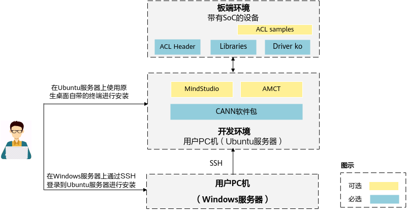
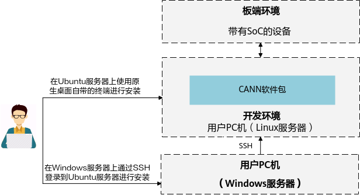
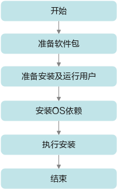
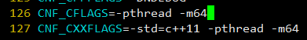
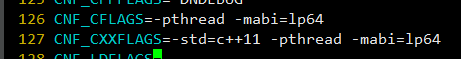
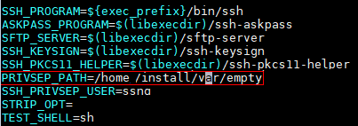
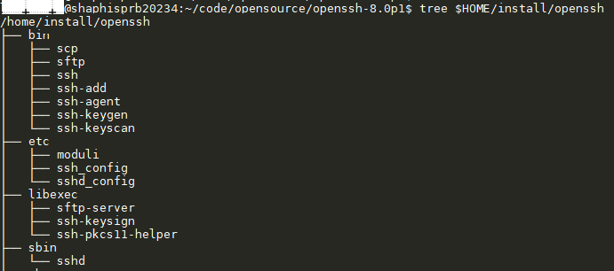
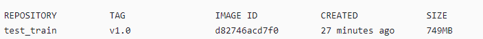
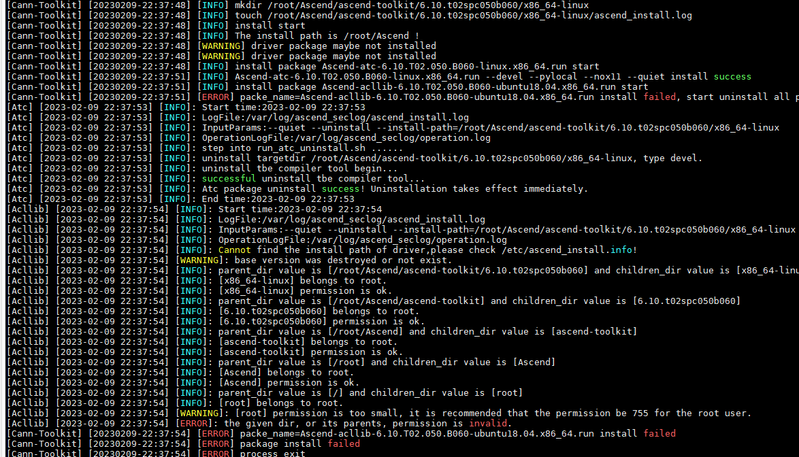

# 前言<a name="ZH-CN_TOPIC_0000002441980561"></a>

**概述<a name="section4537382116410"></a>**

该文档为NNN向导性使用指导，主要介绍在板上运行NNN业务的主要步骤。

**产品版本<a name="section300mcpsimp"></a>**

与本文档相对应的产品版本如下。

<a name="table303mcpsimp"></a>
<table><thead align="left"><tr id="row308mcpsimp"><th class="cellrowborder" valign="top" width="45%" id="mcps1.1.3.1.1"><p id="p310mcpsimp"><a name="p310mcpsimp"></a><a name="p310mcpsimp"></a>产品名称</p>
</th>
<th class="cellrowborder" valign="top" width="55.00000000000001%" id="mcps1.1.3.1.2"><p id="p312mcpsimp"><a name="p312mcpsimp"></a><a name="p312mcpsimp"></a>产品版本</p>
</th>
</tr>
</thead>
<tbody><tr id="row314mcpsimp"><td class="cellrowborder" valign="top" width="45%" headers="mcps1.1.3.1.1 "><p id="p316mcpsimp"><a name="p316mcpsimp"></a><a name="p316mcpsimp"></a>SS928</p>
</td>
<td class="cellrowborder" valign="top" width="55.00000000000001%" headers="mcps1.1.3.1.2 "><p id="p318mcpsimp"><a name="p318mcpsimp"></a><a name="p318mcpsimp"></a>V100</p>
</td>
</tr>
<tr id="row1376073312191"><td class="cellrowborder" valign="top" width="45%" headers="mcps1.1.3.1.1 "><p id="p5760533111913"><a name="p5760533111913"></a><a name="p5760533111913"></a>SS927</p>
</td>
<td class="cellrowborder" valign="top" width="55.00000000000001%" headers="mcps1.1.3.1.2 "><p id="p6760333131918"><a name="p6760333131918"></a><a name="p6760333131918"></a>V100</p>
</td>
</tr>
</tbody>
</table>

**读者对象<a name="section4378592816410"></a>**

本文档主要适用于NNN开发人员。开发人员必须具备以下经验和技能：

-   了解图像分析工具的基本概念。
-   有一定的图像分析工具开发经验。

**符号约定<a name="section133020216410"></a>**

在本文中可能出现下列标志，它们所代表的含义如下。

<a name="table2622507016410"></a>
<table><thead align="left"><tr id="row1530720816410"><th class="cellrowborder" valign="top" width="20.580000000000002%" id="mcps1.1.3.1.1"><p id="p6450074116410"><a name="p6450074116410"></a><a name="p6450074116410"></a><strong id="b2136615816410"><a name="b2136615816410"></a><a name="b2136615816410"></a>符号</strong></p>
</th>
<th class="cellrowborder" valign="top" width="79.42%" id="mcps1.1.3.1.2"><p id="p5435366816410"><a name="p5435366816410"></a><a name="p5435366816410"></a><strong id="b5941558116410"><a name="b5941558116410"></a><a name="b5941558116410"></a>说明</strong></p>
</th>
</tr>
</thead>
<tbody><tr id="row1372280416410"><td class="cellrowborder" valign="top" width="20.580000000000002%" headers="mcps1.1.3.1.1 "><p id="p3734547016410"><a name="p3734547016410"></a><a name="p3734547016410"></a><a name="image2670064316410"></a><a name="image2670064316410"></a><span></span></p>
</td>
<td class="cellrowborder" valign="top" width="79.42%" headers="mcps1.1.3.1.2 "><p id="p1757432116410"><a name="p1757432116410"></a><a name="p1757432116410"></a>表示如不避免则将会导致死亡或严重伤害的具有高等级风险的危害。</p>
</td>
</tr>
<tr id="row466863216410"><td class="cellrowborder" valign="top" width="20.580000000000002%" headers="mcps1.1.3.1.1 "><p id="p1432579516410"><a name="p1432579516410"></a><a name="p1432579516410"></a><a name="image4895582316410"></a><a name="image4895582316410"></a><span></span></p>
</td>
<td class="cellrowborder" valign="top" width="79.42%" headers="mcps1.1.3.1.2 "><p id="p959197916410"><a name="p959197916410"></a><a name="p959197916410"></a>表示如不避免则可能导致死亡或严重伤害的具有中等级风险的危害。</p>
</td>
</tr>
<tr id="row123863216410"><td class="cellrowborder" valign="top" width="20.580000000000002%" headers="mcps1.1.3.1.1 "><p id="p1232579516410"><a name="p1232579516410"></a><a name="p1232579516410"></a><a name="image1235582316410"></a><a name="image1235582316410"></a><span></span></p>
</td>
<td class="cellrowborder" valign="top" width="79.42%" headers="mcps1.1.3.1.2 "><p id="p123197916410"><a name="p123197916410"></a><a name="p123197916410"></a>表示如不避免则可能导致轻微或中度伤害的具有低等级风险的危害。</p>
</td>
</tr>
<tr id="row5786682116410"><td class="cellrowborder" valign="top" width="20.580000000000002%" headers="mcps1.1.3.1.1 "><p id="p2204984716410"><a name="p2204984716410"></a><a name="p2204984716410"></a><a name="image4504446716410"></a><a name="image4504446716410"></a><span></span></p>
</td>
<td class="cellrowborder" valign="top" width="79.42%" headers="mcps1.1.3.1.2 "><p id="p4388861916410"><a name="p4388861916410"></a><a name="p4388861916410"></a>用于传递设备或环境安全警示信息。如不避免则可能会导致设备损坏、数据丢失、设备性能降低或其它不可预知的结果。</p>
<p id="p1238861916410"><a name="p1238861916410"></a><a name="p1238861916410"></a>“须知”不涉及人身伤害。</p>
</td>
</tr>
<tr id="row2856923116410"><td class="cellrowborder" valign="top" width="20.580000000000002%" headers="mcps1.1.3.1.1 "><p id="p5555360116410"><a name="p5555360116410"></a><a name="p5555360116410"></a><a name="image799324016410"></a><a name="image799324016410"></a><span></span></p>
</td>
<td class="cellrowborder" valign="top" width="79.42%" headers="mcps1.1.3.1.2 "><p id="p4612588116410"><a name="p4612588116410"></a><a name="p4612588116410"></a>对正文中重点信息的补充说明。</p>
<p id="p1232588116410"><a name="p1232588116410"></a><a name="p1232588116410"></a>“说明”不是安全警示信息，不涉及人身、设备及环境伤害信息。</p>
</td>
</tr>
</tbody>
</table>

**修订记录<a name="section4116mcpsimp"></a>**

修订记录累积了每次文档更新的说明。最新版本的文档包含以前所有文档版本的更新内容。

<a name="table1557726816410"></a>
<table><thead align="left"><tr id="row2942532716410"><th class="cellrowborder" valign="top" width="20.72%" id="mcps1.1.4.1.1"><p id="p3778275416410"><a name="p3778275416410"></a><a name="p3778275416410"></a><strong id="b5687322716410"><a name="b5687322716410"></a><a name="b5687322716410"></a>文档版本</strong></p>
</th>
<th class="cellrowborder" valign="top" width="20.22%" id="mcps1.1.4.1.2"><p id="p5627845516410"><a name="p5627845516410"></a><a name="p5627845516410"></a><strong id="b5800814916410"><a name="b5800814916410"></a><a name="b5800814916410"></a>发布日期</strong></p>
</th>
<th class="cellrowborder" valign="top" width="59.06%" id="mcps1.1.4.1.3"><p id="p2382284816410"><a name="p2382284816410"></a><a name="p2382284816410"></a><strong id="b3316380216410"><a name="b3316380216410"></a><a name="b3316380216410"></a>修改说明</strong></p>
</th>
</tr>
</thead>
<tbody><tr id="row62941350175416"><td class="cellrowborder" valign="top" width="20.72%" headers="mcps1.1.4.1.1 "><p id="p363115814548"><a name="p363115814548"></a><a name="p363115814548"></a>00B02</p>
</td>
<td class="cellrowborder" valign="top" width="20.22%" headers="mcps1.1.4.1.2 "><p id="p14631358115416"><a name="p14631358115416"></a><a name="p14631358115416"></a>2025-11-15</p>
</td>
<td class="cellrowborder" valign="top" width="59.06%" headers="mcps1.1.4.1.3 "><p id="p18632135818547"><a name="p18632135818547"></a><a name="p18632135818547"></a>第2次临时版本发布。</p>
<p id="p1627917105553"><a name="p1627917105553"></a><a name="p1627917105553"></a>“3.1.1.2 交叉编译环境准备“、“4.2 前提条件“、“4.3 操作步骤“小节涉及修改</p>
<p id="p1511111516016"><a name="p1511111516016"></a><a name="p1511111516016"></a>“3.1.1.3 交叉编译“小节工具链涉及修改</p>
</td>
</tr>
<tr id="row5947359616410"><td class="cellrowborder" valign="top" width="20.72%" headers="mcps1.1.4.1.1 "><p id="p2149706016410"><a name="p2149706016410"></a><a name="p2149706016410"></a>00B01</p>
</td>
<td class="cellrowborder" valign="top" width="20.22%" headers="mcps1.1.4.1.2 "><p id="p648803616410"><a name="p648803616410"></a><a name="p648803616410"></a>2025-09-15</p>
</td>
<td class="cellrowborder" valign="top" width="59.06%" headers="mcps1.1.4.1.3 "><p id="p1946537916410"><a name="p1946537916410"></a><a name="p1946537916410"></a>第1次临时版本发布。</p>
</td>
</tr>
</tbody>
</table>

# 概述<a name="ZH-CN_TOPIC_0000002408421354"></a>


## Ascend  NNN简介<a name="ZH-CN_TOPIC_0000002441980573"></a>

Ascend  NNN为新一代图像分析工具加速器，前端支持开源AA框架（Caffe/ONNX），后端支持NNN/CPU的异构计算，提供完整的软硬件计算加速方案。

## 部署架构<a name="ZH-CN_TOPIC_0000002442020509"></a>

部署架构如[图1](#fig186401132182414)所示。NNN环境包含PC端工具侧开发环境和单板侧板端环境，当一个训练好的模型过来后，首先可以经过AMCT（Advanced Model Compression Toolkit）进行量化，将模型中部分层量化为8bit计算，提升计算效率；其次使用ATC（Advanced Tensor Compiler）工具将量化后的模型或非量化的模型转换为Ascend  NNN认识的离线模型；最后，离线模型放置在板端环境，即可进行推理。

**图 1**  部署架构<a name="fig186401132182414"></a>  


**板端环境<a name="section6758520151415"></a>**

板端环境中包含板端执行推理时需要的头文件、动态库、驱动ko以及sample。

**开发环境<a name="section115683551414"></a>**

命令行方式开发环境：需要单独部署CANN软件包，采用命令行的方式进行安装和使用，具体方法请参见[命令行方式开发环境安装](#ZH-CN_TOPIC_0000002442020497)。

该环境都可安装独立的AMCT工具，支持将原始的float32模型，量化为低bit，以提升推理性能。工具安装以及使用方法请参见《AMCT使用指南（Caffe）》、《AMCT使用指南（Pytorch）》等手册。

## 使用流程<a name="ZH-CN_TOPIC_0000002408581302"></a>

本章节介绍原始训练好的模型如何在NNN上执行以及遇到问题的整体使用流程，运行流程如[图1](#fig177346115318)所示。

**图 1**  运行流程<a name="fig177346115318"></a>  


下面以Caffe原始网络模型为例，说明运行流程：

1.  当训练好的Caffe模型准备好后，可以直接使用ATC工具进行模型转换，也可以使用AMCT先进行量化，然后将量化后的Caffe模型再传给ATC工具进行离线模型转换。
2.  ATC离线模型转换后生成的om模型，可以在板端环境上使用ACL（Advanced Computing Language）做推理。
3.  推理后如果遇到精度问题，可以选择Dump网络的中间层数据，和Caffe的Dump结果做比较，来定位是哪一层的问题。为了缩小范围，可以使用MindCmd上的子模型导出功能（当前仅支持Caffe模型），将问题范围缩小，再使用导出的子模型复现问题。
4.  当推理性能不满足要求时，可以通过Profiling工具查看网络中每个算子的耗时以及带宽数据，可能通过分析瓶颈点，修改网络来提升整网性能。

> **说明：** 
>上述流程中涉及参考手册如下：
>-   AMCT：如果用户想使用量化特性提升推理性能，请参见《AMCT使用指南（Caffe）》、《AMCT使用指南（Pytorch）》，对训练好的模型进行量化，量化完成后再使用ATC工具进行模型转换。
>-   ATC工具模型转换：请参见《ATC工具使用指南》，将训练好的模型转换成平台识别的离线模型，应用程序指定模型资源后即可进行推理；具体支持的Caffe算子规格请参见《ATC工具使用指南》算子规格说明章节。
>-   模型推理过程中精度或性能不达标：请参见《快速上手指南》“精度调优建议”和“性能问题分析及性能调优”章节。

# NNN环境安装<a name="ZH-CN_TOPIC_0000002442020489"></a>


## 板端环境安装<a name="ZH-CN_TOPIC_0000002441980625"></a>

**板端环境安装<a name="section16455172521019"></a>**

-   板端环境安装请参见《xxxx SDK 安装以及升级使用说明》。
-   SVP ACL接口使用说明请参见《应用开发指南》\>“SVP ACL API参考”章节。
-   需要将SVP\_NNN相关库路径加入到系统环境变量LD\_LIBRARY\_PATH（如smp/a55\_linux/mpp/out/lib/svp\_nnn）。
-   板端开发所依赖的文件清单如[表1](#_Ref77061199)所示。

    **表 1**  板端开发依赖的文件

    <a name="_Ref77061199"></a>
    <table><thead align="left"><tr id="row643mcpsimp"><th class="cellrowborder" valign="top" width="20%" id="mcps1.2.3.1.1"><p id="p645mcpsimp"><a name="p645mcpsimp"></a><a name="p645mcpsimp"></a>文件类型</p>
    </th>
    <th class="cellrowborder" valign="top" width="80%" id="mcps1.2.3.1.2"><p id="p647mcpsimp"><a name="p647mcpsimp"></a><a name="p647mcpsimp"></a>文件名称</p>
    </th>
    </tr>
    </thead>
    <tbody><tr id="row649mcpsimp"><td class="cellrowborder" valign="top" width="20%" headers="mcps1.2.3.1.1 "><p id="p651mcpsimp"><a name="p651mcpsimp"></a><a name="p651mcpsimp"></a>头文件</p>
    </td>
    <td class="cellrowborder" valign="top" width="80%" headers="mcps1.2.3.1.2 "><p id="p653mcpsimp"><a name="p653mcpsimp"></a><a name="p653mcpsimp"></a>svp_acl.h</p>
    <p id="p654mcpsimp"><a name="p654mcpsimp"></a><a name="p654mcpsimp"></a>svp_acl_base.h</p>
    <p id="p655mcpsimp"><a name="p655mcpsimp"></a><a name="p655mcpsimp"></a>svp_acl_ext.h</p>
    <p id="p656mcpsimp"><a name="p656mcpsimp"></a><a name="p656mcpsimp"></a>svp_acl_mdl.h</p>
    <p id="p657mcpsimp"><a name="p657mcpsimp"></a><a name="p657mcpsimp"></a>svp_acl_prof.h</p>
    <p id="p658mcpsimp"><a name="p658mcpsimp"></a><a name="p658mcpsimp"></a>svp_acl_rt.h</p>
    </td>
    </tr>
    <tr id="row659mcpsimp"><td class="cellrowborder" valign="top" width="20%" headers="mcps1.2.3.1.1 "><p id="p661mcpsimp"><a name="p661mcpsimp"></a><a name="p661mcpsimp"></a>库文件</p>
    </td>
    <td class="cellrowborder" valign="top" width="80%" headers="mcps1.2.3.1.2 "><p id="p663mcpsimp"><a name="p663mcpsimp"></a><a name="p663mcpsimp"></a>libsvp_acl.a</p>
    <p id="p664mcpsimp"><a name="p664mcpsimp"></a><a name="p664mcpsimp"></a>libsvp_acl.so</p>
    <p id="p665mcpsimp"><a name="p665mcpsimp"></a><a name="p665mcpsimp"></a>libsvp_aacpu.so</p>
    <p id="p667mcpsimp"><a name="p667mcpsimp"></a><a name="p667mcpsimp"></a>libprotobuf-c.a</p>
    <p id="p668mcpsimp"><a name="p668mcpsimp"></a><a name="p668mcpsimp"></a>libprotobuf-c.so.1</p>
    </td>
    </tr>
    <tr id="row669mcpsimp"><td class="cellrowborder" valign="top" width="20%" headers="mcps1.2.3.1.1 "><p id="p671mcpsimp"><a name="p671mcpsimp"></a><a name="p671mcpsimp"></a>ko文件</p>
    </td>
    <td class="cellrowborder" valign="top" width="80%" headers="mcps1.2.3.1.2 "><p id="p673mcpsimp"><a name="p673mcpsimp"></a><a name="p673mcpsimp"></a>xxxx_svp_nnn.ko</p>
    </td>
    </tr>
    </tbody>
    </table>

## 命令行方式开发环境安装<a name="ZH-CN_TOPIC_0000002442020497"></a>


### 简介<a name="ZH-CN_TOPIC_0000002442020413"></a>

CANN（Compute Architecture for Neural Networks）是针对AA场景推出的异构计算架构，通过提供多层次的编程接口，支持用户快速构建AA应用和业务。

本文档主要用于指导用户安装CANN开发环境，用于代码开发、编译等不依赖于设备的开发活动（例如ATC模型转换、算子和推理应用程序的纯代码开发）。开发环境搭建逻辑架构如[图1](#fig920342216305)所示。

**图 1**  开发环境<a name="fig920342216305"></a>  


安装流程如[图2](#fig7137316125117)所示。

**图 2**  安装流程<a name="fig7137316125117"></a>  


### 软件包获取<a name="ZH-CN_TOPIC_0000002408581210"></a>

环境搭建前，请准备如[表1](#table136510451990)所示CANN软件包，用户根据具体板端环境，选择其中一个软件包进行安装。

**表 1**  软件包说明

<a name="table136510451990"></a>
<table><thead align="left"><tr id="row203664451395"><th class="cellrowborder" valign="top" width="24.14%" id="mcps1.2.4.1.1"><p id="p43661845797"><a name="p43661845797"></a><a name="p43661845797"></a>形态</p>
</th>
<th class="cellrowborder" valign="top" width="34.17%" id="mcps1.2.4.1.2"><p id="p1628185715910"><a name="p1628185715910"></a><a name="p1628185715910"></a>包名</p>
</th>
<th class="cellrowborder" valign="top" width="41.69%" id="mcps1.2.4.1.3"><p id="p680113459274"><a name="p680113459274"></a><a name="p680113459274"></a>说明</p>
</th>
</tr>
</thead>
<tbody><tr id="row10624101215352"><td class="cellrowborder" valign="top" width="24.14%" headers="mcps1.2.4.1.1 "><p id="zh-cn_topic_0000001087679048_zh-cn_topic_0000001079598552_zh-cn_topic_0288515780_p14113431193910"><a name="zh-cn_topic_0000001087679048_zh-cn_topic_0000001079598552_zh-cn_topic_0288515780_p14113431193910"></a><a name="zh-cn_topic_0000001087679048_zh-cn_topic_0000001079598552_zh-cn_topic_0288515780_p14113431193910"></a><span>Linux操作系统SoC形态软件包</span></p>
</td>
<td class="cellrowborder" valign="top" width="34.17%" headers="mcps1.2.4.1.2 "><p id="zh-cn_topic_0000001087679048_zh-cn_topic_0000001079598552_zh-cn_topic_0288515780_p13113731133912"><a name="zh-cn_topic_0000001087679048_zh-cn_topic_0000001079598552_zh-cn_topic_0288515780_p13113731133912"></a><a name="zh-cn_topic_0000001087679048_zh-cn_topic_0000001079598552_zh-cn_topic_0288515780_p13113731133912"></a>Ascend-cann-toolkit<em id="i12460131864616"><a name="i12460131864616"></a><a name="i12460131864616"></a>_&lt;version&gt;</em>_linux.x86_64.run</p>
</td>
<td class="cellrowborder" valign="top" width="41.69%" headers="mcps1.2.4.1.3 "><p id="p17989943184018"><a name="p17989943184018"></a><a name="p17989943184018"></a>主要用于用户开发应用、自定义算子和模型转换。包含开发应用程序所需的库文件、开发辅助工具如ATC模型转换工具等。</p>
</td>
</tr>
</tbody>
</table>

其中_<version\>_表示软件版本号。

### 安装前准备<a name="ZH-CN_TOPIC_0000002408581286"></a>

**环境要求<a name="section1115282622119"></a>**

开发环境所要求的硬件及操作系统要满足以下条件。

**表 1**  Ubuntu系统所要求的环境信息

<a name="t9ddf7b2ba6a3426997441f6bde6c9afe"></a>
<table><thead align="left"><tr id="rc1f09445915b41f3b567b51cfff49ca4"><th class="cellrowborder" valign="top" width="8.98%" id="mcps1.2.5.1.1"><p id="ad27ae059c06e4ea8ba32c3e396a96116"><a name="ad27ae059c06e4ea8ba32c3e396a96116"></a><a name="ad27ae059c06e4ea8ba32c3e396a96116"></a>类别</p>
</th>
<th class="cellrowborder" valign="top" width="12.18%" id="mcps1.2.5.1.2"><p id="afe1472d0d1964a03ab797d3bb256f5ff"><a name="afe1472d0d1964a03ab797d3bb256f5ff"></a><a name="afe1472d0d1964a03ab797d3bb256f5ff"></a>版本限制</p>
</th>
<th class="cellrowborder" valign="top" width="46.2%" id="mcps1.2.5.1.3"><p id="ae28877364092422e9316d71f7ef12a8f"><a name="ae28877364092422e9316d71f7ef12a8f"></a><a name="ae28877364092422e9316d71f7ef12a8f"></a>获取方式</p>
</th>
<th class="cellrowborder" valign="top" width="32.64%" id="mcps1.2.5.1.4"><p id="a72b2a2498ffe4859a44d69c209e3c753"><a name="a72b2a2498ffe4859a44d69c209e3c753"></a><a name="a72b2a2498ffe4859a44d69c209e3c753"></a>注意事项</p>
</th>
</tr>
</thead>
<tbody><tr id="row1469440183312"><td class="cellrowborder" valign="top" width="8.98%" headers="mcps1.2.5.1.1 "><p id="p1970142552010"><a name="p1970142552010"></a><a name="p1970142552010"></a>硬件</p>
</td>
<td class="cellrowborder" valign="top" width="12.18%" headers="mcps1.2.5.1.2 "><p id="p49702025102015"><a name="p49702025102015"></a><a name="p49702025102015"></a>内存：最小4GB</p>
</td>
<td class="cellrowborder" valign="top" width="46.2%" headers="mcps1.2.5.1.3 "><p id="p12970172514200"><a name="p12970172514200"></a><a name="p12970172514200"></a>-</p>
</td>
<td class="cellrowborder" valign="top" width="32.64%" headers="mcps1.2.5.1.4 "><a name="ul18330193818"></a><a name="ul18330193818"></a><ul id="ul18330193818"><li>若Linux宿主机内存为4G，使用ATC工具进行模型转换时，建议Model文件大小不超过350M，如果超过此规格，操作系统可能会因为超过安全内存阈值而工作不稳定。</li><li>若Linux宿主机配置升级，比如8G内存，则相应支持的操作对象规格按比例提升。<p id="p484130183810"><a name="p484130183810"></a><a name="p484130183810"></a>例如，内存由4G升级到8G，则Model文件建议大小不超过700M。</p>
</li></ul>
</td>
</tr>
<tr id="rdc7a2ec5d3cf400284571af8d4b55e6f"><td class="cellrowborder" valign="top" width="8.98%" headers="mcps1.2.5.1.1 "><p id="a6b89ac21b7e44be7a1b0e70754f7d263"><a name="a6b89ac21b7e44be7a1b0e70754f7d263"></a><a name="a6b89ac21b7e44be7a1b0e70754f7d263"></a>操作系统</p>
</td>
<td class="cellrowborder" valign="top" width="12.18%" headers="mcps1.2.5.1.2 "><p id="aa11a863ab9d64e5ea71d1d9ba4151810"><a name="aa11a863ab9d64e5ea71d1d9ba4151810"></a><a name="aa11a863ab9d64e5ea71d1d9ba4151810"></a>Ubuntu 18.04 x86_64</p>
</td>
<td class="cellrowborder" valign="top" width="46.2%" headers="mcps1.2.5.1.3 "><p id="aeaafd276bc434665917199ade027c0a4"><a name="aeaafd276bc434665917199ade027c0a4"></a><a name="aeaafd276bc434665917199ade027c0a4"></a>请从<a href="http://old-releases.ubuntu.com/releases/18.04.1/" target="_blank" rel="noopener noreferrer">http://old-releases.ubuntu.com/releases/18.04.1/</a>网站下载对应版本软件进行安装，可以下载桌面版：<strong id="b17194143211273"><a name="b17194143211273"></a><a name="b17194143211273"></a>ubuntu-xxx-desktop-amd64.iso</strong>，或Server版：<strong id="b1784243510273"><a name="b1784243510273"></a><a name="b1784243510273"></a>ubuntu-xxx-server-amd64.iso</strong>。</p>
</td>
<td class="cellrowborder" valign="top" width="32.64%" headers="mcps1.2.5.1.4 "><p id="a6065a4658a8b481bb117e34bab77768d"><a name="a6065a4658a8b481bb117e34bab77768d"></a><a name="a6065a4658a8b481bb117e34bab77768d"></a>-</p>
</td>
</tr>
<tr id="r5107f6c0f971475796824743fcd53481"><td class="cellrowborder" valign="top" width="8.98%" headers="mcps1.2.5.1.1 "><p id="ac673d044cf3c495ba89ffe3887c7ca60"><a name="ac673d044cf3c495ba89ffe3887c7ca60"></a><a name="ac673d044cf3c495ba89ffe3887c7ca60"></a>Python</p>
</td>
<td class="cellrowborder" valign="top" width="12.18%" headers="mcps1.2.5.1.2 "><p id="zh-cn_topic_0187258243_p123433211415"><a name="zh-cn_topic_0187258243_p123433211415"></a><a name="zh-cn_topic_0187258243_p123433211415"></a>3.7.5</p>
</td>
<td class="cellrowborder" valign="top" width="46.2%" headers="mcps1.2.5.1.3 "><p id="ae7184a0d0ac34d879ee1f80a8e66a0c3"><a name="ae7184a0d0ac34d879ee1f80a8e66a0c3"></a><a name="ae7184a0d0ac34d879ee1f80a8e66a0c3"></a>请参见<a href="#section84228306314">安装依赖</a>。</p>
</td>
<td class="cellrowborder" valign="top" width="32.64%" headers="mcps1.2.5.1.4 "><p id="acc6f138ea59c4116b554bf121d5521e6"><a name="acc6f138ea59c4116b554bf121d5521e6"></a><a name="acc6f138ea59c4116b554bf121d5521e6"></a>-</p>
</td>
</tr>
<tr id="row149623121415"><td class="cellrowborder" valign="top" width="8.98%" headers="mcps1.2.5.1.1 "><p id="p6649123211415"><a name="p6649123211415"></a><a name="p6649123211415"></a>gcc</p>
</td>
<td class="cellrowborder" valign="top" width="12.18%" headers="mcps1.2.5.1.2 "><p id="p1940614519144"><a name="p1940614519144"></a><a name="p1940614519144"></a>7.4.0</p>
</td>
<td class="cellrowborder" valign="top" width="46.2%" headers="mcps1.2.5.1.3 "><p id="p997236141"><a name="p997236141"></a><a name="p997236141"></a>请参见<a href="#section84228306314">安装依赖</a>。</p>
</td>
<td class="cellrowborder" valign="top" width="32.64%" headers="mcps1.2.5.1.4 "><p id="p1397339143"><a name="p1397339143"></a><a name="p1397339143"></a>-</p>
</td>
</tr>
<tr id="row79657581413"><td class="cellrowborder" valign="top" width="8.98%" headers="mcps1.2.5.1.1 "><p id="p71631636171414"><a name="p71631636171414"></a><a name="p71631636171414"></a>g++</p>
</td>
<td class="cellrowborder" valign="top" width="12.18%" headers="mcps1.2.5.1.2 "><p id="p8985134841416"><a name="p8985134841416"></a><a name="p8985134841416"></a>7.4.0</p>
</td>
<td class="cellrowborder" valign="top" width="46.2%" headers="mcps1.2.5.1.3 "><p id="p19966052141"><a name="p19966052141"></a><a name="p19966052141"></a>请参见<a href="#section84228306314">安装依赖</a>。</p>
</td>
<td class="cellrowborder" valign="top" width="32.64%" headers="mcps1.2.5.1.4 "><p id="p12966751147"><a name="p12966751147"></a><a name="p12966751147"></a>-</p>
</td>
</tr>
<tr id="row1717271015147"><td class="cellrowborder" valign="top" width="8.98%" headers="mcps1.2.5.1.1 "><p id="p1017217107146"><a name="p1017217107146"></a><a name="p1017217107146"></a>cmake</p>
</td>
<td class="cellrowborder" valign="top" width="12.18%" headers="mcps1.2.5.1.2 "><p id="p13172121081419"><a name="p13172121081419"></a><a name="p13172121081419"></a>3.10.2</p>
</td>
<td class="cellrowborder" valign="top" width="46.2%" headers="mcps1.2.5.1.3 "><p id="p10172131081410"><a name="p10172131081410"></a><a name="p10172131081410"></a>请参见<a href="#section84228306314">安装依赖</a>。</p>
</td>
<td class="cellrowborder" valign="top" width="32.64%" headers="mcps1.2.5.1.4 "><p id="p61725106148"><a name="p61725106148"></a><a name="p61725106148"></a>-</p>
</td>
</tr>
<tr id="row12595160182413"><td class="cellrowborder" valign="top" width="8.98%" headers="mcps1.2.5.1.1 "><p id="p25087518575"><a name="p25087518575"></a><a name="p25087518575"></a>protobuf</p>
</td>
<td class="cellrowborder" valign="top" width="12.18%" headers="mcps1.2.5.1.2 "><p id="p565733364819"><a name="p565733364819"></a><a name="p565733364819"></a>3.13.0+</p>
</td>
<td class="cellrowborder" valign="top" width="46.2%" headers="mcps1.2.5.1.3 "><p id="p134521219162411"><a name="p134521219162411"></a><a name="p134521219162411"></a>请参见<a href="#section84228306314">安装依赖</a>。</p>
</td>
<td class="cellrowborder" valign="top" width="32.64%" headers="mcps1.2.5.1.4 "><p id="p345391952410"><a name="p345391952410"></a><a name="p345391952410"></a>该依赖为精度比对工具和profiling工具使用，为python版本的软件。</p>
</td>
</tr>
</tbody>
</table>

**创建安装及运行用户<a name="section3295231182112"></a>**

运行用户为实际运行推理业务的用户；安装用户为实际安装软件包的用户，针对安装用户：

-   **若使用root用户安装**，支持所有用户运行相关业务。
-   **若使用非root用户安装**，该场景下安装及运行用户必须相同。
    -   若已有非root用户，则无需再次创建。
    -   若想使用新的非root用户，则需要先创建该用户，请参见如下方法创建。

创建非root用户操作方法如下，如下命令请以root用户执行。

1.  创建非root用户。

    ```
    groupadd usergroup
    useradd -g usergroup -d /home/username -m username -s /bin/bash
    ```

2.  设置非root用户密码。

    ```
    passwd username
    ```

> **说明：** 
>密码有效期为90天，您可以在/etc/login.defs文件中修改有效期的天数，或者通过chage命令来设置用户的有效期，详情请参见[设置用户有效期](#ZH-CN_TOPIC_0000002408581206)。

**检查源<a name="section778143511211"></a>**

安装过程需要下载相关依赖，请确保开发环境能够连接网络。

请在root用户下执行如下命令检查源是否可用。

```
apt-get update
```

如果命令执行报错，请检查网络是否连接或者把“/etc/apt/sources.list“文件中的源更换为可用的源。

**配置安装用户权限<a name="zh-cn_topic_0000001185372051_zh-cn_topic_0000001126740895_section177961516204117"></a>**

如果使用非root用户安装，apt-get需要用到提权命令，请用户自行获取所需的sudo权限。使用完成后请取消涉及高危命令的权限，否则有sudo提权风险。

**安装依赖<a name="section84228306314"></a>**

如果安装用户为root，即CANN软件包的使用者为所有用户，请使用root用户安装依赖的gcc、python3.7.5等软件。如果安装用户为非root，即CANN软件包的使用者仅限于指定的非root用户，请使用su - username命令切换到非root用户安装依赖软件。

1.  检查系统是否安装python依赖以及gcc等软件。

    分别使用如下命令检查是否安装gcc，make以及python依赖软件等。

    ```
    gcc --version
    g++ --version
    cmake --version
    make --version
    unzip --version
    dpkg -l build-essential | grep build-essential | grep ii
    dpkg -l zlib1g-dev| grep zlib1g-dev| grep ii
    dpkg -l libbz2-dev| grep libbz2-dev| grep ii
    dpkg -l libsqlite3-dev| grep libsqlite3-dev| grep ii
    dpkg -l libssl-dev| grep libssl-dev| grep ii
    dpkg -l libxslt1-dev| grep libxslt1-dev| grep ii
    dpkg -l libffi-dev| grep libffi-dev| grep ii
    ```

    若分别返回如下信息则说明已经安装。

    ```
    gcc (Ubuntu 7.4.0-1ubuntu1~18.04.1) 7.4.0
    g++ (Ubuntu 7.4.0-1ubuntu1~18.04.1) 7.4.0
    cmake version 3.10.2
    GNU Make 4.1
    UnZip 6.00 of 20 April 2009, by Debian. Original by Info-ZIP.
    build-essential 12.4ubuntu1  amd64        Informational list of build-essential packages
    zlib1g-dev:amd64 1:1.2.11.dfsg-0ubuntu2 amd64        compression library - development
    libbz2-dev:amd64 1.0.6-8.1ubuntu0.2 amd64        high-quality block-sorting file compressor library - development
    libsqlite3-dev:amd64 3.22.0-1ubuntu0.2 amd64        SQLite 3 development files
    libssl-dev:amd64 1.1.1-1ubuntu2.1~18.04.5 amd64        Secure Sockets Layer toolkit - development files
    libxslt1-dev:amd64 1.1.29-5ubuntu0.2 amd64        XSLT 1.0 processing library - development kit
    libffi-dev:amd64 3.2.1-8      amd64        Foreign Function Interface library (development files)
    ```

    否则请执行如下安装命令（如果只有部分软件未安装，则如下命令修改为只安装还未安装的软件即可）：

    ```
    sudo apt-get install -y gcc g++ cmake make unzip build-essential zlib1g-dev libbz2-dev libsqlite3-dev libssl-dev libxslt1-dev libffi-dev
    ```

    libsqlite3-dev需要在python安装之前安装，如果用户操作系统已经安装python3.7.5环境，在此之后再安装libsqlite3-dev，则需要重新编译python环境。

2.  检查系统是否安装python开发环境。

    CANN软件包依赖python环境，分别使用命令**python3.7.5 --version**、**python3.7 --version**、**pip3.7.5 --version**检查是否已经安装，如果返回如下信息则说明已经安装。

    ```
    Python 3.7.5
    pip 19.2.3 from /usr/local/python3.7.5/lib/python3.7/site-packages/pip (python 3.7)
    ```

    否则请根据如下方式安装python3.7.5。

    1.  使用wget下载python3.7.5源码包，可以下载到开发环境任意目录，命令为：

        ```
        wget https://www.python.org/ftp/python/3.7.5/Python-3.7.5.tgz
        ```

    2.  进入下载后的目录，解压源码包，命令为：

        ```
        tar -zxvf Python-3.7.5.tgz 
        ```

    3.  进入解压后的文件夹，执行配置、编译和安装命令：

        ```
        cd Python-3.7.5
        ./configure --prefix=/usr/local/python3.7.5 --enable-loadable-sqlite-extensions --enable-shared
        make
        sudo make install
        ```

        其中“--prefix“参数用于指定python安装路径，用户根据实际情况进行修改。“--enable-shared“参数用于编译出libpython3.7m.so.1.0动态库，“--enable-loadable-sqlite-extensions“参数用于加载sqlite-devel依赖。

        本手册以--prefix=/usr/local/python3.7.5路径为例进行说明。执行配置、编译和安装命令后，安装包在/usr/local/python3.7.5路径，libpython3.7m.so.1.0动态库在/usr/local/python3.7.5/lib/libpython3.7m.so.1.0路径。

    4.  执行如下命令设置软链接：

        ```
        sudo ln -s /usr/local/python3.7.5/bin/python3 /usr/local/python3.7.5/bin/python3.7.5
        sudo ln -s /usr/local/python3.7.5/bin/pip3 /usr/local/python3.7.5/bin/pip3.7.5
        ```

    5.  设置python3.7.5环境变量。
        1.  如果python安装用户为root：

            该场景下CANN软件包使用root用户进行安装，请在当前终端窗口直接执行如下命令设置环境变量。

            ```
            #用于设置python3.7.5库文件路径
            export LD_LIBRARY_PATH=/usr/local/python3.7.5/lib:$LD_LIBRARY_PATH
            #如果用户环境存在多个python3版本，则指定使用python3.7.5版本
            export PATH=/usr/local/python3.7.5/bin:$PATH
            ```

            > **须知：** 
            >运行用户是root，不建议修改.bashrc，否则可能会影响其它系统提供的python工具的使用，如果仍想使用系统默认工具，请重新开启终端窗口。

        2.  如果python安装用户为非root：

            该场景下CANN软件包使用非root用户进行安装，请以非root用户在任意目录下执行**vi \~/.bashrc**命令，打开.bashrc文件，在文件最后一行后面添加如下内容。

            ```
            #用于设置python3.7.5库文件路径
            export LD_LIBRARY_PATH=/usr/local/python3.7.5/lib:$LD_LIBRARY_PATH
            #如果用户环境存在多个python3版本，则指定使用python3.7.5版本
            export PATH=/usr/local/python3.7.5/bin:$PATH
            ```

            执行:wq!命令保存文件并退出，执行source \~/.bashrc命令使其立即生效。

    6.  安装完成之后，执行如下命令查看安装版本，如果返回相关版本信息，则说明安装成功。

        ```
        python3.7.5 --version
        pip3.7.5 --version
        python3.7 --version
        pip3.7  --version
        ```

3.  安装CANN软件包的相关依赖。

    安装前请先使用**pip3.7.5 list**命令检查是否安装相关依赖，若未安装，则安装命令如下（如果只有部分软件未安装，则如下命令修改为只安装还未安装的软件即可）。

    -   请在安装前配置好pip源，具体可参考[配置pip源](#ZH-CN_TOPIC_0000002442020429)。
    -   安装前，建议执行命令**pip3 install --upgrade pip**进行升级，避免因pip版本过低导致安装失败。
    -   如下命令如果使用非root用户安装，需要在安装命令后加上--user，例如：pip3 install pathlib2 --user，安装命令可在任意路径下执行。

    **表 2**  依赖列表

    <a name="table17746194062412"></a>
    <table><thead align="left"><tr id="row1874114409248"><th class="cellrowborder" valign="top" width="13.84%" id="mcps1.2.5.1.1"><p id="p197413408242"><a name="p197413408242"></a><a name="p197413408242"></a>依赖名称</p>
    </th>
    <th class="cellrowborder" valign="top" width="9.66%" id="mcps1.2.5.1.2"><p id="p177411140142415"><a name="p177411140142415"></a><a name="p177411140142415"></a>版本号</p>
    </th>
    <th class="cellrowborder" valign="top" width="30.880000000000003%" id="mcps1.2.5.1.3"><p id="p374124022413"><a name="p374124022413"></a><a name="p374124022413"></a>安装命令</p>
    </th>
    <th class="cellrowborder" valign="top" width="45.62%" id="mcps1.2.5.1.4"><p id="p174516337352"><a name="p174516337352"></a><a name="p174516337352"></a>软件包下载路径</p>
    </th>
    </tr>
    </thead>
    <tbody><tr id="row17421240172410"><td class="cellrowborder" valign="top" width="13.84%" headers="mcps1.2.5.1.1 "><p id="p19742124017245"><a name="p19742124017245"></a><a name="p19742124017245"></a>google.protobuf</p>
    </td>
    <td class="cellrowborder" valign="top" width="9.66%" headers="mcps1.2.5.1.2 "><p id="p17420402245"><a name="p17420402245"></a><a name="p17420402245"></a>&gt;=3.13.0</p>
    </td>
    <td class="cellrowborder" valign="top" width="30.880000000000003%" headers="mcps1.2.5.1.3 "><p id="p0742164012248"><a name="p0742164012248"></a><a name="p0742164012248"></a>pip3.7.5 install protobuf==3.13.0 --user</p>
    </td>
    <td class="cellrowborder" valign="top" width="45.62%" headers="mcps1.2.5.1.4 "><p id="p986134213453"><a name="p986134213453"></a><a name="p986134213453"></a>-</p>
    </td>
    </tr>
    <tr id="row117421340192416"><td class="cellrowborder" valign="top" width="13.84%" headers="mcps1.2.5.1.1 "><p id="p1374284010247"><a name="p1374284010247"></a><a name="p1374284010247"></a>psutil</p>
    </td>
    <td class="cellrowborder" valign="top" width="9.66%" headers="mcps1.2.5.1.2 "><p id="p1874294082414"><a name="p1874294082414"></a><a name="p1874294082414"></a>5.7.0</p>
    </td>
    <td class="cellrowborder" valign="top" width="30.880000000000003%" headers="mcps1.2.5.1.3 "><p id="p1174217408249"><a name="p1174217408249"></a><a name="p1174217408249"></a>pip3.7.5 install psutil==5.7.0 --user</p>
    </td>
    <td class="cellrowborder" valign="top" width="45.62%" headers="mcps1.2.5.1.4 "><p id="p1145814432457"><a name="p1145814432457"></a><a name="p1145814432457"></a><a href="https://pypi.org/project/psutil/5.7.0/#files" target="_blank" rel="noopener noreferrer">https://pypi.org/project/psutil/5.7.0/#files</a></p>
    </td>
    </tr>
    <tr id="row1874374019241"><td class="cellrowborder" valign="top" width="13.84%" headers="mcps1.2.5.1.1 "><p id="p1474216404242"><a name="p1474216404242"></a><a name="p1474216404242"></a>numpy</p>
    </td>
    <td class="cellrowborder" valign="top" width="9.66%" headers="mcps1.2.5.1.2 "><p id="p374312406244"><a name="p374312406244"></a><a name="p374312406244"></a>&gt;=1.13.3</p>
    </td>
    <td class="cellrowborder" valign="top" width="30.880000000000003%" headers="mcps1.2.5.1.3 "><p id="p87432400245"><a name="p87432400245"></a><a name="p87432400245"></a>pip3.7.5 install numpy==1.13.3 --user</p>
    </td>
    <td class="cellrowborder" valign="top" width="45.62%" headers="mcps1.2.5.1.4 "><p id="p41203268409"><a name="p41203268409"></a><a name="p41203268409"></a><a href="https://pypi.org/project/numpy/1.13.3/#files" target="_blank" rel="noopener noreferrer">https://pypi.org/project/numpy/1.13.3/#files</a></p>
    </td>
    </tr>
    <tr id="row18743134014245"><td class="cellrowborder" valign="top" width="13.84%" headers="mcps1.2.5.1.1 "><p id="p12743940182418"><a name="p12743940182418"></a><a name="p12743940182418"></a>scipy</p>
    </td>
    <td class="cellrowborder" valign="top" width="9.66%" headers="mcps1.2.5.1.2 "><p id="p0743134092412"><a name="p0743134092412"></a><a name="p0743134092412"></a>1.4.1</p>
    </td>
    <td class="cellrowborder" valign="top" width="30.880000000000003%" headers="mcps1.2.5.1.3 "><p id="p11743154015242"><a name="p11743154015242"></a><a name="p11743154015242"></a>pip3.7.5 install scipy==1.4.1 --user</p>
    </td>
    <td class="cellrowborder" valign="top" width="45.62%" headers="mcps1.2.5.1.4 "><p id="p8455337354"><a name="p8455337354"></a><a name="p8455337354"></a><a href="https://pypi.org/project/scipy/1.4.1/#files" target="_blank" rel="noopener noreferrer">https://pypi.org/project/scipy/1.4.1/#files</a></p>
    </td>
    </tr>
    <tr id="row4744174002415"><td class="cellrowborder" valign="top" width="13.84%" headers="mcps1.2.5.1.1 "><p id="p1474474015244"><a name="p1474474015244"></a><a name="p1474474015244"></a>decorator</p>
    </td>
    <td class="cellrowborder" valign="top" width="9.66%" headers="mcps1.2.5.1.2 "><p id="p674484012413"><a name="p674484012413"></a><a name="p674484012413"></a>&gt;=4.4.0</p>
    </td>
    <td class="cellrowborder" valign="top" width="30.880000000000003%" headers="mcps1.2.5.1.3 "><p id="p6744040172418"><a name="p6744040172418"></a><a name="p6744040172418"></a>pip3.7.5 install decorator==4.4.0  --user</p>
    </td>
    <td class="cellrowborder" valign="top" width="45.62%" headers="mcps1.2.5.1.4 "><p id="p19452336353"><a name="p19452336353"></a><a name="p19452336353"></a><a href="https://pypi.org/project/decorator/4.4.0/#files" target="_blank" rel="noopener noreferrer">https://pypi.org/project/decorator/4.4.0/#files</a></p>
    </td>
    </tr>
    <tr id="row174494014248"><td class="cellrowborder" valign="top" width="13.84%" headers="mcps1.2.5.1.1 "><p id="p18744240202415"><a name="p18744240202415"></a><a name="p18744240202415"></a>sympy</p>
    </td>
    <td class="cellrowborder" valign="top" width="9.66%" headers="mcps1.2.5.1.2 "><p id="p374484012413"><a name="p374484012413"></a><a name="p374484012413"></a>&gt;= 1.5.1</p>
    </td>
    <td class="cellrowborder" valign="top" width="30.880000000000003%" headers="mcps1.2.5.1.3 "><p id="p127442406248"><a name="p127442406248"></a><a name="p127442406248"></a>pip3.7.5 install sympy==1.5.1  --user</p>
    </td>
    <td class="cellrowborder" valign="top" width="45.62%" headers="mcps1.2.5.1.4 "><p id="p154593312355"><a name="p154593312355"></a><a name="p154593312355"></a><a href="https://pypi.org/project/sympy/1.5.1/#files" target="_blank" rel="noopener noreferrer">https://pypi.org/project/sympy/1.5.1/#files</a></p>
    </td>
    </tr>
    <tr id="row19745134016249"><td class="cellrowborder" valign="top" width="13.84%" headers="mcps1.2.5.1.1 "><p id="p127451040122418"><a name="p127451040122418"></a><a name="p127451040122418"></a>cffi</p>
    </td>
    <td class="cellrowborder" valign="top" width="9.66%" headers="mcps1.2.5.1.2 "><p id="p1674544042416"><a name="p1674544042416"></a><a name="p1674544042416"></a>1.12.3</p>
    </td>
    <td class="cellrowborder" valign="top" width="30.880000000000003%" headers="mcps1.2.5.1.3 "><p id="p157452405243"><a name="p157452405243"></a><a name="p157452405243"></a>pip3.7.5 install cffi==1.12.3  --user</p>
    </td>
    <td class="cellrowborder" valign="top" width="45.62%" headers="mcps1.2.5.1.4 "><p id="p1345193343519"><a name="p1345193343519"></a><a name="p1345193343519"></a><a href="https://pypi.org/project/cffi/1.12.3/#files" target="_blank" rel="noopener noreferrer">https://pypi.org/project/cffi/1.12.3/#files</a></p>
    </td>
    </tr>
    <tr id="row11745540112417"><td class="cellrowborder" valign="top" width="13.84%" headers="mcps1.2.5.1.1 "><p id="p574594018246"><a name="p574594018246"></a><a name="p574594018246"></a>pyyaml</p>
    </td>
    <td class="cellrowborder" valign="top" width="9.66%" headers="mcps1.2.5.1.2 "><p id="p1874574092416"><a name="p1874574092416"></a><a name="p1874574092416"></a>-</p>
    </td>
    <td class="cellrowborder" valign="top" width="30.880000000000003%" headers="mcps1.2.5.1.3 "><p id="p6745124019246"><a name="p6745124019246"></a><a name="p6745124019246"></a>pip3.7.5 install pyyaml  --user</p>
    </td>
    <td class="cellrowborder" valign="top" width="45.62%" headers="mcps1.2.5.1.4 "><p id="p04593313351"><a name="p04593313351"></a><a name="p04593313351"></a><a href="https://pypi.org/project/PyYAML/#files" target="_blank" rel="noopener noreferrer">https://pypi.org/project/PyYAML/#files</a></p>
    </td>
    </tr>
    <tr id="row1774624016247"><td class="cellrowborder" valign="top" width="13.84%" headers="mcps1.2.5.1.1 "><p id="p374544082414"><a name="p374544082414"></a><a name="p374544082414"></a>pathlib2</p>
    </td>
    <td class="cellrowborder" valign="top" width="9.66%" headers="mcps1.2.5.1.2 "><p id="p10745104082414"><a name="p10745104082414"></a><a name="p10745104082414"></a>-</p>
    </td>
    <td class="cellrowborder" valign="top" width="30.880000000000003%" headers="mcps1.2.5.1.3 "><p id="p147454404243"><a name="p147454404243"></a><a name="p147454404243"></a>pip3.7.5 install pathlib2  --user</p>
    </td>
    <td class="cellrowborder" valign="top" width="45.62%" headers="mcps1.2.5.1.4 "><p id="p1945133317354"><a name="p1945133317354"></a><a name="p1945133317354"></a><a href="https://pypi.org/project/pathlib2/#files" target="_blank" rel="noopener noreferrer">https://pypi.org/project/pathlib2/#files</a></p>
    </td>
    </tr>
    </tbody>
    </table>

> **说明：** 
>上述安装成功后返回信息中的版本号只是样例，请以实际环境中的返回信息为准。

**上传软件包<a name="section11487553291"></a>**

使用CANN软件包的安装用户将获取的软件包上传到开发环境任意路径下。软件包存放路径支持大小写字母（a-z，A-Z）、数字（0-9）、下划线（\_）、中划线（-）、句点（.（非相对路径））、单个/（文件名或目录不支持/）。

### 软件包安装<a name="ZH-CN_TOPIC_0000002408421290"></a>

**前提条件<a name="section6539103315248"></a>**

请参见[安装前准备](#ZH-CN_TOPIC_0000002408581286)完成安装前准备。

**操作步骤<a name="section7739348192416"></a>**

如下命令中的**\***请替换为具体CANN软件包，命令中所涉及的$\{INSTALL\_DIR\}请替换为CANN软件包安装后文件存储路径。例如，$HOME/Ascend/ascend-toolkit/<version\>/x86\_64-linux。

1.  以CANN软件包的安装用户登录开发环境，切换到软件包所在路径。
2.  增加安装用户对软件包的可执行权限。

    在软件包所在路径执行**ls -l**命令检查安装用户是否有该文件的执行权限，若没有，请执行如下命令。

    ```
    chmod +x *.run
    ```

3.  校验软件包。

    执行如下命令，校验软件包安装文件的一致性和完整性。

    ```
    ./*.run --check
    ```

4.  执行如下命令进行安装（以下命令支持**--install-path=**_<path\>_等参数，具体参数说明请参见[参数说明/常用命令](#ZH-CN_TOPIC_0000002442020425)）。

    ```
    ./*.run --install
    ```

    > **说明：** 
    >-   如果以root用户安装，**建议不要安装在非root用户目录下**，否则存在被非root用户替换root用户文件以达到提权目的的安全风险。
    >-   如果要多个版本并存，请使用--install-path=<path\>指定新版本的安装路径。
    >-   如果默认安装路径下已经安装了其他架构NNN的版本，请使用--install-path=<path\>指定新的安装路径。否则安装和更新将覆盖原有版本。

    若出现如下关键信息，则说明安装成功：

    ```
    [INFO] xxx install success
    ```

    -   软件包默认安装路径：root用户/usr/local/Ascend；非root用户$HOME/Ascend。
    -   安装详细日志路径：$\{INSTALL\_DIR\}/ascend\_install.log。
    -   安装后软件包的安装路径、安装命令以及运行用户信息记录路径：$\{INSTALL\_DIR\}/_<package\_name\>_/ascend\_install.info

    $\{INSTALL\_DIR\}请替换为CANN软件包安装后文件存储路径。例如，$HOME/Ascend/ascend-toolkit/<version\>/x86\_64-linux。

5.  配置环境变量。

    执行如下命令配置环境变量。

    ```
    source ${INSTALL_DIR}/script/setenv.sh
    ```

    $\{INSTALL\_DIR\}请替换为CANN软件包安装后文件存储路径。例如，$HOME/Ascend/ascend-toolkit/<version\>/x86\_64-linux。

### 安装后处理<a name="ZH-CN_TOPIC_0000002442020441"></a>

开发环境安装完毕，如果用户使用应用工程开发了相关程序，需要进行工程的编译和运行，用于生成相关二进制文件，进行工程编译之前，请先配置交叉编译环境。

根据开发环境安装时选择的CANN软件包的形态不同，交叉编译环境配置方法不同，当前版本仅支持Linux操作系统SoC形态的CANN软件包。

若安装的CANN软件包为Linux操作系统SoC形态，需要搭建交叉编译环境，具体方法请参考[交叉编译环境准备](#ZH-CN_TOPIC_0000002441980569)。

### 常用操作<a name="ZH-CN_TOPIC_0000002408421394"></a>


#### 查询软件包版本号<a name="ZH-CN_TOPIC_0000002442020525"></a>

1.  以CANN软件包的安装用户登录软件包的安装环境。
2.  进入CANN软件包安装后文件存储路径。 （如下以进入非root用户默认安装路径为例进行说明）

    ```
    cd $HOME/Ascend/ascend-toolkit/<version>/x86_64-linux
    ```

3.  执行以下命令获取版本信息。

    ```
    cat ascend_toolkit_install.info
    ```

#### 升级软件包<a name="ZH-CN_TOPIC_0000002408581318"></a>

**升级注意事项<a name="sc42a22e59f424254bd5786f26c33f044"></a>**

1.  升级过程禁止进行其他维护操作动作，软件版本升级过程中会导致业务中断，升级软件包后，不会影响正常业务。
2.  为了减少对业务的影响，请提前切走业务或在业务量低时进行升级操作。
3.  升级后，请确保所有组件的版本保持一致。
4.  升级过程中的日志信息输出在：$\{INSTALL\_DIR\}/ascend\_install.log文件中，$\{INSTALL\_DIR\}请替换为CANN软件包安装后文件存储路径。例如，$HOME/Ascend/ascend-toolkit/<version\>/x86\_64-linux。

**操作步骤<a name="s9d31cebaa9c848679b7645077ed00e8b"></a>**

1.  以CANN软件包的安装用户将新的软件包上传到开发环境任意目录。
2.  增加安装用户对软件包的可执行权限。

    在软件包所在路径执行**ls -l**命令检查安装用户是否有该文件的执行权限，若没有，请执行如下命令。

    ```
    chmod +x *.run
    ```

3.  校验软件包。

    下载软件包后，执行如下命令校验软件包安装文件的一致性和完整性。

    ```
    ./*.run --check
    ```

4.  执行如下命令进行升级。

    ```
    ./*.run --upgrade
    ```

    **\***请替换为具体软件包名，如果升级过程中无错误信息提示，则表示升级成功。

5.  检查升级后的版本号。

    升级后需要确保各组件的版本号一致。在软件包的安装路径下（例如，非root用户默认路径$HOME/Ascend/ascend-toolkit/<version\>/x86\_64-linux），执行如下命令查看所升级软件包版本是否正确。

    ```
    cat ascend_toolkit_install.info
    ```

关于升级保留文件的说明：

-   如果用户在CANN软件包安装后文件存储路径有写权限的目录，自定义了文件，则升级时不会删除此类文件，保留的文件数据会继承到升级的版本中。
-   如果用户修改了安装路径下的有写权限的已有文件（非用户自定义的），则升级时会删除此类文件。

#### 解压软件包<a name="ZH-CN_TOPIC_0000002408421298"></a>

如果用户想要解压CANN软件包，查看软件包中文件详细内容，则可以执行如下命令：

```
./*.run --noexec --extract=<path>
```

**\***请替换为具体软件包名，<path\>表示解压后文件所在目录，该目录无需用户手动建立，解压过程中会自动创建，例如：

./\*.run --noexec --extract=./package，则命令执行后会自动将解压后的内容放在package目录。

#### 卸载软件包<a name="ZH-CN_TOPIC_0000002441980589"></a>

支持两种方式卸载，请使用软件包的安装用户根据实际情况选择其中一个方式卸载即可。

如下命令中的**\***请替换为具体CANN软件包，命令中所涉及的$\{INSTALL\_DIR\}请替换为CANN软件包安装后文件存储路径。例如，$HOME/Ascend/ascend-toolkit/<version\>/x86\_64-linux。

**软件包卸载<a name="section51906186322"></a>**

1.  以软件包的安装用户登录软件包所在安装环境。
2.  进入软件包所在路径，执行以下命令进行卸载。

    ```
    ./*.run --uninstall
    ```

    卸载完成后，若显示如下信息，则说明软件卸载成功：

    ```
    [INFO] xxx uninstall success
    ```

    xxx表示卸载的实际软件包名。

    -   如果安装时使用了--install-path指定了安装路径，卸载时需要使用--install-path指定卸载路径。
    -   如果安装路径包含多个版本，卸载时需要使用--install-path指定卸载版本的路径。

**脚本卸载<a name="section652622711328"></a>**

1.  以CANN软件包的安装用户登录软件包所在安装环境。
2.  在任意路径分别执行如下命令卸载软件包：

    ```
    bash ${INSTALL_PATH}/ascend-toolkit/<version>/x86_64-linux/script/uninstall.sh
    
    ```

    其中，

    -   $\{INSTALL\_PATH\}为软件包基础安装路径，例如root用户默认安装路径/usr/local/Ascend；非root用户默认安装路径$HOME/Ascend，请根据实际情况进行替换。
    -   <version\>表示软件版本号。

    卸载完成后，若显示如下信息，则说明软件卸载成功：

    ```
    [INFO] xxx uninstall success
    ```

    xxx表示卸载的实际软件包名。卸载完成后，如果在原安装路径下存在未删除的软链接，则需要用户手动删除。

关于卸载保留文件的说明：

-   如果用户在CANN软件包安装后文件存储路径有写权限的目录，自定义了文件，则卸载时不会删除此类文件，保留的文件数据会继承到新安装的版本中。
-   如果用户修改了安装路径下的有写权限的已有文件（非用户自定义的），则卸载时会删除此类文件。

#### 设置用户有效期<a name="ZH-CN_TOPIC_0000002408581206"></a>

为保证用户的安全性，应设置用户的有效期，使用系统命令chage来设置用户的有效期。

命令为：

```
chage [-m mindays] [-M maxdays] [-d lastday] [-I inactive] [-E expiredate] [-W warndays] username
```

相关参数请参见[表1](#zh-cn_topic_0000001073687283_tff2581fc488f4522bedf37bd8cc02256)。

**表 1**  设置用户有效期

<a name="zh-cn_topic_0000001073687283_tff2581fc488f4522bedf37bd8cc02256"></a>
<table><thead align="left"><tr id="zh-cn_topic_0000001073687283_rec0a09d9f9cc437f90bed8f82d748d3c"><th class="cellrowborder" valign="top" width="20.07%" id="mcps1.2.3.1.1"><p id="zh-cn_topic_0000001073687283_aa1719b9f41a8429db18805850d892c56"><a name="zh-cn_topic_0000001073687283_aa1719b9f41a8429db18805850d892c56"></a><a name="zh-cn_topic_0000001073687283_aa1719b9f41a8429db18805850d892c56"></a>参数</p>
</th>
<th class="cellrowborder" valign="top" width="79.93%" id="mcps1.2.3.1.2"><p id="zh-cn_topic_0000001073687283_a6eee1af4d7d244d082ccec3fa17cb9aa"><a name="zh-cn_topic_0000001073687283_a6eee1af4d7d244d082ccec3fa17cb9aa"></a><a name="zh-cn_topic_0000001073687283_a6eee1af4d7d244d082ccec3fa17cb9aa"></a>参数说明</p>
</th>
</tr>
</thead>
<tbody><tr id="zh-cn_topic_0000001073687283_r5148585527bb47b0b65c5a2b4fc25c80"><td class="cellrowborder" valign="top" width="20.07%" headers="mcps1.2.3.1.1 "><p id="zh-cn_topic_0000001073687283_a969384f3740c4848bea3a10713ff0314"><a name="zh-cn_topic_0000001073687283_a969384f3740c4848bea3a10713ff0314"></a><a name="zh-cn_topic_0000001073687283_a969384f3740c4848bea3a10713ff0314"></a>-m</p>
</td>
<td class="cellrowborder" valign="top" width="79.93%" headers="mcps1.2.3.1.2 "><p id="zh-cn_topic_0000001073687283_ac53d7d46baf34118bbd5bed3188028a0"><a name="zh-cn_topic_0000001073687283_ac53d7d46baf34118bbd5bed3188028a0"></a><a name="zh-cn_topic_0000001073687283_ac53d7d46baf34118bbd5bed3188028a0"></a>口令可更改的最小天数。设置为“0”表示任何时候都可以更改口令。</p>
</td>
</tr>
<tr id="zh-cn_topic_0000001073687283_rf6daf1879a7e40c8aa811136de9e7fba"><td class="cellrowborder" valign="top" width="20.07%" headers="mcps1.2.3.1.1 "><p id="zh-cn_topic_0000001073687283_a20221123c3d84034bb65e5bdcb51b473"><a name="zh-cn_topic_0000001073687283_a20221123c3d84034bb65e5bdcb51b473"></a><a name="zh-cn_topic_0000001073687283_a20221123c3d84034bb65e5bdcb51b473"></a>-M</p>
</td>
<td class="cellrowborder" valign="top" width="79.93%" headers="mcps1.2.3.1.2 "><p id="zh-cn_topic_0000001073687283_aed7f3251630e40ee835720b6031124b7"><a name="zh-cn_topic_0000001073687283_aed7f3251630e40ee835720b6031124b7"></a><a name="zh-cn_topic_0000001073687283_aed7f3251630e40ee835720b6031124b7"></a>口令保持有效的最大天数。设置为“-1”表示可删除这项口令的检测。</p>
</td>
</tr>
<tr id="zh-cn_topic_0000001073687283_r12af05582d844a2b9045ca006bcd41ef"><td class="cellrowborder" valign="top" width="20.07%" headers="mcps1.2.3.1.1 "><p id="zh-cn_topic_0000001073687283_ae5370d7a745f4e939c0c601e8ef9a10c"><a name="zh-cn_topic_0000001073687283_ae5370d7a745f4e939c0c601e8ef9a10c"></a><a name="zh-cn_topic_0000001073687283_ae5370d7a745f4e939c0c601e8ef9a10c"></a>-d</p>
</td>
<td class="cellrowborder" valign="top" width="79.93%" headers="mcps1.2.3.1.2 "><p id="zh-cn_topic_0000001073687283_a1c9e3aae5edf4d5aa5e7fd86e849cc9a"><a name="zh-cn_topic_0000001073687283_a1c9e3aae5edf4d5aa5e7fd86e849cc9a"></a><a name="zh-cn_topic_0000001073687283_a1c9e3aae5edf4d5aa5e7fd86e849cc9a"></a>上一次更改的日期。</p>
</td>
</tr>
<tr id="zh-cn_topic_0000001073687283_r36890922358e46f2bcbd054ccb780bea"><td class="cellrowborder" valign="top" width="20.07%" headers="mcps1.2.3.1.1 "><p id="zh-cn_topic_0000001073687283_ad1d09c5825cc4e2397c9ad0a03ff40c5"><a name="zh-cn_topic_0000001073687283_ad1d09c5825cc4e2397c9ad0a03ff40c5"></a><a name="zh-cn_topic_0000001073687283_ad1d09c5825cc4e2397c9ad0a03ff40c5"></a>-I</p>
</td>
<td class="cellrowborder" valign="top" width="79.93%" headers="mcps1.2.3.1.2 "><p id="zh-cn_topic_0000001073687283_a193ff6b407834576ac69284441d65d09"><a name="zh-cn_topic_0000001073687283_a193ff6b407834576ac69284441d65d09"></a><a name="zh-cn_topic_0000001073687283_a193ff6b407834576ac69284441d65d09"></a>停滞时期。过期指定天数后，设定密码为失效状态。</p>
</td>
</tr>
<tr id="zh-cn_topic_0000001073687283_re672eca433dd4b6da1d1ebb7f22d83a6"><td class="cellrowborder" valign="top" width="20.07%" headers="mcps1.2.3.1.1 "><p id="zh-cn_topic_0000001073687283_ac99cefc268d44ad68f2b19bde2b7c3ac"><a name="zh-cn_topic_0000001073687283_ac99cefc268d44ad68f2b19bde2b7c3ac"></a><a name="zh-cn_topic_0000001073687283_ac99cefc268d44ad68f2b19bde2b7c3ac"></a>-E</p>
</td>
<td class="cellrowborder" valign="top" width="79.93%" headers="mcps1.2.3.1.2 "><p id="zh-cn_topic_0000001073687283_a8869248f224142f6991aa9e1b42f1c2f"><a name="zh-cn_topic_0000001073687283_a8869248f224142f6991aa9e1b42f1c2f"></a><a name="zh-cn_topic_0000001073687283_a8869248f224142f6991aa9e1b42f1c2f"></a>用户到期的日期。超过该日期，此用户将不可用。</p>
</td>
</tr>
<tr id="zh-cn_topic_0000001073687283_r68dca3b9fbdd46a48599bdb12099abde"><td class="cellrowborder" valign="top" width="20.07%" headers="mcps1.2.3.1.1 "><p id="zh-cn_topic_0000001073687283_a4be155781789414481d0379318f50471"><a name="zh-cn_topic_0000001073687283_a4be155781789414481d0379318f50471"></a><a name="zh-cn_topic_0000001073687283_a4be155781789414481d0379318f50471"></a>-W</p>
</td>
<td class="cellrowborder" valign="top" width="79.93%" headers="mcps1.2.3.1.2 "><p id="zh-cn_topic_0000001073687283_aa80a7a45a99d462ba815686e70dfe528"><a name="zh-cn_topic_0000001073687283_aa80a7a45a99d462ba815686e70dfe528"></a><a name="zh-cn_topic_0000001073687283_aa80a7a45a99d462ba815686e70dfe528"></a>用户口令到期前，提前收到警告信息的天数。</p>
</td>
</tr>
<tr id="zh-cn_topic_0000001073687283_r0697c37a6fd949c798f9ca3dfa12a54b"><td class="cellrowborder" valign="top" width="20.07%" headers="mcps1.2.3.1.1 "><p id="zh-cn_topic_0000001073687283_a78d14f8397f742d69f9f68e719113111"><a name="zh-cn_topic_0000001073687283_a78d14f8397f742d69f9f68e719113111"></a><a name="zh-cn_topic_0000001073687283_a78d14f8397f742d69f9f68e719113111"></a>-l</p>
</td>
<td class="cellrowborder" valign="top" width="79.93%" headers="mcps1.2.3.1.2 "><p id="zh-cn_topic_0000001073687283_ae76903eb5754453e8b9393b2614e7524"><a name="zh-cn_topic_0000001073687283_ae76903eb5754453e8b9393b2614e7524"></a><a name="zh-cn_topic_0000001073687283_ae76903eb5754453e8b9393b2614e7524"></a>列出当前的设置。由非特权用户来确定口令或帐户何时过期。</p>
</td>
</tr>
</tbody>
</table>

> **说明：** 
>-   [表1](#zh-cn_topic_0000001073687283_tff2581fc488f4522bedf37bd8cc02256)只列举出常用的参数，用户可通过**chage --help**命令查询详细的参数说明。
>-   日期格式为YYYY-MM-DD，如chage -E 2020-12-01 username表示用户username的口令在2020年12月1日过期。
>-   username必须填写，填写时请替换为具体用户，默认为root用户。

举例说明：修改用户username的有效期为2020年12月01日。

```
chage -E 2020-12-01 username
```

#### 配置pip源<a name="ZH-CN_TOPIC_0000002442020429"></a>

配置pip源，配置方法如下：

1.  使用软件包安装用户，执行如下命令：

    ```
    cd ~/.pip
    ```

    如果提示目录不存在，则执行如下命令创建：

    ```
    mkdir ~/.pip 
    cd ~/.pip
    ```

    在.pip目录下创建pip.conf 文件，命令为：

    ```
    touch pip.conf
    ```

2.  编辑pip.conf文件。

    使用**vi pip.conf**命令打开pip.conf文件，写入如下内容：

    ```
    [install]
    #可信主机，请根据实际情况进行替换。
    trusted-host=xxx
    [global]
    #可用的源，请根据实际情况进行替换。
    index-url=http://xxx
    ```

3.  执行:wq!命令保存文件。
4.  （可选）如果更换pip源之后，仍旧无法连接网络，则可能是域名服务器改变导致，需要更换域名服务器IP地址，方法如下：
    1.  <a name="li115806541511"></a>获取pip源更新后的域名服务器IP地址。

        在linux服务器执行如下命令获取新的域名服务器IP地址：

        ```
        ping 新的域名地址
        ```

        域名地址可以从更新后的pip源中获取，例如上述的trusted-host取值：

        ```
        ping xxx
        ```

    2.  将[4.a](#li115806541511)中获取到的新的域名服务器IP地址写入/etc/resolv.conf文件。

        切换到root用户，执行**vi /etc/resolv.conf**命令打开/etc/resolv.conf，在该文件最后增加如下内容：

        ```
        nameserver 新的域名服务器IP地址
        ```

    3.  增加完成后，执行:wq!命令保存文件并退出。

### 附录<a name="ZH-CN_TOPIC_0000002408421338"></a>


#### 参数说明/常用命令<a name="ZH-CN_TOPIC_0000002442020425"></a>

**参数说明<a name="zh-cn_topic_0000001074097553_section69465754413"></a>**

软件包支持根据命令行完成一键式安装，各个命令之间可以配合使用，用户根据安装需要选择对应参数完成安装，所有参数都是可选参数。

安装命令格式： ./\*.run \[options\]

详细参数请参见[表1](#zh-cn_topic_0000001074097553_table8246183064717)。

> **须知：** 
>如果通过./\*.run --help命令查询出的参数未解释在如下表格，则说明该参数预留或适用于其他芯片版本，用户无需关注。

**表 1**  安装包支持的参数说明

<a name="zh-cn_topic_0000001074097553_table8246183064717"></a>
<table><thead align="left"><tr id="zh-cn_topic_0000001074097553_row4420130154713"><th class="cellrowborder" valign="top" width="22.759999999999998%" id="mcps1.2.3.1.1"><p id="zh-cn_topic_0000001074097553_p10421103054718"><a name="zh-cn_topic_0000001074097553_p10421103054718"></a><a name="zh-cn_topic_0000001074097553_p10421103054718"></a>参数</p>
</th>
<th class="cellrowborder" valign="top" width="77.24%" id="mcps1.2.3.1.2"><p id="zh-cn_topic_0000001074097553_p04211630124711"><a name="zh-cn_topic_0000001074097553_p04211630124711"></a><a name="zh-cn_topic_0000001074097553_p04211630124711"></a>说明</p>
</th>
</tr>
</thead>
<tbody><tr id="row2821821915"><td class="cellrowborder" valign="top" width="22.759999999999998%" headers="mcps1.2.3.1.1 "><p id="p17821921190"><a name="p17821921190"></a><a name="p17821921190"></a>--help | -h</p>
</td>
<td class="cellrowborder" valign="top" width="77.24%" headers="mcps1.2.3.1.2 "><p id="p198320212910"><a name="p198320212910"></a><a name="p198320212910"></a>查询帮助信息。</p>
</td>
</tr>
<tr id="row1044615242919"><td class="cellrowborder" valign="top" width="22.759999999999998%" headers="mcps1.2.3.1.1 "><p id="zh-cn_topic_0000001074097553_p124228301471"><a name="zh-cn_topic_0000001074097553_p124228301471"></a><a name="zh-cn_topic_0000001074097553_p124228301471"></a>--list</p>
</td>
<td class="cellrowborder" valign="top" width="77.24%" headers="mcps1.2.3.1.2 "><p id="zh-cn_topic_0000001074097553_p64221303477"><a name="zh-cn_topic_0000001074097553_p64221303477"></a><a name="zh-cn_topic_0000001074097553_p64221303477"></a>查询软件包文件列表。</p>
</td>
</tr>
<tr id="row2650102217915"><td class="cellrowborder" valign="top" width="22.759999999999998%" headers="mcps1.2.3.1.1 "><p id="zh-cn_topic_0000001074097553_p74221630114718"><a name="zh-cn_topic_0000001074097553_p74221630114718"></a><a name="zh-cn_topic_0000001074097553_p74221630114718"></a>--info</p>
</td>
<td class="cellrowborder" valign="top" width="77.24%" headers="mcps1.2.3.1.2 "><p id="zh-cn_topic_0000001074097553_p542283017478"><a name="zh-cn_topic_0000001074097553_p542283017478"></a><a name="zh-cn_topic_0000001074097553_p542283017478"></a>查询软件包构建信息。</p>
</td>
</tr>
<tr id="row19281941294"><td class="cellrowborder" valign="top" width="22.759999999999998%" headers="mcps1.2.3.1.1 "><p id="zh-cn_topic_0000001074097553_p1751615286542"><a name="zh-cn_topic_0000001074097553_p1751615286542"></a><a name="zh-cn_topic_0000001074097553_p1751615286542"></a>--check</p>
</td>
<td class="cellrowborder" valign="top" width="77.24%" headers="mcps1.2.3.1.2 "><p id="zh-cn_topic_0000001185252883_zh-cn_topic_0000001079598564_zh-cn_topic_0245337208_p534143324619"><a name="zh-cn_topic_0000001185252883_zh-cn_topic_0000001079598564_zh-cn_topic_0245337208_p534143324619"></a><a name="zh-cn_topic_0000001185252883_zh-cn_topic_0000001079598564_zh-cn_topic_0245337208_p534143324619"></a>检查软件包的一致性和完整性。</p>
</td>
</tr>
<tr id="row19117246392"><td class="cellrowborder" valign="top" width="22.759999999999998%" headers="mcps1.2.3.1.1 "><p id="zh-cn_topic_0000001074097553_p1642118306479"><a name="zh-cn_topic_0000001074097553_p1642118306479"></a><a name="zh-cn_topic_0000001074097553_p1642118306479"></a>--quiet</p>
</td>
<td class="cellrowborder" valign="top" width="77.24%" headers="mcps1.2.3.1.2 "><p id="zh-cn_topic_0000001074097553_p1141984717557"><a name="zh-cn_topic_0000001074097553_p1141984717557"></a><a name="zh-cn_topic_0000001074097553_p1141984717557"></a>静默安装，跳过交互式信息。</p>
<p id="zh-cn_topic_0000001074097553_p41381675592"><a name="zh-cn_topic_0000001074097553_p41381675592"></a><a name="zh-cn_topic_0000001074097553_p41381675592"></a>使用该参数进行安装时，若安装目录权限大于755，则会提示安全风险，用户自行选择终止安装或选择其他权限为755的安装目录重新安装。</p>
<p id="zh-cn_topic_0000001074097553_p542183014476"><a name="zh-cn_topic_0000001074097553_p542183014476"></a><a name="zh-cn_topic_0000001074097553_p542183014476"></a>该参数需要与--install、--devel、--upgrade、--uninstall其中一个参数配合使用，例如<strong id="zh-cn_topic_0000001074097553_b1177412412317"><a name="zh-cn_topic_0000001074097553_b1177412412317"></a><a name="zh-cn_topic_0000001074097553_b1177412412317"></a>./*.run</strong> --install --quiet</p>
</td>
</tr>
<tr id="row22082440916"><td class="cellrowborder" valign="top" width="22.759999999999998%" headers="mcps1.2.3.1.1 "><p id="zh-cn_topic_0000001074097553_p1677904145219"><a name="zh-cn_topic_0000001074097553_p1677904145219"></a><a name="zh-cn_topic_0000001074097553_p1677904145219"></a>--noexec</p>
</td>
<td class="cellrowborder" valign="top" width="77.24%" headers="mcps1.2.3.1.2 "><p id="zh-cn_topic_0000001074097553_p8779134111528"><a name="zh-cn_topic_0000001074097553_p8779134111528"></a><a name="zh-cn_topic_0000001074097553_p8779134111528"></a>不执行安装脚本。配套--extract=<em id="zh-cn_topic_0000001074097553_i7994134062611"><a name="zh-cn_topic_0000001074097553_i7994134062611"></a><a name="zh-cn_topic_0000001074097553_i7994134062611"></a>path</em>使用。格式为：--noexec --extract=<em id="zh-cn_topic_0000001074097553_i43931304260"><a name="zh-cn_topic_0000001074097553_i43931304260"></a><a name="zh-cn_topic_0000001074097553_i43931304260"></a>path</em></p>
</td>
</tr>
<tr id="row14279154051012"><td class="cellrowborder" valign="top" width="22.759999999999998%" headers="mcps1.2.3.1.1 "><p id="zh-cn_topic_0000001074097553_p82717019545"><a name="zh-cn_topic_0000001074097553_p82717019545"></a><a name="zh-cn_topic_0000001074097553_p82717019545"></a>--extract=<em id="zh-cn_topic_0000001074097553_i0985322122612"><a name="zh-cn_topic_0000001074097553_i0985322122612"></a><a name="zh-cn_topic_0000001074097553_i0985322122612"></a>path</em></p>
</td>
<td class="cellrowborder" valign="top" width="77.24%" headers="mcps1.2.3.1.2 "><p id="zh-cn_topic_0000001074097553_p122719075418"><a name="zh-cn_topic_0000001074097553_p122719075418"></a><a name="zh-cn_topic_0000001074097553_p122719075418"></a>解压缩安装包中文件到指定目录。使用该参数时，用户无需手动建立指定的目录，解压过程中会自动创建，例如：</p>
<p id="p122719075418"><a name="p122719075418"></a><a name="p122719075418"></a>--noexec --extract=./package，则命令执行后会自动将解压后的内容放在package目录。</p>
</td>
</tr>
<tr id="row7235547121014"><td class="cellrowborder" valign="top" width="22.759999999999998%" headers="mcps1.2.3.1.1 "><p id="zh-cn_topic_0000001074097553_p942293013476"><a name="zh-cn_topic_0000001074097553_p942293013476"></a><a name="zh-cn_topic_0000001074097553_p942293013476"></a>--tar arg1 [arg2 …]</p>
</td>
<td class="cellrowborder" valign="top" width="77.24%" headers="mcps1.2.3.1.2 "><p id="zh-cn_topic_0000001074097553_p18422123024717"><a name="zh-cn_topic_0000001074097553_p18422123024717"></a><a name="zh-cn_topic_0000001074097553_p18422123024717"></a>对安装包执行tar命令，使用tar后面的参数作为命令的参数。例如执行<strong id="zh-cn_topic_0000001074097553_b95371352185012"><a name="zh-cn_topic_0000001074097553_b95371352185012"></a><a name="zh-cn_topic_0000001074097553_b95371352185012"></a>--tar xvf</strong>命令，解压软件包的内容到当前目录。</p>
</td>
</tr>
<tr id="row538405315102"><td class="cellrowborder" valign="top" width="22.759999999999998%" headers="mcps1.2.3.1.1 "><p id="zh-cn_topic_0000001185252883_zh-cn_topic_0000001079598564_zh-cn_topic_0245337208_p1464048145516"><a name="zh-cn_topic_0000001185252883_zh-cn_topic_0000001079598564_zh-cn_topic_0245337208_p1464048145516"></a><a name="zh-cn_topic_0000001185252883_zh-cn_topic_0000001079598564_zh-cn_topic_0245337208_p1464048145516"></a>--install</p>
</td>
<td class="cellrowborder" valign="top" width="77.24%" headers="mcps1.2.3.1.2 "><p id="zh-cn_topic_0000001185252883_zh-cn_topic_0000001079598564_zh-cn_topic_0245337208_p46401581553"><a name="zh-cn_topic_0000001185252883_zh-cn_topic_0000001079598564_zh-cn_topic_0245337208_p46401581553"></a><a name="zh-cn_topic_0000001185252883_zh-cn_topic_0000001079598564_zh-cn_topic_0245337208_p46401581553"></a>安装软件包。后面可以指定安装路径--install-path=&lt;path&gt;，也可以不指定安装路径，直接安装到默认路径下。</p>
</td>
</tr>
<tr id="row203681151101013"><td class="cellrowborder" valign="top" width="22.759999999999998%" headers="mcps1.2.3.1.1 "><p id="zh-cn_topic_0000001074097553_p172709012540"><a name="zh-cn_topic_0000001074097553_p172709012540"></a><a name="zh-cn_topic_0000001074097553_p172709012540"></a>--uninstall</p>
</td>
<td class="cellrowborder" valign="top" width="77.24%" headers="mcps1.2.3.1.2 "><p id="zh-cn_topic_0000001074097553_p1727111010545"><a name="zh-cn_topic_0000001074097553_p1727111010545"></a><a name="zh-cn_topic_0000001074097553_p1727111010545"></a>卸载已安装的软件。</p>
</td>
</tr>
<tr id="row164031949161014"><td class="cellrowborder" valign="top" width="22.759999999999998%" headers="mcps1.2.3.1.1 "><p id="zh-cn_topic_0000001074097553_p12271140125416"><a name="zh-cn_topic_0000001074097553_p12271140125416"></a><a name="zh-cn_topic_0000001074097553_p12271140125416"></a>--upgrade</p>
</td>
<td class="cellrowborder" valign="top" width="77.24%" headers="mcps1.2.3.1.2 "><p id="zh-cn_topic_0000001074097553_p10271505549"><a name="zh-cn_topic_0000001074097553_p10271505549"></a><a name="zh-cn_topic_0000001074097553_p10271505549"></a>升级已安装的软件。</p>
<a name="ul209601028103614"></a><a name="ul209601028103614"></a><ul id="ul209601028103614"><li>首次安装场景，系统默认安装到“/usr/local/Ascend”目录。</li><li>非首次安装场景，仅支持从软件包所在路径升级。</li></ul>
</td>
</tr>
<tr id="row143812377126"><td class="cellrowborder" valign="top" width="22.759999999999998%" headers="mcps1.2.3.1.1 "><p id="zh-cn_topic_0000001074097553_p9272160115416"><a name="zh-cn_topic_0000001074097553_p9272160115416"></a><a name="zh-cn_topic_0000001074097553_p9272160115416"></a>--version</p>
</td>
<td class="cellrowborder" valign="top" width="77.24%" headers="mcps1.2.3.1.2 "><p id="zh-cn_topic_0000001074097553_p72721807543"><a name="zh-cn_topic_0000001074097553_p72721807543"></a><a name="zh-cn_topic_0000001074097553_p72721807543"></a>查询版本号。</p>
</td>
</tr>
<tr id="row1192581411423"><td class="cellrowborder" valign="top" width="22.759999999999998%" headers="mcps1.2.3.1.1 "><p id="p3268175613427"><a name="p3268175613427"></a><a name="p3268175613427"></a>--install-for-all</p>
</td>
<td class="cellrowborder" valign="top" width="77.24%" headers="mcps1.2.3.1.2 "><p id="p11268356164210"><a name="p11268356164210"></a><a name="p11268356164210"></a>安装或升级时，允许其他用户具有安装群组的权限。</p>
<p id="p526875610426"><a name="p526875610426"></a><a name="p526875610426"></a>当安装或者升级携带该参数时，软件包中创建的目录及文件，其他用户权限=安装群组权限。</p>
<p id="p426845612425"><a name="p426845612425"></a><a name="p426845612425"></a>该参数需要与--install、--upgrade等其中一个参数配合使用，例如<strong id="b626816564425"><a name="b626816564425"></a><a name="b626816564425"></a>./*.run</strong> --install --install-for-all</p>
<div class="note" id="note121642056164220"><a name="note121642056164220"></a><a name="note121642056164220"></a><span class="notetitle"> 说明： </span><div class="notebody"><a name="ul15269356114218"></a><a name="ul15269356114218"></a><ul id="ul15269356114218"><li>使用该参数将会存在权限过大的安全风险：其他所有用户都有权限访问安装目录，请谨慎使用。</li><li>安装时如果使用该参数：<a name="ul1376017251437"></a><a name="ul1376017251437"></a><ul id="ul1376017251437"><li>如果安装路径不存在，则安装过程中会自动创建默认路径，例如$HOME/Ascend，该路径权限为755，其他用户可以正常使用。</li><li>如果安装路径已存在，则请确保该目录权限至少为755，否则将会终止安装。</li></ul>
</li></ul>
</div></div>
</td>
</tr>
<tr id="row105812125134"><td class="cellrowborder" valign="top" width="22.759999999999998%" headers="mcps1.2.3.1.1 "><p id="zh-cn_topic_0000001074097553_p02703013540"><a name="zh-cn_topic_0000001074097553_p02703013540"></a><a name="zh-cn_topic_0000001074097553_p02703013540"></a>--install-path=&lt;path&gt;</p>
</td>
<td class="cellrowborder" valign="top" width="77.24%" headers="mcps1.2.3.1.2 "><p id="p049565753312"><a name="p049565753312"></a><a name="p049565753312"></a>指定安装路径，只支持指定绝对路径。</p>
<p id="p2832348152919"><a name="p2832348152919"></a><a name="p2832348152919"></a>若通过该参数指定了安装路径，运行用户需要对指定的安装路径有可读写权限。安装路径支持大小写字母（a-z，A-Z）、数字（0-9）、下划线（_）、中划线（-）、句点（.（非相对路径））、单个/（文件名或目录不支持/）。</p>
<a name="ul131131459173318"></a><a name="ul131131459173318"></a><ul id="ul131131459173318"><li>若指定路径不存在，则安装时会自动创建目录，若有多层目录，则只有最后一层目录不存在时会自动创建。</li><li>若指定路径已存在，请确保安装用户对该目录有可读，可写，可执行权限，并且：<p id="p48113815261"><a name="p48113815261"></a><a name="p48113815261"></a>root用户安装场景下，如果使用--install-path=&lt;path&gt;指定安装路径，则请确保所有层级目录属主为root，并且所有层级目录权限至少为755，否则需要用户自行修改目录属主或者目录层级权限。</p>
</li></ul>
<p id="zh-cn_topic_0000001074097553_p14346103711472"><a name="zh-cn_topic_0000001074097553_p14346103711472"></a><a name="zh-cn_topic_0000001074097553_p14346103711472"></a>如不指定安装路径：root用户默认安装路径为/usr/local/Ascend；非root用户默认安装路径为$HOME/Ascend。</p>
</td>
</tr>
</tbody>
</table>

# 调试工具使用<a name="ZH-CN_TOPIC_0000002408421282"></a>

板端环境部署好后，MindCmd通过ssh登录对应的板端环境，需要在板端环境搭建OpenSSH服务。


## 板端Linux环境OpenSSH服务搭建<a name="ZH-CN_TOPIC_0000002441980669"></a>


### 交叉编译<a name="ZH-CN_TOPIC_0000002441980617"></a>


#### 依赖软件包准备<a name="ZH-CN_TOPIC_0000002408581278"></a>

OpenSSH下载地址：[https://cdn.openbsd.org/pub/OpenBSD/OpenSSH/portable/openssh-8.0p1.tar.gz](https://cdn.openbsd.org/pub/OpenBSD/OpenSSH/portable/openssh-8.0p1.tar.gz)

zlib 1.2.11:   [https://zlib.net/fossils/zlib-1.2.11.tar.gz](https://zlib.net/fossils/zlib-1.2.11.tar.gz)

OpenSSL 1.1.1g:   [https://www.openssl.org/source/openssl-1.1.1g.tar.gz](https://www.openssl.org/source/openssl-1.1.1g.tar.gz)

#### 交叉编译环境准备<a name="ZH-CN_TOPIC_0000002441980569"></a>

获取发布包中的对应交叉编译器，aarch64-v01c01-linux-musl-clang或aarch64-v01c01-linux-gnu。交叉编译环境这里以x86\_64的Ubuntu 18.04，交叉工具链aarch64-v01c01-linux-gnu为例。

**前提条件**

请使用软件包的安装用户切换到/opt/linux/x86-arm/aarch64-v01c01-linux-gnu-gcc/bin路径查看是否存在aarch64-v01c01-linux-gnu-g++交叉编译器：

-   如果存在：

    在当前目录执行./aarch64-v01c01-linux-gnu-g++ --help命令检查交叉编译工具是否可用，若返回参数信息则说明可用。

-   如果不存在，则说明aarch64-v01c01-linux-gnu-g++交叉编译器未安装，请参见如下步骤进行配置。

**配置步骤**

-   解压工具链aarch64-v01c01-linux-gnu，工具链包名以发布包中版本为准。

    ```
    tar xvf gcc-*-aarch64-v01c01-linux-gnu.tgz
    cd gcc-*-aarch64-v01c01-linux-gnu
    ```

-   执行安装脚本\(可以参考readme指定其他安装路径\)：

    aarch64-v01c01-linux-musl安装方式为：

    ```
    sudo ./install_gcc_toolchain.sh
    ```

-   查看安装情况：

    此时交叉编译器已被安装至/opt/linux/x86-arm路径下，所需的环境变量也已自动更新到/etc/profile中。执行以下命令应该能正常显示gcc版本。

    ```
    source /etc/profile && aarch64-v01c01-linux-gnu-gcc -v
    ```

#### 交叉编译<a name="ZH-CN_TOPIC_0000002408581234"></a>


##### zlib<a name="ZH-CN_TOPIC_0000002441980653"></a>

解压zlib的源码压缩包，并进入解压后的目录

```
cd /home/yc
tar -zxvf zlib-1.2.11.tar.gz
cd zlib-1.2.11/
```

配置交叉编译器及安装路径：

```
CC=aarch64-v01c01-linux-gnu-gcc ./configure --prefix=$HOME/install/zlib
```

编译及安装：

```
make -j
make install
```

##### OpenSSL<a name="ZH-CN_TOPIC_0000002441980641"></a>

解压OpenSSL的源码压缩包，并进入解压后的目录。

```
cd /home/yc
tar xf openssl-1.1.1g.tar.gz
cd openssl-1.1.1g
```

配置编译选项、交叉编译器及安装路径：

```
./config no-asm shared --cross-compile-prefix=aarch64-v01c01-linux-gnu- --prefix=$HOME/install/openssl
```

将生成的Makefile中的所有"-m64"修改为"-mabi=lp64"：

```
sed -i 's/-m64/-mabi=lp64/g' ./Makefile
```

**图 1**  修改前<a name="fig5676204818215"></a>  


**图 2**  修改后<a name="fig68691757162119"></a>  


> **注意：** 
>如果是aarch64-v01c01-linux-musl-clang编译器，上述配置编译选项需改为：CC=aarch64-v01c01-linux-musl-clang ./config no-asm shared --prefix=$HOME/openssl，同时不需要做替换Makefile中的所有"-m64"的操作。

编译及安装：

注：make -j并行编译可能会失败，若失败可直接make

```
make -j 
make install
```

##### OpenSSH<a name="ZH-CN_TOPIC_0000002441980685"></a>

解压OpenSSH的源码压缩包，并进入：

```
cd /home/yc
tar xf openssh-8.0p1.tar.gz
cd openssh-8.0p1
```

配置：

```
./configure --host=aarch64-linux --with-libs --with-zlib=$HOME/install/zlib --with-ssl-dir=$HOME/install/openssl CC=aarch64-v01c01-linux-gnu-gcc AR=aarch64-v01c01-linux-gnu-ar --prefix=$HOME/install/openssh --exec-prefix=$HOME/install/openssh --disable-etc-default-login --disable-strip
```

编译及安装：

```
make -j
make install
```

注：install时若提示无权限创建/var/empty（privilege separation directory），则可以使用sudo创建后再使用chown改变owner，如果没有sudo权限，则修改Makefile文件中/var/empty路径为个人用户下路径：如：/tmp/install/var/empty，只要在板端也有相同路径即可，如[图1](#fig36377462296)所示。

**图 1**  OpenSSH安装路径配置<a name="fig36377462296"></a>  


再次执行make install，此时若提示ssh-keygen执行失败，如下代码所示，这是由于arm架构的可执行文件不识别，可暂时忽略，因为所需的文件（sshd, scp, ssh-keygen等）都已安装至目标路径。

```
/bin/mkdir -p /home/xxx/install/openssh/etc
/home/xxx/install/openssh/etc/ssh_config already exists, install will not overwrite
/home/xxx/install/openssh/etc/sshd_config already exists, install will not overwrite
/home/xxx/install/openssh/etc/moduli already exists, install will not overwrite
/bin/sh: line 1: ./ssh-keygen: cannot execute binary file: Exec format error
Makefile:388: recipe for target 'host-key' failed
make: *** [host-key] Error 126
```

**图 2**  OpenSSH安装完成<a name="fig3146133795717"></a>  


### 部署<a name="ZH-CN_TOPIC_0000002442020473"></a>


#### 挂载命令<a name="ZH-CN_TOPIC_0000002441980601"></a>

-   板端环境的操作系统为Linux时，在部署与调试后，使用过程中，若板端环境上的空间不足时，您可以使用mount命令将NFS服务器上的目录挂载到板端环境的指定目录。
    -   以root用户登录Linux服务器（Ubuntu操作系统），安装NFS服务并配置共享目录。

        在确保环境连网且源可用的前提下，安装NFS服务，可参考如下命令安装，如果安装过程中提示已安装NFS服务，则无需重复安装：

        ```
        apt-get install nfs-kernel-server
        ```

        在“/etc/exports”文件中配置共享目录，配置完成后，执行**/etc/init.d/nfs-kernel-server restart**命令重启NFS服务使配置生效。可参考如下配置段（添加在文件的末尾），斜体部分请根据实际情况替换，_服务器绝对路径_表示Linux服务器的共享目录，如不存在，请提前创建。

        ```
        服务器绝对路径 *(rw,sync,root_squash,anonuid=id*,anongid=gid*)
        ```

    -   命令示例如下，其中，_path_表示板端环境上的目录，需根据实际情况修改。

        ```
        mount -t nfs -o nolock,tcp NFS服务器IP地址:服务器绝对路径 path
        ```

#### 首次部署操作<a name="ZH-CN_TOPIC_0000002408421322"></a>

1.  挂载

    ```
    mount -t nfs -o rsize=32768,wsize=32768 -o nolock -o tcp xx.xx.xx.xx:/home/$USER/ /tmp
    ```

2.  切换至挂载目录，部署zlib和OpenSSL相关产物

    ```
    cd /tmp/install
    cp zlib/lib/libz.so.1 /usr/lib/
    cp openssl/lib/libcrypto.so.1.1 /usr/lib
    ```

3.  切换至挂载目录，部署OpenSSH所需的可执行文件

    ```
    cd /tmp/install
    cp openssh/sbin/sshd /usr/sbin/
    cp openssh/bin/scp openssh/bin/ssh-keygen /usr/bin
    ```

4.  使用ssh-keygen生成秘钥对

    ```
    mkdir /etc/ssh
    ssh-keygen -t rsa -f /etc/ssh/ssh_host_rsa_key
    # 回车两次打印如下：
    Generating public/private rsa key pair.
    Enter passphrase (empty for no passphrase):
    Enter same passphrase again:
    Your identification has been saved in /etc/ssh/ssh_host_rsa_key.
    Your public key has been saved in /etc/ssh/ssh_host_rsa_key.pub.
    The key fingerprint is:
    SHA256:sirIxKjt/OtcVQh1bNSaHU6CQp7L6rI5tm8CtKznEF8 root@(none)
    The key's randomart image is:
    +---[RSA 3072]----+
    |     .o..+o.     |
    |     ..o.o+ +    |
    |      o....B .   |
    | .   . . .o o    |
    |* . E + S        |
    |oB . . +         |
    |*+. . o          |
    |++O+.o           |
    | =B%O.           |
    +----[SHA256]-----+
    ```

5.  配置/etc/passwd

    ```
    vi /etc/passwd
    # 添加如下配置
    sshd:x:74:74:Privilege-separated SSH:/var/empty/sshd:/sbin/nologin
    ```

6.  配置/etc/group

    ```
    vi /etc/group
    # 添加如下配置
    sshd:x:74:
    ```

7.  创建privilege separation directory

    ```
    mkdir -p /var/empty
    ```

8.  拷贝config至/etc并修改

    ```
    cp openssh/etc/sshd_config /etc/
    vi /etc/sshd_config
    # 1.修改sshd_config文件，使得可以使用root账号的账号密码登录
    # PermitRootLogin prohibit-password改为
    PermitRootLogin yes
    # 2.修改在subsystem条目配置正确的sftp-server路径:
    Subsystem       sftp    internal-sftp
    ```

9.  修改ssh密码不为空

    ```
    #**注意**，[ssh默认不允许通过空密码登录]，如果登录账号原密码为空，需要通过passwd命令修改为非空密码。
    ```

10. 启动sshd，需指定config和key的路径

    ```
    /usr/sbin/sshd -f /etc/sshd_config -h /etc/ssh/ssh_host_rsa_key
    ```

若发生如下报错：

-   错误1：报错权限问题

    ```
    /tmp/install/var/empty must be owned by root and not group or world-writable.
    # 解决：修改归属权限
    chown -R root:root /var/
    ```

-   错误2：修改ssh登陆密码，输入密码，如root，提示错误，忽略继续输入，则账号密码是root root

    ```
    passwd
    Changing password for root
    New password:
    Bad password: too short
    Retype password:
    passwd: password for root changed by root
    ```

#### 快速部署操作<a name="ZH-CN_TOPIC_0000002408421370"></a>

完成[交叉编译](#ZH-CN_TOPIC_0000002408581234)和[首次部署操作](#ZH-CN_TOPIC_0000002408421322)操作后，下次启动sshd，可参考如下快速启动。

1.  挂载

    ```
    mount -t nfs -o rsize=32768,wsize=32768 -o nolock -o tcp xx.xx.xx.xx:/home/$USER/ /tmp
    ```

2.  启动sshd，需指定config和key的路径

    ```
    /usr/sbin/sshd -f /etc/sshd_config -h /etc/ssh/ssh_host_rsa_key
    ```

# 容器镜像构建<a name="ZH-CN_TOPIC_0000002442020457"></a>


## 宿主机与容器操作系统兼容性关系<a name="ZH-CN_TOPIC_0000002408421310"></a>

当前采用Ubuntu 18.04 x84\_64 作为宿主机操作系统和容器的操作系统构建容器镜像，兼容性关系如[表1](#table174491192108)所示。

**表 1**  宿主机与容器操作系统

<a name="table174491192108"></a>
<table><thead align="left"><tr id="row944917921016"><th class="cellrowborder" valign="top" width="20.990000000000002%" id="mcps1.2.3.1.1"><p id="p184493971014"><a name="p184493971014"></a><a name="p184493971014"></a>宿主机OS</p>
</th>
<th class="cellrowborder" valign="top" width="79.01%" id="mcps1.2.3.1.2"><p id="p644919914108"><a name="p644919914108"></a><a name="p644919914108"></a>容器镜像OS</p>
</th>
</tr>
</thead>
<tbody><tr id="row54491297104"><td class="cellrowborder" valign="top" width="20.990000000000002%" headers="mcps1.2.3.1.1 "><p id="p17449149101020"><a name="p17449149101020"></a><a name="p17449149101020"></a>Ubuntu 18.04 x84_64</p>
</td>
<td class="cellrowborder" valign="top" width="79.01%" headers="mcps1.2.3.1.2 "><p id="p34495915105"><a name="p34495915105"></a><a name="p34495915105"></a>Ubuntu 18.04 x84_64</p>
</td>
</tr>
</tbody>
</table>

> **说明：** 
>容器镜像OS场景只支持客户运行态业务，不支持开发态。

## 前提条件<a name="ZH-CN_TOPIC_0000002408421382"></a>

-   请按照[表1](#table15806292115)所示，获取对应软件包与打包镜像所需的Dockerfile文件及其他相关文件。部分需要用户自行下载的软件包，请参考提供的链接进行下载，确保下载的软件版本及文件名与镜像打包所需软件一致。
-   软件包名称中\{version\}表示版本号，\{PFM\_type\}表示指定编译的平台，可选CPU或GPU。

    **表 1**  所需软件包及文件说明

    <a name="table15806292115"></a>
    <table><thead align="left"><tr id="row1558016296114"><th class="cellrowborder" valign="top" width="19.15191519151915%" id="mcps1.2.5.1.1"><p id="p8580202915111"><a name="p8580202915111"></a><a name="p8580202915111"></a>软件包/文件</p>
    </th>
    <th class="cellrowborder" valign="top" width="10.671067106710671%" id="mcps1.2.5.1.2"><p id="p73259382343"><a name="p73259382343"></a><a name="p73259382343"></a>是否必须放入镜像构建文件夹</p>
    </th>
    <th class="cellrowborder" valign="top" width="19.981998199819984%" id="mcps1.2.5.1.3"><p id="p195801029217"><a name="p195801029217"></a><a name="p195801029217"></a>说明</p>
    </th>
    <th class="cellrowborder" valign="top" width="50.1950195019502%" id="mcps1.2.5.1.4"><p id="p1558018291712"><a name="p1558018291712"></a><a name="p1558018291712"></a>获取方法</p>
    </th>
    </tr>
    </thead>
    <tbody><tr id="row15580829819"><td class="cellrowborder" valign="top" width="19.15191519151915%" headers="mcps1.2.5.1.1 "><p id="p7581202916116"><a name="p7581202916116"></a><a name="p7581202916116"></a>aarch64-linux-ohos-musl-clang.tar.gz</p>
    </td>
    <td class="cellrowborder" valign="top" width="10.671067106710671%" headers="mcps1.2.5.1.2 "><p id="p17326238143412"><a name="p17326238143412"></a><a name="p17326238143412"></a>可选</p>
    </td>
    <td class="cellrowborder" rowspan="2" valign="top" width="19.981998199819984%" headers="mcps1.2.5.1.3 "><p id="p458118292111"><a name="p458118292111"></a><a name="p458118292111"></a>交叉编译器（至少需要一个交叉编译器）</p>
    </td>
    <td class="cellrowborder" valign="top" width="50.1950195019502%" headers="mcps1.2.5.1.4 "><p id="p125813299110"><a name="p125813299110"></a><a name="p125813299110"></a>-</p>
    </td>
    </tr>
    <tr id="row2041914620418"><td class="cellrowborder" valign="top" headers="mcps1.2.5.1.1 "><p id="p92451423132716"><a name="p92451423132716"></a><a name="p92451423132716"></a>gcc-{version}-aarch64-v01c01-linux-gnu.tgz</p>
    </td>
    <td class="cellrowborder" valign="top" headers="mcps1.2.5.1.2 "><p id="p134195624112"><a name="p134195624112"></a><a name="p134195624112"></a>可选</p>
    </td>
    <td class="cellrowborder" valign="top" headers="mcps1.2.5.1.3 "><p id="p34191764418"><a name="p34191764418"></a><a name="p34191764418"></a>-</p>
    </td>
    </tr>
    <tr id="row11581102911111"><td class="cellrowborder" valign="top" width="19.15191519151915%" headers="mcps1.2.5.1.1 "><p id="p105811829719"><a name="p105811829719"></a><a name="p105811829719"></a>SVP_NNN_PC_{version}.tgz</p>
    </td>
    <td class="cellrowborder" valign="top" width="10.671067106710671%" headers="mcps1.2.5.1.2 "><p id="p63264389344"><a name="p63264389344"></a><a name="p63264389344"></a>是</p>
    </td>
    <td class="cellrowborder" valign="top" width="19.981998199819984%" headers="mcps1.2.5.1.3 "><p id="p758162914115"><a name="p758162914115"></a><a name="p758162914115"></a>版本交付包</p>
    </td>
    <td class="cellrowborder" valign="top" width="50.1950195019502%" headers="mcps1.2.5.1.4 "><p id="p125817291318"><a name="p125817291318"></a><a name="p125817291318"></a>-</p>
    </td>
    </tr>
    <tr id="row1358110296112"><td class="cellrowborder" valign="top" width="19.15191519151915%" headers="mcps1.2.5.1.1 "><p id="p175819291210"><a name="p175819291210"></a><a name="p175819291210"></a>Dockerfile</p>
    </td>
    <td class="cellrowborder" valign="top" width="10.671067106710671%" headers="mcps1.2.5.1.2 "><p id="p103261838153419"><a name="p103261838153419"></a><a name="p103261838153419"></a>是</p>
    </td>
    <td class="cellrowborder" valign="top" width="19.981998199819984%" headers="mcps1.2.5.1.3 "><p id="p115819291312"><a name="p115819291312"></a><a name="p115819291312"></a>镜像构建文件</p>
    </td>
    <td class="cellrowborder" valign="top" width="50.1950195019502%" headers="mcps1.2.5.1.4 "><p id="p1858111291413"><a name="p1858111291413"></a><a name="p1858111291413"></a>版本交付包下，获取路径：</p>
    <p id="p1389272410301"><a name="p1389272410301"></a><a name="p1389272410301"></a>SVP_NNN_PC_{version}\Docker\docker\docker\{PFM_type}\Dockerfile</p>
    </td>
    </tr>
    <tr id="row6581429716"><td class="cellrowborder" valign="top" width="19.15191519151915%" headers="mcps1.2.5.1.1 "><p id="p1958215291712"><a name="p1958215291712"></a><a name="p1958215291712"></a>Makefile.config</p>
    </td>
    <td class="cellrowborder" valign="top" width="10.671067106710671%" headers="mcps1.2.5.1.2 "><p id="p532619384346"><a name="p532619384346"></a><a name="p532619384346"></a>是</p>
    </td>
    <td class="cellrowborder" valign="top" width="19.981998199819984%" headers="mcps1.2.5.1.3 "><p id="p65824291513"><a name="p65824291513"></a><a name="p65824291513"></a>CPU/GPU对应的Caffe编译配置文件</p>
    </td>
    <td class="cellrowborder" valign="top" width="50.1950195019502%" headers="mcps1.2.5.1.4 "><p id="p135821529612"><a name="p135821529612"></a><a name="p135821529612"></a>版本交付包下，获取路径：</p>
    <p id="p178983533020"><a name="p178983533020"></a><a name="p178983533020"></a>SVP_NNN_PC_{version}\Docker\docker\docker\{PFM_type}\Makefile.config</p>
    </td>
    </tr>
    <tr id="row12352153171118"><td class="cellrowborder" valign="top" width="19.15191519151915%" headers="mcps1.2.5.1.1 "><p id="p8353145381117"><a name="p8353145381117"></a><a name="p8353145381117"></a>Mirror_conf.sh</p>
    </td>
    <td class="cellrowborder" valign="top" width="10.671067106710671%" headers="mcps1.2.5.1.2 "><p id="p13326138173418"><a name="p13326138173418"></a><a name="p13326138173418"></a>是</p>
    </td>
    <td class="cellrowborder" valign="top" width="19.981998199819984%" headers="mcps1.2.5.1.3 "><p id="p735316531114"><a name="p735316531114"></a><a name="p735316531114"></a>Docker镜像源配置</p>
    </td>
    <td class="cellrowborder" valign="top" width="50.1950195019502%" headers="mcps1.2.5.1.4 "><p id="p235315313111"><a name="p235315313111"></a><a name="p235315313111"></a>版本交付包下，获取路径：</p>
    <p id="p185841452121517"><a name="p185841452121517"></a><a name="p185841452121517"></a>SVP_NNN_PC_{version}\Docker\docker\docker\common\Mirror_conf.sh</p>
    </td>
    </tr>
    <tr id="row148613412441"><td class="cellrowborder" valign="top" width="19.15191519151915%" headers="mcps1.2.5.1.1 "><p id="p208614414410"><a name="p208614414410"></a><a name="p208614414410"></a>prebuild.sh</p>
    </td>
    <td class="cellrowborder" valign="top" width="10.671067106710671%" headers="mcps1.2.5.1.2 "><p id="p1032623813417"><a name="p1032623813417"></a><a name="p1032623813417"></a>否</p>
    </td>
    <td class="cellrowborder" valign="top" width="19.981998199819984%" headers="mcps1.2.5.1.3 "><p id="p186446441"><a name="p186446441"></a><a name="p186446441"></a>软件下载脚本,用户执行该脚本会预先下载镜像构建所需的第三方软件包</p>
    </td>
    <td class="cellrowborder" valign="top" width="50.1950195019502%" headers="mcps1.2.5.1.4 "><p id="p72931056467"><a name="p72931056467"></a><a name="p72931056467"></a>版本交付包下，获取路径：</p>
    <p id="p729305164614"><a name="p729305164614"></a><a name="p729305164614"></a>SVP_NNN_PC_{version}\Docker\docker\docker\common\prebuild.sh</p>
    </td>
    </tr>
    <tr id="row1202138194616"><td class="cellrowborder" valign="top" width="19.15191519151915%" headers="mcps1.2.5.1.1 "><p id="p15202123813468"><a name="p15202123813468"></a><a name="p15202123813468"></a>postbuild.sh</p>
    </td>
    <td class="cellrowborder" valign="top" width="10.671067106710671%" headers="mcps1.2.5.1.2 "><p id="p332653853412"><a name="p332653853412"></a><a name="p332653853412"></a>否</p>
    </td>
    <td class="cellrowborder" valign="top" width="19.981998199819984%" headers="mcps1.2.5.1.3 "><p id="p62029381468"><a name="p62029381468"></a><a name="p62029381468"></a>软件清理脚本，构建镜像后，用户可通过执行该脚本清理第三方软件包</p>
    </td>
    <td class="cellrowborder" valign="top" width="50.1950195019502%" headers="mcps1.2.5.1.4 "><p id="p11620181211482"><a name="p11620181211482"></a><a name="p11620181211482"></a>版本交付包下，获取路径：</p>
    <p id="p206201112174810"><a name="p206201112174810"></a><a name="p206201112174810"></a>SVP_NNN_PC_{version}\Docker\docker\docker\common\postbuild.sh</p>
    </td>
    </tr>
    <tr id="row9582112910117"><td class="cellrowborder" valign="top" width="19.15191519151915%" headers="mcps1.2.5.1.1 "><p id="p52425277619"><a name="p52425277619"></a><a name="p52425277619"></a>protobuf-all-3.13.0.tar.gz</p>
    </td>
    <td class="cellrowborder" valign="top" width="10.671067106710671%" headers="mcps1.2.5.1.2 "><p id="p7326183819346"><a name="p7326183819346"></a><a name="p7326183819346"></a>是</p>
    </td>
    <td class="cellrowborder" valign="top" width="19.981998199819984%" headers="mcps1.2.5.1.3 "><p id="p1458216297110"><a name="p1458216297110"></a><a name="p1458216297110"></a>Protobuf软件包</p>
    </td>
    <td class="cellrowborder" valign="top" width="50.1950195019502%" headers="mcps1.2.5.1.4 "><p id="p92651241102715"><a name="p92651241102715"></a><a name="p92651241102715"></a>用户自行下载，参考链接如下：</p>
    <p id="p1211134320146"><a name="p1211134320146"></a><a name="p1211134320146"></a><a href="http://github.com/protocolbuffers/protobuf/releases/download/v3.13.0/protobuf-all-3.13.0.tar.gz" target="_blank" rel="noopener noreferrer">http://github.com/protocolbuffers/protobuf/releases/download/v3.13.0/protobuf-all-3.13.0.tar.gz</a></p>
    </td>
    </tr>
    <tr id="row1882719361365"><td class="cellrowborder" valign="top" width="19.15191519151915%" headers="mcps1.2.5.1.1 "><p id="p1362915611315"><a name="p1362915611315"></a><a name="p1362915611315"></a>opencv-3.4.8.tar.gz</p>
    </td>
    <td class="cellrowborder" valign="top" width="10.671067106710671%" headers="mcps1.2.5.1.2 "><p id="p6326838103420"><a name="p6326838103420"></a><a name="p6326838103420"></a>是</p>
    </td>
    <td class="cellrowborder" valign="top" width="19.981998199819984%" headers="mcps1.2.5.1.3 "><p id="p128278365616"><a name="p128278365616"></a><a name="p128278365616"></a>OpenCV软件包</p>
    </td>
    <td class="cellrowborder" valign="top" width="50.1950195019502%" headers="mcps1.2.5.1.4 "><p id="p44241728152815"><a name="p44241728152815"></a><a name="p44241728152815"></a>用户自行下载，参考链接如下：</p>
    <p id="p16127329101411"><a name="p16127329101411"></a><a name="p16127329101411"></a><a href="http://github.com/opencv/opencv/archive/refs/tags/3.4.8.tar.gz" target="_blank" rel="noopener noreferrer">http://github.com/opencv/opencv/archive/refs/tags/3.4.8.tar.gz</a></p>
    </td>
    </tr>
    <tr id="row7600358363"><td class="cellrowborder" valign="top" width="19.15191519151915%" headers="mcps1.2.5.1.1 "><p id="p2061618233134"><a name="p2061618233134"></a><a name="p2061618233134"></a>Python-3.7.5.tgz</p>
    </td>
    <td class="cellrowborder" valign="top" width="10.671067106710671%" headers="mcps1.2.5.1.2 "><p id="p1132683819340"><a name="p1132683819340"></a><a name="p1132683819340"></a>是</p>
    </td>
    <td class="cellrowborder" valign="top" width="19.981998199819984%" headers="mcps1.2.5.1.3 "><p id="p136008585614"><a name="p136008585614"></a><a name="p136008585614"></a>Python软件包</p>
    </td>
    <td class="cellrowborder" valign="top" width="50.1950195019502%" headers="mcps1.2.5.1.4 "><p id="p184571447152814"><a name="p184571447152814"></a><a name="p184571447152814"></a>用户自行下载，参考链接如下：</p>
    <p id="p19401422141412"><a name="p19401422141412"></a><a name="p19401422141412"></a><a href="http://www.python.org/ftp/python/3.7.5/Python-3.7.5.tgz" target="_blank" rel="noopener noreferrer">http://www.python.org/ftp/python/3.7.5/Python-3.7.5.tgz</a></p>
    </td>
    </tr>
    <tr id="row10840183878"><td class="cellrowborder" valign="top" width="19.15191519151915%" headers="mcps1.2.5.1.1 "><p id="p57401727114910"><a name="p57401727114910"></a><a name="p57401727114910"></a>caffe-master.zip</p>
    </td>
    <td class="cellrowborder" valign="top" width="10.671067106710671%" headers="mcps1.2.5.1.2 "><p id="p163261338183414"><a name="p163261338183414"></a><a name="p163261338183414"></a>是</p>
    </td>
    <td class="cellrowborder" valign="top" width="19.981998199819984%" headers="mcps1.2.5.1.3 "><p id="p98401831719"><a name="p98401831719"></a><a name="p98401831719"></a>Caffe软件包</p>
    </td>
    <td class="cellrowborder" valign="top" width="50.1950195019502%" headers="mcps1.2.5.1.4 "><p id="p1139617555287"><a name="p1139617555287"></a><a name="p1139617555287"></a>用户自行下载，参考链接如下：</p>
    <p id="p15477620163814"><a name="p15477620163814"></a><a name="p15477620163814"></a><a href="http://github.com/BVLC/caffe/archive/refs/heads/master.zip" target="_blank" rel="noopener noreferrer">http://github.com/BVLC/caffe/archive/refs/heads/master.zip</a></p>
    </td>
    </tr>
    <tr id="row1713223384"><td class="cellrowborder" valign="top" width="19.15191519151915%" headers="mcps1.2.5.1.1 "><p id="p20931848381"><a name="p20931848381"></a><a name="p20931848381"></a></p>
    <p id="p1563663813412"><a name="p1563663813412"></a><a name="p1563663813412"></a>cuda_10.2.89_440.33.01_linux.run</p>
    </td>
    <td class="cellrowborder" valign="top" width="10.671067106710671%" headers="mcps1.2.5.1.2 "><p id="p7326113814348"><a name="p7326113814348"></a><a name="p7326113814348"></a>是</p>
    </td>
    <td class="cellrowborder" valign="top" width="19.981998199819984%" headers="mcps1.2.5.1.3 "><p id="p13713192113812"><a name="p13713192113812"></a><a name="p13713192113812"></a>Cuda软件包（仅限GPU）</p>
    </td>
    <td class="cellrowborder" valign="top" width="50.1950195019502%" headers="mcps1.2.5.1.4 "><p id="p19812136292"><a name="p19812136292"></a><a name="p19812136292"></a>用户自行下载，参考链接如下：</p>
    <p id="p4207162803614"><a name="p4207162803614"></a><a name="p4207162803614"></a><a href="https://developer.download.nvidia.com/compute/cuda/10.2/Prod/local_installers/cuda_10.2.89_440.33.01_linux.run" target="_blank" rel="noopener noreferrer">https://developer.download.nvidia.com/compute/cuda/10.2/Prod/local_installers/cuda_10.2.89_440.33.01_linux.run</a></p>
    </td>
    </tr>
    <tr id="row046717593481"><td class="cellrowborder" valign="top" width="19.15191519151915%" headers="mcps1.2.5.1.1 "><p id="p11301121381013"><a name="p11301121381013"></a><a name="p11301121381013"></a>torch-1.10.2+cu102-cp37-cp37m-linux_x86_64.whl</p>
    </td>
    <td class="cellrowborder" rowspan="3" valign="top" width="10.671067106710671%" headers="mcps1.2.5.1.2 "><p id="p392695918351"><a name="p392695918351"></a><a name="p392695918351"></a>是</p>
    </td>
    <td class="cellrowborder" rowspan="3" valign="top" width="19.981998199819984%" headers="mcps1.2.5.1.3 "><p id="p8113342135320"><a name="p8113342135320"></a><a name="p8113342135320"></a>Pytorch软件包（GPU版）</p>
    <p id="p1022323118318"><a name="p1022323118318"></a><a name="p1022323118318"></a></p>
    </td>
    <td class="cellrowborder" valign="top" width="50.1950195019502%" headers="mcps1.2.5.1.4 "><p id="p1646715964820"><a name="p1646715964820"></a><a name="p1646715964820"></a>用户自行下载，参考链接如下：</p>
    <p id="p1453818743616"><a name="p1453818743616"></a><a name="p1453818743616"></a><a href="https://download.pytorch.org/whl/cu102/torch-1.10.2%2Bcu102-cp37-cp37m-linux_x86_64.whl" target="_blank" rel="noopener noreferrer">https://download.pytorch.org/whl/cu102/torch-1.10.2%2Bcu102-cp37-cp37m-linux_x86_64.whl</a></p>
    </td>
    </tr>
    <tr id="row12952618506"><td class="cellrowborder" valign="top" headers="mcps1.2.5.1.1 "><p id="p1995966508"><a name="p1995966508"></a><a name="p1995966508"></a></p>
    <p id="p1926062219374"><a name="p1926062219374"></a><a name="p1926062219374"></a>torchvision-0.11.3+cu102-cp37-cp37m-linux_x86_64.whl</p>
    </td>
    <td class="cellrowborder" valign="top" headers="mcps1.2.5.1.2 "><p id="p1096186195014"><a name="p1096186195014"></a><a name="p1096186195014"></a>用户自行下载，参考链接如下：</p>
    <p id="p373514139365"><a name="p373514139365"></a><a name="p373514139365"></a><a href="https://download.pytorch.org/whl/cu102/torchvision-0.11.3%2Bcu102-cp37-cp37m-linux_x86_64.whl" target="_blank" rel="noopener noreferrer">https://download.pytorch.org/whl/cu102/torchvision-0.11.3%2Bcu102-cp37-cp37m-linux_x86_64.whl</a></p>
    </td>
    </tr>
    <tr id="row1922283117315"><td class="cellrowborder" valign="top" headers="mcps1.2.5.1.1 "><p id="p1022303111319"><a name="p1022303111319"></a><a name="p1022303111319"></a>torchaudio-0.10.2+cu102-cp37-cp37m-linux_x86_64.whl</p>
    </td>
    <td class="cellrowborder" valign="top" headers="mcps1.2.5.1.2 "><p id="p7223133117317"><a name="p7223133117317"></a><a name="p7223133117317"></a>用户自行下载，参考链接如下：</p>
    <p id="p17502151943617"><a name="p17502151943617"></a><a name="p17502151943617"></a><a href="https://download.pytorch.org/whl/cu102/torchaudio-0.10.2%2Bcu102-cp37-cp37m-linux_x86_64.whl" target="_blank" rel="noopener noreferrer">https://download.pytorch.org/whl/cu102/torchaudio-0.10.2%2Bcu102-cp37-cp37m-linux_x86_64.whl</a></p>
    </td>
    </tr>
    <tr id="row17212585315"><td class="cellrowborder" valign="top" width="19.15191519151915%" headers="mcps1.2.5.1.1 "><p id="p1022642163816"><a name="p1022642163816"></a><a name="p1022642163816"></a>torch-1.10.2+cpu-cp37-cp37m-linux_x86_64.whl</p>
    </td>
    <td class="cellrowborder" rowspan="3" valign="top" width="10.671067106710671%" headers="mcps1.2.5.1.2 "><p id="p7941155113519"><a name="p7941155113519"></a><a name="p7941155113519"></a>是</p>
    </td>
    <td class="cellrowborder" rowspan="3" valign="top" width="19.981998199819984%" headers="mcps1.2.5.1.3 "><p id="p64541929145415"><a name="p64541929145415"></a><a name="p64541929145415"></a>Pytorch软件包（CPU版）</p>
    <p id="p842413011503"><a name="p842413011503"></a><a name="p842413011503"></a></p>
    </td>
    <td class="cellrowborder" valign="top" width="50.1950195019502%" headers="mcps1.2.5.1.4 "><p id="p42119525311"><a name="p42119525311"></a><a name="p42119525311"></a>用户自行下载，参考链接如下：</p>
    <p id="p6278181703520"><a name="p6278181703520"></a><a name="p6278181703520"></a><a href="https://download.pytorch.org/whl/cpu/torch-1.10.2%2Bcpu-cp37-cp37m-linux_x86_64.whl" target="_blank" rel="noopener noreferrer">https://download.pytorch.org/whl/cpu/torch-1.10.2%2Bcpu-cp37-cp37m-linux_x86_64.whl</a></p>
    </td>
    </tr>
    <tr id="row82105115320"><td class="cellrowborder" valign="top" headers="mcps1.2.5.1.1 "><p id="p195631252153413"><a name="p195631252153413"></a><a name="p195631252153413"></a>torchvision-0.11.3+cpu-cp37-cp37m-linux_x86_64.whl</p>
    </td>
    <td class="cellrowborder" valign="top" headers="mcps1.2.5.1.2 "><p id="p621251531"><a name="p621251531"></a><a name="p621251531"></a>用户自行下载，参考链接如下：</p>
    <p id="p687917469581"><a name="p687917469581"></a><a name="p687917469581"></a><a href="https://download.pytorch.org/whl/cpu/torchvision-0.11.3%2Bcpu-cp37-cp37m-linux_x86_64.whl" target="_blank" rel="noopener noreferrer">https://download.pytorch.org/whl/cpu/torchvision-0.11.3%2Bcpu-cp37-cp37m-linux_x86_64.whl</a></p>
    </td>
    </tr>
    <tr id="row9424201509"><td class="cellrowborder" valign="top" headers="mcps1.2.5.1.1 "><p id="p17314712103819"><a name="p17314712103819"></a><a name="p17314712103819"></a>torchaudio-0.10.2+cpu-cp37-cp37m-linux_x86_64.whl</p>
    </td>
    <td class="cellrowborder" valign="top" headers="mcps1.2.5.1.2 "><p id="p142419017507"><a name="p142419017507"></a><a name="p142419017507"></a>用户自行下载，参考链接如下：</p>
    <p id="p15685204175311"><a name="p15685204175311"></a><a name="p15685204175311"></a><a href="https://download.pytorch.org/whl/cpu/torchaudio-0.10.2%2Bcpu-cp37-cp37m-linux_x86_64.whl" target="_blank" rel="noopener noreferrer">https://download.pytorch.org/whl/cpu/torchaudio-0.10.2%2Bcpu-cp37-cp37m-linux_x86_64.whl</a></p>
    </td>
    </tr>
    </tbody>
    </table>

    > **说明：** 
    >-   请参考[表1](#table15806292115)中提供的链接下载对应版本的软件包，确保镜像打包过程不失败，也可通过执行 prebuild.sh 脚本下载镜像构建所需的第三方软件包。
    >-   用户构建镜像前需核对软件包下载是否正常，如出现网络问题导致下载包为空的情况，用户需重新下载对应的软件包。用户手动中断prebuild.sh脚本执行可能会导致部分软件包下载不全。
    >-   以上下载链接仅供参考，对上述参考下载链接的安全性不负责任。
    >-   由于镜像构建过程中使用的镜像源由基础镜像 Ubuntu 18.04 决定，请用户根据基础镜像决定是否更换镜像源。更换镜像源可参考 Mirror\_conf.sh 中提供的示例进行修改，示例仅供参考，并不适用所有环境，请用户根据环境需要自行设置合适的镜像源。
    >-   如果用户服务器和外部网络不直接连通，请自行配置Docker网络代理。

## 操作步骤<a name="ZH-CN_TOPIC_0000002408581222"></a>

1.  登录服务器。
2.  创建软件包上传路径，在Dockerfile文件同级目录下新建Resources目录。

    以“/home/$USER”为例，若/home/$USER下存放构建镜像所需的Dockerfile，则需在该路径下新建一个Resources文件夹存放项目所需软件包及相关文件（如  [表1](#ZH-CN_TOPIC_0000002408421382)所示）。

    ```
    mkdir -p /home/$USER/Resources
    ```

3.  将[表1](#ZH-CN_TOPIC_0000002408421382)所示软件包及相关文件上传至服务器“/home/$USER/Resources”目录下。

    用户也可将prebuild.sh上传至Resources目录下，通过执行prebuild.sh脚本，通过执行脚本下载镜像构建所需的第三方软件包。

    ```
    chmod 755 ./prebuild.sh
    ./prebuild.sh
    ```

    > **说明：** 
    >用户可根据指定编译的平台，如GPU或CPU，更改prebuild.sh中软件包的下载版本（默认下载GPU版本的软件包）。

4.  准备Dockerfile上传至服务器“/home/$USER”\(即软件包文件夹Resources的同级目录下\)。

    已为用户提供了多种场景下的基础镜像Dockerfile文件，请用户根据实际情况结合自身理解进行二次开发。

    如若用户不需进行修改，可将提供的基础镜像Dockerfile直接拷贝到“/home/$USER”目录下。

    镜像构建文件夹层级目录如下。

    ```
    ├── /home/$USER    
          ├──Resources                  
               ├── aarch64-{version}-linux.tgz 
               ├── SVP_NNN_PC_{version}.tgz
               ├── Makefile.config                            
               ├── Mirror_conf.sh
               ├── ......
          ├──Dockerfile
    ```

    > **说明：** 
    >-   $USER表示用户自定义文件夹，该目录为Docker镜像构建目录，用户在该目录下新建Resources文件夹。
    >-   由于Dockerfile文件里有安装第三方软件包，如第三方软件出现漏洞，请用户自行修复。
    >-   对于 gcc-\{version\}-aarch64-v01c01-linux-gnu.tgz和 SVP\_NNN\_PC\_\{version\}.tgz ，仅允许放置一个版本的软件包在 /home/$USER/Resources 进行Docker镜像构建。
    >-   请检查Resources目录下是否仅存放[表1](#ZH-CN_TOPIC_0000002408421382)中所提及的文件及软件包，引入其他文件或软件包可能导致镜像构建失败。

5.  进入软件包所在目录，执行以下命令，构建容器镜像。

    其中 image 表示镜像名称，tag 表示标签，用户根据实际情况进行修改。

    ```
    docker build -t image:tag .
    ```

    当出现“Successfully built xxx”表示镜像构建成功，注意不要遗漏命令结尾的“.”。

    > **说明：** 
    >-   如使用docker build 命令进行镜像构建时，出现下载超时问题或无法下载的问题，请用户核对 Mirror\_conf.sh 中的镜像源是否配置正确，考虑是否更换更为合适的镜像源。
    >-   生态开源构建版本使用dockerfile进行构建时，如果使用的是欧拉工具链，欧拉工具链需要在构建后的docker容器中单独安装，请先按以下命令修改原有Dockerfile校验：
    >    ```
    >    sed -i '/Missing cross-compilation chain/d' Dockerfile
    >    ```

6.  构建完成后，执行以下命令查看镜像信息。

    ```
    docker images
    ```

    显示示例：

    

## 编写示例<a name="ZH-CN_TOPIC_0000002408581262"></a>

1.  Dockerfile 编写示例

    用户可根据需要自行修改Dockerfile中的内容。

    ```
    From ubuntu:18.04
    
    ARG Resources_PATH=/root/Resources
    ENV Install_PATH=/usr/local
    
    COPY /Resources ${Resources_PATH}
    RUN apt-get update \
    && apt-get install vim
    ......
    RUN mkdir ${Install_PATH}/caffe \
    && cd ${Install_PATH}/caffe
    ......
    WORKDIR /root
    EXPOSE 22
    ```

2.  Mirror\_conf.sh 编写示例

    如用户Ubuntu 18.04 中配置的镜像源在Docker镜像构建中无法正常下载所需软件包，则用户需参考Mirror\_conf.sh修改合适的镜像源。

    下述示例中，设置了http://mirrors.aliyun.com为镜像源，该镜像源并不一定适用所有的环境，请用户选择适合的镜像源进行替换。

    ```
    #!/bin/bash
    # Mirror source configuration
    
    # The following configuration of mirror sources is for reference only. 
    # You need to configure proper mirror sources based on your environment requirements.
    # Configure the image source according to the following example to ensure that the software package can be downloaded during image construction.
    
    ############## Modify the following information as required .##################
    # cp -a /etc/apt/sources.list /etc/apt/sources.list.bak
    # sed -i "s@http://.*archive.ubuntu.com@http://mirrors.aliyun.com@g" /etc/apt/sources.list
    # sed -i "s@http://.*security.ubuntu.com@http://mirrors.aliyun.com@g" /etc/apt/sources.list
    # mkdir -p /root/.pip/
    # echo '[global]' >> /root/.pip/pip.conf
    # echo 'trusted-host=mirrors.aliyun.com' >> /root/.pip/pip.conf
    # echo 'index-url=http://mirrors.aliyun.com/pypi/simple' >> /root/.pip/pip.conf
    ```

## 部署容器<a name="ZH-CN_TOPIC_0000002408581250"></a>

> **说明：** 
>在docker容器中使用MindCmd时，启动容器指令有差异，如需在容器中使用MindCmd，请参考《MindCmd使用指南》“13.3 Docker容器中使用MindCmd”章节。

1.  <a name="li672910821419"></a>运行容器

    在运行环境中执行如下命令基于新的镜像运行一个容器，相关参数说明如[表1](#table4730148201416)所示。

    CPU启动容器示例：

    ```
    docker run -itd
         --shm-size=1g
         -v /tmp/.X11-unix:/tmp/.X11-unix
         -v ${host_mount_dir}:${host_mount_dir}
         -p ${port}:22 
         --name ${container_name} 
         ${image_name}
    ```

    GPU启动容器示例：

    ```
    docker run -itd
         --gpus all
         --shm-size=1g
         -v /tmp/.X11-unix:/tmp/.X11-unix 
         -v ${host_mount_dir}:${host_mount_dir}
         -p ${port}:22
         --name ${container_name} 
         ${image_name}
    ```

    > **说明：** 
    >-   上下文参数中以变量符"$\{ \}"形式描述的参数需要用户根据自己的环境进行填写，其他参数直接添加到执行命令中即可。
    >    示例：如果用户挂载的数据卷为“/home/xxx”，那么对应填写的参数 -v $\{host\_mount\_dir\}:$\{host\_mount\_dir\}为“-v /home/xxx:/home/xxx”。
    >    示例：如果用户分配的端口为“40001”，那么对应填写的参数 :“-p $\{port\}:22”为“-p 40001:22”。
    >    类似-itd、--gpus all等参数则直接拼接到命令当中，无需进行修改。
    >-   当容器中没有配置与宿主机同uid、gid的用户时，挂载目录会被修改权限，可通过“sudo chown -R $\{user\}:$\{group\} $\{mount\_path\}”的方式修改挂载目录权限。
    >-   上下文参数中以变量符"$\{ \}"形式描述的参数需要用户根据自己的环境进行填写，其他参数直接添加到执行命令中即可。
    >-   Docker启动命令参数有顺序限制，请勿自行调整参数顺序，否则在使用上可能受到影响。

    **表 1**  运行容器命令参数说明

    <a name="table4730148201416"></a>
    <table><thead align="left"><tr id="row1073018131416"><th class="cellrowborder" valign="top" width="27.700000000000003%" id="mcps1.2.3.1.1"><p id="p5730988147"><a name="p5730988147"></a><a name="p5730988147"></a>参数</p>
    </th>
    <th class="cellrowborder" valign="top" width="72.3%" id="mcps1.2.3.1.2"><p id="p57301989145"><a name="p57301989145"></a><a name="p57301989145"></a>说明</p>
    </th>
    </tr>
    </thead>
    <tbody><tr id="row107302816145"><td class="cellrowborder" valign="top" width="27.700000000000003%" headers="mcps1.2.3.1.1 "><p id="p11730885146"><a name="p11730885146"></a><a name="p11730885146"></a>-itd</p>
    </td>
    <td class="cellrowborder" valign="top" width="72.3%" headers="mcps1.2.3.1.2 "><p id="p1073014816146"><a name="p1073014816146"></a><a name="p1073014816146"></a>-i：以交互模式运行容器</p>
    <p id="p47309817144"><a name="p47309817144"></a><a name="p47309817144"></a>-t：为容器重新分配一个伪输入终端</p>
    <p id="p116938219513"><a name="p116938219513"></a><a name="p116938219513"></a>-d: 后台运行容器</p>
    </td>
    </tr>
    <tr id="row18730138101417"><td class="cellrowborder" valign="top" width="27.700000000000003%" headers="mcps1.2.3.1.1 "><p id="p1473014801416"><a name="p1473014801416"></a><a name="p1473014801416"></a>-v /tmp/.X11-unix:/tmp/.X11-unix</p>
    </td>
    <td class="cellrowborder" valign="top" width="72.3%" headers="mcps1.2.3.1.2 "><p id="p18730118151415"><a name="p18730118151415"></a><a name="p18730118151415"></a>设置容器共享主机unix套接字</p>
    </td>
    </tr>
    <tr id="row125721116143316"><td class="cellrowborder" valign="top" width="27.700000000000003%" headers="mcps1.2.3.1.1 "><p id="p744544694715"><a name="p744544694715"></a><a name="p744544694715"></a>-v ${host_mount_dir}:${host_mount_dir}</p>
    </td>
    <td class="cellrowborder" valign="top" width="72.3%" headers="mcps1.2.3.1.2 "><p id="p0573111673319"><a name="p0573111673319"></a><a name="p0573111673319"></a>挂载文件夹，用于宿主机与容器文件资源共享。${host_mount_dir}路径要求为服务器侧已存在路径，且前后${host_mount_dir}填写的路径应该保持一致。如需在容器中使用MindCmd上板功能，该参数不可省略。</p>
    </td>
    </tr>
    <tr id="row177301781142"><td class="cellrowborder" valign="top" width="27.700000000000003%" headers="mcps1.2.3.1.1 "><p id="p127309891417"><a name="p127309891417"></a><a name="p127309891417"></a>-p ${port}:22</p>
    </td>
    <td class="cellrowborder" valign="top" width="72.3%" headers="mcps1.2.3.1.2 "><p id="p773115861413"><a name="p773115861413"></a><a name="p773115861413"></a>将容器ssh端口22映射到宿主机的某个端口，宿主机上的端口不能被占用，可执行“netstat -anp |grep 端口号 ”，如果没有回显，表示端口未被占用。</p>
    </td>
    </tr>
    <tr id="row187311282146"><td class="cellrowborder" valign="top" width="27.700000000000003%" headers="mcps1.2.3.1.1 "><p id="p10731128191415"><a name="p10731128191415"></a><a name="p10731128191415"></a>--name ${container_name}</p>
    </td>
    <td class="cellrowborder" valign="top" width="72.3%" headers="mcps1.2.3.1.2 "><p id="p6731198121415"><a name="p6731198121415"></a><a name="p6731198121415"></a>为容器指定一个名称</p>
    </td>
    </tr>
    <tr id="row17731484146"><td class="cellrowborder" valign="top" width="27.700000000000003%" headers="mcps1.2.3.1.1 "><p id="p1373117816147"><a name="p1373117816147"></a><a name="p1373117816147"></a>${image_name}</p>
    </td>
    <td class="cellrowborder" valign="top" width="72.3%" headers="mcps1.2.3.1.2 "><p id="p27311881416"><a name="p27311881416"></a><a name="p27311881416"></a>运行容器使用的镜像。格式为“镜像名称:镜像标签”，请根据实际情况修改</p>
    </td>
    </tr>
    <tr id="row1273158131419"><td class="cellrowborder" valign="top" width="27.700000000000003%" headers="mcps1.2.3.1.1 "><p id="p1573110871412"><a name="p1573110871412"></a><a name="p1573110871412"></a>--gpus all</p>
    </td>
    <td class="cellrowborder" valign="top" width="72.3%" headers="mcps1.2.3.1.2 "><p id="p167318811146"><a name="p167318811146"></a><a name="p167318811146"></a>gpu编译模式下，初始化cuda容器</p>
    </td>
    </tr>
    <tr id="row1111212220236"><td class="cellrowborder" valign="top" width="27.700000000000003%" headers="mcps1.2.3.1.1 "><p id="p111312225232"><a name="p111312225232"></a><a name="p111312225232"></a>--shm-size=1g</p>
    </td>
    <td class="cellrowborder" valign="top" width="72.3%" headers="mcps1.2.3.1.2 "><p id="p1811302242316"><a name="p1811302242316"></a><a name="p1811302242316"></a>推荐设置共享内存大小为1g，不加该参数时docker默认shm大小为64MB，用户可根据实际需要调整设置该参数。</p>
    </td>
    </tr>
    </tbody>
    </table>

1.  容器使用示例。

1.  启动容器并进入容器\(如容器关闭\)，其中$\{container\_name\}为启动容器时配置的容器名称。

    ```
     docker start ${container_name}
     docker exec -it ${container_name} /bin/bash
    ```

    执行该命令后，如果命令行显示带有“<SVP\_Docker\>”标识，则表示已经运行并进入该容器。

    ```
    <SVP_Docker> [root@g5500-cuda]:~$
    ```

2.  <a name="li137311583142"></a>初次使用时，进入容器后需执行passwd指令设置root用户密码，并启动ssh服务。

    ```
     passwd root
     service ssh start
    ```

3.  新建终端，登录宿主机服务器，以ssh方式连接容器，并输入[步骤2](#li137311583142)设置的密码，其中$\{port\}为启动时容器时分配的映射端口。

    ```
     ssh -X root@{宿主机IP} -p ${port}
    ```

> **注意：** 
>-   镜像构建过程中，软件的安装路径为：/usr/local，用户进入容器后如需确认软件安装位置，可定位到该路径下。
>-   用户如果需要引入自定义算子层，请自行通过custom.proto重新编译Caffe。
>-   如果在docker容器的用户路径下手动安装CANN软件包出现报错，如[图1](#fig1344172955913)所示。
>    请为用户文件夹配置权限为755，示例：chmod -R 755 /root。
>    [步骤3](#li1058922792618)的操作，用户也可使用Xserver新建ssh连接，ip填写docker宿主机的ip，端口选择[运行容器时](#li672910821419)配置的端口号。（可选）

**图 1**  CANN软件包报错示意图<a name="fig1344172955913"></a>  


