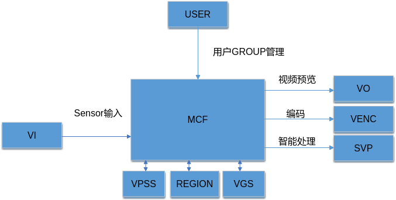
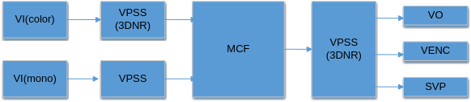
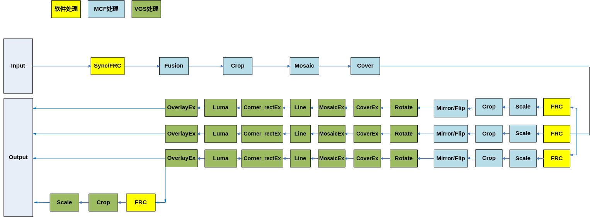

# 前言<a name="ZH-CN_TOPIC_0000002424191166"></a>

**概述<a name="section102mcpsimp"></a>**

本文为使用MCF开发的程序员而写，目的是为您在开发过程中遇到的问题提供解决办法和帮助。

> **说明：** 
>本文以SS928V100描述为例，未有特殊说明，SS927V100与SS928V100内容一致。

**产品版本<a name="section105mcpsimp"></a>**

与本文档相对应的产品版本如下。

<a name="table108mcpsimp"></a>
<table><thead align="left"><tr id="row113mcpsimp"><th class="cellrowborder" valign="top" width="32%" id="mcps1.1.3.1.1"><p id="p115mcpsimp"><a name="p115mcpsimp"></a><a name="p115mcpsimp"></a>产品名称</p>
</th>
<th class="cellrowborder" valign="top" width="68%" id="mcps1.1.3.1.2"><p id="p117mcpsimp"><a name="p117mcpsimp"></a><a name="p117mcpsimp"></a>产品版本</p>
</th>
</tr>
</thead>
<tbody><tr id="row119mcpsimp"><td class="cellrowborder" valign="top" width="32%" headers="mcps1.1.3.1.1 "><p id="p121mcpsimp"><a name="p121mcpsimp"></a><a name="p121mcpsimp"></a>SS928</p>
</td>
<td class="cellrowborder" valign="top" width="68%" headers="mcps1.1.3.1.2 "><p id="p123mcpsimp"><a name="p123mcpsimp"></a><a name="p123mcpsimp"></a>V100</p>
</td>
</tr>
<tr id="row4420516474"><td class="cellrowborder" valign="top" width="32%" headers="mcps1.1.3.1.1 "><p id="p166961419277"><a name="p166961419277"></a><a name="p166961419277"></a>SS927</p>
</td>
<td class="cellrowborder" valign="top" width="68%" headers="mcps1.1.3.1.2 "><p id="p869611191071"><a name="p869611191071"></a><a name="p869611191071"></a>V100</p>
</td>
</tr>
</tbody>
</table>

**读者对象<a name="section124mcpsimp"></a>**

本文档（本指南）主要适用于以下工程师：

-   技术支持工程师
-   软件开发工程师

**符号约定<a name="section130mcpsimp"></a>**

在本文中可能出现下列标志，它们所代表的含义如下。

<a name="table133mcpsimp"></a>
<table><thead align="left"><tr id="row138mcpsimp"><th class="cellrowborder" valign="top" width="18%" id="mcps1.1.3.1.1"><p id="p140mcpsimp"><a name="p140mcpsimp"></a><a name="p140mcpsimp"></a>符号</p>
</th>
<th class="cellrowborder" valign="top" width="82%" id="mcps1.1.3.1.2"><p id="p142mcpsimp"><a name="p142mcpsimp"></a><a name="p142mcpsimp"></a>说明</p>
</th>
</tr>
</thead>
<tbody><tr id="row144mcpsimp"><td class="cellrowborder" valign="top" width="18%" headers="mcps1.1.3.1.1 "><p class="msonormal" id="p146mcpsimp"><a name="p146mcpsimp"></a><a name="p146mcpsimp"></a><a name="image102"></a><a name="image102"></a><span></span></p>
</td>
<td class="cellrowborder" valign="top" width="82%" headers="mcps1.1.3.1.2 "><p id="p148mcpsimp"><a name="p148mcpsimp"></a><a name="p148mcpsimp"></a>表示如不避免则将会导致死亡或严重伤害的具有高等级风险的危害。</p>
</td>
</tr>
<tr id="row149mcpsimp"><td class="cellrowborder" valign="top" width="18%" headers="mcps1.1.3.1.1 "><p class="msonormal" id="p151mcpsimp"><a name="p151mcpsimp"></a><a name="p151mcpsimp"></a><a name="image103"></a><a name="image103"></a><span></span></p>
</td>
<td class="cellrowborder" valign="top" width="82%" headers="mcps1.1.3.1.2 "><p id="p153mcpsimp"><a name="p153mcpsimp"></a><a name="p153mcpsimp"></a>表示如不避免则可能导致死亡或严重伤害的具有中等级风险的危害。</p>
</td>
</tr>
<tr id="row154mcpsimp"><td class="cellrowborder" valign="top" width="18%" headers="mcps1.1.3.1.1 "><p class="msonormal" id="p156mcpsimp"><a name="p156mcpsimp"></a><a name="p156mcpsimp"></a><a name="image104"></a><a name="image104"></a><span></span></p>
</td>
<td class="cellrowborder" valign="top" width="82%" headers="mcps1.1.3.1.2 "><p id="p158mcpsimp"><a name="p158mcpsimp"></a><a name="p158mcpsimp"></a>表示如不避免则可能导致轻微或中度伤害的具有低等级风险的危害。</p>
</td>
</tr>
<tr id="row159mcpsimp"><td class="cellrowborder" valign="top" width="18%" headers="mcps1.1.3.1.1 "><p class="msonormal" id="p161mcpsimp"><a name="p161mcpsimp"></a><a name="p161mcpsimp"></a><a name="image105"></a><a name="image105"></a><span></span></p>
</td>
<td class="cellrowborder" valign="top" width="82%" headers="mcps1.1.3.1.2 "><p id="p163mcpsimp"><a name="p163mcpsimp"></a><a name="p163mcpsimp"></a>用于传递设备或环境安全警示信息。如不避免则可能会导致设备损坏、数据丢失、设备性能降低或其它不可预知的结果。</p>
<p id="p164mcpsimp"><a name="p164mcpsimp"></a><a name="p164mcpsimp"></a>“须知”不涉及人身伤害。</p>
</td>
</tr>
<tr id="row165mcpsimp"><td class="cellrowborder" valign="top" width="18%" headers="mcps1.1.3.1.1 "><p class="msonormal" id="p167mcpsimp"><a name="p167mcpsimp"></a><a name="p167mcpsimp"></a><a name="image106"></a><a name="image106"></a><span></span></p>
</td>
<td class="cellrowborder" valign="top" width="82%" headers="mcps1.1.3.1.2 "><p id="p169mcpsimp"><a name="p169mcpsimp"></a><a name="p169mcpsimp"></a>对正文中重点信息的补充说明。</p>
<p id="p170mcpsimp"><a name="p170mcpsimp"></a><a name="p170mcpsimp"></a>“说明”不是安全警示信息，不涉及人身、设备及环境伤害信息。</p>
</td>
</tr>
</tbody>
</table>

**修订记录<a name="section171mcpsimp"></a>**

修订记录累积了每次文档更新的说明。最新版本的文档包含以前所有文档版本的更新内容。

<a name="table1557726816410"></a>
<table><thead align="left"><tr id="row2942532716410"><th class="cellrowborder" valign="top" width="20.72%" id="mcps1.1.4.1.1"><p id="p3778275416410"><a name="p3778275416410"></a><a name="p3778275416410"></a><strong id="b5687322716410"><a name="b5687322716410"></a><a name="b5687322716410"></a>文档版本</strong></p>
</th>
<th class="cellrowborder" valign="top" width="26.119999999999997%" id="mcps1.1.4.1.2"><p id="p5627845516410"><a name="p5627845516410"></a><a name="p5627845516410"></a><strong id="b5800814916410"><a name="b5800814916410"></a><a name="b5800814916410"></a>发布日期</strong></p>
</th>
<th class="cellrowborder" valign="top" width="53.16%" id="mcps1.1.4.1.3"><p id="p2382284816410"><a name="p2382284816410"></a><a name="p2382284816410"></a><strong id="b3316380216410"><a name="b3316380216410"></a><a name="b3316380216410"></a>修改说明</strong></p>
</th>
</tr>
</thead>
<tbody><tr id="row5947359616410"><td class="cellrowborder" valign="top" width="20.72%" headers="mcps1.1.4.1.1 "><p id="p2149706016410"><a name="p2149706016410"></a><a name="p2149706016410"></a>00B01</p>
</td>
<td class="cellrowborder" valign="top" width="26.119999999999997%" headers="mcps1.1.4.1.2 "><p id="p648803616410"><a name="p648803616410"></a><a name="p648803616410"></a>2025-09-15</p>
</td>
<td class="cellrowborder" valign="top" width="53.16%" headers="mcps1.1.4.1.3 "><p id="p1946537916410"><a name="p1946537916410"></a><a name="p1946537916410"></a>第1次临时版本发布。</p>
</td>
</tr>
</tbody>
</table>

# 概述<a name="ZH-CN_TOPIC_0000002457869869"></a>

在低照度场景下，RGB Sensor捕获的图像往往信噪比非常差，细节丢失严重。基于RGB + Mono双Sensor的新型结构，RGB Sensor获取的可见光图像充分保留了颜色信息，而Mono Sensor配合红外补光技术，获取的红外图像有相对较高的信噪比，且细节表现较好。

黑白彩色双路融合技术（简称MCF技术，即Mono-Color-Fusion技术）用于融合上述可见光图像和红外图像，既保留颜色信息，同时充分提升图像的细节表现和信噪比，从而提高低照度场景下的图像质量。

# 功能描述<a name="ZH-CN_TOPIC_0000002457829777"></a>


## 基本概念<a name="ZH-CN_TOPIC_0000002424350954"></a>

-   MCF

    MCF为Mono-Color-Fusion的简称，即黑白彩色融合技术。

-   GROUP

    MCF对用户提供组（GROUP）的概念。最大可用数为[OT\_MCF\_MAX\_GRP\_NUM](#ZH-CN_TOPIC_0000002424191118)个，各GROUP分时复用MCF硬件。每个MCF GROUP包含多个PIPE和多个通道。

-   PIPE

    MCF组的PIPE。用于输入黑白彩色双路源图像。PIPE的数目即融合路数，为[OT\_MCF\_PIPE\_NUM](#ZH-CN_TOPIC_0000002424350958)。用户可以通过系统绑定和前端相连或者发送图像到PIPE中融合处理。

-   CHN

    MCF组的通道。通道分为2种：物理通道和扩展通道。MCF硬件提供多个物理通道，每个通道具有缩放、裁剪等功能。扩展通道具备裁剪、缩放功能，它通过绑定物理通道，将物理通道输出作为自己的输入，把图像裁剪、缩放成用户设置的目标分辨率输出。

-   FRC

    帧率控制，分为2种：组帧率控制和通道帧率控制。

    -   组帧率控制：用于控制各GROUP对输入图像的接收。
    -   通道帧率控制：用于控制各个物理通道和扩展通道图像的处理。

-   CROP

    裁剪，分为3种：组裁剪、物理通道裁剪以及扩展通道裁剪。

    -   组裁剪，MCF对输入图像进行裁剪。
    -   物理通道裁剪，MCF对各个物理通道的输出图像进行裁剪。
    -   扩展通道裁剪，MCF调用VGS对扩展通道的输出图像进行裁剪。

-   Scale

    缩放，对图像进行缩小放大。缩放倍数指水平、垂直各缩放多少倍。

-   Mirror/Flip

    Mirror即水平镜像，Flip即上下翻转。可使用Mirror+Flip实现180°旋转。

-   Mosaic

    马赛克，对MCF输出图像在指定区域填充马赛克块。

-   MosaicEx

    马赛克，调用VGS对MCF物理通道的输出图像指定区域填充马赛克块。

-   Cover

    视频遮挡区域，对MCF的输出图像填充纯色块。

    遮挡区域坐标类型分为绝对坐标遮挡和相对坐标比例遮挡。

-   Coverex

    视频遮挡区域，调用VGS对MCF通道的输出图像填充纯色块。

    遮挡区域坐标类型分为绝对坐标遮挡和相对坐标比例遮挡。相对坐标的计算是相对原图，不是通道图像，效果与Cover相对坐标等同。

-   OverlayEx

    视频叠加区域，调用VGS对MCF通道的输出图像叠加位图。

-   Line

    调用VGS对MCF物理通道的输出图像画线。

-   压缩

    MCF支持linear格式的SEG压缩。

-   解压

    MCF支持linear格式-SEG解压。

-   低延时

    输出低延时，通道向后端模块发送低延时帧，MCF支持VI开启低延时。

## 功能描述<a name="ZH-CN_TOPIC_0000002457829765"></a>

MCF在系统中位置如[图1](#fig1392120333319)所示。

**图 1**  MCF上下文关系<a name="fig1392120333319"></a>  


通过调用SYS模块的绑定接口，可与VI和VO/VENC/SVP等模块进行绑定，其中前者为MCF的输入源，后者为MCF的接收者。用户可通过MPI接口对GROUP进行管理。


### 处理流程<a name="ZH-CN_TOPIC_0000002457869857"></a>

**图 1**  MCF场景数据流图<a name="fig14625115315323"></a>  


> **说明：** 
>-   图示仅说明数据流关系图，不是绑定关系图。
>-   MCF前面的2个VPSS，用作MCF预处理。在VPSS性能不够时，可以设置VPSS组号为VGS组，使用VGS做预处理。
>-   MCF融合时，需要2帧数据pts接近。推荐使用从模式sensor。
>-   MCF融合场景，VI和VPSS必须离线。

**图 2**  MCF内部处理流程图<a name="fig12877101218348"></a>  


> **说明：** 
>SS928V100 MCF支持8个扩展通道，图中仅画一个。扩展通道可以绑定到任意物理通道，图中仅示意性绑定到一个物理通道。

### 输入输出特性<a name="ZH-CN_TOPIC_0000002457829757"></a>

-   输入像素格式仅包含OT\_PIXEL\_FORMAT\_YVU\_SEMIPLANAR\_420、OT\_PIXEL\_FORMAT\_YUV\_400和OT\_PIXEL\_FORMAT\_YUV\_SEMIPLANAR\_420。
-   输出像素格式仅OT\_PIXEL\_FORMAT\_YVU\_SEMIPLANAR\_422、OT\_PIXEL\_FORMAT\_YVU\_SEMIPLANAR\_420、OT\_PIXEL\_FORMAT\_YUV\_400、OT\_PIXEL\_FORMAT\_YUV\_SEMIPLANAR\_422和OT\_PIXEL\_FORMAT\_YUV\_SEMIPLANAR\_420。

**表 1**  MCF输入特性

<a name="table292mcpsimp"></a>
<table><thead align="left"><tr id="row301mcpsimp"><th class="cellrowborder" rowspan="2" valign="top" id="mcps1.2.6.1.1"><p id="p303mcpsimp"><a name="p303mcpsimp"></a><a name="p303mcpsimp"></a>方案</p>
</th>
<th class="cellrowborder" valign="top" id="mcps1.2.6.1.2"><p id="p305mcpsimp"><a name="p305mcpsimp"></a><a name="p305mcpsimp"></a>数据位宽</p>
</th>
<th class="cellrowborder" colspan="2" valign="top" id="mcps1.2.6.1.3"><p id="p307mcpsimp"><a name="p307mcpsimp"></a><a name="p307mcpsimp"></a>视频格式</p>
</th>
<th class="cellrowborder" rowspan="2" valign="top" id="mcps1.2.6.1.4"><p id="p309mcpsimp"><a name="p309mcpsimp"></a><a name="p309mcpsimp"></a>输入像素格式</p>
</th>
</tr>
<tr id="row310mcpsimp"><th class="cellrowborder" valign="top" id="mcps1.2.6.2.1"><p id="p312mcpsimp"><a name="p312mcpsimp"></a><a name="p312mcpsimp"></a>8Bit</p>
</th>
<th class="cellrowborder" valign="top" id="mcps1.2.6.2.2"><p id="p314mcpsimp"><a name="p314mcpsimp"></a><a name="p314mcpsimp"></a>Linear</p>
</th>
<th class="cellrowborder" valign="top" id="mcps1.2.6.2.3"><p id="p316mcpsimp"><a name="p316mcpsimp"></a><a name="p316mcpsimp"></a>Tile64X16</p>
</th>
</tr>
</thead>
<tbody><tr id="row318mcpsimp"><td class="cellrowborder" valign="top" width="19%" headers="mcps1.2.6.1.1 mcps1.2.6.2.1 "><p id="p320mcpsimp"><a name="p320mcpsimp"></a><a name="p320mcpsimp"></a>SS928V100</p>
</td>
<td class="cellrowborder" valign="top" width="12%" headers="mcps1.2.6.1.2 mcps1.2.6.2.2 "><p id="p322mcpsimp"><a name="p322mcpsimp"></a><a name="p322mcpsimp"></a>Y</p>
</td>
<td class="cellrowborder" valign="top" width="9%" headers="mcps1.2.6.1.3 mcps1.2.6.2.3 "><p id="p324mcpsimp"><a name="p324mcpsimp"></a><a name="p324mcpsimp"></a>Y</p>
</td>
<td class="cellrowborder" valign="top" width="13%" headers="mcps1.2.6.1.3 "><p id="p326mcpsimp"><a name="p326mcpsimp"></a><a name="p326mcpsimp"></a>N</p>
</td>
<td class="cellrowborder" valign="top" width="47%" headers="mcps1.2.6.1.4 "><p id="p328mcpsimp"><a name="p328mcpsimp"></a><a name="p328mcpsimp"></a>OT_PIXEL_FORMAT_YVU_SEMIPLANAR_420、OT_PIXEL_FORMAT_YUV_SEMIPLANAR_420、OT_PIXEL_FORMAT_YUV_400</p>
</td>
</tr>
</tbody>
</table>

**表 2**  MCF输入解压特性

<a name="table329mcpsimp"></a>
<table><thead align="left"><tr id="row337mcpsimp"><th class="cellrowborder" rowspan="2" valign="top" id="mcps1.2.5.1.1"><p id="p339mcpsimp"><a name="p339mcpsimp"></a><a name="p339mcpsimp"></a>方案</p>
</th>
<th class="cellrowborder" colspan="3" valign="top" id="mcps1.2.5.1.2"><p id="p341mcpsimp"><a name="p341mcpsimp"></a><a name="p341mcpsimp"></a>解压缩模式</p>
</th>
</tr>
<tr id="row342mcpsimp"><th class="cellrowborder" valign="top" id="mcps1.2.5.2.1"><p id="p344mcpsimp"><a name="p344mcpsimp"></a><a name="p344mcpsimp"></a>SEG</p>
</th>
<th class="cellrowborder" valign="top" id="mcps1.2.5.2.2"><p id="p346mcpsimp"><a name="p346mcpsimp"></a><a name="p346mcpsimp"></a>SEG_COMPACT</p>
</th>
<th class="cellrowborder" valign="top" id="mcps1.2.5.2.3"><p id="p348mcpsimp"><a name="p348mcpsimp"></a><a name="p348mcpsimp"></a>TILE</p>
</th>
</tr>
</thead>
<tbody><tr id="row350mcpsimp"><td class="cellrowborder" valign="top" width="30.693069306930692%" headers="mcps1.2.5.1.1 mcps1.2.5.2.1 "><p id="p352mcpsimp"><a name="p352mcpsimp"></a><a name="p352mcpsimp"></a>SS928V100</p>
</td>
<td class="cellrowborder" valign="top" width="16.831683168316832%" headers="mcps1.2.5.1.2 mcps1.2.5.2.2 "><p id="p354mcpsimp"><a name="p354mcpsimp"></a><a name="p354mcpsimp"></a>Y</p>
</td>
<td class="cellrowborder" valign="top" width="22.772277227722775%" headers="mcps1.2.5.1.2 mcps1.2.5.2.3 "><p id="p356mcpsimp"><a name="p356mcpsimp"></a><a name="p356mcpsimp"></a>Y</p>
</td>
<td class="cellrowborder" valign="top" width="29.7029702970297%" headers="mcps1.2.5.1.2 "><p id="p358mcpsimp"><a name="p358mcpsimp"></a><a name="p358mcpsimp"></a>N</p>
</td>
</tr>
</tbody>
</table>

**表 3**  MCF输入分辨率

<a name="table359mcpsimp"></a>
<table><thead align="left"><tr id="row365mcpsimp"><th class="cellrowborder" valign="top" width="18%" id="mcps1.2.3.1.1"><p id="p367mcpsimp"><a name="p367mcpsimp"></a><a name="p367mcpsimp"></a>方案</p>
</th>
<th class="cellrowborder" valign="top" width="82%" id="mcps1.2.3.1.2"><p id="p369mcpsimp"><a name="p369mcpsimp"></a><a name="p369mcpsimp"></a>分辨率</p>
</th>
</tr>
</thead>
<tbody><tr id="row371mcpsimp"><td class="cellrowborder" valign="top" width="18%" headers="mcps1.2.3.1.1 "><p id="p373mcpsimp"><a name="p373mcpsimp"></a><a name="p373mcpsimp"></a>SS928V100</p>
</td>
<td class="cellrowborder" valign="top" width="82%" headers="mcps1.2.3.1.2 "><p id="p375mcpsimp"><a name="p375mcpsimp"></a><a name="p375mcpsimp"></a>宽[256, 8192]</p>
<p id="p376mcpsimp"><a name="p376mcpsimp"></a><a name="p376mcpsimp"></a>高[256, 4096]</p>
<p id="p377mcpsimp"><a name="p377mcpsimp"></a><a name="p377mcpsimp"></a>紧凑段压缩(SEG_COMPACT)：</p>
<p id="p378mcpsimp"><a name="p378mcpsimp"></a><a name="p378mcpsimp"></a>宽[256, 4096]</p>
<p id="p379mcpsimp"><a name="p379mcpsimp"></a><a name="p379mcpsimp"></a>高[256, 4096]</p>
</td>
</tr>
</tbody>
</table>

**表 4**  MCF物理通道输出格式特性

<a name="table380mcpsimp"></a>
<table><thead align="left"><tr id="row390mcpsimp"><th class="cellrowborder" rowspan="2" valign="top" id="mcps1.2.7.1.1"><p id="p392mcpsimp"><a name="p392mcpsimp"></a><a name="p392mcpsimp"></a>方案</p>
</th>
<th class="cellrowborder" valign="top" id="mcps1.2.7.1.2"><p id="p394mcpsimp"><a name="p394mcpsimp"></a><a name="p394mcpsimp"></a>数据位宽</p>
</th>
<th class="cellrowborder" colspan="3" valign="top" id="mcps1.2.7.1.3"><p id="p396mcpsimp"><a name="p396mcpsimp"></a><a name="p396mcpsimp"></a>视频格式</p>
</th>
<th class="cellrowborder" rowspan="2" valign="top" id="mcps1.2.7.1.4"><p id="p398mcpsimp"><a name="p398mcpsimp"></a><a name="p398mcpsimp"></a>输出像素格式</p>
</th>
</tr>
<tr id="row399mcpsimp"><th class="cellrowborder" valign="top" id="mcps1.2.7.2.1"><p id="p401mcpsimp"><a name="p401mcpsimp"></a><a name="p401mcpsimp"></a>8Bit</p>
</th>
<th class="cellrowborder" valign="top" id="mcps1.2.7.2.2"><p id="p403mcpsimp"><a name="p403mcpsimp"></a><a name="p403mcpsimp"></a>Linear</p>
</th>
<th class="cellrowborder" valign="top" id="mcps1.2.7.2.3"><p id="p405mcpsimp"><a name="p405mcpsimp"></a><a name="p405mcpsimp"></a>Tile64x16</p>
</th>
<th class="cellrowborder" valign="top" id="mcps1.2.7.2.4"><p id="p407mcpsimp"><a name="p407mcpsimp"></a><a name="p407mcpsimp"></a>Tile16x8</p>
</th>
</tr>
</thead>
<tbody><tr id="row409mcpsimp"><td class="cellrowborder" valign="top" width="12.000000000000002%" headers="mcps1.2.7.1.1 mcps1.2.7.2.1 "><p id="p411mcpsimp"><a name="p411mcpsimp"></a><a name="p411mcpsimp"></a>SS928V100</p>
</td>
<td class="cellrowborder" valign="top" width="12.000000000000002%" headers="mcps1.2.7.1.2 mcps1.2.7.2.2 "><p id="p413mcpsimp"><a name="p413mcpsimp"></a><a name="p413mcpsimp"></a>Y</p>
</td>
<td class="cellrowborder" valign="top" width="9.000000000000002%" headers="mcps1.2.7.1.3 mcps1.2.7.2.3 "><p id="p415mcpsimp"><a name="p415mcpsimp"></a><a name="p415mcpsimp"></a>Y</p>
</td>
<td class="cellrowborder" valign="top" width="9.000000000000002%" headers="mcps1.2.7.1.3 mcps1.2.7.2.4 "><p id="p417mcpsimp"><a name="p417mcpsimp"></a><a name="p417mcpsimp"></a>N</p>
</td>
<td class="cellrowborder" valign="top" width="11.000000000000002%" headers="mcps1.2.7.1.3 "><p id="p419mcpsimp"><a name="p419mcpsimp"></a><a name="p419mcpsimp"></a>N</p>
</td>
<td class="cellrowborder" valign="top" width="47%" headers="mcps1.2.7.1.4 "><p id="p421mcpsimp"><a name="p421mcpsimp"></a><a name="p421mcpsimp"></a>OT_PIXEL_FORMAT_YVU_SEMIPLANAR_422、OT_PIXEL_FORMAT_YVU_SEMIPLANAR_420、OT_PIXEL_FORMAT_YUV_SEMIPLANAR_422、OT_PIXEL_FORMAT_YUV_SEMIPLANAR_420、OT_PIXEL_FORMAT_YUV_400</p>
</td>
</tr>
</tbody>
</table>

**表 5**  MCF物理通道输出压缩特性

<a name="table422mcpsimp"></a>
<table><thead align="left"><tr id="row431mcpsimp"><th class="cellrowborder" rowspan="2" valign="top" id="mcps1.2.6.1.1"><p id="p433mcpsimp"><a name="p433mcpsimp"></a><a name="p433mcpsimp"></a>方案</p>
</th>
<th class="cellrowborder" colspan="4" valign="top" id="mcps1.2.6.1.2"><p id="p435mcpsimp"><a name="p435mcpsimp"></a><a name="p435mcpsimp"></a>压缩输出模式</p>
</th>
</tr>
<tr id="row436mcpsimp"><th class="cellrowborder" valign="top" id="mcps1.2.6.2.1"><p id="p438mcpsimp"><a name="p438mcpsimp"></a><a name="p438mcpsimp"></a>SEG</p>
</th>
<th class="cellrowborder" valign="top" id="mcps1.2.6.2.2"><p id="p440mcpsimp"><a name="p440mcpsimp"></a><a name="p440mcpsimp"></a>SEG_COMPACT</p>
</th>
<th class="cellrowborder" valign="top" id="mcps1.2.6.2.3"><p id="p442mcpsimp"><a name="p442mcpsimp"></a><a name="p442mcpsimp"></a>LINE</p>
</th>
<th class="cellrowborder" valign="top" id="mcps1.2.6.2.4"><p id="p444mcpsimp"><a name="p444mcpsimp"></a><a name="p444mcpsimp"></a>TILE</p>
</th>
</tr>
</thead>
<tbody><tr id="row446mcpsimp"><td class="cellrowborder" valign="top" width="17.82178217821782%" headers="mcps1.2.6.1.1 mcps1.2.6.2.1 "><p id="p448mcpsimp"><a name="p448mcpsimp"></a><a name="p448mcpsimp"></a>SS928V100</p>
</td>
<td class="cellrowborder" valign="top" width="17.82178217821782%" headers="mcps1.2.6.1.2 mcps1.2.6.2.2 "><p id="p450mcpsimp"><a name="p450mcpsimp"></a><a name="p450mcpsimp"></a>仅通道0支持</p>
</td>
<td class="cellrowborder" valign="top" width="21.782178217821784%" headers="mcps1.2.6.1.2 mcps1.2.6.2.3 "><p id="p452mcpsimp"><a name="p452mcpsimp"></a><a name="p452mcpsimp"></a>仅通道0支持</p>
</td>
<td class="cellrowborder" valign="top" width="20.792079207920793%" headers="mcps1.2.6.1.2 mcps1.2.6.2.4 "><p id="p454mcpsimp"><a name="p454mcpsimp"></a><a name="p454mcpsimp"></a>不支持</p>
</td>
<td class="cellrowborder" valign="top" width="21.782178217821784%" headers="mcps1.2.6.1.2 "><p id="p456mcpsimp"><a name="p456mcpsimp"></a><a name="p456mcpsimp"></a>不支持</p>
</td>
</tr>
</tbody>
</table>

**表 6**  MCF物理通道输出分辨率

<a name="table457mcpsimp"></a>
<table><thead align="left"><tr id="row463mcpsimp"><th class="cellrowborder" valign="top" width="18%" id="mcps1.2.3.1.1"><p id="p465mcpsimp"><a name="p465mcpsimp"></a><a name="p465mcpsimp"></a>方案</p>
</th>
<th class="cellrowborder" valign="top" width="82%" id="mcps1.2.3.1.2"><p id="p467mcpsimp"><a name="p467mcpsimp"></a><a name="p467mcpsimp"></a>分辨率</p>
</th>
</tr>
</thead>
<tbody><tr id="row469mcpsimp"><td class="cellrowborder" valign="top" width="18%" headers="mcps1.2.3.1.1 "><p id="p471mcpsimp"><a name="p471mcpsimp"></a><a name="p471mcpsimp"></a>SS928V100</p>
</td>
<td class="cellrowborder" valign="top" width="82%" headers="mcps1.2.3.1.2 "><p id="p473mcpsimp"><a name="p473mcpsimp"></a><a name="p473mcpsimp"></a>宽[128, 16384]</p>
<p id="p474mcpsimp"><a name="p474mcpsimp"></a><a name="p474mcpsimp"></a>高[64, 8192]</p>
</td>
</tr>
</tbody>
</table>

**表 7**  MCF物理通道压缩输出时功能限制

<a name="table475mcpsimp"></a>
<table><thead align="left"><tr id="row485mcpsimp"><th class="cellrowborder" rowspan="2" valign="top" id="mcps1.2.7.1.1"><p id="p487mcpsimp"><a name="p487mcpsimp"></a><a name="p487mcpsimp"></a>压缩类型</p>
</th>
<th class="cellrowborder" colspan="5" valign="top" id="mcps1.2.7.1.2"><p id="p489mcpsimp"><a name="p489mcpsimp"></a><a name="p489mcpsimp"></a>功能</p>
</th>
</tr>
<tr id="row490mcpsimp"><th class="cellrowborder" valign="top" id="mcps1.2.7.2.1"><p id="p492mcpsimp"><a name="p492mcpsimp"></a><a name="p492mcpsimp"></a>Coverex/Mosaicex/Overlayex/Corner_rectEx</p>
</th>
<th class="cellrowborder" valign="top" id="mcps1.2.7.2.2"><p id="p494mcpsimp"><a name="p494mcpsimp"></a><a name="p494mcpsimp"></a>Line</p>
</th>
<th class="cellrowborder" valign="top" id="mcps1.2.7.2.3"><p id="p496mcpsimp"><a name="p496mcpsimp"></a><a name="p496mcpsimp"></a>Mirror/Flip</p>
</th>
<th class="cellrowborder" valign="top" id="mcps1.2.7.2.4"><p id="p498mcpsimp"><a name="p498mcpsimp"></a><a name="p498mcpsimp"></a>旋转(90,270)</p>
</th>
<th class="cellrowborder" valign="top" id="mcps1.2.7.2.5"><p id="p500mcpsimp"><a name="p500mcpsimp"></a><a name="p500mcpsimp"></a>亮度和统计</p>
</th>
</tr>
</thead>
<tbody><tr id="row502mcpsimp"><td class="cellrowborder" valign="top" width="20.58794120587941%" headers="mcps1.2.7.1.1 mcps1.2.7.2.1 "><p id="p504mcpsimp"><a name="p504mcpsimp"></a><a name="p504mcpsimp"></a>紧凑段压缩(SEG_COMPACT)</p>
</td>
<td class="cellrowborder" valign="top" width="18.468153184681533%" headers="mcps1.2.7.1.2 mcps1.2.7.2.2 "><p id="p506mcpsimp"><a name="p506mcpsimp"></a><a name="p506mcpsimp"></a>不支持</p>
</td>
<td class="cellrowborder" valign="top" width="7.9992000799920016%" headers="mcps1.2.7.1.2 mcps1.2.7.2.3 "><p id="p508mcpsimp"><a name="p508mcpsimp"></a><a name="p508mcpsimp"></a>不支持</p>
</td>
<td class="cellrowborder" valign="top" width="14.708529147085292%" headers="mcps1.2.7.1.2 mcps1.2.7.2.4 "><p id="p510mcpsimp"><a name="p510mcpsimp"></a><a name="p510mcpsimp"></a>支持</p>
</td>
<td class="cellrowborder" valign="top" width="17.648235176482352%" headers="mcps1.2.7.1.2 mcps1.2.7.2.5 "><p id="p512mcpsimp"><a name="p512mcpsimp"></a><a name="p512mcpsimp"></a>不支持</p>
</td>
<td class="cellrowborder" valign="top" width="20.58794120587941%" headers="mcps1.2.7.1.2 "><p id="p514mcpsimp"><a name="p514mcpsimp"></a><a name="p514mcpsimp"></a>支持</p>
</td>
</tr>
<tr id="row515mcpsimp"><td class="cellrowborder" valign="top" width="20.58794120587941%" headers="mcps1.2.7.1.1 mcps1.2.7.2.1 "><p id="p517mcpsimp"><a name="p517mcpsimp"></a><a name="p517mcpsimp"></a>非紧凑段压缩(SEG)</p>
</td>
<td class="cellrowborder" valign="top" width="18.468153184681533%" headers="mcps1.2.7.1.2 mcps1.2.7.2.2 "><p id="p519mcpsimp"><a name="p519mcpsimp"></a><a name="p519mcpsimp"></a>支持</p>
</td>
<td class="cellrowborder" valign="top" width="7.9992000799920016%" headers="mcps1.2.7.1.2 mcps1.2.7.2.3 "><p id="p521mcpsimp"><a name="p521mcpsimp"></a><a name="p521mcpsimp"></a>支持</p>
</td>
<td class="cellrowborder" valign="top" width="14.708529147085292%" headers="mcps1.2.7.1.2 mcps1.2.7.2.4 "><p id="p523mcpsimp"><a name="p523mcpsimp"></a><a name="p523mcpsimp"></a>支持</p>
</td>
<td class="cellrowborder" valign="top" width="17.648235176482352%" headers="mcps1.2.7.1.2 mcps1.2.7.2.5 "><p id="p525mcpsimp"><a name="p525mcpsimp"></a><a name="p525mcpsimp"></a>不支持</p>
</td>
<td class="cellrowborder" valign="top" width="20.58794120587941%" headers="mcps1.2.7.1.2 "><p id="p527mcpsimp"><a name="p527mcpsimp"></a><a name="p527mcpsimp"></a>支持</p>
</td>
</tr>
<tr id="row528mcpsimp"><td class="cellrowborder" valign="top" width="20.58794120587941%" headers="mcps1.2.7.1.1 mcps1.2.7.2.1 "><p id="p530mcpsimp"><a name="p530mcpsimp"></a><a name="p530mcpsimp"></a>TILE压缩</p>
</td>
<td class="cellrowborder" valign="top" width="18.468153184681533%" headers="mcps1.2.7.1.2 mcps1.2.7.2.2 "><p id="p532mcpsimp"><a name="p532mcpsimp"></a><a name="p532mcpsimp"></a>不支持</p>
</td>
<td class="cellrowborder" valign="top" width="7.9992000799920016%" headers="mcps1.2.7.1.2 mcps1.2.7.2.3 "><p id="p534mcpsimp"><a name="p534mcpsimp"></a><a name="p534mcpsimp"></a>不支持</p>
</td>
<td class="cellrowborder" valign="top" width="14.708529147085292%" headers="mcps1.2.7.1.2 mcps1.2.7.2.4 "><p id="p536mcpsimp"><a name="p536mcpsimp"></a><a name="p536mcpsimp"></a>不支持</p>
</td>
<td class="cellrowborder" valign="top" width="17.648235176482352%" headers="mcps1.2.7.1.2 mcps1.2.7.2.5 "><p id="p538mcpsimp"><a name="p538mcpsimp"></a><a name="p538mcpsimp"></a>不支持</p>
</td>
<td class="cellrowborder" valign="top" width="20.58794120587941%" headers="mcps1.2.7.1.2 "><p id="p540mcpsimp"><a name="p540mcpsimp"></a><a name="p540mcpsimp"></a>不支持</p>
</td>
</tr>
</tbody>
</table>

**表 8**  MCF扩展通道输出格式特性

<a name="table541mcpsimp"></a>
<table><thead align="left"><tr id="row552mcpsimp"><th class="cellrowborder" rowspan="2" valign="top" id="mcps1.2.8.1.1"><p id="p554mcpsimp"><a name="p554mcpsimp"></a><a name="p554mcpsimp"></a>方案</p>
</th>
<th class="cellrowborder" colspan="2" valign="top" id="mcps1.2.8.1.2"><p id="p556mcpsimp"><a name="p556mcpsimp"></a><a name="p556mcpsimp"></a>数据位宽</p>
</th>
<th class="cellrowborder" colspan="3" valign="top" id="mcps1.2.8.1.3"><p id="p558mcpsimp"><a name="p558mcpsimp"></a><a name="p558mcpsimp"></a>视频格式</p>
</th>
<th class="cellrowborder" rowspan="2" valign="top" id="mcps1.2.8.1.4"><p id="p560mcpsimp"><a name="p560mcpsimp"></a><a name="p560mcpsimp"></a>输出像素格式</p>
</th>
</tr>
<tr id="row561mcpsimp"><th class="cellrowborder" valign="top" id="mcps1.2.8.2.1"><p id="p563mcpsimp"><a name="p563mcpsimp"></a><a name="p563mcpsimp"></a>8Bit</p>
</th>
<th class="cellrowborder" valign="top" id="mcps1.2.8.2.2"><p id="p565mcpsimp"><a name="p565mcpsimp"></a><a name="p565mcpsimp"></a>10Bit</p>
</th>
<th class="cellrowborder" valign="top" id="mcps1.2.8.2.3"><p id="p567mcpsimp"><a name="p567mcpsimp"></a><a name="p567mcpsimp"></a>Linear</p>
</th>
<th class="cellrowborder" valign="top" id="mcps1.2.8.2.4"><p id="p569mcpsimp"><a name="p569mcpsimp"></a><a name="p569mcpsimp"></a>Tile64x16</p>
</th>
<th class="cellrowborder" valign="top" id="mcps1.2.8.2.5"><p id="p571mcpsimp"><a name="p571mcpsimp"></a><a name="p571mcpsimp"></a>Tile16x8</p>
</th>
</tr>
</thead>
<tbody><tr id="row573mcpsimp"><td class="cellrowborder" valign="top" width="15%" headers="mcps1.2.8.1.1 mcps1.2.8.2.1 "><p xml:lang="fr-FR" id="p575mcpsimp"><a name="p575mcpsimp"></a><a name="p575mcpsimp"></a>SS928V100</p>
</td>
<td class="cellrowborder" valign="top" width="7.000000000000001%" headers="mcps1.2.8.1.2 mcps1.2.8.2.2 "><p id="p577mcpsimp"><a name="p577mcpsimp"></a><a name="p577mcpsimp"></a>Y</p>
</td>
<td class="cellrowborder" valign="top" width="7.000000000000001%" headers="mcps1.2.8.1.2 mcps1.2.8.2.3 "><p id="p579mcpsimp"><a name="p579mcpsimp"></a><a name="p579mcpsimp"></a>N</p>
</td>
<td class="cellrowborder" valign="top" width="8%" headers="mcps1.2.8.1.3 mcps1.2.8.2.4 "><p id="p581mcpsimp"><a name="p581mcpsimp"></a><a name="p581mcpsimp"></a>Y</p>
</td>
<td class="cellrowborder" valign="top" width="8%" headers="mcps1.2.8.1.3 mcps1.2.8.2.5 "><p id="p583mcpsimp"><a name="p583mcpsimp"></a><a name="p583mcpsimp"></a>N</p>
</td>
<td class="cellrowborder" valign="top" width="7.000000000000001%" headers="mcps1.2.8.1.3 "><p id="p585mcpsimp"><a name="p585mcpsimp"></a><a name="p585mcpsimp"></a>N</p>
</td>
<td class="cellrowborder" valign="top" width="48%" headers="mcps1.2.8.1.4 "><p id="p587mcpsimp"><a name="p587mcpsimp"></a><a name="p587mcpsimp"></a>OT_PIXEL_FORMAT_YVU_SEMIPLANAR_422、OT_PIXEL_FORMAT_YVU_SEMIPLANAR_420、OT_PIXEL_FORMAT_YUV_SEMIPLANAR_422、OT_PIXEL_FORMAT_YUV_SEMIPLANAR_420、OT_PIXEL_FORMAT_YUV_400</p>
</td>
</tr>
</tbody>
</table>

**表 9**  MCF扩展通道输出压缩特性

<a name="table588mcpsimp"></a>
<table><thead align="left"><tr id="row597mcpsimp"><th class="cellrowborder" rowspan="2" valign="top" id="mcps1.2.6.1.1"><p id="p599mcpsimp"><a name="p599mcpsimp"></a><a name="p599mcpsimp"></a>方案</p>
</th>
<th class="cellrowborder" colspan="4" valign="top" id="mcps1.2.6.1.2"><p id="p601mcpsimp"><a name="p601mcpsimp"></a><a name="p601mcpsimp"></a>压缩输出模式</p>
</th>
</tr>
<tr id="row602mcpsimp"><th class="cellrowborder" valign="top" id="mcps1.2.6.2.1"><p id="p604mcpsimp"><a name="p604mcpsimp"></a><a name="p604mcpsimp"></a>SEG</p>
</th>
<th class="cellrowborder" valign="top" id="mcps1.2.6.2.2"><p id="p606mcpsimp"><a name="p606mcpsimp"></a><a name="p606mcpsimp"></a>SEG_COMPACT</p>
</th>
<th class="cellrowborder" valign="top" id="mcps1.2.6.2.3"><p id="p608mcpsimp"><a name="p608mcpsimp"></a><a name="p608mcpsimp"></a>LINE</p>
</th>
<th class="cellrowborder" valign="top" id="mcps1.2.6.2.4"><p id="p610mcpsimp"><a name="p610mcpsimp"></a><a name="p610mcpsimp"></a>TILE</p>
</th>
</tr>
</thead>
<tbody><tr id="row612mcpsimp"><td class="cellrowborder" valign="top" width="17.82178217821782%" headers="mcps1.2.6.1.1 mcps1.2.6.2.1 "><p xml:lang="fr-FR" id="p614mcpsimp"><a name="p614mcpsimp"></a><a name="p614mcpsimp"></a>SS928V100</p>
</td>
<td class="cellrowborder" valign="top" width="17.82178217821782%" headers="mcps1.2.6.1.2 mcps1.2.6.2.2 "><p id="p616mcpsimp"><a name="p616mcpsimp"></a><a name="p616mcpsimp"></a>支持</p>
</td>
<td class="cellrowborder" valign="top" width="21.782178217821784%" headers="mcps1.2.6.1.2 mcps1.2.6.2.3 "><p id="p618mcpsimp"><a name="p618mcpsimp"></a><a name="p618mcpsimp"></a>支持</p>
</td>
<td class="cellrowborder" valign="top" width="20.792079207920793%" headers="mcps1.2.6.1.2 mcps1.2.6.2.4 "><p id="p620mcpsimp"><a name="p620mcpsimp"></a><a name="p620mcpsimp"></a>不支持</p>
</td>
<td class="cellrowborder" valign="top" width="21.782178217821784%" headers="mcps1.2.6.1.2 "><p id="p622mcpsimp"><a name="p622mcpsimp"></a><a name="p622mcpsimp"></a><span xml:lang="fr-FR" id="ph623mcpsimp"><a name="ph623mcpsimp"></a><a name="ph623mcpsimp"></a>不</span>支持</p>
</td>
</tr>
</tbody>
</table>

**表 10**  MCF扩展通道输出分辨率

<a name="table624mcpsimp"></a>
<table><thead align="left"><tr id="row630mcpsimp"><th class="cellrowborder" valign="top" width="22%" id="mcps1.2.3.1.1"><p id="p632mcpsimp"><a name="p632mcpsimp"></a><a name="p632mcpsimp"></a>方案</p>
</th>
<th class="cellrowborder" valign="top" width="78%" id="mcps1.2.3.1.2"><p id="p634mcpsimp"><a name="p634mcpsimp"></a><a name="p634mcpsimp"></a>分辨率</p>
</th>
</tr>
</thead>
<tbody><tr id="row636mcpsimp"><td class="cellrowborder" valign="top" width="22%" headers="mcps1.2.3.1.1 "><p xml:lang="fr-FR" id="p638mcpsimp"><a name="p638mcpsimp"></a><a name="p638mcpsimp"></a>SS928V100</p>
</td>
<td class="cellrowborder" valign="top" width="78%" headers="mcps1.2.3.1.2 "><p id="p640mcpsimp"><a name="p640mcpsimp"></a><a name="p640mcpsimp"></a>宽[64, 16384]</p>
<p id="p641mcpsimp"><a name="p641mcpsimp"></a><a name="p641mcpsimp"></a>高[64, 8192]</p>
</td>
</tr>
</tbody>
</table>

> **须知：** 
>SS928V100 MCF输入图像宽度大于4096时不支持紧凑段压缩输入/输出，输出宽度大于4096时不支持紧凑段压缩输出。

# API参考<a name="ZH-CN_TOPIC_0000002457829725"></a>

该功能模块为用户提供以下MPI：

-   [ss\_mpi\_mcf\_create\_grp](#ZH-CN_TOPIC_0000002424191126)：创建一个MCF GROUP。
-   [ss\_mpi\_mcf\_destroy\_grp](#ZH-CN_TOPIC_0000002424191154)：销毁一个MCF GROUP。
-   [ss\_mpi\_mcf\_reset\_grp](#ZH-CN_TOPIC_0000002424191170)：复位MCF GROUP。
-   [ss\_mpi\_mcf\_start\_grp](#ZH-CN_TOPIC_0000002424350974)：启用MCF GROUP。
-   [ss\_mpi\_mcf\_stop\_grp](#ZH-CN_TOPIC_0000002457869817)：禁用MCF GROUP。
-   [ss\_mpi\_mcf\_set\_grp\_attr](#ZH-CN_TOPIC_0000002457869877)：设置MCF GROUP属性。
-   [ss\_mpi\_mcf\_get\_grp\_attr](#ZH-CN_TOPIC_0000002424350902)：获取MCF GROUP属性。
-   [ss\_mpi\_mcf\_set\_alg\_param](#ZH-CN_TOPIC_0000002457829745)：设置MCF算法参数。
-   [ss\_mpi\_mcf\_get\_alg\_param](#ZH-CN_TOPIC_0000002424191146)：获取MCF算法参数。
-   [ss\_mpi\_mcf\_set\_grp\_crop](#ZH-CN_TOPIC_0000002457869813)：设置MCF组CROP功能属性，用来裁剪MCF融合后产生的黑边。
-   [ss\_mpi\_mcf\_get\_grp\_crop](#ZH-CN_TOPIC_0000002424351002)：获取MCF组CROP功能属性。
-   [ss\_mpi\_mcf\_send\_pipe\_frame](#ZH-CN_TOPIC_0000002424350994)：用户向MCFpipe发送数据。
-   [ss\_mpi\_mcf\_set\_chn\_attr](#ZH-CN_TOPIC_0000002457829705)：设置MCF通道属性。
-   [ss\_mpi\_mcf\_get\_chn\_attr](#ZH-CN_TOPIC_0000002457829769)：获取MCF通道属性。
-   [ss\_mpi\_mcf\_enable\_chn](#ZH-CN_TOPIC_0000002424350922)：启用MCF通道。
-   [ss\_mpi\_mcf\_disable\_chn](#ZH-CN_TOPIC_0000002424350990)：禁用MCF通道。
-   [ss\_mpi\_mcf\_get\_chn\_frame](#ZH-CN_TOPIC_0000002457829677)：获取MCF通道帧数据。
-   [ss\_mpi\_mcf\_release\_chn\_frame](#ZH-CN_TOPIC_0000002424350926)：释放 MCF通道帧数据。
-   [ss\_mpi\_mcf\_set\_low\_delay\_attr](#ZH-CN_TOPIC_0000002457869905)：设置低延迟输出属性。
-   [ss\_mpi\_mcf\_get\_low\_delay\_attr](#ZH-CN_TOPIC_0000002424350918)：获取低延迟输出属性。
-   [ss\_mpi\_mcf\_attach\_vb\_pool](#ZH-CN_TOPIC_0000002424350946)：将MCF绑定到某个视频缓存VB池中。
-   [ss\_mpi\_mcf\_detach\_vb\_pool](#ZH-CN_TOPIC_0000002457829693)：将MCF的通道从某个视频缓存VB池中解绑定。
-   [ss\_mpi\_mcf\_set\_chn\_align](#ZH-CN_TOPIC_0000002457869845)：设置MCF通道输出YUV数据的行stride对齐。
-   [ss\_mpi\_mcf\_get\_chn\_align](#ZH-CN_TOPIC_0000002424350914)：获取MCF通道输出YUV数据的行stride对齐。
-   [ss\_mpi\_mcf\_set\_chn\_rotation](#ZH-CN_TOPIC_0000002457829697)：设置MCF通道图像固定角度旋转属性。
-   [ss\_mpi\_mcf\_get\_chn\_rotation](#ZH-CN_TOPIC_0000002457869849)：获取MCF通道图像固定角度旋转属性。
-   [ss\_mpi\_mcf\_set\_ext\_chn\_attr](#ZH-CN_TOPIC_0000002457869889)：设置MCF GROUP扩展通道属性。
-   [ss\_mpi\_mcf\_get\_ext\_chn\_attr](#ZH-CN_TOPIC_0000002457869841)：获取MCF GROUP扩展通道属性。
-   [ss\_mpi\_mcf\_set\_chn\_crop](#ZH-CN_TOPIC_0000002424350966)：设置MCF通道裁剪功能属性。
-   [ss\_mpi\_mcf\_get\_chn\_crop](#ZH-CN_TOPIC_0000002424191102)：获取MCF通道裁剪功能属性。
-   [ss\_mpi\_mcf\_get\_chn\_rgn\_luma](#ZH-CN_TOPIC_0000002457829737)：获取指定图像区域的亮度总和。
-   [ss\_mpi\_mcf\_get\_chn\_fd](#ZH-CN_TOPIC_0000002457869837)：获取MCF通道对应的设备文件句柄。
-   [ss\_mpi\_mcf\_close\_fd](#ZH-CN_TOPIC_0000002424191106)：关闭获取的文件句柄。
-   [ss\_mpi\_mcf\_calibration](#ZH-CN_TOPIC_0000002457869861)：标定参数接口。
-   [ss\_mpi\_mcf\_set\_vi\_attr](#ZH-CN_TOPIC_0000002424350998)：设置MCF场景下VI属性。
-   [ss\_mpi\_mcf\_get\_vi\_attr](#ZH-CN_TOPIC_0000002457829729)：获取MCF场景下VI属性。


## ss\_mpi\_mcf\_create\_grp<a name="ZH-CN_TOPIC_0000002424191126"></a>

【描述】

创建一个MCF GROUP。

【语法】

```
td_s32 ss_mpi_mcf_create_grp(ot_mcf_grp grp, const ot_mcf_grp_attr *grp_attr);
```

【参数】

<a name="table6242mcpsimp"></a>
<table><thead align="left"><tr id="row6248mcpsimp"><th class="cellrowborder" valign="top" width="20%" id="mcps1.1.4.1.1"><p id="p6250mcpsimp"><a name="p6250mcpsimp"></a><a name="p6250mcpsimp"></a>参数名称</p>
</th>
<th class="cellrowborder" valign="top" width="64%" id="mcps1.1.4.1.2"><p id="p6252mcpsimp"><a name="p6252mcpsimp"></a><a name="p6252mcpsimp"></a>描述</p>
</th>
<th class="cellrowborder" valign="top" width="16%" id="mcps1.1.4.1.3"><p id="p6254mcpsimp"><a name="p6254mcpsimp"></a><a name="p6254mcpsimp"></a>输入/输出</p>
</th>
</tr>
</thead>
<tbody><tr id="row6256mcpsimp"><td class="cellrowborder" valign="top" width="20%" headers="mcps1.1.4.1.1 "><p id="p6258mcpsimp"><a name="p6258mcpsimp"></a><a name="p6258mcpsimp"></a>grp</p>
</td>
<td class="cellrowborder" valign="top" width="64%" headers="mcps1.1.4.1.2 "><p id="p6260mcpsimp"><a name="p6260mcpsimp"></a><a name="p6260mcpsimp"></a>MCF GROUP号。</p>
<p id="p6261mcpsimp"><a name="p6261mcpsimp"></a><a name="p6261mcpsimp"></a>取值范围：[0, <a href="#ZH-CN_TOPIC_0000002424191118">OT_MCF_MAX_GRP_NUM</a>)</p>
</td>
<td class="cellrowborder" valign="top" width="16%" headers="mcps1.1.4.1.3 "><p id="p6264mcpsimp"><a name="p6264mcpsimp"></a><a name="p6264mcpsimp"></a>输入</p>
</td>
</tr>
<tr id="row6265mcpsimp"><td class="cellrowborder" valign="top" width="20%" headers="mcps1.1.4.1.1 "><p xml:lang="sv-SE" id="p6267mcpsimp"><a name="p6267mcpsimp"></a><a name="p6267mcpsimp"></a>grp_attr</p>
</td>
<td class="cellrowborder" valign="top" width="64%" headers="mcps1.1.4.1.2 "><p id="p6269mcpsimp"><a name="p6269mcpsimp"></a><a name="p6269mcpsimp"></a>MCF GROUP属性指针。</p>
</td>
<td class="cellrowborder" valign="top" width="16%" headers="mcps1.1.4.1.3 "><p id="p6271mcpsimp"><a name="p6271mcpsimp"></a><a name="p6271mcpsimp"></a>输入</p>
</td>
</tr>
</tbody>
</table>

【返回值】

<a name="table6273mcpsimp"></a>
<table><thead align="left"><tr id="row6278mcpsimp"><th class="cellrowborder" valign="top" width="46%" id="mcps1.1.3.1.1"><p id="p6280mcpsimp"><a name="p6280mcpsimp"></a><a name="p6280mcpsimp"></a>返回值</p>
</th>
<th class="cellrowborder" valign="top" width="54%" id="mcps1.1.3.1.2"><p id="p6282mcpsimp"><a name="p6282mcpsimp"></a><a name="p6282mcpsimp"></a>描述</p>
</th>
</tr>
</thead>
<tbody><tr id="row6284mcpsimp"><td class="cellrowborder" valign="top" width="46%" headers="mcps1.1.3.1.1 "><p id="p6286mcpsimp"><a name="p6286mcpsimp"></a><a name="p6286mcpsimp"></a>0</p>
</td>
<td class="cellrowborder" valign="top" width="54%" headers="mcps1.1.3.1.2 "><p id="p6288mcpsimp"><a name="p6288mcpsimp"></a><a name="p6288mcpsimp"></a>成功。</p>
</td>
</tr>
<tr id="row6289mcpsimp"><td class="cellrowborder" valign="top" width="46%" headers="mcps1.1.3.1.1 "><p id="p6291mcpsimp"><a name="p6291mcpsimp"></a><a name="p6291mcpsimp"></a>非0</p>
</td>
<td class="cellrowborder" valign="top" width="54%" headers="mcps1.1.3.1.2 "><p id="p6293mcpsimp"><a name="p6293mcpsimp"></a><a name="p6293mcpsimp"></a>失败，请参见<span xml:lang="fr-FR" id="ph1194611573377"><a name="ph1194611573377"></a><a name="ph1194611573377"></a><a href="#ZH-CN_TOPIC_0000002424191142">错误码</a></span>。</p>
</td>
</tr>
</tbody>
</table>

【需求】

-   头文件：ot\_common\_mcf.h、ss\_mpi\_mcf.h
-   库文件：libss\_mcf.a

【注意】

-   组不支持重复创建。
-   目前仅支持相同幅形比的黑白图像与彩色图像进行融合，如16：9或者4：3。
-   黑白和彩色两路Sensor建议使用slave模式，当是主模式sensor时，两路Sensor的时序有时间差，目前当大于25ms时无法进行融合，丢掉偏差较大的那帧图，保证时间差最短的黑白、彩色各一帧图进行融合。
-   mcf 组输入的2个pipe 宽高可以不一样。但是2个pipe的输入图像的幅形比必须一致。mcf 组输出图像分辨率与2个pipe中大的一路图像分辨率一致。

【举例】

无

【相关主题】

[ss\_mpi\_mcf\_destroy\_grp](#ZH-CN_TOPIC_0000002424191154)

## ss\_mpi\_mcf\_destroy\_grp<a name="ZH-CN_TOPIC_0000002424191154"></a>

【描述】

销毁一个MCF GROUP。

【语法】

```
td_s32 ss_mpi_mcf_destroy_grp(ot_mcf_grp grp);
```

【参数】

<a name="table754mcpsimp"></a>
<table><thead align="left"><tr id="row760mcpsimp"><th class="cellrowborder" valign="top" width="20%" id="mcps1.1.4.1.1"><p id="p762mcpsimp"><a name="p762mcpsimp"></a><a name="p762mcpsimp"></a>参数名称</p>
</th>
<th class="cellrowborder" valign="top" width="64%" id="mcps1.1.4.1.2"><p id="p764mcpsimp"><a name="p764mcpsimp"></a><a name="p764mcpsimp"></a>描述</p>
</th>
<th class="cellrowborder" valign="top" width="16%" id="mcps1.1.4.1.3"><p id="p766mcpsimp"><a name="p766mcpsimp"></a><a name="p766mcpsimp"></a>输入/输出</p>
</th>
</tr>
</thead>
<tbody><tr id="row768mcpsimp"><td class="cellrowborder" valign="top" width="20%" headers="mcps1.1.4.1.1 "><p id="p770mcpsimp"><a name="p770mcpsimp"></a><a name="p770mcpsimp"></a>grp</p>
</td>
<td class="cellrowborder" valign="top" width="64%" headers="mcps1.1.4.1.2 "><p id="p772mcpsimp"><a name="p772mcpsimp"></a><a name="p772mcpsimp"></a>MCF GROUP 号。</p>
<p id="p773mcpsimp"><a name="p773mcpsimp"></a><a name="p773mcpsimp"></a>取值范围：[0, <a href="#ZH-CN_TOPIC_0000002424191118">OT_MCF_MAX_GRP_NUM</a>)</p>
</td>
<td class="cellrowborder" valign="top" width="16%" headers="mcps1.1.4.1.3 "><p id="p776mcpsimp"><a name="p776mcpsimp"></a><a name="p776mcpsimp"></a>输入</p>
</td>
</tr>
</tbody>
</table>

【返回值】

<a name="table778mcpsimp"></a>
<table><thead align="left"><tr id="row783mcpsimp"><th class="cellrowborder" valign="top" width="46%" id="mcps1.1.3.1.1"><p id="p785mcpsimp"><a name="p785mcpsimp"></a><a name="p785mcpsimp"></a>返回值</p>
</th>
<th class="cellrowborder" valign="top" width="54%" id="mcps1.1.3.1.2"><p id="p787mcpsimp"><a name="p787mcpsimp"></a><a name="p787mcpsimp"></a>描述</p>
</th>
</tr>
</thead>
<tbody><tr id="row789mcpsimp"><td class="cellrowborder" valign="top" width="46%" headers="mcps1.1.3.1.1 "><p id="p791mcpsimp"><a name="p791mcpsimp"></a><a name="p791mcpsimp"></a>0</p>
</td>
<td class="cellrowborder" valign="top" width="54%" headers="mcps1.1.3.1.2 "><p id="p793mcpsimp"><a name="p793mcpsimp"></a><a name="p793mcpsimp"></a>成功。</p>
</td>
</tr>
<tr id="row794mcpsimp"><td class="cellrowborder" valign="top" width="46%" headers="mcps1.1.3.1.1 "><p id="p796mcpsimp"><a name="p796mcpsimp"></a><a name="p796mcpsimp"></a>非0</p>
</td>
<td class="cellrowborder" valign="top" width="54%" headers="mcps1.1.3.1.2 "><p id="p798mcpsimp"><a name="p798mcpsimp"></a><a name="p798mcpsimp"></a>失败，请参见<span xml:lang="fr-FR" id="ph1194611573377"><a name="ph1194611573377"></a><a name="ph1194611573377"></a><a href="#ZH-CN_TOPIC_0000002424191142">错误码</a></span>。</p>
</td>
</tr>
</tbody>
</table>

【需求】

-   头文件：ot\_common\_mcf.h、ss\_mpi\_mcf.h
-   库文件：libss\_mcf.a

【注意】

-   GROUP必须已经创建，如果销毁一个没有创建的组，返回成功。
-   调用此接口时，会一直等待此GROUP当前任务处理结束才会真正销毁。
-   destroy组之前，需先stop组。

【举例】

无

【相关主题】

[ss\_mpi\_mcf\_create\_grp](#ZH-CN_TOPIC_0000002424191126)

## ss\_mpi\_mcf\_reset\_grp<a name="ZH-CN_TOPIC_0000002424191170"></a>

【描述】

复位MCF GROUP。

【语法】

```
td_s32 ss_mpi_mcf_reset_grp(ot_mcf_grp grp);
```

【参数】

<a name="table823mcpsimp"></a>
<table><thead align="left"><tr id="row829mcpsimp"><th class="cellrowborder" valign="top" width="15%" id="mcps1.1.4.1.1"><p id="p831mcpsimp"><a name="p831mcpsimp"></a><a name="p831mcpsimp"></a>参数名称</p>
</th>
<th class="cellrowborder" valign="top" width="69%" id="mcps1.1.4.1.2"><p id="p833mcpsimp"><a name="p833mcpsimp"></a><a name="p833mcpsimp"></a>描述</p>
</th>
<th class="cellrowborder" valign="top" width="16%" id="mcps1.1.4.1.3"><p id="p835mcpsimp"><a name="p835mcpsimp"></a><a name="p835mcpsimp"></a>输入/输出</p>
</th>
</tr>
</thead>
<tbody><tr id="row837mcpsimp"><td class="cellrowborder" valign="top" width="15%" headers="mcps1.1.4.1.1 "><p id="p839mcpsimp"><a name="p839mcpsimp"></a><a name="p839mcpsimp"></a>grp</p>
</td>
<td class="cellrowborder" valign="top" width="69%" headers="mcps1.1.4.1.2 "><p id="p841mcpsimp"><a name="p841mcpsimp"></a><a name="p841mcpsimp"></a>MCF GROUP号。</p>
<p id="p842mcpsimp"><a name="p842mcpsimp"></a><a name="p842mcpsimp"></a>取值范围：[0, <a href="#ZH-CN_TOPIC_0000002424191118">OT_MCF_MAX_GRP_NUM</a>)</p>
</td>
<td class="cellrowborder" valign="top" width="16%" headers="mcps1.1.4.1.3 "><p id="p845mcpsimp"><a name="p845mcpsimp"></a><a name="p845mcpsimp"></a>输入</p>
</td>
</tr>
</tbody>
</table>

【返回值】

<a name="table847mcpsimp"></a>
<table><thead align="left"><tr id="row852mcpsimp"><th class="cellrowborder" valign="top" width="50%" id="mcps1.1.3.1.1"><p id="p854mcpsimp"><a name="p854mcpsimp"></a><a name="p854mcpsimp"></a>返回值</p>
</th>
<th class="cellrowborder" valign="top" width="50%" id="mcps1.1.3.1.2"><p id="p856mcpsimp"><a name="p856mcpsimp"></a><a name="p856mcpsimp"></a>描述</p>
</th>
</tr>
</thead>
<tbody><tr id="row858mcpsimp"><td class="cellrowborder" valign="top" width="50%" headers="mcps1.1.3.1.1 "><p id="p860mcpsimp"><a name="p860mcpsimp"></a><a name="p860mcpsimp"></a>0</p>
</td>
<td class="cellrowborder" valign="top" width="50%" headers="mcps1.1.3.1.2 "><p id="p862mcpsimp"><a name="p862mcpsimp"></a><a name="p862mcpsimp"></a>成功。</p>
</td>
</tr>
<tr id="row863mcpsimp"><td class="cellrowborder" valign="top" width="50%" headers="mcps1.1.3.1.1 "><p id="p865mcpsimp"><a name="p865mcpsimp"></a><a name="p865mcpsimp"></a>非0</p>
</td>
<td class="cellrowborder" valign="top" width="50%" headers="mcps1.1.3.1.2 "><p id="p867mcpsimp"><a name="p867mcpsimp"></a><a name="p867mcpsimp"></a>失败，请参见<span xml:lang="fr-FR" id="ph1194611573377"><a name="ph1194611573377"></a><a name="ph1194611573377"></a><a href="#ZH-CN_TOPIC_0000002424191142">错误码</a></span>。</p>
</td>
</tr>
</tbody>
</table>

【需求】

-   头文件：ot\_common\_mcf.h、ss\_mpi\_mcf.h
-   库文件：libss\_mcf.a

【注意】

GROUP必须已创建。

【举例】

请参见[ss\_mpi\_mcf\_create\_grp](#ZH-CN_TOPIC_0000002424191126)。

【相关主题】

无

## ss\_mpi\_mcf\_start\_grp<a name="ZH-CN_TOPIC_0000002424350974"></a>

【描述】

启用MCF GROUP。

【语法】

```
td_s32 ss_mpi_mcf_start_grp(ot_mcf_grp grp);
```

【参数】

<a name="table888mcpsimp"></a>
<table><thead align="left"><tr id="row894mcpsimp"><th class="cellrowborder" valign="top" width="20%" id="mcps1.1.4.1.1"><p id="p896mcpsimp"><a name="p896mcpsimp"></a><a name="p896mcpsimp"></a>参数名称</p>
</th>
<th class="cellrowborder" valign="top" width="64%" id="mcps1.1.4.1.2"><p id="p898mcpsimp"><a name="p898mcpsimp"></a><a name="p898mcpsimp"></a>描述</p>
</th>
<th class="cellrowborder" valign="top" width="16%" id="mcps1.1.4.1.3"><p id="p900mcpsimp"><a name="p900mcpsimp"></a><a name="p900mcpsimp"></a>输入/输出</p>
</th>
</tr>
</thead>
<tbody><tr id="row902mcpsimp"><td class="cellrowborder" valign="top" width="20%" headers="mcps1.1.4.1.1 "><p id="p904mcpsimp"><a name="p904mcpsimp"></a><a name="p904mcpsimp"></a>grp</p>
</td>
<td class="cellrowborder" valign="top" width="64%" headers="mcps1.1.4.1.2 "><p id="p906mcpsimp"><a name="p906mcpsimp"></a><a name="p906mcpsimp"></a>MCF GROUP 号。</p>
<p id="p907mcpsimp"><a name="p907mcpsimp"></a><a name="p907mcpsimp"></a>取值范围：[0, <a href="#ZH-CN_TOPIC_0000002424191118">OT_MCF_MAX_GRP_NUM</a>)</p>
</td>
<td class="cellrowborder" valign="top" width="16%" headers="mcps1.1.4.1.3 "><p id="p910mcpsimp"><a name="p910mcpsimp"></a><a name="p910mcpsimp"></a>输入</p>
</td>
</tr>
</tbody>
</table>

【返回值】

<a name="table912mcpsimp"></a>
<table><thead align="left"><tr id="row917mcpsimp"><th class="cellrowborder" valign="top" width="46%" id="mcps1.1.3.1.1"><p id="p919mcpsimp"><a name="p919mcpsimp"></a><a name="p919mcpsimp"></a>返回值</p>
</th>
<th class="cellrowborder" valign="top" width="54%" id="mcps1.1.3.1.2"><p id="p921mcpsimp"><a name="p921mcpsimp"></a><a name="p921mcpsimp"></a>描述</p>
</th>
</tr>
</thead>
<tbody><tr id="row923mcpsimp"><td class="cellrowborder" valign="top" width="46%" headers="mcps1.1.3.1.1 "><p id="p925mcpsimp"><a name="p925mcpsimp"></a><a name="p925mcpsimp"></a>0</p>
</td>
<td class="cellrowborder" valign="top" width="54%" headers="mcps1.1.3.1.2 "><p id="p927mcpsimp"><a name="p927mcpsimp"></a><a name="p927mcpsimp"></a>成功。</p>
</td>
</tr>
<tr id="row928mcpsimp"><td class="cellrowborder" valign="top" width="46%" headers="mcps1.1.3.1.1 "><p id="p930mcpsimp"><a name="p930mcpsimp"></a><a name="p930mcpsimp"></a>非0</p>
</td>
<td class="cellrowborder" valign="top" width="54%" headers="mcps1.1.3.1.2 "><p id="p932mcpsimp"><a name="p932mcpsimp"></a><a name="p932mcpsimp"></a>失败，请参见<span xml:lang="fr-FR" id="ph1194611573377"><a name="ph1194611573377"></a><a name="ph1194611573377"></a><a href="#ZH-CN_TOPIC_0000002424191142">错误码</a></span>。</p>
</td>
</tr>
</tbody>
</table>

【需求】

-   头文件：ot\_common\_mcf.h、ss\_mpi\_mcf.h
-   库文件：libss\_mcf.a

【注意】

-   GROUP必须已经创建。
-   重复调用该函数启用同一个GROUP返回成功。

【举例】

无

【相关主题】

[ss\_mpi\_mcf\_stop\_grp](#ZH-CN_TOPIC_0000002457869817)

## ss\_mpi\_mcf\_stop\_grp<a name="ZH-CN_TOPIC_0000002457869817"></a>

【描述】

禁用MCF GROUP。

【语法】

```
td_s32 ss_mpi_mcf_stop_grp(ot_mcf_grp grp);
```

【参数】

<a name="table956mcpsimp"></a>
<table><thead align="left"><tr id="row962mcpsimp"><th class="cellrowborder" valign="top" width="20%" id="mcps1.1.4.1.1"><p id="p964mcpsimp"><a name="p964mcpsimp"></a><a name="p964mcpsimp"></a>参数名称</p>
</th>
<th class="cellrowborder" valign="top" width="64%" id="mcps1.1.4.1.2"><p id="p966mcpsimp"><a name="p966mcpsimp"></a><a name="p966mcpsimp"></a>描述</p>
</th>
<th class="cellrowborder" valign="top" width="16%" id="mcps1.1.4.1.3"><p id="p968mcpsimp"><a name="p968mcpsimp"></a><a name="p968mcpsimp"></a>输入/输出</p>
</th>
</tr>
</thead>
<tbody><tr id="row970mcpsimp"><td class="cellrowborder" valign="top" width="20%" headers="mcps1.1.4.1.1 "><p id="p972mcpsimp"><a name="p972mcpsimp"></a><a name="p972mcpsimp"></a>grp</p>
</td>
<td class="cellrowborder" valign="top" width="64%" headers="mcps1.1.4.1.2 "><p id="p974mcpsimp"><a name="p974mcpsimp"></a><a name="p974mcpsimp"></a>MCF GROUP 号。</p>
<p id="p975mcpsimp"><a name="p975mcpsimp"></a><a name="p975mcpsimp"></a>取值范围：[0, <a href="#ZH-CN_TOPIC_0000002424191118">OT_MCF_MAX_GRP_NUM</a>)</p>
</td>
<td class="cellrowborder" valign="top" width="16%" headers="mcps1.1.4.1.3 "><p id="p978mcpsimp"><a name="p978mcpsimp"></a><a name="p978mcpsimp"></a>输入</p>
</td>
</tr>
</tbody>
</table>

【返回值】

<a name="table980mcpsimp"></a>
<table><thead align="left"><tr id="row985mcpsimp"><th class="cellrowborder" valign="top" width="46%" id="mcps1.1.3.1.1"><p id="p987mcpsimp"><a name="p987mcpsimp"></a><a name="p987mcpsimp"></a>返回值</p>
</th>
<th class="cellrowborder" valign="top" width="54%" id="mcps1.1.3.1.2"><p id="p989mcpsimp"><a name="p989mcpsimp"></a><a name="p989mcpsimp"></a>描述</p>
</th>
</tr>
</thead>
<tbody><tr id="row991mcpsimp"><td class="cellrowborder" valign="top" width="46%" headers="mcps1.1.3.1.1 "><p id="p993mcpsimp"><a name="p993mcpsimp"></a><a name="p993mcpsimp"></a>0</p>
</td>
<td class="cellrowborder" valign="top" width="54%" headers="mcps1.1.3.1.2 "><p id="p995mcpsimp"><a name="p995mcpsimp"></a><a name="p995mcpsimp"></a>成功。</p>
</td>
</tr>
<tr id="row996mcpsimp"><td class="cellrowborder" valign="top" width="46%" headers="mcps1.1.3.1.1 "><p id="p998mcpsimp"><a name="p998mcpsimp"></a><a name="p998mcpsimp"></a>非0</p>
</td>
<td class="cellrowborder" valign="top" width="54%" headers="mcps1.1.3.1.2 "><p id="p1000mcpsimp"><a name="p1000mcpsimp"></a><a name="p1000mcpsimp"></a>失败，请参见<span xml:lang="fr-FR" id="ph1194611573377"><a name="ph1194611573377"></a><a name="ph1194611573377"></a><a href="#ZH-CN_TOPIC_0000002424191142">错误码</a></span>。</p>
</td>
</tr>
</tbody>
</table>

【需求】

-   头文件：ot\_common\_mcf.h、ss\_mpi\_mcf.h
-   库文件：libss\_mcf.a

【注意】

-   GROUP必须已经创建，并且GROUP已经启动。
-   重复调用该函数禁用同一个GROUP返回成功。
-   结束成功后，再次调用[ss\_mpi\_mcf\_start\_grp](#ZH-CN_TOPIC_0000002424350974)接口可返回成功。

【举例】

无

【相关主题】

[ss\_mpi\_mcf\_start\_grp](#ZH-CN_TOPIC_0000002424350974)

## ss\_mpi\_mcf\_set\_grp\_attr<a name="ZH-CN_TOPIC_0000002457869877"></a>

【描述】

设置MCF GROUP属性。

【语法】

```
td_s32 ss_mpi_mcf_set_grp_attr(ot_mcf_grp grp, const ot_mcf_grp_attr* grp_attr);
```

【参数】

<a name="table1028mcpsimp"></a>
<table><thead align="left"><tr id="row1034mcpsimp"><th class="cellrowborder" valign="top" width="20%" id="mcps1.1.4.1.1"><p id="p1036mcpsimp"><a name="p1036mcpsimp"></a><a name="p1036mcpsimp"></a>参数名称</p>
</th>
<th class="cellrowborder" valign="top" width="64%" id="mcps1.1.4.1.2"><p id="p1038mcpsimp"><a name="p1038mcpsimp"></a><a name="p1038mcpsimp"></a>描述</p>
</th>
<th class="cellrowborder" valign="top" width="16%" id="mcps1.1.4.1.3"><p id="p1040mcpsimp"><a name="p1040mcpsimp"></a><a name="p1040mcpsimp"></a>输入/输出</p>
</th>
</tr>
</thead>
<tbody><tr id="row1042mcpsimp"><td class="cellrowborder" valign="top" width="20%" headers="mcps1.1.4.1.1 "><p id="p1044mcpsimp"><a name="p1044mcpsimp"></a><a name="p1044mcpsimp"></a>grp</p>
</td>
<td class="cellrowborder" valign="top" width="64%" headers="mcps1.1.4.1.2 "><p id="p1046mcpsimp"><a name="p1046mcpsimp"></a><a name="p1046mcpsimp"></a>MCF GROUP 号。</p>
<p id="p1047mcpsimp"><a name="p1047mcpsimp"></a><a name="p1047mcpsimp"></a>取值范围：[0, <a href="#ZH-CN_TOPIC_0000002424191118">OT_MCF_MAX_GRP_NUM</a>)</p>
</td>
<td class="cellrowborder" valign="top" width="16%" headers="mcps1.1.4.1.3 "><p id="p1050mcpsimp"><a name="p1050mcpsimp"></a><a name="p1050mcpsimp"></a>输入</p>
</td>
</tr>
<tr id="row1051mcpsimp"><td class="cellrowborder" valign="top" width="20%" headers="mcps1.1.4.1.1 "><p xml:lang="sv-SE" id="p1053mcpsimp"><a name="p1053mcpsimp"></a><a name="p1053mcpsimp"></a>grp_attr</p>
</td>
<td class="cellrowborder" valign="top" width="64%" headers="mcps1.1.4.1.2 "><p id="p1055mcpsimp"><a name="p1055mcpsimp"></a><a name="p1055mcpsimp"></a>MCF GROUP属性指针。</p>
</td>
<td class="cellrowborder" valign="top" width="16%" headers="mcps1.1.4.1.3 "><p id="p1057mcpsimp"><a name="p1057mcpsimp"></a><a name="p1057mcpsimp"></a>输入</p>
</td>
</tr>
</tbody>
</table>

【返回值】

<a name="table1059mcpsimp"></a>
<table><thead align="left"><tr id="row1064mcpsimp"><th class="cellrowborder" valign="top" width="46%" id="mcps1.1.3.1.1"><p id="p1066mcpsimp"><a name="p1066mcpsimp"></a><a name="p1066mcpsimp"></a>返回值</p>
</th>
<th class="cellrowborder" valign="top" width="54%" id="mcps1.1.3.1.2"><p id="p1068mcpsimp"><a name="p1068mcpsimp"></a><a name="p1068mcpsimp"></a>描述</p>
</th>
</tr>
</thead>
<tbody><tr id="row1070mcpsimp"><td class="cellrowborder" valign="top" width="46%" headers="mcps1.1.3.1.1 "><p id="p1072mcpsimp"><a name="p1072mcpsimp"></a><a name="p1072mcpsimp"></a>0</p>
</td>
<td class="cellrowborder" valign="top" width="54%" headers="mcps1.1.3.1.2 "><p id="p1074mcpsimp"><a name="p1074mcpsimp"></a><a name="p1074mcpsimp"></a>成功。</p>
</td>
</tr>
<tr id="row1075mcpsimp"><td class="cellrowborder" valign="top" width="46%" headers="mcps1.1.3.1.1 "><p id="p1077mcpsimp"><a name="p1077mcpsimp"></a><a name="p1077mcpsimp"></a>非0</p>
</td>
<td class="cellrowborder" valign="top" width="54%" headers="mcps1.1.3.1.2 "><p id="p1079mcpsimp"><a name="p1079mcpsimp"></a><a name="p1079mcpsimp"></a>失败，请参见<span xml:lang="fr-FR" id="ph1194611573377"><a name="ph1194611573377"></a><a name="ph1194611573377"></a><a href="#ZH-CN_TOPIC_0000002424191142">错误码</a></span>。</p>
</td>
</tr>
</tbody>
</table>

【需求】

-   头文件：ot\_common\_mcf.h、ss\_mpi\_mcf.h
-   库文件：libss\_mcf.a

【注意】

-   GROUP必须已经创建。
-   因MCF组属性的静态属性，不支持修改。仅frame\_rate， mcf\_path和depth信息不是静态属性，可修改。
-   GROUP属性必须合法，具体请参见[ot\_mcf\_grp\_attr](#ZH-CN_TOPIC_0000002457829721)。

【举例】

无

【相关主题】

[ss\_mpi\_mcf\_get\_grp\_attr](#ZH-CN_TOPIC_0000002424350902)

## ss\_mpi\_mcf\_get\_grp\_attr<a name="ZH-CN_TOPIC_0000002424350902"></a>

【描述】

获取MCF GROUP属性。

【语法】

```
td_s32 ss_mpi_mcf_get_grp_attr(ot_mcf_grp grp, ot_mcf_grp_attr* grp_attr);
```

【参数】

<a name="table1107mcpsimp"></a>
<table><thead align="left"><tr id="row1113mcpsimp"><th class="cellrowborder" valign="top" width="20%" id="mcps1.1.4.1.1"><p id="p1115mcpsimp"><a name="p1115mcpsimp"></a><a name="p1115mcpsimp"></a>参数名称</p>
</th>
<th class="cellrowborder" valign="top" width="64%" id="mcps1.1.4.1.2"><p id="p1117mcpsimp"><a name="p1117mcpsimp"></a><a name="p1117mcpsimp"></a>描述</p>
</th>
<th class="cellrowborder" valign="top" width="16%" id="mcps1.1.4.1.3"><p id="p1119mcpsimp"><a name="p1119mcpsimp"></a><a name="p1119mcpsimp"></a>输入/输出</p>
</th>
</tr>
</thead>
<tbody><tr id="row1121mcpsimp"><td class="cellrowborder" valign="top" width="20%" headers="mcps1.1.4.1.1 "><p id="p1123mcpsimp"><a name="p1123mcpsimp"></a><a name="p1123mcpsimp"></a>grp</p>
</td>
<td class="cellrowborder" valign="top" width="64%" headers="mcps1.1.4.1.2 "><p id="p1125mcpsimp"><a name="p1125mcpsimp"></a><a name="p1125mcpsimp"></a>MCF GROUP 号。</p>
<p id="p1126mcpsimp"><a name="p1126mcpsimp"></a><a name="p1126mcpsimp"></a>取值范围：[0, <a href="#ZH-CN_TOPIC_0000002424191118">OT_MCF_MAX_GRP_NUM</a>)</p>
</td>
<td class="cellrowborder" valign="top" width="16%" headers="mcps1.1.4.1.3 "><p id="p1129mcpsimp"><a name="p1129mcpsimp"></a><a name="p1129mcpsimp"></a>输入</p>
</td>
</tr>
<tr id="row1130mcpsimp"><td class="cellrowborder" valign="top" width="20%" headers="mcps1.1.4.1.1 "><p xml:lang="sv-SE" id="p1132mcpsimp"><a name="p1132mcpsimp"></a><a name="p1132mcpsimp"></a>grp_attr</p>
</td>
<td class="cellrowborder" valign="top" width="64%" headers="mcps1.1.4.1.2 "><p id="p1134mcpsimp"><a name="p1134mcpsimp"></a><a name="p1134mcpsimp"></a>MCF GROUP属性指针。</p>
</td>
<td class="cellrowborder" valign="top" width="16%" headers="mcps1.1.4.1.3 "><p id="p1136mcpsimp"><a name="p1136mcpsimp"></a><a name="p1136mcpsimp"></a>输出</p>
</td>
</tr>
</tbody>
</table>

【返回值】

<a name="table1138mcpsimp"></a>
<table><thead align="left"><tr id="row1143mcpsimp"><th class="cellrowborder" valign="top" width="46%" id="mcps1.1.3.1.1"><p id="p1145mcpsimp"><a name="p1145mcpsimp"></a><a name="p1145mcpsimp"></a>返回值</p>
</th>
<th class="cellrowborder" valign="top" width="54%" id="mcps1.1.3.1.2"><p id="p1147mcpsimp"><a name="p1147mcpsimp"></a><a name="p1147mcpsimp"></a>描述</p>
</th>
</tr>
</thead>
<tbody><tr id="row1149mcpsimp"><td class="cellrowborder" valign="top" width="46%" headers="mcps1.1.3.1.1 "><p id="p1151mcpsimp"><a name="p1151mcpsimp"></a><a name="p1151mcpsimp"></a>0</p>
</td>
<td class="cellrowborder" valign="top" width="54%" headers="mcps1.1.3.1.2 "><p id="p1153mcpsimp"><a name="p1153mcpsimp"></a><a name="p1153mcpsimp"></a>成功。</p>
</td>
</tr>
<tr id="row1154mcpsimp"><td class="cellrowborder" valign="top" width="46%" headers="mcps1.1.3.1.1 "><p id="p1156mcpsimp"><a name="p1156mcpsimp"></a><a name="p1156mcpsimp"></a>非0</p>
</td>
<td class="cellrowborder" valign="top" width="54%" headers="mcps1.1.3.1.2 "><p id="p1158mcpsimp"><a name="p1158mcpsimp"></a><a name="p1158mcpsimp"></a>失败，请参见<span xml:lang="fr-FR" id="ph1194611573377"><a name="ph1194611573377"></a><a name="ph1194611573377"></a><a href="#ZH-CN_TOPIC_0000002424191142">错误码</a></span>。</p>
</td>
</tr>
</tbody>
</table>

【需求】

-   头文件：ot\_common\_mcf.h、ss\_mpi\_mcf.h
-   库文件：libss\_mcf.a

【注意】

-   GROUP必须已经创建。
-   GROUP必须已设置属性，若未设置则返回默认属性，默认属性在创建时设置。

【举例】

无

【相关主题】

[ss\_mpi\_mcf\_set\_grp\_attr](#ZH-CN_TOPIC_0000002457869877)

## ss\_mpi\_mcf\_set\_alg\_param<a name="ZH-CN_TOPIC_0000002457829745"></a>

【描述】

设置MCF算法参数。

【语法】

```
td_s32 ss_mpi_mcf_set_alg_param(ot_mcf_grp grp, const ot_mcf_alg_param *alg_param);
```

【参数】

<a name="table1183mcpsimp"></a>
<table><thead align="left"><tr id="row1189mcpsimp"><th class="cellrowborder" valign="top" width="20%" id="mcps1.1.4.1.1"><p id="p1191mcpsimp"><a name="p1191mcpsimp"></a><a name="p1191mcpsimp"></a>参数名称</p>
</th>
<th class="cellrowborder" valign="top" width="64%" id="mcps1.1.4.1.2"><p id="p1193mcpsimp"><a name="p1193mcpsimp"></a><a name="p1193mcpsimp"></a>描述</p>
</th>
<th class="cellrowborder" valign="top" width="16%" id="mcps1.1.4.1.3"><p id="p1195mcpsimp"><a name="p1195mcpsimp"></a><a name="p1195mcpsimp"></a>输入/输出</p>
</th>
</tr>
</thead>
<tbody><tr id="row1197mcpsimp"><td class="cellrowborder" valign="top" width="20%" headers="mcps1.1.4.1.1 "><p id="p1199mcpsimp"><a name="p1199mcpsimp"></a><a name="p1199mcpsimp"></a>grp</p>
</td>
<td class="cellrowborder" valign="top" width="64%" headers="mcps1.1.4.1.2 "><p id="p1201mcpsimp"><a name="p1201mcpsimp"></a><a name="p1201mcpsimp"></a>MCF GROUP 号。</p>
<p id="p1202mcpsimp"><a name="p1202mcpsimp"></a><a name="p1202mcpsimp"></a>取值范围：[0, <a href="#ZH-CN_TOPIC_0000002424191118">OT_MCF_MAX_GRP_NUM</a>)</p>
</td>
<td class="cellrowborder" valign="top" width="16%" headers="mcps1.1.4.1.3 "><p id="p1205mcpsimp"><a name="p1205mcpsimp"></a><a name="p1205mcpsimp"></a>输入</p>
</td>
</tr>
<tr id="row1206mcpsimp"><td class="cellrowborder" valign="top" width="20%" headers="mcps1.1.4.1.1 "><p xml:lang="sv-SE" id="p1208mcpsimp"><a name="p1208mcpsimp"></a><a name="p1208mcpsimp"></a>alg_param</p>
</td>
<td class="cellrowborder" valign="top" width="64%" headers="mcps1.1.4.1.2 "><p id="p1210mcpsimp"><a name="p1210mcpsimp"></a><a name="p1210mcpsimp"></a>MCF 算法参数指针。</p>
</td>
<td class="cellrowborder" valign="top" width="16%" headers="mcps1.1.4.1.3 "><p id="p1212mcpsimp"><a name="p1212mcpsimp"></a><a name="p1212mcpsimp"></a>输入</p>
</td>
</tr>
</tbody>
</table>

【返回值】

<a name="table1214mcpsimp"></a>
<table><thead align="left"><tr id="row1219mcpsimp"><th class="cellrowborder" valign="top" width="46%" id="mcps1.1.3.1.1"><p id="p1221mcpsimp"><a name="p1221mcpsimp"></a><a name="p1221mcpsimp"></a>返回值</p>
</th>
<th class="cellrowborder" valign="top" width="54%" id="mcps1.1.3.1.2"><p id="p1223mcpsimp"><a name="p1223mcpsimp"></a><a name="p1223mcpsimp"></a>描述</p>
</th>
</tr>
</thead>
<tbody><tr id="row1225mcpsimp"><td class="cellrowborder" valign="top" width="46%" headers="mcps1.1.3.1.1 "><p id="p1227mcpsimp"><a name="p1227mcpsimp"></a><a name="p1227mcpsimp"></a>0</p>
</td>
<td class="cellrowborder" valign="top" width="54%" headers="mcps1.1.3.1.2 "><p id="p1229mcpsimp"><a name="p1229mcpsimp"></a><a name="p1229mcpsimp"></a>成功。</p>
</td>
</tr>
<tr id="row1230mcpsimp"><td class="cellrowborder" valign="top" width="46%" headers="mcps1.1.3.1.1 "><p id="p1232mcpsimp"><a name="p1232mcpsimp"></a><a name="p1232mcpsimp"></a>非0</p>
</td>
<td class="cellrowborder" valign="top" width="54%" headers="mcps1.1.3.1.2 "><p id="p1234mcpsimp"><a name="p1234mcpsimp"></a><a name="p1234mcpsimp"></a>失败，请参见<span xml:lang="fr-FR" id="ph1194611573377"><a name="ph1194611573377"></a><a name="ph1194611573377"></a><a href="#ZH-CN_TOPIC_0000002424191142">错误码</a></span>。</p>
</td>
</tr>
</tbody>
</table>

【需求】

-   头文件：ot\_common\_mcf.h、ss\_mpi\_mcf.h
-   库文件：libss\_mcf.a

【注意】

-   GROUP必须已经创建。
-   创建MCF组时，会配置默认alg\_param，当需要调试效果时，可调用本接口进行调试。
-   算法参数调节可参考《黑白彩色双路融合 调试指南》

【举例】

无

【相关主题】

[ss\_mpi\_mcf\_get\_alg\_param](#ZH-CN_TOPIC_0000002424191146)

## ss\_mpi\_mcf\_get\_alg\_param<a name="ZH-CN_TOPIC_0000002424191146"></a>

【描述】

获取MCF算法参数。

【语法】

```
td_s32 ss_mpi_mcf_get_alg_param(ot_mcf_grp grp, ot_mcf_alg_param *alg_param);
```

【参数】

<a name="table1261mcpsimp"></a>
<table><thead align="left"><tr id="row1267mcpsimp"><th class="cellrowborder" valign="top" width="20%" id="mcps1.1.4.1.1"><p id="p1269mcpsimp"><a name="p1269mcpsimp"></a><a name="p1269mcpsimp"></a>参数名称</p>
</th>
<th class="cellrowborder" valign="top" width="64%" id="mcps1.1.4.1.2"><p id="p1271mcpsimp"><a name="p1271mcpsimp"></a><a name="p1271mcpsimp"></a>描述</p>
</th>
<th class="cellrowborder" valign="top" width="16%" id="mcps1.1.4.1.3"><p id="p1273mcpsimp"><a name="p1273mcpsimp"></a><a name="p1273mcpsimp"></a>输入/输出</p>
</th>
</tr>
</thead>
<tbody><tr id="row1275mcpsimp"><td class="cellrowborder" valign="top" width="20%" headers="mcps1.1.4.1.1 "><p id="p1277mcpsimp"><a name="p1277mcpsimp"></a><a name="p1277mcpsimp"></a>grp</p>
</td>
<td class="cellrowborder" valign="top" width="64%" headers="mcps1.1.4.1.2 "><p id="p1279mcpsimp"><a name="p1279mcpsimp"></a><a name="p1279mcpsimp"></a>MCF GROUP 号。</p>
<p id="p1280mcpsimp"><a name="p1280mcpsimp"></a><a name="p1280mcpsimp"></a>取值范围：[0, <a href="#ZH-CN_TOPIC_0000002424191118">OT_MCF_MAX_GRP_NUM</a>)</p>
</td>
<td class="cellrowborder" valign="top" width="16%" headers="mcps1.1.4.1.3 "><p id="p1283mcpsimp"><a name="p1283mcpsimp"></a><a name="p1283mcpsimp"></a>输入</p>
</td>
</tr>
<tr id="row1284mcpsimp"><td class="cellrowborder" valign="top" width="20%" headers="mcps1.1.4.1.1 "><p xml:lang="sv-SE" id="p1286mcpsimp"><a name="p1286mcpsimp"></a><a name="p1286mcpsimp"></a>alg_param</p>
</td>
<td class="cellrowborder" valign="top" width="64%" headers="mcps1.1.4.1.2 "><p id="p1288mcpsimp"><a name="p1288mcpsimp"></a><a name="p1288mcpsimp"></a>MCF 算法参数指针。</p>
</td>
<td class="cellrowborder" valign="top" width="16%" headers="mcps1.1.4.1.3 "><p id="p1290mcpsimp"><a name="p1290mcpsimp"></a><a name="p1290mcpsimp"></a>输出</p>
</td>
</tr>
</tbody>
</table>

【返回值】

<a name="table1292mcpsimp"></a>
<table><thead align="left"><tr id="row1297mcpsimp"><th class="cellrowborder" valign="top" width="46%" id="mcps1.1.3.1.1"><p id="p1299mcpsimp"><a name="p1299mcpsimp"></a><a name="p1299mcpsimp"></a>返回值</p>
</th>
<th class="cellrowborder" valign="top" width="54%" id="mcps1.1.3.1.2"><p id="p1301mcpsimp"><a name="p1301mcpsimp"></a><a name="p1301mcpsimp"></a>描述</p>
</th>
</tr>
</thead>
<tbody><tr id="row1303mcpsimp"><td class="cellrowborder" valign="top" width="46%" headers="mcps1.1.3.1.1 "><p id="p1305mcpsimp"><a name="p1305mcpsimp"></a><a name="p1305mcpsimp"></a>0</p>
</td>
<td class="cellrowborder" valign="top" width="54%" headers="mcps1.1.3.1.2 "><p id="p1307mcpsimp"><a name="p1307mcpsimp"></a><a name="p1307mcpsimp"></a>成功。</p>
</td>
</tr>
<tr id="row1308mcpsimp"><td class="cellrowborder" valign="top" width="46%" headers="mcps1.1.3.1.1 "><p id="p1310mcpsimp"><a name="p1310mcpsimp"></a><a name="p1310mcpsimp"></a>非0</p>
</td>
<td class="cellrowborder" valign="top" width="54%" headers="mcps1.1.3.1.2 "><p id="p1312mcpsimp"><a name="p1312mcpsimp"></a><a name="p1312mcpsimp"></a>失败，请参见<span xml:lang="fr-FR" id="ph1194611573377"><a name="ph1194611573377"></a><a name="ph1194611573377"></a><a href="#ZH-CN_TOPIC_0000002424191142">错误码</a></span>。</p>
</td>
</tr>
</tbody>
</table>

【需求】

-   头文件：ot\_common\_mcf.h、ss\_mpi\_mcf.h
-   库文件：libss\_mcf.a

【注意】

GROUP必须已经创建。

【举例】

无

【相关主题】

[ss\_mpi\_mcf\_set\_alg\_param](#ZH-CN_TOPIC_0000002457829745)

## ss\_mpi\_mcf\_set\_grp\_crop<a name="ZH-CN_TOPIC_0000002457869813"></a>

【描述】

设置MCF 组CROP功能属性，用来裁剪MCF融合后产生的黑边。

【语法】

```
td_s32 ss_mpi_mcf_set_grp_crop(ot_mcf_grp grp, const ot_crop_info *crop_info);
```

【参数】

<a name="table1333mcpsimp"></a>
<table><thead align="left"><tr id="row1339mcpsimp"><th class="cellrowborder" valign="top" width="20%" id="mcps1.1.4.1.1"><p id="p1341mcpsimp"><a name="p1341mcpsimp"></a><a name="p1341mcpsimp"></a>参数名称</p>
</th>
<th class="cellrowborder" valign="top" width="64%" id="mcps1.1.4.1.2"><p id="p1343mcpsimp"><a name="p1343mcpsimp"></a><a name="p1343mcpsimp"></a>描述</p>
</th>
<th class="cellrowborder" valign="top" width="16%" id="mcps1.1.4.1.3"><p id="p1345mcpsimp"><a name="p1345mcpsimp"></a><a name="p1345mcpsimp"></a>输入/输出</p>
</th>
</tr>
</thead>
<tbody><tr id="row1347mcpsimp"><td class="cellrowborder" valign="top" width="20%" headers="mcps1.1.4.1.1 "><p id="p1349mcpsimp"><a name="p1349mcpsimp"></a><a name="p1349mcpsimp"></a>grp</p>
</td>
<td class="cellrowborder" valign="top" width="64%" headers="mcps1.1.4.1.2 "><p id="p1351mcpsimp"><a name="p1351mcpsimp"></a><a name="p1351mcpsimp"></a>MCF GROUP 号。</p>
<p id="p1352mcpsimp"><a name="p1352mcpsimp"></a><a name="p1352mcpsimp"></a>取值范围：[0, <a href="#ZH-CN_TOPIC_0000002424191118">OT_MCF_MAX_GRP_NUM</a>)</p>
</td>
<td class="cellrowborder" valign="top" width="16%" headers="mcps1.1.4.1.3 "><p id="p1356mcpsimp"><a name="p1356mcpsimp"></a><a name="p1356mcpsimp"></a>输入</p>
</td>
</tr>
<tr id="row1357mcpsimp"><td class="cellrowborder" valign="top" width="20%" headers="mcps1.1.4.1.1 "><p xml:lang="sv-SE" id="p1359mcpsimp"><a name="p1359mcpsimp"></a><a name="p1359mcpsimp"></a>crop_info</p>
</td>
<td class="cellrowborder" valign="top" width="64%" headers="mcps1.1.4.1.2 "><p id="p1361mcpsimp"><a name="p1361mcpsimp"></a><a name="p1361mcpsimp"></a>CROP功能参数。</p>
<p id="p1362mcpsimp"><a name="p1362mcpsimp"></a><a name="p1362mcpsimp"></a>具体描述请参见《MPP媒体处理软件V5.0开发参考》“系统控制”章节。</p>
</td>
<td class="cellrowborder" valign="top" width="16%" headers="mcps1.1.4.1.3 "><p id="p1364mcpsimp"><a name="p1364mcpsimp"></a><a name="p1364mcpsimp"></a>输入</p>
</td>
</tr>
</tbody>
</table>

【返回值】

<a name="table1366mcpsimp"></a>
<table><thead align="left"><tr id="row1371mcpsimp"><th class="cellrowborder" valign="top" width="46%" id="mcps1.1.3.1.1"><p id="p1373mcpsimp"><a name="p1373mcpsimp"></a><a name="p1373mcpsimp"></a>返回值</p>
</th>
<th class="cellrowborder" valign="top" width="54%" id="mcps1.1.3.1.2"><p id="p1375mcpsimp"><a name="p1375mcpsimp"></a><a name="p1375mcpsimp"></a>描述</p>
</th>
</tr>
</thead>
<tbody><tr id="row1377mcpsimp"><td class="cellrowborder" valign="top" width="46%" headers="mcps1.1.3.1.1 "><p id="p1379mcpsimp"><a name="p1379mcpsimp"></a><a name="p1379mcpsimp"></a>0</p>
</td>
<td class="cellrowborder" valign="top" width="54%" headers="mcps1.1.3.1.2 "><p id="p1381mcpsimp"><a name="p1381mcpsimp"></a><a name="p1381mcpsimp"></a>成功。</p>
</td>
</tr>
<tr id="row1382mcpsimp"><td class="cellrowborder" valign="top" width="46%" headers="mcps1.1.3.1.1 "><p id="p1384mcpsimp"><a name="p1384mcpsimp"></a><a name="p1384mcpsimp"></a>非0</p>
</td>
<td class="cellrowborder" valign="top" width="54%" headers="mcps1.1.3.1.2 "><p id="p1386mcpsimp"><a name="p1386mcpsimp"></a><a name="p1386mcpsimp"></a>失败，请参见<span xml:lang="fr-FR" id="ph1194611573377"><a name="ph1194611573377"></a><a name="ph1194611573377"></a><a href="#ZH-CN_TOPIC_0000002424191142">错误码</a></span>。</p>
</td>
</tr>
</tbody>
</table>

【需求】

-   头文件：ot\_common\_mcf.h、ss\_mpi\_mcf.h
-   库文件：libss\_mcf.a

【注意】

-   GROUP必须已经创建。
-   裁剪图像在图像内。
-   crop\_info需保持2像素对齐。

【举例】

无

【相关主题】

[ss\_mpi\_mcf\_get\_grp\_crop](#ZH-CN_TOPIC_0000002424351002)

## ss\_mpi\_mcf\_get\_grp\_crop<a name="ZH-CN_TOPIC_0000002424351002"></a>

【描述】

获取MCF组CROP功能属性。

【语法】

```
td_s32 ss_mpi_mcf_get_grp_crop(ot_mcf_grp grp, ot_crop_info *crop_info);
```

【参数】

<a name="table1410mcpsimp"></a>
<table><thead align="left"><tr id="row1416mcpsimp"><th class="cellrowborder" valign="top" width="20%" id="mcps1.1.4.1.1"><p id="p1418mcpsimp"><a name="p1418mcpsimp"></a><a name="p1418mcpsimp"></a>参数名称</p>
</th>
<th class="cellrowborder" valign="top" width="64%" id="mcps1.1.4.1.2"><p id="p1420mcpsimp"><a name="p1420mcpsimp"></a><a name="p1420mcpsimp"></a>描述</p>
</th>
<th class="cellrowborder" valign="top" width="16%" id="mcps1.1.4.1.3"><p id="p1422mcpsimp"><a name="p1422mcpsimp"></a><a name="p1422mcpsimp"></a>输入/输出</p>
</th>
</tr>
</thead>
<tbody><tr id="row1424mcpsimp"><td class="cellrowborder" valign="top" width="20%" headers="mcps1.1.4.1.1 "><p id="p1426mcpsimp"><a name="p1426mcpsimp"></a><a name="p1426mcpsimp"></a>grp</p>
</td>
<td class="cellrowborder" valign="top" width="64%" headers="mcps1.1.4.1.2 "><p id="p1428mcpsimp"><a name="p1428mcpsimp"></a><a name="p1428mcpsimp"></a>MCF GROUP 号。</p>
<p id="p1429mcpsimp"><a name="p1429mcpsimp"></a><a name="p1429mcpsimp"></a>取值范围：[0, <a href="#ZH-CN_TOPIC_0000002424191118">OT_MCF_MAX_GRP_NUM</a>)</p>
</td>
<td class="cellrowborder" valign="top" width="16%" headers="mcps1.1.4.1.3 "><p id="p1432mcpsimp"><a name="p1432mcpsimp"></a><a name="p1432mcpsimp"></a>输入</p>
</td>
</tr>
<tr id="row1433mcpsimp"><td class="cellrowborder" valign="top" width="20%" headers="mcps1.1.4.1.1 "><p xml:lang="sv-SE" id="p1435mcpsimp"><a name="p1435mcpsimp"></a><a name="p1435mcpsimp"></a>crop_info</p>
</td>
<td class="cellrowborder" valign="top" width="64%" headers="mcps1.1.4.1.2 "><p id="p1437mcpsimp"><a name="p1437mcpsimp"></a><a name="p1437mcpsimp"></a>CROP功能参数。</p>
<p id="p1438mcpsimp"><a name="p1438mcpsimp"></a><a name="p1438mcpsimp"></a>具体描述请参见《MPP媒体处理软件V5.0开发参考》“系统控制”章节。</p>
</td>
<td class="cellrowborder" valign="top" width="16%" headers="mcps1.1.4.1.3 "><p id="p1440mcpsimp"><a name="p1440mcpsimp"></a><a name="p1440mcpsimp"></a>输出</p>
</td>
</tr>
</tbody>
</table>

【返回值】

<a name="table1442mcpsimp"></a>
<table><thead align="left"><tr id="row1447mcpsimp"><th class="cellrowborder" valign="top" width="46%" id="mcps1.1.3.1.1"><p id="p1449mcpsimp"><a name="p1449mcpsimp"></a><a name="p1449mcpsimp"></a>返回值</p>
</th>
<th class="cellrowborder" valign="top" width="54%" id="mcps1.1.3.1.2"><p id="p1451mcpsimp"><a name="p1451mcpsimp"></a><a name="p1451mcpsimp"></a>描述</p>
</th>
</tr>
</thead>
<tbody><tr id="row1453mcpsimp"><td class="cellrowborder" valign="top" width="46%" headers="mcps1.1.3.1.1 "><p id="p1455mcpsimp"><a name="p1455mcpsimp"></a><a name="p1455mcpsimp"></a>0</p>
</td>
<td class="cellrowborder" valign="top" width="54%" headers="mcps1.1.3.1.2 "><p id="p1457mcpsimp"><a name="p1457mcpsimp"></a><a name="p1457mcpsimp"></a>成功。</p>
</td>
</tr>
<tr id="row1458mcpsimp"><td class="cellrowborder" valign="top" width="46%" headers="mcps1.1.3.1.1 "><p id="p1460mcpsimp"><a name="p1460mcpsimp"></a><a name="p1460mcpsimp"></a>非0</p>
</td>
<td class="cellrowborder" valign="top" width="54%" headers="mcps1.1.3.1.2 "><p id="p1462mcpsimp"><a name="p1462mcpsimp"></a><a name="p1462mcpsimp"></a>失败，请参见<span xml:lang="fr-FR" id="ph1194611573377"><a name="ph1194611573377"></a><a name="ph1194611573377"></a><a href="#ZH-CN_TOPIC_0000002424191142">错误码</a></span>。</p>
</td>
</tr>
</tbody>
</table>

【需求】

-   头文件：ot\_common\_mcf.h、ss\_mpi\_mcf.h
-   库文件：libss\_mcf.a

【注意】

GROUP必须已经创建。

【举例】

无

【相关主题】

[ss\_mpi\_mcf\_set\_grp\_crop](#ZH-CN_TOPIC_0000002457869813)

## ss\_mpi\_mcf\_send\_pipe\_frame<a name="ZH-CN_TOPIC_0000002424350994"></a>

【描述】

用户向MCFpipe 发送数据。

【语法】

```
td_s32 ss_mpi_mcf_send_pipe_frame(ot_mcf_grp grp, ot_mcf_pipe mcf_pipe, const ot_video_frame_info *video_frame, td_s32 milli_sec);
```

【参数】

<a name="table1485mcpsimp"></a>
<table><thead align="left"><tr id="row1491mcpsimp"><th class="cellrowborder" valign="top" width="20%" id="mcps1.1.4.1.1"><p id="p1493mcpsimp"><a name="p1493mcpsimp"></a><a name="p1493mcpsimp"></a>参数名称</p>
</th>
<th class="cellrowborder" valign="top" width="64%" id="mcps1.1.4.1.2"><p id="p1495mcpsimp"><a name="p1495mcpsimp"></a><a name="p1495mcpsimp"></a>描述</p>
</th>
<th class="cellrowborder" valign="top" width="16%" id="mcps1.1.4.1.3"><p id="p1497mcpsimp"><a name="p1497mcpsimp"></a><a name="p1497mcpsimp"></a>输入/输出</p>
</th>
</tr>
</thead>
<tbody><tr id="row1499mcpsimp"><td class="cellrowborder" valign="top" width="20%" headers="mcps1.1.4.1.1 "><p xml:lang="sv-SE" id="p1501mcpsimp"><a name="p1501mcpsimp"></a><a name="p1501mcpsimp"></a>grp</p>
</td>
<td class="cellrowborder" valign="top" width="64%" headers="mcps1.1.4.1.2 "><p id="p1503mcpsimp"><a name="p1503mcpsimp"></a><a name="p1503mcpsimp"></a>MCF GROUP 号。</p>
<p id="p1504mcpsimp"><a name="p1504mcpsimp"></a><a name="p1504mcpsimp"></a>取值范围：[0, <a href="#ZH-CN_TOPIC_0000002424191118">OT_MCF_MAX_GRP_NUM</a>)</p>
</td>
<td class="cellrowborder" valign="top" width="16%" headers="mcps1.1.4.1.3 "><p id="p1507mcpsimp"><a name="p1507mcpsimp"></a><a name="p1507mcpsimp"></a>输入</p>
</td>
</tr>
<tr id="row1508mcpsimp"><td class="cellrowborder" valign="top" width="20%" headers="mcps1.1.4.1.1 "><p xml:lang="sv-SE" id="p1510mcpsimp"><a name="p1510mcpsimp"></a><a name="p1510mcpsimp"></a>mcf_pipe</p>
</td>
<td class="cellrowborder" valign="top" width="64%" headers="mcps1.1.4.1.2 "><p id="p1512mcpsimp"><a name="p1512mcpsimp"></a><a name="p1512mcpsimp"></a>MCF PIPE号。</p>
<p id="p1513mcpsimp"><a name="p1513mcpsimp"></a><a name="p1513mcpsimp"></a>取值范围：[0, <a href="#ZH-CN_TOPIC_0000002424350958">OT_MCF_PIPE_NUM</a>)</p>
</td>
<td class="cellrowborder" valign="top" width="16%" headers="mcps1.1.4.1.3 "><p id="p1516mcpsimp"><a name="p1516mcpsimp"></a><a name="p1516mcpsimp"></a>输入</p>
</td>
</tr>
<tr id="row1517mcpsimp"><td class="cellrowborder" valign="top" width="20%" headers="mcps1.1.4.1.1 "><p xml:lang="sv-SE" id="p1519mcpsimp"><a name="p1519mcpsimp"></a><a name="p1519mcpsimp"></a>video_frame</p>
</td>
<td class="cellrowborder" valign="top" width="64%" headers="mcps1.1.4.1.2 "><p id="p1521mcpsimp"><a name="p1521mcpsimp"></a><a name="p1521mcpsimp"></a><span xml:lang="sv-SE" id="ph1522mcpsimp"><a name="ph1522mcpsimp"></a><a name="ph1522mcpsimp"></a>待发送的图像信息。</span>具体描述请参见《MPP媒体处理软件V5.0开发参考》“系统控制”章节。</p>
</td>
<td class="cellrowborder" valign="top" width="16%" headers="mcps1.1.4.1.3 "><p id="p1524mcpsimp"><a name="p1524mcpsimp"></a><a name="p1524mcpsimp"></a>输入</p>
</td>
</tr>
<tr id="row1525mcpsimp"><td class="cellrowborder" valign="top" width="20%" headers="mcps1.1.4.1.1 "><p xml:lang="sv-SE" id="p1527mcpsimp"><a name="p1527mcpsimp"></a><a name="p1527mcpsimp"></a>milli_sec</p>
</td>
<td class="cellrowborder" valign="top" width="64%" headers="mcps1.1.4.1.2 "><p id="p1529mcpsimp"><a name="p1529mcpsimp"></a><a name="p1529mcpsimp"></a>超时参数<span xml:lang="sv-SE" id="ph1530mcpsimp"><a name="ph1530mcpsimp"></a><a name="ph1530mcpsimp"></a>milli_sec</span>设为-1时，为阻塞接口；0时为非阻塞接口；大于0时为超时等待时间，超时时间的单位为毫秒（ms）。</p>
</td>
<td class="cellrowborder" valign="top" width="16%" headers="mcps1.1.4.1.3 "><p id="p1532mcpsimp"><a name="p1532mcpsimp"></a><a name="p1532mcpsimp"></a>输入</p>
</td>
</tr>
</tbody>
</table>

【返回值】

<a name="table1534mcpsimp"></a>
<table><thead align="left"><tr id="row1539mcpsimp"><th class="cellrowborder" valign="top" width="46%" id="mcps1.1.3.1.1"><p id="p1541mcpsimp"><a name="p1541mcpsimp"></a><a name="p1541mcpsimp"></a>返回值</p>
</th>
<th class="cellrowborder" valign="top" width="54%" id="mcps1.1.3.1.2"><p id="p1543mcpsimp"><a name="p1543mcpsimp"></a><a name="p1543mcpsimp"></a>描述</p>
</th>
</tr>
</thead>
<tbody><tr id="row1545mcpsimp"><td class="cellrowborder" valign="top" width="46%" headers="mcps1.1.3.1.1 "><p id="p1547mcpsimp"><a name="p1547mcpsimp"></a><a name="p1547mcpsimp"></a>0</p>
</td>
<td class="cellrowborder" valign="top" width="54%" headers="mcps1.1.3.1.2 "><p id="p1549mcpsimp"><a name="p1549mcpsimp"></a><a name="p1549mcpsimp"></a>成功。</p>
</td>
</tr>
<tr id="row1550mcpsimp"><td class="cellrowborder" valign="top" width="46%" headers="mcps1.1.3.1.1 "><p id="p1552mcpsimp"><a name="p1552mcpsimp"></a><a name="p1552mcpsimp"></a>非0</p>
</td>
<td class="cellrowborder" valign="top" width="54%" headers="mcps1.1.3.1.2 "><p id="p1554mcpsimp"><a name="p1554mcpsimp"></a><a name="p1554mcpsimp"></a>失败，请参见<span xml:lang="fr-FR" id="ph1194611573377"><a name="ph1194611573377"></a><a name="ph1194611573377"></a><a href="#ZH-CN_TOPIC_0000002424191142">错误码</a></span>。</p>
</td>
</tr>
</tbody>
</table>

【需求】

-   头文件：ot\_common\_mcf.h、ss\_mpi\_mcf.h
-   库文件：libss\_mcf.a

【注意】

-   GROUP必须已创建。
-   用户使用此接口时，可以自行进行帧率控制。

【举例】

无

【相关主题】

无

## ss\_mpi\_mcf\_set\_chn\_attr<a name="ZH-CN_TOPIC_0000002457829705"></a>

【描述】

设置MCF通道属性。

【语法】

```
td_s32 ss_mpi_mcf_set_chn_attr(ot_mcf_grp grp, ot_mcf_chn chn, const ot_mcf_chn_attr *chn_attr);
```

【参数】

<a name="table1580mcpsimp"></a>
<table><thead align="left"><tr id="row1586mcpsimp"><th class="cellrowborder" valign="top" width="12%" id="mcps1.1.4.1.1"><p id="p1588mcpsimp"><a name="p1588mcpsimp"></a><a name="p1588mcpsimp"></a>参数名称</p>
</th>
<th class="cellrowborder" valign="top" width="72%" id="mcps1.1.4.1.2"><p id="p1590mcpsimp"><a name="p1590mcpsimp"></a><a name="p1590mcpsimp"></a>描述</p>
</th>
<th class="cellrowborder" valign="top" width="16%" id="mcps1.1.4.1.3"><p id="p1592mcpsimp"><a name="p1592mcpsimp"></a><a name="p1592mcpsimp"></a>输入/输出</p>
</th>
</tr>
</thead>
<tbody><tr id="row1594mcpsimp"><td class="cellrowborder" valign="top" width="12%" headers="mcps1.1.4.1.1 "><p xml:lang="sv-SE" id="p1596mcpsimp"><a name="p1596mcpsimp"></a><a name="p1596mcpsimp"></a>grp</p>
</td>
<td class="cellrowborder" valign="top" width="72%" headers="mcps1.1.4.1.2 "><p id="p1598mcpsimp"><a name="p1598mcpsimp"></a><a name="p1598mcpsimp"></a>MCF GROUP 号。</p>
<p id="p1599mcpsimp"><a name="p1599mcpsimp"></a><a name="p1599mcpsimp"></a>取值范围：[0, <a href="#ZH-CN_TOPIC_0000002424191118">OT_MCF_MAX_GRP_NUM</a>)</p>
</td>
<td class="cellrowborder" valign="top" width="16%" headers="mcps1.1.4.1.3 "><p id="p1602mcpsimp"><a name="p1602mcpsimp"></a><a name="p1602mcpsimp"></a>输入</p>
</td>
</tr>
<tr id="row1603mcpsimp"><td class="cellrowborder" valign="top" width="12%" headers="mcps1.1.4.1.1 "><p xml:lang="sv-SE" id="p1605mcpsimp"><a name="p1605mcpsimp"></a><a name="p1605mcpsimp"></a>chn</p>
</td>
<td class="cellrowborder" valign="top" width="72%" headers="mcps1.1.4.1.2 "><p id="p1607mcpsimp"><a name="p1607mcpsimp"></a><a name="p1607mcpsimp"></a>MCF 通道号。</p>
<p id="p1608mcpsimp"><a name="p1608mcpsimp"></a><a name="p1608mcpsimp"></a>取值范围：[0, <a href="#ZH-CN_TOPIC_0000002457829701">OT_MCF_MAX_PHYS_CHN_NUM</a>)</p>
</td>
<td class="cellrowborder" valign="top" width="16%" headers="mcps1.1.4.1.3 "><p id="p1611mcpsimp"><a name="p1611mcpsimp"></a><a name="p1611mcpsimp"></a>输入</p>
</td>
</tr>
<tr id="row1612mcpsimp"><td class="cellrowborder" valign="top" width="12%" headers="mcps1.1.4.1.1 "><p xml:lang="sv-SE" id="p1614mcpsimp"><a name="p1614mcpsimp"></a><a name="p1614mcpsimp"></a>chn_attr</p>
</td>
<td class="cellrowborder" valign="top" width="72%" headers="mcps1.1.4.1.2 "><p id="p1616mcpsimp"><a name="p1616mcpsimp"></a><a name="p1616mcpsimp"></a>MCF 通道属性。</p>
</td>
<td class="cellrowborder" valign="top" width="16%" headers="mcps1.1.4.1.3 "><p id="p1618mcpsimp"><a name="p1618mcpsimp"></a><a name="p1618mcpsimp"></a>输入</p>
</td>
</tr>
</tbody>
</table>

【返回值】

<a name="table1620mcpsimp"></a>
<table><thead align="left"><tr id="row1625mcpsimp"><th class="cellrowborder" valign="top" width="46%" id="mcps1.1.3.1.1"><p id="p1627mcpsimp"><a name="p1627mcpsimp"></a><a name="p1627mcpsimp"></a>返回值</p>
</th>
<th class="cellrowborder" valign="top" width="54%" id="mcps1.1.3.1.2"><p id="p1629mcpsimp"><a name="p1629mcpsimp"></a><a name="p1629mcpsimp"></a>描述</p>
</th>
</tr>
</thead>
<tbody><tr id="row1631mcpsimp"><td class="cellrowborder" valign="top" width="46%" headers="mcps1.1.3.1.1 "><p id="p1633mcpsimp"><a name="p1633mcpsimp"></a><a name="p1633mcpsimp"></a>0</p>
</td>
<td class="cellrowborder" valign="top" width="54%" headers="mcps1.1.3.1.2 "><p id="p1635mcpsimp"><a name="p1635mcpsimp"></a><a name="p1635mcpsimp"></a>成功。</p>
</td>
</tr>
<tr id="row1636mcpsimp"><td class="cellrowborder" valign="top" width="46%" headers="mcps1.1.3.1.1 "><p id="p1638mcpsimp"><a name="p1638mcpsimp"></a><a name="p1638mcpsimp"></a>非0</p>
</td>
<td class="cellrowborder" valign="top" width="54%" headers="mcps1.1.3.1.2 "><p id="p1640mcpsimp"><a name="p1640mcpsimp"></a><a name="p1640mcpsimp"></a>失败，请参见<span xml:lang="fr-FR" id="ph1194611573377"><a name="ph1194611573377"></a><a name="ph1194611573377"></a><a href="#ZH-CN_TOPIC_0000002424191142">错误码</a></span>。</p>
</td>
</tr>
</tbody>
</table>

【需求】

-   头文件：ot\_common\_mcf.h、ss\_mpi\_mcf.h
-   库文件：libss\_mcf.a

【注意】

-   GROUP必须已创建。
-   扩展通道不支持此接口。

【举例】

无

【相关主题】

无

## ss\_mpi\_mcf\_get\_chn\_attr<a name="ZH-CN_TOPIC_0000002457829769"></a>

【描述】

获取MCF通道属性。

【语法】

```
td_s32 ss_mpi_mcf_get_chn_attr(ot_mcf_grp grp, ot_mcf_chn chn, ot_mcf_chn_attr *chn_attr);
```

【参数】

<a name="table1666mcpsimp"></a>
<table><thead align="left"><tr id="row1672mcpsimp"><th class="cellrowborder" valign="top" width="12%" id="mcps1.1.4.1.1"><p id="p1674mcpsimp"><a name="p1674mcpsimp"></a><a name="p1674mcpsimp"></a>参数名称</p>
</th>
<th class="cellrowborder" valign="top" width="68%" id="mcps1.1.4.1.2"><p id="p1676mcpsimp"><a name="p1676mcpsimp"></a><a name="p1676mcpsimp"></a>描述</p>
</th>
<th class="cellrowborder" valign="top" width="20%" id="mcps1.1.4.1.3"><p id="p1678mcpsimp"><a name="p1678mcpsimp"></a><a name="p1678mcpsimp"></a>输入/输出</p>
</th>
</tr>
</thead>
<tbody><tr id="row1680mcpsimp"><td class="cellrowborder" valign="top" width="12%" headers="mcps1.1.4.1.1 "><p xml:lang="sv-SE" id="p1682mcpsimp"><a name="p1682mcpsimp"></a><a name="p1682mcpsimp"></a>grp</p>
</td>
<td class="cellrowborder" valign="top" width="68%" headers="mcps1.1.4.1.2 "><p id="p1684mcpsimp"><a name="p1684mcpsimp"></a><a name="p1684mcpsimp"></a>MCF GROUP 号。</p>
<p id="p1685mcpsimp"><a name="p1685mcpsimp"></a><a name="p1685mcpsimp"></a>取值范围：[0, <a href="#ZH-CN_TOPIC_0000002424191118">OT_MCF_MAX_GRP_NUM</a>)</p>
</td>
<td class="cellrowborder" valign="top" width="20%" headers="mcps1.1.4.1.3 "><p id="p1688mcpsimp"><a name="p1688mcpsimp"></a><a name="p1688mcpsimp"></a>输入</p>
</td>
</tr>
<tr id="row1689mcpsimp"><td class="cellrowborder" valign="top" width="12%" headers="mcps1.1.4.1.1 "><p xml:lang="sv-SE" id="p1691mcpsimp"><a name="p1691mcpsimp"></a><a name="p1691mcpsimp"></a>chn</p>
</td>
<td class="cellrowborder" valign="top" width="68%" headers="mcps1.1.4.1.2 "><p id="p1693mcpsimp"><a name="p1693mcpsimp"></a><a name="p1693mcpsimp"></a>MCF 通道号。</p>
<p id="p1694mcpsimp"><a name="p1694mcpsimp"></a><a name="p1694mcpsimp"></a>取值范围：[0, <a href="#ZH-CN_TOPIC_0000002457829701">OT_MCF_MAX_PHYS_CHN_NUM</a>)</p>
</td>
<td class="cellrowborder" valign="top" width="20%" headers="mcps1.1.4.1.3 "><p id="p1697mcpsimp"><a name="p1697mcpsimp"></a><a name="p1697mcpsimp"></a>输入</p>
</td>
</tr>
<tr id="row1698mcpsimp"><td class="cellrowborder" valign="top" width="12%" headers="mcps1.1.4.1.1 "><p xml:lang="sv-SE" id="p1700mcpsimp"><a name="p1700mcpsimp"></a><a name="p1700mcpsimp"></a>chn_attr</p>
</td>
<td class="cellrowborder" valign="top" width="68%" headers="mcps1.1.4.1.2 "><p id="p1702mcpsimp"><a name="p1702mcpsimp"></a><a name="p1702mcpsimp"></a>MCF 通道属性。</p>
</td>
<td class="cellrowborder" valign="top" width="20%" headers="mcps1.1.4.1.3 "><p id="p1704mcpsimp"><a name="p1704mcpsimp"></a><a name="p1704mcpsimp"></a>输出</p>
</td>
</tr>
</tbody>
</table>

【返回值】

<a name="table1706mcpsimp"></a>
<table><thead align="left"><tr id="row1711mcpsimp"><th class="cellrowborder" valign="top" width="46%" id="mcps1.1.3.1.1"><p id="p1713mcpsimp"><a name="p1713mcpsimp"></a><a name="p1713mcpsimp"></a>返回值</p>
</th>
<th class="cellrowborder" valign="top" width="54%" id="mcps1.1.3.1.2"><p id="p1715mcpsimp"><a name="p1715mcpsimp"></a><a name="p1715mcpsimp"></a>描述</p>
</th>
</tr>
</thead>
<tbody><tr id="row1717mcpsimp"><td class="cellrowborder" valign="top" width="46%" headers="mcps1.1.3.1.1 "><p id="p1719mcpsimp"><a name="p1719mcpsimp"></a><a name="p1719mcpsimp"></a>0</p>
</td>
<td class="cellrowborder" valign="top" width="54%" headers="mcps1.1.3.1.2 "><p id="p1721mcpsimp"><a name="p1721mcpsimp"></a><a name="p1721mcpsimp"></a>成功。</p>
</td>
</tr>
<tr id="row1722mcpsimp"><td class="cellrowborder" valign="top" width="46%" headers="mcps1.1.3.1.1 "><p id="p1724mcpsimp"><a name="p1724mcpsimp"></a><a name="p1724mcpsimp"></a>非0</p>
</td>
<td class="cellrowborder" valign="top" width="54%" headers="mcps1.1.3.1.2 "><p id="p1726mcpsimp"><a name="p1726mcpsimp"></a><a name="p1726mcpsimp"></a>失败，请参见<span xml:lang="fr-FR" id="ph1194611573377"><a name="ph1194611573377"></a><a name="ph1194611573377"></a><a href="#ZH-CN_TOPIC_0000002424191142">错误码</a></span>。</p>
</td>
</tr>
</tbody>
</table>

【需求】

-   头文件：ot\_common\_mcf.h、ss\_mpi\_mcf.h
-   库文件：libss\_mcf.a

【注意】

-   GROUP必须已创建。
-   扩展通道不支持此接口。

【举例】

无

【相关主题】

无

## ss\_mpi\_mcf\_enable\_chn<a name="ZH-CN_TOPIC_0000002424350922"></a>

【描述】

启用MCF通道

【语法】

```
td_s32 ss_mpi_mcf_enable_chn(ot_mcf_grp grp, ot_mcf_chn chn);
```

【参数】

<a name="table1750mcpsimp"></a>
<table><thead align="left"><tr id="row1756mcpsimp"><th class="cellrowborder" valign="top" width="20%" id="mcps1.1.4.1.1"><p id="p1758mcpsimp"><a name="p1758mcpsimp"></a><a name="p1758mcpsimp"></a>参数名称</p>
</th>
<th class="cellrowborder" valign="top" width="64%" id="mcps1.1.4.1.2"><p id="p1760mcpsimp"><a name="p1760mcpsimp"></a><a name="p1760mcpsimp"></a>描述</p>
</th>
<th class="cellrowborder" valign="top" width="16%" id="mcps1.1.4.1.3"><p id="p1762mcpsimp"><a name="p1762mcpsimp"></a><a name="p1762mcpsimp"></a>输入/输出</p>
</th>
</tr>
</thead>
<tbody><tr id="row1764mcpsimp"><td class="cellrowborder" valign="top" width="20%" headers="mcps1.1.4.1.1 "><p xml:lang="sv-SE" id="p1766mcpsimp"><a name="p1766mcpsimp"></a><a name="p1766mcpsimp"></a>grp</p>
</td>
<td class="cellrowborder" valign="top" width="64%" headers="mcps1.1.4.1.2 "><p id="p1768mcpsimp"><a name="p1768mcpsimp"></a><a name="p1768mcpsimp"></a>MCF GROUP 号。</p>
<p id="p1769mcpsimp"><a name="p1769mcpsimp"></a><a name="p1769mcpsimp"></a>取值范围：[0, <a href="#ZH-CN_TOPIC_0000002424191118">OT_MCF_MAX_GRP_NUM</a>)</p>
</td>
<td class="cellrowborder" valign="top" width="16%" headers="mcps1.1.4.1.3 "><p id="p1772mcpsimp"><a name="p1772mcpsimp"></a><a name="p1772mcpsimp"></a>输入</p>
</td>
</tr>
<tr id="row1773mcpsimp"><td class="cellrowborder" valign="top" width="20%" headers="mcps1.1.4.1.1 "><p xml:lang="sv-SE" id="p1775mcpsimp"><a name="p1775mcpsimp"></a><a name="p1775mcpsimp"></a>chn</p>
</td>
<td class="cellrowborder" valign="top" width="64%" headers="mcps1.1.4.1.2 "><p id="p1777mcpsimp"><a name="p1777mcpsimp"></a><a name="p1777mcpsimp"></a>MCF 通道号。</p>
<p id="p1778mcpsimp"><a name="p1778mcpsimp"></a><a name="p1778mcpsimp"></a>取值范围：[0, <a href="#ZH-CN_TOPIC_0000002424350986">OT_MCF_MAX_CHN_NUM</a>)</p>
</td>
<td class="cellrowborder" valign="top" width="16%" headers="mcps1.1.4.1.3 "><p id="p1781mcpsimp"><a name="p1781mcpsimp"></a><a name="p1781mcpsimp"></a>输入</p>
</td>
</tr>
</tbody>
</table>

【返回值】

<a name="table1783mcpsimp"></a>
<table><thead align="left"><tr id="row1788mcpsimp"><th class="cellrowborder" valign="top" width="46%" id="mcps1.1.3.1.1"><p id="p1790mcpsimp"><a name="p1790mcpsimp"></a><a name="p1790mcpsimp"></a>返回值</p>
</th>
<th class="cellrowborder" valign="top" width="54%" id="mcps1.1.3.1.2"><p id="p1792mcpsimp"><a name="p1792mcpsimp"></a><a name="p1792mcpsimp"></a>描述</p>
</th>
</tr>
</thead>
<tbody><tr id="row1794mcpsimp"><td class="cellrowborder" valign="top" width="46%" headers="mcps1.1.3.1.1 "><p id="p1796mcpsimp"><a name="p1796mcpsimp"></a><a name="p1796mcpsimp"></a>0</p>
</td>
<td class="cellrowborder" valign="top" width="54%" headers="mcps1.1.3.1.2 "><p id="p1798mcpsimp"><a name="p1798mcpsimp"></a><a name="p1798mcpsimp"></a>成功。</p>
</td>
</tr>
<tr id="row1799mcpsimp"><td class="cellrowborder" valign="top" width="46%" headers="mcps1.1.3.1.1 "><p id="p1801mcpsimp"><a name="p1801mcpsimp"></a><a name="p1801mcpsimp"></a>非0</p>
</td>
<td class="cellrowborder" valign="top" width="54%" headers="mcps1.1.3.1.2 "><p id="p1803mcpsimp"><a name="p1803mcpsimp"></a><a name="p1803mcpsimp"></a>失败，请参见<span xml:lang="fr-FR" id="ph1194611573377"><a name="ph1194611573377"></a><a name="ph1194611573377"></a><a href="#ZH-CN_TOPIC_0000002424191142">错误码</a></span>。</p>
</td>
</tr>
</tbody>
</table>

【需求】

-   头文件：ot\_common\_mcf.h、ss\_mpi\_mcf.h
-   库文件：libss\_mcf.a

【注意】

-   GROUP必须已创建。
-   多次启用通道返回成功。

【举例】

无

【相关主题】

无

## ss\_mpi\_mcf\_disable\_chn<a name="ZH-CN_TOPIC_0000002424350990"></a>

【描述】

禁用MCF通道。

【语法】

```
td_s32 ss_mpi_mcf_disable_chn(ot_mcf_grp grp, ot_mcf_chn chn);
```

【参数】

<a name="table1827mcpsimp"></a>
<table><thead align="left"><tr id="row1833mcpsimp"><th class="cellrowborder" valign="top" width="20%" id="mcps1.1.4.1.1"><p id="p1835mcpsimp"><a name="p1835mcpsimp"></a><a name="p1835mcpsimp"></a>参数名称</p>
</th>
<th class="cellrowborder" valign="top" width="64%" id="mcps1.1.4.1.2"><p id="p1837mcpsimp"><a name="p1837mcpsimp"></a><a name="p1837mcpsimp"></a>描述</p>
</th>
<th class="cellrowborder" valign="top" width="16%" id="mcps1.1.4.1.3"><p id="p1839mcpsimp"><a name="p1839mcpsimp"></a><a name="p1839mcpsimp"></a>输入/输出</p>
</th>
</tr>
</thead>
<tbody><tr id="row1841mcpsimp"><td class="cellrowborder" valign="top" width="20%" headers="mcps1.1.4.1.1 "><p xml:lang="sv-SE" id="p1843mcpsimp"><a name="p1843mcpsimp"></a><a name="p1843mcpsimp"></a>grp</p>
</td>
<td class="cellrowborder" valign="top" width="64%" headers="mcps1.1.4.1.2 "><p id="p1845mcpsimp"><a name="p1845mcpsimp"></a><a name="p1845mcpsimp"></a>MCF GROUP 号。</p>
<p id="p1846mcpsimp"><a name="p1846mcpsimp"></a><a name="p1846mcpsimp"></a>取值范围：[0, <a href="#ZH-CN_TOPIC_0000002424191118">OT_MCF_MAX_GRP_NUM</a>)</p>
</td>
<td class="cellrowborder" valign="top" width="16%" headers="mcps1.1.4.1.3 "><p id="p1849mcpsimp"><a name="p1849mcpsimp"></a><a name="p1849mcpsimp"></a>输入</p>
</td>
</tr>
<tr id="row1850mcpsimp"><td class="cellrowborder" valign="top" width="20%" headers="mcps1.1.4.1.1 "><p xml:lang="sv-SE" id="p1852mcpsimp"><a name="p1852mcpsimp"></a><a name="p1852mcpsimp"></a>chn</p>
</td>
<td class="cellrowborder" valign="top" width="64%" headers="mcps1.1.4.1.2 "><p id="p1854mcpsimp"><a name="p1854mcpsimp"></a><a name="p1854mcpsimp"></a>MCF 通道号。</p>
<p id="p1855mcpsimp"><a name="p1855mcpsimp"></a><a name="p1855mcpsimp"></a>取值范围：[0, <a href="#ZH-CN_TOPIC_0000002424350986">OT_MCF_MAX_CHN_NUM</a>)</p>
</td>
<td class="cellrowborder" valign="top" width="16%" headers="mcps1.1.4.1.3 "><p id="p1858mcpsimp"><a name="p1858mcpsimp"></a><a name="p1858mcpsimp"></a>输入</p>
</td>
</tr>
</tbody>
</table>

【返回值】

<a name="table1860mcpsimp"></a>
<table><thead align="left"><tr id="row1865mcpsimp"><th class="cellrowborder" valign="top" width="46%" id="mcps1.1.3.1.1"><p id="p1867mcpsimp"><a name="p1867mcpsimp"></a><a name="p1867mcpsimp"></a>返回值</p>
</th>
<th class="cellrowborder" valign="top" width="54%" id="mcps1.1.3.1.2"><p id="p1869mcpsimp"><a name="p1869mcpsimp"></a><a name="p1869mcpsimp"></a>描述</p>
</th>
</tr>
</thead>
<tbody><tr id="row1871mcpsimp"><td class="cellrowborder" valign="top" width="46%" headers="mcps1.1.3.1.1 "><p id="p1873mcpsimp"><a name="p1873mcpsimp"></a><a name="p1873mcpsimp"></a>0</p>
</td>
<td class="cellrowborder" valign="top" width="54%" headers="mcps1.1.3.1.2 "><p id="p1875mcpsimp"><a name="p1875mcpsimp"></a><a name="p1875mcpsimp"></a>成功。</p>
</td>
</tr>
<tr id="row1876mcpsimp"><td class="cellrowborder" valign="top" width="46%" headers="mcps1.1.3.1.1 "><p id="p1878mcpsimp"><a name="p1878mcpsimp"></a><a name="p1878mcpsimp"></a>非0</p>
</td>
<td class="cellrowborder" valign="top" width="54%" headers="mcps1.1.3.1.2 "><p id="p1880mcpsimp"><a name="p1880mcpsimp"></a><a name="p1880mcpsimp"></a>失败，请参见<span xml:lang="fr-FR" id="ph1194611573377"><a name="ph1194611573377"></a><a name="ph1194611573377"></a><a href="#ZH-CN_TOPIC_0000002424191142">错误码</a></span>。</p>
</td>
</tr>
</tbody>
</table>

【需求】

-   头文件：ot\_common\_mcf.h、ss\_mpi\_mcf.h
-   库文件：libss\_mcf.a

【注意】

-   GROUP必须已创建并启动。
-   重复禁用通道返回成功。

【举例】

无

【相关主题】

无

## ss\_mpi\_mcf\_get\_chn\_frame<a name="ZH-CN_TOPIC_0000002457829677"></a>

【描述】

获取MCF通道图像数据

【语法】

```
td_s32 ss_mpi_mcf_get_chn_frame(ot_mcf_grp grp, ot_mcf_chn chn, ot_video_frame_info *video_frame, td_s32 milli_sec);
```

【参数】

<a name="table1904mcpsimp"></a>
<table><thead align="left"><tr id="row1910mcpsimp"><th class="cellrowborder" valign="top" width="20%" id="mcps1.1.4.1.1"><p id="p1912mcpsimp"><a name="p1912mcpsimp"></a><a name="p1912mcpsimp"></a>参数名称</p>
</th>
<th class="cellrowborder" valign="top" width="64%" id="mcps1.1.4.1.2"><p id="p1914mcpsimp"><a name="p1914mcpsimp"></a><a name="p1914mcpsimp"></a>描述</p>
</th>
<th class="cellrowborder" valign="top" width="16%" id="mcps1.1.4.1.3"><p id="p1916mcpsimp"><a name="p1916mcpsimp"></a><a name="p1916mcpsimp"></a>输入/输出</p>
</th>
</tr>
</thead>
<tbody><tr id="row1918mcpsimp"><td class="cellrowborder" valign="top" width="20%" headers="mcps1.1.4.1.1 "><p xml:lang="sv-SE" id="p1920mcpsimp"><a name="p1920mcpsimp"></a><a name="p1920mcpsimp"></a>grp</p>
</td>
<td class="cellrowborder" valign="top" width="64%" headers="mcps1.1.4.1.2 "><p id="p1922mcpsimp"><a name="p1922mcpsimp"></a><a name="p1922mcpsimp"></a>MCF GROUP 号。</p>
<p id="p1923mcpsimp"><a name="p1923mcpsimp"></a><a name="p1923mcpsimp"></a>取值范围：[0, <a href="#ZH-CN_TOPIC_0000002424191118">OT_MCF_MAX_GRP_NUM</a>)</p>
</td>
<td class="cellrowborder" valign="top" width="16%" headers="mcps1.1.4.1.3 "><p id="p1926mcpsimp"><a name="p1926mcpsimp"></a><a name="p1926mcpsimp"></a>输入</p>
</td>
</tr>
<tr id="row1927mcpsimp"><td class="cellrowborder" valign="top" width="20%" headers="mcps1.1.4.1.1 "><p xml:lang="sv-SE" id="p1929mcpsimp"><a name="p1929mcpsimp"></a><a name="p1929mcpsimp"></a>chn</p>
</td>
<td class="cellrowborder" valign="top" width="64%" headers="mcps1.1.4.1.2 "><p id="p1931mcpsimp"><a name="p1931mcpsimp"></a><a name="p1931mcpsimp"></a>MCF 通道号。</p>
<p id="p1932mcpsimp"><a name="p1932mcpsimp"></a><a name="p1932mcpsimp"></a>取值范围：[0, <a href="#ZH-CN_TOPIC_0000002424350986">OT_MCF_MAX_CHN_NUM</a>)</p>
</td>
<td class="cellrowborder" valign="top" width="16%" headers="mcps1.1.4.1.3 "><p id="p1935mcpsimp"><a name="p1935mcpsimp"></a><a name="p1935mcpsimp"></a>输入</p>
</td>
</tr>
<tr id="row1936mcpsimp"><td class="cellrowborder" valign="top" width="20%" headers="mcps1.1.4.1.1 "><p xml:lang="sv-SE" id="p1938mcpsimp"><a name="p1938mcpsimp"></a><a name="p1938mcpsimp"></a>video_frame</p>
</td>
<td class="cellrowborder" valign="top" width="64%" headers="mcps1.1.4.1.2 "><p id="p1940mcpsimp"><a name="p1940mcpsimp"></a><a name="p1940mcpsimp"></a><span xml:lang="sv-SE" id="ph1941mcpsimp"><a name="ph1941mcpsimp"></a><a name="ph1941mcpsimp"></a>图像信息。</span>具体描述请参见《MPP媒体处理软件V5.0开发参考》“系统控制”章节。</p>
</td>
<td class="cellrowborder" valign="top" width="16%" headers="mcps1.1.4.1.3 "><p id="p1943mcpsimp"><a name="p1943mcpsimp"></a><a name="p1943mcpsimp"></a>输出</p>
</td>
</tr>
<tr id="row1944mcpsimp"><td class="cellrowborder" valign="top" width="20%" headers="mcps1.1.4.1.1 "><p xml:lang="sv-SE" id="p1946mcpsimp"><a name="p1946mcpsimp"></a><a name="p1946mcpsimp"></a>milli_sec</p>
</td>
<td class="cellrowborder" valign="top" width="64%" headers="mcps1.1.4.1.2 "><p id="p1948mcpsimp"><a name="p1948mcpsimp"></a><a name="p1948mcpsimp"></a>超时时间。</p>
</td>
<td class="cellrowborder" valign="top" width="16%" headers="mcps1.1.4.1.3 "><p id="p1950mcpsimp"><a name="p1950mcpsimp"></a><a name="p1950mcpsimp"></a>输入</p>
</td>
</tr>
</tbody>
</table>

【返回值】

<a name="table1952mcpsimp"></a>
<table><thead align="left"><tr id="row1957mcpsimp"><th class="cellrowborder" valign="top" width="46%" id="mcps1.1.3.1.1"><p id="p1959mcpsimp"><a name="p1959mcpsimp"></a><a name="p1959mcpsimp"></a>返回值</p>
</th>
<th class="cellrowborder" valign="top" width="54%" id="mcps1.1.3.1.2"><p id="p1961mcpsimp"><a name="p1961mcpsimp"></a><a name="p1961mcpsimp"></a>描述</p>
</th>
</tr>
</thead>
<tbody><tr id="row1963mcpsimp"><td class="cellrowborder" valign="top" width="46%" headers="mcps1.1.3.1.1 "><p id="p1965mcpsimp"><a name="p1965mcpsimp"></a><a name="p1965mcpsimp"></a>0</p>
</td>
<td class="cellrowborder" valign="top" width="54%" headers="mcps1.1.3.1.2 "><p id="p1967mcpsimp"><a name="p1967mcpsimp"></a><a name="p1967mcpsimp"></a>成功。</p>
</td>
</tr>
<tr id="row1968mcpsimp"><td class="cellrowborder" valign="top" width="46%" headers="mcps1.1.3.1.1 "><p id="p1970mcpsimp"><a name="p1970mcpsimp"></a><a name="p1970mcpsimp"></a>非0</p>
</td>
<td class="cellrowborder" valign="top" width="54%" headers="mcps1.1.3.1.2 "><p id="p1972mcpsimp"><a name="p1972mcpsimp"></a><a name="p1972mcpsimp"></a>失败，请参见<span xml:lang="fr-FR" id="ph1194611573377"><a name="ph1194611573377"></a><a name="ph1194611573377"></a><a href="#ZH-CN_TOPIC_0000002424191142">错误码</a></span>。</p>
</td>
</tr>
</tbody>
</table>

【需求】

-   头文件：ot\_common\_mcf.h、ss\_mpi\_mcf.h
-   库文件：libss\_mcf.a

【注意】

-   GROUP必须已创建。
-   该接口适用于MCF所有通道，包括物理通道与扩展通道。
-   该接口只在融合路输出时支持。
-   只有队列深度不为0，才能获取到图像。
-   调用该接口获取图像，不会对后端绑定的模块有影响。如后端绑定VO显示，可以在显示过程中获取图像，VO仍正常显示，不会受到影响。
-   当milli\_sec设为-1时，表示阻塞模式，程序一直等待，直到获取到图像才返回。如果milli\_sec等于0时，表示非阻塞模式。如果milli\_sec大于0时，表示超时等待模式，参数的单位是毫秒，指超时时间，在此时间内如果没有获取到图像，则超时返回。

【举例】

无

【相关主题】

无

## ss\_mpi\_mcf\_release\_chn\_frame<a name="ZH-CN_TOPIC_0000002424350926"></a>

【描述】

用户释放一帧通道图像

【语法】

```
td_s32 ss_mpi_mcf_release_chn_frame (ot_mcf_grp grp, ot_mcf_chn chn, ot_video_frame_info *video_frame);
```

【参数】

<a name="table2002mcpsimp"></a>
<table><thead align="left"><tr id="row2008mcpsimp"><th class="cellrowborder" valign="top" width="20%" id="mcps1.1.4.1.1"><p id="p2010mcpsimp"><a name="p2010mcpsimp"></a><a name="p2010mcpsimp"></a>参数名称</p>
</th>
<th class="cellrowborder" valign="top" width="64%" id="mcps1.1.4.1.2"><p id="p2012mcpsimp"><a name="p2012mcpsimp"></a><a name="p2012mcpsimp"></a>描述</p>
</th>
<th class="cellrowborder" valign="top" width="16%" id="mcps1.1.4.1.3"><p id="p2014mcpsimp"><a name="p2014mcpsimp"></a><a name="p2014mcpsimp"></a>输入/输出</p>
</th>
</tr>
</thead>
<tbody><tr id="row2016mcpsimp"><td class="cellrowborder" valign="top" width="20%" headers="mcps1.1.4.1.1 "><p xml:lang="sv-SE" id="p2018mcpsimp"><a name="p2018mcpsimp"></a><a name="p2018mcpsimp"></a>grp</p>
</td>
<td class="cellrowborder" valign="top" width="64%" headers="mcps1.1.4.1.2 "><p id="p2020mcpsimp"><a name="p2020mcpsimp"></a><a name="p2020mcpsimp"></a>MCF GROUP 号。</p>
<p id="p2021mcpsimp"><a name="p2021mcpsimp"></a><a name="p2021mcpsimp"></a>取值范围：[0, <a href="#ZH-CN_TOPIC_0000002424191118">OT_MCF_MAX_GRP_NUM</a>)</p>
</td>
<td class="cellrowborder" valign="top" width="16%" headers="mcps1.1.4.1.3 "><p id="p2024mcpsimp"><a name="p2024mcpsimp"></a><a name="p2024mcpsimp"></a>输入</p>
</td>
</tr>
<tr id="row2025mcpsimp"><td class="cellrowborder" valign="top" width="20%" headers="mcps1.1.4.1.1 "><p xml:lang="sv-SE" id="p2027mcpsimp"><a name="p2027mcpsimp"></a><a name="p2027mcpsimp"></a>chn</p>
</td>
<td class="cellrowborder" valign="top" width="64%" headers="mcps1.1.4.1.2 "><p id="p2029mcpsimp"><a name="p2029mcpsimp"></a><a name="p2029mcpsimp"></a>MCF 通道号。</p>
<p id="p2030mcpsimp"><a name="p2030mcpsimp"></a><a name="p2030mcpsimp"></a>取值范围：[0, <a href="#ZH-CN_TOPIC_0000002424350986">OT_MCF_MAX_CHN_NUM</a>)</p>
</td>
<td class="cellrowborder" valign="top" width="16%" headers="mcps1.1.4.1.3 "><p id="p2033mcpsimp"><a name="p2033mcpsimp"></a><a name="p2033mcpsimp"></a>输入</p>
</td>
</tr>
<tr id="row2034mcpsimp"><td class="cellrowborder" valign="top" width="20%" headers="mcps1.1.4.1.1 "><p xml:lang="sv-SE" id="p2036mcpsimp"><a name="p2036mcpsimp"></a><a name="p2036mcpsimp"></a>video_frame</p>
</td>
<td class="cellrowborder" valign="top" width="64%" headers="mcps1.1.4.1.2 "><p id="p2038mcpsimp"><a name="p2038mcpsimp"></a><a name="p2038mcpsimp"></a><span xml:lang="sv-SE" id="ph2039mcpsimp"><a name="ph2039mcpsimp"></a><a name="ph2039mcpsimp"></a>图像信息。</span>具体描述请参见《MPP媒体处理软件V5.0开发参考》“系统控制”章节。</p>
</td>
<td class="cellrowborder" valign="top" width="16%" headers="mcps1.1.4.1.3 "><p id="p2041mcpsimp"><a name="p2041mcpsimp"></a><a name="p2041mcpsimp"></a>输入</p>
</td>
</tr>
</tbody>
</table>

【返回值】

<a name="table2043mcpsimp"></a>
<table><thead align="left"><tr id="row2048mcpsimp"><th class="cellrowborder" valign="top" width="46%" id="mcps1.1.3.1.1"><p id="p2050mcpsimp"><a name="p2050mcpsimp"></a><a name="p2050mcpsimp"></a>返回值</p>
</th>
<th class="cellrowborder" valign="top" width="54%" id="mcps1.1.3.1.2"><p id="p2052mcpsimp"><a name="p2052mcpsimp"></a><a name="p2052mcpsimp"></a>描述</p>
</th>
</tr>
</thead>
<tbody><tr id="row2054mcpsimp"><td class="cellrowborder" valign="top" width="46%" headers="mcps1.1.3.1.1 "><p id="p2056mcpsimp"><a name="p2056mcpsimp"></a><a name="p2056mcpsimp"></a>0</p>
</td>
<td class="cellrowborder" valign="top" width="54%" headers="mcps1.1.3.1.2 "><p id="p2058mcpsimp"><a name="p2058mcpsimp"></a><a name="p2058mcpsimp"></a>成功。</p>
</td>
</tr>
<tr id="row2059mcpsimp"><td class="cellrowborder" valign="top" width="46%" headers="mcps1.1.3.1.1 "><p id="p2061mcpsimp"><a name="p2061mcpsimp"></a><a name="p2061mcpsimp"></a>非0</p>
</td>
<td class="cellrowborder" valign="top" width="54%" headers="mcps1.1.3.1.2 "><p id="p2063mcpsimp"><a name="p2063mcpsimp"></a><a name="p2063mcpsimp"></a>失败，请参见<span xml:lang="fr-FR" id="ph1194611573377"><a name="ph1194611573377"></a><a name="ph1194611573377"></a><a href="#ZH-CN_TOPIC_0000002424191142">错误码</a></span>。</p>
</td>
</tr>
</tbody>
</table>

【需求】

-   头文件：ot\_common\_mcf.h、ss\_mpi\_mcf.h
-   库文件：libss\_mcf.a

【注意】

-   GROUP必须已创建。
-   此接口需与[ss\_mpi\_mcf\_get\_chn\_frame](#ZH-CN_TOPIC_0000002457829677)配对使用。

【举例】

无

【相关主题】

无

## ss\_mpi\_mcf\_set\_low\_delay\_attr<a name="ZH-CN_TOPIC_0000002457869905"></a>

【描述】

设置通道低延时属性。

【语法】

```
td_s32 ss_mpi_mcf_set_low_delay_attr(ot_mcf_grp grp, ot_mcf_chn chn, const ot_low_delay_info *low_delay_info);
```

【参数】

<a name="table2090mcpsimp"></a>
<table><thead align="left"><tr id="row2096mcpsimp"><th class="cellrowborder" valign="top" width="20%" id="mcps1.1.4.1.1"><p id="p2098mcpsimp"><a name="p2098mcpsimp"></a><a name="p2098mcpsimp"></a>参数名称</p>
</th>
<th class="cellrowborder" valign="top" width="64%" id="mcps1.1.4.1.2"><p id="p2100mcpsimp"><a name="p2100mcpsimp"></a><a name="p2100mcpsimp"></a>描述</p>
</th>
<th class="cellrowborder" valign="top" width="16%" id="mcps1.1.4.1.3"><p id="p2102mcpsimp"><a name="p2102mcpsimp"></a><a name="p2102mcpsimp"></a>输入/输出</p>
</th>
</tr>
</thead>
<tbody><tr id="row2104mcpsimp"><td class="cellrowborder" valign="top" width="20%" headers="mcps1.1.4.1.1 "><p xml:lang="sv-SE" id="p2106mcpsimp"><a name="p2106mcpsimp"></a><a name="p2106mcpsimp"></a>grp</p>
</td>
<td class="cellrowborder" valign="top" width="64%" headers="mcps1.1.4.1.2 "><p id="p2108mcpsimp"><a name="p2108mcpsimp"></a><a name="p2108mcpsimp"></a>MCF GROUP 号。</p>
<p id="p2109mcpsimp"><a name="p2109mcpsimp"></a><a name="p2109mcpsimp"></a>取值范围：[0, <a href="#ZH-CN_TOPIC_0000002424191118">OT_MCF_MAX_GRP_NUM</a>)</p>
</td>
<td class="cellrowborder" valign="top" width="16%" headers="mcps1.1.4.1.3 "><p id="p2112mcpsimp"><a name="p2112mcpsimp"></a><a name="p2112mcpsimp"></a>输入</p>
</td>
</tr>
<tr id="row2113mcpsimp"><td class="cellrowborder" valign="top" width="20%" headers="mcps1.1.4.1.1 "><p xml:lang="sv-SE" id="p2115mcpsimp"><a name="p2115mcpsimp"></a><a name="p2115mcpsimp"></a>chn</p>
</td>
<td class="cellrowborder" valign="top" width="64%" headers="mcps1.1.4.1.2 "><p id="p2117mcpsimp"><a name="p2117mcpsimp"></a><a name="p2117mcpsimp"></a>MCF 通道号。</p>
<p id="p2118mcpsimp"><a name="p2118mcpsimp"></a><a name="p2118mcpsimp"></a>取值范围：[0, <a href="#ZH-CN_TOPIC_0000002424350986">OT_MCF_MAX_CHN_NUM</a>)</p>
</td>
<td class="cellrowborder" valign="top" width="16%" headers="mcps1.1.4.1.3 "><p id="p2121mcpsimp"><a name="p2121mcpsimp"></a><a name="p2121mcpsimp"></a>输入</p>
</td>
</tr>
<tr id="row2122mcpsimp"><td class="cellrowborder" valign="top" width="20%" headers="mcps1.1.4.1.1 "><p xml:lang="sv-SE" id="p2124mcpsimp"><a name="p2124mcpsimp"></a><a name="p2124mcpsimp"></a>low_delay_info</p>
</td>
<td class="cellrowborder" valign="top" width="64%" headers="mcps1.1.4.1.2 "><p id="p2126mcpsimp"><a name="p2126mcpsimp"></a><a name="p2126mcpsimp"></a>低延时属性。具体描述请参见《MPP媒体处理软件V5.0开发参考》“系统控制”章节。</p>
</td>
<td class="cellrowborder" valign="top" width="16%" headers="mcps1.1.4.1.3 "><p id="p2128mcpsimp"><a name="p2128mcpsimp"></a><a name="p2128mcpsimp"></a>输入</p>
</td>
</tr>
</tbody>
</table>

【返回值】

<a name="table2130mcpsimp"></a>
<table><thead align="left"><tr id="row2135mcpsimp"><th class="cellrowborder" valign="top" width="46%" id="mcps1.1.3.1.1"><p id="p2137mcpsimp"><a name="p2137mcpsimp"></a><a name="p2137mcpsimp"></a>返回值</p>
</th>
<th class="cellrowborder" valign="top" width="54%" id="mcps1.1.3.1.2"><p id="p2139mcpsimp"><a name="p2139mcpsimp"></a><a name="p2139mcpsimp"></a>描述</p>
</th>
</tr>
</thead>
<tbody><tr id="row2141mcpsimp"><td class="cellrowborder" valign="top" width="46%" headers="mcps1.1.3.1.1 "><p id="p2143mcpsimp"><a name="p2143mcpsimp"></a><a name="p2143mcpsimp"></a>0</p>
</td>
<td class="cellrowborder" valign="top" width="54%" headers="mcps1.1.3.1.2 "><p id="p2145mcpsimp"><a name="p2145mcpsimp"></a><a name="p2145mcpsimp"></a>成功。</p>
</td>
</tr>
<tr id="row2146mcpsimp"><td class="cellrowborder" valign="top" width="46%" headers="mcps1.1.3.1.1 "><p id="p2148mcpsimp"><a name="p2148mcpsimp"></a><a name="p2148mcpsimp"></a>非0</p>
</td>
<td class="cellrowborder" valign="top" width="54%" headers="mcps1.1.3.1.2 "><p id="p2150mcpsimp"><a name="p2150mcpsimp"></a><a name="p2150mcpsimp"></a>失败，请参见<span xml:lang="fr-FR" id="ph1194611573377"><a name="ph1194611573377"></a><a name="ph1194611573377"></a><a href="#ZH-CN_TOPIC_0000002424191142">错误码</a></span>。</p>
</td>
</tr>
</tbody>
</table>

【需求】

-   头文件：ot\_common\_mcf.h、ss\_mpi\_mcf.h
-   库文件：libss\_mcf.a

【注意】

-   GROUP必须已创建。
-   设置低延时参数前必须先设置通道属性。
-   低延时不支持Flip。
-   低延时通道绑编码场景下，当有多个码流时，若设置编码通道优先级，此时低延时通道行数设置不能过小，建议设置128行以上，否则可能会引起非低延时通道阻塞不编码。
-   在低延时通道绑编码场景下，编码不支持软件抽场。在低延时单buffer绑定编码场景下，编码不支持去呼吸效应，不能开启重复编码的功能，包含增帧模式、超大帧重编码、码率波动导致的重编码，用户应把最大重编码次数设置为0。
-   开启通道低延时，图像不会进入通道用户队列，无法获取通道图像。
-   mcf物理通道扩展通道均不支持低延时onebuf。
-   mcf物理通道开启低延时，再开启固定角度旋转/MosaicEx/CoverEx/OverlayEx/Corner\_rectEx/Line，会自适应关闭mcf物理通道低延时。

【举例】

无

【相关主题】

无

## ss\_mpi\_mcf\_get\_low\_delay\_attr<a name="ZH-CN_TOPIC_0000002424350918"></a>

【描述】

获取通道低延时属性。

【语法】

```
td_s32 ss_mpi_mcf_get_low_delay_attr(ot_mcf_grp grp, ot_mcf_chn chn, ot_low_delay_info *low_delay_info);
```

【参数】

<a name="table2181mcpsimp"></a>
<table><thead align="left"><tr id="row2187mcpsimp"><th class="cellrowborder" valign="top" width="20%" id="mcps1.1.4.1.1"><p id="p2189mcpsimp"><a name="p2189mcpsimp"></a><a name="p2189mcpsimp"></a>参数名称</p>
</th>
<th class="cellrowborder" valign="top" width="64%" id="mcps1.1.4.1.2"><p id="p2191mcpsimp"><a name="p2191mcpsimp"></a><a name="p2191mcpsimp"></a>描述</p>
</th>
<th class="cellrowborder" valign="top" width="16%" id="mcps1.1.4.1.3"><p id="p2193mcpsimp"><a name="p2193mcpsimp"></a><a name="p2193mcpsimp"></a>输入/输出</p>
</th>
</tr>
</thead>
<tbody><tr id="row2195mcpsimp"><td class="cellrowborder" valign="top" width="20%" headers="mcps1.1.4.1.1 "><p xml:lang="sv-SE" id="p2197mcpsimp"><a name="p2197mcpsimp"></a><a name="p2197mcpsimp"></a>grp</p>
</td>
<td class="cellrowborder" valign="top" width="64%" headers="mcps1.1.4.1.2 "><p id="p2199mcpsimp"><a name="p2199mcpsimp"></a><a name="p2199mcpsimp"></a>MCF GROUP 号。</p>
<p id="p2200mcpsimp"><a name="p2200mcpsimp"></a><a name="p2200mcpsimp"></a>取值范围：[0, <a href="#ZH-CN_TOPIC_0000002424191118">OT_MCF_MAX_GRP_NUM</a>)</p>
</td>
<td class="cellrowborder" valign="top" width="16%" headers="mcps1.1.4.1.3 "><p id="p2203mcpsimp"><a name="p2203mcpsimp"></a><a name="p2203mcpsimp"></a>输入</p>
</td>
</tr>
<tr id="row2204mcpsimp"><td class="cellrowborder" valign="top" width="20%" headers="mcps1.1.4.1.1 "><p xml:lang="sv-SE" id="p2206mcpsimp"><a name="p2206mcpsimp"></a><a name="p2206mcpsimp"></a>chn</p>
</td>
<td class="cellrowborder" valign="top" width="64%" headers="mcps1.1.4.1.2 "><p id="p2208mcpsimp"><a name="p2208mcpsimp"></a><a name="p2208mcpsimp"></a>MCF 通道号。</p>
<p id="p2209mcpsimp"><a name="p2209mcpsimp"></a><a name="p2209mcpsimp"></a>取值范围：[0, <a href="#ZH-CN_TOPIC_0000002424350986">OT_MCF_MAX_CHN_NUM</a>)</p>
</td>
<td class="cellrowborder" valign="top" width="16%" headers="mcps1.1.4.1.3 "><p id="p2212mcpsimp"><a name="p2212mcpsimp"></a><a name="p2212mcpsimp"></a>输入</p>
</td>
</tr>
<tr id="row2213mcpsimp"><td class="cellrowborder" valign="top" width="20%" headers="mcps1.1.4.1.1 "><p xml:lang="sv-SE" id="p2215mcpsimp"><a name="p2215mcpsimp"></a><a name="p2215mcpsimp"></a>low_delay_info</p>
</td>
<td class="cellrowborder" valign="top" width="64%" headers="mcps1.1.4.1.2 "><p id="p2217mcpsimp"><a name="p2217mcpsimp"></a><a name="p2217mcpsimp"></a>低延时属性。具体描述请参见《MPP媒体处理软件V5.0开发参考》“系统控制”章节。</p>
</td>
<td class="cellrowborder" valign="top" width="16%" headers="mcps1.1.4.1.3 "><p id="p2219mcpsimp"><a name="p2219mcpsimp"></a><a name="p2219mcpsimp"></a>输出</p>
</td>
</tr>
</tbody>
</table>

【返回值】

<a name="table2221mcpsimp"></a>
<table><thead align="left"><tr id="row2226mcpsimp"><th class="cellrowborder" valign="top" width="46%" id="mcps1.1.3.1.1"><p id="p2228mcpsimp"><a name="p2228mcpsimp"></a><a name="p2228mcpsimp"></a>返回值</p>
</th>
<th class="cellrowborder" valign="top" width="54%" id="mcps1.1.3.1.2"><p id="p2230mcpsimp"><a name="p2230mcpsimp"></a><a name="p2230mcpsimp"></a>描述</p>
</th>
</tr>
</thead>
<tbody><tr id="row2232mcpsimp"><td class="cellrowborder" valign="top" width="46%" headers="mcps1.1.3.1.1 "><p id="p2234mcpsimp"><a name="p2234mcpsimp"></a><a name="p2234mcpsimp"></a>0</p>
</td>
<td class="cellrowborder" valign="top" width="54%" headers="mcps1.1.3.1.2 "><p id="p2236mcpsimp"><a name="p2236mcpsimp"></a><a name="p2236mcpsimp"></a>成功。</p>
</td>
</tr>
<tr id="row2237mcpsimp"><td class="cellrowborder" valign="top" width="46%" headers="mcps1.1.3.1.1 "><p id="p2239mcpsimp"><a name="p2239mcpsimp"></a><a name="p2239mcpsimp"></a>非0</p>
</td>
<td class="cellrowborder" valign="top" width="54%" headers="mcps1.1.3.1.2 "><p id="p2241mcpsimp"><a name="p2241mcpsimp"></a><a name="p2241mcpsimp"></a>失败，请参见<span xml:lang="fr-FR" id="ph1194611573377"><a name="ph1194611573377"></a><a name="ph1194611573377"></a><a href="#ZH-CN_TOPIC_0000002424191142">错误码</a></span>。</p>
</td>
</tr>
</tbody>
</table>

【需求】

-   头文件：ot\_common\_mcf.h、ss\_mpi\_mcf.h
-   库文件：libss\_mcf.a

【注意】

GROUP必须已创建。

【举例】

无

【相关主题】

无

## ss\_mpi\_mcf\_attach\_vb\_pool<a name="ZH-CN_TOPIC_0000002424350946"></a>

【描述】

将MCF绑定到某个视频缓存VB池中。

【语法】

```
td_s32 ss_mpi_mcf_attach_vb_pool(ot_mcf_grp grp, ot_mcf_chn chn, ot_vb_pool vb_pool);
```

【参数】

<a name="table2263mcpsimp"></a>
<table><thead align="left"><tr id="row2269mcpsimp"><th class="cellrowborder" valign="top" width="20%" id="mcps1.1.4.1.1"><p id="p2271mcpsimp"><a name="p2271mcpsimp"></a><a name="p2271mcpsimp"></a>参数名称</p>
</th>
<th class="cellrowborder" valign="top" width="64%" id="mcps1.1.4.1.2"><p id="p2273mcpsimp"><a name="p2273mcpsimp"></a><a name="p2273mcpsimp"></a>描述</p>
</th>
<th class="cellrowborder" valign="top" width="16%" id="mcps1.1.4.1.3"><p id="p2275mcpsimp"><a name="p2275mcpsimp"></a><a name="p2275mcpsimp"></a>输入/输出</p>
</th>
</tr>
</thead>
<tbody><tr id="row2277mcpsimp"><td class="cellrowborder" valign="top" width="20%" headers="mcps1.1.4.1.1 "><p xml:lang="sv-SE" id="p2279mcpsimp"><a name="p2279mcpsimp"></a><a name="p2279mcpsimp"></a>grp</p>
</td>
<td class="cellrowborder" valign="top" width="64%" headers="mcps1.1.4.1.2 "><p id="p2281mcpsimp"><a name="p2281mcpsimp"></a><a name="p2281mcpsimp"></a>MCF GROUP 号。</p>
<p id="p2282mcpsimp"><a name="p2282mcpsimp"></a><a name="p2282mcpsimp"></a>取值范围：[0, <a href="#ZH-CN_TOPIC_0000002424191118">OT_MCF_MAX_GRP_NUM</a>)</p>
</td>
<td class="cellrowborder" valign="top" width="16%" headers="mcps1.1.4.1.3 "><p id="p2285mcpsimp"><a name="p2285mcpsimp"></a><a name="p2285mcpsimp"></a>输入</p>
</td>
</tr>
<tr id="row2286mcpsimp"><td class="cellrowborder" valign="top" width="20%" headers="mcps1.1.4.1.1 "><p xml:lang="sv-SE" id="p2288mcpsimp"><a name="p2288mcpsimp"></a><a name="p2288mcpsimp"></a>chn</p>
</td>
<td class="cellrowborder" valign="top" width="64%" headers="mcps1.1.4.1.2 "><p id="p2290mcpsimp"><a name="p2290mcpsimp"></a><a name="p2290mcpsimp"></a>MCF 通道号。</p>
<p id="p2291mcpsimp"><a name="p2291mcpsimp"></a><a name="p2291mcpsimp"></a>取值范围：[0, <a href="#ZH-CN_TOPIC_0000002424350986">OT_MCF_MAX_CHN_NUM</a>)</p>
</td>
<td class="cellrowborder" valign="top" width="16%" headers="mcps1.1.4.1.3 "><p id="p2294mcpsimp"><a name="p2294mcpsimp"></a><a name="p2294mcpsimp"></a>输入</p>
</td>
</tr>
<tr id="row2295mcpsimp"><td class="cellrowborder" valign="top" width="20%" headers="mcps1.1.4.1.1 "><p xml:lang="sv-SE" id="p2297mcpsimp"><a name="p2297mcpsimp"></a><a name="p2297mcpsimp"></a>vb_pool</p>
</td>
<td class="cellrowborder" valign="top" width="64%" headers="mcps1.1.4.1.2 "><p id="p2299mcpsimp"><a name="p2299mcpsimp"></a><a name="p2299mcpsimp"></a>视频缓存VB池信息。具体描述请参见《MPP媒体处理软件V5.0开发参考》“系统控制”章节。</p>
</td>
<td class="cellrowborder" valign="top" width="16%" headers="mcps1.1.4.1.3 "><p id="p2301mcpsimp"><a name="p2301mcpsimp"></a><a name="p2301mcpsimp"></a>输入</p>
</td>
</tr>
</tbody>
</table>

【返回值】

<a name="table2303mcpsimp"></a>
<table><thead align="left"><tr id="row2308mcpsimp"><th class="cellrowborder" valign="top" width="46%" id="mcps1.1.3.1.1"><p id="p2310mcpsimp"><a name="p2310mcpsimp"></a><a name="p2310mcpsimp"></a>返回值</p>
</th>
<th class="cellrowborder" valign="top" width="54%" id="mcps1.1.3.1.2"><p id="p2312mcpsimp"><a name="p2312mcpsimp"></a><a name="p2312mcpsimp"></a>描述</p>
</th>
</tr>
</thead>
<tbody><tr id="row2314mcpsimp"><td class="cellrowborder" valign="top" width="46%" headers="mcps1.1.3.1.1 "><p id="p2316mcpsimp"><a name="p2316mcpsimp"></a><a name="p2316mcpsimp"></a>0</p>
</td>
<td class="cellrowborder" valign="top" width="54%" headers="mcps1.1.3.1.2 "><p id="p2318mcpsimp"><a name="p2318mcpsimp"></a><a name="p2318mcpsimp"></a>成功。</p>
</td>
</tr>
<tr id="row2319mcpsimp"><td class="cellrowborder" valign="top" width="46%" headers="mcps1.1.3.1.1 "><p id="p2321mcpsimp"><a name="p2321mcpsimp"></a><a name="p2321mcpsimp"></a>非0</p>
</td>
<td class="cellrowborder" valign="top" width="54%" headers="mcps1.1.3.1.2 "><p id="p2323mcpsimp"><a name="p2323mcpsimp"></a><a name="p2323mcpsimp"></a>失败，请参见<span xml:lang="fr-FR" id="ph1194611573377"><a name="ph1194611573377"></a><a name="ph1194611573377"></a><a href="#ZH-CN_TOPIC_0000002424191142">错误码</a></span>。</p>
</td>
</tr>
</tbody>
</table>

【需求】

-   头文件：ot\_common\_mcf.h、ss\_mpi\_mcf.h
-   库文件：libss\_mcf.a

【注意】

-   必须保证组已创建。用户必须调用接口ss\_mpi\_vb\_create\_pool（具体描述请参见《MPP媒体处理软件V5.0开发参考》“系统控制”章节。）创建一个视频缓存VB池，再通过调用接口[ss\_mpi\_mcf\_attach\_vb\_pool](#ZH-CN_TOPIC_0000002424350946)把当前组的通道绑定到固定PoolId的VB池中。支持多个组的多个通道绑定到同一个VB池中。
-   当要切换当前组绑定的VB池时，只需再调一次接口[ss\_mpi\_mcf\_attach\_vb\_pool](#ZH-CN_TOPIC_0000002424350946)正确配置需要绑定到的VB池即可。
-   pool必须保证是已创建VB池的有效pool\_id。
-   在调用[ss\_mpi\_mcf\_detach\_vb\_pool](#ZH-CN_TOPIC_0000002457829693)后，销毁创建的VB之前，需要保证VB没有被MCF后端绑定的模块使用，可以通过sleep或清除后端模块通道缓存的方式先把VB都释放，再销毁缓存VB池。
-   User\_VB大小根据MCF通道输出图像计算，具体计算公式参考ot\_buffer.h。
-   绑定后，通道申请的VB均是从此VB池中获取，解绑后从公共VB池中获取。

【举例】

无

【相关主题】

无

## ss\_mpi\_mcf\_detach\_vb\_pool<a name="ZH-CN_TOPIC_0000002457829693"></a>

【描述】

将MCF的通道从某个视频缓存VB池中解绑定

【语法】

```
td_s32 ss_mpi_mcf_detach_vb_pool(ot_mcf_grp grp, ot_mcf_chn mcf_chn);
```

【参数】

<a name="table2361mcpsimp"></a>
<table><thead align="left"><tr id="row2367mcpsimp"><th class="cellrowborder" valign="top" width="20%" id="mcps1.1.4.1.1"><p id="p2369mcpsimp"><a name="p2369mcpsimp"></a><a name="p2369mcpsimp"></a>参数名称</p>
</th>
<th class="cellrowborder" valign="top" width="64%" id="mcps1.1.4.1.2"><p id="p2371mcpsimp"><a name="p2371mcpsimp"></a><a name="p2371mcpsimp"></a>描述</p>
</th>
<th class="cellrowborder" valign="top" width="16%" id="mcps1.1.4.1.3"><p id="p2373mcpsimp"><a name="p2373mcpsimp"></a><a name="p2373mcpsimp"></a>输入/输出</p>
</th>
</tr>
</thead>
<tbody><tr id="row2375mcpsimp"><td class="cellrowborder" valign="top" width="20%" headers="mcps1.1.4.1.1 "><p xml:lang="sv-SE" id="p2377mcpsimp"><a name="p2377mcpsimp"></a><a name="p2377mcpsimp"></a>grp</p>
</td>
<td class="cellrowborder" valign="top" width="64%" headers="mcps1.1.4.1.2 "><p id="p2379mcpsimp"><a name="p2379mcpsimp"></a><a name="p2379mcpsimp"></a>MCF GROUP 号。</p>
<p id="p2380mcpsimp"><a name="p2380mcpsimp"></a><a name="p2380mcpsimp"></a>取值范围：[0, <a href="#ZH-CN_TOPIC_0000002424191118">OT_MCF_MAX_GRP_NUM</a>)</p>
</td>
<td class="cellrowborder" valign="top" width="16%" headers="mcps1.1.4.1.3 "><p id="p2383mcpsimp"><a name="p2383mcpsimp"></a><a name="p2383mcpsimp"></a>输入</p>
</td>
</tr>
<tr id="row2384mcpsimp"><td class="cellrowborder" valign="top" width="20%" headers="mcps1.1.4.1.1 "><p xml:lang="sv-SE" id="p2386mcpsimp"><a name="p2386mcpsimp"></a><a name="p2386mcpsimp"></a>chn</p>
</td>
<td class="cellrowborder" valign="top" width="64%" headers="mcps1.1.4.1.2 "><p id="p2388mcpsimp"><a name="p2388mcpsimp"></a><a name="p2388mcpsimp"></a>MCF 通道号。</p>
<p id="p2389mcpsimp"><a name="p2389mcpsimp"></a><a name="p2389mcpsimp"></a>取值范围：[0, <a href="#ZH-CN_TOPIC_0000002424350986">OT_MCF_MAX_CHN_NUM</a>)</p>
</td>
<td class="cellrowborder" valign="top" width="16%" headers="mcps1.1.4.1.3 "><p id="p2392mcpsimp"><a name="p2392mcpsimp"></a><a name="p2392mcpsimp"></a>输入</p>
</td>
</tr>
</tbody>
</table>

【返回值】

<a name="table2394mcpsimp"></a>
<table><thead align="left"><tr id="row2399mcpsimp"><th class="cellrowborder" valign="top" width="46%" id="mcps1.1.3.1.1"><p id="p2401mcpsimp"><a name="p2401mcpsimp"></a><a name="p2401mcpsimp"></a>返回值</p>
</th>
<th class="cellrowborder" valign="top" width="54%" id="mcps1.1.3.1.2"><p id="p2403mcpsimp"><a name="p2403mcpsimp"></a><a name="p2403mcpsimp"></a>描述</p>
</th>
</tr>
</thead>
<tbody><tr id="row2405mcpsimp"><td class="cellrowborder" valign="top" width="46%" headers="mcps1.1.3.1.1 "><p id="p2407mcpsimp"><a name="p2407mcpsimp"></a><a name="p2407mcpsimp"></a>0</p>
</td>
<td class="cellrowborder" valign="top" width="54%" headers="mcps1.1.3.1.2 "><p id="p2409mcpsimp"><a name="p2409mcpsimp"></a><a name="p2409mcpsimp"></a>成功。</p>
</td>
</tr>
<tr id="row2410mcpsimp"><td class="cellrowborder" valign="top" width="46%" headers="mcps1.1.3.1.1 "><p id="p2412mcpsimp"><a name="p2412mcpsimp"></a><a name="p2412mcpsimp"></a>非0</p>
</td>
<td class="cellrowborder" valign="top" width="54%" headers="mcps1.1.3.1.2 "><p id="p2414mcpsimp"><a name="p2414mcpsimp"></a><a name="p2414mcpsimp"></a>失败，请参见<span xml:lang="fr-FR" id="ph1194611573377"><a name="ph1194611573377"></a><a name="ph1194611573377"></a><a href="#ZH-CN_TOPIC_0000002424191142">错误码</a></span>。</p>
</td>
</tr>
</tbody>
</table>

【需求】

-   头文件：ot\_common\_mcf.h、ss\_mpi\_mcf.h
-   库文件：libss\_mcf.a

【注意】

GROUP必须已创建。

【举例】

无

【相关主题】

无

## ss\_mpi\_mcf\_set\_chn\_align<a name="ZH-CN_TOPIC_0000002457869845"></a>

【描述】

设置MCF通道输出YUV数据的行stride对齐。

【语法】

```
td_s32 ss_mpi_mcf_set_chn_align(ot_mcf_grp grp, ot_mcf_chn chn, td_u32 align);
```

【参数】

<a name="table2436mcpsimp"></a>
<table><thead align="left"><tr id="row2442mcpsimp"><th class="cellrowborder" valign="top" width="20%" id="mcps1.1.4.1.1"><p id="p2444mcpsimp"><a name="p2444mcpsimp"></a><a name="p2444mcpsimp"></a>参数名称</p>
</th>
<th class="cellrowborder" valign="top" width="64%" id="mcps1.1.4.1.2"><p id="p2446mcpsimp"><a name="p2446mcpsimp"></a><a name="p2446mcpsimp"></a>描述</p>
</th>
<th class="cellrowborder" valign="top" width="16%" id="mcps1.1.4.1.3"><p id="p2448mcpsimp"><a name="p2448mcpsimp"></a><a name="p2448mcpsimp"></a>输入/输出</p>
</th>
</tr>
</thead>
<tbody><tr id="row2450mcpsimp"><td class="cellrowborder" valign="top" width="20%" headers="mcps1.1.4.1.1 "><p xml:lang="sv-SE" id="p2452mcpsimp"><a name="p2452mcpsimp"></a><a name="p2452mcpsimp"></a>grp</p>
</td>
<td class="cellrowborder" valign="top" width="64%" headers="mcps1.1.4.1.2 "><p id="p2454mcpsimp"><a name="p2454mcpsimp"></a><a name="p2454mcpsimp"></a>MCF GROUP 号。</p>
<p id="p2455mcpsimp"><a name="p2455mcpsimp"></a><a name="p2455mcpsimp"></a>取值范围：[0, <a href="#ZH-CN_TOPIC_0000002424191118">OT_MCF_MAX_GRP_NUM</a>)</p>
</td>
<td class="cellrowborder" valign="top" width="16%" headers="mcps1.1.4.1.3 "><p id="p2458mcpsimp"><a name="p2458mcpsimp"></a><a name="p2458mcpsimp"></a>输入</p>
</td>
</tr>
<tr id="row2459mcpsimp"><td class="cellrowborder" valign="top" width="20%" headers="mcps1.1.4.1.1 "><p xml:lang="sv-SE" id="p2461mcpsimp"><a name="p2461mcpsimp"></a><a name="p2461mcpsimp"></a>chn</p>
</td>
<td class="cellrowborder" valign="top" width="64%" headers="mcps1.1.4.1.2 "><p id="p2463mcpsimp"><a name="p2463mcpsimp"></a><a name="p2463mcpsimp"></a>MCF 通道号。</p>
<p id="p2464mcpsimp"><a name="p2464mcpsimp"></a><a name="p2464mcpsimp"></a>取值范围：[0, <a href="#ZH-CN_TOPIC_0000002424350986">OT_MCF_MAX_CHN_NUM</a>)</p>
</td>
<td class="cellrowborder" valign="top" width="16%" headers="mcps1.1.4.1.3 "><p id="p2467mcpsimp"><a name="p2467mcpsimp"></a><a name="p2467mcpsimp"></a>输入</p>
</td>
</tr>
<tr id="row2468mcpsimp"><td class="cellrowborder" valign="top" width="20%" headers="mcps1.1.4.1.1 "><p id="p2470mcpsimp"><a name="p2470mcpsimp"></a><a name="p2470mcpsimp"></a>align</p>
</td>
<td class="cellrowborder" valign="top" width="64%" headers="mcps1.1.4.1.2 "><p id="p2472mcpsimp"><a name="p2472mcpsimp"></a><a name="p2472mcpsimp"></a>MCF通道输出YUV数据的行stride对齐，单位为Byte。</p>
<p id="p2473mcpsimp"><a name="p2473mcpsimp"></a><a name="p2473mcpsimp"></a>取值范围：[0, 1024]</p>
</td>
<td class="cellrowborder" valign="top" width="16%" headers="mcps1.1.4.1.3 "><p id="p2475mcpsimp"><a name="p2475mcpsimp"></a><a name="p2475mcpsimp"></a>输入</p>
</td>
</tr>
</tbody>
</table>

【返回值】

<a name="table2477mcpsimp"></a>
<table><thead align="left"><tr id="row2482mcpsimp"><th class="cellrowborder" valign="top" width="46%" id="mcps1.1.3.1.1"><p id="p2484mcpsimp"><a name="p2484mcpsimp"></a><a name="p2484mcpsimp"></a>返回值</p>
</th>
<th class="cellrowborder" valign="top" width="54%" id="mcps1.1.3.1.2"><p id="p2486mcpsimp"><a name="p2486mcpsimp"></a><a name="p2486mcpsimp"></a>描述</p>
</th>
</tr>
</thead>
<tbody><tr id="row2488mcpsimp"><td class="cellrowborder" valign="top" width="46%" headers="mcps1.1.3.1.1 "><p id="p2490mcpsimp"><a name="p2490mcpsimp"></a><a name="p2490mcpsimp"></a>0</p>
</td>
<td class="cellrowborder" valign="top" width="54%" headers="mcps1.1.3.1.2 "><p id="p2492mcpsimp"><a name="p2492mcpsimp"></a><a name="p2492mcpsimp"></a>成功。</p>
</td>
</tr>
<tr id="row2493mcpsimp"><td class="cellrowborder" valign="top" width="46%" headers="mcps1.1.3.1.1 "><p id="p2495mcpsimp"><a name="p2495mcpsimp"></a><a name="p2495mcpsimp"></a>非0</p>
</td>
<td class="cellrowborder" valign="top" width="54%" headers="mcps1.1.3.1.2 "><p id="p2497mcpsimp"><a name="p2497mcpsimp"></a><a name="p2497mcpsimp"></a>失败，请参见<span xml:lang="fr-FR" id="ph1194611573377"><a name="ph1194611573377"></a><a name="ph1194611573377"></a><a href="#ZH-CN_TOPIC_0000002424191142">错误码</a></span>。</p>
</td>
</tr>
</tbody>
</table>

【需求】

-   头文件：ot\_common\_mcf.h、ss\_mpi\_mcf.h
-   库文件：libss\_mcf.a

【注意】

-   GROUP必须已创建。
-   align 为0时stride对齐使用自动模式，对齐要求跟随系统。
-   align 为非0时使用指定的stride对齐。
-   当align 小于芯片IP要求的stride对齐时，系统分配buffer和计算stride还是以芯片IP要求stride对齐为准。
-   当align不等于芯片要求的stride对齐倍数时，系统分配buffer和计算stride向上对齐到芯片要求stride对齐的倍数。例：align设置为48，芯片要求32对齐时，系统分配buffer和计算stride时使用64对齐。

【举例】

无

【相关主题】

[ss\_mpi\_mcf\_get\_chn\_align](#ZH-CN_TOPIC_0000002424350914)

## ss\_mpi\_mcf\_get\_chn\_align<a name="ZH-CN_TOPIC_0000002424350914"></a>

【描述】

获取MCF通道输出YUV数据的行stride对齐。

【语法】

```
td_s32 ss_mpi_mcf_get_chn_align(ot_mcf_grp grp, ot_mcf_chn chn, td_u32 *align);
```

【参数】

<a name="table2525mcpsimp"></a>
<table><thead align="left"><tr id="row2531mcpsimp"><th class="cellrowborder" valign="top" width="20%" id="mcps1.1.4.1.1"><p id="p2533mcpsimp"><a name="p2533mcpsimp"></a><a name="p2533mcpsimp"></a>参数名称</p>
</th>
<th class="cellrowborder" valign="top" width="64%" id="mcps1.1.4.1.2"><p id="p2535mcpsimp"><a name="p2535mcpsimp"></a><a name="p2535mcpsimp"></a>描述</p>
</th>
<th class="cellrowborder" valign="top" width="16%" id="mcps1.1.4.1.3"><p id="p2537mcpsimp"><a name="p2537mcpsimp"></a><a name="p2537mcpsimp"></a>输入/输出</p>
</th>
</tr>
</thead>
<tbody><tr id="row2539mcpsimp"><td class="cellrowborder" valign="top" width="20%" headers="mcps1.1.4.1.1 "><p xml:lang="sv-SE" id="p2541mcpsimp"><a name="p2541mcpsimp"></a><a name="p2541mcpsimp"></a>grp</p>
</td>
<td class="cellrowborder" valign="top" width="64%" headers="mcps1.1.4.1.2 "><p id="p2543mcpsimp"><a name="p2543mcpsimp"></a><a name="p2543mcpsimp"></a>MCF GROUP 号。</p>
<p id="p2544mcpsimp"><a name="p2544mcpsimp"></a><a name="p2544mcpsimp"></a>取值范围：[0, <a href="#ZH-CN_TOPIC_0000002424191118">OT_MCF_MAX_GRP_NUM</a>)</p>
</td>
<td class="cellrowborder" valign="top" width="16%" headers="mcps1.1.4.1.3 "><p id="p2547mcpsimp"><a name="p2547mcpsimp"></a><a name="p2547mcpsimp"></a>输入</p>
</td>
</tr>
<tr id="row2548mcpsimp"><td class="cellrowborder" valign="top" width="20%" headers="mcps1.1.4.1.1 "><p xml:lang="sv-SE" id="p2550mcpsimp"><a name="p2550mcpsimp"></a><a name="p2550mcpsimp"></a>chn</p>
</td>
<td class="cellrowborder" valign="top" width="64%" headers="mcps1.1.4.1.2 "><p id="p2552mcpsimp"><a name="p2552mcpsimp"></a><a name="p2552mcpsimp"></a>MCF 通道号。</p>
<p id="p2553mcpsimp"><a name="p2553mcpsimp"></a><a name="p2553mcpsimp"></a>取值范围[0, <a href="#ZH-CN_TOPIC_0000002424350986">OT_MCF_MAX_CHN_NUM</a>)</p>
</td>
<td class="cellrowborder" valign="top" width="16%" headers="mcps1.1.4.1.3 "><p id="p2556mcpsimp"><a name="p2556mcpsimp"></a><a name="p2556mcpsimp"></a>输入</p>
</td>
</tr>
<tr id="row2557mcpsimp"><td class="cellrowborder" valign="top" width="20%" headers="mcps1.1.4.1.1 "><p id="p2559mcpsimp"><a name="p2559mcpsimp"></a><a name="p2559mcpsimp"></a>align</p>
</td>
<td class="cellrowborder" valign="top" width="64%" headers="mcps1.1.4.1.2 "><p id="p2561mcpsimp"><a name="p2561mcpsimp"></a><a name="p2561mcpsimp"></a>MCF通道输出YUV数据的行stride对齐，单位为Byte。</p>
</td>
<td class="cellrowborder" valign="top" width="16%" headers="mcps1.1.4.1.3 "><p id="p2563mcpsimp"><a name="p2563mcpsimp"></a><a name="p2563mcpsimp"></a>输出</p>
</td>
</tr>
</tbody>
</table>

【返回值】

<a name="table2565mcpsimp"></a>
<table><thead align="left"><tr id="row2570mcpsimp"><th class="cellrowborder" valign="top" width="46%" id="mcps1.1.3.1.1"><p id="p2572mcpsimp"><a name="p2572mcpsimp"></a><a name="p2572mcpsimp"></a>返回值</p>
</th>
<th class="cellrowborder" valign="top" width="54%" id="mcps1.1.3.1.2"><p id="p2574mcpsimp"><a name="p2574mcpsimp"></a><a name="p2574mcpsimp"></a>描述</p>
</th>
</tr>
</thead>
<tbody><tr id="row2576mcpsimp"><td class="cellrowborder" valign="top" width="46%" headers="mcps1.1.3.1.1 "><p id="p2578mcpsimp"><a name="p2578mcpsimp"></a><a name="p2578mcpsimp"></a>0</p>
</td>
<td class="cellrowborder" valign="top" width="54%" headers="mcps1.1.3.1.2 "><p id="p2580mcpsimp"><a name="p2580mcpsimp"></a><a name="p2580mcpsimp"></a>成功。</p>
</td>
</tr>
<tr id="row2581mcpsimp"><td class="cellrowborder" valign="top" width="46%" headers="mcps1.1.3.1.1 "><p id="p2583mcpsimp"><a name="p2583mcpsimp"></a><a name="p2583mcpsimp"></a>非0</p>
</td>
<td class="cellrowborder" valign="top" width="54%" headers="mcps1.1.3.1.2 "><p id="p2585mcpsimp"><a name="p2585mcpsimp"></a><a name="p2585mcpsimp"></a>失败，请参见<span xml:lang="fr-FR" id="ph1194611573377"><a name="ph1194611573377"></a><a name="ph1194611573377"></a><a href="#ZH-CN_TOPIC_0000002424191142">错误码</a></span>。</p>
</td>
</tr>
</tbody>
</table>

【需求】

-   头文件：ot\_common\_mcf.h、ss\_mpi\_mcf.h
-   库文件：libss\_mcf.a

【注意】

GROUP必须已创建。

【举例】

无

【相关主题】

[ss\_mpi\_mcf\_set\_chn\_align](#ZH-CN_TOPIC_0000002457869845)

## ss\_mpi\_mcf\_set\_chn\_rotation<a name="ZH-CN_TOPIC_0000002457829697"></a>

【描述】

设置MCF通道图像固定角度旋转属性。

【语法】

```
td_s32 ss_mpi_mcf_set_chn_rotation(ot_mcf_grp grp, ot_mcf_chn chn, const ot_rotation_attr *rotation_attr);
```

【参数】

<a name="table2608mcpsimp"></a>
<table><thead align="left"><tr id="row2614mcpsimp"><th class="cellrowborder" valign="top" width="20%" id="mcps1.1.4.1.1"><p id="p2616mcpsimp"><a name="p2616mcpsimp"></a><a name="p2616mcpsimp"></a>参数名称</p>
</th>
<th class="cellrowborder" valign="top" width="66%" id="mcps1.1.4.1.2"><p id="p2618mcpsimp"><a name="p2618mcpsimp"></a><a name="p2618mcpsimp"></a>描述</p>
</th>
<th class="cellrowborder" valign="top" width="14.000000000000002%" id="mcps1.1.4.1.3"><p id="p2620mcpsimp"><a name="p2620mcpsimp"></a><a name="p2620mcpsimp"></a>输入/输出</p>
</th>
</tr>
</thead>
<tbody><tr id="row2622mcpsimp"><td class="cellrowborder" valign="top" width="20%" headers="mcps1.1.4.1.1 "><p id="p2624mcpsimp"><a name="p2624mcpsimp"></a><a name="p2624mcpsimp"></a>grp</p>
</td>
<td class="cellrowborder" valign="top" width="66%" headers="mcps1.1.4.1.2 "><p id="p2626mcpsimp"><a name="p2626mcpsimp"></a><a name="p2626mcpsimp"></a>MCF GROUP号。</p>
<p id="p2627mcpsimp"><a name="p2627mcpsimp"></a><a name="p2627mcpsimp"></a>取值范围：[0, <a href="#ZH-CN_TOPIC_0000002424191118">OT_MCF_MAX_GRP_NUM</a>)</p>
</td>
<td class="cellrowborder" valign="top" width="14.000000000000002%" headers="mcps1.1.4.1.3 "><p id="p2630mcpsimp"><a name="p2630mcpsimp"></a><a name="p2630mcpsimp"></a>输入</p>
</td>
</tr>
<tr id="row2631mcpsimp"><td class="cellrowborder" valign="top" width="20%" headers="mcps1.1.4.1.1 "><p id="p2633mcpsimp"><a name="p2633mcpsimp"></a><a name="p2633mcpsimp"></a>chn</p>
</td>
<td class="cellrowborder" valign="top" width="66%" headers="mcps1.1.4.1.2 "><p id="p2635mcpsimp"><a name="p2635mcpsimp"></a><a name="p2635mcpsimp"></a>MCF 通道号</p>
<p id="p2636mcpsimp"><a name="p2636mcpsimp"></a><a name="p2636mcpsimp"></a>取值范围：[0, <a href="#ZH-CN_TOPIC_0000002457829701">OT_MCF_MAX_PHYS_CHN_NUM</a>)</p>
</td>
<td class="cellrowborder" valign="top" width="14.000000000000002%" headers="mcps1.1.4.1.3 "><p id="p2639mcpsimp"><a name="p2639mcpsimp"></a><a name="p2639mcpsimp"></a>输入</p>
</td>
</tr>
<tr id="row2640mcpsimp"><td class="cellrowborder" valign="top" width="20%" headers="mcps1.1.4.1.1 "><p id="p2642mcpsimp"><a name="p2642mcpsimp"></a><a name="p2642mcpsimp"></a>rotation_attr</p>
</td>
<td class="cellrowborder" valign="top" width="66%" headers="mcps1.1.4.1.2 "><p id="p2644mcpsimp"><a name="p2644mcpsimp"></a><a name="p2644mcpsimp"></a>旋转属性。结构体描述请参见《MPP媒体处理软件V5.0开发参考》“系统控制”章节。</p>
</td>
<td class="cellrowborder" valign="top" width="14.000000000000002%" headers="mcps1.1.4.1.3 "><p id="p2646mcpsimp"><a name="p2646mcpsimp"></a><a name="p2646mcpsimp"></a>输入</p>
</td>
</tr>
</tbody>
</table>

【返回值】

<a name="table2648mcpsimp"></a>
<table><thead align="left"><tr id="row2653mcpsimp"><th class="cellrowborder" valign="top" width="50%" id="mcps1.1.3.1.1"><p id="p2655mcpsimp"><a name="p2655mcpsimp"></a><a name="p2655mcpsimp"></a>返回值</p>
</th>
<th class="cellrowborder" valign="top" width="50%" id="mcps1.1.3.1.2"><p id="p2657mcpsimp"><a name="p2657mcpsimp"></a><a name="p2657mcpsimp"></a>描述</p>
</th>
</tr>
</thead>
<tbody><tr id="row2659mcpsimp"><td class="cellrowborder" valign="top" width="50%" headers="mcps1.1.3.1.1 "><p id="p2661mcpsimp"><a name="p2661mcpsimp"></a><a name="p2661mcpsimp"></a>0</p>
</td>
<td class="cellrowborder" valign="top" width="50%" headers="mcps1.1.3.1.2 "><p id="p2663mcpsimp"><a name="p2663mcpsimp"></a><a name="p2663mcpsimp"></a>成功。</p>
</td>
</tr>
<tr id="row2664mcpsimp"><td class="cellrowborder" valign="top" width="50%" headers="mcps1.1.3.1.1 "><p id="p2666mcpsimp"><a name="p2666mcpsimp"></a><a name="p2666mcpsimp"></a>非0</p>
</td>
<td class="cellrowborder" valign="top" width="50%" headers="mcps1.1.3.1.2 "><p id="p2668mcpsimp"><a name="p2668mcpsimp"></a><a name="p2668mcpsimp"></a>失败，请参见<span xml:lang="fr-FR" id="ph1194611573377"><a name="ph1194611573377"></a><a name="ph1194611573377"></a><a href="#ZH-CN_TOPIC_0000002424191142">错误码</a></span>。</p>
</td>
</tr>
</tbody>
</table>

【需求】

-   头文件：ot\_common\_mcf.h、ss\_mpi\_mcf.h
-   库文件：libss\_mcf.a

【注意】

-   GROUP必须已创建。
-   通道属性必须已设置。
-   仅物理通道支持。
-   仅支持YVU semi-planar 420，YUV semi-planar 420和单分量像素格式。
-   仅支持0度、90度、180度、270度的旋转，不支持任意角度旋转。
-   通道旋转不支持压缩写出。

【相关主题】

无

## ss\_mpi\_mcf\_get\_chn\_rotation<a name="ZH-CN_TOPIC_0000002457869849"></a>

【描述】

获取MCF通道图像固定角度旋转属性。

【语法】

```
td_s32 ss_mpi_mcf_get_chn_rotation(ot_mcf_grp grp, ot_mcf_chn chn, ot_rotation_attr *rotation_attr);
```

【参数】

<a name="table2694mcpsimp"></a>
<table><thead align="left"><tr id="row2700mcpsimp"><th class="cellrowborder" valign="top" width="20%" id="mcps1.1.4.1.1"><p id="p2702mcpsimp"><a name="p2702mcpsimp"></a><a name="p2702mcpsimp"></a>参数名称</p>
</th>
<th class="cellrowborder" valign="top" width="66%" id="mcps1.1.4.1.2"><p id="p2704mcpsimp"><a name="p2704mcpsimp"></a><a name="p2704mcpsimp"></a>描述</p>
</th>
<th class="cellrowborder" valign="top" width="14.000000000000002%" id="mcps1.1.4.1.3"><p id="p2706mcpsimp"><a name="p2706mcpsimp"></a><a name="p2706mcpsimp"></a>输入/输出</p>
</th>
</tr>
</thead>
<tbody><tr id="row2708mcpsimp"><td class="cellrowborder" valign="top" width="20%" headers="mcps1.1.4.1.1 "><p id="p2710mcpsimp"><a name="p2710mcpsimp"></a><a name="p2710mcpsimp"></a>grp</p>
</td>
<td class="cellrowborder" valign="top" width="66%" headers="mcps1.1.4.1.2 "><p id="p2712mcpsimp"><a name="p2712mcpsimp"></a><a name="p2712mcpsimp"></a>MCF GROUP号。</p>
<p id="p2713mcpsimp"><a name="p2713mcpsimp"></a><a name="p2713mcpsimp"></a>取值范围：[0, <a href="#ZH-CN_TOPIC_0000002424191118">OT_MCF_MAX_GRP_NUM</a>)</p>
</td>
<td class="cellrowborder" valign="top" width="14.000000000000002%" headers="mcps1.1.4.1.3 "><p id="p2716mcpsimp"><a name="p2716mcpsimp"></a><a name="p2716mcpsimp"></a>输入</p>
</td>
</tr>
<tr id="row2717mcpsimp"><td class="cellrowborder" valign="top" width="20%" headers="mcps1.1.4.1.1 "><p id="p2719mcpsimp"><a name="p2719mcpsimp"></a><a name="p2719mcpsimp"></a>chn</p>
</td>
<td class="cellrowborder" valign="top" width="66%" headers="mcps1.1.4.1.2 "><p id="p2721mcpsimp"><a name="p2721mcpsimp"></a><a name="p2721mcpsimp"></a>MCF 通道号</p>
<p id="p2722mcpsimp"><a name="p2722mcpsimp"></a><a name="p2722mcpsimp"></a>取值范围：[0, <a href="#ZH-CN_TOPIC_0000002457829701">OT_MCF_MAX_PHYS_CHN_NUM</a>)</p>
</td>
<td class="cellrowborder" valign="top" width="14.000000000000002%" headers="mcps1.1.4.1.3 "><p id="p2725mcpsimp"><a name="p2725mcpsimp"></a><a name="p2725mcpsimp"></a>输入</p>
</td>
</tr>
<tr id="row2726mcpsimp"><td class="cellrowborder" valign="top" width="20%" headers="mcps1.1.4.1.1 "><p id="p2728mcpsimp"><a name="p2728mcpsimp"></a><a name="p2728mcpsimp"></a>rotation_attr</p>
</td>
<td class="cellrowborder" valign="top" width="66%" headers="mcps1.1.4.1.2 "><p id="p2730mcpsimp"><a name="p2730mcpsimp"></a><a name="p2730mcpsimp"></a>旋转属性。结构体描述请参见《MPP媒体处理软件V5.0开发参考》“系统控制”章节。</p>
</td>
<td class="cellrowborder" valign="top" width="14.000000000000002%" headers="mcps1.1.4.1.3 "><p id="p2732mcpsimp"><a name="p2732mcpsimp"></a><a name="p2732mcpsimp"></a>输入</p>
</td>
</tr>
</tbody>
</table>

【返回值】

<a name="table2734mcpsimp"></a>
<table><thead align="left"><tr id="row2739mcpsimp"><th class="cellrowborder" valign="top" width="50%" id="mcps1.1.3.1.1"><p id="p2741mcpsimp"><a name="p2741mcpsimp"></a><a name="p2741mcpsimp"></a>返回值</p>
</th>
<th class="cellrowborder" valign="top" width="50%" id="mcps1.1.3.1.2"><p id="p2743mcpsimp"><a name="p2743mcpsimp"></a><a name="p2743mcpsimp"></a>描述</p>
</th>
</tr>
</thead>
<tbody><tr id="row2745mcpsimp"><td class="cellrowborder" valign="top" width="50%" headers="mcps1.1.3.1.1 "><p id="p2747mcpsimp"><a name="p2747mcpsimp"></a><a name="p2747mcpsimp"></a>0</p>
</td>
<td class="cellrowborder" valign="top" width="50%" headers="mcps1.1.3.1.2 "><p id="p2749mcpsimp"><a name="p2749mcpsimp"></a><a name="p2749mcpsimp"></a>成功。</p>
</td>
</tr>
<tr id="row2750mcpsimp"><td class="cellrowborder" valign="top" width="50%" headers="mcps1.1.3.1.1 "><p id="p2752mcpsimp"><a name="p2752mcpsimp"></a><a name="p2752mcpsimp"></a>非0</p>
</td>
<td class="cellrowborder" valign="top" width="50%" headers="mcps1.1.3.1.2 "><p id="p2754mcpsimp"><a name="p2754mcpsimp"></a><a name="p2754mcpsimp"></a>失败，请参见<span xml:lang="fr-FR" id="ph1194611573377"><a name="ph1194611573377"></a><a name="ph1194611573377"></a><a href="#ZH-CN_TOPIC_0000002424191142">错误码</a></span>。</p>
</td>
</tr>
</tbody>
</table>

【需求】

-   头文件：ot\_common\_mcf.h、ss\_mpi\_mcf.h
-   库文件：libss\_mcf.a

【相关主题】

无

## ss\_mpi\_mcf\_set\_ext\_chn\_attr<a name="ZH-CN_TOPIC_0000002457869889"></a>

【描述】

设置MCF GROUP扩展通道属性，扩展通道的主要应用是进行二次缩放和帧率控制。

【语法】

```
td_s32 ss_mpi_mcf_set_ext_chn_attr(ot_mcf_grp grp, ot_mcf_chn chn, const ot_mcf_ext_chn_attr *ext_chn_attr);
```

【参数】

<a name="table2774mcpsimp"></a>
<table><thead align="left"><tr id="row2780mcpsimp"><th class="cellrowborder" valign="top" width="17.17%" id="mcps1.1.4.1.1"><p id="p2782mcpsimp"><a name="p2782mcpsimp"></a><a name="p2782mcpsimp"></a>参数名称</p>
</th>
<th class="cellrowborder" valign="top" width="68.69000000000001%" id="mcps1.1.4.1.2"><p id="p2784mcpsimp"><a name="p2784mcpsimp"></a><a name="p2784mcpsimp"></a>描述</p>
</th>
<th class="cellrowborder" valign="top" width="14.140000000000002%" id="mcps1.1.4.1.3"><p id="p2786mcpsimp"><a name="p2786mcpsimp"></a><a name="p2786mcpsimp"></a>输入/输出</p>
</th>
</tr>
</thead>
<tbody><tr id="row2788mcpsimp"><td class="cellrowborder" valign="top" width="17.17%" headers="mcps1.1.4.1.1 "><p xml:lang="sv-SE" id="p2790mcpsimp"><a name="p2790mcpsimp"></a><a name="p2790mcpsimp"></a>grp</p>
</td>
<td class="cellrowborder" valign="top" width="68.69000000000001%" headers="mcps1.1.4.1.2 "><p id="p2792mcpsimp"><a name="p2792mcpsimp"></a><a name="p2792mcpsimp"></a>MCF GROUP 号。</p>
<p id="p2793mcpsimp"><a name="p2793mcpsimp"></a><a name="p2793mcpsimp"></a>取值范围：[0, <a href="#ZH-CN_TOPIC_0000002424191118">OT_MCF_MAX_GRP_NUM</a>)</p>
</td>
<td class="cellrowborder" valign="top" width="14.140000000000002%" headers="mcps1.1.4.1.3 "><p id="p2796mcpsimp"><a name="p2796mcpsimp"></a><a name="p2796mcpsimp"></a>输入</p>
</td>
</tr>
<tr id="row2797mcpsimp"><td class="cellrowborder" valign="top" width="17.17%" headers="mcps1.1.4.1.1 "><p xml:lang="sv-SE" id="p2799mcpsimp"><a name="p2799mcpsimp"></a><a name="p2799mcpsimp"></a>chn</p>
</td>
<td class="cellrowborder" valign="top" width="68.69000000000001%" headers="mcps1.1.4.1.2 "><p id="p2801mcpsimp"><a name="p2801mcpsimp"></a><a name="p2801mcpsimp"></a><span xml:lang="sv-SE" id="ph2802mcpsimp"><a name="ph2802mcpsimp"></a><a name="ph2802mcpsimp"></a>MCF </span>扩展通道号。</p>
<p xml:lang="sv-SE" id="p2803mcpsimp"><a name="p2803mcpsimp"></a><a name="p2803mcpsimp"></a><span xml:lang="en-US" id="ph2804mcpsimp"><a name="ph2804mcpsimp"></a><a name="ph2804mcpsimp"></a>取值范围</span>：[<a href="#ZH-CN_TOPIC_0000002457829701">OT_MCF_MAX_PHYS_CHN_NUM</a>, <a href="#ZH-CN_TOPIC_0000002424350986">OT_MCF_MAX_CHN_NUM</a>)</p>
</td>
<td class="cellrowborder" valign="top" width="14.140000000000002%" headers="mcps1.1.4.1.3 "><p id="p2809mcpsimp"><a name="p2809mcpsimp"></a><a name="p2809mcpsimp"></a>输入</p>
</td>
</tr>
<tr id="row2810mcpsimp"><td class="cellrowborder" valign="top" width="17.17%" headers="mcps1.1.4.1.1 "><p xml:lang="sv-SE" id="p2812mcpsimp"><a name="p2812mcpsimp"></a><a name="p2812mcpsimp"></a>ext_chn_attr</p>
</td>
<td class="cellrowborder" valign="top" width="68.69000000000001%" headers="mcps1.1.4.1.2 "><p id="p2814mcpsimp"><a name="p2814mcpsimp"></a><a name="p2814mcpsimp"></a>MCF扩展通道属性。</p>
</td>
<td class="cellrowborder" valign="top" width="14.140000000000002%" headers="mcps1.1.4.1.3 "><p id="p2816mcpsimp"><a name="p2816mcpsimp"></a><a name="p2816mcpsimp"></a>输入</p>
</td>
</tr>
</tbody>
</table>

【返回值】

<a name="table2818mcpsimp"></a>
<table><thead align="left"><tr id="row2823mcpsimp"><th class="cellrowborder" valign="top" width="46%" id="mcps1.1.3.1.1"><p id="p2825mcpsimp"><a name="p2825mcpsimp"></a><a name="p2825mcpsimp"></a>返回值</p>
</th>
<th class="cellrowborder" valign="top" width="54%" id="mcps1.1.3.1.2"><p id="p2827mcpsimp"><a name="p2827mcpsimp"></a><a name="p2827mcpsimp"></a>描述</p>
</th>
</tr>
</thead>
<tbody><tr id="row2829mcpsimp"><td class="cellrowborder" valign="top" width="46%" headers="mcps1.1.3.1.1 "><p id="p2831mcpsimp"><a name="p2831mcpsimp"></a><a name="p2831mcpsimp"></a>0</p>
</td>
<td class="cellrowborder" valign="top" width="54%" headers="mcps1.1.3.1.2 "><p id="p2833mcpsimp"><a name="p2833mcpsimp"></a><a name="p2833mcpsimp"></a>成功。</p>
</td>
</tr>
<tr id="row2834mcpsimp"><td class="cellrowborder" valign="top" width="46%" headers="mcps1.1.3.1.1 "><p id="p2836mcpsimp"><a name="p2836mcpsimp"></a><a name="p2836mcpsimp"></a>非0</p>
</td>
<td class="cellrowborder" valign="top" width="54%" headers="mcps1.1.3.1.2 "><p id="p2838mcpsimp"><a name="p2838mcpsimp"></a><a name="p2838mcpsimp"></a>失败，请参见<span xml:lang="fr-FR" id="ph1194611573377"><a name="ph1194611573377"></a><a name="ph1194611573377"></a><a href="#ZH-CN_TOPIC_0000002424191142">错误码</a></span>。</p>
</td>
</tr>
</tbody>
</table>

【需求】

-   头文件：ot\_common\_mcf.h、ss\_mpi\_mcf.h
-   库文件：libss\_mcf.a

【注意】

-   GROUP必须已创建。
-   扩展通道的输入绑定源必须为物理通道，宽、高需要满足2对齐，src\_frame\_rate必须大于等于dst\_frame\_rate，若都设置成-1，表示不进行帧率控制。

    **注意**：src\_frame\_rate和dst\_frame\_rate具体描述请参见《MPP媒体处理软件V5.0开发参考》“系统控制”章节数据类型ot\_frame\_rate\_ctrl的成员。

-   扩展通道以绑定的方式连接物理通道，每个扩展通道最多绑定一个物理通道。
-   多个扩展通道可以绑定到同一个物理通道。

【举例】

无

【相关主题】

-   [ot\_mcf\_ext\_chn\_attr](#ZH-CN_TOPIC_0000002424350934)
-   [ss\_mpi\_mcf\_get\_ext\_chn\_attr](#ZH-CN_TOPIC_0000002457869841)

## ss\_mpi\_mcf\_get\_ext\_chn\_attr<a name="ZH-CN_TOPIC_0000002457869841"></a>

【描述】

获取MCF GROUP扩展通道属性。

【语法】

```
td_s32 ss_mpi_mcf_get_ext_chn_attr(ot_mcf_grp grp, ot_mcf_chn chn, ot_mcf_ext_chn_attr *ext_chn_attr);
```

【参数】

<a name="table2873mcpsimp"></a>
<table><thead align="left"><tr id="row2879mcpsimp"><th class="cellrowborder" valign="top" width="15%" id="mcps1.1.4.1.1"><p id="p2881mcpsimp"><a name="p2881mcpsimp"></a><a name="p2881mcpsimp"></a>参数名称</p>
</th>
<th class="cellrowborder" valign="top" width="69%" id="mcps1.1.4.1.2"><p id="p2883mcpsimp"><a name="p2883mcpsimp"></a><a name="p2883mcpsimp"></a>描述</p>
</th>
<th class="cellrowborder" valign="top" width="16%" id="mcps1.1.4.1.3"><p id="p2885mcpsimp"><a name="p2885mcpsimp"></a><a name="p2885mcpsimp"></a>输入/输出</p>
</th>
</tr>
</thead>
<tbody><tr id="row2887mcpsimp"><td class="cellrowborder" valign="top" width="15%" headers="mcps1.1.4.1.1 "><p xml:lang="sv-SE" id="p2889mcpsimp"><a name="p2889mcpsimp"></a><a name="p2889mcpsimp"></a>grp</p>
</td>
<td class="cellrowborder" valign="top" width="69%" headers="mcps1.1.4.1.2 "><p id="p2891mcpsimp"><a name="p2891mcpsimp"></a><a name="p2891mcpsimp"></a>MCF GROUP 号。</p>
<p id="p2892mcpsimp"><a name="p2892mcpsimp"></a><a name="p2892mcpsimp"></a>取值范围：[0, <a href="#ZH-CN_TOPIC_0000002424191118">OT_MCF_MAX_GRP_NUM</a>)</p>
</td>
<td class="cellrowborder" valign="top" width="16%" headers="mcps1.1.4.1.3 "><p id="p2895mcpsimp"><a name="p2895mcpsimp"></a><a name="p2895mcpsimp"></a>输入</p>
</td>
</tr>
<tr id="row2896mcpsimp"><td class="cellrowborder" valign="top" width="15%" headers="mcps1.1.4.1.1 "><p xml:lang="sv-SE" id="p2898mcpsimp"><a name="p2898mcpsimp"></a><a name="p2898mcpsimp"></a>chn</p>
</td>
<td class="cellrowborder" valign="top" width="69%" headers="mcps1.1.4.1.2 "><p id="p2900mcpsimp"><a name="p2900mcpsimp"></a><a name="p2900mcpsimp"></a>MCF 扩展通道号。</p>
<p id="p2901mcpsimp"><a name="p2901mcpsimp"></a><a name="p2901mcpsimp"></a>取值范围[<a href="#ZH-CN_TOPIC_0000002457829701">OT_MCF_MAX_PHYS_CHN_NUM</a>, <a href="#ZH-CN_TOPIC_0000002424350986">OT_MCF_MAX_CHN_NUM</a>)</p>
</td>
<td class="cellrowborder" valign="top" width="16%" headers="mcps1.1.4.1.3 "><p id="p2905mcpsimp"><a name="p2905mcpsimp"></a><a name="p2905mcpsimp"></a>输入</p>
</td>
</tr>
<tr id="row2906mcpsimp"><td class="cellrowborder" valign="top" width="15%" headers="mcps1.1.4.1.1 "><p xml:lang="sv-SE" id="p2908mcpsimp"><a name="p2908mcpsimp"></a><a name="p2908mcpsimp"></a>ext_chn_attr</p>
</td>
<td class="cellrowborder" valign="top" width="69%" headers="mcps1.1.4.1.2 "><p id="p2910mcpsimp"><a name="p2910mcpsimp"></a><a name="p2910mcpsimp"></a>MCF扩展通道属性。</p>
</td>
<td class="cellrowborder" valign="top" width="16%" headers="mcps1.1.4.1.3 "><p id="p2912mcpsimp"><a name="p2912mcpsimp"></a><a name="p2912mcpsimp"></a>输出</p>
</td>
</tr>
</tbody>
</table>

【返回值】

<a name="table2914mcpsimp"></a>
<table><thead align="left"><tr id="row2919mcpsimp"><th class="cellrowborder" valign="top" width="46%" id="mcps1.1.3.1.1"><p id="p2921mcpsimp"><a name="p2921mcpsimp"></a><a name="p2921mcpsimp"></a>返回值</p>
</th>
<th class="cellrowborder" valign="top" width="54%" id="mcps1.1.3.1.2"><p id="p2923mcpsimp"><a name="p2923mcpsimp"></a><a name="p2923mcpsimp"></a>描述</p>
</th>
</tr>
</thead>
<tbody><tr id="row2925mcpsimp"><td class="cellrowborder" valign="top" width="46%" headers="mcps1.1.3.1.1 "><p id="p2927mcpsimp"><a name="p2927mcpsimp"></a><a name="p2927mcpsimp"></a>0</p>
</td>
<td class="cellrowborder" valign="top" width="54%" headers="mcps1.1.3.1.2 "><p id="p2929mcpsimp"><a name="p2929mcpsimp"></a><a name="p2929mcpsimp"></a>成功。</p>
</td>
</tr>
<tr id="row2930mcpsimp"><td class="cellrowborder" valign="top" width="46%" headers="mcps1.1.3.1.1 "><p id="p2932mcpsimp"><a name="p2932mcpsimp"></a><a name="p2932mcpsimp"></a>非0</p>
</td>
<td class="cellrowborder" valign="top" width="54%" headers="mcps1.1.3.1.2 "><p id="p2934mcpsimp"><a name="p2934mcpsimp"></a><a name="p2934mcpsimp"></a>失败，请参见<span xml:lang="fr-FR" id="ph1194611573377"><a name="ph1194611573377"></a><a name="ph1194611573377"></a><a href="#ZH-CN_TOPIC_0000002424191142">错误码</a></span>。</p>
</td>
</tr>
</tbody>
</table>

【需求】

-   头文件：ot\_common\_mcf.h、ss\_mpi\_mcf.h
-   库文件：libss\_mcf.a

【注意】

GROUP必须已创建。

【举例】

无

【相关主题】

-   [ot\_mcf\_ext\_chn\_attr](#ZH-CN_TOPIC_0000002424350934)
-   [ss\_mpi\_mcf\_set\_ext\_chn\_attr](#ZH-CN_TOPIC_0000002457869889)

## ss\_mpi\_mcf\_set\_chn\_crop<a name="ZH-CN_TOPIC_0000002424350966"></a>

【描述】

设置MCF通道裁剪功能属性。

【语法】

```
td_s32 ss_mpi_mcf_set_chn_crop(ot_mcf_grp grp, ot_mcf_chn chn, const ot_mcf_crop_info *crop_info);
```

【参数】

<a name="table2961mcpsimp"></a>
<table><thead align="left"><tr id="row2967mcpsimp"><th class="cellrowborder" valign="top" width="20%" id="mcps1.1.4.1.1"><p id="p2969mcpsimp"><a name="p2969mcpsimp"></a><a name="p2969mcpsimp"></a>参数名称</p>
</th>
<th class="cellrowborder" valign="top" width="64%" id="mcps1.1.4.1.2"><p id="p2971mcpsimp"><a name="p2971mcpsimp"></a><a name="p2971mcpsimp"></a>描述</p>
</th>
<th class="cellrowborder" valign="top" width="16%" id="mcps1.1.4.1.3"><p id="p2973mcpsimp"><a name="p2973mcpsimp"></a><a name="p2973mcpsimp"></a>输入/输出</p>
</th>
</tr>
</thead>
<tbody><tr id="row2975mcpsimp"><td class="cellrowborder" valign="top" width="20%" headers="mcps1.1.4.1.1 "><p xml:lang="sv-SE" id="p2977mcpsimp"><a name="p2977mcpsimp"></a><a name="p2977mcpsimp"></a>grp</p>
</td>
<td class="cellrowborder" valign="top" width="64%" headers="mcps1.1.4.1.2 "><p id="p2979mcpsimp"><a name="p2979mcpsimp"></a><a name="p2979mcpsimp"></a>MCF GROUP 号。</p>
<p id="p2980mcpsimp"><a name="p2980mcpsimp"></a><a name="p2980mcpsimp"></a>取值范围：[0, <a href="#ZH-CN_TOPIC_0000002424191118">OT_MCF_MAX_GRP_NUM</a>)</p>
</td>
<td class="cellrowborder" valign="top" width="16%" headers="mcps1.1.4.1.3 "><p id="p2983mcpsimp"><a name="p2983mcpsimp"></a><a name="p2983mcpsimp"></a>输入</p>
</td>
</tr>
<tr id="row2984mcpsimp"><td class="cellrowborder" valign="top" width="20%" headers="mcps1.1.4.1.1 "><p xml:lang="sv-SE" id="p2986mcpsimp"><a name="p2986mcpsimp"></a><a name="p2986mcpsimp"></a>chn</p>
</td>
<td class="cellrowborder" valign="top" width="64%" headers="mcps1.1.4.1.2 "><p id="p2988mcpsimp"><a name="p2988mcpsimp"></a><a name="p2988mcpsimp"></a>MCF通道号。</p>
<p id="p2989mcpsimp"><a name="p2989mcpsimp"></a><a name="p2989mcpsimp"></a>取值范围：[0, <a href="#ZH-CN_TOPIC_0000002424350986">OT_MCF_MAX_CHN_NUM</a>)</p>
</td>
<td class="cellrowborder" valign="top" width="16%" headers="mcps1.1.4.1.3 "><p id="p2992mcpsimp"><a name="p2992mcpsimp"></a><a name="p2992mcpsimp"></a>输入</p>
</td>
</tr>
<tr id="row2993mcpsimp"><td class="cellrowborder" valign="top" width="20%" headers="mcps1.1.4.1.1 "><p xml:lang="sv-SE" id="p2995mcpsimp"><a name="p2995mcpsimp"></a><a name="p2995mcpsimp"></a>crop_info</p>
</td>
<td class="cellrowborder" valign="top" width="64%" headers="mcps1.1.4.1.2 "><p id="p2997mcpsimp"><a name="p2997mcpsimp"></a><a name="p2997mcpsimp"></a>CROP功能参数</p>
</td>
<td class="cellrowborder" valign="top" width="16%" headers="mcps1.1.4.1.3 "><p id="p3000mcpsimp"><a name="p3000mcpsimp"></a><a name="p3000mcpsimp"></a>输入</p>
</td>
</tr>
</tbody>
</table>

【返回值】

<a name="table3002mcpsimp"></a>
<table><thead align="left"><tr id="row3007mcpsimp"><th class="cellrowborder" valign="top" width="46%" id="mcps1.1.3.1.1"><p id="p3009mcpsimp"><a name="p3009mcpsimp"></a><a name="p3009mcpsimp"></a>返回值</p>
</th>
<th class="cellrowborder" valign="top" width="54%" id="mcps1.1.3.1.2"><p id="p3011mcpsimp"><a name="p3011mcpsimp"></a><a name="p3011mcpsimp"></a>描述</p>
</th>
</tr>
</thead>
<tbody><tr id="row3013mcpsimp"><td class="cellrowborder" valign="top" width="46%" headers="mcps1.1.3.1.1 "><p id="p3015mcpsimp"><a name="p3015mcpsimp"></a><a name="p3015mcpsimp"></a>0</p>
</td>
<td class="cellrowborder" valign="top" width="54%" headers="mcps1.1.3.1.2 "><p id="p3017mcpsimp"><a name="p3017mcpsimp"></a><a name="p3017mcpsimp"></a>成功。</p>
</td>
</tr>
<tr id="row3018mcpsimp"><td class="cellrowborder" valign="top" width="46%" headers="mcps1.1.3.1.1 "><p id="p3020mcpsimp"><a name="p3020mcpsimp"></a><a name="p3020mcpsimp"></a>非0</p>
</td>
<td class="cellrowborder" valign="top" width="54%" headers="mcps1.1.3.1.2 "><p id="p3022mcpsimp"><a name="p3022mcpsimp"></a><a name="p3022mcpsimp"></a>失败，请参见<span xml:lang="fr-FR" id="ph1194611573377"><a name="ph1194611573377"></a><a name="ph1194611573377"></a><a href="#ZH-CN_TOPIC_0000002424191142">错误码</a></span>。</p>
</td>
</tr>
</tbody>
</table>

【需求】

-   头文件：ot\_common\_mcf.h、ss\_mpi\_mcf.h
-   库文件：libss\_mcf.a

【注意】

-   GROUP必须已创建。
-   通道使能后才可以设置裁剪功能。
-   物理通道先做缩放后做裁剪；扩展通道先做裁剪后做缩放。
-   物理通道裁剪最小分辨率128x64；扩展通道裁剪最小分辨率64x64。
-   裁剪计算出的坐标和宽高自动向下2像素对齐。
-   如果裁剪区域超出图像范围，丢弃超出部分图像，优先保证裁剪坐标与所设置的参数相同。

【举例】

无

【相关主题】

[ss\_mpi\_mcf\_get\_chn\_crop](#ZH-CN_TOPIC_0000002424191102)

## ss\_mpi\_mcf\_get\_chn\_crop<a name="ZH-CN_TOPIC_0000002424191102"></a>

【描述】

获取MCF通道裁剪功能属性。

【语法】

```
td_s32 ss_mpi_mcf_get_chn_crop(ot_mcf_grp grp, ot_mcf_chn chn, ot_mcf_crop_info *crop_info);
```

【参数】

<a name="table3053mcpsimp"></a>
<table><thead align="left"><tr id="row3059mcpsimp"><th class="cellrowborder" valign="top" width="20%" id="mcps1.1.4.1.1"><p id="p3061mcpsimp"><a name="p3061mcpsimp"></a><a name="p3061mcpsimp"></a>参数名称</p>
</th>
<th class="cellrowborder" valign="top" width="64%" id="mcps1.1.4.1.2"><p id="p3063mcpsimp"><a name="p3063mcpsimp"></a><a name="p3063mcpsimp"></a>描述</p>
</th>
<th class="cellrowborder" valign="top" width="16%" id="mcps1.1.4.1.3"><p id="p3065mcpsimp"><a name="p3065mcpsimp"></a><a name="p3065mcpsimp"></a>输入/输出</p>
</th>
</tr>
</thead>
<tbody><tr id="row3067mcpsimp"><td class="cellrowborder" valign="top" width="20%" headers="mcps1.1.4.1.1 "><p xml:lang="sv-SE" id="p3069mcpsimp"><a name="p3069mcpsimp"></a><a name="p3069mcpsimp"></a>grp</p>
</td>
<td class="cellrowborder" valign="top" width="64%" headers="mcps1.1.4.1.2 "><p id="p3071mcpsimp"><a name="p3071mcpsimp"></a><a name="p3071mcpsimp"></a>MCF GROUP 号。</p>
<p id="p3072mcpsimp"><a name="p3072mcpsimp"></a><a name="p3072mcpsimp"></a>取值范围：[0, <a href="#ZH-CN_TOPIC_0000002424191118">OT_MCF_MAX_GRP_NUM</a>)</p>
</td>
<td class="cellrowborder" valign="top" width="16%" headers="mcps1.1.4.1.3 "><p id="p3075mcpsimp"><a name="p3075mcpsimp"></a><a name="p3075mcpsimp"></a>输入</p>
</td>
</tr>
<tr id="row3076mcpsimp"><td class="cellrowborder" valign="top" width="20%" headers="mcps1.1.4.1.1 "><p xml:lang="sv-SE" id="p3078mcpsimp"><a name="p3078mcpsimp"></a><a name="p3078mcpsimp"></a>chn</p>
</td>
<td class="cellrowborder" valign="top" width="64%" headers="mcps1.1.4.1.2 "><p id="p3080mcpsimp"><a name="p3080mcpsimp"></a><a name="p3080mcpsimp"></a>MCF通道号。</p>
<p id="p3081mcpsimp"><a name="p3081mcpsimp"></a><a name="p3081mcpsimp"></a>取值范围：[0, <a href="#ZH-CN_TOPIC_0000002424350986">OT_MCF_MAX_CHN_NUM</a>)</p>
</td>
<td class="cellrowborder" valign="top" width="16%" headers="mcps1.1.4.1.3 "><p id="p3084mcpsimp"><a name="p3084mcpsimp"></a><a name="p3084mcpsimp"></a>输入</p>
</td>
</tr>
<tr id="row3085mcpsimp"><td class="cellrowborder" valign="top" width="20%" headers="mcps1.1.4.1.1 "><p xml:lang="sv-SE" id="p3087mcpsimp"><a name="p3087mcpsimp"></a><a name="p3087mcpsimp"></a>crop_info</p>
</td>
<td class="cellrowborder" valign="top" width="64%" headers="mcps1.1.4.1.2 "><p id="p3089mcpsimp"><a name="p3089mcpsimp"></a><a name="p3089mcpsimp"></a>CROP功能参数。</p>
</td>
<td class="cellrowborder" valign="top" width="16%" headers="mcps1.1.4.1.3 "><p id="p3092mcpsimp"><a name="p3092mcpsimp"></a><a name="p3092mcpsimp"></a>输出</p>
</td>
</tr>
</tbody>
</table>

【返回值】

<a name="table3094mcpsimp"></a>
<table><thead align="left"><tr id="row3099mcpsimp"><th class="cellrowborder" valign="top" width="46%" id="mcps1.1.3.1.1"><p id="p3101mcpsimp"><a name="p3101mcpsimp"></a><a name="p3101mcpsimp"></a>返回值</p>
</th>
<th class="cellrowborder" valign="top" width="54%" id="mcps1.1.3.1.2"><p id="p3103mcpsimp"><a name="p3103mcpsimp"></a><a name="p3103mcpsimp"></a>描述</p>
</th>
</tr>
</thead>
<tbody><tr id="row3105mcpsimp"><td class="cellrowborder" valign="top" width="46%" headers="mcps1.1.3.1.1 "><p id="p3107mcpsimp"><a name="p3107mcpsimp"></a><a name="p3107mcpsimp"></a>0</p>
</td>
<td class="cellrowborder" valign="top" width="54%" headers="mcps1.1.3.1.2 "><p id="p3109mcpsimp"><a name="p3109mcpsimp"></a><a name="p3109mcpsimp"></a>成功。</p>
</td>
</tr>
<tr id="row3110mcpsimp"><td class="cellrowborder" valign="top" width="46%" headers="mcps1.1.3.1.1 "><p id="p3112mcpsimp"><a name="p3112mcpsimp"></a><a name="p3112mcpsimp"></a>非0</p>
</td>
<td class="cellrowborder" valign="top" width="54%" headers="mcps1.1.3.1.2 "><p id="p3114mcpsimp"><a name="p3114mcpsimp"></a><a name="p3114mcpsimp"></a>失败，请参见<span xml:lang="fr-FR" id="ph1194611573377"><a name="ph1194611573377"></a><a name="ph1194611573377"></a><a href="#ZH-CN_TOPIC_0000002424191142">错误码</a></span>。</p>
</td>
</tr>
</tbody>
</table>

【需求】

-   头文件：ot\_common\_mcf.h、ss\_mpi\_mcf.h
-   库文件：libss\_mcf.a

【注意】

GROUP必须已创建。

【举例】

无

【相关主题】

[ss\_mpi\_mcf\_set\_chn\_crop](#ZH-CN_TOPIC_0000002424350966)

## ss\_mpi\_mcf\_get\_chn\_rgn\_luma<a name="ZH-CN_TOPIC_0000002457829737"></a>

【描述】

获取指定图像区域的亮度总和。该接口主要用于对OSD区域进行亮度和统计，根据统计的亮度，进行反色处理，使OSD区域更加明显。

【语法】

```
td_s32 ss_mpi_mcf_get_chn_rgn_luma(ot_mcf_grp grp, ot_mcf_chn chn, td_u32 num, const ot_rect *rgn, td_u64 *luma_data, td_s32 milli_sec);
```

【参数】

<a name="table3137mcpsimp"></a>
<table><thead align="left"><tr id="row3143mcpsimp"><th class="cellrowborder" valign="top" width="15%" id="mcps1.1.4.1.1"><p id="p3145mcpsimp"><a name="p3145mcpsimp"></a><a name="p3145mcpsimp"></a>参数名称</p>
</th>
<th class="cellrowborder" valign="top" width="67%" id="mcps1.1.4.1.2"><p id="p3147mcpsimp"><a name="p3147mcpsimp"></a><a name="p3147mcpsimp"></a>描述</p>
</th>
<th class="cellrowborder" valign="top" width="18%" id="mcps1.1.4.1.3"><p id="p3149mcpsimp"><a name="p3149mcpsimp"></a><a name="p3149mcpsimp"></a>输入/输出</p>
</th>
</tr>
</thead>
<tbody><tr id="row3151mcpsimp"><td class="cellrowborder" valign="top" width="15%" headers="mcps1.1.4.1.1 "><p xml:lang="sv-SE" id="p3153mcpsimp"><a name="p3153mcpsimp"></a><a name="p3153mcpsimp"></a>grp</p>
</td>
<td class="cellrowborder" valign="top" width="67%" headers="mcps1.1.4.1.2 "><p id="p3155mcpsimp"><a name="p3155mcpsimp"></a><a name="p3155mcpsimp"></a>MCF GROUP 号。</p>
<p id="p3156mcpsimp"><a name="p3156mcpsimp"></a><a name="p3156mcpsimp"></a>取值范围：[0, <a href="#ZH-CN_TOPIC_0000002424191118">OT_MCF_MAX_GRP_NUM</a>)</p>
</td>
<td class="cellrowborder" valign="top" width="18%" headers="mcps1.1.4.1.3 "><p id="p3159mcpsimp"><a name="p3159mcpsimp"></a><a name="p3159mcpsimp"></a>输入</p>
</td>
</tr>
<tr id="row3160mcpsimp"><td class="cellrowborder" valign="top" width="15%" headers="mcps1.1.4.1.1 "><p xml:lang="sv-SE" id="p3162mcpsimp"><a name="p3162mcpsimp"></a><a name="p3162mcpsimp"></a>chn</p>
</td>
<td class="cellrowborder" valign="top" width="67%" headers="mcps1.1.4.1.2 "><p id="p3164mcpsimp"><a name="p3164mcpsimp"></a><a name="p3164mcpsimp"></a>MCF物理通道号。</p>
<p id="p3165mcpsimp"><a name="p3165mcpsimp"></a><a name="p3165mcpsimp"></a>取值范围：[0, <a href="#ZH-CN_TOPIC_0000002457829701">OT_MCF_MAX_PHYS_CHN_NUM</a>)</p>
</td>
<td class="cellrowborder" valign="top" width="18%" headers="mcps1.1.4.1.3 "><p id="p3168mcpsimp"><a name="p3168mcpsimp"></a><a name="p3168mcpsimp"></a>输入</p>
</td>
</tr>
<tr id="row3169mcpsimp"><td class="cellrowborder" valign="top" width="15%" headers="mcps1.1.4.1.1 "><p xml:lang="sv-SE" id="p3171mcpsimp"><a name="p3171mcpsimp"></a><a name="p3171mcpsimp"></a>num</p>
</td>
<td class="cellrowborder" valign="top" width="67%" headers="mcps1.1.4.1.2 "><p id="p3173mcpsimp"><a name="p3173mcpsimp"></a><a name="p3173mcpsimp"></a>统计区域个数</p>
</td>
<td class="cellrowborder" valign="top" width="18%" headers="mcps1.1.4.1.3 "><p id="p3175mcpsimp"><a name="p3175mcpsimp"></a><a name="p3175mcpsimp"></a>输入</p>
</td>
</tr>
<tr id="row3176mcpsimp"><td class="cellrowborder" valign="top" width="15%" headers="mcps1.1.4.1.1 "><p id="p3178mcpsimp"><a name="p3178mcpsimp"></a><a name="p3178mcpsimp"></a>rgn</p>
</td>
<td class="cellrowborder" valign="top" width="67%" headers="mcps1.1.4.1.2 "><p id="p3180mcpsimp"><a name="p3180mcpsimp"></a><a name="p3180mcpsimp"></a>统计区域的区域属性，即起始位置、宽、高。</p>
</td>
<td class="cellrowborder" valign="top" width="18%" headers="mcps1.1.4.1.3 "><p id="p3182mcpsimp"><a name="p3182mcpsimp"></a><a name="p3182mcpsimp"></a>输入</p>
</td>
</tr>
<tr id="row3183mcpsimp"><td class="cellrowborder" valign="top" width="15%" headers="mcps1.1.4.1.1 "><p xml:lang="sv-SE" id="p3185mcpsimp"><a name="p3185mcpsimp"></a><a name="p3185mcpsimp"></a>luma_data</p>
</td>
<td class="cellrowborder" valign="top" width="67%" headers="mcps1.1.4.1.2 "><p id="p3187mcpsimp"><a name="p3187mcpsimp"></a><a name="p3187mcpsimp"></a>接收区域亮度和统计信息的内存指针，该内存大小应该大于或等于sizeof(td_u64)×num。</p>
</td>
<td class="cellrowborder" valign="top" width="18%" headers="mcps1.1.4.1.3 "><p id="p3189mcpsimp"><a name="p3189mcpsimp"></a><a name="p3189mcpsimp"></a>输出</p>
</td>
</tr>
<tr id="row3190mcpsimp"><td class="cellrowborder" valign="top" width="15%" headers="mcps1.1.4.1.1 "><p id="p3192mcpsimp"><a name="p3192mcpsimp"></a><a name="p3192mcpsimp"></a>milli_sec</p>
</td>
<td class="cellrowborder" valign="top" width="67%" headers="mcps1.1.4.1.2 "><p id="p3194mcpsimp"><a name="p3194mcpsimp"></a><a name="p3194mcpsimp"></a>超时参数milli_sec设置：</p>
<a name="ul3195mcpsimp"></a><a name="ul3195mcpsimp"></a><ul id="ul3195mcpsimp"><li>设为-1时为阻塞接口；</li><li>等于0时为非阻塞接口；</li></ul>
<p id="p3198mcpsimp"><a name="p3198mcpsimp"></a><a name="p3198mcpsimp"></a>大于0时为超时等待时间。超时时间的单位为毫秒（ms）。</p>
</td>
<td class="cellrowborder" valign="top" width="18%" headers="mcps1.1.4.1.3 "><p id="p3200mcpsimp"><a name="p3200mcpsimp"></a><a name="p3200mcpsimp"></a>输入</p>
</td>
</tr>
</tbody>
</table>

【返回值】

<a name="table3202mcpsimp"></a>
<table><thead align="left"><tr id="row3207mcpsimp"><th class="cellrowborder" valign="top" width="46%" id="mcps1.1.3.1.1"><p id="p3209mcpsimp"><a name="p3209mcpsimp"></a><a name="p3209mcpsimp"></a>返回值</p>
</th>
<th class="cellrowborder" valign="top" width="54%" id="mcps1.1.3.1.2"><p id="p3211mcpsimp"><a name="p3211mcpsimp"></a><a name="p3211mcpsimp"></a>描述</p>
</th>
</tr>
</thead>
<tbody><tr id="row3213mcpsimp"><td class="cellrowborder" valign="top" width="46%" headers="mcps1.1.3.1.1 "><p id="p3215mcpsimp"><a name="p3215mcpsimp"></a><a name="p3215mcpsimp"></a>0</p>
</td>
<td class="cellrowborder" valign="top" width="54%" headers="mcps1.1.3.1.2 "><p id="p3217mcpsimp"><a name="p3217mcpsimp"></a><a name="p3217mcpsimp"></a>成功。</p>
</td>
</tr>
<tr id="row3218mcpsimp"><td class="cellrowborder" valign="top" width="46%" headers="mcps1.1.3.1.1 "><p id="p3220mcpsimp"><a name="p3220mcpsimp"></a><a name="p3220mcpsimp"></a>非0</p>
</td>
<td class="cellrowborder" valign="top" width="54%" headers="mcps1.1.3.1.2 "><p id="p3222mcpsimp"><a name="p3222mcpsimp"></a><a name="p3222mcpsimp"></a>失败，请参见<span xml:lang="fr-FR" id="ph1194611573377"><a name="ph1194611573377"></a><a name="ph1194611573377"></a><a href="#ZH-CN_TOPIC_0000002424191142">错误码</a></span>。</p>
</td>
</tr>
</tbody>
</table>

【需求】

-   头文件：ot\_common\_mcf.h、ss\_mpi\_mcf.h
-   库文件：libss\_mcf.a

【注意】

-   GROUP必须已创建并且对应的通道已经使能。
-   统计区域的数量范围为\[1, 64\]。
-   统计区域坐标和宽高要求2像素对齐。
-   统计区域宽高最小为2x2，SS928V100统计区域宽高最大为8192x8192。
-   亮度和区域不得超出图像。

【举例】

无

【相关主题】

[ss\_mpi\_mcf\_set\_chn\_crop](#ZH-CN_TOPIC_0000002424350966)

## ss\_mpi\_mcf\_get\_chn\_fd<a name="ZH-CN_TOPIC_0000002457869837"></a>

【描述】

获取MCF通道对应的设备文件句柄。

【语法】

```
td_s32 ss_mpi_mcf_get_chn_fd(ot_mcf_grp grp, ot_mcf_chn chn);
```

【参数】

<a name="table3250mcpsimp"></a>
<table><thead align="left"><tr id="row3256mcpsimp"><th class="cellrowborder" valign="top" width="20%" id="mcps1.1.4.1.1"><p id="p3258mcpsimp"><a name="p3258mcpsimp"></a><a name="p3258mcpsimp"></a>参数名称</p>
</th>
<th class="cellrowborder" valign="top" width="64%" id="mcps1.1.4.1.2"><p id="p3260mcpsimp"><a name="p3260mcpsimp"></a><a name="p3260mcpsimp"></a>描述</p>
</th>
<th class="cellrowborder" valign="top" width="16%" id="mcps1.1.4.1.3"><p id="p3262mcpsimp"><a name="p3262mcpsimp"></a><a name="p3262mcpsimp"></a>输入/输出</p>
</th>
</tr>
</thead>
<tbody><tr id="row3264mcpsimp"><td class="cellrowborder" valign="top" width="20%" headers="mcps1.1.4.1.1 "><p xml:lang="sv-SE" id="p3266mcpsimp"><a name="p3266mcpsimp"></a><a name="p3266mcpsimp"></a>grp</p>
</td>
<td class="cellrowborder" valign="top" width="64%" headers="mcps1.1.4.1.2 "><p id="p3268mcpsimp"><a name="p3268mcpsimp"></a><a name="p3268mcpsimp"></a>MCF GROUP 号。</p>
<p id="p3269mcpsimp"><a name="p3269mcpsimp"></a><a name="p3269mcpsimp"></a>取值范围：[0, <a href="#ZH-CN_TOPIC_0000002424191118">OT_MCF_MAX_GRP_NUM</a>)</p>
</td>
<td class="cellrowborder" valign="top" width="16%" headers="mcps1.1.4.1.3 "><p id="p3272mcpsimp"><a name="p3272mcpsimp"></a><a name="p3272mcpsimp"></a>输入</p>
</td>
</tr>
<tr id="row3273mcpsimp"><td class="cellrowborder" valign="top" width="20%" headers="mcps1.1.4.1.1 "><p xml:lang="sv-SE" id="p3275mcpsimp"><a name="p3275mcpsimp"></a><a name="p3275mcpsimp"></a>chn</p>
</td>
<td class="cellrowborder" valign="top" width="64%" headers="mcps1.1.4.1.2 "><p id="p3277mcpsimp"><a name="p3277mcpsimp"></a><a name="p3277mcpsimp"></a>MCF通道号。</p>
<p id="p3278mcpsimp"><a name="p3278mcpsimp"></a><a name="p3278mcpsimp"></a>取值范围：[0, <a href="#ZH-CN_TOPIC_0000002424350986">OT_MCF_MAX_CHN_NUM</a>)</p>
</td>
<td class="cellrowborder" valign="top" width="16%" headers="mcps1.1.4.1.3 "><p id="p3281mcpsimp"><a name="p3281mcpsimp"></a><a name="p3281mcpsimp"></a>输入</p>
</td>
</tr>
</tbody>
</table>

【返回值】

<a name="table3283mcpsimp"></a>
<table><thead align="left"><tr id="row3288mcpsimp"><th class="cellrowborder" valign="top" width="46%" id="mcps1.1.3.1.1"><p id="p3290mcpsimp"><a name="p3290mcpsimp"></a><a name="p3290mcpsimp"></a>返回值</p>
</th>
<th class="cellrowborder" valign="top" width="54%" id="mcps1.1.3.1.2"><p id="p3292mcpsimp"><a name="p3292mcpsimp"></a><a name="p3292mcpsimp"></a>描述</p>
</th>
</tr>
</thead>
<tbody><tr id="row3293mcpsimp"><td class="cellrowborder" valign="top" width="46%" headers="mcps1.1.3.1.1 "><p xml:lang="sv-SE" id="p3295mcpsimp"><a name="p3295mcpsimp"></a><a name="p3295mcpsimp"></a>正数值</p>
</td>
<td class="cellrowborder" valign="top" width="54%" headers="mcps1.1.3.1.2 "><p xml:lang="sv-SE" id="p3297mcpsimp"><a name="p3297mcpsimp"></a><a name="p3297mcpsimp"></a>有效返回值<span xml:lang="en-US" id="ph3298mcpsimp"><a name="ph3298mcpsimp"></a><a name="ph3298mcpsimp"></a>。</span></p>
</td>
</tr>
<tr id="row3299mcpsimp"><td class="cellrowborder" valign="top" width="46%" headers="mcps1.1.3.1.1 "><p id="p3301mcpsimp"><a name="p3301mcpsimp"></a><a name="p3301mcpsimp"></a>非正数值</p>
</td>
<td class="cellrowborder" valign="top" width="54%" headers="mcps1.1.3.1.2 "><p id="p3303mcpsimp"><a name="p3303mcpsimp"></a><a name="p3303mcpsimp"></a>无效返回值。</p>
</td>
</tr>
</tbody>
</table>

【需求】

-   头文件：ot\_common\_mcf.h、ss\_mpi\_mcf.h
-   库文件：libss\_mcf.a

【注意】

无

【举例】

无

【相关主题】

无

## ss\_mpi\_mcf\_close\_fd<a name="ZH-CN_TOPIC_0000002424191106"></a>

【描述】

关闭获取的文件句柄。

【语法】

```
td_s32 ss_mpi_mcf_close_fd(td_void);
```

【返回值】

<a name="table3321mcpsimp"></a>
<table><thead align="left"><tr id="row3326mcpsimp"><th class="cellrowborder" valign="top" width="46%" id="mcps1.1.3.1.1"><p id="p3328mcpsimp"><a name="p3328mcpsimp"></a><a name="p3328mcpsimp"></a>返回值</p>
</th>
<th class="cellrowborder" valign="top" width="54%" id="mcps1.1.3.1.2"><p id="p3330mcpsimp"><a name="p3330mcpsimp"></a><a name="p3330mcpsimp"></a>描述</p>
</th>
</tr>
</thead>
<tbody><tr id="row3331mcpsimp"><td class="cellrowborder" valign="top" width="46%" headers="mcps1.1.3.1.1 "><p id="p3333mcpsimp"><a name="p3333mcpsimp"></a><a name="p3333mcpsimp"></a>正数值</p>
</td>
<td class="cellrowborder" valign="top" width="54%" headers="mcps1.1.3.1.2 "><p id="p3335mcpsimp"><a name="p3335mcpsimp"></a><a name="p3335mcpsimp"></a>有效返回值。</p>
</td>
</tr>
<tr id="row3336mcpsimp"><td class="cellrowborder" valign="top" width="46%" headers="mcps1.1.3.1.1 "><p id="p3338mcpsimp"><a name="p3338mcpsimp"></a><a name="p3338mcpsimp"></a>非正数值</p>
</td>
<td class="cellrowborder" valign="top" width="54%" headers="mcps1.1.3.1.2 "><p id="p3340mcpsimp"><a name="p3340mcpsimp"></a><a name="p3340mcpsimp"></a>无效返回值。</p>
</td>
</tr>
</tbody>
</table>

【需求】

-   头文件：ot\_common\_mcf.h、ss\_mpi\_mcf.h
-   库文件：libss\_mcf.a

【注意】

此接口不能与其他MPI接口同时调用，用户必须保证此接口与其他接口在时间上是串行调用的。

【举例】

无

【相关主题】

[ss\_mpi\_mcf\_get\_chn\_fd](#ZH-CN_TOPIC_0000002457869837)

## ss\_mpi\_mcf\_get\_grp\_frame<a name="ZH-CN_TOPIC_0000002457829741"></a>

【描述】

获取mcf组图像数据。

【语法】

```
td_s32 ss_mpi_mcf_get_grp_frame(ot_mcf_grp grp, ot_video_frame_info *color_frame, ot_video_frame_info *mono_frame, td_s32 milli_sec);
```

【参数】

<a name="table3360mcpsimp"></a>
<table><thead align="left"><tr id="row3366mcpsimp"><th class="cellrowborder" valign="top" width="20%" id="mcps1.1.4.1.1"><p id="p3368mcpsimp"><a name="p3368mcpsimp"></a><a name="p3368mcpsimp"></a>参数名称</p>
</th>
<th class="cellrowborder" valign="top" width="64%" id="mcps1.1.4.1.2"><p id="p3370mcpsimp"><a name="p3370mcpsimp"></a><a name="p3370mcpsimp"></a>描述</p>
</th>
<th class="cellrowborder" valign="top" width="16%" id="mcps1.1.4.1.3"><p id="p3372mcpsimp"><a name="p3372mcpsimp"></a><a name="p3372mcpsimp"></a>输入/输出</p>
</th>
</tr>
</thead>
<tbody><tr id="row3374mcpsimp"><td class="cellrowborder" valign="top" width="20%" headers="mcps1.1.4.1.1 "><p xml:lang="sv-SE" id="p3376mcpsimp"><a name="p3376mcpsimp"></a><a name="p3376mcpsimp"></a>grp</p>
</td>
<td class="cellrowborder" valign="top" width="64%" headers="mcps1.1.4.1.2 "><p id="p3378mcpsimp"><a name="p3378mcpsimp"></a><a name="p3378mcpsimp"></a>MCF GROUP 号。</p>
<p id="p3379mcpsimp"><a name="p3379mcpsimp"></a><a name="p3379mcpsimp"></a>取值范围：[0, <a href="#ZH-CN_TOPIC_0000002424191118">OT_MCF_MAX_GRP_NUM</a>)</p>
</td>
<td class="cellrowborder" valign="top" width="16%" headers="mcps1.1.4.1.3 "><p id="p3382mcpsimp"><a name="p3382mcpsimp"></a><a name="p3382mcpsimp"></a>输入</p>
</td>
</tr>
<tr id="row3383mcpsimp"><td class="cellrowborder" valign="top" width="20%" headers="mcps1.1.4.1.1 "><p xml:lang="sv-SE" id="p3385mcpsimp"><a name="p3385mcpsimp"></a><a name="p3385mcpsimp"></a>color_frame</p>
</td>
<td class="cellrowborder" valign="top" width="64%" headers="mcps1.1.4.1.2 "><p id="p3387mcpsimp"><a name="p3387mcpsimp"></a><a name="p3387mcpsimp"></a><span xml:lang="sv-SE" id="ph3388mcpsimp"><a name="ph3388mcpsimp"></a><a name="ph3388mcpsimp"></a>彩色路图像信息。</span>具体描述请参见《MPP媒体处理软件V5.0开发参考》“系统控制”章节。</p>
</td>
<td class="cellrowborder" valign="top" width="16%" headers="mcps1.1.4.1.3 "><p id="p3390mcpsimp"><a name="p3390mcpsimp"></a><a name="p3390mcpsimp"></a>输出</p>
</td>
</tr>
<tr id="row3391mcpsimp"><td class="cellrowborder" valign="top" width="20%" headers="mcps1.1.4.1.1 "><p xml:lang="sv-SE" id="p3393mcpsimp"><a name="p3393mcpsimp"></a><a name="p3393mcpsimp"></a>mono_frame</p>
</td>
<td class="cellrowborder" valign="top" width="64%" headers="mcps1.1.4.1.2 "><p id="p3395mcpsimp"><a name="p3395mcpsimp"></a><a name="p3395mcpsimp"></a><span xml:lang="sv-SE" id="ph3396mcpsimp"><a name="ph3396mcpsimp"></a><a name="ph3396mcpsimp"></a>黑白路图像信息。</span>具体描述请参见《MPP媒体处理软件V5.0开发参考》“系统控制”章节。</p>
</td>
<td class="cellrowborder" valign="top" width="16%" headers="mcps1.1.4.1.3 "><p id="p3398mcpsimp"><a name="p3398mcpsimp"></a><a name="p3398mcpsimp"></a>输出</p>
</td>
</tr>
<tr id="row3399mcpsimp"><td class="cellrowborder" valign="top" width="20%" headers="mcps1.1.4.1.1 "><p xml:lang="sv-SE" id="p3401mcpsimp"><a name="p3401mcpsimp"></a><a name="p3401mcpsimp"></a>milli_sec</p>
</td>
<td class="cellrowborder" valign="top" width="64%" headers="mcps1.1.4.1.2 "><p id="p3403mcpsimp"><a name="p3403mcpsimp"></a><a name="p3403mcpsimp"></a>超时时间</p>
</td>
<td class="cellrowborder" valign="top" width="16%" headers="mcps1.1.4.1.3 "><p id="p3405mcpsimp"><a name="p3405mcpsimp"></a><a name="p3405mcpsimp"></a>输入</p>
</td>
</tr>
</tbody>
</table>

【返回值】

<a name="table3407mcpsimp"></a>
<table><thead align="left"><tr id="row3412mcpsimp"><th class="cellrowborder" valign="top" width="46%" id="mcps1.1.3.1.1"><p id="p3414mcpsimp"><a name="p3414mcpsimp"></a><a name="p3414mcpsimp"></a>返回值</p>
</th>
<th class="cellrowborder" valign="top" width="54%" id="mcps1.1.3.1.2"><p id="p3416mcpsimp"><a name="p3416mcpsimp"></a><a name="p3416mcpsimp"></a>描述</p>
</th>
</tr>
</thead>
<tbody><tr id="row3417mcpsimp"><td class="cellrowborder" valign="top" width="46%" headers="mcps1.1.3.1.1 "><p id="p3419mcpsimp"><a name="p3419mcpsimp"></a><a name="p3419mcpsimp"></a>0</p>
</td>
<td class="cellrowborder" valign="top" width="54%" headers="mcps1.1.3.1.2 "><p id="p3421mcpsimp"><a name="p3421mcpsimp"></a><a name="p3421mcpsimp"></a>成功。</p>
</td>
</tr>
<tr id="row3422mcpsimp"><td class="cellrowborder" valign="top" width="46%" headers="mcps1.1.3.1.1 "><p id="p3424mcpsimp"><a name="p3424mcpsimp"></a><a name="p3424mcpsimp"></a>非0</p>
</td>
<td class="cellrowborder" valign="top" width="54%" headers="mcps1.1.3.1.2 "><p id="p3426mcpsimp"><a name="p3426mcpsimp"></a><a name="p3426mcpsimp"></a>失败，请参见<span xml:lang="fr-FR" id="ph1194611573377"><a name="ph1194611573377"></a><a name="ph1194611573377"></a><a href="#ZH-CN_TOPIC_0000002424191142">错误码</a></span>。</p>
</td>
</tr>
</tbody>
</table>

【需求】

-   头文件：ot\_common\_mcf.h、ss\_mpi\_mcf.h
-   库文件：libss\_mcf.a

【注意】

-   GROUP必须已创建。
-   只有队列深度不为0，才能获取到图像。
-   该接口只在融合路输出时支持。
-   当milli\_sec设为-1时，表示阻塞模式，程序一直等待，直到获取到图像才返回。如果milli\_sec等于0时，表示非阻塞模式。如果milli\_sec大于0时，表示超时等待模式，参数的单位是毫秒，指超时时间，在此时间内如果没有获取到图像，则超时返回。

【举例】

无

【相关主题】

无

## ss\_mpi\_mcf\_release\_grp\_frame<a name="ZH-CN_TOPIC_0000002424191074"></a>

【描述】

释放mcf组图像数据。

【语法】

```
td_s32 ss_mpi_mcf_release_grp_frame(ot_mcf_grp grp, ot_video_frame_info *color_frame, ot_video_frame_info *mono_frame);
```

【参数】

<a name="table3453mcpsimp"></a>
<table><thead align="left"><tr id="row3459mcpsimp"><th class="cellrowborder" valign="top" width="20%" id="mcps1.1.4.1.1"><p id="p3461mcpsimp"><a name="p3461mcpsimp"></a><a name="p3461mcpsimp"></a>参数名称</p>
</th>
<th class="cellrowborder" valign="top" width="64%" id="mcps1.1.4.1.2"><p id="p3463mcpsimp"><a name="p3463mcpsimp"></a><a name="p3463mcpsimp"></a>描述</p>
</th>
<th class="cellrowborder" valign="top" width="16%" id="mcps1.1.4.1.3"><p id="p3465mcpsimp"><a name="p3465mcpsimp"></a><a name="p3465mcpsimp"></a>输入/输出</p>
</th>
</tr>
</thead>
<tbody><tr id="row3467mcpsimp"><td class="cellrowborder" valign="top" width="20%" headers="mcps1.1.4.1.1 "><p xml:lang="sv-SE" id="p3469mcpsimp"><a name="p3469mcpsimp"></a><a name="p3469mcpsimp"></a>grp</p>
</td>
<td class="cellrowborder" valign="top" width="64%" headers="mcps1.1.4.1.2 "><p id="p3471mcpsimp"><a name="p3471mcpsimp"></a><a name="p3471mcpsimp"></a>MCF GROUP 号。</p>
<p id="p3472mcpsimp"><a name="p3472mcpsimp"></a><a name="p3472mcpsimp"></a>取值范围：[0, <a href="#ZH-CN_TOPIC_0000002424191118">OT_MCF_MAX_GRP_NUM</a>)</p>
</td>
<td class="cellrowborder" valign="top" width="16%" headers="mcps1.1.4.1.3 "><p id="p3475mcpsimp"><a name="p3475mcpsimp"></a><a name="p3475mcpsimp"></a>输入</p>
</td>
</tr>
<tr id="row3476mcpsimp"><td class="cellrowborder" valign="top" width="20%" headers="mcps1.1.4.1.1 "><p xml:lang="sv-SE" id="p3478mcpsimp"><a name="p3478mcpsimp"></a><a name="p3478mcpsimp"></a>color_frame</p>
</td>
<td class="cellrowborder" valign="top" width="64%" headers="mcps1.1.4.1.2 "><p id="p3480mcpsimp"><a name="p3480mcpsimp"></a><a name="p3480mcpsimp"></a><span xml:lang="sv-SE" id="ph3481mcpsimp"><a name="ph3481mcpsimp"></a><a name="ph3481mcpsimp"></a>彩色路图像信息。</span>具体描述请参见《MPP媒体处理软件V5.0开发参考》“系统控制”章节。</p>
</td>
<td class="cellrowborder" valign="top" width="16%" headers="mcps1.1.4.1.3 "><p id="p3483mcpsimp"><a name="p3483mcpsimp"></a><a name="p3483mcpsimp"></a>输入</p>
</td>
</tr>
<tr id="row3484mcpsimp"><td class="cellrowborder" valign="top" width="20%" headers="mcps1.1.4.1.1 "><p xml:lang="sv-SE" id="p3486mcpsimp"><a name="p3486mcpsimp"></a><a name="p3486mcpsimp"></a>mono_frame</p>
</td>
<td class="cellrowborder" valign="top" width="64%" headers="mcps1.1.4.1.2 "><p id="p3488mcpsimp"><a name="p3488mcpsimp"></a><a name="p3488mcpsimp"></a><span xml:lang="sv-SE" id="ph3489mcpsimp"><a name="ph3489mcpsimp"></a><a name="ph3489mcpsimp"></a>黑白路图像信息。</span>具体描述请参见《MPP媒体处理软件V5.0开发参考》“系统控制”章节。</p>
</td>
<td class="cellrowborder" valign="top" width="16%" headers="mcps1.1.4.1.3 "><p id="p3491mcpsimp"><a name="p3491mcpsimp"></a><a name="p3491mcpsimp"></a>输入</p>
</td>
</tr>
</tbody>
</table>

【返回值】

<a name="table3493mcpsimp"></a>
<table><thead align="left"><tr id="row3498mcpsimp"><th class="cellrowborder" valign="top" width="46%" id="mcps1.1.3.1.1"><p id="p3500mcpsimp"><a name="p3500mcpsimp"></a><a name="p3500mcpsimp"></a>返回值</p>
</th>
<th class="cellrowborder" valign="top" width="54%" id="mcps1.1.3.1.2"><p id="p3502mcpsimp"><a name="p3502mcpsimp"></a><a name="p3502mcpsimp"></a>描述</p>
</th>
</tr>
</thead>
<tbody><tr id="row3503mcpsimp"><td class="cellrowborder" valign="top" width="46%" headers="mcps1.1.3.1.1 "><p id="p3505mcpsimp"><a name="p3505mcpsimp"></a><a name="p3505mcpsimp"></a>0</p>
</td>
<td class="cellrowborder" valign="top" width="54%" headers="mcps1.1.3.1.2 "><p id="p3507mcpsimp"><a name="p3507mcpsimp"></a><a name="p3507mcpsimp"></a>成功。</p>
</td>
</tr>
<tr id="row3508mcpsimp"><td class="cellrowborder" valign="top" width="46%" headers="mcps1.1.3.1.1 "><p id="p3510mcpsimp"><a name="p3510mcpsimp"></a><a name="p3510mcpsimp"></a>非0</p>
</td>
<td class="cellrowborder" valign="top" width="54%" headers="mcps1.1.3.1.2 "><p id="p3512mcpsimp"><a name="p3512mcpsimp"></a><a name="p3512mcpsimp"></a>失败，请参见<span xml:lang="fr-FR" id="ph1194611573377"><a name="ph1194611573377"></a><a name="ph1194611573377"></a><a href="#ZH-CN_TOPIC_0000002424191142">错误码</a></span>。</p>
</td>
</tr>
</tbody>
</table>

【需求】

-   头文件：ot\_common\_mcf.h、ss\_mpi\_mcf.h
-   库文件：libss\_mcf.a

【注意】

-   GROUP必须已创建。
-   此接口需与[ss\_mpi\_mcf\_get\_grp\_frame](#ZH-CN_TOPIC_0000002457829741)配对使用。

【举例】

无

【相关主题】

[ss\_mpi\_mcf\_get\_grp\_frame](#ZH-CN_TOPIC_0000002457829741)

## ss\_mpi\_mcf\_calibration<a name="ZH-CN_TOPIC_0000002457869861"></a>

【描述】

标定参数接口。

【语法】

```
td_s32 ss_mpi_mcf_calibration(const ot_video_frame *pic_in_match, const ot_video_frame *pic_in_refer, ot_mcf_calibration_mode mode, ot_mcf_feature_info *feature_info, ot_mcf_calibration *calibration_info);
```

【参数】

<a name="table3542mcpsimp"></a>
<table><thead align="left"><tr id="row3548mcpsimp"><th class="cellrowborder" valign="top" width="21%" id="mcps1.1.4.1.1"><p id="p3550mcpsimp"><a name="p3550mcpsimp"></a><a name="p3550mcpsimp"></a>参数名称</p>
</th>
<th class="cellrowborder" valign="top" width="64%" id="mcps1.1.4.1.2"><p id="p3552mcpsimp"><a name="p3552mcpsimp"></a><a name="p3552mcpsimp"></a>描述</p>
</th>
<th class="cellrowborder" valign="top" width="15%" id="mcps1.1.4.1.3"><p id="p3554mcpsimp"><a name="p3554mcpsimp"></a><a name="p3554mcpsimp"></a>输入/输出</p>
</th>
</tr>
</thead>
<tbody><tr id="row3556mcpsimp"><td class="cellrowborder" valign="top" width="21%" headers="mcps1.1.4.1.1 "><p id="p3558mcpsimp"><a name="p3558mcpsimp"></a><a name="p3558mcpsimp"></a>pic_in_match</p>
</td>
<td class="cellrowborder" valign="top" width="64%" headers="mcps1.1.4.1.2 "><p id="p3560mcpsimp"><a name="p3560mcpsimp"></a><a name="p3560mcpsimp"></a><span xml:lang="sv-SE" id="ph3561mcpsimp"><a name="ph3561mcpsimp"></a><a name="ph3561mcpsimp"></a>图像信息。</span>实际中只使用亮度，并且使用虚拟地址进行读取图像。只能输入mono图像，标定结果以color路为准，参数应用于mono路。</p>
<p id="p3562mcpsimp"><a name="p3562mcpsimp"></a><a name="p3562mcpsimp"></a>具体描述请参见《MPP媒体处理软件V5.0开发参考》“系统控制”章节。</p>
</td>
<td class="cellrowborder" valign="top" width="15%" headers="mcps1.1.4.1.3 "><p id="p3564mcpsimp"><a name="p3564mcpsimp"></a><a name="p3564mcpsimp"></a>输入</p>
</td>
</tr>
<tr id="row3565mcpsimp"><td class="cellrowborder" valign="top" width="21%" headers="mcps1.1.4.1.1 "><p id="p3567mcpsimp"><a name="p3567mcpsimp"></a><a name="p3567mcpsimp"></a>pic_in_refer</p>
</td>
<td class="cellrowborder" valign="top" width="64%" headers="mcps1.1.4.1.2 "><p id="p3569mcpsimp"><a name="p3569mcpsimp"></a><a name="p3569mcpsimp"></a><span xml:lang="sv-SE" id="ph3570mcpsimp"><a name="ph3570mcpsimp"></a><a name="ph3570mcpsimp"></a>图像信息。</span>实际中只使用亮度，并且使用虚拟地址进行读取图像。输入color图像，与pic_in_match相反。</p>
<p id="p3571mcpsimp"><a name="p3571mcpsimp"></a><a name="p3571mcpsimp"></a>具体描述请参见《MPP媒体处理软件V5.0开发参考》“系统控制”章节。</p>
</td>
<td class="cellrowborder" valign="top" width="15%" headers="mcps1.1.4.1.3 "><p id="p3573mcpsimp"><a name="p3573mcpsimp"></a><a name="p3573mcpsimp"></a>输入</p>
</td>
</tr>
<tr id="row3574mcpsimp"><td class="cellrowborder" valign="top" width="21%" headers="mcps1.1.4.1.1 "><p id="p3576mcpsimp"><a name="p3576mcpsimp"></a><a name="p3576mcpsimp"></a>mode</p>
</td>
<td class="cellrowborder" valign="top" width="64%" headers="mcps1.1.4.1.2 "><p xml:lang="sv-SE" id="p3578mcpsimp"><a name="p3578mcpsimp"></a><a name="p3578mcpsimp"></a>标定模式选择。</p>
</td>
<td class="cellrowborder" valign="top" width="15%" headers="mcps1.1.4.1.3 "><p id="p3580mcpsimp"><a name="p3580mcpsimp"></a><a name="p3580mcpsimp"></a>输入</p>
</td>
</tr>
<tr id="row3581mcpsimp"><td class="cellrowborder" valign="top" width="21%" headers="mcps1.1.4.1.1 "><p id="p3583mcpsimp"><a name="p3583mcpsimp"></a><a name="p3583mcpsimp"></a>feature_info</p>
</td>
<td class="cellrowborder" valign="top" width="64%" headers="mcps1.1.4.1.2 "><p id="p3585mcpsimp"><a name="p3585mcpsimp"></a><a name="p3585mcpsimp"></a>输出参数，标定的特征点信息。</p>
</td>
<td class="cellrowborder" valign="top" width="15%" headers="mcps1.1.4.1.3 "><p id="p3587mcpsimp"><a name="p3587mcpsimp"></a><a name="p3587mcpsimp"></a>输出</p>
</td>
</tr>
<tr id="row3588mcpsimp"><td class="cellrowborder" valign="top" width="21%" headers="mcps1.1.4.1.1 "><p id="p3590mcpsimp"><a name="p3590mcpsimp"></a><a name="p3590mcpsimp"></a>calibration_info</p>
</td>
<td class="cellrowborder" valign="top" width="64%" headers="mcps1.1.4.1.2 "><p id="p3592mcpsimp"><a name="p3592mcpsimp"></a><a name="p3592mcpsimp"></a>输出参数，包括矫正矩阵，以及矩形裁剪区域,用于配置MCF标定参数。</p>
</td>
<td class="cellrowborder" valign="top" width="15%" headers="mcps1.1.4.1.3 "><p id="p3594mcpsimp"><a name="p3594mcpsimp"></a><a name="p3594mcpsimp"></a>输出</p>
</td>
</tr>
</tbody>
</table>

【返回值】

<a name="table3596mcpsimp"></a>
<table><thead align="left"><tr id="row3601mcpsimp"><th class="cellrowborder" valign="top" width="46%" id="mcps1.1.3.1.1"><p id="p3603mcpsimp"><a name="p3603mcpsimp"></a><a name="p3603mcpsimp"></a>返回值</p>
</th>
<th class="cellrowborder" valign="top" width="54%" id="mcps1.1.3.1.2"><p id="p3605mcpsimp"><a name="p3605mcpsimp"></a><a name="p3605mcpsimp"></a>描述</p>
</th>
</tr>
</thead>
<tbody><tr id="row3607mcpsimp"><td class="cellrowborder" valign="top" width="46%" headers="mcps1.1.3.1.1 "><p id="p3609mcpsimp"><a name="p3609mcpsimp"></a><a name="p3609mcpsimp"></a>0</p>
</td>
<td class="cellrowborder" valign="top" width="54%" headers="mcps1.1.3.1.2 "><p id="p3611mcpsimp"><a name="p3611mcpsimp"></a><a name="p3611mcpsimp"></a>成功。</p>
</td>
</tr>
<tr id="row3612mcpsimp"><td class="cellrowborder" valign="top" width="46%" headers="mcps1.1.3.1.1 "><p id="p3614mcpsimp"><a name="p3614mcpsimp"></a><a name="p3614mcpsimp"></a>非0</p>
</td>
<td class="cellrowborder" valign="top" width="54%" headers="mcps1.1.3.1.2 "><p id="p3616mcpsimp"><a name="p3616mcpsimp"></a><a name="p3616mcpsimp"></a>失败，请参见<span xml:lang="fr-FR" id="ph1194611573377"><a name="ph1194611573377"></a><a name="ph1194611573377"></a><a href="#ZH-CN_TOPIC_0000002424191142">错误码</a></span>。</p>
</td>
</tr>
</tbody>
</table>

【需求】

-   头文件：ot\_common\_mcf\_calibration.h、ot\_mpi\_mcf\_calibration.h
-   库文件：libss\_mcfcalibrate.a

【注意】

-   标定注意事项可参考《黑白彩色双路融合 调试指南》。
-   标定的两路输入图像宽高不能大于4096\*2160，并且宽高和stride均相等。
-   标定要求输入图像的像素格式是YUV400、YUV420SP、YUV422SP、YUV420P、YUV422P。但MCF的功能通路mono的像素格式仅支持YUV400和YUV420SP，color通路仅支持YUV420SP。
-   标定要求输入图像不支持压缩模式。
-   标定要求输入图像的视频格式为线性模式。
-   标定过程所需系统内存参考下表。当输入分辨率大于2560x1440时，标定库内部会下采样一倍，因此该分辨率下所需内存最大。

    <a name="table3631mcpsimp"></a>
    <table><thead align="left"><tr id="row3636mcpsimp"><th class="cellrowborder" valign="top" width="49%" id="mcps1.1.3.1.1"><p id="p3638mcpsimp"><a name="p3638mcpsimp"></a><a name="p3638mcpsimp"></a>分辨率</p>
    </th>
    <th class="cellrowborder" valign="top" width="51%" id="mcps1.1.3.1.2"><p id="p3640mcpsimp"><a name="p3640mcpsimp"></a><a name="p3640mcpsimp"></a>内存</p>
    </th>
    </tr>
    </thead>
    <tbody><tr id="row3642mcpsimp"><td class="cellrowborder" valign="top" width="49%" headers="mcps1.1.3.1.1 "><p id="p3644mcpsimp"><a name="p3644mcpsimp"></a><a name="p3644mcpsimp"></a>1280x720</p>
    </td>
    <td class="cellrowborder" valign="top" width="51%" headers="mcps1.1.3.1.2 "><p id="p3646mcpsimp"><a name="p3646mcpsimp"></a><a name="p3646mcpsimp"></a>74M</p>
    </td>
    </tr>
    <tr id="row3647mcpsimp"><td class="cellrowborder" valign="top" width="49%" headers="mcps1.1.3.1.1 "><p id="p3649mcpsimp"><a name="p3649mcpsimp"></a><a name="p3649mcpsimp"></a>1920x1080</p>
    </td>
    <td class="cellrowborder" valign="top" width="51%" headers="mcps1.1.3.1.2 "><p id="p3651mcpsimp"><a name="p3651mcpsimp"></a><a name="p3651mcpsimp"></a>165M</p>
    </td>
    </tr>
    <tr id="row3652mcpsimp"><td class="cellrowborder" valign="top" width="49%" headers="mcps1.1.3.1.1 "><p id="p3654mcpsimp"><a name="p3654mcpsimp"></a><a name="p3654mcpsimp"></a>2560x1440</p>
    </td>
    <td class="cellrowborder" valign="top" width="51%" headers="mcps1.1.3.1.2 "><p id="p3656mcpsimp"><a name="p3656mcpsimp"></a><a name="p3656mcpsimp"></a>294M</p>
    </td>
    </tr>
    </tbody>
    </table>

-   标定的有效区域为图像顶部、底部、左侧、右侧剪裁宽度合围成的ROI区域，两路有效区域必须相等才能进行标定。默认全图做进行标定。
-   输入图像的宽高以及图像顶部、底部、左侧、右侧剪裁宽度必须8对齐。

【举例】

无

【相关主题】

无

## ss\_mpi\_mcf\_set\_vi\_attr<a name="ZH-CN_TOPIC_0000002424350998"></a>

【描述】

设置MCF 场景下VI属性。

【语法】

```
td_s32 ss_mpi_mcf_set_vi_attr(ot_mcf_id mcf_id, const ot_mcf_vi_attr *mcf_vi_attr);
```

【参数】

<a name="table3672mcpsimp"></a>
<table><thead align="left"><tr id="row3678mcpsimp"><th class="cellrowborder" valign="top" width="20%" id="mcps1.1.4.1.1"><p id="p3680mcpsimp"><a name="p3680mcpsimp"></a><a name="p3680mcpsimp"></a>参数名称</p>
</th>
<th class="cellrowborder" valign="top" width="64%" id="mcps1.1.4.1.2"><p id="p3682mcpsimp"><a name="p3682mcpsimp"></a><a name="p3682mcpsimp"></a>描述</p>
</th>
<th class="cellrowborder" valign="top" width="16%" id="mcps1.1.4.1.3"><p id="p3684mcpsimp"><a name="p3684mcpsimp"></a><a name="p3684mcpsimp"></a>输入/输出</p>
</th>
</tr>
</thead>
<tbody><tr id="row3686mcpsimp"><td class="cellrowborder" valign="top" width="20%" headers="mcps1.1.4.1.1 "><p id="p3688mcpsimp"><a name="p3688mcpsimp"></a><a name="p3688mcpsimp"></a>mcf_id</p>
</td>
<td class="cellrowborder" valign="top" width="64%" headers="mcps1.1.4.1.2 "><p xml:lang="sv-SE" id="p3690mcpsimp"><a name="p3690mcpsimp"></a><a name="p3690mcpsimp"></a>MCF组号<span xml:lang="en-US" id="ph3691mcpsimp"><a name="ph3691mcpsimp"></a><a name="ph3691mcpsimp"></a>。</span></p>
</td>
<td class="cellrowborder" valign="top" width="16%" headers="mcps1.1.4.1.3 "><p id="p3693mcpsimp"><a name="p3693mcpsimp"></a><a name="p3693mcpsimp"></a>输入</p>
</td>
</tr>
<tr id="row3694mcpsimp"><td class="cellrowborder" valign="top" width="20%" headers="mcps1.1.4.1.1 "><p id="p3696mcpsimp"><a name="p3696mcpsimp"></a><a name="p3696mcpsimp"></a>mcf_vi_attr</p>
</td>
<td class="cellrowborder" valign="top" width="64%" headers="mcps1.1.4.1.2 "><p id="p3698mcpsimp"><a name="p3698mcpsimp"></a><a name="p3698mcpsimp"></a>MCF VI属性。</p>
</td>
<td class="cellrowborder" valign="top" width="16%" headers="mcps1.1.4.1.3 "><p id="p3700mcpsimp"><a name="p3700mcpsimp"></a><a name="p3700mcpsimp"></a>输入</p>
</td>
</tr>
</tbody>
</table>

【返回值】

<a name="table3702mcpsimp"></a>
<table><thead align="left"><tr id="row3707mcpsimp"><th class="cellrowborder" valign="top" width="46%" id="mcps1.1.3.1.1"><p id="p3709mcpsimp"><a name="p3709mcpsimp"></a><a name="p3709mcpsimp"></a>返回值</p>
</th>
<th class="cellrowborder" valign="top" width="54%" id="mcps1.1.3.1.2"><p id="p3711mcpsimp"><a name="p3711mcpsimp"></a><a name="p3711mcpsimp"></a>描述</p>
</th>
</tr>
</thead>
<tbody><tr id="row3713mcpsimp"><td class="cellrowborder" valign="top" width="46%" headers="mcps1.1.3.1.1 "><p id="p3715mcpsimp"><a name="p3715mcpsimp"></a><a name="p3715mcpsimp"></a>0</p>
</td>
<td class="cellrowborder" valign="top" width="54%" headers="mcps1.1.3.1.2 "><p id="p3717mcpsimp"><a name="p3717mcpsimp"></a><a name="p3717mcpsimp"></a>成功。</p>
</td>
</tr>
<tr id="row3718mcpsimp"><td class="cellrowborder" valign="top" width="46%" headers="mcps1.1.3.1.1 "><p id="p3720mcpsimp"><a name="p3720mcpsimp"></a><a name="p3720mcpsimp"></a>非0</p>
</td>
<td class="cellrowborder" valign="top" width="54%" headers="mcps1.1.3.1.2 "><p id="p3722mcpsimp"><a name="p3722mcpsimp"></a><a name="p3722mcpsimp"></a>失败，请参见<span xml:lang="fr-FR" id="ph1194611573377"><a name="ph1194611573377"></a><a name="ph1194611573377"></a><a href="#ZH-CN_TOPIC_0000002424191142">错误码</a></span>。</p>
</td>
</tr>
</tbody>
</table>

【需求】

-   头文件：ot\_mpi\_mcf\_vi.h
-   库文件：libss\_mcf\_vi.a

【注意】

-   退出VI之前，需要调用此接口[ot\_mcf\_vi\_attr](#ZH-CN_TOPIC_0000002424191082)的enable设置为FALSE，关闭MCF场景下VI相关属性设置。
-   VB属性需要置为OT\_VB\_SUPPLEMENT\_BNR\_MOT\_MASK，具体描述请参见《MPP媒体处理软件V5.0开发参考》“系统控制”章节。
-   在VI送raw数据场景，在VI停止送raw数据之前，需要调用此接口[ot\_mcf\_vi\_attr](#ZH-CN_TOPIC_0000002424191082)的enable设置为FALSE。
-   将[ot\_mcf\_vi\_attr](#ZH-CN_TOPIC_0000002424191082)的enable设置为TRUE之后，表示开启MCF预处理功能，该功能建议默认开启，可以更好的优化低照下彩色图像的效果；开启时不建议调用mono\_pipe通路的获取通道帧接口，会导致通路性能异常。
-   本接口在VPSS在线模式下不可用。
-   开启了防抖会影响MCF预处理效果，不建议防抖和MCF预处理功能同时使能。
-   开启压缩会影响MCF预处理效果，仅支持非压缩模式。
-   本接口不支持多进程使用。

## ss\_mpi\_mcf\_get\_vi\_attr<a name="ZH-CN_TOPIC_0000002457829729"></a>

【描述】

获取MCF 场景下VI属性。

【语法】

```
td_s32 ss_mpi_mcf_get_vi_attr(ot_mcf_id mcf_id, ot_mcf_vi_attr *mcf_vi_attr);
```

【参数】

<a name="table3745mcpsimp"></a>
<table><thead align="left"><tr id="row3751mcpsimp"><th class="cellrowborder" valign="top" width="20%" id="mcps1.1.4.1.1"><p id="p3753mcpsimp"><a name="p3753mcpsimp"></a><a name="p3753mcpsimp"></a>参数名称</p>
</th>
<th class="cellrowborder" valign="top" width="64%" id="mcps1.1.4.1.2"><p id="p3755mcpsimp"><a name="p3755mcpsimp"></a><a name="p3755mcpsimp"></a>描述</p>
</th>
<th class="cellrowborder" valign="top" width="16%" id="mcps1.1.4.1.3"><p id="p3757mcpsimp"><a name="p3757mcpsimp"></a><a name="p3757mcpsimp"></a>输入/输出</p>
</th>
</tr>
</thead>
<tbody><tr id="row3759mcpsimp"><td class="cellrowborder" valign="top" width="20%" headers="mcps1.1.4.1.1 "><p id="p3761mcpsimp"><a name="p3761mcpsimp"></a><a name="p3761mcpsimp"></a>mcf_id</p>
</td>
<td class="cellrowborder" valign="top" width="64%" headers="mcps1.1.4.1.2 "><p xml:lang="sv-SE" id="p3763mcpsimp"><a name="p3763mcpsimp"></a><a name="p3763mcpsimp"></a>MCF组号<span xml:lang="en-US" id="ph3764mcpsimp"><a name="ph3764mcpsimp"></a><a name="ph3764mcpsimp"></a>。</span></p>
</td>
<td class="cellrowborder" valign="top" width="16%" headers="mcps1.1.4.1.3 "><p id="p3766mcpsimp"><a name="p3766mcpsimp"></a><a name="p3766mcpsimp"></a>输入</p>
</td>
</tr>
<tr id="row3767mcpsimp"><td class="cellrowborder" valign="top" width="20%" headers="mcps1.1.4.1.1 "><p id="p3769mcpsimp"><a name="p3769mcpsimp"></a><a name="p3769mcpsimp"></a>mcf_vi_attr</p>
</td>
<td class="cellrowborder" valign="top" width="64%" headers="mcps1.1.4.1.2 "><p id="p3771mcpsimp"><a name="p3771mcpsimp"></a><a name="p3771mcpsimp"></a>MCF场景下的VI属性。</p>
</td>
<td class="cellrowborder" valign="top" width="16%" headers="mcps1.1.4.1.3 "><p id="p3773mcpsimp"><a name="p3773mcpsimp"></a><a name="p3773mcpsimp"></a>输出</p>
</td>
</tr>
</tbody>
</table>

【返回值】

<a name="table3775mcpsimp"></a>
<table><thead align="left"><tr id="row3780mcpsimp"><th class="cellrowborder" valign="top" width="46%" id="mcps1.1.3.1.1"><p id="p3782mcpsimp"><a name="p3782mcpsimp"></a><a name="p3782mcpsimp"></a>返回值</p>
</th>
<th class="cellrowborder" valign="top" width="54%" id="mcps1.1.3.1.2"><p id="p3784mcpsimp"><a name="p3784mcpsimp"></a><a name="p3784mcpsimp"></a>描述</p>
</th>
</tr>
</thead>
<tbody><tr id="row3786mcpsimp"><td class="cellrowborder" valign="top" width="46%" headers="mcps1.1.3.1.1 "><p id="p3788mcpsimp"><a name="p3788mcpsimp"></a><a name="p3788mcpsimp"></a>0</p>
</td>
<td class="cellrowborder" valign="top" width="54%" headers="mcps1.1.3.1.2 "><p id="p3790mcpsimp"><a name="p3790mcpsimp"></a><a name="p3790mcpsimp"></a>成功。</p>
</td>
</tr>
<tr id="row3791mcpsimp"><td class="cellrowborder" valign="top" width="46%" headers="mcps1.1.3.1.1 "><p id="p3793mcpsimp"><a name="p3793mcpsimp"></a><a name="p3793mcpsimp"></a>非0</p>
</td>
<td class="cellrowborder" valign="top" width="54%" headers="mcps1.1.3.1.2 "><p id="p3795mcpsimp"><a name="p3795mcpsimp"></a><a name="p3795mcpsimp"></a>失败，请参见<span xml:lang="fr-FR" id="ph1194611573377"><a name="ph1194611573377"></a><a name="ph1194611573377"></a><a href="#ZH-CN_TOPIC_0000002424191142">错误码</a></span>。</p>
</td>
</tr>
</tbody>
</table>

【需求】

-   头文件：ot\_mpi\_mcf\_vi.h
-   库文件：libss\_mcf\_vi.a

【注意】

本接口不支持多进程使用。

# 数据类型<a name="ZH-CN_TOPIC_0000002424191150"></a>

MCF模块相关数据类型定义如下：

-   [OT\_MCF\_MAX\_GRP\_NUM](#ZH-CN_TOPIC_0000002424191118)：定义MCF最大GROUP个数。
-   [OT\_MCF\_PIPE\_NUM](#ZH-CN_TOPIC_0000002424350958)：定义MCF PIPE个数。
-   [OT\_MCF\_MAX\_CHN\_NUM](#ZH-CN_TOPIC_0000002424350986)：定义MCF最大通道个数。
-   [OT\_MCF\_MAX\_PHYS\_CHN\_NUM](#ZH-CN_TOPIC_0000002457829701):  定义MCF最大物理通道个数。
-   [OT\_MCF\_MAX\_EXT\_CHN\_NUM](#ZH-CN_TOPIC_0000002457869881):  定义MCF最大扩展通道个数。
-   [OT\_MCF\_MAX\_PIPE\_WIDTH](#ZH-CN_TOPIC_0000002457829689)：定义MCF组的最大宽度。
-   [OT\_MCF\_MAX\_PIPE\_HEIGHT](#ZH-CN_TOPIC_0000002457829749)：定义MCF组的最大高度。
-   [OT\_MCF\_MIN\_PIPE\_WIDTH](#ZH-CN_TOPIC_0000002457869809)：定义MCF组的最小宽度。
-   [OT\_MCF\_MIN\_PIPE\_HEIGHT](#ZH-CN_TOPIC_0000002424191138)：定义MCF组的最小高度。
-   [OT\_MCF\_MAX\_CHN\_WIDTH](#ZH-CN_TOPIC_0000002424350978)：定义MCF物理通道的最大宽度。
-   [OT\_MCF\_MAX\_CHN\_HEIGHT](#ZH-CN_TOPIC_0000002457829685)：定义MCF物理通道的最大高度。
-   [OT\_MCF\_MIN\_CHN\_WIDTH](#ZH-CN_TOPIC_0000002424191110)：定义MCF物理通道的最小宽度。
-   [OT\_MCF\_MIN\_CHN\_HEIGHT](#ZH-CN_TOPIC_0000002457869901)：定义MCF物理通道的最小高度。
-   [OT\_MCF\_MAX\_EXT\_CHN\_WIDTH](#ZH-CN_TOPIC_0000002424191098)：定义MCF扩展通道的最大宽度。
-   [OT\_MCF\_MAX\_EXT\_CHN\_HEIGHT](#ZH-CN_TOPIC_0000002424191162)：定义MCF扩展通道的最大高度。
-   [OT\_MCF\_MIN\_EXT\_CHN\_WIDTH](#ZH-CN_TOPIC_0000002457869829)：定义MCF扩展物理通道的最小宽度。
-   [OT\_MCF\_MIN\_EXT\_CHN\_HEIGHT](#ZH-CN_TOPIC_0000002457869897)：定义MCF扩展通道的最小高度。
-   [OT\_MCF\_BIAS\_LUT\_NUM](#ZH-CN_TOPIC_0000002424191070)：定义MCF  算法参数BIAS lut表长度。
-   [OT\_MCF\_WEIGHT\_LUT\_NUM](#ZH-CN_TOPIC_0000002457869833)：定义MCF  算法参数权重 lut表长度。
-   [OT\_MCF\_CC\_UV\_GAIN\_LUT\_NUM](#ZH-CN_TOPIC_0000002424350962)：定义MCF  算法参数颜色校正 lut表长度。
-   [OT\_MCF\_COEF\_NUM](#ZH-CN_TOPIC_0000002457869825)：定义MCF  标定系数长度。
-   [ot\_mcf\_grp](#ZH-CN_TOPIC_0000002457869853)：定义MCF GROUP类型。
-   [ot\_mcf\_id](#ZH-CN_TOPIC_0000002424191086)：定义MCF ID类型。
-   [ot\_mcf\_pipe](#ZH-CN_TOPIC_0000002457829717)：定义MCF PIPE类型。
-   [ot\_mcf\_chn](#ZH-CN_TOPIC_0000002457869821)：定义MCF通道类型。
-   [ot\_mcf\_crop\_info](#ZH-CN_TOPIC_0000002424191090)：定义MCF crop属性。
-   [ot\_mcf\_grp\_attr](#ZH-CN_TOPIC_0000002457829721)：定义MCF GROUP属性。
-   [ot\_mcf\_pipe\_attr](#ZH-CN_TOPIC_0000002457829761)：定义MCF PIPE属性。
-   [ot\_mcf\_chn\_attr](#ZH-CN_TOPIC_0000002457829713)：定义MCF 通道属性。
-   [ot\_mcf\_feature\_info](#ZH-CN_TOPIC_0000002457869873)：定义MCF的标定返回的特征点信息。
-   [ot\_mcf\_ext\_chn\_attr](#ZH-CN_TOPIC_0000002424350934)：定义MCF 扩展通道属性。
-   [ot\_mcf\_calibration\_mode](#ZH-CN_TOPIC_0000002424191130)：定义MCF标定模式。
-   [ot\_mcf\_calibration](#ZH-CN_TOPIC_0000002457829709)：定义MCF的标定参数。
-   [ot\_mcf\_hist\_adj\_mode](#ZH-CN_TOPIC_0000002424350938)：定义MCF亮度调整模式。
-   [ot\_mcf\_fusion\_alpha\_mode](#ZH-CN_TOPIC_0000002424191134)：定义MCF融合模式。
-   [ot\_mcf\_color\_correct\_cfg](#ZH-CN_TOPIC_0000002424350906)：定义MCF颜色校正参数。
-   [ot\_mcf\_color\_hf\_proc\_cfg](#ZH-CN_TOPIC_0000002457829733)：定义MCF可见光亮度高频处理参数。
-   [ot\_mcf\_hist\_adj\_cfg](#ZH-CN_TOPIC_0000002424191158)：定义MCF直方图校正参数。
-   [ot\_mcf\_fusion\_global\_alpha\_mode\_cfg](#ZH-CN_TOPIC_0000002424191122)：定义MCF全局融合参数。
-   [ot\_mcf\_fusion\_adaptive\_alpha\_mode\_cfg](#ZH-CN_TOPIC_0000002424350982)：定义MCF自适应融合参数。
-   [ot\_mcf\_filter\_proc\_cfg](#ZH-CN_TOPIC_0000002424350950)：定义MCF的滤波处理参数。
-   [ot\_mcf\_detail\_proc\_cfg](#ZH-CN_TOPIC_0000002457869865)：定义MCF细节处理参数。
-   [ot\_mcf\_base\_proc\_cfg](#ZH-CN_TOPIC_0000002457869893)：定义MCF融合参数。
-   [ot\_mcf\_each\_freq\_proc\_cfg](#ZH-CN_TOPIC_0000002424191094)：定义MCF各频段的处理参数。
-   [ot\_mcf\_alg\_param](#ZH-CN_TOPIC_0000002457829753)：MCF 算法参数。
-   [ot\_mcf\_vi\_attr](#ZH-CN_TOPIC_0000002424191082)：定义MCF VI属性。
-   [ot\_mcf\_path](#ZH-CN_TOPIC_0000002424191114)：定义MCF输出通路。


## OT\_MCF\_MAX\_GRP\_NUM<a name="ZH-CN_TOPIC_0000002424191118"></a>

【说明】

定义MCF最大GROUP个数。

【定义】

```
#define OT_MCF_MAX_GRP_NUM          2
```

【注意事项】

无

【相关数据类型及接口】

无

## OT\_MCF\_PIPE\_NUM<a name="ZH-CN_TOPIC_0000002424350958"></a>

【说明】

定义MCF PIPE个数。

【定义】

```
#define OT_MCF_PIPE_NUM             2
```

【注意事项】

无

【相关数据类型及接口】

无

## OT\_MCF\_MAX\_CHN\_NUM<a name="ZH-CN_TOPIC_0000002424350986"></a>

【说明】

定义MCF最大通道个数。

【定义】

```
#define OT_MCF_MAX_CHN_NUM 	(OT_MCF_MAX_PHYS_CHN_NUM + OT_MCF_MAX_EXT_CHN_NUM)
```

【注意事项】

MCF最大通道数为物理通道与扩展通道之和。

【相关数据类型及接口】

无

## OT\_MCF\_MAX\_PHYS\_CHN\_NUM<a name="ZH-CN_TOPIC_0000002457829701"></a>

【说明】

定义MCF物理通道的最大个数。

【定义】

```
#define  OT_MCF_MAX_PHYS_CHN_NUM	3
```

【注意事项】

无

【相关数据类型及接口】

无

## OT\_MCF\_MAX\_EXT\_CHN\_NUM<a name="ZH-CN_TOPIC_0000002457869881"></a>

【说明】

定义MCF扩展通道的最大个数。

【定义】

```
#define OT_MCF_MAX_EXT_CHN_NUM   8
```

【注意事项】

数目根据方案设计和系统能力而定。

【相关数据类型及接口】

无

## OT\_MCF\_MAX\_PIPE\_WIDTH<a name="ZH-CN_TOPIC_0000002457829689"></a>

【说明】

定义MCF pipe最大宽度。

【定义】

```
#define  OT_MCF_MAX_PIPE_WIDTH  8192
```

【注意事项】

无

【相关数据类型及接口】

无

## OT\_MCF\_MAX\_PIPE\_HEIGHT<a name="ZH-CN_TOPIC_0000002457829749"></a>

【说明】

定义MCF pipe的最大高度。

【定义】

```
#define  OT_MCF_MAX_PIPE_HEIGHT  4096
```

【注意事项】

无

【相关数据类型及接口】

无

## OT\_MCF\_MIN\_PIPE\_WIDTH<a name="ZH-CN_TOPIC_0000002457869809"></a>

【说明】

定义MCF pipe的最小宽度。

【定义】

```
#define  OT_MCF_MIN_PIPE_WIDTH  256
```

【注意事项】

无

【相关数据类型及接口】

无

## OT\_MCF\_MIN\_PIPE\_HEIGHT<a name="ZH-CN_TOPIC_0000002424191138"></a>

【说明】

定义MCF pipe组的最小高度。

【定义】

```
#define  OT_MCF_MIN_PIPE_HEIGHT  256
```

【注意事项】

无

【相关数据类型及接口】

无

## OT\_MCF\_MAX\_CHN\_WIDTH<a name="ZH-CN_TOPIC_0000002424350978"></a>

【说明】

定义MCF物理通道的最大宽度。

【定义】

```
#define  OT_MCF_MAX_CHN_WIDTH  16384
```

【注意事项】

无

【相关数据类型及接口】

无

## OT\_MCF\_MAX\_CHN\_HEIGHT<a name="ZH-CN_TOPIC_0000002457829685"></a>

【说明】

定义MCF物理通道的最大高度。

【定义】

```
#define  OT_MCF_MAX_CHN_HEIGHT  8192
```

【注意事项】

无

【相关数据类型及接口】

无

## OT\_MCF\_MIN\_CHN\_WIDTH<a name="ZH-CN_TOPIC_0000002424191110"></a>

【说明】

定义MCF物理通道的最小宽度。

【定义】

```
#define  OT_MCF_MIN_CHN_WIDTH  128
```

【注意事项】

无

【相关数据类型及接口】

无

## OT\_MCF\_MIN\_CHN\_HEIGHT<a name="ZH-CN_TOPIC_0000002457869901"></a>

【说明】

定义MCF通道的最小高度。

【定义】

```
#define  OT_MCF_MIN_CHN_HEIGHT  64
```

【注意事项】

无

【相关数据类型及接口】

无

## OT\_MCF\_MAX\_EXT\_CHN\_WIDTH<a name="ZH-CN_TOPIC_0000002424191098"></a>

【说明】

定义MCF扩展通道的最大宽度。

【定义】

```
#define  OT_MCF_MAX_ EXT_CHN_WIDTH  16384
```

【注意事项】

无

【相关数据类型及接口】

无

## OT\_MCF\_MAX\_EXT\_CHN\_HEIGHT<a name="ZH-CN_TOPIC_0000002424191162"></a>

【说明】

定义MCF扩展通道的最大高度。

【定义】

```
#define  OT_MCF_MAX_ EXT_CHN_HEIGHT  8192
```

【注意事项】

无

【相关数据类型及接口】

无

## OT\_MCF\_MIN\_EXT\_CHN\_WIDTH<a name="ZH-CN_TOPIC_0000002457869829"></a>

【说明】

定义MCF扩展物理通道的最小宽度。

【定义】

```
#define  OT_MCF_MIN_ EXT_CHN_WIDTH  64
```

【注意事项】

无

【相关数据类型及接口】

无

## OT\_MCF\_MIN\_EXT\_CHN\_HEIGHT<a name="ZH-CN_TOPIC_0000002457869897"></a>

【说明】

定义MCF扩展通道的最小高度。

【定义】

```
#define  OT_MCF_MIN_ EXT_CHN_HEIGHT  64
```

【注意事项】

无

【相关数据类型及接口】

无

## OT\_MCF\_BIAS\_LUT\_NUM<a name="ZH-CN_TOPIC_0000002424191070"></a>

【说明】

定义MCF  算法参数BIAS lut表长度。

【定义】

```
#define  OT_MCF_BIAS_LUT_NUM  9
```

【注意事项】

无

【相关数据类型及接口】

-   [ss\_mpi\_mcf\_set\_alg\_param](#ZH-CN_TOPIC_0000002457829745)
-   [ss\_mpi\_mcf\_get\_alg\_param](#ZH-CN_TOPIC_0000002424191146)

## OT\_MCF\_WEIGHT\_LUT\_NUM<a name="ZH-CN_TOPIC_0000002457869833"></a>

【说明】

定义MCF 算法参数权重 lut表长度。

【定义】

```
#define  OT_MCF_WEIGHT_LUT_NUM  33
```

【注意事项】

无

【相关数据类型及接口】

-   [ss\_mpi\_mcf\_set\_alg\_param](#ZH-CN_TOPIC_0000002457829745)
-   [ss\_mpi\_mcf\_get\_alg\_param](#ZH-CN_TOPIC_0000002424191146)

## OT\_MCF\_CC\_UV\_GAIN\_LUT\_NUM<a name="ZH-CN_TOPIC_0000002424350962"></a>

【说明】

定义MCF 算法参数颜色校正 lut表长度。

【定义】

```
#define  OT_MCF_CC_UV_GAIN_LUT_NUM  256
```

【注意事项】

无

【相关数据类型及接口】

-   [ss\_mpi\_mcf\_set\_alg\_param](#ZH-CN_TOPIC_0000002457829745)
-   [ss\_mpi\_mcf\_get\_alg\_param](#ZH-CN_TOPIC_0000002424191146)

## OT\_MCF\_COEF\_NUM<a name="ZH-CN_TOPIC_0000002457869825"></a>

【说明】

定义MCF 标定系数长度。

【定义】

```
#define  OT_MCF_COEF_NUM  9
```

【注意事项】

无

【相关数据类型及接口】

[ot\_mcf\_calibration](#ZH-CN_TOPIC_0000002457829709)

## ot\_mcf\_grp<a name="ZH-CN_TOPIC_0000002457869853"></a>

【说明】

定义MCF GROUP类型。

【定义】

```
typedef   td_s32 ot_mcf_grp;
```

【注意事项】

无

【相关数据类型及接口】

无

## ot\_mcf\_id<a name="ZH-CN_TOPIC_0000002424191086"></a>

【说明】

定义MCF ID类型。

【定义】

```
typedef   td_s32 ot_mcf_id;
```

【注意事项】

无

【相关数据类型及接口】

无

## ot\_mcf\_pipe<a name="ZH-CN_TOPIC_0000002457829717"></a>

【说明】

定义MCF PIPE类型。

【定义】

```
typedef   td_s32 ot_mcf_pipe;
```

【注意事项】

无

【相关数据类型及接口】

无

## ot\_mcf\_chn<a name="ZH-CN_TOPIC_0000002457869821"></a>

【说明】

定义MCF通道类型。

【定义】

```
typedef   td_s32 ot_mcf_chn;
```

【注意事项】

无

【相关数据类型及接口】

无

## ot\_mcf\_crop\_info<a name="ZH-CN_TOPIC_0000002424191090"></a>

【说明】

定义MCF crop属性。

```
typedef struct {
    td_bool enable;
    ot_coord crop_mode;
    ot_rect crop_rect;
} ot_mcf_crop_info;
```

【成员】

<a name="table4222mcpsimp"></a>
<table><thead align="left"><tr id="row4227mcpsimp"><th class="cellrowborder" valign="top" width="25%" id="mcps1.1.3.1.1"><p id="p4229mcpsimp"><a name="p4229mcpsimp"></a><a name="p4229mcpsimp"></a>成员名称</p>
</th>
<th class="cellrowborder" valign="top" width="75%" id="mcps1.1.3.1.2"><p id="p4231mcpsimp"><a name="p4231mcpsimp"></a><a name="p4231mcpsimp"></a>描述</p>
</th>
</tr>
</thead>
<tbody><tr id="row4233mcpsimp"><td class="cellrowborder" valign="top" width="25%" headers="mcps1.1.3.1.1 "><p id="p4235mcpsimp"><a name="p4235mcpsimp"></a><a name="p4235mcpsimp"></a>enable</p>
</td>
<td class="cellrowborder" valign="top" width="75%" headers="mcps1.1.3.1.2 "><p id="p4237mcpsimp"><a name="p4237mcpsimp"></a><a name="p4237mcpsimp"></a>crop 使能。</p>
</td>
</tr>
<tr id="row4238mcpsimp"><td class="cellrowborder" valign="top" width="25%" headers="mcps1.1.3.1.1 "><p id="p4240mcpsimp"><a name="p4240mcpsimp"></a><a name="p4240mcpsimp"></a>crop_mode</p>
</td>
<td class="cellrowborder" valign="top" width="75%" headers="mcps1.1.3.1.2 "><p id="p4242mcpsimp"><a name="p4242mcpsimp"></a><a name="p4242mcpsimp"></a>裁剪模式。</p>
<p id="p4243mcpsimp"><a name="p4243mcpsimp"></a><a name="p4243mcpsimp"></a>具体描述请参见《MPP媒体处理软件V5.0开发参考》</p>
</td>
</tr>
<tr id="row4244mcpsimp"><td class="cellrowborder" valign="top" width="25%" headers="mcps1.1.3.1.1 "><p id="p4246mcpsimp"><a name="p4246mcpsimp"></a><a name="p4246mcpsimp"></a>crop_rect</p>
</td>
<td class="cellrowborder" valign="top" width="75%" headers="mcps1.1.3.1.2 "><p id="p4248mcpsimp"><a name="p4248mcpsimp"></a><a name="p4248mcpsimp"></a>裁剪坐标</p>
<p id="p4249mcpsimp"><a name="p4249mcpsimp"></a><a name="p4249mcpsimp"></a>具体描述请参见《MPP媒体处理软件V5.0开发参考》</p>
</td>
</tr>
</tbody>
</table>

【注意事项】

无

【相关数据类型及接口】

无

## ot\_mcf\_grp\_attr<a name="ZH-CN_TOPIC_0000002457829721"></a>

【说明】

定义MCF GROUP属性。

【定义】

```
typedef struct {
    td_bool sync_pipe;
    ot_mcf_pipe_attr mono_pipe_attr;
    ot_mcf_pipe_attr color_pipe_attr;
    ot_frame_rate_ctrl frame_rate;
    td_u32 depth;
    ot_mcf_path mcf_path;
} ot_mcf_grp_attr;
```

【成员】

<a name="table4271mcpsimp"></a>
<table><thead align="left"><tr id="row4276mcpsimp"><th class="cellrowborder" valign="top" width="25%" id="mcps1.1.3.1.1"><p id="p4278mcpsimp"><a name="p4278mcpsimp"></a><a name="p4278mcpsimp"></a>成员名称</p>
</th>
<th class="cellrowborder" valign="top" width="75%" id="mcps1.1.3.1.2"><p id="p4280mcpsimp"><a name="p4280mcpsimp"></a><a name="p4280mcpsimp"></a>描述</p>
</th>
</tr>
</thead>
<tbody><tr id="row4282mcpsimp"><td class="cellrowborder" valign="top" width="25%" headers="mcps1.1.3.1.1 "><p id="p4284mcpsimp"><a name="p4284mcpsimp"></a><a name="p4284mcpsimp"></a>sync_pipe</p>
</td>
<td class="cellrowborder" valign="top" width="75%" headers="mcps1.1.3.1.2 "><p id="p4286mcpsimp"><a name="p4286mcpsimp"></a><a name="p4286mcpsimp"></a><span xml:lang="sv-SE" id="ph4287mcpsimp"><a name="ph4287mcpsimp"></a><a name="ph4287mcpsimp"></a>mono/color</span>两路输入源是否需要进行同步。</p>
</td>
</tr>
<tr id="row4288mcpsimp"><td class="cellrowborder" valign="top" width="25%" headers="mcps1.1.3.1.1 "><p id="p4290mcpsimp"><a name="p4290mcpsimp"></a><a name="p4290mcpsimp"></a>mono_pipe_attr</p>
</td>
<td class="cellrowborder" valign="top" width="75%" headers="mcps1.1.3.1.2 "><p xml:lang="sv-SE" id="p4292mcpsimp"><a name="p4292mcpsimp"></a><a name="p4292mcpsimp"></a>黑白pipe 属性。</p>
</td>
</tr>
<tr id="row4293mcpsimp"><td class="cellrowborder" valign="top" width="25%" headers="mcps1.1.3.1.1 "><p id="p4295mcpsimp"><a name="p4295mcpsimp"></a><a name="p4295mcpsimp"></a>color_pipe_attr</p>
</td>
<td class="cellrowborder" valign="top" width="75%" headers="mcps1.1.3.1.2 "><p xml:lang="sv-SE" id="p4297mcpsimp"><a name="p4297mcpsimp"></a><a name="p4297mcpsimp"></a>彩色pipe 属性</p>
<p xml:lang="sv-SE" id="p4298mcpsimp"><a name="p4298mcpsimp"></a><a name="p4298mcpsimp"></a>具体描述请参见《MPP媒体处理软件V5.0开发参考》“系统控制”章节。</p>
</td>
</tr>
<tr id="row4299mcpsimp"><td class="cellrowborder" valign="top" width="25%" headers="mcps1.1.3.1.1 "><p id="p4301mcpsimp"><a name="p4301mcpsimp"></a><a name="p4301mcpsimp"></a>frame_rate</p>
</td>
<td class="cellrowborder" valign="top" width="75%" headers="mcps1.1.3.1.2 "><p xml:lang="sv-SE" id="p4303mcpsimp"><a name="p4303mcpsimp"></a><a name="p4303mcpsimp"></a>帧率控制。</p>
</td>
</tr>
<tr id="row4304mcpsimp"><td class="cellrowborder" valign="top" width="25%" headers="mcps1.1.3.1.1 "><p id="p4306mcpsimp"><a name="p4306mcpsimp"></a><a name="p4306mcpsimp"></a>depth</p>
</td>
<td class="cellrowborder" valign="top" width="75%" headers="mcps1.1.3.1.2 "><p xml:lang="sv-SE" id="p4308mcpsimp"><a name="p4308mcpsimp"></a><a name="p4308mcpsimp"></a>用户获取组图像的队列长度。</p>
<p xml:lang="sv-SE" id="p4309mcpsimp"><a name="p4309mcpsimp"></a><a name="p4309mcpsimp"></a>取值范围：[0, 8]</p>
</td>
</tr>
<tr id="row1175861144814"><td class="cellrowborder" valign="top" width="25%" headers="mcps1.1.3.1.1 "><p id="p1773181094814"><a name="p1773181094814"></a><a name="p1773181094814"></a>mcf_path</p>
</td>
<td class="cellrowborder" valign="top" width="75%" headers="mcps1.1.3.1.2 "><p id="p17731151054814"><a name="p17731151054814"></a><a name="p17731151054814"></a>输出通道类型：</p>
<a name="ul18991523203812"></a><a name="ul18991523203812"></a><ul id="ul18991523203812"><li>OT_MCF_PATH_FUSION：输出彩色黑白融合路</li><li>OT_MCF_PATH_COLOR：仅输出彩色路</li><li>OT_MCF_PATH_MONO：仅输出黑白路</li></ul>
</td>
</tr>
</tbody>
</table>

【注意事项】

-   当sync\_pipe配置为FALSE时，则不会进行mono和color这两路图像的时间差值进行过滤，可能出现mono和color这两路图像的时间差较大的两帧图进行融合，当这两帧图在各自时间点的图像不一样时，进行MCF融合，图像效果会不好。
-   当sync\_pipe配置为TRUE时，则不支持MCF模式切换成彩色路后销毁黑白路，切换成黑白路后销毁彩色路。
-   mono\_pipe\_attr中的pipe\_id和color\_pipe\_attr的pipe\_id 必须不一样。
-   mono\_pipe\_attr中的vpss\_grp和color\_pipe\_attr的vpss\_grp 必须不一样。
-   mono\_pipe\_attr中的  width、height  和  color\_pipe\_attr中的width、height  可以不一样，但是幅形比必须一致。mcf  组的图像宽高使用  mono\_pipe\_attr和color\_pipe\_attr 2组中数值大的一路。
-   当需要切换到MONO输出的时候， MONO路的VB分配方式需要跟COLOR路的分配方式一样，如果明确不会切换到MONO路输出， 只会在FUSION和COLOR两种输出通道切换，则无此要求。

-   若不指定depth，表示不需要系统为该MCF组缓存图像，故用户获取不到该组上的图像数据。系统默认不为组缓存图像，即depth默认为0。
-   若指定depth\>0，系统将为该组缓存depth\*2个图像，用户可通过接口ss\_mpi\_mcf\_get\_grp\_frame获取该通道图像数据。具体分为以下几种情况：
    -   用户一直不获取图像。

        系统将自动更新最旧的图像数据，保证用户一旦开始获取，就可获取到最近最新的depth\*2个连续图像。

    -   用户连续获取depth次并一直不释放。

        系统因获取不到VB而自动停止缓存新的图像，用户也不能获取新的图像。故建议用户保证获取和释放接口配对使用。

    -   用户获取/释放的速度比MCF组产生图像的速度慢。

        系统将自动更新用户仍未获取的最旧的图像数据，保证缓存的图像队列为最近的新图像。由于用户不能保证获取速度，导致获取的可能不是连续图像。

-   系统为MCF组缓存的depth\*2个图像数据，占用MPP内部的缓存块（简称VB）。故用户应通过接口ss\_mpi\_vb\_set\_cfg 置足够的VB，否则可能由于系统缓存图像占用过多VB，从而影响MCF的正常运行。支持动态调整depth。如用户在不需要获取该MCF组数据时，可设置depth为0，以减少占用内部VB的数量；在需要获取时，再设置depth为合适的值，即可获取到设置时刻后的连续图像。组上的图像有黑白和彩色两路，所以占用的VB内存是depth\*2。
-   SS927V100所有的组通道的输入总面积最大为2688x1520x2，SS928V100无此限制。

【相关数据类型及接口】

[ot\_mcf\_pipe\_attr](#ZH-CN_TOPIC_0000002457829761)

## ot\_mcf\_pipe\_attr<a name="ZH-CN_TOPIC_0000002457829761"></a>

【说明】

定义MCF PIPE属性。

【定义】

```
typedef struct {
    ot_mcf_pipe pipe_id;
    ot_vpss_grp vpss_grp;
    td_u32 width;
    td_u32 height;
} ot_mcf_pipe_attr;
```

【成员】

<a name="table4343mcpsimp"></a>
<table><thead align="left"><tr id="row4348mcpsimp"><th class="cellrowborder" valign="top" width="30%" id="mcps1.1.3.1.1"><p id="p4350mcpsimp"><a name="p4350mcpsimp"></a><a name="p4350mcpsimp"></a>成员名称</p>
</th>
<th class="cellrowborder" valign="top" width="70%" id="mcps1.1.3.1.2"><p id="p4352mcpsimp"><a name="p4352mcpsimp"></a><a name="p4352mcpsimp"></a>描述</p>
</th>
</tr>
</thead>
<tbody><tr id="row4354mcpsimp"><td class="cellrowborder" valign="top" width="30%" headers="mcps1.1.3.1.1 "><p id="p4356mcpsimp"><a name="p4356mcpsimp"></a><a name="p4356mcpsimp"></a>pipe_id</p>
</td>
<td class="cellrowborder" valign="top" width="70%" headers="mcps1.1.3.1.2 "><p xml:lang="sv-SE" id="p4358mcpsimp"><a name="p4358mcpsimp"></a><a name="p4358mcpsimp"></a>pipe_id: mcf pipe 号，取值范围: [0, 1]。</p>
</td>
</tr>
<tr id="row4359mcpsimp"><td class="cellrowborder" valign="top" width="30%" headers="mcps1.1.3.1.1 "><p id="p4361mcpsimp"><a name="p4361mcpsimp"></a><a name="p4361mcpsimp"></a>vpss_grp</p>
</td>
<td class="cellrowborder" valign="top" width="70%" headers="mcps1.1.3.1.2 "><p id="p4363mcpsimp"><a name="p4363mcpsimp"></a><a name="p4363mcpsimp"></a>mcf pipe对应的vpss 组号。</p>
<p xml:lang="sv-SE" id="p4364mcpsimp"><a name="p4364mcpsimp"></a><a name="p4364mcpsimp"></a>具体描述请参见《MPP媒体处理软件V5.0开发参考》“视频处理子系统”章节。</p>
</td>
</tr>
<tr id="row4365mcpsimp"><td class="cellrowborder" valign="top" width="30%" headers="mcps1.1.3.1.1 "><p id="p4367mcpsimp"><a name="p4367mcpsimp"></a><a name="p4367mcpsimp"></a>width</p>
</td>
<td class="cellrowborder" valign="top" width="70%" headers="mcps1.1.3.1.2 "><p id="p4369mcpsimp"><a name="p4369mcpsimp"></a><a name="p4369mcpsimp"></a>pipe 输入图像的宽度，输入宽度需要8对齐。</p>
</td>
</tr>
<tr id="row4370mcpsimp"><td class="cellrowborder" valign="top" width="30%" headers="mcps1.1.3.1.1 "><p id="p4372mcpsimp"><a name="p4372mcpsimp"></a><a name="p4372mcpsimp"></a>height</p>
</td>
<td class="cellrowborder" valign="top" width="70%" headers="mcps1.1.3.1.2 "><p id="p4374mcpsimp"><a name="p4374mcpsimp"></a><a name="p4374mcpsimp"></a>pipe 输入图像的高度，输入高度需要8对齐。</p>
</td>
</tr>
</tbody>
</table>

【注意事项】

-   彩色路和黑白路输入的图像的幅形比必须一致。
-   VPSS的组号设置为\[0, 99\]，使用vpss做预处理，VPSS组号设置为\[100, 127\]时，使用VGS做预处理。如果需要在MCF之后在绑定VPSS，并且VPSS性能不够时，可以使用VGS组做预处理。

【相关数据类型及接口】

[ot\_mcf\_grp\_attr](#ZH-CN_TOPIC_0000002457829721)

## ot\_mcf\_chn\_attr<a name="ZH-CN_TOPIC_0000002457829713"></a>

【说明】

定义MCF 通道属性。

【定义】

```
typedef struct {
    td_bool mirror_en;
    td_bool flip_en;
    td_u32 width;
    td_u32 height;
    td_u32 depth;
    ot_pixel_format pixel_format;
    ot_compress_mode compress_mode;
    ot_frame_rate_ctrl frame_rate;
} ot_mcf_chn _attr;
```

【成员】

<a name="table4399mcpsimp"></a>
<table><thead align="left"><tr id="row4404mcpsimp"><th class="cellrowborder" valign="top" width="30%" id="mcps1.1.3.1.1"><p id="p4406mcpsimp"><a name="p4406mcpsimp"></a><a name="p4406mcpsimp"></a>成员名称</p>
</th>
<th class="cellrowborder" valign="top" width="70%" id="mcps1.1.3.1.2"><p id="p4408mcpsimp"><a name="p4408mcpsimp"></a><a name="p4408mcpsimp"></a>描述</p>
</th>
</tr>
</thead>
<tbody><tr id="row4410mcpsimp"><td class="cellrowborder" valign="top" width="30%" headers="mcps1.1.3.1.1 "><p id="p4412mcpsimp"><a name="p4412mcpsimp"></a><a name="p4412mcpsimp"></a>mirror_en</p>
</td>
<td class="cellrowborder" valign="top" width="70%" headers="mcps1.1.3.1.2 "><p xml:lang="sv-SE" id="p4414mcpsimp"><a name="p4414mcpsimp"></a><a name="p4414mcpsimp"></a>水平镜像使能<span xml:lang="en-US" id="ph4415mcpsimp"><a name="ph4415mcpsimp"></a><a name="ph4415mcpsimp"></a>。</span></p>
</td>
</tr>
<tr id="row4416mcpsimp"><td class="cellrowborder" valign="top" width="30%" headers="mcps1.1.3.1.1 "><p id="p4418mcpsimp"><a name="p4418mcpsimp"></a><a name="p4418mcpsimp"></a>flip_en</p>
</td>
<td class="cellrowborder" valign="top" width="70%" headers="mcps1.1.3.1.2 "><p xml:lang="sv-SE" id="p4420mcpsimp"><a name="p4420mcpsimp"></a><a name="p4420mcpsimp"></a>垂直翻转使能<span xml:lang="en-US" id="ph4421mcpsimp"><a name="ph4421mcpsimp"></a><a name="ph4421mcpsimp"></a>。</span></p>
</td>
</tr>
<tr id="row4422mcpsimp"><td class="cellrowborder" valign="top" width="30%" headers="mcps1.1.3.1.1 "><p id="p4424mcpsimp"><a name="p4424mcpsimp"></a><a name="p4424mcpsimp"></a>width</p>
</td>
<td class="cellrowborder" valign="top" width="70%" headers="mcps1.1.3.1.2 "><p id="p4426mcpsimp"><a name="p4426mcpsimp"></a><a name="p4426mcpsimp"></a>物理通道输出图像的宽度。</p>
</td>
</tr>
<tr id="row4427mcpsimp"><td class="cellrowborder" valign="top" width="30%" headers="mcps1.1.3.1.1 "><p id="p4429mcpsimp"><a name="p4429mcpsimp"></a><a name="p4429mcpsimp"></a>height</p>
</td>
<td class="cellrowborder" valign="top" width="70%" headers="mcps1.1.3.1.2 "><p id="p4431mcpsimp"><a name="p4431mcpsimp"></a><a name="p4431mcpsimp"></a>物理通道输出图像的高度。</p>
</td>
</tr>
<tr id="row4432mcpsimp"><td class="cellrowborder" valign="top" width="30%" headers="mcps1.1.3.1.1 "><p id="p4434mcpsimp"><a name="p4434mcpsimp"></a><a name="p4434mcpsimp"></a>depth</p>
</td>
<td class="cellrowborder" valign="top" width="70%" headers="mcps1.1.3.1.2 "><p xml:lang="sv-SE" id="p4436mcpsimp"><a name="p4436mcpsimp"></a><a name="p4436mcpsimp"></a>用户获取通道图像的队列长度。</p>
<p xml:lang="sv-SE" id="p4437mcpsimp"><a name="p4437mcpsimp"></a><a name="p4437mcpsimp"></a>取值范围：[0, 8]</p>
</td>
</tr>
<tr id="row4439mcpsimp"><td class="cellrowborder" valign="top" width="30%" headers="mcps1.1.3.1.1 "><p id="p4441mcpsimp"><a name="p4441mcpsimp"></a><a name="p4441mcpsimp"></a>pixel_format</p>
</td>
<td class="cellrowborder" valign="top" width="70%" headers="mcps1.1.3.1.2 "><p id="p4443mcpsimp"><a name="p4443mcpsimp"></a><a name="p4443mcpsimp"></a><span xml:lang="sv-SE" id="ph4444mcpsimp"><a name="ph4444mcpsimp"></a><a name="ph4444mcpsimp"></a>目标图像像素格式。</span>具体描述请参见《MPP媒体处理软件V5.0开发参考》“系统控制”章节。</p>
</td>
</tr>
<tr id="row4445mcpsimp"><td class="cellrowborder" valign="top" width="30%" headers="mcps1.1.3.1.1 "><p id="p4447mcpsimp"><a name="p4447mcpsimp"></a><a name="p4447mcpsimp"></a>compress_mode</p>
</td>
<td class="cellrowborder" valign="top" width="70%" headers="mcps1.1.3.1.2 "><p id="p4449mcpsimp"><a name="p4449mcpsimp"></a><a name="p4449mcpsimp"></a><span xml:lang="sv-SE" id="ph4450mcpsimp"><a name="ph4450mcpsimp"></a><a name="ph4450mcpsimp"></a>目标图像压缩模式。</span>具体描述请参见《MPP媒体处理软件V5.0开发参考》“系统控制”章节。</p>
</td>
</tr>
<tr id="row4451mcpsimp"><td class="cellrowborder" valign="top" width="30%" headers="mcps1.1.3.1.1 "><p id="p4453mcpsimp"><a name="p4453mcpsimp"></a><a name="p4453mcpsimp"></a>frame_rate</p>
</td>
<td class="cellrowborder" valign="top" width="70%" headers="mcps1.1.3.1.2 "><p id="p4455mcpsimp"><a name="p4455mcpsimp"></a><a name="p4455mcpsimp"></a><span xml:lang="sv-SE" id="ph4456mcpsimp"><a name="ph4456mcpsimp"></a><a name="ph4456mcpsimp"></a>帧率控制信息。</span>具体描述请参见《MPP媒体处理软件V5.0开发参考》“系统控制”章节。</p>
</td>
</tr>
</tbody>
</table>

【注意事项】

-   源帧率与目标帧率都为-1，则不进行帧率控制。
-   目标帧率不能大于源帧率。

-   若不指定depth，表示不需要系统为该MCF通道缓存图像，故用户获取不到该通道的图像数据。系统默认不为通道缓存图像，即depth默认为0。
-   若指定depth\>0，系统将为该通道缓存depth个图像，用户可通过接口ss\_mpi\_mcf\_get\_chn\_frame获取该通道图像数据。具体分为以下几种情况：
    -   用户一直不获取图像。

        系统将自动更新最旧的图像数据，保证用户一旦开始获取，就可获取到最近最新的depth个连续图像。

    -   用户连续获取depth次并一直不释放。

        系统因获取不到VB而自动停止缓存新的图像，用户也不能获取新的VI图像。故建议用户保证获取和释放接口配对使用。

    -   用户获取/释放的速度比MCF通道产生图像的速度慢。

        系统将自动更新用户仍未获取的最旧的图像数据，保证缓存的图像队列为最近的新图像。由于用户不能保证获取速度，导致获取的可能不是连续图像。

-   系统为MCF通道缓存的depth个图像数据，占用MPP内部的缓存块（简称VB）。故用户应通过接口ss\_mpi\_vb\_set\_cfg 置足够的VB，否则可能由于系统缓存图像占用过多VB，从而影响MCF的正常运行。支持动态调整depth。如用户在不需要获取该MCF通道数据时，可设置depth为0，以减少占用内部VB的数量；在需要获取时，再设置depth为合适的值，即可获取到设置时刻后的连续图像。

【相关数据类型及接口】

[ot\_mcf\_grp\_attr](#ZH-CN_TOPIC_0000002457829721)

## ot\_mcf\_feature\_info<a name="ZH-CN_TOPIC_0000002457869873"></a>

【说明】

定义MCF的标定返回的特征点信息。

【定义】

```
typedef struct {
    td_s32 refer_feature_num;
    td_s32 register_feature_num;
    td_s32 match_feature_num;
} ot_mcf_feature_info;
```

【成员】

<a name="table4474mcpsimp"></a>
<table><thead align="left"><tr id="row4479mcpsimp"><th class="cellrowborder" valign="top" width="44%" id="mcps1.1.3.1.1"><p id="p4481mcpsimp"><a name="p4481mcpsimp"></a><a name="p4481mcpsimp"></a>成员名称</p>
</th>
<th class="cellrowborder" valign="top" width="56.00000000000001%" id="mcps1.1.3.1.2"><p id="p4483mcpsimp"><a name="p4483mcpsimp"></a><a name="p4483mcpsimp"></a>描述</p>
</th>
</tr>
</thead>
<tbody><tr id="row4485mcpsimp"><td class="cellrowborder" valign="top" width="44%" headers="mcps1.1.3.1.1 "><p id="p4487mcpsimp"><a name="p4487mcpsimp"></a><a name="p4487mcpsimp"></a>refer_feature_num</p>
</td>
<td class="cellrowborder" valign="top" width="56.00000000000001%" headers="mcps1.1.3.1.2 "><p id="p4489mcpsimp"><a name="p4489mcpsimp"></a><a name="p4489mcpsimp"></a>基准图像的特征点数量</p>
</td>
</tr>
<tr id="row4490mcpsimp"><td class="cellrowborder" valign="top" width="44%" headers="mcps1.1.3.1.1 "><p id="p4492mcpsimp"><a name="p4492mcpsimp"></a><a name="p4492mcpsimp"></a>register_feature_num</p>
</td>
<td class="cellrowborder" valign="top" width="56.00000000000001%" headers="mcps1.1.3.1.2 "><p id="p4494mcpsimp"><a name="p4494mcpsimp"></a><a name="p4494mcpsimp"></a>待校正图像的特征点数量</p>
</td>
</tr>
<tr id="row4495mcpsimp"><td class="cellrowborder" valign="top" width="44%" headers="mcps1.1.3.1.1 "><p id="p4497mcpsimp"><a name="p4497mcpsimp"></a><a name="p4497mcpsimp"></a>match_feature_num</p>
</td>
<td class="cellrowborder" valign="top" width="56.00000000000001%" headers="mcps1.1.3.1.2 "><p id="p4499mcpsimp"><a name="p4499mcpsimp"></a><a name="p4499mcpsimp"></a>匹配的特征点数量</p>
</td>
</tr>
</tbody>
</table>

【注意事项】

无

【相关数据类型及接口】

无

## ot\_mcf\_ext\_chn\_attr<a name="ZH-CN_TOPIC_0000002424350934"></a>

【说明】

定义MCF 扩展通道属性。

【定义】

```
typedef struct {
    ot_mcf_chn bind_chn;
    td_u32 width;
    td_u32 height;
    ot_pixel_format pixel_format;
    ot_compress_mode compress_mode;
    td_u32 depth;
    ot_frame_rate_ctrl frame_rate;
} ot_mcf_ext_chn_attr;
```

【成员】

<a name="table4519mcpsimp"></a>
<table><thead align="left"><tr id="row4524mcpsimp"><th class="cellrowborder" valign="top" width="30%" id="mcps1.1.3.1.1"><p id="p4526mcpsimp"><a name="p4526mcpsimp"></a><a name="p4526mcpsimp"></a>成员名称</p>
</th>
<th class="cellrowborder" valign="top" width="70%" id="mcps1.1.3.1.2"><p id="p4528mcpsimp"><a name="p4528mcpsimp"></a><a name="p4528mcpsimp"></a>描述</p>
</th>
</tr>
</thead>
<tbody><tr id="row4530mcpsimp"><td class="cellrowborder" valign="top" width="30%" headers="mcps1.1.3.1.1 "><p id="p4532mcpsimp"><a name="p4532mcpsimp"></a><a name="p4532mcpsimp"></a>bind_chn</p>
</td>
<td class="cellrowborder" valign="top" width="70%" headers="mcps1.1.3.1.2 "><p xml:lang="sv-SE" id="p4534mcpsimp"><a name="p4534mcpsimp"></a><a name="p4534mcpsimp"></a>绑定源物理通道。</p>
</td>
</tr>
<tr id="row4535mcpsimp"><td class="cellrowborder" valign="top" width="30%" headers="mcps1.1.3.1.1 "><p id="p4537mcpsimp"><a name="p4537mcpsimp"></a><a name="p4537mcpsimp"></a>width</p>
</td>
<td class="cellrowborder" valign="top" width="70%" headers="mcps1.1.3.1.2 "><p xml:lang="sv-SE" id="p4539mcpsimp"><a name="p4539mcpsimp"></a><a name="p4539mcpsimp"></a>扩展通道输出目标宽度，要求2对齐<span xml:lang="en-US" id="ph4540mcpsimp"><a name="ph4540mcpsimp"></a><a name="ph4540mcpsimp"></a>。</span></p>
</td>
</tr>
<tr id="row4541mcpsimp"><td class="cellrowborder" valign="top" width="30%" headers="mcps1.1.3.1.1 "><p id="p4543mcpsimp"><a name="p4543mcpsimp"></a><a name="p4543mcpsimp"></a>height</p>
</td>
<td class="cellrowborder" valign="top" width="70%" headers="mcps1.1.3.1.2 "><p xml:lang="sv-SE" id="p4545mcpsimp"><a name="p4545mcpsimp"></a><a name="p4545mcpsimp"></a>扩展通道输出目标高度。要求2对齐<span xml:lang="en-US" id="ph4546mcpsimp"><a name="ph4546mcpsimp"></a><a name="ph4546mcpsimp"></a>。</span></p>
</td>
</tr>
<tr id="row4547mcpsimp"><td class="cellrowborder" valign="top" width="30%" headers="mcps1.1.3.1.1 "><p id="p4549mcpsimp"><a name="p4549mcpsimp"></a><a name="p4549mcpsimp"></a>pixel_format</p>
</td>
<td class="cellrowborder" valign="top" width="70%" headers="mcps1.1.3.1.2 "><p id="p4551mcpsimp"><a name="p4551mcpsimp"></a><a name="p4551mcpsimp"></a><span xml:lang="sv-SE" id="ph4552mcpsimp"><a name="ph4552mcpsimp"></a><a name="ph4552mcpsimp"></a>扩展通道输出图像数据格式。</span>具体描述请参见《MPP媒体处理软件V5.0开发参考》“系统控制”章节。</p>
</td>
</tr>
<tr id="row4553mcpsimp"><td class="cellrowborder" valign="top" width="30%" headers="mcps1.1.3.1.1 "><p id="p4555mcpsimp"><a name="p4555mcpsimp"></a><a name="p4555mcpsimp"></a>compress_mode</p>
</td>
<td class="cellrowborder" valign="top" width="70%" headers="mcps1.1.3.1.2 "><p xml:lang="sv-SE" id="p4557mcpsimp"><a name="p4557mcpsimp"></a><a name="p4557mcpsimp"></a>扩展通道输出压缩模式<span xml:lang="en-US" id="ph4558mcpsimp"><a name="ph4558mcpsimp"></a><a name="ph4558mcpsimp"></a>。</span></p>
</td>
</tr>
<tr id="row4559mcpsimp"><td class="cellrowborder" valign="top" width="30%" headers="mcps1.1.3.1.1 "><p id="p4561mcpsimp"><a name="p4561mcpsimp"></a><a name="p4561mcpsimp"></a>depth</p>
</td>
<td class="cellrowborder" valign="top" width="70%" headers="mcps1.1.3.1.2 "><p id="p4563mcpsimp"><a name="p4563mcpsimp"></a><a name="p4563mcpsimp"></a>队列长度。</p>
<p id="p4564mcpsimp"><a name="p4564mcpsimp"></a><a name="p4564mcpsimp"></a>取值范围: [0, 8]</p>
</td>
</tr>
<tr id="row4565mcpsimp"><td class="cellrowborder" valign="top" width="30%" headers="mcps1.1.3.1.1 "><p id="p4567mcpsimp"><a name="p4567mcpsimp"></a><a name="p4567mcpsimp"></a>frame_rate</p>
</td>
<td class="cellrowborder" valign="top" width="70%" headers="mcps1.1.3.1.2 "><p id="p4569mcpsimp"><a name="p4569mcpsimp"></a><a name="p4569mcpsimp"></a><span xml:lang="sv-SE" id="ph4570mcpsimp"><a name="ph4570mcpsimp"></a><a name="ph4570mcpsimp"></a>帧率控制信息。</span>具体描述请参见《MPP媒体处理软件V5.0开发参考》“系统控制”章节。</p>
</td>
</tr>
</tbody>
</table>

【注意事项】

-   绑定源物理通道必须合法，范围为\[0,  [OT\_MCF\_MAX\_PHYS\_CHN\_NUM](#ZH-CN_TOPIC_0000002457829701)\)。
-   宽、高必须满足2对齐。
-   目标帧率不能大于源帧率，源帧率与目标帧率都为-1，则不进行帧率控制。

【相关数据类型及接口】

无

## ot\_mcf\_calibration\_mode<a name="ZH-CN_TOPIC_0000002424191130"></a>

【说明】

定义MCF标定模式。

【定义】

```
typedef enum {
    OT_MCF_CALIBRATION_AFFINE = 0,      /* affine Transform mode */
    OT_MCF_CALIBRATION_PROJECTIVE,    /* projective mode */
    OT_MCF_CALIBRATION_MODE_BUTT
} ot_mcf_calibration_mode;
```

【成员】

<a name="table4590mcpsimp"></a>
<table><thead align="left"><tr id="row4595mcpsimp"><th class="cellrowborder" valign="top" width="51%" id="mcps1.1.3.1.1"><p id="p4597mcpsimp"><a name="p4597mcpsimp"></a><a name="p4597mcpsimp"></a>成员名称</p>
</th>
<th class="cellrowborder" valign="top" width="49%" id="mcps1.1.3.1.2"><p id="p4599mcpsimp"><a name="p4599mcpsimp"></a><a name="p4599mcpsimp"></a>描述</p>
</th>
</tr>
</thead>
<tbody><tr id="row4601mcpsimp"><td class="cellrowborder" valign="top" width="51%" headers="mcps1.1.3.1.1 "><p xml:lang="sv-SE" id="p4603mcpsimp"><a name="p4603mcpsimp"></a><a name="p4603mcpsimp"></a>OT_MCF_CALIBRATION_AFFINE</p>
</td>
<td class="cellrowborder" valign="top" width="49%" headers="mcps1.1.3.1.2 "><p id="p4605mcpsimp"><a name="p4605mcpsimp"></a><a name="p4605mcpsimp"></a>仿射模式<span xml:lang="sv-SE" id="ph4606mcpsimp"><a name="ph4606mcpsimp"></a><a name="ph4606mcpsimp"></a>。</span></p>
</td>
</tr>
<tr id="row4607mcpsimp"><td class="cellrowborder" valign="top" width="51%" headers="mcps1.1.3.1.1 "><p xml:lang="sv-SE" id="p4609mcpsimp"><a name="p4609mcpsimp"></a><a name="p4609mcpsimp"></a>OT_MCF_CALIBRATION_PROJECTIVE</p>
</td>
<td class="cellrowborder" valign="top" width="49%" headers="mcps1.1.3.1.2 "><p id="p4611mcpsimp"><a name="p4611mcpsimp"></a><a name="p4611mcpsimp"></a>投影模式<span xml:lang="sv-SE" id="ph4612mcpsimp"><a name="ph4612mcpsimp"></a><a name="ph4612mcpsimp"></a>。</span></p>
</td>
</tr>
</tbody>
</table>

【注意事项】

算法参数调节可参考《黑白彩色双路融合 调试指南》。

【相关数据类型及接口】

无

## ot\_mcf\_calibration<a name="ZH-CN_TOPIC_0000002457829709"></a>

【说明】

定义MCF的标定参数。

【定义】

```
typedef struct {
    td_s64 correct_coef[OT_MCF_COEF_NUM];
    ot_rect region;
} ot_mcf_calibration;
```

【成员】

<a name="table4631mcpsimp"></a>
<table><thead align="left"><tr id="row4636mcpsimp"><th class="cellrowborder" valign="top" width="46%" id="mcps1.1.3.1.1"><p id="p4638mcpsimp"><a name="p4638mcpsimp"></a><a name="p4638mcpsimp"></a>成员名称</p>
</th>
<th class="cellrowborder" valign="top" width="54%" id="mcps1.1.3.1.2"><p id="p4640mcpsimp"><a name="p4640mcpsimp"></a><a name="p4640mcpsimp"></a>描述</p>
</th>
</tr>
</thead>
<tbody><tr id="row4642mcpsimp"><td class="cellrowborder" valign="top" width="46%" headers="mcps1.1.3.1.1 "><p xml:lang="sv-SE" id="p4644mcpsimp"><a name="p4644mcpsimp"></a><a name="p4644mcpsimp"></a>correct_coef[<a href="#ZH-CN_TOPIC_0000002457869825">OT_MCF_COEF_NUM</a>]</p>
</td>
<td class="cellrowborder" valign="top" width="54%" headers="mcps1.1.3.1.2 "><p xml:lang="sv-SE" id="p4647mcpsimp"><a name="p4647mcpsimp"></a><a name="p4647mcpsimp"></a>MCF的color图像相对于mono图像的矫正矩阵。</p>
<p xml:lang="sv-SE" id="p4648mcpsimp"><a name="p4648mcpsimp"></a><a name="p4648mcpsimp"></a>correct_coef [0]：取值范围为：[314572, 1782578]。</p>
<p xml:lang="sv-SE" id="p4649mcpsimp"><a name="p4649mcpsimp"></a><a name="p4649mcpsimp"></a>correct_coef [1]：取值范围为：[-734002, 734002]。</p>
<p xml:lang="sv-SE" id="p4650mcpsimp"><a name="p4650mcpsimp"></a><a name="p4650mcpsimp"></a>correct_coef [2]：取值范围为：[-2147483647, 2147483646]。</p>
<p xml:lang="sv-SE" id="p4651mcpsimp"><a name="p4651mcpsimp"></a><a name="p4651mcpsimp"></a>correct_coef [3]：取值范围为：[-734002, 734002]。</p>
<p xml:lang="sv-SE" id="p4652mcpsimp"><a name="p4652mcpsimp"></a><a name="p4652mcpsimp"></a>correct_coef [4]：取值范围为：[314572, 1782578]。</p>
<p xml:lang="sv-SE" id="p4653mcpsimp"><a name="p4653mcpsimp"></a><a name="p4653mcpsimp"></a>correct_coef [5]：取值范围为：[-2147483647, 2147483646]。</p>
<p xml:lang="sv-SE" id="p4654mcpsimp"><a name="p4654mcpsimp"></a><a name="p4654mcpsimp"></a>correct_coef [6]：取值范围为：[-52,208]。</p>
<p xml:lang="sv-SE" id="p4655mcpsimp"><a name="p4655mcpsimp"></a><a name="p4655mcpsimp"></a>correct_coef [7]：<span xml:lang="en-US" id="ph4656mcpsimp"><a name="ph4656mcpsimp"></a><a name="ph4656mcpsimp"></a>取值范围为</span>：[-52,208]<span xml:lang="en-US" id="ph4657mcpsimp"><a name="ph4657mcpsimp"></a><a name="ph4657mcpsimp"></a>。</span>correct_coef [8]：<span xml:lang="en-US" id="ph4658mcpsimp"><a name="ph4658mcpsimp"></a><a name="ph4658mcpsimp"></a>取值固定为</span>1048576<span xml:lang="en-US" id="ph4659mcpsimp"><a name="ph4659mcpsimp"></a><a name="ph4659mcpsimp"></a>。</span></p>
</td>
</tr>
<tr id="row4660mcpsimp"><td class="cellrowborder" valign="top" width="46%" headers="mcps1.1.3.1.1 "><p xml:lang="sv-SE" id="p4662mcpsimp"><a name="p4662mcpsimp"></a><a name="p4662mcpsimp"></a>region</p>
</td>
<td class="cellrowborder" valign="top" width="54%" headers="mcps1.1.3.1.2 "><p id="p4664mcpsimp"><a name="p4664mcpsimp"></a><a name="p4664mcpsimp"></a>双镜头/双Sensor间的重叠有效区域。</p>
<p xml:lang="sv-SE" id="p4665mcpsimp"><a name="p4665mcpsimp"></a><a name="p4665mcpsimp"></a><span xml:lang="en-US" id="ph4666mcpsimp"><a name="ph4666mcpsimp"></a><a name="ph4666mcpsimp"></a>ot_rect</span>请查看《MPP媒体处理软件 V5.0 开发参考》“系统控制”章节描述。</p>
</td>
</tr>
</tbody>
</table>

【注意事项】

算法参数调节可参考《黑白彩色双路融合 调试指南》。

【相关数据类型及接口】

无

## ot\_mcf\_hist\_adj\_mode<a name="ZH-CN_TOPIC_0000002424350938"></a>

【说明】

定义MCF亮度调整模式。

【定义】

```
typedef enum {
    OT_MCF_NO_HIST_ADJ = 0,
    OT_MCF_COLOR_HIST_ADJ,
    OT_MCF_MONO_HIST_ADJ,
    OT_MCF_HIST_ADJ_MODE_BUTT,
} ot_mcf_hist_adj_mode;
```

【成员】

<a name="table4682mcpsimp"></a>
<table><thead align="left"><tr id="row4687mcpsimp"><th class="cellrowborder" valign="top" width="44%" id="mcps1.1.3.1.1"><p id="p4689mcpsimp"><a name="p4689mcpsimp"></a><a name="p4689mcpsimp"></a>成员名称</p>
</th>
<th class="cellrowborder" valign="top" width="56.00000000000001%" id="mcps1.1.3.1.2"><p id="p4691mcpsimp"><a name="p4691mcpsimp"></a><a name="p4691mcpsimp"></a>描述</p>
</th>
</tr>
</thead>
<tbody><tr id="row4693mcpsimp"><td class="cellrowborder" valign="top" width="44%" headers="mcps1.1.3.1.1 "><p id="p4695mcpsimp"><a name="p4695mcpsimp"></a><a name="p4695mcpsimp"></a>OT_MCF_NO_HIST_ADJ</p>
</td>
<td class="cellrowborder" valign="top" width="56.00000000000001%" headers="mcps1.1.3.1.2 "><p xml:lang="de-DE" id="p4697mcpsimp"><a name="p4697mcpsimp"></a><a name="p4697mcpsimp"></a>不做调整</p>
</td>
</tr>
<tr id="row4698mcpsimp"><td class="cellrowborder" valign="top" width="44%" headers="mcps1.1.3.1.1 "><p id="p4700mcpsimp"><a name="p4700mcpsimp"></a><a name="p4700mcpsimp"></a>OT_MCF_COLOR_HIST_ADJ</p>
</td>
<td class="cellrowborder" valign="top" width="56.00000000000001%" headers="mcps1.1.3.1.2 "><p xml:lang="de-DE" id="p4702mcpsimp"><a name="p4702mcpsimp"></a><a name="p4702mcpsimp"></a>对彩色路图像做直方图调整</p>
</td>
</tr>
<tr id="row4703mcpsimp"><td class="cellrowborder" valign="top" width="44%" headers="mcps1.1.3.1.1 "><p id="p4705mcpsimp"><a name="p4705mcpsimp"></a><a name="p4705mcpsimp"></a>OT_MCF_MONO_HIST_ADJ</p>
</td>
<td class="cellrowborder" valign="top" width="56.00000000000001%" headers="mcps1.1.3.1.2 "><p xml:lang="de-DE" id="p4707mcpsimp"><a name="p4707mcpsimp"></a><a name="p4707mcpsimp"></a>对黑白路图像做直方图调整</p>
</td>
</tr>
</tbody>
</table>

【注意事项】

算法参数调节可参考《黑白彩色双路融合 调试指南》。

【相关数据类型及接口】

无

## ot\_mcf\_fusion\_alpha\_mode<a name="ZH-CN_TOPIC_0000002424191134"></a>

【说明】

定义MCF融合模式。

【定义】

```
typedef enum {
    OT_MCF_FUSION_GLOBAL_MODE = 0,
    OT_MCF_FUSION_ADAPTIVE_MODE,
    OT_MCF_FUSION_ALPHA_MODE_BUTT,
} ot_mcf_fusion_alpha_mode;
```

【成员】

<a name="table4722mcpsimp"></a>
<table><thead align="left"><tr id="row4727mcpsimp"><th class="cellrowborder" valign="top" width="50%" id="mcps1.1.3.1.1"><p id="p4729mcpsimp"><a name="p4729mcpsimp"></a><a name="p4729mcpsimp"></a>成员名称</p>
</th>
<th class="cellrowborder" valign="top" width="50%" id="mcps1.1.3.1.2"><p id="p4731mcpsimp"><a name="p4731mcpsimp"></a><a name="p4731mcpsimp"></a>描述</p>
</th>
</tr>
</thead>
<tbody><tr id="row4733mcpsimp"><td class="cellrowborder" valign="top" width="50%" headers="mcps1.1.3.1.1 "><p id="p4735mcpsimp"><a name="p4735mcpsimp"></a><a name="p4735mcpsimp"></a>OT_MCF_FUSION_GLOBAL_MODE</p>
</td>
<td class="cellrowborder" valign="top" width="50%" headers="mcps1.1.3.1.2 "><p xml:lang="de-DE" id="p4737mcpsimp"><a name="p4737mcpsimp"></a><a name="p4737mcpsimp"></a>全局模式</p>
</td>
</tr>
<tr id="row4738mcpsimp"><td class="cellrowborder" valign="top" width="50%" headers="mcps1.1.3.1.1 "><p id="p4740mcpsimp"><a name="p4740mcpsimp"></a><a name="p4740mcpsimp"></a>OT_MCF_FUSION_ADAPTIVE_MODE</p>
</td>
<td class="cellrowborder" valign="top" width="50%" headers="mcps1.1.3.1.2 "><p xml:lang="de-DE" id="p4742mcpsimp"><a name="p4742mcpsimp"></a><a name="p4742mcpsimp"></a>自适应模式</p>
</td>
</tr>
</tbody>
</table>

【注意事项】

算法参数调节可参考《黑白彩色双路融合 调试指南》。

【相关数据类型及接口】

无

## ot\_mcf\_color\_correct\_cfg<a name="ZH-CN_TOPIC_0000002424350906"></a>

【说明】

定义MCF颜色校正参数。

【定义】

```
typedef struct {
    td_bool color_correct_en;
    td_u8 cc_thd_y;
    td_u16 cc_uv_gain_lut[OT_MCF_CC_UV_GAIN_LUT_NUM];
} ot_mcf_color_correct_cfg;
```

【成员】

<a name="table4760mcpsimp"></a>
<table><thead align="left"><tr id="row4765mcpsimp"><th class="cellrowborder" valign="top" width="28.999999999999996%" id="mcps1.1.3.1.1"><p id="p4767mcpsimp"><a name="p4767mcpsimp"></a><a name="p4767mcpsimp"></a>成员名称</p>
</th>
<th class="cellrowborder" valign="top" width="71%" id="mcps1.1.3.1.2"><p id="p4769mcpsimp"><a name="p4769mcpsimp"></a><a name="p4769mcpsimp"></a>描述</p>
</th>
</tr>
</thead>
<tbody><tr id="row4771mcpsimp"><td class="cellrowborder" valign="top" width="28.999999999999996%" headers="mcps1.1.3.1.1 "><p id="p4773mcpsimp"><a name="p4773mcpsimp"></a><a name="p4773mcpsimp"></a>color_correct_en</p>
</td>
<td class="cellrowborder" valign="top" width="71%" headers="mcps1.1.3.1.2 "><p xml:lang="de-DE" id="p4775mcpsimp"><a name="p4775mcpsimp"></a><a name="p4775mcpsimp"></a>颜色校正使能。取值范围: [0, 1]</p>
</td>
</tr>
<tr id="row4776mcpsimp"><td class="cellrowborder" valign="top" width="28.999999999999996%" headers="mcps1.1.3.1.1 "><p id="p4778mcpsimp"><a name="p4778mcpsimp"></a><a name="p4778mcpsimp"></a>cc_thd_y</p>
</td>
<td class="cellrowborder" valign="top" width="71%" headers="mcps1.1.3.1.2 "><a name="ul4780mcpsimp"></a><a name="ul4780mcpsimp"></a><ul id="ul4780mcpsimp"><li xml:lang="de-DE">该参数为1到127时，表示当可见光图像的亮度低于该阈值时，会从该阈值开始到亮度为0的区间，逐步减小颜色校正的强度；</li><li xml:lang="de-DE">该参数为0时，表示上述功能不使能。取值范围: [0, 127]</li></ul>
</td>
</tr>
<tr id="row4783mcpsimp"><td class="cellrowborder" valign="top" width="28.999999999999996%" headers="mcps1.1.3.1.1 "><p id="p4785mcpsimp"><a name="p4785mcpsimp"></a><a name="p4785mcpsimp"></a>cc_uv_gain_lut</p>
</td>
<td class="cellrowborder" valign="top" width="71%" headers="mcps1.1.3.1.2 "><p xml:lang="de-DE" id="p4787mcpsimp"><a name="p4787mcpsimp"></a><a name="p4787mcpsimp"></a>颜色校正系数表。取值范围:[0, 511]</p>
</td>
</tr>
</tbody>
</table>

【注意事项】

算法参数调节可参考《黑白彩色双路融合 调试指南》。

【相关数据类型及接口】

无

## ot\_mcf\_color\_hf\_proc\_cfg<a name="ZH-CN_TOPIC_0000002457829733"></a>

【说明】

定义MCF可见光亮度高频处理参数。

【定义】

```
typedef struct {
    td_bool color_hf_en;
    td_u8 color_hf_gain;
    td_bool color_med_en;
} ot_mcf_color_hf_proc_cfg;
```

【成员】

<a name="table4802mcpsimp"></a>
<table><thead align="left"><tr id="row4807mcpsimp"><th class="cellrowborder" valign="top" width="27%" id="mcps1.1.3.1.1"><p id="p4809mcpsimp"><a name="p4809mcpsimp"></a><a name="p4809mcpsimp"></a>成员名称</p>
</th>
<th class="cellrowborder" valign="top" width="73%" id="mcps1.1.3.1.2"><p id="p4811mcpsimp"><a name="p4811mcpsimp"></a><a name="p4811mcpsimp"></a>描述</p>
</th>
</tr>
</thead>
<tbody><tr id="row4813mcpsimp"><td class="cellrowborder" valign="top" width="27%" headers="mcps1.1.3.1.1 "><p id="p4815mcpsimp"><a name="p4815mcpsimp"></a><a name="p4815mcpsimp"></a>color_hf_en</p>
</td>
<td class="cellrowborder" valign="top" width="73%" headers="mcps1.1.3.1.2 "><p xml:lang="de-DE" id="p4817mcpsimp"><a name="p4817mcpsimp"></a><a name="p4817mcpsimp"></a>可见光图像的亮度高频信息叠加使能。取值范围: [0, 1]</p>
</td>
</tr>
<tr id="row4818mcpsimp"><td class="cellrowborder" valign="top" width="27%" headers="mcps1.1.3.1.1 "><p id="p4820mcpsimp"><a name="p4820mcpsimp"></a><a name="p4820mcpsimp"></a>color_hf_gain</p>
</td>
<td class="cellrowborder" valign="top" width="73%" headers="mcps1.1.3.1.2 "><p xml:lang="de-DE" id="p4822mcpsimp"><a name="p4822mcpsimp"></a><a name="p4822mcpsimp"></a>可见光图像的亮度高频信息叠加增益。取值范围: [0, 255]</p>
</td>
</tr>
<tr id="row4823mcpsimp"><td class="cellrowborder" valign="top" width="27%" headers="mcps1.1.3.1.1 "><p id="p4825mcpsimp"><a name="p4825mcpsimp"></a><a name="p4825mcpsimp"></a>color_med_en</p>
</td>
<td class="cellrowborder" valign="top" width="73%" headers="mcps1.1.3.1.2 "><p xml:lang="de-DE" id="p4827mcpsimp"><a name="p4827mcpsimp"></a><a name="p4827mcpsimp"></a>可见光图像的亮度中值滤波使能。取值范围: [0, 1]</p>
</td>
</tr>
</tbody>
</table>

【注意事项】

算法参数调节可参考《黑白彩色双路融合 调试指南》。

【相关数据类型及接口】

无

## ot\_mcf\_hist\_adj\_cfg<a name="ZH-CN_TOPIC_0000002424191158"></a>

【说明】

定义MCF直方图校正参数。

【定义】

```
typedef struct {
    td_bool hist_adj_en;
    td_u8 hist_adj_str;
    ot_mcf_hist_adj_mode hist_adj_mode;
} ot_mcf_hist_adj_cfg;
```

【成员】

<a name="table4843mcpsimp"></a>
<table><thead align="left"><tr id="row4848mcpsimp"><th class="cellrowborder" valign="top" width="39%" id="mcps1.1.3.1.1"><p id="p4850mcpsimp"><a name="p4850mcpsimp"></a><a name="p4850mcpsimp"></a>成员名称</p>
</th>
<th class="cellrowborder" valign="top" width="61%" id="mcps1.1.3.1.2"><p id="p4852mcpsimp"><a name="p4852mcpsimp"></a><a name="p4852mcpsimp"></a>描述</p>
</th>
</tr>
</thead>
<tbody><tr id="row4854mcpsimp"><td class="cellrowborder" valign="top" width="39%" headers="mcps1.1.3.1.1 "><p id="p4856mcpsimp"><a name="p4856mcpsimp"></a><a name="p4856mcpsimp"></a>hist_adj_en</p>
</td>
<td class="cellrowborder" valign="top" width="61%" headers="mcps1.1.3.1.2 "><p xml:lang="de-DE" id="p4858mcpsimp"><a name="p4858mcpsimp"></a><a name="p4858mcpsimp"></a>直方图校正使能。取值范围: [0, 1]</p>
</td>
</tr>
<tr id="row4859mcpsimp"><td class="cellrowborder" valign="top" width="39%" headers="mcps1.1.3.1.1 "><p id="p4861mcpsimp"><a name="p4861mcpsimp"></a><a name="p4861mcpsimp"></a>hist_adj_str</p>
</td>
<td class="cellrowborder" valign="top" width="61%" headers="mcps1.1.3.1.2 "><p xml:lang="de-DE" id="p4863mcpsimp"><a name="p4863mcpsimp"></a><a name="p4863mcpsimp"></a>直方图校正强度。取值范围: [0, 255]</p>
</td>
</tr>
<tr id="row4864mcpsimp"><td class="cellrowborder" valign="top" width="39%" headers="mcps1.1.3.1.1 "><p id="p4866mcpsimp"><a name="p4866mcpsimp"></a><a name="p4866mcpsimp"></a>hist_adj_mode</p>
</td>
<td class="cellrowborder" valign="top" width="61%" headers="mcps1.1.3.1.2 "><p xml:lang="de-DE" id="p4868mcpsimp"><a name="p4868mcpsimp"></a><a name="p4868mcpsimp"></a>直方图校正模式。</p>
</td>
</tr>
</tbody>
</table>

【注意事项】

-   算法参数调节可参考《黑白彩色双路融合 调试指南》。
-   当开启分块时，hist\_adj\_en关闭，hist\_adj\_str和hist\_adj\_mode无效果。

【相关数据类型及接口】

无

## ot\_mcf\_fusion\_global\_alpha\_mode\_cfg<a name="ZH-CN_TOPIC_0000002424191122"></a>

【说明】

定义MCF全局融合参数。

【定义】

```
typedef struct {
    td_u8 fusion_global_alpha;
} ot_mcf_fusion_global_alpha_mode_cfg;
```

【成员】

<a name="table4883mcpsimp"></a>
<table><thead align="left"><tr id="row4888mcpsimp"><th class="cellrowborder" valign="top" width="39%" id="mcps1.1.3.1.1"><p id="p4890mcpsimp"><a name="p4890mcpsimp"></a><a name="p4890mcpsimp"></a>成员名称</p>
</th>
<th class="cellrowborder" valign="top" width="61%" id="mcps1.1.3.1.2"><p id="p4892mcpsimp"><a name="p4892mcpsimp"></a><a name="p4892mcpsimp"></a>描述</p>
</th>
</tr>
</thead>
<tbody><tr id="row4894mcpsimp"><td class="cellrowborder" valign="top" width="39%" headers="mcps1.1.3.1.1 "><p id="p4896mcpsimp"><a name="p4896mcpsimp"></a><a name="p4896mcpsimp"></a>fusion_global_alpha</p>
</td>
<td class="cellrowborder" valign="top" width="61%" headers="mcps1.1.3.1.2 "><p xml:lang="de-DE" id="p4898mcpsimp"><a name="p4898mcpsimp"></a><a name="p4898mcpsimp"></a>红外图像和可见光图像的全局融合alpha。取值范围:[0, 255]</p>
</td>
</tr>
</tbody>
</table>

【注意事项】

算法参数调节可参考《黑白彩色双路融合 调试指南》。

【相关数据类型及接口】

无

## ot\_mcf\_fusion\_adaptive\_alpha\_mode\_cfg<a name="ZH-CN_TOPIC_0000002424350982"></a>

【说明】

定义MCF自适应融合参数。

【定义】

```
typedef struct {
    td_u8 fusion_ratio_scale;
    td_u8 fusion_ratio_bias_lut[OT_MCF_BIAS_LUT_NUM];
    td_u8 fusion_mono_flat_bias_lut[OT_MCF_BIAS_LUT_NUM];
    td_bool fusion_mono_ratio_en;
    td_u8 fusion_mono_ratio_lut[OT_MCF_WEIGHT_LUT_NUM];
    td_bool fusion_mono_flat_en;
    td_u8 fusion_mono_flat_lut[OT_MCF_WEIGHT_LUT_NUM];
    td_bool fusion_color_ratio_en;
    td_u8 fusion_color_ratio_lut[OT_MCF_WEIGHT_LUT_NUM];
    td_u8 fusion_alpha_lut[OT_MCF_WEIGHT_LUT_NUM];
} ot_mcf_fusion_adaptive_alpha_mode_cfg;
```

【成员】

<a name="table4932mcpsimp"></a>
<table><thead align="left"><tr id="row4937mcpsimp"><th class="cellrowborder" valign="top" width="39%" id="mcps1.1.3.1.1"><p id="p4939mcpsimp"><a name="p4939mcpsimp"></a><a name="p4939mcpsimp"></a>成员名称</p>
</th>
<th class="cellrowborder" valign="top" width="61%" id="mcps1.1.3.1.2"><p id="p4941mcpsimp"><a name="p4941mcpsimp"></a><a name="p4941mcpsimp"></a>描述</p>
</th>
</tr>
</thead>
<tbody><tr id="row4943mcpsimp"><td class="cellrowborder" valign="top" width="39%" headers="mcps1.1.3.1.1 "><p id="p4945mcpsimp"><a name="p4945mcpsimp"></a><a name="p4945mcpsimp"></a>fusion_ratio_scale</p>
</td>
<td class="cellrowborder" valign="top" width="61%" headers="mcps1.1.3.1.2 "><p xml:lang="de-DE" id="p4947mcpsimp"><a name="p4947mcpsimp"></a><a name="p4947mcpsimp"></a>红外图像和可见光图像的亮度比值的比例参数。取值范围：[0, 255]</p>
</td>
</tr>
<tr id="row4948mcpsimp"><td class="cellrowborder" valign="top" width="39%" headers="mcps1.1.3.1.1 "><p id="p4950mcpsimp"><a name="p4950mcpsimp"></a><a name="p4950mcpsimp"></a>fusion_ratio_bias_lut</p>
</td>
<td class="cellrowborder" valign="top" width="61%" headers="mcps1.1.3.1.2 "><p xml:lang="de-DE" id="p4952mcpsimp"><a name="p4952mcpsimp"></a><a name="p4952mcpsimp"></a>亮度偏移值查找表，用于根据红外亮度调节红外图像和可见光图像的亮度比值大小。取值范围：[1, 127]</p>
</td>
</tr>
<tr id="row4953mcpsimp"><td class="cellrowborder" valign="top" width="39%" headers="mcps1.1.3.1.1 "><p id="p4955mcpsimp"><a name="p4955mcpsimp"></a><a name="p4955mcpsimp"></a>fusion_mono_flat_bias_lut</p>
</td>
<td class="cellrowborder" valign="top" width="61%" headers="mcps1.1.3.1.2 "><p xml:lang="de-DE" id="p4957mcpsimp"><a name="p4957mcpsimp"></a><a name="p4957mcpsimp"></a>平坦度偏移值查找表，用于根据红外亮度的区域平坦度调节红外图像和可见光图像的亮度比值大小。取值范围：[1, 255]</p>
</td>
</tr>
<tr id="row4958mcpsimp"><td class="cellrowborder" valign="top" width="39%" headers="mcps1.1.3.1.1 "><p id="p4960mcpsimp"><a name="p4960mcpsimp"></a><a name="p4960mcpsimp"></a>fusion_mono_ratio_en</p>
</td>
<td class="cellrowborder" valign="top" width="61%" headers="mcps1.1.3.1.2 "><p xml:lang="de-DE" id="p4962mcpsimp"><a name="p4962mcpsimp"></a><a name="p4962mcpsimp"></a>根据红外亮度对红外图像和可见光图像的亮度比值进行增益处理的使能信号。取值范围：[0, 1]</p>
</td>
</tr>
<tr id="row4963mcpsimp"><td class="cellrowborder" valign="top" width="39%" headers="mcps1.1.3.1.1 "><p id="p4965mcpsimp"><a name="p4965mcpsimp"></a><a name="p4965mcpsimp"></a>fusion_mono_ratio_lut</p>
</td>
<td class="cellrowborder" valign="top" width="61%" headers="mcps1.1.3.1.2 "><p xml:lang="de-DE" id="p4967mcpsimp"><a name="p4967mcpsimp"></a><a name="p4967mcpsimp"></a>根据红外亮度对红外图像和可见光图像的亮度比值进行增益处理的增益查找表。取值范围：[0, 255]</p>
</td>
</tr>
<tr id="row4968mcpsimp"><td class="cellrowborder" valign="top" width="39%" headers="mcps1.1.3.1.1 "><p id="p4970mcpsimp"><a name="p4970mcpsimp"></a><a name="p4970mcpsimp"></a>fusion_mono_flat_en</p>
</td>
<td class="cellrowborder" valign="top" width="61%" headers="mcps1.1.3.1.2 "><p xml:lang="de-DE" id="p4972mcpsimp"><a name="p4972mcpsimp"></a><a name="p4972mcpsimp"></a>根据红外亮度的区域平坦度对红外图像和可见光图像的亮度比值进行处理的使能信号。取值范围：[0, 1]</p>
</td>
</tr>
<tr id="row4973mcpsimp"><td class="cellrowborder" valign="top" width="39%" headers="mcps1.1.3.1.1 "><p id="p4975mcpsimp"><a name="p4975mcpsimp"></a><a name="p4975mcpsimp"></a>fusion_mono_flat_lut</p>
</td>
<td class="cellrowborder" valign="top" width="61%" headers="mcps1.1.3.1.2 "><p xml:lang="de-DE" id="p4977mcpsimp"><a name="p4977mcpsimp"></a><a name="p4977mcpsimp"></a>根据红外亮度的区域平坦度对红外图像和可见光图像的亮度比值进行增益处理的增益查找表。取值范围: [0, 255]</p>
</td>
</tr>
<tr id="row4978mcpsimp"><td class="cellrowborder" valign="top" width="39%" headers="mcps1.1.3.1.1 "><p id="p4980mcpsimp"><a name="p4980mcpsimp"></a><a name="p4980mcpsimp"></a>fusion_color_ratio_en</p>
</td>
<td class="cellrowborder" valign="top" width="61%" headers="mcps1.1.3.1.2 "><p xml:lang="de-DE" id="p4982mcpsimp"><a name="p4982mcpsimp"></a><a name="p4982mcpsimp"></a>根据可见光亮度对红外图像和可见光图像的亮度比值进行增益处理的使能信号。取值范围: [0, 1]</p>
</td>
</tr>
<tr id="row4983mcpsimp"><td class="cellrowborder" valign="top" width="39%" headers="mcps1.1.3.1.1 "><p id="p4985mcpsimp"><a name="p4985mcpsimp"></a><a name="p4985mcpsimp"></a>fusion_color_ratio_lut</p>
</td>
<td class="cellrowborder" valign="top" width="61%" headers="mcps1.1.3.1.2 "><p xml:lang="de-DE" id="p4987mcpsimp"><a name="p4987mcpsimp"></a><a name="p4987mcpsimp"></a>根据可见光亮度对红外图像和可见光图像的亮度比值进行增益处理的增益查找表。取值范围: [0, 255]</p>
</td>
</tr>
<tr id="row4988mcpsimp"><td class="cellrowborder" valign="top" width="39%" headers="mcps1.1.3.1.1 "><p id="p4990mcpsimp"><a name="p4990mcpsimp"></a><a name="p4990mcpsimp"></a>fusion_alpha_lut</p>
</td>
<td class="cellrowborder" valign="top" width="61%" headers="mcps1.1.3.1.2 "><p xml:lang="de-DE" id="p4992mcpsimp"><a name="p4992mcpsimp"></a><a name="p4992mcpsimp"></a>根据红外图像和可见光图像的亮度比值进行自适应融合的alpha查找表。取值范围: [0, 255]</p>
</td>
</tr>
</tbody>
</table>

【注意事项】

算法参数调节可参考《黑白彩色双路融合 调试指南》。

【相关数据类型及接口】

无

## ot\_mcf\_filter\_proc\_cfg<a name="ZH-CN_TOPIC_0000002424350950"></a>

【说明】

定义MCF的滤波处理参数。

【定义】

```
typedef struct {
    td_u8 mono_flt_radius;
    td_u8 mono_flt_bias_lut[OT_MCF_BIAS_LUT_NUM];
    td_u8 color_flt_radius;
    td_u8 color_flt_sgms;
    td_u8 color_flt_sgmr;
} ot_mcf_filter_proc_cfg;
```

【成员】

<a name="table5011mcpsimp"></a>
<table><thead align="left"><tr id="row5016mcpsimp"><th class="cellrowborder" valign="top" width="39%" id="mcps1.1.3.1.1"><p id="p5018mcpsimp"><a name="p5018mcpsimp"></a><a name="p5018mcpsimp"></a>成员名称</p>
</th>
<th class="cellrowborder" valign="top" width="61%" id="mcps1.1.3.1.2"><p id="p5020mcpsimp"><a name="p5020mcpsimp"></a><a name="p5020mcpsimp"></a>描述</p>
</th>
</tr>
</thead>
<tbody><tr id="row5022mcpsimp"><td class="cellrowborder" valign="top" width="39%" headers="mcps1.1.3.1.1 "><p id="p5024mcpsimp"><a name="p5024mcpsimp"></a><a name="p5024mcpsimp"></a>mono_flt_radius</p>
</td>
<td class="cellrowborder" valign="top" width="61%" headers="mcps1.1.3.1.2 "><p xml:lang="de-DE" id="p5026mcpsimp"><a name="p5026mcpsimp"></a><a name="p5026mcpsimp"></a>红外图像滤波半径。取值范围: [1, 2]</p>
</td>
</tr>
<tr id="row5027mcpsimp"><td class="cellrowborder" valign="top" width="39%" headers="mcps1.1.3.1.1 "><p id="p5029mcpsimp"><a name="p5029mcpsimp"></a><a name="p5029mcpsimp"></a>mono_flt_bias_lut</p>
</td>
<td class="cellrowborder" valign="top" width="61%" headers="mcps1.1.3.1.2 "><p xml:lang="de-DE" id="p5031mcpsimp"><a name="p5031mcpsimp"></a><a name="p5031mcpsimp"></a>红外图像滤波强度查找表。取值范围: [1, 128]</p>
</td>
</tr>
<tr id="row5032mcpsimp"><td class="cellrowborder" valign="top" width="39%" headers="mcps1.1.3.1.1 "><p id="p5034mcpsimp"><a name="p5034mcpsimp"></a><a name="p5034mcpsimp"></a>color_flt_radius</p>
</td>
<td class="cellrowborder" valign="top" width="61%" headers="mcps1.1.3.1.2 "><p xml:lang="de-DE" id="p5036mcpsimp"><a name="p5036mcpsimp"></a><a name="p5036mcpsimp"></a>可见光图像滤波半径。取值范围: [1, 4]</p>
</td>
</tr>
<tr id="row5037mcpsimp"><td class="cellrowborder" valign="top" width="39%" headers="mcps1.1.3.1.1 "><p id="p5039mcpsimp"><a name="p5039mcpsimp"></a><a name="p5039mcpsimp"></a>color_flt_sgms</p>
</td>
<td class="cellrowborder" valign="top" width="61%" headers="mcps1.1.3.1.2 "><p xml:lang="de-DE" id="p5041mcpsimp"><a name="p5041mcpsimp"></a><a name="p5041mcpsimp"></a>可见光图像滤波器空域参数。取值范围:[1, 50]</p>
</td>
</tr>
<tr id="row5042mcpsimp"><td class="cellrowborder" valign="top" width="39%" headers="mcps1.1.3.1.1 "><p id="p5044mcpsimp"><a name="p5044mcpsimp"></a><a name="p5044mcpsimp"></a>color_flt_sgmr</p>
</td>
<td class="cellrowborder" valign="top" width="61%" headers="mcps1.1.3.1.2 "><p xml:lang="de-DE" id="p5046mcpsimp"><a name="p5046mcpsimp"></a><a name="p5046mcpsimp"></a>可见光图像滤波器值域参数。取值范围：[1, 255]</p>
</td>
</tr>
</tbody>
</table>

【注意事项】

算法参数调节可参考《黑白彩色双路融合 调试指南》。

【相关数据类型及接口】

无

## ot\_mcf\_detail\_proc\_cfg<a name="ZH-CN_TOPIC_0000002457869865"></a>

【说明】

定义MCF细节处理参数。

【定义】

```
typedef struct {
    td_bool fusion_mono_det_adap_en;
    td_u8 fusion_mono_det_lut[OT_MCF_WEIGHT_LUT_NUM];
    td_u8 fusion_det_gain;
} ot_mcf_detail_proc_cfg;
```

【成员】

<a name="table5063mcpsimp"></a>
<table><thead align="left"><tr id="row5068mcpsimp"><th class="cellrowborder" valign="top" width="39%" id="mcps1.1.3.1.1"><p id="p5070mcpsimp"><a name="p5070mcpsimp"></a><a name="p5070mcpsimp"></a>成员名称</p>
</th>
<th class="cellrowborder" valign="top" width="61%" id="mcps1.1.3.1.2"><p id="p5072mcpsimp"><a name="p5072mcpsimp"></a><a name="p5072mcpsimp"></a>描述</p>
</th>
</tr>
</thead>
<tbody><tr id="row5074mcpsimp"><td class="cellrowborder" valign="top" width="39%" headers="mcps1.1.3.1.1 "><p id="p5076mcpsimp"><a name="p5076mcpsimp"></a><a name="p5076mcpsimp"></a>fusion_mono_det_adap_en</p>
</td>
<td class="cellrowborder" valign="top" width="61%" headers="mcps1.1.3.1.2 "><p xml:lang="de-DE" id="p5078mcpsimp"><a name="p5078mcpsimp"></a><a name="p5078mcpsimp"></a>红外细节自适应叠加使能。取值范围: [0, 1]</p>
</td>
</tr>
<tr id="row5079mcpsimp"><td class="cellrowborder" valign="top" width="39%" headers="mcps1.1.3.1.1 "><p id="p5081mcpsimp"><a name="p5081mcpsimp"></a><a name="p5081mcpsimp"></a>fusion_mono_det_lut</p>
</td>
<td class="cellrowborder" valign="top" width="61%" headers="mcps1.1.3.1.2 "><p xml:lang="de-DE" id="p5083mcpsimp"><a name="p5083mcpsimp"></a><a name="p5083mcpsimp"></a>红外细节自适应叠加的强度查找表。取值范围: [0, 255]</p>
</td>
</tr>
<tr id="row5084mcpsimp"><td class="cellrowborder" valign="top" width="39%" headers="mcps1.1.3.1.1 "><p id="p5086mcpsimp"><a name="p5086mcpsimp"></a><a name="p5086mcpsimp"></a>fusion_det_gain</p>
</td>
<td class="cellrowborder" valign="top" width="61%" headers="mcps1.1.3.1.2 "><p xml:lang="de-DE" id="p5088mcpsimp"><a name="p5088mcpsimp"></a><a name="p5088mcpsimp"></a>红外细节全局叠加强度。取值范围: [0, 255]</p>
</td>
</tr>
</tbody>
</table>

【注意事项】

算法参数调节可参考《黑白彩色双路融合 调试指南》。

【相关数据类型及接口】

无

## ot\_mcf\_base\_proc\_cfg<a name="ZH-CN_TOPIC_0000002457869893"></a>

【说明】

定义MCF融合参数。

【定义】

```
typedef struct {
    ot_mcf_fusion_alpha_mode fusion_alpha_mode;
    ot_mcf_fusion_global_alpha_mode_cfg fusion_global_alpha_mode_cfg;
    ot_mcf_fusion_adaptive_alpha_mode_cfg fusion_adaptive_alpha_mode_cfg;
} ot_mcf_base_proc_cfg;
```

【成员】

<a name="table5106mcpsimp"></a>
<table><thead align="left"><tr id="row5111mcpsimp"><th class="cellrowborder" valign="top" width="42%" id="mcps1.1.3.1.1"><p id="p5113mcpsimp"><a name="p5113mcpsimp"></a><a name="p5113mcpsimp"></a>成员名称</p>
</th>
<th class="cellrowborder" valign="top" width="57.99999999999999%" id="mcps1.1.3.1.2"><p id="p5115mcpsimp"><a name="p5115mcpsimp"></a><a name="p5115mcpsimp"></a>描述</p>
</th>
</tr>
</thead>
<tbody><tr id="row5117mcpsimp"><td class="cellrowborder" valign="top" width="42%" headers="mcps1.1.3.1.1 "><p id="p5119mcpsimp"><a name="p5119mcpsimp"></a><a name="p5119mcpsimp"></a>fusion_alpha_mode</p>
</td>
<td class="cellrowborder" valign="top" width="57.99999999999999%" headers="mcps1.1.3.1.2 "><p xml:lang="de-DE" id="p5121mcpsimp"><a name="p5121mcpsimp"></a><a name="p5121mcpsimp"></a>红外图像和可见光图像的融合模式。</p>
</td>
</tr>
<tr id="row5122mcpsimp"><td class="cellrowborder" valign="top" width="42%" headers="mcps1.1.3.1.1 "><p id="p5124mcpsimp"><a name="p5124mcpsimp"></a><a name="p5124mcpsimp"></a>fusion_global_alpha_mode_cfg</p>
</td>
<td class="cellrowborder" valign="top" width="57.99999999999999%" headers="mcps1.1.3.1.2 "><p xml:lang="de-DE" id="p5126mcpsimp"><a name="p5126mcpsimp"></a><a name="p5126mcpsimp"></a>红外图像和可见光图像的全局融合参数。</p>
</td>
</tr>
<tr id="row5127mcpsimp"><td class="cellrowborder" valign="top" width="42%" headers="mcps1.1.3.1.1 "><p id="p5129mcpsimp"><a name="p5129mcpsimp"></a><a name="p5129mcpsimp"></a>fusion_adaptive_alpha_mode_cfg</p>
</td>
<td class="cellrowborder" valign="top" width="57.99999999999999%" headers="mcps1.1.3.1.2 "><p xml:lang="de-DE" id="p5131mcpsimp"><a name="p5131mcpsimp"></a><a name="p5131mcpsimp"></a>红外图像和可见光图像的自适应融合参数。</p>
</td>
</tr>
</tbody>
</table>

【注意事项】

算法参数调节可参考《黑白彩色双路融合 调试指南》。

【相关数据类型及接口】

无

## ot\_mcf\_each\_freq\_proc\_cfg<a name="ZH-CN_TOPIC_0000002424191094"></a>

【说明】

定义MCF各频段的处理参数。

【定义】

```
typedef struct {
    ot_mcf_filter_proc_cfg filter_proc_cfg;
    ot_mcf_detail_proc_cfg detail_proc_cfg;
    ot_mcf_base_proc_cfg base_prco_cfg;
} ot_mcf_each_freq_proc_cfg;
```

【成员】

<a name="table5149mcpsimp"></a>
<table><thead align="left"><tr id="row5154mcpsimp"><th class="cellrowborder" valign="top" width="39%" id="mcps1.1.3.1.1"><p id="p5156mcpsimp"><a name="p5156mcpsimp"></a><a name="p5156mcpsimp"></a>成员名称</p>
</th>
<th class="cellrowborder" valign="top" width="61%" id="mcps1.1.3.1.2"><p id="p5158mcpsimp"><a name="p5158mcpsimp"></a><a name="p5158mcpsimp"></a>描述</p>
</th>
</tr>
</thead>
<tbody><tr id="row5160mcpsimp"><td class="cellrowborder" valign="top" width="39%" headers="mcps1.1.3.1.1 "><p id="p5162mcpsimp"><a name="p5162mcpsimp"></a><a name="p5162mcpsimp"></a>filter_proc_cfg</p>
</td>
<td class="cellrowborder" valign="top" width="61%" headers="mcps1.1.3.1.2 "><p xml:lang="de-DE" id="p5164mcpsimp"><a name="p5164mcpsimp"></a><a name="p5164mcpsimp"></a>MCF滤波处理参数。</p>
</td>
</tr>
<tr id="row5165mcpsimp"><td class="cellrowborder" valign="top" width="39%" headers="mcps1.1.3.1.1 "><p id="p5167mcpsimp"><a name="p5167mcpsimp"></a><a name="p5167mcpsimp"></a>detail_proc_cfg</p>
</td>
<td class="cellrowborder" valign="top" width="61%" headers="mcps1.1.3.1.2 "><p xml:lang="de-DE" id="p5169mcpsimp"><a name="p5169mcpsimp"></a><a name="p5169mcpsimp"></a>MCF细节处理参数。</p>
</td>
</tr>
<tr id="row5170mcpsimp"><td class="cellrowborder" valign="top" width="39%" headers="mcps1.1.3.1.1 "><p id="p5172mcpsimp"><a name="p5172mcpsimp"></a><a name="p5172mcpsimp"></a>base_proc_cfg</p>
</td>
<td class="cellrowborder" valign="top" width="61%" headers="mcps1.1.3.1.2 "><p xml:lang="de-DE" id="p5174mcpsimp"><a name="p5174mcpsimp"></a><a name="p5174mcpsimp"></a>MCF融合参数。</p>
</td>
</tr>
</tbody>
</table>

【注意事项】

算法参数调节可参考《黑白彩色双路融合 调试指南》。

【相关数据类型及接口】

无

## ot\_mcf\_alg\_param<a name="ZH-CN_TOPIC_0000002457829753"></a>

【说明】

MCF 算法参数。

【定义】

```
typedef struct {
    ot_mcf_color_correct_cfg mcf_color_correct_cfg;
    ot_mcf_color_hf_proc_cfg mcf_color_hf_proc_cfg;
    ot_mcf_hist_adj_cfg mcf_hist_adj_cfg;
    ot_mcf_each_freq_proc_cfg mcf_hf_cfg;
    ot_mcf_each_freq_proc_cfg mcf_mf_cfg;
    ot_mcf_each_freq_proc_cfg mcf_lf_cfg;
} ot_mcf_alg_param;
```

【成员】

<a name="table5199mcpsimp"></a>
<table><thead align="left"><tr id="row5204mcpsimp"><th class="cellrowborder" valign="top" width="39%" id="mcps1.1.3.1.1"><p id="p5206mcpsimp"><a name="p5206mcpsimp"></a><a name="p5206mcpsimp"></a>成员名称</p>
</th>
<th class="cellrowborder" valign="top" width="61%" id="mcps1.1.3.1.2"><p id="p5208mcpsimp"><a name="p5208mcpsimp"></a><a name="p5208mcpsimp"></a>描述</p>
</th>
</tr>
</thead>
<tbody><tr id="row5215mcpsimp"><td class="cellrowborder" valign="top" width="39%" headers="mcps1.1.3.1.1 "><p id="p5217mcpsimp"><a name="p5217mcpsimp"></a><a name="p5217mcpsimp"></a>mcf_color_correct_cfg</p>
</td>
<td class="cellrowborder" valign="top" width="61%" headers="mcps1.1.3.1.2 "><p xml:lang="de-DE" id="p5219mcpsimp"><a name="p5219mcpsimp"></a><a name="p5219mcpsimp"></a>MCF颜色校正参数。</p>
</td>
</tr>
<tr id="row5220mcpsimp"><td class="cellrowborder" valign="top" width="39%" headers="mcps1.1.3.1.1 "><p id="p5222mcpsimp"><a name="p5222mcpsimp"></a><a name="p5222mcpsimp"></a>mcf_color_hf_proc_cfg</p>
</td>
<td class="cellrowborder" valign="top" width="61%" headers="mcps1.1.3.1.2 "><p xml:lang="de-DE" id="p5224mcpsimp"><a name="p5224mcpsimp"></a><a name="p5224mcpsimp"></a>MCF可见光图像亮度高频处理参数。</p>
</td>
</tr>
<tr id="row5225mcpsimp"><td class="cellrowborder" valign="top" width="39%" headers="mcps1.1.3.1.1 "><p id="p5227mcpsimp"><a name="p5227mcpsimp"></a><a name="p5227mcpsimp"></a>mcf_hist_adj_cfg</p>
</td>
<td class="cellrowborder" valign="top" width="61%" headers="mcps1.1.3.1.2 "><p xml:lang="de-DE" id="p5229mcpsimp"><a name="p5229mcpsimp"></a><a name="p5229mcpsimp"></a>MCF直方图校正参数。</p>
</td>
</tr>
<tr id="row5230mcpsimp"><td class="cellrowborder" valign="top" width="39%" headers="mcps1.1.3.1.1 "><p id="p5232mcpsimp"><a name="p5232mcpsimp"></a><a name="p5232mcpsimp"></a>mcf_hf_cfg</p>
</td>
<td class="cellrowborder" valign="top" width="61%" headers="mcps1.1.3.1.2 "><p id="p5234mcpsimp"><a name="p5234mcpsimp"></a><a name="p5234mcpsimp"></a><span xml:lang="de-DE" id="ph5235mcpsimp"><a name="ph5235mcpsimp"></a><a name="ph5235mcpsimp"></a>MCF 高频参数配置，请参考</span><a href="#ZH-CN_TOPIC_0000002424191094">ot_mcf_each_freq_proc_cfg</a>参数说明<span xml:lang="de-DE" id="ph5237mcpsimp"><a name="ph5237mcpsimp"></a><a name="ph5237mcpsimp"></a>。</span></p>
</td>
</tr>
<tr id="row5238mcpsimp"><td class="cellrowborder" valign="top" width="39%" headers="mcps1.1.3.1.1 "><p id="p5240mcpsimp"><a name="p5240mcpsimp"></a><a name="p5240mcpsimp"></a>mcf_mf_cfg</p>
</td>
<td class="cellrowborder" valign="top" width="61%" headers="mcps1.1.3.1.2 "><p id="p5242mcpsimp"><a name="p5242mcpsimp"></a><a name="p5242mcpsimp"></a><span xml:lang="de-DE" id="ph5243mcpsimp"><a name="ph5243mcpsimp"></a><a name="ph5243mcpsimp"></a>MCF 中频参数配置，请参考</span><a href="#ZH-CN_TOPIC_0000002424191094">ot_mcf_each_freq_proc_cfg</a>参数说明<span xml:lang="de-DE" id="ph5245mcpsimp"><a name="ph5245mcpsimp"></a><a name="ph5245mcpsimp"></a>。</span></p>
</td>
</tr>
<tr id="row5246mcpsimp"><td class="cellrowborder" valign="top" width="39%" headers="mcps1.1.3.1.1 "><p id="p5248mcpsimp"><a name="p5248mcpsimp"></a><a name="p5248mcpsimp"></a>mcf_lf_cfg</p>
</td>
<td class="cellrowborder" valign="top" width="61%" headers="mcps1.1.3.1.2 "><p id="p5250mcpsimp"><a name="p5250mcpsimp"></a><a name="p5250mcpsimp"></a><span xml:lang="de-DE" id="ph5251mcpsimp"><a name="ph5251mcpsimp"></a><a name="ph5251mcpsimp"></a>MCF 低频参数配置，请参考</span><a href="#ZH-CN_TOPIC_0000002424191094">ot_mcf_each_freq_proc_cfg</a>参数说明<span xml:lang="de-DE" id="ph5253mcpsimp"><a name="ph5253mcpsimp"></a><a name="ph5253mcpsimp"></a>。</span></p>
</td>
</tr>
</tbody>
</table>

【注意事项】

算法参数调节可参考《黑白彩色双路融合 调试指南》。

【相关数据类型及接口】

无

## ot\_mcf\_vi\_attr<a name="ZH-CN_TOPIC_0000002424191082"></a>

【说明】

定义MCF VI属性。

【定义】

```
typedef struct {
    td_bool enable;
    ot_vi_pipe mono_pipe;
    ot_vi_pipe color_pipe;
} ot_mcf_vi_attr;
```

【成员】

<a name="table5269mcpsimp"></a>
<table><thead align="left"><tr id="row5274mcpsimp"><th class="cellrowborder" valign="top" width="30%" id="mcps1.1.3.1.1"><p id="p5276mcpsimp"><a name="p5276mcpsimp"></a><a name="p5276mcpsimp"></a>成员名称</p>
</th>
<th class="cellrowborder" valign="top" width="70%" id="mcps1.1.3.1.2"><p id="p5278mcpsimp"><a name="p5278mcpsimp"></a><a name="p5278mcpsimp"></a>描述</p>
</th>
</tr>
</thead>
<tbody><tr id="row5280mcpsimp"><td class="cellrowborder" valign="top" width="30%" headers="mcps1.1.3.1.1 "><p id="p5282mcpsimp"><a name="p5282mcpsimp"></a><a name="p5282mcpsimp"></a>enable</p>
</td>
<td class="cellrowborder" valign="top" width="70%" headers="mcps1.1.3.1.2 "><p xml:lang="sv-SE" id="p5284mcpsimp"><a name="p5284mcpsimp"></a><a name="p5284mcpsimp"></a>使能<span xml:lang="en-US" id="ph5285mcpsimp"><a name="ph5285mcpsimp"></a><a name="ph5285mcpsimp"></a>。</span></p>
</td>
</tr>
<tr id="row5286mcpsimp"><td class="cellrowborder" valign="top" width="30%" headers="mcps1.1.3.1.1 "><p id="p5288mcpsimp"><a name="p5288mcpsimp"></a><a name="p5288mcpsimp"></a>mono_pipe</p>
</td>
<td class="cellrowborder" valign="top" width="70%" headers="mcps1.1.3.1.2 "><p id="p5290mcpsimp"><a name="p5290mcpsimp"></a><a name="p5290mcpsimp"></a><span xml:lang="sv-SE" id="ph5291mcpsimp"><a name="ph5291mcpsimp"></a><a name="ph5291mcpsimp"></a>MCF 黑白路pipe id</span>。结构体描述请参见《MPP媒体处理软件V5.0开发参考》“系统控制”章节。</p>
</td>
</tr>
<tr id="row5292mcpsimp"><td class="cellrowborder" valign="top" width="30%" headers="mcps1.1.3.1.1 "><p id="p5294mcpsimp"><a name="p5294mcpsimp"></a><a name="p5294mcpsimp"></a>color_pipe</p>
</td>
<td class="cellrowborder" valign="top" width="70%" headers="mcps1.1.3.1.2 "><p id="p5296mcpsimp"><a name="p5296mcpsimp"></a><a name="p5296mcpsimp"></a><span xml:lang="sv-SE" id="ph5297mcpsimp"><a name="ph5297mcpsimp"></a><a name="ph5297mcpsimp"></a>MCF 彩色路pipe id</span>。结构体描述请参见《MPP媒体处理软件V5.0开发参考》“系统控制”章节。</p>
</td>
</tr>
</tbody>
</table>

【注意事项】

无

【相关数据类型及接口】

[ot\_mcf\_grp\_attr](#ZH-CN_TOPIC_0000002457829721)

## ot\_mcf\_path<a name="ZH-CN_TOPIC_0000002424191114"></a>

【说明】

定义MCF输出通路。

【定义】

```
typedef enum {
    OT_MCF_PATH_FUSION = 0,
    OT_MCF_PATH_COLOR,
    OT_MCF_PATH_MONO,
    OT_MCF_PATH_BUTT,
} ot_mcf_path;
```

【成员】

<a name="table4843mcpsimp"></a>
<table><thead align="left"><tr id="row4848mcpsimp"><th class="cellrowborder" valign="top" width="39%" id="mcps1.1.3.1.1"><p id="p4850mcpsimp"><a name="p4850mcpsimp"></a><a name="p4850mcpsimp"></a>成员名称</p>
</th>
<th class="cellrowborder" valign="top" width="61%" id="mcps1.1.3.1.2"><p id="p4852mcpsimp"><a name="p4852mcpsimp"></a><a name="p4852mcpsimp"></a>描述</p>
</th>
</tr>
</thead>
<tbody><tr id="row4854mcpsimp"><td class="cellrowborder" valign="top" width="39%" headers="mcps1.1.3.1.1 "><p id="p4856mcpsimp"><a name="p4856mcpsimp"></a><a name="p4856mcpsimp"></a>OT_MCF_PATH_FUSION</p>
</td>
<td class="cellrowborder" valign="top" width="61%" headers="mcps1.1.3.1.2 "><p xml:lang="de-DE" id="p4858mcpsimp"><a name="p4858mcpsimp"></a><a name="p4858mcpsimp"></a>输出融合后的图像</p>
</td>
</tr>
<tr id="row4859mcpsimp"><td class="cellrowborder" valign="top" width="39%" headers="mcps1.1.3.1.1 "><p id="p4420115112217"><a name="p4420115112217"></a><a name="p4420115112217"></a>OT_MCF_PATH_COLOR</p>
</td>
<td class="cellrowborder" valign="top" width="61%" headers="mcps1.1.3.1.2 "><p xml:lang="de-DE" id="p4863mcpsimp"><a name="p4863mcpsimp"></a><a name="p4863mcpsimp"></a>输出彩色路的图像</p>
</td>
</tr>
<tr id="row4864mcpsimp"><td class="cellrowborder" valign="top" width="39%" headers="mcps1.1.3.1.1 "><p id="p1434705792220"><a name="p1434705792220"></a><a name="p1434705792220"></a>OT_MCF_PATH_MONO</p>
</td>
<td class="cellrowborder" valign="top" width="61%" headers="mcps1.1.3.1.2 "><p xml:lang="de-DE" id="p4868mcpsimp"><a name="p4868mcpsimp"></a><a name="p4868mcpsimp"></a>输出黑白路的图像</p>
</td>
</tr>
</tbody>
</table>

【注意事项】

无

【相关数据类型及接口】

无

# 错误码<a name="ZH-CN_TOPIC_0000002424191142"></a>

MCF API错误码如下所示。

**表 1**  MCF API错误码

<a name="_Ref248290030"></a>
<table><thead align="left"><tr id="row5313mcpsimp"><th class="cellrowborder" valign="top" width="25.53%" id="mcps1.2.4.1.1"><p id="p5315mcpsimp"><a name="p5315mcpsimp"></a><a name="p5315mcpsimp"></a>错误代码</p>
</th>
<th class="cellrowborder" valign="top" width="42.82%" id="mcps1.2.4.1.2"><p id="p5317mcpsimp"><a name="p5317mcpsimp"></a><a name="p5317mcpsimp"></a>宏定义</p>
</th>
<th class="cellrowborder" valign="top" width="31.65%" id="mcps1.2.4.1.3"><p id="p5319mcpsimp"><a name="p5319mcpsimp"></a><a name="p5319mcpsimp"></a>描述</p>
</th>
</tr>
</thead>
<tbody><tr id="row5321mcpsimp"><td class="cellrowborder" valign="top" width="25.53%" headers="mcps1.2.4.1.1 "><p id="p5323mcpsimp"><a name="p5323mcpsimp"></a><a name="p5323mcpsimp"></a>0xa03d800a</p>
</td>
<td class="cellrowborder" valign="top" width="42.82%" headers="mcps1.2.4.1.2 "><p xml:lang="sv-SE" id="p5325mcpsimp"><a name="p5325mcpsimp"></a><a name="p5325mcpsimp"></a>OT_ERR_MCF_NULL_PTR</p>
</td>
<td class="cellrowborder" valign="top" width="31.65%" headers="mcps1.2.4.1.3 "><p id="p5327mcpsimp"><a name="p5327mcpsimp"></a><a name="p5327mcpsimp"></a>输入参数空指针错误</p>
</td>
</tr>
<tr id="row5328mcpsimp"><td class="cellrowborder" valign="top" width="25.53%" headers="mcps1.2.4.1.1 "><p id="p5330mcpsimp"><a name="p5330mcpsimp"></a><a name="p5330mcpsimp"></a>0xa03f8018</p>
</td>
<td class="cellrowborder" valign="top" width="42.82%" headers="mcps1.2.4.1.2 "><p xml:lang="pt-BR" id="p5332mcpsimp"><a name="p5332mcpsimp"></a><a name="p5332mcpsimp"></a><span xml:lang="sv-SE" id="ph5333mcpsimp"><a name="ph5333mcpsimp"></a><a name="ph5333mcpsimp"></a>OT</span>_ERR_MCF_NOT_READY</p>
</td>
<td class="cellrowborder" valign="top" width="31.65%" headers="mcps1.2.4.1.3 "><p id="p5335mcpsimp"><a name="p5335mcpsimp"></a><a name="p5335mcpsimp"></a>MCF系统未准备就绪</p>
</td>
</tr>
<tr id="row5336mcpsimp"><td class="cellrowborder" valign="top" width="25.53%" headers="mcps1.2.4.1.1 "><p id="p5338mcpsimp"><a name="p5338mcpsimp"></a><a name="p5338mcpsimp"></a>0xa03d8001</p>
</td>
<td class="cellrowborder" valign="top" width="42.82%" headers="mcps1.2.4.1.2 "><p xml:lang="sv-SE" id="p5340mcpsimp"><a name="p5340mcpsimp"></a><a name="p5340mcpsimp"></a>OT_ERR_MCF_INVALID_DEVID</p>
</td>
<td class="cellrowborder" valign="top" width="31.65%" headers="mcps1.2.4.1.3 "><p id="p5342mcpsimp"><a name="p5342mcpsimp"></a><a name="p5342mcpsimp"></a>MCF DEV号无效</p>
</td>
</tr>
<tr id="row5343mcpsimp"><td class="cellrowborder" valign="top" width="25.53%" headers="mcps1.2.4.1.1 "><p id="p5345mcpsimp"><a name="p5345mcpsimp"></a><a name="p5345mcpsimp"></a>0xa03d8002</p>
</td>
<td class="cellrowborder" valign="top" width="42.82%" headers="mcps1.2.4.1.2 "><p xml:lang="sv-SE" id="p5347mcpsimp"><a name="p5347mcpsimp"></a><a name="p5347mcpsimp"></a>OT_ERR_MCF_INVALID_PIPEID</p>
</td>
<td class="cellrowborder" valign="top" width="31.65%" headers="mcps1.2.4.1.3 "><p id="p5349mcpsimp"><a name="p5349mcpsimp"></a><a name="p5349mcpsimp"></a>MCF PIPE号无效</p>
</td>
</tr>
<tr id="row5350mcpsimp"><td class="cellrowborder" valign="top" width="25.53%" headers="mcps1.2.4.1.1 "><p id="p5352mcpsimp"><a name="p5352mcpsimp"></a><a name="p5352mcpsimp"></a>0xa03d8003</p>
</td>
<td class="cellrowborder" valign="top" width="42.82%" headers="mcps1.2.4.1.2 "><p xml:lang="sv-SE" id="p5354mcpsimp"><a name="p5354mcpsimp"></a><a name="p5354mcpsimp"></a>OT_ERR_MCF_INVALID_CHNID</p>
</td>
<td class="cellrowborder" valign="top" width="31.65%" headers="mcps1.2.4.1.3 "><p id="p5356mcpsimp"><a name="p5356mcpsimp"></a><a name="p5356mcpsimp"></a>MCF通道号无效</p>
</td>
</tr>
<tr id="row5357mcpsimp"><td class="cellrowborder" valign="top" width="25.53%" headers="mcps1.2.4.1.1 "><p id="p5359mcpsimp"><a name="p5359mcpsimp"></a><a name="p5359mcpsimp"></a>0xa03d8008</p>
</td>
<td class="cellrowborder" valign="top" width="42.82%" headers="mcps1.2.4.1.2 "><p xml:lang="sv-SE" id="p5361mcpsimp"><a name="p5361mcpsimp"></a><a name="p5361mcpsimp"></a>OT_ERR_MCF_EXIST</p>
</td>
<td class="cellrowborder" valign="top" width="31.65%" headers="mcps1.2.4.1.3 "><p id="p5363mcpsimp"><a name="p5363mcpsimp"></a><a name="p5363mcpsimp"></a>MCF GROUP已创建</p>
</td>
</tr>
<tr id="row5364mcpsimp"><td class="cellrowborder" valign="top" width="25.53%" headers="mcps1.2.4.1.1 "><p id="p5366mcpsimp"><a name="p5366mcpsimp"></a><a name="p5366mcpsimp"></a>0xa03d8009</p>
</td>
<td class="cellrowborder" valign="top" width="42.82%" headers="mcps1.2.4.1.2 "><p xml:lang="sv-SE" id="p5368mcpsimp"><a name="p5368mcpsimp"></a><a name="p5368mcpsimp"></a>OT_ERR_MCF_UNEXIST</p>
</td>
<td class="cellrowborder" valign="top" width="31.65%" headers="mcps1.2.4.1.3 "><p id="p5370mcpsimp"><a name="p5370mcpsimp"></a><a name="p5370mcpsimp"></a>MCF GROUP未创建</p>
</td>
</tr>
<tr id="row5371mcpsimp"><td class="cellrowborder" valign="top" width="25.53%" headers="mcps1.2.4.1.1 "><p id="p5373mcpsimp"><a name="p5373mcpsimp"></a><a name="p5373mcpsimp"></a>0xa03d800c</p>
</td>
<td class="cellrowborder" valign="top" width="42.82%" headers="mcps1.2.4.1.2 "><p id="p5375mcpsimp"><a name="p5375mcpsimp"></a><a name="p5375mcpsimp"></a><span xml:lang="sv-SE" id="ph5376mcpsimp"><a name="ph5376mcpsimp"></a><a name="ph5376mcpsimp"></a>OT</span>_ERR_MCF_NOT_SUPPORT</p>
</td>
<td class="cellrowborder" valign="top" width="31.65%" headers="mcps1.2.4.1.3 "><p id="p5378mcpsimp"><a name="p5378mcpsimp"></a><a name="p5378mcpsimp"></a>操作不支持</p>
</td>
</tr>
<tr id="row5379mcpsimp"><td class="cellrowborder" valign="top" width="25.53%" headers="mcps1.2.4.1.1 "><p id="p5381mcpsimp"><a name="p5381mcpsimp"></a><a name="p5381mcpsimp"></a>0xa03d800d</p>
</td>
<td class="cellrowborder" valign="top" width="42.82%" headers="mcps1.2.4.1.2 "><p id="p5383mcpsimp"><a name="p5383mcpsimp"></a><a name="p5383mcpsimp"></a><span xml:lang="sv-SE" id="ph5384mcpsimp"><a name="ph5384mcpsimp"></a><a name="ph5384mcpsimp"></a>OT</span>_ERR_MCF_NOT_PERM</p>
</td>
<td class="cellrowborder" valign="top" width="31.65%" headers="mcps1.2.4.1.3 "><p id="p5386mcpsimp"><a name="p5386mcpsimp"></a><a name="p5386mcpsimp"></a>操作不允许</p>
</td>
</tr>
<tr id="row5387mcpsimp"><td class="cellrowborder" valign="top" width="25.53%" headers="mcps1.2.4.1.1 "><p id="p5389mcpsimp"><a name="p5389mcpsimp"></a><a name="p5389mcpsimp"></a>0xa03d8014</p>
</td>
<td class="cellrowborder" valign="top" width="42.82%" headers="mcps1.2.4.1.2 "><p id="p5391mcpsimp"><a name="p5391mcpsimp"></a><a name="p5391mcpsimp"></a><span xml:lang="sv-SE" id="ph5392mcpsimp"><a name="ph5392mcpsimp"></a><a name="ph5392mcpsimp"></a>OT</span>_ERR_MCF_NO_MEM</p>
</td>
<td class="cellrowborder" valign="top" width="31.65%" headers="mcps1.2.4.1.3 "><p id="p5394mcpsimp"><a name="p5394mcpsimp"></a><a name="p5394mcpsimp"></a>分配内存失败</p>
</td>
</tr>
<tr id="row5395mcpsimp"><td class="cellrowborder" valign="top" width="25.53%" headers="mcps1.2.4.1.1 "><p id="p5397mcpsimp"><a name="p5397mcpsimp"></a><a name="p5397mcpsimp"></a>0xa03d8015</p>
</td>
<td class="cellrowborder" valign="top" width="42.82%" headers="mcps1.2.4.1.2 "><p xml:lang="da-DK" id="p5399mcpsimp"><a name="p5399mcpsimp"></a><a name="p5399mcpsimp"></a><span xml:lang="sv-SE" id="ph5400mcpsimp"><a name="ph5400mcpsimp"></a><a name="ph5400mcpsimp"></a>OT</span>_ERR_MCF_NO<span xml:lang="en-US" id="ph5401mcpsimp"><a name="ph5401mcpsimp"></a><a name="ph5401mcpsimp"></a>_</span>BUF</p>
</td>
<td class="cellrowborder" valign="top" width="31.65%" headers="mcps1.2.4.1.3 "><p id="p5403mcpsimp"><a name="p5403mcpsimp"></a><a name="p5403mcpsimp"></a>分配BUF失败</p>
</td>
</tr>
<tr id="row5404mcpsimp"><td class="cellrowborder" valign="top" width="25.53%" headers="mcps1.2.4.1.1 "><p id="p5406mcpsimp"><a name="p5406mcpsimp"></a><a name="p5406mcpsimp"></a>0xa03d8007</p>
</td>
<td class="cellrowborder" valign="top" width="42.82%" headers="mcps1.2.4.1.2 "><p xml:lang="da-DK" id="p5408mcpsimp"><a name="p5408mcpsimp"></a><a name="p5408mcpsimp"></a><span xml:lang="sv-SE" id="ph5409mcpsimp"><a name="ph5409mcpsimp"></a><a name="ph5409mcpsimp"></a>OT</span>_ERR_MCF_ILLEGAL_PARAM</p>
</td>
<td class="cellrowborder" valign="top" width="31.65%" headers="mcps1.2.4.1.3 "><p id="p5411mcpsimp"><a name="p5411mcpsimp"></a><a name="p5411mcpsimp"></a>MCF参数设置无效</p>
</td>
</tr>
<tr id="row5412mcpsimp"><td class="cellrowborder" valign="top" width="25.53%" headers="mcps1.2.4.1.1 "><p id="p5414mcpsimp"><a name="p5414mcpsimp"></a><a name="p5414mcpsimp"></a>0xa03d8022</p>
</td>
<td class="cellrowborder" valign="top" width="42.82%" headers="mcps1.2.4.1.2 "><p id="p5416mcpsimp"><a name="p5416mcpsimp"></a><a name="p5416mcpsimp"></a><span xml:lang="sv-SE" id="ph5417mcpsimp"><a name="ph5417mcpsimp"></a><a name="ph5417mcpsimp"></a>OT</span>_ERR_MCF_BUSY</p>
</td>
<td class="cellrowborder" valign="top" width="31.65%" headers="mcps1.2.4.1.3 "><p id="p5419mcpsimp"><a name="p5419mcpsimp"></a><a name="p5419mcpsimp"></a>MCF系统忙</p>
</td>
</tr>
<tr id="row5420mcpsimp"><td class="cellrowborder" valign="top" width="25.53%" headers="mcps1.2.4.1.1 "><p id="p5422mcpsimp"><a name="p5422mcpsimp"></a><a name="p5422mcpsimp"></a>0xa03d8016</p>
</td>
<td class="cellrowborder" valign="top" width="42.82%" headers="mcps1.2.4.1.2 "><p id="p5424mcpsimp"><a name="p5424mcpsimp"></a><a name="p5424mcpsimp"></a><span xml:lang="sv-SE" id="ph5425mcpsimp"><a name="ph5425mcpsimp"></a><a name="ph5425mcpsimp"></a>OT</span>_ERR_MCF_BUF_EMPTY</p>
</td>
<td class="cellrowborder" valign="top" width="31.65%" headers="mcps1.2.4.1.3 "><p id="p5427mcpsimp"><a name="p5427mcpsimp"></a><a name="p5427mcpsimp"></a>图像队列为空</p>
</td>
</tr>
<tr id="row5428mcpsimp"><td class="cellrowborder" valign="top" width="25.53%" headers="mcps1.2.4.1.1 "><p id="p5430mcpsimp"><a name="p5430mcpsimp"></a><a name="p5430mcpsimp"></a>0xa03d8012</p>
</td>
<td class="cellrowborder" valign="top" width="42.82%" headers="mcps1.2.4.1.2 "><p id="p5432mcpsimp"><a name="p5432mcpsimp"></a><a name="p5432mcpsimp"></a><span xml:lang="sv-SE" id="ph5433mcpsimp"><a name="ph5433mcpsimp"></a><a name="ph5433mcpsimp"></a>OT</span>_ERR_MCF_NOT_START</p>
</td>
<td class="cellrowborder" valign="top" width="31.65%" headers="mcps1.2.4.1.3 "><p id="p5435mcpsimp"><a name="p5435mcpsimp"></a><a name="p5435mcpsimp"></a>MCF状态未开启</p>
</td>
</tr>
<tr id="row5436mcpsimp"><td class="cellrowborder" valign="top" width="25.53%" headers="mcps1.2.4.1.1 "><p id="p5438mcpsimp"><a name="p5438mcpsimp"></a><a name="p5438mcpsimp"></a>0xa03d8013</p>
</td>
<td class="cellrowborder" valign="top" width="42.82%" headers="mcps1.2.4.1.2 "><p id="p5440mcpsimp"><a name="p5440mcpsimp"></a><a name="p5440mcpsimp"></a><span xml:lang="sv-SE" id="ph5441mcpsimp"><a name="ph5441mcpsimp"></a><a name="ph5441mcpsimp"></a>OT</span>_ERR_MCF_NOT_STOP</p>
</td>
<td class="cellrowborder" valign="top" width="31.65%" headers="mcps1.2.4.1.3 "><p id="p5443mcpsimp"><a name="p5443mcpsimp"></a><a name="p5443mcpsimp"></a>MCF状态未停止</p>
</td>
</tr>
<tr id="row5444mcpsimp"><td class="cellrowborder" valign="top" width="25.53%" headers="mcps1.2.4.1.1 "><p id="p5446mcpsimp"><a name="p5446mcpsimp"></a><a name="p5446mcpsimp"></a>0xa03d8043</p>
</td>
<td class="cellrowborder" valign="top" width="42.82%" headers="mcps1.2.4.1.2 "><p id="p5448mcpsimp"><a name="p5448mcpsimp"></a><a name="p5448mcpsimp"></a><span xml:lang="sv-SE" id="ph5449mcpsimp"><a name="ph5449mcpsimp"></a><a name="ph5449mcpsimp"></a>OT</span>_ERR_MCF_NOT_ENCHN</p>
</td>
<td class="cellrowborder" valign="top" width="31.65%" headers="mcps1.2.4.1.3 "><p id="p5451mcpsimp"><a name="p5451mcpsimp"></a><a name="p5451mcpsimp"></a>MCF通道未使能</p>
</td>
</tr>
<tr id="row5452mcpsimp"><td class="cellrowborder" valign="top" width="25.53%" headers="mcps1.2.4.1.1 "><p id="p5454mcpsimp"><a name="p5454mcpsimp"></a><a name="p5454mcpsimp"></a>0xa050800a</p>
</td>
<td class="cellrowborder" valign="top" width="42.82%" headers="mcps1.2.4.1.2 "><p id="p5456mcpsimp"><a name="p5456mcpsimp"></a><a name="p5456mcpsimp"></a><span xml:lang="sv-SE" id="ph5457mcpsimp"><a name="ph5457mcpsimp"></a><a name="ph5457mcpsimp"></a>OT</span>_ERR_MCF_CALIBRATION_NULL_PTR</p>
</td>
<td class="cellrowborder" valign="top" width="31.65%" headers="mcps1.2.4.1.3 "><p id="p5459mcpsimp"><a name="p5459mcpsimp"></a><a name="p5459mcpsimp"></a>MCF标定输入参数空指针错误</p>
</td>
</tr>
<tr id="row5460mcpsimp"><td class="cellrowborder" valign="top" width="25.53%" headers="mcps1.2.4.1.1 "><p id="p5462mcpsimp"><a name="p5462mcpsimp"></a><a name="p5462mcpsimp"></a>0xa050801e</p>
</td>
<td class="cellrowborder" valign="top" width="42.82%" headers="mcps1.2.4.1.2 "><p id="p5865144865013"><a name="p5865144865013"></a><a name="p5865144865013"></a><span xml:lang="sv-SE" id="ph5465mcpsimp"><a name="ph5465mcpsimp"></a><a name="ph5465mcpsimp"></a>OT</span>_ERR_MCF_CALIB_FEATURE_OVERFLOW</p>
</td>
<td class="cellrowborder" valign="top" width="31.65%" headers="mcps1.2.4.1.3 "><p id="p5467mcpsimp"><a name="p5467mcpsimp"></a><a name="p5467mcpsimp"></a>MCF标定特征点数量溢出</p>
</td>
</tr>
<tr id="row5468mcpsimp"><td class="cellrowborder" valign="top" width="25.53%" headers="mcps1.2.4.1.1 "><p id="p5470mcpsimp"><a name="p5470mcpsimp"></a><a name="p5470mcpsimp"></a>0xa050801f</p>
</td>
<td class="cellrowborder" valign="top" width="42.82%" headers="mcps1.2.4.1.2 "><p id="p5472mcpsimp"><a name="p5472mcpsimp"></a><a name="p5472mcpsimp"></a><span xml:lang="sv-SE" id="ph5473mcpsimp"><a name="ph5473mcpsimp"></a><a name="ph5473mcpsimp"></a>OT</span>_ERR_MCF_CALIB_FEATURE_LACK</p>
</td>
<td class="cellrowborder" valign="top" width="31.65%" headers="mcps1.2.4.1.3 "><p id="p5475mcpsimp"><a name="p5475mcpsimp"></a><a name="p5475mcpsimp"></a>MCF标定特征点数量不足</p>
</td>
</tr>
<tr id="row5476mcpsimp"><td class="cellrowborder" valign="top" width="25.53%" headers="mcps1.2.4.1.1 "><p id="p5478mcpsimp"><a name="p5478mcpsimp"></a><a name="p5478mcpsimp"></a>0xa0508020</p>
</td>
<td class="cellrowborder" valign="top" width="42.82%" headers="mcps1.2.4.1.2 "><p id="p5480mcpsimp"><a name="p5480mcpsimp"></a><a name="p5480mcpsimp"></a><span xml:lang="sv-SE" id="ph5481mcpsimp"><a name="ph5481mcpsimp"></a><a name="ph5481mcpsimp"></a>OT</span>_ERR_MCF_CALIB_RANSAC_FAIL</p>
</td>
<td class="cellrowborder" valign="top" width="31.65%" headers="mcps1.2.4.1.3 "><p id="p5483mcpsimp"><a name="p5483mcpsimp"></a><a name="p5483mcpsimp"></a>MCF标定的RANSAC失败</p>
</td>
</tr>
<tr id="row5484mcpsimp"><td class="cellrowborder" valign="top" width="25.53%" headers="mcps1.2.4.1.1 "><p id="p5486mcpsimp"><a name="p5486mcpsimp"></a><a name="p5486mcpsimp"></a>0xa0508021</p>
</td>
<td class="cellrowborder" valign="top" width="42.82%" headers="mcps1.2.4.1.2 "><p id="p5488mcpsimp"><a name="p5488mcpsimp"></a><a name="p5488mcpsimp"></a><span xml:lang="sv-SE" id="ph5489mcpsimp"><a name="ph5489mcpsimp"></a><a name="ph5489mcpsimp"></a>OT</span>_ERR_MCF_CALIB_ILLEGAL_MATRIX</p>
</td>
<td class="cellrowborder" valign="top" width="31.65%" headers="mcps1.2.4.1.3 "><p id="p5491mcpsimp"><a name="p5491mcpsimp"></a><a name="p5491mcpsimp"></a>MCF标定矫正矩阵错误</p>
</td>
</tr>
<tr id="row5492mcpsimp"><td class="cellrowborder" valign="top" width="25.53%" headers="mcps1.2.4.1.1 "><p id="p5494mcpsimp"><a name="p5494mcpsimp"></a><a name="p5494mcpsimp"></a>0xa0508022</p>
</td>
<td class="cellrowborder" valign="top" width="42.82%" headers="mcps1.2.4.1.2 "><p id="p5496mcpsimp"><a name="p5496mcpsimp"></a><a name="p5496mcpsimp"></a><span xml:lang="sv-SE" id="ph5497mcpsimp"><a name="ph5497mcpsimp"></a><a name="ph5497mcpsimp"></a>OT</span>_ERR_MCF_CALIB_ILLEGAL_MOTION</p>
</td>
<td class="cellrowborder" valign="top" width="31.65%" headers="mcps1.2.4.1.3 "><p id="p5499mcpsimp"><a name="p5499mcpsimp"></a><a name="p5499mcpsimp"></a>MCF标定裁剪区域错误</p>
</td>
</tr>
<tr id="row5500mcpsimp"><td class="cellrowborder" valign="top" width="25.53%" headers="mcps1.2.4.1.1 "><p id="p5502mcpsimp"><a name="p5502mcpsimp"></a><a name="p5502mcpsimp"></a>0xa0508023</p>
</td>
<td class="cellrowborder" valign="top" width="42.82%" headers="mcps1.2.4.1.2 "><p id="p5504mcpsimp"><a name="p5504mcpsimp"></a><a name="p5504mcpsimp"></a><span xml:lang="sv-SE" id="ph5505mcpsimp"><a name="ph5505mcpsimp"></a><a name="ph5505mcpsimp"></a>OT</span>_ERR_MCF_CALIB_FAIL</p>
</td>
<td class="cellrowborder" valign="top" width="31.65%" headers="mcps1.2.4.1.3 "><p id="p5507mcpsimp"><a name="p5507mcpsimp"></a><a name="p5507mcpsimp"></a>MCF标定失败</p>
</td>
</tr>
<tr id="row5508mcpsimp"><td class="cellrowborder" valign="top" width="25.53%" headers="mcps1.2.4.1.1 "><p id="p5510mcpsimp"><a name="p5510mcpsimp"></a><a name="p5510mcpsimp"></a>0xa0508007</p>
</td>
<td class="cellrowborder" valign="top" width="42.82%" headers="mcps1.2.4.1.2 "><p id="p5512mcpsimp"><a name="p5512mcpsimp"></a><a name="p5512mcpsimp"></a><span xml:lang="sv-SE" id="ph5513mcpsimp"><a name="ph5513mcpsimp"></a><a name="ph5513mcpsimp"></a>OT</span>_ERR_MCF_CALIBRATION_ILLEGAL_PARAM</p>
</td>
<td class="cellrowborder" valign="top" width="31.65%" headers="mcps1.2.4.1.3 "><p id="p5515mcpsimp"><a name="p5515mcpsimp"></a><a name="p5515mcpsimp"></a>MCF标定非法参数</p>
</td>
</tr>
<tr id="row5516mcpsimp"><td class="cellrowborder" valign="top" width="25.53%" headers="mcps1.2.4.1.1 "><p id="p5518mcpsimp"><a name="p5518mcpsimp"></a><a name="p5518mcpsimp"></a>0xa0508014</p>
</td>
<td class="cellrowborder" valign="top" width="42.82%" headers="mcps1.2.4.1.2 "><p id="p5520mcpsimp"><a name="p5520mcpsimp"></a><a name="p5520mcpsimp"></a><span xml:lang="sv-SE" id="ph5521mcpsimp"><a name="ph5521mcpsimp"></a><a name="ph5521mcpsimp"></a>OT</span>_ERR_MCF_CALIBRATION_NOMEM</p>
</td>
<td class="cellrowborder" valign="top" width="31.65%" headers="mcps1.2.4.1.3 "><p id="p5523mcpsimp"><a name="p5523mcpsimp"></a><a name="p5523mcpsimp"></a>分配内存失败</p>
</td>
</tr>
</tbody>
</table>

# Proc 调试信息说明<a name="ZH-CN_TOPIC_0000002457829681"></a>

【调试信息】

```
[MCF] version: [V1.0.0.0 B010 Release], build time[Apr 14 2021, 09:52:27]
----------------------------------------------------------mcf group attr-------------------------------------------------  
grp    sync    mcf_path     src_frame_rate    dst_frame_rate     depth
 0       y      fusion              -1              -1     0
-----------------------------------------------------mcf group crop attr-------------------------------------------------  
grp     crop_en     x     y        width     height
 0        n         0     0         0         0
-----------------------------------------------------mcf pipe attr-------------------------------------------------------  
grp  pipe_id  vpss_grp  color/mono   width   height     pixel_fmt
    0        1         1       color    3840     2160    YVU-SP420
    0        0       100        mono    3840     2160    YVU-SP420
-----------------------------------------------------mcf pre-process info------------------------------------------------ 
 grp  pipe_id   input_num    send_num    recv_num  output_num
    0        1         204         204         202         202
    0        0         204         204         203         203
----------------------------------------mcf pre-process queue info----------------------------------------
  grp  pipe_id   input_num  output_num    lost_num    busy_num    free_num
    0        1         202         200           0           0           8
    0        0         203         200           0           3           5
-----------------------------------------------------mcf fusion info------------------------------------------------------  
grp  pipe_id   input_num    send_num    recv_num  output_num
    0        1         202         200         200         200
    0        0         203         200         200         200
-----------------------------------------------------mcf phys chn attr---------------------------------------------------  
grp  chn   width  height   pixel_fmt    cmp_mode   depth  src_frame_rate  dst_frame_rate  mirror    flip
  0    0    3840    2160   YVU-SP420        none       0              -1              -1       n       n
-----------------------------------------------------mcf phys chn crop attr--------------------------------------------- 
 grp  chn  crop_en    coord     x     y     width    height  trim_x  trim_y  trim_width  trim_height
  0    0        n      ABS     0     0         0         0
-----------------------------------------------------mcf phys chn other attr--------------------------------------------  
grp  chn  low_delay_en low_delay_line  rotation_en  rotation_fixed      align  pool_id
 0    0             n              0            n               0         32       -1
-----------------------------------------------------mcf ext chn attr-----------------------------------------------------  
grp  ext_chn   width  height   pixel_fmt    cmp_mode   depth  src_frame_rate  dst_frame_rate   bind_phys_chn
----------------------------------------mcf ext chn crop attr-----------------------------------------------
grp  ext_chn  crop_en    coord     x     y     width    height  trim_x  trim_y  trim_width  trim_height
-----------------------------------------------------mcf ext chn other attr----------------------------------------------  
grp ext_chn  low_delay_en low_delay_line      align  pool_id
-----------------------------------------------------mcf phys chn run info----------------------------------------------  
grp  chn     width     height   frame_rate    frame_cnt
 0    0      3840       2160           29          200
----------------------------------------mcf ext chn run info------------------------------------------------
  grp ext_chn     width     height   frame_rate    frame_cnt
```

【参数说明】

<a name="table5559mcpsimp"></a>
<table><thead align="left"><tr id="row5565mcpsimp"><th class="cellrowborder" colspan="2" valign="top" id="mcps1.1.4.1.1"><p id="p5567mcpsimp"><a name="p5567mcpsimp"></a><a name="p5567mcpsimp"></a>参数</p>
</th>
<th class="cellrowborder" valign="top" id="mcps1.1.4.1.2"><p id="p5569mcpsimp"><a name="p5569mcpsimp"></a><a name="p5569mcpsimp"></a>描述</p>
</th>
</tr>
</thead>
<tbody><tr id="row5571mcpsimp"><td class="cellrowborder" rowspan="6" valign="top" width="17%" headers="mcps1.1.4.1.1 "><p id="p5573mcpsimp"><a name="p5573mcpsimp"></a><a name="p5573mcpsimp"></a>mcf group attr</p>
</td>
<td class="cellrowborder" valign="top" width="23.96%" headers="mcps1.1.4.1.1 "><p id="p5575mcpsimp"><a name="p5575mcpsimp"></a><a name="p5575mcpsimp"></a>grp</p>
</td>
<td class="cellrowborder" valign="top" width="59.040000000000006%" headers="mcps1.1.4.1.2 "><p id="p5577mcpsimp"><a name="p5577mcpsimp"></a><a name="p5577mcpsimp"></a>表示组号。</p>
</td>
</tr>
<tr id="row5578mcpsimp"><td class="cellrowborder" valign="top" headers="mcps1.1.4.1.1 "><p id="p5580mcpsimp"><a name="p5580mcpsimp"></a><a name="p5580mcpsimp"></a>sync</p>
</td>
<td class="cellrowborder" valign="top" headers="mcps1.1.4.1.1 "><p id="p5582mcpsimp"><a name="p5582mcpsimp"></a><a name="p5582mcpsimp"></a>表示组属性的sync属性。</p>
</td>
</tr>
<tr id="row5583mcpsimp"><td class="cellrowborder" valign="top" headers="mcps1.1.4.1.1 "><p id="p1679210569565"><a name="p1679210569565"></a><a name="p1679210569565"></a>mcf_path</p>
</td>
<td class="cellrowborder" valign="top" headers="mcps1.1.4.1.1 "><p id="p679285675615"><a name="p679285675615"></a><a name="p679285675615"></a>表示指定的输出路。</p>
</td>
</tr>
<tr id="row5588mcpsimp"><td class="cellrowborder" valign="top" headers="mcps1.1.4.1.1 "><p id="p5590mcpsimp"><a name="p5590mcpsimp"></a><a name="p5590mcpsimp"></a>src_frame_rate</p>
</td>
<td class="cellrowborder" valign="top" headers="mcps1.1.4.1.1 "><p id="p5592mcpsimp"><a name="p5592mcpsimp"></a><a name="p5592mcpsimp"></a>表示组属性中帧率控制中的源帧率。</p>
</td>
</tr>
<tr id="row5593mcpsimp"><td class="cellrowborder" valign="top" headers="mcps1.1.4.1.1 "><p id="p5595mcpsimp"><a name="p5595mcpsimp"></a><a name="p5595mcpsimp"></a>dst_frame_rate</p>
</td>
<td class="cellrowborder" valign="top" headers="mcps1.1.4.1.1 "><p id="p5597mcpsimp"><a name="p5597mcpsimp"></a><a name="p5597mcpsimp"></a>表示组属性中帧率控制中的目标帧率。</p>
</td>
</tr>
<tr id="row5598mcpsimp"><td class="cellrowborder" valign="top" headers="mcps1.1.4.1.1 "><p id="p5600mcpsimp"><a name="p5600mcpsimp"></a><a name="p5600mcpsimp"></a>depth</p>
</td>
<td class="cellrowborder" valign="top" headers="mcps1.1.4.1.1 "><p id="p5602mcpsimp"><a name="p5602mcpsimp"></a><a name="p5602mcpsimp"></a>表示组队列深度。</p>
</td>
</tr>
<tr id="row5603mcpsimp"><td class="cellrowborder" rowspan="6" valign="top" width="17%" headers="mcps1.1.4.1.1 "><p id="p5605mcpsimp"><a name="p5605mcpsimp"></a><a name="p5605mcpsimp"></a>mcf group crop attr</p>
</td>
<td class="cellrowborder" valign="top" width="23.96%" headers="mcps1.1.4.1.1 "><p id="p5607mcpsimp"><a name="p5607mcpsimp"></a><a name="p5607mcpsimp"></a>grp</p>
</td>
<td class="cellrowborder" valign="top" width="59.040000000000006%" headers="mcps1.1.4.1.2 "><p id="p5609mcpsimp"><a name="p5609mcpsimp"></a><a name="p5609mcpsimp"></a>表示组号。</p>
</td>
</tr>
<tr id="row5610mcpsimp"><td class="cellrowborder" valign="top" headers="mcps1.1.4.1.1 "><p id="p5612mcpsimp"><a name="p5612mcpsimp"></a><a name="p5612mcpsimp"></a>crop_en</p>
</td>
<td class="cellrowborder" valign="top" headers="mcps1.1.4.1.1 "><p id="p5614mcpsimp"><a name="p5614mcpsimp"></a><a name="p5614mcpsimp"></a>表示组属性中的crop使能。</p>
</td>
</tr>
<tr id="row5615mcpsimp"><td class="cellrowborder" valign="top" headers="mcps1.1.4.1.1 "><p id="p5617mcpsimp"><a name="p5617mcpsimp"></a><a name="p5617mcpsimp"></a>x</p>
</td>
<td class="cellrowborder" valign="top" headers="mcps1.1.4.1.1 "><p id="p5619mcpsimp"><a name="p5619mcpsimp"></a><a name="p5619mcpsimp"></a>crop起始位置x。</p>
</td>
</tr>
<tr id="row5620mcpsimp"><td class="cellrowborder" valign="top" headers="mcps1.1.4.1.1 "><p id="p5622mcpsimp"><a name="p5622mcpsimp"></a><a name="p5622mcpsimp"></a>y</p>
</td>
<td class="cellrowborder" valign="top" headers="mcps1.1.4.1.1 "><p id="p5624mcpsimp"><a name="p5624mcpsimp"></a><a name="p5624mcpsimp"></a>crop起始位置y。</p>
</td>
</tr>
<tr id="row5625mcpsimp"><td class="cellrowborder" valign="top" headers="mcps1.1.4.1.1 "><p id="p5627mcpsimp"><a name="p5627mcpsimp"></a><a name="p5627mcpsimp"></a>width</p>
</td>
<td class="cellrowborder" valign="top" headers="mcps1.1.4.1.1 "><p id="p5629mcpsimp"><a name="p5629mcpsimp"></a><a name="p5629mcpsimp"></a>crop后图像宽度。</p>
</td>
</tr>
<tr id="row5630mcpsimp"><td class="cellrowborder" valign="top" headers="mcps1.1.4.1.1 "><p id="p5632mcpsimp"><a name="p5632mcpsimp"></a><a name="p5632mcpsimp"></a>height</p>
</td>
<td class="cellrowborder" valign="top" headers="mcps1.1.4.1.1 "><p id="p5634mcpsimp"><a name="p5634mcpsimp"></a><a name="p5634mcpsimp"></a>crop后图像高度。</p>
</td>
</tr>
<tr id="row5635mcpsimp"><td class="cellrowborder" rowspan="7" valign="top" width="17%" headers="mcps1.1.4.1.1 "><p id="p5637mcpsimp"><a name="p5637mcpsimp"></a><a name="p5637mcpsimp"></a>mcf pipe attr</p>
</td>
<td class="cellrowborder" valign="top" width="23.96%" headers="mcps1.1.4.1.1 "><p id="p5639mcpsimp"><a name="p5639mcpsimp"></a><a name="p5639mcpsimp"></a>grp</p>
</td>
<td class="cellrowborder" valign="top" width="59.040000000000006%" headers="mcps1.1.4.1.2 "><p id="p5641mcpsimp"><a name="p5641mcpsimp"></a><a name="p5641mcpsimp"></a>表示组号。</p>
</td>
</tr>
<tr id="row5642mcpsimp"><td class="cellrowborder" valign="top" headers="mcps1.1.4.1.1 "><p id="p5644mcpsimp"><a name="p5644mcpsimp"></a><a name="p5644mcpsimp"></a>pipe_id</p>
</td>
<td class="cellrowborder" valign="top" headers="mcps1.1.4.1.1 "><p id="p5646mcpsimp"><a name="p5646mcpsimp"></a><a name="p5646mcpsimp"></a>表示pipe 号。</p>
</td>
</tr>
<tr id="row5647mcpsimp"><td class="cellrowborder" valign="top" headers="mcps1.1.4.1.1 "><p id="p5649mcpsimp"><a name="p5649mcpsimp"></a><a name="p5649mcpsimp"></a>vpss_grp</p>
</td>
<td class="cellrowborder" valign="top" headers="mcps1.1.4.1.1 "><p id="p5651mcpsimp"><a name="p5651mcpsimp"></a><a name="p5651mcpsimp"></a>表示vpss 组号。</p>
</td>
</tr>
<tr id="row5652mcpsimp"><td class="cellrowborder" valign="top" headers="mcps1.1.4.1.1 "><p id="p5654mcpsimp"><a name="p5654mcpsimp"></a><a name="p5654mcpsimp"></a>color/mono</p>
</td>
<td class="cellrowborder" valign="top" headers="mcps1.1.4.1.1 "><p id="p5656mcpsimp"><a name="p5656mcpsimp"></a><a name="p5656mcpsimp"></a>表示当前pipe是彩色路或者黑白路，color表示彩色路，mono表示黑白路。</p>
</td>
</tr>
<tr id="row5657mcpsimp"><td class="cellrowborder" valign="top" headers="mcps1.1.4.1.1 "><p id="p5659mcpsimp"><a name="p5659mcpsimp"></a><a name="p5659mcpsimp"></a>width</p>
</td>
<td class="cellrowborder" valign="top" headers="mcps1.1.4.1.1 "><p id="p5661mcpsimp"><a name="p5661mcpsimp"></a><a name="p5661mcpsimp"></a>表示pipe 输入图像宽度。</p>
</td>
</tr>
<tr id="row5662mcpsimp"><td class="cellrowborder" valign="top" headers="mcps1.1.4.1.1 "><p id="p5664mcpsimp"><a name="p5664mcpsimp"></a><a name="p5664mcpsimp"></a>height</p>
</td>
<td class="cellrowborder" valign="top" headers="mcps1.1.4.1.1 "><p id="p5666mcpsimp"><a name="p5666mcpsimp"></a><a name="p5666mcpsimp"></a>表示pipe 输入图像高度。</p>
</td>
</tr>
<tr id="row173231523163518"><td class="cellrowborder" valign="top" headers="mcps1.1.4.1.1 "><p id="p193231723163517"><a name="p193231723163517"></a><a name="p193231723163517"></a>pixel_fmt</p>
</td>
<td class="cellrowborder" valign="top" headers="mcps1.1.4.1.1 "><p id="p032311230355"><a name="p032311230355"></a><a name="p032311230355"></a>表示pipe输入的像素格式</p>
</td>
</tr>
<tr id="row5667mcpsimp"><td class="cellrowborder" rowspan="6" valign="top" width="17%" headers="mcps1.1.4.1.1 "><p id="p5669mcpsimp"><a name="p5669mcpsimp"></a><a name="p5669mcpsimp"></a>mcf pre-process info</p>
</td>
<td class="cellrowborder" valign="top" width="23.96%" headers="mcps1.1.4.1.1 "><p id="p5671mcpsimp"><a name="p5671mcpsimp"></a><a name="p5671mcpsimp"></a>grp</p>
</td>
<td class="cellrowborder" valign="top" width="59.040000000000006%" headers="mcps1.1.4.1.2 "><p id="p5673mcpsimp"><a name="p5673mcpsimp"></a><a name="p5673mcpsimp"></a>表示组号。</p>
</td>
</tr>
<tr id="row5674mcpsimp"><td class="cellrowborder" valign="top" headers="mcps1.1.4.1.1 "><p id="p5676mcpsimp"><a name="p5676mcpsimp"></a><a name="p5676mcpsimp"></a>pipe_id</p>
</td>
<td class="cellrowborder" valign="top" headers="mcps1.1.4.1.1 "><p id="p5678mcpsimp"><a name="p5678mcpsimp"></a><a name="p5678mcpsimp"></a>表示pipe 号。</p>
</td>
</tr>
<tr id="row5679mcpsimp"><td class="cellrowborder" valign="top" headers="mcps1.1.4.1.1 "><p id="p5681mcpsimp"><a name="p5681mcpsimp"></a><a name="p5681mcpsimp"></a>input_num</p>
</td>
<td class="cellrowborder" valign="top" headers="mcps1.1.4.1.1 "><p id="p5683mcpsimp"><a name="p5683mcpsimp"></a><a name="p5683mcpsimp"></a>表示预处理模块接收帧计数。</p>
</td>
</tr>
<tr id="row5684mcpsimp"><td class="cellrowborder" valign="top" headers="mcps1.1.4.1.1 "><p id="p5686mcpsimp"><a name="p5686mcpsimp"></a><a name="p5686mcpsimp"></a>send_num</p>
</td>
<td class="cellrowborder" valign="top" headers="mcps1.1.4.1.1 "><p id="p5688mcpsimp"><a name="p5688mcpsimp"></a><a name="p5688mcpsimp"></a>表示预处理模块发送给硬件帧计数。</p>
</td>
</tr>
<tr id="row5689mcpsimp"><td class="cellrowborder" valign="top" headers="mcps1.1.4.1.1 "><p id="p5691mcpsimp"><a name="p5691mcpsimp"></a><a name="p5691mcpsimp"></a>recv_num</p>
</td>
<td class="cellrowborder" valign="top" headers="mcps1.1.4.1.1 "><p id="p5693mcpsimp"><a name="p5693mcpsimp"></a><a name="p5693mcpsimp"></a>表示预处理模块从硬件接收帧计数。</p>
</td>
</tr>
<tr id="row5694mcpsimp"><td class="cellrowborder" valign="top" headers="mcps1.1.4.1.1 "><p id="p5696mcpsimp"><a name="p5696mcpsimp"></a><a name="p5696mcpsimp"></a>output_num</p>
</td>
<td class="cellrowborder" valign="top" headers="mcps1.1.4.1.1 "><p id="p5698mcpsimp"><a name="p5698mcpsimp"></a><a name="p5698mcpsimp"></a>表示预处理模块输出帧计数。</p>
</td>
</tr>
<tr id="row5699mcpsimp"><td class="cellrowborder" rowspan="7" valign="top" width="17%" headers="mcps1.1.4.1.1 "><p id="p5701mcpsimp"><a name="p5701mcpsimp"></a><a name="p5701mcpsimp"></a>mcf pre-process queue info</p>
</td>
<td class="cellrowborder" valign="top" width="23.96%" headers="mcps1.1.4.1.1 "><p id="p5703mcpsimp"><a name="p5703mcpsimp"></a><a name="p5703mcpsimp"></a>grp</p>
</td>
<td class="cellrowborder" valign="top" width="59.040000000000006%" headers="mcps1.1.4.1.2 "><p id="p5705mcpsimp"><a name="p5705mcpsimp"></a><a name="p5705mcpsimp"></a>表示组号。</p>
</td>
</tr>
<tr id="row5706mcpsimp"><td class="cellrowborder" valign="top" headers="mcps1.1.4.1.1 "><p id="p5708mcpsimp"><a name="p5708mcpsimp"></a><a name="p5708mcpsimp"></a>pipe_id</p>
</td>
<td class="cellrowborder" valign="top" headers="mcps1.1.4.1.1 "><p id="p5710mcpsimp"><a name="p5710mcpsimp"></a><a name="p5710mcpsimp"></a>表示pipe 号。</p>
</td>
</tr>
<tr id="row5711mcpsimp"><td class="cellrowborder" valign="top" headers="mcps1.1.4.1.1 "><p id="p5713mcpsimp"><a name="p5713mcpsimp"></a><a name="p5713mcpsimp"></a>input_num</p>
</td>
<td class="cellrowborder" valign="top" headers="mcps1.1.4.1.1 "><p id="p5715mcpsimp"><a name="p5715mcpsimp"></a><a name="p5715mcpsimp"></a>表示预处理模块队列接收帧计数。</p>
</td>
</tr>
<tr id="row5716mcpsimp"><td class="cellrowborder" valign="top" headers="mcps1.1.4.1.1 "><p id="p5718mcpsimp"><a name="p5718mcpsimp"></a><a name="p5718mcpsimp"></a>output_num</p>
</td>
<td class="cellrowborder" valign="top" headers="mcps1.1.4.1.1 "><p id="p5720mcpsimp"><a name="p5720mcpsimp"></a><a name="p5720mcpsimp"></a>表示预处理模块队列输出帧计数。</p>
</td>
</tr>
<tr id="row5721mcpsimp"><td class="cellrowborder" valign="top" headers="mcps1.1.4.1.1 "><p id="p5723mcpsimp"><a name="p5723mcpsimp"></a><a name="p5723mcpsimp"></a>lost_num</p>
</td>
<td class="cellrowborder" valign="top" headers="mcps1.1.4.1.1 "><p id="p5725mcpsimp"><a name="p5725mcpsimp"></a><a name="p5725mcpsimp"></a>表示预处理模块队列丢帧计数。</p>
</td>
</tr>
<tr id="row5726mcpsimp"><td class="cellrowborder" valign="top" headers="mcps1.1.4.1.1 "><p id="p5728mcpsimp"><a name="p5728mcpsimp"></a><a name="p5728mcpsimp"></a>busy_num</p>
</td>
<td class="cellrowborder" valign="top" headers="mcps1.1.4.1.1 "><p id="p5730mcpsimp"><a name="p5730mcpsimp"></a><a name="p5730mcpsimp"></a>表示预处理模块队列忙状态计数。</p>
</td>
</tr>
<tr id="row5731mcpsimp"><td class="cellrowborder" valign="top" headers="mcps1.1.4.1.1 "><p id="p5733mcpsimp"><a name="p5733mcpsimp"></a><a name="p5733mcpsimp"></a>free_num</p>
</td>
<td class="cellrowborder" valign="top" headers="mcps1.1.4.1.1 "><p id="p5735mcpsimp"><a name="p5735mcpsimp"></a><a name="p5735mcpsimp"></a>表示预处理模块队列空闲状态计数。</p>
</td>
</tr>
<tr id="row5736mcpsimp"><td class="cellrowborder" rowspan="6" valign="top" width="17%" headers="mcps1.1.4.1.1 "><p id="p5738mcpsimp"><a name="p5738mcpsimp"></a><a name="p5738mcpsimp"></a>mcf fusion info</p>
</td>
<td class="cellrowborder" valign="top" width="23.96%" headers="mcps1.1.4.1.1 "><p id="p5740mcpsimp"><a name="p5740mcpsimp"></a><a name="p5740mcpsimp"></a>grp</p>
</td>
<td class="cellrowborder" valign="top" width="59.040000000000006%" headers="mcps1.1.4.1.2 "><p id="p5742mcpsimp"><a name="p5742mcpsimp"></a><a name="p5742mcpsimp"></a>表示组号。</p>
</td>
</tr>
<tr id="row5743mcpsimp"><td class="cellrowborder" valign="top" headers="mcps1.1.4.1.1 "><p id="p5745mcpsimp"><a name="p5745mcpsimp"></a><a name="p5745mcpsimp"></a>pipe_id</p>
</td>
<td class="cellrowborder" valign="top" headers="mcps1.1.4.1.1 "><p id="p5747mcpsimp"><a name="p5747mcpsimp"></a><a name="p5747mcpsimp"></a>表示pipe 号。</p>
</td>
</tr>
<tr id="row5748mcpsimp"><td class="cellrowborder" valign="top" headers="mcps1.1.4.1.1 "><p id="p5750mcpsimp"><a name="p5750mcpsimp"></a><a name="p5750mcpsimp"></a>input_num</p>
</td>
<td class="cellrowborder" valign="top" headers="mcps1.1.4.1.1 "><p id="p5752mcpsimp"><a name="p5752mcpsimp"></a><a name="p5752mcpsimp"></a>表示融合模块接收帧计数。</p>
</td>
</tr>
<tr id="row5753mcpsimp"><td class="cellrowborder" valign="top" headers="mcps1.1.4.1.1 "><p id="p5755mcpsimp"><a name="p5755mcpsimp"></a><a name="p5755mcpsimp"></a>send_num</p>
</td>
<td class="cellrowborder" valign="top" headers="mcps1.1.4.1.1 "><p id="p5757mcpsimp"><a name="p5757mcpsimp"></a><a name="p5757mcpsimp"></a>表示融合模块发送给硬件做融合帧计数。</p>
</td>
</tr>
<tr id="row5758mcpsimp"><td class="cellrowborder" valign="top" headers="mcps1.1.4.1.1 "><p id="p5760mcpsimp"><a name="p5760mcpsimp"></a><a name="p5760mcpsimp"></a>recv_num</p>
</td>
<td class="cellrowborder" valign="top" headers="mcps1.1.4.1.1 "><p id="p5762mcpsimp"><a name="p5762mcpsimp"></a><a name="p5762mcpsimp"></a>表示融合模块从硬件接收帧计数。</p>
</td>
</tr>
<tr id="row5763mcpsimp"><td class="cellrowborder" valign="top" headers="mcps1.1.4.1.1 "><p id="p5765mcpsimp"><a name="p5765mcpsimp"></a><a name="p5765mcpsimp"></a>output_num</p>
</td>
<td class="cellrowborder" valign="top" headers="mcps1.1.4.1.1 "><p id="p5767mcpsimp"><a name="p5767mcpsimp"></a><a name="p5767mcpsimp"></a>表示融合模块输出帧计数。</p>
</td>
</tr>
<tr id="row5768mcpsimp"><td class="cellrowborder" rowspan="12" valign="top" width="17%" headers="mcps1.1.4.1.1 "><p id="p5770mcpsimp"><a name="p5770mcpsimp"></a><a name="p5770mcpsimp"></a>mcf phys chn attr</p>
</td>
<td class="cellrowborder" valign="top" width="23.96%" headers="mcps1.1.4.1.1 "><p id="p5772mcpsimp"><a name="p5772mcpsimp"></a><a name="p5772mcpsimp"></a>grp</p>
</td>
<td class="cellrowborder" valign="top" width="59.040000000000006%" headers="mcps1.1.4.1.2 "><p id="p5774mcpsimp"><a name="p5774mcpsimp"></a><a name="p5774mcpsimp"></a>表示组号。</p>
</td>
</tr>
<tr id="row5775mcpsimp"><td class="cellrowborder" valign="top" headers="mcps1.1.4.1.1 "><p id="p5777mcpsimp"><a name="p5777mcpsimp"></a><a name="p5777mcpsimp"></a>chn</p>
</td>
<td class="cellrowborder" valign="top" headers="mcps1.1.4.1.1 "><p id="p5779mcpsimp"><a name="p5779mcpsimp"></a><a name="p5779mcpsimp"></a>表示通道号。</p>
</td>
</tr>
<tr id="row5780mcpsimp"><td class="cellrowborder" valign="top" headers="mcps1.1.4.1.1 "><p id="p5782mcpsimp"><a name="p5782mcpsimp"></a><a name="p5782mcpsimp"></a>width</p>
</td>
<td class="cellrowborder" valign="top" headers="mcps1.1.4.1.1 "><p id="p5784mcpsimp"><a name="p5784mcpsimp"></a><a name="p5784mcpsimp"></a>表示通道图像宽度。</p>
</td>
</tr>
<tr id="row5785mcpsimp"><td class="cellrowborder" valign="top" headers="mcps1.1.4.1.1 "><p id="p5787mcpsimp"><a name="p5787mcpsimp"></a><a name="p5787mcpsimp"></a>height</p>
</td>
<td class="cellrowborder" valign="top" headers="mcps1.1.4.1.1 "><p id="p5789mcpsimp"><a name="p5789mcpsimp"></a><a name="p5789mcpsimp"></a>表示通道图像高度。</p>
</td>
</tr>
<tr id="row5790mcpsimp"><td class="cellrowborder" valign="top" headers="mcps1.1.4.1.1 "><p id="p5792mcpsimp"><a name="p5792mcpsimp"></a><a name="p5792mcpsimp"></a>pixel_fmt</p>
</td>
<td class="cellrowborder" valign="top" headers="mcps1.1.4.1.1 "><p id="p5794mcpsimp"><a name="p5794mcpsimp"></a><a name="p5794mcpsimp"></a>表示通道图像像素格式。</p>
</td>
</tr>
<tr id="row5795mcpsimp"><td class="cellrowborder" valign="top" headers="mcps1.1.4.1.1 "><p id="p5797mcpsimp"><a name="p5797mcpsimp"></a><a name="p5797mcpsimp"></a>cmp_mode</p>
</td>
<td class="cellrowborder" valign="top" headers="mcps1.1.4.1.1 "><p id="p5799mcpsimp"><a name="p5799mcpsimp"></a><a name="p5799mcpsimp"></a>表示通道图像压缩格式。</p>
</td>
</tr>
<tr id="row5800mcpsimp"><td class="cellrowborder" valign="top" headers="mcps1.1.4.1.1 "><p id="p5802mcpsimp"><a name="p5802mcpsimp"></a><a name="p5802mcpsimp"></a>depth</p>
</td>
<td class="cellrowborder" valign="top" headers="mcps1.1.4.1.1 "><p id="p5804mcpsimp"><a name="p5804mcpsimp"></a><a name="p5804mcpsimp"></a>表示通道队列深度。</p>
</td>
</tr>
<tr id="row5805mcpsimp"><td class="cellrowborder" valign="top" headers="mcps1.1.4.1.1 "><p id="p5807mcpsimp"><a name="p5807mcpsimp"></a><a name="p5807mcpsimp"></a>src_frame_rate</p>
</td>
<td class="cellrowborder" valign="top" headers="mcps1.1.4.1.1 "><p id="p5809mcpsimp"><a name="p5809mcpsimp"></a><a name="p5809mcpsimp"></a>表示通道帧率控制源帧率。</p>
</td>
</tr>
<tr id="row5810mcpsimp"><td class="cellrowborder" valign="top" headers="mcps1.1.4.1.1 "><p id="p5812mcpsimp"><a name="p5812mcpsimp"></a><a name="p5812mcpsimp"></a>dst_frame_rate</p>
</td>
<td class="cellrowborder" valign="top" headers="mcps1.1.4.1.1 "><p id="p5814mcpsimp"><a name="p5814mcpsimp"></a><a name="p5814mcpsimp"></a>表示通道帧率控制目标帧率。</p>
</td>
</tr>
<tr id="row5815mcpsimp"><td class="cellrowborder" valign="top" headers="mcps1.1.4.1.1 "><p id="p5817mcpsimp"><a name="p5817mcpsimp"></a><a name="p5817mcpsimp"></a>frame_rate</p>
</td>
<td class="cellrowborder" valign="top" headers="mcps1.1.4.1.1 "><p id="p5819mcpsimp"><a name="p5819mcpsimp"></a><a name="p5819mcpsimp"></a>表示通道统计帧率。</p>
</td>
</tr>
<tr id="row5820mcpsimp"><td class="cellrowborder" valign="top" headers="mcps1.1.4.1.1 "><p id="p5822mcpsimp"><a name="p5822mcpsimp"></a><a name="p5822mcpsimp"></a>mirror</p>
</td>
<td class="cellrowborder" valign="top" headers="mcps1.1.4.1.1 "><p id="p5824mcpsimp"><a name="p5824mcpsimp"></a><a name="p5824mcpsimp"></a>表示是否开启mirror。</p>
</td>
</tr>
<tr id="row5825mcpsimp"><td class="cellrowborder" valign="top" headers="mcps1.1.4.1.1 "><p id="p5827mcpsimp"><a name="p5827mcpsimp"></a><a name="p5827mcpsimp"></a>flip</p>
</td>
<td class="cellrowborder" valign="top" headers="mcps1.1.4.1.1 "><p id="p5829mcpsimp"><a name="p5829mcpsimp"></a><a name="p5829mcpsimp"></a>表示是否开启flip。</p>
</td>
</tr>
<tr id="row5830mcpsimp"><td class="cellrowborder" rowspan="12" valign="top" width="17%" headers="mcps1.1.4.1.1 "><p id="p5832mcpsimp"><a name="p5832mcpsimp"></a><a name="p5832mcpsimp"></a>mcf phys chn crop attr</p>
</td>
<td class="cellrowborder" valign="top" width="23.96%" headers="mcps1.1.4.1.1 "><p id="p5834mcpsimp"><a name="p5834mcpsimp"></a><a name="p5834mcpsimp"></a>grp</p>
</td>
<td class="cellrowborder" valign="top" width="59.040000000000006%" headers="mcps1.1.4.1.2 "><p id="p5836mcpsimp"><a name="p5836mcpsimp"></a><a name="p5836mcpsimp"></a>表示组号。</p>
</td>
</tr>
<tr id="row5837mcpsimp"><td class="cellrowborder" valign="top" headers="mcps1.1.4.1.1 "><p id="p5839mcpsimp"><a name="p5839mcpsimp"></a><a name="p5839mcpsimp"></a>chn</p>
</td>
<td class="cellrowborder" valign="top" headers="mcps1.1.4.1.1 "><p id="p5841mcpsimp"><a name="p5841mcpsimp"></a><a name="p5841mcpsimp"></a>表示通道号。</p>
</td>
</tr>
<tr id="row5842mcpsimp"><td class="cellrowborder" valign="top" headers="mcps1.1.4.1.1 "><p id="p5844mcpsimp"><a name="p5844mcpsimp"></a><a name="p5844mcpsimp"></a>crop_en</p>
</td>
<td class="cellrowborder" valign="top" headers="mcps1.1.4.1.1 "><p id="p5846mcpsimp"><a name="p5846mcpsimp"></a><a name="p5846mcpsimp"></a>表示crop使能。</p>
</td>
</tr>
<tr id="row5847mcpsimp"><td class="cellrowborder" valign="top" headers="mcps1.1.4.1.1 "><p id="p5849mcpsimp"><a name="p5849mcpsimp"></a><a name="p5849mcpsimp"></a>coord</p>
</td>
<td class="cellrowborder" valign="top" headers="mcps1.1.4.1.1 "><p id="p5851mcpsimp"><a name="p5851mcpsimp"></a><a name="p5851mcpsimp"></a>表示crop模式。</p>
</td>
</tr>
<tr id="row5852mcpsimp"><td class="cellrowborder" valign="top" headers="mcps1.1.4.1.1 "><p id="p5854mcpsimp"><a name="p5854mcpsimp"></a><a name="p5854mcpsimp"></a>x</p>
</td>
<td class="cellrowborder" valign="top" headers="mcps1.1.4.1.1 "><p id="p5856mcpsimp"><a name="p5856mcpsimp"></a><a name="p5856mcpsimp"></a>crop起始位置x。</p>
</td>
</tr>
<tr id="row5857mcpsimp"><td class="cellrowborder" valign="top" headers="mcps1.1.4.1.1 "><p id="p5859mcpsimp"><a name="p5859mcpsimp"></a><a name="p5859mcpsimp"></a>y</p>
</td>
<td class="cellrowborder" valign="top" headers="mcps1.1.4.1.1 "><p id="p5861mcpsimp"><a name="p5861mcpsimp"></a><a name="p5861mcpsimp"></a>crop起始位置y。</p>
</td>
</tr>
<tr id="row5862mcpsimp"><td class="cellrowborder" valign="top" headers="mcps1.1.4.1.1 "><p id="p5864mcpsimp"><a name="p5864mcpsimp"></a><a name="p5864mcpsimp"></a>width</p>
</td>
<td class="cellrowborder" valign="top" headers="mcps1.1.4.1.1 "><p id="p5866mcpsimp"><a name="p5866mcpsimp"></a><a name="p5866mcpsimp"></a>crop后图像宽度。</p>
</td>
</tr>
<tr id="row5867mcpsimp"><td class="cellrowborder" valign="top" headers="mcps1.1.4.1.1 "><p id="p5869mcpsimp"><a name="p5869mcpsimp"></a><a name="p5869mcpsimp"></a>height</p>
</td>
<td class="cellrowborder" valign="top" headers="mcps1.1.4.1.1 "><p id="p5871mcpsimp"><a name="p5871mcpsimp"></a><a name="p5871mcpsimp"></a>crop后图像高度。</p>
</td>
</tr>
<tr id="row5872mcpsimp"><td class="cellrowborder" valign="top" headers="mcps1.1.4.1.1 "><p id="p5874mcpsimp"><a name="p5874mcpsimp"></a><a name="p5874mcpsimp"></a>trim_x</p>
</td>
<td class="cellrowborder" valign="top" headers="mcps1.1.4.1.1 "><p id="p5876mcpsimp"><a name="p5876mcpsimp"></a><a name="p5876mcpsimp"></a>crop起始绝对位置x。</p>
</td>
</tr>
<tr id="row5877mcpsimp"><td class="cellrowborder" valign="top" headers="mcps1.1.4.1.1 "><p id="p5879mcpsimp"><a name="p5879mcpsimp"></a><a name="p5879mcpsimp"></a>trim_y</p>
</td>
<td class="cellrowborder" valign="top" headers="mcps1.1.4.1.1 "><p id="p5881mcpsimp"><a name="p5881mcpsimp"></a><a name="p5881mcpsimp"></a>crop起始绝对位置y。</p>
</td>
</tr>
<tr id="row5882mcpsimp"><td class="cellrowborder" valign="top" headers="mcps1.1.4.1.1 "><p id="p5884mcpsimp"><a name="p5884mcpsimp"></a><a name="p5884mcpsimp"></a>trim_width</p>
</td>
<td class="cellrowborder" valign="top" headers="mcps1.1.4.1.1 "><p id="p5886mcpsimp"><a name="p5886mcpsimp"></a><a name="p5886mcpsimp"></a>crop图像绝对宽度。</p>
</td>
</tr>
<tr id="row5887mcpsimp"><td class="cellrowborder" valign="top" headers="mcps1.1.4.1.1 "><p id="p5889mcpsimp"><a name="p5889mcpsimp"></a><a name="p5889mcpsimp"></a>trim_height</p>
</td>
<td class="cellrowborder" valign="top" headers="mcps1.1.4.1.1 "><p id="p5891mcpsimp"><a name="p5891mcpsimp"></a><a name="p5891mcpsimp"></a>crop图像绝对高度。</p>
</td>
</tr>
<tr id="row5892mcpsimp"><td class="cellrowborder" rowspan="8" valign="top" width="17%" headers="mcps1.1.4.1.1 "><p id="p5894mcpsimp"><a name="p5894mcpsimp"></a><a name="p5894mcpsimp"></a>mcf phys chn other attr</p>
</td>
<td class="cellrowborder" valign="top" width="23.96%" headers="mcps1.1.4.1.1 "><p id="p5896mcpsimp"><a name="p5896mcpsimp"></a><a name="p5896mcpsimp"></a>grp</p>
</td>
<td class="cellrowborder" valign="top" width="59.040000000000006%" headers="mcps1.1.4.1.2 "><p id="p5898mcpsimp"><a name="p5898mcpsimp"></a><a name="p5898mcpsimp"></a>表示组号。</p>
</td>
</tr>
<tr id="row5899mcpsimp"><td class="cellrowborder" valign="top" headers="mcps1.1.4.1.1 "><p id="p5901mcpsimp"><a name="p5901mcpsimp"></a><a name="p5901mcpsimp"></a>chn</p>
</td>
<td class="cellrowborder" valign="top" headers="mcps1.1.4.1.1 "><p id="p5903mcpsimp"><a name="p5903mcpsimp"></a><a name="p5903mcpsimp"></a>表示通道号。</p>
</td>
</tr>
<tr id="row5904mcpsimp"><td class="cellrowborder" valign="top" headers="mcps1.1.4.1.1 "><p id="p5906mcpsimp"><a name="p5906mcpsimp"></a><a name="p5906mcpsimp"></a>low_delay_en</p>
</td>
<td class="cellrowborder" valign="top" headers="mcps1.1.4.1.1 "><p id="p5908mcpsimp"><a name="p5908mcpsimp"></a><a name="p5908mcpsimp"></a>表示是否开启通道低延时。</p>
</td>
</tr>
<tr id="row5909mcpsimp"><td class="cellrowborder" valign="top" headers="mcps1.1.4.1.1 "><p id="p5911mcpsimp"><a name="p5911mcpsimp"></a><a name="p5911mcpsimp"></a>low_delay_line</p>
</td>
<td class="cellrowborder" valign="top" headers="mcps1.1.4.1.1 "><p id="p5913mcpsimp"><a name="p5913mcpsimp"></a><a name="p5913mcpsimp"></a>表示低延时行数。</p>
</td>
</tr>
<tr id="row5914mcpsimp"><td class="cellrowborder" valign="top" headers="mcps1.1.4.1.1 "><p id="p5916mcpsimp"><a name="p5916mcpsimp"></a><a name="p5916mcpsimp"></a>rotation_en</p>
</td>
<td class="cellrowborder" valign="top" headers="mcps1.1.4.1.1 "><p id="p5918mcpsimp"><a name="p5918mcpsimp"></a><a name="p5918mcpsimp"></a>表示对否开启旋转。</p>
</td>
</tr>
<tr id="row5919mcpsimp"><td class="cellrowborder" valign="top" headers="mcps1.1.4.1.1 "><p id="p5921mcpsimp"><a name="p5921mcpsimp"></a><a name="p5921mcpsimp"></a>rotation_fixed</p>
</td>
<td class="cellrowborder" valign="top" headers="mcps1.1.4.1.1 "><p id="p5923mcpsimp"><a name="p5923mcpsimp"></a><a name="p5923mcpsimp"></a>表示固定旋转的角度。</p>
</td>
</tr>
<tr id="row5924mcpsimp"><td class="cellrowborder" valign="top" headers="mcps1.1.4.1.1 "><p id="p5926mcpsimp"><a name="p5926mcpsimp"></a><a name="p5926mcpsimp"></a>align</p>
</td>
<td class="cellrowborder" valign="top" headers="mcps1.1.4.1.1 "><p id="p5928mcpsimp"><a name="p5928mcpsimp"></a><a name="p5928mcpsimp"></a>表示通道对齐字节数。</p>
</td>
</tr>
<tr id="row5929mcpsimp"><td class="cellrowborder" valign="top" headers="mcps1.1.4.1.1 "><p id="p5931mcpsimp"><a name="p5931mcpsimp"></a><a name="p5931mcpsimp"></a>pool_id</p>
</td>
<td class="cellrowborder" valign="top" headers="mcps1.1.4.1.1 "><p xml:lang="de-DE" id="p5933mcpsimp"><a name="p5933mcpsimp"></a><a name="p5933mcpsimp"></a><span xml:lang="en-US" id="ph5934mcpsimp"><a name="ph5934mcpsimp"></a><a name="ph5934mcpsimp"></a>绑定</span>pool_Id，-1<span xml:lang="en-US" id="ph5935mcpsimp"><a name="ph5935mcpsimp"></a><a name="ph5935mcpsimp"></a>表示未绑定</span>。</p>
</td>
</tr>
<tr id="row5936mcpsimp"><td class="cellrowborder" rowspan="10" valign="top" width="17%" headers="mcps1.1.4.1.1 "><p id="p5938mcpsimp"><a name="p5938mcpsimp"></a><a name="p5938mcpsimp"></a>mcf ext chn attr</p>
</td>
<td class="cellrowborder" valign="top" width="23.96%" headers="mcps1.1.4.1.1 "><p id="p5940mcpsimp"><a name="p5940mcpsimp"></a><a name="p5940mcpsimp"></a>grp</p>
</td>
<td class="cellrowborder" valign="top" width="59.040000000000006%" headers="mcps1.1.4.1.2 "><p id="p5942mcpsimp"><a name="p5942mcpsimp"></a><a name="p5942mcpsimp"></a>表示组号。</p>
</td>
</tr>
<tr id="row5943mcpsimp"><td class="cellrowborder" valign="top" headers="mcps1.1.4.1.1 "><p id="p5945mcpsimp"><a name="p5945mcpsimp"></a><a name="p5945mcpsimp"></a>ext_chn</p>
</td>
<td class="cellrowborder" valign="top" headers="mcps1.1.4.1.1 "><p id="p5947mcpsimp"><a name="p5947mcpsimp"></a><a name="p5947mcpsimp"></a>表示扩展通道号。</p>
</td>
</tr>
<tr id="row5948mcpsimp"><td class="cellrowborder" valign="top" headers="mcps1.1.4.1.1 "><p id="p5950mcpsimp"><a name="p5950mcpsimp"></a><a name="p5950mcpsimp"></a>width</p>
</td>
<td class="cellrowborder" valign="top" headers="mcps1.1.4.1.1 "><p id="p5952mcpsimp"><a name="p5952mcpsimp"></a><a name="p5952mcpsimp"></a>表示通道图像宽度。</p>
</td>
</tr>
<tr id="row5953mcpsimp"><td class="cellrowborder" valign="top" headers="mcps1.1.4.1.1 "><p id="p5955mcpsimp"><a name="p5955mcpsimp"></a><a name="p5955mcpsimp"></a>height</p>
</td>
<td class="cellrowborder" valign="top" headers="mcps1.1.4.1.1 "><p id="p5957mcpsimp"><a name="p5957mcpsimp"></a><a name="p5957mcpsimp"></a>表示扩展通道图像高度。</p>
</td>
</tr>
<tr id="row5958mcpsimp"><td class="cellrowborder" valign="top" headers="mcps1.1.4.1.1 "><p id="p5960mcpsimp"><a name="p5960mcpsimp"></a><a name="p5960mcpsimp"></a>pixel_fmt</p>
</td>
<td class="cellrowborder" valign="top" headers="mcps1.1.4.1.1 "><p id="p5962mcpsimp"><a name="p5962mcpsimp"></a><a name="p5962mcpsimp"></a>表示扩展通道图像像素格式。</p>
</td>
</tr>
<tr id="row5963mcpsimp"><td class="cellrowborder" valign="top" headers="mcps1.1.4.1.1 "><p id="p5965mcpsimp"><a name="p5965mcpsimp"></a><a name="p5965mcpsimp"></a>cmp_mode</p>
</td>
<td class="cellrowborder" valign="top" headers="mcps1.1.4.1.1 "><p id="p5967mcpsimp"><a name="p5967mcpsimp"></a><a name="p5967mcpsimp"></a>表示扩展通道图像压缩格式。</p>
</td>
</tr>
<tr id="row5968mcpsimp"><td class="cellrowborder" valign="top" headers="mcps1.1.4.1.1 "><p id="p5970mcpsimp"><a name="p5970mcpsimp"></a><a name="p5970mcpsimp"></a>depth</p>
</td>
<td class="cellrowborder" valign="top" headers="mcps1.1.4.1.1 "><p id="p5972mcpsimp"><a name="p5972mcpsimp"></a><a name="p5972mcpsimp"></a>表示扩展通道队列深度。</p>
</td>
</tr>
<tr id="row5973mcpsimp"><td class="cellrowborder" valign="top" headers="mcps1.1.4.1.1 "><p id="p5975mcpsimp"><a name="p5975mcpsimp"></a><a name="p5975mcpsimp"></a>src_frame_rate</p>
</td>
<td class="cellrowborder" valign="top" headers="mcps1.1.4.1.1 "><p id="p5977mcpsimp"><a name="p5977mcpsimp"></a><a name="p5977mcpsimp"></a>表示扩展通道帧率控制源帧率。</p>
</td>
</tr>
<tr id="row5978mcpsimp"><td class="cellrowborder" valign="top" headers="mcps1.1.4.1.1 "><p id="p5980mcpsimp"><a name="p5980mcpsimp"></a><a name="p5980mcpsimp"></a>dst_frame_rate</p>
</td>
<td class="cellrowborder" valign="top" headers="mcps1.1.4.1.1 "><p id="p5982mcpsimp"><a name="p5982mcpsimp"></a><a name="p5982mcpsimp"></a>表示扩展通道帧率控制目标帧率。</p>
</td>
</tr>
<tr id="row5983mcpsimp"><td class="cellrowborder" valign="top" headers="mcps1.1.4.1.1 "><p id="p5985mcpsimp"><a name="p5985mcpsimp"></a><a name="p5985mcpsimp"></a>bind_phys_chn</p>
</td>
<td class="cellrowborder" valign="top" headers="mcps1.1.4.1.1 "><p id="p5987mcpsimp"><a name="p5987mcpsimp"></a><a name="p5987mcpsimp"></a>表示扩展通道绑定的物理通道。</p>
</td>
</tr>
<tr id="row5988mcpsimp"><td class="cellrowborder" rowspan="12" valign="top" width="17%" headers="mcps1.1.4.1.1 "><p id="p5990mcpsimp"><a name="p5990mcpsimp"></a><a name="p5990mcpsimp"></a>mcf ext chn crop attr</p>
</td>
<td class="cellrowborder" valign="top" width="23.96%" headers="mcps1.1.4.1.1 "><p id="p5992mcpsimp"><a name="p5992mcpsimp"></a><a name="p5992mcpsimp"></a>grp</p>
</td>
<td class="cellrowborder" valign="top" width="59.040000000000006%" headers="mcps1.1.4.1.2 "><p id="p5994mcpsimp"><a name="p5994mcpsimp"></a><a name="p5994mcpsimp"></a>表示组号。</p>
</td>
</tr>
<tr id="row5995mcpsimp"><td class="cellrowborder" valign="top" headers="mcps1.1.4.1.1 "><p id="p5997mcpsimp"><a name="p5997mcpsimp"></a><a name="p5997mcpsimp"></a>ext_chn</p>
</td>
<td class="cellrowborder" valign="top" headers="mcps1.1.4.1.1 "><p id="p5999mcpsimp"><a name="p5999mcpsimp"></a><a name="p5999mcpsimp"></a>表示扩展通道号。</p>
</td>
</tr>
<tr id="row6000mcpsimp"><td class="cellrowborder" valign="top" headers="mcps1.1.4.1.1 "><p id="p6002mcpsimp"><a name="p6002mcpsimp"></a><a name="p6002mcpsimp"></a>crop_en</p>
</td>
<td class="cellrowborder" valign="top" headers="mcps1.1.4.1.1 "><p id="p6004mcpsimp"><a name="p6004mcpsimp"></a><a name="p6004mcpsimp"></a>表示crop使能。</p>
</td>
</tr>
<tr id="row6005mcpsimp"><td class="cellrowborder" valign="top" headers="mcps1.1.4.1.1 "><p id="p6007mcpsimp"><a name="p6007mcpsimp"></a><a name="p6007mcpsimp"></a>coord</p>
</td>
<td class="cellrowborder" valign="top" headers="mcps1.1.4.1.1 "><p id="p6009mcpsimp"><a name="p6009mcpsimp"></a><a name="p6009mcpsimp"></a>表示crop模式。</p>
</td>
</tr>
<tr id="row6010mcpsimp"><td class="cellrowborder" valign="top" headers="mcps1.1.4.1.1 "><p id="p6012mcpsimp"><a name="p6012mcpsimp"></a><a name="p6012mcpsimp"></a>x</p>
</td>
<td class="cellrowborder" valign="top" headers="mcps1.1.4.1.1 "><p id="p6014mcpsimp"><a name="p6014mcpsimp"></a><a name="p6014mcpsimp"></a>crop起始位置x。</p>
</td>
</tr>
<tr id="row6015mcpsimp"><td class="cellrowborder" valign="top" headers="mcps1.1.4.1.1 "><p id="p6017mcpsimp"><a name="p6017mcpsimp"></a><a name="p6017mcpsimp"></a>y</p>
</td>
<td class="cellrowborder" valign="top" headers="mcps1.1.4.1.1 "><p id="p6019mcpsimp"><a name="p6019mcpsimp"></a><a name="p6019mcpsimp"></a>crop起始位置y。</p>
</td>
</tr>
<tr id="row6020mcpsimp"><td class="cellrowborder" valign="top" headers="mcps1.1.4.1.1 "><p id="p6022mcpsimp"><a name="p6022mcpsimp"></a><a name="p6022mcpsimp"></a>width</p>
</td>
<td class="cellrowborder" valign="top" headers="mcps1.1.4.1.1 "><p id="p6024mcpsimp"><a name="p6024mcpsimp"></a><a name="p6024mcpsimp"></a>crop后图像宽度。</p>
</td>
</tr>
<tr id="row6025mcpsimp"><td class="cellrowborder" valign="top" headers="mcps1.1.4.1.1 "><p id="p6027mcpsimp"><a name="p6027mcpsimp"></a><a name="p6027mcpsimp"></a>height</p>
</td>
<td class="cellrowborder" valign="top" headers="mcps1.1.4.1.1 "><p id="p6029mcpsimp"><a name="p6029mcpsimp"></a><a name="p6029mcpsimp"></a>crop后图像高度。</p>
</td>
</tr>
<tr id="row6030mcpsimp"><td class="cellrowborder" valign="top" headers="mcps1.1.4.1.1 "><p id="p6032mcpsimp"><a name="p6032mcpsimp"></a><a name="p6032mcpsimp"></a>trim_x</p>
</td>
<td class="cellrowborder" valign="top" headers="mcps1.1.4.1.1 "><p id="p6034mcpsimp"><a name="p6034mcpsimp"></a><a name="p6034mcpsimp"></a>crop起始绝对位置x。</p>
</td>
</tr>
<tr id="row6035mcpsimp"><td class="cellrowborder" valign="top" headers="mcps1.1.4.1.1 "><p id="p6037mcpsimp"><a name="p6037mcpsimp"></a><a name="p6037mcpsimp"></a>trim_y</p>
</td>
<td class="cellrowborder" valign="top" headers="mcps1.1.4.1.1 "><p id="p6039mcpsimp"><a name="p6039mcpsimp"></a><a name="p6039mcpsimp"></a>crop起始绝对位置y。</p>
</td>
</tr>
<tr id="row6040mcpsimp"><td class="cellrowborder" valign="top" headers="mcps1.1.4.1.1 "><p id="p6042mcpsimp"><a name="p6042mcpsimp"></a><a name="p6042mcpsimp"></a>trim_width</p>
</td>
<td class="cellrowborder" valign="top" headers="mcps1.1.4.1.1 "><p id="p6044mcpsimp"><a name="p6044mcpsimp"></a><a name="p6044mcpsimp"></a>crop图像绝对宽度。</p>
</td>
</tr>
<tr id="row6045mcpsimp"><td class="cellrowborder" valign="top" headers="mcps1.1.4.1.1 "><p id="p6047mcpsimp"><a name="p6047mcpsimp"></a><a name="p6047mcpsimp"></a>trim_height</p>
</td>
<td class="cellrowborder" valign="top" headers="mcps1.1.4.1.1 "><p id="p6049mcpsimp"><a name="p6049mcpsimp"></a><a name="p6049mcpsimp"></a>crop图像绝对高度。</p>
</td>
</tr>
<tr id="row6050mcpsimp"><td class="cellrowborder" rowspan="6" valign="top" width="17%" headers="mcps1.1.4.1.1 "><p id="p6052mcpsimp"><a name="p6052mcpsimp"></a><a name="p6052mcpsimp"></a>mcf ext chn other attr</p>
</td>
<td class="cellrowborder" valign="top" width="23.96%" headers="mcps1.1.4.1.1 "><p id="p6054mcpsimp"><a name="p6054mcpsimp"></a><a name="p6054mcpsimp"></a>grp</p>
</td>
<td class="cellrowborder" valign="top" width="59.040000000000006%" headers="mcps1.1.4.1.2 "><p id="p6056mcpsimp"><a name="p6056mcpsimp"></a><a name="p6056mcpsimp"></a>表示组号。</p>
</td>
</tr>
<tr id="row6057mcpsimp"><td class="cellrowborder" valign="top" headers="mcps1.1.4.1.1 "><p id="p6059mcpsimp"><a name="p6059mcpsimp"></a><a name="p6059mcpsimp"></a>ext_chn</p>
</td>
<td class="cellrowborder" valign="top" headers="mcps1.1.4.1.1 "><p id="p6061mcpsimp"><a name="p6061mcpsimp"></a><a name="p6061mcpsimp"></a>表扩展通道号。</p>
</td>
</tr>
<tr id="row6062mcpsimp"><td class="cellrowborder" valign="top" headers="mcps1.1.4.1.1 "><p id="p6064mcpsimp"><a name="p6064mcpsimp"></a><a name="p6064mcpsimp"></a>low_delay_en</p>
</td>
<td class="cellrowborder" valign="top" headers="mcps1.1.4.1.1 "><p id="p6066mcpsimp"><a name="p6066mcpsimp"></a><a name="p6066mcpsimp"></a>表示是否开启扩展通道低延时。</p>
</td>
</tr>
<tr id="row6067mcpsimp"><td class="cellrowborder" valign="top" headers="mcps1.1.4.1.1 "><p id="p6069mcpsimp"><a name="p6069mcpsimp"></a><a name="p6069mcpsimp"></a>low_delay_line</p>
</td>
<td class="cellrowborder" valign="top" headers="mcps1.1.4.1.1 "><p id="p6071mcpsimp"><a name="p6071mcpsimp"></a><a name="p6071mcpsimp"></a>表示低延时行数。</p>
</td>
</tr>
<tr id="row6072mcpsimp"><td class="cellrowborder" valign="top" headers="mcps1.1.4.1.1 "><p id="p6074mcpsimp"><a name="p6074mcpsimp"></a><a name="p6074mcpsimp"></a>align</p>
</td>
<td class="cellrowborder" valign="top" headers="mcps1.1.4.1.1 "><p id="p6076mcpsimp"><a name="p6076mcpsimp"></a><a name="p6076mcpsimp"></a>表示扩展通道对齐字节数。</p>
</td>
</tr>
<tr id="row6077mcpsimp"><td class="cellrowborder" valign="top" headers="mcps1.1.4.1.1 "><p id="p6079mcpsimp"><a name="p6079mcpsimp"></a><a name="p6079mcpsimp"></a>pool_id</p>
</td>
<td class="cellrowborder" valign="top" headers="mcps1.1.4.1.1 "><p xml:lang="de-DE" id="p6081mcpsimp"><a name="p6081mcpsimp"></a><a name="p6081mcpsimp"></a><span xml:lang="en-US" id="ph6082mcpsimp"><a name="ph6082mcpsimp"></a><a name="ph6082mcpsimp"></a>绑定</span>pool_Id，-1<span xml:lang="en-US" id="ph6083mcpsimp"><a name="ph6083mcpsimp"></a><a name="ph6083mcpsimp"></a>表示未绑定</span>。</p>
</td>
</tr>
<tr id="row6084mcpsimp"><td class="cellrowborder" rowspan="6" valign="top" width="17%" headers="mcps1.1.4.1.1 "><p id="p6086mcpsimp"><a name="p6086mcpsimp"></a><a name="p6086mcpsimp"></a>mcf phys chn run info</p>
</td>
<td class="cellrowborder" valign="top" width="23.96%" headers="mcps1.1.4.1.1 "><p id="p6088mcpsimp"><a name="p6088mcpsimp"></a><a name="p6088mcpsimp"></a>grp</p>
</td>
<td class="cellrowborder" valign="top" width="59.040000000000006%" headers="mcps1.1.4.1.2 "><p id="p6090mcpsimp"><a name="p6090mcpsimp"></a><a name="p6090mcpsimp"></a>表示组号。</p>
</td>
</tr>
<tr id="row6091mcpsimp"><td class="cellrowborder" valign="top" headers="mcps1.1.4.1.1 "><p id="p6093mcpsimp"><a name="p6093mcpsimp"></a><a name="p6093mcpsimp"></a>chn</p>
</td>
<td class="cellrowborder" valign="top" headers="mcps1.1.4.1.1 "><p id="p6095mcpsimp"><a name="p6095mcpsimp"></a><a name="p6095mcpsimp"></a>表示通道号。</p>
</td>
</tr>
<tr id="row6096mcpsimp"><td class="cellrowborder" valign="top" headers="mcps1.1.4.1.1 "><p id="p6098mcpsimp"><a name="p6098mcpsimp"></a><a name="p6098mcpsimp"></a>width</p>
</td>
<td class="cellrowborder" valign="top" headers="mcps1.1.4.1.1 "><p id="p6100mcpsimp"><a name="p6100mcpsimp"></a><a name="p6100mcpsimp"></a>表示通道输出宽度。</p>
</td>
</tr>
<tr id="row6101mcpsimp"><td class="cellrowborder" valign="top" headers="mcps1.1.4.1.1 "><p id="p6103mcpsimp"><a name="p6103mcpsimp"></a><a name="p6103mcpsimp"></a>height</p>
</td>
<td class="cellrowborder" valign="top" headers="mcps1.1.4.1.1 "><p id="p6105mcpsimp"><a name="p6105mcpsimp"></a><a name="p6105mcpsimp"></a>表示通道输出高度。</p>
</td>
</tr>
<tr id="row6106mcpsimp"><td class="cellrowborder" valign="top" headers="mcps1.1.4.1.1 "><p id="p6108mcpsimp"><a name="p6108mcpsimp"></a><a name="p6108mcpsimp"></a>frame_rate</p>
</td>
<td class="cellrowborder" valign="top" headers="mcps1.1.4.1.1 "><p id="p6110mcpsimp"><a name="p6110mcpsimp"></a><a name="p6110mcpsimp"></a>表示通道输出帧率。</p>
</td>
</tr>
<tr id="row6111mcpsimp"><td class="cellrowborder" valign="top" headers="mcps1.1.4.1.1 "><p id="p6113mcpsimp"><a name="p6113mcpsimp"></a><a name="p6113mcpsimp"></a>frame_cnt</p>
</td>
<td class="cellrowborder" valign="top" headers="mcps1.1.4.1.1 "><p id="p6115mcpsimp"><a name="p6115mcpsimp"></a><a name="p6115mcpsimp"></a>表示通道输出帧数。</p>
</td>
</tr>
<tr id="row6116mcpsimp"><td class="cellrowborder" rowspan="6" valign="top" width="17%" headers="mcps1.1.4.1.1 "><p id="p6118mcpsimp"><a name="p6118mcpsimp"></a><a name="p6118mcpsimp"></a>mcf ext chn run info</p>
</td>
<td class="cellrowborder" valign="top" width="23.96%" headers="mcps1.1.4.1.1 "><p id="p6120mcpsimp"><a name="p6120mcpsimp"></a><a name="p6120mcpsimp"></a>grp</p>
</td>
<td class="cellrowborder" valign="top" width="59.040000000000006%" headers="mcps1.1.4.1.2 "><p id="p6122mcpsimp"><a name="p6122mcpsimp"></a><a name="p6122mcpsimp"></a>表示组号。</p>
</td>
</tr>
<tr id="row6123mcpsimp"><td class="cellrowborder" valign="top" headers="mcps1.1.4.1.1 "><p id="p6125mcpsimp"><a name="p6125mcpsimp"></a><a name="p6125mcpsimp"></a>ext_chn</p>
</td>
<td class="cellrowborder" valign="top" headers="mcps1.1.4.1.1 "><p id="p6127mcpsimp"><a name="p6127mcpsimp"></a><a name="p6127mcpsimp"></a>表示扩展通道号。</p>
</td>
</tr>
<tr id="row6128mcpsimp"><td class="cellrowborder" valign="top" headers="mcps1.1.4.1.1 "><p id="p6130mcpsimp"><a name="p6130mcpsimp"></a><a name="p6130mcpsimp"></a>width</p>
</td>
<td class="cellrowborder" valign="top" headers="mcps1.1.4.1.1 "><p id="p6132mcpsimp"><a name="p6132mcpsimp"></a><a name="p6132mcpsimp"></a>表示扩展通道输出宽度。</p>
</td>
</tr>
<tr id="row6133mcpsimp"><td class="cellrowborder" valign="top" headers="mcps1.1.4.1.1 "><p id="p6135mcpsimp"><a name="p6135mcpsimp"></a><a name="p6135mcpsimp"></a>height</p>
</td>
<td class="cellrowborder" valign="top" headers="mcps1.1.4.1.1 "><p id="p6137mcpsimp"><a name="p6137mcpsimp"></a><a name="p6137mcpsimp"></a>表示扩展通道输出高度。</p>
</td>
</tr>
<tr id="row6138mcpsimp"><td class="cellrowborder" valign="top" headers="mcps1.1.4.1.1 "><p id="p6140mcpsimp"><a name="p6140mcpsimp"></a><a name="p6140mcpsimp"></a>frame_rate</p>
</td>
<td class="cellrowborder" valign="top" headers="mcps1.1.4.1.1 "><p id="p6142mcpsimp"><a name="p6142mcpsimp"></a><a name="p6142mcpsimp"></a>表示扩展通道输出帧率。</p>
</td>
</tr>
<tr id="row6143mcpsimp"><td class="cellrowborder" valign="top" headers="mcps1.1.4.1.1 "><p id="p6145mcpsimp"><a name="p6145mcpsimp"></a><a name="p6145mcpsimp"></a>frame_cnt</p>
</td>
<td class="cellrowborder" valign="top" headers="mcps1.1.4.1.1 "><p id="p6147mcpsimp"><a name="p6147mcpsimp"></a><a name="p6147mcpsimp"></a>表示扩展通道输出帧数。</p>
</td>
</tr>
</tbody>
</table>

# FAQ<a name="ZH-CN_TOPIC_0000002424350970"></a>


## 如何消除2组镜头的视差<a name="ZH-CN_TOPIC_0000002457869885"></a>

【现象】

如果2个组镜头存在视差，导致图像融合效果不理想。

【解决方法】

调用mcf标定工具标定，将标定结果的correct\_coef数据，调用ss\_mpi\_vi\_set\_chn\_fov\_correction\_attr（具体请参考《MPP 媒体处理软件 V5.0 开发参考》“视频输入”章节）接口做视差矫正。

## 如何消除视差矫正后黑边情况<a name="ZH-CN_TOPIC_0000002424191078"></a>

【现象】

视差矫正后，黑白2路图像融合后存在黑边情况。

【解决方法】

调用mcf标定工具标定，将标定结果的region数据，调用[ss\_mpi\_mcf\_set\_grp\_crop](#ZH-CN_TOPIC_0000002457869813)接口把黑边裁剪掉。

## 如何正确配置ISP的BNR属性<a name="ZH-CN_TOPIC_0000002424350942"></a>

【现象】

融合后噪声大。

【解决方法】

正确设置VB属性和调用[ss\_mpi\_mcf\_set\_vi\_attr](#ZH-CN_TOPIC_0000002424350998)接口可以提高降噪效果。具体方法请参考mcf sample 1。

> **注意：** 
>VB属性设置一定要设置为OT\_VB\_SUPPLEMENT\_BNR\_MOT\_MASK。

## 黑白彩色双路融合场景和正常场景如何切换<a name="ZH-CN_TOPIC_0000002457829773"></a>

【现象】

白天场景不需要黑白彩色双路融合，夜晚场景需要黑白彩色双路融合。

【解决方法】

方法1：通过调节算法参数中的fusion\_alpha\_lut值，可以做到输出平滑切换。fusion\_alpha\_lut = 0 时输出彩色路图像，fusion\_alpha\_lut = 255 时输出黑白图像。

-   优点：软切换，可以做到效果平滑切换。
-   缺点：切换后2路图像都在运行，带宽高，能耗高。

方法2：通过设置组属性中的mcf\_path. 当mcf\_path = OT\_MCF\_PATH\_FUSION 时，MCF模块输出融合后图像，mcf\_path = OT\_MCF\_PATH\_COLOR时，输出彩色路，mcf\_path = OT\_MCF\_PATH\_MONO时，输出黑白路。当设置为OT\_MCF\_PATH\_MONO输出时，要求黑白路输入为420格式。

可分为两种模式：开启帧同步与关闭帧同步模式。

-   开启同步模式：参考sample\_mcf \(3\)
    -   优点：切换过程中帧的pts一直是连续的。
    -   缺点：切换模式后两路图像都在运行，不支持销毁另外一路图像。

-   关闭同步模式：参考sample\_mcf \(4\)
    -   优点：切换过程中支持销毁另外一路图像，可以关闭一路vi，节省带宽。
    -   缺点：属于硬切换，切换效果不能平滑，切换过程中帧的pts不能保持连续。

方法3：先取消mcf和mcf后面的vpss绑定关系，再重新vi绑定vpss。

-   优点：切换后场景性能最优。
-   缺点：需要设置绑定关系，中间会丢帧。

## 分块场景不支持组和通道裁剪<a name="ZH-CN_TOPIC_0000002424350930"></a>

【现象】

分块时不支持组和通道裁剪。

【解决方法】

分块场景下若要进行裁剪（比如7.2节描述的校正后黑边），建议后面接一个vpss来进行crop，同时前面mcf不建议缩放（放到后面vpss一起做）。

