# Hi3403V100 OpenEuler移植指南

- 开发平台：
  - 服务器：Ubuntu 22.04
  - 硬件：海鸥派
- 文档提供提供了两种体验方式：
  - 根据[2.1小节通过下载获取镜像](#2.1、通过下载获取镜像)步骤直接下载现有镜像后烧录，节省了构建步骤耗时，可快速体验。
  - 根据[2.2小节通过构建获取镜像](#2.2、通过构建获取镜像)步骤构建出自己的镜像再去烧录，比较耗时，但是有助于了解开发。
- 该文档参考了四个文档教程，详情请参见如下：
  - [oebridge北向通天塔 — openEuler Embedded在线文档 24.03 documentation](https://pages.openeuler.openatom.cn/embedded/docs/build/html/master/features/oebridge.html)
  - [海鸥派镜像构建与使用 — openEuler Embedded在线文档 24.03 documentation](https://pages.openeuler.openatom.cn/embedded/docs/build/html/master/bsp/arm64/hisilicon/hieulerpi/hieulerpi.html)
  - [openEuler ROS 使用与开发手册 — openEuler ROS 在线文档 0.1 documentation](https://openeuler-ros-docs.readthedocs.io/en/latest/)
  - [【无GPU启动xfce桌面参考】 ](https://gitee.com/openeuler/yocto-meta-openeuler/issues/ICVB82?from=project-issue)
  - [hieulerpi1-xfce-systemd](http://121.36.84.172/dailybuild/EBS-openEuler-Mainline/embedded_img/aarch64/hieulerpi1-xfce-systemd/20251026041019/)

## 1、硬件介绍

- 该教程使用ebaina海鸥派4+32G进行展示，下图是硬件接线图。

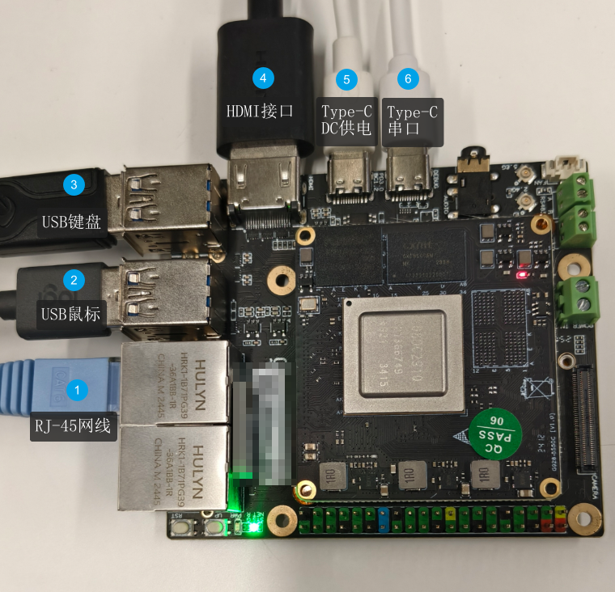

## 2、获取镜像

- 这里提供两种镜像获取方式，可根据自身需求选择不同的镜像获取方式，Uboot暂不提供，需根据开发板自行编译。

### 2.1、通过下载获取镜像

- 访问[hieulerpi1-xfce-systemd](http://121.36.84.172/dailybuild/EBS-openEuler-Mainline/embedded_img/aarch64/hieulerpi1-xfce-systemd/20251026041019/)按照下图下载kernel和rootfs镜像。

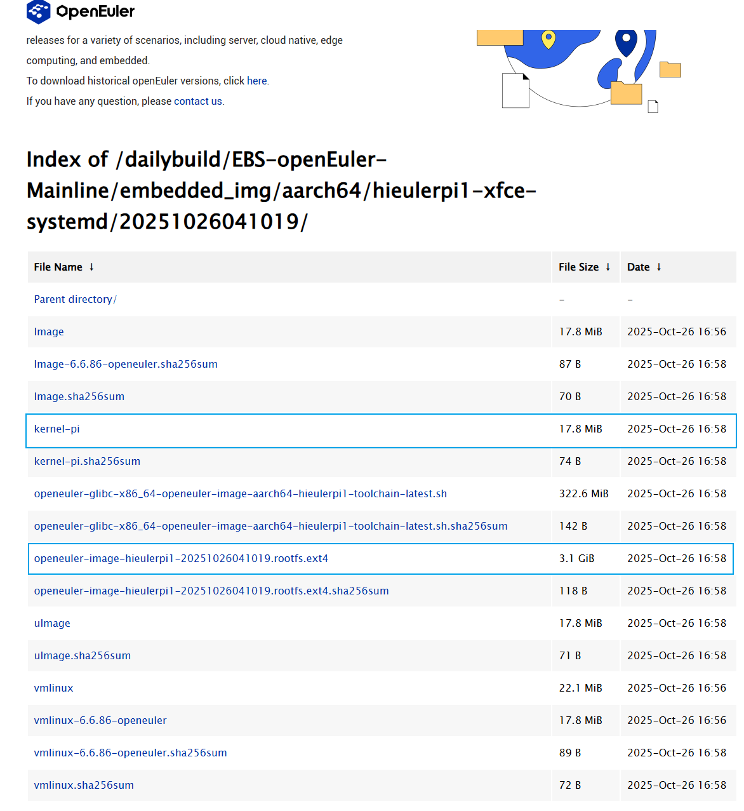

### 2.2、通过构建获取镜像

#### 2.2.1、下载依赖软件

- OpenEuler的构建方式依赖docker和oebuild，执行下面命令安装。

```
sudo apt-get install git python3 python3-pip docker docker.io
pip install oebuild
```

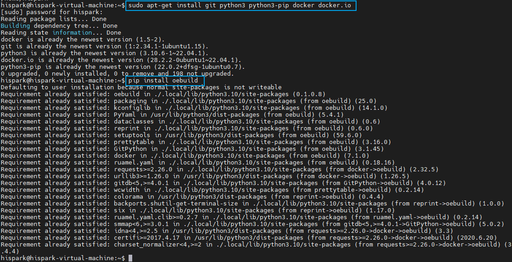

- 执行下面命令配置docker环境，下面第2条命令`sudo systemctl daemon-reload && sudo systemctl restart docker`执行时间稍长，请耐心等待。

```
sudo usermod -a -G docker $(whoami)
sudo systemctl daemon-reload && sudo systemctl restart docker
sudo chmod o+rw /var/run/docker.sock
```

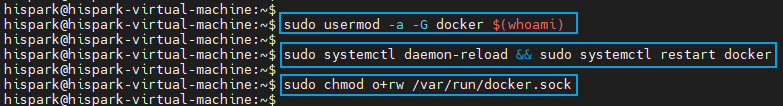

- 构建需指定 `-f oebridge` 进行特性使能，所以主机需支持`qemu-user-static`，对于Ubuntu执行下面命令安装。

```
sudo apt install qemu-user-static
```

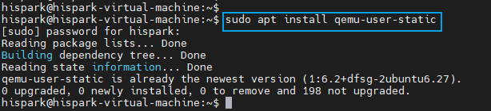

- 执行下面命令检查配置。

```
cat /proc/sys/fs/binfmt_misc/qemu-aarch64
```

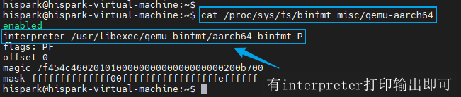

#### 2.2.2、构建

- 执行下面命令，初始化工作空间。

```
oebuild init workspace
cd workspace
oebuild update
```

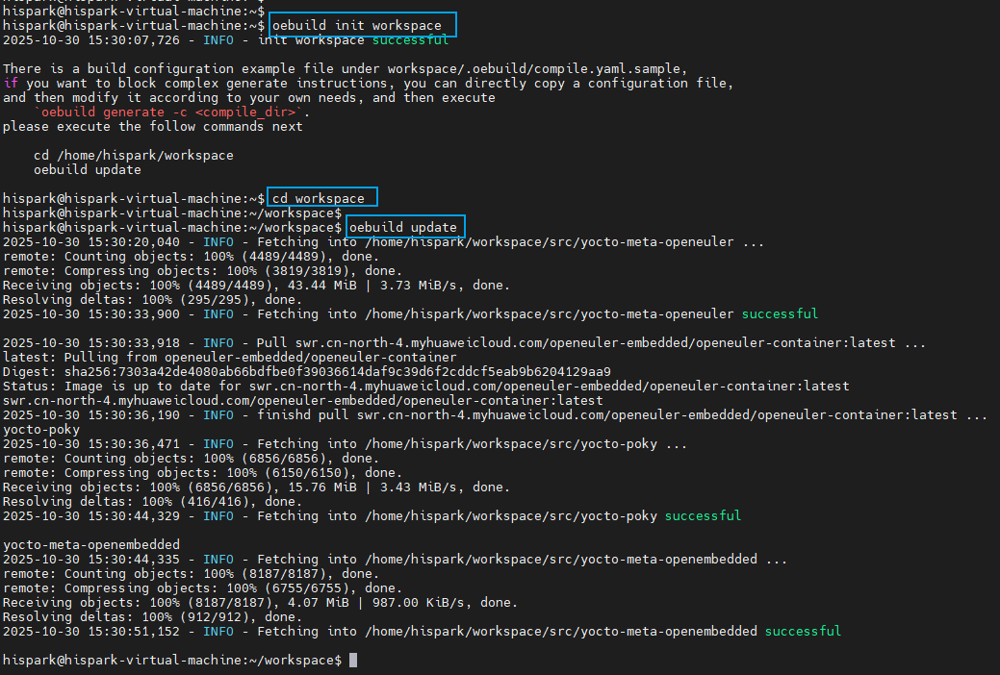

- 生成hieulerpi1构建配置文件，使能 `-f kernel6 -f oebridge-xfce -f systemd` 选项，并进入bitbake环境，输入`exit`可退出bitbake环境。

```
oebuild generate -p hieulerpi1 -f kernel6 -f oebridge-xfce -f systemd
cd build/hieulerpi1
oebuild bitbake
```

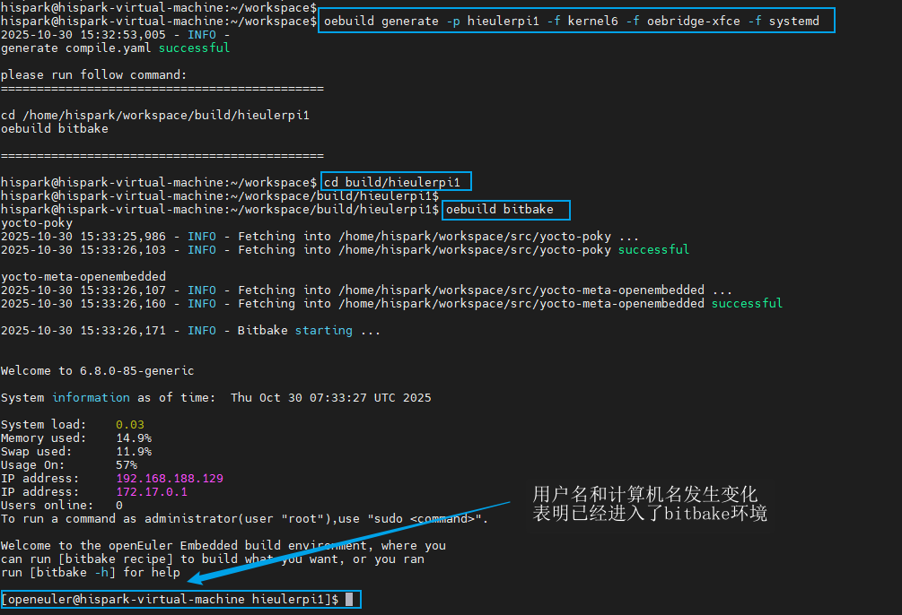

- 部分老容器由于权限问题，需要在 `oebuild bitbake` 进入容器后，给于oebridge需要的目录权限。

```
sudo chmod 777 /var/log/hawkey.log
sudo chmod 777 /var/cache/dnf/
```

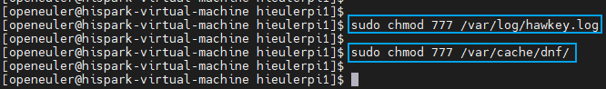

- 执行下面命令，构建镜像。

```
bitbake openeuler-image
```

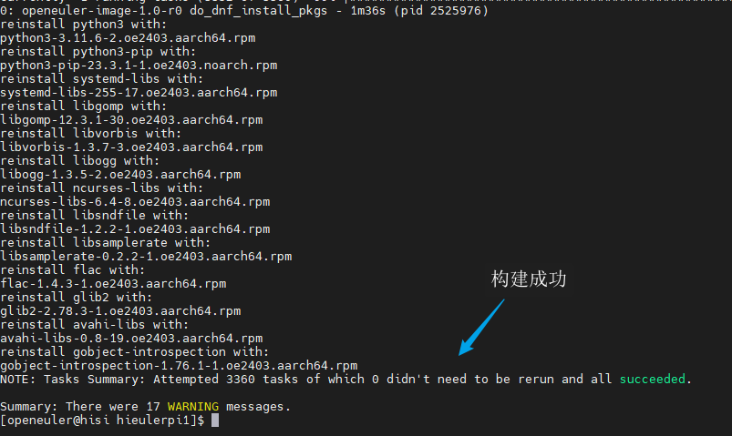

- 镜像在output目录下。

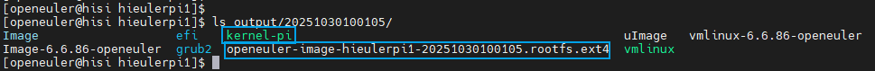

## 3、烧录

- 拷贝uboot、kernel、rootfs镜像至同一个文件夹下，按照下图使用ToolPlatform烧录工具烧录。

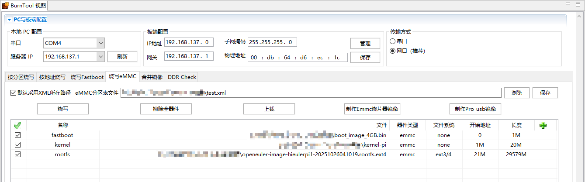

## 4、启动桌面

- 重启开发板，一直按ctrl+c或回车键进入Uboot，输入下面内容修改启动参数。

```
setenv bootargs 'mem=1024M console=ttyAMA0,115200 clk_ignore_unused rw rootwait root=/dev/mmcblk0p3 rootfstype=ext4 blkdevparts=mmcblk0:1M(uboot),20M(kernel),-(rootfs)';

setenv bootcmd 'mmc read 0 0x50000000 0x800 0xa000; bootm 50000000';
setenv logo_show no;
setenv bootdelay 1;
saveenv
reset
```

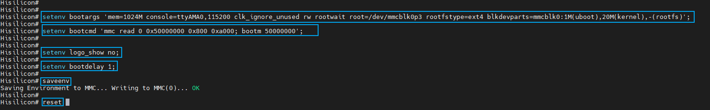

- 首次启动后需要设置账号，这里设置账号：`root`，密码：`@openeuler2025`

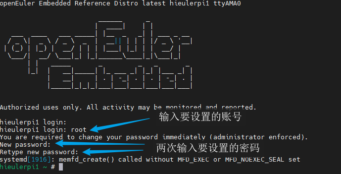

- 首次启动需要扩容EMMC，扩容命令请根据开发板情况调整。

```
resize2fs /dev/mmcblk0p3
```

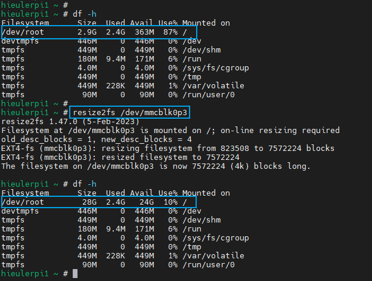

- 执行下面命令，查看fb驱动是否正常。

```
systemctl status hieulerpi1-bsp.service
systemctl status hieulerpi1-fb.service
```

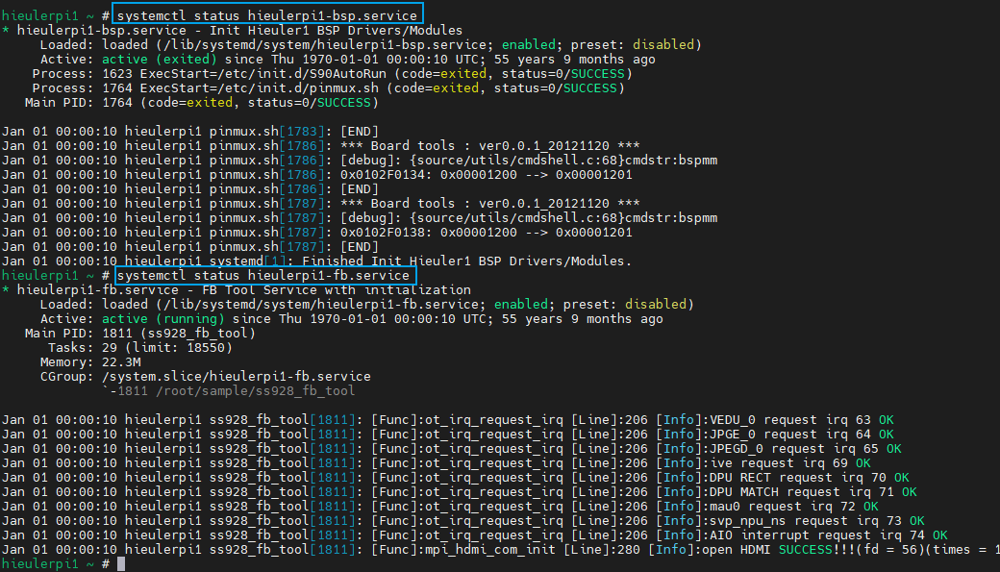

- 执行下面命令启动桌面。

```
startxfce4
```

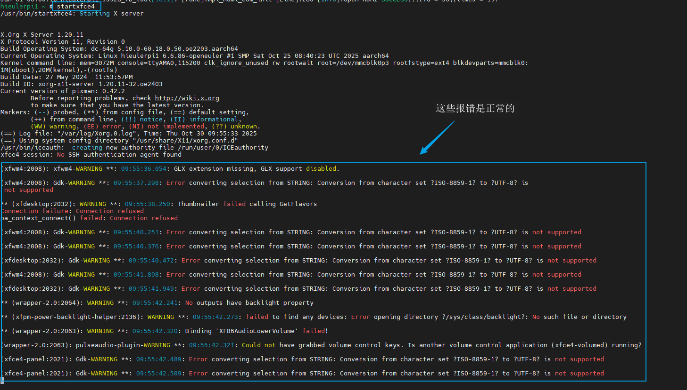

- HDMI输出桌面。


- 更多功能完善请参考[【无GPU启动xfce桌面参考】 ](https://gitee.com/openeuler/yocto-meta-openeuler/issues/ICVB82?from=project-issue)
- 安装ROS请参考[openEuler ROS 使用与开发手册 — openEuler ROS 在线文档 0.1 documentation](https://openeuler-ros-docs.readthedocs.io/en/latest/)

