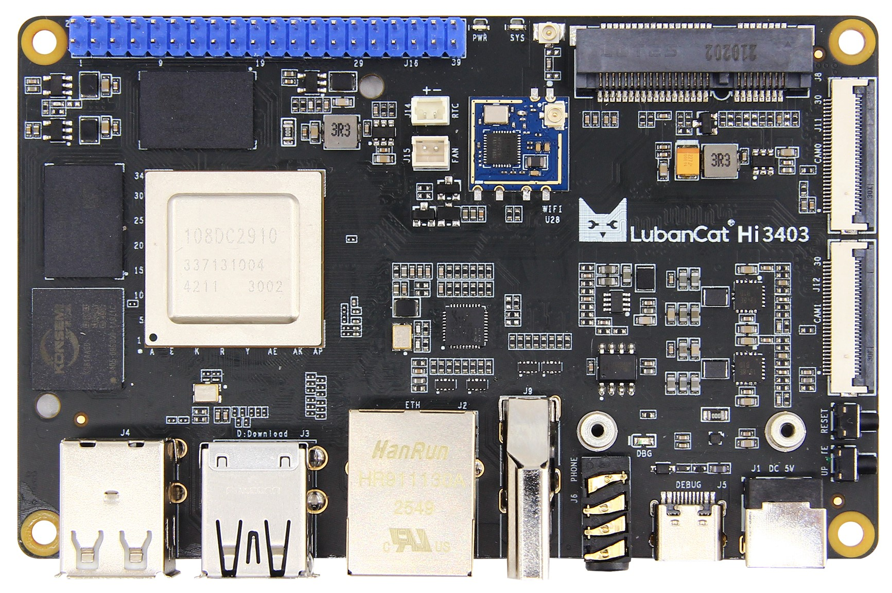
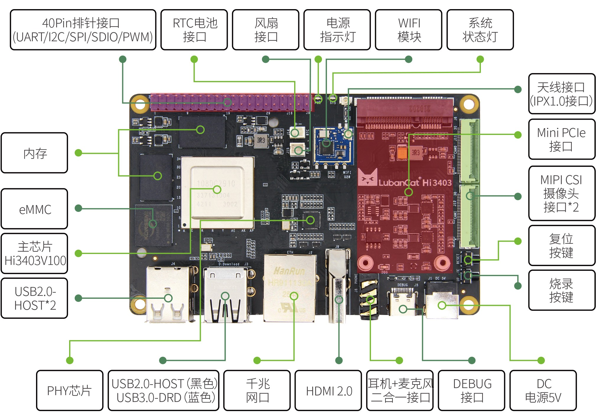
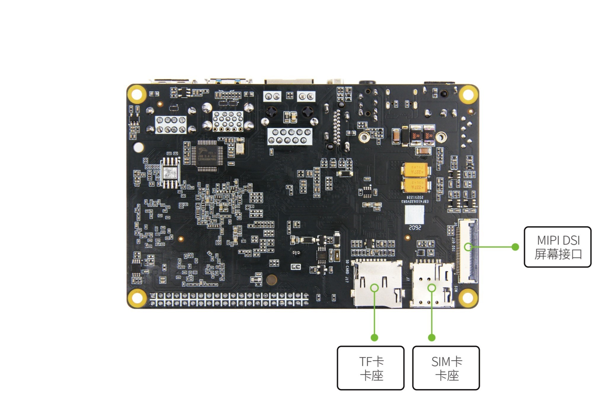

## 产品概述

LubanCat-Hi3403系列板卡是野火电子推出的基于Hi3403V100设计的一款高性能单板电脑，
保留了完善的硬件资源，充分考虑用户的使用需求，引出了尽可能多的外设功能，
同时提供完整的SDK驱动开发包、设计原理图等资源，方便用户基于此板卡进行快速验证和二次开发。

LubanCat-Hi3403使用了一颗包含四核Cortex-A55 CPU和高能效神经网络推理单元的SOC，
板载大容量eMMC和大容量高带宽双通道LPDDR4X内存，性能强劲。
保留千兆网口、WIFI6、HDMI2.0、USB3.0、Mini-PCIe、MIPI-CSI、MIPI-DSI、音频接口等外设。
其中USB、Mini-PCIe等通用接口，又进一步扩展了板卡的使用场景。

这使得LubanCat-Hi3403不仅能作为高性能单板电脑来使用，还可以作为嵌入式主板，用于图像采集、显示、控制、网络传输等多种场景。

- 快速使用手册及板卡说明：[点击进入](https://doc.embedfire.com/linux/hi3403/quick_start) （基于野火发布固件进行介绍，建议阅读在线网页文档，实时更新中）
- 基于Pegasus的Buildroot系统构建说明: [点击进入](./doc/基于Pegasus构建Buildroot系统镜像.md)
- LubanCat-Hi3404功能验证说明: [点击进入](./doc/LubanCat-Hi3404功能验证说明.md) （基于使用Pegasus构建Buildroot镜像的功能验证说明）

## 硬件资源

| 板卡名称    | LubanCat-Hi3403                                                                         |
| ----------- | --------------------------------------------------------------------------------------- |
| 电源接口    | DC5V@3A直流输入                                                                         |
| 主芯片      | Hi3403V100(四核Cortex-A55@1.4GHz，32bit-MCU@500MHz，高达10.4Tops@INT8神经网络推理单元)  |
| 内存        | LPDDR4x 4GB/8GB                                                                         |
| 存储        | eMMC 32GB/64GB 用于运行系统                                                             |
| 以太网      | 10/100/1000M自适应以太网口 x 1                                                          |
| WiFi        | 板载WiFi6无线模块，单频2.4Ghz，最高速率可达287Mbps                                      |
| USB2.0      | Type-A接口(HOST) x 3                                                                    |
| USB3.0      | Type-A接口 x 1，支持USB-DRD功能，可作为固件烧录接口                                     |
| 调试串口    | 板载USB转串口芯片(CH340N)，Type-C接口引出，默认参数115200-8-N-1，同时也作为固件烧录串口 |
| 按键        | RESET(复位按键)、UPDATE(烧录模式按键)                                                   |
| 指示灯      | 电源指示灯(红色，指示电源状态)，系统状态灯(绿色，指示系统运行状态)                      |
| 音频接口    | 3.5mm耳机输出+麦克风输入2合1接口，美标4段式                                             |
| 40Pin接口   | 支持PWM、GPIO、I2C、SPI、UART功能，注意所有IO都为1.8V电平                               |
| Mini-PCIe   | 预留全高固定孔位，具有USB2.0和PCIe2x1Lane信号                                           |
| SIM卡接口   | 支持插入nano sim卡，搭配Mini-Pcie接口4G/5G网卡使用                                      |
| HDMI接口    | 支持HDMI2.0协议，最高支持4K60fps显示输出                                                |
| MIPI-DSI    | MIPI视频输出接口，连接MIPI屏幕使用，4Lane x 1                                           |
| MIPI-CSI    | MIPI视频输入接口，连接MIPI摄像头使用，4Lane x 2                                         |
| TF卡座      | 最高支持接入TF规格的512GB SD卡，仅支持存储扩展                                          |
| 风扇接口    | 预留风扇固定孔和5V风扇电源接口(2Pin 1.5mm ZH座)，支持PWM控制                            |
| RTC电池接口 | 2Pin 1.25mm线对板针座，用于板载RTC芯片供电                                              |

