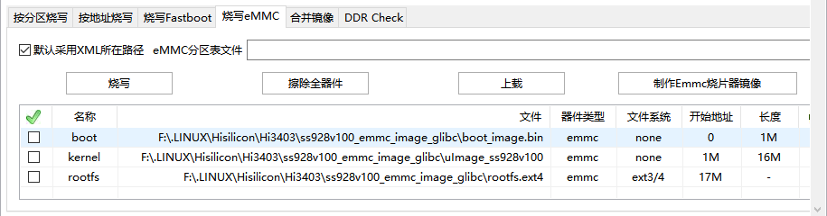

## 基于Pegasus构建Buildroot系统镜像

本文档对使用基于hispark/pegasus项目进行buildroot镜像构建进行说明。

vendor/LubanCat-Hi3403目录存储LubanCat-Hi3403板卡构建buildroot镜像所需的文件。

- patch：补丁文件存放目录
- files：除补丁文件外的其他文件存放目录，包含boot镜像使用的寄存器配置表和板载WIFI模块所需firmware
- patch_build.sh：打补丁辅助脚本

### 编译环境搭建

#### 安装依赖软件包

SDK编译环境的搭建请查看 [Hi3403V100环境搭建指南-搭建sdk环境](../../../docs/zh-CN/Hi3403V100环境搭建指南/Hi3403V100环境搭建指南.md) 

如果仅编译LubanCat-Hi3403 Buildroot镜像，则只需要以下步骤：

-   [搭建基础环境](../../../docs/zh-CN/Hi3403V100环境搭建指南/Hi3403V100环境搭建指南.md#21搭建基础环境) 
-   [下载代码仓](../../../docs/zh-CN/Hi3403V100环境搭建指南/Hi3403V100环境搭建指南.md#22下载代码仓) 
-   [下载开源软件](../../../docs/zh-CN/Hi3403V100环境搭建指南/Hi3403V100环境搭建指南.md#23下载开源软件) 
-   [安装gcc交叉编译器](../../../docs/zh-CN/Hi3403V100环境搭建指南/Hi3403V100环境搭建指南.md#242安装gcc交叉编译器) 

经过上面的步骤，编译所需的基础环境就搭好了。

#### 打补丁

打补丁操作需要一个干净的未修改过的SDK，否则可能导致应用补丁文件失败。

在vendor/LubanCat-Hi3403目录下执行`./patch_build.sh`运行打补丁脚本

执行打补丁脚本时，会将patch目录下的补丁文件复制到以pegasus为顶层目录的对应路径下，然后打补丁。还会将files目录下的文件也复制到对应位置。

对于platform/ss928v100_gcc/open_source目录下的开源项目，将在首次编译时解压源码压缩包并应用补丁文件。当patch文件有修改时，可以删除对应目录下解压的源码文件夹再运行编译命令，就可以重新打补丁。

对于其他位置的补丁文件，将在运行patch_build.sh脚本时应用。

打完补丁后，还需要下载buildroot源码压缩包并放入platform/ss928v100_gcc/open_source/buildroot目录下，下载地址：https://buildroot.org/downloads/buildroot-2024.02.10.tar.gz

### 编译说明

下面的编译命令都要在 platform/ss928v100_gcc/osdrv 下运行

在编译时有一些参数配置，已经写入到Makefile中作为默认值使用。

- LLVM = 0
- CHIP = ss928v100
- DDR_SIZE = 8GB
- OSDRV_CROSS = aarch64-openeuler-linux-gnu
- ARCH_TYPE = arm64
- BOOT_MEDIA = emmc

默认编译参数中板卡内存总容量大小DDR_SIZE为8GB，当使用不同容量的板卡时，要修改DDR_SIZE为板卡的实际容量。
当前出售的版本为8GB和4GB两种，可以通过查看板载的DDR芯片的型号确认，单颗FLXC4004G的大小为4GB，两颗总容量就为8GB。

当使用上面的默认值进行编译时可以省略参数，例如
```
# 完整编译命令
make LLVM=0 BOOT_MEDIA=emmc CHIP=ss928v100 DDR_SIZE=8GB all

# 简写
make all

# 修改部分参数
make DDR_SIZE=4GB all
```

### 编译boot和kernel

```
# 编译boot镜像
# DDR总容量为4GB
# make DDR_SIZE=4GB gslboot_build
# DDR总容量为8GB
# make DDR_SIZE=8GB gslboot_build

# 编译kernel镜像
make atf

# 修改内核配置文件
# 完整命令
make kernel_menuconfig
# 简略命令
make kconfig
```

编译生成的boot镜像保存在 platform/ss928v100_gcc/osdrv/pub/ss928v100_emmc_image_glibc/boot_image.bin

编译生成的kernel镜像保存在 platform/ss928v100_gcc/osdrv/pub/ss928v100_emmc_image_glibc/uImage_ss928v100

### 构建buildroot根文件系统

buildroot目录中各文件的作用：

-   readme.txt : 源码压缩包下载说明
-   ss928_lbc_defconfig ：默认的buildroot配置文件
-   overlay : 覆盖到buildroot生成的根文件系统的文件
-   dl ：buildroot下载的源码压缩包的保存目录，加速后续编译过程

```
# 打包buildroot根文件系统镜像，包含内核ko模块
make rootfs_build

# 单独构建buildroot
make buildroot

# 修改buildroot配置文件
# 完整命令
make buildroot_menuconfig
# 简略命令
make bconfig

# 清理buildroot
buildroot_clean
```

如果需要全新构建buildroot，可以删除platform/ss928v100_gcc/open_source/buildroot目录下的buildroot-2024.02.10后，再执行上面的构建命令。

根文件系统镜像中打包了内核ko文件，如果修改了内核ko配置，需要重新生成根文件系统镜像。

构建生成的根文件系统镜像文件保存在platform/ss928v100_gcc/osdrv/pub/ss928v100_emmc_image_glibc/rootfs.ext4

### 烧录

推荐使用ToolPlatform v5.6.58版本进行烧录，此版本才有USB烧录功能可选。

- 烧录boot镜像时使用串口烧录，boot分区只能用串口烧录。
- 烧录kernel和rootfs时使用USB烧录，速度快。

板卡板载eMMC存储，可用于系统启动，烧录软件选择 **烧写eMMC**

分区配置如下：



| 文件             | 分区   | 分区地址范围 | 分区大小 | 说明                                              |
| ---------------- | ------ | ------------ | -------- | ------------------------------------------------- |
| boot_image.bin   | boot   | 0-1M         | 1M       | boot镜像，需要和板卡DDR的大小和类型匹配           |
| uImage_ss928v100 | kernel | 1M-17M       | 16M      | 内核镜像，包含设备树                              |
| rootfs.ext4      | rootfs | 17M-镜像大小 | 镜像大小 | 根文件系统镜像，设置为"-"时烧录工具自适应镜像大小 |

在设置分区地址时，要严格按照上表中的地址配置。对于最后一个分区，在烧录时分区的长度应该配置为大于等于实际要烧录的文件大小，也可直接设置为“-”，烧录软件会自动适配镜像大小进行烧录。

### 运行系统

烧录完成后连接调试串口，波特率为115200，在uboot命令行终端中输入如下命令

```
# 环境变量配置
setenv bootargs 'mem=512M console=ttyAMA0,115200 clk_ignore_unused rw rootwait root=/dev/mmcblk0p3 rootfstype=ext4 blkdevparts=mmcblk0:1M(uboot.bin),16M(kernel),-(rootfs.ext4)';

# 设置内核启动参数
setenv bootcmd 'mmc read 0 0x50000000 0x800 0x8000; bootm 0x50000000';

# 保存环境配置
saveenv

# 重启
reset
```

-   blkdevparts表示分区表；mmcblk0为emmc；括号内为分区名称，括号前为分区大小；16M表示分区大小为16MB，-表示使用所有剩余空间（仅适用于最后的分区）
-   此分区表设置需要和烧录工具配置对应，烧录工具中的分区镜像大小应小于等于此分区表中的分区大小(最后一个分区除外)，起始地址需要与此分区表严格对应。

修改完成后重新给板卡上电或运行boot命令即可加载内核并运行系统。

buildroot系统设置默认允许root用户通过SSH登录，并为root设置了密码：

用户名：root 密码：root

初始的rootfs分区大小为rootfs镜像的大小，为便于发布和快速烧录，构建rootfs镜像时只设置了很小的空闲空间，
在初次登录系统后手动运行`resize2fs /dev/mmcblk0p3`命令，可将rootfs分区扩展到eMMC的剩余空间。
