## 海鸥派介绍：

搭载越影 Hi3403V100，四核 ARM Cortex-A55@1.4GHz处理器，配备 10.4TOPS@INT8 强大算力与双内核异构引擎，图像分析加速无忧。AIISP技术优化图像，夜视全彩更清晰。兼容openEuler、Linux、Ubuntu、openHarmony系统，满足各种系统需求。

- 对于[Hi3403V100 HiSpark社区版本](https://gitee.com/HiSpark/pegasus/tree/master)，目前只支持openEuler系统，并且提供了打包好的镜像，openEuler系统相关资料请参见该文档的三、四章节。
- 如有除openEuler系统外的其他系统需求，可下载[【易百纳】Euler Pi 2.0](https://pan.baidu.com/s/1GwvuEjbLGsMLyX8kkG8dlQ?pwd=s7hs)资料，需注意，其他系统需求不基于[Hi3403V100 HiSpark社区版本](https://gitee.com/HiSpark/pegasus/tree/master)。
- 海鸥派相关咨询或者疑问请前往[易百纳主导的海鸥派开源开发者社区](https://gitee.com/hieulerpi)提问。
- [海鸥派淘宝购买链接](https://item.taobao.com/item.htm?abbucket=13&id=755989596567&skuId=5948917988054)。

## 一、补丁说明

- 该章节主要是Linux系统下的适配补丁操作，不是必须的，开发者可根据需求使用或者跳过。
- 请先根据文档[Hi3403V100环境搭建指南](https://gitee.com/HiSpark/pegasus/blob/master/docs/zh-CN/Hi3403V100%E7%8E%AF%E5%A2%83%E6%90%AD%E5%BB%BA%E6%8C%87%E5%8D%97/Hi3403V100%E7%8E%AF%E5%A2%83%E6%90%AD%E5%BB%BA%E6%8C%87%E5%8D%97.md#2%E6%90%AD%E5%BB%BAsdk%E7%8E%AF%E5%A2%83)完成SDK环境搭建再执行下面的打补丁和编译操作。

### 1、应用补丁

进入pegasus/vendor/ebaina/patch目录，运行patch_build.sh脚本，可按需执行下面指令打补丁。

```
cd pegasus/vendor/ebaina/patch

./patch_build.sh -h 	#脚本使用说明
./patch_build.sh -clang #单独打ss928v100_clang补丁
./patch_build.sh -gcc 	#单独打ss928v100_gcc补丁
./patch_build.sh -all   #同时打ss928v100_clang和ss928v100_gcc补丁
./patch_build.sh    	#同时打ss928v100_clang和ss928v100_gcc补丁
```

### 2、编译SDK

重新编译SDK，可按需编译CLANG/GCC SDK。

```
#编译CLANG SDK
cd ~/pegasus/platform/ss928v100_clang/osdrv
make LLVM=1 BOOT_MEDIA=emmc CHIP=ss928v100 all

#编译GCC SDK
cd ~/pegasus/platform/ss928v100_gcc/osdrv
make LLVM=0 BOOT_MEDIA=emmc CHIP=ss928v100 all
```

## 二、规格参数

### 1、产品接口

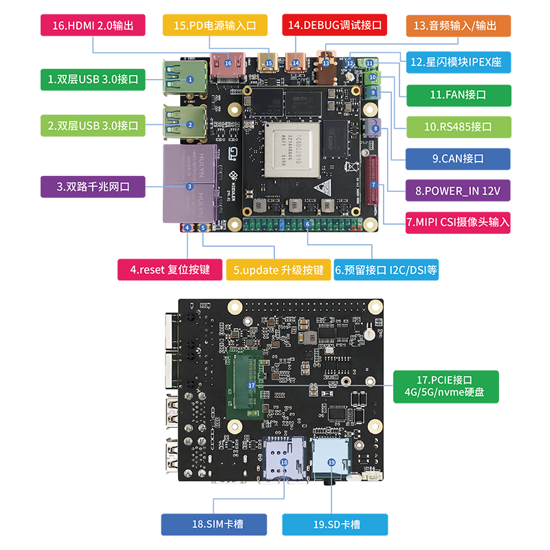

### 2、功能列表

- 该功能列表基于[Hi3403V100 HiSpark社区版本](https://gitee.com/HiSpark/pegasus/tree/master)，对于[Hi3403V100 HiSpark社区版本](https://gitee.com/HiSpark/pegasus/tree/master)目前只支持openEuler系统。

| 序号 | 功能项                 | openeEuler |
| :--- | :--------------------- | ---------- |
| 00   | UART                   | ✔          |
| 01   | RS485                  | ✔          |
| 02   | OLED                   | ✔          |
| 03   | ADC                    | ✔          |
| 04   | PWM                    | ✔          |
| 05   | CAN总线                | ✔          |
| 06   | ADC                    | ✔          |
| 07   | RTC时钟                | ✔          |
| 08   | Tsensor芯片温度        | ✔          |
| 09   | TF(SD)卡               | ✔          |
| 10   | U盘                    | ✔          |
| 11   | PCIE硬盘               | ✔          |
| 12   | UVC摄像头              | ✔          |
| 13   | USB 5G模块 (MT5710-CN) | ✔          |
| 14   | WIFI                   | ✔          |
| 15   | 蓝牙                   | ✔          |
| 16   | 星闪                   | ✔          |
| 17   | MIPI 摄像头            | ✔          |
| 18   | MIPI 显示屏            | ✔          |
| 19   | 音频输入输出           | ✔          |
| 20   | 双路千兆 RJ45          | ✔          |
| 21   | HDMI 输出              | ✔          |

## 三、openEuler系统构建

- 已经准备好了打包好的openEuler系统镜像，[Eulerpi_OpenEuler_IMAGE](https://pan.baidu.com/s/1iyDzKp9ldcJz_wXmhs8JJw?pwd=e6eu)，可根据需求自行构建或者使用打包好的镜像，如果直接使用打包好的镜像，请跳过构建步骤参见[烧录小节](#3、烧录)即可。
- 准备一台安装了Ubuntu22.04的服务器，下面构建步骤均是基于Ubuntu22.04操作的。

### 1、下载依赖软件

OpenEuler的构建方式依赖docker和oebuild，执行下面命令安装。

```shell
sudo apt-get install git python3 python3-pip docker docker.io
pip install oebuild
```

配置docker环境。

```shell
sudo usermod -a -G docker $(whoami)
sudo systemctl daemon-reload && sudo systemctl restart docker
sudo chmod o+rw /var/run/docker.sock
```

### 2、构建

#### 步骤1：初始化

初始化工作空间，拉取源码。

```shell
oebuild init ${workspace}
cd ${workspace}
oebuild update
```

> 参数说明：
>
> - ${workspace}：工作目录名称，比如：
>
>   ```shell
>   oebuild init Euler_Pi_OE
>   cd Euler_Pi_OE
>   oebuild update
>   ```
>

#### 步骤2：配置构建文件

配置构建文件，使能`-p hieulerpi1`和`-f kernel6`，并进入到`bitbake`虚拟环境上。

```shell
oebuild generate -p hieulerpi1 -f kernel6
cd build/hieulerpi1
oebuild bitbake
```

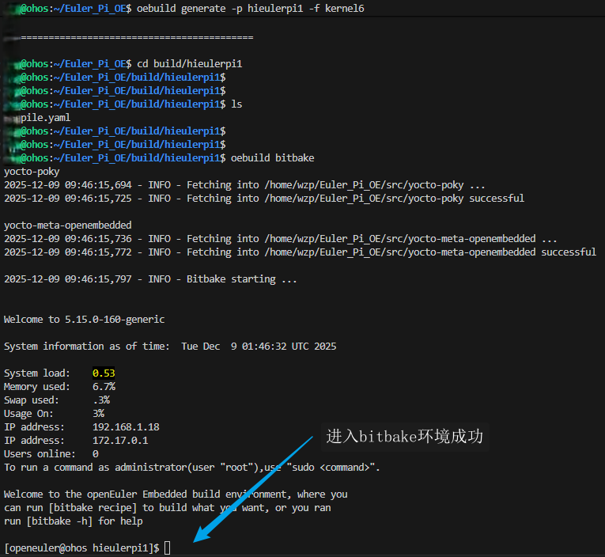

#### 步骤3：构建

构建镜像。

```shell
bitbake openeuler-image
```

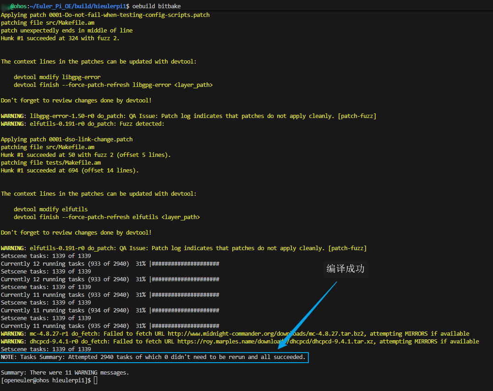

> 注意：
>
> - 可清理再编译。
>
> ```
> bitbake openeuler-image -c cleanall
> bitbake openeuler-image
> ```
>
> - 清除构建缓存。
>
> ```
> bitbake openeuler-image -c cleansstate
> ```

编译成功后生成的内核和根文件系统镜像在`output`目录下，这里只有内核和根文件系统镜像是正常的，将编译好的内核和根文件系统镜像拷贝至windows端。

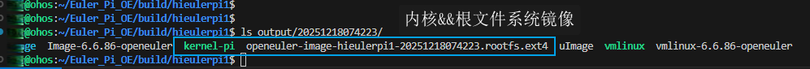

### 3、烧录

下载[Eulerpi_OpenEuler_IMAGE](https://pan.baidu.com/s/1iyDzKp9ldcJz_wXmhs8JJw?pwd=e6eu)，按照下图使用ToolPlatform加载分区表，需根据板子配置选择4G或8G。

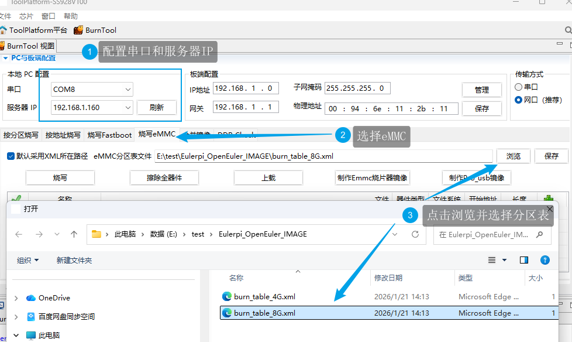

这里可以直接烧录，但是烧录的我们打包好的镜像，如果需要烧录自行构建的镜像，请按照继续按照下面步骤替换内核和根文件系统镜像。

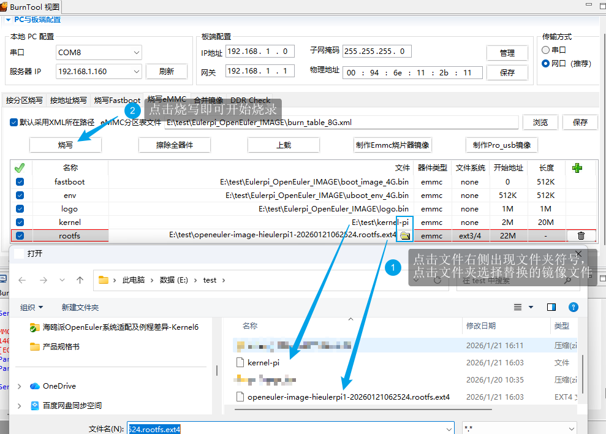

烧录后首次启动需要设置账号密码，建议账号：root，密码：@ebaina2026。

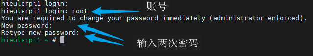

## 四、海鸥派openEuler快速体验（例程验证）

- 请先烧录openEuler系统镜像，烧录镜像和烧录步骤请参考[openEuler系统构建章节](#三、openEuler系统构建)。
- 该章节所用到的所有工具均来自[【易百纳】Euler Pi 2.0](https://pan.baidu.com/s/1GwvuEjbLGsMLyX8kkG8dlQ?pwd=s7hs)资料的 04. 开发工具。

### 1、硬件连接

将海鸥派上电，再用type-c连接线将海鸥派的debug口连接到PC：

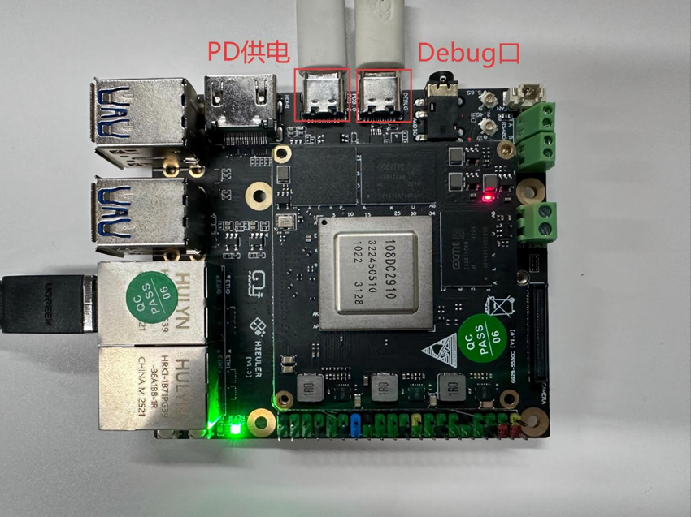

连接工具可使用[【易百纳】Euler Pi 2.0](https://pan.baidu.com/s/1GwvuEjbLGsMLyX8kkG8dlQ?pwd=s7hs)资料的“04.开发工具/MobaXterm_Portable_v25.1_CHS”


选择Session，分别设置串口号、波特率为115200，然后点击OK即可连接海鸥派：

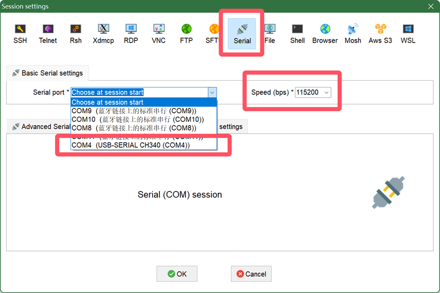

串口号可通过设备管理器-端口查看：

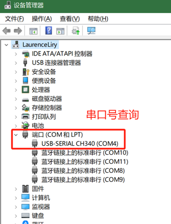

注：串口连接后黑屏，按ctrl+c，查看是否可以登陆，若仍然不行，尝试重新连接串口

### 2、例程验证

#### 2.1、GPIO操作示例

以GPIO2_1(Pin13)为例

##### 2.1.1、控制台控制

①. 拉高

运行./gpio_ctrl.sh 1拉高

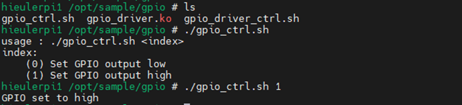

使用万用表测量电压为1.8v。

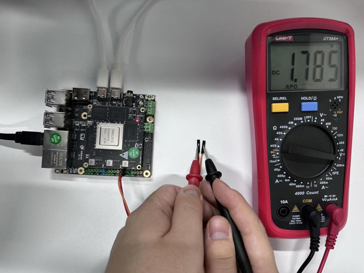

②. 拉低

运行./gpio_ctrl.sh 0拉低

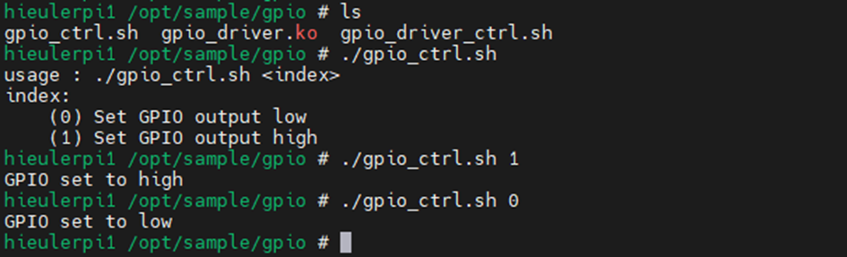

使用万用表测量电压为0v。

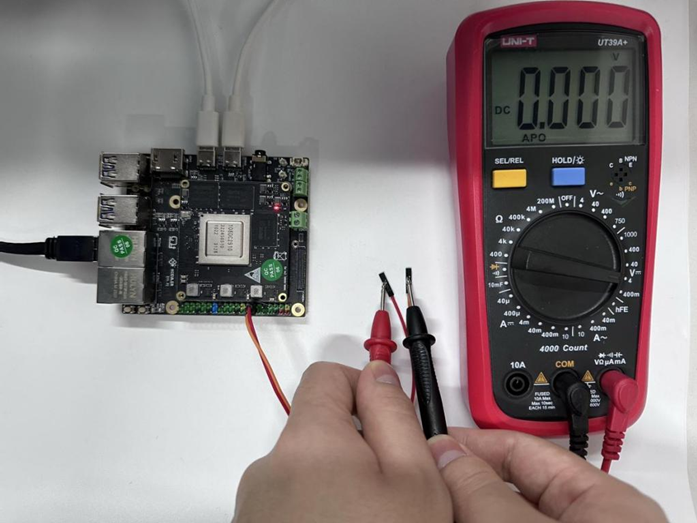

##### 2.1.2、内核态控制

①. 拉高

运行./gpio_driver_ctrl.sh 1拉高

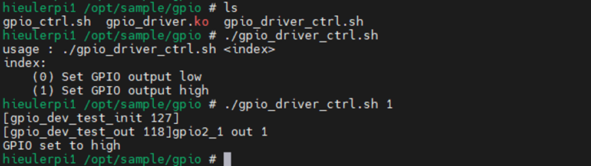

使用万用表测量电压为1.8v。

②. 拉低

运行./gpio_driver_ctrl.sh 0拉低

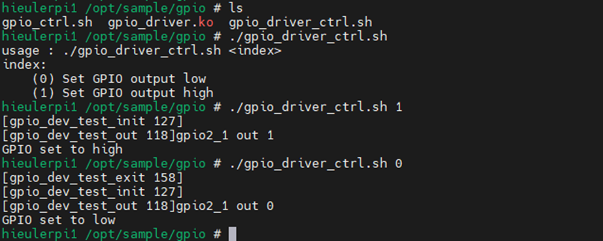

使用万用表测量电压为0v。

##### 2.1.3、注意

若同时测试以上两种方式，运行前请释放上一个的资源。

```shell
echo 17 > /sys/class/gpio/unexport  //测试内核态控制前先释放资源
rmmod gpio_driver    //测试控制台控制前先卸载驱动
```

#### 2.2、UART/RS485

##### 2.2.1、40Pin IO里的Uart4

①. 硬件连接

| 40Pin IO         | USB转TTL |
| ---------------- | -------- |
| UART4_TXD(Pin8)  | RXD      |
| UART4_RXD(Pin10) | TXD      |
| GND(Pin9)        | GND      |

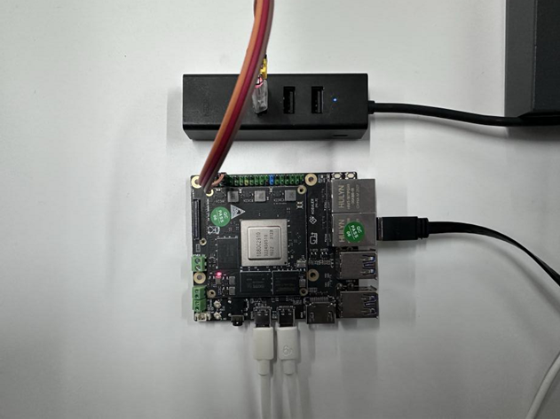

②. 引脚复用

```shell
bspmm 0x102f0134 0x1201    //UART4_RXD
bspmm 0x102f0138 0x1201    //UART4_RXD
```

③. 功能验证

```shell
./hi_uart_sample /dev/ttyAMA4 115200
```

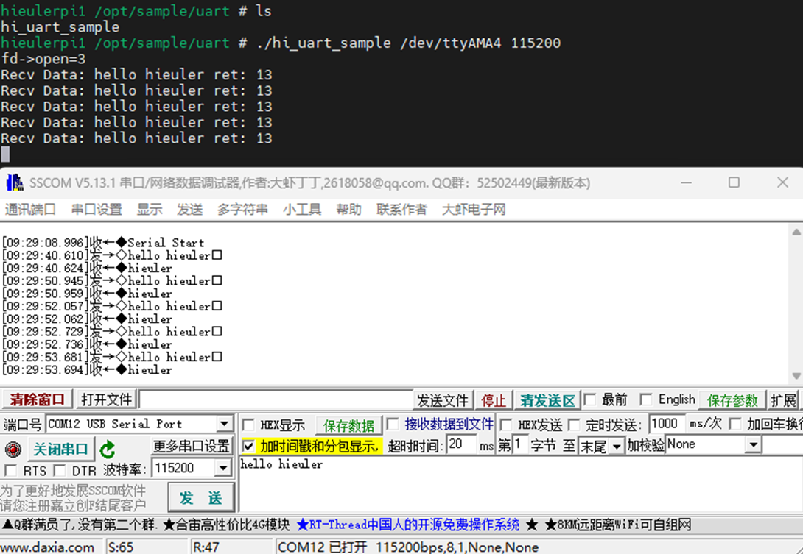

##### 2.2.2、RS485

①. 硬件连接

| J12  | USB转RS485 |
| ---- | ---------- |
| Pin2 | A          |
| Pin1 | B          |

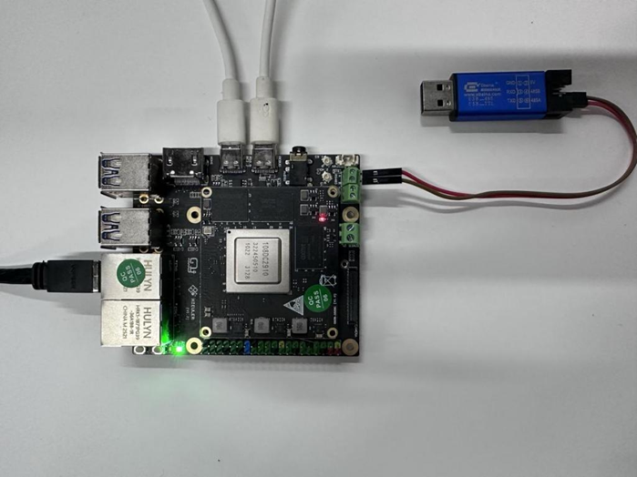

②. 引脚复用

```shell
bspmm 0x102f012c 0x1201  //UART3_RXD
bspmm 0x102f0130 0x1201  //UART3_TXD
```

③. 功能验证

```shell
./hi_uart_sample /dev/ttyAMA3 115200
```

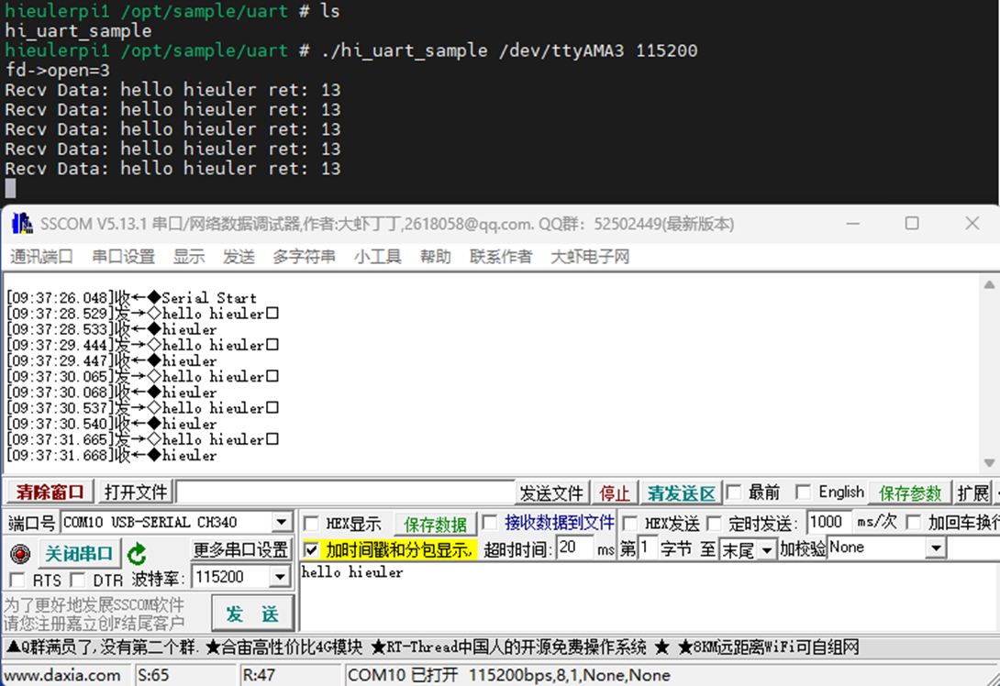

#### 2.3、I2C(OLED屏)

①. 硬件连接

| OLED引脚 | 海鸥40Pin预留IO |
| -------- | --------------- |
| VCC (5V) | 5V (Pin4)       |
| GND      | GND (Pin6)      |
| SCL      | SCL (Pin5)      |
| SDA      | SDA (Pin3)      |

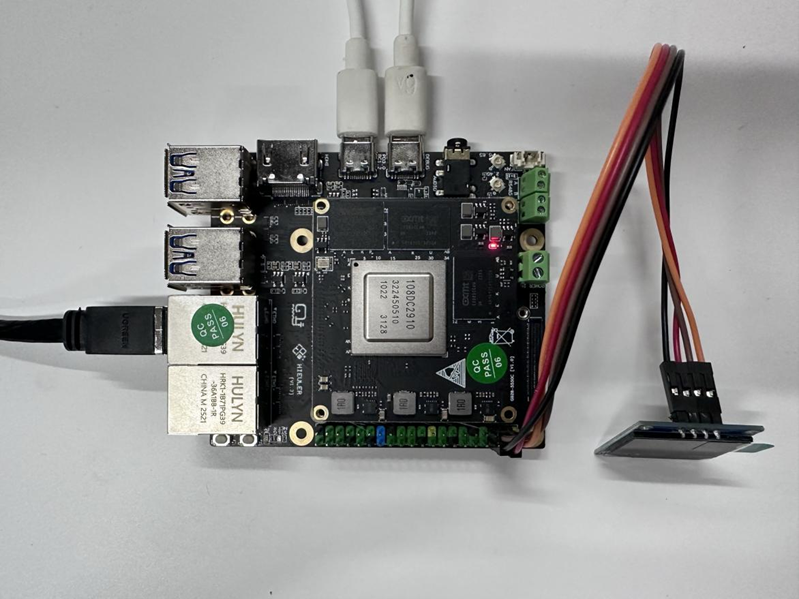

②. 加载驱动

板端加载驱动并检查设备节点。

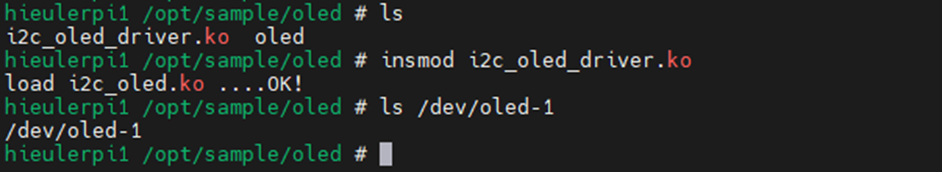

③.功能验证

```shell
./oled /dev/oled-1 1
```

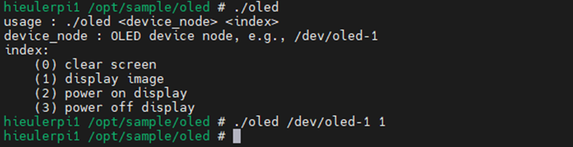

当前例程运行后oled显示屏正常显示易百纳鲸鱼logo。

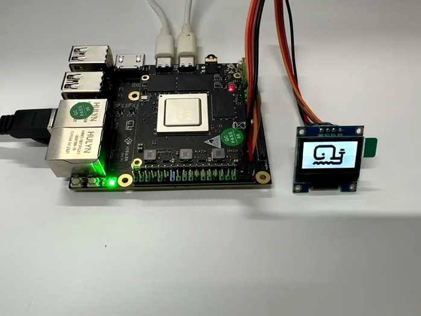

#### 2.4、ADC

①. 硬件连接

预留40pin IO Pin11为LSADC_CH3。准备两根杜邦线，使用杜邦线连接在海鸥派 40PIN 扩展接口的引脚，ADC 引脚选择 Pin11，GND 引脚可选择 Pin9。

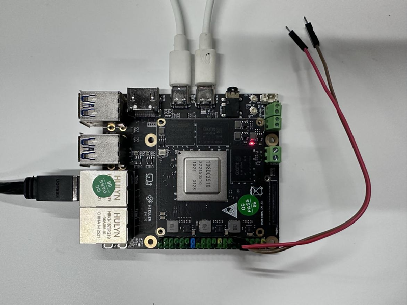

②. 引脚复用

```shell
bspmm 0x102F00FC 0x1200
```

③. 功能验证

a. 驱动默认开启

```shell
insmod hi_adc.ko auto_run=1   //auto_run 0：默认不开启 1：默认开启
```

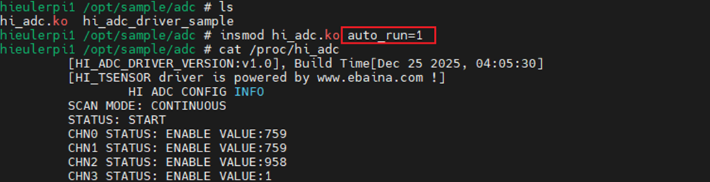

Pin11(ADC)连接Pin9(GND)

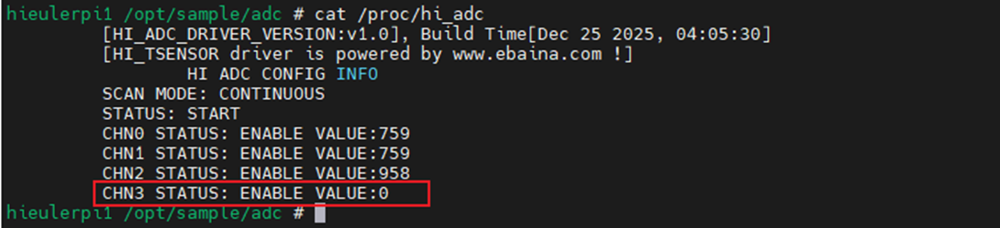

Pin11(ADC)连接1.8V(ADC最高测量1.8V， 接入高于1.8V电压可能损坏芯片)：

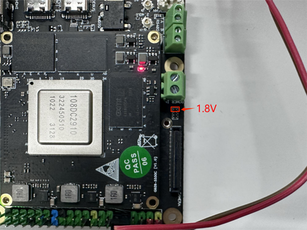

b. 驱动默认不开启，应用层获取

```shell
insmod hi_adc.ko auto_run=0
```

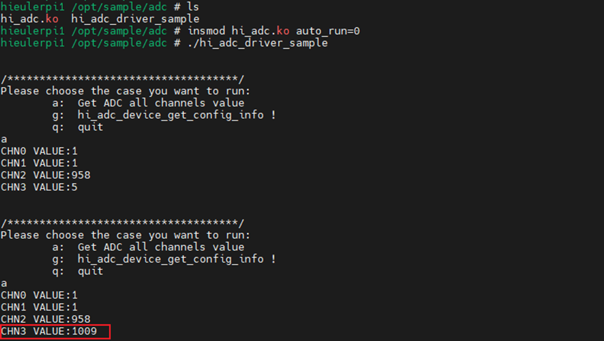

#### 2.5、PWM(舵机)

①. 硬件连接

| 舵机引脚      | EULER_40PEXP扩展板 |
| ------------- | ------------------ |
| 红色 (5V)     | J5 Pin3            |
| 棕色 (GND)    | J5 Pin1            |
| 黄色 (信号线) | J5 Pin5            |

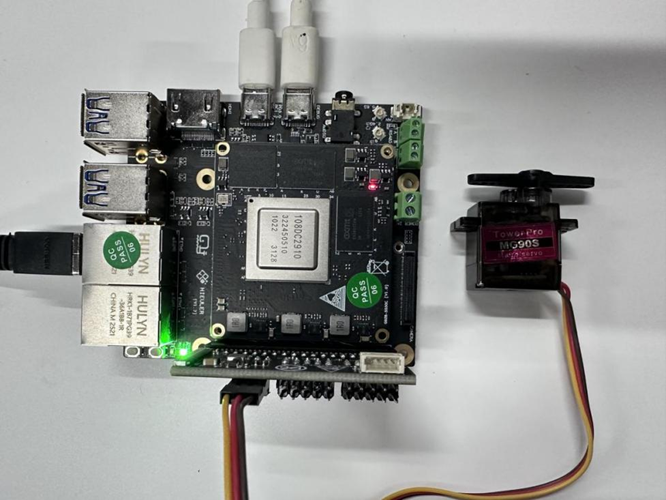

预留40pin IO Pin32为PWM0_OUT1_0_P。
 注意：PWM 舵机控制 (直接连接Pin32，舵机不转动，电压不足，需连接拓展板)。

②. 引脚复用

```shell
bspmm 0x102f01ec 0x1201
```

③. 功能验证

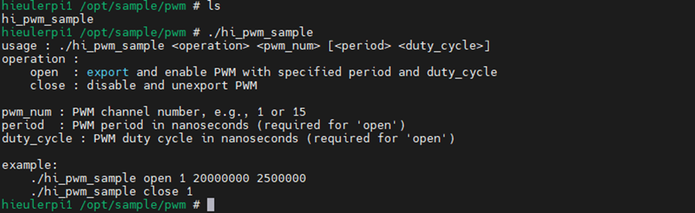

运行 open 后图示 MG90S TowerPro 舵机会360°转动。

```shell
./hi_pwm_sample open 1 20000000 2500000
./hi_pwm_sample open 1 20000000 500000
```

#### 2.6、CAN(USB转CAN)

①. 硬件连接

| USB转CAN |                        |
| -------- | ---------------------- |
| GND      | GND (40Pin预留IO Pin6) |
| RX/CAN_H | CAN_H (Can Pin2)       |
| TX/CAN_L | CAN_L (Can Pin1)       |

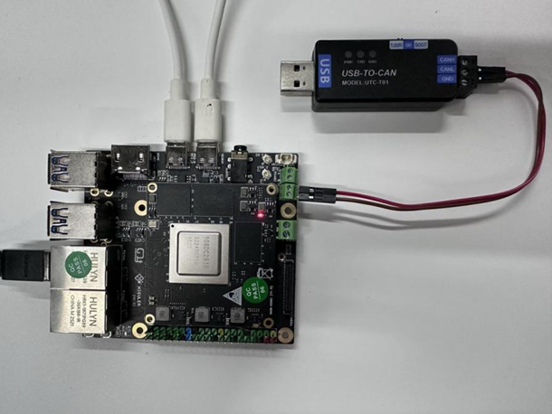

②. 引脚复用

```shell
#spi转can引脚复用
# SPI0_SCLK
bspmm 0x0102F01D8 0x1201 > /dev/null
# SPI0_SDO
bspmm 0x0102F01DC 0x1201 > /dev/null
# SPI0_SDI
bspmm 0x0102F01E0 0x1201 > /dev/null
# SPI0_CSN
bspmm 0x0102F01E4 0x1201 > /dev/null
# SYS_RSTN
bspmm 0x0102F0114 0x1201 > /dev/null
# CAN_INT
bspmm 0x0102F0030 0x1200 > /dev/null
```

③. 功能验证

```shell
ip link set can0 type can bitrate 500000
ip link set can0 up
```

打开PCAN-View软件。

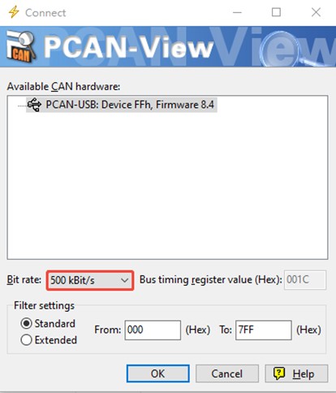

```shell
cansend can0 123#8877665544332211        //发送
candump can0                             //接收
```

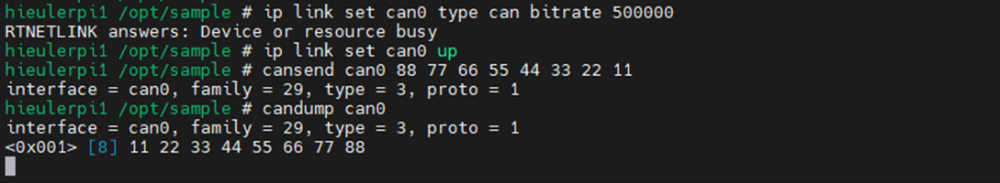

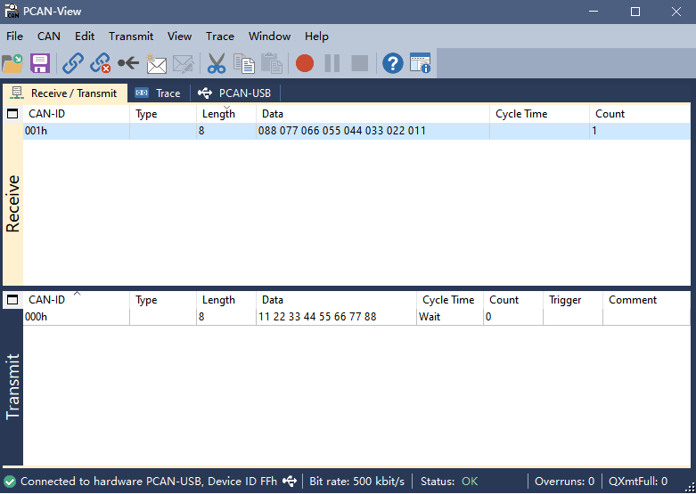

#### 2.7、RTC时钟

查询、设置 RTC 时钟方式如下：

```shell
hwclock -r     #查询 RTC 时钟
date -s "2025-06-23 19:30:00"     #设置 RTC 时钟
hwclock -w     #保存 RTC 时钟
```

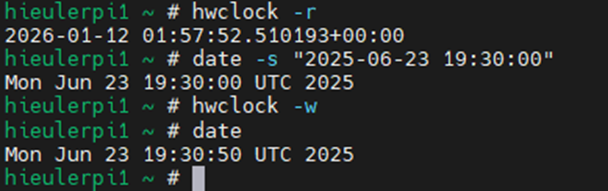

断开电源(包括调试串口线)，等一段时间再上电查询时间。

#### 2.8、Tsensor芯片温度

注：目前只有OpenEuler支持

Tsensor是海鸥派主控SS928V100的芯片温度传感器驱动，主要用于获取主控的芯片温度，获取当前主控温度

```
cat /proc/Tsensor
```

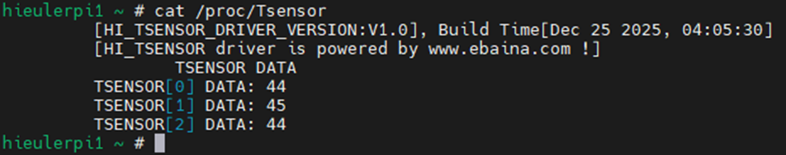

#### 2.9、存储

##### 2.9.1、TF(SD)卡

①. 硬件连接

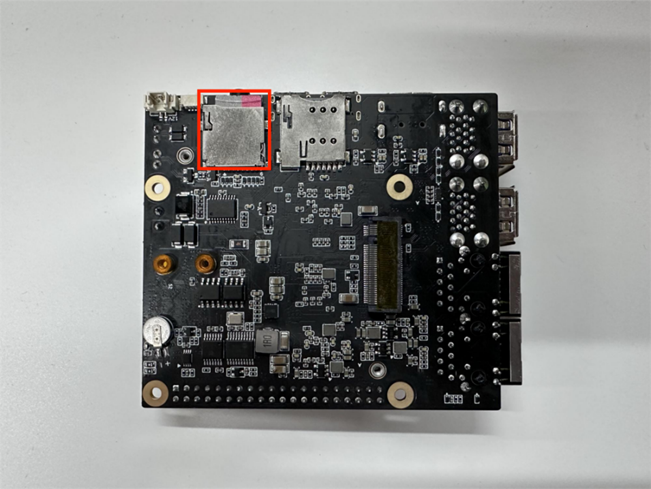

②. 功能验证

TF卡插入后将会打印相关信息，调试串口信息如下：

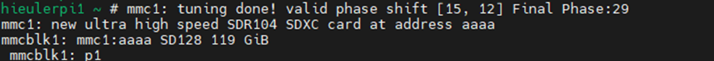

a. TF卡和分区的详细信

```shell
fdisk -l      //查看 TF 卡是否被正确识别
```

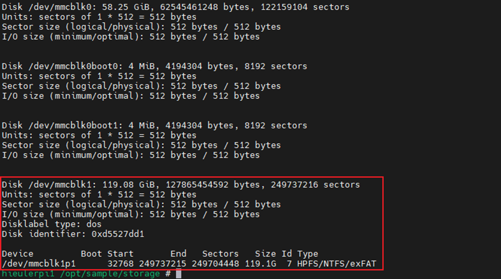

b. 格式化分区

```shell
mkfs.vfat /dev/mmcblk1p1  //mkfs.vfat可替换成其他格式的例如mkfs.ext4等
```

c. 测试读写速度

```shell
./test_storage.sh /dev/mmcblk1p1
```

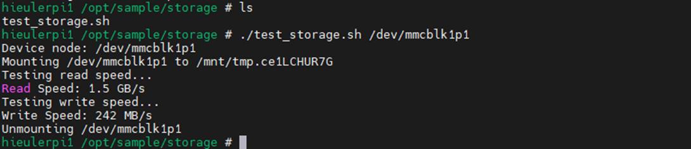

##### 2.9.2、U盘

①. 硬件连接

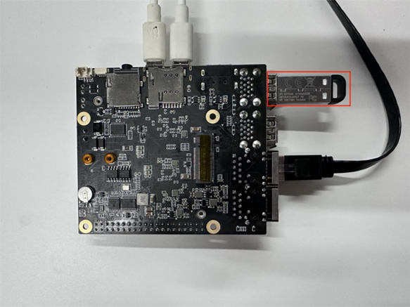

②. 功能验证

U盘插入后将会打印相关信息，调试串口信息如下：

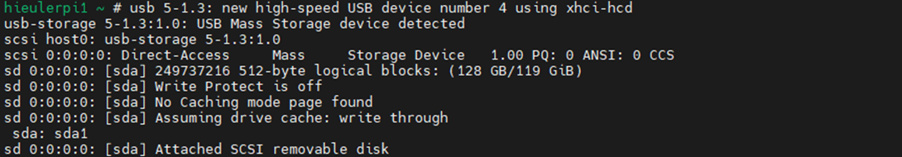

a. U盘和分区的详细信息

```shell
fdisk -l    
```

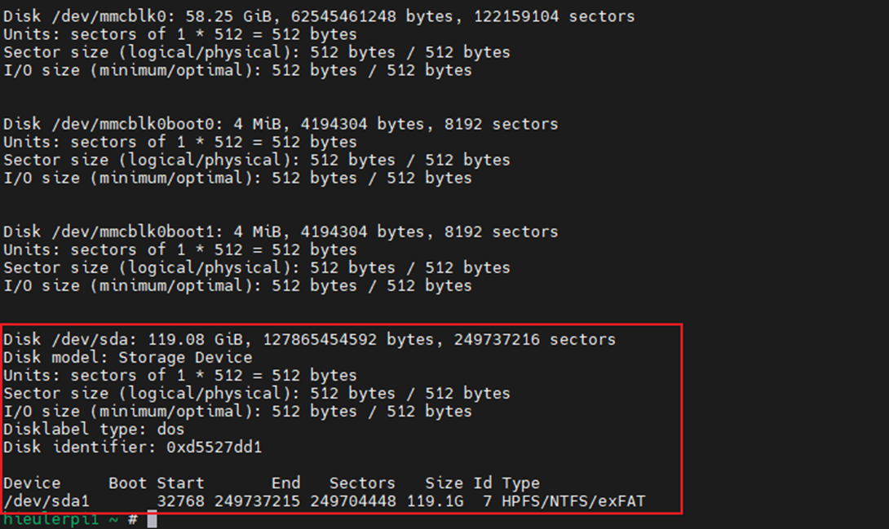

b. 格式化分区

```shell
mkfs.vfat /dev/sda1  
```

c. 测试读写速度

```shell
./test_storage.sh /dev/sda1  
```

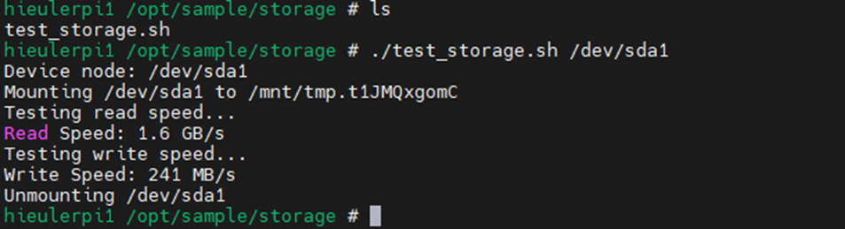

2.9.3、PCIE硬盘

①. 硬件连接

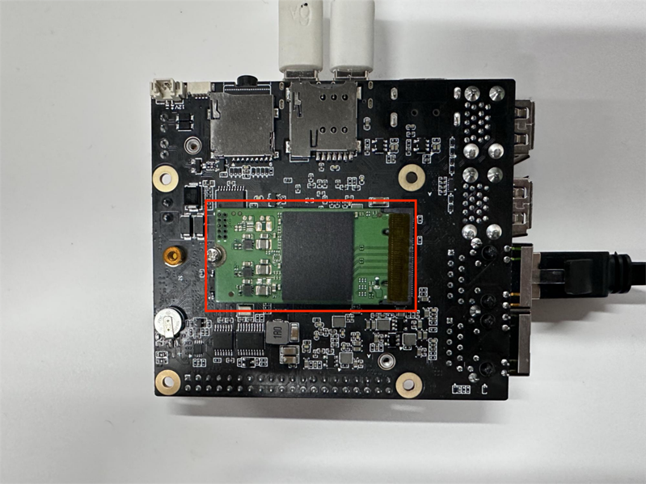

<font color="red">**注：PCIE 硬盘不是热插拔设备，将 PCIE 硬盘接上后需要重启才能识别到设备。**</font>

PCIE 硬盘要求：NVME M.2 协议，且 B&M Key 左右各一个缺口；

②. 功能验证

a. PCIE 硬盘和分区的详细信

```shell
fdisk -l     
```

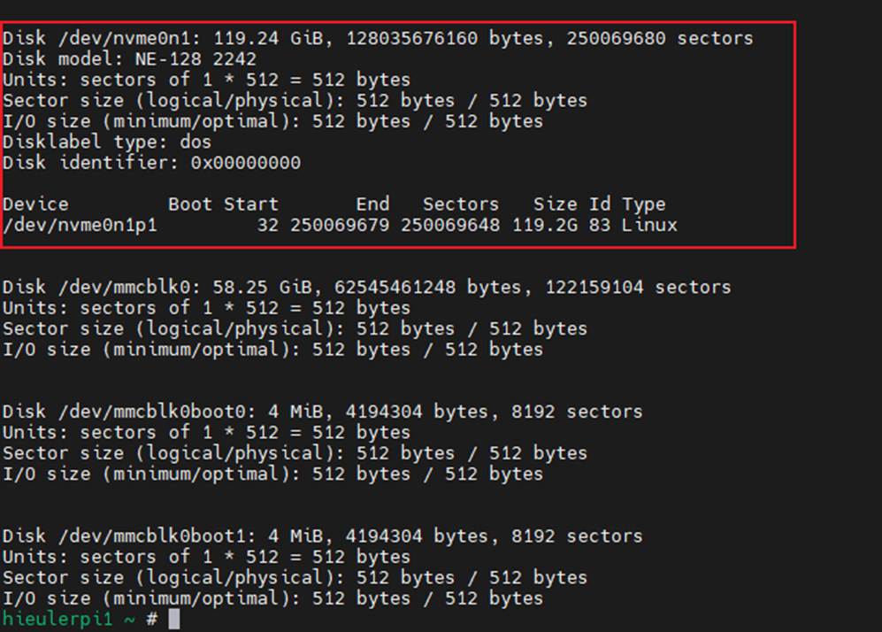

b. 格式化分区

```shell
mkfs.vfat /dev/nvme0n1p1 
```

c. 测试读写速度

```shell
./test_storage.sh /dev/nvme0n1p1
```

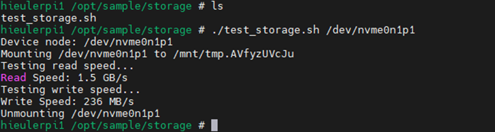

#### 2.10、USB接入UVC Camera

①. 硬件连接

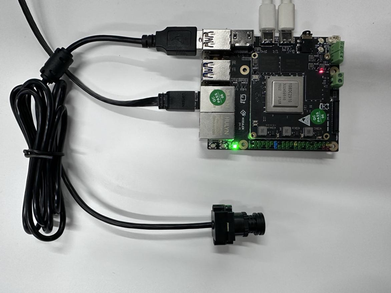

②. 功能验证

接入UVC摄像头内核打印

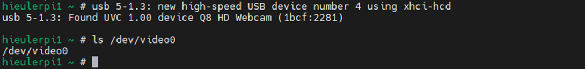

查询当前USB摄像头支持的视频格式：

```shell
./sample_uvc /dev/video0 --enum-formats
```

插上HDMI显示器后根据当前摄像头支持的视频格式进行传参：

```shell
./sample_uvc /dev/video0 -fMJPEG -s1280x720 -Ftest.mjpg
```


#### 2.11、5G模组

##### 2.11.1、USB接口之5G RedCap(MT5710-CN)

①. 硬件连接

将RedCap模块固定在转接板上，SIM卡安装在转接板卡槽上，将转接板插在USB接口。


②. 功能验证

a. 接入模组内核打印


b.验证PCUI口正常

开启双Terminal，一个输出打印结果：cat /dev/ttyUSB1，一个发送AT指令：

```shell
#终端1
stty -F /dev/ttyUSB1 -echo       #关闭回显
cat /dev/ttyUSB1
#终端2
echo -e "ATE1\r\n" > /dev/ttyUSB1
```


c. 拨号测试

```shell
echo -e "AT^NDISDUP=1,1\r\n" > /dev/ttyUSB1
udhcpc -i usb0
```


#### 2.12、星闪模组(WS73)

##### 2.12.1、WIFI

①. STA模式测试

默认连接到 ssid 为 ebaina-703 的无线网络（ebaina-703为本文开发环境下的 WiFi 名称，具体以实际 WiFi 进行操作）

```shell
vi /etc/wireless/wpa_supplicant.conf 
//如需修改 SSID 和密码就执行，否则不执行
```


a. 模块上电/下电

```shell
mcu_tool /dev/i2c-0 0x10 nl off
mcu_tool /dev/i2c-0 0x10 nl on
```

b. 开启WIFI

```shell
./wifi_sta.sh 0
```


输入 ifconfig 可查看 IP。


若连接的WIFI可上网，ping www.baidu.com测试

```shell
ping -I wlan0 www.baidu.com
```


c. 关闭WIFI

```shell
./wifi_sta.sh 1
```


②. AP模式测试

默认 AP SSID 为HiEuler_PI_AP, 密码为 12345678

```shell
vi /etc/wireless/hostapd.conf 
//如需要修改 SSID、密码、网关就执行，否则不执行
```


a. 模块上电/下电

```shell
mcu_tool /dev/i2c-0 0x10 nl off
mcu_tool /dev/i2c-0 0x10 nl on
```

b. 开启WIFI

```shell
./wifi_ap.sh 0
```


c. 关闭WIFI

```shell
./wifi_ap.sh 1
```


##### 2.12.2、蓝牙

①. 模块上电/下电

```shell
mcu_tool /dev/i2c-0 0x10 nl off
mcu_tool /dev/i2c-0 0x10 nl on
```

②. 加载驱动
 注：OpenEuler系统只需加载驱动（dbus和bluetoothd 默认已经开启)，加载驱动如下。

```shell
insmod plat_soc.ko
insmod ble_soc.ko
```


③. 启动 bluetootctl

将类似以下两行（ble.sh 输出的绿色的内容）复制并粘贴到终端执行后，执行bluetoothctl，进入蓝牙终端。

```shell
bluetoothctl
```


a. 蓝牙设备上电

```shell
power on
```


b. 扫描设备

​    扫描到对应的设备后，使用 scan off 关闭。

```shell
scan on
```


c. 查看扫描结果

```shell
devices
```


d. 连接设备

```shell
connect <蓝牙设备地址>     //连接蓝牙设备
disconnect <蓝牙设备地址>  //断开连接
```


e. 关闭蓝牙

```shell
power off
```


f. 退出bluetoothctl

```shell
exit
```

##### 2.12.3、星闪

准备两片板子（命名为 A 板卡、B 板卡），并装上天线。
 ①. 模块上电/下电

A 板卡、B 板卡 均要执行。

```
mcu_tool /dev/i2c-0 0x10 nl off
mcu_tool /dev/i2c-0 0x10 nl on
```

②. 功能验证

A 板卡执行：

```shell
./sle_server.sh 0
```

B 板卡执行：

```shell
./sle_client.sh 0
```


AB连接后A板子(server(端)会持续打印接收数据的速率。


#### 2.13、MIPI_RX(Sensor)

##### 2.13.1、转接板说明

a.EULER_1R2D V1.0转接板

| -    | sensor0(4lane) | I2C5 |
| ---- | -------------- | ---- |
| J3   | dtof(2lane)    | I2C4 |
| J4   | dtof(2lane)    | I2C5 |

EULER_1R2D V1.0 转接板示意图：


b.EULER_2R V1.0转接板

| J3   | sensor0(4lane) | I2C5 |
| ---- | -------------- | ---- |
| J4   | sensor1(4lane) | I2C7 |

EULER_2R V1.0 转接板示意图：


c.EULER_4SEN V1.0转接板

| sensor0(2lane) | I2C7 |
| -------------- | ---- |
| sensor1(2lane) | I2C5 |
| sensor2(2lane) | I2C4 |
| sensor3(2lane) | I2C6 |

EULER_4SEN V1.0 转接板示意图：


d. 图像传感器适配说明

| 传感器类型    | EULER_1R2D V1.0 | EULER_2R V1.0     | EULER_4SEN V1.0   |
| ------------- | --------------- | ----------------- | ----------------- |
| Sony IMX347   | 4lane sensor0   | 4lane sensor(0~1) | 2lane sensor(0~3) |
| OV OS04A10    | 4lane sensor0   | 4lane sensor(0~1) | ↻                 |
| OV OS08A20    | 4lane sensor0   | 4lane sensor(0~1) | ↻                 |
| Smart SC450AI | 4lane sensor0   | 4lane sensor(0~1) | 2lane sensor(0~3) |

注: 

①. 测试程序的HDMI输出均为1080P60。

②. 测试Sensor 前需要配置时钟。

##### 2.13.2、Sensor时钟修改

①  . 方法一，修改加载load_ss928v100 脚本参数


OS04A10和OS08A20 时钟相同，配置一个即可（不加参数时默认加载imx347）。

```shell
./load_ss928v100 -i -sensor0 os08a20 -sensor1 os08a20 -sensor2 os08a20 -sensor3 os08a20
```


②. 方法二，修改时钟配置寄存器

```shell
bspmm 0x11018440 0x4001    #Sensor0 配置为24MHz
bspmm 0x11018460 0x4001    #Sensor1 配置为24MHz
bspmm 0x11018480 0x4001    #Sensor2 配置为24MHz
bspmm 0x110184A0 0x4001    #Sensor3 配置为24MHz
```

| 型号    | 时钟寄存器配置 | 时钟大小  |
| ------- | -------------- | --------- |
| IMX347  | 0x8001         | 37.125MHz |
| OS04A10 | 0x4001         | 24MHz     |
| OS08A20 | 0x4001         | 24MHz     |
| SC450AI | 0xA001         | 27MHz     |

具体说明参考21AP10 超高清智能网络录像机 SoC 用户指南.pdf 手册。


##### 2.13.3、IMX347

测试IM347前，需要配置Sensor 时钟。

①. 1x4lane VIO

a. 硬件连接

EULER_1R2D V1.0转接板接线图：


EULER_2R V1.0转接板接线图：


b. 功能验证

```shell
./sample_vio 0 0
```


②. 2x4lane VIO

a. 硬件连接

EULER_2R V1.0转接板接线图：


b. 功能验证

```shell
./sample_vio 2 0
```


##### 2.13.4、OS04A10

测试OS04A10前，需要配置Sensor 时钟。

①. 1x4lane VIO

a. 硬件连接

EULER_1R2D V1.0转接板接线图：


EULER_2R V1.0转接板接线图：


b. 功能验证

```shell
./sample_vio 0 0
```


②. 2x4lane VIO

a. 硬件连接

EULER_2R V1.0转接板接线图：


b. 功能验证

```shell
./sample_vio 2 0
```


##### 2.13.5、OS08A20

测试OS08A20前，需要配置Sensor 时钟。

①. 1x4lane VIO

a. 硬件连接

EULER_1R2D V1.0转接板接线图：


EULER_2R V1.0转接板接线图：


b. 功能验证

```shell
./sample_vio 0 0
```


②. 2x4lane VIO

a. 硬件连接

EULER_2R V1.0转接板接线图：


b. 功能验证

```shell
./sample_vio 2 0
```


##### 2.13.6、SC450AI

测试SC450AI前，需要配置Sensor 时钟。

①. 1x4lane VIO

a. 硬件连接

EULER_1R2D V1.0转接板接线图：


EULER_2R V1.0转接板接线图：


b. 功能验证

```shell
./sample_vio 0 0
```


②. 2x4lane VIO

a. 硬件连接

EULER_2R V1.0转接板接线图：


b. 功能验证

```shell
./sample_vio 2 0
```


③. 4x2lane VIO

a. 硬件连接

EULER_4SEN V1.0转接板接线图：


b. 功能验证

sensor2 + sensor3 复位是需要使用GPIO复位， 运行sns23_reset_4x2lane.sh脚本即可。

- sensor 驱动为2lane_30fsp_2688x1520：

```shell
./sns23_reset_4x2lane.sh
./sample_vio_4x2lane_4M
```


- sensor 驱动为2lane_30fsp_1920x1080：

```shell
./sns23_reset_4x2lane.sh
./sample_vio_4x2lane_2M
```


#### 2.14、MIPI_TX(MIPI屏）

①. 硬件连接

屏幕的40引脚接到转接板LED丝印端


②. 功能验证

```shell
./sample_vdec
```


可能用到的背光和复位控制脚本。


#### 2.15、Audio

 ①. 音频输入


②. 音频输出


