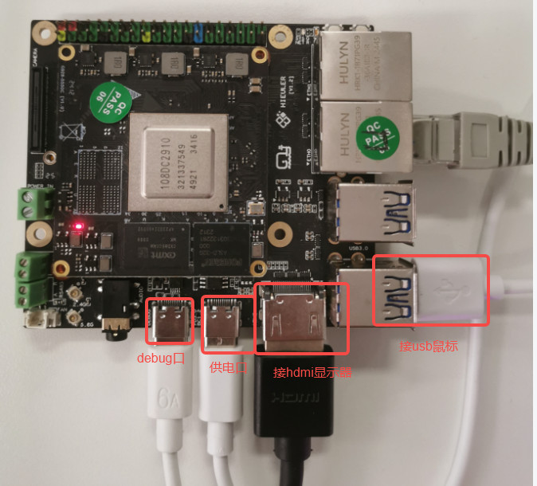
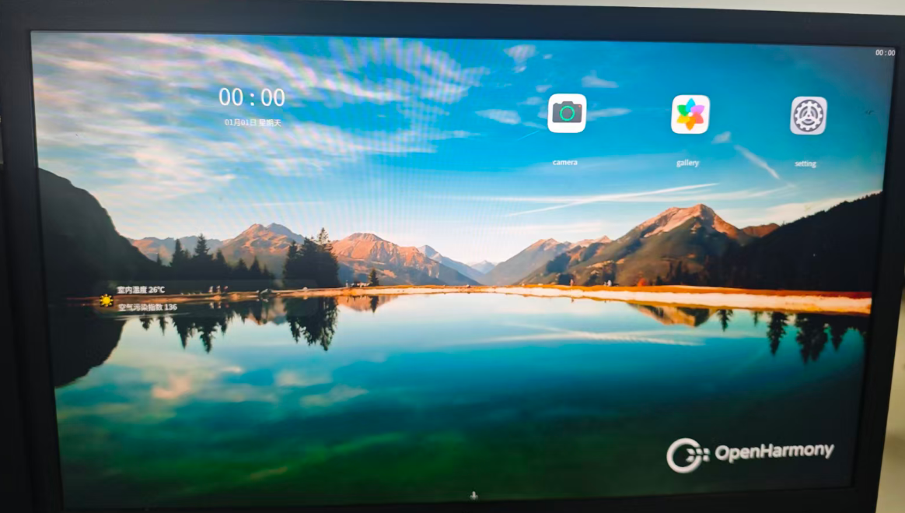
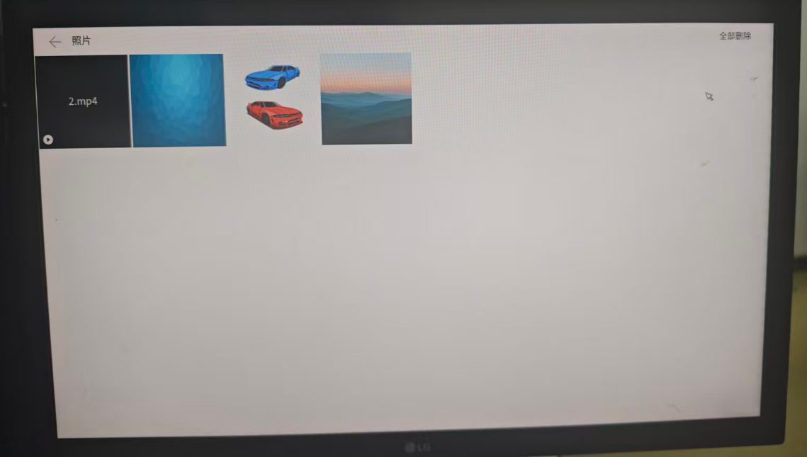
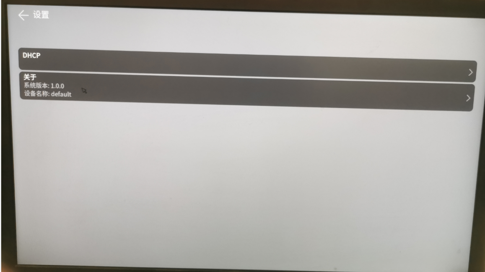
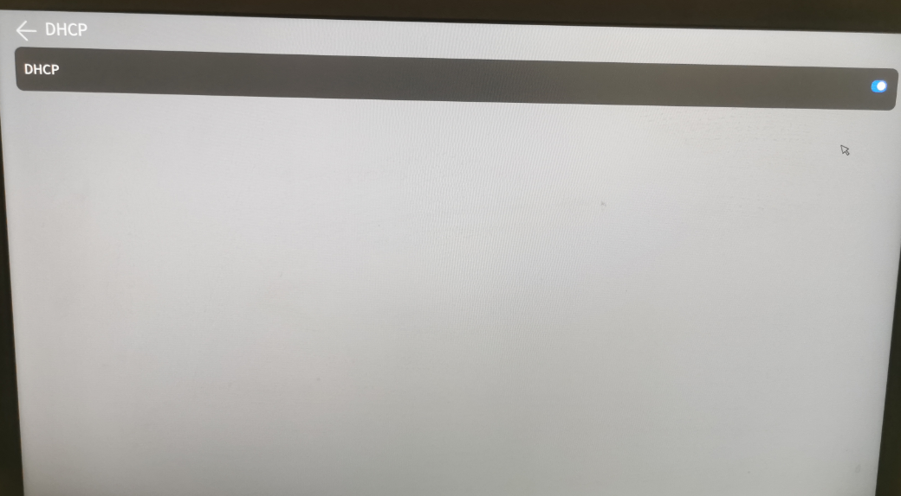
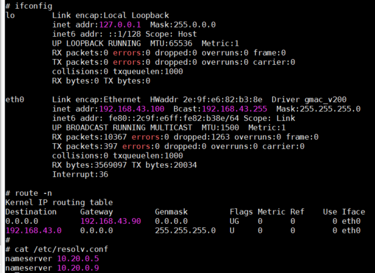
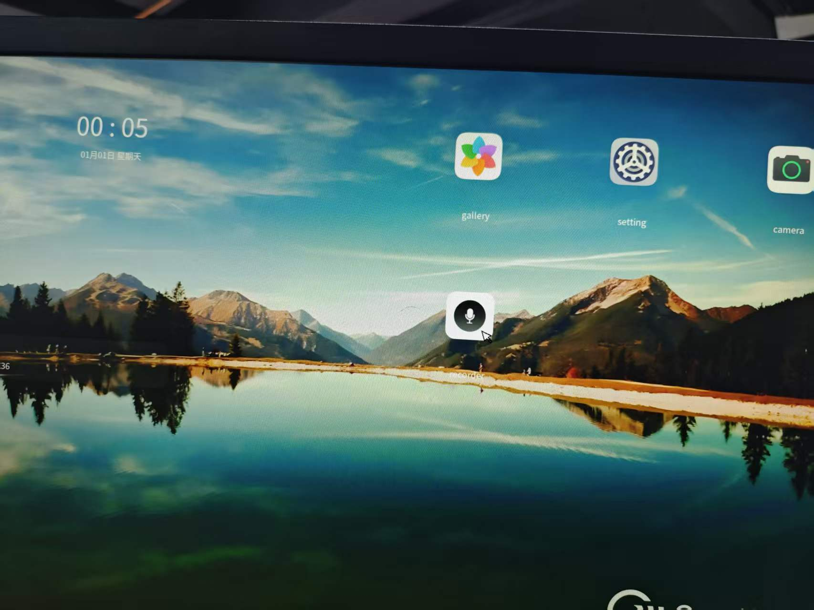
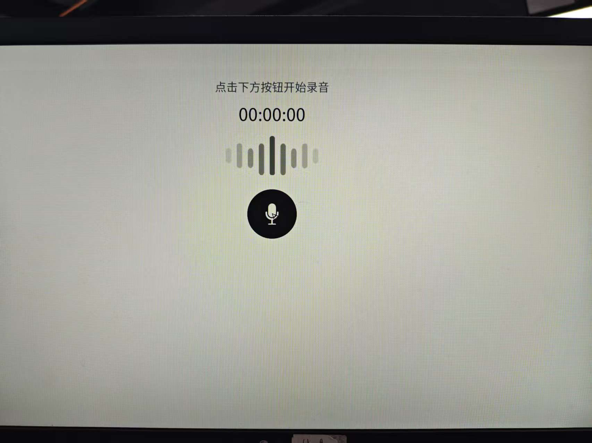
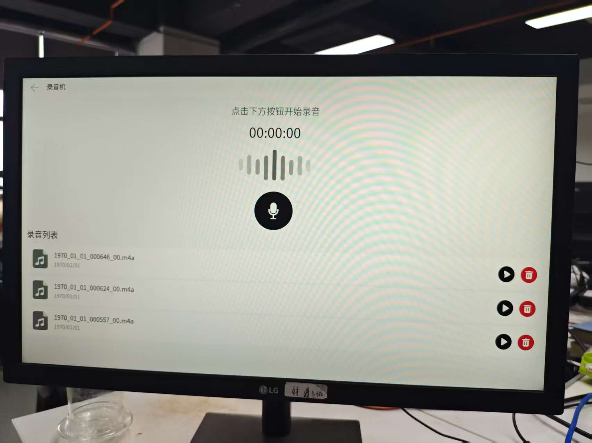

## 开发板
1、基于易百纳4+32的板子


## 编译
请参考 [开发环境](../../docs/zh-CN/OpenHarmony%20Small版本使用指南/OpenHarmony%20Small版本使用指南.md#开发环境) 章节进行环境搭建和版本编译。

## 镜像烧写
请参考 [版本烧写](../../docs/zh-CN/OpenHarmony%20Small版本使用指南/OpenHarmony%20Small版本使用指南.md#版本烧写) 章节进行镜像烧写操作。

## 系统进入桌面


## 多媒体验证
1. 将图片和视频文件放到/userdata/photo/目录下(图片支持jpg和jpeg格式，视频支持mp4(编码格式支持h264格式和h265格式))

    以SD卡为例推文件到/userdata/photo/

    - 将SD卡格式化为ext4格式
    - 将相关资源文件放入SD卡
    - 挂载SD卡并拷贝到/userdata/photo/
    ```
    mkdir /storage/sdk
    mount -t ext4 /dev/block/mmcblk1p1 /storage/sdk
    cp /storage/sdk/xx /userdata/photo/
    ```
2. 将耳机插入板子上的耳机接口
3. 打开gallery，即可查看图片和播放视频


## DHCP验证
1. 如上图开发板所示，插入网线，点击setting应用，打开设置界面，点击DHCP，即可进入DHCP开关界面

2. 点击DHCP开关

3. 通过ifconfig等相关命令，可以查看获取到dhcp的ip地址、dns、以及默认路由。 


## 录音机验证
1.插上耳机
2.鼠标点击桌面录音机图标打开录音机应用 

3.点击录音按钮开始录音，再次点击停止录音     
  
4.修改文件夹权限: chmod 777 /userdata/audio/norm  （仅首次启动需要修改）  
5.退出录音机应用重新打开，点击录音录音
6.停止录音后在录音列表能够看见音频文件，点击播放（播放时声音很小） 


遗留问题：录的声音很小，声音不完整  
注意事项：录音时一定要靠近麦克风，不然录不到声音  
