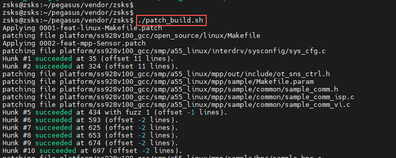
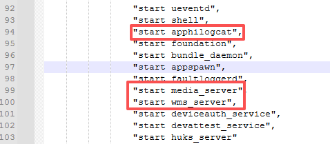
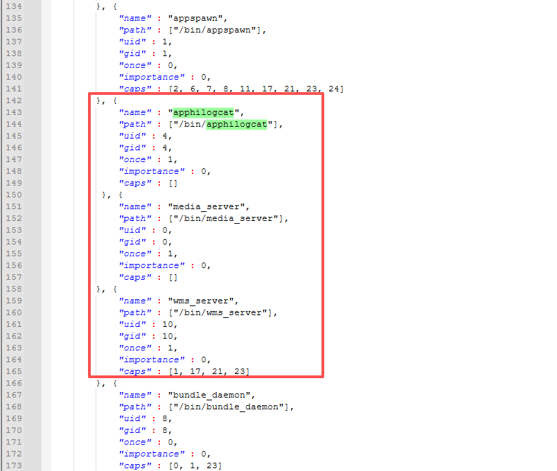
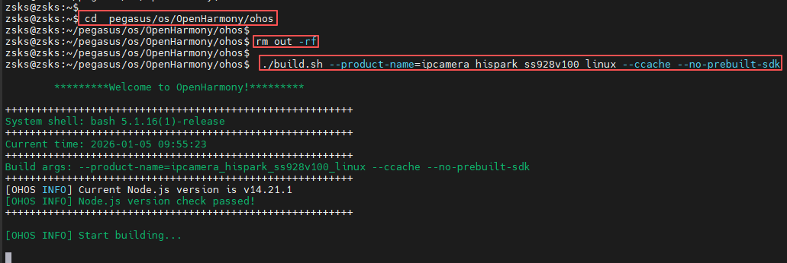
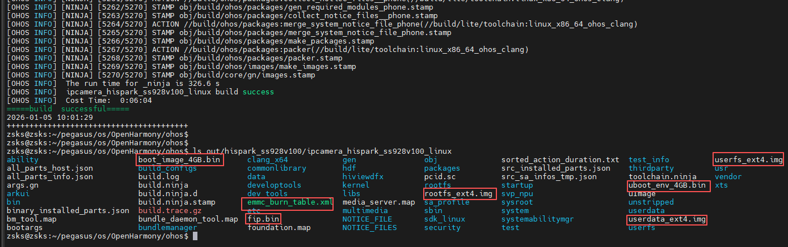
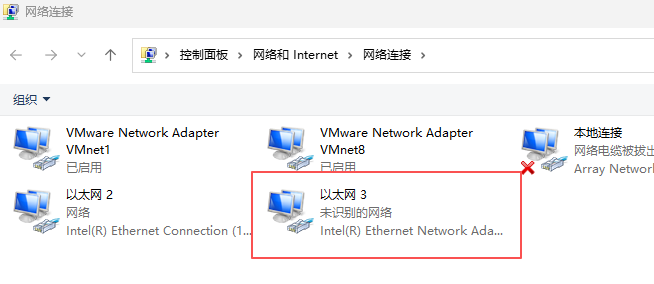
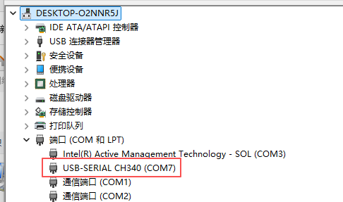
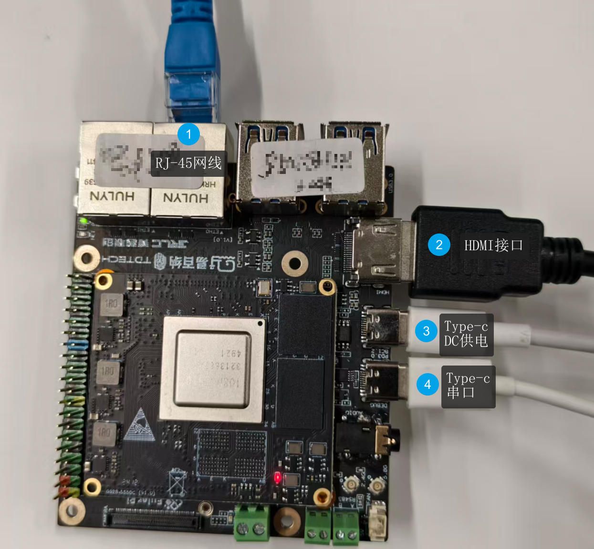
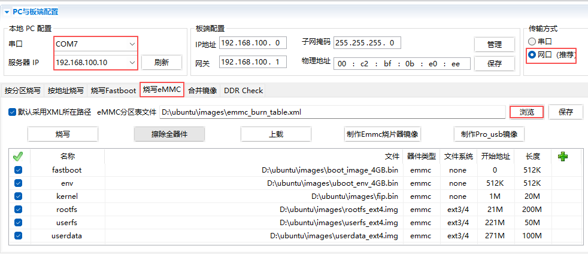

## 1.项目介绍

* 本目录是由中山旷视微电子科技有限责任公司与海思深度合作的生态开源项目，旨在为广大开发者提供便利、高效、好用的第三方软件及工具。助力海思生态更上一个台阶。
* demo目录是我们基于SS928平台开发的实用案例，包括：基于OpenCV的人脸检测案例、基于HNR的夜间超微光案例、基于YoloV8的水果识别及语音播报案例、基于KCF的目标跟踪案例、基于YoloV8的强逆光下的人脸检测案例，同时我们还基于IVE实现了OpenCV的硬件加速，帮助熟悉OpenCV的开发者，以最小的学习成本，就能够很好的使用海思SS928平台的硬件加速模块。
* 我们基于SS928平台移植的常见第三方软件，包括：python、numpy、OpenCV、libv4l2、alsa-lib、ffmpeg、libacamera第三方软件，doc目录就是我们提供的相关移植文档和开发文档，旨在帮助开发者快速移植场见的第三方软件。同时我们还对海思SS928的MPP模块进行了python化的封装，让开发者只需要使用几行python代码，就能够很好的完成一个海思案例的开发。
* patch目录，是我们基于SS928的SDK包，提供的一些补丁代码，方便开发者更好的使用我们的参考案例。


## 2.开发指南

### 步骤1：环境搭建

* 请先参考官方的[Hi3403V100环境搭建指南](https://gitee.com/HiSpark/pegasus/blob/master/docs/Hi3403V100%E7%8E%AF%E5%A2%83%E6%90%AD%E5%BB%BA%E6%8C%87%E5%8D%97/Hi3403V100%E7%8E%AF%E5%A2%83%E6%90%AD%E5%BB%BA%E6%8C%87%E5%8D%97.md)把开发环境搭建好。

### 步骤2：打入补丁

* 在服务器的命令行，执行下面的命令，将vendor/zsks/patch/中的补丁打入Pegasus所对应的目录下。

```sh
cd pegasus/vendor/zsks

./patch_build.sh
```



* 在服务器的命令行，执行下面的命令，打入适配好的RKH的相关patch

```sh
cd  pegasus/os/OpenHarmony

cp ../../vendor/rkh/rkh_patch*  .   -rf

sudo apt-get update

sudo apt-get install dos2unix

dos2unix ohos/foundation/systemabilitymgr/samgr_lite/samgr/source/service.c

dos2unix ohos/vendor/hisilicon/hispark_ss928v100_linux/config.json

dos2unix ohos/vendor/hisilicon/hispark_ss928v100_linux/init_configs/init_linux_openharmony.cfg

chmod +x rkh_patch_build.sh

./rkh_patch_build.sh
```

* 在服务器的命令行，执行下面的命令，打入适配好的UVC和网卡的openharmony内核补丁

```
cd  pegasus/os/OpenHarmony

cp ../../vendor/zsks/patch/0001-support-eulerpi-uvc-and-ethernet.patch   ohos/kernel/linux/patches/linux-6.6/hispark_ss928v100_patch/

cp ../../vendor/zsks/patch/patch_ss928v100.sh  ohos/kernel/linux/patches/linux-6.6/hispark_ss928v100_patch/

cp ../../vendor/zsks/patch/hispark_ss928v100_small_defconfig ohos/kernel/linux/config/linux-6.6/arch/arm64/configs/
```

### 步骤3：修改cfg文件

* 修改~/pegasus/os/OpenHarmony/ohos/vendor/hisilicon/

  hispark_ss928v100_linux/init_configs/中的init_linux_openharmony.cfg

  * 删掉apphilogcat、media_server、wms_server这三个服务





### 步骤4：整编OHOS代码

* 在服务器的命令行，执行下面的命令，整编OHOS代码

```sh
cd  pegasus/os/OpenHarmony/ohos

rm out -rf

 ./build.sh --product-name=ipcamera_hispark_ss928v100_linux --ccache --no-prebuilt-sdk
```



* 编译成功后，会在 pegasus/os/OpenHarmony/ohos/out/hispark_ss928v100/ipcamera_hispark_ss928v100_linux目录下生成  boot_image_4GB.bin、uboot_env_4GB.bin、fip.bin、rootfs_ext4.img、userfs_ext4.img、userdata_ext4.img 、emmc_burn_table.xml这几个文件。



### 步骤5：烧录固件

* 使用[ToolPlatform工具](https://gitee.com/link?target=https%3A%2F%2Fhispark-obs.obs.cn-east-3.myhuaweicloud.com%2FToolPlatform-1.0.11-win32-x86_64.zip)烧录镜像，请自行下载并解压ToolPlatform工具压缩包，并双击打开ToolPlatform.exe

  * 使用网线将开发板与你的工作电脑进行直连。并确保在自己电脑能够看到对应的以太网卡。

  

  * 使用USB转type-c线，将type-c口接入开发板的debug口，USB口接入电脑的USB口，确保电脑的设备管理器能够识别到对应的串口号。

  

  * 具体接线方式如下所示：



* 将服务器中的boot_image_4GB.bin、uboot_env_4GB.bin、fip.bin、rootfs_ext4.img、userfs_ext4.img、userdata_ext4.img 、emmc_burn_table.xml镜像文件下载到本地电脑。然后点击烧写eMMC，点击浏览按钮把xml打开，此时就会把所有镜像文件导入到toolplatform。点击左上角的刷新按钮，把串口配置为开发板所对应的串口号，服务器IP选择为开发板在电脑生成的网卡IP地址（如果没有自己手动配置一个）。



* 第一次烧写完成后，需要配置bootargs，脚本如下

```sh
setenv bootargs 'mem=512M console=ttyAMA0,115200 clk_ignore_unused rw rootwait root=/dev/mmcblk0p4 rootfstype=ext4 blkdevparts=mmcblk0:512K(fastboot),512K(env),20M(kernel),200M(rootfs),50M(userfs),100M(userdata)';
setenv bootcmd 'mmc read 0 0x50000000 0x800 0xA000; bootm 50000000';
setenv bootdelay 1;
sa;
re
```

## 3.参考案例简介

### [2.1.opencv_dnn](./demo/opencv_dnn/README.md)

* 本案例主要是基于OpenCV，将USB camera采集到的图片送到人脸检测模型进行推理，将得到的结果通过HDMI，显示在外接显示屏上面。

### [2.2.hnr_auto](./demo/hnr_auto/README.md)

* 本案例主要是基于海思的hnr案例，实现夜间超微光的功能，当外接ISO到达一定阈值是，自动切换到hnr模型，使得在黑暗条件下也能清楚看到画面。

### [2.3.fruit_identify](./demo/fruit_identify/README.md)

* 本案例是基于YoloV8实现的一个水果分类的案例，通过USB Camera，将采集到的图片送到水果检测模型中进行推理，当检测到特定水果时，会通过外接显示屏实时显示水果的种类以及执行度，并框住水果的具体位置，并通过耳机播放出此时识别到的水果类别。

### [2.4.sample_kcf_track](./demo/sample_kcf_track/README.md)

* 基于KCF+Track模型，通过USB Camera，将采集到的图片送到KFC+trak模型，实现对目标的实时跟踪效果。

### [2.5.face_detection](./demo/face_detection/README.md)

* 本案例主要使用pytorch框架，基于YoloV8，使用大量的特殊场景下的人脸数据，训练出来的强逆光下的人脸检测模型，通过USB Camera，将采集到的图片送到人脸检测模型中进行推理，当检测到人脸时，会在人脸区域画出矩形，并实时的通过外接HDMI线显示在外接显示屏上。


## 4.第三方软件

### [3.1.python](./docs/python/README.md)

* 文档主要包括python源码包下载、依赖软件安装、交叉编译及安装、板端测试等内容。

### [3.2.numpy](./docs/numpy/README.md)

* 文档主要包括numpy源码包下载、交叉编译及安装、板端测试等内容。
* 注意：在板端使用numpy之前，必须按照3.1中的内容，把python移植好。

### [3.3.opencv](./docs/opencv/README.md)

* 文档主要包括python源码包下载、交叉编译及安装、板端测试(包括python代码和CPP的测试)等内容。
* 注意：如果想使用python代码调用OpenCV接口，必须按照3.1中的内容，把python移植好。

### [3.4.libv4l2](./docs/libv4l2/README.md)

* 文档主要包括libv4l2源码包下载、依赖软件安装、交叉编译及安装、板端测试等内容。

### [3.5.alsa-lib](./docs/alsa-lib/README.md)

* 文档主要包括alsa-lib源码包下载、依赖软件安装、交叉编译及安装、板端测试等内容。

### [3.6.ffmpeg](./docs/ffmpeg/README.md)

* 文档主要包括ffmpeg源码包下载、依赖软件安装、交叉编译及安装、板端测试，以及ffmpeg硬件加速（调用SS928的硬件编解码模块）等内容。

### [3.7.libcamera](./docs/libcamera/README.md)

* 文档主要包括libcamera源码包下载、依赖软件安装、交叉编译及安装、板端测试等内容。

