## 2.5、face_detection 操作指导

### 2.5.1、face_detection 程序简介

* face_detection sample基于SS928V100平台开发，以EulerPi套件为例，face_detection sample是通过USB Camera，将采集到的图片送到人脸检测模型中进行推理，当检测到人脸时，会在人脸区域画出矩形框，并通过外接HDMI线实时的显示在外接显示屏上。
* face_detection 案例主要是使用pytorch框架，基于YoloV8网络，使用widerface、FDDB、UFDD等开源数据集，共1.3万多张训练出来在强光、逆光、暗光下的人脸检测模型。

### 2.5.2、目录

```shell
pegasus/vendor/zsks/demo/face_detection
|── data                 # 模型文件
|── Makefile             # 编译脚本
└── face_detection.c     # face_detection sample业务代码
```

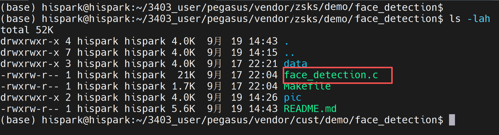

* 根据外接显示屏的输出参数进行配置，比如说我的外接显示屏的输出是1080P60，如果smp/a55_linux/mpp/sample/svp/common/sample_common_svp.c ample_common_svp_get_def_vo_cfg函数的intf_sync为OT_VO_OUT_1080P30，则需要把他修改为OT_VO_OUT_1080P60。

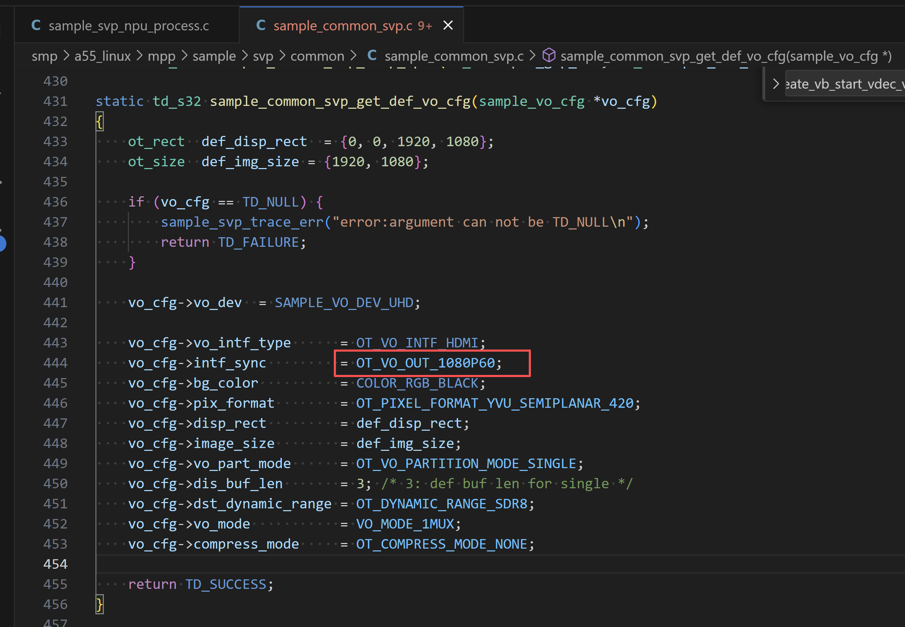

### 2.5.3、编译

* **注意：在编译zsks的demo之前，请确保你已经按照[开发指南中的步骤](../../README.md#2开发指南)把补丁打入对应目录下了**。

* 步骤1：先根据自己选择的操作系统，进入到对应的Pegasus所在目录下。

* 步骤2：使用Makefile的方式进行单编

* 在Ubuntu的命令行终端，分步执行下面的命令，单编 face_detection sample

* 编译命令添加LLVM=1参数可使用clang工具链编译，而LLVM=0参数可使用gcc工具链编译，不使用LLVM参数默认使用gcc工具链编译，当前开发板系统对应clang，所以本教程统一使用LLVM=1参数编译。

  ```
  cd pegasus/vendor/zsks/demo/face_detection
  
  make LLVM=1 clean && make LLVM=1
  ```

  * 在face_detection/out目录下，生成一个名为 main 的 可执行文件，如下图所示：

  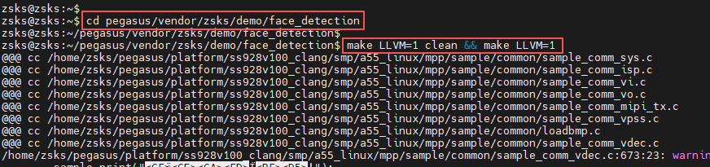
  
  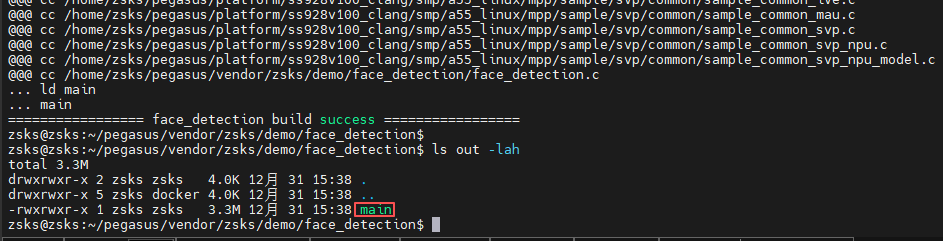

### 2.5.4、拷贝可执行程序和依赖文件至开发板的mnt目录下

**方式一：使用SD卡进行资料文件的拷贝**

* 首先需要自己准备一张Micro sd卡(16G 左右即可)，还得有一个Micro sd卡的读卡器。


* 步骤1：将编译后生成的可执行文件main和资源文件data，拷贝到SD卡中。

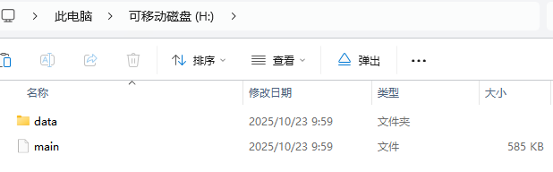

* 步骤2：可执行文件拷贝成功后，将内存卡插入开发板的SD卡槽中，可通过挂载的方式挂载到板端，可选择SD卡 mount指令进行挂载。


* 在开发板的终端，执行下面的命令进行SD卡的挂载
  * 如果挂载失败，可以参考[这个issue尝试解决](https://gitee.com/HiSpark/HiSpark_NICU2022/issues/I54932?from=project-issue)


```shell
mount -t vfat /dev/mmcblk1p1 /mnt
# 其中/dev/mmcblk1p1需要根据实际块设备号修改
```

* 挂载成功后，如下图所示：

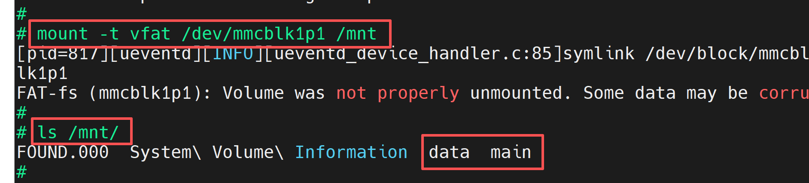

**方式二：使用NFS挂载的方式进行资料文件的拷贝**

* 首先需要自己准备一根网线
* 步骤1：参考[博客链接](https://blog.csdn.net/Wu_GuiMing/article/details/115872995?spm=1001.2014.3001.5501)中的内容，进行nfs的环境搭建
* 步骤2：将编译后生成的可执行文件main和资源文件data，拷贝到Windows的nfs共享路径下

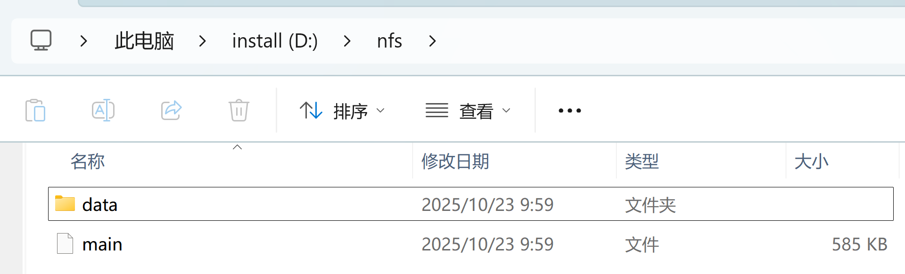

* 步骤3：在开发板的终端执行下面的命令，将Windows的nfs共享路径挂载至开发板的mnt目录下	
  * 注意：这里IP地址请根据你开发板和电脑主机的实际IP地址进行填写


```
ifconfig eth0 192.168.100.100

mount -o nolock,addr=192.168.100.10 -t nfs 192.168.100.10:/d/nfs /mnt
```

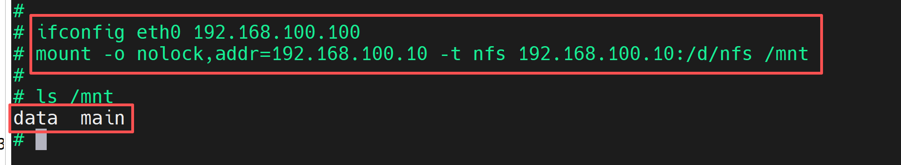

### 2.5.5、硬件连接

* 准备一个外接显示器和HDMI数据线，将HDMI的一头接在开发板的HDMI输出口，将HDMI的另外一头接在外接显示器的HDMI输入口。

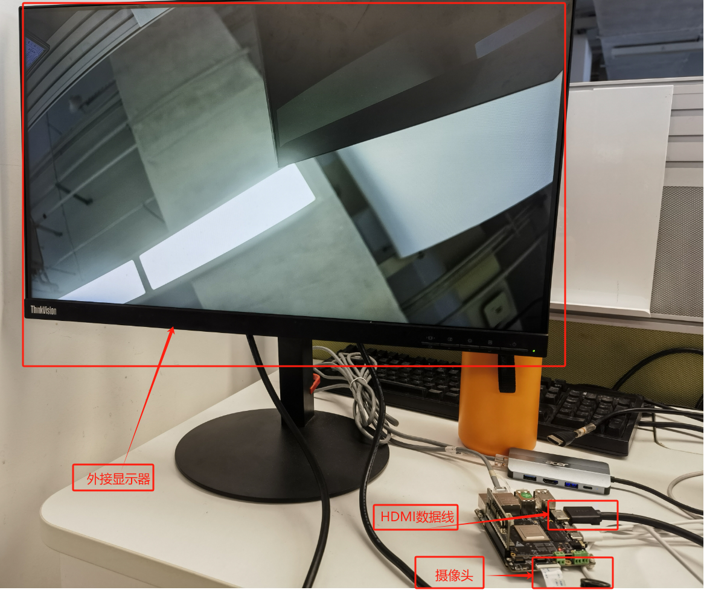

* 将USB 摄像头接在EulerPi开发板的USB接口上。

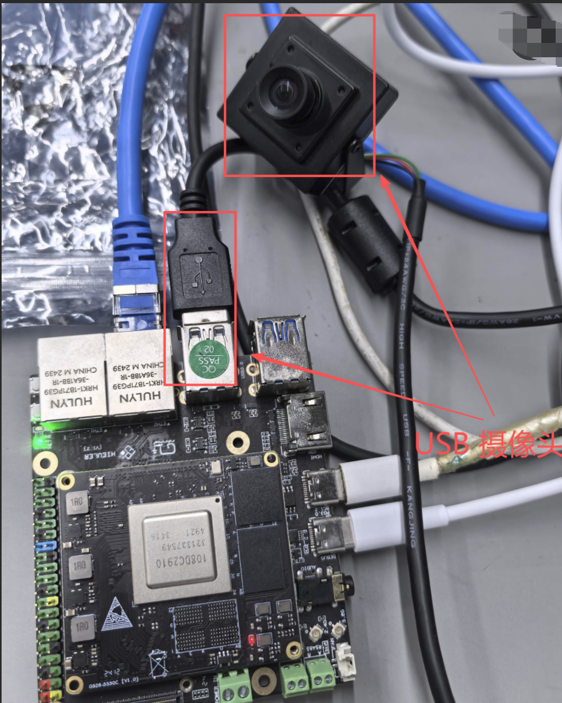

### 2.5.6、功能验证

* 在开发板的终端执行下面的命令，运行可执行文件

```
cd /mnt

chmod +x main

./main
```

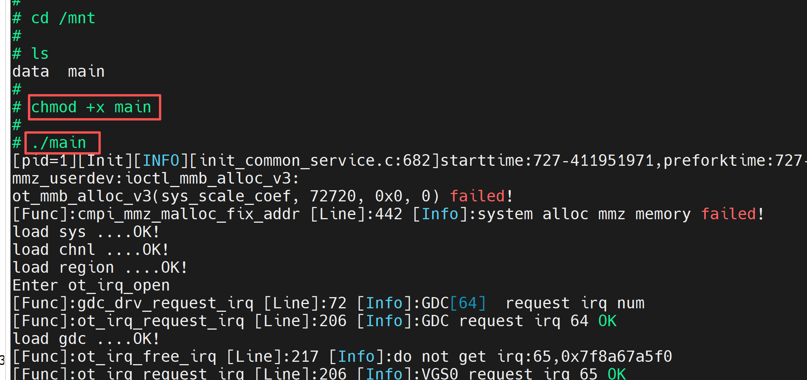

* 此时，在HDMI的外接显示屏上即可出现实时码流，如下图所示：


* 如果您看到的现象和下图现象不一致，可以确认一下USB摄像头是否插入到开发板的USB口，并且在开发板的/dev目录下能够看到video0 和 video1两个设备节点。如果没有这两个设备节点，请确保镜像烧录正常。


* 正常情况下，我们会在外接显示屏上看到人脸的区域被框出来，且在比较黑暗或者强逆光条件下，也能比较好的检测到人脸。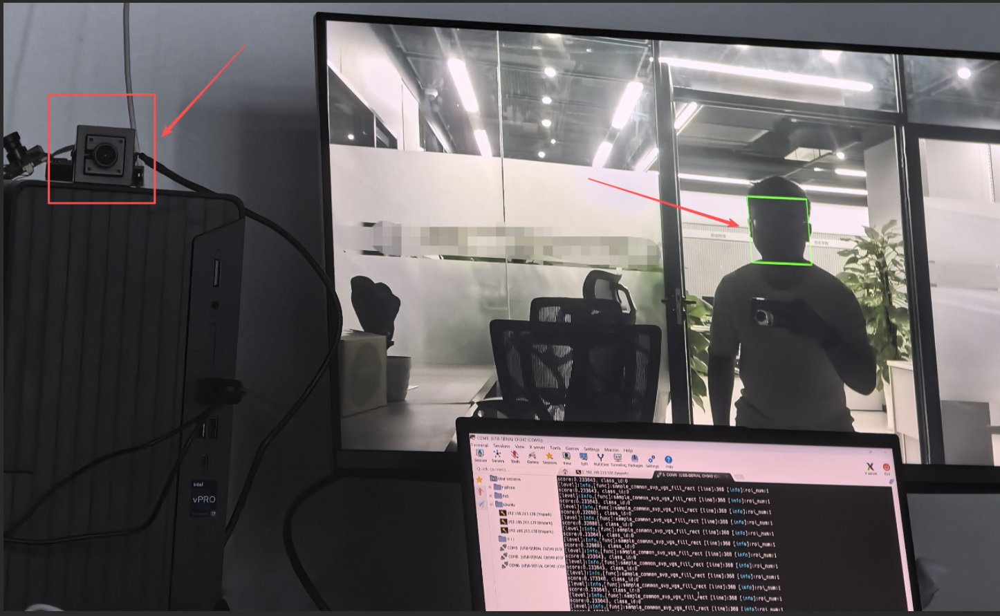

* 敲两下回车即可关闭程序


