## 2.2、hnr_auto操作指导

### 2.2.1、hnr_auto程序简介

* hnr_auto 基于SS928V100平台开发，以EulerPi套件为例，hnr_auto 是基于海思的hnr案例，实现夜间超微光的功能，当外接ISO到达一定阈值是，自动切换到hnr模型，使得在黑暗条件下也能清楚看到画面。

### 2.2.2、目录

```shell
pegasus/vendor/zsks/demo/hnr_auto 
|── Makefile             # 编译脚本
|── readme.txt           # hnr的操作说明
└──hnr_auto.c            # hnr_auto业务代码
```

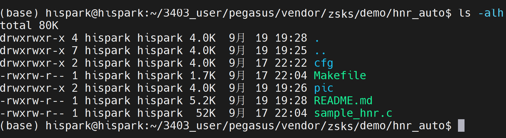

### 2.2.3、编译

* **注意：在编译zsks的demo之前，请确保你已经按照[开发指南中的步骤](../../README.md#2开发指南)把补丁打入对应目录下了**。

* 步骤0：使能HNR，把smp/a55_linux/mpp/sample/common/sdk_module_init.h头文件中的宏定义INIT_PQP修改为1；**（如果是其他案例，请一定要把这个宏还原为0）**

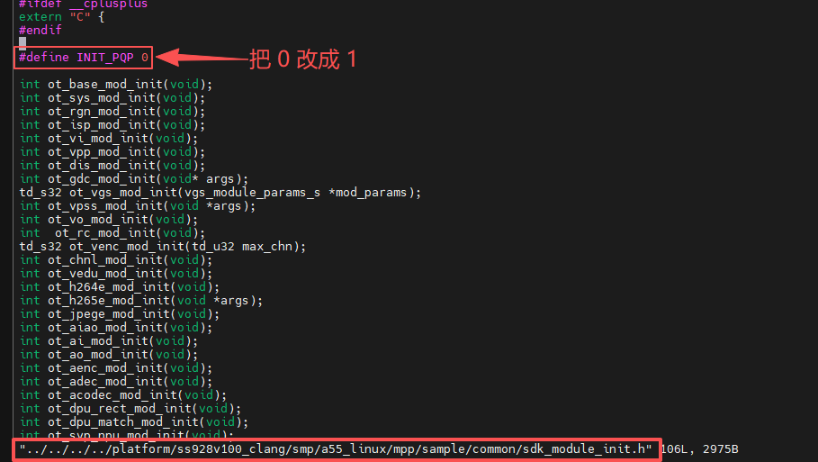

* 步骤1：先根据自己选择的操作系统，进入到对应的Pegasus所在目录下。

* 步骤2：使用Makefile的方式进行单编

* 在Ubuntu的命令行终端，分步执行下面的命令，单编 hnr_auto 

* 编译命令添加LLVM=1参数可使用clang工具链编译，而LLVM=0参数可使用gcc工具链编译，不使用LLVM参数默认使用gcc工具链编译，当前开发板系统对应clang，所以本教程统一使用LLVM=1参数编译。

  ```
  cd pegasus/vendor/zsks/demo/hnr_auto/
  
  make LLVM=1 clean && make LLVM=1
  ```

  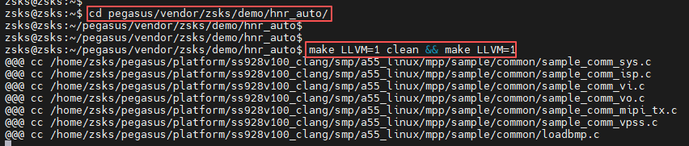

  * 在hnr_auto/out目录下，生成一个名为main的 可执行文件，如下图所示：

  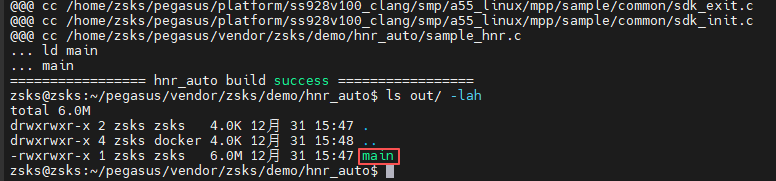

### 2.2.4、拷贝可执行程序和依赖文件至开发板的mnt目录下

**方式一：使用SD卡进行资料文件的拷贝**

* 首先需要自己准备一张Micro sd卡(16G 左右即可)，还得有一个Micro sd卡的读卡器。


* 步骤1：将编译后生成的可执行文件拷贝到SD卡中。
* 步骤2：将ss928v100_clang/smp/a55_linux/mpp/sample/hnr/目录下的cfg模型文件拷贝到SD卡中。

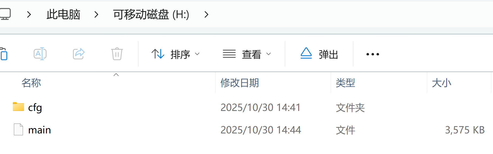

* 步骤3：可执行文件拷贝成功后，将内存卡插入开发板的SD卡槽中，可通过挂载的方式挂载到板端，可选择SD卡 mount指令进行挂载。

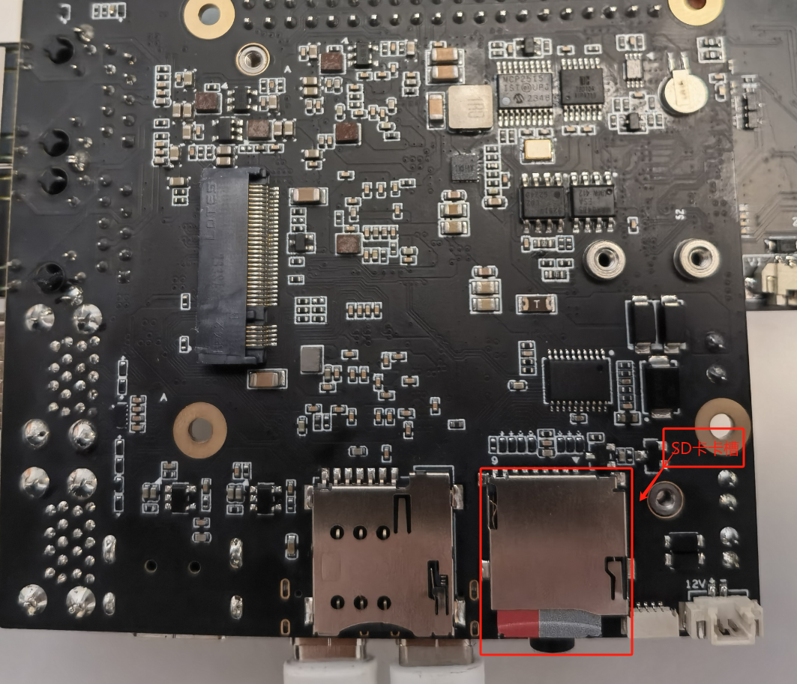

* 在开发板的终端，执行下面的命令进行SD卡的挂载
  * 如果挂载失败，可以参考[这个issue尝试解决](https://gitee.com/HiSpark/HiSpark_NICU2022/issues/I54932?from=project-issue)


```shell
mount -t vfat /dev/mmcblk1p1 /mnt
# 其中/dev/mmcblk1p1需要根据实际块设备号修改
```

* 挂载成功后，如下图所示：

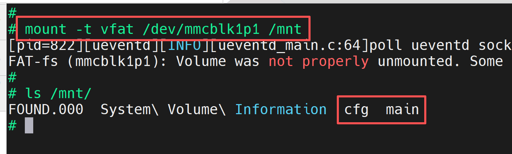

**方式二：使用NFS挂载的方式进行资料文件的拷贝**

* 首先需要自己准备一根网线
* 步骤1：参考[博客链接](https://blog.csdn.net/Wu_GuiMing/article/details/115872995?spm=1001.2014.3001.5501)中的内容，进行nfs的环境搭建
* 步骤2：将编译后生成的可执行文件拷贝到Windows的nfs共享路径下
* 步骤2：将ss928v100_clang/smp/a55_linux/mpp/sample/hnr/目录下的cfg模型文件拷贝到Windows的nfs共享路径下

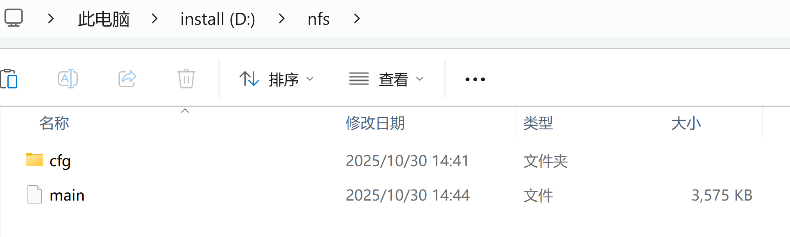

* 步骤3：在开发板的终端执行下面的命令，将Windows的nfs共享路径挂载至开发板的mnt目录下	
  * 注意：这里IP地址请根据你开发板和电脑主机的实际IP地址进行填写


```
ifconfig eth0 192.168.100.100

mount -o nolock,addr=192.168.100.10 -t nfs 192.168.100.10:/d/nfs /mnt
```

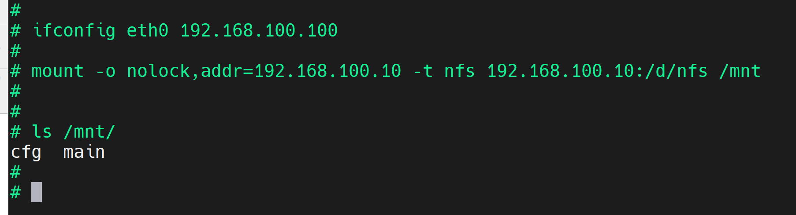

### 2.2.5、硬件连接

* 准备一个外接显示器和HDMI数据线，将HDMI的一头接在开发板的HDMI输出口，将HDMI的另外一头接在外接显示器的HDMI输入口。


* 将摄像头与sensor板进行连接，然后将sensor板接在EulerPi开发板上（注意：本案例使用的sensor是OS04A10，如果你使用其他的sensor，请先修改Makefile里面的SENSOR0_TYPE，然后再重新编译一遍即可）

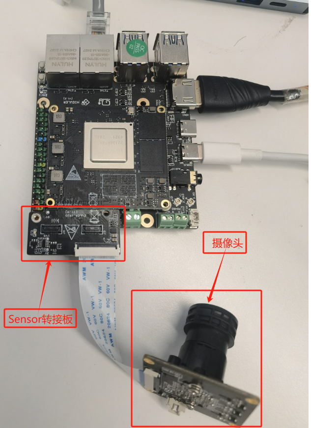

### 2.2.6、功能验证

* 在开发板的终端执行下面的命令，运行可执行文件

```
cd /mnt/

chmod +x main

./main 0
```

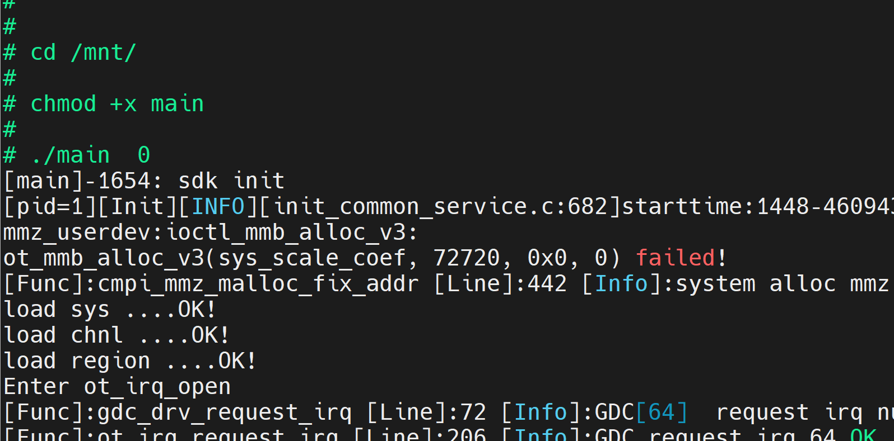

* 此时，在HDMI的外接显示屏上即可出现实时码流，如下图所示：

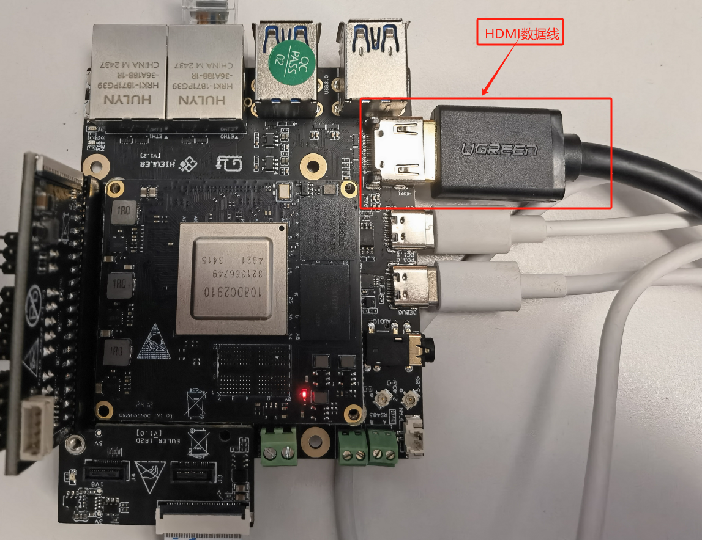

* 如果您看到的现象和下图现象不一致，可以确认一下镜头盖是否未取下来。
* 如果您看到的画面是非常模糊的，您可以尝试左右拧动镜头，进行手动对焦，直到画面清晰。

* 当我们把摄像头置于暗光环境下，当ISO值达到一定阈值后，就会调用AIISP的HNR模型，使得在暗光条件下也能看清画面。

* HNR关闭状态

  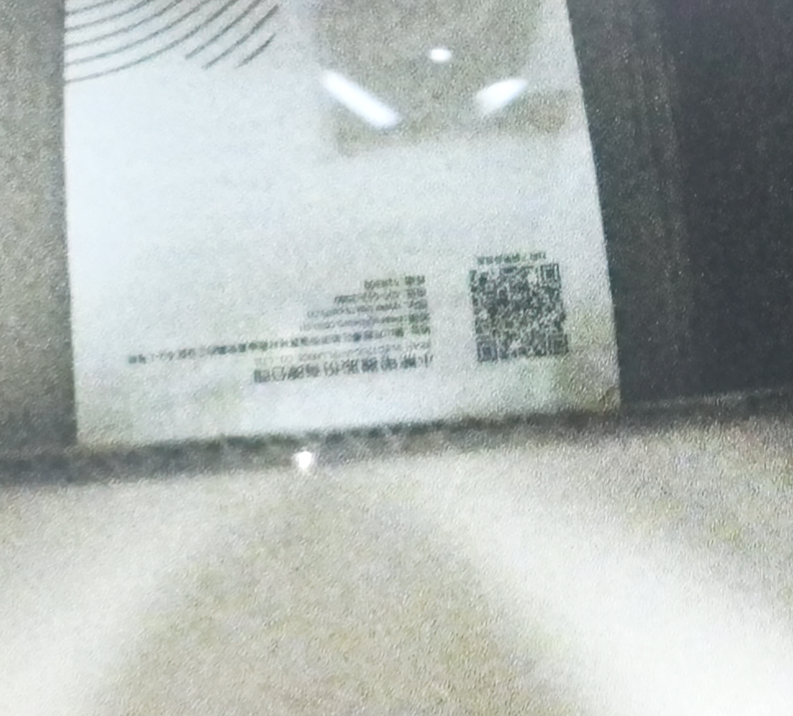

* HNR打开状态

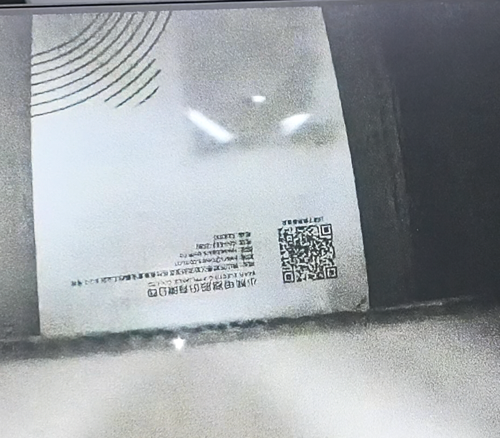


* 敲两下回传，即可关闭程序

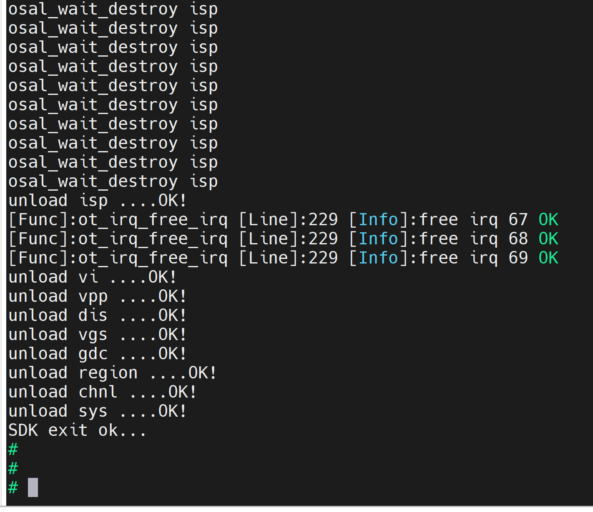