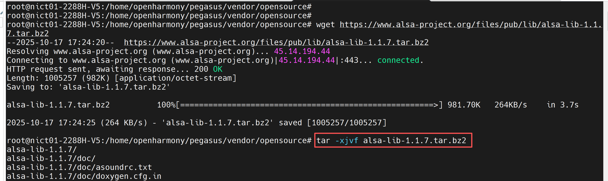
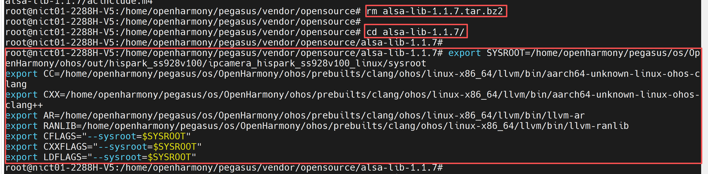
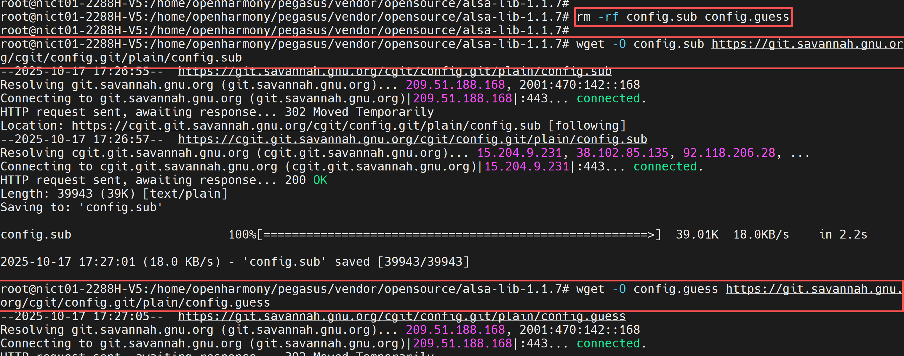
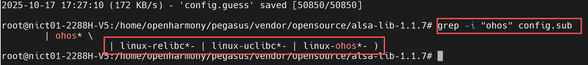
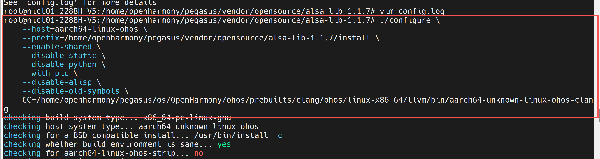
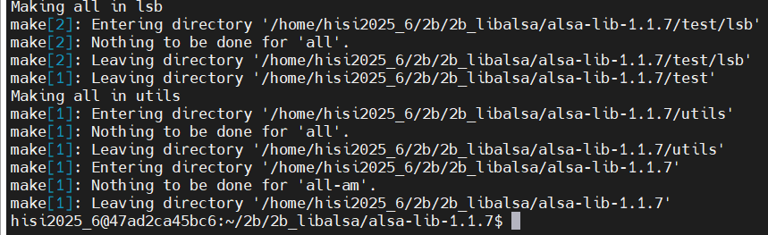
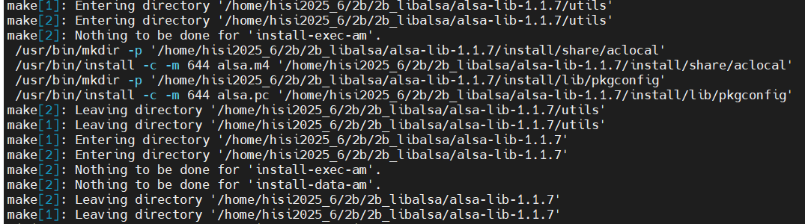
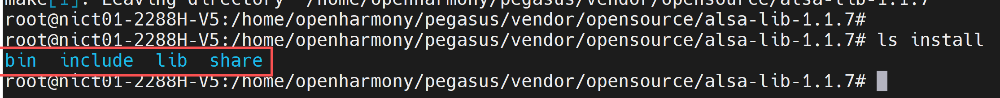
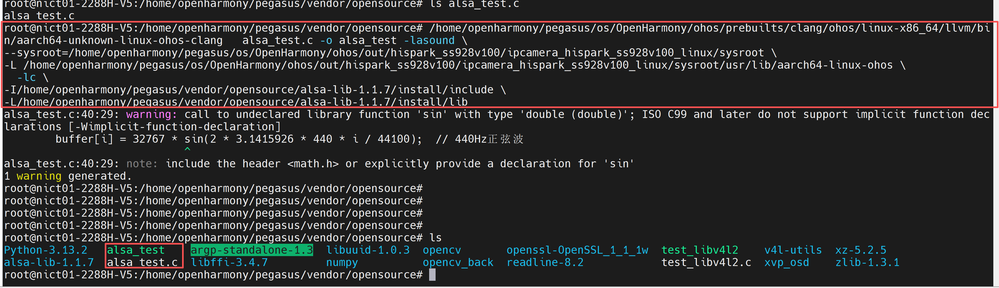
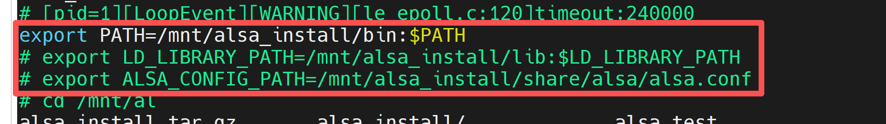

# alsa-lib移植

* alsa-lib 是 Linux 系统中处理音频的核心组件。
  alsa-lib：音频功能的底层基础
  它是 ALSA（Advanced Linux Sound Architecture，高级 Linux 声音架构）的核心库，主要作用是提供统一的音频硬件接口。
  核心功能：封装了与声卡硬件交互的复杂逻辑，向上层应用程序提供标准化的 API（如 C 语言接口），让开发者无需直接操作硬件驱动，就能实现音频播放、录音等功能。
  包含内容：主要生成动态链接库（如 libasound.so），是所有基于 ALSA 的程序的依赖基础；附带少量示例工具（如 aserver，一个简单的音频服务器 demo）。

## 1、软硬件环境

* 开发板：海鸥派
* 交叉编译工具链：OHOS (dev) clang version 15.0.4
* 编译链路径：pegasus/os/OpenHarmony/ohos/prebuilts/clang/ohos/linux-x86_64/llvm/bin
* python版本：Python-3.13.2
* 移植的alsa-lib版本：alsa-lib-1.1.7

## 2、交叉编译alsa-lib

### 步骤1：获取源码

* 在服务器的命令行，分步执行下面的命令，下载alsa-lib-1.1.7源码

~~~bash
# （可根据需要替换版本号）
wget https://www.alsa-project.org/files/pub/lib/alsa-lib-1.1.7.tar.bz2

# 解压源码包
tar -xjvf alsa-lib-1.1.7.tar.bz2
rm alsa-lib-1.1.7.tar.bz2

# 进入源码目录
cd alsa-lib-1.1.7
~~~



### 步骤2：配置环境变量

* 在服务器的命令行分步执行下面的命令，配置环境变量

~~~bash
export SYSROOT=/home/openharmony/pegasus/os/OpenHarmony/ohos/out/hispark_ss928v100/ipcamera_hispark_ss928v100_linux/sysroot
export CC=/home/openharmony/pegasus/os/OpenHarmony/ohos/prebuilts/clang/ohos/linux-x86_64/llvm/bin/aarch64-unknown-linux-ohos-clang
export CXX=/home/openharmony/pegasus/os/OpenHarmony/ohos/prebuilts/clang/ohos/linux-x86_64/llvm/bin/aarch64-unknown-linux-ohos-clang++
export AR=/home/openharmony/pegasus/os/OpenHarmony/ohos/prebuilts/clang/ohos/linux-x86_64/llvm/bin/llvm-ar            
export RANLIB=/home/openharmony/pegasus/os/OpenHarmony/ohos/prebuilts/clang/ohos/linux-x86_64/llvm/bin/llvm-ranlib       
export CFLAGS="--sysroot=$SYSROOT"
export CXXFLAGS="--sysroot=$SYSROOT"
export LDFLAGS="--sysroot=$SYSROOT"
~~~



* 在服务器的命令执行下面的命令，更新config文件

```sh
#核心原因是config.sub和config.guess脚本版本过旧，先移除
rm -rf config.sub config.guess

# 下载 config.sub
wget -O config.sub https://git.savannah.gnu.org/cgit/config.git/plain/config.sub

# 下载 config.guess
wget -O config.guess https://git.savannah.gnu.org/cgit/config.git/plain/config.guess

#检查更新后是否有支持ohos
grep -i "ohos" config.sub
```





### 步骤3：配置命令

* 服务器的命令行执行下面的命令，进行meson的构建。

~~~bash
./configure \
    --host=aarch64-linux-ohos \
    --prefix=/home/openharmony/pegasus/vendor/opensource/alsa-lib-1.1.7/install \
    --enable-shared \
    --disable-static \
    --disable-python \
    --with-pic \
    --disable-alisp \
    --disable-old-symbols \
    CC=/home/openharmony/pegasus/os/OpenHarmony/ohos/prebuilts/clang/ohos/linux-x86_64/llvm/bin/aarch64-unknown-linux-ohos-clang
~~~



### 步骤4：编译安装

* 服务器的命令行执行下面的命令，进行alsa-lib的编译和安装

~~~bash
make -j$(nproc) 2>&1 | tee make_output.log
make install
~~~





* 编译成功后，会在install目录下生成下面的文件



## 3、板端测试

### 3.1 编译代码

* 将下面的代码复制到alsa_test.c中，在服务器上编译，得到可执行文件后放到板端执行。

~~~bash
#include <stdio.h>
#include <alsa/asoundlib.h>

int main() {
    int ret;
    snd_pcm_t *handle;  // PCM设备句柄
    snd_pcm_hw_params_t *params;  // 硬件参数结构体

    // 1. 打开PCM播放设备（默认设备）
    ret = snd_pcm_open(&handle, "default", SND_PCM_STREAM_PLAYBACK, 0);
    if (ret < 0) {
        fprintf(stderr, "无法打开PCM设备: %s\n", snd_strerror(ret));
        return 1;
    }

    // 2. 初始化硬件参数
    snd_pcm_hw_params_alloca(&params);
    snd_pcm_hw_params_any(handle, params);

    // 设置参数： interleaved模式、采样格式（16位小端）、声道（双声道）
    snd_pcm_hw_params_set_access(handle, params, SND_PCM_ACCESS_RW_INTERLEAVED);
    snd_pcm_hw_params_set_format(handle, params, SND_PCM_FORMAT_S16_LE);
    snd_pcm_hw_params_set_channels(handle, params, 2);

    // 设置采样率（44.1kHz）
    unsigned int val = 44100;
    snd_pcm_hw_params_set_rate_near(handle, params, &val, NULL);

    // 应用参数
    ret = snd_pcm_hw_params(handle, params);
    if (ret < 0) {
        fprintf(stderr, "无法设置PCM参数: %s\n", snd_strerror(ret));
        snd_pcm_close(handle);
        return 1;
    }

    // 3. 生成简单的正弦波音频数据（测试播放）
    short buffer[1024];
    for (int i = 0; i < 1024; i++) {
        buffer[i] = 32767 * sin(2 * 3.1415926 * 440 * i / 44100);  // 440Hz正弦波
    }

    // 4. 播放音频（写入PCM设备）
    ret = snd_pcm_writei(handle, buffer, 1024);
    if (ret < 0) {
        // 处理欠载错误（可尝试恢复）
        ret = snd_pcm_recover(handle, ret, 0);
        if (ret < 0) {
            fprintf(stderr, "播放失败: %s\n", snd_strerror(ret));
            snd_pcm_close(handle);
            return 1;
        }
    }

    // 5. 关闭设备
    snd_pcm_drain(handle);  // 等待播放完成
    snd_pcm_close(handle);
    printf("测试完成：正弦波播放成功\n");
    return 0;
}
~~~

* 在服务器的命令行执行下面的命令，编译该代码
* 注意：这里的决定路径请根据自己服务器的实际情况进行填写

~~~bash
/home/openharmony/pegasus/os/OpenHarmony/ohos/prebuilts/clang/ohos/linux-x86_64/llvm/bin/aarch64-unknown-linux-ohos-clang   alsa_test.c -o alsa_test -lasound \
--sysroot=/home/openharmony/pegasus/os/OpenHarmony/ohos/out/hispark_ss928v100/ipcamera_hispark_ss928v100_linux/sysroot \
-L /home/openharmony/pegasus/os/OpenHarmony/ohos/out/hispark_ss928v100/ipcamera_hispark_ss928v100_linux/sysroot/usr/lib/aarch64-linux-ohos \
  -lc \
-I/home/openharmony/pegasus/vendor/opensource/alsa-lib-1.1.7/install/include \
-L/home/openharmony/pegasus/vendor/opensource/alsa-lib-1.1.7/install/lib 
~~~



### 3.2 NFS 共享

* nfs配置可参考参考链接：

~~~bash
https://blog.csdn.net/weixin_34326429/article/details/92163791
~~~

### 3.3 挂载NFS

* 将第2章步骤4生成的install文件下载到本地（我这里是把install重命名为alsa_install了），然后拷贝到NFS的目录下
* 再将3.1节编译生成的alsa_test下载到本地，然后拷贝到NFS的目录下

* 在开发板的命令行终端执行下面的命令，配置IP地址，并进行NFS挂载

~~~bash
ifconfig eth0 192.168.137.0 netmask 255.255.252.0
route add default gw  192.168.137.1
mount -o nolock,addr=192.168.137.1 -t nfs 192.168.137.1:/nfs /mnt
~~~

### 3.4 配置环境变量 

* 在开发板的命令行执行下面的命令，配置alsa的环境变量

~~~bash
export PATH=/mnt/alsa_install/bin:$PATH
export LD_LIBRARY_PATH=/mnt/alsa_install/lib:$LD_LIBRARY_PATH
export ALSA_CONFIG_PATH=/mnt/alsa_install/share/alsa/alsa.conf:/mnt/alsa_install/share/alsa/cards/aliases.conf:/mnt/alsa_install/share/alsa/pcm/default.conf
~~~



~~~bash
chmod +x ./alsa_test
./alsa_test
~~~

