# FFmpeg移植

## 1、软硬件环境

* 开发板：海鸥派
* 交叉编译工具链：OHOS (dev) clang version 15.0.4

* 编译链路径：pegasus/os/OpenHarmony/ohos/prebuilts/clang/ohos/linux-x86_64/llvm/bin  
* Python版本：Python-3.13.2
* 移植的ffmpeg版本：FFmpeg-6.0

## 2、安装依赖

* 由于在编译ffmpeg的时候，需要依赖其他第三方软件，因此在编译ffmpeg之前，我们先把它依赖的第三方软件全部交叉编译出来。

### 步骤1：交叉编译v4l2

* 可以参考[v4l2的移植文档](../libv4l2/README.md)的前两章节，完成v4l2的移植工作。

### 步骤2：交叉编译x264

* 在服务器的命令行执行下面的命令，下载源码，配置编译链

```sh
cd pegasus/vendor/opensource/

git clone https://code.videolan.org/videolan/x264.git

cd x264
```

* 修改config.sub文件，在125行添加 linux-ohos* |

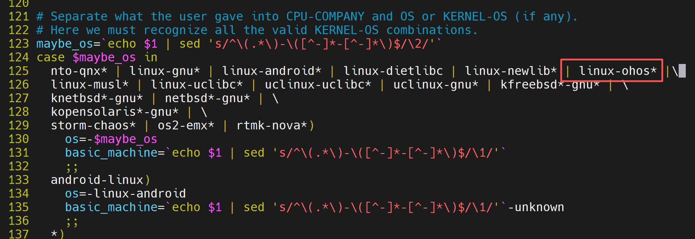

* 执行下面的命令，配置编译环境，对代码进行编译

```sh
CC="/home/openharmony/pegasus/os/OpenHarmony/ohos/prebuilts/clang/ohos/linux-x86_64/llvm/bin/aarch64-unknown-linux-ohos-clang \
  --sysroot=/home/openharmony/pegasus/os/OpenHarmony/ohos/out/hispark_ss928v100/ipcamera_hispark_ss928v100_linux/sysroot" \
CXX="/home/openharmony/pegasus/os/OpenHarmony/ohos/prebuilts/clang/ohos/linux-x86_64/llvm/bin/aarch64-unknown-linux-ohos-clang++ \
  --sysroot=/home/openharmony/pegasus/os/OpenHarmony/ohos/out/hispark_ss928v100/ipcamera_hispark_ss928v100_linux/sysroot" \
CFLAGS="-march=armv8-a -mfpu=neon" \
./configure \
--host=aarch64-linux-ohos \
--prefix=$(pwd)/install \
--enable-shared

make -j$(nproc) && make install
```

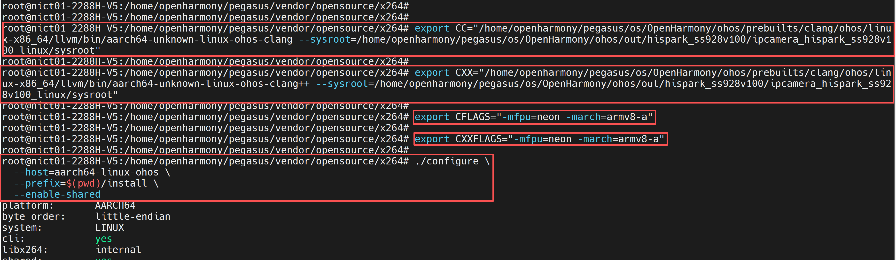

* 编译成功后会在install目录下生成如下文件

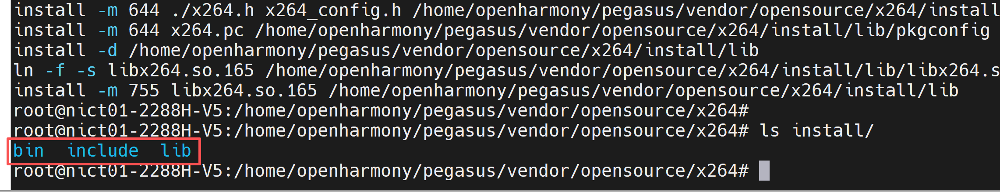

### 步骤3：交叉编译x265

* 在服务器的命令行执行下面的命令，下载源码

```sh
cd ../

wget https://bitbucket.org/multicoreware/x265_git/downloads/x265_3.5.tar.gz

tar xf x265_3.5.tar.gz

rm x265_3.5.tar.gz

cd x265_3.5
```

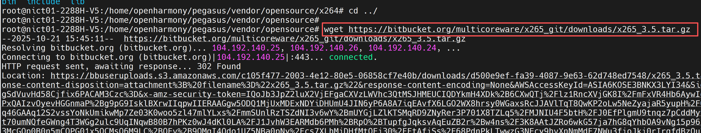

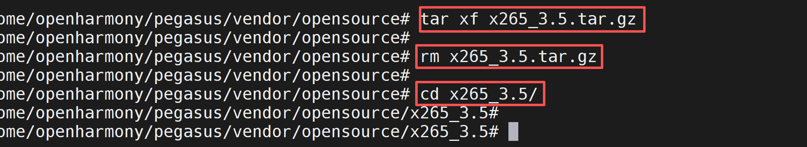

* 将下面内容替换到x265_3.5/build/aarch64-linux/crosscompile.cmake文件中
* 注意：里面的库、头文件等的绝对路径请根据自己服务器的实际情况进行修改。

```sh
# crosscompile.cmake for cross compiling x265 for aarch64 with OHOS toolchain
# This feature is only supported as experimental. Use with caution.
# Please report bugs on bitbucket
# Run cmake with: cmake -DCMAKE_TOOLCHAIN_FILE=crosscompile.cmake -G "Unix Makefiles" ../../source && ccmake ../../source

# Enable ARM cross-compilation
set(CROSS_COMPILE_ARM 1)

# Specify the target system
set(CMAKE_SYSTEM_NAME Linux)
set(CMAKE_SYSTEM_PROCESSOR aarch64)

# Specify the OHOS target (emulate config.sub behavior)
set(CMAKE_SYSTEM_VERSION ohos)

# Specify the cross compiler
set(CMAKE_C_COMPILER /home/openharmony/pegasus/os/OpenHarmony/ohos/prebuilts/clang/ohos/linux-x86_64/llvm/bin/aarch64-unknown-linux-ohos-clang)
set(CMAKE_CXX_COMPILER /home/openharmony/pegasus/os/OpenHarmony/ohos/prebuilts/clang/ohos/linux-x86_64/llvm/bin/aarch64-unknown-linux-ohos-clang++)
set(CMAKE_ASM_COMPILER /home/openharmony/pegasus/os/OpenHarmony/ohos/prebuilts/clang/ohos/linux-x86_64/llvm/bin/aarch64-unknown-linux-ohos-clang)
set(CMAKE_AR /home/openharmony/pegasus/os/OpenHarmony/ohos/prebuilts/clang/ohos/linux-x86_64/llvm/bin/llvm-ar)
set(CMAKE_LINKER /home/openharmony/pegasus/os/OpenHarmony/ohos/prebuilts/clang/ohos/linux-x86_64/llvm/bin/lld)
set(CMAKE_RANLIB /home/openharmony/pegasus/os/OpenHarmony/ohos/prebuilts/clang/ohos/linux-x86_64/llvm/bin/llvm-ranlib)
set(CMAKE_STRIP /home/openharmony/pegasus/os/OpenHarmony/ohos/prebuilts/clang/ohos/linux-x86_64/llvm/bin/llvm-strip)

# Specify the target environment (sysroot)
set(CMAKE_SYSROOT /home/openharmony/pegasus/os/OpenHarmony/ohos/out/hispark_ss928v100/ipcamera_hispark_ss928v100_linux/sysroot)

# Compiler and linker flags
set(CMAKE_C_FLAGS "-fPIC -target aarch64-unknown-linux-ohos" CACHE STRING "C flags")
set(CMAKE_CXX_FLAGS "-fPIC -target aarch64-unknown-linux-ohos" CACHE STRING "C++ flags")
set(CMAKE_ASM_FLAGS "-fPIC -target aarch64-unknown-linux-ohos" CACHE STRING "ASM flags")
set(CMAKE_EXE_LINKER_FLAGS "-fPIC" CACHE STRING "Linker flags")

# Include and library paths for Hisi SDK and dependencies
set(CMAKE_C_FLAGS "${CMAKE_C_FLAGS} -I/home/openharmony/pegasus/vendor/opensource/x264/install/include" CACHE STRING "C flags")
set(CMAKE_CXX_FLAGS "${CMAKE_CXX_FLAGS} -I/home/openharmony/pegasus/vendor/opensource/x264/install/include" CACHE STRING "C++ flags")
set(CMAKE_EXE_LINKER_FLAGS "${CMAKE_EXE_LINKER_FLAGS} -L/home/openharmony/pegasus/vendor/opensource/x264/install/lib" CACHE STRING "Linker flags")

# Search paths for libraries and headers
set(CMAKE_FIND_ROOT_PATH /home/openharmony/pegasus/os/OpenHarmony/ohos/out/hispark_ss928v100/ipcamera_hispark_ss928v100_linux/sysroot /home/openharmony/pegasus/vendor/opensource/x264/install /home/openharmony/pegasus/vendor/opensource/v4l-utils/install)
set(CMAKE_FIND_ROOT_PATH_MODE_PROGRAM NEVER)
set(CMAKE_FIND_ROOT_PATH_MODE_LIBRARY ONLY)
set(CMAKE_FIND_ROOT_PATH_MODE_INCLUDE ONLY)

# PKG_CONFIG_PATH for finding dependencies
set(ENV{PKG_CONFIG_PATH} "/home/openharmony/pegasus/vendor/opensource/v4l-utils/install/lib/pkgconfig:/home/openharmony/pegasus/vendor/opensource/v4l-utils/install/lib/pkgconfig")

# Debug output to verify configuration
message(STATUS "CMAKE_C_COMPILER: ${CMAKE_C_COMPILER}")
message(STATUS "CMAKE_CXX_COMPILER: ${CMAKE_CXX_COMPILER}")
message(STATUS "CMAKE_SYSROOT: ${CMAKE_SYSROOT}")
message(STATUS "CMAKE_FIND_ROOT_PATH: ${CMAKE_FIND_ROOT_PATH}")
message(STATUS "PKG_CONFIG_PATH: $ENV{PKG_CONFIG_PATH}")
```

* 在服务器的命令行执行下面的命令，配置编译选项

```sh
cd /home/openharmony/pegasus/vendor/opensource/x265_3.5

cmake ./source \
  -G "Unix Makefiles" \
  -DCMAKE_SYSTEM_NAME=Linux \
  -DCMAKE_SYSTEM_PROCESSOR=aarch64 \
  -DCMAKE_SYSTEM_VERSION=ohos \
  -DCMAKE_FIND_ROOT_PATH_MODE_PROGRAM=NEVER \
  -DCMAKE_FIND_ROOT_PATH_MODE_LIBRARY=ONLY \
  -DCMAKE_FIND_ROOT_PATH_MODE_INCLUDE=ONLY \
  -DCMAKE_INSTALL_PREFIX="$(pwd)/install" \
  -DENABLE_SHARED=ON \
  -DENABLE_PIC=ON \
  -DHIGH_BIT_DEPTH=ON \
  -DEXPORT_C_API=ON \
  -DENABLE_ASSEMBLY=OFF \
  -Wno-dev
  
make -j$(nproc)&&make install
```

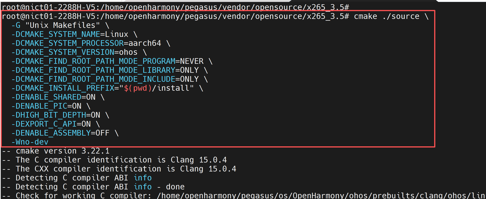

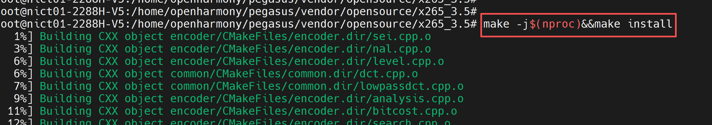

* 编译完成后，会在install目录下生成如下文件

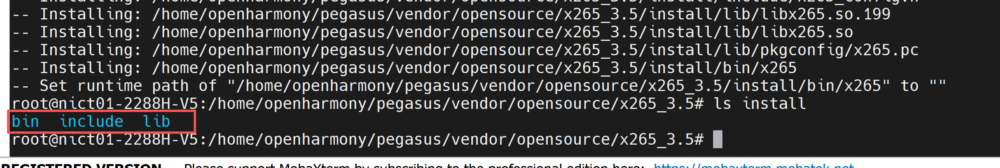

## 3、交叉编译FFmpeg

### 步骤1：下载源码

* 在服务器的命令行执行下面的命令，下载ffmpeg源码

```sh
cd ../

git clone -b release/6.0 https://gitee.com/zhongshankuangshi/ffmpeg.git

cd ffmpeg
```

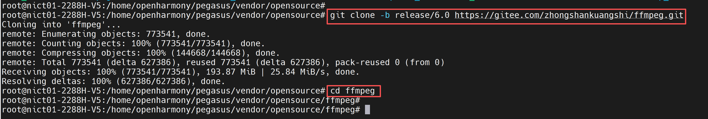

### 步骤2：环境变量配置

* 注意这里出现的决定路径的地址，请根据自己服务器的具体情况进行修改。

```sh
export CC=/home/openharmony/pegasus/os/OpenHarmony/ohos/prebuilts/clang/ohos/linux-x86_64/llvm/bin/aarch64-unknown-linux-ohos-clang
export CXX=/home/openharmony/pegasus/os/OpenHarmony/ohos/prebuilts/clang/ohos/linux-x86_64/llvm/bin/aarch64-unknown-linux-ohos-clang++
export AR=/home/openharmony/pegasus/os/OpenHarmony/ohos/prebuilts/clang/ohos/linux-x86_64/llvm/bin/llvm-ar
export LD=/home/openharmony/pegasus/os/OpenHarmony/ohos/prebuilts/clang/ohos/linux-x86_64/llvm/bin/lld
export RANLIB=/home/openharmony/pegasus/os/OpenHarmony/ohos/prebuilts/clang/ohos/linux-x86_64/llvm/bin/llvm-ranlib
export STRIP=/home/openharmony/pegasus/os/OpenHarmony/ohos/prebuilts/clang/ohos/linux-x86_64/llvm/bin/llvm-strip

export PKG_CONFIG_PATH="/home/openharmony/pegasus/vendor/opensource/x264/install/lib/pkgconfig:$PKG_CONFIG_PATH"
export CXXFLAGS="-I/home/openharmony/pegasus/vendor/opensource/x264/install/include $CXXFLAGS"
export LDFLAGS="-L/home/openharmony/pegasus/vendor/opensource/x264/install/lib $LDFLAGS"

export PKG_CONFIG_PATH="/home/openharmony/pegasus/vendor/opensource/x265_3.5/install/lib/pkgconfig:$PKG_CONFIG_PATH"
export CXXFLAGS="-I/home/openharmony/pegasus/vendor/opensource/x265_3.5/install/include $CXXFLAGS"
export LDFLAGS="-L/home/openharmony/pegasus/vendor/opensource/x265_3.5/install/lib $LDFLAGS"

export PKG_CONFIG_PATH="/home/openharmony/pegasus/vendor/opensource/v4l-utils/install/lib/pkgconfig:$PKG_CONFIG_PATH"
export CXXFLAGS="-I/home/openharmony/pegasus/vendor/opensource/v4l-utils/install/include $CXXFLAGS"
export LDFLAGS="-L/home/openharmony/pegasus/vendor/opensource/v4l-utils/install/lib $LDFLAGS"
```

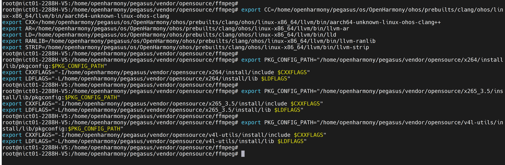

### 步骤3：修改相关编译脚本

* 在pegasus/platform/ss928v100_clang/smp/a55_linux/mpp/sample/common/makefile的第4行，添加一个fPIC选项到CFLAGS，如下图所示：

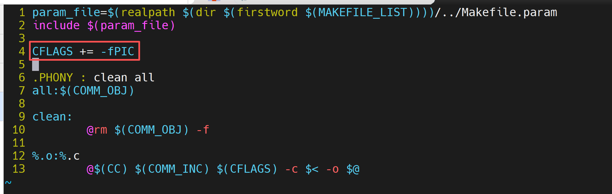

* 然后进入到pegasus/platform/ss928v100_clang/smp/a55_linux/mpp/sample/common目录下，执行 make clean && make 命令，重新生成.o文件
* 注意：请根据自己服务器的实际情况修改里面的绝对路径

```sh
export PATH=/home/openharmony/pegasus/os/OpenHarmony/ohos/prebuilts/clang/ohos/linux-x86_64/llvm/bin:$PATH

export SYSROOT_PATH=/home/openharmony/pegasus/os/OpenHarmony/ohos/out/hispark_ss928v100/ipcamera_hispark_ss928v100_linux/sysroot

make clean && make 
```

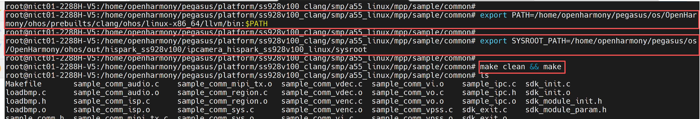

* 在ffmpeg目录下创建一个build_ffmpeg.sh脚本，把下面的内容复制进去

* 注意：请根据自己服务器的实际情况修改里面的绝对路径

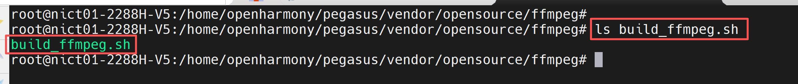

```sh
#!/bin/bash

# 设置交叉编译工具链的根目录
TOOLCHAIN_ROOT="/home/openharmony/pegasus/os/OpenHarmony/ohos/prebuilts/clang/ohos/linux-x86_64/llvm"
# 交叉编译工具链前缀
CROSS_PREFIX="aarch64-unknown-linux-ohos"
# 设置sysroot路径
SYSROOT="/home/openharmony/pegasus/os/OpenHarmony/ohos/out/hispark_ss928v100/ipcamera_hispark_ss928v100_linux/sysroot"

# C 和 C++ 编译器
CC="${TOOLCHAIN_ROOT}/bin/${CROSS_PREFIX}-clang"
CXX="${TOOLCHAIN_ROOT}/bin/${CROSS_PREFIX}-clang++"
export AR="${TOOLCHAIN_ROOT}/bin/llvm-ar"
export LD="${TOOLCHAIN_ROOT}/bin/lld"
export RANLIB="${TOOLCHAIN_ROOT}/bin/llvm-ranlib"
export STRIP="${TOOLCHAIN_ROOT}/bin/llvm-strip"

# 获取当前脚本目录
SCRIPT_DIR="$(cd "$(dirname "${BASH_SOURCE[0]}")" && pwd)"
WORK_DIR="$(pwd)"

# 安装目录
PREFIX="${WORK_DIR}/install"

# 海思SDK路径
HISI_SDK_BASE="/home/openharmony/pegasus/platform/ss928v100_clang/smp/a55_linux"
HISI_MPP_BASE="${HISI_SDK_BASE}/mpp"
HISI_COMMON_DIR="/home/openharmony/pegasus/platform/ss928v100_clang/smp/a55_linux/mpp/sample/common"

# 配置PKG_CONFIG_PATH
export PKG_CONFIG_PATH="/home/openharmony/pegasus/vendor/opensource/x264/install/lib/pkgconfig:$PKG_CONFIG_PATH"
export PKG_CONFIG_PATH="/home/openharmony/pegasus/vendor/opensource/x265_3.5/install/lib/pkgconfig:$PKG_CONFIG_PATH"
export PKG_CONFIG_PATH="/home/openharmony/pegasus/vendor/opensource/v4l-utils/install/lib/pkgconfig:$PKG_CONFIG_PATH"

# 查找FFmpeg源码目录
FFMPEG_SRC="../ffmpeg"
# 创建SDK初始化库目录
SDK_LIB_DIR="$(pwd)/hisi_sdk_lib"
mkdir -p "$SDK_LIB_DIR"
# 定义所有SDK库目录，添加更多可能的搜索路径
ALL_SDK_LIB_DIRS=(
    "${HISI_MPP_BASE}/out/lib"
    "${HISI_MPP_BASE}/out/lib/svp_npu"
    "${HISI_COMMON_DIR}"
)

# 获取实际存在的海思SDK库列表
echo "扫描实际存在的海思SDK库文件..."
AVAILABLE_LIBS=()
for dir in "${ALL_SDK_LIB_DIRS[@]}"; do
    if [ -d "$dir" ]; then
        echo "扫描库目录: $dir"
        # 查找所有.so和.a库文件
        for lib_path in "${dir}/lib"*.so "${dir}/lib"*.a; do
            if [ -f "$lib_path" ]; then
                # 提取库名称（去除路径、lib前缀和扩展名）
                lib_name=$(basename "$lib_path" .so)
                lib_name=$(basename "$lib_name" .a)
                lib_name=${lib_name#lib}
                
                # 仅添加新的库，避免重复
                if ! [[ " ${AVAILABLE_LIBS[@]} " =~ " ${lib_name} " ]]; then
                    AVAILABLE_LIBS+=("$lib_name")
                    echo "✓ 找到库: $lib_name ($lib_path)"
                fi
            fi
        done
    else
        echo "⚠ 库目录不存在: $dir"
    fi
done

echo "总共找到 ${#AVAILABLE_LIBS[@]} 个海思SDK库"

# 检查关键库是否存在，使用ss_mpi作为ot_mpi的替代
CRITICAL_LIBS=("securec" "ot_osal" "ss_mpi" "ot_base")
for lib in "${CRITICAL_LIBS[@]}"; do
    if [[ " ${AVAILABLE_LIBS[@]} " =~ " ${lib} " ]]; then
        echo "✓ 关键库 ${lib} 存在"
    else
        echo "⚠ 警告: 关键库 ${lib} 缺失"
    fi
done

# 验证已编译的目标文件是否存在
REQUIRED_OBJS=(
    "${HISI_COMMON_DIR}/sdk_init.o"
    "${HISI_COMMON_DIR}/sdk_exit.o"
)

COMPILED_OBJECTS=()
for obj in "${REQUIRED_OBJS[@]}"; do
    if [ -f "$obj" ]; then
        COMPILED_OBJECTS+=("$obj")
        echo "✓ 找到已编译目标文件: $(basename "$obj")"
    else
        echo "✗ 缺失已编译目标文件: $(basename "$obj")"
        echo "请确保在 ${HISI_COMMON_DIR} 目录下存在该文件"
        exit 1
    fi
done

for obj_path in "${HISI_COMMON_DIR}"/*.o; do
    # 跳过已经添加的sdk_init.o和sdk_exit.o
    if [ -f "$obj_path" ] && [[ ! " ${COMPILED_OBJECTS[@]} " =~ " ${obj_path} " ]]; then
        COMPILED_OBJECTS+=("$obj_path")
        echo "✓ 添加额外目标文件: $(basename "$obj_path")"
    fi
done

# 构建链接参数 - 自动链接所有找到的库
LINK_LIBS=""
LINKED_COUNT=0

echo "按顺序链接所有找到的海思SDK库:"
for lib in "${AVAILABLE_LIBS[@]}"; do
    LINK_LIBS="${LINK_LIBS} -l${lib}"
    echo "✓ 链接库: ${lib}"
    ((LINKED_COUNT++))
done

# 构建动态库链接命令，添加处理非PIC代码的选项
echo "构建动态库链接命令..."
LINK_CMD="$CC -shared -fPIC --sysroot=$SYSROOT"
LINK_CMD="${LINK_CMD} -o ${SDK_LIB_DIR}/libhisi_sdk_init.so"
LINK_CMD="${LINK_CMD} ${COMPILED_OBJECTS[*]}"

# 添加所有SDK库目录到链接命令（包括common目录）
for dir in "${ALL_SDK_LIB_DIRS[@]}"; do
    LINK_CMD="${LINK_CMD} -L${dir}"
done

# 添加处理非PIC代码的链接选项
LINK_CMD="${LINK_CMD} ${LINK_LIBS}"
LINK_CMD="${LINK_CMD} -lpthread -lm -lstdc++ -ldl -lrt"
LINK_CMD="${LINK_CMD} -Wl,--allow-shlib-undefined"
LINK_CMD="${LINK_CMD} -Wl,-allow-multiple-definition"  # 允许多重定义
LINK_CMD="${LINK_CMD} -Wl,-z,notext"  # 允许非PIC代码在共享库中

echo "执行链接命令:"
echo "${LINK_CMD}"
echo "=========================================="

eval "${LINK_CMD}"

if [ $? -ne 0 ]; then
    echo "✗ 动态库创建失败"
    echo "尝试使用简化链接参数..."
    
    # 只链接关键库的简化版本，使用ss_mpi替代ot_mpi
    SIMPLE_LINK_CMD="$CC -shared -fPIC --sysroot=$SYSROOT"
    SIMPLE_LINK_CMD="${SIMPLE_LINK_CMD} -o ${SDK_LIB_DIR}/libhisi_sdk_init.so"
    SIMPLE_LINK_CMD="${SIMPLE_LINK_CMD} ${COMPILED_OBJECTS[*]}"
    
    # 添加所有SDK库目录到简化链接命令
    for dir in "${ALL_SDK_LIB_DIRS[@]}"; do
        SIMPLE_LINK_CMD="${SIMPLE_LINK_CMD} -L${dir}"
    done
    
    # 使用ss_mpi替代ot_mpi
    SIMPLE_LINK_CMD="${SIMPLE_LINK_CMD} -lsecurec -lot_osal -lss_mpi"
    SIMPLE_LINK_CMD="${SIMPLE_LINK_CMD} -lpthread -lm -lstdc++ -ldl"
    SIMPLE_LINK_CMD="${SIMPLE_LINK_CMD} -Wl,--allow-shlib-undefined"
    SIMPLE_LINK_CMD="${SIMPLE_LINK_CMD} -Wl,-allow-multiple-definition"
    SIMPLE_LINK_CMD="${SIMPLE_LINK_CMD} -Wl,-z,notext"
    
    echo "执行简化链接命令:"
    echo "${SIMPLE_LINK_CMD}"
    eval "${SIMPLE_LINK_CMD}"
    
    if [ $? -ne 0 ]; then
        echo "✗ 动态库创建失败"
        echo "建议尝试重新编译common目录下的目标文件，添加-fPIC选项:"
        echo "cd ${HISI_COMMON_DIR}"
        echo "${CC} -c -fPIC *.c -I${HISI_MPP_BASE}/include -I${HISI_SDK_BASE}/include"
        exit 1
    fi
fi

echo "✓ 海思SDK初始化动态库创建完成!"

if [ -f "${SDK_LIB_DIR}/libhisi_sdk_init.so" ]; then
    echo "✓ 动态库文件存在"
    ls -la "${SDK_LIB_DIR}/libhisi_sdk_init.so"
    
    # 检查符号
    echo ""
    echo "检查关键符号:"
    REQUIRED_SYMBOLS=("SDK_init" "SDK_exit")
    for symbol in "${REQUIRED_SYMBOLS[@]}"; do
        if ${CROSS_PREFIX}-nm -D "${SDK_LIB_DIR}/libhisi_sdk_init.so" 2>/dev/null | grep -q "$symbol" || \
           ${CROSS_PREFIX}-objdump -T "${SDK_LIB_DIR}/libhisi_sdk_init.so" 2>/dev/null | grep -q "$symbol"; then
            echo "✓ 符号 $symbol 存在"
        else
            echo "⚠ 符号 $symbol 可能缺失"
        fi
    done
    
else
    echo "✗ 动态库文件不存在"
    exit 1
fi

# 设置编译标志，添加-fPIC
CFLAGS="--sysroot=$SYSROOT -fPIC"
CFLAGS="${CFLAGS} -I${HISI_COMMON_DIR}"  # 添加common目录的头文件路径
CFLAGS="${CFLAGS} -I${HISI_MPP_BASE}/out/include"
CFLAGS="${CFLAGS} -DHISI_SDK_ENABLED"
export CFLAGS

# 设置C++编译标志，添加-fPIC
export CXXFLAGS="--sysroot=$SYSROOT -fPIC"

# 设置链接标志
LDFLAGS="--sysroot=$SYSROOT"
LDFLAGS="${LDFLAGS} -L${SDK_LIB_DIR}"

# 添加所有SDK库目录到链接标志（包括common目录）
for dir in "${ALL_SDK_LIB_DIRS[@]}"; do
    LDFLAGS="${LDFLAGS} -L${dir}"
done

# 设置运行时库搜索路径
LDFLAGS="${LDFLAGS} -Wl,--allow-shlib-undefined"
LDFLAGS="${LDFLAGS} -Wl,-allow-multiple-definition"

# 链接库
LDFLAGS="${LDFLAGS} -lhisi_sdk_init"
LDFLAGS="${LDFLAGS} ${LINK_LIBS}"
LDFLAGS="${LDFLAGS} -lpthread -lm -lstdc++ -ldl -lrt"
export LDFLAGS

#echo "CFLAGS: ${CFLAGS}"
#echo "LDFLAGS: ${LDFLAGS}"

# 构建configure命令
function gen_cfg_cmd() {
    printf "%s " \
        "${FFMPEG_SRC}/configure" \
        "--prefix=$PREFIX" \
        "--arch=aarch64" \
        "--target-os=linux" \
        "--enable-cross-compile" \
        "--disable-x86asm" \
        "--disable-static" \
        "--enable-shared" \
        "--cc=$CC" \
        "--cxx=$CXX" \
        "--strip=$STRIP" \
        "--ld=$CXX" \
        "--sysroot=$SYSROOT" \
        "--enable-libx264" \
        "--enable-libx265" \
        "--enable-gpl" \
        "--enable-encoder=h264_ss928" \
        "--enable-encoder=h265_ss928" \
        "--enable-encoder=mjpeg_ss928" \
        "--enable-decoder=h264_ss928" \
        "--enable-decoder=h265_ss928" \
        "--enable-decoder=mjpeg_ss928" \
        "--extra-cflags='$CFLAGS'" \
        "--extra-ldflags='$LDFLAGS'"
    echo
}

# 执行configure
echo "=========================================="
echo "开始配置FFmpeg..."
echo "=========================================="
cfg_cmd=$(gen_cfg_cmd)
echo "$cfg_cmd"
echo "=========================================="
eval "$cfg_cmd"
```

### 步骤4：编译ffmpeg

* 在服务器的命令行，执行下面的命令，进行编译ffmpeg前的配置

```sh
chmod +x build_ffmpeg.sh

./build_ffmpeg.sh
```

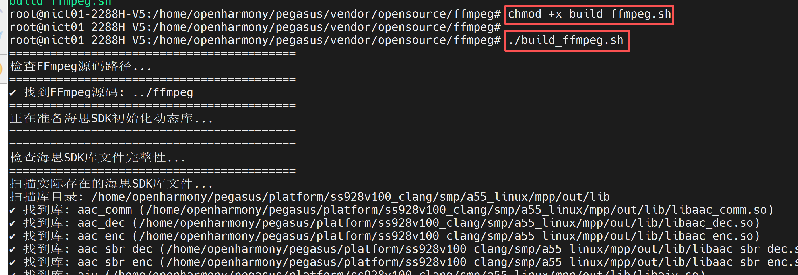

* 在服务器的命令行，执行下面的命令，进行ffmpeg的编译

```sh
make -j$(nproc) && make install
```

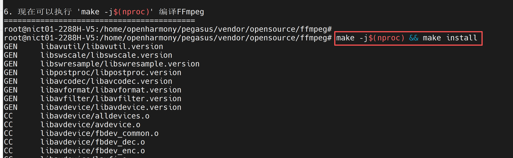

* 编译完成之后，会在install目录下生成下面的内容

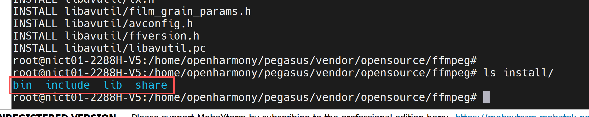

* 并且在ffmpeg目录下生成一个hisi_sdk_lib的文件夹，里面有一个libhisi_sdk_init.so库

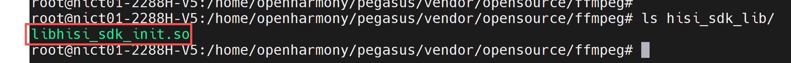

### 步骤5：编译sample

* 在服务器的命令行，执行下面的命令，分别编译ffmpeg和hisi目录下的编解码案例

```sh
cd sample/ffmpeg

make 

cd ../hisi

make
```

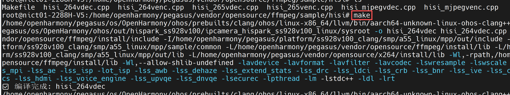

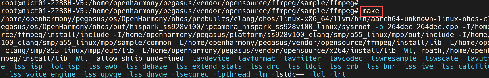


## 4、板端验证

### 步骤1：配置板端环境

* 1、确保开发板已经烧录OpenHarmony操作系统
* 2、使用网线将开发板与你的电脑进行连接，确保二者处于同一局域网内
* 3、配置开发板的IP地址，并确保开发板与电脑能够互相ping通

```sh
# 注意：这里的eth0的IP地址，请根据自己的网络IP网段进行合理配置
ifconfig eth0 192.168.100.100

# 添加权限
echo 0 9999999 > /proc/sys/net/ipv4/ping_group_range
```


### 步骤2：准备ffmpeg依赖文件

* 1、将第2章交叉编译生成的v4l2、x264、x265的install目录，下载并拷贝到NFS挂载目录
* 2、将第三章交叉编译ffmpeg生成的install目录，下载并拷贝到NFS挂载目录
* 3、将第三章步骤5，编译好后的sample目录，下载并拷贝到NFS挂载目录
* 4、将libhisi_sdk_init.so下载并拷贝到ffmpeg_install/lib/目录下
* 5、将mpp/out/lib下载并拷贝到NFS挂载目录

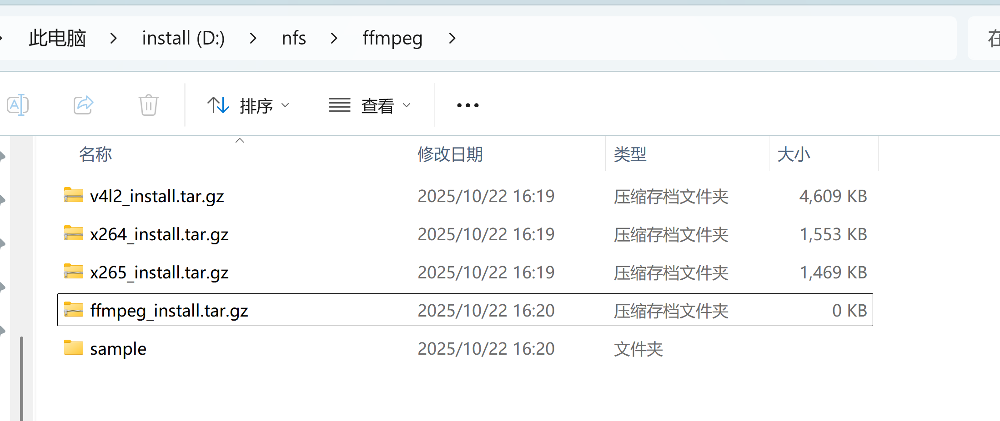

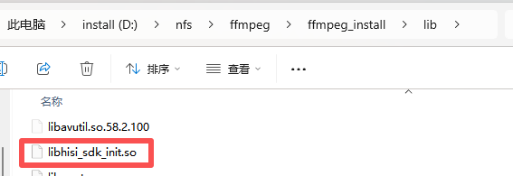

* 6、在开发板的命令行终端执行下面的命令，将电脑的nfs目录挂载到开发板的/mnt目录下（注意：这里请根据自己的IP地址及NFS配置进行合理的修改）

```sh
mount -o nolock,addr=192.168.100.10 -t nfs 192.168.100.10:/d/nfs /mnt
```

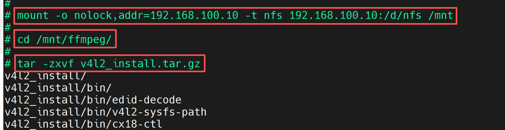

* 因为我这里对每个库进行了打包，所以当我们把NFS挂载上后，需要对这些库进行解压才能正常使用

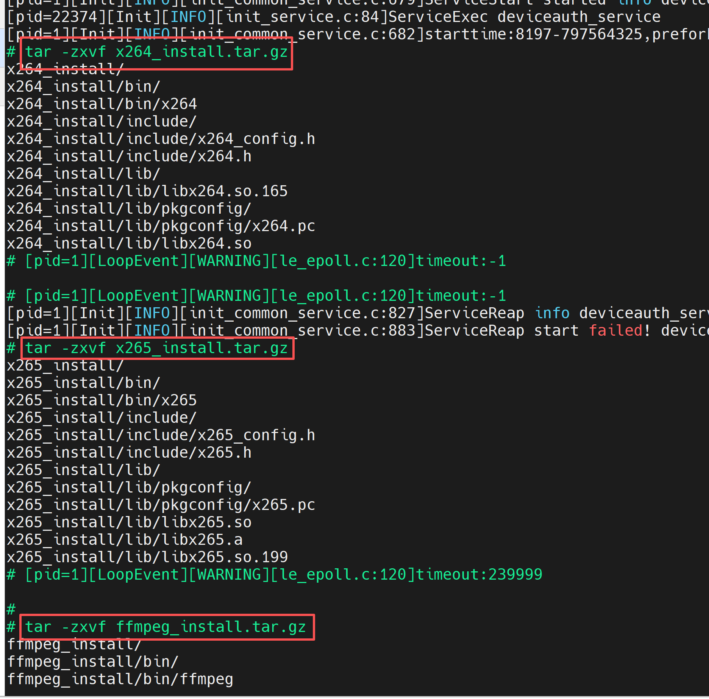

* 7、在开发板的命令行终端执行下面的命令，配置各个库的环境变量

```sh
export PATH=/mnt/ffmpeg/ffmpeg_install/bin:$PATH
export LD_LIBRARY_PATH=/mnt/ffmpeg/ffmpeg_install/lib:/mnt/ffmpeg/lib:/mnt/ffmpeg/lib/svp_npu:$LD_LIBRARY_PATH
export LD_LIBRARY_PATH=/mnt/ffmpeg/v4l2_install/lib:$LD_LIBRARY_PATH
export LD_LIBRARY_PATH=/mnt/ffmpeg/x264_install/lib:$LD_LIBRARY_PATH
export LD_LIBRARY_PATH=/mnt/ffmpeg/x265_install/lib:$LD_LIBRARY_PATH

chmod +x /mnt/ffmpeg/ffmpeg_install/bin/*
```

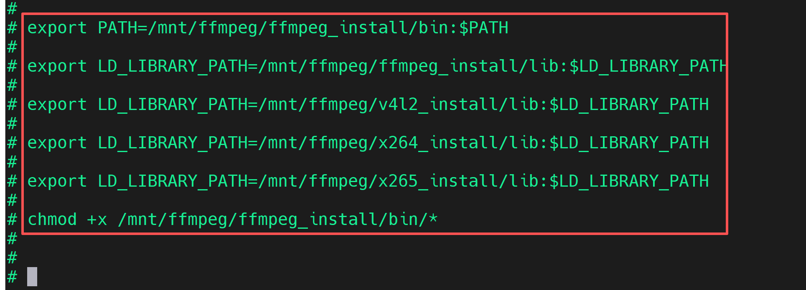

### 步骤3：测试ffmpeg是否正常工作

* 在开发板的命令行，执行下面的命令，获取ffmpeg的版本号

```sh
cd /mnt/ffmpeg/ffmpeg_install/bin/

ffmpeg -version
```

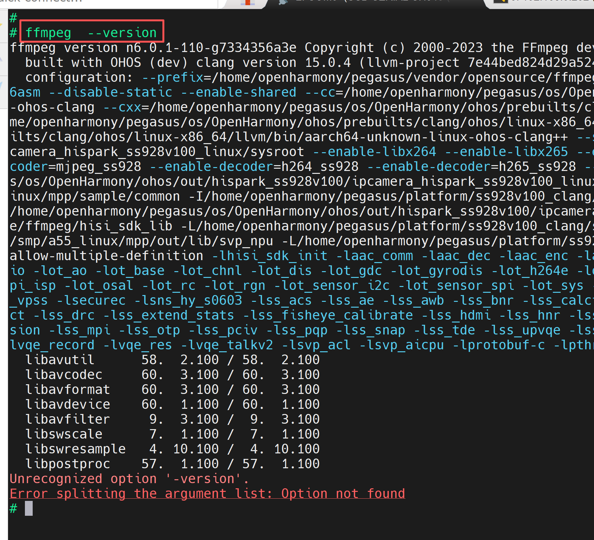

### 步骤4：测试sample案例

* 注意：sample/hisi/目录下的是调用了海思硬件编解码模块，实现了硬件加速。sample/ffmpeg/目录下就是调用了ffmpeg的原始编解码接口。
* 在开发板的命令行终端执行下面的命令，运行相关程序

```sh
cd /mnt/ffmpeg/sample/hisi

chmod +x *

# hisi编码
./hisi_264venc  /dev/video0  h264_ss928  640 480 30

cd /mnt/ffmpeg/sample/ffmpeg

chmod +x *
# ffmpeg编码
./264enc /dev/video0 640 480 30
```

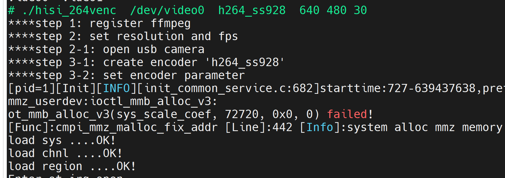

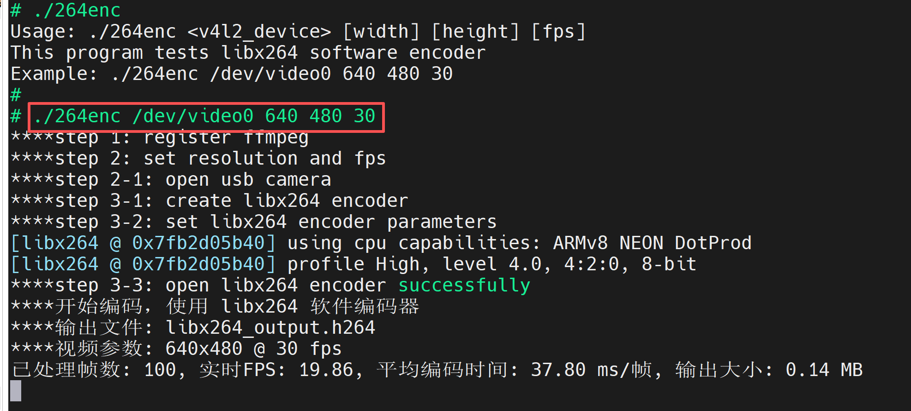

* 在开发板的命令行分步执行下面的命令，测试解码案例

```sh
cd /mnt/ffmpeg/sample/hisi 

# hisi解码
./hisi_264vdec h264_ss928_output.h264  output

# ffmpeg解码
./264dec libx264_output.h264  output
```

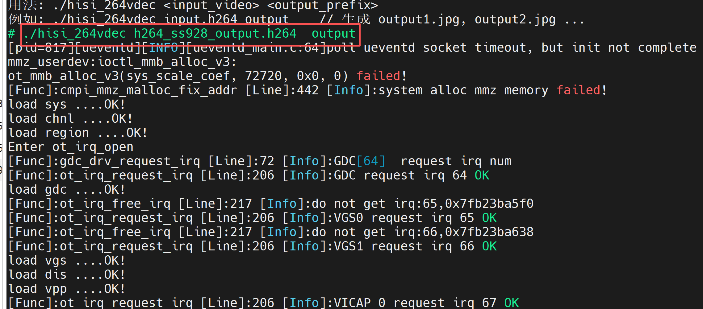

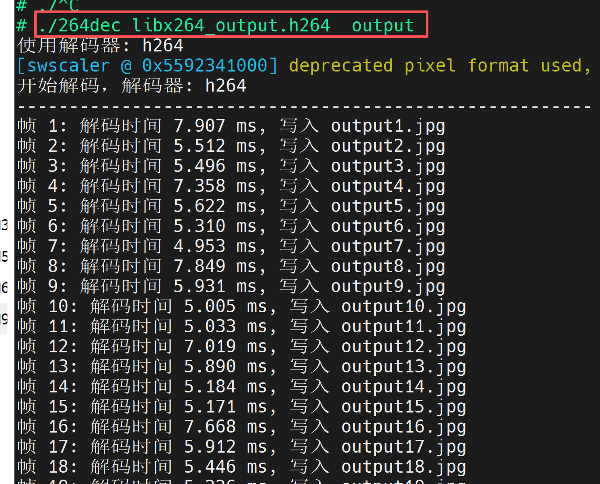

* 如果想在自己的代码中使用ffmpeg调用hisi的硬件编解码模块，可以使用avcodec_find_decoder_by_name接口来实现

```c
avcodec_find_decoder_by_name("h264ss928");

avcodec_find_decoder_by_name("h265_ss928");

avcodec_find_decoder_by_name("mjpeg_ss928");

avcodec_find_encoder_by_name("h264_ss928");

avcodec_find_encoder_by_name("h265_ss928");

avcodec_find_encoder_by_name("mjpeg_ss928");
```

## 5、海思硬件编解码与ffmpeg原生编解码对比

* decoder

| 数据/解码器         | h264                  | h264_ss928            | hevc                  | h265_ss928            | mjpeg                 | mjpeg_ss928           |
| ------------------- | --------------------- | --------------------- | --------------------- | --------------------- | --------------------- | --------------------- |
| 视频参数            | 1920x1080<br />@30FPS | 1920x1080<br />@30FPS | 1920x1080<br />@30FPS | 1920x1080<br />@30FPS | 1920x1080<br />@30FPS | 1920x1080<br />@30FPS |
| 总处理帧数          | 85                    | 207                   | 21                    | 221                   | 125                   | 217                   |
| 总解码时间(ms)      | 4547.785              | 8592.903              | 4566.406              | 9147.614              | 3020.907              | 93398.829             |
| 总发送时间(ms)      |                       |                       | 4566.203              | 8168.024(89.3%)       |                       | 9007.92               |
| 总接收时间(ms)      |                       |                       | 0.203                 | 1004.696(10.7%)       |                       | 335.712               |
| 平均解码时间(ms/帧) | 53.503                | 41.512                | 217.448               | 41.401                | 20.167                | 43.036                |
| 平均发送时间(ms/帧) |                       |                       | 217.438               | 36.959                |                       |                       |
| 平均接收时间(ms/帧) |                       |                       | 0.01                  | 4.546                 |                       |                       |
| 最短解码时间(ms)    | 0.036                 | 40.653                | 191.937               | 40.699                | 22.408                | 40.909                |
| 最长解码时间(ms)    | 74.43                 | 42.67                 | 307.397               | 44.188                | 26.027                | 83.292                |
| 时间差值(ms)        | 12.534                |                       | 115.46                | 3.489                 | 3.599                 | 42.383                |
| 解码帧率(FPS)       | 18.69                 | 24.09                 | 4.6                   | 24.15                 | 41.38                 | 23.24                 |
| 每秒处理像素（MP/s) |                       |                       | 9.54                  | 50.09                 | 19.09                 | 12.52                 |

* encoder

| 数据/编码器                   | libx264                  | h264_ss928            | libx265               | h265_ss928            | mjpeg                 | mjpeg_ss928           |
| ----------------------------- | ------------------------ | --------------------- | --------------------- | --------------------- | --------------------- | --------------------- |
| 视频参数                      | 1920x1080<br />@30FPS    | 1920x1080<br />@30FPS | 1920x1080<br />@30FPS | 1920x1080<br />@30FPS | 1920x1080<br />@30FPS | 1920x1080<br />@30FPS |
| 总处理帧数                    | 85                       | 208                   | 21                    | 222                   | 114                   | 218                   |
| 总耗时(s)                     | 30.45                    | 14.05                 | 41.62                 | 15.56                 | 16.36                 | 15.1                  |
| 平均FPS                       | 11.19                    | 14.8                  | 0.5                   | 14.27                 | 6.97                  | 14.44                 |
| 平均格式转换时间(ms/帧)       | 3                        | 65.22                 | 11.52                 | 66.91                 | 51.11                 | 66.17                 |
| 平均编码时间(ms/帧)           | 342.35                   | 2.25                  | 1957.39               | 3.07                  | 89.4                  | 2.99                  |
| 编码效率(编码时间/理论帧间隔) | 1027.05%                 | 6.74%                 | 5872.18%              | 9.20%                 | 268.21%               | 8.97%                 |
| 总编码时间(s)                 | 29.01                    | 0.47                  | 41.11                 | 0.68                  | 10.19                 | 0.65                  |
| 总转换时间(s)                 | 0.95                     | 13.57                 | 0.24                  | 14.85                 | 5.83                  | 14.43                 |
| 输出文件大小(MB)              | 1.26                     |                       | 0.32                  | 13.28                 | 17.44                 | 11.86                 |
| 压缩比                        | 39.29:1                  |                       | 192.04：1             | 49.60：1              | 19.39：1              | 54.52：1              |
| 平均码率(kbps)                | 347.13                   |                       | 65.39                 | 7158.57               | 8941.11               | 6589.71               |
| 性能评级                      | 极高压缩率，编码需要优化 | 编码优秀              | 压缩良好，编码不足    | 编码优秀              | 需优化                | 优秀                  |
