# libcamera移植

## 1、软硬件环境
* 开发板：海鸥派
* 交叉编译工具链：OHOS (dev) clang version 15.0.4

* 编译链路径：pegasus/os/OpenHarmony/ohos/prebuilts/clang/ohos/linux-x86_64/llvm/bin  
* Python版本：Python-3.13.2
* 移植的libcamera版本：libcamera-0.5

## 2、配置python环境

* 步骤1：为了满足python3.13.2的移植要求，我们需要先把服务器的python版本改为3.13.2，且按照[Python的移植步骤](../python/README.md)，把Python-3.13.2交叉编译好。
* 步骤2：按照[numpy的移植文档](../numpy/README.md)第2节的步骤3，把虚拟环境创建好。

```sh
cd pegasus/vendor/opensource/Python-3.13.2

# 激活环境
. crossenv_aarch64/bin/activate
```

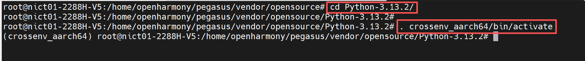

## 3.安装依赖

* 由于在编译libacamera的时候，需要依赖其他第三方软件，因此在编译libacamera之前，我们先把它依赖的第三方软件全部交叉编译出来。

### 步骤1： 配置依赖的环境变量

* 在服务器的命令行执行下面的命令，配置交叉编译时依赖的环境变量。这里的绝对路径请根据自己服务器实际情况进行修改。

```sh
export CC=/home/openharmony/pegasus/os/OpenHarmony/ohos/prebuilts/clang/ohos/linux-x86_64/llvm/bin/aarch64-unknown-linux-ohos-clang
export CXX=/home/openharmony/pegasus/os/OpenHarmony/ohos/prebuilts/clang/ohos/linux-x86_64/llvm/bin/aarch64-unknown-linux-ohos-clang++
export AR=/home/openharmony/pegasus/os/OpenHarmony/ohos/prebuilts/clang/ohos/linux-x86_64/llvm/bin/llvm-ar
export LD=/home/openharmony/pegasus/os/OpenHarmony/ohos/prebuilts/clang/ohos/linux-x86_64/llvm/bin/ld.lld
export RANLIB=/home/openharmony/pegasus/os/OpenHarmony/ohos/prebuilts/clang/ohos/linux-x86_64/llvm/bin/llvm-ranlib
export STRIP=/home/openharmony/pegasus/os/OpenHarmony/ohos/prebuilts/clang/ohos/linux-x86_64/llvm/bin/llvm-strip
```

### 步骤2：交叉编译依赖第三方软件

**注意：**在交叉编译之前，请一定确保OpenHarmony的代码下载完成，且整编通过，具体可参考[ohos编译](https://gitee.com/HiSpark/pegasus/blob/master/docs/OpenHarmony%20Small%E7%89%88%E6%9C%AC%E4%BD%BF%E7%94%A8%E6%8C%87%E5%8D%97/OpenHarmony%20Small%E7%89%88%E6%9C%AC%E4%BD%BF%E7%94%A8%E6%8C%87%E5%8D%97.md#ohos%E7%BC%96%E8%AF%91)的内容

#### 1、libevent的交叉编译

* 在服务器的命令行执行下面的命令，下载源码，配置编译链

```sh
# 由于zlib也属于第三方软件，可以在opensource目录下进行移植
cd pegasus/vendor/opensource/

wget https://github.com/libevent/libevent/releases/download/release-2.1.12-stable/libevent-2.1.12-stable.tar.gz 

tar -xzvf libevent-2.1.12-stable.tar.gz	
rm libevent-2.1.12-stable.tar.gz	

cd libevent-2.1.12-stable

# 注意：这里的路径请根据自己的Pegasus目录进行修改
export CC="/home/openharmony/pegasus/os/OpenHarmony/ohos/prebuilts/clang/ohos/linux-x86_64/llvm/bin/aarch64-unknown-linux-ohos-clang --sysroot=/home/openharmony/pegasus/os/OpenHarmony/ohos/out/hispark_ss928v100/ipcamera_hispark_ss928v100_linux/sysroot"
```

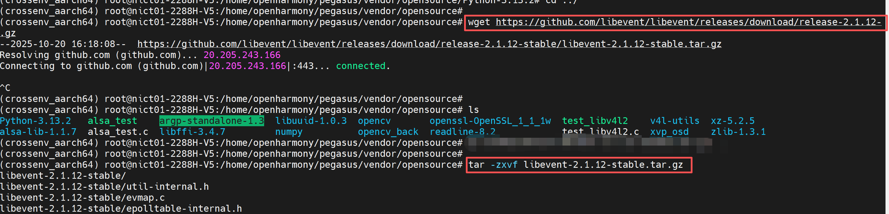

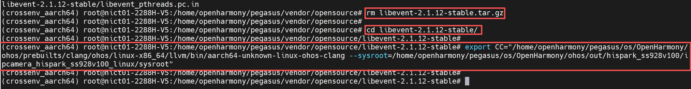

* 在服务器的命令行执行下面的命令，修改配置脚本和部分代码，确保编译时不会报错

```sh
sed -i 's/| -kaos\*/| -kaos\* | -ohos\*/g' ./build-aux/config.sub
sed -i 's/linux-uclibc\*/linux-uclibc\* | linux-ohos\*/g' ./build-aux/config.sub

sed -i 's/arc4random_buf/libevent_arc4random_buf/g' ./arc4random.c  
sed -i 's/arc4random_buf/libevent_arc4random_buf/g' evutil_rand.c
```

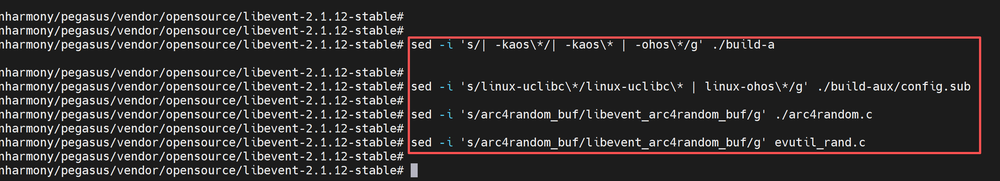

* 在服务器的命令行执行下面的命令，编译libevent

```sh
./configure --prefix=$PWD/install --host=aarch64-linux-ohos	 --disable-openssl

make && make install
```

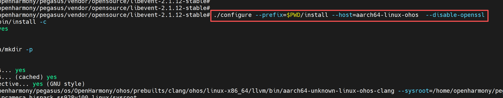

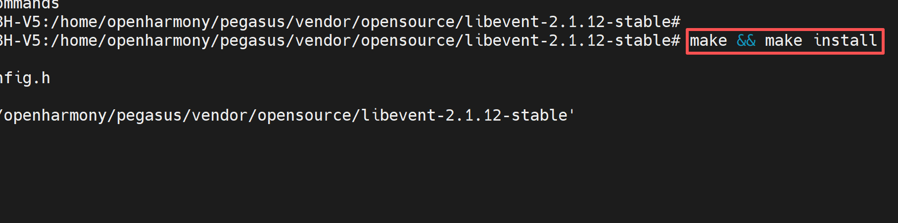

* 编译成功后，会在install目录下生成以下文件

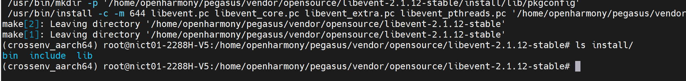

#### 2、tiff的交叉编译

* 在服务器的命令行执行下面的命令，进行openssl的交叉编译

```sh
cd ../

wget http://download.osgeo.org/libtiff/tiff-4.5.1.tar.gz 

tar -xzf tiff-4.5.1.tar.gz  
rm  tiff-4.5.1.tar.gz  

cd tiff-4.5.1
```

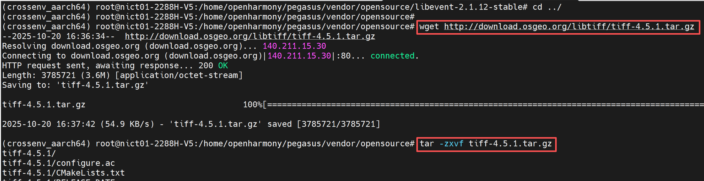

* 在./config/config.sub文件中添加OHOS的编译依赖，确保编译时不会报错
  * 在1761行添加 | ohos*
  * 在1782行添加 | linux-ohos*

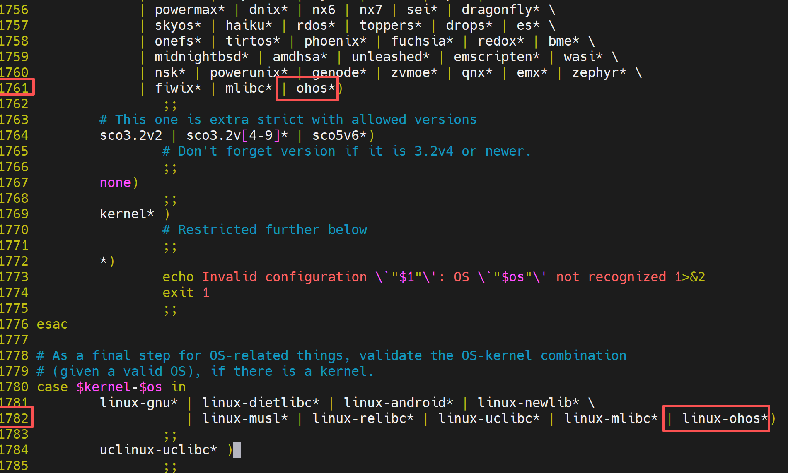

* 在服务器的命令行执行下面的命令，编译ttif

```sh
./configure --prefix=$PWD/install --host=aarch64-linux-ohos --with-sysroot=/home/openharmony/pegasus/os/OpenHarmony/ohos/out/hispark_ss928v100/ipcamera_hispark_ss928v100_linux/sysroot CFLAGS="--sysroot=/home/openharmony/pegasus/os/OpenHarmony/ohos/out/hispark_ss928v100/ipcamera_hispark_ss928v100_linux/sysroot" CXXFLAGS="--sysroot=/home/openharmony/pegasus/os/OpenHarmony/ohos/out/hispark_ss928v100/ipcamera_hispark_ss928v100_linux/sysroot"

make && make install
```

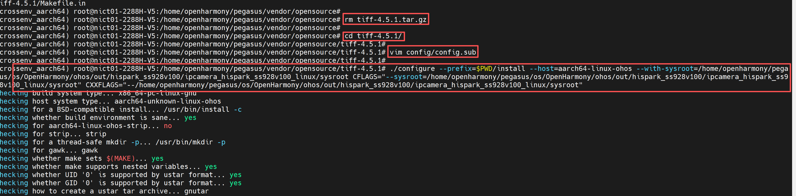

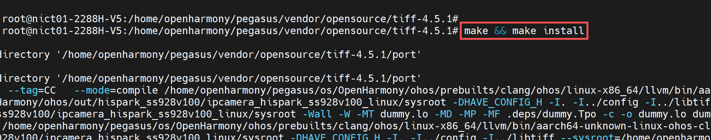

* 编译完成后，会在install目录下生成如下的文件

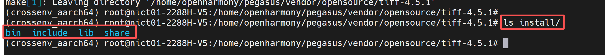

#### 3、jpeg-9d的交叉编译

* 在服务器的命令行执行下面的命令，进行libffi的交叉编译

```sh
cd ../

wget https://www.ijg.org/files/jpegsrc.v9d.tar.gz 
tar -zxvf jpegsrc.v9d.tar.gz 

rm jpegsrc.v9d.tar.gz 
 
cd jpegsrc.v9d
```

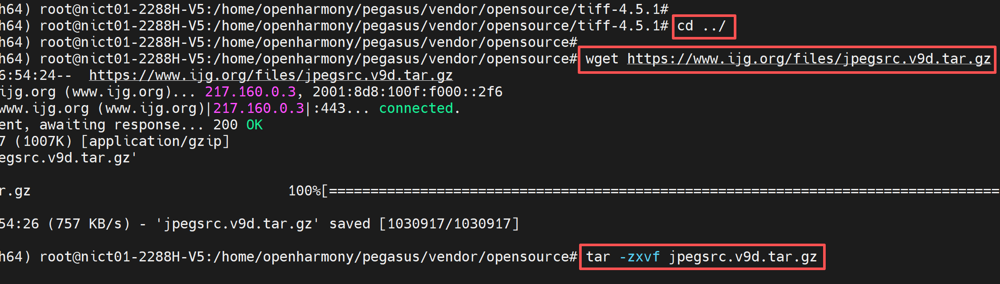

* 在服务器的命令行执行下面的命令，修改配置脚本和部分代码，确保编译时不会报错

```sh
sed -i 's/| -kaos\*/| -kaos\* | -ohos\*/g' config.sub  
sed -i 's/linux-uclibc\*/linux-uclibc\* | linux-ohos\*/g' config.sub
```

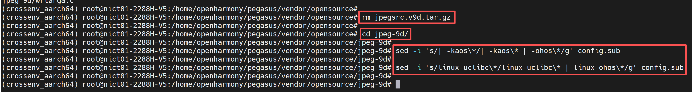

* 执行下面的命令，交叉编译jpeg-9d


```sh
export CC="/home/openharmony/pegasus/os/OpenHarmony/ohos/prebuilts/clang/ohos/linux-x86_64/llvm/bin/aarch64-unknown-linux-ohos-clang --sysroot=/home/openharmony/pegasus/os/OpenHarmony/ohos/out/hispark_ss928v100/ipcamera_hispark_ss928v100_linux/sysroot"

./configure --prefix=$PWD/install --host=aarch64-linux-ohos	

make && make install
```

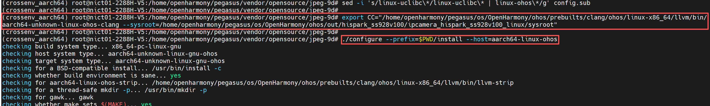

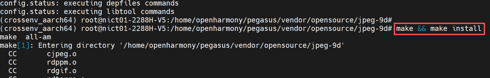

* 编译完成后，会在install目录下生成如下的文件

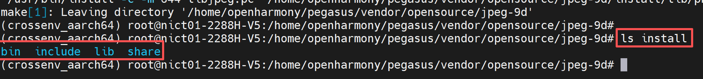

#### 2、openssl的交叉编译

* 在服务器的命令行执行下面的命令，进行openssl的交叉编译

```sh
cd ../

wget https://github.com/openssl/openssl/archive/refs/tags/OpenSSL_1_1_1w.tar.gz

tar -xvf OpenSSL_1_1_1w.tar.gz	
rm OpenSSL_1_1_1w.tar.gz

cd openssl-OpenSSL_1_1_1w

perl Configure linux-aarch64 --prefix=$PWD/install

make CC="/home/openharmony/pegasus/os/OpenHarmony/ohos/prebuilts/clang/ohos/linux-x86_64/llvm/bin/aarch64-unknown-linux-ohos-clang --sysroot=/home/openharmony/pegasus/os/OpenHarmony/ohos/out/hispark_ss928v100/ipcamera_hispark_ss928v100_linux/sysroot" LDFLAGS="--sysroot=/home/openharmony/pegasus/os/OpenHarmony/ohos/out/hispark_ss928v100/ipcamera_hispark_ss928v100_linux/sysroot -L/home/openharmony/pegasus/os/OpenHarmony/ohos/out/hispark_ss928v100/ipcamera_hispark_ss928v100_linux/sysroot/usr/lib"

make install
```

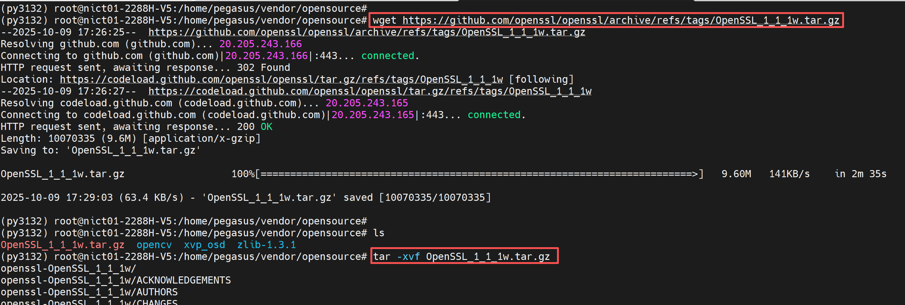


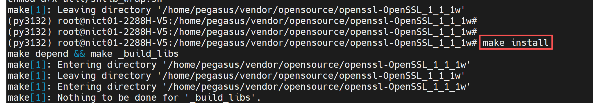

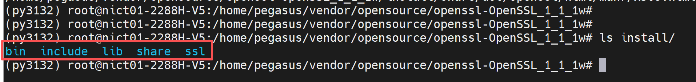

### 步骤3：安装依赖软件

* 在服务器的命令行执行下面的命令，安装依赖软件

```sh
apt-get install ninja-build libevent-dev libjpeg-dev 

# 使用apt下载的meson版本太低不符合要求
pip3 install meson==1.6 jinja2 pyyaml ply pybind11 -i https://pypi.tuna.tsinghua.edu.cn/simple
```

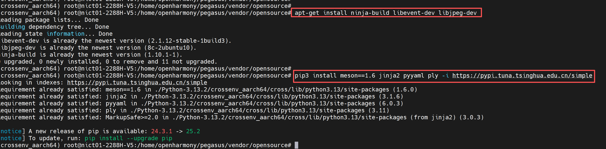

## 4、交叉编译libcamera

### 步骤1：下载源码

* 在服务器的命令行执行下面的命令，进行libcamera的交叉编译

```sh
cd ../

git clone https://git.libcamera.org/libcamera/libcamera.git

cd libcamera
```

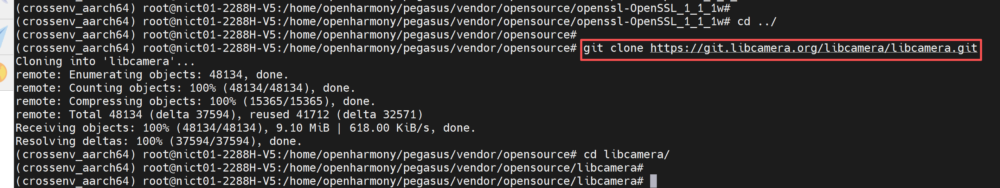

### 步骤2：配置编译环境

* 在libcamera目录下创建一个cross_file.txt文件，然后把下面的内容复制进去。
* 注意：下面内容中涉及到绝对路径的地方，请根据自己服务器的实际情况进行修改

```sh
[binaries]
c = '/home/openharmony/pegasus/os/OpenHarmony/ohos/prebuilts/clang/ohos/linux-x86_64/llvm/bin/aarch64-unknown-linux-ohos-clang'	
cpp = '/home/openharmony/pegasus/os/OpenHarmony/ohos/prebuilts/clang/ohos/linux-x86_64/llvm/bin/aarch64-unknown-linux-ohos-clang++'
ar = '/home/openharmony/pegasus/os/OpenHarmony/ohos/prebuilts/clang/ohos/linux-x86_64/llvm/bin/llvm-ar'
strip = '/home/openharmony/pegasus/os/OpenHarmony/ohos/prebuilts/clang/ohos/linux-x86_64/llvm/bin/llvm-strip'
pkg-config = '/usr/bin/pkg-config'

[host_machine]
system = 'linux'
cpu_family = 'aarch64'
cpu = 'aarch64'
endian = 'little'

[properties]
sys_root = '/home/openharmony/pegasus/os/OpenHarmony/ohos/out/hispark_ss928v100/ipcamera_hispark_ss928v100_linux/sysroot'
libdir = '/home/openharmony/pegasus/os/OpenHarmony/ohos/out/hispark_ss928v100/ipcamera_hispark_ss928v100_linux/sysroot/usr/lib'
includedir = '/home/openharmony/pegasus/os/OpenHarmony/ohos/out/hispark_ss928v100/ipcamera_hispark_ss928v100_linux/sysroot/usr/include'

[built-in options]
c_args = ['--sysroot=/home/openharmony/pegasus/os/OpenHarmony/ohos/out/hispark_ss928v100/ipcamera_hispark_ss928v100_linux/sysroot', '-isystem', '/home/openharmony/pegasus/os/OpenHarmony/ohos/out/hispark_ss928v100/ipcamera_hispark_ss928v100_linux/sysroot/usr/include']
cpp_args = ['--sysroot=/home/openharmony/pegasus/os/OpenHarmony/ohos/out/hispark_ss928v100/ipcamera_hispark_ss928v100_linux/sysroot', '-isystem', '/home/openharmony/pegasus/os/OpenHarmony/ohos/prebuilts/clang/ohos/linux-x86_64/llvm/include/libcxx-ohos/include/c++/v1', '-D_LIBCPP_HAS_NO_PRAGMA_SYSTEM_HEADER', '-std=c++17', '-I/home/openharmony/pegasus/vendor/opensource/tiff-4.5.1/install/include', '-I/home/openharmony/pegasus/vendor/opensource/libevent-2.1.12-stable/install/include', '-I/home/openharmony/pegasus/vendor/opensource/openssl-OpenSSL_1_1_1w/install/include', '-I/home/openharmony/pegasus/vendor/opensource/jpeg-9d/install/include',]

c_link_args = ['--sysroot=/home/openharmony/pegasus/os/OpenHarmony/ohos/out/hispark_ss928v100/ipcamera_hispark_ss928v100_linux/sysroot']
cpp_link_args = ['--sysroot=/home/openharmony/pegasus/os/OpenHarmony/ohos/out/hispark_ss928v100/ipcamera_hispark_ss928v100_linux/sysroot', '-L/home/openharmony/pegasus/vendor/opensource/tiff-4.5.1/install/lib', '-L/home/openharmony/pegasus/vendor/opensource/libevent-2.1.12-stable/install/lib', '-L/home/openharmony/pegasus/vendor/opensource/openssl-OpenSSL_1_1_1w/install/lib', '-L/home/openharmony/pegasus/vendor/opensource/jpeg-9d/install/lib',]
```

* 结合第三章内容，配置依赖软件的环境变量。
* 注意：下面内容中涉及到绝对路径的地方，请根据自己服务器的实际情况进行修改

```sh
export PKG_CONFIG_PATH=$PKG_CONFIG_PATH:/home/openharmony/pegasus/vendor/opensource/tiff-4.5.1/install/lib/pkgconfig:/home/openharmony/pegasus/vendor/opensource/libevent-2.1.12-stable/install/lib/pkgconfig:/home/openharmony/pegasus/vendor/opensource/openssl-OpenSSL_1_1_1w/install/lib/pkgconfig:/home/openharmony/pegasus/vendor/opensource/jpeg-9d/install/lib/pkgconfig
```

### 步骤3：修改代码

* /home/openharmony/pegasus/os/OpenHarmony/ohos/out/hispark_ss928v100/ipcamera_hispark_ss928v100_linux/sysroot/usr/include/aarch64-linux-ohos/linux/videodev2.h 文件中内容，如图所示，在文件的71行下添加14和15两个参数：

```c
 V4L2_BUF_TYPE_META_OUTPUT          = 14,
 V4L2_CAP_META_OUTPUT               = 15,
```

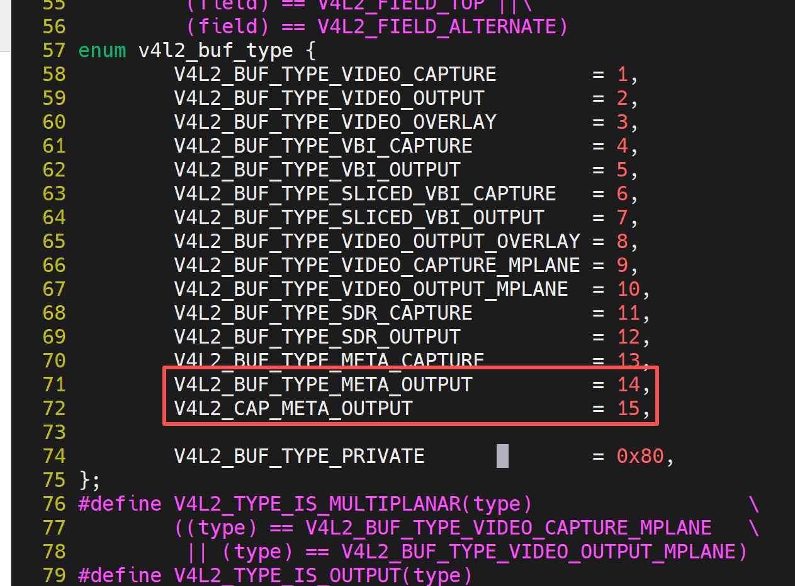

* 修改libcamera/src/libcamera/process.cpp，在152行处添加下面内容。

```c
struct clone_args {
    uint64_t flags;        /* Flags bit mask */
    uint64_t pidfd;        /* Where to store PID file descriptor*/
    uint64_t child_tid;    /* Where to store child TID */
    uint64_t parent_tid;   /* Where to store child TID */
    uint64_t exit_signal;  /* Signal to deliver to parent on child termination */
    uint64_t stack;        /* Pointer to lowest byte of stack */
    uint64_t stack_size;   /* Size of stack */
    uint64_t tls;          /* Location of new TLS */
};
```

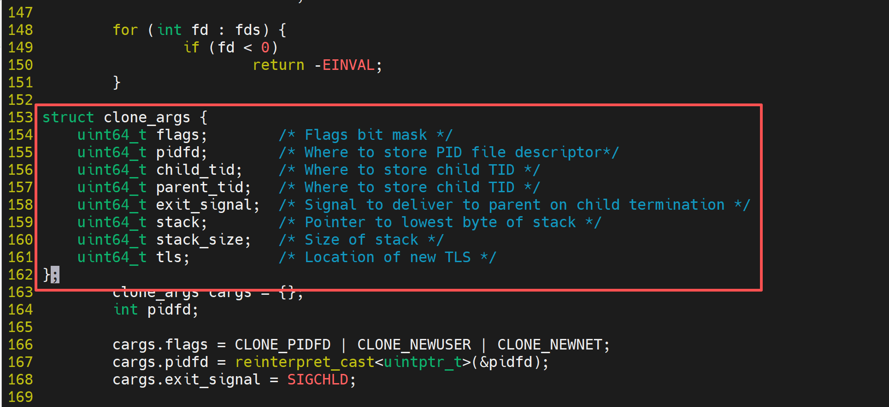

### 步骤4：编译源码

* 执行下面的命令，使用meson进行编译前的配置

```sh
meson setup \
  --cross-file cross_file.txt \
  --prefix=$(pwd)/install \
  -Dcam=enabled \
  -Ddocumentation=disabled \
  -Dpycamera=enabled \
  build . 2>&1 | tee meson_output.log
```

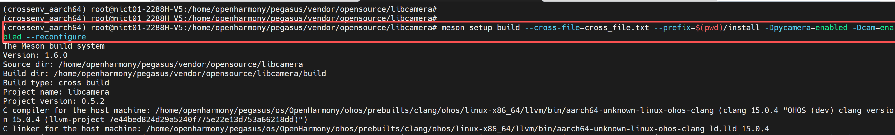

* 执行下面的命令，进行源码的编译

```sh
cd build

ninja
```

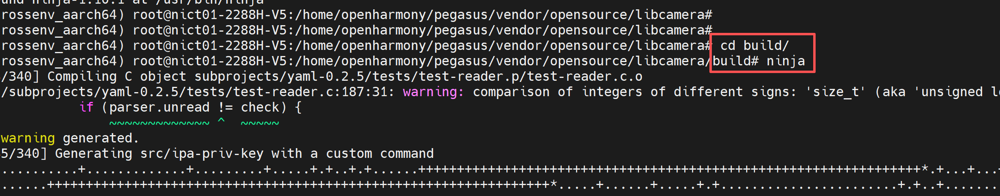

### 步骤5：修改报错

* 如果在编译的时候出现下面的错误

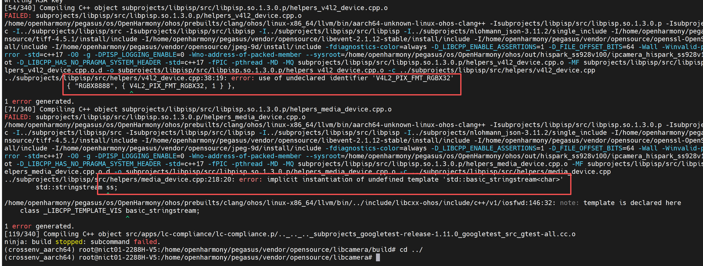

* 需要修改两个位置的代码
* 在libcamera/subprojects/libpisp/src/helpers/media_device.cpp 文件的第行，添加一个头文件 #include<sstream>

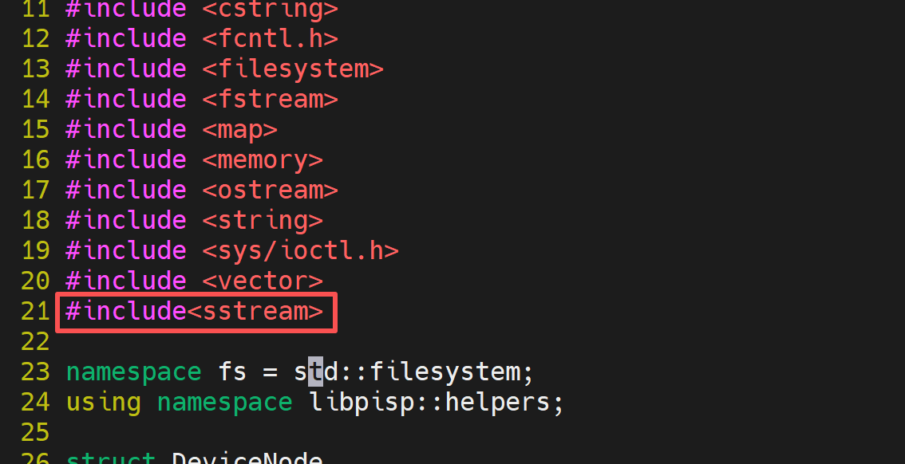

* 在libcamera/subprojects/libpisp/src/helpers/v4l2_device.cpp文件的24~30行，添加下面的内容

```c
#ifndef V4L2_PIX_FMT_RGBX32
#define V4L2_PIX_FMT_RGBX32 v4l2_fourcc('R', 'G', 'B', 'X')
#endif

#ifndef V4L2_PIX_FMT_BGRX32
#define V4L2_PIX_FMT_BGRX32 v4l2_fourcc('B', 'G', 'R', 'X')
#endif
```

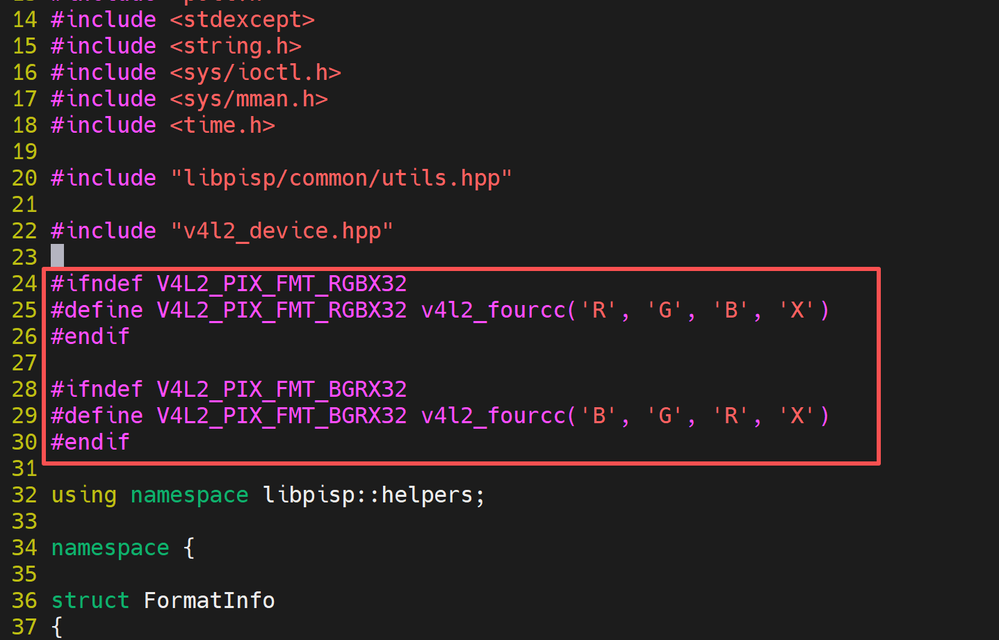

* 然后删掉build目录，重新执行下面的命令，编译源码

```sh
cd /home/openharmony/pegasus/vendor/opensource/libcamera

rm build

meson setup \
  --cross-file cross_file.txt \
  --prefix=$(pwd)/install \
  -Dcam=enabled \
  -Ddocumentation=disabled \
  -Dpycamera=disabled \
  build . 2>&1 | tee meson_output.log

ninja -C build
ninja -C build install

cd build

ninja

ninja install
```

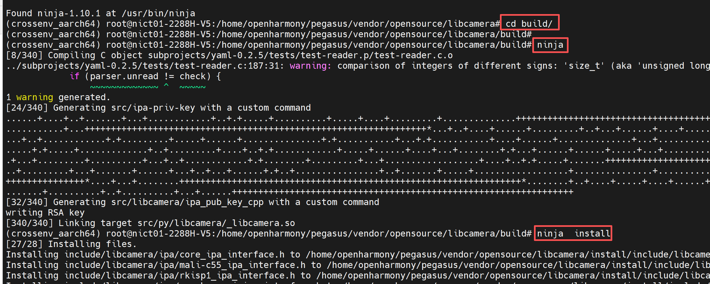

* 编译成功后，会在libcamera的install目录生成如下内容

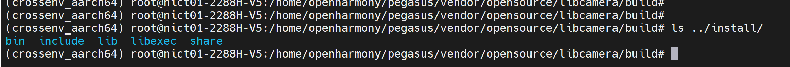

## 5.板端测试

### 步骤1：配置板端环境

* 1、确保开发板已经烧录OpenHarmony操作系统
* 2、使用网线将开发板与你的电脑进行连接，确保二者处于同一局域网内
* 3、配置开发板的IP地址，并确保开发板与电脑能够互相ping通

```sh
# 注意：这里的eth0的IP地址，请根据自己的网络IP网段进行合理配置
ifconfig eth0 192.168.100.100

# 添加权限
echo 0 9999999 > /proc/sys/net/ipv4/ping_group_range
```

### 步骤2：准备libacamera依赖文件

* 1、将第4章交叉编译libcamera后，生成的install文件夹拷贝到你的NFS挂载目录（这里把install重命名为libcamera_install）
* 2、将第3章步骤2交叉编译的依赖软件中的libevent\_pthreads-2.1.so.7、libevent-2.1.so.7、libcrypto.so.1.1、libtiff.so.6都下载下来，并复制到libcamera_install的lib目录下
* 3、如果你想使用Python调用libcamera的接口，需要把libcamera_install/lib/python3.13/site-packages中的 libcamera复制到Python的install/lib/python3.13/site-packages目录下，具体可参考[Python的移植文档](../python/README.md)。
* 4、将下的这些库都复制到Python的install/lib/python3.13/lib-dynload目录下

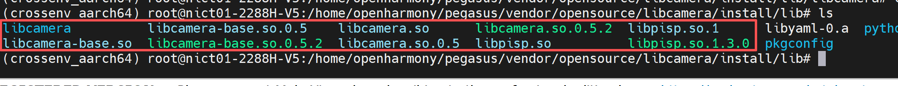

* 5、在开发板的命令行执行下面的命令，将电脑的nfs目录挂载到开发板的/mnt目录下（注意：这里请根据自己的IP地址及NFS配置进行合理的修改）

```sh
mount -o nolock,addr=192.168.100.10 -t nfs 192.168.100.10:/d/nfs /mnt
```

* 6、在开发板的命令行执行下面的命令，配置python的环境变量，确保python运行时能够找到依赖

```sh
export PATH=/mnt/install/bin:$PATH
export PYTHONPATH=/mnt/install/lib/python3.13:$PYTHONPATH
export LD_LIBRARY_PATH=/mnt/install/lib/python3.13/lib-dynload:$LD_LIBRARY_PATH
```

* 7、在开发板的命令行执行下面的命令，配置libcamera的环境变量，确保libcamera运行时能够找到依赖

```sh
export PATH=/mnt/libcamera_install/bin:$PATH
export LD_LIBRARY_PATH=/mnt/libcamera_install/lib:$LD_LIBRARY_PATH
```

### 步骤3：运行cam工具

* 在开发板的命令行执行下面的命令，给cam添加可执行权限

```sh
chmod +x /mnt/libcamera_install/bin/*
```

* 运行 cam -c 1 -I    可以查看当前摄像机支持的分辨率和格式：

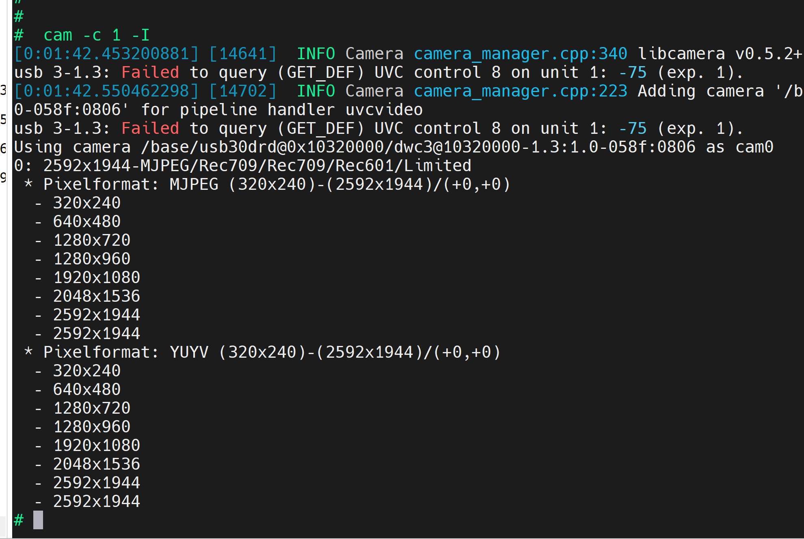

* 拉取图片：

  ```sh
  # 可以通过cam参数 -s 设置图片分辨率、图片格式等等：
  cam -c 1 --capture=10 --file=1.jpg
  ```

  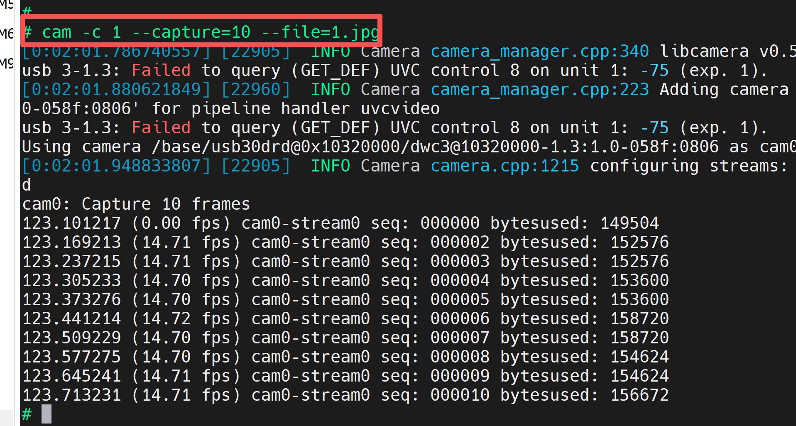

* 拉取视频流：（10帧，分辨率1920x1080，格式为YUYV）

  ```sh
  cam -c 1 -C10 -s width=1920,height=1080,role=video,pixelformat=YUYV --file=/mnt/1.yuv
  ```

  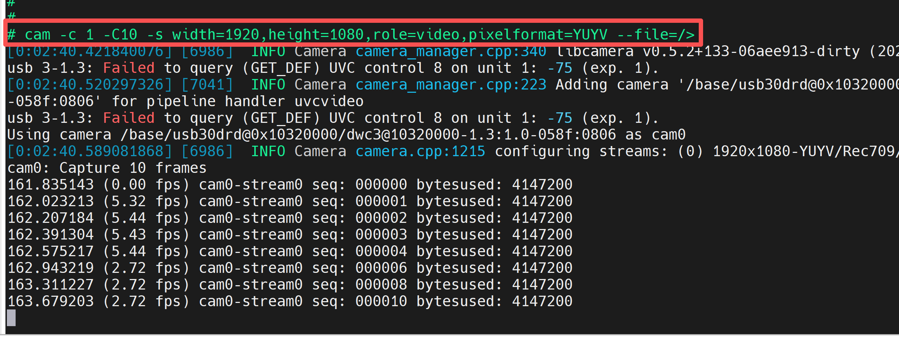

  


