# libv4l2移植

## 1、软硬件环境

* 开发板：海鸥派
* 交叉编译工具链：OHOS (dev) clang version 15.0.4
* 编译链路径：pegasus/os/OpenHarmony/ohos/prebuilts/clang/ohos/linux-x86_64/llvm/bin
* python版本：Python-3.13.2
* 移植的libv4l2版本：OpenCV-4.13

## 2、交叉编译libv4l2

### 步骤1：获取源码

* 在服务器的命令行，分步执行下面的命令，下载v4l-utils源码

~~~bash
git clone https://git.linuxtv.org/v4l-utils.git

cd v4l-utils
~~~

### 步骤2：创建交叉编译配置文件

[constants]
toolchain = '/home/openharmony/pegasus/os/OpenHarmony/ohos/prebuilts/clang/ohos/linux-x86_64/llvm/bin'
sysroot = '/home/openharmony/pegasus/os/OpenHarmony/ohos/out/hispark_ss928v100/ipcamera_hispark_ss928v100_linux/sysroot'

* 在v4l-utils目录下创建一个hisi-cross.txt文件，把下面的内容复制进去并保存。

~~~bash
[host_machine]
system = 'linux'
cpu_family = 'aarch64'
cpu = 'aarch64'
endian = 'little'

[binaries]
c = '/home/openharmony/pegasus/os/OpenHarmony/ohos/prebuilts/clang/ohos/linux-x86_64/llvm/bin/aarch64-unknown-linux-ohos-clang'
cpp = '/home/openharmony/pegasus/os/OpenHarmony/ohos/prebuilts/clang/ohos/linux-x86_64/llvm/bin/aarch64-unknown-linux-ohos-clang++'
ar = '/home/openharmony/pegasus/os/OpenHarmony/ohos/prebuilts/clang/ohos/linux-x86_64/llvm/bin/llvm-ar'
ranlib = '/home/openharmony/pegasus/os/OpenHarmony/ohos/prebuilts/clang/ohos/linux-x86_64/llvm/bin/llvm-ranlib'
strip = '/home/openharmony/pegasus/os/OpenHarmony/ohos/prebuilts/clang/ohos/linux-x86_64/llvm/bin/llvm-strip'
pkg-config = '/usr/bin/pkg-config'

[properties]
sysroot = '/home/openharmony/pegasus/os/OpenHarmony/ohos/out/hispark_ss928v100/ipcamera_hispark_ss928v100_linux/sysroot'
c_args = ['--sysroot=' + sysroot, '--target=aarch64-linux-ohos', '-I' + sysroot + '/usr/include']
c_link_args = ['--sysroot=' + sysroot, '--target=aarch64-linux-ohos', '-fuse-ld=lld', '-L' + sysroot + '/usr/lib/aarch64-linux-ohos', '-L' + sysroot + '/lib', '-lc']
~~~

### 步骤3.加载配置并生成构建文件

#### argp库交叉编译

* 在服务器的命令行分步执行下面的命令，下载argp源码

```sh
#获取源码
wget https://www.lysator.liu.se/~nisse/misc/argp-standalone-1.3.tar.gz
tar xf argp-standalone-1.3.tar.gz
rm argp-standalone-1.3.tar.gz
cd argp-standalone-1.3
```

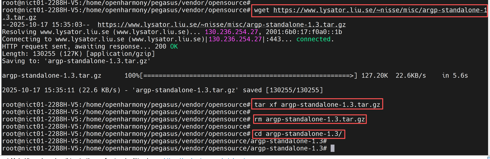

* 在服务器的命令行分步执行下面的命令，配置环境变量

```sh
#配置变量
export SYSROOT=/home/openharmony/pegasus/os/OpenHarmony/ohos/out/hispark_ss928v100/ipcamera_hispark_ss928v100_linux/sysroot
export CC=/home/openharmony/pegasus/os/OpenHarmony/ohos/prebuilts/clang/ohos/linux-x86_64/llvm/bin/aarch64-unknown-linux-ohos-clang
export CXX=/home/openharmony/pegasus/os/OpenHarmony/ohos/prebuilts/clang/ohos/linux-x86_64/llvm/bin/aarch64-unknown-linux-ohos-clang++
export AR=/home/openharmony/pegasus/os/OpenHarmony/ohos/prebuilts/clang/ohos/linux-x86_64/llvm/bin/llvm-ar            
export RANLIB=/home/openharmony/pegasus/os/OpenHarmony/ohos/prebuilts/clang/ohos/linux-x86_64/llvm/bin/llvm-ranlib       
export CFLAGS="--sysroot=$SYSROOT"
export CXXFLAGS="--sysroot=$SYSROOT"
export LDFLAGS="--sysroot=$SYSROOT"
```

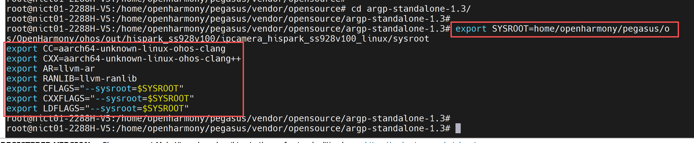

* 在服务器的命令行分步执行下面的命令，对argp代码进行编译

~~~bash
#配置文件
./configure \
  --host=aarch64-linux-ohos \
  --prefix=$SYSROOT/usr \
  --disable-shared \
  --enable-static
  
#编译安装
make -j$(nproc) && make install
~~~

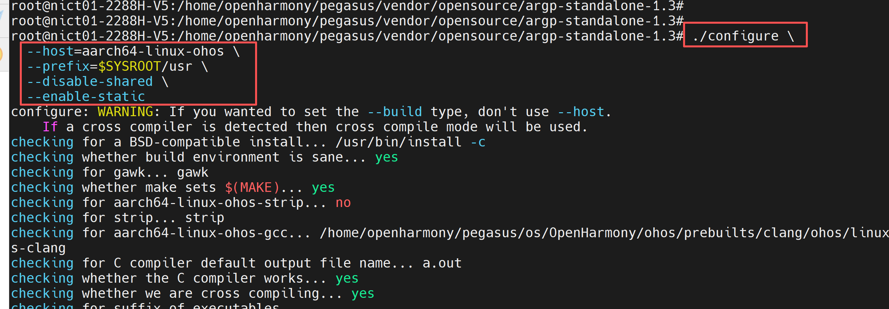

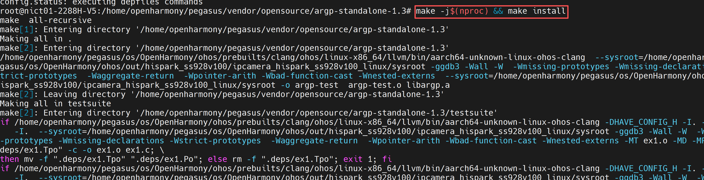

* 在服务器的命令行分步执行下面的命令，复制argp.h和libargp.a到sysroot对应目录下

~~~bash
# 复制头文件 argp.h 到 sysroot 的 include 目录
cp ./argp.h $SYSROOT/usr/include/

# 复制静态库 libargp.a 到 sysroot 的 lib 目录
cp ./libargp.a $SYSROOT/usr/lib/

# 确保文件权限正确
chmod 644 $SYSROOT/usr/include/argp.h
chmod 644 $SYSROOT/usr/lib/libargp.a
~~~

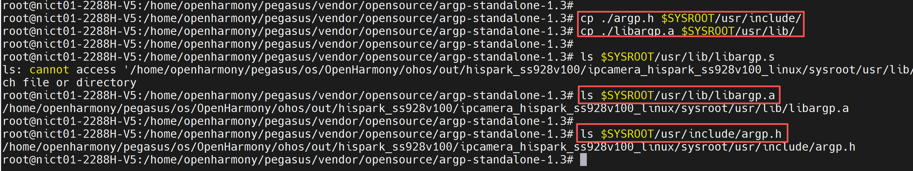

### 步骤4：meson构建 

* 在服务器的命令行执行下面的命令，进行meson的构建。
* 注意：如果你之前有参考过numpy或者opencv的移植文档，这里需要退出虚拟环境（source ~/.bashrc）。

~~~bash
cd ../

# 下载meson
python3 -m pip install meson -i https://pypi.tuna.tsinghua.edu.cn/simple

cd v4l-utils
~~~

* 修改contrib/test/meson.build，将第89~102行代码注释掉

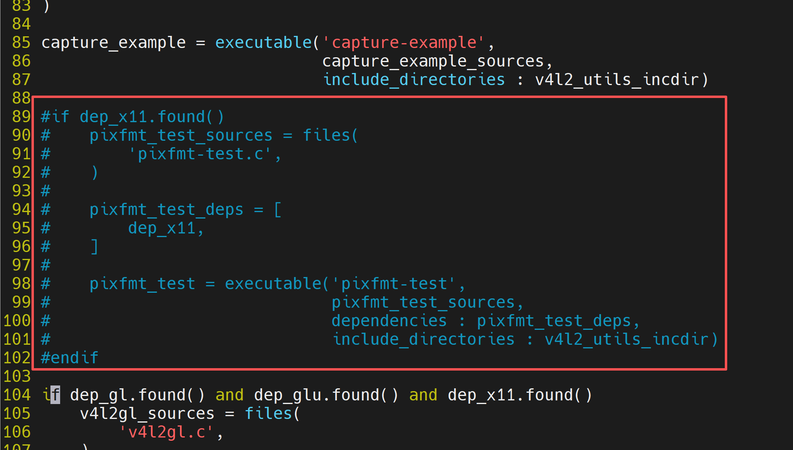

* 进入到v4l-utils的build目录下

~~~bash
# 使用meson进行构建
meson setup \
  --cross-file hisi-cross.txt \
  --prefix /home/openharmony/pegasus/vendor/opensource/v4l-utils/install \
  -Ddoxygen-doc=disabled \
  -Dudevdir=lib/udev \
  -Djpeg=disabled \
  build . 2>&1 | tee meson_output.log
  
cd build 

ninja && ninja install
~~~

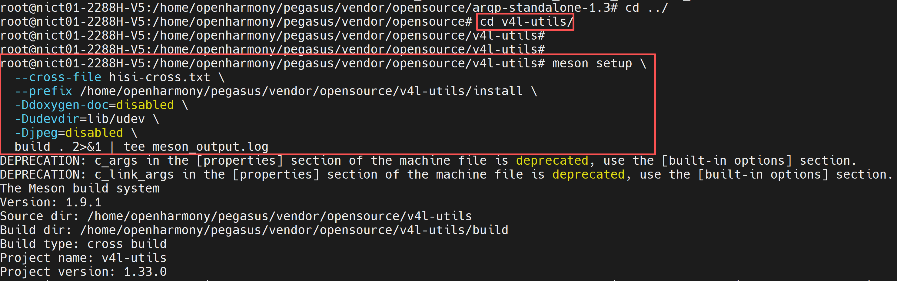

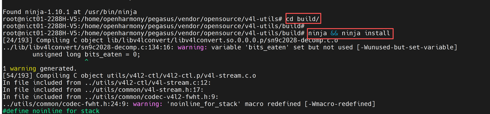

* 执行成功后会在v4l-utils/install目录下生成如下文件

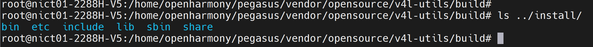

## 3.测试

### 3.1 NFS 共享

* nfs配置可参考参考链接：

~~~bash
https://blog.csdn.net/weixin_34326429/article/details/92163791
~~~

### 3.2 挂载NFS

* 在开发板的命令行终端执行下面的命令，配置IP地址，并进行NFS挂载

~~~bash
ifconfig eth0 192.168.137.0 netmask 255.255.252.0
route add default gw  192.168.137.1
mount -o nolock,addr=192.168.137.1 -t nfs 192.168.137.1:/nfs /mnt
~~~

### 3.3 配置环境变量 

* 将第2章步骤4生成的install文件下载到本地

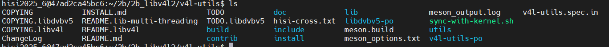

* 为了区分，我将install文件名改为libv4l2_install
* 在开发板的命令行终端执行下面的命令，配置环境变量

~~~bash
cd mnt

export PATH=/mnt/libv4l2_install/bin:$PATH
export LD_LIBRARY_PATH=/mnt/libv4l2_install/lib:$LD_LIBRARY_PATH
chmod +x /mnt/libv4l2_install/bin/v4l2-ctl
~~~

### 3.4测试

#### 3.4.1 测试v4l2-ctl工具 

* 测试列出所有设备

~~~bash
v4l2-ctl --list-devices
~~~

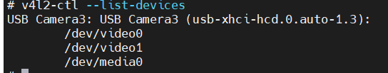

* 测试查看usb摄像头支持的图像格式和分辨率

~~~bash
v4l2-ctl -d /dev/video0 --list-formats-ext
~~~

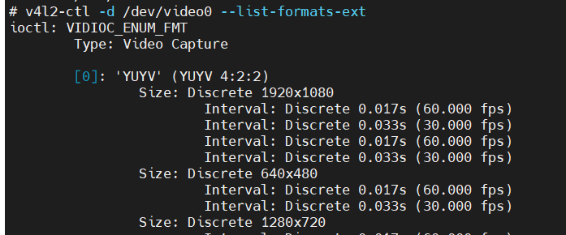

* 测试采集一帧图像

~~~bash
v4l2-ctl -d /dev/video0 \
  --set-fmt-video=width=1920,height=1080,pixelformat=MJPG \
  --stream-mmap \
  --stream-count=1 \
  --stream-to=v4l2test.jpg
~~~

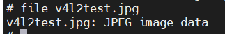

#### 3.4.2 接口调用demo

* 把下面的内容复制到test_libv4l2.c中，在服务器上编译，得到可执行文件后放到板端执行。

~~~bash
#include <stdio.h>
#include <stdlib.h>
#include <string.h>
#include <fcntl.h>
#include <unistd.h>
#include <sys/ioctl.h>
#include <sys/mman.h>
#include <linux/videodev2.h>
#include <libv4l2.h>

int main(int argc, char *argv[]) {
    int fd;
    char *dev_name = "/dev/video0";  // 默认视频设备
    struct v4l2_capability cap;
    struct v4l2_format fmt;
    struct v4l2_buffer buf;
    struct v4l2_requestbuffers req;  // 新增：用于请求缓冲区
    void *buffer;

    if (argc > 1) {
        dev_name = argv[1];
    }

    printf("测试libv4l2是否正常工作...\n");
    printf("尝试打开视频设备: %s\n", dev_name);

    // 打开视频设备
    fd = v4l2_open(dev_name, O_RDWR | O_NONBLOCK, 0);
    if (fd < 0) {
        perror("无法打开视频设备");
        return EXIT_FAILURE;
    }
    printf("成功打开视频设备\n");

    // 查询设备能力
    if (v4l2_ioctl(fd, VIDIOC_QUERYCAP, &cap) < 0) {
        perror("无法查询设备能力");
        v4l2_close(fd);
        return EXIT_FAILURE;
    }
    printf("设备信息:\n");
    printf("  名称: %s\n", cap.card);
    printf("  驱动: %s\n", cap.driver);
    printf("  总线: %s\n", cap.bus_info);

    // 检查是否支持视频捕获和流式IO
    if (!(cap.capabilities & V4L2_CAP_VIDEO_CAPTURE)) {
        fprintf(stderr, "设备不支持视频捕获\n");
        v4l2_close(fd);
        return EXIT_FAILURE;
    }
    if (!(cap.capabilities & V4L2_CAP_STREAMING)) {
        fprintf(stderr, "设备不支持流式IO\n");
        v4l2_close(fd);
        return EXIT_FAILURE;
    }

    // 设置视频格式
    memset(&fmt, 0, sizeof(fmt));
    fmt.type = V4L2_BUF_TYPE_VIDEO_CAPTURE;
    fmt.fmt.pix.width = 640;
    fmt.fmt.pix.height = 480;
    fmt.fmt.pix.pixelformat = V4L2_PIX_FMT_YUYV;
    fmt.fmt.pix.field = V4L2_FIELD_INTERLACED;

    if (v4l2_ioctl(fd, VIDIOC_S_FMT, &fmt) < 0) {
        perror("无法设置视频格式");
        v4l2_close(fd);
        return EXIT_FAILURE;
    }
    printf("成功设置视频格式: %dx%d, 格式: YUYV\n", 
           fmt.fmt.pix.width, fmt.fmt.pix.height);

    // 新增：请求缓冲区（关键步骤）
    memset(&req, 0, sizeof(req));
    req.count = 1;  // 请求1个缓冲区
    req.type = V4L2_BUF_TYPE_VIDEO_CAPTURE;
    req.memory = V4L2_MEMORY_MMAP;  // 使用内存映射方式

    if (v4l2_ioctl(fd, VIDIOC_REQBUFS, &req) < 0) {
        perror("无法请求缓冲区");
        v4l2_close(fd);
        return EXIT_FAILURE;
    }
    printf("成功请求 %d 个缓冲区\n", req.count);

    // 查询缓冲区信息
    memset(&buf, 0, sizeof(buf));
    buf.type = V4L2_BUF_TYPE_VIDEO_CAPTURE;
    buf.memory = V4L2_MEMORY_MMAP;
    buf.index = 0;  // 查询第0个缓冲区

    if (v4l2_ioctl(fd, VIDIOC_QUERYBUF, &buf) < 0) {
        perror("无法查询缓冲区");
        v4l2_close(fd);
        return EXIT_FAILURE;
    }

    // 映射缓冲区
    buffer = v4l2_mmap(NULL, buf.length, PROT_READ | PROT_WRITE, MAP_SHARED, fd, buf.m.offset);
    if (buffer == MAP_FAILED) {
        perror("无法映射缓冲区");
        v4l2_close(fd);
        return EXIT_FAILURE;
    }
    printf("成功映射缓冲区，大小: %d bytes\n", buf.length);

    // 将缓冲区放入队列
    if (v4l2_ioctl(fd, VIDIOC_QBUF, &buf) < 0) {
        perror("无法将缓冲区放入队列");
        v4l2_munmap(buffer, buf.length);
        v4l2_close(fd);
        return EXIT_FAILURE;
    }

    // 开始捕获
    enum v4l2_buf_type type = V4L2_BUF_TYPE_VIDEO_CAPTURE;
    if (v4l2_ioctl(fd, VIDIOC_STREAMON, &type) < 0) {
        perror("无法开始捕获");
        v4l2_munmap(buffer, buf.length);
        v4l2_close(fd);
        return EXIT_FAILURE;
    }
    printf("开始视频捕获...\n");

    // 等待帧就绪
    fd_set fds;
    struct timeval tv;
    int r;

    FD_ZERO(&fds);
    FD_SET(fd, &fds);
    tv.tv_sec = 2;
    tv.tv_usec = 0;

    r = select(fd + 1, &fds, NULL, NULL, &tv);
    if (r == -1) {
        perror("select失败");
        v4l2_ioctl(fd, VIDIOC_STREAMOFF, &type);
        v4l2_munmap(buffer, buf.length);
        v4l2_close(fd);
        return EXIT_FAILURE;
    }
    if (r == 0) {
        fprintf(stderr, "捕获超时\n");
        v4l2_ioctl(fd, VIDIOC_STREAMOFF, &type);
        v4l2_munmap(buffer, buf.length);
        v4l2_close(fd);
        return EXIT_FAILURE;
    }

    // 从队列中取出缓冲区
    if (v4l2_ioctl(fd, VIDIOC_DQBUF, &buf) < 0) {
        perror("无法从队列中取出缓冲区");
        v4l2_ioctl(fd, VIDIOC_STREAMOFF, &type);
        v4l2_munmap(buffer, buf.length);
        v4l2_close(fd);
        return EXIT_FAILURE;
    }

    printf("成功捕获一帧图像，大小: %d bytes\n", buf.bytesused);

    // 停止捕获
    if (v4l2_ioctl(fd, VIDIOC_STREAMOFF, &type) < 0) {
        perror("无法停止捕获");
        v4l2_munmap(buffer, buf.length);
        v4l2_close(fd);
        return EXIT_FAILURE;
    }

    // 清理资源
    v4l2_munmap(buffer, buf.length);
    v4l2_close(fd);

    printf("所有测试操作完成，libv4l2工作正常!\n");
    return EXIT_SUCCESS;
}

~~~

* 在服务器的命令行执行下面的命令，编译该代码
* 注意：这里的决定路径请根据自己服务器的实际情况进行填写

~~~bash
/home/openharmony/pegasus/os/OpenHarmony/ohos/prebuilts/clang/ohos/linux-x86_64/llvm/bin/aarch64-unknown-linux-ohos-clang -o  test_libv4l2  test_libv4l2.c \
--sysroot=/home/openharmony/pegasus/os/OpenHarmony/ohos/out/hispark_ss928v100/ipcamera_hispark_ss928v100_linux/sysroot \
-I/home/openharmony/pegasus/vendor/opensource/v4l-utils/install/include \
-I/home/openharmony/pegasus/vendor/opensource/v4l-utils/lib/include \
-L/home/openharmony/pegasus/vendor/opensource/v4l-utils/install/lib \
-lv4l2
~~~

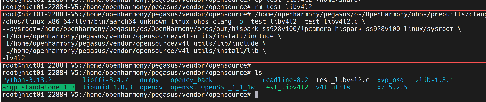

~~~bash
#1.将可执行文件test_libv4l2下载并挂载上板端
cd mnt
#2.添加v4l2的相关环境变量，参考5.3配置环境变量
chmod +x test_libv4l2
#3.运行测试
./test_libv4l2
~~~

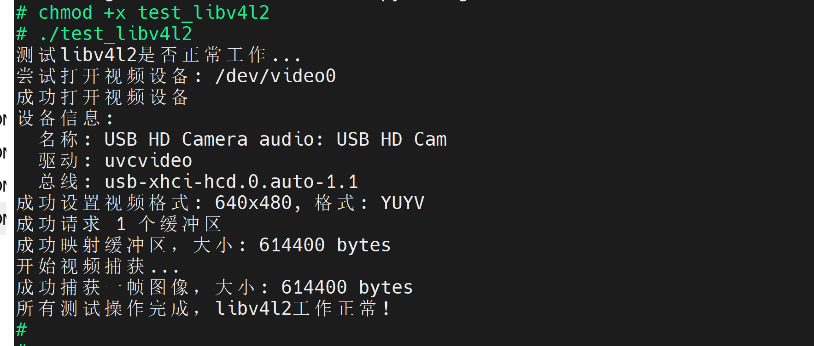


