# numpy移植

## 1、软硬件环境

开发板：海鸥派
交叉编译工具链：OHOS (dev) clang version 15.0.4

编译链路径：pegasus/os/OpenHarmony/ohos/prebuilts/clang/ohos/linux-x86_64/llvm/bin  

python版本：Python-3.13.2

移植的numpy版本：numpy-v2.2.5

## 2、交叉编译numpy

### 步骤1：下载numpy源码

* 分步执行下面的命令，下载Numpy源码

```sh
cd pegasus/vendor/opensource

git clone https://github.com/numpy/numpy.git

cd numpy

# 加载子模块
git submodule update --init

# 切到自己想要的版本，我这里选择v2.2.5
git checkout v2.2.5	
```

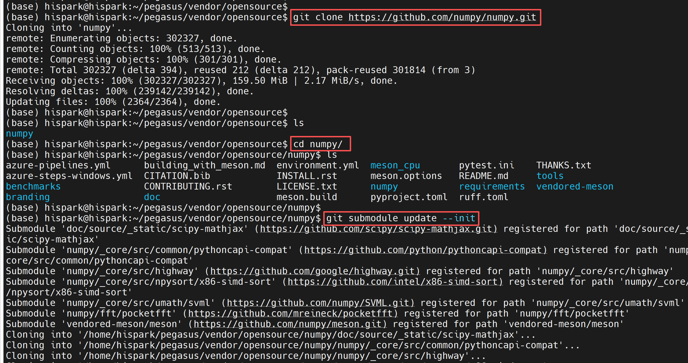

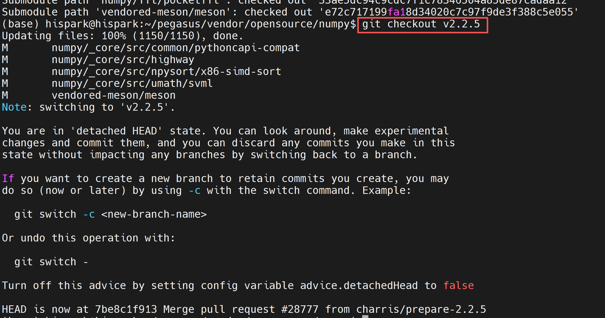

### 步骤2：配置编译脚本

* 在numpy源码根目录下创建一个ohos-build.meson.ini 文件，然后把下面的内容复制进去并保存。

```ini
# toolchain和sysroot路径，请根据自己服务器的实际路径进行填写

[constants]
toolchain = '/home/openharmony/pegasus/os/OpenHarmony/ohos/prebuilts/clang/ohos/linux-x86_64/llvm/bin'
sysroot = '/home/openharmony/pegasus/os/OpenHarmony/ohos/out/hispark_ss928v100/ipcamera_hispark_ss928v100_linux/sysroot'
host_cpu = 'aarch64'
host_arch = 'aarch64'
common_flags = ['--sysroot=' + sysroot, '--target=' + host_cpu + '-linux-ohos']

[built-in options]
c_args = common_flags
cpp_args = common_flags
c_link_args = common_flags
cpp_link_args = common_flags

[properties]
sizeof_long_double = 8
longdouble_format = 'IEEE_DOUBLE_LE'

[binaries]
c = toolchain / 'aarch64-unknown-linux-ohos-clang'
cpp = toolchain / 'aarch64-unknown-linux-ohos-clang++'
# 这里的python为虚拟环境的python路径
python = '/home/openharmony/pegasus/vendor/opensource/Python-3.13.2/install/include/python3.13'
cython = ''
cython3 = cython
as = toolchain / 'llvm-as'
ld = toolchain / 'ld.lld'
c_ld = ld
cpp_ld = ld
lld = toolchain / 'ld.lld'
strip = toolchain / 'llvm-strip'
ranlib = toolchain / 'llvm-ranlib'
objdump = toolchain / 'llvm-objdump'
objcopy = toolchain / 'llvm-objcopy'
readelf = toolchain / 'llvm-readelf'
nm = toolchain / 'llvm-nm'
ar = toolchain / 'llvm-ar'
profdata = toolchain / 'llvm-profdata'

[host_machine]
system = 'ohos'
kernel = 'linux'
cpu_family = host_cpu
cpu = host_cpu
endian = 'little'
```

### 步骤3：配置编译虚拟环境

* 创建crossenv虚拟环境，用于Numpy的编译

```sh
# 下载ninja
apt-get install ninja-build
     
# 下载cpython
pip3 install cython -i https://pypi.tuna.tsinghua.edu.cn/simple

# 下载crossenv
pip3 install crossenv

#  在Python-3.13.2目录下创建crossenv虚拟环境
# /home/openharmony/pegasus/vendor/opensource/Python-3.13.2/install 为交叉编译后的python路径
cd Python-3.13.2 
python3 -m crossenv /home/openharmony/pegasus/vendor/opensource/Python-3.13.2/install/bin/python3 crossenv_aarch64

# 激活环境
. crossenv_aarch64/bin/activate

cd ../numpy

# 配置 VENDORED_MESON,具体路径请根据自己numpy实际路径进行配置

VENDORED_MESON=/home/openharmony/pegasus/vendor/opensource/numpy/vendored-meson/meson/meson.py
python ${VENDORED_MESON} setup --reconfigure --prefix=$PWD/install --cross-file ./ohos-build.meson.ini build-ohos

cd build-ohos

# 编译Numpy
python ${VENDORED_MESON} compile

# 安装 numpy
python ${VENDORED_MESON} install
```

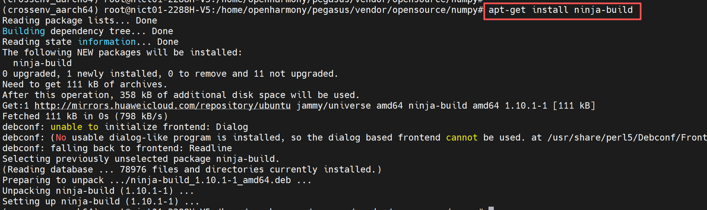

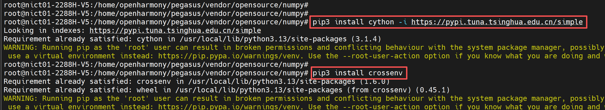

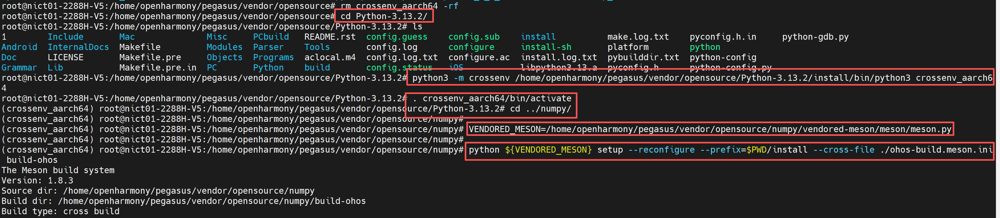

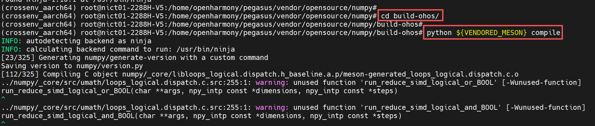

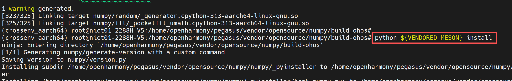

* 生成的numpy安装包在numpy/install/lib/python3.13/site-packages/numpy/目录下

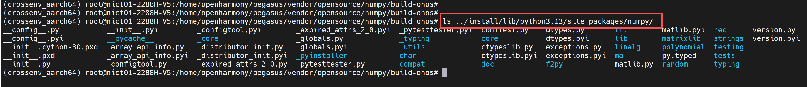


## 3、板端测试

### 步骤1：配置板端环境

* 1、确保开发板已经烧录OpenHarmony操作系统
* 2、使用网线将开发板与你的电脑进行连接，确保二者处于同一局域网内
* 3、配置开发板的IP地址，并确保开发板与电脑能够互相ping通

```sh
# 注意：这里的eth0的IP地址，请根据自己的网络IP网段进行合理配置
ifconfig eth0 192.168.100.100

# 添加权限
echo 0 9999999 > /proc/sys/net/ipv4/ping_group_range
```


### 步骤2：准备python依赖文件

* 1、将python移植第4章 交叉编译python3.13.2后，生成的install文件夹拷贝到你的NFS挂载目录
* 2、再将numpy/install/lib/python3.13/site-packages下的numpy复制到install/lib/目录下。
* 3、再根据python第三章移植的内容，将libz.so.1、 libssl.so.1.1 、 libcrypto.so.1.1文件复制到install/lib/python3.13/lib-dynload目录下

* 4、执行下面的，命令将电脑的nfs目录挂载到开发板的/mnt目录下（注意：这里请根据自己的IP地址及NFS配置进行合理的修改）

```mk1.sh
mount -o nolock,addr=192.168.100.10 -t nfs 192.168.100.10:/d/nfs /mnt
```

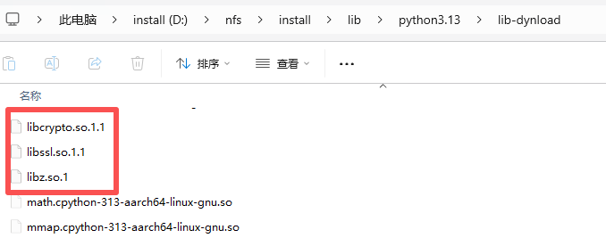

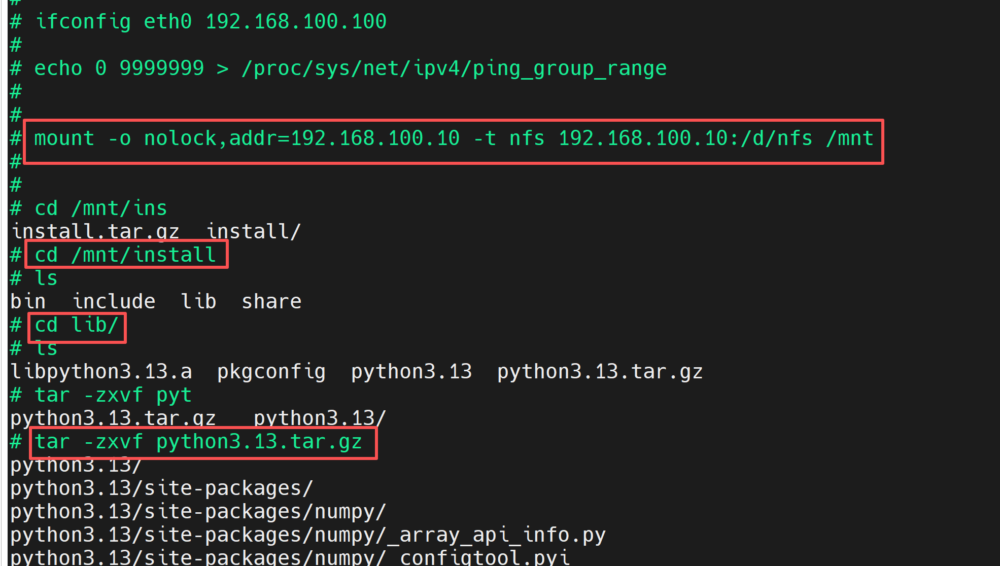

* 3、配置python的环境变量，确保python运行时能够找到依赖

```mk1.sh
export PATH=/mnt/install/bin:$PATH
export PYTHONPATH=/mnt/install/lib/python3.13:$PYTHONPATH
export LD_LIBRARY_PATH=/mnt/install/lib/python3.13/lib-dynload:$LD_LIBRARY_PATH
```


### 步骤3：使用python调用numpy接口:

* 先输入python，进入板端python环境，然后输入import numpy 敲回车，如果没有任何报错，说明numpy移植成功

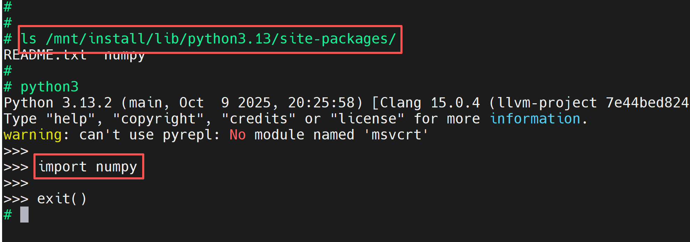

* 将下面的内容复制到numpy_test.py中

```python
import numpy as np
import time

def test_numpy_functionality():
    """测试 NumPy 的基本功能"""
    print("=" * 50)
    print("NumPy 功能测试")
    print("=" * 50)

    # 1. 创建数组
    arr1 = np.array([1, 2, 3, 4, 5])
    arr2 = np.arange(0, 10, 2)  # 类似 range，但生成数组
    arr3 = np.zeros((3, 3))     # 3x3 零矩阵
    arr4 = np.random.rand(2, 2) # 2x2 随机矩阵

    print("\n1. 数组创建:")
    print(f"arr1: {arr1}")
    print(f"arr2 (0到10步长2): {arr2}")
    print(f"arr3 (3x3零矩阵):\n{arr3}")
    print(f"arr4 (2x2随机矩阵):\n{arr4}")

    # 2. 数学运算
    print("\n2. 数学运算:")
    print(f"arr1 + 10: {arr1 + 10}")          # 广播机制
    print(f"arr1 * arr2 (前5项): {arr1 * arr2[:5]}")
    print(f"sin(arr2): {np.sin(arr2)}")       # 三角函数

    # 3. 矩阵乘法
    matrix_a = np.array([[1, 2], [3, 4]])
    matrix_b = np.array([[5, 6], [7, 8]])
    dot_product = np.dot(matrix_a, matrix_b)  # 矩阵乘法
    print("\n3. 矩阵乘法 (np.dot):")
    print(f"matrix_a:\n{matrix_a}")
    print(f"matrix_b:\n{matrix_b}")
    print(f"结果:\n{dot_product}")

    # 4. 性能对比：NumPy vs 纯Python
    print("\n4. 性能对比 (计算1百万个数的平方):")
    size = 1_000_000

    # 纯Python
    py_list = list(range(size))
    start = time.time()
    py_result = [x ** 2 for x in py_list]
    py_time = time.time() - start

    # NumPy
    np_arr = np.arange(size)
    start = time.time()
    np_result = np_arr ** 2
    np_time = time.time() - start

    print(f"纯Python耗时: {py_time:.5f} 秒")
    print(f"NumPy耗时:    {np_time:.5f} 秒")
    print(f"NumPy比Python快 {py_time / np_time:.1f} 倍!")

    # 5. 高级功能：条件筛选
    print("\n5. 条件筛选 (找出arr2中大于5的数):")
    filtered = arr2[arr2 > 5]
    print(f"原始数组: {arr2}")
    print(f"筛选结果: {filtered}")

if __name__ == "__main__":
    test_numpy_functionality()
```

* 然后执行下面的命令，运行numpy测试代码

```sh
python3 numpy_test.py
```

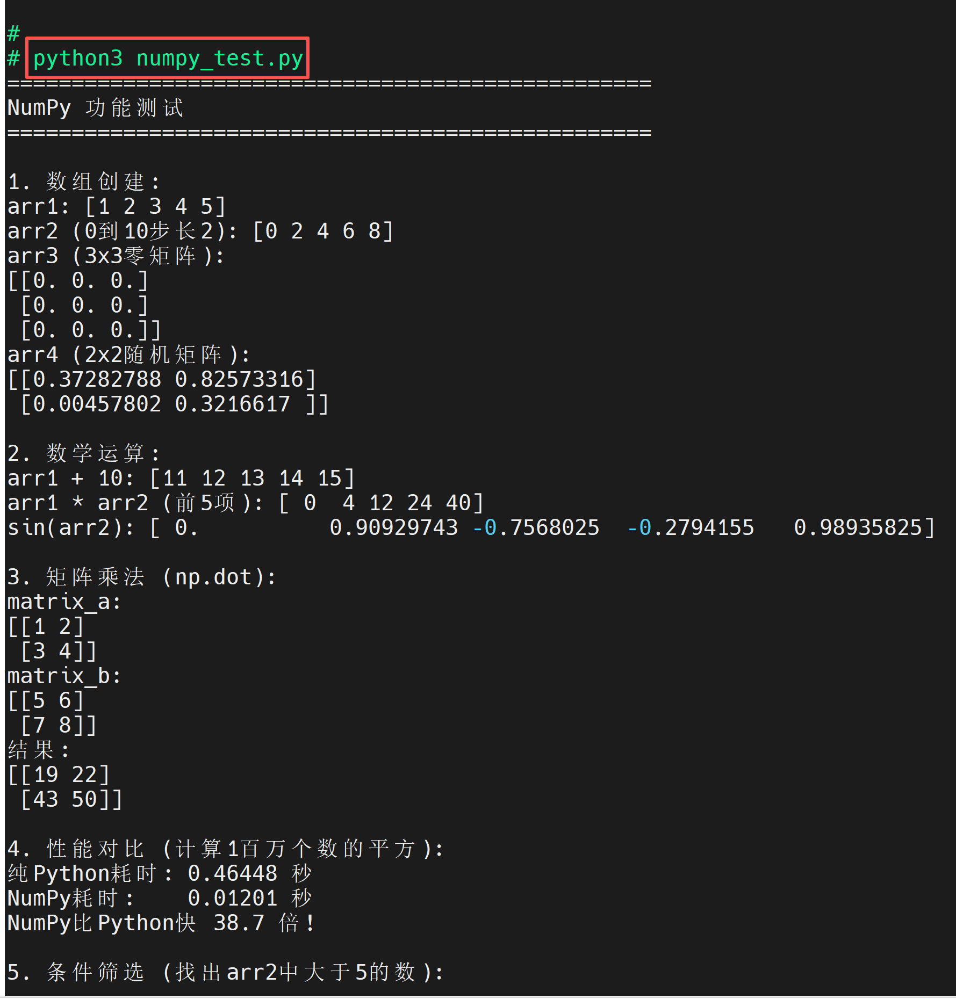

