# OpenCV移植

## 1、软硬件环境

开发板：海鸥派
交叉编译工具链：OHOS (dev) clang version 15.0.4

编译链路径：pegasus/os/OpenHarmony/ohos/prebuilts/clang/ohos/linux-x86_64/llvm/bin  

python版本：Python-3.13.2

移植的OpenCV版本：OpenCV-4.13

## 2、交叉编译OpenCV 

### 步骤1：安装依赖软件

* 在服务器的命令行执行下面的命令，安装OpenCV交叉编译是的依赖软件

```sh
apt-get install cmake libgtk2.0-dev pkg-config libavcodec-dev libavformat-dev libswscale-dev python3-dev python3-numpy libdc1394-dev  libtbb2 libtbb-dev libjpeg-dev libpng-dev libtiff-dev -y
```

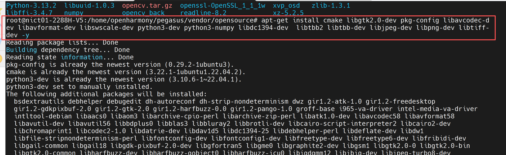

* 先进入到python目录下，确保虚拟环境已经开启，关于如何搭建虚拟环境，可参考[numpy移植文档第2章的步骤3](../numpy/README.md)。

```sh
cd opensource/Python-3.13.2

. crossenv_aarch64/bin/activate
```

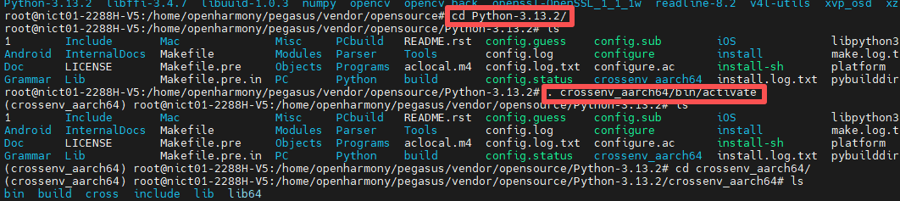

### 步骤2：下载OpenCV源码

```sh
cd ../

git clone https://github.com/opencv/opencv.git 

cd opencv
```

### 步骤3：运行脚本

* 进入opencv源码并创建build文件夹：

```sh
mkdir build

cd build
```

* 把下面的内容复制到build_opencv.sh中：

```sh
#!/bin/bash
set -e 
BuildDir=.
ToolChain=/home/openharmony/pegasus/os/OpenHarmony/ohos/prebuilts/clang/ohos/linux-x86_64/llvm/bin
SYSROOT=/home/openharmony/pegasus/os/OpenHarmony/ohos/out/hispark_ss928v100/ipcamera_hispark_ss928v100_linux/sysroot
if [ ! -d "$BuildDir" ]; then
  echo "create ${BuildDir}..."
  mkdir -p ${BuildDir}
fi
cd ${BuildDir}

echo "building OpenCV4"

cmake -D CMAKE_BUILD_TYPE=RELEASE \
  -D BUILD_SHARED_LIBS=ON \
  -D CMAKE_FIND_ROOT_PATH=${ToolChain}/ \
  -D CMAKE_SYSROOT=${SYSROOT} \
  -D CMAKE_TOOLCHAIN_FILE=../platforms/linux/aarch64-gnu.toolchain.cmake \
  -D CMAKE_C_COMPILER=${ToolChain}/aarch64-unknown-linux-ohos-clang \
  -D CMAKE_CXX_COMPILER=${ToolChain}/aarch64-unknown-linux-ohos-clang++ \
  -D CMAKE_INSTALL_PREFIX=${BuildDir}/install \
  -D WITH_TBB=ON \
  -D WITH_EIGEN=ON \
  -D BUILD_ZLIB=ON \
  -D BUILD_TIFF=ON \
  -D BUILD_JASPER=ON \
  -D BUILD_JPEG=ON \
  -D BUILD_PNG=ON \
  -D WITH_LIBV4L=ON \
  -D BUILD_opencv_python=ON \
   # 这里的python为交叉编译成功后的python路径
  -D PYTHON3_INCLUDE_PATH=/home/openharmony/pegasus/vendor/opensource/Python-3.13.2/install/include/python3.13 \
  -D PYTHON3_NUMPY_INCLUDE_DIRS=/home/openharmony/pegasus/vendor/opensource/numpy/install/lib/python3.13/site-packages/numpy/_core/include \
  -D ENABLE_PRECOMPILED_HEADERS=OFF \
  -D BUILD_EXAMPLES=OFF \
  -D BUILD_TESTS=OFF \
  -D BUILD_PERF_TESTS=OFF \
  -D BUILD_WITH_DEBUG_INFO=OFF \
  -D BUILD_DOCS=OFF \
  -D WITH_OPENCL=OFF \
  -D WITH_1394=OFF \
  ../
  
make -j$(nproc)
```

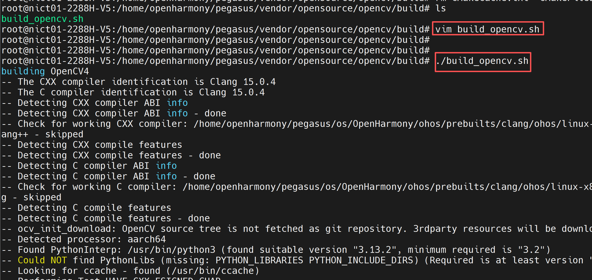

* 出现下面的打印信息，说明OpenCV交叉编译成功：

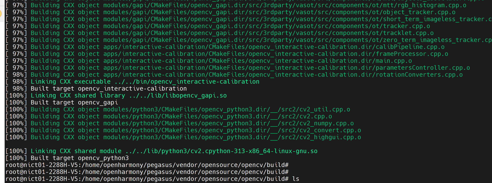

* 执行下面的命令，进行OpenCV的安装：

```sh
make install
```

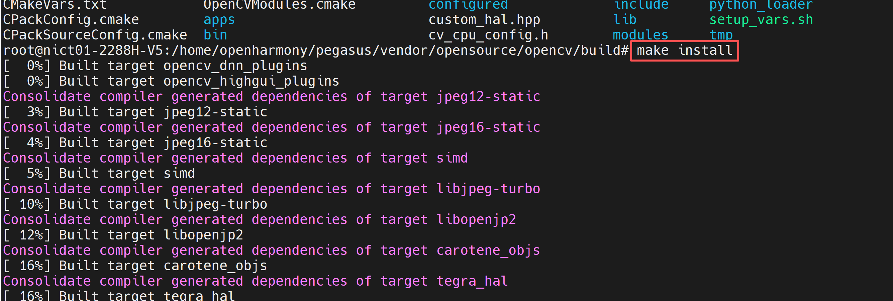

* 安装成功后，会在install目录下生成以下文件。

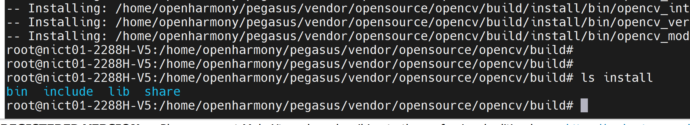

## 3、使用python调用OpenCV接口

* 1、将python移植第4章 交叉编译python3.13.2后，生成的install文件夹拷贝到你的NFS挂载目录
* 2、再将opencv/build/install/lib下的库文件复制到install/lib/python3.13/lib-dynload目录下。
* 3、再根据python第三章移植的内容，将libz.so.1、 libssl.so.1.1 、 libcrypto.so.1.1文件复制到install/lib/python3.13/lib-dynload目录下

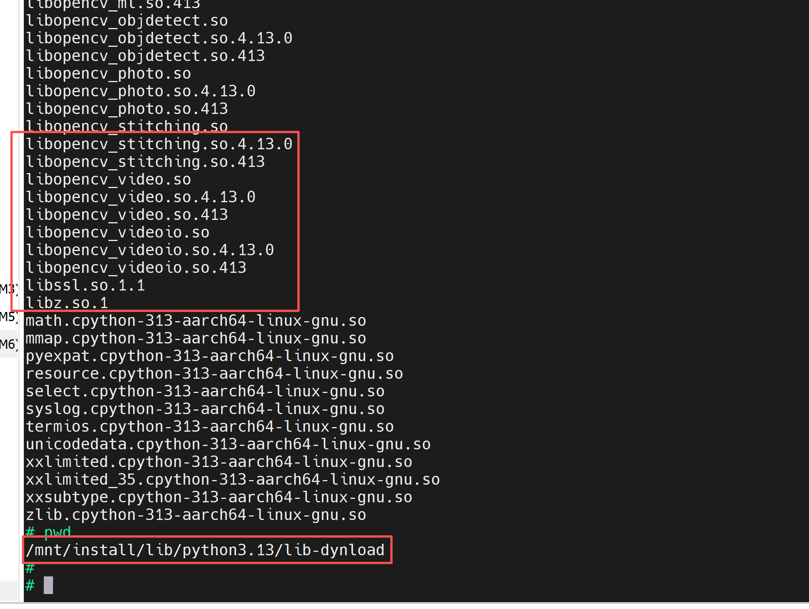

* 4、将opencv/build/install/lib/python3.13/site-packages/cv2 复制到 install/lib/python3.13/site-packages目录下

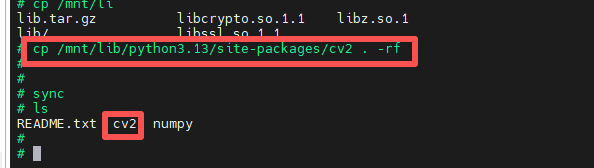

* 5、执行下面的，命令将电脑的nfs目录挂载到开发板的/mnt目录下，然后配置环境变量

```sh
# 注意：这里的eth0的IP地址，请根据自己的网络IP网段进行合理配置
ifconfig eth0 192.168.100.100

mount -o nolock,addr=192.168.100.10 -t nfs 192.168.100.10:/d/nfs /mnt

export PATH=/mnt/install/bin:$PATH
export PYTHONPATH=/mnt/install/lib/python3.13:$PYTHONPATH
export LD_LIBRARY_PATH=/mnt/install/lib/python3.13/lib-dynload:$LD_LIBRARY_PATH
```

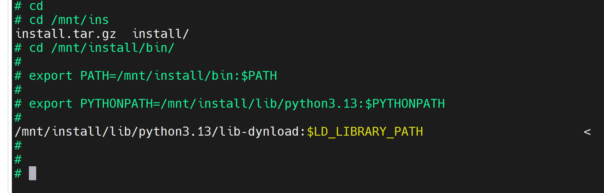

* 在开发板的命令行执行下面的命令，进入python环境，导入cv2

```sh
cd /mnt/install/bin

python3
```

* 在python3环境输入import  cv2，如果没有任何报错，说明opencv接口调用成功

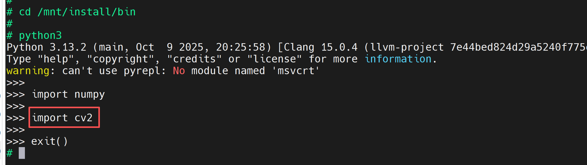

* 将下面的内容复制到opencv_test.py文件中，测试基本功能。

```mk1.sh
import cv2
import numpy as np
import os

def test_opencv_without_ui():
    """无UI的OpenCV功能测试（通过文件保存和日志输出验证）"""
    print("=" * 50)
    print("OpenCV 无UI测试")
    print("=" * 50)

    # 创建临时测试目录
    os.makedirs("opencv_test_output", exist_ok=True)
    print("[日志] 创建输出目录: opencv_test_output")

    # 1. 生成测试图像
    test_image = np.zeros((200, 200, 3), dtype=np.uint8)
    cv2.rectangle(test_image, (50, 50), (150, 150), (0, 255, 0), 2)
    cv2.putText(test_image, "OpenCV Test", (30, 30), 
                cv2.FONT_HERSHEY_SIMPLEX, 0.5, (255, 255, 255), 1)
    cv2.imwrite("opencv_test_output/test_image.png", test_image)
    print("[日志] 生成测试图像: test_image.png")

    # 2. 图像处理（灰度化+边缘检测）
    gray_image = cv2.cvtColor(test_image, cv2.COLOR_BGR2GRAY)
    edges = cv2.Canny(gray_image, 100, 200)
    cv2.imwrite("opencv_test_output/edges.png", edges)
    print("[日志] 生成边缘检测结果: edges.png")

    # 3. 矩阵运算测试（修复：转换为float32）
    mat_a = np.random.rand(3, 3).astype(np.float32)  # 改为浮点矩阵
    mat_b = np.random.rand(3, 3).astype(np.float32)
    mat_mult = cv2.gemm(mat_a, mat_b, 1, None, 0)
    print("[矩阵运算] A * B = \n", mat_mult)

    # 4. 摄像头测试（无UI模式）
    cap = cv2.VideoCapture(0)
    if not cap.isOpened():
        print("[警告] 未检测到摄像头，跳过摄像头测试")
    else:
        ret, frame = cap.read()
        if ret:
            cv2.imwrite("opencv_test_output/camera_capture.png", frame)
            print("[日志] 摄像头捕获成功: camera_capture.png")
        cap.release()

    # 5. 特征检测（ORB）
    orb = cv2.ORB_create()
    kp = orb.detect(gray_image, None)
    kp_image = cv2.drawKeypoints(gray_image, kp, None, color=(0, 255, 0))
    cv2.imwrite("opencv_test_output/keypoints.png", kp_image)
    print("[日志] 生成特征点检测结果: keypoints.png")
    print(f"[特征检测] 共检测到 {len(kp)} 个特征点")

    # 6. 性能测试
    start_time = cv2.getTickCount()
    for _ in range(100):
        _ = cv2.blur(test_image, (5, 5))
    end_time = cv2.getTickCount()
    print(f"[性能] 100次模糊运算耗时: {(end_time - start_time)/cv2.getTickFrequency():.4f}秒")

    print("\n测试完成！结果已保存至 opencv_test_output 目录")

if __name__ == "__main__":
    test_opencv_without_ui()
```

* 在开发板的命令行执行下面的命令，运行opencv_test.py

```sh
python3 opencv_test.py
```

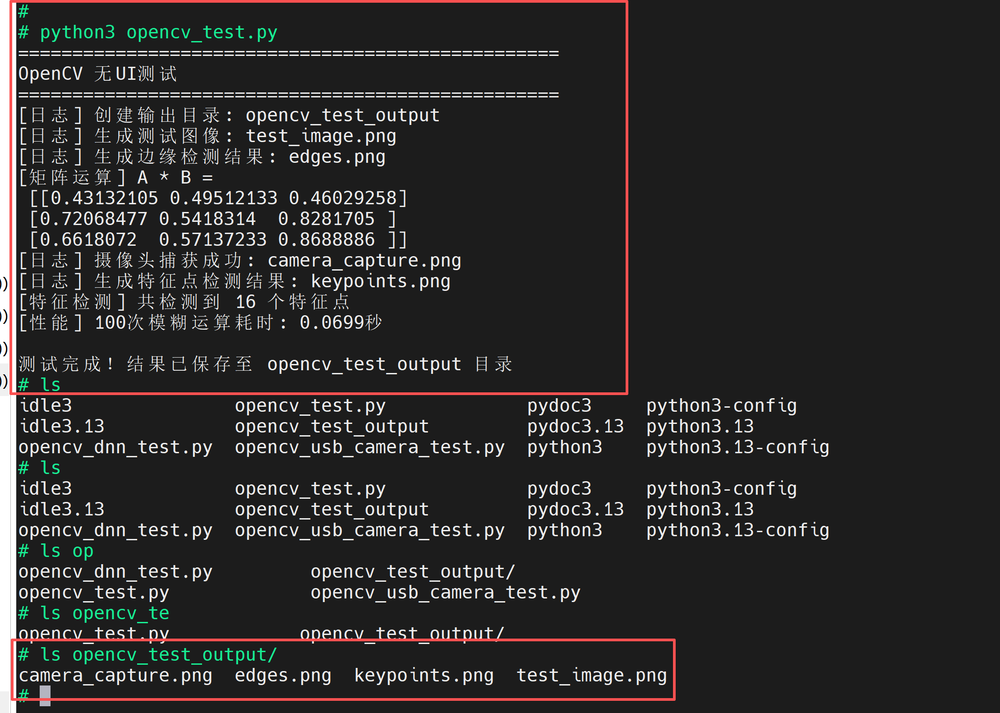

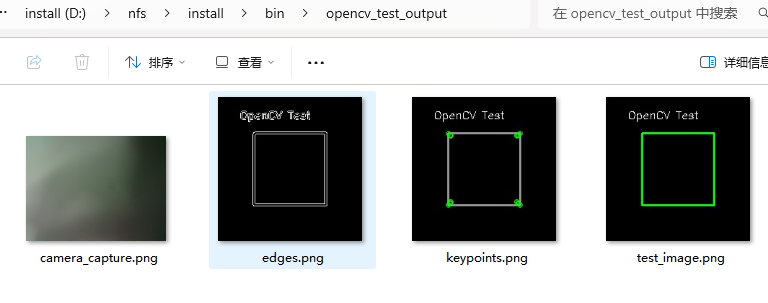

## 4、测试Opencv调用usb摄像头

* 将下面的内容复制到opencv_usb_camera_test.py文件中，测试opencv调用usb摄像头的基本功能。

```mk1.sh
#!/usr/bin/env python3
# -*- coding: utf-8 -*-

import cv2
import time

def main(device_index=0, num_frames=100, backend=cv2.CAP_V4L2):
    """
    在无 UI 情况下从 USB 摄像头读取 num_frames 帧并打印每帧的尺寸。

    :param device_index: 摄像头索引，0 表示第一个设备
    :param num_frames: 要读取的帧数
    :param backend: OpenCV 后端，可选 CAP_V4L2、CAP_ANY 等
    """
    # 打开摄像头
    cap = cv2.VideoCapture(device_index, backend)
    if not cap.isOpened():
        print(f"无法打开摄像头 (index={device_index})")
        return
    
    print("开始读取帧…按 Ctrl+C 可中断")

    try:
        for i in range(num_frames):
            ret, frame = cap.read()
            if not ret:
                print(f"第 {i} 帧读取失败，退出")
                break

            # 示例处理：打印帧的分辨率
            h, w = frame.shape[:2]
            print(f"帧 {i+1}/{num_frames} 大小：{w}x{h}")

            # 模拟处理时间
            time.sleep(0.01)

    except KeyboardInterrupt:
        print("用户中断")
    finally:
        cap.release()
        print("摄像头已释放，程序结束")

if __name__ == "__main__":
    # 可以通过修改以下参数来指定设备号或读取帧数
    main(device_index=0, num_frames=200)

```

* 在开发板的命令行执行下面的命令，运行opencv_usb_camera_test.py

```sh
python opencv_usb_camera_test.py
```

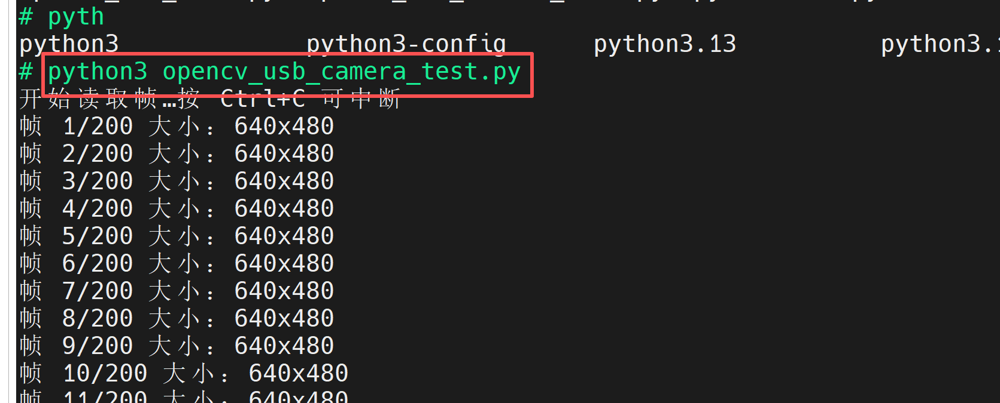


## 5、测试opencv中dnn模块

* 将下面的内容复制到opencv_dnn_test.py文件中，测试opencv调用dnn模块，实现人脸检测的基本功能。

```mk1.sh
import cv2

# 1. 读取图片
image_path = "image.png"  # 替换为你的图片路径
img = cv2.imread(image_path)
if img is None:
    print("无法加载图片")
    exit(1)
orig_h, orig_w = img.shape[:2]

# 2. 初始化 FaceDetectorYN，使用原图大小并调松参数
detector = cv2.FaceDetectorYN.create(
    model="face_detection_yunet_2023mar.onnx",
    config="",
    input_size=(orig_w, orig_h),  # 与原图一致
    score_threshold=0.4,          # 提高置信度阈值到 0.4
    nms_threshold=0.5,            # NMS 阈值
    top_k=200                     # 保留最多 200 个候选
)

# 3. 检测人脸
_, faces = detector.detect(img)

# 4. 后处理：剔除过小的框
min_size = 50  # 小于 50 像素的宽高都视为噪声
filtered = []
if faces is not None:
    for face in faces:
        x, y, w, h, score = face[:5].astype(int)
        # 保留宽高都不小于阈值的框
        if w >= min_size and h >= min_size:
            filtered.append((x, y, w, h, score))

# 5. 在图像上绘制过滤后的人脸框
for x, y, w, h, score in filtered:
    cv2.rectangle(img, (x, y), (x + w, y + h), (0, 255, 0), 2)
    cv2.putText(
        img,
        f"{score/100:.2f}",
        (x, y - 5),
        cv2.FONT_HERSHEY_SIMPLEX,
        0.5,
        (0, 255, 0),
        1
    )

# 6. 保存结果并输出检测到的人脸数量
output_path = "output_image.jpg"
cv2.imwrite(output_path, img)
print(f"检测完成，检测到 {len(filtered)} 张人脸，结果已保存到 {output_path}")
```

* 请自行下载一个带有人脸的图片放入install/bin/目录下，然后把图片重命名为image.png。
* 然后访问链接下载[onnx模型](https://github.com/opencv/opencv_zoo/blob/main/models/face_detection_yunet/face_detection_yunet_2023mar.onnx)，并将该模型也放入install/bin/目录下。

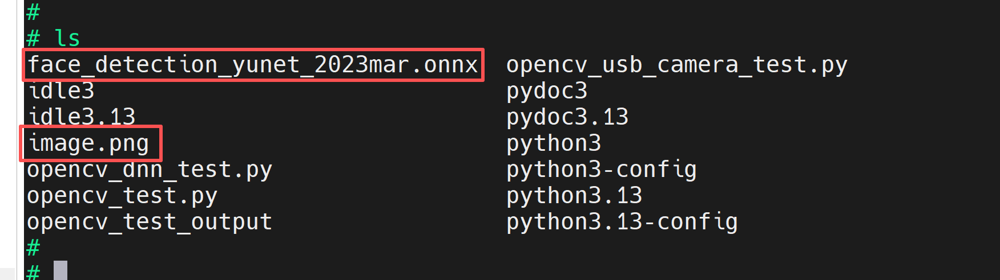

* 在开发板的命令行执行下面的命令，运行opencv_dnn_test.py

```sh
python3 opencv_dnn_test.py
```

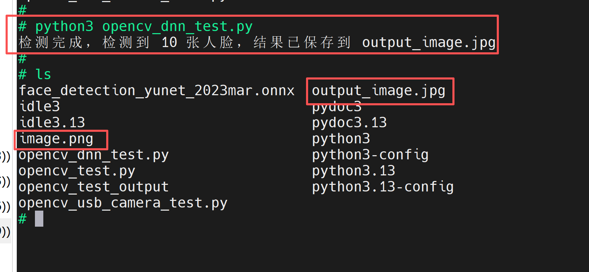

检测前：


检测后：

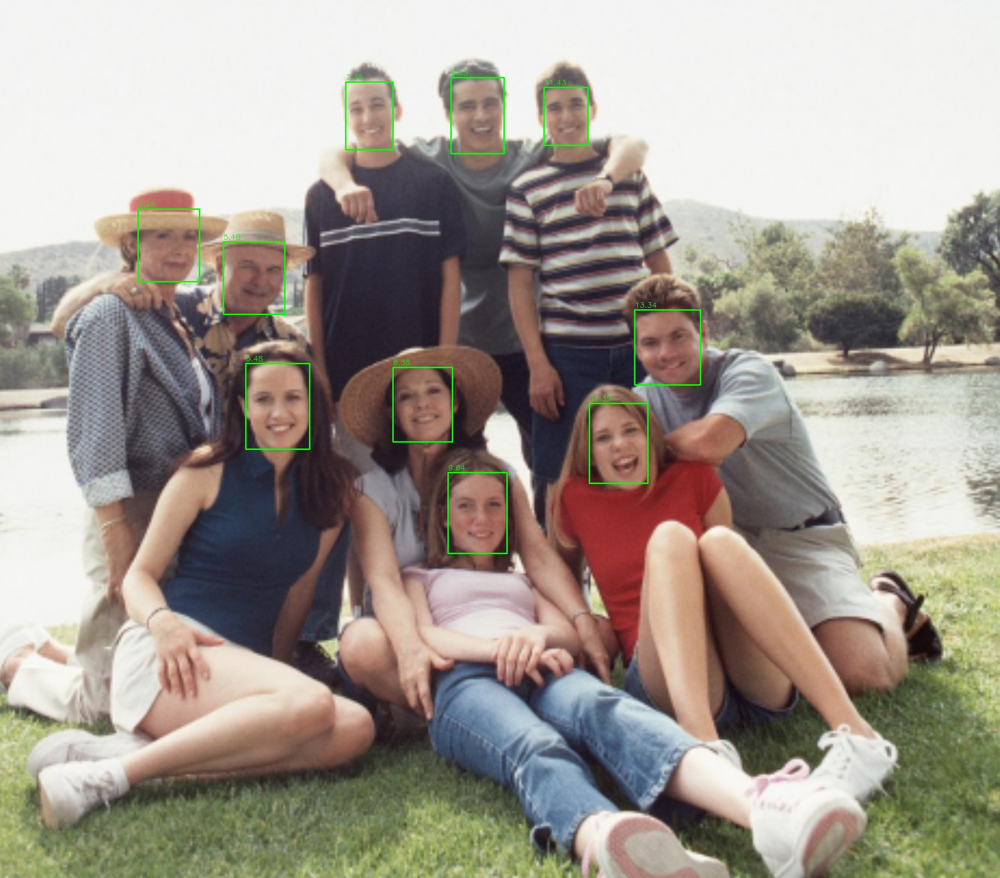
