# Python3移植

## 1、软硬件环境
开发板：海鸥派
交叉编译工具链：OHOS (dev) clang version 15.0.4

编译链路径：pegasus/os/OpenHarmony/ohos/prebuilts/clang/ohos/linux-x86_64/llvm/bin  

移植的Python版本：Python-3.13.2

## 2、配置python环境

* 为了满足python3.13.2的移植要求，我们需要先把服务器的python版本改为3.13.2
* **步骤1**：在服务器的命令行终端执行下面的命令，下载python3.13.2并安装

```shell
wget https://www.python.org/ftp/python/3.13.2/Python-3.13.2.tgz

tar -xvzf Python-3.13.2.tgz
rm Python-3.13.2.tgz

cd Python-3.13.2

./configure --enable-optimizations  --enable-shared

make -j$(nproc)

make altinstall
```

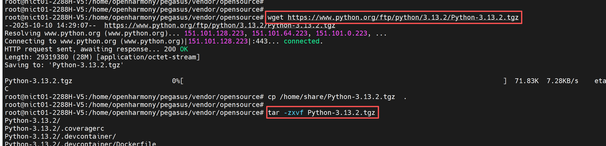

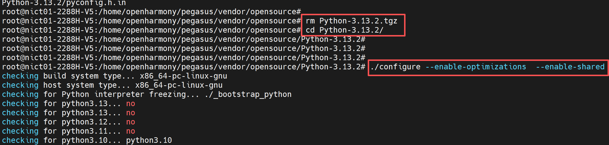

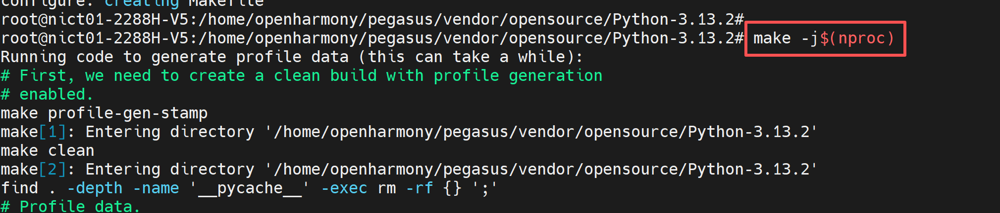

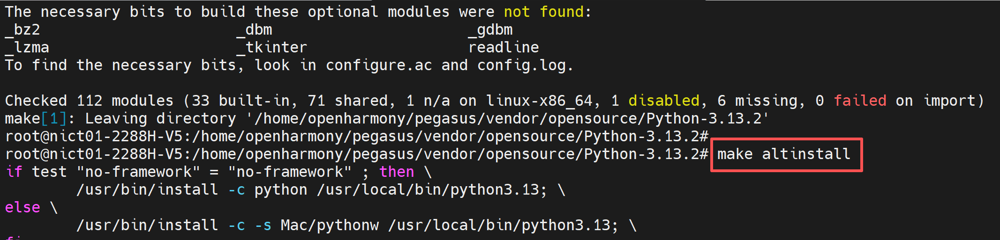

* **步骤2：**创建python环境，是python3.13.2生效
* 在服务器的命令行执行下面的命令，配置python环境变量

```sh
rm /usr/bin/python3

ln -s /usr/local/bin/python3.13 /usr/bin/python3

# 在~/.bashrc文件末尾添加下面的内容
export LD_LIBRARY_PATH=/usr/local/lib:$LD_LIBRARY_PATH

# 执行下面的命令，让环境变量生效
source ~/.bashrc
```

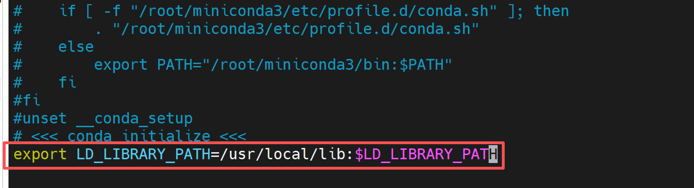

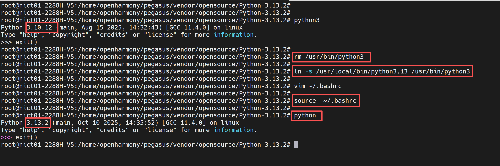

## 3.安装依赖软件

### 步骤1： 安装依赖软件包

* 在服务器的命令行执行下面的命令，下载移植python所需软件
* 注意：由于本文档环境是root用户，请根据自己的实际服务器环境，选择是否需要在命令前加sudo

```
apt-get update
apt-get upgrade -y
apt-get install openssl libssl-dev  gcc make cmake -y
```

### 步骤2：交叉编译依赖第三方软件

**注意：**在交叉编译之前，请一定确保OpenHarmony的代码下载完成，且整编通过，具体可参考[ohos编译](https://gitee.com/HiSpark/pegasus/blob/master/docs/OpenHarmony%20Small%E7%89%88%E6%9C%AC%E4%BD%BF%E7%94%A8%E6%8C%87%E5%8D%97/OpenHarmony%20Small%E7%89%88%E6%9C%AC%E4%BD%BF%E7%94%A8%E6%8C%87%E5%8D%97.md#ohos%E7%BC%96%E8%AF%91)的内容

#### 1、zlib的交叉编译

* 在服务器的命令行执行下面的命令，进行zlib的交叉编译

```sh
# 由于zlib也属于第三方软件，可以在opensource目录下进行移植
cd pegasus/vendor/opensource/

wget http://zlib.net/zlib-1.3.1.tar.gz

tar -xvf zlib-1.3.1.tar.gz	
rm zlib-1.3.1.tar.gz

cd zlib-1.3.1/

# 注意：这里的路径请根据自己的Pegasus目录进行修改
export CC="/home/openharmony/pegasus/os/OpenHarmony/ohos/prebuilts/clang/ohos/linux-x86_64/llvm/bin/aarch64-unknown-linux-ohos-clang --sysroot=/home/openharmony/pegasus/os/OpenHarmony/ohos/out/hispark_ss928v100/ipcamera_hispark_ss928v100_linux/sysroot"

./configure --prefix=$PWD/install 

# 注意：这里的路径请根据自己的Pegasus目录进行修改
make LDFLAGS="--sysroot=/home/openharmony/pegasus/os/OpenHarmony/ohos/out/hispark_ss928v100/ipcamera_hispark_ss928v100_linux/sysroot -L/home/openharmony/pegasus/os/OpenHarmony/ohos/out/hispark_ss928v100/ipcamera_hispark_ss928v100_linux/sysroot/usr/lib"

make install
```

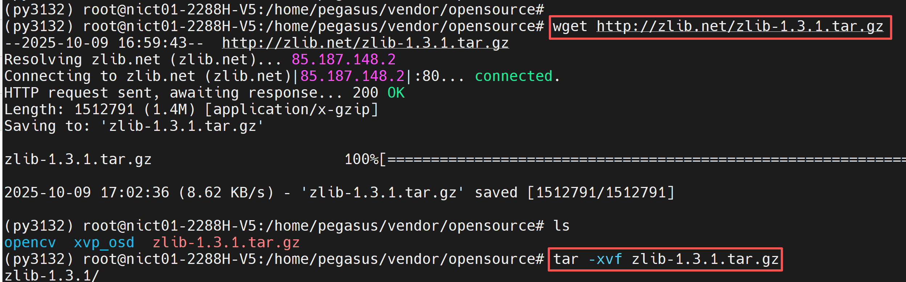

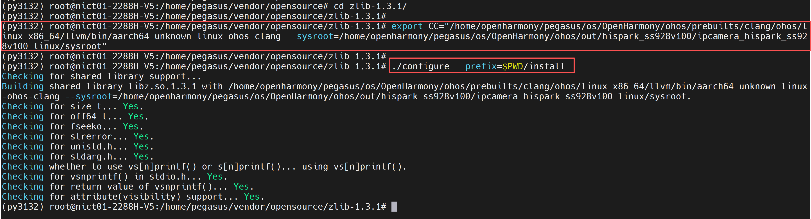

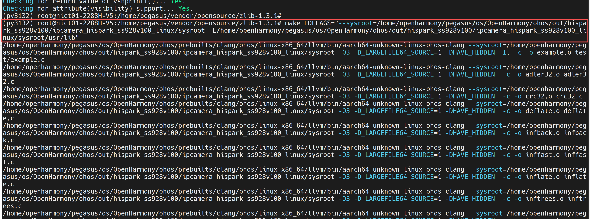

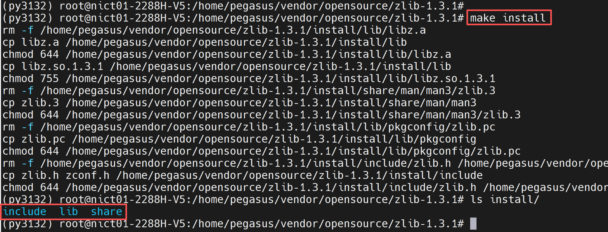

#### 2、openssl的交叉编译

* 在服务器的命令行执行下面的命令，进行openssl的交叉编译

```sh
cd ../

wget https://github.com/openssl/openssl/archive/refs/tags/OpenSSL_1_1_1w.tar.gz

tar -xvf OpenSSL_1_1_1w.tar.gz	
rm OpenSSL_1_1_1w.tar.gz

cd openssl-OpenSSL_1_1_1w

perl Configure linux-aarch64 --prefix=$PWD/install

make CC="/home/openharmony/pegasus/os/OpenHarmony/ohos/prebuilts/clang/ohos/linux-x86_64/llvm/bin/aarch64-unknown-linux-ohos-clang --sysroot=/home/openharmony/pegasus/os/OpenHarmony/ohos/out/hispark_ss928v100/ipcamera_hispark_ss928v100_linux/sysroot" LDFLAGS="--sysroot=/home/openharmony/pegasus/os/OpenHarmony/ohos/out/hispark_ss928v100/ipcamera_hispark_ss928v100_linux/sysroot -L/home/openharmony/pegasus/os/OpenHarmony/ohos/out/hispark_ss928v100/ipcamera_hispark_ss928v100_linux/sysroot/usr/lib"

make install
```


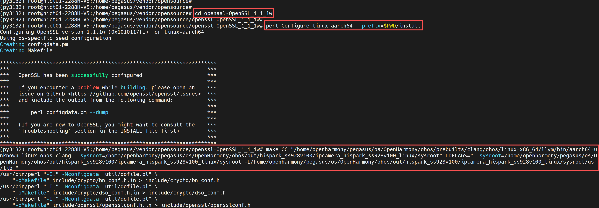


#### 3、libffi的交叉编译

* 在服务器的命令行执行下面的命令，进行libffi的交叉编译

```sh
cd ../

wget https://github.com/libffi/libffi/archive/refs/tags/v3.4.7.tar.gz

tar -xvf v3.4.7.tar.gz  
rm v3.4.7.tar.gz  
 
cd libffi-3.4.7/

./autogen.sh
```

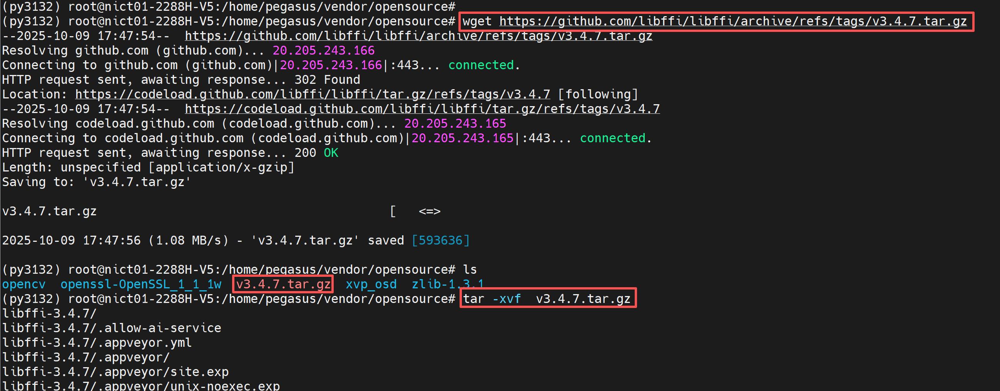

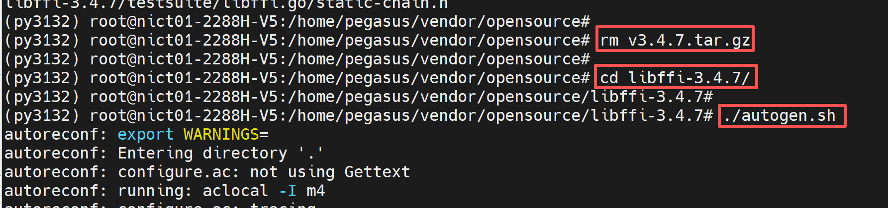

* 修改 config.sub 文件中两处内容

  * 1、在1771行后面添加内容 | ohos* 

  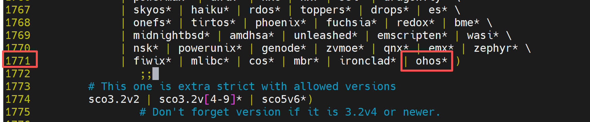

  * 2、在 1832行添加 | linux-ohos*-

  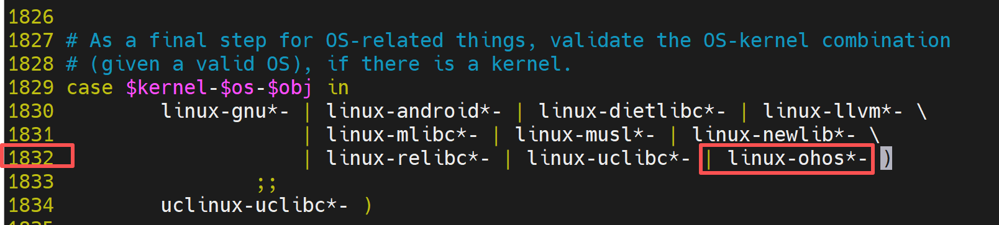

* 保持config.sub文件之后，执行下面的命令，交叉编译libffi

```sh

export CC="/home/openharmony/pegasus/os/OpenHarmony/ohos/prebuilts/clang/ohos/linux-x86_64/llvm/bin/aarch64-unknown-linux-ohos-clang --sysroot=/home/openharmony/pegasus/os/OpenHarmony/ohos/out/hispark_ss928v100/ipcamera_hispark_ss928v100_linux/sysroot"

./configure --prefix=$PWD/install --host=aarch64-linux-ohos	

make && make install
```

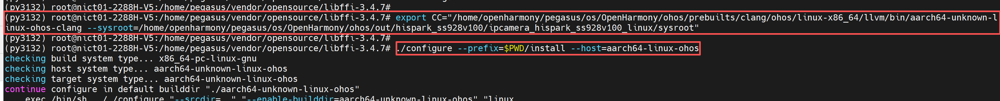

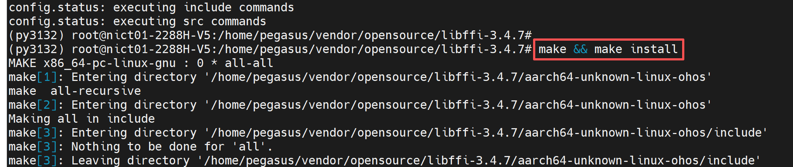

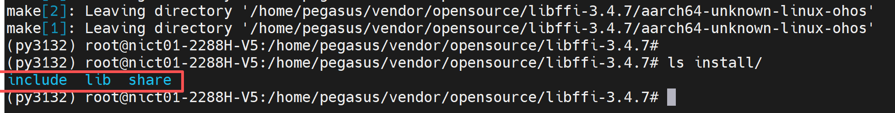

#### 4、libuuid的交叉编译

* 在服务器的命令行执行下面的命令，进行libuuid的交叉编译

```sh
cd ../

wget https://downloads.sourceforge.net/project/libuuid/libuuid-1.0.3.tar.gz 

tar -xvf libuuid-1.0.3.tar.gz  

rm libuuid-1.0.3.tar.gz  

cd libuuid-1.0.3

# 修改 config.sub 文件：

sed -i 's/| -kaos\*/| -kaos\* | -ohos\*/g' config.sub

sed -i 's/linux-uclibc\*/linux-uclibc\* | linux-ohos\*/g' config.sub

export CC="/home/openharmony/pegasus/os/OpenHarmony/ohos/prebuilts/clang/ohos/linux-x86_64/llvm/bin/aarch64-unknown-linux-ohos-clang --sysroot=/home/openharmony/pegasus/os/OpenHarmony/ohos/out/hispark_ss928v100/ipcamera_hispark_ss928v100_linux/sysroot"

./configure --prefix=$PWD/install --enable-shared --host=aarch64-linux-ohos

make && make install
```

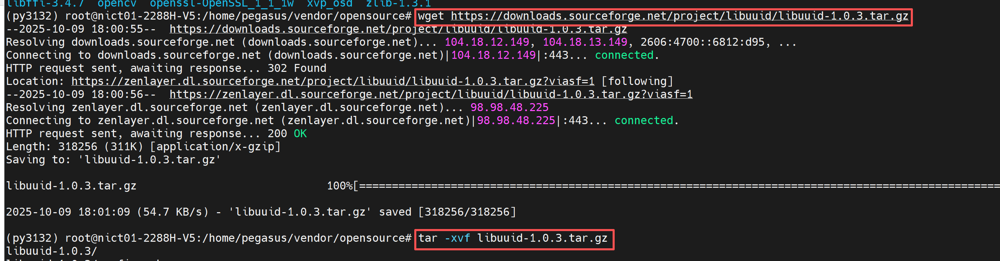

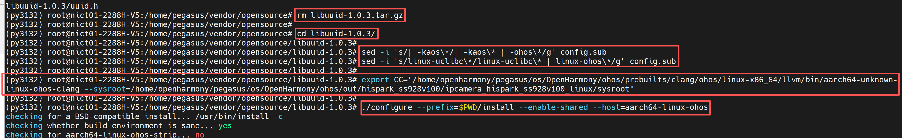

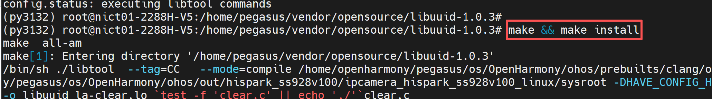

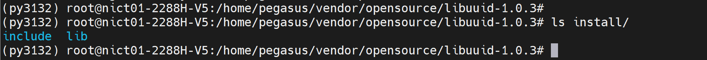

#### 5、xz的交叉编译

* 在服务器的命令行执行下面的命令，进行xz的交叉编译

```sh
cd ../

wget https://tukaani.org/xz/xz-5.2.5.tar.gz  
tar -zxvf xz-5.2.5.tar.gz  
rm  xz-5.2.5.tar.gz  
cd xz-5.2.5

sed -i 's/| -kaos\*/| -kaos\* | -ohos\*/g' ./build-aux/config.sub
sed -i 's/linux-uclibc\*/linux-uclibc\* | linux-ohos\*/g' ./build-aux/config.sub

export CC="/home/openharmony/pegasus/os/OpenHarmony/ohos/prebuilts/clang/ohos/linux-x86_64/llvm/bin/aarch64-unknown-linux-ohos-clang --sysroot=/home/openharmony/pegasus/os/OpenHarmony/ohos/out/hispark_ss928v100/ipcamera_hispark_ss928v100_linux/sysroot"

./configure --prefix=$PWD/install --enable-shared --host=aarch64-linux-ohos

make && make install
```

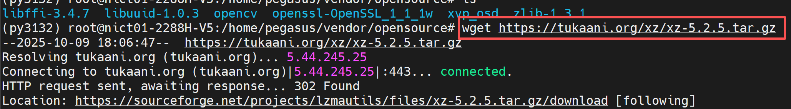

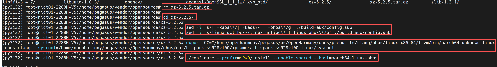

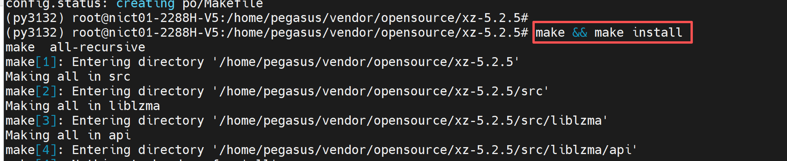

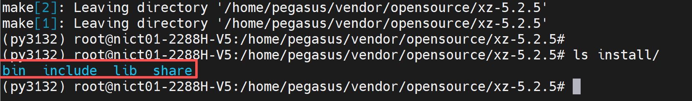

#### 6、readline的交叉编译

* 在服务器的命令行执行下面的命令，进行readline的交叉编译

```sh
cd ../

wget https://mirrors.aliyun.com/gnu/readline/readline-8.2.tar.gz  
tar xzf readline-8.2.tar.gz 
rm readline-8.2.tar.gz 
cd readline-8.2
```

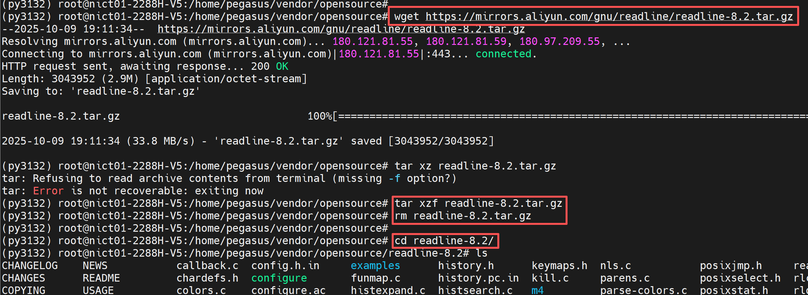

* 修改 support/config.sub 文件中一处内容

* 在1757行添加 | ohos*
* 在1775行添加 | linux-ohos*

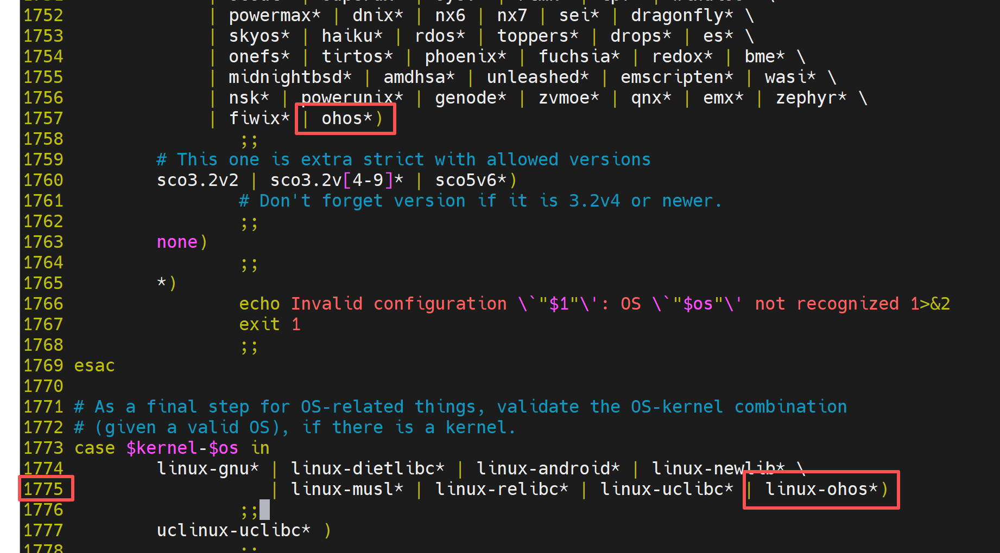

* support/config.sub 文件保存好后，在服务器的命令行终端，分别执行下面的命令

```sh
export CC="/home/openharmony/pegasus/os/OpenHarmony/ohos/prebuilts/clang/ohos/linux-x86_64/llvm/bin/aarch64-unknown-linux-ohos-clang --sysroot=/home/openharmony/pegasus/os/OpenHarmony/ohos/out/hispark_ss928v100/ipcamera_hispark_ss928v100_linux/sysroot"

./configure --host=aarch64-linux-ohos --prefix=$PWD/install --disable-install-examples

make && make install
```

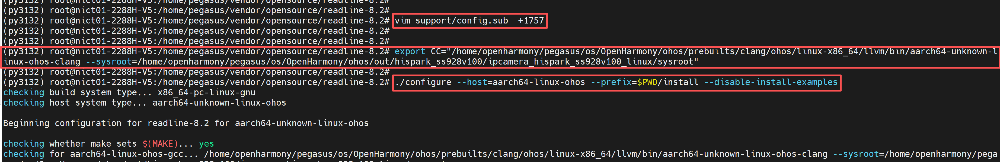

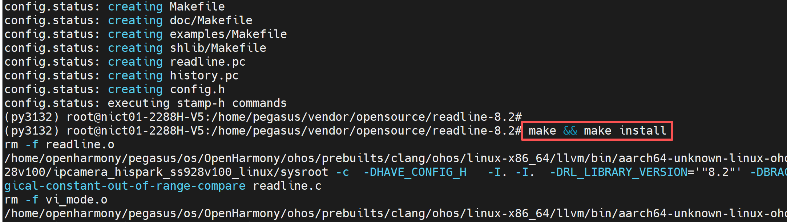

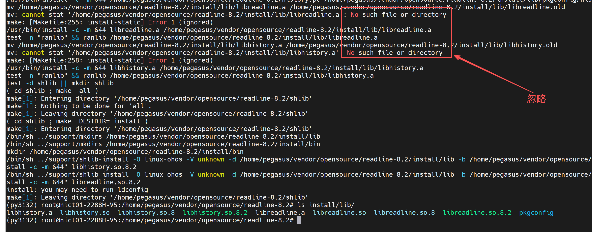

## 4、交叉编译python3.13.2

* 在服务器的命令行执行下面的命令，进行python3.13.2的交叉编译

```sh
cd ../

wget https://www.python.org/ftp/python/3.13.2/Python-3.13.2.tgz

tar -xvzf Python-3.13.2.tgz

rm Python-3.13.2.tgz

cd Python-3.13.2
```

* 修改 config.sub 文件中两处内容
  * 在1772行 添加： | ohos*
  * 在 1833行添加： | linux-ohos*-

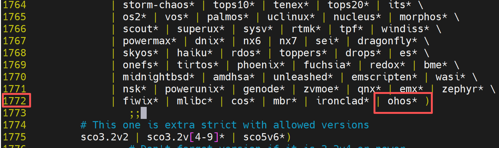


* 修改configure文件，将7021~7027行的内容 改为下面的内容

```sh
if test x$PLATFORM_TRIPLET != x && test x$MULTIARCH != x; then
  if test x$PLATFORM_TRIPLET != x && test x$MULTIARCH = x; then
    MULTIARCH=$PLATFORM_TRIPLET
  fi
fi
```

* 修改前

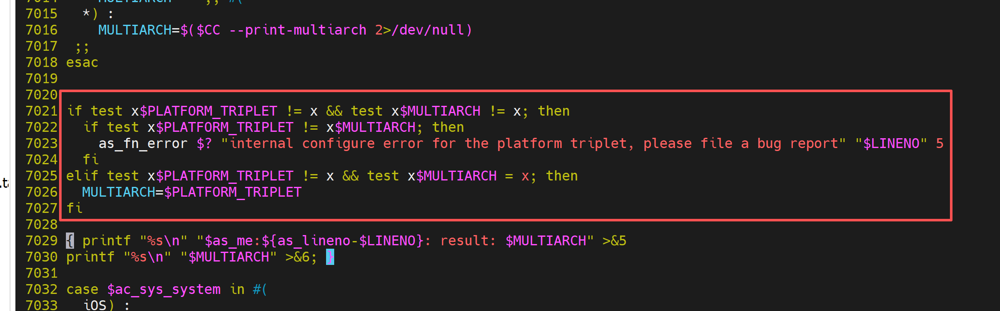

* 修改后

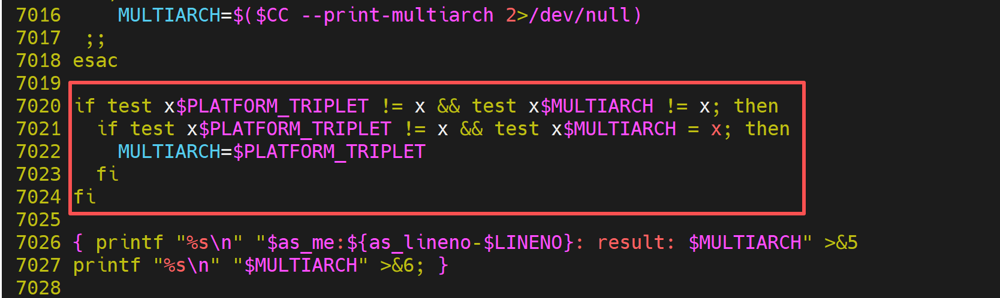

* 执行下面的命令，交叉编译python

```sh
CROSS_TOOLCHAIN_DIR="/home/openharmony/pegasus/os/OpenHarmony/ohos/prebuilts/clang/ohos/linux-x86_64/llvm/bin"
SYSROOT="/home/openharmony/pegasus/os/OpenHarmony/ohos/out/hispark_ss928v100/ipcamera_hispark_ss928v100_linux/sysroot"

CC="${CROSS_TOOLCHAIN_DIR}/aarch64-unknown-linux-ohos-clang" \
CXX="${CROSS_TOOLCHAIN_DIR}/aarch64-unknown-linux-ohos-clang++" \
AR="${CROSS_TOOLCHAIN_DIR}/llvm-ar" \
LD="${CROSS_TOOLCHAIN_DIR}/ld.lld" \
RANLIB="${CROSS_TOOLCHAIN_DIR}/llvm-ranlib" \
STRIP="${CROSS_TOOLCHAIN_DIR}/llvm-strip" \
CFLAGS="--sysroot=${SYSROOT} -fPIC" \
CXXFLAGS="--sysroot=${SYSROOT} -fPIC" \
LDFLAGS="--sysroot=${SYSROOT}" \
./configure \
--host=aarch64-linux-ohos \
--build=x86_64-pc-linux-gnu \
--target=aarch64-linux-ohos \
--prefix="$PWD/install" \
--disable-ipv6 \
ac_cv_file__dev_ptmx="yes" \
ac_cv_file__dev_ptc="yes" \
--with-openssl=../openssl-OpenSSL_1_1_1w/install \
--with-build-python=python3.13 2>&1 | tee config.log.txt

CFLAGS="-I../zlib-1.3.1/install/include \
        -I../xz-5.2.5/install/include \
        -I../libffi-3.4.7/install/include \
		-I../readline-8.2/install/include \
        -I../libuuid-1.0.3/install/include/uuid"
CPPFLAGS="-I../openssl-OpenSSL_1_1_1w/install/include"
LDFLAGS="-L../zlib-1.3.1/install/lib \
         -L../xz-5.2.5/install/lib \
         -L../libffi-3.4.7/install/lib \
		 -L../readline-8.2/install/lib \
         -L../libuuid-1.0.3/install/lib \
         -L../openssl-OpenSSL_1_1_1w/install/lib"

CFLAGS="$CFLAGS" CPPFLAGS="$CPPFLAGS" LDFLAGS="$LDFLAGS" make 2>&1 | tee make.log.txt
```

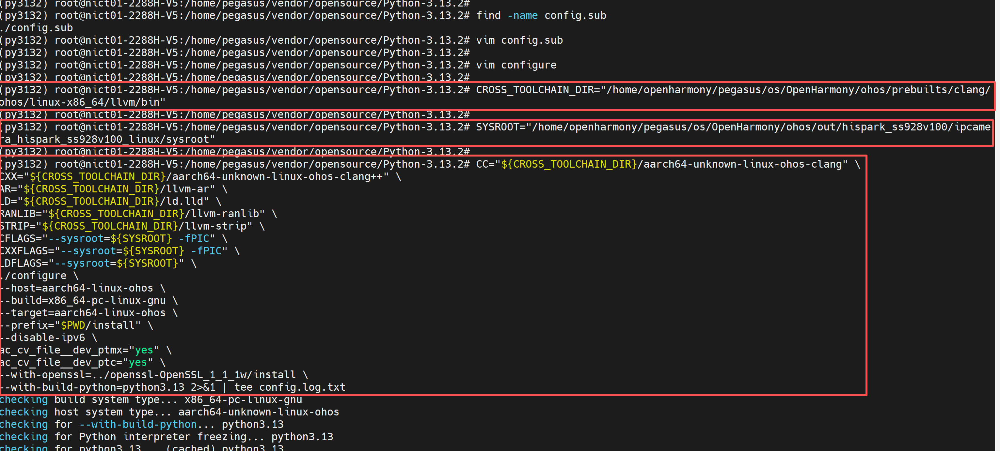

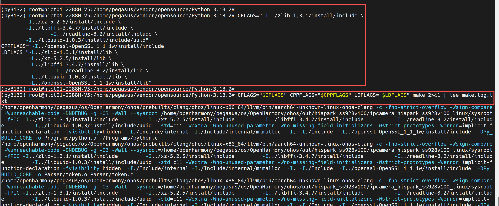

```sh
make install 2>1 | tee install.log.txt
```

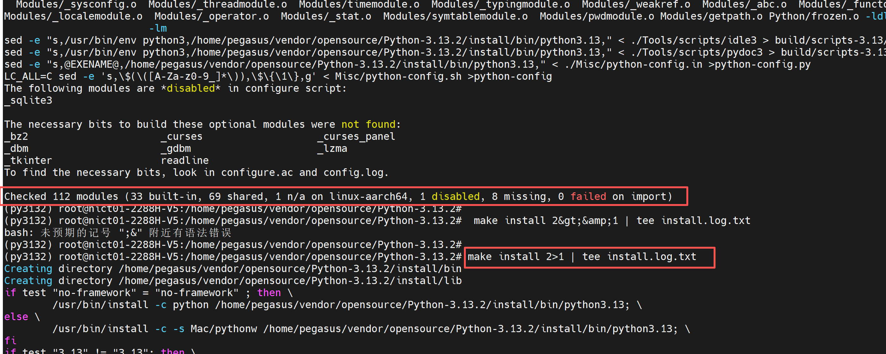

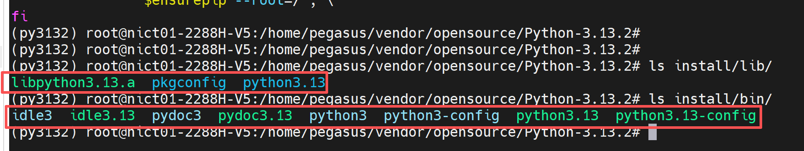

## 5.板端测试

### 步骤1：配置板端环境

* 1、确保开发板已经烧录OpenHarmony操作系统
* 2、使用网线将开发板与你的电脑进行连接，确保二者处于同一局域网内
* 3、配置开发板的IP地址，并确保开发板与电脑能够互相ping通

```sh
# 注意：这里的eth0的IP地址，请根据自己的网络IP网段进行合理配置
ifconfig eth0 192.168.100.100

# 添加权限
echo 0 9999999 > /proc/sys/net/ipv4/ping_group_range
```

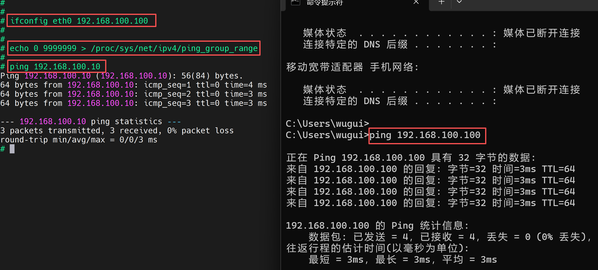

### 步骤2：准备python依赖文件

* 1、将第4章交叉编译python3.13.2后，生成的install文件夹拷贝到你的NFS挂载目录（如果没有网线，SD卡也是可以挂载到开发板的）
* 2、执行下面的，命令将电脑的nfs目录挂载到开发板的/mnt目录下（注意：这里请根据自己的IP地址及NFS配置进行合理的修改）

```mk1.sh
mount -o nolock,addr=192.168.100.10 -t nfs 192.168.100.10:/d/nfs /mnt
```

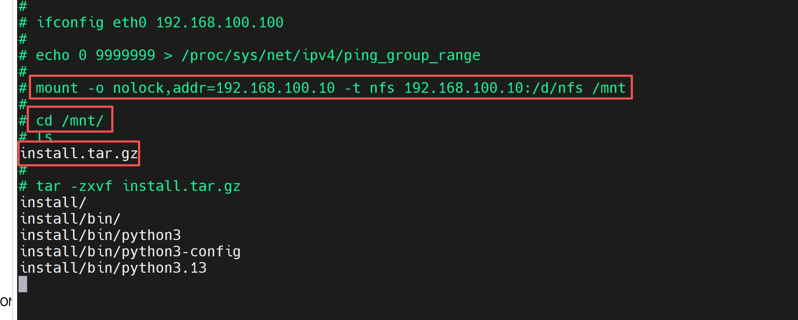

* 3、配置python的环境变量，确保python运行时能够找到依赖

```mk1.sh
export PATH=/mnt/install/bin:$PATH
export PYTHONPATH=/mnt/install/lib/python3.13:$PYTHONPATH
export LD_LIBRARY_PATH=/mnt/install/lib/python3.13/lib-dynload:$LD_LIBRARY_PATH
```

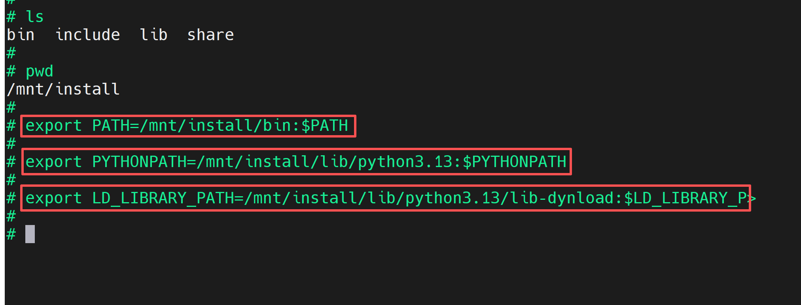

### 步骤3：运行python代码

* 如果第一次移植python3，需要给python3添加可执行权限才能运行

```sh
chmod +x  /mnt/install/bin/python3
```

* 输入python3，查看结果

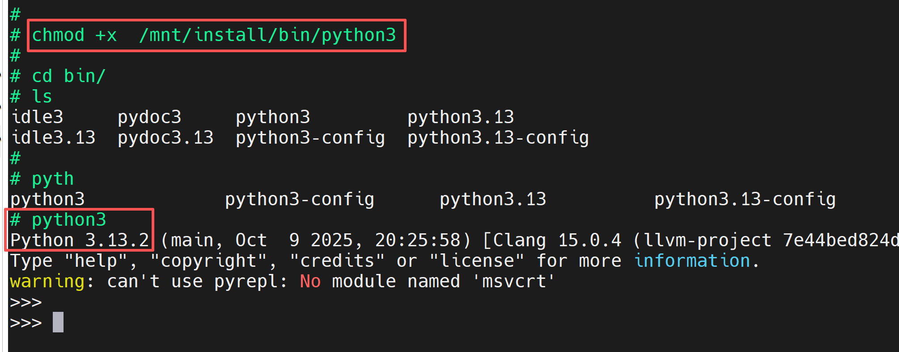

* 在板端测试python代码，将下面的内容全部复制到 python_test.py 文件中

```python
#!/usr/bin/env python3
# -*- coding: utf-8 -*-

print("Hello, World!") 

import os
import sys
import datetime

def main():
    if sys.version_info < (3, 6):
        print("Error: Requires Python 3.6 or higher")
        sys.exit(1)
    
    current_time = datetime.datetime.now().strftime("%Y-%m-%d %H:%M:%S")
    user = os.getenv("USER", "unknown_user")

def multi_language():
    languages = {
        "Chinese": "ni hao shijie ",
        "Spanish": "?Hola Mundo!",
        "French": "Bonjour le monde!",
        "Japanese": "shijie nihao"
    }
    
    try:
        for lang, greeting in languages.items():
            print(f"{lang}: {greeting}")
    except UnicodeEncodeError:
        print("Encoding error detected. Try setting environment variable:")
        print("export PYTHONIOENCODING=utf-8")

if __name__ == "__main__":
    main()
    multi_language()
    
    # basic I/O
    input("\nPress Enter to exit...")
```

* 使用下面命令，运行python_test.py代码，查看现象，如果现象如下图所示，说明移植成功

```sh
python3 python_test.py
```

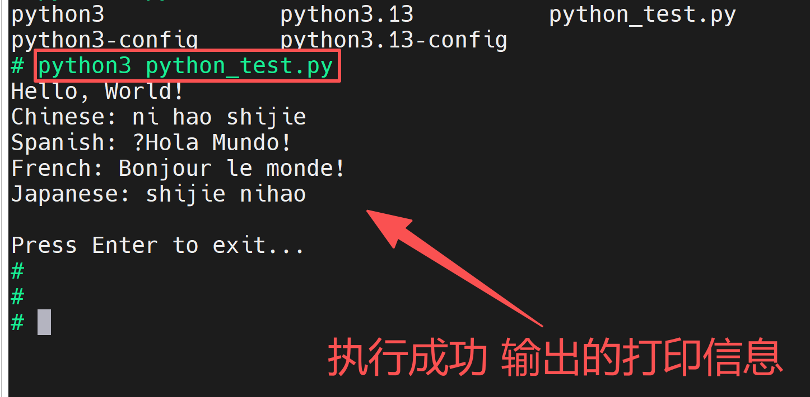

